# **Toward Understanding the Influence of Individual Clients in Federated Learning** 

**Yihao Xue,**1 **Chaoyue Niu,**1 **Zhenzhe Zheng,**1 

**Shaojie Tang,**2 **Chengfei Lv,**3 **Fan Wu,**1 **Guihai Chen**1 

> 1 Shanghai Jiao Tong University 2 The University of Texas at Dallas 3 Alibaba Group yh ~~x~~ ue@outlook.com, rvince@sjtu.edu.cn, zhengzhenzhe@sjtu.edu.cn, shaojie.tang@utdallas.edu, chengfei.lcf@alibaba-inc.com, fwu@cs.sjtu.edu.cn, gchen@cs.sjtu.edu.cn 

#### **Abstract** 

Federated learning allows mobile clients to jointly train a global model without sending their private data to a central server. Despite that extensive works have studied the performance guarantee of the global model, it is still unclear how each individual client influences the collaborative training process. In this work, we defined a novel notion, called _Fed-Influence_ , to quantify this influence in terms of model parameter, and proposed an effective and efficient estimation algorithm. In particular, our design satisfies several desirable properties: (1) it requires neither retraining nor retracing, adding only linear computational overhead to clients and the server; (2) it strictly maintains the tenet of federated learning, without revealing any client’s local data; and (3) it works well on both convex and non-convex loss functions and does not require the final model to be optimal. Empirical results on a synthetic dataset and the FEMNIST dataset show that our estimation method can approximate Fed-Influence with small bias. Further, we demonstrated an application of client-level model debugging. 

## **1 Introduction** 

Federated learning ingeniously leverages a large amount of valuable data in a distributed manner, while mitigating systemic privacy risks (McMahan et al. 2017; Kairouz et al. 2019). In such a setting, the training data are stored on multiple decentralized clients, who share a common global model and train it collaboratively. There is a central server that orchestrates the whole process round by round. In each round, the server collects local models from some eligible clients and using them to update the global model. 

In this paper, we consider a significantly important but overlooked problem in federated learning: _how does each client influence the global model?_ Finding the answer to this question is meaningful in several aspects. On the one hand, it provides insights into the roles of individual clients in federated learning, and informs us whether the existence of a certain client benefits the global model’s training. A more fine-grained understanding of clients’ influence allows us to quantify the performance of clients in federated learning, which is critical to a fair credit/reward allocation. On the other hand, client-level influence measurement can also be 

Copyright © 2021, Association for the Advancement of Artificial Intelligence (www.aaai.org). All rights reserved. 

used to debug federated learning. In a centralized setting, modelers can directly check the data when the model is misbehaving, while in federated learning they suffer from a lack of data inspection. Thus, a good understanding of clients’ influence further facilitates the online removal of low-quality clients or dynamically requires low-quality clients to check their local data, thereby improving model performance. All of these are important to the interpretability and robustness of federated learning, and also help sustain long-term user participation. 

There already exists a classical statistics notion of “influence” in centralized learning, which evaluates the effect that the absence of an individual sample has on a model. To measure this influence, one should conduct a leave-one-out test (Cook 1977): retrain the model over the training set with one certain sample removed, and compare this model with that trained on the full dataset. A notion from robust statistics, called “influence function” (Jaeckel 1972; Hampel 1974; Cook and Weisberg 1980), was introduced to avoid retraining by measuring the change in the model caused by slightly changing the weight of one sample and using quadratic approximation combined with a Newton step (Cook and Weisberg 1982). Koh and Liang (2017) leveraged influence function in modern machine learning settings and developed an efficient and simple implementation using second-order optimization techniques. Hara, Nitanda, and Maehara (2019) went beyond convexity and optimality, which are two important assumptions in (Koh and Liang 2017). Koh et al. (2019) studied the effects of removing a group of data points, which is analogous to removing a client that holds a subset of training data in federated learning, except that their study is still in a centralized setting. Khanna et al. (2019) applied Fisher kernels along with sequential Bayesian quadrature to identify a subset of training examples that are most responsible for a given set of predictions and recovered (Koh and Liang 2017) as a special case. 

The existing works above focused on centralized learning, and we are the first to consider a similar problem, the influence of individual clients, under a brand new framework, namely federated learning. There are some essential differences between centralized learning and federated learning which raise several design challenges: (1) The server in centralized learning, as the influence evaluator, has the full control over the considered sampling data, while in federated 

learning, the server would not be able to access clients’ raw data because of the privacy requirement; (2) the clients in federated learning may not always be available, due to the unreliable network connection. This implies that the server cannot communicate with a certain client at any desired time; and (3) the computing resources of mobile clients are limited, for which reason we should not bring too many additional computational burdens to clients when measuring their influence. 

Due to the first difference, sample-level influence in centralized learning cannot be applied to measuring the influence of individual clients in federated learning. In this work, we turn to client-level influence measurement by investigating the effect of removing a client. In addition, works in centralized learning mainly focus on the influence on a model’s testing loss, while we consider the influence on the parameter of the global model for the following two reasons: (1) In centralized learning, to cut down the time complexity, some techniques can be applied to obtain influence on loss without computing that on parameter (Hara, Nitanda, and Maehara 2019). However, in federated learning, computing influence on parameter is unavoidable because of the second and third differences mentioned earlier. Please refer to the supplement 1 for detailed reasoning; and (2) influence on parameter is more fundamental and powerful than that on loss. With the knowledge of influence on parameter, we can easily derive the influence of individual clients in terms of various metrics for evaluating models, such as loss, accuracy, precision, etc. 

**Our contributions.** (1) To the best of our knowledge, we are the first to consider client-level influence in federated learning; (2) we propose a basic estimator for individual clients’ influence on model parameter by leveraging the relationship between the global models in two consecutive communication rounds. Guided by the error analysis, we extend the basic design to support both convex and non-convex loss functions. We also develop an efficient implementation, bringing only slight communication and computation overhead to the server and the clients (in fact no extra computation overhead for the client); and (3) empirical studies on a synthetic dataset and the FEMNIST dataset (Caldas et al. 2018) demonstrate the effectiveness of our method. The estimation error observed in experiments indicates both the necessity and accuracy of our method. Based on the influence on parameter, we further derive the influence on model performance and observe that it was well estimated. In particular, the Pearson correlation coefficient between the estimated influence on loss and the ground truth achieves 0.62 in the most difficult setting. We also leverage influence on model performance for client valuation and client cleansing. 

## **2 Problem Formulation** 

### **2.1 Federated Learning** 

We first introduce some necessary notations. _C_ denotes the set of all the clients. _D__k_ denotes the local dataset of client _k ∈C_ with _nk_ samples. _D_ =� _k∈C__Dk_isthefulltraining 

1The supplement is available from https://drive.google.com/file /d/1zFefHCAYiv5DPJ6nDVjgLUeO4yOoAFlV/view?usp=sharing. 

set. For an arbitrary set of clients _C__′_ , _N_ ( _C__′_ ) =� _k∈C__′ nk_ denotes the total size of these clients’ datasets. _L_ ( **w** _, z_ ) denotes the loss function over a model **w** and a sample _z_ . In addition, _L_ ( **w** _, D__k_ ) = _n_ <u>1</u> _k_ � _z∈D__k L_(**w**_, z_) denotes the em- pirical loss over a model **w** and _D__k_ . Then, we consider the following optimization task of federated learning: 

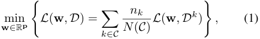

where the global loss function _L_ ( **w** _, D_ ) is the weighted average of the local functions _L_ ( **w** _, D__k_ ) with the weight of each client proportioning to the size of its local dataset. In this work, we consider a standard algorithm, federated averaging (FedAvg) (McMahan et al. 2017), to solve Equation 1. Although there are some other variants, such as FedBoost (Hamer, Mohri, and Suresh 2020), FedNova (Wang et al. 2020), FetchSGD (Rothchild et al. 2020), FedProx (Li et al. 2020a), and SCAFFOLD (Karimireddy et al. 2019), FedAvg is the first and the most widely used one. As a result, we see FedAvg as our basic block, which executes as follows. In the initial stage, the server randomly initializes a global model **w** 0. Then, the training is orchestrated by repeating the following two steps for communication round _t_ from 1 to _T_ : 

- **Local training.** The server selects a random set _Ct_ of clients as participants in this round. Each participant _k ∈Ct_ then downloads from the server **w** _t−_ 1, the ending global model in round _t −_ 1. Then, client _k_ performs local updates for local iteration _i_ from 1 to _m_ : 

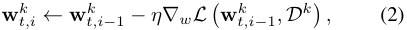

with the starting local model **w** _t,__k_ 0initialized as**w**_t−_1. In addition, _η_ denotes the learning rate, and _m_ denotes the number of local iterations. 

- **Model aggregation.** Participants in round _t_ upload their updated local models. The server aggregates the local models to a new global model **w** _t_ by taking a weighted average 

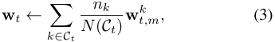

where the weight of client _k_ is the size of _k_ ’s local training set, namely, _nk_ . 

### **2.2 Fed-Influence** 

To express the client-level influence clearly, we introduce a new notation **w** _t_ ( _C__′_ _→C__′_ _\{c}_ ), which represents the aggregate model in round _t_ with a client set _C__′_ replaced with _C__′_ _\{c}_ , where _C__′_ _∈{C_ 1 _, C_ 2 _, C_ 3 _, . . . , CT , C}_ . For example, **w** 10 ( _C_ 5 _→C_ 5 _\{c}_ ) represents the ending model we get in round 10 if we remove _c_ in round 5. One special case is that when _C__′_ = _Ct_ , 

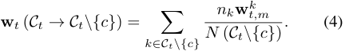

Another special case is **w** _t_ ( _C →C\{c}_ ), where we permanently remove _c_ , i.e., replace _Ct_ with _Ct\{c}_ for all _t ∈_ [ _T_ ]. 

To quantify the influence of individual clients, we give the following definition of _Fed-Influence on Parameter (FIP)_ . 

**Definition 1.** _We refer to the change in parameter due to removing a client c from C as Fed-Influence on Parameter (FIP) of client c, denoted by ϵ__−_ _t__c,∗_ _:_ 

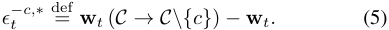

Based on FIP, we can trivially extend the notion to measure the influence on model performance. There are many metrics to evaluate a model’s performance, such as accuracy, cross-entropy loss, precision, recall, mean squared error (MSE), etc. We can easily get the influence on any of these metrics once FIP is obtained. Supposing _F_ is the function for a certain metric over a test set _Dtest_ , we can compute 

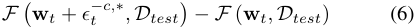

as the Fed-Influence in terms of the metric. In Sections 5 and 6, we will focus on two most widely used metrics, loss and accuracy, as well as the corresponding two kinds of influence, called Fed-Influence on Loss (FIL) and Fed-Influence on Accuracy (FIA). 

The exact FIP of a client can only be obtained by conducting leave-one-out test: retrain the model by removing the client and compare the retrained model with the model trained on the full client set. However, it is prohibitively inefficient to rerun the whole federated learning process, especially when we intend to measure the influence of each client, implying the number of rerunning being the number of all the clients. 

## **3 Basic Estimator** 

We now derive an estimator of _ϵ__−_ _t__c,∗_ to avoid retraining. We start by rewriting the expression of _ϵ__−_ _t__c,∗_ as follows 

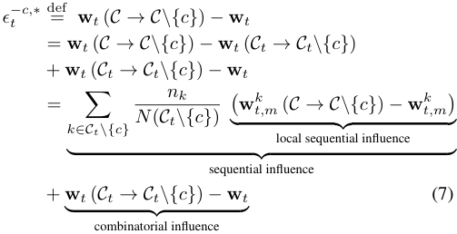

Equation 7 shows that _ϵ__−_ _t__c,∗_ comprises three parts: (1) _Local sequential influence_ : the influence that removing _c_ from _C_ has on the local model of any other client _k_ ( _k̸_ = _c_ ) who has participated in round _t_ . We regard it as “sequential” because it results from _ϵt__−_ _−__c,_ 1_∗_, the influence in the previous round; (2) _Sequential influence_ : the weighted average of local sequential influence; and (3) _Combinatorial influence_ : the influence of removing _c_ merely from _Ct_ . It is “combinatorial” because it is independent of _ϵ__−_ _t−__c,_ 1_∗_. 

We next dissect how to compute local sequential influence and combinatorial influence. First, the combinatorial one can be easily obtained using Equation 4 and Equation 3. Second regards the local sequential influence. Given that the cause of the difference between **w** _t,m__k_(_C→C\{c}_)and**w** _t,m__k_is 

that they are locally updated from different initial models, **w** _t−_ 1 ( _C →C\{c}_ ) and **w** _t−_ 1, respectively, we estimate the term by applying first-order Taylor approximation and the chain rule: 

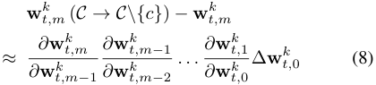

where ∆ **w** _t,__k_ 0=**w** _t,__k_ 0(_C→C\{c}_)_−_**w** _t,__k_ 0=_ϵ_ _t__−_ _−__c,_ 1_∗_. Accord- ing to the update rule in Equation 2, with the assumption that _L_ ( **w** _, D__k_ ) is twice differentiable, we obtain 

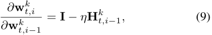

where **H**_k_ _t,i_ def= _∇_2 _w__L_(**w** _t,i__k, Dk_). By combining Equations 7, 8 and 9, we get an estimator of _ϵ__−_ _t__c,∗_ , denoted by _ϵ__−_ _t__c_ 

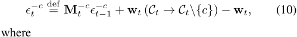

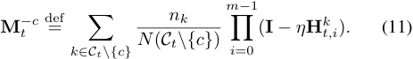

By recalling that the initial model **w** 0 is randomly initialized by the server, we have _ϵ__−_ 0_c_ = **0** . Then the estimator _ϵ__−_ _t__c_ can be computed iteratively using Equation 10. 

We finally take a close look at the relationship between _t_ and the estimation error. We give a uniform bound on the error in both convex and non-convex cases under the following assumptions. 

**Assumption 1.** _There exists λ and_ Λ _such that λI_ ≼ _∇_2 _L_ ≼ Λ _I._ 

**Assumption 2.** _The norm of ϵ__−_ _t__c,∗_ _is bounded by C, for t ∈_ [ _T_ ] _and c ∈C._ 

Note that in Assumption 1, there is no constraint on the values of _λ_ and Λ except _λ ≤_ Λ, which means the loss function is not necessarily convex. Next we give Theorem 1, the proof of which is provided in the supplement. 

**Theorem 1.** _With Assumptions 1 and 2, the error of the estimator is bounded by_ 

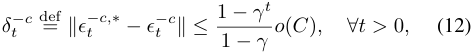

_where o is the little-o notation, and γ_ = _α__m_ _, α_ = max _{|_ 1 _− ηλ|, |_ 1 _− η_ Λ _|}._ 

From Equation 12, we can find that the bound is in the format of the sum of geometric series. An intuitive explanation is that each time we use Equation 10, the error in the previous round is scaled by **M**_−_ _t__c_ and added to a newly introduced error in this round, just like summing a geometric series. In addition, there are three different cases depending on the relationship between _γ_ and 1: 

- **Case 1** ( _γ <_ 1): In this case, _λ >_ 0 and 0 _< η <_ Λ2, where the loss function is strongly-convex and the learning rate is small enough. This is the most ideal case, where the bound can be further scaled to 1 _−_ <u>1</u> _γ__o_(_C_), which is in- dependent of _t_ . 

- **Case 2** ( _γ_ = 1): In this case, either _λ_ = 0 and _η ≤_ Λ<u>2</u>or _λ ≥_ 0 and _η_ = Λ<u>2</u>. The former situation is more common, with a convex loss function and an appropriate learning rate. Then the error is _o_ ( _C_ ) _t_ , linear with _t_ . 

- • **Case 3** ( _γ >_ 1): In this case, _λ <_ 0 or _η >_ Λ2,where either the loss function is non-convex or the learning rate is too large. Then the error bound is exponential with _t_ , making estimation ineffective. 

## **4 Improving Robustness and Efficiency** 

In this section, we improve the basic estimator from the two aspects: one is to improve the robustness of the method in the non-convex case, and the other is to cut down the high cost brought by computing the Hessian matrix. Algorithm sketches are deferred to the supplement. 

### **4.1 Layer-Wise Examination and Truncation** 

The analysis in Section 3 reveals that the basic estimator can have a large error when the loss function is non-convex. The non-convex case is quite common in federated learning for deep learning tasks (Yu, Yang, and Zhu 2019; Haddadpour et al. 2019). We thus propose layer-wise examination and truncation (LWET for short), the details of which and the intuitions are shown as follows. 

**Truncation.** Our primary goal is to avoid an exponential error in Case 3, which results from the estimation of sequential influence. We consider a counterpart, where = the sequential influence is completely omitted, i.e., _ϵ__−_ _t__c_ **w** _t_ ( _Ct →Ct\{c}_ ) _−_ **w** _t_ (we call it the _truncated estimator_ for simplicity), and find that the error becomes independent of _t_ , as shown in the following theorem. 

**Theorem 2.** _With the sequential influence omitted, we get the bound of error as follows:_ 

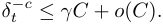

**Layer-wise Operation.** However, after truncation, a new problem arises: the truncated estimator will always be **0** at round _t_ as long as _c_ is not one of the participants. For example, in a setting where 5 clients are selected each round with 100 clients in total, there will be 95 clients with FIP being **0** each round, which does not make sense. To ensure accuracy while retaining as much information as possible, it is necessary to find a happy medium between the basic estimator and the truncated estimator, which instead partially omits the sequential influence. To achieve this, we first introduce layer-wise operation. We calculate only parts of the Hessian matrix, with the interaction between different layers ignored. We take a convolutional neural network (CNN) for example. Supposing that the parameter **w** is composed of **w** ( _j_ ), _j_ = 1 _,_ 2 _, . . . ,_ 8, corresponding to conv-layer 1, bias of conv-layer 1, conv-layer 

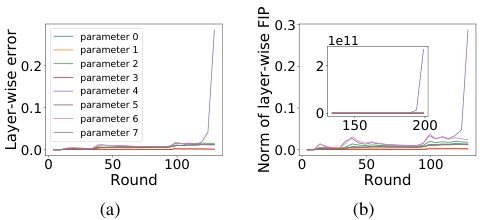

<!-- Start of picture text -->
0.3 parameter 0 1e11 parameter 1 0.2 parameter 2 0.2 2 parameter 3 parameter 4 0.1 parameter 5parameter 6 0.1 0 150 200 parameter 7 0.0 0.0 0 50 100 0 50 100 Round Round (a) (b) Layer-wise error Norm of layer-wise FIP <!-- End of picture text -->

Figure 1: The experimental result on a toy model (setting 2 in Table 2), a CNN without activation function. (a) The error and (b) the norm of estimated FIP both have a tendency to increase exponentially on the layer of parameter 4, the first fully-connected layer. Inset: the norm of estimated FIP from round 135 to 200. 

2, bias of conv-layer 2, dense-layer 1, bias of dense-layer 1, dense-layer 2, bias of dense-layer 2, respectively, i.e., **w** = [ **w** (1)_T,_**w** (2)_T,_**w** (3)_T,_**w** (4)_T,_**w** (5)_T,_**w** (6)_T,_**w** (7)_T,_**w** (8)_T_]_T_.For each layer _j_ , we see _L_ ( **w** ) as function of **w** ( _j_ ) denoted by _L_ ( _j_ )( **w** ( _j_ )). Rather than computing the entire Hessian matrix **H** = _∇_2 _w__L_(**w**), we only calculate**H** ( _j_ )=_∇_2 _w_ ( _j_ )_L_ ( _j_ )(**w** ( _j_ )) for each _j_ , some smaller matrices on the diagonal of **H** . Then the estimator in each layer _j_ is updated independently: _ϵ__−_ _t,_ (_c_ _j_ )_←_**M**_−_ _t,_ (_c_ _j_ )_ϵ−_ _t−__c_ 1 _,_ ( _j_ )+**w**_t,_(_j_) (_Ct→Ct\{c}_)_−_**w**_t,_(_j_)_,_ 

where **M**_−_ _t,_ (_c_ _j_ )= � _k∈Ct\{c} N_ ( _Cnt\{k c}_ ) � _mi_ =0 _−_ 1(**I**_−η_**H**_k_ _t,i,_ ( _j_ )). We can examine separately the property of the loss function _L_ ( _j_ )( **w** ( _j_ )) in each layer _j_ , and use a layer-wise truncated estimator shown below only for layers in Case 3: 

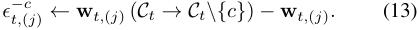

Then we put together layer-wise FIPs to get the complete FIP, i.e., _ϵ__−_ _t__c_ = [( _ϵ__−_ _t,_ (1)_c_)_T ,_(_ϵ−_ _t,_ (2)_c_)_T. . ._]_T_. 

Because the convexity and continuity of _L_ ( _j_ )( **w** ( _j_ )) vary among different layers, there are layers in Case 1 or Case 2 which still remain the sequential influence. Therefore the complete FIP is non-zero and contains much information even when _c ∈C/ t_ . In an experiment conducted on a toy model (CNN 2 in Table 2), we found the exponential error only exists in the first fully-connected layer, which is the only layer where we need to apply a layer-wise truncated estimator, as shown in Fig. 1(a). 

**Examination.** The next problem is how we can examine the property of loss function in each layer? We propose a mechanism which does not require any _prior knowledge_ : in particular, we compare _∥_ **M**_−_ _t,_ (_c_ _j_ )_ϵ−_ _t−__c_ 1 _,_ ( _j_ )_∥_with_∥ϵ−_ _t−__c_ 1 _,_ ( _j_ )_∥_.If _∥_ **M**_−_ _t,_ (_c_ _j_ )_ϵ−_ _t−__c_ 1 _,_ ( _j_ )_∥_is larger at a certain round_r_, then, in all of the following rounds, i.e., for all _t ≥ r_ , a layer-wise truncated estimator in Equation 13 will be used in layer _j_ . 

This mechanism is aimed at examining a sufficient (but not necessary) condition for _γ >_ 1. Please refer to the supplement for the reason. In addition, this examination also 

avoids the overflow of the estimator itself. The upper bound of _ϵ__−_ _t−__c_ 1isalsoexponentialwith_t_inCase3,whichmeans there is always a risk for it to overflow as _t_ increases. This phenomenon can be observed in the experiment with the aforementioned toy model. As shown in Fig. 1(b), the norm of estimated FIP on the first fully-connected layer increases sharply around the 125-th round, and then achieves an order of 1011 at round 200, indicating the failure of the algorithm. 

Combining the three strategies, we get LWET. Because real-world applications rarely satisfy the Identically and Independently Distributed (IID) assumption and are likely to be non-IID in many ways (Zhao et al. 2018; Li et al. 2020a,b; Yan et al. 2020), where clients vary in the data distribution and the property of the local loss function, a more fine-grained version of LWET is recommended in these cases. We can examine the relationship between _∥_ �� _im_ =0 _−_ 1(**I**_−η_**H**_k_ _t,i,_ ( _j_ )) � _ϵ__−_ _t,_ (_c_ _j_ )_∥_and_∥ϵ−_ _t,_ (_c_ _j_ )_∥_. If the former is larger at one round, then we drop the local sequential influence on _k_ from that round on. Please refer to this algorithm in the supplement. 

### **4.2 Low-Cost Hessian Approximation** 

**Fisher information.** Because the cross entropy loss is a negative log-likelihood, it is not difficult to obtain that E _z∈D__′_� _∇wL_ ( **w**_∗_ _, z_ ) _∇wL_ ( **w**_∗_ _, z_ )_T_� , where **w**_∗_ is the true parameter (i.e. the model distribution under **w**_∗_ equals to the underlying distribution), is at the form of Fisher information. And according to one of the alternative definition of Fisher information (Friedman, Hastie, and Tibshirani 2001; Ly et al. 2017), it can also be written as E _z∈D__′_ [ _∇w_2_L_(**w**_∗, z_)]. This means we can use _∇wL_ ( **w** _, z_ ) _∇wL_ ( **w** _, z_ )_T_ as an asymptotically unbiased estimation of _∇_2 _w__L_(**w**_, z_), since**w** gradually converges to **w**_∗_ during the training. Leveraging the fact that clients holds their own datasets, we let each client randomly select a given number, denoted by _Ns_ , of gradients and use the empirical expectation of the outer product as an approximation to the Hessian, denoted by **H**˜_k_ _t,i,_ ( _j_ ): 

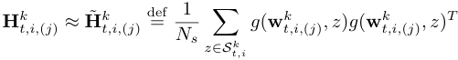

where _St,i__k_isthesetof_Ns_samplesrandomlyselected by client _k_ at the _i_ -th local iteration in round _t_ , and _g_ ( **w** _t,i,__k_ ( _j_ )_, z_) =_∇w_ ( _j_ )_L_(_j_)(**w** _t,i,__k_ ( _j_ )_, z_). 

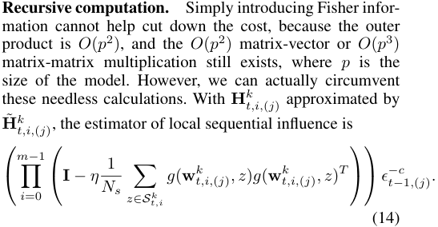

Instead of first calculating the cumprod on the left and then multiplying it by _ϵ__−_ _t−__c_ 1 _,_ ( _j_ ),thelinear-costmethodisbased on a recursive computation: we initialize a vector _σ_ (_k_ _j_ )by _σ_ (_k_ _j_ )_←ϵ−_ _t−__c_ 1 _,_ ( _j_ ), and then we update_σ_ (_k_ _j_ )using Equation 15 repeatedly for _i_ from 0 to _m −_ 1: 

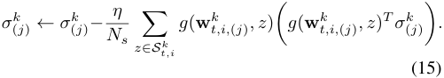

_σ_ (_k_ _j_ )producedinthefinaliterationisthevalueofEqua- tion 14. Note that this method requires the computation to take place on the server, because only the server has _ϵ__−_ _t−__c_ 1 _,_ ( _j_ ), and the clients need to do nothing other than randomly select and upload a certain number of local gradients. We show the efficiency of our method by comparing it with naive implementations in Table 1. 

Table 1: Extra time complexity for the server, extra time complexity for each client, and extra communication complexity for each client. _n_ is the size of the local dataset and _K_ = _|C|_ . In a naive implementation, operations where the Hessian matrix is involved, can be taken either on the clients or the server, corresponding to naive implementations 1 and 2, respectively. For naive implementation 1, each client _k_ has to compute�_m_ _i_ =0_−_1(**I**_−η_**H**_k_ _t,i_) locally, which requires matrix- matrix multiplications, and upload the result to the server. For naive implementation 2, each client _k_ uploads **H**_k_ _t,i_for all _i_ , and then the server computes **M**_−_ _t__cϵ−_ _t−__c_ 1, which can be implemented with only matrix-vector multiplications. 

||Server|Client|Comm.|
|---|---|---|---|
|Naive 1|_K_2_p_2|_m_(_np_2 +_p_3)|_p_2|
|Naive 2|_K_2_mp_2 |_mnp_2|_mp_2|
|Our method|_K_2_mNsp_|0|_mNsp_|

## **5 Fundamental Experiments** 

In this section, we mainly demonstrate two aspects of our method: (1) LWET plays a vital role; and (2) Hessian approximation causes only a slight drop in the accuracy. Experiments are conducted on 64bit Ubuntu 18.04 LTS with four Intel i9-9900K CPUs and two NVIDIA RTX-2080TI GPUs, 200GB storage. We take “Leaf” (Caldas et al. 2018), a benchmarking framework for federated learning based on tensorflow. We evaluated our method on three settings, as shown in Table 2. We used the softmax function at the output layer and adopted the cross entropy as the loss function. In setting 1, the loss function is convex but not strongly convex, and therefore it is in Case 2 ( _γ_ = 1). In setting 2, although the toy model has no activation function, which makes it equivalent to a single-layer perceptron with convex loss function, results show that it is still in Case 3 ( _γ >_ 1) because the learning rate is too large. And in setting 3, the loss function is non-convex and is therefore in Case 3, too. 

Table 2: Detailed configuration of the three different settings. The two datasets are described in Caldas et al. (2018). The logistic regression model is the original one in “Leaf”. We made a little adjustment to the original CNN to create models with certain properties and scales; see details in the supplement. 

||Model|Dateset|Distribution|_η_|_|C|_|_|Ct|_|_m_|_T_|_Ns_|
|---|---|---|---|---|---|---|---|---|---|
|Setting 1|LogReg|Synthetic|Non-IID, Unbalance|0.003|1000|10|5|1000|50|
|Setting 2|CNN 1|FEMNIST|IID, Balance|0.03|50|5|2|500|50|
|Setting 3|CNN 2|FEMNIST|Non-IID, Unbalance|0.02|100|10|2|2000|50|

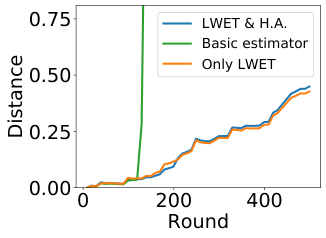

<!-- Start of picture text -->
0.75 LWET & H.A. Basic estimator Only LWET 0.50 0.25 0.00 0 200 400 Round Distance <!-- End of picture text -->

Figure 2: The distance between exact and estimated FIP in setting 2. 

### **5.1 Influence on Parameter** 

We use four different methods to obtain _ϵ__−_ _t__c_:(1)thebasic estimator, (2) the estimator with only LWET, (3) the estimator with only Hessian approximation, and (4) the estimator with both LWET and Hessian approximation. We do not demonstrate results of all methods in each setting. In setting 1, we had tested all of the four methods, but found that the result produced with LWET is completely the same with that produced without LWET, which further validates that setting 1 is in Case 2. Therefore we only show two different results, the result based on exact Hessian and that based on approximated Hessian. In setting 2, we do not demonstrate the method with only Hessian approximation, because the basic estimator has already caused a terrible error, and the introduction of Hessian approximation will, no doubt, create an even larger error. In setting 3, we can only test the two methods that contain a Hessian approximation because the large model size and the limited resources on our device do not allow us to compute the exact Hessian. 

_−_ We examine the error of the proposed method _∥ϵ__−_ _t__c,∗_ _ϵt__−c∥_, which is the distance between exact FIP and estimated FIP under _L_ 2 norm. The exact FIP is obtained by conducting leave-one-out tests. We track the error of one randomly selected client’s FIP and show the result in setting 2 in figure 2; results in the other two settings are provided as supplementary materials. Here we can see the necessity of LWET: without LWET there will be a sharp increase in the error at about the 120-th round (the error is caused by the first fullyconnected layer as mentioned earlier in Fig. 1). Further taking a Hessian approximation only causes a slight increase in the error. 

### **5.2 Influence on Loss** 

In this section, we give a more intuitive demonstration of the experimental results by mapping the high-dimensional FIP to a scalar, FIL. The exact FIL is obtained from the result of leave-one-out test. 

By adding estimated FIP to the original global model, we get a estimation of the model trained with one client removed **w** _t_ + _ϵ__−_ _t__c_. Then we test it on_Dtest_and subtract from the result the loss of the original model to get the estimated FIL, i.e., _L_ ( **w** _t_ + _ϵ__−_ _t__c, Dtest_)_−L_(**w**_t, Dtest_). 

We compare the estimated FIL with the exact FIL and show the results in Fig. 3. The correlation between the estimated and exact FIL is measured by Pearson’s correlation coefficient, and we plot its variation with time in Figs 3(a), 3(b), and 3(c). We also visualize the correlation in the last round in Figs 3(d), 3(e), and 3(f). In particular, the proposed method achieves a Pearson correlation coefficient of 0.6200 at the last round in setting 3, the most difficult setting; in setting 1 Pearson correlation coefficient is 0.9857 and in setting 2 it is 0.7957. 

## **6 Extended Experiments** 

In this section, we use FIL and FIA for client valuation and client cleansing, despite that we believe there are more potential applications based on other types of influence given by FIP, for example, the client-level influence on the prediction results. 

Influence on model performance can be used as a reasonable metric to determine a client’s value. We conduct the following experiment: we make an observation at clients’ influence at a certain round, remove some of the clients with highest/lowest influence, from the training set, and then continue the learning process. The experiment is repeated with different fractions of clients removed and the performance of the final global model is recorded each time. As can be seen from Fig. 4, removing valuable clients (those with high FIL or low FIA) greatly degrades the model performance, which indicates the importance of these clients. In contrast, removing least valuable clients (those with low FIL or high FIA) improves the model performance. And the curve of randomly removing falls between the other two curves. 

The results of removing least valuable clients elicits an application, which we call client cleansing. It is a little different from the data cleansing in Hara, Nitanda, and Maehara (2019). Data cleansing is conducted by retraining the model with a subset of data removed. In the setting of federated learning, as we mentioned before, it does not make 

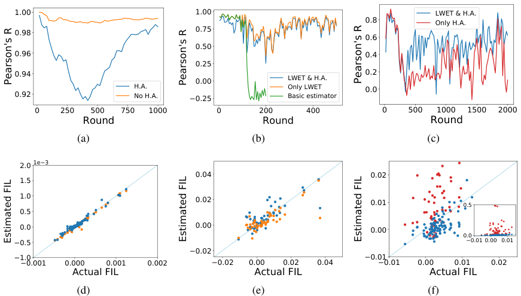

<!-- Start of picture text -->
1.00 1.00 LWET & H.A. 0.8 Only H.A. 0.98 0.75 0.6 0.50 0.96 0.4 0.25 0.94 0.00 LWET & H.A. 0.2 H.A. Only LWET 0.0 0.92 No H.A. −0.25 Basic estimator 0 250 500 750 1000 0 200 400 0 500 1000 1500 2000 Round Round Round (a) (b) (c) 2.0 1e−3 0.04 0.02 1.5 1.0 0.02 0.01 0.5 0.5 0.0 0.00 0.00 0.0 −0.5 −0.01 0.00 0.01 −0.02 −1.0 −0.01 −0.001 0.000 0.001 0.002 −0.02 0.00 0.02 0.04 −0.01 0.00 0.01 0.02 Actual FIL Actual FIL Actual FIL (d) (e) (f) Pearson's R Pearson's R Pearson's R Estimated FIL Estimated FIL Estimated FIL <!-- End of picture text -->

Figure 3: (a)(b)(c) The change of Pearson coefficient over rounds in setting 1, 2 and 3. (d)(e)(f) Estimated FIL vs. actual FIL in settings 1, 2 and 3. The inset in (f) shows the results with a wider y-axis range. In setting 1, we counted 200 clients that were randomly selected from the 1000 clients. In settings 2 and 3, we counted all the clients (50 and 100 clients, respectively). 

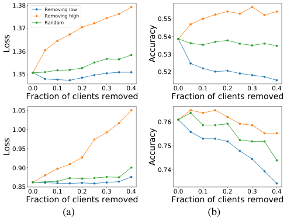

<!-- Start of picture text -->
1.38 Removing low Removing highRandom 0.55 1.37 0.54 1.36 0.53 1.35 0.52 0.0 0.1 0.2 0.3 0.4 0.0 0.1 0.2 0.3 0.4 Fraction of clients removed Fraction of clients removed 1.05 0.76 1.00 0.95 0.75 0.90 0.74 0.85 0.0 0.1 0.2 0.3 0.4 0.0 0.1 0.2 0.3 0.4 Fraction of clients removed Fraction of clients removed (a) (b) Loss Accuracy Loss Accuracy <!-- End of picture text -->

Figure 4: We remove clients from the client set at a certain round _x_ in three different ways: from those with lowest influence, from those with highest influence, randomly. (a) We use influence on loss and record the corresponding change in loss. (b) We use influence on accuracy and record the corresponding change in accuracy. **Top:** The results in setting 1 with _x_ = 700. **Bottom:** The results in setting 3 with _x_ = 1500. 

sense to retrain the model in most real-world scenarios. Therefore, we conduct client cleansing by removing a subset of clients at a certain round and then continue the training. By properly selecting the clients to be removed we can effectively improve the final model. In setting 1, the accuracy is increased from 53 _._ 86% to 55 _._ 66% by removing 30% of the clients from the client set at round 700. In setting 3, the accuracy is increased from 76 _._ 10% to 76 _._ 50% by removing 5% of the clients from the client set at round 1500. 

## **7 Conclusion** 

In this paper, we proposed Fed-Influence as a new metric of clients’ influence on the global model in federated learning, inspired by the classical statistics notion of influence in centralized learning. The differences between the centralized learning and federated learning create challenges in calculating this new metric. To develop an efficient implementation, we first proposed a basic estimator to calculate the individual client’s influence on parameter, then further revised the estimator and established an algorithm with both robustness and linear cost. It is worth noting that the proposed method is accurate without assumption on convexity or data identity, which is validated by the empirical results on different settings. We also demonstrated how Fed-Influence helps evaluate clients and improve the model performance through client cleansing. Our work provides a quantitative insight into the relationship between individual clients and the global model, we envision which further enhancing the accountability of federated learning. 

## **8 Acknowledgements** 

This work was supported in part by National Key R&D Program of China No. 2019YFB2102200, in part by China NSF grant No. 62025204, 61972252, 61972254, 61672348, and 61672353, in part by Joint Scientific Research Foundation of the State Education Ministry No. 6141A02033702, and in part by Alibaba Group through Alibaba Innovation Research Program. The opinions, findings, conclusions, and recommendations expressed in this paper are those of the authors and do not necessarily reflect the views of the funding agencies or the government. Z. Zheng is the corresponding author. 

## **References** 

Caldas, S.; Wu, P.; Li, T.; Konecn´y, J.; McMahan, H. B.; Smith, V.; and Talwalkar, A. 2018. LEAF: A Benchmark for Federated Settings. _arXiv preprint arXiv:1812.01097_ . 

Cook, R.; and Weisberg, S. 1980. Characterizations of an empirical influence function for detecting influential cases in regression. _Technometrics_ 495–508. 

Cook, R. D. 1977. Detection of influential observation in linear regression. _Technometrics_ 15–18. 

Cook, R. D.; and Weisberg, S. 1982. _Residuals and influence in regression_ . 

Friedman, J.; Hastie, T.; and Tibshirani, R. 2001. _The elements of statistical learning_ . 

Haddadpour, F.; Kamani, M. M.; Mahdavi, M.; and Cadambe, V. R. 2019. Local SGD with Periodic Averaging: Tighter Analysis and Adaptive Synchronization. In _Proc. of NeurIPS_ , 11080–11092. 

Hamer, J.; Mohri, M.; and Suresh, A. T. 2020. FedBoost: A Communication-Efficient Algorithm for Federated Learning. In _Proc. of ICML_ , 3973–3983. 

Hampel, F. R. 1974. The influence curve and its role in robust estimation. _Journal of the american statistical association_ 383–393. 

Koh, P. W.; and Liang, P. 2017. Understanding Black-box Predictions via Influence Functions. In _Proc. of ICML_ , 1885–1894. 

Li, T.; Sahu, A. K.; Zaheer, M.; Sanjabi, M.; Talwalkar, A.; and Smith, V. 2020a. Federated Optimization in Heterogeneous Networks. In _Proc. of MLSys_ . 

Li, X.; Huang, K.; Yang, W.; Wang, S.; and Zhang, Z. 2020b. On the Convergence of FedAvg on Non-IID Data. In _Proc. of ICLR_ . 

Ly, A.; Marsman, M.; Verhagen, J.; Grasman, R. P.; and Wagenmakers, E.-J. 2017. A tutorial on Fisher information. _Journal of Mathematical Psychology_ 40–55. 

McMahan, B.; Moore, E.; Ramage, D.; Hampson, S.; and y Arcas, B. A. 2017. Communication-Efficient Learning of Deep Networks from Decentralized Data. In _Proc. of AISTATS_ , 1273–1282. 

Rothchild, D.; Panda, A.; Ullah, E.; Ivkin, N.; Stoica, I.; Braverman, V.; Gonzalez, J.; and Arora, R. 2020. Fetchsgd: Communication-efficient federated learning with sketching. In _Proc. of ICML_ , 8253–8265. 

Wang, J.; Liu, Q.; Liang, H.; Joshi, G.; and Poor, H. V. 2020. Tackling the objective inconsistency problem in heterogeneous federated optimization. _Proc. of NeurIPS_ . 

Yan, Y.; Niu, C.; Ding, Y.; Zheng, Z.; Wu, F.; Chen, G.; Tang, S.; and Wu, Z. 2020. Distributed Non-Convex Optimization with Sublinear Speedup under Intermittent Client Availability. _arXiv preprint arXiv:2002.07399_ . 

Yu, H.; Yang, S.; and Zhu, S. 2019. Parallel Restarted SGD with Faster Convergence and Less Communication: Demystifying Why Model Averaging Works for Deep Learning. In _Proc. of AAAI_ , 5693–5700. 

Zhao, Y.; Li, M.; Lai, L.; Suda, N.; Civin, D.; and Chandra, V. 2018. Federated Learning with Non-IID Data. _arXiv preprint arXiv:1806.00582_ . 

Hara, S.; Nitanda, A.; and Maehara, T. 2019. Data Cleansing for Models Trained with SGD. In _Proc. of NeurIPS_ , 4215– 4224. 

Jaeckel, L. A. 1972. _The infinitesimal jackknife_ . 

Kairouz, P.; McMahan, H. B.; Avent, B.; Bellet, A.; Bennis, M.; Bhagoji, A. N.; Bonawitz, K.; Charles, Z.; Cormode, G.; Cummings, R.; et al. 2019. Advances and open problems in federated learning. _arXiv preprint arXiv:1912.04977_ . 

Karimireddy, S. P.; Kale, S.; Mohri, M.; Reddi, S. J.; Stich, S. U.; and Suresh, A. T. 2019. Scaffold: Stochastic controlled averaging for on-device federated learning. _arXiv preprint arXiv:1910.06378_ . 

Khanna, R.; Kim, B.; Ghosh, J.; and Koyejo, S. 2019. Interpreting Black Box Predictions using Fisher Kernels. In _Proc. of AISTATS_ , 3382–3390. 

Koh, P. W.; Ang, K.; Teo, H. H. K.; and Liang, P. 2019. On the Accuracy of Influence Functions for Measuring Group Effects. In _Proc. of NeurIPS_ , 5255–5265. 

