# **Utility Maximizer or Value Maximizer: Mechanism Design for Mixed Bidders in Online Advertising** 

**Hongtao Lv,**1,2 **Zhilin Zhang,**3 **Zhenzhe Zheng,**2* **Jinghan Liu,**4 **Chuan Yu,**3 **Lei Liu,**1 **Lizhen Cui,**1 **and Fan Wu**2 

> 1 School of Software & Joint SDU-NTU Centre for Artificial Intelligence Research (C-FAIR), Shandong University, China 

2 Department of Computer Science and Engineering, Shanghai Jiao Tong University, China 

> 3 Alibaba Group, China 4 SJTU-ParisTech Elite Institute of Technology, Shanghai Jiao Tong University, China _{_ lht, l.liu, clz _}_ @sdu.edu.cn, _{_ zhangzhilin.pt, yuchuan.yc _}_ @alibaba-inc.com, _{_ zhengzhenzhe, u ~~n~~ ivers, wu-fan _}_ @sjtu.edu.cn 

#### **Abstract** 

Digital advertising constitutes one of the main revenue sources for online platforms. In recent years, some advertisers tend to adopt auto-bidding tools to facilitate advertising performance optimization, making the classical _utility maximizer_ model in auction theory not fit well. Some recent studies proposed a new model, called _value maximizer_ , for auto-bidding advertisers with return-on-investment (ROI) constraints. However, the model of either utility maximizer or value maximizer could only characterize partial advertisers in real-world advertising platforms. In a mixed environment where utility maximizers and value maximizers coexist, the truthful ad auction design would be challenging since bidders could manipulate both their values and affiliated classes, leading to a multi-parameter mechanism design problem. In this work, we address this issue by proposing a payment rule which combines the corresponding ones in classical VCG and GSP mechanisms in a novel way. Based on this payment rule, we propose a truthful auction mechanism with an approximation ratio of 2 on social welfare, which is close to the lower bound of at least<u>5</u> 4that we also prove. The designed auction mechanism is a generalization of VCG for utility maximizers and GSP for value maximizers. 

## **Introduction** 

Digital advertising is one of the most successful applications of auction theory, and it serves as a primary source of revenue for online platforms, such as Google, Facebook, Alibaba, and Baidu. In a typical scenario of selling advertising slots, the online platforms conduct ad allocation and compute corresponding payments for advertisers by Vickrey-Clarke-Grove (VCG) mechanism (Vickrey 1961; Clarke 1971; Groves 1973) or generalized second price (GSP) auction (Varian 2007; Edelman, Ostrovsky, and Schwarz 2007). It is widely known that VCG is a truthful mechanism, while GSP, as a more pervasive alternative in industry, is not truthful but has envy-free Nash equilibria, and all such equilibria yield no lower revenue than VCG. 

The existing analysis on VCG and GSP mainly builds upon the quasi-linear utility model, also called as _utility_ 

*Z. Zheng is the corresponding author. Copyright © 2023, Association for the Advancement of Artificial Intelligence (www.aaai.org). All rights reserved. 

_maximizer_ (UM), _i.e._ , an advertiser aims to optimize the difference between the value of the allocation and her payment. However, in modern online advertising systems, many advertisers have started to use auto-bidding tools, where they only set high-level constraints specifying a targeted return on investment (ROI) constraint ( _i.e._ , a targeted minimum ratio between the obtained value and the payment) under a certain budget (Aggarwal, Badanidiyuru, and Mehta 2019; He et al. 2021; Yang et al. 2019; Zhang, Yuan, and Wang 2014). When the ROI constraint is close to one, it could be captured by the _individual rationality_ property (Nisan et al. 2008) in the UM model. Nevertheless, when the targeted ROI becomes large, the classical UM model could not capture the behaviors of advertisers in auto-bidding (Szymanski and Lee 2006; Cavallo et al. 2017). As a consequence, Wilkens, Cavallo, and Niazadeh (2016; 2017) proposed another model for advertisers, called _value maximizer_ (VM), which specifies the value of allocation as her objective and the payment as the second-order objective. It is empirically shown in their work that, as long as the ROI requirement of an advertiser is moderately high (above 2 or 3), her behavior pattern would be close to that in the VM model. This new model brings about an important theoretical result, _i.e._ , GSP auction becomes a truthful mechanism for VMs, which offers a new perspective on the prevalence of GSP. This result renders the VM model attractive for both the academics (Niazadeh et al. 2022; Cavallo et al. 2017) and the industry (Wang et al. 2021) in recent years. 

However, either the model of UM or VM characterizes only a part of advertisers, _i.e._ , UMs represent the advertisers with relatively low ROI constraints while VMs are those bidders with relatively high ROI constraints. As the ROI constraints of advertisers would be various in realworld advertising platforms, a natural problem arises: _how to design a truthful mechanism when both classes of UMs and VMs coexist in an advertising system?_ This problem involves two aspects: 1) when the class information is public, _i.e._ , an advertiser could only misreport her value, and 2) when the class information is private, _i.e._ , an advertiser could misreport both her affiliated class and her value. Even in the simpler former case, it is a nontrivial mechanism design problem as the strategic behaviors of advertisers are unclear in this setting, and apparently, the VCG or GSP 

mechanism would not be truthful. The latter case is more practical since advertisers can easily manipulate their ROI constraints to change the corresponding class if they could benefit. This private class information introduces substantial challenges as the problem falls within the field of multiparameter mechanism design (Nisan et al. 2008), which is hard to resolve in general. 

In this work, we address the above problems by designing truthful mechanisms for both cases with public classes and private classes. We show that the following Mechanism for mixed bidders with <u>PUblic</u> classes (MPU) is truthful with respect to their values and guarantees optimal social welfare: ranking advertisers by their bids for ad allocations, and then charging UMs following the VCG payment rule and charging VMs following the GSP payment rule. MPU is intuitive but “unfair” for VMs to some extent since VMs may suffer a higher payment with the same allocation compared with UMs. This implies that MPU would be untruthful in the case of private classes. Therefore, we further propose a new <u>Mechanism for mixed bidders with PRivate classes (MPR).</u> The key idea of MPR is to specify a payment for each slot instead of each advertiser, which takes the maximum of the VCG-style payment induced from the closest lower UM and the GSP-style payment induced from the closest lower VM. With this payment rule, MPR conducts the ad allocation by filling the slots with all VMs in a bottom-up manner, and then iteratively assigning a slot with the best utility for a UM. We prove that this mechanism is truthful with respect to both the value and class information, and at the same time, it guarantees an approximation ratio of at most 2 on social welfare. We also prove that no mechanisms could achieve a better approximation ratio than<u>5</u> 4. 

The main contribution of our work lies in the following two aspects. On the one hand, we are the first to study truthful mechanism design for the hybrid setting with the coexistence of both UMs and VMs, which offers interesting insights into the combination of VCG and GSP mechanisms. Both MPU and MPR reduce to VCG when all bidders are UMs, and become GSP when all bidders are VMs. On the other hand, our work takes a substantial step towards the understanding of mechanism design for bidders with ROI constraints, which has been an emerging topic in recent years (Balseiro et al. 2021; Golrezaei, Lobel, and Paes Leme 2021; Li et al. 2020). MPR implies that a truthful mechanism may allocate higher slots to bidders with high ROI constraints ( _i.e._ , VMs in our setting), although their bids are lower than those with low ROI constraints. 

## **The Model** 

We study the standard model of an advertising auction. There are _K_ ad slots, indexed by _k ∈{_ 1 _,_ 2 _, ..., K}_ in a bottom-up manner. The slot _k_ has click-through-rate (CTR) _xk_ , and we assume that _xK ≥ xK−_ 1 _≥ ... ≥ x_ 1 _>_ 0. We also use _k_ = 0 with _x_ 0 = 0 to denote a dummy slot below the lowest one. There is a set of bidders _N_ = _{_ 1 _,_ 2 _, ..., n}_ , indexed by _i_ , each of which has a private value _vi_ for a click. Without loss of generality, we assume _n > K_ and _vi̸_ = _vj_ for each pair of bidders _i_ and _j_ for ease of presentation. An auction mechanism _M_ picks an allocation outcome 

Π = _{π_ 1 _, π_ 2 _, ..., πK}_ and charges the price _pi_ of a click for each bidder _i_ , where _πk_ denotes the bidder whose ad is assigned the slot _k_ . We also use _ai_ to denote the index of the slot allocated to bidder _i_ , _i.e._ , _ai_ = _k_ if _πk_ = _i_ . 

We consider the setting where each bidder could be either a _utility maximizer_ (UM) or a _value maximizer_ (VM). Their definitions are described as follows: 

**Definition 1** (Utility Maximizer, UM) **.** _A utility maximizer i strategizes to maximize her utility ui_ = _vixai − pixai._ **Definition 2** (Value Maximizer, VM (Wilkens, Cavallo, and Niazadeh 2017)) **.** _A value maximizer i strategizes to maximize her objective ui_ = _vixai while keeping the payment pi ≤ vi; among outcomes with equal objective, a lower price is preferred._ 

Intuitively, a UM follows the standard model of bidders in online advertising, while a VM prioritizes her obtained allocation over her payment. For ease of presentation, we also call the objective _ui_ of a VM as her “utility”. We use _τi ∈{UM, V M }_ to denote the class of bidder _i_ , and _θi_ = ( _vi, τi_ ) as her _type_1 . We assume a bidder could misreport both her value and her class, _i.e._ , a bidder may report her type as _θ_ˆ _i_ = _{v_ ˆ _i,_ ˆ _τi}_ with _v_ ˆ _i̸_ = _vi_ and/or _τ_ ˆ _i̸_ = _τi_ . Furthermore, we use _θ_ to denote the type profile of all bidders, and _θ−i_ as that of all bidders except _i_ . With these notations, we define _pi_ ( _θ_ˆ _i|θi, θ−i_ ) as the payment of bidder _i_ by reporting her type as _θ_ˆ _i_ under her true type _θi_ and the type profile of others _θ−i_ , and _ui_ ( _θ_ˆ _i|θi, θ−i_ ) as the corresponding utility. 

Two fundamental desiderata in mechanism design are _incentive compatibility_ (IC) and _individual rationality_ (IR). 

**Definition 3** (Incentive Compatibility, IC) **.** _A mechanism is incentive compatible if and only if_ 

_ui_ ( _θi|θi, θ−i_ ) _≥ ui_ ( _θ_ˆ _i|θi, θ−i_ ) _, ∀θ_ˆ _i̸_ = _θi, θ−i, i ∈N ._ **Definition 4** (Individual Rationality, IR) **.** _A mechanism is individually rational if and only if_ 

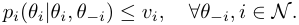

In other words, IC guarantees that all bidders in the mechanism do not have incentives to misreport their types, IR guarantees that the bidders would never suffer a negative utility when truthfully bidding. We note that we will loosely use the term “truthful” to describe a mechanism that is both IC and IR. It is well-known that VCG is truthful for UMs. In recent years, it is also proved that GSP is truthful for VMs (Wilkens, Cavallo, and Niazadeh 2017). In this work, our goal is to design a truthful mechanism for mixed bidders while maximizing the overall welfare. Here, the mixed bidders could be either UMs or VMs. 

It is worth noting that the classical concept of _social welfare_ , _i.e._ , the sum of the utilities of all bidders and the revenue of the seller, is not well-defined for VMs, because the transaction amount between bidders and the seller could not be canceled in the social welfare calculation, different 

> 1We distinguish the terms “class” and “type” in this work to facilitate exposition. 

from that of UMs. Therefore, we borrow a concept of _liquid social welfare_ (LSW) from previous literature on mechanism design for budget-constrained bidders (Dobzinski and Paes Leme 2014; Deng et al. 2021). 

**Definition 5** (Liquid Social Welfare, LSW) **.** _The liquid social welfare of an allocation outcome_ Π _in a mechanism is the sum of the maximum willingness-to-pay of all bidders for the allocation,_ i.e. _,_ 

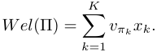

With the definition of LSW, we can easily obtain that VCG is LSW-optimal for UMs and GSP is LSW-optimal for VMs. Therefore, when we strive to design an LSW-optimal mechanism for mixed bidders, a natural requirement is _Robustness_ : 

**Definition 6** (Robustness) **.** _A mechanism is robust if the outcome is the same as VCG when all bidders are UMs, and it is the same as GSP when all bidders are VMs._ 

Robustness guarantees that the mechanism is a natural generalization from existing mechanisms. 

In summary, a desired auction mechanism should be IC, IR, robust, and LSW-optimal. Moreover, since we focus on truthful mechanisms, we do not distinguish _θi_ and _θ_ˆ _i_ when clear from the context. 

## **Warming Up: Public Classes** 

To begin with, we study a basic setting where the classes of bidders are public. In such case, the problem falls within the field of single-parameter mechanism design (Nisan et al. 2008), which would be simpler but useful for theoretical understanding. We propose the following Mechanism for bidders with PUblic classes (MPU): 

**Mechanism 1** (MPU) **.** 

- **_Allocation_** _: Ranking the bidders by their values, and allocating slots accordingly from top to bottom._ 

- **_Payment_** _: For each bidder i with_ 1 _≤ ai ≤ K, let j be the bidder in the next lower slot,_ i.e. _, aj_ = _ai −_ 1 _._ 

- _If i is a UM, then pi_ = _x_ <u>1</u> _ai_ � _akj_ =0_vπ_ _k_(_xk_+1_−xk_); 

- _If i is a VM, then pi_ = _vj._ 

Intuitively, MPU directly allocates the slots to bidders by their values, regardless of their classes. Furthermore, the payment of UMs follows VCG, and that of VMs follows GSP (recall that we use bottom-up indexes for slots). We next show that this mechanism is IC, IR, and robust, which also guarantees the optimal LSW. 

**Theorem 1.** _When the classes of bidders are public information, MPU is IC, IR, robust, and LSW-optimal._ 

Following the previous works on UM (Nisan et al. 2008) and VM (Wilkens, Cavallo, and Niazadeh 2017), the proof of Theorem 1 is straightforward, so we omit it here. 

## **Private Classes** 

In the preceding section, we have developed the optimal mechanism for mixed bidders with public classes. However, when the class information is private, the problem turns out to be a multi-parameter mechanism design problem, which is hard to resolve in general. We can first examine whether MPU is IC for the setting of private classes. It could be easily observed that, if a VM misreports her class as UM while truthfully reporting her value, she may enjoy a lower payment without changing her allocation. In other words, MPU is “unfair” to VMs in some sense, and this unfairness may bring the probability of strategic manipulation when the class information is private. 

### **Mechanism for Mixed Bidders with Private Classes** 

The above analysis implies that, in a truthful mechanism for the setting of private classes, the payment of a bidder should rely only on her allocated slot, rather than her class. In other words, suppose a bidder is allocated an identical slot in two cases while the allocation outcomes for others are also the same, then no matter she is a UM or VM, the payment should be the same. This requirement leads us to devise a payment rule for slots instead of for bidders, and this rule should combine VCG and GSP based on the types of bidders below the slot. Therefore, we propose the price of a slot as the maximum of the following two terms: 1) the VCG-style payment derived from the closest lower UM, and 2) the GSP-style payment derived from the closest lower VM. Specifically, for a slot _k ≥_ 1, let the closest VM below _k_ be _iV_ , located at _kV_ , and the closest lower UM be _iU_ , located at _kU_ , then the price of slot _k_ is given as 

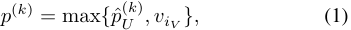

where 

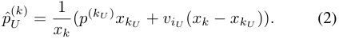

When there is no VM or UM below slot _k_ , we assign the corresponding payment term as 0. Given this payment rule, we propose a Mechanism for mixed bidders with PRivate Classes (MPR) which is IC, IR, and robust, while achieving a desired approximation ratio in terms of LSW. 

The complete pseudo-code of MPR is presented in Algorithm 1. The key idea behind MPR is to fill the slots with all VMs, and then iteratively assign a slot with the best utility for a UM. In Algorithm 1, MPR first sorts the bidders by their values and obtains the set of the top _K_ bidders as _N_ (Lines 2-3). The bidder with the ( _K_ + 1)th highest value would be allocated the dummy slot indexed by 0 as a basis for pricing (Line 4). We denote _S_ as all the UMs in _N_ , and _T_ as all the VMs correspondingly (Lines 5-6). Next, MPR fills the lowest slots with all the VMs in _T_ according to their values (Lines 7-9). Then we compute the prices for slots 1 _≤ k ≤|T |_ + 1 following (1) based on the allocated VMs (Line 10). Indeed, since no UMs in _S_ are allocated slots at this step, the term of _p_ ˆ( _U__k_) is set to 0, hence the price computation could be simplified as the GSP payment rule. After calculating the prices for each slot, we determine the allocation for UMs. The UM not yet assigned with the lowest value 

**Algorithm 1:** MPR **Input:** The type profile _θ_ of all bidders, the CTR _xk_ of all slots. **Output:** The allocation and payment outcome for each bidder _i_ . 

- **1** _pi ←_ 0 _, ∀i ∈{_ 1 _, ..., n}_ ; 

- **2** Sort all bidders by their values; 

- **3** Let _N_ be the set of top _K_ bidders by their values, and _i_ be the ( _K_ + 1)th highest one; 

- **4** _π_ 0 _← i_ ; 

- **5** _S ←_ the set of all UMs in _N_ ; 

|slot|CTR|bidder|class|value|
|---|---|---|---|---|
|4|0.4|A|VM|6|
|3|0.3|B|VM|7|
|2|0.2|C|VM|8|
|1|0.1|D|UM|9|
|0|0|E|UM|10|

Figure 1: The illustration of four slots with their CTRs, and five bidders with their classes and values in Example 1. 

- **6** _T ←_ the set of all VMs in _N_ ; 

- `// Allocate slots to all VMs in` _T_ `.` 

- **7 if** _|T | >_ 0 **then** 

- **8 for** _k from_ 1 _to |T |_ **do 9** _πk ←_ the VM with the _k_ th lowest value in _T_ ; 

- **10** Update the payment _p_(_k_) for slots 1 _≤ k ≤|T |_ + 1 by equation (1); 

- `// Allocate slots to UMs iteratively.` 

- **11 while** _|S| >_ 0 **do 12** _i ←_ arg min _j∈S{vj}_ ; **13** _k_ ¯ _← K −|S|_ + 1; **14** _k__i_ _←_ arg max1 _≤k≤k_ ¯ _{xk_ ( _vi − p_(_k_) ) _}_ ; 

- **15 if** _k__i̸_ = _k_¯ **then 16** `// Move existing bidders up one slot.` **for** _k from k_¯ _down to k__i_ + 1 **do** 

- **17** _πk ← πk−_ 1; **18** _πki ← i_ ; **19** Update the payment _p_(_k_) for slots _k__i_ + 1 _≤ k ≤ k_¯ + 1 by equation (1); 

- **20** _S ← S\{i}_ ; 

- **21** _pπk ← p_(_k_) _, ∀k ∈{_ 1 _, ..., K}_ ; **22** Return _πk_ and _pi_ for each slot _k_ and each bidder _i_ . 

is picked as _i_ , and we choose the optimal slot _k__i_ for her, _i.e._ , the slot with the highest utility (if there is a tie, choose the lowest one) (Lines 12-14). It is noteworthy that there are two kinds of choices of slots: 1) _k__i_ = _k_¯ = _K −|S|_ + 1, _i.e._ , the slot above all assigned bidders (note that _K_ = _|T |_ + _|S|_ in the first round and _S_ will be updated as the set of all unassigned UMs during the process); and 2) _k__i_ _< k_¯ , _i.e._ , a slot which an existing bidder occupies. In the former choice, we only need to allocate the slot _k__i_ to _i_ . In the latter choice, we first move all bidders at and above slot _k__i_ up one slot and then allocate the slot _k__i_ to _i_ (Lines 15-18). Next, the prices of slots above _k__i_ are updated based on the value of the newly inserted UM (Line 19). Then the UM _i_ is removed from _S_ , and the process is repeated until all UMs in _S_ are assigned a slot (Line 20). Finally, if a bidder is assigned the slot _k_ , her payment for a click would be the price of the slot; otherwise, her payment would be 0 (Line 21). 

Next, we provide an example to illustrate the running process of MPR. One can observe from the example that, interestingly, VMs with lower values may obtain a higher slot 

#### than UMs with higher values. 

**Example 1.** _Assume there are four slots and five bidders, and their CTRs or types are presented in Fig. 1. In MPR, we first place the bidder with the fifth highest value,_ i.e. _, bidder A, at the dummy slot_ 0 _. Then the remaining VMs B and C are placed at slots_ 1 _and_ 2 _, respectively. We can hence calculate the prices for slots 1,_ 2 _and_ 3 _,_ i.e. _, p_(1) = 6 _, p_(2) = 7 _, p_(3) = 8 _. With these prices, we get the utilities of bidder D at each slot:_ 0 _._ 3 _,_ 0 _._ 4 _, and_ 0 _._ 3 _for slots_ 1 _,_ 2 _, and_ 3 _, respectively. Then the optimal one,_ i.e. _, slot_ 2 _is allocated to her, and bidder C is moved to slot_ 3 _. Next, the prices of slots_ 3 _and_ 4 _are updated as p_(3) =<u>23</u> 3_, p_(4)=8_by(1).Finally,wegetthe_ _utilities of bidder E at each slot:_ 0 _._ 4 _,_ 0 _._ 6 _,_ 0 _._ 7 _, and_ 0 _._ 8 _for slots_ 1 _,_ 2 _,_ 3 _, and_ 4 _, respectively, and thus, slot_ 4 _is allocated to bidder E. The payments of bidders for a click are given by the corresponding prices of their obtained slots._ 

### **Game Theoretical Properties** 

Before proving game theoretical properties of MPR, we first define a concept of _marginal payment increase_ (Bachrach et al. 2016), to measure the cost performance for a bidder to obtain a higher slot. Based on this concept, we provide several lemmas to help understand the ideas behind MPR, which are helpful to the proof of IC and IR. 

**Definition 7.** _For two slots k__′_ _> k, the marginal increase of payment is defined as_ 

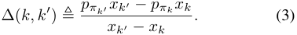

**Lemma 1.** _If a UM i is allocated a slot ai_ = _k, we have_ ∆( _k, k_ + 1) = _vi._ 

_Proof._ For slot _k_ +1, UM _i_ is the closest lower UM, and we denoteˆ _i_ as the closest lower VM at slot _k_ˆ (if there does not exist such VM, we can directly observe that ∆( _k, k_ + 1) = _vi_ ). As _i_ is a UM, her utility would always be non-negative, _i.e._ , _p_(_k_) _≤ vi_ , otherwise, she would be assigned at least the slot _k_ = 1, yielding a non-negative utility. Sinceˆ _i_ is also the closest lower VM for _i_ , we can further derive that _v_ ˆ _i ≤ p_(_k_) _≤ vi_ . Therefore, in the maximum function of computing _p_(_k_+1) by (1), we have that the first term (the VCG-style payment from _i_ ) is always no less than the second term (the GSP-style payment fromˆ _i_ ). This implies that ∆( _k, k_ + 1) = _vi_ . 

**Lemma 2.** _For two bidders i and j, if vi > vj and τi_ = _τj,_ i.e. _, they are both UMs or both VMs, then we have ai > aj._ 

_Proof._ For VMs, it is straightforward that bidder _i_ is always allocated a higher slot than _j_ during the algorithm process. For UMs, without loss of generality, we first assume that _i_ is the UM with the lowest slot such that _ai < aj_ for a UM _j_ with _vi > vj_ . Then we have that the allocation below _ai_ would be the same in the rounds of assigning _i_ and assigning _j_ . Therefore, if _ai < aj −_ 1, we know that the bidder _j_ has faced the same choice of slot _ai_ with the same price, but she chose _aj_ . As _vi > vj_ and _xaj > xai_ , by the utility function of UMs, we have bidder _i_ too prefers slot _aj_ to _ai_ , leading to a contradiction. If _ai_ = _aj −_ 1, by lemma 1, we obtain that bidder _i_ prefers slot _aj_ + 1 to _aj_ as the marginal price ∆( _aj, aj_ + 1) = _vj < vi_ , which is a contradiction. 

**Lemma 3.** _For two bidders i and j, if bidder i is a VM and j is a UM, and ai < aj, then we have vi < vj._ 

_Proof._ Armed with Lemma 2, it suffices to prove the statement for neighboring slots, _i.e._ , let _ai_ = _k_ , then _aj_ = _k_ + 1. Assume _vi > vj_ for contradiction, then the price for bidder _j_ is at least _vi_ , _i.e._ , _j_ suffers a negative utility. However, she can at least choose the lowest slot with non-negative utility, as discussed earlier, which is a contradiction. 

**Lemma 4.** _If a UM i is allocated a slot ai_ = _k, then we have_ ∆( _k, k__′_ ) _≥ vi, ∀k__′_ _> k._ 

_Proof._ For _k__′_ = _k_ + 1, we have proved the statement in Lemma 1. Next, for _k__′_ _> k_ + 1, we consider two cases: 1) there does not exist a UM between slot _k_ and _k__′_ ; 2) there exists at least one UM between slot _k_ and _k__′_ . In the former case, let _j_ = _πk′−_ 1, then we know that _j_ is a VM, and the closest lower UM is _i_ , so we get that 

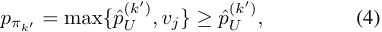

where 

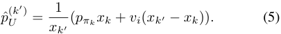

Combining (4) and (5), we can derive that ∆( _k, k__′_ ) _≥ vi_ . In the latter case, _i.e._ , there exists a set of UMs _U_ between _k_ and _k__′_ . By Lemma 2, we have the value of any UM in the set is higher than _vi_ . Then, for any pair of slots of neighboring UMs _k_+ _, k__−_ , such that _πk_ + _, πk− ∈ U ∪{i}_ with _k_+ _> k__−_ , we can obtain ∆( _k__−_ _, k_+ ) _≥ vk− ≥ vi_ , given the above analysis of the the former case. Also, let _k__′′_ be the highest slot of UMs in _U_ , we have ∆( _k__′′_ _, k__′_ ) _≥ vk′′ > vi_ . Finally, the marginal increase of payment between _k_ and _k__′_ would be a linear combination of the ones for each neighboring pair of bidders, that is, ∆( _k, k__′_ ) _≥ vi_ . 

#### **Corollary 1.** _MPR is a robust mechanism._ 

This corollary could be derived directly from the algorithm process of MPR. It implies that MPR is a good generalization and combination of VCG and GSP, which matches our intuition well. Building upon the above results, we next prove that MPR is IR and IC. 

**Theorem 2.** _MPR is individually rational._ 

_Proof._ For UMs, the proof is straightforward since a UM could at least choose the lowest slot, achieving a nonnegative utility. For VMs, by Lemma 2, we first have that the value of all other VMs below a VM _i_ should always be lower than her, hence the price induced from the closest lower VM is lower than _vi_ , and it suffices to analyze the price induced from the closest lower UM. We denote this UM as _j_ (if such UM does not exist, then the theorem trivially holds). Since _j_ chooses the slot _aj_ instead of the slot _ai_ when allocating the slot to her (note that _i_ is located at slot _ai −_ 1 in this round), we can derive that 

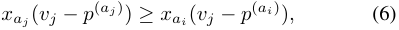

where _p_(_aj_) and _p_(_ai_) are the prices of slot _aj_ and _ai_ at the round of allocating bidder _j_ , respectively. Furthermore, by the payment rule (1), we know that there are two possibilities: 1) _p_(_ai_) = _vi_ ; 2) _p_(_ai_) = _x_ <u>1</u> _ai_(_p_(_a_ˆ_j_)_xa_ˆ _j_+_v_ˆ _j_(_xai−xa_ˆ _j_)) 

whereˆ _j_ is the UM immediately below _j_ . Since _v_ ˆ _j < vj_ , we can derive that bidder _j_ would prefer slot _ai_ than _aj_ if the latter probability occurs. Therefore, we obtain 

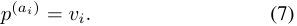

Combining (6) and (7), we have that 

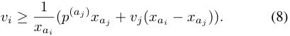

Since _p_(_aj_) remains the same in the final outcome as in the round of allocating _j_ , (8) indicates that _i_ would enjoy a price no more than her value, which concludes the proof. 

#### **Theorem 3.** _MPR is incentive compatible._ 

_Proof._ We discuss the proof for UMs and VMs separately. 

First, let bidder _i_ be a UM. We denote _j_ andˆ _j_ as the closest UMs below and above bidder _i_ in the truthful case, respectively (if such UMs do not exist, we can assume virtual ones at slot 0 and _K_ + 1). Accordingly, we use _aj_ and _a_ ˆ _j_ to denote their slots in the truthful setting, and _a__′_ _j_and_a_ ˆ_′_ _j_the slots in the setting where _i_ misreports her type. Next, no matter what class the bidder _i_ reports, we consider the following three cases: 1) _a__′_ _i_,_i.e._, the slot of bidder_i_when misreporting, is between _a__′_ _j_and_a_ ˆ_′_ _j_; 2)_a_ _i__′_is higher than_a_ ˆ_′_ _j_; 3)_a_ _i__′_is lower than _a__′_ _j_. In the first case, we have that the outcome until the round of allocating bidder _j_ remains the same as the truthful setting. So, bidder _i_ faces both the choices of _ai_ and _a__′_ _i_with the same price in the truthful setting, and she prefers _ai_ , implying that she would not get better off when misreporting. In the second case, by Lemma 4, we have that the utility of bidder _i_ at _a__′_ _i_isalwaysnobetterthanthatatslot_a_ ˆ_′_ _j_byre- porting her type as ( _v_ ˆ _j − ϵ, UM_ ), where _ϵ_ is a sufficiently small positive number. Furthermore, by the analysis of the above case, we have that bidder _i_ prefers _ai_ to the outcome of misreporting ( _v_ ˆ _j − ϵ, UM_ ). In the third case, let˜ _j_ be the closest UM above _a__′_ _i_. We can observe that the allocation of all the slots below _a__′_ _i_should be the same as the truthful set- ting. Therefore, if _a_ ˜ _j̸_ = _ai__′_,˜_j_havefacedthesamechoices 

of _a__′_ _i_and_a_˜ _j_and she prefers_a_˜ _j_in the round of allocating ˜_j_ in the truthful setting. Since _vi > v_ ˜ _j_ , we have bidder _i_ too prefers _a_ ˜ _j_ and could obtain it by misreporting ( _v_ ˜ _j − ϵ, UM_ ) with sufficiently small _ϵ_ . Then by Lemma 1, we have bidder _i_ prefers the slot immediately above˜ _j_ , _i.e._ , _a_ ˜ _j_ +1, to _a_ ˜ _j_ . One can run this process iteratively if _j >_˜ _j_ , until _a_ ˜ _j_ + 1 _> aj__′_. Finally, we get that bidder _i_ prefers _ai_ again by the analysis of the first case. 

Second, let bidder _i_ be a VM. If she misreports her type and obtains a lower slot, obviously, her utility would decrease by the definition of VMs. If she misreports her type and obtains a slot higher than a VM with a higher value, we can easily observe that the payment would be higher than _i_ ’s value, _i.e._ , the utility of bidder _i_ would also decrease. Therefore, we only need to consider the case where bidder _i_ is allocated the same or a higher slot by misreporting her type, but not exceeding any VMs with higher values. By Lemma 2, the order of UMs, as well as the order of other VMs, will not change, so we have that all the UMs below bidder _i_ should not exceed _i_ in such case; otherwise, she could not obtain a higher or the same slot. Let _j_ be the highest UM below bidder _i_ in the truthful case, and accordingly, letˆ _j_ be the lowest UM above bidder _i_ . Then we can derive that the allocation until the round of allocating bidder _j_ would be identical to the truthful case when _i_ misreports her type. Under these restrictions, we obtain that bidder _i_ must be above bidderˆ _j_ when she is untruthful; otherwise, she would be allocated at most the same slot _ai_ and pay the same price. Therefore, we discuss the following two cases in the truthful setting: 1) _a_ ˆ _j_ = _ai_ + 1, and 2) _a_ ˆ _j > ai_ + 1. 

If _a_ ˆ _j_ = _ai_ + 1, since UMˆ _j_ prefers the slot _a_ ˆ _j_ in the truthful setting, we have that 

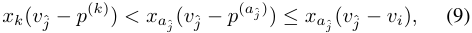

where _k_ is any slot below _a_ ˆ _j_ . Note that we do not need to consider the equality in the first inequality, as UMs would break ties by choosing the lower slots. In the untruthful case, we get that bidder _i_ is allocated at least slot _a_ ˆ _j_ and bidderˆ _j_ is allocated a lower slot _k_ . Then by (1) and (9) we get 

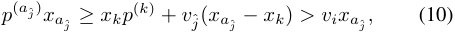

that is, bidder _i_ would suffer a negative utility at slot _a_ ˆ _j_ . Furthermore, one can easily observe that the prices of slots are non-decreasing during the algorithm process, _i.e._ , the utility of bidder _i_ is still negative at higher slots. 

If _a_ ˆ _j > ai_ +1, we have that there exist other VMs between 

_i_ andˆ _j_ . We consider the following two cases: 1) _i_ reports her class as VM, and 2) _i_ reports her class as UM. In the former case, as _i_ could only increase her value to obtain a higher slot (without exceeding higher VMs), the price of slot _a_ ˆ _j_ is not determined by the price of VM _i_ , nor do the prices of slots _k ≤ ai_ . Then we know thatˆ _j_ would not choose a slot at or below _ai_ when _i_ misreports her value. In the latter case, let _i__′_ be the highest VM between _i_ andˆ _j_ in the truthful setting. Sinceˆ _j_ chooses the slot above _i__′_ in the truthful setting but 

chooses a slot at or below _ai_ in the untruthful setting, we can get that the price of the slot immediately above _i__′_ in the round of allocating _i_ is derived from UMˆ _j_ , making it preferred by _i_ , compared with lower slots. This implies that _i_ would finally be allocated a slot above _i__′_ , yielding a negative utility. Therefore, we can conclude that a VM could never enjoy a higher utility by misreporting her type. 

### **Approximation Ratio on LSW** 

**Theorem 4.** _MPR achieves an approximation ratio of at most_ 2 _on LSW,_ i.e. _, WelMP R ≥_ <u>12</u>_WelOP T ,where_ _WelOP T_ = _max_ Π _Wel_ (Π) _._ 

_Proof._ By Lemma 2 and 3, we have that the only probability for the event of _WelMP R < WelOP T_ is that, some VMs with lower values are allocated higher slots than UMs with higher values. We now consider each such VM _i_ in MPR in a bottom-up sequence and prove that changing the slot of _i_ with lower UMs to fit the optimal outcome leads to a difference in LSW no more than that of the welfare achieved by _i_ in MPR. Then the overall difference in LSW of MPR and the optimal outcome would be no more than that of MPR, resulting in an approximation ratio of 2. 

First, let _i_ be the lowest VM in MPR who locates at a higher slot than some UMs with higher values than her. We denote _S__i_ as the set of UMs below _i_ with higher values and index them by _jc_ with 1 _≤ c ≤|S__i_ _|_ in a bottom-up manner. We also use _kc_ to denote the slot of _jc_ in MPR. By Lemma 2, we know that there are no VMs between _i_ and UMs in _S__i_ , otherwise, _i_ would not be the lowest one of interest. Thus we have _kc_ +1 = _kc_ + 1 for any 1 _≤ c ≤|S__i_ _| −_ 1, and _ai_ = _k|Si|_ + 1. Next, we denote _p_ ˆ_Si_ as the payment purely induced from the UMs in _S__i_ , that is 

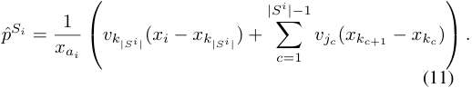

Note that ˆ _p__Si_ would be no more than _pi_ by equation (1), then by the IR property of MPR, we have 

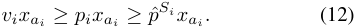

Next, we change the allocation of _i_ and UMs in _S__i_ towards the optimal outcome and denote _D__i_ as the difference in LSW after and before the change. Then we have that 

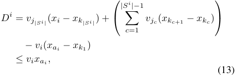

where the equality holds because after the change, all UMs in _S__i_ are moved up one slot, and _i_ is moved down from _ai_ to _k_ 1. The inequality comes from equations (11) and (12). 

This way, we have moved _i_ and corresponding UMs towards the optimal outcome and have proved that _D__i_ _≤ vixai_ for the lowest VM. In the next step, we set _i_ as the new lowest VM with non-empty _S__i_ , and again, we denote _kc_ as the 

|slot|CTR|bidder|class|value|
|---|---|---|---|---|
|2|0.2|A|VM|𝜖|
|1|0.1|B|VM|2 + 𝜖|
|0|0|C|UM or VM|4 or 1|

Figure 2: A counter-example for Theorem 5. 

assigned slots of UMs in the corresponding set of _S__i_ in the current allocation. Then one can observe that the newly induced _p_ ˆ_Si_ is no more than that induced by the allocation in MPR, and hence, all of the above analyses still hold. So we can repeat this process for all such VMs. 

Next, the difference in LSW between MPR and the optimal outcome is given by 

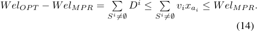

The first equation comes from that we consider VMs in a bottom-up order, so that the difference induced by each VM could be computed separately. Finally, we obtain that _WelMP R ≥_ 2<u>1</u>_WelOP T_. 

**Theorem 5.** _No mechanisms that are IC, IR, and robust could guarantee an approximation ratio lower than_<u>5</u> 4_in_ _terms of LSW._ 

_Proof._ We use a counter-example to prove this theorem. Assume an IC, IR and robust mechanism _M_� achieves an approximation ratio lower than<u>5</u> 4onLSW.Asillustratedin Fig. 2, let there be two slots with CTRs of 0 _._ 1 and 0 _._ 2 (and a dummy slot with CTR of 0). There are three bidders A, B, and C. The types of A and B are ( _ϵ, V M_ ) and (2 + _ϵ, V M_ ), respectively, where _ϵ_ is a sufficiently small positive number. We consider four cases for the type of bidder C: **Case 1)** (4 _, UM_ ); **Case 2)** (4 _, V M_ ); **Case 3)** (1 _, UM_ ); **Case 4)** (1 _, V M_ ). Since the approximation ratio on LSW is lower than<u>5</u> 4in _M_� , the allocation outcomes are certain: in the first two cases, bidders A, B, and C get slot 0, 1, 2, respectively; in the last two cases, bidders A, B, and C get slot 0, 2, 1, respectively. Otherwise, one can check that any allocation outcome would result in an approximation ratio higher than <u>54</u>. Then, as discussed in previous sections, the payments of bidder C in Case 1 and Case 2 should be the same, denoted as _ph_ ; otherwise, C may misreport her class. This claim also holds for Case 3 and Case 4, where the payment is denoted as _pl_ . Next, in Case 1, if C misreports her value as 1, the outcome would be the same as in Case 3, and her utility should be no more than truthfully reporting 4 by the requirement of IC. Hence we have 

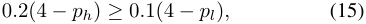

which further implies that 

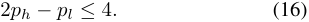

It is noteworthy that, in Case 2 and Case 4, all bidders are VMs, thus by the requirement of robustness, we can use GSP 

to compute the payments, _i.e._ , _ph_ = 2 + _ϵ_ and _pl_ = _ϵ_ ; hence we have 2 _ph − pl_ = 4 + _ϵ >_ 4, which contradicts with equation (16). This concludes our proof. 

## **Related Work** 

The study on VMs stems from the prosperity of auto-bidding techniques in recent years, where bidders only specify their targeted ROI and budget constraints (Zhang, Yuan, and Wang 2014; Aggarwal, Badanidiyuru, and Mehta 2019; He et al. 2021). This new pattern leads researchers to devise more practical models and mechanisms for auto-bidding advertisers. Golrezaei, Lobel, and Paes Leme (2021) and Balseiro et al. (2021) considered _ex-ante_ ROI constraints while (Cavallo et al. 2017) considered _ex-post_ ROI constraints. They developed fruitful understandings of the characterizations of IC and revenue-maximizing mechanism design. However, when the allocation value and the target ROI are both private, it is hard to design optimal mechanisms due to the fundamental difficulty of multi-parameter mechanism design. Therefore, two independent models of VMs were proposed in (Wilkens, Cavallo, and Niazadeh 2017) and (Fadaei and Bichler 2017), to characterize bidders with relatively high ROI constraints in a light way. Both of these two works considered that bidders aim to maximize their allocation value, while the former one further assumed that a bidder set payment minimization as her second-order objective, making GSP a truthful mechanism. Our work inherits the model in the former work and extends it to a more practical environment where VMs and UMs coexist. 

Another stream of research related to ours is the mixture of VCG and GSP mechanisms, where the main goal is to transition the existing GSP mechanism into VCG mechanism to adapt to modern complex advertising environments. The work in (Bachrach et al. 2016) proposed a transitional mechanism, which is similar to ours. However, they considered all bidders as traditional utility maximizers, while some are adaptive to VCG and some are non-adaptive and still use the GSP bids. Moreover, they took the classes of “adaptive” or “non-adaptive” bidders as public information, while we consider the private class information. Hummel (2018) further took the externality into account, and they aimed to guarantee that VCG bidders would bid truthfully, and GSP bidders could not obtain the same allocation at a lower price by misreporting their bids. This model for GSP bidders is different from our concept of VMs, and they also took the classes of bidders as public information. 

## **Conclusion** 

In this work, we have investigated mechanism design for mixed environments with both UMs and VMs. This work sheds light on future studies on private ROI constraints and also leaves several open problems. The foremost one is to close the gap between the approximation ratio’s lower and upper bound. We conjecture that MPR is in some way the right mechanism for this problem, and it would be interesting to make this more formal. Moreover, we will generalize our proposed mechanism for bidders with various types of ROI constraints. 

## **Acknowledgements** 

This work was supported in part by National Key R&D Program of China No. 2021YFF0900800, in part by China NSF grant No. 61972230, 62025204, 62072303, 61972254, 62132018, 61902248, 61972252, and 91846205, in part by Shanghai Science and Technology fund 20PJ1407900, in part by NSFShandong No. ZR2021LZH006, in part by Shandong Provincial Major Scientific and Technological Innovation Project No. 2021CXGC010108, in part by Alibaba Group through Alibaba Innovation Research Program, and in part by Tencent Rhino Bird Key Research Project. The opinions, findings, conclusions, and recommendations expressed in this paper are those of the authors and do not necessarily reflect the views of the funding agencies or the government. 

## **References** 

Aggarwal, G.; Badanidiyuru, A.; and Mehta, A. 2019. Autobidding with constraints. In _International Conference on Web and Internet Economics_ , 17–30. 

Bachrach, Y.; Ceppi, S.; Kash, I. A.; Key, P.; and Khani, M. R. 2016. Mechanism design for mixed bidders. In _Proceedings of the 25th International Conference on World Wide Web_ , 215–225. 

Balseiro, S.; Deng, Y.; Mao, J.; Mirrokni, V.; and Zuo, S. 2021. The Landscape of Auto-Bidding Auctions: Value Versus Utility Maximization. In _Proceedings of the 22nd ACM Conference on Economics and Computation_ , 132–133. 

Cavallo, R.; Krishnamurthy, P.; Sviridenko, M.; and Wilkens, C. A. 2017. Sponsored search auctions with rich ads. In _Proceedings of the 26th International Conference on World Wide Web_ , 43–51. 

Clarke, E. H. 1971. Multipart pricing of public goods. _Public choice_ , 17–33. 

Deng, Y.; Mao, J.; Mirrokni, V.; and Zuo, S. 2021. Towards Efficient Auctions in an Auto-bidding World. In _Proceedings of the Web Conference 2021_ , 3965–3973. 

Dobzinski, S.; and Paes Leme, R. 2014. Efficiency guarantees in auctions with budgets. In _International Colloquium on Automata, Languages, and Programming_ , 392–404. Edelman, B.; Ostrovsky, M.; and Schwarz, M. 2007. Internet advertising and the generalized second-price auction: Selling billions of dollars worth of keywords. _American economic review_ , 97(1): 242–259. 

_27th ACM SIGKDD Conference on Knowledge Discovery & Data Mining_ , 2993–3001. 

Hummel, P. 2018. Hybrid mechanisms for Vickrey–Clarke– Groves and generalized second-price bids. _International Journal of Game Theory_ , 47(1): 331–350. 

Li, B.; Yang, X.; Sun, D.; Ji, Z.; Jiang, Z.; Han, C.; and Hao, D. 2020. Incentive Mechanism Design for ROI-constrained Auto-bidding. _arXiv preprint arXiv:2012.02652_ . 

Niazadeh, R.; Hartline, J.; Immorlica, N.; Khani, M. R.; and Lucier, B. 2022. Fast Core Pricing for Rich Advertising Auctions. _Operations Research_ , 70(1): 223–240. Nisan, N.; Roughgarden, T.; Tardos, E.; and Vazirani, V. V. 2008. _Algorithmic Game Theory_ . Cambridge University Press. 

Szymanski, B. K.; and Lee, J.-S. 2006. Impact of ROI on bidding and revenue in sponsored search advertisement auctions. In _the Second Workshop on Sponsored Search Auctions_ , volume 1, 1–8. 

Varian, H. R. 2007. Position auctions. _International Journal of Industrial Organization_ , 25(6): 1163–1178. 

Vickrey, W. 1961. Counterspeculation, auctions, and competitive sealed tenders. _The Journal of finance_ , 16(1): 8–37. Wang, Y.; Liu, X.; Zheng, Z.; Zhang, Z.; Xu, M.; Yu, C.; and Wu, F. 2021. On Designing a Two-stage Auction for Online Advertising. _arXiv preprint arXiv:2111.05555_ . 

Wilkens, C. A.; Cavallo, R.; and Niazadeh, R. 2017. GSP: the cinderella of mechanism design. In _Proceedings of the 26th International Conference on World Wide Web_ , 25–32. Wilkens, C. A.; Cavallo, R.; Niazadeh, R.; and Taggart, S. 2016. Mechanism design for value maximizers. _arXiv preprint arXiv:1607.04362_ . 

Yang, X.; Li, Y.; Wang, H.; Wu, D.; Tan, Q.; Xu, J.; and Gai, K. 2019. Bid optimization by multivariable control in display advertising. In _Proceedings of the 25th ACM SIGKDD International Conference on Knowledge Discovery & Data Mining_ , 1966–1974. 

Zhang, W.; Yuan, S.; and Wang, J. 2014. Optimal real-time bidding for display advertising. In _Proceedings of the 20th ACM SIGKDD international conference on Knowledge Discovery & Data Mining_ , 1077–1086. 

Fadaei, S.; and Bichler, M. 2017. Truthfulness with valuemaximizing bidders: On the limits of approximation in combinatorial markets. _European Journal of Operational Research_ , 260(2): 767–777. 

Golrezaei, N.; Lobel, I.; and Paes Leme, R. 2021. Auction design for ROI-constrained buyers. In _Proceedings of the Web Conference 2021_ , 3941–3952. 

Groves, T. 1973. Incentives in teams. _Econometrica: Journal of the Econometric Society_ , 617–631. 

He, Y.; Chen, X.; Wu, D.; Pan, J.; Tan, Q.; Yu, C.; Xu, J.; and Zhu, X. 2021. A Unified Solution to Constrained Bidding in Online Display Advertising. In _Proceedings of the_ 

