The Thirty-Ninth AAAI Conference on Artificial Intelligence (AAAI-25) 

# **Learning Optimal Auctions with Correlated Value Distributions** 

**Da Huo, Zhenzhe Zheng*** **, Fan Wu** 

Department of Computer Science and Engineering, Shanghai Jiao Tong University, _{_ sjtuhuoda, zhengzhenzhe _}_ @sjtu.edu.cn, fwu@cs.sjtu.edu.cn 

#### **Abstract** 

The correlation of values commonly exists in auctions, which can be further exploited to improve revenue. However, the complex correlation structure makes it hard to manually design the optimal auction mechanism. Data-driven auction mechanisms, powered by machine learning, enable to design auctions directly from historical auction data, without relying on specific value distributions. In this work, we synthesize the learning-based auction and the characteristics of strategyproofness in the correlated value setting, and propose a new auction mechanism, namely Conditional Auction Net (CAN). The CAN can encode the correlation of values into the rank score of each bidder, and further adjust the allocation rule to approach the optimal revenue. The property of strategyproofness is guaranteed by encoding the game theoretical condition into the neural network structure. Furthermore, all operations in the designed auctions are differentiable to enable an end-to-end training paradigm. We also present CAN can provide a large solution space to adequately encode the correlation of values. Experimental results demonstrate that the proposed auction mechanism can represent almost any strategy-proof auction mechanism, and outperforms the auction mechanisms wildly used in the correlated value settings. 

## **Introduction** 

Auction mechanism design is an important and active area in computer science (Ferraioli and Ventre 2024; Chen and Deng 2006; Daskalakis, Goldberg, and Papadimitriou 2009; Dobzinski, Fu, and Kleinberg 2011) and economics (Rochet 1987; Devanur and Weinberg 2017; Edelman, Ostrovsky, and Schwarz 2007). The revenue-maximizing auction is one of the representative auction mechanisms. Myerson’s singleitem auction with independent values (Myerson 1981) is a milestone in the field of mechanism design. Yet, real-world valuations often correlate. For example, under market consensus, a high bid by one bidder often suggests that other bidders are also likely to offer high bids. A winter clothing merchant and a beach volleyball merchant often have opposing valuations for an Amazon ad slot as seasons change. The positive or negative value correlations are always relatively stable due to the similarities and differences in the inherent attributes of the bidders. Therefore, through historical bid 

*Corresponding authors. Copyright © 2025, Association for the Advancement of Artificial Intelligence (www.aaai.org). All rights reserved. 

logs, we can learn the correlation between bidders’ values, and then facilitate the estimation of one bidder’s bid by another bidder’s bid. Relying on such a posterior distribution, we can then draw a higher revenue in the auction. 

How to design a strategy-proof single-item auction mechanism that maximizes the revenue with correlated values? Theoretical research has identified characteristics of such auctions, but finding the optimal mechanism is computationally complex for more than two bidders (Papadimitriou and Pierrakos 2011). The Cremer-McLean mechanism (Cr´emer and McLean 1985, 1988) can extract full social welfare in expectation but only ensures interim IR, which is impractical due to potential budget exhaustion. Thus, we focus on ex-post IR in this work. Data-driven approaches using deep learning have shown promise in challenging auction settings (Duetting et al. 2019; Feng, Narasimhan, and Parkes 2018; Golowich, Narasimhan, and Parkes 2018). These methods model auctions as neural networks, optimizing revenue while attempting to ensure strategy-proofness through regret constraints. However, they cannot yield strictly strategy-proofness, which may leave potential advantages for participants to manipulate. Besides, optimizing revenue and guaranteeing game theoretical properties at the same time reduces the training efficiency, because the optimization directions of them may conflict and requires careful hyperparameter tuning (Rahme, Jelassi, and Weinberg 2021). Our approach combines theoretical insights on strategy-proofness with deep learning’s ability to model value correlations from data. We introduce a learningbased framework that maximizes revenue using deep learning while ensuring strategy-proofness orthogonal to the optimization process by integrating these characteristics into the neural network architecture. 

_MyersonNet_ (Duetting et al. 2019) also follows the above data-driven auction design framework. However, it is an imitation of Myerson Auction and may miss the optimal mechanism when bidders’ values are not independent. To break this bottleneck, we construct a rank score function (similar to the virtual value function in the Myerson auction) that takes all bidders’ bids as parameters, and allocates the item to the bidder with the highest rank score. Compared with MyersonNet, it provides a direct way for one bidder’s bid to affect other bidders’ winning probability, which is critical for the auction to exploit the correlation of values. How- 

13944 

ever, the design of the new rank score function brings several challenges. On the one hand, the strategy-proofness of auction mechanisms is not trivial to satisfy. The allocation based on rank score functions must be monotonic following Myerson Lemma (Myerson 1981; Roughgarden and TalgamCohen 2013), while unconstrained rank score functions cannot guarantee this property. When a bidder increases her bid, her allocation will not increase monotonically, because the bid will affect the rank scores of others. On the other hand, the revenue is hard to express in a closed form and then optimize efficiently. The payment for the winner should be the minimum bid required to win according to the critical payment principle in Myerson Lemma. However, since each bidder’s bid is involved in the calculation of all bidders’ rank scores, it is not easy to separate and obtain the minimum winning bid. If we use numerical methods to calculate payments, it will make the loss function not differential, and block the propagation of gradients in the training process. 

We develop a neural network for creating strict strategyproof auction mechanisms with correlated values. We apply distinct monotonicity constraints to a bidder’s rank score, which is determined by their own bid and the bids of others, to ensure that the rank score is monotonically increasing with respect to their own bid and monotonically decreasing with respect to the bids of others. This results in monotonic rank socre based allocation rules. We use a MIN-MAX network (Sill 1997; Daniels and Velikova 2010) to learn these functions. Besides, this form of rank score function provides a method to get a closed-form formula for the payment, enabling end-to-end optimization in deep learning. We also compared the solution space containing all strategy-proof auction mechanisms with correlated values and those implemented by our method and other baseline methods. We call this property the expressiveness of neural networks for learning-based auction mechanisms. Our main contributions in this work can be summarized as follows: 

_•_ We make an in-depth discussion on the formulation of the learning-based auction design with correlated values. Our novel rank score functions allow the network to exploit the correlation of values for revenue optimization without compromising strategy-proofness. And we derive the closed-form payment for the auction mechanism enabling the mechanism to be learned. 

_•_ Our proposed _Conditional Auction Network_ (CAN) enables us to design strategy-proof auction mechanisms maximizing the revenue for bidders with any joint value distributions. CAN ensures strategy-proofness orthogonal to the optimization process by encoding the characteristics of stragety-proofness into the neural network architecture. 

_•_ We compared the expressiveness of CAN and other representative auction mechanisms, demonstrating its advantage in exploiting value correlations for revenue optimization. Our evaluation show that CAN outperforms the widely used auction mechanisms in terms of expressiveness and revenue, and has higher data efficiency than RegretNet. 

## **Related Work** 

We mainly follow the paradigm of _automated mechanism design_ (Conitzer and Sandholm 2002, 2004; Sandholm and 

Likhodedov 2015a) and Duetting et al. first introduce deep learning into this field (Duetting et al. 2019). Sandholm and Likhodedov proposed that the ideal work in this field should meet three criteria: (a) be a universal approximator, (b) always be strategyproof and (c) be applicable to multiple bidders (more thoroughly speaking, be applicable to multiple bidders and multiple items1 ). Currently, all works in this field can only satisfy two out of these three criteria. The first line of research includes RegretNet (Duetting et al. 2019) and its subsequent works, which meet criteria (a) and (c). Some following research has adopted RegretNet into various settings by imposing additional desirable constraints (Feng, Narasimhan, and Parkes 2018; Kuo et al. 2020; Peri et al. 2021b,a; Golowich, Narasimhan, and Parkes 2018; Luong et al. 2018; Kuo et al. 2020; Peri et al. 2021b). Others focus on improving the architecture of RegretNet for diverse auction scenarios (Rahme, Jelassi, and Weinberg 2021; Rahme et al. 2021; Curry et al. 2020; Duan et al. 2022; Ivanov et al. 2022). (Zhang et al. 2023) extends the framework to more general extensive-form games. The second line meets criteria (b) and (c), aiming to maximize revenue within the affine maximizer auctions that are known to be IC (Sandholm and Likhodedov 2015b; Duan et al. 2023; Hertrich, Tao, and V´egh 2023). While these methods have limitations in fitting arbitrary mechanisms, which may lead to the loss of optimal solutions. For example, in the setting of singleitem auctions, these mechanisms will degenerate into affine second-price auctions, i.e., the MyersonNet. The third line does not meet criterion (c). RochetNet and MenuNet focus on auctions with a single bidder (Duetting et al. 2019; Shen, Tang, and Zuo 2019), whereas our work, along with some other research (Duetting et al. 2019; Liu et al. 2021; Shen et al. 2023), concentrates on single-item auctions. Except for MyersonNet, the work on single-item auctions has primarily focused on handling multi-slot auctions in industrial scenarios. Our work is the first to explore how to learn the optimal single-item auctions with correlations in a transparent manner (in contrast to agnostic methods like RegretNet). In addition, some studies explore the bidding strategy under data-driven based auction mechanism design (Nedelec, Karoui, and Perchet 2019; Nedelec et al. 2019). 

## **Preliminaries** 

### **Single-Item Auction Model** 

We study a single-item auction model in general settings. There are _n_ bidders _N_ = _{_ 1 _, · · · , n}_ compete for one item. Each bidder _i_ assigns a value _vi_ to the item based on their evaluation. Values are correlated due to shared underlying factors. That is, values are drawn from a joint distribution _F_ over the domain [0 _, ωi_ ]_n_ ( _ωi_ could be + _∞_ ). Bidders report their bids strategically and seek to maximize their utilities. The auctioneer collects bids and determines allocation 

> 1It refers to the general setting where there is a lack of theoretical understanding of the optimal mechanism. Learning-based auction mechanism design has mainly focused on the combinatorial optimization challenges within multi-item settings, leading to the neglect of the single-item multi-bidder issue. 

13945 

and payments. In this process, the auctioneer runs an auction mechanism _M_ = ( _X , P_ ), consisting of a collection of allocation rules _Xi_ ( **b** ) : [0 _, ωi_ ]_n_ _→{_ 0 _,_ 1 _}_ and payment rules _Pi_ ( **b** ) : [0 _, ωi_ ]_n_ _→_ R _≥_ 0. The allocation rule _Xi_ ( **b** ) indicates whether bidder _i_ wins (1) or loses (0), and the payment rule _Pi_ ( **b** ) specifies the payment. Bidder _i_ ’s utility is _ui_ ( **b** _, vi_ ) = _Xi_ ( **b** ) _vi −Pi_ ( **b** ), and the auctioneer’s revenue is denoted as _u_ 0( **b** _, M_ ) =� _i__Pi_(**b**). 

A desired auction mechanism must ensure game-theoretic properties. Bidders may misreport bids if it increases their utility. If bids yield negative utility, bidders may opt out. Therefore, the mechanism must satisfy incentive compatibility (IC), ensuring bidders maximize utility by reporting truthfully, and individual rationality (IR), guaranteeing nonnegative utility for truthful bids. 

**Definition 1** (Ex-post IC and Ex-post IR Mechanism) **.** An auction mechanism is ex-post IC and ex-post IR if for every bidder _i_ , her true value _vi_ , reported bid _ti_ , and other bidders’ bids **b** _−i_ satisfies 

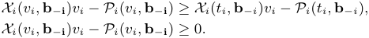

The first inequality defines ex-post IC and the second stands for ex-post IR. Similar to Myerson Lemma (Myerson 1981), under the setting of correlated values, the following lemma from (Roughgarden and Talgam-Cohen 2013) can still guarantee ex-post IC and ex-post IR. 

**Lemma 1.** _For every correlated value setting, a single-item auction mechanism M_ ( _X , P_ ) _is ex-post IC and ex-post IR, if and only if for any fixed i and_ **b** _−i:_ 

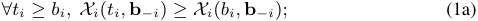

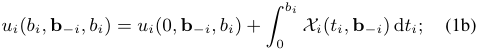

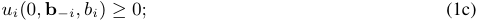

Equ. (1a) and (1b) together ensure the ex-post IC property, and the addition of (1c) guarantees the ex-post IR property. Equ. (1a) states that the allocation rule _Xi_ ( **b** ) is monotonically non-decreasing in _bi_ for every _i_ and **b** _−i_ . Equ. (1b) states the relationship between the allocation rule and the payment rule, allowing us to derive payments that satisfy the ex-post IC property. 

### **Characteristics of Strategy-Proof Mechanisms** 

We next discuss how to model auction mechanisms with neural networks to represent the optimal mechanism or any mechanism without prior knowledge of the optimal one. To facilitate understanding, we introduce Papadimitriou and Pierrakos’s geometric characterization of strategyproof single-item auctions with general joint value distributions (Papadimitriou and Pierrakos 2011). Without loss of generality, we consider two bidders2 . As per Lemma. 1, we only focus on the allocation rules’ form. As depicted in 

> 2For _n_ bidders, _n_ surfaces divide the _n_ -dimensional bidding space into _n_ winning regions for each bidder. 

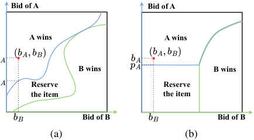

<!-- Start of picture text -->
Bid of A Bid of A A wins A wins B wins B wins Reserve Reserve the item the item Bid of B Bid of B (a) (b) <!-- End of picture text -->

Figure 1: Allocation rules of (a): an arbitrary IC and IR auction mechanism and (b): MyersonNet can represent. 

Fig. 1a, any strategy-proof mechanism can be represented by two critical bid curves, _fA_ (blue) and _fB_ (green). These curves, corresponding to each bidder, indicate the minimum winning bids. They partition the bidding space into regions: bidder A’s win region, bidder B’s win region, and reserved item regions. If a bid exceeds _fA_ (along the _bA_ axis), bidder A wins and pays _pA_ ; the same applies to bidder B. Otherwise, the item is reserved. In Fig. 1a, the upper right and lower left corners are reserved regions. 

Specifically, critical bid curves must meet two criteria: 1) Bidder _i_ ’s curve, _pi_ = _fi_ ( **b** _−i_ ), is a function of others’ bids, defining the minimum winning bid for _i_ given **b** _−i_ . This ensures at most one critical bid and the allocation rule is partial monotonic. 2) Curves don’t cross; if _bi > fi_ ( **b** _−i_ ), then _bj < fj_ ( **b** _−j_ ) for all _j̸_ = _i_ . This prevents over-allocation. Based on the two conditions, an intuitive idea is to learn the critical bid curves _pi_ = _fi_ ( **b** _−i_ ) with neural networks. However, ensuring non-crossing learned curves is challenging. These curves are arbitrary multivariate functions that must not intersect. This is a constraint among curves rather than on an isolated curve. Instead of assuming properties for each curve, we must model the entire curve set in high dimensions using neural networks. To address this, we employ rank score functions to encode the auction mechanism, inherently satisfying the second requirement first. Through our design of the rank score function, we can also ensure the mechanism meets the first condition. Finally, we demonstrate that the rank score function’s parameters must encompass all bids **b** for stronger expressiveness. Unlike the Myerson auction’s virtual value function, which only considers _bi_ , our approach broadens the mechanism representation space. For MyersonNet, a bidder’s reserve price is constant since her bid doesn’t influence others’ scores if she loses as shown in Fig. 1b. However, this impact will not cause the mechanism to lose its strategy-proofness. Instead, it is a manifestation of the mechanism using the information brought by correlation to obtain more revenue. A detailed discussion is in Section Expressiveness Analysis. 

### **Problem Formulation** 

The optimal auction is achieved through the identification of optimal rank score functions. We use _ri_ ( _bi,_ **b** _−i_ ) to denote bidder _i_ ’s rank score, and provide a formulation for the mechanism design. 

First, the auction mechanism should not over-allocate the 

13946 

item. Considering the case the item is reserved, we introduce an additional rank score _r_ 0( **b** ). We define the allocation rules based on rank score functions as follows: 

_•_ Allocation Rules _X_ : The bidder with the highest rank score and not lower than the reserve rank score _r_ 0( **b** ) would win the auction, with ties broken randomly. That is, _Xi_ ( _bi,_ **b** _−i_ ) = I( _ri_ ( _bi,_ **b** _−i_ ) _−_ max _j∈−_ **i** _rj_ ( _bi,_ **b** _−i_ ) _>_ 0). If all rank scores are smaller than _r_ 0( **b** ), the item will be reserved. To ensure the monotonicity of allocations, we need to make constraints on the form of rank score functions. It is worth noting that each rank score function _ri_ ( **b** ) is partially monotonic in bidder _i_ ’s bid _bi_ is not a sufficient condition. If the increase of one bidder’s bid causes another bidder’s rank score to rise faster than her rank score, obviously the allocation rules are not monotonic in this case. Here is a sufficient condition for the monotonicity of allocation rules we use. 

**Definition 2** (Single Crossing Conditions) **.** The rank score functions _{ri_ ( **b** ) _}i∈N_ satisfies the single crossing condition if for every _i_ , _j̸_ = _i_ , and every **b** , 

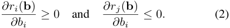

The Equ.(2) means one bidder’s rank score should be partially non-decreasing in her bid and partially non-increasing in others’ bids. Considering the items being reserved, we also require _r_ 0( **b** ) to be non-increasing in _bi_ for any _i_ . Representing the allocations based on single crossing conditions is sufficient for monotonic allocation. This limitation may result in the inability to fully express certain strategy-proof mechanisms. However, theoretically characterizing exactly which mechanisms cannot be represented is challenging. Consequently, we make a discussion on expressiveness to some extent in Section Expressiveness Analysis. Once rank score functions _ri_ ( _bi,_ **b** _−i_ ) are determined, according to Lemma. 1, the payment rules could be: 

_•_ Payment Rules _P_ : The payment for each bidder is calculated by Equ. (1b). To ensure the revenue is non-negative, we let _ui_ (0 _,_ **b** _−i,_ **b** ) = 0 for every _i,_ **b** _−i_ . Therefore, the payment is uniquely determined by the allocation rule: 

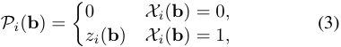

where _zi_ ( **b** ) = inf _{ti|Xi_ ( _ti,_ **b** _−i_ ) = 1 _}_ is the critical bid. 

From the above discussion, we reduce the design of the auction mechanism _M_ to the design of allocation rules, or the search of the rank score functions _ri_ ( _bi,_ **b** _−i_ ). We also analyze the constraints that the rank score functions must satisfy. Any additional constraints may impair the expressiveness of the neural network in correlated value settings. Based on the discussion, we present a learning-based method, Conditional Auction Net (CAN), to design the single-item auction mechanisms that can exploit the correlation of values to maximize the revenue, while the strict ex-post IC and ex-post IR properties are always maintained. 

## **Conditional Auction Net** 

### **Overall Architecture** 

As illustrated in Fig. 2a, CAN consists of two modules: conditional rank score functions and a differentiable revenue 

calculator. The conditional rank score function _ri_ ( **b** ) takes all bids as inputs and yields bidder _i_ ’s rank score. In particular, different from the classical results that reserve the item if all rank scores are negative, in cases where the item is reserved, it is treated as if an additional virtual bidder with a bid of 0 participates and wins the auction. We use _r_ 0( **b** ) to denote the additional rank score, which should also be learned. For revenue calculation, CAN yields the revenue based on the parameters and rank scores in a differentiable way, to fit into the framework of machine learning. On the one hand, we employ the differentiable ranking operator softmax to transform the sparse (0,1) allocation vector into a probability vector. On the other hand, we propose a closed-form formula to calculate critical bids based on piece-wise linear rank score functions. The payments are the product of the allocation vector and critical bids, and the sum of payments is the revenue. The algorithm is given in the Appendix. 

### **Conditional Rank Score Function** 

We design a parameterized conditional rank score function _ri_ ( **b** ) to transform each bidder’s bid to a rank score, which is implemented by a piece-wise linear function, the MIN-MAX neural network (Sill 1997; Daniels and Velikova 2010). MIN-MAX neural networks have universal approximation capabilities for partial monotone functions, ensuring CAN does not lose expressiveness in this regard. As illustrated in Fig. 2b, the inputs of bidder _i_ ’s rank score function are all bidders’ bids **b** . Given _|Z|_ groups of _|Q|_ linear functions3 , the MIN-MAX operation first takes the maximum value among _|Q|_ values in each group, and takes the minimum value among these _|Z|_ maximum values. Fig. 2b illustrates an example with _|Q|_ = 2 and _|Z|_ = 3. As long as we ensure each linear function is partially monotonic, that is, associating positive weights _e__α_ _zq__i_ with _bi_ and associate nonpositive weights _ReLu_ ( **_γ_** _zq__i_)with**b**_−i_forbidder_i_,where _z_ = 1 _, · · · , |Z|_ and _q_ = 1 _, · · · , |Q|_ , the final piece-wise linear function will also preserve the property of monotonicity. Here we assume the weights of _bi_ are strictly positive because we expect that the bidder’s bid will at least have an impact on her own rank score. Besides, the unconstrained intercept is denoted as _βzq__i_forbidder_i_.Weformalizethe rank score function as: 

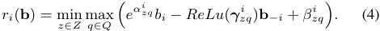

The parameters _αzq__i, β_ _zq__i,_**_γ_** _zq__i_arelearnable,andmono- tonic allocation can be maintained independently on the values of the parameters. In particular, the additional rank score to reserve the item is non-increasing in all bidders’ bids **b** : 

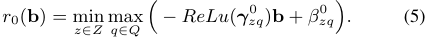

> 3When using the MIN-MAX network to fit a monotone function, given an allowable approximation error _ϵ_ , there exists sufficiently large _|Q|_ and _|Z|_ satisfying this condition. In the proof of this paper, we assume _|Z|_ and _|Q|_ are sufficiently large with respect to the allowed approximation error _ϵ_ . 

13947 

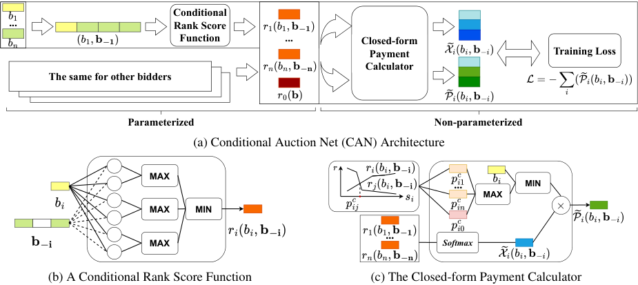

<!-- Start of picture text -->
Conditional ... Rank Score Function ... Closed-form Payment Training Loss Calculator The same for other bidders Parameterized Non-parameterized (a) Conditional Auction Net (CAN) Architecture MAX ... MIN MAX MAX MIN MAX ... Softmax (b) A Conditional Rank Score Function (c) The Closed-form Payment Calculator <!-- End of picture text -->

Figure 2: (a) CAN’s overall structure. (b) Conditional rank score functions. Solid lines indicate increasing functions and dotted lines indicate non-increasing ones. (c) The payment function derives critical bids from rank scores and calculates allocations. 

### **Differentiable Revenue Expression** 

Next, we will calculate the payments and the revenue in a differentiable way based on the above-designed rank score functions. As mentioned in Equ. (3), the minimum bid to maintain winning is the payment for the winner. Suppose bidder _i_ is the winner, when decreasing her bid _bi_ to _b__′_ _i_, her rank score _ri_ decreases, and the others’ **r** _−i_ increases. At a certain value of _b__′_ _i_, bidder_i_tied with another bidder_j_for the first time in terms of their rank scores. The threshold _b__′_ _i_is the critical bid and is the abscissa of the intersection of the two rank scores _ri_ ( _b__′_ _i_) and_rj_(_b_ _i__′_). Therefore, the problem of calculating the critical bid can be abstracted as solving the intersection of piece-wise linear functions. Given two piecewise linear functions: _yi_ = min _z∈Z_max _q∈Q_ � _αzq_1_bi_+_β_ _zq_1 � and _yj_ = min _z_ ˜ _∈Z_max _q_ ˜ _∈Q_ � _αz_2 ˜ _q_ ˜_bi_+_β_ _z_ ˜2 _q_ ˜� _,_ we can assume _yi_ and _yj_ are monotonic increasing and non-increasing with respect to _bi_ , respectively. The abscissa of the intersection _p__c_ _ij_is 

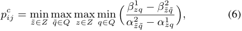

and the critical bid _P_� _i_ ( **b** _−i_ ) of bidder _i_ can be calculated in the same way. The detailed form and proof are in the Appendix. This step of calculation only depends on the auction mechanism rather than the actual bid, as shown in the upper left corner of Fig. 2c. The lower left corner shows the ranking of bidders based on rank scores. During testing we employ the argmax function to determine the allocation _Xi_ ( _bi,_ **b** _−i_ ) based on the ranking of bidders. While in training we use softmax to obtain allocation probabilities _X_ � _i_ ( _bi,_ **b** _−i_ ) to speed up training. The training loss _L_ , or the negative relaxed revenue is the sum of the product of critical bids and allocation probabilities. We truncate _P_� _i_ ( **b** _−i_ ) to avoid IR violation misdirecting training. 

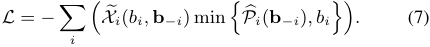

## **Expressiveness Analysis** 

Since single-crossing conditions Definition. 2 are a sufficient but not necessary condition for monotonic allocation, CAN cannot represent all strategy-proof auction mechanisms. However, formally demonstrating and proving the limitations of CAN’s expressiveness, particularly identifying which strategy-proof mechanisms cannot be expressed by CAN, is challenging. Therefore, in this section, we instead explore what types of mechanisms CAN can express that existing baseline methods cannot, i.e., the additional expressiveness introduced by the design of CAN. We mainly focus on analyzing two characteristics: the shape of the curve for reserving items and the mutual influence among multiple bidders. 

### **The Curve for Reserving Items** 

As shown in Figure. 1a, the critical bid curve of bidder A includes two parts: the segment (a) where the A-winning region borders the B-winning region, and the segment (b) where the A-winning region borders the reserving item region. It was previously mentioned that bidder A’s critical bid should be an arbitrary function of bidder B’s bid. Therefore, segment (a) of the curve should be a function of both _bA_ and _bB_ , thus it is a monotonic function of _bB_ . While segment (b) of the curve should remain an unconstrained arbitrary function. By simplifying the payment function derived from MIN-MAX rank score functions, we can obtain the mathematical form of the critical bid curves, as referenced in Appendix. For CAN, its critical bid is composed of the maximum of a non-monotonic piecewise linear function and a monotonically non-decreasing piecewise linear function, meaning it has the capability to fully fit both segment (a) and segment (b) of the curve, as shown in Figure. 3a. A 

13948 

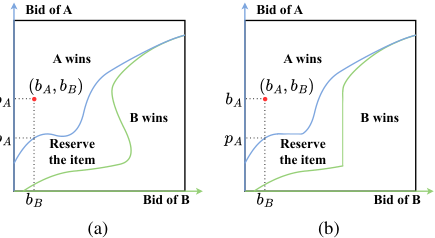

<!-- Start of picture text -->
Bid of A Bid of A A wins A wins B wins B wins Reserve Reserve the item the item Bid of B Bid of B (a) (b) <!-- End of picture text -->

Figure 3: In two-bidders auctions, allocation rules (a): CAN can represent and (b): CANw/oA can represent. 

consequent question is what will happen if the reserve price is zero rather than be viewed as an additional bidder. We denote it as CANw/oA, CAN without the additional bidder. For CANw/oA, its critical bid is formed by the maximum of a monotonically increasing piecewise linear function and a monotonically non-decreasing piecewise linear function. In segment (b) of the curve, it can only be fitted with a monotonic function, as illustrated in Figure. 3b. As for MyersonNet, its critical bid curve is made up of the maximum of a constant and a monotonically non-decreasing piecewise linear function, with the reservation price being a fixed value, as depicted in Figure. 1b. 

### **The Influence among Multiple Bidders** 

The second characterization is the mutual influence among multiple bidders. This expressiveness comes from whether the rank score function includes all bids. We show this point with an example comparing with MyersonNet. Suppose that the bidding spaces for bidders A and B are discrete, with values of either 1 or 2. Bidder C may bid either 0.1 or 0.2. The correlation of the bidders’ bids is shown in Table. 1. For example, the 0.9 on the left side of the table indicates that when _bC_ = 0 _._ 1, the probability of _bA_ = 1 is 0.9. 

In the first auction, bidders A and B both bid 1, while bidder C bids 0.1. In this case, the optimal mechanism would result in bidder A winning (intuitively, only in this way can we charge bidder B 2 in the most probable scenario where _bA_ = 1 and _bB_ = 2). In the second auction, bidders A and B maintain their bids, while bidder C bids 0.2. The optimal mechanism should lead to bidder B winning. Thus bidder C’s bid should be able to affect the allocation results of bidders A and B, who are not in direct competition. CAN can represent such mechanisms because _bC_ can directly influence _rA_ and _rB_ , causing _rB_ to be greater than _rA_ in the second auction; whereas MyersonNet cannot. 

||_bC_ =|0_._1|_bC_ =|0_._2|
|---|---|---|---|---|
|bid|_p_(_bA_)|_p_(_bB_)|_p_(_bA_)|_p_(_bB_)|
|1|0.9|0.4|0.4|0.9|
|2|0.1|0.6|0.6|0.1|

Table 1: The bid distribution of bidder A and B based on _bC_ . 

## **Experimental Results** 

### **Experiment Setup** 

**Hyperparameters** We implement CAN using TensorFlow and configure a MIN-MAX neural network with _|Z|_ = 4 groups of _|Q|_ = 4 linear functions. Training spans 100,000 iterations with a minibatch size of _B_ = 128 on a dataset comprising 100,000 training and 10,000 evaluation samples. We employ Adam optimizer with a learning rate of _η_ = 0 _._ 001. Hyperparameters are detailed in the Appendix. 

**Baselines** Our approach is compared against several mechanisms that can handle single-item auctions: SP auction (Vickrey 1961), MyersonNet (Duetting et al. 2019), RegretNet (Duetting et al. 2019), CANw/oA, and Linear programming (LP) with more information outlined in the Appendix. Mechanism design methods for contextual auctions like AMenuNet (Duan et al. 2023) could degrade to MyersonNet without contextual data in single item auctions. 

**Data Generation** We generate irregular value distributions to evaluate auctions with correlated values under the most general conditions. Specifically, first we generate random multivariate normal distributions: we randomly sample within the interval [-0.2, 0.2] to create an _n × n_ random matrix A, and the covariance matrix of the distribution is _A__T_ _A_ . The mean vector of the distribution is sampled from the interval [0, 1]. After that, we obtain two multivariate normal distributions _D_ 1 and _D_ 2 using the aforementioned method. Bidders’ valuations will be sampled from _D_ 1 with probability _µ_ and from _D_ 2 with probability 1 _− µ_ . 

### **Illustrating Auctions in Simple Settings** 

We first evaluate the perspectives presented in section Expressiveness Analysis by evaluating CAN with two and three bidder settings and illustrating their allocation rules. We sample values from irregular distributions with _µ_ = 0 _._ 5, because it requires a neural network with greater expressive power to model the optimal mechanism, as shown by the red contours in Fig. 4. For two-bidders auctions, the optimal auction structure was derived through linear programming with lower computational demands, depicted in Fig. 4a. CAN, shown in Fig. 4b, nearly matches these rules. However, CANw/oA, in Fig. 4c, only achieves a suboptimal solution with a simple increasing allocation curve. MyersonNet, Fig. 4d, offers a mechanism with a fixed reserve price. In three-bidder auctions, we illustrate the allocation rule for two bidders given one’s bid through multiple figures. Fig. 4e shows CAN’s proficiency in adapting to bidder C’s conditional bid distribution for maximizing revenue. In contrast, MyersonNet, Fig. 4f, keeps the allocation for A and B constant regardless of C’s bids, as C rarely wins with low bids. These comparisons highlight that CAN can effectively use bid correlations to adapt allocation rules and increase revenue, even without a reserve. 

### **Evaluation on Revenue** 

**Different Number of Bidders** We evaluated the revenue of CAN and baselines in auctions with different numbers of bidders. We still adopt irregular distributions with _µ_ = 0 _._ 5 

13949 

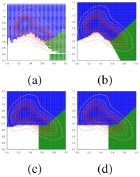

<!-- Start of picture text -->
1.2 1.1 1.0 0.9 0.8 0.7 0.6 0.5 0.4 0.3 0.0 0.2 0.4 0.6 0.8 1.0 (a) (b) (c) (d) <!-- End of picture text -->

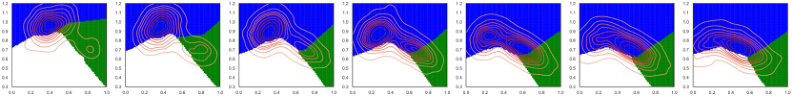

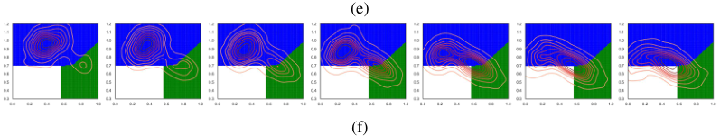

<!-- Start of picture text -->
(e) (f) <!-- End of picture text -->

Figure 4: Illustrations of allocation rules to validate the analysis of expressiveness. Blue and green regions indicate wins for bidders A and B, respectively, with a red contour depicting their joint value distribution. 

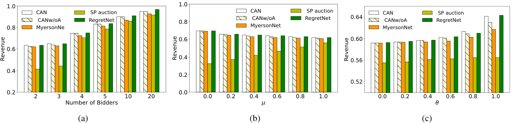

<!-- Start of picture text -->
1.0 1.0 CAN  SP auction CAN  SP auction CAN  SP auction  CANw/oA RegretNet 0.8  CANw/oA RegretNet 0.64  CANw/oA RegretNet 0.8 MyersonNe MyersonNet MyersonNet 0.6 0.60 0.6 0.4 0.56 0.4 0.2 0.52 0.2 0.0 2 3 4 5 10 20 0.0 0.2 0.4 0.6 0.8 1.0 0.0 0.2 0.4 0.6 0.8 1.0 Number of Bidders (a) (b) (c) Revenue Revenue Revenue <!-- End of picture text -->

Figure 5: Evaluations of auction revenues under different settings, including (a): different number of bidders, (b): different irregular distributions and (c): different normal distributions. 

with 2 to 20 bidders, and the results are shown in Figure. 5a. CAN outperformed other methods in auctions with varying bidder numbers, matching the optimal revenue estimated by RegretNet, which may provides higher revenue without zero regret. As bidder numbers grow, CANw/oA approaches CAN’s performance due to less item reservation. However, MyersonNet and Second Price auction consistently yield lower revenue, as they fail to exploit the correlation among bids for higher revenue. 

**Different Irregular Distributions** To test the performance of CAN under different distributions, we adjust the parameter _µ_ for generating data to obtain different irregular distributions. We show the results of three bidder auctions in Fig. 5b. In diverse distributions, CAN consistently matches RegretNet’s top earnings. With _µ_ at 0 or 1, where values sample from a single joint normal distribution, CANw/oA has sufficient expressiveness to achieve similar revenue as CAN. But when _µ_ is close to 0.5, the value distribution is irregular and CANw/oA’s revenue falls below that of CAN. Regardless of whether the distribution is normal or irregular, MyersonNet consistently yields lower revenue than CAN. 

**Different Normal Distributions** We then test CAN under normal distributions with varying degrees of correlations. Using the normal distribution generated following the first step of the Data Generation, we multiply the off-diagonal elements of its covariance matrix by a factor _θ_ to adjust the correlation of the distribution and generate different normal distributions. The results are shown in Fig. 5c. The Second Price auction’s revenue slightly increases with _θ_ , indicating 

a positive valuation correlation and reduced difference between top bids. CAN, CANw/oA and MyersonNet revenues improve by 8.4%, 6.4% and 4.3% respectively, maximizing revenue within their representational limits.However, as value correlation increases, the revenues of MyersonNet and CANw/oA decline when compared to CAN. The similar performance of CAN and RegretNet shows CAN’s effective use of correlation, matching RegretNet’s theoretical capability to optimize auctions fully. 

### **Evaluation on Data Efficiency** 

We further verified the performance of CAN in terms of training time and few-shot training to demonstrate the advantages of CAN over pure black-box methods like RegretNet, with the results presented in the appendix. The results show that CAN not only has a significantly shorter training time but also higher data efficiency, being less prone to overfitting under low-sample conditions. 

## **Conclusion** 

This paper investigates the design of single-item auctions with correlated values and introduces CAN, a machine learning-compatible, strategy-proof mechanism for singleitem auctions with correlated values. CAN’s innovative rank score functions expand the strategy-proof solution space, surpassing CANw/oA and MyersonNet. Experiments show CAN achieves the optimal mechanism for 2-bidder auctions and consistently outperforms baselines in expressiveness, revenue or data efficiency. 

13950 

## **Acknowledgments** 

This work was supported in part by National Key R&D Program of China (No. 2023YFB4502400), in part by China NSF grant No. U2268204, 62322206, 62132018, 62025204, 62272307, 62372296, in part by Alibaba Group through Alibaba Innovative Research Program. The opinions, findings, conclusions, and recommendations expressed in this paper are those of the authors and do not necessarily reflect the views of the funding agencies or the government. 

## **References** 

Chen, X.; and Deng, X. 2006. Settling the Complexity of Two-Player Nash Equilibrium. In _FOCS_ , 261–272. Conitzer, V.; and Sandholm, T. 2002. Complexity of Mechanism Design. In _UAI_ , 103–110. 

Conitzer, V.; and Sandholm, T. 2004. Self-interested automated mechanism design and implications for optimal combinatorial auctions. In _EC_ , 132–141. 

Cr´emer, J.; and McLean, R. P. 1985. Optimal selling strategies under uncertainty for a discriminating monopolist when demands are interdependent. _Econometrica: Journal of the Econometric Society_ , 345–361. 

Cr´emer, J.; and McLean, R. P. 1988. Full extraction of the surplus in Bayesian and dominant strategy auctions. _Econometrica: Journal of the Econometric Society_ , 1247–1257. Curry, M. J.; Chiang, P.; Goldstein, T.; and Dickerson, J. 2020. Certifying Strategyproof Auction Networks. In _NeurIPS_ . 

Daniels, H.; and Velikova, M. 2010. Monotone and partially monotone neural networks. _IEEE Trans. Neural Networks_ , 21(6): 906–917. 

Daskalakis, C.; Goldberg, P. W.; and Papadimitriou, C. H. 2009. The complexity of computing a Nash equilibrium. _Commun. ACM_ , 52(2): 89–97. 

Devanur, N. R.; and Weinberg, S. M. 2017. The Optimal Mechanism for Selling to a Budget Constrained Buyer: The General Case. In _EC_ , 39–40. 

Dobzinski, S.; Fu, H.; and Kleinberg, R. D. 2011. Optimal auctions with correlated bidders are easy. In _STOC_ , 129– 138. 

Duan, Z.; Sun, H.; Chen, Y.; and Deng, X. 2023. A Scalable Neural Network for DSIC Affine Maximizer Auction Design. In _NeurIPS_ . 

Duan, Z.; Tang, J.; Yin, Y.; Feng, Z.; Yan, X.; Zaheer, M.; and Deng, X. 2022. A Context-Integrated TransformerBased Neural Network for Auction Design. In _ICML_ , volume 162 of _Proceedings of Machine Learning Research_ , 5609–5626. 

Duetting, P.; Feng, Z.; Narasimhan, H.; Parkes, D. C.; and Ravindranath, S. S. 2019. Optimal Auctions through Deep Learning. In _ICML_ , volume 97 of _Proceedings of Machine Learning Research_ , 1706–1715. 

Edelman, B.; Ostrovsky, M.; and Schwarz, M. 2007. Internet advertising and the generalized second-price auction: Selling billions of dollars worth of keywords. _American economic review_ , 97(1): 242–259. 

Feng, Z.; Narasimhan, H.; and Parkes, D. C. 2018. Deep Learning for Revenue-Optimal Auctions with Budgets. In _AAMAS_ , 354–362. 

Ferraioli, D.; and Ventre, C. 2024. An Algorithmic Theory of Simplicity in Mechanism Design. _CoRR_ , abs/2403.08610. 

Golowich, N.; Narasimhan, H.; and Parkes, D. C. 2018. Deep Learning for Multi-Facility Location Mechanism Design. In _IJCAI_ , 261–267. 

Hertrich, C.; Tao, Y.; and V´egh, L. A. 2023. Mode Connectivity in Auction Design. In _NeurIPS_ . 

Ivanov, D.; Safiulin, I.; Filippov, I.; and Balabaeva, K. 2022. Optimal-er Auctions through Attention. In _NeurIPS_ . 

Kuo, K.; Ostuni, A.; Horishny, E.; Curry, M. J.; Dooley, S.; Chiang, P.; Goldstein, T.; and Dickerson, J. P. 2020. ProportionNet: Balancing Fairness and Revenue for Auction Design with Deep Learning. _CoRR_ , abs/2010.06398. 

Liu, X.; Yu, C.; Zhang, Z.; Zheng, Z.; Rong, Y.; Lv, H.; Huo, D.; Wang, Y.; Chen, D.; Xu, J.; Wu, F.; Chen, G.; and Zhu, X. 2021. Neural Auction: End-to-End Learning of Auction Mechanisms for E-Commerce Advertising. In _KDD_ , 3354– 3364. 

Luong, N. C.; Xiong, Z.; Wang, P.; and Niyato, D. 2018. Optimal Auction for Edge Computing Resource Management in Mobile Blockchain Networks: A Deep Learning Approach. In _ICC_ , 1–6. 

Myerson, R. B. 1981. Optimal Auction Design. _Math. Oper. Res._ , 6(1): 58–73. 

Nedelec, T.; Baudet, J.; Perchet, V.; and Karoui, N. E. 2019. Adversarial learning for revenue-maximizing auctions. _CoRR_ , abs/1909.06806. 

Nedelec, T.; Karoui, N. E.; and Perchet, V. 2019. Learning to bid in revenue-maximizing auctions. In _ICML_ , volume 97 of _Proceedings of Machine Learning Research_ , 4781–4789. 

Papadimitriou, C. H.; and Pierrakos, G. 2011. On optimal single-item auctions. In _STOC_ , 119–128. 

Peri, N.; Curry, M. J.; Dooley, S.; and Dickerson, J. 2021a. PreferenceNet: Encoding Human Preferences in Auction Design with Deep Learning. In _NeurIPS_ , 17532–17542. 

Peri, N.; Curry, M. J.; Dooley, S.; and Dickerson, J. P. 2021b. PreferenceNet: Encoding Human Preferences in Auction Design with Deep Learning. _arXiv preprint arXiv:2106.03215_ . 

Rahme, J.; Jelassi, S.; Bruna, J.; and Weinberg, S. M. 2021. A Permutation-Equivariant Neural Network Architecture For Auction Design. In _AAAI_ , 5664–5672. 

Rahme, J.; Jelassi, S.; and Weinberg, S. M. 2021. Auction Learning as a Two-Player Game. In _ICLR_ . 

Rochet, J.-C. 1987. A necessary and sufficient condition for rationalizability in a quasi-linear context. _Journal of mathematical Economics_ , 16(2): 191–200. 

Roughgarden, T.; and Talgam-Cohen, I. 2013. Optimal and near-optimal mechanism design with interdependent values. In _EC_ , 767–784. 

13951 

Sandholm, T.; and Likhodedov, A. 2015a. Automated design of revenue-maximizing combinatorial auctions. _Operations Research_ , 63(5): 1000–1025. 

Sandholm, T.; and Likhodedov, A. 2015b. Automated Design of Revenue-Maximizing Combinatorial Auctions. _Oper. Res._ , 63(5): 1000–1025. 

Shen, G.; Sun, S.; Gao, D.; Song, D.; Yang, L.; Wang, Z.; Shi, Y.; and Ning, W. 2023. EdgeNet : Encoder-decoder generative Network for Auction Design in E-commerce Online Advertising. In _CIKM_ , 4274–4278. 

Shen, W.; Tang, P.; and Zuo, S. 2019. Automated Mechanism Design via Neural Networks. In _AAMAS_ , 215–223. Sill, J. 1997. Monotonic Networks. In _NIPS_ , 661–667. 

Vickrey, W. 1961. Counterspeculation, auctions, and competitive sealed tenders. _The Journal of finance_ , 16(1): 8–37. Zhang, B. H.; Farina, G.; Anagnostides, I.; Cacciamani, F.; McAleer, S.; Haupt, A. A.; Celli, A.; Gatti, N.; Conitzer, V.; and Sandholm, T. 2023. Computing Optimal Equilibria and Mechanisms via Learning in Zero-Sum Extensive-Form Games. In _NeurIPS_ . 

13952 

