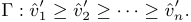
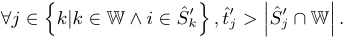
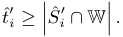

# **Strategy-Proof Data Auctions with Negative Externalities** _∗_ 

# **(Extended Abstract)** 

Xiang Wang_†_ , Zhenzhe Zheng_†_ , Fan Wu_†_ , Xiaoju Dong_†_ , Shaojie Tang_§_ , and Guihai Chen_†_ _†_ Shanghai Key Laboratory of Scalable Computing and Systems Department of Computer Science and Engineering Shanghai Jiao Tong University, China 

> _§_ Department of Information Systems, University of Texas at Dallas, USA 

## **ABSTRACT** 

Data has appeared to be a new kind of commodity with distinctive characteristics, which make it fundamentally d- ifferent from physical goods as well as traditional digital goods. Therefore, new trading mechanisms for data need to be designed. In this paper, we model the data market as an auction with negative externalities, and design practical mechanisms for data trading. Specifically, we propose a family of Data auctIons in CompetiTive mArkets, namely DICTA. DICTA contains two mechanisms, including DICTAFUL and DICTA-PAR. DICTA-FUL is a direct revelation auction mechanism in full competition markets, achieving strategy-proofness and optimal social welfare. In the partial competition markets, we show that the allocation problem is NP-hard. Therefore, we present an approximation algorithm for winner determination. By carefully integrating this approximation allocation algorithm and a charging scheme, DICTA-PAR achieves both strategy-proofness and _d_ -approximation, where _d_ is the maximum degree of the underlying undirected graph of the competition graph. 

## **General Terms** 

Algorithms, Theory, Economics 

## **Keywords** 

Data Market, Auction, Externality 

## **1. INTRODUCTION** 

In recent years, data has become a new kind of commodity that can be traded on the Internet. For example, Xignite 

_∗_ This work was supported in part by the State Key Development Program for Basic Research of China (2012CB316201), in part by China NSF grant 61422208, 61472252, 61272443 and 61133006, in part by Shanghai Science and Technology fund 15220721300, in part by CCF-Tencent Open Fund, in part by the Scientific Research Foundation for the Returned Overseas Chinese Scholars, and in part by Jiangsu Future Network Research Project No. BY2013095-1-10. The opinions, findings, conclusions, and recommendations expressed in this paper are those of the authors and do not necessarily reflect the views of the funding agencies or the government. 

**Appears in:** _Proceedings of the 15th International Conference on Autonomous Agents and Multiagent Systems (AAMAS 2016), J. Thangarajah, K. Tuyls, C. Jonker, S. Marsella (eds.), May 9–13, 2016, Singapore._ 

Copyright _⃝_ c 2016, International Foundation for Autonomous Agents and Multiagent Systems (www.ifaamas.org). All rights reserved. 

sells financial data, Gnip vends data from social networks, and Sabre trades consumers’ booking and searching data on travel. To facilitate online data marketing, several plantforms have emerged, _e.g._ , Azure Data Marketplace, Infochimps, and Dataexchange. These centralized plantforms let data owners upload and sell their data, and let data consumers discover and purchase the data needed. 

However, data as a kind of commodity is fundamentally d- ifferent from physical goods, since data exhibits a distinctive characteristic, _i.e._ , once produced, the data can be duplicated for any number of copies with low or no cost. Digital goods are also in unlimited supply, but for traditional digital goods, such as electronic books, audio files, and pay-perview movie, the negative externalities do not exist. However, data buyers may want to possess the data exclusively or to limit the distribution of data copies to their competitors. According to a recent survey on data market [3], out of all vendors in the research, 87% of offered data is in business contexts. Buyers, who are mostly companies, purchase their interested data in order to gain advantages in their business against their competitors. Such advantages can be undermined, if their competitors also get the same data, called negative externalities. Therefore, a buyer’s valuation on the data not only depends on whether she can get the data set, but also on the data allocation to her competitors. 

There indeed exist some works studying negative externalities in share-averse digital good auctions [1, 2]. However, there are huge differences between our auction model and theirs. A major difference is that, in share-adverse auctions, externality only depends on the number of buyers sharing the item, which is just like the complete competition scenario in our paper. However, in the partial competition scenario, each buyer can submit her set of competitors. Yet, another major difference is that they all assume the externality function being a common knowledge. However, in our model, the information about externality, specifically, tolerance bound and set of competitor, is private information. 

In this paper, we conduct an in-depth study on designing strategy-proof data auctions. We propose a family of Data auctIons in CompetiTive mArkets (DICTA). DICTA contains two mechanisms, namely DICTA-FUL and DICTAPAR. Specifically, DICTA-FUL is for an ideal but meaningful setting, _i.e._ , full competition markets, where any pair of buyers compete with each other. In this scenario, we propose a computationally tractable algorithm to calculate an optimal allocation, so that Vickrey-Clarke-Groves (VCG) mechanism can be applied to achieve both efficiency and strategy-proofness. We further consider a more practical 

1269 

scenario, _i.e._ , partial competition markets, in which each buyer just competes with a subset of the buyers instead of all. In this setting, the VCG mechanism is no longer appropriate due to computational intractability of searching for the optimal allocation. Therefore, we turn to design an approximation algorithm that finds a sub-optimal allocation, and incorporate it with a simple but effective pricing scheme to achieve strategy-proofness. 

## **2. RESULTS** 

We consider a one shot sealed bid data auction with a trusted auctioneer and a set of _n_ buyers N = _{_ 1 _,_ 2 _,_ 3 _, · · · , n}_ . There is a single set of data that can be duplicated to any number of copies, and then be sold to different interested buyers. Each buyer _i ∈_ N is interested in a single copy of the data set. 

Each buyer has a set of business competitors _Si ⊆_ N _\{i}_ , and can only tolerate up to _ti_ competitors sharing the same set of data. If the buyer _i_ wins the data set and there are no more than _ti_ competitors winning at the same time, then she has a valuation _vi_ on the data set. Otherwise, the valuation of the data set to the buyer _i_ becomes 0. The triple _θi_ = ( _Si, ti, vi_ ) is the private information of buyer _i_ , and is widely known as type in the literature. In the data auction, each buyer _i_ proposes a bid _bi_ = ( _S_ˆ _i, t_ˆ _i,_ ˆ _vi_ ), which can differ from her type. 

After collecting the bids from the buyers, the auctioneer constructs a directed _competition graph G_ , in which each vertex represents a buyer, and each edge ( _i, j_ ) _, i, j ∈_ N indicates that buyer _j_ is in buyer _i_ ’s competitor set. Then, the auctioneer determines a set of winners W _⊆_ N and calculates a payment _pi_ for each winner. 

## **2.1 FULL COMPETITION MARKETS** 

In this section, we present data auction mechanism DICTAFUL for the full competition markets, in which any pair of buyers compete with each other, _i.e._ , the competition graph is a complete graph. 

In this scenario, we can design a polynomial time algorithm to compute the optimal allocation, and thus can apply the celebrated Vickrey-Clarke-Groves (VCG) mechanism to achieve strategy-proofness. Therefore, we focus on algorithm design of allocation rule in this section. 

In the data set allocation algorithm, we first sort all the buyers in a non-increasing order of their declared valuations, and denote the sorted list by Γ. 

If there exists a tie, we break it arbitrarily. We note that _v_ ˆ _i__′_ may not be equal to _v_ ˆ _i_ after sorting, and we will apply the allocation algorithm to the buyers according to the order in the sorted list. 

Since any pair of buyers compete with each other in the full competition markets, for each winner, the number of her winning competitors is equal to the number of all the winners minus one. Thus, we can traverse every possible number of winners from 1 to _n_ . For each number _m ∈ {_ 1 _,_ 2 _, · · · , n}_ , we pick top _m_ buyers whose tolerance bounds are no less than _m −_ 1 from the sorted list Γ, and calculate their social welfare. If the number of qualified buyers is less than _m_ , we simply select all of them without filling out the quota. Finally, we locate the _m_ achieving the maximal social welfare, and output the corresponding set of winners as W. 

## **2.2 PARTIAL COMPETITION MARKETS** 

In this section, we present data auction mechanism DICTAPAR for partial competition markets, in which each buyer competes with a subset of the buyers. The previously studied full competition markets are special cases of the partial competition markets. 

Due to the hardness of allocating in partial competition markets, we here present our computationally efficient algorithm for data set allocation achieving _d_ -approximation ratio. 

Same as before, we first sort all the buyers in a nonincreasing order of their declared valuations, and denote the sorted list by Γ. If there exists a tie, we break it arbitrarily. 

Following the sequence specified in Γ, we visit each buyer _i_ one by one, and check whether she can be allocated the data set without violating the following two constraints. 

▶ The first constraint is that allocating the data set to buyer _i_ should not breach any of the previously selected winners’ tolerance bounds, _i.e._ , 

▶ The second constraint is that the number of previously selected winning competitors of buyer _i_ should not exceed her tolerance bound, _i.e._ , 

If both the above constraints are satisfied, we allocate the data set to buyer _i_ ; Otherwise, we deny buyer _i_ ’s bid. 

Since DICTA-PAR follows a greedy allocation rule, we adopt the concept of critical bid to determine the payment for each of the buyers. Given the distinctive characteristics of the binary valuation function in our data auction, we achieve strategy-proofness by adopting critical bid. 

## **3. CONCLUSIONS** 

In this paper, we have modeled the data trading market as an auction with negative externalities. We have studied two different but connected market scenarios, including full competition markets and partial competition markets. For full competition markets, we have designed DICTA-FUL to compute the optimal allocation, and integrate it with the celebrated VCG mechanism. Thus, DICTA-FUL achieves both strategy-proofness and optimal social welfare. For partial competition markets, we have shown that finding the optimal allocation is NP-hard, and also hard to approximate. In this scenario, we have designed DICTA-PAR, which is a combination of a _d_ -approximation allocation algorithm and a carefully designed charging scheme. 

## **REFERENCES** 

- [1] J. Pei, D. Klabjan, and W. Xie. Approximations to auctions of digital goods with share-averse bidders. _Electronic Commerce Research and Applications_ , 13(2):128–138, 2014. 

- [2] M. Salek and D. Kempe. Auctions for share-averse bidders. In _WINE_ , volume 8, pages 609–620. Springer, 2008. 

- [3] F. Schomm, F. Stahl, and G. Vossen. Marketplaces for data: An initial survey. _ACM SIGMOD Record_ , 42(1):15–26, 2013. 

1270 

