# **Control-based Bidding for Mobile Livestreaming Ads with Exposure Guarantee** 

|Haoqi Zhang|Junqi Jin|Zhenzhe Zheng∗|
|---|---|---|
|Shanghai Jiao Tong University|Alibaba Group|Shanghai Jiao Tong University|
|Shanghai, China|Beijing, China|Shanghai, China|
|zhanghaoqi39@sjtu.edu.cn|junqi.jjq@alibaba-inc.com|zhengzhenzhe@sjtu.edu.cn|
|Fan Wu|Haiyang Xu|Jian Xu|
|Shanghai Jiao Tong University|Alibaba Group|Alibaba Group|
|Shanghai, China|Beijing, China|Beijing, China|
|fwu@cs.sjtu.edu.cn|shenzhou.xhy@alibaba-inc.com|xiyu.xj@alibaba-inc.com|

## **ABSTRACT** 

Mobile livestreaming ads are becoming a popular approach for brand promotion and product marketing. However, a large number of advertisers fail to achieve their desired advertising performance due to the lack of ad exposure guarantee in the dynamic advertising environment. In this work, we propose a bidding-based ad delivery algorithm for mobile livestreaming ads that can provide advertisers with bidding strategies for optimizing diverse marketing objectives under general ad performance guaranteed constraints, such as ad exposure and cost-efficiency constraints. By modeling the problem as an online integer programming and applying primal-dual theory, we can derive the bidding strategy from solving the optimal dual variables. The initialization of the dual variables is realized through a deep neural network that captures the complex relation between dual variables and dynamic advertising environments. We further propose a control-based bidding algorithm to adjust the dual variables in an online manner based on the real-time advertising performance feedback and constraints. Experiments on a real-world industrial dataset demonstrate the effectiveness of our bidding algorithm in terms of optimizing marketing objectives and guaranteeing ad constraints. 

## **CCS CONCEPTS** 

• **Information systems** → **Display advertising** ; • **Applied computing** → **Electronic commerce** . 

∗Z. Zheng is the corresponding author. 

This work was supported in part by Science and Technology Innovation 2030 –“New Generation Artificial Intelligence” Major Project No. 2018AAA0100905, in part by China NSF grant No. 62132018, 61902248, 62025204, in part by Shanghai Science and Technology fund 20PJ1407900, in part by Alibaba Group through Alibaba Innovation Research Program, and in part by Tencent Rhino Bird Key Research Project. The opinions, findings, conclusions, and recommendations expressed in this paper are those of the authors and do not necessarily reflect the views of the funding agencies or the government. 

Permission to make digital or hard copies of all or part of this work for personal or classroom use is granted without fee provided that copies are not made or distributed for profit or commercial advantage and that copies bear this notice and the full citation on the first page. Copyrights for components of this work owned by others than ACM must be honored. Abstracting with credit is permitted. To copy otherwise, or republish, to post on servers or to redistribute to lists, requires prior specific permission and/or a fee. Request permissions from permissions@acm.org. _CIKM ’22, October 17–21, 2022, Atlanta, GA, USA_ © 2022 Association for Computing Machinery. ACM ISBN 978-1-4503-9236-5/22/10...$15.00 https://doi.org/10.1145/3511808.3557269 

## **KEYWORDS** 

E-commerce; Online Advertising; Control-based Bidding 

### **ACM Reference Format:** 

Haoqi Zhang, Junqi Jin, Zhenzhe Zheng, Fan Wu, Haiyang Xu, and Jian Xu. 2022. Control-based Bidding for Mobile Livestreaming Ads with Exposure Guarantee. In _Proceedings of the 31st ACM International Conference on Information and Knowledge Management (CIKM ’22), October 17– 21, 2022, Atlanta, GA, USA._ ACM, New York, NY, USA, 10 pages. https: //doi.org/10.1145/3511808.3557269 

## **1 INTRODUCTION** 

With the rapid development of mobile computing, many new formats of advertisements have emerged, such as mobile social media ads [29], location-based ads [27] and mobile livestreaming ads. Among them, mobile livestreaming ads [26] can promote products through real-time product demonstrations and frequent interaction between hosts and users. Such intensive host-user interaction and vivid demonstrations make mobile livestreaming ads more entertaining and attractive than traditional advertising formats. The market scale of livestreaming ads achieved over 170 billion dollars in China in 2021 [20], and will reach 25 billion in US by 2023 [26]. 

Despite the rapidly growing market scale, mobile livestreaming ads also bring several new challenges to efficient ad delivery within dynamic advertising environments. First, _ad exposure guarantee_ : a good ad delivery strategy should guarantee livestreaming ads receive adequate exposure or page views (PVs) within a short period of time, _e.g._ , two to three hours, quite different from the traditional ad campaigns lasting for a long time. A guarantee on ad exposure can enable advertisers to estimate expected advertising performance in advance, and reduce the risk of their ad investments. Second, _dynamic advertising environments_ : the advertising context can fluctuate significantly, since the user impression distribution of the ad platform varies greatly in both quality and quantity, and the host can promote various products at different times. Furthermore, the specific products within livestreaming ads are always unknown to the ad platform in advance, and thus each ad is considered as a new ad, resulting in the notorious cold start problem. Thus, a good ad delivery strategy should adapt to the dynamic environment and handle the cold start problem well. Finally, _multi-objective under multi-constraint_ : livestreaming ads have diverse marketing objectives, such as increasing gross merchandise volume (GMV) and the popularity of hosts. At the same time, advertisers also set multiple 

CIKM ’22, October 17–21, 2022, Atlanta, GA, USA 

Haoqi Zhang et al. 

constraints on performance metrics, such as Return On Investment (ROI) and Pay-Per-Click (PPC), to ensure the cost-efficiency of ad delivery. This leads to a challenging multi-objective optimization problem with general ad delivery constraints. 

The existing works are not sufficient to jointly solve the above three challenges. A common solution to satisfy the required ad exposure is guaranteed delivery (GD) [5, 8, 14], in which advertisers sign contracts with the ad platforms in advance for delivering a guaranteed amount of ad exposure at negotiated prices. The ad platform then executes these contracts by matching advertisers with pre-selected user impressions, resulting in inefficient ad allocation in dynamic environments. Furthermore, in most cases, GD only considers the performance of ad exposure, but not other marketing objectives and constraints. A potential solution for overcoming the disadvantages of GD is real-time bidding (RTB) [33, 34]. By participating in online ad auctions, the advertisers could optimize multiple marketing objectives in a flexible manner [22, 32]. However, the bidding environment experiences an erratic fluctuation due to the uncertain quantity and quality of user impressions and the dynamics of bidding strategies from competing advertisers, so the performance obtained by RTB is quite unstable. 

In this work, we consider a new format of e-commerce advertisement: mobile livestreaming ads, and investigate the problem of its exposure guarantee in dynamic advertising environments. We jointly leverage the advantages of GD and RTB, and propose a control-based bidding algorithm to maximize advertisers’ diverse marketing objectives under general constraints. We formulate the problem as an online integer programming, and show that the optimal bidding strategy can be derived based on the corresponding optimal dual variables. To achieve this, we first design a deep neural network, namely Λ-Network, and build the connection between dual variables and environment features. With this connection, we can establish a good initialization for the dual variables, overcoming the cold-start problem. To further adjust dual variables in dynamic environments, we leverage the idea of Model Predictive Control (MPC) [7], and update dual variables based on the realtime advertising performance feedback. To enhance the control capability of MPC, we jointly consider a proposed historical model and a real-time model, exploiting both historical knowledge and real-time information simultaneously. The historical model is a multi-variable feedback control module, and the real-time model is implemented by a periodic linear programming (LP) over the collected information during the ongoing ad campaign. We conduct comprehensive experiments over an industrial dataset to evaluate the performance of our algorithm. The experiment results demonstrate that the control-based bidding algorithm can simultaneously satisfy the requirement of exposure guarantee and optimize the multiple marketing objectives in dynamic advertising environments. 

Our contributions in this work can be summarized as follows: 

• We investigate the problem of exposure guarantee for mobile livestreaming ads in dynamic advertising environments. We formulate this problem of bid optimization as an online integer programming and build a connection between the bidding strategy and the corresponding dual variables. We detour the challenge of searching for an appropriate initialization of dual variables by approximating this process through a deep neural network. 

• We propose a control-based bidding algorithm that combines a historical model and a real-time model to dynamically adjust dual variables. The historical model overcomes the cold start problem at the early stage, and the real-time model can fully leverage the newly collected information. Our theoretical results show that such a control-based bidding algorithm can well optimize marketing objectives and keep performance constraints at the same time. 

• We conduct extensive experiments on a real-world industrial dataset. The experiment results demonstrate the superiority of the proposed control-based bidding algorithm in terms of ad performance constraints satisfaction and marketing objective optimization, achieving 95 _._ 75% of ad exposure and 93 _._ 03% of marketing objective of the optimal offline solution on average. 

## **2 RELATED WORKS** 

**Guaranteed Delivery** : The GD allocation problem can be formulated as an online matching over a user-advertiser bipartite graph. The online matching problem is solved in [15, 21] under the assumption that the arriving user impressions are drawn independently from a certain distribution. The primal-dual method is introduced in [10], under which Chen et al. further proposed High Water Mark (HWM) algorithm by assigning an equal fraction of available user impressions for each contract [8]. SHALE algorithm is designed in [5] by converting the optimal dual variables to a good solution for the primal GD allocation problem. Fang et al. modeled the problem at an individual level and developed a real-time pacing strategy for fulfilling contracts smoothly [14]. Different from these GD approaches, we guarantee ad exposure by finding a proper bidding strategy instead of directly matching user impressions and ads. 

**Bid Optimization with Multiple Constraints** : In online advertising, the bid optimization problem is well studied [23, 25, 35]. The classical formulation is budget constraint bidding (BCB) with a single optimization objective [6, 30, 34]. In [34], Zhang et al. proposed a bidding strategy with the form of _𝜆__<u>𝑣</u>_, where_𝑣_is the value of each impression, and the budget constraint can be satisfied by adjusting the pacing parameter _𝜆_ . In [30], Wu et al. solved the budget constraint bidding by applying a model-free reinforcement learning method to learn a proper _𝜆_ . However, these works did not consider other objectives and constraints, such as PPC and PV. In [33], by applying a feedback control method to adjust the bidding strategy based on real-time performance, other KPIs such as PPC and auction-winning-rate could be optimized. In [16], Ghosh et al. proposed an algorithm to acquire the given number of ad exposure within the preset budget. The work [18, 22, 32] attempted to extend BCB to multiple constraints bidding (MCB) with diverse optimization objectives. In [22], Kitts et al. proposed a generic algorithm to address multiple constraints as well as optimize the target advertising value by truncating bid prices. In [32], the problem of GMV maximization under budget and PPC constraints is formulated as an online LP problem. By leveraging the primal-dual method, Yang et al. derived the bidding strategy based on the optimal dual variables. In [18], He et al. further proposed a policy-based reinforcement learning method to adjust the bidding strategy during advertising. However, none of these approaches considered the guaranteed delivery of ad exposure, which is critical to livestreaming ads. 

Control-based Bidding for Mobile Livestreaming Ads with Exposure Guarantee 

CIKM ’22, October 17–21, 2022, Atlanta, GA, USA 

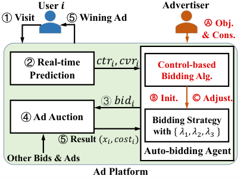

<!-- Start of picture text -->
User  𝒊 Advertiser ① Visit ⑤ Wining Ad Ⓐ Obj. & Cons. ② Real-time  𝑐𝑡𝑟!, 𝑐𝑣𝑟! Control-based Prediction Bidding Alg. ③ 𝑏𝑖𝑑! Ⓑ Init. Ⓒ Adjust. ④ Ad Auction Bidding Strategy with  { 𝜆!, 𝜆", 𝜆# } ⑤ Result  (𝑥$, 𝑐𝑜𝑠𝑡$) Auto-bidding Agent Other Bids & Ads Ad Platform <!-- End of picture text -->

**Figure 1: A Guaranteed Ad Delivery System.** 

Online algorithms with guaranteed competitive ratios have also been proposed to solve the online LP in the literature of operation research [2, 17]. In [2], the optimal dual variables are approximated by solving an offline LP on the observed information until the current time slot. In [17], Gupta et al. solved the online LP problem by converting it to the load balance problem, which can be solved with the expert algorithm. Different from previous works, we consider not only packing constraints about advertisers’ limited resources ( _e.g._ , budget) but also covering constraints for ensuring the ad exposure. The dynamic advertising environment also brings high exploration costs and intensifies the cold start problem, requiring us to jointly consider the historical knowledge from previous LP instances and real-time information from ongoing environments. 

## **3 PRELIMINARIES AND PROBLEM FORMULATION** 

In this section, we review ad guaranteed delivery process in dynamic advertising environments. We then give the formal mathematical formulation for multi-objective optimization under general constraints. We finally derive the optimal bidding strategy. 

## **3.1 An Ad Delivery System** 

We first present the classical ad delivery system as shown in Fig. 1, which usually contains three entities: _users_ , _advertisers_ , and _ad platform_ . A typical workflow of the advertising system contains five steps: 1) Once a user visits the ad platform, an ad display request would be sent to the auto-bidding agents that may be interested in displaying ads to this user. 2) The ad platform provides the predicted advertising performance of the user-advertiser pair, such as ClickThrough Rate (CTR) [9, 36] and Conversion Rate (CVR) [31] for the auto-bidding agents. 3) The auto-bidding agents submit bid prices along with the ads back to the ad auction. 4) After receiving bidding prices of all agents, the ad platform launches a Generalized Second Price (GSP) auction [13] to determine the winning ad. 5) The user interacts with the displayed winning ad, and the interaction feedback is used as a reference for payment calculation. In this work, we adopt Cost-Per-Click (CPC) method [19], in which the winning advertiser would be charged only if the user clicks her ad. 

Our bidding-based guaranteed ad delivery components can be integrated into the above procedure by introducing three additional steps: A) At the beginning of ad campaigns, advertisers submit 

targeting advertising performance to auto-bidding agents, that is, specific marketing objectives and multiple constraints over ad exposure, budget, expected PPC and other KPIs. B) After receiving the ad delivery requests, the auto-bidding agents evaluate the feasibility of these requests, and initialize bidding strategies. C) Within the dynamic advertising environments, agents adaptively adjust the bidding strategies based on real-time feedback to fulfill the ad delivery requests. 

## **3.2 Problem Formulation** 

We formulate the problem of guaranteed ad delivery in mobile livestreaming ads by specifying the advertiser’s marketing objectives and constraints. Instead of simply optimizing a single KPI, we model the advertiser’s general optimization objective by a weighted linear combination of multiple ad performance indicators. During the ad campaign, we assume there are a total of _𝑁_ users visiting the ad platform in sequence. For each user impression _𝑖_ , the ad platform can predict the ad performance, such as predicted CTR _𝑐𝑡𝑟𝑖_ , expected GMV _𝑔𝑚𝑣𝑖_ , and also the expected _𝑐𝑜𝑠𝑡𝑖_ of displaying the ads to user _𝑖_ . We can formulate the problem of guaranteed ad delivery as the following online integer programming (Online IP): 

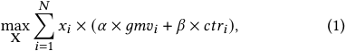

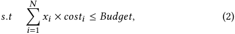

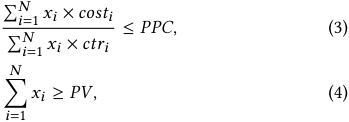

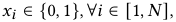

where the vector X = ( _𝑥_ 1 _,𝑥_ 2 _, ...,𝑥𝑁_ ) indicates whether user _𝑖_ is selected to display the ad, _i.e._ , _𝑥𝑖_ = 1 when user _𝑖_ is selected, and _𝑥𝑖_ = 0, otherwise. We consider three types of representative ad performance constraints in the above formulation. The constraint in (2) is the classical budget constraint [34]. Inequality (3) represents the constraints for the ratio of performance indicators, such as average Pay-Per-Click (PPC). ROI constraint also falls into this type of constraint. Inequality (4) is about constraint over guaranteed ad performance, such as PV constraint for guaranteeing ad exposure. 

There exist several challenges in solving the above online integer programming. First, advertisers participate in ad auctions by offering bids. Instead of directly deciding X, we need to design an algorithm to provide an appropriate bidding strategy. Second, the designed algorithm needs to be an online one, which requires deciding a bid price once a user impression arrives, without the knowledge about the subsequent user impressions and future competition. The erratic fluctuation in dynamic environments further complicates the design of online bidding algorithms, making previous approaches mainly leveraging historical data [32] hard to adapt to the dynamic environments. Third, the newly introduced PV constraint in (4) makes it hard to fulfill all the constraints by simply focusing on budget pacing or PPC controlling [22, 33], and 

CIKM ’22, October 17–21, 2022, Atlanta, GA, USA 

Haoqi Zhang et al. 

it may make the optimization problem infeasible. That is, the ad delivery request from advertisers may not be fulfilled by the current advertising environments, and we should figure out infeasible instances before solving the optimization problems. 

## **3.3 Optimal Bidding Strategy** 

We overcome the above challenges by converting the original problem to searching for the optimal dual variables. We first relax the online IP as an online LP problem, in which X are relaxed to be continuous variables, that is, _𝑥𝑖_ ∈[0 _,_ 1]. 

To solve the LP problem, we refer to the classical primal-dual method [12]. Let the dual variables of Budget, PPC, and PV constraints be _𝜆_ 1, _𝜆_ 2, and _𝜆_ 3, respectively, and _𝑦𝑖_ be the dual variable of _𝑥𝑖_ ≤ 1. Then, the dual problem of LP can be defined as: 

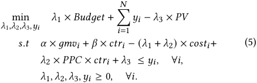

For the optimal solution _𝑥_∗ in the primal problem, we denote the corresponding optimal solution in the dual problem as Λ∗ = { _𝜆_ 1∗_, 𝜆_ 2∗_, 𝜆_ 3∗}, and_𝑦_∗. With this dual problem formulation, we can build a connection between dual variables and the bidding strategy. It can be shown that solving the user impression selection of the LP is (almost) equivalent to setting the following bidding strategy [2, 32]: 

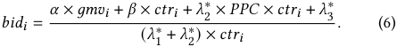

We illustrate the intuition behind the analysis here. On the one hand, according to the rule of GSP auction, the selection decision for user impression _𝑖_ under this bidding strategy is as follows: 

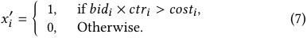

On the other hand, according to the complementary slackness and the constraints in (5), we can have 

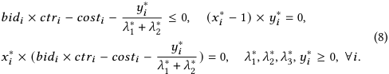

With these two aspects in (7) and (8), we can verify that the decision variable _𝑥𝑖_′is equal to_𝑥_ _𝑖_∗as long as_𝑏𝑖𝑑𝑖_×_𝑐𝑡𝑟𝑖_≠_𝑐𝑜𝑠𝑡𝑖_. In the dynamic advertising environment with a high volume of ad auctions, the proportion of instances with _𝑏𝑖𝑑𝑖_ × _𝑐𝑡𝑟𝑖_ = _𝑐𝑜𝑠𝑡𝑖_ is quite small, which implies that the user impression selection result from the bidding strategy in (6) is almost equivalent to the optimal solution of LP. Since the decision variables in the LP are integers as long as _𝑏𝑖𝑑𝑖_ × _𝑐𝑡𝑟𝑖_ ≠ _𝑐𝑜𝑠𝑡𝑖_ , we also have demonstrated the relaxation from IP to LP would not cause much distortion. Thus, once we have the optimal dual variables, we can derive the optimal bidding strategy by (6). In the following discussion, we design an efficient online algorithm to search for the optimal dual variables Λ∗ = { _𝜆_ 1∗_, 𝜆_ 2∗_, 𝜆_ 3∗}, from the perspectives of initialization and dynamic adjustment. 

## **4 AD ENVIRONMENT REPRESENTATION** 

In this section, we introduce a deep neural network to represent the dynamic advertising environment, which is critical to both the initialization and dynamic adjustment of the dual variables in (6). 

## **4.1 Network Design** 

To calculate the dual variables, classical approaches need to collect historical LP instances and then conduct an offline LP. We abstract this process as a mapping from user impression information and constraint parameters to the optimal dual variables, which can be defined as Λ∗ = _𝑓_ ( _𝑈𝑠𝑒𝑟𝑠, 𝐵𝑢𝑑𝑔𝑒𝑡, 𝑃𝑃𝐶, 𝑃𝑉_ ), where _𝑈𝑠𝑒𝑟𝑠_ represents the predicted advertising performance for user impressions, including their predicted _𝑐𝑡𝑟_ , _𝑔𝑚𝑣_ , and _𝑐𝑜𝑠𝑡_ , and _𝐵𝑢𝑑𝑔𝑒𝑡_ , _𝑃𝑃𝐶_ , and _𝑃𝑉_ are the parameters of the performance constraints in (2), (3), and (4). However, there exist three difficulties in finding such a mapping function. First, the information of all user impressions is not available until the end of ad campaigns in the online setting. Second, it is time-consuming to solve the large offline LPs in (1) repeatedly, which involves thousands of decision variables in advertising environments. Third, the mapping function _𝑓_ could be quite complicated, and cannot be expressed as a closed-form expression. 

To overcome the above challenges, we design a deep neural network to approximate the mapping function _𝑓_ in a data-driven manner. We introduce a representation layer to model the dynamic advertising environment, which can capture the unavailable user impression information in the future to some extent. This idea comes from the observations that we can regard each arriving user impression as a sample from the overall user impression distribution condition on the current ad’s features, which is directly decided by the advertising environment. Compared with user impression information, advertising environment encodes much richer information, such as the information of ad auctions, the ad features like ad category, product price, and etc. Thus, we replace the unavailable user impression information with the environment information in the mapping function as Λ∗ = _𝑓_ ( _𝐸𝑛𝑣, 𝐵𝑢𝑑𝑔𝑒𝑡, 𝑃𝑃𝐶, 𝑃𝑉_ ) _,_ where we transform high dimensional features into dense embedding, _i.e._ , _𝐸𝑛𝑣_ = _𝐸𝑚𝑏𝑒𝑑𝑑𝑖𝑛𝑔_ ( _𝑎𝑑𝑓𝑒𝑎𝑡𝑢𝑟𝑒𝑠,𝑒𝑛𝑣𝑓𝑒𝑎𝑡𝑢𝑟𝑒𝑠..._ ). 

We next illustrate this idea of approximation by designing a Λ-network and show the network architecture in Fig. 2. The Λ- network first concats the performance constraint parameters and the environment embedding, and then feeds them into three separate regression networks. The output of each regression network is the corresponding dual variables. When training Λ-network, the loss function is the mean square error between the outputted dual variables and the ground truth optimal dual variables Λ∗ , and we update the network parameters by minimizing the average loss. It is worth noting that we can integrate a more general neural network to approximate the mapping function by leveraging more advertising features and using more complex network structures to enhance the approximation ability. The detailed design of more complicated neural networks is out of the scope of this work. 

## **4.2 Applications** 

A direct application of the above Λ-network is to initialize the dual variables using the collected information about the advertising environment and the constraints. Another important application is 

Control-based Bidding for Mobile Livestreaming Ads with Exposure Guarantee 

CIKM ’22, October 17–21, 2022, Atlanta, GA, USA 

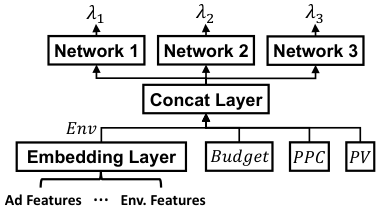

<!-- Start of picture text -->
𝜆! 𝜆" 𝜆# Network 1 Network 2 Network 3 Concat Layer 𝐸𝑛𝑣 Embedding Layer 𝐵𝑢𝑑𝑔𝑒𝑡 𝑃𝑃𝐶 𝑃𝑉 Ad Features … Env. Features <!-- End of picture text -->

**Figure 2: The** Λ **-network.** 

that we can quantify the relation between the constraint parameters and the dual variables, which would be exploited for the dynamic adjustment of dual variables. Specifically, we can use the derivatives of the mapping function _𝑓_ , approximated by the gradient of the Λ-network, to represent the linear relation between the change of the constraint parameters and that of the dual variables: 

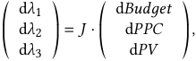

where _𝐽_ is a 3×3 Jacobi matrix and can be derived from the gradient of the Λ-network with inputs _𝐸𝑛𝑣_ , _𝐵𝑢𝑑𝑔𝑒𝑡_ , _𝑃𝑃𝐶_ , _𝑃𝑉_ : 

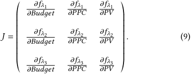

We discuss how to use such a relation for dynamically adjusting the dual variables in the next section. 

We can also apply the Λ-network to evaluate the feasibility of the LP in advance, which is non-trivial due to the newly added PV constraint for guaranteed delivery. Based on duality theory [12], we can derive that the primal problem is infeasible if and only if the dual problem is unbounded. According to the optimization objective in (5), the dual problem is unbounded implies _𝜆_ 3∗−→_𝑖𝑛𝑓_. _i.e._ , the value of PV reaches infinite. This can be reflected by certain patterns in the predicted dual variables outputted by the Λ-network, and we leverage Support Vector Machine (SVM) [28] to capture such patterns. In the simulation experiment where we generate 181 _,_ 953 groups of constraints based on real-world ad campaign logs, our approach can achieve an accuracy of 85.9% and AUC of 89.4% for the feasibility validation task. 

## **5 FEEDBACK CONTROL FOR DYNAMIC BIDDING** 

In this section, we design a feedback control algorithm under Model Predictive Control (MPC) [7] framework to timely adjust the bidding strategy in a dynamic environment. 

## **5.1 Model Predictive Control Framework** 

As shown in Fig. 3, Model Predictive Control (MPC) is a feedback control framework that can handle the coupling effects of multiple inputs and outputs of a dynamic system. The goal of MPC is to keep the outputs (system feedback) close to the pre-defined references by 

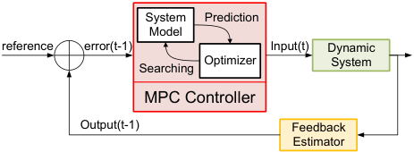

<!-- Start of picture text -->
System  Prediction Model reference error(t-1) Input(t) Dynamic Optimizer System Searching MPC Controller Output(t-1) Feedback Estimator <!-- End of picture text -->

**Figure 3: A Model Predictive Control framework.** 

searching for the best dynamic system inputs. A classic MPC contains two important components: a model for the dynamic system and an optimizer for inputs. By the model, we can predict the possible output for a given input to the dynamic system. The optimizer searches for the best inputs in the next time step by minimizing the error between the predicted output and the desired reference. 

We next show the MPC framework for control-based bidding in advertising. We regard the whole advertising environment and bidding strategy as the dynamic system. The inputs of this dynamic system are the dual variables, and the outputs are the current advertising performance, such as the spent cost, average PPC, and acquired PV. The goal of the MPC is to ensure the total cost, the average PPC, and the accumulated PV at the end of the campaign approach to the preset constraints by keeping the outputs close to the references in each time period. Specifically, suppose the duration of the ad campaign is _𝑀𝑇_ with _𝑀_ time periods and each with _𝑇_ time slots. The input of the system in the period _𝑛_ is { _𝜆__𝑛_ 1_, 𝜆𝑛_ 2_, 𝜆𝑛_ 3}, which determines the bidding strategy and the system outputs, _i.e._ , _𝐶𝑜𝑠𝑡𝑛_ , _𝑃𝑃𝐶𝑛_ and _𝑃𝑉𝑛_ , indicating the total cost, averaged PPC and PV acquired within time period _𝑛_ . At the end of each time period, the MPC adjusts the dual variables according to the error between the (dynamic) references and performance feedback. A simple definition of the references for time period [ _𝑛𝑇,_ ( _𝑛_ + 1) _𝑇_ ) is: 

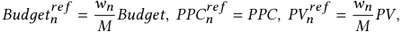

where W = { _𝑤_ 0 _,𝑤_ 1 _, ...,𝑤𝑀_ −1} with� _𝑖__𝑀_ =0−1_𝑤𝑖_=_𝑀_areweight factors describing the environment fluctuation in different time periods. By building the connection of input, output, and the references of the dynamic system in this way, the preset constraints can be satisfied through dynamic adjustment of the dual variables. However, one problem is still unclear: whether this MPC can maximize the advertiser’s optimization objective? For this question, we give the following theorem. The detailed proof is displayed in the supplementary material [1]. 

Theorem 5.1. _For dual variables_ Λ′ = { _𝜆_ 1′_, 𝜆_ 2′_, 𝜆_ 3′}_, suppose the_ _corresponding ad allocation result for (Online IP) is_ X′ = { _𝑥_ 1′_,𝑥_ 2′_, ...,𝑥_ _𝑁_′} _and the optimal solution is_ X∗ = { _𝑥_ 1∗_,𝑥_ 2∗_, ...,𝑥_ _𝑁_∗}_. The upper bound of_ _the gap between the optimization objective achieved by_ X′ _and_ X∗ _is:_ 

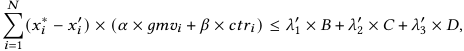

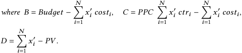

CIKM ’22, October 17–21, 2022, Atlanta, GA, USA 

Haoqi Zhang et al. 

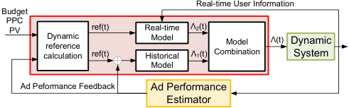

<!-- Start of picture text -->
Real-time User Information Budget PPC PV ref(t) Real-time  Λ2(t) reference Dynamic  Model  Model Λ(t) Dynamic calculation ref(t) Historical  Λ1(t) Combination System Model Ad Peformance Feedback Ad Performance Estimator <!-- End of picture text -->

**Figure 4: The control-based bidding algorithm.** 

According to Theorem 5.1, when we keep the total cost, the average PPC, and the accumulated PV close to the required constraint parameters, _i.e._ , _𝐵_ , _𝐶_ , and _𝐷_ vanishes to zero, the gap of the optimization objective would also disappear. We can conclude that the MPC feedback control framework can maximize the advertiser’s objective and keep constraints in the feasible region simultaneously. The major problem in the above MPC is to model the dynamic system and design the output optimizer. However, the dynamic advertising environment is too complicated to have a concise model as in traditional dynamic systems [32]: the bidding landscape from competitive advertisers is quite different in various ad auctions; user impressions experience erratic fluctuation in terms of quantity and quality. Without a precise model for the dynamic system, the result from the optimizer can be quite unstable, and the searching process is time-consuming. We next propose an end-to-end controlbased bidding algorithm, combining the dynamic system model and the output optimizer together. 

## **5.2 A Control-based Bidding Algorithm** 

The complete process of the proposed control-based bidding algorithm is shown in Fig. 4, where the main algorithm components are highlighted in the red box, including dynamic reference calculation, historical model, real-time model, and model combination. Designing this algorithm only using historical experiences can cause huge performance degradation in dynamic environments. While simply relying on real-time information may cause a severe cold-start problem and suffers from incorrect dynamic references due to the incompleteness of data. Thus, we design a _historical model_ as well as a _real-time model_ , and combine them in an appropriate way. 

**Historical Model with Multi-variable Feedback Control** : As shown in Fig. 5, the historical model is based on the multi-variable feedback control [24], which decouples multi-inputs (error between ad performance feedback and references) and multi-outputs (the adjustments to the dual variables) by using the relation between the change of dual variables and the fluctuation of constraint parameters, captured by the Λ-network. Similar to Section 4.2, when the change of constraint parameters (error) Δ _𝐵𝑢𝑑𝑔𝑒𝑡,_ Δ _𝑃𝑃𝐶,_ Δ _𝑃𝑉_ are small, we can use a linear model to approximate this relation as shown in (10). Since the control signals are generated based on the linear combination of error, the change of constraint parameters can be transformed to the control signals of dual variables in (11). 

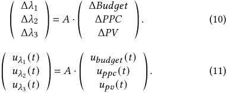

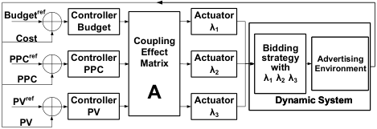

<!-- Start of picture text -->
Budget ref Controller  Actuator Budget λ1 Cost Coupling Effect  Bidding PPC ref Controller PPC Matrix Actuator λ2 strategy with EnvironmentAdvertising PPC λ1  λ2  λ3 PV ref Controller  A Actuator  Dynamic System PV λ3 PV <!-- End of picture text -->

**Figure 5: The Historical Model.** 

Instead of fixing the coupling effect matrix _𝐴_ , we use the Jacobi matrix in (9) from Λ-network to represent the coupling effect1 . We next set the controller, reference, and the actuator to generate the control signals of constraint parameters, _i.e._ , _𝑢𝑏𝑢𝑑𝑔𝑒𝑡 ,𝑢𝑝𝑝𝑐,𝑢𝑝𝑣_ . Different from the classic PID controller [4], we require the controller to be simple and robust to keep the basic performance as we have another real-time model for further adjustment. Thus, we use Water-Level (WL) controller [11] with the control function: _𝑢_ ( _𝑡_ ) = _𝑢_ ( _𝑡_ − 1) + _𝛾_ × _𝑒_ ( _𝑡_ ), where the error in the _𝑛_ -th time period can be calculated as2 : 

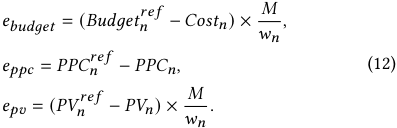

It is worth noting that we rescale the error from the single period with _𝑇_ time slots to the entire advertising process with a total of _𝑀𝑇_ time slots. This is because the gradient of Λ-network approximates the relation between dual variables and the constraint parameters over the whole advertising period. Due to the lack of the integral controller, WL controller can not well handle the accumulative error [33]. We further enhance the control capability of WL controller by using dynamic references instead of fixed references: 

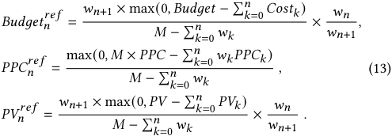

The above dynamic references are the cost, PPC, and PV we need to achieve in the next time period if we want the overall ad performance to satisfy the desired ones based on the realized performance so far, and we rescale them from time period ( _𝑛_ +1) to _𝑛_ . The actuator we use in WL controller is linear-form: _𝜆_ (( _𝑛_ + 1) _𝑇_ ) = _𝜆_ (0) + _𝑢𝜆_ ( _𝑛𝑇_ ). 

**Real-time Model with Periodic Linear Programming** : We introduce a real-time model to leverage the fine-grained online information, enabling the bidding algorithm to adapt to the current ongoing environment rapidly. At time slot _𝑡_ , the advertising platform can collect the advertising instances during a period [ _𝑡_ − _𝑇_ 0 _,𝑡_ ) with an observing interval _𝑇_ 0. We denote the user impressions in period [ _𝑡_ − _𝑇_ 0 _,𝑡_ ) as a set _𝑈_ ( _𝑡,𝑇_ 0). We use this information to predict 

> 1The main advantage is that the Λ-network encodes the knowledge learned from historical instances, and can be generalized to calculate the matrix _𝐴_ . 

> 2We use _𝑒𝑏𝑢𝑑𝑔𝑒𝑡 ,𝑒𝑝𝑝𝑐_ and _𝑒𝑝𝑣_ instead of Δ _𝐵𝑢𝑑𝑔𝑒𝑡_ , Δ _𝑃𝑃𝐶_ , and Δ _𝑃𝑉_ , to represent the error of the constraint parameters as in literature. 

Control-based Bidding for Mobile Livestreaming Ads 

CIKM ’22, October 17–21, 2022, Atlanta, GA, USA 

with Exposure Guarantee 

the optimal dual variables in the following observation period. The key assumption behind this is that the advertising environment is relatively stable during a short period, meaning that the user impressions arriving in [ _𝑡,𝑡_ + _𝑇_ 0] are likely to follow the identical and independent distributions with _𝑈_ ( _𝑡,𝑇_ 0). We can then combine the current references with the user impressions in _𝑈_ ( _𝑡,𝑇_ 0) to calculate the optimal dual variables through offline linear programming. We use the dynamic references defined in (13) with rescaling as the constraints in this offline linear programming. The offline linear programming is shown as follows: 

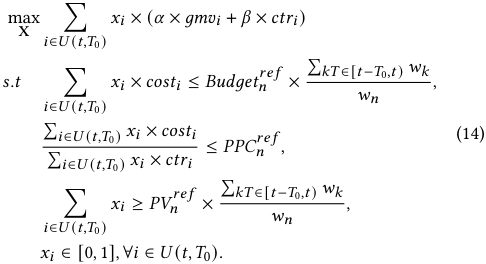

Although the real-time adaption model can capture the current advertising environment better than the historical model, it suffers from the cold start problem and the incompleteness of data. We next combine the historical model and the real-time model to improve the overall performance. 

**Combination of Historical model and Real-time model** : At the time slot _𝑡_ , we denote the dual variables of the historical and real-time model as Λ1 ( _𝑡_ ) and Λ2 ( _𝑡_ ), respectively. The final output of the combined model can be formulated as: Λ( _𝑡_ ) = _𝜏_ ( _𝑡_ ) × Λ1 ( _𝑡_ ) + (1 − _𝜏_ ( _𝑡_ )) × Λ2 ( _𝑡_ ), where _𝜏_ ( _𝑡_ ) is the weight factor and _𝜏_ ( _𝑡_ ) = 1 − min( _𝑘_ ( _𝑀𝑇__<u>𝑡</u>_)_, 𝑝_), where_𝑝_∈[0_,_1]and_𝑘_≥_𝑝_. The weight factor _𝜏_ ( _𝑡_ ) is close to 1 at the beginning and gradually reduces to 1 − _𝑝_ as _𝑡_ increases. The intuition behind this _𝜏_ ( _𝑡_ ) is that we pay more attention to the historical model at the beginning due to the cold start problem. As time evolves, the advertising environment becomes relatively stable, and we rely more on the real-time model in the later stage. The parameter _𝑘_ controls the speed of shifting the attention from the historical model to the real-time model and is decided based on the severity of the cold start problem. The parameter _𝑝_ reflects the quality and the credibility of the collected real-time information, which should be small when the incompleteness of data is severe, or the latency to collect the data is large. 

## **6 EXPERIMENT RESULTS** 

## **6.1 Dataset and Metrics** 

The experiments are based on an industry dataset from Mobile Taobao, the largest e-commerce platform in China. The dataset consists of 94 ad campaigns within six sequential days with a total of 7 _._ 4 GB ad logs. Each ad campaign contains hundreds to tens of thousands of ad logs, each of which represents an advertising opportunity, including the user impression arrival time, predicted ad KPIs and expected cost. We group these ad logs by their arrival time and the ad campaign they belong to. As livestreaming ads usually last for a short period of time, we set the advertising duration to 

be an hour in the following experiments and generate constraint parameters based on the statistic user impression distribution to avoid infeasible or invalid constraints. We divide the ad logs in the first five days as the training data and the last day as the test data. 

From this data set, we observe that the ad environment is significantly dynamic in practice. The difference in CTR and CVR between different days reaches over 15%, and the fluctuation in user impression volume can even exceed 450%. The user impression volume and ad KPIs can also change greatly at different time periods within the same day: compared with the early morning between 4 am and 6 am, the user impression volume between 9 pm and 11 pm is 5 times larger and the average CVR increases by 70%. These results demonstrate the necessity of a proper environment representation and adaptive bidding algorithms3 . 

The evaluation metrics can be divided into three categories: 

1) Gap between the achieved marketing objective and the optimal offline solution (refer as M.O. for short). 

2) Gap between the obtained ad KPIs and the preset constraint parameters, measuring the ability to keep the bidding algorithm in line with dynamic environment4 . 

3) Constraint satisfaction ratio indicates the proportion of samples with the three constraints satisfied (refer as Ratio for short). Due to the difficulty in satisfying the three constraints rigorously, we allow a 10% drift for these constraints. 

## **6.2 Control Frequency Selection** 

The frequency of feedback control is critical for the trade-off between the control capability and the efficiency of online systems. We evaluate the impact of feedback control frequency on the performance of the historical model, and show the result in Fig. 6(a). We can observe that a high control frequency reacts quickly against environment fluctuation and indeed improves the performance, increasing the constraint satisfaction ratio from 65% to 78%. Such improvement diminishes with the increase of frequency, and reaches a bottleneck when the frequency exceeds 12 times per hour, which is then chosen for the control frequency of the historical model. 

For the real-time model, its control frequency should be smaller than the historical model since the offline LP on large-scale data is much more complicated than the multi-variable feedback control. The real-time model needs detailed information about all the arrived user impressions, which is always incomplete due to data loss and data delay in practice. We model the probability that the user impression’s information is not available at time _𝑇_ as a time-varying function _𝐿_ ( _𝑇_ − _𝑇𝑎_ ), where _𝑇𝑎_ is the user impression’s arrival time and _𝐿_ ( _𝑡_ ) = _𝑝𝑙𝑜𝑠𝑠_ + _𝑝𝑑𝑒𝑙𝑎𝑦_ ( _𝑡_ ). Here _𝑝𝑙𝑜𝑠𝑠_ is the probability that the data is lost during transmission, and _𝑝𝑑𝑒𝑙𝑎𝑦_ ( _𝑡_ ) is the probability that the data is temporarily delayed. We set _𝑝𝑙𝑜𝑠𝑠_ = 5% and _𝑝𝑑𝑒𝑙𝑎𝑦_ ( _𝑡_ ) = max(0 _,_ 30%−3%× _𝑡_ ) in the experiment. The experiment result under different control frequencies is shown in Fig. 6(b). We observe that 

3In the following experiments, the dynamic ad environments mainly refer to various user impression volumes and ad performance indicators for different ad campaigns on different days/hours. The user impression volume within a short period, _e.g._ , one hour, is relatively stable. 

> 4The gap between performance _𝐴_ and preset constraint _𝐵_ is evaluated as max( _𝐵_ − _𝐴,_ 0)/ _𝐵_ , and we calculate the average gap over all the test samples. The advertising process will terminate when the budget is exhausted. Since spending too much money on cheap user impressions can harm the overall ad performance, we consider both insufficient and abundant parts when calculating the gap of PPC, which is<u>|</u>_<u>𝑝𝑝𝑐</u>_ _𝑃𝑃𝐶_′−_𝑃𝑃𝐶_<u>|</u> . 

CIKM ’22, October 17–21, 2022, Atlanta, GA, USA 

Haoqi Zhang et al. 

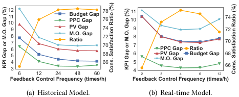

<!-- Start of picture text -->
121011 Budget GapPPC Gap 7876 1011 74 9 PV Gap 74 9 72 87 M.O. GapRatio 7270 87 70 6 PPC Gap Ratio 54 6866 65 PV GapM.O. Gap Budget Gap 6866 3 6 12 24 48 60 4 2 3 4 6 12 Feedback Control Frequency (times/h) Feedback Control Frequency (times/h) (a) Historical Model. (b) Real-time Model. KPI Gap or M.O. Gap (%) Cons. Satisfaction Ratio (%) KPI Gap or M.O. Gap (%) Cons. Satisfaction Ratio (%) <!-- End of picture text -->

**Figure 6: Control frequency analysis.** 

**Table 1: The ablation study of Historical Model.** 

|Exp. Index|Budget|PPC|PV|M.O.|Ratio|
|---|---|---|---|---|---|
|1|29.76%|10.50%|28.76%|23.18%|22.94%|
|2|24.98%|9.09%|24.35%|19.85%|27.41%|
|3|5.66%|42.66%|8.19%|14.03%|7.22%|
|4|9.56%|5.05%|10.46%|9.25%|60.49%|
|5|10.89%|4.85%|11.24%|9.45%|58.75%|
|6|4.79%|6.25%|6.25%|9.91%|75.88%|
|**Our Alg.**|**5.17%**|**4.10%**|**6.83%**|**7.78%**|**75.92%**|

the low control frequency lacks enough control capability, while the high control frequency can cause severe data delay, increasing the average _𝐿_ from 10% to 27 _._ 5%. Considering the control capability and computation resources, we set the frequency of the real-time model to be 4 times per hour with the average _𝐿_ to be 15%. 

## **6.3 Ablation Study** 

We evaluate the effectiveness of different components in our controlbased bidding algorithm through ablation study. 

**Historical Model.** We conduct the ablation experiments of the historical model from high-level components to fine-grained components. We consider the following six ablation experiments: 

1) Remove the feedback control system and fix the dual variables generated by Λ-network during the whole advertising process. 

2) Replace the feedback control system with the periodic prediction of Λ-network by applying the updated dynamic references with rescaling as the network input at the end of each time period to re-generate the dual variables. 

3) Remove the advertising environment features in Λ-network. 

- 4) Remove the dynamic references of WL controller. 

5) Replace the WL controller with the PID controller with hyperparameters decided through grid-search on training data. 

6) Replace the feedback control with three independent WL controllers. That is, setting all the elements of the coupling effect matrix _𝐴_ except the main diagonal to 0. 

The experiment results are shown in Tab. 1, and we can get the following observations/insights for each of the above experiments: 

1) It is necessary to adjust the bidding algorithm in line with the dynamic environment. The dual variables initialized by the Λ-network cannot handle the fluctuation of the advertising environment, increasing the PV gap by 21 _._ 93%. 

2) Although periodically adjusting the dual variables through the Λ-network prediction can improve the performance compared with no adjustment, the dual variables are not very precise, leading 

**Table 2: The ablation study of Real-time Model.** 

|Exp. Index|Budget|PPC|PV|M.O.|Ratio|
|---|---|---|---|---|---|
|1|23.53%|10.61%|22.81%|23.62%|55.11%|
|2|7.54%|4.33%|6.93%|9.48%|76.12%|
|**Our Alg.**|**7.44%**|**4.28%**|**7.37%**|**8.84%**|**75.15%**|
|Dynamic-7.5%|4.79%|3.11%|4.65%|6.70%|85.10%|
|Preset-7.5%|6.01%|3.20%|5.12%|7.35%|81.44%|

to a huge degradation in the final ad performance, satisfying only 27 _._ 41% of the advertisers’ constraints. 

3) The representation of the dynamic environment is critical for the algorithm performance, and the lack of advertising environment information in the Λ-network would cause huge degradation in control capability, making the gap of PPC reach 42 _._ 66%. 

4) Using WL controller alone would cause accumulative error, and applying dynamic references can greatly improve its control capability, decreasing the gap of PV from 10 _._ 46% to 6 _._ 83%. 

5) The performance of PID controller is far worse than the WL controller especially in PV delivery (11 _._ 24%) and constraint satisfaction ratio (58 _._ 75%). However, it is worth noting that these two controllers have similar performance in the training set. As PID controller is more powerful with more parameters to decide, it is easier to be misled by the environment in the training set and cause "over-fitting". In contrast, WL controller is simpler and is more robust to the dynamic environment. 

6) Although the constraint satisfaction ratio in the algorithm without considering the coupling effect is close to our algorithm in this dataset, we find our algorithm can improve the ability in estimating user impression prices and optimizing marketing objectives, decreasing the gap of PPC and marketing objective by 2%. 

From the above discussion, we can summarize that the coupling effect matrix generated based on the Λ-network as well as the WL controller and the dynamic references can improve the control capability of the historical model. 

**Real-time Model.** We next conduct the ablation experiments of the real-time model, and show the results in Tab. 2. 

- 1) Replace the Λ-network-based dual variable initialization with 

- the results of offline LP on historical data in the training set. 

- 2) Replace the dynamic references with the preset constraints 

- when solving periodic offline LP throughout the advertising process. From the results, we can also find that: 

1) The real-time model suffers from the cold start problem, and its performance drops significantly without a proper initialization method, achieving 77 _._ 19% of the PVs. 

2) Our dynamic references do not achieve significant achievement compared with using the preset constraints. This phenomenon mainly comes from incomplete user impression information. To prove this, we conduct two additional experiments: Dynamic-7.5% and Preset-7.5%, which show the results when the average data incompleteness probability _𝐿_ is improved from 15% to 7 _._ 5%. When the incompleteness of data is less severe, the dynamic references can achieve obvious performance improvements, _e.g._ , increasing the constraint satisfaction ratio by 3 _._ 66%. 

**Combined Model** Finally, we compare the performance of our combined model with 1) Using the historical model alone. 2) Using the real-time model alone. We set the weight factor _𝜏_ ( _𝑡_ ) as 

Control-based Bidding for Mobile Livestreaming Ads with Exposure Guarantee 

CIKM ’22, October 17–21, 2022, Atlanta, GA, USA 

**Table 3: The ablation study of Combined Model.** 

|Model Type|Budget|PPC|PV|M.O.|Ratio|
|---|---|---|---|---|---|
|Historical Model|5.17%|4.10%|6.83%|7.78%|75.92%|
|Real-time Model|7.44%|4.28%|7.37%|8.84%|75.15%|
|**Combined Model**|**3.46%**|**3.39%**|**4.25%**|**6.97%**|**85.76%**|

1 − min(2( _𝑀𝑇__<u>𝑡</u>_)_,_0_._9) due to the problems of data delay and data loss. The experiment results in Tab. 3 prove the combined model outperforms only applying the historical model or the real-time model, narrowing the gap of PV by 2 _._ 58% and increasing the constraint satisfaction ratio by 9 _._ 84%. The results demonstrate the necessity of making full use of historical knowledge as well as adapting to the current environment based on real-time information. 

## **6.4 Comparative study** 

We compare our algorithm with the approaches from operation research literature ( **DLA** , **LPviaLD** ) and the bid optimization with multiple constraints ( **Cost-min** , **FB-control** , and **M-PID** ). 

• **DLA** [2]: Dynamic Learning Algorithm ( **DLA** ) provides bids as in (6) based on periodic LP without any historical knowledge. It uses ad opportunities in the initial period to observe the advertising environment without bidding. The dual variables are initialized through solving offline LP based on the observed information, and would be updated periodically when the new information is collected. 

• **LPviaLD** [17]: **LPviaLD** algorithm transforms the online LP into a load balancing problem, which considers balancing three constraints and the objective. This LD problem can be solved through the expert algorithm with Multiplicative Weights Update (MWU) [3], and the bidding strategy can be derived from the weights of experts. 

• **Cost-min** [22]: **Cost-min** is a generic algorithm that can address multiple constraints, whose bidding strategy is set as _𝑏𝑖𝑑𝑖_ = _𝑏_ 0 × ( _𝛼_ × _𝑔𝑚𝑣𝑖_ + _𝛽_ × _𝑐𝑡𝑟𝑖_ ), and the upper bound of _𝑏𝑖𝑑𝑖_ is set to be _𝑃𝑃𝐶_ . _𝑏_ 0 is initialized by dividing the given _𝑃𝑃𝐶_ by the average value of ( _𝛼_ × _𝑔𝑚𝑣𝑖_ + _𝛽_ × _𝑐𝑡𝑟𝑖_ ) and would be dynamically adjusted by a feedback control system with three independent PID controllers corresponding to three constraints. 

• **FB-control** [33]: **FB-control** is first proposed to control PPC. Its bidding strategy is defined as _𝑏𝑖𝑑𝑖_ = _𝑏_ 0, where _𝑏_ 0 is initialized by the preset constraint _𝑃𝑃𝐶_ . We apply a feedback control system with three independent PID controllers to control _𝑏_ 0. 

• **History LP** [32]: This method has the same bidding strategy as in (6), and it initializes the dual variables by conducting offline LP on the historical data that belongs to the same ad campaign. It has no further adjustment for the dual variables during advertising. 

• **M-PID** [32]: **M-PID** has the same bidding strategy as in (6), and the initialization is the same as **History LP** . It further applies multi-variable feedback control with PID controllers to adjust the dual variables, and the coupling matrix _𝐴_ is determined based on the training set. To avoid the influence of the dynamic environment, we set the average _𝐴_ of the training set as the coupling effect matrix. 

The experiment results are illustrated in Tab. 4. We next summarize the performance of the above bidding algorithms. 

For **DLA** , it achieves excellent control in PPC with a gap of 2 _._ 03% while its performance in gaining PV is not as good, having a gap of 11 _._ 93%. Although the full user impression information in 

**Table 4: The results of comparative study.** 

|Algorithm|Budget|PPC|PV|M.O.|Ratio|
|---|---|---|---|---|---|
|DLA|12.18%|2.03%|11.93%|12.56%|50.77%|
|LPviaLD|7.18%|8.46%|6.37%|27.13%|44.34%|
|Cost-min|44.52%|23.08%|47.79%|16.09%|0.03%|
|FB-control|5.90%|8.70%|11.15%|3.27%|40.21%|
|History LP|71.02%|21.14%|70.26%|58.05%|3.32%|
|M-PID|55.55%|17.41%|54.62%|47.65%|9.81%|
|**Our Alg.**|**3.46%**|**3.39%**|**4.25%**|**6.97%**|**85.76%**|

the initial period can reflect the bidding landscape of the ongoing environment, losing these ad opportunities is not affordable in performance optimization, which shows the necessity of leveraging historical knowledge to initialize the bidding strategy. 

For **LPviaLD** , it is not as stable as our algorithm and is especially poor in optimizing the marketing objective, reaching the gap of 27 _._ 13%, since **LPviaLD** can hardly match Theorem 5.1. After further experiments, we find the low parameter update frequency also weakens its performance. 

For **Cost-min** , its PPC is significantly lower than the preset constraint, and thus can hardly gain enough PV, resulting in the constraint satisfaction ratio lower than 1%. Keeping cost-efficiency simply by giving up all expensive user impressions is not applicable after considering PV constraints. **FB-control** can achieve good performance in optimizing marketing objectives while it has the same problem in achieving PV, with the gap of 11 _._ 15%. The main reason is that its bidding strategy only considers the value of clicks, without the cost performance in gaining ad exposure. 

For **History LP** and **M-PID** , initializing and adjusting the bidding strategy simply based on the historical data without adapting to the current environment would cause huge performance degradation, making the gap of PV exceeds more than 50%. 

To sum up, our control-based bidding algorithm outperforms the other methods in both optimizing marketing objectives and satisfying constraints. Our approach can achieve 95 _._ 75% of the ad exposure and 93 _._ 03% of the marketing objective of the optimal offline solution on average. The overall constraint satisfaction ratio can exceed 85 _._ 76% with the average Budget and PPC Gap limited to 3 _._ 46% and 3 _._ 39%, respectively. 

## **7 CONCLUSION** 

In this work, we have studied the problem of generalized ad guaranteed delivery for mobile livestreaming ads in dynamic environments, maximizing various marketing objectives under multiple constraints over budget, PPC, and PV at the same time. We have designed a deep neural network, namely Λ-network, to approximate the process of solving the dual variables. To further timely update the bidding strategy, we have proposed a control-based bidding algorithm under the MPC framework, which consists of a historical model and a real-time model. By conducting experiments on the industrial dataset, we have found our algorithm can handle the fluctuation of advertising environments, optimizing marketing objectives and keeping performance constraints. 

CIKM ’22, October 17–21, 2022, Atlanta, GA, USA 

Haoqi Zhang et al. 

## **REFERENCES** 

- [1] 2022. Supplementary Material. https://drive.google.com/drive/folders/ 1Jk7EhrzHPiOgyii3ArfbmuGryKxfZHlE?usp=sharing. 

- [2] Shipra Agrawal, Zizhuo Wang, and Yinyu Ye. 2014. A dynamic near-optimal algorithm for online linear programming. _Operations Research_ 62, 4 (2014), 876– 890. 

- [3] Sanjeev Arora, Elad Hazan, and Satyen Kale. 2012. The multiplicative weights update method: a meta-algorithm and applications. _Theory of Computing_ 8, 1 (2012), 121–164. 

- [4] Stuart Bennett. 1993. Development of the PID controller. _IEEE Control Systems Magazine_ 13, 6 (1993), 58–62. 

- [5] Vijay Bharadwaj, Peiji Chen, Wenjing Ma, Chandrashekhar Nagarajan, John Tomlin, Sergei Vassilvitskii, Erik Vee, and Jian Yang. 2012. Shale: an efficient algorithm for allocation of guaranteed display advertising. In _SIGKDD_ . 1195– 1203. 

- [6] Han Cai, Kan Ren, Weinan Zhang, Kleanthis Malialis, Jun Wang, Yong Yu, and Defeng Guo. 2017. Real-time bidding by reinforcement learning in display advertising. In _WSDM_ . 661–670. 

- [7] Eduardo F Camacho and Carlos Bordons Alba. 2013. _Model predictive control_ . Springer Science & Business Media. 

- [8] Peiji Chen, Wenjing Ma, Srinath Mandalapu, Chandrashekhar Nagarjan, Jayavel Shanmugasundaram, Sergei Vassilvitskii, Erik Vee, Manfai Yu, and Jason Zien. 2012. Ad serving using a compact allocation plan. In _EC_ . 319–336. 

- [9] Heng-Tze Cheng, Levent Koc, Jeremiah Harmsen, Tal Shaked, Tushar Chandra, Hrishi Aradhye, Glen Anderson, Greg Corrado, Wei Chai, Mustafa Ispir, et al. 2016. Wide & deep learning for recommender systems. In _Workshop on DLRS_ . 7–10. 

- [10] Nikhil R Devanur and Thomas P Hayes. 2009. The adwords problem: online keyword matching with budgeted bidders under random permutations. In _EC_ . 71–78. 

- [11] Bernard W Dezotell. 1936. Water level controller. US Patent 2,043,530. 

- [12] W Erwin Diewert. 1974. Applications of duality theory. (1974). 

- [13] Benjamin Edelman, Michael Ostrovsky, and Michael Schwarz. 2007. Internet advertising and the generalized second-price auction: Selling billions of dollars worth of keywords. _American economic review_ 97, 1 (2007), 242–259. 

- [14] Zhen Fang, Yang Li, Chuanren Liu, Wenxiang Zhu, Yu Zheng, and Wenjun Zhou. 2019. Large-Scale Personalized Delivery for Guaranteed Display Advertising with Real-Time Pacing. In _ICDM_ . 190–199. 

- [15] Jon Feldman, Aranyak Mehta, Vahab Mirrokni, and Shan Muthukrishnan. 2009. Online stochastic matching: Beating 1-1/e. In _FOCS_ . IEEE, 117–126. 

- [16] Arpita Ghosh, Benjamin IP Rubinstein, Sergei Vassilvitskii, and Martin Zinkevich. 2009. Adaptive bidding for display advertising. In _WWW_ . 251–260. 

- [17] Anupam Gupta and Marco Molinaro. 2016. How the experts algorithm can help solve LPs online. _Mathematics of Operations Research_ 41, 4 (2016), 1404–1431. 

- [18] Yue He, Xiujun Chen, Di Wu, Junwei Pan, Qing Tan, Chuan Yu, Jian Xu, and Xiaoqiang Zhu. 2021. A Unified Solution to Constrained Bidding in Online Display 

   - Advertising. In _Proceedings of the 27th ACM SIGKDD Conference on Knowledge Discovery & Data Mining_ . 2993–3001. 

- [19] Yu Hu, Jiwoong Shin, and Zhulei Tang. 2016. Incentive problems in performancebased online advertising pricing: Cost per click vs. cost per action. _Management Science_ 62, 7 (2016), 2022–2038. 

- [20] iiMedia Research. 2022. Annual Research Report on Chinese Online Live Streaming Industry in 2021. 

- [21] Chinmay Karande, Aranyak Mehta, and Pushkar Tripathi. 2011. Online bipartite matching with unknown distributions. In _STOC_ . 587–596. 

- [22] Brendan Kitts, Michael Krishnan, Ishadutta Yadav, Yongbo Zeng, Garrett Badeau, Andrew Potter, Sergey Tolkachov, Ethan Thornburg, and Satyanarayana Reddy Janga. 2017. Ad Serving with Multiple KPIs. In _SIGKDD_ . 1853–1861. 

- [23] Takanori Maehara, Atsuhiro Narita, Jun Baba, and Takayuki Kawabata. 2018. Optimal Bidding Strategy for Brand Advertising.. In _IJCAI_ . 424–432. 

- [24] James Blake Rawlings and David Q Mayne. 2009. _Model predictive control: Theory and design_ . Nob Hill Pub. 

- [25] Kan Ren, Weinan Zhang, Ke Chang, Yifei Rong, Yong Yu, and Jun Wang. 2017. Bidding machine: Learning to bid for directly optimizing profits in display advertising. _IEEE Transactions on Knowledge and Data Engineering_ 30, 4 (2017), 645–659. 

- [26] Coresight Research. 2021. Playbook: Livestreaming E-Commerce in the US. 

- [27] Oliver J Rutz and Randolph E Bucklin. 2011. From generic to branded: A model of spillover in paid search advertising. _Journal of Marketing Research_ 48, 1 (2011), 87–102. 

- [28] Johan AK Suykens and Joos Vandewalle. 1999. Least squares support vector machine classifiers. _Neural processing letters_ 9, 3 (1999), 293–300. 

- [29] Hilde AM Voorveld, Guda van Noort, Daniël G Muntinga, and Fred Bronner. 2018. Engagement with social media and social media advertising: The differentiating role of platform type. _Journal of advertising_ 47, 1 (2018), 38–54. 

- [30] Di Wu, Xiujun Chen, Xun Yang, Hao Wang, Qing Tan, Xiaoxun Zhang, Jian Xu, and Kun Gai. 2018. Budget constrained bidding by model-free reinforcement learning in display advertising. In _CIKM_ . 1443–1451. 

- [31] Hongxia Yang. 2017. Bayesian heteroscedastic matrix factorization for conversion rate prediction. In _CIKM_ . 2407–2410. 

- [32] Xun Yang, Yasong Li, Hao Wang, Di Wu, Qing Tan, Jian Xu, and Kun Gai. 2019. Bid optimization by multivariable control in display advertising. In _SIGKDD_ . 1966–1974. 

- [33] Weinan Zhang, Yifei Rong, Jun Wang, Tianchi Zhu, and Xiaofan Wang. 2016. Feedback control of real-time display advertising. In _WSDM_ . 407–416. 

- [34] Weinan Zhang, Shuai Yuan, and Jun Wang. 2014. Optimal real-time bidding for display advertising. In _SIGKDD_ . 1077–1086. 

- [35] Weinan Zhang, Ying Zhang, Bin Gao, Yong Yu, Xiaojie Yuan, and Tie-Yan Liu. 2012. Joint optimization of bid and budget allocation in sponsored search. In _SIGKDD_ . 1177–1185. 

- [36] Guorui Zhou, Xiaoqiang Zhu, Chenru Song, Ying Fan, Han Zhu, Xiao Ma, Yanghui Yan, Junqi Jin, Han Li, and Kun Gai. 2018. Deep interest network for click-through rate prediction. In _SIGKDD_ . 1059–1068. 

