# **Hierarchically Constrained Adaptive Ad Exposure in Feeds** 

Dagui Chen∗ Qi Yan∗ Chunjie Chen Alibaba Group Alibaba Group Alibaba Group dagui.cdg@alibaba-inc.com qiyan.yq@alibaba-inc.com chunjie.ccj@alibaba-inc.com Zhenzhe Zheng† Yangsu Liu Zhenjia Ma Shanghai Jiao Tong University Shanghai Jiao Tong University Alibaba Group zhengzhenzhe@sjtu.edu.cn liu_yangsu@sjtu.edu.cn mazhenjia.mzj@alibaba-inc.com Chuan Yu Jian Xu Bo Zheng Alibaba Group Alibaba Group Alibaba Group yuchuan.yc@alibaba-inc.com xiyu.xj@alibaba-inc.com bozheng@alibaba-inc.com 

## **ABSTRACT** 

A contemporary feed application usually provides blended results of organic items and sponsored items (ads) to users. Conventionally, ads are exposed at fixed positions. Such a fixed ad exposure strategy is inefficient due to ignoring users’ personalized preferences towards ads. To this end, _adaptive ad exposure_ is becoming an appealing strategy to boost the overall performance of the feed. However, existing approaches to implement the adaptive ad exposure strategy suffer from several limitations: 1) they usually fall into sub-optimal solutions because of only focusing on request-level optimization without consideration of the application-level performance and constraints, 2) they neglect the necessity of keeping the game-theoretical properties of ad auctions, and 3) they can hardly be deployed in large-scale applications due to high computational complexity. In this paper, we focus on the application-level performance optimization under hierarchical constraints in feeds and formulate adaptive ad exposure as a Dynamic Knapsack Problem. We propose Hierarchically Constrained Adaptive Ad Exposure (HCA2E) that possesses the desirable game-theoretical properties, computational efficiency, and performance robustness. Comprehensive offline and online experiments on a leading e-commerce application demonstrate the performance superiority of HCA2E. 

## **CCS CONCEPTS** 

### • **Information systems** → **Computational advertising** . 

## **KEYWORDS** 

Adaptive Ad Exposure, Dynamic Knapsack Problem, Hierarchically Constrained Optimization 

∗Equal contribution. †Corresponding author. 

Permission to make digital or hard copies of all or part of this work for personal or classroom use is granted without fee provided that copies are not made or distributed for profit or commercial advantage and that copies bear this notice and the full citation on the first page. Copyrights for components of this work owned by others than ACM must be honored. Abstracting with credit is permitted. To copy otherwise, or republish, to post on servers or to redistribute to lists, requires prior specific permission and/or a fee. Request permissions from permissions@acm.org. _CIKM ’22, October 17–21, 2022, Atlanta, GA, USA_ 

© 2022 Association for Computing Machinery. ACM ISBN 978-1-4503-9236-5/22/10...$15.00 https://doi.org/10.1145/3511808.3557103 

**ACM Reference Format:** 

Dagui Chen∗ , Qi Yan∗ , Chunjie Chen, Zhenzhe Zheng† , Yangsu Liu, Zhenjia Ma, Chuan Yu, Jian Xu, and Bo Zheng. 2022. Hierarchically Constrained Adaptive Ad Exposure in Feeds. In _Proceedings of the 31st ACM International Conference on Information and Knowledge Management (CIKM ’22), October 17–21, 2022, Atlanta, GA, USA._ ACM, New York, NY, USA, 10 pages. https: //doi.org/10.1145/3511808.3557103 

## **1 INTRODUCTION** 

Nowadays, many online applications such as e-commerce, news recommendation, and social networks organize their contents in feeds. A contemporary feed application usually provides blended results of organic items (recommendations) and sponsored items (ads) to users [3]. Conventionally, ad exposure positions are fixed for the sake of simplicity in system implementation, which is known as _fixed ad exposure_ (left part in Figure 1). However, such a fixed exposure strategy can be inefficient due to ignoring users’ personalized preferences towards ads and lacks the flexibility to handle changes in business constraints [6, 25]. For example, there are more active users during e-commerce sale promotions, and thus exposing more ads than usual time could be more favorable. To this end, _adaptive ad exposure_ (right part in Figure 1), dynamically determining the number and positions of ads for different users, has become an appealing strategy to boost the performance of the feed and meet various business constraints. 

However, there are several critical challenges in implementing the adaptive ad exposure strategy in large-scale feed applications. **First** , adaptive ad exposure is a multi-objective optimization problem. For example, it needs to strike a balance between recommendation-side user engagement and advertising-side revenue, because more ads will generally increase ad revenue at the cost of user engagement. Thus, the performance of feeds with adaptive ad exposure should be Pareto efficient [11]. **Second** , business constraints, usually consisting of both request-level constraints (for a single user request) and application-level constraints (for all the requests over a period), should be taken into account due to the business nature. At the fine-grained request level, ad positions are constrained (e.g., not too dense) for a good user experience [23]. At the application level, the _monetization rate_ , indicating the average proportion of ad exposures, should be constrained by an upper bound [21]. It is difficult to optimize the adaptive ad exposure strategy under the entanglement of hierarchical constraints. **Third** , 

3003 

CIKM ’22, October 17–21, 2022, Atlanta, GA, USA 

Dagui Chen et al. 

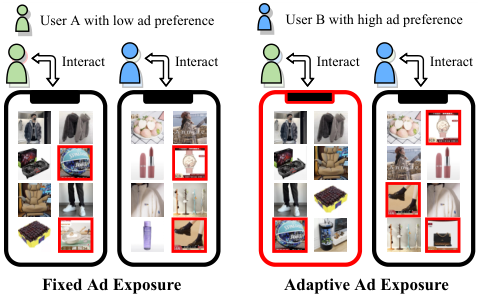

<!-- Start of picture text -->
User A with low ad preference User B with high ad preference Interact Interact Interact Interact Fixed Ad Exposure Adaptive Ad Exposure <!-- End of picture text -->

**Figure 1: Fixed/adaptive ad exposure in e-commerce feed. The adaptive strategy can dynamically determine ad positions (red boxes) according to the user preference for ads.** 

some desirable game-theoretical properties of ad auctions should be guaranteed. For example, Incentive Compatibility (IC) [19] and Individual Rationality (IR) [14] theoretically guarantee that truthful bidding is optimal for each advertiser, which is important for the long-term prosperity of the ad ecosystem [1, 12, 22]. **Fourth** , the adaptive ad exposure strategy must be computationally efficient to achieve low-latency responses and be robust enough to guarantee the performance stability in the ever-changing online environment [23]. 

A few efforts have been made to study adaptive ad exposure. Lightweight _rule-based_ algorithms [20, 23, 24] are designed to blend organic items and ads following a ranking rule with some predefined re-ranking scores. However, they focus on the request-level optimization without consideration of application-level performance, resulting in sub-optimal performance of the feed applications under hierarchical constraints. _Learning-based_ methods [10, 21, 26, 27] mostly employ reinforcement learning (RL) [17] to search for the optimal strategies and perform well in offline simulations. However, since RL models heavily rely on massive training data to update the parameters, they are neither robust nor lightweight to deal with the rapidly changing online environment. We also note that most works leave out the discussion of the necessity to guarantee desirable game-theoretical properties. 

In this work, towards improving application-level performance under hierarchical constraints, we formulate adaptive ad exposure as a Dynamic Knapsack Problem (DKP) [5, 8] and propose a new approach Hierarchically Constrained Adaptive Ad Exposure ( **HCA2E** ). More specifically, to alleviate the difficulties in handling the hierarchical constraints, we design a two-level optimization architecture that decouples the DKP into request-level optimization and application-level optimization. In request-level optimization, we introduce a Rank-Preserving Principle (RPP) to maintain the game-theoretical properties of the ad auction and propose an Exposure Template Search (ETS) algorithm to search for the optimal exposure result satisfying the request-level constraints. In application-level optimization, we employ a real-time feedback controller to adapt to the application-level constraint. Moreover, we demonstrate that the two-level optimization is computationally 

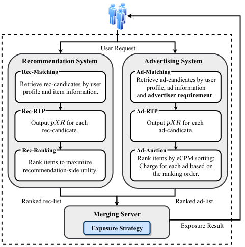

<!-- Start of picture text -->
User Request Recommendation System Advertising System Rec-Matching Ad-Matching Retrieve ad-candicates by user Retrieve rec-candicates by user profile, ad information profile and item information. and  advertiser requirement  . Rec-RTP Ad-RTP Output   for each   Output   for each rec-candicate. ad-candicate. Rec-Ranking Ad-Auction Rank items to maximize Rank items by eCPM sorting; Charge for each ad based on recommendation-side utility. the ranking order. Ranked rec-list Ranked ad-list Merging Server Exposure Strategy Exposure Result <!-- End of picture text -->

**Figure 2: The overview of a typical feed system.** 

efficient and robust against online fluctuations. Finally, comprehensive offline and online experimental evaluation results demonstrate that HCA2E outperforms competitive baselines. 

The main contributions of this paper are summarized as follows: 

- We formulate adaptive ad exposure in feeds as a Dynamic Knapsack Problem (DKP), which can capture various business optimization objectives and hierarchical constraints to derive flexible Pareto-efficient solutions. 

- We provide an effective solution: Hierarchically Constrained Adaptive Ad Exposure (HCA2E), which possesses desirable gametheoretical properties, computational efficiency, and performance robustness. 

- We have deployed HCA2E on Taobao, a leading e-commerce application. Extensive offline simulation and online A/B experiments demonstrate the performance superiority of HCA2E over competitive baselines. 

## **2 BACKGROUND** 

In this section, we first present a system overview of a typical feed application. Then, we make necessary descriptions of major objectives and constraints of the performance optimization. We note that the introduced system framework, objectives, and constraints are applicable in various feed applications. 

## **2.1 Feed Application System** 

As illustrated in Figure 2, a typical feed application has three parts: 

- **Recommendation System (RS).** The running of RS consists of three cascading phases: **1)** Rec-Matching server retrieves hundreds of candidate items according to the relevance between users’ preferences and items. **2)** Rec-RTP server predicts multiple performance indicators for each candidate, such as _𝑝𝑋𝑅_ (short 

3004 

CIKM ’22, October 17–21, 2022, Atlanta, GA, USA 

Hierarchically Constrained Adaptive Ad Exposure in Feeds 

for predicted _𝑋_ rate, where _𝑋_ can be click-through, favorite, conversion, etc.). **3)** Rec-Ranking server sorts candidate items to maximize the expected recommendation utility, such as user engagement in social networks and gross merchandise volume in e-commerce feeds. 

- **Advertising System (AS).** AS has three similar phases to RS. However, due to the advertisers’ participation, several differences exist: **1)** Besides user-item relevance, Ad-Matching server needs to take advertisers’ willingness (e.g. bids and budgets) into account [9]. **2)** Different from the Rec-Ranking server, Ad-Auction server should follow a certain auction mechanism, including the rules of ad allocation and pricing. With the predicted performance indicators, the ad allocation rule ranks candidate ads by descending order of _effective Cost Per Mille_ (eCPM) to maximize the expected ad revenue [28]. The pricing rule determines the payment for the winning ads, such as the critical bid in the Generalized Second Price (GSP) auction [22]. 

- **Merging Server (MS).** Given two ranked lists of recommendation and ad candidates, MS combines them according to an exposure strategy that determines the order of exposed items for each request. Corresponding to the business requirements of the application, MS is desirable to achieve flexible Pareto-efficient solutions to trade off recommendation-side and advertising-side objectives. In addition, the computational complexity of MS should be enough low to ensure low latency. 

## **2.2 Performance Objectives** 

The major performance objectives of the feed application contain **recommendation utility** and **advertising utility** . Recommendation utility (from recommendations) could have different interpretations in different feed applications. For example, user engagement, driven by users’ effective activities (e.g., clicks, favorites, comments, and shares), is widely used in social networks and news recommendations. In e-commerce feeds, gross merchandise volume (GMV), relevant to users’ clicks and further conversions, is the key indicator to measure the total amount of purchased commodities over a period. Advertising utility includes not only the above performance indicators (from ads) but also ad revenue. The advertising revenue is a common metric to represent the total payment of exposed or clicked ads over a specific period. 

## **2.3 Business Constraints** 

Without loss of generality, in this paper, we consider the following crucial business constraints: 

- **Application-level Constraint.** At the application level, the constraint of _monetization rate_ is concerned. The monetization rate represents the proportion of ad exposures over total exposures (both recommendations and ads) within a period. As a key metric to quantify the supply of ad resources, the monetization rate should be constrained by a target value for two reasons: **1)** fluctuating supply of ad resources might cause instability to the auction environment; **2)** a too large proportion of ads could damage the recommendation utility. 

- **Request-level Constraints.** To prevent some unintended results from harming the user experience, the ad exposure strategy should be further restricted by some request-level constraints. 

Similar to [23], the following two constraints are considered: **1)** _top ad slot_ (TAS) defines the allowed highest exposure position of ads among all items to be exposed; **2)** _minimum ad gap_ (MAG) defines the allowed minimum position distance between two adjacent ads. 

- **Auction Mechanism Guardrails.** The allocation and pricing of ads are based on certain auction mechanisms. To satisfy desirable game-theoretical properties (e.g., IC and IR as aforementioned), the pricing rule of an auction mechanism should be highly correlated to the ranking results [13]. Thus, we need to introduce additional constraints to keep these properties, because the merging process may change the original rankings. 

## **3 PROBLEM FORMULATION** 

Within a period (e.g., one day), we consider all the user requests as a sequence S. For a request _𝑠_ ∈S, an ad exposure strategy _𝜋𝑠_ determines the placement (positions and orders) of ads. Under _𝜋𝑠_ , the request-level expected utility _𝑈_ ( _𝑠_ | _𝜋𝑠_ ) is determined by all items to be exposed on _𝑠_ , and should be a trade-off between expected recutility _𝑈_rec ( _𝑠_ | _𝜋𝑠_ ) and ad-utility _𝑈_ad ( _𝑠_ | _𝜋𝑠_ ), calculated as follows1 : 

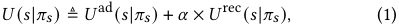

where _𝛼_ is an adjustable trade-off hyper-parameter. We optimize _𝜋_ by maximizing the accumulative utility over S, and the optimization should be constrained as described in Section 2.3. At the application level, the monetization rate _𝑚_ (S) should be constrained by a target value _𝑚_∗ , i.e., 

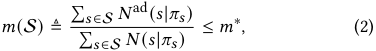

where _𝑁_ad ( _𝑠_ ) and _𝑁_ ( _𝑠_ | _𝜋𝑠_ ) denote the number of ads and all items respectively. At the request level, ad positions are restricted by the top ad slot and minimum ad gap. Thus, the overall optimization problem could be formulated as: 

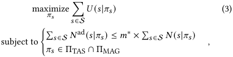

where we use ΠTAS and ΠMAG to denote the strategy space satisfying the request-level constraints of top ad slot (TAS) and minimum ad gap (MAG). 

## **4 HIERARCHICALLY CONSTRAINED ADAPTIVE AD EXPOSURE** 

## **4.1 Dynamic Knapsack Problem** 

_4.1.1_ **Strategy Decomposition** _._ The optimization problem (3) is challenging due to several reasons: **1)** The optimization variable _𝜋_ indicating different ranking results is discrete, and thus the optimization objective could be non-convex. **2)** The optimization of _𝜋_ is hierarchically constrained, i.e., real-time exposure on a single request needs to take into account the application-level constraint across all requests in S. **3)** _𝜋_ should also guarantee the auction 

> 1 _𝑈_ rec and _𝑈_ ad are consistent with the ranking scores of RS and AS, and could be quantified by different performance metrics according to the business requirements. 

3005 

CIKM ’22, October 17–21, 2022, Atlanta, GA, USA 

Dagui Chen et al. 

**Table 1: The mainly used notations.** 

|Notation|Description|Selected Requests||
|---|---|---|---|
|S_,𝑠_ _𝑈_rec_,𝑈_ad_,𝑈_|Request sequence and a single request. Expected rec-utility, ad-utility, and overall utility of a request.|Rank requests by descending|Non-selected Requests|
|_𝑁_rec_, 𝑁_ad_, 𝑁_|Expected rec-exposures, ad-exposures, and total exposures of a request.|…|…|
|_𝑚,𝑚_∗|Monetization rate and its target value.|||
|_𝑣_,_𝑤_|Value and weight of a request.|||
|_𝑉_,_𝑊_,_𝑊_∗|Accumulative value, accumulative weight and capacity of the knapsack.|**Figure 3: Greedy algorithm for opt**|**imizing**x**.**|
|x_, 𝜋_|Selection strategy and exposure strategy. |expressed as||
|_𝜌, 𝜌_THRES Δ_𝑣_|Value per weight and its threshold. Knapsack value increment bya request.|_𝑊_∗≜_𝑚_∗× ∑︁  _𝑁_(_𝑠_|_𝜋𝑠_)_._||

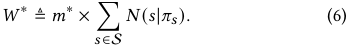

In this work, we consider that _𝑊_∗ is constant within S because the target monetization rate is predetermined and _𝜋_ could rarely affect total exposures within a specific period. 

mechanism properties and high computational efficiency. Thus, it is hard to directly optimize _𝜋_ . To tackle these challenges, we consider designing a hierarchical optimization approach, where we decompose the strategy over S into two levels: 

_4.1.4_ **Optimization Objective** _._ Based on the above descriptions, the goal is to maximize the knapsack value under the capacity constraint and aforementioned request-level constraints. The optimization problem (3) could be further expressed as: 

- _application-level selection strategy_ x = [ _𝑥𝑠_ ] _𝑠_ ∈S where _𝑥𝑠_ = 1 as _𝑠_ is selected to expose ads and _𝑥𝑠_ = 0 otherwise. 

- _request-level exposure strategy 𝜋_ determining how the candidate ads are exposed on a selected request. 

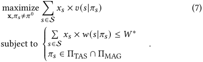

Specially, we denote the exposure strategy without ads by _𝜋_0 , and _𝜋𝑠_ = _𝜋_0 if _𝑥𝑠_ = 0 given a request _𝑠_ . Hence, the optimization problem (3) could be considered as a Knapsack Problem [15]. 

_4.1.2_ **Request Description** _._ From the perspective of a Knapsack Problem, each request is treated as an object with individual value and weight. For a request _𝑠_ selected to expose ads, the real value produced by an exposure strategy _𝜋𝑠_ should be the incremental utility of _𝜋𝑠_ to the no-ad strategy _𝜋_0 . Accordingly, we define the value of _𝑠_ under _𝜋𝑠_ as: 

Different from a classic knapsack problem [15], since both the value and weight of each object (request) depend on _𝜋_ and thus are variable, Formulation (7) is a Dynamic Knapsack Problem (DKP). 

We handle the DKP by the following steps: **1)** We design a two-level optimization architecture, consisting of application-level optimization and request-level optimization. **2)** To maintain the game-theoretical properties and the independence/flexibility of AS and RS, we preserve the prior order from AS/RS, termed as Ranking-Preserving Principle, which also reduces the optimization complexity. **3)** Based on the above designs, we use two lightweight algorithms to effectively solve the application-level optimization and request-level optimization respectively. We summarize our solutions as a unified approach: Hierarchically Constrained Adaptive Ad Exposure (HCA2E). We also reveal the implementation details of HCA2E for large-scale online services. 

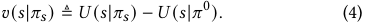

Here, _𝑈_ ( _𝑠_ | _𝜋_0 ) is fixed given request _𝑠_ since the expected recommendation utility _𝑈_rec ( _𝑠_ | _𝜋_0 ) only depends on the recommended items ranked in RS. Meanwhile, exposing ads could occupy a proportion of ad resources given the monetization rate constraint. Then we consider the weight of _𝑠_ under _𝜋𝑠_ to the knapsack, i.e., 

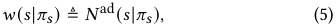

Specially, for _𝑠_ under _𝜋_0 , we have _𝑣_ ( _𝑠_ | _𝜋_0 ) = 0 and _𝑤_ ( _𝑠_ | _𝜋_0 ) = 0. 

## **4.2 Hierarchical Optimization Formulation** 

_4.1.3_ **Knapsack Description** _._ Next, we consider a knapsack to accommodate the requests under the capacity constraint. The knapsack value _𝑉_ is defined as the total value of requests selected in the knapsack, i.e., _𝑉_ ≜� _𝑠_ ∈S_𝑥_ _𝑠_×_𝑣_(_𝑠_|_𝜋_ _𝑠_)_._AccordingtoEqua- tion (2), accumulative request weight in the knapsack (i.e., total ad exposures within S) should not exceed an upper bound, i.e., � _𝑠_ ∈S_𝑁_ad(_𝑠_|_𝜋_ _𝑠_)≤_𝑚_∗× � _𝑠_ ∈S_𝑁_(_𝑠_|_𝜋_ _𝑠_). The accumulative request weight _𝑊_ ≜� _𝑠_ ∈S_𝑁_ad(_𝑠_|_𝜋_ _𝑠_), and the knapsack capacity could be 

_4.2.1_ **Application-level Optimization** _._ We first consider optimizing the application-level selection strategy x under the determined _𝜋_ , i.e., _𝑣_ ( _𝑠_ | _𝜋𝑠_ ) and _𝑤_ ( _𝑠_ | _𝜋𝑠_ ) of any _𝑠_ ∈S are determined. The Greedy algorithm [4] has been proposed to solve such a static 0-1 Knapsack Problem, where _Value Per Weight_ (VPW) is calculated by: 

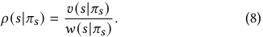

3006 

CIKM ’22, October 17–21, 2022, Atlanta, GA, USA 

Hierarchically Constrained Adaptive Ad Exposure in Feeds 

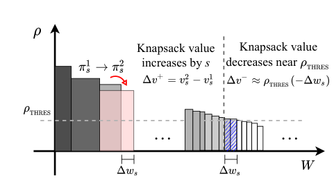

<!-- Start of picture text -->
Knapsack value  Knapsack value increases by  s decreases near … … <!-- End of picture text -->

**Figure 4: An illustration for designing request-level exposure strategy. From** _𝜋𝑠_1 **to** _𝜋𝑠_2 **with** Δ _𝑤𝑠 >_ 0 **, if** _𝜋𝑠_2 **outperforms** _𝜋𝑠_1 **, we should have** Δ _𝑣_+ + Δ _𝑣_− _>_ 0 **.** 

Specially, we note that _𝜌_ ( _𝑠_ | _𝜋_0 ) = 0 as _𝑣_ ( _𝑠_ | _𝜋_0 ) = 0. The basic idea is to greedily select the requests by descending order of _𝜌_ . As illustrated in Figure 3, we rank the requests and select the top requests until the cumulative weight exceeds the capacity _𝑊_∗ . 

However, ranking all the requests could be impractical in largescale industrial scenarios. From Figure 3, we note that the selected requests depend on a screening threshold _𝜌_ THRES : the requests with larger _𝜌_ than _𝜌_ THRES will be selected into the knapsack. If _𝜌_ THRES is determined, we can obtain _𝑥𝑠_ for _𝑠_ ∈S as: 

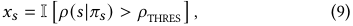

where I[∗] is the indicator function. Thus, the optimization of x can be transformed as determining the 1-dimension variable _𝜌_ THRES . 

_4.2.2_ **Request-level Optimization** _._ We then fix x to optimize the request-level exposure strategy _𝜋_ . For a selected request _𝑠_ , we consider two different ad exposure strategies _𝜋𝑠_1 and _𝜋𝑠_2 . As illustrated in Figure 4, if the exposure is changed from _𝜋𝑠_1 to _𝜋𝑠_2 , _𝑠_ will have a request-level value change, i.e., Δ _𝑣_+ = _𝑣_ ( _𝑠_ | _𝜋𝑠_2 ) − _𝑣_ ( _𝑠_ | _𝜋𝑠_1 ), and a request-level weight change, i.e., Δ _𝑤𝑠_ = _𝑤_ ( _𝑠_ | _𝜋𝑠_2 ) − _𝑤_ ( _𝑠_ | _𝜋𝑠_1 ). Since requests are selected in the descending order of _𝜌_ greedily, if the request weight changes, some requests near _𝜌_ THRES (represented by the blue shaded area in Figure 4) would be squeezed out (if Δ _𝑤𝑠 >_ 0) or selected (if Δ _𝑤𝑠 <_ 0) to satisfy the capacity constraint. Accordingly, the knapsack value change resulted by these requests is Δ _𝑣_− ≈ _𝜌_ THRES × (−Δ _𝑤𝑠_ ). Thus, if _𝜋𝑠_2 outperforms _𝜋𝑠_1 with increasing knapsack value, we then have Δ _𝑣_+ + Δ _𝑣_− _>_ 0, i.e., 

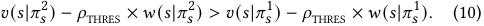

According to the strategy improvement condition (10), we can acquire the optimal ad exposure strategy with a given _𝜌_ THRES as: 

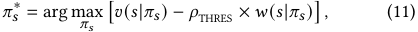

where we define _knapsack value increment_ of _𝑠_ as 

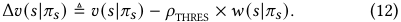

Combining with formulas (9) and (11), we can express the final exposure strategy for each request as: 

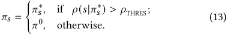

The detailed optimization methods of _𝜋_ and _𝜌_ THRES will be described in Section 4.4 and Section 4.5 respectively. 

## **4.3 Rank-Preserving Principle** 

Next, we aim to guarantee the optimization of _𝜋_ under the ad auction mechanism. In this work, we focus on the two major gametheoretical properties: Incentive Compatibility (IC) and Individual Rationality (IR). Formally, if every participant advertiser bids truthfully (i.e., bids the maximum willing-to-pay price [12]), IR will guarantee their non-negative profits, and IC can further ensure that they earn the best outcomes. According to Myerson’s theorem [13], to satisfy these properties, the charge price of an ad should be related to its ranking in the ad list. However, most of the existing works blend ads and recommended items without considering the fact that changed orders of ads should affect the charge prices. These methods might lead to the advertisers’ misreporting, which is against the long-term stable performance of the advertising system. To this end, **Rank-Preserving Principle** (RPP) is introduced: 1) the relative orders of items/ads in MS should be consistent with the prior orders from RS/AS [23], and 2) the final charge price for each exposed ad should be consistent with the price determined in AS. More than acting as a guardrail for ad auctions, RPP contains some other benefits: 

**1)** RPP allows RS and AS to run independently. Since both RS and AS have quite complex structures and are driven by respective optimization objectives, different groups are responsible for RS and AS in a large-scale feed application. Thus, RPP makes a clear boundary between the two subsystems and thus facilitates rapid technological upgrading within each subsystem. 

**2)** RPP can effectively reduce the optimization complexity of request-level exposure strategy _𝜋_ . Under RPP, optimizing _𝜋_ only needs to determine each slot for an ad or a recommended item, and then place the items/ads into the slots in their prior orders. Thus, _𝜋_ can be represented by an **exposure template** , defined as an one-hot vector _𝜙_ = [ _𝑖_ 1 _,𝑖_ 2 _,_ · · · _,𝑖𝐿_ ] to label the request’s slots, where _𝑖𝑙_ = 1 indicates that the _𝑙_ -th slot is for an ad and _𝑖𝑙_ = 0 otherwise, and we assume that there are _𝐿_ slots on a request. Specially, we denote the no-ad template by _𝜙_0 (corresponding to _𝜋_0 described in Section 3), i.e., _𝜙_0 = [0 _,_ 0 _,_ · · · ]. We use _𝐾_ to denote the number of candidate items (including recommended candidates and ad candidates) for each request. The exposure results without/with RPP are respectively ( _𝐾𝐾_ −! _𝐿_ )!and 2_𝐿_, where ( _𝐾𝐾_ −! _𝐿_ )!≫2_𝐿_since the number of candidates is usually much larger than the number of slots. Thus, the complexity of optimizing _𝜋_ is reduced. 

## **4.4 Request-level Optimization with Exposure Template Search** 

Based on RPP, we optimize _𝜋_ by searching the optimal exposure template _𝜙_∗ on each request. We denote the set of all possible templates by Φ. The length of each template is _𝐿_ . 

_4.4.1_ **Template Evaluation** _._ Given a request _𝑠_ , the optimal exposure strategy follows the equation (11), and thus any template _𝜙_ ∈ Φ should be evaluated by: 

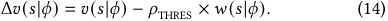

3007 

CIKM ’22, October 17–21, 2022, Atlanta, GA, USA 

Dagui Chen et al. 

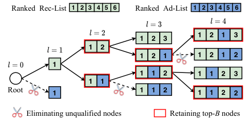

<!-- Start of picture text -->
Ranked  Rec-List 1 2 3 4 5 6 Ranked  Ad-List 1 2 3 4 5 6 1 2 1 3 1 2 3 1 2 1 2 1 1 2 1 2 1 1 1 2 1 1 2 3 1 1 Root 1 1 1 2 1 1 2 2 Eliminating unqualified nodes Retaining top- B  nodes ✂ ✂  ✂ ✂ <!-- End of picture text -->

**Figure 5: An illustration of Exposure Template Search. Here we set request length** _𝐿_ = 4 **, beam size** _𝐵_ = 2 **, top ad slot** _𝑙_ top = 2 **, and min ad gap** Δ _𝑙_ min = 2 **.** 

**Algorithm 1:** Exposure Template Search 

**Input:** user request _𝑠_ , request length _𝐿_ , beam size _𝐵_ , the VPW threshold _𝜌_ THRES ; 

**Output:** the final exposure template _𝜙𝑠_ ; **1** Initialize a candidate template set Φ0 = {[]}; **2 for** _𝑙_ = 1 : _𝐿_ **do** 

- **3** Initialize the _𝑙_ -th layer’s node buffer Φ _𝑙_ = {}; **4 foreach** _sub-template 𝜅_ ∈ Φ _𝑙_ −1 **do 5** Expand _𝜅_ with a rec-slot, i.e., _𝜅_rec = concat( _𝜅,_ [0]); **6** Calculate Δ _𝑣_ ( _𝑠_ | _𝜅_rec ) according to (14); **7** Append _𝜅_rec into Φ _𝑙_ , i.e., Φ _𝑙_ = Φ _𝑙_ ∪{ _𝜅_rec }; **8** Expand _𝜅_ with an ad-slot, i.e., _𝜅_ad = concat( _𝜅,_ [1]); **9** Calculate Δ _𝑣_ ( _𝑠_ | _𝜅_ad ) according to (14); 

- **10** Append _𝜅_ad into Φ _𝑙_ , i.e., Φ _𝑙_ = Φ _𝑙_ ∪{ _𝜅_ad }; **11 end 12** Eliminate the nodes violating request-level constraints; **13** Rank the nodes in Φ _𝑙_ by descending Δ _𝑣_ ( _𝑠_ | _𝜅_′ ) _𝜅_ ′ ∈Φ _𝑙_ ; **14** Retain the top- _𝐵_ nodes, i.e., Φ _𝑙_ = Φ _𝑙_ [: _𝐵_ ]; **15 end 16 return** _𝜙𝑠_ according to Formula (15) ; 

where the value _𝑣_ ( _𝑠_ | _𝜙_ ) and weight _𝑤_ ( _𝑠_ | _𝜙_ ) under _𝜙_ are required. We calculate _𝑣_ ( _𝑠_ | _𝜙_ ) and _𝑤_ ( _𝑠_ | _𝜙_ ) by the sum of discounted utility and weight of the _𝐿_ items inserted into _𝜙_ . Here, we consider an exposure possibility for each slot _𝑙_ (1 ≤ _𝑙_ ≤ _𝐿_ ), and the exposure possibility is non-increasing as _𝑙_ increases since users explore the application from top to bottom. Thus, for the item at the _𝑙_ -th slot, a discounted utility should be the product of the slot exposure possibility and its original utility, and a discounted weight should be the slot exposure possibility if an ad is located at the _𝑙_ -th slot or 0 otherwise. 

_4.4.2_ **Template Screening** _._ Considering that the number of potential templates (i.e. 2_𝐿_ ) is still very large, we expect to further reduce the computational complexity in searching _𝜙_∗ . To this end, we design an Exposure Template Search (ETS) algorithm to effectively screen out a set of sub-optimal candidate templates, as illustrated in Algorithm 1. The basic idea is based on the Beam Search Algorithm [16] and we use a tree model to represent the template search process. As illustrated in Figure 5, each tree node 

represents a sub-template (denoted by _𝜅_ ) whose length is equal to the depth of the corresponding layer (Line 4 to Line 11 in Algorithm 1). With the growth of the tree, we will iteratively prune some nodes to control the tree size (Line 12 to Line 14 in Algorithm 1). The pruning rule consists of the following two parts: 

- **Eliminating unqualified nodes** : removing the nodes violating the request-level constraints; 

- **Retaining top-** _𝐵_ **nodes** : ranking the nodes by descending Δ _𝑣_ and only retaining the top- _𝐵_ nodes. 

At each layer, the number of remaining nodes is controlled by a beam size _𝐵_ , i.e., the top- _𝐵_ nodes are reserved until the tree depth reaches the request length _𝐿_ . The complexity of exposure template search is O( _𝐿_ × _𝐵_ ), which is further significantly reduced compared with the previous O(2_𝐿_ ). 

Within the final set of the well-chosen templates, denoted by Φ _𝐿_ , the optimal exposure template _𝜙𝑠_∗ for _𝑠_ is determined according to the formula (11), i.e., _𝜙𝑠_∗ = arg max _𝜙_ ∈Φ _𝐿_ Δ _𝑣_ ( _𝑠_ | _𝜙_ ). Then the final exposure template 

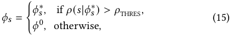

_𝑣_ <u>(</u> _𝑠_ <u>|</u> _<u>𝜙</u>_ <u>)</u> where _𝜌_ ( _𝑠_ | _𝜙_ ) = _𝑤_ ( _𝑠_ | _𝜙_ )according to (8). The ETS algorithm can flexibly balance the optimality (by selecting top- _𝐵_ nodes) and computational complexity (by adjusting the beam size _𝐵_ ). 

## **4.5 Application-level Optimization with Real-time Feedback Control** 

However, the estimated _𝜌_ THRES might be different from the optimal _𝜌_ THRES∗.When_𝜌_THRES_<𝜌_ THRES∗,superfluousundesiredadsareex- posed and thus violate the application-level constraint (i.e., _𝑚 > 𝑚_∗ ). When _𝜌_ THRES _> 𝜌_ THRES∗, it leads to the loss of application revenue due to a reduced supply of ads exposures (i.e., _𝑚 < 𝑚_∗ ). Thus, we should dynamically adjust _𝜌_ THRES to make actual monetization rate _𝑚_ close to the target _𝑚_∗ . 

We introduce a feedback control method [7] to timely adjust _𝜌_ THRES , keeping it close to the optimal _𝜌_ THRES∗and adapting to the fluctuating online environment. In detail, we assume that Δ _𝑡_ is a time interval to update _𝜌_ THRES . At time step _𝑡_ , we will calculate the monetization rate (denoted by _𝑚_(_𝑡_−Δ_𝑡_:_𝑡_) ) over the requests within _𝑡_ − Δ _𝑡_ to _𝑡_ . Accordingly, _𝜌_ THRES is updated as follows: 

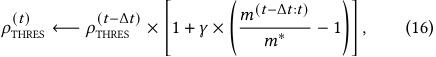

where _𝛾_ is the learning rate. Thus, when the actual _𝑚_ exceeds (or is less than) _𝑚_∗ , _𝜌_ THRES will be increased (or decreased) towards _𝜌_ THRES∗to reduce the difference between_𝑚_and_𝑚_∗. In online experi- ments, we demonstrate that the real-time _𝜌_ THRES -adjustment greatly enhances the stability of monetization rate _𝑚_ . 

## **4.6 Online Deployment** 

HCA2E can reliably be deployed for online services, as shown in Figure 6. The key ingredients are described as follows: 

- In the online exposure service, once a user request arrives, RS and AS respectively process it as described in Section 2. Then MS 

3008 

CIKM ’22, October 17–21, 2022, Atlanta, GA, USA 

Hierarchically Constrained Adaptive Ad Exposure in Feeds 

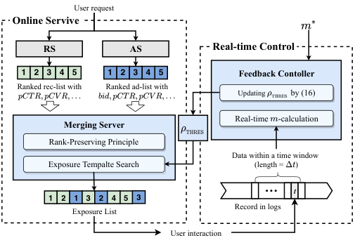

<!-- Start of picture text -->
User request Online Servive RS AS Real-time Control 1 2 32 4 5 1 2 3 4 5 Feedback Contoller Ranked rec-list with  Ranked ad-list with Updating   by (16) Real-time  -calculation Merging Server Rank-Preserving Principle Data within a time window Exposure Tempalte Search (length =  ) … t 1 2 1 3 2 4 5 3 Record in logs Exposure List User interaction <!-- End of picture text -->

**Figure 6: The pipeline of online service for HCA2E.** 

merges the two ranked lists (with predicted indicators) according to Algorithm 1. Exposure results will be recorded in logs. 

- Every period of Δ _𝑡_ , the real-time controller will calculate the latest monetization rate _𝑚_(_𝑡_−Δ_𝑡_:_𝑡_) and adjust _𝜌_ THRES according to Formula (16). 

The initial threshold of VPW could be estimated by offline simulation with historical log data. HCA2E has been deployed on a leading e-commerce application Taobao to serve users daily. 

## **5 EXPERIMENTS** 

In this work, we conduct offline and online experiments based on the feed platform of Taobao. We also claim that HCA2E can be applied in other types of feed applications. 

## **5.1 Experiment Settings** 

_5.1.1_ **Simulation Settings** _._ In offline experiments, we set up a feed simulator that replays real log data to simulate users’ activities and application responses. Each data point corresponds to a user request and contains the information on recommendation candidates and ad candidates from RS and AS. The information mainly includes predicted indicators and homologous ranking scores. Based on the candidate lists and input information, MS generates a blended list following the embedded exposure strategy. Further, we leverage a temporal data buffer to store requests within the updating interval of _𝜌_ THRES (i.e. Δ _𝑡_ ). Every period of Δ _𝑡_ , _𝜌_ THRES is updated according to (2) and the data buffer is initialized. In the implementation, we collected about 10 million requests totally and set the updating time window with Δ _𝑡_ = 10 _𝑘_ . For each request, we set the number of exposure slots as 50, i.e. _𝐿_ = 50. The top ad slot and minimum ad gap are set as 5 and 4 respectively. 

_5.1.2_ **Baseline Methods** _._ We compare HCA2E with three baseline methods applied in industries. To make fair comparisons, we will guarantee the baselines to satisfy the same constraints of monetization rate, top ad slot, and minimum ad gap as the HCA2E. The baselines are briefly described as follows: 

- **Fixed** represents the fixed-position strategy, where the positions of recommended items and ads are manually pre-determined for 

- every request. The positions will be designed under the aforementioned different constraints. 

- _𝛽_ **-WPO** is based on the Whole-Page Optimization (WPO) [24]. WPO ranks recommended and ad candidates jointly according to the predefined ranking scores. To satisfy the _𝑚_∗ -constraint, we introduce an adjustable variable _𝛽_ to control the ad proportion. 

- _𝛽_ **-GEA** is based on the Gap Effect Algorithm (GEA) [23], which also employs a joint ranking score. In addition, it takes the impact of adjacent ads’ gap into account. Similar to _𝛽_ -WPO, an adjustable variable _𝛽_ is introduced to control the ad proportion under _𝑚_∗ . 

_5.1.3_ **Performance Metrics** _._ We mainly focus on the following key performance indicators in the e-commerce feed: 

- **Revenue (REV)** is the revenue produced by all exposed ads. 

- **Gross Merchandise Volume (GMV)** is the merchandise volume of all purchased items (both recommendations and ads). 

- **Click (CLK)** is the total number of clicked items by users. 

- **Click-Through Rate (CTR)** is the ratio of clicks to exposures. 

## **5.2 Offline Experiments** 

Within a specific simulation period, we observe the accumulative performances of the HCA2E and the three baseline methods. 

_5.2.1_ **Performance Evaluation** _._ Under different target values of monetization rate ( _𝑚_∗ = 8%, 10%, 12%), we evaluate the offline performance with REV and GMV jointly, respectively as the advertising-side and recommendation-side key indicators. In this work, we measure the performance indicators with an advantage formula, calculated by the relative metric increment between an adaptive strategy and Fixed. For example, the advantage of REV, denoted by Δ _𝑅𝐸𝑉_ %, is calculated as 

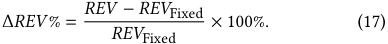

Given a trade-off parameter _𝛼_ , we can obtain a corresponding tuple of Δ _𝑅𝐸𝑉_ % and Δ _𝐺𝑀𝑉_ %. Table 2 records the performances of different algorithms with _𝛼_ = 0 _._ 5. For adaptive exposure strategies, varying the value of _𝛼_ can produce different performance tuples (Δ _𝑅𝐸𝑉_ %, Δ _𝐺𝑀𝑉_ %), known as Pareto-optimal solutions [11]. We select several values of _𝛼_ to obtain a set of solutions and draw the Pareto-optimal trade-off curve as shown in Figure 7, where _𝛼_ is varied within [0 _._ 1 _,_ 0 _._ 2 _,_ 0 _._ 3 _,_ · · · _,_ 1 _._ 0], and Δ _𝑅𝐸𝑉_ %/Δ _𝐺𝑀𝑉_ % is corresponding to y-axis/x-axis. From Table 2 and Figure 7, we can make the following observations: 

**1)** As _𝛼_ varies, HCA2E algorithms with four values of beam size (i.e., _𝐵_ = 1 _,_ 3 _,_ 5 _,_ 7) could have better Pareto-optimal curves, i.e., when reaching the same GMV (or REV), HCA2E can achieve higher REV (or GMV) than _𝛽_ -WPO and _𝛽_ -GEA. The Pareto-optimal curves verify that HCA2E achieves the overall performance improvement compared with the baseline methods due to the optimization towards the application-level performance. 

**2)** Within a certain range, the increase of beam size _𝐵_ could boost the performance of HCA2E. A larger _𝐵_ could provide more possible candidate templates, and thereby some better solutions are taken into account. However, such improvement by increasing _𝐵_ is limited. For example, HCA2E( _𝐵_ = 5) and HCA2E( _𝐵_ = 7) achieve closed performances corresponding to the almost overlapping curves. This is because the request value is mostly determined by several top 

3009 

CIKM ’22, October 17–21, 2022, Atlanta, GA, USA 

Dagui Chen et al. 

**Table 2: The offline performance (** _𝛼_ = 0 _._ 5 **).** 

|||_𝑚_∗= 8%|||_𝑚_∗= 10%|||_𝑚_∗= 12%||
|---|---|---|---|---|---|---|---|---|---|
|Method|_𝑚_|Δ_𝑅𝐸𝑉_%|Δ_𝐺𝑀𝑉_%|_𝑚_|Δ_𝑅𝐸𝑉_%|Δ_𝐺𝑀𝑉_%|_𝑚_|Δ_𝑅𝐸𝑉_%|Δ_𝐺𝑀𝑉_%|
|Fixed|8.23%|−−|−−|10.36%|−−|−−|12.29%|−−|−−|
|_𝛽_-WPO|7.84%|6.82%|2.18%|10.15%|4.62%|1.92%|12.19%|3.41%|1.69%|
|_𝛽_-GEA|8.13%|8.57%|2.47%|10.18%|6.58%|2.21%|11.78%|4.62%|1.82%|
|HCA2E(B=1)|7.97%|13.58%|2.68%|10.01%|10.45%|2.64%|12.01%|7.78%|2.03%|
|HCA2E(B=3)|8.03%|15.18%|2.67%|9.96%|12.32%|2.70%|12.04%|8.78%|2.07%|
|HCA2E(B=5)|8.01%|18.04%|2.78%|9.99%|13.42%|2.78%|11.96%|9.61%|**2.10%**|
|HCA2E(B=7)|7.99%|**18.45%**|**2.79%**|10.02%|**13.68%**|**2.81%**|12.03%|**9.81%**|2.09%|

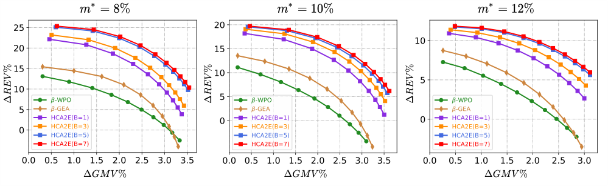

**Figure 7: The Pareto curves under different** _𝑚_∗ **.** 

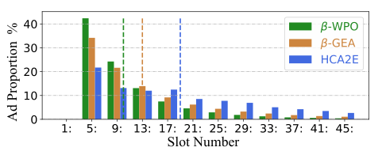

<!-- Start of picture text -->
Slot Number Ad Proportion  % <!-- End of picture text -->

**Figure 8: The ad-exposure distribution. The height of each** 

**bar on "** _𝑘_ : **" indicates the ad proportion within slots** _𝑘_ **to** _𝑘_ + 3 **. There is no ad at the first four slots due to the top ad slot constraint. The dotted lines indicate average ad positions.** 

slots due to higher exposure probability. Thus, the ETS algorithm does not need a large _𝐵_ to restore the sub-templates. In this view, we can adjust _𝐵_ to achieve a good balance between the performance and the search complexity. 

**3)** We also find that the real-time feedback control method can effectively stabilize the actual monetization rate. When the given _𝑚_∗ = 8%, 10% or 12%, actual _𝑚_ of HCA2E could have smaller bias to _𝑚_∗ than baselines. 

_5.2.2_ **Ad-exposure Distribution Analysis** _._ Generally, ads at top slots will be viewed/clicked more probably and thus obtain more 

revenue. It is usually desirable to achieve higher revenue but expose ads at lower slots due to the cost of GMV. Thus, we analyzed the adexposure distribution, measured by the percentage of ad exposures on each slot within total ad exposures, to account for whether the performance improvements of HCA2E owe to that more ads are placed at front positions. 

We select that _𝑚_∗ = 10% and _𝛼_ = 0 _._ 5. For _𝛽_ -WPO, _𝛽_ -GEA, and HCA2E( _𝐵_ = 5), the ad-exposure distributions are shown in Figure 8. We calculate the percentage of ad exposures for every 4 (equal to the minimum ad gap) slots. The result shows that HCA2E has a more even ad exposure distribution than the others. Within top-12 slots, HCA2E exposes much fewer ads than _𝛽_ -WPO and _𝛽_ -GEA. Below the 29-th slot, HCA2E still exposes a certain number of ads, but there are nearly none for _𝛽_ -WPO or _𝛽_ -GEA. Further, we calculate the average ad positions for each approach (corresponding to the dotted lines drawn in Figure 8). We can find that, despite achieving higher REV, the average ad position of HCA2E is lower than the others. Thus, we demonstrate that the higher REV of HCA2E does not rely on placing more ads at top slots, and HCA2E indeed achieves higher efficiency for ad exposure. 

## **5.3 Online A/B Testing** 

In online experiments, we successfully deploy HCA2E on a feed product of Taobao, named _Guess What You Like_ . Here we select the results from six major scenarios, located on various pages of the 

3010 

CIKM ’22, October 17–21, 2022, Atlanta, GA, USA 

Hierarchically Constrained Adaptive Ad Exposure in Feeds 

**Table 3: The online performance in six feed scenarios of Taobao. The arrow "** → **" is from Fixed to HCA2E.** 

|Scenario|Δ_𝑅𝐸𝑉_%|Δ_𝐶𝑇𝑅_ad%|Δ_𝐺𝑀𝑉_%|Δ_𝐶𝐿𝐾_%|#_𝑆𝑙𝑜𝑡_ad avg|
|---|---|---|---|---|---|
|Homepage|9.24%|6.24%|1.09%|0.22%|33→120|
|Collection|6.20%|4.63%|3.89%|1.25%|27→76|
|Cart|6.57%|6.19%|4.96%|0.46%|27→71|
|Payment|5.91%|4.35%|1.01%|1.03%|22→47|
|Order List|11.64%|12.33%|8.65%|1.01%|26→53|
|Logistics|3.58%|1.79%|5.88%|0.62%|23→53|
|Relative  Diff  %||# D|ay|||

**Figure 9: The fluctuations of** _𝑚_ **within two weeks. The y-axis represents the relative difference of** _𝑚_ **to** _𝑚_∗ **. We can find that the stability of** _𝑚_ **is enhanced by introducing the feedback control method.** 

Taobao application, such as Homepage, Payment page, Cart page, etc. We observe the accumulative performance of HCA2E over two weeks and compare it with the Fixed’s performance through online A/B testing. 

_5.3.1_ **Performance Evaluation** _._ In response to the different characteristics of these scenarios, we will adjust the trade-off parameter _𝛼_ of HCA2E to guarantee positive performance. Here, mainly concerned indicators include REV, advertising CTR ( _𝐶𝑇𝑅_ad ), GMV, and CLK. Similar to the metric (17), they are expressed as the indicator advantage to Fixed. For all of these scenarios, the online results within a week, recorded in Table 3, also show the effectiveness and superiority of HCA2E compared with the Fixed. Due to the differences among these scenarios (e.g. traffic difference, user preference, and different target monetization rates), the performance indicators are improved to different degrees. In addition, we compare the average ad positions (# _𝑆𝑙𝑜𝑡_ avgad) of HCA2E and Fixed, as shown in the last column of Table 3. We find that # _𝑆𝑙𝑜𝑡_ avgadof HCA2E is much lower than Fixed, further demonstrating higher ad exposure efficiency of HCA2E. 

_5.3.2_ **Robustness Analysis of monetization rate.** Furthermore, for HCA2E and Fixed, we observe the fluctuations of the monetization rate in Homepage. We aim to demonstrate the effectiveness of introducing the feedback control method to stabilize the monetization rate. Figure 9 shows the monetization rate fluctuation results of HCA2E and Fixed within two weeks, where the y-axis corresponds to the relative difference between actual _𝑚_ and target _𝑚_∗ . We find that _𝑚_ of the Fixed strategy has a larger variation margin. Though 

the ad positions are predetermined in Fixed, _𝑚_ within different periods could be varying due to the differences in users’ exploring depth on different requests. Within all 14 days, the curve of HCA2E is consistently close to the zero-line (i.e., _𝑚_ is close to _𝑚_∗ ). Thus, HCA2E enhances a accumulative stability of _𝑚_ via the real-time _𝜌_ THRES -control. 

## **6 RELATED WORKS** 

Earlier studies for adaptive ad exposure only focus on one of the following problems: whether to expose ads [2], how many ads to expose [20] and where to expose ads [24]. Recently, adaptive ad exposure has been studied integrally. Rule-based algorithms usually blend items according to the preset re-ranking rules. For example, the Whole-Page Optimization (WPO) method calculates a unified ranking score for both recommended and ad items, and then it ranks items in the order of descending ranking scores [24]. The Gap Effect Algorithm (GEA) [23] is proposed to maximize the ad revenue of each request under a user engagement constraint. The GEA also re-ranks mixed items through mapping ad-utility into a comparable metric with rec-utility. Different from WPO, GEA would consider the gap effect between consecutive ads. More complex learningbased methods mostly attempt to formulate adaptive ad exposure as a Markov Decision Process (MDP) [18] and learn the strategy with effective reinforcement learning approaches [10, 21, 26, 27]. In the MDP, a state is represented by contextual features of candidate items; an action corresponds to an exposure result; the reward function could be calculated by the feedback of a user request. Such methods allow the strategy optimization under an end-to-end learning pattern, where deep networks are usually utilized. Despite enjoying good performances in offline simulations, learning-based methods usually suffer from 1) a large action space, 2) massive model parameters, and 3) inflexible objective transitions. Thus, they are hardly deployed in large-scale applications. 

## **7 CONCLUSION** 

In this paper, we formulate the adaptive ad exposure problem in feeds as a Dynamic Knapsack Problem (DKP), towards applicationlevel performance optimization under hierarchical constraints. We propose a new approach, Hierarchically Constrained Adaptive Ad Exposure (HCA2E), which possesses the desirable game-theoretical properties, computational efficiency, and performance robustness. The offline and online evaluations demonstrate the performance superiority of HCA2E. HCA2E has been deployed on Taobao to serve millions of users daily and achieved significant performance improvements. 

## **ACKNOWLEDGMENTS** 

This work was supported in part by Science and Technology Innovation 2030 –“New Generation Artificial Intelligence” Major Project No. 2018AAA0100905, in part by Alibaba Group through Alibaba Innovation Research Program, in part by China NSF grant No. 62132018, 61902248, 62025204, in part by Shanghai Science and Technology fund 20PJ1407900. The opinions, findings, conclusions, and recommendations expressed in this paper are those of the authors and do not necessarily reflect the views of the funding agencies or the government. 

3011 

CIKM ’22, October 17–21, 2022, Atlanta, GA, USA 

Dagui Chen et al. 

## **REFERENCES** 

- [1] Gagan Aggarwal, S Muthukrishnan, Dávid Pál, and Martin Pál. 2009. General auction mechanism for search advertising. In _Proceedings of the 18th international conference on World wide web_ . 241–250. 

- [2] Andrei Broder, Massimiliano Ciaramita, Marcus Fontoura, Evgeniy Gabrilovich, Vanja Josifovski, Donald Metzler, Vanessa Murdock, and Vassilis Plachouras. 2008. To swing or not to swing: learning when (not) to advertise. In _Proceedings of the 17th ACM conference on information and knowledge management_ . 1003–1012. 

- [3] Dagui Chen, Junqi Jin, Weinan Zhang, Fei Pan, Lvyin Niu, Chuan Yu, Jun Wang, Han Li, Jian Xu, and Kun Gai. 2019. Learning to Advertise for Organic Traffic Maximization in E-Commerce Product Feeds. In _Proceedings of the 28th ACM International Conference on Information and Knowledge Management_ . 2527–2535. 

- [4] GB Dantzig. 1955. Discrete variable extremum problems. In _JOURNAL OF THE OPERATIONS RESEARCH SOCIETY OF AMERICA_ , Vol. 3. 560–560. 

- [5] Deniz Dizdar, Alex Gershkov, and Benny Moldovanu. 2011. Revenue maximization in the dynamic knapsack problem. _Theoretical Economics_ 6, 2 (2011), 157–184. 

- [6] Sahin Cem Geyik, Sergey Faleev, Jianqiang Shen, Sean O’Donnell, and Santanu Kolay. 2016. Joint optimization of multiple performance metrics in online video advertising. In _Proceedings of the 22nd ACM SIGKDD International Conference on Knowledge Discovery and Data Mining_ . 471–480. 

- [7] Tore Hagglund and Karl J Astrom. 1995. PID controllers: theory, design, and tuning. _ISA-The Instrumentation, Systems, and Automation Society_ (1995). 

- [8] Xiaotian Hao, Zhaoqing Peng, Yi Ma, Guan Wang, Junqi Jin, Jianye Hao, Shan Chen, Rongquan Bai, Mingzhou Xie, Miao Xu, et al. 2020. Dynamic knapsack optimization towards efficient multi-channel sequential advertising. In _International Conference on Machine Learning_ . PMLR, 4060–4070. 

- [9] Junqi Jin, Chengru Song, Han Li, Kun Gai, Jun Wang, and Weinan Zhang. 2018. Real-time bidding with multi-agent reinforcement learning in display advertising. In _Proceedings of the 27th ACM International Conference on Information and Knowledge Management_ . 2193–2201. 

- [10] Guogang Liao, Ze Wang, Xiaoxu Wu, Xiaowen Shi, Chuheng Zhang, Yongkang Wang, Xingxing Wang, and Dong Wang. 2021. Cross DQN: Cross Deep Q Network for Ads Allocation in Feed. _arXiv preprint arXiv:2109.04353_ (2021). 

- [11] Xi Lin, Hui-Ling Zhen, Zhenhua Li, Qing-Fu Zhang, and Sam Kwong. 2019. Pareto multi-task learning. _Advances in neural information processing systems_ 32 (2019), 12060–12070. 

- [12] Xiangyu Liu, Chuan Yu, Zhilin Zhang, Zhenzhe Zheng, Yu Rong, Hongtao Lv, Da Huo, Yiqing Wang, Dagui Chen, Jian Xu, Fan Wu, Guihai Chen, and Xiaoqiang Zhu. 2021. Neural Auction: End-to-End Learning of Auction Mechanisms for E-Commerce Advertising. In _KDD ’21, Singapore_ . ACM, 3354–3364. 

- [13] Roger B Myerson. 1981. Optimal auction design. _Mathematics of operations research_ 6, 1 (1981), 58–73. 

- [14] Hamid Nazerzadeh, Amin Saberi, and Rakesh Vohra. 2013. Dynamic pay-peraction mechanisms and applications to online advertising. _Operations Research_ 

61, 1 (2013), 98–111. 

- [15] Harvey M Salkin and Cornelis A De Kluyver. 1975. The knapsack problem: a survey. _Naval Research Logistics Quarterly_ 22, 1 (1975), 127–144. 

- [16] Volker Steinbiss, Bach-Hiep Tran, and Hermann Ney. 1994. Improvements in beam search. In _Third international conference on spoken language processing_ . 

- [17] Richard S Sutton and Andrew G Barto. 2018. _Reinforcement learning: An introduction_ . MIT press. 

- [18] Martijn Van Otterlo and Marco Wiering. 2012. Reinforcement learning and markov decision processes. In _Reinforcement learning_ . Springer, 3–42. 

- [19] William Vickrey. 1961. Counterspeculation, auctions, and competitive sealed tenders. _The Journal of finance_ 16, 1 (1961), 8–37. 

- [20] Bo Wang, Zhaonan Li, Jie Tang, Kuo Zhang, Songcan Chen, and Liyun Ru. 2011. Learning to advertise: how many ads are enough?. In _Pacific-Asia Conference on Knowledge Discovery and Data Mining_ . Springer, 506–518. 

- [21] Weixun Wang, Junqi Jin, Jianye Hao, Chunjie Chen, Chuan Yu, Weinan Zhang, Jun Wang, Xiaotian Hao, Yixi Wang, Han Li, et al. 2019. Learning Adaptive Display Exposure for Real-Time Advertising. In _Proceedings of the 28th ACM International Conference on Information and Knowledge Management_ . 2595–2603. 

- [22] Christopher A Wilkens, Ruggiero Cavallo, and Rad Niazadeh. 2017. GSP: the cinderella of mechanism design. In _Proceedings of the 26th International Conference on World Wide Web_ . 25–32. 

- [23] Jinyun Yan, Zhiyuan Xu, Birjodh Tiwana, and Shaunak Chatterjee. 2020. Ads Allocation in Feed via Constrained Optimization. In _Proceedings of the 26th ACM SIGKDD International Conference on Knowledge Discovery & Data Mining_ . 3386– 3394. 

- [24] Weiru Zhang, Chao Wei, Xiaonan Meng, Yi Hu, and Hao Wang. 2018. The wholepage optimization via dynamic ad allocation. In _Companion Proceedings of the The Web Conference 2018_ . 1407–1411. 

- [25] Zhilin Zhang, Xiangyu Liu, Zhenzhe Zheng, Chenrui Zhang, Miao Xu, Junwei Pan, Chuan Yu, Fan Wu, Jian Xu, and Kun Gai. 2021. Optimizing Multiple Performance Metrics with Deep GSP Auctions for E-commerce Advertising. In _Proceedings of the 14th ACM International Conference on Web Search and Data Mining_ . 993–1001. 

- [26] Xiangyu Zhao, Changsheng Gu, Haoshenglun Zhang, Xiwang Yang, Xiaobing Liu, Hui Liu, and Jiliang Tang. 2021. DEAR: Deep Reinforcement Learning for Online Advertising Impression in Recommender Systems. In _Proceedings of the AAAI Conference on Artificial Intelligence_ , Vol. 35. 750–758. 

- [27] Xiangyu Zhao, Xudong Zheng, Xiwang Yang, Xiaobing Liu, and Jiliang Tang. 2020. Jointly learning to recommend and advertise. In _Proceedings of the 26th ACM SIGKDD International Conference on Knowledge Discovery & Data Mining_ . 3319–3327. 

- [28] Han Zhu, Junqi Jin, Chang Tan, Fei Pan, Yifan Zeng, Han Li, and Kun Gai. 2017. Optimized cost per click in taobao display advertising. In _Proceedings of the 23rd ACM SIGKDD International Conference on Knowledge Discovery and Data Mining_ . 2191–2200. 

3012 

