Computer Networks 263 (2025) 111220 

Contents lists available at ScienceDirect 

# Computer Networks 

journal homepage: www.elsevier.com/locate/comnet 

## MI-VFL: Feature discrepancy-aware distributed model interpretation for vertical federated learning 

Rui Xing , Zhenzhe Zheng∗ , Qinya Li, Fan Wu, Guihai Chen 

_Department of Computer Science and Engineering, Shanghai Jiao Tong University, Shanghai, 200240, China_ 

### A R T I C L E I N F O 

### A B S T R A C T 

|_Keywords:_|Vertical federated learning (VFL) allows multiple distributed clients with misaligned feature spaces to|
|---|---|
|Vertical federated learning |collaboratively accomplish global model training. Applying VFL to high-stakes decision services greatly requires|
|Model interpretation Adversarial learning|model interpretation for decision reliability and diagnosis. However, the feature discrepancy in VFL raises new issues for model interpretation in distributed setting: one is from the local–global perspective, where the local importance of features is not equal to the global importance; and the other is from the local–local perspective, where information asymmetry among clients causes difficulty in identifying overlapped features. In this work, we propose a new distributed M odel I nterpretation method for V ertical F ederated L earning with feature discrepancy, namely MI-VFL. In particular, to deal with the local–global discrepancy, MI-VFL leverages the tools from probability theory and adversarial game theory to adjust the local importance of features and ensure the completeness of the selected features. To handle the local–local discrepancy, MI-VFL builds a federated adversarial learning model to efficiently identify the overlapped features at one time, rather than performing client-to-client intersections multiple times. We extensively evaluate MI-VFL on six synthetic datasets and five real-world datasets. The evaluation results reveal that MI-VFL can accurately identify the important features, suppress the overlapped features, and thus improve the model performance.|

#### **1. Introduction** 

Federated learning (FL) [1–4] is a privacy-preserving distributed machine learning that enables clients to jointly train a global model without sharing their local data. Different from the conventional FL (also called horizontal federal learning (HFL) [5], vertical federated learning (VFL) [6–8] has a distinct property of feature misalignment, which means clients share the same sample space but not feature space. This provides the opportunity for clients with different feature spaces to collaborate across platforms and institutions, expanding feature space to improve model performance and generalization ability. 

High-stakes decision fields such as finance and healthcare, are one of the important applications of VFL, since they often require multiple parties to collaborate to make rigorous decisions and cannot directly share sensitive or proprietary data due to privacy regulations (e.g., HIPAA [9] in healthcare or GDPR [10] in finance). A very urgent need in these fields is for model interpretation to understand the underlying model behavior and ensure reliable decisions [11,12]. In finance, for example, when banks collaborate to assess a user’s credit, participating banks need to understand the reasoning behind the model’s decision to approve or deny a loan. Similarly, in healthcare, 

multiple medical institutions might work together to diagnose based on multiple sources of clinical data. Doctors need insights into which specific features contributed to the diagnosis to ensure that the decision is medically sound and trustworthy. In addition, VFL expands the feature space by integrating data from diverse sources, but the massive features may vary in quality, with some features potentially being noisy, redundant, or less informative. If not managed properly, this may degrade the model’s overall performance. Therefore, we also need model interpretation to help us determine the contribution of features to model prediction and select the most relevant and representative ones. To sum up, designing the model interpretation method for VFL is the key to ensuring the reliability and transparency of model decisions as well as improving model performance and generalizability. 

Current model interpretation methods are basically centralized [13– 22], which would raise new issues if we regard each client’s local model as an isolated model in VFL. These issues are mainly caused by the natural characteristic of feature misalignment in VFL [5]. We call them ‘‘discrepancy’’ phenomena, which can be captured by two aspects as shown in Fig. 1. The first ‘‘discrepancy’’ is reflected in the local–global perspective, which refers to the local importance of clients’ features 

> ∗ Corresponding author. 

> _E-mail addresses:_ cocojess@sjtu.edu.cn (R. Xing), zhengzhenzhe@sjtu.edu.cn (Z. Zheng), qinyali@sjtu.edu.cn (Q. Li), fwu@cs.sjtu.edu.cn (F. Wu), gchen@cs.sjtu.edu.cn (G. Chen). 

https://doi.org/10.1016/j.comnet.2025.111220 

> Received 8 October 2024; Received in revised form 24 February 2025; Accepted 11 March 2025 Available online 19 March 2025 

1389-1286/© 2025 Elsevier B.V. All rights are reserved, including those for text and data mining, AI training, and similar technologies. 

_R. Xing et al._ 

_Computer Networks 263 (2025) 111220_ 

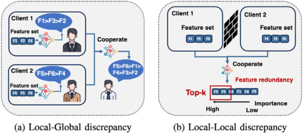

**Fig. 1.** Feature discrepancy in vertical federated learning. 

not equal to the global one. If we only calculate the local importance of features on their own clients, we would lose the information about meaningful relations among features from different clients, which is critical to model interpretation in distributed scenarios. For example, F1 is the most important feature for client 1 but it is not the one for all clients in Fig. 1(a). Therefore, we need to design a method to adjust the local importance in line with the global one. The second ‘‘discrepancy’’ exists in the local–local perspective, which means the clients are not aware of the features from the other clients. It may lead to different clients selecting the same important features when there are overlapped features among them, causing selected feature redundancy. In Fig. 1(b), the important feature F5 exits in both clients 1 and 2, so it is selected simultaneously, and causes redundancy. In fact, many reallife applications in VFL suffer from overlapped features. For example, in Alibaba production data regarding user click behavior, two domains (considered as VFL scenario since they have different items’ and users’ features and cooperate to recommend items for users) in Taobao’s recommendation system contain 8.52% overlapped users [23]. The phenomenon runs the risk of multiple selections of overlapped features leading to feature redundancy. Redundant features do not improve the class-discriminative ability of the model [24] and further reduce the interpretability of the model, and thus we must remove the overlapped features among clients. From the above discussion, designing the model interpretation method for VFL includes two important steps to solve the discrepancy issues, which are adjusting local importance to global importance and suppressing overlapped features among clients. 

Addressing the challenges posed by the local–global discrepancy in VFL is particularly complex due to the inability of clients to communicate directly with one another. This communication limitation prevents clients from autonomously adjusting the importance of their local features. Furthermore, since the relation between the importance of features across different clients is not explicitly known, there is a heightened risk of misadjustment, which means unimportant features from one client might be overemphasized, potentially overshadowing critical features from another client. 

In addition, the local–local discrepancy poses its own set of challenges. Due to privacy constraints inherent in VFL, clients cannot share their features with each other or with the centralized server, making it impossible to identify and eliminate feature overlaps across participants directly. While private set intersection protocols [25] have been proposed as a solution to address feature overlap in a pairwise manner, these methods are not scalable. As the number of clients increases, the pairwise intersection approach leads to substantial communication and computational overhead, making it impractical for large-scale scenarios. Moreover, such approaches introduce potential privacy risks, as they can inadvertently expose clients’ local features to the server or other clients. 

The intuition behind our proposed solution for model interpretation in VFL is as follows. First, we adjust the local importance in line with the global importance based on basic tools from the probability theory. Specifically, we divide the adjustment process into local importance 

calculation and feature subset importance calculation. In the local computation part, we use mutual information [26] to guide the feature importance calculation. Further, to ensure the completeness of the selected features and consolidate the relative importance of intra-client features, we design an adversarial game to increase the importance score gap between important and unimportant features. In the feature subset importance calculation part, we use the marginal contributions with respect to the global aggregation result of clients as the client’s (and its feature subset) importance scores, which have low commutation and computation costs while guaranteeing marginal fairness. Second, to identify overlapped features in the local–local discrepancy, we train a federated adversarial learning model to learn common features among all clients simultaneously. Then, we can ensure that the set of selected features is representative and free of redundancy by suppressing overlapped features. 

We summarize the contributions of this work as follows. 

- We present MI-VFL, a new distributed model interpretation method for VFL, which jointly considers the brand new issues of local–global discrepancy and local–local discrepancy caused by feature misalignment in VFL. We also provide convergence analysis for MI-VFL, which can achieve ( ~~√~~1 _𝑇_)undertheconvex– concave situation. 

- To address the discrepancy between global features and clients’ local features, we leverage the law of total probability to adjust the local importance of features. Further, we propose to design an adversarial game to ensure the selected features approach to the optimal feature set. 

- To suppress the overlapped features of clients, we design a federated adversarial learning model to identify and avoid the overlapped features. Our method ensures that the selected features are representative and non-overlapped. 

- We evaluate the performance of MI-VFL on six synthetic and five real-world datasets. The evaluation results show that MI-VFL can select a subset of important features accurately with suppression of overlapped features, and further improve the model performance. 

The rest of this paper is organized as follows. In Section 3, we present the problem formulation. Then in Section 2, we review related work. We propose the distributed model interpretation method MI-VFL in Section 4. The evaluation results are shown in Section 5. We finally conclude the paper in Section 6. 

#### **2. Related works** 

#### _2.1. Centralized model interpretation_ 

The centralized model-agnostic interpretation method can interpret black-box models, and a lot of research has been done in this field. One important class of model-agnostic interpretation methods is instance-wise feature selection, which generates the importance score for each feature of each sample. A lot of research has been carried out around this method. For example, Lei et al. [13] proposed to explain text prediction models based on the selected feature subset in NLP. Subsequently, Chen et al. [14] maximized the mutual information between the feature subset and the label to control the selection of the feature subset; subsequently, Yoon et al. [15] achieved this using KL divergence combined with reinforcement learning. Chang et al. [16] borrowed the idea of GAN to select a minimum feature subset for each class. Yu et al. [17] considered the model interlocking problem, and combined binarized selective rationalization and attention mechanism to solve the problem. However, these methods are ill-suited for VFL as they overlook the feature discrepancy issues within VFL, which can lead to inaccurate interpretations. Other model-agnostic methods include permutation [27], whose fundamental concept is that 

2 

_R. Xing et al._ 

_Computer Networks 263 (2025) 111220_ 

one can assess the significance of one feature to the overall model performance by measuring the deviation in model prediction accuracy with permuting the feature value. SHAP [28] is based on such idea. Perturbation-based model-agnostic methods estimate the contribution of features by removing or perturbing them and measure the change in the model output, which can be achieved in two ways: omission and occlusion [29]. Omission removes the specific feature from the input and occlusion replaces the specific feature with a reference value. In addition, methods such as LIME [30] and Anchors [31] are based on local approximation. They try to explain the predictions of the black-box model around the neighborhood of the specific input using an interpretable model. However, this class of methods usually has high computational complexity, making them unsuitable for the high-efficiency demands of VFL. 

The counterpart to model-agnostic methods is the model-specific method, which needs to be associated with the knowledge of the model itself. Some methods used the model gradient, for example, Saliency maps [18] calculated feature importance score through the absolute gradient, Gradient×Input [19] multiplied gradient and feature as importance score, and Integrated Gradients [20] averaged the gradient along a linear path from input feature to baseline as feature importance. In addition, there are methods based on model back-propagation. For example, Bach et al. [21] proposed back-propagation by Taylor decomposition to find important features. Also, Shrikumar et al. [22] similarly used back-propagation to calculate the difference between the output and reference values as feature importance. These methods have a very close relation with the model compared to the model-agnostic methods, and cannot explain general models. 

Compared to the existing model interpretation methods, our method is model-agnostic and fully suits for the distributed sensoria of VFL and considers its feature discrepancy issue in a computation-efficient way. 

#### _2.2. Vertical federated learning_ 

Vertical federated learning can be divided into two modes according to whether the server is included or not. 

For methods with the server, there are two kinds of frameworks, which depend on whether splitting learning is involved. One framework splits the whole model into two parts and deploys them on both the server and the client respectively, and the client needs to upload the intermediate features to the server [32,33]. However, this approach can lead to significant communication overhead as intermediate features need to be transmitted frequently, which may hinder scalability and increase latency. The other framework deploys the model only on the client, which requires clients to upload the model output to the server and the server aggregates them [34–37]. For example, Hu et al. [34] proposed a vertical federated model aggregation approach based on asynchronous stochastic gradient descent (SGD), which assumed that labels can be shared among participants. Zhang et al. [35] put forward a parameter update method based on the SVRG for VFL and designed a tree-structured communication model. Gu et al. [36] designed a parameter update method based on SGD, SVRG, and SAGA, and improved the tree-structured communication pattern. Zhang et al. [37] considered the problem of the feature imbalance and designed an adaptive number of local training rounds for each client. 

In addition, some methods in VFL do not include servers [38–45]. They divide clients into one active client and many passive clients, where only the active client has labels and is responsible for aggregating results from passive clients. For example, Cheng et al. [38] explored a lossless and privacy-protecting vertical federated GBDT algorithm, SecureBoost. Further, Fu et al. [39] developed an efficient system VF2 Boost for the GBDT algorithm to reduce the frequent mutual waiting in the training and speed up the cryptography operations. Liu et al. [40] proposed to exchange intermediate outputs between clients for parameter updating. Li et al. [41] designed GP-AVFL which updated local models asynchronously with the help of gradient prediction and 

double-end sparse compression. Cai et al. [42] put forward a stragglerresilient and computation-efficient accelerating system by omitting the updates from slow clients with poor network conditions. Han et al. [46] proposed FedGBF, which built the decision trees in parallel as a base learner for learning GBDT. Wu et al. [43] put forward FedOnce to leverage unsupervised learning to learn local latent representations from each client and the active party aggregated all latent representations to train the global model. Zheng et al. [44] designed Privet to enable secure gradient-boosted decision table training in VFL using lightweight cryptography. Xu et al. [45] proposed ELXGB, which focused on the XGBoost and guaranteed efficient and privacy-preserving properties. However, this approach may face challenges in terms of robustness and efficiency, as it heavily relies on a single active client, which could become a bottleneck and increase the risk of failure if the active client experiences any issues. 

#### **3. Preliminaries** 

In this section, we describe model interpretation in the context of VFL. For a classification task, let {( **𝐱**_𝑖_ _, 𝑦__𝑖_ )}_𝑛_ _𝑖_ =1bethetrainingset, where **𝐱** ∈ R_𝑑_ is the overall input feature with dimension _𝑑_ , and _𝑦_ ∈{1 _,_ … _, 𝑐_ } is the corresponding label. In a VFL task with a set of _𝑀_ clients M = {1 _,_ … _, 𝑀_ }, client _𝑚_ ∈ M only owns part of the features, denoted as **𝐱** _𝑚_ ∈ R_𝑑𝑚_ , where _𝑑𝑚_ represents the feature dimension owned by client _𝑚_ . Since there may be overlapped features among clients, we have _𝑑_ ≤∑ _𝑚__𝑑_ _𝑚_and**𝐱**=∪ _𝑚_ ∈M**𝐱** _𝑚_.Further,weuse**𝐱** _𝑚,𝑖_torepresent the _𝑖_ th feature of client _𝑚_ . The labels _𝑦_ are managed by the trusted server. In the centralized model interpretation method [14], the key is to learn an explainer  to select a subset **𝐱** _𝑠 ⊆_ **𝐱** of features with a size of _𝑘_ . Specifically,  takes the whole feature set **𝐱** as input, and the output is a binary mask vector **𝐬** ∈2_𝑑_ , where **𝐬** _𝑖_ = 1 indicates that the feature **𝐱** _𝑖_ is selected and otherwise is not. Therefore, the selected feature subset is **𝐱** _̃ 𝑠_ = **𝐬** _⊙_ **𝐱** = [ **𝐬** 1 **𝐱** 1 _,_ … _,_ **𝐬** _𝑑_ **𝐱** _𝑑_ ], where _⊙_ is element-wise product. In VFL, since features are distributed among clients, the client _𝑚_ is associated with a sub-explainer  _𝑚_ ∶ **𝐱** _𝑚_ → **𝐬** _𝑚_ and **𝐱** _̃ 𝑚,𝑠_ = **𝐬** _𝑚 ⊙_ **𝐱** _𝑚_ and all sub-explainers are trained collaboratively. For a classification task, each client computes a local model output _𝑏𝑚_ = _𝑓𝑚_ ( _𝜃𝑚_ ;  _𝑚_ ( **𝐱** _𝑚_ ) _⊙_ **𝐱** _𝑚_ ) with the input of the selected local features **𝐱** _̃ 𝑚_ , where _𝜃𝑚_ ∈ R_𝐷𝑚_ are the parameters of local model _𝑓𝑚_ , and _𝜃_ ∈ R_𝐷_ are the parameters of the global models with _𝐷_ =∑ _𝑚__𝐷_ _𝑚_.Theserverperformsweighted aggregation after receiving all the local models’ outputs from clients 

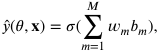

where _𝜎_ ∶ R → R is a continuous differentiable function to aggregate local model outputs _𝑏𝑚_ and _𝑤𝑚_ is the weight for _𝑏𝑚_ . For backward propagation, the server calculates the loss based on the global results and labels, and sends them back to clients to calculate their own partial gradients. Then clients update their parameters of local models following: 

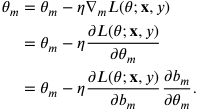

The features and parameters of the sub-models will not be shared among clients and between client and server during the whole process, so the privacy of the users can be well guaranteed. 

#### **4. Methodology** 

In this section, we introduce the detailed procedure of MI-VFL. First, we decompose the calculation of feature importance into two steps from a global view to overcome the discrepancy in local–global perspective. Moreover, we propose a common feature suppression method for the overlapped feature problem to solve the discrepancy in local– local perspective. The overall architecture of our model is shown in Fig. 2. 

3 

_R. Xing et al._ 

_Computer Networks 263 (2025) 111220_ 

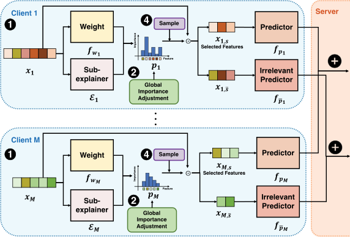

**Fig. 2.** The overall architecture. Features from different clients have different input dimensions. Each client _𝑚_ has its own local models composed of the explainer  _𝑚_ , predictor _𝑓𝑝𝑚_ , irrelevant predictor _𝑓̄𝑝𝑚_ , pre-trained predictor _𝑓𝑝𝑟𝑒𝑚_ , and pre-trained weight network _𝑓𝑤𝑚_ . The purpose of the predictor and the irrelevant predictor is to help the explainer to select the complete important feature subset. The pre-trained predictor is set to calculate the importance of feature subset from each client to help adjust the local importance in line with the global one, and the pre-trained weight network helps suppress the common features among clients to remove feature redundancy. 

#### _4.1. Global feature importance_ 

We jointly train sub-explainers to select _𝑘𝑚_ local features for each client _𝑚_ ∈ M, forming a set of top _𝑘_ features from the global view, where∑ _𝑚__𝑘_ _𝑚_=_𝑘_.However,selectingthevalueforeach_𝑘_ _𝑚_inadvance is unrealistic in practice. We design an adaptive method to learn them. The key observation is that we jointly select _𝑘_ important features globally instead of having each client select _𝑘𝑚_ local important features independently. Therefore, for a specific sample **𝐱** , we need to acquire the global feature importance, which can be calculated through the law of total probability: 

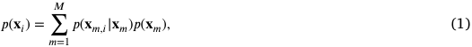

where _𝑝_ ( **𝐱** _𝑖_ ) represents the global importance of the _𝑖_ th feature **𝐱** _𝑖_ , _𝑝_ ( **𝐱** _𝑚,𝑖_ | **𝐱** _𝑚_ ) is the local importance of **𝐱** _𝑚,𝑖_ on client _𝑚_ and **𝐱** _𝑚,𝑖_ corresponds to **𝐱** _𝑖_ on client _𝑚_ , not the _𝑖_ th feature of client _𝑚_ , i.e., **𝐱** _𝑚,𝑖_ = **𝐱** _𝑖_ and _𝑝_ ( **𝐱** _𝑚_ ) is the global importance of the feature subset of client _𝑚_ . Applying the law of total probability in VFL breaks down the information barriers among clients and aggregates the local importance of features from each client, combining them into a global view, without disclosing private data to other clients. 

Eq. (1) implies that some features may be shared across multiple clients. However, since each client’s features are kept private, the server lacks knowledge about the locations of the overlapped features. As a result, it cannot compute the global feature importance in Eq. (1) accurately. We will outline the solution to this feature overlap issue in Section 4.3. For now, we assume that no feature overlap occurs among clients, and we can convert (1) to 

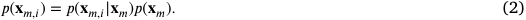

So the problem converts to calculate the local importance of features on the client _𝑚_ , _i.e._ , _𝑝_ ( **𝐱** _𝑚,𝑖_ | **𝐱** _𝑚_ ) and the global importance of feature subset on the client _𝑚_ , _i.e._ , _𝑝_ ( **𝐱** _𝑚_ ). The _𝑝_ ( **𝐱** _𝑚,𝑖_ | **𝐱** _𝑚_ ) can be calculated by the sub-explainer, while _𝑝_ ( **𝐱** _𝑚_ ) can be obtained by the global result aggregation at the server. We will introduce details of these two parts in the following, respectively. The pseudocode of MI-VFL is shown in Algorithm 1. 

#### _4.1.1. Local feature importance 𝑝_ ( **𝐱** _𝑚,𝑖_ | **𝐱** _𝑚_ ) 

We now discuss how to compute the local importance of features on the client _𝑚_ . We propose to use mutual information to select the feature subset. Mutual information is used to measure the dependence between two random variables. For the input random variable _𝑋_ , we regard the selected global feature subset as a random variable _𝑋𝑆_ ∈ R_𝑘_ with _𝑆⊂_ 2_𝑑_ and | _𝑆_ | = _𝑘_ . Maximizing mutual information between _𝑋𝑆_ and the response variable _𝑌_ (the model output) will facilitate identifying the features that are most dependent on the model output [14,24]. The features identified through mutual information are selected at the instance level, which allows for personalized feature importance for each individual sample. Mutual information is particularly effective in model interpretation because it can capture both linear and non-linear relations between features and the target variable, making it suitable for complex datasets such as images and text. Moreover, mutual information-based interpretation is model-agnostic, meaning it provides consistent feature selection across various models, including black-box models like deep neural networks. Thus, we formulate the model interpretation as learning an explainer to maximize the mutual information: 

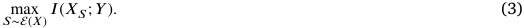

In prediction tasks, there is a phenomenon that several features selected by the explainer are not dependent on the response variable but can improve the prediction accuracy. The reason is that these features are not important individually, but can be selected simultaneously by the explainer to facilitate the accuracy prediction. For example, the explainer could mask out all odd-numbered features for samples classified as positive and even-numbered features for samples classified as negative. Such masking patterns used to predict the output completely disregard which specific features are truly important for the task. In VFL, this negative phenomenon is even amplified, implying that the locally selected unimportant features are mistakenly regarded as the important ones after aggregating features from other clients, which may delay the selection of the truly important features at the global level. Thus, we require the explainer not only to focus on the importance of the selected features but also to control the remaining features to widen their importance gap to ensure that the remaining features are truly irrelevant to the response variable, preventing important features from being missed. 

4 

_R. Xing et al._ 

_Computer Networks 263 (2025) 111220_ 

Therefore, we consider the idea of adversarial game. Maximizing the mutual information between the selected feature subset and the response variable _𝑌_ , while also minimizing the mutual information between the remaining feature subsets _𝑋̄𝑆_ = **𝐱** _̄𝑠_ ∈ R_𝑑_−_𝑘_ and the response variable _𝑌_ : 

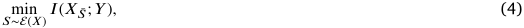

where _𝑋̄𝑆_ = _𝑋_ − _𝑋𝑆_ . 

The explainer should select features that satisfy (3) and (4) at the same time, so the problem is converted to 

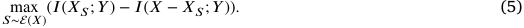

The above formulation can be converted into the form of conditional distributions: 

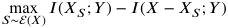

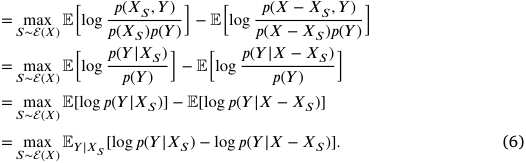

However, the posterior distributions _𝑝_ ( _𝑌_ | _𝑋𝑆_ ) and _𝑝_ ( _𝑌_ | _𝑋_ − _𝑋𝑆_ ) cannot be calculated directly, we derive the variational lower bound to approximate them. For a variational mapping _𝑋𝑆_ → _𝑞𝑆_ ( _𝑌_ | _𝑋𝑆_ ), we can derive the lower bound 

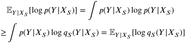

The inequality is based on Jensen’s inequality. Thus, (6) is relaxed to maximize the variational lower bound: 

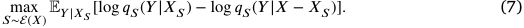

As depicted in ‚ of Fig. 2, in each client, apart from the model subexplainer  _𝑚_ ∶ **𝐱** _𝑚_ → **𝐬** _𝑚_ , we also introduce a predictor _𝑓𝑝𝑚_ ∶ _̃_ **𝐱** _𝑚,𝑠_ → _𝑏𝑚_ to cooperate to train the global predictor _𝑓𝑝_ to learn _𝑞𝑠_ ( _𝑦_ | **𝐱** _𝑠_ ) and also an irrelevant predictor _𝑓̄𝑝𝑚_ ∶ _̃_ **𝐱** _𝑚,̄𝑠_ → _̄ 𝑏𝑚_ to cooperate to train the global irrelevant predictor _𝑓𝑝_ to learn _𝑞𝑠_ ( _𝑦_ | **𝐱** − **𝐱** _𝑠_ ). 

Here, we would like to emphasize: (i) The actual output of  _𝑚_ is the local importance distribution vector **𝐩** _𝑚_ = [ _𝑝_ ( **𝐱** _𝑚,_ 1| **𝐱** _𝑚_ ) _,_ … _, 𝑝_ ( **𝐱** _𝑚,𝑑𝑚_ | **𝐱** _𝑚_ )] ( **𝐩** 1 and **𝐩** _𝑀_ in ƒ of Fig. 2), and **𝐬** _𝑚_ is sampling result from the importance distribution. (ii) **𝐩** _𝑚_ is the local importance, so we need to upload it to the server and convert it to the global importance by Eq. (2): **𝐩** _̂ 𝑚_ = **𝐩** _𝑚_ ⋅ _𝑝_ ( **𝐱** _𝑚_ ) = [ _𝑝_ ( **𝐱** _𝑚,_ 1| **𝐱** _𝑚_ ) _𝑝_ ( **𝐱** _𝑚_ ) _,_ … _, 𝑝_ ( **𝐱** _𝑚,𝑑𝑚_ | **𝐱** _𝑚_ ) _𝑝_ ( **𝐱** _𝑚_ )], where _𝑝_ ( **𝐱** _𝑚_ ) is the feature subset importance of client _𝑚_ and we will discuss how to calculate it in Section 4.1.2. Thus, we have∑_𝑀_ _𝑚_ =1 ∑ _𝑑𝑖_ =1 _𝑚 ̂_**𝐩**(**𝐱**_𝑚,𝑖_|**𝐱**_𝑚_)=1. The process is depicted in ƒ of Fig. 2. We now focus on the sampling process ( in Fig. 2). In practice, optimizing (7) by sampling(_𝑑_ _𝑘_ ) times to generate **𝐬** based on feature importance is computationally expensive. Moreover, the discrete nature of the sampling process hinders the model’s ability to perform backpropagation. To address this, we employ a reparameterization technique known as the Gumbel-Softmax trick [47–49]. This method provides a continuous relaxation of discrete distributions, allowing us to approximate the sampling process while enabling gradient-based optimization. We use Gumbel-Softmax to sample for discrete feature importance distribution and the actual sampling process should be 

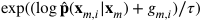

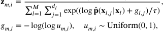

where _𝜏>_ 0 is temperature coefficient. The higher the _𝜏_ , the smoother the generated distribution, while the lower the temperature, the closer the generated distribution is to the discrete one-hot distribution. 

Repeat the above process _𝑘_ times to simulate sampling _𝑘_ features to obtain approximate results **𝐫** _𝑚,𝑖_ = max _𝑗_ ∈{1 _,_ … _,𝑘_ } **𝐳** _𝑚,𝑖_(_𝑗_).Thesamplingresult of _̄_ **𝐬** is the complement of **𝐬** , so we express it as _̄_ **𝐬** ≐ **𝟏** − **𝐫** where **𝟏** represents an all-one vector with _𝑑_ -dimension. Thus, _̃_ **𝐱** _𝑠_ ≐ **𝐫** _⊙_ **𝐱** and **𝐱** _̄𝑠_ ≐ ( **𝟏** − **𝐫** ) _⊙_ **𝐱** . The **𝐫** _𝑚_ will be sent to the client _𝑚_ who will sample the features and forward them into _𝑓𝑝_ and _𝑓̄𝑝_ to finish the subsequent prediction. 

Finally, we give the loss functions of the training goal: (i) Predictor _𝑓𝑝_ loss: 

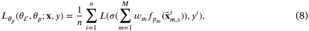

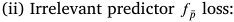

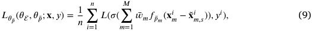

(iii) Explainer  loss: 

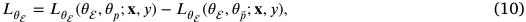

where _𝜃_  , _𝜃𝑝_ and _𝜃̄𝑝_ are parameters of global models , _𝑓𝑝_ and _𝑓̄𝑝_ respectively and _̃_ **𝐱** _𝑚,𝑠__𝑖_ = **𝐱** _𝑚__𝑖⊙__𝑚_(**𝐱** _𝑚__𝑖_).Wenotethattheirrelevant predictor _𝑓̄𝑝_ plays an adversarial game with the explainer . An ideal  should guarantee that (8) is less than (9), so in order to prevent (8) from being negative, we need to process (10) as follows 

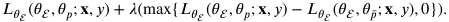

During forward propagation, client _𝑚_ computes and sends its local outputs _𝑏𝑚_ = _𝑓𝑝_ ( **𝐱** _̃ 𝑚,𝑠_ ) and _̄𝑏𝑚_ = _𝑓̄𝑝_ ( **𝐱** _̃ 𝑚,̄𝑠_ ) to the server. The server then aggregates the received local results across all clients by calculating _𝑦_ = _𝜎_ (∑_𝑀_ _𝑚_ =1_𝑤𝑚𝑏𝑚_)and_̂̄𝑦_=_𝜎_(∑_𝑀_ _𝑚_ =1 _̄__𝑤𝑚_ _̄__𝑏𝑚_).Afterthat,theserver will calculate the overall loss and the gradients with respect to the global results and finally send them to clients to conduct the backward propagation. 

#### _4.1.2. Feature subset importance 𝑝_ ( **𝐱** _𝑚_ ) 

We next describe how to calculate the feature subset importance. 

We consider the importance of feature subset **𝐱** _𝑚_ on client _𝑚_ as its contribution to the global result aggregation on the server. Regarding the efficiency need of VFL, we hope the contribution calculation method in VFL satisfies the following requirements: 

- **Computation efficiency** : Given that VFL has multiple clients, it is crucial to use efficient methods that maintain low computational overhead, especially as the number of clients increases. This prevents delaying adjustments of local importance to the global one and thus slowing down the model training speed. 

- **Communication efficiency** : Effective contribution calculation should not involve excessive communications between clients and the server. This includes avoiding frequent backward gradient propagation and extensive results exchanges. Even more, transferring feature subsets among clients is also not allowed, not only increasing communication costs but also introducing potential privacy leakage. 

According to the above requirements, we propose a feature contribution calculation method, which is based on the definition of the marginal contribution of a feature subset to the global prediction outcome. 

**Definition 1.** Feature subset importance: Let _𝑉_ be a feature set contribution evaluation function. The marginal contribution of feature subset **𝐱** _𝑚_ is 

_𝜙𝑉_ ( **𝐱** _𝑚_ ) = _𝛥_ ( **𝐱** _,_ **𝐱** _𝑚, 𝑉_ ) = _𝑉_ ( **𝐱** ) − _𝑉_ ( **𝐱** − **𝐱** _𝑚_ ) _,_ 

5 

_Computer Networks 263 (2025) 111220_ 

##### _R. Xing et al._ 

where _𝛥_ ( **𝐱** _,_ **𝐱** _𝑚, 𝑉_ ) denotes the difference in the evaluation function’s value, reflecting the change caused by including and excluding the feature subset **𝐱** _𝑚_ . 

For the feature set contribution evaluation function _𝑉_ , we use the loss function to measure the distance between the predicted result and the ground truth. Specifically, _𝑉_ ( **𝐱** ) = − _𝐷𝑖𝑠_ ( _̂𝑦_ ( _𝜃,_ **𝐱** ) _, 𝑦_ ) and _𝑉_ ( **𝐱** − **𝐱** _𝑚_ ) = − _𝐷𝑖𝑠_ ( _̂𝑦_ ( _𝜃_ − _𝑚,_ **𝐱** − _𝑚_ ) _, 𝑦_ ). We can use cross entropy for discrete variables and mean squared error for continuous variables to represent _𝐷𝑖𝑠_ . 

The rationale behind Definition 1 is to capture the marginal contribution of client _𝑚_ by comparing the outcomes with and without their participation in the global result aggregation. If client _𝑚_ positively impacts the aggregation, the first term in Definition 1 will be smaller than the second, resulting in a positive contribution. Conversely, if client _𝑚_ negatively affects the aggregation, their contribution will be negative. 

#### **Function 1:** Model_Update ( _𝑏𝑚_ , _̄𝑏𝑚_ ) 

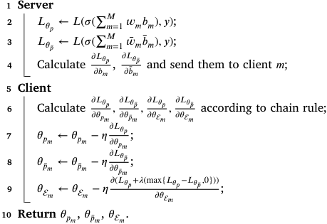

<!-- Start of picture text -->
1 Server 2 𝐿𝜃𝑝 ← 𝐿 ( 𝜎 ( ∑ 𝑚 𝑀 =1 𝑤𝑚𝑏𝑚 ) , 𝑦 ); 3 𝐿𝜃̄𝑝 ← 𝐿 ( 𝜎 ( ∑ 𝑚 𝑀 =1 ̄  𝑤𝑚 ̄ 𝑏𝑚 ) , 𝑦 ); 4 Calculate 𝜕𝐿𝜃𝑝 𝜕𝐿𝜃̄𝑝 𝜕𝑏𝑚 , 𝜕̄𝑏𝑚 and send them to client 𝑚 ; 5 Client 6 Calculate 𝜕𝐿𝜕𝜃𝑝𝑚𝜃𝑝 , 𝜕𝐿𝜕𝜃̄𝑝𝑚𝜃̄𝑝 , 𝜕𝜃𝜕𝐿  𝜃𝑚𝑝 , 𝜕𝜃𝜕𝐿  𝜃̄𝑚𝑝 according to chain rule; 7 𝜃𝑝𝑚 ← 𝜃𝑝𝑚 − 𝜂 𝜕𝐿𝜃𝑝 ; 𝜕𝜃𝑝𝑚 8 𝜃̄𝑝𝑚 ← 𝜃̄𝑝𝑚 − 𝜂 𝜕𝐿𝜃̄𝑝 ; 𝜕𝜃̄𝑝𝑚 9 𝜃  𝑚 ← 𝜃  𝑚 − 𝜂 𝜕 ( 𝐿𝜃𝑝 + 𝜆 (max{ 𝐿𝜃𝑝 − 𝐿𝜃̄𝑝 , 0})) ; 𝜕𝜃  𝑚 10 Return 𝜃𝑝𝑚 , 𝜃̄𝑝𝑚 , 𝜃  𝑚 . <!-- End of picture text -->

|**Algo**|**rithm** **1:** MI-VFL|S∖{**𝐱**_𝑚_1_,_**𝐱**_𝑚_2} in our method and obtain that|
|---|---|---|
|**1 In** |**put :** M= {1_,_⋯_, 𝑀_}: client set; {**𝐱**_𝑖_ _𝑚_}_𝑛_ _𝑖_=1: feature set owned by client _𝑚_; {_𝑦__𝑖_}_𝑛_ _𝑖_=1: label set saved by the server; _𝐸_: the number of training epoch; _𝐿_(⋅_,_⋅): loss function; _𝜂_: learning rate. |_𝜙𝑉_(**𝐱**_𝑚_1) =_𝑉_(**𝐱**) −_𝑉_(**𝐱**−**𝐱**_𝑚_1) =_𝑉_(_𝑆_∪{**𝐱**_𝑚_1_,_**𝐱**_𝑚_2}) −_𝑉_(_𝑆_∪{**𝐱**_𝑚_2}) =_𝑉_(_𝑆_∪{**𝐱**_𝑚_1_,_**𝐱**_𝑚_2}) −_𝑉_(_𝑆_∪{**𝐱**_𝑚_1})|
|**O**|**utput:** Global model {_𝜃𝑚_}_𝑀_ _𝑚_=1.|=_𝑉_(**𝐱**) −_𝑉_(**𝐱**−**𝐱**_𝑚_2)|
|**2** In|itiate the parameters _𝜃_;|=_𝜙𝑉_(**𝐱**_𝑚_2)_._|
|**3 fo**|**r** _𝑡_= 1_,_2_,_⋯_, 𝐸_ **do**||
|**4**| **Client**|This property ensures equal importance as|
|**5** |**for** _every_ _client_ _𝑚_∈M **in** **parallel** **do** ←()|bution. (ii) If a subset **𝐱**_𝑚_ does not influe marginal contribution should be zero. Math|
|**6** **7**|**𝐩**_𝑚𝑚_**𝐱**_𝑚_; _𝑏𝑝𝑟𝑒𝑚_←_𝑓𝑝𝑟𝑒𝑚_(**𝐱**_𝑚_); |**𝐱**_𝑚_), then _𝜙𝑉_(**𝐱**_𝑚_) = 0. This property preve from receiving resources. Both the two prop|
|**8**|Send **𝐩**_𝑚_, _𝑏𝑝𝑟𝑒𝑚_ to the server;|a marginal manner.|
|**9**|**Server**|Our method only involves computing t |
|**10**|_𝑦𝑝𝑟𝑒_←_𝜎_(∑_𝑀_ _𝑚_=1 _𝑤𝑚𝑏𝑝𝑟𝑒__𝑚_); **for** _𝑚_∈M **in** **parallel** **do**|with and without the feature subset, so t hbfliifli|
|**11**|_𝑦𝑝𝑟𝑒_−_𝑚_←_𝜎_(∑ _𝑙_∈M⧵{_𝑚_} _𝑤__𝑙__𝑏__𝑝𝑟𝑒𝑙_);|te numer o cents, .e. (_𝑚_) or _𝑚_ cen highlyscalabletolargerdistributedenviron|
|**12**|_𝜙𝑚_←−_𝐷𝑖𝑠_(_̂𝑦𝑝𝑟𝑒, 𝑦_) +_𝐷𝑖𝑠_(_̂𝑦𝑝𝑟𝑒_−_𝑚, 𝑦_);| for real-world applications. Additionally, it|
|**13**|**𝐩**_𝑚_←**𝐩**_𝑚_⋅_𝜙𝑚_;|apply MI-VFL to the incremental setting, th|
|**14**|**for** _𝑐_= 1_,_2_,_⋯_, 𝑘_ **in** **parallel** **do**|ronments where clients are continuously ad|
|**15**|_𝑢__𝑐_ _𝑚,𝑖_∼Uniform(0_,_ 1), _𝑔𝑐_ _𝑚,𝑖_←−log(log_𝑢𝑐_ _𝑚,𝑖_), ∀_𝑚_∈M_, 𝑖_∈{1_,_2_,_⋯_, 𝑑𝑚_};|only requires recomputing the marginal eff To implement this feature contribution|
||_𝑐_ exp((log_̂_**𝐩**(**𝐱**_𝑚,𝑖_|**𝐱**_𝑚_)+_𝑔__𝑐_ _𝑚𝑖_)∕_𝜏_) |up a pre-trained predictor _𝑓𝑝𝑟𝑒_ for each clie|
|**16**|**𝐳** _𝑚,𝑖_← _,_ ~~∑~~_𝑀_ _𝑙_=1 ~~∑~~_𝑑𝑙_ _𝑗_=1 exp((log_̂_**𝐩**(**𝐱**_𝑙,𝑗_|**𝐱**_𝑙_)+_𝑔𝑐_ _𝑙,𝑗_)∕_𝜏_); (_𝑐_)|2. All clients jointly train these predictors b During the explainer’s training phase, only|
|**17**|**𝐫**_𝑚,𝑖_= max_𝑐_∈{1_,_⋯_,𝑘_}**𝐳** _𝑚,𝑖_; |propagation between clients and the serve|
|**18**|Send **𝐫**_𝑚_ to client _𝑚_;|uation of feature subset importance can be|
|**19**|**Client**|server, minimizing the need for communi|
|**20**|**for** _every_ _client_ _𝑚_∈M **in** **parallel** **do**|the server. The server only needs to mainta|
|**21**|**𝐱**_𝑚,𝑠_←**𝐫**_𝑚⊙_**𝐱**_𝑚_;|client’s local outputs, after which it can ca|
|**22**|_𝑏𝑚_←_𝑓𝑝𝑚_(**̃𝐱**_𝑚,𝑠_);|all clients in parallel, as defined by Definiti|
|**23**|_𝑏𝑚_←_𝑓̄𝑝𝑚_(**𝐱**_𝑚_−**̃ 𝐱**_𝑚,𝑠_);|It is worth noting that the classical Sha |
|**24**|Send _𝑏𝑚_, _̄𝑏𝑚_ to the server;|be used to compute feature subset import computational complexity, and therefore th|
|**25**|**for** _every_ _client_ _𝑚_∈M **in** **parallel** **do**|are required.|
|**26**|_𝜃𝑝𝑚_, _𝜃̄𝑝𝑚_, _𝜃__𝑚_← Model_Update(_𝑏𝑚,_ _̄𝑏𝑚_)||
|**27 R**|**eturn** global model {_𝜃𝑚_}_𝑀_ _𝑚_=1.|_4.1.3._ _Algorithm_ _workflow_ Nowwesummarizethewholeroce|

#### **Algorithm 1:** MI-VFL 

This property ensures equal importance assignment for equal contribution. (ii) If a subset **𝐱** _𝑚_ does not influence the model’s output, its marginal contribution should be zero. Mathematically, if _𝑉_ ( **𝐱** ) = _𝑉_ ( **𝐱** − **𝐱** _𝑚_ ), then _𝜙𝑉_ ( **𝐱** _𝑚_ ) = 0. This property prevents non-contributing clients from receiving resources. Both the two properties guarantee fairness in a marginal manner. 

Our method only involves computing the performance difference with and without the feature subset, so the complexity is linear in the number of clients, i.e. ( _𝑚_ ) for _𝑚_ clients. This makes our method highly scalable to larger distributed environments, a crucial advantage for real-world applications. Additionally, it provides the opportunity to apply MI-VFL to the incremental setting, the dynamic distributed environments where clients are continuously added or removed, because it only requires recomputing the marginal effect. 

To implement this feature contribution evaluation function, we set up a pre-trained predictor _𝑓𝑝𝑟𝑒_ for each client, as depicted in „ of Fig. 2. All clients jointly train these predictors before training the explainer. During the explainer’s training phase, only a single additional forward propagation between clients and the server is required and the evaluation of feature subset importance can be performed entirely on the server, minimizing the need for communication between clients and the server. The server only needs to maintain a matrix that stores each client’s local outputs, after which it can calculate the contributions of all clients in parallel, as defined by Definition 1. 

It is worth noting that the classical Shapley value method can also be used to compute feature subset importance. However, it has high computational complexity, and therefore the necessary approximations are required. 

Now, we summarize the whole process of MI-VFL according to Algorithm 1. In each epoch, the algorithm is divided into forward propagation (Lines 3–24) and backward propagation (Lines 25–26 in Algorithm 1 and Function 1). 

Our feature subset importance method can guarantee marginal fairness. Specifically, it satisfies two properties: (i) If for any two subsets **𝐱** _𝑚_ 1 and **𝐱** _𝑚_ 2, the model’s evaluation function yields the same result when either subset is included, then the marginal contributions of both subsets are identical. Formally, for the set S = { **𝐱** _𝑚_ | ∪ _𝑚_ ∈M **𝐱** _𝑚_ = **𝐱** }, if _𝑉_ ( _𝑆_ ∪{ **𝐱** _𝑚_ 1}) = _𝑉_ ( _𝑆_ ∪{ **𝐱** _𝑚_ 2}), ∀ _𝑆⊂_ S, then we can assign _𝑆_ = 

In the forward propagation, each client inputs its own local features **𝐱** _𝑚_ into the explainer to obtain the local importance score **𝐩** _𝑚_ (Line 5 in Algorithm 1). They also compute the local prediction results _𝑏𝑝𝑟𝑒𝑚_ from the pre-trained predictor _𝑓𝑝𝑟𝑒𝑚_ for subsequent computation of the importance of the feature subset (Line 6 in Algorithm 1). Finally, the 

6 

_R. Xing et al._ 

_Computer Networks 263 (2025) 111220_ 

clients upload these two results to the server (Line 7 in Algorithm 1). The server then computes the feature subset importance _𝜙𝑚_ based on Definition 1 and uses it to adjust the local feature importance **𝐩** _𝑚_ to the global one _̂_ **𝐩** _𝑚_ (Lines 9–13 in Algorithm 1). Next, the feature subset is sampled based on the global feature importance (Lines 14–17 in Algorithm 1), and the sampling results **𝐫** _𝑚_ are distributed back to each client (Line 18 in Algorithm 1). Finally, clients input the selected and unselected feature subsets into the predictor _𝑓𝑝𝑚_ and the irrelevant predictor _𝑓̄𝑝𝑚_ to output the final local prediction results _𝑏𝑚_ and _̄𝑏𝑚_ , respectively (Lines 19–24 in Algorithm 1). 

In the backward propagation, the server first calculates the derivatives of all losses with respect to each local result (Lines 1–4 in Function 1), sends them to each client, and then calculates the final derivatives according to the chain rule and performs the parameter update (Lines 5–9 in Function 1). 

#### _4.2. Convergence analysis_ 

The goal of MI-VFL is to optimize the loss functions (8), (9), and (10) simultaneously, which actually can be regarded as a min–max problem 

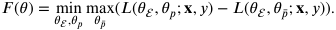

We use _𝜃𝑐_ to represent ( _𝜃_  _, 𝜃𝑝_ ), so the problem converts to min max _𝐹_ ( _𝜃𝑐 , 𝜃̄𝑝_ ). For such a bivariate1 function, we aim to find a saddle point ( _𝜃𝑐_∗_, 𝜃_ _𝑝_∗)[50–52]suchthat 

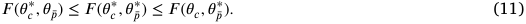

We analyze the convergence of MI-VFL by evaluating a regret function _𝑅_ ( _𝑇_ ), which is defined as 

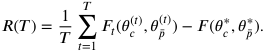

We then prove that when _𝑇_ → ∞,_𝑅_ _𝑇_<u>(</u>_𝑇_<u>)</u> → 0. Before the main analysis, we first introduce some assumptions. 

**Assumption 1** ( _Convex–concave Function_ ) **.** _𝐹_ (⋅ _, 𝜃̄𝑝_ ) ∶ _𝜃𝑐_ → R is convex for every _𝜃̄𝑝_ ∈ R_𝐷̄𝑝_ and _𝐹_ ( _𝜃𝑐,_ ⋅) ∶ _𝜃̄𝑝_ → R is concave for every _𝜃𝑐_ ∈ R_𝐷𝑐_ . 

**Assumption 2** ( _Bounded Solution Space_ ) **.** There exist constants _𝐶𝑐 >_ 0 and _𝐶̄𝑝 >_ 0 such that for ∀ _𝜃𝑐 , 𝜃𝑐_′∈R_𝐷𝑐_andfor∀_𝜃̄𝑝, 𝜃_ _𝑝_′∈R_𝐷̄𝑝_,thereare 

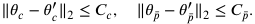

We set _𝐶𝑚𝑎𝑥_ = max{ _𝐶𝑐 , 𝐶̄𝑝_ }. 

**Assumption 3** ( _Bounded Subgradient_ ) **.** For partial gradients ∇ _𝑚,𝜃𝑐 𝐹𝑡_ and ∇ _𝑚,𝜃̄𝑝 𝐹𝑡_ of client _𝑚_ , there exist constants _𝐺𝑚,𝑐 >_ 0 and _𝐺𝑚,̄𝑝 >_ 0 such that 

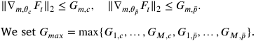

**Lemma 1.** _Let 𝜃𝑐_(_𝑡_)_and𝜃_ _𝑝_(_𝑡_)_representtheparameterupdatesatiteration_ _𝑡 for two components, 𝑐 and ̄𝑝, respectively. Using Assumption_ 1 _, we have the following inequality between the updated parameters and their optimal_ 

_values 𝜃𝑐_∗_and𝜃_ _𝑝_∗_atiteration𝑡_+ 1_:_ 

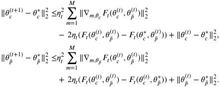

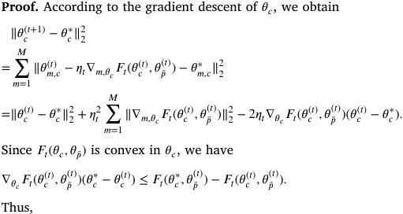

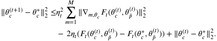

While for _𝜃̄𝑝_ , we conduct gradient ascent: 

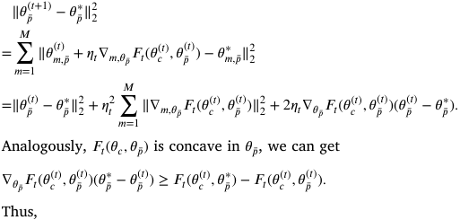

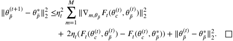

**Theorem 1.** _Using Assumption_ 1 _–_ 3 _, if 𝜂𝑡_ = ~~√~~ _𝐶𝑇__where𝐶isaconstant,_ _then the convergence rate is_ ( ~~√~~1 _𝑇_)_._ 

**Proof.** We first come to evaluate the difference between the aggregated training loss and the loss of the partial optimal solution with regard to _𝜃𝑐_ up to iteration _𝑇_ . According to Lemma 1, we have 

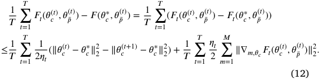

Next, we will bound the two terms in (12) in turn. 

For the first term, we use Assumption 2 to get the following bound 

> 1 We regard _𝜃_  and _𝜃𝑝_ as a common parameter since they are updated together. 

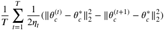

7 

_R. Xing et al._ 

_Computer Networks 263 (2025) 111220_ 

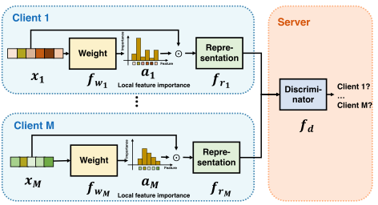

**Fig. 3.** Common feature suppression. The model is set to suppress common features among clients and remove redundancy. Each client owns the weight network and representation learning module. The intermediate results are uploaded to the server as the inputs of the discriminator network. The purpose of the discriminator is to decide which client the input comes from while the weight networks are aimed to weight the common features to confuse the discriminator. 

model to eliminate feature overlap and provide a concise and accurate interpretation based on truly representative features. 

The specific method is that we hope that each  should try to avoid selecting common features. Two models are used to achieve this goal. As shown in Fig. 3, one is the weight network _𝑓𝑤𝑚_ ∶ **𝐱** _𝑚_ → _𝑎𝑚, 𝑎𝑚_ ∈ R_𝑑𝑚_ on client _𝑚_ , and the other is the discriminator network _𝑓𝑑_ ∶ **𝐱** _𝑚 ⊙𝑎𝑚_ → _𝑡, 𝑚_ ∈ M _, 𝑡_ ∈ R_𝑀_ on the server. The two networks form an adversarial game which is similar to Generative Adversarial Network (GAN) [53]. The output dimension of _𝑓𝑑_ is _𝑀_ -hot, and its function is to identify which client the input comes from _𝑎𝑟𝑔𝑚𝑎𝑥𝑖_ ∈M _𝑡𝑖_ ; and the purpose of _𝑓𝑤_ is to learn the weight of each feature to ensure that it can provide higher weight to features that can confuse _𝑓𝑑_ , which are actually the common features. Therefore, the objective function of the adversarial network is 

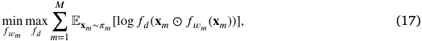

where _𝜋𝑚_ is the data distribution of client _𝑚_ . 

For _𝑓𝑤𝑚_ fixed, the optimal output of _𝑓𝑑_ is 

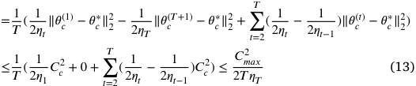

For the second term, we can obtain the following bound under Assumption 3, 

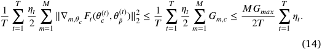

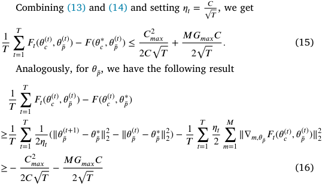

By the saddle point relation in (11) and combining (15) and (16), we can obtain 

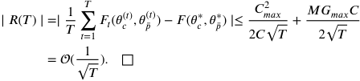

#### _4.3. Common feature suppression_ 

The feature subset **𝐱** _𝑠_ generated by the explainer is expected to be the most refined, which means we should select _𝑘_ representative features under the premise of ensuring prediction accuracy, rather than selecting some repeated features. However, without any coordination, **𝐱** _𝑠_ may contain overlapped features, which would limit improvements in model performance. As we mentioned before, Eq. (1) cannot be computed during training due to the inability to identify the locations of overlapped features. This leads to overlapped features being treated as distinct during global sampling. Therefore, it is crucial for the 

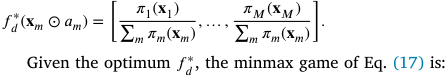

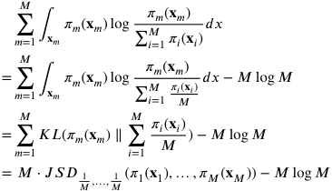

where JSD is Jensen–Shannon divergence between two distributions, which is non-negative. Thus, the minmax game of Eq. (17) is equal to reducing the JSD among _𝑀_ clients and the optimum is achieved when _𝜋_ 1( **𝐱** _𝑚_ ) = ⋯ = _𝜋𝑀_ ( **𝐱** _𝑚_ ). The _𝑓𝑤𝑚_ and _𝑓𝑑_ confront each other and finally reach a balance point. That is to say, _𝑓𝑤𝑚_ has learned the common features of the clients. 

However, the current model faces two challenges. First, the output dimensions of _𝑓𝑤𝑚_ and **𝐱** _𝑚_ from different clients are inconsistent, making them unsuitable for direct use as inputs to _𝑓𝑑_ . Second, we cannot transmit weighted features to the server due to privacy concerns. Thus, we introduce a representation learning module _𝑓𝑟𝑚_ after _𝑓𝑤𝑚_ as depicted in Fig. 3, which transforms the outputs from each client into a uniform input dimension suitable for _𝑓𝑑_ . Also, submitting intermediate representations can further protect data privacy, and _𝑓𝑟𝑚_ can learn better representations of common features to improve model performance. 

To suppress common features, we employ **𝐱** _𝑚 ⊙_ (1 − _𝑎𝑚_ ) as the input to _𝑓𝑑_ , ensuring that _𝑓𝑤𝑚_ generates weights that effectively suppress the influence of common features. The entire network will be pretrained, after which we retain _𝑓𝑤𝑚_ and multiply its calculated weights with the local weights computed by  _𝑚_ . Since our purpose is to suppress the common features, rather than completely ignoring them, we randomly select a client _𝑚_ without applying _𝑓𝑤𝑚_ , ensuring that common features are still included in the training process. Moreover, the network continues to learn based on the feedback from both _𝑓𝑝_ and _𝑓̄𝑝_ , so suppressing common features does not negatively affect  while allowing the explainer to focus on identifying relevant features associated with the target without overlap. 

#### **5. Evaluation** 

In this section, we evaluate MI-VFL through extensive experiments in several synthetic and real-world datasets. 

8 

_R. Xing et al._ 

_Computer Networks 263 (2025) 111220_ 

**Table 1** 

Synthetic datasets. 

|# Clients|Dataset|Method|
|---|---|---|
||_𝐷_2 1|_𝑃_(_𝑥_|_𝑦_= 1) ∝exp{~~∑~~4 _𝑖_=1 _𝑥_2 _𝑖_−4}|
|2|_𝐷_2 2|_𝑃_(_𝑥_|_𝑦_= 1) ∝exp{−10 × sin(2_𝑋_5) + 2|_𝑥_6|+_𝑥_7 + exp{−_𝑥_8}}|
||_𝐷_2 |_𝑥_10 ≥0: _𝑃_(_𝑥_|_𝑦_= 1) ∝_𝐷_2 1|
||3|_𝑥_10 _<_0: _𝑃_(_𝑥_|_𝑦_= 1) ∝_𝐷_2 2|
||_𝐷_5 1|_𝑃_(_𝑥_|_𝑦_= 1) ∝exp{~~∑~~10 _𝑖_=1 _𝑥_2 _𝑖_−4}|
|5|_𝐷_5 2|_𝑃_(_𝑥_|_𝑦_= 1) ∝exp{−5 × ~~∑~~14 _𝑖_=11 sin(2_𝑥𝑖_) + 2|_𝑥_15| + 1 2 ~~∑~~17 _𝑖_=16 _𝑥𝑖_ + 1 3 ∑20 _𝑖_=18 exp{−_𝑥𝑖_}}|
||_𝐷_5 3|_𝑥_25 ≥0: _𝑃_(_𝑥_|_𝑦_= 1) ∝_𝐷_5 1|
|||_𝑥_25 _<_0: _𝑃_(_𝑥_|_𝑦_= 1) ∝_𝐷_5 2|

**Table 2** 

Mean FIA (%) for synthetic datasets under different numbers of clients over 10 000 samples for each dataset. 

|# Clients|2|||5|||
|---|---|---|---|---|---|---|
|Dataset|_𝐷_2 1|_𝐷_2 2|_𝐷_2 3|_𝐷_5 1|_𝐷_5 2|_𝐷_5 3|
|**MI-VFL**|**100.0**|**92.8**|**75.7**|**83.9**|**79.6**|**65.5**|
|SHAP|100.0|65.5|56.0|49.2|58.0|55.9|
|LIME|99.5|98.5|62.4|93.2|91.0|55.1|
|Saliency|90.0|93.0|64.8|85.2|96.2|55.5|

#### _5.1. Synthetic datasets_ 

#### _5.1.1. Evaluation setup_ 

We now introduce the synthetic methods of datasets and the performance metrics. 

**Datasets:** centralized interpretation methods usually use some synthetic datasets to verify whether they can accurately find task-relevant features [14,15]. In VFL, we need to consider the number of clients and set up two types of datasets for the different numbers of clients. The details of the synthetic datasets are 

- Datasets for 2 clients with 10 features, where 4 features are important ( _𝑘_ = 4); 

- Datasets for 5 clients with 25 features, where 10 features are important ( _𝑘_ = 10). 

The features are generated by 10-dimensional and 25-dimensional Gaussian distributions, respectively. Labels of these datasets depend only on important features. The specific settings of the datasets are shown in Table 1. We split the feature set randomly and assign an equal number of features to each client. 

**Metrics:** the performance metric used in centralized interpretation methods is feature identification accuracy (FIA): 

_𝐹𝐼𝐴_ =#_𝑠𝑒𝑙𝑒𝑐𝑡𝑒𝑑𝑖𝑚𝑝𝑜𝑟𝑡𝑎𝑛𝑡__<u>𝑓</u>𝑒𝑎𝑡𝑢𝑟𝑒𝑠_ 

# _𝑎𝑙𝑙𝑖𝑚𝑝𝑜𝑟𝑡𝑎𝑛𝑡𝑓𝑒𝑎𝑡𝑢𝑟𝑒𝑠_ 

We also introduce repetition rate (RR) to evaluate the feasibility of the common feature suppression scheme: 

_𝑅𝑅_ =#_𝑠𝑒𝑙𝑒𝑐𝑡𝑒𝑑𝑟𝑒𝑝𝑒𝑡𝑖𝑡𝑖𝑣𝑒__<u>𝑓</u>𝑒𝑎𝑡𝑢𝑟𝑒𝑠_ 

# _𝑎𝑙𝑙𝑟𝑒𝑝𝑒𝑡𝑖𝑡𝑖𝑣𝑒𝑓𝑒𝑎𝑡𝑢𝑟𝑒𝑠_ 

#### _5.1.2. Evaluation of difference in local feature importance and global one_ 

To verify whether our approach can compensate for client–server’s difference, we compare MI-VFL with several current centralized interpretation methods, including Saliency maps [18], SHAP [28] and LIME [30]. For all methods, we train a unified centralized model. We select top- _𝑘_ important features for each sample. The results are shown in Table 2. 

As shown in Table 2, MI-VFL performs effectively in both 2- and 5- client settings, though some results are slightly lower than centralized methods in datasets _𝐷_ 22,_𝐷_ 15,and_𝐷_ 25duetothedistributednaturecom- pared with centralized one. Even so, MI-VFL selects nearly all important 

features in the first two datasets with 2 clients and around 80% with 5 clients. The second dataset shows generally lower accuracy because of the non-linear relation between features and labels. In contrast, MI-VFL has a significant advantage in the third dataset, showing its instancewise selection ability. Last but not least, the efficiency of MI-VFL is notable, as it only requires the time of one inference per sample, unlike the more time-intensive LIME and SHAP. High computation cost is even detrimental in VFL. 

#### _5.1.3. Evaluation of common feature suppression_ 

We focus on suppressing overlapped important features rather than unimportant ones, as the latter are less likely to be selected. Actually, important features also have relative significance ranking (e.g., _𝑥_ 8 is more important than _𝑥_ 7 in _𝐷_ 22).Thus,wesetoverlappedfeatures according to the importance ranking and assign them to respective clients, while unimportant features are randomly removed to keep the total number of features fixed at 10 and 25. Two sets of experiments (with 1 and 2 overlaps) were conducted, and overlapped features were counted once in the FIA calculation. Results are in Table 3. 

The feature suppression scheme performs well as demonstrated in Table 3, nearly eliminating overlap with one overlapped feature and significantly reducing redundancy with two overlaps. Further, the decrease in RR is accompanied by an increase in FIA as reducing overlap allows other important features to be selected, enhancing overall interpretability. 

#### _5.2. Real-world datasets_ 

#### _5.2.1. Evaluation setup_ 

First, we introduce the real-world datasets and the performance metrics. 

**Datasets:** We further evaluate MI-VFL on five real-world datasets, chosen for their diversity and relevance to real-world applications: 

- Credit card [54]: a tabular dataset of 30,000 samples with 23 features, assigned randomly to 3 clients. This dataset is from the financial domain, where model interpretability is critical, as decisions affect individuals’ financial security. 

- Drug persistency2 [55]: a tabular dataset of 3424 samples with 67 features. 14, 14, 13, 13, and 13 features are assigned to 5 clients randomly. This dataset is from the healthcare field, whose decisions based on such models can directly impact patient health, making interpretability essential in this high-stakes field. 

- w8a [56]: a tabular dataset of 64700 samples with 300 features. An equal number of features are assigned to 10 clients randomly. The inclusion of this dataset is used to demonstrate the method’s scalability and effectiveness in high-dimensional feature spaces. 

- MNIST [57] subset: an image dataset to classify handwritten digits 4 and 9, which has 19782 images with 28 × 28 features. We set up 2 clients with the raw images on the first client and the images rotated by 180 degrees on the second client. Thus there are 1568 features in total. Image data is widely used in realworld applications, and this dataset can be used to demonstrate the method’s versatility across more data types. 

- IMDB [58]: a text dataset of sentiment classification for movie reviews, which has 50000 reviews and the average review length is 231 words. We split each review into two parts and assign them to 2 clients. Text data is also prevalent in many daily applications, and using this dataset can show the model’s applicability in natural language processing tasks. 

> 2 We check all the medical datasets on Kaggle, and choose this one due to its sufficient features and samples, non-null data value, and complete labels. 

9 

_R. Xing et al._ 

_Computer Networks 263 (2025) 111220_ 

**Table 3** 

Mean FIA and mean RR for synthetic datasets under different numbers of clients with overlapped features over 10 000 samples for each dataset. 

||Datasets|_𝐷_@_𝑀_ 1||||_𝐷_@_𝑀_ 2||||_𝐷_@_𝑀_ 3||||
|---|---|---|---|---|---|---|---|---|---|---|---|---|---|
|Clients (@_𝑀_)|# Overlap|1|2|1|2|1|2|1|2|1|2|1|2|
||Metric (%)|FIA|RR|FIA|RR|FIA|RR|FIA|RR|FIA|RR|FIA|RR|
|@2|MI-VFL|85.8|28.5|77.7|22.3|74.9|41.9|75.0|21.7|69.4|44.6|54.9|19.1|
||MI-VFL+supp|**99.7**|**0.7**|**98.9**|**0.9**|**95.2**|**0.0**|**80.4**|**0.0**|**82.3**|**0.0**|**79.3**|**4.2**|
|@5|MI-VFL|72.4|27.5|71.2|18.6|67.0|19.0|69.1|8.2|58.7|34.2|52.6|26.4|
||MI-VFL+supp|**77.8**|**1.7**|**78.8**|**6.4**|**71.5**|**0.3**|**78.1**|**4.2**|**64.7**|**0.03**|**80.6**|**0.7**|

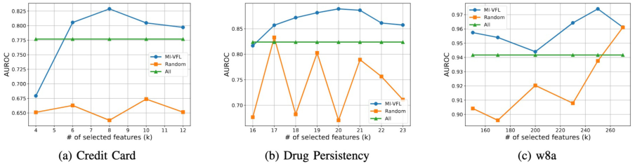

**Fig. 4.** AUROC vs. the number of selected features ( _𝑘_ ) on the real-world datasets. 

**Table 4** 

Prediction <u>performance</u> in the first three real-world datasets on test data. 

|Metric|Without MI-|VFL|MI-VFL||
|---|---|---|---|---|
||AUROC|AUPRC|AUROC|AUPRC|
|Credit card|0.7770|0.5411|**0.8288**|**0.6375**|
|Drug persistency|0.8239|0.7127|**0.8890**|**0.8105**|
|w8a|0.9417|0.7048|**0.9741**|**0.8068**|

For the first three datasets, we set up _𝑘_ = 8, _𝑘_ = 20, and _𝑘_ = 250, respectively. For the last two datasets, we follow Chen et al. [14] to process them. For MNIST, we split the 28 × 28 image into 16 patches with the size of 7 × 7 for better visualization and choose _𝑘_ = 10 patches from 32 patches. For IMDB, we cut/pad each review into 200 words for each client. We choose _𝑘_ = 10 words from 400 words. 

By choosing these datasets, we validate our method’s ability to handle a broad spectrum of data types (tabular, image, and text) and its relevance to high-risk decision-making fields (e.g., finance and healthcare), as well as its generalizability to more common domains like computer vision and natural language processing. 

**Metrics:** Since we do not know in advance which features are important in real-world datasets, we evaluate MI-VFL through the Area Under the Receiver Operating Characteristic Curve (AUROC) and Area Under the Precision Recall Curve (AUPRC). 

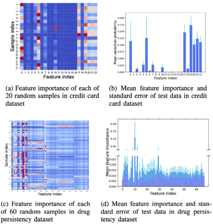

**Fig. 5.** Feature importance and mean feature importance and standard error of test data visualization in credit card and drug persistency datasets. 

#### _5.2.2. Evaluation of difference in local feature importance and global one_ 

We calculate AUROC and AUPRC using both selected features (via MI-VFL) and all features in first three datasets,3 and the results in Table 4 show that MI-VFL significantly improves prediction accuracy. This is because the explainer effectively identifies important features for the task. Additionally, to reflect the instance-wise nature of MIVFL, in the credit card and drug persistency datasets, we visualize feature importance for randomly selected samples (Figs. 5(a), 5(c)) and compute mean feature importance for test data (Figs. 5(b), 5(d)), highlighting the distinction between important and unimportant features and demonstrating MI-VFL has sample variability in important features. 

Since we are not sure what the true _𝑘_ is in the real-world datasets, we compare the prediction results under different _𝑘_ . We compare MI-VFL with random feature selection (Random) and all features participating (All), and the results are shown in Fig. 4. First, First, MI-VFL achieved higher AUROC, outperforming Random by an average of 12.78%, 12.49%, and 3.8% on the three datasets, respectively, and surpassing All by 0.61%, 4.12%, and 1.74%. Secondly, we observe that both excessively large and small values of _𝑘_ negatively impact model performance. This is because a small _𝑘_ may ignore the beneficial features, while a large _𝑘_ may introduce harmful features. A well-chosen _𝑘_ can significantly improve the model prediction. 

#### _5.2.3. Evaluation of common feature suppression_ 

> 3 We evaluated our model in MNIST and IMDB datasets in Section 5.2.3 

> directly because there is no need to manually set overlapped features. 

We also evaluate the common feature suppression scheme in realworld datasets. For the first three datasets, we select the overlapped 

10 

_R. Xing et al._ 

_Computer Networks 263 (2025) 111220_ 

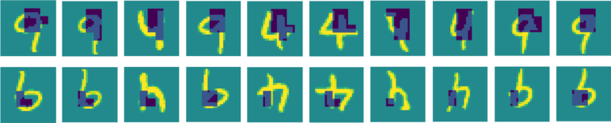

**Fig. 6.** Ten pairs of images of 4 and 9 are randomly selected from the test dataset in MNIST. Two rows are from two clients, respectively. The selected patches are colored dark blue and purple. (For interpretation of the references to color in this figure legend, the reader is referred to the web version of this article.) 

**Table 5** 

Prediction performance and mean RR in the first three real-world datasets with overlapped features on test data. 

|Metric|MI-VFL|||MI-VFL+s|upp||
|---|---|---|---|---|---|---|
||AUROC|AUPRC|RR (%)|AUROC|AUPRC|RR (%)|
|Credit card|0.7147|0.4290|31.5|**0.7830**|**0.5894**|**0.1**|
|Drug persistency|0.8386|0.7376|12.6|**0.8538**|**0.7538**|**4.3**|
|w8a|0.9508|0.7574|42.17|**0.9606**|**0.7431**|**13.8**|

of the digits, like the heads of 4 and 9. In IMDB, MI-VFL accurately selects important adjectives and avoids redundancy by selecting common words only once (‘‘well made’’ is selected once though it occurs both in the first sentence (client 1) and in the last sentence (client 2)), enhancing interpretability without overlap. 

#### **6. Conclusion** 

**Table 6** 

Prediction <u>performance</u> in MNIST and IMDB datasets. 

|Metric|Without M|I-VFL||MI-VFL+su|pp||
|---|---|---|---|---|---|---|
||AUROC|AUPRC|ACC (%)|AUROC|AUPRC|ACC (%)|
|MNIST|0.9993|0.9993|97.80|**0.9996**|**0.9996**|**99.10**|
|IMDB|0.9344|0.9299|86.27|**0.9535**|**0.9619**|**89.63**|

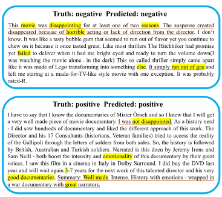

In this work, we have presented the first distributed model interpretation method for VFL, namely MI-VFL. From the natural characteristic of feature misalignment in VFL, we have proposed to use the law of total probability to solve the problem that the local feature importance is not equal to the global one caused by the discrepancy in local–global perspective. For the sake of completeness of selected features, we have designed an adversarial game to select as many important features as possible. At the same time, we have also considered the discrepancy in local–local perspective. We have designed a federated adversarial learning model to identify overlapped features once. Evaluation results demonstrate that the proposed MI-VFL can accurately select important features and suppress overlapped features. 

#### **CRediT authorship contribution statement** 

**Rui Xing:** Writing – review & editing, Writing – original draft, Investigation, Formal analysis, Data curation, Conceptualization. **Zhenzhe Zheng:** Writing – review & editing, Supervision, Methodology, Conceptualization. **Qinya Li:** Methodology. **Fan Wu:** Resources, Project administration. **Guihai Chen:** Resources, Project administration. 

#### **Declaration of competing interest** 

**Fig. 7.** Two reviews (positive and negative) are randomly selected from the test dataset in IMDB. Important words selected by MI-VFL are highlighted and key sentences are underlined. 

features based on the importance of features computed in the experiments without overlapped features. The assignment is the same as Section 5.1.3. We conduct experiments containing 2 overlapped features in both credit card and drug persistency datasets and 5 overlapped features in w8a dataset. The experimental results are shown in Table 5. 

As can be seen from the table, our method also suppresses overlapped features and reduces RR in real-world datasets. At the same time, the identification of more different important features further improves the prediction ability of the model. Therefore, it can be seen that the common feature suppression is also effective in real-world datasets. 

For the MNIST and IMDB datasets, MI-VFL with common feature suppression was applied directly. We also calculate prediction accuracy (ACC) to do a better comparison. Results in Table 6 show performance improvements in both image and text tasks. Visualizations (Figs. 6 and 7) highlight the effectiveness of MI-VFL in selecting key features. In MNIST, the selected features focus on the most discriminative parts 

The authors declare the following financial interests/personal relationships which may be considered as potential competing interests: Zhenzhe Zheng reports financial support was provided by National Natural Science Foundation of China. If there are other authors, they declare that they have no known competing financial interests or personal relationships that could have appeared to influence the work reported in this paper. 

#### **Acknowledgments** 

This work was supported in part by National Key R&D Program of China (No. 2023YFB4502400), in part by China NSF grant No. 62322206, 62132018, 62025204, U2268204, 62272307, 62372296. The opinions, findings, conclusions, and recommendations expressed in this paper are those of the authors and do not necessarily reflect the views of the funding agencies or the government. 

#### **Data availability** 

Data will be made available on request. 

11 

_R. Xing et al._ 

_Computer Networks 263 (2025) 111220_ 

#### **References** 

- [1] B. McMahan, E. Moore, D. Ramage, S. Hampson, B.A. y Arcas, Communicationefficient learning of deep networks from decentralized data, in: Proc. AISTATS, 2017. 

- [2] T. Li, A.K. Sahu, A. Talwalkar, V. Smith, Federated learning: Challenges, methods, and future directions, IEEE Signal Process. Mag. 37 (3) (2020) 50–60. 

- [3] P. Kairouz, H.B. McMahan, B. Avent, A. Bellet, M. Bennis, A.N. Bhagoji, K. Bonawitz, Z. Charles, G. Cormode, R. Cummings, et al., Advances and open problems in federated learning, Found. Trends Mach. Learn. 14 (1–2) (2021) 1–210. 

- [4] M.P. Boobalan, S.P. Ramu, Q. Pham, K. Dev, S. Pandya, P.K.R. Maddikunta, T.R. Gadekallu, T. Huynh-The, Fusion of federated learning and industrial internet of things: A survey, Comput. Netw. 212 (2022) 109048. 

- [5] Q. Yang, Y. Liu, T. Chen, Y. Tong, Federated machine learning: Concept and applications, ACM Trans. Intell. Syst. Technol. 10 (2) (2019) 1–19. 

- [6] S. Hardy, W. Henecka, H. Ivey-Law, R. Nock, G. Patrini, G. Smith, B. Thorne, Private federated learning on vertically partitioned data via entity resolution and additively homomorphic encryption, 2017, arXiv preprint arXiv:1711.10677. 

- [7] V. Rey, P.M.S. Sánchez, A.H. Celdrán, G. Bovet, Federated learning for malware detection in IoT devices, Comput. Netw. 204 (2022) 108693. 

- [8] R. Gupta, J. Gupta, Federated learning using game strategies: State-of-the-art and future trends, Comput. Netw. 225 (2023) 109650. 

- [9] B.K. Atchinson, D.M. Fox, From the field: The politics of the health insurance portability and accountability act, Health Aff. 16 (3) (1997) 146–150. 

- [10] Regulation (EU) 2016/679 of the European parliament and of the council of 27 april 2016 on the protection of natural persons with regard to the processing of personal data and on the free movement of such data, and repealing directive 95/46/EC (general data protection regulation), 2016, https://eur-lex.europa.eu/ eli/reg/2016/679/oj. 

- [11] Z.C. Lipton, The mythos of model interpretability, Queue 16 (3) (2018) 31–57. 

- [12] C. Rudin, Stop explaining black box machine learning models for high stakes decisions and use interpretable models instead, Nat. Mach. Intell. 1 (5) (2019) 206–215. 

- [13] T. Lei, R. Barzilay, T. Jaakkola, Rationalizing neural predictions, in: Proc. EMNLP, 2016. 

- [14] J. Chen, L. Song, M. Wainwright, M. Jordan, Learning to explain: An information-theoretic perspective on model interpretation, in: Proc. ICML, 2018. 

- [15] J. Yoon, J. Jordon, M. van der Schaar, INVASE: Instance-wise variable selection using neural networks, in: Proc. ICLR, 2018. 

- [16] S. Chang, Y. Zhang, M. Yu, T. Jaakkola, A game theoretic approach to class-wise selective rationalization, in: Proc. NeurIPS, 2019. 

- [17] M. Yu, Y. Zhang, S. Chang, T. Jaakkola, Understanding interlocking dynamics of cooperative rationalization, in: Proc. NeurIPS, 2021. 

- [18] K. Simonyan, A. Vedaldi, A. Zisserman, Deep inside convolutional networks: visualising image classification models and saliency maps, in: Proc. ICLR, 2014. 

- [19] A. Shrikumar, P. Greenside, A. Shcherbina, A. Kundaje, Not just a black box: Learning important features through propagating activation differences, 2016, arXiv preprint arXiv:1605.01713. 

- [20] M. Sundararajan, A. Taly, Q. Yan, Axiomatic attribution for deep networks, in: Proc. ICML, 2017. 

- [21] S. Bach, A. Binder, G. Montavon, F. Klauschen, K.-R. Müller, W. Samek, On pixel-wise explanations for non-linear classifier decisions by layer-wise relevance propagation, PloS One (2015). 

- [22] A. Shrikumar, P. Greenside, A. Kundaje, Learning important features through propagating activation differences, in: Proc. ICML, 2017. 

- [23] X. Sheng, L. Zhao, G. Zhou, X. Ding, B. Dai, Q. Luo, S. Yang, J. Lv, C. Zhang, H. Deng, et al., One model to serve all: Star topology adaptive recommender for multi-domain ctr prediction, in: Proc. CIKM, 2021. 

- [24] H. Peng, F. Long, C. Ding, Feature selection based on mutual information criteria of max-dependency, max-relevance, and min-redundancy, IEEE Trans. Pattern Anal. Mach. Intell. 27 (8) (2005) 1226–1238. 

- [25] C. Meadows, A more efficient cryptographic matchmaking protocol for use in the absence of a continuously available third party, in: Proc. S&P, 1986. 

- [26] T.M. Cover, Elements of information theory, 1999. 

- [27] A. Altmann, L. Toloşi, O. Sander, T. Lengauer, Permutation importance: A corrected feature importance measure, Bioinformatics 26 (10) (2010) 1340–1347. 

- [28] S.M. Lundberg, S.-I. Lee, A unified approach to interpreting model predictions, in: Proc. NeurIPS, 2017. 

- [29] M.D. Zeiler, R. Fergus, Visualizing and understanding convolutional networks, in: Proc. ECCV, 2014. 

- [30] M.T. Ribeiro, S. Singh, C. Guestrin, ‘Why should I trust you?’ explaining the predictions of any classifier, in: Proc. KDD, 2016. 

- [31] M.T. Ribeiro, S. Singh, C. Guestrin, Anchors: High-precision model-agnostic explanations, in: Proc. AAAI, 2018. 

- [32] P. Vepakomma, O. Gupta, T. Swedish, R. Raskar, Split learning for health: Distributed deep learning without sharing raw patient data, 2018, arXiv preprint arXiv:1812.00564. 

- [33] I. Ceballos, V. Sharma, E. Mugica, A. Singh, A. Roman, P. Vepakomma, R. Raskar, Splitnn-driven vertical partitioning, 2020, arXiv preprint arXiv:2008.04137. 

- [34] Y. Hu, D. Niu, J. Yang, S. Zhou, FDML: A collaborative machine learning framework for distributed features, in: Proc. KDD, 2019. 

- [35] G. Zhang, S. Zhao, H. Gao, W. Li, Feature-distributed SVRG for high-dimensional linear classification, 2018, arXiv preprint arXiv:1802.03604. 

- [36] B. Gu, A. Xu, Z. Huo, C. Deng, H. Huang, Privacy-preserving asynchronous vertical federated learning algorithms for multiparty collaborative learning, IEEE Trans. Neural Netw. Learn. Syst. 33 (11) (2021) 6103–6115. 

- [37] J. Zhang, S. Guo, Z. Qu, D. Zeng, H. Wang, Q. Liu, A.Y. Zomaya, Adaptive vertical federated learning on unbalanced features, IEEE Trans. Parallel Distrib. Syst. 33 (12) (2022) 4006–4018. 

- [38] K. Cheng, T. Fan, Y. Jin, Y. Liu, T. Chen, D. Papadopoulos, Q. Yang, Secureboost: A lossless federated learning framework, IEEE Intell. Syst. 36 (6) (2021) 87–98. 

- [39] F. Fu, Y. Shao, L. Yu, J. Jiang, H. Xue, Y. Tao, B. Cui, Vf2boost: Very fast vertical federated gradient boosting for cross-enterprise learning, in: Proc. SIGMOD, 2021. 

- [40] Y. Liu, X. Zhang, Y. Kang, L. Li, T. Chen, M. Hong, Q. Yang, FedBCD: A communication-efficient collaborative learning framework for distributed features, IEEE Trans. Signal Process. 70 (2022) 4277–4290. 

- [41] M. Li, Y. Chen, Y. Wang, Y. Pan, Efficient asynchronous vertical federated learning via gradient prediction and double-end sparse compression, in: Proc. ICARCV, 2020, pp. 291–296. 

- [42] D. Cai, T. Fan, Y. Kang, L. Fan, M. Xu, S. Wang, Q. Yang, Accelerating vertical federated learning, IEEE Trans. Big Data (01) (2022) 1–10. 

- [43] Z. Wu, Q. Li, B. He, Practical vertical federated learning with unsupervised representation learning, IEEE Trans. Big Data (2022). 

- [44] Y. Zheng, S. Xu, S. Wang, Y. Gao, Z. Hua, Privet: A privacy-preserving vertical federated learning service for gradient boosted decision tables, IEEE Trans. Serv. Comput. 16 (5) (2023) 3604–3620. 

- [45] W. Xu, H. Zhu, Y. Zheng, F. Wang, J. Zhao, Z. Liu, H. Li, ELXGB: An efficient and privacy-preserving XGBoost for vertical federated learning, IEEE Trans. Serv. Comput. (2024). 

- [46] Y. Han, P. Du, K. Yang, FedGBF: An efficient vertical federated learning framework via gradient boosting and bagging, 2022, arXiv preprint arXiv:2204. 00976. 

- [47] E. Jang, S. Gu, B. Poole, Categorical reparametrization with gumble-softmax, in: Proc. ICLR, 2017. 

- [48] C.J. Maddison, D. Tarlow, T. Minka, A* sampling, in: Proc. NeurIPS, 2014. 

- [49] C. Maddison, A. Mnih, Y. Teh, The concrete distribution: A continuous relaxation of discrete random variables, in: Proc. ICLR, 2017. 

- [50] R.E. Bruck, On the weak convergence of an ergodic iteration for the solution of variational inequalities for monotone operators in Hilbert space, J. Math. Anal. Appl. 61 (1) (1977) 159–164. 

- [51] A.S. Nemirovski, D.B. Yudin, Cesari convergence of the gradient method of approximating saddle points of convex-concave functions, Dokl. Akad. Nauk 239 (5) (1978) 1056–1059. 

- [52] A. Nedić, A. Ozdaglar, Subgradient methods for saddle-point problems, J. Optim. Theory Appl. 142 (2009) 205–228. 

- [53] I. Goodfellow, J. Pouget-Abadie, M. Mirza, B. Xu, D. Warde-Farley, S. Ozair, A. Courville, Y. Bengio, Generative adversarial nets, in: Proc. NeurIPS, 2014. 

- [54] I.-C. Yeh, C.-h. Lien, The comparisons of data mining techniques for the predictive accuracy of probability of default of credit card clients, Expert Syst. Appl. 36 (2) (2009) 2473–2480. 

- [55] H. Singh21, Classification: Persistent vs Non-Persistent. https://www.kaggle.com/ datasets/harbhajansingh21/persistent-vs-nonpersistent. (Accessed 11 May 2021). 

- [56] Z. Zeng, H. Yu, H. Xu, Y. Xie, J. Gao, Fast training support vector machines using parallel sequential minimal optimization, in: Proc. ISKE, 2008. 

- [57] Y. LeCun, L. Bottou, Y. Bengio, P. Haffner, Gradient-based learning applied to document recognition, Proc. IEEE 86 (11) (1998) 2278–2324. 

- [58] A. Maas, R.E. Daly, P.T. Pham, D. Huang, A.Y. Ng, C. Potts, Learning word vectors for sentiment analysis, in: Proc. ACL, 2011. 

12 

_R. Xing et al._ 

_Computer Networks 263 (2025) 111220_ 

**Rui Xing** is a Ph.D candidate in the Department of Computer Science and Engineering at Shanghai Jiao Tong University, P. R. China. She received her B.S. degree in Computer Science and Technology from Jilin University, P.R. China, in 2020. Her research interests include model interpretation, federated learning and client AI. 

**Zhenzhe Zheng** is a professor at Shanghai Jiao Tong University, specializing in game theory, mobile computing, and online marketplaces. He earned his B.E. from Xidian University and his M.S. and Ph.D. from SJTU. He was a Postdoc at UIUC from 2018 to 2019. He has received several honors, including the CCF Excellent Doctoral Dissertation Award (2018) and Ph.D fellowships from Google and Microsoft Research Asia. He is a member of ACM, IEEE, and CCF, and has served on the technical committees of numerous conferences. For more details, visit https:// zhengzhenzhe220.github.io/. 

**Qinya Li** is a research assistant professor in the Department of Computer Science and Engineering, Shanghai Jiao Tong University. She received her B.S. degree in Computer Science and Engineering from Northeastern University, P.R. China in 2015, and the Ph.D. degree in Computer Science and Engineering from Shanghai Jiao Tong University in 2020. Her research interests include mobile computing, mobile crowdsourcing, and algorithmic game theory and its applications. 

**Fan Wu** is a professor at Shanghai Jiao Tong University. He earned his B.S. from Nanjing University and Ph.D. from SUNY Buffalo. His research focuses on wireless networking, mobile computing, and network economics. He has published over 200 papers and received numerous awards, including the China National Fund for Distinguished Young Scientists and the ACM China Rising Star Award. He serves as an associate editor for TMC and TOSN and an area editor of Elsevier Computer Networks, and has contributed to over 100 conference committees. For more details, visit http://www.cs.sjtu.edu.cn/~fwu/. 

**Guihai Chen** , IEEE Fellow, is a distinguished professor at Shanghai Jiao Tong University. He received his B.S. from Nanjing University, M.E. from Southeast University, and Ph.D. from the University of Hong Kong. He had been invited as a visiting professor by many universities including Kyushu Institute of Technology, Japan in 1998, University of Queensland, Australia in 2000, and Wayne State University, USA during September 2001 to August 2003. His research focuses on sensor networks, peer-to-peer computing, and high-performance computer architecture. He has published over 200 papers in top journals and conferences like TPDS, TMC, TON, MobiCom, MobiHoc, INFOCOM, ICNP, ICPP, IPDPS and ICDCS. 

13 

