2024 IEEE 44th International Conference on Distributed Computing Systems (ICDCS) 

# Mobility-aware Device Sampling for Statistical Heterogeneity in Hierarchical Federated Learning 

Songli Zhang, Zhenzhe Zheng, Qinya Li, Fan Wu, and Guihai Chen 

Department of Computer Science and Engineering 

Shanghai Jiao Tong University, Shanghai, China 200240 

Emails: _{_ zhang sl, zhengzhenzhe, qinyali _}_ @sjtu.edu.cn, _{_ fwu, gchen _}_ @cs.sjtu.edu.cn 

**_Abstract_ —Hierarchical Federated Learning (HFL) is a practical implementation of federated learning in mobile edge computing, employing edge servers as intermediaries between mobile devices and the cloud server for device coordination and cloud communication. However, the devices are usually mobile users with unpredictable mobile trajectories and statistical heterogeneity, leading to the edge models optimized along dynamic edge data distribution directions and further resulting in instability and slow convergence of the global model. In this work, we propose a** **<u>Mobility-Aware</u> deviCe sampling algorithm in** **<u>HFL,</u> namely MACH, which can dynamically maintain the device sampling strategy at each edge to accelerate the convergence of the global model. First, we analyze the convergence bound of HFL with mobile devices under arbitrary device sampling probabilities. Based on this convergence bound, we formalize the sampling optimization problem for mobility-aware device sampling, aiming to minimize the convergence error under time-averaged cost constraints, while taking the limited device-edge wireless channel capacity into account. Next, we introduce the MACH algorithm, consisting of two underlying components: experience updating and edge sampling. Experience updating utilizes an upper confidence bound method to estimate device statistical information online, and edge sampling customizes a sampling strategy on each edge based on the estimated device statistical information. Finally, extensive experimental results through real-world mobile device trajectories validate that MACH can reduce the time required to achieve a target accuracy by** 25 _._ 00% _−_ 56 _._ 86% **.** 

## I. INTRODUCTION 

Hierarchical federated learning (HFL) is a typical implementation of federated learning (FL) in mobile edge computing (MEC) [1]–[3]. Under such a network paradigm, a cluster of edges serves as relays between mobile devices and the cloud server, which can coordinate mobile devices within clusters and communicate with the cloud server [4], [5]. In this way, FL is also implemented with a hierarchical aggregation structure [3], [6]. Edges first aggregate local models from the coordinated mobile devices to form an edge model1 , and the cloud server periodically aggregates these edge models into a global model [7], [8]. 

However, the statistical heterogeneity of data on mobile devices and then on edges still hinders the convergence of HFL, resulting in instability and slow model convergence progress [9], [10]. The non-independent identical (Non-IID) data distributions across devices create the Non-IID data distribution across edges, causing edge models to be trained 

> 1The term edge model, local model and global model refer to the models on edge, device and cloud, respectively. 

in various directions, and potentially deviating from the global optimization directions. To overcome the statistical heterogeneity in traditional server-to-client FL, device sampling is considered as a standard approach [11]–[15]. Device sampling assigns a fixed sampling probability to each device individually, allowing devices that contribute more to global model convergence to participate more in training, which helps reduce the impact of statistical heterogeneity. Some typical device sampling approaches have been demonstrated to be effective in mitigating the statistical heterogeneity in general FL through rigorous theoretical analysis, such as classbalance sampling [14] or gradient-norm based sampling [11], [15]. However, in HFL, mobile devices are geographically distributed, exhibiting natural mobility patterns, introducing time-varying devices coordinated by each edge [16], [17]. Since the edge models are always optimized according to the current data within the edge [18], it further leads to edge models being optimized toward dynamic directions. It makes traditional device sampling strategies fail to apply to HFL with mobile devices, and designing a specific device sampling strategy for device mobility in HFL is necessary. 

Developing an appropriate sampling strategy in HFL with mobile devices is non-trivial, and has the following two challenges. The first and fundamental challenge lies in deriving an analytical model convergence bound for HFL with mobile devices for any arbitrary device sampling probabilities. Given the device mobility, each edge coordinates different devices to participate in edge model training during every training round, causing the edge model to be updated along the dynamic optimization direction. Additionally, the edge communicates periodically with the cloud server, and the current updated edge model will serve as the starting point for the next edge training round. Therefore, a comprehensive assessment of the impact of all devices involved in edge model training, from the last global aggregation to the current time, is essential when analyzing the model convergence bound for HFL with mobile devices. Moreover, when designing the sampling strategy for each edge, it is crucial to consider the communication capacity. All of these factors become critical in ensuring effective customization of the sampling process. 

The second challenge is determining the optimal device sampling solution based on the above new HFL model convergence bound. Some recent works leverage device training experiences to facilitate device selection [19]–[21]. However, 

2575-8411/24/$31.00 ©2024 IEEE 656 DOI 10.1109/ICDCS60910.2024.00067 Authorized licensed use limited to: Shanghai Jiaotong University. Downloaded on December 28,2024 at 15:49:58 UTC from IEEE Xplore.  Restrictions apply. 

in HFL with mobile devices, devices dynamically participate in the model training processes of different edges, generating various training experiences. Furthermore, the convergence bound in FL heavily relies on certain assumptions concerning the statistical heterogeneity of devices’ data [11], [22], such as the upper bounds of local stochastic gradient norms. However, these assumptions introduce unknown parameters that cannot be directly observed before model training. This raises two unsolved issues: 1) whether training experiences from different edges can be shared across edges, and 2) how to leverage these training experiences to accurately estimate the unknown parameters, facilitating the derivation of the device sampling strategy. Addressing the challenge of evaluating unknown parameters in the HFL convergence bound during the training process becomes crucial. 

In this work, we address the above two challenges by proposing MACH, which is a <u>Mobility-Aware</u> deviCe sampling algorithm in <u>Hierarchical</u> federated learning, aiming to overcome the notorious statistical heterogeneity in HFL with mobile devices. We first formalize the general scenario of mobile devices participating in HFL, and derive a new HFL convergence bound for non-convex loss functions with arbitrary mobile device sampling probabilities. Our new bound indicates that each edge can independently maintain a specific edge sampling strategy based on the devices within that edge to facilitate the convergence of the global model. Considering the communication constraints among edges in hierarchical wireless networks and the newly derived convergence bound, we tailor a sampling optimization problem, aiming to dynamically adjust the current edge sampling strategy within each edge to minimize the convergence error subject to timeaveraged cost constraints. To solve the proposed optimization problem, we introduce an online mobility-aware device sampling algorithm MACH. A key advantage of MACH is that it requires no prior knowledge of device data statistical information, and MACH can customize the edge sampling strategy based on the currently accessible devices within the edge. MACH comprises two components: experience updating and edge sampling. The experience updating maintains a training experience buffer on each device, utilizing the upper confidence bound (UCB) method to estimate device statistical information for edge sampling strategies. On the other hand, edge sampling is employed by each edge to individually customize device sampling probabilities for the devices within that edge to solve the proposed optimization problem. 

We summarize our key contributions in this work as follows: 

- We investigate the mobility-aware device sampling in HFL, which is the first work to consider device sampling in the context of HFL with mobile devices, and regulate edge model training using device sampling probabilities to address statistical heterogeneity. 

- We derive a new HFL convergence bound with arbitrary device sampling probabilities, based on which, we formulate an optimization problem of device sampling to minimize the convergence error of model training. 

- We proposed MACH, an online mobility-aware device 

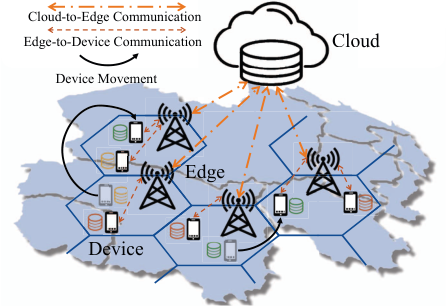

<!-- Start of picture text -->
Cloud-to-Edge Communication Edge-to-Device Communication Cloud Device Movement Edge Device <!-- End of picture text -->

Fig. 1: Hierarchical Wireless Networks with Mobile Devices. 

sampling algorithm. MACH employs the UCB method to perform online experience updating, which relies on no prior knowledge of device data statistics, and independently makes edge sampling strategies for each edge. 

- The extensive data-driven simulations with various learning tasks and real-world Telecom datasets demonstrate that MACH can significantly reduce the time required to achieve a target accuracy by 25 _._ 00% _−_ 56 _._ 86% compared to other competitive sampling algorithms. 

## II. PRELIMINARIES 

In this section, we first introduce the architecture of hierarchical wireless networks with mobile devices in MEC. Then, we describe the implementation of HFL in such a scenario with arbitrary device sampling probability. 

## _A. Hierarchical Wireless Networks with Mobile Devices_ 

Wireless networks usually introduced edges ( _e.g._ , base stations, routers and switches) as relays between the cloud and mobile devices, forming a three-layer device-edge-cloud architecture, as shown in Figure 1. We consider discrete time steps, and mobile devices can move across edges over different time steps2 . All mobile devices follows a simple clustering scheme based on physical accessibility, _i.e._ , mobile devices tend to select the nearest edge to access according to their geographical locations3 . The cloud coordinates all edges and mobile devices to satisfy a customized service requirement. 

We introduce the important variables and equations used in this work as follows. Let _N_ be the set of all edges, and _M_ the set of all devices. In the hierarchical wireless network, _|N|_ edges and _|M|_ devices are considered, where _|·|_ represents the cardinality of a set. In each time step _t ∈T_ , mobile devices can move across edges while performing local tasks. 

**Mobile Devices:** Each mobile device _m ∈M_ holds a local dataset _Dm_ of size _|Dm|_ . The devices are geographically 

> 2The time steps align with the iterations in FL training process, _i.e._ , time step _t_ is also the basic unit of local model training and all mobile devices can complete local training within a time step. 

> 3The mobile device accesses the nearest edge to reduce communication latency and obtain higher quality of service. 

657 

Authorized licensed use limited to: Shanghai Jiaotong University. Downloaded on December 28,2024 at 15:49:58 UTC from IEEE Xplore.  Restrictions apply. 

distributed and mobile, connecting to different edges in various time steps. To capture this characteristic, we introduce a binary indicator _Bn,m__t∈{_0_,_1_}_to represent whether device_m_ accesses edge _n_ at time step _t_ . When we have sufficient prior knowledge about device mobility at each time step, obtaining _Bn,m__t∈{_0_,_1_}_isstraightforward.Ifweareuncertainabout device mobility in future time steps and need to make predictions, we can utilize classical mobility models such as Markov mobility model to capture device locations [23], [24]. For instance, we can set a variable _Pn,m__t∈_[0_,_1] as the probability that device _m_ is accessed to edge _n_ at time step _t_ . Considering the modeling and predicting device trajectories have been extensively studied [25], [26], we consider _Bn,m__t∈{_0_,_1_}_ to be a known quantity [27], [28], and emphasize that our solution is orthogonal to them. 

**Edges:** At each time step _t_ , each edge _n_ can coordinate the mobile devices that access it. Edge _n_ examines all the mobile devices connected to it at the current time step, and let _M__t_ _n_bethesetofdeviceswithintheedge_n_attimestep_t_, _i.e._ , _M__t_ _n_= � _m|Bn,m__t_= 1_, ∀m ∈M_ �. Considering that each mobile device can only connect to the nearest edge, it has: 

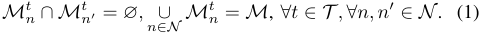

With device mobility, the set of mobile devices _M__t_ _n_associated with edge _n_ changes over time. 

## _B. Mobility-aware HFL based on Arbitrary Sampling_ 

Based on the above hierarchical wireless network in MEC, the HFL is implemented to perform a specific classification learning task to get a global cloud model by solving the following optimization problem: 

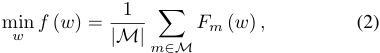

which is derived from the general FL algorithm FedAvg [29], and _Fm_ ( _·_ ) represents the local loss function of device _m_ . The average can also be replaced by a weighted average [30], and we consider a simplified scenario where the number of local dataset is the same across all devices. Then, the cloud, edge _n ∈N_ and device _m ∈M_ iteratively update the global model _w__t_ , edge model _wn__t_andlocalmodel_w_ _m__t_,respectively. The HFL model training is performed over the sequential time steps _T_ , which contains the following main steps: 

_1) Device Sampling:_ Due to the resource cost in wireless networks, requiring all devices participating in the FL training is unrealistic [31], [32]. The edge _n_ need to select a subset of devices for training, and each device has an arbitrary probability of being sampled to participate in FL training, denoted as _qm,n__t∈_[0_,_1]fordevice_m_sampledbyedge_n_ at time step _t_ . Let 1_t_ _m,n__∈{_0_,_1_}_beanindicatorfunction to denote whether device _m_ is sampled in time step _t_ , and _qm,n__t_:=_Pr{_1_t_ _m,n_= 1_}_.1_t_ _m,n_and1_t_ _m__′_ _,n_areindependentfor _m̸_ = _m__′_ . Due to the channel capacity of the edge, each edge 

_n ∈N_ expects that only _Kn_ devices can participate in the edge model training in each time step, denoted by: 

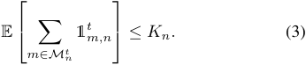

Finally, the global sampling strategy in each time step _t_ is represented by _Q__t_ = � _qm,n__t|m ∈M_ �. 

_2) Local Updating:_ When mobile device _m ∈M_ are sampled to participate the training within the current edge, the device _m ∈M_ first downloads the edge model _wn__t_from the accessed edge _n_ at the beginning of time step _t_ . Then, the device _m_ trains the local model based on its local data samples by running _I_ local updates: 

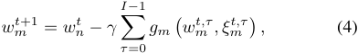

where _wm__t_isthelocalmodelofthedevice_m_attimestep_t_, _wm__t,τ_istheinterimmodelduringlocalupdatingand_w_ _m__t,_0= _wn__t_,_ξ_ _m__t,τ_istherandomlyselecteddatasamplesfromdevice _m_ at each local updating, _γ_ is the learning rate, and _gm_ ( _·_ ) is the stochastic gradient of _Fm_ ( _·_ ). 

_3) Edge Aggregation:_ The edge aggregate the new edge model _wn__t_+1 for the next time step when receiving the updated local model _wm__t_+1 from all devices: 

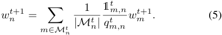

Notice that each device’s aggregation weight is inversely proportional to its probability of being selected, which ensures the gradient updates remain unbiased. After every _Tg_ time steps, the edge communicates with the cloud server. The device sampling probability _qm,n__t_inedge_n_constitutestheedge sampling strategy _Q__t_ _n_= � _qm,n__t|m ∈M_ _n__t_ � at time step _t_ . 

_4) Edge-to-Cloud Communication:_ The cloud server aggregates all uploaded edge models to obtain the global model _w__t_+1 in each edge-to-cloud communication time step, _i.e._ , _t mod Tg_ = 0: 

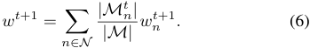

Then, the cloud distributes the new global model _w__t_+1 to all edges and devices. Similar to the classical FL, the cloud server aims to obtain the optimal global model _w__∗_ by solving the optimization problem in Eq. (2). 

## III. MOBILITY-AWARE DEVICE SAMPLING 

In this section, we first derive the HFL convergence bound in terms of the mobility patterns of devices and device sampling probabilities, and formulate a new optimization problem, which minimizes the HFL convergence bound by adjusting the device sampling strategy. Then, based on insights inspired by the new proposed convergence bound, we analyze and design MACH, which involves two underlying components: experience updating and edge sampling. 

658 

Authorized licensed use limited to: Shanghai Jiaotong University. Downloaded on December 28,2024 at 15:49:58 UTC from IEEE Xplore.  Restrictions apply. 

## _A. Convergence Analysis_ 

We first provide an analysis of the convergence bound on the mobility-aware HFL for arbitrary device sampling probabilities. To ensure a tractable convergence analysis, we stick to the following assumptions: 

**Assumption 1** _L-smooth: Fm_ ( _w_ ) _is L−Lipschitz smoothness for each device m ∈M, i.e., ∥∇Fm_ ( _w_ ) _−∇Fm_ ( _w__′_ ) _∥≤ L ∥w − w__′_ _∥_2 _for any two parameter model w and w__′_ _._ 

**Assumption 2** _Unbiased local gradient: The local stochastic gradient on each device m ∈ M is unbiased, i.e.,_ E _ξm∼Dm_ [ _gm_ ( _w, ξm_ )] = _∇Fm_ ( _w_ ) _for any parameter model w._ 

**Assumption 3** _Bounded local gradient: The expected squared norm of stochastic gradients on each device m ∈M is bounded, i.e.,_ E _∥gm_ ( _w, ξm_ ) _∥_2 _≤ G_2 _m__for any parameter model_ _w and randomly selected local data ξm._ 

Assumptions 1-3 are standard in the classical theoretical analysis of FL algorithms [22], [33], [34]. Assumption 3 sets an upper bound on the gradient norm for each device _m_ . As Assumption 3 holds for any parameter model _w_ and is solely dependent on local data on each device, it reflects the statistical heterogeneity of devices, informing our optimal device sampling design. Furthermore, an additional virtual global model _~~w~~__~~t~~_+1 is introduced to represent the aggregation of local models after time step _t_ + 1: 

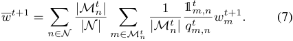

_~~w~~__~~t~~_+1 is equal to _w__t_+1 at the time step when the edge communicates with the cloud server, _i.e._ , _t mod Tg_ = 0. 

**Lemma 1** (Unbiasedness of Global Gradient Updating) _. With the global sampling strategy Q__t_ _, we have:_ 

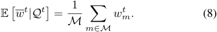

**Proof** _Since qm,n__t_=_Pr{_1_t_ _m,n_=1_},and_1_t_ _m,n__areindepen-_ _dent ∀m ∈M, we can derive Eq._ (8) _by taking the expectation over the virtual global model._ ■ 

We present the main convergence result on mobility-aware HFL for arbitrary device sampling probability in Theorem 1. **Theorem 1** (Convergence Upper Bound) _. Let Assumptions 1- 3 hold, for given device sampling strategy Q__t_ _, the HFL with mobile devices satisfies that:_ 

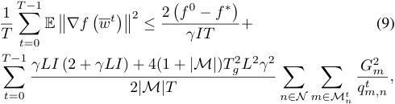

_where f__∗_ _represents the optimal solution to Eq._ (2) _._ 

**Proof** _We omit the detailed proof due to page limitation, but a proof sketch can be found in Appendix A._ ■ 

**Remark 1** _This convergence bound characterizes the effect under the arbitrary device sampling probabilities. It shows that the more often devices participate, the less time steps will be required to converge. The device mobility mainly influences the HFL convergence bound by term_� _n∈N_ � _m∈M__t_ _n qGm,n__t_2 _<u>m</u>__.Each_ _edge can adjust the edge sampling strategy Q__t_ _n__andminimize_ � _m∈M__t_ _n qGm,n__t_2 _<u>m</u>__toacceleratetheconvergence._ 

However, due to the channel capacity of edges, it is impractical for all mobile devices to access the edge nodes and participate in training simultaneously. Based on Eq. (3), the maximum expected number of accessed devices for each edge _n ∈N_ , we can formulate an optimization problem to minimize the convergence bound in Eq. (9) by designing a new sampling strategy, _i.e._ , the mobility-aware device sampling in HFL can be solved through the following problem: 

## **Problem 1** 

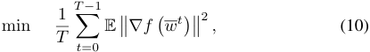

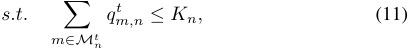

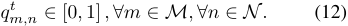

By solving Problem **P1** , we can get the theoretical optimal sampling strategy. 

**Remark 2** _The optimal sampling strategy at different time steps is independent, and each edge n ∈N maintains a independent optimal sampling strategy. For device m ∈M__t_ _n__,_ _without considering the value ranges of qm,n__t(Eq._(12)_),the_ _optimal device sampling probability qm,n__t∗follows:_ 

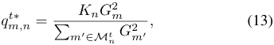

_which can be easily solved by the method of Lagrange multipliers in closed form. It indicates that the edge sampling strategy Q__t_ _n__foreachedgeissolelydeterminedbasedonthe_ _devices within the current edge. The parameter G_2 _m__represents_ _the upper bound of the local gradient for each device m ∈M, and it is essential to assign higher sampling probabilities to devices with larger gradient norms within each edge._ 

However, directly observing the local stochastic gradient _ℓ_ 2-norm _G_2 _m_ofeachdevice_m∈Mt_ _n_isdifficult.Inthe following, we propose MACH, which achieves mobility-aware device sampling in HFL by online estimating device stochastic gradient norms and solving the formulated Problem **P1** . 

## _B. Design of MACH_ 

In this section, we will provide a comprehensive presentation of the principles and design details of MACH. The design of MACH has to address the following two questions: 1) How to evaluate the unknown _ℓ_ 2-norm of local stochastic gradient 

659 

Authorized licensed use limited to: Shanghai Jiaotong University. Downloaded on December 28,2024 at 15:49:58 UTC from IEEE Xplore.  Restrictions apply. 

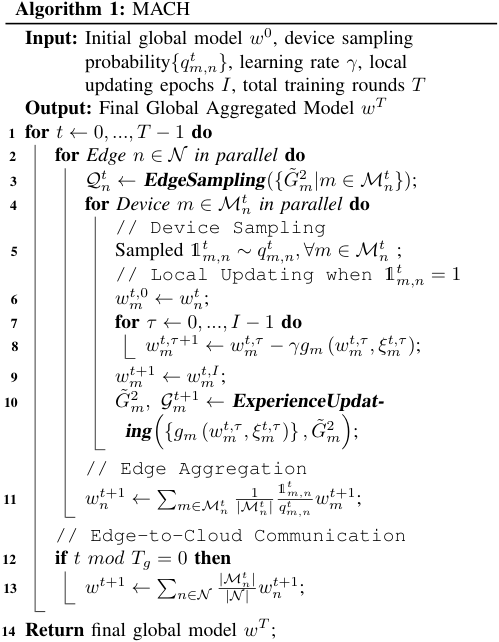

for each device _m_ , _i.e._ , _G_2 _m_,duringthetrainingprocess? 2) How does each edge make a sampling strategy to solve Problem **P1** based on the estimated gradient norm? Although typical FL sampling approaches have proposed the estimation approaches to address the first question [11], [15], it is unpractical in HFL with mobile devices. Because the mobile devices dynamically participate in the training of different edges, which makes estimating the value of _G_2 _m_difficult. Therefore, mobility-aware device sampling should not only update the device training experience when the mobile device dynamically participates in different edge training processes, but also solve independent edge sampling strategies for edges. 

Based on the above principles, the MACH can be achieved by introducing two underlying components: experience updating and edge sampling. Algorithm 1 summarizes the process of MACH. At each time step _t ∈T_ , each edge _n ∈N_ performs training in parallel. Firstly, based on the devices in the current edge, each edge _n_ generates the edge sampling strategy _Q__t_ _n_to solve Problem **P1** (Line 3). Then, each device _m ∈M__t_ _n_com- pletes device sampling and local updating (Lines 5-9). Further, to obtain the _ℓ_ 2-norm of the local stochastic gradient for each mobile device _m_ during the FL process, we formulate the online experience updating as a bandit learning problem, and each device _m_ employs a UCB method to get the estimated maximum gradient norm _G_˜2 _m_.Uponreceivingalluploaded local models, each edge _n_ aggregates the new edge models 

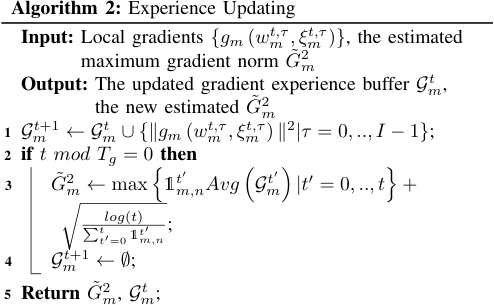

_wn__t_+1 (Line 11). Finally, the cloud and edges communicate periodically to update the global model _w__t_ (Lines 12-13). 

_1) Experience Updating:_ In this part, each mobile device _m_ captures the estimated maximum gradient norm _G_˜2 _m_during the online FL process. 

However, achieving online experience updating is not trivial and involves addressing two key issues. First, in the initial stages of FL training, the cloud server has limited knowledge about the truth value of the expected stochastic gradient norm _G_2 _m_foreachmobiledevice_m_,andrequiresaperiodof training to explore the estimated maximum gradient norm _G_ ˜2 _m_foredgesamplingdecision-making.Simplyrelyingon insufficient experiential exploration will fail to accurately assess the gradient update differences caused by the statistical heterogeneity of devices, and mislead the edge into making suboptimal decisions when making edge sampling decisions. Therefore, balancing the exploration and exploitation of the estimated maximum gradient norm _G_˜2 _m_intheFLtraining process is a challenge that needs to be addressed. Second, when mobile devices move across edges and dynamically participate in FL training from different edges, all mobile devices download different edge models from different edges, which can lead to biases in the evaluation of the estimated maximum gradient norm _G_˜2 _m_atthesametimestep.Moreover,dueto the inherent Non-IID data distribution across devices and the random local training sampling, biases in local data sampling can introduce randomness to the estimated maximum gradient norm _G_˜2 _m_.Particularly,thelimitedcomputingresourcesof mobile devices result in smaller batch sizes for local training, further increasing the randomness of the estimation. As a consequence, directly utilizing training experiences from each time step to evaluate the estimated norm _G_˜2 _m_isimprecise. 

To address these issues, the cloud server employs a classical bandit learning approach for online experience updating, and each device _m_ independently maintains a gradient experience buffer _Gm__t_,whichstoresalltrainingexperiencesbetween sequential edge-to-cloud communications. By utilizing the mean of these experiences, each mobile device update the estimated maximum gradient norm _G_˜2 _m_by exploring the UCB score. The procedure of experience updating is summarized 

660 

Authorized licensed use limited to: Shanghai Jiaotong University. Downloaded on December 28,2024 at 15:49:58 UTC from IEEE Xplore.  Restrictions apply. 

in Algorithm 2. After device _m_ completes its local update, it updates the gradient experience buffer _Gm__t_withthetraining experience based on the gradients from the current training round (Line 1): 

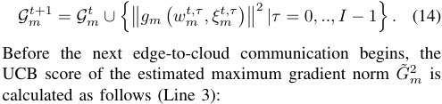

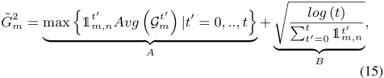

where _Avg_ ( _·_ ) is a function used to calculate the mean of the gradient experience buffer _Gm__t_.TermsAandBarecommonly denoted as the exploitation and exploration terms, respectively. Exploration term B also represents the corresponding confidence radius of the online estimation. When mobile device _m_ is not sufficiently sampled for exploring and updating the _G_ ˜2 _m_value,itleadstoanhighscorefortermB,thereby increasing the sampling frequency of mobile device _m_ . Finally, the gradient experience buffer _Gm__t_willbecleared(Line4). 

_2) Edge Sampling:_ In this part, based on the HFL convergence bound and Problem **P1** , each edge _n ∈N_ individual generates the current edge sampling strategy. 

According to Remark 2, each edge should assign higher sampling probabilities to devices with larger gradient norms. However, when considering the edge channel constraint Eq. (11), directly solving the joint Eq. (11) and (13) may result in some sampling probabilities exceeding their valid range. Moreover, during the initial training stages, the estimated _G_ ˜2 _m_maybeinaccurateandsubjecttosignificantrandomness, due to insufficient training. As a consequence, inaccurate estimation of _G_˜2 _m_mayleadtoextremevaluesofthedevice sampling probability _qm,n__t_, which in turn can result in training failures. When a device with an extremely small sampling probability _qm,n__t→_0isselected,theedgeaggregationstep can cause an explosive increase in the norm of the parameters of the aggregated edge model in the current training round, leading to gradient vanishing. Therefore, when leveraging the estimated _G_˜2 _m_tosolveProblem**P1**,itisnecessarytoapply appropriate scaling to the theoretically optimal solution. 

The procedure of edge sampling is summarized in Algorithm 3, and each edge _n_ maintains its sampling strategy _Q__t_ _n_ through the following steps. Based on the estimated maximum gradient norm _G_˜2 _m_andRemark2,eachedgecancalculatea virtual sampling probability _q_ ˆ _m,n__t_foreachdevice_m_(Line2): 

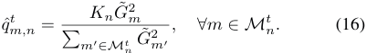

We note that it is possible for _q_ ˆ _m,n__t>_1. To constrain the range of the actual sampling probability _q_ ˆ _m,n__t_andavoidsignificant variance in all device sampling probabilities among edges, 

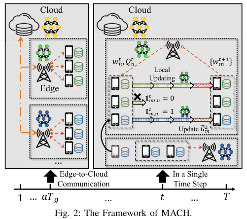

<!-- Start of picture text -->
C l oud C l oud 𝑤�� , 𝒬�� �𝑤����� Local Updating Edge 𝟙���,� �0 𝟙��,� �1  Update 𝐺� � … Edge-to-Cloud  In a Single Communication Time Step 1 … 𝑎𝑇� … 𝑡 … 𝑇 Fig. 2: The Framework of MACH. <!-- End of picture text -->

we employ an transfer function _S_ ( _·_ ) to smooth the sampling probabilities _qm,n__t_withineachedge(Line3): 

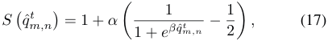

where _α_ and _β_ are task-specific control coefficients, depending on the current neural network architecture and training task. During the early stages of training, _α_ and _β_ should be small to ensure that _G_˜2 _m_canbeadequatelyestimatedthroughrandom sampling. By leveraging transfer function _S_ ( _·_ ), the values of _S_ � _q_ ˆ _m,n__t_ � are constrained to be close to 1. Finally, considering the edge channel constraints in Eq. (11), each edge _n ∈N_ maintains its sampling strategy _Q__t_ _n_atthe current time step _t_ as follows (Line 5): 

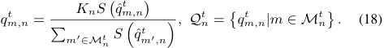

Based on the above, Figure 2 presents the implementation process of MACH in HFL with mobile devices. In each edge-to-cloud communication, all edge models are aggregated in the cloud and then redistributed to edges and devices. Subsequently, at each time step _t ∈T_ , the edge generates an edge sampling strategy _Q__t_ _n_basedonthedeviceswithin the current edge. The edge model _wn__t_andthecurrentedge sampling strategy _Q__t_ _n_aresenttothecoordinateddevices _m ∈M__t_ _n_. Each devices_m_performs local training and updates the estimated _G_˜2 _m_.Inthisway,theexperienceupdatingand edge sampling in MACH alternate to achieve mobility-aware device sampling in HFL with mobile devices. 

## IV. EVALUATION RESULTS 

In this section, we evaluate MACH through the real-world Telecom datasets and extensive numerical experiments. We first introduce the experiment settings, and then provide the experimental results with corresponding analysis. 

661 

Authorized licensed use limited to: Shanghai Jiaotong University. Downloaded on December 28,2024 at 15:49:58 UTC from IEEE Xplore.  Restrictions apply. 

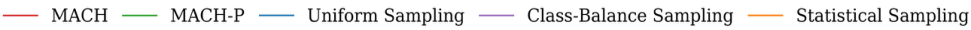

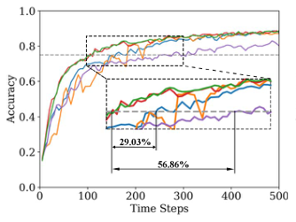

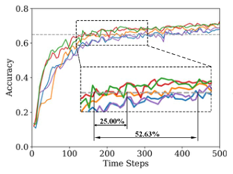

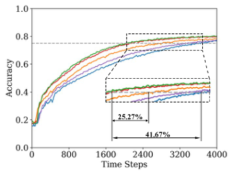

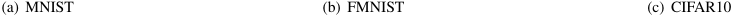

<!-- Start of picture text -->
(a) MNIST (b) FMNIST (c) CIFAR10 <!-- End of picture text -->

Fig. 3: Time-to-accuracy performance over all learning tasks. 

## **Algorithm 3:** Edge Sampling 

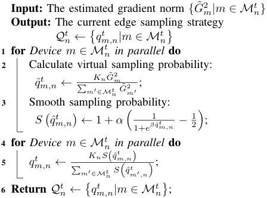

## _A. Experiment Settings_ 

_1)_ **_Dataset_** _:_ We used the Shanghai Telecom dataset to simulate the trajectory of mobile users moving between base stations [35]–[37]. The dataset contains 9,481 mobile devices with over 7.2 million records of dynamic access to 3,233 base stations over 6 consecutive months. Each record in the dataset contains detailed timestamps of when each mobile user started and ended their access to a specific base station. Considering the limited mobile data at some base stations, neighboring base stations cluster together to form several main base stations. The FL training process is performed using three open source datasets, including MNIST, FMNIST and CIFAR10, which are commonly used in image classification tasks and extensively employed to validate FL research work. Each dataset consists of ten image classes. 

_2)_ **_Parameter Settings_** _:_ To validate the proposed MACH, we simulate 10 edges and 100 mobile devices. We assume 50% of the devices participating in training at each time step, _i.e._ , the average of all edge channel capacity _Kn_ is 5 in the case of 10 edges. The data distribution of all mobile devices is set to be Non-IID. Both the global and the devices’ data 

distribution follow a long-tailed distribution. The initial state of the edge data distribution is not assumed and is random. The MNIST and FMNIST are trained on the convolutional neural network (CNN) with 2 convolutional layers and 2 fully connected layers with the edge-to-cloud communication interval _Tg_ = 5 and an initial learning rate of 0.002 on devices. The CIFAR10 is trained on the convolutional neural network with 3 convolutional layers and 2 fully connected layers with the edge-to-cloud communication interval _Tg_ = 10 and an initial learning rate of 0.02 on devices. The local updating epochs _I_ is set as 10. The convergence speed of different algorithms is reflected in the time steps of reaching the target accuracy, which are set as 0 _._ 75, 0 _._ 65, and 0 _._ 75 for MNIST, FMNIST, and CIFAR10, respectively. 

_3)_ **_Benchmarks_** _:_ We compare MACH with three other benchmarks. Firstly, we consider three typical and theoretically guaranteed sampling algorithms, uniform sampling [22], class-balance sampling [38] and statistical sampling [14], [39]. Additionally, we assume that the training experiences for each device in every time step are known, _i.e._ , without online experience updating, denoted as MACH-P. We conduct each set of experiments three times and take the average for smoothing. Each edge independently makes sampling strategies based on the devices within the current edge. 

## _B. Experimental Results and Analysis_ 

_1) Overall Performance:_ First, a set of experiments is conducted to verify the performance of MACH over various learning tasks. In Figure 3, MACH outperforms the basic sampling methods by 25 _._ 00% to 56 _._ 86% on all learning tasks. By maintaining an edge-specific sampling strategy, MACH enables each edge to better customize its sampling approach based on the current devices within the edge. This allows for more effective adjustments to the optimization direction of the edge model, making it more conducive to global aggregation. In Figures 3(b) and 3(c), the performance of statistical sampling is slightly better than the other two basic sampling methods. This indicates that statistical sampling remains a viable approach to address device statistical heterogeneity in 

662 

Authorized licensed use limited to: Shanghai Jiaotong University. Downloaded on December 28,2024 at 15:49:58 UTC from IEEE Xplore.  Restrictions apply. 

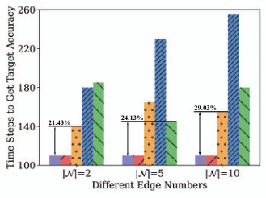

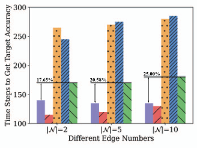

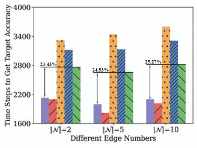

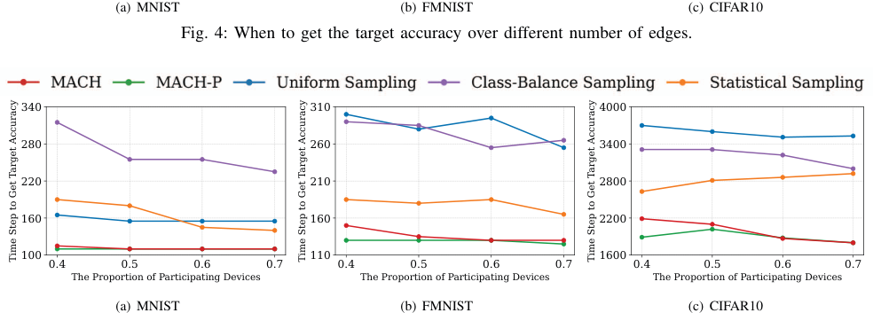

<!-- Start of picture text -->
(a) MNIST (b) FMNIST (c) CIFAR10 Fig. 4: When to get the target accuracy over different number of edges. 340 310 4000 280 260 3400 220 210 2800 160 160 2200 100 110 1600 0.4 0.5 0.6 0.7 0.4 0.5 0.6 0.7 0.4 0.5 0.6 0.7 The Proportion of Participating Devices The Proportion of Participating Devices The Proportion of Participating Devices (a) MNIST (b) FMNIST (c) CIFAR10 Time Step to Get Target Accuracy Time Step to Get Target Accuracy Time Step to Get Target Accuracy <!-- End of picture text -->

Fig. 5: Time to achieve the target accuracy under different device participation proportions. 

HFL. Moreover, the superior performance of MACH over basic sampling methods across all learning tasks highlights the importance of maintaining a unique edge sampling strategy in HFL. Comparing the experimental results of MACH and MACH-P in Figures 3(b) and 3(c), it is evident that MACHP performs better than MACH in the initial training stages. However, as training progresses, the gap between MACH and MACH-P gradually narrows. This demonstrates the effectiveness of the experience updating step in MACH, which can estimate training experiences during training and use them to adjust edge training strategies. The comparison with all benchmarks demonstrates the significance of the two components, experience updating and edge sampling, in MACH. The experience updating allows for effective iterative updates of training experiences, while the edge sampling effectively addresses the issue of data statistical heterogeneity in HFL. 

_2) Performance under different edge numbers:_ We compare the training speeds of MACH on all learning tasks under different edge numbers to validate the necessity of each edge maintaining an edge-specific sampling strategy and the advantages of our proposed MACH. Specifically, we measure the training time cost of achieving the target accuracy as a performance metric for training speed. In Figure 4, we present the experimental results for edge numbers of 2, 5, and 10, while the edge channel capacity is adjusted to ensure approximately 

50% device participation in each group of experiments. As the number of edges decreases, the training speeds of all methods seem to accelerate, but the improvement is not significantly evident from direct observation of the experimental results. Only the class-balanced sampling exhibits a noticeable trend in all learning tasks. We specifically mark the training time saved by MACH compared to the best-performing basic sampling method in each group of experiments. Across all training tasks in Figure 4, the improvement of MACH decreases monotonically as the number of edges decreases, _e.g._ , from 29 _._ 03% to 21 _._ 43% in Figure 4(a). This is because HFL tends to transform towards a simpler server-client two-layer structure with fewer edges, reducing the necessity for edges to maintain edge-specific sampling strategies. Additionally, in Figure 4(a), we notice that the training speeds of MACH and MACH-P are nearly identical. Because MNIST is a relatively simple dataset for handwritten digit recognition, experience updating can effectively capture training experiences for subsequent generating edge sampling strategies. 

_3) Performance under different device participation proportions:_ We compare the training performance under different device participation proportions. According to the conclusion of Remark 1, the newly proposed HFL convergence bound indicates that more devices participating in training can effectively accelerate model convergence even in HFL with mobile 

663 

Authorized licensed use limited to: Shanghai Jiaotong University. Downloaded on December 28,2024 at 15:49:58 UTC from IEEE Xplore.  Restrictions apply. 

TABLE I: The time steps consumed under different local updating epochs _I_ when reaching different accuracies.4 

|Dataset|Target |Local |Time St |eps to Get t |he Target Ac |curacy |- Time Steps %|
|---|---|---|---|---|---|---|---|
||Accuracy|Updating Epochs|**MACH**|US|CS|SS||
|||0.8_I_|**35**|60|80|65|41_._67%|
||70% Target|_I_|**30**|55|60|50|40_._00%|
|MNIST||1.2_I_|**30**|45|55|50|33_._33%|
|||0.8_I_|**110**|160|245|185|31_._25%|
||Target|_I_|**110**|155|255|180|29_._03%|
|||1.2_I_|**110**|140|245|170|21_._43%|
|||0.8_I_|**35**|80|90|100|56_._25%|
||70% Target|_I_|**30**|50|60|65|40_._00%|
|FMNIST||1.2_I_|**25**|40|55|50|37_._50%|
|||0.8_I_|**140**|320|285|190|26_._32%|
||Target|_I_|**135**|280|285|180|25_._00%|
|||1.2_I_|**125**|245|250|165|24_._24%|
|||0.8_I_|**710**|1460|1280|1060|33_._02%|
||70% Target|_I_|**670**|1200|1040|880|23_._86%|
|CIFAR10||1.2_I_|**600**|1000|870|720|16_._67%|
|||0.8_I_|**2420**|4220|3870|3250|25_._54%|
||Target|_I_|**2100**|3600|3310|2810|25_._27%|
|||1.2_I_|**1800**|3080|2830|2350|23_._40%|

device participation. To investigate the relationship between the number of participating devices and the convergence speed of the global model in HFL, we adjusted the average edge channel capacity under the setting of 10 edges. As shown in Figure 5, most sampling strategies can effectively reduce the time cost to achieve the target accuracy as the proportion of participating devices increases. However, the results of statistical sampling in Figure 5(c) contradict our intuition, which may be due to the increase in statistical variance caused by the increase in the number of participating devices, hindering the training process. Moreover, in Figure 5, two additional conclusions were verified. MACH consistently outperforms other basic sampling strategies but is slightly inferior to MACH-P. From Figures 5(a) to 5(c), the class-balance sampling shows more significant improvement in reducing training time on more complex datasets. As the proportion of participating devices increases, the performance improvement of MACH compared to baseline sampling gradually diminishes. 

_4) Performance under different local updating epochs:_ Finally, we count the time steps consumed by different sampling methods under different local updating epochs _I_ for different learning tasks to reach 70% and 100% target accuracy, as shown in Table I. Based on the experimental results, we have an intuitive observation: for different testing tasks, all sampling methods consume fewer time steps as the local updating epochs _I_ increase, representing the convergence speed increases. We further compared the MACH saved time step percentage compared to the best benchmark in different experiments. As local updating epochs _I_ increase, the saved time step percentage gradually decreases. Because the data distribution of different devices is set to be Non-IID, as local training goes on, each local device has a more biased gradient updating, affecting the online experience updating of MACH and thereby reducing the convergence speed. Furthermore, for the MNIST and FMNIST, MACH’s saved time step percentage 

when reaching the 70% target accuracy is significantly higher than when reaching the final target accuracy. This indicates that in the early stages of training, by maintaining a distinct edge sampling strategy and selecting devices that contribute more to global convergence for training, each edge can more effectively accelerate HFL convergence. 

## V. RELATED WORK 

## _A. Hierarchical Federated Learning_ 

HFL is widely regarded as a typical implementation of FL in MEC, where the master aggregator dynamically schedules multiple aggregators to scale and update training steps based on the number of devices [1], [34], [40]. From the perspective of model gradient divergence, Wang et al. [34] rigorously analyzed and demonstrated why hierarchical aggregation accelerates the convergence of the global model. Zhong et al. [41] and Wang et al. [7] early proposed improving system efficiency and convergence speed in wireless networks through hierarchical aggregation by leveraging base stations. However, in MEC, clients are often mobile devices capable of randomly moving across different edges. Addressing this characteristic, Feng et al. [42] formulated it as a system reliability problem in HFL, where device mobility may lead to disconnection from the currently associated edge and hinder HFL convergence. Based on device mobility, Fan et al. [43] proposed a device scheduling and resource allocation algorithm for HFL across multiple base stations, aiming to minimize training latency under limited communication resources. Considering the increase in energy consumption by devices for communication due to device mobility, Farcas et al. [44] proposed a dynamic device community selection algorithm in HFL, which can enhance the energy efficiency of the FL system and improve 

> 4The term US, CS and SS refer to the uniform sampling, class-balance sampling and statistical sampling, respectively. The best benchmark in each experiment is marked with the underline. 

664 

Authorized licensed use limited to: Shanghai Jiaotong University. Downloaded on December 28,2024 at 15:49:58 UTC from IEEE Xplore.  Restrictions apply. 

FL training performance. Peng et al. [45] and Chen et al. [46] leveraged the dynamic distribution of data samples within each edge, which results from device cross-edge mobility in HFL, mitigating data heterogeneity to enhance learning performance. However, they have not formally constructed the HFL convergence bound under arbitrary sampling probabilities when mobile devices are involved. 

funding agencies or the government. Zhenzhe Zheng is the corresponding author. 

## APPENDIX A 

PROOF SKETCH OF THEOREM 1 

For the ease of notations, we define _gm_ ( _wm__t,τ_) := _gm_ ( _wm__t,τ, ξ_ _m__t,τ_) for any_w_. First, based on Lemma 1, we have: 

## _B. Device Sampling_ 

Device sampling is an approach in FL used to handle the statistical heterogeneity of devices [11]–[14]. Most device sampling algorithms are designed based on various optimization objectives, striving to develop unbiased global gradient updating and aggregation algorithms utilizing device sampling probabilities. Luo et al. [11] considered the system wall-clock time to customize the device sampling strategy to enhance FL training efficiency, which leverages the assumption of strong convexity in machine learning. Perazzone et al. [12] addressed the challenge of communication-efficient device sampling while accounting for the associated energy cost of communication. Wang et al. [13] took a comprehensive approach by jointly considering infrequent model transmission, device sampling, and model compression in FL, proposing a flexible control decision algorithm to address this series of interconnected problems. Zhang et al. [38] proposed accelerating the convergence speed by reducing the class imbalance in the selected client groups, where actively chosen clients generate more balanced grouped datasets with theoretical guarantees. Cho et al. [14] proposed an analysis of biased client selection in federated learning convergence and quantifies how this bias affects FL training efficiency. 

## VI. CONCLUSION 

In this work, we highlight the challenge of device data statistical heterogeneity when implementing FL in MEC, and propose MACH, a mobility-aware device sampling algorithm, to tackle this issue. First, we formalize the general form of HFL with mobile devices under arbitrary sampling probabilities and derive a new HFL convergence bound. Based on the derived convergence bound, we customize an optimization problem for arbitrary device sampling probabilities, aiming to dynamically adjust the current edge sampling strategy to minimize the convergence error under time-averaged cost constraints. Then, to solve the proposed optimization problem, we introduce MACH, which is composed of two underlying components: experience updating and edge sampling. Finally, we validate the effectiveness of MACH through real-world mobile device trajectories and various FL training tasks. 

## ACKNOWLEDGMENT 

This work was supported in part by National Key R&D Program of China (No. 2022ZD0119100), in part by China NSF grant No. 62322206, 62132018, U2268204, 62025204, 62272307, 62372296. The opinions, findings, conclusions, and recommendations expressed in this paper are those of the authors and do not necessarily reflect the views of the 

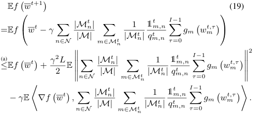

where (a) is a proposition of Assumption 1. For the last term in Eq. (19), we have: 

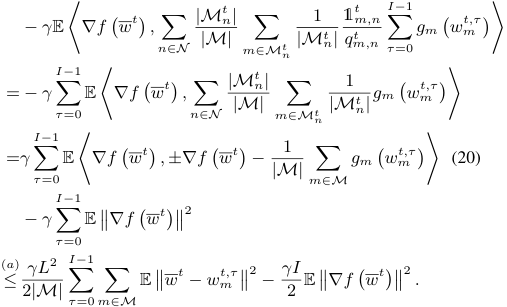

_<u>a</u>_2 = where (a) comes from _⟨a, b⟩≤_ 2+_<u>b</u>_ 22,_∇f_ � _~~w~~__~~t~~_� � _m∈M |M|_ <u>1</u>_∇Fm_ � _~~w~~__~~t~~_� and Assumption 1. For the second term in Eq. (19), it has: 

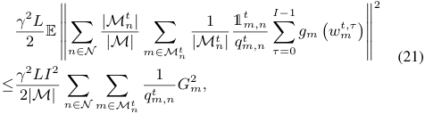

which comes from Jensen’s inequality and Assumption 3. By plugging Eq. (21) and (20) into Eq. (19), we can get the rearranged: 

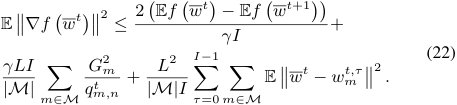

665 

Authorized licensed use limited to: Shanghai Jiaotong University. Downloaded on December 28,2024 at 15:49:58 UTC from IEEE Xplore.  Restrictions apply. 

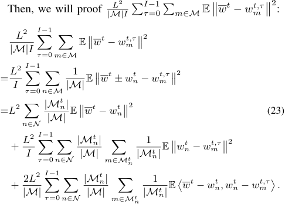

For the last term in Eq. (23), it is equal to 0 due to Lemma 1. Then, for the first term in Eq. (23), we have: 

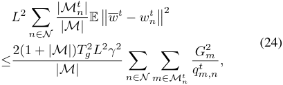

which can be demonstrated by ��� _l∈_ **L**_xl_ ��2 _≤_ � _l∈_ **L**_L ∥xl∥_2, _<u>|M</u>__t_ _<u>n</u>__<u>|</u>_ _|M||M__t_ _n__<u>′</u>|≤_1 (_∀t̸_=_t′_) and Assumption 3. Then, we can prove the upper bound of the second term of (23) by Assumption 3, and: 

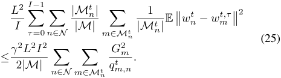

Finally, plugging Eq. (23), Eq. (24) and Eq. (25) into Eq. (22) and taking the average over time, the Theorem 1 can be proved. 

## REFERENCES 

- [1] K. Bonawitz, H. Eichner, W. Grieskamp, D. Huba, A. Ingerman, V. Ivanov, C. Kiddon, J. Koneˇcn`y, S. Mazzocchi, B. McMahan _et al._ , “Towards federated learning at scale: System design,” _Proceedings of MLSys_ , vol. 1, pp. 374–388, 2019. 

- [2] T. Castiglia, A. Das, and S. Patterson, “Multi-level local sgd: Distributed sgd for heterogeneous hierarchical networks,” in _Proceedings of ICLR_ , 2021. 

- [3] W. Y. B. Lim, N. C. Luong, D. T. Hoang, Y. Jiao, Y.-C. Liang, Q. Yang, D. Niyato, and C. Miao, “Federated learning in mobile edge networks: A comprehensive survey,” _IEEE Communications Surveys & Tutorials_ , vol. 22, no. 3, pp. 2031–2063, 2020. 

- [4] N. Abbas, Y. Zhang, A. Taherkordi, and T. Skeie, “Mobile edge computing: A survey,” _IEEE Internet of Things Journal_ , vol. 5, no. 1, pp. 450–465, 2017. 

- [5] Y. Mao, C. You, J. Zhang, K. Huang, and K. B. Letaief, “A survey on mobile edge computing: The communication perspective,” _IEEE Communications Surveys & Tutorials_ , vol. 19, no. 4, pp. 2322–2358, 2017. 

- [6] Y. Li, W. Liang, J. Li, X. Cheng, D. Yu, A. Y. Zomaya, and S. Guo, “Energy-aware, device-to-device assisted federated learning in edge computing,” _IEEE Transactions on Parallel and Distributed Systems_ , 2023. 

- [7] Z. Wang, H. Xu, J. Liu, H. Huang, C. Qiao, and Y. Zhao, “Resourceefficient federated learning with hierarchical aggregation in edge computing,” in _Proceedings of INFOCOM_ , 2021, pp. 1–10. 

- [8] W. Y. B. Lim, J. S. Ng, Z. Xiong, D. Niyato, C. Miao, and D. I. Kim, “Dynamic edge association and resource allocation in self-organizing hierarchical federated learning networks,” _IEEE Journal on Selected Areas in Communications_ , vol. 39, no. 12, pp. 3640–3653, 2021. 

- [9] Y. Kang, B. Li, and T. Zeyl, “Fedrl: Improving the performance of federated learning with non-iid data,” in _Proceedings of GLOBECOM_ , 2022, pp. 3023–3028. 

- [10] S. Liu, G. Yu, X. Chen, and M. Bennis, “Joint user association and resource allocation for wireless hierarchical federated learning with iid and non-iid data,” _IEEE Transactions on Wireless Communications_ , vol. 21, no. 10, pp. 7852–7866, 2022. 

- [11] B. Luo, W. Xiao, S. Wang, J. Huang, and L. Tassiulas, “Tackling system and statistical heterogeneity for federated learning with adaptive client sampling,” in _Proceedings of INFOCOM_ , 2022, pp. 1739–1748. 

- [12] J. Perazzone, S. Wang, M. Ji, and K. S. Chan, “Communication-efficient device scheduling for federated learning using stochastic optimization,” in _Proceedings of INFOCOM_ , 2022, pp. 1449–1458. 

- [13] S. Wang, J. Perazzone, M. Ji, and K. Chan, “Federated learning with flexible control,” in _Proceedings of INFOCOM_ , 2023. 

- [14] Y. J. Cho, J. Wang, and G. Joshi, “Towards understanding biased client selection in federated learning,” in _Proceedings of AISTATS_ , 2022, pp. 10 351–10 375. 

- [15] W. Chen, S. Horvath, and P. Richtarik, “Optimal client sampling for federated learning,” _Transactions on Machine Learning Research_ , pp. 1–32, 2022. 

- [16] F. Li, J. Zhao, D. Yu, X. Cheng, and W. Lv, “Harnessing context for budget-limited crowdsensing with massive uncertain workers,” _IEEE/ACM Transactions on Networking_ , vol. 30, no. 5, pp. 2231–2245, 2022. 

- [17] Y. Ma, W. Liang, J. Li, X. Jia, and S. Guo, “Mobility-aware and delaysensitive service provisioning in mobile edge-cloud networks,” _IEEE Transactions on Mobile Computing_ , vol. 21, no. 1, pp. 196–210, 2020. 

- [18] Y. Zhao, M. Li, L. Lai, N. Suda, D. Civin, and V. Chandra, “Federated learning with non-iid data,” _arXiv preprint arXiv:1806.00582_ , 2018. 

- [19] C. Li, X. Zeng, M. Zhang, and Z. Cao, “Pyramidfl: A fine-grained client selection framework for efficient federated learning,” in _Proceedings of MobiCom_ , 2022, pp. 158–171. 

- [20] Q. Wu, X. Chen, T. Ouyang, Z. Zhou, X. Zhang, S. Yang, and J. Zhang, “Hiflash: Communication-efficient hierarchical federated learning with adaptive staleness control and heterogeneity-aware client-edge association,” _IEEE Transactions on Parallel and Distributed Systems_ , vol. 34, no. 5, pp. 1560–1579, 2023. 

- [21] Y. Jin, L. Jiao, Z. Qian, S. Zhang, S. Lu, and X. Wang, “Resourceefficient and convergence-preserving online participant selection in federated learning,” in _Proceedings of ICDCS_ , 2020, pp. 606–616. 

- [22] X. Li, K. Huang, W. Yang, S. Wang, and Z. Zhang, “On the convergence of fedavg on non-iid data,” in _Proceedings of ICLR_ , 2019. 

- [23] T. Higashino, H. Yamaguchi, A. Hiromori, A. Uchiyama, and T. Umedu, “Re-thinking: Design and development of mobility aware applications in smart and connected communities,” in _Proceedings of ICDCS_ , 2018, pp. 1171–1179. 

- [24] H. Wang, S. Zeng, Y. Li, and D. Jin, “Predictability and prediction of human mobility based on application-collected location data,” _IEEE Transactions on Mobile Computing_ , vol. 20, no. 7, pp. 2457–2472, 2020. 

- [25] Z. Wang, L. Gao, and J. Huang, “Travel with your mobile data plan: A location-flexible data service,” in _Proceedings of INFOCOM_ , 2020, pp. 1738–1747. 

- [26] N. Liu, M. Liu, J. Cao, G. Chen, and W. Lou, “When transportation meets communication: V2p over vanets,” in _Proceedings of ICDCS_ , 2010, pp. 567–576. 

- [27] M. Karaliopoulos, O. Telelis, and I. Koutsopoulos, “User recruitment for mobile crowdsensing over opportunistic networks,” in _Proceedings of INFOCOM_ , 2015, pp. 2254–2262. 

- [28] Z. Xu, S. Wang, S. Liu, H. Dai, Q. Xia, W. Liang, and G. Wu, “Learning for exception: Dynamic service caching in 5g-enabled mecs with bursty user demands,” in _Proceedings of ICDCS_ , 2020, pp. 1079–1089. 

- [29] B. McMahan, E. Moore, D. Ramage, S. Hampson, and B. A. y Arcas, “Communication-efficient learning of deep networks from decentralized data,” in _Proceedings of AISTATS_ , 2017, pp. 1273–1282. 

666 

Authorized licensed use limited to: Shanghai Jiaotong University. Downloaded on December 28,2024 at 15:49:58 UTC from IEEE Xplore.  Restrictions apply. 

- [30] S. Wang and M. Ji, “Alightweight method for tackling unknown participation statistics in federated averaging,” _arXiv preprint arXiv:2306.03401_ , 2024. 

- [31] W. Luping, W. Wei, and L. Bo, “Cmfl: Mitigating communication overhead for federated learning,” in _Proceedings of ICDCS_ , 2019, pp. 954–964. 

- [32] B. Luo, X. Li, S. Wang, J. Huang, and L. Tassiulas, “Cost-effective federated learning design,” in _Proceedings of INFOCOM_ , 2021, pp. 1– 10. 

- [33] H. Yu, R. Jin, and S. Yang, “On the linear speedup analysis of communication efficient momentum sgd for distributed non-convex optimization,” in _Proceedings of ICML_ , 2019, pp. 7184–7193. 

- [34] J. Wang, S. Wang, R.-R. Chen, and M. Ji, “Demystifying why local aggregation helps: Convergence analysis of hierarchical sgd,” in _Proceedings of AAAI_ , 2022, pp. 8548–8556. 

- [35] S. Wang, Y. Guo, N. Zhang, P. Yang, A. Zhou, and X. Shen, “Delayaware microservice coordination in mobile edge computing: A reinforcement learning approach,” _IEEE Transactions on Mobile Computing_ , vol. 20, no. 3, pp. 939–951, 2019. 

- [36] Y. Li, A. Zhou, X. Ma, and S. Wang, “Profit-aware edge server placement,” _IEEE Internet of Things Journal_ , vol. 9, no. 1, pp. 55–67, 2021. 

- [37] Y. Guo, S. Wang, A. Zhou, J. Xu, J. Yuan, and C.-H. Hsu, “User allocation-aware edge cloud placement in mobile edge computing,” _Software: Practice and Experience_ , vol. 50, no. 5, pp. 489–502, 2020. 

- [38] J. Zhang, A. Li, M. Tang, J. Sun, X. Chen, F. Zhang, C. Chen, Y. Chen, and H. Li, “Fed-cbs: A heterogeneity-aware client sampling mechanism for federated learning via class-imbalance reduction,” in _Proceedings of_ 

_ICML_ , 2023, pp. 41 354–41 381. 

- [39] F. Lai, X. Zhu, H. V. Madhyastha, and M. Chowdhury, “Oort: Efficient federated learning via guided participant selection,” in _Proceedings of OSDI_ , 2021, pp. 19–35. 

- [40] Z. Jiang, W. Wang, B. Li, and Q. Yang, “Towards efficient synchronous federated training: A survey on system optimization strategies,” _IEEE Transactions on Big Data_ , vol. 9, no. 2, pp. 437–454, 2022. 

- [41] Z. Zhong, Y. Zhou, D. Wu, X. Chen, M. Chen, C. Li, and Q. Z. Sheng, “P-fedavg: Parallelizing federated learning with theoretical guarantees,” in _Proceedings of INFOCOM_ , 2021, pp. 1–10. 

- [42] C. Feng, H. H. Yang, D. Hu, Z. Zhao, T. Q. Quek, and G. Min, “Mobility-aware cluster federated learning in hierarchical wireless networks,” _IEEE Transactions on Wireless Communications_ , vol. 21, no. 10, pp. 8441–8458, 2022. 

- [43] K. Fan, W. Chen, J. Li, X. Deng, X. Han, and M. Ding, “Mobility-aware joint user scheduling and resource allocation for low latency federated learning,” _arXiv preprint arXiv:2307.09263_ , 2023. 

- [44] A.-J. Farcas, M. Lee, R. R. Kompella, H. Latapie, G. De Veciana, and R. Marculescu, “Mohawk: Mobility and heterogeneity-aware dynamic community selection for hierarchical federated learning,” in _Proceedings of IoTDI_ , 2023, pp. 249–261. 

- [45] Y. Peng, X. Tang, Y. Zhou, Y. Hou, J. Li, Y. Qi, L. Liu, and H. Lin, “How to tame mobility in federated learning over mobile networks?” _IEEE Transactions on Wireless Communications_ , vol. 22, no. 12, pp. 9640–9657, 2023. 

- [46] T. Chen, J. Yan, Y. Sun, S. Zhou, D. Gunduz, and Z. Niu, “Dataheterogeneous hierarchical federated learning with mobility,” _arXiv preprint arXiv:2306.10692_ , 2023. 

667 

Authorized licensed use limited to: Shanghai Jiaotong University. Downloaded on December 28,2024 at 15:49:58 UTC from IEEE Xplore.  Restrictions apply. 

