# KV Cache Reuse for Elastic LLM Inference on Edge Devices 

Peishuo Wang_∗_ , Zhenzhe Zheng_∗_ , Xiaoyao Huang_†_ , Jie Wu_‡_ , Fan Wu_∗_ , Guihai Chen_∗_ 

_∗_ School of Computer Science, Shanghai Jiao Tong University, China 

_†_ Cloud Computing Research Institute, China Telecom, China 

_‡_ Temple University, USA 

Emails:_∗_ _{_ wangps, zhengzhenzhe, fwu, chen-gh _}_ @sjtu.edu.cn,_†_ huangxy32@chinatelecom.cn,_‡_ jiewu@temple.edu 

**_Abstract_ —Deploying Large Language Models (LLMs) on edge devices is increasingly critical due to network and privacy constraints. Key-Value (KV) cache reuse and elastic LLM inference are both essential for on-device LLM deployment as the available resources on edge devices are limited and vary over time. However, directly using the KV caches from a different precision model can cause performance degradation due to numerical deviation of the KV cache. To address this issue, we present ElastKV, a scheme that reuses precomputed KV caches generated by mixed-precision LLMs by selectively recomputing a small subset of KV values. ElastKV first filters tokens using a recomputation rule, then ranks them based on their estimated recomputation priority. Unlike prior methods, ElastKV estimates this priority by combining each token’s KV deviation with its estimated influence on output tokens, which is derived from pairwise token influence estimation and influence paths. We evaluate ElastKV on four open-source LLMs with different quantization bit-widths over four datasets. Results show that ElastKV limits average accuracy loss to within** 2% **and provides an average recomputation speedup of nearly** 3 _×_ **compared to full recomputation and achieves a better speed-quality trade-off than all state-of-the-art KV cache reuse methods.** 

**_Index Terms_ —Model Customization, KV Cache Reuse, Edge Computing, Large Language Models** 

## I. INTRODUCTION 

Recent developments in Large Language Models (LLMs) are reshaping artificial intelligence for mobile computing, enabling numerous new on-device applications [1]–[4]. Motivated by factors such as privacy, network instability, and personalization, on-device LLM-as-a-Service (LLMaaS) is emerging as a new mobile service paradigm [5], [6]. Considering the limited available resources on edge devices, the LLM typically runs as a common system service shared across various mobile apps, avoiding redundant memory usage of deploying multiple LLMs. A unified LLM foundation model further enables system-level optimizations (such as prefix Key–Value caching) and also supports hardware acceleration. 

On one hand, for resource-constrained edge devices, effective reuse of Key–Value (KV) cache—a memory structure that stores intermediate states from previous tokens to avoid redundant computation during autoregressive generation—is critical for efficient on-device LLM inference. However, the memory usage of KV cache grows linearly with the context length. To mitigate this memory bottleneck, many prominent systems [7]–[9] adopt prefix caching, which identifies shared 

prefixes across inputs from multiple LLM requests and reuses their corresponding KV cache. On edge devices, such shared prefixes often include common system prompts containing device or user information. Prefix caching not only eliminates redundant computation but also reduces memory overhead [10], [11], making it a key optimization for effective LLM deployment, especially on resource-constrained edge devices. 

On the other hand, edge devices often experience fluctuating memory and compute resources [12], resulting in varying resource availability across different inputs at different times, making elastic inference essential for on-device LLM deployment. For example, when a user launches a memoryintensive application, the available memory for LLM services may shrink, necessitating a switch to a lower-precision model. Conversely, when the memory becomes abundant again (e.g., the application is closed), the system may switch back to a higher-precision model to improve accuracy. Elastic LLM inference thus requires the ability to switch between different LLM versions with various model sizes to adapt to such dynamic resource conditions. A static LLM cannot adapt to dynamic available resources, leading to poor user experience or failed interactions. In elastic LLM services, the edge devices must dynamically select the appropriate model version. By employing quantized LLMs at multiple precision levels, we can achieve elastic inference. 

From the above two aspects, it is challenging to support both the KV cache reuse (especially prefix caching) and elastic LLM inference simultaneously. Based on the principle of prefix caching [7], [10], [11], when a new request arrives, the LLM needs to reuse the previously saved KV cache corresponding to the shared prefix. However, prior KV caches may come from the models with mixed precision. Thus, designing efficient, elastic and accurate LLM services for edge devices faces several unique challenges: 

• Cross-Precision Caching. Existing cached KV values from the models of mixed precision may not align with the current model’s precision. The reliability of reusing or recomputing them is unclear. Recomputing without proper guidance can result in unnecessary overhead and accuracy loss. Thus, a principled recomputation rule is crucial to prevent performance degradation for on-device LLM inference. 

• Recomputation Across Models. Selective recomputation is necessary, but existing recomputation methods are designed 

for single-precision model settings and are suboptimal in our mixed-precision model scenarios. Quantifying each token’s KV deviation impact on model output is challenging since output tokens are unavailable during recomputation. Moreover, precise estimation requires two inference rounds, which is impractical for edge devices. Thus, we need an estimation method with less computational overhead. 

To address the above challenges, we propose ElastKV, a KV reuse method that supports prefix caching and enables elastic inference for LLMs on edge devices. First, we design a recomputation rule to address the challenge of crossprecision caching. It triggers recomputation only when a higher-precision model reuses KV from a lower-precision model, and thus preserving recomputation accuracy. Second, we design a layer-local Taylor approximation to estimate how deviations in each token’s KV cache affect subsequent tokens. We then trace the influence paths to evaluate their impact on the last few input tokens, used as an estimation of their effect on output tokens. This is combined with token KV deviations to enable high-quality outputs through selective recomputation. 

Our main contributions are summarized as follows: 

• To the best of our knowledge, we are the first work to consider the impact of reusing the KV caches from mixedprecision models on model performance. We empirically find that KV caches from low-precision models harm model performance, while KV caches from high-precision models improve model performance. This motivates our KV recomputation rule for efficient mixed-precision KV cache reuse. 

• To improve generation quality for recomputation, we introduce a new token selection strategy that identifies the most important tokens by estimating both their own importance and their influence on output tokens for recomputation. 

• Experiments show that ElastKV limits average accuracy loss to within 2% and provides an average recomputation speedup of nearly 3 _×_ compared to full recomputation. Under equivalent time-to-first-token, it achieves higher accuracy than state-of-the-art KV cache reuse methods across four datasets, demonstrating a strong efficiency–quality trade-off. 

## II. BACKGROUND AND MOTIVATION 

## _A. KV Cache Management of LLMs_ 

There is a growing interest in deploying lightweight yet capable LLMs on edge devices. These models are typically adapted to diverse tasks through parameter-efficient fine-tuning (PEFT) [5], [13]. Furthermore, multiple compressed versions of the same model are maintained [12], [14], [15] to achieve elastic deployment on edge devices, driven by (1) dynamic memory availability in unified memory systems, and (2) taskspecific speed and accuracy requirements. 

Most LLMs adopt a decoder-only architecture, where the Key-Value (KV) cache reduces inference cost by avoiding redundant recomputation of previous tokens, which are required at each step due to the decoder’s auto-regressive nature. In systems where the KV cache can be preserved across queries, prefix caching [7], [10], [16] extends KV caching by reusing KV pairs from the longest common prefix between 

inputs. This mechanism is particularly useful in scenarios where parts of the input remain unchanged across multiple queries. For example, in multi-turn conversations, the cached KV from earlier turns can be reused to reduce time-to-firsttoken (TTFT) while maintaining context continuity [11]. In retrieval-augmented generation (RAG), prefix caching enables the reuse of retrieved documents [10], [17]–[20]. 

## _B. Impact of Full KV Reuse for Elastic LLM_ 

We identify a new challenge in LLM services on edge devices: resource fluctuations between requests may require switching between different compressed model versions. Such fluctuations can be caused by various real-world scenarios. For instance, when a user starts a memory-intensive application, the system may need to switch from a high-precision model (e.g., 8-bit) to a low-precision one (e.g., 3-bit) to free up memory. Conversely, when the application is closed, the system may switch back to the high-precision model. In prefix caching, LLMs can reuse KV caches from previous inputs. When switching to a different model version, it remains unclear whether existing KV caches from another model version are still valid, as model compression introduces numerical deviations in KV values due to different model sizes. The impact of such deviations on model performance remains to be investigated. Unlike prior KV cache reuse methods, which assume all KV chunks are from the same model, our work considers reuse across multiple chunks from different model versions. As a result, we focus on mitigating numerical deviations in the KV cache, whereas prior works primarily address cross-attention and position encoding issues. 

As pruning changes the KV dimension, we adopt model quantization as the compression method for Elastic LLM. Our target scenario requires multiple precision variants with compatible KV dimensions and low-overhead runtime switching. Notably, many existing quantization techniques [21], [22] are not designed for rapid precision switching, which is essential for elastic inference under fluctuating resources. Therefore, we employ AnyPrecisionLLM [14], which supports efficient, low-overhead transitions between different bit-widths. 

Ignoring numerical deviations in KV values from various model versions can lead to incorrect responses. We quantize LLaMA2-7B [23] to multiple bit-widths. Fig. 1 shows an example where the input consists of a query preceded by a context chunk containing eight examples. With direct KV reuse, the 8-bit model produces accurate results when all KV caches are from the same model. In contrast, if the 8-bit model directly reuses the KV caches from the 3-bit model, it produces incorrect outputs. We further conduct a study across multiple datasets, using the same sample size, datasets, evaluation metrics, and settings as Section V. In our setup, preceding tokens are processed by the first model to generate KV caches, which are then directly reused by the second model with different precision to process the query and produce output tokens without recomputation. Fig. 2 presents the results, where “ _a_ bit→ _b_ bit” means that the preceding tokens are computed by the _a_ -bit model, and the query tokens 

**Query：** "Janet’s ducks lay 16 eggs per day. She eats three for breakfast and bakes muffins for her friends with four. She sells the remainder at the farmers' market for $2 per fresh duck egg. How much in dollars does she make every day at the farmers' market?" 

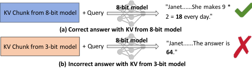

<!-- Start of picture text -->
8-bit model "Janet......She makes 9 * KV Chunk from 8-bit model    + Query                                                                         " 2 =  18  every day. (a) Correct answer with KV from 8-bit model KV Chunk from 3-bit modelChunk from 3-bit model + Query 8-bit model "Janet......The answer is 64 ." (b) Incorrect answer with KV from 3-bit model <!-- End of picture text -->

Fig. 1: An illustrative example showing an 8-bit LLM processing a text chunk and a query. Using KV caches from the 8-bit model (a) results in the correct answer, while using KV ~~<u>caches f</u>~~ rom the 3-bit model (b) leads to an incorrect answer. 

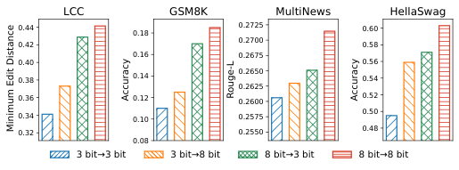

<!-- Start of picture text -->
LCC GSM8K MultiNews HellaSwag 0.44 0.18 0.2725 0.60 0.42 0.2700 0.58 0.16 0.2675 0.40 0.56 0.38 0.14 0.2650 0.54 0.2625 0.36 0.12 0.2600 0.52 0.34 0.10 0.2575 0.50 0.32 0.2550 0.48 0.08 3 bit→3 bit 3 bit→8 bit 8 bit→3 b it 8  bit→8 bit Accuracy Rouge-L Accuracy  Minimum Edit Distance <!-- End of picture text -->

Fig. 2: Model performance with full KV r ~~<u>euse on</u>~~ four datasets under four mixed-precision settings. 

and output are handled by the _b_ -bit model. Comparing “3 bit→8 bit” and “8 bit→8 bit”, we can obtain that (1) directly reusing KV caches from a lower-precision model in a higherprecision model leads to degraded performance. Comparing “3 bit→3 bit” and “8 bit→3 bit”, we can obtain that (2) KV from a higher-precision model can improve the performance of a lower-precision model. 

## _C. Opportunities for Selective KV Recomputation_ 

When the precision of the model that generated prior KV is lower than that of the current model, it causes performance degradation. An intuitive solution is to recompute all the KV pairs, but the quadratic complexity of transformer [24] and the failure to utilize available information make it impractical. To reduce overhead, recomputing a subset of tokens while reusing the rest is preferable, as it enables efficient cache reuse with less cost. Our reasons are summarized as follows. 

First, selective recomputation can be intuitively supported by attention sparsity in transformer models [25]–[27], where high attention weights are concentrated among a small subset of tokens. Consequently, not all tokens contribute equally to the output. To validate this phenomenon in our scenario, using the same model and input as in Fig. 1, we split the input into two chunks of equal length and compare two attention matrices produced by an 8-bit model: Fig. 3(a) reuses KV from a 3-bit model for the first chunk, while Fig. 3(b) uses KV generated entirely by the 8-bit model. It can be shown that in both cases, only a few tokens receive high attention, indicating their greater importance. Second, prior work about KV cache quantization has shown that LLMs can tolerate 

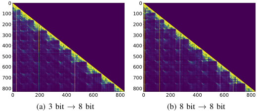

<!-- Start of picture text -->
0 0 100 100 200 200 300 300 400 400 500 500 600 600 700 700 800 800 0 200 400 600 800 0 200 400 600 800 (a) 3 bit → 8 bit (b) 8 bit → 8 bit <!-- End of picture text -->

Fig. 3: Attention matrices of an 8-bit model with two input chunks: (a) KV cache for the first chunk is generated by a 3-bit model, and for the second chunk by the 8-bit model; (b) both chunks use KV cache from the 8-bit model. 

small deviations in KV values [28]. This suggests that previously computed KV caches can potentially be partially reused with an appropriate selective KV recomputation strategy as selective recomputation can reduce deviations in KV values. 

Previous work focuses on correcting cross-attention and positional encoding errors [17], [19], [20], these methods are sub-optimal in our mixed-precision setting, where KV deviations arise from both quantization and the fact that KV caches may originate from multiple models. To mitigate accuracy loss from reusing KV caches generated by models of different precisions, we need to design a selective recomputation strategy that incurs minimal additional cost while achieving performance comparable to full recomputation. To achieve this goal, we need to address several challenges, which can be summarized as follows: 

• Different from prior work, our KV cache recomputation setting involves KV values from models with varying precision. The effectiveness of cross-precision recomputation remains unexplored in the literature. Designing an appropriate recomputation rule to select candidate tokens is essential. 

• To improve model performance under selective recomputation, we need to quantify the influence of deviations in candidate tokens on the output tokens. However, this is difficult for two reasons. First, the output tokens have not yet been generated at the time of estimation. Second, accurately estimating each token’s influence would require two rounds of inference, which is impractical for edge devices. 

• Designing a method to estimate token importance as an approximation to importance quantification can reduce cost, but it still requires careful control of extra computational overhead, especially on edge devices. 

## III. PROBLEM FORMULATION 

Given a bit-width set _{nk}__P_ _k_ =1, we quantize the full-precision model _LM_ to a sequence of models _LMn_ 1 _, . . . , LMnP_ using quantization methods [12], [14] that support low-overhead switching across precisions. Assume the model deployed at time step _t_ is _LMbt_ , where the index _bt_ is the bit-width used to quantize the model. After a new input arrives, _LMbt_ tokenizes the user input and identifies 

the longest prefix—the longest subsequence of tokens that matches already cached tokens from previous requests—and reuses the corresponding KV values. This matched prefix may consist of multiple contiguous token chunks (each chunk is a previously cached token sequence). The remaining, nonmatching tokens of the current input form the suffix, which requires new computation. For example, in multi-turn conversations, each prior turn is a cached chunk, and the latest user input (or its non-cached portion) is the suffix. 

Suppose the total number of tokens in the longest matched prefix is denoted as _s_ , and the number of tokens in the remaining suffix is _qt_ . In each layer, we have the KV sequences: _K_ = [ _k_ 1 _, k_ 2 _, . . . , ks_ ], _V_ = [ _v_ 1 _, v_ 2 _, . . . , vs_ ]. Additionally, we maintain a bit-width list at step t _Bt_ = [ _b_ 1 _, b_ 2 _, . . . , bs_ ] that records the model precision used when computing each token in the prefix. Let _bt_ denote the precision of the current model and _ℓt_ the length of the generated response. Since the impact of recomputing KV caches from _LMbi_ where _bi > bt_ with _LMbt_ on overall performance is unknown, we need to investigate this effect and design a recomputation rule _R_ ( _Bt, bt_ ) that determines candidate tokens for recomputation: 

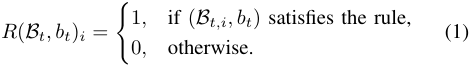

Next, we select the subset of tokens that satisfy the recomputation rule for recomputation. Let _Ct_ denote the candidate token set selected based on _R_ ( _Bt, bt_ ). We need to design a priority vector _At_ = [ _a_ 1 _, a_ 2 _, ..., as_ ] that assigns higher priority to tokens based on both their KV deviations and their influence on the model’s output. Let _rt_ denote the fraction of prefix tokens selected for recomputation, we select the top- _k_ tokens with the highest priority scores from list _At_ for recomputation, where _k_ = min _{|Ct|, ⌊s · rt⌋}_ . 

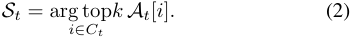

Let _out_ ( _x, KV_ ) _l_ denote the model output at layer _l_ corresponding to the output token position, given input _x_ and KV cache _KV_ . Let _KV__new_ be the updated cache after recomputing tokens in _St_ . Given bit list _Bt_ and model precision _bt_ , we aim to design a recomputation rule and estimate a priority vector _At_ to select tokens based on KV deviations and their impact on output. The goal is to minimize output deviation under a fixed recomputation ratio _rt_ . 

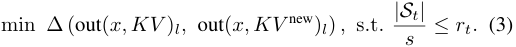

Table I lists frequently used notations in this paper. 

## IV. DESIGN 

To achieve our goal, we present ElastKV, which selectively recomputes the KV values based on a recomputation rule and priority list, while reusing other tokens’ KV values. In this section, we first present empirical observations that motivate the design of our method (IV-A). Based on these insights, we then introduce our recomputation method for KV caches 

TABLE I: Frequently used notations in this paper 

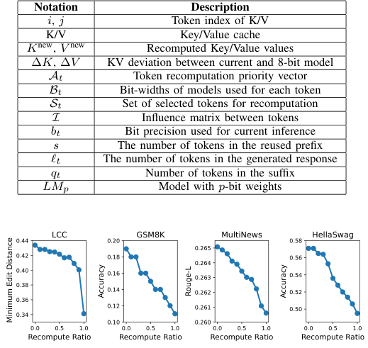

<!-- Start of picture text -->
Notation Description i , j Token index of K/V K/V Key/Value cache K new , V new Recomputed Key/Value values ∆ K , ∆ V KV deviation between current and 8-bit model At Token recomputation priority vector Bt Bit-widths of models used for each token St Set of selected tokens for recomputation I Influence matrix between tokens bt Bit precision used for current inference s The number of tokens in the reused prefix ℓt The number of tokens in the generated response qt Number of tokens in the suffix LMp Model with p -bit weights 0.44 LCC 0.20 GSM8K MultiNews 0.58 HellaSwag 0.265 0.42 0.18 0.56 0.264 0.40 0.16 0.263 0.54 0.38 0.14 0.262 0.52 0.36 0.12 0.261 0.50 0.34 0.10 0.260 0.0 0.5 1.0 0.0 0.5 1.0 0.0 0.5 1.0 0.0 0.5 1.0 Recompute Ratio Recompute Ratio Recompute Ratio Recompute Ratio Accuracy Rouge-L Accuracy  Minimum Edit Distance <!-- End of picture text -->

Fig. 4: Model performance after selective KV recomputation from _LM_ 8 with _LM_ 3 on four datasets at different ratios. 

from mixed-precision models (IV-B). Finally, we propose techniques to deploy our method practically (IV-C). 

## _A. Insights from Empirical Observations_ 

Unless specified, we consider the simplest case where only two models with different precisions are involved. All prefix KVs are generated by the first model, and the second model takes the suffix tokens as input and generates the output tokens. Section IV-A1 presents the model performance after recomputing KV from _LM_ 8 with _LM_ 3. Section IV-A2 discusses the limitations of using only the KV deviation as the criterion for recomputation and presents insights motivating our method. 

_1) Impact of Recomputing KV from Higher-bit Models:_ To investigate the impact of recomputing KV caches from a higher-precision model using a lower-precision model on overall performance, we conduct observational experiments in which all prior KV caches are from _LM_ 8, and _LM_ 3 is used to process the current suffix and generate output tokens, using the same sample size, datasets, evaluation metrics, and experimental settings as Section V. We follow CacheBlend [17] to select tokens with the largest KV deviations for recomputation and gradually increase the recomputation ratio in our evaluation. Results are shown in Fig. 4, it shows that as the proportion of KV caches from _LM_ 8 that are recomputed by _LM_ 3 increases, the model’s performance gradually degrades. This suggests that recomputing KV caches from a higher-precision model using a lower-precision model tends to degrade output performance. 

_2) Drawbacks of Prior Work:_ We select the top 10% of tokens for recomputation, and measure the _V_ delta of 

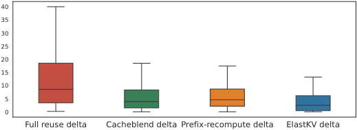

<!-- Start of picture text -->
40 35 30 25 20 15 10 5 0 Full reuse delta Cacheblend delta Prefix-recompute delta ElastKV delta <!-- End of picture text -->

Fig. 5: Box plots of average KV delta of suffix tokens before and after recomputation with three baselines and our method. 

output tokens relative to the fully recomputed values using three recomputation methods: full KV reuse, CacheBlend (which selects tokens with the largest KV deviations) and prefix recomputation. The first two layers are excluded, as all tokens in those layers are fully recomputed. Fig. 5 shows that even with recomputation using _LM_ 8, deviations caused by _LM_ 3 remain significant, limiting the overall effectiveness of recomputation. As CacheBlend [17] indicates, a lower KV delta correlates with better output quality, yet existing methods fail to sufficiently reduce it. 

## _B. KV Recomputing Approach_ 

**Recomputation Rule.** As shown in Section IV-A1, lowerbit models do not need to recompute KV caches from higherbit models. Therefore, for mixed-precision KV caches, we fully reuse the KV entries from higher-precision models, while selectively recomputing KV entries from lower-precision models. Formally, the recomputation rule _R_ is: 

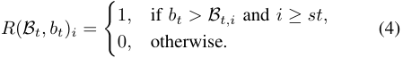

Let _st_ denote the starting index for selection to avoid outof-memory (OOM) issues caused by long contexts. In our experiments, we set _st_ = 0, meaning that all tokens are included when applying the recomputation rule. With the recomputation rule, we get the candidate token set: 

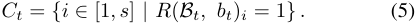

Next, we select a subset _St ⊆ Ct_ , containing the top _r_ % of tokens ranked by the recomputation priority, to be recomputed. Assume the number of newly generated output tokens is _ℓt_ . The precision list _Bt_ is then updated accordingly, i.e., 

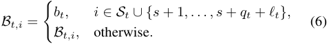

Prefix caching enables repeated access to a chunk, allowing frequently used tokens to gradually increase in precision. Infrequent tokens may also be updated during recomputation for queries in which they are more important. 

**Token Priority Estimation.** A key component of ElastKV is the priority vector _At_ . To maximize accuracy gains, we estimate the impact of each token’s KV deviation on model output by measuring its influence on subsequent tokens first. 

As quantifying a token’s exact impact requires two inferences, we adopt an estimation-based method. We next describe the attention mechanism used to derive our method. 

In Transformers, the attention output at position _i_ is denoted by _yi_ . It represents the output of token _i_ and is computed as: 

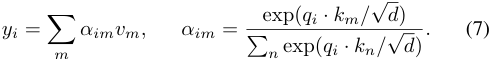

Assume _j < i_ . If the KV at position _j_ deviates from its ground-truth value, the output _yi_ will be affected. Treating the attention mechanism in Eq. 7 as a function _y_ = _F_ ( _K, V_ ) and considering only the deviation of the KV values corresponding to token _j_ , we can approximate the impact of token _j_ on the output at position _i_ at a given Transformer layer as: 

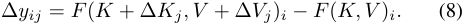

Here, the subscripts denote the corresponding token positions. We define an influence matrix _I_ , where _Iij_ represents the effect of KV deviation of token _j_ on the output at position _i_ . Since _j < i_ , _I_ is a lower triangular matrix. However, unless we recompute every token individually, it is impossible to accurately compute the influence each token has on subsequent tokens. To estimate how perturbations in earlier tokens affect later outputs, under the assumption of small perturbations caused by quantization [14], we apply a first-order Taylor expansion to Eq. (8) at ∆ _Kj_ = 0 _,_ ∆ _Vj_ = 0: 

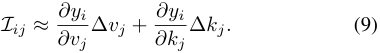

For the first term, _∂v∂yji_∆_vj_=_αij_∆_vj_.Forthesecondterm, _∂yi_ _<u>∂αim</u> ∂kj_=<u>�</u> _m ∂kj__vm_, by taking the derivative of each term, we obtain_<u>∂α</u>_ _∂k__<u>im</u>_ _j_ = _~~√~~_ _<u>qid</u>__αim_(_δmj −αij_), in which_δmj_is Kronecker delta: 

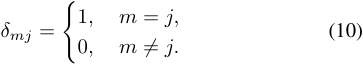

By summing over all terms, we get _∂k__∂y_ _j__<u>i</u>_∆_kj_=_αij ·_ _~~√~~__<u>qi</u>_ _d__·_(_vj −_ _yi_ ) _·_ ∆ _kj_ . We obtain the estimation equation as follows: _Iij ≈ αij_ ∆ _vj_ + _αij ·__<u>qi</u>_ _·_ ( _vj − yi_ ) _·_ (∆ _kj_ ) _._ (11) _~~√~~ d_ 

Finally, we compute the L2 norm to obtain scalar scores for easier comparison across tokens. 

While Eq. (11) provides a method to estimate the influence between each pair of tokens, our objective is to measure the effect of a token’s KV deviation on all output tokens. Therefore, based on the influence matrix _I_ , we further compute the final effect on output. However, as shown in Eq. (11), we cannot directly estimate the influence of these prior tokens on the model’s output before the output tokens are generated. Nevertheless, since the suffix tokens are always processed by the current model _LMbt_ , we approximate the impact of the prior tokens on the final output by estimating their influence on each token within the suffix. This is based on the truth that large language models produce an output for every input 

position, and the output at each position corresponding to a suffix token can be viewed as the first token of the answer to a question formed by the prefix sequence up to that position. Since longer prefixes of the input more closely approximate the full question, we maintain a window size _Lw_ and estimate the effect on only the last _Lw_ suffix tokens; when the suffix is shorter than _Lw_ , all available suffix tokens are used. 

Therefore, after measuring the influence of prior tokens’ KV deviation on the output by estimating their influence on the last _Lw_ positions of the suffix, we can approximate their overall impact on the final output. The equation for computing the priority of each token is defined in Eq. (12) and Eq. (13): 

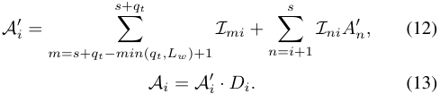

Here, _A__′_ represents the estimated influence of each token on output tokens through all influence paths, _Di_ represents the local KV deviation of token _i_ . Because earlier tokens influence subsequent tokens through propagation (i.e., the influence of prior tokens on subsequent ones further propagates to later tokens, creating a cascading impact), Eq. (12) includes a recursive structure that estimates this effect. This path influence is necessary for capturing the long-range dependencies in Transformer models. Since _A__′_ alone ignores the token’s own importance, we weight it by the KV deviation values to derive the priority scores of candidate tokens. 

For example, assume three tokens [ _t_ 1 _, t_ 2 _, t_ 3] have their KV caches reused and all are candidate tokens, and the suffix includes two tokens [ _t_ 4 _, t_ 5]. The priority of candidate tokens is then computed by evaluating their effects on suffix tokens. 

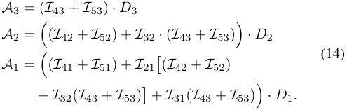

In this example, if _t_ 4 is regarded as a complete query, then output at position _t_ 5 can be viewed as the first answer token generated in response to this query. The computation process is visualized in Fig. 6, treating tokens as nodes and drawing directed edges from each precomputed token to all subsequent tokens (including suffix tokens), the priority corresponds to the sum over all paths from the current token to each suffix token, with each path weighted by the product of all edge weights. 

**Workflow of Selective KV Recomputation.** We now explain how ElastKV performs attention computation and updates the KV values at each layer. After token priority _At_ is estimated, we select tokens in the next layer following [17] and keep them fixed in subsequent layers. To validate this, using the same setup as Fig. 2, Fig. 7 reports the Spearman correlation between KV deviations and priorities across adjacent layers, showing that important tokens remain consistent across 

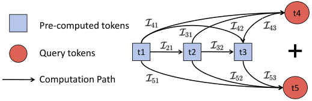

<!-- Start of picture text -->
t4 Pre-computed tokens Query tokens t1 t2 t3 Computation Path t5 <!-- End of picture text -->

Fig. 6: An example illustrating the calculation of token recomputation priorities incorporating path influence. 

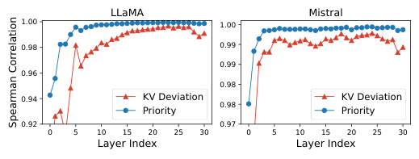

<!-- Start of picture text -->
LLaMA Mistral 1.00 1.00 0.98 0.99 0.99 0.96 0.98 0.94 KV Deviation KV Deviation Priority 0.98 Priority 0.92 0.97 0 5 10 15 20 25 30 0 5 10 15 20 25 30 Layer Index Layer Index Spearman Correlation <!-- End of picture text -->

Fig. 7: Spearman correlation across adjacent layers: KV deviations from CacheBlend vs. token priorities from our method. 

layers. This aligns with prior findings that token embeddings evolve slowly through Transformer layers [29], [30]. Since KV values are linear projections of embeddings, their deltas and priorities are similarly stable, so we fix selected tokens across layers. Our token selection method is compatible with other selective strategies such as the gradual filtering scheme [17]. 

Regarding the selection of tokens for recomputation, we select the top _r_ % tokens from the prefix according to the priority values, while restricting the selection to the candidate set _Ct_ . Then we recompute KV of tokens in _St_ and perform attention computation. 

As shown in Fig. 8(a), the implementation of attention mechanism computes KV for new tokens while reusing cached KV without recomputation, which is the default approach. The attention mechanism of ElastKV is illustrated in Fig. 8(b). At the second layer, the input is first sliced to retain only tokens in the selected set _St_ . The attention mask is adjusted to prevent attention to future tokens. The model computes _Q_ , _K_ , and _V_ for these tokens at each layer. The corresponding entries in the KV cache are updated to _K__new_ and _V__new_ : 

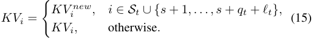

In subsequent layers, since the input has already been sliced, only computation and replacement are performed. 

The recomputation and KV-update overheads scale with the recomputation ratio _r_ , while bit-width metadata lookup and scheduling scans add linear memory-access overhead in the cached length. 

- _C. Improvements for Practical Deployment_ 

**Taylor Approximation.** In Eq.(11), the first term requires significantly less computation and it often contributes the most 

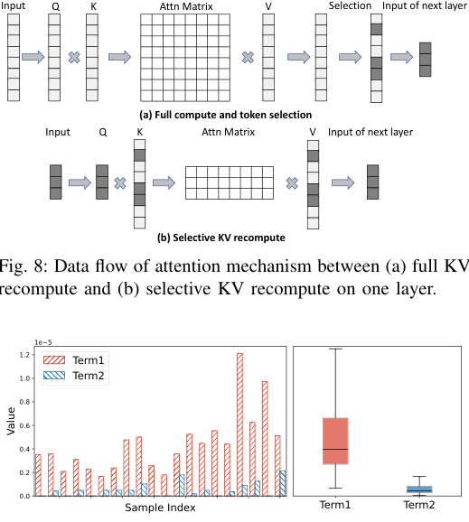

<!-- Start of picture text -->
Input Q K Attn Matrix V Selection Input of next layer (a) Full compute and token selection Input Q K Attn Matrix V Input of next layer (b) Selective KV recompute Fig. 8: Data flow of attention mechanism between (a) full KV recompute and (b) selective KV recompute on one layer. 1e−5 1.2 Term1 1.0 Term2 0.8 0.6 0.4 0.2 0.0 Sample Index Term1 Term2 Value <!-- End of picture text -->

Fig. 8: Data flow of attention mechanism between (a) full KV recompute and (b) selective KV recompute on one layer. 

Fig. 9: Magnitude comparison between the first and second terms: sample-wise bar plot and overall box plot. 

to the overall value. We perform an analysis on 200 samples from the LCC dataset. Fig.9 left visualizes both values on several examples. Fig. 9 right shows a box plot summarizing their distribution across 60,000 data points, confirming that the first term is significantly larger in most cases. To further reduce overhead, we retain only the first term in Eq. (11). In Section V, we compare model performance using the full equation with model performance using the first term alone. 

**Implementing Taylor Expansion.** According to the default procedure, L2 norm over the attention head dimension is needed finally. But performing it until the final step leads to significant memory overhead, as the high-dimensional _I_ tensor must be fully stored during intermediate steps. Before computing L2 norm, the tensor has shape [ _bsz, head_ _<u>num,</u> s, s_ + _qt, head_ _<u>dim</u>_ ]. For a 7B model with 32 heads and _d_ = 128, storing the tensor in float32 for a sequence length of 4096 requires 256 GB of memory, which is unacceptable. 

Due to the properties of the L2 norm, if we only use the first term of Eq. (11), we can precompute the L2 norm of ∆ _v_ . As Eq. (16) shows, thereby preventing excessive memory usage. Moreover, the resulting value is exactly equivalent to that obtained by the original method: 

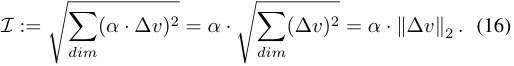

If we compute both terms in Eq. (11), we denote the first term as _term_ 1 and the second as _term_ 2, the final calculation 

requires the norm of their sum as in Eq. (17): 

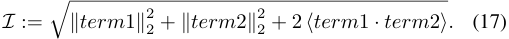

However, since the norms are precomputed, we cannot obtain the cosine of the angle between _term_ 1 and _term_ 2. We compute statistics over 10,000 samples, and find that the average cosine value is approximately -0.009 with a standard deviation of around 0.08. This indicates that term 1 and term 2 are nearly orthogonal, so we omit the cross-product term. 

By precomputing the norm in advance, our method ensures memory efficiency while maintaining nearly identical results. 

V. EVALUATION 

In this section, we evaluate the performance of ElastKV through a series of experiments. We also conduct sensitivity analysis and ablation studies. 

## _A. Experiment Setup_ 

**Models and hardware settings.** We evaluate ElastKV on four models: LLaMA2-7B [23], Mistral-7B [31], TinyLLaMA1.1B [32], and OPT-350M [33], each quantized to 3–8 bits. Experiments are conducted on three machines: (1) a server equipped with an NVIDIA RTX 3090 (24GB), 64GB DDR4 RAM, and an Intel Xeon Silver 4210R CPU, used for LLaMA2-7B and Mistral-7B, (2) a high-performance laptop with an NVIDIA GeForce RTX 4060 Laptop GPU (8GB), 32GB RAM, and an Intel Core i9-14900HX CPU, used for TinyLLaMA-1.1B and OPT-350M, and (3) a lightweight laptop with a GTX 1650 GPU, 16GB RAM, and an Intel Core i5-10300H CPU, used for OPT-350M. 

**Quantization method.** We adopt AnyPrecisionLLM [14], a non-uniform weight-only quantization method that uses a customized storage format to enable elastic memory usage and low-overhead switching across different precision levels, making it well suited for elastic inference. While we use AnyPrecisionLLM, ElastKV is not tied to its specific K- means quantization procedure and it relies on measured KV deviations rather than a specific quantization error distribution. 

**Datasets.** We use both short-context and long-context benchmarks to evaluate ElastKV under diverse context lengths: 

• HellaSwag [34]: This dataset aims to test LLMs’ commonsense reasoning via sentence completion. Its inputs are relatively short. We use 1000 test cases. 

• GSM8K [35]: This dataset aims to test LLMs’ mathematical reasoning ability through grade-school math word problems. We use 200 test cases. 

• LCC [36]: This LongBench [37] dataset tests LLMs’ code generation ability by requiring them to predict the next several lines of code based on a 4K-token-scale real-world code prefix. 

• MultiNews [38]: This LongBench [37] dataset tests LLMs’ ability in multi-document summarization over 4K-token-scale news articles from multiple sources. 

We use 200 test cases for LCC and MultiNews, consistent with prior work [37]. During inference, the query prompt serves as the task input to initiate generation, while the prefix context is split into chunks of equal token length. Each chunk’s 

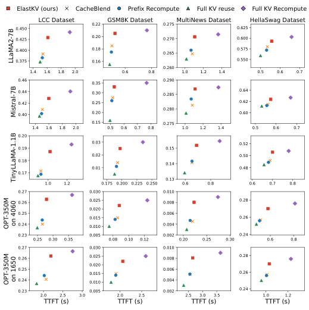

<!-- Start of picture text -->
ElastKV (ours) CacheBlend Prefix Recompute Full KV reuse Full KV Recompute 0.450 LCC Dataset 0.22 GSM8K Dataset 0.275 MultiNews Dataset 0.625 HellaSwag Dataset 0.425 0.20 0.270 0.600 0.400 0.18 0.265 0.575 0.375 0.16 0.550 0.260 1.4 1.6 1.8 2.0 0.6 0.8 1.0 1.2 1.4 0.5 0.6 0.7 0.46 0.35 0.290 0.44 0.30 0.285 0.64 0.42 0.25 0.62 0.40 0.20 0.280 0.60 0.15 0.275 1.4 1.6 1.8 2.0 0.5 0.6 0.7 0.8 1.0 1.2 1.4 0.5 0.6 0.7 0.20 0.03 0.52 0.19 0.15 0.02 0.50 0.18 0.14 0.01 0.48 0.17 0.13 1.0 1.2 0.175 0.200 0.225 0.250 0.6 0.8 0.6 0.7 0.8 0.27 0.030 0.010 0.26 0.025 0.008 0.28 0.020 0.25 0.006 0.015 0.26 0.24 0.010 0.004 0.23 0.005 0.002 0.24 0.25 0.30 0.35 0.08 0.10 0.12 0.20 0.25 0.30 0.6 0.8 0.27 0.030 0.010 0.26 0.025 0.008 0.28 0.020 0.25 0.015 0.006 0.26 0.24 0.010 0.004 0.23 0.005 0.002 0.24 2.0 2.5 3.0 2.0 2.5 2.5 3.0 3.5 1.0 1.2 TTFT (s) TTFT (s) TTFT (s) TTFT (s) LLaMA2-7B Mistral-7B TinyLLaMA-1.1B OPT-350M on 4060 OPT-350M on 1650 <!-- End of picture text -->

Fig. 10: ElastKV delivers a better speed-quality trade-off than baselines across four datasets, multiple models, and diverse hardware platforms, where “OPT-350M on 4060” and “OPT350M on 1650” denote OPT-350M evaluated on the RTX 4060 Laptop and GTX 1650 Laptop, respectively. 

KV cache is generated by models with different quantization precisions. For each dataset, we define the context to be split as follows. (1) LCC: the prefix code snippet before the question. (2) GSM8K: the 8 few-shot examples provided before the question. (3) MultiNews: the full news text. (4) HellaSwag: the entire passage preceding the sentence to be completed. 

**Evaluation Metrics.** We adopt the following metrics to measure the generation quality for the above datasets. 

• ROUGE-L [39] is used for the MultiNews dataset [38]. It measures the similarity between the model’s output and the ground-truth based on the longest common sequence. 

• Minimum Edit Distance is used for the LCC dataset [36], following the LongBench standard [37]. It calculates the minimum number of insertions, deletions, and substitutions needed to align the generated code with the reference code. 

• Accuracy is used for HellaSwag [34] and GSM8K [35], computed as the proportion of predictions that exactly match the ground-truth. For GSM8K, we extract the final numerical answer from the model output for evaluation. 

**Baselines.** We compare ElastKV with four baselines: 

- Full KV Recompute: The entire input is fed into the model, 

- and all KV caches are recomputed during the prefill phase. 

- Full KV Reuse: All KV caches generated by models of 

- different precisions are reused without any recomputation. 

• CacheBlend [17]: Selects top- _k_ tokens based on the magnitude of KV deviation on shallow layer and recomputes their KV entries across all subsequent layers. It does not account for how these deviations affect the final model output. 

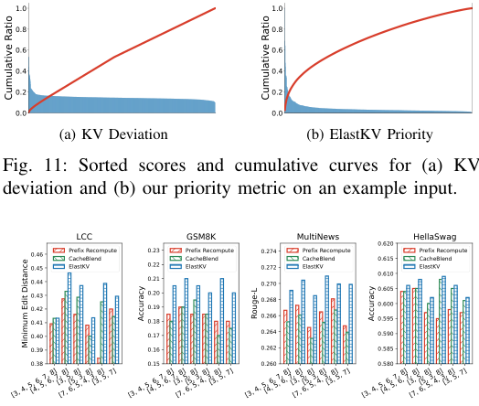

<!-- Start of picture text -->
1.0 1.0 0.8 0.8 0.6 0.6 0.4 0.4 0.2 0.2 0.0 0.0 (a) KV Deviation (b) ElastKV Priority Fig. 11: Sorted scores and cumulative curves for (a) KV deviat ion and (b) our priority metric on an example input. LC C GSM 8K MultiN ews 0.620 HellaS wag 0.46 PrefixCache  RecomputeBlend 0.23 Prefix Cache BlendRecompute 0.274 Prefix RCacheB ecomputelend 0.615 Prefix RCacheB ecomputelend 0.450.440.430.42 ElastK V 0.220.210.200.19 ElastK V 0.2720.2700.268 ElastKV 0.6100.6050.600 ElastKV 0.41 0.18 0.266 0.595 0.40 0.17 0.264 0.590 0.39 0.16 0.262 0.585 0.38 0.15 0.260 0.580 [3, 4, 5, 6, 7, 8][4, 5, 6, 7, 8][3, 5, 8][7, 6, 5, 4, 3, 8][5, 3, 8][3, 5, 7] [3, 4, 5, 6, 7, 8][4, 5, 6, 7, 8][3, 5, 8][7, 6, 5, 4, 3, 8][5, 3, 8][3, 5, 7] [3, 4, 5, 6, 7, 8][4, 5, 6, 7, 8][3, 5, 8][7, 6, 5, 4, 3, 8][5, 3, 8][3, 5, 7] [3, 4, 5, 6, 7, 8][4, 5, 6, 7, 8][3, 5, 8][7, 6, 5, 4, 3, 8][5, 3, 8][3, 5, 7] Cumulative Ratio Cumulative Ratio Accuracy Rouge-L Accuracy Minimum Edit Distance <!-- End of picture text -->

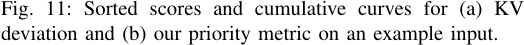

<!-- Start of picture text -->
Fig. 11: Sorted scores and cumulative curves for (a) KV deviat ion and (b) our priority metric on an example input. <!-- End of picture text -->

Fig. 12: Comparison of ElastKV and two baselines across different chunk numbers and precision combinations. 

• Prefix Recomputation [18]: Epic [18] recomputes KV entries for early-position tokens in each chunk. It was originally designed to mitigate deviations caused by cross-attention at chunk boundaries. We align its recomputation ratio with ours. 

## _B. Overall Performance_ 

**Reduced TTFT with little Quality Drop.** In this subsection, we use a simple setup involving only _LM_ 3 and _LM_ 8. The prior context KV cache is generated by _LM_ 3, while _LM_ 8 processes the suffix and performs generation with prior KV. 

Fig. 10 compares the TTFT and model performance of our method against four baseline approaches on all datasets, across the three hardware settings. Since the inputs in HellaSwag are short, with many under 20 tokens, we recompute 40% of the tokens. For the other datasets, we recompute 15% of the tokens following prior work [17]. Our method limits the average accuracy loss to within 2% and provides an average recomputation speedup of nearly 3 _×_ compared to full recomputation, delivering a better speed-quality trade-off than existing baselines: it reduces TTFT compared to full recomputation with minimal accuracy loss, and improves accuracy over full KV reuse. The results on LCC and MultiNews show that ElastKV remains effective with long contexts. A breakdown of the prefilling stage in Fig. 10 shows that ElastKV only adds about 4% extra time over CacheBlend when measured relative to the prefill time of full KV reuse. This additional cost is offset by the improved speed-quality trade-off. 

Our method incurs higher overhead at the same recomputation ratio. Therefore, to provide a more comprehensive comparison, experiments with varying recomputation ratios and matched TTFT settings are presented in Section V-C. 

**Understanding ElastKV’s Improvement.** The influence path captures the impact of a token through all paths, re- 

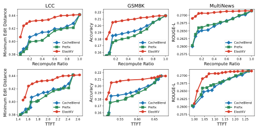

<!-- Start of picture text -->
LCC GSM8K MultiNews 0.44 0.22 0.2700 0.21 0.42 0.200.19 0.26750.2650 0.40 CacheBlend 0.18 CacheBlend 0.2625 CacheBlend Prefix 0.17 Prefix 0.2600 Prefix 0.38 ElastKV 0.16 ElastKV 0.2575 ElastKV 0.2 0.4 0.6 0.8 1.0 0.2 0.4 0.6 0.8 1.0 0.2 0.4 0.6 0.8 1.0 Recompute Ratio Recompute Ratio Recompute Ratio 0.44 0.22 0.2700 0.21 0.42 0.200.19 0.26750.2650 0.40 CacheBlend 0.18 CacheBlend 0.2625 CacheBlend Prefix 0.17 Prefix 0.2600 Prefix 0.38 ElastKV 0.16 ElastKV 0.2575 ElastKV 1.4 1.6 1.8 2.0 2.2 2.4 2.6 0.55 0.60 0.65 1.00 1.05 1.10 1.15 1.20 1.25 TTFT TTFT TTFT Accuracy ROUGE-L Minimum Edit Distance Accuracy ROUGE-L Minimum Edit Distance <!-- End of picture text -->

Fig. 13: Performance comparison of ElastKV and baselines across varying recompute ratios and TTFT on three datasets, evaluated with LLaMA2-7B. 

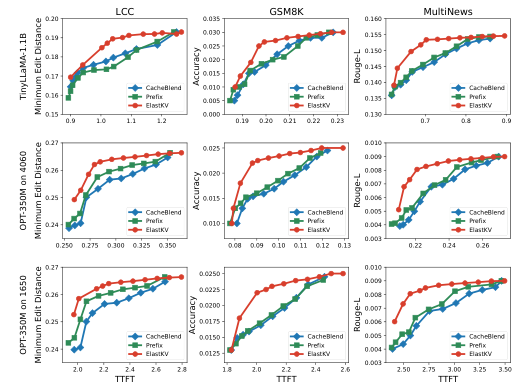

<!-- Start of picture text -->
0.20 LCC 0.035 GSM8K 0.160 MultiNews 0.19 0.030 0.155 0.025 0.150 0.18 0.020 0.145 0.17 0.015 CacheBlend 0.010 CacheBlend 0.140 CacheBlend 0.16 PrefixElastKV 0.005 PrefixElastKV 0.135 PrefixElastKV 0.15 0.000 0.130 0.9 1.0 1.1 1.2 0.19 0.20 0.21 0.22 0.23 0.7 0.8 0.9 0.27 0.025 0.010 0.009 0.26 0.020 0.008 0.007 0.25 0.015 0.006 CacheBlend CacheBlend 0.005 CacheBlend 0.24 PrefixElastKV 0.010 PrefixElastKV 0.004 PrefixElastKV 0.003 0.250 0.275 0.300 0.325 0.350 0.08 0.09 0.10 0.11 0.12 0.13 0.22 0.24 0.26 0.27 0.010 0.0250 0.009 0.26 0.0225 0.008 0.0200 0.007 0.25 0.0175 0.006 CacheBlend 0.0150 CacheBlend 0.005 CacheBlend 0.24 PrefixElastKV 0.0125 PrefixElastKV 0.004 PrefixElastKV 0.003 2.0 2.2 2.4 2.6 2.8 1.8 2.0 2.2 2.4 2.6 2.50 2.75 3.00 3.25 3.50 TTFT TTFT TTFT Accuracy Rouge-L TinyLLaMA-1.1B Minimum Edit Distance Accuracy Rouge-L OPT-350M on 4060 Minimum Edit Distance Accuracy Rouge-L OPT-350M on 1650 Minimum Edit Distance <!-- End of picture text -->

Fig. 14: Performance comparison of ElastKV and baselines under varying TTFT on laptop GPUs, evaluated with TinyLLaMA-1.1B and OPT-350M. 

flecting its potential to affect future computations. The KV delta measures the token’s own importance. By combining these two factors, ElastKV selects tokens that are both individually significant and influential to subsequent tokens, thereby increasing the overall effectiveness of recomputation in correcting output deviations. We visualize KV deviations and token priorities across layers using the setup from Fig. 2. Fig. 11 shows that only a small fraction of tokens receive notably high priority scores. Using the same setup, we report the _V_ delta before and after recomputation in Fig. 5, it shows that, our method results in lower delta values of output tokens, indicating more effective correction of low-precision deviations of our method. Therefore, recomputing only a small subset of tokens can effectively correct most deviations. 

## _C. Sensitivity Analysis_ 

For a better understanding of ElastKV, we further analyze how varying the configurations of ElastKV affects overall performance using LLaMA2-7B, TinyLLaMA-1.1B and OPT350M, on all three hardware platforms. 

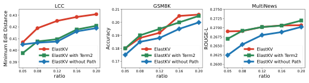

<!-- Start of picture text -->
LCC 0.21 GSM8K 0.2750 MultiNews 0.43 0.2725 0.20 0.42 0.2700 0.41 0.19 0.2675 0.40 ElastKV 0.18 ElastKV 0.2650 ElastKV ElastKV with Term2 ElastKV with Term2 0.2625 ElastKV with Term2 0.39 ElastKV without Path 0.17 ElastKV without Path 0.2600 ElastKV without Path 0.05 0.08 0.12 0.16 0.20 0.05 0.08 0.12 0.16 0.20 0.05 0.08 0.12 0.16 0.20 ratio ratio ratio Accuracy ROUGE-L Minimum Edit Distance <!-- End of picture text -->

Fig. 15: Impact of influence path component and second term in ElastKV under varying recomputation ratios. 

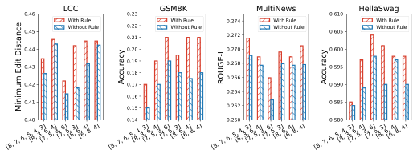

<!-- Start of picture text -->
0.46 LCC 0.23 GSM8K MultiNews 0.610 HellaSwag 0.45 With RuleWithout Rule 0.220.21 With RuleWithout Rule 0.2740.272 With RuleWithout Rule 0.605 With RuleWithout Rule 0.44 0.20 0.270 0.600 0.43 0.19 0.268 0.595 0.18 0.266 0.42 0.17 0.590 0.16 0.264 0.41 0.15 0.262 0.585 0.40 0.14 0.260 0.580 [8, 7, 6, 5, 4, 3][8, 3, 6, 4][7, 5, 3, 6][7, 5, 3][8, 6, 4][6, 8, 4] [8, 7, 6, 5, 4, 3][8, 3, 6, 4][7, 5, 3, 6][7, 5, 3][8, 6, 4][6, 8, 4] [8, 7, 6, 5, 4, 3][8, 3, 6, 4][7, 5, 3, 6][7, 5, 3][8, 6, 4][6, 8, 4] [8, 7, 6, 5, 4, 3][8, 3, 6, 4][7, 5, 3, 6][7, 5, 3][8, 6, 4][6, 8, 4] Accuracy ROUGE-L Accuracy Minimum Edit Distance <!-- End of picture text -->

Fig. 16: Effect of Recomputation Rule on Model Performance. 

**Varying Chunk Numbers and Precisions.** We investigate multi-precision configurations on LLaMA2-7B, where the prefix context is partitioned into more chunks, each processed by a model of distinct precision. This setup simulates elastic inference under resource fluctuations, where cached chunks and the current generation may use different precisions. We use the same recomputation ratio as in Fig. 10. Results are presented in Fig. 12, where each x-axis label is a list of model precisions for processing chunks, with the last entry indicating the model used for answer generation. As shown in Fig. 12, our method adapts better to precision switching than the baselines. 

**Varying Recompute Ratios.** Following the setup in Section V-B, we evaluate our method using _LM_ 3 and _LM_ 8 while varying the recomputation ratio. Since inputs in HellaSwag are very short, we do not include HellaSwag in this experiment because changing the recomputation ratio has little impact. Results on other datasets are shown in Fig. 13. To study how recomputation ratio affects latency across different hardware platforms, Fig. 14 further reports the TTFT under varying ratios on the laptop GPUs (RTX 4060 and GTX 1650). Compared to baseline methods with similar recompute ratio and TTFT, our method achieves better performance. At a very low ratio, it exhibits a worse trade-off compared to prior methods on MultiNews due to dominant overhead from estimation method. However, such a low ratio is not practical. In conclusion, with practical ratios, our method outperforms previous approaches. 

## _D. Ablation Study_ 

To validate each component of ElastKV, we conducted experiments under the setup detailed in Section V-B, using only _LM_ 3 and _LM_ 8 with _r_ = 15%. We compare ElastKV against the following methods using LLaMA2-7B: 

**Using the second term of the Taylor expansion.** Previous experiments used only the first term of Eq. (11). Here, we use both terms to observe the impact of the second term. 

**Without Considering Influence Paths.** We calculate the influence path to estimate the impact of a token. In this setting, we only use the column-wise sum of _I_ as the weighting factor and observe the effect of the influence path. 

Fig. 15 presents the model performance when incorporating the second term of Eq. (11) and removing the influence path component. It can be seen that, incorporating influence paths leads to performance improvements, while _term_ 2 has little impact on the overall model performance and in some cases, approximation errors may result in a less accurate estimation with _term_ 2. Therefore, using only _term_ 1 is reasonable. 

**Disabling the Recomputation Rule.** We disable the constraint prohibiting low-bit models from recomputing KV caches from high-bit models. Following the simulated precision-switching setup in Fig. 12, we evaluate various precision configurations where there always exist KV caches generated by models with lower precision than _LMbt_ . Fig. 16 shows the model performance when the recomputation rule is disabled. Across various precision combinations, the recomputation rule prevents performance degradation if there exist KV caches generated by models with lower precision than _LMbt_ . 

## VI. RELATED WORK 

## _A. Quantization for LLM_ 

In modern LLMs, weight-only quantization has become the primary focus, as inference is typically bandwidth-bound due to the large model size. Due to the high training cost, posttraining quantization (PTQ) [22] is widely adopted despite quantization-aware training (QAT) [40], [41] offering better performance. Quantization methods can be classified as uniform and non-uniform. Uniform approaches, such as OPTQ [22] and AWQ [21], apply a consistent scheme across weights but do not support low-overhead runtime switching required in our setting. Non-uniform methods, such as SqueezeLLM [42], adapt to weight distributions and often yield higher accuracy. 

## _B. Elastic LLM Services on Edge Devices_ 

Deploying LLMs on edge devices is increasingly desirable, but available memory varies with dynamic system load due to the unified memory architecture of many edge SoCs [43]. To support elastic inference, ELMS [15] uses neuron reordering to prune models into multiple sub-models with minimal switching overhead. AnyPrecisionLLM [14] adopts non-uniform quantization to produce multi-precision models sharing a common weight prefix, whose bit-plane storage enables low-overhead precision switching and flexible memory control. FlexQuant [12] further introduces search-based model size adaptation. These methods allow task-specific deployment to meet diverse service-level objectives (SLOs). 

However, prior work either overlooks input-level model-size adaptation under fluctuating edge resources, or fails to address the impact of reusing KV caches generated by compressed models of varying sizes on output tokens. 

## _C. KV Cache Reuse and Recomputation_ 

Storing and reusing KV caches has been extensively explored in recent studies [10], [11], [16]–[20], [44], [45]. Some works focus on resolving cross-attention and positional encoding errors in RAG scenarios [17]–[20]. Others improve cache utilization through prefix matching [7], [10], [16], extend reuse beyond strict prefixes [44], or adapt KV reuse to multi-turn conversations [11], [45]. Among these works, some require additional model training [19], [20], while others are trainingfree [11], [16]–[18], [44], [45]. Most training-free methods are based on KV recomputation. CacheBlend [17] identifies tokens with the highest Value deltas in the early layer. MPIC [16] recomputes only the KV pairs of the first few tokens, and Epic [18] recomputes tokens at the beginning and end of each chunk. 

The key difference between our setting and prior work is that different chunks may be produced by models with varying precision levels, and issues such as missing cross-attention or incorrect position ids do not exist. In our scenario, the KV deviations are entirely caused by model quantization. ElastKV ranks tokens using both local KV deviation and influencepath propagation, rather than relying on local deltas or fixed positions. 

## VII. CONCLUSION 

In this work, we present ElastKV, a KV Cache reuse method that supports prefix caching and enables elastic LLM inference on edge devices with constrained and fluctuating resources. To address cross-precision KV reuse, ElastKV introduces a recomputation rule that triggers recomputation only when a higher-precision model reuses KV entries from a lowerprecision one. ElastKV further estimates token importance by combining local KV deviations with influence on subsequent output tokens through Taylor approximation and influencepath propagation. This allows ElastKV to recompute only the most critical tokens, balancing accuracy and efficiency. Extensive experiments on four open-source LLMs and four datasets demonstrate that ElastKV limits average accuracy loss to within 2% while achieving nearly 3 _×_ recomputation speedup over full recomputation. ElastKV also improves the speed-quality trade-off across hardware platforms, making it practical for on-device LLM serving under dynamic resource constraints. 

## ACKNOWLEDGMENT 

This work was supported in part by * (No. *), and recommendations expressed in this paper are those of the authors and do not necessarily reflect the views of the funding agencies or the government. Zhenzhe Zheng is the corresponding author. 

## REFERENCES 

- [1] H. Wen, Y. Li, G. Liu, S. Zhao, T. Yu, T. J.-J. Li, S. Jiang, Y. Liu, Y. Zhang, and Y. Liu, “Autodroid: Llm-powered task automation in android,” in _Proceedings of the 30th Annual International Conference on Mobile Computing and Networking_ , 2024, pp. 543–557. 

- [2] W. Chen and Z. Li, “Octopus v2: On-device language model for super agent,” _arXiv preprint arXiv:2404.01744_ , 2024. 

- [3] Y. He, L. Ma, Z. Jiang, Y. Tang, and G. Xing, “Vi-eye: semantic-based 3d point cloud registration for infrastructure-assisted autonomous driving,” in _Proceedings of the 27th Annual International Conference on Mobile Computing and Networking_ , 2021, pp. 573–586. 

- [4] Rewind AI, “Rewind,” https://www.rewind.ai/, 2024. 

- [5] W. Yin, M. Xu, Y. Li, and X. Liu, “Llm as a system service on mobile devices,” _arXiv preprint arXiv:2403.11805_ , 2024. 

- [6] S. Ye, B. Ouyang, L. Zeng, T. Qian, X. Chu, J. Tang, and X. Chen, “Jupiter: Fast and resource-efficient collaborative inference of generative llms on edge devices,” in _IEEE INFOCOM 2025-IEEE Conference on_ 

- _Computer Communications_ . IEEE, 2025, pp. 1–10. 

- [7] L. Zheng, L. Yin, Z. Xie, C. L. Sun, J. Huang, C. H. Yu, S. Cao, C. Kozyrakis, I. Stoica, J. E. Gonzalez _et al._ , “Sglang: Efficient execution of structured language model programs,” _Advances in Neural Information Processing Systems_ , pp. 62 557–62 583, 2024. 

- [8] W. Kwon, Z. Li, S. Zhuang, Y. Sheng, L. Zheng, C. H. Yu, J. Gonzalez, H. Zhang, and I. Stoica, “Efficient memory management for large language model serving with pagedattention,” in _Proceedings of the 29th Symposium on Operating Systems Principles_ , 2023, pp. 611–626. 

- [9] Google, “Gemini,” https://gemini.google.com, 2024. 

- [10] L. Ye, Z. Tao, Y. Huang, and Y. Li, “Chunkattention: Efficient selfattention with prefix-aware kv cache and two-phase partition,” in _Proceedings of the 62nd Annual Meeting of the Association for Computational Linguistics_ , 2024, pp. 11 608–11 620. 

- [11] B. Gao, Z. He, P. Sharma, Q. Kang, D. Jevdjic, J. Deng, X. Yang, Z. Yu, and P. Zuo, “ _{_ Cost-Efficient _}_ large language model serving for multiturn conversations with _{_ CachedAttention _}_ ,” in _2024 USENIX Annual Technical Conference (USENIX ATC 24)_ , 2024, pp. 111–126. 

- [12] Y. Chai, M. Kwen, D. Brooks, and G.-Y. Wei, “Flexquant: Elastic quantization framework for locally hosted llm on edge devices,” _arXiv preprint arXiv:2501.07139_ , 2025. 

- [13] E. J. Hu, P. Wallis, Z. Allen-Zhu, Y. Li, S. Wang, L. Wang, W. Chen _et al._ , “Lora: Low-rank adaptation of large language models,” in _International Conference on Learning Representations_ , 2022. 

- [14] Y. Park, J. Hyun, S. Cho, B. Sim, and J. W. Lee, “Any-precision llm: Low-cost deployment of multiple, different-sized llms,” in _International Conference on Machine Learning_ , 2024, pp. 39 682–39 701. 

- [15] W. Yin, R. Yi, D. Xu, G. Huang, M. Xu, and X. Liu, “Elms: Elasticized large language models on mobile devices,” in _Proceedings of the 30th Annual International Conference on Mobile Computing and Networking_ , 2025. 

- [16] S. Zhao, J. Hu, R. Huang, J. Zheng, and G. Chen, “Mpic: Positionindependent multimodal context caching system for efficient mllm serving,” _arXiv preprint arXiv:2502.01960_ , 2025. 

- [17] J. Yao, H. Li, Y. Liu, S. Ray, Y. Cheng, Q. Zhang, K. Du, S. Lu, and J. Jiang, “Cacheblend: Fast large language model serving for rag with cached knowledge fusion,” in _Proceedings of the Twentieth European Conference on Computer Systems_ , 2025, pp. 94–109. 

- [18] J. Hu, W. Huang, H. Wang, W. Wang, T. Hu, Q. Zhang, H. Feng, X. Chen, Y. Shan, and T. Xie, “Epic: Efficient position-independent context caching for serving large language models,” _arXiv preprint arXiv:2410.15332_ , 2024. 

- [19] D. Ma, Y. Wang, and T. Lan, “Block-attention for efficient prefilling,” in _The Thirteenth International Conference on Learning Representations_ , 2024. 

- [20] J. Yang, B. Hou, W. Wei, Y. Bao, and S. Chang, “Kvlink: Accelerating large language models via efficient kv cache reuse,” _arXiv preprint arXiv:2502.16002_ , 2025. 

- [21] J. Lin, J. Tang, H. Tang, S. Yang, W.-M. Chen, W.-C. Wang, G. Xiao, X. Dang, C. Gan, and S. Han, “Awq: Activation-aware weight quantization for on-device llm compression and acceleration,” in _MLSys_ , 2024, pp. 87–100. 

- [22] E. Frantar, S. Ashkboos, T. Hoefler, and D.-A. Alistarh, “Optq: Accurate post-training quantization for generative pre-trained transformers,” in _11th International Conference on Learning Representations_ , 2023. 

- [23] H. Touvron, L. Martin, K. Stone, P. Albert, A. Almahairi, Y. Babaei, N. Bashlykov, S. Batra, P. Bhargava, S. Bhosale _et al._ , “Llama 2: Open foundation and fine-tuned chat models,” _arXiv preprint arXiv:2307.09288_ , 2023. 

- [24] A. Vaswani, N. Shazeer, N. Parmar, J. Uszkoreit, L. Jones, A. N. Gomez, Ł. Kaiser, and I. Polosukhin, “Attention is all you need,” in _Proceedings_ 

   - _of the 31st International Conference on Neural Information Processing Systems_ , 2017, pp. 6000–6010. 

- [25] Z. Zhang, Y. Sheng, T. Zhou, T. Chen, L. Zheng, R. Cai, Z. Song, Y. Tian, C. R´e, C. Barrett _et al._ , “H2o: heavy-hitter oracle for efficient generative inference of large language models,” in _Proceedings of the 37th International Conference on Neural Information Processing Systems_ , 2023, pp. 34 661–34 710. 

- [26] B. Chen, T. Dao, E. Winsor, Z. Song, A. Rudra, and C. R´e, “Scatterbrain: Unifying sparse and low-rank attention,” in _Advances in Neural Information Processing Systems_ , 2021, pp. 17 413–17 426. 

- [27] K. M. Choromanski, V. Likhosherstov, D. Dohan, X. Song, A. Gane, T. Sarlos, P. Hawkins, J. Q. Davis, A. Mohiuddin, L. Kaiser _et al._ , “Rethinking attention with performers,” in _International Conference on Learning Representations_ , 2020. 

- [28] C. Hooper, S. Kim, H. Mohammadzadeh, M. W. Mahoney, Y. S. Shao, K. Keutzer, and A. Gholami, “Kvquant: Towards 10 million context length llm inference with kv cache quantization,” in _Advances in Neural Information Processing Systems_ , 2024, pp. 1270–1303. 

- [29] Z. Liu, J. Wang, T. Dao, T. Zhou, B. Yuan, Z. Song, A. Shrivastava, C. Zhang, Y. Tian, C. Re _et al._ , “Deja vu: Contextual sparsity for efficient llms at inference time,” in _International Conference on Machine Learning_ , 2023, pp. 22 137–22 176. 

- [30] J. Phang, H. Liu, and S. R. Bowman, “Fine-tuned transformers show clusters of similar representations across layers,” _arXiv preprint arXiv:2109.08406_ , 2021. 

- [31] A. Q. Jiang, A. Sablayrolles, A. Mensch, C. Bamford, D. S. Chaplot, D. de las Casas, F. Bressand, G. Lengyel, G. Lample, and e. a. Lucile Saulnier, “Mistral 7b,” _arXiv preprint arXiv:2310.06825_ , 2023. 

- [32] P. Zhang, G. Zeng, T. Wang, and W. Lu, “Tinyllama: An open-source small language model,” _arXiv preprint arXiv:2401.02385_ , 2024. 

- [33] S. Zhang, S. Roller, N. Goyal, M. Artetxe, M. Chen, S. Chen, C. Dewan, M. Diab, X. Li, X. V. Lin _et al._ , “Opt: Open pre-trained transformer language models,” _arXiv preprint arXiv:2205.01068_ , 2022. 

- [34] R. Zellers, A. Holtzman, Y. Bisk, A. Farhadi, and Y. Choi, “Hellaswag: Can a machine really finish your sentence?” in _Proceedings of the 57th Annual Meeting of the Association for Computational Linguistics_ , 2019, pp. 4791–4800. 

- [35] K. Cobbe, V. Kosaraju, M. Bavarian, M. Chen, H. Jun, L. Kaiser, M. Plappert, J. Tworek, J. Hilton, R. Nakano _et al._ , “Training verifiers to solve math word problems,” _arXiv preprint arXiv:2110.14168_ , 2021. 

- [36] D. Guo, C. Xu, N. Duan, J. Yin, and J. McAuley, “Longcoder: A longrange pre-trained language model for code completion,” in _International Conference on Machine Learning_ , 2023, pp. 12 098–12 107. 

- [37] Y. Bai, X. Lv, J. Zhang, H. Lyu, J. Tang, Z. Huang, Z. Du, X. Liu, A. Zeng, L. Hou _et al._ , “Longbench: A bilingual, multitask benchmark for long context understanding,” _arXiv preprint arXiv:2308.14508_ , 2023. 

- [38] A. R. Fabbri, I. Li, T. She, S. Li, and D. Radev, “Multi-news: A largescale multi-document summarization dataset and abstractive hierarchical model,” in _Proceedings of the 57th Annual Meeting of the Association for Computational Linguistics_ , 2019, pp. 1074–1084. 

- [39] C.-Y. Lin, “Rouge: A package for automatic evaluation of summaries,” in _Text summarization branches out_ , 2004, pp. 74–81. 

- [40] M. Chen, W. Shao, P. Xu, J. Wang, P. Gao, K. Zhang, and P. Luo, “Efficientqat: Efficient quantization-aware training for large language models,” _arXiv preprint arXiv:2407.11062_ , 2024. 

- [41] Z. Liu, B. Oguz, C. Zhao, E. Chang, P. Stock, Y. Mehdad, Y. Shi, R. Krishnamoorthi, and V. Chandra, “Llm-qat: Data-free quantization aware training for large language models,” in _Findings of the Association for Computational Linguistics ACL 2024_ , 2024, pp. 467–484. 

- [42] S. Kim, C. R. C. Hooper, A. Gholami, Z. Dong, X. Li, S. Shen, M. W. Mahoney, and K. Keutzer, “Squeezellm: Dense-and-sparse quantization,” in _International Conference on Machine Learning_ , 2024, pp. 23 901– 23 923. 

- [43] “NVIDIA Jetson AGX Orin — nvidia.com,” https://www.nvidia.com/ en-us/autonomous-machines/embedded-systems/jetson-orin/, accessed: 2024-11-20. 

- [44] I. Gim, G. Chen, S.-S. Lee, N. Sarda, A. Khandelwal, and L. Zhong, “Prompt cache: Modular attention reuse for low-latency inference,” in _MLSys_ , 2024, pp. 325–338. 

- [45] L. Yu, J. Lin, and J. Li, “Stateful large language model serving with pensieve,” in _Proceedings of the Twentieth European Conference on Computer Systems_ , 2025, pp. 144–158. 

