# Mechanism Design for Mobile Crowdsensing with Execution Uncertainty 

Zhenzhe Zheng, Zhaoxiong Yang, Fan Wu and Guihai Chen 

Shanghai Key Laboratory of Scalable Computing and Systems 

Department of Computer Science and Engineering 

Shanghai Jiao Tong University, China 

Email: zhengzhenzhe@sjtu.edu.cn, yangzhaoxiong@gmail.com, _{_ fwu, gchen _}_ @cs.sjtu.edu.cn 

**_Abstract_ —Mobile crowdsensing has emerged as a promising paradigm for data collection due to increasingly pervasive and powerful mobile devices. There have been extensive research works that propose incentive mechanisms for crowdsensing, but they all make the assumption that mobile users will positively complete the allocated sensing taskes. In this paper, we consider a new and practical scenario of crowdsensing, where a user may fail to complete the task with a certain probability. It is an important and emerging issue for the incentive mechanisms to ensure fault tolerance for each sensing task under such unreliable scenarios. We design reverse auctions to model the strategic interaction between the platform and mobile users, in which users’ probability of success and cost to perform the tasks are private information. Considering the task execution uncertainty, the goal of the auction mechanism is to minimize the social cost of user recruitment, while guaranteeing the tasks to be completed with high probability. We prove that minimizing the social cost is an NP-hard problem, and design computationally efficient mechanisms that achieve good approximation ratio and economicrobust properties,** **_e.g._ , strategy-proofness. We conduct extensive simulations to evaluate the performance of our mechanisms based on a real data set. The evaluation results show that our mechanisms outperform the heuristic algorithm and approach to the optimal solution.** 

## I. INTRODUCTION 

Recent years have witnessed the explosion of mobile devices equipped with fast network technologies and powerful sensors. Such advance gives rise to mobile crowdsensing – a new paradigm for data collection, which leverages the ubiquitous mobile devices and their embedded rich sensors to collect huge amount of data. In contrast to traditional sensor networks, mobile crowdsensing spares the effort of building hardware infrastructure, making it easy to deploy in a large scale. With these advantages, mobile crowdsensing has been widely applied in a number of applications, such as environment monitoring [1], [2], transportation and traffic planning [3], location services [4], and etc. 

### F. Wu is the corresponding author. 

This work was supported in part by the State Key Development Program for Basic Research of China (973 project 2014CB340303). The work of Z. Zheng was also supported by Google PhD Fellowship and Microsoft Asia PhD Fellowship. This work was also supported in part by China NSF grant 61672348, 61672353, 61422208, and 61472252, in part by Shanghai Science and Technology fund 15220721300, and in part by the Scientific Research Foundation for the Returned Overseas Chinese Scholars. The opinions, findings, and conclusions expressed in this paper are those of the authors and do not necessarily reflect the views of the funding agencies or the government. 

When designing a crowdsensing system, incentive is a crucial issue we need to consider. The sensing tasks consume computational resources on mobile devices, require human effort, and sometimes incur privacy concerns. Thus, users are unwilling to participate in the campaign unless they receive enough rewards. Previous works have studied the incentive mechanisms for crowdsensing extensively [5]–[7]. However, most of the existing incentive mechanisms always assume that when a user is assigned a sensing task, she will successfully complete it, which ignores the potential unreliability in mobile crowdsensing. For example, in opportunistic sensing (one major type of mobile crowdsensing) [8], mobile devices continuously monitor the surrounding environmental context, and collect data only when users occasionally arrive at a location of interest. Within such scenario, due to the uncertainty of mobility, users may fail to complete the data collection tasks. 

In this paper, we consider a scenario of task execution uncertainty, in which users only have a certain probability to successfully complete the assigned tasks. We refer such probability as the term of _probability of success (PoS)_ . The causes to the failure of completing tasks may come from the uncertainty of mobility pattern, poor network connection during data transmission, or sensor hardware failure when collecting data. We assume that the user’s device records several indicators, such as GPS traces, real-time network condition, and the running states of hardware, and is able to calculate the PoS using machine learning techniques [9]. Due to the privacy concern, the PoS is the private information to mobile users, and is not available to the platform [10]. Thus, the platform has to induce the users to truthfully reveal their PoS information, and then makes a global task allocation decision based on such information. 

Considering the task execution uncertainty, the platform has to recruit enough mobile users to guarantee fault tolerance such that each task will be completed within a high probability. We incorporate such consideration into the incentive mechanism design. Our goal is to design mechanisms that minimize the social cost of users recruitment, while guaranteeing the probability requirement of each task, and satisfying good economical properties, such as strategy-proofness, which incentivizes users to truthfully reveal their private PoS’s. 

It is not an easy job to design the incentive mechanism with 

execution uncertainty. We summarize the following two major design challenges. 

The first design challenge comes from the strategic behaviors of mobile users over multiple private information. In mobile crowdsensing, the goal of selfish and rational users is to maximize their own utilities. Thus, the users attempt to misreport their private information, if doing so can increase their utilities. In the general setting, users have much flexibility to manipulate due to their multiple dimensions of private information, such as preferred task set, PoS, and sensing cost. Designing incentive mechanisms to resist such powerful manipulative behaviours belongs to the multi-dimensional mechanism design [11], which still has no universal solution. The few positive results in this filed, such as the combinatorial auction with single-minded users, have some restrictions on the cheating behaviours on the private parameters other than cost or valuation [12]. However, in our context, we do not have such restriction, because users can report arbitrary value for the PoS. Furthermore, even the classical VCG mechanism (named after Vickrey [13], Clark [14] and Groves [15]) cannot guarantee the strategy-proofness in terms of the PoS, because the payment scheme in VCG mechanism is only independent of the cost, but is depended on the PoS. 

The second design challenge is the hardness of deriving the optimal social cost. Even without considering the strategic behaviours of users, minimizing social cost subjects to the probability requirements of tasks can be proved to be NPhard. Thus, we search for the near-optimal and computationally efficient solution. However, the classical approximation algorithms may not guarantee the economic-robust properties. For example, the fully polynomial-time approximation scheme (FPTAS) for maximum knapsack problem is not monotone [16], which is a sufficient condition to achieve strategy-proofness. Therefore, it is nontrivial to simultaneously achieve both good approximation ratio and economic-robust properties in mechanism design with execution uncertainty. 

In this paper, by jointly considering the above two design challenges, we propose a framework of strategy-proof mechanisms for the problem of user recruitment in mobile crowdsensing with task execution uncertainty. We consider the user recruitment process in two representative scenarios, _i.e._ , _single task_ model and _multi-task_ model, and formulate them as a minimum knapsack problem and a submodular set cover problem, respectively. To design strategy-proof incentive mechanisms, we first restrict the strategic behaviours of users only on the dimension of PoS, and transform multidimensional mechanism design in the general setting to single dimensional mechanism design in the domain of PoS. Inspired by execution contingent payment scheme [17], we then extend the payment scheme in VCG to the scenario of execution uncertainty, achieving the strategy-proofness with respective to the PoS. To derive the near-optimal social cost, we propose a FPTAS for the minimum knapsack problem in single task setting, and a greedy algorithm for the submodular set cover problem in multi-task setting. We theoretically prove that both these two winner determination algorithms have good approx- 

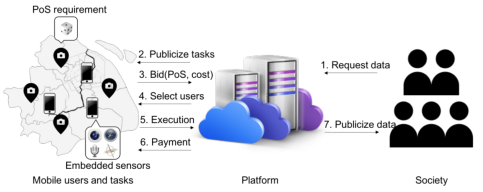

Fig. 1. Mobile Crowdsensing System Architecture. 

imation ratios and efficient time complexity. We summarize our contributions in this work as follows. 

_•_ First, we formulate the problem of mechanism design for user recruitment in mobile crowdsensing with task execution uncertainty, which aims to minimize the social cost while guaranteeing each task to be successfully completed within a required probability. 

_•_ Second, we begin with considering a basic single task model, and propose a FPTAS for winner determination based on dynamic programming approach and scaling technique. Our analysis shows that this winner determination algorithm achieves a (1+ _ϵ_ ) approximation ratio with the time complexity of _O_ ( _n_3 _/ϵ_ ), where _n_ is the number of users and _ϵ_ is an approximation parameter. 

_•_ Third, we further consider a general multi-task model. We design a greedy algorithm to iteratively select the most cost-efficient user, and prove that its approximation ratio is _O_ ( _H_ ( _γ_ )) and the time complexity is _O_ ( _n_2 _t_ ), where _γ_ is the maximum PoS of users, _H_ ( _γ_ ) is the _γ_ th harmonic numbers, and _t_ is the number of tasks. 

_•_ Fourth, we extended the payment scheme in VCG to adopt to the scenario of task execution uncertainty. We theoretically prove that this payment scheme is computationally efficient, and guarantees the strategy-proofness of our mechanisms. 

_•_ The last but not least, we conduct extensive experiments to evaluate our incentive mechanisms based on a real data set of Shanghai taxi trace. The evaluation results show that our mechanisms outperform the heuristic algorithms, and approach to the optimal solution. Our mechanisms also guarantee that the task will be completed in a high probability, and resist the strategic behaviours of users. 

The rest of the paper is organized as follows. In Section II, we describe our system model, and formulate our problem as a coverage problem. In Section III, we present the design challenges, give our mechanisms for both single task and multi-task cases, and analyze the approximation ratios and the economic-robust properties. In Section IV, we evaluate our mechanisms and report the results. In Section V, we discuss related works. Finally, we conclude our work in Section VI. 

## II. SYSTEM MODEL AND PROBLEM FORMULATION 

We give an illustration of mobile crowdsensing system in Figure 1. First, sensing data are requested by the society (Step 1). The platform divides the request into a number of locationaware tasks, and determines the PoS requirement of each task 

TABLE I MAIN NOTATIONS 

by query frequency or data quality requirement. Then the platform publicizes the tasks (Step 2) to mobile users, and run a reverse auction (Steps 3 to 6). The auction mechanism selects users to perform tasks based on their bids (including the PoS of completing tasks and sensing cost), and determines the selected users’ rewards based on the execution results. Finally, the platform publish the collected data to the society (Step 7). We now present the mathematical models for such mobile crowdsensing system. 

We consider a mobile crowdsensing system that consists of a _platform_ , and many mobile _users_ . The platform has a set of location-aware sensing tasks _T_ = _{_ 1 _,_ 2 _, . . . , t}_ ( _e.g._ , collecting photos of all flower shops in the city), and wants to distribute the tasks to numerous mobile users. For each task _j ∈T_ , the platform assigns a _probability of success_ (PoS) requirement _Tj_ , _i.e._ , the task _j_ is required to be completed with a probability greater than _Tj_ . 

The crowdsensing system also contains a set of users _N_ = _{_ 1 _,_ 2 _, . . . , n}_ . Each user _i ∈N_ , depending on her location and other factors, such as specific expertise and personal preference, decides a set of tasks _Si ⊆T_ that she is willing to perform. The user _i ∈N_ has a _probability of success_ (PoS) _p__j_ _i_foreachtask_j∈Si_,andatotal_costci_toconduct all her tasks _Si_ . We can interpret the PoS in different ways in various situations. For example, in opportunistic sensing, the PoS for a specific task of a user can be regarded as her probability to pass through the location of the task. We emphasize that the users make their best effort to execute tasks, but still have some probability of failing to complete the tasks. We assume that the users are able to predict such probability through their historical traces and daily journey plan. However, due to privacy preserving policy, this information is private to the user, and is not known to the platform. The cost is incurred whether a user completes the tasks or not, _e.g._ , in opportunistic sensing, smart devices continuously monitor the surrounding environment, and collect data at the background. The tuple of task set, cost, and PoS’s for each user _i ∈N_ : _θi_ = ( _Si, ci, {p__j_ _i__|j∈Si}_),istermedas_type_inmechanism design. As a convention, we use _−i_ in subscript to denote all users except _i_ , _e.g._ , **_θ_** _−i_ denotes the types of all users except _i_ , and **_θ_** = ( _θi,_ **_θ_** _−i_ ) denotes the type profile of all users. 

For each user _i ∈N_ , her _utility ui_ is defined as the reward _ri_ she receives, minus the cost of performing the tasks, _i.e._ , _ui_ ≜ _ri − ci_ . In this paper, we consider the strategic setting, in which each user seeks to maximize her utility, and would misreport her type, as long as doing so is profitable. 

In contrast to the selfish goals of users, the objective of the platform is to maximize social welfare (minimizing the total cost of the selected users in our context), while ensuring each task satisfies its PoS requirement. We can formulate the optimization problem of the platform as follows: 

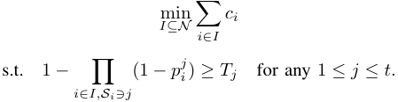

|Parameter|Description|
|---|---|
|_T , t_|Set of Tasks and its size|
|_Tj_ |PoS requirement on task _j_|
|_N, n_|Set of users and its size|
|_Si_ |Task set of user _i_|
|_p__j_ _i_|User _i_’s PoS for task _j_|
|_ci_|User _i_’s cost of performing tasks in her task set |
|_θi_|User _i_’s type, with _θi_ = (_Si, ci, {p__j_ _i __| j ∈Si}_)|
|_ri_|User _i_’s reward|
|_ui_|User _i_’s utility, _ui_ =_ri −ci_|
|**_θ_**|The type profile of all users|
|**_θ_**_−i_|The type profile of all users except _i_, i.e. |
||**_θ_**_−i_ = (_θ_1_, . . . , θi−_1_, θi_+1_, . . . , θn_)  |
|_q__j_ _i_|User i’s contribution for task _j_, _q__j_ _i_ =_−_ln(1_−pj_ _i_ )|
|_Qj_|Contribution requirement on task _j_, _Qj_ =_−_ln(1_−Tj_)|

For the convenience of discussion, we make a transformation to the above problem. Let _qi__j_=_−_ln(1_−pj_ _i_)denoteauser _i_ ’s _contribution_ to the completion of the task _j_ , and let _Qj_ = _−_ ln(1 _− Tj_ ) correspond to the contribution requirement of the task _j_ . With these notations, we can directly add up the contributions of users, and express the PoS constraint as 

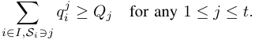

A _mechanism_ in game theory refers to the protocol of interaction between agents with conflict goals. Specifically, a mechanism _M_ = ( _A, R_ ) consists of an allocation algorithm _A_ and a payment/reward scheme _R_ . The allocation algorithm receives the (declared) types of users, and outputs the set of winning agents. The reward scheme determines the rewards to incentivize agents to report true types. For a good mechanism in practical crowdsensing systems, it needs to satisfy the following properties: 

_•_ **Incentive Compatibility** : A mechanism is incentive compatible if each user maximizes her utility by revealing her true type, regardless of the other users’ actions. Formally, for any other users’ types _θ−i_ and any declared type _θ_¯ _i_ , we have: _ui_ ( _θi, θ−i_ ) _≥ ui_ ( _θ_¯ _i, θ−i_ ) _._ 

_•_ **Individual Rationality** : A mechanism is individually rational if each truthful user has a non-negative utility: _ui_ ( _θi, θ−i_ ) _≥_ 0 _._ 

_•_ **Computational Efficiency** : A mechanism is computationally efficient if both the allocation scheme and reward scheme can be computed in polynomial time. 

We define a mechanism that satisfies incentive compatibility and individual rationality as a _strategy-proof_ mechanism [18]. 

In the following discussion, we first investigate the single task setting, where the platform has only one task to complete. We will omit the task index, and use notations _Q, qi_ , and _ci_ in this context. We then consider the multi-task, single-minded setting. The single-minded user has a strict task demand, meaning that the user is satisfied with either being assigned all the tasks from her task set, or none of tasks. 

We summarize the frequently used notations in Table I. 

## III. FAULT TOLERANT MECHANISM DESIGN 

In this section, we first discuss design challenges and design rationale. We then propose our mechanisms, including winner determination algorithm and reward calculation scheme, for both single task and multi-task cases. Finally, we prove that the mechanisms achieve both good approximation ratio and strategy-proofness. 

## _A. Design Challenges_ 

_1) Failure of Existing Mechanisms:_ The mechanism design problem considered in this paper is distinct from the previous works [5]–[7] in that, we let PoS to be one of the user’s private parameters. Our problem in general setting (both cost and PoS are private parameters) falls into the multidimensional mechanism design [11]. The positive results in multi-dimensional mechanism always have certain restrictions on private parameters. For example, in strategy-proof combinatorial auctions with single-minded users [12], the declared bundle would not be a subset of the true bundle, because users would have zero valuations when they are assigned such kind of bundles. However, in our context, there is no similar restriction on the declared PoS, which causes even the classical VCG mechanism to fail. Consider the following example in a single task setting: there are four users with types (cost and PoS pairs) (3 _,_ 0 _._ 7) _,_ (2 _,_ 0 _._ 7) _,_ (1 _,_ 0 _._ 5), and (4 _,_ 0 _._ 8), respectively. The platform wants to minimize the total cost while requires the task to be completed with a probability 0 _._ 9. If users report their types truthfully, VCG will select user 1 and user 2. However, user 3 can be selected by declaring a PoS of 0.9, and then obtain a utility greater than 0. Hence, VCG is not strategy-proofness in our setting. 

The key challenge in designing strategy-proof mechanism in our setting is that the PoS can also affect the outcomes of the allocation. The payment in VCG involves only the effect of costs but not that of the PoS, resulting in the incentive to misreport the PoS information. The basic idea to tackle the problem is to consider the effect of PoS during reward scheme design. In this paper, we adopt the _execution contingent_ (EC) reward scheme [17] to achieve this goal. The EC reward scheme distributes different amounts of reward to the user according to whether the user completes the task or not. For example, in single task setting, user _i_ will receive rewards _ri_1 and _ri_2(possiblynegative)forthesuccessandfailureoftask execution, respectively. Then, her expected utility, with respect to her own private parameters, is 

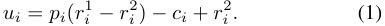

By properly setting the rewards, we can ensure incentive compatibility in terms of the user’s PoS, which will be discussed in detailed design in next section. 

We further emphasize that the EC reward scheme is not compatible with most allocation algorithms in mechanism design. Using standard mechanism design technique with monotone allocation algorithms and critical-price based reward schemes, a user will get selected if and only if she declares a bid larger than her critical bid. Due to the monotonicity 

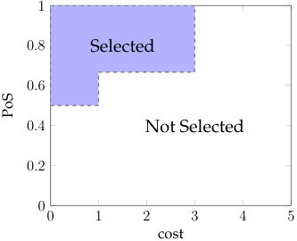

<!-- Start of picture text -->
1 0 . 8 Selected 0 . 6 0 . 4 Not Selected 0 . 2 0 0 1 2 3 4 5 cost PoS <!-- End of picture text -->

Fig. 2. Selection Boundary of User 3 (User 3 will be selected if _p_ 3 _≥_ 2 _/_ 3 and _c_ 3 _≤_ 3, or _p_ 3 _≥_ 0 _._ 5 and _c_ 3 _≤_ 1). 

of the allocation algorithms, the selection boundary for a user is a (piece-wise) line (or hyperplane) in her type space. Suppose that we run optimal allocation algorithm in the former example, which obviously ensures monotonicity in terms of both PoS and cost, we can plot the selection boundary for user 3 in Figure 2. The selection boundary line is not a linear line. However, the EC reward scheme requires that the relation between the PoS and cost should be linear, which can be obtained by setting _ui_ = 0 in Equation (1). Therefore, we cannot align the EC reward scheme with the monotone allocation algorithm to guarantee the incentive compatibility for both PoS and cost. 

The above discussion demonstrates the hardness of achieving the strategy-proofness for both the PoS and cost. Thus, we make the problem tractable by assuming that the costs are truthfully declared, which is reasonable in practice, and can be achieved by augmenting the incentive mechanism with a cost verification scheme. The platform can monitor the indicators related to cost, such as energy consumption and data transmission fee, to obtain the actual cost consumption during task execution. By doing that, the platform can verify the declared costs of users, and punish the users who lie about the costs. Therefore, we focus on the incentive mechanism design with economic robustness in the PoS dimension. 

_2) Hardness of Optimization:_ We show that even when the types of users are known, the problems we consider are computationally intractable. To be exact, they all fall into the category of **NP-complete** problems. The single task problem is equivalent to the minimum knapsack problem [19], which can be expressed as: 

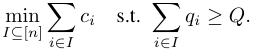

As for the multi-task, single-minded problem, we can show that it can be reduced from the problem of weighted set cover [20]. For each instance of weighted set cover with a universe set _U_ and a collection of weighted subsets _{S_ 1 _, S_ 2 _, . . . , Sn}_ , we can construct a corresponding instance for the multi-task, single-minded problem. We generate a task set corresponding to _U_ , and fix the contribution requirement of each task to be 1. For each subset, we can generate a user, 

## **Algorithm 1:** Dynamic Programming for Knapsack Problem 

**Input** : A set of users _N_ , a profile of contribution **_q_** , a profile of cost **_c_** . 

**Output** : The states of knapsack problem _W_ . **1** Initialize the set of states: _W_ (0) _←{_ (∅ _,_ 0 _,_ 0) _}_ ; **2 foreach** _j_ = 1 **_to_** _|N|_ **do 3** _W_ ( _j_ ) _← W_ ( _j −_ 1); **4 foreach** ( _I, Q, C_ ) _∈ W_ ( _j −_ 1) **do 5** _W_ ( _j_ ) _← W_ ( _j_ ) _∪{_ ( _I ∪{j}, Q_ + _qj, C_ + _cj_ ) _}_ ; **6** Remove all dominated states from _W_ ( _j_ ); **7 return** _W_ ( _j_ ); 

whose task set is exactly this subset, contribution for each task is equal to 1, and cost is assigned as the weight. It can be seen that the optimal solution to our problem is actually the set cover with the minimum cost, which demonstrates the equivalence of these two problems. 

Due to the hardness of achieving the optimal solution, we design approximation algorithms to these two problems, and trade optimality off for computational efficiency. 

## _B. Single Task Mechanism_ 

In this subsection, we propose a sealed-bid reverse auction for the single task setting, including a winner determination algorithm and a reward determination scheme. 

**Winner Determination Algorithm** : The task allocation algorithm is a fully polynomial-time approximation scheme for the minimum knapsack problem, which is based on dynamic programming approach and scaling technique. Dynamic programming is a pseudopolynomial and optimal algorithm for knapsack problems. We first present the detailed procedure of the dynamic programming approach in Algorithm 1. We maintain an array entry _W_ ( _j_ ) for _j_ = 0 _,_ 1 _, · · · , n_ . Each entry _W_ ( _j_ ) is a list of tuples ( _I, Q, C_ ) (also called as states), each of which indicates that there is a user set _I_ from the first _j_ users that have the exact total contribution _Q_ and cost _C_ . In Algorithm 1, we initialize _W_ (0) to be _{_ (∅ _,_ 0 _,_ 0) _}_ . For each of _j_ = 1 _,_ 2 _, · · · , n_ , we first set _W_ ( _j_ ) = _W_ ( _j −_ 1), and for each tuple ( _I, Q, C_ ) _∈ W_ ( _j −_ 1), we also add the tuple ( _I ∪{j}, Q_ + _qj, C_ + _cj_ ) to the list _W_ ( _j_ ) (Lines 3 to 5). We finally remove from _W_ ( _j_ ) all dominated states (Line 6), where one state ( _I, Q, C_ ) dominates another state ( _I__′_ _, Q__′_ _, C__′_ ) if _C ≤ C__′_ and _Q ≥ Q__′_ . For maximum knapsack problem, we search for the feasible tuple ( _i.e._ , the total cost _C_ is no larger than the required cost) with the maximum contribution from _W_ ( _n_ ), while for minimum knapsack problem, we return the feasible tuple ( _i.e._ , the total contribution _Q_ is no less than the required contribution) with the minimum cost from _W_ ( _n_ ). Algorithm 1 correctly computes the optimal value of the knapsack problem, and takes _O_ ( _n × min_ ( _Qs, Cs_ )) time, where _Qs_ =� _qi_ and _Cs_ =� _ci_ . 

We now describe the FPTAS for the problem of minimum knapsack. The key idea behind FPTAS for knapsack problem is 

**Algorithm 2:** Winner Determination Algorithm for Single Task Setting 

**Input** : A set of users _N_ , a profile of contributions **_q_** , a profile of costs **_c_** , a contribution requirement _Q_ . **Output** : A set of selected user _I__∗_ . 

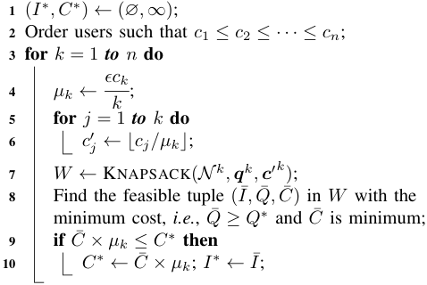

**11 return** _I__∗_ ; 

the scaling technique: rounding down the cost (or contribution) to the nearest integer multiples of a scaling parameter. This scaling technique reduces the exponential time complexity to polynomial time. By carefully selecting the scaling parameter, we can bound the accuracy we lose in rounding. For the maximum knapsack problem, the scaling parameter is set as a fraction of the maximum contribution, which is a lower bound of the optimal value [20]. However, in the minimum knapsack problem, the maximum cost may not be a lower bound of the optimal solution, making it nontrivial to quantify the accuracy loss in this new context. In order to overcome this challenge, we divide the original minimum knapsack problem into multiple subproblems, and apply the scaling technique and dynamic programming for each subproblem. Among multiple feasible and approximation solutions in these subproblems, we output the one with the minimum cost as the final result. 

In Algorithm 2, we first sort users in a non-decreasing order of the costs (Line 2). Then, for each of _k_ = 1 _,_ 2 _, · · · , n_ , we solve the subproblem involving the first _k_ users. Specifically, we set the scaling parameter _µk_ as _ϵck/k_ , and round down each user’s cost by setting _c__′_ _j_=_⌊cj/µk⌋_(Lines4to6).With the scaled costs **_c_**_′k_ and the contribution profile **_q_**_k_ , we run the dynamic programming scheme (Algorithm 1) to obtain the set of states _W_ . From the set _W_ , we select the feasible state ( _I,_¯ _Q,_¯ _C_¯ ) with the minimum cost, _i.e._ , _Q_¯ _≥ Q__∗_ and _C_¯ is the minimum, as the near-optimal solution for this subproblem (Lines 7 to 8). Finally, we return the feasible solution with the minimum cost over all the subproblems as the result of the winner determination algorithm (Lines 9 to 10). 

**Reward Calculation Scheme** : Our reward calculation scheme is inspired by the ideas of critical bid-based payment scheme in standard mechanism design [12] and the execution contingent reward scheme in uncertain environment [17]. The critical bid is defined as the minimum PoS that a user should 

**Algorithm 3:** Reward Scheme for Single Task Setting 

**Input** : A winning user _i ∈ I__∗_ , a set of users _N_ , a profile of contributions **_q_** , a profile of costs **_c_** , a contribution requirement _Q_ . **Output** : The reward _ri_ for the user _i_ . **1** Use binary search to find the minimum _q_ ¯ _i_ in the range [0 _, Q_ ] such that ALLO SG( _N ,_ (¯ _qi,_ **_q_** _−i_ ) _,_ **_c_** _, Q_ ) returns a set of winning users containing user _i_ ; **2** _p_ ¯ _i ←_ 1 _− e__−q_¯_i_ ; **3** _ri_ = if _i_ completed the task, <u>�</u> (1 _−p_ ¯ _−i ×p_ ¯ _αi_ ) _×_ + _α ci_ + _, ci,_ if _i_ did not complete the task.; **4 return** _ri_ ; 

declare to win the auction. To guarantee the existence of the critical bid, the winner determination algorithm should satisfy the property of monotonicity, meaning that a winning user will still be a winner if she raises her PoS. We have the following lemma for the winner determination algorithm. 

## **Lemma 1.** _The winner determination algorithm (Algorithm 2) is monotone in terms of PoS._ 

_Proof._ Since the PoS has a positive correlation with the contribution, we only have to show the monotonicity of the allocation algorithm in terms of the contribution. Suppose the solution from the subproblem _k_ has been selected by Algorithm 2 as the final result. When a winning user _i_ raises her declared contribution _qi_ , we distinguish three different changes for the outcomes of the subproblems. 

_•_ In the subproblems that previously select _i_ as candidate winning users (including the subproblem _k_ ), the user _i_ will still be selected by raising her declared contribution. This is because, in the scaled cost domain, the dynamic programming is an optimal solution for the knapsack problem, which is clearly monotone with respective to the contribution. 

_•_ Some subproblems that not previously select _i_ may involve her into the candidate winning user set after user _i_ increasing her declared contribution. 

_•_ The remaining subproblems still not select user _i_ , even user _i_ declares a higher contribution. 

We note that the corresponding total costs in the first two cases may decrease, while the cost in the last case remains the same. We claim that the solutions from the third type of subproblems will not be selected as the final result. This is because the costs of such subproblems are definitely larger than that of the subproblem _k_ . Therefore, when a winning user _i_ declares a higher contribution, the winner determination algorithm will choose the final result among the subproblems that still select user _i_ , _i.e._ , the first two types of subproblems, implying that the user _i_ will still be a winner. 

After proving the existence of the critical bid, we now design Algorithm 3 to find the critical bid, and determine the reward for a winning user _i ∈ I__∗_ . Since the winner determination algorithm is monotone with respective to the 

contribution, we can use binary search over the range [0 _, Q_ ] to find the minimum declared contribution _q_ ¯ _i_ for the user _i_ such that the winner determination algorithm, denoted by ALLO SG( _·_ ), would picks the user _i_ as a winner (Line 1). With the critical contribution _q_ ¯ _i_ , we can obtain the critical PoS _p_ ¯ _i_ by setting _p_ ¯ _i_ = 1 _− e__−q_¯_i_ . Depending on whether the user completes the task or not, we further distinguish the reward in the following two cases. 

_•_ If the user _i_ completed the task, she would receive the reward (1 _− p_ ¯ _i_ ) _× α_ + _ci_ ; 

_•_ If the user _i_ did not complete the task, she would get the reward _−p_ ¯ _i × α_ + _ci_ . 

Here _α_ is a reward scaling factor that can be adjusted according to the budget constraint of the platform. We now show that such reward scheme together with the monotone winner determination algorithm guarantee the properties of strategy-proofness. 

**Theorem 1.** _The single task mechanism is strategy-proof._ 

_Proof._ If user _i_ wins the auction, her expected utility is 

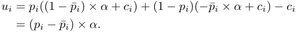

Otherwise, her utility is 0. To prove the theorem, we further distinguish the following two cases. 

_•_ User _i_ wins the auction by declaring her true type. Since _p_ ¯ _i_ is the user’s critical bid, it must be the case _pi ≥ p_ ¯ _i_ . Thus, the user has a nonnegative utility when bidding truthfully. Deviating from truthful bidding will only cause her to lose the auction, and have a utility of 0, which is not better than bidding truthfully. 

_•_ User _i_ loses the auction when declaring her true type, meaning that _pi < p_ ¯ _i_ . If she misreports her type and wins the auction, her utility will be negative, which is also not better than bidding truthfully (having zero utility). 

To sum up, user _i_ has no incentive to misreport in both of the above two cases, and derives non-negative utility when bidding truthfully. Therefore, the single task mechanism satisfies the properties of incentive compatibility and individual rationality, resulting in the strategy-proofness of the mechanism. 

**Theorem 2.** _The winner determination algorithm is a_ (1+ _ϵ_ ) _- approximation algorithm for the single task setting._ 

_Proof._ Let _c_ ( _I_ ) denotes the total cost of users in the set _I_ , i.e. _c_ ( _I_ ) =� _i∈I__ci_,and_c′_(_I_)denotestheroundedcostsofthe users in the set _I_ , i.e. _c__′_ ( _I_ ) =� _i∈I__c_ _i__′_.Let_I∗_betheuserset return by Algorithm 2, and _O_ be the optimal solution. 

Let _ck_ be the largest cost in _O_ . Consider the _k_ th subproblem, all the users in this subproblem have costs less than _ck_ . According to the principle of the scaling method, we have 

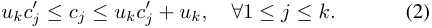

We use _I_¯_k_ to denote the user set selected by our algorithm for the _k_ th subproblems. With the above equation, we have 

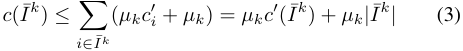

**Algorithm 4:** Winner Determination Algorithm for MultiTask, Single-Minded Setting 

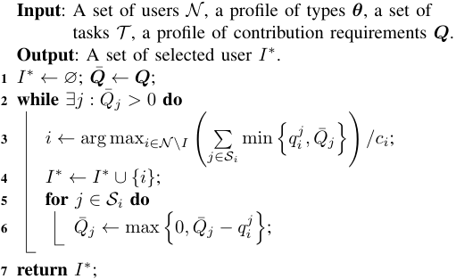

For the rounded costs, user set _I_¯ _k_ has the minimum costs, _i.e._ , _c__′_ ( _I_¯_k_ ) _≤ c__′_ ( _O_ ), due to the optimum of the dynamic programming. Together with _|I_¯_k_ _| ≤ k_ , we further have 

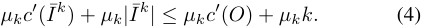

According to Equation (2), _µkc__′_ ( _O_ ) _≤ c_ ( _O_ ). Due to the setting of the scaling parameter, we get _µkk_ = _ϵck_ . Furthermore, the user with cost _ck_ is involved in the optimal solution _O_ , so the inequality _ϵck ≤ ϵc_ ( _O_ ) holds. With Equation (4), we get 

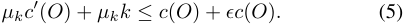

Combining the above Equations (3)(4)(5), we finally have 

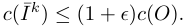

Since our algorithm selects the solution with the minimum costs over all the subproblems, _i.e._ , _c_ ( _I__∗_ ) _≤ c_ ( _I_¯_k_ ). Thus, we have _c_ ( _I__∗_ ) _≤_ (1 + _ϵ_ ) _c_ ( _O_ ), and complete the proof. 

**Theorem 3.** _The single task mechanism is computationally efficient._ 

_Proof._ We first analyze the computational complexity of the winner determination algorithm. For the _k_ th subproblem, the maximum cost is _ck_ , and the corresponding scaled cost is _c__′_ _k_= _⌊ck/µk⌋_ , where _µk_ = _ϵck/k_ . The most time consuming step in a subproblem is to call the knapsack procedure, which has time complexity _O_ ( _k × k × c__′_ _k_)=_O_(_k_3_/ϵ_).Wehaveatotal of _n_ subproblems, and thus the running time of the winner determination algorithm is _O_ ( _n_4 _/ϵ_ ). 

We next analyze the running time of the reward scheme. The reward scheme calls the task allocation algorithm for at most log( _Q_ ) times. Hence, the computational complexity of the reward scheme is _O_ (log( _Q_ ) _n_4 _/ϵ_ ). 

From the above discussion, we can see that both the winner determination algorithm and the reward scheme have time complexity that is polynomial in the input size and the approximation parameter, _i.e._ , _n_ , log( _Q_ ), and 1 _/ϵ_ . Thus, the single task mechanism is computationally efficient. 

_C. Multi-task, Single-minded Mechanism_ 

Our mechanism for multi-task, single-minded setting is also a sealed-bid auction, including a winner determination algorithm and a reward calculation scheme. 

**Winner Determination Algorithm** : We present the detailed procedure of the greedy algorithm for winner determination in Algorithm 4. It iteratively chooses a user that maximizes the contribution-cost ratio, which is defined as the ratio between her total contribution:� min _{qi__j,Q_¯_j}_and the cost_ci_(Lines _j∈Si_ 

3 to 4). After that, we update the contribution requirements of the tasks (Lines 5 to 6). This iteration process continues until the contribution requirements of all the tasks are satisfied. 

**Reward Determination Scheme** : Similar to the reward scheme for single task setting, our design for multi-task setting is also built upon the critical-bid based payment and the execution contingent reward scheme. The critical bid in multitask setting is defined as the minimum _total_ contribution that the user should decare to win1 . To ensure the existence of the critical bid, we also need to show the monotonicity of the winner determination algorithm. 

**Lemma 2.** _The task allocation algorithm for the multi-task single minded setting is monotone in terms of contribution._ 

_Proof._ We need to show that if user _i_ gets selected by reporting _qi__j_fortask_j_,shewillalsobeselectedifshereports_q_¯ _i__j> q_ _i__j_. By reporting a higher contribution, user _i_ will increase her contribution-cost ratio, leading to be selected in the same or earlier iteration during the allocation process. Thus, we have proved the monotonicity of the allocation algorithm. 

The new challenges arose in the multi-task single-minded setting is that users now may have multiple critical bids, because they may be selected as winners in different iterations during the winner determination process. The basic idea underlying our design is to take the minimum over all the possible critical bids, and regard it as the ultimate critical bid for the user, which guarantees the property of strategy-proofness. 

Algorithm 5 determines the reward to a winning user _i_ . It excludes the user _i_ , and reruns the task allocation algorithm (denoted as ALLO MP( _·_ )). In each iteration of the allocation process, we calculate the current critical bid for the user _i_ . Suppose user _k_ is the winner in this iteration, then for user _i_ to be selected, she must have a contribution-cost ratio larger than that of the user _k_ . Thus, the critical bid for the user _i_ in this iteration is_ci_ � min _{Q_¯ _j, qk__j}_.Takingtheminimum _ck j∈Sk_ 

among these critical bids from different iterations, we can obtain the minimum contribution, denoted by _q_ ¯ _i_ , that the user _i_ should declare to be selected in the winner determination process (Lines 2 to 6). With the critical contribution _q_ ¯ _i_ , we can get the critical PoS by setting _p_ ¯ _i_ = 1 _− e__−q_¯_i_ . Finally, we can calculate the reward to user _i_ according to the principles of the execution contingent reward scheme: 

1In the multi-task setting, we defined the critical bid in terms of contribution rather than PoS for the convenience of discussion. 

**Algorithm 5:** Reward Calculation Scheme for Multi-Task, Single-Minded Setting 

- **Input** : A winning user _i ∈ I__∗_ , a set of users _N_ , a profile of types **_θ_** , a set of tasks _T_ , a profile of contribution requirements **_Q_** . 

- **Output** : The reward _ri_ for the user _i_ . 

- **1** _q_ ¯ _i ←∞_ ; **2** Run allocation algorithm without the participation of user _i_ : ALLO MP( _N ,_ **_θ_** _−i, T ,_ **_Q_** ), and maintain the following operations: 

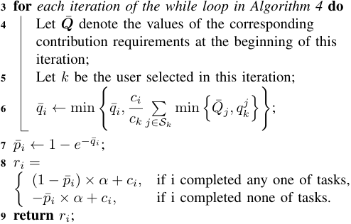

- If the user _i_ completed any one of tasks from her task 

- set, she would receive the reward (1 _− p_ ¯ _i_ ) _× α_ + _ci_ ; 

- If the user _i_ completed none of tasks, she would get the 

- reward _−p_ ¯ _i × α_ + _ci_ . 

Here, _α_ is a reward scaling parameter. 

We have the following properties for the multi-task, singleminded mechanism. 

**Theorem 4.** _The multi-task, single-minded mechanism is strategy-proof._ 

_Proof._ In the multi-task setting, users can cheat on both task sets and contributions. We first argue that cheating on task set is equal to misreport the corresponding contributions. Suppose the true task set of user _i_ is _Si_ . If user _i_ misreports a task set _S_ ¯ _i_ , we can interpret this cheating behaviour as increasing the contributions from zero to some positive number for the tasks in _S_¯ _i\Si_ , and decreasing the contributions from positive to zero for the tasks in _Si\S_¯ _i_ . Thus, we only need to prove the property of strategy-proofness in terms of contributions. 

According to the reward scheme, the utility of a losing user 

is zero, and the expected utility of a winning user _i_ is 

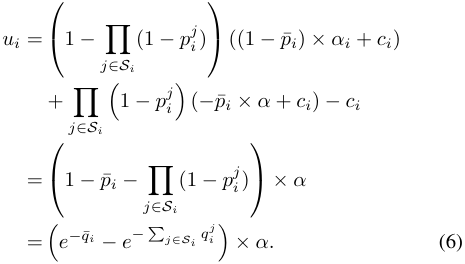

We further consider the following two different scenarios. 

_•_ User _i_ wins the auction when declaring true type. Since _q_ ¯ _i_ is the critical bid, we must have� _j∈Si__q_ _i__j≥q_¯_i_inthis case, implying that user _i_ gets a non-negative utility according to Equation (6). When user _i_ misreports her contributions, she may be selected as a winner in some other iteration, and stay the same utility; or she may lose the auction, and get zero utility. The resulting utilities in these two cases cannot be better than that obtained from truthfully bidding. 

_•_ User _i_ loses the auction, and gets zero utility when bidding truthfully. In this case, we have� _j∈Si__q_ _i__j<q_¯_i_,becauseuser _i_ loses the auction in the first iteration, meaning that the total contribution, _i.e._ , the left hand side term, is less than the critical bid. Thus, if the user cheats on the contribution to win the auction, she will get a negative utility, which is worse than the utility obtained when bidding truthfully. 

From the above discussion, we can claim that users cannot obtain extra utilities by misreporting their contributions. Furthermore, users obtain non-negative utilities when bidding truthfully. Therefore, the multi-task, single minded mechanism is incentive compatible and individual rational, and then satisfies the property of strategy-proofness. 

Before we show the near-optimal property of our mechanism, we first give a useful definition. 

**Definition 1** (Submodular function) **.** _Let_ Ω _be a finite set, a submodular function is a set function f_ : 2Ω _�→_ R _, which satisfies_ 

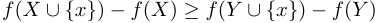

_for any X, Y ⊆_ Ω _with X ⊆ Y and x ∈_ Ω _\Y . A submodular function f is normalized if f_ (∅) = 0 _, and is monotonically increasing if for any X ⊆ Y ⊆_ Ω _, f_ ( _X_ ) _≤ f_ ( _Y_ ) _._ 

We assume that there is a minimal unit of contribution, denoted as ∆ _q_ . This can be achieved by specifying a set of PoS values and let users choose their bids from the set. Then, we define _f_ ( _I_ ) as the number of units of contribution provided by users in _I_ , _i.e._ , _f_ ( _I_ ) ≜ ∆1 _q_ � _tj_ =1min_{Qj,_� _i∈I_ : _j∈Si__q_ _i__j}._ It is easy to verify that _f_ ( _I_ ) is a normalized, monotonically increasing submodular function. We also define _c_ ( _I_ ) as the total costs of users in _I_ , _i.e._ , _c_ ( _I_ ) ≜� _i∈I__ci_.Wesimplify the notations by setting _c_ ( _x_ ) = _c_ ( _{x}_ ) _, f_ ( _x_ ) = _f_ ( _{x}_ ) for a singleton set. Let _O_ be the optimal set of users that 

minimizes the total cost, and _I__∗_ be the set of users return by our mechanism. We reorder users such that the user selected in the _k_ th iteration of Algorithm 3 is called user _k_ . We assume there are _l_ iterations in total, and let _Ii__∗_denotethefirst_i_ selected users, particularly we have _I_ 0_∗_= ∅and_I_ _l__∗_=_I∗_.We denote the marginal contribution of a user _x_ given a selected user set _I_ as ∆ _fx_ ( _I_ ) = _f_ ( _I ∪{x}_ ) _− f_ ( _I_ ). For the ease of notation, we denote ∆ _x_ ( _i_ ) = ∆ _xf_ ( _Ii_ ). We also introduce the following three notations. 

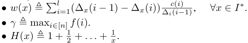

We first present two useful lemmas. 

**Lemma 3.** _c_ ( _I__∗_ ) _≤_� _x∈O__w_(_x_) 

_Proof._ For _w_ ( _x_ ), we have, 

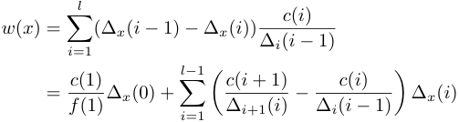

Similarly, we can express _c_ ( _I__∗_ ) as 

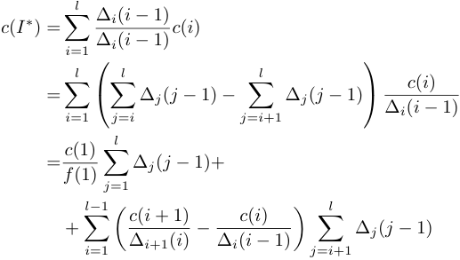

By the property of submodular function and the greedy strat- _c_ <u>(</u> _i_ <u>+1)</u> _c_ <u>(</u> _i_ <u>)</u> egy of the allocation algorithm, we have ∆ _i_ +1( _i_ )_≥_ ∆ _i_ ( _i−_ 1). Therefore, it suffices to prove 

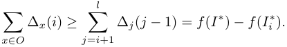

For a submodular function _f_ ( _·_ ), we have� _x∈Y_(_f_(_X∪_ _{x}_ ) _− f_ ( _X_ )) _≥ f_ ( _X ∪ Y_ ) _− f_ ( _X_ ), for any two sets _X_ and _Y_ . Applying this equation, we obtain � ∆ _x_ ( _i_ ) _≥ f_ ( _O ∪ Ii__∗_)_−f_(_I_ _i__∗_)_≥f_(_O_)_−f_(_I_ _i__∗_) =_f_(_I∗_)_−f_(_I_ _i__∗_)_._ _x∈O_ The last equation holds because users from _O_ and _I__∗_ both “cover” the contribution requirements of all the tasks, _i.e._ , _f_ ( _O_ ) = _f_ ( _I__∗_ ) = ∆ _<u>Qq</u>_.Therefore,wehaveproved_c_(_I∗_)_≤_ � _x∈O__w_(_x_). 

**Lemma 4.** _w_ ( _x_ ) _≤ c_ ( _x_ ) _H_ ( _γ_ ) _for each x ∈ O._ 

_Proof._ By the greedy strategy of the allocation algorithm, given the user _x ∈ O_ , we have 

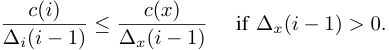

Let _k_ be the index of the last iteration that ∆ _xf_ ( _Ik__∗_)_>_0and ∆ _xf_ ( _Ik__∗_ +1) = 0.Then,wehave 

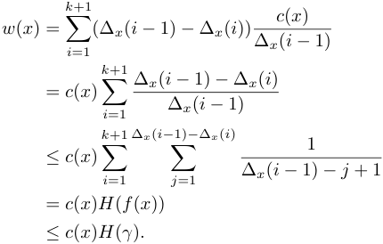

Thus, we have completed the proof for _w_ ( _x_ ) _≤ c_ ( _x_ ) _H_ ( _γ_ ). 

Using the above two lemmas, we now present the approximation ratio of our mechanism. 

**Theorem 5.** _The winner determination algorithm of multitask, single-minded mechanism achieves H_ ( _γ_ ) _-approximation, where γ_ = max _i∈N_ ∆1 _q_ � _j∈Si_min_{Qj, q_ _i__j}._ 

_Proof._ We have 

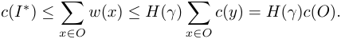

The first inequation comes from Lemma 3 and the second inequation comes from Lemma 4. 

**Theorem 6.** _The multi-task, single-minded mechanism is computationally efficient._ 

_Proof._ In the winner determination algorithm, the main loop has at most _n_ iterations since in each iteration a user will be selected. In each iteration, we need to compute the contributioncost ratios for at most _n_ users, and each user has at most _t_ task. Therefore, the computational complexity of Algorithm 4 is _O_ ( _n_2 _t_ ). Algorithm 5 calculates the reward to at most _n_ users, and for each user it calls Algorithm 4 one time. Thus, the computational complexity of the reward scheme is _O_ ( _n_3 _t_ ). Since both the winner determination algorithm and reward calculation scheme have polynomial time complexity, our mechanism is computationally efficient. 

## IV. EVALUATION RESULTS 

We perform extensive simulations to evaluate our proposed mechanisms based on a real data set of location traces of Shanghai taxis. We report the evaluation results in this section. 

TABLE II 

DEFAULT SIMULATION PARAMETERS 

|Description|Values|
|---|---|
|PoS requirement _T_|0.8|
|Reward scaling factor _α_|10|
|Tasks of each user|[10_,_20]|
|Mean of costs|15|
|Variance of costs|5|

## _A. Simulation Settings_ 

Each entry of the data set records the _taxi ID_ , _time stamp_ and _location (longitude and latitude)_ of picking up and dropping passengers. We choose the data set in January, 2013 and select 1692 taxis as the population of mobile users from which we will sample. We divide the map of Shanghai into 2 _km ×_ 2 _km_ grids, with each grid representing a location. We assume that a taxi can perform some sensing tasks at the location where it picks up or drops passengers. 

To generate the probability that a taxi arrives at a location, we use a Markov Chain to model a taxi’s mobility pattern, and learn the transition matrix of the model, _i.e._ , the probability that the taxi transit from one location to another, using the data set. With such mobility model, we can generate the task set for each taxi: we randomly assign each taxi a starting location, and let the locations it will reach with a high probability in the next time slot to be its task set. The size of the task set for each user is sampled from a uniform distribution in the range [10 _,_ 20]. We sample the cost for each of users according to a normal distribution with mean 15 and variance 5. The PoS requirement of each task is set as a fixed value 0 _._ 8. Our default simulation parameters are summarized in Table II. 

In the following, we first evaluate the accuracy of our mobility model in predicting users’ future locations. Then, we evaluate the performance of our mechanisms with the metrics: _social cost_ , _user’s utility_ , and _achieved PoS’s of tasks_ . We finally examine the effect of different PoS requirements of tasks on the number of selected users and the corresponding social cost. 

## _B. Evaluation of Mobility Model_ 

Each user has her own mobility pattern, which may affect her probability of finishing a sensing task. In order to predict the probability that a user appears at a certain location, we 

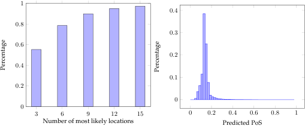

<!-- Start of picture text -->
1 0 . 4 0 . 8 0 . 3 0 . 6 0 . 2 0 . 4 0 . 1 0 . 2 0 0 3 6 9 12 15 0 0 . 2 0 . 4 0 . 6 0 . 8 1 Number of most likely locations Predicted PoS Percentage Percentage <!-- End of picture text -->

Fig. 3. Location Prediction Accuracy. 

Fig. 4. PDF of Predicted PoS. 

TABLE III 

SIMULATION PARAMETERS FOR MULTI-TASK SETTING 

|Setting|# of Users|# of Tasks|Mean of Cost|PoS requirement|
|---|---|---|---|---|
|1|[10_,_100]|15 |15|0_._8|
|2|30|[10_,_50]|15|0_._8|

model her mobility pattern as a Markov process. Specifically, for a given user, suppose there are _l_ locations she often visits. We define **P** _∈_ R_l×l_ as her transition matrix, where _Pij_ denotes her probability of traveling from location _j_ to location _i_ . Given the taxi data set, we learn the transition matrix by maximum likelihood estimation. Due to the sparsity of data, _i.e._ , not every location pair appears in the data set, we adopt Laplace smoothing technique in the estimation. Thus, the estimation of _Pij_ is given as 

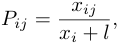

where _xij_ denotes the times the user travels to location _j_ from location _i_ , and _xi_ =�_l_ _k_ =1_xik_denotes the total times the user reaches elsewhere from the location _i_ . 

To evaluate the prediction accuracy of the mobility model, we take a snapshot of the taxi trace, and predict the 3 to 15 locations that each taxi will most likely arrive at in the next time slot. We calculate the percentage of correct prediction (the taxi’s actual destination is in the set of predicted locations), and show the results in Figure 3. We can observe that by setting the number of predicated locations to be 9, the correct prediction percentage is around 0.9. This demonstrates the efficiency of our mobility model in describing the mobility pattern in the taxi data set. 

We also plot the empirical probability distribution function (PDF) of the predicted PoS of users in Figure 4. Due to the scarcity of the location transition, most of the PoS’s are very low, falling in the range [0 _,_ 0 _._ 2], which suggests that we need to recruit sufficiently enough number of users for each task to guarantee fault tolerance. 

## _C. Evaluation of Social Cost_ 

We first examine the social cost obtained from single task mechanism. We fix a randomly chosen task, and conduct simulations on different number of users in the range [20 _,_ 100] with an increase of 10. To give a comparison, we choose two baseline algorithms, namely optimal algorithm _OPT_ and greedy algorithm _Greedy_ . The _OPT_ algorithm computes the optimal social cost through exhaustive search, and the _Greedy_ algorithm is a 2-approximation algorithm for the problem of minimization knapsack (referred to as _Min-Greedy_ in [21]). We plot our results in Figure 5(a). 

From Figure 5(a), we can see that as the number of users increases, the social cost first decreases sharply, and then changes steadily. This is because the costs of users are from the same distribution, and thus the new added users may not bring about a better social cost in an average sense. We also notice that under our setting, even when we choose a relatively large 

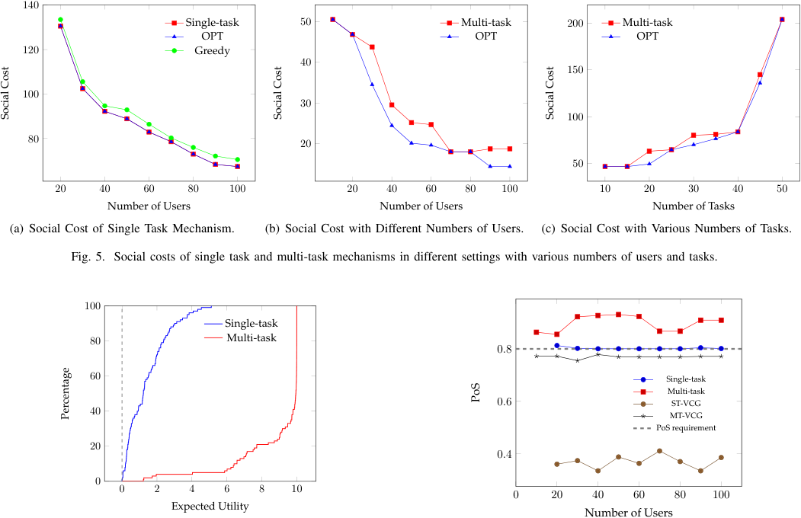

<!-- Start of picture text -->
140 Single-task 50 Multi-task 200 Multi-task OPT OPT OPT 120 Greedy 40 150 100 30 100 80 20 50 20 40 60 80 100 20 40 60 80 100 10 20 30 40 50 Number of Users Number of Users Number of Tasks (a) Social Cost of Single Task Mechanism. (b) Social Cost with Different Numbers of Users. (c) Social Cost with Various Numbers of Tasks. Fig. 5. Social costs of single task and multi-task mechanisms in different settings with various numbers of users and tasks. 100 Single-task 80 Multi-task 0 . 8 60 Single-task Multi-task 0 . 6 ST-VCG 40 MT-VCG PoS requirement 20 0 . 4 0 0 2 4 6 8 10 0 20 40 60 80 100 Expected Utility Number of Users Social Cost Social Cost Social Cost PoS Percentage <!-- End of picture text -->

Fig. 6. Empirical CDF of users’ utilities 

Fig. 7. Average PoS of Tasks. 

approximation factor ( _e.g._ , _ϵ_ = 0 _._ 5), our mechanism works as good as the OPT, and strictly better than the _Greedy_ algorithm. Next, we evaluate the social cost in multi-task setting with various number of users and tasks. We compare our mechanism with the optimal algorithm. We present the simulation parameters in Table III, and show the results in Figure 5(b) and Figure 5(c). 

From Figure 5(b), we can see that the social cost decreases as the number of users increases, and when the number of users is sufficiently large, the decrease of social cost becomes stable. This is because in a more competitive market, the platform can recruit the users with higher contribution-cost ratios, and reduce the social cost needed to satisfy the contribution requirements of tasks. In contrast, the social cost increases with more tasks to be completed, since we need to recruit more users. We also note that although the approximation ratio of our mechanism can be large in theoretical analysis, the social costs given by our mechanism in practice are relatively close to that of the optimal algorithm in different scenarios. 

## _D. Evaluation of User’s Utility_ 

We plot the empirical CDF of the expected utility of the selected users in Figure 6, to show the individual rationality of our mechanisms. The reward scaling factor _α_ is set to 10. As suggested by the figure, all the selected users have non- 

negative expected utilities. Besides, the utilities of the users in multi-task setting are mostly higher than those of users in the single task setting. The reason is that the users in the multitask setting have a higher probability (the probability that users complete any one of the tasks) to receive positive utilities than the users in the single-task setting. 

## _E. Evaluation of Task’s PoS_ 

In Figure 7, we compare the achieved PoS’s of tasks with the required PoS’s. For multi-task setting, we calculate the average PoS of the tasks. In both single task and multi task settings, our mechanisms satisfy the PoS requirements of the tasks. In the single task setting, the achieved PoS’s are very close to the required one, while in the multi-task setting, the obtained PoS’s are higher than those in the single task setting. This is because the selected users in multi-task setting may still contribute PoS to the tasks that have already reached the required PoS, which is the side benefit of the multi-task setting. 

For comparison, we also implement VCG-like mechanisms for single task and multi-task settings, namely _ST-VCG_ and _MT-VCG_ . As we have pointed out, if we directly apply the VCG mechanism, the user would always declare a PoS equal to 1, leading the mechanism to be untruthful. Thus, the VCGlike mechanisms simply chooses the users with the lowest costs to satisfy the requirements of all the tasks, with the input 

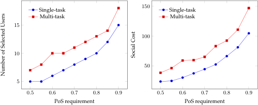

<!-- Start of picture text -->
150 Single-task Single-task Multi-task Multi-task 15 100 10 50 5 0 . 5 0 . 6 0 . 7 0 . 8 0 . 9 0 . 5 0 . 6 0 . 7 0 . 8 0 . 9 PoS requirement PoS requirement Social Cost Number of Selected Users <!-- End of picture text -->

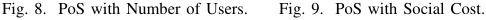

<!-- Start of picture text -->
Fig. 8. PoS with Number of Users. Fig. 9. PoS with Social Cost. <!-- End of picture text -->

of untruthful PoS’s. The ST-VCG mechanism would always select only one user with the lowest cost. As shown in Figure 7, the actual PoS’s achieved by VCG mechanisms are lower than the required ones, especially in the single task setting, which demonstrates the infeasibility of VCG mechanism in the scenario of task execution uncertainty. 

## _F. Effect of PoS Requirement_ 

We further investigate the effect of different PoS requirements on the number of selected users and the resulting social cost. We fix the number of users as 100 in this evaluation. For the multi-task setting, we set the number of tasks as 50. The PoS requirement for the task is in the range [0 _._ 5 _,_ 0 _._ 9] with an increase of 0 _._ 05. 

Figure 8 presents the effect of PoS requirement on the number of selected users. Generally, the number of users required to complete tasks grows with the increase of PoS requirement. However, since the PoS’s of users are relatively low in our prediction, the number of selected users increases fast when PoS requirements of tasks are high. The effect of PoS requirement on social cost is shown in Figure 9. Since the costs of users follow the same distribution, the effect on social cost coincides with that on the number of selected users. 

## V. RELATED WORKS 

In this section, we briefly review the related works. **Incentive Mechanism for Mobile Crowdsensing.** Incentive mechanism design have been extensively studied, mostly from a game-theoretic perspective. Paper [6] is the seminal work of designing incentive mechanisms for crowdsensing. The following works incorporated various issues with incentive mechanism design, such as task allocation in time and location dimensions [22], [23], data quality management [7], [24], [25], privacy preservation [10], budget feasibility [5]. Different optimization objectives have also been proposed, such as social welfare maximization, revenue maximization. However, these works all hold the implicit assumption that the users will definitely fulfill the tasks assigned to them, which is the main difference between our work and the previous. 

**Fault Tolerant Mechanism Design.** Fault tolerant mechanisms are those that address the issue of execution uncertainty, such as whether, how long or how well will the assigned task be completed, guaranteeing the PoS, execution duration, quality, etc. It was initially investigated in [17], and the 

authors presented a novel payment scheme to achieve strategyproofness with respective to the user’s PoS. Stein _et al._ in [26] designed mechanisms under the uncertainty of execution duration. Papakonstantinou _et al._ from [27] tackled the issue of uncertain precision of data submitted by users. Similar to [17], we aim to achieve high PoS of tasks through fault-tolerance mechanism design. However, their mechanisms do not assign tasks redundantly, which we believe can potentially increase the PoS’s of tasks. Furthermore, similar to the classical VCG mechanism, their mechanisms will fail due to the hight computation complexity to obtain optimal solution. 

**Uncertainty/Mobility in Mobile Crowdsensing.** Mobility in crowdsensing has also received much attention in recent years. Ma _et al._ from [28] stated that mobility offers opportunities for data collection and transmission in crowdsensing, and investigates the features of mobility. He _et al._ in [29] designed strategy to recruit participants so that the system can keep sensing for a period of time at each location of interest. In [30], Zhang _et al._ aimed to select participants to satisfy probabilistic coverage constraint while minimizing incentive payments, In [31], the authors proposed to optimally select mobile users to form a path for collecting data from a set of fixed locations. In this paper we use mobility as one of the possible causes of uncertainty in crowdsensing. However, we emphasize that the causes are not limited to mobility, and our mechanisms can handle general execution uncertainty. 

## VI. CONCLUSION AND FUTURE WORKS 

In this paper, we have studied the problem of incentive mechanism design for mobile crowdsensing with task execution uncertainty. We have considered a practical scenario of crowdsensing, where a user may fail to complete the assigned task, possibly due to her mobility pattern, unreliable network connection. We have examined the tools for tackling this problem, and considered a single task setting and a multi-task setting. For both setting, we have designed a mechanism with guaranteed approximation ratio and good economic properties. We have given theoretical analysis as well as simulation results to demonstrate the properties of our mechanisms. 

In our future work, we will extend our mechanisms to adopt to more general and practical settings. Firstly, we will relax the assumption that we can verify the mobile user’s cost, and consider the strategy-proofness with respect to both the PoS and the cost. Secondly, we will investigate more factors that cause the failure to complete the task, and incorporate them into the incentive mechanism for crowdsensing. 

## REFERENCES 

- [1] N. Maisonneuve, M. Stevens, M. E. Niessen, and L. Steels, “Noisetube: Measuring and mapping noise pollution with mobile phones,” in _Information technologies in environmental engineering_ , 2009, pp. 215–228. 

- [2] M. Mun, S. Reddy, K. Shilton, N. Yau, J. Burke, D. Estrin, M. Hansen, E. Howard, R. West, and P. Boda, “Peir, the personal environmental impact report, as a platform for participatory sensing systems research,” in _MobiSys_ , 2009. 

- [3] C. Chen, D. Zhang, N. Li, and Z.-H. Zhou, “B-planner: Planning bidirectional night bus routes using large-scale taxi gps traces,” _IEEE Transactions on Intelligent Transportation Systems_ , vol. 15, no. 4, pp. 1451–1465, 2014. 

- [4] Y. Chon, N. D. Lane, F. Li, H. Cha, and F. Zhao, “Automatically characterizing places with opportunistic crowdsensing using smartphones,” in _UbiComp_ , 2012. 

- [5] Z. Zheng, F. Wu, X. Gao, H. Zhu, G. Chen, and S. Tang, “A budget feasible incentive mechanism for weighted coverage maximization in mobile crowdsensing,” _IEEE Transactions on Mobile Computing_ , 2016, DOI: 10.1109/TMC.2016.2632721. 

- [6] D. Yang, G. Xue, X. Fang, and J. Tang, “Crowdsourcing to smartphones: incentive mechanism design for mobile phone sensing,” in _Mobicom_ , 2012. 

- [7] H. Jin, L. Su, D. Chen, K. Nahrstedt, and J. Xu, “Quality of information aware incentive mechanisms for mobile crowd sensing systems,” in _MobiHoc_ , 2015. 

- [8] R. K. Ganti, F. Ye, and H. Lei, “Mobile crowdsensing: current state and future challenges.” _IEEE Communications Magazine_ , vol. 49, no. 11, pp. 32–39, 2011. 

- [9] J. Hamm, A. C. Champion, G. Chen, M. Belkin, and D. Xuan, “Crowdml: A privacy-preserving learning framework for a crowd of smart devices,” in _ICDCS_ , 2015. 

- [10] W. Wang, L. Ying, and J. Zhang, “The value of privacy: Strategic data subjects, incentive mechanisms and fundamental limits,” in _SIGMETRICS_ , 2016. 

- [11] S. Chawla, J. D. Hartline, D. L. Malec, and B. Sivan, “Multi-parameter mechanism design and sequential posted pricing,” in _STOC_ , 2010. 

- [12] D. Lehmann, L. I. O´callaghan, and Y. Shoham, “Truth revelation in approximately efficient combinatorial auctions,” _Journal of the ACM_ , vol. 49, no. 5, pp. 577–602, 2002. 

- [13] W. Vickrey, “Counterspeculation, auctions, and competitive sealed tenders,” _The Journal of Finance_ , vol. 16, no. 1, pp. 8–37, 1961. 

- [14] E. H. Clarke, “Multipart pricing of public goods,” _Public Choice_ , vol. 11, no. 1, pp. 17–33, 1971. 

- [15] T. Groves, “Incentives in teams,” _Econometrica: Journal of the Econometric Society_ , vol. 41, no. 4, pp. 617–631, 1973. 

- [16] P. Briest, P. Krysta, and B. V¨ocking, “Approximation techniques for utilitarian mechanism design,” in _STOC_ , 2005. 

- [17] R. Porter, A. Ronen, Y. Shoham, and M. Tennenholtz, “Fault tolerant mechanism design,” _Artificial Intelligence_ , vol. 172, no. 15, pp. 1783– 1799, 2008. 

- [18] N. Nisan, T. Roughgarden, E. Tardos, and V. V. Vazirani, _Algorithmic game theory_ . Cambridge University Press Cambridge, 2007. 

- [19] H. Kellerer, U. Pferschy, and D. Pisinger, _Introduction to NPCompleteness of knapsack problems_ . Springer, 2004. 

- [20] D.-Z. Du, K.-I. Ko, and X. Hu, _Design and analysis of approximation algorithms_ . Springer Science & Business Media, 2011. 

- [21] M. M. G¨uNtzer and D. Jungnickel, “Approximate minimization algorithms for the 0/1 knapsack and subset-sum problem,” _Operations Research Letters_ , vol. 26, no. 2, pp. 55–66, 2000. 

- [22] M. H. Cheung, R. Southwell, F. Hou, and J. Huang, “Distributed timesensitive task selection in mobile crowdsensing,” in _MobiHoc_ , 2015. 

- [23] L. Gao, F. Hou, and J. Huang, “Providing long-term participation incentive in participatory sensing,” in _INFOCOM_ , 2015. 

- [24] D. Peng, F. Wu, and G. Chen, “Pay as how well you do: A quality based incentive mechanism for crowdsensing,” in _MobiHoc_ , 2015. 

- [25] J. Wang, J. Tang, D. Yang, E. Wang, and G. Xue, “Quality-aware and fine-grained incentive mechanisms for mobile crowdsensing,” in _ICDCS_ , 2016. 

- [26] S. Stein, E. H. Gerding, A. Rogers, K. Larson, and N. R. Jennings, “Algorithms and mechanisms for procuring services with uncertain durations using redundancy,” _Artificial Intelligence_ , vol. 175, no. 14, pp. 2021–2060, 2011. 

- [27] A. Papakonstantinou, A. Rogers, E. H. Gerding, and N. R. Jennings, “Mechanism design for eliciting probabilistic estimates from multiple suppliers with unknown costs and limited precision,” in _Agent-Mediated Electronic Commerce. Designing Trading Strategies and Mechanisms for Electronic Markets_ . Springer, 2010, pp. 102–116. 

- [28] H. Ma, D. Zhao, and P. Yuan, “Opportunities in mobile crowd sensing,” _IEEE Communications Magazine_ , vol. 52, no. 8, pp. 29–35, 2014. 

- [29] Z. He, J. Cao, and X. Liu, “High quality participant recruitment in vehicle-based crowdsourcing using predictable mobility,” in _INFOCOM_ , 2015. 

- [30] D. Zhang, H. Xiong, L. Wang, and G. Chen, “Crowdrecruiter: selecting participants for piggyback crowdsensing under probabilistic coverage constraint,” in _UbiComp_ , 2014. 

- [31] M. Karaliopoulos, O. Telelis, and I. Koutsopoulos, “User recruitment for mobile crowdsensing over opportunistic networks,” in _INFOCOM_ , 2015. 

