# **Joint Prediction and Matching for Computing Resource Exchange Platforms** 

Da Huo Zhenzhe Zheng∗ Shanghai Jiao Tong University Shanghai Jiao Tong University Shanghai, Shanghai, China Shanghai, China sjtuhuoda@sjtu.edu.cn zhengzhenzhe@sjtu.edu.cn 

Xiaoyao Huang 

Cloud Computing Research Institute, China Telecom Beijing, China huangxy32@chinatelecom.cn 

Hao Chen Jianfeng Hu Zhiyong Yan China Telecom Cloud Technology Co. China Telecom Cloud Technology Co. China Telecom Cloud Technology Co. Ltd., Beijing 100033 Ltd., Beijing 100033 Ltd., Beijing 100033 Beijing, China Beijing, China Beijing, China chenhao3@chinatelecom.cn hujianfeng@chinatelecom.cn yanzhy@chinatelecom.cn 

## Fan Wu 

Shanghai Jiao Tong University Shanghai, Shanghai, China fwu@cs.sjtu.edu.cn 

### **Abstract** 

The rapid growth of deep learning has created unprecedented demand for computing resources, while many small and enterpriselevel clusters remain underutilized. Computing resource exchange platforms offer a solution by aggregating these idle resources. However, effective cluster-task matching depends on accurate performance prediction. Existing approaches, which decouple prediction from matching, often lead to suboptimal decisions due to misaligned objectives. We propose a Matching-Focused Cluster Performance Predictor (MFCP), an end-to-end framework that integrates performance prediction with task matching to improve decision accuracy and resource utilization. Unlike existing methods that prioritize prediction accuracy, MFCP minimizes decision regret by aligning the predictor’s loss with optimal matching objectives. To handle nondifferentiable matching optimization, we use continuous relaxation and incorporate constraints via an interior-point method, ensuring meaningful gradients for training. For non-convex optimization, we approximate optimal decisions with gradient descent and estimate gradients using zeroth-order perturbation. Experiments show that MFCP consistently outperforms existing methods across different cluster environments and scales, achieving lower matching regret and higher resource utilization. 

### **CCS Concepts** 

#### • **Computing methodologies** → **Modeling methodologies** . 

∗Corresponding authors. 

This work is licensed under a Creative Commons Attribution 4.0 International License. _ICPP ’25, San Diego, CA, USA_ 

© 2025 Copyright held by the owner/author(s). ACM ISBN 979-8-4007-2074-1/25/09 https://doi.org/10.1145/3754598.3754610 

Jie Wu 

Cloud Computing Research Institute, China Telecom Beijing, China wujie@chinatelecom.cn 

### **Keywords** 

Deep learning cluster performance prediction, cluster-task matching platform, decision focused learning 

##### **ACM Reference Format:** 

Da Huo, Zhenzhe Zheng, Xiaoyao Huang, Hao Chen, Jianfeng Hu, Zhiyong Yan, Fan Wu, and Jie Wu. 2025. Joint Prediction and Matching for Computing Resource Exchange Platforms. In _54th International Conference on Parallel Processing (ICPP ’25), September 08–11, 2025, San Diego, CA, USA._ ACM, New York, NY, USA, 10 pages. https://doi.org/10.1145/3754598.3754610 

### **1 Introduction** 

With the rapid development of Artificial Intelligence (AI), the computational resource demands of deep learning tasks have significantly increased, leading to a substantial increase in demand for high-performance computing clusters. Although large-scale clusters from centralized institutions in cloud computing, such as Amazon Web Services (AWS) [2] and Microsoft Azure [30], are widely available, the expansion of existing commercial clusters still cannot keep pace with the fast growing computational demands driven by scaling law. Meanwhile, a significant amount of computational resources is distributed across small or enterprise-level institutions. These computing clusters often remain underutilized due to the lack of a convenient interface to share their idle computing resources. Therefore, efficiently utilizing these idle computing resources is crucial for addressing the issue of computing resource scarcity in the era of AI. 

To utilize idle computing resources, computing resource exchange platforms, such as Equinix [12], have been proposed. These platforms acquire and manage idle resources from third-party clusters, aiming to efficiently match deep learning tasks to available clusters to improve resource utilization. The two essential components of such platforms are cluster performance prediction and cluster-task matching. On one hand, since the deep learning clusters are managed by third-party institutions, whose computing 

511 

ICPP ’25, September 08–11, 2025, San Diego, CA, USA 

Da Huo, Zhenzhe Zheng, Xiaoyao Huang, Hao Chen, Jianfeng Hu, Zhiyong Yan, Fan Wu, and Jie Wu 

resources vary in architecture and quality, the platform needs to evaluate the performance of running various deep learning tasks on these clusters. Typically, there are two metrics: task execution time and task success probability, i.e., reliability. Reliability is a critical metric in such distributed systems, where third-party clusters may experience communication or operation failures. Leveraging these estimated performance metrics, the cluster-task matching process aims to allocate tasks to clusters in a way that optimizes certain a objective and satisfies some constraints, such as minimizing task execution time and satisfying reliability constraints. 

In practice, cluster performance prediction and cluster-task matching are treated as two isolated problems. Existing work has focused on predicting the performance of various deep learning tasks on specific cluster hardware [13, 24, 39, 40], which ignores the decision process in the downstream cluster-task matching. Specifically, a key limitation of the approach in literature is that the metrics used for matching are estimated by predictors and are treated as fixed values instead of stochastic variables. The predictors minimize performance prediction errors for individual clusters, ignoring that downstream matching results depend on the joint interaction of all clusters, making the predictors’ optimization objective misaligned with minimizing matching error. To address this issue, we propose a new matching-focused prediction framework to improve the final matching accuracy by jointly considering the processes of cluster performance prediction and cluster-task matching. Specifically, we aim to integrate the training of the predictor with the optimization of the downstream cluster-task matching, enabling the predictor to directly minimize the regret in matching decisions, which is defined as the discrepancy between the matching derived from the true value (actual performance during execution) and the one from the predicted value (performance estimated by predictors). 

However, training such a predictor presents two main challenges: non-differentiability of the matching optimization problem and difficulty in gradient computation for backpropagation in an end-to-end model training pipeline. The first challenge arises from that the output of matching algorithm, i.e., the optimal matching, depends on predicted performance but is inherently non-differentiable. This lack of differentiability stems, on the one hand, from the fact that the decision variables in the matching process can only take binary values, making the overall function a step function. On the other hand, it also arises from the presence of variables with different roles in the optimization problem: the predicted execution time is associated with costs in the objective function, while the predicted reliability serves as constraint variables in the inequality constraints. When constraints are met, the gradient of the optimal matching with respect to the predicted reliability becomes zero, offering no meaningful guidance for training. Another challenge is the difficulty of calculating the gradients for backward propagation in the matching algorithm. When the matching problem is convex, we can solve for the optimal matching using convex optimization methods, and further obtain the gradient relation between the optimal matching and the predicted variables through Karush-Kuhn-Tucker (KKT) conditions [9]. However, in more complex settings where the matching objective may not be convex, we can only iteratively approximate the optimal matching values, and the gradient of the optimal matching with respect to the predicted variables becomes challenging to compute in a closed form. 

We investigate the joint problem of prediction and matching in computing resource exchange platforms, and propose _MatchingFocused Cluster Performance Predictor_ (MFCP) to address the challenges encountered in this scenario. This approach is to integrate the predictor training with the downstream matching optimization to improve matching quality. We address non-differentiability via continuous relaxation and interior-point methods, while employing zeroth-order gradient estimation for non-convex cases. To tackle the difficulty of gradient computation in non-convex optimization problems, we first approximate the optimal matching using gradient descent and then estimate the gradient of the optimal matching with respect to the predictive variables by perturbing them through a zeroth-order method. The main contributions of this work are summarized as follows: 

• We are the first to investigate the joint problem of performance prediction and task matching in the emerging computing resource exchange platforms, which conduct efficient cluster-task matching to utilize idle computational resources from small institutions. Solving this problem is essential for meeting the rapidly growing demand for computational resources in the era of AI . 

• We identify the limitations in conventional prediction-thenmatching two-stage approach in stochastic optimization. To overcome these limitations, we propose a new framework that integrates prediction and matching into a unified bilevel optimization framework, providing a comprehensive formulation for this problem. 

• We propose an end-to-end training framework, namely MFCP. We relax the original matching problem to ensure it obtains continuous and meaningful gradients, and uses perturbation to estimate gradients to address the complex non-convex optimization problems in practical scenarios. 

• We simulate and evaluate our algorithm and baselines on realworld datasets from different metrics. Experiments demonstrate MFCP achieves lower matching regret and higher resource utilization across different cluster environments and scales than baselines. 

### **2 Problem Formulation** 

Computing resource exchange platforms acquire and manage multiple heterogeneous computing clusters, and matches users’ deep learning task requests with suitable clusters, as shown in Fig. 1. A computing resource exchange platform faces two key issues: performance prediction for newly acquired clusters and the matching of deep learning tasks and clusters. In practice, prediction and matching are often implemented as isolated problems within a two-stage optimization framework. 

### **2.1 Predict-then-Matching Framework** 

The predict-then-matching framework independently optimizes the Cluster Performance Prediction and Cluster-Task Matching problems in sequence. 

**Cluster Performance Prediction:** The performance of a cluster is usually measured by the execution time _𝑡_ of a task. As shown in Fig. 1, this is primarily determined by the cluster’s hardware resources and system architecture. However, the cluster managed by the computing resource exchange platform are often distributed across different institutions and physical locations, and the platform does not handle hardware maintenance or guarantee hardware 

2 

512 

ICPP ’25, September 08–11, 2025, San Diego, CA, USA 

Joint Prediction and Matching for Computing Resource Exchange Platforms 

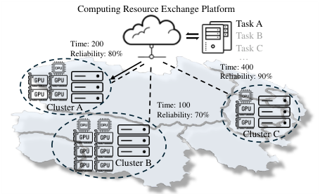

<!-- Start of picture text -->
Computing Resource Exchange Platform Task A Task B Time: 200 Task C Reliability: 80% … Time: 400 Reliability: 90% Cluster A Time: 100 Reliability: 70% Cluster C Cluster B <!-- End of picture text -->

**Figure 1: Illustration of the computing resource exchange platform. Dashed lines represent performance, while the solid arrow represents matching.** 

availability. This distributed nature increases the probability of connection interruptions or hardware failures [16, 23], which can result in the interrupt of the task execution. Therefore, beyond execution time, we must also consider the stability of the task execution process. To quantify this, we introduce a reliability metric _𝑎_ , which represents the probability of a task being successfully completed when assigned to a given cluster1 . 

The platform builds neural network-based predictors to estimate two performance metrics. To enable performance prediction, first it is essential to map potential deep learning tasks to a feature space Z. As task-to-feature embedding is well-studied in the literature, such as layer-based approaches [40], graph-based approaches [24, 39], and operator-based approaches [13, 43] , we focus on training predictors that map features to the performance predictions and omit the distinction between tasks and features. For any task _𝑧_ ∈ Z, the execution time _𝑡_ and the reliability _𝑎_ on a specific cluster are predicted using two cluster-specific predictors: _𝑡_ˆ = _𝑚𝝎_ ( _𝑧_ ) and _𝑎_ ˆ = _𝑚𝝓_ ( _𝑧_ ). These predictors are typically implemented using neural networks, where _𝝎_ and _𝝓_ denote the model parameters. The predictors are trained on a dataset _𝐷_ = {z _,_ t _,_ a}, where vectors z, t and a represent all task samples, their corresponding execution times and reliability metrics, respectively. For predictor training, the Mean Squared Error (MSE) loss is commonly used, and the loss function is as follows: 

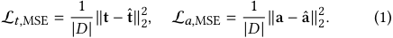

**Cluster-Task Matching:** Assume that there are _𝑀_ clusters available over a period of time for _𝑁_ deep learning tasks z = { _𝑧_ 1 _,𝑧_ 2 _,_ · · · _,𝑧𝑁_ } from users to allocate. For notational simplicity, we define M = {1 _,_ 2 _,_ · · · _, 𝑀_ } and N = {1 _,_ 2 _,_ · · · _, 𝑁_ }. The execution time for a task _𝑧 𝑗_ ∈ z on cluster _𝑖_ ∈M is predicted as _𝑡_ ˆ _𝑖𝑗_ = _𝑚𝝎𝑖_ ( _𝑧 𝑗_ ), and the reliability is predicted as _𝑎_ ˆ _𝑖𝑗_ = _𝑚𝝓 𝑗_ ( _𝑧 𝑗_ ). For all tasks assigned to cluster _𝑖_ , the predicted time and reliability vectors are expressed asˆ t _𝑖_ and aˆ _𝑖_ , respectively. In the taskcluster matching, each task is assigned to one cluster, and clusters may execute multiple tasks. To represent this matching, we introduce a binary decision variable _𝑥𝑖𝑗_ ∈{0 _,_ 1}, where _𝑥𝑖𝑗_ = 1 

> 1Reliability is also task-dependent, as the varying computational resource requirements of different tasks may affect their successful execution. 

indicates that task _𝑧 𝑗_ is assigned to cluster _𝑖_ . The decision variables for all clusters are organized into a matrix X = [x1 _,_ x2 _,_ · · · _,_ x _𝑀_ ], where the vector x _𝑖_ = [ _𝑥𝑖_ 1 _,𝑥𝑖_ 2 _,_ · · · _,𝑥𝑖𝑁_ ]. The execution time matrix T = [t1 _,_ t2 _,_ · · · _,_ t _𝑀_ ] and the reliability matrix A = [a1 _,_ a2 _,_ · · · _,_ a _𝑀_ ] have the similar structure. Our optimization objective is to minimize the execution time of all clusters while ensuring that the reliability constraint is satisfied. We formulate the optimization problem in the following general form: 

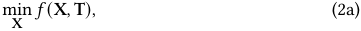

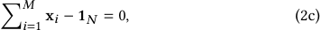

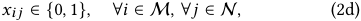

where 1 _𝑁_ is an _𝑁_ -dimensional vector of ones. _𝑓_ (X _,_ T) is the time cost function with respect to the execution time, and _𝑔_ (X _,_ A) represents the reliability constraint. We will clearly define these two functions next. The constraint (2c) ensures that each task is assigned to exactly one cluster, while the constraints (2d) enforce binary decision variables. 

The time cost function is defined as the execution time of the slowest computing cluster. This design helps to improve clusters utilization and prevent the potential imbalance caused by a linear cost function, where a large number of tasks may accumulate on a few high-performance clusters, leaving other clusters idle for extended periods. We consider the setting where tasks are executed sequentially on each cluster, with exclusive access to all its resources [17, 21, 33]. In this case, the total execution time of a cluster is computed as the sum of the predicted execution times of all its assigned tasks, while the overall makespan is determined by the maximum execution time across all clusters. 

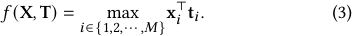

For the reliability constraint, we require that the overall task success rate of the platform exceeds a specified threshold _𝛾_ . To formalize this, we define the reliability constraint based on the average reliability across all clusters as: 

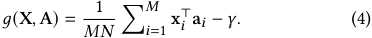

### **2.2 Matching-Focused Prediction Framework** 

Cluster-task matching heavily depends on the accuracy of performance prediction, and even small prediction errors may lead to matching errors. When the predictor is capable of accurately forecasting the performance of clusters, we can effectively determine the optimal matching solution. However, the relation between cluster performance across tasks and the task features z is highly complex, making it difficult for a predictor to model accurately. Additionally, acquiring training samples from physical machines is often expensive, making it challenging to gather a large number of training samples, which further increases the discrepancy between the predicted values and the actual values of the cluster performance. Furthermore, minimizing the Mean Squared Error (MSE) loss for the prediction task does not guarantee the optimal decisions in the task-cluster matching. It focuses on minimizing the prediction error independently for each cluster, ignoring the 

3 

513 

ICPP ’25, September 08–11, 2025, San Diego, CA, USA 

Da Huo, Zhenzhe Zheng, Xiaoyao Huang, Hao Chen, Jianfeng Hu, Zhiyong Yan, Fan Wu, and Jie Wu 

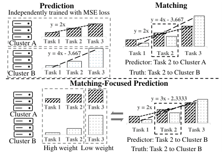

<!-- Start of picture text -->
Prediction Matching Independently trained with MSE loss y = 4x - 3.667 y = 2x y = 2x Cluster A Task 1 Task 2 Task 3 y = 4x - 3.667 Task 1 Task 2 Task 3 Predictor: Task 2 to Cluster A Cluster B Task 1 Task 2 Task 3 Truth: Task 2 to Cluster B Matching-Focused Prediction y = 3x - 2.3333 Task 1 Task 2 Task 3 y = 2x Cluster A Task 1 Task 2 Task 3 Cluster B Task 1 Task 2 Task 3 Predictor: Task 2 to Cluster B High weight Low weight Truth: Task 2 to Cluster B <!-- End of picture text -->

**Figure 2: The comparison between the predict-then-matching framework and the matching-focused prediction method. The heights of the bars represent the true values while the dashed lines represent the predicted values.** 

downstream matching objective. This may lead to significant mismatches between the tasks and the clusters. As illustrated in the upper part of Fig. 2, we consider an example to build an execution time predictor for three tasks using linear regression. The actual execution times are represented by the height of the bars, and the dashed lines denote the predictor’s estimation. For Cluster A, task execution time increases linearly with _𝑧_ , while for Cluster B, it follows a more complex exponential trend. Due to independent MSE minimization, the predictor incorrectly estimates that Cluster B performs worse than Cluster A for Task 2. This results in incorrect task allocation for task 2 using this independent predictor. 

To address this issue, we propose incorporating cluster-specific task preferences into the predictor training process. These task preferences arise from hardware heterogeneity, such as specific optimizations for convolutional or transformer architectures. By assigning higher learning weights to the tasks preferred by a cluster, the predictor can better align its predictions with downstream matching objectives. As shown in the lower part of Fig 2, compared to Cluster A, Cluster B is more efficient at executing Task 1 and Task 2 but less efficient at executing Task 3. Tasks preferred by Cluster B are more likely to be assigned to Cluster B. Therefore, we assign higher learning weights to such tasks in the predictor, while the tasks with less preferences are given smaller weights. Leveraging the cluster-specific task preferences, the predictor’s outputs can still yield correct assignments, even if there remains a discrepancy between the predicted and true values. 

To implement this idea, we consider downstream cluster-task matching process during the predictor training. This allows the predictor to make trade-offs according to the corresponding clusterspecific task preferences, optimizing the final matching accuracy rather than minimizing the MSE loss. This approach integrates cluster performance prediction and cluster-task matching into a unified framework, which we call _matching-focused cluster performance_ 

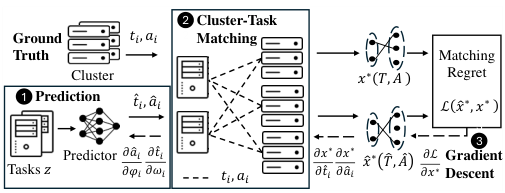

<!-- Start of picture text -->
1 2 Cluster-Task Ground 𝑡𝑖, 𝑎𝑖 2 Matching Truth Matching Cluster 𝑥 ∗ 𝑇, 𝐴 Regret 1 Prediction Ƹ𝑡𝑖, ො𝑎𝑖 ℒ ො𝑥 ∗ , 𝑥 ∗ 3 3 Predictor 𝜕ො𝑎𝑖 𝜕𝑡 Ƹ 𝑖 𝜕𝑥 ∗ 𝜕𝑥 ∗ ො𝑥 ∗ ෠𝑇, መ𝐴 𝜕ℒ Gradient 2 Tasks 𝑧 𝜕𝜑𝑖 𝜕𝜔𝑖 𝑡𝑖, 𝑎𝑖 𝜕𝑡 Ƹ 𝑖 𝜕ො𝑎𝑖 𝜕𝑥 ∗ Descent <!-- End of picture text -->

**Figure 3: The training process of the MFCP method.** 

_prediction_ . We formalize this framework as a bilevel problem: 

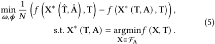

The upper-level optimization objective is to select the optimal parameters _𝝎, 𝝓_ to minimize the distance between the matching solution based on predicted values Tˆ _,_ Aˆ and the matching solution based on true values T _,_ A, which we refer to as regret. The lower-level optimization objective is to select the optimal matching decision X∗ that minimizes the cost function _𝑓_ (X _,_ T) within FAˆ , which represents the feasible domain under the reliability constraint in Equ. (4). 

### **3 The Design of MFCP** 

### **3.1 The Whole Pipeline** 

In this section, we present MFCP, a system that integrates cluster performance predictor training with cluster-task matching. MFCP comprises three components: the predictor, the matching algorithm, and the gradient calculation module, as illustrated in Fig. 3. The forward propagation consists of prediction and matching: (1) obtaining actual and predicted performance metrics by executing tasks z on the cluster and using a predictor, respectively, and (2) employing these metrics as matching weights to compute optimal matching results via the matching algorithm. MFCP then formulates the matching regret between the two optimal matchings as the loss function. During backpropagation (3), the gradients are decomposed and computed in a right-to-left manner, corresponding to the contributions from regret, matching, and prediction. 

We consider the scenario where the computing resource exchange platform builds cluster-specific predictors _𝑚𝝎𝑖_ and _𝑚𝝓𝑖_ for a cluster _𝑖_ ∈M. The pipeline first samples _𝑁_ deep learning tasks z from the task pool Z to simulate the workload the platform must allocate within a given time period. To evaluate all clusters’ performance on the sampled task vector z, we run the tasks directly on each cluster _𝑖_ ∈M, to obtain their actual execution times t _𝑖_ and reliability metrics a _𝑖_ . These actual measurements serve as ground truth data for all clusters. We also use predictors _𝑚𝝎𝑖_ and _𝑚𝝓𝑖_ to estimate the predicted execution timeˆ t _𝑖_ and predicted reliability aˆ _𝑖_ for cluster _𝑖_ with respect to tasks z. 

Then, using the predicted values Tˆ and Aˆ , the matching algorithm generates an optimal task matching decision X∗ (Tˆ _,_ Aˆ ) of the optimization problem (2). We also compute X∗ (T _,_ A), the optimal decision based on ground truth values. The system evaluates the 

4 

514 

ICPP ’25, September 08–11, 2025, San Diego, CA, USA 

Joint Prediction and Matching for Computing Resource Exchange Platforms 

regret caused by prediction errors using the following loss function, which is derived from the upper-level optimization objective defined in (5): 

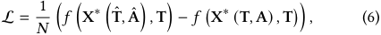

where _𝑓_ (·) represents the optimization objective in (2). The exact form depends on the modeling of the cluster scheduler. 

Finally, during backpropagation to optimize the predictor parameters, we can express the gradient of the regret loss function based on the chain rule of differentiation with respect to the predictor parameters as 

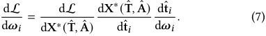

Here we take the gradients of _𝝎𝑖_ as an example, and the same applies to _𝝓𝑖_ . Treating the optimal matching X∗ (Tˆ _,_ Aˆ ) as a function of the predicted variableˆ t _𝑖_ , the first term on the right-hand side of the equation is the gradients of the regret loss L with respect to the matching decision X∗ , the second term is the gradients of the matching decision X∗ with respect to the predictor variableˆ t _𝑖_ , and the third term is the gradients of the predictor variableˆ t _𝑖_ with respect to the predictor parameters _𝝎𝑖_ . The first and third terms can be obtained directly from the gradient computations stored during the neural network’s training process (i.e., the gradient cache). However, the second term involves solving the optimization problem (2) for which no closed-form solution exists, making it challenging to explicitly compute the gradient. 

### **3.2 Relaxing Optimization Problem** 

To compute the gradient, we must first ensure that X∗ (Tˆ _,_ Aˆ ) is a continuously differentiable function with respect to Tˆ and Aˆ . However, X∗ is not always differentiable or its derivatives may not always be meaningful (non-zero), primarily due to three factors: the discrete decision space of X∗ , the piecewise linear nature of the optimization objective (3) involving max operation, and the inclusion of predictor variables Aˆ in constraints. In this subsection, we address and resolve each of these factors in turn. 

The first factor is that the optimization problem (2) is an integer optimization problem. This directly results in the optimal matching decision X∗ being a step function with respect to the predicted values Tˆ and Aˆ , leading to either non-differentiability or vanishing gradients. To address this issue, we consider a continuous relaxation of the original problem. Specifically, during the training process of predictors, we relax the feasible set of the decision variable X∗ from the discrete set {0 _,_ 1} to the continuous interval [0 _,_ 1], representing the convex hull of the original set. This relaxation enables the matching optimization algorithm to be treated as a continuous function of the predicted values Tˆ and Aˆ , allowing meaningful gradients to be computed for training. In contrast, during testing or system deployment, the matching X∗ is obtained using the continuous version of the matching optimization algorithm and subsequently rounded to produce discrete solutions. 

The second factor affecting differentiability arises from the nature of the max operation in the objective function _𝑓_ (X _,_ T), which is not differentiable everywhere. As a piecewise linear function, _𝑓_ (X _,_ T) exhibits unequal left and right derivatives at certain points 

due to the max operation. To address this, we introduce a smooth approximation _𝑓_˜ (X _,_ T), which is continuously differentiable. Specifically, we define the smoothed objective function as follows. 

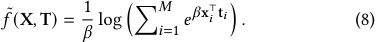

Theorem 1 (Smooth Approximation of the max Operation). _The function 𝑓_˜ (X _,_ T) _is a smooth approximation of 𝑓_ (X _,_ T) _. As 𝛽_ → ∞ _, the smoothed function 𝑓_˜ (X _,_ T) _converges to function 𝑓_ (X _,_ T) _._ 

The proofs of this theorem and subsequent theorems are provided in our technical report [1]. 

The last factor affecting the differentiability of optimization problem (2) arises from the inclusion of the predicted values Aˆ in the constraints. Specifically, when Aˆ lies in the interior of the feasible set, the decision variable X satisfies the inequality constraints _𝑔_ (X _,_ Aˆ ) ≥ _𝛾_ and the gradient of X∗ with respect to Aˆ is zero, providing no useful information for gradient descent. Conversely, when Aˆ lies on the boundary of the feasible set, it results in an infinite gradient (considering constraint violations as incurring infinite cost). This creates challenges in effectively training the predictor _𝝓_ through the gradient of X∗ with respect to Aˆ . To resolve this issue, we employ the interior-point method by incorporating the inequality constraints involving Aˆ into the optimization objective. Specifically, we use a logarithmic barrier function [8] to enforce the constraints indirectly. The modified optimization objective is defined as follows: 

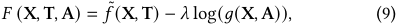

where _𝜆 >_ 0 is a parameter that adjusts the weight of the constraints during the optimization process. And we can approximate the optimization problem (2) as the following optimization problem: 

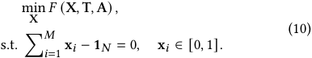

Intuitively, given initialized X satisfying _𝑔_ (X _,_ A) _> 𝛾_ , an exponential rate of cost increase will occur when _𝑔_ (X _,_ A) decreases towards _𝛾_ during the optimization process. This mechanism acts as a barrier to prevent _𝑔_ (X _,_ A) − _𝛾_ from becoming negative. A smaller value of _𝜆_ results in the logarithmic barrier term − _𝜆_ log( _𝑔_ (X _,_ A) − _𝛾_ ) closely approximating an ideal inequality constraint function, where the cost is zero when the constraint is satisfied and approaches infinity when it is violated. The interior-point method provides probabilistic feasibility guarantees: 

Theorem 2 ( _𝜖_ -Feasibility). _After 𝑘 iterations with barrier parameter 𝜆, the solution_ X(_𝑘_) _satisfies:_ 

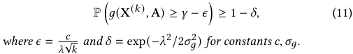

By addressing the three challenges of differentiability, we present the final form of our bi-level optimization problem: 

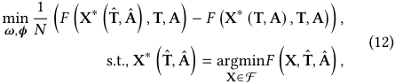

5 

515 

ICPP ’25, September 08–11, 2025, San Diego, CA, USA 

Da Huo, Zhenzhe Zheng, Xiaoyao Huang, Hao Chen, Jianfeng Hu, Zhiyong Yan, Fan Wu, and Jie Wu 

where the upper level objective function represents the regret loss function for training the predictors, while the lower level optmization problem is (10). Importantly, the feasible domain F for X no longer includes the predicted variable Aˆ . Under this formulation, the optimal matching X∗ exhibits continuous and meaningful gradients with respect to the predicted variables Tˆ and Aˆ . Next, we introduce efficient algorithms for computing these gradients. 

### **3.3 End-to-end Training** 

We can obtain the gradient of the optimal matching with respect to the predicted values from the analytical differentiation of the optimal mapping. The time cost function (3) is a convex function, and thus the objective function _𝐹_ (X _,_ T _,_ A) in the lower level optimization problem (10) is convex with respect to both T and A, 

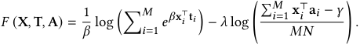

In convex optimization problems, the mapping from parameters to optimal solutions is implicit and lacks a closed-form expression, making direct differentiation infeasible. However, we can leverage the Lagrange multiplier method to express this implicit relationship and thereby obtain the gradient relationship between the optimal decision variables X∗ and the predictive variables T _,_ A, which is proposed by Donti et al. [9]. The Lagrangian is 

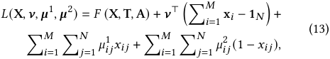

where _𝝂_ ∈ R_𝑁_ denotes the Lagrange multiplier vector for equality constraints, and _𝝁_1 _, 𝝁_2 ∈ R_𝑀_×_𝑁_ represent the Lagrange multiplier matrices associated with the inequality constraints’ upper and lower bounds, respectively. Since we only interested in the gradients of the decision variables with respect to T and A rather than solving for the decision variables themselves, we disregard the constraints on the range of X. The original optimization problem (10) can thus be reformulated as the unconstrained minimization of the Lagrangian function _𝐿_ (X _, 𝝂_ ). The optimal matching X∗ satisfies 

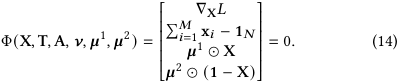

By taking the total differential of the condition (14), we can obtain the differential relationship between the predictor variables T _,_ A and the decision variables x _𝑖_ . 

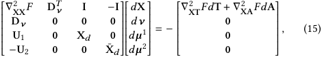

where D _𝝂_ ∈ R_𝑁_×_𝑀𝑁_ is the equality constraint gradient matrix (horizontal concatenation of _𝑀_ identity matrices I _𝑁_ ), U1 = diag( _𝝁_1 ) and U2 = diag( _𝝁_2 ) are diagonal matrices from complementary slackness conditions, while X _𝑑_ = diag(vec(X)) and ¯X _𝑑_ = diag(vec(1 − X)) represent diagonalized matching variables. We can obtain the required gradient by solving this system of linear equation (15). Notably, we have two sets of predictor variables T 

**Algorithm 1:** Optimal Matching by Gradient Descent **Input:** Objective function _𝐹_ (X _,_ T _,_ A), execution time martix T and reliablity martix A. **Output:** The optimal matching X∗ . **1** Initialize X; **2 while** _Iter < Epochs_ **do 3** X ← X − _𝜂_ ∇ _𝑥 𝐹_ (X _,_ T _,_ A); **4** X(: _, 𝑗_ ) ← softmax (X(: _, 𝑗_ )) for 1 ≤ _𝑗_ ≤ _𝑁_ ; **5 return** X∗ ← X. 

and A, which jointly influence the final matching x _𝑖_∗. Therefore, we fix _𝝎_ when optimizing _𝝓_ , and fix _𝝓_ when optimizing _𝝎_ , ensuring stability during optimization using partial derivatives. 

### **3.4 Extension to Parallel Task Execution** 

We further consider a more complex but realistic scenario where multiple deep learning tasks running on a cluster can share resources and execute in parallel [20, 26]. Deep learning clusters typically employ scheduling algorithms to select tasks for parallel execution, aiming to minimize the total execution time. We define a speedup ratio _𝜁_ as the ratio of the actual total execution time to the sum of the execution times of all tasks. The speedup ratio _𝜁_ is influenced by various factors, such as the locality of task deployment [22] and resource competition among tasks [27]. In this work, we focus on a quantifiable factor: the number of deep learning tasks assigned to a cluster2 . To account for this, we introduce time adjustment functions _𝜁𝑖_ (x _𝑖_⊤1_𝑁_)to capture the impact of parallel execution on computation time. We revise the time cost function in Equ. (3) as follows: 

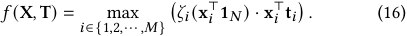

And for the time cost function under the resource-sharing scenario, the smoothed objective function is revised as 

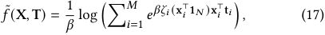

and _𝐹_ (X _,_ T _,_ A) is still defined as Equ. (9). 

However, in this case, _𝑓_ (X _,_ T) with respect to the decision variable X is no longer a convex function. Consequently, the overall continuous optimization objective _𝐹_ (X _,_ T _,_ A) also loses its convexity. This renders the previously method for convex optimization inapplicable and even makes solving for the optimal decision variable X challenging. To address this complex and practical issue, we intuitively employ a gradient descent algorithm to solve the matching optimization problem (10) and then use the forward gradient method to compute the gradient of the optimal matching X∗ with respect to the prediction variables T and A. 

Specifically, we first approximate the optimal decision variable X∗ under the non-convex scenario using gradient descent, as shown in Algorithm 1. After each gradient update of X based on the objective function _𝐹_ (X _,_ T _,_ A), we project X onto the feasible domain 

> 2This factor is statistically significant because a small number of tasks may lead to underutilization of the cluster’s resources, resulting in a low speedup ratio. Conversely, when a large number of tasks are assigned, they are typically scheduled in parallel batches by the scheduling algorithm, leading to a relatively stable high speedup ratio. 

6 

516 

ICPP ’25, September 08–11, 2025, San Diego, CA, USA 

Joint Prediction and Matching for Computing Resource Exchange Platforms 

### **3.5 Algorithm Analysis** 

|**Al**|**gorithm 2:**MFCP with Forward Gradient Method|**3.5** **Algorithm Analysis**|
|---|---|---|
|**I**|**nput:**DL Tasksz, true execution timeT, true reliabilityA, perturbation sizeΔand sampling count_𝑆_.|Considering the impact of integrating the matching algorithm into the predictive model training, we analyze the convergence guar-|
|**O** **1** I **2 w** **3**|**utput:**The optimal predictors_𝝎𝑖_and_𝝓𝑖_for cluster_𝑖_∈M. nitialize_𝝎𝑖, 𝝓𝑖_; **hile**_Iter < Epochs_**do** ˆt_𝑖_←_𝑚𝝎𝑖_(z), ˆa_𝑖_←_𝑚𝝓𝑖_(z), ˆT← � T[1 :_𝑀_−1]_,_ ˆt_𝑖_ � , ˆA←[A[1 :_𝑀_−1]_,_ˆa_𝑖_]; ˆˆ|antees and computational complexity of the algorithm. We first examine the convergence properties of the MFCP approach under both convex and non-convex settings. Theorem 4 (Convex Case Convergence). _When 𝐹_(_𝑋_) _is 𝜅-_ _strongly convex and 𝑙-smooth, Algorithm 1 with learning rate 𝜂_≤1/_𝑙_ _achieves linear convergence:_|
|**4** **5**|CalculateX∗( T_,_ A) by Algorithm 1; **while**_𝑠_≤_𝑆_**do**|∥_𝑋_(_𝑘_) −_𝑋_∗∥2 ≤ � 1−_𝜅_ _𝑙_ �_𝑘_ ∥_𝑋_(0) −_𝑋_∗∥2_,_ (19)|
|**6** **7**|Sample_𝑣__𝑠_ _𝑡_∈_𝑁_(0_,_ 1) and_𝑣𝑠__𝑎_∈_𝑁_(0_,_ 1); ˆt_𝑠_ _𝑖_←ˆt_𝑖_+ Δ ·_𝑣𝑠_ _𝑡_, ˆa_𝑠_ _𝑖_←ˆa_𝑖_+ Δ ·_𝑣𝑠𝑎_, ˆT_𝑠_← � T[1 :_𝑀_−1]_,_ ˆt_𝑠_ _𝑖_ � , ˆA_𝑠_← � A[1 :_𝑀_−1]_,_ˆa_𝑠_ _𝑖_ � ; |_where 𝑋_(_𝑘_) _denotes the 𝑘-th iteration and 𝑋_∗_is the optimal solution._ For the non-convex case, we employ zeroth-order gradient esti- |
|**8** **9**|CalculateX∗( ˆT_𝑠__,_ ˆA)andX∗( ˆT_,_ ˆA_𝑠_) by Algorithm 1 respectively; ∇_𝑠_ ˆt_𝑖_X∗( ˆT_,_ ˆA) ←X∗( ˆT_𝑠,_ ˆA)−X∗( ˆT_,_ ˆA) Δ ·_𝑣__𝑠_ _𝑡_; |mation to obtain gradients for backpropagation. The convergence analysis yields the following results: Theorem 5 (Non-Convex Case Convergence). _Assume the_ _smoothed objective function 𝐹_(_𝑋_) _has 𝑙-Lipschitz continuous gra-_ ��|
|**10**|∇_𝑠_ ˆa_𝑖_X∗( ˆT_,_ ˆA) ←X∗( ˆT_,_ ˆA_𝑠_)−X∗( ˆT_,_ ˆA) Δ ·_𝑣__𝑠__𝑎_;  ∗ ˆ ˆ|_dients, and the gradient estimation_ ∇_𝐹_(_𝑋_) _satisfies_ E[∇_𝐹_(_𝑋_)] = ∇_𝐹_(_𝑋_) _with bounded variance_ E[∥�∇_𝐹_(_𝑋_) −∇_𝐹_(_𝑋_)∥2] ≤_𝜎_2_. For_|
|**11**|Aggregate all∇_𝑠_ ˆt_𝑖_x∗( ˆT_,_ ˆA) to obtain dX( T_,_ A) dˆt_𝑖_ , all|_Algorithm 1 using step size 𝜂_≤1 _𝑙__, we have:_|
|**12**|∇_𝑠_ ˆa_𝑖_X∗( ˆT_,_ ˆA) to obtain dX∗( ˆT_,_ ˆA) dˆa_𝑖_ ; _𝝎𝑖_←_𝝎𝑖_−_𝜂_ dL dX∗( ˆT_,_ ˆA) dX∗( ˆT_,_ ˆA) dˆt_𝑖_ dˆt_𝑖_ d_𝝎𝑖_;  d∗ˆTˆA ˆ|1 _𝑘_ ∑︁_𝑘_−1 _𝑡_=0 E � ∥∇_𝐹_(_𝑋_(_𝑡_))∥2� ≤ 2(_𝐹_(_𝑋_(0)) −_𝐹inf_) _𝜂𝑘_ +_𝑙𝜂𝜎_2_,_ (20) _where 𝐹inf_ =inf_𝑋𝐹_(_𝑋_) _is the lower bound of the objective function._|
|**13**|_𝝓𝑖_←_𝝓𝑖_−_𝜂_ dL dX∗( ˆT_,_ ˆA) X( _,_ ) dˆa_𝑖_ da_𝑖_ d_𝝓𝑖_;|Finally, we conduct a computational complexity analysis of the|
|**14 r**|**eturn**_𝝎𝑖_and_𝝓𝑖_.|MFCP algorithm. The computational complexity has three com-|

Considering the impact of integrating the matching algorithm into the predictive model training, we analyze the convergence guarantees and computational complexity of the algorithm. We first examine the convergence properties of the MFCP approach under both convex and non-convex settings. 

Theorem 4 (Convex Case Convergence). _When 𝐹_ ( _𝑋_ ) _is 𝜅- strongly convex and 𝑙-smooth, Algorithm 1 with learning rate 𝜂_ ≤ 1/ _𝑙 achieves linear convergence:_ 

_where 𝑋_(_𝑘_) _denotes the 𝑘-th iteration and 𝑋_∗ _is the optimal solution._ 

For the non-convex case, we employ zeroth-order gradient estimation to obtain gradients for backpropagation. The convergence analysis yields the following results: 

Theorem 5 (Non-Convex Case Convergence). _Assume the smoothed objective function 𝐹_ ( _𝑋_ ) _has 𝑙-Lipschitz continuous gradients, and the gradient estimation_� ∇ _𝐹_ ( _𝑋_ ) _satisfies_ E[� ∇ _𝐹_ ( _𝑋_ )] = ∇ _𝐹_ ( _𝑋_ ) _with bounded variance_ E[∥� ∇ _𝐹_ ( _𝑋_ ) −∇ _𝐹_ ( _𝑋_ )∥2 ] ≤ _𝜎_2 _. For Algorithm 1 using step size 𝜂_ ≤<u>1</u> _𝑙__, we have:_ 

Finally, we conduct a computational complexity analysis of the MFCP algorithm. The computational complexity has three components: (1) Prediction Phase: For _𝑀_ clusters with feature dimension _𝑑_ , each predictor requires _𝑂_ ( _𝑑_2 ) operations per task, totaling _𝑂_ ( _𝑀𝑁𝑑_2 ). (2) Matching Optimization: Each gradient descent iteration in Algorithm 1 costs _𝑂_ ( _𝑀𝑁_ ) operations. Let _𝐾_ 1 be the number of iterations, total cost is _𝑂_ ( _𝐾_ 1 _𝑀𝑁_ ). (3) Gradient Estimation: For _𝑆_ perturbations and _𝐾_ 2 iterations per perturbation, the forward gradient in Algorithm 2 requires _𝑂_ ( _𝑆𝐾_ 2 _𝑀𝑁_ ) operations. Thus the overall complexity per training epoch is: 

defined by the constraints using the softmax function. We then perform the gradient computation for the matching process and update the parameters of predictors using Algorithm 1. Once the optimal matching decision X∗ under the predicted variables is obtained (line 4), we apply a small perturbation to the predicted variables Tˆ and Aˆ , with the perturbation direction determined by a unit vector _𝑣_ sampled from a normal distribution (lines 6-7). We then apply the same gradient descent method to find its optimal matching decision X∗ under the perturbed decision variables (line 8). Then we can obtain the directional derivative of X∗ with respect to the decision variables Tˆ or Aˆ along the direction _𝑣_ (line 9, 10). By aggregating all the directional derivatives obtained from the samples, we finally estimate the gradientdX∗ d<u>(</u> AˆTˆ_<u>,</u>_ˆA) and update the predictor’s parameters (lines 11-13). The zeroth-order gradient estimation introduces the following bounded errors, which suggests an optimal perturbation size Δ∗ = 2 _𝜎𝐹_2 balancing bias and variance: _𝛽_2 _𝑆_ � �1/4 

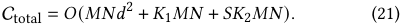

### **4 Evaluation Results** 

We conduct extensive simulations to demonstrate the effectiveness of the MFCP method in computing resource exchange platforms. 

### **4.1 Experimental Setup** 

_4.1.1 Dataset._ The data utilized in our study was collected from the computing platform managed by the Xirang. On the clusters of the platform, we conducted experiments on various CV and NLP models, and explored different model hyperparameter settings. For the CV tasks, we used the CIFAR-10 and ImageNet datasets, while for the NLP tasks, we utilized the Europarl dataset. Specifically, we monitored and recorded the runtimes of each epoch during actual execution, as well as the success probability of task completion. These measurements provide valuable insights into the performance and reliability of the tested models under practical conditions. We used a Graph Neural Network (GNN) to transform these deep learning tasks into features. In the subsequent predictor training, we only utilized fully connected layers for training. 

Theorem 3 (Gradient Approximation Error). _Let_� ∇ _be the estimated gradient via Algorithm 2. For 𝛽-smooth 𝐹_ ( _𝑋_ ) _:_ 

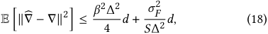

_where 𝑑 is the parameter dimension,_ Δ _the perturbation size, and 𝜎𝐹_2 _bounds the function variance._ 

7 

517 

ICPP ’25, September 08–11, 2025, San Diego, CA, USA 

Da Huo, Zhenzhe Zheng, Xiaoyao Huang, Hao Chen, Jianfeng Hu, Zhiyong Yan, Fan Wu, and Jie Wu 

**Table 1: The Ablation study of MFCP.** 

|**Metric**|**Regret**|**Reliability**|**Utilization**|
|---|---|---|---|
|(1)|1_._555±0_._030|0_._878±0_._005|0_._387±0_._002|
|(2)|1_._274±0_._035|0_._681±0_._015|0_._430±0_._008|
|(3)|0_._937±0_._062|0_._890±0_._0011|0_._487±0_._007|
|**MFCP**|0_._894±0_._035|0_._886±0_._006|0_._488±0_._003|

_4.1.2 Baselines._ We compare the following five methods: 

• **Task-Agnostic Matching (TAM)** : This naive method ignores task variations in execution time and reliability, using average cluster performance across tasks to solve problem (2). 

• **Two Stage Method (TSM)** [39]: This method independently trains cluster performance predictors by minimizing MSE loss, then solves problem (2) using predicted values. 

• **Upper Confidence Bound-based Method (UCB)** [44]: As another commonly used and competitive approach, we employ a robust method against prediction errors. In the matching algorithm, we select the solution with the highest upper confidence bound rather than the best-performing matching scheme to mitigate the impact of stochastic environments on matching regret. 

• **MFCP with Analytical Differentiation (MFCP-AD)** : When the cost function is convex, the KKT conditions reveal the relationship between the optimal matching and the predictor variables. We can directly derive the gradients of the optimal matching leveraging the analytical differentiation of optimization mappings. 

• **MFCP with Forward Gradient (MFCP-FG)** : Another implementation of MFCP. When the cost function is not convex, we use a forward gradient propagation approach to estimate the gradients. 

_4.1.3 Evaluation Metrics._ We present the following three metrics to comprehensively evaluate the effectiveness of the MFCP method. 

• **Regret** : Regret measures the gap in time cost _𝑓_ (·) between prediction-based matching and ground-truth-based matching. A smaller regret indicates minimal impact of predictor errors on the matching results. The formal definition of regret is provided in (6) and is computed on the test set, distinguishing it from the loss. 

• **Reliability** : Reliability reflects the average success probability of task execution. Since the MFCP method relaxes the reliability constraint _𝑔_ (·) into a logarithmic cost, it is necessary to evaluate the reliability metric alongside the regret. 

• **Cluster Utilization** : Cluster utilization is the total working time of all clusters divided by their maximum possible working time. It measures how evenly tasks are distributed across clusters. Low utilization means some clusters stay idle for long periods while others finish their tasks. 

### **4.2 Ablation Study** 

We first demonstrate the effectiveness of the relaxation method for gradient computation in MFCP through ablation experiments, specifically including the following three metrics: 

- (1) **Maximum Loss** : We simplify the time loss function _𝑓_ (·) used for matching to a linear function. Specifically, _𝑓_ (·) is defined as the sum of execution times across all clusters rather than the maximum execution time. 

- (2) **Interior-Point Method** : We replace the logarithmic penalty term for constraint violations with a hard penalty term, i.e., _𝐹_ ( _𝑋,𝑇,𝐴_ ) = _𝑓_˜ ( _𝑋,𝑇_ ) + _𝜆_ · max(0 _,𝛾_ − _𝑔_ ( _𝑋,𝐴_ )) _._ 

- (3) **Zero-Order Gradient Estimation** : In the exclusive case, we evaluate the performance degradation caused by zero-order gradient estimation compared to gradient computation. 

The experimental results are shown in Table 1. Experiment (1) demonstrates that using a linear time loss function leads to inaccurate matching results, which significantly impacts both matching regret and cluster resource utilization. Experiment (2) reveals that employing hard penalty term reduces training efficiency and decreases the proportion of samples that ultimately satisfy the reliability constraints. Experiment (3) proves that the zeroth-order gradient estimation method achieves competitive performance compared to gradient computation, enabling the extension of the MFCP approach to non-convex scenarios. These findings systematically validate the rationality and effectiveness of the gradient computation design in MFCP. 

### **4.3 Overall Performance** 

We first conduct experiments with five deep learning tasks matched to three heterogeneous clusters. To ensure generalizability, we perform three experiment sets, each randomly selecting clusters (settings A, B, C). Results are evaluated using Regret, Reliability, and Cluster Utilization, as illustrated in Fig. 4. 

Among the five methods, MFCP-AD and MFCP-FG consistently perform best, achieving the lowest regret, indicating more accurate matching decisions. This also shows that in convex optimization scenarios, MFCP with forward gradient can achieve performance comparable to analytical differentiation. TSM has slightly higher regret, revealing the gap between optimizing MSE loss and direct regret optimization. UCB’s regret falls between TSM and MFCP, as it is more robust to prediction errors than TSM but lacks explicit task modeling. TAM’s performance depends on cluster environment: it works well when task performance differences are small but fails reliability constraints under heterogeneity. Owing to the influence of the interior-point method, the MFCP methods achieve slightly higher reliability than other algorithms. In terms of cluster utilization, the MFCP methods attain higher utilization by more accurately modeling the performance relationships among clusters during the matching process, thereby also reducing the overall execution time required for all clusters to complete the tasks. 

### **4.4 Performance under Different Scale Settings** 

We next evaluate the scalability of cluster-task matching by varying the number of tasks in a single round. We measure the methods’ performance in terms of Regret and Cluster Utilization under Setting A, with the results presented in Fig. 5. 

As the number of tasks increases, all methods show generally linear regret growth. Both MFCP-AD and MFCP-FG maintain lower regret than baselines, demonstrating robust matching decisions across scales. This confirms the forward-gradient MFCP approach achieves comparable results to analytical differentiation at varying scales. For cluster utilization, all methods show increasing trends with more tasks. TAM, which ignores task heterogeneity by using training set averages, achieves lower utilization than TSM due to 

8 

518 

ICPP ’25, September 08–11, 2025, San Diego, CA, USA 

Joint Pre ~~<u>diction</u>~~ and Matching for Computing Resource Exchange Platforms 

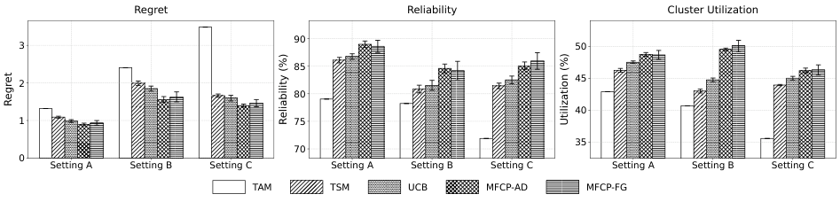

<!-- Start of picture text -->
Regret Reliability Cluster Utilization 90 3 50 85 2 45 80 40 1 75 35 70 0 Setting A Setting B Setting C Setting A Setting B Setting C Setting A Setting B Setting C TAM TSM UCB MFCP-A D MF CP-FG Regret Reliability (%) Utilization (%) <!-- End of picture text -->

**Figure 4: Overall experiment results. The figure illustrates the performance of the three metrics for the five methods under three cluster combination settings. Error bars represent 10× the actual standard deviation for visibility.** 

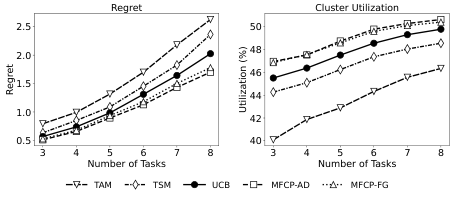

<!-- Start of picture text -->
Regret Cluster Utilization 2.5 50 2.0 48 46 1.5 44 1.0 42 0.5 40 3 4 5 6 7 8 3 4 5 6 7 8 Number of Tasks Number of Tasks TAM TSM UCB MFCP-AD MFCP-FG Regret Utilization (%) <!-- End of picture text -->

**Figure 5: Experiment results with different number of tasks. MFCP-AD and MFCP-FG exhibit similar performance.** 

**Table 2: Performance on parallel task execution settings** 

|**Method**|**Regret**|**Reliability**|**Utilization**|
|---|---|---|---|
|TAM|3_._032±0_._000|0_._759±0_._000|0_._485±0_._000|
|TSM|2_._014±0_._035|0_._832±0_._003|0_._547±0_._001|
|UCB|1_._835±0_._064|0_._847±0_._003|0_._553±0_._002|
|MFCP-FG|1_._496±0_._081|0_._851±0_._005|0_._560±0_._003|

poorer task balancing. UCB outperforms TSM through more accurate predictions in stochastic environments. By modeling the downstream matching algorithm, the MFCP methods consistently achieve the highest utilization, showing superior workload distribution across clusters. 

### **4.5 Performance on Parallel Task Execution Settings** 

We further evaluated the performance of different methods in a parallel execution setting, where tasks are executed concurrently on clusters. Compared to the assumption that the total execution time of tasks is additive when multiple tasks run on a cluster, considering the acceleration effects introduced by parallel execution in cluster schedulers is more realistic and important. To model this scenario, we defined the function _𝜁_ as an exponential decay curve from 1 to 0.6, reflecting the diminishing marginal effect typically observed when clusters handle multiple tasks in parallel. We assume all clusters share the same scheduling algorithm in this evaluation. Given that the MFCP-AD method is unsuitable for non-convex scenarios, we focused on the remaining four methods, with their results summarized in Table 2. 

The experimental results demonstrate that MFCP-FG consistently outperforms baselines in matching regret and cluster utilization, adapting well to parallel task complexities. Specifically, compared to TSM and UCB, MFCP-FG reduced regret by 25.7% and 18.5%, confirming its superior matching accuracy in real-world parallel execution. This improvement highlights MFCP-FG’s practical applicability in managing resources under challenging conditions, validating its robustness in diverse cluster environments. 

### **5 Related Works** 

Predicting the performance of deep learning tasks on hardware devices primarily revolves around three methodological paradigms. Configuration-based approaches analyze performance variations of recurrent computational tasks under different configurations [18, 19, 37], but their neglect of internal model structures limits crosstask generalization. Another approach decomposes models into independent operators and estimates total runtime by accumulating predicted execution times of individual components. This includes physical modeling based on GPU computational capabilities and operator workloads [35, 42], as well as data-driven predictions using convolutional neural networks [25, 36]. However, these methods fail to effectively capture topological dependencies between operators. Recent advances employ graph neural networks (GNNs) for end-toend prediction by directly processing computational graphs [10, 14]. To accelerate training, feature compression techniques have been proposed, such as Horus that vectorizes computational graphs [41] and DNNAbacus utilizing network structural matrices [5]. 

Decision-Focused Learning (DFL) minimizes task regret through joint optimization of prediction and decision processes. For differentiable strictly convex optimization problems, gradients can be computed via total differentiation of first-order optimality conditions or KKT conditions [3, 9, 15]. Addressing non-differentiable combinatorial optimization, research progresses along three main directions: 1) Introducing smooth analytical terms like regularization [38], logarithmic components [29], or entropy functions [4, 7] to ensure differentiability; 2) Treating optimization as black-box oracles and estimating gradients through random perturbations, as exemplified by DBB [34], DPO [6], and I-MLE [32]; 3) Constructing surrogate loss functions to provide meaningful subgradients, including SPO [11], NCE [31], and LTR [28]. Our work specifically investigates the scenario of prediction and matching in computing resource exchange platforms, addressing unexplored challenges 

9 

519 

ICPP ’25, September 08–11, 2025, San Diego, CA, USA 

Da Huo, Zhenzhe Zheng, Xiaoyao Huang, Hao Chen, Jianfeng Hu, Zhiyong Yan, Fan Wu, and Jie Wu 

in DFL theory regarding multiple optimization variables and predictive variables within constraints, while proposing an efficient predictor training framework tailored to practical applications. 

### **6 Conclusion** 

In this work, We tackled the challenge of using idle computing resources in deep learning clusters by combining performance prediction and task matching into a single optimization framework. MFCP solves issues like non-differentiability and gradient computation in complex scenarios, leading to better resource allocation. Experiments show that MFCP improves decision accuracy, offering an effective solution for growing AI computational needs. 

### **Acknowledgments** 

This work was supported in part by National Key R&D Program of China (No. 2023YFB4502400), in part by the Fundamental Research Funds for the Central Universities (project numberYG2022QN039), in part by China NSF grant No. 62322206, 62132018, 62025204, 62272307, 62372296, U2268204. The opinions, findings, conclusions, and recommendations expressed in this paper are those of the authors and do not necessarily reflect the views of the funding agencies or the government. 

### **References** 

- [1] 2025. Supplementary Material. https://drive.google.com/drive/folders/ 1bionk2aooM4q1bHjx9Npqq9AnOBkVI7E?usp=sharing. 

- [2] Amazon Web Services. 2024. Amazon Web Services (AWS). https://aws.amazon. com Accessed: 2024-12-06. 

- [3] Brandon Amos and J. Zico Kolter. 2017. OptNet: Differentiable Optimization as a Layer in Neural Networks. In _ICML_ . 136–145. 

- [4] Brandon Amos, Vladlen Koltun, and J. Zico Kolter. 2019. The Limited Multi-Label Projection Layer. _CoRR_ abs/1906.08707 (2019). 

- [5] Lu Bai, Weixing Ji, Qinyuan Li, Xilai Yao, Wei Xin, and Wanyi Zhu. 2022. DNNAbacus: Toward Accurate Computational Cost Prediction for Deep Neural Networks. _CoRR_ abs/2205.12095 (2022). 

- [6] Quentin Berthet, Mathieu Blondel, Olivier Teboul, Marco Cuturi, Jean-Philippe Vert, and Francis R. Bach. 2020. Learning with Differentiable Pertubed Optimizers. In _NeurIPS_ . 9508–9519. 

- [7] Mathieu Blondel, Olivier Teboul, Quentin Berthet, and Josip Djolonga. 2020. Fast Differentiable Sorting and Ranking. In _ICML_ . 950–959. 

- [8] Stephen Boyd and Lieven Vandenberghe. 2004. _Convex optimization_ . Cambridge university press. 

- [9] Priya L. Donti, J. Zico Kolter, and Brandon Amos. 2017. Task-based End-to-end Model Learning in Stochastic Optimization. In _NIPS_ . 5484–5494. 

- [10] Lukasz Dudziak, Thomas Chau, Mohamed S. Abdelfattah, Royson Lee, Hyeji Kim, and Nicholas D. Lane. 2020. BRP-NAS: Prediction-based NAS using GCNs. In _NeurIPS_ . 10480–10490. 

- [11] Adam N. Elmachtoub and Paul Grigas. 2022. Smart "Predict, then Optimize". _Management Science_ 68, 1 (2022), 9–26. 

- [12] Equinix, Inc. 2024. Equinix: Global Data Center Solutions and Services. Website. https://www.equinix.com Accessed: 2024-12-06. 

- [13] Chengquan Feng, Li Lyna Zhang, Yuanchi Liu, Jiahang Xu, Chengruidong Zhang, Zhiyuan Wang, Ting Cao, Mao Yang, and Haisheng Tan. 2024. LitePred: Transferable and Scalable Latency Prediction for Hardware-Aware Neural Architecture Search. In _NSDI_ . 

- [14] Yanjie Gao, Xianyu Gu, Hongyu Zhang, Haoxiang Lin, and Mao Yang. 2023. Runtime Performance Prediction for Deep Learning Models with Graph Neural Network. In _ICSE-SEIP_ . 368–380. 

- [15] Stephen Gould, Basura Fernando, Anoop Cherian, Peter Anderson, Rodrigo Santa Cruz, and Edison Guo. 2016. On Differentiating Parameterized Argmin and Argmax Problems with Application to Bi-level Optimization. _CoRR_ abs/1607.05447 (2016). 

- [16] Albert G. Greenberg, James R. Hamilton, David A. Maltz, and Parveen Patel. 2009. The cost of a cloud: research problems in data center networks. _ACM SIGCOMM computer communication review_ 39, 1 (2009), 68–73. 

- [17] Juncheng Gu, Mosharaf Chowdhury, Kang G. Shin, Yibo Zhu, Myeongjae Jeon, Junjie Qian, Hongqiang Harry Liu, and Chuanxiong Guo. 2019. Tiresias: A GPU Cluster Manager for Distributed Deep Learning. In _NSDI_ . 485–500. 

- [18] Jianmei Guo, Krzysztof Czarnecki, Sven Apel, Norbert Siegmund, and Andrzej Wasowski. 2013. Variability-aware performance prediction: A statistical learning approach. In _ASE_ . 301–311. 

- [19] Qinghao Hu, Peng Sun, Shengen Yan, Yonggang Wen, and Tianwei Zhang. 2021. Characterization and prediction of deep learning workloads in large-scale GPU datacenters. In _SC_ . 104. 

- [20] Qinghao Hu, Meng Zhang, Peng Sun, Yonggang Wen, and Tianwei Zhang. 2023. Lucid: A Non-intrusive, Scalable and Interpretable Scheduler for Deep Learning Training Jobs. In _ASPLOS_ . 457–472. 

- [21] Zhiming Hu, James Tu, and Baochun Li. 2019. Spear: Optimized DependencyAware Task Scheduling with Deep Reinforcement Learning. In _ICDCS_ . 2037–2046. 

- [22] Myeongjae Jeon, Shivaram Venkataraman, Amar Phanishayee, Junjie Qian, Wencong Xiao, and Fan Yang. 2019. Analysis of Large-Scale Multi-Tenant GPU Clusters for DNN Training Workloads. In _USENIX ATC_ . 947–960. 

- [23] Tian Li, Anit Kumar Sahu, Ameet Talwalkar, and Virginia Smith. 2020. Federated Learning: Challenges, Methods, and Future Directions. _IEEE Signal Process. Mag._ 37, 3 (2020), 50–60. 

- [24] Chieh-Jan Mike Liang, Zilin Fang, Yuqing Xie, Fan Yang, Zhao Lucis Li, Li Lyna Zhang, Mao Yang, and Lidong Zhou. 2023. On Modular Learning of Distributed Systems for Predicting End-to-End Latency. In _NSDI_ . 1081–1095. 

- [25] Ying-Chiao Liao, Chuan-Chi Wang, Chia-Heng Tu, Ming-Chang Kao, Wen-Yew Liang, and Shih-Hao Hung. 2020. PerfNetRT: Platform-Aware Performance Modeling for Optimized Deep Neural Networks. In _ICS_ . 153–158. 

- [26] Gangmuk Lim, Jeongseob Ahn, Wencong Xiao, Youngjin Kwon, and Myeongjae Jeon. 2021. Zico: Efficient GPU Memory Sharing for Concurrent DNN Training. In _USENIX ATC_ . 161–175. 

- [27] Yizhou Luo, Qiang Wang, Shaohuai Shi, Jiaxin Lai, Shuhan Qi, Jiajia Zhang, and Xuan Wang. 2024. Scheduling Deep Learning Jobs in Multi-Tenant GPU Clusters via Wise Resource Sharing. In _IWQoS_ . 1–10. 

- [28] Jayanta Mandi, Víctor Bucarey, Maxime Mulamba Ke Tchomba, and Tias Guns. 2022. Decision-Focused Learning: Through the Lens of Learning to Rank. In _ICML_ . 14935–14947. 

- [29] Jayanta Mandi and Tias Guns. 2020. Interior Point Solving for LP-based prediction+optimisation. In _NeurIPS_ . 

- [30] Microsoft Azure. 2024. Microsoft Azure Cloud Services. https://azure.microsoft. com Accessed: 2024-12-06. 

- [31] Maxime Mulamba, Jayanta Mandi, Michelangelo Diligenti, Michele Lombardi, Victor Bucarey, and Tias Guns. 2021. Contrastive Losses and Solution Caching for Predict-and-Optimize. In _IJCAI_ . 2833–2840. 

- [32] Mathias Niepert, Pasquale Minervini, and Luca Franceschi. 2021. Implicit MLE: Backpropagating Through Discrete Exponential Family Distributions. In _NeurIPS_ . 14567–14579. 

- [33] Yanghua Peng, Yixin Bao, Yangrui Chen, Chuan Wu, and Chuanxiong Guo. 2018. Optimus: an efficient dynamic resource scheduler for deep learning clusters. In _EuroSys_ . 3:1–3:14. 

- [34] Marin Vlastelica Pogancic, Anselm Paulus, Vít Musil, Georg Martius, and Michal Rolínek. 2020. Differentiation of Blackbox Combinatorial Solvers. In _ICLR_ . 

- [35] Hang Qi, Evan Randall Sparks, and Ameet Talwalkar. 2017. Paleo: A Performance Model for Deep Neural Networks. In _ICLR_ . 

- [36] Chuan-Chi Wang, Ying-Chiao Liao, Ming-Chang Kao, Wen-Yew Liang, and ShihHao Hung. 2020. Toward Accurate Platform-Aware Performance Modeling for Deep Neural Networks. _CoRR_ abs/2012.00211 (2020). 

- [37] Qizhen Weng, Wencong Xiao, Yinghao Yu, Wei Wang, Cheng Wang, Jian He, Yong Li, Liping Zhang, Wei Lin, and Yu Ding. 2022. MLaaS in the Wild: Workload Analysis and Scheduling in Large-Scale Heterogeneous GPU Clusters. In _NSDI_ . 945–960. 

- [38] Bryan Wilder, Bistra Dilkina, and Milind Tambe. 2019. Melding the DataDecisions Pipeline: Decision-Focused Learning for Combinatorial Optimization. In _AAAI_ . 1658–1665. 

- [39] Gyeongsik Yang, Changyong Shin, Jeunghwan Lee, Yeonho Yoo, and Chuck Yoo. 2022. Prediction of the Resource Consumption of Distributed Deep Learning Systems. _Proc. ACM Meas. Anal. Comput. Syst._ 6, 2 (2022), 29:1–29:25. 

- [40] Gingfung Yeung, Damian Borowiec, Adrian Friday, Richard Harper, and Peter Garraghan. 2020. Towards GPU Utilization Prediction for Cloud Deep Learning. In _HotCloud_ . 

- [41] Gingfung Yeung, Damian Borowiec, Renyu Yang, Adrian Friday, Richard Harper, and Peter Garraghan. 2022. Horus: Interference-Aware and Prediction-Based Scheduling in Deep Learning Systems. _IEEE Trans. Parallel Distributed Syst._ 33, 1 (2022), 88–100. 

- [42] Geoffrey X. Yu, Yubo Gao, Pavel Golikov, and Gennady Pekhimenko. 2021. Habitat: A Runtime-Based Computational Performance Predictor for Deep Neural Network Training. In _ATC_ . 503–521. 

- [43] Li Lyna Zhang, Shihao Han, Jianyu Wei, Ningxin Zheng, Ting Cao, Yuqing Yang, and Yunxin Liu. 2021. nn-Meter: towards accurate latency prediction of deep-learning model inference on diverse edge devices. In _MobiSys_ . 81–93. 

- [44] Dongruo Zhou, Lihong Li, and Quanquan Gu. 2020. Neural Contextual Bandits with UCB-based Exploration. In _ICML_ . 11492–11502. 

10 

520 

