# Latency-aware Online Continual Learning for Non-Stationary Data Streams 

<mark>Haibo Liu, Da Huo, Zhenzhe Zheng</mark> and Fan Wu 

Department of Computer Science and Engineering, <mark>Shanghai Jiao Tong University,</mark> Shanghai, China Emails: _{_ liuhaibo, sjtuhuoda, zhengzhenzhe _}_ @sjtu.edu.cn, fwu@cs.sjtu.edu.cn 

**_Abstract_ —Online continual learning (CL) is beneficial for learning incrementally from continuous data streams without forgetting previously learned knowledge. However, current online CL approaches have overlooked the time cost of online data collection and model adaptation, resulting in a high-latency service response, especially in high-velocity non-stationary data streams. In this work, we aim to realize latency-aware online CL for non-stationary data streams, and propose a two-stage time-scale optimization for online data collection and model adaptation. In the first stage with uncertain data arrivals, we propose an optimal stopping algorithm with a logarithmic regret bound to make an irrevocable decision on when to stop data collection. To minimize the training time of model adaptation for stability-plasticity trade-off in the second stage, we introduce a bidirectional data selection algorithm with a logarithmic approximation, to greedily determine which samples to select from both newly collected data and the previous ones. Extensive evaluations demonstrate that our proposed approach consistently outperforms the-stateof-art solutions, improving the accuracy by 16.8% on average and reducing the latency by up to 6.2 times.** 

**_Index Terms_ —Online Continual Learning, Latency, Stability and Plasticity, Non-stationary Data Streams** 

## I. INTRODUCTION 

There is an increasing demand to provide machine learning models as a service to support time-sensitive intelligent applications, _e_ . _g_ ., real-time person identification through surveillance cameras [1], object detection with unmanned aerial vehicles (UAV) [2] and traffic light detection for autonomous vehicles [3]. The prevalence of non-stationary data streams in these online applications poses great challenge for its service performance guarantee. To enhance performance for online service provisioning, the machine learning model should be upgraded to adapt to new arriving data samples. Consequently, it is essential and imperative to learn incrementally from nonstationary data streams under a latency constraint. 

Online CL has gained increasing attention for its ability to learn incrementally from data streams, by enabling frequent model retraining to adapt to new arriving data samples, while not forgetting the previously learned knowledge [4]–[6]. A majority of online CL approaches have been proposed to overcome catastrophic forgetting, including experience replay 

<mark>This work was supported in part by National Key R&D Program of China (No. 2023YFB4502400),</mark> in part by China NSF grant No. 62322206, 62132018, 62025204, U2268204, 62272307, 62372296. The opinions, findings, conclusions, and recommendations expressed in this paper are those of the authors and do not necessarily reflect the views of the funding agencies or the government. Zhenzhe Zheng is the corresponding author. 

based on gradient diversity [7], shapley values [8], and mutual information [5]. However, existing works only focused on how to realize stability-plasticity trade-off during the learning process, while often overlooking the low-latency requirements of online service provisioning. As demonstrated in computationally budgeted CL [9], the existing CL approaches, including distillation [10], sampling [7], FC layers correction [11] and model expansions [12], fail to have good model performance in a latency-constraint setting. Therefore, it is challenging to realize online CL for non-stationary data streams with performance guarantee under a strict latency constraint of response time. 

The latency of learning incrementally from non-stationary data streams comprises two components: the waiting time due to online data collection and the training time required for model adaptation. However, the existing online CL approaches neglect the waiting time of online data collection, and regard data samples arriving at once for model adaptation, without exploring the impact of data collection in online CL. Although some works take into account the training time of model adaptation, they still relied on outdated models for online service provisioning, resulting in subpar model performance [13]. Furthermore, most approaches neglected the conflict between the waiting time of online data collection and the training time of model adaptation, leading to high-latency service responses, especially for high-velocity data streams. To achieve latency-aware online CL, it is crucial to determine both the waiting time for online data collection and the training time for model adaptation, thereby balancing model performance and response latency. 

In this work, we focus on the latency-aware online CL for non-stationary data streams, and formulate it as a two-stage time-scale optimization problem. In the first stage, we need to determine an appropriate-sized time window to perform online data collection, ensuring that the collected data samples are effective enough for the subsequent model adaptation, while minimizing the waiting time of online data collection. In the second stage, we aim to conduct efficient and effective data selection both on the newly collected data samples and the historical stored data samples, to make the trade-off between model accuracy and training time. However, solving this twostage time-scale optimization problem presents two significant challenges. First, without the information of future arrival data, it is hard to make the optimal decision on the online data 

Authorized licensed use limited to: Shanghai Jiaotong University. Downloaded on August 17,2025 at 18:10:39 UTC from IEEE Xplore.  Restrictions apply. 

collection. Furthermore, due to the non-stationarity of data streams, new arriving data samples evolve over time, making it harder to predict their underlying distribution, and decide when to stop the data collection. Second, performing data selection on both newly collected data samples and previously stored data samples to achieve a stability-plasticity tradeoff is challenging under the strict time constraints of model adaptation. Compared to selecting data samples for replay solely from previously stored dataset, the bidirectional data selection is more challenging due to the conflict between the stability on previous data samples and the plasticity on new ones. Moreover, the coupling between the model performance and its training time with respect to the quality and quantity of data samples makes it difficult to identify an efficient coreset. 

To address the first challenge, we formulate the problem as an optimal stopping problem with a Markov process to capture the non-stationarity of data streams. At each time step, an irrevocable decision must be conducted on whether to continue collecting data or to stop. Continuously interacting with non-stationary data streams can learn the shifting pattern of the non-stationarity of data streams, but would increase the waiting time. By using information entropy to measure the diversity of newly collected data samples as the reward feedback for online data collection, we introduce an optimal stopping algorithm with a logarithmic regret upper bound. As for the second challenge, to achieve stability-plasticity tradeoff, we minimize the gradient discrepancy computed from the selected data samples and the full ones to improve its plasticity, and control the gradient angle computed from the data samples selected from new dataset and the ones selected from previous dataset to prevent catastrophic forgetting. To avoid the extensive computation of gradients, we approximate the differences between gradients by bounding them with the differences among data samples. We further divide the data selection on newly collected data samples and previously accumulated ones separately, and propose a bidirectional data selection strategy to start data selection on the new dataset, and then followed by the previous ones. For theoretical analysis, we leverage the submodular optimization and utilize a straightforward greedy approach to find the efficient solution with a logarithmic approximation. 

Our contributions in this work are summarized as follows. 

- In this work, we focus on the latency of learning incrementally from non-stationary data streams, by considering the time cost of online data collection and model adaptation, and propose a two-stage time-scale optimization approach for latency-aware online CL. 

- In the first stage with uncertain data arrivals, we utilize information entropy to characterize data diversity, and propose an optimal stopping algorithm with a logarithmic regret bound to make an irrevocable decision on when to stop online data collection. 

- To minimize the training time of model adaptation for stability-plasticity trade-off in the second stage, we introduce a bidirectional data selection algorithm with a logarithmic approximation, to greedily determine which 

samples to select from both newly collected data and the previous ones. 

- Extensive evaluations demonstrate that our proposed approach consistently outperforms the-state-of-art solutions, improving the accuracy by 16.8% on average and reducing the response latency by up to 6.2 times. 

## II. PRELIMINARIES 

## _A. Non-Stationary Data Streams_ 

In non-stationary data streams, data samples arrive in sequence over time steps _T_ . At every time step _t 2 {_ 1 _,_ 2 _, ..., T }_ , the current data samples ( _xt, yt_ ) _⇠Dt_ consist of an input feature _xt 2 X_ and its corresponding label _yt 2 Y_ , where _Dt_ represents the data distribution. In order to characterize the distribution change of data streams, we adopt a Markov process _{Dt, t ≥_ 1 _}_ with state space _D_ and transition probability matrix _P_ , which can be described as follows: 

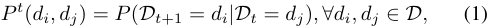

where _P__t_ ( _di, dj_ ) is the conditional probability of changing from the distribution _dj_ at time step _t_ to the distribution _di_ at time step _t_ + 1. Therefore, given the initial data distribution _D_ 1 and the transition probabilities _{P__k_ _}__t_ _k_ =1,wecandescribe the distribution of data samples at next time step: 

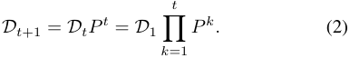

We leverage the conditional probability of the new data distribution at the next time step to characterize the nonstationarity of data streams. If the probability of the new data distribution at the next time step is high, it indicates a high level of non-stationarity, otherwise with a low-level one. Consequently, we can characterize the non-stationarity of data streams as follows: 

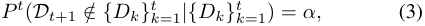

where _↵_ is a hyperparameter over the level of non-stationarity. Control over _↵_ enables exploring continuous data streams with different levels of non-stationarity. 

## _B. Latency-aware Online CL_ 

We adopt latency-aware online CL paradigm that employs a pipeline for online data collection and model adaptation with multiple rounds, as illustrated in Figure 1. In the _i_ -th round, the latency _Li_ of online CL comprises two parts: the waiting time _wi_ of the _i_ -th online data collection and the training time _⌧i_ of the _i_ -th model adaptation, _e_ . _g_ ., _Li_ = _wi_ + _⌧i_ . After collecting enough new arriving data samples, we assume that the _i_ -th model adaptation starts at the time step _si_ . The waiting time of the _i_ -th online data collection is defined as the interval between the ( _i −_ 1)-th model adaptation and the _i_ -th one, _e_ . _g_ ., _wi_ = _si − si−_ 1. The training time of the _i_ -th model adaptation is modeled linearly as _f_ ( _·_ ) with respect to the number of data samples _Ki_ utilized for model adaptation [14], _i_ . _e_ ., 

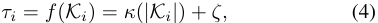

Authorized licensed use limited to: Shanghai Jiaotong University. Downloaded on August 17,2025 at 18:10:39 UTC from IEEE Xplore.  Restrictions apply. 

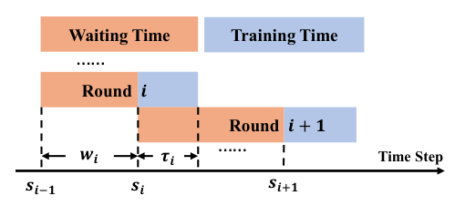

<!-- Start of picture text -->
Waiting Time Training Time …… Round   𝒊 Round   𝒊+ 𝟏 𝒘𝒊 𝝉𝒊 …… Time Step 𝒔𝒊−𝟏 𝒔𝒊 𝒔𝒊+𝟏 <!-- End of picture text -->

Fig. 1. The illustration of latency-aware online CL. 

where __ and _⇣_ are algorithm-specific parameters. 

To effectively learn from non-stationary data streams, online CL needs to perform continuous model adaptation to new data samples. Let _Bi_ be the newly collected data samples between the ( _i −_ 1)-th and _i_ -th model adaptation, _e_ . _g_ ., _Bi_ = _{_ ( _xt, yt_ ) _|si−_ 1 _ t  si}_ , and _Ci_ = _{Bj}__i_ _j__−_ =11bethepreviously accumulated ones. In the _i_ -th model adaptation, we seek to learn a model _✓i_ that maps the input _xt 2 X_ to the label _yt 2 Y_ . The objective of online CL is to adapt to the current data distribution while not forgetting the previous knowledge: 

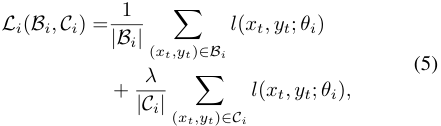

where _l_ indicates any standard loss function ( _e_ . _g_ ., crossentropy loss), and _λ_ is the regularization weight. 

## _C. Problem Formulation_ 

To realize low-latency online CL for non-stationary data streams with performance guarantee, it is essential to determine the time step _si_ to start model adaptation and a dataset _Ki ✓Bi [ Ci_ as training data for the trade-off between the model performance _Li_ and response latency _Li_ . Therefore, the optimization problem for latency-aware online CL can be formulated as follows: 

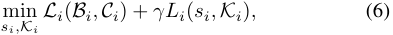

where _γ_ is the regularization weight, and _Li_ denotes the function of response latency. 

Considering the conflicts between data collection and model adaptation, we first decompose the optimization problem in Eq. (6), and then reformulate it as a two-stage time-scale optimization problem. In the first stage, we want to maximize the information diversity of the collected data samples, while minimizing its waiting time. Thus, the time optimization problem in the first stage can be formulated as: 

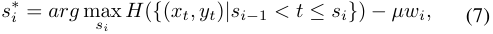

where _H_ ( _{_ ( _xt, yt_ ) _|si−_ 1 _< t  si}_ ) is the information entropy of the collected data samples, and _µ_ is the regularization weight. In the second stage, we would minimize the loss 

function and the training time of model adaptation by selecting the data samples _Ki_ . To adapt to new data samples without catastrophic forgetting, we divide the data samples _Ki_ into two parts: the coreset selected from newly collected data samples _Mi ✓Bi_ and the one from previously accumulated data samples _Ni ✓Ci_ , _e_ . _g_ ., _Ki_ = _Mi [ Ni_ . Consequently, the optimization problem in the second stage can be described as: 

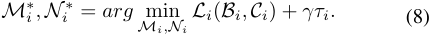

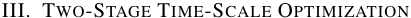

In this section, we first develop an optimal stopping algorithm to address the online data collection problem in the first stage. Subsequently, we introduce a bidirectional data selection algorithm to achieve efficient data selection in the second stage. We then present a comprehensive two-stage time-scale optimization algorithm across multiple rounds, and provide its convergence analysis along with performance guarantees. 

## _A. Stage I: Online Data Collection_ 

In the first stage, we need to determine a stopping time _si_ for the _i_ -th online data collection. Our goal for this stage is to maximize the accuracy of the updated model on both the newly emerging data samples and existing ones, while minimizing the waiting time required for the data collection process. Considering that the accuracy of the updated model cannot be obtained in advance, we leverage information entropy as a substitute metric to evaluate the efficiency of the collected data samples. Higher information entropy implies that the collected data samples are more valuable for model retraining to improve its plasticity. Specifically, we model the online data collection process as a discrete-time, infinite-horizon optimal stopping problem. At each time step _t 2 {si−_ 1 _, · · · , T }_ , we can choose to stop the data collection process, or continue with the increasing waiting time. We explicitly compute the information entropy of the collected data samples with its label categories. The category state space is _C_ = _{c_ 1 _, c_ 2 _, · · · , cn}_ and its labels _y 2 C_ . Consequently, we aim to maximize the information entropy of the collected data samples minus its waiting time by re-writing the objective in Eq. (7) as: 

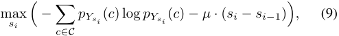

where _Ysi_ = _{ysi−_ 1 _, · · · , ysi }_ is the label set of the collected dataset, and _pYsi_ ( _c_ ) means its probability of each label. 

Considering that the arriving data sample adheres to a Markov process, we can utilize the Markov Decision Process to solve this optimal stopping problem. To maximize Eq. (9), we treat the reward brought by each newly collected data _yt_ as the increase in information entropy along with the time penalty. The decision to continue collecting new data samples yields the corresponding reward, while the decision to stop has no impact on the reward. However, the entropy increment of a newly collected data sample cannot be determined solely by itself; it necessitates the entire dataset _Ysi_ . By viewing _Ysi_ as the corresponding state of the new data sample at next time 

Authorized licensed use limited to: Shanghai Jiaotong University. Downloaded on August 17,2025 at 18:10:39 UTC from IEEE Xplore.  Restrictions apply. 

step, directly calculating its entropy increment and reward may lead to an excessively large sample space. For efficient model retraining, we approximate the entropy increment by using the _l_ nearest samples to the new ones, instead of the entire dataset _Ysi_ . With the assumption that the distribution of the _l_ data samples mirrors that of _Ysi_ , the sign of the entropy increment is identical. Formally, we define the state space, action space, and rewards of this optimization problem as follows: 

- State S: _St_ = _{yt−l_ +1 _, yt−l_ +2 _, · · · , yt} 2_ S. 

- Action A: A = _{_ stop _,_ continue _}_ . 

- Reward _R_ : _R_ ( _St_ ) = _−µ_ + _H_ ( _St_ ) _− H_ ( _St−_ 1). 

Due to the data distribution shift conforming to the Markov property, the state transition here also adheres to a Markov process. Given the state transition probability _PSiSj_ from the state _Si_ to the another one _Sj_ , we can calculate the maximum expected future reward _Q__⇤_ ( _St_ ) obtained by taking the action to continue in state _St_ , 

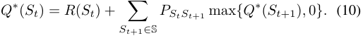

Correspondingly, adopting the action to stop yields a future reward that is perpetually 0. Thus, the optimal policy _⇡_ : S _!_ A can be defined by 

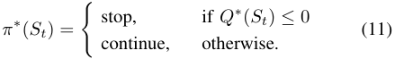

We learn the unknown state transition probabilities from the non-stationary environment of data streams. According to the Bellman equation, the widely utilized approach for updating the Q-function is 

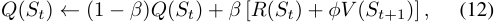

where _V_ ( _St_ +1) = max _{Q_ ( _St_ +1) _,_ 0 _}_ . 

We solve the optimal stopping problem through Algorithm 1. We begin by continuously collecting _l_ data samples to form _Sl_ (Line 2). Subsequently, for each newly collected data samples, we determine whether to stop using the Q- value and the optimal policy _⇡__⇤_ (Line 4). If we decide to stop ( _a_ = 0), the stopping time is returned. Otherwise, we compute the subsequent state along with the entropy increment and the associated waiting time introduced by the new sample collection (Line 6-7). Ultimately, we update the Q-value based on Eq. (12). To reduce the regret of the optimal stopping problem algorithm, we implement the UCB-Hoeffding algorithm to refine the updates made to the Q-values [15]–[17]. In contrast to Eq. (12), an additional term _b_ has been incorporated into the update of the Q-function (Line 10), which serves as a confidence bonus reflecting the algorithm’s confidence level regarding the currently explored Q value. Specifically, according to the UCB algorithm, we define the bonus term _b_ : 

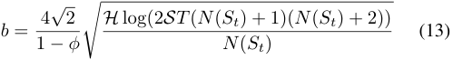

**Algorithm 1:** Optimal Stopping Algorithm 

**Input:** State space size _S_ , the length of data streams 

_T_ , discount factor _φ_ , learning rate _β_ . 

**Output:** The stopping time _t_ . **1** Initialize _Q_ ( _S_ ) _, Q_b ( _S_ ) 1 _−_ <u>1</u> _φ_,_N_(_S_)0; **2** _Sl_ = _{y_ 1 _, y_ 2 _, · · · , yl}_ , _a_ 1, _t l_ ; **3 while** _a 6_ = 0 **do** 

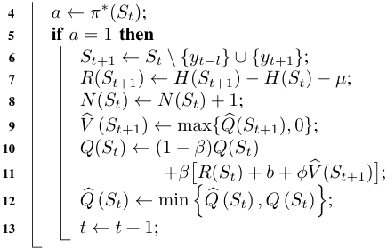

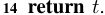

where _H_ln(2_<u>/</u>_<u>(1</u>_−φ_<u>)</u>_δ_<u>)</u> is a constant with hyperparameters ln(1 _/φ_ ) _δ_ , and the learning rate _β H_ + _<u>HN</u>_ <u>+1(</u> _St_ )diminishesprogres- sively with the accumulation of learning epochs _N_ ( _St_ ). For Algorithm 1, we can prove that the upper bound of its regret is less than _O_ log <u>2</u> _<u>ST</u>_ [15]. ⇣ (1 _−φ_ ) ⌘ 

## _B. Stage II: Bidirectional Data Selection_ 

In the second stage, given the newly collected dataset _Bi_ and the previous one _Ci_ , we aim to solve the optimization problem presented in Eq. (8) for the optimal _M__⇤_ _i__✓Bi_and_N ⇤_ _i__✓Ci_, to minimize the training time of the _i_ -th model adaptation, _e_ . _g_ ., _⌧i_ , while adapting to new arriving data samples without forgetting previous ones, _e_ . _g_ ., _Li_ . The _i_ -th model adaptation with stochastic gradient descent can be described as follows: 

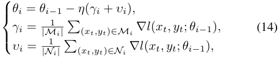

where _γi_ represents the average gradient computed from the data samples in _Mi_ , and _υi_ is the average gradient computed from the ones in _Ni_ , respectively. Similarly, we define Γ _i_ and ⌥ _i_ as the full average gradients for the newly collected data samples _Bi_ and the previously accumulated ones _Ci_ , _e_ . _g_ ., 

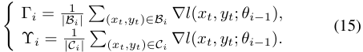

To maximize the generalization capability of the updated model _✓i_ across all accumulated data samples _{Bj}__i_ _j_ =1,itis essential to minimize the gradient discrepancy between the selected data samples and the corresponding whole ones, _e_ . _g_ ., _kγi −_ Γ _ik_ and _kυi −_ ⌥ _ik_ . Additionally, to adapt to the current task while preventing catastrophic forgetting [7], it is necessary 

Authorized licensed use limited to: Shanghai Jiaotong University. Downloaded on August 17,2025 at 18:10:39 UTC from IEEE Xplore.  Restrictions apply. 

## **Algorithm 2:** Bidirectional Data Selection Algorithm 

- **Input:** Newly collected dataset _Bi_ , previously dataset _Ci_ , threshold _✏_ , regularization weight _λ_ . 

- **Output:** new coreset _Mi_ , previous coreset _Ni_ . 

- **1** _Mi_ ? _, Ni_ ?, _INi_ 0 _, IMi_ 0 ; **2** _ICi_P _xk2Ci |Cxki|__, IBi_P _xk2Bi |Bxki|_; /* Current Data Selection */ 

- **3 while** _kIMi −IBi k _ 1+ _<u>✏</u> λ_**do** **4** _xMi arg_ max _x2Bi\Mi G_ ( _Mi [ {x}_ ) _−G_ ( _Mi_ ) ; **5** _Mi Mi [ {xMi }_ ; **6** _IMi_P _xk2Mi |Mxki|_; /* Previous Data Selection */ 

- **7 while** _kINi −ICi k _ 1+ _<u>✏λλ</u>_**do** **8** _xNi arg_ max _x2Ci\Ni G_ ( _Ni [ {x}_ ) _−G_ ( _Ni_ ) _s_ . _t_ . _hINi , IMi i ≥_ 0; 

- **9** _Ni Ni [ {xNi }_ ; 

- **10** _INi_P _xk2Ni |Nxki|_; **11 return** _Mi_ , _Ni_ . 

## **Algorithm 3:** LATE 

**Input:** Initialized model _✓_ 0, state space size _S_ , the length of stream _T_ , discount factor _φ_ , learning rate _β_ , threshold _✏_ , regularization weight _λ_ . **Output:** _i_ -th updated model _✓i_ . 

- **1** _i_ 1, _s_ 0 0 ; **2 for** _t_ = 1 : _T_ **do** /* Stage I: Data Collection */ 

- **3** _si_ Algorithm 1( _S_ , _T_ , _φ_ , _β_ ); **4 if** _t_ == _si_ **then 5** _Bi {xk, yk}__s_ _k__i_ = _si−_ 1; **6** _Ci {Bk}__s_ _k__i_ =1_−_1; /* Stage II: Data Selection */ 

- **7** _Mi, Ni_ Algorithm 2( _Bi, Ci_ , _✏_ , _λ_ ); /* Parallel: Model Adaptation */ <u>1</u> 

- **8** _γi_ = _|Mi|_ P( _x_ ; _y_ ) _2Mi__rl_(_x, y_;_✓i−_1); <u>1</u> 

- **9** _υi_ = _|Ni|_ P( _x_ ; _y_ ) _2Ni__rl_(_x, y_;_✓i−_1); 

- **10** _✓i_ = _✓i−_ 1 _− ⌘_ ( _γi_ + _υi_ ); **11** _i i_ + 1; 

**12 return** _✓i_ . 

to control the gradient angle computed from new selected data samples and previous selected ones, _e_ . _g_ ., _hγi, υii ≥_ 0. Consequently, the objective function of the bidirectional data selection problem in Eq. (8) can be reformulated as follows: 

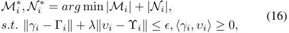

where the error _✏_ ensures that the sampling gradients closely approximate the full gradients. 

Solving the optimization problem in Eq. (16) is challenging and costly due to the large combination space and the extensive computation required for full gradients across all accumulated data samples. To alleviate the extensive computation of gradients, we approximate the differences between gradients derived from data samples using the techniques in [18], [19]: 

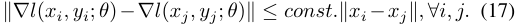

In this way, we can bound the difference between the gradients _γi_ and the full gradients Γ _i_ by the distance between the sampling data samples _Mi_ and the full collected data samples _Bi_ . Similarly, we can compute the similarity between the data samples _Mi_ and the data samples _Ni_ to bound the product of gradients from these two sampled datasets, _e_ . _g_ ., _hγi, υii_ . Consequently, we can reformulate the constraint conditions in Eq. (16) as follows: 

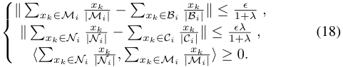

By applying triangular inequality, we can obtain an upper bound for the approximation to the first constraint condition in Eq. (18), and define the function _G_ ( _Mi_ ) as follows: 

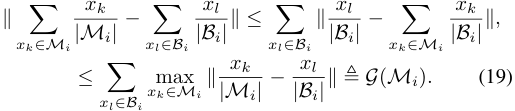

As for the optimization problem in Eq. (16), we can reduce it as a set cover problem, which is NP-hard, and employ a straightforward greedy approach to find the efficient approximate solution. Specifically, given _Mi_ and _Bi_ , we greedily select the data sample in _Bi_ but not in _Mi_ that yields the highest gain: 

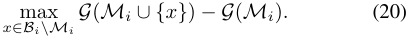

Incrementally select the data samples using this greedy approach until the selected dataset _Mi_ satisfies the corresponding constraint condition. Similarly, we then utilize the same strategy to obtain _Ni_ . As summarized in Algorithm 2, we realize the bidirectional data selection by first performing data selection on the new dataset (Line 3-6), and then followed by the selection on the previous ones (Line 7-10). 

Before presenting the performance analysis of Algorithm 2, we first introduce the definition of submodular function, and then prove that the function _G_ in Eq. (19) is a submodular function, and Algorithm 2 provides a solution with a logarithmic approximation in Theorem 1. 

**Definition 1.** _A set function f_ : 2_N_ _! R defined on a finite set N is called a submodular function, if for every A ✓ B ✓ N and every element x 2 N \B , the following inequality holds:_ 

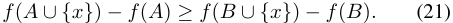

Authorized licensed use limited to: Shanghai Jiaotong University. Downloaded on August 17,2025 at 18:10:39 UTC from IEEE Xplore.  Restrictions apply. 

**Theorem 1.** _The function G is a submodular function, and the bidirectional data selection algorithm with greedy approach provides a solution with a logarithmic approximation._ 

## _C. Algorithm Design and Analysis_ 

In the previous sections, we introduced two algorithms for online data collection and model adaptation within a single round. Expanding upon these two algorithms, we have now developed a multi-round optimization algorithm, referred to as low-latency continual learning (LATE). LATE not only executes online data collection and selection sequentially for a single round, but also concurrently performs the data collection of the next round and the model adaptation of the current round, both of which are inherently time-sensitive tasks. 

We present LATE, the online two-stage time-scale optimization algorithm shown in Algorithm 3. Initially, LATE initializes the variables _i_ and _s_ 0 (Line 1), where _i_ represents the index of the current round of model adaptation, and _s_ 0 denotes the initial time point. At each time step _t_ , LATE employs Algorithm 1 to determine whether to stop online data collection (Line 3). If Algorithm 1 continues proceeding with data collection, it runs without any return value. However, if Algorithm 1 stops online data collection, it yields the optimal stopping time _si_ . Depending on the decision in the first stage, LATE initiates bidirectional data selection using Algorithm 2, aiming to identify the optimal training samples _Mi_ and _Ni_ from the newly gathered data samples _Bi_ and the previously accumulated ones _Ci_ (Line 4-7). Following in this manner, LATE simultaneously performs the model adaptation and initiates the next round of data collection to reduce the time cost. Specifically, LATE calculates gradients for the collected and selected datasets _Mi_ and _Ni_ , aggregates these gradients, and updates the model parameters from _✓i−_ 1 to _✓i_ (Line 8-11). Concurrently, LATE restarts the subsequent data collection stage and reactivates Algorithm 1 to identify the optimal time point _si_ +1 for online data collection in the next round, thus forming a continuous cycle of data collection and model adaptation (back to Line 3). 

Next, we provide an analysis of the convergence of LATE. Before giving the corresponding convergence analysis, we provide the following assumptions. 

- (Lipschitz gradient) For any model parameters _✓i_ and _✓j_ , there exist a constant _L >_ 0 that makes the loss gradient _rL_ ( _✓j_ ) satisfies _krL_ ( _✓i_ ) _−rL_ ( _✓j_ ) _k  Lk✓i − ✓jk._ 

- (Bound gradient variance) There exist a constant _σ_ , such that _E_ [ _kγi −_ Γ _ik_ ] _ σ, E_ [ _kυi −_ ⌥ _ik_ ] _ σ, 8i._ 

- (Bound loss) There exist the supremum of loss gap _4L_ between _✓_ 1 and _✓__⇤_ , _i_ . _e_ ., _4L_ = sup _L_ ( _✓_ 1) _−L_ ( _✓__⇤_ ) _._ 

According to the above assumptions, we provide the convergence analysis of Algorithm 3 in Theorem 2. It demonstrates that the minimum value of the gradient produced by LATE is bounded by the sampled gradients and converges over time. 

**Theorem 2.** _Considering the model parameter ✓, collected dataset Bi, learning rate ⌘, bound gradient variance σ and_ 

_bounded loss 4L, the iterates of LATE satisfy:_ 

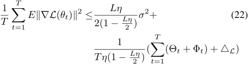

_where_ ⇥ _t_ =_L_ 2_<u>⌘</u>_2_kυtk_2 + (_L⌘_2_−⌘_)_hυt, γti,et_=_rL_(_✓t−_1)_−_ _γt, and_ Φ _t_ = ( _⌘ − L⌘_2 ) _hrL_ ( _✓t−_ 1) _, eti − ⌘hυt, eti._ 

## IV. PERFORMANCE EVALUATION 

In this section, we first describe the experimental setup, and then report the experimental results with overall performance and key parameter analysis. 

## _A. Experiment Setting_ 

1) **Datasets and Models** : we utilize two different image datasets: CIFAR100 and Tiny-ImageNet to testify the effectiveness of our method. As for machine learning models, we select two lightweight models: MobileNet V2 and ResNet18. As for these models, the learning rate and batch size of model retraining are 0.01 and 32, respectively. Moreover, we set the decay factor and momentum to their default values of 0. As for data streams, we consider class-incremental CL settings [20], [21] by dividing the whole classes of each dataset into different data groups with the length of data streams _T_ , and configure the arrival interval for data streams to be 1s. 

2) **Baselines** : We compare our proposed LATE with the following classical CL methods: 

- MIR, Maximally Interfered Retrieval, a memory retrieval method that retrieves memory samples that suffer from an increase in loss given the estimated parameters update based on the current task [22]. 

- GDUMB, Greedy Sampler and Dumb Learner, greedily stores samples from data streams, and trains a model from scratch using samples only in the memory [23]. 

- AGEM, Averaged Gradient Episodic Memory, a memorybased method that utilizes the samples in the memory buffer to constrain the parameter updates [24]. 

- 3) **Metrics** : We evaluate the performance of LATE by using 

the following two metrics: 

- Average Accuracy: We use _4f_ ( _xt, yt_ ; _✓_ ) to denote the prediction accuracy of predictor _✓_ where _xt_ is the input feature, _yt_ is the truth label and _t_ is the time step. The average accuracy at the end of data streams can be measured as follows: 

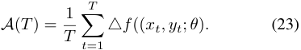

- Response Latency: We compute the waiting time _wi_ of the _i_ -th online data collection and the training time _⌧i_ of the _i_ -the model adaptation, and add these two time cost as its response latency: 

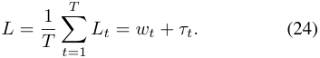

Authorized licensed use limited to: Shanghai Jiaotong University. Downloaded on August 17,2025 at 18:10:39 UTC from IEEE Xplore.  Restrictions apply. 

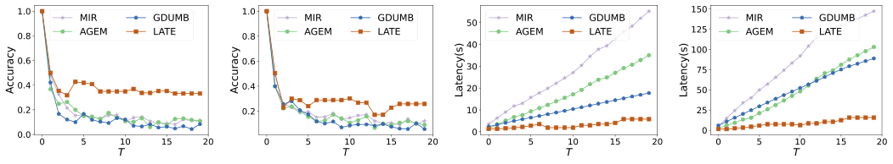

(a) (b) (c) (d) 

Fig. 2. The performance comparison of four CL approaches: (a) Accuray of MobileNet V2 on CIFAR100; (b) Accuracy of ResNet18 on Tiny-ImageNet; (c) L ~~<u>atency</u>~~ of MobileNet V2 on CIFAR10 ~~<u>0; (d) L</u>~~ atency of ResNet18 on Tiny-I ~~<u>mageNe</u>~~ t. 

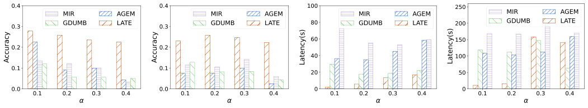

(a) (b) 

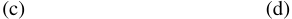

<!-- Start of picture text -->
(c) (d) <!-- End of picture text -->

Fig. 3. The impact of _↵_ : (a) Accuray of MobileNet V2 on CIFAR100; (b) Accuracy of ResNet18 on Tiny-ImageNet; (c) Latency of MobileNet V2 on CIFAR100; (d) Latency of ResNet18 on Tiny-ImageNet. 

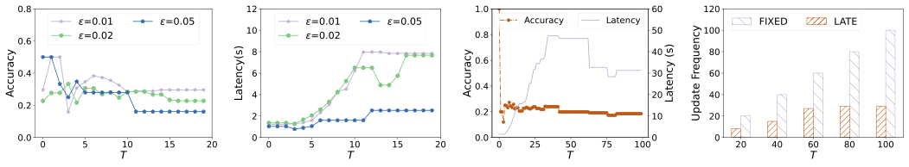

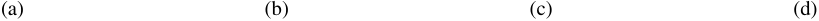

<!-- Start of picture text -->
(a) (b) (c) (d) <!-- End of picture text -->

Fig. 4. (a) The impact of _✏_ on accuracy; (b) The impact of _✏_ on latency; (c) The impact of _T_ on accuracy and latency; (d) The frequency of model adaptation. 

## _B. Overall Performance_ 

Figure 2 illustrates the average accuracy and response latency of four different CL methods with time steps _T_ = 20. Figure 2(a) depicts the average accuracy of MobileNet V2 on the dataset CIFAR100, showing that the average accuracy of these four CL methods decreases over time steps. At time steps _T_ = 20, it is evident that LATE outperforms other CL methods with a 21% performance improvement. The main reason for this phenomenon is that LATE performs online data collection and selects valuable samples from both the newly accumulated dataset and previous ones. The proposed LATE enhances its plasticity without catastrophic forgetting, making it more efficient compared to other CL methods. To further validate this result in a more persuasive manner, we conducted additional experiments using ResNet18 on the TinyImageNet dataset. As shown in Figure 2(b), the results confirm the same conclusion: LATE outperforms the other CL methods with an 11% improvement in average accuracy. Figure 2(c) plots the response latency of MobileNet V2 on the dataset CIFAR100, demonstrating that the response latency of these 

four CL methods increases over time steps. At time step _T_ = 20, it is observed that MIR has the highest response latency at approximately 55 seconds, while LATE has the lowest response latency at around 8 seconds. Consequently, without frequent model adaptation to avoid data congestion, LATE outperforms the other CL methods with an average acceleration of 2.5 times. Similarly, as shown in Figure 2(d), we further validate the response latency of these four CL methods by using ResNet18 on the Tiny-ImageNet dataset. Although the response latency on ResNet18 is relatively high compared to the lightweight model MobileNet V2, the acceleration in response latency is up to 7.5 times between LATE and the other CL methods, further demonstrating the superiority and robustness of LATE. 

## _C. Key Parameter Analysis_ 

**Impact of** **_↵_** . In figure 3, we explore the impact of nonstationarity of data streams on the average accuracy and response latency of these four CL methods. Figure 3(a) plots the average accuracy of MobileNet V2 on the CIFAR-100 

Authorized licensed use limited to: Shanghai Jiaotong University. Downloaded on August 17,2025 at 18:10:39 UTC from IEEE Xplore.  Restrictions apply. 

dataset with four different values of _↵_ . It is evident that the average accuracy of these four CL methods is higher in scenarios with low-degree non-stationarity data streams. Regardless of whether the non-stationarity is high or low, LATE consistently demonstrates superior model performance compared to the other CL methods. Similarly, we can obtain the same conclusion by further using ResNet18 on the TinyImageNet dataset shown in Figure 3(b). Figure 3(c) plots the response latency of MobileNet V2 on the dataset CIFAR100 with different value of _↵_ , and we find that the response latency of LATE increases with the value of _↵_ , whereas the response time of other methods does not show a direct correlation with the non-stationarity of data streams. This indicates that only the LATE method optimizes for different non-stationarity of data streams, demonstrating higher adaptability compared to the other three CL methods. Moreover, LATE has shortest response time comparing to other CL methods, and can be further validated in Figure 3(d) with more experiment by utilizing ResNet18 on the Tiny-ImageNet. 

**Impact of** **_✏_** . We use parameter _✏_ to control the amount of data collection and selection. The larger the parameter value, the less data needs to be collected and selected. In Figure 4, we investigate the impact of _✏_ on the average accuracy and response latency. Figure 4(a) shows the average accuracy and response latency of MobileNet V2 on the CIFAR-100 dataset with different values of _✏_ . It is evident that both the average accuracy and response latency of LATE increase as the collected and selected data samples increase. Therefore, LATE with _✏_ achieves the highest accuracy compared to the other settings. Additionally, Figure 4(b) compares the response latency of model adaptation with different values of _✏_ , showing that the response latency increases with the amount of data. It is clear that LATE exhibits the smallest response latency. 

**Impact of** **_T_** . We further investigate the impact of the length of time steps on the average accuracy and response latency of these four CL methods. Figure 4(c) shows the average accuracy and response latency of MobileNet V2 on the CIFAR100 dataset over time steps _T_ = 100. It is evident that both the average accuracy and response latency of LATE fluctuate initially but stabilize as _T_ increases. Additionally, Figure 4(d) compares the frequency of model adaptation between LATE and the other CL methods, revealing that LATE requires fewer adaptations. While the frequency of model adaptation for the other CL methods increases linearly with time steps, LATE shows a relatively slower rate of increase. 

## V. RELATED WORKS 

**Non-stationary Data Streams** . Massive data streams are 

continuously collected from ubiquitous end devices, and required immediate processing to satisfy the low latency requirements of many real-world applications [1]–[3], [25]–[27]. In traditional continual learning scenarios, data arrives in batches, with each batch consisting of i.i.d. samples and available in large quantities. However, in the context of non-stationary data streams, data arrives gradually over time, and the data distribution also evolves with time [28], [29]. For instance, a 

UAV equipped with a high-resolution camera captures images for object detection on the fly, and the categories of these images may undergo significant changes due to the nonstationarity of environment [2]. To tackle the non-stationarity of continuous data streams, machine learning model should be retrained or replaced to adapt to new arriving data [4]–[6]. To learn online from data streams with frequent data distribution change, a system for enabling learning and prediction at same time has been proposed, where a novel objective function synchronizes the latent space with the continually evolving prototypes [28]. However, existing works only center on how to realize efficient model training or model selection, while often overlooking the low-latency requirements of online service provisioning. Consequently, it is essential and imperative to learn incrementally from non-stationary data streams under the latency constraint. 

**Online Continual Learning** . Online CL is becoming a mainstream paradigm to learn incrementally from continuous data streams without forgetting previously learned knowledge. The current practices to overcome catastrophic forgetting can be identified into three main families of approaches: Regularization methods add extra terms to the loss function to limit the model’s capacity, thereby preventing the model from overfitting to new learning tasks [30]–[32]. Replay methods reintroduce old data during the training process to help the model recall old knowledge [33]–[35]. Expansion methods increase the model’s capacity to learn new tasks while maintaining access to old knowledge [36]–[38]. Although in an online manner, current online CL methods are still unable to support online service provisioning, as most of them overlook the conflict between the waiting time of online data collection and the training time of model adaptation. There also exist a few works in online CL to focus on the training time of model adaptation. In order to realize inference queries at any time, the authors design a new memory management scheme and learning rate scheduling strategy to adapt in online, taskfree, class-incremental of blurry task streams [39]. To evaluate current CL methods, a new real-time evaluation in online CL has been proposed to consider the training delay and fast change in data distribution [13]. Although these methods can perform model inference without any delay, the performance of online service provisioning is subpar due to the reuse of an older model, especially for slow-training CL methods and high-velocity data streams with fast data distribution change. 

**Data Selection** . Data selection refers to the process of choosing a coreset from a large dataset, ensuring that this selected coreset is similar to the original one. There exist various approaches to obtain a coreset from a large dataset. Importance sampling amplifies the loss/gradients of significant samples based on influence functions [40]. Recently, a bilevel optimization framework has been proposed to incorporate cardinality constraints for coreset selection [41]. To evaluate the importance of data, a large amount of research works mainly focus on metrics like loss [42], gradient norm [43], [44], uncertainty [45], [46], shapely value [47] and representativeness [48]. In continual learning, data selection is often used 

Authorized licensed use limited to: Shanghai Jiaotong University. Downloaded on August 17,2025 at 18:10:39 UTC from IEEE Xplore.  Restrictions apply. 

to choose the data that needs to be replayed. They select replay samples based on loss increment [22], gradient diversity [7], shapely values [8], mutual information [5] and other deliberately designed algorithms [23], [49], [50]. However, existing method is extremely limited in practice and inapplicable in online service provisioning settings due to the excessive computational cost incurred during model adaptation. In contrast, our proposed approach utilizes gradients as the criterion for data selection, and simultaneously perform data selection on both historical and new data to reduce the time cost of online data collection and model adaptation, which is beneficial for learning incrementally from non-stationary data streams. 

## VI. CONCLUSION 

In this work, we focused on the latency of learning incrementally from non-stationary data streams, and have proposed a two stage time-scale optimization approach to realize lowlatency online CL. In the first online stage with uncertain data arrivals, we have designed an optimal stopping algorithm with a logarithmic regret bound to make an irrevocable decision on when to perform model adaptation. To reduce the training time of model adaptation in the second stage, we introduced a greedy sample selection algorithm to determine samples to be used from both new accumulated data and previous ones, to improve its plasticity without catastrophic forgetting. Extensive evaluations demonstrate that our proposed approach consistently outperforms the-state-of-art solutions, improving the accuracy by 16.8% on average and reducing the response latency by up to 6.2 times. 

## _A. Proof of Theorem 1_ 

_Proof._ We define the function _G_ in Eq. (19), and prove that this function is a submodular one as following. First, given _A ✓Mi ✓Bi_ and every element _x 2 Bi\Mi_ , we can have: 

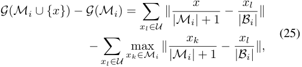

where _U_ denotes the the set of data samples with the change of the maximum value. Similarly, we can further obtain: 

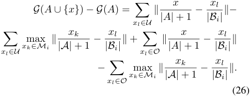

Due to _A ✓Mi ✓Bi_ , the set of data samples with the change of the maximum value is in _A_ . Besides, there also exists the other set _O_ in _A_ but not in _Mi_ . Thus, we can conclude it with _G_ ( _A [ {x}_ ) _−G_ ( _A_ ) _≥G_ ( _Mi [ {x}_ ) _−G_ ( _Mi_ ). As for the logarithmic approximation, the proof is similar to [51] and we omit the details due to the space limit 

_B. Proof of Theorem 2_ 

_Proof._ Let _γt_ = _|N_ <u>1</u> _t|_ P( _xi,yi_ ) _2Nt__rl_(_xi, yi_;_✓i−_1) and <u>1</u> _υt_ = _|Mt|_ P( _xi,yi_ ) _2Mt__rl_(_xi, yi_;_✓t−_1).Moreover,wede- fine _rL_ ( _✓t−_ 1) = _|B_ <u>1</u> _t|_ P( _xi,yi_ ) _2Bt__rl_(_xi, yi_;_✓_)and_et_= _rL_ ( _✓t−_ 1) _− γt_ . In this way, we can have that _L_ ( _✓t_ ) __ 

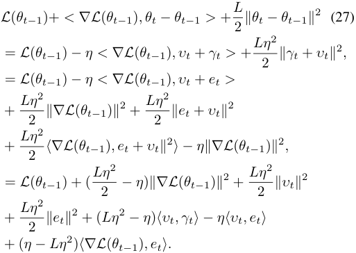

To analyze the convergence of the updated model, we need to provide proof of gradient boundedness. For this purpose, we need to transform the inequality in Eq. (27) and rewrite it as: 

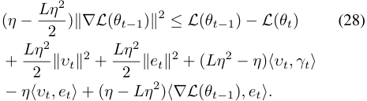

_L⌘_2 For easy to read, we denoting ⇥ _t_ = 2_kυtk_2+(_L⌘_2_−_ _⌘_ ) _hυt, γti_ , Φ _t_ = ( _⌘ − L⌘_2 ) _hrL_ ( _✓t−_ 1) _, eti − ⌘hυt, eti_ . Taking the expectation over the gradients _rL_ ( _✓t−_ 1), we can reformulate and have: 

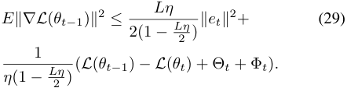

Next, we further accumulate the gradients after multiple rounds of model retraining, and eliminate intermediate terms using the boundedness property in Eq. (29). Thus, we can further get the following conclusion: 

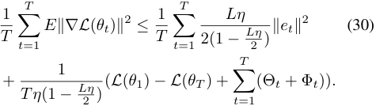

Authorized licensed use limited to: Shanghai Jiaotong University. Downloaded on August 17,2025 at 18:10:39 UTC from IEEE Xplore.  Restrictions apply. 

REFERENCES 

- [1] B. Gaikwad and A. Karmakar, “Smart surveillance system for real-time multi-person multi-camera tracking at the edge,” _Journal of Real-Time Image Processing._ , vol. 18, no. 6, pp. 1993–2007, 2021. 

- [2] S. Wang, F. Jiang, B. Zhang, R. Ma, and Q. Hao, “Development of uav-based target tracking and recognition systems,” _IEEE Transactions on Intelligent Transportation Systems._ , vol. 21, no. 8, pp. 3409–3422, 2020. 

- [3] Z. Ouyang, J. Niu, Y. Liu, and M. Guizani, “Deep cnn-based real-time traffic light detector for self-driving vehicles,” _IEEE Transactions on Mobile Computing._ , vol. 19, no. 2, pp. 300–313, 2020. 

- [4] A. Chrysakis and M. Moens, “Online continual learning from imbalanced data,” in _Proc. of ICML_ , 2020, pp. 1952–1961. 

- [5] Y. Guo, B. Liu, and D. Zhao, “Online continual learning through mutual information maximization,” in _Proc. of ICML_ , 2022, pp. 8109–8126. 

- [6] T. L. Hayes and C. Kanan, “Online continual learning for embedded devices,” in _Proc. of CoLLAs_ , 2022, pp. 744–766. 

- [7] R. Aljundi, M. Lin, B. Goujaud, and Y. Bengio, “Gradient based sample selection for online continual learning,” in _Proc. of NeurIPS_ , 2019, pp. 11 816–11 825. 

- [8] D. Shim, Z. Mai, J. Jeong, S. Sanner, H. Kim, and J. Jang, “Online class-incremental continual learning with adversarial shapley value,” in _Proc. of AAAI_ , 2021, pp. 9630–9638. 

- [9] A. Prabhu, H. A. A. K. Hammoud, P. K. Dokania, P. H. S. Torr, S. Lim, B. Ghanem, and A. Bibi, “Computationally budgeted continual learning: What does matter?” in _Proc. of CVPR_ , 2023, pp. 3698–3707. 

- [10] X. Li, S. Wang, J. Sun, and Z. Xu, “Variational data-free knowledge distillation for continual learning,” _IEEE Transactions on Pattern Analysis and Machine Intelligence_ , vol. 45, no. 10, pp. 12 618–12 634, 2023. 

- [11] S. Hou, X. Pan, C. C. Loy, Z. Wang, and D. Lin, “Learning a unified classifier incrementally via rebalancing,” in _Proc. of CVPR_ , 2019, pp. 831–839. 

- [12] R. Ramesh and P. Chaudhari, “Model zoo: A growing brain that learns continually,” in _Proc. of ICLR_ , 2022, pp. 1–29. 

- [13] Y. Ghunaim, A. Bibi, K. Alhamoud, M. Alfarra, H. A. A. K. Hammoud, A. Prabhu, P. H. S. Torr, and B. Ghanem, “Real-time evaluation in online continual learning: A new hope,” in _Proc. of CVPR_ , 2023, pp. 11 888– 11 897. 

- [14] H. Tian, M. Yu, and W. Wang, “Continuum: A platform for cost-aware, low-latency continual learning,” in _Proc. of SoCC_ , 2018, pp. 26–40. 

- [15] K. Yang, L. Yang, and S. Du, “Q-learning with logarithmic regret,” in _Proc. of AISTATIS_ , 2021, pp. 1576–1584. 

- [16] C. Jin, Z. Allen-Zhu, S. Bubeck, and M. I. Jordan, “Is q-learning provably efficient?” in _Proc. of NeurIPS_ , 2018, pp. 4868–4878. 

- [17] Y. Wang, K. Dong, X. Chen, and L. Wang, “Q-learning with UCB exploration is sample efficient for infinite-horizon MDP,” in _Proc. of ICLR_ , 2020, pp. 1–20. 

- [18] B. Mirzasoleiman, J. Bilmes, and J. Leskovec, “Coresets for dataefficient training of machine learning models,” in _Proc. of ICML_ , 2020, pp. 6950–6960. 

- [19] T. Hofmann, A. Lucchi, S. Lacoste-Julien, and B. McWilliams, “Variance reduced stochastic gradient descent with neighbors,” in _Proc. of NeurIPS_ , 2015, pp. 2305–2313. 

- [20] D. Shim, Z. Mai, J. Jeong, S. Sanner, H. Kim, and J. Jang, “Online class-incremental continual learning with adversarial shapley value,” in _Proc. of AAAI_ , 2021, pp. 9630–9638. 

- [21] G. Kim, C. Xiao, T. Konishi, Z. Ke, and B. Liu, “A theoretical study on solving continual learning,” in _Proc. of NeurIPS._ , 2022, pp. 5065–5079. 

- [22] R. Aljundi, L. Caccia, E. Belilovsky, M. Caccia, M. Lin, L. Charlin, and T. Tuytelaars, “Online continual learning with maximally interfered retrieval,” _CoRR_ , vol. abs/1908.04742, 2019. 

- [23] A. Prabhu, P. H. S. Torr, and P. K. Dokania, “Gdumb: A simple approach that questions our progress in continual learning,” in _Proc. of ECCV_ , 2020, pp. 524–540. 

- [24] A. Chaudhry, M. Ranzato, M. Rohrbach, and M. Elhoseiny, “Efficient lifelong learning with A-GEM,” in _Proc. of ICLR_ , 2019, pp. 1–20. 

- [25] Y. Zhuang, Z. Zheng, F. Wu, and G. Chen, “Litemoe: Customizing ondevice LLM serving via proxy submodel tuning,” in _Proc. of SenSys_ , 2024, pp. 521–534. 

- [26] C. Gong, Z. Zheng, F. Wu, X. Jia, and G. Chen, “Delta: A cloud-assisted data enrichment framework for on-device continual learning,” in _Proc. of MobiCom_ , 2024, pp. 1408–1423. 

- [27] H. Liu, J. Lu, X. Wang, C. Wang, R. Jia, and M. Li, “Fedup: Bridging fairness and efficiency in cross-silo federated learning,” _IEEE Transactions on Services Computing_ , vol. 17, no. 6, pp. 3672–3684, 2024. 

- [28] C. Fahy, S. Yang, and M. Gongora, “Scarcity of labels in non-stationary data streams: A survey,” _ACM Computing Surveys_ , vol. 55, no. 2, pp. 40:1–40:39, 2023. 

- [29] M. D. Lange and T. Tuytelaars, “Continual prototype evolution: Learning online from non-stationary data streams,” in _Proc. of ICCV_ , 2021, pp. 8230–8239. 

- [30] J. Kirkpatrick, R. Pascanu, N. C. Rabinowitz, J. Veness, G. Desjardins, A. A. Rusu, and K. Milan, “Overcoming catastrophic forgetting in neural networks,” _CoRR_ , vol. abs/1612.00796, 2016. 

- [31] S. Lee, J. Kim, J. Jun, J. Ha, and B. Zhang, “Overcoming catastrophic forgetting by incremental moment matching,” in _Proc. of NeurIPS_ , 2017, pp. 4652–4662. 

- [32] H. Ahn, S. Cha, D. Lee, and T. Moon, “Uncertainty-based continual learning with adaptive regularization,” in _Proc. of NeurIPS_ , 2019, pp. 4394–4404. 

- [33] C. D. Kim, J. Jeong, S. Moon, and G. Kim, “Continual learning on noisy data streams via self-purified replay,” in _Proc. of ICCV_ , 2021, pp. 517–527. 

- [34] M. Riemer, I. Cases, R. Ajemian, M. Liu, I. Rish, Y. Tu, and G. Tesauro, “Learning to learn without forgetting by maximizing transfer and minimizing interference,” in _Proc. of ICLR_ , 2019, pp. 1–31. 

- [35] L. Kumari, S. Wang, T. Zhou, and J. A. Bilmes, “Retrospective adversarial replay for continual learning,” in _Proc. of NeurIPS_ , 2022, pp. 28 530–28 544. 

- [36] X. Li, Y. Zhou, T. Wu, R. Socher, and C. Xiong, “Learn to grow: A continual structure learning framework for overcoming catastrophic forgetting,” in _Proc. of ICML_ , 2019, pp. 3925–3934. 

- [37] S. C. Y. Hung, C. Tu, C. Wu, C. Chen, Y. Chan, and C. Chen, “Compacting, picking and growing for unforgetting continual learning,” in _Proc. of NeurIPS_ , 2019, pp. 13 647–13 657. 

- [38] J. Yoon, S. Kim, E. Yang, and S. J. Hwang, “Scalable and order-robust continual learning with additive parameter decomposition,” in _Proc. of ICLR_ , 2020, pp. 1–15. 

- [39] H. Koh, D. Kim, J. Ha, and J. Choi, “Online continual learning on class incremental blurry task configuration with anytime inference,” in _Proc. of ICLR_ , 2022, pp. 1–21. 

- [40] S. Sinha, J. Song, A. Garg, and S. Ermon, “Experience replay with likelihood-free importance weights,” in _Proc. of L4DC_ , 2022, pp. 110– 123. 

- [41] Z. Borsos, M. Mutny, and A. Krause, “Coresets via bilevel optimization for continual learning and streaming,” in _Proc. of NeurIPS_ , 2020, pp. 14 879–14 890. 

- [42] A. Shrivastava, A. Gupta, and R. Girshick, “Training region-based object detectors with online hard example mining,” in _Proc. of CVPR_ , 2016, pp. 761–769. 

- [43] T. B. Johnson and C. Guestrin, “Training deep models faster with robust, approximate importance sampling,” in _Proc. of NeurIPS_ , 2018, pp. 7276–7286. 

- [44] C. Gong, Z. Zheng, F. Wu, Y. Shao, B. Li, and G. Chen, “To store or not? online data selection for federated learning with limited storage,” in _Proc. of WWW_ , 2023, pp. 3044–3055. 

- [45] H.-S. Chang, E. Learned-Miller, and A. McCallum, “Active bias: Training more accurate neural networks by emphasizing high variance samples,” in _Proc. of NeurIPS_ , 2017, pp. 1002–1012. 

- [46] C.-Y. Wu, R. Manmatha, A. J. Smola, and P. Krahenbuhl, “Sampling matters in deep embedding learning,” in _Proc. of CVPR_ , 2017, pp. 2840– 2848. 

- [47] A. Ghorbani and J. Zou, “Data shapley: Equitable valuation of data for machine learning,” in _Proc. of ICML_ , 2019, pp. 2242–2251. 

- [48] Y. Wang, F. Fabbri, and M. Mathioudakis, “Fair and representative subset selection from data streams,” in _Proc. of WWW_ , 2021, pp. 1340–1350. 

- [49] P. Buzzega, M. Boschini, A. Porrello, D. Abati, and S. Calderara, “Dark experience for general continual learning: a strong, simple baseline,” in _Proc. of NeurIPS_ , 2020, pp. 15 920–15 930. 

- [50] A. Chaudhry, N. Khan, P. K. Dokania, and P. H. S. Torr, “Continual learning in low-rank orthogonal subspaces,” in _Proc. of NeurIPS_ , 2020, pp. 9900–9911. 

- [51] G. L. Nemhauser, L. A. Wolsey, and M. L. Fisher, “An analysis of approximations for maximizing submodular set functions - I,” _Mathematical Programming_ , vol. 14, no. 1, pp. 265–294, 1978. 

Authorized licensed use limited to: Shanghai Jiaotong University. Downloaded on August 17,2025 at 18:10:39 UTC from IEEE Xplore.  Restrictions apply. 

