# Budget-Constrained Federated Bandits for Mobile Applications 

Anran Xu1_,_2 , Zhenzhe Zheng2_†_ , Wenming Zheng1 , Fan Wu2 

> 1China Telecom, China 

> 2Shanghai Jiao Tong University, China 

E-mail: _{_ xuar2, zhengwenm _}_ @chinatelecom.cn, zhengzhenzhe@sjtu.edu.cn, fwu@cs.sjtu.edu.cn 

**_Abstract_ —With the development of federated learning and mobile computing, federated bandit frameworks have been proposed to enable multiple clients to explore and exploit collaboratively under the guarantee of data privacy. However, none of them take the widespread budget constraints into account. In this work, we introduce the Federated linear Bandits framework with Knapsacks (FBwK), where** **_M_ clients can pull** **_K_ arms with linear rewards and costs to minimize the total regret under the coordination of a central server. For FBwK, we propose a new definition of OPT solution and a bandit algorithm, namely FedUCBwK. Specifically, we design a uniform policy parameter update threshold for each client, which balances regret, communication, and computation costs. In this process, the central server uses a factor on knapsack constraints to pace the budget consumption and preserve the clients’ privacy by transmitting model updates instead of raw data. We conduct a theoretical analysis and show that FedUCBwK achieves a sublinear regret with logarithmic communication and computation. Evaluation on real-world mobile application datasets demonstrates that FedUCBwK consistently outperforms existing methods across diverse tasks.** 

**_Index Terms_ —federated bandits, bandits with knapsacks, federated learning** 

## I. Introduction 

Many real-world mobile applications, such as personalized recommendations [1], [2], mobile advertising [3], [4], crowdsensing [5], [6], require sequential decision-making under uncertainty, where agents must select actions over time to maximize long-term cumulative rewards. The multiarmed bandit (MAB) framework [7] serves as a canonical model for such problems, characterizing the fundamental trade-off between exploration and exploitation. With the rise of federated learning (FL), decentralized decision-making has become viable across privacy-sensitive and bandwidthconstrained clients. Federated bandits [8], [9] extend MABs to this setting, allowing clients to interact with local environments while jointly optimizing global policies via a central server, without sharing raw data. However, existing work does not account for a key real-world challenge: resource 

This work was supported in part by National Key R&D Program of China (No. 2023YFB4502400), in part by China NSF grant No. U2268204, 62322206, 62432007, 62132018, 62025204, 62272307, 62372296. Thanks to Xutong Liu, Shengjie Wang and Shuai Li for their valuable discussions and insightful comments. The opinions, findings, conclusions, and recommendations expressed in this paper are those of the authors and do not necessarily reflect the views of the funding agencies or the government._†_ Zhenzhe Zheng is the corresponding author. 

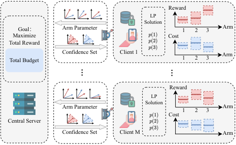

<!-- Start of picture text -->
Reward LP Solution    Goal ： Arm Parameter 1  2  3 Arm Maximize Cost Total Reward Confidence Set Client 1 Arm Total Budget 1  2  3 Reward LP Solution Arm Parameter Arm 1  2  3 Cost Central Server Confidence Set Client M Arm … … <!-- End of picture text -->

Fig. 1. Resource-Bounded Federated Bandits for Mobile Applications. 

and budget constraints that persist throughout the learning process [10], as shown in Fig. 1. 

In many mobile applications, budget constraints are fundamental to how decisions are made and enforced in practice. These constraints are typically imposed by a central controller ( _e.g._ , a server) based on overall financial, operational, or policy limits, and are consumed incrementally by the actions of individual clients. For instance, in mobile advertising [3], an advertiser allocates a global advertising budget, and each client consumes part of it whenever an ad is displayed. In wireless network configuration [11], a mobile network operator limits the total number of parameter changes to avoid service disruptions and energy overhead. Similarly, in crowdsourcing platforms [12], [13], the central platform allocates a fixed incentive budget, and each task assignment deducts from this budget to reward participating workers. These diverse scenarios share a common structure: each action incurs a cost, and the overall policy must optimize utility while satisfying global budget constraints. While prior FL works consider resource constraints, they predominantly focus on communication or computation overhead [14], [15] in mobile applications, which differ fundamentally from the hard budget bounds on action-level costs we consider. 

To capture this structure, we formally model the problem as Federated Bandits with Knapsacks (FBwK), a novel formulation where multiple clients collaboratively learn armselection strategies under a shared global budget constraint. While prior work has made significant progress on Bandits with Knapsacks (BwK) [10], [16], [17] and FL [8], [9], [18], [19], their solutions cannot be directly applied to the FBwK 

setting due to the following key challenges: 

The first challenge lies in the high computational cost required to satisfy knapsack constraints on the client side. A standard approach to BwK1 [10], [16] solves a linear program (LP) in every decision round. However, mobile clients typically lack the capacity to perform complex optimization procedures [20], making these methods impractical in federated environments, because the computational overhead becomes especially prohibitive as the number of clients or arms increases. Oracle-based alternatives for contextual BwK [17], [21] are theoretically attractive, but they rely on strong assumptions about supervised learning subroutines [22], and are rarely feasible in real-world mobile settings. Thus, to enable scalable and deployable FBwK algorithms, it is essential to design lightweight client-side solutions that reduce the number of LP computations while still offering provable regret bounds and competitive empirical performance. 

The second challenge arises from the interplay between communication and computation costs in FBwK. Existing federated bandit algorithms [8], [23] primarily consider communication overhead, but overlook the significant computational burden imposed by solving BwK subproblems on clients. Effective learning in FBwK requires a synchronization scheme that jointly coordinates communication and local computation. If clients update policies purely locally without timely communication, they cannot leverage complementary information from others, leading to biased updates. Conversely, if clients communicate frequently without sufficient local training, the exchanged information may be poorly optimized and offer little value. Crucially, synchronization in FBwK is not a simple combination of existing approaches. This is because they use different intuitions to ensure a lower regret2 , and naively merging them may result in compounded errors and high cumulative regret. Therefore, a unified synchronization scheme is needed, which jointly optimizes communication, computation, and regret, with formal guarantees. 

The third challenge comes from the need to preserve the privacy of the client. Prior works [8], [15], [25] often add noise or perturbations to raw data to ensure differential privacy. However, such mechanisms inevitably degrade model performance and may still risk privacy leakage in high-dimensional settings. To mitigate this, we follow the traditional federated learning paradigm [26] and transmit only model parameters instead of raw data. However, in the federated bandit setting, the transmitted parameters are local estimates rather than fully trained models, which may lack sufficient information to accurately recover global statistics or compute effective arm-selection strategies. This necessitates a new parameter aggregation and estimation approach 

1The BwK problem is the sub-problem solved locally by each client. Please refer to Section IV for more technical details. 

> 2Methods to reduce communication costs in the federated setting are designed to address parameter estimation deviation caused by communication delays [18], [24], while those for reducing computation costs under knapsack constraints aim to manage the deviation due to budget loss [17], [21]. 

tailored for federated bandits, one that preserves privacy without sacrificing decision quality. 

In response to these challenges, we develop a unified solution that balances computation, communication, and privacy, while respecting global budget constraints and providing theoretical guarantees. We summarize our main contributions as follows. 

- We formulate the federated linear bandits with knapsacks (FBwK) problem to model sequential decisionmaking in mobile applications under global knapsackstyle resource constraints. We introduce a new regret benchmark (OPT) and prove that it serves as a valid upper bound on the global optimum by decomposing the FBwK problem across multiple clients. 

- We propose a novel algorithm, FedUCBwK, to solve the FBwK problem under a linear reward/cost model and static context setting. FedUCBwK coordinates computation and communication via a unified epoch-based threshold: it triggers policy updates at clients and parameter aggregation at the server. To avoid budget overspending, a budget-control factor is integrated. Privacy is preserved by transmitting model updates rather than raw data. We further provide theoretical guarantees for FedUCBwK, including a regret bound of _O_ � _d√MT_ log( _MT_ ) � <u>OPT</u> _B_+ 1 �� with high probability, and communication and computation costs of _O_ � _Md_2 ( _d_ + _K_ ) log _MT_ � and _O_ ( _Md_ log _MT_ ), respectively. 

- We conducted extensive experiments in two real-world scenarios: _mobile ad recommendation_ and _mobile crowdsourcing_ . The results show that FedUCBwK significantly reduces cumulative regret by up to 94. 47% compared to state-of-the-art federated bandit methods, while achieving logarithmic communication and computation costs. 

## II. Related work 

The multi-armed bandit (MAB) problem is a classical framework for sequential decision-making under uncertainty, balancing exploration and exploitation [27]–[29]. In contextual bandits, each arm is associated with a context vector, and the expected reward is modeled as a function of the context [2], [30]. Linear contextual bandits, in particular, have been extensively studied [31], [32], achieving _O_˜ ( _√T_ ) regret bounds using UCB-style strategies. These models have been successfully applied to various real-world decision-making problems [33]–[36]. 

**Distributed and Federated Bandits** Recent efforts have extended MABs to distributed and federated settings, addressing privacy, coordination, and communication efficiency [8], [15], [23], [25], [37]–[40]. Early works explored collisionavoidance strategies [37] and cooperative estimation under delayed feedback and limited communication [23], [38]. More recently, federated bandits (FB), inspired by federated learning, have gained attention. Several works focused on privacypreserving algorithms via secure aggregation or differential 

privacy [8], [25], while others designed communicationefficient protocols under master-worker or decentralized frameworks [15], [18], [19]. Huang _et al._ [9] proposed a linear contextual FB model with parameter-only transmission. Recent works also consider agent heterogeneity [39]–[41] and combinatorial extensions [42], [43]. However, none of these approaches consider the resource constraints ( _e.g._ , budget or cost per action) that naturally arise in practical applications such as mobile recommendation or crowdsourcing, which motivates our study on federated bandits with knapsacks. 

**Bandits with Knapsacks** BwK introduces budget or resource constraints into the MAB framework. BwK is first studied by Badanidiyuru _et al._ [10], who proved that the regret achieved by both algorithms is optimal up to polylogarithmic factors. Later, based on the optimal regret, Agrawal _et al._ [16] further proposed optimal algorithms for concave rewards and convex knapsacks. These works focus on static context or context-free bandits. The contextual BwK is first considered by Agrawal _et al._ [17], [21], who proposed computationally efficient solutions based on an optimization oracle. Recent studies expand into combinatorial [44], adversarial [45], [46], and other contextual extensions [47]. However, these assume centralized access to data and ignore client-server privacy and communication challenges. 

## III. Preliminaries 

We consider a federated linear bandit with knapsack constraints under the server-clients framework. There are _M_ clients, each accessing the same set of _K_ actions (arms) denoted as [ _K_ ] := _{_ 1 _,_ 2 _, . . . , K}_ . At each time slot _t ∈_ [ _T_ ], each client _m ∈_ [ _M_ ] pulls an arm _at,m ∈_ [ _K_ ] and observes both a reward _rt,m_ and a resource consumption _ct,m_ , which depend on the client-specific context vector **_x_** ( _at,m_ ) _∈_ R_d_ associated with the selected arm. To simplify the budget allocation problem, we assume that each context vector **_x_** ( _at,m_ ) is drawn from a fixed distribution, _i.e._ , the context is static over time. This modeling assumption is practical in many scenarios; for example, an advertiser with a fixed budget often allocates it across similar advertisements or batches of the same product type. Clients collaboratively perform periodic policy updates and communicate under the coordination of a central server to optimize the global objective. A fixed total budget _B ∈_ R+ imposes a hard constraint on cumulative resource consumption. The algorithm terminates at the earliest time _τ_ when the total consumption reaches _B_ . 

**Linear Structure of Rewards and Costs** To capture the correlation in arm outcomes across clients, we assume linear models for both rewards and costs. Specifically, the reward is given by _rt,m_ = _⟨_ **_θ_** _,_ **_x_** ( _at,m_ ) _⟩_ + _ηt,m__r_,where**_θ_**_∈_R_d_ is an unknown parameter vector and _ηt,m__r_iszero-mean noise bounded in [ _−_ 1 _,_ 1]. Similarly, the cost is modeled as _ct,m_ = _⟨_ **_β_** _,_ **_x_** ( _at,m_ ) _⟩_ + _ηt,m__c_,where**_β_**_∈_R_d_isunknown and _ηt,m__c_iszero-meannoiseboundedin[_−_1_,_1].Thislinear assumption is widely adopted in contextual bandits [2], [9], 

[17], [30], offering both modeling flexibility and theoretical tractability. 

**Computation** Each client updates its policy by solving a BwK subproblem formulated as a linear program (LP), as detailed in Section IV. We define the computation cost as the total number of optimization problems solved throughout the algorithm. 

**Communication** We assume clients periodically communicate with the server under negligible latency. In each round, clients transmit locally accumulated parameter estimates to the server, which aggregates them into a global estimate and broadcasts it back. We define the communication cost as the total number of server–client communication rounds. 

**Privacy** We assume static client contexts, _i.e._ , user characteristics and data distributions remain unchanged during a period. Although not time-varying, the context **_x_** ( _at,m_ ) represents personal information, and the reward _rt,m_ —such as user feedback in recommendation or advertising systems—is also sensitive. Therefore, both **_x_** ( _at,m_ ) and _rt,m_ are kept private throughout this work. 

**Regret** The objective of the central server is to minimize the expected cumulative regret across all clients: 

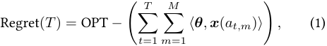

subject to the global budget constraint:�_M_ _i_ =1 � _Tt_ =1_ct,m≤_ _B_ . Here, OPT denotes the total expected reward for the optimal policy, as formally defined in Section IV. The goal is to design an FBwK algorithm that minimizes regret while ensuring efficient communication and computation, and satisfying client-side privacy constraints. 

## IV. OPT for FBwK 

As mentioned above, we define regret as the gap between the total reward achieved by the bandit algorithm and the OPT reward obtained by an ideal dynamic policy, maximizes the expected cumulative reward under the budget constraint, assuming full knowledge of reward and cost distributions. To facilitate regret analysis in FBwK, we first introduce a linear programming (LP) relaxation of OPT, denoted as OPT-LP. Since our setting involves a distributed (federated) system, we further extend OPT-LP to capture the decentralized nature of the problem, and refer to this relaxation as OPT-FED. 

## _A. OPT-LP_ 

We define a linear programming relaxation for maximizing the expected total reward under a mixed policy over arms. Given expected reward vector **_θ_**_⊤_ **_X_** and expected cost vector **_β_**_⊤_ **_X_** for each arm, the relaxed problem is formulated as: 

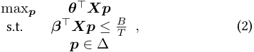

where **_X_** _∈_ R_d×K_ is the matrix of context vectors for the _K_ arms, and ∆= _{_ **_p_** :�_K_ _i_ =1_pi_=1_, pi≥_0_, i_= 1 _, . . . , K}_ is the probability simplex over arm-selection probabilities, where _pi_ is the probability of pulling arm _i_ . Let LP( **_θ_**_⊤_ **_X_** _,_ **_β_**_⊤_ **_X_** ) denote the value of this LP-relaxation. It can be shown that [10] 

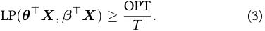

Hence, _T ·_ LP( **_θ_**_⊤_ **_X_** _,_ **_β_**_⊤_ **_X_** ) provides a valid upper bound for OPT and is denoted as OPT-LP. 

## _B. OPT-FED_ 

In the federated BwK setting with _M_ clients, budget allocation across clients becomes essential. Under the static context assumption, the centralized BwK problem can be decomposed by distributing the budget equally among clients. We first allocate the total budget _B_ evenly across _T_ rounds, and further divide each per-round budget equally among _M_ clients, yielding an individual client budget of _B/_ ( _MT_ ). For each client _m ∈_ [ _M_ ], the LP relaxation becomes: 

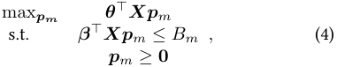

where _Bm_ is the budget allocated to the client _m_ , and **_p_** _m_ denotes its local arm-selection distribution. As the contexts are static, we can use a uniform **_X_** for all clients. We use **_p_** _m ≥_ **0** instead of **_p_** _m ∈_ ∆ for the convenience of proof, as the latter solution can be normalized as a specific solution for the former. The dual problem of Equation (4) is: 

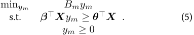

Suppose there is an optimal solution for the above LP, then we have _Bm ≥_ min( **_β_**_⊤_ **_X_** ) for each client _m_ . An intuitive understanding is that the allocated budget must be higher than the arm with the lowest cost. Otherwise, there will be no arm that can be pulled. Strong duality [48] ensures that if a feasible solution exists, then: **_θ_**_⊤_ **_Xpm_** = _Bmym_ . Because all clients share the same context matrix **_X_** , they will obtain the same dual variable _ym_ = _y_ . The total expected reward across _M_ clients is: 

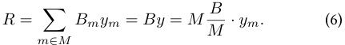

This shows that the total reward is invariant to client-level budget decomposition, as long as all clients solve the same LP. In practice, once a client’s budget is exhausted, it ceases to participate in arm selection. 

Finally, for any **_θ_**_⊤_ **_X_** _,_ **_β_**_⊤_ **_X_** , let LP-FED( **_θ_**_⊤_ **_X_** _,_ **_β_**_⊤_ **_X_** ) denote the value of the following linear program. 

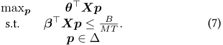

We replace OPT-LP with _MT ·_ LP-FED( **_θ_**_⊤_ **_X_** _,_ **_β_**_⊤_ **_X_** ), which is denoted as OPT-FED in the analysis of regret. 

## V. Design of FedUCBwK 

In this section, we introduce FedUCBwK, which balances regret, communication, and computation through epochbased coordination. The core idea is to improve efficiency by jointly controlling the timing of policy updates and server–client communication. The design is based on a key observation that within a short period, the accumulation of new information ( _i.e._ , selected arms and observed rewards/costs) is limited, leading to minimal changes in parameter estimates for **_θ_** and **_β_** . Therefore, we can divide the time horizon into multiple epochs, where both LP-based policy updates and parameter aggregation are performed only once per epoch. To segment these epochs, FedUCBwK evaluates the change in information gain and applies a unified threshold that jointly accounts for estimation variance and the cost of computation and communication. Additionally, a budget control factor is introduced to prevent overspending and ensure feasibility under the global budget constraint. By coordinating these components, FedUCBwK achieves a principled trade-off among regret, communication, and computation, supported by rigorous theoretical guarantees. 

We now describe how FedUCBwK ensures client-side privacy. The algorithm transmits only the estimated parameters **_θ_** and **_β_** between the server and clients, while keeping all raw data local to each client. Additionally, instead of sharing the global budget _B_ , the server distributes a per-client budget of _B/M_ , so that each client operates independently without access to the total budget. 

The algorithms for client _m_ and the central server in FedUCBwK are shown in Algorithm 1 and 2, respectively. At initialization, each client _m_ pulls each arm once (Lines 3-4, Alg.1), and observes the feedback (the corresponding reward and cost) to initialize local estimates **_θ_**ˆ _m,a_ and **_β_**ˆ _m,a_ . After initialization, FedUCBwK proceeds in epochs until termination ( _i.e._ , the time horizon _T_ is reached or the budget is exhausted). In each epoch _e_ , client _m_ selects an arm based on the policy computed at the end of the previous epoch (Line 6, Alg. 1). It then records the number of times each arm _a_ is played ( _f_ ( _m, a_ )), update the Gram matrix **_V_** _t,m_ (the sum of outer products of the pulled contexts), accumulates both the total reward _Rm,a_ and total cost _Cm,a_ for each arm (Lines 7-11, Alg.1). The Gram matrix **_V_** _t,m_ of client _m_ captures the accumulated information about arm selection up to time _t_ , and directly influences the variance of parameter estimates **_θ_** ˆ _m,a_ and **_β_** ˆ _m,a_ . To determine when to synchronize with the central server, FedUCBwK evaluates the following condition: 

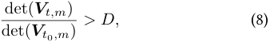

where _t_ 0 is the start time of the current epoch and _D_ is a predefined threshold. The determinant ratio quantifies the relative increase in accumulated information during the epoch. Once the threshold is exceeded, communication with the server is triggered (Line 12, Alg. 1). Using the total number of times arm _a_ is selected ( _f_ ( _m, a_ )) and the cor- 

tion (Line 15, Alg.1). Due to privacy-preserving constraints, the server only has parameters **_θ_**ˆ _m,a__e_and**_β_**ˆ _m,a__e_foreach arm, without observing the corresponding context vectors **_x_** ( _at,m_ ). Since both **_θ_**ˆ _m,a__e_and**_x_**(_at,m_)areinthesame direction, the server can recover the normalized context direction as **_θ_**ˆ _m,a__e/_ ��� **_θ_** ˆ _m,ae_ ���. Combined with the number of times each arm was pulled, the server can perform weighted aggregation to estimate global parameters without accessing any raw context information (Lines 6–8, Alg. 2). Then the server sends the aggregated global parameters **_V_**_e_ _,_ **_θ_**ˆ_e_ _,_ **_β_**ˆ_e_ back to each client (Line 9, Alg. 2). After receiving the aggregated parameters from the central server, each client confidence sets C_e_ _θ__⊆_R_d_andC_e_ _β__⊆_R_d_ for **_θ_** and **_β_** , respectively, in epoch _e_ . Following standard techniques in linear bandits [30], each confidence set takes the form of an ellipsoid centered at the global estimate. Specifically, the confidence set for **_θ_** is defined as: 

## **Algorithm 1:** FedUCBwK: The Client _m_ 

**Input:** Time slots _T_ , Threshold _D_ , Budget factor _ϵ_ 

- **1** Receive the budget _B/M_ , _e ←_ 0, _t ←_ 0; 

- **2 while** _not satisfy the stop condition_ **do 3 if** _t ≤ K_ **then 4** Pull arm _at,m_ = _t_ ; **5 else 6** Pull arm _at,m_ according to probability **_p_**_e−_1 ; **7** Update _f_ ( _m, at,m_ ) _← f_ ( _m, at,m_ ) + 1; **8** Get the reward _rt,m_ and the consumption _ct,m_ ; **9** Update **_V_** _t,m ←_ **_V_** _t,m_ + **_x_** ( _at,m_ ) **_x_** ( _at,m_ )_⊤_ ; 

- **10** Update _Rm,a ← Rm,a_ + _rt,m_ ; **11** Update _Cm,a ← Cm,a_ + _ct,m_ ; **12 if** (det **_V_** _t,m/_ det **_V_** _t_ 0 _,m_ ) _> D or t_ = _K_ **then** _Rm,a_ **_x_** <u>(</u> _at,m_ <u>)</u> 

- **13** **_θ_** ˆ_e_ _m,a__←_ � _f_ ( _m,a_ ) � _∥_ **_x_** ( _at,m_ ) _∥_2; _Cm,a_ **_x_** <u>(</u> _at,m_ <u>)</u> 

- **14** **_β_** ˆ _m,a__e←_ � _f_ ( _m,a_ ) � _∥_ **_x_** ( _at,m_ ) _∥_2; **15** Send **_θ_**ˆ _m,a__e_,**_β_**ˆ _m,a__e_,_f_(_m, a_)foreach_a_tothe central server; 

- **16** Receive **_θ_**ˆ_e_ , **_β_**ˆ_e_ , **_V_**_e_ from the central server to calculate **_θ_**˜_e_ and **_β_**˜_e_ ; max **_p_** _e∈_ ∆ **_X_**_⊤_ **_θ_****˜**_e_ **_p_**_e_ 

- **17** Solve ; s.t. **_X_**_⊤_ **_β_****˜**_e_ **_p_**_e_ _≤_ (1 _− ϵ_ ) _T M__<u>B</u>_ 

- **18** **_V_** _t_ 0 _,m ←_ **_V_** _t,m_ , _e ← e_ + 1; **19** _t ← t_ + 1; 

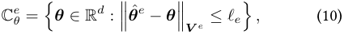

where _ℓe_ = �2 log <u>�</u> det( **_V_**_e_ <u>)</u>1_/_2 _δ_ det( _λI_ <u>)</u>_−_1_/_2 <u>�</u> + _λ_1_/_2 . The set C_e_ _β_isconstructedanalogously.Thisconstructionmotivates the synchronization condition in Eq. (8): the volume of the confidence ellipsoids, which controls the uncertainty in parameter estimation, scales with det( **_V_** _t,m_ ). If det( **_V_** _t,m_ ) does not increase significantly during an epoch, the confidence bound remains nearly unchanged, and recomputation or communication is unnecessary. Thus, in epoch _e_ , we replace det( **_V_** _t,m_ ) with the epoch-level quantity det( **_V_**_e_ ) to quantify information accumulation. To select arms, we adopt the principle of _optimism in the face of uncertainty_ , as used in LinUCB [2], [30] and UCB algorithm for BwK [16]. Specifically, each client constructs an optimistic estimate of the reward parameter **_θ_** as: 

## **Algorithm 2:** FedUCBwK: The Central Server 

**Input:** Time slots _T_ , Number of clients _M_ , Budget _B_ 

- **1 Initialization:** Send _B/M_ to each client; **2** _e ←_ 0; **3 while** _not reaching the time horizon T_ **do 4 if** _A communication round is started_ **then 5** Receive **_θ_**ˆ _m,a__e_,**_β_**ˆ _m,a__e_fromeachclient_m_; **_θ_** ˆ _m__e_ _<u>,a</u>_<u>(</u>**_θ_**ˆ _m__e_ _<u>,a</u>_<u>)</u> _⊤_ 

- **6** **_V_**_e_ _←_� _m∈_ [ _M_ ] � _a∈_ [ _K_ ]_f_(_m, a_) 2 ; _∥_**_θ_**ˆ _m,a__e_ _∥_ 

- **7** **_θ_** ˆ_e_ _←_ ( **_V_**_e_ )_−_1 (� _m∈_ [ _M_ ] � _a∈_ [ _K_ ]_f_(_m, a_)ˆ**_θ_** _m,a__e_); **8** **_β_** ˆ_e_ _←_ ( **_V_**_e_ )_−_1 (� _m∈_ [ _M_ ] � _a∈_ [ _K_ ]_f_(_m, a_) ˆ**_β_** _m,a__e_); **9** Send **_θ_**ˆ_e_ , **_β_**ˆ_e_ , and **_V_**_e_ to each client; 

- **10** _e ← e_ + 1; 

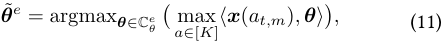

and similarly obtains a pessimistic estimate **_β_**˜_e_ for the cost parameter by minimizing over C_e_ _β_.Thisyieldsanupper confidence bound (UCB) for reward and a lower confidence bound (LCB) for cost. Each client then selects the arm _a_ that maximizes the ratio of these bounds, balancing reward gain against resource consumption (Line 16, Alg. 1). 

Then each client then updates the arm-pulling policy for the next epoch by solving the following linear programming (Line 17, Alg. 1): 

responding cumulative reward _Rm,a_ , client _m_ estimates the reward parameter **_θ_**ˆ _m,a__e_viaprojectedlinearregression: 

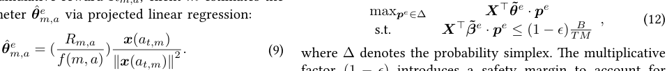

where ∆ denotes the probability simplex. The multiplicative factor (1 _− ϵ_ ) introduces a safety margin to account for estimation errors in **_β_**˜_e_ , preventing premature termination due to overestimation of cost. The detailed role of _ϵ_ in regret and budget analysis will be discussed in the next section. After computing the policy **_p_**_e_ , each client resets **_V_** _t_ 0 _,m_ and proceeds to the next epoch (Line 18, Alg. 1). 

Similarly, the cost parameter **_β_**ˆ _m,a__e_isestimatedusingthe cumulative consumption _Cm,a_ in the same manner (Lines 13–14, Alg. 1). 

After local estimation, all clients send their calculated parameters and arm pull counts to the server for aggrega- 

## VI. Theoretical Analysis 

In this section, we provide theoretical guarantees in terms of regret, communication, and computation costs. 

## _A. Regret Analysis_ 

**Theorem 1.** _With FedUCBwK, we can get a regret with a high_ _~~<u>√</u>~~ DMT_ log( _MT_ <u>)</u> _probability_ 1 _− ϵ, ϵ_ =_d_ _B ,_ 

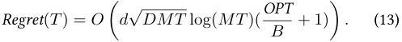

**Lemma 1.** _We define the difference between the realized reward and the expected reward using the upper confidence bound of pulled arms as:_ 

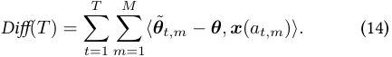

_Then the Diff_ ( _T_ ) _is bounded by O_ � _d√DMT_ log( _MT_ )� _._ 

_Proof._ First, although the same estimator **_θ_**˜_e_ is used throughout each epoch _e_ , we denote it as **_θ_**˜ _t,m_ in the analysis to explicitly indicate the time step _t_ and client _m_ , _i.e._ , **_θ_**˜ _t,m_ = **_θ_**˜_e_ for all _t ∈ e_ . Let the algorithm proceed over _E_ epochs. We denote by **_V_**_e_ the aggregated Gram matrix in epoch _e_ . By the design of the communication threshold, we have: 

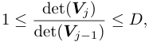

Otherwise, there will be a synchronization. We imagine the _MT_ pulls are all made by one client in a round-robin fashion. This client takes _a_ 1 _,_ 1 _, a_ 1 _,_ 2 _, . . . , a_ 1 _,M , a_ 2 _,_ 1 _, . . . , aT,M_ ). We use **_V_** ˜ _t,m_ = _λ_ **_I_** +� _{_ ( _p,q_ ):( _p<t_ ) _∨_ ( _p_ = _t∧q<m_ ) _}_**_x_**(_ap,q_)**_x_**(_ap,q_)_T_to denote the Gram matrix this imaginary client can collect when he gets to **_x_** ( _at,m_ ). And by our algorithm, each client _m_ will use the random policy received from the central server, generated by the aggregated Gram matrix **_V_**_e_ in each communication round. Thus, we can bound the gap between the Gram matrix as: 

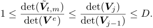

Therefore, by Lemma 6 in Appendix, 

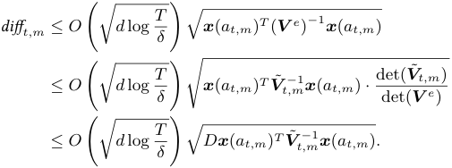

We now extend the single-client analysis to the federated setting by bounding the accumulated difference across all clients. Let _Be_ denote the set of ( _t, m_ ) pairs belonging to epoch _e_ . By applying Lemmas 2, 3, and 4 in the Appendix 

and setting _γ_ = _dDMT_ log � _<u>Tδ</u>_ �, we obtain the following bound on the cumulative estimation error across all epochs: 

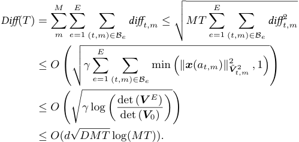

Next, we show that **_θ_**˜ _t,m_ and **_β_**˜ _t,m_ estimates satisfy the following properties. With probability 1 _− Mδ_ , let _ρ_ = _O d√DMT_ log( _MT_ ) : � � Property (1): **_θ_** ˜ _t,m ≥_ **_θ_** _,_ **_β_** ˜ _t,m ≤_ **_β_** _._ Property (2): 

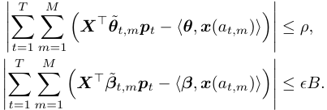

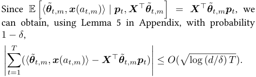

Then, according to _Diff_ ( _T_ ) in Lemma 1, we can bound the gap between the realized reward of the pulled arm and the expected reward under the fractional solution using the upper confidence bound: 

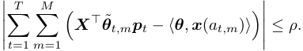

A similar bound holds for the consumption estimation in- _~~<u>√</u>~~ DMT_ log( _MT_ <u>)</u> volving **_β_** . Then we can set _ϵ_ =_d_ _B_ . Till now, we can get Property (2). By Property (1), the definition and problem decomposition of OPT: 

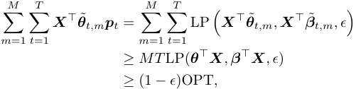

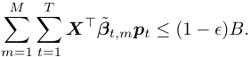

(15) 

Then, using Property (2) above and Equation (15), we can satisfy the hard constraint. _i.e._ , 

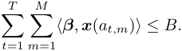

Thus, the algorithm will not terminate before time _T_ . We denote the total realized reward we get is Rew, Rew = � _Tt_ =1 � _Mm_ =1_⟨_**_θ_**_,_**_x_**(_at,m_)_⟩_.Then 

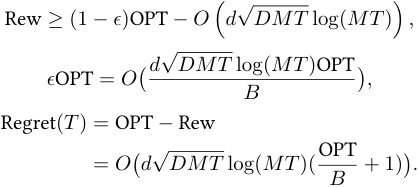

## _B. Computation Cost_ 

**Theorem 2.** _Using the FedUCBwK algorithm, the computation cost is bound by O_ ( _Md_ log_<u>MT</u>_ _D_)_._ 

In Algorithms 1 and 2, FedUCBwK triggers LP computation only when the design matrix **_V_** has accumulated sufficient new information. This is determined by a threshold _D_ : a new epoch begins when 

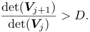

This ensures computation is performed only when necessary, reducing redundant updates. Therefore, to analyze the total computation cost, it suffices to bound the number of such epochs triggered by this determinant-based condition. By Lemma 3 in the Appendix, we can get 

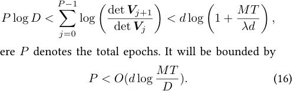

where _P_ denotes the total epochs. It will be bounded by 

LP calculation is done on each client. Thus, the computation cost is _O_ ( _Md_ log_<u>MT</u>_ _D_).ThisresultshowsthatFedUCBwK achieves logarithmic computation cost scaling with the time horizon _T_ . 

## _C. Communication Cost_ 

**Theorem 3.** _Using the FedUCBwK algorithm, the communication cost is bound by O_ � _Md_2 ( _d_ + _K_ ) log_<u>MT</u>_ _D_ � _._ 

Communication is only required at the end of each epoch when each client sends _O_ ( _dK_ ) parameters to the server and then receives _O_ ( _d_2 ) parameters. Therefore, in each epoch, the communication cost is _O_ ( _Md_ ( _d_ + _K_ )). Hence, further according to the upper bound of the number of epochs in Equation (16), the total communication cost is _O_ � _Md_2 ( _d_ + _K_ ) log_<u>MT</u>_ _D_ �. Combining the above theorems and setting _D_ as a constant, we can get a regret bound of _O_ � _d√MT_ log( _MT_ )(<u>OPT</u> _B_ + 1)� with a high probability, under _O_ � _Md_2 ( _d_ + _K_ ) log _MT_ � communication cost and _O_ ( _Md_ log _MT_ ) computation cost. Thus, FedUCBwK achieves logarithmic communication cost scaling with the time horizon _T_ . 

## VII. Experiment Results 

We evaluate the performance of the proposed **FedUCBwK** algorithm on two real-world datasets across three task settings, comparing it against five baseline algorithms. FedUCBwK-FullCom refers to the variant where clients communicate and solve the LP problem at every time step, which can be regarded as an optimal bandit solution in a centralized setting. FedUCBwK-FewCom performs only infrequent communication and computation, using a large threshold _D_ . We further compare FedUCBwK with other federated and distributed bandits algorithms, _e.g._ , FedUCB [8] (which is equivalent to DisLinUCB [23] by letting the privacy budget 1 _/ϵ_ go to 0). We also evaluated the performance of FedUCB under full communication. In all experiments, we conducted 10 repeated trials and calculated the mean and standard deviation. 

## _A. Datasets and Tasks_ 

**MovieLens-100K [49]:** This dataset contains movie ratings from 943 users on 1682 movies. To handle data sparsity, we use collaborative filtering to complete the rating matrix and then employ non-negative matrix factorization [9] with 10 latent factors to get _R_ = _WH_ , where the user matrix _W ∈_ R943_×_10 , and the movie matrix _H ∈_ R10_×_1682 . We simulate two ad allocation tasks. The first scenario involves recommending the proper ad for a specific group of users [50]. We regard each ad as an arm that corresponds to a certain amount of revenue and deduction. The objective is to identify the optimal ad for a specific group of users that maximizes the reward within a range of advertiser budgets. We cluster _W_ ’s columns into 20 user groups, select one as the target group _u_ , centroid with _θu_ , and the corresponding cost vector _βu_ is randomly generated. Ads (arms) are clustered from _H_ ’s rows into _K_ = 10 groups. The second scenario involves finding the proper targeted user for a specific category of ads [51]. Each user is treated as an arm. We cluster _H_ ’s rows into 20 ad groups, select one as the target ad _a_ , and assign its centroid to _θa_ , with a random _βa_ . User arms are then formed by clustering _W_ ’s rows into _K_ = 10 groups. In the above experiments, we set _K_ = 20, _d_ = 10, _M_ = 10, and _T_ = 1000. 

**Human Activity Recognition (HAR) Dataset (AMUHAR) [52]:** This dataset was collected using smartphone sensors (accelerometer, magnetometer, and gyroscope). Each of the 9 activity classes (e.g., running, cycling) contains 403,605 samples, with each sample represented by 12 sensorderived features. We simulate a crowdsourcing scenario [12], where each activity is treated as an arm and each task involves recognizing the corresponding activity. Assigning a task incurs a cost, and the objective is to select the optimal task (activity) for a group of workers to maximize reward under a limited budget. We randomly generate a reward and cost for each sample, and compute the average reward _θ_ and cost _β_ for each arm. The class center is used as the arm’s context vector for calculating the OPT solution. In our experiments, we set _K_ = 9, _d_ = 12, _M_ = 10, and _T_ = 1000. 

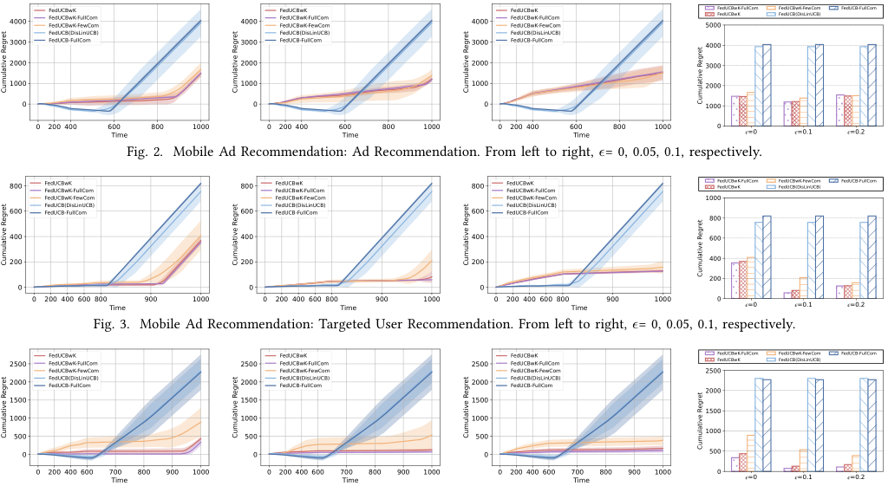

<!-- Start of picture text -->
4000 FedUCBwKFedUCBwK-FullComFedUCBwK-FewCom 4000 FedUCBwKFedUCBwK-FullComFedUCBwK-FewCom 4000 FedUCBwKFedUCBwK-FullComFedUCBwK-FewCom 5000FedUCBwK-FullComFedUCBwK FedUCBw FedUCB( DisLinUCB)K-FewCom FedUCB-FullCom FedUCB(DisLinUCB) FedUCB(DisLinUCB) FedUCB(DisLinUCB) 3000 FedUCB-FullCom 3000 FedUCB-FullCom 3000 FedUCB-FullCom 4000 2000 2000 2000 3000 1000 1000 1000 2000 0 0 0 1000 0 200 400 600Time 800 1000 0 200 400 600Time 800 1000 0 200 400 600Time 800 1000 0 =0 =0.1 =0.2 Fig. 2. Mobile Ad Recommendation: Ad Recommendation. From left to right, ϵ = 0, 0.05, 0.1, respect ively. 800 FedUCBwKFedUCBwK-FullCom 800 FedUCBwKFedUCBwK-FullCom 800 FedUCBwKFedUCBwK-FullCom FedUCBwK-FullComFedUCBwK FedUCBw FedUCB( DisLinUCB)K-FewCom FedUCB-FullCom FedUCBwK-FewCom FedUCBwK-FewCom FedUCBwK-FewCom 1000 FedUCB(DisLinUCB) FedUCB(DisLinUCB) FedUCB(DisLinUCB) 600 FedUCB-FullCom 600 FedUCB-FullCom 600 FedUCB-FullCom 800 400 400 400 600 200 200 200 400 200 0 0 0 0 200 400 600 800 Time 900 1000 0 200 400 600 800 Time 900 1000 0 200 400 600 800 Time 900 1000 0 =0 =0.1 =0.2 Fig. 3. Mobile Ad Recommendation: Targeted User Recommendation. From left to right, ϵ = 0, 0.05, 0.1, re spectively. 2500 FedUCBwK FedUCBwK-FullCom 2500 FedUCBwK FedUCBwK-FullCom 2500 FedUCBwK FedUCBwK-FullCom FedUCBwK-FullComFedUCBwK FedUCBw FedUCB( DisLinUCB)K-FewCom FedUCB-FullCom FedUCBwK-FewCom FedUCBwK-FewCom FedUCBwK-FewCom 2500 2000 FedUCB(DisLinUCB)FedUCB-FullCom 2000 FedUCB(DisLinUCB)FedUCB-FullCom 2000 FedUCB(DisLinUCB)FedUCB-FullCom 2000 1500 1500 1500 1500 1000 1000 1000 500 500 500 1000 0 0 0 500 0 200 400 600 700Time 800 900 1000 0 200 400 600 700Time 800 900 1000 0 200 400 600 700Time 800 900 1000 0 =0 =0.1 =0.2 Cumulative Regret Cumulative Regret Cumulative Regret Cumulative Regret Cumulative Regret Cumulative Regret Cumulative Regret Cumulative Regret Cumulative Regret Cumulative Regret Cumulative Regret Cumulative Regret <!-- End of picture text -->

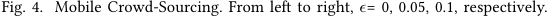

<!-- Start of picture text -->
Fig. 4. Mobile Crowd-Sourcing. From left to right, ϵ = 0, 0.05, 0.1, respectively. <!-- End of picture text -->

In most practical tasks, _K_ tends to be much larger than _d_ . This occurs because mobile computing scenarios typically involve a vast number of arms (e.g., users, items, or tasks), while feature dimensions are inherently limited or can be effectively reduced via feature engineering. 

## _B. Cumulative Regret Results under Limited Budget_ 

In this subsection, we evaluate the cumulative regret performance of different algorithms under the scenario of limited budgets. We first illustrate why the cumulative regret curve in FBwK deviates from that of traditional bandits. A key distinction lies in the budget constraint: in FBwK, once the budget is exhausted, the bandit algorithm stops pulling arms, whereas the OPT continues to accrue rewards, resulting in a steep regret increase. This behavior is typical in BwK problems. Algorithms such as FedUCB (DisLinUCB) and FedUCB-FullCom, which ignore budget constraints, tend to pull arms with higher rewards early on. As a result, they achieve low regret in the initial phase. However, once the budget is depleted at time step _τ_ , these algorithms terminate prematurely, causing a sharp regret increase beyond _τ_ . 

_1) Mobile Ad Recommendation:_ For the ad recommendation task, as shown in Fig. 2, FedUCBwK consistently achieves regret close to FedUCBwK-FullCom and significantly outperforms other baseline methods. By selecting arms with high reward and low cost, FedUCBwK avoids early termination and maintains low cumulative regret. In contrast, algorithms without budget awareness ( _e.g._ , FedUCB, FedUCB-FullCom) tend to over-consume early and terminate prematurely, leading to steep regret growth in later rounds. As _ϵ_ increases (left to right in Fig. 2), FedUCBwK becomes more conservative in estimating consumption, reducing the 

risk of early budget exhaustion. However, overly large _ϵ_ may overweight cost and cause suboptimal arm selection. We find _ϵ_ = 0 _._ 1 achieves the best trade-off. Interestingly, regret can be negative early on when FedUCB selects high-reward arms not constrained by budget—exceeding the reward of OPT—but this comes at the cost of exhausting the budget early and suffering high regret later. 

As for targeted user recommendation, we can find similar results in Fig.3. FedUCBwK again balances reward and cost effectively and achieves up to 89.17% regret reduction over FedUCB with _ϵ_ = 0 _._ 1. Under both tasks, due to the limited number of synchronization rounds, FedUCBwK-FewCom hinders effective information aggregation and strategy updates, leading to higher variance and larger regret. In addition, due to inaccurate estimation, FedUCBwK-FewCom often requires a larger _ϵ_ to control the budget. Typically, when _ϵ_ = 0 _._ 2, FedUCBwK-FewCom can manage the budget and avoid early termination. 

_2) Mobile Crowd-sourcing:_ We present the experimental results for mobile crowd-sourcing in Fig. 4. The overall trends are consistent with the previous tasks. Methods in the FedUCB series, which are unaware of budget constraints, initially achieve negative regret by aggressively selecting high-reward arms. However, they rapidly exhaust the budget and terminate early, leading to steep regret growth in later stages. In contrast, the FedUCBwK variants allocate the budget more conservatively, enabling sustained learning and more stable performance. As shown in Fig. 4, setting _ϵ_ = 0 _._ 1 achieves the best balance. where FedUCBwK reduces regret by up to 94.47% compared to FedUCB. When _ϵ_ = 0, the overly tight constraint leads to early termination, limiting the 

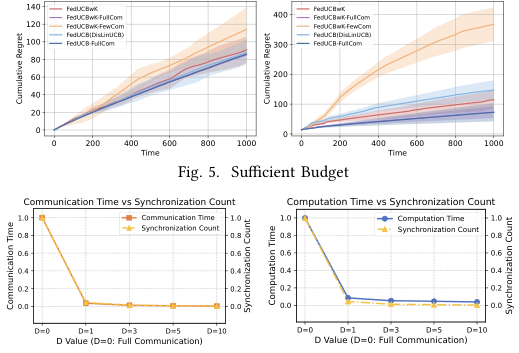

<!-- Start of picture text -->
140 FeFedUCBwK-FullComdUCBwK 400 FedUCBwKFedUCBwK-FullCom 120 FedUCBwK-FewCom FedUCBwK-FewCom FedUCB(DisLinUCB) FedUCB(DisLinUCB) 100 FedUCB-FullCom 300 FedUCB-FullCom 80 60 200 40 100 20 0 0 0 200 400 600 800 1000 0 200 400 600 800 1000 Time Time Fig. 5. Sufficient Budget Communication Time vs Synchronization Count Computation Time vs Synchronization Count 1.0 Communication Time 1.0 1.0 Computation Time 1.0 0.8 Synchronization Count 0.8 0.8 Synchronization Count 0.8 0.6 0.6 0.6 0.6 0.4 0.4 0.4 0.4 0.2 0.2 0.2 0.2 0.0 0.0 0.0 0.0 D=0 D=1 D=3 D=5 D=10 D=0 D=1 D=3 D=5 D=10 D Value (D=0: Full Communication) D Value (D=0: Full Communication) Cumulative Regret Cumulative Regret Communication Time Synchronization Count Computation Time Synchronization Count <!-- End of picture text -->

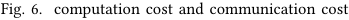

<!-- Start of picture text -->
Fig. 6. computation cost and communication cost <!-- End of picture text -->

opportunity to identify better arms and resulting in higher final regret. 

## _C. Cumulative Regret Results under Abundant Budget_ 

We further evaluate the cumulative regret under an abundant budget setting (Even if the arm with the maximum cost is selected in each round, the budget will not be exhausted). In Fig. 5, the left subfigure corresponds to the Mobile Ad Recommendation task, and the right to Mobile Crowd-Sourcing. When the budget is sufficient, all methods achieve comparable performance, and the main performance differences arise from the frequency of communication and synchronization. Among them, FedUCBwK-FullCom achieves the lowest regret and variance due to frequent updates, while FedUCBwK-FewCom exhibits the highest regret and largest variance, owing to limited communication and slower policy adaptation. Notably, the performance gap between FedUCBwK-FewCom and other methods is more significant in the crowd-sourcing task, where even fewer communication rounds are performed, leading to less effective learning. 

Our approach enables _M_ distributed clients to collaboratively optimize arm selection under a constrained budget, while preserving data privacy through model update exchanges. To address the challenges of constrained resources and costly synchronization, we introduce an epoch-based policy update mechanism controlled by a unified threshold, which significantly reduces communication and computation overhead. In addition, a conservative budget adjustment factor is incorporated to prevent premature budget exhaustion. We provide rigorous theoretical guarantees showing that FedUCBwK achieves near-optimal regret with logarithmic communication and computation complexity. Extensive experiments on real-world datasets demonstrate the effectiveness of FedUCBwK in mobile settings, showing substantial regret reduction compared to baseline methods, especially under tight budget constraints. 

## Appendix 

For the sake of completeness, we include the lemma from the previous work that was utilized in our proof process. 

**Lemma 2.** _For any δ >_ 0 _, with probability_ 1 _− Mδ,_ **_θ_** _always lies in the constructed_ C _t,m for all t and all m._ 

**Lemma 3.** _Let {Xt}__∞_ _t_ =1_beasequencein_R_d,_**_V_**_isad × d_ _positive definite matrix and define_ **_V_** _t_ = **_V_** +�_t_ _s_ =1**_X_**_s_**_X_** _s__⊤._ _Then we have that_ 

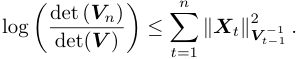

_If ∥_ **_X_** _t∥_ 2 _≤ L for all t, we have that_ 

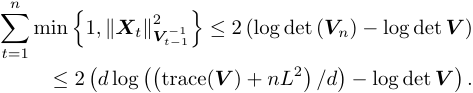

**Lemma 4.** _With probability_ 1 _− Mδ, single step difference difft,m_ = _⟨_ **_θ_**˜ _t,m −_ **_θ_** _,_ **_x_** ( _at,m_ ) _⟩ is bounded by_ 

## _D. Computation and Communication Cost_ 

We compare the communication time, computation time, and synchronization count under different values of _D_ , where _D_ = 0 corresponds to FedUCBwK-FullCom ( _i.e._ , computation and communication at every round). As shown in Fig. 6, compared to full communication, FedUCBwK achieves logarithmic communication and computation complexity. With _T_ = 1000 time steps, we find that by setting a reasonable threshold (typically _D_ = 3), FedUCBwK performs only around 10 communication rounds. It is worth noting that in real-world distributed systems, where communication latency is typically higher than the single-machine distributed communication in the experiment, the benefit of reduced communication would be even more substantial. 

## VIII. Conclusion 

In this work, we propose FedUCBwK, a practical and communication-efficient framework for solving budgetconstrained federated bandits in mobile application scenarios. 

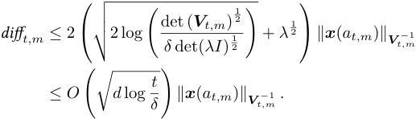

**Lemma 5.** _(Azuma-Hoeffding inequality). If a supermartingale_ ( _Yt_ ; _t ≥_ 0) _, corresponding to filtration Ft, satisfies |Yt − Yt−_ 1 _| ≤ ct for some constant ct, for all t_ = 1 _, . . . , T , then for any a ≥_ 0 _,_ 

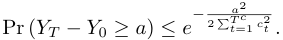

**Lemma 6.** _Let_ **_A_** _,_ **_B_** _and_ **_C_** _be positive semi-definite matrices such that_ **_A_** = **_B_** + **_C_** _. Then, we have that_ 

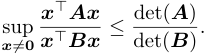

## References 

- [1] C. Zeng, Q. Wang, S. Mokhtari, and T. Li, “Online context-aware recommendation with time varying multi-armed bandit,” in _KDD_ , 2016, pp. 2025–2034. 

- [2] L. Li, W. Chu, J. Langford, and R. E. Schapire, “A contextual-bandit approach to personalized news article recommendation,” in _WWW_ , 2010, pp. 661–670. 

- [3] A. Nuara, F. Trov`o, N. Gatti, and M. Restelli, “A combinatorial-bandit algorithm for the online joint bid/budget optimization of pay-per-click advertising campaigns,” in _AAAI_ , 2018, pp. 2379–2386. 

- [4] M. Guo, W. Zhang, C. Yuan, B. Jia, G. Song, H. Hua, S. Wang, and Q. Zhang, “A bayesian multi-armed bandit algorithm for bid shading in online display advertising,” in _CIKM_ , 2024, pp. 4506–4513. 

- [5] H. Wang, Y. Yang, E. Wang, W. Liu, Y. Xu, and J. Wu, “Truthful user recruitment for cooperative crowdsensing task: A combinatorial multi-armed bandit approach,” _IEEE Transactions on Mobile Computing_ , vol. 22, no. 7, pp. 4314–4331, 2023. 

- [6] Y. Ouyang, F. Zeng, N. N. Xiong, A. Liu, and W. Pedrycz, “Mwrs: A mabbased worker recruitment scheme with tripartite stackelberg game for reliable mobile crowdsensing,” _IEEE Transactions on Mobile Computing_ , 2025. 

- [7] W. R. Thompson, “On the likelihood that one unknown probability exceeds another in view of the evidence of two samples,” _Biometrika_ , vol. 25, no. 3-4, pp. 285–294, 1933. 

- [8] A. Dubey and A. Pentland, “Differentially-private federated linear bandits,” in _NeurIPS_ , 2020, pp. 6003–6014. 

- [9] R. Huang, W. Wu, J. Yang, and C. Shen, “Federated linear contextual bandits,” in _NeurIPS_ , 2021, pp. 27 057–27 068. 

- [10] A. Badanidiyuru, R. Kleinberg, and A. Slivkins, “Bandits with knapsacks,” in _FOCS_ , 2013, pp. 207–216. 

- [11] I. Siomina, P. V¨arbrand, and D. Yuan, “Automated optimization of service coverage and base station antenna configuration in UMTS networks,” _IEEE Wireless Communications_ , vol. 13, no. 6, pp. 16–25, 2006. 

- [12] Y. Song and H. Jin, “Minimizing entropy for crowdsourcing with combinatorial multi-armed bandit,” in _INFOCOM_ , 2021, pp. 1–10. 

- [13] Y. Xu, M. Xiao, J. Wu, S. Zhang, and G. Gao, “Incentive mechanism for spatial crowdsourcing with unknown social-aware workers: A three-stage stackelberg game approach,” _IEEE Transactions on Mobile Computing_ , vol. 22, no. 8, pp. 4698–4713, 2023. 

- [14] Y. Li, F. Li, S. Yang, and Y. Wang, “Bgefl: Enabling communicationefficient federated learning via bandit gradient estimation in resourceconstrained networks,” _IEEE Transactions on Networking_ , pp. 1–16, 2025. 

- [15] T. Li and L. Song, “Privacy-preserving communication-efficient federated multi-armed bandits,” _IEEE Journal on Selected Areas in Communications_ , vol. 40, no. 3, pp. 773–787, 2022. 

- [16] S. Agrawal and N. R. Devanur, “Bandits with concave rewards and convex knapsacks,” in _EC_ , 2014, pp. 989–1006. 

- [17] ——, “Linear contextual bandits with knapsacks,” in _NeurIPS_ , 2016, pp. 3450–3458. 

- [18] C. Shi and C. Shen, “Federated multi-armed bandits,” in _AAAI_ , 2021, pp. 9603–9611. 

- [19] C. Shi, C. Shen, and J. Yang, “Federated multi-armed bandits with personalization,” in _AISTATS_ , 2021, pp. 2917–2925. 

- [20] T. Li, A. K. Sahu, A. Talwalkar, and V. Smith, “Federated learning: Challenges, methods, and future directions,” _IEEE Signal Processing Magazine_ , vol. 37, no. 3, pp. 50–60, 2020. 

- [21] S. Agrawal, N. R. Devanur, and L. Li, “An efficient algorithm for contextual bandits with knapsacks, and an extension to concave objectives,” in _COLT_ , 2016, pp. 4–18. 

- [22] D. Foster and A. Rakhlin, “Beyond ucb: Optimal and efficient contextual bandits with regression oracles,” in _ICML_ , 2020, pp. 3199–3210. 

- [23] Y. Wang, J. Hu, X. Chen, and L. Wang, “Distributed bandit learning: Near-optimal regret with efficient communication,” in _ICLR_ , 2019. 

- [24] A. Dubey and A. S. Pentland, “Differentially-private federated linear bandits,” in _NeurIPS_ , 2020, pp. 6003–6014. 

- [25] Z. Zhu, J. Zhu, J. Liu, and Y. Liu, “Federated bandit: A gossiping approach,” _Proceedings of the ACM on Measurement and Analysis of Computing Systems_ , vol. 5, no. 1, pp. 02:1–02:29, 2021. 

- [26] P. Kairouz, H. B. McMahan, B. Avent, A. Bellet, M. Bennis, A. N. Bhagoji, K. Bonawitz, Z. Charles, G. Cormode, R. Cummings _et al._ , “Advances and open problems in federated learning,” _Foundations and Trends in Machine Learning_ , vol. 14, no. 1–2, pp. 1–210, 2021. 

- [27] P. Auer, N. Cesa-Bianchi, and P. Fischer, “Finite-time analysis of the multiarmed bandit problem,” _Machine Learning_ , vol. 47, no. 2, pp. 235– 256, 2002. 

- [28] J. Langford and T. Zhang, “The epoch-greedy algorithm for multi-armed bandits with side information,” in _NeurIPS_ , 2007, pp. 817–824. 

- [29] S. Agrawal and N. Goyal, “Thompson sampling for contextual bandits with linear payoffs,” in _ICML_ , 2013, pp. 127–135. 

- [30] Y. Abbasi-Yadkori, D. P´al, and C. Szepesv´ari, “Improved algorithms for linear stochastic bandits,” in _NeurIPS_ , 2011, pp. 2312–2320. 

- [31] W. Chu, L. Li, L. Reyzin, and R. E. Schapire, “Contextual bandits with linear payoff functions,” in _AISTATS_ , 2011, pp. 208–214. 

- [32] S. Agrawal and N. Goyal, “Thompson sampling for contextual bandits with linear payoffs,” in _ICML_ , 2013, pp. 127–135. 

- [33] X. Wang, J. Ye, and J. C. S. Lui, “Decentralized task offloading in edge computing: A multi-user multi-armed bandit approach,” in _INFOCOM_ , 2022, pp. 1199–1208. 

- [34] S. Seo, S. Kim, S. Kook, S. Baek, and S. Kim, “Constructing 3- dimensional 5g coverage map for real-time airborne missions,” in _MobiCom_ , 2020, pp. 81:1–81:3. 

- [35] H. Gupta, J. Chen, B. Li, and R. Srikant, “Online learning-based rate selection for wireless interactive panoramic scene delivery,” in _INFOCOM_ , 2022, pp. 1799–1808. 

- [36] A. Xu, Z. Zheng, F. Wu, and G. Chen, “Online data valuation and pricing for machine learning tasks in mobile health,” in _INFOCOM_ , 2022, pp. 850–859. 

- [37] D. M. Kalathil, N. Nayyar, and R. Jain, “Decentralized learning for multiplayer multiarmed bandits,” _IEEE Transactions on Information Theory_ , vol. 60, no. 4, pp. 2331–2345, 2014. 

- [38] P. Landgren, V. Srivastava, and N. E. Leonard, “Distributed cooperative decision making in multi-agent multi-armed bandits,” _Automatica_ , vol. 125, p. 109445, 2021. 

- [39] L. Yang, Y. J. Chen, M. H. Hajiesmaili, J. C. S. Lui, and D. Towsley, “Distributed bandits with heterogeneous agents,” in _INFOCOM_ , 2022, pp. 200–209. 

- [40] R. Chawla, D. Vial, S. Shakkottai, and R. Srikant, “Collaborative multiagent heterogeneous multi-armed bandits,” in _ICML_ , 2023, pp. 4189– 4217. 

- [41] H. Yang, X. Liu, Z. Wang, H. Xie, J. C. Lui, D. Lian, and E. Chen, “Federated contextual cascading bandits with asynchronous communication and heterogeneous users,” in _AAAI_ , vol. 38, no. 18, 2024, pp. 20 596–20 603. 

- [42] F. Fourati, M.-S. Alouini, and V. Aggarwal, “Federated combinatorial multi-agent multi-armed bandits,” in _ICML_ , 2024, pp. 13 760–13 782. 

- [43] X. Wu and B. Li, “Achieving regular and fair learning in combinatorial multi-armed bandit,” in _INFOCOM_ , 2024, pp. 361–370. 

- [44] K. A. Sankararaman and A. Slivkins, “Combinatorial semi-bandits with knapsacks,” in _AISTATS_ , 2018, pp. 1760–1770. 

- [45] N. Immorlica, K. A. Sankararaman, R. E. Schapire, and A. Slivkins, “Adversarial bandits with knapsacks,” in _FOCS_ , 2019, pp. 202–219. 

- [46] M. Bernasconi, M. Castiglioni, A. Celli, and F. Fusco, “Beyond primaldual methods in bandits with stochastic and adversarial constraints,” in _NeurIPS_ , 2024, pp. 8541–8568. 

- [47] Z. Chen, R. Ai, M. Yang, Y. Pan, C. Wang, and X. Deng, “Contextual decision-making with knapsacks beyond the worst case,” in _NeurIPS_ , 2024, pp. 88 147–88 193. 

- [48] B. G¨artner and J. Matousek, _Understanding and using linear programming_ , ser. Universitext. Springer, 2007. 

- [49] F. M. Harper and J. A. Konstan, “The movielens datasets: History and context,” _ACM Transactions on Interactive Intelligent Systems_ , vol. 5, no. 4, pp. 1–19, 2015. 

- [50] G. Theocharous, P. S. Thomas, and M. Ghavamzadeh, “Ad recommendation systems for life-time value optimization,” in _WWW_ , 2015, pp. 1305–1310. 

- [51] L. Guo, J. Jin, H. Zhang, Z. Zheng, Z. Yang, Z. Xing, F. Pan, L. Niu, F. Wu, H. Xu _et al._ , “We know what you want: An advertising strategy recommender system for online advertising,” in _KDD_ , 2021, pp. 2919– 2927. 

- [52] Y. A. Khan, S. Imaduddin, Y. P. Singh, M. Wajid, M. Usman, and M. Abbas, “Artificial intelligence based approach for classification of human activities using mems sensors data,” _Sensors_ , vol. 23, no. 3, p. 1275, 2023. 

