# Distributed Model Interpretation for Vertical Federated Learning with Feature Discrepancy 

Rui Xing, Zhenzhe Zheng_∗_ , Qinya Li, Fan Wu and Guihai Chen 

Shanghai Key Laboratory of Scalable Computing and Systems 

Shanghai Jiao Tong University, China 

_{_ cocojess, zhengzhenzhe, qinyali _}_ @sjtu.edu.cn, _{_ fwu, gchen _}_ @cs.sjtu.edu.cn 

**_Abstract_ —Vertical federated learning (VFL) allows multiple clients with misaligned feature spaces to collaboratively accomplish the global model training. Applying VFL to high stakes decision scenarios greatly requires model interpretation for decision reliability and diagnosis. However, the feature discrepancy in VFL raises new issues for model interpretation in distributed setting: one is from the local-global perspective, where the local importance of features is not equal to the global importance; and the other is from the local-local perspective, where information asymmetry among clients causes difficulty in identifying overlapped features. In this work, we propose a new distributed** **<u>Model Interpretation</u> method for** **<u>Vertical Federated Learning</u> with feature discrepancy, namely MI-VFL. In particular, to deal with the local-global discrepancy, MIVFL leverages the law of total probability to adjust the local importance of features and ensures the completeness of the selected features using adversarial game. To handle the local-local discrepancy, MI-VFL builds a federated adversarial learning model to efficiently identify the overlapped features once, rather than performing client-to-client intersections multiple times. We extensively evaluate MI-VFL on six synthetic datasets and five real-world datasets. The evaluation results reveal that MI-VFL can accurately identify the important features, suppress the overlapped features, and thus improve the model performance.** 

## I. INTRODUCTION 

Federated learning (FL) [1]–[3] is a privacy-preserving distributed machine learning that enables clients to jointly train a global model without sharing their local data. Different from the conventional FL (also called horizontal federal learning (HFL) [4]), vertical federated learning (VFL) [5] has a distinct property of feature misalignment, which means clients share the same sample space but not feature space. This provides the opportunity for clients with different feature spaces to collaborate across platforms and institutions, expanding feature space to improve model performance and generalization ability. 

High stakes decision fields such as finance, manufacturing and medicine, one of the important applications of VFL, require model interpretation to understand the underlying 

This work was supported in part by National Key R&D Program of China No. 2020YFB1707900, in part by China NSF grant No. 62132018, U2268204, 62272307 61902248, 61972254, 61972252, 62025204, 62072303, 62202297, in part by Shanghai Science and Technology fund 20PJ1407900, in part by Alibaba Group through Alibaba Innovative Research Program, and in part by Tencent Rhino Bird Key Research Project. The opinions, findings, conclusions, and recommendations expressed in this paper are those of the authors and do not necessarily reflect the views of the funding agencies or the government. 

_∗_ Zhenzhe Zheng is the corresponding author. 

model behavior and ensure reliable decisions [6], [7]. For example, when multiple medical institutions collaborate to diagnose a patient, the doctors need to understand the specific factors led to the patient’s illness. Also, when banks and credit information service work together to determine whether to lend loads to users, they must understand the reasons behind the model’s decision. Although we can expand the feature space through VFL, massive features with uneven quality from multiple institutions may lead to performance degradation. Therefore, we need model interpretation methods to select representative and important features to guarantee the reliability of decisions and also improve model performance. 

Current model interpretation methods are basically centralized [8]–[17], which would raise new issues if we regard each client’s local model as an isolated model to explain in VFL. These issues are mainly caused by the natural characteristic of feature misalignment in VFL [4]. We call them “discrepancy” phenomena, which can be captured by two aspects. The first “discrepancy” is reflected in the localglobal perspective, which refers to the local importance of clients’ features not equal to the global one. If we only calculate the local importance of features on their own clients, we would lose the information about meaningful relations among features from different clients, which is critical to model interpretation in distributed scenarios. Therefore, we need to design a method to adjust the local importance in line with the global one. The second “discrepancy” exists in the local-local perspective, which means the clients are not aware of the features of the other clients. It may lead to different clients selecting the same important features when there are overlapped features among them, causing feature redundancy. In reality, many applications in VFL exist overlapped features. For example, different business domains in Taobao’s recommendation system can be considered as VFL scenario, where these domains with different items’ and users’ features cooperate to recommend items for users. In Alibaba production data regarding user click behavior, two domains contain 8.52% overlapped users [18]. In addition, in the one-day traffic logs of Alibaba display advertising production data, 49% of users and 79% of items appear in at least two domains [19]. The same phenomenon also exists in natural language processing. We count different news articles with stop-word removal reported by three popular online news sources (BBC, Reuters, and the Guardian) on 169 news stories [20], and find that each news 

979-8-3503-9973-8/23/$31.00 ©2023 IEEE 

Authorized licensed use limited to: Shanghai Jiaotong University. Downloaded on October 18,2023 at 01:06:14 UTC from IEEE Xplore.  Restrictions apply. 

story has an average of 111.9 overlapped words among three sources with average 224.0 words per article of BBC, 196.4 of Reuters and 250.5 of the Guardian. Moreover, multi-view face images of people collected at different times, lighting, and facial expressions for face recognition [21] can also be regarded as a VFL scenario, which means that different views can be considered as different clients. We calculate the number of identical pixels of all face images of the same person with different views, and find that there are an average of 17.18% overlapped pixels. All these phenomena demonstrate that in real-world scenarios, different clients inevitably have overlapped features in VFL. However, redundant features do not improve the class-discriminative power of the model [22] and reduce the interpretability of the model, and thus we must remove the overlapped features among clients. From the above discussion, designing the model interpretation method for VFL includes two important steps to solve the discrepancy issues, which are adjusting local importance to global importance and suppressing overlapped features among clients. 

It is challenging to overcome these two discrepancy issues: for local-global discrepancy, clients cannot communicate with each other, so they cannot directly adjust the local importance on their own. Further, the importance relation among features from different clients is unknown, the misadjustment problem may occur, which means the unimportant features from one client are adjusted excessively to conceal the important features from another client. For the local-local discrepancy, clients cannot share their own features with each other to remove overlapped features due to privacy protection in VFL. The current method for solving this is through private set intersections [23] in a pairwise way. However, when the number of clients increases, such client-to-client intersection method will result in multiple communications and computational overhead. It may also have the risk of leaking clients’ local features to the server and other clients. 

The intuition behind our proposed solution for model interpretation in VFL is as follows. First, to guarantee the importance relation of the whole feature set, we adjust the local importance in line with the global importance based on the law of total probability. Specifically, we divide the adjustment process into local importance calculation and feature subset importance calculation. In the local computation part, we use mutual information [24] to guide the feature importance calculation. Further, to ensure the completeness of the selected features and consolidate the relative importance of intra-client features, we design an adversarial game to increase the importance score gap between important and unimportant features. In the feature subset importance calculation part, we propose to use the marginal contributions to the global result aggregation of clients as their importance scores. Second, to identify overlapped features in the local-local discrepancy, we train a federated adversarial learning model to learn common features among all clients simultaneously. Then, we can ensure that the set of selected features is representative and free of redundancy by suppressing overlapped features. 

We summarize the contributions of this work as follows. 

- We present a new distributed model interpretation method for VFL, which jointly considers the brand new issues of local-global discrepancy and local-local discrepancy caused by feature misalignment in VFL. 

- To address the discrepancy between global features and clients’ local features, we leverage the law of total probability to adjust the local importance of features. Further, we propose to design an adversarial game to ensure the completeness of the selected features. 

- To suppress the overlapped features of the clients, we avoid multiple client-to-client intersections to obtain overlapped features and design a federated adversarial learning model to identify them. Our method ensures that the selected features are representative and non-overlapped. 

- We evaluate the performance of MI-VFL on several synthetic and real-world datasets. The evaluation results show that our method can select a subset of important features accurately with suppression of overlapped features, and further improve the model performance. 

## II. RELATED WORKS 

## _A. Centralized Model Interpretation_ 

Centralized model-agnostic interpretations method can interpret black-box models, and a lot of research have been done in this field [8]–[12]. Lei _et al._ [8] proposed to explain text prediction models based on a subset of selected features in NLP domain. Subsequently, Chen _et al._ [9] maximized the mutual information between feature subset and prediction label to control the selection of the feature subset from an information-theoretic perspective; subsequently, Yoon _et al._ [10] achieved this using Kullback-Leibler (KL) divergence combined with reinforcement learning. Chang _et al._ [11] borrowed the idea of GAN to select a minimum feature subset for each class. Yu _et al._ [12] considers the model interlocking problem, and combined binarized selective rationalization and attention mechanism to solve the problem. Other modelagnostic methods include LIME [25], SHAP [26], and Anchors [27], which are not very efficient. 

The counterpart to model-agnostic methods is modelspecific method [13]–[17], which needs to be associated with the knowledge of the model itself. Some methods used the model gradient, for example, Saliency maps [13] calculated feature importance score through the absolute gradient, Gradient _×_ Input method [14] multiplied gradient and feature as importance score, and Integrated Gradients [15] averaged the gradient along a linear path from input feature to baseline as feature importance. In addition, there are methods based on model back-propagation. For example, Bach _et al._ [16] proposed back-propagation by Taylor decomposition to find important features. Also, Shrikumar _et al._ [17] similarly used back-propagation to calculate the difference between the output and reference values as feature importance. These methods have a very close relation with the model compared to the model-agnostic methods, and cannot explain general models. 

Authorized licensed use limited to: Shanghai Jiaotong University. Downloaded on October 18,2023 at 01:06:14 UTC from IEEE Xplore.  Restrictions apply. 

## _B. Vertical Federated Learning_ 

Vertical federated learning can be divided into two modes according to whether the server is included or not. For methods with the server, there are two kinds of frameworks, which depends on whether splitting learning is involved. One framework splits the whole model into two parts and deploys them on both the server and the client respectively, and the client needs to upload the intermediate features to the server; the other framework deploys the model only on the client, which requires clients to upload the model output to the server and the server aggregates them. For the second framework, Hu _et al._ [28] proposed an SGD-based parameter update method in VFL. Zhang _et al._ [29] put forward an SVRG-based parameter update method for VFL and designed a tree-structured communication model. Gu _et al._ [30] designed a parameter update method based on SGD, SVRG, and SAGA, and improved the tree-structured communication pattern. In addition, there are some methods in VFL that do not include servers. They divide clients into one active client and many passive clients, where the active client does not have features and is responsible for aggregating results from passive features. For example, Liu _et al._ [31] proposed to exchange intermediate outputs between clients for parameter updating. 

## III. PRELIMINARIES 

In this section, we describe model interpretation in the context of VFL. For a classification task, let _{_ ( **x**_i_ _, y__i_ ) _}__n_ _i_ =1be the training set, where **x** _∈_ R_d_ is the overall input feature with dimension _d_ , and _y ∈{_ 1 _, · · · , c}_ is the corresponding label. In a VFL task with a set of _M_ clients M = _{_ 1 _, · · · , M }_ , client _m ∈_ M only owns part of the features, denoted as **x** _m ∈_ R_dm_ , where _dm_ represents the feature dimension owned by client _m_ . Since there may be overlapped features among clients, we have _d ≤_� _m__dm_and**x**=_∪m∈_M**x**_m_. Further, we use**x**_m,i_to represent the _i__th_ feature of client _m_ . The labels _y_ are managed by the trusted server. Model interpretation [15], [17], [25], [26] attempts to select the features that contribute most to the model output among all features, enabling the interpretation to the black-box model. In the centralized model interpretation method [9], the key is to learn an explainer _E_ to select a subset **x** _s ⊆_ **x** of features with a size of _k_ . Specifically, _E_ takes the whole feature set **x** as input, and the output is a binary mask vector **s** _∈_ 2_d_ , where **s** _i_ = 1 indicates that the feature **x** _i_ is selected and otherwise is not. Therefore, the selected feature subset is **˜x** _s_ = **s** _⊙_ **x** = [ **s** 1 **x** 1 _, · · · ,_ **s** _d_ **x** _d_ ], where _⊙_ is element-wise product. In VFL, since features are distributed among clients, the client _m_ is associated with a sub-explainer _Em_ : **x** _m →_ **s** _m_ and **˜x** _m,s_ = **s** _m ⊙_ **x** _m_ and all sub-explainers are trained collaboratively. For a classification task, each client computes a local model output _bm_ = _fm_ ( _θm_ ; _Em_ ( **x** _m_ ) _⊙_ **x** _m_ ) with the input of the selected local features **˜x** _m_ , where _θm_ are the parameters of local model _fm_ . The server performs weighted aggregation after receiving all the local models’ 

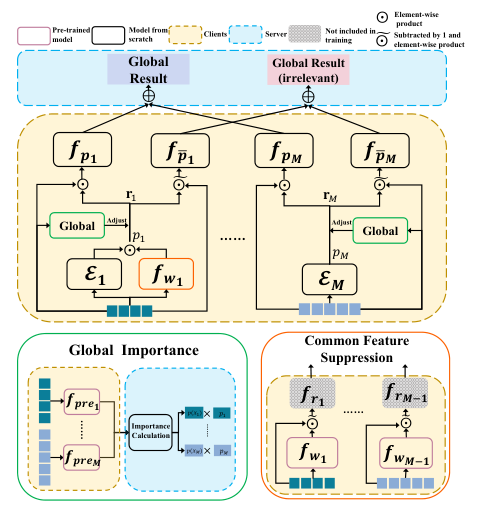

<!-- Start of picture text -->
Element-wise Pre-trainedmodel Model from scratch Clients Server Not included in training ⨀" Subtracted by 1 andelement-wise productproduct Global Global Result Result (irrelevant) ⊕ ⊕ 𝒇𝒑𝟏 𝒇"𝒑𝟏 𝒇𝒑𝑴 𝒇"𝒑𝑴 ⨀" ⨀" 𝐫! 𝐫" Global Adjust 𝑝! …… Adjust Global 𝑝" 𝓔𝟏 𝒇𝒘𝟏 𝓔𝑴 Common Feature Global Importance Suppression 𝒇𝒑𝒓𝒆𝟏 Importance 𝑝(𝑥") × 𝑝" 𝒇$⨀𝒓𝟏 …… 𝒇𝒓"⨀𝑴'𝟏 Calculation 𝑝(𝑥!)× 𝑝! 𝒇𝒑𝒓𝒆𝑴 𝒇𝒘𝟏 𝒇𝒘𝑴'𝟏 …… …… ⨀ ⨀ ⨀ ⨀ <!-- End of picture text -->

Fig. 1. **The overall architecture.** Features from different clients have different input dimensions. Each client _m_ has its own local models composed of the explainer _Em_ , predictor _fpm_ , irrelevant predictor _fp_ ¯ _m_ , pre-trained predictor _fprem_ , and pre-trained weight network _fwm_ . The purpose of the predictor and the irrelevant predictor is to help the explainer to select complete important feature subset. The pre-trained predictor is set to calculate the importance of feature subset from each client to help adjust the local importance in line with the global one, and the pre-trained weight network helps suppress the common features among clients to remove feature redundancy. 

outputs from clients 

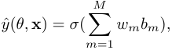

where _σ_ : R _→_ R is a continuous differentiable function to aggregate local model outputs _bm_ and _wm_ is the weight for _bm_ . For backward propagation, the server calculates the loss based on the global results and labels and sends them back to clients to calculate their own partial gradients. Then clients update their parameters of local models following: 

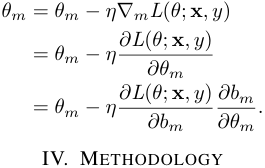

In this section, we introduce the detailed procedure of MIVFL. First, we decompose the calculation of feature importance into two steps from a global view to overcome the discrepancy in local-global perspective. Moreover, we propose a common feature suppression method for the overlapped feature problem to solve the discrepancy in local-local perspective. The overall architecture of our model is shown in Figure 1. 

Authorized licensed use limited to: Shanghai Jiaotong University. Downloaded on October 18,2023 at 01:06:14 UTC from IEEE Xplore.  Restrictions apply. 

_A. Global Feature Importance_ 

We jointly train sub-explainers to select _km_ local features for each client _m ∈_ M, forming a set of top _k_ features from the global view, where� _m__km_=_k_.However,specifyingthe value for each _km_ is unrealistic in practice. We design an adaptive method to learn them. The key observation is that we jointly select _k_ important features globally instead of having each client select _km_ local important features independently. Therefore, for a specific sample **x** , we need to acquire the global feature importance, which can be calculated through the law of total probability: 

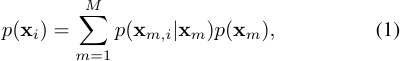

where _p_ ( **x** _i_ ) represents the global importance of the _i__th_ feature **x** _i_ , _p_ ( **x** _m,i|_ **x** _m_ ) is the local importance of **x** _m,i_ on client _m_ and _p_ ( **x** _m_ ) is the global importance of the feature subset of client _m_ . Equation (1) suggests that there may be overlapped features among clients. However, since features are private information for clients, the server does not know the location of overlapped features on all clients, and thus cannot calculate the global feature importance in (1). We will describe how to overcome the feature overlap problem in Section IV-B. Here, we first assume there are no overlapped features, and we can convert (1) to 

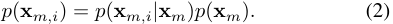

So the problem converts to calculate the local importance of features on the client _m_ , _i.e._ , _p_ ( **x** _m,i|_ **x** _m_ ) and the global importance of feature subset on the client _m_ , _i.e._ , _p_ ( **x** _m_ ). The _p_ ( **x** _m,i|_ **x** _m_ ) can be calculated by the sub-explainer, while _p_ ( **x** _m_ ) can be obtained by the global result aggregation at the server. We will introduce details of these two parts in the following, respectively. 

**Local Feature Importance** We now discuss how to compute the local importance of features on the client _m p_ ( **x** _m,i|_ **x** _m_ ). We propose to use mutual information to select the feature subset. Mutual information is used to measure the dependence between two random variables. For the input random variable _X_ , we regard the selected global feature subset as a random variable _XS ∈_ R_k_ with _S ⊂_ 2_d_ and _|S|_ = _k_ . Maximizing mutual information between _XS_ and the response variable _Y_ will help find features that are most dependent on the model output [9], [22]. Thus, we formulate the model interpretation as learning an explainer to maximize the mutual information: 

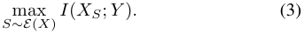

In prediction tasks, there is sometimes a phenomenon that several features selected by the explainer are not dependent on the response variable but can improve the prediction accuracy. The reason is that these features are not important individually, but can be selected combinatorially by the explainer which is like a function of the features to make true predictions. In VFL, 

this negative effect is even amplified, implying that the locally selected unimportant features are amplified to the global level, which may delay the selection of the truly important features in other clients. Thus, we require the explainer not only to focus on the importance of the selected features but also to control the remaining features to widen their importance gap to ensure that the remaining features are irrelevant to the response variable, preventing important features from being missed. 

Therefore, we consider the idea of adversarial game. Maximizing the mutual information between the selected feature subset and the response variable _Y_ , while also minimizing the mutual information between remaining feature subsets _XS_ ¯ = **x** _s_ ¯ _∈_ R_d−k_ and the response variable _Y_ : 

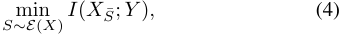

where _XS_ ¯ = _X − XS_ . 

The explainer should select features that satisfy (3) and (4) at the same time, so the problem is converted to 

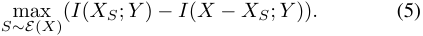

The above formulation can be converted into the form of conditional distributions: 

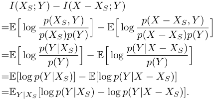

Thus, (5) equals 

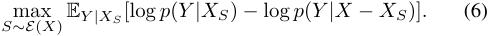

However, _p_ ( _Y |XS_ ) and _p_ ( _Y |X − XS_ ) cannot be calculated directly, we derive the variational lower bound to approximate them. For a variational mapping _XS → q_ ( _Y |XS_ ), KullbackLeibler (KL) divergence between _p_ and _q_ is non-negative: 

_KL_ ( _p||q_ ) = E _Y |XS_ [log_<u>p</u>_ _q_] = E_Y |XS_[log_p_]_−_E_Y |XS_[log_q_]_≥_0_._ 

Here, we get the variational lower bound of _p_ : 

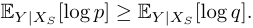

Thus, (6) is relaxed to maximize the variational lower bound: 

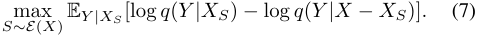

In each client, apart from the model sub-explainer _Em_ : **x** _m →_ **s** _m_ , we also introduce a predictor _fpm_ : **˜x** _m,s → bm_ to cooperate to train the global predictor _fp_ to learn _q_ ( _y|_ **x** _s_ ) and also an irrelevant predictor _fp_ ¯ _m_ : **˜x** _m,s_ ¯ _→_¯ _bm_ to cooperate to 

Authorized licensed use limited to: Shanghai Jiaotong University. Downloaded on October 18,2023 at 01:06:14 UTC from IEEE Xplore.  Restrictions apply. 

train the global irrelevant predictor _fp_ to learn _q_ ( _y|_ **x** _−_ **x** _s_ ). The loss functions of all clients are 

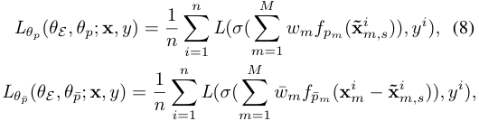

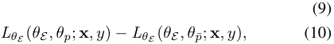

where _θE_ , _θp_ and _θp_ ¯ are parameters of global models _E_ , _fp_ and _fp_ ¯ respectively and **˜x**_i_ _m,s_=**x** _m__i⊙Em_(**x** _m__i_).Wenotethat the irrelevant predictor _fp_ ¯ plays an adversarial game with the explainer _E_ . 

An ideal _E_ should guarantee that (8) is less than (9), so in order to prevent (8) from being negative, we need to process (10) as follows 

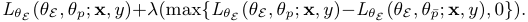

For the forward propagation, client _m_ submits the local results _bm_ = _fp_ ( **˜x** _m,s_ ) and¯ _bm_ = _fp_ ¯( **˜x** _m,s_ ¯) to the server. Then the server aggregates all the local results ˆ _y_ = _σ_ (�_M_ _m_ =1_wmbm_) and _y_ˆ ¯ = _σ_ (�_M_ _m_ =1_w_¯_m_¯_bm_).Finally,theserversends globalre- sults back to each client to conduct the backward propagation. In reality, we can optimize (7) by sampling � _kd_ � times to form **s** according to feature importance. However, this way is computationally expensive, and the discreteness of sampling blocks the backward propagation of the model. Therefore, we use a reparameterization method, namely the GumbelSoftmax trick [32], which is a continuous relaxation for discrete distributions to approximate sampling. 

We use Gumbel-Softmax to sample for discrete feature importance distribution. It is worth noting that after _Em_ = generates the local importance distribution vector _pm_ [ _p_ ( **x** _m,_ 1 _|_ **x** _m_ ) _, · · · , p_ ( **x** _m,dm |_ **x** _m_ )], we need to upload the local feature importance to the server and convert it to the global importance according to (2): 

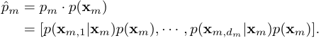

Now, we can get�_M_ _m_ =1 � _di_ =1 _m__p_ˆ(**x**_m,i|_**x**_m_)=1.Therefore, the actual sampling process should be 

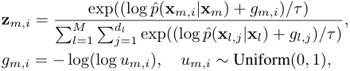

where _τ >_ 0 is temperature coefficient. Repeat the above process _k_ times to simulate sampling _k_ features to obtain approximate results **r** _m,i_ = max _j∈{_ 1 _,··· ,k}_ **z**( _m,i__j_).Thesampling result of **¯s** is the complement of **s** , so we express it as **¯s** =_._ **1** _−_ **r** where **1** represents an all-one vector with _d_ -dimension. Thus, **˜x** _s_ =_._ **r** _⊙_ **x** and **˜x** _s_ ¯ = (_._ **1** _−_ **r** ) _⊙_ **x** . The **r** _m_ will be sent to the client _m_ , who will sample the features and forward them into _fp_ and _fp_ ¯ to finish the subsequent prediction. 

**Feature Subset Importance** We next describe how to calculate the feature subset importance _p_ ( **x** _m_ ). 

We consider the importance of feature subset **x** _m_ on client _m_ as its contribution to the global result aggregation on the server. A classic contribution calculation method is Shapley value from cooperative game theory [33]. Although it guarantees fairness, it has exponential computational complexity, which is computationally expensive in VFL. Other methods [34], [35] also require extra model training time, which is also inefficient. To make it clear, we summarize some requirements for the contribution calculation method in VFL as follows: 

- **Low computation cost** : VFL involves multiple clients, and Shapley value-based methods have exponentially increasing computation costs with respective to the increasing number of clients, severely reducing the model training speed. Thus, calculation methods with high computation costs will delay adjusting the local importance to the global one. 

- **Low communication cost** : The contribution calculation process should not involve excessive communications between clients and the server, which means backward gradient propagation and excessive exchange of results between clients and server will not be considered. Also, methods that attempt to transfer feature subsets among clients are also not allowed, which will bring communication costs among clients and cause privacy leakage. 

According to the above requirements, we propose a feature contribution calculation method, which is based on the definition of the marginal contribution of a feature subset to the global prediction outcome. 

**Definition 1.** _Let V be a feature contribution evaluation function. The marginal contribution of feature subset_ **x** _m is_ 

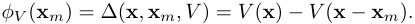

For the feature contribution evaluation function _V_ , we use the loss function to measure the distance between the predicted result and the ground truth. Specifically, _V_ ( **x** ) = _−Dis_ (ˆ _y_ ( _θ,_ **x** ) _, y_ ) and _V_ ( **x** _−_ **x** _m_ ) = _−Dis_ (ˆ _y_ ( _θ−m,_ **x** _−m_ ) _, y_ ). We can use cross entropy for discrete variables and mean squared error for continuous variables to represent _Dis_ . 

The intuition of Definition 1 is the marginal contribution caused by the participation and non-participation of the client _m_ in the global result aggregation. For example, if the client _m_ is beneficial to global aggregation, then the first term in Definition 1 must be smaller than the second term and the contribution of the client _m_ is positive; on the contrary, if the client _m_ is harmful to global aggregation, the contribution of the client _m_ is negative. 

When implementing this feature contribution evaluation function, we need to set up a pre-trained predictor _fpre_ for each client. The architecture is shown in the green box in Figure 1. These predictors are jointly trained by all clients before training the explainer. When training the explainer, we only need to make one extra inference to calculate the marginal contribution of the client. In addition, calculating the feature 

Authorized licensed use limited to: Shanghai Jiaotong University. Downloaded on October 18,2023 at 01:06:14 UTC from IEEE Xplore.  Restrictions apply. 

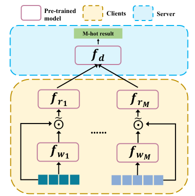

<!-- Start of picture text -->
Pre-trained  Clients Server model M-hot result 𝒇𝒅 𝒇𝒓𝟏 𝒇𝒓𝑴 !⨀ !⨀ …… 𝒇𝒘𝟏 𝒇𝒘𝑴 …… <!-- End of picture text -->

Fig. 2. **Common feature suppression.** The model is set to suppress common features among clients and remove redundancy. Each client owns the weight network and representation learning module. The intermediate results are uploaded to the server as the inputs of the discriminator network. 

subset importance can be only on the server, so it does not need much communication between clients and the server. The server only needs to maintain a matrix that saves the local outputs of each client, and then calculate the contributions of all clients in parallel according to Definition 1. 

## _B. Common Feature Suppression_ 

The **x** _s_ generated by the explainer is required to be the most refined feature subset, which means that it needs to select _k_ representative features under the premise of ensuring prediction accuracy, rather than selecting some repeated features. However, **xs** generated without any coordination may have overlap, which will not fully improve model performance. As we mentioned before, (1) cannot be calculated during training since we cannot know which features are overlapped. This will cause overlapped features to be regarded as different features during global sampling. Therefore, we hope that the model can remove the overlap between features, and provide an accurate and concise interpretation with representative features. 

The specific method is that we hope that each _E_ should try to avoid selecting common features. Two models are used to achieve this goal. One is the weight network _fwm_ : **x** _m → am, am ∈_ R_dm_ on client _m_ , and the other is the discriminator network _fd_ : **x** _m ⊙ am → t, m ∈_ M _, t ∈_ R_M_ on the server. The two networks form an adversarial game which is similar to Generative Adversarial Network (GAN) [36]. The output dimension of _fd_ is _M_ -hot, and its function is to identify which client the input comes from _argmaxi∈_ M _ti_ ; and the purpose of _fw_ is to learn the weight of each feature to ensure that it can provide higher weight to features that can confuse _fd_ , which are actually the common features. Therefore, the objective function of the network of clients _m_ is 

min max _fwm fd_E**x**_m∼πm_[log I(_m_=_argmaxi∈_M_ti_)_fd_(**x**_m ⊙fwm_(**x**_m_))]_,_ where _πm_ is the data distribution of client _m_ . 

TABLE I 

SYNTHETIC DATASETS 

|**# Clients**|**Dataset**|**Method**|
|---|---|---|
||_D_2 1|_P_(_x|y_ = 1)_∝_exp_{_�4 _i_=1 _x_2 _i __−_4_}_|
|2|_D_2 2|_P_(_x|y_ = 1)_∝_exp_{−_10_×_sin(2_X_5) + 2_|x_6_|_+ _x_7+ exp_{−x_8_}}_|
||_D_2 |_x_10 _≥_0: _P_(_x|y_ = 1)_∝D_2 1|
||3|_x_10 _<_0: _P_(_x|y_ = 1)_∝D_2 2|
||_D_5 1|_P_(_x|y_ = 1)_∝_exp_{_�10 _i_=1 _x_2 _i __−_4_}_|
|5|_D_5 2|_P_(_x|y_ = 1)_∝_exp_{−_5_×_ �14 _i_=11 sin(2_xi_)+ 2_|x_15_|_+ 1 2 �17 _i_=16 _xi_ + 1 3 �20 _i_=18 exp_{−xi}}_|
||_D_5 |_x_25 _≥_0: _P_(_x|y_ = 1)_∝D_5 1|
||3|_x_25 _<_0: _P_(_x|y_ = 1)_∝D_5 2|

TABLE II 

MEAN FIA (%) FOR SYNTHETIC DATASETS UNDER DIFFERENT NUMBER OF CLIENTS OVER 10000 SAMPLES FOR EACH DATA SET 

|# Clients||2|||5||
|---|---|---|---|---|---|---|
|Dataset|_D_2 1|_D_2 2|_D_2 3|_D_5 1|_D_5 2|_D_5 3|
|**MI-VFL**|**100.0**|**92.8**|**75.7**|**83.9**|**79.6**|**65.5**|
|SHAP|100.0|65.5|56.0|49.2|58.0|55.9|
|LIME|99.5|98.5|62.4|93.2|91.0|55.1|
|Saliency|90.0|93.0|64.8|85.2|96.2|55.5|
|or _fwm_ fi _f __∗_ (_⊙_|ixed, the  ) = |optimal   _π_0(**x** |_fd_ is _m_) |_· · ·_ |_πM_(**x**_m_|) �|
| _d_ **x**_m_|_m_  |� _m __πm_|(**x**_m_)_,_|_,_ �|_m __πm_(|**x**_m_)  _._|

## For _fwm_ fixed, the optimal _fd_ is 

The _fwm_ and _fd_ confront each other and finally reach a balance point, which is _π_ 0( **x** _m_ ) = _· · ·_ = _πM_ ( **x** _m_ ). That is to say, _fwm_ has learned the common features of the clients. 

However, there exist two problems in the current model. First, the output dimensions of _fwm_ and **x** _m_ from different clients are different, which cannot be used directly as the input of _fd_ . Second, we cannot send weighted features to the server for privacy consideration. To solve the above problems, we add a representation learning module _frm_ after _fwm_ , which maps inputs from different clients into the same input dimension for _fd_ . Also, submitting intermediate representations can further protect data privacy and _frm_ can learn better representations of common features to improve model performance. The architecture is shown in Figure 2. 

Since we need to suppress common features, we use **x** _m ⊙_ (1 _− am_ ) as the input of _fd_ to ensure that _fwm_ can directly generate weights that suppress common features. The whole network will be pre-trained. After training, we retain _fwm_ and multiply its calculated weight with the local weight calculated by _Em_ . Our purpose is to suppress the common features, rather than completely ignoring them, so we will randomly select a client _m_ during training without setting _fwm_ to ensure that the common features can also participate in the training. Because the network still needs to learn based on the feedback of the predictor _fp_ and the irrelevant predictor _fp_ ¯ during training, suppressing common features will not bring negative effects 

Authorized licensed use limited to: Shanghai Jiaotong University. Downloaded on October 18,2023 at 01:06:14 UTC from IEEE Xplore.  Restrictions apply. 

TABLE III 

MEAN FIA AND MEAN RR FOR SYNTHETIC DATASETS UNDER DIFFERENT NUMBERS OF CLIENTS WITH OVERLAPPED FEATURES OVER 10000 SAMPLES FOR EACH DATASET 

|# Clients|||2||||||5||
|---|---|---|---|---|---|---|---|---|---|---|
|Dataset||_D_2 1|_D_|2 2|_D_2 3|_D_|5 1|_D_|5 2|_D_5 3|
|# Overlap|1|2|1|2|1 2|1|2|1|2|1 2|
|Metric(%)|FIA RR|FIA RR|FIA RR|FIA RR|FIA RR FIA RR|FIA RR|FIA RR|FIA RR|FIA RR|FIA RR FIA RR|
|MI-VFL|85.8 28.5|77.7 22.3|74.9 41.9|75.0 21.7|69.4 44.6 54.9 19.1|72.4 27.5|71.2 18.6|67.0 19.0|69.1 8.2|58.7 34.2 52.6 26.4|
|MI-VFL+supp|**99.7** **0.7**|**98.9** **0.9**|**95.2** **0.0**|**80.4** **0.0 **|**82.3 0.0 79.3 4.2**|**77.8 1.7 **|**78.8 6.4 **|**71.5 0.3 **|**78.1 4.2 **|**64.7 0.03 80.6** **0.7**|

to _E_ but ensure that the explainer can learn the features relevant to the target without overlap. 

## V. EVALUATION 

In this section, we evaluate MI-VFL through extensive experiments in several synthetic and real-world datasets. 

## _A. Synthetic Datasets_ 

_1) Evaluation Setup:_ Centralized interpretation methods usually use some synthetic datasets to verify whether they can accurately find task-relevant features [9], [10]. In VFL, we need to consider the number of clients, and set up two types of datasets for the different numbers of clients. The first type is for 2 clients and contains 10 features (generated by a 10-dimensional Gaussian distribution), where 4 features are important ( _k_ = 4); the second type is for 5 clients and contains 25 features (generated by a 25-dimensional Gaussian distribution), where 10 features are important ( _k_ = 10). Labels of these datasets depend only on important features. The specific settings of the datasets are shown in Table I. We split the feature set randomly and guarantee that each client has an equal number of features. 

The performance metric used in centralized interpretation methods is feature identification accuracy (FIA), which represents the proportion of important features discovered among all important features. In VFL, we use the same performance metric. We also introduce repetition rate (RR) to evaluate the feasibility of the common feature suppression scheme. RR indicates the proportion of selected repetitive features among all repetitive features. 

_2) Evaluation of Difference in Local Feature Importance and Global One:_ To verify whether our approach can compensate for client-server’s difference, we compare MI-VFL with several current centralized interpretation methods, including **Saliency maps** [13], **SHAP** (SHapley Additive exPlanations) [26] and **LIME** (Local Interpretable Model-agnostic Explanations) [25]. Saliency maps use the absolute values of the gradient of model output over features as the importance score of features. SHAP is a unified framework for feature importance measurement based on the classic Shapley value. Here we use Deep SHAP [26], which is an approximate algorithm for SHAP values used in deep learning. LIME approximates the model by constructing a local linear model to make an interpretation. For all methods, we train a unified 

centralized model. We select top- _k_ important features for each sample. The results are shown in Table II. 

As demonstrated in Table II, MI-VFL performs well when the number of clients is 2 and 5. We observe that some results are slightly inferior to some centralized interpretation methods in _D_ 22,_D_ 15,and_D_ 25,whichisduetotheperformance degradation in distributed scenario compared with centralized one. Even so, almost all important features can be selected in the first two datasets in 2 clients, and about 80% of important features can be selected in the first two datasets in 5 clients. In addition, we notice that the accuracy of their second dataset is generally lower regardless of the number of clients. It is due to the non-linear relationship between features and labels. In contrast, in the third dataset, MI-VFL owns a very huge advantage. This also demonstrates that MI-VFL is instancewise, which has the ability to select different important features based on different samples. Sample variability is also important in interpretation methods. It is worth mentioning that the running time of one sample in MI-VFL is just the time of one inference, which is a very significant advantage compared with LIME and SHAP methods that have very high time complexity. Especially in VFL, the high time complexity can be very detrimental. 

_3) Evaluation of Common Feature Suppression:_ It makes sense to suppress important features than to suppress unimportant features, because it has a lower probability to select unimportant features. Therefore, our experiments only consider overlapped important features. Moreover, there is an importance ranking among important features. For example, in _D_ 22, the importance rank of_x_8is higher than that of_x_7. There- fore, we choose overlapped features according to their feature importance obtained in the experiments without overlapped features. We assign the overlapped features to each client, and the remaining important features are randomly assigned to them. Finally, the remaining unimportant features are removed randomly by the number beyond the total number. In this way, we ensure that all important features are retained, while also ensuring that the total numbers of features remain at 10 and 25. We conduct 2 types of experiments with 1 overlapped feature and 2 overlapped features. In order to explore the completeness of the discoverable important features, the overlapped features are recorded only once in the calculation of FIA. The results are shown in Table III. 

As can be seen in Table III, our common feature suppression 

Authorized licensed use limited to: Shanghai Jiaotong University. Downloaded on October 18,2023 at 01:06:14 UTC from IEEE Xplore.  Restrictions apply. 

TABLE IV 

PREDICTION PERFORMANCE IN THE FIRST THREE REAL-WORLD DATASETS ON TEST DATA 

||without|MI-VFL|MI-|VFL|
|---|---|---|---|---|
|Metric|AUROC|AUPRC|AUROC|AUPRC|
|Credit Card|0.7770|0.5411|**0.8288**|**0.6375**|
|Drug Persistency|0.8239|0.7127|**0.8890**|**0.8105**|
|w8a|0.9417|0.7048|**0.9741**|**0.8068**|

scheme performs very well. When there is one overlapped feature, it is possible to achieve no overlap or very little overlap. When there are two overlaps, RR decreases greatly. This demonstrates that our method can remove overlapped features very effectively. We observe that the decrease in RR is accompanied by an increase in FIA. This is because the removal of overlapped features leaves positions for other important features to be selected, ensuring the completeness of the important features set and enhancing the interpretability of the method. 

## _B. Real-world Datasets_ 

_1) Evaluation Setup:_ We further evaluate MI-VFL in 5 realworld datasets as well: 

- Credit card [37]: a tabular dataset of 30000 samples with 23 features. 8, 8, and 7 features are assigned to 3 clients randomly. 

- Drug persistency1 [38]: a tabular dataset of 3424 samples with 67 features. 14, 14, 13, 13, and 13 features are assigned to 5 clients randomly. 

- w8a [39]: a tabular dataset of 64700 samples with 300 features. An equal number of features are assigned to 10 clients randomly. 

- MNIST [40] subset: an image dataset to classify handwritten digits 4 and 9, which has 19782 images with 28 _×_ 28 features. We set up 2 clients with the raw images on the first client and the images rotated by 180 degrees on the second client. Thus there are 1568 features in total. 

- IMDB [41]: a text dataset of sentiment classification for movie reviews, which has 50000 reviews and the average review length is 231 words. We split each review into two parts and assign them to 2 clients respectively. 

For the first three datasets, we set up _k_ = 8, _k_ = 20, and _k_ = 250 respectively. For the last two datasets, we follow Chen _et al._ [9] to process them. For MNIST, we split the 28 _×_ 28 image into 16 patches with the size of 7 _×_ 7 for better visualization and choose _k_ = 10 patches from 32 patches. For IMDB, we cut/pad each review into 200 words for each client. We choose _k_ = 10 words from 400 words. 

Since we do not know in advance which features are important in real-world datasets, we evaluate MI-VFL through the Area Under the Receiver Operating Characteristic Curve (AUROC) and Area Under the Precision Recall Curve (AUPRC). 

> 1We check all the medical datasets on Kaggle, and choose this one due to its sufficient features and samples, non-null data value, and complete labels. 

TABLE V 

PREDICTION PERFORMANCE AND MEAN RR IN THE FIRST THREE REAL-WORLD DATASETS WITH OVERLAPPED FEATURES ON TEST DATA 

|||MI-VFL||MI|-VFL+sup|p|
|---|---|---|---|---|---|---|
|Metric|AUROC|AUPRC|RR(%)|AUROC|AUPRC|RR(%)|
|Credit Card|0.7147|0.4290|31.5|**0.7830**|**0.5894**|**0.1**|
|Drug Persistency|0.8386|0.7376|12.6|**0.8538**|**0.7538**|**4.3**|
|w8a|0.9508|0.7574|42.17|**0.9606**|**0.7431**|**13.8**|

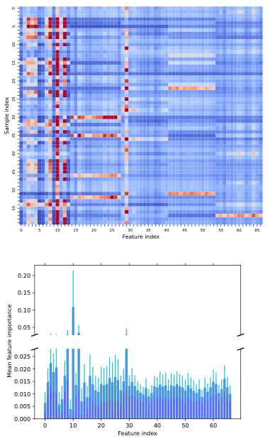

<!-- Start of picture text -->
0 5 10 15 20 25 30 35 40 45 50 55 60 65 Feature index 0.20 0.15 0.10 0.05 0.025 0.020 0.015 0.010 0.005 0.000 0 10 20 30 40 50 60 Feature index 0 5 10 15 20 25 30 Sample index 35 40 45 50 55 Mean feature importance <!-- End of picture text -->

Fig. 3. Feature importance of each of 60 random samples ( **top** ) and mean feature importance and standard error of test data ( **bottom** ) in drug persistency dataset. 

_2) Evaluation of Difference in Local Feature Importance and Global One:_ We calculate AUROC and AUPRC with (using selected features) and without (using all features) MIVFL in the first three datasets2 , and the results are shown in Table IV. We find that MI-VFL can improve the model prediction ability very effectively regardless of the datasets and the number of clients. This is because the explainer can accurately select the important features to participate in the prediction task in a more targeted manner. Furthermore, to reflect the instance-wise nature of MI-VFL, we randomly select 60 samples in the drug persistency dataset and drew their feature importance as shown in Figure 3(top). Also, we present the mean feature importance of test data for all features in Figure 3(bottom). From this, we can clearly find the difference 

> 2We evaluated our model in MNIST and IMDB datasets in section V-B3 directly because there is no need to manually set overlapped features. 

Authorized licensed use limited to: Shanghai Jiaotong University. Downloaded on October 18,2023 at 01:06:14 UTC from IEEE Xplore.  Restrictions apply. 

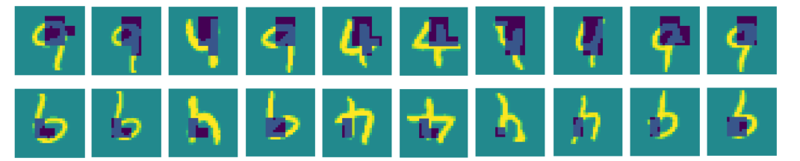

Fig. 4. Ten pairs of images of 4 and 9 are randomly selected from the test dataset in MNIST. Two rows are from two clients, respectively. The selected patches are colored dark blue and purple. 

TABLE VI 

PREDICTION PERFORMANCE IN MNIST AND IMDB DATASETS 

||wit|hout MI-V|FL|M|I-VFL+su|pp|
|---|---|---|---|---|---|---|
|Metric|AUROC|AUPRC|ACC(%)|AUROC|AUPRC|ACC(%)|
|MNIST|0.9993|0.9993|97.80|**0.9996**|**0.9996**|**99.10**|
|IMDB|0.9344|0.9299|86.27|**0.9535**|**0.9619**|**89.63**|

in the importance scores between important and unimportant features. From the figure, we can see that MI-VFL can select important features well and has sample variability in important features. 

_3) Evaluation of Common Feature Suppression:_ We also evaluate the common feature suppression scheme in real-world datasets. For the first three datasets, we select the overlapped features based on the importance of features computed in the experiments without overlapped features. The assignment is the same as Section V-A3. We conduct experiments containing 2 overlapped features in both credit card and drug persistency datasets and 5 overlapped features in w8a dataset. The experimental results are shown in Table V. 

As can be seen from the table, our method also suppresses overlapped features and reduces RR in real-world datasets. At the same time, the identification of more different important features further improves the prediction ability of the model. Therefore, it can be seen that the common feature suppression is also effective in real-world datasets. 

For MNIST and IMDB, we apply MI-VFL with common feature suppression on them directly. The results are shown in Table VI. We also calculate prediction accuracy (ACC) to do a better comparison. With MI-VFL, both image and text tasks get performance improvements. Furthermore, we visualize the explanation results for MNIST in Figure 4 and IMDB in Figure 5. For MNIST, we can see the selected features focus on the head of 4 and 9, which is the crucial position to distinguish them. For IMDB, two reviews from different sentiments are predicted correctly by MI-VFL. The words selected by MIVFL are highlighted and we underline the key sentences made up of selected words, from which we can find MI-VFL can select key adjectives. Although it also selects words like “out” and “of”, they form a complete expression like “ran out of gas”. It is worth mentioning that there are many overlapped words, but MI-VFL avoided selecting them. For example, in 

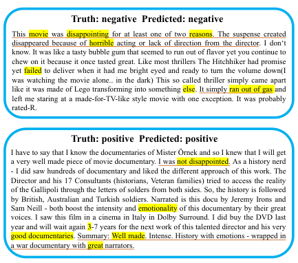

<!-- Start of picture text -->
Truth: negative  Predicted: negative This movie was disappointing for at least one of two reasons. The suspense created disappeared because of horrible acting or lack of direction from the director. I don‘t know. It was like a tasty bubble gum that seemed to run out of flavor yet you continue to chew on it because it once tasted great. Like most thrillers The Hitchhiker had promise yet failed to deliver when it had me bright eyed and ready to turn the volume down(I was watching the movie alone.. in the dark) This so called thriller simply came apart like it was made of Lego transforming into something  else. It simply  ran out  of  gas  and left me staring at a made-for-TV-like style movie with one exception. It was probably rated-R. Truth: positive  Predicted: positive I have to say that I know the documentaries of Mister Örnek and so I knew that I will get a very well made piece of movie documentary. I was  not disappointed.  As a history nerd - I did saw hundreds of documentary and liked the different approach of this work. The Director and his 17 Consultants (historians, Veteran families) tried to access the reality of the Gallipoli through the letters of solders from both sides. So, the history is followed by British, Australian and Turkish soldiers. Narrated is this docu by Jeremy Irons and Sam Neill - both boost the intensity and  emotionality  of this documentary by their great voices. I saw this film in a cinema in Italy in Dolby Surround. I did buy the DVD last year and will wait again 3-7 years for the next work of this talented director and his very good documentaries . Summary:  Well made.  Intense. History with emotions - wrapped in a war documentary with  great  narrators. <!-- End of picture text -->

Fig. 5. Two reviews (positive and negative) are randomly selected from the test dataset in IMDB. Important words selected by MI-VFL are highlighted and key sentences are underlined. 

the second review of Figure 5, “well made” occurs both in the first sentence (client 1) and in the last sentence (client 2), but MI-VFL only selects it once. 

## VI. CONCLUSION 

In this paper, we have presented the first distributed model interpretation method for VFL, namely MI-VFL. From the natural characteristic of feature misalignment in VFL, we have proposed to use the law of total probability to solve the problem that the local feature importance is not equal to the global one caused by the discrepancy in local-global perspective. For the sake of completeness of selected features, we have designed to use adversarial game to select as many important features as possible. At the same time, we have also considered the discrepancy in the local-local perspective. We have designed a federated adversarial learning model to identify overlapped features once. Evaluation results demonstrate that our proposed method can accurately select important features and suppress overlapped features. 

## REFERENCES 

- [1] B. McMahan, E. Moore, D. Ramage, S. Hampson, and B. A. y Arcas, “Communication-efficient learning of deep networks from decentralized data,” in _Proceedings of the International Conference on Artificial Intelligence and Statistics_ , 2017. 

Authorized licensed use limited to: Shanghai Jiaotong University. Downloaded on October 18,2023 at 01:06:14 UTC from IEEE Xplore.  Restrictions apply. 

- [2] T. Li, A. K. Sahu, A. Talwalkar, and V. Smith, “Federated learning: Challenges, methods, and future directions,” _IEEE Signal Processing Magazine_ , vol. 37, no. 3, pp. 50–60, 2020. 

- [3] P. Kairouz, H. B. McMahan, B. Avent, A. Bellet, M. Bennis, A. N. Bhagoji, K. Bonawitz, Z. Charles, G. Cormode, R. Cummings _et al._ , “Advances and open problems in federated learning,” _Foundations and Trends® in Machine Learning_ , vol. 14, no. 1–2, pp. 1–210, 2021. 

- [4] Q. Yang, Y. Liu, T. Chen, and Y. Tong, “Federated machine learning: Concept and applications,” _ACM Transactions on Intelligent Systems and Technology_ , vol. 10, no. 2, pp. 1–19, 2019. 

- [5] S. Hardy, W. Henecka, H. Ivey-Law, R. Nock, G. Patrini, G. Smith, and B. Thorne, “Private federated learning on vertically partitioned data via entity resolution and additively homomorphic encryption,” _arXiv preprint arXiv:1711.10677_ , 2017. 

- [6] Z. C. Lipton, “The mythos of model interpretability,” _Queue_ , vol. 16, no. 3, pp. 31–57, 2018. 

- [7] C. Rudin, “Stop explaining black box machine learning models for high stakes decisions and use interpretable models instead,” _Nature Machine Intelligence_ , vol. 1, no. 5, pp. 206–215, 2019. 

- [8] T. Lei, R. Barzilay, and T. Jaakkola, “Rationalizing neural predictions,” in _Proceedings of the Conference on Empirical Methods in Natural Language Processing_ , 2016. 

- [9] J. Chen, L. Song, M. Wainwright, and M. Jordan, “Learning to explain: An information-theoretic perspective on model interpretation,” in _Proceedings of the International Conference on Machine Learning_ , 2018. 

- [10] J. Yoon, J. Jordon, and M. van der Schaar, “INVASE: Instance-wise variable selection using neural networks,” in _Proceedings of the International Conference on Learning Representations_ , 2018. 

- [11] S. Chang, Y. Zhang, M. Yu, and T. Jaakkola, “A game theoretic approach to class-wise selective rationalization,” in _Proceedings of the Annual Conference on Neural Information Processing Systems_ , 2019. 

- [12] M. Yu, Y. Zhang, S. Chang, and T. Jaakkola, “Understanding interlocking dynamics of cooperative rationalization,” in _Proceedings of the Annual Conference on Neural Information Processing Systems_ , 2021. 

- [13] K. Simonyan, A. Vedaldi, and A. Zisserman, “Deep inside convolutional networks: visualising image classification models and saliency maps,” in _Proceedings of the International Conference on Learning Representations_ , 2014. 

- [14] A. Shrikumar, P. Greenside, A. Shcherbina, and A. Kundaje, “Not just a black box: Learning important features through propagating activation differences,” _arXiv preprint arXiv:1605.01713_ , 2016. 

- [15] M. Sundararajan, A. Taly, and Q. Yan, “Axiomatic attribution for deep networks,” in _Proceedings of the International Conference on Machine Learning_ , 2017. 

- [16] S. Bach, A. Binder, G. Montavon, F. Klauschen, K.-R. M¨uller, and W. Samek, “On pixel-wise explanations for non-linear classifier decisions by layer-wise relevance propagation,” _PloS one_ , 2015. 

- [17] A. Shrikumar, P. Greenside, and A. Kundaje, “Learning important features through propagating activation differences,” in _Proceedings of the International Conference on Machine Learning_ , 2017. 

- [18] X. Sheng, L. Zhao, G. Zhou, X. Ding, B. Dai, Q. Luo, S. Yang, J. Lv, C. Zhang, H. Deng _et al._ , “One model to serve all: Star topology adaptive recommender for multi-domain ctr prediction,” in _Proceedings of the International Conference on Information and Knowledge Management_ , 2021. 

- [19] Y. Jiang, Q. Li, H. Zhu, J. Yu, J. Li, Z. Xu, H. Dong, and B. Zheng, “Adaptive domain interest network for multi-domain recommendation,” in _Proceedings of the International Conference on Information and Knowledge Management_ , 2022. 

- [20] D. Greene and P. Cunningham, “A matrix factorization approach for integrating multiple data views,” in _Proceedings of the European Conference on Machine Learning and Principles and Practice of Knowledge Discovery in Databases_ , 2009. 

- [21] D. Cai, X. He, J. Han, and H. Zhang, “Orthogonal laplacianfaces for face recognition,” _IEEE Transactions on Image Processing_ , vol. 15, no. 11, pp. 3608–3614, 2006. 

- [24] T. M. Cover, _Elements of information theory_ , 1999. 

- [22] H. Peng, F. Long, and C. Ding, “Feature selection based on mutual information criteria of max-dependency, max-relevance, and minredundancy,” _IEEE Transactions on Pattern Analysis and Machine Intelligence_ , vol. 27, no. 8, pp. 1226–1238, 2005. 

- [23] C. Meadows, “A more efficient cryptographic matchmaking protocol for use in the absence of a continuously available third party,” in _IEEE Symposium on Security and Privacy_ , 1986. 

- [25] M. T. Ribeiro, S. Singh, and C. Guestrin, “‘why should i trust you?’ explaining the predictions of any classifier,” in _Proceedings of the ACM SIGKDD International Conference on Knowledge Discovery and Data Mining_ , 2016. 

- [26] S. M. Lundberg and S.-I. Lee, “A unified approach to interpreting model predictions,” in _Proceedings of the Annual Conference on Neural Information Processing Systems_ , 2017. 

- [27] M. T. Ribeiro, S. Singh, and C. Guestrin, “Anchors: High-precision model-agnostic explanations,” in _Proceedings of the Association for the Advancement of Artificial Intelligence_ , 2018. 

- [28] Y. Hu, D. Niu, J. Yang, and S. Zhou, “FDML: A collaborative machine learning framework for distributed features,” in _Proceedings of the ACM SIGKDD International Conference on Knowledge Discovery and Data Mining_ , 2019. 

- [29] G. Zhang, S. Zhao, H. Gao, and W. Li, “Feature-distributed SVRG for high-dimensional linear classification,” _arXiv preprint arXiv:1802.03604_ , 2018. 

- [30] B. Gu, A. Xu, Z. Huo, C. Deng, and H. Huang, “Privacy-preserving asynchronous vertical federated learning algorithms for multiparty collaborative learning,” _IEEE Transactions on Neural Networks and Learning Systems_ , vol. 33, no. 11, pp. 6103–6115, 2021. 

- [31] Y. Liu, X. Zhang, Y. Kang, L. Li, T. Chen, M. Hong, and Q. Yang, “FedBCD: A communication-efficient collaborative learning framework for distributed features,” _IEEE Transactions on Signal Processing_ , vol. 70, pp. 4277–4290, 2022. 

- [32] E. Jang, S. Gu, and B. Poole, “Categorical reparametrization with gumble-softmax,” in _Proceedings of the International Conference on Learning Representations_ , 2017. 

- [33] P. Dubey, “On the uniqueness of the shapley value,” _International Journal of Game Theory_ , vol. 4, no. 3, pp. 131–139, 1975. 

- [34] P. W. Koh and P. Liang, “Understanding black-box predictions via influence functions,” in _Proceedings of the International Conference on Machine Learning_ , 2017. 

- [35] H. Harutyunyan, A. Achille, G. Paolini, O. Majumder, A. Ravichandran, R. Bhotika, and S. Soatto, “Estimating informativeness of samples with smooth unique information,” in _Proceedings of the International Conference on Learning Representations_ , 2020. 

- [36] I. Goodfellow, J. Pouget-Abadie, M. Mirza, B. Xu, D. Warde-Farley, S. Ozair, A. Courville, and Y. Bengio, “Generative adversarial nets,” in _Proceedings of the Annual Conference on Neural Information Processing Systems_ , 2014. 

- [37] I.-C. Yeh and C.-h. Lien, “The comparisons of data mining techniques for the predictive accuracy of probability of default of credit card clients,” _Expert Systems with Applications_ , vol. 36, no. 2, pp. 2473– 2480, 2009. 

- [38] H. Singh21, “Classification: Persistent vs non-persistent,” https://www.kaggle.com/datasets/harbhajansingh21/persistent-vsnonpersistent, accessed May 11, 2021. 

- [39] Z. Zeng, H. Yu, H. Xu, Y. Xie, and J. Gao, “Fast training support vector machines using parallel sequential minimal optimization,” in _Proceedings of the International Conference on Intelligent System and Knowledge Engineering_ , 2008. 

- [40] Y. LeCun, L. Bottou, Y. Bengio, and P. Haffner, “Gradient-based learning applied to document recognition,” _Proceedings of the IEEE_ , vol. 86, no. 11, pp. 2278–2324, 1998. 

- [41] A. Maas, R. E. Daly, P. T. Pham, D. Huang, A. Y. Ng, and C. Potts, “Learning word vectors for sentiment analysis,” in _Proceedings of the Annual Meeting of the Association for Computational Linguistics: Human Language Technologies_ , 2011. 

Authorized licensed use limited to: Shanghai Jiaotong University. Downloaded on October 18,2023 at 01:06:14 UTC from IEEE Xplore.  Restrictions apply. 

