Arti�cial Intelligence 357 (2026) 104543 

Contents lists available at ScienceDirect 

# Artificial Intelligence 

journal homepage: www.elsevier.com/locate/artint 

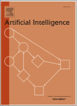

## Auction design with ex post ROI constraints 

Hongtao Lv a,b, Xiaohui Bei c, Zhenzhe Zheng d,∗, Fan Wu d,∗ 

a _Joint SDU-NTU Centre for Artificial Intelligence Research (C-FAIR), Shandong University, Jinan, China_ b _School of Software, Shandong University, Jinan, China_ 

c _School of Physical and Mathematical Sciences, Nanyang Technological University, Singapore, Singapore_ d _School of Computer Science, Shanghai Jiao Tong University, Shanghai, China_ 

a r t i c l e i n f o a b s t r a c t 

_Keywords:_ Return on investment (ROI) Mechanism design Myerson auction 

Motivated by practical constraints in online advertising, we investigate single-parameter auction design for bidders with constraints on their Return On Investment (ROI) – a targeted minimum ratio between the obtained value and the payment. We focus on _ex post_ ROI constraints, which require the ROI condition to be satisfied for every realized value profile. With ROI-constrained bidders, we first provide a full characterization of the allocation and payment rules of dominantstrategy incentive compatible (DSIC) auctions. In particular, we show that given any monotone allocation rule, the corresponding DSIC payment should be the Myerson payment with a _rebate_ for each bidder to meet their ROI constraints. Furthermore, we also determine the optimal auction structure when the item is sold to a single bidder under a mild regularity condition. This structure entails a randomized allocation scheme and a first-price payment rule, which differs from the deterministic Myerson auction and previous works on ex ante ROI constraints. Finally, for multiple ROI-constrained bidders, we investigate simple auction design and, in particular, deterministic auction design and how they can be applied in sponsored search auctions. 

### **1. Introduction** 

Online advertising auctions are a vital source of revenue for many IT companies. In recent years, with tens of millions of ad auctions being conducted in real-time each day, this large-scale and complex market has prompted modern online advertising platforms to develop auto-bidding services, which allow the advertisers to set up high-level marketing goals for their ad campaigns and then bid on behalf of the advertisers. 

In these auto-bidding scenarios, advertisers’ financial constraints such as budget and return on investment (ROI) constraints have become critical in auction design. While auctions for budget-constrained bidders have been extensively studied in the literature [1–3], research on auction design for bidders with ROI constraints is still in its nascent stage. The ROI constraints of advertisers require that the payment cannot be more than a certain fraction of the obtained advertising value. In other words, there is a targeted minimum ratio between the obtained value and the payment for an ROI-constrained bidder. Unlike budget constraints which set a hard limit on payment, ROI constraints establish a payment limit that is linearly related to the allocated value. Previous studies [4,5] have demonstrated that ROI constraints align better with real-world empirical evidence than budget constraints, and it is the aim of this paper to explore how to design auctions with good incentive and revenue guarantees for ROI-constrained bidders. 

The existing literature on auction design for ROI-constrained bidders primarily focuses on _ex ante_ ROI constraints, which requires an _expected_ ROI with respect to the prior value distributions of bidders [4,6]. This approach is suitable for advertisers who participate 

> ∗ Corresponding authors. 

_E-mail addresses:_ lht@sdu.edu.cn (H. Lv), xhbei@ntu.edu.sg (X. Bei), zhengzhenzhe@sjtu.edu.cn (Z. Zheng), fwu@cs.sjtu.edu.cn (F. Wu). 

https://doi.org/10.1016/j.artint.2026.104543 

Received 15 January 2024; Received in revised form 6 February 2026; Accepted 20 April 2026 Available online 24 April 2026 

0004-3702/© 2026 Elsevier B.V. All rights are reserved, including those for text and data mining, AI training, and similar technologies. 

_Arti�cial Intelligence 357 (2026) 104543_ 

_H. Lv, X. Bei, Z. Zheng et al._ 

in a large number of auctions daily and are only concerned with their average spend per unit of value. However, in reality, most ad campaigns experience the “long-tail phenomenon” [7], which means they only receive dozens of or fewer clicks per day. Under these conditions, an auction with ex ante ROI guarantees may have a non-negligible probability of violating the ROI constraints of these ad campaigns over a day. Due to these reasons, in this work, we focus on the _ex post_ or _hard_ ROI constraints, which ensures that the auction respects the ROI constraints of bidders for any realized value profile. This is a stronger requirement compared to ex ante ROI constraints and addresses the limitation of current auction design methods. 

### _1.1. Our results_ 

In this work, we examine the design of truthful and optimal auction design for ex post ROI-constrained bidders. We inherit the setting from the classic single-parameter mechanism design and consider the values of bidders as private information and the targeted ROIs as public information. In this single-parameter environment, the ROI constraints can be integrated into the objective function (see Section 2 for details), resulting in a transformed utility model: _𝑢𝑖_ = _𝑀𝑖𝑣𝑖𝑥𝑖_ − _𝑝𝑖_ , where _𝑢𝑖_ represents the utility of bidder _𝑖_ , _𝑣𝑖_ is the value, _𝑥𝑖_ is the allocation quantity, and _𝑝𝑖_ is the payment. Here _𝑀𝑖 >_ 1 is the targeted ROI ratio, which differentiates this model from the classical quasilinear utility model. We show that this new utility model is related to both the traditional _utility maximizer_ model and the _value maximizer_ models [8,9] emerging in recent years, which takes the allocation value as the objective without subtracting the payment. 

We first study the characterizations of truthful auctions with ROI-constrained bidders. Compared to Myerson’s characterization of truthful auctions in the single-parameter environment, we show that the monotonicity requirement of the allocation rule remains true for ex post ROI-constrained bidders, but the unique payment rule in [10] should be modified by subtracting a max term, which can be interpreted as a “rebate” equal to the largest “violation” of the Myerson payment to the ROI constraint for all lower valuations. This is a full characterization that completely describes all truthful auctions with ROI-constrained bidders. This result can be proved using similar techniques from Myerson’s analysis. It can also be derived from the following alternative interpretation of the payment rule (we will explain this in detail later on): note that the ROI-constrained bidder assigns a weight _𝑀𝑖 >_ 1 to her obtained value _𝑣𝑖𝑥𝑖_ from the allocation, so a naive approach is to charge the bidder _𝑀𝑖_ times the Myerson payment. However, to not violate the individual rationality (IR) condition, we must iteratively apply the Myerson payment increment (multiplied by _𝑀𝑖_ ) in small intervals and “cap” or truncate the payment at the obtained value whenever necessary. 

Next, we turn our focus to the optimal ( _i.e._ revenue-maximizing) auction design. The additional max term in our payment rule poses a significant challenge to the optimal auction design, since it is unclear how this term can be incorporated into a modified virtual valuation function as seen in previous literature. Instead, we concentrate on the case of selling a single item to a single bidder. Our main result suggests that under a mild regularity assumption known as _decreasing marginal revenue_ (DMR),1 the optimal auction for selling to a single ex post ROI-constrained bidder employs a randomized scheme. More specifically, the allocation rule _𝑥_ (⋅) starts with a _first-price_ interval, where the payment always matches the obtained value, until it reaches the highest allocation and _𝑥_ (⋅) becomes constant thereafter. This finding is in contrast to the classic Myerson auction [10] and previous results for bidders with ex ante ROI constraints, where the optimal auctions are always deterministic. It implies that similar to much literature on optimal mechanism design for multi-parameter settings and some single-parameter environments, including public budget [11] and risk aversion [12,13], a slight generalization of the inclusion of the _𝑀𝑖_ term can also lead to randomized optimal auctions. 

We then turn our attention to multi-bidder scenarios. The randomized allocation for the single-bidder setting implies that any extension could be very technical; hence, we mainly focus on simple auctions and show that simple and approximately optimal auctions for traditional bidders established in previous literature also have approximation guarantees for ROI-constrained bidders. Furthermore, for deterministic auctions which are often preferred in real-world applications such as online advertising, it is revealed that, when there is a single item and multiple ROI-constrained bidders, the optimal deterministic auction is equivalent to the Myerson auction. 

Finally, we apply our results to the specific context of online sponsored search auctions. In our characterization of truthful deterministic sponsored search auctions with ROI-constrained bidders, the payment could be determined by taking the minimum of a ladder-style payment and a critical-price payment. Furthermore, we show that when there is only one ROI-constrained bidder with finite valuation space, the optimal deterministic auction can be efficiently computed using a dynamic programming algorithm. 

### _1.2. Related work_ 

There are two main threads of studies of auctions with ROI-constrained bidders. The first thread investigates how the bidding strategies of the bidders are affected by the ROI constraints in classic VCG or generalized second price (GSP) auctions [14–20]. The second thread, which our paper follows, focuses on the _design_ of auctions with ROI-constrained bidders, which is of practical interest to many online advertising platforms [4,6,16,21–26]. In this line of study, the most related work to ours is [4], which showed empirically that a fraction of the buyers in online advertising are indeed ROI-constrained. They also took the first step towards revenuemaximizing auction design for bidders with Bayesian incentive compatibility (BIC) and _ex ante_ ROI constraints, which only require 

> 1 DMR requires the marginal revenue, _𝑣𝑓_ ( _𝑣_ ) + _𝐹_ ( _𝑣_ ) −1 to be non-decreasing in the _value space_ . This is different from the usual definition of regularity which requires the same monotonicity but in the _quantile space_ . Please see the related work section for a more detailed discussion of their differences and more related works. 

2 

_Arti�cial Intelligence 357 (2026) 104543_ 

_H. Lv, X. Bei, Z. Zheng et al._ 

the ROI conditions to be met in expectation and are strictly weaker than ex post ROI constraints. They proved that the allocation rule is very similar to Myerson auction with a modified virtual value function. The payment rule is related to the ROI constraint: if the ROI constraint is low to the extent that it is not binding, then the modified virtual values reduce to the classical virtual values; if the ROI constraint is moderate, then the mechanism operates with the modified virtual values; if the ROI constraint is high, then the mechanism needs to subsidize buyers to ensure their participation. It is worth noting that this mechanism is a deterministic one. Another recent work [6] considered the scenario where either the value or the ROI constraint is private information of the bidder. They also considered ex ante ROI, but they used a different constraint of ex ante IC. For the public ROI and private valuation setting, they found that although ex ante IC leads to a larger feasible set than BIC, the optimal mechanism is exactly the one in [4] as stated above. Unlike these works, we concentrate on _ex post_ ROI constraints, which provide a hard ROI guarantee for bidders in every possible value realization. In [27,28], the authors considered ex post ROI constraints in multiple stages, and assumed that each bidder maintains a fixed bid multiplier among stages, which leads to completely different problems from ours. 

One particular line of research focuses on requirements of truthfulness for ex post ROI constraints. Cavallo _et al._ studied the same utility function as ours in [22, Appendix A], and investigated the corresponding payment rules. The main difference is that they limited their focus on _deterministic_ mechanisms for bidders with _identical_ ROI constraints, while we consider a more general singleparameter setting in the randomized mechanism domain. They show that the truthful payment rule for deterministic sponsored search auction is a generalization of the classical VCG and GSP mechanism. Our results on deterministic auctions in Section 5 also generalize their results to non-identical ROI constraints. Li et al. [21] proposed a condition on the truthfulness of the ROI information, based on which they provided a mechanism framework using tools from control theory. They took the ROI constraints as private information, instead of the value, which leads to a substantially different problem from ours. 

The DMR assumption used in our optimal auction characterization has been widely discussed in the literature on auction and dynamic pricing [29–32]. It means that the function _𝜓_ ( _𝑣_ ) ≜ _𝑣𝑓_ ( _𝑣_ ) + _𝐹_ ( _𝑣_ ) −1 is non-decreasing, or equivalently _𝑣_ ⋅ (1 − _𝐹_ ( _𝑣_ )), which is the expected revenue of selling the item at price _𝑝_ , is concave, and this is where the name of this condition comes from. Intuitively, many commonly used distribution functions satisfy this assumption, _e.g._ , uniform distributions, and any distribution of finite support and monotone non-decreasing density. The DMR condition was first proposed in [29] for bidders with budget constraints. In [31], the authors found that the DMR condition is more natural in their setting than the traditionally used notion of _regularity_ [10], since DMR precisely removes the requirement of ironing in the _value_ space, instead of in the _quantile_ space as in [10]. In [30], DMR was discussed comprehensively, and the authors showed that the optimal mechanism is deterministic under the DMR condition in a multi-unit setting with private demands. We refer the reader to their work for concrete examples and more discussion. 

### **2. Preliminaries** 

We consider a general single-parameter auction environment, which consists of a seller and _𝑛_ bidders **_𝑵_** = {1 _,_ 2 _,_ … _, 𝑛_ }. Each bidder _𝑖_ has a private valuation _𝑡𝑖_ per unit of the good. We represent _𝑥𝑖_ as the quantity of the allocated good to bidder _𝑖_ and _𝑝𝑖_ as the payment of bidder _𝑖_ . Without loss of generality, we assume the maximum possible allocation is _𝑥_𝗆𝖺𝗑 _𝑖_ = 1 and the good is indivisible, that is, _𝑥𝑖_ denotes the probability of bidder _𝑖_ receiving the good. Besides the allocated value, each bidder also has a return on investment (ROI) constraint _𝑀𝑖_ , as public information,2 which specifies the minimum targeted ratio between her obtained value and the payment. We assume 1 _< 𝑀𝑖 <_ +∞ in this work. We note that the ROI constraint is considered in an ex post measure, _i.e._ , it requires that_𝑡𝑖_ _𝑝__𝑥_ _𝑖__<u>𝑖</u>_≥_𝑀𝑖_ strictly holds in the outcome of every auction. Note that the same model is also adopted in [22, Appendix A]. 

With the above definitions, the utility of bidder _𝑖_ is given by 

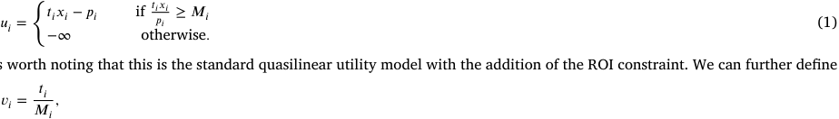

It is worth noting that this is the standard quasilinear utility model with the addition of the ROI constraint. We can further define 

which could be interpreted as the maximum willingness-to-pay of the bidder _𝑖_ per unit of the good. Then, we can rewrite the utility function as 

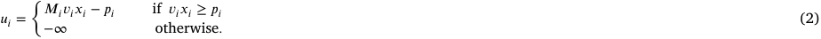

One can observe that, as _𝑀𝑖_ is a public constant, _𝑣𝑖_ and _𝑡𝑖_ are completely interchangeable. To avoid confusion, we use the term _value_ to represent _𝑣𝑖_ , and _initial value_ to represent _𝑡𝑖_ in the following discussion. Each value _𝑣𝑖_ is independently drawn from a probability distribution _𝐹𝑖_ ∶[0 _, 𝑣_ 𝗆𝖺𝗑] → [0 _,_ 1], with a continuous probability density function _𝑓𝑖_ . While the distributions _𝐹𝑖_ ’s are common knowledge, the exact value _𝑣𝑖_ is known only to the bidder _𝑖_ . We denote **v** as the value profile of all bidders, and **v** − _𝑖_ as that of all bidders except bidder _𝑖_ . 

In an auction, each bidder reports her value as _𝑏𝑖_ , which is not necessarily equal to _𝑣𝑖_ . We define **b** and **b** − _𝑖_ similarly as the notations of **v** and **v** − _𝑖_ . Based on the reported bids, an auction mechanism consists of an allocation rule _𝑥𝑖_ ( _𝑏𝑖,_ **b** − _𝑖_ ), mapping the bid 

> 2 This setting is practical and prevalent in practice, _e.g._ , in online advertising, the targeted ROI typically remains the same over a certain period. 

3 

_Arti�cial Intelligence 357 (2026) 104543_ 

_H. Lv, X. Bei, Z. Zheng et al._ 

profile to the allocated quantity to each bidder _𝑖_ , and a payment rule _𝑝𝑖_ ( _𝑏𝑖,_ **b** − _𝑖_ ), mapping the bid profile to the payment for each bidder. We also use _𝑢𝑖_ ( _𝑏𝑖, 𝑣𝑖,_ **b** − _𝑖_ ) to represent the utility of bidder _𝑖_ who has value _𝑣𝑖_ and bid _𝑏𝑖_ . When clear from context, we will omit **b** − _𝑖_ in the mappings. In the following discussion, we assume that the allocation rule _𝑥𝑖_ (⋅) is always right-differentiable, and there are finite non-differentiable points. When _𝑥𝑖_ (⋅) is non-continuous at _𝑣_ , let _𝑥𝑖_ ( _𝑣_ ) = lim _𝑧_ → _𝑣_ + _𝑥𝑖_ ( _𝑧_ ). 

We are interested in auctions that are _dominant-strategy incentive compatible_ (DSIC) and _ex post individually rational_ (ex post IR), where DSIC intuitively means that reporting the true value ( _i.e._ , _𝑏𝑖_ = _𝑣𝑖_ ) is no worse than reporting any other values, and ex post IR represents that submitting true values in the auction never suffers a loss. 

**Definition 1** (Dominant-Strategy Incentive Compatibility, DSIC) **.** A mechanism is dominant-strategy incentive compatible if and only if 

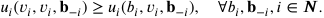

**Definition 2** (Ex Post Individual Rationality, ex post IR) **.** A mechanism is ex post individually rational if and only if 

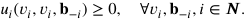

In subsequent sections, we will omit **b** − _𝑖_ when it does not cause ambiguity. For ease of notation, we use _truthfulness_ to represent the properties of both DSIC and ex post IR in the following sections, and we also use IR to represent ex post IR when there is no ambiguity. In addition, for truthful auctions, we do not distinguish _𝑣𝑖_ and _𝑏𝑖_ hereinafter. 

The revenue of a truthful auction is defined as 

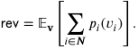

The aim of this work is to characterize both truthful and revenue-maximizing (optimal) auctions with ex post ROI-constrained bidders. 

### **3. Characterize the structure of DSIC auctions** 

In this section, we present characterizations of the DSIC auctions with ex post ROI constraints. These results generalize the classical Myerson’s Lemma [10] for the traditional utility model ( _i.e._ , _𝑀𝑖_ = 1), which states that in the single-parameter environment, a mechanism is DSIC if and only if its allocation rule is monotone and the payment scheme follows a unique rule. 

**Lemma 1** (Myerson’s Lemma [10]) **.** _For traditional bidders with 𝑀𝑖_ = 1 _, a single-parameter mechanism is DSIC if and only if:_ 

_Monotone Allocation Rule the allocation rule is monotonically non-decreasing,_ i.e. _, 𝑥𝑖_ ( _𝑣_ ) ≤ _𝑥𝑖_ ( _𝑣_′ ) _for all 𝑣< 𝑣_′ _and bidder 𝑖;_ 

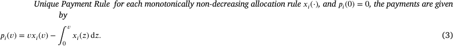

Clearly, these results cannot be directly applied to the ROI-constrained bidders, because the payment derived from Myerson’s Lemma may violate the ROI constraints, or otherwise induce bidders to misreport a higher bid to achieve higher utility. The main result in this section is a complete characterization of the DSIC mechanisms with ROI-constrained bidders. We will see that the monotonicity condition for the allocation remains the same, but the payment rule needs to be modified appropriately to accommodate the ROI constraints. We will also demonstrate later in Lemma 2 that this characterization can be adapted to Bayesian incentive compatible (BIC) mechanisms. 

**Theorem 1** (Characterization) **.** _For ex post ROI-constrained bidders, a single-parameter mechanism is DSIC if and only if:_ 

_Monotone Allocation Rule the allocation rule is monotonically non-decreasing,_ i.e. _, 𝑥𝑖_ ( _𝑣_ ) ≤ _𝑥𝑖_ ( _𝑣_′ ) _for all 𝑣< 𝑣_′ _and bidder 𝑖;_ 

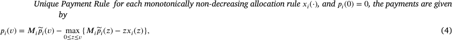

_where ̃𝑝𝑖 is the Myerson payment given in_ (3) _._ 

We can interpret this characterization from two perspectives: First, from the perspective of the initial value _𝑡𝑖_ of bidder _𝑖_ , it suggests that compared to the classic Myerson auction, an ROI-constrained bidder with value _𝑣_ will need to pay the initial Myerson payment _𝑀𝑖̃𝑝𝑖_ ( _𝑣_ ) (recall that _𝑡𝑖_ = _𝑀𝑖𝑣𝑖_ ), minus a “rebate” which equals the largest “violation” of the Myerson payment to the ROI requirement when the bidder’s valuation is no more than _𝑣_ . 

4 

_Arti�cial Intelligence 357 (2026) 104543_ 

_H. Lv, X. Bei, Z. Zheng et al._ 

Second, from the perspective of the value _𝑣𝑖_ , since the ROI-constrained bidder assigns a weight _𝑀𝑖 >_ 1 to her obtained value from the allocation, but not to her payment, a naive application that charges the bidder _𝑀𝑖_ times of the Myerson payment may violate the IR constraint. Therefore, we need to iteratively apply the Myerson payment increment (multiplied by _𝑀𝑖_ ) in small intervals and truncate the payment at the value whenever necessary. These two perspectives are mathematically equivalent, and we adopt the second perspective in the following for exposition convenience. 

Next, before proving this theorem, some observations are immediate from this characterization. We defer the proof of these observations to Appendix A.1. 

**Proposition 1.** 

_1. We always have 𝑝𝑖_ ( _𝑣_ ) ≤ _𝑣𝑥𝑖_ ( _𝑣_ ) _and 𝑝𝑖_ ( _𝑣_ ) ≤ _𝑀𝑖̃𝑝𝑖_ ( _𝑣_ ) _for any bidder 𝑖 and value 𝑣 in DSIC mechanisms._ 

_2. The payment function 𝑝𝑖_ (⋅) _is monotonically non-decreasing for any bidder 𝑖 in DSIC mechanisms._ 

_3. For the same allocation function 𝑥𝑖_ (⋅) _, we always have 𝑝𝑖_ ( _𝑣_ ) ≥ _̃ 𝑝𝑖_ ( _𝑣_ ) _for any valuation 𝑣,_ i.e. _, the payment of an ROI-constrained bidder in a truthful mechanism is always no lower than that in Myerson auction._ 

Now we proceed to prove Theorem 1. The proof consists of showing the following claims in sequence. It is not difficult to see that these three claims together imply Theorem 1. 

1. For ex post ROI-constrainted bidders, if a mechanism is DSIC, then the allocation rule must be monotonically non-decreasing. 

2. Any monotonically non-decreasing allocation rule _𝑥𝑖_ (⋅) with the payment rule given in (4) produces a DSIC mechanism. 

3. Given any monotone allocation rule _𝑥_ (⋅), the payment rule _𝑝_ (⋅) such that ( _𝑥, 𝑝_ ) is DSIC, if exists, must be unique. 

The analyses of steps (1) and (3) are very similar to the proof of the original Myerson’s Lemma, and we defer the details to Appendices A.2 and A.3. Next, we prove step (2). When clear from context, we will drop the subscript _𝑖_ in _𝑥𝑖_ (⋅) _, 𝑝𝑖_ (⋅) _, 𝑢𝑖_ (⋅) and _𝑀𝑖_ as shorthand in the following proofs. 

**Proof of Step (2).** Consider a bidder _𝑖_ with private valuation _𝑣_ and fix the other bids **b** − _𝑖_ . We examine the utilities of bidder _𝑖_ when she bids her true valuation and when she bids some different value _𝑣_′ ≠ _𝑣_ . Consider two cases. 

- When _𝑣_′ _< 𝑣_ , we have max0≤ _𝑧_ ≤ _𝑣_ { _𝑀̃𝑝_ ( _𝑧_ ) − _𝑧𝑥_ ( _𝑧_ )} ≥ max0≤ _𝑧_ ≤ _𝑣_ ′ { _𝑀̃𝑝_ ( _𝑧_ ) − _𝑧𝑥_ ( _𝑧_ )}, which implies 

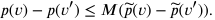

This inequality effectively removes the max term in the payment formula (4) and reduces the problem to that with the Myerson payment. This allows us to apply the standard argument for the Myerson auction to show the DSIC property of our mechanism. We show the analysis below for completeness. 

We can compute the utility difference of bidder _𝑖_ when she bids _𝑣_ and _𝑣_′ , and get 

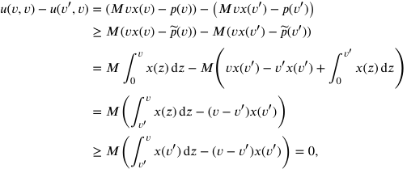

where the second equality is by plugging in the Myerson payment formula (3). This means bidder _𝑖_ has no incentive to misreport her valuation _𝑣_ as _𝑣_′ in this case. 

- When _𝑣_′ _> 𝑣_ , we examine max0≤ _𝑧_ ≤ _𝑣_ { _𝑀̃𝑝_ ( _𝑧_ ) − _𝑧𝑥_ ( _𝑧_ )} and max0≤ _𝑧_ ≤ _𝑣_ ′ { _𝑀̃𝑝_ ( _𝑧_ ) − _𝑧𝑥_ ( _𝑧_ )}. There are two possibilities: 

   - If these two terms are equal, then we can apply the same argument as in the previous case (and also as in the Myerson auction analysis) to prove the DSIC property. We omit the details here. 

   - If max0≤ _𝑧_ ≤ _𝑣_ { _𝑀̃𝑝_ ( _𝑧_ ) − _𝑧𝑥_ ( _𝑧_ )} _<_ max0≤ _𝑧_ ≤ _𝑣_ ′ { _𝑀̃𝑝_ ( _𝑧_ ) − _𝑧𝑥_ ( _𝑧_ )}, this means arg max0≤ _𝑧_ ≤ _𝑣_ ′ { _𝑀̃𝑝_ ( _𝑧_ ) − _𝑧𝑥_ ( _𝑧_ )} = _𝑣_∗ _> 𝑣_ . Then at valuation _𝑣_′ , we should have 

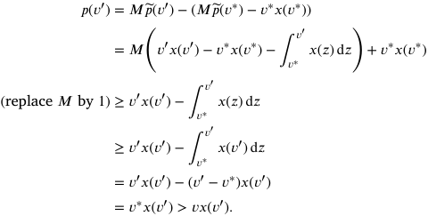

5 

_Arti�cial Intelligence 357 (2026) 104543_ 

_H. Lv, X. Bei, Z. Zheng et al._ 

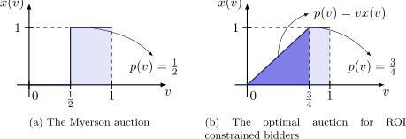

**Fig. 1.** The Myerson auction and the optimal auction for one bidder with uniform value distribution over [0 _,_ 1] and _𝑀_ = 2. 

That is to say, when reporting _𝑣_′ , the payment of bidder _𝑖_ will be greater than the value she obtains (which is _𝑣𝑥_ ( _𝑣_′ )), therefore violating the IR condition. So bidder _𝑖_ has no incentive to misreport as _𝑣_′ in this case. 

Furthermore, we demonstrate that this characterization can be directly adapted to _Bayesian incentive compatible_ (BIC) mechanisms. A mechanism is called BIC if for every bidder _𝑖_ and valuation _𝑣𝑖_ , truthful bidding will lead to an optimal expected utility, where the expectation is with respect to the prior value distribution of others **v** − _𝑖_ . The rationale for this extension is anchored in the nature of the proof for Theorem 1, which notably does not rely on any terms associated with the values of other bidders. Consequently, it is feasible to adapt the allocation and payment terms delineated in Theorem 1 by considering them in expectation, relative to the prior value distribution of other bidders. It is important to note that the ex post ROI constraint imposes a hard feasibility requirement. This ensures that the ROI condition is satisfied for every realization, thereby precluding the −∞ utility outcome and allowing a natural generalization to the Bayesian setting, thereby broadening the applicability of our findings. We defer the proof of this lemma to Appendix A.4. 

**Lemma 2** (Characterization of BIC Mechanisms) **.** _For ex post ROI-constrained bidders, a mechanism_ ( _𝑥, 𝑝_ ) _is Bayesian Incentive Compatible (BIC) if and only if for every bidder 𝑖:_ 

- _The interim allocation rule 𝑋𝑖_ ( _𝑣𝑖_ ) ≜ 𝔼 _𝑣_ − _𝑖_ [ _𝑥𝑖_ ( _𝑣𝑖, 𝑣_ − _𝑖_ )] _is monotonically non-decreasing;_ 

- _The interim payment rule 𝑃𝑖_ ( _𝑣𝑖_ ) ≜ 𝔼 _𝑣_ − _𝑖_ [ _𝑝𝑖_ ( _𝑣𝑖, 𝑣_ − _𝑖_ )] _satisfies:_ 

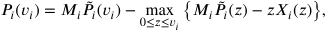

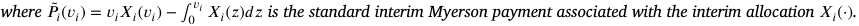

### **4. Optimal auction design for a single bidder** 

Having obtained the precise characterization of the allocation rule and payment function in the setting with ROI constraints, we now turn to the revenue maximization auction design. Recall that in the Myerson auction [10] and previous works in the ex ante ROI constraints setting [4,6], the revenue maximization problem is reduced to the problem of maximizing (modified) virtual welfare. Unfortunately, with ex post ROI constraints, the payment function characterization (4) involves an additional max term compared to the Myerson payment, and it is unclear how to incorporate this term into a modified virtual valuation formulation. We present the following simple example with a single bidder to demonstrate that, unlike the Myerson auction, the allocation that maximizes the virtual welfare may no longer be optimal with ROI-constrained bidders. 

**Example 1.** Consider selling a single item to a single bidder with ROI constraint _𝑀_ = 2 and valuation for the item _𝑣_ following a uniform distribution _𝑈_ [0 _,_ 1]. If we disregard the ROI constraint ( _i.e._ , let _𝑀_ = 1), the virtual valuation of this bidder is _𝜙_ ( _𝑣_ ) = 2 _𝑣_ −1, and the optimal Myerson auction, as shown in Fig. 1a, sells the item at price _𝑝_ =1 2withtheexpectedrevenueof1 2⋅1 2=1 4. 

However, with the ROI constraint _𝑀_ = 2 in presence, this allocation rule ( _𝑥_ ( _𝑣_ ) = 0 when _𝑣<_ 1∕2 and _𝑥_ ( _𝑣_ ) = 1 otherwise) is no longer optimal. As shown in Fig. 1b, the optimal auction, which will be proved in Theorem 2 later in this section, is a randomized auction with the allocation rule given by 

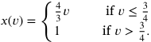

This allocation rule would generate an expected revenue of3 8,whichishigherthan 41. 

This example already highlights an important feature of the optimal auction with ROI constraints: the allocation and payment may be randomized, even in the simple setting with a single bidder and uniform value distribution. It also suggests that it is difficult to follow the Myerson auction regime and reduce the revenue maximization problem to a welfare maximization problem with some modified virtual valuation. It seems a very challenging problem to obtain a characterization for the optimal auction in this setting. Instead, in this section, we focus on the special case when the item is sold to a single bidder. As we will show in the following analysis, this is already a nontrivial and interesting problem to design an optimal auction for a single bidder. 

First, we show that with a single ROI-constrained bidder, the max term in the payment formula (4) would always be 0, reducing the payment rule (4) to the standard Myerson payment (multiplied by a factor of _𝑀_ ). 

6 

_Arti�cial Intelligence 357 (2026) 104543_ 

_H. Lv, X. Bei, Z. Zheng et al._ 

**Lemma 3.** _In the optimal auction with a single ROI-constrained bidder, let_ ( _𝑥, 𝑝_ ) _be the revenue-maximizing auction, then we have 𝑀̃𝑝_ ( _𝑣_ ) ≤ _𝑣_ ⋅ _𝑥_ ( _𝑣_ ) _for any value 𝑣_ ∈[0 _, 𝑣_ 𝗆𝖺𝗑] _. In other words,_ max0≤ _𝑧_ ≤ _𝑣_ { _𝑀̃𝑝_ ( _𝑧_ ) − _𝑧𝑥_ ( _𝑧_ )} = 0 _(which is achieved at 𝑧_ = 0 _) for all 𝑣_ ∈[0 _, 𝑣_ 𝗆𝖺𝗑] _, and the payment rule reduces to 𝑝_ ( _𝑣_ ) = _𝑀̃𝑝_ ( _𝑣_ ) _._ 

**Proof.** We prove this statement by contradiction. We first let _𝑣_∗ = min{ _𝑣_ | _𝑣_ ∈arg max0≤ _𝑧_ ≤ _𝑣_ max { _𝑀̃𝑝_ ( _𝑧_ ) − _𝑧𝑥_ ( _𝑧_ )}}. Suppose the claim is not true, then we know that there must be a violation at _𝑣_∗ , and, for all 0 ≤ _𝑣< 𝑣_∗ , the difference _𝑑_ ( _𝑣, 𝑣_∗ ) between _𝑀̃𝑝_ ( _𝑣_∗ ) − _𝑣_∗ _𝑥_ ( _𝑣_∗ ) and _𝑀̃𝑝_ ( _𝑣_ ) − _𝑣𝑥_ ( _𝑣_ ) is positive: 

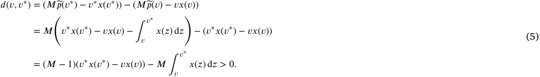

Given an allocation _𝑥_ (⋅), our plan is to construct a new monotone allocation rule, which, together with the corresponding payment rule, can generate a higher revenue. More specifically, we select a sufficiently small _𝛿>_ 0 such that letting _𝑑_ ( _𝑣, 𝑣_∗ ) = 0 by increasing the allocation _𝑥_ ( _𝑣_ ) in the interval ( _𝑣_∗ − _𝛿, 𝑣_∗ ) does not break the monotonicity of the allocation rule (we will discuss why this is possible later). Then, the new allocation rule _̄𝑥_ (⋅) is defined as 

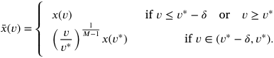

This way, for all values _𝑣_ ∈( _𝑣_∗ − _𝛿, 𝑣_∗ ), with respect to _̄𝑥_ (⋅), we have 

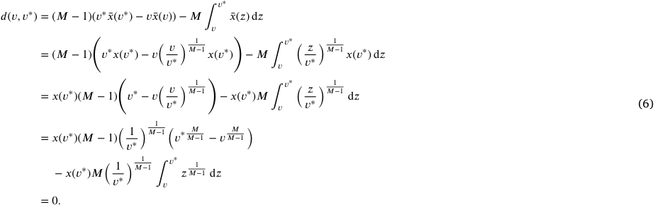

Then, we prove that _̄𝑥_ ( _𝑣_ ) _> 𝑥_ ( _𝑣_ ) for all values _𝑣_ ∈( _𝑣_∗ − _𝛿, 𝑣_ ). Assume by contradiction that for _𝛿_ defined above, there exists some _𝑣_ ∈( _𝑣_∗ − _𝛿, 𝑣_∗ ) such that _̄𝑥_ ( _𝑣_ ) ≤ _𝑥_ ( _𝑣_ ). Because we have assumed that both _̄𝑥_ (⋅) and _𝑥_ (⋅) are right-differentiable and only have finite non-differentiable points, this means there must exist some _𝛿_′ _>_ 0, such that _̄𝑥_ ( _𝑣_ ) ≤ _𝑥_ ( _𝑣_ ) holds for all _𝑣_ ∈( _𝑣_∗ − _𝛿_′ _, 𝑣_∗ ). Pick an arbitrary _𝑣_ in this interval. We then have 

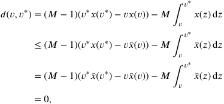

where the first equality is by Eq. (5) and the last equality is by Eq. (6). This is a direct contradiction to our previous claim that _𝑑_ ( _𝑣, 𝑣_∗ ) _>_ 0 for all _𝑣< 𝑣_∗ . Therefore, we obtain that _̄𝑥_ (⋅) remains non-decreasing because we only modify _𝑥_ in the interval of ( _𝑣_∗ − _𝛿, 𝑣_∗ ) and we have: (1) _̄𝑥_ ( _𝑣_ ) _> 𝑥_ ( _𝑣_ ) for all values _𝑣_ ∈( _𝑣_∗ − _𝛿, 𝑣_∗ ); (2) _̄𝑥_ ( _𝑣_ ) is increasing in ( _𝑣_∗ − _𝛿, 𝑣_∗ ); and (3) _̄𝑥_ ( _𝑣_ ) is continuous at _𝑣_∗ . 

Finally, we analyze the revenue generated by _̄𝑥_ (⋅). Let _𝑞_ (⋅) be the corresponding payment rule of _̄𝑥_ (⋅) derived from Theorem 1. We compare _𝑞_ ( _𝑣_ ) and _𝑝_ ( _𝑣_ ) at each value _𝑣_ . 

- When _𝑣_ ≤ _𝑣_∗ − _𝛿_ , we have _𝑞_ ( _𝑣_ ) = _𝑝_ ( _𝑣_ ). This is because the allocation remains unchanged in the interval [0 _, 𝑣_∗ − _𝛿_ ), and the payment of a bid at value _𝑣_ only depends on the allocation at interval [0 _, 𝑣_ ]. 

- When _𝑣_ ∈( _𝑣_∗ − _𝛿, 𝑣_∗ ), we always have _𝑣_ ∈arg max0≤ _𝑧_ ≤ _𝑣_ { _𝑀̃𝑝_ ( _𝑧_ ) − _𝑧̄𝑥_ ( _𝑧_ )}, which means the payment of _𝑞_ ( _𝑣_ ) reduces to the first price, and we have _𝑞_ ( _𝑣_ ) = _𝑣̄𝑥_ ( _𝑣_ ) _> 𝑣𝑥_ ( _𝑣_ ) ≥ _𝑝_ ( _𝑣_ ). 

7 

_Arti�cial Intelligence 357 (2026) 104543_ 

_H. Lv, X. Bei, Z. Zheng et al._ 

- When _𝑣_ ≥ _𝑣_∗ , we again have _𝑞_ ( _𝑣_ ) = _𝑝_ ( _𝑣_ ). This is because when _𝑣_ ≥ _𝑣_∗ , we have _𝑣_∗ ∈arg max0≤ _𝑧_ ≤ _𝑣_ { _𝑀̃𝑝_ ( _𝑧_ ) − _𝑧𝑥_ ( _𝑧_ )} for both ( _𝑥, 𝑝_ ) and ( _̄𝑥, 𝑞_ ). Then the payment formulation of (4) reduces to 

_𝑝_ ( _𝑣_ ) = _𝑀̃𝑝_ ( _𝑣_ ) −( _𝑀̃𝑝_ ( _𝑣_∗ ) − _𝑣_∗ _𝑥_ ( _𝑣_∗ )) = _𝑣_∗ _𝑥_ ( _𝑣_∗ ) + _𝑀_ ( _̃𝑝_ ( _𝑣_ ) − _̃ 𝑝_ ( _𝑣_∗ )) _._ 

This payment only depends on the allocation at interval [ _𝑣_∗ _, 𝑣_ ], which again _𝑥_ (⋅) and _̄𝑥_ (⋅) agree on. 

Combining these cases together, we have ∫ _𝑣 𝑞_ ( _𝑣_ ) _𝑓_ ( _𝑣_ ) d _𝑣>_ ∫ _𝑣 𝑝_ ( _𝑣_ ) _𝑓_ ( _𝑣_ ) d _𝑣_ . That is, the new mechanism ( _̄𝑥, 𝑞_ ) has a higher revenue compared to ( _𝑥, 𝑝_ ). This is a contradiction, and this completes the proof. 

With Lemma 3 at hand, it seems with a single bidder, we are back to the classic Myerson regime, where the revenue maximization problem can be converted to a welfare maximization problem with respect to the virtual valuation. That is, recall from the Myerson’s theorem [10], we have 

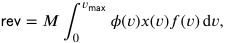

where _𝜙_ ( _𝑣_ ) = _𝑣_ −1−_𝐹_<u>(</u>_𝑣_<u>)</u> is the _virtual valuation_ . However, we still have the additional constraint that _𝑀̃𝑝_ ( _𝑣_ ) ≤ _𝑣_ ⋅ _𝑥_ ( _𝑣_ ) for every _𝑣_ . ( _𝑓_ ( _𝑣_ ) ) This restricts our allocation space and turns the problem into a constrained welfare maximization problem. 

In the following lemma, we provide some further characterizations of the structure of the optimal auction with a single ROIconstrained bidder. 

**Lemma 4.** _With a single ROI-constrained bidder, there always exists a revenue-maximizing auction such that for any valuation 𝑣, at least one of the following statements holds:_ 

- _the derivative of allocation rule at the valuation 𝑣 exists, and 𝑥_′ ( _𝑣_ ) = 0 _;_ 

- _the payment follows the first-price rule,_ i.e. _, 𝑝_ ( _𝑣_ ) = _𝑣𝑥_ ( _𝑣_ ) _._ 

**Proof.** Assume that in some revenue-maximizing auction ( _𝑥, 𝑝_ ), there exists a value _̂𝑣_ such that the two conditions claimed in the lemma do not hold. That is, we have _𝑝_ ( _̂𝑣_ ) _<̂ 𝑣𝑥_ ( _̂𝑣_ ), and _𝑥_′ ( _̂𝑣_ ) _>_ 0 or _𝑥_′ ( _̂𝑣_ ) does not exist. Since _𝑥_ (⋅) is right-differentiable with finite non-differentiable points, by Theorem 1, we have _𝑝_ (⋅) is also continuous at all but a finite number of points in its domains. This means that, by letting _<u>𝑣</u>_ = _̂ 𝑣_ we can always find an interval <u>[</u> _<u>𝑣,̄ 𝑣</u>_ ], such that _𝑝_ ( _𝑣_ ) _< 𝑣𝑥_ ( _𝑣_ ) and _𝑥_′ _𝑖_(_𝑣_)_>_0forallvaluations_𝑣_∈[_<u>𝑣</u>_ _<u>,̄ 𝑣</u>_ ]. 

Recall that when _𝑝_ ( _𝑣_ ) _< 𝑣𝑥_ ( _𝑣_ ) for all _𝑣_ , by Lemma 3, the payment reduces to _𝑝_ ( _𝑣_ ) = _𝑀̃𝑝_ ( _𝑣_ ) and we can write the revenue of the mechanism as 𝗋𝖾𝗏 = _𝑀_ ∫0_𝑣_𝗆𝖺𝗑 _𝜙_ ( _𝑧_ ) _𝑥_ ( _𝑧_ ) _𝑓_ ( _𝑧_ ) d _𝑧_ . Next, we look at the virtual values _𝜙_ ( _𝑣_ ) within this interval <u>[</u> _<u>𝑣,̄ 𝑣</u>_ ]. Our plan is to modify the allocation _𝑥_ ( _𝑣_ ) in a subinterval of this interval based on the sign of _𝜙_ ( _𝑣_ ) while maintaining the monotonicity of _𝑥_ (⋅) and _𝑝_ ( _𝑣_ ) _< 𝑣𝑥_ ( _𝑣_ ) in the interval, and the expected revenue will (weakly) increase. We note that there always exists such a subinterval due to the right-hand differentiability of the allocation function. 

We consider the following three cases: 

- There exists an interval [ _𝑎, 𝑏_ ] _⊆_ <u>[</u> _<u>𝑣,̄ 𝑣</u>_ ] such that _𝜙_ ( _𝑣_ ) _>_ 0 _,_ ∀ _𝑣_ ∈[ _𝑎, 𝑏_ ]. In this case, we define 

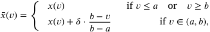

where _𝛿>_ 0 is sufficiently small such that: 

1. _̄ 𝑥_ (⋅) is still non-decreasing; and 

2. _𝑝_ ( _𝑣_ ) _< 𝑣̄𝑥_ ( _𝑣_ ) still holds in the interval <u>[</u> _<u>𝑣,̄ 𝑣</u>_ ], which means the corresponding payment is still _𝑝_ ( _𝑣_ ) = _𝑀̃𝑝_ ( _𝑣_ ) in this interval. Conditions (1) and (2) imply we can still write the expected revenue as 

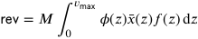

for the new mechanism with allocation _̄𝑥_ . In the meanwhile, _̄𝑥_ ( _𝑣_ ) is point-wise larger than _𝑥_ ( _𝑣_ ) at all values _𝑣_ ∈[ _𝑎, 𝑏_ ] where _𝜙_ ( _𝑣_ ) is always positive, and outside this interval the two allocations remain the same. This means _̄𝑥_ (⋅), together with its corresponding payment rule, would yield strictly higher revenue than the previous mechanism. A contradiction. 

- There exists an interval [ _𝑎, 𝑏_ ] in <u>[</u> _<u>𝑣,̄ 𝑣</u>_ ] such that _𝜙_ ( _𝑣_ ) _<_ 0 _,_ ∀ _𝑣_ ∈[ _𝑎, 𝑏_ ]. Similar to the first case, we define 

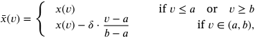

where _𝛿>_ 0 is sufficiently small such that _̄𝑥_ (⋅) is still non-decreasing and _𝑝_ ( _𝑣_ ) _< 𝑣𝑥_ ( _𝑣_ ) still holds in the interval [ _<u>𝑣,̄ 𝑣</u>_ ]. Using the same argument as in the previous case, we can again argue that _̄𝑥_ (⋅) gives a higher revenue than _𝑥_ (⋅). Again a contradiction. _•_ If neither of the first two cases happens, we must have _𝜙_ ( _𝑣_ ) = 0 _,_ ∀ _𝑣_ ∈[ _<u>𝑣,̄ 𝑣</u>_ ]. In this case, as long as the monotonicity of _𝑥_ (⋅) and _𝑝_ ( _𝑣_ ) ≤ _𝑣𝑥_ ( _𝑣_ ) is maintained in the interval, any modification of _𝑥_ (⋅) would generate the same revenue. Therefore we can always find an allocation _̄𝑥_ (⋅) that satisfies one of the required two conditions and have the same revenue as that of _𝑥_ (⋅). Therefore _̄𝑥_ (⋅) still gives a revenue-maximizing auction. 

This concludes the proof. 

8 

_Arti�cial Intelligence 357 (2026) 104543_ 

_H. Lv, X. Bei, Z. Zheng et al._ 

Lemma 4 allows us to focus on auctions with a very specific structure: as long as the allocation is not constant, it always follows the first-price payment rule. In particular, combining with Lemma 3, it implies whenever _𝑥_′ ( _𝑣_ ) exists and _𝑥_′ ( _𝑣_ ) _>_ 0, we always have _𝑝_ = _𝑣𝑥_ ( _𝑣_ ) = _𝑀̃𝑝_ ( _𝑣_ ). 

Next, we want to obtain a further characterization of the optimal auction with a single bidder. However, to do this would require us to make a mild assumption on the value distribution of the bidder, which is known as the _Decreasing Marginal Revenue (DMR)_ condition by [29,30,32]. 

**Definition 3** (Decreasing Marginal Revenue, DMR) **.** The value distribution of a bidder satisfies the condition of decreasing marginal revenue if and only if the function 

_𝜓_ ( _𝑣_ ) ≜ _𝜙_ ( _𝑣_ ) _𝑓_ ( _𝑣_ ) = _𝑣𝑓_ ( _𝑣_ ) + _𝐹_ ( _𝑣_ ) −1 

is monotonically non-decreasing. 

Note that _𝜓_ ( _𝑣_ ) being non-decreasing is equivalent to the fact that _𝑣_ ⋅ (1 − _𝐹_ ( _𝑣_ )), which is the expected revenue of selling the item at price _𝑝_ , being concave, and this is where the name of this condition comes from. Intuitively, many commonly used distribution functions satisfy this assumption, _e.g._ , uniform distributions, and any distribution of finite support and monotone non-decreasing density. 

For comparison, we also provide the widely used assumption of _regularity_ proposed in [10]. 

**Definition 4** (Regularity) **.** We assume the valuation distributions are regular, i.e., the virtual valuation functions _𝜙𝑖_ ( _𝑣𝑖_ ) are monotonically non-decreasing. 

The DMR condition is closely related to the regularity condition but they are incompatible.3 We refer the reader to [30] for concrete examples and more discussion. 

With the assumption of DMR, the optimal auction exhibits an even simpler structure than what is described in Lemma 4, namely that there exist only two intervals in the optimal auction: interval of (0 _, 𝐷_ ) with _𝑥_′ ( _𝑣_ ) _>_ 0 and interval of ( _𝐷, 𝑣_ 𝗆𝖺𝗑) with _𝑥_′ ( _𝑣_ ) = 0, where _𝐷_ is a threshold valuation between them. This leads to our main theorem in this section, which characterizes the optimal allocation rule and payment rule for a single ROI-constrained bidder. We also note that the DMR assumption of _𝑣𝑖_ is equivalent to the same assumption of _𝑡𝑖_ , and the proof is presented in Appendix A.5. 

**Theorem 2.** _The optimal auction for a single ex post ROI-constrained bidder with a DMR value distribution over_ [0 _, 𝑣_ 𝗆𝖺𝗑] _is as follows:_ 

- _when 𝑣< 𝐷, the allocation is given by_ 

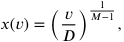

_and the payment follows the first-price rule,_ i.e. _, 𝑝_ ( _𝑣_ ) = _𝑣𝑥_ ( _𝑣_ ) _;_ 

- _when 𝑣_ ≥ _𝐷, the allocation rule is 𝑥_ ( _𝑣_ ) = 1 _, and the payment is given by 𝑝_ ( _𝑣_ ) = _𝐷._ 

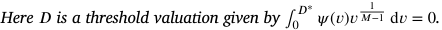

This theorem provides an important insight that the optimal auction in the ROI-constrained setting is a randomized mechanism. Note that Myerson’s optimal auction in the single-parameter setting is deterministic, but a decent body of work has shown that many generalizations to multi-parameter settings will lead to randomized optimal auctions [33,34]. The necessity of randomization is also known in some single-parameter environments, including public budget [11] and risk aversion [12,13]. Theorem 2 indicates that the slight generalization of ROI constraints of bidders will also lead to a randomized optimal auction. Moreover, we also remind the reader that DSIC and BIC are equivalent when there is a single agent. 

We prove the theorem via the following steps. First, we derive the allocation of an optimal auction in an interval (0 _, 𝑣_∗ ) when _𝑥_′ ( _𝑣_ ) is always positive in that interval. Then, we show in Lemma 5 that there exist only two intervals in the optimal auction: the interval of (0 _, 𝐷_ ) with _𝑥_′ ( _𝑣_ ) _>_ 0 and the interval of ( _𝐷, 𝑣_ 𝗆𝖺𝗑) with _𝑥_′ ( _𝑣_ ) = 0. Finally, we will compute the optimal threshold valuation _𝐷_ between these two intervals. The DMR assumption is used in the second and the last steps. 

**Proposition 2.** _If for some 𝑣_∗ ∈(0 _, 𝑣_ 𝗆𝖺𝗑] _, we have 𝑥_′ ( _𝑣_ ) _>_ 0 _for all 𝑣_ ∈(0 _, 𝑣_∗ ) _in an optimal auction, then 𝑥_ (⋅) _is continuous at 𝑣_∗ _, and the allocation rule 𝑥_ ( _𝑣_ ) _for all 𝑣_ ∈[0 _, 𝑣_∗ ] _is given as:_ 

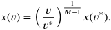

**Proof.** We first assume _𝑥_ (⋅) is continuous at _𝑣_∗ , and we will prove later that, if it is discontinuous, we can improve the revenue without violating the DSIC property. By Lemmas 3 and 4, we get that for all valuations _𝑣_ ∈[0 _, 𝑣_∗ ], _𝑀̃𝑝_ ( _𝑣_ ) − _𝑣𝑥_ ( _𝑣_ ) = 0 always holds. That is, 

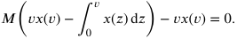

> 3 The regularity condition is equivalent to the expected revenue being concave in the _quantile_ space, while the DMR condition means the expected revenue is concave in the _value_ space. 

9 

_Arti�cial Intelligence 357 (2026) 104543_ 

_H. Lv, X. Bei, Z. Zheng et al._ 

After transposition and derivation, this translates to 

_𝑥_ ( _𝑣_ ) −( _𝑀_ −1) _𝑣𝑥_′ ( _𝑣_ ) = 0 _._ 

By solving this differential equation with the value of _𝑥_ ( _𝑣_∗ ) at valuation _𝑣_∗ , we can get 

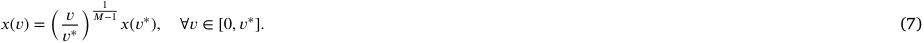

Next, if _𝑥_ (⋅) is discontinuous at _𝑣_∗ , we need to replace _𝑥_ ( _𝑣_∗ ) in (7) with _𝑥_ ( _𝑣_∗− ), _i.e._ , the left limit of _𝑥_ (⋅) at _𝑣_∗ (recall that we denote _𝑥_ ( _𝑣_∗ ) as the right limit when it is discontinuous). Since _𝑥_ ( _𝑣_∗− ) _< 𝑥_ ( _𝑣_∗ ), we can observe that directly using (7) as the allocation rule will increase the revenue without violating the DSIC property, which also makes _𝑥_ (⋅) continuous at _𝑣_∗ . This concludes the proof. 

**Lemma 5.** _For a single ROI-constrained bidder with DMR value distribution, if there exist intervals with 𝑥_′ ( _𝑣_ ) = 0 _in an optimal auction, then there is exactly one such interval, and it appears in the highest value region._ 

**Proof.** Assume by contradiction that there exist multiple intervals with _𝑥_′ ( _𝑣_ ) = 0 in an optimal auction. Pick <u>(</u> _<u>𝑣,̄ 𝑣</u>_ ) to be the first such interval. That is, we have _𝑥_′ ( _𝑣_ ) _>_ 0 for all _𝑣_ ∈(0 _, 𝑣_ <u>),</u> _𝑥_′ ( _𝑣_ ) = 0 for all _𝑣_ ∈( _<u>𝑣,̄ 𝑣</u>_ ), and _̄𝑣< 𝑣_ 𝗆𝖺𝗑. 

First, we must have _<u>𝑣</u> >_ 0. That is, the allocation rule cannot start with a flat interval. To see why this is true, assume otherwise that _<u>𝑣</u>_ = 0. We focus on a point _𝑣_′ = _̄ 𝑣_ + _𝛿_ in the next interval for a sufficiently small _𝛿>_ 0 such that _𝑣_′ _< 𝑀̄𝑣_ . Then there are two cases: (1) _𝑥_′ ( _𝑣_′ ) = 0 and (2) _𝑥_′ ( _𝑣_′ ) is strictly positive. In the first case, we will have _𝑥_ ( _̄𝑣_ ) _>_ 0, and the Myerson price at _̄𝑣_ will be _𝑝_ ( _̄𝑣_ ) = _̄ 𝑣_ ⋅ _𝑥_ ( _̄𝑣_ ) _< 𝑀̃𝑝_ ( _̄𝑣_ ), which directly contradicts Lemma 3. In the second case, we look at the payment _𝑝_ ( _𝑣_′ ) at point _𝑣_′ . Note that since _𝑥_′ ( _𝑣_ ) _>_ 0, by Lemmas 3 and 4, we should have _𝑀̃𝑝_ ( _𝑣_′ ) = _𝑣_′ _𝑥_ ( _𝑣_′ ). But this cannot happen because 

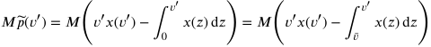

_> 𝑀_( _𝑣_′ _𝑥_ ( _𝑣_′ ) −( _𝑣_′ − _̄ 𝑣_ ) _𝑥_ ( _𝑣_′ )) = _𝑀̄𝑣𝑥_ ( _𝑣_′ ) _> 𝑣_′ _𝑥_ ( _𝑣_′ ) _._ 

Knowing _<u>𝑣</u> >_ 0, by Proposition 2, we know _𝑥_ (⋅) is continuous at _<u>𝑣</u>_ <u>,</u> and the allocation in [0 _, 𝑣_ ] is given as: 

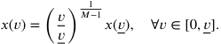

Next, combined with _𝑝_ ( _̄𝑣_ ) = _̄ 𝑣𝑥_ ( _̄𝑣_ ), we have _𝑀̃𝑝_ ( _̄𝑣_ ) − _̄ 𝑣𝑥_ ( _̄𝑣_ ) = _𝑀̃𝑝_ ( _<u>𝑣</u>_ <u>) −</u> _<u>𝑣𝑥</u>_ <u>(</u> _<u>𝑣</u>_ <u>),</u> that is, 

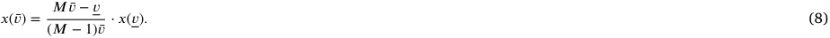

In order to argue that allocation rule _𝑥_ (⋅) is not revenue-maximizing, we construct a new allocation rule as 

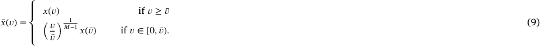

That is, we replace the first price interval [0 _, 𝑣_ <u>]</u> and the flat interval <u>[</u> _<u>𝑣,̄ 𝑣</u>_ ] in _𝑥_ (⋅) with a single first-price interval [0 _,̄ 𝑣_ ] in _̄𝑥_ (⋅). Comparing the two allocation rules _𝑥_ (⋅) and _̄𝑥_ (⋅), we first note from Lemmas 3 and 4 that _𝑝_ ( _̄𝑣_ ) = _𝑀̃𝑝_ ( _̄𝑣_ ) = _̄ 𝑣𝑥_ ( _̄𝑣_ ) = _̄ 𝑣̄𝑥_ ( _̄𝑣_ ), which indicates that 

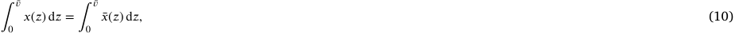

because both sides equal to _̄𝑣𝑥_ ( _̄𝑣_ )( _𝑀_ −1)∕ _𝑀_ . Next, we have for _𝑣_ ∈[0 _, 𝑣_ ], 

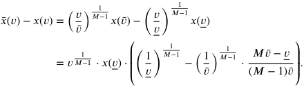

Since _𝑣_ only appears in the first term, _̄𝑥_ ( _𝑣_ ) − _𝑥_ ( _𝑣_ ) must be constantly positive or negative in (0 _, 𝑣_ ], determined by the last term. Combined with (10) and _𝑥_′ ( _𝑣_ ) = 0 _,_ ∀ _𝑣_ ∈( _<u>𝑣,̄ 𝑣</u>_ ), we know it is constantly negative, _i.e._ , _̄𝑥_ ( _𝑣_ ) _< 𝑥_ ( _𝑣_ ) for all _𝑣_ ∈(0 _, 𝑣_ ]. Therefore, there exists a threshold _𝑣_∗ ∈( _<u>𝑣,̄ 𝑣</u>_ ) such that _𝑥_ ( _𝑣_ ) _>̄ 𝑥_ ( _𝑣_ ) for all _𝑣_ ∈[0 _, 𝑣_∗ ) and _𝑥_ ( _𝑣_ ) ≤ _̄ 𝑥_ ( _𝑣_ ) for all _𝑣_ ∈[ _𝑣_∗ _,̄ 𝑣_ ). Combining this with Eq. (10), we have 

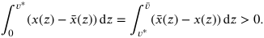

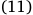

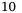

_Arti�cial Intelligence 357 (2026) 104543_ 

_H. Lv, X. Bei, Z. Zheng et al._ 

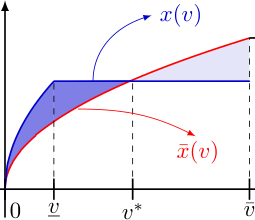

**Fig. 2.** An illustration for the proof of Lemma 5 with _𝑀_ = 3. The blue line denotes an allocation rule _𝑥_ (⋅) with _𝑥_′ ( _𝑣_ ) = 0 in ( _<u>𝑣,̄ 𝑣</u>_ ) where _̄𝑣< 𝑣_ 𝗆𝖺𝗑, and _𝑥_ ( _𝑣_ ) for _𝑣_ ∈[0 _, 𝑣_ <u>)</u> is computed by Proposition 2. The red line denotes our constructed allocation rule _̄𝑥_ (⋅) as given in (9). The point _𝑣_∗ denotes the intersection of _𝑥_ (⋅) and _̄𝑥_ (⋅). By Eq. (11) we have the areas of the two shadowed regions are the same. Furthermore, as _𝜓_ (⋅) is non-decreasing, we can conclude that _̄𝑥_ (⋅) leads to a higher revenue than _𝑥_ (⋅). (For interpretation of the references to colour in this figure legend, the reader is referred to the web version of this article.) 

Next, for any allocation rule _𝑥_ (⋅), we denote 

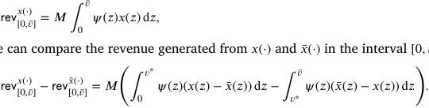

and we can compare the revenue generated from _𝑥_ (⋅) and _̄𝑥_ (⋅) in the interval [0 _,̄ 𝑣_ ]: 

Finally, we can see that this difference is always negative due to Eq. (11) and the fact that _𝜓_ (⋅) is non-decreasing by the DMR condition.4 Fig. 2 demonstrates the idea of this argument. 

Therefore, we conclude that _̄𝑥_ (⋅) generates a higher revenue than _𝑥_ (⋅), contradicting the fact that ( _𝑥, 𝑝_ ) is an optimal auction. This completes the proof. 

We now proceed to complete the proof of Theorem 2. 

**Proof of Theorem 2.** By Lemma 5, we know _𝑥_′ ( _𝑣_ ) _>_ 0 for all valuations _𝑣_ ∈(0 _, 𝐷_ ) and _𝑥_′ ( _𝑣_ ) = 0 for all valuations _𝑣_ ∈( _𝐷, 𝑣_ 𝗆𝖺𝗑). First, we have _𝑥_ ( _𝐷_ ) = 1, since otherwise, the revenue could be improved by setting _𝑥_ ( _𝑣_ ) = 1 for all _𝑣_ ∈[ _𝐷, 𝑣_ 𝗆𝖺𝗑]. Next, we find the optimal threshold _𝐷_ that maximizes the overall revenue. By Proposition 2, the allocation rule for valuations _𝑣_ ∈[0 _, 𝐷_ ] is 

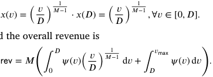

And the overall revenue is 

In order to maximize this revenue, we compute its derivative 

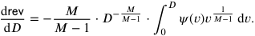

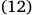

Looking at this derivative, we see that the term − _𝑀__𝑀_ −1⋅_𝐷_− _𝑀𝑀_ −1 is always negative and _𝑣 𝑀_ 1−1 is always positive. Furthermore, we have _𝜓_ (0) = −1 _<_ 0 and _𝜓_ ( _𝑣_ 𝗆𝖺𝗑) _>_ 0. By the DMR condition, _𝜓_ (⋅) is non-decreasing. Then, by integration by parts, we have 

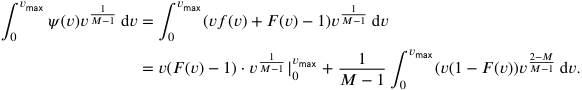

One can hence observe that the first term is 0 and the last term is constantly positive, that is, at _𝐷_ = _𝑣_ 𝗆𝖺𝗑, the derivative is negative. 1 Therefore, by letting ∫0_𝐷_∗ _𝜓_ ( _𝑣_ ) _𝑣 𝑀_ −1 d _𝑣_ = 0, the revenue will increase with _𝐷_ until _𝐷_∗ and then decrease. This indicates that the optimal solution is achieved at _𝐷_ = _𝐷_∗ , completing the proof. 

> 4 We omit an ill-defined special case where _𝜓_ ( _𝑣_ ) = 0 _,_ ∀ _𝑣_ ∈[0 _,̄ 𝑣_ ], since in such case _𝜓_ ( _𝑣_ ) will be infinity when _𝑣_ → 0. 

11 

_Arti�cial Intelligence 357 (2026) 104543_ 

_H. Lv, X. Bei, Z. Zheng et al._ 

Next, to illustrate the necessity of the DMR condition for the characterization in Theorem 2, we construct a counterexample using a discrete bimodal distribution that violates the DMR condition. In this setting, the optimal mechanism deviates from the structure described in Theorem 2 and achieves strictly higher revenue. 

**Example 2.** Consider a single bidder with an ROI constraint _𝑀_ = 2. The bidder’s valuation _𝑣_ follows a discrete distribution with probability mass concentrated at two points: low value _𝑣𝐿_ = 1 with probability 0 _._ 5 and high value _𝑣𝐻_ = 10 with probability 0 _._ 5. This distribution violates the DMR condition due to the significant gap between _𝑣𝐿_ and _𝑣𝐻_ where the probability density is zero. We compare the revenue of the mechanism constrained by the structure in Theorem 2 against the true optimal mechanism. 

**Mechanism under** Theorem 2 **Structure:** Theorem 2 states that under DMR, the optimal allocation rule _𝑥_ ( _𝑣_ ) must be strictly 1 increasing (specifically, _𝑥_ ( _𝑣_ ) = ( _𝑣_ ∕ _𝐷_ ) _𝑀_ −1 ) until it reaches saturation ( _𝑥_ ( _𝑣_ ) = 1). With _𝑀_ = 2, this implies a linear allocation rule _𝑥_ ( _𝑣_ ) = _𝑣_ ∕ _𝐷_ for _𝑣< 𝐷_ . To extract maximum revenue from the high-value bidder, the optimal threshold is _𝐷_ = 10. Consequently, for the high type ( _𝑣𝐻_ = 10): _𝑥𝐻_ = 1 and _𝑝𝐻_ = 10 (binding ROI); For the low type ( _𝑣𝐿_ = 1): the structure forces _𝑥𝐿_ = _𝑣𝐿_ ∕ _𝐷_ = 0 _._ 1, with payment _𝑝𝐿_ = _𝑣𝐿𝑥𝐿_ = 0 _._ 1. The expected revenue is: 

𝗋𝖾𝗏thm7 = 0 _._ 5 × 0 _._ 1 + 0 _._ 5 × 10 = **𝟓** _._ **𝟎𝟓** _._ 

**True Optimal Mechanism:** Without the DMR condition, the optimal mechanism is not restricted to the strictly increasing form. We can improve revenue by increasing the allocation for the low type ( _𝑥𝐿_ ) while maintaining DSIC and IR. Let _𝑥𝐻_ = 1 and _𝑝𝐻_ = 10. We maximize _𝑥𝐿_ subject to the DSIC constraint of the high type: 

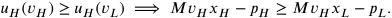

Substituting the values ( _𝑀_ = 2 _, 𝑣𝐻_ = 10 _, 𝑝𝐿_ = _𝑥𝐿_ ): 

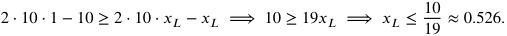

By setting _𝑥𝐿_ = 10∕19 and _𝑝𝐿_ = 10∕19, the expected revenue becomes: 

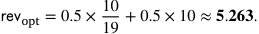

In this example, the true optimal mechanism yields a revenue of approximately 5.263, which is strictly higher than the 5.05 obtained under the restrictions of Theorem 2. This demonstrates that without the DMR condition, the optimal allocation rule may exhibit a “staircase” shape (flat intervals) rather than the strictly increasing behavior characterized in Theorem 2. Thus, the DMR condition is necessary for the result. 

### **5. Auction design for multiple bidders** 

As we have discussed, the optimal auction with ROI-constrained bidders may involve fractional allocations in the simple setting of a single item being sold to a single bidder. In other words, when the item is indivisible, a probabilistic allocation is necessary to implement the optimal auction. On the one hand, this implies that any extension will probably be very technical; on the other hand, this is, unfortunately, often undesired in practical scenarios such as online advertising due to the volatility and uncertainty of the auction outcome. Therefore, for the purpose of practical applications, in this section, we investigate simple auctions and, in particular, deterministic auctions for multiple ROI-constrained bidders. 

First, we would like to introduce an important observation, which shows that any “simple v.s. optimal” mechanisms for traditional bidders in previous literature [35,36] could also be generalized for ROI-constrained bidders in our setting, with a modified approximation ratio. In particular, this result for ROI-constrained bidders can be interpreted as an application of the general reduction framework for non-linear agents developed by [37]. 

**Theorem 3.** _In the setting with multiple traditional bidders with quasilinear utility functions, assume that a mechanism_  = ( _𝑥_ (⋅) _, 𝑝_ (⋅)) _is DSIC and IR, and it achieves an approximation ratio of 𝑅; then, in our adapted setting with multiple ROI-constrained bidders, there exists a corresponding mechanism_  _̂ which is DSIC and IR, and it achieves an approximation ratio of no worse than 𝑀_𝗆𝖺𝗑 ⋅ _𝑅, where 𝑀_𝗆𝖺𝗑 _denotes the maximal ROI constraint among all bidders._ 

**Proof.** To make the proof clear, for the group of ROI-constrained bidders in an auction, we construct a corresponding group of traditional bidders by simply setting their ROI constraints as 1, and then we apply different mechanisms to these two groups. In the following, for each mechanism we consider, the notation of revenue 𝗋𝖾𝗏 is understood to be computed from the payments of the type of bidders for which the mechanism is designed (traditional bidders or ROI-constrained bidders). 

First, let the allocation rule of  _̂_ be the same as , _i.e._ , _̂𝑥_ (⋅) = _𝑥_ (⋅), and its payment rule _̂𝑝_ (⋅) be computed following Theorem 1. It is straightforward that  _̂_ is DISC and IR because the allocation rule satisfies monotonicity for all bidders. Next, we denote the optimal mechanism for the group of ROI-constrained bidders as 𝗈𝗉𝗍 = ( _𝑥_ 𝗈𝗉𝗍 _, 𝑝_ 𝗈𝗉𝗍), and the optimal mechanism for the group of traditional bidders ( _i.e._ , Myerson auction) as 𝗆𝗒𝖾 = ( _𝑥_ 𝗆𝗒𝖾 _, 𝑝_ 𝗆𝗒𝖾). Then we can define a mechanism  _̄_ for traditional bidders with an allocation rule _̄𝑥_ (⋅) = _𝑥_ 𝗈𝗉𝗍(⋅) and a corresponding payment rule _̄𝑝_ (⋅) following Myerson’s Lemma. Next, for the group of traditional bidders, we can observe the relation among their revenue: 𝗋𝖾𝗏 _̄_ ≤ 𝗋𝖾𝗏𝗆𝗒𝖾 ≤ _𝑅_ ⋅ 𝗋𝖾𝗏. Also, we have that 𝗋𝖾𝗏 ≤ 𝗋𝖾𝗏 _̂_  because  and  _̂_ have the same allocation rule, and hence, the corresponding payment of  for each bidder is lower or equal to  _̂_ , given by the third 

12 

_Arti�cial Intelligence 357 (2026) 104543_ 

_H. Lv, X. Bei, Z. Zheng et al._ 

argument of Proposition 1. Finally, the first argument of Proposition 1 tells us that the payment of a bidder _𝑖_ under 𝗈𝗉𝗍 is no more than _𝑀𝑖_ times that under _̄𝑀_ . This leads to 𝗋𝖾𝗏𝗈𝗉𝗍 ≤ _𝑀_𝗆𝖺𝗑 ⋅ 𝗋𝖾𝗏 _̄_ , where _𝑀_𝗆𝖺𝗑 denotes the maximal ROI constraint among all bidders. Combining all the above inequalities, we can conclude the proof. 

Based on this theorem, we can immediately have the following observation. 

**Proposition 3.** _For ex post ROI-constrained bidders, simply adopting the allocation rule of Myerson auction regardless of the ROI constraints leads to an 𝑀_𝗆𝖺𝗑 _-approximately optimal mechanism._ 

Moreover, simple mechanisms, such as VCG with monopoly reserves in previous literature [35], could also guarantee DSIC and IR, and achieve corresponding approximation ratios for ROI-constrained bidders [37]. Additionally, following the framework of [38,39], it might be possible to design an adaptive sequential mechanism that achieves a constant approximation ratio when selling a single item to multiple bidders. However, this framework requires the characterization of the optimal single-bidder mechanism under a given upper-bound on its expected allocation probability (Theorem 1 in [38]). This characterization is nontrivial in our setting, as it may no longer possess the simple two-interval structure. Therefore, we leave the design of such an approximate multi-bidder mechanism as our future work. 

Next, we consider a particular class of simple mechanisms, _i.e._ , deterministic auctions. A deterministic auction is a mechanism where the allocation of items and the corresponding payments are exclusively determined by the bidders’ submitted bids, with no element of randomness. We now present the optimal deterministic auctions for a single item and multiple ROI-constrained bidders. In this setting, the class of deterministic DSIC mechanisms for traditional agents is the same as the class of deterministic DSIC mechanisms for ROI-constrained agents. Also, we will show that bidders in this setting have the identical preference order of outcomes as that of the bidders with standard quasilinear utility functions. Therefore, the optimal deterministic auction for ex post ROI-constrained bidders has the same structure as the Myerson auction. 

**Theorem 4.** _The optimal deterministic auction for a single item and multiple ex post ROI-constrained bidders with regular value distributions is the same as the Myerson auction [10]. That is, the item is allocated to the bidder 𝑖 with the highest positive virtual value 𝜙𝑖_ ( _𝑣𝑖_ ) _, and the payment is 𝜙_−1 _𝑖_(max{_𝜙𝑗_(_𝑣𝑗_)_,_0})_where𝑗isthebidderwiththesecond-highestvirtualvalue._ 

**Proof.** By Theorem 1, the allocation for a bidder must be monotone in her value _𝑣𝑖_ . Therefore, for a deterministic mechanism with a single item, there must be a threshold value _𝑣_∗ , below which nothing is allocated, _i.e._ , _𝑥𝑖_ ( _𝑣𝑖_ ) = 0, and above which the slot is allocated to her, _i.e._ , _𝑥𝑖_ ( _𝑣𝑖_ ) = 1. Thus, for any two feasible outcomes in any mechanism, denoted as _𝑜𝑖_ = ( _𝑥𝑖_ ( _𝑣𝑖_ ) _, 𝑝𝑖_ ( _𝑣𝑖_ )) and _̂𝑜𝑖_ = ( _̂𝑥𝑖_ ( _𝑣𝑖_ ) _,̂ 𝑝𝑖_ ( _𝑣𝑖_ )), we can show that the preference orders of a bidder with ROI-constrained utility function are identical to that with the quasilinear utility function. We discuss this argument in the following cases5 : 

- if _𝑥𝑖_ ( _𝑣𝑖_ ) = _̂ 𝑥𝑖_ ( _𝑣𝑖_ ) = 1, or _𝑥𝑖_ ( _𝑣𝑖_ ) = _̂ 𝑥𝑖_ ( _𝑣𝑖_ ) = 0, then the preference orders of the outcomes are both inverted from the order of payments for bidders with both utility functions; 

- if _𝑥𝑖_ ( _𝑣𝑖_ ) = 1 and _̂𝑥𝑖_ ( _𝑣𝑖_ ) = 0, then _𝑢𝑖_ ( _𝑜𝑖_ ) ≥ 0 ≥ _𝑢𝑖_ ( _̂𝑜𝑖_ ) for bidders with both utility functions; 

- if _𝑥𝑖_ ( _𝑣𝑖_ ) = 0 and _̂𝑥𝑖_ ( _𝑣𝑖_ ) = 1, then _𝑢𝑖_ ( _𝑜𝑖_ ) ≤ 0 ≤ _𝑢𝑖_ ( _̂𝑜𝑖_ ) for bidders with both utility functions. 

In summary, the preference order is always identical for these two types of utility functions for deterministic auctions with a single item. In addition, the feasible regions of allocation and payment rule are also the same for both ROI-constrained advertisers and traditional advertisers. Thus, each truthful mechanism for traditional advertisers is also a truthful mechanism for ROI-constrained advertisers with the same revenue, and vice versa. On top of all the above arguments, the optimal auctions for ROI-constrained advertisers are identical to the celebrated Myerson auction. 

This theorem seems to suggest that the optimal deterministic auction design may reduce to the classic Myerson auction when bidders have ex post ROI constraints. However, it turns out not to be the case when we go beyond the single-item setting. Next, we demonstrate this point in the environment of online sponsored search auctions. 

### **6. Sponsored search auctions** 

In this section, we investigate sponsored search auctions with _𝑆_ ad slots. A sponsored search auction can be seen as a special case of multi-item environments. In a sponsored search auction, each bidder bids a single value _𝑏𝑖_ that represents their “value per click” _𝑣𝑖_ , and the auction determines the allocation of these _𝑆_ slots to bidders and their corresponding payments _𝑝𝑖_ . Note that an ROI-constrained bidder still has an “initial value” _𝑡𝑖_ = _𝑀𝑖_ ⋅ _𝑣𝑖_ as in our previous definitions. Each slot _𝑠_ has a click-through rate (CTR) _𝑐𝑠_ denoting the probability of the slot being clicked after it is allocated to a bidder. With the notations, we can get the utility of a bidder _𝑖_ with a slot _𝑠_ allocated to her: 

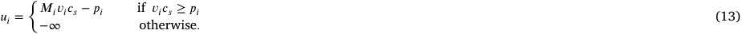

In a sponsored search, the CTR for each slot decreases from top to bottom, _i.e. 𝑐_ 1 _< 𝑐_ 2 _<_ … _< 𝑐𝑆_ , and each bidder is allocated at most one slot. Without loss of generality, we assume _𝑐𝑆_ = 1 and _𝑆< 𝑛_ , and we also define a dummy slot 0 with _𝑐_ 0 = 0 for notation 

> 5 Note that we only need to discuss the cases where the IR property is satisfied. 

13 

_Arti�cial Intelligence 357 (2026) 104543_ 

_H. Lv, X. Bei, Z. Zheng et al._ 

convenience. For sponsored search auctions, a _deterministic_ auction is a mechanism where the allocation of slots and the corresponding payments are exclusively determined by the bidders’ submitted bids, with no element of randomness. 

First, we show that our DSIC auction characterization of Theorem 1 reduces to the following form in the deterministic sponsored search auction setting. 

**Proposition 4.** _In a DSIC deterministic sponsored search auction with 𝑆 ad slots and ROI-constrained bidders, if we focus on an arbitrary bidder 𝑖 and fix the other bids_ **_b_** − _𝑖, we have_ 

> _• the allocation rule could be represented as a piecewise function_ 

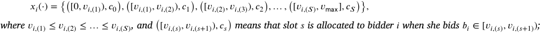

> _• the payment for slot 𝑠 is given by_ 

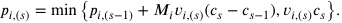

**Proof.** The proof of the piecewise allocation rule is straightforward by Theorem 1. We next provide proof of the payment rule. For notation simplicity, we omit the subscript _𝑖_ in the following. First, for all values _𝑣_ ∈[ _𝑣_ ( _𝑠_ −1) _, 𝑣_ ( _𝑠_ )), we have 

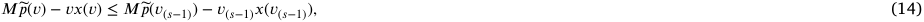

because _𝑣𝑥_ ( _𝑣_ ) increases and _̃𝑝_ ( _𝑣_ ) remains unchanged when _𝑣_ ∈[ _𝑣_ ( _𝑠_ −1) _, 𝑣_ ( _𝑠_ )) increases. Next, we denote 

then it suffices to discuss the following two cases: 

and 

This concludes the proof. 

This proposition tells us that a DSIC deterministic auction will set allocation thresholds for each slot, and set the payment as the minimum of the following two terms: 1) the “ladder-style” payment computed by adding a ladder of payment (multiplied by _𝑀𝑖_ ) to the price of the closest lower slot, and 2) the critical value for obtaining the slot. We note that this proposition was also shown in [22] but only for a special case where bidders all have identical ex post ROI constraints. Our proposition 4, which comes directly from our characterization Theorem 1, already generalizes their result and allows for diverse ROI constraints of bidders. 

With this proposition at hand, we proceed to the optimal deterministic sponsored search auctions. Again, the min term in the payment rule in Proposition 4 poses critical challenges in the ROI-constrained setting, similar to the optimal randomized auction design in Section 4. Thus, we turn to the optimal deterministic auction design for a single ROI-constrained bidder. We first use a simple example to illustrate the structure of optimal deterministic auctions. For notation simplicity, we omit the subscript _𝑖_ in the following. 

**Example 3.** Assume there are two slots with CTRs _𝑐_ 1 = 0 _._ 5 and _𝑐_ 2 = 1 _._ 0, and one bidder with uniform value distribution over [0 _,_ 1] and _𝑀_ = 2. The optimal deterministic auction is illustrated in Fig. 3. When _𝑣<_2 7,theallocatedCTRis0;when2 7≤_𝑣<_4 7,theallocated CTR is _𝑥_ ( _𝑣_ ) = _𝑐_ 1 = 0 _._ 5, and the payment is _𝑝_ ( _𝑣_ ) =1 7;when_𝑣_≥4 7,theallocatedCTRis_𝑥_(_𝑣_) =_𝑐_2= 1_._0,andthepaymentis_𝑝_(_𝑣_) =4 7. This optimal deterministic auction generates revenue of 0 _._ 286. 

14 

_Arti�cial Intelligence 357 (2026) 104543_ 

_H. Lv, X. Bei, Z. Zheng et al._ 

**Fig. 3.** The optimal deterministic auction for two slots with CTRs _𝑐_ 1 = 0 _._ 5 and _𝑐_ 2 = 1 _._ 0 and one bidder with uniform value distribution over [0 _,_ 1] and _𝑀_ = 2. 

We note that the Myerson auction and the optimal randomized auction for this two-slot setting are the same as the ones illustrated in Fig. 1, because the bidder is allocated to at most one slot in sponsored search auctions, and the highest slot has a CTR of 1 _._ 0. One can observe from this example that in contrast to the Myerson auction where the bidder is allocated either the highest slot or nothing, the optimal deterministic auction for an ROI-constrained bidder offers options of buying each slot from 1 to _𝑆_ . This phenomenon is also known as the _second-degree price discrimination_ from [40]. Moreover, this example also demonstrates that the revenue of the optimal deterministic auction suffers a non-negligible loss compared with the optimal randomized auction (0 _._ 286 v.s. 0 _._ 375). Next, we show that one can compute the optimal deterministic auction in polynomial time when the value space is discrete. 

**Theorem 5.** _The optimal deterministic sponsored search auction with multiple slots and a single bidder can be computed in polynomial time._ 

**Proof.** We will present a dynamic programming algorithm for computing the optimal auction. Let the value distribution _𝐹_ (⋅) of the bidder be finitely supported on a set { _𝑣_(1) _, 𝑣_(2) _,_ … _, 𝑣_(_𝑑_) }, with _𝑣_(1) _< 𝑣_(2) _<_ … _< 𝑣_(_𝑑_) . Denote _𝑂𝑃𝑇_ ( _𝑠, 𝑗_ ) as the maximum revenue generated from only selling to values at most _𝑣_(_𝑗_) , and only selling slots no higher than slot _𝑠_ . Denote _𝑝𝑜𝑝𝑡_ ( _𝑠, 𝑗_ ) as the price of the slot _𝑠_ in the mechanism of _𝑂𝑃𝑇_ ( _𝑠, 𝑗_ ), which is updated synchronously with _𝑂𝑃𝑇_ ( _𝑠, 𝑗_ ). We get the following recurrence relation: 

If we denote _𝑘_∗ as the optimal _𝑘_ in the above equation, then _𝑝𝑜𝑝𝑡_ ( _𝑠, 𝑗_ ) can be updated as 

The starting values are set as _𝑂𝑃𝑇_ (0 _, 𝑗_ ) = 0 and _𝑝𝑜𝑝𝑡_ (0 _, 𝑗_ ) = 0 with _𝑐_ 0 = 0. Finally, max1≤ _𝑗_ ≤ _𝑑 𝑂𝑃𝑇_ ( _𝑆, 𝑗_ ) gives the optimal revenue and its corresponding allocation rule can be computed via traceback. 

### **7. Conclusion** 

In this paper, we discuss optimal auction design for bidders who have ex post ROI constraints. We provide characterizations for DSIC auctions and optimal auctions with a single bidder in this setting. We show that the optimal auction may entail a randomized allocation scheme in the setting with ROI-constrained bidders. We also provide several results on simple auction design for multiple ex post ROI-constrained bidders. 

There are several important open questions left in this model. The first and foremost one is to characterize the optimal auction (or approximately optimal auction) with a single item and multiple ROI-constrained bidders. As we have discussed in the paper, this would require us to go beyond the virtual welfare maximization regime in the Myerson auction setting. We believe such characterization could shed light on the mechanism design for bidders with non-quasilinear utility functions and provide useful insights for practical applications such as online advertising. Another direction is to study ex post ROI constraints when the target ratio _𝑀𝑖_ is also private information of bidder _𝑖_ . This brings the problem to the domain of multidimensional mechanism design, which is often challenging in the mechanism design literature. Here, one possible approach is also to identify conditions under which some simple and deterministic auctions are optimal or close to optimal. 

### **Declaration of generative AI and AI-assisted technologies in the writing process** 

During the preparation of this work, the authors used GPT-4 in order to improve language. After using this tool, the authors reviewed and edited the content as needed and take full responsibility for the content of the publication. 

### **CRediT authorship contribution statement** 

**Hongtao Lv:** Writing - original draft, Methodology, Investigation, Conceptualization; **Xiaohui Bei:** Writing - review & editing, Validation, Supervision, Investigation; **Zhenzhe Zheng:** Writing - review & editing, Supervision, Funding acquisition, Conceptualization; **Fan Wu:** Writing - review & editing, Supervision, Funding acquisition. 

15 

_Arti�cial Intelligence 357 (2026) 104543_ 

_H. Lv, X. Bei, Z. Zheng et al._ 

### **Data availability** 

No data was used for the research described in the article. 

### **Declaration of competing interest** 

The authors declare that they have no known competing financial interests or personal relationships that could have appeared to influence the work reported in this paper. 

### **Acknowledgements** 

We thank Hu Fu, Yiqing Wang, Yidan Xing, Xiangyu Liu and anonymous reviewers for their insightful and helpful suggestions. This work was supported in part by China NSF grant No. 62302267, 62432007, 62322206, 62132018, 62272307, in part by the NTU SPMS Collaborative Research Award, in part by the Natural Science Foundation of Shandong (No. ZR2023QF083), in part by Taishan Scholars Program. The opinions, findings, conclusions, and recommendations expressed in this paper are those of the authors and do not necessarily reflect the views of the funding agencies or the government. 

**Appendix A. Omitted proofs** 

_A.1. Proof of Proposition 1_ 

**Proof.** First, we have _𝑀𝑖̃𝑝𝑖_ (0) −0 ⋅ _𝑥𝑖_ (0) = 0 since _𝑥𝑖_ (0) = 0 and _𝑝𝑖_ (0) = 0. Then we can observe that 

0max≤ _𝑧_ ≤ _𝑣_{_𝑀𝑖̃𝑝𝑖_(_𝑧_) −_𝑧𝑥𝑖_(_𝑧_)} ≥_𝑀𝑖̃𝑝𝑖_(0) −0 ⋅_𝑥𝑖_(0) = 0_._ Therefore, _𝑝𝑖_ ( _𝑣_ ) ≤ _𝑀𝑖̃𝑝𝑖_ ( _𝑣_ ). Similarly, we have 0max≤ _𝑧_ ≤ _𝑣_{_𝑀𝑖̃𝑝𝑖_(_𝑧_) −_𝑧𝑥𝑖_(_𝑧_)} ≥_𝑀𝑖̃𝑝𝑖_(_𝑣_) −_𝑣𝑥𝑖_(_𝑣_)_,_ _𝑝𝑖_ ( _𝑣_ ) ≤ _𝑀𝑖̃𝑝𝑖_ ( _𝑣_ ) −( _𝑀𝑖̃𝑝𝑖_ ( _𝑣_ ) − _𝑣𝑥𝑖_ ( _𝑣_ )) = _𝑣𝑥𝑖_ ( _𝑣_ ) _._ 

hence 

For the second statement, we prove that for any values _𝑣< 𝑣_′ ∈[0 _, 𝑣_ max], _𝑝𝑖_ ( _𝑣_ ) ≤ _𝑝𝑖_ ( _𝑣_′ ). we consider the following two cases: 

> _•_ When 0max≤ _𝑧_ ≤ _𝑣_{_𝑀𝑖̃𝑝𝑖_(_𝑧_) −_𝑧𝑥𝑖_(_𝑧_)} = 0max ≤ _𝑧_ ≤ _𝑣_′{_𝑀𝑖̃𝑝𝑖_(_𝑧_) −_𝑧𝑥𝑖_(_𝑧_)}_,_ we have _𝑝𝑖_ ( _𝑣_′ ) − _𝑝𝑖_ ( _𝑣_ ) = _𝑀𝑖_ ( _̃𝑝𝑖_ ( _𝑣_′ ) − _̃ 𝑝𝑖_ ( _𝑣_ )) ≥ 0 _._ 

> _•_ When 0max≤ _𝑧_ ≤ _𝑣_{_𝑀𝑖̃𝑝𝑖_(_𝑧_) −_𝑧𝑥𝑖_(_𝑧_)}_<_ 0max ≤ _𝑧_ ≤ _𝑣_′{_𝑀𝑖̃𝑝𝑖_(_𝑧_) −_𝑧𝑥𝑖_(_𝑧_)}_,_ we denote _𝑣_∗ = arg max0≤ _𝑧_ ≤ _𝑣_′{_𝑀𝑖̃𝑝𝑖_(_𝑧_) −_𝑧𝑥𝑖_(_𝑧_)}_._ Then we have that _𝑝𝑖_ ( _𝑣_∗ ) = _𝑀𝑖̃𝑝𝑖_ ( _𝑣_∗ ) −( _𝑀𝑖̃𝑝𝑖_ ( _𝑣_∗ ) − _𝑣_∗ _𝑥𝑖_ ( _𝑣_∗ )) = _𝑣_∗ _𝑥𝑖_ ( _𝑣_∗ ) _,_ and 0≤max _𝑧_ ≤ _𝑣_∗{_𝑀𝑖̃𝑝𝑖_(_𝑧_) −_𝑧𝑥𝑖_(_𝑧_)} = 0max ≤ _𝑧_ ≤ _𝑣_′{_𝑀𝑖̃𝑝𝑖_(_𝑧_) −_𝑧𝑥𝑖_(_𝑧_)}_._ By the analysis of the above case, we have _𝑝𝑖_ ( _𝑣_′ ) ≥ _𝑝𝑖_ ( _𝑣_∗ ) = _𝑣_∗ _𝑥𝑖_ ( _𝑣_∗ ) _> 𝑣𝑥𝑖_ ( _𝑣_ ) ≥ _𝑝𝑖_ ( _𝑣_ ) _._ For the third statement, we again denote _𝑣_∗ = arg max{ _𝑀𝑖̃𝑝𝑖_ ( _𝑧_ ) − _𝑧𝑥𝑖_ ( _𝑧_ )} _._ 0≤ _𝑧_ ≤ _𝑣_ Then we obtain the payment at valuation _𝑣_∗ : _𝑝𝑖_ ( _𝑣_∗ ) = _𝑣_∗ _𝑥𝑖_ ( _𝑣_∗ ) ≥ _̃ 𝑝𝑖_ ( _𝑣_∗ ) _._ 

16 

_Arti�cial Intelligence 357 (2026) 104543_ 

_H. Lv, X. Bei, Z. Zheng et al._ 

Moreover, we can observe that 

_𝑝𝑖_ ( _𝑣_ ) − _𝑝𝑖_ ( _𝑣_∗ ) = _𝑀𝑖_ ( _̃𝑝𝑖_ ( _𝑣_ ) − _̃ 𝑝𝑖_ ( _𝑣_∗ )) _._ 

Combining the above arguments, we have _𝑝𝑖_ ( _𝑣_ ) ≥ _̃ 𝑝𝑖_ ( _𝑣_ ). 

### _A.2. Proof of monotone allocation rule (step 1 of Theorem 1)_ 

**Lemma 6** (Monotone Allocation Rule) **.** _For ex post ROI-constrained bidders, if a mechanism is DSIC, then the allocation rule is monotonically non-decreasing, that is, 𝑥𝑖_ ( _𝑣_ ) ≤ _𝑥𝑖_ ( _𝑣_′ ) _for all 𝑣< 𝑣_′ _and bidder 𝑖._ 

Before the proof, we first present elementary inequalities derived from the property of truthfulness for ex post ROI-constrained bidders. 

Given values _𝑣_ , _𝑣_′ with _𝑣< 𝑣_′ , by the truthfulness requirement, when a bidder _𝑖_ with value _𝑣_ misreports _𝑣_′ , we have 

or 

_𝑀𝑖𝑣𝑥𝑖_ ( _𝑣_′ ) − _𝑝𝑖_ ( _𝑣_′ ) ≤ _𝑀𝑖𝑣𝑥𝑖_ ( _𝑣_ ) − _𝑝𝑖_ ( _𝑣_ ) _,_ (A.1) _𝑝𝑖_ ( _𝑣_′ ) _> 𝑣𝑥𝑖_ ( _𝑣_′ ) _._ (A.2) 

Similarly, considering bidder _𝑖_ with value _𝑣_′ misreports _𝑣_ , we obtain that 

_𝑀𝑖𝑣_′ _𝑥𝑖_ ( _𝑣_ ) − _𝑝𝑖_ ( _𝑣_ ) ≤ _𝑀𝑖𝑣_′ _𝑥𝑖_ ( _𝑣_′ ) − _𝑝𝑖_ ( _𝑣_′ ) _,_ (A.3) 

or 

_𝑝𝑖_ ( _𝑣_ ) _> 𝑣_′ _𝑥𝑖_ ( _𝑣_ ) _._ (A.4) 

One can observe that (A.4) contradicts the IR requirement since _𝑝𝑖_ ( _𝑣_ ) ≤ _𝑣𝑥𝑖_ ( _𝑣_ ) _< 𝑣_′ _𝑥𝑖_ ( _𝑣_ ). Hence, in a truthful mechanism, (A.3) must hold, and at least one of (A.1) and (A.2) holds. On the basis of this elementary analysis, we now prove Lemma 6. 

**Proof.** We prove the monotonicity by contradiction. Let _𝑣< 𝑣_′ , we assume _𝑥𝑖_ ( _𝑣_ ) _> 𝑥𝑖_ ( _𝑣_′ ) in a truthful mechanism. Then we prove that (A.1) and (A.3) are not compatible. By (A.3), we get 

_𝑝𝑖_ ( _𝑣_ ) − _𝑝𝑖_ ( _𝑣_′ ) ≥ _𝑀𝑖𝑣_′ ⋅ ( _𝑥𝑖_ ( _𝑣_ ) − _𝑥𝑖_ ( _𝑣_′ )) _._ (A.5) Similarly, by (A.1),A.1),), we obtain _𝑝𝑖_ ( _𝑣_ ) − _𝑝𝑖_ ( _𝑣_′ ) ≤ _𝑀𝑖𝑣_ ⋅ ( _𝑥𝑖_ ( _𝑣_ ) − _𝑥𝑖_ ( _𝑣_′ )) _._ (A.6) 

Similarly, by (A.1),A.1),), we obtain 

Combining (A.5) and (A.6), we have _𝑀𝑖𝑣_′ ⋅ ( _𝑥𝑖_ ( _𝑣_ ) − _𝑥𝑖_ ( _𝑣_′ )) ≤ _𝑀𝑖𝑣_ ⋅ ( _𝑥𝑖_ ( _𝑣_ ) − _𝑥𝑖_ ( _𝑣_′ )). However, since _𝑥𝑖_ ( _𝑣_ ) _> 𝑥𝑖_ ( _𝑣_′ ) and _𝑣_′ _> 𝑣_ , we can derive a contradiction. Next, we continue to prove that (A.2) and (A.3) are not compatible. By the IR property, we have 

_𝑝𝑖_ ( _𝑣_ ) ≤ _𝑣𝑥𝑖_ ( _𝑣_ ) _._ (A.7) 

Combining (A.2), (A.3), and (A.7), we obtain 

_𝑀𝑖𝑣_′ _𝑥𝑖_ ( _𝑣_ ) − _𝑣𝑥𝑖_ ( _𝑣_ ) _< 𝑀𝑖𝑣_′ _𝑥𝑖_ ( _𝑣_′ ) − _𝑣𝑥𝑖_ ( _𝑣_′ ) _,_ 

that is, 

( _𝑀𝑖𝑣_′ − _𝑣_ ) ⋅ _𝑥𝑖_ ( _𝑣_ ) _<_ ( _𝑀𝑖𝑣_′ − _𝑣_ ) ⋅ _𝑥𝑖_ ( _𝑣_′ ) _._ (A.8) 

As we have _𝑥𝑖_ ( _𝑣_ ) _> 𝑥𝑖_ ( _𝑣_′ ) and _𝑣< 𝑣_′ , (A.8) does not hold. In conclusion, we obtain that a mechanism could not be truthful if _𝑥𝑖_ ( _𝑣_ ) _> 𝑥𝑖_ ( _𝑣_′ ), and hence, the allocation function _𝑥𝑖_ ( _𝑣_ ) must be monotonously non-decreasing. 

### _A.3. Proof of uniqueness of payment (step 3 of Theorem 1)_ 

**Lemma 7** (Uniquessness of Payment) **.** _Given any monotonically non-decreasing allocation rule 𝑥𝑖_ (⋅) _and 𝑝𝑖_ (0) = 0 _for every bidder 𝑖, there exists a unique payment rule 𝑝𝑖_ (⋅) _such that_ ( _𝑥, 𝑝_ ) _is DSIC._ 

**Proof.** For any bidder _𝑖_ and any _𝑣𝑖_ ∈[0 _, 𝑣_ max]. We consider two valuations _𝑣𝑖_ and _𝑤𝑖_ = _𝑣𝑖_ + _𝛿_ for some sufficiently small _𝛿>_ 0. Following the payment sandwich inequality techniques used in the original Myerson’s proof, we have 

_𝑢𝑖_ ( _𝑣𝑖, 𝑣𝑖_ ) ≥ _𝑢𝑖_ ( _𝑤𝑖, 𝑣𝑖_ ) and _𝑢𝑖_ ( _𝑤𝑖, 𝑤𝑖_ ) ≥ _𝑢𝑖_ ( _𝑤𝑖, 𝑣𝑖_ ) _._ 

This gives us two inequalities that can together sandwich the payment _𝑝𝑖_ ( _𝑣_ ). 

If we follow Myerson’s original analysis and replace each utility with the value minus the payment for the bidder, these two inequalities would give us 

_𝑀𝑖𝑣𝑖_ ( _𝑥𝑖_ ( _𝑤𝑖_ ) − _𝑥𝑖_ ( _𝑣𝑖_ )) ≤ _𝑝𝑖_ ( _𝑤𝑖_ ) − _𝑝𝑖_ ( _𝑣𝑖_ ) ≤ _𝑀𝑖𝑤𝑖_ ( _𝑥𝑖_ ( _𝑤𝑖_ ) − _𝑥𝑖_ ( _𝑣𝑖_ )) _._ 

17 

_Arti�cial Intelligence 357 (2026) 104543_ 

_H. Lv, X. Bei, Z. Zheng et al._ 

In the limit, as _𝛿_ approaches 0, we can divide each side by _𝛿_ and get 

The uniqueness of the payment rule then follows by integrating (A.9) from 0 to each value _𝑣_ . However, this argument has a problem in the ROI-constrained setting: because of the extra factor _𝑀𝑖_ in the payment function due to the ROI condition, it is possible that at some point the payment grows to be larger than the bidder’s obtained value, therefore violating the IR condition. 

To deal with this issue, we first note that _𝑝𝑖_ ( _𝑣𝑖_ ) ≤ _𝑣𝑖_ ⋅ _𝑥𝑖_ ( _𝑣𝑖_ ) ≤ _𝑤𝑖_ ⋅ _𝑥𝑖_ ( _𝑣𝑖_ ). This means when bidder _𝑖_ has value _𝑤𝑖_ and misreports her value as _𝑣𝑖_ , her payment will never violate the IR condition. This means we only need to discuss the case when the bidder _𝑖_ with value _𝑣𝑖_ misreports to _𝑤𝑖_ . There are two cases to discuss. 

- If there exists a neighborhood of _𝑣𝑖_ , such that by applying (A.9) to _𝑝𝑖_ ( _𝑣𝑖_ ) to get _𝑝𝑖_ ( _𝑤𝑖_ ), we have _𝑝𝑖_ ( _𝑤𝑖_ ) ≤ _𝑣𝑖_ ⋅ _𝑥𝑖_ ( _𝑤𝑖_ ). This means in this small neighborhood, the other direction of misreporting will also not be affected by the IR condition. Myerson’s analysis can go through, and the derivative of _𝑝𝑖_ (⋅) remains fixed and unique at point _𝑣𝑖_ . 

- If for any small neighborhood of _𝑣𝑖_ , applying (A.9) gives _𝑝𝑖_ ( _𝑤𝑖_ ) _> 𝑣𝑖_ ⋅ _𝑥𝑖_ ( _𝑤𝑖_ ). This means bidder _𝑖_ with value _𝑣𝑖_ would not want to misreport her bid as _𝑤𝑖_ because it would violate the IR condition for her. Here we notice _𝑣𝑖𝑥𝑖_ ( _𝑤𝑖_ ) _< 𝑝𝑖_ ( _𝑤𝑖_ ) ≤ _𝑤𝑖𝑥𝑖_ ( _𝑤𝑖_ ) must hold. When _𝛿_ is sufficiently small, it implies that we must have _𝑝𝑖_ ( _𝑤𝑖_ ) = _𝑤𝑖𝑥𝑖_ ( _𝑤𝑖_ ). This suggests that even though we can no longer apply Eq. (A.9) in this case. _𝑝𝑖_ ( _𝑤𝑖_ ) is still a unique and fixed value. 

Combining the two cases together, we know that at each point _𝑣_ ∈[0 _, 𝑣_ max], _𝑝𝑖_ ( _𝑣_ ) is always unique, therefore proving this claim. 

### _A.4. Proof of Lemma 2_ 

**Proof.** Recall that a mechanism is BIC if truthful reporting maximizes a bidder’s expected utility, where the expectation is taken over the prior distributions of other bidders’ valuations _𝑣_ − _𝑖_ . Let _𝑈𝑖_ ( _𝑏𝑖, 𝑣𝑖_ ) denote the expected utility of bidder _𝑖_ with true value _𝑣𝑖_ who reports _𝑏𝑖_ . Assuming the ROI constraints are satisfied, the utility function is given by: 

- = _𝑀𝑖𝑣𝑖𝑋𝑖_ ( _𝑏𝑖_ ) − _𝑃𝑖_ ( _𝑏𝑖_ ) _._ 

We observe that this expected utility function _𝑈𝑖_ ( _𝑏𝑖, 𝑣𝑖_ ) has the exact same mathematical structure as the ex post utility function _𝑢𝑖_ defined in Eq. (13), with the deterministic allocation _𝑥𝑖_ replaced by the interim allocation _𝑋𝑖_ , and the deterministic payment _𝑝𝑖_ replaced by the interim payment _𝑃𝑖_ . Specifically, the problem of maximizing _𝑀𝑖𝑣𝑖𝑋𝑖_ ( _𝑏𝑖_ ) − _𝑃𝑖_ ( _𝑏𝑖_ ) is isomorphic to the problem of maximizing _𝑀𝑖𝑣𝑖𝑥𝑖_ ( _𝑏𝑖_ ) − _𝑝𝑖_ ( _𝑏𝑖_ ) solved in Theorem 1. Since Theorem 1 provides the necessary and sufficient conditions for the latter maximization to be achieved at _𝑏𝑖_ = _𝑣𝑖_ (i.e., DSIC), the same logic applies directly to the interim functions for BIC. Thus, by applying the characterization from Theorem 1 to the interim functions _𝑋𝑖_ (⋅) and _𝑃𝑖_ (⋅), we conclude that the mechanism is BIC if and only if _𝑋𝑖_ (⋅) is monotone and _𝑃𝑖_ (⋅) follows the payment rule specified in the lemma. 

### _A.5. Proof of the DMR assumption on 𝑡𝑖_ 

**Proposition 5.** _If the normalized valuation 𝑣𝑖 satisfies the Decreasing Marginal Revenue (DMR) condition, then the initial valuation 𝑡𝑖_ = _𝑀𝑖𝑣𝑖 (where 𝑀𝑖 >_ 1 _is a constant) also satisfies the DMR condition._ 

**Proof.** Let _𝐹𝑉_ (⋅) and _𝑓𝑉_ (⋅) denote the cumulative distribution function (CDF) and probability density function (PDF) of the normalized valuation _𝑣𝑖_ , respectively. The DMR condition requires that the function _𝜓𝑉_ ( _𝑣_ ) is monotonically non-decreasing in _𝑣_ , where: 

_𝜓𝑉_ ( _𝑣_ ) ≜ _𝑣𝑓𝑉_ ( _𝑣_ ) + _𝐹𝑉_ ( _𝑣_ ) −1 _._ 

Consider the initial valuation _𝑡𝑖_ = _𝑀𝑖𝑣𝑖_ . Let _𝐹𝑇_ (⋅) and _𝑓𝑇_ (⋅) denote the CDF and PDF of _𝑡𝑖_ . The relationship between the distributions of _𝑡𝑖_ and _𝑣𝑖_ is given by: 

By differentiating with respect to _𝑡_ , we obtain the relationship between the densities: 

We now examine the function _𝜓𝑇_ ( _𝑡_ ) for the initial valuation _𝑡_ : 

_𝜓𝑇_ ( _𝑡_ ) ≜ _𝑡𝑓𝑇_ ( _𝑡_ ) + _𝐹𝑇_ ( _𝑡_ ) −1 _._ 

18 

_Arti�cial Intelligence 357 (2026) 104543_ 

_H. Lv, X. Bei, Z. Zheng et al._ 

Substituting the expressions for _𝐹𝑇_ ( _𝑡_ ) and _𝑓𝑇_ ( _𝑡_ ) derived above: 

Since _𝑀𝑖_ is a positive constant, _𝑀__𝑡_ _𝑖_isstrictlyincreasingin_𝑡_.Giventhat_𝜓𝑉_(⋅)isnon-decreasingbyassumption,itfollowsthat _𝜓𝑇_ ( _𝑡_ ) is also non-decreasing in _𝑡_ . Thus, the initial valuation _𝑡𝑖_ satisfies the DMR condition. 

### **References** 

- [1] A. Malakhov, R.V. Vohra, Optimal auctions for asymmetrically budget constrained bidders, Rev. Econ. Des. 12 (4) (2008) 245–257. 

- [2] C. Borgs, J. Chayes, N. Immorlica, M. Mahdian, A. Saberi, Multi-unit auctions with budget-constrained bidders, in: Proceedings of the 6th ACM Conference on Electronic Commerce, 2005, pp. 44–51. 

- [3] J.-J. Laffont, J. Robert, Optimal auction with financially constrained buyers, Econ. Lett. 52 (2) (1996) 181–186. 

- [4] N. Golrezaei, I. Lobel, R. Paes Leme, Auction design for ROI-constrained buyers, in: Proceedings of the Web Conference 2021, 2021, pp. 3941–3952. 

- [5] J. Auerbach, J. Galenson, M. Sundararajan, An empirical analysis of return on investment maximization in sponsored search auctions, in: Proceedings of the 2nd International Workshop on Data Mining and Audience Intelligence for Advertising, 2008, pp. 1–9. 

- [6] S.R. Balseiro, Y. Deng, J. Mao, V.S. Mirrokni, S. Zuo, The landscape of auto-bidding auctions: value versus utility maximization, in: Proceedings of the 22nd ACM Conference on Economics and Computation, 2021, pp. 132–133. 

- [7] E. Brynjolfsson, Y. Hu, D. Simester, Goodbye pareto principle, hello long tail: the effect of search costs on the concentration of product sales, Manag. Sci. 57 (8) (2011) 1373–1386. 

- [8] S. Fadaei, M. Bichler, Truthfulness and approximation with value-maximizing bidders, in: International Symposium on Algorithmic Game Theory, Springer, 2016, pp. 235–246. 

- [9] P. Lu, C. Xu, R. Zhang, Auction design for value maximizers with budget and return-on-spend constraints, arXiv preprint arXiv:2307.04302 (2023) 

- [10] R.B. Myerson, Optimal auction design, Math. Oper. Res. 6 (1) (1981) 58–73. 

- [11] S. Chawla, D.L. Malec, A. Malekian, Bayesian mechanism design for budget-constrained agents, in: Proceedings of the 12th ACM Conference on Electronic Commerce, 2011, pp. 253–262. 

- [12] H. Fu, J. Hartline, D. Hoy, Prior-independent auctions for risk-averse agents, in: Proceedings of the Fourteenth ACM Conference on Electronic Commerce, 2013, pp. 471–488. 

- [13] S. Chawla, K. Goldner, J.B. Miller, E. Pountourakis, Revenue maximization with an uncertainty-averse buyer, in: Proceedings of the Twenty-Ninth Annual ACM-SIAM Symposium on Discrete Algorithms, SIAM, 2018, pp. 2050–2068. 

- [14] B.K. Szymanski, J.-S. Lee, Impact of ROI on bidding and revenue in sponsored search advertisement auctions, in: Second Workshop on Sponsored Search Auctions, 2006 1–8. 

- [15] C. Borgs, J. Chayes, N. Immorlica, K. Jain, O. Etesami, M. Mahdian, Dynamics of bid optimization in online advertisement auctions, in: Proceedings of the 16th International Conference on World Wide Web, 2007, pp. 531–540. 

- [16] N. Golrezaei, P. Jaillet, J.C.N. Liang, V. Mirrokni, Bidding and pricing in budget and ROI constrained markets, arXiv preprint arXiv:2107.07725 (2021) 

- [17] E. Tillberg, P. Marbach, R. Mazumdar, Optimal bidding strategies for online ad auctions with overlapping targeting criteria, 4, ACM New York, NY, USA, 2020 1–55. 

- [18] G. Aggarwal, A. Badanidiyuru, A. Mehta, Autobidding with constraints, in: International Conference on Web and Internet Economics, Springer, 2019, pp. 17–30. 

- [19] B. Heymann, Cost per action constrained auctions, in: Proceedings of the 14th Workshop on the Economics of Networks, Systems and Computation, 2019, pp. 1–8. 

- [20] M. Babaioff, R. Cole, J. Hartline, N. Immorlica, B. Lucier, Non-quasi-linear agents in quasi-linear mechanisms (Extended abstract), Leibniz Int. Proc. Inform. 185 (2021) 1. 

- [21] B. Li, X. Yang, D. Sun, Z. Ji, Z. Jiang, C. Han, D. Hao, Incentive mechanism design for ROI-constrained auto-bidding, arXiv preprint arXiv:2012.02652 (2020) 

- [22] R. Cavallo, P. Krishnamurthy, M. Sviridenko, C.A. Wilkens, Sponsored search auctions with rich ads, in: Proceedings of the 26th International Conference on World Wide Web, 2017, pp. 43–51. 

- [23] C.A. Wilkens, R. Cavallo, R. Niazadeh, GSP: The cinderella of mechanism design, in: Proceedings of the 26th International Conference on World Wide Web, 2017, pp. 25–32. 

- [24] J. Li, P. Tang, Auto-bidding equilibrium in ROI-constrained online advertising markets, arXiv preprint arXiv:2210.06107 (2022) 

- [25] S. Balseiro, N. Golrezaei, V. Mirrokni, S. Yazdanbod, A black-box reduction in mechanism design with private cost of capital, Available at SSRN 3341782 (2019) 

- [26] A. Mehta, Auction design in an auto-bidding setting: randomization improves efficiency beyond VCG, in: Proceedings of the ACM Web Conference 2022, 2022, pp. 173–181. 

- [27] Y. Deng, J. Mao, V. Mirrokni, S. Zuo, Towards efficient auctions in an auto-bidding world, in: Proceedings of the Web Conference 2021, 2021, pp. 3965–3973. 

- [28] S. Balseiro, Y. Deng, J. Mao, V. Mirrokni, S. Zuo, Robust auction design in the auto-bidding world, Adv. Neural Inf. Process. Syst. 34 (2021), pp. 17777–17788. 

- [29] Y.-K. Che, I. Gale, The optimal mechanism for selling to a budget-constrained buyer, J. Econ. Theory 92 (2) (2000), pp. 198–233. 

- [30] N.R. Devanur, N. Haghpanah, C.-A. Psomas, Optimal multi-unit mechanisms with private demands, in: Proceedings of the 2017 ACM Conference on Economics and Computation, 2017, pp. 41–42. 

- [31] A. Fiat, K. Goldner, A.R. Karlin, E. Koutsoupias, The fedex problem, in: Proceedings of the 2016 ACM Conference on Economics and Computation, 2016, pp. 21–22. 

- [32] M. Babaioff, S. Dughmi, R. Kleinberg, A. Slivkins, Dynamic pricing with limited supply, ACM Trans. Econ. Comput. 3 (1) (2015) 1–26. 

- [33] G. Pavlov, Optimal mechanism for selling two goods, BE J. Theor. Econ. 11 (1) (2011). 

- [34] S. Hart, P.J. Reny, Maximal revenue with multiple goods: nonmonotonicity and other observations, Theor. Econ. 10 (3) (2015) 893–922. 

- [35] J.D. Hartline, T. Roughgarden, Simple versus optimal mechanisms, in: Proceedings of the 10th ACM Conference on Electronic Commerce, 2009, pp. 225–234. 

- [36] C. Daskalakis, G. Pierrakos, Simple, optimal and efficient auctions, in: International Workshop on Internet and Network Economics, Springer, 2011, pp. 109–121. 

- [37] Y. Feng, J.D. Hartline, Y. Li, Simple mechanisms for non-linear agents, in: Proceedings of the 2023 Annual ACM-SIAM Symposium on Discrete Algorithms (SODA), SIAM, 2023, pp. 3802–3816. 

19 

_Arti�cial Intelligence 357 (2026) 104543_ 

_H. Lv, X. Bei, Z. Zheng et al._ 

- [38] S. Alaei, A. Makhdoumi, A. Malekian, Revenue maximization under unknown private values with non-obligatory inspection, in: Proceedings of the 22nd ACM Conference on Economics and Computation, 2021, pp. 27–28. 

- [39] Y.A. Gonczarowski, N. Immorlica, Y. Li, B. Lucier, Revenue maximization for buyers with costly participation, in: Proceedings of the 2024 Annual ACM-SIAM Symposium on Discrete Algorithms (SODA), SIAM, 2024, pp. 41–73. 

- [40] C.A. Wilkens, R. Cavallo, R. Niazadeh, S. Taggart, Mechanism design for value maximizers, arXiv preprint arXiv:1607.04362 (2016) 

20 

