IEEE JOURNAL ON SELECTED AREAS IN COMMUNICATIONS, VOL. 35, NO. 4, APRIL 2017 

832 

# On Designing Data Quality-Aware Truth Estimation and Surplus SharingMethod for Mobile Crowdsensing 

Shuo Yang, Fan Wu, _Member, IEEE_ , Shaojie Tang, _Member, IEEE_ , Xiaofeng Gao, _Member, IEEE_ , Bo Yang, _Member, IEEE_ , and Guihai Chen, _Senior Member, IEEE_ 

**_Abstract_ —Mobile crowdsensing has become a novel and promising paradigm in collecting, analyzing, and exploiting massive amounts of data. However, the issue of data quality has not been carefully addressed. Low quality data contributions undermine the effectiveness and prospects of crowdsensing, and thus motivate the need for approaches to guarantee the high quality of the contributed data. In this paper, we integrate quality estimation and monetary incentive, and propose a quality-based truth estimation and surplus sharing method for crowdsensing. Specifically, we design an unsupervised learning approach to quantify the users’ data qualities and long-term reputations, and exploit an outlier detection technique to filter out anomalous data items. Furthermore, we model the process of surplus sharing as a co-operative game, and propose a Shapley value-based method to determine each user’s payment. We have conducted a real crowdsensing experiment and a large-scale simulation to evaluate our method. The evaluation results show that our approach achieves good performance in terms of both quality estimation and surplus sharing.** 

**_Index Terms_ —Mobile crowdsensing, data quality, truth discovery, unsupervised learning, Shapley value.** 

## I. INTRODUCTION 

**T** HEefficientrapidandproliferation ofpervasive waysmartphones hasto collect largebrought usamounts anof data. On one hand, smartphones are becoming increasingly indispensable in people’s daily life, not only in communication and social interaction, but also in sports, health, business, and navigation. On the other hand, most of the smartphones are programmable and embedded with various kinds of sensors, _e.g._ , microphone, GPS, compass, accelerometer, and gyroscope. By designing specific smartphone applications, we 

Manuscript received September 22, 2016; revised January 13, 2017; accepted January 26, 2017. Date of publication March 2, 2017; date of current version May 22, 2017. This work was supported in part by the State Key Development Program for Basic Research of China (973 Project) under Grant 2014CB340303, in part by the China NSF under Grant 61672348, Grant 61672353, Grant 61422208, Grant 61472252, Grant 61573245, and Grant 61174127, in part by the Shanghai Science and Technology fund under Grant 15220721300, in part by the Scientific Research Foundation for the Returned Overseas Chinese Scholars, and in part by the Program of International S&T Cooperation under Grant 2016YFE0100300. _(Corresponding author: Fan Wu.)_ 

S. Yang, F. Wu, X. Gao, B. Yang, and G. Chen are with the Shanghai Key Laboratory of Scalable Computing and Systems, Department of Computer Science and Engineering, Shanghai Jiao Tong University, Shanghai, China (e-mail: wnmmxy@sjtu.edu.cn; bo.yang@sjtu.edu.cn; fwu@cs.sjtu.edu.cn; gao-xf@cs.sjtu.edu.cn; gchen@cs.sjtu.edu.cn). 

S. Tang is with the Department of Information Systems, The University of Texas at Dallas, Dallas, TX USA (e-mail: tangshaojie@gmail.com). 

Color versions of one or more of the figures in this paper are available online at http://ieeexplore.ieee.org. 

Digital Object Identifier 10.1109/JSAC.2017.2676898 

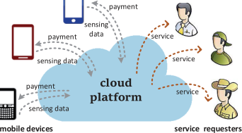

Fig. 1. Typical crowdsensing architecture. 

can monitor users’ surrounding environment and infer human activities. Particularly, _mobile crowdsensing_ [1], [2], raised in recent years, utilizes mobile devices to gather, analyze, and share their local information, _e.g._ , noise, pollution, and traffic information. It has been applied to various application scenarios, including localization [3]–[6], indoor floorplan construction [7], [8], indoor location tagging [9], environmental monitoring [10], [11], transportation and navigation [12]–[17], and photo transmission [18]. 

A typical crowdsensing architecture, as shown in Fig. 1, consists of three major components: a cloud platform, mobile device users, and service requesters. After releasing a sensing campaign, the platform asks part of the mobile device users (we will refer as “users” for simplicity) to perform sensing tasks, _i.e._ , to use their mobile devices to collect specific local information and send sensing readings back to the platform. Based on the collected sensing data, the platform gets a global view of the users’ local knowledge, and thus can provide certain information to the service requesters. For instance, the platform asks the users to report their local traffic conditions. After processing and analyzing the users’ reports, the platform can provide drivers with real-time traffic status, as well as congestion forecast. 

Despite the novelty and potential of crowdsensing, one of the critical issues that are key to the effectiveness of the crowdsensing system is data quality. The great differences among the qualities of the users’ contributed data can be caused by both device factors and human behaviors in general. Since different brands of mobile devices are produced by different manufactures and are assembled with diverse series of sensors, they usually have heterogeneous sensing capabilities, resulting in varying data qualities. Besides the factors of devices, human behaviors, which are more complicated and less likely to be predicted, also influence the 

0733-8716 © 2017 IEEE. Personal use is permitted, but republication/redistribution requires IEEE permission. See http://www.ieee.org/publications_standards/publications/rights/index.html for more information. 

Authorized licensed use limited to: Shanghai Jiaotong University. Downloaded on February 15,2022 at 23:46:32 UTC from IEEE Xplore.  Restrictions apply. 

YANG _et al._ : ON DESIGNING DATA QUALITY-AWARE TRUTH ESTIMATION AND SURPLUS SHARING METHOD FOR MOBILE CROWDSENSING 

833 

data qualities. For example, some users are obedient and strictly follow the sensing instructions of the platform, while some users may intentionally contribute low quality data for their own sake. Some careless users may inadvertently contribute erroneous data by taking incorrect measurement approaches, such as putting a phone in the pocket while being asked to collect noise information. Thus, without quality regulation, collected data may suffer from uneven levels of qualities, which prevents the platform from providing reliable services to requesters and thus diminishes the effectiveness of crowdsensing. 

To address the issue of low quality data, the platform’s solutions can be generally classified into two categories: active strategies and passive strategies. Active strategies tackle this issue directly from the data sources, _i.e._ , to motivate the users to submit high quality data by proposing appropriate incentive mechanisms ( _e.g._ , [19]). In contrast to the active ones, passive strategies tend to focus on the data analysis phase ( _e.g._ , [20]–[22]). By utilizing state-of-the-art machine learning and data mining techniques, the platform can estimate users’ data qualities, filter out anomalous data items, and thus provide relatively accurate and reliable information to service requesters. Effective as they are, passive strategies have their limitations since they cannot drive the data sources to obtain higher quality data. 

In this paper, we tend to integrate the passive strategies with the active ones, by proposing a quality-aware truth estimation and payment determination scheme. On one hand, the truth estimation considers the problem of estimating the ground truth and each user’s data quality without the knowledge of ground truth. It is a challenging task especially when the users’ data are streaming, and their data qualities may vary from time to time and tend not to follow any apparent probability distribution. Existing truth discovery methods ( _e.g._ , batch algorithms [23], [24], probabilistic methods [25], [26], and semi-supervised learning [27]) cannot be directly applied to this scenario. 

On the other hand, the quality-aware payment determination incorporates the results from quality estimation, and calculates each user’s payment based on the quality of her contribution. The roles of the payment are two-fold: to compensate for the users’ costs in performing the sensing task, and more importantly, to motivate the users to contribute high quality data. First, since performing sensing tasks requires the users to devote their time, intelligence, and resources ( _e.g._ , battery power, storage space, and computation resources), rational users, who only consider their own benefits, may not be willing to participate in the sensing campaign without receiving proper compensations. Thus, to motivate the users’ willingness on participation, the platform usually rewards each user with a certain quantity of payment. Most of the existing works determine the users’ payments by adopting a reverse auction model. In the auction, each user submits her self-claimed cost as her bid. Then, the platform selects a part of the users to perform sensing tasks and rewards each selected user with a payment no less than her bid [28]–[31]. However, these reverse auction-based methods may suffer from serious data quality problems in practice. Since the users’ self-claimed 

costs cannot reflect their qualities of contributions in a sensing campaign, determining the users’ payments based solely on their bids may leaves the users the chance to provide low or no effort, commonly known as “free-riding” problem [19]. Second, with the objectives of regulating data quality, a quality-based payment determination scheme is badly needed to motivate the users to contribute high quality data. It is inspired by the idea of “performance-related pay”(PRP) [32] in improving employees’ productivity. By linking the users’ payments directly to their data qualities, we can drive the users to obtain higher payments by continuously contribute high quality data. Besides, we calculate the users’ payments in an “ex-post” manner ( _i.e._ , after receiving the submitted data and estimating the data quality), _s.t._ , the users do not have the opportunity to “free-ride”. 

A number of researches [19], [28]–[31], [33]–[35] have studied the incentive problems in mobile crowdsensing, but have not provided a way to measure the data quality. Some recent works have studied the quality problem in crowdsensing or crowdsourcing systems, but with a different interpretation of the term “quality”. In these works, quality is usually regarded as an indirect metric of the sensing effectiveness ( _e.g._ , how good the selected sensing locations are [36], [37], or the sensing coverage [38], [39]). Whereas, there are very few researches investigating the problem of “data quality” (the accuracy or trustworthiness of the users’ contributed data) in crowdsensing. Wang _et al._ [18] and Huang _et al._ [21] preliminarily investigated the issues of data quality, but did not consider the important part of monetary incentives. Peng _et al._ [22] considered a quality-based incentive mechanism based on an EM algorithm. However, their work tends to follow a different objective ( _i.e._ , profit maximization), and neither studies the problem of generating an accurate ground truth estimation nor considers some realistic properties that a good quality-based payment determination scheme should satisfy. 

In this work, we jointly consider the problems of quality estimation (passive strategy) and monetary incentives (active strategy), and propose a quality-based truth estimation and surplus sharing method, which mainly consists of two parts: (i) _quality estimation module_ and (ii) _surplus sharing module_ . In the quality estimation module, we present an unsupervised learning technique to estimate the users’ data qualities, characterize their long-term reputations, and generate a reliable estimation of ground truth. To improve the estimation accuracy, we also detect and filter out anomalous users, whose sensory readings are far away from the group consensus. To determine the users’ payments, we model the process of surplus sharing as a cooperative game, where the total surplus earned by the platform is based on the users’ contributions. We adopt the concept of the celebrated Shapley value [40] to calculate each user’s surplus share. To tackle the high complexity in calculating the Shapley values, we propose an approximate Shapley value calculation algorithm. We show that the proposed surplus sharing scheme exhibits several desirable properties that indicate that a user’s payment is proportional to her contribution to the sensing campaign. We also conduct a real experiment and a large-scale simulation 

Authorized licensed use limited to: Shanghai Jiaotong University. Downloaded on February 15,2022 at 23:46:32 UTC from IEEE Xplore.  Restrictions apply. 

IEEE JOURNAL ON SELECTED AREAS IN COMMUNICATIONS, VOL. 35, NO. 4, APRIL 2017 

834 

to evaluate our proposed methods. Our major contributions are listed as follows. 

- First, we propose an unsupervised learning method to quantify the users’ data qualities, and to characterize their long-term reputations based on their historical quality records. We also apply an outlier detection technique to improve the platform’s estimation accuracy. 

- Second, we model the process of surplus sharing as a cooperative game, and discuss several desirable properties in designing an appropriate surplus sharing scheme. We propose a Shapley value-based surplus sharing method that satisfies our design requirements. We also present an approximate Shapley value calculation algorithm to reduce the computation complexity. 

- Third, we conduct a noise monitoring experiment for more than 12 hours, and collect over 450,000 data items. We also simulate a large-scale scenario with 200 users to further examine the performance of our methods. Both the experiment and simulation results show that our method achieves good performance in quality estimation and surplus sharing. 

The rest of the paper is organized as follows. We first present our system model in Section 2. The quality estimation module and the surplus sharing model are presented in Section 3 and Section 4, respectively. In Section 5, we evaluate our proposed method and present evaluation results. Related work is presented in Section 6. Finally, we conclude this paper in Section 7. 

## II. SYSTEM OVERVIEW 

We consider a general crowdsensing scenario, where the platform’s objective is to monitor an unknown environmental condition ( _e.g._ , noise, temperature, traffic condition, _etc._ ) without knowledge of the ground truth. To this end, mobile device users are asked to gather and share their local information, which will be used by the platform to generate its estimation of the real environment. Since the accuracy of the collected data may vary among users, it is of great necessity to quantify the users’ data quality, _s.t._ , the users’ contributed data will be treated differentially in producing the platform’s estimation. Furthermore, the users’ payments will be determined based on their data qualities. 

We note that the environmental conditions may differ among distinct locations and moments. For example, the traffic conditions at urban and suburban areas of Shanghai may not be the same at the same time. Even at the same location, they may vary among different moments. To tackle the spatial and temporal inconsistencies, the crowdsensing campaign is divided into many _tasks_ , each of which has its specified area and period [33], [41]. The users are allowed to choose and participate in their interested tasks. For clarity of illustration, we consider the quality estimation and surplus sharing for one task in the rest of the paper. 

We assume that a task ( _e.g._ , noise monitoring in a specific park) has _K_ time slots with the same duration _T_ . The set of users within the region of the task is denoted by N = {1 _,_ 2 _, . . . , n_ }. In each time slot _k,_ 1 ≤ _k_ ≤ _K_ , each user _i_ ∈ N 

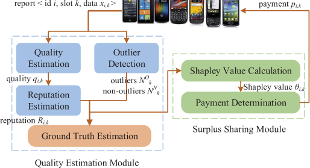

Fig. 2. System overview. 

submits her sensing data _xi,k_ to the platform, and is rewarded with payment _pi,k_ . 

Fig. 2 shows the architecture of our proposed crowdsensing system, which primarily consists of a quality estimation module and a surplus sharing module. The quality estimation module is adopted to quantify the users’ qualities and reputations, to classify the users into normal or anomalous, and to calculate the platform’s estimation of the real environment. Based on the results from the quality estimation module, the surplus sharing module applies the Shapley value to determine the users’ payments. 

In the quality estimation module, the platform utilizes an unsupervised learning technique to estimate the users’ data qualities _Qk_ = { _q_ 1 _,k, . . . , qn,k_ } in each slot _k_ without knowing the ground truth, where _qi,k_ represents the relative accuracy of the user _i_ ’s contributed data. Although the quality estimation can provide comparisons of the users’ data in the current slot, it neglects the users’ historical behaviors and only presents a temporal view of the users’ data qualities. To completely characterize the credibility of the users’ data, a reputation component is introduced to aggregate each user _i_ ’s historical quality records to quantify her reputation _Ri,k_ after _k_ slots. A high reputation score _Ri,k_ indicates that the user _i_ has been contributing high quality data in the past slots and thus her data _xi,k_ in the current slot _k_ is more likely to be accurate and trustworthy. 

To improve the accuracy of our generated estimation, we apply an outlier detection technique [42] to classify the users into two sets, _i.e._ , a set of normal users N _k__N_ and a set of anomalous users N _k__A_, depending on whether one’s sensing data is far away from the group consensus. The data contributed by the anomalous users is considered to be faulty and thus should be filtered out in the process of ground truth estimation. Finally, based on the results from reputation estimation and outlier detection, we generate our real-time truth estimation _x_ ¯ _k_ , which is the estimation for the environmental condition. 

In mobile crowdsensing, the platform needs to provide accurate truth estimation result to service requesters to obtain profits, and these profits (or portions of the profits) will be distributed among the users as their payments. Instead of considering a fixed budget of the users’ payments, we consider a more realistic scenario, where the platform’s surplus is gained according to the credibility of its generated ground 

Authorized licensed use limited to: Shanghai Jiaotong University. Downloaded on February 15,2022 at 23:46:32 UTC from IEEE Xplore.  Restrictions apply. 

835 

YANG _et al._ : ON DESIGNING DATA QUALITY-AWARE TRUTH ESTIMATION AND SURPLUS SHARING METHOD FOR MOBILE CROWDSENSING 

TABLE I 

FREQUENTLY USED NOTATIONS 

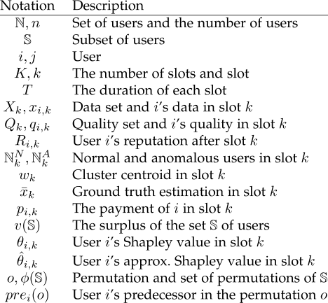

truth estimation, which is further influenced by the users’ data qualities and reputations. Under this circumstance, one one hand, the users’ interest is aligned with the platform’s interest. More platform’s income means higher users’ payments, so helping the platform to generate higher accurate estimation result can in turn benefit the users themselves. On the other hand, since the total surplus will be divided among the users, these users will need to compete with each other to win higher individual benefit. This situation can be characterized by a multi-player _cooperative game_ [43], where multiple players participate in a game and the game generates a surplus which will be divided among the players. The term “cooperative” means that players can influence the total generated surplus via both cooperation and competition. In crowdsensing, the game is the sensing campaign, the players are the mobile device users, and the surplus is the platform’s profit from the campaign. 

To design a quality-aware surplus sharing scheme, we first analyze three desirable properties, and discuss several heuristic methods. Then, we incorporate the Shapley value, a classical solution to cooperative game, into the design of our surplus sharing scheme. We show that the proposed method perfectly fits our design requirements. To tackle the exponential complexity of Shapley value computation, we further propose an efficient algorithm to calculate the approximate Shapley value of each user. 

We present the frequently used notations in Table I. 

## _A. Quality Estimation_ 

In each slot _k_ , given the set of the users’ sensing data _Xk_ = { _x_ 1 _,k, . . . , xn,k_ }, the quality estimation component calculates the users’ data qualities _Qk_ = { _q_ 1 _,k, . . . , qn,k_ }. Since the ground truth is unavailable, we rely on the observation that the majority of users contribute reliable data, and utilize the weighted data aggregation as the criterion to measure the users’ data qualities. 

We treat the set of sensing data _Xk_ as a cluster and denote the distance between any two data items _xi,k_ and _x j,k_ by _dist (xi,k, x j,k)_ . The distance measurement function _dist ()_ , specified by the sensing platform, measures the similarity between different data items. It could be their Euclidean distance, cosine distance, or any other specified similarity distance. A smaller distance usually indicates higher similarity, and vice versa. We also define the centroid of the cluster, denoted by _wk_ , to be the data point that minimizes the sum of weighted squared distances between _wk_ and each user’s data. It is shown in Equation (1) below, and could be easily solved by taking partial derivative of _wk_ and calculating the solution to which the derivative of the equation equals to zero. 

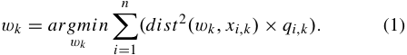

The quality of each user _i_ ’s data is measured based on its deviation _di,k_ from the cluster centroid, shown in Equation (2). Intuitively, data with higher quality is in closer proximity to the cluster centroid than lower quality ones, which results in a smaller deviation _di,k_ . 

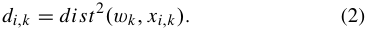

**Algorithm 1** Quality Estimation (Slot _k_ ) 

**Input** : Collected data set _Xk_ = { _x_ 1 _,k, . . . , xn,k_ } **Output** : Users’ quality _Qk_ = { _q_ 1 _,k, . . . , qn,k_ } **1 foreach** _i_ ∈ N **do** 

**2** _qi,k_ ← 1 _/n_ ; 

**3 while** _not converged_ **do 4** _wk_ = _argmin_ � _ni_ =1_(dist_2_(wk, xi,k)_×_qi,k)_; _wk_ 

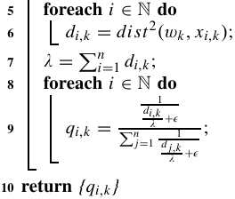

## III. QUALITY AND REPUTATION ESTIMATION 

In this section, we present detailed designs of the quality estimation module. This module takes raw sensing data from the users as input, quantifies the users’ data qualities and reputations, and then filters out anomalous data items. Finally, the platform produces the estimation of the real monitored physical environment. 

Let _λ_ be the sum of deviations, _i.e._ , _λ_ =�_n_ _i_ =1_di,k_.We repeatedly update _qi,k_ based on the following equation: 

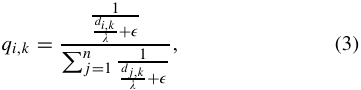

Authorized licensed use limited to: Shanghai Jiaotong University. Downloaded on February 15,2022 at 23:46:32 UTC from IEEE Xplore.  Restrictions apply. 

IEEE JOURNAL ON SELECTED AREAS IN COMMUNICATIONS, VOL. 35, NO. 4, APRIL 2017 

836 

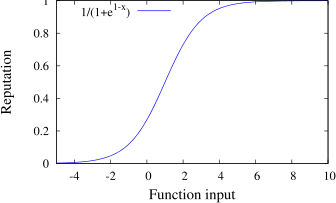

Fig. 3. Logistic function. 

where _ϵ_ is a small constant real number. The reason we introduce _ϵ_ is to make sure the equation still makes sense when _di,k_ = 0. The quality estimation algorithm is presented in Algorithm 1. We note that _qi,k_ is a real number within _(_ 0 _,_ 1 _)_ and�_n_ _i_ =1_qi,k_= 1. Our algorithm converges when each user’s quality variation between two consecutive iterations is lower than a pre-defined threshold. 

We note that our proposed quality estimation method handles numerical data values only (with continuous or categorical types), the intuition of our design can be applied to more general crowdsensing scenarios, where the ground truth can be revealed by aggregating high quality data, and the distance to the truth reflects the accuracy of each individual’s contributed data. 

## _B. Reputation Estimation_ 

After determining the users’ data qualities, we present here the design of the reputation estimation component, which utilizes the users’ historical quality records to estimate their credibility in a long-term view. 

Our reputation estimation is based on the observation that a person’s reputation in social situations tends to be gradually built up after a number of honest behaviors, and can be rapidly torn down after even a few dishonest behaviors [21]. Intuitively, we increase a small amount of a user’s reputation after receiving a high quality contribution, and largely decrease her reputation if the user contributed bad data. The celebrated logistic function is adopted to model this behavior, due to the property that its growth is slowest at the left and right parts, and fastest in the middle. The generalized logistic function, also known as Richard’s curve [44], is formulated below: 

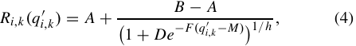

where _A_ is the lower asymptote, _B_ is the upper asymptote, _D_ depends on the value _Ri,k (_ 0 _)_ , _F_ is the growth rate, _M_ determines the maximum growth, and _h_ affects near which asymptote maximum growth occurs. Fig. 3 shows an instance of the logistic function with _A_ = 0 _, B_ = 1 _, D_ = 1 _, F_ = 1 _, M_ = 1, and _h_ = 1. After each time slot _k_ , we update the users’ reputations by using the logistic function, whose output _Ri,k (qi_′ _,k__)_∈_(_0_,_1_)_, is the user _i_ ’s updated reputation. The input parameter of the logistic function _qi_′ _,k_iscalculatedasfollows: 

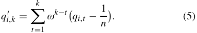

As Equation (5) shows, we aggregate historical information to estimate the users’ reputation by summing up all the past quality records, where the exponential term _ω__k_−_t_ , with 0 _< ω <_ 1 being the aging weight, assigns heavier weights to recent records than older ones. The term _qi,t_ − 1 _/n_ is used to identify whether user _i_ ’s data quality in slot _t_ is above the average, _i.e._ , _qi,t_ − 1 _/n >_ 0 means that the quality of _xi,t_ is above the average and vice versa. 

We note that the decrement and increment rates of the users’ reputations should be different. One simple approach is to classify the users’ behaviors into trustworthy or untrustworthy, and assigns users in the same class with the same aging weight [21]. However, in real scenario, the rate of reputation’s decrement/increment of a user should be proportional to the degree of the trustworthiness/untrustworthiness of her behavior. For example, a user’s reputation should have larger decrement when she contributes “very bad” data than “slightly bad” data. Therefore, we replace _ω_ with 1 − _qi,t_ , when _qi,t_ ≤ 1 _/n_ , _s.t._ , the users with lower quality data have higher aging weights and thus results in larger reputation decrements. Similarly, for each user _i_ , whose quality is above the average ( _i.e._ , _qi,t >_ 1 _/n_ ), her aging weight is her quality _qi,t_ . Note that since _qi,k_ is usually much smaller than 1− _qi,k_ , especially when the number of users _n_ is large, the rate of reputation decrement is always larger than the rate of reputation increment. 

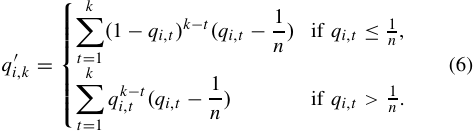

Thus, to determine the user _i_ ’s reputation after _k_ slots, we first calculate _qi_′ _,k_usingEquation(6)andthenapplyour reputation function Equation (4). The function output is _i_ ’s reputation _Ri,k_ . 

Compared with existing researches, such as the celebrated Beta reputation system [45] and reputation designs [19], [21], our approach has two advantages. First, our reputation estimation can work on continuous values, while [45] and [19] only considered binary ratings. Second, the users’ reputation updates are proportional to the degree of the trustworthiness/ untrustworthiness of their behaviors, which has not been considered by the existing works. 

## _C. Outlier Detection_ 

In this subsection, we present an outlier detection technique to find data items that are far away from expectations. For example, the noise readings recorded by a mobile phone that is put in the pocket should be counted as outliers. Specifically, we adopt the concept of distance-based outlier [42], which is a representative method of the proximity-based outlier detection. 

For the data set _Xk_ , we define a distance threshold _r_ to be the reasonable neighborhood of a data item. For each data item _xi,k_ ∈ _Xk_ , we calculate the number of the other data items within the _r_ -neighborhood of _xi,k_ . If most of the data items are far away from _xi,k_ , i.e., not in the _r_ -neighborhood 

Authorized licensed use limited to: Shanghai Jiaotong University. Downloaded on February 15,2022 at 23:46:32 UTC from IEEE Xplore.  Restrictions apply. 

YANG _et al._ : ON DESIGNING DATA QUALITY-AWARE TRUTH ESTIMATION AND SURPLUS SHARING METHOD FOR MOBILE CROWDSENSING 

837 

of _xi,k_ , then _xi,k_ is regarded as an outlier. We present the formal definition below. 

_Definition 1 (Distance-Based Outlier [42]):_ Let _r (r_ ≥ 0 _)_ be the distance threshold and _μ (_ 0 _< μ_ ≤ 1 _)_ be the fraction threshold. A data object _xi,k_ is _DB(r, μ)_ -outlier if 

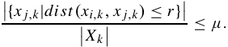

A simple and efficient algorithm, as shown in Algorithm 2, is used to classify the users into normal users N _k__N_ and anomalous users N _k__A_.Thedataoftheseanomaloususerswill be filtered out in the process of generating the estimation of the environmental condition. 

We note that in our proposed system, instead of running the outlier detection before the quality estimation, we prefer to parallel the outlier detection process with the quality and reputation estimation processes, because the data items filtered in the outlier detection process also contain information that can be useful in updating users’ quality and reputation records. 

**Algorithm 2** Distance-Based Outlier Detection **Input** : Collected data set { _xi,k_ } in slot _k_ **Output** : Normal users N _k__N_andAnomaloususersN _k__A_ **1** Initialize N _k__N_←∅,N _k__A_←∅; **2 for** _i_ ← 1 _to n_ **do 3** _count_ ← 0 ; **4 for** _j_ ← 1 _to n_ **_and_** _j_ ̸ = _i_ **do 5 if** _dist (xi,k , x j,k)_ ≤ _r_ **then 6** _count_ ← _count_ + 1 ; **7 if** _count_ ≥ _μn_ **then** N _k__N_←N _k__N_∪{_i_}; **8 else** N _k__A_←N _k__A_∪{_i_}; 

## _D. Ground Truth Estimation_ 

Recall that in each slot _k_ , the platform needs to calculate the estimation result of the monitored environment. To this end, we first eliminate anomalous data items from collected data set to improve the estimation accuracy. Then, we assign each normal data item _xi,k_ a credibility weight _Ri,k_ , which is the user _i_ ’s reputation score. The reputation-based cluster centroid, calculated using the equation below, is the ground truth estimation result of the slot _k_ . 

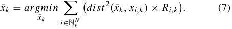

We will show in Section V that the reputation-based cluster centroid method achieves superior performance than the raw centroid of the quality-based ones. Definitions of these benchmarks will be provided in Section 5 as well. 

We note that although the assumption that most users are reliable ones may be not practical in certain scenarios, it is very hard to eliminate this assumption especially under the circumstance where the ground truth is unknown and the platform have no prior information on the users’ data qualities. Specifically, the quality estimation starts with zero knowledge of the users, if the “bad” users dominate at the 

start, then the quality estimation module will be likely to incorrectly treat these unreliable users as “good” ones and generate a false truth estimation. We are not aware of any truth discovery approach that can tackle this case without the help of ground truth. In this work, what our system design can accomplish is that when the users’ data qualities and reputations are correctly estimated in the first place, then if in some round, the majority of users are “bad” ones, we can still generate a relatively reliable truth estimation result. This is because with correct quality and reputation values, our estimation approach tends to assign very few weights to low quality data, and thus the truth estimation result can still be accurately generated. Nevertheless, trying to eliminate the assumption is an interesting and challenging topic. We tend to leave it to our future work. 

Besides, our proposed system can serve as the general framework for subsequent quality-aware crowdsensing system designs. We note that the proposed techniques are, in particular, designed for the environmental crowdsensing scenarios, where the platform’s objective is to monitor an unknown environment condition. These techniques can be replaced with other related approaches according to specific needs of different crowdsensing scenarios. For example, the quality estimation component can adopt certain probabilistic approach ( _e.g._ , [24], [46], [47]) if the users’ data follow certain probability distribution, and the distance-based outlier detection technique used in our system can also be replaced with density-based one [48] if the outliers are not “global” but “local”. Thus, we believe that the proposed system has the potential to be practical in other scenarios. 

## IV. SURPLUS SHARING 

To motivate the users to provide data with high quality, the platform needs to reward each user with a proper payment, proportional to users’ contributions. The intuition behind the surplus sharing design is the “performance-related pay” (PRP) [32], which is a widely utilized mechanism in labor market to improve employees’ productivity by linking the employees’ wages directly to their work performance. Researches [32], [49] have shown that performance-related pay can attract employees’ with higher working quality and greatly improve the employees’ productivity. 

In most cases, the platform has only a limited budget. Some existing works ( _e.g._ , [31], [33], [50]) assume that the platform is given a fixed budget to run the sensing campaign. While in most of the practical scenarios, especially when the crowdsensing campaign could last a long period of time ( _e.g._ , up to months or years), the platform usually has a dynamic cash flow, which means that the campaign needs to continuously benefit from its real-time estimation. Naturally, the real-time capital inflows, called _surplus_ , is based on the credibility of the generated campaign result. 

In this work, we mainly consider the problem of non-fixed surplus sharing, where the total surplus is dynamic and is earned from the real-time campaign result. We first present three desirable properties in designing a good quality-based surplus sharing scheme, and discuss several heuristic sharing methods, as well as their limitations. Then, we introduce the 

Authorized licensed use limited to: Shanghai Jiaotong University. Downloaded on February 15,2022 at 23:46:32 UTC from IEEE Xplore.  Restrictions apply. 

IEEE JOURNAL ON SELECTED AREAS IN COMMUNICATIONS, VOL. 35, NO. 4, APRIL 2017 

838 

concept of Shapley value, and propose a Shapley value-based surplus sharing method. We note that the Shapley value of each user can also be considered as the user’s contribution to the crowdsensing. Thus, our proposed approach for non-fixed surplus sharing could also be applied in fixed surplus sharing scenarios (by adopting a weighted proportional sharing scheme with each user’s Shapley value being the weight). 

Formally, the surplus generated by the platform in each slot _k_ , called _grand surplus_ , is denoted by _v(_ N _)_ , where N is the set of users and _v_ : 2_n_ → _R_ is the surplus characteristic function. For any subset of the users S ⊆ N, _v(_ S _)_ represents the surplus earned by the campaign when the set S of users participate. We also define the user _i_ ’s surplus share in slot _k_ as _pi,k_ , which is also called _i_ ’s payment. The objective of the surplus sharing module is to divide the grand surplus _v(_ N _)_ among the users, satisfying the following desirable properties. 

## _A. Desirable Properties in Surplus Sharing_ 

In determining each user’s surplus share, there are several desirable properties. 

_Property I Surplus Efficiency:_ This property indicates that in each time slot, the sum of the users’ surplus share should be equal to the grand surplus, _i.e._ ,� _i_ ∈N_pi,k_=_v(_N_)_. In other words, the platform never reserves or overdraws its surplus budget in any time slot. 

_Property II Outliers Get Nothing and Normal Users All Get Paid:_ This property is derived from the two-fold goal of the crowdsensing campaign. On one hand, the platform wishes to penalize untrustworthy behaviors, _s.t._ , the users who are classified as outliers in some slot shall get zero surplus share, since their data is far away from the group consensus and thus makes no meaningful contributions to the campaign in that slot. On the other hand, to compensate the users’ costs, every user receives a positive surplus share as long as she is not counted as an outlier. Formally, if _i_ ∈ N _k__A_,then_pi,k_= 0; otherwise _pi,k >_ 0. 

_Property III Monotonic Rule:_ It means that for any two normal users, the one with a higher reputation should receive more surplus share than the other one. This rule indicates the fairness of the surplus sharing, _i.e._ , the users’ rewards are proportional to the qualities of their contributions. Formally, in any slot _k_ , for any two users _i, j_ ∈ N _k__N_, if_Ri,k>R j,k_, then _pi,k > p j,k_ , and if _Ri,k_ = _R j,k_ , then _pi,k_ = _p j,k_ . 

We note that under the latter two properties, rational users, who aim at higher payment, will be motivated to contribute high quality data so as to avoid being counted as outliers and also to improve their reputations. 

## _B. Several Heuristic Sharing Methods_ 

One simple surplus sharing approach is _equal share_ , _i.e._ , to assign each user an equal share of the total surplus _pi,k_ = _v(_ N _)/n_ . However, this allocation rule suffers from a serious fairness issue, _i.e._ , users with low quality data earn the same rewards as those who made high quality contributions, which may drive the latter group to leave the campaign or to contribute low quality data. 

Another approach is _individual surplus contribution_ , which assigns each user _i_ with the amount of surplus that the 

campaign generates when only _i_ participates, _i.e._ , _pi,k_ = _v(_ { _i_ } _)_ . This approach takes the users’ data qualities and reputations into surplus calculation, and thus satisfies monotone rule. However, it cannot guarantee the surplus efficiency, since the sum of allocated surplus may not be equal to the surplus budget, _i.e._ ,� _i_ ∈N_pi,k_̸=_v(_N_)_. 

The third heuristic sharing method is called _marginal surplus contribution_ . It states that the surplus share of each user _i_ is the difference between total surplus when _i_ participates and when _i_ does not participate, given all other conditions remain the same. Formally, _pi,k_ = _v(_ N _)_ − _v(_ N\{ _i_ } _)_ . This approach also violates the property of surplus efficiency, _i.e._ ,� _i_ ∈N_pi,k_̸=_v(_N_)_. 

## _C. Shapley Value_ 

Considering the limitations of the previously mentioned heuristic methods, we present an alternative Shapley valuebased approach, which can achieve all the three desirable properties. 

_Definition 2 (Shapley Value [40], [43]):_ In surplus sharing, the Shapley value of _i_ is defined by 

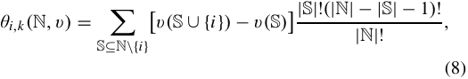

where |S| and |N| are the cardinality of S and N respectively. 

The Shapley value is calculated by taking a _random_ permutation of users from the set of all _n_ ! possible permutations, and allocating each user her _expected_ marginal surplus contribution in this permutation. It has been proved that the Shapley value is the _unique_ value satisfying the following four axioms [40]. _Axiom 1 (Efficiency):_� _i_ ∈N_θi,k_=_v(_N_)_. _Axiom 2 (Symmetry):_ If ∀S ⊆ N\{ _i, j_ }, _v(_ S ∪{ _i_ } _)_ = _v(_ S ∪{ _j_ } _)_ , then _θi,k_ = _θ j,k_ . 

_Axiom 3 (Dummy):_ If ∀S ⊆ N\{ _i_ }, _v(_ S ∪{ _i_ } _)_ = _v(_ S _)_ , then _θi,k_ = 0. 

_Axiom 4 (Additivity):_ For any two surplus function _v_ 1 and _v_ 2, _θi,k (v_ 1 _)_ + _θi,k (v_ 2 _)_ = _θi,k (v_ 1 + _v_ 2 _),_ ∀ _i_ ∈ N. 

The efficiency axiom states that the sum of the users’ surplus share should be equal to the grand surplus, which matches the property of the surplus efficiency in Section IV-A. The symmetry axiom indicates that two users having equal marginal surplus contributions should receive the same amount of surplus share. The dummy axiom says that a user who does not contribute to surplus generation should receive nothing, _i.e._ , outliers receive zero surplus share. These two axioms satisfy the requirements of our second and third desirable property respectively. The additivity axiom means that combining two games into one, each user’s received surplus share remains the same. In our setting, the additivity says that the total revenue received by any user in the long period campaign should be equal to the sum of her surplus share gained in every single slot. Thus, the four axioms are inherent properties of our surplus sharing. 

For each subset of the users S ⊆ N, the surplus function _v(_ S _)_ outputs the obtained profit of the generated truth estimation based on the data from the users in S. Intuitively, 

Authorized licensed use limited to: Shanghai Jiaotong University. Downloaded on February 15,2022 at 23:46:32 UTC from IEEE Xplore.  Restrictions apply. 

YANG _et al._ : ON DESIGNING DATA QUALITY-AWARE TRUTH ESTIMATION AND SURPLUS SHARING METHOD FOR MOBILE CROWDSENSING 

839 

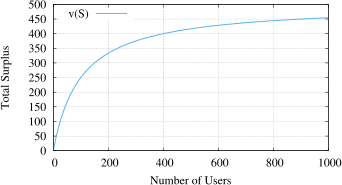

Fig. 4. An example of the surplus function. 

the platform’s profit is proportional to the credibility of its truth estimation result, where the credibility is based on the reputations of the users. To that end, the surplus function should satisfy the following properties: (1) _v(_ S _)_ should be monotone increasing subject to� _i_ ∈S_Ri,k_,whichmeansthat the truth estimation generated from higher reputation contributors should be more valuable; (2) For any normal user _i_ , _v(_ S ∪{ _i_ } _)_ should be larger than _v(_ S _)_ , _s.t._ , each normal user’s payment is positive; (3) The growth of _v(_ S _)_ gets slower as� _i_ ∈S_Ri,k_increases.Thispropertyimpliesthatauser’s marginal contribution decreases as the number of contributors increases. An instance of the surplus function is provided below. 

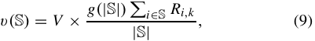

where _V_ = 1000 is the scaling factor, _Ri,k_ is the user _i_ ’s reputation after round _k_ , and _g(n)_ = _n/(n_ + _n_ 0 _)_ is the B _u_ ¨hlmann credibility function [51], which has been widely used in credibility theory to model the relationship between the number of users and the credibility of the user-generated results. The constant parameter _n_ 0 is used to control the growth speed of _g(_ · _)_ . An example of the surplus function is shown in Fig. 4, where _n_ 0 = 100 and _Ri,k_ is randomly generated from (0,1). We can see that the proposed surplus function satisfies the above three properties. 

Wang _et al._ [52] proposed several mathematical models to characterize the “quality of crowd”. These models can be modified as alternative surplus functions, as long as the three properties are met. Since the choice of surplus function does not fundamentally influence our system design, in this work, we choose the B _u_ ¨hlmann credibility model for simplicity. In different mobile crowdsensing scenarios, the platform can choose different instances of the surplus function to meet specific needs. 

Our Shapley value-based surplus sharing rule is presented below. In each slot, the payments of anomalous users are zero, while the payment of each normal user is her Shapley value with N _k__N_beingthegrandcoalition. 

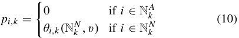

By using this reputation-based surplus function, the payment determination scheme directly links each user’s payment to her reputation. Due to the nice properties of the Shapley value, our proposed surplus sharing method can satisfy the three desirable properties in Section 4.1, _s.t._ , the rational users will have the 

incentive to improve their data qualities not only to avoid being counted as outliers, but also try to obtain higher payments. Besides, since the payments are determined after the sensing data are submitted, the users do not have the opportunities to “free-ride”. 

## _D. Why Not Weighted Proportional Sharing?_ 

One may notice that a weighted proportional sharing method, as shown in Equation 11, can also satisfy the three desirable properties: 

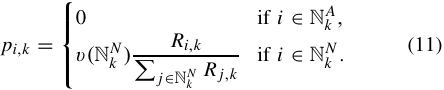

However, the weighted proportional sharing method only takes the grand surplus as input, while ignoring the surplus generated by each subset _S_ ⊆ _N_ , which implicitly contains important information about each user’s contribution and inherent properties of the surplus function _v_ . Thus, applying the weighted proportional sharing method not only wastes useful information, but also fails to reflect certain inherent properties of the surplus function. Specifically, we note that in each slot, the value of each user’s data quality or reputation cannot directly reflect her actual contribution to the platform’s campaign result. Intuitively, when all the users contribute high quality data, the contribution of an individual is relatively low. Whereas, when the users’ data qualities are of uneven levels, a high quality submission may play a relatively important role in improving the accuracy of the campaign result, and thus is of high contribution. The weighted proportional sharing scheme fails to characterize this property, while the Shapley value does by taking each user’s marginal surplus contribution over all the combinations of the remaining set into consideration. 

Let us take a look at a simple example. We assume that there are three users { _a_ 1 _, a_ 2 _, a_ 3} and their reputations are _r_ 1 = 1, _r_ 2 = 2, and _r_ 3 = 3 respectively. Suppose that the surplus function is defined as _v(S)_ = 10| _S_� |+ _i_ ∈10 _S__ri_.The payments determined by the weighted proportional sharing method and the Shapley value-based method are compared in Fig. 5. We can see that the user _a_ 1’s payment calculated by the Shapley value-based method is less than the payment calculated by the proportional sharing method, while _a_ 3 is the opposite. This is because that _a_ 1’s data is of low quality, and thus its marginal contribution to the other group is relatively low, _s.t._ , its deserved payment should be less than its weighted proportional share. 

## _E. Approximate Shapley Value_ 

Due to the appealing properties of Shapley value and its excellent match for our model, we reward each normal user with the surplus share of her Shapley value. However, we observe that the number of subset of N _k__N_isexponentialtoits cardinality, therefore the calculation of Shapley value involves an exponential time complexity. When the number of normal users is large, this approach would be impractical. To settle this computational infeasibility, we propose an efficient approximation of the Shapley value based on random samping. 

Authorized licensed use limited to: Shanghai Jiaotong University. Downloaded on February 15,2022 at 23:46:32 UTC from IEEE Xplore.  Restrictions apply. 

IEEE JOURNAL ON SELECTED AREAS IN COMMUNICATIONS, VOL. 35, NO. 4, APRIL 2017 

840 

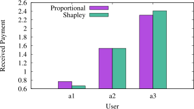

Fig. 5. Proportional sharing _vs._ shalpey (an example). 

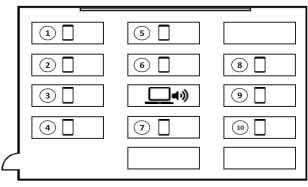

Fig. 6. Device deployment. 

TABLE II 

Let _φ(_ N _k__N)_denotethesetofall|N _k__N_|!permutations ofN _k__N_, and _θ_ˆ _i_ represent the approximated Shapley value of user _i_ . For any sampled permutation _o_ ∈ _φ(_ N _k__N)_,thesetofusers appeared before _i_ is defined as the predecessors of _i_ , denoted by _prei (o)_ . For example, a sampled permutation is shown below, as well as _i_ ’s and _j_ ’s predecessors. 

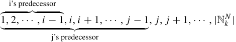

Our proposed algorithm, as shown in Algorithm 3, randomly selects _m_ samples from _φ(_ N _k__N)_withequalprobability.For each sampled permutation _o_ ∈ _φ(_ N _k__N)_, we calculate the prede- cessor of the each user _i_ . Then, the algorithm iteratively sums up each user’s marginal contributions over the predecessors of each sample. The estimated Shapley value will be the average of the marginal contributions over the samples. The payment of each user _i_ in time slot _k_ is shown below: 

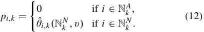

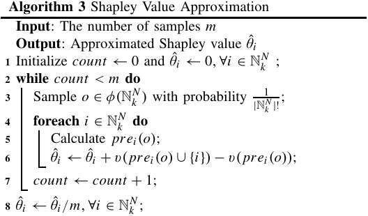

The complexity of the algorithm is in polynomial, _i.e._ , _O(m_ |N _k__N_|_)_.Itcanbereadilyprovedthattheapproximate Shapley value also satisfies all the four axioms of the original Shapley value. 

## V. EVALUATIONS 

In this section, we conduct a crowdsensing experiment to evaluate our proposed methods. We first describe our experiment setup in Section V-A, and then present experiment results in Section V-B and Section V-C. Besides, we also simulate a 

USER BEHAVIOR CLASSIFICATION 

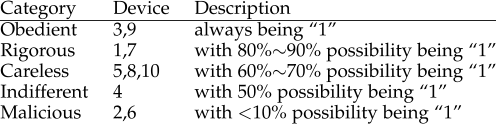

large-scale crowdsensing scenario, in Section V-D, to further examine the performance of our proposed methods. 

## _A. Experiment Setup_ 

We consider a noise monitoring crowdsensing application, where the mobile devices are required to measure their ambient noise level. 

In our experiments, 10 mobile devices are deployed to act as the crowdsensing users, including 5 first-generation Google Nexus 7 tablets (D1 to D5) and 5 second-generation Google Nexus 7 tablets (D6 to D10). All of them are carried with Android 4.4.3 operating system. The ambient noise is measured and recorded by an off-the-shelf application, called NoiseTube [53], which samples the acoustic signal and calculates the sound level every second in decibel (dB). Our experiment is conducted in a 10 _m_ × 8 _m_ room to ensure that the sound attenuation in distance is trivial. A computer, which continuously plays movies, serves as the noise source and is placed in the center of the room. The mobile devices are deployed around the computer as shown in Fig 6. We also deploy a WENSN WS1361 decibel meter to measure the ground truth. 

Recall that one of our objectives is to estimate the users’ data qualities and characterize their long-term behaviors. According to real life experience, we artificially create situations where the users may adopt incorrect sensing approaches and have various behaviors. In noise monitoring application, the correct measurement approach is to expose the mobile device directly to air. However, in real scenarios, the users may intentionally or unintentionally take the wrong measurement approaches, _e.g._ , placing the phone in a pocket or bag, which may blemish their data qualities. To simulate these differences, in our experiment, most of the devices take the proper sensing method, while some devices are covered by clothes or put into a bag to simulate the incorrect approaches. For simplicity, we refer “1” to the correct measurement approach and “0” to incorrect ones. Besides, we divide the users into several categories and assign each category a specific sensing behavior, shown in Table 2. In our setting, device D3 and D9 

Authorized licensed use limited to: Shanghai Jiaotong University. Downloaded on February 15,2022 at 23:46:32 UTC from IEEE Xplore.  Restrictions apply. 

YANG _et al._ : ON DESIGNING DATA QUALITY-AWARE TRUTH ESTIMATION AND SURPLUS SHARING METHOD FOR MOBILE CROWDSENSING 

841 

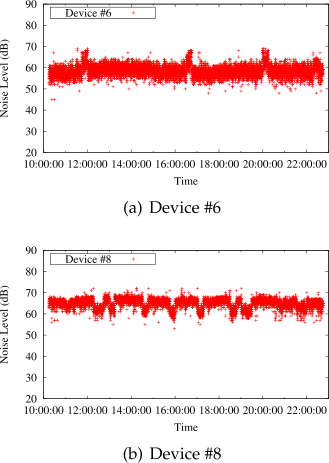

Fig. 7. Submitted data of sampled users. 

are strictly obedient to the platform’s instructions and always expose their mobile devices to air. Device D1 and D7 are rigorous in performing the sensing task correctly, but there are 10%∼20% unavoidable time when they have to put their devices into pockets or bags. The category with largest number of users is careless and we assume that careless users have 60%∼70% being “1”. Device 4 is indifferent of the sensing task and places her device into or out of her pocket any time she wants, thus with half percentage being “1”. Malicious users, such as D2 and D6, deliberately contribute erroneous data in most of the time (less than 10%). 

Our experiment lasts 750 minutes with the slot duration being 1 minute, and collects over 450,000 data items in total. Based on the user behavior classification, we manually change the measuring approaches of the devices (either exposed to air or covered by clothes) with their predefined possibilities. For instance, for device D8, we reset its sensing approach every 15 minutes with 60%∼70% possibility exposed to air and 30%∼40% covered by clothes. We provide part of the users’ data (D6 and D8) in Fig. 7. We can see that since D6 is malicious, there are very few slots, _i.e._ , the three bulges in Fig. 7(a), when the device is exposed to air. In Fig. 7(b), the measured values vary a lot, since D8 changes its sensing approach more frequently, and those small niches are when the device is covered by clothes. It can also be seen that the detected noise level with the device exposed is about 5dB higher than covered. We also observe that the collected data highly depend on the users’ sensing behaviors, and do not follow any obvious probability distribution. 

In the quality estimation module, we adopt the Euclidean distance to measure the similarity between any two data items. We note that in the noise monitoring scenario, each user’s sensing reading in any slot is a vector consisting of 60 numbers (since the slot duration is 60 seconds), and thus the arithmetic operations used in the quality estimation module are correspondingly vector operations. The _ϵ_ used in Equation (3) 

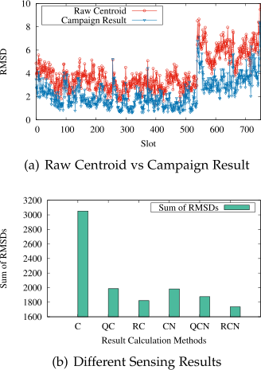

Fig. 8. Result Comparison. 

is 0.01. We iterate our quality estimation algorithm for 10,000 times each slot. The parameters used for the generalized logistic function are: _A_ = 0, _B_ = 1, _D_ = 1, _F_ = 1, _M_ = 1, and _h_ = 1. In the outlier detection, the default distance threshold _r_ and the fraction threshold _μ_ are set to 4 and 0.31 respectively. 

## _B. Experiment Results of Quality Estimation_ 

Recall that our sensing result is generated by finding the Reputation-weighted Centroid of the Normal user cluster (RCN), _i.e._ , the distance is weighted with reputation and the cluster is formed by the normal users. The definition of RCN is shown as Equation (7). We define several benchmarks, namely C (raw Centroid of users), QC (Quality-weighted Centroid of users), RC (Reputation-weighted Centroid of users), CN (raw Centroid of Normal users), and QCN (Qualityweighted Centroid of Normal users). Mathematical definitions of them are provided below. 

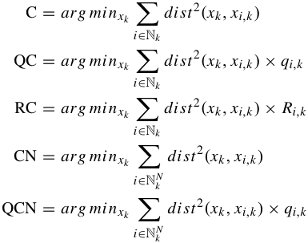

We compare the results of different estimation methods with the ground truth by adopting the Root Mean Square Deviation (RMSD). For any given data vector _xi,k_ , the RMSD is defined as � _dist_2 _(xi,k , x_ ˆ _k)/T_ , where _x_ ˆ _k_ is the ground truth in slot _k_ . Fig. 8(a) shows the RMSDs of raw centroid (C) and our 

Authorized licensed use limited to: Shanghai Jiaotong University. Downloaded on February 15,2022 at 23:46:32 UTC from IEEE Xplore.  Restrictions apply. 

IEEE JOURNAL ON SELECTED AREAS IN COMMUNICATIONS, VOL. 35, NO. 4, APRIL 2017 

842 

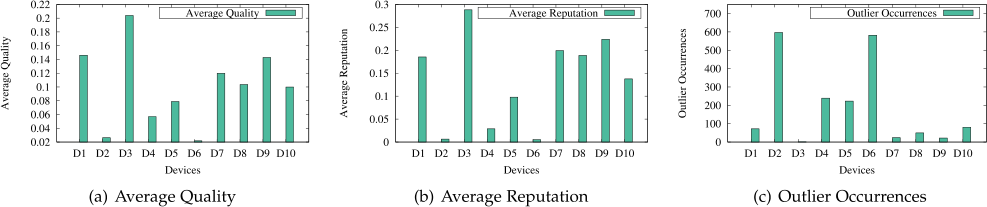

Fig. 9. Qualities, reputations, and outlier occurrences of devices. 

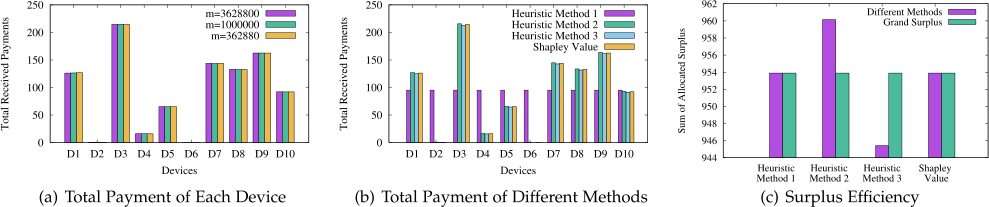

Fig. 10. Comparisons of different surplus sharing methods. 

campaign result (RCN) in every slot. We can see that the RMSD of RCN is about 50% lower than the raw centroid. To get a complete comparison of different campaign result calculation methods, for each method, we sum up its RMSDs of the total 750 slots, and provide the results in Fig. 8(b). We observe that under the same cluster (either N or N _k__N_),the reputation-weighted centroid always results in lowest sum of RMSDs, while the raw centroid the highest. That is because that the reputation-based methods completely characterize the users’ credibility, while the raw centroid methods do not consider the quality differences of the collected data and treat all the users equally. The quality-weighted centroid methods involve data qualities in their result calculation, but they never take the users’ long-term reputations into consideration. That is why QC’s and QCN’s sum of RMSDs are lower than the raw centroid methods (C and CN) but higher than the reputationweighted ones (RC and RCN). It can also be observed that the sensing results calculated using the normal-user cluster N _k__N_ results in lower sum of RMSDs than the user cluster N, which indicates that eliminating anomalous data items improves the accuracy of the campaign result. 

Fig. 9 presents the comparisons of the users’ qualities, reputations, and outlier occurrences, where the quality and reputation are measured using their average value, _i.e._ , �750 _k_ =1_qi,k/_750and�750 _k_ =1_Ri,k/_750respectively.Theoutlier occurrence of a user is the number of times when she is counted as an outlier. We observe that the users’ qualities and reputations are proportional to the level of their obedience, while the outlier occurrences are inversely proportional to that, which aligns to our user behavior classification. For example, the obedient users (D3 and D9) have the highest qualities, highest reputations, and fewest outlier occurrences. The rigorous users (D1 and D7) have the second highest qualities/reputations and second lowest outlier occurrences. The malicious users (D2 and D6) receive approximately zero 

qualities and reputation scores, with the outlier occurrences over 80% of the total slots. 

## _C. Experiment Results of Surplus Sharing_ 

Experiment results of surplus sharing is provided in Fig. 10. Fig. 10(a) shows the total payment received by each devices, _i.e._ ,�750 _k_ =1_pi,k_,where_m_isthenumberofpermutations sampled. We note that _m_ = 10! = 3 _,_ 628 _,_ 800 is the original Shapley value calculation method, while _m_ = 1 _,_ 000 _,_ 000 and 362 _,_ 880 are both approximate ones. We observe that the users’ total payments are nearly the same under different values of _m_ , which indicates that the approximate Shapley value also satisfies all the four axioms of the original Shapley value. Besides, each user’s total payment is proportional to the quality of her contribution. For example, the obedient users (D3 and D9) receive the most payments, while the malicious users (D2 and D6) receive nearly zero payments. 

We also compare the performance of Shapley value with three heuristic methods mentioned in Section IV-B, which are equal share, individual contribution, and marginal contribution respectively. Fig. 10(b) compares the total received payments by each user under different surplus sharing methods, and Fig. 10(c) compares the sum of allocated surplus � _ni_ =1 �750 _k_ =1_pi,k_withthegrandsurplus.Wecanseethatthe equal share method satisfies surplus efficiency, but violates the second and third desirable properties in Section IV-A, since it never considers the users’ data qualities. The other two heuristic methods have the similar surplus distribution patterns as Shapley value, but they violate the surplus efficiency. 

## _D. Evaluations on a Large-Scale Scenario_ 

In this subsection, we tend to examine the performance of our proposed methods on large-scale crowdsensing systems. A large-scale experiment is infeasible to be conducted due 

Authorized licensed use limited to: Shanghai Jiaotong University. Downloaded on February 15,2022 at 23:46:32 UTC from IEEE Xplore.  Restrictions apply. 

YANG _et al._ : ON DESIGNING DATA QUALITY-AWARE TRUTH ESTIMATION AND SURPLUS SHARING METHOD FOR MOBILE CROWDSENSING 

843 

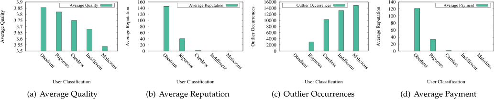

Fig. 11. Qualities, reputations, outlier occurrences, and payments of each user group. 

to the resource and manpower limitations. Though some data traces are available on the Internet, the critical ground truth information is usually missing. Thus, we take an alternative approach by simulating a large-scale crowdsensing scenario. 

In our simulation, there are 200 users being employed to monitor the noise information. The sensing task consists of 750 slots, and each slot is simulated as a minute. The users are categorized into five groups based on the different sensing behaviors (shown as Table 2). 20% users are modeled as the obedient users, and 30% are the rigorous users. The percentages of the careless users, the indifferent users, and the malicious users are 30%, 20%, and 10% respectively. The users can either exposed their mobile devices to air, or put them into packages or bags. We assume that the users’ devices are homogeneous, _s.t._ , the users’ sensing behaviors is the only factor that influences the data quality. We also assume that when the correct sensing approach is taken, the sensed data follows a Gaussian distribution, _i.e._ , _xi,k_ ∼ _N (_ 45 _,_ 0 _._ 3 _)_ . When the incorrect approach is adopted, the sensing data follows another Gaussian distribution with a lower mean and a larger variance, _i.e._ , _x j,k_ ∼ _N (_ 40 _,_ 0 _._ 5 _)_ . The ground truth is fixed at 45dB all the time. 

Fig. 11 shows the average quality, the average reputation, the outlier occurrences, and the average payment of each user group. We can see from Fig. 11(a) that the users’ average qualities decrease as their obedience levels decrease, _i.e._ , the average quality of the obedient users is larger than that of the rigourous users, which is larger than that of the careless users, and so on. This is because that the more obedient a user is, the more accuracy her submitted data is, and under a scenario where the majority of the users contribute reliable data, the user is more likely to receive a higher quality score. 

The average reputation of each user group, shown in Fig. 11(b), follows a similar decreasing pattern as the average quality, while the reputation scores decrease more rapidly than the quality scores moving from the obedient users to the malicious users. For instance, the average qualities of the obedient users and the rigorous users are about 3.85 and 3.81 respectively, while the average reputations of these two user groups are 140 and 40 respectively. We can see that a small decrease in the data quality can cause a significant reputation decline. This is because in our reputation model, the users’ reputations tend to be gradually built after a series of high quality contributions, but can be rapidly torn down after only a few low quality contributions. 

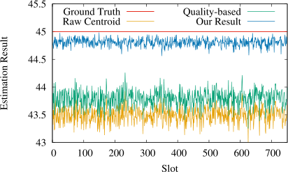

Fig. 12. Result Comparison. 

Fig. 11(c) shows the outlier occurrences of each group of users. It can be observed that the outlier occurrences increase moving from the obedient users to the malicious users, which means that the more likely a user is to take the incorrect measurement approach, the more likely that the user is to be identified as an outlier. This is because that under the scenarios where the high quality contributions dominate, the user who contributes low quality data will be alienated from her peers. 

The average payments of the users are presented in Fig. 11(d). We observe that the average payments of the users follow a similar pattern as the average reputations, due to the fact that our surplus function takes the users’ reputation scores as input. We can also see that the obedient users get most of the total revenue, the rigorous and the careless users receive a small portion of it, and the average payments of the indifferent users and the malicious users tend to be zero. This phenomenon is the result of two reasons. First, as the Property II in Section 4.1 claims, we intend to assign zero payments to the outliers, and thus since the indifferent users and the malicious users are identified as the outliers most of the time, their average payments are nearly zero. Second, due to the monotonic property of our surplus sharing scheme, the users with higher reputations deserve higher payments than lower reputation ones. 

Fig. 12 compares the truth estimation results in the largescale scenario between our proposed method (RCN) and two representative heuristic methods, _i.e._ , raw cluster centroid (C) and quality-weighted cluster centroid (QC). We can see that our approach outperforms the other two approaches, generating the most accuracy result, _i.e._ , within only 0.25dB from the ground truth. This is due to the fact that our method takes the most grained data analysis process, by not only 

Authorized licensed use limited to: Shanghai Jiaotong University. Downloaded on February 15,2022 at 23:46:32 UTC from IEEE Xplore.  Restrictions apply. 

IEEE JOURNAL ON SELECTED AREAS IN COMMUNICATIONS, VOL. 35, NO. 4, APRIL 2017 

844 

filtering anomalous data items, but also characterizing the trustworthiness of users. 

## VI. RELATED WORK 

## _A. Crowdsensing Applications_ 

The concept of participatory sensing was initialized by Burke _et al._ [54], after which many researchers have studied various applications of it. Azizyan _et al._ [3] proposed a logical localization technique based on ambient fingerprintings, _e.g._ , optical, acoustic, and motion attributes. LiFS [4], Zee [5], and FreeLoc [6] are three different physical indoor localization methods that deploy mobile devices to track the indoor environment. CrowdInside [7] and Jigsaw [8] both leverage smartphone sensors to automatically construct indoor floor plan. EchoTag [9] is an infrastructure-free indoor tagging systems that utilized smartphones to tag and remember indoor locations. PEIR [10] is a crowdsensing application that calculates personalized estimates of environmental impact and exposure based on data collected from mobile phones. SmartPhoto [18] is a smartphone-based resource-aware crowdsourcing approach for image sensing. Besides, crowdsensing has also been applied to traffic and navigation, _e.g._ , estimating traffic delay [12], finding the most fuel-efficient routes for vehicles [13], predicting bus arrival time [14], finding on-street parking spaces [15], automatically updating road maps [16], and last-mile navigation [17]. Some good surveys of crowdsensing can be found at [1], [2]. 

## _B. Recent Theoretical Studies_ 

Crowdsensing has also been intensively studied from the theoretical perspectives, especially based on the market model, where users are modeled as rational and only interested in maximizing their own benefits. Lee and Hoh [28] studied the user participation problem and proposed an incentive mechanism to minimize incentive cost, while maintaining an adequate number of participants. Later, Jaimes _et al._ [33] extended Lee and Hoh’s work to a location-based scenario with budget constraint. Yang _et al._ [29] considered both the platform-centric model and the user-centric model, and provided incentive mechanisms for them respectively. Koutsopoulos [30] modeled the crowdsensing as a reverse auction, and studied the design of optimal frugal mechanism. Zhao _et al._ [31] studied the online task allocation in crowdsensing with budget constraint. Cheung _et al._ [55] considered a distributed task selection problem in crowdsensing with time-sensitive and location-based tasks. Zhang _et al._ [56] proposed a multi-market dynamic double auction mechanism for a proximity-based mobile crowd service system. Zhang and van der Schaar [19] proposed a reputation-based protocol to incentivize users to contribute high level of effort. However, none of these work considered the issue of data quality. 

## _C. Quality-Aware Crowdsensing_ 

The quality issue of crowdsensing has drawn many researchers’ attention in the past several years, where the term “quality” has been interpreted in different ways. 

For example, [37], [57], [58] examined the context of quality based on Points of Interests (POIs), and [39] on spatial/temporal coverage. Jin _et al._ [35] incorporated the quality metric as a general parameter into the design of combinatorial incentive mechanisms. Kawajiri _et al._ [36] studied the problem of using gamification to steer users to improve the quality of contributed service. Pu _et al._ [59] studied the problem of recruiting users to optimize the total service quality, which is defined by jointly taking user ability, recruitment timing, and expenditure for task rewarding into account. Wang _et al._ [52] proposed several mathematical models for characterizing quality of crowd for different sensing applications, and presented an auction model for quality-aware and find-grained mobile crowdsensing. Zhang _et al._ [60] studied the quality-aware coverage maximization problem in mobile crowdsensing with a budget constraint. Han _et al._ [61] considered a qualityaware Bayesian pricing problem with known cost and quality distributions, and proposed a posted pricing method to recruit participants with reasonable qualities and minimized payment. Jin _et al._ [62] proposed a crowdsensing framework that integrated an incentive, a data aggregation, and a data perturbation mechanism to achieve truthfulness, accurate aggregated results, and privacy preservation. However, none of these work considered the problem of estimating participants’ data qualities. The most closely related works to ours are [21] and [22]. Huang _et al._ [21] proposed a quality and reputation framework for noise monitoring, but they neither eliminated anomalous users nor considered the monetary incentives. Peng _et al._ [22] proposed a quality-based incentive mechanism based on the celebrated EM algorithm. Their work tended to maximize the platform’s quality-based profit with a simple payment constraint that each user’s payment should be higher than her bid/cost. In contrast, our work considers a more realistic scenario, where the goal is to achieve highly accurate estimation output, with the payment determination scheme satisfying several desirable properties. A preliminary version of this work appears at ICPP 2015 [63], while this work has substantial revision over the previous one including additional technical materials in both quality estimation and surplus sharing, and more comprehensive evaluations. 

## _D. Related Unsupervised Learning Methods_ 

The unsupervised learning methods used in this work include a cluster-based method and an outlier detection algorithm. The former one has many applications, including fault detection [64], image retrieval [65], and compressive sensing [66]. Outlier detection [67], which has been widely studied in the field of data mining, has also been applied to sensor network to detect faulty nodes and improve sensing accuracy [66], [68]. It can be mainly classified into modelbased and consensus-based. A model-based outlier detection technique requires prior knowledge of the data distribution and tends to detect data instances that deviate from the expectation. Whereas, the consensus-based protocols measure the confidence of data instances based on the group consensus and thus do not need additional data models. The consensus-based approaches can be further classified into distance-based [42] 

Authorized licensed use limited to: Shanghai Jiaotong University. Downloaded on February 15,2022 at 23:46:32 UTC from IEEE Xplore.  Restrictions apply. 

845 

YANG _et al._ : ON DESIGNING DATA QUALITY-AWARE TRUTH ESTIMATION AND SURPLUS SHARING METHOD FOR MOBILE CROWDSENSING 

and density-based [48], depending on which consistency metric (distance or density) is used. 

## _E. Truth Discovery_ 

The topic of truth discovery has been widely studied to discovery true facts from a large amount of data collected from multiple sources [69]. Yin _et al._ [23] first considers the problem of finding the truth from multiple conflicting information providers on the web, and proposed a framework to solve this problem based on the inter-dependency between facts and websites. Dong _et al._ [25] further took the copying detection into the truth discovery problem, and proposed a novel approach based on a hidden Markov model and a Bayesian model. Yin and Tan [27] proposed a semi-supervised approach to find true facts with the help of ground truth data. Zhao _et al._ [26] proposed a Bayesian probabilistic graphical model to discover the truth and two-sided source quality. Li _et al._ [24] considered the long-tail phenomenon in truth discovery, and proposed a confidence-aware approach to detect truths from long-tail data. Note that most of the truth discovery approaches are batch algorithms and work on static data, while in this work, we study a dynamic scenario where the users’ data come online and the users’ sensing behaviors change from time to time. Although some recent researches were proposed to deal with streaming data ( _e.g._ , [26], [47]), they usually were based on certain statistical assumptions, _e.g._ , the error of each user’s data follows a Gaussian distribution. However, in mobile crowdsensing, especially noise monitoring, the collected data are strongly influenced by contributors’ sensing approaches and cannot be characterized by a single distribution alone, as shown in Fig. 6. 

## _F. Shapley Value_ 

Shapley value [40], [70] is a powerful tool for surplus sharing in cooperative games, where multiple players cooperate with each other to generate a surplus and the problem is to determines each player’s surplus share. It has been applied to various scenarios. Misra _et al._ [71] studied the incentive problem in peer-to-peer scenario and proposed a fluid Shapley value approach to guarantee that each peer receives a payment proportional to its contribution. Narayanam and Narahari [72] applied Shapley value to discover influential nodes in social networks. Ma _et al._ [73] studied the profit sharing in ISP settlement, and presented a sharing mechanism based on Shapley value. Dong _et al._ [74] modeled the energy accounting as cooperative game, and provided a Shapley value-based approach to determine the energy consumption of each application in a smartphone. 

## VII. CONCLUSION 

This work jointly considers the problems of quality estimation and quality-based payment determination for mobile crowdsensing. On one hand, the quality estimation module tackles several important issues, including data quality estimation, reputation estimation, outlier detection, and truth estimation. Both a small-scale experiment and a large-scale simulation are conducted to evaluate the proposed methods. 

Compared with five benchmarks, our truth estimation scheme generates the most accuracy result. On the other hand, the surplus sharing module models the quality-based payment determination as a cooperative game, and presents an approximate Shapley value-based method to determine each user’s payment, which is proportional to the user’s contribution. By proposing this quality-related payment scheme, we can prevent “free-riding” problem and also motivate the users to contribute high quality data. Besides, the proposed system can be seen as a general framework for subsequent quality-aware crowdsensing designs. According to the needs of different scenarios, we can propose different quality estimation, truth discovery, or outlier detection schemes. Thus, we believe that the proposed system has the potential to be practical in other scenarios. 

## ACKNOWLEDGMENT 

The authors would like to thank the anonymous reviewers for their efforts in improving the quality of the paper. The opinions, findings, conclusions, and recommendations expressed in this paper are those of the authors and do not necessarily reflect the views of the funding agencies or the government. 

## REFERENCES 

- [1] N. D. Lane, E. Miluzzo, H. Lu, D. Peebles, T. Choudhury, and A. T. Campbell, “A survey of mobile phone sensing,” _IEEE Commun. Mag._ , vol. 48, no. 9, pp. 140–150, Sep. 2010. 

- [2] R. K. Ganti, F. Ye, and H. Lei, “Mobile crowdsensing: Current state and future challenges,” _IEEE Commun. Mag._ , vol. 49, no. 11, pp. 32–39, Nov. 2011. 

- [3] M. Azizyan, I. Constandache, and R. Roy Choudhury, “SurroundSense: Mobile phone localization via ambience fingerprinting,” in _Proc. 15th Annu. Int. Conf. Mobile Comput. Netw. (MobiCom)_ , 2009, pp. 261–272. 

- [4] Z. Yang, C. Wu, and Y. Liu, “Locating in fingerprint space: Wireless indoor localization with little human intervention,” in _Proc. 18th Annu. Int. Conf. Mobile Comput. Netw. (MobiCom)_ , 2012, pp. 269–280. 

- [5] A. Rai, K. K. Chintalapudi, V. N. Padmanabhan, and R. Sen, “Zee: Zero-effort crowdsourcing for indoor localization,” in _Proc. 18th Annu. Int. Conf. Mobile Comput. Netw. (MobiCom)_ , 2012, pp. 293–304. 

- [6] S. Yang, P. Dessai, M. Verma, and M. Gerla, “FreeLoc: Calibrationfree crowdsourced indoor localization,” in _Proc. 32nd IEEE Int. Conf. Comput. Commun. (INFOCOM)_ , Apr. 2013, pp. 2481–2489. 

- [7] M. Alzantot and M. Youssef, “Crowdinside: Automatic construction of indoor floorplans,” in _Proc. 20th Int. Conf. Adv. Geograph. Inf. Syst. (SIGSPATIAL)_ , 2012, pp. 99–108. 

- [8] R. Gao _et al._ , “Jigsaw: Indoor floor plan reconstruction via mobile crowdsensing,” in _Proc. 20th Annu. Int. Conf. Mobile Comput. Netw. (MobiCom)_ , 2014, pp. 249–260. 

- [9] Y.-C. Tung and K. G. Shin, “EchoTag: Accurate infrastructure-free indoor location tagging with smartphones,” in _Proc. 21st Annu. Int. Conf. Mobile Comput. Netw. (MobiCom)_ , 2015, pp. 525–536. 

- [10] M. Mun _et al._ , “PEIR, the personal environmental impact report, as a platform for participatory sensing systems research,” in _Proc. 7th Int. Conf. Mobile Syst., Appl., Services (MobiSys)_ , 2009, pp. 55–68. 

- [11] Y. Gao _et al._ , “Mosaic: A low-cost mobile sensing system for urban air quality monitoring,” in _Proc. IEEE Conf. Comput. Commun. (INFOCOM)_ , Apr. 2016, pp. 1–9. 

- [12] A. Thiagarajan _et al._ , “VTrack: Accurate, energy-aware road traffic delay estimation using mobile phones,” in _Proc. 7th ACM Conf. Embedded Networked Sensor Syst. (SenSys)_ , 2009, pp. 85–98. 

- [13] R. K. Ganti, N. Pham, H. Ahmadi, S. Nangia, and T. F. Abdelzaher, “GreenGPS: A participatory sensing fuel-efficient maps application,” in _Proc. 8th Int. Conf. Mobile Syst., Appl., Services (MobiSys)_ , 2010, pp. 151–164. 

- [14] P. Zhou, Y. Zheng, and M. Li, “How long to wait? predicting bus arrival time with mobile phone based participatory sensing,” in _Proc. 10th Int. Conf. Mobile Syst., Appl., Services (MobiSys)_ , 2012, pp. 379–392. 

Authorized licensed use limited to: Shanghai Jiaotong University. Downloaded on February 15,2022 at 23:46:32 UTC from IEEE Xplore.  Restrictions apply. 

IEEE JOURNAL ON SELECTED AREAS IN COMMUNICATIONS, VOL. 35, NO. 4, APRIL 2017 

846 

- [15] S. Nawaz, C. Efstratiou, and C. Mascolo, “Parksense: A smartphone based sensing system for on-street parking,” in _Proc. 19th Annu. Int. Conf. Mobile Comput. Netw. (MobiCom)_ , 2013, pp. 75–86. 

- [16] Y. Wang, X. Liu, H. Wei, G. Forman, C. Chen, and Y. Zhu, “Crowdatlas: Self-updating maps for cloud and personal use,” in _Proc. 11th Annu. Int. Conf. Mobile Syst., Appl., Services (MobiSys)_ , 2013, pp. 27–40. 

- [17] Y. Shu, K. G. Shin, T. He, and J. Chen, “Last-mile navigation using smartphones,” in _Proc. 21st Annu. Int. Conf. Mobile Comput. Netw. (MobiCom)_ , 2015, pp. 512–524. 

- [18] Y. Wang, W. Hu, Y. Wu, and G. Cao, “SmartPhoto: A resourceaware crowdsourcing approach for image sensing with smartphones,” in _Proc. 15th ACM Int. Symp. Mobile Netw. Comput. (MobiHoc)_ , 2014, pp. 113–122. 

- [19] Y. Zhang and M. Van der Schaar, “Reputation-based incentive protocols in crowdsourcing applications,” in _Proc. 31st IEEE Int. Conf. Comput. Commun. (INFOCOM)_ , Mar. 2012, pp. 2140–2148. 

- [20] P. G. Ipeirotis, F. Provost, and J. Wang, “Quality management on amazon mechanical turk,” in _Proc. ACM SIGKDD Workshop Human Comput._ , 2010, pp. 64–67. 

- [21] K. L. Huang, S. S. Kanhere, and W. Hu, “Are you contributing trustworthy data?: The case for a reputation system in participatory sensing,” in _Proc. 13th ACM Int. Conf. Modeling, Anal., Simulation Wireless Mobile Syst. (MSWiM)_ , 2010, pp. 14–22. 

- [22] D. Peng, F. Wu, and G. Chen, “Pay as how well you do: A quality based incentive mechanism for crowdsensing,” in _Proc. 16th ACM Int. Symp. Mobile Netw. Comput. (MobiHoc)_ , 2015, pp. 177–186. 

- [23] X. Yin, J. Han, and P. S. Yu, “Truth discovery with multiple conflicting information providers on the Web,” in _Proc. 13th ACM SIGKDD Int. Conf. Knowl. Discovery Data Mining (KDD)_ , 2007, pp. 1048–1052. 

- [24] Q. Li _et al._ , “A confidence-aware approach for truth discovery on longtail data,” _Proc. VLDB Endowment_ , vol. 8, no. 4, pp. 425–436, 2014. 

- [25] X. L. Dong, L. Berti-Equille, and D. Srivastava, “Truth discovery and copying detection in a dynamic world,” _Proc. VLDB Endowment_ , vol. 2, no. 1, pp. 562–573, 2009. 

- [26] B. Zhao, B. I. Rubinstein, J. Gemmell, and J. Han, “A bayesian approach to discovering truth from conflicting sources for data integration,” _Proc. VLDB Endowment_ , vol. 5, no. 6, pp. 550–561, 2012. 

- [27] X. Yin and W. Tan, “Semi-supervised truth discovery,” in _Proc. 20th Int. Conf. World Wide Web (WWW)_ , 2011, pp. 217–226 

- [28] J.-S. Lee and B. Hoh, “Sell your experiences: A market mechanism based incentive for participatory sensing,” in _Proc. IEEE Int. Conf. Pervas. Comput. Commun. (PerCom)_ , Mar. 2010, pp. 60–68. 

- [29] D. Yang, G. Xue, X. Fang, and J. Tang, “Crowdsourcing to smartphones: Incentive mechanism design for mobile phone sensing,” in _Proc. 18th Annu. Int. Conf. Mobile Comput. Netw. (MobiCom)_ , 2012, pp. 173–184. 

- [30] I. Koutsopoulos, “Optimal incentive-driven design of participatory sensing systems,” in _Proc. 32nd IEEE Int. Conf. Comput. Commun. (INFOCOM)_ , Apr. 2013, pp. 1402–1410. 

- [31] D. Zhao, X.-Y. Li, and H. Ma, “How to crowdsource tasks truthfully without sacrificing utility: Online incentive mechanisms with budget constraint,” in _Proc. 33rd IEEE Int. Conf. Comput. Commun. (INFOCOM)_ , Apr. 2014, pp. 1213–1221. 

- [32] A. L. Booth and J. Frank, “Earnings, productivity, and performancerelated pay,” _J. Labor Econ._ , vol. 17, no. 3, pp. 447–463, 1999. 

- [33] L. G. Jaimes, I. Vergara-Laurens, and M. A. Labrador, “A location-based incentive mechanism for participatory sensing systems with budget constraints,” in _Proc. IEEE Int. Conf. Pervas. Comput. Commun. (PerCom)_ , Mar. 2012, pp. 103–108. 

- [34] T. Luo, H.-P. Tan, and L. Xia, “Profit-maximizing incentive for participatory sensing,” in _Proc. 33rd IEEE Int. Conf. Comput. Commun. (INFOCOM)_ , Apr. 2014, pp. 127–135. 

- [35] H. Jin, L. Su, D. Chen, K. Nahrstedt, and J. Xu, “Quality of information aware incentive mechanisms for mobile crowd sensing systems,” in _Proc. 16th ACM Int. Symp. Mobile Netw. Comput. (MobiHoc)_ , 2015, pp. 167–176. 

- [36] R. Kawajiri, M. Shimosaka, and H. Kashima, “Steered crowdsensing: Incentive design towards quality-oriented place-centric crowdsensing,” in _Proc. ACM Int. Joint Conf. Pervas. Ubiquitous Comput. (UbiComp)_ , 2014, pp. 691–701. 

- [37] J. P. Rula and F. E. Bustamante, “Crowdsensing under (soft) control,” in _Proc. IEEE Conf. Comput. Commun. (INFOCOM)_ , Apr. 2015, pp. 2236–2244. 

- [38] D. Zhang, H. Xiong, L. Wang, and G. Chen, “CrowdRecruiter: Selecting participants for piggyback crowdsensing under probabilistic coverage constraint,” in _Proc. ACM Int. Joint Conf. Pervas. Ubiquitous Comput. (UbiComp)_ , 2014, pp. 703–714. 

- [39] Z. He, J. Cao, and X. Liu, “High quality participant recruitment in vehicle-based crowdsourcing using predictable mobility,” in _Proc. IEEE Conf. Comput. Commun. (INFOCOM)_ , Apr. 2015, pp. 2542–2550. 

- [40] L. S. Shapley, “A value for n-person games,” _Contributions Theory Games_ , vol. 2, no. 28, pp. 307–317, 1953. 

- [41] S. He, D.-H. Shin, J. Zhang, and J. Chen, “Toward optimal allocation of location dependent tasks in crowdsensing,” in _Proc. 33rd IEEE Int. Conf. Comput. Commun. (INFOCOM)_ , Apr. 2014, pp. 745–753. 

- [42] E. M. Knox and R. T. Ng, “Algorithms for mining distancebased outliers in large datasets,” in _Proc. Int. Conf. Very Large Data Bases (VLDB)_ , 1998, pp. 392–403. 

- [43] N. Nisan, T. Roughgarden, E. Tardos, and V. V. Vazirani, _Algorithmic Game Theory_ . Cambridge, U.K.: Cambridge Univ. Press, 2007. 

- [44] F. J. Richards, “A flexible growth function for empirical use,” _J. Experim. Botany_ , vol. 10, no. 2, pp. 290–301, 1959. 

- [45] B. E. Commerce, A. Jøsang, and R. Ismail, “The beta reputation system,” in _Proc. 15th Bled Electron. Commerce Conf._ , vol. 5. 2002, pp. 2502– 2511. 

- [46] B. Zhao and J. Han, “A probabilistic model for estimating real-valued truth from conflicting sources,” in _Proc. 10th Int. Workshop Quality Databases (QDB)_ , 2012, pp. 1–7. 

- [47] Y. Li _et al._ , “On the discovery of evolving truth,” in _Proc. 21th ACM SIGKDD Int. Conf. Knowl. Discovery Data Mining_ , 2015, pp. 675–684. 

- [48] M. M. Breunig, H.-P. Kriegel, R. T. Ng, and J. Sander, “LOF: Identifying density-based local outliers,” _ACM Sigmod Rec._ , vol. 29, no. 2, pp. 93–104, 2000. 

- [49] A. C. Gielen, M. J. Kerkhofs, and J. C. Van Ours, “How performance related pay affects productivity and employment,” _J. Population Econ._ , vol. 23, no. 1, pp. 291–301, 2010. 

- [50] Q. Zhang, Y. Wen, X. Tian, X. Gan, and X. Wang, “Incentivize crowd labeling under budget constraint,” in _Proc. IEEE Conf. Comput. Commun. (INFOCOM)_ , Apr. 2015, pp. 2812–2820. 

- [51] H. Bühlmann, “Experience rating and credibility,” _Astin Bull._ , vol. 4, no. 3, pp. 199–207, 1967. 

- [52] J. Wang, J. Tang, D. Yang, E. Wang, and G. Xue, “Quality-aware and fine-grained incentive mechanisms for mobile crowdsensing,” in _Proc. IEEE 36th Int. Conf. Distrib. Comput. Syst. (ICDCS)_ , Jun. 2016, pp. 354–363. 

- [53] (2008). _Noisetube_ . [Online]. Available: http://www.noisetube.net 

- [54] J. A. Burke _et al._ , “Participatory sensing,” in _Proc. Workshop WorldSensor-Web (WSW), Mobile Device Centric Sensor Netw. Appl._ , 2006, pp. 117–134. 

- [55] M. H. Cheung, R. Southwell, F. Hou, and J. Huang, “Distributed timesensitive task selection in mobile crowdsensing,” in _Proc. 16th ACM Int. Symp. Mobile Netw. Comput. (MobiHoc)_ , 2015, pp. 157–166. 

- [56] H. Zhang, B. Liu, H. Susanto, G. Xue, and T. Sun, “Incentive mechanism for proximity-based mobile crowd service systems,” in _Proc. IEEE Conf. Comput. Commun. (INFOCOM)_ , Apr. 2016, pp. 1–9. 

- [57] A. J. Mashhadi and L. Capra, “Quality control for real-time ubiquitous crowdsourcing,” in _Proc. 2nd Int. Workshop Ubiquitous Crowdsouring_ , 2011, pp. 5–8. 

- [58] C.-K. Tham and T. Luo, “Quality of contributed service and market equilibrium for participatory sensing,” _IEEE Trans. Mobile Comput._ , vol. 14, no. 4, pp. 829–842, Apr. 2015. 

- [59] L. Pu, X. Chen, J. Xu, and X. Fu, “Crowdlet: Optimal worker recruitment for self-organized mobile crowdsourcing,” in _Proc. IEEE Conf. Comput. Commun. (INFOCOM)_ , Apr. 2016, pp. 1–9. 

- [60] M. Zhang _et al._ , “Quality-aware sensing coverage in budget-constrained mobile crowdsensing networks,” _IEEE Trans. Veh. Technol._ , vol. 65, no. 9, pp. 7698–7707, Sep. 2016. 

- [61] K. Han, H. Huang, and J. Luo, “Posted pricing for robust crowdsensing,” in _Proc. 17th ACM Int. Symp. Mobile Netw. Comput. (MobiHoc)_ , 2016, pp. 261–270. 

- [62] H. Jin, L. Su, H. Xiao, and K. Nahrstedt, “Inception: Incentivizing privacy-preserving data aggregation for mobile crowd sensing systems,” in _Proc. 17th Int. Symp. Mobile Netw. Comput (MobiHoc)_ , vol. 16. 2016, pp. 341–350. 

- [63] S. Yang, F. Wu, S. Tang, X. Gao, B. Yang, and G. Chen, “Good work deserves good pay: A quality-based surplus sharing method for participatory sensing,” in _Proc. 44th Int. Conf. Parallel Process. (ICPP)_ , Sep. 2015, pp. 380–389. 

- [64] G. Venkataraman, S. Emmanuel, and S. Thambipillai, “A cluster-based approach to fault detection and recovery in wireless sensor networks,” in _Proc. 4th Int. Symp. Wireless Commun. Syst. (ISWCS)_ , 2007, pp. 35–39. 

Authorized licensed use limited to: Shanghai Jiaotong University. Downloaded on February 15,2022 at 23:46:32 UTC from IEEE Xplore.  Restrictions apply. 

YANG _et al._ : ON DESIGNING DATA QUALITY-AWARE TRUTH ESTIMATION AND SURPLUS SHARING METHOD FOR MOBILE CROWDSENSING 

847 

- [65] Y. Chen, J. Z. Wang, and R. Krovetz, “CLUE: Cluster-based retrieval of images by unsupervised learning,” _IEEE Trans. Image Process._ , vol. 14, no. 8, pp. 1187–1201, Aug. 2005. 

- [66] C. T. Chou, A. Ignjatovic, and W. Hu, “Efficient computation of robust average of compressive sensing data in wireless sensor networks in the presence of sensor faults,” _IEEE Trans. Parallel Distrib. Syst._ , vol. 24, no. 8, pp. 1525–1534, Aug. 2013. 

- [67] J. Han and M. Kamber, _Data Mining: Concepts and Techniques_ , vol. 5. San Mateo, CA, USA: Morgan Kaufmann, 2001. 

- [68] S. Ganeriwal, L. K. Balzano, and M. B. Srivastava, “Reputation-based framework for high integrity sensor networks,” _ACM Trans. Sensor Netw._ , vol. 4, no. 3, p. 15, May 2008. 

- [69] Y. Li _et al._ (May 2015). “A survey on truth discovery.” [Online]. Available: https://arxiv.org/abs/1505.02463 

- [70] A. E. Roth, _The Shapley Value: Essays in Honor of Lloyd S. Shapley_ . Cambridge, U.K.: Cambridge Univ. Press, 1988. 

- [71] V. Misra, S. Ioannidis, A. Chaintreau, and L. Massoulié, “Incentivizing peer-assisted services: A fluid shapley value approach,” _ACM SIGMETRICS Perform. Eval. Rev._ , vol. 38, no. 1, pp. 215–226, 2010. 

**Xiaofeng Gao** received the B.S. degree in information and computational science from Nankai University, China, in 2004, the M.S. degree in operations research and control theory from Tsinghua University, China, in 2006, and the Ph.D. degree in computer science from The University of Texas at Dallas, USA, in 2010. She is currently an Associate Professor with the Department of Computer Science and Engineering, Shanghai Jiao Tong University, China. Her research interests include wireless communications, data engineering, and combinatorial optimizations. She has authored over 100 peer-reviewed papers in the related area, in well archived international journals such as the IEEE TC, TKDE, TMC, TPDS, and JSAC, and also in well-known conference proceedings such as SIGKDD, INFOCOM, and ICDCS. She has served on the editorial board of Discrete Mathematics, Algorithms and Applications, and as the PC and peer reviewer for a number of international conferences and journals. 

- [72] R. Narayanam and Y. Narahari, “A shapley value-based approach to discover influential nodes in social networks,” _IEEE Trans. Autom. Sci. Eng._ , vol. 8, no. 1, pp. 130–147, Jan. 2011. 

- [73] R. T. B. Ma, D. M. Chiu, J. C. S. Lui, V. Misra, and D. Rubenstein, “Internet economics: The use of Shapley value for ISP settlement,” _IEEE/ACM Trans. Netw._ , vol. 18, no. 3, pp. 775–787, Jun. 2010. 

- [74] M. Dong, T. Lan, and L. Zhong, “Rethink energy accounting with cooperative game theory,” in _Proc. 20th Annu. Int. Conf. Mobile Comput. Netw. (MobiCom)_ , 2014, pp. 531–542. 

**Shuo Yang** received the B.S. degree in computer science from Shanghai Jiao Tong University in 2014. He is currently pursuing the Ph.D. degree with the Department of Computer Science and Engineering, Shanghai Jiao Tong University, China. His research interests include wireless networking, mobile computing, data quality, and truth discovery in mobile crowdsensing and crowdsourcing. 

**Fan Wu** received the B.S. degree in computer science from Nanjing University in 2004 and the Ph.D. degree in computer science and engineering from the State University of New York at Buffalo in 2009. He has visited the University of Illinois at Urbana– Champaign, as a Post-Doctoral Research Associate. He is currently an Associate Professor with the Department of Computer Science and Engineering, Shanghai Jiao Tong University. He has authored over 70 peer-reviewed papers in leading technical journals and conference proceedings. His research interests include wireless networking and mobile computing, algorithmic network economics, and privacy preservation. He received the China National Natural Science Fund for Outstanding Young Scientists, the CCF-Intel Young Faculty Researcher Program Award, the CCF-Tencent Rhinoceros Bird Open Fund, and the Pujiang Scholar Award. He has served as the Chair of the CCF YOCSEF Shanghai, on the editorial board of the _Elsevier Computer Communications_ , and as a member of the technical program committees of over 40 academic conferences. 

**Shaojie Tang** received the Ph.D. degree in computer science from the Illinois Institute of Technology in 2012. He is currently an Assistant Professor with the Naveen Jindal School of Management, The University of Texas at Dallas. His research interest includes social networks, mobile commerce, game theory, e- business, and optimization. He received Best Paper Awards at ACM MobiHoc in 2014 and the IEEE MASS in 2013. He received the ACM SIGMobile Service Award in 2014. He has served in various positions including as the chair and TPC member of numerous conferences, including the ACM MobiHoc and IEEE ICNP. He is an Editor of the _Elsevier Information Processing in the Agriculture_ and the _International Journal of Distributed Sensor Networks_ . 

**Bo Yang** received the Ph.D. degree in electrical engineering from the City University of Hong Kong, Hong Kong, in 2009. He was a Post-Doctoral Researcher with the Royal Institute of Technology, Stockholm, Sweden, from 2009 to 2010, and a Visiting Scholar with the Polytechnic Institute, New York University, in 2007. He is currently a Full Professor with Shanghai Jiao Tong University. His research interests include game theoretical analysis and optimization of communication networks and smart grid. He is a member of ACM. He received the Shanghai Rising-Star Program in 2015 and the SMC-Excellent Young Faculty Award of Shanghai Jiao Tong University. He is on the Editorial Board of _Digital Signal Processing_ (Elsevier) and has served on the TPCs of several international conferences. He has been the principle and a co-investigator on several research projects funded by NSFC, the Swedish Governmental Agency for Innovation Systems, and the U.S. Air Force. 

**Guihai Chen** received the B.S. degree from Nanjing University in 1984, the M.E. degree from Southeast University in 1987, and the Ph.D. degree from The University of Hong Kong in 1997. He had been invited as a Visiting Professor by many universities, including the Kyushu Institute of Technology, Japan, in 1998, the University of Queensland, Australia, in 2000, and Wayne State University, USA, from 2001 to 2003. He is currently a Distinguished Professor with Shanghai Jiao Tong University, China. He has authored over 250 peer-reviewed papers, and over 170 of them are in well-archived international journals, such as the IEEE TRANSACTIONS ON PARALLEL AND DISTRIBUTED SYSTEMS, the _Journal of Parallel and Distributed Computing_ , the _Wireless Networks_ , the _Computer Journal_ , the _International Journal of Foundations of Computer Science_ , and the _Performance Evaluation_ , and also in well-known conference proceedings, such as HPCA, MOBIHOC, INFOCOM, ICNP, ICPP, IPDPS, and ICDCS. He has a wide range of research interests focused on sensor networks, peer-topeer computing, high-performance computer architecture, and combinatorics. 

Authorized licensed use limited to: Shanghai Jiaotong University. Downloaded on February 15,2022 at 23:46:32 UTC from IEEE Xplore.  Restrictions apply. 

