IEEE JOURNAL ON SELECTED AREAS IN COMMUNICATIONS, VOL. 39, NO. 5, MAY 2021 

1277 

# Strategy-Proof Online Mechanisms for Weighted AoI Minimization in Edge Computing 

Hongtao Lv, Zhenzhe Zheng , _Member, IEEE_ , Fan Wu , _Member, IEEE_ , and Guihai Chen, _Senior Member, IEEE_ 

**_Abstract_ —Real-time information processing is critical to the success of diverse applications from many areas. Age of Information (AoI), as a new metric, has received considerable attention to evaluate the performance of real-time information processing systems. In recent years, edge computing is becoming an efficient paradigm to reduce the AoI and to provide the realtime services. Considering the substantial deployment cost and the resulting resource limitation in edge computing, a proper pricing mechanism is highly necessary to fully utilize edge resources and then minimize the overall AoI of the whole system. However, there are two challenges to design this mechanism: 1) the priorities (or values) of the real-time computing tasks, critical to the efficient resource allocation, are usually private information of users and may be manipulated by selfish users for their own interests; 2) due to the time-varying property of AoI, the values of the tasks discount with time, making the traditional pricing mechanisms infeasible. In this paper, we extend the classical Myerson Theorem to the online setting with time discounting tasks values, and accordingly propose an online auction mechanism, called PreDisc, including an allocation rule and a payment rule. We leverage dynamic programming to greedily allocate resources in each time slot, and charge the winning user with a new critical price, extended from the classical Myerson payment rule. A preemption factor is further employed to make a trade-off between the newly arrived tasks and ongoing tasks. We prove that PreDisc guarantees the economic property of strategy-proofness and achieves a constant competitive ratio. We conduct extensive simulations and the results demonstrate that PreDisc outperforms the traditional mechanisms, in terms of both weighted AoI and revenue of edge service providers. Compared with the optimal solution in offline VCG mechanism, PreDisc has much lower computation complexity with only a slight performance loss.** 

**_Index Terms_ —Age of information (AoI), edge computing, auction theory.** 

Manuscript received July 8, 2020; revised December 15, 2020; accepted February 13, 2021. Date of publication March 10, 2021; date of current version April 16, 2021. This work was supported in part by the National Key Research and Development Program of China under Grant 2019YFB2102200; in part by China NSF under Grant 62025204, Grant 62072303, Grant 61972252, Grant 61972254, Grant 61832005, and Grant 61902248; in part by the Joint Scientific Research Foundation of the State Education Ministry under Grant 6141A02033702; in part by the Shanghai Science and Technology Fund under Grant 20PJ1407900; in part by the Alibaba Group through Alibaba Innovation Research Program; and in part by the Tencent Rhino Bird Key Research Project. _(Corresponding author: Zhenzhe Zheng.)_ 

The authors are with the Shanghai Key Laboratory of Scalable Computing and Systems, Department of Computer Science and Engineering, Shanghai Jiao Tong University, Shanghai 200240, China (e-mail: lvhongtao@sjtu.edu.cn; zhengzhenzhe@sjtu.edu.cn; fwu@cs.sjtu.edu.cn; gchen@cs.sjtu.edu.cn). Color versions of one or more figures in this article are available at https://doi.org/10.1109/JSAC.2021.3065078. 

Digital Object Identifier 10.1109/JSAC.2021.3065078 

I. INTRODUCTION 

**I** Nprevailing in many areas, such as autonomous vehicles [1],RECENT years, real-time information processing is online gaming [2], virtual reality (VR) [3] and multi-robot systems [4]. In order to evaluate the performance of real-time information processing systems, a new metric called age of information (AoI) was proposed in [5], and has received considerable attention recently [6]–[10]. Different from traditional performance metrics like delay and throughput, the metric of AoI takes the freshness of decision-making information into account. For example, if the user sends tasks with a very low frequency, the system performs well on delay but poorly on AoI, because a lack of timely decision update makes the received decision out of date. Thus, AoI is widely adopted as a more reasonable metric in real-time computing applications. 

The traditional centralized cloud computing mode does not satisfy the stringent requirement of AoI in real-time information processing system, because end devices have to send data to remote cloud for processing with a high network delay. Edge computing [11], as a new computing paradigm, is quite attracted to further reduce the AoI in realtime applications. In edge computing, edge servers (also called cloudlets) are deployed near end devices, and such physical proximity can significantly reduce transmission delay and also AoI. For example, in autonomous vehicle systems with cloud computing mode, the transmission time between the vehicle and the remote cloud server is about 150 ms, while with the assistance of edge servers, ultra-low latency (less than 1ms) can be achieved [12], [13]. Many real-time applications like online gaming and VR also have improvements in AoI and hence in system performance and user experience by using edge computing mode [2]. 

Although edge computing achieves attractive performance improvement, it also introduces additional cost for distributed deployment and maintenance [11], [14]. Due to this cost constraint, the computation resources of edge servers are usually limited, which may result in the degradation of overall service performance [15]. Therefore, on one hand, it is a promising idea to consider the paradigm of edge-cloud collaboration, combining the low latency of edge and the sufficient resources of remote cloud [12], [16]. On the other hand, a proper pricing mechanism is necessary to fully utilize the limited edge resources and to compensate the cost of edge service providers [17]. 

0733-8716 © 2021 IEEE. Personal use is permitted, but republication/redistribution requires IEEE permission. See https://www.ieee.org/publications/rights/index.html for more information. 

Authorized licensed use limited to: Shanghai Jiaotong University. Downloaded on April 17,2021 at 11:54:55 UTC from IEEE Xplore.  Restrictions apply. 

IEEE JOURNAL ON SELECTED AREAS IN COMMUNICATIONS, VOL. 39, NO. 5, MAY 2021 

1278 

There are several challenges to design a pricing mechanism for edge services in real-time information processing systems. The service provider would like to efficiently manage the limited edge resources by assigning large weights (or priorities) to urgent tasks. We measure the extent of task urgency by a metric of task _value_ (please refer to Section II for a specific definition), which is related to private information of users, such as the driving speed and the surrounding environment in self-driving systems. As the values of tasks are private to users, they would manipulate this information, if doing so can increase the priorities of their tasks, resulting in the chaos of market and then the degradation of resource utilization. Therefore, the pricing mechanisms should be carefully designed to resist the strategic behaviors of users. 

Other than the difficulty in guaranteeing the strategyproofness,1 the dynamic property and the time discounting values of tasks also bring obstacles to the design of efficient pricing mechanisms. On one hand, since the tasks arrive at the edge in an online manner, the edge server needs to schedule them online, without the knowledge of future tasks. The classical Vickrey-Clarke-Groves (VCG) mechanism [18]–[20] could not be directly applied into this online setting, as it needs to calculate the optimal offline allocation. On the other hand, since the AoIs of real-time decisions increase with time, the values of tasks would discount if they are delayed for execution. The time changing value enables users to have a large space to further manipulate the mechanisms, _i.e._ , users can win the resources at different time slots by misreporting their values. The existing online mechanisms [21], [22], by which each winning task is charged a predefined payment without considering the time-discounting value, would be no longer strategy-proof, and thus is inapplicable for AoI minimization under strategic environments. 

To address these challenges, in this paper, we adopt a cloudedge collaborative framework to optimize the weighted AoI of real-time decision tasks. The edge servers are employed to conduct urgent tasks, and the remote cloud server is considered as a backup mode to make decisions for users when the edge services are not available. We further propose an online auction mechanism for weighted AoI minimization, where users arrive at the auction dynamically, submit their tasks and corresponding task values to the edge server, and wait for the timely results of decisions before a certain deadline. Based on the reported values, the edge service providers calculate the reductions of weighted AoI for tasks at each time slot, and schedule the tasks to execute, with the goal of minimizing the overall weighted AoIs of all tasks. The edge service provider also determines the prices for users to guarantee the property of strategy-proofness, and then the users pay for the edge service at the required price. 

The main contributions of this paper are summarized as follows. 

- We deeply investigate two critical aspects of AoI optimization in edge computing: the potential strategic behaviors of users and the time-varying property of 

> 1In a strategy-proof mechanism, the users would truthfully reveal their private information, _i.e._ , the values of tasks in our context. Please refer to Section II for detailed definition. 

   - AoI. Based on the appropriate models for these two aspects, we then formulate the problem of weighted AoI minimization as an online mechanism design with time discounting values. The challenges in designing online mechanisms due to the new property of time discounting values have also been fully discussed. 

- We extend the celebrated Myerson theorem [23] to the online setting with time discounting values. Our algorithmic results and theoretical analysis provide a fundamental tool for optimizing AoI within strategic environments. This result would also have independent interests in mechanism design literature, and the potential applications of this result are also discussed in this work. 

- We propose a Preemption factor-based pricing mechanism with time Discounting values PreDisc) to allocate computing resources on the edge server. PreDisc assigns a high virtual value to ongoing tasks to avoid unnecessary preemptions of newly arrived tasks, making a desirable tradeoff between preemption and non-preemption. Our theoretical analysis shows that PreDisc guarantees both strategy-proofness and constant competitive ratio. 

- We evaluate the performance of our proposed mechanism with extensive experiments. The evaluation results demonstrate that PreDisc outperforms the existing FirstCome-First-Served (FCFS) and Last-Come-First-Served (LCFS) mechanisms, and approaches to the optimal solution of offline VCG mechanism. 

The paper is organized as follows. Section II introduces the model and the basic background knowledge. Section III characterizes the property of strategy-proofness. Section IV and Section V focus on the detailed design of PreDisc. In Section IV, we introduce the allocation and payment rules in PreDisc for tasks with unit edge execution time, and then give an analysis for the upper bound of competitive ratio compared with the offline optimal solution. Section V extends our mechanism to the general cases. In Section VI, we give the simulation results on weighted AoI and the revenue of edge service provider. Section VII reviews the related works. Finally, we conclude this paper in Section VIII. 

## II. PRELIMINARIES 

In this section, we introduce the model of online auction mechanism with time discounting task values in the context of edge computing, and briefly review related solution concepts used in this paper from game theory. 

## _A. System Model_ 

We consider a cloud-edge collaborative computing framework with two components: a cloud server and an edge server, to facilitate users to make real-time decisions. A cloud server with adequate computing resources is normally far away from users, so the response time cannot be guaranteed if only relying on the cloud server for decision making. In contrast, a nearby edge server has a timely response for users, but can only support a certain amount of tasks simultaneously due to the limited edge resources. We consider the tasks that have to be completed on either the cloud or the edge server, instead 

Authorized licensed use limited to: Shanghai Jiaotong University. Downloaded on April 17,2021 at 11:54:55 UTC from IEEE Xplore.  Restrictions apply. 

LV _et al._ : STRATEGY-PROOF ONLINE MECHANISMS FOR WEIGHTED AoI MINIMIZATION IN EDGE COMPUTING 

1279 

of the edge devices. A task may exceed the limitation of computation capacity on local edge devices ( _e.g._ , CNN based image recognition tasks [24]), or need some information from other vehicles in auto-driving systems ( _e.g._ , connected vehicle analytics [25]). We assume the task generation follows certain pattern which could not be manipulated by the users. The goal of each user is to minimize her _Age of Information (AoI)_ , which is defined as follows. 

_Definition 1 (Age of Information): The age of information of a user at a specific time is the difference between the current time slot and the generating time slot of the latest received decision-making result of this user._ 

_1) User-Cloud Communication:_ A user communicates with the cloud server periodically in a normal mode. Each user _j_ regularly sends a task _i_ , such as the real time diagnostics, to the cloud server at each time interval Δ _t_ , and receives a decision feedback after a processing time period _Ti,j__c_(includ- ing transmission delay and execution time). As the cloud server is configured with ubiquitous and powerful computing resources, we assume that the tasks do not need to wait for execution. However, the communication time is quite large due to the long transmission distance between users and cloud, and hence the AoI fluctuates at a relatively high level without the involvement of an edge server. 

_2) User-Edge Communication:_ When a user encounters an emergency task ( _e.g._ , for a self-driving system, some urgent situations need timely decisions), the user would send the task to both the cloud and the edge server, and receive a quick feedback from the edge server (also from the cloud server as a backup). We assume the execution time on the edge is _Ti,j__e_, and the task would demand _mi,j_ units of resources, which may not necessarily be available immediately. Due to the property of ultra-low communication latency of the edge server, we omit the communication time to make the presentation clearer, which will be discussed in the later section. We have that _Ti,j__e_isalwayssmallerthan_T c_ _i,j_duetothelongdistanceof the cloud [24], [25], and hence AoI can be reduced with the help of edge server. Furthermore, as only emergency tasks are uploaded to the edge server, we assume the emergency tasks from the same user are non-overlapping with each other. 

We illustrate the system model with an example in Fig. 1. For easy presentation, we consider fixed values of _T__e_ and _T__c_ for all tasks in this example. The users regularly send tasks to the cloud server at each time interval Δ _t_ , and receive a feedback after _T__c_ time slots. At time _t_ 3, we can calculate that the AoI of user 1 is _T__c_ , since the newly received decision is generated at time slot _t_ 1, which is _T__c_ time slots before the current time slot. After time slot _t_ 3, the AoI increases over time, reaches the highest AoI _T__c_ + Δ _t_ at time _t_ 4, and then drops to _T__c_ since the next decision is received. At time _t_ 2, user 2 sends a task to both the cloud and the edge servers, and receives a response from the edge after _T__e_ time slots. With the definition of AoI, we can plot the new AoI curve as the red solid line. Hence, one can see that the AoI is reduced with the help of the edge server (from the blue solid line to the red solid line). At time _t_ 5, user 1 sends a task to the edge server, and shortly after that, user 2 also sends a task to the same edge server at time _t_ 6. However, the edge server does 

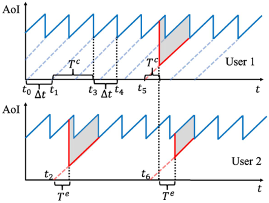

Fig. 1. The illustration of system model for two users with three tasks. The x-axis indicates time slots and the y-axis indicates the AoI. The blue solid lines show the AoI generated by the cloud, and the red solid lines show that of the edge. The shadow areas depict the reduction of the AoI with the help of the edge server. 

not have enough computing resources to satisfy the demands for both users, so the task of user 2 has to wait until the completion of the task of user 1. 

As the timeliness of decisions is critical for the success of real-time information processing applications, _e.g._ , it may influence the safety of self-driving cars or the user experience in interactive gaming, the objective of each user _j_ is to minimize the weighted average AoI over time, denoted as _Aj_ . The weight captures the extent of emergency or value of using edge services to execute a task, and also indicates the minimum amount of money the user is willing to pay to exchange for a unit decrease of AoI. For each urgent task _i_ , the value ( _i.e._ , weight) _vi,j_ is reported by the user _j_ , and it may depend on many types of factors. For example, in an autonomous vehicle system, the value of a task depends on the driving speed, the vehicle performance, the surrounding environment, the safety awareness and other preference of the user. Since most of these factors are private information to the user, she is able to misreport the value _vi,j_ for her own interest, _e.g._ , declaring a large value to increase the priority of her task, and reduce the weighted AoI. Such a selfish behavior would degrade the system performance of the edge service, as a more urgent task may be preempted by a non-urgent task with a misreported high value. With such a consideration, we leverage an auction mechanism to incentivize the users to truthfully reveal their private information, and to efficiently allocate the limited edge resources to optimize the weighted average AoI of all users. 

## _B. Problem Formulation_ 

We consider the edge server with _W_ units of reusable homogeneous resources in a finite time horizon, which can be further divided into _T_ time slots with equal length: T = _{_ 1 _,_ 2 _, · · · , T }_ . Suppose the set of tasks2 produced by user _j_ is _Uj_ , task _i ∈ Uj_ arrives at time slot _ai,j_ , and then it should be completed before a deadline _di,j_ = _ai,j_ + _Ti,j__c_.Thisis because the decision made by the edge server becomes useless 

> 2As we focus on the emergency tasks on the edge, we do not distinguish “task” and “emergency task” in the following sections. 

Authorized licensed use limited to: Shanghai Jiaotong University. Downloaded on April 17,2021 at 11:54:55 UTC from IEEE Xplore.  Restrictions apply. 

IEEE JOURNAL ON SELECTED AREAS IN COMMUNICATIONS, VOL. 39, NO. 5, MAY 2021 

1280 

when the decision from the cloud server is received after _T__c_ _i,j_ time slots. We denote T _i,j_ as the set of all time slots during [ _ai,j, di,j_ ] for task _i_ of user _j_ , and denote the set of other time slots _t ∈∪/ i∈Uj_ T _i,j_ by T� _j_ . To calculate the weighted average AoI _Aj_ of user _j_ , we denote the age at time _t_ as _Aj_ ( _t_ ), the age produced by the cloud server ( _i.e._ , the blue solid line in Fig. 1) as _Cj_ ( _t_ ), and the age produced by the edge server ( _i.e._ , the red solid line in Fig. 1) as _Ej_ ( _t_ ). If the AoI at time slot _t_ is not produced by the edge server, we set _Ej_ ( _t_ ) = + _∞_ . With these definitions, we can have 

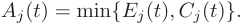

We then separate the time slots as the slots with cloud produced age and slots with edge produced age, and get the weighted average AoI, 

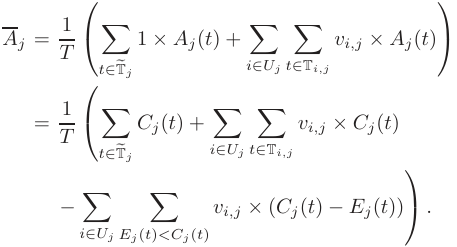

As the first two items in the brackets are constants and the tasks are non-overlapping, we only need to maximize the third item� _Ej_ ( _t_ ) _<Cj_ ( _t_ )_vi,j×_(_Cj_(_t_)_−Ej_(_t_))foreachtask independently, which represents the reduction of the weighted AoI during the current interval, _i.e._ , each of the shadow areas in Fig. 1. For easy presentation, we duplicate each user, also called as an agent, for each of her task, and hence omit the subscript _j_ for all notations. ( _e.g._ , we use _vi_ directly to denote _vi,j_ ). Suppose the edge server starts to execute the task _i_ at time _ti_ without an interruption in the following _Ti__e_timeslots, we can then obtain the following weighted AoI reduction, 

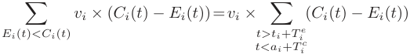

which is a function with respect to the starting time _ti_ . Thus, we define the task value as 

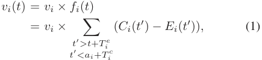

if the task starts to execute at time slot _t_ , with _ai ≤ t ≤ ai_ + _Ti__c−T e_ _i_.Itshouldbenotedthatwedonot restrict _Ci_ ( _t__′_ ) and _Ei_ ( _t__′_ ) to any specific format. Since we have _Ei_ ( _t_ ) _< Ci_ ( _t_ ) during the considered time interval, we can get that _fi_ ( _t_ ) is non-negative and non-increasing, meaning that the task value is discounting over time. Some possible function _fi_ ( _t_ ) could be _fi_ ( _t_ ) = _η_(_t−ai_) or _fi_ ( _t_ ) = 1 _− β_ ( _t − ai_ ), where the parameters could be different for all task. Without loss of generality, we normalize _fi_ ( _ai_ ) = 1. 

With the metric of task value, we can further formulate the problem of weighted AoI minimization as follows. There are _N_ agents N = _{_ 1 _,_ 2 _, · · · , N }_ arriving at the system in a random order. Each agent _i ∈_ N arrives at time _ai_ , and demands for _mi_ resources to execute her task before a departure time _di_ . For simplicity of notations, we also denote _d__′_ _i_=_ai_+_T c_ _i__−T e_ _i_ as the latest starting time for task _i_ to be able to be completed in time. Each agent _i_ has an intrinsic task value _vi_ and a time-varying task value _vi_ ( _t_ ) once she is allocated _mi_ units of resources from the time _t_ for _Ti__e_consecutivetimeslots.Wedenote_vi_=_vi_(_ai_)as _vi_ ( _ai_ ) = _vi × fi_ ( _ai_ ) and _fi_ ( _ai_ ) = 1. As discussed above, the agent _i_ ’s time-varying value function can be expressed as 

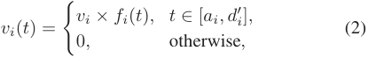

where _fi_ ( _t_ ) is a time discounting value function defined in (1). We note that the arrival time _ai_ is critical for the edge to make the correct decision. For example, if a self-driving car uploads a task with an incorrect timestamp, it may receive a false driving command, which endangers the safety. Thus, once an agent _i ∈_ N enters the system, the information of arrival time _ai_ and the resource demand _mi_ are truthfully revealed. The agent submits a declared intrinsic value (bid) _v_ ˆ _i_ , which may not be necessarily equal to her true intrinsic value _vi_ , to a trusted auctioneer (the edge server). We call the true value _vi_ of agent _i_ as her _type_ as in mechanism design, and use vector **_v_ ˆ** = (ˆ _v_ 1 _,_ ˆ _v_ 2 _, · · · ,_ ˆ _vN_ ) to denote the declared types ( _i.e._ , the bidding profile) of all agents. 

The procedure of online auction mechanism for edge resource allocation is described as follows. We denote N _a_ as the set of active agents, who is able to complete its task if starting at the current time slot _t_ , _i.e._ , we have _i ∈_ N _a_ if _ai ≤ t ≤ d__′_ _i_.Ateachtimeslot_t∈_T,theauctioneer first calculates the bid _v_ ˆ _i_ ( _t_ ) for each active agent _i ∈_ N _a_ , by replacing her declared type _v_ ˆ _i_ with the true intrinsic value _vi_ in (2). Given the bidding profile of the active agents N _a_ at time _t_ : **_v_ ˆ** ( _t_ ) = (ˆ _v_ 1( _t_ ) _,_ ˆ _v_ 2( _t_ ) _, · · · ,_ ˆ _v|_ N _a|_ ( _t_ )), the auctioneer then allocates the total _W_ units of resources, including the idle resources and those in use by existing tasks, to the active agents. We note that to further improve the utilization of resources, the newly arrived agents with high bids could interrupt some ongoing tasks with low bids. The agent _i_ is called a winning agent if she is allocated _mi_ units of resources for _Ti__e_continuoustimeslotswithoutaninterruptionbefore the deadline _di_ ; otherwise she is called a losing agent. We use _xi_ ( **_v_ ˆ** ) = 1 to denote that the agent _i_ is a winner when the declare value profile is **_v_ ˆ** ; otherwise _xi_ ( **_v_ ˆ** ) = 0. For a winning agent, _ti_ ( **_v_ ˆ** ) is the starting time of the winner _i ∈_ W to execute her task when the declared type profile is **_v_ ˆ** . Finally, according to the declared value profile **_v_ ˆ** of agents, the auctioneer determines the payment _pi_ ( **_v_ ˆ** ) for each agent _i_ at her departure time _di_ . The payments of the losing agents are set to zeros. We use vector **_x_** ( **_v_ ˆ** ) = ( _x_ 1( **_v_ ˆ** ) _, x_ 2( **_v_ ˆ** ) _, · · · , xN_ ( **_v_ ˆ** )) and **_p_** ( **_v_ ˆ** ) = ( _p_ 1( **_v_ ˆ** ) _, p_ 2( **_v_ ˆ** ) _, · · · , pN_ ( **_v_ ˆ** )) to represent the allocation rule and payment rule in an online auction, respectively. 

Authorized licensed use limited to: Shanghai Jiaotong University. Downloaded on April 17,2021 at 11:54:55 UTC from IEEE Xplore.  Restrictions apply. 

LV _et al._ : STRATEGY-PROOF ONLINE MECHANISMS FOR WEIGHTED AoI MINIMIZATION IN EDGE COMPUTING 

1281 

The _utility ui_ of each agent _i ∈_ N is defined as the difference between her value on the allocated resources and the payment: 

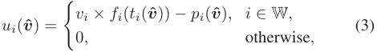

where W is the set of winning agents. 

As we have shown at the beginning of this section, minimizing the weighted average AoI is equivalent to maximizing the sum of time-varying task values, which is defined as the _social welfare_ in the context of auction mechanism as follows. _Definition 2 (Social Welfare): The social welfare in an online auction mechanism with time discounting values is the sum of winners’ values at their corresponding winning time slots,_ i.e. _,_ 

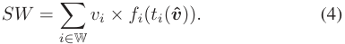

Other than social welfare, _revenue_ , which is defined as the total payment collected from agents, is also a widely used objective in mechanism design. As revenue only reflects the interest of the edge service provider rather than the whole system, we adopt social welfare as the optimization objective in this work, which is beneficial for the long term development of real-time edge service systems. We also evaluate the revenue of the proposed mechanisms in the evaluation results. 

In contrast to the optimization goal of the edge service provider, the agents are rational and selfish, and have incentives to maximize their own utilities by strategically reporting their private intrinsic values. To illustrate this strategic behavior in the setting of time discounting task values, we provide a simple example: Suppose agent 1 with _v_ 1 = 10 and agent 2 with _v_ 2 = 8 send tasks to the edge server at the same time. The edge can only serve one agent and the execution time is _Ti__e_=1forbothtasks.Weadoptasimpleresource allocation rule as the more urgent tasks (tasks with higher values) first, and the payment rule as charging the winners a uniform price 1. Under these rules, the solution would be to execute task 1 at the first time slot and then task 2 at the following time slot. If the values of tasks do not discount over time, then agent 2 has no incentive to misreport her value, because the payment is independent on her bid and her utility is always 8 _−_ 1 = 7. However, if the values of tasks shrink by half after each time slot, the strategic behaviors may occur. Suppose agent 2 reports her value truthfully, her utility would be 4 _−_ 1 = 3, and the social welfare is 14. But if agent 2 misreports a value 11, she would be served before agent 1 and obtain a higher utility 8 _−_ 1 = 7, while the social welfare drops to 13. We also observe from this example that the traditional payment rule to guarantee the strategyproofness derived from the classical Myerson theorem [23], _i.e._ , the payment is independent on the resource allocation time, no longer holds in the setting of time discounting values. This is because the users can change the resource allocation times, resulting in different utilities in the setting of timevarying task values, by misreporting their values. Therefore, a new proper auction mechanism is necessary for this setting to resist such strategic behaviors and still achieve the optimal social welfare. 

## _C. Solution Concepts_ 

A strong solution concept from mechanism design is _dominant strategy_ , where _strategy_ is defined as the type reported by a user. 

_Definition 3 (Dominant Strategy [26]): A strategy v_ ˆ _i is agent i’s dominant strategy, if for any strategy v_ ˆ _i__′_ _̸_=_v_ˆ_iand_ _any other agents’ strategy profile_ **_v_ ˆ** _−i, we have_ 

_ui_ (ˆ _vi,_ **ˆ** **_v_** _−i_ ) _≥ ui_ (ˆ _vi__′,_**ˆ****_v_**_−i_)_._ 

Intuitively, a dominant strategy of an agent is a strategy that maximizes her utility, regardless of what strategy profile the other agents choose. 

The concept of dominant strategy is the basis of _incentivecompatible_ mechanism, in which truthfully revealing private information is a dominant strategy for every agent. An accompanying concept is _individual-rationality_ , which means that every agent participating in the auction expects to gain no less utility than staying outside. We now can introduce the definition of a _strategy-proof mechanism_ . 

_Definition 4 (Strategy-Proofness [27]): A mechanism is strategy-proof when it satisfies both incentive-compatibility and individual-rationality._ 

The objective of this work is to design a strategy-proof online auction mechanism in the setting of time discounting task values. 

III. CHARACTERIZING STRATEGY-PROOFNESS 

In this section, we present a characterization theorem for strategy-proof online auction mechanisms with time discounting values. This can be considered as a generalization of the well-known Myerson theorem [23]. Specifically, we claim that the necessary and sufficient condition for a payment rule that truthfully implement an allocation rule in the setting of time discounting values is that the function _F_ ( **_v_ ˆ** ) = _f_ ( _t_ ( **_v_ ˆ** )) _× x_ ( **_v_ ˆ** ) must satisfy a monotonicity criterion. We first give the definition of this monotone criterion. 

= _Definition 5 (Monotonicity): The function Fi_ ( **_v_ ˆ** ) _fi_ ( _ti_ ( **_v_ ˆ** )) _× xi_ ( **_v_ ˆ** ) _is monotone, if for any two types of v_ ˆ _i and v_ ˆ _i__′withv_ˆ_i>v_ˆ _i__′andthereportedtypesoftheotheragents_ **_v_ ˆ** _−i, we have Fi_ (ˆ _vi,_ **ˆ** **_v_** _−i_ ) _≥ Fi_ (ˆ _vi__′,_**ˆ****_v_**_−i_)_._ We take a closer look at this monotone condition _Fi_ (ˆ _vi,_ **ˆ** **_v_** _−i_ ) _≥ Fi_ (ˆ _vi__′,_**ˆ****_v_**_−i_),whichcouldberealizedintwo detailed cases. One is that the allocation result _xi_ ( _·_ ) changes from _xi_ (ˆ _vi__′,_**ˆ****_v_**_−i_) = 0 to_xi_(ˆ_vi,_**ˆ****_v_**_−i_) = 1. The other case is that the allocation result _xi_ ( _·_ ) remains the same, _i.e._ , _xi_ (ˆ _vi,_ **ˆ** **_v_** _−i_ ) = _xi_ (ˆ _vi__′,_**ˆ****_v_**_−i_) =13and_fi_(_ti_(ˆ_vi,_**ˆ****_v_**_−i_))_≥fi_(_ti_(ˆ_v_ _i__′,_**ˆ****_v_**_−i_)),which further implies _ti_ (ˆ _vi,_ **ˆ** **_v_** _−i_ ) _≤ ti_ (ˆ _vi__′,_**ˆ****_v_**_−i_)under theassumption of non-increasing function _fi_ ( _t_ ). The first case is consistent with the monotonicity of allocation rule in the classical Myerson Theorem, meaning that the bidder with a higher value is more likely to win the auction. The second case comes from the new feature of online mechanism, which further requires the agent with a higher value to be allocated at an earlier time slot. The intuition behind this monotone condition in online setting is that the winning user could be allocated resources at an earlier time slot if she increases her declared type. 

> 3Another case of _xi_ (ˆ _vi,_ **ˆ** **_v_** _−i_ ) = _xi_ (ˆ _vi′__,_**ˆ****_v_**_−i_) =0istrivialtoanalyze,and we omit it here. 

Authorized licensed use limited to: Shanghai Jiaotong University. Downloaded on April 17,2021 at 11:54:55 UTC from IEEE Xplore.  Restrictions apply. 

IEEE JOURNAL ON SELECTED AREAS IN COMMUNICATIONS, VOL. 39, NO. 5, MAY 2021 

1282 

We now present our main result: the necessary and sufficient condition for the existence of strategy-proof online auction mechanisms with time discounting values. 

agent _i_ . According to the definition of the value sequence, we have _vi__K_ _≤ vi_ and _vi__k−_1 _≤ vi__k_forall1_≤k≤K_. Therefore, the utility _ui_ ( **_v_ ˆ** ) of agent _i_ cannot be negative, and the property of _Individual Rationality_ is satisfied. 

_Theorem 1: There exists a payment rule_ **_p_** ( **_v_ ˆ** ) _such that the online auction mechanism_ ( **_x_** ( **_v_ ˆ** ) _,_ **_p_** ( **_v_ ˆ** )) _in the setting of time discounting values is strategy-proof if and only if the function Fi_ ( **_v_ ˆ** ) = _fi_ ( _ti_ ( **_v_ ˆ** )) _× xi_ ( **_v_ ˆ** ) _is monotone for each agent i ∈_ N _._ This theorem indicates that, when designing a new mechanism for the time discounting value scenarios, we can transform the problem of satisfying strategy-proofness into the proof of the monotonicity of the function _Fi_ ( **_v_ ˆ** ). We separate the theorem into “if” and “only if” parts, and complete the proof by analyzing the following two lemmas. 

We now show that the monotone function _Fi_ ( **_v_ ˆ** ) in combination with the payment rule _pi_ ( **_v_ ˆ** ) in (5) guarantees the property of _Incentive Compatibility_ . We prove this by contradiction. If the auction mechanism is not incentive compatible, there exists an agent _i_ , a true type _vi_ , and a non-truthful reported type ˆ _vi_ with _v_ ˆ _i̸_ = _vi_ , such that _u_ ˆ _i_ (ˆ _vi,_ **ˆ** **_v_** _−i_ ) _> ui_ ( _vi,_ **ˆ** **_v_** _−i_ ). That is, the utility of agent _i_ reporting _v_ ˆ _i_ is strictly greater than the utility _ui_ ( _vi,_ **ˆ** **_v_** _−i_ ) that she can achieve from being truthful. By (6), we have 

_Lemma 1: If the function Fi_ ( **_v_ ˆ** ) = _fi_ ( _ti_ ( **_v_ ˆ** )) _× xi_ ( **_v_ ˆ** ) _is monotone for each agent, the online auction mechanism associated with a carefully designed payment rule_ **_p_** ( _v_ ) _is strategyproof._ 

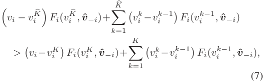

_Proof:_ We set the payment rule as 

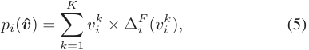

where _K_� is the corresponding maximum index of breakpoints for the misreported type _v_ ˆ _i_ . It is worth to note that the misreported type _v_ ˆ _i_ only impacts the numbers, rather than the values, of breakpoints compared with the true type _vi_ , because the values of breakpoints are independent on the declared type of agent _i_ . 

where the sequence _vi_1_, v_ _i_2_, · · ·, v_ _i__K_is a list of_K_values, which are the breakpoints of function _Fi_ ( **_v_ ˆ** ) when the value increases from 0 to the true value _vi_ . In general, we assume _vi__k_1 _≤ vi__k_2 for _k_ 1 _≤ k_ 2, _vi_0=0and_v_ _i__K_ _≤ vi_ . The function Δ_F_ _i_(_v_ _i__k_) represents the jump of _Fi_ ( **_v_ ˆ** ) at the breakpoint ( _vi__k,_**ˆ****_v_**_−i_),4_i.e._, 

Since the case of _K_� = _K_ is trivial for the proof, we can complete the analysis by distinguishing the following two cases: 

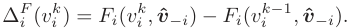

The intuition behind the payment rule in (5) is that, with the increase of _vi_ , the agent is allocated at a “better” ( _i.e._ , earlier) time slot, so the auctioneer charges the agent for this incremental part. The breakpoint value _vi__k_in(5)meansthe critical price of being allocated at the better time slot, and Δ_F_ _i_(_v_ _i__k_)measures“howbetterthenewtimeslotis”,_i.e._, the (normalized) value difference between the two allocations for agent _i_ . 

▶ If _v_ ˆ _i < vi_ , we then have _K_� _< K_ , and thus _viK_ � _≤ vi__K_. Since the function _Fi_ ( **_v_ ˆ** ) is monotone, we can get 

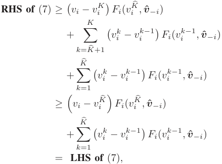

With the payment rule in (5), we can express the utility _ui_ ( **_v_ ˆ** ) of agent _i ∈_ N as: 

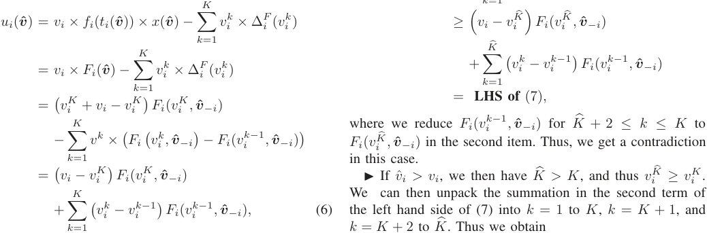

where the third equation is because _Fi_ ( _vi,_ **ˆ** **_v_** _−i_ ) = _Fi_ ( _vi__K,_**ˆ****_v_**_−i_) as _vi__K_ is the highest breakpoint for resource allocation for 

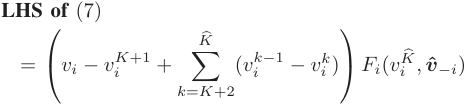

> 4We omit the situation with ties for notation simplicity, _i.e._ , we consider _Fi_ ( _vi__k,_**ˆ****_v_**_−i_) =_Fi_(_v_ _i__k_+_ϵ,_**ˆ****_v_**_−i_),forasmallpositiveconstant_ϵ_. 

Authorized licensed use limited to: Shanghai Jiaotong University. Downloaded on April 17,2021 at 11:54:55 UTC from IEEE Xplore.  Restrictions apply. 

LV _et al._ : STRATEGY-PROOF ONLINE MECHANISMS FOR WEIGHTED AoI MINIMIZATION IN EDGE COMPUTING 

1283 

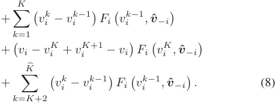

**Algorithm 1** Resource Allocation Algorithm 

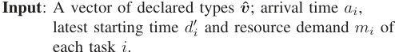

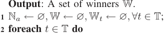

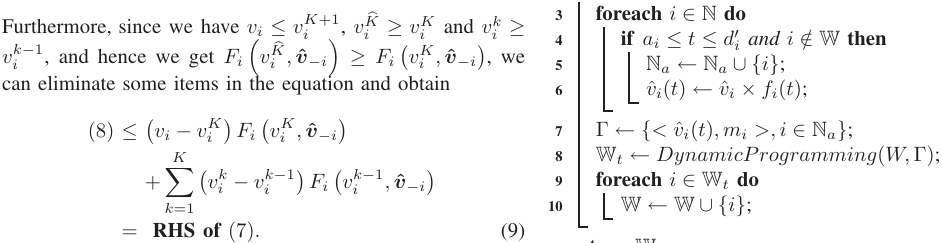

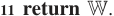

Thus, we also get a contradiction in this case and the proof of the “if” part is completed. □ 

## IV. PREDISC FOR THE CASE WITH UNIT EDGE EXECUTION TIME 

Conversely, we consider the “only if” part. 

_Lemma 2: If the online auction mechanism_ ( **_x_** ( **_v_ ˆ** ) _,_ **_p_** ( **_v_ ˆ** )) _is strategy-proof, then we have Fi_ ( **_v_ ˆ** ) = _fi_ ( _ti_ ( **_v_ ˆ** )) _× xi_ ( **_v_ ˆ** ) _is monotone for each agent._ 

We now present the detailed design for our proposed mechanism, namely PreDisc, and analyze its economic properties and competitive ratio. We first present the mechanism for the case of unit edge execution time, _i.e._ , _Ti__e_=1foralltasks (thus we omit the subscript _i_ ), in which the knotty problem of preemption in online setting does not exist. In this case, the cloud processing time _Ti__c_andtheresourcedemand_mi_ could be different for tasks. We note that the “online” property of the problem is still a challenge, that is, we should decide when to conduct a task within its duration to optimize the overall AoI. The allocated time slots for the current tasks may prevent future tasks from being executed. We will extend the mechanism to the general cases of different execution time slots on edge in the next section. 

_Proof:_ Consider an agent _i ∈_ N and two type profiles **_v_** , **_v_ ˆ** with **_v_** _−i_ = **_v_ ˆ** _−i_ and _vi > v_ ˆ _i_ . We first consider a scenario where the true type of the agent _i_ is _vi_ . The strategy-proof mechanism ensures that the utility of agent _i_ when reporting her type truthfully is not less than that when she misreports her type, _i.e._ , 

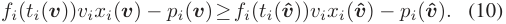

We then consider another scenario where the true type of the agent _i_ is _v_ ˆ _i_ and she may cheat by misreporting _vi_ . Similarly, we have 

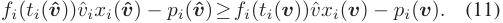

Combining (10) and (11), we can get 

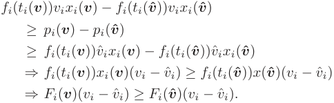

Since _vi > v_ ˆ _i_ , we have _Fi_ ( **_v_** ) _≥ Fi_ ( **_v_ ˆ** ). Thus, we can conclude that _Fi_ ( **_v_** ) is monotone. □ 

We remark that this result can be applied to not only the AoI optimization problem, but also some other real-world scenarios with time discounting values. For example, Mehta _et al_ [28] found that the expected click probability ( _i.e._ , the value) of an impression advertisement on mobile apps decreases during the user’s visit. In addition, the click value of live streaming advertisement, a new type of advertisement in recent years, also decreases during the live streaming. Our results provide a fundamental theoretical tool to deal with this type of problems. 

## _A. Allocation Rule_ 

We present the procedure of resource allocation rule of PreDisc in Algorithm 1. At each time slot, the active tasks are collected in set _Na_ , and their current values and resource demands are collected in the set Γ (Lines 3-7). The allocation problem at each time slot can be formulated as a 0-1 knapsack problem, where the capacity of the knapsack is the resource capacity _W_ and the profit and weight of each item correspond to the current value and the resource demand of the task, respectively. Our goal at each time slot is to select the most cost-efficient active tasks under the resource capacity constraint. Thus, we adopt dynamic programming technique to solve the resource allocation problem at each time slot _t_ to obtain the winner set W _t_ , and to update the ultimate winner set W (Lines 8-10). 

We next show that such a simple allocation rule at each time slot without the knowledge of future tasks, can obtain a constant competitive ratio 2. This result implies that PreDisc achieves at least half of the offline optimal social welfare. 

_Theorem 2: The competitive ratio of the resource allocation rule in PreDisc is_ 2 _for the cases with unit edge execution time._ 

Authorized licensed use limited to: Shanghai Jiaotong University. Downloaded on April 17,2021 at 11:54:55 UTC from IEEE Xplore.  Restrictions apply. 

IEEE JOURNAL ON SELECTED AREAS IN COMMUNICATIONS, VOL. 39, NO. 5, MAY 2021 

1284 

_Proof:_ Let the set of winners in the offline optimal solution (OPT) be OPT, and the winning agents at time slot _t_ in OPT be OPT _t_ . Similarly, we denote the corresponding sets of winning agents obtained from PreDisc as W and W _t_ , respectively. For a winning agent _i_ , we use _t__∗_ _i_topresentthe time it is selected in OPT, and _ti_ the time it is selected in PreDisc. We distinguish the following two cases. 

▶ For agent _i ∈_ OPT _t_ , if agent _i ∈_ W _t__′_ for _t__′_ _≤ t_ , _i.e._ , agent _i_ is also selected as a winner in PreDisc at or before the time slot _t_ , we denote these agents as a set OPT1 _t_.Sincethe values of tasks are non-increasing, we can easily obtain 

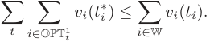

▶ For the other agents in OPT _t_ , we know that these agents are not in W _t′_ for any _t__′_ _≤ t_ , and denote them as OPT2 _t_. In PreDisc these agents may lose or be selected as a winner later. We have that the total value of these agents at the time slot _t_ should be less than that of agents selected by PreDisc; otherwise, the dynamic programming algorithm would output them as the result. Thus, we can get 

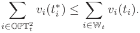

Overall, we have 

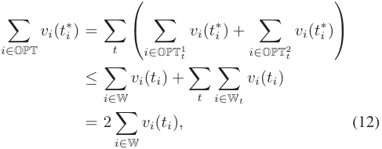

which concludes our proof. □ 

## _B. Payment Rule_ 

In classical online auction mechanisms [21], [22], to guarantee the strategy-proofness, the payment rule is to set a predefined price for each time slot. However, we have constructed a simple example in the previous section to demonstrate that with such a payment rule, the property of strategy-proofness no longer holds when the value discounts over time. To tackle this obstacle, we calculate the critical price for each single slot, and derive our payment rule based on the extended Myerson Theorem in Section III. 

We conduct the following steps to calculate the payment for each winner _i_ in the allocation rule. First, we run the resource allocation algorithm ( _i.e._ , Algorithm 1) again to compute a new solution without the agent _i_ . During this new allocation process, at each time slot, we can leverage the optimal substructure of dynamic programming, and obtain the minimum bid _v_ ˆ _i__min_ ( _t_ ) as the difference between the solutions for total _W_ units of resources and for _W − mi_ units of resources. The value _v_ ˆ _i__min_ ( _t_ ) represents the minimum bid at time slot _t_ that the agent _i_ can win at this time slot. Then, 

**Algorithm 2** Payment Calculation Algorithm 

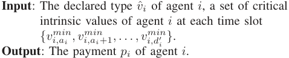

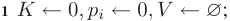

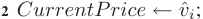

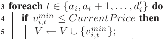

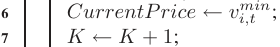

**8** Sort breakpoints in _V_ with a non-decreasing order, and re-label them as _vi__k_for_k∈{_1_,_2_, . . ., K}_,_v_ _i_0_←_0; 

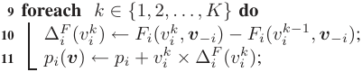

**12 return** _pi_ . 

according to the definition of time-varying value function (2), we can get the corresponding critical intrinsic value 

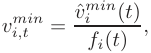

which the agent _i_ needs to declare to win at the time slot _t_ . With this critical value for agent _i_ at each time slot, we can greedily select a non-increasing subsequence of critical values over time, which are the breakpoint values as stated in Theorem 1. Intuitively, suppose one breakpoint is _vi,t__min_, it means that when the agent _i_ reports an intrinsic value no less than _vi,t__min_ at arrival time _ai_ , she would be selected as a winner no later than the time slot _t_ . We give a procedure in Algorithm 2 to determine the breakpoints from the critical intrinsic values and the corresponding payment for the winning agent _i_ . Following the time slots from the arrival time _ai_ to the latest starting time _d__′_ _i_,wesetthefirstbreakpointas the first critical intrinsic price less than the bid of agent. After that, we select the critical intrinsic price as a breakpoint only when it is less than the previously selected breakpoint (Lines 2-3). For example, suppose the declared type is 5, and the sequence of critical intrinsic prices is _{_ 6 _,_ 4 _,_ 2 _,_ 3 _}_ , we select 4 and then 2 as the breakpoints. We can verify that such a selected set of intrinsic values satisfies the definition of breakpoints. We then sort the selected breakpoints with a non-decreasing order, and calculate the payment using (5) in Theorem 1 (Lines 8-11). 

Consider a simple walkthrough example in Fig. 2, where the total amount of resources _W_ is 5, the cloud processing time _Ti__c_ = 3 for all tasks, and the value of each user _i ∈_ N decreases linearly with time through a time-discounting function _fi_ ( _t_ ) = 1 _−_1 3(_t−ai_).InFig.2,weusesolid line to denote the present time interval of each agent. The resource demand and value are also shown beside each agent. In the allocation determination phase, at the first time slot, agents A and C are selected as winners because their total value 9 is larger than that of B. At the second time slot, the value of B becomes 103,andDischosenduetoahigher 

Authorized licensed use limited to: Shanghai Jiaotong University. Downloaded on April 17,2021 at 11:54:55 UTC from IEEE Xplore.  Restrictions apply. 

1285 

LV _et al._ : STRATEGY-PROOF ONLINE MECHANISMS FOR WEIGHTED AoI MINIMIZATION IN EDGE COMPUTING 

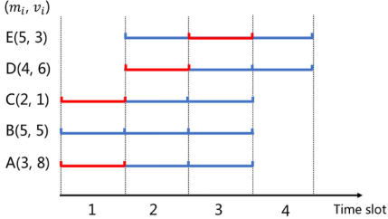

Fig. 2. A walkthrough example for the cases with unit edge execution time. 

service. Once a task is preempted, it would wait until being selected next time to execute the task from the beginning, and hence the preemption may degrade the resource utilization if the newly arrived agents does not offer a substantially higher bid. With this consideration, the auctioneer raises the bids of ongoing agents, which is denoted by N _o_ , to give them higher priorities of being allocated resources continuously. At time slot _t_ , each ongoing agent _i ∈_ N _o_ has been allocated _mi_ units of resources without an interruption from the time slot _ti_ ( **_v_ ˆ** ). We denote the virtual bid of agent _i_ at time slot _t_ as _bi_ ( _t_ ), which can be calculated as 

## _bi_ ( _t_ ) = _v_ ˆ _i_ ( _ti_ ( **_v_ ˆ** )) _× α__ϕi_ _,_ where _ϕi_ = ( _t − ti_ ( **_v_ ˆ** )) _/Ti__e_ 

value 6. At the third time slot, agents B with an updated value 53andEwithanupdatedvalue2areactive,andE is selected as a winner. We denote the winners at each time slot as red in Fig. 2. In the payment calculation phase, for agent A, we remove her and re-run the resource allocation procedure, obtaining the critical intrinsic values for each time slot _vA,__min_ 1 = 4 _, vA,__min_ 2 = 8 _, vA,__min_ 3 = 5. We can greedily get the decreasing subsequence with only a breakpoint _vA_1=4. Using (5), we can calculate the payment for agent A as _pA_ = 4. Similarly, we have the breakpoint sequence for agent C as _vC_1= 0,foragentDas_v_ _D,__min_ 2=10 3_, v_ _D,__min_ 3= 3_, v_ _D,__min_ 4= 0, and for agent E as _vE_3=5 2_, v_ _E_4= 0.Finally,wecancalculate the payment for agents: _pC_ = 0 _, pD_ =19 9_, pE_=5 6. We now show the strategy-proofness of PreDisc based on Theorem 1. 

_Theorem 3: The online auction mechanism PreDisc with the above allocation and payment rules is strategy-proof for the cases with unit edge execution time._ 

_Proof:_ Based on Theorem 1, we only need to prove the monotonicity of the resource allocation rule, _i.e._ , the winning agent would be executed at an earlier (or the same) time slot when she increases her bid. Since the dynamic programming algorithm outputs the optimal solution at each time slot, if a winning agent reports a higher value, she would either be selected at this time slot or an earlier one. Hence, the monotonicity of the allocation rule as defined in Definition 5 is satisfied and we can conclude the proof. □ 

## V. PREDISC FOR GENERAL CASES 

In this section, we first extend PreDisc to the case where _Ti__e_ can be larger than 1 but is still the same for all tasks (hence we use _T__e_ and _Ti__e_interchangeably).Insuchcase,tasksmay be preempted by other tasks during the execution process, and hence the interactions among tasks become more complex in such online settings. In Section V-D, we further extend PreDisc to the most general cases, where the execution time _Ti__e_on edge can be different among tasks and the communication time to the edge is also taken into account. 

## _A. Virtual Bid Generation_ 

When a newly arrived agent has a task value higher than that of some ongoing agents, the auctioneer can choose to preempt the ongoing tasks to make up the task value difference, or to reject the new agents to guarantee the continuity of edge 

which denotes the percentage of task _i_ ’s completeness at time _t_ , and _α ≥_ 1 is the parameter that the auctioneer can adjust to control the preemption frequency: the setting of _α_ = 1 represents the preemption model which interrupts the ongoing tasks once there is a newly arrived task with a higher bid. The auctioneer can give more protection to the ongoing tasks by increasing _α_ . When _α →∞_ , the auctioneer does not allow preemption, and the tasks can execute for continuous _Ti__e_timeslots once they areallocated resources. For theactive agents that have not been allocated resources, _i.e._ , agents in N _a\_ N _o_ , the auctioneer updates their bids _i.e._ , _bi_ ( _t_ ) = _v_ ˆ _i_ ( _t_ ). The auctioneer can generate the virtual bid _bi_ ( _t_ ) of the agent _i ∈_ N at time slot _t ∈_ T by distinguishing the following two cases: 

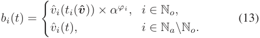

## _B. Allocation Rule_ 

The algorithm of resource allocation in the general cases is shown in Algorithm 3. For simplicity, we only present the algorithm for one time slot. Similar to the allocation rule in the simple case, the key idea is to use dynamic programming technique with the virtual bids of agents at each time slot. We first update the current values of tasks as the virtual bids to give the ongoing tasks higher priorities of being allocated (Lines 1-7). After that, we consider the problem of resource allocation as the knapsack problem, and adopt the dynamic programming technique to solve it (Lines 8-9). We update the allocation states for two kinds of agents. For newly winning agents, we update their winning time _ti_ ( **_v_ ˆ** ) as _t_ (Lines 10-11). For preempted agents, we set their winning time to _Null_ back (Lines 12-13), then they would wait for the next allocation process. We add the agents, who have executed for _Ti__e_consecutivetimeslotsbeforethedeparture time, into the ultimate winner set (Lines 15-16). We discard the agents whose tasks cannot be completed in the remaining time (Lines 17-18). 

_Theorem 4: The competitive ratio of our resource allocation rule in PreDisc is_ 1 + _α for the general cases_ 1 _−α__−_ _T_1_e_ _with identical edge computation time slots, compared with the offline optimal solution._ 

_Proof:_ The proof process is similar to that of Theorem 2, and we re-use the notations in Theorem 2. We note that in 

Authorized licensed use limited to: Shanghai Jiaotong University. Downloaded on April 17,2021 at 11:54:55 UTC from IEEE Xplore.  Restrictions apply. 

IEEE JOURNAL ON SELECTED AREAS IN COMMUNICATIONS, VOL. 39, NO. 5, MAY 2021 

1286 

**Algorithm 3** Resource Allocation Algorithm for General Cases (for One Time Slot) 

- **Input** : A time slot _t ∈_ T, a set of active agents N _a_ , a set of ongoing agents N _o_ , a vector of reported types **_v_ ˆ** , a preemption factor _α_ , resource demand _mi_ for each task, and a set of temporary winners W _t−_ 1 at time slot _t −_ 1. 

- **Output** : A winner set W and a temporary winner set W _t_ for time slot _t_ . 

- **1 foreach** _i ∈_ N _a_ **do 2** _v_ ˆ _i_ ( _t_ ) _← v_ ˆ _i × fi_ ( _t_ ); **3 if** _i ∈_ N _o_ **then 4** _ϕi ←_ ( _t − ti_ ( **_v_ ˆ** )) _/Ti__e_; **5** _bi_ ( _t_ ) _← v_ ˆ _i_ ( _ti_ ( **_v_ ˆ** )) _× α__ϕi_ ; **6 else if** _i ∈_ N _a\_ N _o_ **then 7** _bi_ ( _t_ ) _← v_ ˆ _i_ ( _t_ ); 

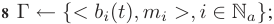

- **9** W _t ← DynamicProgramming_ ( _W,_ Γ); 

- **10 foreach** _i ∈_ W _t\_ W _t−_ 1 **do 11** _ti_ ( **_v_ ˆ** ) _← t_ , N _o ←_ N _o ∪{i}_ ; 

- **12 foreach** _i ∈_ W _t−_ 1 _\_ W _t_ **do 13** _ti_ ( **_v_ ˆ** ) _← Null_ , N _o ←_ N _o\{i}_ ; **14 foreach** _i ∈_ N _a_ **do 15 if** _i ∈_ W _t and t − ti_ ( **_v_ ˆ** ) + 1 _≥ Ti__e_**then** **16** W _←_ W _∪{i}_ , N _a ←_ N _a\{i}_ , N _o ←_ N _o\{i}_ ; **17 else if** _i ∈/_ W _t and t ≥ d__′_ _i_**then** **18** N _a ←_ N _a\{i}_ ; 

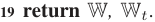

general cases with identical _Te_ , an agent would be a winner in _T__e_ consecutive time slots. Thus, we denote _i ∈_ OPT _t_ as that the task _i_ starts to execute from time slot _t_ for _T__e_ consecutive time slots ( _i.e._ , _t__∗_ _i_=_t_), and for_i ∈_Win PreDisc, the task _i_ starts to execute from time slot _ti_ for _T__e_ consecutive time slots. But for task _i_ in the temporary winner set _i ∈_ W _t_ , it only represents that task _i_ is selected at time slot _t_ , which might be preempted later. We distinguish the following two cases. 

▶ For agent _i ∈_ OPT _t_ , if _i ∈_ W with _ti ≤ t_ , _i.e._ , the agent _i_ is also selected as a winner in PreDisc starting at or before time slot _t_ , we denote them as a set OPT1 _t_,and denote theset of them of all time slots as OPT1 = _∪t∈_ TOPT1 _t_.Sincewe have that the values of tasks are non-increasing, we can easily get that 

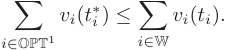

▶ For the other agents in OPT _t_ , _i.e._ , _i ∈/_ W or _i ∈_ W with _ti > t_ , we denote the set of them of all time slots as OPT2 _t_.TheymayloseinPreDiscorbeselectedasawinner later. Similarly, we denote all of them as OPT2 = _∪t∈_ TOPT2 _t_. We have that the total value of agents in OPT2 _t_attimeslot _t_ should be no more than the total virtual bid of agents selected by PreDisc at the same time slot; otherwise, the dynamic programing algorithm would output them as the 

result. Therefore, we can get 

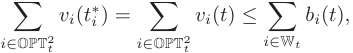

where the left equation is because _t__∗_ _i_=_t_asstatedabove. 

Next, at time slot _t_ , we denote the sum of virtual bids of uncompleted ongoing agents as _Sun_ ( _t_ ). It can be observed that 1 the sum of virtual bids at time slot _t_ +1 is at least _Sun_ ( _t_ ) _×α T__e_ following the rule of virtual bid. This means, every selected agent _i_ in PreDisc would either be completed ultimately or, be preempted by agents whose total value is larger than the sum of virtual bids of preempted agents. We note that this observation holds even if the preemption happens in a chain. Thus, let the set of agents which are completed at time slot _t__′_ in our algorithm be N_c_ _t__′_,andrecallthatthelasttimeslotinT is _T_ , then we can get 

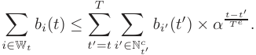

The key idea of this equation is that, once a winner is selected at time slot _t_ , it might be preempted, but finally the winner or its (chained) preemptor will be completed at a later time slot. So we map the subsequent completed tasks to time slot _t_ and sum over all of them as an upper bound of the left side. Thus we have that 

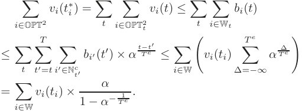

Overall, we obtain that 

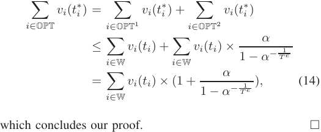

Base on the theorem, we can get the optimal preemption factor _α_ = (1+ _T_1_e_)_T e_with simple mathematical calculations, while the corresponding competitive ratio is ( _T__e_ + 1)(1 + _T_ 1_e_)_T e_,which isasmallconstant.This resultimplies that the optimal preemption factor is related to only the edge execution time. Intuitively, a larger _T__e_ with the same _ϕi_ implies that the ongoing task tends to have occupied the resources for a longer time, and thus it is more cost-efficient not to preempt it, _i.e._ , setting a larger preemption factor _α_ . 

## _C. Payment Rule_ 

Similar to the payment rule for the simple case, it is necessary to calculate the critical intrinsic price for _i_ to be 

Authorized licensed use limited to: Shanghai Jiaotong University. Downloaded on April 17,2021 at 11:54:55 UTC from IEEE Xplore.  Restrictions apply. 

LV _et al._ : STRATEGY-PROOF ONLINE MECHANISMS FOR WEIGHTED AoI MINIMIZATION IN EDGE COMPUTING 

1287 

a winner at different time slot. But the difference is that, in the general cases with _T__e_ _≥_ 1, the critical intrinsic price should guarantee that agent _i_ can win in continuous _T__e_ time slots. Following the procedure in Section IV-B, we can get the minimum virtual bid _b__min_ _i_ ( _t_ ) of winning at a single time slot _t_ for agent _i_ . Correspondingly, we can calculate _v_ ˆ _i__min_ ( _t_ ), the minimum bid at time slot _t_ for agent _i_ to win _T__e_ continuous time slots starting from time _t_ ( _t ∈_ [ _ai, d__′_ _i_]): 

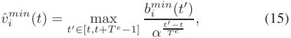

which is the highest minimum bid (mapping from the minimum virtual bids) for single time slots in the present interval. Then we have the corresponding critical intrinsic value for the agent _i_ at time _t_ : 

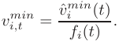

Next, we can call Algorithm 2 to calculate the payment of each winning agent. 

Finally, we can get the following theoretical guarantee on strategy-proofness. Since the proof is nearly identical to Theorem 3, we omit the proof here. 

_Theorem 5: Our proposed mechanism PreDisc with the above allocation and payment rule is strategy-proof for the general cases with the identical edge execution times._ 

## _D. Extension_ 

We next extend PreDisc to the most general and realistic cases, where 1) the communication time to the edge is taken into account, and 2) the edge execution time _Ti__e_couldbe different for tasks, and hence the decisions on preemption become more complex. 

We can first obtain that the mechanism design problem with non-negligible communication time to the edge is equivalent to the problem where tasks are generated after the communication time in our simplified model. Furthermore, as the task communication time could not be manipulated by the user, we have that the communication time to the edge does not affect the theoretical analysis, and both the strategy-proofness and the constant competitive ratio still hold with the extension of non-negligible communication time to the edge. 

We next show that with the above allocation rule and payment rule, the corresponding competitive ratio is similar to Theorem 4 under the extension, as long as we replace _T__e_ with _Tmax__e_,whichisthehighestedgeexecutiontimeamong all tasks. As the proof is also similar to that of Theorem 4, we omit it here. 

_Theorem 6: Following the same allocation rule and payment rule as above, the competitive ratio of PreDisc is_ 1+ 1 _−α−αT max__e_ 1 _for the general cases compared with the offline optimal solution._ 

The economical property of strategy-proofness also holds in the extended cases. The proof is nearly identical to that of Theorem 3 and is omitted due to the space limitation. 

_Theorem 7: Following the same allocation rule and payment rule as above, our proposed mechanism PreDisc is strategy-proof for the general cases._ 

We would further interpret how the general cases can be interpreted in the real-world task offloading scenarios. We can model the edge execution time as 

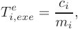

and the communication time to the edge as 

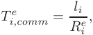

where _ci_ is the number of CPU cycles the task requires, _mi_ is the CPU computational capability allocated to the task, _li_ is the input data size of a task and _Ri__e_istheaveragedata transmission rate between the edge and the user. Therefore, we have the edge processing time as 

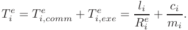

Analogously, we can model the cloud processing time as 

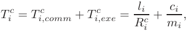

where _Ti,comm__c_is the communication time tothe cloud,_T c_ _i,exe_ is the cloud execution time and _Ri__c_istheaveragedata transmission rate between the cloud and the users. We note that _Ti,exe__c_isthesameastheedgeexecutiontime_T e_ _i,exe_because the number of CPU cycles _ci_ and the CPU computational capability it is allocated _mi_ are the same. This way, the real-world task offloading scenarios could be captured by the general cases where users have different _Ti__e_and_T c_ _i_. 

## VI. EVALUATION RESULTS 

## _A. Experimental Settings_ 

We implement our proposed mechanism in C++, and compare it with the existing mechanisms. In the experiments, there are _N_ = 100 users and _T_ = 100 time slots, where the length of each time slot is set as 10 ms. The number of required CPU resources of each task _mi_ are set as integers following a uniform distribution over [1, 5], and each unit of GPU resource is set as 1 GHz. The overall CPU capacity on the edge is _W_ = 10 GHz if not otherwise specified. In particular, we set the intrinsic values of tasks following a uniform distribution over [1, 10]. The time discounting value function _fi_ ( _t_ ) is specified as a linear function _fi_ ( _t_ ) = 1 _− T_(_t_ _i__c−−aTi_ _i__e_).Eachuser generates a task at a time slot with probability (arrival rate) _γ_ if she has no active task at the time. We set the arrival rate _γ_ as 0.1 in our experiment. To make the presentation clearer, we first consider the simplified model where the communication time to the edge is not considered, and the edge execution time is fixed as 30 ms ( _i.e._ , 3 time slots), and the cloud processing time as 100 ms ( _i.e._ , 10 time slots). We then also consider the realistic cases with non-negligible communication time to the edge and different edge execution times and cloud processing times among the tasks. Similar to the settings in [29]–[31], we set the input data size of tasks as _l_ = 50 Kb, the data transmission rate to the edge as _R__e_ = 5 Mbits/s, the data transmission rate to the cloud as _R__c_ = 0 _._ 5 Mbits/s for all tasks if not otherwise specified. 

Authorized licensed use limited to: Shanghai Jiaotong University. Downloaded on April 17,2021 at 11:54:55 UTC from IEEE Xplore.  Restrictions apply. 

IEEE JOURNAL ON SELECTED AREAS IN COMMUNICATIONS, VOL. 39, NO. 5, MAY 2021 

1288 

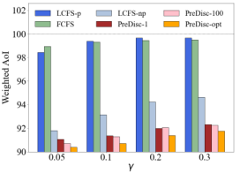

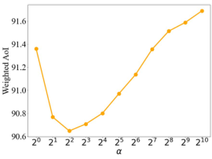

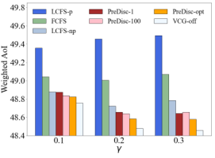

Fig. 3. The weighted average AoI with different parameters. 

We assume the execution time follows a uniform distribution over [1, 5] time slots ( _i.e._ , 10 ms to 50 ms). We evaluate the changes of both weighted average AoI and revenue with different parameters under different mechanisms. We run the experiments for 500 times to get the average result. 

We compare our mechanism PreDisc with the following benchmark mechanisms: 

- **First-Come-First-Served (FCFS)** : In FCFS, at each time slot, the active tasks (including ongoing tasks) are sorted by their arrival time in an increasing order. If their arrival times are the same, the tasks with higher values are selected first. It is worth to note that FCFS is naturally non-preemptive, since tasks with later arrival times are always executed later. 

- **Last-Come-First-Served with Preemption (LCFS-p)** : In LCFS-p, at each time slot, the active tasks (including ongoing tasks) are sorted decreasingly by their arrival time. Similarly, if their arrival times are the same, the tasks with higher values are served first. Note that LCFS-p does not protect ongoing tasks from preemption, and hence the tasks are very likely to be preempted by subsequent tasks. 

- **Last-Come-First-Served with Non-preemption (LCFS-np)** : LCFS-np is similar to LCFS-p, with the difference that ongoing tasks are protected from interruption, _i.e._ , once a task is selected to execute, it would be completed without preemption. 

- **Offline VCG (VCG-off)** : VCG is a well-known mechanism with optimal social welfare for problems with strategic input. We convert the problem of edge resource allocation into the offline version, and consider VCG mechanism as the ideally optimal baseline. We remark that this mechanism cannot be deployed in real life, as it needs the offline global information. 

We conduct experiments on PreDisc with 3 kinds of preemption factors: _α_ = 1 (PreDisc-1), _α_ = 100 (PreDisc100) and optimal _α ≈_ 2 _._ 4 (PreDisc-opt), while PreDisc-opt is also named as PreDisc in some figures as the default setting. 

To calculate the revenue of FCFS, LCFS-p and LCFS-np, we adopt a simple payment rule which is widely used in practice, _i.e._ , _pi_ = _ρ · vi_ ( _ti_ ) where 0 _< ρ <_ 1 is a constant. We set _ρ_ = 0 _._ 5 in our simulations, meaning that the edge service provider charges half of the values of completed tasks. We remark that such a payment rule is easy to deploy but not truthful, as users can easily cheat at their values to reduce their payments. 

## _B. Numerical Results_ 

The evaluation results on weighted average AoI with different parameters are shown in Fig. 3. We first compare different mechanisms with different arrival rate _γ_ in Fig. 3(a). Overall, we can see that our mechanisms achieve significant reduction on the weighted AoI than the other mechanisms, and PreDisc-opt obtains the smallest weighted AoI among them. There are two reasons behind the advantage of our mechanisms: First, our mechanisms realize an optimal resource allocation in each time slot, since a dynamic programming rather than a simple greedy algorithm is employed. Second, PreDisc-opt makes a good trade-off between preemption and non-preemption. In addition, FCFS and LCFS-p result in the worst performances, because FCFS tends to select stale tasks with earlier arrival times, while LCFS-p preempts tasks frequently once there are newly arrived tasks. In LCFS-np, fresh tasks with high values are selected and completed without preemption, hence a low AoI is achieved. When _γ_ increases from 0.05 to 0.3, a large amount of tasks are uploaded to the edge, and hence many tasks with high values are not completed. Thus, the weighted AoIs of all mechanisms increase with the arrival rate. 

In Fig. 3(b), we compare the above mechanisms with the offline VCG mechanism, the ideally optimal benchmark. The computation complexity of VCG is extremely high, as it needs to enumerate every possible scheduling outcomes. Thus, we reduce the scale of the problem, setting _N_ = 20, _T_ = 10, _l_ = 25 Kb, _W_ = 5 GHz, and average the evaluation results over 100 runs. We can observe from Fig. 3(b) that the weighted 

Authorized licensed use limited to: Shanghai Jiaotong University. Downloaded on April 17,2021 at 11:54:55 UTC from IEEE Xplore.  Restrictions apply. 

LV _et al._ : STRATEGY-PROOF ONLINE MECHANISMS FOR WEIGHTED AoI MINIMIZATION IN EDGE COMPUTING 

1289 

Fig. 4. The average revenue of the edge with different parameters. 

TABLE I PROGRAM EXECUTION TIME (ms) 

AoI of our mechanisms are very close to that of the offline VCG mechanism, which demonstrates the effectiveness of PreDisc. A small difference from Fig. 3(a) is that, the AoIs of some mechanisms decrease with the arrival rate in Fig. 3(b). This is because the resources are relatively sufficient under the scale-reduced setting, and thus the impact of incremental completed tasks is higher than that of incremental uncompleted tasks. We further evaluate the computation complexity ( _i.e._ , the program execution time) of FCFS, LCFS-p, LCFS-np, our mechanisms and VCG-off, and show the results in Table I. These results show that our proposed mechanism PreDisc can achieve an approximate optimal weighted average AoI with much lower computation complexity than the optimal solution. 

Fig. 3(c) shows the impact of CPU computational capability _W_ . With a large CPU computational capability, the edge server can efficiently schedule the tasks to reduce the weighted AoI, leading to the decrease of AoI from all mechanisms. When _W ≥_ 60 GHz, nearly all tasks are completed in time in all mechanisms, and thus the lowest AoI is achieved. When _W ≤_ 40 GHz, the resource is limited and PreDisc has a much better resource utilization and then obtain a lower weighted AoI than the other mechanisms. 

The impact of preemption factor _α_ on weighted AoI is depicted in Fig. 3(d). We can see that when the preemption factor is close to the optimal _α_ , which is approximately 2.4 under our default settings, the weighted AoI indeed realizes a better performance. This result demonstrates the optimality of preemption parameter selection in our theoretical analysis of PreDisc. 

We report the influence of cloud processing time _T__c_ and edge execution time _T__e_ on the evaluation results in Fig. 3(e) 

and Fig. 3(f), respectively. We remark that _T__c_ is the largest AoI because every task can get a response from the cloud after _T__c_ time slots. A large _T__c_ enables a flexible scheduling for emergency tasks sent to the edge, and thus reduces the weighted AoI for these tasks. However, the weighted average AoI of the tasks sent to the cloud, which is the majority of all tasks, has a significant increase, due to a large _T__c_ . Thus, the overall AoI increases with _T__c_ . A large _T__e_ implies that tasks would have to wait a longer time to complete. Therefore, the weighted AoI would be higher with the increase of _T__e_ . 

We further investigate the average revenue of the edge in different mechanisms in Fig. 4. Fig. 4(a) shows the revenue performance of different mechanisms. We can observe that the revenues of our mechanisms outperform all other mechanisms due to the high utilization of edge resources. In addition, PreDisc-1 achieves the highest revenue in our mechanism, which will be explained later. With the increase of arrival rate _γ_ , the revenues of our mechanisms increase, because more tasks result in a stiffer competition, and hence a higher critical price for winners. 

We show the comparison results on average revenue with offline VCG in Fig. 4(b) under the setting of reduced problem scale. Offline VCG achieves the highest revenue, but the gap between our mechanisms and VCG-off is small. Given the extremely large computation complexity and the need of global information of VCG-off mechanism, PreDisc is more practical in deployment with a slight revenue loss. When _γ_ = 0 _._ 1 or 0 _._ 2, the revenue of LCFS-np is slightly higher than our mechanisms, this is because the resources are relatively sufficient under the scale-reduced setting, and thus the critical prices in our mechanisms is low to some extent. We also note that as the payment rule of LCFS-np is not strategy-proof, its present revenue may degrade in real life. 

Fig. 4(c) shows the impact of CPU computational capability _W_ on revenue. Naturally, the revenues of FCFS, LCFS-p and LCFS-np increase with a higher _W_ , because the revenues of these mechanisms are proportional to the numbers of completed tasks, which obviously increase with the CPU 

Authorized licensed use limited to: Shanghai Jiaotong University. Downloaded on April 17,2021 at 11:54:55 UTC from IEEE Xplore.  Restrictions apply. 

IEEE JOURNAL ON SELECTED AREAS IN COMMUNICATIONS, VOL. 39, NO. 5, MAY 2021 

1290 

Fig. 5. The weighted average AoI and revenue with different numbers of users _N_ . 

computational capability. In contrast with these mechanisms, the revenue of PreDisc would first increase and then decrease into 0 with a larger _W_ , because the number of completed tasks increases but the critical prices for resources decrease when the resource supply is more abundant. Thus, we remark that we can improve the revenue of PreDisc by increasing the competition on edge resources among users. 

In Fig. 4(d), we present the impact of preemption factor _α_ on the revenue of PreDisc. We observe that with a higher _α_ , the revenue decreases. This is because a low _α_ leads to frequent preemption, resulting in a high critical price in each time slot. Therefore, we can conclude that both weighted AoI and revenue decrease with the preemption factor _α_ , when it is lower than the optimal value, which also provides a direction in real life to trade off between AoI and revenue when choosing _α_ in this range. 

We then show the revenues of mechanisms with different values of _T__c_ and _T__e_ in Fig. 4(e) and Fig. 4(f), respectively. In Fig. 4(e), the revenue of PreDisc increases with _T__c_ at first and then decreases when _T__c_ is larger than a threshold. This is because PreDisc is able to schedule the tasks flexibly with a large _T__c_ , leading to the number of completed tasks and then the revenue increases. However, if _T__c_ continues to grow, the large number of completed tasks implies low critical prices, so the revenue of PreDisc decreases slightly. The revenue of LCFS is always quite small, as the frequent preemption for ongoing tasks causes only a few of tasks to be completed. In LCFS-np, only newly arrived tasks are selected, so the revenue decreases instead because less tasks are produced with a larger _T__c_ . In FCFS mechanism, a larger _T__c_ means that tasks with top priorities are more stale, so the revenue decreases with _l_ substantially. Fig. 4(f) depicts the impact of the edge execution time _T__e_ . When _T__e_ is larger, each task needs resources in more time slots, leading to less tasks to be completed and then lower revenue to obtain. When _T__e_ = 10 ms, each task is completed in a single time slot, and preemption does not occur, hence LCFS-p and LCFS-np have the same performance. With a higher _T__e_ , the tasks selected by FCFS become fresher, leading to the increase of revenue when _T__e_ _≥_ 50 ms. 

We present the performance of PreDisc with different numbers of users _N_ in Fig. 5. Fig. 5(a) dipicts that the weighted AoI becomes closer to the upper bound 100 ms with the increase of _N_ since the edge computing resources are more scarce. The relative advantage of PreDisc remains the same compared with other mechanisms. The performance on the revenue is presented in Fig. 5(b), which presents a significant increase on the revenue with user numbers because a larger amount of users leads to a more fierce competition. We can 

TABLE II 

THE AVERAGE WEIGHTED AoI AND REVENUE WITH DIFFERENT 

TASK EXECUTION TIMES 

conclude from the results that our proposed mechanism is suitable for a large system. 

We finally test the performance of the online mechanisms in the general case, where the execution times among tasks are different, and the communication time to the edge is taken into account. We set the execution times of tasks follow a uniform distribution over [1, 5] time slots. Table II presents the results with two different data transmission rates to the cloud: 0.5 Mbits/s and 0.25 Mbits/s. We can see that the mechanisms perform similarly to the simplified cases above, and PreDisc-opt and PreDisc-1 achieve the lowest AoI and the highest revenue, respectively, among all the mechanisms. 

## VII. RELATED WORK 

The concept of age of information was first studied in [5], where an optimal updating rate is provided for remote monitor systems to optimize the timeliness of collected data. Following this work, much attention has been focused on AoI optimization, typically with the queueing theory technique [5], [32], [33]. The AoI was investigated in real-time computing problems in recent years [34]–[36], and different types of update policies and preemption strategies are proposed. However, these studies did not consider the strategic behaviors of users. There are several works that considered the selfish agents in status update systems [37]–[39]. Hao _et al._ [37] investigated the competition of selfish crowdsourcing platforms to reduce their own AoI. They proposed a non-monetary punishment mechnism in a repeated game to enforce their cooperation. The work of [38] introduced the concept of _fresh data market_ . They proposed a new pricing mechanism to maximize the profit of information source and minimize the cost of the destination. These works treated updates as homogeneous ones and only manipulate the update frequency. However, in a real-time edge computing problem, tasks are heterogeneous and users may misreport the information about their tasks. Therefore, the above studies are substantially different from the problem setting considered in this work. 

The topic of online auction was first introduced by Lavi and Nisan [40]. Based on the 2-competitive model of [41] for reusable resource allocation and the proof of competitive ratio, the work in [42] raised the concept of auction with preemption and its application in online spectrum auctions. However, the above classical works only considered constant values during the auction. The authors of [43] considered online auctions with discounting values. However, they 

Authorized licensed use limited to: Shanghai Jiaotong University. Downloaded on April 17,2021 at 11:54:55 UTC from IEEE Xplore.  Restrictions apply. 

LV _et al._ : STRATEGY-PROOF ONLINE MECHANISMS FOR WEIGHTED AoI MINIMIZATION IN EDGE COMPUTING 

1291 

imposed constraints on unit resource demand and unit edge execution time, and hence their proposed mechanism does not apply to our general cases. 

From the perspective of edge computing, there are extensive studies that considered the high cost of edge deployment and the resource limitation at the edge server [11], [44], [45]. Some of these works proposed task scheduling algorithms to better utilize edge resources [16], [46]–[48]. For example, Tan _et al_ from [46] proposed an online scalable algorithm, called OnDisc, for the job dispatching and scheduling problem with a constant competitive ratio. In [16], Zhao _et al_ proposed to combine the edge server and the remote cloud server into a heterogeneous cloud. However, all of these studies did not take the pricing mechanism into account. An online incentive mechanism for the task offloading in mobile edge computing was proposed in [22] based on the primal-dual optimization framework, but they only considered a maximal tolerance delay for each task, rather than the time discounting values of tasks, _i.e._ , the AoI metric. Therefore, their proposed simple threshold-based pricing mechanism cannot be applied in our problem. 

## VIII. CONCLUSION 

We have proposed a strategy-proof online mechanism PreDisc for the cloud-edge collaborative computing system to reduce the overall weighted AoI. A preemption factor is employed to trade off the newly arrived tasks and ongoing tasks. We have proved that PreDisc guarantees both strategyproofness and a constant competitive ratio compared with the offline optimal solution. Extensive simulations have been conducted and the results demonstrated the effectiveness of PreDisc. In the future work, we would further investigate the online mechanism design problem with overlapped tasks from a user, where the time discounting function of task values would vary over time. In addition, we focus on mobile devices with adequate power and energy in this work, and would extend the proposed mechanism to the scenarios with energy-constrained edge devices, where more practical utility functions and new task generation policies will be taken into account. 

## ACKNOWLEDGMENT 

The opinions, findings, conclusions, and recommendations expressed in this paper are those of the authors and do not necessarily reflect the views of the funding agencies or the government. 

- [4] D. Morrison, P. Corke, and J. Leitner, “Learning robust, real-time, reactive robotic grasping,” _Int. J. Robot. Res._ , vol. 39, nos. 2–3, pp. 183–201, Mar. 2020. 

- [5] S. Kaul, R. Yates, and M. Gruteser, “Real-time status: How often should one update?” in _Proc. IEEE INFOCOM_ , Mar. 2012, pp. 2731–2735. 

- [6] R. D. Yates, “Age of information in a network of preemptive servers,” in _Proc. IEEE INFOCOM Conf. Comput. Commun. Workshops (INFOCOM WKSHPS)_ , Apr. 2018, pp. 118–123. 

- [7] J. Zhong, W. Zhang, R. D. Yates, A. Garnaev, and Y. Zhang, “Ageaware scheduling for asynchronous arriving jobs in edge applications,” in _Proc. IEEE INFOCOM Conf. Comput. Commun. Workshops (INFOCOM WKSHPS)_ , Apr. 2019, pp. 674–679. 

- [8] J. Zhong, “Age of information for real-time network applications,” Ph.D. dissertation, Dept. Elect. Comput. Eng., Rutgers Univ.-School Graduate Studies, Brunswick, NJ, USA, 2019. 

- [9] S. Gopal, S. K. Kaul, and R. Chaturvedi, “Coexistence of age and throughput optimizing networks: A game theoretic approach,” in _Proc. IEEE 30th Annu. Int. Symp. Pers., Indoor Mobile Radio Commun. (PIMRC)_ , Sep. 2019, pp. 1–6. 

- [10] A. Garnaev, W. Zhang, J. Zhong, and R. D. Yates, “Maintaining information freshness under jamming,” in _Proc. IEEE INFOCOM Conf. Comput. Commun. Workshops (INFOCOM WKSHPS)_ , Apr. 2019, pp. 90–95. 

- [11] M. Satyanarayanan, “The emergence of edge computing,” _Computer_ , vol. 50, no. 1, pp. 30–39, Jan. 2017. 

- [12] K. Sasaki, N. Suzuki, S. Makido, and A. Nakao, “Vehicle control system coordinated between cloud and mobile edge computing,” in _Proc. 55th Annu. Conf. Soc. Instrum. Control Eng. Jpn. (SICE)_ , Sep. 2016, pp. 1122–1127. 

- [13] N. Alliance, “5G white paper,” Next generation mobile networks, Frankfurt, Germany, White Paper, Feb. 2015, vol. 1. 

- [14] X. Chen, L. Jiao, W. Li, and X. Fu, “Efficient multi-user computation offloading for mobile-edge cloud computing,” _IEEE/ACM Trans. Netw._ , vol. 24, no. 5, pp. 2795–2808, Oct. 2016. 

- [15] P. Mach and Z. Becvar, “Mobile edge computing: A survey on architecture and computation offloading,” _IEEE Commun. Surveys Tuts._ , vol. 19, no. 3, pp. 1628–1656, 3rd Quart., 2017. 

- [16] T. Zhao, S. Zhou, X. Guo, and Z. Niu, “Tasks scheduling and resource allocation in heterogeneous cloud for delay-bounded mobile edge computing,” in _Proc. IEEE Int. Conf. Commun. (ICC)_ , May 2017, pp. 1–7. 

- [17] Y. Liu, C. Xu, Y. Zhan, Z. Liu, J. Guan, and H. Zhang, “Incentive mechanism for computation offloading using edge computing: A Stackelberg game approach,” _Comput. Netw._ , vol. 129, pp. 399–409, Dec. 2017. 

- [18] W. Vickrey, “Counterspeculation, auctions, and competitive sealed tenders,” _J. Finance_ , vol. 16, no. 1, pp. 8–37, Mar. 1961. 

- [19] E. H. Clarke, “Multipart pricing of public goods,” _Public Choice_ , vol. 11, no. 1, pp. 17–33, Sep. 1971. 

- [20] T. Groves, “Incentives in teams,” _Econometrica, J. Econ. Soc._ , vol. 41, no. 4, pp. 617–631, Jul. 1973. 

- [21] D. Zhao, X.-Y. Li, and H. Ma, “How to crowdsource tasks truthfully without sacrificing utility: Online incentive mechanisms with budget constraint,” in _Proc. IEEE INFOCOM Conf. Comput. Commun._ , Apr. 2014, pp. 1213–1221. 

- [22] G. Li and J. Cai, “An online incentive mechanism for collaborative task offloading in mobile edge computing,” _IEEE Trans. Wireless Commun._ , vol. 19, no. 1, pp. 624–636, Jan. 2020. 

- [23] R. Myerson, “Optimal auction design,” _Math. Oper. Res._ , vol. 6, no. 1, pp. 58–73, 1981. 

- [24] Q. Zhang _et al._ , “OpenVDAP: An open vehicular data analytics platform for CAVs,” in _Proc. IEEE 38th Int. Conf. Distrib. Comput. Syst. (ICDCS)_ , Jul. 2018, pp. 1310–1320. 

- [25] L. Lin, X. Liao, H. Jin, and P. Li, “Computation offloading toward edge computing,” _Proc. IEEE_ , vol. 107, no. 8, pp. 1584–1607, Aug. 2019. 

- [26] D. Fudenberg and J. Tirole, _Game Theory_ . Cambridge, MA, USA: MIT Press, 1991. 

## REFERENCES 

- [1] W. Zhang, S. Li, L. Liu, Z. Jia, Y. Zhang, and D. Raychaudhuri, “Heteroedge: Orchestration of real-time vision applications on heterogeneous edge clouds,” in _Proc. IEEE INFOCOM Conf. Comput. Commun._ , Apr. 2019, pp. 1270–1278. 

- [2] R. D. Yates, M. Tavan, Y. Hu, and D. Raychaudhuri, “Timely cloud gaming,” in _Proc. IEEE INFOCOM Conf. Comput. Commun._ , May 2017, pp. 1–9. 

- [3] J. Du, Z. Zou, Y. Shi, and D. Zhao, “Zero latency: Real-time synchronization of BIM data in virtual reality for collaborative decisionmaking,” _Autom. Construct._ , vol. 85, pp. 51–64, Jan. 2018. 

- [27] A. Mas-Colell _et al._ , _Microeconomic Theory_ , vol. 1. New York, NY, USA: Oxford Univ. Press, 1995. 

- [28] S. Mehta, M. Dawande, G. Janakiraman, and V. Mookerjee, “Sustaining a good impression: Mechanisms for selling partitioned impressions at ad exchanges,” _Inf. Syst. Res._ , vol. 31, no. 1, pp. 126–147, Mar. 2020. 

- [29] Q. Kuang, J. Gong, X. Chen, and X. Ma, “Analysis on computationintensive status update in mobile edge computing,” _IEEE Trans. Veh. Technol._ , vol. 69, no. 4, pp. 4353–4366, Apr. 2020. 

- [30] X. Song, X. Qin, Y. Tao, B. Liu, and P. Zhang, “Age based task scheduling and computation offloading in mobile-edge computing systems,” in _Proc. IEEE Wireless Commun. Netw. Conf. Workshop (WCNCW)_ , Apr. 2019, pp. 1–6. 

Authorized licensed use limited to: Shanghai Jiaotong University. Downloaded on April 17,2021 at 11:54:55 UTC from IEEE Xplore.  Restrictions apply. 

IEEE JOURNAL ON SELECTED AREAS IN COMMUNICATIONS, VOL. 39, NO. 5, MAY 2021 

1292 

- [31] J. Zhao, Q. Li, Y. Gong, and K. Zhang, “Computation offloading and resource allocation for cloud assisted mobile edge computing in vehicular networks,” _IEEE Trans. Veh. Technol._ , vol. 68, no. 8, pp. 7944–7956, Aug. 2019. 

- [32] R. D. Yates, “The age of information in networks: Moments, distributions, and sampling,” _IEEE Trans. Inf. Theory_ , vol. 66, no. 9, pp. 5712–5728, Sep. 2020. [Online]. Available: https://ieeexplore.ieee. org/abstract/document/9103131 

- [33] A. M. Bedewy, Y. Sun, and N. B. Shroff, “Minimizing the age of information through queues,” _IEEE Trans. Inf. Theory_ , vol. 65, no. 8, pp. 5215–5232, Aug. 2019. 

- [34] A. Arafa, R. D. Yates, and H. V. Poor, “Timely cloud computing: Preemption and waiting,” in _Proc. 57th Annu. Allerton Conf. Commun., Control, Comput. (Allerton)_ , Sep. 2019, pp. 528–535. 

- [35] V. Kavitha, E. Altman, and I. Saha, “Controlling packet drops to improve freshness of information,” 2018, _arXiv:1807.09325_ . [Online]. Available: http://arxiv.org/abs/1807.09325 

- [36] B. Wang, S. Feng, and J. Yang, “When to preempt? Age of information minimization under link capacity constraint,” _J. Commun. Netw._ , vol. 21, no. 3, pp. 220–232, Jun. 2019. 

- [37] S. Hao and L. Duan, “Regulating competition in age of information under network externalities,” _IEEE J. Sel. Areas Commun._ , vol. 38, no. 4, pp. 697–710, Apr. 2020. 

- [38] M. Zhang, A. Arafa, J. Huang, and H. V. Poor, “How to price fresh data,” 2019, _arXiv:1904.06899_ . [Online]. Available: http://arxiv.org/ abs/1904.06899 

- [39] Y. Xiao and Y. Sun, “A dynamic jamming game for real-time status updates,” in _Proc. IEEE INFOCOM Conf. Comput. Commun. Workshops (INFOCOM WKSHPS)_ , Apr. 2018, pp. 354–360. 

- [40] R. Lavi and N. Nisan, “Online ascending auctions for gradually expiring goods,” in _Proc. 16th ACM-SIAM Symp. Discrete Algorithms (SODA)_ , 2005, pp. 1–27. 

- [41] M. T. Hajiaghayi, “Online auctions with re-usable goods,” in _Proc. 6th ACM Conf. Electron. Commerce - EC_ , 2005, pp. 165–174. 

- [42] L. Deek, X. Zhou, K. Almeroth, and H. Zheng, “To preempt or not: Tackling bid and time-based cheating in online spectrum auctions,” in _Proc. IEEE INFOCOM_ , Apr. 2011, pp. 2219–2227. 

- [43] F. Wu, J. Liu, Z. Zheng, and G. Chen, “A strategy-proof online auction with time discounting values,” in _Proc. 28th AAAI Conf. Artif. Intell. (AAAI)_ , 2014, pp. 812–818. 

- [44] L. Peterson _et al._ , “Democratizing the network edge,” _ACM SIGCOMM Comput. Commun. Rev._ , vol. 49, no. 2, pp. 31–36, May 2019. 

- [45] Y. Li, K.-H. Kim, C. Vlachou, and J. Xie, “Bridging the data charging gap in the cellular edge,” in _Proc. ACM Special Interest Group Data Commun._ , Aug. 2019, pp. 15–28. 

- [46] H. Tan, Z. Han, X.-Y. Li, and F. C. M. Lau, “Online job dispatching and scheduling in edge-clouds,” in _Proc. IEEE INFOCOM Conf. Comput. Commun._ , May 2017, pp. 1–9. 

- [47] S. Josilo and G. Dan, “Computation offloading scheduling for periodic tasks in mobile edge computing,” _IEEE/ACM Trans. Netw._ , vol. 28, no. 2, pp. 667–680, Apr. 2020. 

- [48] H. A. Alameddine, S. Sharafeddine, S. Sebbah, S. Ayoubi, and C. Assi, “Dynamic task offloading and scheduling for low-latency IoT services in multi-access edge computing,” _IEEE J. Sel. Areas Commun._ , vol. 37, no. 3, pp. 668–682, Mar. 2019. 

**Hongtao Lv** received the B.E. degree in computer science and technology from Dalian University of Technology, in 2017. He is currently pursuing the Ph.D. degree at the Department of Computer Science and Engineering, Shanghai Jiao Tong University, China. His research interests include algorithmic game theory, mobile computing, and computational advertising. 

**Zhenzhe Zheng** (Member, IEEE) received the B.E. degree in software engineering from Xidian University, in 2012, and the M.S. degree and the Ph.D. degree in computer science from Shanghai Jiao Tong University, in 2015 and 2018, respectively. He has visited the University of Illinois at Urbana-Champaign (UIUC) as a Visiting Scholar from 2016 to 2018, and then a Post-Doctoral Research Associate from 2018 to 2019. He is currently an Assistant Professor with the Department of Computer Science and Engineering, Shanghai Jiao Tong University. His research interests include game theory, networking and mobile computing, and online marketplaces. He was a recipient of the China Computer Federation (CCF) Excellent Doctoral Dissertation Award 2018, the Google Ph.D. Fellowship 2015, and the Microsoft Research Asia Ph.D. Fellowship 2015. He has served as a member of technical program committee for several academic conferences, such as MobiHoc, AAAI, IoTDI, MSN, and so on. He is also a member of ACM and CCF. 

**Fan Wu** (Member, IEEE) received the B.S. degree in computer science from Nanjing University in 2004 and the Ph.D. degree in computer science and engineering from the State University of New York at Buffalo in 2009. He has visited the University of Illinois at Urbana-Champaign (UIUC) as a Post-Doctoral Research Associate. He is currently a Professor with the Department of Computer Science and Engineering, Shanghai Jiao Tong University. He has published more than 200 peer-reviewed articles in technical journals and conference proceedings. His research interests include wireless networking and mobile computing, algorithmic game theory and its applications, and privacy preservation. He was a recipient of the first class prize for Natural Science Award of China Ministry of Education, the NSFC Distinguished Young Scholars Program, the ACM China Rising Star Award, the CCF-Tencent “Rhinoceros bird” Outstanding Award, the CCF-Intel Young Faculty Researcher Program Award, the Pujiang Scholar, and the Tang Scholar. He has served as the Chair for CCF YOCSEF Shanghai, on the editorial board of Elsevier _Computer Communications_ , and a member of technical program committee of more than 60 academic conferences. 

**Guihai Chen** (Senior Member, IEEE) received the B.S. degree from Nanjing University in 1984, the M.E. degree from Southeast University in 1987, and the Ph.D. degree from The University of Hong Kong in 1997. He had been invited as a visiting professor by many universities, including the Kyushu Institute of Technology, Japan, in 1998, the University of Queensland, Australia, in 2000, and Wayne State University, USA, from September 2001 to August 2003. He is currently a Distinguished Professor with Shanghai Jiao Tong University, China. He has a wide range of research interests with focus on sensor networks, peer-to-peer computing, high-performance computer architecture, and combinatorics. He has published more than 200 peer-reviewed articles, and more than 120 of them are in well-archived international journals, such as the IEEE TRANSACTIONS ON PARALLEL AND DISTRIBUTED SYSTEMS, _Journal of Parallel and Distributed Computing_ , _Wireless Networks_ , _The Computer Journal_ , _International Journal of Foundations of Computer Science_ , and _Performance Evaluation_ , and also in well-known conference proceedings, such as HPCA, MOBIHOC, INFOCOM, ICNP, ICPP, IPDPS, and ICDCS. 

Authorized licensed use limited to: Shanghai Jiaotong University. Downloaded on April 17,2021 at 11:54:55 UTC from IEEE Xplore.  Restrictions apply. 

