# Strategy-Proof Online Mechanisms for Weighted AoI Minimization in Edge Computing 

Hongtao Lv, _Student Member, IEEE,_ Zhenzhe Zheng, _Member, IEEE,_ Fan Wu, _Member, IEEE,_ and Guihai Chen, _Senior Member, IEEE_ 

**_Abstract_ —Real-time information processing is critical to the success of diverse applications from many areas. Age of Information (AoI), as a new metric, has received considerable attention to evaluate the performance of real-time information processing systems. In recent years, edge computing is becoming an efficient paradigm to reduce the AoI and to provide the realtime services. Considering the substantial deployment cost and the resulting resource limitation in edge computing, a proper pricing mechanism is highly necessary to fully utilize edge resources and then minimize the overall AoI of the whole system. However, there are two challenges to design this mechanism: 1) the priorities (or values) of the real-time computing tasks, critical to the efficient resource allocation, are usually private information of users and may be manipulated by selfish users for their own interests; 2) due to the time-varying property of AoI, the values of the tasks discount with time, making the traditional pricing mechanisms infeasible. In this paper, we extend the classical Myerson Theorem to the online setting with time discounting tasks values, and accordingly propose an online auction mechanism, called PreDisc, including an allocation rule and a payment rule. We leverage dynamic programming to greedily allocate resources in each time slot, and charge the winning user with a new critical price, extended from the classical Myerson payment rule. A preemption factor is further employed to make a trade-off between the newly arrived tasks and ongoing tasks. We prove that PreDisc guarantees the economic property of strategy-proofness and achieves a constant competitive ratio. We conduct extensive simulations and the results demonstrate that PreDisc outperforms the traditional mechanisms, in terms of both weighted AoI and revenue of edge service providers. Compared with the optimal solution in offline VCG mechanism, PreDisc has much lower computation complexity with only a slight performance loss.** 

## I. INTRODUCTION 

In recent years, real-time information processing is prevailing in many areas, such as autonomous vehicles [1], online gaming [2], virtual reality (VR) [3] and multi-robot systems [4]. In order to evaluate the performance of real-time information processing systems, a new metric called age of information (AoI) was proposed in [5], and has received considerable attention recently [6]–[10]. Different from traditional performance metrics like delay and throughput, the metric of AoI takes the freshness of decision-making information into account. For example, if the user sends tasks with a very low frequency, the system performs well on delay but poorly on AoI, because a lack of timely decision update makes the received decision out of date. Thus, AoI is widely adopted as a more reasonable metric in real-time computing applications. 

The traditional centralized cloud computing mode does not satisfy the stringent requirement of AoI in real-time 

information processing system, because end devices have to send data to remote cloud for processing with a high network delay. Edge computing [11], as a new computing paradigm, is quite attracted to further reduce the AoI in realtime applications. In edge computing, edge servers (also called cloudlets) are deployed near end devices, and such physical proximity can significantly reduce transmission delay and also AoI. For example, in autonomous vehicle systems with cloud computing mode, the transmission time between the vehicle and the remote cloud server is about 150 ms, while with the assistance of edge servers, ultra-low latency (less than 1ms) can be achieved [12], [13]. Many real-time applications like online gaming and VR also have improvements in AoI and hence in system performance and user experience by using edge computing mode [2]. 

Although edge computing achieves attractive performance improvement in terms of reducing AoI, it also introduces additional cost for distributed deployment and maintenance [11], [14]. Due to this cost constraint, the computation resources of edge servers are usually limited, which may result in the degradation of overall service performance [15]. Therefore, on one hand, it is a promising idea to consider the paradigm of edge-cloud collaboration, combining the low latency of edge and the sufficient resources of remote cloud [12], [16]. On the other hand, a proper pricing mechanism is necessary to fully utilize the limited edge resources and to compensate the cost of edge service providers [17]. 

It is quite challenging to design a pricing mechanism for edge services in real-time information processing systems. The service provider would like to efficiently manage the limited edge resources by assigning large weights (or priorities) to urgent tasks. We measure the extent of task urgency by a concept of _value_ (please refer to Section II for a specific definition), which is related to private information of users, such as the driving speed and the surrounding environment in self-driving systems. As the values of tasks are the private information of users, they would manipulate this information, if doing so can increase the priorities of their tasks, resulting in the chaos of market and then the degradation of resource utilization. Therefore, the pricing mechanisms should be carefully designed to resist the strategic behaviors of users. In previous literature, a dynamic pricing rule [18] is studied to minimize the AoI for a crowdsourcing platform, encouraging users to sample the real-time information in different rates. However, the sampling rate can be easily detected, and hence there are no strategic behaviors in this case. 

Other than the difficulty in guaranteeing the strategy- 

proofness1 , the dynamic property and the time discounting values of tasks also bring obstacles to the design of pricing mechanisms. On one hand, since the tasks of users arrive at the edge in an online manner, the edge server needs to schedule them online, without the knowledge of future tasks. The classical Vickrey-Clarke-Groves (VCG) mechanism [19]– [21] could not be directly applied into this online setting, as it needs to calculate the optimal offline allocation and hence is normally computationally intractable. On the other hand, since the AoIs of real-time decisions increase with time, the values of tasks would discount if they are delayed for execution. The time changing value enables the users to have a large space to further manipulate the mechanisms, _i.e._ , users can win the resources at different time slots by misreporting their values. The existing online mechanisms [22], [23], by which each winning task is charged a predefined payment without considering the time-discounting value, would be no longer strategy-proof, and thus is inapplicable for AoI minimization under strategic environments. 

To address these challenges, in this paper, we adopt a cloudedge collaborative framework to optimize the weighted AoI of real-time decision tasks. The edge servers are employed to conduct urgent tasks, and the remote cloud server is considered as a backup mode to make decisions for users when the edge services are not available. We further propose an online auction mechanism for weighted AoI minimization, where users arrive at the auction dynamically, submit their tasks and corresponding task values to the edge server, and wait for the timely results of decisions before a certain deadline. Based on the reported values, the edge service providers calculate the reductions of weighted AoI for tasks at each time slot, and schedule the tasks to execute, with the goal of minimizing the overall weighted AoIs of all tasks. The edge service provider also determines the prices for users to guarantee the property of strategy-proofness, and then the users pay for the edge service at the required price. 

The main contributions of this paper are summarized as follows. 

- We deeply investigate two critical aspects of AoI optimization in edge computing: the potential strategic behaviors of users and the time-varying property of AoI. Based on the appropriate models for these two aspects, we then formulate the problem of weighted AoI minimization as an online mechanism design with time discounting values. The challenges in designing online mechanisms due to the new property of time discounting values have also been fully discussed. 

- We extend the celebrated Myerson theorem [24] to the online setting with time discounting values. Our algorithmic results and theoretical analysis provide a fundamental tool for optimizing AoI within strategic environments. This result would also have independent interests in mechanism design literature, and the potential applications of this result are also discussed in this work. 

> 1In a strategy-proof mechanism, the users would truthfully reveal their private information, _i.e._ , the values of tasks in our context. Please refer to Section II for detailed definition. 

- We propose a <u>Preemption</u> factor-based pricing mechanism with time <u>Discounting</u> values (PreDisc) to allocate computing resources on the edge server. PreDisc assigns a high virtual value to ongoing tasks to avoid unnecessary preemptions of newly arrived tasks, making a desirable tradeoff between preemption and non-preemption. Our theoretical analysis shows that PreDisc guarantees both strategy-proofness and constant competitive ratio. 

- We evaluate the performance of our proposed mechanism with extensive experiments. The evaluation results demonstrate that PreDisc outperforms the existing FirstCome-First-Served (FCFS) and Last-Come-First-Served (LCFS) mechanisms, and approaches to the optimal solution of offline VCG mechanism. 

The paper is organized as follows. Section II introduces the model and the basic background knowledge. Section III characterizes the property of strategy-proofness. Section IV and Section V focus on the detailed design of PreDisc. In Section IV, we introduce the allocation and payment rules in PreDisc for tasks with unit edge execution time, and then give an analysis for the upper bound of competitive ratio compared with the offline optimal solution. Section V extends our mechanism to the general cases. In Section VI, we give the simulation results on weighted AoI and the revenue of edge service provider. Section VII reviews the related works. Finally, we conclude this paper in Section VIII. 

## II. PRELIMINARIES 

In this section, we introduce the model of online auction mechanism with time discounting task values in the context of edge computing, and briefly review the related solution concepts used in this paper from game theory. 

## _A. System Model_ 

We consider a cloud-edge collaborative computing framework with two components: a cloud server and an edge server, to facilitate users to make real-time decisions. A cloud server with adequate computing resources is normally far away from users, so the response time cannot be guaranteed if only relying on the cloud server for decision making. In contrast, a nearby edge server has a timely response for users, but can only support a certain amount of tasks simultaneously due to the limited edge resources. We consider the tasks that have to be completed on either the cloud or the edge server, instead of the edge devices. A task may exceed the limitation of local computation capacity ( _e.g._ , CNN based image recognition tasks [25]), or need some information from other vehicles in auto-driving systems ( _e.g._ , connected vehicle analytics [26]). Hence the task generation follows certain pattern which could not be manipulated by the users, and the energy cost for the task transmission is deterministic. The goal of each user is to minimize her _Age of Information (AoI)_ , which is defined as follows. 

**Definition 1** (Age of Infomation) **.** _The age of information of a user at a specific time is the difference between the current time and the generating time of the latest received decisionmaking result of this user._ 

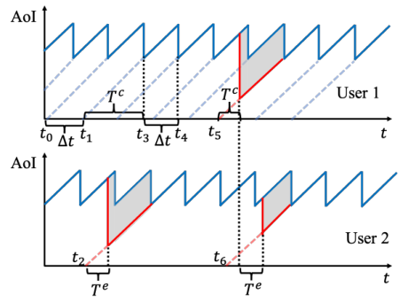

Fig. 1. The illustration of the system model for two users with three tasks. The x-axis indicates time slots and the y-axis indicates the AoI. The blue solid lines show the AoI generated by the cloud, and the red solid lines show that of the edge. The shadow areas depict the reduction of the AoI with the help of the edge server. 

**User-Cloud Communication** A user communicates with the cloud server periodically in a normal mode. Each user _푗_ regularly sends a task _푖_ , such as the real time diagnostics, to the cloud server at each time interval Δ _푡_ , and receives a decision feedback after a processing time period _푇푖, 푗__푐_(in- cluding transmission delay and execution time). As the cloud server is configured with ubiquitous and powerful computing resources, we assume that the tasks do not need to wait for execution. However, the communication time is quite large due to the long transmission distance between users and cloud, and hence the AoI fluctuates at a relatively high level without the involvement of an edge server. 

**User-Edge Communication** When a user encounters an emergency task ( _e.g._ , for a self-driving system, some urgent situations need timely decisions), the user would send the task to both the cloud and the edge server, and receive a quick feedback from the edge server (also from the cloud server as a backup). We assume the execution time on the edge is _푇푖, 푗__푒_, and the task would demand _푚푖, 푗_ units of resources, which may not necessarily be satisfied immediately. Due to the property of ultra-low communication latency of the edge server, we omit the communication time to make the presentation clearer, which will be discussed in the later section. We have that _푇__푒_ _푖, 푗_ is always smaller than _푇푖, 푗__푐_due to the long distance of the cloud [25], [26], and hence AoI can be reduced with the help of edge server. Furthermore, as only emergency tasks are uploaded to the edge server, we assume the emergency tasks from the same user are non-overlapping with each other. 

We illustrate the system model with an example in Fig. 1. For easy presentation, we consider fixed values of _푇__푒_ and _푇__푐_ for all tasks in this example. The users regularly send tasks to the cloud server at each time interval Δ _푡_ , and receive a feedback after _푇__푐_ time slots. At time _푡_ 3, we can calculate that the AoI of user 1 is _푇__푐_ , since the newly received decision is generated at time slot _푡_ 1, which is _푇__푐_ time slots before the current time slot. After time slot _푡_ 3, the AoI increases over time, reaches the highest AoI _푇__푐_ + Δ _푡_ at time _푡_ 4, and then 

drops to _푇__푐_ since the next decision is received. At time _푡_ 2, user 2 sends a task to both the cloud and the edge servers, and receives a response from the edge after _푇__푒_ time slots. With the definition of AoI, we can plot the new AoI curve as the red solid line. Hence, one can see that the AoI is reduced with the help of the edge server (from the blue solid line to the red solid line). At time _푡_ 5, user 1 sends a task to the edge server, and shortly after that, user 2 also sends a task to the same edge server at time _푡_ 6. However, the edge server does not have enough computing resources to satisfy the demands for both users, so the task of user 2 has to wait until the completion of the task of user 1. 

As the timeliness of decisions is critical for the success of real-time information processing applications, _e.g._ , it may influence the safety of self-driving cars or the user experience in interactive gaming, the objective of each user _푗_ is to minimize the weighted average AoI over time, denoted as _퐴 푗_ . The weight captures the extent of emergency or value of using edge services to execute a task, and also indicates the minimum amount of money the user is willing to pay to exchange for a unit decrease of AoI. For each urgent task _푖_ , the value ( _i.e._ , weight) _푣푖, 푗_ is reported by the user _푗_ , and it may depend on many types of factors. For example, in an autonomous vehicle system, the value of a task depends on the driving speed, the vehicle performance, the surrounding environment, the safety awareness and other preference of the user. Since most of these factors are private information to the user, she is able to misreport the value _푣푖, 푗_ for her own interest, _e.g._ , declaring a large value to increase the priority of her task, and reduce the weighted AoI. Such a selfish behavior would degrade the system performance of the edge service, as a more urgent task may be preempted by a non-urgent task with a misreported high value. With such a consideration, we leverage an auction mechanism to incentivize the users to truthfully reveal their private information, and to efficiently allocate the limited edge resources to minimize the weighted average AoI of all users. 

## _B. Problem Formulation_ 

We consider the edge server with _푊_ units of reusable homogeneous resources in a finite time horizon, which can be further divided into _푇_ time slots with equal length: T = {1 _,_ 2 _,_ · · · _,푇_ }. Suppose the set of tasks2 produced by user _푗_ is _푈 푗_ , task _푖_ ∈ _푈 푗_ arrives at time slot _푎푖, 푗_ , and then it should be completed before a deadline _푑푖, 푗_ = _푎푖, 푗_ + _푇푖, 푗__푐_.Thisis because the decision made by the edge server becomes useless when the decision from the cloud server is received after _푇__푐_ _푖, 푗_ time slots. We denote T _푖, 푗_ as the set of all time slots during [ _푎푖, 푗 , 푑푖, 푗_ ] for task _푖_ of user _푗_ , and denote the set of other time slots _푡_ ∉ ∪ _푖_ ∈ _푈 푗_ T _푖, 푗_ by� T _푗_ . To calculate the weighted average AoI _퐴 푗_ of user _푗_ , we denote the age at time _푡_ as _퐴 푗_ ( _푡_ ), the age produced by the cloud server ( _i.e._ , the blue solid line in Fig. 1) as _퐶 푗_ ( _푡_ ), and the age produced by the edge server ( _i.e._ , the red solid line in Fig. 1) as _퐸 푗_ ( _푡_ ). If the AoI at time slot _푡_ 

> 2As we focus on the emergency tasks on the edge, we do not distinguish “task" and “emergency task" in the following sections. 

is not produced by the edge server, we set _퐸 푗_ ( _푡_ ) = +∞. With these definitions, we can have 

_퐴 푗_ ( _푡_ ) = min{ _퐸 푗_ ( _푡_ ) _, 퐶 푗_ ( _푡_ )} _._ 

We then separate the time slots as the slots with cloud produced age and slots with edge produced age, and get the weighted average AoI, 

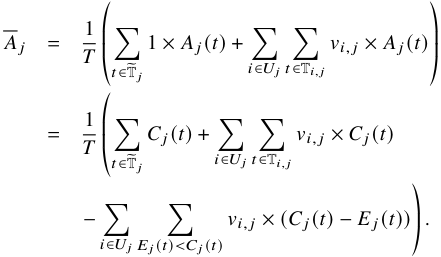

As the first two items in the brackets are constants and the tasks are non-overlapping, we only need to maximize the third item� _퐸 푗_ ( _푡_ ) _<퐶 푗_ ( _푡_ )_푣_ _푖, 푗_×(_퐶_ _푗_(_푡_)−_퐸_ _푗_(_푡_))foreachtask independently, which represents the reduction of the weighted AoI during the current interval, _i.e._ , each of the shadow areas in Fig. 1. For easy presentation, we duplicate each user, also called as an agent, for each of her task, and hence omit the subscript _푗_ for all notations. For example, we use _푣푖_ directly to denote _푣푖, 푗_ . Suppose the edge server starts to execute the task _푖_ at time _푡푖_ without an interruption in the following _푇푖__푒_ time slots, we can then obtain the following weighted AoI reduction, 

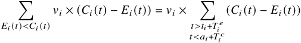

which is a function with respect to the starting time _푡푖_ . Thus, we introduce 

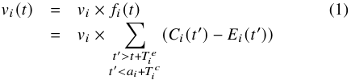

as the task value if it starts to execute at time slot _푡_ , with _푎푖_ ≤ _푡_ ≤ _푎푖_ + _푇푖__푐_−_푇_ _푖__푒_. It should be noted that we do not restrict _퐶푖_ ( _푡_′ ) and _퐸푖_ ( _푡_′ ) to any specific ( _e.g._ , linear) format. Since we have _퐸푖_ ( _푡_ ) _< 퐶푖_ ( _푡_ ) during the considered time interval, we can get that _푓푖_ ( _푡_ ) is non-negative and non-increasing, meaning that the task value is discounting over time. Some possible function _푓푖_ ( _푡_ ) could be _푓푖_ ( _푡_ ) = _휂_(_푡_−_푎푖_) or _푓푖_ ( _푡_ ) = 1 − _훽_ ( _푡_ − _푎푖_ ), where the parameters could be different for all task. Without loss of generality, we normalize _푓푖_ ( _푎푖_ ) = 1. 

With the concept of task value, we can further formulate the problem of weighted AoI minimization as follows. There are _푁_ agents N = {1 _,_ 2 _,_ · · · _, 푁_ } arriving at the system in a random order. Each agent _푖_ ∈ N arrives at time _푎푖_ , and demands for _푚푖_ resources to execute her task before a departure time _푑푖_ . For simplicity of notations, we also denote _푑푖_′=_푎푖_+_푇_ _푖__푐_−_푇_ _푖__푒_ as the latest starting time for task _푖_ to be able to be completed 

in time. Each agent _푖_ has an intrinsic task value _푣푖_ and a time-varying task value _푣푖_ ( _푡_ ) once she is allocated _푚푖_ units of resources from the time _푡_ for _푇푖__푒_consecutivetimeslots.We denote _푣푖_ = _푣푖_ ( _푎푖_ ) as _푣푖_ ( _푎푖_ ) = _푣푖_ × _푓푖_ ( _푎푖_ ) and _푓푖_ ( _푎푖_ ) = 1. As discussed in the previous section, the agent _푖_ ’s time-varying value function can be expressed as 

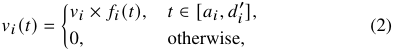

where _푓푖_ ( _푡_ ) is a time discounting value function defined in (1). We note that the arrival time _푎푖_ is critical for the edge to make the correct decision. For example, if a self-driving car uploads a task with an incorrect timestamp, it may receive a false driving command, which endangers the safety. Thus, once an agent _푖_ ∈ N enters the system, the information of arrival time _푎푖_ and the resource demand _푚푖_ are truthfully revealed. The agent submits a declared intrinsic value (bid) _푣_ ˆ _푖_ , which may not be necessarily equal to her true intrinsic value _푣푖_ , to a trusted auctioneer (the edge server). We call the true value _푣푖_ of agent _푖_ as her _type_ as in mechanism design, and use vector **_v_ ˆ** = ( _푣_ ˆ1 _,_ ˆ _푣_ 2 _,_ · · · _,_ ˆ _푣 푁_ ) to denote the declared types ( _i.e._ , the bidding profile) of all agents. 

The procedure of online auction mechanism for edge resource allocation is described as follows. We denote N _푎_ as the set of active agents, who is able to complete its task if starting at the current time slot _푡_ , _i.e._ , we have _푖_ ∈ N _푎_ if _푎푖_ ≤ _푡_ ≤ _푑푖_′.Ateachtimeslot_푡_∈T,theauctioneerfirst calculates the bid _푣_ ˆ _푖_ ( _푡_ ) for each active agent _푖_ ∈ N _푎_ , by replacing her declared type _푣_ ˆ _푖_ with the true intrinsic value _푣푖_ in (2). Given the bidding profile of the active agents N _푎_ at time _푡_ : **_v_ ˆ** ( _푡_ ) = ( _푣_ ˆ1( _푡_ ) _,_ ˆ _푣_ 2 ( _푡_ ) _,_ · · · _,_ ˆ _푣_ |N _푎_ | ( _푡_ )), the auctioneer then allocates the total _푊_ units of resources, including the idle resources and those in use by existing tasks, to the active agents. We note that to further improve the utilization of resources, the newly arrived agents with high bids could interrupt some ongoing tasks with low bids. The agent _푖_ is called a winning agent if she is allocated _푚푖_ units of resources for _푇푖__푒_ continuous time slots without an interruption before the deadline _푑푖_ ; otherwise she is called a losing agent. We use _푥푖_ ( **_v_ ˆ** ) = 1 to denote that the agent _푖_ is a winner when the declare value profile is **_v_ ˆ** ; otherwise _푥푖_ ( **_v_ ˆ** ) = 0. Finally, according to the declared value profile **_v_ ˆ** of agents, the auctioneer determines the payment _푝푖_ ( **_v_ ˆ** ) for each agent _푖_ at her departure time _푑푖_ . The payments of the losing agents are set to zeros. We use vector **_x_** ( **_v_ ˆ** ) = ( _푥_ 1( **_v_ ˆ** ) _, 푥_ 2( **_v_ ˆ** ) _,_ · · · _, 푥 푁_ ( **_v_ ˆ** )) and **_p_** ( **_v_ ˆ** ) = ( _푝_ 1( **_v_ ˆ** ) _, 푝_ 2 ( **_v_ ˆ** ) _,_ · · · _, 푝 푁_ ( **_v_ ˆ** )) to represent the allocation rule and payment rule in an online auction, respectively. 

The _utility 푢푖_ of each agent _푖_ ∈ N is defined as the difference between her value on the allocated resources and the payment: 

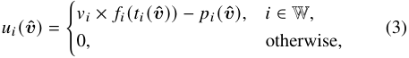

where W is the set of winning agents, and _푡푖_ ( **_v_ ˆ** ) is the starting time of the winner _푖_ ∈ W to execute her task when the declared type profile is **_v_ ˆ** . 

As we have shown at the beginning of this section, minimizing the weighted average AoI is equivalent to maximizing 

the sum of time-varying task values, which is defined as the _social welfare_ in the context of auction mechanism as follows. 

**Definition 2** (Social Welfare) **.** _The social welfare in an online auction mechanism with time discounting values is the sum of winners’ values at their corresponding winning time slots,_ i.e. _,_ 

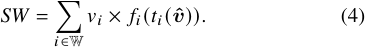

Other than social welfare, _revenue_ , which is defined as the total payment collected from agents, is also a widely used objective in mechanism design. As revenue only reflects the interest of the edge service provider rather than the whole system, we adopt social welfare as the optimization objective in this work, which is beneficial for the long term development of real-time edge service systems. We also evaluate the revenue of the proposed mechanisms in the evaluation results. 

In contrast to the optimization goal of the edge service provider, the agents are rational and selfish, and have incentives to maximize their own utilities by strategically reporting their private intrinsic values. To illustrate this strategic behavior in the setting of time discounting task values, we provide a simple example: Suppose agent 1 with _푣_ 1 = 10 and agent 2 with _푣_ 2 = 8 send tasks to the edge server at the same time. The edge can only serve one agent and the execution time is _푇푖__푒_=1forbothtasks.Weadoptasimpleresourceallocation rule as the more urgent tasks (tasks with higher values) first, and the payment rule as charging the winners a uniform price 1. Under these rules, the solution would be to execute task 1 at the first time slot and then task 2 at the following time slot. If the values of tasks do not discount over time, then agent 2 has no incentive to misreport her value, because the payment is independent on her bid and her utility is always 8 − 1 = 7. However, if the values of tasks shrink by half after each time slot, the strategic behaviors may occur. Suppose agent 2 reports her value truthfully, her utility would be 4 − 1 = 3, and the social welfare is 14. But if agent 2 misreports a value 11, she would be served before agent 1 and obtain a higher utility 8 − 1 = 7, while the social welfare drops to 13. We also observe from this example that the traditional payment rule to guarantee the strategy-proofness derived from the classical Myerson theorem [24], _i.e._ , the payment is independent on the resource allocation time, no longer holds in the setting of time discounting values. This is because the users can change the resource allocation times, resulting in different utilities in the setting of time-varying task values, by misreporting their values. Therefore, a new proper auction mechanism is necessary for this setting to resist such strategic behaviors and still achieve the optimal social welfare. 

## _C. Solution Concepts_ 

A strong solution concept from mechanism design is _dominant strategy_ , where _strategy_ is defined as the type reported by a user. 

**Definition 3** (Dominant Strategy [27]) **.** _A strategy 푣_ ˆ _푖 is agent 푖’s dominant strategy, if for any strategy 푣_ ˆ _푖_′≠_푣_ˆ_푖and any other_ 

_agents’ strategy profile_ **_v_ ˆ** − _푖, we have_ 

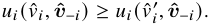

Intuitively, a dominant strategy of an agent is a strategy that maximizes her utility, regardless of what strategy profile the other agents choose. 

The concept of dominant strategy is the basis of _incentivecompatible_ mechanism, in which truthfully revealing private information is a dominant strategy for every agent. An accompanying concept is _individual-rationality_ , which means that every agent participating in the auction expects to gain no less utility than staying outside. We now can introduce the definition of a _strategy-proof mechanism_ . 

**Definition 4** (Strategy-Proofness [28]) **.** _A mechanism is strategy-proof when it satisfies both incentive-compatibility and individual-rationality._ 

The objective of this work is to design a strategy-proof online auction mechanism in the setting of time discounting task values. 

## III. CHARACTERIZING STRATEGY-PROOFNESS 

In this section, we present a characterization theorem for strategy-proof online auction mechanisms with time discounting values. This can be considered as a generalization of the well-known Myerson theorem [24]. Specifically, we claim that the necessary and sufficient condition for a payment rule that truthfully implement an allocation rule in the setting of time discounting values is that the function _퐹_ ( **_v_ ˆ** ) = _푓_ ( _푡_ ( **_v_ ˆ** )) × _푥_ ( **_v_ ˆ** ) must satisfy a monotonicity criterion. We first give the definition of this monotone criterion. 

**Definition 5** (Monotonicity) **.** _The function 퐹푖_ ( **_v_ ˆ** ) = _푓푖_ ( _푡푖_ ( **_v_ ˆ** ))× _푥푖_ ( **_v_ ˆ** ) _is monotone, if for any two types of 푣_ ˆ _푖 and 푣_ ˆ _푖_′_with_ _푣_ ˆ _푖 > 푣_ ˆ _푖_′_andthereportedtypesoftheotheragents_**_v_ˆ**−_푖,we_ _have 퐹푖_ ( _푣_ ˆ _푖,_ **ˆ** **_v_** − _푖_ ) ≥ _퐹푖_ ( _푣_ ˆ _푖_′_,_**ˆ****_v_**−_푖_)_._ 

We take a closer look at this monotone condition _퐹푖_ ( _푣_ ˆ _푖,_ **ˆ** **_v_** − _푖_ ) ≥ _퐹푖_ ( _푣_ ˆ _푖_′_,_**ˆ****_v_**−_푖_),whichcouldberealizedintwo detailed cases. One is that the allocation result _푥푖_ (·) changes from _푥푖_ ( _푣_ ˆ _푖_′_,_**ˆ****_v_**−_푖_)=0to_푥푖_(_푣_ˆ_푖,_**ˆ****_v_**−_푖_)=1.Theothercaseisthat the allocation result _푥푖_ (·) remains the same, _i.e._ , _푥푖_ ( _푣_ ˆ _푖,_ **ˆ** **_v_** − _푖_ ) = _푥푖_ ( _푣_ ˆ _푖_′_,_**ˆ****_v_**−_푖_)=13and_푓푖_(_푡푖_(_푣_ˆ_푖,_**ˆ****_v_**−_푖_))≥_푓푖_(_푡푖_(_푣_ˆ _푖_′_,_**ˆ****_v_**−_푖_)),which further implies _푡푖_ ( _푣_ ˆ _푖,_ **ˆ** **_v_** − _푖_ ) ≤ _푡푖_ ( _푣_ ˆ _푖_′_,_**ˆ****_v_**−_푖_) under the assumption of non-increasing function _푓푖_ ( _푡_ ). The first case is consistent with the monotonicity of allocation rule in the classical Myerson Theorem, meaning that the bidder with a higher value is more likely to win the auction. The second case comes from the new feature of online mechanism, which further requires the agent with a higher value to be allocated at an earlier time slot. The intuition behind this monotone condition in online setting is that the winning user could be allocated resources at an earlier time slot if she increases her declared type. 

We now present our main result: the necessary and sufficient condition for the existence of strategy-proof online auction mechanisms with time discounting values. 

> 3Another case of _푥푖_ ( ˆ _푣푖 ,_ **ˆ** **_v_** − _푖_ ) = _푥푖_ ( ˆ _푣푖_ ′_,_**ˆ****_v_**−_푖_)=0istrivialtoanalyze,and we omit it here. 

**Theorem 1.** _There exists a payment rule_ **_p_** ( **_v_ ˆ** ) _such that the online auction mechanism_ ( **_x_** ( **_v_ ˆ** ) _,_ **_p_** ( **_v_ ˆ** )) _in the setting of time discounting values is strategy-proof if and only if the function 퐹푖_ ( **_v_ ˆ** ) = _푓푖_ ( _푡푖_ ( **_v_ ˆ** )) × _푥푖_ ( **_v_ ˆ** ) _is monotone for each agent 푖_ ∈ N _._ 

utility _푢푖_ ( **_v_ ˆ** ) of agent _푖_ can not be negative, and the property of _Individual Rationality_ is satisfied. 

We now show that the monotone function _퐹푖_ ( **_v_ ˆ** ) in combination with the payment rule _푝푖_ ( **_v_ ˆ** ) in (5) guarantees the property of _Incentive Compatibility_ . We prove this by contradiction. If the auction mechanism is not incentive compatible, there exists an agent _푖_ , a true type _푣푖_ , and a non-truthful reported type _푣_ ˆ _푖_ with _푣_ ˆ _푖_ ≠ _푣푖_ , such that _푢_ ˆ _푖_ ( _푣_ ˆ _푖,_ **ˆ** **_v_** − _푖_ ) _> 푢푖_ ( _푣푖,_ **ˆ** **_v_** − _푖_ ). That is, the utility of agent _푖_ reporting _푣_ ˆ _푖_ is strictly greater than the utility _푢푖_ ( _푣푖,_ **ˆ** **_v_** − _푖_ ) that she can achieve from being truthful. By (6), we have 

This theorem indicates that, when designing a new mechanism for the time discounting value scenarios, we can transform the problem of satisfying strategy-proofness into the proof of the monotonicity of the function _퐹푖_ ( **_v_ ˆ** ). We separate the theorem into “if" and “only if" parts, and complete the proof by analyzing the following two lemmas. 

**Lemma 1.** _If the function 퐹푖_ ( **_v_ ˆ** ) = _푓푖_ ( _푡푖_ ( **_v_ ˆ** )) × _푥푖_ ( **_v_ ˆ** ) _is monotone for each agent, the online auction mechanism associated with a carefully designed payment rule_ **_p_** ( _푣_ ) _is strategy-proof._ 

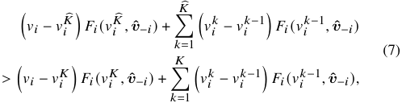

_Proof._ We set the payment rule as 

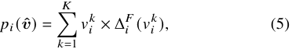

where _퐾_� is the corresponding maximum index of breakpoints for the misreported type _푣_ ˆ _푖_ . It is worth to note that the misreported type _푣_ ˆ _푖_ only impacts the numbers, rather than the values, of breakpoints compared with the true type _푣푖_ , because the values of breakpoints are independent on the declared type of agent _푖_ . 

where the sequence _푣_1 _푖__, 푣_2 _푖__,_· · ·_, 푣_ _푖__퐾_is a list of_퐾_values, which are the breakpoints of function _퐹푖_ ( **_v_ ˆ** ) when the value increases from 0 to the true value _푣푖_ . In general, we assume _푣푖__푘_1 ≤ _푣푖__푘_2for _푘_ 1 ≤ _푘_ 2, _푣_0 _푖_= 0and_푣_ _푖__퐾_≤_푣푖_.ThefunctionΔ _푖__퐹_(_푣_ _푖__푘_)represents the jump of _퐹푖_ ( **_v_ ˆ** ) at the breakpoint ( _푣푖__푘,_**ˆ****_v_**−_푖_)4,_i.e._, 

Since the case of _퐾_� = _퐾_ is trivial for the proof, we can complete the analysis by distinguishing the following two cases: 

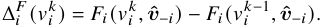

The intuition behind the payment rule in (5) is that, with the increase of _푣푖_ , the agent is allocated at a “better" ( _i.e._ , earlier) time slot, so the auctioneer charges the agent for this incremental part. The breakpoint value _푣푖__푘_in(5)meansthe critical price of being allocated at the better time slot, and Δ _푖__퐹_(_푣_ _푖__푘_)measures“howbetterthenewtimeslotis",_i.e._,the (normalized) value difference between the two allocations for agent _푖_ . 

▶ If _푣_ ˆ _푖 < 푣푖_ , we then have _퐾<_� _퐾_ , and thus _푣푖퐾_� ≤ _푣푖__퐾_. Since the function _퐹푖_ ( **_v_ ˆ** ) is monotone, we can get 

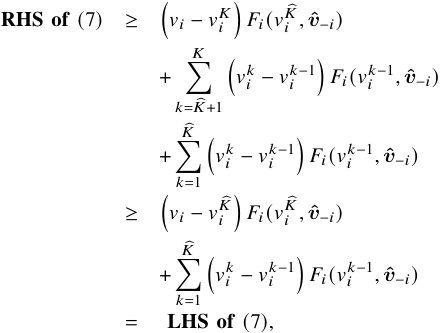

With the payment rule in (5), we can express the utility _푢푖_ ( **_v_ ˆ** ) of agent _푖_ ∈ N as: 

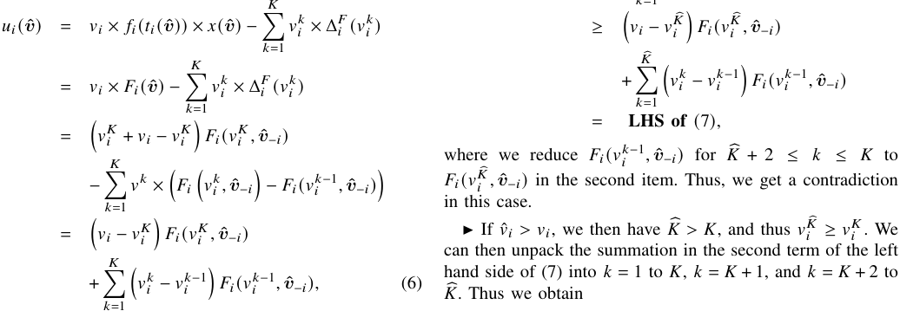

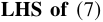

where the third equation is because _퐹푖_ ( _푣푖,_ **ˆ** **_v_** − _푖_ ) = _퐹푖_ ( _푣푖__퐾,_**ˆ****_v_**−_푖_) as _푣푖__퐾_ is the highest breakpoint for resource allocation for agent _푖_ . According to the definition of the value sequence, we have _푣푖__퐾_≤_푣푖_and_푣_ _푖__푘_−1 ≤ _푣푖__푘_forall1≤_푘_≤_퐾_.Therefore,the 

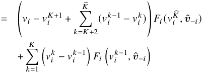

> 4We omit the situation with ties for notation simplicity, _i.e._ , we consider _퐹푖_ ( _푣푖__푘,_**ˆ****_v_**−_푖_)=_퐹푖_(_푣_ _푖__푘_+_휖,_**ˆ****_v_**−_푖_),forasmallpositiveconstant_휖_. 

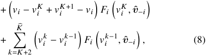

**Algorithm 1:** Resource Allocation Algorithm 

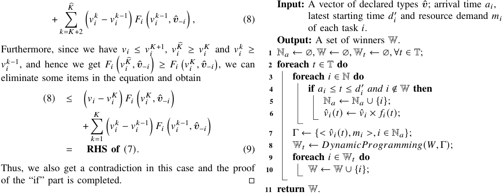

Conversely, we consider the “only if” part. 

**Lemma 2.** _If the online auction mechanism_ ( **_x_** ( **_v_ ˆ** ) _,_ **_p_** ( **_v_ ˆ** )) _is strategy-proof, then we have 퐹푖_ ( **_v_ ˆ** ) = _푓푖_ ( _푡푖_ ( **_v_ ˆ** )) × _푥푖_ ( **_v_ ˆ** ) _is monotone for each agent._ 

_Proof._ Consider an agent _푖_ ∈ N and two type profiles **_v_** , **_v_ ˆ** with **_v_** − _푖_ = **_v_ ˆ** − _푖_ and _푣푖 > 푣_ ˆ _푖_ . We first consider a scenario where the true type of the agent _푖_ is _푣푖_ . The strategy-proof mechanism ensures that the utility of agent _푖_ when reporting her type truthfully is not less than that when she misreports her type, _i.e._ , 

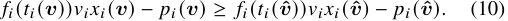

We then consider another scenario where the true type of the agent _푖_ is _푣_ ˆ _푖_ and she may cheat by misreporting _푣푖_ . Similarly, we have 

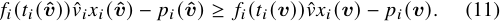

## IV. PREDISC FOR THE CASE WITH UNIT EDGE EXECUTION TIME 

We now present the detailed design for our proposed mechanism, namely PreDisc, and analyze its economic properties and competitive ratio. We first present the mechanism for the case of unit edge execution time, _i.e._ , _푇푖__푒_ = 1 for all tasks (thus we omit the subscript _푖_ ), in which the knotty problem of preemption in online setting does not exist. In this case, the cloud processing time _푇푖__푐_ and the resource demand _푚푖_ could be different for tasks. We note that the “online" property of the problem is still a challenge, that is, we should decide when to conduct a task within its duration to optimize the overall AoI. The allocated time slots for the current tasks may prevent future tasks from being executed. We will extend the mechanism to the general cases of different execution time slots on edge in the next section. 

Combining (10) and (11), we can get 

## _A. Allocation Rule_ 

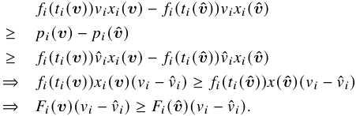

Since _푣푖 > 푣_ ˆ _푖_ , we have _퐹푖_ ( **_v_** ) ≥ _퐹푖_ ( **_v_ ˆ** ). Thus, we can conclude that _퐹푖_ ( **_v_** ) is monotone. □ 

We remark that this result can be applied to not only the AoI optimization problem, but also some other real-world scenarios with time discounting values. For example, the authors of [29] found that the expected click probability ( _i.e._ , the value) of an impression advertisement on mobile apps decreases during the user’s visit. In addition, the click value of live streaming advertisement, a new type of advertisement in recent years, also decreases during the live streaming. Our results provide a fundamental theoretical tool to deal with this kind of problems. 

We present the procedure of resource allocation rule of PreDisc in Algorithm 1. At each time slot, the active tasks are collected in the set _푁푎_ , and their current values and resource demands are collected in the set Γ (Lines 3-7). The allocation problem at each time slot can be formulated as a 0-1 knapsack problem, where the capacity of the knapsack is the resource capacity _푊_ and the profit and weight of each item correspond to the current value and the resource demand of the task, respectively. Our goal at each time slot is to select the most cost-efficient active tasks under the resource capacity constraint. Thus, we adopt dynamic programming technique to solve the resource allocation problem at each time slot _푡_ to obtain the winner set W _푡_ , and to update the ultimate winner set W (Lines 8-10). 

We next show that such a simple allocation rule at each time slot without the knowledge of future tasks, can obtain a constant competitive ratio 2. This result implies that PreDisc achieves at least half of the offline optimal social welfare. 

**Theorem 2.** _The competitive ratio of the resource allocation rule in PreDisc is_ 2 _for the cases with unit edge execution time._ 

**Algorithm 2:** Payment Calculation Algorithm 

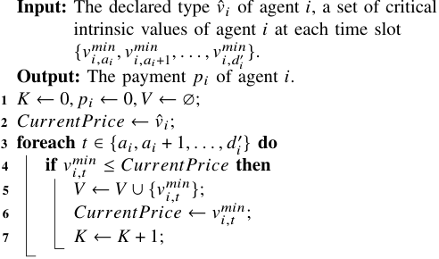

_Proof._ Let the set of winners in the offline optimal solution (OPT) be OPT, and the winning agents at time slot _푡_ in OPT be OPT _푡_ . Similarly, we denote the corresponding sets of winning agents obtained from PreDisc as W and W _푡_ , respectively. For a winning agent _푖_ , we use _푡푖_∗to present the time it is selected in OPT, and _푡푖_ the time it is selected in PreDisc. We distinguish the following two cases. 

▶ For agent _푖_ ∈ OPT _푡_ , if agent _푖_ ∈ W _푡_′ for _푡_′ ≤ _푡_ , _i.e._ , agent _푖_ is also selected as a winner in PreDisc at or before the time slot _푡_ , we denote these agents as a set OPT1 _푡_.Sincethevalues of tasks are non-increasing, we can easily obtain 

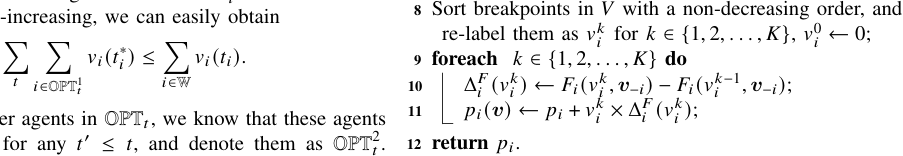

▶ For the other agents in OPT _푡_ , we know that these agents are not in W _푡_′ for any _푡_′ ≤ _푡_ , and denote them as OPT2 _푡_. In PreDisc these agents may lose or be selected as a winner later. We have that the total value of these agents at the time slot _푡_ should be less than that of agents selected by PreDisc; otherwise, the dynamic programming algorithm would output them as the result. Thus, we can get 

value _푣_ ˆ _푖__푚푖푛_ ( _푡_ ) represents the minimum bid at time slot _푡_ that the agent _푖_ can win at this time slot. Then, according to the definition of time-varying value function (2), we can get the corresponding critical intrinsic value 

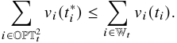

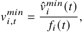

Overall, we have 

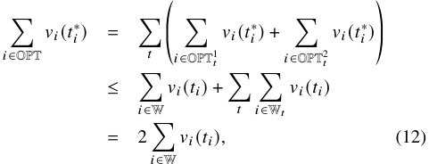

which the agent _푖_ needs to declare to win at the time slot _푡_ . With this critical value for agent _푖_ at each time slot, we can greedily select a non-increasing subsequence of critical values over time, which are the breakpoint values as stated in Theorem 1. Intuitively, suppose one breakpoint is _푣푖,푡__푚푖푛_, it means that when the agent _푖_ reports an intrinsic value no less than _푣푖,푡__푚푖푛_ at arrives time _푎푖_ , she would be selected as a winner no later than the time slot _푡_ . We give a procedure in Algorithm 2 to determine the breakpoints from the critical intrinsic values and the corresponding payment for the winning agent _푖_ . Following the time slots from the arrival time _푎푖_ to the latest starting time _푑푖_′,wesetthefirstbreakpointasthefirst critical intrinsic price less than the bid of agent. After that, we select the critical intrinsic price as a breakpoint only when it is less than the previously selected breakpoint (Lines 2-7). For example, suppose the declared type is 5, and the sequence of critical intrinsic prices is {6 _,_ 4 _,_ 2 _,_ 3}, we select 4 and then 2 as the breakpoints. We can verify that such a selected set of intrinsic values satisfies the definition of breakpoints. We then sort the selected breakpoints with a non-decreasing order, and calculate the payment using (5) in Theorem 1 (Lines 8-11). 

which concludes our proof. □ 

## _B. Payment Rule_ 

In classical online auction mechanisms [22], [23], to guarantee the strategy-proofness, the payment rule is to set a predefined price for each time slot. However, we have constructed a simple example in the previous section to demonstrate that with such a payment rule, the property of strategy-proofness no longer holds when the value discounts over time. To tackle this obstacle, we calculate the critical price for each single slot, and derive our payment rule based on the extended Myerson Theorem in Section III. 

We conduct the following steps to calculate the payment for each winner _푖_ in the allocation rule. First, we run the resource allocation algorithm _i.e._ , Algorithm 1 again to compute a new solution without the agent _푖_ . During this new allocation process, at each time slot, we can leverage the optimal substructure of dynamic programming, and obtain the minimum bid _푣_ ˆ _푖__푚푖푛_ ( _푡_ ) as the difference between the solutions for total _푊_ units of resources and for _푊_ − _푚푖_ units of resources. The 

Consider a simple walkthrough example in Fig. 2, where the total amount of resources _푊_ is 5, the cloud processing time _푇푖__푐_= 3 for all tasks, and the value of each user_푖_∈N decreases linearly with time through a time-discounting function _푓푖_ ( _푡_ ) = 1 −<u>1</u> 3(_푡_−_푎푖_).InFig.2,weusesolidlinetodenotethepresent time interval of each agent. The resource demand and value are also shown beside each agent. In the allocation determination phase, at the first time slot, agents A and C are selected as 

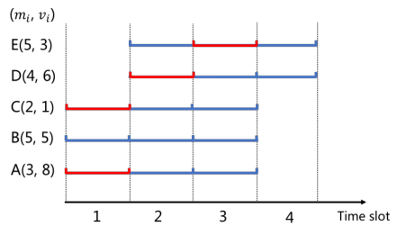

Fig. 2. A walkthrough example for the cases with unit edge execution time. 

winners because their total value 9 is larger than that of B. At the second time slot, the value of B becomes<u>10</u> 3,andDis chosen due to a higher value 6. At the third time slot, agents B with an updated value<u>5</u> 3andEwithanupdatedvalue2are active, and E is selected as a winner. We denote the winners at each time slot as red in Fig. 2. In the payment calculation phase, for agent A, we remove her and re-run the resource allocation procedure, obtaining the critical intrinsic values for each time slot _푣__푚푖푛_ _퐴,_ 1=4_, 푣푚푖푛_ _퐴,_ 2=8_, 푣푚푖푛_ _퐴,_ 3=5.Wecangreedily get the decreasing subsequence with only a breakpoint _푣_1 _퐴_= 4. Using (5), we can calculate the payment for agent A as _푝 퐴_ = 4. Similarly, we have the breakpoint sequence for agent C as _푣퐶_1=0,foragentDas_푣푚푖푛_ _퐷,_ 2=<u>10</u> 3_, 푣푚푖푛_ _퐷,_ 3=3_, 푣푚푖푛_ _퐷,_ 4=0,and for agent E as _푣_3 _퐸_= 2<u>5</u>_, 푣_4 _퐸_=0.Finally,wecancalculatethe payment for agents: _푝퐶_ = 0 _, 푝퐷_ =<u>19</u> 9_, 푝퐸_= 6<u>5</u>. We now show the strategy-proofness of PreDisc based on Theorem 1. 

**Theorem 3.** _The online auction mechanism PreDisc with the above allocation and payment rules is strategy-proof for the cases with unit edge execution time._ 

## _A. Virtual Bid Generation_ 

When a newly arrived agent has a task value higher than that of some ongoing agents, the auctioneer can choose to preempt the ongoing tasks to make up the task value difference, or to reject the new agents to guarantee the continuity of edge service. Once a task is preempted, it would wait until being selected next time to execute the task from the beginning, and hence the preemption may degrade the resource utilization if the newly arrived agents does not offer a substantially higher bid. With this consideration, the auctioneer raises the bids of ongoing agents, which is denoted by N _표_ , to give them higher priorities of being allocated resources continuously. At time slot _푡_ , each ongoing agent _푖_ ∈ N _표_ has been allocated _푚푖_ units of resources without an interruption from the time slot _푡푖_ ( **_v_ ˆ** ). We denote the virtual bid of agent _푖_ at time slot _푡_ as _푏푖_ ( _푡_ ), which can be calculated as 

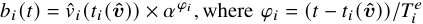

which denotes the percentage of task _푖_ ’s completeness at time _푡_ , and _훼_ ≥ 1 is the parameter that the auctioneer can adjust to control the preemption frequency: the setting of _훼_ = 1 represents the preemption model which interrupts the ongoing tasks once there is a newly arrived task with a higher bid. The auctioneer can give more protection to the ongoing tasks by increasing _훼_ . When _훼_ →∞, the auctioneer does not allow preemption, and the tasks can execute for continuous _푇푖__푒_timeslotsoncetheyareallocatedresources.Fortheactive agents that have not been allocated resources, _i.e._ , agents in N _푎_ \N _표_ , the auctioneer updates their bids _i.e._ , _푏푖_ ( _푡_ ) = _푣_ ˆ _푖_ ( _푡_ ). The auctioneer can generate the virtual bid _푏푖_ ( _푡_ ) of the agent _푖_ ∈ N at time slot _푡_ ∈ T by distinguishing the following two cases: 

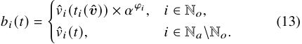

## _B. Allocation Rule_ 

_Proof._ Based on Theorem 1, we only need to prove the monotonicity of the resource allocation rule, _i.e._ , the winning agent would be executed at an earlier (or the same) time slot when she increases her bid. Since the dynamic programming algorithm outputs the optimal solution at each time slot, if a winning agent reports a higher value, she would either be selected at this time slot or an earlier one. Hence, the monotonicity of the allocation rule as defined in Definition 5 is satisfied and we can conclude the proof. □ 

## V. PREDISC FOR GENERAL CASES 

In this section, we first extend PreDisc to the case where _푇푖__푒_ can be larger than 1 but is still the same for all tasks (hence we use _푇__푒_ and _푇푖__푒_interchangeably).Insuchcase,tasksmay be preempted by other tasks during the execution process, and hence the interactions among tasks become more complex in such online settings. In Section V-D, we further extend PreDisc to the most general cases, where the execution time _푇푖__푒_on edge can be different among tasks and the communication time to the edge is also taken into account. 

The algorithm of resource allocation in the general cases is shown in Algorithm 3. For simplicity, we only present the algorithm for one time slot. Similar to the allocation rule in the simple case, the key idea is to use dynamic programming technique with the virtual bids of agents at each time slot. We first update the current values of tasks as the virtual bids to give the ongoing tasks higher priorities of being allocated (Lines 1-7). After that, we consider the problem of resource allocation as the knapsack problem, and adopt the dynamic programming technique to solve it (Lines 8-9). We update the allocation states for two kinds of agents. For newly winning agents, we update their winning time _푡푖_ ( **_v_ ˆ** ) as _푡_ (Lines 1011). For preempted agents, we set their winning time to _푁푢푙푙_ back (Lines 12-13), then they would wait for the next allocation process. We add the agents, who have executed for _푇푖__푒_consecutivetimeslotsbeforethedeparturetime,into the ultimate winner set (Lines 15-16). We discard the agents whose tasks cannot be completed in the remaining time (Lines 17-18). 

**Theorem 4.** _The competitive ratio of our resource allocation rule in PreDisc is_ 1 + _<u>훼</u> for the general cases with_ 1− _훼_− _푇_<u>1</u>_<u>푒</u>_ 

**Algorithm 3:** Resource Allocation Algorithm for General Cases <u>(for</u> One Time Slot) 

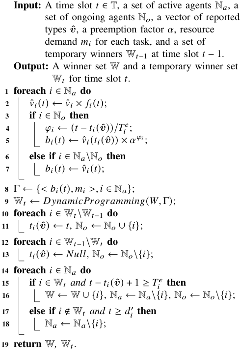

_identical edge computation time slots, compared with the offline optimal solution._ 

_Proof._ The proof process is similar to that of Theorem 2, and we re-use the notations in Theorem 2. We note that in general cases with identical _푇푒_ , an agent would be a winner in _푇__푒_ consecutive time slots. Thus, we denote _푖_ ∈ OPT _푡_ as that the task _푖_ starts to execute from time slot _푡_ for _푇__푒_ consecutive time slots ( _i.e._ , _푡푖_∗=_푡_), andfor_푖_∈W inPreDisc, thetask_푖_starts to execute from time slot _푡푖_ for _푇__푒_ consecutive time slots. But for task _푖_ in the temporary winner set _푖_ ∈ W _푡_ , it only represents that task _푖_ is selected at time slot _푡_ , which might be preempted later. We distinguish the following two cases. 

▶ For agent _푖_ ∈ OPT _푡_ , if _푖_ ∈ W with _푡푖_ ≤ _푡_ , _i.e._ , the agent _푖_ is also selected as a winner in PreDisc starting at or before time slot _푡_ , we denote them as a set OPT1 _푡_,anddenotetheset of them of all time slots as OPT1 = ∪ _푡_ ∈TOPT1 _푡_. Since we have that the values of tasks are non-increasing, we can easily get that 

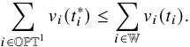

▶ For the other agents in OPT _푡_ , _i.e._ , _푖_ ∉ W or _푖_ ∈ W with _푡푖 > 푡_ , we denote the set of them of all time slots as OPT2 _푡_.TheymayloseinPreDiscorbeselectedasawinner later. Similarly, we denote all of them as OPT2 = ∪ _푡_ ∈TOPT2 _푡_. 

We have that the total value of agents in OPT2 _푡_attimeslot _푡_ should be no more than the total virtual bid of agents selected by PreDisc at the same time slot; otherwise, the dynamic programing algorithm would output them as the result. Therefore, we can get 

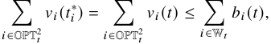

where the left equation is because _푡푖_∗=_푡_asstatedabove. 

Next, at time slot _푡_ , we denote the sum of virtual bids of uncompleted ongoing agents as _푆푢푛_ ( _푡_ ). It can be observed that <u>1</u> the sum of virtual bids at time slot _푡_ +1 is at least _푆푢푛_ ( _푡_ )× _훼 푇__<u>푒</u>_ following the rule of virtual bid. This means, every selected agent _푖_ in PreDisc would either be completed ultimately or, be preempted by agents whose total value is larger than the sum of virtual bids of preempted agents. We note that this observation holds even if the preemption happens in a chain. Thus, let the set of agents which are completed at time slot _푡_′ in our algorithm be N _푡__푐_′,andrecallthatthelasttimeslotinT is _푇_ , then we can get 

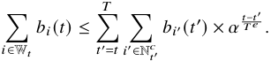

The key idea of this equation is that, once a winner is selected at time slot _푡_ , it might be preempted, but finally the winner or its (chained) preemptor will be completed at a later time slot. So we map the subsequent completed tasks to time slot _푡_ and sum over all of them as an upper bound of the left side. Thus we have that 

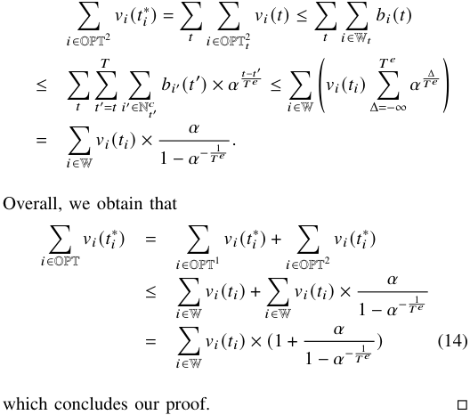

Base on the theorem, we can get the optimal preemption factor _훼_ = (1 + _푇_ <u>1</u>_<u>푒</u>_)_푇푒_withsimplemathematicalcalculations, while the corresponding competitive ratio is ( _푇__푒_ +1)(1+ _푇_<u>1</u>_<u>푒</u>_)_푇푒_, which is a small constant. This result implies that the optimal preemption factor is related to only the edge execution time. Intuitively, a larger _푇__푒_ with the same _휑푖_ implies that the ongoing task tends to have occupied the resources for a longer time, and thus it is more cost-efficient not to preempt it, _i.e._ , 

setting a larger preemption factor _훼_ . 

_Proof._ The proof process is quite similar to that of Theorem 4, and we present it in detail for readability. We note that in such general cases, an agent would be a winner in _푇푖__푒_consecutive time slots. Thus, we denote _푖_ ∈ OPT _푡_ as that the task _푖_ starts to execute from time slot _푡_ for _푇푖__푒_consecutivetimeslots(_i.e._, _푡푖_∗=_푡_),andfor_푖_∈WinPreDisc,thetask_푖_startstoexecute from time slot _푡푖_ for _푇푖__푒_consecutivetimeslots.Butfortask_푖_ in the temporary winner set _푖_ ∈ W _푡_ , it only represents that task _푖_ is selected at time slot _푡_ , which might be preempted later. We again distinguish the following two cases. 

## _C. Payment Rule_ 

Similar to the payment rule for the simple case, it is necessary to calculate the critical intrinsic price for _푖_ to be a winner at different time slot. But the difference is that, in the general cases with _푇__푒_ ≥ 1, the critical intrinsic price should guarantee that agent _푖_ can win in continuous _푇__푒_ time slots. Following the procedure in Section IV-B, we can get the minimum virtual bid _푏푖__푚푖푛_ ( _푡_ ) of winning at a single time slot _푡_ for agent _푖_ . Correspondingly, we can calculate _푣_ ˆ _푖__푚푖푛_ ( _푡_ ), the minimum bid at time slot _푡_ for agent _푖_ to win _푇__푒_ continuous time slots starting from time _푡_ ( _푡_ ∈[ _푎푖, 푑푖_′]): 

▶ For agent _푖_ ∈ OPT _푡_ , if _푖_ ∈ W with _푡푖_ ≤ _푡_ , _i.e._ , the agent _푖_ is also selected as a winner in PreDisc starting at or before time slot _푡_ , we denote them as a set OPT1 _푡_,anddenotetheset of them of all time slots as OPT1 = ∪ _푡_ ∈TOPT1 _푡_. Since we have that the values of tasks are non-increasing, we can easily get that 

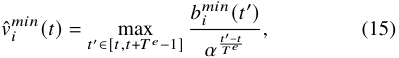

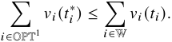

which is the highest minimum bid (mapping from the minimum virtual bids) for single time slots in the present interval. Then we have the corresponding critical intrinsic value for the agent _푖_ at time _푡_ : 

▶ For the other agents in OPT _푡_ , _i.e._ , _푖_ ∉ W or _푖_ ∈ W Then we have the corresponding critical intrinsic value for the with _푡푖 > 푡_ , we denote the set of them of all time slots as _푖_ ( _푡_ ) OPT2 _푡_.TheymayloseinPreDiscorbeselectedasawinner _푣__푚푖푛_ =_푣_ˆ_푚푖푛_ _푖,푡 푓푖_ ( _푡_ )_._ later. Similarly, we denote all of them as OPT2 = ∪ _푡_ ∈TOPT2 _푡_. We have that the total value of agents in OPT2 _푡_attimeslot Algorithm 2 to calculate the payment of _푡_ should be no more than the total virtual bid of agents selected by PreDisc at the same time slot; otherwise, the the following theoretical guarantee on dynamic programing algorithm would output them as the strategy-proofness, and again omit the proof due to space limit. result. Therefore, we can get 

Next, we can call Algorithm 2 to calculate the payment of each winning agent. 

Finally, we can get the following theoretical guarantee on strategy-proofness, and again omit the proof due to space limit. 

**Theorem 5.** _Our proposed mechanism PreDisc with the above allocation and payment rule is strategy-proof for the general cases with the identical edge execution times._ 

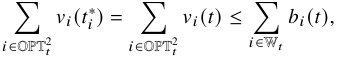

where the left equation is because _푡푖_∗=_푡_asstatedabove. 

## _D. Extension_ 

We next extend PreDisc to the most general and realistic cases, where 1) the communication time to the edge is taken into account, and 2) the edge execution time _푇푖__푒_ could be different for tasks, and hence the decisions on preemption become more complex. 

We can first obtain that the mechanism design problem with non-negligible communication time to the edge is equivalent to the problem where tasks are generated after the communication time in our simplified model. Furthermore, as the task communication time could not be manipulated by the user, we have that the communication time to the edge does not affect the theoretical analysis, and both the strategy-proofness and the constant competitive ratio still hold with the extension of non-negligible communication time to the edge. 

We next show that with the above allocation rule and payment rule, the corresponding competitive ratio is similar to Theorem 4 under the extension, as long as we replace _푇__푒_ with _푇푚푎푥__푒_,whichisthehighestedgeexecutiontimeamong all tasks. 

**Theorem 6.** _Following the same allocation rule and payment_ _<u>훼</u> rule as above, the competitive ratio of PreDisc is_ 1+ 1− _훼_ − _푇푚푎푥__<u>푒</u>_ <u>1</u> _for the general cases compared with the offline optimal solution._ 

Next, at time slot _푡_ , we denote the sum of virtual bids of uncompleted ongoing agents as _푆푢푛_ ( _푡_ ). It can be observed that <u>1</u> _푇푚푎푥__<u>푒</u>_ the sum of virtual bids at time slot _푡_ +1 is at least _푆푢푛_ ( _푡_ )× _훼_ following the rule of virtual bid. This means, every selected agent _푖_ in PreDisc would either be completed ultimately or, be preempted by agents whose total value is larger than the sum of virtual bids of preempted agents. We use _푇푚푎푥__푒_,thehighest edge execution time among tasks, to present the lower bound of the sum of virtual bides at time slot _푡_ + 1. This observation holds even if the preemption happens in a chain. Thus, let the set of agents which are completed at time slot _푡_′ in our algorithm be N _푡__푐_′,andrecallthatthelasttimeslotinTis_푇_, then we can get 

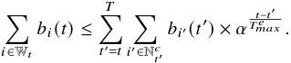

The key idea of this equation is that, once a winner is selected at time slot _푡_ , it might be preempted, but finally the winner or its (chained) preemptor will be completed at a later time slot. So we map the subsequent completed tasks to time slot _푡_ and sum over all of them as an upper bound of the left side. Thus we have that 

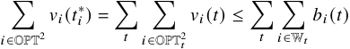

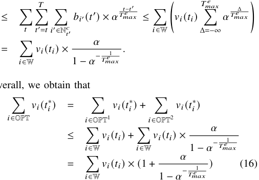

Overall, we obtain that 

which concludes our proof. □ 

Similarly, the economical property of strategy-proofness also holds in the extended cases. Since the proof is similar to Theorem 3, we omit the proof here due to the space limitation. 

**Theorem 7.** _Following the same allocation rule and payment rule as above, our proposed mechanism PreDisc is strategyproof for the general cases._ 

We would further interpret how the general cases can be interpreted in the real-world task offloading scenarios. We can model the edge execution time as 

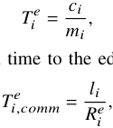

and the communication time to the edge as 

where _푐푖_ is the number of CPU cycles the task requires, _푚푖_ is the CPU computational capability allocated to the task, _푙푖_ is the input data size of a task and _푅푖__푒_istheaveragedata transmission rate between the edge and the user. In addition, we can model the cloud processing time as 

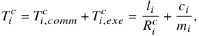

where _푇푖,푐표푚푚__푐_isthecommunicationtimetothecloud,_푇_ _푖,푒푥푒__푐_ is the cloud execution time and _푅푖__푐_ is the average data transmission rate between the cloud and the users. We note that _푇푖,푒푥푒__푐_isthesameastheedgeexecutiontime_푇_ _푖__푒_because the number of CPU cycles _푙푖_ and the CPU computational capability it is allocated _푚푖_ are the same. 

## _A. Experimental Settings_ 

We implement our proposed mechanism in C++, and compare it with the existing mechanisms. In the experiments, there are _푁_ = 100 users and _푇_ = 100 time slots, where the length of each time slot is set as 10 ms. The number of required CPU resources of each task _푚푖_ are set as integers following a uniform distribution over [1, 5], and each unit of GPU resource is set as 1 GHz. The overall CPU capacity on the edge is 

_푊_ = 10 GHz if not otherwise specified. In particular, we set the intrinsic values of tasks following a uniform distribution over [1, 10]. The time discounting value function _푓푖_ ( _푡_ ) is specified as a linear function _푓푖_ ( _푡_ ) = 1 − _푇_ <u>(</u> _푖푡__<u>푐</u>_ −− _푎__푇_ _<u>푖푖</u>_ <u>)</u>_<u>푒</u>_.Eachusergenerates a task at a time slot with probability (arrival rate) _훾_ if she has no active task at the time. We set the arrival rate _훾_ as 0.1 in our experiment. To make the presentation clearer, we first consider the simplified model where the communication time to the edge is not considered, and the edge execution time is fixed as 30 ms ( _i.e._ , 3 time slots), and the cloud processing time as 100 ms ( _i.e._ , 10 time slots). We then also consider the realistic cases with non-negligible communication time to the edge and different edge execution times and cloud processing times among the tasks. Similar to the settings in [30]–[32], we set the input data size of tasks as _푙_ = 50 Kb, the data transmission rate to the edge as _푅__푒_ = 5 Mbits/s, the data transmission rate to the cloud as _푅__푐_ = 0 _._ 5 Mbits/s for all tasks if not otherwise specified. We assume the execution time follows a uniform distribution over [1, 5] time slots ( _i.e._ , 10 ms to 50 ms). We evaluate the changes of both weighted average AoI and revenue with different parameters under different mechanisms. We run the experiments for 500 times to get the average result. 

We compare our mechanism PreDisc with the following benchmark mechanisms: 

- **First-Come-First-Served (FCFS)** : In FCFS, at each time slot, the active tasks (including ongoing tasks) are sorted by their arrival time in an increasing order. If their arrival times are the same, the tasks with higher values are selected first. It is worth to note that FCFS is naturally non-preemptive, since tasks with later arrival times are always executed later. 

- **Last-Come-First-Served with Preemption (LCFS-p)** : In LCFS-p, at each time slot, the active tasks (including ongoing tasks) are sorted decreasingly by their arrival time. Similarly, if their arrival times are the same, the tasks with higher values are served first. Note that LCFSp does not protect ongoing tasks from preemption, and hence the tasks are very likely to be preempted by subsequent tasks. 

- **Last-Come-First-Served with Non-preemption (LCFS-np)** : LCFS-np is similar to LCFS-p, with the difference that ongoing tasks are protected from interruption, _i.e._ , once a task is selected to execute, it would be completed without preemption. 

- **Offline VCG (VCG-off)** : VCG is a well-known mechanism with optimal social welfare for problems with strategic input. We convert the problem of edge resource allocation into the offline version, and consider VCG mechanism as the ideally optimal baseline. We remark that this mechanism cannot be deployed in real life, as it needs the offline global information. 

We conduct experiments on PreDisc with 3 kinds of preemption factors: _훼_ = 1 (PreDisc-1), _훼_ = 100 (PreDisc-100) and optimal _훼_ ≈ 2 _._ 4 (PreDisc-opt), while PreDisc-opt is also named as PreDisc in some figures as the default setting. To calculate the revenue of FCFS, LCFS-p and LCFS-np, we 

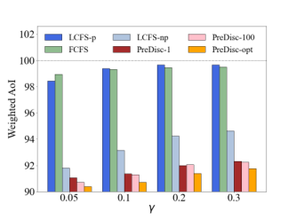

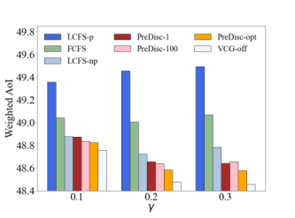

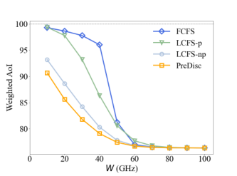

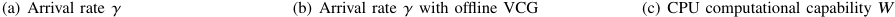

<!-- Start of picture text -->
(a) Arrival rate 훾 (b) Arrival rate 훾 with offline VCG (c) CPU computational capability 푊 <!-- End of picture text -->

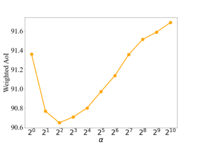

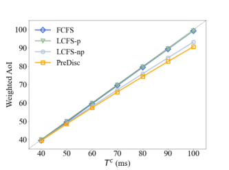

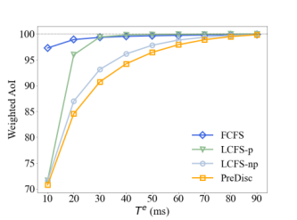

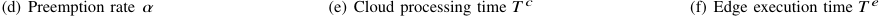

<!-- Start of picture text -->
(d) Preemption rate 훼 (e) Cloud processing time 푇 푐 (f) Edge execution time 푇 푒 <!-- End of picture text -->

Fig. 3. The weighted average AoI with different parameters. 

adopt a simple payment rule which is widely used in practice, _i.e._ , _푝푖_ = _휌_ · _푣푖_ ( _푡푖_ ) where 0 _< 휌<_ 1 is a constant. We set _휌_ = 0 _._ 5 in our simulations, meaning that the edge service provider charges half of the values of completed tasks. We remark that such a payment rule is easy to deploy but not truthful, as users can easily cheat at their values to reduce their payments. 

TABLE I PROGRAM EXECUTION TIME (ms) 

|FCFS|LCFS-p|LCFS-np|PreDisc-1|
|---|---|---|---|
|0.007|0.005|0.005|0.078|
|PreDisc-100|PreDisc-opt|VCG-off||
|0.080|0.073|137||

## _B. Numerical Results_ 

The evaluation results on weighted average AoI with different parameters are shown in Fig. 3. We first compare different mechanisms with different arrival rate _훾_ in Fig. 3(a). Overall, we can see that our mechanisms achieve significant reduction on the weighted AoI than the other mechanisms, and PreDiscopt obtains the smallest weighted AoI among them. There are two reasons behind the advantage of our mechanisms: First, our mechanisms realize an optimal resource allocation in each time slot, since a dynamic programming rather than a simple greedy algorithm is employed. Second, PreDisc-opt makes a good trade-off between preemption and non-preemption. In addition, FCFS and LCFS-p result in the worst performances, because FCFS tends to select stale tasks with earlier arrival times, while LCFS-p preempts tasks frequently once there are newly arrived tasks. In LCFS-np, fresh tasks with high values are selected and completed without preemption, hence a low AoI is achieved. When _훾_ increases from 0.05 to 0.3, a large amount of tasks are uploaded to the edge, and hence many tasks with high values are not completed. Thus, the weighted AoIs of all mechanisms increase with the arrival rate. 

In Fig. 3(b), we compare the above mechanisms with the offline VCG mechanism, the ideally optimal benchmark. The computation complexity of VCG is extremely high, as it needs 

to enumerate every possible scheduling outcomes. Thus, we reduce the scale of the problem, setting _푁_ = 20, _푇_ = 10, _푙_ = 25 Kb, _푊_ = 5 GHz, and average the evaluation results over 100 runs. We can observe from Fig. 3(b) that the weighted AoI of our mechanisms are very close to that of the offline VCG mechanism, which demonstrates the effectiveness of PreDisc. A small difference from Fig. 3(a) is that, the AoIs of some mechanisms decrease with the arrival rate in Fig. 3(b). This is because the resources are relatively sufficient under the scalereduced setting, and thus the impact of incremental completed tasks is higher than that of incremental uncompleted tasks. We further evaluate the computation complexity ( _i.e._ , the program execution time) of FCFS, LCFS-p, LCFS-np, our mechanisms and VCG-off, and show the results in Table I. These results show that our proposed mechanism PreDisc can achieve an approximate optimal weighted average AoI with much lower computation complexity than the optimal solution. 

Fig. 3(c) shows the impact of CPU computational capability _푊_ . With a large CPU computational capability, the edge server can efficiently schedule the tasks to reduce the weighted AoI, leading to the decrease of AoI from all mechanisms. When _푊_ ≥ 60 GHz, nearly all tasks are completed in time in all mechanisms, and thus the lowest AoI is achieved. When _푊_ ≤ 40 GHz, the resource is limited and PreDisc has a much better 

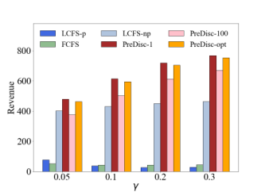

<!-- Start of picture text -->
(a) Arrival rate 훾 (b) Arrival rate 훾 with offline VCG (c) CPU computational capability 푊 (d) Preemption rate 훼 (e) Cloud processing time 푇 푐 (f) Edge execution time 푇 푒 <!-- End of picture text -->

Fig. 4. The average revenue of the edge with different parameters. 

resource utilization and then obtain a lower weighted AoI than the other mechanisms. 

The impact of preemption factor _훼_ on weighted AoI is depicted in Fig. 3(d). We can see that when the preemption factor is close to the optimal _훼_ , which is approximately 2.4 under our default settings, the weighted AoI indeed realizes a better performance. This result demonstrates the optimality of preemption parameter selection in our theoretical analysis of PreDisc. 

We report the influence of cloud processing time _푇__푐_ and edge execution time _푇__푒_ on the evaluation results in Fig. 3(e) and Fig. 3(f), respectively. We remark that _푇__푐_ is the largest AoI because every task can get a response from the cloud after _푇__푐_ time slots. A large _푇__푐_ enables a flexible scheduling for emergency tasks sent to the edge, and thus reduces the weighted AoI for these tasks. However, the weighted average AoI of the tasks sent to the cloud, which is the majority of all tasks, has a significant increase, due to a large _푇__푐_ . Thus, the overall AoI increases with _푇__푐_ . A large _푇__푒_ implies that tasks would have to wait a longer time to complete. Therefore, the weighted AoI would be higher with the increase of _푇__푒_ . 

We further investigate the average revenue of the edge in different mechanisms in Fig. 4. Fig. 4(a) shows the revenue performance of different mechanisms. We can observe that the revenues of our mechanisms outperform all other mechanisms due to the high utilization of edge resources. In addition, PreDisc-1 achieves the highest revenue in our mechanism, which will be explained later. With the increase of arrival rate _훾_ , the revenues of our mechanisms increase, because more tasks result in a stiffer competition, and hence a higher critical price for winners. 

We show the comparison results on average revenue with 

offline VCG in Fig. 4(b) under the setting of reduced problem scale. Offline VCG achieves the highest revenue, but the gap between our mechanisms and VCG-off is small. Given the extremely large computation complexity and the need of global information of VCG-off mechanism, PreDisc is more practical in deployment with a slight revenue loss. When _훾_ = 0 _._ 1 or 0 _._ 2, the revenue of LCFS-np is slightly higher than our mechanisms, this is because the resources are relatively sufficient under the scale-reduced setting, and thus the critical prices in our mechanisms is low to some extent. We also note that as the payment rule of LCFS-np is not strategy-proof, its present revenue may degrade in real life. 

Fig. 4(c) shows the impact of CPU computational capability _푊_ on revenue. Naturally, the revenues of FCFS, LCFS-p and LCFS-np increase with a higher _푊_ , because the revenues of these mechanisms are proportional to the numbers of completed tasks, which obviously increase with the CPU computational capability. In contrast with these mechanisms, the revenue of PreDisc would first increase and then decrease into 0 with a larger _푊_ , because the number of completed tasks increases but the critical prices for resources decrease when the resource supply is more abundant. Thus, we remark that we can improve the revenue of PreDisc by increasing the competition on edge resources among users. 

In Fig. 4(d), we present the impact of preemption factor _훼_ on the revenue of PreDisc. We observe that with a higher _훼_ , the revenue decreases. This is because a low _훼_ leads to frequent preemption, resulting in a high critical price in each time slot. Therefore, we can conclude that both weighted AoI and revenue decrease with the preemption factor _훼_ , when it is lower than the optimal value, which also provides a direction in real life to trade off between AoI and revenue 

<!-- Start of picture text -->
(a) Weighted AoI (b) Revenue <!-- End of picture text -->

Fig. 5. The weighted average AoI and revenue with different numbers of users _푁_ . 

TABLE II 

THE AVERAGE WEIGHTED AOI AND REVENUE WITH DIFFERENT TASK EXECUTION TIMES. 

||_푅__푐_=0_._5|Mbits/s|_푅__푐_=0_._25|Mbits/s|
|---|---|---|---|---|
||AoI (ms)|Revenue|AoI (ms)|Revenue|
|LCFS-p|128.24|70.83|221.81|97.39|
|LCFS-np|120.51|401.44|200.35|306.21|
|FCFS|129.24|31.57|227.61|29.93|
|PreDisc-1|119.54|**497.45**|199.07|**415.69**|
|PreDisc-100|119.16|411.94|196.57|346.55|
|PreDisc-opt|**118.75**|485.46|**196.44**|407.62|

when choosing _훼_ in this range. 

We then show the revenues of mechanisms with different values of _푇__푐_ and _푇__푒_ in Fig. 4(e) and Fig. 4(f), respectively. In Fig. 4(e), the revenue of PreDisc increases with _푇__푐_ at first and then decreases when _푇__푐_ is larger than a threshold. This is because PreDisc is able to schedule the tasks flexibly with a large _푇__푐_ , leading to the number of completed tasks and then the revenue increases. However, if _푇__푐_ continues to grow, the large number of completed tasks implies low critical prices, so the revenue of PreDisc decreases slightly. The revenue of LCFS is always quite small, as the frequent preemption for ongoing tasks causes only a few of tasks to be completed. In LCFS-np, only newly arrived tasks are selected, so the revenue decreases instead because less tasks are produced with a larger _푇__푐_ . In FCFS mechanism, a larger _푇__푐_ means that tasks with top priorities are more stale, so the revenue decreases with _푙_ substantially. Fig. 4(f) depicts the impact of the edge execution time _푇__푒_ . When _푇__푒_ is larger, each task needs resources in more time slots, leading to less tasks to be completed and then lower revenue to obtain. When _푇__푒_ = 10 ms, each task is completed in a single time slot, and preemption does not occur, hence LCFS-p and LCFS-np have the same performance. With a higher _푇__푒_ , the tasks selected by FCFS become fresher, leading to the increase of revenue when _푇__푒_ ≥ 50 ms. 

We present the performance of PreDisc with different numbers of users _푁_ in Fig. 5. Fig. 5(a) dipicts that the weighted AoI becomes closer to the upper bound 100 ms with the increase of _푁_ since the edge computing resources are more scarce. The relative advantage of PreDisc remains the same compared with other mechanisms. The performance on the revenue is presented in Fig. 5(b), which presents a significant increase on the revenue with user numbers because a larger amount of users leads to a more fierce competition. We can conclude from the results that our proposed mechanism is suitable for a large system. 

We finally test the performance of the online mechanisms in the general case, where the execution times among tasks are different, and the communication time to the edge is taken into account. We set the execution times of tasks follow a uniform distribution over [1, 5] time slots. Table II presents the results with two different data transmission rates to the cloud: 0.5 Mbits/s and 0.25 Mbits/s. We can see that the mechanisms perform similarly to the simplified cases above, and PreDiscopt and PreDisc-1 achieve the lowest AoI and the highest revenue, respectively, among all the mechanisms. 

## VII. RELATED WORK 

The concept of age of information was first studied in [5], where an optimal updating rate is provided for remote monitor systems to optimize the timeliness. Following this work, much attention has been focused on this metric, typically with the queueing theory technique [5], [33], [34]. This metric was investigated in real-time computing problems in recent years [35]–[37], and different types of update policies and preemption strategies are proposed. However, these studies did not consider the strategic behaviors of user in a timely computing scenario. There are several works that considered the selfish agents in status update systems [38]–[40]. Hao _et al._ [38] investigated the competition of selfish crowdsourcing platforms to reduce their own AoI. They proposed a nonmonetary punishment mechnism in a repeated game to enforce their cooperation. The work of [39] introduced the concept of _fresh data market_ . They proposed a new pricing mechanism to maximize the profit of information source and minimize the cost of the destination. These works treat updates as homogeneous ones and only manipulate the update frequency. However, in a real-time edge computing problem, tasks are heterogeneous and users may misreport the information about their tasks. Therefore, the above studies are substantially different from our work. 

The topic of online auction was first introduced by Lavi and Nisan [41]. Based on the 2-competitive model of [42] for reusable resource allocation and the proof of competitive ratio, the work in [43] raised the concept of auction with preemption and its application in online spectrum auctions. However, the above classical works only considered constant values during the auction. The authors of [44] considered online auctions with discounting values. However, they imposed constraints on unit resource demand and unit edge execution time, and hence their proposed mechanism does not apply to our more general cases. 

From the perspective of edge computing, there are extensive studies that considered the high cost of edge deployment and the resource limitation at the edge server [11], [45], [46]. Some of these works proposed task scheduling algorithms to better utilize the resources [16], [47]–[49]. For example, the authors of [47] proposed an online scalable algorithm, called OnDisc, for the job dispatching and scheduling problem with a constant competitive ratio. In [16], the authors proposed to 

combine the edge server and the remote cloud server into a heterogeneous cloud. However, all of these studies did not take the pricing mechanism into account, and hence is not practical in the real-world deployment. An online incentive mechanism for the task offloading in mobile edge computing was proposed in [23] based on the primal-dual optimization framework, but they only considered a maximal tolerance delay for each task, rather than the time discounting values of tasks, _i.e._ , the AoI metric. Therefore, their proposed simple threshold-based pricing mechanism cannot be applied in our problem. 

## VIII. CONCLUSIONS 

We have proposed a strategy-proof online mechanism PreDisc for the cloud-edge collaborative computing system to reduce the weighted AoI. A preemption factor is employed to trade off the newly arrived tasks and ongoing tasks. We have proved that PreDisc guarantees both strategy-proofness and a constant competitive ratio compared with the offline optimal solution. Extensive simulations have been conducted and the results demonstrated the effectiveness of PreDisc. In the future work, we will further investigate the online mechanism design problem with overlapped tasks for a user, where the time discounting function of task values would vary over time. In addition, we focus on mobile devices with adequate power and energy in this work, and we will try to extend the proposed mechanism to the scenarios with energy-constrained edge devices, where more practical utility functions and new task generation policies will be taken into account. 

## REFERENCES 

- [1] W. Zhang, S. Li, L. Liu, Z. Jia, Y. Zhang, and D. Raychaudhuri, “Heteroedge: Orchestration of real-time vision applications on heterogeneous edge clouds,” in _Proceedings of the 38th IEEE Conference on Computer Communications (INFOCOM)_ . IEEE, 2019, pp. 1270–1278. 

- [2] R. D. Yates, M. Tavan, Y. Hu, and D. Raychaudhuri, “Timely cloud gaming,” in _Proceedings of the 36th IEEE International Conference on Computer Communication (INFOCOM)_ . IEEE, 2017, pp. 1–9. 

- [3] J. Du, Z. Zou, Y. Shi, and D. Zhao, “Zero latency: Real-time synchronization of bim data in virtual reality for collaborative decision-making,” _Automation in Construction_ , vol. 85, pp. 51–64, 2018. 

- [4] D. Morrison, P. Corke, and J. Leitner, “Learning robust, real-time, reactive robotic grasping,” _The International Journal of Robotics Research_ , vol. 39, no. 2-3, pp. 183–201, 2020. 

- [5] S. Kaul, R. Yates, and M. Gruteser, “Real-time status: How often should one update?” in _Proceedings of the 31st IEEE International Conference on Computer Communication (INFOCOM)_ . IEEE, 2012, pp. 2731– 2735. 

- [6] R. D. Yates, “Age of information in a network of preemptive servers,” in _Proceedings of the 37th IEEE Conference on Computer Communications Workshops (INFOCOM WKSHPS)_ . IEEE, 2018, pp. 118–123. 

- [7] J. Zhong, W. Zhang, R. D. Yates, A. Garnaev, and Y. Zhang, “Ageaware scheduling for asynchronous arriving jobs in edge applications,” in _Proceedings of the 38th IEEE Conference on Computer Communications Workshops (INFOCOM WKSHPS)_ . IEEE, 2019, pp. 674–679. 

- [8] J. Zhong, “Age of information for real-time network applications,” Ph.D. dissertation, Rutgers University-School of Graduate Studies, 2019. 

- [9] S. Gopal, S. K. Kaul, and R. Chaturvedi, “Coexistence of age and throughput optimizing networks: A game theoretic approach,” in _Proceedings of the 30th Annual International Symposium on Personal, Indoor and Mobile Radio Communications (PIMRC)_ . IEEE, 2019, pp. 1–6. 

- [10] A. Garnaev, W. Zhang, J. Zhong, and R. D. Yates, “Maintaining information freshness under jamming,” in _Proceedings of 38th IEEE Conference on Computer Communications Workshops (INFOCOM WKSHPS)_ . IEEE, 2019, pp. 90–95. 

- [11] M. Satyanarayanan, “The emergence of edge computing,” _Computer_ , vol. 50, no. 1, pp. 30–39, 2017. 

- [12] K. Sasaki, N. Suzuki, S. Makido, and A. Nakao, “Vehicle control system coordinated between cloud and mobile edge computing,” in _Proceedings of the 55th Annual Conference of the Society of Instrument and Control Engineers of Japan (SICE)_ . IEEE, 2016, pp. 1122–1127. 

- [13] N. Alliance, “5G white paper,” _Next generation mobile networks, white paper_ , vol. 1, 2015. 

- [14] X. Chen, L. Jiao, W. Li, and X. Fu, “Efficient multi-user computation offloading for mobile-edge cloud computing,” _IEEE/ACM Transactions on Networking_ , vol. 24, no. 5, pp. 2795–2808, 2015. 

- [15] P. Mach and Z. Becvar, “Mobile edge computing: A survey on architecture and computation offloading,” _IEEE Communications Surveys & Tutorials_ , vol. 19, no. 3, pp. 1628–1656, 2017. 

- [16] T. Zhao, S. Zhou, X. Guo, and Z. Niu, “Tasks scheduling and resource allocation in heterogeneous cloud for delay-bounded mobile edge computing,” in _Proceedings of 2017 IEEE international conference on communications (ICC)_ . IEEE, 2017, pp. 1–7. 

- [17] Y. Liu, C. Xu, Y. Zhan, Z. Liu, J. Guan, and H. Zhang, “Incentive mechanism for computation offloading using edge computing: A stackelberg game approach,” _Computer Networks_ , vol. 129, pp. 399–409, 2017. 

- [18] X. Wang and L. Duan, “Dynamic pricing for controlling age of information,” in _Proceedings of 2019 IEEE International Symposium on Information Theory (ISIT)_ . IEEE, 2019, pp. 962–966. 

- [19] W. Vickrey, “Counterspeculation, auctions, and competitive sealed tenders,” _The Journal of Finance_ , vol. 16, no. 1, pp. 8–37, 1961. 

- [20] E. H. Clarke, “Multipart pricing of public goods,” _Public choice_ , pp. 17–33, 1971. 

- [21] T. Groves, “Incentives in teams,” _Econometrica: Journal of the Econometric Society_ , pp. 617–631, 1973. 

- [22] D. Zhao, X.-Y. Li, and H. Ma, “How to crowdsource tasks truthfully without sacrificing utility: Online incentive mechanisms with budget constraint,” in _Proceedings of the 33th IEEE Conference on Computer Communications (INFOCOM)_ . IEEE, 2014, pp. 1213–1221. 

- [23] G. Li and J. Cai, “An online incentive mechanism for collaborative task offloading in mobile edge computing,” _IEEE Transactions on Wireless Communications_ , vol. 19, no. 1, pp. 624–636, 2019. 

- [24] R. B. Myerson, “Optimal auction design,” _Mathematics of Operations Research_ , vol. 6, no. 1, pp. 58–73, 1981. 

- [25] Q. Zhang, Y. Wang, X. Zhang, L. Liu, X. Wu, W. Shi, and H. Zhong, “Openvdap: An open vehicular data analytics platform for cavs,” in _2018 IEEE 38th International Conference on Distributed Computing Systems (ICDCS)_ . IEEE, 2018, pp. 1310–1320. 

- [26] L. Lin, X. Liao, H. Jin, and P. Li, “Computation offloading toward edge computing,” _Proceedings of the IEEE_ , vol. 107, no. 8, pp. 1584–1607, 2019. 

- [27] D. Fudenberg and J. Tirole, “Game theory,” 1991. 

- [28] A. Mas-Colell, M. D. Whinston, J. R. Green _et al._ , _Microeconomic theory_ . Oxford university press New York, 1995, vol. 1. 

- [29] S. Mehta, M. Dawande, G. Janakiraman, and V. Mookerjee, “Sustaining a good impression: Mechanisms for selling partitioned impressions at ad exchanges,” _Information Systems Research_ , vol. 31, no. 1, pp. 126–147, 2020. 

- [30] Q. Kuang, J. Gong, X. Chen, and X. Ma, “Analysis on computationintensive status update in mobile edge computing,” _IEEE Transactions on Vehicular Technology_ , vol. 69, no. 4, pp. 4353–4366, 2020. 

- [31] X. Song, X. Qin, Y. Tao, B. Liu, and P. Zhang, “Age based task scheduling and computation offloading in mobile-edge computing systems,” in _Proceedings of 2019 IEEE Wireless Communications and Networking Conference Workshop (WCNCW)_ . IEEE, 2019, pp. 1–6. 

- [32] J. Zhao, Q. Li, Y. Gong, and K. Zhang, “Computation offloading and resource allocation for cloud assisted mobile edge computing in vehicular networks,” _IEEE Transactions on Vehicular Technology_ , vol. 68, no. 8, pp. 7944–7956, 2019. 

- [33] R. D. Yates, “The age of information in networks: Moments, distributions, and sampling,” _IEEE Transactions on Information Theory_ , https://ieeexplore.ieee.org/abstract/document/9103131, 2020. 

- [34] A. M. Bedewy, Y. Sun, and N. B. Shroff, “Minimizing the age of information through queues,” _IEEE Transactions on Information Theory_ , vol. 65, no. 8, pp. 5215–5232, 2019. 

- [35] A. Arafa, R. D. Yates, and H. V. Poor, “Timely cloud computing: Preemption and waiting,” in _Proceedings of the 57th Annual Allerton Conference on Communication, Control, and Computing (Allerton)_ . IEEE, 2019, pp. 528–535. 

- [36] V. Kavitha, E. Altman, and I. Saha, “Controlling packet drops to improve freshness of information,” _arXiv preprint arXiv:1807.09325_ , 2018. 

- [37] B. Wang, S. Feng, and J. Yang, “When to preempt? age of information minimization under link capacity constraint,” _Journal of Communications and Networks_ , vol. 21, no. 3, pp. 220–232, 2019. 

- [38] S. Hao and L. Duan, “Regulating competition in age of information under network externalities,” _IEEE Journal on Selected Areas in Communications_ , vol. 38, no. 4, pp. 697–710, 2020. 

- [39] M. Zhang, A. Arafa, J. Huang, and H. V. Poor, “How to price fresh data,” _arXiv preprint arXiv:1904.06899_ , 2019. 

- [40] Y. Xiao and Y. Sun, “A dynamic jamming game for real-time status updates,” in _Proceedings of the 37th IEEE Conference on Computer Communications Workshops (INFOCOM WKSHPS)_ . IEEE, 2018, pp. 354–360. 

- [41] R. Lavi and N. Nisan, “Online ascending auctions for gradually expiring goods,” in _Proceedings of the 16th ACM-SIAM Symposium on Discrete Algorithms (SODA)_ , 2005. 

- [42] M. T. Hajiaghayi, “Online auctions with re-usable goods,” in _Proceedings of the 6th ACM Conference on Electronic Commerce_ , 2005, pp. 165–174. 

- [43] L. Deek, X. Zhou, K. Almeroth, and H. Zheng, “To preempt or not: Tackling bid and time-based cheating in online spectrum auctions,” in _Proceedings of the 30th IEEE International Conference on Computer Communication (INFOCOM)_ . IEEE, 2011, pp. 2219–2227. 

- [44] F. Wu, J. Liu, Z. Zheng, and G. Chen, “A strategy-proof online auction with time discounting values,” in _Proceedings of 28th AAAI Conference on Artificial Intelligence (AAAI)_ , 2014. 

- [45] L. Peterson, T. Anderson, S. Katti, N. McKeown, G. Parulkar, J. Rexford, M. Satyanarayanan, O. Sunay, and A. Vahdat, “Democratizing the network edge,” _ACM SIGCOMM Computer Communication Review_ , vol. 49, no. 2, pp. 31–36, 2019. 

- [46] Y. Li, K.-H. Kim, C. Vlachou, and J. Xie, “Bridging the data charging gap in the cellular edge,” in _Proceedings of the ACM Special Interest Group on Data Communication_ , 2019, pp. 15–28. 

- [47] H. Tan, Z. Han, X.-Y. Li, and F. C. Lau, “Online job dispatching and scheduling in edge-clouds,” in _Proceedings of the 36th IEEE Conference on Computer Communications (INFOCOM)_ . IEEE, 2017, pp. 1–9. 

- [48] S. Jošilo and G. Dán, “Computation offloading scheduling for periodic tasks in mobile edge computing,” _IEEE/ACM Transactions on Networking_ , vol. 28, no. 2, pp. 667–680, 2020. 

- [49] H. A. Alameddine, S. Sharafeddine, S. Sebbah, S. Ayoubi, and C. Assi, “Dynamic task offloading and scheduling for low-latency iot services in multi-access edge computing,” _IEEE Journal on Selected Areas in Communications_ , vol. 37, no. 3, pp. 668–682, 2019. 

