# **Preventing Strategic Behaviors in Collaborative Inference for Vertical Federated Learning** 

Yidan Xing Zhenzhe Zheng∗ Shanghai Jiao Tong University Shanghai Jiao Tong University Shanghai, China Shanghai, China katexing@sjtu.edu.cn zhengzhenzhe@sjtu.edu.cn 

Fan Wu Shanghai Jiao Tong University Shanghai, China fwu@cs.sjtu.edu.cn 

## **ABSTRACT** 

#### **ACM Reference Format:** 

Yidan Xing, Zhenzhe Zheng, and Fan Wu. 2024. Preventing Strategic Behaviors in Collaborative Inference for Vertical Federated Learning. In _Proceedings of the 30th ACM SIGKDD Conference on Knowledge Discovery and Data Mining (KDD ’24), August 25–29, 2024, Barcelona, Spain._ ACM, New York, NY, USA, 12 pages. https://doi.org/10.1145/3637528.3671663 

Vertical federated learning (VFL) is an emerging collaborative machine learning paradigm to facilitate the utilization of private features distributed across multiple parties. During the inference process of VFL, the involved parties need to upload their local embeddings to be aggregated for the final prediction. Despite its remarkable performances, the inference process of the current VFL system is vulnerable to the strategic behavior of involved parties, as they could easily change the uploaded local embeddings to exert direct influences on the prediction result. In a representative case study of federated recommendation, we find the allocation of display opportunities to be severely disrupted due to the parties’ preferences in display content. In order to elicit the true local embeddings for VFL system, we propose a distribution-based penalty mechanism to detect and penalize the strategic behaviors in collaborative inference. As the key motivation of our design, we theoretically prove the power of constraining the distribution of uploaded embeddings in preventing the dishonest parties from achieving higher utility. Our mechanism leverages statistical two-sample tests to distinguish whether the distribution of uploaded embeddings is reasonable, and penalize the dishonest party through deactivating her uploaded embeddings. The resulted mechanism could be shown to admit truth-telling to converge to a Bayesian Nash equilibrium asymptotically under mild conditions. The experimental results further demonstrate the effectiveness of the proposed mechanism to reduce the dishonest utility increase of strategic behaviors and promote the truthful uploading of local embeddings in inferences. 

## **1 INTRODUCTION** 

With the development of machine learning techniques, the consensus that richer features and more available data could enhance prediction performances has been widely established. In recent years, federated learning (FL) is proposed as a cutting-edge collaborative machine learning paradigm to take advantage of the distributed data while protecting data privacy. The FL techniques are generally classified into horizontal FL (HFL) and vertical FL (VFL) [18] according to the distributed patterns of data. Targeting at the scenario with each party holding different features for an aligning set of samples, VFL requires each involved party to implement a local model which maps her local features to local embeddings, and requires the server to implement a top model that maps the aggregated local embeddings uploaded by the parties to the final prediction result (Figure 1). VFL techniques have been widely deployed in various scenarios, especially in recommendation system [16, 38], online advertising [20, 37], and finance [5, 6]. 

Despite the promising performances of VFL, we notice an unexplored deficiency of this collaborative paradigm: the inference process in VFL is vulnerable to the strategic manipulations on the uploaded local embeddings. Compared to HFL and centralized machine learning methods, the inference process in VFL requires each involved party to collaboratively upload the local embeddings for the current sample. As the learning models have been determined at the inference stage, the local embedding uploaded by one involved party could exert direct influences on the inference result, leaving chances for the party to manipulate the inference result in an predictable way. On the other hand, the involved parties may indeed have the motivations to strategically change the inference results towards their desired ones. For example, an organization may prefer to create better prediction for content belong or relevant to it when providing user behavioral feature embeddings to a recommendation system, and a bank may prefer to misguide other banks to provide lower loan limit for factually credible clients, with the aim to attract those clients and promote its own transactions. 

## **CCS CONCEPTS** 

• **Theory of computation** → **Algorithmic game theory and mechanism design** ; • **Computing methodologies** → **Machine learning** . 

## **KEYWORDS** 

Collaborative Inference; Strategic Behaviors; Mechanism Design; Vertical Federated Learning; 

∗Zhenzhe Zheng is the corresponding author. 

Permission to make digital or hard copies of all or part of this work for personal or classroom use is granted without fee provided that copies are not made or distributed for profit or commercial advantage and that copies bear this notice and the full citation on the first page. Copyrights for components of this work owned by others than the author(s) must be honored. Abstracting with credit is permitted. To copy otherwise, or republish, to post on servers or to redistribute to lists, requires prior specific permission and/or a fee. Request permissions from permissions@acm.org. _KDD ’24, August 25–29, 2024, Barcelona, Spain_ 

In this work, we aim to formally investigate such kinds of strategic behaviors and the corresponding manipulation-resistant mechanism when collaborative inferences meet the strategic intentions of involved parties in VFL system. To characterize the behavioral pattern of involved parties, we resort to the celebrated concept of _utility function_ and _Nash equilibrium_ in game theory to describe 

© 2024 Copyright held by the owner/author(s). Publication rights licensed to ACM. ACM ISBN 979-8-4007-0490-1/24/08 

https://doi.org/10.1145/3637528.3671663 

3574 

KDD ’24, August 25–29, 2024, Barcelona, Spain 

Yidan Xing, Zhenzhe Zheng, & Fan Wu 

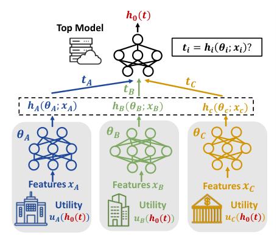

<!-- Start of picture text -->
𝒉𝟎(𝒕) Top Model 𝒕𝒊 = 𝒉𝒊 𝜽𝒊; 𝒙𝒊 ? 𝒕𝑨 𝒕𝑪 𝒕𝑩 𝒉𝑨(𝜽𝑨; 𝒙𝑨) 𝒉𝑩(𝜽𝑩; 𝒙𝑩) 𝒉𝒄(𝜽𝒄; 𝒙𝒄) 𝜽𝑨 𝜽𝑩 𝜽𝑪 Features 𝒙𝑨 Features 𝒙𝑩 Features 𝒙𝑪 Utility Utility Utility 𝒖𝑨(𝒉𝟎(𝒕)) 𝒖𝑩(𝒉𝟎(𝒕)) 𝒖𝑪(𝒉𝟎(𝒕)) <!-- End of picture text -->

**Figure 1: Overview of VFL System. The local embeddings uploaded by a party may differ from the true local embeddings.** 

the objective of the parties and a stable state of the strategic interactions, respectively. 

In order to inspect the potential consequences of such strategic behaviors, we formulate a representative _federated recommendation game_ between organizations who collaborate to provide item recommendation for users. The utilities of these organizations are defined as the exposure of item owned by them, and they could manipulate the uploaded user embeddings to change the predicted score and the allocation of exposure. Prominently, we find the resulted pure Nash equilibrium would indistinguishably allocate the exposure opportunities in a random way when there are two organizations in the game with comparable power, regardless of the properties of items they owned. In other words, when parties are obsessed with manipulating the uploaded embeddings for their own utility, the design of recommendation system would losses its original spirit, necessitating a manipulation-resistant mechanism against such strategic behaviors in VFL system. 

While the strategic behaviors essentially arises from the inconsistency between the utilities of parties and the objective of VFL system, a natural idea is to introduce external monetary transfer to cover the misalignment between them following the mainstream of incentive mechanism design [40]. However, even if we do not consider the implementation practicability of a monetary transfer mechanism within the VFL system, its working principle would be unaffordable in our context. Since we need to preserve the correctness of the inference results, the final predictions could not be modified in any form to satisfy strategic intentions of parties. To elicit the true local embeddings, the money transfer mechanism should guarantee the sum of monetary reward and the utility of current prediction to be larger than any other strategy that may modify the true embeddings, thus requiring this sum to be at least the utility of the best possible prediction achievable through manipulation. As a result, the inference result worse for a party should simultaneously bring her larger monetary reward, leading the resulted expenditure to be incredibly large for the server and highly fluctuating on the distribution of inference results. 

Given the infeasibility of adopting external monetary rewards, a manipulation-resistant mechanism have to be implemented fully based on the collaborative inference process. Due to the intrinsic uncertainty of data, it is generally impossible to confirm whether a specific local embedding has been manipulated, which compels us to consider utilizing the historical statistics of the embeddings to identify and constrain strategic behaviors. Nevertheless, it is unclear what kinds of statistics should be adopted among the mass of candidates, and whether these metrics could indeed help with our goal to prevent the considered strategic behaviors. 

Inspired by the traditional economics literature [17], we consider the distribution information of local embeddings as a strong candidate to serve as the cornerstone of our manipulation-resistant mechanism. In particular, when the distribution of uploaded inference embeddings are enforced to align with its prior distribution, we demonstrate that the involved parties are unable to realize any dishonest utility increase in collaborative inference under mild assumptions describing the partial alignment between the server prediction function and the utilities of parties, and the training embeddings could also serve as the reference for prior distribution. 

Despite these strong guarantees, due to the high dimensional nature of local embeddings in VFL applications, it is implausible for the server to realize precise restriction on the distribution of uploaded embeddings, thus initiates our final design of _distributionbased penalty mechanism_ . Our mechanism works in alternative between two process: detection of potential strategic behaviors and penalization for the detected strategic behaviors. During the collaborative inference process, we periodically detect whether the uploaded embeddings follow the same distribution as the training embeddings with high probability, which is realized through applying statistical two-sample tests [12, 21], and temporarily deactivate the embeddings uploaded by a party as penalty when she is detected to be cheating. We theoretically prove the convergence of truthtelling strategies to a Bayesian Nash equilibrium in the large sample limit under appropriate mechanism parameters, which underscores the rationality and efficacy of our design. To further validate its empirical performances, we conduct extensive experiments to observe the influences of our penalty mechanism on different strategies. It turns out the utility of various manipulating strategies could be largely reduced to be similar or less than the utility of truth-telling strategy, thus effectively alleviating the incentives of parties to conduct strategic behaviors. 

The main contributions of this work are summarized as follows: 

- We consider the strategic behaviors to manipulate the local embeddings in collaborative inference for VFL system, which are unexplored in previous work. In a representative federated recommendation game, we demonstrate the destructive effects of strategic behaviors on prediction results when involved parties achieve a Nash equilibrium. 

- We propose the distribution-based penalty mechanism as a flexible plug-in module of the vanilla VFL algorithm to prevent the considered strategic behaviors of manipulating local embeddings. With theoretically motivated design, the truth-telling strategy would converge to Beyesian Nash equilibrium under large sample limit, thus alleviates the strategic incentives of involved parties. 

3575 

KDD ’24, August 25–29, 2024, Barcelona, Spain 

Preventing Strategic Behaviors in Collaborative Inference for Vertical Federated Learning 

- We evaluate the proposed penalty mechanisms on public datasets for two typical manipulation strategies and their probabilistic variants. The empirical results validate the effectiveness of the proposed mechanisms in reducing the utility obtained by dishonest strategies and promoting the parties to upload true local embeddings during inferences. 

## **2 RELATED WORK** 

Since the individual participants in FL usually have their own interests, the incentive and strategic problems in FL has been widely studied to facilitate the deployment of FL applications [18, 22, 40]. Most of the previous work study the methods to evaluate the contribution of participants as a reference for reward allocation or client selection [8, 25, 27, 32], incentivize the participants to keep active and dedicated in training [13, 31, 33, 41], as well as form coalitions to achieve better training performances for non-i.i.d. data [7, 9, 10]. As all the above work consider the incentive problem in the training stage of HFL or VFL, to the best of our knowledge, none of the existing work has considered the strategic behaviors of manipulating the intermediate local embeddings uploaded to the server during collaborative inferences in VFL system, which are orthogonal to the strategic behaviors in training stage. 

In fact, the authors of [29] have proposed to utilize the same embedding manipulation approach from the perspective of a malicious attacker. Particularly, they investigate the set of adversarial dominating inputs (ADI) in inferences of VFL, such that the other party’s influence on the inference result would be negligible. The attacks on FL system typically aim to replicate representative deep learning attacks for HFL, including [2, 4, 28, 34, 36, 39], while some other work attacking the VFL system exploit the characteristics of splitted model to infer the private features or labels of other participants [11, 19, 23, 24]. In opposed to these work that aim to protect VFL system against malicious attackers or honest-but-curious participants, our mechanism are designed for strategic participants with their own utility objectives, which provides a complementary perspective to protect the well-functionality of VFL system. 

The main ideology of our distribution-based penalty mechanism is motivated by the linking mechanism [17] that restricts the total reported preferences of agents in a sequence of public decision problems to restrain the strategic behaviors. In detail, the agents are strictly limited in the frequency of reporting each preference across the problems. The research on linking mechanism is gradually progressed in terms of its additional properties, variants and applications [14, 26, 30, 35]. Compared with these work, due to the high-dimensional and complex nature of intermediate embeddings in VFL system, we could not learn the exact range and distribution of the high-dimensional embeddings, leading our mechanism and analysis to be distinct from the existing work. 

## **3 PRELIMINARIES** 

Consider a typical VFL system with _𝑀_ parties1 and a server, where the role of server could be assumed by one of the involved parties. The features are vertically distributed across the parties, with each party _𝑖_ privately owns _𝑐𝑖_ features of each sample. We use _𝑥𝑖_ ∈ R_𝑐𝑖_ to 

> 1We may use parties with participants interchangeably throughout the work, which also indicate the organizations in the federated recommendation game of Section 4. 

denote the local features owned by party _𝑖_ for sample _𝑥_ . In order to realize the collaborative prediction for sample _𝑥_ , each party _𝑖_ holds a set of model parameters _𝜃𝑖_ and a corresponding local embedding function _ℎ𝑖_ (·), which maps the model parameters and the input local sample features _𝑥𝑖_ to local embeddings. The server holds a set of model parameters _𝜃_ 0 and a server prediction function _ℎ_ 0 (·), which maps the server model parameters and all the uploaded local embeddings to a prediction in R. As this work focuses on the strategic behaviors during the collaborative inference, we assume the embedding functions _ℎ𝑖_ and the server model _ℎ_ 0 to be some predetermined randomized functions, and would not go into details of the training and communication process. 

With the above notations, the collaborative inference process for an unseen sample _𝑥_ could be formally described as follows: 1) each party _𝑖_ compute its local embedding _𝑡𝑖_ := _ℎ𝑖_ ( _𝑥𝑖_ ) using the local features _𝑥𝑖_ ; 2) each party _𝑖_ uploads _𝑡𝑖_ to the server; 3) the server computes _ℎ_ 0 ( _𝑡_ 1 _, . . . ,𝑡𝑀_ ) using _𝑡𝑖_ ; and 4) the prediction result _ℎ_ 0 ( _𝑡_ 1 _, . . . ,𝑡𝑀_ ) is announced and takes effect. We use T _𝑖_ to denote the space of potential local embeddings of party _𝑖_ , _i.e._ , _𝑡𝑖_ ∈T _𝑖_ , and use _𝑡_ :=� _𝑖__𝑀_ =1_𝑡𝑖_todenotetheprofileoflocalembeddings for all the parties. Similarly, we define the potential space of _𝑡_ as T :=� _𝑖__𝑀_ =1T_𝑖_. We denote the distribution of local embeddings as _𝑡_ ∼ _𝑓_ , and assume _𝑡𝑖_ ∼ _𝑓𝑖_ is independent with _𝑡 𝑗_ ∼ _𝑓𝑗_ for _𝑗_ ≠ _𝑖_ . Since the center has no control over the distributed local features, a party _𝑖_ might upload arbitrary local embeddings within T _𝑖_ in collaborative inference. We use _𝜎𝑖_ to denote the strategy of party _𝑖_ when uploading the embeddings, with _𝜎𝑖_ ( _𝑡𝑖,𝑡𝑖_′) characterizes the probability of uploading embedding _𝑡𝑖_′when the true embedding is _𝑡𝑖_ under strategy _𝜎𝑖_ , satisfying ∫ _𝑡𝑖_′∈T_𝑖𝜎𝑖_(_𝑡𝑖,𝑡_ _𝑖_′)_𝑑𝑡_ _𝑖_′=1_,_∀_𝑡𝑖_∈T_𝑖_. The strategy profile of all the parties is denoted as _𝜎_ := ( _𝜎𝑖_ ) _𝑖__𝑀_ =1, and the corresponding feasible space is denoted as Σ :=� _𝑖__𝑀_ =1Σ_𝑖_. For convenience in notations, we would use subscript − _𝑖_ to denote the embedding profile or its feasible space for all the parties except party _𝑖_ , _e.g._ , _𝑡_ − _𝑖_ denotes the profile of uploaded local embeddings except party _𝑖_ , and T− _𝑖_ denotes the corresponding feasible space of _𝑡_ − _𝑖_ . We use _𝐼_ to denote the special _truth-telling_ strategy, with _𝐼_ ( _𝑡𝑖,𝑡𝑖_′)= 1 when_𝑡_ _𝑖_′=_𝑡𝑖_, and equals 0 otherwise. 

Considering that the prediction result of the server would affect the utility of the involved parties, we use _𝑢𝑖_ ( _ℎ_ 0 ( _𝑡_′ ); _𝑡𝑖_ )2 to denote the expected utility of party _𝑖_ when the uploaded embedding profile is _𝑡_′ and the true local embedding of party _𝑖_ is _𝑡𝑖_ . Therefore, the expected utility of party _𝑖_ when the strategy profile is _𝜎_ and the server prediction function is _ℎ_ 0 could be calculated as 

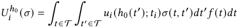

with _𝜎_ ( _𝑡,𝑡_′ ) :=� _𝑖__𝑀_ =1_𝜎𝑖_(_𝑡𝑖,𝑡_ _𝑖_′), and we may abbreviate_ℎ_0when the context is clear. 

In this work, we focus on the solution concept of Nash equilibrium to describe the stable state of strategic interactions between parties. In our context that each party only has incomplete information of the local embeddings, we consider a strategy profile 

> 2We assume the utility only depends on the prediction result and the party’s own true local embeddings, since the party could not access the other party’s true local embeddings, and have to rely on her local information to make decisions. 

3576 

KDD ’24, August 25–29, 2024, Barcelona, Spain 

Yidan Xing, Zhenzhe Zheng, & Fan Wu 

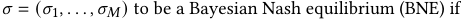

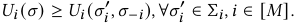

In other words, when a strategy profile reaches BNE, none of the parties could achieve larger expected utility through changing her strategy, and we desire the truth-telling strategy _𝜎𝐼_ = ( _𝐼_ ) _𝑖__𝑀_ =1, to be a BNE, such that the parties would be incentivized to upload the true local embeddings and the validity of prediction is preserved. 

While studying the BNE requires us to make assumptions on distribution of embeddings, we may focus on one single round of inference to enable detailed analysis of the strategic interactions for specific embeddings (Section 4). Under this situation, when each party chooses a certain local embedding (instead of a distribution over potential embeddings) for uploading, and the uploaded embedding profile _𝑡_′ satisfies 

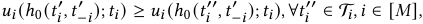

then _𝑡_′ is called a pure-strategy Nash equilibrium (PNE). The PNE in each round of inference is a stronger equilibrium notion than the BNE over expectation of all the inference rounds, but is also more difficult and sometimes infeasible to achieve. 

## **4 FEDERATED RECOMMENDATION GAME** 

Since our discussions until now stay on an abstract level, we would review a representative application of VFL system to illustrate the potential strategic behaviors of involved parties more concretely. 

As briefly discussed in Section 1, an arising application of VFL is to aggregate user behavioral features from different organizations to provide better recommendation results for users [16, 38], which we term as federated recommendation. The strategic incentives of the organizations to manipulate the prediction results naturally arise here, as each organization prefers to display content beneficial for them. For example, some candidate items may originate from one of the organizations or contain content relevant to its business goal, which are more favorable for the organization to display. 

To capture the key idea of this scenario, we assume each organization owns one unique item and aims to maximize the display probability for this item [3, 15] in federated recommendation, which is a moderate amplification of the competition faced by collaborating parties in practice. Following the literature studying games between content creators in recommendation system [15], we focus on the popular class of factorization-based recommendation algorithms. That is, each organization uploads the computed local user embedding _𝑡𝑖_ , and the server would use the product of the averaged user embedding and the item embedding _𝑏𝑖_ of the item owned by organization _𝑖_ as the matching score between the current user and item _𝑖_ . Suppose the server adopts a softmax policy of matching scores to display items, the expected utility (display probability) of each organization could then be calculated as 

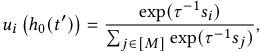

where _𝑠𝑖_ := ⟨ _𝑏𝑖,_� _𝑖__𝑤_ _𝑖__𝑡_ _𝑖_′⟩is the predicted matching score between the item of party _𝑖_ and the current user, _𝑤𝑖_ denotes the aggregation weight for local embedding of party _𝑖_ , and _𝜏 >_ 0 is the temperature parameter to control exploration in recommendation. Since this utility term does not depend on the true embeddings of parties, we 

drop _𝑡𝑖_ from the notation of _𝑢𝑖_ . We restrict ∥ _𝑡𝑖_ ∥2 ≤ 1, or otherwise the party may report ∥ _𝑡𝑖_ ∥2 →∞ to increase its influence on the aggregated embedding. We use _𝑏𝑖𝑘_ and _𝑡𝑖𝑘_ to denote the _𝑘__𝑡ℎ_ entry of _𝑏𝑖_ and _𝑡𝑖_ , respectively, and denote the number of dimensions of _𝑏𝑖,𝑡𝑖_ as _𝑑_ . 

In order to evaluate the consequences of strategic interactions for a specific profile of item and user embeddings, we would analyse the PNE resulted from the above utility function. If a PNE exists in the game and truth-telling does not constitute a PNE, then it indicates the parties would not conform to the truth-telling strategy, but would instead follow the behavior characterized by the PNE(s). Due to the limitation of space, the detailed proofs of our results in Section 4 and 5 are presented in Appendix A. 

Theorem 4.1. _A PNE always exists in the federated recommendation game. Moreover, when 𝑀_ = 2 _, for any 𝑏_ 1 ≠ _𝑏_ 2 _and any positive weights, the unique PNE in the corresponding federated recommendation game is_ 

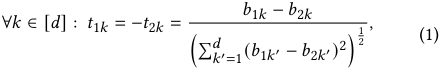

_Specifically, when 𝑤_ 1 = _𝑤_ 2 =<u>1</u> <u>2</u>_, the display probabilities would be_ _𝑢_ 1 = _𝑢_ 2 =<u>1</u> <u>2</u>_for any item embeddings 𝑏._ 

In Theorem 4.1, the general PNE existence result is proved through showing the quasi-concavity of the utility function in the current setting and applying the Debreu-Glicksberg-Fan existence theorem. For the uniqueness result when _𝑀_ = 2, we first show any interior point with ∥ _𝑡𝑖_ ∥ _<_ 1 could not be an equilibrium, then derive the detailed expressions of PNE through Karush–Kuhn–Tucker conditions. As we could observe from Theorem 4.1, despite the existence of PNE, its uniqueness when _𝑀_ = 2 suggests the failure of truth-telling strategy to be adopted by the organizations, and the resulted recommendation outcomes are significantly skewed by the utility-driven uploading of the involved parties. For the extreme case of _𝑀_ = 2 and _𝑤_ 1 = _𝑤_ 2 =<u>1</u> <u>2</u>, the original properties of the user and item embeddings are completely disregarded, and the parties would get equal display chances for any user, leading the federated recommendation to lose its original design purpose. 

While the federated recommendation system display poor performances against the parties’ strategic behaviors, similar situations are not minority among the general VFL systems. Since the design philosophy of the VFL system is to aggregate valuable distributed features from each party to improve the prediction accuracy, the prediction results need to depend on the precise embeddings uploaded by the parties, and it is thus generally impossible for a standard VFL algorithm to prevent strategic manipulation in inferences. As the system designer, we should not assume that all the participants are disinterested with the prediction results and refrain from exploiting the vulnerabilities of the system, but instead need to establish effective manipulation-resistant mechanisms to mitigate the potential risks brought by strategic behaviors in collaborative inference. 

## **5 METHODOLOGY** 

In this section, we would introduce our design of distribution-based penalty mechanism to prevent the strategic behaviors in collaborative inference, along with the corresponding design considerations. 

3577 

KDD ’24, August 25–29, 2024, Barcelona, Spain 

Preventing Strategic Behaviors in Collaborative Inference for Vertical Federated Learning 

## **5.1 Theoretical Basis** 

As indicated by the name of our mechanism, we adopt the distribution of uploaded local embeddings as the criteria to detect and penalize the strategic behaviors of involved parties. This choice is motivated by the traditional economics literature [17] on linking a sequence of public decision problems and restricting the number of reported preferences to overcome incentive issues. 

Intuitively, monitoring the distribution of embeddings could effectively prevent the parties’ strategic behaviors to always upload local embeddings from a specific set which are known to have higher probability of producing better inference results. To formalize the guarantees provided by constraining distribution of embeddings as suggested by this intuition, we require two additional conditions to facilitate rigorous theoretical proofs in our context: _independence_ in distribution of local embeddings, and the standard _en-ante Pareto efficiency_ [1] of the server prediction function. 

Definition 5.1. _A server prediction function ℎ_ 0 _is ex-ante Pareto efficient for the utility functions 𝑢_ = ( _𝑢𝑖_ ) _𝑖__𝑀_ =1_and probability density_ _functions 𝑓 if there does not exist an alternative server prediction function ℎ_ 0′_such that_ 

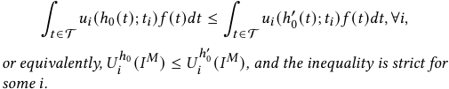

In plain words, a server prediction function satisfies ex-ante Pareto efficiency if there does not exist other server prediction function, such that every participant’s expected utility under true local embeddings keeps non-decreasing, and at least one participant’s expected utility strictly increases. Typical examples for ex-ante Pareto efficiency are the server prediction function always maximizes the sum of participants’ utilities, or the server prediction function uniquely optimizes the utility function for one of the participants. As a more concrete example, in the federated recommendation scenario, as long as the recommendation system always allocate the full portion of display opportunities to the participants, then any server prediction function utilized during this allocating process would be ex-ante Pareto efficiency. This is because any server prediction function always trivially maximize the sum of utility of participants to be equal to one. As the distribution of uploaded local embeddings is a key measure for us, we define the marginal embedding distribution of a strategy _𝜎𝑖_ as _𝑓𝑖__𝜎𝑖_ , with 

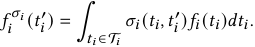

Theorem 5.2. _When each participant 𝑖’s strategy is restricted to_ { _𝜎𝑖_ : _𝑓𝑖__𝜎𝑖_ = _𝑓𝑖_ } _and the server prediction function ℎ_ 0 _is ex-ante Pareto efficient on 𝑢 and 𝑓 , then the truth-telling strategy_ { _𝐼__𝑀_ } _is a BNE._ 

By Theorem 5.2, under the independence and ex-ante Pareto efficiency conditions, if each participant’s uploaded embeddings are strictly constrained to align with their prior distributions, then no participant could achieve higher utility through manipulating the uploaded embeddings when all the other participants adopt the truth-telling strategy. To prove Theorem 5.2, we note the independence in distributions of _𝑡𝑖_ would further indicate a relative 

independence in utility when the marginal distributions of all the parties are constrained to align with the prior distributions, _i.e._ , for any strategy profile _𝜎_ satisfying _𝑓𝑖_ = _𝑓𝑖__𝜎𝑖_ for each participant, 

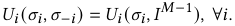

As a result, when all the other participants adopt the truth-telling strategy, their expected utilities are guaranteed to keep stable regardless of the detailed reporting of a specific participant. If some participant _𝑖_ could realize a strict utility increment through changing her strategy, the ex-ante Pareto efficiency of the server prediction function would be broken, thus creates a contradiction. 

Although strong guarantees of preventing strategic behaviors could be provided by the ex-ante Pareto efficiency, this condition might not always hold in reality. For example, when server prediction function is designed to optimize the accuracy of prediction and does not prioritize maximizing the utility function of involved parties, the condition of ex-ante Pareto efficiency would not hold. Therefore, we would like to investigate the guarantees that constraining { _𝜎𝑖_ : _𝑓𝑖__𝜎𝑖_ = _𝑓𝑖_ } could provide for more general server prediction functions. Since we are now under much weaker assumptions on _ℎ_ 0, we focus on the specific form of _linear utility_ functions 

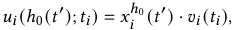

where _𝑥𝑖_ is a function dependent on _ℎ_ 0. That is, we assume each prediction result _𝑡_′ brings _𝑥𝑖__ℎ_0(_𝑡_′)unitofvaluableitem(utility increase) to participant _𝑖_ , and the detailed amount of per-unit item value depends on participant _𝑖_ ’s true local embedding in the form _𝑣𝑖_ ( _𝑡𝑖_ ). The linear utility function is widely-adopted in economics. Theorem 5.3. _Assume that the distributions of local embeddings are discrete. For a strategic participant 𝑖 with linear utility function, her utility could not be increased by using any 𝜎𝑖_ ≠ _𝐼 when each_ = _participant 𝑗’s strategy is constrained within the range_ { _𝜎 𝑗_ : _𝑓𝑗__𝜎𝑗_ _𝑓𝑗_ } _, if_ ∀ _𝑡𝑖_1_,𝑡_ _𝑖_2∈T_𝑖with 𝑣𝑖_(_𝑡_ _𝑖_1)≥_𝑣𝑖_(_𝑡_ _𝑖_2)_,_ 

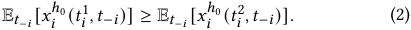

To ensure the constraint on marginal distribution is sufficient to prevent dishonest utility increase, conditions (2) require a monotone property between the expected allocation E _𝑡_ − _𝑖_ [ _𝑥𝑖__ℎ_0(_𝑡𝑖,𝑡_−_𝑖_)] and the per-unit value _𝑣𝑖_ ( _𝑡𝑖_ ) brought by a user with local embedding _𝑡𝑖_ . That is, a user (or other subject of prediction task) who would bring higher per-unit utility _𝑣𝑖_ ( _𝑡𝑖_ ) for participant _𝑖_ , should simultaneously receive more expected allocation of items E _𝑡_ − _𝑖_ [ _𝑥𝑖__ℎ_0(_𝑡𝑖,𝑡_−_𝑖_)] after the overall evaluation _𝑥__ℎ_0 _𝑖_. Compared to the Pareto-efficiency condition, the monotone conditions (2) characterize another kind of coincidence between the server prediction function and the utility function of the participant. When conditions (2) hold for each participant _𝑖_ , Theorem 5.3 would provide the same BNE guarantee as in Theorem 5.2. We present Theorem 5.3 in the current form to emphasize its provided guarantees could be flexibly applied to each individual participant once the conditions hold, which keeps relevant independent with other participants in comparison to the ex-ante Pareto-efficiency condition in Theorem 5.2. 

3578 

KDD ’24, August 25–29, 2024, Barcelona, Spain 

Yidan Xing, Zhenzhe Zheng, & Fan Wu 

|**A**|**lgorithm 1:**Distribution-Based Penalty Mechanism|
|---|---|
||**Parameters:**the test length_𝑚𝑖_,_𝑛𝑖_, and a non-decreasing penalty function_𝑘𝑖_: [0_,_1] →R+;|
||**Oracles:**A valid two-sample test_𝑇𝑖_for_𝑚𝑖_uploaded embeddings and_𝑛𝑖_training embeddings, and a data generator_𝐺𝑖_approximates the distribution of (training) embeddings;|
|**1**|Initialize historical rejection rate of two-sample test_𝑞𝑖_=0;|
|**2**|Initialize a cache_𝐶𝑖_;|
|**3 **|**while**_the collaborative inference is ongoing_**do**|
|**4**|Add each uploaded embedding to_𝐶𝑖_, and use the current uploaded embedding for collaborative inference;|
|**5**|**if**_𝐶𝑖is with length 𝑚𝑖_**then**|
|**6**|Apply_𝑇𝑖_to embeddings in_𝐶𝑖_and_𝑛𝑖_random training embeddings;|
|**7**|Clear_𝐶𝑖_and update_𝑞𝑖_;|
|**8**|**if**_𝑇𝑖rejects the null hypothesis_**then**|
|**9**|**for** _𝑗_=1_, . . . ,𝑘𝑖_(_𝑞𝑖_)**do**|
|**10**|Deactivate the embedding uploaded by participant_𝑖_and use embeddings generated by_𝐺𝑖_as substitute for each inference;|

## **5.2 Distribution-Based Penalty Mechanism** 

Despite the promising guarantees provided by constraining the distributions of uploaded embeddings to align with its prior distribution, it is infeasible for the server to exactly implement this constraint for high-dimensional local embeddings uploaded by the parties. Although we could regard the distribution of training embeddings as an effective approximate to the prior distribution, enforcing the involved parties to upload embeddings exactly match with the training embeddings would lead the uploaded embeddings to be substantially different from the true local embeddings, and spoil the generalization capability of the VFL model. To adequately harness the efficacy of local embedding distributions in preventing strategic behaviors, we allow arbitrary local embeddings (within its domain) to be uploaded by the parties, and adopt additional design to reduce the incentives of conducting strategic behaviors through penalizing the problematic distributions. 

The formal process of the distribution-based penalty mechanism is presented in Algorithm 1, which works individually for each party _𝑖_ . During the collaborative inference process, Algorithm 1 repeatedly collect embeddings uploaded by party _𝑖_ to distinguish whether a sequence of _𝑚𝑖_ uploaded embeddings comes from the same distribution of _𝑛𝑖_ (randomly sampled) training embeddings with high probability. We leverage corresponding methods in statistical literature to realize this detection task, technically termed as _two-sample tests_ . If the null hypothesis that the two groups of samples come from the same distribution is rejected in the twosample test for party _𝑖_ , this indicates party _𝑖_ has likely manipulated the uploaded local embeddings, and we would thus apply a penalty period to party _𝑖_ . During the penalty period, each uploaded embedding of participant _𝑖_ is deactivated and substituted with the random embeddings (output by a generator _𝐺𝑖_ ) to eliminate her 

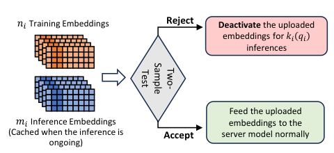

<!-- Start of picture text -->
𝑛𝑖 Training Embeddings Reject Deactivate  the uploaded embeddings for 𝑘𝑖 𝑞𝑖 inferences Feed the uploaded 𝑚𝑖 Inference Embeddings embeddings to the (Cached when the inference is  Accept server model normally ongoing) Test Two- Sample <!-- End of picture text -->

**Figure 2: Illustration of Distribution-Based Penalty Mechanism for Party** _𝑖_ 

influences on the prediction results, and meanwhile leads her expected utility to decrease. The length of the current penalty period is calculated by the historical rejection rate _𝑞𝑖_ and the pre-designed penalty function _𝑘𝑖_ non-decreasing in _𝑞𝑖_ . In principle, we desire the generator _𝐺𝑖_ to approximate the prior distribution of party _𝑖_ ’s local embeddings, which could be realized by randomly drawing samples from the training embeddings. 

As two-sample test is the key component to detect the consistency of distribution in our penalty mechanism, the analysis of our mechanism needs to depend on the properties of adopted twosample tests. Formally speaking, given two groups of samples _𝑋_ ∼ _𝑝_ with size _𝑚_ and _𝑌_ ∼ _𝑞_ with size _𝑛_ , a two-sample test is a statistical test _𝑇_ ( _𝑋,𝑌_ ) : _𝑋__𝑚_ × _𝑋__𝑛_ ↦→{0 _,_ 1} to distinguish between the null hypothesis H0 : _𝑝_ = _𝑞_ and the alternative hypothesis H _𝐴_ : _𝑝_ ≠ _𝑞_ [12]. Since the test is based on finite samples, it is possible that errors would be made for some situations. By convention, a type I error of a two-sample test occurs when the null hypothesis _𝑝_ = _𝑞_ is wrongly rejected based on the observed samples, even though the data was generated with the same distribution. We define the type I error rate for a two-sample test _𝑇_ as _𝛼__𝑇_ . Conversely, a type II error occurs when the null hypothesis _𝑝_ = _𝑞_ is accepted on the observed samples, despite the fact _𝑝_ ≠ _𝑞_ . We define the type II error rate of a two-sample test _𝑇_ against a specific _𝑞_ ≠ _𝑝_ as _𝛽__𝑇_ ( _𝑞_ ). 

In our distribution-based penalty mechanism, we require the adopted two-sample test to satisfy _𝛽__𝑇_ ( _𝑞_ ) _< 𝛼__𝑇_ for any _𝑞_ ≠ _𝑝_ , _i.e._ , the acceptance rate of the null hypothesis is the highest when _𝑞_ = _𝑝_ and be strictly smaller for _𝑞_ ≠ _𝑝_ . Since this is a fundamental requirement for a well-functioning two-sample test, we call a two-sample test satisfying the above condition to be _valid_ . Moreover, we also require each participant’s expected utility to strictly decrease when her true local embeddings are substituted with random embeddings (drawn from her prior distribution), which is necessary to ensure the penalty period could effectively reduce the expected utility of a participant. We term the problem case (consist of _𝑢_ , _𝑓_ and _ℎ_ 0) satisfying this utility decrement condition for each party to be _feasible_ , which could be verified through simulations in practice. When the above typical conditions hold, the proposed distribution-based penalty mechanism (Algorithm 1) is able to inherit the guarantees provided by strictly constraining the distribution (Section 5.1) in an asymptotic sense. 

Theorem 5.4. _For any feasible problem case with valid two-sample tests 𝑇𝑖 , suppose ℎ_ 0 _is ex-ante Pareto efficient on 𝑢 and 𝑓 , and 𝐺𝑖_ ∼ _𝑓𝑖 for each participant 𝑖, then we could find some penalty functions 𝑘𝑖_ (·) 

3579 

KDD ’24, August 25–29, 2024, Barcelona, Spain 

Preventing Strategic Behaviors in Collaborative Inference for Vertical Federated Learning 

_such that the expected per-round utility of truth-telling strategy_ { _𝐼__𝑀_ } _converges to a BNE with the increase of inference rounds under the penalty-enabled server prediction function ℎ_∗ 0_._ 

Under the stated conditions, Theorem 5.4 guarantees no participant could obtain higher expected per-round utility than truthtelling as the inference proceeds, supposing all the other parties adopt the truth-telling strategy. The performance guarantee of our distribution-based penalty mechanism is established on the basis of results in Section 5.1. In principle, because no party could achieve larger utility through deviating to a strategy with the same marginal distribution (Theorem 5.2), the remaining chances to improve utility fall on the strategies with different marginal distributions. However, by the validity of two-sample tests, such kinds of strategies would result in larger historical rejection rate _𝑞𝑖_ and longer penalty period, thus also brings lower utility in the long term. Whilst Theorem 5.4 is formulated based on Theorem 5.2, an alternative result with the ex-ante Pareto efficiency condition replaced by conditions (2) could be formed based on Theorem 5.3. Though our theoretical results rely on conditions such as Pareto-efficiency and independent distribution, the principal idea of our design, _i.e._ , monitoring the distribution of uploaded embeddings, is broadly helpful in restraining the range of strategic behaviors in collaborative inference, even if the theoretical conditions are not strictly satisfied. This is also demonstrated by our experimental results in Section 6. 

In both Algorithm 1 and Theorem 5.4, we do not characterize the detailed form of the penalty function _𝑘𝑖_ and the choice of sample length _𝑚𝑖_ , _𝑛𝑖_ in two-sample tests, but instead leave it flexible to accommodate the need of various scenarios. Choosing a penalty function _𝑘𝑖_ ( _𝑞𝑖_ ) grows faster with _𝑞𝑖_ could provide stronger guarantee against strategic behaviors, but would simultaneously bring higher risk for honest parties when the number of conducted twosample test is small and _𝑞𝑖_ has large variance. A similar tradeoff exists for the choice of test length _𝑚𝑖_ and _𝑛𝑖_ . While a larger _𝑚𝑖_ means lower error rate for two-sample tests, a smaller _𝑚𝑖_ allows to conduct more two-sample tests and get a stable _𝑞𝑖_ , which might be preferred when the number of total inference rounds is small. To choose appropriate mechanism parameters in practice, the server could conduct simulations on training embeddings to estimate the performances of the considered mechanism. 

## **6 EXPERIMENTS** 

In the experiments, we aim to validate and investigate the following questions from an empirical view: (1) whether the considered strategic behaviors in collaborative inference are implementable and could bring the party substantially higher utility; (2) whether the proposed distribution-based penalty mechanism could effectively reduce the involved parties’ incentives to conduct such strategic behaviors for practical datasets that not strictly satisfy the theoretical assumptions; and (3) how to set the parameters in the penalty mechanism to achieve good performances in practice. 

## **6.1 Experimental Setup** 

**Datasets and VFL Model** We conduct experiments on two public datasets, _Criteo_ and _Avazu_ , with the task of click-through-rate (CTR) prediction. We assume there are two parties involved in VFL, with each party owning half of the features partitioned by their 

sequence in dataset. To validate the performances of our design for VFL models trained with different amount of data, we draw 1,000,000 samples to train and test the VFL model for Avazu, while the full dataset is available for Criteo. The training and testing sets are divided with proportion 9:1 for both the datasets. After the VFL model has been determined, we apply our mechanism on _𝑁_ = 100 _,_ 000 samples (inference rounds) drawn from the testing set. We adopt the fully-connected neural network3 (FCNN) for both the parties and the server, with 4 layers for the parties locally and 3 layers for the server, and the sparse features are first processed with an embedding layer before feeding into the local FCNN. The intermediate embeddings uploaded by each party are with dimension 40, which are concatenated to feed into the server network. **Strategic Settings** We assume that there exists one strategic party in the system, which is without loss of generality as our mechanism works individually for each party. We consider the utility function of the strategic party to be the form _𝑢𝑒𝑥𝑝_ =� _𝑗_ ∈[ _𝑁_ ]_𝑐𝑡𝑟_ _𝑗_/_𝑁_or _𝑢𝑐𝑙𝑖𝑐𝑘_ =� _𝑗_ ∈[ _𝑁_ ](_𝑐𝑡𝑟_ _𝑗_·_𝑙𝑎𝑏𝑒𝑙_ _𝑗_)/_𝑁_, where_𝑐𝑡𝑟_ _𝑗_denotes the predicted CTR of the _𝑗__𝑡ℎ_ test sample, and _𝑙𝑎𝑏𝑒𝑙 𝑗_ denotes its true label. Assuming that the display opportunity gained by the strategic party would be equal to the predicted CTR, these two utility functions represent the typical goal of obtaining more exposure opportunities and more expected clicks in recommendation. 

### **Manipulation Strategies** 

• _Label-based_ strategy: Considering that the local features of the training samples with positive label are likely to increase the prediction of CTR, the label-based strategy samples a local embedding from the training embeddings with positive labels to upload in each inference round. This label-based strategy is straightforward to implement in practice, which only requires the party to know a set of samples with positive labels. 

• _Omniscient_ strategy: In the omniscient strategy, we assume the strategy of the party is derived by optimizing the total predicted CTR under _ℓ_ 2-regularization (applied to the difference between the original and manipulated embeddings), using the omniscient knowledge of local embeddings from both parties. To avoid the less meaningful case that the party extremely increases the scale of embeddings to dominantly create false-positive cases, we choose a regularization constant to ensure the resulting strategy achieves a sufficiently higher utility at an appropriate level. The optimization is performed using the stochastic gradient descent method. 

• _Probabilistic Mixtures_ : To validate our mechanisms against various potential strategies, we consider the _probabilistic mixtures_ of the above two strategies with the true local embeddings, _e.g._ , a strategy with mixture probability 0 _._ 1 would report the true embeddings with 90% probability, and report according to the label-based (omniscient) strategy in the remaining 10% probability. 

**Mechanism Implementation** When implementing Algorithm 1, we adopt the kernel two-sample test based on deep learning [21] with the test length for the training and inference embeddings set to be equal, _i.e._ , _𝑛𝑖_ = _𝑚𝑖_ . To reduce the variance of historical rejection rate _𝑞𝑖_ in implementation, we postpone all the penalties to the end of the inference stage, such that once the remaining 

> 3Since the design of our mechanism only concerns the local embeddings uploaded by the participants, the detailed structure of VFL model would not induce great impacts on the trend of performances of the proposed mechanism. 

3580 

KDD ’24, August 25–29, 2024, Barcelona, Spain 

Yidan Xing, Zhenzhe Zheng, & Fan Wu 

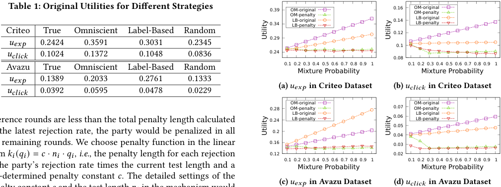

<!-- Start of picture text -->
Table 1: Original Utilities for Different Strategies  0.34 0.39 OM-penaltyOM-originalLB-penaltyLB-original  0.16 0.14 OM-penaltyOM-originalLB-penaltyLB-original Criteo True Omniscient Label-Based Random  0.12 𝑢𝑒𝑥𝑝 0.2424 0.3591 0.3031 0.2345  0.29  0.1 𝑢𝑐𝑙𝑖𝑐𝑘 0.1024 0.1372 0.1048 0.0836  0.24  0.08 Avazu True Omniscient Label-Based Random  0.1  0.2  0.3  0.4  0.5  0.6  0.7  0.8  0.9  1  0.1  0.2  0.3  0.4  0.5  0.6  0.7  0.8  0.9  1 Mixture Probability Mixture Probability 𝑢𝑒𝑥𝑝 0.1389 0.2033 0.2761 0.1333 𝑢𝑐𝑙𝑖𝑐𝑘 0.0392 0.0595 0.0478 0.0229 (a)  𝑢𝑒𝑥𝑝 in Criteo Dataset (b)  𝑢𝑐𝑙𝑖𝑐𝑘 in Criteo Dataset  0.28 OM-penaltyOM-original  0.07 OM-penaltyOM-original inference rounds are less than the total penalty length calculated  0.24 LB-penaltyLB-original  0.06 0.05 LB-penaltyLB-original the latest rejection rate, the party would be penalized in all  0.2  0.04 the remaining rounds. We choose penalty function in the linear  0.16  0.03  𝑘𝑖𝑖 ( 𝑞𝑖𝑖 ) =  𝑐 ·  𝑛𝑖𝑖 ·  𝑞𝑖𝑖 ,  i.e. , the penalty length for each rejection  0.12  0.1  0.2  0.3  0.4  0.5  0.6  0.7  0.8  0.9  1  0.02  0.1  0.2  0.3  0.4  0.5  0.6  0.7  0.8  0.9  1 the party’s rejection rate times the current test length and a Mixture Probability Mixture Probability pre-determined penalty constant  𝑐 . The detailed settings of the (c)  𝑢𝑒𝑥𝑝 in Avazu Dataset (d)  𝑢𝑐𝑙𝑖𝑐𝑘 in Avazu Dataset Utility Utility Utility Utility <!-- End of picture text -->

inference rounds are less than the total penalty length calculated by the latest rejection rate, the party would be penalized in all the remaining rounds. We choose penalty function in the linear form _𝑘𝑖𝑖_ ( _𝑞𝑖𝑖_ ) = _𝑐_ · _𝑛𝑖𝑖_ · _𝑞𝑖𝑖_ , _i.e._ , the penalty length for each rejection is the party’s rejection rate times the current test length and a pre-determined penalty constant _𝑐_ . The detailed settings of the penalty constant _𝑐_ and the test length _𝑛𝑖_ in the mechanism would be characterized for each set of experiments. 

**Figure 3: Comparison of Utilities obtained by Probabilistic Mixtures for Label-Based and Omniscient Strategies before and after the penalty mechanism is enabled, with** _𝑛𝑖_ = 1800 **,** _𝑐_ = 8 **for Criteo Dataset, and** _𝑛𝑖_ = 600 **,** _𝑐_ = 8 **for Avazu Dataset** 

## **6.2 Experimental Results** 

**Original Utilities of Different Strategies** The original utilities of different strategies without the penalty mechanism are presented in Table 1. As we can observe, the omniscient strategy achieves evident higher utility on both the utility functions for two datasets, though it only applies small perturbations on true embeddings. The label-based strategy also achieves evident utility increase except for _𝑢𝑐𝑙𝑖𝑐𝑘_ in Criteo dataset. The reason might come from the limited influences of the party’s local features on the prediction result and the relatively high proportion of positive samples in Criteo dataset. 

mixture probability exceeds 0 _._ 4. This is because the mixture strategy at this point has been penalized in most of the inference rounds, and the utility increase comes entirely from the beginning inferences round for conducting the essential two-sample tests. For Criteo dataset, the utilities of different mixture strategies display slight fluctuations with the increase of mixture probability, which might due to the relatively high variance of two-sample tests under a smaller number of tests for Criteo. 

Since we would substitute the party’s original embeddings with randomly sampled training embeddings as penalty, we also validate the utility of such random “strategy” on the datasets. We find that the random strategy would lead to a lower utility for _𝑢𝑐𝑡𝑟_ , but achieve a similar (though still lower) utility for _𝑢𝑐𝑙𝑖𝑐𝑘_ compared with the true embeddings. In other words, using random strategy would not lead the total exposure of the party to decrease, despite the resulted mismatch between true label and predicted CTR. As a result, for parties with utility function _𝑢𝑒𝑥𝑝_ , we could hardly reduce the utility obtained by strategic manipulations to be smaller than the utility obtained by true embeddings, and what we could achieve is to guide the two utilities to be close enough. 

Another important metric we need to observe is the total penalty length received by true embeddings, as immoderate penalty on a truthful party can significantly degrade the overall prediction performances of VFL system when it is not controlled at a relatively low level. For parameters adopted in Figure 3, the averaged penalty length received by true embeddings are 5 _,_ 680 for Criteo dataset and 5 _,_ 560 for the Avazu dataset, which is a small and acceptable penalty length compared to the 100 _,_ 000 samples in total. **Influences of Mechanism Parameters** The set of parameters we adopted in Figure 3 are actually not the deliberately fine-tuned ones to achieve the best performances. When testing the different mechanism parameters, we find a broad set of parameters could achieve satisfying effects around the parameters we present in Figure 3. Therefore, instead of presenting the similar performances achieved by successful mechanism parameters, we would like to demonstrate the importance of tailoring the mechanism parameters based on the characteristics of datasets and adopted two-sample tests. As a striking instance, simply applying a small test length to Criteo dataset and a large test length to Avazu dataset as opposed to Figure 3, _e.g._ , exchanging the _𝑛𝑖_ parameters for two datasets, would largely degrade the mechanism performances. To help with the evaluation of the mechanism’s overall performances against the strategic behaviors, we define the metric of _utility approximate ratio 𝛼_ to be the largest ratio between the utility obtained by a dishonest strategy and the utility of true embedding among all the considered strategies in Figure 3. We regard an utility approximate ratio less 

**Performances of Distribution-Based Penalty Mechanism** To observe the detailed performances of the proposed penalty mechanism, we conduct a set of experiments (Figure 3) that demonstrate the change in the utility of strategic party when the penalty mechanism is adopted. Due to the different characteristics of two datasets, we choose _𝑛𝑖_ = 1800 for Criteo dataset, and _𝑛𝑖_ = 600 for Avazu dataset, with both _𝑐_ = 8. As could be observed in Figure 3, the utilities obtained by different probabilistic mixtures of the omniscient (OM) and label-based (LB) strategies are largely reduced to be similar or less than the utility obtained by truthfully uploading the embeddings under the penalty mechanism, regardless of the original utilities obtained by those strategies, which demonstrates the effectiveness of our mechanism in diminishing the incentives of parties to adopt strategies other than truthful uploading. 

In the trend of penalized utilities for OM and LB strategies on Avazu dataset, we could observe a slow utility growth after the 

3581 

KDD ’24, August 25–29, 2024, Barcelona, Spain 

Preventing Strategic Behaviors in Collaborative Inference for Vertical Federated Learning 

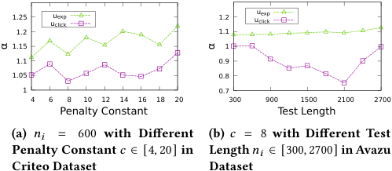

<!-- Start of picture text -->
 1.25 uuclickexp  1.2 uuclickexp  1.2  1.1  1.15  1  1.1  0.9  1.05  0.8  1  0.7  4  6  8  10  12  14  16  18  20  300  900  1500  2100  2700 Penalty Constant Test Length (a) 𝑛𝑖 = 600 with Different (b) 𝑐 = 8 with Different Test Penalty Constant  𝑐 ∈[4 ,  20] in Length 𝑛𝑖 ∈[300 ,  2700]  in Avazu Criteo Dataset Dataset α α <!-- End of picture text -->

**Table 2: Changes in utilities of different strategies when the penalty mechanism is enabled and the strategic party owns 1/3 and 1/4 of the features for Avazu dataset** 

|1/3 features|True|OM|LB|True-P|OM-P|LB-P|
|---|---|---|---|---|---|---|
|_𝑢𝑒𝑥𝑝_|0.1345|0.1449|0.1483|0.1343|0.1278|0.1283|
|_𝑢𝑐𝑙𝑖𝑐𝑘_|0.0377|0.0420|0.0371|0.0375|0.0328|0.0323|
|1/4 features|True|OM|LB|True-P|OM-P|LB-P|
|_𝑢𝑒𝑥𝑝_|0.1390|0.1529|0.1542|0.1389|0.1349|0.1351|
|_𝑢𝑐𝑙𝑖𝑐𝑘_|0.0376|0.0431|0.0369|0.0376|0.0333|0.0326|

**Figure 4: Utility Approximate Ratio** _𝛼_ **for Failure Cases in Criteo and Avazu Dataset** 

than 1 _._ 1 to be acceptable for _𝑢𝑒𝑥𝑝_ and 1 _._ 05 to be acceptable for _𝑢𝑐𝑙𝑖𝑐𝑘_ , which are both satisfied by the experiments in Figure 3. 

In Figure 4a, we report the utility approximate ratios of test length _𝑛𝑖_ = 600 with different penalty constant _𝑐_ ∈[4 _,_ 20] on Criteo dataset. We can observe that the utility approximate ratio fails to satisfy the required standard in most cases and gradually increases with the penalty constant, though with fluctuations. This is caused by the poor performances of two-sample test with _𝑛𝑖_ = 600 when distinguishing the variants of LB strategies on Criteo dataset, such that both the true embeddings and the LB variants receives small penalties. In Figure 4b, we report the utility approximate ratios of _𝑐_ = 8 with different test lengths _𝑛𝑖_ ∈[300 _,_ 2700] on Avazu dataset. Despite the seemingly satisfying results of _𝛼_ , the total penalty received by the true embeddings has generally exceeded 15,000 rounds after _𝑛𝑖_ ≥ 1500, and the relatively low _𝛼_ comes from applying large penalties for both the truth-telling strategy and alternative strategies. For its potential causes, the adopted two-sample test might have relatively high variances on the Avazu dataset and requires more tests to make _𝑞𝑖_ stable when computing the penalty length, which could not be provided by _𝑛𝑖_ ≥ 1500 under the current number of inference samples. 

**Simulations of Multi-Party Setup** Since our mechanism works independently for each party irrespective of other parties’ behaviors, we can simulate the performances of our mechanism for the multi-party setup under the two-party setup. In detail, for any party in multi-party setup, we could regard all the other parties as a “giant” party and run our mechanism only on the local embeddings uploaded by the considered party. Based on this equivalence property, we simulate the 3-party and 4-party setup on Avazu dataset with two parties, by assuming the strategic party owning (approximately) 1/3 and 1/4 of the features. We adopt the same mechanism parameters as in Figure 3c and 3d, and the results are presented in Table 2. We could observe a significant decrease in the utilities of the OM and LB strategies under our penalty mechanism (OM-P and LB-P) compared to their utilities in the vanilla VFL system. In contrast, the utilities of uploading true local embeddings remained largely unaffected under the penalty mechanism (True and TrueP), demonstrating the efficacy of our mechanism in various VFL settings. The discrepancies between utilities obtained by OM and LB strategies in Table 1 and 2 are likely due to the differences in the specific features owned by the strategic party and their varying significance in affecting the final prediction result, and it is not necessarily the case that owning more features would enable 

the party to achieve larger dishonest utility increase when similar manipulation strategies are adopted (Table 2). 

## **7 CONCLUSION** 

In this work, we consider the strategic behaviors in collaborative inference for vertical federated learning, where the parties could manipulate the uploaded local embeddings to change the inference results and maximize their own utilities. We model the strategic interactions between parties for a representative federated recommendation application, and our analysis reveals the adverse effects of the considered strategic behaviors. Specifically, we propose a class of distribution-based penalty mechanism to prevent such strategic behaviors. The proposed mechanism works through applying statistical two-sample tests to distinguish the deviation in embedding distributions and penalizing the parties based on the test results, whose performance is theoretically demonstrated. The experimental results validate the effectiveness of the proposed mechanism in terms of preventing the considered strategic behaviors. 

## **ACKNOWLEDGEMENT** 

This work was supported in part by National Key R&D Program of China (No. 2022ZD0119100), in part by China NSF grant No. 62322206, 62132018, U2268204, 62025204, 62272307, 62372296. The opinions, findings, conclusions, and recommendations expressed in this paper are those of the authors and do not necessarily reflect the views of the funding agencies or the government. 

## **REFERENCES** 

- [1] Kenneth J Arrow. 2012. _Social choice and individual values_ . Vol. 12. Yale University Press. 

- [2] Eugene Bagdasaryan, Andreas Veit, Yiqing Hua, Deborah Estrin, and Vitaly Shmatikov. 2020. How to backdoor federated learning. In _Proceedings of the 23rd International Conference on Artificial Intelligence and Statistics_ . PMLR, 2938–2948. 

- [3] Omer Ben-Porat and Moshe Tennenholtz. 2018. A game-theoretic approach to recommendation systems with strategic content providers. In _Proceedings of the 32nd International Conference on Neural Information Processing Systems_ . Curran Associates Inc., Red Hook, NY, USA, 1118–1128. 

> [4] Arjun Nitin Bhagoji, Supriyo Chakraborty, Prateek Mittal, and Seraphin Calo. 2019. Analyzing federated learning through an adversarial lens. In _Proceedings of the 36th International Conference on Machine Learning_ . PMLR, 634–643. 

- [5] Chaochao Chen, Jun Zhou, Li Wang, Xibin Wu, Wenjing Fang, Jin Tan, Lei Wang, Alex X Liu, Hao Wang, and Cheng Hong. 2021. When homomorphic encryption marries secret sharing: Secure large-scale sparse logistic regression and applications in risk control. In _Proceedings of the 27th ACM SIGKDD International Conference on Knowledge Discovery & Data Mining_ . ACM, 2652–2662. 

- [6] Yong Cheng, Yang Liu, Tianjian Chen, and Qiang Yang. 2020. Federated learning for privacy-preserving AI. _Commun. ACM_ 63, 12 (2020), 33–36. 

- [7] Sen Cui, Jian Liang, Weishen Pan, Kun Chen, Changshui Zhang, and Fei Wang. 2022. Collaboration Equilibrium in Federated Learning. In _Proceedings of the 28th_ 

3582 

KDD ’24, August 25–29, 2024, Barcelona, Spain 

Yidan Xing, Zhenzhe Zheng, & Fan Wu 

_ACM SIGKDD Conference on Knowledge Discovery & Data Mining_ . ACM, New York, NY, USA, 241–251. 

- [8] Yongheng Deng, Feng Lyu, Ju Ren, Yi-Chao Chen, Peng Yang, Yuezhi Zhou, and Yaoxue Zhang. 2021. FAIR: Quality-aware federated learning with precise user incentive and model aggregation. In _Proceedings of the 40th IEEE Conference on Computer Communications_ . IEEE, 1–10. 

- [9] Kate Donahue and Jon Kleinberg. 2021. Model-sharing games: Analyzing federated learning under voluntary participation. In _Proceedings of the AAAI Conference on Artificial Intelligence_ . AAAI Press, 5303–5311. 

- [10] Kate Donahue and Jon Kleinberg. 2021. Optimality and stability in federated learning: A game-theoretic approach. In _Proceedings of the 35th International Conference on Neural Information Processing Systems_ . Curran Associates Inc., Red Hook, NY, USA, 1287–1298. 

- [11] Chong Fu, Xuhong Zhang, Shouling Ji, Jinyin Chen, Jingzheng Wu, Shanqing Guo, Jun Zhou, Alex X Liu, and Ting Wang. 2022. Label inference attacks against vertical federated learning. In _31st USENIX Security Symposium (USENIX Security 22)_ . USENIX Association, 1397–1414. 

- [12] Arthur Gretton, Karsten M Borgwardt, Malte J Rasch, Bernhard Schölkopf, and Alexander Smola. 2012. A kernel two-sample test. _The Journal of Machine Learning Research_ 13 (2012), 723–773. 

- [13] Jingoo Han, Ahmad Faraz Khan, Syed Zawad, Ali Anwar, Nathalie Baracaldo, Yi Zhou, Feng Yan, and Ali Raza Butt. 2022. TIFF: Tokenized Incentive for Federated Learning. In _Proceedings of the IEEE 15th International Conference on Cloud Computing_ . IEEE, 407–416. 

- [14] Rafael Hortala-Vallve. 2010. Inefficiencies on linking decisions. _Social Choice and Welfare_ 34, 3 (2010), 471–486. 

- [15] Jiri Hron, Karl Krauth, Michael Jordan, Niki Kilbertus, and Sarah Dean. 2022. Modeling content creator incentives on algorithm-curated platforms. In _Proceedings of the 11th International Conference on Learning Representations_ . 

- [16] Yaochen Hu, Di Niu, Jianming Yang, and Shengping Zhou. 2019. FDML: A collaborative machine learning framework for distributed features. In _Proceedings of the 25th ACM SIGKDD International Conference on Knowledge Discovery & Data Mining_ . ACM, 2232–2240. 

- [17] Matthew O Jackson and Hugo F Sonnenschein. 2007. Overcoming incentive constraints by linking decisions. _Econometrica_ 75, 1 (2007), 241–257. 

- [18] Peter Kairouz, H Brendan McMahan, Brendan Avent, Aurélien Bellet, Mehdi Bennis, Arjun Nitin Bhagoji, Kallista Bonawitz, Zachary Charles, Graham Cormode, Rachel Cummings, et al. 2021. Advances and open problems in federated learning. _Foundations and Trends in Machine Learning_ 14, 1–2 (2021), 1–210. 

- [19] Oscar Li, Jiankai Sun, Xin Yang, Weihao Gao, Hongyi Zhang, Junyuan Xie, Virginia Smith, and Chong Wang. 2022. Label Leakage and Protection in Two-party Split Learning. In _Proceedings of the 10th International Conference on Learning Representations_ . 

- [20] Wenjie Li, Qiaolin Xia, Hao Cheng, Kouyin Xue, and Shu-Tao Xia. 2022. Vertical semi-federated learning for efficient online advertising. _arXiv preprint_ (2022). https://arxiv.org/abs/2209.15635 

- [21] Feng Liu, Wenkai Xu, Jie Lu, Guangquan Zhang, Arthur Gretton, and Danica J. Sutherland. 2020. Learning Deep Kernels for Non-Parametric Two-Sample Tests. In _Proceedings of the 37th International Conference on Machine Learning_ . PMLR, 6316–6326. 

- [22] Yang Liu, Yan Kang, Tianyuan Zou, Yanhong Pu, Yuanqin He, Xiaozhou Ye, Ye Ouyang, Ya-Qin Zhang, and Qiang Yang. 2024. Vertical Federated Learning: Concepts, Advances, and Challenges. _IEEE Transactions on Knowledge and Data Engineering_ 36, 7 (2024), 3615–3634. 

- [23] Yang Liu, Zhihao Yi, and Tianjian Chen. 2020. Backdoor attacks and defenses in feature-partitioned collaborative learning. _arXiv preprint_ (2020). https://arxiv. org/abs/2007.03608 

- [24] Xinjian Luo, Yuncheng Wu, Xiaokui Xiao, and Beng Chin Ooi. 2021. Feature inference attack on model predictions in vertical federated learning. In _Proceedings of the 37th IEEE International Conference on Data Engineering_ . IEEE, 181–192. 

- [25] Hongtao Lv, Zhenzhe Zheng, Tie Luo, Fan Wu, Shaojie Tang, Lifeng Hua, Rongfei Jia, and Chengfei Lv. 2021. Data-free evaluation of user contributions in federated learning. In _19th International Symposium on Modeling and Optimization in Mobile, Ad hoc, and Wireless Networks_ . IFIP, 81–88. 

- [26] Hitoshi Matsushima, Koichi Miyazaki, and Nobuyuki Yagi. 2010. Role of linking mechanisms in multitask agency with hidden information. _Journal of Economic Theory_ 145, 6 (2010), 2241–2259. 

- [27] Lokesh Nagalapatti and Ramasuri Narayanam. 2021. Game of gradients: Mitigating irrelevant clients in federated learning. In _Proceedings of the 35th AAAI Conference on Artificial Intelligence_ . AAAI Press, 9046–9054. 

- [28] Milad Nasr, Reza Shokri, and Amir Houmansadr. 2019. Comprehensive privacy analysis of deep learning: Passive and active white-box inference attacks against centralized and federated learning. In _2019 IEEE Symposium on Security and Privacy_ . IEEE, 739–753. 

- [29] Qi Pang, Yuanyuan Yuan, Shuai Wang, and Wenting Zheng. 2023. ADI: Adversarial Dominating Inputs in Vertical Federated Learning Systems. In _2023 IEEE Symposium on Security and Privacy_ . IEEE Computer Society, Los Alamitos, CA, USA, 1875–1892. 

- [30] Agustín Santos, Antonio Fernández Anta, José A Cuesta, and Luis López Fernández. 2016. Fair linking mechanisms for resource allocation with correlated player types. _Computing_ 98 (2016), 777–801. 

- [31] Rachael Hwee Ling Sim, Yehong Zhang, Mun Choon Chan, and Bryan Kian Hsiang Low. 2020. Collaborative machine learning with incentive-aware model rewards. In _Proceedings of the 37th International Conference on Machine Learning_ . PMLR, 8927–8936. 

- [32] Behnaz Soltani, Yipeng Zhou, Venus Haghighi, and John C. S. Lui. 2023. A Survey of Federated Evaluation in Federated Learning. In _Proceedings of the 32th International Joint Conference on Artificial Intelligence_ . International Joint Conferences on Artificial Intelligence Organization, 6769–6777. 

- [33] Ming Tang and Vincent WS Wong. 2021. An incentive mechanism for cross-silo federated learning: A public goods perspective. In _Proceedings of the 40th IEEE Conference on Computer Communications_ . IEEE, 1–10. 

- [34] Vale Tolpegin, Stacey Truex, Mehmet Emre Gursoy, and Ling Liu. 2020. Data poisoning attacks against federated learning systems. In _25th European Symposium on Research in Computer Security_ . Springer, 480–501. 

- [35] Róbert F Veszteg. 2015. Linking decisions with standardization. _Studies in Microeconomics_ 3, 1 (2015), 35–48. 

- [36] Hongyi Wang, Kartik Sreenivasan, Shashank Rajput, Harit Vishwakarma, Saurabh Agarwal, Jy-yong Sohn, Kangwook Lee, and Dimitris Papailiopoulos. 2020. Attack of the tails: Yes, you really can backdoor federated learning. In _Proceedings of the 34th International Conference on Neural Information Processing Systems_ . Curran Associates Inc., Red Hook, NY, USA, 16070–16084. 

- [37] Penghui Wei, Hongjian Dou, Shaoguo Liu, Rongjun Tang, Li Liu, Liang Wang, and Bo Zheng. 2023. FedAds: A Benchmark for Privacy-Preserving CVR Estimation with Vertical Federated Learning. In _Proceedings of the 46th International ACM SIGIR Conference on Research and Development in Information Retrieval_ . ACM, 3037–3046. 

- [38] Chuhan Wu, Fangzhao Wu, Lingjuan Lyu, Yongfeng Huang, and Xing Xie. 2022. FedCTR: Federated Native Ad CTR Prediction with Cross-platform User Behavior Data. _ACM Transactions on Intelligent Systems and Technology_ 13, 4 (2022), 62:1– 62:19. 

- [39] Chulin Xie, Keli Huang, Pin Yu Chen, and Bo Li. 2020. DBA: Distributed Backdoor Attacks against Federated Learning. In _Proceedings of the 8th International Conference on Learning Representations_ . 

- [40] Yufeng Zhan, Jie Zhang, Zicong Hong, Leijie Wu, Peng Li, and Song Guo. 2022. A survey of incentive mechanism design for federated learning. _IEEE Transactions on Emerging Topics in Computing_ 10, 2 (2022), 1035–1044. 

- [41] Meng Zhang, Ermin Wei, and Randall Berry. 2021. Faithful edge federated learning: Scalability and privacy. _IEEE Journal on Selected Areas in Communications_ 39, 12 (2021), 3790–3804. 

## **A PROOFS OF RESULTS** 

For convenience in notations, we may abbreviate the server prediction function _ℎ_ 0 in notations when the context is clear. 

## **A.1 Proof for Theorem 4.1** 

Proof. (Existence of PNE) To show the general existence of PNE, we apply the Debreu-Glicksberg-Fan PNE existence theorem. That is, a PNE exists in a game if the following conditions are satisfied: (1) the strategy space of each player is compact and convex; and (2) the utility function of each player is continuous and quasi-concave in her strategy. By our definition of _𝑡𝑖_ , it is clear the strategy space is compact and convex, and _𝑢𝑖_ ( _𝑡𝑖,𝑡_ − _𝑖_ ) is continuous in _𝑡𝑖_ . It remains to demonstrate _𝑢𝑖_ ( _𝑡𝑖,𝑡_ − _𝑖_ ) is quasi-concave in _𝑡𝑖_ . 

Since _𝑢𝑖_ ( _𝑡𝑖,𝑡_ − _𝑖_ ) could be fully defined by _𝑠_ = ( _𝑠_ 1 _,𝑠_ 2 _, . . . ,𝑠𝑀_ ), and _𝑠_ could be obtained by a linear transformation from _𝑡𝑖_ = ( _𝑡𝑖_ 1 _,𝑡𝑖_ 2 _, . . . ,𝑡𝑖𝑑_ ) regarding _𝑡_ − _𝑖_ as constants, we only need to show _𝑢𝑖_ ( _𝑡𝑖,𝑡_ − _𝑖_ ) being quasi-concave on _𝑠_ . Recall 

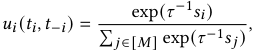

suppose we have two points _𝑠_ and _𝑠_′ , such that _𝑢𝑖_ ( _𝑠_ ) ≥ _𝑎_ and _𝑢𝑖_ ( _𝑠_′ ) ≥ _𝑎_ . By definition of _𝑢𝑖_ , we would have exp( _𝜏_−1 _𝑠𝑖_ ) ≥ <u>1−</u> _<u>𝑎𝑎</u>_· �� _𝑗_ ≠ _𝑖_exp(_𝜏_−1_𝑠_ _𝑗_) �. Taking logarithm on both sides, we have _𝜏_−1 _𝑠𝑖_ ≥ ln <u>1−</u> _<u>𝑎𝑎</u>_+ln �� _𝑗_ ≠ _𝑖_exp(_𝜏_−1_𝑠_ _𝑗_) � _._ Similarly, _𝜏_−1 _𝑠𝑖_′≥ln <u>1−</u> _<u>𝑎𝑎</u>_+ 

3583 

KDD ’24, August 25–29, 2024, Barcelona, Spain 

Preventing Strategic Behaviors in Collaborative Inference for Vertical Federated Learning 

ln �� _𝑗_ ≠ _𝑖_exp(_𝜏_−1_𝑠_′ _𝑗_) � _._ For any _𝜆_ ∈(0 _,_ 1), we could thus obtain to satisfy conditions (4). As _𝜆_ ≠ 0, we could represent each entry _𝜏_−1 ( _𝜆𝑠𝑖_ + (1 − _𝜆_ ) _𝑠𝑖_′)≥ln <u>1−</u> _<u>𝑎𝑎</u>_+_𝜆_ln �� _𝑗_ ≠ _𝑖_exp(_𝜏_−1_𝑠_ _𝑗_) � + (1 − of _𝑡𝑖 𝑤_ as _<u>𝑖</u>_ ex _𝑡𝑖𝑘_ <u>p(</u> _𝜏_− =1 _𝑠𝐶𝑖_ <u>)</u> _𝑖_ ·� _𝑗_ ≠ _𝑖_exp(_𝜏_−1_𝑠_ _𝑗_)(_𝑏_ _𝑖𝑘_−_𝑏_ _𝑗𝑘_)where_𝐶_ _𝑖_=− 2<u>1</u> _𝜆_· _𝜆_ ) ln �� _𝑗_ ≠ _𝑖_exp(_𝜏_−1_𝑠_′ _𝑗_) � _._ On the other hand, by Holder’s inequality, _𝜏_ <u>��</u> _𝑗_′ ∈[ _𝑛_ ]exp(_𝜏_−1_𝑠_′ _𝑗_) <u>�</u> 2 _>_ 0 is the same constant for all _𝑡𝑖𝑘_ . When _𝜆_ 1− _𝜆 𝑛_ = 2, we further denote _𝐶𝑖_′=_𝐶𝑖_· exp(_𝜏_−1_𝑠_3−_𝑖_), then we must have ln ������∑︁ _𝑗_ ≠ _𝑖_ exp( _𝜏_−1 _𝑠 𝑗_ )� �� ·� ��∑︁ _𝑗_ ≠ _𝑖_ exp( _𝜏_−1 _𝑠_′ _𝑗_)�� � ��� _𝐶𝑡𝑖𝑘𝑖_′_>_ =0, we could thus deduce _𝐶𝑖_′· (_𝑏𝑖𝑘_−_𝑏_(3−_𝑖_)_𝑘_)_._Since we have derived �_𝑑_ _𝑘_ =1_𝑡_ _𝑖𝑘_2= 1 and 

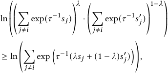

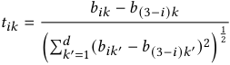

is the unique solution (best-response strategy) to problem (3). Combining the unique best-response strategies for both party 1 and party 2 finishes the proof for our statement. □ 

Therefore, for _<u>𝑠</u>_ = _𝜆𝑠_ +(1− _𝜆_ ) _𝑠_′ , _𝜏_−1 _<u>𝑠𝑖</u>_ ≥ ln <u>1−</u> _<u>𝑎𝑎</u>_+ln �� _𝑗_ ≠ _𝑖_exp �_𝜏_−1 _<u>𝑠𝑖</u>_ �� _,_ which indicates _𝑢𝑖_ ( _<u>𝑠</u>_ <u>)</u> ≥ _𝑎_ and the quasi-concavity of _𝑢𝑖_ ( _𝑠_ ). □ 

Proof. (Unique PNE when _𝑀_ = 2) We would finish the proof by showing the following statements: When _𝑛_ = 2, (1) no interior point of _𝑡_ 1 or _𝑡_ 2 would be a PNE, _i.e._ , ∥ _𝑡_ 1 ∥ = ∥ _𝑡_ 2 ∥ = 1; and (2) fix any _𝑡_ 3− _𝑖_ , the best response _𝑡𝑖_ must be obtained by scaling vector � _𝑏𝑖𝑘_ − _𝑏_ (3− _𝑖_ ) _𝑘_ � _𝑘_ ∈[ _𝑑_ ]with a constant. Note that party 3 −_𝑖_denotes the other party besides _𝑖_ . Fixing _𝑡_ − _𝑖_ , the optimization problem faced by party _𝑖_ could be formulated as 

## **A.2 Proof for Theorem 5.2** 

Lemma A.1. _For any strategy profile 𝜎 satisfying 𝑓𝑖_ = _𝑓𝑖__𝜎𝑖,_∀_𝑖,_ _𝑈𝑖_ ( _𝜎𝑖, 𝜎_ − _𝑖_ ) = _𝑈𝑖_ ( _𝜎𝑖, 𝐼__𝑀_−1 ) 

Proof. (Lemma A.1) Note that 

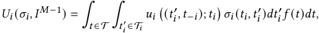

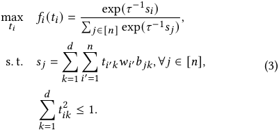

we could have 

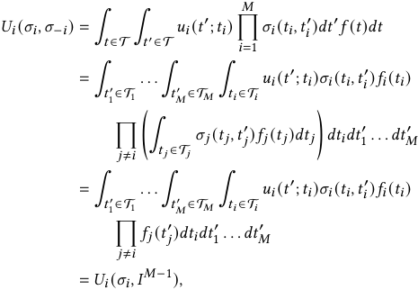

Using multi-variable chain rule, we could obtain 

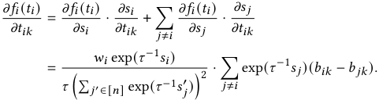

By definition of PNE, _𝑡𝑖_ must be the solution to problem (3) supposing _𝑡_ − _𝑖_ are fixed. To characterize the conditions of those bestresponse _𝑡𝑖_ , consider the following Karush–Kuhn–Tucker (KKT) conditions induced by problem (3). 

where the last equality comes from regarding _𝑡_′ _𝑗_as_𝑡𝑗_for_𝑗_≠_𝑖_. □ 

Proof. (Theorem 5.2) For the strategy profile _𝜎_ = { _𝐼__𝑀_ }, suppose participant _𝑖_ deviates to an alternative strategy _𝜎𝑖_′with_𝑓_ _𝑖__𝜎_ _𝑖_′ = _𝑓𝑖_ , and _𝑈𝑖__ℎ_0 ( _𝜎𝑖_′_, 𝐼𝑀_−1)_>𝑈_ _𝑖__ℎ_0 ( _𝐼__𝑀_ ). Then consider another (randomized) server aggregation function _ℎ_ 0′defined as_ℎ_ 0′(_𝑡_)=_ℎ_0(_𝜎_ _𝑖_′(_𝑡𝑖_)_,𝑡_−_𝑖_). Since _ℎ_ 0′just maps the uploaded embedding of participant_𝑖_accord- ing to _𝜎𝑖_′on the basis of_ℎ_0,_𝑈_ _𝑗__ℎ_ 0′(_𝐼𝑀_)=_𝑈_ _𝑗__ℎ_0(_𝐼,_(_𝜎_ _𝑖_′_, 𝐼𝑀_−2)) for_𝑗_≠_𝑖_, 0 and _𝑈𝑖__ℎ_′ ( _𝐼__𝑀_ ) = _𝑈𝑖__ℎ_0 ( _𝜎𝑖_′_, 𝐼𝑀_−1). From Lemma A.1, as _𝑓𝑗__𝐼_=_𝑓𝑗_and_𝑓_ _𝑖__𝜎_ _𝑖_′ = _𝑓𝑖_ , we have _𝑈 𝑗__ℎ_0(_𝐼,_(_𝜎_ _𝑖_′_, 𝐼𝑀_−2))=_𝑈_ _𝑗__ℎ_0(_𝐼𝑀_)= ∫ _𝑡_ ∈T _𝑢 𝑗_ ( _ℎ_ 0 ( _𝑡_ ); _𝑡 𝑗_ ) _𝑓_ ( _𝑡_ ) _𝑑𝑡,_ ∀ _𝑗_ ≠ _𝑖._ 0 0 Therefore, we would have _𝑈𝑖__ℎ_′ ( _𝐼__𝑀_ ) _> 𝑈𝑖__ℎ_0 ( _𝐼__𝑀_ ) and _𝑈 𝑗__ℎ_′(_𝐼𝑀_)= _𝑈 𝑗__ℎ_0(_𝐼𝑀_)_,_∀_𝑗_≠_𝑖_, contradicting with the Pareto efficiency of_ℎ_0. □ 

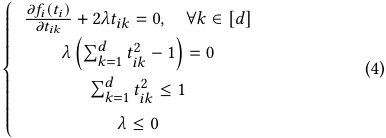

We would now claim that _𝜆_ ≠ 0 for _𝑛_ = 2 and _𝑏_ 1 ≠ _𝑏_ 2. If _𝜆_ = 0, we require_𝜕𝑓_ _<u>𝜕𝑡</u>__<u>𝑖</u>_<u>(</u> _𝑖𝑘__𝑡𝑖_<u>)</u> = 0 _,_ ∀ _𝑘_ ∈[ _𝑑_ ] _._ However, when _𝑛_ = 2, the term � _𝑗_ ≠ _𝑖_exp(_𝜏_−1_𝑠_ _𝑗_)(_𝑏_ _𝑖𝑘_−_𝑏_ _𝑗𝑘_)wouldreducetoexp(_𝜏_−1_𝑠_ 3− _𝑖_)(_𝑏_ _𝑖𝑘_− _𝑏_ (3− _𝑖_ ) _𝑘_ ) _,_ which could not be 0 for every _𝑘_ for _𝑏_ 1 ≠ _𝑏_ 2. As the term _𝑤𝑖_ exp( _𝜏_−1 _𝑠𝑖_ <u>)</u> = 0 could not hold _<u>𝜕𝑡𝑖𝑘</u> 𝜏_ <u>��</u> _𝑗_′ ∈[ _𝑛_ ]exp(_𝜏_−1_𝑠_′ _𝑗_) <u>�</u> 2 is strictly positive,_𝜕𝑓𝑖_<u>(</u>_𝑡𝑖_<u>)</u> for every _𝑘_ , thus _𝜆_ could not be 0, and we must have�_𝑑_ _𝑘_ =1_𝑡_ _𝑖𝑘_2= 1 

3584 

KDD ’24, August 25–29, 2024, Barcelona, Spain 

Yidan Xing, Zhenzhe Zheng, & Fan Wu 

## **A.3 Proof for Theorem 5.3** 

Proof. We conduct the proofs for discrete embeddings _𝑡𝑖_ ∈ _𝑇𝑖_ . For any potential strategy _𝜎𝑖_ , construct a directed graph G, whose nodes correspond to each possible local embedding _𝑡𝑖_ ∈ _𝑇𝑖_ . We construct the edges in this graph to denote the strategic report _𝜎𝑖_ ( _𝑡𝑖_1_,𝑡_ _𝑖_2)_>_0for_𝑡_ _𝑖_1≠_𝑡_ _𝑖_2, suchthat each directededgepointing from _𝑡𝑖_1to_𝑡_ _𝑖_2has weight P(_𝑡𝑖_=_𝑡_ _𝑖_1) ·_𝜎𝑖_(_𝑡_ _𝑖_1_,𝑡_ _𝑖_2),_i.e._, the probability that participant _𝑖_ has true embedding _𝑡𝑖_1and misreport embedding _𝑡𝑖_2under strategy_𝜎𝑖_. By {_𝜎𝑖_:_𝑓_ _𝑖__𝜎𝑖_ = _𝑓𝑖_ }, we require ∀ _𝑡𝑖_2∈T_𝑖_, ∑︁ _𝜎𝑖_ ( _𝑡𝑖_1_,𝑡_ _𝑖_2) · P(_𝑡𝑖_=_𝑡_ _𝑖_1)= P(_𝑡𝑖_=_𝑡_ _𝑖_2)_._ (5) _𝑡𝑖_1∈T_𝑖_ 

Based on (5), we would further have 

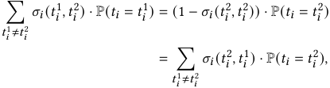

where the last inequality is due to� _𝑡𝑖_1∈T_𝑖𝜎𝑖_(_𝑡_ _𝑖_2_,𝑡_ _𝑖_1)= 1_,_∀_𝑡_ _𝑖_2∈T_𝑖._ Therefore, in the constructed graph, each node would have the sum of weight of in-edges to equal the sum of weight of out-edges. 

To prove the statement, we would start from the graph of any strategy _𝜎𝑖_ ≠ _𝐼_ , and gradually remove all the edges in this graph to approach the edgeless graph (correspond to the truth-telling strategy _𝐼_ ). We would demonstrate that (1) the adjustment must finally lead to an edgeless graph, and (2) each step in the adjustment would result in a feasible strategy with non-decreasing utility, thus finishes the proof. Our adjustment is as follows: in each step, we find a cycle in the graph. We remove the edge with the smallest weight in this cycle, whose weight is denoted as _𝑤_ , and also update the weight of other edges in this cycle to minus _𝑤_ , then add _𝑤_ to _𝜎𝑖_ ( _𝑡𝑖,𝑡𝑖_ ) for each node _𝑡𝑖_ in this cycle. 

To prove statement (1), since we have formulated a directed graph, suppose the graph is not edgeless and contains no cycle during the adjustment, there must exist some sink node and source node in the graph. However, by our construction, each node must have the equal sum of weights of in-edges and out-edges, thus leads to a contradiction. For statement (2), since each step of adjustment preserves Equation (5), the adjusted strategy is still feasible and satisfies { _𝜎𝑖_ : _𝑓𝑖__𝜎𝑖_ = _𝑓𝑖_ }. We only remains to show each step of adjustment would lead to non-decreasing utility given conditions (2). For a strategy _𝜎𝑖_ , its resulted utility could be calculated as 

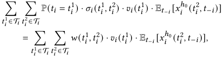

where we use _𝑤_ ( _𝑡𝑖_1_,𝑡_ _𝑖_2) to denote the weight of edge from_𝑡_ _𝑖_1to_𝑡_ _𝑖_2for _𝑡𝑖_1≠_𝑡_ _𝑖_2, and define_𝑤_(_𝑡_ _𝑖_1_,𝑡_ _𝑖_1)= P(_𝑡𝑖_=_𝑡_ _𝑖_1) ·_𝜎𝑖_(_𝑡_ _𝑖_1_,𝑡_ _𝑖_1). W.l.o.g., define the _𝑛_ nodes in the current cycle as _𝑡𝑖_1_, . . .𝑡_ _𝑖__𝑛_(with_𝑡_ _𝑖__𝑛_+1 = _𝑡𝑖_1for conve- nience in notations). Then by our construction of the adjustment, except for the unchanged parts of the graph, the utility before this step of adjustment is _𝑤_ · �� _𝑛𝑗_ =1_𝑣𝑖_(_𝑡_ _𝑖__𝑗_) · E_𝑡_−_𝑖_[_𝑥_ _𝑖__ℎ_0(_𝑡_ _𝑖__𝑗_+1 _,𝑡_ − _𝑖_ )]� _,_ and the utility after this step would be _𝑤_ · �� _𝑛𝑗_ =1_𝑣𝑖_(_𝑡_ _𝑖__𝑗_) · E_𝑡_−_𝑖_[_𝑥_ _𝑖__ℎ_0(_𝑡_ _𝑖__𝑗,𝑡_−_𝑖_)] � _._ By 

conditions (2), since larger _𝑣𝑖_ ( _𝑡𝑖__𝑗_) implies larger E_𝑡_−_𝑖_[_𝑥_ _𝑖__ℎ_0(_𝑡_ _𝑖__𝑗,𝑡_−_𝑖_)], applying the rearrangement inequality, we would have 

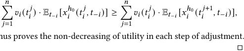

thus proves the non-decreasing of utility in each step of adjustment. 

## **A.4 Proof for Theorem 5.4** 

Proof. Define _𝑛_ to be the number of total inference rounds. It is sufficient for us to find a penalty function _𝑘𝑖_ (·) for each participant _𝑖_ , such that when _𝑛_ →∞, there does not exist a strategy _𝜎𝑖_ with 0 0 _𝑈𝑖__ℎ_∗ ( _𝜎𝑖, 𝐼__𝑀_−1 ) _> 𝑈𝑖__ℎ_∗ ( _𝐼__𝑀_ ). For convenience in notations, we abbreviate _𝛽__𝑇_ ( _𝑓𝑖__𝜎𝑖_ ) to be _𝛽_ ( _𝜎𝑖_ ), and define _𝑘𝑖_′(_𝛽_(_𝜎𝑖_))=_𝑘𝑖_(_𝛽_(_𝜎𝑖_))/_𝑚𝑖_. To evaluate the change of utility for an arbitrary strategy _𝜎𝑖_ during the penalty period, we further define the expected utility increment ratio of _𝜎𝑖_ over the penalty reporting strategy _𝜎𝑖__𝑝_: _𝜎𝑖__𝑝_(_𝑡𝑖,_·)∼_𝐺𝑖,_∀_𝑡𝑖_∈T_𝑖_when other participants report truthfully as _𝛿𝑖_ ( _𝜎𝑖_ ) :=_𝑈𝑖_<u>(</u>_𝜎𝑖,𝐼𝑀_−1<u>)</u> _𝑈𝑖_ ( _𝜎𝑖__<u>𝑝,𝐼</u>𝑀_−1)−1_._Recall that we are under the feasible problem case, which indicates _𝛿𝑖_ ( _𝐼_ ) _>_ 0. By the strong law of large number, we would have _𝑞𝑖_ ( _𝜎𝑖_ ) converges to _𝛽_ ( _𝜎𝑖_ ) when _𝑛_ →∞. Therefore, the proportion of penalty period among the entire infer- _<u>𝛽</u>_ <u>(</u> _𝜎𝑖_ <u>)</u> · _𝑘𝑖_′<u>(</u>_<u>𝛽</u>_<u>(</u>_𝜎𝑖_<u>))</u> ence period would converge to 1+ _𝛽_ ( _𝜎𝑖_ )· _𝑘𝑖_<u>′</u>(_𝛽_(_𝜎𝑖_))_,_since when each two-sample test of length _𝑚𝑖_ ends, there is an additional _𝛽_ ( _𝜎𝑖_ ) probability to have a penalty period with length _𝑘𝑖_′(_𝛽_(_𝜎𝑖_)) ·_𝑚𝑖_. Thus, we could calculate the expected per-round utility of strategy _𝜎𝑖_ when _𝑛_ →∞ as 

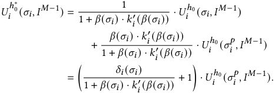

That is, to prove the BNE when _𝑛_ →∞, we need 

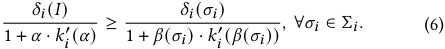

For any _𝜎𝑖_ with _𝑓𝑖__𝜎𝑖_ = _𝑓𝑖_ , _𝛽_ ( _𝜎𝑖_ ) = _𝛼_ , and by Theorem 5.2, _𝛿𝑖_ ( _𝐼_ ) ≥ _𝛿𝑖_ ( _𝜎𝑖_ ), which holds regardless of the form of functions _𝑘𝑖_ . For any _𝜎𝑖_ with _𝑓𝑖__𝜎𝑖_ ≠ _𝑓𝑖_ , consider _𝑘𝑖_′(_𝛼_)to be in the form of_𝛼𝑐_·_𝐵_with constants _𝐵_ and _𝑐_ , and substitute it into condition (6), we would equivalently require 

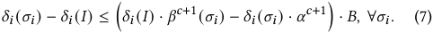

By feasibility of the problem case and the validity of the two-sample test, we have _𝛿𝑖_ ( _𝐼_ ) _>_ 0 and _𝛽_ ( _𝜎𝑖_ ) _> 𝛼_ . Therefore, for each _𝜎𝑖_ with _𝑓𝑖__𝜎𝑖_ ≠ _𝑓𝑖_ , we are able to find a large enough positive constant _𝑐𝜎𝑖_ , such that _𝛿𝑖_ ( _𝐼_ ) · _𝛽__𝑐𝜎𝑖_+1 ( _𝜎𝑖_ ) − _𝛿𝑖_ ( _𝜎𝑖_ ) · _𝛼__𝑐𝜎𝑖_+1 _>_ 0. Taking _𝑐_ to be the supreme over those _𝑐𝜎𝑖_ , we would have this term to be positive for all the _𝜎𝑖_ with _𝑓𝑖__𝜎𝑖_ ≠ _𝑓𝑖_ . Then taking _𝐵_ to be a large positive constant such that condition (6) is satisfied for all the _𝜎𝑖_ finishes the proof. □ 

3585 

