# **Robust Auto-Bidding Strategies for Online Advertising** 

Qilong Lin Zhenzhe Zheng∗ Fan Wu Shanghai Jiao Tong University Shanghai Jiao Tong University Shanghai Jiao Tong University Shanghai, China Shanghai, China Shanghai, China edersnow@sjtu.edu.cn zhengzhenzhe@sjtu.edu.cn fwu@cs.sjtu.edu.cn 

## **ABSTRACT** 

In online advertising, existing auto-bidding strategies for bid shading mainly adopt the approach of first predicting the winning price distribution and then calculating the optimal bid. However, the winning price information available to the Demand Side Platforms (DSPs) is extremely limited, and the associated uncertainties make it challenging for DSPs to accurately estimate winning price distribution. To address this challenge, we conducted a comprehensive analysis of the process by which DSPs obtain winning price information, and abstracted two types of uncertainties from it: known uncertainty and unknown uncertainty. Based on these uncertainties, we proposed two levels of robust bidding strategies: Robust Bidding for Censorship (RBC) and Robust Bidding for Distribution Shift (RBDS), which offer guarantees for the surplus in the worstcase scenarios under uncertain conditions. Experimental results on public datasets demonstrate that our robust bidding strategies consistently enable DSPs to achieve superior surpluses, both on test sets and under worst-case conditions. 

## **CCS CONCEPTS** 

• **Applied computing** → **Online auctions** ; • **Information systems** → **Display advertising** ; • **Mathematics of computing** → **Mathematical optimization** . 

## **KEYWORDS** 

Auto-Bidding, Bid Shading, Robust Optimization 

#### **ACM Reference Format:** 

Qilong Lin, Zhenzhe Zheng, and Fan Wu. 2024. Robust Auto-Bidding Strategies for Online Advertising. In _Proceedings of the 30th ACM SIGKDD Conference on Knowledge Discovery and Data Mining (KDD ’24), August 25– 29, 2024, Barcelona, Spain._ ACM, New York, NY, USA, 12 pages. https: //doi.org/10.1145/3637528.3671729 

## **1 INTRODUCTION** 

In recent years, the landscape of auto-bidding in online advertising has undergone a significant transformation, with the sale of vast quantities of ad impressions shifting from the traditional secondprice auction to the first-price auction [8, 26, 33]. This shift has 

∗Z.Zheng is the corresponding author. 

Permission to make digital or hard copies of all or part of this work for personal or classroom use is granted without fee provided that copies are not made or distributed for profit or commercial advantage and that copies bear this notice and the full citation on the first page. Copyrights for components of this work owned by others than the author(s) must be honored. Abstracting with credit is permitted. To copy otherwise, or republish, to post on servers or to redistribute to lists, requires prior specific permission and/or a fee. Request permissions from permissions@acm.org. _KDD ’24, August 25–29, 2024, Barcelona, Spain_ 

© 2024 Copyright held by the owner/author(s). Publication rights licensed to ACM. ACM ISBN 979-8-4007-0490-1/24/08 

https://doi.org/10.1145/3637528.3671729 

altered the bidding strategies of the auction participants, namely Demand Side Platforms (DSPs), and has given rise to the issue of bid shading [32, 34, 35] in the first-price auction context. 

From the perspective of auction theory, in contrast to traditional second-price auctions, first-price auctions do not possess the incentive compatibility property [17, 18]. For DSPs, this indicates that truthfully revealing their value of winning the auction may not necessarily yield the maximal surplus for themselves. Therefore, DSPs need to develop bidding strategies tailored to the first-price auction environment in order to maximize their own surplus. 

A natural bidding approach in first-price auction is firstly predicting the distribution of winning price for each auction, where winning price is the minimal bid that could win the auction. Based on this distribution, one can solve for the bid that maximizes the expected surplus. This approach has been adopted by many works on bid shading, and has led to the development of specialized works that focus on the prediction of winning prices [19, 30, 31]. 

However, the uncertainty of winning price is a substantial challenge. In reality, the real distribution of winning prices is unattainable, and we can only estimate it from the sampled winning price data within each auction. Moreover, a significant issue for DSPs is that they can only access partial information from this sampled data. For instance, a DSP may know the exact winning price only upon winning an auction, whereas in the cases of not winning, DSP would merely know that winning price is higher than her bid. Additionally, the proportion of auctions that a DSP wins constitutes a minor segment of all auctions. This dilemma is commonly referred to as the censorship problem [2, 27, 32]. The impediments in accessing winning price information result in uncertainties that cannot be disregarded in the modeling of winning price. 

Existing research endeavors to predict the distribution of winning prices in the context of censorship, which inherently necessitates the introduction of certain assumptions as criteria for evaluating the quality of the predicted winning price distributions. For example, the method of censored regression assumes that the distribution of winning prices should remain consistent across auctions that a DSP loses and those her wins. Such an assumption may not correspond to actual conditions [32], thereby introducing an intrinsic bias into the predicted distribution. 

In our work, to address the challenges posed by uncertainties, we propose two levels robust bidding strategies. More specifically, we categorize the uncertainty within the winning price into two levels: known uncertainty and unknown uncertainty, corresponding respectively to the issue of censorship and the sampling process of winning price. These two types of uncertainties collectively describe the limited information on the winning price distribution that the DSP can obtain. 

Given that both types of uncertainties pertain to winning price distribution, We draw inspiration from the idea of Distributionally 

1804 

KDD ’24, August 25–29, 2024, Barcelona, Spain 

Qilong Lin, Zhenzhe Zheng, & Fan Wu 

Robust Optimization (DRO) [5, 16, 21] and model such uncertainties on distribution by the concept of ambiguity sets. Subsequently, we solve the distributionally robust optimization problem to select the optimal bids. Following this approach, we propose two levels robust bidding strategies—Robust Bidding for Censorship (RBC) and Robust Bidding for Distributional Shift (RBDS)—for known and unknown uncertainties, respectively, and design corresponding algorithms to solve the bidding problem. Such robust bidding strategies aim to optimize the worst-case surplus, thereby providing lower bound guarantees for the DSP’s surplus in first-price auction environments, where the winning price is fraught with uncertainty. Our contributions in this work can be summarized as follows: 

- We model the uncertainties of winning price, and propose the corresponding distributionally robust bidding strategies. Our robust strategy aims to optimize the worst-case surplus, thereby achieving advanced performance in the bidding environments characterized by significant uncertainty. 

- From the technical perspective, we designed the construction of the ambiguity set and the algorithm for the RBC and RBDS strategies. This approach can provide insights into solving specialized distributionally robust optimization problems under discrete distribution scenarios. 

- We conduct comprehensive experiments on public datasets. The experimental results show that our robust bidding strategies outperform the existing strategies, especially exhibiting better performance in the worst-case situations. 

The rest of this work is organized as follows. In Section 2, we provide an overview of the existing works on bid shading and robust optimization. In Section 3, we conduct a detailed analysis of the uncertainty in bid shading, and introduce the robust bidding problem. In Section 4, in correspondence to the two types of uncertainties abstracted in the analysis, we specifically propose two levels robust bidding strategies. In Section 5, we present the experimental results on public datasets, and demonstrate the effectiveness of our robust strategies. Finally, in Section 6, we briefly summarize the content of this work and potential future works. 

## **2 RELATED WORK** 

In this section, we provide an overview of the existing auto-bidding strategies in bid shading, and introduce the closely related series of works on winning price prediction. Additionally, we briefly review the relevant works on distributionally robust optimization, which is the primary technique employed in this work. 

## **2.1 Bid Shading** 

In bid shading, mainstream works adopt the idea of distributionbased bidding strategies. According to whether the distribution type of winning price is pre-assumed, we can roughly divide existing works into two categories. One kind of work assumes that the winning price follows a certain type of distribution, which is called the parametric method. Existing work has tried various distribution types to model winning price distribution [11, 20, 29]. Among them, [35] compares several basic distribution types, and finds that the lognormal distribution fits best in actual business. 

Although the research on the parametric method is comprehensive, the actual winning price distribution contains lots of detailed 

information, which is difficult to be described by a certain type of distribution. Based on this observation, another series of works tries to directly fit the original distribution. This type of method is called the non-parametric method. [34] uses a table-based algorithm to record historical surplus and make bidding decisions based on these records. At present, the main discussion of non-parametric methods lies in the series of works about winning price prediction. 

## **2.2 Winning Price Prediction** 

To deal with censorship problem, a series of works focused on the winning price prediction model. [32] is the first to consider the censorship problem in distribution prediction. In their work, they introduce the traditional censored regression method and model the winning price prediction as a linear fitting problem with normal noise. [7] further models winning price as a mixture distribution and uses the mixture density network corresponding. [14] focuses on the design of feature engineering, and improves the loss function of the network. Besides these works related to censored regression, there is also a series of works that use survival analysis to deal with censorship problem. [30] is the first to introduce survival analysis into winning price prediction, and they consider combining it with decision trees to apply to bid shading problem. [22, 28] further consider combining survival analysis with recurrent neural network and Markov network. In general, this series of works gradually develops towards complex non-parametric methods. 

## **2.3 Distributionally Robust Optimization** 

Distribution robust optimization is a burgeoning robust optimization method that we mainly refer to. Its principal idea is to optimize the worst-case performance within an uncertain environment, where the optimized variables are distributions. This method can probably be traced back to a study on the inventory problem [24], and is widely known as distributionally robust optimization after a more recent study on moment uncertainty [4]. Nowadays, this optimization idea has been applied to various scenarios, such as machine learning [13] and auction mechanism design [12]. 

In our work, since the bidding decision function of bid shading is not a convex function, we need to consider non-convex distributionally robust optimization. Recently, [10] and [9] have expanded the inner optimization problem in DRO to rewrite the DRO problem as a stochastic optimization problem. With this transformation, they can naturally use existing algorithms to solve the original DRO problem. However, the number of studies on this topic is small and further exploration is still needed. 

## **3 PRELIMINARIES** 

In this section, we conduct a comprehensive analysis of the process by which DSPs acquire winning price information, and abstract two types of uncertainties from it: known uncertainty and unknown uncertainty. Based on this uncertain environment, we introduce the robust bidding problem, which encapsulates the objectives of robust strategies in the next section. 

## **3.1 Uncertain Bidding Environment** 

The environment we consider is the context of first-price auction, in which a DSP aims to devise a bidding strategy that could maximize 

1805 

KDD ’24, August 25–29, 2024, Barcelona, Spain 

Robust Auto-Bidding Strategies for Online Advertising 

her surplus. Formally speaking, from the DSP’s perspective, we define her private value as _𝑣_ , and she can submit a bid _𝑏_ ∈B to the auction platform to compete for the advertisement slot, where B denote the discrete bidding space with size _𝑀_ . Let _𝑤_ be the winning price of the auction. The DSP wins the auction when her bid _𝑏_ is greater than or equal to _𝑤_ , at which point she incurs a cost equal to her bid _𝑏_ , and gets the surplus _𝑣_ − _𝑏_ . If DSP does not win the auction, her surplus is 0. Hence, the objective of DSP can be expressed as optimizing her surplus: 

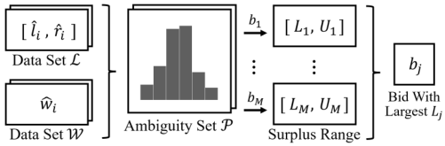

**Figure 1: The idea of uncertainty analysis and distributionally robust optimization** 

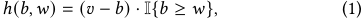

where I{ _𝑏_ ≥ _𝑤_ } indicates whether DSP wins or not, and it converts the logical judgment result to 0 or 1 accordingly. In practical business scenarios, the private value _𝑣_ is generally given. Hence, similar to other bid shading studies, we focus our attention on the modeling of winning price _𝑤_ . 

To model winning price, we analyze its origins and the associated uncertainty issues from the perspective of DSP. First, we assume that winning price _𝑤_ follows a distribution _𝒑_ . In this work, for ease of discussion, we utilize this kind of probability vector _𝒑_ to discretely represent the winning price distribution. Specifically, we define _𝑏_ 0 = 0, and set the bids in B to satisfy _𝑏_ 0 _< 𝑏_ 1 _< ... < 𝑏𝑀_ and form an arithmetic sequence. Consequently, the probability vector can be denoted as _𝒑_ = ( _𝑝_1 _, 𝑝_2 _, ..., 𝑝__𝑀_ ), where for any _𝑗_ ∈[1 _, 𝑀_ ], _𝑝__𝑗_ corresponds to the probability of the winning price being in the interval [ _𝑏 𝑗_ −1 _,𝑏 𝑗_ ). 

In reality, the DSP cannot directly access the real winning price distribution _𝒑_ . Instead, it indirectly acquires information about this distribution through the following process: 

- **Sampling** . Historical auctions contain sampled winning price data { _𝑤_ ˆ _𝑖_ | _𝑖_ ∈A}, where _𝑖_ is used to identify different auctions in historical auctions set A. These sampled data constitutes an sampling distribution _𝒑_ ˆ = FB ({ _𝑤_ ˆ _𝑖_ | _𝑖_ ∈A}). In our work, we use the function FB to denote the function that map the dataset to a distribution _𝒑_ ˆ on B. 

- **Censorship** . DSP can only obtain the sampled winning price { _𝑤_ ˆ _𝑖_ | _𝑖_ ∈W} when her wins, where W is the set of auctions DSP won. For those losing auctions _𝑖_ ∈L = A \ W, DSP normally only knows that the sampled winning price exceeds her own bid. We abstract the situation of these auctions as cases where the DSP only knows the interval [ _𝑙_ˆ _𝑖,_ ˆ _𝑟𝑖_ ] in which _𝑤_ ˆ _𝑖_ is located. 

Here, the censorship problem has already been widely discussed in related work [32], and we further explain the meaning of the interval [ _𝑙_ˆ _𝑖,_ ˆ _𝑟𝑖_ ] in it. In the most general case, when DSP does not win the auction, she only knows that the winning price is higher than her bid, so the left end of the interval _𝑙_ˆ _𝑖_ is DSP’s bid in that auction, and the right end ˆ _𝑟𝑖_ is infinite. However, some studies have shown that the interval in which the winning price resides can be empirically narrowed down [14]. Therefore, in order to make the modeling of our problem more universal, we abstract the accessible information when the DSP does not win as the winning price being within a known interval _𝑤_ ˆ _𝑖_ ∈[ _𝑙_ˆ _𝑖,_ ˆ _𝑟𝑖_ ]. 

Since the sampling and censorship process introduces considerable uncertainty to the bid shading problem, for further robust 

strategies design, we divide the uncertainty into two types, corresponding to the sampling and censorship process respectively: 

- **Known uncertainty** . For any losing auction _𝑖_ ∈L, the actual winning price _𝑤_ ˆ _𝑖_ could be any value within the interval [ _𝑙_ˆ _𝑖,_ ˆ _𝑟𝑖_ ]. Since the sampling distribution is comprised of winning price data from the dataset, DSP can determine that the sampling distribution _𝒑_ ˆ _𝑖_ belongs to an ambiguity set P _𝑘𝑛_ , where the uncertainty can be specified by the intervals. 

- **Unknown uncertainty** . The difference between the sampling distribution _𝒑_ ˆ and the real distribution _𝒑_ , as well as the potential changes of the real distribution _𝒑_ over time, constitutes the unknown uncertainty that DSP cannot be certain about due to the limited information. Corresponding to this uncertainty, we denote the ambiguity set in which the real distribution _𝒑_ could resides as P _𝑢𝑛_ . 

The term “known uncertainty” here refers to the situation where DSP is aware of the set P _𝑘𝑛_ but does not know which specific element from the set is the actual sampling distribution _𝑃_ˆ . In other words, the DSP knows the range of possible distributions but cannot pinpoint the exact one within that range. On the other hand, “unknown uncertainty” implies that DSP cannot even accurately grasp or define the ambiguity set P _𝑢𝑛_ itself. 

## **3.2 Robust Bidding Strategies** 

In order to achieve the satisfied surplus of DSP in uncertain environments, we introduce the robust optimization [1] into the design of bidding strategies. Specifically, since uncertainty in bidding problem arising from the winning price distribution, the bidding decision can be formulated as the following distributionally robust optimization problem: 

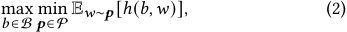

where the decision function _ℎ_ is defined in (1). This minimax optimization process can be understood as follows: as the real distribution could be any element within the ambiguity set P, for each bid _𝑏_ , there exists a range for the expected surplus obtained by DSP, and we can denote its lower and upper bound as _𝐿_ and _𝑈_ respectively. In this case, distributionally robust hopes to take this uncertainty into account and chooses the bid _𝑏 𝑗_ that maximizes the minimal surplus _𝐿𝑗_ . Figure 1 provides a visual representation of this process, where we adopt the known uncertainty and the corresponding ambiguity set P = P _𝑘𝑛_ for illustrating. 

To facilitate subsequent discussions, we denote the cumulative distribution function (CDF) corresponding to the distribution _𝒑_ 

1806 

KDD ’24, August 25–29, 2024, Barcelona, Spain 

Qilong Lin, Zhenzhe Zheng, & Fan Wu 

as _𝑃𝒑_ , and present a more tractable form for the distributionally robust optimization problem (2): 

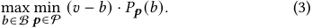

The distributionally robust problem (2) and (3), along with the ambiguity set P _𝑘𝑛_ and P _𝑢𝑛_ considered within it, abstractly formulates the mathematical problem in bid shading, and provides a general description of the objective for our robust strategies design. Subsequently, we will further elaborate on the design details of our robust bidding strategies. 

## **4 DESIGN** 

In this section, we further elaborate on the design of robust bidding strategies. In response to the two types of uncertainties summarized in the previous section, we propose two levels robust bidding strategies: Robust Bidding for Censorship and Robust Bidding for Distribution Shift, and further provide solutions for the robust optimization problems within these strategies respectively. 

## **4.1 Robust Bidding for Censorship** 

We first discuss the design of robust bidding strategy considering only the known uncertainty. We refer to this as the Robust Bidding for Censorship (RBC), which addresses a problem of the same form as (2), but with the ambiguity set defined as follows: 

P _𝑘𝑛_ = {FB ({ _𝑤_ ˆ _𝑖_ | _𝑖_ ∈W} ∪{ _𝑤𝑖_ | _𝑤𝑖_ ∈[ _𝑙_ˆ _𝑖,_ ˆ _𝑟𝑖_ ] _,𝑖_ ∈L})} _,_ (4) where we use the sampled winning price set { _𝑤_ ˆ _𝑖_ } to represent the distribution. In this set, the data for subscript _𝑖_ ∈W is known, while the data for subscript _𝑖_ ∈L is uncertain, where the data _𝑤𝑖_ can take any value within the interval [ _𝑙_ˆ _𝑖,_ ˆ _𝑟𝑖_ ]. 

Problem (2) with the ambiguity set P _𝑘𝑛_ appears complex, but it can be transformed into a simple maximization problem, which is tractable to some extent. We arrive at the following conclusion: 

Remark 4.1. _Given the ambiguity set_ P _𝑘𝑛, problem (2) is equivalent to the following problem:_ 

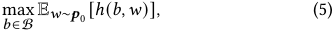

_with the distribution 𝒑_ 0 = _𝒑_ ˆ _𝑐 , where 𝒑_ ˆ _𝑐_ ∈P _𝑘𝑛 represents the worstcase winning price distribution, and it can be expressed as:_ 

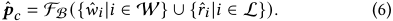

This result is quite intuitive. Similar to the equivalence between problems (2) and (3), problem (5) can be equivalently transformed into the following problem: 

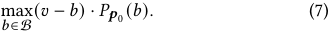

By analyzing problem (3), for any given bid _𝑏_ , the worst-case scenario corresponds to the smallest cumulative probability _𝑃𝒑_ ˆ _𝑐_ ( _𝑏_ ). Within the ambiguity set P _𝑘𝑛_ , the sampled data in _𝒑_ ˆ _𝑐_ should be as large as possible, meaning that for each auction _𝑖_ ∈L, selecting _𝑟_ ˆ _𝑖_ to form the sampling distribution _𝒑_ ˆ _𝑐_ . Thus problem (3) with the ambiguity set P _𝑘𝑛_ is equivalent to problem (7) with the worst-case distribution _𝒑_ ˆ _𝑐_ . A detailed proof can be found in Appendix A.1. 

In fact, problem (5) is a highly versatile optimization problem, which can be used in conjunction with the winning price distribution prediction model to formulate a bidding strategy, and we refer 

to this expectation-based optimization as Stochastic Optimization (SO) in the remaining parts. Broadly speaking, the crux of solving problem (5) lies in obtaining the distribution _𝒑_ 0 that the winning price _𝑤_ follows. In existing work, _𝒑_ 0 is the estimated winning price distribution, which can be predicted using existing methods, such as the works presented in Section 2.2; in our RBC strategy, _𝒑_ 0 is the worst-case distribution, but it can also be predicted by emulating existing methods. The detailed approach of predicting the worst-case distribution is as follows. 

Considering that DSP can obtain feature data _𝒙_ ˆ _𝑖_ for each auction, we design a non-parametric distribution estimation model, denoted as _𝑓𝑐_ , which employs a simple two-layer fully connected network and utilizes the Softmax function to process the outputs. This network maps the input feature data _𝒙_ ˆ _𝑖_ to a discrete distribution _𝒑_ ˆ _𝑖_ = _𝑓𝑐_ ( ˆ _𝒙𝑖_ ), whereby the output dimension corresponds to the dimension _𝑀_ of the discrete distribution, with the i-th output corresponding to the value of _𝑝_ ˆ _𝑖__𝑀_. This distribution_𝒑_ˆ_𝑖_estimated will serve as the worst-case distribution _𝒑_ 0 = _𝒑_ ˆ _𝑐_ within the SO problem (5) to obtain the robust bids. We denote the probability density function (PDF) associated with the output distribution _𝒑_ ˆ _𝑖_ as _𝑝𝒑_ ˆ _𝑖_ , and thus the loss function utilizing the concept of maximum likelihood can be written as: 

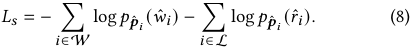

In practice, the right end of the interval can be calculated based on some empirical circumstances, such as the method in [14]. However, in this work, we wish to consider a more general case, where the DSP only knows that the winning price is higher than her own bid, thus assuming that the upper bound of the winning price is infinity in each auction. Under this assumption, the worst-case distribution in (6) can be further rewritten as _𝒑_ ˆ _𝑐_ = FB ({ _𝑤𝑖_ | _𝑖_ ∈W}), while keeping the solution of problem (5) unchanged. The loss function (8) now can be simplified to: 

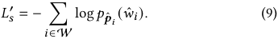

This result is natural. Since all known uncertainty resides within the auctions in L, the most conservative approach is to refrain from utilizing the uncertain data from these auctions, that is, only using data in winning auctions W like loss function (9). 

We would like to further discuss the significance of RBC from the perspective of existing works. Since censorship issue was raised by [32], the academic discussion on bid shading has mostly been limited to the distribution prediction methods under censorship scenarios, such as the censored regression and survival analysis mentioned in Section 2.2. However, the results of RBC suggest that using only the data in winning auctions W has a certain degree of robustness, and therefore, it may yield favorable results in an environment with considerable uncertainty such as bid shading. Our subsequent experiments have validated this. Moreover, since RBC considers the worst-case distributions that are only composed of deterministic data, RBC has the potential to bring in research on conditional density estimation [23] beyond censorship, an area that is currently lacking in the discussion of bid shading. We will leave this potential direction for future work. 

1807 

KDD ’24, August 25–29, 2024, Barcelona, Spain 

Robust Auto-Bidding Strategies for Online Advertising 

## **4.2 Robust Bidding for Distribution Shift** 

In contrast to the RBC strategy, where the ambiguity set P _𝑘𝑛_ is known, the Robust Bidding for Distribution Shift (RBDS) contemplates scenarios in which even the information about the ambiguity set P _𝑢𝑛_ is unattainable. Analogous to the preceding analysis, the DSP is restricted to obtaining sampled data of the winning prices, and there may be a disparity between sampling distribution and the real distribution of winning prices. Furthermore, the real distribution of winning prices might undergo shifts over time, thereby introducing an element of inevitable bias into the DSP’s predictions that are based on the sampled data. 

To address this kind of uncertainty, we consider employing the conventional distributionally robust optimization approach, and adopting the discrepancy-based ambiguity set. This approach assumes that the discrepancy between the real distribution and the sampling distribution lies within a certain range, and it ensures a lower bound on the performance of the real distribution by optimizing for the worst-case scenario among all distributions within this range. The optimization problem can still be expressed in the form of problem (2), where the ambiguity set is represented as: 

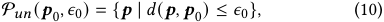

where _𝒑_ 0 is the winning price distribution estimated by DSP, _𝜖_ 0 is the upper bound of the discrepancy between the real distribution and estimated distribution, and _𝑑_ is a function that measures the discrepancy between distributions. Therefore, P _𝑢𝑛_ mathematically describes our method of considering all distributions that differ from the estimated _𝒑_ 0 within a certain range. Conversely, problem (2) with the ambiguity set P _𝑢𝑛_ aims to optimize the worst-case scenario within this distribution range. 

After introducing the complete strategic framework, we will further provide the definition of the ambiguity set P _𝑢𝑛_ and the algorithm for problem (2) with P _𝑢𝑛_ in the following parts. 

_4.2.1 Ambiguity Set in RBDS._ We firstly introduce the estimated distribution _𝒑_ 0, the discrepancy function _𝑑_ , and the discrepancy upper bound _𝜖_ within the ambiguity set P _𝑢𝑛_ . The distribution _𝒑_ 0 is the distribution estimated based on the sampled data. Similar to the distribution _𝒑_ 0 in SO problem (5), _𝒑_ 0 in P _𝑢𝑛_ could be the estimated winning price distribution, in which case problem (2) can be simply interpreted as ensuring a lower bound on the bidding surplus by optimizing the worst-case outcome when there is a discrepancy between the estimated distribution and the real distribution. Alternatively, it could also be the worst-case distribution _𝒑_ ˆ _𝑐_ estimated in our RBC strategy (6). In this case, problem (2) can similarly be understood as acknowledging that discrepancies exist between the sampling worst-case distribution and the real worst-case distribution, and we likewise ensure a lower bound on bidding surplus by optimizing for the “worst of the worst-case” distribution. From this perspective, the RBDS strategy can be regarded as a robust form of the SO problem (5). 

For the discrepancy function _𝑑_ , we adopt the Wasserstein distance function [25] to measure the discrepancy between distributions. This is a commonly used discrepancy function in distributionally robust optimization. Furthermore, when employing the Wasserstein distance, the form of the worst-case winning price 

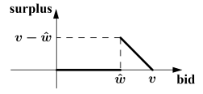

### **Figure 2: Decision function for the bid shading problem** 

distribution has an intuitive interpretation, aligning with observations in some existing works [34]. This intuitive interpretation is provided in the subsequent Section 4.2.2. Here, we first present the method of calculating this discrepancy function. Specifically, given any two distributions _𝒑_ and _𝒒_ with discrete representation ( _𝑝_1 _, 𝑝_2 _, ..., 𝑝__𝑀_ ) and ( _𝑞_1 _, 𝑞_2 _, ..., 𝑞__𝑀_ ), the Wasserstein distance of _𝒑_ and _𝒒_ can be defined as the solution of problem: 

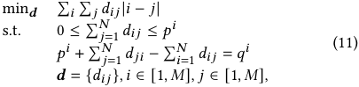

where the matrix _𝒅_ is the optimized variable, and each _𝑑𝑖𝑗_ represents the probability quantity transferred from _𝑝__𝑖_ to _𝑝__𝑗_ , which is non-negative and cannot be greater than the original probability quantity _𝑝__𝑖_ in total. In addition, after all the transfer, the probability distribution _𝒑_ should become _𝒒_ . Then Wasserstein distance is the minimum value of the sum of the product of the probability transferred and the distance under these constraints, and we denote the result of problem (11) as the Wasserstein distance _𝑑_ ( _𝒑, 𝒒_ ). 

Finally, _𝜖_ 0 defines the distance between the estimated distribution _𝒑_ 0 and real distribution. In practice, DSP can never know the real distribution of winning prices, but can only obtain sampled data. Therefore, it is impossible for DSP to accurately determine the value of _𝜖_ 0, which is a specific manifestation of the unknown uncertainty associated with _𝑃𝑢𝑛_ . Given this, we adopt a second-best approach, considering the integration of the DSP’s objective of maximizing surplus to choose _𝜖_ 0. Of course, this method of selection dilutes its physical meaning, making it more akin to a hyperparameter. Hence, we will not delve into an extensive discussion on the selection of _𝜖_ 0, but will only report the relationship between the DSP’s surplus and _𝜖_ 0 in experiments, as well as the maximum surplus that can be achieved by adjusting _𝜖_ 0. 

_4.2.2 Algorithm for RBDS._ To solve problem (2) with the ambiguity set P _𝑢𝑛_ , we first consider whether we can use traditional distributionally robust optimization algorithms, which requires the analysis of the decision function _ℎ_ . Given winning price value _𝑤_ ˆ , the image of the function _ℎ_ (· _, 𝑤_ ˆ ) is shown in Figure 2. It can be seen that it is a non-continuous and non-convex function, and its mathematical properties are relatively poor. 

In the existing works, the latest researches [10] and [9] have studied the non-convex distributionally robust optimization algorithm, but they still require the decision function to satisfy certain continuous assumptions. Besides, since the decision variable _𝑏_ is discrete, the equivalence problem (3) is also similar to the form of discrete minimax problem [36], but in this series of research, the set of distributions is finite, while our ambiguity set is infinite. If we 

1808 

KDD ’24, August 25–29, 2024, Barcelona, Spain 

Qilong Lin, Zhenzhe Zheng, & Fan Wu 

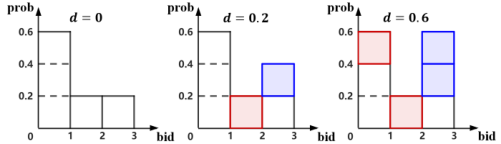

**Figure 3: An example for the constructive approach** 

hope to apply these algorithms to our problem, we need to modify our decision function to meet the requirements of their algorithms. In our work, due to the particularity of our problem, we consider designing an algorithm without changing the decision function. Since the bid space B in bid shading problem is finite, we can further write the problem (3) as: 

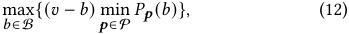

where the key point is to solve the min term on discrete domain B, and we denote it as _𝑓_ P : 

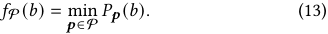

If we can obtain the values of function _𝑓_ P on B, problem (12) becomes easy to solve, like problem (7) in previous section. Next, given P = P _𝑢𝑛_ ( _𝒑_ 0 _,𝜖_ 0), we will elaborate on the approach to solving _𝑓_ P and provide a specific algorithm for it. 

Let’s start with a simple example. Assuming B = {1 _,_ 2 _,_ 3} and _𝒑_ 0 can be discretely represented by ( _𝑝_ 01_, 𝑝_ 02_, 𝑝_ 03), where_𝑝_ 01=0_._6 and _𝑝_ 02=_𝑝_ 03=0_._2. In this case, distribution_𝒑_0can be represented by the left histogram in Figure 3. Assuming that given _𝜖_ 0 = 0 _._ 6, we are calculating _𝑓_ P (2) = min _𝒑_ ∈P _𝑃𝒑_ (2), that is, finding a distribution _𝒒_ 0 ∈P _𝑢𝑛_ ( _𝒑_ 0 _,𝜖_ 0) with the minimal cumulative probability _𝑃𝒒_ 0 (2). We consider a constructive approach, devising a certain procedure to construct _𝒒_ 0 from _𝒑_ 0. Let’s start with _𝒒_ 0 = _𝒑_ 0. To make _𝑃𝒒_ 0 (2) = _𝑞_ 01+_𝑞_ 02as small as possible, we need to decrease_𝑞_ 01and_𝑞_ 02, and increase _𝑞_ 03. But which one should we decrease first? Given our constraint _𝑑_ ( _𝒑_ 0 _, 𝒒_ 0) ≤ _𝜖_ 0 = 0 _._ 6, it would be sensible to reduce _𝑞_ 02 first because reducing _𝑞_ 02by the same amount will lead to a smaller _𝑑_ ( _𝒑_ 0 _, 𝒒_ 0) compared to reducing _𝑞_ 01.Wedecrease_𝑞_2to0,which results in an increase of _𝑞_ 3 to 0.2. At this point, the distribution can be represented by the middle histogram in Figure 3, where the red shaded area indicates the probability reduced relative to _𝒑_ 0, and the blue shaded area indicates the probability increased relative to _𝒑_ 0, with the computed _𝑑_ ( _𝒑_ 0 _, 𝒒_ 0) being 0.2. We continue to reduce _𝑞_ 01 and increase _𝑞_ 03, and we find that after reducing_𝑞_ 01by 0.2,_𝑑_(_𝒑_0_, 𝒒_0) becomes _𝜖_ 0 = 0 _._ 6; this new distribution can be represented by the histogram on the right side of Figure 3. At this point, _𝑃𝒒_ 0 (2) = 0 _._ 2 is the function value _𝑓_ P (2) that we are looking for. An issue that this example doesn’t cover is, assuming we allow for a bid amount of 4, and considering the same initial distribution _𝒑_ 0 above, should we increase the probability at _𝑞_ 03or_𝑞_ 04? This is actually similar to the choice of decreasing _𝑞_ 01or_𝑞_ 02first.Since increasing the same amount of probability, increasing _𝑞_ 03results in a smaller distance _𝑑_ ( _𝒑_ 0 _, 𝒒_ 0), we similarly choose to increase _𝑞_ 03. In fact, summarizing the previous example, we find that given 

**Algorithm 1** Algorithm for _<u>𝑓</u>_ P on Discrete Domain 

**Require:** Distribution _𝒑_ 0, discrepancy upper bound _𝜖_ 0 1: **for** _𝑗_ = 1 to _𝑀_ **do** 

2: _𝒒_ 0 ← _𝒑_ 0; 3: _𝑘_ ← _𝑗_ ; 

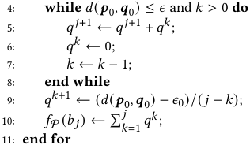

bid _𝑏_ , the method to construct _𝒒_ 0 is to transfer the probabilities from _𝑝__𝑏_ 0_, 𝑝𝑏_ 0−1 _, ..., 𝑝_ 01to_𝑝𝑏_ 0+1 in descending order of index, until the distance from the original distribution reaches the upper bound _𝜖_ 0. Based on this approach, we propose a procedural method as shown in Algorithm 1, which provides the pseudo code for solving the values of _𝑓_ P on the discretely defined domain. We have the following conclusion: 

Remark 4.2. _Algorithm 1 provide the strictly optimal solution for problem_ min _𝒑_ ∈P _𝑃𝒑_ ( _𝑏_ ) _on discrete domain_ B _, hence provide the exact values of function 𝑓_ P _on_ B _defined in (13)._ 

A detailed proof can be found in Appendix A.2. In addition to outlining the algorithm, the example in Figure 3 vividly demonstrates the worst-case scenario considered in distributionally robust optimization problems. It can be seen that given bid _𝑏_ = 2 and the initial distribution _𝒑_ 0, in the worst-case scenario, the distribution _𝒒_ 0 forms a spike right after the bid _𝑏_ = 2, specifically at _𝑞_ 03. Exist- ing literature indicates that such spikes are common in real-world settings [34], therefore, employing Wasserstein distance in distributionally robust optimization can be interpreted as a robust bidding strategy that accounts for the occurrence of these spikes. 

After obtaining the algorithm for solving _𝑓_ P ( _𝑏 𝑗_ ), the optimization problem (12) of RBDS becomes as easy to solve as the SO problem (5). In summary and comparison, the RBDS method is equivalent to performing a robust treatment on the original distribution, and then solving the optimization problem (5) to obtain a robust bid against unknown uncertainty. 

## **5 EXPERIMENT RESULTS** 

## **5.1 Experimental Setup** 

Firstly, we introduce the experimental datasets we used, the experimental procedures, and the models utilized in the experiments. 

_5.1.1 Datasets._ Our experiments use two public datasets including the iPinYou dataset [15] and the Criteo dataset [6]: 

- The iPinYou dataset is a widely used dataset in bid shading related research. It contains 10 days of real-world data from auctions in which the iPinYou DSP participates. We follow the existing work [30] and use the data in the first 7 days as training data, and the remaining data as test data. 

1809 

KDD ’24, August 25–29, 2024, Barcelona, Spain 

Robust Auto-Bidding Strategies for Online Advertising 

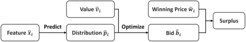

**Figure 4: The main process of the experiments** 

- The Criteo dataset contains 30 days of real-world data from auctions that the Criteo DSP participates. We use the first 24 days’ data as the training set, and the remaining 6 days’ data as the test set. 

The datasets above have provided the feature _𝑥_ ˆ _𝑖_ and winning price _𝑤_ ˆ _𝑖_ in each auction _𝑖_ . However, there is no censored data in the original datasets, so we need to simulate the censorship problem on the training set. In this work, we adopt the same method of simulating censored data as in [28], which firstly simulates the DSP bid _𝑏_ˆ _𝑖_ , and then divides the training set into the set W and L according to the relationship between _𝑏_ˆ _𝑖_ and _𝑤_ ˆ _𝑖_ . 

In addition, we also need the estimated value data _𝑣_ ˆ _𝑖_ of the DSP. However, since the value is confidential for DSP, public datasets do not include this data, and we can only obtain it through simulation. In our paper, we assume that the DSP uses a common strategy, where in each auction, the DSP uses the value multiplied by a shading rate as her bid [8]. We further assume that the shading rate is randomly selected by DSP, that is, the bid _𝑏_ˆ _𝑖_ is generated in random proportion according to the value _𝑣_ ˆ _𝑖_ . From these assumptions, we are able to simulate the data _𝑣_ ˆ _𝑖_ for our experiments. 

_5.1.2 Experimental Procedure._ Our experiment simulates the real process of the DSP participating in auctions, as shown in Figure 4. In this process, DSP first predicts the distribution _𝒑_ ˆ _𝑖_ based on feature _𝒙_ ˆ _𝑖_ using the prediction model. This distribution could be the winning price distribution or the worst-case distribution in RBC strategy, corresponding to different prediction models utilized. After obtaining the distribution, DSP derives the bid _𝑏_ˆ _𝑖_ according to the optimization problem where the optimization corresponds to the aforementioned distribution and could be the SO problem (5) or the RBDS problem (12). Once the bid is determined, the DSP’s surplus is calculated based on the actual winning price _𝑤_ ˆ _𝑖_ and the decision function _ℎ_ . 

_5.1.3 Prediction Models._ In our experiments, we primarily employ the following bidding strategies: 

**STM** is a winning price distribution prediction method that combines survival analysis with decision trees [30]. We integrate it with SO problem (5) as a traditional bidding strategy that utilizes survival analysis. 

**MCN** is a parametric distribution prediction method where the winning prices are modeled as a mixture of Gaussian distributions [7]. By integrating this approach with SO problem (5), it is utilized as a traditional parametric method bidding strategy. 

**KMMN** is a winning price distribution prediction method that combines survival analysis with Markov network [28]. We integrate it with SO problem (5) to serve as an enhanced survival analysisbased bidding strategy. 

**NPM** is a non-parametric distribution prediction method that employs the same network as depicted in RBC strategy. It is similar 

to the method described in [14], but we utilize a simpler network architecture and loss function. We integrate it with SO problem (5) to serve as a non-parametric bidding strategy. 

**RBC** is the robust bidding strategy we have proposed for known uncertainty. Unless otherwise stated, we employ the network depicted in previous section and train our model using the loss function (9) to predict the worst-case distribution. This prediction is then incorporated into SO problem (5) as the robust bidding strategy. The selection of the distribution prediction model and loss function will be discussed in subsequent experimental sections. 

**RBDS** is our proposed robust bidding method designed for unknown uncertainty. It necessitates the integration with the aforementioned distribution prediction model and supersedes the original SO problems (5). In our experiments, we denote the combination of this bidding strategy with any distribution prediction method M as M+R. 

## **5.2 Performance of RBC Strategy** 

_5.2.1 Overall Performance._ We initially conduct experiments on the surplus performance of each strategy without employing RBDS strategy, with the results displayed in Table 1. The distribution prediction model is trained on the training set, and the resulting bidding strategy is tested on the test set. The first column of Table 1 lists different Campaigns, comprising nine campaigns from the iPinYou dataset and the overall Criteo dataset. Within the iPinYou dataset, the winning price distributions vary among different campaigns, hence existing works provide independent results for each campaign, a practice we also continue. The main body of the table presents the surplus obtained through different strategies, and it can be observed that the RBC strategy we propose achieves the highest surplus in the majority of the campaigns. 

**Table 1: Overall Surplus of Different Strategies (** 106 **)** 

|Camp.|STM|MCN|KMMN|NPM|RBC|
|---|---|---|---|---|---|
|1458|11.29|11.61|11.03|12.06|**12.31**|
|2259|4.988|5.442|5.278|5.436|**5.590**|
|2261|4.959|5.602|5.802|6.021|**6.152**|
|2821|8.191|8.803|8.548|8.784|**9.095**|
|2997|2.460|2.939|2.832|2.876|**3.005**|
|3358|3.309|3.327|2.961|**3.610**|3.451|
|3386|9.253|9.659|9.491|10.34|**10.42**|
|3427|7.295|7.767|7.783|8.441|**8.486**|
|3476|7.202|7.470|7.389|7.899|**8.051**|
|Criteo|101.8|104.0|103.6|109.2|**109.3**|

A natural question arises as to why the robust bidding strategy RBC, being a conservative approach, can perform better than the strategy based on direct prediction of winning price distribution. The primary reason is likely due to the fact that direct prediction of winning price distribution requires the introduction of assumptions that may not necessarily hold in practice, leading to an inherent bias in the predicted winning price distribution. From the experimental results, it appears that the surplus loss caused by these biases is greater than the loss due to robustness. 

1810 

KDD ’24, August 25–29, 2024, Barcelona, Spain 

Qilong Lin, Zhenzhe Zheng, & Fan Wu 

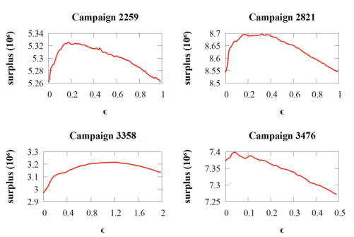

**Figure 5: Relation between the upper bound parameter** _𝜖_ 0 **and surplus on some campaigns** 

_5.2.2 Worst-case Performance._ Subsequently, we compare the performance of different strategies under the worst-case scenario. Here, the worst-case refers to the most adverse situation within the known uncertainty, corresponding to the case where _𝑤_ ˆ _𝑖_ = _𝑟_ ˆ _𝑖_ for _𝑖_ ∈L. We set the winning price in the auctions lost by the DSP in the training set to infinity, and test the surplus of different models under this worst-case training set. The results are shown in Table 2. It can be observed that our robust approach exhibits the best worst-case performance across all campaigns. 

_5.3.2 Overall Performance._ In this section, we report on the upper bound of surplus attainable through the adjustment of _𝜖_ 0 in the RBDS strategy. Taking RBC as an example, we compare the surplus generated by the RBC strategy with the upper bound of surplus that can be obtained through the RBC+R strategy, as illustrated in Table 3. It can be observed that RBDS has delivered a notable increase in surplus for DSP in parts of campaigns. At this juncture, a question similar to that regarding RBC may naturally arise: why does the employment of the robust strategy RBDS lead to an enhancement in surplus? This is primarily due to the divergence in the winning price distribution between the training and testing datasets, which leads to the model derived from the training set failing to accurately predict the winning price distribution on the testing set. This may result in an increased surplus when an appropriate robustness parameter _𝜖_ 0 is selected. 

**Table 3: Surplus of RBC and RBC+R Strategies (** 106 **)** 

|Camp.|RBC|RBC+R|
|---|---|---|
|1458|12.31|12.40|
|2259|5.590|5.596|
|2261|6.152|6.161|
|2821|9.095|9.175|
|2997|3.005|3.008|
|3358|3.451|3.484|
|3386|10.42|10.44|
|3427|8.486|8.490|
|3476|8.051|8.130|
|Criteo|109.3|110.5|

**Table 2: Worst-case Surplus of Different Strategies (** 107 **)** 

|Camp.|STM|MCN|KMMN|NPM|RBC|
|---|---|---|---|---|---|
|1458|5.952|5.996|6.107|6.324|**6.626**|
|2259|1.145|1.264|1.304|1.277|**1.425**|
|2261|0.973|1.076|1.103|1.117|**1.215**|
|2821|1.947|2.074|2.125|2.137|**2.310**|
|2997|0.479|0.558|0.529|0.540|**0.570**|
|3358|2.156|2.273|2.267|2.391|**2.584**|
|3386|5.223|5.262|5.475|5.679|**5.967**|
|3427|3.704|3.815|3.951|4.100|**4.339**|
|3476|2.862|2.907|3.002|3.085|**3.271**|
|Criteo|41.05|39.70|40.15|41.68|**41.72**|

## **5.3 Performance of RBDS Strategy** 

_5.3.1 Relationship between Upper Bound Parameter and Surplus._ We first give a certain relationship between the upper bound _𝜖_ 0 and the surplus on the test set. The results on the test set of some campaigns with KMMN+R strategy are shown in Figure 5. We can observe that with the increase of _𝜖_ 0, the surplus on the test set basically increases first and then decreases. But in different campaigns, the specific shape of the relation curve between surplus and _𝜖_ 0 is different. In practice, we combine this insight with binary search to find the maximum surplus that can be obtained on the test set by adjusting _𝜖_ 0. 

_5.3.3 Worst-case Performance._ To verify the robustness of our RBDS strategy, we simulate the case where the real winning price distribution is different from the predicted distribution, and then compare the expected surplus of the SO strategy and our RBDS strategy. In this context, the SO strategy refers to obtaining optimal bids by solving problem (5), whereas RBDS strategy derives optimal bids by solving problem (12). Specifically, we assume that the value of DSP is evenly distributed on [50, 200]. We take the overall winning price distribution on some campaigns as the predicted distribution _𝒑_ 0, and construct the worst-case distributions as the real distributions subject to different Wasserstein distances. For the RBDS strategy, we set the upper bound _𝜖_ 0 = 0 _._ 02. Under these settings, we calculate the expected surplus for SO and the worstcase expected surplus for RBDS in some of the campaigns, and the results are shown in Figure 6. We can observe that the performance of SO strategy is generally better than RBDS strategy when the distance is small. However, as the distance increases, our RBDS strategy gradually outperforms the SO strategy. Compared to SO strategy, it is easy to find that the surplus of our RBDS strategy decreases less as the distance increases, which means that the surplus of RBDS is less affected by the distribution shift in the worst-case situations. This verifies the robustness of our RBDS strategy. 

_5.3.4 Further Discussion of RBDS strategy._ To better understand the robustness of RBDS strategy, we specifically construct an example to analyze how the SO and RBDS strategies bid for a given 

1811 

KDD ’24, August 25–29, 2024, Barcelona, Spain 

Robust Auto-Bidding Strategies for Online Advertising 

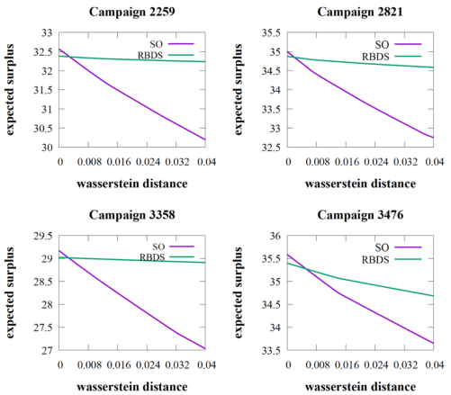

**Figure 6: Worst-case performance of RBDS on some campaigns** 

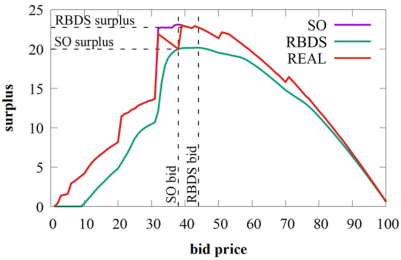

As can be observed from Figure 7, there is a sharp increase in the predicted surplus when the bid price is around 30, which means that the probability of winning price at this point is very high, forming a spike in the probability distribution. In this case, compared with the steep predicted surplus curve of SO strategy, RBDS strategy considers a smoother worst-case surplus curve in order to prevent this spike from moving within a small range. Therefore the bid of RBDS strategy is farther from the spike than SO strategy. In the worst case, the probability around the spike is shifted, and RBDS can deal with this situation more robustly and obtain a better surplus. 

## **6 CONCLUSION** 

In this work, we model the uncertain environment inherent in the design of auto-bidding strategies within the context of bid shading, and propose two levels robust bidding strategies to achieve better surplus in such environments with considerable uncertainty. The experimental results on public dataset validate the effectiveness and robustness of our robust bidding strategies. 

Since this work is the first to consider the uncertainty issue in bid shading, there are still many aspects to explore in both theory and experiment. For instance, one could attempt using the chance-constrained [3] surplus instead of worst-case surplus as the optimization objective, introduce techniques of advanced conditional density estimation [23] into RBC, and validate the results of robust strategies in real bidding environments, etc. We leave these promising directions to future works. 

## **ACKNOWLEDGMENTS** 

This work was supported in part by National Key R&D Program of China (No. 2022ZD0119100), in part by China NSF grant No. 62322206, 62132018, U2268204, 62025204, 62272307, 62372296. The opinions, findings, conclusions, and recommendations expressed in this paper are those of the authors and do not necessarily reflect the views of the funding agencies or the government. 

## **REFERENCES** 

**Figure 7: An example for the bid selection process in SO and RBDS strategies** 

- [1] Aharon Ben-Tal, Laurent El Ghaoui, and Arkadi Nemirovski. 2009. _Robust Optimization_ . Princeton University Press. 

- [2] Jonathan Buckley and Ian James. 1979. Linear regression with censored data. _Biometrika_ 66, 3 (1979), 429–436. 

- [3] A. Charnes and W. W. Cooper. 1959. Chance-Constrained Programming. _Management science_ 6, 1 (1959), 73–79. 

value _𝑣_ . We use the overall winning price distribution on the 2821 campaign as the predicted distribution of SO problem (5) and RBDS problem (12) respectively. Assuming that the Wasserstein distance between the real (worst-case) distribution and the predicted distribution, as well as the upper bound _𝜖_ 0 in RBDS are both 0.2, and we set the DSP’s value _𝑣_ = 101. At this point, for different bids, the predicted surplus considered by the SO strategy, the worst-case surplus considered by the RBDS strategy, and the real surplus are shown in Figure 7. Among them, the real surplus is corresponding to the specially constructed worst-case distribution, and it overlaps with the predicted surplus for most bids, as shown in Figure 7. For better illustration, we mark the bid prices selected by the SO and RBDS strategies with dashed lines, which are the values corresponding to the highest points in the two curves. Based on these selected bids, we further mark out the surplus of these two strategies under the real distribution to give an intuitive comparison. 

- [4] Erick Delage and Yinyu Ye. 2010. Distributionally robust optimization under moment uncertainty with application to data-driven problems. _Operations research_ 58, 3 (2010), 595–612. 

- [5] Erick Delage and Yinyu Ye. 2010. Wiesemann, Wolfram and Kuhn, Daniel and Sim, Melvyn. _Operations research_ 62, 6 (2010), 1358–1376. 

- [6] Eustache Diemert, Julien Meynet, Pierre Galland, and Damien Lefortier. 2017. Attribution Modeling Increases Efficiency of Bidding in Display Advertising. In _Proceedings of ADKDD_ . 1–6. 

- [7] Aritra Ghosh, Saayan Mitra, Somdeb Sarkhel, Jason Xie, Gang Wu, and Viswanathan Swaminathan. 2020. Scalable Bid Landscape Forecasting in RealTime Bidding. In _Machine Learning and Knowledge Discovery in Databases_ . 451– 466. 

- [8] Djordje Gligorijevic, Tian Zhou, Bharatbhushan Shetty, Brendan Kitts, Shengjun Pan, Junwei Pan, and Aaron Flores. 2020. Bid Shading in The Brave New World of First-Price Auctions. In _Proceedings of CIKM_ . 2453–2460. 

- [9] Mert Gürbüzbalaban, Andrzej Ruszczyński, and Landi Zhu. 2022. A Stochastic Subgradient Method for Distributionally Robust Non-convex and Non-smooth Learning. _Journal of Optimization Theory and Applications_ 194, 3 (2022), 1014– 1041. 

- [10] Jikai Jin, Bohang Zhang, Haiyang Wang, and Liwei Wang. 2021. Non-convex Distributionally Robust Optimization: Non-asymptotic Analysis. _Advances in Neural Information Processing Systems_ 34 (2021), 2771–2782. 

1812 

KDD ’24, August 25–29, 2024, Barcelona, Spain 

Qilong Lin, Zhenzhe Zheng, & Fan Wu 

- [11] Niklas Karlsson and Qian Sang. 2021. Adaptive Bid Shading Optimization of First-Price Ad Inventory. In _2021 American Control Conference (ACC)_ . 4983–4990. 

- [12] Çağıl Koçyiğit, Garud Iyengar, Daniel Kuhn, and Wolfram Wiesemann. 2020. Distributionally Robust Mechanism Design. _Management Science_ 66, 1 (2020), 159–189. 

- [13] Daniel Kuhn, Peyman Mohajerin Esfahani, Viet Anh Nguyen, and Soroosh Shafieezadeh-Abadeh. 2019. Wasserstein Distributionally Robust Optimization: Theory and Applications in Machine Learning. arXiv:1908.08729 

- [14] Xu Li, Michelle Ma Zhang, Zhenya Wang, and Youjun Tong. 2022. Arbitrary Distribution Modeling with Censorship in Real-Time Bidding Advertising. In _Proceedings of SIGKDD_ . 3250–3258. 

- [15] Hairen Liao, Lingxiao Peng, Zhenchuan Liu, and Xuehua Shen. 2014. IPinYou Global RTB Bidding Algorithm Competition Dataset. In _Proceedings of the Eighth International Workshop on Data Mining for Online Advertising_ . 1–6. 

- [16] Fengming Lin, Xiaolei Fang, and Zheming Gao. 2022. Distributionally Robust Optimization: A review on theory and applications. _Numerical Algebra, Control and Optimization_ 12, 1 (2022), 159–212. 

- [17] Roger B Myerson. 1981. Optimal auction design. _Mathematics of operations research_ 6, 1 (1981), 58–73. 

- [18] Noam Nisan, Tim Roughgarden, Éva Tardos, and Vijay V. Vazirani. 2007. _Algorithmic Game Theory_ . Cambridge University Press. 

- [19] Weitong Ou, Bo Chen, Yingxuan Yang, Xinyi Dai, Weiwen Liu, Weinan Zhang, Ruiming Tang, and Yong Yu. 2023. Deep Landscape Forecasting in Multi-Slot Real-Time Bidding. In _Proceedings of SIGKDD_ . 4685–4695. 

- [20] Shengjun Pan, Brendan Kitts, Tian Zhou, Hao He, Bharatbhushan Shetty, Aaron Flores, Djordje Gligorijevic, Junwei Pan, Tingyu Mao, San Gultekin, and Jianlong Zhang. 2020. Bid Shading by Win-Rate Estimation and Surplus Maximization. arXiv:2009.09259 

- [21] Hamed Rahimian and Sanjay Mehrotra. 2022. Frameworks and results in distributionally robust optimization. _Open Journal of Mathematical Optimization_ 3 (2022), 1–85. 

- [22] Kan Ren, Jiarui Qin, Lei Zheng, Zhengyu Yang, Weinan Zhang, and Yong Yu. 2019. Deep Landscape Forecasting for Real-Time Bidding Advertising. In _Proceedings of SIGKDD_ . 363–372. 

- [23] Jonas Rothfuss, Fabio Ferreira, Simon Walther, and Maxim Ulrich. 2019. Conditional Density Estimation with Neural Networks: Best Practices and Benchmarks. arXiv:1903.00954 

- [24] Herbert E Scarf, KJ Arrow, and S Karlin. 1957. _A min-max solution of an inventory problem_ . Rand Corporation Santa Monica. 

- [25] SS Vallender. 1974. Calculation of the Wasserstein Distance Between Probability Distributions on the Line. _Theory of Probability & Its Applications_ 18, 4 (1974), 784–786. 

- [26] Jun Wang, Weinan Zhang, Shuai Yuan, et al. 2017. Display advertising with real-time bidding (RTB) and behavioural targeting. _Foundations and Trends® in Information Retrieval_ 11, 4-5 (2017), 297–435. 

- [27] Ping Wang, Yan Li, and Chandan K. Reddy. 2019. Machine Learning for Survival Analysis: A Survey. _ACM Comput. Surv._ 51, 6 (2019), 36 pages. 

- [28] Tengyun Wang, Haizhi Yang, Siyu Jiang, Yueyue Shi, Qianyu Li, Xiaoli Tang, Han Yu, and Hengjie Song. 2022. Kaplan–Meier Markov network: Learning the distribution of market price by censored data in online advertising. _Know.-Based Syst._ 251 (2022), 11 pages. 

- [29] Tengyun Wang, Haizhi Yang, Han Yu, Wenjun Zhou, Yang Liu, and Hengjie Song. 2019. A revenue-maximizing bidding strategy for demand-side platforms. _IEEE Access_ 7 (2019), 68692–68706. 

- [30] Yuchen Wang, Kan Ren, Weinan Zhang, Jun Wang, and Yong Yu. 2016. Functional Bid Landscape Forecasting for Display Advertising. In _Machine Learning and Knowledge Discovery in Databases_ . 115–131. 

- [31] Wush Wu, Mi-Yen Yeh, and Ming-Syan Chen. 2018. Deep Censored Learning of the Winning Price in the Real Time Bidding. In _Proceedings of SIGKDD_ . 2526–2535. 

- [32] Wush Chi-Hsuan Wu, Mi-Yen Yeh, and Ming-Syan Chen. 2015. Predicting Winning Price in Real Time Bidding with Censored Data. In _Proceedings of SIGKDD_ . 1305–1314. 

- [33] Yong Yuan, Feiyue Wang, Juanjuan Li, and Rui Qin. 2014. A survey on real time bidding advertising. In _Proceedings of 2014 IEEE International Conference on Service Operations and Logistics, and Informatics_ . 418–423. 

- [34] Wei Zhang, Brendan Kitts, Yanjun Han, Zhengyuan Zhou, Tingyu Mao, Hao He, Shengjun Pan, Aaron Flores, San Gultekin, and Tsachy Weissman. 2021. MEOW: A Space-Efficient Nonparametric Bid Shading Algorithm. In _Proceedings of SIGKDD_ . 3928–3936. 

- [35] Tian Zhou, Hao He, Shengjun Pan, Niklas Karlsson, Bharatbhushan Shetty, Brendan Kitts, Djordje Gligorijevic, San Gultekin, Tingyu Mao, Junwei Pan, Jianlong Zhang, and Aaron Flores. 2021. An Efficient Deep Distribution Network for Bid Shading in First-Price Auctions. In _Proceedings of SIGKDD_ . 3996–4004. 

- [36] Shen Zuhe, Huane Zhen Yu, and MA Wolfe. 1997. An Interval Maximum Entropy Method for a Discrete Minimax Problem. _Applied mathematics and computation_ 87, 1 (1997), 49–68. 

## **A PROOFS** 

## **A.1 Proof of Remark 4.1** 

We firstly show that for any _𝑏_ ∈B: 

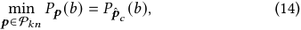

where P _𝑘𝑛_ and _𝒑_ ˆ _𝑐_ are defined in (4) and (6). Since B is finite: 

- (a) If _𝑏_ = 0, _𝑃𝒑_ ( _𝑏_ ) = 0 for any _𝒑_ , thus (14) holds. 

(b) If _𝑏_ ≠ 0, we denote _𝑏_ = _𝑏 𝐽_ ∈B. For rigor, we formally provide the definition of the probability vector _𝒑_ in the paper. For a probability vector constructed from a winning price dataset _𝒑_ = FB ({ _𝑤𝑖_ | _𝑖_ ∈A}), the j-th element _𝑝__𝑗_ is defined as: 

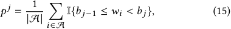

where |A| denotes the size of set A. Then the cumulative distribution function (CDF) value for any _𝑏 𝐽_ is: 

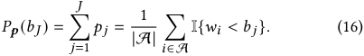

Defined in (4), P _𝑘𝑛_ contains all _𝒑_ = FB ({ _𝑤𝑖_ | _𝑖_ ∈A}) that satisfies _𝑤𝑖_ ∈T _𝑖_ , where T _𝑖_ = { _𝑤_ ˆ _𝑖_ } for _𝑖_ ∈W and T _𝑖_ = { _𝑤_ | _𝑙_ˆ _𝑖_ ≤ _𝑤_ ≤ _𝑟_ ˆ _𝑖_ } for _𝑖_ ∈L. Hence the left-hand side in (14) equals to: 

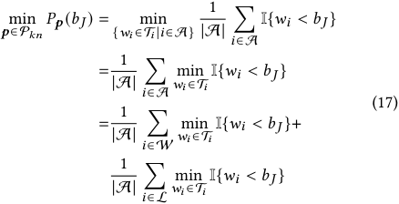

For _𝑖_ ∈W, T _𝑖_ = { _𝑤_ ˆ _𝑖_ } and min _𝑤𝑖_ ∈T _𝑖_ I{ _𝑤𝑖 < 𝑏 𝐽_ } = I{ _𝑤_ ˆ _𝑖 < 𝑏 𝐽_ }; for _𝑖_ ∈L, T _𝑖_ = { _𝑤_ | _𝑙_ˆ _𝑖_ ≤ _𝑤_ ≤ _𝑟_ ˆ _𝑖_ } and min _𝑤𝑖_ ∈T _𝑖_ I{ _𝑤𝑖 < 𝑏 𝐽_ }) = I{ _𝑟_ ˆ _𝑖 < 𝑏 𝐽_ }. Hence from (17) we have: 

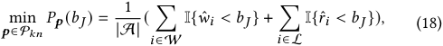

which is exactly _𝑃𝒑_ ˆ _𝑐_ ( _𝑏 𝐽_ ) for _𝒑_ ˆ _𝑐_ defined in (6), thus (14) holds. 

We have thus proven that equation (14) holds for any _𝑏_ ∈B. Now, we further provide the proof of Remark 4.1. Since problems (2) and (3) are equivalent, we only need to prove that given _𝑣_ , problem (3) with ambiguity set (4) is equivalent to problem (5) with distribution (6). According to (14), the problem (3) with ambiguity set (4) can be written as: 

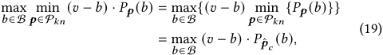

which is equivalent to problem (5) with distribution (6). Hence, the conclusion of Remark 4.1 is established. 

1813 

KDD ’24, August 25–29, 2024, Barcelona, Spain 

Robust Auto-Bidding Strategies for Online Advertising 

## **A.2 Proof of Remark 4.2** 

**A.2 Proof of Remark 4.2** We have _𝑃𝒑_ ˆ ∗ ( _𝑏 𝐽_ ) = _𝑃𝒑_ ˆ ( _𝑏 𝐽_ ) and _𝑑_ ( _𝒑_ 0 _, 𝒑_ ˆ ) ≥ _𝑑_ ( _𝒑_ 0 _, 𝒑_ ˆ ∗). The proof For convenience, we introduce some additional notations. Firstly, of the latter result, although intuitive, is somewhat verbose. Intusince both _𝒑_ 0 and _𝜖_ 0 are given values, we will use P _𝑢𝑛_ to denote itively, for the parts with indexes greater than _𝐽_ , the probability of P _𝑢𝑛_ ( _𝒑_ 0 _,𝜖_ 0) in the subsequent proof. Besides, we additionally ap- _𝒑_ ˆ being different from _𝒑_ 0 is concentrated at _𝑝_ ˆ∗_𝐽_+1 . This reduces the pended an element of zero to the end of the probability vector, probability transfer within the indexes greater than _𝐽_ and decreases that is, _𝒑_ 0 = ( _𝑝_ 01_, 𝑝_ 02_, ..., 𝑝_ 0_𝑀, 𝑝_ 0_𝑀_+1 = 0). This addition does not alter the distance for the remaining parts to transfer probabilities to this the probability distribution of _𝒑_ 0, hence it does not affect the corportion. Here, for brevity, we skip the intricate proof. rectness of our conclusions. Next, we will prove that Algorithm 1 Hence we only needs to prove that _𝑑_ ( _𝒑_ 0 _, 𝒑_ ˆ ∗) _> 𝜖_ 0. Note that obtains the optimal solution to problem (12) on domain B. _𝑃𝒑_ ˆ ∗ ( _𝑏 𝐽_ ) = _𝑃𝒑_ ˆ ( _𝑏 𝐽_ ) _< 𝑃𝒑_ ∗ ( _𝑏 𝐽_ ), and _𝑝_ ˆ_𝑘_ ∗ = _𝑝__𝑘_ ∗ = _𝑝__𝑘_ 0for all_𝑘_∈[_𝐽_+ Firstly, since B is a finite set, we only need to prove that for any 2 _, 𝑀_ + 1] (if _𝐽 < 𝑀_ ), we have _𝑝_ ˆ∗_𝐽_+1 _> 𝑝_ ∗_𝐽_+1 . Assuming that the _𝑏_ ∈B/{0}, Algorithm 1 can provide the accurate value of _𝑓_ P _𝑢𝑛_ ( _𝑏_ ) optimal transfer quantities in problem (11) are _𝒅_ˆ and _𝒅_ for _𝒑_ ˆ ∗ and (clearly _𝑓_ P _𝑢𝑛_ (0) = 0). Therefore, in the subsequent proof, we fix _𝑏 𝒑_ ∗ respectively. Then according to the definition of the Wasserstein and denote it as _𝑏_ = _𝑏 𝐽_ ∈B, where _𝐽_ ∈[1 _, 𝑀_ ]. distance, by expanding the expression of the Wasserstein distance Next, for the problem of _𝑓_ P _𝑢𝑛_ ( _𝑏 𝐽_ ) = min _𝒑_ ∈P _𝑢𝑛 𝑃𝒑_ ( _𝑏 𝐽_ ), we probetween distributions _𝒑_ 0 and _𝒑_ ˆ ∗, we can obtain: vide the form of the probability vector that could attains the optimal value, that is, the form of _𝒑_ ∗ ∈P _𝑢𝑛_ that could satisfies _𝑀_ +1 _𝑀_ +1 _𝑃𝒑_ ∗ ( _𝑏 𝐽_ ) = min _𝒑_ ∈P _𝑢𝑛 𝑃𝒑_ ( _𝑏 𝐽_ ) for any _𝒑_ 0, _𝜖_ 0 and _𝐽_ . We subsequently _𝑑_ ( _𝒑_ 0 _, 𝒑_ ˆ ∗) = ∑︁ ∑︁ _𝑑_ ˆ _𝑖𝑗_ | _𝑖_ − _𝑗_ | refer to _𝒑_ ∗ as the "worst-case form". _𝑖_ =1 _𝑗_ =1 

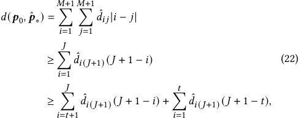

We show that for any _𝒑_ 0, _𝜖_ 0 and _𝐽_ , there exists some _𝑡_ ∈[1 _, 𝐽_ ] and _𝑝__𝑡_ ≤ _𝑝__𝑡_ 0such that the worst-case probability vector_𝒑_∗can be constructed as: 

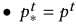

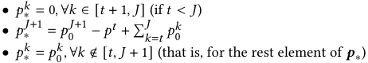

where the first ≥ hold since we only consider a subset of the transfer quantities, that is, the probabilities transferred from indexes in [1,J] to index J+1, and the second ≥ hold for _𝐽_ + 1 − _𝑖_ ≥( _𝐽_ + 1 − _𝑡_ ) _,_ ∀ _𝑖_ ≤ _𝑡_ . For the first term, according to the definition of _𝒑_ ˆ ∗, we can expand it and obtain: 

This is consistent with the construction results considered in Fig. 3 of our paper. For the proof of correctness regarding the worst-case form, we conduct a classification discussion: 

(a) If for _𝑡_ = 1 and _𝑝__𝑡_ = 0 we have _𝑑_ ( _𝒑_ 0 _, 𝒑_ ∗) ≤ _𝜖_ 0, then since _𝑃𝒑_ ∗ ( _𝑏 𝐽_ ) =� _𝑘__𝐽_ =1_𝑝𝑘_∗=0,itattainstheoptimalvalue(sincethe probability value should not be negative). 

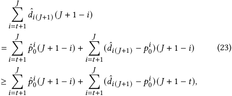

(b) If for _𝑡_ = 1 and _𝑝__𝑡_ = 0 we have _𝑑_ ( _𝒑_ 0 _, 𝒑_ ∗) _> 𝜖_ 0: 

(b.1) We first need to demonstrate that there exists _𝑡_ = _𝑡_ 0 and _𝑝__𝑡_ = _𝑝__𝑡_0 such that the worst-case form can satisfy _𝑑_ ( _𝒑_ 0 _, 𝒑_ ∗) = _𝜖_ 0. This is because the distribution distance can be represented as: 

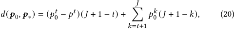

where the ≥ holds for _𝑑_ˆ _𝑖_ ( _𝐽_ +1) − _𝑝__𝑖_ 0≤0_,_∀_𝑖_. Organizing the derivation of (22) and (23), We now obtain a lower bound for the Wasserstein distance between distributions _𝒑_ 0 and _𝒑_ ˆ ∗: 

in which the summation term equals 0 if _𝑡_ = _𝐽_ . Note that when _𝑡_ = _𝐽_ and _𝑝__𝑡_ = _𝑝__𝑡_ 0, we have_𝒑_∗=_𝒑_0such that_𝑑_(_𝒑_0_, 𝒑_∗)= 0. Besides, this expression is continuous with respect to _𝑡_ and _𝑝__𝑡_ . Therefore, there must exist some _𝑡_ 0 and _𝑝__𝑡_0 such that _𝑑_ ( _𝒑_ 0 _, 𝒑_ ∗) = _𝜖_ 0. 

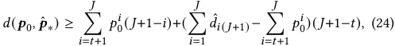

(b.2) Fix _𝑡_ 0 and _𝑝__𝑡_0 , among all _𝒑_ within the constraint _𝑑_ ( _𝒑_ 0 _, 𝒑_ ) ≤ _𝜖_ 0, we show that _𝒑_ ∗ attains the optimal value of _𝑃𝒑_ ( _𝑏 𝐽_ ). Note that: 

where the remaining transfer quantities to consider is only those from indexes in [1,J] to index J+1, and our goal is to compare the size of the right-hand expression in (24) with that of _𝑑_ ( _𝒑_ 0 _, 𝒑_ ∗). Note that we only need to consider the sum of these transfer quantities, which is easy to compare: 

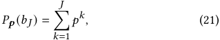

we show that if there is some _𝒑_ ˆ such that _𝑃𝒑_ ˆ ( _𝑏 𝐽_ ) _< 𝑃𝒑_ ∗ ( _𝑏 𝐽_ ), we have _𝑑_ ( _𝒑_ 0 _, 𝒑_ ˆ ) _> 𝜖_ 0 such that _𝒑_ ˆ ∉ P _𝑢𝑛_ . We first construct _𝒑_ ˆ ∗ from _𝒑_ ˆ that satisfies: 

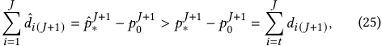

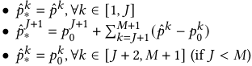

and according to the definition of _𝒑_ ∗, we have _𝑑𝑖_ ( _𝐽_ +1) = _𝑝__𝑖_ 0for any _𝑖_ ∈[ _𝑡_ + 1 _, 𝐽_ ]. We now can further derive the right-hand expression 

1814 

KDD ’24, August 25–29, 2024, Barcelona, Spain 

Qilong Lin, Zhenzhe Zheng, & Fan Wu 

in inequality (24) as follows: 

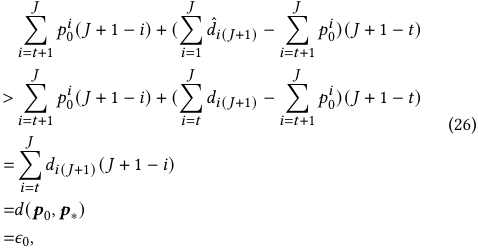

where the penultimate equation is because only when _𝑗_ = _𝐽_ + 1 and _𝑖_ ∈[ _𝑡, 𝐽_ ] we have _𝑑𝑖𝑗_ ≠ 0. Combining (24) and (26) we have _𝑑_ ( _𝒑_ 0 _, 𝒑_ ˆ ∗) _> 𝜖_ 0. Hence the “worst-case form” _𝒑_ ∗ attains the optimal value of _𝑃𝒑_ ( _𝑏 𝐽_ ) in case (b). 

Combining (a) and (b), we have proven that for any _𝒑_ 0, _𝜖_ 0 and _𝐽_ , the “worst-case form” _𝒑_ ∗ satisfies _𝑃𝒑_ ∗ ( _𝑏 𝐽_ ) = min _𝒑_ ∈P _𝑢𝑛 𝑃𝒑_ ( _𝑏 𝐽_ ). 

Finally, we can prove the correctness of Remark 4.2 by demonstrating that for each _𝑏 𝐽_ , Algorithm 1 provides the correct _𝑡_ 0 and _𝑝__𝑡_0 in the previous discussion. 

For _𝑡_ 0, note that at each end of the step in the “while” loop, _𝒒_ 0 satisfies the “worst-case form” with _𝑡_ = _𝑘_ and _𝑝__𝑡_ = 0, and the loop stops for the first time _𝑑_ ( _𝒑_ 0 _, 𝒒_ 0) _> 𝜖_ , hence _𝑡_ 0 = _𝑘_ upon exiting the “while” loop because _𝑑_ ( _𝒑_ 0 _, 𝒒_ 0) increases as _𝑡_ = _𝑘_ decreases. 

For _𝑝__𝑡_0 , since we have got _𝑡_ 0, we can calculate its value through the Wasserstein distance, as shown in line 9 in Algorithm 1. 

Therefore, at this point, we have the accurate value of _𝑓_ P _𝑢𝑛_ ( _𝑏 𝐽_ ) = � _𝑘𝑡_ 0=−11_𝑞𝑘_ 0+_𝑝𝑡_0, as shown in line 10 in Algorithm 1 (note that_𝑞𝑘_ 0= 0 for _𝑘_ ∈[ _𝑡_ 0 + 1 _, 𝐽_ ]). 

Thus, Algorithm 1 obtains the optimal solution to problem (12) on domain B, and the conclusion in Remark 4.2 have been proven. 

1815 

