# **Truthful Bandit Mechanisms for Repeated Two-stage Ad Auctions** 

Zhenzhe Zheng† Shanghai Jiao Tong University Shanghai, China zhengzhenzhe@sjtu.edu.cn 

Haoming Li Yumou Liu∗ Shanghai Jiao Tong University The Chinese University of Hong Shanghai, China Kong, Shenzhen wakkkka@sjtu.edu.cn Shenzhen, China yumouliu@link.cuhk.edu.cn 

Zhilin Zhang Jian Xu Alibaba Group Alibaba Group Beijing, China Beijing, China zhangzhilin.pt@alibaba-inc.com xiyu.xj@alibaba-inc.com 

Fan Wu Shanghai Jiao Tong University Shanghai, China fwu@cs.sjtu.edu.cn 

## **KEYWORDS** 

## **ABSTRACT** 

Online advertising platforms leverage a two-stage auction architecture to deliver personalized ads to users with low latency. The first stage efficiently selects a small subset of promising candidates out of the complete pool of ads. In the second stage, an auction is conducted within the subset to determine the winning ad for display, using click-through-rate predictions from the second-stage machine learning model. In this work, we investigate the online learning process of the first-stage subset selection policy, while ensuring game-theoretic properties in repeated two-stage ad auctions. Specifically, we model the problem as designing a combinatorial bandit mechanism with a general reward function, as well as additional requirements of truthfulness and individual rationality (IR). We establish an Ω( _𝑇_ ) regret lower bound for truthful bandit mechanisms, which demonstrates the challenge of simultaneously achieving allocation efficiency and truthfulness. To circumvent this impossibility result, we introduce truthful _𝛼_ −approximation oracles and evaluate the bandit mechanism through _𝛼_ −approximation regret. Two mechanisms are proposed, both of which are ex-post truthful and ex-post IR. The first mechanism is an explore-then-commit mechanism with regret _𝑂_ ( _𝑇_2/3 ), and the second mechanism achieves an improved _𝑂_ (log _𝑇_ /Δ _𝜙_2)regret where Δ_𝜙_is a distribution-dependent gap, but requires additional assumptions on the oracles and information about the strategic bidders. 

Mechanism Design, Online Learning, Multi-Armed Bandit, Online Advertising 

#### **ACM Reference Format:** 

Haoming Li, Yumou Liu, Zhenzhe Zheng, Zhilin Zhang, Jian Xu, and Fan Wu. 2024. Truthful Bandit Mechanisms for Repeated Two-stage Ad Auctions. In _Proceedings of the 30th ACM SIGKDD Conference on Knowledge Discovery and Data Mining (KDD ’24), August 25–29, 2024, Barcelona, Spain._ ACM, New York, NY, USA, 11 pages. https://doi.org/10.1145/3637528.3671813 

## **1 INTRODUCTION** 

Modern online advertising platforms usually serve a vast number of advertisers, who participate in ad auctions to compete for ad impressions. In order to select highly relevant ads for users and to maximize social welfare, the platforms typically rank the ads by _𝑏𝑖𝑐𝑖_ , where _𝑏𝑖_ is the bid reported by advertiser _𝑖_ , and _𝑐𝑖_ is the click through rate (CTR) predicted by machine learning models of the platform. However, executing complex CTR prediction models [6, 33, 34] for millions of candidate ads within a limited response time is often infeasible due to the associated high inference cost. To be able to deliver highly personalized ads to incoming users in real time, a widely adopted approach is a two-stage structure [13, 25, 32], which is also ubiquitous in large-scale online recommendation systems [7, 10, 15, 20, 29]. The first stage focuses on efficiently generating a subset of candidates that contains enough promising ads. To ensure low latency, first-stage machine learning models are lightweight and less accurate [21, 26]. The selected subset then enters the second stage, where a sophisticated CTR model provides accurate CTR predictions. Using those predictions and the submitted bids, an ad auction is conducted within the subset to determine the winning ad for display, along with the corresponding payment. 

## **CCS CONCEPTS** 

• **Theory of computation** → **Algorithmic game theory and mechanism design** ; **Online learning theory** ; • **Information systems** → **Online advertising** . 

∗Work was done during visiting Shanghai Jiao Tong University. 

Prior works on two-stage systems has primarily focused on the performance of subset selection policy in the first stage [20, 24, 25, 32], i.e., how to efficiently select a promising subset of candidates such that the ad allocation performance of the second stage is guaranteed. Besides, as such two-stage procedures are repeatedly executed upon sequential arrivals of users, online learning of CTR in two-stage recommendation systems has also been considered [16, 31]. However, advertising systems differ from recommendation systems by the involvement of money transfer, and hence the requirement of game-theoretic properties, e.g., truthfulness and individual rationality (IR) of auction mechanisms. 

†Zhenzhe Zheng is the corresponding author. 

Permission to make digital or hard copies of all or part of this work for personal or classroom use is granted without fee provided that copies are not made or distributed for profit or commercial advantage and that copies bear this notice and the full citation on the first page. Copyrights for components of this work owned by others than the author(s) must be honored. Abstracting with credit is permitted. To copy otherwise, or republish, to post on servers or to redistribute to lists, requires prior specific permission and/or a fee. Request permissions from permissions@acm.org. _KDD ’24, August 25–29, 2024, Barcelona, Spain_ 

© 2024 Copyright held by the owner/author(s). Publication rights licensed to ACM. ACM ISBN 979-8-4007-0490-1/24/08 

https://doi.org/10.1145/3637528.3671813 

1565 

KDD ’24, August 25–29, 2024, Barcelona, Spain 

Haoming Li et al. 

In this work, we address the challenge of simultaneously incorporating online learning of the subset selection policy and gametheoretic properties in repeated two-stage ad auctions. Concretely, we consider a repeated auction with _𝑛_ advertisers and _𝑇_ rounds, where, in each round, at most _𝑘_ advertisers are selected to enter the second stage. Advertisers report their bids before the first round starts, to optimize their cumulative utility over _𝑇_ rounds. In the first stage of round _𝑡_ , we select a subset of advertisers denoted as _𝐾𝑡_ to enter the second stage. Then for each advertiser _𝑖_ inside _𝐾𝑡_ , its second-stage CTR prediction _𝑐𝑖𝑡_ , which we assume to be an i.i.d. sample from a probability distribution _𝐷𝑖_ , is observed. We fix the second stage to be a second-price auction, a well-known truthful mechanism prevalent in ad auctions. The second-price auction only involves advertisers within _𝐾𝑡_ , and determines the advertiser with the highest _𝑐𝑖𝑡𝑏𝑖_ to be displayed. Our goal is to maximize the cumulative social welfare without knowing the second-stage CTR distributions _𝐷_ 1 _,_ · · · _, 𝐷𝑛_ beforehand, while preserving the truthful and IR properties of the _𝑇_ -round mechanism. 

If we ignore the strategic behaviours of advertisers, this problem is equivalent to a combinatorial bandit with a general reward function [5], where advertisers are treated as base arms, and in each round we choose a super arm _𝐾𝑡_ subject to the cardinality constraint | _𝐾𝑡_ | ≤ _𝑘_ , and receive reward max _𝑖_ ∈ _𝐾𝑡_ { _𝑏𝑖𝑐𝑖𝑡_ }1 . However, the additional requirement of truthfulness makes our problem a nontrivial extension of the original bandit problem. In fact, advertisers could misreport their values to manipulate the outcome of both stages in a round. The observed samples of one round will further influence the bandit algorithm’s behaviour in subsequent rounds. To reveal the challenge of simultaneously ensuring performance and truthfulness, we present in Proposition 1 the impossibility to design a stochastically truthful (please refer to Definition 5) mechanism even if the CTR distributions are known beforehand. Building upon this result, we establish an Ω( _𝑇_ ) regret lower bound on bandit mechanisms that are stochastically truthful (Theorem 1). 

To circumvent the impossibility result, we introduce truthful approximation oracles, which are constant-factor approximation algorithms for solving the offline optimization problem in a truthful manner. These oracles allow us to preserve truthfulness at the cost of sacrificing allocation efficiency. We use the notion of _𝛼_ −approximation regret to evaluate bandit algorithms which calls an _𝛼_ −approximation oracle. We propose a bandit mechanism with _𝑂_ ( _𝑇_2/3 ) regret and achieves ex-post truthfulness and ex-post IR. The algorithm is based on a straightforward explore-then-commit (ETC) strategy. The separation of exploration phase and exploitation phase prevents strategic bidders from influencing the data collection process, thereby ensuring truthfulness. Furthermore, we discover that truthful approximation oracles often exhibit a typical structure: scoring the arms by their CTR distributions, then select the top- _𝑘_ arms according to the product of their bid and score. By exploiting this structure and making additional assumptions on prior knowledge of bidders’ private values, we propose an algorithm that achieves an improved regret bound of _𝑂_ (log _𝑇_ /Δ _𝜙_2), 

while preserving ex-post truthfulness and ex-post IR, where Δ _𝜙_ is a distribution-dependent gap. 

To summarize, our major contributions in this work include: 

- To the best of our knowledge, this is the first work that jointly considers online subset selection and game-theoretic properties in the setting of repeated two-stage auctions. 

- We demonstrate the difficulty of the problem by establishing a Ω( _𝑇_ ) regret lower bound for truthful bandit mechanisms. 

- We introduce truthful _𝛼_ −approximation oracles, which allow us to design two ex-post truthful and ex-post IR bandit mechanisms: one has _𝑂_ ( _𝑇_2/3 ) _𝛼_ -approximation regret, and the other one enjoys a better _𝑂_ (log _𝑇_ /Δ _𝜙_2)_𝛼_-approximation regret but requires additional assumptions on both the oracle and the bidders. 

- We validate the efficiency and truthfulness of our proposed mechanisms through experiments on both synthetic and realworld data, with results aligning well with our theoretical claims. 

## **2 MODEL AND PRELIMINARIES** 

We consider a repeated single-slot ad auction setting with _𝑛_ advertisers2 [ _𝑛_ ] and _𝑇_ rounds, where a two-stage auction is conducted in each round.3 The advertisers have their private values v = ( _𝑣_ 1 _,_ · · · _, 𝑣𝑛_ ) which is unknown to the auctioneer. Before the first round starts, all advertisers submit their bids b = ( _𝑏_ 1 _,_ · · · _,𝑏𝑛_ ). We assume that all values and bids are bounded in [0 _,𝑉_ ], where _𝑉 >_ 0. The second-stage CTR prediction of each advertiser _𝑖_ follows distribution _𝐷𝑖_ , where _𝐷𝑖_ is a probability distribution over [0 _,_ 1]. We use _𝐷_ = ( _𝐷_ 1 _,_ · · · _, 𝐷𝑛_ ) to denote the product distribution of each _𝐷𝑖_ . To characterize the two-stage ad auction in each round, we first define second-price auction within a subset. 

Definition 1 (Second-price auction within a subset). _Given 𝑛 advertisers, a subset 𝐾_ ⊆[ _𝑛_ ] _with cardinality constraint_ | _𝐾_ | ≤ _𝑘, CTR_ { _𝑐𝑖_ } _𝑖_ ∈ _𝐾 , and a bid vector_ b ∈[0 _,𝑉_ ]_𝑛_ _, a second-price auction within 𝐾 determines the following allocation 𝑥𝑖 and payment 𝑝𝑖 for each 𝑖_ ∈[ _𝑛_ ] _:_ 

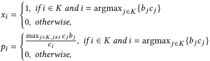

_where ties are broken consistently. The output of the auction is an allocation vector_ x = ( _𝑥_ 1 _,𝑥_ 2 _,_ · · · _,𝑥𝑛_ ) _and a payment vector_ p = ( _𝑝_ 1 _, 𝑝_ 2 _,_ · · · _, 𝑝𝑛_ ) _. Throughout the paper, we use_ x(b _,_ { _𝑐𝑖_ } _𝑖_ ∈ _𝐾 , 𝐾_ ) _and_ p(b _,_ { _𝑐𝑖_ } _𝑖_ ∈ _𝐾 , 𝐾_ ) _to denote outcomes of second-price auctions_4 _._ 

In each round _𝑡_ ∈[ _𝑇_ ], a two-stage auction is conducted as follows: 

> 2We use the terms advertiser, bidder, and arm interchangeably. 

> 3For simplicity, we assume that the time horizon _𝑇_ is known beforehand, but our results can be extended to the case with unknown _𝑇_ using a standard "doubling trick" 

> [2, 19]. 

> 1This reward function is "general" in the sense that the expected value E _𝑐𝑖𝑡_ ∼ _𝐷𝑖_ [max _𝑖_ ∈ _𝐾𝑡_ { _𝑏𝑖𝑐𝑖𝑡_ }] not depend only on the means of random variables , i.e., E _𝐷𝑖_ [ _𝑐𝑖𝑡_ ], but on the entire distributions of these variables. 

> 4Sometimes we might slightly abuse notations and write x(b _,_ c _, 𝐾_ ) and p(b _,_ c _, 𝐾_ ), where c = ( _𝑐_ 1 _,_ · · · _,𝑐𝑛_ ) is the full CTR vector, although x and p only depends on { _𝑐𝑖_ } _𝑖_ ∈ _𝐾_ . 

1566 

KDD ’24, August 25–29, 2024, Barcelona, Spain 

Truthful Bandit Mechanisms for Repeated Two-stage Ad Auctions 

- First stage. The auctioneer selects a subset of advertisers _𝐾𝑡_ with cardinality constraint | _𝐾𝑡_ | ≤ _𝑘_ based on the bid vector b and all observations from previous rounds. Only the advertisers in _𝐾𝑡_ enters the second stage. 

- Second stage. For each _𝑖_ ∈ _𝐾𝑡_ , the auctioneer observes the second-stage CTR prediction _𝑐𝑖𝑡_ , which is an i.i.d. sample from distribution _𝐷𝑖_ . Then a second-price auction is run within _𝐾𝑡_ (see Definition 1), using the predicted CTRs { _𝑐𝑖𝑡_ } _𝑖_ ∈ _𝐾𝑡_ and the submitted bid vector b. The allocation to advertisers in this round is x _𝑡_ = x(b _,_ { _𝑐𝑖𝑡_ } _𝑖_ ∈ _𝐾𝑡 , 𝐾𝑡_ ), with payment p _𝑡_ = p(b _,_ { _𝑐𝑖𝑡_ } _𝑖_ ∈ _𝐾𝑡 , 𝐾𝑡_ ). 

Our goal is to maximize the cumulative social welfare of _𝑇_ rounds. The reward we obtain in each round _𝑡_ is defined as the social welfare of the second-price auction in that round, i.e., _𝑅𝑡_ = max _𝑖_ ∈ _𝐾𝑡_ { _𝑏𝑖𝑐𝑖𝑡_ }. Since all bids are in [0 _,𝑉_ ] and CTRs are in [0 _,_ 1], the reward _𝑅𝑡_ is in [0 _,𝑉_ ]. The reward depends on sampled CTR predictions, and we define its expectation with respect to distribution _𝐷_ as _𝑅𝐷_ ( _𝐾𝑡_ ) = E _𝐷_ [ _𝑅𝑡_ ]. Then _𝑅𝐷_ ( _𝐾𝑡_ ) is a scalar that depends on _𝐾𝑡 , 𝐷,_ and b, serving as a measure of how good _𝐾𝑡_ is, given _𝐷_ and b. 

We define the offline optimal reward, i.e. the maximum expected reward one can achieve if _𝐷_ (and b) is known, as OPT _𝐷_ = max _𝐾 𝑅𝐷_ ( _𝐾_ ). 

To maximize the cumulative social welfare, we should select proper advertisers to enter the second stage in each round. Moreover, we can only observe the second-stage CTR predictions of advertisers that enters the second stage. This sequential subset selection procedure with partial feedback can be viewed as a combinatorial (semi-)bandit, where we treat advertisers as base arms and subsets as super arms. Following the convention of bandit algorithms, we define regret as the performance measure. 

Definition 2. _The regret of an algorithm is_ 

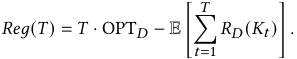

In our setting, a bandit algorithm also defines a _𝑇_ -round mechanism5 , where we consider the total allocation , X = ( _𝑋_ 1 _,_ · · · _,𝑋𝑛_ ) = � _𝑇𝑡_ =1x_𝑡_, and the total payment, P=(_𝑃_1_,_· · ·_, 𝑃𝑛_)=�_𝑇_ _𝑡_ =1p_𝑡_. We refer to those mechanisms as bandit mechanisms. When a fixed bandit algorithm runs on a fixed instance ( _𝐷,_ b) for several times, the resulting allocation X and payment P may be different, because the CTR predictions in each round are stochastic. We can consider this _𝑇_ -round interaction process as first drawing CTR predictions _𝑐𝑖𝑡_ for all _𝑖_ ∈[ _𝑛_ ] and _𝑡_ ∈[ _𝑇_ ] from the distributions _𝐷_ , and then running the bandit algorithm on these fixed samples. Specifically, a _𝑛_ × _𝑇_ realization table C whose ( _𝑖,𝑡_ )-th entry is the _𝑐𝑖𝑡_ to reveal when arm _𝑖_ is played in the _𝑡_ -th round. When a table C is fixed, there is no stochasticity in the mechanism, so the total allocation X(C _,_ b) and payment P(C _,_ b) of a mechanism are also fixed. This allows us to consider the utility function of advertiser _𝑖_ with respect to any table C, which is a deterministic function. 

> 5Since the second-stage auction mechanism is fixed to be second-price (See Definition 1), the allocation rule of a _𝑇_ -round mechanism is uniquely defined by a combinatorial bandit algorithm which decides the subset selection _𝐾𝑡_ in each round. 

Definition 3. _Bidder 𝑖’s utility function 𝑢𝑖 with respect to bid 𝑏𝑖 and other bidders’ bids_ b− _𝑖_ = ( _𝑏_ 1 _,_ · · · _,𝑏𝑖_ −1 _,𝑏𝑖_ +1 _,_ · · · _,𝑏𝑛_ ) _is_ 

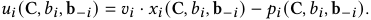

We expect our mechanisms to be truthful, i.e., reporting the real value is the utility-maximizing strategy for any bidder. We define two notions of truthfulness. Ex-post truthfulness requires the mechanism to be truthful on any fixed realization table. Stochastically truthfulness is a weaker notion, which only requires truthfulness in expectation, i.e., the expected utility function is maximized by truthful bidding. 

Definition 4. _A mechanism is ex-post truthful if for any 𝑖, 𝑣𝑖,𝑏𝑖,_ b− _𝑖,_ C _,_ 

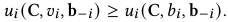

Definition 5. _A mechanism is stochastically truthful if for any 𝐷,𝑖, 𝑣𝑖, 𝑏𝑖,_ b− _𝑖,_ 

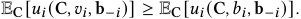

The mechanisms should also satisfy IR (Individual Rationality), which ensures that advertisers have non-negative utility when participating in the auction. 

Definition 6. _A mechanism is ex-post IR if for any 𝑖, 𝑣𝑖,𝑏𝑖,_ b− _𝑖,_ C _,_ 

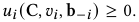

## **3 IMPOSSIBILITY RESULT** 

In this section, we recognize the impossibility for any bandit mechanism to simultaneously achieve sublinear regret and stochastically truthfulness, as shown in Theorem 1. This result reveals that in our two-stage auction setting, it is challenging to design a mechanism that enjoys both good performance and game-theoretic properties. 

Theorem 1. _There exists an instance set such that any stochastically truthful algorithm 𝜋 must incur_ Ω( _𝑇_ ) _regret._ 

The proof of Theorem 1 relies on Myerson’s Lemma. 

Lemma 1 (Myerson’s Lemma [23]). _A mechanism is stochastically truthful if and only if any bidder’s allocation_ EC [ _𝑋𝑖_ (C _,𝑏𝑖,_ b− _𝑖_ )] _is monotone(i.e. non-decreasing) with respect to her bid 𝑏𝑖 , and the payment rule is given by an explicit formula._ 

Now we construct an offline problem instance such that the social welfare-maximizing allocation is not monotone with respect to one’s bid. 

Proposition 1 (Optimal offline allocation is not monotone). _In the offline (full-information) setting, there exists 𝐷_ = ( _𝐷_ 1 _,_ · · · _, 𝐷𝑛_ ) _, and an advertiser 𝑖, such that her expected optimal allocation_ Er∼ _𝐷_ [ _𝑥𝑖_ (r _,_ b _, 𝐾_∗ )] _, where 𝐾_∗ = argmax _𝐾 𝑅𝐷_ ( _𝐾,_ b) _is the optimal super arm, is not monotone._ 

Proof. We present a counterexample with _𝑛_ = 3 and _𝑘_ = 2. The CTR distributions _𝐷_ = ( _𝐷_ 1 _, 𝐷_ 2 _, 𝐷_ 3) are 

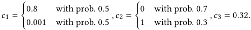

Consider bids b = (1 _,_ 1 _,_ 1) and b′ = (1 _._ 5 _,_ 1 _,_ 1), where advertiser 1 raises her bid. 

1567 

KDD ’24, August 25–29, 2024, Barcelona, Spain 

Haoming Li et al. 

On _𝐷_ and b, on can easily compute that the optimal subset is _𝐾_∗ = {1 _,_ 2}, and advertiser 1’s expected allocation E[ _𝑥_ 1] = Pr[ _𝑐_ 1 _𝑏_ 1 _> 𝑐_ 2 _𝑏_ 2] = 0 _._ 7; while on _𝐷_ and b′ , the optimal subset shifts to _𝐾_∗′ = {1 _,_ 3} and advertiser 1’s expected allocation decreases to E[ _𝑥_ 1′]= Pr[ _𝑐_ 1 _𝑏_ 1′_> 𝑐_3_𝑏_ 3′]= 0_._5. □ 

In the proof of Proposition 1, the increase of bidder 1’s bid leads to a change of the optimal subset, which introduces a stronger competitor (bidder 3) to bidder 1 during the auction within the subset and finally causes the expected allocation of bidder 1 to decrease. This example reveals a fundamental difference between two-stage and one-stage auctions: in two-stage auctions, one bidder may change her competitors in the second stage by changing her bid. 

Goel et al. [13] also proved an impossibility result by a construction similar to our Proposition 1. They proved that ex-post truthfulness is not achievable in two-stage auctions, while we present a stronger result, i.e. even stochastically truthfulness is impossible. 

To finally prove Theorem 1, we still need the following simple lemma from the bandit literature. 

Lemma 2. _Let 𝜋 be a combinatorial bandit algorithm, and_ I = ( _𝐷,_ b) _be an instance. Assume_ I _has a unique optimal super arm 𝐾_∗ = argmax _𝐾 𝑅𝐷_ ( _𝐾,_ b) _. Let 𝜏𝐾_ ( _𝑇_ ) =�_𝑇_ _𝑡_ =1I{_𝐾𝑡_=_𝐾_}_denote the_ _times of 𝜋 playing 𝐾 from round_ 1 _to 𝑇 . If 𝜋 achieves sublinear regret on_ I _, then_ lim _𝑇_ →∞ E[ _𝜏𝐾_ ∗ ( _𝑇_ )]/ _𝑇_ = 1 _._ 

Now we are ready to prove Theorem 1. 

Proof of Theorem 1. We consider two instances I = { _𝐷,_ b} and I′ = { _𝐷,_ b′ }, where _𝐷,_ b _,_ b′ are the constructions in the proof of Proposition 1. 

Since algorithm _𝜋_ is stochastically truthful, by Lemma 1, bidder 1’s expected allocation must be monotone with respect to _𝑏_ 1. We use shorthand E[ _𝑋_ 1] for E[ _𝑋_ 1 (C _,𝑏_ 1 _,_ b−1)], and E[ _𝑋_ 1′]for E[ _𝑋_ 1 (C _,𝑏_ 1′_,_b′ −1)]. Let_𝜏𝐾_(_𝑇_)= �_𝑇_ _𝑡_ =1I{_𝐾𝑡_=_𝐾_} when_𝜋_is running on I, and _𝜏𝐾_′(_𝑇_)be its counterpart on I′. 

We decompose the total allocation E[ _𝑋_ 1] to the times when different super arms containing arm 1 are pulled. 

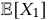

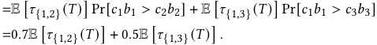

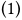

Similarly, 

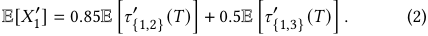

If _𝜋_ achieves sublinear regret on both I and I′ , by applying Lemma 2 to I and I′ , we know that 

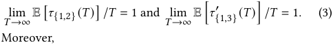

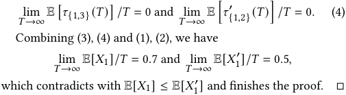

## **4 TRUTHFUL BANDIT MECHANISMS** 

In this section, we first introduce truthful approximation oracles, which allows us to design truthful mechanisms at the cost of sacrificing the performance. Then we present two mechanisms utilizing truthful approximation oracles, both of which are ex-post truthful and ex-post IR. The first mechanism achieves _𝑂_ ( _𝑇_2/3 ) regret. The second mechanism requires additional assumptions on the oracle and the bidders’ values, and achieves an improved regret of _𝑂_ (log _𝑇_ /Δ _𝜙_2), where Δ_𝜙_is a distribution-dependent gap. 

## **4.1 Truthful Approximation Oracles** 

Theorem 1 states the impossibly to design a truthful bandit mechanism that approaches the offline optimal allocation. To overcome the difficulty, we introduce approximation oracles that solves the offline optimization problem in a truthful manner. 

Definition 7 (Truthful Approximation Oracle). _An oracle takes distributions 𝐷 and bid vector_ b _as input, and outputs a subset 𝐾_ ← _Oracle_ ( _𝐷,_ b) _,_ | _𝐾_ | ≤ _𝑘. For 𝛼_ ∈(0 _,_ 1) _, an oracle is an 𝛼_ − _approximation if for any 𝐷 and any_ b 

### _𝑅𝐷_ ( _Oracle_ ( _𝐷,_ b)) ≥ _𝛼_ OPT _𝐷 ._ 

_An oracle is ex-post truthful if for any 𝐷,_ v ∈[0 _,𝑉_ ]_𝑛_ _,_ r ∈[0 _,_ 1]_𝑛_ _, the following mechanism is truthful:_ 

- _Solicit bid vector_ b _._ 

- _Query the oracle for 𝐾_ ← _Oracle_ ( _𝐷,_ b) _._ 

- _Run second-price auction within 𝐾. Output_ x(b _,_ c _, 𝐾_ ) _and_ p(b _,_ c _, 𝐾_ ) _._ 

_Representation of Distributions._ One may wonder how to represent distributions for the oracle’s input. In fact, our proposed algorithms only call the oracles on empirical distributions, which are discrete distributions with finite support. We represent such distributions _𝐷_ = { _𝐷_ 1 _,_ · · · _, 𝐷𝑛_ } by their CDFs F = { _𝐹_ 1 _,_ · · · _, 𝐹𝑛_ }. Each _𝐹𝑖_ is a piecewise constant function, which could be further represented by a vector of supported points and the values of CDF on those points. Throughout the paper, we may use _𝐷_ and F interchangeably. 

Note that we actually required truthful approximation oracles to be ex-post truthful, rather than the weaker notion of stochastically truthful. The following lemma provides a concrete example of such an ex-post truthful approximation oracle. 

Lemma 3 (Theorem 3 in Goel et al. [13]). _For each distribution 𝐷𝑖 of 𝑐𝑖 , let 𝜙𝑖_ ( _𝜃_ ) _be the expectation above the quantile function 𝑞𝑖_ ( _𝜃_ ) _:_ 

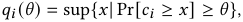

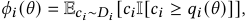

_then the following oracle is a truthful__<u>𝑒</u>_ <u>2</u>− _<u>𝑒</u>_<u>1</u>_-approximation oracle: Sort_ _all bidders by 𝑏𝑖𝜙𝑖_ (1/ _𝑘_ ) _, and choose the top 𝑘 bidders (ties are broken consistently)._ 

We leverage truthful approximation oracles in our design of truthful online learning algorithms (mechanisms). In such cases, it is not fair to compare our algorithm with the optimal algorithm which always chooses the optimal super arm. Instead, we use the _𝛼_ −approximation regret to evaluate an algorithm. 

1568 

KDD ’24, August 25–29, 2024, Barcelona, Spain 

Truthful Bandit Mechanisms for Repeated Two-stage Ad Auctions 

Definition 8. _The 𝛼_ − _approximation regret of an algorithm is defined as_ 

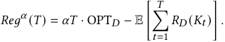

## **4.2** _𝑂_ ( _𝑇_2/3 ) **Mechanism** 

We present a mechanism that achieves _𝑂_ ( _𝑇_2/3 ) gap-independent regret and ex-post truthfulness. The mechanism consists of a fixedlength exploration phase followed by an exploitation phase. In the exploration phase, we collect _𝑚_ samples for each arm in a roundrobin manner, and calculate their empirical distributions in terms of CDFs. With _𝑚_ i.i.d. samples _𝑋_ 1 _,_ · · · _,𝑋𝑚_ from distribution _𝐷_ , the empirical CDF is defined as _𝐹_ˆ ( _𝑥_ ) = _<u>𝑚</u>_<u>1</u> � _𝑚𝑗_ =1I(_𝑋𝑗_≤_𝑥_). Based on these empirical CDFs, a truthful approximation oracle decides the super arm that is repeatedly played in the exploitation phase. 

### **Algorithm 1** An ETC mechanism 

- <u>1 2 2 2</u> 

- 1: _𝑚_ ←(_<u>𝜋</u>_ <u>2</u>) 3 (1 + _𝛼_ ) 3 _𝑛_ 3 _𝑇_ 3 2: **for** round _𝑡_ ≤ _𝑚𝑘_ **do** _⊲_ Exploration Phase 3: _𝐾𝑡_ ←{1 + _𝑘𝑡_ mod _𝑛,_ 2 + _𝑘𝑡_ mod _𝑛,_ · · · _,𝑘_ + _𝑘𝑡_ mod _𝑛_ }, run second-price auction within _𝐾𝑡_ 

- 4: Update _𝐹_ˆ _𝑖_ for each _𝑖_ ∈ _𝐾𝑡_ 

- 5: **end for** 

- 6: Query the oracle, get _𝐾_ ← Oracle(Fˆ _,_ b) 

- 7: **for** each remaining round _𝑡_ **do** _⊲_ Exploitation Phase 8: _𝐾𝑡_ ← _𝐾_ , run second-price auction within _𝐾𝑡_ 

- 9: **end for** 

Theorem 2. _Algorithm 1 achieves the following 𝛼_ − _approximation regret upper bound:_ 

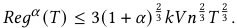

The proof of Theorem 2 relies on several useful lemmas. 

Lemma 4 (Dvoretzky-Kiefer-Wolfowitz ineqality[9, 22]). _Consider a distribution 𝐷, and let 𝐹_ ( _𝑥_ ) _be its CDF. With 𝑚 i.i.d. samples 𝑋_ 1 _,_ · · · _,𝑋𝑚 from 𝐷, the empirical CDF is 𝐹_ˆ ( _𝑥_ ) = _<u>𝑚</u>_<u>1</u> � _𝑚𝑗_ =1I(_𝑋𝑗_≤ _𝑥_ ) _, then for any 𝜖 >_ 0 _, we have_ 

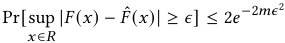

Lemma 5. _For random variable 𝑋 with non-negative support,_ 

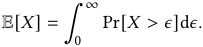

Lemma 6 (Lemma 3 in Chen et al. [5]). _If for any 𝑖_ ∈[ _𝑛_ ] _,𝑥_ ∈ [0 _,_ 1] _,_ sup _𝑥_ | _𝐹𝑖_ ( _𝑥_ ) − _𝐹𝑖_′(_𝑥_)|≤Λ_, then for any super arm 𝐾, we have_ | _𝑅𝐹_ ( _𝐾_ ) − _𝑅𝐹_ ′ ( _𝐾_ )| ≤ 2 _𝑉𝑘_ Λ _._ 

Lemma 4, i.e. the DKW inequality, is on concentration of empirical distributions. Lemma 5 is a simple fact in probability theory, bridging expectations and CDFs. Lemma 6 characterizes the concentration of super arms’ rewards based on the concentration of base arms’ empirical distributions. Now we are ready to prove Theorem 2. 

Proof. Let _𝐾_ be the super arm played in the exploitation phase. Let _𝐷_ˆ = ( _𝐷_ˆ 1 _,_ · · · _, 𝐷_ˆ _𝑛_ ) be the empirical distributions at round _𝑚𝑘_ , with empirical CDFs Fˆ = ( _𝐹_ˆ 1 _,_ · · · _, 𝐹_ˆ _𝑛_ ), and let _𝐷_ be the real distributions. Since we call an _𝛼_ −approximation oracle, we have _𝑅𝐷_ ˆ ( _𝐾_ ) ≥ _𝛼_ OPT _𝐷_ ˆ . Let _𝐾_∗ = argmax _𝐾 𝑅𝐷_ ( _𝐾_ ) be the real optimal super arm. Then 

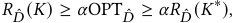

where the second inequality follows from the optimality of OPT _𝐷_ ˆ , i.e., OPT _𝐷_ ˆ ≥ _𝑅𝐷_ ˆ ( _𝐾_′ ) for any _𝐾_′ . We then bound the probability Pr[ _𝑅𝐷_ ( _𝐾_ ) _< 𝛼_ OPT _𝐷_ − _𝜖_ ] for any _𝜖_ ∈ R+ . 

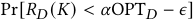

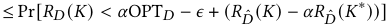

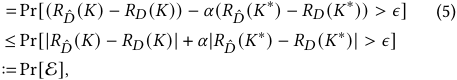

where the last inequality follows from | _𝑎_ − _𝑏_ | ≤| _𝑎_ | + | _𝑏_ | for any _𝑎,𝑏_ ∈ R, and in the last line we define event E = {| _𝑅𝐷_ ˆ ( _𝐾_ )− _𝑅𝐷_ ( _𝐾_ )|+ _𝛼_ | _𝑅𝐷_ ˆ ( _𝐾_∗ ) − _𝑅𝐷_ ( _𝐾_∗ )| _> 𝜖_ }. 

Also, define good event 

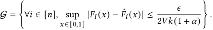

By Lemma 6, if G happens, then we have | _𝑅𝐷_ ˆ ( _𝐾_ ) − _𝑅𝐷_ ( _𝐾_ )| ≤ <u>1+</u> _<u>𝜖𝛼</u>_and |_𝑅_ _𝐷_ˆ(_𝐾_∗) −_𝑅𝐷_(_𝐾_∗)|≤ <u>1+</u> _<u>𝜖𝛼</u>_, which prevents Eto happen. Therefore, E implies ¬G, which gives us 

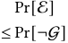

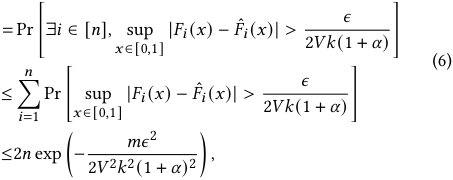

where the second inequality is by taking a union bound, and the third inequality follows from DKW inequality. 

Combining (5) and (6) gives us 

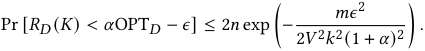

Split the regret by exploration phase and exploitation phase, 

_𝑅𝑒𝑔__𝛼_ ( _𝑇_ ) = _𝑚𝑘𝑉_ + ( _𝑇_ − _𝑚𝑘_ )E[ _𝛼_ OPT _𝐷_ − _𝑅𝐷_ ( _𝐾_ )] _._ (7) Calculate the expectation term with Lemma 5, 

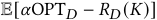

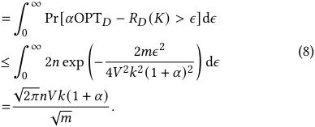

1569 

KDD ’24, August 25–29, 2024, Barcelona, Spain 

Haoming Li et al. 

<u>1 2 2 2</u> Plug (8) into (7) , and let _𝑚_ = min(⌈(_<u>𝜋</u>_ <u>2</u>) 3 (1 + _𝛼_ ) 3 _𝑛_ 3 _𝑇_ 3 ⌉ _,_ ⌈ _𝑇_ / _𝑘_ ⌉), we have 

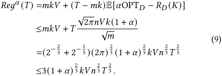

Beyond sublinear regret, Algorithm 1 also enjoys the following truthful and IR properties. 

Proposition 2. _Algorithm 1 is ex-post truthful and ex-post IR._ 

The truthfulness of Algorithm 1 mainly follows from the property of truthful oracles combined with the truthfulness of secondprice auctions. The IR property follows from that of second-price auctions. The complete proofs are deferred to Appendix A. 

## **4.3** _𝑂_ (log _𝑇_ /Δ _𝜙_2)**Mechanism** 

Although Algorithm 1 guarantees ex-post truthfulness and ex-post IR, its _𝑂_ ( _𝑇_2/3 ) regret is not satisfactory in some scenarios. To design an algorithm with a better regret bound, we make an additional assumption on the oracle. Beyond truthfulness and _𝛼_ −approximation, we assume that the oracle determines _𝐾_ by ranking the bidders according to some score and choosing the top- _𝑘_ , and the scores are accessible. The scores provide additional information about the quality of the bidders, and can be leveraged by the bandit algorithm to quickly determine the correct subset to exploit. 

Definition 9 (Truthful Approximation Scoring Oracle). _A scoring oracle Score_ (·) _assigns each bidder a score according to its distribution, i.e., 𝜙𝑖_ ← _Score_ ( _𝐷𝑖_ ) _, such that ranking the bidders by 𝑏𝑖𝜙𝑖 , and choosing the top-𝑘 as 𝐾 will ensure_ 

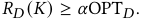

It is easy to check that this scoring and ranking procedure is always ex-post truthful for any score _𝜙_ = ( _𝜙_ 1 _,_ · · · _,𝜙𝑛_ ). 

We further make an assumption on the smoothness of Score(·): There exists a Lipschitz constant _𝐿 >_ 0, such that if sup _𝑥_ | _𝐹_ ( _𝑥_ ) − _𝐹_′ ( _𝑥_ )| ≤ Λ, then 

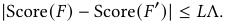

The following lemma tells us such scoring oracle exists. In fact, the oracle presented in Lemma 3 is exactly a truthful_<u>𝑒</u>_ <u>2</u>− _<u>𝑒</u>_<u>1</u>−approx- imation scoring oracle. The proof of its Lipschitz constant _𝐿_ = 1 is deferred to Appendix A. 

Lemma 7. _There exists a truthful__<u>𝑒</u>_ <u>2</u>− _<u>𝑒</u>_<u>1</u>_-approximation scoring ora-_ _cle with Lipschitz constant 𝐿_ = 1 _._ 

We denote the gap of an instance as Δ _𝜙_ = min _𝑖,𝑗_ ∈[ _𝑛_ ] _,𝑖_ ≠ _𝑗_ | _𝑣𝑖𝜙𝑖_ − _𝑣 𝑗 𝜙 𝑗_ |. For the truthful property of the mechanism, we assume that the value _𝑣𝑖_ of each arm _𝑖_ is within an interval around a known parameter _𝛽𝑖_ ∈[0 _,𝑉_ ]: 

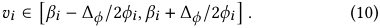

This assumption is often satisfied in industrial scenarios where advertisers’ valuation of a certain impression is static, and the ad platform can estimate one’s value from one’s bidding history. 

Based on an _𝛼_ −approximation scoring oracle, we design an ETC mechanism with adaptive commitment time, i.e., the length of exploration phase depends on the collected data. The fixed prior information of value _𝛽𝑖_ , instead of submitted bid _𝑏𝑖_ , is used in deciding of commitment. This prevents the bidders from influencing the commitment time by strategic bidding. 

**Algorithm 2** An ETC mechanism with adaptive commitment time 

- 1: Throughout the exploration phase, for each arm _𝑖_ ∈[ _𝑛_ ] we maintain: (i) counter _𝑇𝑖_ which stores the times that _𝑖_ has been selected so far (ii) CDF _𝐹_ˆ _𝑖_ of the empirical distribution of the observed outcomes of arm _𝑖_ so far 

- 2: **repeat** _⊲_ Exploration Phase 

- 3: _𝐾𝑡_ ←{1 + _𝑘𝑡_ mod _𝑛,_ 2 + _𝑘𝑡_ mod _𝑛,_ · · · _,𝑘_ + _𝑘𝑡_ mod _𝑛_ }, run second-price auction within _𝐾𝑡_ 

- 4: **for** each _𝑖_ ∈ _𝐾𝑡_ **do** 5: Update _𝑇𝑖_ and _𝐹_ˆ _𝑖_ 

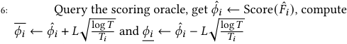

- 7: **end for** 

- 8: Rank all the arms by _𝛽𝑖𝜙_ˆ _𝑖_ , let _𝐻𝑖𝑔ℎ_ be the set of top- _𝑘_ arms, let _𝐿𝑜𝑤_ be the other _𝑛_ − _𝑘_ arms 

- 9: _𝜙ℎ_ ← min _𝑖_ ∈ _𝐻𝑖𝑔ℎ 𝛽𝑖𝜙𝑖_ , _𝜙𝑙_ ← max _𝑖_ ∈ _𝐿𝑜𝑤 𝛽𝑖𝜙𝑖_ 

- 10: **until** _𝜙ℎ_ ≥ _𝜙𝑙_ 

- 11: **for** each remaining round _𝑡_ **do** _⊲_ Exploitation Phase 

- 12: Pull _𝐾𝑡_ ← _𝐻𝑖𝑔ℎ_ , run second-price auction within _𝐾𝑡_ , using bids b 

- 13: **end for** 

Theorem 3. _Algorithm 2 achieves the following 𝛼_ − _approximation regret upper bound:_ 

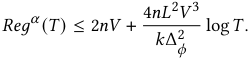

Proof. Let _𝐹_ˆ _𝑖,𝑢_ ( _𝑥_ ) be the empirical distribution of arm _𝑖_ when _𝑢_ samples from _𝑖_ are observed. Define event 

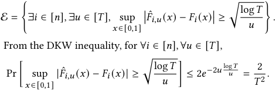

Taking an union bound gives Pr[E] ≤<u>2</u> _𝑇__<u>𝑛</u>_ 

_𝑇_. 

Let _𝜙_ˆ _𝑖,𝑡 , 𝜙𝑖,𝑡 ,_ _<u>𝜙</u>_ _~~𝑖~~ ,𝑡_be the value of_𝜙_ˆ_𝑖,_ _𝜙𝑖,_ _<u>𝜙</u>_ _~~𝑖~~_at time_𝑡_. On event ¬E, by definition, for any arm _𝑖_ , any time _𝑡_ in the exploration phase, | _𝜙𝑖_ − _𝜙_ˆ _𝑖,𝑡_ | ≤ _𝐿_ √︃ lo _𝑇_ <u>g</u> _𝑖𝑇_, therefore_<u>𝜙</u>_ _~~𝑖~~ ,𝑡_≤_𝜙𝑖_≤ _𝜙𝑖,𝑡_ . When condition _𝜙ℎ_ ≥ _𝜙𝑙_ is satisfied, for ∀ _𝑖_ ∈ _𝐻𝑖𝑔ℎ_ , ∀ _𝑗_ ∈ _𝐿𝑜𝑤_ , _𝛽𝑖𝜙_ _~~𝑖~~ ,𝑡_≥_𝛽𝑗_ _𝜙 𝑗,𝑡_ , thus _𝛽𝑖𝜙𝑖_ ≥ _𝛽 𝑗 𝜙 𝑗_ . This implies that _𝐻𝑖𝑔ℎ_ is the top- _𝑘_ subset according 

1570 

KDD ’24, August 25–29, 2024, Barcelona, Spain 

Truthful Bandit Mechanisms for Repeated Two-stage Ad Auctions 

to { _𝛽𝑖𝜙𝑖_ }. By Equation (10), _𝐻𝑖𝑔ℎ_ is also the top- _𝑘_ subset according to { _𝑏𝑖𝜙𝑖_ }. 

Let _𝑚_ be the last round in which _𝜙ℎ < 𝜙𝑙_ . Let _𝑖_ = argmin _𝑖_ ∈ _𝐻𝑖𝑔ℎ 𝛽𝑖𝜙_ _~~𝑖~~_, _𝑗_ = argmax _𝑗_ ∈ _𝐿𝑜𝑤 𝛽 𝑗 𝜙 𝑗_ , we know _𝛽𝑖𝜙_ _~~𝑖~~__<𝛽𝑗_ _𝜙 𝑗_ . By the exploration rule, till round _𝑚_ , we have observed_<u>𝑚𝑘</u>_ _<u>𝑛</u>_samples for each arm. Since _𝛽𝑖𝜙_ _~~𝑖~~__<𝛽𝑗_ _𝜙 𝑗_ , 

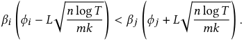

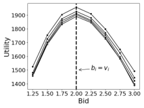

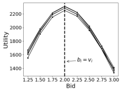

**(a) Ex-post truthfulness of Algo(b) Ex-post truthfulness of Algorithm 1. rithm 2.** 

Rearranging the terms, we have 

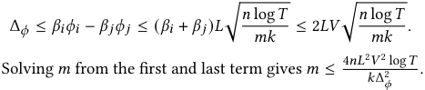

On event E, each round incurs regret of at most _𝑉_ . On event ¬E, we know that _𝐻𝑖𝑔ℎ_ is the top- _𝑘_ subset according to { _𝑏𝑖𝜙𝑖_ }. By definition of the _𝛼_ −approximation scoring oracle, playing _𝐻𝑖𝑔ℎ_ incurs non-positive regret. Therefore, the regret of the algorithm is 

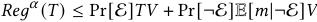

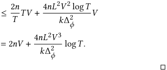

Algorithm 2 also achieves ex-post truthfulness and ex-post IR. The proofs are deferred to Appendix A. 

Proposition 3. _Algorithm 2 is ex-post truthful and ex-post IR._ 

By the design of adaptive commitment time, Algorithm 2 achieves a better regret than Algorithm 1 on most instances, except for the cases when Δ _𝜙_ is extremely small. A potential way to further improve the regret bound is to adopt UCB-based [5] or successiveelimination style [27] algorithms. However, these algorithms are much more data sensitive than ETC algorithms, thus may be prone to strategic bids. 

## **5 EXPERIMENTS** 

In this section, we evaluate our two mechanisms through experiments on both synthetic data and real-world data. 

For the experiments, instead of _𝛼_ −approximation regret (Definition 8), we compare the cumulative rewards achieved by our mechanisms against _𝑇_ · _𝑅𝐷_ ( _𝐾_ Oracle), where _𝐾_ Oracle is the subset returned by an _𝛼_ −approximation oracle. By definition of _𝛼_ −approximation oracles (Definition 7), _𝑅𝐷_ ( _𝐾_ Oracle) ≥ _𝛼_ OPT _𝐷_ , so _𝑅𝐷_ ( _𝐾_ Oracle) is a more challenging reference value, and all of our theoretical results still holds under this notion of regret. This choice is based on two reasons: (i) computing OPT _𝐷_ is often computationally infeasible, (ii) the value of _𝛼_ OPT _𝐷_ can be much lower than _𝑅𝐷_ ( _𝐾_ Oracle) practically, and comparing the mechanisms’ cumulative reward against _𝛼_ OPT _𝐷_ often leads to negative regret. 

Beyond regret, we also test the truthfulness of our mechanisms, by computing a bidder’s utility with different bids. 

**Figure 1: Ex-post truthfulness of our two algorithms evaluated on synthetic data. Each line represents a bidder’s utilities with respect to different submitted bids on one random seed.** 

## **5.1 Experiments with synthetic data** 

_5.1.1 Experiment Setup._ We construct an environment with _𝑛_ = 7 bidders, from which _𝑘_ = 3 bidders are selected in each round. All bidders have the same uniform CTR distribution, i.e., _𝑐𝑖_ ∼ _𝑈_ ([0 _,_ 1]). The bidders’ values are [1 + Δ _,_ 1 + Δ _,_ 1 + Δ _,_ 1 _,_ 1 _,_ 1 _,_ 1], where Δ is a gap parameter that we control through the experiments. By the truthful property of our mechanisms, the input bids are equal to the values. We run experiments for different time horizons _𝑇_ ∈ {2 × 104 _,_ 4 × 104 _,_ 6 × 104 _,_ 8 × 104 _,_ 105 }. For each time horizon, we run experiments for Δ ∈{0 _._ 5 _,_ 1 _,_ 1 _._ 5 _,_ 2}. The result of each experiment is averaged over 80 independent runs. 

We leverage the oracle presented in 3 for both Algorithm 1 and Algorithm 2. The difference is that for Algorithm 1, the oracle only returns a subset it chooses, while for Algorithm 2, it returns all the scores _𝜙𝑖_ (1/ _𝑘_ ) for _𝑖_ ∈[ _𝑛_ ]. 

To test the ex-post truthfulness of our mechanisms, we fix Δ to be 1, so bidders’ the values are [2 _,_ 2 _,_ 2 _,_ 1 _,_ 1 _,_ 1 _,_ 1]. Since ex-post truthfulness requires the mechanism to be truthful on any random seed, we pick 100 random seeds for evaluation. For each fixed random seed, we adjust the bid of bidder 1 to _𝑏_ 1 ∈{1 _._ 25 _,_ 1 _._ 50 _,_ 1 _._ 75 _,_ 2 _._ 00 _,_ 2 _._ 25 _,_ 2 _._ 50 _,_ 2 _._ 75 _,_ 3 _._ 00}, while keeping other bidders’ bids unchanged. We report bidder 1’s utility when different bids are reported. If the mechanism is ex-post truthful, then for any random seed, the utility-maximizing bid should be equal to the value. During the test of truthfulness, we fix _𝑇_ = 10000. 

_5.1.2 Results and Discussions._ Figure 2a presents a comparison of regret between Algorithm 1 and Algorithm 2. For any time horizon _𝑇_ and gap Δ, the regret of Algorithm 2 is significantly lower than that of Algorithm 1. The low regret is due to the design of adaptive commitment time in Algorithm 2. Besides, when the gap Δ decreases, Algorithm 1 achieves lower regret, while Algorithm 2 suffers from higher regret. This phenomenon is demonstrated more clearly in Figure 2b and Figure 2c. Figure 2b depicts the regret of Algorithm 1 with different _𝑇_ and Δ in a log-log plot. The grey <u>2</u> dashed lines represent _𝑅𝑒𝑔_ = _𝑎𝑇_ 3 with different values of _𝑎_ . We observe that the regret curves are almost parallel with the grey lines, which indicates Θ( _𝑇_2/3 ) regret, matching Theorem 2. Moreover, Algorithm 1 shows higher regret when Δ gets high. This is because the regret accumulated in the exploration phase grows as the gap between optimal and suboptimal super arms expands. 

1571 

KDD ’24, August 25–29, 2024, Barcelona, Spain 

Haoming Li et al. 

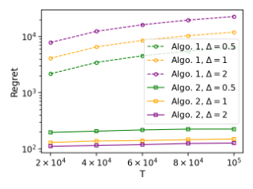

**(a) Comparison of the regret of two mechanisms. Regret is displayed on a log scale.** 

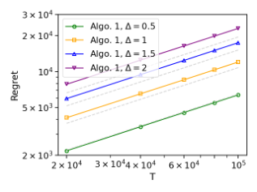

**(b) The regret of Algorithm 1. To demonstrate the order of** _𝑇_2/3 **, both Regret and T are displayed on a log scale.** 

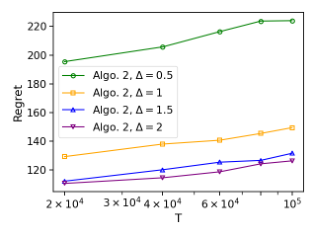

**(c) The regret of Algorithm 2. To demonstrate the order of** log _𝑇_ **, T is displayed on a log scale.** 

**Figure 2: Regret of our two algorithms evaluated on synthetic data.** 

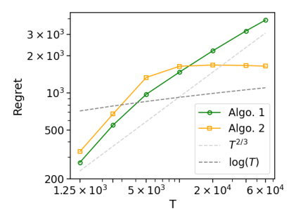

**Figure 3: Regret of our two algorithms evaluated on MovieLens dataset. Both Regret and T are displayed on a log scale.** 

Figure 2c shows the regret of Algorithm 2. We observe that the regret almost grows linearly with respect to log _𝑇_ . Besides, the regret grows quadratically with decreasing Δ. Note that in the case of our experiment, Δ is proportional to Δ _𝜙_ , as the distributions are identical and fixed. The dependence of regret on _𝑇_ and Δ _𝜙_ nicely matches our theoretical result (Theorem 3). 

In the test of truthfulness, on all 100 random seeds, bidding the true value achieves highest utility among 8 different bids. Figure 1 shows the utility curve of two mechanisms on five random seeds {1 _,_ 2 _,_ 3 _,_ 4 _,_ 5}. The curves on all 100 seeds actually look similar, with _𝑏_ = 2 being their common maximum point, and the fives seeds are arbitrarily picked only for demonstration. 

## **5.2 Experiments with real-world data** 

We evaluate the Algorithm 1 and Algorithm 2 on the MovieLens 1M [14] dataset. 

_5.2.1 Experiment Setup._ We treat each movie as an arm and convert the ratings into a CTR-like metric. The top 7 arms, determined by the highest number of ratings in the original dataset, are selected as the base arms. From these base arms, a super arm consisting of _𝑘_ = 3 

arms is chosen in each round. To construct the CTR distribution, we manually set a rating threshold _𝑟𝑡_ = 3 _._ 5, such that ratings _𝑟 >_ 3 _._ 5 are converted to 1, and otherwise to 0. Subsequently, we calculate the mean and variance of the converted ratings for each arm, denoted as the mean and variance of the CTR distribution, respectively. These CTR distributions are modeled as truncated Gaussian distributions, with support restricted to [0 _,_ 1]. The bid of each arm is sampled from a uniform distribution _𝑈_ ([0 _,_ 5]) and remains constant after the experiment begins. We conduct experiments for different time horizons _𝑇_ ∈{1250 _,_ 2500 _,_ 5000 _,_ 1 × 104 _,_ 2 × 104 _,_ 4 × 104 _,_ 6 × 104 }. The setting of the oracle is the same as Section 5.1.1. 

_5.2.2 Results and Discussions._ Figure 3 presents a comparison of the regret between Algorithm 1 and Algorithm 2. When the horizon _𝑇_ is small, both algorithms exhibit linear regret, as _𝑚𝑘 > 𝑇_ for a small _𝑇_ , leading to a predominantly exploratory phase within the limited horizon. As _𝑇_ increases, both algorithms demonstrate improvements by incorporating an exploitation phase. In comparison with the dashed grey line, it is evident that Algorithm 1 achieves _𝑂_ ( _𝑇_2/3 ) regret, while Algorithm 2 attains _𝑂_ (log _𝑇_ ) regret. Notably, with a large horizon _𝑇_ , Algorithm 2 achieves lower regret compared to Algorithm 1. 

## **6 RELATED WORKS** 

_Two-stage Advertising Systems._ Previous studies on two-stage advertising systems have primarily focused on two aspects: allocation efficiency and incentives. Both Wang et al. [25] and Zhao et al. [32] addressed the learning objectives of machine learning models in the first stage, in order to align with the second stage and enhancing the overall ad allocation performance. While Wang et al. [25] also discussed incentives, they considered a non-standard value-maximizer utility model. On incentives in two-stage auctions, Goel et al. [13] provided an insightful characterization of first-stage mechanisms that ensures overall truthfulness when composed with any truthful second-stage auction mechanism. However, their work was limited to single-round mechanisms, whereas we considered incentives in multi-round bandit mechanisms. 

1572 

KDD ’24, August 25–29, 2024, Barcelona, Spain 

Truthful Bandit Mechanisms for Repeated Two-stage Ad Auctions 

_Two-stage Recommendation Systems._ Research on two-stage structures in recommendation is rather abundant than advertising. A general approach is cooperative training of both stages [12, 15, 17, 18] to improve the overall recommendation performance, and particular attention has been paid to off-policy correction [20] and fairness issues [24]. Closer to our setting is synchronized two-stage exploration, studied under both linear [16] and neural [31] bandit settings. Although these studies share some similarities with our setting, there are significant differences due to the presence of incentives in ad auctions. 

_Truthful Bandit Mechanisms._ A line of research has focused on designing truthful mechanisms for multi-round ad auctions, where a multi-armed bandit algorithm acts as the allocation rule. Babaioff et al. [4] provided a Ω( _𝑇_2/3 ) regret lower bound for any deterministic truthful multi-armed bandit mechanisms, and provided a ETC algorithm that matches this lower bound. Devanur and Kakade [8] obtained a similar Ω( _𝑇_2/3 ) lower bound under the revenuemaximizing setting. Babaioff et al. [3] further extended to randomized mechanisms, and provided a black-box reduction from any monotone bandit algorithm to a truthful mechanism, which gives rise to _𝑂_ (√ _𝑇_ ) regret. Recent works have considered extended settings in different directions, such as utility models [11] and contextual information [1, 28, 30]. Our work is based on a novel setting of two-stage ad auctions which is formulated as designing combinatorial bandit mechanisms. 

## **7 CONCLUSION** 

In this paper, we investigate the problem of designing truthful bandit mechanisms for two-stage online ad auctions. We prove an Ω( _𝑇_ ) lower bound for truthful mechanisms, and introduce truthful _𝛼_ −approximation oracles which give rise to sublinear _𝛼_ −approximation regret mechanisms. 

We leave it as an open problem to potentially design _𝑂_ ( ~~√~~ _𝑇_ ) bandit mechanisms within the approximation regret setting, or to establish an Ω( _𝑇_2/3 ) lower bound. Moreover, the impossibility result may also be circumvented by other approaches, e.g., relaxing the notion of truthfulness by considering high-probability truthful mechanisms. 

## **ACKNOWLEDGMENTS** 

The authors sincerely thank Shuai Li and Xutong Liu for their helpful discussions. This work was supported in part by National Key R&D Program of China (No. 2022ZD0119100), in part by China NSF grant No. 62322206, 62132018, U2268204, 62025204, 62272307, 62372296. The opinions, findings, conclusions, and recommendations expressed in this paper are those of the authors and do not necessarily reflect the views of the funding agencies or the government. 

## **REFERENCES** 

- [1] Kumar Abhishek, Shweta Jain, and Sujit Gujar. 2020. Designing Truthful Contextual Multi-Armed Bandits based Sponsored Search Auctions. In _Proceedings of the 19th International Conference on Autonomous Agents and MultiAgent Systems_ (Auckland, New Zealand) _(AAMAS ’20)_ . International Foundation for Autonomous Agents and Multiagent Systems, Richland, SC, 1732–1734. 

- [2] Peter Auer, Nicolo Cesa-Bianchi, Yoav Freund, and Robert E Schapire. 1995. Gambling in a rigged casino: The adversarial multi-armed bandit problem. In _Proceedings of IEEE 36th annual foundations of computer science_ . IEEE, 322–331. 

- [3] Moshe Babaioff, Robert D Kleinberg, and Aleksandrs Slivkins. 2015. Truthful mechanisms with implicit payment computation. _Journal of the ACM (JACM)_ 62, 2 (2015), 1–37. 

- [4] Moshe Babaioff, Yogeshwer Sharma, and Aleksandrs Slivkins. 2014. Characterizing Truthful Multi-armed Bandit Mechanisms. _SIAM J. Comput._ 43, 1 (2014), 194–230. 

- [5] Wei Chen, Wei Hu, Fu Li, Jian Li, Yu Liu, and Pinyan Lu. 2016. Combinatorial multiarmed bandit with general reward functions. _Advances in Neural Information Processing Systems_ 29 (2016). 

- [6] Heng-Tze Cheng, Levent Koc, Jeremiah Harmsen, Tal Shaked, Tushar Chandra, Hrishi Aradhye, Glen Anderson, Greg Corrado, Wei Chai, Mustafa Ispir, et al. 2016. Wide & deep learning for recommender systems. In _Proceedings of the 1st workshop on deep learning for recommender systems_ . 7–10. 

- [7] Paul Covington, Jay Adams, and Emre Sargin. 2016. Deep neural networks for youtube recommendations. In _Proceedings of the 10th ACM conference on recommender systems_ . 191–198. 

- [8] Nikhil R Devanur and Sham M Kakade. 2009. The price of truthfulness for pay-per-click auctions. In _Proceedings of the 10th ACM conference on Electronic commerce_ . 99–106. 

- [9] Aryeh Dvoretzky, Jack Kiefer, and Jacob Wolfowitz. 1956. Asymptotic minimax character of the sample distribution function and of the classical multinomial estimator. _The Annals of Mathematical Statistics_ (1956), 642–669. 

- [10] Chantat Eksombatchai, Pranav Jindal, Jerry Zitao Liu, Yuchen Liu, Rahul Sharma, Charles Sugnet, Mark Ulrich, and Jure Leskovec. 2018. Pixie: A system for recommending 3+ billion items to 200+ million users in real-time. In _Proceedings of the 2018 world wide web conference_ . 1775–1784. 

- [11] Zhe Feng, Christopher Liaw, and Zixin Zhou. 2023. Improved online learning algorithms for CTR prediction in ad auctions. In _International Conference on Machine Learning_ . PMLR, 9921–9937. 

- [12] Luke Gallagher, Ruey-Cheng Chen, Roi Blanco, and J. Shane Culpepper. 2019. Joint Optimization of Cascade Ranking Models. In _Proceedings of the Twelfth ACM International Conference on Web Search and Data Mining (WSDM ’19)_ . 15–23. 

- [13] Gagan Goel, Renato Paes Leme, Jon Schneider, David Thompson, and Hanrui Zhang. 2023. Eligibility Mechanisms: Auctions Meet Information Retrieval. In _Proceedings of the ACM Web Conference 2023_ . 3541–3549. 

- [14] F Maxwell Harper and Joseph A Konstan. 2015. The movielens datasets: History and context. _Acm transactions on interactive intelligent systems (tiis)_ 5, 4 (2015), 1–19. 

- [15] Jiri Hron, Karl Krauth, Michael Jordan, and Niki Kilbertus. 2021. On Component Interactions in Two-Stage Recommender Systems. In _Advances in Neural Information Processing Systems_ , Vol. 34. 2744–2757. 

- [16] Jiri Hron, Karl Krauth, Michael I. Jordan, and Niki Kilbertus. 2020. Exploration in two-stage recommender systems. arXiv:2009.08956 [cs.IR] 

- [17] Xu Huang, Defu Lian, Jin Chen, Liu Zheng, Xing Xie, and Enhong Chen. 2023. Cooperative Retriever and Ranker in Deep Recommenders. In _Proceedings of the ACM Web Conference 2023_ . 1150–1161. 

- [18] Wang-Cheng Kang and Julian McAuley. 2019. Candidate Generation with Binary Codes for Large-Scale Top-N Recommendation. In _Proceedings of the 28th ACM International Conference on Information and Knowledge Management (CIKM ’19)_ . 1523–1532. 

- [19] Tor Lattimore and Csaba Szepesvári. 2020. _Bandit algorithms_ . Cambridge University Press, Chapter 6, 97–98. 

- [20] Jiaqi Ma, Zhe Zhao, Xinyang Yi, Ji Yang, Minmin Chen, Jiaxi Tang, Lichan Hong, and Ed H. Chi. 2020. Off-policy Learning in Two-stage Recommender Systems. In _Proceedings of The Web Conference 2020_ . 463–473. 

- [21] Xu Ma, Pengjie Wang, Hui Zhao, Shaoguo Liu, Chuhan Zhao, Wei Lin, KuangChih Lee, Jian Xu, and Bo Zheng. 2021. Towards a Better Tradeoff between Effectiveness and Efficiency in Pre-Ranking: A Learnable Feature Selection based Approach. 2036–2040. 

- [22] Pascal Massart. 1990. The tight constant in the Dvoretzky-Kiefer-Wolfowitz inequality. _The annals of Probability_ (1990), 1269–1283. 

- [23] Roger B Myerson. 1981. Optimal auction design. _Mathematics of operations research_ 6, 1 (1981), 58–73. 

- [24] Lequn Wang and Thorsten Joachims. 2023. Uncertainty Quantification for Fairness in Two-Stage Recommender Systems. In _Proceedings of the Sixteenth ACM International Conference on Web Search and Data Mining_ . 940–948. 

- [25] Yiqing Wang, Xiangyu Liu, Zhenzhe Zheng, Zhilin Zhang, Miao Xu, Chuan Yu, and Fan Wu. [n. d.]. On Designing a Two-stage Auction for Online Advertising. In _Proceedings of the ACM Web Conference 2022_ . 90–99. 

- [26] Zhe Wang, Liqin Zhao, Biye Jiang, Guorui Zhou, Xiaoqiang Zhu, and Kun Gai. 2020. COLD: Towards the Next Generation of Pre-Ranking System. arXiv:2007.16122 [cs.IR] 

- [27] Haike Xu and Jian Li. 2021. Simple combinatorial algorithms for combinatorial bandits: Corruptions and approximations. In _Uncertainty in Artificial Intelligence_ . PMLR, 1444–1454. 

1573 

KDD ’24, August 25–29, 2024, Barcelona, Spain 

Haoming Li et al. 

Therefore _𝑣𝑖_ is the maximizer of any of the objectives _𝑢𝑖𝑡_ (C _,𝑏𝑖,_ b− _𝑖_ ) for _𝑚𝑘_ + 1 ≤ _𝑡_ ≤ _𝑇_ . 

- [28] Yinglun Xu, Bhuvesh Kumar, and Jacob Abernethy. 2023. On the robustness of epoch-greedy in multi-agent contextual bandit mechanisms. _arXiv preprint arXiv:2307.07675_ (2023). 

To conclude, the truthful bid _𝑣𝑖_ maximizes any of _𝑢𝑖𝑡_ (C _,𝑏𝑖,_ b− _𝑖_ ) for 1 ≤ _𝑡_ ≤ _𝑇_ , and thus maximizes _𝑈𝑖_ (C _,𝑏𝑖,_ b− _𝑖_ ). 

- [29] Xinyang Yi, Ji Yang, Lichan Hong, Derek Zhiyuan Cheng, Lukasz Heldt, Aditee Kumthekar, Zhe Zhao, Li Wei, and Ed Chi. 2019. Sampling-bias-corrected neural modeling for large corpus item recommendations. In _Proceedings of the 13th ACM Conference on Recommender Systems_ . 269–277. 

For IR, the total utility _𝑈𝑖_ of bidder _𝑖_ is defined as the sum of utility in each round, 

- [30] Mengxiao Zhang and Haipeng Luo. 2023. Online Learning in Contextual SecondPrice Pay-Per-Click Auctions. _arXiv preprint arXiv:2310.05047_ (2023). 

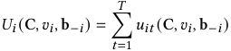

- [31] Mengyan Zhang, Thanh Nguyen-Tang, Fangzhao Wu, Zhenyu He, Xing Xie, and Cheng Soon Ong. 2022. Two-Stage Neural Contextual Bandits for Personalised News Recommendation. arXiv:2206.14648 [cs.IR] 

- [32] Zhishan Zhao, Jingyue Gao, Yu Zhang, Shuguang Han, Siyuan Lou, XiangRong Sheng, Zhe Wang, Han Zhu, Yuning Jiang, Jian Xu, and Bo Zheng. 2023. COPR: Consistency-Oriented Pre-Ranking for Online Advertising. arXiv:2306.03516 [cs.IR] 

Fix any realization table C. For any _𝑡_ , if _𝑖_ ∈ _𝐾𝑡_ , then _𝑖_ participates a second-price auction in round _𝑡_ . By the IR property of secondprice auctions, _𝑢𝑖𝑡_ (C _, 𝑣𝑖,_ b− _𝑖_ ) ≥ 0. If _𝑖_ ∉ _𝐾𝑡_ , both allocation _𝑥𝑖𝑡_ and payment _𝑝𝑖𝑡_ are zero, thus _𝑢𝑖𝑡_ = 0. Since each round produces nonnegative utility when truthful bidding, the total utility _𝑈𝑖_ (C _, 𝑣𝑖,_ b− _𝑖_ ) is non-negative, therefore the mechanism is IR. □ 

- [33] Guorui Zhou, Na Mou, Ying Fan, Qi Pi, Weijie Bian, Chang Zhou, Xiaoqiang Zhu, and Kun Gai. 2019. Deep interest evolution network for click-through rate prediction. In _Proceedings of the AAAI conference on artificial intelligence_ , Vol. 33. 5941–5948. 

- [34] Guorui Zhou, Xiaoqiang Zhu, Chenru Song, Ying Fan, Han Zhu, Xiao Ma, Yanghui is non-negative, therefore the mechanism is IR. □ Yan, Junqi Jin, Han Li, and Kun Gai. 2018. Deep interest network for click-through rate prediction. In _Proceedings of the 24th ACM SIGKDD international conference_ Proof of Lemma 7. The oracle in Lemma 3 is a truthful_<u>𝑒</u>_−11 _on knowledge discovery & data mining_ . 1059–1068. <u>2</u> _<u>𝑒</u>_- 

Proof of Lemma 7. The oracle in Lemma 3 is a truthful_<u>𝑒</u>_−11 <u>2</u> _<u>𝑒</u>_ approximation scoring oracle. Now we prove that its Lipschitz constant is _𝐿_ = 1. 

## **A PROOFS** 

For distributions _𝐷_ and _𝐷_′ , with CDFs _𝐹_ and _𝐹_′ , 

Proof of Lemma 2. Decompose the regret to super arms, 

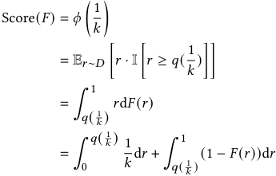

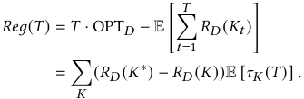

By sublinear regret, 

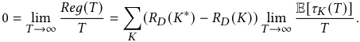

Since the optimal super arm is unique, for every _𝐾_ ≠ _𝐾_∗ , _𝑅𝐷_ ( _𝐾_∗ )− _𝑅𝐷_ ( _𝐾_ ) _>_ 0, thus we have lim _𝑇_ →∞ E[ _𝜏𝐾_ ( _𝑇_ )]/ _𝑇_ = 0. Note that _𝑇_ =� _𝐾_E[_𝜏_ _𝐾_(_𝑇_)]. Therefore lim _𝑇_ →∞E[_𝜏_ _𝐾_∗(_𝑇_)]/_𝑇_= 1. 

Define 

Proof of Proposition 2. For truthfulness, fix any realization table C, and consider the cumulative utility _𝑈𝑖_ (C _,𝑏𝑖,_ b− _𝑖_ ) of bidder _𝑖_ . We separate _𝑈𝑖_ to the cumulative utility in exploration phase and exploitation phase, 

we have Score( _𝐹_ ) = ∫01_𝑧_(_𝑟_)d_𝑟_. For the difference of scores, 

Now we prove that for any _𝑟_ ∈[0 _,_ 1], 

where _𝑢𝑖𝑡_ (C _,𝑏𝑖,_ b− _𝑖_ ) is bidder _𝑖_ ’s utility in round _𝑡_ . 

In the exploration phase, bidder _𝑖_ only participates in the subset auction in certain fixed rounds, and its competitors in these rounds is not influenced by _𝑏𝑖_ . For each of these rounds, by the truthfulness of second-price auctions, bidder _𝑖_ optimizes its utility with truthful bid _𝑣𝑖_ . 

Without loss of generality, assume _𝑞_ ( _𝑘_<u>1</u>)≤_𝑞_′( _𝑘_<u>1</u>). Consider three cases: Case 1. _𝑟 < 𝑞_ ( _𝑘_<u>1</u>). In this case_𝑧_(_𝑟_)=_𝑧_′(_𝑟_)= _𝑘_<u>1</u>,_𝑧_(_𝑟_) −_𝑧_′(_𝑟_)= 0. Case 2. _𝑞_ ( _𝑘_<u>1</u>)≤_𝑟< 𝑞_′( _𝑘_<u>1</u>). By_𝑞_( _𝑘_<u>1</u>)≤_𝑞_′( _𝑘_<u>1</u>)we know_𝐹_′(_𝑟_)_<_ 1 − _𝑘_<u>1</u>. Thus_𝑧_(_𝑟_) −_𝑧_′(_𝑟_)= 1 −_𝐹_(_𝑟_) − _𝑘_<u>1</u>≤_𝐹_′(_𝑟_) −_𝐹_(_𝑟_) Case 3. _𝑟_ ≥ _𝑞_′ ( _𝑘_<u>1</u>). In this case_𝑧_(_𝑟_) −_𝑧_′(_𝑟_)=_𝐹_′(_𝑟_) −_𝐹_(_𝑟_) Concluding the three cases finishes the proof of (12). Plugging (12) into (11) gives us 

For the exploitation phase, the empirical distributions Fˆ in line 6 only depend on C, and are not influenced by _𝑏𝑖_ . The exploitation phase consists of repeated second-price auctions on a fixed subset _𝐾_ , which is selected by the oracle. From the truthfulness of the oracle, for fixed Fˆ , the combination of selecting _𝐾_ and running secondprice auction within _𝐾_ is truthful, with respect to any realization c. This implies that the combination of selecting _𝐾_ and running any one of the auctions in rounds _𝑚𝑘_ + 1 ≤ _𝑡_ ≤ _𝑇_ is truthful. 

1574 

KDD ’24, August 25–29, 2024, Barcelona, Spain 

Truthful Bandit Mechanisms for Repeated Two-stage Ad Auctions 

Proof of Proposition 3. For truthfulness, fix any realization table C. In the exploration phase, the selected subset do not depend on the bids. Moreover, the output super arm _𝐻𝑖𝑔ℎ_ is also not influenced by the bids. In the exploitation phase, we repeatedly run second-price auctions within _𝐻𝑖𝑔ℎ_ . Since a bidder cannot influence the selected subset _𝐾𝑡_ in any round _𝑡_ , the truthfulness of our mechanism follows from the truthfulness of second-price auction. 

For IR, again fix any realization table C. For any round _𝑡_ , and any bidder _𝑖_ , if _𝑖_ ∈ _𝐾𝑡_ , then _𝑖_ participates a second-price auction in round _𝑡_ . By the IR property of second-price auctions, _𝑢𝑖𝑡_ (C _, 𝑣𝑖,_ b− _𝑖_ ) ≥ 0. If _𝑖_ ∉ _𝐾𝑡_ , both allocation _𝑥𝑖𝑡_ and payment _𝑝𝑖𝑡_ are zero, thus _𝑢𝑖𝑡_ = 0. Since each round produces non-negative utility when truthful bidding, the total utility _𝑈𝑖_ (C _, 𝑣𝑖,_ b− _𝑖_ ) is non-negative. □ 

1575 

