# **A Two-Stage Data Selection Framework for Data-Efficient Model Training on Edge Devices** 

Chen Gong 

Rui Xing 

Shanghai Jiao Tong University Shanghai, China gongchen@sjtu.edu.cn 

Shanghai Jiao Tong University Shanghai, China cocojess@sjtu.edu.cn 

Zhenzhe Zheng 

Fan Wu 

Shanghai Jiao Tong University Shanghai, China 

Shanghai Jiao Tong University Shanghai, China 

zhengzhenzhe@sjtu.edu.cn 

fwu@cs.sjtu.edu.cn 

## **Abstract** 

### **ACM Reference Format:** 

Chen Gong, Rui Xing, Zhenzhe Zheng, and Fan Wu. 2025. A Two-Stage Data Selection Framework for Data-Efficient Model Training on Edge Devices. In _Proceedings of the 31st ACM SIGKDD Conference on Knowledge Discovery and Data Mining V.2 (KDD ’25), August 3–7, 2025, Toronto, ON, Canada._ ACM, New York, NY, USA, 12 pages. https://doi.org/10.1145/3711896.3736823 

The demand for machine learning (ML) model training on edge devices is escalating due to data privacy and personalized service needs. However, we observe that current on-device model training is hampered by the under-utilization of on-device data, due to low training throughput, limited storage and diverse data importance. To improve data resource utilization, we propose a two-stage data selection framework Titan to select the most important data batch from streaming data for model training with guaranteed efficiency and effectiveness. Specifically, in the first stage, Titan filters out a candidate dataset with potentially high importance in a coarsegrained manner. In the second stage of fine-grained selection, we propose a theoretically optimal data selection strategy to identify the data batch with the highest model performance improvement to current training round. To further enhance time-and-resource efficiency, Titan leverages a pipeline to co-execute data selection and model training, and avoids resource conflicts by exploiting idle computing resources. We evaluate Titan on real-world edge devices and three representative edge computing tasks with diverse models and data modalities. Empirical results demonstrate that Titan achieves up to 43% reduction in training time and 6 _._ 2% increase in final accuracy with minor system overhead, such as data processing delay, memory footprint and energy consumption. 

## **1 Introduction** 

_Machine learning (ML)_ models have been widely embedded in mobile applications to provide diverse intelligent services, such as image tagging in Google Lens [2], command recognition in Siri [1], text prediction in Microsoft SwiftKey [3], etc. With growing concerns over data privacy and higher demands on personalized model performance [38, 52], on-device model training is becoming necessary to facilitate a single device to adapt the local model to its own data distribution [15, 17, 34, 49, 61, 68], or multiple devices to collaboratively train a global model that can generalize well across different data distributions [16, 18, 35]. 

The success of ML models highly relies on the abundant valuable data for model training [14, 20, 51]. On one hand, a large-scale training dataset is essential to the generalization performance of ML models [51]. On the other hand, massive data aids in stabilizing the model training process and reducing the training time to reach a target accuracy [20]. As a result, on cloud server side, it is common to collect extensive training data for iterative model updates, such as 29 million games for training AlphaGo [48] and 500 billion tokens for pre-training ChatGPT3 [39]. Similarly, on mobile devices side, it is also desirable to fully utilize the on-device sensor data for model training to achieve a satisfactory model training performance and improve user experience. 

## **CCS Concepts** 

• **Human-centered computing** → **Mobile computing** ; • **Computing methodologies** → **Machine learning** . 

## **Keywords** 

On-Device Machine Learning, Data Selection and Utilization 

**Motivation.** Previous works for on-device model training mainly focused on the exploitation of limited _hardware resources_ , such as optimizing memory allocation to increase batch size during training [15, 56], co-using multiple types of computing resources to speed up model inference and training [26, 54, 55, 60], dynamically adjusting the size of trainable parameters to improve training efficiency [23, 59], etc. However, we observe that the under-utilization of _data resource_ is another key bottleneck to on-device model training, which results in up to 3 _._ 5× longer training time and 13 _._ 3% lower final accuracy in our pilot experiments due to low training throughput, limited storage and diverse data importance (elaborated in §2.2). Therefore, a crucial open problem is: _Is it possible_ 

∗Zhenzhe Zheng is the corresponding author. 

Permission to make digital or hard copies of all or part of this work for personal or classroom use is granted without fee provided that copies are not made or distributed for profit or commercial advantage and that copies bear this notice and the full citation on the first page. Copyrights for components of this work owned by others than the author(s) must be honored. Abstracting with credit is permitted. To copy otherwise, or republish, to post on servers or to redistribute to lists, requires prior specific permission and/or a fee. Request permissions from permissions@acm.org. _KDD ’25, Toronto, ON, Canada_ 

© 2025 Copyright held by the owner/author(s). Publication rights licensed to ACM. ACM ISBN 979-8-4007-1454-2/2025/08 https://doi.org/10.1145/3711896.3736823 

673 

KDD ’25, August 3–7, 2025, Toronto, ON, Canada 

Chen Gong, Rui Xing, Zhenzhe Zheng, and Fan Wu 

_to design an on-device data selection framework to concentrate the limited hardware resources on important training data for superior model training performance?_ 

**Challenges.** The design of an on-device data selection framework needs to achieve _effectiveness_ and _efficiency_ simultaneously: _i) Effectiveness:_ As the on-device model performance directly impacts the quality of application service and user experience, it is necessary for the data selection framework to provide theoretical and empirical guarantees on enhancing model training performance. _ii) Efficiency:_ For deployment, the data selection framework is desired to be time-and-resource efficient. First, the application data typically undertakes real-time services like teleconferencing, which requires the data selection process to be low-latency to avoid compromising user experience. Second, the data selection framework needs to avoid intense resource conflict with model training process, which would extend the time of each model update and offset the performance improvement brought by data selection. 

It is challenging to satisfy these two properties simultaneously. Higher effectiveness necessitates a more accurate but time-intensive data importance evaluation process over a broader candidate dataset, which inevitably increases per-sample latency and consumes more computing resources. Our theoretical analysis and experimental results in §2.3 indicate that conventional cloud-side data selection approaches such as importance sampling [28, 67], heuristic selection [7, 13, 44, 46, 65] and coreset selection [32, 36, 43] fail to be applied to device side due to ineffectiveness or inefficiency. 

**Our Solutions** . In this work, we address the above challenge by proposing a <u>two-stage online data</u> selection framework Titan, which simultaneously achieves high effectiveness and efficiency for on-device data utilization. First, to guarantee the effectiveness, we theoretically analyze the correlation between the training data batch and the on-device model training performance, based on which we demonstrate the sub-optimality of the state-of-the-art importance sampling approach due to overlooking a crucial term of class variance during inter-class batch size allocation. Further, we propose a _theoretically optimal data selection strategy_ to identify the data batch with the highest improvement to model performance in each training round. Second, to improve time-efficiency, Titan employs a _two-stage architecture_ . In the first stage, Titan leverages a carefully designed coarse-grained filter to estimate the potential importance of each streaming data sample within millisecond-level latency, and locally buffers a small candidate dataset. In the second stage, the buffered candidate dataset undergoes our proposed data selection strategy to enhance effectiveness. Third, for higher timeand-resource efficiency, we design a _pipeline_ to facilitate the coexecution of model training and data selection, and exploits the idle computing resources commonly seen on devices to mitigate potential resource conflicts. 

**Contributions** of this work are summarized as follows: 

- To the best of our knowledge, we are the first to point out the severity of data resource under-utilization in on-device model training process, and conduct in-depth analysis for this issue. 

- We perform comprehensive evaluation of existing cloud-side data selection approaches for device-side setting, and provide theoretical and empirical analysis on their failures. 

- We propose an on-device data selection framework Titan, consisting of a theoretically optimal data selection strategy, a two-stage 

- architecture and a pipeline design, to simultaneously achieve high efficiency and effectiveness for on-device data utilization. 

- We implement Titan framework on real-world device and demonstrate Titan’s superiority across three typical mobile computing tasks with varied data modalities and ML models. 

## **2 Background and Motivation** 

In this section, we first briefly introduce the background of ondevice model training (§2.1). Then, we delve into the under-utilization of on-device data resources to illustrate the motivation of this work (§2.2). Next, we elaborate the limitations of existing cloud-side data selection methods (§2.3). 

## **2.1 On-Device Model Training** 

Similar to cloud-side ML, the objective of on-device model training can be formulated as minimizing the loss function _𝐿_ ( _𝑤,_ P), which represents the prediction error (or loss) of model with parameters _𝑤_ on local data distribution P: 

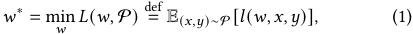

where E( _𝑥,𝑦_ )∼P � _𝑙_ ( _𝑤,𝑥,𝑦_ )� denotes the expected loss (or error) of model _𝑤_ over data ( _𝑥,𝑦_ ) following distribution P. 

In on-device model training, mini-batch SGD [45] is widely adopted to solve the above optimization problem (1), which involves three steps in each training round _𝑡_ : 

_1) Data Collection_ : Data samples ( _𝑥,𝑦_ ) ∼P are continuously collected by device in a streaming manner and stored in the local storage. We use S and S _𝑦_ to denote the sets of all the stored data samples and the data samples with class _𝑦_ ∈Y. 

_2) Data Loading_ : A batch of data samples B = {( _𝑥𝑖, 𝑦𝑖_ )|1 ≤ _𝑖_ ≤|B|} is loaded from storage to memory as training data. 

_3) Model Update_ : Current model parameters _𝑤𝑡_ are updated by the average gradient of the loaded training data batch: 

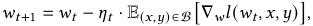

where _𝑤𝑡_ denotes the updated model parameter in training round _𝑡_ and _𝜂𝑡_ is the corresponding learning rate. 

Typically, data collection is conducted concurrently with data loading and model update, both of which are executed iteratively. 

## **2.2 Under-Utilization of On-Device Data** 

We elaborate the three unique characteristics of mobile devices, which leads to the under-utilization of on-device data and motivates the design of a device-specific data selection framework. 

**Low data throughput during model training.** The limited memory and computing resources of devices restrict the training data throughput. First, the memory size constrains the number of data samples that can be co-processed within a data batch ( _e.g._ batch size 16 for common lightweight model MobileNetV1 has reached the limit of high-end devices like MI 9 with 6GB RAM [6]). Second, the on-device per-sample training time is relatively long due to the limited computing hardware [26]. Specifically, the forwardand-backward propagation over modern ML models can be timeconsuming ( _e.g._ it takes around 20s for the representative device Jetson Nano to train one data batch with size 16 on MobileNetV1). 

674 

A Two-Stage Data Selection Framework for Data-Efficient Model Training on Edge Devices 

KDD ’25, August 3–7, 2025, Toronto, ON, Canada 

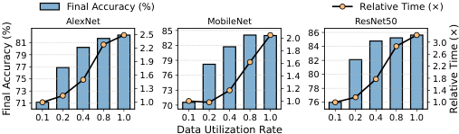

<!-- Start of picture text -->
Final Accuracy (%) Relative Time (×) AlexNet MobileNet ResNet50 8179 2.52.2 8582 2.01.8 8684 3.02.6 77 1.9 79 1.6 82 2.2 75 1.6 76 1.4 80 1.8 73 1.3 73 1.2 78 1.4 71 1.0 70 1.0 76 1.0 0.1 0.2 0.4 0.8 1.0 0.1 0.2 0.4 0.8 1.0 0.1 0.2 0.4 0.8 1.0 Data Utilization Rate Final Accuracy (%) Relative Time (×) <!-- End of picture text -->

**Figure 1: Final inference accuracy and normalized training time of different models and data utilization rates.** 

**Limited on-device storage for training data.** In numerous mobile applications, on-device data is continuously collected in a streaming manner, but devices typically have quite limited storage for training data due to user preference as well as software and hardware limitation. On one hand, users usually prioritize reserving storage space for personal files like photos, documents and chat history instead of each application’s training data. On the other hand, both iOS and Android platforms impose size limitations on applications, such as less than 4GB for an iOS app [10] and no more than 2GB for a Google Play app [19]. Furthermore, for low-end devices like HUAWEI WiFi AX3 [24] with less than 1GB storage, it is impractical to save all the collected data for model training. 

**Diverse data importance to training performance.** The ondevice data samples have diverse importance (or quality) for model training, stemming from _1)_ the wide range of on-device data distribution caused by varied user behaviors and application services at different times of a day, and _2)_ heterogeneous data quality due to sensors from different producers and unstable network environments. Consequently, the involvement of low-importance data in model training will further reduce the on-device data utilization. 

**Motivating Experiments.** The aforementioned properties restrict the on-device data utilization and hinder the success of ondevice model training processes. On one hand, if we attempt to utilize all the collected data for parameter update to achieve superior training performance, all the samples need to be incorporated in each training round, which leads to substantial per-round training time and storage overhead [50, 56]. On the other hand, if we leverage only partial data for higher efficiency of model training and data storage, the parameter update computed from partial data tend to deviate from the expected update computed from all data, thereby degrading the final model accuracy [28]. Our preliminary experiments on representative device Jetson Nano and dataset CIFAR-10 [29] in Figure 1 show that leveraging only partial data resource can reduce the final accuracy by 9 _._ 6−13 _._ 4% while the utilization of full data will prolong total training time by 2 _._ 05−3 _._ 24×. Therefore, an on-device data selection framework is necessary to focus limited hardware resources on partial but important data resources for higher data utilization efficiency. 

## **2.3 Existing Data Selection Approaches** 

Existing cloud-side data selection approaches can hardly be applied to the device side due to ineffectiveness or inefficiency. 

**Importance sampling** (IS) [28, 67] is the state-of-the-art data selection approach, which selects each training data sample according to its importance to model training performance. Previous 

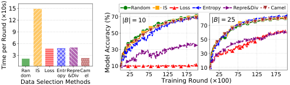

<!-- Start of picture text -->
15 Random IS Loss Entropy Repre&Div Camel 12 70 |B| = 10 |B| = 25 70 9 50 50 6 30 3 30 domRan IS Loss Entropy Repre&Div Cam  el 10 25 75 125 175 10 25 75 125 175 Data Selection Methods Training Round (×100) Time per Round (×10s) Model Accuracy (%) <!-- End of picture text -->

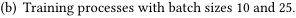

<!-- Start of picture text -->
(b) Training processes with batch sizes 10 and 25. <!-- End of picture text -->

(a) Per-round training time. 

**Figure 2: Per-round training time and training curves of different data selection methods on MobileNetV1 and CIFAR-10, tested on real device Jetson Nano.** 

research has demonstrated a negative correlation between the gradient variance of the training data batch1 and the model training performance. As a result, IS defines the per-sample importance as its gradient norm to minimize such gradient variance and optimize the training performance. 

However, IS is neither effective nor efficient for devices. On one hand, we identify that the theoretical optimality of IS relies on an underlying assumption that each sample in the training data batch is independently selected, which leads to sub-optimal performance for batch-level selection, especially for small training batches on devices. The detailed theoretical analysis and verification results are provided in §3.2. On the other hand, IS requires computing each sample’s gradient over model parameters, which can prolong the per-round training time by up to 7× shown in Figure 2(a). For device-side efficient deployment, Mercury [66] proposed to divide the dataset into multiple subsets and recompute only one subset’s importance per training round, which however, is not applicable for real-world mobile computing tasks involving streaming data. 

**Heuristic data selection** (HDS) enhances model training efficiency by selecting the training data with various intuitive metrics, such as model uncertainty quantified by loss or entropy of model output logits [7, 46], data representativeness measured by closeness to the distribution centroid in feature space [13] and diversity to other samples [65], etc. 

We find that HDS is efficient but lacks effectiveness from both theoretical and empirical aspects. Theoretically, existing HDS fails to directly correlate the data importance metric with model training performance, thereby essentially optimizing a proxy objective of intuitively defined metrics rather than the fundamental objective (1) of model training performance. Therefore, practical implementation of HDS often involves cumbersome trial-and-error processes to explore the appropriate metrics that could bring the highest model performance improvement. Empirically, Figures 2(b) reveals that HDS ( _i.e. Loss_ , _Entropy_ and _Repre&Div_ ) even leads to degraded training performance compared with random selection when the batch size is small. This is because traditional HDS relies on large batch sizes to mitigate the distribution deviation and parameter update bias of the heuristically selected training data batch. 

**Coreset Selection** (CS) [32, 36, 43] aims to select a small weighted data subset, _i.e._ coreset, to approximate the entire dataset in terms of gradient computation, thereby reducing the training data scale 

> 1The variance represents the average difference between the gradient of the selected training data and the expected gradient of the entire dataset. 

675 

KDD ’25, August 3–7, 2025, Toronto, ON, Canada 

Chen Gong, Rui Xing, Zhenzhe Zheng, and Fan Wu 

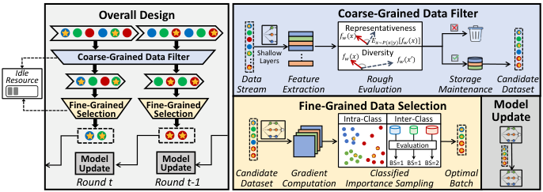

<!-- Start of picture text -->
Overall Design Coarse-Grained Data Filter Representativeness 𝑓𝑤(𝑥) 𝐸𝑥~𝑃(𝑥|𝑦)[𝑓𝑤(𝑥)] Coarse-Grained Data Filter ... ShallowLayers . . . 𝑓𝑤(𝑥) Diversity 𝑓𝑤(𝑥′) Idle Resource Data  Feature  Rough Storage  Candidate Stream Extraction Evaluation Maintenance Dataset Fine-Grained Fine-Grained Fine-Grained Data Selection Model Selection Selection Intra-Class Inter-Class Update Evaluation UpdateModel UpdateModel Candidate Gradient  Classified  BS=1 BS=1 BS=2 Optimal Round t Round t-1 Dataset Computation Importance Sampling Batch <!-- End of picture text -->

**Figure 3: Overall design and workflow of** Titan **.** 

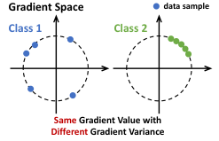

<!-- Start of picture text -->
Gradient Space data sample Class 1 Class 2 Same Gradient Value with Different Gradient Variance <!-- End of picture text -->

**Figure 4: Comparison between** IS **and** C- IS **.** IS **will select an equal number of data samples from classes 1 and 2 , while** C-IS **will select more samples from class 1 by considering its larger gradient variance.** 

without significant deviation in parameter update direction. Previous research formulated the gradient estimation error of the coreset as a sub-modular function, and derived the optimal coreset by minimizing such error. 

We observe that CS is either inefficient or ineffective for devices. To select a coreset with size |B| from |S| data samples, CS requires computing the gradients of all |S| samples to solve the error minimization problem, incurring high computation overhead similar to IS. Instead of directly minimizing the gradient distance between coreset and the entire dataset, _Camel_ [32] uppers bound the gradient distance by raw input distance to avoid the cumbersome model backpropagation process. However, this approximation compromises the theoretical guarantee of CS and also exhibits inferior performance in our prior experiments in Figure 2(b). This is because the complex structures of modern ML models and the wide distribution of on-device data make the raw data distance unable to accurately reflect the gradient distance. 

## **3 Design of Titan** 

In this section, we first give an overview of Titan framework (§3.1), and then we elaborate each key component in Titan (§3.2-§3.4). 

## **3.1 Overview** 

**Design Rationale.** Titan aims to exploit on-device data resources effectively and efficiently by incorporating three key designs: _1) a theoretically optimal strategy_ for training data batch selection, which operates as a fine-grained selection component to identify the data batch that brings the highest improvement to model performance, _2) a coarse-grained filter_ to filter out a small candidate dataset from streaming data in real time through heuristic metrics specially co-designed with the optimal fine-grained selection component, _3) a pipeline design_ to co-execute the processes of data selection and model training and mitigate their potential resource conflict by utilizing on-device idle computing resources. 

**Workflow.** As depicted in Figure 3, Titan adopts a two-stage architecture and forks three concurrent processes to steadily select the optimal training data batch from real-time data streams for each round of model training: 

_1) Coarse-grained filter_ : Whenever a data sample is collected by device, Titan extracts its feature by inputting the data into shallow layers of ML models, and estimates its potential importance within milliseconds through two specially designed heuristic metrics. Then, Titan maintains a candidate dataset in local buffer with 

a priority queue to facilitate the subsequent fine-grained selection. _2) Fine-grained selection_ : During each round _𝑡_ , Titan computes the gradient for each buffered data sample over the final model layer, and identifies the ideal data batch for next round _𝑡_ + 1 through the proposed optimal data selection strategy. 

_3) Model update_ : Simultaneously in round _𝑡_ , current model parameter _𝑤𝑡_ is updated by the data batch chosen in preceding round _𝑡_ − 1, which forms a seamless pipeline with the fine-grained selection process for the upcoming round. 

## **3.2 Fine-Grained Data Selection** 

To optimize the effectiveness of on-device data selection, we propose a new data batch selection strategy for mini-batch SGD, namely classified importance sampling (C-IS), which consists of inter-class batch size allocation and intra-class data selection. We first provide the definitions of _class importance_ and _sample importance_ , which are used to determine _how many_ and _which_ data samples to select for each class. Then, we analyze C-IS’s theoretical optimality in improving on-device model training performance and provide an intuitive explanation for better understanding. 

_Inter-Class Batch Size Allocation._ To select a batch of training data with size |B|, C-IS determines the data selection size |B _𝑦_ | for each class _𝑦_ ∈Y according to the class importance _𝐼𝑡_ ( _𝑦_ ) in current round _𝑡_ , which is defined as: _𝐼𝑡_ ( _𝑦_ )def = 

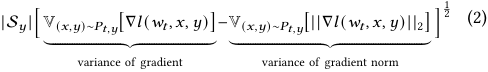

where |S _𝑦_ | denotes the total amount of stored data samples with class _𝑦_ and V( _𝑥,𝑦_ )∼ _𝑃𝑡,𝑦_ [ _𝑓_ ( _𝑥_ )] denotes the variance of function _𝑓_ ( _𝑥_ ) with selection probability _𝑃𝑡,𝑦_ ( _𝑥_ ) for each data sample _𝑥_ in class _𝑦_ and || ∗||2 denotes the _𝑙_ 2-norm. 

_Intra-Class Data Selection._ To select |B _𝑦_ | important data samples from the stored data S _𝑦_ of class _𝑦_ ∈Y, we select each sample ( _𝑥,𝑦_ ) with probability proportional to its sample importance _𝐼𝑡_ ( _𝑥,𝑦_ ), which is defined as: 

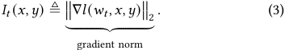

**Theoretical Analysis.** To demonstrate the theoretical optimality of C-IS, we first present Theorem 1 and Lemma 1 to analyze the 

676 

A Two-Stage Data Selection Framework for Data-Efficient Model Training on Edge Devices 

KDD ’25, August 3–7, 2025, Toronto, ON, Canada 

impact of training data batch on model training performance as well as the sub-optimality of state-of-the-art IS in data batch selection. Further, we present Theorem 2 and Lemma 2 to demonstrate the optimality of our proposed C-IS in improving model training performance. 

Previous studies [28, 67] have demonstrated a negative correlation between the gradient variance of the training data batch B and model training performance, where the performance of model with parameter _𝑤_ is quantified by its distance to the optimal parameter _𝑤_∗ ( _i.e._ || _𝑤_ − _𝑤_∗ ||2 2). Therefore, the model training performance in round _𝑡_ can be measured by the decrease in the distance to _𝑤_∗ from initial model parameter _𝑤𝑡_ to updated model parameter _𝑤𝑡_ +1: 

Theorem 1 (Training Performance Measurement [28, 67]). _The model training performance in round 𝑡 is negatively correlated with the gradient variance of the training data batch_ B _selected by data selection strategy 𝑃𝑡 :_ 

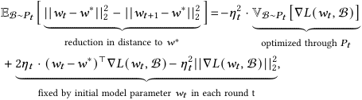

_where_ VB∼ _𝑃𝑡_ [∇ _𝐿_ ( _𝑤𝑡 ,_ B)] _denotes the gradient variance of_ B _._ 

Accordingly, IS proposed to minimize such variance and maximize training performance by optimizing the selection probability of each data sample, i.e. _𝑃𝑡_ ( _𝑥,𝑦_ ). However, we identify in Lemma 1 that IS potentially assumes that each data sample in the training data batch is independently selected, resulting in optimal samplelevel data selection but sub-optimal batch-level data selection for mini-batch SGD. 

Lemma 1 (Optimal Sample-Level Selection). _To minimize the gradient variance of selected data batch_ B _,_ IS _computes the optimal selection probability 𝑃𝑡_∗_for each data sample_(_𝑥,𝑦_)_:_ 

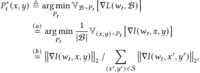

_where we observe that Equation (a) implicitly assumes an independent selection process for each data sample_ ( _𝑥,𝑦_ ) _in data batch_ B _. Equation (b) holds according to Cauchy-Schwarz inequality [28, 67]._ 

To analyze the sub-optimality of IS in on-device settings and provide theoretical insight for designing optimal batch-level data selection strategy, we decompose the gradient variance of the selected data batch into three terms in Theorem 2. 

Theorem 2 (Gradient Variance Decomposition). _The gradient variance of data batch_ B _selected from candidate dataset_ S _using selection strategy 𝑃𝑡 can be decomposed into the weighted sum of_ 

_terms 𝛼𝑦, 𝛽𝑦 and 𝛾𝑦 for each class 𝑦_ ∈Y _:_ 

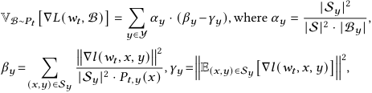

_where_ S _𝑦 and_ B _𝑦 are candidate data and selected data for each class._ 

We identify that the gradient variance of the selected data batch is composed of three terms of each class _𝑦_ : _1) 𝛼𝑦_ is impacted by batch size allocation |B _𝑦_ | across classes and the other two terms, _2) 𝛽𝑦_ is determined by intra-class data selection strategy _𝑃𝑡,𝑦_ , and _3) 𝛾𝑦_ is a constant that varies for different classes. As a result, traditional IS can be regarded as conducting optimal intra-class data selection to minimize _𝛽𝑦_ , but executing sub-optimal inter-class batch size allocation based on solely _𝛽𝑦_ rather than ( _𝛽𝑦_ − _𝛾𝑦_ ). Furthermore, the overlooked term − _𝛼𝑦𝛾𝑦_ can become significant for on-device settings with limited memory, as _𝛼𝑦_ increases with smaller batch sizes. This is also verified by our empirical results in Figure 5(a), which indicates that _1)_ the gradient variance gap between existing IS and our proposed C-IS becomes wider with smaller batch sizes and _2)_ C-IS consistently achieves the optimal performance. 

To optimize on-device model training performance, we propose a new optimal batch-level data selection strategy C-IS, which keeps using IS for optimal intra-class data selection while taking the integral term ( _𝛽𝑦_ − _𝛾𝑦_ ) into consideration when allocating batch size to different classes _𝑦_ ∈Y. 

Lemma 2 (Optimal Batch-Level Selection). _To maximize the training performance of mini-batch SGD, given batch size_ |B| _and dataset_ S _𝑦 for each class 𝑦_ ∈Y _, the optimal selection size for each class (i.e._ |B _𝑦_ |∗ _) and the optimal selection probability for each sample within the class (i.e. 𝑃𝑡,𝑦_∗(_𝑥_)_) are:_ 

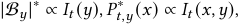

_where 𝐼𝑡_ ( _𝑦_ ) _and 𝐼𝑡_ ( _𝑥,𝑦_ ) _are the class importance and sample importance defined in Equation (2) and Equation (3), respectively._ 

Proof. The detailed proof please refer to Appendix A.3. □ 

**Intuitive Understanding.** The sample importance _𝐼𝑡_ ( _𝑥,𝑦_ ) in Equation (3) is exactly the norm of sample gradient over model parameters, reflecting the contribution of each sample to parameter update. The class importance _𝐼𝑡_ ( _𝑦_ ) in Equation (2) essentially quantifies the overall diversity of each class, ( _i.e._ gradient variance minus gradient norm variance). Higher class importance indicates that data samples within this class have diverse gradients but similar gradient norms. Naturally, more samples are needed to thoroughly represent the gradient distribution of such class. However, conventional IS distributes batch size to each class solely based on average gradient norm, focusing on classes with high gradient value rather than diversity. A simple example is provided in Figure 4 for better comparison, where IS will select the same number of samples from classes 1 and 2 but C-IS will select more samples from class 1 by considering variance, which is obviously more reasonable. 

677 

KDD ’25, August 3–7, 2025, Toronto, ON, Canada 

Chen Gong, Rui Xing, Zhenzhe Zheng, and Fan Wu 

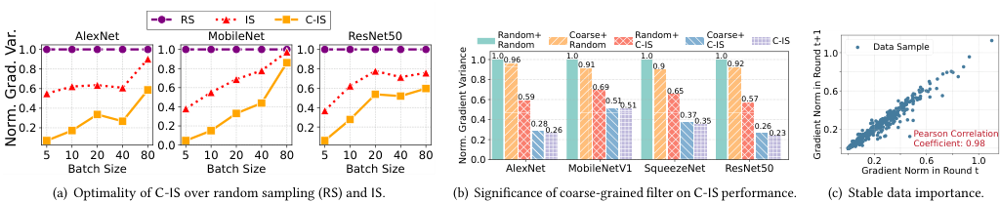

<!-- Start of picture text -->
RS IS C-IS 1.00.8 AlexNet 1.00.8 MobileNet 1.00.8 ResNet50 1.0 1.0Random+Random 0.96 1.0Coarse+Random0.91 Random+C-IS1.00.9 Coarse+C-IS1.00.92 C-IS 1.0 Data Sample 0.8 0.60.4 0.60.4 0.60.4 0.6 0.59 0.69 0.51 0.51 0.65 0.57 0.6 0.2 0.2 0.2 0.4 0.280.26 0.37 0.35 0.260.23 0.2 Pearson Correlation 0.0 0.2 Coefficient: 0.98 5 10 20 40 80 5 10 20 40 80 5 10 20 40 80 0.0 0.2 0.6 1.0 Batch Size Batch Size Batch Size AlexNet MobileNetV1 SqueezeNet ResNet50 Gradient Norm in Round t (a) Optimality of C-IS over random sampling (RS) and IS. (b) Significance  of coars e-grained filter  on C-IS performance. (c) Stable data importance. Norm. Grad. Var. Norm. Gradient Variance radient Norm in Round t+1 G <!-- End of picture text -->

**Figure 5: Preliminary experiments on CIFAR-10 dataset and different models with learning rate 0.1 to support some claims, including (a) to empirically demonstrate** C-IS **’s optimality over previous methods, (b) to reveal the efficiency and efficacy of coarse-grained filter, and (c) to show the stable importance scores of data samples across consecutive training rounds.** 

**Practical Implementation.** For on-device implementation, we propose to substitute the gradient of each data sample over entire model parameters with the gradient over only last model layer, which avoids the cumbersome backpropagation process and saves computation and memory costs. Such simplification relies on the phenomenon that partial model gradient can reflect the trend of full model gradient, as analyzed theoretically and empirically by existing works [27, 32, 36]. 

## **3.3 Coarse-Grained Data Filter** 

While C-IS enables identifying the data batch with the highest effectiveness on model performance improvement, it also incurs substantial delay due to calculating the accurate data importance ( _i.e._ gradient and its norm) for each streaming data. A straightforward remedy is to reduce the frequency of importance computation, which in turn constrains the size of candidate data for C-IS and compromises its effectiveness. 

Inspired by the billion-scale item ranking process of online recommendation system [11], Titan leverages a two-stage architecture to guarantee both efficiency and effectiveness. Specifically, Titan introduces an additional stage of coarse-grained filter and designs two heuristic metrics to filter out a candidate dataset that could facilitate the processes of inter-class batch size allocation and intra-class data selection in the subsequent fine-grained selection. 

_1) Representativeness_ : To enable an accurate measurement of _class importance_ during inter-class batch size allocation, the filtered data is expected to _represent_ the characteristics of the majority of data samples in each class. Therefore, the representativeness of each data( _𝑥,𝑦_ ) can be measured by its closeness to the class centroid in feature space: 

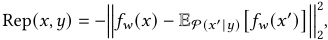

where _𝑓𝑤_ ( _𝑥_ ) denotes the feature extracted by current model _𝑤_ and EP( _𝑥_ ′ | _𝑦_ ) � _𝑓𝑤_ ( _𝑥_′ )� denotes the feature centroid of data in class _𝑦_ . _2) Diversity_ : To identify more high-importance data samples, the filtered data needs to be _diverse_ enough to cover the data distribution. Therefore, the _diversity_ of each data ( _𝑥,𝑦_ ) can be quantified as its average distance to the other data within the same class in the feature space: 

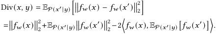

We evaluate the impact of coarse-grained filter on C-IS’s ability in reducing gradient variance in Figure 5(b), where _𝐴_ + _𝐵_ denotes leveraging method _𝐴_ to filter out 0 _._ 3 _𝑣_ candidate data samples out of _𝑣_ streaming samples and employing method _𝐵_ to further select 0 _._ 1 _𝑣_ data samples as data batch, where _𝑣_ is set to 100 for preliminary experiments. The result shows that compared with the ideal case of performing C-IS on all data, coarse-grained filter can reduce the candidate data size by 70% with less than 3% degradation of gradient variance reduction degree. 

**Practical Implementation.** For efficient implementation of coarse-grained filter, Titan only needs to dynamically maintain two running-sum estimators for average feature EP( _𝑥_ ′ | _𝑦_ ) � _𝑓𝑤_ ( _𝑥_′ ) � and average feature norm EP( _𝑥_ ′ | _𝑦_ ) ���� _𝑓𝑤_ ( _𝑥_ ′ )����22using each streaming data ( _𝑥,𝑦_ ). Based on these estimators, Titan could realize online coarsegrained filtering by buffering data with the highest Rep( _𝑥,𝑦_ ) + Div( _𝑥,𝑦_ ). For the feature extraction function _𝑓𝑤_ ( _𝑥_ ), we propose to input the raw data _𝑥_ into the first few network layers of model _𝑤_ and regard the layer outputs as features, which is according to our empirical observation that _1)_ the features extracted by shallow layers are sufficient to filter out an effective candidate data for subsequent fine-grained data selection, and _2)_ forward pass through a few model layers only introduces minor latency and memory footprint. A detailed empirical analysis is presented in §4.3. 

## **3.4 Pipeline Design** 

Although the two-stage architecture of Titan achieves higher timeefficiency, the wall-clock time per training round still increases significantly due to the model dependency and resource preemption between data selection and model update: _1) Model dependency_ : As data selection relies on the latest model parameter to compute the accurate importance of each sample and class, the processes of model update and data selection have to be executed alternately and sequentially. _2) Resource preemption_ : The limited computing resource is shared and preempted by data selection and model update, which will slow down the original model update process. 

Titan overcomes the above challenges by leveraging a pipeline design to enable the co-execution of model update and data selection. To eliminate _model dependency_ , Titan proposes a simple but effective “one-round-delay” scheme, where each model parameter _𝑤𝑡_ is updated by the data batch selected in the previous round using the slightly outdated model _𝑤𝑡_ −1. Such approximation enables the co-execution of parameter update for the current round and data 

678 

A Two-Stage Data Selection Framework for Data-Efficient Model Training on Edge Devices 

KDD ’25, August 3–7, 2025, Toronto, ON, Canada 

selection for the next round, and its feasibility is supported by our observation in Figure 5(c) that per-sample importance ( _i.e._ gradient norm) typically does not change significantly in consecutive training rounds. 

To avoid _resource preemption_ , Titan offloads the data selection process to commonly seen idle computing resources. Despite that mobile devices are typically equipped with multiple types of computing resources ( _e.g._ CPU, GPU and NPU), current devices mainly use one type of resource type for parameter update, due to the high synchronization overhead of sharing each layer’s outputs and gradients across different hardware per each parameter update [26, 59]. By offloading only data selection to other available computing resource, Titan prevents its resource conflict with model update and incurs low cost by synchronizing model parameters and the small selected data batch only once per model update. A breakdown analysis of the system cost is provided in Figure 6 in §4.3. 

Further, to handle dynamic idle computing resources on edge devices, Titan system automatically adjusts the candidate data size chosen by coarse-grained filter. Specifically, it continuously evaluates the importance of each stored data sample using idle resources. For each new training round, these evaluated samples naturally become candidate data for fine-grained selection, without the need to predefine a candidate data size. Also, our evaluation already accounts for such resource fluctuations, as the computation speed is impacted by dynamic factors like device power, heat dissipation and charging. 

## **4 Evaluation** 

We first introduce our experiment setup (§4.1). Then we present the overall performance of Titan (§4.2) and conduct component-wise analysis (§4.3). Further, we test the applicability of Titan to different scenarios in Appendix B, including fluctuant idle computing resources, federated learning and noisy on-device data. 

## **4.1 Experiment Setup** 

**Tasks, Datasets and Models.** To demonstrate Titan’s generality, we evaluate it on three typical mobile computing tasks with three data modalities and six model structures: _1) Image Classification (IC)_ : CIFAR-10 [29] consists of 60 _,_ 000 images of 10 objects. We train four representative ML models for this task, including the classic dense model AlexNet [30], lightweight models MobileNetV1 [22] and SqueezeNet [25] as well as a larger model ResNet50 [21]. _2) Audio Recognition (AR)_ : Google Speech Commands [58] includes 100 _,_ 000 sound files of 20 commands collected from 2 _,_ 000 users, and we train ResNet34 [21] for this task. _3) Human Activity Recognition (HAR)_ : HARBOX [40] contains IMU data collected from 6 activities of 121 users. According to previous work, we resample with a sliding time window of 2s at 50Hz and obtain 34 _,_ 115 data samples with 900-dimension features. An MLP [42] with two fully-connected layers and a SoftMax layer is trained for this task. 

**Hardware Setup.** We implement Titan framework on the realworld mobile platform NVIDIA Jetson Nano [37] with 4GB RAM, 4 A57 CPU cores and a Maxwell GPU, which has similar hardware and running environment with mainstream devices [31, 64]. For pipeline implementation, Titan forks three processes using different 

computation hardware2 : _Process 1_ conducts coarse-grained filtering with mobile GPU to filter out a small candidate dataset from data streams; _Process 2_ executes fine-grained selection with mobile GPU to identify the optimal data batch from the candidate data; _Process 3_ steadily updates the model parameter with mobile CPU using the data batch shared by process 2. 

**Baselines.** We compare Titan with existing data selection methods, including: _1) Random selection_ (RS) selects random data for model training; _2) Importance sampling_ (IS) [28] selects each training data sample according to gradient norm over the final model layer; _3) Heuristic data selection_ selects training data batch according to per-sample training loss (high loss HL [7] and low loss LL [47]), cross entropy of the model output logits (CE [46]) or data representativeness and diversity (OCS [65]); _4) Coreset selection_ (Camel [32]) greedily selects the sample that minimizes the input distance between the currently selected data batch and entire dataset. 

**Evaluation Metrics.** We use five metrics to evaluate the overall performance of data selection. _1) Final inference accuracy_ denotes the test accuracy of the finally trained model. _2) Time-to-accuracy_ measures the wall-clock time required for each method to reach the target accuracy. For simplicity, the target accuracy is set as the final accuracy of RS. _3) Processing latency_ quantifies the time cost for processing each streaming data. _4) Memory and 5) energy consumption_ measure the peak memory footprint and overall energy cost of Titan framework for evaluating system overheads. 

**Parameter Configuration.** The default learning rates are 0.1 for AlexNet, MobileNet and SqueezeNet and 0.005 for other larger models, reduced by a factor of 0 _._ 95 per 100 training rounds. The training batch size is 10 to satisfy the memory constraint of common devices as elaborated in §2.2. The velocity of on-device data stream is set to 100 samples per training round, indicating that 10 out of 100 streaming samples are selected as training data batch for model update in each round. For coarse-grained filter, we use the first model block3 for feature extraction, and set the size budget for the buffered candidate dataset to 30 samples. 

## **4.2 Overall Performance** 

We begin by comparing the overall performance of Titan with all baselines on three representative mobile computing tasks. 

Titan **significantly reduces the wall-clock time to reach target accuracy.** Table 1 summarizes the time taken by different methods to reach target accuracy, which is normalized by the time of RS for clearer comparison. Compared with the most lightweight baseline, Titan reduces the training time by 30−43% for IC task, 23% for AR task, and 29% for HAR task. We observe that most baselines have significantly longer training time than Titan, caused by the extra delay of computing each streaming sample’s importance and inferior improvement in model training performance. In contrast, 

> 2We use mobile CPU for model update and GPU for data selection as _1)_ CPUs train models faster than GPUs on current mobile devices [9, 26, 55], _2)_ CPUs are more supported by today’s on-device training libraries [56], and _3)_ using GPU for model update and CPU for data selection can be viewed as cases with varied amounts of idle computing resources, analyzed in Appendix B. 

> 3Current ML models typically consists of several blocks with similar structures and each block is composed of several neural network layers. 

679 

KDD ’25, August 3–7, 2025, Toronto, ON, Canada 

Chen Gong, Rui Xing, Zhenzhe Zheng, and Fan Wu 

**Table 1: Overall performance of** Titan **and baselines, where** **<mark>blue</mark> highlights the top value. For baselines failing to reach target accuracy, we simply present the normalized time of entire model training process.** 

|**Tk**|**Mdl**||**Nor**|**malize**|**d Tim**|**e-to-**|**Accura**|**cy (**×**)**||||**Final**|**Mode**|**l Acc**|**uracy (**%|**)**||
|---|---|---|---|---|---|---|---|---|---|---|---|---|---|---|---|---|---|
|**as**|**oe**|RS|IS|LL|HL|CE|OCS|Camel|Titan|RS|IS|LL|HL|CE|OCS|Came|l Titan|
||AlexNet|1.00|3.25|3.98|3.98|3.59|4.06|2.07|0.70|71.2|73.5|18.2|34.3|71.6|62.3|71.3|74.5|
|IC|MobileNet|1.00|3.22|3.45|3.45|3.41|3.67|1.15|0.57|69.2|69.5|17.7|13.9|69.6|38.1|68.7|75.4|
||SqueezeNet|1.00|3.96|3.97|3.97|3.04|4.06|2.07|0.69|76.2|73.0|18.3|45.0|78.0|40.7|75.6|79.0|
||ResNet50|1.00|2.32|3.14|3.14|2.20|2.18|1.11|0.66|76.5|78.0|22.3|34.9|81.7|27.3|76.8|81.1|
|AR|ResNet34|1.00|2.04|3.14|3.14|2.96|3.19|0.81|0.77|76.0|78.7|14.7|58.8|73.2|59.4|76.5|79.8|
|HAR|MLP|1.00|~~3.56~~|6.30|6.47|5.28|14.4|12.5|0.71|75.5|77.5|45.5|21.8|60.9|68.0|75.6|76.7|
|AlexNet  5 15 25 35 Time per Round (s) Train|MobileNet SqueezeNet Re Only Sequential |sNet50 Pipeline|10 2 10 1 100 101 Evaluation Delay (s)|AlexNe|t Mobi|leNet S|queezeNet IS Loss CE|ResNet50 OCS Camel Titan|75 A M S R   (|80 M 82.5% 497MB) 90. (368   ( 9 (13 Model Upda|85 emory Br   ( 8% MB) 93.8% 377MB) 2.2% 72MB) te Fine|90 eakdown ( 16.56% 99.8MB) 6.94 (28.1   (1 7 (1 -Grained|95 %)   ( % MB) 2 (9. 4.51% 8.2MB) 1 (6 .31% 08.7MB)   ( Coarse-|100 0.95% 5.7MB) .31% 4MB) .71% .9MB) 0.46% 6.9MB) Grained||||
|(a) Per-|round training tim|e.|(b) Pr|ocessin|g delay p|er strea|ming data|sample.||(c) Pe|ak mem|ory footp|rint.||(d) Averag|e energy|consumption.|

**Figure 6: Overall analysis of** Titan **’s system overhead, including time, memory and energy.** 

Titan’s data selection method is theoretically guaranteed to optimize the model performance in each round and its pipeline design further overlaps the extra time cost. 

Titan **maintains or improves the final inference accuracy of on-device models.** Table 1 shows that Titan achieves the highest final accuracy for most ML models, including AlexNet, MobileNetV1, SqueezeNet and ResNet34, and achieves the second-best accuracy on other ML models with only marginal accuracy drop compared to the top baseline, such as 0 _._ 6% drop compared to CE on ResNet50 and 0 _._ 8% drop compared to IS on MLP. 

Titan **reduces the processing time of each streaming data to millisecond-level.** As shown in Figure 6(b), Titan achieves the lowest processing time and highest throughput for data importance computation, with only 4−13ms across different model structures. The millisecond-level latency is attributed to the time-efficiency of coarse-grained filter, and further facilitates the practical deployment of Titan in common applications without compromising the quality of real-time service. 

Titan **introduces marginal system overheads, including peak memory footprint and overall energy consumption.** Figure 6(c) breaks down the memory footprint of Titan, indicating that the pipeline design incurs less than 10% extra memory footprint compared with original model training process, such as 105MB, 37MB, 25MB and 114MB for AlexNet, MobileNet, SqueezeNet and ResNet50. The high memory costs for AlexNet and ResNet50 are attributed to their large parameter sizes, and for lightweight models like MobileNet and SqueezeNet, Titan incurs less than 40MB memory overhead. Figure 6(d) compares the average device power of original model training ( _i.e._ RS) and Titan framework. We notice that while our system increases device power (1.68×, 1.21×, 1.39×, and 1.53× higher than RS for four models), it reduces the wall-clock training time (0.7×, 0.57×, 0.69×, and 0.66×). As a result, the total 

energy consumption becomes 1.17×, 0.69×, 0.96×, and 1.01× compared to RS, reflecting a 31% reduction to 18% increase. Accordingly, Titan leads to only marginal or even reduced energy costs, but achieves much less training time and higher model accuracy. 

## **4.3 Component-Wise Analysis** 

We then analyze the role of each key component in Titan, including fine-grained selection, coarse-grained filter and pipeline design. 

**Fine-Grained Selection.** To show the individual impact of finegrained selection strategy C-IS, we compare the training processes of different data selection methods in Figure 7. Across various model structures, C-IS consistently achieves the best model training performance, with 5 _._ 8% increase in final accuracy and 1 _._ 59× speedup in model convergence rate on AlexNet, 4 _._ 8% and 1 _._ 62× on MobileNetV1, 3 _._ 1% and 1 _._ 43× on SqueezeNet, 4 _._ 9% and 1 _._ 72× on ResNet50, which coincides the theoretical optimality of C-IS analyzed in §3.2. 

**Coarse-Grained Filter.** We further conduct a comparison between only individual fine-grained selection (C-IS) and Titan with different number _𝑛_ of model blocks for feature extraction in coarsegrained filter (Titan- _𝑛_ ). Empirical results in Figure 8 reveal the following results: _1)_ Compared with C-IS, coarse-grained filter significantly reduces the processing delay of each streaming data, achieving speedup of 32×, 40×, 6 _._ 5×, 94× on AlexNet, MobileNetV1, SqueezeNet and ResNet50; _2)_ The shallow features extracted by the first model block exhibit satisfactory performance in selecting a candidate dataset with potential high importance for fine-grained data selection, with only 0 _._ 1%−0 _._ 4% model accuracy drop in various model structures, compared with the ideal case of conducting C-IS on all streaming data; _3)_ When leveraging more model blocks for feature extraction, the effectiveness of Titan seems to gradually degrade. This is because deeper model layers tend to extract more concentrated and similar features for data samples within the same 

680 

A Two-Stage Data Selection Framework for Data-Efficient Model Training on Edge Devices 

KDD ’25, August 3–7, 2025, Toronto, ON, Canada 

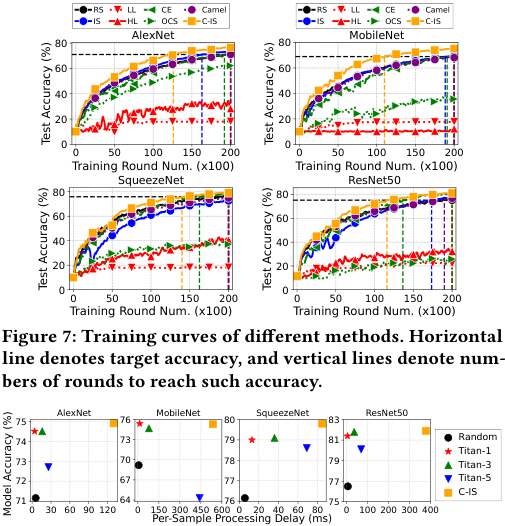

<!-- Start of picture text -->
RS LL CE Camel RS LL CE Camel IS HL OCS C-IS IS HL OCS C-IS AlexNet MobileNet 80 80 60 60 40 40 20 20 0 0 0 50 100 150 200 0 50 100 150 200 Tra ini ng R o und  Nu m.  ( x100) Tra ini ng R o und  Nu m.  ( x100) SqueezeNet ResNet50 80 80 60 60 40 40 20 20 0 0 0 50 100 150 200 0 50 100 150 200 Training Round Num. (x100) Training Round Num. (x100) Figure 7: Training curves of different methods. Horizontal line denotes target accuracy, and vertical lines denote num- bers of rounds to reach such accuracy. 75 AlexNet 76 MobileNet 80 SqueezeNet 83 ResNet50 74 73 79 81 Random Titan-1 73 70 78 79 Titan-3 72 67 77 77 Titan-5 C-IS 71 64 76 75 0 30 60 90 120 0 150 300 450 600 0 20 40 60 80 0 100 200 300 400 Per-Sample Processing Delay (ms) Test Accuracy (%) Test Accuracy (%) Test Accuracy (%) Test Accuracy (%) Model Accuracy (%) <!-- End of picture text -->

**Figure 7: Training curves of different methods. Horizontal line denotes target accuracy, and vertical lines denote numbers of rounds to reach such accuracy.** 

**Figure 8: Impact of coarse-grained filter on data processing delay and final model accuracy across different models and model block numbers for feature extraction.** 

class, making it more difficult to filter out diverse data for intraclass data selection. Consequently, we propose to leverage the first model block in practice for high time-efficiency and stable training performance improvement. 

**Pipeline Design.** To show the role of the pipeline design in reducing time overhead and resource conflict, we visualize the per-round time of only model training, sequential execution and coexecution of model update and data selection in Figure 6(a), which demonstrates that pipeline incurs negligible time for synchronizing the model and data between different processes compared with practical model training time. 

## **4.4 Application to Various Scenarios.** 

In Appendix B, we provide the empirical results when applying Titan to various practical scenarios, including fluctuant idle computing resources, federated learning and noisy on-device data streams. 

## **5 Other Related Work** 

In §2.3, we provided a thorough introduction of other data selection approaches and here we review other relevant works. 

**On-Device Model Training.** Recently, there has been a trend towards moving model training from cloud servers to the resourceconstrained devices. Prior works focused on improving the utilization of hardware resource ( _e.g._ , memory, storage and computing resource) to enhance training efficiency, such as optimizing memory allocation to increase training batch size [15, 56], exploring the co-execution of multiple types of computing resources to accelerate computation [26, 55, 60], and offloading computation to cloud server [41, 57, 63]. However, only a few works noticed the 

under-utilization of on-device data resource, which address such issue through cloud-side data distribution estimation and model pre-training [33, 62] before model deployment. Therefore, Titan is complementary to previous works. 

**Two-Stage Architecture.** The design of two-stage system has been widely adopted in industrial recommendation system [5, 8, 11, 12] to recommend highly personalized items from a vast item space in real-time. In the first stage, one or multiple efficient retrieval models are used to produce a candidate set that contains thousands of items from the whole item space. Then, in the second stage, a more powerful model re-ranks the candidate items and recommends the top few items to the user. Such design allows for a trade-off between the system scalability and performance. In the area of ondevice data selection, to the best of our knowledge, we are the first to consider leveraging the two-stage design to simultaneously enhance the effectiveness and efficiency of data utilization to improve model training performance. 

**Difference with Federated Learning (FL).** For motivation and setting, we target model training on a single device using local data, while FL trains model across multiple devices with heterogeneous data distributions. As a result, FL focuses on mitigating the negative impact of cross-device data heterogeneity on global model performance, and does not fully consider the data utilization for local model training on each single device. In contrast, we tackle data under-utilization problem in a broader scenario of on-device model training with both theoretical and empirical analysis, which has not been studied before to the best of our knowledge. In Appendix B, we extend our evaluation to an FL setting with 50 devices and heterogeneous local data distributions, where we achieve a 3.17× speedup in global model convergence and a 2.03% increase in accuracy. However, FL-specific data utilization methods are not applicable to our single-device setting, as they aim to tackle noni.i.d data distribution across devices, which rely on the presence of multiple devices. 

## **6 Conclusion** 

In this work, we identify that the under-utilization of on-device data resource hinders the successful model training process for edge computing tasks. To address this issue, we propose an on-device data selection framework Titan to simultaneously achieve high effectiveness and time-and-resource efficiency for on-device data utilization through an optimal data selection strategy, a two-stage architecture and a pipeline design. Extensive evaluation on realworld device and representative edge computing tasks demonstrate the remarkable advantages of Titan in final model accuracy and wall-clock training time compared with conventional cloud-side data selection approaches, with minor additional system costs. 

## **Acknowledgments** 

<mark>This work was supported in part by National Key R&D Program of China (No. 2023YFB4502400),</mark> in part by China NSF grant No. 62322206, 62025204, 62132018, U2268204, 62272307, 62372296. The opinions, findings, conclusions, and recommendations expressed in this paper are those of the authors and do not necessarily reflect the views of the funding agencies or the government. The authors thank the anonymous reviewers for their insightful feedbacks. 

681 

KDD ’25, August 3–7, 2025, Toronto, ON, Canada 

Chen Gong, Rui Xing, Zhenzhe Zheng, and Fan Wu 

## **References** 

- [1] 2019. Siri - Apple. https://www.apple.com/siri//. 

- [2] 2024. Google Lens - Search What You See. https://lens.google/. 

- [3] 2024. Microsoft SwiftKey Keyboard. https://www.microsoft.com/en-us/swiftkey. 

- [4] Kallista A. Bonawitz, Hubert Eichner, Wolfgang Grieskamp, Dzmitry Huba, Alex Ingerman, Vladimir Ivanov, Chloé Kiddon, Jakub Konečný, Stefano Mazzocchi, Brendan McMahan, Timon Van Overveldt, David Petrou, Daniel Ramage, and Jason Roselander. 2019. Towards Federated Learning at Scale: System Design. In _Annual Conference on Machine Learning and Systems (MLSys)_ . 374–388. 

- [5] Fedor Borisyuk, Krishnaram Kenthapadi, David Stein, and Bo Zhao. 2016. CaSMoS: A Framework for Learning Candidate Selection Models over Structured Queries and Documents. In _SIGKDD_ . 441–450. 

- [6] Dongqi Cai, Qipeng Wang, Yuanqiang Liu, Yunxin Liu, Shangguang Wang, and Mengwei Xu. 2021. Towards ubiquitous learning: A first measurement of ondevice training performance. In _EMDL_ . 31–36. 

- [7] Cody Coleman, Christopher Yeh, Stephen Mussmann, Baharan Mirzasoleiman, Peter Bailis, Percy Liang, Jure Leskovec, and Matei Zaharia. 2020. Selection via Proxy: Efficient Data Selection for Deep Learning. In _International Conference on Learning Representations (ICLR)_ . 

- [8] Paul Covington, Jay Adams, and Emre Sargin. 2016. Deep Neural Networks for YouTube Recommendations. In _RecSys_ . 191–198. 

- [9] Anish Das, Young D Kwon, Jagmohan Chauhan, and Cecilia Mascolo. 2022. Enabling on-device smartphone gpu based training: Lessons learned. In _PerCom Workshops_ . 533–538. 

- [10] Apple Developer. 2023. Maximum build file sizes. https://developer.apple.com/ help/app-store-connect/reference/maximum-build-file-sizes/. 

- [11] Chantat Eksombatchai, Pranav Jindal, Jerry Zitao Liu, Yuchen Liu, Rahul Sharma, Charles Sugnet, Mark Ulrich, and Jure Leskovec. 2018. Pixie: A system for recommending 3+ billion items to 200+ million users in real-time. In _ACM The Web Conference (WWW)_ . 1775–1784. 

- [12] Chantat Eksombatchai, Pranav Jindal, Jerry Zitao Liu, Yuchen Liu, Rahul Sharma, Charles Sugnet, Mark Ulrich, and Jure Leskovec. 2018. Pixie: A System for Recommending 3+ Billion Items to 200+ Million Users in Real-Time. In _ACM The Web Conference (WWW)_ . 1775–1784. 

- [13] Dante Everaert and Christopher Potts. 2024. GIO: Gradient Information Optimization for Training Dataset Selection. In _International Conference on Learning Representations (ICLR)_ . 

- [14] Amirata Ghorbani and James Y. Zou. 2019. Data Shapley: Equitable Valuation of Data for Machine Learning. In _International Conference on Machine Learning (ICML)_ . 2242–2251. 

- [15] In Gim and JeongGil Ko. 2022. Memory-efficient DNN training on mobile devices. In _ACM International Conference on Mobile Systems, Applications, and Services (MobiSys)_ . 464–476. 

- [16] Chen Gong, Zhenzhe Zheng, Yunfeng Shao, Bingshuai Li, Fan Wu, and Guihai Chen. 2024. ODE: An Online Data Selection Framework for Federated Learning With Limited Storage. _IEEE/ACM Transactions on Networking (TON)_ 32, 4 (2024), 2794–2809. 

- [17] Chen Gong, Zhenzhe Zheng, Fan Wu, Xiaofeng Jia, and Guihai Chen. 2024. Delta: A Cloud-assisted Data Enrichment Framework for On-Device Continual Learning. In _International Conference on Mobile Computing and Networking (MobiCom)_ . 1408–1423. 

- [18] Chen Gong, Zhenzhe Zheng, Fan Wu, Yunfeng Shao, Bingshuai Li, and Guihai Chen. 2023. To Store or Not? Online Data Selection for Federated Learning with Limited Storage. In _ACM The Web Conference (WWW)_ . 3044–3055. 

- [19] Google. [n. d.]. Android Developers: APK Expansion Files. https://developer. android.com/google/play/expansion-files. 

- [20] Priya Goyal, Piotr Dollár, Ross Girshick, Pieter Noordhuis, Lukasz Wesolowski, Aapo Kyrola, Andrew Tulloch, Yangqing Jia, and Kaiming He. 2017. Accurate, large minibatch sgd: Training imagenet in 1 hour. _arXiv:1706.02677_ (2017). 

- [21] Kaiming He, Xiangyu Zhang, Shaoqing Ren, and Jian Sun. 2016. Deep residual learning for image recognition. In _IEEE / CVF Computer Vision and Pattern Recognition Conference (CVPR)_ . 770–778. 

- [22] Andrew G Howard, Menglong Zhu, Bo Chen, Dmitry Kalenichenko, Weijun Wang, Tobias Weyand, Marco Andreetto, and Hartwig Adam. 2017. Mobilenets: Efficient convolutional neural networks for mobile vision applications. _arXiv preprint arXiv:1704.04861_ (2017). 

- [23] Kai Huang, Boyuan Yang, and Wei Gao. 2023. ElasticTrainer: Speeding Up OnDevice Training with Runtime Elastic Tensor Selection. In _ACM International Conference on Mobile Systems, Applications, and Services (MobiSys)_ . 56–69. 

- [24] HUAWEI. 2023. HUAWEI WiFi AX3 Pro. https://consumer.huawei.com/en/ routers/ax3-pro/specs/. 

- [25] Forrest N Iandola, Song Han, Matthew W Moskewicz, Khalid Ashraf, William J Dally, and Kurt Keutzer. 2016. SqueezeNet: AlexNet-level accuracy with 50x fewer parameters and< 0.5 MB model size. _arXiv:1602.07360_ (2016). 

- [26] Fucheng Jia, Deyu Zhang, Ting Cao, Shiqi Jiang, Yunxin Liu, Ju Ren, and Yaoxue Zhang. 2022. CoDL: efficient CPU-GPU co-execution for deep learning inference on mobile devices. In _ACM International Conference on Mobile Systems,_ 

_Applications, and Services (MobiSys)_ . 209–221. 

- [27] Angelos Katharopoulos and François Fleuret. 2017. Biased Importance Sampling for Deep Neural Network Training. (2017). arXiv:1706.00043 

- [28] Angelos Katharopoulos and François Fleuret. 2018. Not All Samples Are Created Equal: Deep Learning with Importance Sampling. In _International Conference on Machine Learning (ICML)_ . 2530–2539. 

- [29] Alex Krizhevsky, Geoffrey Hinton, et al. 2009. Learning multiple layers of features from tiny images. (2009). 

- [30] Alex Krizhevsky, Ilya Sutskever, and Geoffrey E Hinton. 2012. ImageNet Classification with Deep Convolutional Neural Networks. In _NeurIPS_ . 

- [31] Chenning Li, Xiao Zeng, Mi Zhang, and Zhichao Cao. 2022. PyramidFL: a finegrained client selection framework for efficient federated learning. In _Annual International Conference on Mobile Computing and Networking (MobiCom)_ . 158– 171. 

- [32] Yiming Li, Yanyan Shen, and Lei Chen. 2022. Camel: Managing Data for Efficient Stream Learning. In _SIGMOD_ . 1271–1285. 

- [33] Bingyan Liu, Yuanchun Li, Yunxin Liu, Yao Guo, and Xiangqun Chen. 2020. Pmc: A privacy-preserving deep learning model customization framework for edge computing. _Proceedings of the ACM on Interactive, Mobile, Wearable and Ubiquitous Technologies (IMWUT)_ 4, 4 (2020), 1–25. 

- [34] Haibo Liu, Chen Gong, Zhenzhe Zheng, Shengzhong Liu, and Fan Wu. 2025. Enabling Real-Time Inference in Online Continual Learning via Device-Cloud Collaboration. In _Proceedings of the ACM on Web Conference(WWW)_ . 2043–2052. 

- [35] Brendan McMahan, Eider Moore, Daniel Ramage, Seth Hampson, and Blaise Agüera y Arcas. [n. d.]. Communication-Efficient Learning of Deep Networks from Decentralized Data. In _Artificial Intelligence and Statistics (AISTATS)_ . 

- [36] Baharan Mirzasoleiman, Jeff A. Bilmes, and Jure Leskovec. 2020. Coresets for Data-efficient Training of Machine Learning Models. In _International Conference on Machine Learning (ICML)_ . 6950–6960. 

- [37] NVIDIA. 2023. Jetson Nano Developer Kit. https://developer.nvidia.com/ embedded/jetson-nano-developer-kit. 

- [38] Official Journal of the European Union. 2021. General data protection regulation. https://gdpr-info.eu/. 

- [39] OpenAI. 2023. ChatGPT General FAQ. https://help.openai.com/en/articles/ 6783457-chatgpt-general-faq. 

- [40] Xiaomin Ouyang, Zhiyuan Xie, Jiayu Zhou, Jianwei Huang, and Guoliang Xing. 2021. Clusterfl: a similarity-aware federated learning system for human activity recognition. In _ACM International Conference on Mobile Systems, Applications, and Services (MobiSys)_ . 54–66. 

- [41] Xiaoyi Pang, Zhibo Wang, Jingxin Li, Ruiting Zhou, Ju Ren, and Zhetao Li. 2022. Towards online privacy-preserving computation offloading in mobile edge computing. In _IEEE International Conference on Computer Communications (INFOCOM)_ . 1179–1188. 

- [42] Allan Pinkus. 1999. Approximation theory of the MLP model in neural networks. _Acta numerica_ 8 (1999), 143–195. 

- [43] Omead Pooladzandi, David Davini, and Baharan Mirzasoleiman. 2022. Adaptive second order coresets for data-efficient machine learning. In _International Conference on Machine Learning (ICML)_ . 17848–17869. 

- [44] Sylvestre-Alvise Rebuffi, Alexander Kolesnikov, Georg Sperl, and Christoph H. Lampert. 2017. iCaRL: Incremental Classifier and Representation Learning. In _IEEE / CVF Computer Vision and Pattern Recognition Conference (CVPR)_ . 5533– 5542. 

- [45] Herbert Robbins and Sutton Monro. 1951. A stochastic approximation method. _The Annals of Mathematical Statistics_ (1951), 400–407. 

- [46] Burr Settles. 2009. Active learning literature survey. (2009). 

- [47] Vatsal Shah, Xiaoxia Wu, and Sujay Sanghavi. [n. d.]. Choosing the Sample with Lowest Loss makes SGD Robust. In _Artificial Intelligence and Statistics (AISTATS)_ . 

- [48] David Silver, Julian Schrittwieser, Karen Simonyan, Ioannis Antonoglou, Aja Huang, Arthur Guez, Thomas Hubert, Lucas Baker, Matthew Lai, Adrian Bolton, Yutian Chen, Timothy P. Lillicrap, Fan Hui, Laurent Sifre, George van den Driessche, Thore Graepel, and Demis Hassabis. 2017. Mastering the game of Go without human knowledge. _Nature_ 550, 7676 (2017), 354–359. 

- [49] Prashanthi SK, Sai Anuroop Kesanapalli, and Yogesh Simmhan. 2022. Characterizing the performance of accelerated Jetson edge devices for training deep learning models. _SIGMETRICS_ 6, 3 (2022), 1–26. 

- [50] Samuel L. Smith, Pieter-Jan Kindermans, Chris Ying, and Quoc V. Le. 2018. Don’t Decay the Learning Rate, Increase the Batch Size. In _International Conference on Learning Representations (ICLR)_ . 

- [51] Chen Sun, Abhinav Shrivastava, Saurabh Singh, and Abhinav Gupta. 2017. Revisiting Unreasonable Effectiveness of Data in Deep Learning Era. In _International Conference on Computer Vision (ICCV)_ . 843–852. 

- [52] Tong Sun, Bowen Jiang, Hailong Lin, Borui Li, Yixiao Teng, Yi Gao, and Wei Dong. 2025. TensorShield: Safeguarding On-Device Inference by Shielding Critical DNN Tensors with TEE. arXiv:2505.22735 [cs.CR] https://arxiv.org/abs/2505.22735 

- [53] Ammar Tahir, Yongzhou Chen, and Prashanti Nilayam. 2022. FedSS: Federated learning with smart selection of clients. _arXiv preprint arXiv:2207.04569_ (2022). 

- [54] Tianxiang Tan and Guohong Cao. 2022. Deep learning on mobile devices through neural processing units and edge computing. In _IEEE International Conference on_ 

682 

A Two-Stage Data Selection Framework for Data-Efficient Model Training on Edge Devices 

KDD ’25, August 3–7, 2025, Toronto, ON, Canada 

_Computer Communications (INFOCOM)_ . 1209–1218. 

- [55] Manni Wang, Shaohua Ding, Ting Cao, Yunxin Liu, and Fengyuan Xu. 2021. AsyMo: scalable and efficient deep-learning inference on asymmetric mobile CPUs. In _Annual International Conference on Mobile Computing and Networking (MobiCom)_ . 215–228. 

- [56] Qipeng Wang, Mengwei Xu, Chao Jin, Xinran Dong, Jinliang Yuan, Xin Jin, Gang Huang, Yunxin Liu, and Xuanzhe Liu. 2022. Melon: breaking the memory wall for resource-efficient on-device machine learning. In _ACM International Conference on Mobile Systems, Applications, and Services (MobiSys)_ . 450–463. 

- [57] Shibo Wang, Shusen Yang, and Cong Zhao. 2020. SurveilEdge: Real-time video query based on collaborative cloud-edge deep learning. In _IEEE International Conference on Computer Communications (INFOCOM)_ . 2519–2528. 

- [58] Pete Warden. 2018. Speech commands: A dataset for limited-vocabulary speech recognition. _arXiv preprint arXiv:1804.03209_ (2018). 

- [59] Jianyu Wei, Ting Cao, Shijie Cao, Shiqi Jiang, Shaowei Fu, Mao Yang, Yanyong Zhang, and Yunxin Liu. 2023. NN-Stretch: Automatic Neural Network Branching for Parallel Inference on Heterogeneous Multi-Processors. In _ACM International Conference on Mobile Systems, Applications, and Services (MobiSys)_ . 70–83. 

- [60] Daliang Xu, Mengwei Xu, Qipeng Wang, Shangguang Wang, Yun Ma, Kang Huang, Gang Huang, Xin Jin, and Xuanzhe Liu. 2022. Mandheling: mixedprecision on-device DNN training with DSP offloading. In _Annual International Conference on Mobile Computing and Networking (MobiCom)_ . 214–227. 

- [61] Mengwei Xu, Jiawei Liu, Yuanqiang Liu, Felix Xiaozhu Lin, Yunxin Liu, and Xuanzhe Liu. 2019. A first look at deep learning apps on smartphones. In _ACM The Web Conference (WWW)_ . 2125–2136. 

- [62] Mengwei Xu, Feng Qian, Qiaozhu Mei, Kang Huang, and Xuanzhe Liu. 2018. DeepType: On-Device Deep Learning for Input Personalization Service with Minimal Privacy Concern. _Proceedings of the ACM on Interactive, Mobile, Wearable and Ubiquitous Technologies (IMWUT)_ (2018), 197:1–197:26. 

- [63] Dixi Yao, Liyao Xiang, Zifan Wang, Jiayu Xu, Chao Li, and Xinbing Wang. 2021. Context-aware compilation of dnn training pipelines across edge and cloud. _Proceedings of the ACM on Interactive, Mobile, Wearable and Ubiquitous Technologies (IMWUT)_ 5, 4 (2021), 1–27. 

- [64] Rongjie Yi, Ting Cao, Ao Zhou, Xiao Ma, Shangguang Wang, and Mengwei Xu. 2023. Boosting DNN Cold Inference on Edge Devices. In _ACM International Conference on Mobile Systems, Applications, and Services (MobiSys)_ . 516–529. 

- [65] Jaehong Yoon, Divyam Madaan, Eunho Yang, and Sung Ju Hwang. 2022. Online Coreset Selection for Rehearsal-based Continual Learning. In _International Conference on Learning Representations (ICLR)_ . 

- [66] Xiao Zeng, Ming Yan, and Mi Zhang. 2021. Mercury: Efficient on-device distributed dnn training via stochastic importance sampling. In _Sensys_ . 29–41. 

- [67] Peilin Zhao and Tong Zhang. 2015. Stochastic Optimization with Importance Sampling for Regularized Loss Minimization. In _International Conference on Machine Learning (ICML)_ . 1–9. 

- [68] Yan Zhuang, Zhenzhe Zheng, Fan Wu, and Guihai Chen. 2024. LiteMoE: Customizing On-device LLM Serving via Proxy Submodel Tuning. In _Proceedings of the 22nd ACM Conference on Embedded Networked Sensor Systems (SenSys)_ . 521–534. 

## **A Proofs** 

## **A.1 Proof of Theorem 1** 

According to the model update formula in Equation (1), we have _𝑤𝑡_ +1 = _𝑤𝑡_ − _𝜂𝑡_ ∇ _𝐿_ (B _,𝑤𝑡_ ), which leads to: 

E[ _𝑥_2 ] −� E[ _𝑥_ ]�2 to further decompose the final term: 

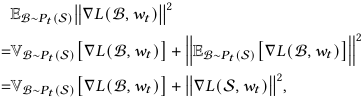

which leads to the conclusion in Theorem 1. 

## **A.2 Proof of Theorem 2** 

We first decompose the gradient variance of the data batch B selected from dataset S into the weighted variances of sub-batch B _𝑦_ selected from data-subset S _𝑦_ for each class _𝑦_ ∈Y: 

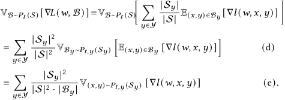

Equation(d) decomposes the overall batch selection process into subprocesses for each class, and Equation(e) holds because each sample in sub-batch B _𝑦_ is selected from S _𝑦_ with strategy _𝑃𝑡,𝑦_ . According to the variance definition ( _i.e._ V[ _𝑥_ ] = E[ _𝑥_2 ]−� E[ _𝑥_ ]�2 ), we can further decompose the gradient variance: 

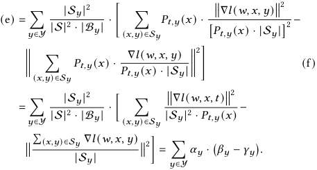

Equation(f) holds because in data selection, to ensure the unbiasedness of selected data for model convergence, each selected sample will be weighted by _𝑝𝑟𝑜𝑏𝑎𝑏𝑖𝑙𝑖𝑡𝑦_ <u>1×</u> _𝑑𝑎𝑡𝑎𝑠𝑖𝑧𝑒_to achieve E(_𝑥,𝑦_)∼_𝑃_(S) [_𝑓_(_𝑥_)] = �( _𝑥,𝑦_ ) ∈S_𝑃_(_𝑥_)· _𝑃_ ( _<u>𝑓𝑥</u>_ <u>()·|S|</u> _𝑥_ <u>)</u>= E(_𝑥,𝑦_)∼S [_𝑓_(_𝑥_)]. 

## **A.3 Proof of Lemma 2** 

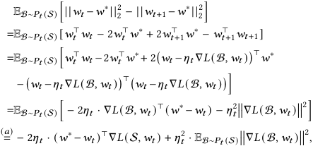

where equality (a) holds because of the unbiased data sampling B ∼ _𝑃𝑡_ (S). Next, we leverage the definition of variance, i.e., V[ _𝑥_ ] = 

According to our previous analysis, term _𝛽𝑦_ for each class _𝑦_ ∈Y is uniquely determined by its intra-class data selection strategy _𝑃𝑡,𝑦_ while term _𝛾𝑦_ is a fixed value. Therefore, we can minimize the overall gradient variance as follows: 

First, we derive the minimal _𝛽𝑦_∗by optimizing_𝑃𝑡,𝑦_, which can be directly solved using Cauchy-Schwarz inequality: 

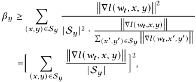

683 

KDD ’25, August 3–7, 2025, Toronto, ON, Canada 

Chen Gong, Rui Xing, Zhenzhe Zheng, and Fan Wu 

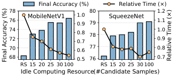

<!-- Start of picture text -->
Final Accuracy (%) Relative Time (×) 78 80 1.2 76 MobileNetV1 1.00.9 79 SqueezeNet 1.1 74 1.0 0.8 78 72 0.7 0.9 70 0.6 77 0.8 68 0.5 76 0.7 RS 15 20 25 30 100 RS 15 20 25 30 100 Idle Computing Resource(#Candidate Samples) Final Accuracy (%) Relative Time (×) <!-- End of picture text -->

**Figure 9: Performance on fluctuant idle computing resource.** 

����∇ _𝑙_ ( _𝑤𝑡 ,𝑥,𝑦_ )��� where the equality holds when _𝑃𝑡,𝑦_ ( _𝑥_ ) = <u>�(</u> _𝑥_′ _,𝑦_′ ) ∈S _𝑦_ <u>����∇</u> _𝑙_ ( _𝑤𝑡 ,𝑥_ ′ _,𝑦_ ′ )���� based on the Cauchy-Schwarz inequality. Second, given ( _𝛽𝑦_∗−_𝛾𝑦_) for each class, we minimize the overall ob- jective� _𝑦__𝛼_ _𝑦_(_𝛽_ _𝑦_∗−_𝛾𝑦_) by optimizing |B_𝑦_|, the analytical expression of which can also be computed through Cauchy-Schwarz inequality: 

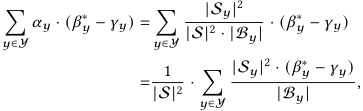

which is minimized when B _𝑦_ ∝|S _𝑦_ |~~√~~ _𝛽𝑦_<u>∗</u> − _𝛾𝑦_ according to the Cauchy-Schwarz inequality and leads to Lemma 2. 

## **B Supplementary Evaluation** 

To further demonstrate the generality of Titan framework, we also evaluate its performance in diverse practical scenarios to demonstrate the robustness and generality of Titan, such as fluctuant on-device idle computing resources, federated learning scenario and noisy on-device data. The experiments are mainly conducted on image classification task. 

**Fluctuant Idle Computing Resources.** In practice, the corunning applications may occupy varied proportions of computing resources. When there exists more idle computing resource, a larger candidate dataset can be filtered out by coarse-grained filter to facilitate a higher-quality fine-grained data selection process. Experimental results in Figure 9 show that when the candidate dataset size rises from 15 to 100, the final accuracy of Titan is increased from 73 _._ 0−77 _._ 9% to 76 _._ 4−79 _._ 1% and the training time reduction also rises from 19−25% to 25−46%. The consistent improvement in model training performance demonstrates Titan’s robustness to devices with varying idle computing resources. 

**Federated Learning.** We evaluate the performance of Titan in a federated setting setting using CIFAR-10 and MobileNetV1. In this scenario, we initialize the training process with 50 devices, and the data distribution of across these devices follow a non-IID pattern as described in previous work [4, 53]. The data on each device covers only 5 classes. In each training round, random 20% devices participated in the model training process, which independently select |B| samples from a pool of _𝑣_ real-time samples, update their local models for 3 local training iterations, and upload the updated model to the centralized server for model aggregation. As shown in Figure 10, compared with the second best best approach, Titan achieves an increase of 2 _._ 03% in final accuracy and speeds up the training time (i.e., number of communication rounds) to target 

accuracy by a factor of 3 _._ 17×. These findings highlight the potential of applying Titan to federated learning for improving the training performance of global model. 

**Noisy Data Streams.** Generally, Titan framework can improve the model training performance for arbitrary on-device data distribution, as the importance of each data sample in our work is measured by its theoretical contribution to model performance over on-device personal data (elaborated in Theorem 1 and Lemma 2). Specifically, for streaming data with noisy or shifted data distributions, Titan aims to minimize the discrepancy between the optimal model (for noisy or dynamic data distribution) and current model (trained with the selected training data batch, which essentially reflect the model’s robustness to noisy data and generalization performance to domain shift. Furthermore, we conduct extensive experiments to demonstrate the applicability of Titan framework to noisy and dynamic data streams. 

For noisy data, we incorporate two distinct type of noise: (i) feature noise to emulate the noise introduced by an unstable environment during data collection, where we randomly select 40% of data samples and add Gaussian noise to their input feature _𝑥_ ; (ii) label noise to simulate the incorrect labels arising from automaticlabeling where we randomly revise the label _𝑦_ of 40% data samples. Experiment results on CIFAR-10 with MobileNetV1 are presented in Figure 11, which demonstrate that: (i) In various noise settings, Titan consistently outperforms all the baselines, achieving 6% and 3 _._ 4% higher final model accuracy in the settings of feature noise and label noise. Moreover, Titan accelerates the time-to-accuracy by a factor of 1 _._ 83× and 1 _._ 35× in these two settings; (ii) Titan exhibits higher robustness to feature noise compared to label noise, because label noise introduces larger errors to the sample gradients and leads to inaccurate data evaluation. 

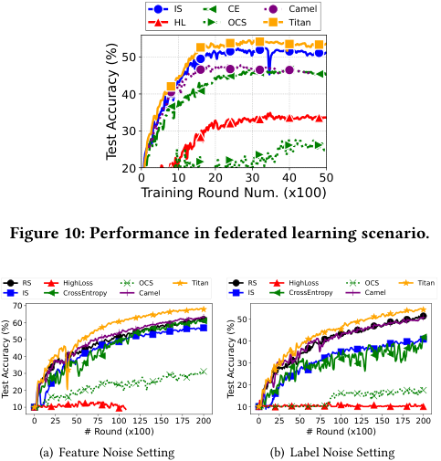

<!-- Start of picture text -->
IS CE Camel HL OCS Titan 50 40 30 20 0 10 20 30 40 50 Training Round Num. (x100) Figure 10: Performance in federated learning scenario. RS HighLoss OCS Titan RS HighLoss OCS Titan IS CrossEntropy Camel IS CrossEntropy Camel 70 60 50 50 40 40 30 30 20 20 10 10 0 25 50 75 100 125 150 175 200 0 25 50 75 100 125 150 175 200 # Round (x100) # Round (x100) (a) Feature Noise Setting (b) Label Noise Setting Test Accuracy (%) Test Accuracy (%) Test Accuracy (%) <!-- End of picture text -->

**Figure 11:** Titan **Performance on noisy data distribution.** 

684 

