# **Robust Data-Driven Auction Design** 

Qilong Lin Shanghai Jiao Tong University Shanghai, China edersnow@sjtu.edu.cn 

Dagui Chen Alibaba Group Beijing, China dagui.cdg@taobao.com 

Yangsu Liu Alibaba Group Beijing, China liuyangsu.lys@taobao.com 

Zhenzhe Zheng∗ Shanghai Jiao Tong University Shanghai, China zhengzhenzhe@sjtu.edu.cn 

Bo Zheng Alibaba Group Beijing, China bozheng@alibaba-inc.com 

Jian Xu 

Alibaba Group Beijing, China xiyu.xj@taobao.com 

Guihai Chen 

Fan Wu Shanghai Jiao Tong University Shanghai, China fwu@cs.sjtu.edu.cn 

Shanghai Jiao Tong University Shanghai, China 

gchen@cs.sjtu.edu.cn 

## **Keywords** 

## **Abstract** 

In the field of auction design, leveraging deep learning to solve optimal auctions from sampled data has become a promising direction. However, real-world contexts often involve uncertain data, which would severely affect the auction performance, but it is lacking consideration in existing works. To address this challenge, we incorporate these uncertainties into auction design metrics, and frame this challenge as a robust data-driven auction design problem. To solve this problem, we first propose the GAT method, where we introduce the process of problem relaxation and transformation to address the non-differentiable variable presented in the original problem, and further propose an adversarial training algorithm to solve the mini-max problem after transformation. Moreover, to obtain moderately robust auctions, we propose two methods to select the robust coefficient, which provides guidance and insights for selecting robust auctions based on generalization and performance metrics. Finally, with the insights from the GAT method, we further propose the SAT method, where we employ a strict and unified IC constraint that extends from the GAT method, which provides strong IC guarantees and stable revenue in uncertain environments. Experiments on both constructed and real-world datasets show that our robust methods effectively improve the performance of auctions in terms of revenue and IC guarantees. 

Robust Auction Design, Data-Driven Optimization, Adversarial Learning, Online Advertising 

#### **ACM Reference Format:** 

Qilong Lin, Yangsu Liu, Dagui Chen, Zhenzhe Zheng, Jian Xu, Bo Zheng, Fan Wu, and Guihai Chen. 2025. Robust Data-Driven Auction Design. In _Proceedings of the 31st ACM SIGKDD Conference on Knowledge Discovery and Data Mining V.2 (KDD ’25), August 3–7, 2025, Toronto, ON, Canada._ ACM, New York, NY, USA, 12 pages. https://doi.org/10.1145/3711896.3737111 

## **1 Introduction** 

Auction theory has generated significant revenue for many commercial activities, such as digital advertising [20], spectrum auctions [12], and electricity markets [22]. In this field, the goal is to design the decision rules for resource allocation that depend on the values of bidders [46], where the core feature of the problem is that the value information is private to bidders, and they may misreport the values to maximize their own utilities. This introduces additional considerations into the decision-making process, such as the Incentive Compatibility (IC) constraint [53] that characterizes the bidders’ willingness to truthfully report their private values. 

Our work focuses on the optimal auction design problem, where the goal is to maximize revenue. This objective aligns with the interests of auctioneers, making it a topic of great attention in realworld applications. Under this goal, the most influential work is from Roger B. Myerson [45], which explored the optimal rules for the single-item auctions. Since then, many efforts have focused on theoretically finding optimal auctions in the generalized settings, such as the single-bidder auctions [14, 25, 43], the auctions with symmetric value distribution [15], the combinatorial auctions [56], etc. However, these results are often limited to specific settings or cannot guarantee optimality, which hinders their wide applications. 

## **CCS Concepts** 

• **Applied computing** → **Online auctions** ; • **Computing methodologies** → **Adversarial learning** ; • **Theory of computation** → **Sample complexity and generalization bounds** . 

∗Zhenzhe Zheng is the corresponding author. 

Permission to make digital or hard copies of all or part of this work for personal or classroom use is granted without fee provided that copies are not made or distributed for profit or commercial advantage and that copies bear this notice and the full citation on the first page. Copyrights for components of this work owned by others than the author(s) must be honored. Abstracting with credit is permitted. To copy otherwise, or republish, to post on servers or to redistribute to lists, requires prior specific permission and/or a fee. Request permissions from permissions@acm.org. _KDD ’25, Toronto, ON, Canada._ 

To detour these theoretical difficulties, Dütting et al. [17] proposed a data-driven solution for the optimal auction design problem. Their approach leverages the concept of regret [19] to transform the auction design problem into a data-driven optimization problem, thereby enabling the use of deep learning to derive the optimal auctions. Currently, this data-driven solution has been validated and 

© 2025 Copyright held by the owner/author(s). Publication rights licensed to ACM. ACM ISBN 979-8-4007-1454-2/25/08 https://doi.org/10.1145/3711896.3737111 

1741 

KDD ’25, August 3–7, 2025, Toronto, ON, Canada. 

Qilong Lin et al. 

expanded by existing works [11, 27, 50], and has been effectively deployed in various fields, including online advertising [61], energy markets [42] and data markets [52]. 

However, existing data-driven solutions lack consideration of uncertainty in the collected data samples, which would lead to suboptimal and even quite poor performance. On the one hand, in practice, we often derive the optimal auctions based on a limited amount of sampled data, and thus the empirical distribution may differ from the underlying true distribution. On the other hand, even if we can obtain or approximate the underlying true distribution, the true distribution itself is usually changing over time. These two factors together contribute to the uncertainty of the sampling data, which is widely present in practice. However, existing solutions did not consider this uncertainty in both the design and analysis procedures. As we observed in the experimental results, this can lead to a decline in auction performance in uncertain environments, such as the significant violation of IC under few sampled data and the declines of revenue under distribution-shift over time. Please refer to Section 5 for more details and specific examples. 

To address the challenge of uncertainty, we model the problem of data-driven auction design in uncertain environments as a robust optimization problem. Specifically, our modeling is inspired by the distributionally robustness idea [38, 49]: we use the concept of _ambiguity set_ to capture the true distribution in uncertain environments, and model our objective as optimizing the worst-case performance within the ambiguity set. This formalizes our goal of optimizing the lower bound of performance under true distribution. 

To solve the robust optimization problem, we first propose the General Adversarial Training (GAT) method. Specifically, the main challenge in solving the distributionally robust problem lies in its non-differentiable optimization variable, which is used to capture the distribution uncertainty. To address this, we first introduce a problem relaxation and transformation process, which is supported by rigorous strong-duality theory [24]. Based on this, we further propose an adversarial training algorithm to solve the transformed mini-max optimization problem. These ideas together provide a general approach for solving robust data-driven auctions. 

Beyond deriving the optimization framework to solve the problem, the robustness degree is also a key parameter that affects auction performance, but is lacking discussion in existing works [1, 4]. To address this, we propose two methods to select the robust coefficient. Among these, the generalization-guided method has a solid theoretical foundation, while the performance-guided method is more applicable to practical situations. Specifically, we introduce the Repeated Holdout algorithm to select the robust coefficient in online environment as an illustrated example, in order to cope with the continuously changing data distribution. 

Finally, we conducted an in-depth analysis of how the robust IC constraint in GAT works in the uncertain data-driven environments, which inspired us to further propose the Stable Adversarial Training (SAT) method. Compared to the robust IC constraint, the SAT method employs a stricter and unified IC constraint, thereby providing stronger IC guarantees for the auctions in the uncertain data-driven environments. It is worth noting that, despite lacking explicit robust considerations, the SAT method still achieves excellent and stable revenue performance in experimental results, which further highlights the advantages of the SAT method. 

Our main contributions can be summarized as follows: 

• We propose the GAT method to solve the robust data-driven auction design problem, where we address the challenge of nondifferentiable variable through a problem relaxation and transformation process supported by duality theory. We further propose an adversarial training algorithm to solve the transformed problem. 

• We propose two methods for the selection of the robustness degree based on theoretical foundation and practical requirements, respectively. This is a key parameter that affects the performance of robust auctions, but lacks enough discussion in the literature. 

• Inspired by the analysis of the GAT method, we further propose the SAT method with a strict and unified IC constraint. This provides stronger IC guarantees for the uncertain environments, while maintaining excellent and stable revenue performance. 

• We apply our methods in two common uncertain scenarios, and analyze their performance with respect to the data amount and the robust coefficient. The results on the constructed and real-world datasets show the efficiency of the above proposed methods. 

## **2 Related Works** 

**Data-Driven Auction Design** . Since Dütting et al. [17] successfully proposed RegretNet to solve optimal auctions from sampled data, this idea of data-driven auction design has been adopted and expanded in many subsequent works [11, 27, 50]. Specifically, we focus on the line of work with approximate IC, which inherit the core concept of regret from RegretNet, and achieve approximate IC by minimizing regret. In this context, Feng et al. [23], Kuo et al. [35], and Sakurai et al. [55] extended RegretNet framework to scenarios involving budget constraints, fairness, and false-name-proof requirements, respectively. Moreover, Rahme et al. [50, 51], Ivanov et al. [28] and Duan et al. [16] further improved RegretNet from the perspective of loss functions and model structures. However, these works did not consider the impact of uncertainties in real-world environments on the performance of such data-driven auctions. **Robust Mechanism Design** . The goal of robust mechanism design is to relax the assumptions of the Myerson mechanism [45] to develop more practical revenue-maximizing mechanisms. On this topic, a series of works [5, 8, 41] tried to identify the optimal mechanisms when relaxing the common knowledge assumption. Recently, another series of works [1, 4, 9, 31, 57] derived the optimal mechanisms in the presence of ambiguity in value distribution, which is more related to our topic. However, the settings in these works are not universal, and the ambiguity misses the statistical relation between the empirical and true distribution, making them unsuitable for our general data-driven auction design setting. 

## **3 Preliminaries** 

## **3.1 Auction Model** 

We consider a general auction setting where there are _𝑁_ bidders N = {1 _, ..., 𝑁_ } competing for _𝑀_ items M = {1 _, ..., 𝑀_ }. Here the allocation results of items are finite, that is, all subsets {S1 _,_ S2 _, ...,_ S2 _𝑀_ } of M. Each bidder _𝑖_ has a private value vector _𝒗𝑖_ , where _𝑣𝑖𝑗_ denotes her value for subset S _𝑗_ . In subsequent discussions, we denote _𝒗_ = ( _𝒗_ 1 _, 𝒗_ 2 _, ..., 𝒗𝑛_ ) as the value vectors of all bidders, and _𝒗_ − _𝑖_ as all the vectors without _𝒗𝑖_ . To model randomness, we assume that _𝒗_ follows a true distribution _𝑃_ 0 over a compact value space V. 

1742 

KDD ’25, August 3–7, 2025, Toronto, ON, Canada. 

Robust Data-Driven Auction Design 

In each auction, every bidder can submit a value vector _𝒗_ ˜ _𝑖_ as her bid to the auctioneer. We consider the data-driven approach [17], where the auction’s allocation function _𝑎__𝒘_ and payment function _𝑝__𝒘_ are determined by the parameters _𝒘_ of the neural network model. We use _𝑎𝑖𝑗__𝒘_(_𝒗_˜) and_𝑝_ _𝑖__𝒘_(_𝒗_˜) to represent the probability that S _𝑗_ is allocated and the payment charged for bidder _𝑖_ , respectively, according to the submitted values _𝒗_ ˜ . We would like to emphasize that the submitted values _𝒗_ ˜ could be different from the true values due to the strategic behaviors of bidders. Therefore, in an auction, the utility of bidder _𝑖_ can be represented as: 

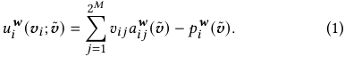

To model the auction design problem as an optimization problem, we consider the following two metrics for auctions. Firstly, the revenue of the auction when all bidders submit truthful values: 

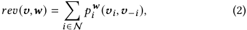

Another metric is the regret of each bidder _𝑖_ in the auction: 

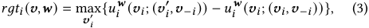

which reflects the additional utility that bidder _𝑖_ can gain by misreporting when all the other bidders submit their values truthfully. This concept converts IC into a quantifiable metric, thereby being widely adopted by existing works [16, 17, 23, 28] to transform auction design problems into data-driven optimization problems. 

It should be noted that in classical auction design, Individual Rationality (IR) is also an important constraint [53]. However, for our model-determined payment rules _𝑝__𝒘_ , we can easily satisfy the IR constraint through the design of the model structure, as many existing works [17, 23, 28]. Therefore, in the remaining part of our work, we confidently focus on the revenue and regret metrics. 

## **3.2 Uncertainty Environments** 

In many practical situations, we cannot directly know the true distribution _𝑃_ 0 that the bidders’ value vectors _𝒗_ follows, but can only infer the possible range for it through collected samples, such as the online advertising environment [37, 40]. We will start from discussing these uncertain environments, and then develop a universal and automated method for designing robust data-driven auctions. 

Formally, we denote all collected sampled data as a dataset D, and denote the empirical distribution on it as _𝑃_ˆ (D). For brevity, we use _𝑃_ˆ to represent _𝑃_ˆ (D). To model the uncertain range of the true distribution _𝑃_ 0, we leverage the idea of distributionally robustness [49], assuming the distance between the true distribution _𝑃_ 0 and the empirical distribution _𝑃_ˆ does not exceed a certain limit _𝜌_ . That is, we consider _𝑃_ 0 to be any distribution within an ambiguity set: 

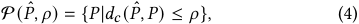

where _𝑑𝑐_ is Wasserstein distance [58] using norm function _𝑐_ . The main reason for using Wasserstein distance lies in its advanced theoretical results and its ability to capture the relation between the empirical and the true distribution, while some other well-known measurements, such as the KL divergence [34], fail to capture such a relation. This will be further discussed in Section 4.2.1. 

## **3.3 Problem Formulation** 

In previous uncertain modeling, since we have captured the true distribution _𝑃_ 0 through the ambiguity set P( _𝑃, 𝜌_ˆ ), a natural and robust strategy is to optimize the worst-case performance within the ambiguity set P( _𝑃, 𝜌_ˆ ), thereby optimizing the lower bound of the auction performance under the true distribution _𝑃_ 0. Following this idea, we consider the robust versions of the two auction metrics above. The worst-case expected revenue can be written as: 

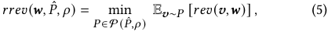

where we consider a perturbation _𝑃_ ∈P( _𝑃, 𝜌_ˆ ) that _𝒗_ would follows, and we regard the expected revenue in the worst-case scenario as the optimization objective. Similarly, the expected regret in the worst-case scenario for any bidder _𝑖_ can be written as: 

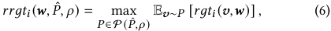

where its corresponding constraint _𝑟𝑟𝑔𝑡𝑖_ ( _𝒘, 𝑃, 𝜌_ˆ ) = 0 that describes the IC objective for the auction is similar to the definition of the distributionally robust incentive compatible (DRIC) constraint in the robust mechanism design literature [31], which requires the expected regret of the auction to be 0 for any distribution _𝑃_ within the ambiguity set P( _𝑃, 𝜌_ˆ ). Therefore, we refer to this corresponding constraint of (6) as a robust IC constraint. Then, the robust auction design problem can be formulated as optimizing the worst-case expected revenue under the robust IC constraint: 

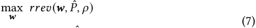

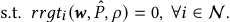

Here, since the parameter _𝜌_ determines the range of the worst-case scenario P, a larger _𝜌_ leads to a larger range, resulting in more conservative solution for problem (7). That is, it is directly related to the robustness degree of the auctions, and we refer to it as the robust coefficient in the remaining discussion. 

The characteristics of the robust problem (7) mainly lie in its general settings and its special ambiguity sets tailored to datadriven scenarios. In contrast, existing works [1, 4, 9, 31, 57] did not include combinatorial auctions, where Suzdaltsev [57] only considered a single bidder and Albert et al. [1] only considered discrete value setting. Furthermore, the ambiguity sets in these works are merely described by simple information such as mean and variance, making it difficult to capture the relation between the empirical and the true distribution. Therefore, we refer to problem (7) as the robust data-driven auction design problem, to highlight the distinctive features and challenges of our problem. 

Furthermore, we hope to clarify the practical significance of robustness in our method. Although we optimize for the worst-case distribution within the uncertain range, we do not consider the full range of potential distributions, but rather regard the range as a parameter to select. This enables us to select moderately robust auctions based on generalization and performance metrics, allowing us to achieve better performance in uncertain environments. We leave the detailed selection methods for Section 4.2. 

1743 

KDD ’25, August 3–7, 2025, Toronto, ON, Canada. 

Qilong Lin et al. 

## **4 Design** 

## **4.1 General Adversarial Training** 

We first focus on solving problem (7) given an empirical distribution _𝑃_ ˆ and a robust coefficient _𝜌_ . We present the process of problem relaxation and transformation, which addresses the core challenge of non-differentiable variable in the original problem (7), making it solvable by the proposed adversarial training algorithm. We refer to our solution as the **GAT** (General Adversarial Training) method, and its details are described as follows. 

We first derive the Lagrangian function of problem (7) to approximate its solution: 

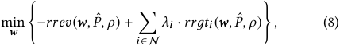

where the Lagrange multipliers _𝜆𝑖 >_ 0 for any _𝑖_ . 

We next relax the problem based on our practical consideration. Specifically, the original problem (7) is a standard robust problem formulation, where the objective (5) and the constraint (6) consider two separate worst-case scenarios, independently. However, from our practical perspective, the worst-case scenarios are actually correlated. This is because, although the true distribution _𝑃_ is unknown, it uniquely exists in real-world scenarios. Therefore, the perturbation terms _𝑃_ in both objective (5) and constraint (6) of our robust problem should be consistent and be regarded as the same variable. Based on this insight, we relax the original problem (8) by introducing a unified perturbation as follows. 

For convenience, we first define the Lagrangian objective in the absence of perturbation. Given the model parameters _𝒘_ and values _𝒗_ , the value of the Lagrangian function can be written as: 

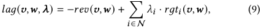

where we use _𝝀_ to denotes vectors ( _𝜆_ 1 _, 𝜆_ 2 _, ..., 𝜆𝑁_ ). Then our relaxed optimization objective can be written as: 

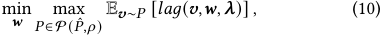

where an unified perturbation within the ambiguity set P is used to replace the origin two separated ones. Here, we use “relaxed” to indicate that the worst-case considerations of the new objective (10) are weaker than those of the original objective (8). 

Although the relaxation process simplifies the problem, the core challenge, namely the non-differentiable optimization variable _𝑃_ in the problem (10), still remains. Since such a distribution-type variable cannot be differentiated, it is impossible for us to directly solve the problem (10) through classic methods such as gradient descent [2]. To address this challenge, we consider transforming the problem into an equivalent but differentiable one. Specifically, we denote the expected robust forms of the Lagrangian objective _𝑙𝑎𝑔_ in (9) with penalty as follows: 

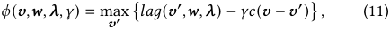

where _𝑐_ is the norm function as defined in the ambiguity set (4). Equation (11) measures the worst-case performance of objectives _𝑙𝑎𝑔_ , where perturbations are introduced as adversarial variables _𝒗_′ to replace origin values _𝒗_ , and the perturbation range is limited by a penalty weighted by _𝛾_ . We arrive at the following result: 

### **Algorithm 1:** General Adversarial Training Approach 

||**Input:**Mini-batches{D1_,_D2_, ...,_D_𝐿_} **Hyper-parameters:**_𝑇_,_𝜖_,_𝜂𝒘_,_𝜂𝝀_,_𝜂𝛾_|
|---|---|
|**1 ** **2 **|**Initialize**_𝒘_,_𝝀_,_𝛾_;  **while**_stopping criterion not met_ **do**|
|**3**|**for**_𝑙_=1**to**_𝐿_**do**|
|**4**|**for**_𝑖_=1**to**_𝑇_**do**|
|**5**|**foreach** ˆ_𝒗_∈D_𝑙_**do**|
|**6**|find_𝜖_-approximate maximizers for_𝜙_;|
|**7**|_𝛾_←_𝛾_−_𝜂𝛾_∇_𝛾ℎ𝑙_(_𝒘, 𝝀,𝛾_);|
|**8**|_𝒘_←_𝒘_−_𝜂𝒘_∇_𝒘ℎ𝑙_(_𝒘, 𝝀,𝛾_);|
|**9**|**if** _updating 𝝀criterion met_ **then**|
|**10**|_𝝀_←_𝝀_+_𝜂𝝀_∇_𝝀ℎ𝑙_(_𝒘, 𝝀,𝛾_);|

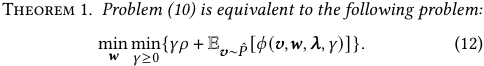

This equivalence conclusion is obtained by the strong duality property of Wasserstein distributionally robust optimization problem [24], where the original optimization over the worst-case distribution in problem (10) is equivalently formulated as a mini-max problem (12) with definition (11) over the empirical distribution _𝑃_ˆ . A detailed proof for this is provided in Appendix A.1. Theorem 1 provides an equivalent formulation that does not include the nondifferentiable distribution-type optimization variable _𝑃_ , and thus addressing the core challenge in the relaxed problem (10). 

After relaxing and transforming the problem, we can formally present the adversarial training method for the transformed problem (12). We adopt the mini-batch gradient descent method [54], assuming that the dataset D can be divided into _𝐿_ sub-datasets {D1 _,_ D2 _, ...,_ D _𝐿_ }, where the size of each dataset is _𝐵_ . In each batch, we only use one subset D _𝑙_ to update the variables. Note that for any D _𝑙_ , we can expand the expectation terms over the distribution _𝑃_ˆ (D _𝑙_ ) as E _𝒗_ ∼ _𝑃_ ˆ (D _𝑙_ ) [ _..._ ] =� _𝒗_ ˆ ∈D _𝑙_(_..._)/_𝐵_, then our objective in problem (12) with any subset D _𝑙_ can be rewritten as: 

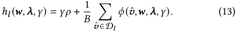

Then our adversarial training process can be summarized in Algorithm 1. The outer loop of this process is similar to the standard training method [2]. In each iteration, we go through each batch and optimize the model parameters _𝒘_ using the objective function in (13). The only difference is that we need to gradually increase _𝝀_ during training so that the solution to the objective problem (10) can approximate the original problem. Specifically, we update _𝝀_ using gradient ascent method, and control the increasing rate through the learning rate _𝜂𝝀_ and updating criterion. These correspond to the loop in Lines 2-3 and the criterion in Lines 9-10 in Algorithm 1. 

Next is the core part of our adversarial training method, that is, optimizing model parameters _𝒘_ based on the objective _ℎ𝑙_ . Note that the origin problem in (12) contains multiple min or max operations, which, from outer to inner, correspond to the optimization variables 

1744 

KDD ’25, August 3–7, 2025, Toronto, ON, Canada. 

Robust Data-Driven Auction Design 

_𝒘_ , _𝛾_ , and the adversarial variable _𝒗_′ in _𝜙_ as well as each _𝒗𝑖_′in_𝑟𝑔𝑡𝑖_. Correspondingly, our process updates these variables from the inside out. First, before updating the model parameters _𝒘_ , we perform _𝑇_ updates of the inner variables, and then keep them fixed while updating _𝒘_ to replace the inner min or max operations. Similarly, before each update of _𝛾_ , we also need to update the inner adversarial variables. Unlike the fixed number of updates above, we continuously update the adversarial variables until the change in _𝜙_ is less than a certain threshold _𝜖_ . We refer to the adversarial variables _𝒗_′ in _𝜙_ and each _𝒗𝑖_′in_𝑟𝑔𝑡𝑖_at this point as_𝜖_-approximate maximizers. In particular, we updated all adversarial variables simultaneously during the training, and practical results have shown that this approach is feasible. The corresponding pseudo-code can be found in Lines 4-8 of Algorithm 1, where _𝜂𝒘_ and _𝜂𝛾_ are learning rates for updating _𝒘_ and _𝛾_ , respectively. Thus, we have comprehensively introduced the process of our Algorithm 1. 

## **4.2 Robust Coefficient Selection** 

In the previous discussion, we have introduced how to solve the robust optimization problem, given the robust coefficient _𝜌_ . Next, we will introduce the methods for selecting this robust coefficient for the generalization and performance objectives, respectively. 

_4.2.1 Generalization-Guided Selection._ To illustrate the logic of selecting the robust coefficient through generalization, we first intuitively explain the relation between the robust optimization problem and generalization performance. Intuitively, given the dataset D and the robust coefficient _𝜌_ (which essentially defines an ambiguity set P), we can compute the probability that the true distribution belongs to P based on the optimal transport theory [29, 59]. Consequently, under this probability, the worst-case performance we optimize in (12) can serve as a lower bound of generalization performance. Conversely, if we hope to provide a degree of guarantee for generalization performance, we can deduce an appropriate robust coefficient for a given dataset D. This is essentially the core idea of applying robust optimization to data-driven scenarios [6, 44]. 

We formally present this selection method. We first provide the definition of the generalization performance metric. Given the model parameters _𝒘_ , our metric can be formally defined as the expected Lagrangian function value under the true distribution _𝑃_ 0. Fixed the Lagrange multipliers _𝝀_ , we denote this metric as: 

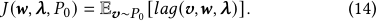

Then the generalization goal can be described as for some given _𝝀_ and probability _𝛽_ ∈[0 _,_ 1], we aim to obtain the model parameters _𝒘_ ˆ based on the dataset, as well as guarantee _𝐽_ˆ , such that: 

• _Generalization Bound_ : We provide guarantee for generalization performance _𝐽_ ( _𝒘_ ˆ _, 𝝀, 𝑃_ 0) ≤ _𝐽_ˆ with probability _𝛽_ . 

• _Asymptotic Consistency_ : As the size of the dataset |D| →∞, our guarantee approaches optimality _𝐽_ˆ → min _𝒘 𝐽_ ( _𝒘, 𝝀, 𝑃_ 0). 

These two metrics are widely adopted to measure generalization performance [26]. We can now formally introduce the selecting method that meets the above generalization requirements: 

Theorem 2. _Let 𝑐 be 𝑙_ 1 _-norm function, then for any compact value space_ V _, for any size of dataset_ |D| _and 𝛽, we can construct an appropriate robust coefficient 𝜌_ ˆ _, such that the optimal solution and the corresponding optimization variables of problem (10) can be used_ 

_as the guarantee 𝐽_ˆ _and the model parameters 𝒘_ ˆ _. Such chosen 𝒘_ ˆ _and 𝐽_ˆ _satisfy both Generalization Bound and Asymptotic Consistency._ 

The idea of satisfying the _Generalization Bound_ requirement here is consistent with the previous intuitive explanation. Moreover, when the amount of sampled data |D| is sufficiently large and the empirical distribution approaches the true distribution _𝑃_ 0, we can choose a small _𝜌_ to reduce the robustness and approximate the optimal result, thus satisfying _Asymptotic Consistency_ requirement. A detailed proof can be found in Appendix A.2. 

However, although this selection method has a strong theoretical explanation for generalization, it is not convenient to apply in practice. The main issue lies in the guarantees provided in the form of probabilities. On one hand, the value of _𝜌_ ˆ obtained from Theorem 2 is overly conservative, resulting in relatively poor auction performance in practice. This conservative theoretical outcome has also been corroborated by the work of [44], a study that applies data-driven distributionally robust optimization to convex optimization problems. In fact, for a given probability, [44] employed an alternative bootstrap method [21] to obtain a empirically suitable _𝜌_ ˆ. On the other hand, we find that the adversarial objectives we compute during training are underestimated, which is similar to the underestimate of regret in existing works [3, 13]. This affects the solution obtained for the problem (10), making it difficult to provide a precise guarantee _𝐽_ˆ in terms of _Generalization Bound_ . 

It is worth noting that, despite the above limitations of this generalization-guided selection, its underlying concept still holds significant reference value. Firstly, it reveals that our robust method is not only focused on optimizing worst-case performance but also possesses a certain degree of generalization capability. This provides a solid theoretical foundation for the effectiveness of our method in uncertain environments. In addition, it guides us to employ the Wasserstein distance. Note that the generalization property of our method in Theorem 2 is established under the assumption of using the Wasserstein distance. In contrast, some other well-known distance functions, such as the KL divergence [34], fail to derive similar results. This factor, along with the widespread use of the Wasserstein distance in distributionally robust optimization [24, 33, 44], and the feasibility of solving corresponding problems through adversarial training, led us to choose the Wasserstein distance as the distance function for the ambiguity set. 

_4.2.2 Performance-Guided Selection._ If we disregard the generalization and focus on performance only, we can simply regard the robust coefficient _𝜌_ as a hyper-parameter and use model selection methods to choose it. In this work, we mainly consider the crossvalidation method [32], which is a classic approach for model selection. Its core idea is to split the dataset into parts, using one part for training and another for performance evaluation. For our problem, consistent with the definition in (14), given model parameters _𝒘_ , validation set D_𝑣𝑎_ and Lagrangian multipliers _𝝀_ , the model performance can be written as _𝐽_ ( _𝒘, 𝝀, 𝑃_ˆ (D_𝑣𝑎_ )). Therefore, we can select the best-performing _𝜌_ according to the cross-validation method. 

This performance-guided selection method is more feasible in practice and is also more scalable. Specifically, we consider the online environment as an example, where the true distribution _𝑃_ 0 would change over time, which is a widely prevalent auction environment in practice. In this context, the selection of _𝜌_ has to 

1745 

KDD ’25, August 3–7, 2025, Toronto, ON, Canada. 

Qilong Lin et al. 

### **Algorithm 2:** Repeated Holdout for Robust Coefficient 

|**Input:**Datasets{D_𝑡𝑟_ _𝑡_}, {D_𝑣𝑎_ _𝑡_}, time points T, candidates C **Parameters:**Lagrangian multipliers_𝝀_|
|---|
|**1 Initialize**average performances ¯_𝐽_←{};|
|**2 foreach**_𝜌_∈C**do** |
|**3** ¯_𝐽_[_𝜌_] ←0;|
|**4** **foreach**_𝑡_∈T **do**|
|**5** Solve (7) onD_𝑡𝑟_ _𝑡_ and get model parameters_𝒘_∗ _𝑡_;|
|**6** ¯_𝐽_[_𝜌_] ←¯_𝐽_[_𝜌_] +_𝐽_(_𝒘_∗ _𝑡__, 𝝀,_ ˆ_𝑃_(D_𝑣𝑎_ _𝑡_));|
|**7** ¯_𝐽_[_𝜌_] = ¯_𝐽_[_𝜌_]/|T |;|
|**8 Return**arg_𝜌_max ¯_𝐽_[_𝜌_];|

consider not only the difference between the empirical distribution _𝑃_ˆ and the true distribution _𝑃_ 0, but also the variations of the true distribution _𝑃_ 0 itself, therefore previous generalization-guided method might not be able to yield a good robust coefficient. 

To select _𝜌_ for performance in the online environment, we follow the idea of Repeated Holdout [10, 48, 60] strategy, which has been shown to achieve relatively excellent results in the unstable online environment [10]. We consider a common strategy of online model updating, where we update the model with some recent data at regular intervals, and then evaluate the model over the following period. Formally, we select a set of split time points T to divide the dataset into training sets and test sets. For any given split time point _𝑡_ ∈T , we take some most recent data from a period before _𝑡_ as the training set D _𝑡__𝑡𝑟_,andtakesomefollowingdatafroma period after _𝑡_ as the validation set D _𝑡__𝑣𝑎_. Then for each given_𝜌_, we iterate over _𝑡_ ∈T , training on each training set D _𝑡__𝑡𝑟_ to obtain the model parameters _𝒘𝑡_∗, and then evaluate the performance on each validation set D _𝑡__𝑣𝑎_. After iterations, the average performance over all the split time point in T is taken as the evaluation performance _𝐽_ ¯ _𝜌_ for each candidate _𝜌_ . Finally, we select the robust coefficient _𝜌_ ˆ with the largest performance _𝐽_¯ _𝜌_ ˆ as the best robust coefficient. The whole process above can be summarized as Algorithm 2. 

## **4.3 Stable Adversarial Training** 

The previous GAT method and the robust coefficient selection methods have provided a comprehensive solution to the robust auction design problem (7). However, the IC performance of this solution still lacks in-depth investigation. For example, why does the robust IC constraint in (7) yield better IC performance for uncertain datadriven contexts? As the robust coefficient within this constraint is adjustable, can we provide a stricter and unified constraint for a stronger IC guarantee? With these ideas, we propose the **SAT** (Stable Adversarial Training) method, which is detailed below. 

We first explain why the robust IC constraint works in uncertain data-driven environments. Note that the regret constraint _𝑟𝑔𝑡𝑖_ ( _𝒗, 𝒘_ ) = 0 essentially provides a “single-point” Dominant Strategy Incentive Compatibility (DSIC) guarantee [53] for each given data point _𝒗_ . However, in uncertain environments, the sampled data would be too sparse or biased, making it difficult for the DSIC guarantee to cover the entire value space V. The results in Section 5.2, where existing methods significantly violate the IC guarantee, 

also illustrate this point. In contrast, the robust IC constraint considers the distributions near the empirical distribution through the conception of the ambiguity set P, thereby better extending the DSIC guarantee to cover the entire value space V. 

Following this line of idea, recall that a larger _𝜌_ implies that the uncertainty set P includes more data distributions. Therefore, when _𝜌_ is sufficiently large, does the robust IC constraint imply DSIC over the entire value space? The answer is positive: 

Theorem 3. _For any compact value space_ V _and any data distribution 𝑃_ˆ _, there exist some 𝜌_ ˆ _such that the robust IC guarantee with ambiguity set_ P( _𝑃, 𝜌_ˆ ) _implies DSIC guarantees on value space_ V _._ 

The key to this conclusion lies in the fact that, over a “finite” space, the Wasserstein distance from any unimodal distribution to the empirical distribution is always finite, allowing it to be captured by the ambiguity set. In this context, robust IC under any unimodal distribution implies DSIC, which leads to our Theorem 3. We defer the rigorous proof to Appendix A.3. This result provides us with a stricter IC constraint. However, calculating _𝜌_ ˆ for each V is still cumbersome. Therefore, we hope to find a unified constraint to avoid this calculation. We have the following result: 

Theorem 4. _For any bidder 𝑖, any model parameters 𝒘, any distribution 𝑃_ˆ _and any robust coefficient 𝜌_ ˆ _, we have:_ 

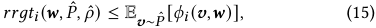

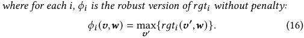

This conclusion similarly applies the robust-objective transformation idea in Theorem 1; however, here we remove the robust coefficient _𝜌_ ˆ and further obtain a unified upper bound. The detailed proof is provided in Appendix A.4. Note that the right-hand side of inequality (15) provides a strict and unified IC constraint without the specification of V and _𝜌_ ˆ, which is exactly what we expect. 

Based on this insight, we propose the SAT method as follows. We consider a variation of the robust auction design problem (7): 

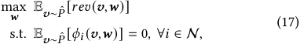

where we take the revenue on the empirical distribution as the objective, while introducing the strict IC constraint obtained in this section. Then similar to GAT, we can optimize its Lagrangian function to approximate this original objective: 

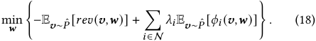

Then we can solve problem (18) though a way similar to Algorithm 1, where objective function for any batch D _𝑙_ can be written as: 

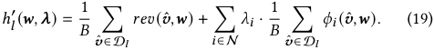

Thus, we can use adversarial training to solve problem (18), as detailed in Algorithm 3, which is a simple version of Algorithm 1. 

Note that for each _𝑖_ , _𝜙𝑖_ in (16) is a straightforward DSIC requirement and is theoretically independent of the origin data point _𝒗_ . 

1746 

KDD ’25, August 3–7, 2025, Toronto, ON, Canada. 

Robust Data-Driven Auction Design 

### **Algorithm 3:** Stable Adversarial Training Approach 

|**In** **P** **1 In**|**put:**Mini-batches{D1_,_D2_, ...,_D_𝐿_} **arameters:**_𝜖_,_𝜂𝒘,𝜂𝝀_ **itialize**_𝒘_,_𝝀_;|
|---|---|
|**2 w**|**hile**_stopping criterion not met_ **do**|
|**3**|**for**_𝑙_=1**to**_𝐿_**do**|
|**4**|**foreach** ˆ_𝒗_∈D_𝑙_**do**|
|**5**|**for**_𝑖_=1**to**_𝑁_**do**|
|**6**|find_𝜖_-approximate maximizers for_𝜙𝑖_;|
|**7**|_𝒘_←_𝒘_−_𝜂𝒘_∇_𝒘ℎ_′ _𝑙_(_𝒘, 𝝀_);|
|**8**|**if** _updating 𝝀criterion met_ **then**|
|**9**|_𝝀_←_𝝀_+_𝜂𝝀_∇_𝝀ℎ_′ _𝑙_(_𝒘, 𝝀_);|

In practice, we initialize the adversarial variable _𝒗_′ with _𝒗_ , thus allowing the dataset D to influence our adversarial training results. 

It can be seen that SAT is more concise compared to GAT, while improving the IC performance. Moreover, although there is no theoretical guarantee, the auctions obtained from SAT exhibit excellent and stable performance. Therefore we use “stable” to describe this method to distinguish it from GAT. We leave the related experiment results and more discussion for this in Section 5.2. 

## **5 Experiment Results** 

In this section, we test the previously proposed GAT method, robust coefficient selection methods, and SAT method. We first introduce our experimental setup, followed by the experiment results conducted under the limited data and distribution shift scenarios. 

## **5.1 Experimental Setup** 

_5.1.1 Bidder Settings._ We first introduce the bidder settings in our experiment. We mainly consider two kinds of bidder valuations, which reflect the value of the allocated set of items to the bidder: 

- **Additive** : For any bidder _𝑖_ , the value _𝑣𝑖𝑗_ of any subset S _𝑗_ is 

- equal to the sum of the values of all items in the subset. 

- **Unit-demand** : For any bidder _𝑖_ , the value _𝑣𝑖𝑗_ of any subset 

- S _𝑗_ is equal to the max value of a single item within the subset. Thus, the bidders participating in the auction in our experiments 

- can mainly be divided into the following two categories: 

- _𝑁_ **x** _𝑀_ **additive** : _𝑁_ bidders competing for _𝑀_ items, where each 

- bidder has additive valuations, and the value of each item for each bidder follows a uniform distribution over [0 _,_ 1]. 

- **1x2 unit-demand** : 1 bidders competing for 2 items, where 

- the bidder has unit-demand valuation, and the value of each item follows a uniform distribution over [2 _,_ 3]. The optimal auction for this setting is provided in [47]. 

_5.1.2 Metrics._ We mainly consider the following metrics for the auction on the data distribution of the test set _𝑃_ˆ _𝑡𝑒_ : 

- **Regret** : Sum of regrets� _𝑖__𝑁_ =1E _𝒗_ ∼ _𝑃_ˆ _𝑡𝑒_[_𝑟𝑔𝑡𝑖_(_𝒗,𝒘_)]; 

- **Revenue** : Total revenue E _𝒗_ ∼ _𝑃_ ˆ _𝑡𝑒_ [ _𝑟𝑒𝑣_ ( _𝒗, 𝒘_ )]; 

• **Loss** : Lagrange function value E _𝒗_ ∼ _𝑃_ ˆ _𝑡𝑒_ [ _𝑙𝑎𝑔_ ( _𝒗, 𝒘, 𝝀_ )]; 

where the Lagrange multipliers _𝝀_ are set to 100 for all evaluation of loss. Note that in our experiment, all test sets contained sufficient 

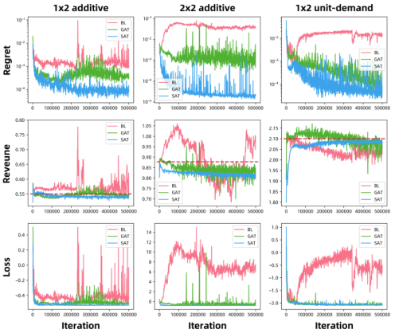

**Figure 1: The metrics during training under different settings.** 

data, enabling the distribution _𝑃_ˆ _𝑡𝑒_ to closely approximate the true distribution _𝑃_ 0. This allowed the loss metric to accurately reflect the generalization performance metric _𝐽_ ( _𝒘, 𝝀, 𝑃_ 0). 

_5.1.3 Methods._ We compare three training methods in our work: • **BL** : The widely adopted baseline method proposed in [17]. • **GAT** : Our general adversarial training method in Section 4.1. • **SAT** : Our stable adversarial training method in Section 4.3. It is worth noting that these methods differ only in their training processes and impose no additional requirements on the model structure being trained. Therefore, just as the training method in [17] can be extended to multiple domains [42, 52, 61], our robust training method can also be similarly extended. Moreover, since the RegretNet model structure proposed in [17] has been widely discussed and validated, we adopt this solid model structure in all our experiments to evaluate the above methods. 

## **5.2 Evaluation for Limited Data** 

We first compare the performance of the three methods under limited data context. Figure 1 shows the results for some settings with 100 sampled data as the training set, where GAT uniformly uses _𝜌_ = 0 _._ 05 as the robust coefficient. We can observe that: 

• For the regret metric in the first row, our SAT and GAT methods have both achieved the performance far exceeding that of BL. In particular, the regret of BL is as low as nearly 0.05 for _2x2 additive_ , which means that bidders can, on average, gain an additional utility of 0.05 by misreporting. Considering that the values are uniformly distributed in [0,1], this indicates a significant violation of IC. In contrast, the regrets of SAT and GAT are at the level of 10−3 or lower, both providing excellent IC guarantees. 

• For the revenue metric in the second row, both GAT and SAT achieve stable results close to optimal (red dashed line). In contrast, the result of BL is quite unstable, indicating a potential overfitting issue. Interestingly, we did not explicitly incorporate a robust revenue objective in SAT; however, SAT still achieved very good 

1747 

KDD ’25, August 3–7, 2025, Toronto, ON, Canada. 

Qilong Lin et al. 

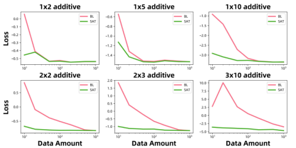

**Figure 2: Variation of the loss metrics with data amount under different settings.** 

generalization results. This may be because the robust regret target of SAT potentially influences the selection of the payment function _𝑝__𝒘_ , leading to better generalization of revenue performance. 

• Finally, the losses achieved by GAT and SAT, as displayed in the third row, are significantly lower than that of BL, and their loss on the test set are able to reach a state of convergence, indicating that our auction has better generalization performance. In particular, SAT exhibits very stable generalization performance, which may be attributed to its relatively simple training process. 

Overall, our method demonstrates strong generalization performance across all three metrics. In addition, we conducted experiments in more settings, and the results were consistent with previous observations. Meanwhile, we observed that under appropriate hyper-parameter selection, the runtime of the GAT and SAT methods generally does not exceed twice that of the BL method. This indicates that although our training process is more complex, the resulting time overhead is acceptable. Additionally, since our method does not alter the model structure, the memory usage is almost identical to that of BL. We leave more experimental results and hyper-parameter selections in Appendix B.1. 

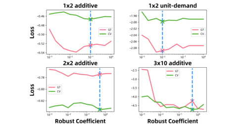

**Figure 3: Variation of the loss metrics with robust coefficient under different settings.** 

## **5.4 Impact of Robust Coefficient** 

We next focus on the performance-guided selection for the robust coefficient in the GAT method. We consider a simple case, where the amount of training data is limited to 100 (1000 for _3x10 additive_ ), and we aim to select such robust coefficients so that the auction trained through the GAT method exhibits good generalization performance. To this end, we consider a simple cross-validation method [32], where the dataset is divided into a training set and a validation set in an 8:2 ratio, and we record the optimal loss achieved on the validation set during training with different robust coefficients. The results are shown by the green line in Figure 3. The cross-validation method selects the robust coefficient corresponding to the optimal loss in the validation set, and this choice is indicated by the blue dashed line. For evaluation, we calculate the performance of the auction trained with 100 samples on the test set under different robust coefficients, serving as the ground truth performance for different robust coefficients. The results are shown by the red line in Figure 3. It can be seen that simple cross-validation method generally can help avoid some poor robust coefficient choices. 

## **5.5 Evaluation for Distribution-Shift** 

## **5.3 Impact of Data Amount** 

Next, we analyze the impact of data amount under the limited data context. For simplicity of the experiment and intuitive comparison of the performance, we only conducted comparisons between SAT and BL. It is important to note that as shown in Figure 1, BL is prone to overfitting when the data amount is limited. For convenience, we overlook this issue and directly use the auction that exhibited the best generalization performance during training as the upper limit of BL. Under these considerations, we test SAT and BL under different data amount for some settings, and the results are shown in Figure 2. We can see that as the number of bidders and items increases, BL requires more and more data to approach the generalization performance of SAT. Specifically, for _3x10 additive_ , the generalization performance of BL on 1000 sampled data is only able to get close to that of SAT on 10 sampled data. This result well demonstrates the excellent generalization performance of SAT. In addition, we can see that when the data amount is large enough, the performance of SAT can also approach optimal results as BL. This shows that SAT may also exhibit the empirical observation of a "no local optima" phenomenon as BL [18]. 

We finally consider real-world auction environmets, where we have a sufficient amount of sampled data; however, the true value distribution may vary over different times and scenarios: 

_5.5.1 Distribution-Shift Over Time._ We first consider the case where the distribution changes over time. This is a common environment in practice, where a natural solution is to assume that the distribution change will not be too large, and to periodically update the model based on recent data, as described in Section 4.2.2. We aim to explore the performance of GAT and BL methods when periodically updating the model in such an uncertain environment. 

We first clarify the uncertain environment and the model update strategy. We selected 10 bidders from the real-world auction dataset and collected their value data between 04:00 and 22:00 in one day1 . Note that such auction scales are consistent with our practice and align with existing reports from the ad platforms [36, 37, 39]. Here, for normalization, we process and scale the values to the range of [0, 

> 1In practice, since most advertisers rely on the models (such as CTR and CVR models) provided by the platform to assess their value, the platform can retrieve value data after auctions. This background is consistent with existing works [37, 40, 61]. 

1748 

KDD ’25, August 3–7, 2025, Toronto, ON, Canada. 

Robust Data-Driven Auction Design 

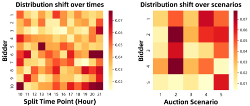

**Figure 4: Distribution shift in the real-world auction environments.** 

**Table 1: Revenue for Different Model Update Times (** 10−1 **)** 

|**Time**|**16**|**17**|**18**|**19**|**20**|**21**|**Avg.**|
|---|---|---|---|---|---|---|---|
|**BL**|6.455|6.768|6.572|6.630|6.771|6.625|6.637|
|**GAT**|6.575|6.894|6.615|6.678|6.842|6.659|6.711|

1]. Thus, we naturally update the model on the hour, selecting the most recent 6 hours of data for training, and then evaluating over the next 1 hour. Following this, we can quantify the uncertainty of the environment by comparing the distance between the two data distributions separated by each hour, as shown in the left heatmap in Figure 4. For example, the color block in the top-left corner represents the distance between the two value distributions for bidder 1, separated at 10:00 (distributions over 04:00-10:00 and 10:0011:00). We can see that the distance is around 0.02-0.08, indicating a significant distribution change relative to the value range of [0, 1]. 

Next, we evaluate the performance of GAT and BL. We simulate the _10x1 additive_ setting. For BL, we can directly evaluate it via the model update strategy above. For GAT, we also need to specify _𝜌_ . We run Algorithm 2 on the datasets divided by hours T = {10 _,_ 11 _, ...,_ 15}, where for each _𝑡_ ∈T , the training set D _𝑡__𝑡𝑟_ contains data in previous 6 hours, and the validation set D _𝑡__𝑣𝑎_ contains data in next 1 hour. The details of the execution are provided in Appendix B.2, and we obtain _𝜌_ = 0 _._ 03 as the parameter for GAT. 

Finally, we can perform model updates for the remaining hours 16, 17, ..., 21 and evaluate BL and GAT. For fairness, we select the maximum revenue achievable when the regret is less than 10−4 as the metric, and the results are shown in Table 1. We can see that GAT outperformed BL in all update times, while achieving an average improvement of 1.1%. This effectively show the excellent and stable performance of our GAT in this uncertain environment. 

_5.5.2 Distribution-Shift Over Scenarios._ In ad platforms, there are often multiple auction scenarios, such as homepages, shopping cart pages, and order pages in e-commerce apps. For stability, platforms often employ a unified auction model across all scenarios. However, the bidders’ value distributions may vary significantly over scenarios, and the unified model needs to be trained on the mixed distribution of these scenarios. In this context, we will better demonstrate the robustness and application value of GAT. 

We first illustrate the distribution differences over scenarios. We selected value data from 5 bidders in 5 scenarios for one day, and 

**Table 2: Revenue for Different Auction Scenarios (** 10−1 **)** 

|**Scenario**|**1**|**2**|**3**|**4**|**5**|**Mixed**|
|---|---|---|---|---|---|---|
|**BL**|4.126|4.943|3.746|4.717|3.620|4.081|
|**GAT**|4.094|5.005|3.701|4.744|3.626|4.074|

calculated the distances between each bidder’s value distribution in each scenario and the mixed distribution of this bidder in all scenarios, as shown in the right heatmap of Figure 4. We can see that the distributions in scenarios 1, 3 are close to the mixed distributions, while there are considerable differences in scenarios 2, 4, 5. 

We now can evaluate BL and GAT in the mixed distribution of all bidders, where we take _𝜌_ = 0 _._ 05 as an example in GAT. The result is shown in Table 2. For fairness, we select the auctions that achieve the maximum revenue on the mixed distribution when regret is less than 5 × 10−4 , while also calculating their revenue in each scenario. 

As we can see, since both training and evaluation used the mixed distribution, BL performs slightly better than GAT on it. However, GAT achieves better revenue than BL in scenarios 2, 4, 5, where the distribution differences are larger, as shown in Figure 4. This highlights the robustness of GAT and reflects a degree of fairness in practice. Specifically, the mixed distribution is naturally closer to distributions of scenarios with more auctions, while tending to differ from ones with fewer auctions. Our example precisely illustrates this, as scenarios 1, 3, where the distribution differences are small, have more auctions than other scenarios. From this perspective, BL naturally focuses on the more populated scenarios 1, 3. In contrast, GAT demonstrates a more equitable focus on the less populated scenarios 2, 4, 5. This fairness is beneficial for better assessing the revenues of small or new scenarios. In this regard, GAT can offer a more equitable performance for scenarios, including new ones, thus promoting diverse development within the ad platforms. 

## **6 Conclusion** 

In this work, we study the important optimal auction design problem in uncertain data-driven environments. To derive moderately robust auctions based on uncertain sampled data, we primarily propose three techniques, including the GAT method to solve the robust data-driven auction design problem, the robust coefficient selection methods to select robust auctions, and the extended SAT method to achieve a unified and strict IC guarantee. We evaluate these methods in two types of uncertain environments that are commonly encountered in practice: limited data and distribution shift. The experimental results on both the constructed and real-world datasets demonstrate the effectiveness of the proposed techniques. 

## **Acknowledgments** 

This work was supported in part by National Key R&D Program of China (No. 2023YFB4502400), in part by China NSF grant No. 62322206, 62025204, 62132018, U2268204, 62272307, 62372296, in part by Alibaba Group through Alibaba Innovative Research Program. The opinions, findings, conclusions, and recommendations expressed in this paper are those of the authors and do not necessarily reflect the views of the funding agencies or the government. 

1749 

KDD ’25, August 3–7, 2025, Toronto, ON, Canada. 

Qilong Lin et al. 

## **References** 

- [1] Michael Albert, Vincent Conitzer, and Peter Stone. 2017. Automated Design of Robust Mechanisms. In _Proceedings of the AAAI Conference on Artificial Intelligence_ . 298–304. 

- [2] Shun-ichi Amari. 1993. Backpropagation and stochastic gradient descent method. _Neurocomputing_ 5, 4-5 (1993), 185–196. 

- [3] Anish Athalye, Nicholas Carlini, and David Wagner. 2018. Obfuscated gradients give a false sense of security: Circumventing defenses to adversarial examples. In _International Conference on Machine Learning_ . 274–283. 

- [4] Chaithanya Bandi and Dimitris Bertsimas. 2014. Optimal design for multi-item auctions: A robust optimization approach. _Mathematics of Operations Research_ 39, 4 (2014), 1012–1038. 

- [5] Dirk Bergemann and Stephen Morris. 2005. Robust mechanism design. _Econometrica_ 73, 6 (2005), 1771–1813. 

- [6] Dimitris Bertsimas, Vishal Gupta, and Nathan Kallus. 2018. Data-driven robust optimization. _Mathematical Programming_ 167 (2018), 235–292. 

- [7] Vladimir Igorevich Bogachev and Maria Aparecida Soares Ruas. 2007. _Measure theory_ . Vol. 1. Springer. 

- [8] Benjamin Brooks and Songzi Du. 2021. Optimal auction design with common values: An informationally robust approach. _Econometrica_ 89, 3 (2021), 1313– 1360. 

- [9] Vinicius Carrasco, Vitor Farinha Luz, Nenad Kos, Matthias Messner, Paulo Monteiro, and Humberto Moreira. 2018. Optimal selling mechanisms under moment conditions. _Journal of Economic Theory_ 177 (2018), 245–279. 

- [10] Vitor Cerqueira, Luis Torgo, and Igor Mozetič. 2020. Evaluating time series forecasting models: An empirical study on performance estimation methods. _Machine Learning_ 109, 11 (2020), 1997–2028. 

- [11] Vincent Conitzer, Zhe Feng, David C Parkes, and Eric Sodomka. 2021. Welfarepreserving _𝜀_ -bic to bic transformation with negligible revenue loss. In _International Conference on Web and Internet Economics_ . 76–94. 

- [12] Peter Cramton. 2013. Spectrum auction design. _Review of industrial organization_ 42 (2013), 161–190. 

- [13] Michael Curry, Ping-Yeh Chiang, Tom Goldstein, and John Dickerson. 2020. Certifying strategyproof auction networks. In _Advances in Neural Information Processing Systems_ . 4987–4998. 

- [14] Constantinos Daskalakis, Alan Deckelbaum, and Christos Tzamos. 2015. Strong duality for a multiple-good monopolist. In _Proceedings of the Sixteenth ACM Conference on Economics and Computation_ . 449–450. 

- [15] Constantinos Daskalakis and Seth Matthew Weinberg. 2012. Symmetries and optimal multi-dimensional mechanism design. In _Proceedings of the 13th ACM Conference on Electronic Commerce_ . 370–387. 

- [16] Zhijian Duan, Jingwu Tang, Yutong Yin, Zhe Feng, Xiang Yan, Manzil Zaheer, and Xiaotie Deng. 2022. A context-integrated transformer-based neural network for auction design. In _International Conference on Machine Learning_ . 5609–5626. 

- [17] Paul Dütting, Zhe Feng, Harikrishna Narasimhan, David Parkes, and Sai Srivatsa Ravindranath. 2019. Optimal auctions through deep learning. In _International Conference on Machine Learning_ . 1706–1715. 

- [18] Paul Dütting, Zhe Feng, Harikrishna Narasimhan, David C Parkes, and Sai Srivatsa Ravindranath. 2024. Optimal auctions through deep learning: Advances in differentiable economics. _J. ACM_ 71, 1 (2024), 1–53. 

- [19] Paul Dütting, Felix Fischer, Pichayut Jirapinyo, John K Lai, Benjamin Lubin, and David C Parkes. 2012. Payment rules through discriminant-based classifiers. In _Proceedings of the 13th ACM Conference on Electronic Commerce_ . 477–494. 

- [20] Benjamin Edelman, Michael Ostrovsky, and Michael Schwarz. 2007. Internet advertising and the generalized second-price auction: Selling billions of dollars worth of keywords. _American economic review_ 97, 1 (2007), 242–259. 

- [21] Bradley Efron and Robert J Tibshirani. 1994. _An introduction to the bootstrap_ . Chapman and Hall/CRC. 

- [22] Natalia Fabra, Nils-Henrik von der Fehr, and David Harbord. 2006. Designing electricity auctions. _The RAND Journal of Economics_ 37, 1 (2006), 23–46. 

- [23] Zhe Feng, Harikrishna Narasimhan, and David C. Parkes. 2018. Deep Learning for Revenue-Optimal Auctions with Budgets. In _Proceedings of the 17th International Conference on Autonomous Agents and MultiAgent Systems_ . 354–362. 

- [24] Rui Gao and Anton Kleywegt. 2023. Distributionally robust stochastic optimization with Wasserstein distance. _Mathematics of Operations Research_ 48, 2 (2023), 603–655. 

- [25] Yiannis Giannakopoulos and Elias Koutsoupias. 2018. Duality and optimality of auctions for uniform distributions. _SIAM J. Comput._ 47, 1 (2018), 121–165. 

- [26] Trevor Hastie, Robert Tibshirani, Jerome H Friedman, and Jerome H Friedman. 2009. _The elements of statistical learning: data mining, inference, and prediction_ . Vol. 2. Springer. 

- [27] Christoph Hertrich, Yixin Tao, and László A. Végh. 2023. Mode Connectivity in Auction Design. In _Advances in Neural Information Processing Systems_ . 52957– 52968. 

- [28] Dmitry Ivanov, Iskander Safiulin, Igor Filippov, and Ksenia Balabaeva. 2022. Optimal-er auctions through attention. In _Advances in Neural Information Processing Systems_ . 34734–34747. 

- [29] Ran Ji and Miguel A Lejeune. 2021. Data-driven optimization of reward-risk ratio measures. _INFORMS Journal on Computing_ 33, 3 (2021), 1120–1137. 

- [30] Alexander S. Kechris. 1995. _Polish Spaces_ . Springer New York, 13–17. 

- [31] Çağıl Koçyiğit, Garud Iyengar, Daniel Kuhn, and Wolfram Wiesemann. 2020. Distributionally robust mechanism design. _Management Science_ 66, 1 (2020), 159–189. 

- [32] Ron Kohavi et al. 1995. A study of cross-validation and bootstrap for accuracy estimation and model selection. In _International Joint Conference on Artificial Intelligence_ . 1137–1145. 

- [33] Daniel Kuhn, Peyman Mohajerin Esfahani, Viet Anh Nguyen, and Soroosh Shafieezadeh-Abadeh. 2024. Wasserstein Distributionally Robust Optimization: Theory and Applications in Machine Learning. arXiv:1908.08729 

- [34] Solomon Kullback and Richard A Leibler. 1951. On information and sufficiency. _The annals of mathematical statistics_ 22, 1 (1951), 79–86. 

- [35] Kevin Kuo, Anthony Ostuni, Elizabeth Horishny, Michael J. Curry, Samuel Dooley, Ping yeh Chiang, Tom Goldstein, and John P. Dickerson. 2020. ProportionNet: Balancing Fairness and Revenue for Auction Design with Deep Learning. arXiv:2010.06398 

- [36] Ningyuan Li, Yunxuan Ma, Yang Zhao, Zhijian Duan, Yurong Chen, Zhilin Zhang, Jian Xu, Bo Zheng, and Xiaotie Deng. 2023. Learning-Based Ad Auction Design with Externalities: The Framework and A Matching-Based Approach. In _Proceedings of the 29th ACM SIGKDD Conference on Knowledge Discovery and Data Mining_ . 1291–1302. 

- [37] Xuejian Li, Ze Wang, Bingqi Zhu, Fei He, Yongkang Wang, and Xingxing Wang. 2024. Deep Automated Mechanism Design for Integrating Ad Auction and Allocation in Feed. arXiv:2401.01656 

- [38] Fengming Lin, Xiaolei Fang, and Zheming Gao. 2022. Distributionally robust optimization: A review on theory and applications. _Numerical Algebra, Control and Optimization_ 12, 1 (2022), 159–212. 

- [39] Hongtao Liu, Luxi Chen, Yiming Ding, Changcheng Li, Han Li, Peng Jiang, and Weiran Shen. 2025. Balancing Revenue and Privacy with Signaling Schemes in Online Ad Auctions. In _Proceedings of the Eighteenth ACM International Conference on Web Search and Data Mining_ . 512–520. 

- [40] Xiangyu Liu, Chuan Yu, Zhilin Zhang, Zhenzhe Zheng, Yu Rong, Hongtao Lv, Da Huo, Yiqing Wang, Dagui Chen, Jian Xu, et al. 2021. Neural auction: End-toend learning of auction mechanisms for e-commerce advertising. In _Proceedings of the 27th ACM SIGKDD Conference on Knowledge Discovery & Data Mining_ . 3354–3364. 

- [41] Giuseppe Lopomo, Luca Rigotti, and Chris Shannon. 2021. Uncertainty in mechanism design. arXiv:2108.12633 

- [42] Nguyen Cong Luong, Le Khac Chau, Nguyen Do Duy Anh, Nguyen Huu Sang, Shaohan Feng, Van-Dinh Nguyen, Dusit Niyato, and Dong In Kim. 2024. Optimal Auction for Effective Energy Management in UAV-Assisted Vehicular Metaverse Synchronization Systems. _IEEE Transactions on Vehicular Technology_ 73, 1 (2024), 1207–1222. doi:10.1109/TVT.2023.3302411 

- [43] Alejandro M Manelli and Daniel R Vincent. 2006. Bundling as an optimal selling mechanism for a multiple-good monopolist. _Journal of Economic Theory_ 127, 1 (2006), 1–35. 

- [44] Peyman Mohajerin Esfahani and Daniel Kuhn. 2018. Data-driven distributionally robust optimization using the Wasserstein metric: Performance guarantees and tractable reformulations. _Mathematical Programming_ 171, 1 (2018), 115–166. 

- [45] Roger B Myerson. 1981. Optimal auction design. _Mathematics of operations research_ 6, 1 (1981), 58–73. 

- [46] Roger B. Myerson. 1989. _Mechanism Design_ . Palgrave Macmillan UK, 191–206. 

- [47] Gregory Pavlov. 2011. Optimal Mechanism for Selling Two Goods. _The BE Journal of Theoretical Economics_ 11, 1 (2011), 1–35. 

- [48] Richard R Picard and R Dennis Cook. 1984. Cross-validation of regression models. _J. Amer. Statist. Assoc._ 79, 387 (1984), 575–583. 

- [49] Hamed Rahimian and Sanjay Mehrotra. 2019. Distributionally robust optimization: A review. arXiv:1908.05659 

- [50] Jad Rahme, Samy Jelassi, Joan Bruna, and S Matthew Weinberg. 2021. A permutation-equivariant neural network architecture for auction design. In _Proceedings of the AAAI conference on artificial intelligence_ . 5664–5672. 

- [51] Jad Rahme, Samy Jelassi, and S. Matthew Weinberg. 2021. Auction learning as a two-player game. arXiv:2006.05684 

- [52] Sai Srivatsa Ravindranath, Yanchen Jiang, and David C Parkes. 2023. Data Market Design through Deep Learning. In _Advances in Neural Information Processing Systems_ . 6662–6689. 

- [53] Tim Roughgarden. 2010. Algorithmic game theory. _Commun. ACM_ 53, 7 (2010), 78–86. 

- [54] Sebastian Ruder. 2017. An overview of gradient descent optimization algorithms. arXiv:1609.04747 

- [55] Yuko Sakurai, Satoshi Oyama, Mingyu Guo, and Makoto Yokoo. 2019. Deep false-name-proof auction mechanisms. In _PRIMA 2019: Principles and Practice of Multi-Agent Systems_ . 594–601. 

- [56] Tuomas Sandholm and Anton Likhodedov. 2015. Automated design of revenuemaximizing combinatorial auctions. _Operations Research_ 63, 5 (2015), 1000–1025. 

- [57] Alex Suzdaltsev. 2020. An optimal distributionally robust auction. arXiv:2006.05192 

1750 

KDD ’25, August 3–7, 2025, Toronto, ON, Canada. 

Robust Data-Driven Auction Design 

- [58] SS Vallender. 1974. Calculation of the Wasserstein distance between probability distributions on the line. _Theory of Probability & Its Applications_ 18, 4 (1974), 784–786. 

- [59] Cédric Villani et al. 2009. _Optimal transport: old and new_ . Vol. 338. Springer. 

- [60] Qing-Song Xu and Yi-Zeng Liang. 2001. Monte Carlo cross validation. _Chemometrics and Intelligent Laboratory Systems_ 56, 1 (2001), 1–11. 

- [61] Ruitao Zhu, Yangsu Liu, Dagui Chen, Zhenjia Ma, Chufeng Shi, Zhenzhe Zheng, Jie Zhang, Jian Xu, Bo Zheng, and Fan Wu. 2024. Contextual Generative Auction with Permutation-level Externalities for Online Advertising. arXiv:2412.11544 

## **A Proofs** 

## **A.1 Proof of Theorem 1** 

Our conclusion is a direct derivation of Gao and Kleywegt’s work [24]. We first repeat the main contributions of their work: 

Theorem 5 (Main Contributions in [24]). _If_ (V _,𝑐_ ) _forms a Polish space and the 𝑙𝑎𝑔 function (9) is measurable, for fixed 𝒘, 𝝀:_ 

_𝑃_ ∈P(max _𝑃,𝜌_ˆ ) E _𝒗_ ∼ _𝑃_ [ _𝑙𝑎𝑔_ ( _𝒗, 𝒘, 𝝀_ )] = min _𝛾_ ≥0{_𝛾𝜌_+ E_𝒗_∼_𝑃_ˆ[_𝜙_(_𝒗,𝒘, 𝝀,𝛾_)]}_._ 

We first clarify that (V _,𝑐_ ) constitutes a Polish space. Here, we make a simple assumption about the value space, that is, any _𝑣𝑖𝑗_ will not exceed a certain upper limit _𝑣_ ¯, thus V = [0 _,_ ¯ _𝑣_ ]_𝑁_×2_𝑀_ . This assumption is reasonable because there are practically no infinitely large values, and it aligns with the setup of our experiment. Then since every finite-dimensional normed vector space is a Banach space, while V is also a separable space, then by definition (V _,𝑐_ ) constitutes a Polish space [30]. 

We next demonstrate that the _𝑙𝑎𝑔_ function is measurable. We consider the general case that the function _𝑎__𝒘_ and _𝑝__𝒘_ are continuous with respected to _𝒗_ . Then after addition, subtraction, and max operations, the resulting _𝑙𝑎𝑔_ function is also continuous, thereby is a Borel measurable function (Example 2.1.4 in [7]). Moreover, our value space V is closed, which is a Borel set. Thus, the _𝑙𝑎𝑔_ function is measurable. 

Thus, according to Theorem 5, we can naturally obtain the result of Theorem 1, and the proof is concluded. 

## **A.2 Proof of Theorem 2** 

We first rigorously present the conclusion from Ji and Lejeune’s work [29], which indicate that given the compact value space V, the sampled data amount |D|, and a specified probability requirement _𝛽_ , it is possible to calculate an appropriate robust coefficient such that the true distribution has a probability greater than _𝛽_ within the ambiguity set. Their conclusions can be stated as: 

Theorem 6 (Theorem 2 in [29]). _For compact space_ V _, sampled data amount_ |D| _and robability requirement 𝛽, let 𝐵_ = _𝑣_ ¯ × _𝑁_ × 2_𝑀_ _be the diameter of_ V _, then the robust coefficient can be calculated as:_ 

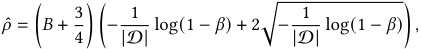

_such that true distribution 𝑃_ 0 ∈P( _𝑃,_ˆ _𝜌_ ˆ) _with probability at least 𝛽._ 

Here, we continue the assumptions for V in Section A.1. Then let the guarantee _𝐽_ˆ and the model parameters _𝒘_ ˆ be: 

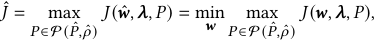

where the right term is exactly problem (10), and we can guarantee that: 

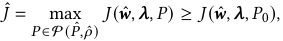

with probability at least _𝛽_ , thereby satisfying the _Generalization Bound_ requirement. At the same time, _𝜌_ → 0 as |D| →+∞, and according to Theorem 6 we have: 

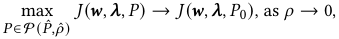

therefore as |D| →+∞, we have _𝐽_ˆ → min _𝒘 𝐽_ ( _𝒘, 𝝀, 𝑃_ 0), thereby satisfying the _Asymptotic Consistency_ requirement. 

Combining the above results, we have proven Theorem 2. 

## **A.3 Proof of Theorem 3** 

We first clarify that for a given value space V and empirical distribution _𝑃_ˆ , there exists some _𝜌_ ˆ such that all unimodal distributions on V are within the ambiguity set P( _𝑃,_ˆ _𝜌_ ˆ). For convenience, we continue the assumptions for V in Section A.1 and Section A.2, thus for any two value _𝒗_ 1 _, 𝒗_ 2 ∈V, the norm function value is bounded: 

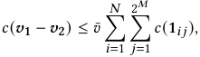

where 1 _𝑖𝑗_ is the value vectors that satisfy _𝑣𝑖𝑗_ = 1 while all other elements are 0. This conclusion is a simple derivation of the properties of norms. Therefore, by definition [59], the Wasserstein distance between any unimodal distribution _𝑃_ ({ _𝒗_ ˆ }) and _𝑃_ˆ is also bounded: 

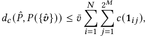

where _𝑃_ ({ _𝒗_ ˆ }) is the unimodal distribution on _𝒗_ ˆ. Therefore, we choose the value on the right as _𝜌_ ˆ, then according to (4), every unimodal distribution _𝑃_ ({ _𝒗_ ˆ }) ∈P( _𝑃,_ˆ _𝜌_ ˆ). 

With such chosen _𝜌_ ˆ, for any bidder _𝑖_ , the _𝑟𝑟𝑔𝑡𝑖_ in (6) satisfies: 

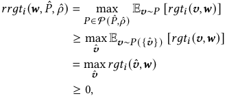

hence the robust IC constraint in (7) implies that: 

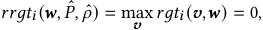

which is exactly the DSIC constraint. Thus the proof is concluded. 

## **A.4 Proof of Theorem 4** 

Similar to Proof A.1, for any bidder _𝑖_ , we replace the origin _𝑙𝑎𝑔_ by _𝑟𝑔𝑡𝑖_ function, and the conclusion becomes: 

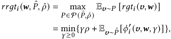

where _𝜙𝑖_′is the same as_𝜙_defined in (11): _𝜙𝑖_′(_𝒗,𝒘,𝛾_)= max � _𝑟𝑔𝑡𝑖_ ( _𝒗_′ _, 𝒘_ ) − _𝛾𝑐_ ( _𝒗_ − _𝒗_′ )� _, 𝒗_′ 

1751 

KDD ’25, August 3–7, 2025, Toronto, ON, Canada. 

Qilong Lin et al. 

**Table 4: Revenue for Different Robust Coefficients (** 10−1 **)** 

|**R.C.**|0|0.001|0.01|0.03|0.1|0.3|1|10|
|---|---|---|---|---|---|---|---|---|
|**A.R.**|6.63|6.68|6.75|6.76|6.69|6.74|6.74|6.72|

**Table 3: Additional Results on More Valuation Settings** 

|**Setting**|**Method**|**Regret**|**Revenue**|**Loss**|
|---|---|---|---|---|
||BL|0.0488|2.2587|7.5013|
|**2x2SY**|GAT|0.0007|2.7820|-2.6420|
||SAT|0.0002|2.8265|-2.7865|
||BL|0.0309|3.7042|2.4758|
|**2x2AS**|GAT|0.0011|4.1206|-3.9006|
||SAT|0.0005|4.1008|-4.0008|
||BL|0.0915|1.6853|16.6147|
|**2x3AD**|GAT|0.0016|1.2296|-0.9096|
||SAT|0.0003|1.2191|-1.1591|
||BL|0.0793|6.9427|16.8473|
|**3x10AD**|GAT|0.0018|4.8012|-4.2612|
||SAT|0.0016|5.0802|-4.6002|

and note that _𝜙𝑖_′(_𝒗,𝒘,_0)=_𝜙𝑖_(_𝒗,𝒘_) defined in (16). We have: 

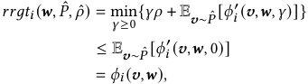

which is exactly the conclusion in (15). Thus the proof is concluded. 

## **B Supplementary Results** 

## **B.1 Supplementary Results for Section 5.2** 

We will first introduce two additional settings that correspond to slightly more complex value distributions: 

• **2x2SY** : short for _2x2 symmetric_ , which is a variant of _2x2 additive_ . Here we denote the subsets as S1 = ∅, S2 = {1}, S3 = {2} and S4 = {1 _,_ 2}, then the distribution for this setting can be described as _𝑣_ 11 = _𝑣_ 21 = 0, _𝑣_ 12 _, 𝑣_ 13 _, 𝑣_ 22 _, 𝑣_ 23 ∼ _𝑈_ [1 _,_ 2], _𝑣_ 14 = _𝑣_ 12 + _𝑣_ 13 + _𝑐_ 1, _𝑣_ 24 = _𝑣_ 22 + _𝑣_ 23 + _𝑐_ 2 and _𝑐_ 1 _,𝑐_ 2 ∼ _𝑈_ [−1 _,_ 1], where _𝑈_ [ _𝑙,𝑟_ ] for any _𝑙_ and _𝑟_ denotes the uniform distribution over [ _𝑙,𝑟_ ]. 

• **2x2AS** : short for _2x2 asymmetric_ . The distribution is the same as the **2x2SY** except that _𝑣_ 22 _, 𝑣_ 23 ∼ _𝑈_ [1 _,_ 5]. 

These settings is the same as the settings (IV) and (V) in ([17]). Now we can present the results of our GAT and SAT method on more valuation settings, as shown in Table 3, where **2x3AD** and **3x10AD** are abbreviations for the _2x3 additive_ and _3x10 additive_ settings, respectively. Since the training process is generally the same as Figure 1, we only consider the metrics after 100,000 iterations as the performance for each method, which are presented in the last three columns of Table 3. It can be observed that the experimental results in the supplementary settings are consistent with the conclusions in Section 5.2. 

In addition, we further provide the commonly used values for the hyper-parameters in the GAT and SAT methods. _𝝀_ is set to 1 at the start of training, _𝜂𝒘_ is set to 10−4 , _𝜂𝝀_ is set to 5 initially and is continuously increased during training. These settings are consistent with the experiments of existing work [17]. Besides, _𝜖_ and _𝜂𝜸_ are usually set to 0.01 and 0.05, respectively. 

## **B.2 Supplementary Results for Section 5.5** 

Here, we briefly present part of the average performance corresponding to different robust coefficients obtained during the process of Algorithm 2 on the datasets splitted by T = {10 _,_ 11 _, ...,_ 15}, as shown in Table 4, where **R.C.** and **A.R.** are abbreviations for robust coefficient and average revenue, respectively. Notably, a robust coefficient of 0 refers to the results obtained using the BL method. 

We can observe that the performance of the auctions that introduced the robust coefficient all exceeded that of BL. Therefore, based on these results and the process of Algorithm 2, we adopted _𝜌_ = 0 _._ 03 as the robust coefficient for GAT in the subsequent evaluations, which is consistent with the description in Section 5.5. 

1752 

