# **ComRecycle: An Intelligent Computation Recycling Framework for Online Advertising** 

Chufeng Shi Yangsu Liu Rui Qiu Shanghai Jiao Tong University Alibaba Group Alibaba Group School of Computer Science Alimama Alimama Shanghai, China Beijing, China Beijing, China cfshi99@sjtu.edu.cn liuyangsu.lys@taobao.com qiurui.qiu@taobao.com Zhenzhe Zheng∗ Dagui Chen Ruitao Zhu Shanghai Jiao Tong University Alibaba Group Shanghai Jiao Tong University School of Computer Science Alimama School of Computer Science Shanghai, China Beijing, China Shanghai, China zhengzhenzhe@sjtu.edu.cn dagui.cdg@taobao.com sjtu_zrt@sjtu.edu.cn 

Fan Wu Shanghai Jiao Tong University School of Computer Science Shanghai, China fwu@cs.sjtu.edu.cn 

## **Abstract** 

Existing online advertising systems generate high-quality ad recommendations through a complex online serving pipeline whenever a user’s ad request arrives. However, our analyses on the display advertising system in Taobao show that this paradigm could lead to an inefficient utilization of computational resources. In this work, we propose an intelligent computation recycling framework called ComRecycle, which caches and reuses unexposed ad sets for repetitive ad requests to improve the computational resource utilization. We introduce fine-grained computation recycling strategies, and formulate the computation recycling decision as an online constrained optimization problem. Therefore, ComRecycle can achieve the goal of reducing computation costs while guaranteeing the same level of recommendation performance. Extensive offline experiments validate the correctness and effectiveness of ComRecycle. Our online A/B testing demonstrates that ComRecycle can save over 20% computational resources while maintaining the same system performance as the baseline. 

## **CCS Concepts** 

### • **Information systems** → _Computational advertising_ ; _Personalization_ ; **Recommender systems** . 

∗Zhenzhe Zheng is the corresponding author. 

Permission to make digital or hard copies of all or part of this work for personal or classroom use is granted without fee provided that copies are not made or distributed for profit or commercial advantage and that copies bear this notice and the full citation on the first page. Copyrights for components of this work owned by others than the author(s) must be honored. Abstracting with credit is permitted. To copy otherwise, or republish, to post on servers or to redistribute to lists, requires prior specific permission and/or a fee. Request permissions from permissions@acm.org. _KDD ’25, Toronto, ON, Canada_ 

© 2025 Copyright held by the owner/author(s). Publication rights licensed to ACM. ACM ISBN 979-8-4007-1454-2/2025/08 https://doi.org/10.1145/3711896.3737205 

## **Keywords** 

Online Advertising, Computation Recycling, Online Constrained Optimization 

#### **ACM Reference Format:** 

Chufeng Shi, Yangsu Liu, Rui Qiu, Zhenzhe Zheng, Dagui Chen, Ruitao Zhu, and Fan Wu. 2025. ComRecycle: An Intelligent Computation Recycling Framework for Online Advertising. In _Proceedings of the 31st ACM SIGKDD Conference on Knowledge Discovery and Data Mining V.2 (KDD ’25), August 3–7, 2025, Toronto, ON, Canada._ ACM, New York, NY, USA, 10 pages. https: //doi.org/10.1145/3711896.3737205 

## **1 Introduction** 

Internet service providers are working on various aspects in recommendation and advertising systems, such as cold start [11, 33], accuracy [9, 12, 38, 40] and diversity [19, 24, 34], aiming to provide highquality services. Much effort has been focused on improving various performance metrics, but neglecting the computation (also storage) burden imposed by complex machine learning models. When the performance of the system regarding computation costs adheres to the law of diminishing marginal utility [22], we should prioritize computational resource utilization efficiency [20, 26, 36, 41]. 

We identified the high waste of computational resources by analyzing resource utilization in Taobao display advertising system (detailed in Section 2). In this scenario, users may initiate multiple ad requests during an ongoing session. For each request, the online advertising system goes through a complex online serving pipeline, which includes retrieval, pre-ranking, and ranking stages, to generate high-quality ad recommendations [15]. However, we found that users frequently initiate repetitive ad requests, with only a small portion of ads being viewed, while the majority remain unexposed. Furthermore, we observed that the ads generated for two consecutive requests could overlap, which indicates a redundancy between requests. These findings demonstrate that computational resources 

4851 

KDD ’25, August 3–7, 2025, Toronto, ON, Canada 

Chufeng Shi et al. 

are largely underutilized. Based on these findings, we developed a computation recycling framework to improve the computational resource utilization. The intuitive idea is to cache the unexposed and potentially overlapped ads, and reuse them for subsequent requests, thereby recycling the unnecessary computational resources. 

However, designing this framework faces a crucial obstacle: **The first challenge is that coarse-grained computation recycling strategies may result in performance degradation.** Users’ interests may change while browsing. Therefore, simple strategies such as directly reusing unexposed ads of the ranking stage cannot perceive users’ dynamic interests, leading to a decline in system performance. A comprehensive computation recycling framework should be capable of performing fine-grained recycling to handle different levels of request redundancy. Assuming that the framework can provide fine-grained computation recycling strategies, a second challenge immediately arises: **It is difficult to make optimal recycling decisions for incoming ad requests.** Our goal is to enhance resource utilization without compromising system performance. Therefore, the fine-grained computation recycling framework should assign a personalized computation recycling strategy for each request. However, the framework lacks information on incoming ad requests when determining the strategy for the current one. In this case, ComRecycle can only make decisions based on information from past requests, making it difficult to achieve an effective balance of resource utilization and performance. 

In response to these challenges, we design an intelligent computation recycling framework called ComRecycle, which adopts a caching and reusing approach, as illustrated in Figure 1. Specifically, we design fine-grained computation recycling strategies. Then, to derive the optimal computation recycling strategy, we model the computation recycling decision problem as an online constrained optimization task that minimize computation costs while maintaining system performance. Therefore, by solving the corresponding Lagrangian dual problem and obtaining the dual solution, we can determine the optimal computation recycling strategy for each request in real-time [1]. 

Our main contributions in this work are listed as follows. 

- We identify the ubiquitous phenomenon of resource underutilization within an online advertising system, primarily stemming from users’ frequently freshing behavioral patterns and low ad exposure rates. Therefore, we claim that there is an opportunity for reducing computation costs by reusing unexposed ads of the previous request. 

- We design an intelligent computation recycling framework called ComRecycle, where we introduce four representative computation recycling strategies to recycle unnecessary computational resources at a fine-grained level. Additionally, we model the computation recycling decision as an online constrained optimization problem to maximize resource utilization while adhering to a performance guarantee constraint. 

- We conduct extensive offline and online experiments. The offline results validate the correctness and effectiveness of ComRecycle. Moreover, our online A/B test shows that ComRecycle can save **23%** of CPU resources and **22%** of GPU 

resources while maintaining the same level of system performance. 

## **2 Empirical Studies On Resource Underutilization** 

We conduct empirical studies in Taobao display advertising system to support our motivation. First, we demonstrate the ubiquitous resource underutilization phenomenon by revealing the issue of the behavioral patterns of frequent refreshing and low ad exposure within the platform. Then, we summarize the insights from the results which motivate us to design an intelligent computation recycling framework. 

## **2.1 Primary Findings** 

We collect data logs from the display advertising system in Taobao, where we randomly sample a subset of users and record their ad requests and system responses in one day (April 2, 2024). We summarize the statistics of the collected data logs in Table 1, which include around 52K unique users and 205K ad requests. Among them, 51% of users initiated two or more requests, and 74% of requests are repetitive, which is defined as that there are at least one request from the same user before the current one. For further analysis, we record the following information for each request: 

- **Ad Request Information:** It consists of information about the ad request, such as request ID, user ID and timestamp. 

- **System Response Information:** We collect the logs of retrieval, pre-ranking and ranking stages in the display advertising system. We record the selected ad sets and the metrics including predicted click-through rates (pCTRs) and bids, to evaluate the redundancy of ad requests. 

- **User behaviors:** We record user behaviors (views and clicks) towards the displayed ads for each request. 

Based on the collected data logs, we can statistically analyze resource utilization status in the platform. First, we analyze the distribution of time intervals of repetitive requests1 , as shown in Table 2, to explore user behavior patterns when browsing ads. Specifically, we group repetitive requests based on their time intervals, and then calculate the number of repetitive requests within each group. We find that the majority of repetitive requests occur within a short period. For example, 46% of repetitive requests occur within 10 seconds, and 75% occur within 2 minutes, indicating that users refresh the page and conduct new ad requests frequently. Such a user behavior pattern can lead to extremely high QPS (queries per second) and impose a heavy computational burden on the online system. Moreover, when users frequently refresh the page, it is highly likely that many of the recommended ads are not exposed, because users cannot thoroughly view all ads in a very short time ( _e.g._ , 10 seconds). This finding is supported by the statistics in Table 3, where we analyze the proportion of the exposed ads out of the total 20 candidate ads per request. We discover that 41% of the requests have no ad exposure, while nearly 70% of the requests have less than half of the ads exposed. This finding emphasizes that 

> 1The time interval of a repetitive request is the duration between the previous ad request and the current one. 

4852 

ComRecycle: An Intelligent Computation Recycling Framework for Online Advertising 

KDD ’25, August 3–7, 2025, Toronto, ON, Canada 

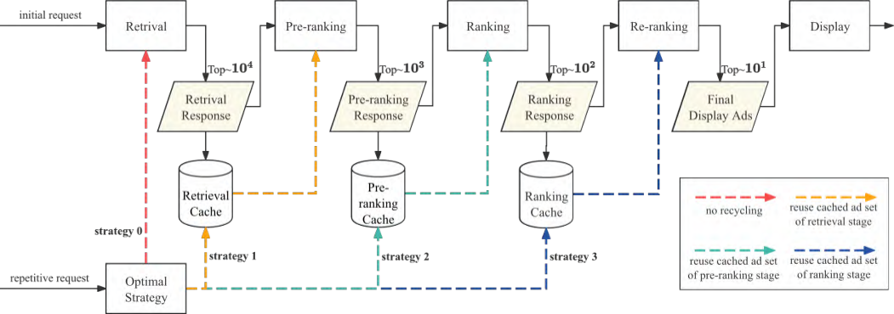

**Figure 1: The intelligent computation recycling framework for the online advertising system. For a user’s initial request, ComRecycle generates the final display ad list through the complete online serving pipeline, and caches the selected ad set (response) of each stage for the user. For the repetitive request from the user, ComRecycle will select a recycling strategy based on the change in user interest, and reuse the cached ad set. This approach significantly reduces computational resource consumption during model serving.** 

**Table 1: Statistics of the collected data logs.** 

||# Unique|# Repetitive|Repetition rate|
|---|---|---|---|
|User|52,804|27,191|51.49%|
|Request|205,955|153,151|74.36%|

**Table 2: Distribution of time intervals of repetitive requests. We calculate the number of repetitive requests in different time intervals and their proportion in the total number of repetitive requests.** 

||Time in|tervals of|repetitive|requests||
|---|---|---|---|---|---|
||≤2s|≤5s|≤30s|≤2min|≤5min|
|# Requests|18,897|42,419|98,148|114,282|121,927|
|Proportion|12.34%|27.70%|64.09%|74.62%|79.61%|

most of the recommended ads are not viewed by users, and thus causing the computational resources to be largely underutilized. Based on these findings, we draw a conclusion. 

Insight 1. _The online advertising system spends excessive computation to generate high-quality but largely unexposed ad recommendations, leading to low resource utilization._ 

## **2.2 Redundancy Analysis** 

One can alleviate the issue of resource underutilization through a simple approach, which involves caching the unexposed ads of the ranking stage and reusing them for incoming requests. This is a coarse-grained computation recycling method. Although it saves resources, directly reusing cached ads without considering user interests can lead to a performance degregation. For example, if 

**Table 3: Distribution of the number of exposed ads per request. We calculate the number of requests with different exposed ads and their proportion in the total requests.** 

||Number|of actual|exposed a|ds||
|---|---|---|---|---|---|
||0|_<_4|_<_6|_<_8|_<_10|
|# Requests|85,343|107,540|126,570|139,140|143,902|
|Proportion|41.44%|52.22%|61.46%|67.53%|69.87%|

some users lose interest in the previous ads, the cached results may not align with their current needs. Since the advertising system generates ads based on user interests, the difference between the ad sets for consecutive requests can indicate shifts in user interests. Specifically, a smaller difference between the two ad sets implies a smaller change in user interests, which futher indicates a higher redundancy between the two requests. Therefore, we analyze redundancy between requests in different aspects. 

When a user conducts successive ad requests, we refer to the earlier one as the initial request and the later one as the repetitive request. We denote the selected ad set returned from the retrieval, pre-ranking, and ranking stages for the initial request as _𝑆_ 1 _,𝑆_ 2 _,𝑆_ 3, respectively, those for the repetitive request as _𝑆_¯ 1 _, 𝑆_¯ 2 _, 𝑆_¯ 3, and the final display ads being _𝑆_¯ _𝑓𝑖𝑛𝑎𝑙_ . Consequently, we define the following metrics to measure request redundancy: 

- **Ad coverage rate (ACR)** : We calculate the coverage rates of the selected ad set of the initial request over the final display ads of the repetitive request as _𝐴𝐶𝑅 𝑗_ =|_𝑆__<u>𝑗</u>_∩_𝑆_¯_<u>𝑓</u>𝑖𝑛𝑎𝑙_| . | _𝑆_<u>¯</u> _𝑓𝑖𝑛𝑎𝑙_ | 

- **pCTR diff** : We calculate the pCTR difference in the ranking _<u>𝑖</u>_<u>|</u> 

- stage between two consecutive requests as<u>|</u>_𝑐𝑡𝑟_ _<u>𝑐𝑡𝑟</u>__𝑖_−_𝑐𝑡𝑟_ _𝑖_′ _,𝑖_ ∈ | _𝑆_ 3 ∩ _𝑆_ 3′|, where_𝑐𝑡𝑟𝑖,𝑐𝑡𝑟_ _𝑖_′are the pCTRs in the ranking stage for ad _𝑖_ of the initial and repetitive requests, respectively. 

4853 

KDD ’25, August 3–7, 2025, Toronto, ON, Canada 

Chufeng Shi et al. 

- **bid diff** : We calculate the bidding difference between the _<u>𝑖</u>_<u>|</u> 

- initial and repetitive requests as<u>|</u>_𝑏𝑖𝑑_ _𝑏𝑖𝑑__𝑖_−_𝑏𝑖𝑑_ _𝑖_′ _,𝑖_ ∈| _𝑆_ 3 ∩ _𝑆_ 3′|, where _𝑏𝑖𝑑𝑖,𝑏𝑖𝑑𝑖_′are the bids reported by advertiser_𝑖_for the initial and repetitive requests, respectively. 

Ad coverage rates measure the degree of similarity between the selected candidate ads for the initial and repetitive requests, allowing us to evaluate the redundancy in requests. A low ACR indicates that the two requests generate significantly different ad sets, suggesting a low level of redundancy. In contrast, a high ACR implies a high level of redundancy. As shown in Figure 2, we plot the distributions of ad coverage rates. Specifically, we group repetitive requests by their time intervals, and calculate the proportion of requests with the same ACR within each group. Figure 2(a), 2(b) and 2(c) show the ACRs of retrieval, pre-ranking and ranking stages, respectively. From each subfigure, we can observe that as the time interval between the initial and repetitive requests increases, the distribution of ACRs gradually shifts to the left, which shows a positive correlation between the redundancy and the time interval. Besides, this finding can support the idea that user interests are the fundamental factor affecting redundancy, as the time interval is one key factor contributing to changes in user interests. By comparing the distributions of ACRs for the same time interval group across subfigures, we find that the ACRs are higher in the earlier stages ( _e.g._ , retrieval stage) and lower in the later stages ( _e.g._ , ranking stage). This is because the earlier stages of an advertising system output larger ad sets, leading to higher coverage rates. 

Insight 2. _The redundancy level of the repetitive request is related to the extent of changes in user interests._ 

Insight 3. _Repetitive requests have different levels of redundancy for different stages of the online advertising system._ 

Following the similar procedure, we further analyze the differences in ranking pCTRs and advertisers’ bids between initial and repetitive requests. We group the requests by time intervals and count the distributions of pCTR and bid differences within each group. As shown in Figure 3, pCTR and bid diffs follow a pattern similar to that observed from Figure 2: longer time intervals lead to greater pCTR and bid differences. 

## **2.3 Summary of Empirical Studies** 

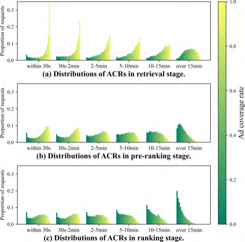

**Figure 2: Distributions of (a) retrieval stage, (b) pre-ranking stage and (c) ranking stage ad coverage rates with respect to time intervals.** 

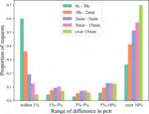

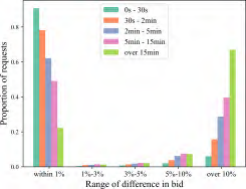

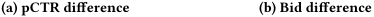

<!-- Start of picture text -->
(a) pCTR difference (b) Bid difference <!-- End of picture text -->

**Figure 3: pCTR diff and bid diff versus time intervals between the initial and repetitive requests.** 

We summarize the insights and get the following inspirations: 

- There is a significant computational waste in the Taobao display advertising system. We can improve resource utilization by reusing the results of the previous request. 

- Redundancy exists between requests. We can estimate the redundancy by modeling user interests. 

- The repetitive request has different redundancy for different stages of the initial request. We can achieve varying levels of computation recycling by reusing the cached results from different stages of the previous request. 

## **3 Framework and Problem Formulation** 

In this section, we first introduce the intelligent computation recycling framework. Then, we model the problem of computation recycling as a online constrained optimization problem, and propose a near-optimal solution for online serving. 

## **3.1 Computation Recycling Framework** 

Figure 1 illustrates the overall framework of ComRecycle, where caching and computation recycling processes are introduced into the existing online advertising system. First, ComRecycle classifies the arriving ad request as either an initial or a repetitive request based on predefined rules, such as whether the system has cached data for the user. For initial requests, multistage models will be used to generate the final display ads. In addition, ComRecycle caches the selected ad sets of the retrieval, pre-ranking and ranking stages for future recycling. For repetitive requests, ComRecycle first models the changes in user interests based on real-time features, and then adopts a suitable recycling strategy. Specifically, ComRecycle offers one of four strategies: no recycling, reusing the cached retrieval, pre-ranking, or ranking ad set of the initial request. This allows the system to skip some stages of the online serving pipeline, saving 

4854 

KDD ’25, August 3–7, 2025, Toronto, ON, Canada 

ComRecycle: An Intelligent Computation Recycling Framework for Online Advertising 

computational resources. For instance, if ComRecycle chooses to reuse the cached pre-ranking ad set, it will use the cached ads as the candidate ad set for the ranking stage. It is worth noting that, in addition to computation recycling, ComRecycle can also collaborate with advanced dynamic computation allocation approaches, such as elastic queues [20, 36, 37], elastic models [26], and elastic channels [41] to provide finer-grained computation allocations. However, this topic is beyond the scope of this work, and we leave the collaboration with other approaches as a future work. 

## **3.2 Primal Formulation** 

We model the decision of computation recycling as an optimization problem that aims to minimize the computation costs while maintaining system performance. Suppose the online advertising system receives _𝑁_ requests within a short period, each of which can be assigned _𝑀_ different recycling strategies. For each request _𝑖_ ∈[ _𝑁_ ], ComRecycle assigns a computation recycling strategy _𝒙𝑖_ , which is a one-hot vector. Here, _𝑥𝑖,𝑗_ = 1 indicates that ComRecycle assigns strategy _𝑗_ ∈[ _𝑀_ ] for request _𝑖_ . Furthermore, each strategy _𝑗_ incurs a constant computation cost _𝑐 𝑗_ . Compared to not implementing any recycling strategy, when request _𝑖_ employs strategy _𝑗_ , there will be an inevitable degradation in system performance denoted by △ _𝑄𝑖,𝑗_ . In our context, strategy _𝑗_ ranges from {0 _,_ 1 _,_ 2 _,_ 3}, representing the strategies of not performing computation recycling or reusing the cached retrieval, pre-ranking, or ranking ad set, respectively. System performance _𝑄𝑖,𝑗_ can be assessed using eCPM, number of user clicks, _etc._ , and △ _𝑄𝑖,𝑗_ = _𝑄𝑖,𝑗_ − _𝑄𝑖,_ 0. The computation cost could involve FLOPS, CPU cores, and GPUs. We aim to control the total performance degradation so that it does not exceed a threshold of _𝐵_ . By setting different thresholds, we can achieve varying levels of computation recycling. 

Ultimately, we have the following optimization problem: 

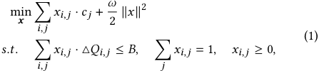

where we add a quadratic term in the objective function to simplify the derivation of the optimal solution. Besides, we relax the discrete constraints on _𝑥𝑖,𝑗_ . However, as discussed later, we can force the optimal solutions _𝒙𝑖_ to degenerate into one-hot vectors by letting _𝜔_ → 0+ [35]. 

## **3.3 Lagrangian Duality** 

Multiple methods are available to solve the problem. Offline dynamic programming (DP) [5] can be used to find the optimal solution. However, in online systems, real-time decisions need to be made for each incoming request [35], while DP cannot meet this real-time decision-making requirement. An alternative approach is to solve the dual problem, which allows us to derive a near-optimal computation recycling strategy for incoming requests. Since the primal problem’s objective function is convex and the constraints are affine, it satisfies Slater’s condition [31]. This implies that the optimal solution to the dual problem is also the optimal solution to the primal problem. Therefore, we construct Lagrangian function [7] for Equation (1) 

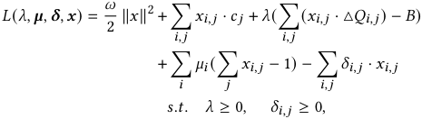

where _𝜆, 𝝁, 𝜹_ are the Lagrange multipliers, and the corresponding dual problem is 

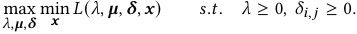

According to the K.K.T conditions, if we have the dual solution for _𝜆_∗ _, 𝜇𝑖_∗and_𝛿_ _𝑖,𝑗_∗, the optimal solution to the primal is 

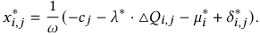

Lemma 3.1. _For any 𝑗_ 1 _, 𝑗_ 2 ∈[ _𝑀_ ] _, if 𝑐 𝑗_ 1+ _𝜆_ ·△ _𝑄𝑖,𝑗_ 1 ≤ _𝑐 𝑗_ 2+ _𝜆_ ·△ _𝑄𝑖,𝑗_ 2 _and 𝑥𝑖,𝑗_∗ 2_>_0_hold, then 𝑥_ _𝑖,𝑗_∗ 1≥_𝑥_ _𝑖,𝑗_∗ 2_._ 

Based on the lemma [1], we can derive that if the optimal solution satisfies the discrete constraint, it necessarily follows that 

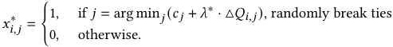

It can be derived that as _𝜔_ → 0, the solutions _𝑥𝑖,𝑗_ converge to 0 or 1. Consequently, by taking the limit _𝜔_ → 0+ , we obtain a discrete strategy assignment. In this case, the optimal strategy for each request depends only on the request-independent variable _𝜆_∗ , making it applicable for online services. Here, _𝜆_∗ , also known as the “shadow price” [3], represents the computational savings per unit decrease in system performance under the optimal strategy. Therefore, _𝜆_∗ reflects our target resource utilization efficiency. In practice, we set the performance degradation threshold _𝐵_ to determine the optimal Lagrange multiplier _𝜆_∗ . This indicates that minimizing computation costs while maintaining system performance essentially controls overall resource utilization efficiency. 

However, achieving the theoretically optimal solution in practice is challenging. This is because the performance degradations △ _𝑄𝑖,𝑗_ for using different strategies are usually unknown. Moreover, we cannot determine an a priori Lagrange multiplier _𝜆_∗ . Therefore, we train a deep learning model to estimate the degradation in system performance as △ _𝑄_˜ _𝑖,𝑗_ , and utilize offline bisection search to find a near-optimal Lagrange multiplier. We will provide a detailed discussion about the algorithms in the next section. Consequently, the strategy output by ComRecycle is 

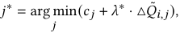

which may not be the optimal solution. The effectiveness of the selected strategy depends on the accuracy of the estimation. 

## **4 Algorithm** 

## **4.1 Overview** 

The ComRecycle workflow, as shown in Figure 4, is divided into offline and online parts. **In the offline phase** (indicated by gray dashed lines), ComRecycle first trains the Uplift-based Performance Degradation Predictor using data logs (step 1). This model predicts 

4855 

KDD ’25, August 3–7, 2025, Toronto, ON, Canada 

Chufeng Shi et al. 

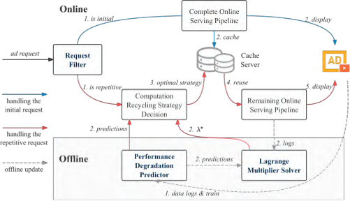

**Figure 4: Overview of the ComRecycle workflow. We elaborate on the design of the modules highlighted in bold.** 

the performance degradations △ _𝑄_˜ _𝑖,𝑗_ for repetitive requests under different recycling strategies. Then, ComRecycle uses the logs and the trained Predictor to solve offline for the Lagrange multiplier _𝜆_∗ (step 2). In our implementation, the Performance Degradation Predictor is updated hourly to adapt to changes in data distribution, and _𝜆_∗ is updated at the minute level to accommodate real-time traffic fluctuations. **In the online phase** , a request is classified as an initial or a repetitive request by the Request Filter based on predefined rules (step 1). For initial requests (indicated by blue lines), ComRecycle does not apply any computation recycling strategy, and additionally caches the selected ads from each stage in the online serving pipeline for later reusing (step 2). For repetitive requests (indicated by red lines), ComRecycle assigns an optimal computation recycling strategy based on the predicted performance degradation △ _𝑄_˜ _𝑖,𝑗_ and the offline solved Lagrange multiplier _𝜆_∗ (step 2 & 3). Then, ComRecycle reuses the cached ad set based on the optimal strategy and sends them to the remaining online serving pipeline to generate final display ads (step 4 & 5). 

## **4.2 Request Filter** 

To reduce the additional computation overhead introduced by implementing ComRecycle, a Request Filter is set up to preliminarily filter requests eligible for computation recycling. For requests with high redundancy, the additional cost incurred by ComRecycle is negligible compared to the amount saved. However, for low-redundancy requests, where only a small amount of computation can be saved, it is not necessary to conduct the computation recycling. Although the additional computation and storage costs can be offset by the amount of computational resources saved by ComRecycle, the extra response time (RT) introduced by the framework directly impacts user experience and cannot be offset. Therefore, ComRecycle needs to filter out requests for unnecessary computation recycling by carefully selecting a criteria to distinguish requests. 

We formulate filtering rules based on the analyses in Section 2. Table 2 shows that repetitive requests with time intervals within 2 minutes account for 75% of all repetitive requests. These requests have small pCTR and bid diffs according to Figure 3, indicating a high redundancy level. Thus, we empirically set the time interval within 2 minutes as criteria to distinguish between repetitive and 

initial requests. In this way, ComRecycle can strike a balance between computation recycling and additional computation overhead. 

## **4.3 Uplift-based Performance Degradation Predictor** 

_4.3.1 Feature System._ Identifying redundancy of requests relies on detecting changes in user interests. Therefore, we introduce the feature of user behaviors to model users’ real-time interests [8– 10, 28, 29]. Due to the sparsity of user click behavior, we consider the ads viewed by the user in the initial request as user behaviors. In addition, the speed at which user interests change varies from one user to another. For example, some users’ interests change rapidly as they enjoy exploring various new items, while others may have a specific purpose and focus on purchasing a particular item. Therefore, we introduce user profile features to capture userspecific interest change rates. Finally, we add request information to include some statistical features. We summarize these features as follows: 

- **User Behaviors:** Records the sequence of ads viewed by the user during her last request, including ad ID, category, and other ad-related features. 

- **User Profile:** Records user-side features such as age, gender, region and _etc_ . 

- **Request Information:** Records the number of views and clicks during the user’s last request and the time interval. 

It should be noted that we do not use the ad-related features of the current request because the decision on recycling strategies needs to be determined before creating the candidate ad set. 

_4.3.2 Model._ We propose an Uplift-based Performance Degradation Predictor to estimate the performance degradation of requests under different recycling strategies. However, since we either apply a computation recycling strategy or not to a given request, we cannot observe the ground truth of the performance loss counterfactually when a specific computation recycling strategy is applied [25, 30]. Therefore, we employ a multi-task learning approach to address this issue. Specifically, we estimate the system performance under different computation recycling strategies and calculate the performance degradation by taking the difference. 

As depicted in Figure 5, all input features initially pass through an embedding layer. Categorical features are transformed into lowdimensional embeddings through an embedding look-up layer, while continuous features are processed similar to [15]. Next, we model the sequence of user behaviors. Since the order of user behaviors varies in importance, with more recent behaviors better reflecting the user’s real-time interests, we use a GRU [14] to model this pattern. Afterward, we concatenate the user behavior embedding modeled by the GRU with the embeddings previously obtained to serve as the shared bottom for MMoE [27], which is a commonly used multi-task learning framework. In our context, MMoE will output four logits: the control logit for no recycling _𝑙__𝑐𝑡𝑟𝑙_ , and the uplift logits for reusing cached retrieval, pre-ranking, and ranking ad sets { _𝑙_ 1_𝑢𝑝𝑙𝑖𝑓𝑡_ _,𝑙_ 2_𝑢𝑝𝑙𝑖𝑓𝑡_ _,𝑙_ 3_𝑢𝑝𝑙𝑖𝑓𝑡_ }. Summing the control logit and the uplift logits yields the treatment logits { _𝑙_ 1_𝑡𝑟𝑒𝑎𝑡_ _,𝑙_ 2_𝑡𝑟𝑒𝑎𝑡_ _,𝑙_ 3_𝑡𝑟𝑒𝑎𝑡_ }. Thus, { _𝑙__𝑐𝑡𝑟𝑙_ _,𝑙_ 1_𝑡𝑟𝑒𝑎𝑡_ _,𝑙_ 2_𝑡𝑟𝑒𝑎𝑡_ _,𝑙_ 3_𝑡𝑟𝑒𝑎𝑡_ } represent the logits of system performance under different strategies. After being processed through 

4856 

KDD ’25, August 3–7, 2025, Toronto, ON, Canada 

ComRecycle: An Intelligent Computation Recycling Framework for Online Advertising 

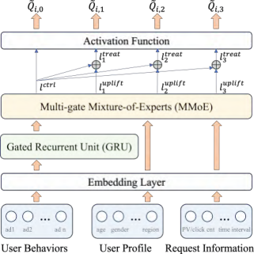

**Figure 5: Network architecture of the proposed Uplift-based Performance Degradation Predictor.** 

**Algorithm 1:** Bisection search 

|**I** **O** **1 w** **2** **3**|**nput:** {△˜_𝑄𝑖,𝑗_},{_𝑐𝑗_},_𝜆𝑙_=0,_𝜆𝑟_=1_𝑒_9, tolerance_𝜖_; **utput:**_𝜆_∗; **hile**_𝜆𝑙_+_𝜖_≤_𝜆𝑟_**do** _𝜆𝑚_= _𝜆𝑙_+_𝜆𝑟_ 2 ; Choose the optimal_𝒙𝑖_for_𝑁_samples according to_𝜆𝑚_;  |
|---|---|
|**4** **5** **6**|Calculate the performance degradation△˜_𝑄_= � _𝑖_△˜_𝑄__𝑖,𝑗_∗; **if** ��△˜_𝑄_ ��≤_𝐵_**then** _𝜆_∗=_𝜆__𝑟_=_𝜆𝑚_;|
|**7** **8** **9 r**|**else** _𝜆__𝑙_=_𝜆𝑚_; **eturn**_𝜆_∗_;_|

an activation function, these logits yield the predicted system performance _𝑄_˜ _𝑖,𝑗_ . Thus, the degradation in performance can be calculated as △ _𝑄_˜ _𝑖,𝑗_ = _𝑄_˜ _𝑖,_ 0 − _𝑄_˜ _𝑖,𝑗_ . 

## **4.4 Lagrange Multiplier Solver** 

We assume that the system performance in relation to the computation costs follows the law of diminishing marginal utility [4, 39]. This assumption is intuitive because the better the current system performance, the more difficult it is to improve [20, 26]. Additionally, there is an upper bound for the system performance, _i.e._ , it is impossible to achieve infinite performance by allocating unlimited computational resources. Under this assumption, we can solve for the optimal _𝜆_∗ using the bisection search method outlined in Algorithm 1. Due to significant traffic variations in online systems, we follow prior work [18, 37] and update _𝜆_∗ every 15 minutes and serve for the following 15 minutes. According to [2], this method of updating the Lagrange multiplier is near-optimal. 

## **5 Experiments** 

## **5.1 Offline Validation** 

Before deploying ComRecycle online, we must conduct offline evaluations to verify its correctness and effectiveness. However, since 

the framework has not been deployed, we cannot collect online data logs of system performance using different recycling strategies, which complicates the offline validation. Therefore, we conduct offline simulation experiments on the dataset described in Section 2. 

**Experiment Settings.** The settings for the offline simulation experiment are as follows: 

- **Actions:** _𝑗_ can be {0 _,_ 1 _,_ 2 _,_ 3}, representing the strategies of not performing computation recycling or reusing the cached retrieval, pre-ranking, or ranking ads. 

- **Computation Cost:** _𝑐 𝑗_ is a constant representing the system’s response time (RT) when using strategy _𝑗_ . We choose RT as the metric because it is positively correlated with computation costs and is easy to measure. 

- **System Performance:** _𝑄𝑖,𝑗_ = _𝐴𝐶𝑅𝑖,𝑗_ is the defined ad coverage rate metric. We choose the ACR to estimate the actual system performance metrics, since we cannot access the real system performance during offline validation. 

- **System Performance Degradation:** △ _𝑄𝑖,𝑗_ = 1 − _𝐴𝐶𝑅𝑖,𝑗_ . This is because the ACR is 1 when not performing computation recycling. 

- **Performance Degradation Threshold:** _𝐵_ represents the maximum acceptable level of ad coverage rate degradation. 

It should be noted that since the system performance is always 1 when not recycling resources, the Performance Degradation Predictor used for offline validation does not include the learning task for the control logit in MMoE. 

**Comparing Methods.** As discussed in Section 3, DP can calculate the optimal solution for the problem offline. Therefore we compare ComRecycle with DP to verify the effectiveness of ComRecycle. In addition, we also include fixed computation recycling strategy, which are coarse-grained, for a comprehensive comparison. Specifically, we establish the following comparing methods: 

**(1) DP:** Solves offline the computation recycling strategies for all requests based on the estimated system performance degradation △ _𝑄_˜ _𝑖,𝑗_ . Since there is an estimation error between △ _𝑄𝑖,𝑗_ and △ _𝑄_˜ _𝑖,𝑗_ , DP does not yield the optimal solution for the original problem. **(2) ComRecycle:** Solves for _𝜆_∗ based on △ _𝑄_˜ _𝑖,𝑗_ and assigns a computation recycling strategy to each request according to _𝑗_∗ = arg min _𝑗_ ( _𝑐 𝑗_ + _𝜆_∗ · △ _𝑄_˜ _𝑖,𝑗_ ). **(3) Fixed Computation Recycling Strategy:** Assigns the same computation recycling strategy to all requests. Furthermore, to assess the system performance of ComRecycle under ideal conditions where the performance degradation can be estimated accurately, we add the following baselines: **(4) DP*:** Solves offline the computation recycling strategies for all requests based on the actual system performance degradation △ _𝑄𝑖,𝑗_ , which gives the optimal solution for the original problem. **(5) ComRecycle*:** Solves for _𝜆_∗ based on △ _𝑄𝑖,𝑗_ and assigns a computation recycling strategy to each request according to _𝑗_∗ = arg min _𝑗_ ( _𝑐 𝑗_ + _𝜆_∗ · △ _𝑄𝑖,𝑗_ ). 

**Results.** By adjusting the threshold _𝐵_ , we can establish the relationship between the system performance and computation costs for all methods, as shown in Figure 6. In Table 4, we compare the system performance of different methods at the same computation cost, and the computation costs required by different methods to achieve the same system performance. Here, we come to the following conclusions: **(1)** The curves for DP* and ComRecycle* almost 

4857 

KDD ’25, August 3–7, 2025, Toronto, ON, Canada 

Chufeng Shi et al. 

**Table 4: Resource utilization comparisons with fixed computation recycling strategies. We omit comparisons with Strategies 1 and 3 as all methods yield zero improvement in either ACR or RT reduction.** 

||ACR imp DP*|rovement with t ComRecycle*|he same R DP|T ComRecycle|
|---|---|---|---|---|
|Strategy 1|+5.23%|+5.23%|+2.23%|+2.15%|
|Strategy 2|+11.04%|+11.04%|+3.10%|+3.04%|
||RT reduc|tion with the sa|me ACR||
||DP*|ComRecycle*|DP|ComRecycle|
|Strategy 1|-26.44%|-26.44%|-7.00%|-7.21%|
|Strategy 2|-30.90%|-30.90%|-9.88%|-10.88%|

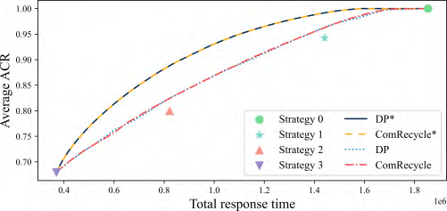

**Figure 6: Relationship between system performance and computation costs for different methods.** 

coincide, as do the curves for DP and ComRecycle, indicating that ComRecycle could approach the optimal solution. **(2)** ComRecycle* significantly outperforms ComRecycle, indicating that the accuracy of the estimates limits the framework’s effectiveness. On the other hand, this also suggests that resource utilization can be greatly improved if the model’s estimates are sufficiently accurate. **(3)** ComRecycle outperforms fixed computation recycling, indicating that ComRecycle improves resource utilization. 

As illustrated in Figure 7, we present the combination of computation recycling strategies produced by ComRecycle* and ComRecycle at different computation costs. Specifically, we plot the number of requests that adopt different computation recycling strategies. When the computation cost is minimal, all requests opt to reuse the cached ranking ads. As the threshold _𝐵_ gradually increases, the computation investment also increases. At this point, the computation recycling strategies assigned to some requests shift from reusing the ranking cache to more costly but higher-performing strategies. Moreover, when comparing subfigures 7a and 7b, we can find that the trend of changes in the strategy assignment of ComRecycle is similar to that of ComRecycle*. The difference between the two outcomes is only attributed to inaccuracies in the estimates of performance degradation. 

In summary, we have successfully validated the correctness and effectiveness of ComRecycle. Therefore, we can attempt to implement the framework in the online advertising system. 

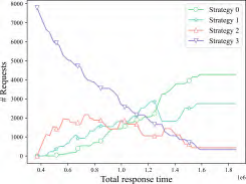

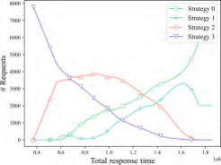

**(a) Strategy combinations provided by (b) Strategy combinations provided by ComRecycle* ComRecycle** 

**Figure 7: Comparison of the recycling strategy combinations generated by ComRecycle* and ComRecycle.** 

## **5.2 Online Performance** 

We implemented ComRecycle in the Taobao display advertising system for online A/B testing from 2024-04-16 to 2024-04-22 to demonstrate the effectiveness of ComRecycle. The deployed scenarios include core areas such as homepage advertising and stream advertising, involving billions of daily active users who generate a massive number of ad requests per day. In the face of such large-scale scenarios, the system requires a large number of GPUs, typically in the high hundreds to low thousands, for daily model training. 

The settings of the online experiment are slightly different from those of the offline experiment. Before the full deployment, we tested two computation recycling strategies: reusing the cached ranking ad set and no recycling, which did not require extensive modifications to the current system and yielded excellent results. Given that the substantial investment needed for further development may not ensure significant benefits, we only implement these two strategies in the online setting. The implementation of other strategies is considered for future work. Besides, we use the ranking eCPM as the measure of system performance in stead of the ACR metric. We use the original advertising system, which does not employ any computation recycling strategies, as the baseline to compare against the system that utilizes the ComRecycle framework. Specifically, we compare recommendation and advertising metrics such as Click-Through Rate (CTR), Revenue Per Mille (RPM), and Total Cost (COST), as well as resource utilization metrics like CPU and GPU utilization. By adjusting the performance degradation threshold, we manage to maintain the same level of system performance of ComRecycle as that of the baseline ( **+1.01%** CTR, **+0.87%** RPM, **+0.20%** COST) while saving **23%** of CPU resources and **22%** of GPU resources in model serving. Therefore, a full implementation of ComRecycle in the system could save thousands of CPU cores and hundreds of GPUs, bringing significant economic benefits. 

## **6 Related Work** 

## **6.1 Intelligent Computation Allocation** 

Recently, a series of works [20, 26, 30, 36, 37, 41, 42] have focused on the problem of intelligent computation allocation. They argue that computational resources should be personalized for each request because different requests have varying advertising values, aiming 

4858 

KDD ’25, August 3–7, 2025, Toronto, ON, Canada 

ComRecycle: An Intelligent Computation Recycling Framework for Online Advertising 

to improve the overall system performance. Following this rationale, Jiang _et al._ was the first to propose DCAF [20], adjusting the size of the candidate ad set to control the invested computational resources. This method is known as the elastic queue method and is optimized using a linear programming algorithm for the best allocation. Yang _et al._ [36] introduced CRAS to holistically solve the issue of multistage computation allocation in cascading systems. Zhou _et al._ [41] considered two other computation allocation methods in addition to the elastic queue approach: elastic channel and elastic model. And they accounted for joint effects across stages and models through reinforcement learning. Yuan _et al._ [37] found that users have varying sensitivities to system performance and system latency. Therefore, they performed personalized computation allocation based on users’ various preferences. Lu _et al._ [26] approached from an eco-friendly perspective, focusing on the balance between recommendation accuracy and carbon emissions. However, these works do not consider the phenomenon of resource underutilization, thereby overlooking computation recycling as a potential method to further improve resource utilization. 

## **6.2 Caching in Recommendation Systems** 

Content caching is a classic problem in networking [23]. With the development of the Internet, various recommendation-based applications have increasingly stringent demands on cache hit rates and user experience. As a result, the issue of joint caching and recommending contents [6, 32] has been attracting more and more attention. In particular, Wang _et al._ [32] and Fu _et al._ [16] considered enhancing caching efficiency in device-to-device communication networks through recommendation systems. Kastanakis _et al._ [21] designed a high-quality and cache-friendly recommendation system for mobile edge caching that does not require the involvement of content providers. Giannakas _et al._ [17] considered improving cache hit rates in CDNs by utilizing recommendation algorithms, while ensuring satisfactory system performance. However, these works primarily focus on caching and therefore cannot guarantee the system performance. Inspired by content caching, Chen _et al._ [13] proposed a user-wise result cache for recommendations during traffic peaks in large-scale recommendation systems, which is the most relevant work to ours. However, their work only considers a basic cache reuse strategy and does not consider the potential impact of reusing cache on system performance. As a result, it cannot achieve the balance between resource utilization and performance. 

## **7 Conclusion** 

In this work, we observe two phenomena in Taobao display advertising system, which lead to substantial resource underutilization. Based on the observations, we propose an intelligent computation recycling framework called ComRecycle that caches previously unexposed ads. To improve resource utilization while maintaining system performance, we model the decision of computation recycling as an online constrained optimization problem. Our offline experiments on a real-world dataset from Taobao demonstrate the effectiveness of ComRecycle. Our online A/B tests demonstrate that ComRecycle effectively improves resource utilization. 

## **Acknowledgments** 

This work was supported, in part by China NSF grant No. U2268204, 62322206, 62025204, 62132018, 62272307, 62372296, in part by Alibaba Group through Alibaba Innovative Research Program. The opinions, findings, conclusions, and recommendations expressed in this paper are those of the authors and do not necessarily reflect the views of the funding agencies or the government. 

## **References** 

- [1] Deepak Agarwal, Bee-Chung Chen, Pradheep Elango, and Xuanhui Wang. 2012. Personalized Click Shaping through Lagrangian Duality for Online Recommendation. In _Proceedings of the 35th international ACM SIGIR conference on Research and development in information retrieval_ . 485–494. 

- [2] Shipra Agrawal, Zizhuo Wang, and Yinyu Ye. 2014. A Dynamic Near-optimal Algorithm for Online Linear Programming. _Operations Research_ 62, 4 (2014), 876–890. 

- [3] Jean-Pierre Aubin and FH Clarke. 1979. Shadow Prices and Duality for a Class of Optimal Control Problems. _SIAM Journal on Control and Optimization_ 17, 5 (1979), 567–586. 

- [4] William Baumol. 2015. _Microeconomics: Principles and policy_ . Cengage Learning Canada Inc. 

- [5] Richard Bellman. 1966. Dynamic programming. _science_ 153, 3731 (1966), 34–37. 

- [6] César Bernardini, Thomas Silverston, and Olivier Festor. 2013. MPC: Popularitybased Caching Strategy for Content Centric Networks. In _2013 IEEE international conference on communications (ICC)_ . IEEE, 3619–3623. 

- [7] Stephen P Boyd and Lieven Vandenberghe. 2004. _Convex Optimization_ . Cambridge university press. 

- [8] Yue Cao, Xiaojiang Zhou, Jiaqi Feng, Peihao Huang, Yao Xiao, Dayao Chen, and Sheng Chen. 2022. Sampling is All You Need on Modeling Long-term User Behaviors for CTR Prediction. In _Proceedings of the 31st ACM International Conference on Information & Knowledge Management_ . 2974–2983. 

- [9] Yukuo Cen, Jianwei Zhang, Xu Zou, Chang Zhou, Hongxia Yang, and Jie Tang. 2020. Controllable Multi-interest Framework for Recommendation. In _Proceedings of the 26th ACM SIGKDD International Conference on Knowledge Discovery & Data Mining_ . 2942–2951. 

- [10] Jianxin Chang, Chenbin Zhang, Zhiyi Fu, Xiaoxue Zang, Lin Guan, Jing Lu, Yiqun Hui, Dewei Leng, Yanan Niu, Yang Song, et al. 2023. TWIN: TWo-stage Interest Network for Lifelong User Behavior Modeling in CTR Prediction at Kuaishou. In _Proceedings of the 29th ACM SIGKDD Conference on Knowledge Discovery and Data Mining_ . 3785–3794. 

- [11] Hao Chen, Zefan Wang, Feiran Huang, Xiao Huang, Yue Xu, Yishi Lin, Peng He, and Zhoujun Li. 2022. Generative Adversarial Framework for Cold-start Item Recommendation. In _Proceedings of the 45th International ACM SIGIR Conference on Research and Development in Information Retrieval_ . 2565–2571. 

- [12] Qiwei Chen, Changhua Pei, Shanshan Lv, Chao Li, Junfeng Ge, and Wenwu Ou. 2021. End-to-end User Behavior Retrieval in Click-through Rate Rrediction Model. _arXiv preprint arXiv:2108.04468_ (2021). 

- [13] Xiaoshuang Chen, Gengrui Zhang, Yao Wang, Yulin Wu, Shuo Su, Kaiqiao Zhan, and Ben Wang. 2024. Cache-Aware Reinforcement Learning in Large-Scale Recommender Systems. In _Companion Proceedings of the ACM on Web Conference 2024_ . 284–291. 

- [14] Junyoung Chung, Caglar Gulcehre, KyungHyun Cho, and Yoshua Bengio. 2014. Empirical Evaluation of Gated Recurrent Neural Networks on Sequence Modeling. _arXiv preprint arXiv:1412.3555_ (2014). 

- [15] Paul Covington, Jay Adams, and Emre Sargin. 2016. Deep Neural Networks for Youtube Recommendations. In _Proceedings of the 10th ACM conference on recommender systems_ . 191–198. 

- [16] Yaru Fu, Lou Salaün, Xiaolong Yang, Wanli Wen, and Tony QS Quek. 2021. Caching Efficiency Maximization for Device-to-device Communication Networks: A Recommend to Cache Approach. _IEEE Transactions on Wireless Communications_ 20, 10 (2021), 6580–6594. 

- [17] Theodoros Giannakas, Pavlos Sermpezis, and Thrasyvoulos Spyropoulos. 2018. Show Me the Cache: Optimizing Cache-friendly Recommendations for Sequential Content Access. In _2018 IEEE 19th International Symposium on" A World of Wireless, Mobile and Multimedia Networks"(WoWMoM)_ . IEEE, 14–22. 

- [18] Jiayan Guo, Yusen Huo, Zhilin Zhang, Tianyu Wang, Chuan Yu, Jian Xu, Bo Zheng, and Yan Zhang. 2024. Generative Auto-bidding via Conditional Diffusion Modeling. In _Proceedings of the 30th ACM SIGKDD Conference on Knowledge Discovery and Data Mining_ . 5038–5049. 

- [19] Yanhua Huang, Weikun Wang, Lei Zhang, and Ruiwen Xu. 2021. Sliding spectrum decomposition for diversified recommendation. In _Proceedings of the 27th ACM SIGKDD Conference on Knowledge Discovery & Data Mining_ . 3041–3049. 

- [20] Biye Jiang, Pengye Zhang, Rihan Chen, Xinchen Luo, Yin Yang, Guan Wang, Guorui Zhou, Xiaoqiang Zhu, and Kun Gai. 2020. DCAF: A Dynamic Computation Allocation Framework for Online Serving System. _arXiv preprint arXiv:2006.09684_ (2020). 

4859 

KDD ’25, August 3–7, 2025, Toronto, ON, Canada 

Chufeng Shi et al. 

- [21] Savvas Kastanakis, Pavlos Sermpezis, Vasileios Kotronis, and Xenofontas Dimitropoulos. 2018. CABaRet: Leveraging Recommendation Systems for Mobile Edge Caching. In _Proceedings of the 2018 Workshop on Mobile Edge Communications_ . 19–24. 

- [22] EMIL KAUDER. 1965. _History of Marginal Utility Theory_ . Princeton University Press. 

- [23] Avraham Leff, Joel L Wolf, and Philip S. Yu. 1993. Replication algorithms in a remote caching architecture. _IEEE Transactions on Parallel and Distributed Systems_ 4, 11 (1993), 1185–1204. 

- [24] Zihan Lin, Hui Wang, Jingshu Mao, Wayne Xin Zhao, Cheng Wang, Peng Jiang, and Ji-Rong Wen. 2022. Feature-aware Diversified Re-ranking with Disentangled Representations for Relevant Recommendation. In _Proceedings of the 28th ACM SIGKDD Conference on Knowledge Discovery and Data Mining_ . 3327–3335. 

- [25] Dugang Liu, Xing Tang, Han Gao, Fuyuan Lyu, and Xiuqiang He. 2023. Explicit Feature Interaction-aware Uplift Network for Online Marketing. In _Proceedings of the 29th ACM SIGKDD Conference on Knowledge Discovery and Data Mining_ . 4507–4515. 

- [26] Xingyu Lu, Zhining Liu, Yanchu Guan, Hongxuan Zhang, Chenyi Zhuang, Wenqi Ma, Yize Tan, Jinjie Gu, and Guannan Zhang. 2023. GreenFlow: a computation allocation framework for building environmentally sound recommendation system. In _Proceedings of the 32nd International Joint Conference on Artificial Intelligence_ . Article 677, 9 pages. 

- [27] Jiaqi Ma, Zhe Zhao, Xinyang Yi, Jilin Chen, Lichan Hong, and Ed H Chi. 2018. Modeling Task Relationships in Multi-task Learning with Multi-gate Mixtureof-experts. In _Proceedings of the 24th ACM SIGKDD international conference on knowledge discovery & data mining_ . 1930–1939. 

- [28] Jianxin Ma, Chang Zhou, Hongxia Yang, Peng Cui, Xin Wang, and Wenwu Zhu. 2020. Disentangled Self-supervision in Sequential Recommenders. In _Proceedings of the 26th ACM SIGKDD International Conference on Knowledge Discovery & Data Mining_ . 483–491. 

- [29] Qi Pi, Guorui Zhou, Yujing Zhang, Zhe Wang, Lejian Ren, Ying Fan, Xiaoqiang Zhu, and Kun Gai. 2020. Search-based User Interest Modeling with Lifelong Sequential Behavior Data for Click-through Rate Prediction. In _Proceedings of the 29th ACM International Conference on Information & Knowledge Management_ . 2685–2692. 

- [30] Xufeng Qian, Yue Xu, Fuyu Lv, Shengyu Zhang, Ziwen Jiang, Qingwen Liu, Xiaoyi Zeng, Tat-Seng Chua, and Fei Wu. 2022. Intelligent Request Strategy Design in Recommender System. In _Proceedings of the 28th ACM SIGKDD Conference on Knowledge Discovery and Data Mining_ . 3772–3782. 

- [31] Morton Slater. 2013. Lagrange Multipliers Revisited. In _Traces and emergence of nonlinear programming_ . Springer, 293–306. 

- [32] Yanfeng Wang, Mingyang Ding, Zhiyong Chen, and Ling Luo. 2017. Caching Placement with Recommendation Systems for Cache-enabled Mobile Social Networks. _IEEE Communications Letters_ 21, 10 (2017), 2266–2269. 

- [33] Yinwei Wei, Xiang Wang, Qi Li, Liqiang Nie, Yan Li, Xuanping Li, and Tat-Seng Chua. 2021. Contrastive learning for cold-start recommendation. In _Proceedings of the 29th ACM International Conference on Multimedia_ . 5382–5390. 

- [34] Yue Xu, Hao Chen, Zefan Wang, Jianwen Yin, Qijie Shen, Dimin Wang, Feiran Huang, Lixiang Lai, Tao Zhuang, Junfeng Ge, et al. 2023. Multi-factor sequential re-ranking with perception-aware diversification. In _Proceedings of the 29th ACM SIGKDD Conference on Knowledge Discovery and Data Mining_ . 5327–5337. 

- [35] Jinyun Yan, Zhiyuan Xu, Birjodh Tiwana, and Shaunak Chatterjee. 2020. Ads Allocation in Feed via Constrained Optimization. In _Proceedings of the 26th ACM SIGKDD International Conference on Knowledge Discovery & Data Mining_ . 3386– 3394. 

- [36] Xun Yang, Yunli Wang, Cheng Chen, Qing Tan, Chuan Yu, Jian Xu, and Xiaoqiang Zhu. 2021. Computation Resource Allocation Solution in Recommender Systems. _arXiv preprint arXiv:2103.02259_ (2021). 

- [37] Zhiyu Yuan, Kai Ren, Gang Wang, and Xin Miao. 2023. Hydrus: Improving Personalized Quality of Experience in Short-form Video Services. In _Proceedings of the 46th International ACM SIGIR Conference on Research and Development in Information Retrieval_ . 1127–1136. 

- [38] Jiaqi Zhai, Lucy Liao, Xing Liu, Yueming Wang, Rui Li, Xuan Cao, Leon Gao, Zhaojie Gong, Fangda Gu, Michael He, et al. 2024. Actions Speak Louder than Words: Trillion-Parameter Sequential Transducers for Generative Recommendations. _arXiv preprint arXiv:2402.17152_ (2024). 

- [39] Gang Zhao, Mong Li Lee, Wynne Hsu, and Wei Chen. 2012. Increasing Temporal Diversity with Purchase Intervals. In _Proceedings of the 35th international ACM SIGIR conference on Research and development in information retrieval_ . 165–174. 

- [40] Guorui Zhou, Na Mou, Ying Fan, Qi Pi, Weijie Bian, Chang Zhou, Xiaoqiang Zhu, and Kun Gai. 2019. Deep interest evolution network for click-through rate prediction. In _Proceedings of the AAAI conference on artificial intelligence_ , Vol. 33. 5941–5948. 

- [41] Jiahong Zhou, Shunhui Mao, Guoliang Yang, Bo Tang, Qianlong Xie, Lebin Lin, Xingxing Wang, and Dong Wang. 2023. RL-MPCA: A Reinforcement Learning Based Multi-Phase Computation Allocation Approach for Recommender Systems. In _Proceedings of the ACM Web Conference 2023_ . 3214–3224. 

- [42] Chenxu Zhu, Bo Chen, Huifeng Guo, Hang Xu, Xiangyang Li, Xiangyu Zhao, Weinan Zhang, Yong Yu, and Ruiming Tang. 2023. Autogen: An Automated Dynamic Model Generation Framework for Recommender System. In _Proceedings of the Sixteenth ACM International Conference on Web Search and Data Mining_ . 598–606. 

4860 

