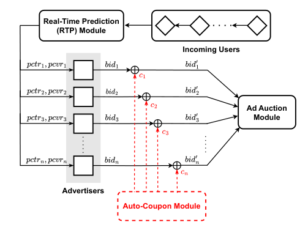
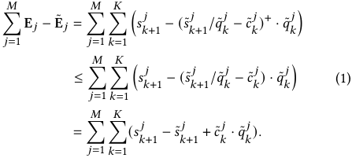
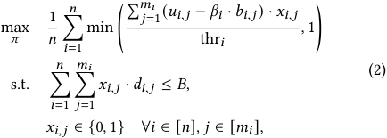
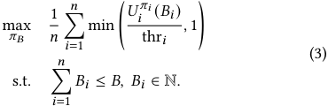
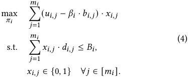
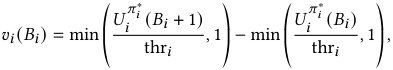
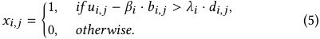
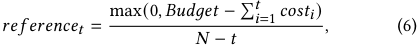
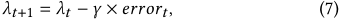
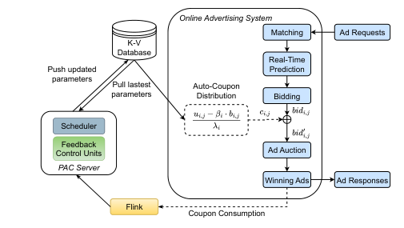

# **An Auto-Coupon Framework for Advertiser Retention in Online Advertising** 

|Yidan Xing∗|Haoqi Zhang∗|Yangsu Liu|
|---|---|---|
|School of Computer Science,|School of Computer Science,|Alibaba Group|
|Shanghai Jiao Tong University|Shanghai Jiao Tong University|Beijing, China|
|Shanghai, China|Shanghai, China|liuyangsu.lys@alibaba-inc.com|
|katexing@sjtu.edu.cn|zhanghaoqi39@sjtu.edu.cn||
|Dagui Chen|Zhenzhe Zheng†|Fan Wu|
|Alibaba Group|School of Computer Science,|School of Computer Science,|
|Beijing, China|Shanghai Jiao Tong University|Shanghai Jiao Tong University|
|dagui.cdg@alibaba-inc.com|Shanghai, China zhengzhenzhe@sjtu.edu.cn|Shanghai, China fwu@cs.sjtu.edu.cn|

## **Abstract** 

The online advertising platform serves as the intermediary between advertisers and users to facilitate the product trading process and generate profits. While the vitality of both the user and advertiser community is crucial to the long-term development of platforms, compared with the enduring efforts to improve user experience, little attention has been given to methods for attracting or retaining advertisers. To address this oversight, in this work, we investigate the first intelligent solution to the advertiser retention problem in online advertising. Motivated by advertiser surveys and data analytics, we first define a set of short-term ad performance metrics as the key retention metrics we need to optimize for advertisers. In consideration of the desirable properties of a retention framework, we propose an Auto-Coupon module to distribute impression-level virtual coupons to selected advertisers during the bidding process. We decompose the resulted retention optimization problem into two stages, and adopt feedback control as well as reinforcement learning methods to realize personalized coupon distribution. The offline experiments demonstrate the effectiveness of our methods in boosting the ad performance of churning advertisers, and the large-scale online A/B test further justifies the improvement in advertisers’ willingness to stay in the platform. 

## **CCS Concepts** 

• **Applied computing** → **Electronic commerce** ; • **Information systems** → **Online advertising** . 

∗Equal contribution. Work done during their internship at Alibaba Group. 

†Zhenzhe Zheng is the corresponding author. 

Permission to make digital or hard copies of all or part of this work for personal or classroom use is granted without fee provided that copies are not made or distributed for profit or commercial advantage and that copies bear this notice and the full citation on the first page. Copyrights for components of this work owned by others than the author(s) must be honored. Abstracting with credit is permitted. To copy otherwise, or republish, to post on servers or to redistribute to lists, requires prior specific permission and/or a fee. Request permissions from permissions@acm.org. _KDD ’25, Toronto, ON, Canada_ 

© 2025 Copyright held by the owner/author(s). Publication rights licensed to ACM. ACM ISBN 979-8-4007-1454-2/2025/08 https://doi.org/10.1145/3711896.3737191 

## **Keywords** 

Online Advertising; Advertiser Retention; Coupon 

### **ACM Reference Format:** 

Yidan Xing, Haoqi Zhang, Yangsu Liu, Dagui Chen, Zhenzhe Zheng, and Fan Wu. 2025. An Auto-Coupon Framework for Advertiser Retention in Online Advertising. In _Proceedings of the 31st ACM SIGKDD Conference on Knowledge Discovery and Data Mining V.2 (KDD ’25), August 3–7, 2025, Toronto, ON, Canada._ ACM, New York, NY, USA, 11 pages. https://doi.org/10.1145/ 3711896.3737191 

## **1 Introduction** 

The rise of the Internet and mobile apps is driving rapid growth in online advertising. To facilitate its long-term development, it is crucial for an advertising platform to attract more active users and advertisers. The typical strategy of platforms in the last decade is to focus on the user-side development [3, 24, 30] and promotes the advertiser-side development indirectly. However, for the time being, most of the potential users have been involved, and platforms can hardly realize great boosts on user side. For example, the total number of active users on TaoBao has approached 900 million [11], which covers more than 70% of the mobile Internet users in China. In contrast, there still exist great potentials in constructing a larger and more active advertiser community. Facing the situations that more than half of the new advertisers may leave within ten days, the need to hold back the large groups of churning advertisers now becomes an urgent task for the platforms. As advertiser retention benefits the long-term platform development, the platform would like to undertake some monetary cost incurred by retention, as long as the short-term expenditure is bounded. Following this idea, the advertiser retention problem could be defined as _spending a limited budget to improve the total number of active advertisers_ . 

Despite the clarity of this objective, its relevant evaluation metrics—such as counting the number of active advertisers within a given period—offer limited insight into the underlying causes of advertiser churn or how to address them. To identify the contributing metrics through which we could effectively retain the advertisers, we first analyze the data collected from an advertiser churn survey regarding their intention in advertising. Most of the advertisers decide to leave the ad platform because of the dissatisfaction with 

5095 

KDD ’25, August 3–7, 2025, Toronto, ON, Canada 

Yidan Xing et al. 

their return on investment (ROI) rate and the amount of obtained advertising opportunities, such as page view (PV) and clicks, and a collection of ad performance data of churning and non-churning advertisers in our platform aligns with the above claim. These analysis motivates us to help the advertisers improve the specific short-term performance metrics as the key optimization metrics to promote their willingness to stay in the platform. 

Unlike classical optimization problems with well-defined interfaces, provided the key retention metrics, we need to first define the deployment framework to enable the optimization of these metrics. For example, directly allocating more display opportunities and providing coupons in the final bills are two distinct approaches to improve the ad performances of retention advertisers. Although many potential retention approaches might be proposed within the intricate advertising system, a feasible approach should simultaneously satisfy the implementation simplicity, optimization efficiency and other necessary economical properties inherited from ad auction design. Based on these considerations of potential schemes, we propose a plug-in module, called _Auto-Coupon_ , as a universal solution for advertiser retention. The Auto-Coupon module distributes virtual coupons to advertisers on the impression level, _i.e._ , lifting their bids on some impressions for free, thereby improving their chances of winning auctions and gaining more impressions at a lower actual price. The Auto-Coupon module satisfies the desirable properties and allows precise control over retention budget. 

With Auto-Coupon and impression-level coupons defined as decision variables, we formulate the problem of advertiser retention as a large-scale online optimization problem. This problem is challenging due to the heterogeneity of advertisers, the dynamic nature of online auctions and the real-time implementation requirement. To derive a feasible solution, we decompose this large-scale online optimization problem into two stages: the budget allocation stage to divide the total platform budget between advertisers, and the personalized coupon distribution problem to optimize the individual ad performance metrics under the allocated budget. We derive the theoretically optimal budget allocation method, and present practical allocation methods for online implementation. For the subsequent personalized coupon distribution, we figure out a nearoptimal distribution formula with adjustable parameters, and design corresponding feedback control and reinforcement learning methods to control the online coupon distribution process. To validate the performances of our solution, we conduct offline experiments on a large-scale industrial dataset, and deploy the Auto-Coupon module on one representing channel of TaoBao for online A/B test. The experimental results demonstrate that the proposed methods could effectively improve the chosen advertisers’ ad performance metrics by 14.0% and 16.5%, and further improve the number of active advertisers by 3.2%. 

We summarize the contributions of this work as follows: 

- We consider the advertiser retention problem to increase the number of active advertisers through improving their ad performances under platform budget constraint, which is underexplored in both academia and industry. 

- We propose the design of Auto-Coupon module in online advertising system as a universal framework for advertiser retention. To optimize the retention effects, we decompose the auto-coupon 

optimization problem into two stages, platform budget allocation and personalized coupon distribution. We derive the near-optimal formula in personalized coupon distribution, and design the autocoupon agents based on feedback control and reinforcement learning methods to adjust coupon distribution online. 

- We conduct both online and offline experiments to validate the effectiveness of our two-stage auto-coupon optimization scheme. Besides the improvement in ROI and PV, our online experimental results further report the improvement in advertisers’ willingness to investment, which demonstrates its effects to retain the churning advertisers. 

## **2 Motivation** 

Before presenting our design of Auto-Coupon, we first discuss the underlying design choices of advertiser retention framework. 

## **2.1 Metrics for Advertiser Retention** 

As we could not directly optimize the number of active advertisers in retention problem, to characterize appropriate intermediate metrics, we should first analyse why advertisers may decide to leave the platform. Our analysis combines the survey results from previous work [13] and advertiser performances data collected from TaoBao. The authors in [13] revealed that advertiser satisfaction mainly depends on their daily ad performances, including ROI, conversion rate (CVR), click through rate (CTR), page views (PV), and other complex factors. Among them, ROI plays the most crucial role since it directly reflects the cost-efficiency of advertising investment, while the other metrics are mutually related and jointly contribute to the ROI. As ROI has reflected the overall quality of the obtained ad display opportunities, to reach larger advertising impacts, the advertisers should also increase the amount of ad opportunities. To avoid being distracted by various intertwined metrics, we choose to adopt the amount of page views, the foremost step in interaction with users, as the representative metric. That is, ROI and PV, viewed as average quality and total quantity of ad traffic, are the key metrics the platform could improve to promote advertiser retention. 

We further validate our selected metrics on the advertiser performances data through comparing the daily ad performances between churning advertisers and non-churning advertisers. Our data includes 11,776 churning advertisers and 21,089 non-churning advertisers with comparable daily cost. Prominently, ad performance of churning advertisers is much worse than that of non-churning advertisers, with 45.55% worse in ROI and 33.76% worse in PV. From all the data and analysis above, it is reasonable to transform the objective of improving long-term intractable retention metrics to improving the two short-term advertising performance metrics, _i.e._ , ROI and PV. Specifically, we aim to directly help advertisers optimize the ROI, and improve the PV simultaneously. 

## **2.2 Properties of Retention Framework** 

To design a feasible retention framework, we also need to consider its additional impacts on the current online ad system. Combining relevant aspects, its desired properties could be listed as follows. 

- (1) _Optimization efficiency_ : allow to boost the ad performances for certain group of selected advertisers in different aspects; 

5096 

KDD ’25, August 3–7, 2025, Toronto, ON, Canada 

An Auto-Coupon Framework for Advertiser Retention in Online Advertising 

<!-- Start of picture text -->
Real-Time Prediction (RTP) Module Incoming Users Ad Auction Module Advertisers Auto-Coupon Module <!-- End of picture text -->

**Figure 1: Advertising System with Auto-Coupon Module** 

- (2) _Bounded budget_ : the short-term revenue loss due to advertiser retention is well controlled; 

- (3) _Implementation simplicity_ : introduce minor modifications and low additional time delay to the online advertising system; 

- (4) _Necessary economical properties_ : preserve incentive compatibility (IC) and individual rationality (IR) [22] of ad auctions, when the advertiser retention affects the final allocation outcomes. 

Although the listed properties are natural and reasonable, reaching a feasible solution to satisfy them simultaneously is non-trivial. Before our design of Auto-Coupon, we have proposed two competitive baseline schemes that are not finally adopted because of their relative defectives or violation of the above properties. The first baseline scheme is to directly adding coupons into the total bills of advertisers, which is motivated by the conventional retention approaches in the e-commerce platform. However, in online advertising, the churning advertisers may not be able to utilize the coupon well in the campaigns, leading to waste of coupon budget and inefficiency in retention effects. The second baseline scheme is to provide extra coupons to users when they purchase products from the retention advertisers, with the resulted revenue loss afforded by the platform. Although coupons in user side could produce stimulus in conversion, its retention effects cannot help with the upstream process of online advertising. For instance, advertisers with low CTR or poor abilities in getting display opportunities can hardly gain better ad performances. In contrast, our design of AutoCoupon avoids these problems and meets the desired properties, which would be demonstrated in the next section. 

## **3 System Model** 

## **3.1 Online Advertising with Auto-Coupon** 

The typical working procedure of an online ad system could be described as follows: when each user comes, the platform holds an auction for advertisers to compete the ad display opportunities. The advertisers estimate the value of this opportunity, and make bidding based on her valuation on the impression, which may depend on the predicted CTR (pCTR) and predicted CVR (pCVR). The ad auction 

module collects the submitted bids, and decides the winning ads and payments based on auction rules. 

The Auto-Coupon module is designed to work between advertisers and the auction module, as illustrated in Figure 1. It distributes virtual coupons to chosen advertisers, namely increase their bids and reduce the payments if they win the auctions. Under this design, the interactions between Auto-Coupon module and the original ad system only involve addition and subtraction on the original bids and payments, which is simple and friendly to the system deployment. As the virtual coupons could influence auction outcomes in the impression level, the platform has the flexibility to design the detailed coupon distribution algorithms for various objectives. 

## **3.2 Mechanism Properties and Global Optimization Problem** 

Now, we formalize the advertising process and relevant properties of Auto-Coupon module. There are _𝑁_ advertisers, denoted as _𝑖_ ∈ {1 _, . . . , 𝑁_ }, with _𝑛_ ≤ _𝑁_ advertisers need retention (assumed as the first _𝑛_ advertisers). The advertisers compete for _𝑀_ impressions _𝑗_ ∈{1 _, . . . , 𝑀_ }, where each impression has _𝐾_ displaying slots. 

The platform adopts the well-known generalized second-price (GSP) auctions with rank scores as the ad auction mechanism [7, 20], whose working procedure is as follows: We denote the bid of advertiser _𝑖_ on impression _𝑗_ as _𝑏𝑖,𝑗_ , and the ad quality as _𝑞𝑖,𝑗_ , where _𝑞𝑖,𝑗_ might be estimated by the platform based on the pctr _𝑖,𝑗_ and pcvr _𝑖,𝑗_ of advertiser _𝑖_ on impression _𝑗_ . For each impression _𝑗_ , the GSP auction ranks the advertisers based on the rank score _𝑏𝑖,𝑗_ × _𝑞𝑖,𝑗_ . The _𝑘__𝑡ℎ_ highest rank score for impression _𝑗_ , the corresponding advertiser and the ad quality are denoted as _𝑠𝑘__𝑗_,_𝑎_ _𝑘__𝑗_and_𝑞_ _𝑘__𝑗_, respec- tively. The GSP auction then allocates the _𝑘__𝑡ℎ_ slot to advertiser _𝑎𝑘__𝑗_ and charges payment _𝑝𝑘__𝑗_=_𝑠_ _𝑘__𝑗_ +1/_𝑞_ _𝑘__𝑗_for_𝑘_∈{1_, . . . , 𝐾_}following the cost-per-mille (CPM) pricing, where payment is charged once the ad get displayed. While our main results are presented under the CPM context, they could be generalized to the cost-per-click (CPC) pricing [35] setting up to the change of one pCTR constant. 

With Auto-Coupon module enabled, when virtual coupon _𝑐𝑖,𝑗_ is distributed to advertiser _𝑖_ on impression _𝑗_ , her rank score will become ( _𝑏𝑖,𝑗_ + _𝑐𝑖,𝑗_ ) × _𝑞𝑖,𝑗_ , and if she wins the _𝑘__𝑡ℎ_ slot, her payment will be ( _𝑠𝑘__𝑗_ +1/_𝑞𝑖,𝑗_−_𝑐𝑖,𝑗_)+, where(_𝑥_)+= max(_𝑥,_0). In other words, the virtual coupons _help the chosen retention advertisers to raise their bids and get better auction outcomes with discounts_ . The platform may distribute _𝑐𝑖,𝑗 >_ 0 only when _𝑏𝑖,𝑗_ × _𝑞𝑖,𝑗 < 𝑠𝐾__𝑗_,_i.e._, when the original bids of the advertiser is unable to win any display opportunity of impression _𝑗_ , and otherwise set _𝑐𝑖,𝑗_ = 0. 

In this work, we adopt the _value-maximizing_ bidder model following [8, 9], _i.e._ , the bidder aims to maximize her value of allocation as long as the assigned payment does not exceed the value, regardless of the amount of payment1 . As the advertisers typically do not have detailed valuations on getting different slots of an impression in the bidding process, we assume an advertiser _𝑖_ to have a same value for getting any slot on impression _𝑗_ , but strictly prefers to win a higher slot when payment does not exceed her value. 

> 1We also discuss the properties of our design under the alternative value-maximizing bidder model that assumes additional payment preference [33] in Appendix A. Besides, we may use the term advertiser with bidder interchangeably in this work. 

5097 

KDD ’25, August 3–7, 2025, Toronto, ON, Canada 

Yidan Xing et al. 

- Theorem 3.1. _The GSP auction with Auto-Coupon module satisfies_ 

- _IC and IR properties for value-maximizing bidders, when:_ 

   - _(1) the virtual coupons 𝑐𝑖,𝑗 distributed to advertiser 𝑖 are irrelevant to her own bids 𝑏𝑖,𝑗 for any impression 𝑗; or_ 

   - _(2) the virtual coupons 𝑐𝑖,𝑗 are distributed according to our design in Section 4._ 

Proof. Since the economical property of our Auto-Coupon module might depend on the coupon distribution strategy in Section 4, we delay our proof of part (2) to Appendix A, and only discuss part (1) here. Since advertisers have no control over virtual coupon _𝑐𝑖,𝑗_ for each single auction and are charged according to the GSP rule, any misreporting behavior to win a better allocation would lead the payment to exceed the advertiser’s true value, thus preserving the IC property. As the virtual coupon _𝑐𝑖,𝑗_ is simultaneously added to the bid and deducted from resulted payment, the payment would not exceed the original bid and IR properties get preserved. □ 

As a result, the modification in Auto-Coupon module still provide the economical properties for value-maximizing advertisers, such that preserving the normal market competition order. Furthermore, we could also demonstrate that the platform revenue loss is bounded by the supplied virtual coupon, and we are thus able to control the revenue loss under the platform budget. 

Theorem 3.2. _For 𝑞𝑖,𝑗_ = 1 _with cost per mille (CPM) pricing or 𝑞𝑖,𝑗_ = _𝑝𝑐𝑡𝑟𝑖,𝑗 with cost per click (CPC) pricing, the platform revenue loss produced by Auto-Coupon module is bounded by_�_𝑀_ _𝑗_ =1 � _𝑘𝐾_ =1_𝑐_ _𝑘__𝑗𝑞_ _𝑘__𝑗._ Proof. By our assumption on _𝑞_ and payment rule, the expected platform revenue for each impression _𝑗_ is E _𝑗_ =� _𝑘__𝐾_ =1_𝑝_ _𝑘__𝑗_·_𝑞_ _𝑘__𝑗_= � _𝑘𝐾_ =1_𝑠_ _𝑘__𝑗_ +1without Auto-Coupon module. When Auto-Coupon mod- ule is enabled, the rank score of some advertisers are affected by its virtual coupon, which might change the rank order of other advertisers. We denote the new _𝑘__𝑡ℎ_ highest rank score for impression _𝑗_ , its ad quality and corresponding virtual coupon by _𝑠_ ˜ _𝑘__𝑗_,_𝑞_˜ _𝑘__𝑗_and _𝑐_ ˜ _𝑘__𝑗_, respectively. The expected platform revenue for impression_𝑗_ becomes E˜ _𝑗_ =� _𝑘__𝐾_ =1(_𝑠_˜ _𝑘__𝑗_ +1/_𝑞_˜ _𝑘__𝑗_−_𝑐_˜ _𝑘__𝑗_)+ ·_𝑞_˜ _𝑘__𝑗_. Therefore, we may bound the total expected revenue loss of Auto-Coupon module as 

Since virtual coupon is constrained to be non-negative, rank score of every advertiser should be increased or unchanged. As _𝑠𝑘__𝑗_are the _𝑘__𝑡ℎ_ largest rank score for impression _𝑗_ , it should be non-decreasing with respect to each advertiser’s rank score. Therefore, _𝑠𝑘__𝑗_ +1≤_𝑠_˜ _𝑘__𝑗_ +1 and we then have�_𝑀_ _𝑗_ =1E_𝑗_−E˜_𝑗_≤�_𝑀_ _𝑗_ =1 � _𝑘𝐾_ =1_𝑐_˜ _𝑘__𝑗𝑞_˜ _𝑘__𝑗_ 2. □ 

> 2We use<u>�</u> _𝑀𝑗_ =1 <u>�</u> _𝑘𝐾_ =1_𝑞_ _𝑘__𝑗𝑐_ _𝑘__𝑗_in the statement of Theorem 3.2 since the main body of our paper assumes the application of Auto-Coupon module. 

Based on the optimization interface of Auto-Coupon, we now formulate the global auto-coupon retention optimization problem. As discussed in Section 2, we adopt ROI and PV as the shortterm performance metrics in optimization. Considering that valuemaximizing bidders who are indifferent on detailed payment but pursuing higher advertising revenue have become the mainstream · of online advertising, we define ROI as ROI _𝑖_ = �� _𝑀𝑗_ =1pctr _𝑖,𝑗_· pcvr _𝑖,𝑗_ � rev _𝑖_ / _𝐵𝑖_ in our context, where rev _𝑖_ is advertiser _𝑖_ ’s revenue income for one conversion, and _𝐵𝑖_ is advertiser _𝑖_ ’s campaign budget. Since the increase of ROI is proportionally equivalent to increasing the conversions, we will represent our problem in terms of conversions for ease of notations. We assume each advertiser has a _retention threshold_ for her unsatisfied ad performance metric, such that she is fully satisfied when her ad performance is above the threshold; and when the ad performance is below the threshold, her willingness to stay increases in proportion to the increase in this metric. We use thr _𝑖_ to denote the retention threshold for improving the conversion to retain advertiser _𝑖_ , which could be estimated through existing machine learning techniques [13] or advertiser survey. 

To avoid disturbing normal market situations, virtual coupons are designed to help the retention advertisers win the display opportunities in a minimum way, _i.e._ , win the _𝐾__𝑡ℎ_ slot of the impressions that they cannot win with their bare bids. We denote this impression set as _𝑗_ ∈[ _𝑚𝑖_ ] for advertiser _𝑖_ . Thus, the virtual coupon needed by advertiser _𝑖_ to win impression _𝑗_ becomes _𝑑𝑖,𝑗_ := _𝑠𝐾__𝑗_/_𝑞𝑖,𝑗_−_𝑏𝑖,𝑗_, and the increase in conversions for helping advertiser _𝑖_ win the impression _𝑗_ could be denoted as _𝑢𝑖,𝑗_ := pctr _𝑖,𝑗_ · pcvr _𝑖,𝑗_ . Aiming to maximize the willingness to stay for advertisers, the _global autocoupon optimization problem_ can be formulated as 

where _𝜋_ is the virtual coupon design strategy of the platform, _𝑥𝑖,𝑗_ are the binary variables indicating whether to provide virtual coupon for advertiser _𝑖_ on her losing impression _𝑗_ , and _𝐵_ is the platform budget. The term − _𝛽𝑖_ · _𝑏𝑖,𝑗_ represents advertiser’s loss in originally allocated impressions because of spending more advertiser budget in auctions with coupons, where _𝛽𝑖_ is a scaled measure for bidder _𝑖_ ’s ROI in original biddings. As we will see later, under our design, _𝑏𝑖,𝑗_ exactly represents the consumption of advertiser budget when the coupon is effectively distributed, and we could still provide IC properties for value-maximizing bidders despite correlation between _𝑏𝑖,𝑗_ and _𝑐𝑖,𝑗_ . To control revenue loss, we assign _𝑞𝑖,𝑗_ = 1 in our CPM context and thus abbreviate those terms in budget constraint. In practice, the platform may still adopt personalized _𝑞𝑖,𝑗_ and correspondingly adapt our design with the bound in Theorem 3.2 changed up to a constant depending on detailed _𝑞𝑖,𝑗_ . 

## **3.3 Two-Stage Auto-Coupon Optimization** 

While Problem 2 maximizes the average willingness to stay from a global view, it is an online problem with huge amounts of variables 

5098 

KDD ’25, August 3–7, 2025, Toronto, ON, Canada 

An Auto-Coupon Framework for Advertiser Retention in Online Advertising 

_𝑥𝑖,𝑗_ and complex estimation of key constants ( _e.g._ , pctr _𝑖,𝑗 ,_ pcvr _𝑖,𝑗_ and thr _𝑖_ ), leading it to be almost intractable for a real-time system. To overcome these difficulties, we propose to divide this problem into two stages: platform budget allocation and personalized coupon distribution. The platform would first divide the total coupon budget _𝐵_ to each advertiser using strategy _𝜋𝐵_ , and then enable personalized auto-coupon agents to optimize the virtual coupon distribution using strategy _𝜋𝑖_ for each advertiser _𝑖_ in a distributed manner. 

Since the budget allocation should be finished before the start of ad auctions and coupon distribution, the platform needs an estimation on the resulted retention effects to achieve a well budget allocation. Using _𝑈𝑖__𝜋𝑖_(_𝐵𝑖_) to denote the improvement of advertis- ing metric for advertiser _𝑖_ , _i.e._ ,�_𝑚_ _𝑗_ =_𝑖_ 1(_𝑢𝑖,𝑗_−_𝛽𝑖_·_𝑏𝑖,𝑗_) ·_𝑥𝑖,𝑗_, when her allocated platform budget is _𝐵𝑖_ , we could formulate the platform budget allocation problem as 

As the online platforms usually have some smallest units for dividing budget, and each smallest unit should be able to provide the advertiser with non-negligible improvements, _w.l.o.g._ , we assume _𝐵𝑖_ ∈ N and _𝑑𝑖,𝑗_ ≪ 1. Given _𝐵𝑖_ allocated to each advertiser, the _personalized auto-coupon distribution problem_ for advertiser _𝑖_ could then be formulated as: 

## **4 Methodologies** 

## **4.1 Platform Budget Allocation** 

The major difficulty in the budget allocation problem comes from the unknown form of budget-utility function _𝑈𝑖__𝜋𝑖_(_𝐵𝑖_). Fortunately, as _𝑈𝑖__𝜋𝑖_(_𝐵𝑖_) is determined by the subsequent personalized distribu- tion strategy _𝜋𝑖_ , we may utilize the so-called _diminishing return submodular (DR-submodular)_ property of the resulted _𝑈𝑖__𝜋𝑖_(_𝐵𝑖_) in budget allocation. In detail, _𝑈𝑖__𝜋𝑖_ is DR-submodular in _𝐵𝑖_ if 

_𝑈𝑖__𝜋𝑖_(_𝐵_) −_𝑈_ _𝑖__𝜋𝑖_(_𝐵_−1)≥_𝑈_ _𝑖__𝜋𝑖_(_𝐵_+ 1) −_𝑈_ _𝑖__𝜋𝑖_(_𝐵_)_,_∀_𝐵_∈Z+_._ Intuitively, satisfying DR-submodular means the marginal return of per-unit investment decreases with the total investment, and we could show a near-optimal coupon distribution strategy _𝜋𝑖_∗(Section 4.2) gives rises to a DR-submodular budget-utility function. 

_𝑖_ The DR-submodularity of _𝑈𝑖__𝜋_∗ enables us to design a _greedy algorithm_ with optimality guarantee. In each iteration, we simply allocate one unit of budget to the advertiser with highest marginal retention value (increment in satisfaction for per-unit budget) 

**Algorithm 1:** Greedy Platform Budget Allocation 

||**Input:**Total coupon budget_𝐵_; The budget-utility functions_𝑈__𝜋_∗ _𝑖_ _𝑖_ ; **Output:**Platform budget allocation results_𝐵𝑖_.|
|---|---|
|**1**|Initialize_𝑠𝑢𝑚_=0,_𝐵𝑖_=0,∀_𝑖_;|
|**2**|Initialize a max heap, where node_𝑖_has value _𝑣𝑖_(_𝐵𝑖_) =min( _𝑈_ _𝜋_∗ _𝑖_ _𝑖_ (_𝐵𝑖_+1) thr_𝑖_ _,_1) −min( _𝑈_ _𝜋_∗ _𝑖_ _𝑖_ (_𝐵𝑖_) thr_𝑖_ _,_1);|
|**3 **|**while**_𝑠𝑢𝑚< 𝐵_**do**|
|**4**|Select node_𝑖_with the largest_𝑣𝑖_from the heap;|
|**5**|_𝐵𝑖_=_𝐵𝑖_+1,_𝑠𝑢𝑚_=_𝑠𝑢𝑚_+1;|
|**6**|Update_𝑣𝑖_(_𝐵𝑖_)for node_𝑖_with_𝐵𝑖_;|

and update the budgets until all the platform budget has been spent. _𝑖_ Theorem 4.1. _When 𝑈𝑖__𝜋_∗ _are DR-submodular in 𝐵𝑖 , the greedy algorithm based on marginal retention value (Algorithm 1) is optimal to Problem (3)._ 

Proof. Assume the optimal solution is B∗ = ( _𝐵_ 1∗_, 𝐵_ 2∗_, ..., 𝐵𝑛_∗)and the allocation produced by Algorithm 1 is B′ = ( _𝐵_ 1′_, 𝐵_ 2′_, ..., 𝐵𝑛_′)≠B∗. _𝑖_ As _𝑈𝑖__𝜋_∗ is non-negative and monotonically increasing, by optimality of B∗ and design of Line 3 in Algorithm 1, we have� _𝑖__𝐵_ _𝑖_∗= � _𝑖__𝐵_ _𝑖_′= _𝐵_ , and thus there must exist two advertisers _𝑖_ and _𝑗_ where _𝐵𝑖_∗_> 𝐵_ _𝑖_′ and _𝐵_∗ _𝑗__< 𝐵_′ _𝑗_. By our greedy design (Line 4), we have_𝑣𝑗_(_𝐵_′ _𝑗_−1)≥ _𝑣𝑖_ ( _𝐵𝑖_′). Since_𝑈_ _𝑖__𝜋_ _𝑖_∗ is DR-submodular, min _𝑈𝑖𝜋_ thr _𝑖_∗ <u>(</u> _𝑖𝐵𝑖_ <u>)</u> _,_ 1 is also DR� � submodular, thus _𝑣 𝑗_ ( _𝐵_∗ _𝑗_)≥_𝑣𝑗_(_𝐵_′ _𝑗_−1)≥_𝑣𝑖_(_𝐵_ _𝑖_′)≥_𝑣𝑖_(_𝐵_ _𝑖_∗−1) given _𝐵𝑖_∗_> 𝐵_ _𝑖_′_, 𝐵_′ _𝑗__> 𝐵_∗ _𝑗_and_𝐵𝑖, 𝐵𝑗_∈N. Therefore, reassigning_𝐵_ _𝑖_∗=_𝐵_ _𝑖_∗−1 and _𝐵_∗ _𝑗_=_𝐵_∗ _𝑗_+ 1 will not degrade the optimization objective. By repeating this process, we can transform B∗ to B′ without degrading the performance, showing Algorithm 1 can achieve the optimal coupon allocation. □ 

With the greedy algorithm, we could approach the optimal bud- _𝑖_ get allocation based on the estimations of thr _𝑖_ and _𝑈𝑖__𝜋_∗ . Though existing techniques allow us to obtain those estimations [13, 37], various commercial constraints make this method too ideal in practice. To optimize the retention objective, the greedy algorithm prefers to allocate coupons to advertisers with originally low budget or low ad performance, which might lead to serious fairness concern and difficulty to provide advertisers with full interpretability about this method. Due to the above commercial constraints, we mainly consider _rule-based_ methods based on clear pre-defined rules. 

Towards practical deployment, we propose two rule-based methods for budget allocation in our system. The first approach is to divide budget based on advertisers’ historical daily advertising investment, where advertisers with higher historical investment are supplied with more retention budget. Despite the lack of utilizing more abundant features, the conciseness of this investment-based method makes it robust for engineering implementation and appropriate for business operations. The second approach is to allocate budget based on interaction tasks, where advertisers finish specific interaction tasks assigned by the platform to obtain coupon budget. 

5099 

KDD ’25, August 3–7, 2025, Toronto, ON, Canada 

Yidan Xing et al. 

These tasks usually guide advertisers to watch introductory videos and try advanced platform tools, which incentivizes advertisers to learn more about platform services and thus increases their adherence to the platform in a long run. Both investment-based and task-based methods have been deployed online in our platform and achieve significant retention effects. As our Auto-Coupon module and the personalized coupon distribution method work for any reasonable budget allocation approach, due to the intensive human behavioral elements involved in task-based method, we will mainly focus on the investment-based method in the subsequent analysis. 

## **4.2 Personalized Auto-Coupon Distribution** 

Given the budget allocation method, the personalized auto-coupon distribution problem becomes an online optimization problem with online parameters _𝑢𝑖,𝑗_ , _𝑑𝑖,𝑗_ and _𝑏𝑖,𝑗_ . Following classical approaches in online linear programming and approximation algorithms [1], we can figure out a near-optimal solution formula to this problem. 

Theorem 4.2. _Distributing coupons 𝑥𝑖,𝑗_ · _𝑑𝑖,𝑗 to advertiser 𝑖 on impression 𝑗 according to 𝑥𝑖,𝑗 in (5) can approximate the optimal offline solution to Problem 4 without breaking budget constraint 𝐵𝑖 ._ 

Proof. When _𝑑𝑖,𝑗_ ≪ _𝐵𝑖_ , similar to the greedy solution to 0-1 knapsack problem [15], greedily choose impressions with higher ( _𝑢𝑖,𝑗_ − _𝛽𝑖_ · _𝑏𝑖,𝑗_ )/ _𝑑𝑖,𝑗_ until exhausting the budget is near optimal. Therefore, setting an appropriate _𝜆𝑖_ as the threshold for choosing impressions, _i.e._ , letting _𝑥𝑖,𝑗_ = 1 when ( _𝑢𝑖,𝑗_ − _𝛽𝑖_ · _𝑏𝑖,𝑗_ ) _> 𝜆𝑖_ · _𝑑𝑖,𝑗_ and 0 otherwise, is equivalent to the greedy algorithm, thus approximating the optimal offline solution. □ 

Proposition 4.3. _Distributing virtual coupons 𝑐𝑖,𝑗 according to_ min � _𝑑𝑖,𝑗 ,_ ( _𝑢𝑖,𝑗_ − _𝛽𝑖_ · _𝑏𝑖,𝑗_ ) × _𝜆_<u>1</u> _𝑖_ � _with respect to some threshold parameters 𝜆𝑖 can approximate the optimal offline solution to Problem 4 without breaking budget constraint 𝐵𝑖 ._ 

To align the format of Proposition 4.3 and Theorem 4.2, we assume the auction may allocate to a retention advertiser only when ( _𝑢𝑖,𝑗_ − _𝛽𝑖_ · _𝑏𝑖,𝑗_ ) × _𝜆_<u>1</u> _𝑖__> 𝑑𝑖,𝑗_, though her rank score might become the same as the original _𝑠𝐾__𝑗_when (_𝑢𝑖,𝑗_−_𝛽𝑖_·_𝑏𝑖,𝑗_) × _𝜆_<u>1</u> _𝑖_exactly takes_𝑑𝑖,𝑗_. When ( _𝑢𝑖,𝑗_ − _𝛽𝑖_ · _𝑏𝑖,𝑗_ ) × _𝜆_<u>1</u> _𝑖_≤_𝑑𝑖,𝑗_, the distributed virtual coupon is not intended to help the advertiser win the auction and would not be actually consumed, but instead create a benchmark of boosted rank score for other advertisers in GSP auction. This design is necessary to prevent a non-retention advertiser from misreporting a higher bid to discourage coupon distribution of the retention advertiser without breaking her own IR property (see details of proof in Appendix A). Since we have _𝑑𝑖,𝑗_ := _𝑠𝐾__𝑗_/_𝑞𝑖,𝑗_−_𝑏𝑖,𝑗_, another key point for IC property is to have _𝛽𝑖_ ≤ _𝜆𝑖_ , such that the left-hand side of coupon distribution criteria _𝑏𝑖,𝑗_ +_𝑢𝑖,𝑗_− _𝜆__<u>𝛽</u>_ _𝑖__𝑖_·_𝑏𝑖,𝑗_ _> 𝑠𝐾__𝑗_/_𝑞𝑖,𝑗_is non-decreasing with bid _𝑏𝑖,𝑗_ . Intuitively speaking, this condition should hold for reasonable configurations of _𝛽𝑖_ and _𝜆𝑖_ . This is because _𝛽𝑖_ estimates the original ROI of current advertiser without retention, while the optimal _𝜆𝑖_ represents the estimated conversion 

improvement per extra unit of coupon budget, and the original bidding strategy of retention advertisers typically perform worse than a well-designed coupon distribution strategy. To formally guarantee this condition, we impose _𝛽𝑖_ as a lower bound of _𝜆𝑖_ in our subsequent methods. 

Recall that the greedy budget allocation algorithm requires _𝑈𝑖__𝜋𝑖_ to be DR-submodular, we now demonstrate why this property holds for _𝜋𝑖_∗in Proposition 4.3. Since this strategy essentially consumes coupons on impressions whose ( _𝑢𝑖,𝑗_ − _𝛽𝑖_ · _𝑏𝑖,𝑗_ )/ _𝑑𝑖,𝑗_ exceeds _𝜆𝑖_ , increasing the coupon budget would lead to a decreasing optimal threshold parameter to consume more coupon budget. As a result, the decrease in optimal threshold _𝜆𝑖_ would bring more user impressions with lower ( _𝑢𝑖,𝑗_ − _𝛽𝑖_ · _𝑏𝑖,𝑗_ )/ _𝑑𝑖,𝑗_ . As this term represents the retention value per unit of budget consumption, DR-submodularity _𝑖_ holds for the current _𝑈__𝜋_∗ . _𝑖_ 

Since the exact calculation of optimal _𝜆𝑖_ requires information about all the auctions that could not be obtained beforehand, using a fixed _𝜆𝑖_ calculated through historical data can lead to huge deviation in the volatile advertising environment. To overcome the difficulty, we design two control-based methods to timely adjust _𝜆𝑖_ online. 

_4.2.1 Feedback Control for Coupon Strategy._ Feedback control is widely adopted to deal with the outside noise and fluctuation in dynamic systems [35, 38]. In the scenario of personalized coupon distribution, we define the dynamic system in feedback control to be the coupon distribution strategy and the external advertising environment. During advertising, we distribute coupons according to Proposition 4.3 until the retention budget is depleted, and thus define the system input to be _𝜆_ . 

To avoid the waste of coupon budget or losing valuable ad opportunities in the future, the target of the feedback control system is to stably consume the coupons across advertising process. Therefore, dividing the advertising process into _𝑇_ time steps, the expected coupon budget we should consume in each future time step to realize stable budget consumption (also called as reference) at the time step _𝑡_ could be set as 

where _𝑐𝑜𝑠𝑡𝑖_ denotes the amount of coupon consumed at time step _𝑖_ . For feedback control, we adjust _𝜆_ at the end of each time step _𝑡_ . Thus, the error between the real-time coupon consumption and the desired amount of future consumption becomes _𝑒𝑟𝑟𝑜𝑟𝑡_ = _𝑟𝑒𝑓𝑒𝑟𝑒𝑛𝑐𝑒𝑡_ − _𝑐𝑜𝑠𝑡𝑡_ , and based on which we design a proportional controller with the linear actuator to adjust _𝜆𝑡_ as 

where _𝛾_ is the hyper-parameter indicating control sensitivity. Though with simple design, such feedback control method has demonstrated strong robustness and effectiveness for vast applications in practice. 

_4.2.2 RL-based Coupon Agent._ Independent from the robust feedback control method, we propose the RL-based coupon distribution method to integrate more historical information when adjusting the online strategy. The RL-based coupon agent has the same objective as the feedback control method to realize stable consumption of budget and to optimize the overall retention performance. For convenience in notations, we set the coupon agent to adjust the 

5100 

KDD ’25, August 3–7, 2025, Toronto, ON, Canada 

An Auto-Coupon Framework for Advertiser Retention in Online Advertising 

|**Al**|**gorithm 2:**RL-based Coupon Agent Training|
|---|---|
|**I**|**nput:**Training dataC= {_𝑐_1_,𝑐_2_, ...,𝑐𝑛_};|
|T fl T **O** |he offline theoretical optimal result{_𝑅_∗ 1_, 𝑅_∗ 2_, ..., 𝑅_∗_𝑛_}; he duration of the ad campaigns{_𝑇_1_,𝑇_2_, ...,𝑇𝑛_}. **utput:**Coupon agent with policy_𝜇𝜃_. |
|**1** In  **2 w**|itialize the actor network_𝜇𝜃_with parameter_𝜃_, the critic network_𝑄𝜂_with parameter_𝜂_, and the replay buffer; **hile**_Not Converge_**do** |
|**3**|Randomly select_𝑐𝑖_fromC, and initialize parameter_𝛼_1;|
|**4**|Use the coupon distribution strategy with_𝛼_1 in time step 1 to gain reward_𝑟_1, and initialize_𝑅_=_𝑟_1;|
|**5**|**for**_𝑡_=2**to**_𝑇𝑖_**do**|
|**6**|Observe real-time coupon consumption and generate_𝑠𝑡_;|
|**7**|Take action with random noise_𝑎𝑡_=_𝜇𝜃_(_𝑠𝑡_) +_𝜖_;|
|**8**|Adjust_𝛼𝑡_=_𝛼𝑡_−1× (1+_𝑎𝑡_);|
|**9**|Use the auto-coupon strategy with_𝛼𝑡_in time step_𝑡_ and gain reward_𝑟𝑡_;|
|**10**|Set_𝑅_=_𝑅_+_𝑟𝑡_and initialize_𝑉_=0;|
|**11**|**for**_𝜏_=_𝑡_+1**to**_𝑇𝑖_**do**|
|**12**|Use the auto-coupon strategy with_𝛼𝑡_in time step_𝜏_and gain reward_𝑟𝜏_;|
|**13**|Update_𝑉_=_𝑉_+_𝑟𝜏_;|
|**14**|Set_𝐺_=min{(_𝑅_+_𝑉_)/_𝑅_∗_,_1_._0};|
|**15**|Store experience (_𝑠𝑡,𝑎𝑡,𝐺_)in replay buffer;|
|**16**|Sample_𝑀_experiences from replay buffer;|
|**17**|Update the critic network_𝑄𝜂_by minimizing |
|**18**|L(_𝜂_) = 1 _𝑀_ � _𝑘_ � _𝐺__𝑘_−_𝑄𝜂_ � _𝑠__𝑘__,𝑎__𝑘_��2 ;|
|**19**|Update the actor network_𝜇𝜃_by policy gradient:    |
|**20**|∇_𝜃𝐽_≈1 _𝑀_ � _𝑘_∇_𝜃__𝜇_ � _𝑠__𝑘_� ∇_𝑎𝑄𝜂_ � _𝑠__𝑘__,𝑎_ ����_𝑎_=_𝜇_(_𝑠𝑘_);|

parameter _𝛼_ = _𝜆_<u>1</u>, and the coupon distribution rule becomes com- paring ( _𝑢𝑖,𝑗_ − _𝛽_ · _𝑏𝑖,𝑗_ ) × _𝛼_ and _𝑑𝑖,𝑗_ . We divide the advertising process into _𝑇_ time steps similarly, and adjust _𝛼_ at the beginning of each time step. We formulate this _𝛼_ adjustment process as a Markov Decision Process (MDP), and its elements are defined as follows. 

- S: The state _𝑠𝑡_ ∈S describes the coupon consuming status before time step _𝑡_ , including the spent coupon budget, the remaining time step of advertising, the current _𝛼_ , and the normalized coupon consumption errors (Section 4.2.1) within the time step _𝑡_ − 1 . 

- A: The action _𝑎𝑡_ represents the adjustment to _𝛼_ from time step _𝑡_ − 1 to _𝑡_ , which can be defined as _𝛼𝑡_ = _𝛼𝑡_ −1 × (1 + _𝑎𝑡_ ). To keep stability, we constrain the range of _𝑎𝑡_ to be [−0 _._ 2 _,_ 0 _._ 2]. 

- R: The immediate reward _𝑟𝑡_ is defined as the accumulative result �( _𝑢𝑖_ − _𝛽_ · _𝑏𝑖_ ) · _𝑥𝑖_ during time step _𝑡_ using parameter _𝛼𝑡_ . 

- T : We leverage model-free RL methods to generate the coupon agent, thus do not need to model the environment dynamics T . 

We adopt the actor-critic based algorithm to train the coupon agent. Inspired by the RL algorithm for automated bidding [14], we refine the classic DDPG algorithm by simplifying the training process of the actor (policy) and the critic (value) network. The detailed algorithm is shown in Algorithm 2. During each training 

iteration, we randomly choose an ad campaign as the training sample and initialize _𝛼_ 1 with prior knowledge about advertising environment. At the beginning of each time step _𝑡_ , we take action _𝑎𝑡_ , with random noise _𝜖_ for exploration, to adjust _𝛼𝑡_ −1 to _𝛼𝑡_ based on the observed state _𝑠𝑡_ . Then we use the auto-coupon strategy with _𝛼𝑡_ during time step _𝑡_ and gain reward _𝑟𝑡_ . Different from the traditional DDPG algorithm which approximates the value of ( _𝑠𝑡 ,𝑎𝑡_ ) with the immediate reward _𝑟𝑡_ and the expected future reward of _𝑠𝑡_ +1 based on the target value network, we directly calculate the accumulate reward _𝑅_ + _𝑉_ for the entire advertising process by freezing _𝛼_ = _𝛼𝑡_ in the rest of the time steps, and store the normalized performance _𝐺_ in the replay buffer. At the end of training iteration, we sample a batch of experiences from the replay buffer and update the value network _𝑄_ by minimizing its regression loss between _𝐺_ and _𝑄_ ( _𝑠,𝑎_ ), and update the policy network _𝜇_ based on policy gradient. Using the relative performance _𝐺_ to replace the conventional temporaldifference method can boost the policy convergence [14]. 

As we can observe, both of our coupon distribution methods can be implemented efficiently for online inference: at each time step, we only need to generate state (error) in time linear to the number of impressions per time step, and then update _𝜆_ via coupon agent (control function) in _𝑂_ (1) time. 

## **5 Experiment Results** 

## **5.1 Offline Simulation** 

_5.1.1 Dataset._ The dataset is collected from TaoBao, which includes more than 1500 ad campaigns aiming to maximize total user conversions. We assume each ad campaign in the dataset represents an independent advertiser in ad auctions, and divide the dataset into the training set and the test set with proportion 0.75:0.25. Data for each ad campaign _𝑖_ contains a series of bid logs recording the ad auctions that the advertiser attended during the campaign. Each bid log includes the information to compute _𝑢𝑖,𝑗 ,𝑏𝑖,𝑗 ,_ and _𝑑𝑖,𝑗_ for the corresponding user impression _𝑗_ . Following the idea of investmentbased budget allocation method, we allocate the coupon budget for each campaign _𝑖_ as _𝐵𝑖_ = _𝐵𝑖__𝑐𝑎𝑚𝑝_ × 0 _._ 3, where _𝐵𝑖__𝑐𝑎𝑚𝑝_ is the original budget of the advertiser in the ad campaign _𝑖_ , and we set the length of each time step to be 15 minutes. The ad campaign _𝑖_ computes bid _𝑏𝑖𝑑𝑖_ for all impressions according to its expected cost-per-click and pCTR, and can achieve baseline conversion _𝑐𝑣𝑟𝑖_ , PV _𝑝𝑣𝑖_ and ROI _𝑟𝑜𝑖𝑖_ without retention. The penalty parameter is set as _𝛽𝑖_ = _𝐵𝑐𝑖__<u>𝑐𝑎𝑚𝑝</u>_ _𝑣𝑟𝑖_ · 0 _._ 3 (we also provide experimental results of fixed _𝛽_ in Appendix B). 

_5.1.2 Metrics._ In offline simulations, we mainly focus on the improvement in ad performances and budget utilization of advertisers. We adopt averaged increment of ROI and PV as evaluation metrics of ad performances, which is calculated as Δ _𝑅𝑂𝐼_ = _𝑁_<u>1</u>×� _𝑖 𝑟𝑜𝑖𝑟𝑜𝑖𝑖_′−_𝑟𝑜𝑖_ _𝑖__𝑖_ and Δ _𝑃𝑉_ = _𝑁_<u>1</u>× � _𝑖_ _<u>𝑝𝑣𝑖𝑝𝑣</u>_′− _𝑖__<u>𝑝𝑣𝑖</u>_ , with _𝑁_ denoting the number of campaigns, _𝑟𝑜𝑖𝑖_′and_𝑝𝑣_ _𝑖_′denoting the results after providing the coupons for advertiser _𝑖_ . Since a well-performed coupon distribution strategy should utilize the available budget as much as possible, we additionally evaluate the consumption ratio of coupon budget and ad campaign budget, denoted as _𝑟_ ( _𝐵_ ) and _𝑟_ ( _𝐵__𝑐𝑎𝑚𝑝_ ), respectively. 

_5.1.3 Comparison Methods._ For baseline methods, we consider three methods anonymous to traditional retention approach: _Direct_ 

5101 

KDD ’25, August 3–7, 2025, Toronto, ON, Canada 

Yidan Xing et al. 

**Table 1: Offline Comparison Experiment Result** 

||Δ_𝑅𝑂𝐼_|Δ_𝑃𝑉_|_𝑟_(_𝐵__𝑐𝑎𝑚𝑝_)|_𝑟_(_𝐵_)|
|---|---|---|---|---|
|_Direct Coupon_|17.10%|15.06%|78.36%|100.0%|
|_Fixed Coupon_|-0.15%|10.84%|97.62%|36.89%|
|_Fixed-Param_|50.24%|13.73%|97.66%|70.38%|
|_Feedback Control_|65.26%|17.55%|99.15%|97.07%|
|_Coupon Agent_|71.49%|18.68%|99.03%|92.94%|

_Coupon_ , _Fixed Coupon_ , and _Fixed-Param_ . For _Direct Coupon_ , it directly increases the coupon budget _𝐵_ to the campaign budget _𝐵__𝑐𝑎𝑚𝑝_ and lets the advertiser bid by herself, which is analogous to providing fixed-amount coupons in total bill. The _Fixed Coupon_ strategy, also based on the Auto-Coupon framework, distributes coupons with a fixed ratio (30% in our experiments) to the original bids until all the coupon budget is consumed. Finally, _Fixed-Param_ follows the coupon distribution rule in Proposition 4.3 with a pre-defined fixed parameter _𝜆_ without further adjustment during advertising. 

_5.1.4 Experiment Setting and Implementation Details._ For _FixedParam_ , _Feedback Control_ and _Coupon Agent_ , the parameters are initialized with the average offline optimal value of _𝜆_∗ in the training dataset. For the _Feedback Control_ method, the hyper-parameter _𝛾𝑖_ for advertiser _𝑖_ is defined as _𝛾𝑖_ =<u>0</u>_<u>.</u>_<u>000</u> _𝐵_1 _𝑖_×_𝑇𝑖_ . To avoid over-tuning, we constrain the range of _𝜆_ adjustment to be [−0 _._ 0001 _,_ 0 _._ 0001]3 . For the RL-based _Coupon Agent_ , we train the coupon agent with the campaigns in the training set for 50,000 training iterations until the agent policy converges, and adopt the policy with the best performance on the training dataset. The actor network _𝜇_ includes 3 hidden layers with [100, 100, 10] nodes. The critic network _𝑄_ first uses a hidden layer with 100 nodes to extract the state and concatenates it with the action. Then, it uses 3 hidden layers with [100, 50, 10] nodes to predict the long-term value _𝐺_ . For each iteration, we generate 20 batches of experiences for policy update, where the batch size _𝑀_ is 64. The exploration noise _𝜖_ is sampled from a normal distribution N (0 _,_ 0 _._ 1). The computed virtual coupons are normally distributed only when the remaining retention budget is sufficient. We conduct at least 5 independent runs for each result of _Coupon Agent_ and present their averaged performances. 

_5.1.5 Experiment Results._ The performances of different methods are shown in Table 1. For _Direct Coupon_ , it can hardly help the advertiser to use up their own budget or achieve large performance improvement in increasing ROI, though the provided retention budget is depleted by the design of direct coupon. For _Fixed Coupon_ , it can even worsen the original performance by reducing the ROI by 0.15%. The underperformance of _Direct Coupon_ and _Fixed Coupon_ should be resulted from their weak assistance on the advertisers’ detailed bidding strategies. For advertisers adopting unreliable bidding strategies, providing coupons without well-designed impressionlevel guidance could lead them to waste more budget on low costefficiency impressions, especially for _Fixed Coupon_ that indistinguishably distribute coupons in proportional to advertiser bids. 

Compared with these previous method, the subsequent methods based on our derived coupon distribution formula achieve much 3To boost control efficiency in the early stage of advertising when the initial value is far from optimal, we manually set _𝜆𝑡_ +1 = _𝜆𝑡_ − 0 _._ 0001 when _𝑐𝑜𝑠𝑡𝑡_ = 0. 

<!-- Start of picture text -->
Online Advertising System Matching Ad Requests K-V Database Real-Time Push updated Prediction parameters Pull lastest Auto-Coupon parameters Distribution Bidding Scheduler Feedback Control Units Ad Auction PAC Server Winning Ads Ad Responses Flink Coupon Consumption <!-- End of picture text -->

**Figure 2: Auto-Coupon Module Online Deployment** 

better performances in both improving ROI and acquiring PV, which justifies the coupon distribution rule in Proposition 4.3. For _FixedParam_ , it can increase the ROI by 50.24% and the PV by 13.73%. For _Feedback Control_ , it can improve the ROI by 65.26% and the PV by 17.55%, while the _Coupon Agent_ can further achieve a better performance with Δ _𝑅𝑂𝐼_ to be 71.49% and Δ _𝑃𝑉_ to be 18.68% with utilization of data in training set. Meanwhile, these two methods can also help advertisers to fully consume their budget and coupons, increasing the budget consumption ratio to over 99% and the coupon consumption ratio to over 92%. 

## **5.2 Online Experiment** 

Due to the high cost of large-scale RL training and the comparable performances between _Feedback Control_ and _Coupon Agent_ method in offline experiments, we choose to implement the Auto-Coupon module with feedback control methods online. Our online experiments were conducted during the date 05-06 to 05-19, which spent over 300,000 dollars on 45,362 treatment group advertisers. 

_5.2.1 Deployment._ The working flow of Auto-Coupon in the industrial online advertising system is illustured in Figure 2. In the online deployment, functions of Auto-Coupon module are mainly divided into two parts: an online Coupon Agent and an offline parameter adjustment control (PAC) server. The PAC server is further composed of a _Scheduler_ and _Feedback Control Units_ . The Scheduler triggers Feedback Control Units periodically (15 minutes in our online setting) to update parameters of the coupon distribution strategy with methods described in Section 4.2.1. In detail, Feedback Control Units retrieve the latest control parameters from Key-Value (K-V) database, update the parameters based on the feedback data in the last period, and push the updated parameters to the K-V database. The feedback data are provided by the stream-processing tool _Flink_ , where Flink reads the data log from ad auction module to derive the consumption of coupon budget. Each time the advertiser submits a bid to an impression, the Coupon Agent retrieves the latest control parameters from K-V database and distributes coupons online. Our deployment leverages the existing facilities in online ad system and meets the high concurrency needs. The additional latency created in this process is less than 1 ms. 

5102 

KDD ’25, August 3–7, 2025, Toronto, ON, Canada 

An Auto-Coupon Framework for Advertiser Retention in Online Advertising 

**Table 2: Online Experiment Results** 

||Δ_𝑅𝑂𝐼_|Δ_𝑃𝑉_|Δ7-_𝑟𝑡_|Δ_𝑁_-_𝑎𝑐𝑡𝑖𝑣𝑒_|
|---|---|---|---|---|
|% Improved|+16.5%|+14.0%|+1.5%|+3.2%|

_5.2.2 Experiment Setting._ Our online experiments are conducted on a representative advertising channel designed for small or mediumsized advertisers in TaoBao, named as _JiSuTui_ . The majority of advertisers in this channel are new advertisers and advertisers with low budget, who have lower loyalty to the platform and are relatively easy to churn. We randomly select advertisers in the channel and equally split them into control and treatment group. For each ad campaign of treatment group advertisers, we divide the coupon budget to be _𝐵_ = _𝐵_camp × 0 _._ 2, where _𝐵_camp is the original budget of ad campaign. No coupon is distributed to control group advertisers. 

_5.2.3 Metrics._ Recall that ad performance metrics are actually intermediate metrics of retention, besides Δ _𝑅𝑂𝐼_ and Δ _𝑃𝑉_ (Section 5.1.2), we need to further evaluate the improvement in advertisers’ investment willingness as the ultimate estimation of retention effects. We define _T-days repurchase rate_ ( _𝑇_ - _𝑟𝑡_ ) as the percentage rate of advertisers who spend the same or more money in the following _𝑇_ days, which is measured for 7 days (7- _𝑟𝑡_ ) in this work. In addition, we define _𝑁_ - _𝑎𝑐𝑡𝑖𝑣𝑒_ as the number of advertisers who make ad investment during the experiment period. We can correspondingly define Δ7- _𝑟𝑡_ and Δ _𝑁_ - _𝑎𝑐𝑡𝑖𝑣𝑒_ to be the increment of 7- _𝑟𝑡_ and _𝑁_ - _𝑎𝑐𝑡𝑖𝑣𝑒_ for treatment group compared with control group. 

_5.2.4 Experiment Results._ The results of online experiments are presented in Table 2. As can be observed, Auto-Coupon Module can improve PV by 14.0% and ROI by 16.5% in the online system compared to the control group. In addition, we find that 7- _𝑟𝑡_ and _𝑁_ - _𝑎𝑐𝑡𝑖𝑣𝑒_ have been improved by 1.5% and 3.2%, respectively. The above results demonstrate the effectiveness of Auto-Coupon module in improving the advertisers’ short-term metrics and their willingness to continue advertising in real online platform. Considering the scale of involved advertisers, the increase in 7- _𝑟𝑡_ and _𝑁_ - _𝑎𝑐𝑡𝑖𝑣𝑒_ indicates successful retention for considerable amount of advertisers. As Auto-Coupon provides additional display opportunities for advertisers to enhance their future prediction accuracy of ad metrics, we expect its benefits to persist beyond experiment period. 

## **6 Related Work** 

The advertiser retention problem is closely related to advertiser modeling and advertiser services. Distinct from developed user modeling and prediction techniques [19, 28, 41], the correspondent techniques for advertisers are still under exploration. The early work [36] adopts basic machine learning models to predict advertiser churn. Leveraging the advanced deep learning techniques, some existing work have investigated the methods to model advertisers’ intent and satisfaction [13], design strategy recommendation system for advertisers [12], and predict the behavior of advertisers in various scenarios [37]. Our work focus on the subsequent step of advertiser retention, and could utilize the above techniques to deal with the retention problem. 

Coupons have long attracted attention on its price discrimination and advertising effects in marketing sales [4, 21]. In recent years, 

the coupon distribution strategy to promote user purchasing for online e-commerce platform has been widely studied [10, 16, 17, 32]. In contrast to those work, our coupons are distributed to advertisers during their bidding process for advertiser retention, which raises the bids of retention advertisers in the GSP auctions. Starting from [7, 31], a series of work has studied the auction design based on GSP auction, with maximizing revenue as the typical objective [20, 29]. The Auto-Coupon module could be viewed as a form of auction design for value-maximizing bidders with advertiser retention as the objective. While a recent line of work [18, 25, 26] also introduce coupons in ad auctions, their coupons are designed as an optional price discrimination on users to increase the platform’s revenue, which is distinct with our design objective and working ways. 

To solve retention optimization, we decompose it into the budget allocation and personalized auto-coupon distribution problem. Budget allocation problem has been widely considered in marketing applications [2, 6, 27, 40]. The characteristic of our budget allocation problem mainly lies in the large scale of retention advertisers and the dependence of marginal retention value on the subsequent auto-coupon distribution strategy. Both solving online optimization in the advertising environment, our methods for personalized autocoupon distribution share similarities with the bid optimization literature [5, 34, 39, 42], where the authors of [39] firstly propose a form of optimal bidding strategy for budget-constrained bidding. Towards this problem, [35] presents a feedback control-based bidding strategy to deal with dynamic environments. Further, the authors of [14] designs a unified bidding function for various bidding options and correspondingly proposes a reinforcement learning method. A comprehensive survey for bid optimization could be found at [23]. In our context, advertisers who need retention typically do not adopt appropriate bidding strategies, and our Auto-Coupon is an independent module in addition to advertiser bidding. 

## **7 Conclusion** 

In this work, we focus on the advertiser retention problem to improve the number of active advertisers within platform budget limit. The advertiser churn survey and ad performance data motivate us to improve the ad performances as the approach to promote the advertiser satisfaction. We discuss the desired properties of retention schemes, and propose the Auto-Coupon module as a universal framework for advertiser retention. We decompose the resulted large-scale online optimization problem into two stages, then propose the feasible methods of budget allocation, and finally utilize feedback control and reinforcement learning methods to realize the personalized virtual coupon distribution. Our offline and online experiments demonstrate the effectiveness of our methods in improving the ad performances of churning advertisers and promoting their willingness to stay in the platform. 

## **Acknowledgement** 

This work was supported, in part by China NSF grant No. U2268204, 62322206, 62025204, 62132018, 62272307, 62372296, in part by Alibaba Group through Alibaba Innovative Research Program. The opinions, findings, conclusions, and recommendations expressed in this paper are those of the authors and do not necessarily reflect the views of the funding agencies or the government. 

5103 

KDD ’25, August 3–7, 2025, Toronto, ON, Canada 

Yidan Xing et al. 

## **References** 

- [1] Shipra Agrawal, Zizhuo Wang, and Yinyu Ye. 2014. A dynamic near-optimal algorithm for online linear programming. _Operations Research_ 62, 4 (2014), 876– 890. 

- [2] Noga Alon, Iftah Gamzu, and Moshe Tennenholtz. 2012. Optimizing budget allocation among channels and influencers. In _Proceedings of the 21st World Wide Web Conference 2012, WWW 2012_ . ACM, 381–388. 

- [3] Patrik Berger and Michal Kompan. 2019. User modeling for churn prediction in E-commerce. _IEEE Intelligent Systems_ 34, 2 (2019), 44–52. 

- [4] Helmut Bester and Emmanuel Petrakis. 1996. Coupons and oligopolistic price discrimination. _International journal of industrial organization_ 14, 2 (1996), 227– 242. 

- [5] Han Cai, Kan Ren, Weinan Zhang, Kleanthis Malialis, Jun Wang, Yong Yu, and Defeng Guo. 2017. Real-Time Bidding by Reinforcement Learning in Display Advertising. In _Proceedings of the 10th ACM International Conference on Web Search and Data Mining, WSDM 2017_ . ACM, 661–670. 

- [6] Tianchi Cai, Jiyan Jiang, Wenpeng Zhang, Shiji Zhou, Xierui Song, Li Yu, Lihong Gu, Xiaodong Zeng, Jinjie Gu, and Guannan Zhang. 2023. Marketing Budget Allocation with Offline Constrained Deep Reinforcement Learning. In _Proceedings of the Sixteenth ACM International Conference on Web Search and Data Mining, WSDM 2023_ . ACM, 186–194. 

- [7] Benjamin Edelman, Michael Ostrovsky, and Michael Schwarz. 2007. Internet advertising and the generalized second-price auction: Selling billions of dollars worth of keywords. _American Economic Review_ 97, 1 (2007), 242–259. 

- [8] Salman Fadaei and Martin Bichler. 2016. Truthfulness and Approximation with Value-Maximizing Bidders. In _Algorithmic Game Theory - 9th International Symposium, SAGT 2016. (Lecture Notes in Computer Science, Vol. 9928)_ . Springer, 235–246. 

- [9] Salman Fadaei and Martin Bichler. 2017. Truthfulness with value-maximizing bidders: On the limits of approximation in combinatorial markets. _European Journal of Operational Research_ 260, 2 (2017), 767–777. 

- [10] Dmitri Goldenberg, Javier Albert, Lucas Bernardi, and Pablo Estevez. 2020. Free Lunch! Retrospective Uplift Modeling for Dynamic Promotions Recommendation within ROI Constraints. In _RecSys 2020: Proceedings of the 14th ACM Conference on Recommender Systems, RecSys 2020_ , Rodrygo L. T. Santos, Leandro Balby Marinho, Elizabeth M. Daly, Li Chen, Kim Falk, Noam Koenigstein, and Edleno Silva de Moura (Eds.). ACM, 486–491. 

- [11] Alibaba Group. 2023. Alibaba Financial Report. https://www.alibabagroup.com/irfinancial-reports-financial-results. Accessed: 2024-05-15. 

- [12] Liyi Guo, Junqi Jin, Haoqi Zhang, Zhenzhe Zheng, Zhiye Yang, Zhizhuang Xing, Fei Pan, Lvyin Niu, Fan Wu, Haiyang Xu, Chuan Yu, Yuning Jiang, and Xiaoqiang Zhu. 2021. We Know What You Want: An Advertising Strategy Recommender System for Online Advertising. In _Proceedings of the 27th ACM SIGKDD Conference on Knowledge Discovery and Data Mining, KDD 2021_ . ACM, 2919–2927. 

- [13] Liyi Guo, Rui Lu, Haoqi Zhang, Junqi Jin, Zhenzhe Zheng, Fan Wu, Jin Li, Haiyang Xu, Han Li, Wenkai Lu, Jian Xu, and Kun Gai. [n. d.]. A Deep Prediction Network for Understanding Advertiser Intent and Satisfaction. In _Proceedings of the 29th ACM International Conference on Information and Knowledge Management, CIKM 2020_ . ACM, 2501–2508. 

- [14] Yue He, Xiujun Chen, Di Wu, Junwei Pan, Qing Tan, Chuan Yu, Jian Xu, and Xiaoqiang Zhu. 2021. A Unified Solution to Constrained Bidding in Online Display Advertising. In _Proceedings of the 27th ACM SIGKDD Conference on Knowledge Discovery and Data Mining, KDD 2021_ . ACM, 2993–3001. 

- [15] Oscar H Ibarra and Chul E Kim. 1975. Fast approximation algorithms for the knapsack and sum of subset problems. _Journal of the ACM (JACM)_ 22, 4 (1975), 463–468. 

- [16] Liangwei Li, Liucheng Sun, Chenwei Weng, Chengfu Huo, and Weijun Ren. 2020. Spending Money Wisely: Online Electronic Coupon Allocation based on Real-Time User Intent Detection. In _Proceedings of the 29th ACM International Conference on Information and Knowledge Management, CIKM 2020_ . ACM, 2597– 2604. 

- [17] Ying-Chun Lin, Chi-Hsuan Huang, Chu-Cheng Hsieh, Yu-Chen Shu, and Kun-Ta Chuang. 2017. Monetary Discount Strategies for Real-Time Promotion Campaign. In _Proceedings of the 26th International Conference on World Wide Web, WWW 2017_ . ACM, 1123–1132. 

- [18] Xiaodong Liu, Zhikang Fan, Yiming Ding, Yuan Guo, Lihua Zhang, Changcheng Li, Dongying Kong, Han Li, and Weiran Shen. 2024. Optimal auction design with user coupons in advertising systems. In _Proceedings of the 32rd International Joint Conference on Artificial Intelligence, IJCAI 2024_ . 2904–2912. 

- [19] Quan Lu, Shengjun Pan, Liang Wang, Junwei Pan, Fengdan Wan, and Hongxia Yang. 2017. A Practical Framework of Conversion Rate Prediction for Online Display Advertising. In _Proceedings of the 23th ACM SIGKDD Conference on Knowledge Discovery and Data Mining, KDD 2017_ . ACM, 9:1–9:9. 

- [20] Brendan Lucier, Renato Paes Leme, and Éva Tardos. 2012. On revenue in the generalized second price auction. In _Proceedings of the 21st World Wide Web Conference 2012, WWW 2012_ . ACM, 361–370. 

- [21] José Luis Moraga-González and Emmanuel Petrakis. 1999. Coupon advertising under imperfect price information. _Journal of Economics & Management Strategy_ 

8, 4 (1999), 523–544. 

- [22] Noam Nisan, Tim Roughgarden, Eva Tardos, and Vijay V Vazirani. 2007. _Algorithmic Game Theory_ . Cambridge University Press. 

- [23] Weitong Ou, Bo Chen, Xinyi Dai, Weinan Zhang, Weiwen Liu, Ruiming Tang, and Yong Yu. 2023. A survey on bid optimization in real-time bidding display advertising. _ACM Transactions on Knowledge Discovery from Data_ 18, 3 (2023), 1–31. 

- [24] Gajendra Sharma and Wang Lijuan. 2015. The effects of online service quality of e-commerce Websites on user satisfaction. _The Electronic Library_ 33, 3 (2015), 468–485. 

- [25] Weiran Shen, Pingzhong Tang, Xun Wang, Yadong Xu, and Xiwang Yang. 2020. Learning to Design Coupons in Online Advertising Markets. In _Proceedings of the 19th International Conference on Autonomous Agents and Multiagent Systems, AAMAS ’20_ . International Foundation for Autonomous Agents and Multiagent Systems, 1242–1250. 

- [26] Weiran Shen, Pingzhong Tang, Xun Wang, Yadong Xu, and Xiwang Yang. 2021. Coupon Design in Advertising Systems. In _Proceedings of the 35th AAAI Conference on Artificial Intelligence, AAAI 2021_ . AAAI Press, 5717–5725. 

- [27] Tasuku Soma, Naonori Kakimura, Kazuhiro Inaba, and Ken-ichi Kawarabayashi. 2014. Optimal Budget Allocation: Theoretical Guarantee and Efficient Algorithm. In _Proceedings of the 31th International Conference on Machine Learning, ICML 2014 (JMLR Workshop and Conference Proceedings, Vol. 32)_ . JMLR.org, 351–359. 

- [28] Ning Su, Jiyin He, Yiqun Liu, Min Zhang, and Shaoping Ma. 2018. User Intent, Behaviour, and Perceived Satisfaction in Product Search. In _Proceedings of the 11th ACM International Conference on Web Search and Data Mining, WSDM 2018_ . ACM, 547–555. 

- [29] David R. M. Thompson and Kevin Leyton-Brown. 2013. Revenue optimization in the generalized second-price auction. In _Proceedings of the 14th ACM Conference on Electronic Commerce, EC 2013_ . ACM, 837–852. 

- [30] Ali Vanderveld, Addhyan Pandey, Angela Han, and Rajesh Parekh. 2016. An Engagement-Based Customer Lifetime Value System for E-commerce. In _Proceedings of the 22nd ACM SIGKDD International Conference on Knowledge Discovery and Data Mining, KDD 2016_ . ACM, 293–302. 

- [31] Hal R Varian. 2007. Position auctions. _International Journal of Industrial Organization_ 25, 6 (2007), 1163–1178. 

- [32] Chao Wang, Xiaowei Shi, Shuai Xu, Zhe Wang, Zhiqiang Fan, Yan Feng, An You, and Yu Chen. 2023. A Multi-stage Framework for Online Bonus Allocation Based on Constrained User Intent Detection. In _Proceedings of the 29th ACM SIGKDD Conference on Knowledge Discovery and Data Mining, KDD 2023_ . ACM, 5028–5038. 

- [33] Christopher A. Wilkens, Ruggiero Cavallo, and Rad Niazadeh. 2017. GSP: The Cinderella of Mechanism Design. In _Proceedings of the 26th International Conference on World Wide Web, WWW 2017_ . ACM, 25–32. 

- [34] Di Wu, Xiujun Chen, Xun Yang, Hao Wang, Qing Tan, Xiaoxun Zhang, Jian Xu, and Kun Gai. 2018. Budget Constrained Bidding by Model-free Reinforcement Learning in Display Advertising. In _Proceedings of the 27th ACM International Conference on Information and Knowledge Management, CIKM 2018_ . ACM, 1443– 1451. 

- [35] Xun Yang, Yasong Li, Hao Wang, Di Wu, Qing Tan, Jian Xu, and Kun Gai. 2019. Bid Optimization by Multivariable Control in Display Advertising. In _Proceedings of the 25th ACM SIGKDD International Conference on Knowledge Discovery & Data Mining, KDD 2019_ . ACM, 1966–1974. 

- [36] Sangho Yoon, Jim Koehler, and Adam Ghobarah. 2010. Prediction of advertiser churn for google adwords. (2010). 

- [37] Qianqian Zhang, Xinru Liao, Quan Liu, Jian Xu, and Bo Zheng. 2022. Leaving No One Behind: A Multi-Scenario Multi-Task Meta Learning Approach for Advertiser Modeling. In _Proceedings of the 15th ACM International Conference on Web Search and Data Mining, WSDM 2022_ . ACM, 1368–1376. 

- [38] Weinan Zhang, Yifei Rong, Jun Wang, Tianchi Zhu, and Xiaofan Wang. 2016. Feedback Control of Real-Time Display Advertising. In _Proceedings of the 9th ACM International Conference on Web Search and Data Mining, WSDM 2016_ . ACM, 407–416. 

- [39] Weinan Zhang, Shuai Yuan, and Jun Wang. 2014. Optimal real-time bidding for display advertising. In _Proceedings of the 20th ACM SIGKDD International Conference on Knowledge Discovery and Data Mining, KDD 2014_ . ACM, 1077–1086. 

- [40] Kui Zhao, Junhao Hua, Ling Yan, Qi Zhang, Huan Xu, and Cheng Yang. 2019. A Unified Framework for Marketing Budget Allocation. In _Proceedings of the 25th ACM SIGKDD International Conference on Knowledge Discovery & Data Mining, KDD 2019_ . ACM, 1820–1830. 

- [41] Guorui Zhou, Xiaoqiang Zhu, Chengru Song, Ying Fan, Han Zhu, Xiao Ma, Yanghui Yan, Junqi Jin, Han Li, and Kun Gai. 2018. Deep Interest Network for Click-Through Rate Prediction. In _Proceedings of the 24th ACM SIGKDD International Conference on Knowledge Discovery & Data Mining, KDD 2018_ . ACM, 1059–1068. 

- [42] Yunhong Zhou, Deeparnab Chakrabarty, and Rajan M. Lukose. 2008. Budget constrained bidding in keyword auctions and online knapsack problems. In _Proceedings of the 17th International Conference on World Wide Web, WWW 2008_ . ACM, 1243–1244. 

5104 

KDD ’25, August 3–7, 2025, Toronto, ON, Canada 

An Auto-Coupon Framework for Advertiser Retention in Online Advertising 

## **A Missing Proof of Theorem 3.1** 

Proof. By our design of virtual coupon distribution in Section 4.2, the coupon agent distributes _𝑐𝑖,𝑗_ = min( _𝑠𝐾__𝑗_/_𝑞𝑖,𝑗_−_𝑏𝑖,𝑗,_(_𝑢𝑖,𝑗_− _𝛽𝑖_ · _𝑏𝑖,𝑗_ ) × _𝜆_<u>1</u> _𝑖_) amount of coupon to the retention advertiser_𝑖_when she could not win auction _𝑗_ with her original bid, where _𝑠𝐾__𝑗_is the _𝐾__𝑡ℎ_ highest rank score among non-retention advertisers. As a result, the rank score of retention advertiser _𝑖_ would be ( _𝑏𝑖,𝑗_ + _𝑐𝑖,𝑗_ ) · _𝑞𝑖,𝑗_ = min � _𝑠𝐾__𝑗,_(_𝑏𝑖,𝑗_+_𝑢𝑖,𝑗_− _𝜆__<u>𝛽</u>_ _𝑖__𝑖_·_𝑏𝑖,𝑗_ ) · _𝑞𝑖,𝑗_ � with fixed _𝛽𝑖_ and _𝜆𝑖_ . The IR properties hold following the same argument as the first part in the main text. To verify the IC properties, we discuss the misreporting cases for the retention advertiser _𝑖_ and other nonretention advertisers, respectively. Note that only the retention advertiser _𝑖_ might get coupon from the platform, and we consider an auction to involve only one retention advertiser. We use _𝑣𝑖,𝑗_ , _𝑏𝑖,𝑗_ and _𝑝𝑖,𝑗_ to denote advertiser _𝑖_ ’s true value, bid and payment on impression _𝑗_ , respectively. Here, _𝑣𝑖,𝑗_ represents advertiser _𝑖_ ’s valuation on impression _𝑗_ , which might depend on her detailed estimation on ad metrics like pctr _𝑖,𝑗_ and pcvr _𝑖,𝑗_ . We may also use _𝑏_ ˜ _𝑖,𝑗_ and _𝑝_ ˜ _𝑖,𝑗_ to denote the bid and payment when the advertiser misreports her bid. For a value-maximizing bidder [8], her utility on obtaining an allocation would be _𝑣𝑖,𝑗_ if _𝑝𝑖,𝑗_ ≤ _𝑣𝑖,𝑗_ , or otherwise be −∞ if _𝑝𝑖,𝑗 > 𝑣𝑖,𝑗_ . As explained in the main text, we assume _𝑣𝑖,𝑗_ to be the same for getting any slot on impression _𝑗_ , while the advertiser strictly prefers to win a higher slot when _𝑝𝑖,𝑗_ ≤ _𝑣𝑖,𝑗_ . 

Consider the retention advertiser _𝑖_ misreports her bid and fix the bids of other advertisers. Since our coupon may only help the advertiser to win the _𝐾__𝑡ℎ_ slot, the retention advertiser has no incentive to misreport when reporting _𝑏𝑖,𝑗_ = _𝑣𝑖,𝑗_ is sufficient to win some slot. Similarly, she has no incentive to misreport when she already wins the _𝐾__𝑡ℎ_ slot under the help of coupon, because the only possibility to get a strictly better slot is to report _𝑏_˜ _𝑖,𝑗_ ≥ _𝑠𝐾__𝑗_ −1/_𝑞𝑖,𝑗_,whichleadsto_𝑝_˜_𝑖,𝑗_≥_𝑠_ _𝐾__𝑗_ −1/_𝑞𝑖,𝑗>𝑣𝑖,𝑗_.Therefore,the only remaining case is that advertiser _𝑖_ could not win the _𝐾__𝑡ℎ_ slot with _𝑏𝑖,𝑗_ = _𝑣𝑖,𝑗_ even under the help of coupon, and misreport a higher _𝑏_˜ _𝑖,𝑗_ to get at least the _𝐾__𝑡ℎ_ slot. It is clear that misreporting an excessively high bid to win a slot without the help of coupon leads to _𝑝_ ˜ _𝑖,𝑗_ ≥ _𝑠𝐾__𝑗_/_𝑞𝑖,𝑗> 𝑣𝑖,𝑗_. If the advertiser misreport a moderately high bid _𝑏_˜ _𝑖,𝑗_ to win the _𝐾__𝑡ℎ_ slot with the help of coupon, her resulting payment would exactly be _𝑝_ ˜ _𝑖,𝑗_ = _𝑏_˜ _𝑖,𝑗_ under our design of coupon. By our setting of _𝛽𝑖_ ≤ _𝜆𝑖_ , we have ( _𝑏𝑖,𝑗_ +_𝑢𝑖,𝑗_− _𝜆__<u>𝛽</u>_ _𝑖__𝑖_·_𝑏𝑖,𝑗_ ) · _𝑞𝑖,𝑗_ nondecreasing in _𝑏𝑖,𝑗_ . Therefore, we must have _𝑏_˜ _𝑖,𝑗 > 𝑣𝑖,𝑗_ to achieve _𝑏_ ˜ _𝑖,𝑗_ +_𝑢𝑖,𝑗_− _𝜆__<u>𝛽</u>_ _𝑖__𝑖_·_𝑏_˜_𝑖,𝑗_ _> 𝑠𝐾__𝑗_/_𝑞𝑖,𝑗_,indicating_𝑝_˜_𝑖,𝑗>𝑣𝑖,𝑗_andleadingto negative infinite utility for advertiser _𝑖_ . 

Consider a non-retention advertiser _𝑖_′ misreports her bid and fix the bids of other advertisers. By properties of GSP auction, when advertiser _𝑖_′ could win some slot when truthfully reporting _𝑏𝑖_′ _,𝑗_ = _𝑣𝑖_′ _,𝑗_ , or when all winning advertisers did not leverage coupon in their bidding, misreporting bid to get a better allocation would only lead to _𝑝_ ˜ _𝑖_ ′ _,𝑗 > 𝑣𝑖_ ′ _,𝑗_ . The only remaining case is that advertiser _𝑖_′ could not get any allocation when reporting _𝑏𝑖_′ _,𝑗_ = _𝑣𝑖_′ _,𝑗_ , and the _𝐾__𝑡ℎ_ slot is allocated to the retention advertiser _𝑖_ with coupon. Under this case, to get allocation and compete against advertiser _𝑖_ , advertiser _𝑖_′ should 

**Table 3: Offline Experiment Results Using Fixed** _𝛽_ 

||Δ_𝑅𝑂𝐼_|Δ_𝑃𝑉_|_𝑟_(_𝐵__𝑐𝑎𝑚𝑝_)|_𝑟_(_𝐵_)|
|---|---|---|---|---|
|_Fixed-Param_|45.90%|12.80%|96.68%|64.94%|
|_Feedback Control_|63.54%|16.35%|97.99%|87.16%|
|_Coupon Agent_|68.09%|17.26%|97.86%|84.39%|

at least afford _𝑝_ ˜ _𝑖_′ _,𝑗_ ≥ �( _𝑏𝑖,𝑗_ +_𝑢𝑖,𝑗_− _𝜆__<u>𝛽</u>_ _𝑖__𝑖_·_𝑏𝑖,𝑗_ ) · _𝑞𝑖,𝑗_ � / _𝑞𝑖_′ _,𝑗_ , which is computed based on the boosted score of advertiser _𝑖_ (under coupon). However, since the retention advertiser _𝑖_ originally wins the _𝐾__𝑡ℎ_ slot with the help of coupon, we have _𝑏𝑖,𝑗_ +_𝑢𝑖,𝑗_− _𝜆__<u>𝛽</u>_ _𝑖__𝑖_·_𝑏𝑖,𝑗_ _> 𝑠𝐾__𝑗_/_𝑞𝑖,𝑗_, leading to _𝑝_ ˜ _𝑖_′ _,𝑗 > 𝑠𝐾__𝑗_/_𝑞𝑖_′_,𝑗_. Since advertiser_𝑖_′did not win any slot when reporting _𝑏𝑖_′ _,𝑗_ = _𝑣𝑖_′ _,𝑗_ under the coupon provided to retention advertiser _𝑖_ , we also have _𝑣𝑖_′ _,𝑗_ ≤ _𝑠𝐾__𝑗_/_𝑞𝑖_′_,𝑗_, leading to_𝑝_˜_𝑖_′_,𝑗> 𝑣𝑖_′_,𝑗_. □ 

_Discussions on IC properties under the alternative value-maximizing bidder model [33]._ Both assuming value-maximizing bidders, the utility model [8] we adopted differs from [33] in the sense that we did not impose preference on payment when the obtained value is the same. As a result, both first-price auction and second-price auction are truthful under model [8], but only second-price auction is truthful under model [33]. Since the major objective of advertisers is to maximize their own advertising performances, adopting utility model [8] could be a reasonable choice in our context. On the other hand, we may also view our design under the alternative value-maximizing model [33]. Under [33], part (1) of Theorem 3.1 holds normally, while for part (2) of Theorem 3.1, we can only guarantee the IC and IR properties for non-retention advertisers as well as the IR property for retention advertisers. This is because our Proposition 4.3 imposes an upper bound _𝑑𝑖,𝑗_ for coupon consumption, which leads the payment to be exactly the bidder’s original bid when coupon is distributed effectively. Nevertheless, such a design is necessary to guarantee the (approximate) optimality of coupon distribution with control parameter _𝜆𝑖_ , which allows its implementation to be feasible for online deployment. In future work, we will explore a design of coupon distribution to further guarantee the IC properties for value-maximizing retention advertisers with payment preference [33], while still enabling effective retention and feasible implementation. 

## **B Performances of Fixed Penalty Parameter** _𝛽_ 

When estimating _𝛽𝑖_ for different advertisers, the platform might meet the cold-start problem, _i.e._ , it might be infeasible to access the personalized data for an advertiser on _𝑐𝑣𝑟𝑖_ and _𝐵𝑖__𝑐𝑎𝑚𝑝_ , and the platform has to utilize the data from other advertisers for a cold-start advertiser. To validate the effectiveness of our method when handling cold-start advertisers, we additionally test the performances of applying a fixed penalty parameter _𝛽_ for a group of cold-start advertisers. In detail, we apply _𝛽_ = _𝑎𝑣𝑔_ ( _𝐵__<u>𝑐</u>_ _𝑖__<u>𝑐𝑎𝑚𝑝𝑣𝑟𝑖</u>_ ) · 0 _._ 3 to all the advertisers in the _test set_ , where _𝑎𝑣𝑔_ denotes the averaging operation across all retention advertisers in the _training set_ . The corresponding results are presented in Table 3. As we can observe, using a fixed pre-defined _𝛽_ does not greatly degrade the retention performance, demonstrating the robustness of our algorithms. 

5105 

