# **Contextual Generative Auction with Permutation-level Externalities for Online Advertising** 

Ruitao Zhu Yangsu Liu Shanghai Jiao Tong University Alibaba Group Shanghai, China Beijing, China sjtu_zrt@sjtu.edu.cn liuyangsu.lys@alibaba-inc.com Zhenjia Ma Chufeng Shi Alibaba Group Shanghai Jiao Tong University Beijing, China Shanghai, China mazhenjia.mzj@alibaba-inc.com cfshi99@sjtu.edu.cn Jie Zhang Jian Xu Alibaba Group Alibaba Group Beijing, China Beijing, China kongpan.zj@taobao.com xiyu.xj@alibaba-inc.com 

Dagui Chen Alibaba Group Beijing, China dagui.cdg@taobao.com 

Zhenzhe Zheng∗ Shanghai Jiao Tong University Shanghai, China zhengzhenzhe@sjtu.edu.cn Bo Zheng Alibaba Group Beijing, China bozheng@alibaba-inc.com 

Fan Wu Shanghai Jiao Tong University Shanghai, China fwu@cs.sjtu.edu.cn 

## **Abstract** 

Online advertising has become a core revenue driver for internet industry, with ad auctions playing a crucial role in ensuring platform revenue and advertiser incentives. Classical auction mechanisms, such as GSP, rely on the independent CTR assumption and fail to account for the interplay among the displayed items, also called as externalities in economics. Recent advancements in learning-based auctions enable the encoding of high-dimensional contextual features. However, existing methods are limited by the “prediction-before-allocation” design paradigm, which models setlevel externalities within candidate ads and fails to consider the context of the final allocation, leading to suboptimal results. In this work, we introduce Contextual Generative Auction (CGA), a novel framework that incorporates permutation-level externalities in multi-slot ad auctions. Built on the structure of our theoretically derived optimal auction, CGA decouples the optimization of allocation and payment. We construct an autoregressive generative model for allocation, and reformulate incentive compatibility (IC) constraint into minimizing ex-post regret that supports gradient computation, enabling end-to-end learning of the optimal payment rule. Extensive offline and online experiments demonstrate that 

∗Corresponding author. 

Permission to make digital or hard copies of all or part of this work for personal or classroom use is granted without fee provided that copies are not made or distributed for profit or commercial advantage and that copies bear this notice and the full citation on the first page. Copyrights for components of this work owned by others than the author(s) must be honored. Abstracting with credit is permitted. To copy otherwise, or republish, to post on servers or to redistribute to lists, requires prior specific permission and/or a fee. Request permissions from permissions@acm.org. _KDD ’25, Toronto, ON, Canada_ 

© 2025 Copyright held by the owner/author(s). Publication rights licensed to ACM. ACM ISBN 979-8-4007-1245-6/25/08 https://doi.org/10.1145/3690624.3709313 

CGA significantly enhances platform revenue and CTR compared to existing methods, and effectively approximates the optimal auction with nearly maximal revenue and minimal regret. 

## **CCS Concepts** 

• **Information systems** → **Computational advertising** ; **Online advertising** ; **Electronic commerce** . 

## **Keywords** 

Learning-based Auction Design; Externalities; Generative Auction 

### **ACM Reference Format:** 

Ruitao Zhu, Yangsu Liu, Dagui Chen, Zhenjia Ma, Chufeng Shi, Zhenzhe Zheng, Jie Zhang, Jian Xu, Bo Zheng, and Fan Wu. 2025. Contextual Generative Auction with Permutation-level Externalities for Online Advertising. In _Proceedings of the 31st ACM SIGKDD Conference on Knowledge Discovery and Data Mining V.1 (KDD ’25), August 3–7, 2025, Toronto, ON, Canada._ ACM, New York, NY, USA, 11 pages. https://doi.org/10.1145/3690624.3709313 

## **1 Introduction** 

Online advertising serves as a cost-efficient and precise channel for advertisers to promote contents to millions of online users, which has become the main revenue source for internet industry [12, 19]. Upon receiving a user request, online platforms conduct real-time auctions to determine ad allocation across multiple slots on a webpage, and compute the payment for each advertiser obtaining an ad slot. The optimal ad auction aims to maximize platform revenue while satisfying economic properties, such as Incentive Compatibility (IC) and Individual Rationality (IR)1 , along with computational complexity constraints for online deployment. 

1Please refer to the definitions of IC and IR in Section 2. 

2171 

KDD ’25, August 3–7, 2025, Toronto, ON, Canada 

Ruitao Zhu, et al. 

Classical ad auctions jointly consider advertisers’ bids and ads’ click-through rate (CTR). The Generalized Second Price (GSP) auction has long been the benchmark for ad auctions due to its interpretability and ease of implementation. However, the separated CTR assumption in GSP, which posits that the users’ clicking depends solely on the ad itself but not the other displayed items, restricts the model’s performance. In reality, the page presented to users contains multiple items, and users compare factors such as prices and appearances before making decisions; therefore, other displayed items will influence the target ad’s CTR [5, 43]. The effect of external items is called as _externalities_ [15] in online advertising. The empirical study on user behaviors [20] also indicates that optimal ad auction design must take externalities into account. 

Recently, learning-based auctions such as Deep Neural Auction (DNA) [25] and Score Weighted VCG (SW-VCG) [22] are proposed to better capture externalities and enhance platform revenue. However, these methods are limited by the “prediction-before-allocation” design paradigm, as the prediction process remains agnostic to the context within the allocation results. In essence, these methods only model information within the candidate ad set ( _set-level externalities_ ), failing to incorporate the sequential context that affects the CTR of each ad within the final allocation ( _permutation-level externalities_ ), resulting in a suboptimal allocation. Studies on reranking [29, 32, 39] in recommendation systems similarly consider item correlations among the displayed items. Nonetheless, their focus on enhancing overall user feedback neglects advertiser strategic behaviors, and thus fails to incorporate economic constraints like IC and IR, hindering their applicability to ad auction design. 

Designing optimal auction with _permutation-level externalities_ for online ad platform faces three critical challenges: ( **i** ) The existing “prediction-before-allocation” design paradigm cannot perceive the context in the sequential allocation while predicting ad value. ( **ii** ) Employing a VCG-like approach to evaluate all permutations can achieve the optimal allocation, but the high computational complexity makes it infeasible for online deployment. ( **iii** ) The intuition behind IC condition is to require that each advertiser’s expected value, which is proportional to CTR in the Cost-per-Click setting, is non-decreasing with her bid [26]. Considering that higher slots typically have greater exposure, most existing methods aim to ensure that a higher bid secures the same or a higher slot for the advertiser. However, permutation-level externalities can lead to higher slots yielding lower CTR, leading to the violation of the IC condition. As illustrated in Figure 1, industrial data from _Taobao_ advertising platform shows that the permutation-aware CTR of ads is not monotonic with respect to their allocated slot. Consequently, designing an ad auction with an IC constraint under permutationlevel externalities is a non-trivial problem. 

To address the above challenges, in this work, we propose Contextual Generative Auction (CGA), to optimize platform revenue with the guaranteed economic properties. The framework of CGA adheres to the structure of our theoretically derived optimal Incentive Compatible (IC) auction, which decouples the optimization of allocation and payment. CGA leverages the Generator-Evaluator (GE) paradigm [13] to capture permutation-level externalities. Specifically, Generator utilizes an autoregressive model to generate an ad sequence as allocation, guided by Evaluator that refines contextual 

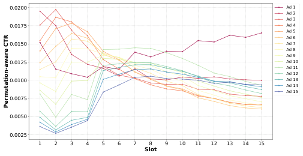

<!-- Start of picture text -->
0.0200 Ad 1 Ad 2 Ad 3 0.0175 Ad 4 Ad 5 Ad 6 0.0150 Ad 7 Ad 8 Ad 9 0.0125 Ad 10 Ad 11 Ad 12 0.0100 Ad 13 Ad 14 Ad 15 0.0075 0.0050 0.0025 1 2 3 4 5 6 7 8 9 10 11 12 13 14 15 Slot Permutation-aware CTR <!-- End of picture text -->

**Figure 1: The Permutation-aware ad CTR as a function of slot on** **_Taobao_ advertising platform is non-monotonic. Each line represents an ad within a request. When advancing an ad’s assigned slot with a fixed set of competing ads, its permutationaware CTR is not strictly increasing.** 

interaction within the ad sequence. Additionally, directly calculating the optimal payment rule is infeasible, since the allocation rule of CGA is implemented via a generative model. Inspired by works on multi-item auction design that uses neural networks to effectively recover analytical solutions [11], we restate the IC constraint to require zero expected ex-post regret for ad auction, and learn the optimal payment by pushing gradients through the regret term. Our main contributions are summarized as follows: 

• We formulate the multi-slot auction with permutation-level externalities and theoretically derive the optimal IC auction, providing theoretical guarantees for generative auction design. 

• To model the permutation-level externalities, we break the “prediction-before-allocation” design paradigm of learning-based auctions by introducing an autoregressive generative model that directly generates allocations. Building on the structure of the optimal mechanism, the proposed CGA leverages the G-E paradigm to optimize allocation and minimizes differentiable ex-post regret to learn the optimal payment rule. 

• Experiments on large-scale industrial data and online A/B tests demonstrate that CGA outperforms the existing methods in revenue and CTR, and effectively approximates the optimal auction with nearly maximal revenue and negligible regret. 

## **2 PRELIMINARIES** 

## **2.1 Ad Auctions with Permutation-level Externalities** 

**Multi-slot ad auction.** The auction for online advertising can be abstracted as a typical multi-slot auction design problem. Formally, when a user request arrives, there are _𝑛_ advertisers2 bidding for _𝑘_ ( _𝑘_ ≤ _𝑛_ ) ad slots with each advertiser _𝑖_ submits a bid _𝑏𝑖_ based on her private value _𝑣𝑖_ for a click to _𝑎𝑑𝑖_3 . Advertiser _𝑖_ ’s private value is drawn independently from a distribution _𝑓𝑖_ (·), and _𝐹𝑖_ (·) denotes the cumulative distribution function (CDF) of the probability density 

> 2Advertisers can either manually adjust bids or employ the platform’s auto-bidding agent [3, 8, 41] for automated bidding. 

> 3We consider the single-parameter and Cost-per-Click (CPC) auction setting, _i.e._ , each advertiser submits a bid and gets paid for a click event, which aligns with the practical scenarios of online ad platforms and remains consistent with related work [22, 23, 25]. 

2172 

KDD ’25, August 3–7, 2025, Toronto, ON, Canada 

Contextual Generative Auction with Permutation-level Externalities for Online Advertising 

function (PDF) _𝑓𝑖_ (·). Let _𝒗_ = ( _𝑣_ 1 _, 𝑣_ 2 _,_ · · · _, 𝑣𝑛_ ) denote the value profile for all advertisers, with _𝒗_ **−** _𝒊_ representing the value profile excluding the element _𝑣𝑖_ , similarly for _𝒃_ and _𝒃_ **−** _𝒊_ . The auctioneer, _i.e._ , the ad platform, knows the distributions _𝒇_ = ( _𝑓_ 1 _, 𝑓_ 2 _,_ · · · _, 𝑓𝑛_ ) (derived from historical data), but does not know the true value profile _𝒗_ . 

Given bid profile _𝒃_ , user feature vector _𝒖_ , and the collection of all ad feature vectors _𝑿_ = ( _𝒙_ 1 _, 𝒙_ 2 _,_ · · · _, 𝒙𝒏_ ), the ad auction mechanism is then formalized as M⟨A( _𝒃_ ; _𝑿, 𝒖_ ) _,_ P( _𝒃_ ; _𝑿, 𝒖_ )⟩. The allocation rule A decides the ad-slot allocation, represented by the allocation matrix _𝑨_ = ( _𝑎𝑖𝑗_ ) _𝑛_ × _𝑘_ ∈{0 _,_ 1}_𝑛_×_𝑘_ , where _𝑎𝑖𝑗_ = 1 means that ad _𝑖_ is allocated to slot _𝑗_ and _𝑎𝑖𝑗_ = 0 otherwise4 . Note that an ad is allocated to at most one slot, and each slot must be assigned one ad, hence a feasible allocation matrix _𝑨_ satisfies�_𝑘_ _𝑗_ =1_𝑎𝑖𝑗_≤1_,_∀_𝑖_ and�_𝑛_ _𝑖_ =1_𝑎𝑖𝑗_= 1_,_∀_𝑗_; The payment rule Pdecides the payment of each ad, represented by the payment vector _𝒑_ = ( _𝑝𝑖_ ) _𝑛_ ∈ R_𝑛_ . **Permutation-level externalities.** The externalities in ad auctions mean that the winning ads’ utility is also influenced by other winning ads [15]. For multi-slot ad auctions, the externality effect is reflected in the CTR of ads. Specifically, CTR models can be abstracted as functions mapping from ad features and user features to the probability of a user clicking an ad. We further consider a permutation-aware CTR model Θ, which takes allocation _𝑨_ and associated features as input, and captures the inter-ad influence within _𝑨_ . Note that model Θ is permutation-aware, meaning that even when two allocations contain the same set of ads, such as _𝑨_ 1 = ( _𝑎𝑑_ 1 _,𝑎𝑑_ 2 _,𝑎𝑑_ 3) and _𝑨_ 2 = ( _𝑎𝑑_ 3 _,𝑎𝑑_ 2 _,𝑎𝑑_ 1), the differing permutations cause a different external impact on the CTR of _𝑎𝑑_ 2. Formally, we denote the CTR of _𝑎𝑑𝑖_ as Θ( _𝒙 𝒊_ ; _𝑨, 𝑿, 𝒖_ ). For ease of notation, let Θ _𝑖_ ( _𝒃_ ; _𝑿, 𝒖_ ) = Θ( _𝒙 𝒊_ ; A( _𝒃_ ; _𝑿, 𝒖_ ) _, 𝑿, 𝒖_ ). The permutation-level externalities is encoded in the mapping process from allocation _𝑨_ to CTR via the model Θ. 

**Problem formulation.** Given the mechanism M⟨A _,_ P⟩, the expected utility of an advertiser with valuation _𝑣𝑖_ is given by: 

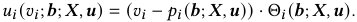

Considering that advertisers can employ strategies aimed at maximizing their utilities through misreporting their values, we introduce two essential properties of ad auction for the stability of the advertising platform: _Incentive Compatibility_ (IC) and _Individual Rationality_ (IR). 

Definition 1. _An auction is IC, if each advertiser’s utility is maximized by reporting truthfully no matter what the other advertisers report. Formally,_ 

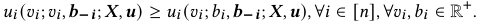

Definition 2. _An auction is IR, if every advertiser’s payment does not exceed her submitted bid. Formally,_ 

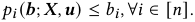

The goal is to design an auction M that maximizes the expected revenue of ad platform: 

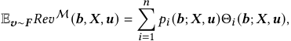

> 4For notational simplicity, we slightly abuse matrix notation and rewrite _𝑨_ = 

> ( _𝑎𝐴_ 1 _,𝑎𝐴_ 2 _,_ · · · _,𝑎𝐴𝑘_ ) to denote the allocation of ads to _𝑘_ slots, where _𝐴𝑖_ ∈[ _𝑛_ ] denotes the index of ad allocated to the _𝑖_ -th slot of allocation _𝑨_ . 

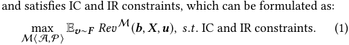

## **2.2 Optimal Multi-slot Auction** 

To solve the above revenue-maximizing auction design problem with IC and IR constraints, an intuitive method is to follow the well-known Myerson auction [26]. Myerson auction can be adapted to the setting with permutation-level externalities5 as follows: 

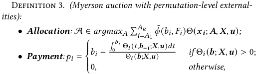

_where 𝜙_˜ ( _𝑣, 𝐹𝑖_ ) _denotes the ironed virtual value function [26], which is monotone in 𝑣._ 

Recall Myerson’s Lemma [26], as formulated in Theorem 1. 

Theorem 1. _(Myerson’s Lemma [26]). For a single-parameter environment, an allocation rule_ A _is implementable if there exists a payment rule_ P _such the mechanism_ M⟨A _,_ P⟩ _is IC. The following two claims hold: (1) An allocation rule is implementable if and only if it is monotone. (2) If allocation rule_ A _is monotone, then the exists a unique payment rule_ P _such that the mechanism_ M⟨A _,_ P⟩ _is IC. It is given by:_ 

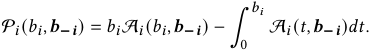

Note that introducing permutation-level externalities diverges from traditional Myerson auction by influencing each ad’s CTR based on allocation outcomes. As such, an increase in _𝑎𝑑𝑖_ ’s bid does not necessarily increase its CTR due to inter-ad influences within the allocation results. This could potentially violate the monotonic allocation requirement of Theorem 1. We address this by proving that, even with permutation-level externalities, the monotonic allocation condition in Myerson’s Lemma holds if the allocation rule maximizes virtual welfare, as demonstrated in Lemma 1. We put the proof in Appendix A.1 due to space limitations. 

Lemma 1. _(Monotonic allocation with permutation-level externalities). For every 𝑎𝑑𝑖 and 𝒃_ **−** _𝒊, the obtained CTR_ Θ( _𝒙 𝒊_ ; A( _𝑏𝑖, 𝒃_ **−** _𝒊_ ) _, 𝑿, 𝒖_ ) _is non-decreasing in its bid 𝑏𝑖 (or we say_ A _is monotone), if the allocation rule_ A _maximizes the expected virtual welfare._ 

Theorem 2. _For a single-parameter environment, maximizing expected revenue over the space of IC auctions is equal to maximizing expected virtual welfare [26]._ 

Theorem 2 [26] equates the goal of maximizing revenue to maximizing expected virtual welfare. Based on Theorem 1 and 2 and Lemma 1, we can deduce the corollary that Myerson auction with 

> 5Li _et al._ [22] directly rewrites Myerson Auction into an externality-aware form, yielding similar conclusions. However, when incorporating permutation-level externalities, unlike traditional single-item auctions, the ad CTR is influenced by the allocation outcome. This impact complicates the transition of the monotone allocation condition, which satisfies IC constraint, from Myerson Auction. Consequently, the preservation of optimality is non-trivial. We discuss this in detail in Lemma 1 and Appendix A.1. 

2173 

KDD ’25, August 3–7, 2025, Toronto, ON, Canada 

Ruitao Zhu, et al. 

permutation-level externalities in Definition 3 constitutes the optimal solution to Problem (1). 

Corollary 1. _The ad auction_ M _, characterized by allocation rule_ A _and payment rule_ P _in Definition 3, represents the optimal mechanism with permutation-level externalities that maximizes the platform’s expected revenue while satisfying IC and IR constraints._ 

## **2.3 Auction Design as a Learning-based Problem** 

A direct approach to implement the allocation rule A, as outlined in Definition 3, involves enumerating all permutations to select the one maximizing virtual welfare, with a computational complexity of _𝑃_ ( _𝑛,𝑘_ ) = ( _𝑛𝑛_ −! _𝑘_ )!. However, for online advertising, taking_Taobao_as an example, where _𝑛_ ≈ 50 and _𝑘_ ≈ 5, the high computational complexity fails to meet online deployment requirements. Therefore, we parameterize the auction mechanism as M_𝑤_ = ⟨A_𝑤𝑎_ _,_ P_𝑤𝑝_ ⟩ with parameters _𝑤𝑎_ and _𝑤𝑝_ , and solves a learning problem to determine these parameters. 

To impose IC constraint on learning-based auctions and ensure the differentiability of the optimization process, similar to the original work of learning-based multi-item auction [11], we introduce the concept of _ex-post regret_ for each advertiser to quantify the extent of deviation from IC conditions. Specifically, the _ex-post regret_ for _𝑎𝑑𝑖_ is defined as the maximum increase in utility that can be obtained through misreporting _𝑏𝑖_′: 

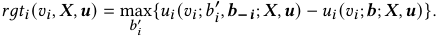

Hence, the IC constraint is satisfied if and only if the ex-post regret for each _𝑎𝑑𝑖_ is zero. Given _𝐿_ value samples from the distribution F, we obtain the empirical ex-post regret for _𝑎𝑑𝑖_ : 

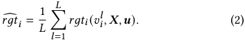

Then we reformulate the auction design problem (1) as minimizing the expected negated revenue, subject to the constraint that the empirical ex-post regret for each _𝑎𝑑𝑖_ is zero and each advertiser’s utility is non-negative: 

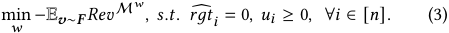

## **3 Methodology** 

In this section, we provide a detailed discussion of the Contextual Generative Auction (CGA). To overcome the limitation of the “prediction-before-allocation” paradigm in capturing permutationlevel externalities, CGA employs a G-E architecture, as depicted in Figure 2. The Generator leverages an autoregressive module, perceiving the established preceding context to generate an ad sequence. The Evaluator estimates permutation-aware reward within the whole ad sequence, guiding Generator towards the optimal allocation through policy gradient. For online inference, only Generator is deployed, ensuring a minimal computational latency during ad allocation. Moreover, a dedicated PaymentNet module is introduced to learn the optimal payment rule, trained via optimizing differentiable ex-post regret. 

## **3.1 Generator: Autoregressive Generative Module** 

According to Theorem 2 and Corollary 1, the objective of Generator is to generate an ad sequence _𝑨_ of length _𝑘_ from _𝑛_ candidate ads that maximizes the expected virtual welfare. We develop an autoregressive generative module, comprising two key components: a permutation-invariant set-level encoder and a permutationequivariant decoder. 

- _Permutation invariance_ [42], an architectural property wherein the outputs remain unaffected by the permutation of inputs, has been shown to enhance the platform revenue of ad auctions [25]. The encoder aims to enhance ad representation by modeling set-level externalities, requiring this property because its input is the candidate ad set. 

- _Permutation equivariance_ [42] is an architectural property wherein changing the permutation of inputs will correspondingly change the permutation of outputs. In each step, the decoder takes candidate ads as input and outputs the allocation probability for each ad. Therefore, altering the permutation of input ads should result in a corresponding change in the permutation of output logits. This property is widely adopted in automated auction design [10, 18, 31], with Qin _et al._ [30] demonstrating its efficacy in improving the generalization ability of learning-based auctions. 

**Permutaion-invariant set-level encoder.** It encodes the candidate ad set and provides the context embedding _𝒄_ as the initial input of decoder. First, we adopt a self-attention layer to capture the mutual influence among _𝑛_ candidate ads, producing the set-level augmented embedding _𝒉𝒊_ for each ad _𝑖_ : 

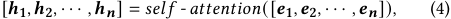

where _𝒆𝒊_ denotes the embedding of ad _𝑎𝑖_ . Since the encoder processes an unordered set of ads, the above attention layer excludes positional encoding, and we perform sum pooling on _𝒉𝒊,𝑖_ ∈[ _𝑛_ ], ensuring the property of _permutation invariance_ that is changing the permutation of input ads retains the same output context embedding _𝒄_ : 

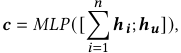

where _𝒉𝒖_ denotes the user representation. 

**Permutation-equivariant autoregressive decoder.** To address the limitations of the “prediction-before-allocation” paradigm in auction design, we introduce an autoregressive decoder. This model efficiently captures joint distributions over the output ad sequences [4] to generate the ad sequence. Given the context embedding _𝒄_ , the probabilistic generative model learns the conditional probability _𝑝_ ( _𝑨𝒎_ | _𝒄_ ) for each ad sequence _𝑨𝒎_ . During inference, the model selects a specific allocation from its output space based on this conditional probability. In the multi-slot auction setting, where _𝑨𝒎_ consists of _𝑘_ ads: _𝑎𝐴𝑚_ 1 _,𝑎𝐴𝑚_ 2 _,_ · · · _,𝑎𝐴𝑚𝑘_ , and _𝑎𝐴𝑚𝑖_ are not independent, the autoregressive decoder models the joint output distribution using the product rule: 

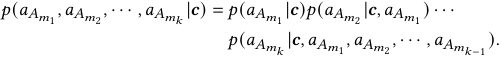

2174 

KDD ’25, August 3–7, 2025, Toronto, ON, Canada 

Contextual Generative Auction with Permutation-level Externalities for Online Advertising 

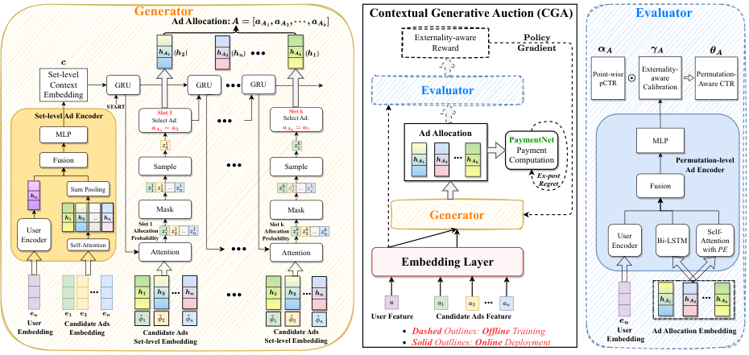

<!-- Start of picture text -->
Generator Contextual Generative Auction (CGA) Evaluator Ad Allocation: Externality-aware ( ) ( ) ... ( ) Reward EmbeddingSet-levelContext GRU GRU ... GRU Evaluator Point-wisepCTR Externality-Calibrationaware Permutation-Aware CTR Set-level Ad Encoder START Select Ad: Slot 1 ... Select Ad: Slot k MLP Ad Allocation PaymentNet MLP Fusion Sample ... Sample ... ComputationPayment Permutation-levelAd Encoder Ex-post Sum Pooling ... ... Regret Fusion ... Slot 1 Mask Slot k Mask Generator EncoderUser Self-Attention Probability Allocation Attention ... ... Probability Allocation Attention ... EncoderUser Bi-LSTM Attentionwith Self- PE Embedding Layer ... ... ... ... ... ... User Feature Candidate Ads Feature User Candidate Ads  Embedding Embedding Candidate Ads Candidate Ads Dashed  Outlines:  Offline  Training User Ad Allocation Embedding Set-level Embedding Set-level Embedding Solid  Outllines:  Online  Deployment  Embedding <!-- End of picture text -->

**Figure 2: The architecture of Contextual Generative Auction (CGA). The middle part shows the overall framework of CGA, with dashed outlines and arrows depicting offline training components, and solid lines representing online inference paths. The other two parts provide specific implementations of Generator and Evaluator.** 

We further employ the GRU cell [9] to model the conditional probability _𝑝_ ( _𝑎𝑖_ | _𝒄,𝑎𝐴𝑚_ 1 _,_ · · · _,𝑎𝐴𝑚𝑡_ −1 ) for each candidate ad _𝑎𝑖_ at slot _𝑡_ ∈[ _𝑘_ ]( _𝑎𝐴𝑚_ 0 = ∅). At the beginning of decoding, the context embedding _𝒄_ initializes the hidden state of GRU, and a special token representing “START” is fed into GRU as the initial input. Iteratively, the _𝑡_ -th GRU cell is formulated as: 

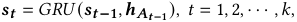

where _𝒉𝑨𝒕_ **−** 1 denotes the encoded representation of the ad chosen in slot _𝑡_ −1 ( _𝒉𝑨_ 0 = _𝑆𝑇𝐴𝑅𝑇_ ), and _𝒔𝒕_ **−** 1 denotes the preceding contextual information ( _𝒔_ 0 = _𝒄_ ). Consequently, given the state _𝒔𝒕_ at slot _𝑡_ , we obtain the allocation probability _𝑧𝑖__𝑡_of each candidate ad_𝑎𝑖_: 

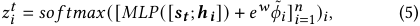

where _𝑤_ is a learnable parameter such that _𝑒__𝑤_ remains positive, ensuring higher virtual value leads to a greater allocation probability, aligning with the objective of maximizing virtual welfare. Ads allocated prior to slot _𝑡_ are masked, and a sampling strategy based on _𝒛__𝒕_ determines the ad allocated to slot _𝑡_ . This sampling occurs only during training to explore diverse sequence generation strategies. During inference, the ad with the highest value in _𝒛__𝒕_ is selected. This selection process is repeated _𝑘_ times to generate an ad sequence of length _𝑘_ , denoted as _𝑨_ = [ _𝑎𝐴_ 1 _,𝑎𝐴_ 2 _,_ · · · _,𝑎𝐴𝑘_ ]. 

Moreover, since the MLPs and GRU cells in Generator operate on each state-ad pair, and the encoder satisfies permutation invariance, the decoder exhibits the property of _permutation equivariance_ . 

## **3.2 Evaluator: Permutation-aware Prediction Module** 

The goal of Evaluator is to predict the permutation-aware CTR Θ( _𝒙 𝒊_ ; _𝑨, 𝑿, 𝒖_ ) for each ad _𝑎𝐴𝑖_ in the ad allocation _𝑨_ . Evaluator takes the allocation embedding _𝑯𝑨_ = [ _𝒉𝐴_ 1 _, 𝒉𝐴_ 2 _,_ · · · _, 𝒉𝐴𝑘_ ], user 

embedding _𝒆𝒖_ and point-wise CTR _𝜶𝑨_ ∈[0 _,_ 1]_𝑘_ as input, and outputs the permutation-aware CTR. Each embedding _𝒉𝐴𝑖_ of ad _𝑎𝐴𝑖_ is derived from the encoder of Generator, as defined in Equation (4). Since CGA operates at the end of the three-stage advertising system ( _i.e._ , matching, prediction and auction), to fully utilize the user interests captured in the preceding stages, Evaluator leverages the point-wise CTR _𝜶𝑨_ output from the prediction stage, and constructs a Permutation-level Ad Encoder to estimate a personalized externality-aware calibration vector _𝜸𝑨_ ∈(0 _,_ 2)_𝑘_ . These two vectors are then element-wise multiplied to obtain the permutationaware CTR: Θ _𝑨_ = _𝑚𝑖𝑛_ ( _𝜶𝑨_ ⊙ _𝜸𝑨,_ 1). 

Specifically, we adopt a Bi-LSTM [16] layer and a multi-head self-attention [36] layer to encode the ad sequence embedding _𝑯𝑨_ , where Bi-LSTM effectively captures bidirectional sequence information, while self-attention efficiently captures interactions between distantly positioned ads within the sequence. Formally, the sequential representation of self-attention layer is defined as: 

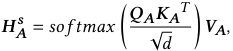

where _𝑑_ denotes the dimension of embeddings, and _𝑸𝑨, 𝑲𝑨, 𝑽𝑨_ represents the query, key and value matrices, respectively, which are transformed linearly from the sum of allocation embedding _𝑯𝑨_ and positional encoding _𝑷𝑬𝑨_ (the sinusoidal version in [36]). 

Next, we obtain the forward output state _𝑯𝑨__𝒇_and backforward output state _𝑯𝑨__𝒃_of_𝑯𝑨_through Bi-LSTM layer. 

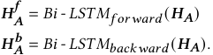

For brevity, we omit Bi-LSTM’s implementation details, including the input gates, forget gates, output gates and cell states. 

2175 

KDD ’25, August 3–7, 2025, Toronto, ON, Canada 

Ruitao Zhu, et al. 

Subsequently, all sequential representations are concatenated with the user representation _𝒉𝒖_ , and fed into a Multilayer Perceptron (MLP) to obtain the externality-aware calibration vector: 

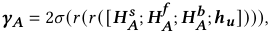

where _𝜎_ (·) and _𝑟_ (·) denote the fully connected layer with sigmoidal and ReLU activation functions, respectively. 

Finally, it should be noted that CGA allows any Evaluator model that captures sequential context to improve the G-E framework. In this work, we present an efficient implementation from our practice. 

## **3.3 Payment Computation** 

According to Corollary 1, the optimal payment is defined in Definition 3, where the integral term can be rewritten as an expectation: 

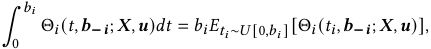

which can be approximated using Monte Carlo sampling. However, we note that Θ _𝑖_ ( _𝑡𝑖, 𝒃_ **−** _𝒊_ ; _𝑿, 𝒖_ ) = Θ( _𝒙 𝒊_ ; A( _𝑡𝑖, 𝒃_ **−** _𝒊_ ; _𝑿, 𝒖_ ) _, 𝑿, 𝒖_ ). Processing each sample requires invoking Generator A and Evaluator Θ, resulting in high computational costs during inference. Reducing the number of samples can mitigate this but increases payment variance, directly affecting platform revenue and advertiser utility. 

Motivated by the application of neural networks to effectively approximate the optimal mechanism in multi-item auctions in [11], we introduce _PaymentNet_ to learn the optimal payment rule. Specifically, the inputs include the allocation embedding _𝑯𝑨_ ∈ R_𝑘_×_𝑑_ , the self-exclusion bidding profile _𝑩_**−** = [ _𝒃_ **−** _𝑨_ 1 _, 𝒃_ **−** _𝑨_ 2 _,_ · · · _, 𝒃_ **−** _𝑨𝒌_ ] ∈ R_𝑘_×(_𝑘_−1) , and the expected value profile _𝒁_ · **𝚯** ∈ R_𝑘_×1 , where _𝒁_ = [ _𝑧𝐴_1 1_,𝑧_ _𝐴_2 2_,_· · ·_,𝑧_ _𝐴__𝑘_ _𝑘_]denotestheallocationprobabilitydefinedin Equation (5) and **𝚯** = [Θ _𝐴_ 1 _,_ Θ _𝐴_ 2 _,_ · · · _,_ Θ _𝐴𝑘_ ] denotes the permutationaware CTR estimated by Evaluator. Moreover, to satisfy IR constraint, as defined in Definition 2, PaymentNet employs a sigmoidal activation function to compute the payment rate _𝒑_ ˜ ∈[0 _,_ 1]_𝑘_ , and subsequently outputs the payment _𝒑_ = _𝒑_ ˜ ⊙ _𝒃_ . Formally, the payment rate is defined as: 

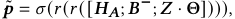

where _𝜎_ (·) and _𝑟_ (·) denote the fully connected layer with sigmoidal and ReLU activation functions, respectively. 

## **4 Optimization and Training** 

According to Corollary 1, the optimal allocation rule only requires maximizing virtual welfare and is independent of the payment rule. Therefore, we decouple the optimization of G-E framework and PaymentNet, which maintains the optimality of CGA. 

on the _𝑖_ -th ad. The binary cross-entropy loss is defined as: 

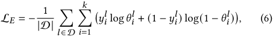

where _𝜃𝑖__𝑙_denotes the permutation-aware CTR of the_𝑖_-th ad in the ad sequence _𝑙_ as predicted by Evaluator. 

After training Evaluator Θ to convergence, we freeze its parameters and train Generator using policy gradient with rewards from Evaluator. At each slot _𝑡_ , the contextual information _𝒔𝒕_ serves as the state, and the allocation probability _𝑧𝑖__𝑡_outputbyGenerator serves as the action. Since _𝒔𝒕_ only encodes the preceding context, to capture the bi-directional contextual information, we use the well-trained Evaluator to estimate the permutation-aware reward of each candidate ad within the whole ad sequence _𝑨_ . Motivated by the effective use of the policy gradient method in the reranking task [13], we decompose this permutation-aware reward into two parts. 

**Self-Reward.** Aligning with the objective of optimal allocation, we use Evaluator Θ to estimate the expected virtual welfare of each selected ad _𝑎𝐴𝑖_ , termed as self-reward: 

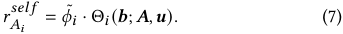

**External-Reward.** Each selected ad not only contributes its reward but also affects the CTR of other ads due to the permutationlevel externalities. Similar to the marginal contribution applied in classical VCG mechanism [35], we model this external effect as external reward: 

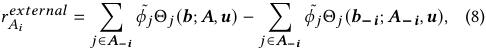

where _𝑨_ **−** _𝒊_ denotes the ad sequence excluding _𝑎𝐴𝑖_ . Combing the above two rewards, we obtain the permutationaware reward of selecting _𝑎𝐴𝑖_ , defined as: 

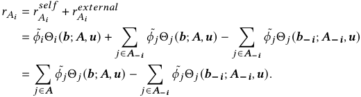

Finally, the loss function of Generator is defined as: 

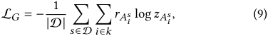

where _𝑠_ denotes a sample from dataset D, representing the candidate ad set for a request, _𝐴__𝑠_ _𝑖_denotes the_𝑖_-th ad of the ad allocation output by Generator based on the input ad set _𝑠_ , and _𝑧𝐴__𝑠_ _𝑖_denotes the allocation probability in Equation (5). 

## **4.1 Optimization of G-E Framework** 

In the G-E framework, as Evaluator captures permutation-level externalities and guides Generator to obtain the optimal allocation, we first train Evaluator Θ to convergence using list-wise ad click data. Each sample _𝑙_ ∈D is an ad sequence of length _𝑘_ exposed to a user, with the label _𝑦𝑖__𝑙_∈{0_,_1} indicating whether the user clicks 

## **4.2 Optimization of PaymentNet** 

After training Generator A and Evaluator Θ to convergence, we freeze their parameters and then apply the augmented Lagrangian method to solve the constrained optimization problem (3) to optimize PaymentNet. The Lagrangian function augmented with a 

2176 

KDD ’25, August 3–7, 2025, Toronto, ON, Canada 

Contextual Generative Auction with Permutation-level Externalities for Online Advertising 

quadratic penalty term for violating the IC constraint is defined as: 

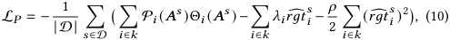

where _𝑨__𝑠_ denotes the allocation output by the freezed Generator A with the input of ad set _𝑠_ , _𝜆𝑖_ denotes Lagrange multipliers, and _𝜌 >_ 0 denotes the hyperparameter for the IC penalty term. 

The optimization process based on the Lagrangian function = (10) includes the iteration of ( **i** ) updating PaymentNet: _𝒘_ **P**_𝒏𝒆𝒘_ _𝑎𝑟𝑔𝑚𝑖𝑛𝑤_ P L _𝑃_ ( _𝒘_ **P**_𝒐𝒍𝒅_;_𝝀𝒐𝒍𝒅_), and (**ii**) updating the Lagrange multi- pliers: _𝝀__𝒏𝒆𝒘_ = _𝝀__𝒐𝒍𝒅_ + _𝜌 𝒓𝒈𝒕_**�** ( _𝒘_ **P**_𝒏𝒆𝒘_ ). Note that problem (3) is nonconvex. Thus, the above Lagrangian method is not guaranteed to converge to the global optimum. However, the experimental results indicate that the optimized CGA can approximate the optimal revenue with minimal regret, as discussed in Section 5.2. 

## **5 Experiments** 

In this section, we conduct offline experiments and online A/B tests to evaluate the effectiveness of CGA, and mainly focus on the following questions: 

• **RQ1** : How does CGA perform in terms of key metrics like platform revenue and CTR, compared with existing ad auctions? 

• **RQ2** : What are the effects of modeling permutation-level externalities compared to set-level and W/O externalities? 

• **RQ3** : How do various designs of CGA affect its performance? 

- **RQ4** : How does our proposed CGA perform in the real-world 

- ad auction scenarios with efficient deployment? 

## **5.1 Experiment Setup** 

_5.1.1 Dataset._ In offline experiments, we evaluate the performance of CGA using real logs collected from a leading e-commerce platform _Taobao_ during January 2024. The training set comprises 500,000 randomly selected auctions from January 20 to January 23, involving 1,100,875 unique advertisers while the test set comprises 100,000 randomly selected auctions from January 25, involving 452,671 unique advertisers. For each auction sample in the dataset, approximately 30 advertisers are selected by ad system as candidates for the auction stage, where they submit their bids to compete for slots. We set the number of slots _𝑘_ = 3 in offline experiments. 

_5.1.2 Baseline Methods._ We compare CGA with representative auction mechanisms. The baseline methods are categorized into three groups based on the granularity of externality modeling. 

**W/O externalities:** 

• **GSP** : GSP ranks ads based on the product of bids and predicted CTR, without modeling externalities. **Set-level externalities** : 

• **DNA** [25]: Building on GSP, DNA predicts each ad’s rankscore by modeling set-level externalities of candidate ads and ranks accordingly for allocation, without considering the mutual influence among ads in the ad list. 

• **SW-VCG** [22]: SW-VCG formalizes multi-slot auction design as a maximum weighted bipartite matching problem between ads and slots, which captures only set-level externalities of candidate ads to estimate edge weights. 

**Permutation-level externalities** : 

• VCG Auction [35] with Permutation-level Externalities ( **VCG** ): VCG selects the ad permutation that maximizes social welfare for allocation and combines this with a payment rule to satisfy IC. We evaluate all permutations of the candidate ads with CGA’s Evaluator, enabling VCG to capture permutation-level externalities. 

• **EdgeNet** [33]: EdgeNet utilizes Transformer to replace DNA’s set encoder and employs a greedy strategy to sequentially allocate ads, modeling partial permutation-level externalities. 

• **Optimal** : To evaluate CGA’s approximation to the theoretical upper bound, according to Corollary 1, we construct this baseline by traversing all permutations to maximize virtual welfare and using Monte Carlo sampling to calculate the payment. 

_5.1.3 Performance Metrics._ We consider the following metrics to measure platform revenue, user experience, and ex-post regret of advertisers, respectively. 

<u>�</u> _𝑐𝑙𝑖𝑐𝑘_ × _<u>𝑝𝑎𝑦𝑚𝑒𝑛𝑡</u>_ • Revenue Per Mille: RPM = × 1000 _._ <u>�</u> _𝑖𝑚𝑝𝑟𝑒𝑠𝑠𝑖𝑜𝑛_ <u>�</u> _𝑐𝑙𝑖𝑐𝑘_ • Click-Through Rate: CTR = <u>�</u> _𝑖𝑚𝑝𝑟𝑒𝑠𝑠𝑖𝑜𝑛_ � _._ • IC metric: Ψ = |D|1 � _𝑠_ ∈D � _𝑖_ ∈ _𝑘 𝑢𝑖_ ( _𝑣𝑖__<u>𝑠,𝒃</u>_ _𝑟𝑔__<u>𝒔</u>_ _𝑡_;_𝑿𝑠_ _<u>𝑖</u>__<u>𝒔,𝒖𝒔</u>_)_,_where _𝑟𝑔𝑡_�_𝑠_ _𝑖_is defined in Equation (2). This is a common metric for IC testing of ad auction mechanisms [7, 23, 25, 33], which measures the relative increase in utility that advertisers can obtain by manipulating their bids. Consistent with the evaluation process in [38], we conduct counterfactual perturbation on each advertiser’s bid by replacing _𝑏𝑖_ with _𝛼_ × _𝑏𝑖_ , where _𝛼_ ∈{0 _._ 2 × _𝑗_ | _𝑗_ = 1 _,_ 2 _,_ · · · _,_ 10}. 

_5.1.4 Implementation._ In CGA, we set the embedding size of features as 8. To capture richer information from different representation subspaces, a multi-head attention mechanism with 4 attention heads is used in all attention layers. The externality-aware calibration vector _𝜸𝑨_ and the payment rate _𝒑_ ˜ are derived using a MLP with hidden layers of sizes 128 and 32. CGA is trained with the Adam optimizer at a learning rate of 1e-3 and a batch size of 512. All learning-based baseline methods have hyperparameters tuned through grid search, exploring learning rates of {1e-5, 1e-4, 1e-3, 1e-2}, batch sizes of {256, 512, 1024, 2048}, and hidden sizes of {8,16,32,64}. 

## **5.2 Offline Comparison (RQ1 & RQ2)** 

CGA and baseline-Optimal involve the ironed virtual value function, which requires knowledge of each advertiser’s value distribution _𝑓𝑖_ (·). Estimating _𝑓𝑖_ (·) from historical data is well-covered in existing research [6, 21, 27, 28]. This paper does not delve into this estimation as CGA focuses on employing generative models to capture permutation-level externalities, independent of distribution estimation techniques. To avoid biases from distribution estimation methods in comparative experiments, following [22], we preset the conditional distribution of each advertiser’s value based on their feature vectors as _uniform_ and _exponential distributions_ , respectively, and regenerate the bids accordingly. For SW-VCG, since its predicted ad score _𝑆𝑐𝑟𝑖_ aims to fit the virtual value, we directly set _𝑆𝑐𝑟𝑖_ to _𝜙_˜ _𝑖_ for comparison. 

The experimental results under the above two distributions are presented in Table 1. Our key observations are: 

(1) As externality modeling advances from W/O externalities to set-level and finally to permutation-level, auction performance 

2177 

KDD ’25, August 3–7, 2025, Toronto, ON, Canada 

Ruitao Zhu, et al. 

**Table 1: Performance comparison for key metrics. Lift percentage indicates the relative change of baseline methods over CGA.** 

|Value Distribution|Externalities|Model|RPM|CTR|Ψ|
|---|---|---|---|---|---|
||W/O Externalities|GSP|1141.40 (-9.7%)|0.04359 (-7.1% )|14.7%|
||Set-level|DNA SW-VCG|1195.75 (-5.4%) 1190.70 (-5.8%)|0.04537 (-3.3%) 0.04528 (-3.5%)|8.4% 5.6%|
|Uniform||EdgeNet|1205.87 (-4.6%)|0.04561 (-2.8%)|4.9%|
||Prmttin-lel|VCG|1085.78 (-14.1%)|0.04791 (+2.1%)|0.0|
||euaoev|Optimal|1318.36 (+4.3%)|0.04772 (+1.7%)|0.0|
|||**CGA**|**1264.01**|**0.04692**|**2.1%**|
||W/O Externalities|GSP|1179.22 (-12.2%)|0.04050 (-9.8%)|18.3%|
||Set-level|DNA SW-VCG|1257.11 (-6.4%) 1247.71 (-7.1%)|0.04283 (-4.6%) 0.04266 (-5.0%)|10.1% 7.4%|
|Exponential||EdgeNet|1266.52 (-5.7%)|0.04315 (-3.9%)|6.7%|
||Permutation-level|VCG Optimal|1321.85 (-15.8%) 1415.60 (+5.4%)|0.04602 (+2.5%) 0.04589 (+2.2%)|0.0 0.0|
|||**CGA**|**1343.07**|**0.04490**|**3.7%**|

improves across three metrics (higher RPM and CTR with lower regret)6 . This highlights the importance of modeling fine-grained externalities in auction design ( **RQ2** ). To further investigate the impact of externalities, we conduct comparative experiments on the CTR prediction task. The results are shown in Table 2, where "W/O Externalities" indicates the use of point-wise pCTR and "Setlevel" refers to using the Set-level Ad Encoder, as described in Section 3.2, to replace Evaluator’s permutation-level ad encoder. The results demonstrate that Evaluator with permutation-level externalities improves the accuracy of predictive values, explaining the improvement in auction metrics. 

(2) Compared to baseline-Optimal based on enumeration, CGA achieves approximately 95% revenue maximization and negligible ex-post regret. This suggests that CGA enables efficient ad allocation and closely approximates the optimal auction mechanism. 

**Table 2: Performance comparison of externalities modeling.** 

||Logloss|AUC|
|---|---|---|
|W/O Externalities|0.2311|0.7366|
|Set-level Externalities|0.2286|0.7391|
|Permutation-level EvaluatorΘ|**0.2237**|**0.7476**|

## **5.3 Ablation Study (RQ3)** 

To verify the effectiveness of CGA’s various design considerations, we construct the following variants: 

• CGA-Θ removes the Evaluator Θ and uses point-wise CTR instead to evaluate each ad allocation’s virtual welfare. 

• CGA (end2end) directly trains Generator and PaymentNet using L _𝑃_ from Equation (10). In contrast, CGA first trains Generator to convergence, freezes its parameters, and then trains PaymentNet. 

• CGA- _𝑟__𝑠𝑒𝑙𝑓_ removes the self reward _𝑟__𝑠𝑒𝑙𝑓_ , defined in Equation (7), in the loss function L _𝐺_ of Generator. 

6VCG optimizes social welfare at the expense of revenue, independent of externalities. 

- CGA- _𝑟__𝑒𝑥𝑡𝑒𝑟𝑛𝑎𝑙_ removes the external reward _𝑟__𝑒𝑥𝑡𝑒𝑟𝑛𝑎𝑙_ , defined 

- in Equation (8), in the loss function L _𝐺_ of Generator. 

- CGA- _𝜙_˜ replaces virtual value _𝜙_˜ _𝑖_ with _𝑏𝑖_ in L _𝐺_ . 

**Table 3: Ablation study of CGA.** 

|Model|RPM|CTR|Ψ|
|---|---|---|---|
|**CGA**|**1264.01**|**0.04692**|**2.1%**|
|CGA-Θ|1214.71 (-3.9%)|0.04579 (-2.4%)|3.7%|
|CGA (end2end)|1181.85 (-6.5%)|0.04504 (-4.0%)|10.5%|
|CGA-_𝑟__𝑠𝑒𝑙𝑓_|1122.44 (-11.2%)|0.04302 (-8.3%)|18.9%|
|CGA-_𝑟__𝑒𝑥𝑡𝑒𝑟𝑛𝑎𝑙_|1210.92 (-4.2%)|0.04575 (-2.5%)|3.4%|
|CGA-˜_𝜙_|1231.15(-2.6%)|0.04603(-1.9%)|2.8%|

The results are shown in Table 3, from which we observe: (1) CGA-Θ performs worse than CGA, indicating that the Generator alone cannot fully capture permutation-level externalities, as the autoregressive model perceives only preceding context. The G-E framework helps distill complete sequential knowledge into Generator via policy gradient. 

(2) CGA (end2end) performs worse. One likely reason is that CGA uses PaymentNet to learn the optimal payment, so the revenue gradient must pass through PaymentNet before reaching Generator while conducting end-to-end training, complicating convergence to the optimal allocation. Furthermore, Corollary 1 ensures that decoupled optimization maintains optimality, thus allowing Generator to focus solely on maximizing virtual welfare. 

(3) CGA- _𝑟__𝑠𝑒𝑙𝑓_ performs the worst due to the absence of each selected ad’s own value increment. CGA outperforms CGA- _𝑟__𝑒𝑥𝑡𝑒𝑟𝑛𝑎𝑙_ because it uses external rewards to model the impact of each selected ad on the final allocation list. 

(4) Estimating value distribution _𝑓𝑖_ (·) requires empirical assumptions about bidding strategies, since Ad platforms can only observe bids, causing bias in the estimated _𝑓_ˆ _𝑖_ (·). To assess the impact of removing value distribution on CGA’s performance, we construct the 

2178 

KDD ’25, August 3–7, 2025, Toronto, ON, Canada 

Contextual Generative Auction with Permutation-level Externalities for Online Advertising 

variant CGA- _𝜙_˜ . As shown in Table 3, CGA- _𝜙_˜ shows only a minor decline in revenue (2.6%) and CTR (1.9%) compared to CGA. This small drop may be due to CGA’s modeling of externalities, which captures inter-ad correlations and partially reflects the missing value distribution information through other advertisers’ bids. 

## **5.4 Online A/B Test (RQ4)** 

To verify CGA’s effectiveness in the real world, we compare CGA with the fully deployed DNA in the Taobao advertising system through online A/B tests. Table 4 presents the experimental results of the 7-day online A/B testing, utilizing 2% of total production traffic. CGA achieves a 3.2% improvement in RPM with only a 3 ms average increase (1.6% relatively) in online response time (RT) per request, suggesting that CGA can efficiently explore the allocation space via generative models and boost platform revenue. Moreover, the heightened return on investment (ROI) for advertisers indicates that CGA’s revenue enhancement results not from inflated payments but from optimized ad allocation by capturing permutation-level externalities, as evidenced by significant CTR and gross merchandise volume (GMV) improvements. 

**Table 4: Experimental results from Online A/B tests.** 

|Relative change in metrics|RPM|CTR|GMV|ROI|RT|
|---|---|---|---|---|---|
|**CGA**over baseline-DNA|+3.2%|+1.4%|+6.4%|+3.5%|+1.6%|

## **6 Related Work** 

GSP [12] and its variants, like uGSP [2], are widely used in online advertising due to their interpretability and high revenue guarantee, but they do not consider the impact of other ads on user clicks, neglecting externalities [14, 17], leading to suboptimal performance. 

Advances in computing have led researchers to explore learningbased auctions [44]. DeepGSP [45] and DNA [25] extend GSP using online feedback for end-to-end learning. However, DNA’s rankscore prediction faces the evaluation-before-ranking problem [40], restricting its scope to set-level externalities and yielding suboptimal allocations. SW-VCG [22] separates optimal auction design into designing monotone score functions and solving ad-slot maximum bipartite matching. However, SW-VCG still overlooks the mutual influence of ads in the final sequence, as the edge weights in the bipartite graph cannot be predetermined considering permutation-level externalities. Following VCG, NMA [23] proposed an enumerationbased framework to select the optimal allocation. While globally optimal, its high computational complexity makes it impractical for real-time online inference [34]. EdgeNet [33] employs a PointerNetbased structure for greedy ad allocation but ignores the impact of succeeding ads, remaining insufficient for achieving optimal results. 

Studies of reranking in RS parallels externality modeling by leveraging contextual information to optimize item sequences. Reranking methods can be divided into one-stage and two-stage approaches [32]. One-stage methods [1, 29] estimate refined scores for each item within the initial list and rerank them greedily. These methods encounter the evaluation-before-ranking problem similar to DNA: reranking alters the permutation, introducing different mutual influences. Two-stage methods [13, 32, 34] typically employ a G-E 

framework. The Generator produces multiple feasible sequences, while the Evaluator selects the optimal sequence based on the estimated list value. This approach enables comprehensive exploration of the permutation space [32], which provides valuable insights for the implementation of CGA. While the G-E framework effectively captures permutation-level externalities, it lacks the capacity to express key economic constraints such as IC and fails to directly optimize platform revenue. Our theoretical results decouple the allocation and payment in optimal auctions with permutation-level externalities. This allows the allocation to employ a general G-E framework focused solely on maximizing expected virtual welfare, while the optimal payment rule is learned through differentiable ex-post regret. Consequently, CGA can be viewed as a unified framework bridging reranking in RS and ad auction theory. 

## **7 CONCLUSION** 

In this work, we have proposed the Contextual Generative Auction (CGA), to incorporate permutation-level externalities in online multi-slot ad auctions. Our primary theoretical results demonstrate that the classic Myerson Auction maintains its optimality when extended to permutation-level externalities. This insight drives the design of the CGA framework, which decouples the optimization of allocation and payment. Specifically, we develop an autoregressive generative model with G-E learning paradigm to optimize allocation, and learn the optimal payment by quantifying IC constraint into expected ex-post regret. Extensive offline and online experiments verify the effectiveness of CGA. Furthermore, the autoregressive generation process of CGA is not limited to specific generative model and can accommodate various advanced solutions [24, 37]. Future research will extend this contextual generative mechanism to integrate heterogeneous items from different channels. 

## **Acknowledgments** 

This work was supported in part by National Key R&D Program of China (No. 2023YFB4502400), in part by China NSF grant No. 62322206, 62132018, 62025204, U2268204, 62272307, 62372296, in part by Alibaba Group through Alibaba Innovative Research Program. The opinions, findings, conclusions, and recommendations expressed in this paper are those of the authors and do not necessarily reflect the views of the funding agencies or the government. 

## **References** 

- [1] Qingyao Ai, Keping Bi, Jiafeng Guo, and W Bruce Croft. 2018. Learning a deep listwise context model for ranking refinement. In _The 41st international ACM SIGIR conference on research & development in information retrieval_ . 135–144. 

- [2] Yoram Bachrach, Sofia Ceppi, Ian A Kash, Peter Key, and David Kurokawa. 2014. Optimising trade-offs among stakeholders in ad auctions. In _Proceedings of the fifteenth ACM conference on Economics and computation_ . 75–92. 

- [3] Santiago R Balseiro, Yuan Deng, Jieming Mao, Vahab S Mirrokni, and Song Zuo. 2021. The landscape of auto-bidding auctions: Value versus utility maximization. In _Proceedings of the 22nd ACM Conference on Economics and Computation_ . 132– 133. 

- [4] Lucas Beyer, Bo Wan, Gagan Madan, Filip Pavetic, Andreas Steiner, Alexander Kolesnikov, André Susano Pinto, Emanuele Bugliarello, Xiao Wang, Qihang Yu, et al. 2023. A study of autoregressive decoders for multi-tasking in computer vision. _arXiv preprint arXiv:2303.17376_ (2023). 

- [5] Chi Chen, Hui Chen, Kangzhi Zhao, Junsheng Zhou, Li He, Hongbo Deng, Jian Xu, Bo Zheng, Yong Zhang, and Chunxiao Xing. 2022. Extr: click-through rate prediction with externalities in e-commerce sponsored search. In _Proceedings of the 28th ACM SIGKDD Conference on Knowledge Discovery and Data Mining_ . 2732–2740. 

2179 

KDD ’25, August 3–7, 2025, Toronto, ON, Canada 

Ruitao Zhu, et al. 

- [6] Yeshwanth Cherapanamjeri, Constantinos Daskalakis, Andrew Ilyas, and Manolis Zampetakis. 2022. Estimation of standard auction models. In _Proceedings of the 23rd ACM Conference on Economics and Computation_ . 602–603. 

- [7] Yuan Deng, Sébastien Lahaie, Vahab Mirrokni, and Song Zuo. 2020. A datadriven metric of incentive compatibility. In _Proceedings of The Web Conference 2020_ . 1796–1806. 

- [8] Yuan Deng, Jieming Mao, Vahab Mirrokni, and Song Zuo. 2021. Towards efficient auctions in an auto-bidding world. In _Proceedings of the Web Conference 2021_ . 3965–3973. 

- [9] Rahul Dey and Fathi M Salem. 2017. Gate-variants of gated recurrent unit (GRU) neural networks. In _2017 IEEE 60th international midwest symposium on circuits and systems (MWSCAS)_ . 1597–1600. 

- [10] Zhijian Duan, Haoran Sun, Yurong Chen, and Xiaotie Deng. 2023. A scalable neural network for DSIC affine maximizer auction design. In _Proceedings of the 37th International Conference on Neural Information Processing Systems_ . 56169– 56185. 

- [11] Paul Dütting, Zhe Feng, Harikrishna Narasimhan, David Parkes, and Sai Srivatsa Ravindranath. 2019. Optimal auctions through deep learning. In _International Conference on Machine Learning_ . PMLR, 1706–1715. 

- [12] Benjamin Edelman, Michael Ostrovsky, and Michael Schwarz. 2007. Internet advertising and the generalized second-price auction: Selling billions of dollars worth of keywords. _American Economic Review_ 97, 1 (2007), 242–259. 

- [13] Yufei Feng, Binbin Hu, Yu Gong, Fei Sun, Qingwen Liu, and Wenwu Ou. 2021. GRN: Generative Rerank Network for Context-wise Recommendation. _arXiv preprint arXiv:2104.00860_ (2021). 

- [14] Nicola Gatti, Alessandro Lazaric, and Francesco Trovò. 2012. A truthful learning mechanism for contextual multi-slot sponsored search auctions with externalities. In _Proceedings of the 13th ACM Conference on Electronic Commerce_ . 605–622. 

- [15] Arpita Ghosh and Mohammad Mahdian. 2008. Externalities in online advertising. In _Proceedings of the 17th international conference on World Wide Web_ . 161–168. 

- [16] Sepp Hochreiter and Jürgen Schmidhuber. 1997. Long short-term memory. _Neural computation_ 9, 8 (1997), 1735–1780. 

- [17] Patrick Hummel and R Preston McAfee. 2014. Position auctions with externalities. In _Web and Internet Economics: 10th International Conference, WINE 2014, Beijing, China, December 14-17, 2014. Proceedings 10_ . Springer, 417–422. 

- [18] Dmitry Ivanov, Iskander Safiulin, Igor Filippov, and Ksenia Balabaeva. 2022. Optimal-er auctions through attention. _Advances in Neural Information Processing Systems_ 35 (2022), 34734–34747. 

- [19] Bernard J Jansen and Tracy Mullen. 2008. Sponsored search: an overview of the concept, history, and technology. _International Journal of Electronic Business_ 6, 2 (2008), 114–131. 

- [20] Przemyslaw Jeziorski and Ilya Segal. 2015. What makes them click: Empirical analysis of consumer demand for search advertising. _American Economic Journal: Microeconomics_ 7, 3 (2015), 24–53. 

- [21] Albert Xin Jiang and Kevin Leyton-Brown. 2005. Estimating bidders’ valuation distributions in online auctions. In _Proceedings of IJCAI-05 workshop on game theoretic and decision theoretic agents_ . 98–107. 

- [22] Ningyuan Li, Yunxuan Ma, Yang Zhao, Zhijian Duan, Yurong Chen, Zhilin Zhang, Jian Xu, Bo Zheng, and Xiaotie Deng. 2023. Learning-Based Ad Auction Design with Externalities: The Framework and A Matching-Based Approach. In _Proceedings of the 29th ACM SIGKDD Conference on Knowledge Discovery and Data Mining_ . 1291–1302. 

- [23] Guogang Liao, Xuejian Li, Ze Wang, Fan Yang, Muzhi Guan, Bingqi Zhu, Yongkang Wang, Xingxing Wang, and Dong Wang. 2022. NMA: Neural Multi-slot Auctions with Externalities for Online Advertising. _arXiv preprint arXiv:2205.10018_ (2022). 

- [24] Shuchang Liu, Qingpeng Cai, Zhankui He, Bowen Sun, Julian McAuley, Dong Zheng, Peng Jiang, and Kun Gai. 2023. Generative flow network for listwise recommendation. In _Proceedings of the 29th ACM SIGKDD Conference on Knowledge Discovery and Data Mining_ . 1524–1534. 

- [25] Xiangyu Liu, Chuan Yu, Zhilin Zhang, Zhenzhe Zheng, Yu Rong, Hongtao Lv, Da Huo, Yiqing Wang, Dagui Chen, Jian Xu, Fan Wu, Guihai Chen, and Xiaoqiang Zhu. 2021. Neural auction: End-to-end learning of auction mechanisms for e- commerce advertising. In _Proceedings of the 27th ACM SIGKDD Conference on Knowledge Discovery & Data Mining_ . 3354–3364. 

- [26] Roger B Myerson. 1981. Optimal auction design. _Mathematics of operations research_ 6, 1 (1981), 58–73. 

- [27] Gali Noti and Vasilis Syrgkanis. 2021. Bid prediction in repeated auctions with learning. In _Proceedings of the Web Conference 2021_ . 3953–3964. 

- [28] Michael Ostrovsky and Michael Schwarz. 2023. Reserve prices in internet advertising auctions: A field experiment. _Journal of Political Economy_ 131, 12 (2023), 3352–3376. 

- [29] Changhua Pei, Yi Zhang, Yongfeng Zhang, Fei Sun, Xiao Lin, Hanxiao Sun, Jian Wu, Peng Jiang, Junfeng Ge, Wenwu Ou, et al. 2019. Personalized re-ranking for recommendation. In _Proceedings of the 13th ACM conference on recommender systems_ . 3–11. 

- [30] Tian Qin, Fengxiang He, Dingfeng Shi, Wenbing Huang, and Dacheng Tao. 2022. Benefits of permutation-equivariance in auction mechanisms. _Advances in Neural_ 

_Information Processing Systems_ 35 (2022), 18131–18142. 

- [31] Jad Rahme, Samy Jelassi, Joan Bruna, and S Matthew Weinberg. 2021. A permutation-equivariant neural network architecture for auction design. In _Proceedings of the AAAI conference on artificial intelligence_ , Vol. 35. 5664–5672. 

- [32] Yuxin Ren, Qiya Yang, Yichun Wu, Wei Xu, Yalong Wang, and Zhiqiang Zhang. 2024. Non-autoregressive Generative Models for Reranking Recommendation. _arXiv preprint arXiv:2402.06871_ (2024). 

- [33] Guangyuan Shen, Shengjie Sun, Dehong Gao, Duanxiao Song, Libin Yang, Zhen Wang, Yongping Shi, and Wei Ning. 2023. EdgeNet: Encoder-decoder generative Network for Auction Design in E-commerce Online Advertising. In _Proceedings of the 32nd ACM International Conference on Information and Knowledge Management_ . 4274–4278. 

- [34] Xiaowen Shi, Fan Yang, Ze Wang, Xiaoxu Wu, Muzhi Guan, Guogang Liao, Wang Yongkang, Xingxing Wang, and Dong Wang. 2023. PIER: Permutation-Level Interest-Based End-to-End Re-ranking Framework in E-commerce. In _Proceedings of the 29th ACM SIGKDD Conference on Knowledge Discovery and Data Mining_ . 4823–4831. 

- [35] Hal R Varian and Christopher Harris. 2014. The VCG auction in theory and practice. _American Economic Review_ 104, 5 (2014), 442–445. 

- [36] Ashish Vaswani, Noam Shazeer, Niki Parmar, Jakob Uszkoreit, Llion Jones, Aidan N Gomez, Łukasz Kaiser, and Illia Polosukhin. 2017. Attention is all you need. _Advances in neural information processing systems_ 30 (2017), 6000–6010. 

- [37] Wenjie Wang, Yiyan Xu, Fuli Feng, Xinyu Lin, Xiangnan He, and Tat-Seng Chua. 2023. Diffusion recommender model. In _Proceedings of the 46th International ACM SIGIR Conference on Research and Development in Information Retrieval_ . 832–841. 

- [38] Yiqing Wang, Xiangyu Liu, Zhenzhe Zheng, Zhilin Zhang, Miao Xu, Chuan Yu, and Fan Wu. 2022. On designing a two-stage auction for online advertising. In _Proceedings of the ACM Web Conference 2022_ . 90–99. 

- [39] Yunjia Xi, Weiwen Liu, Xinyi Dai, Ruiming Tang, Weinan Zhang, Qing Liu, Xiuqiang He, and Yong Yu. 2021. Context-aware reranking with utility maximization for recommendation. _arXiv preprint arXiv:2110.09059_ (2021). 

- [40] Yunjia Xi, Weiwen Liu, Xinyi Dai, Ruiming Tang, Weinan Zhang, Qing Liu, Xiuqiang He, and Yong Yu. 2021. Context-aware reranking with utility maximization for recommendation. _arXiv preprint arXiv:2110.09059_ (2021). 

- [41] Yidan Xing, Zhilin Zhang, Zhenzhe Zheng, Chuan Yu, Jian Xu, Fan Wu, and Guihai Chen. 2023. Truthful auctions for automated bidding in online advertising. In _Proceedings of the Thirty-Second International Joint Conference on Artificial Intelligence_ . 2915–2922. 

- [42] Manzil Zaheer, Satwik Kottur, Siamak Ravanbakhsh, Barnabas Poczos, Russ R Salakhutdinov, and Alexander J Smola. 2017. Deep sets. _Advances in neural information processing systems_ 30 (2017). 

- [43] Ruizhe Zhang, Xiaohui Xie, Jiaxin Mao, Yiqun Liu, Min Zhang, and Shaoping Ma. 2021. Constructing a comparison-based click model for web search. In _Proceedings of the Web Conference 2021_ . 270–283. 

- [44] Zhanhao Zhang. 2021. A survey of online auction mechanism design using deep learning approaches. _arXiv preprint arXiv:2110.06880_ (2021). 

- [45] Zhilin Zhang, Xiangyu Liu, Zhenzhe Zheng, Chenrui Zhang, Miao Xu, Junwei Pan, Chuan Yu, Fan Wu, Jian Xu, and Kun Gai. 2021. Optimizing multiple performance metrics with deep GSP auctions for e-commerce advertising. In _Proceedings of the 14th ACM International Conference on Web Search and Data Mining_ . 993–1001. 

## **A APPENDIX** 

## **A.1 Proof of Lemma 1** 

Denote _𝑨_**∗** as the allocation that maximizes the expected virtual welfare (select randomly if there exist multiple optimal allocations): 

_𝑛 𝑨_**∗** = A( _𝑏𝑡 , 𝒃_ **−** _𝒕_ ; _𝑿, 𝒖_ ) = _𝑎𝑟𝑔𝑚𝑎𝑥𝐴_ ∑︁ _𝜙_ ˜( _𝑏𝑖, 𝐹𝑖_ ) · Θ( _𝒙 𝒊_ ; _𝑨, 𝑿, 𝒖_ ) _, 𝑖_ =1 

which can be obtained through enumeration. _W.l.o.g._ , suppose _𝑎𝑑𝑡_ ∈ _𝑨_**∗** , and the other ads in _𝑨_**∗** constitute the set _𝑨_**∗** **−** _𝒕_, then the virtual welfare of _𝑨_**∗** can be written as: Φ˜ ( _𝑨_**∗** ; _𝑏𝑡_ ) = _𝜙_ ˜( _𝑏𝑡 , 𝐹𝑡_ )Θ( _𝒙𝒕_ ; _𝑨_**∗** _, 𝑿, 𝒖_ )+ ∑︁ _𝜙_ ˜( _𝑏 𝑗 , 𝐹 𝑗_ )Θ( _𝒙𝒋_ ; _𝑨_**∗** _, 𝑿, 𝒖_ ) _. 𝑗_ ∈ _𝑨_**∗** **−** _𝒕_ 

When the bid of _𝑎𝑑𝑡_ rises to _𝑏𝑡_′_> 𝑏𝑡_, suppose the resulting allocation maximizing virtual welfare is _𝑨_**′** , _i.e._ , 

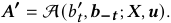

We can directly obtain that _𝑎𝑑𝑡_ ∈ _𝑨_**′** ; otherwise, suppose _𝑎𝑑𝑡_ ∉ _𝑨_**′** , then we have Φ˜ ( _𝑨_**′** ; _𝑏𝑡_′)=Φ˜(_𝑨_**′**;_𝑏𝑡_). Since_𝑨_**∗**maximizes virtual 

2180 

KDD ’25, August 3–7, 2025, Toronto, ON, Canada 

Contextual Generative Auction with Permutation-level Externalities for Online Advertising 

welfare when _𝑎𝑑𝑡_ bids _𝑏𝑡_ and _𝜙_ ( _𝑏, 𝐹_ ) is monotone non-decreasing in _𝑏_ [26], it follows that Φ˜ ( _𝑨_**′** ; _𝑏𝑡_ ) ≤ Φ˜ ( _𝑨_**∗** _,𝑏𝑡_ ) ≤ Φ˜ ( _𝑨_**∗** ; _𝑏𝑡_′). If the first ’≤’ holds as equality, meaning when _𝑎𝑑𝑡_ bids _𝑏𝑡_′, both allocations _𝑨_**′** and _𝑨_**∗** have equal and maximized virtual welfare, we choose _𝑨_**∗** as the allocation result _w.l.o.g_ . Thus, when _𝑎𝑑𝑡_ increases its bid, the allocation remains unchanged, and so does the CTR of _𝑎𝑑𝑡_ , validating the proposition. Otherwise, Φ˜ ( _𝑨_**′** ; _𝑏𝑡_ ) _<_ Φ˜ ( _𝑨_**∗** _,𝑏𝑡_ ), hence, Φ˜ ( _𝑨_**′** ; _𝑏𝑡_′)_<_Φ˜(_𝑨_**∗**;_𝑏_ _𝑡_′), contradicting the definition of_𝑨_**′**. Therefore, we have _𝑎𝑑𝑡_ ∈ _𝑨_**′** . 

Similarly, the virtual welfare of _𝑨_**′** can be written as: 

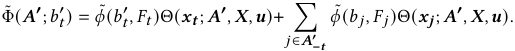

Based on the maximized virtual welfare property of _𝑨_**∗** and _𝑨_**′** , we can deduce the following two inequalities: 

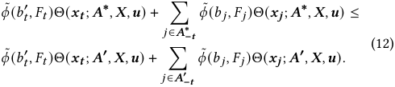

By subtracting Inequality (12) from Inequality (11), we obtain: 

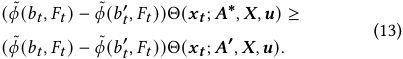

Since _𝜙_˜ ( _𝑡, 𝐹𝑡_ ) is monotone non-decreasing in _𝑡_ and _𝑏𝑡 < 𝑏𝑡_′, we have: 

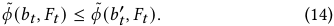

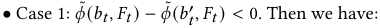

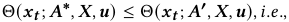

Θ( _𝒙𝒕_ ; A( _𝑏𝑡 , 𝒃_ **−** _𝒕_ ; _𝑿, 𝒖_ ) _, 𝑿, 𝒖_ ) ≤ Θ( _𝒙𝒕_ ; A( _𝑏𝑡_′_, 𝒃_**−**_𝒕_;_𝑿_)_, 𝑿, 𝒖_)_,_ demonstrating that the allocation rule A is monotone. 

• Case 2: _𝜙_˜ ( _𝑏𝑡 , 𝐹𝑡_ ) − _𝜙_˜ ( _𝑏𝑡_′_, 𝐹𝑡_)=0. By swapping the LHS and RHS of Inequality (12) and then adding it to Inequality (11), we obtain: 

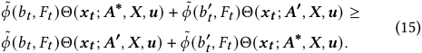

Substituting _𝜙_˜ ( _𝑏𝑡 , 𝐹𝑡_ ) = _𝜙_˜ ( _𝑏𝑡_′_, 𝐹𝑡_) into Equation (15), we have, the ’≥’ in Inequality (15) holds as equality. Therefore, both Inequality (11) and Inequality (12) hold as equalities, which means that both _𝑨_**∗** and _𝑨_**′** are the allocations that maximize virtual welfare after _𝑎𝑑𝑡_ increases her bid to _𝑏𝑡_′.Therefore,_w.l.o.g_,wechoose_𝑨_**∗**as the final allocation result, indicating that the allocation outcome remains unchanged after the increase in _𝑎𝑑𝑡_ ’s bid. Consequently, the CTR of _𝑎𝑑𝑡_ also remains unchanged. Thus, the allocation rule A is monotone. 

2181 

