# **Prices Do Matter: Modeling Price Competitiveness for Online Hotel Industry** 

Ruitao Zhu∗ Wendong Xiao∗ Yao Yu Shanghai Jiao Tong University Alibaba Group Alibaba Group Shanghai, China Hangzhou, China Hangzhou, China sjtu_zrt@sjtu.edu.cn xunxiao.xwd@alibaba-inc.com sichen.yy@alibaba-inc.com Yangsu Liu Zhenzhe Zheng† Shuqi Zhang Shanghai Jiao Tong University Shanghai Jiao Tong University Alibaba Group Shanghai, China Shanghai, China Hangzhou, China liu_yangsu@sjtu.edu.cn zhengzhenzhe@sjtu.edu.cn zhangshuqi.zsq@alibaba-inc.com 

Dong Li Alibaba Group Hangzhou, China shiping@taobao.com 

## **Abstract** 

Broad adoption of Online Travel Platforms (OTPs) has led to increasing interest in accurately predicting users’ hotel purchase behavior, with price being a key influencer in user decision-making and receiving significant focus. In examining the hotel purchasing process, we identify a pervasive trend that users make extensive price comparisons before making decisions. Existing research primarily focuses on a hotel’s own price, neglecting the complex dynamics of market-driven price competition. In this paper, we propose the concept of Marketplace-oriented Hotel Price Competitiveness (MHPC) to model a hotel’s pricing competitiveness within the marketplace. Being independent of specific user preferences, MHPC can be applied to and improve various downstream operations in the online hotel industry, such as hotel ranking and pricing, ultimately benefiting hoteliers, users, and OTPs. Furthermore, a novel Hotel Price Competitiveness-aware Purchase Prediction Model ( _𝐻𝑃_3 _𝑀_ ) is constructed by incorporating MHPC and demand dynamics into a multi-task learning framework, featuring three distinct submodules to encompass the tri-dimensional facets of MHPC. Extensive offline and online experiments demonstrate _𝐻𝑃_3 _𝑀_ ’s effectiveness in predicting hotel purchase probability and enhancing the performance of hotel ranking and pricing compared to the state-of-the-art methods. _𝐻𝑃_3 _𝑀_ has been fully deployed on Fliggy, a leading OTP in China, serving thousands of hoteliers and tens of millions of users. 

∗Equal contribution. 

†Corresponding author. 

Permission to make digital or hard copies of all or part of this work for personal or classroom use is granted without fee provided that copies are not made or distributed for profit or commercial advantage and that copies bear this notice and the full citation on the first page. Copyrights for components of this work owned by others than the author(s) must be honored. Abstracting with credit is permitted. To copy otherwise, or republish, to post on servers or to redistribute to lists, requires prior specific permission and/or a fee. Request permissions from permissions@acm.org. _KDD ’25, Toronto, ON, Canada_ 

© 2025 Copyright held by the owner/author(s). Publication rights licensed to ACM. ACM ISBN 979-8-4007-1245-6/25/08 https://doi.org/10.1145/3690624.3709420 

Fan Wu Shanghai Jiao Tong University Shanghai, China fwu@cs.sjtu.edu.cn 

## **CCS Concepts** 

- **Information systems** → **Recommender systems** . 

## **Keywords** 

Price Competitiveness, Purchase Probability Prediction, Online Travel Platforms 

#### **ACM Reference Format:** 

Ruitao Zhu, Wendong Xiao, Yao Yu, Yangsu Liu, Zhenzhe Zheng, Shuqi Zhang, Dong Li, and Fan Wu. 2025. Prices Do Matter: Modeling Price Competitiveness for Online Hotel Industry. In _Proceedings of the 31st ACM SIGKDD Conference on Knowledge Discovery and Data Mining V.1 (KDD ’25), August 3–7, 2025, Toronto, ON, Canada._ ACM, New York, NY, USA, 10 pages. https://doi.org/10.1145/3690624.3709420 

## **1 Introduction** 

Online Travel Platforms (OTPs), such as Booking, Airbnb, and Fliggy1 , have become one of the most prevalent hotel booking channels connecting hoteliers and users. To improve the engagement of both sides, OTPs provide search ranking services for users by prioritizing hotels based on individual preferences, and pricing services for hoteliers by maximizing hotelier revenue through supply-demand analysis and purchase probability prediction. Accurately modeling user purchase behavior is crucial for these services. Numerous studies have established price as a key determinant of user purchasing behavior [13, 21], and prices directly affect the overall revenue of OTPs and hoteliers. However, existing research predominantly simplifies price as a static item feature within purchase probability prediction models, neglecting its dynamic nature and the competitive context within the platform. 

In practice, faced with an abundance of choices, users commonly engage in comparing the prices of similar hotels as well as different travel dates to ultimately select the most cost-efficient options. To capture such price comparison patterns, studies like PCNet [18] for personalized ranking, and Airbnb’s research [16] for search page revenue maximization, introduce deep feature crosses between user 

1www.fliggy.com, one of the most popular online travel platforms in China. 

2884 

KDD ’25, August 3–7, 2025, Toronto, ON, Canada 

Ruitao Zhu, et al. 

profiles and item features. As depicted in Figure 1, these preferenceoriented studies indirectly capture the competitive relation of hotels through users’ varying degrees of preference for different hotels. However, for the online hotel industry, the price competition among hotels is determined by the overall marketplace demand, rather than individual user preferences. Existing models, deeply integrating user preference with the retrieved hotel features within a query, encounter challenges in deriving the hotel price competitiveness independent of specific user preferences. Consequently, these models are confined to specific downstream tasks. 

This model features three meticulously engineered submodules capturing MHPC’s tripartite dimensions. 

• Extensive experiments on large-scale industrial data and online A/B tests show that _𝐻𝑃_3 _𝑀_ significantly outperforms existing methods for predicting hotel purchase probability, hotel ranking, and hotel pricing. Specifically, our model gained 3.2% relative GMV improvement and 4.9% relative CVR improvement in the four-week online A/B test. _𝐻𝑃_3 _𝑀_ has been successfully deployed on Fliggy, serving thousands of hoteliers and tens of millions of users. 

## **2 PRELIMINARIES** 

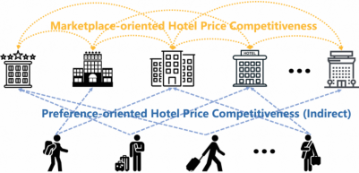

**Figure 1: Comparison between preference-oriented and our proposed marketplace-oriented hotel price competitiveness.** 

In this work, we propose the concept of _Marketplace-oriented Hotel Price Competitiveness_ (MHPC) to represent a hotel’s pricing competitiveness within the entire marketplace. MHPC captures the interplay between hotels and the marketplace, which remains independent of individual user preferences, enabling its extensive application to enhance various downstream tasks in the online hotel industry. Specifically, MHPC not only aids hoteliers in establishing competitive pricing to boost their revenue and attract more users but also enhances user experience by achieving more precise hotel purchase probability predictions. Such advancements in predictive modeling facilitate improved performance for downstream applications such as hotel ranking and pricing, thus contributing to increased platform revenue. Therefore, the wide application of MHPC serves to optimize the utilities of hoteliers, users, and OTPs, fortifying the social welfare of the online hotel industry. 

We decompose MHPC into three dimensions, _i.e._ , _Intra-platform, Inter-platform and Temporal Competitiveness_ , and propose the **H** otel **P** rice Competitiveness-aware **P** urchase **P** rediction **M** odel (HP3 M) to assimilate MHPC into the predictive framework. _𝐻𝑃_3 _𝑀_ consists of three submodules to represent the three dimensions of MHPC and incorporates demand dynamics, fluctuations in market demand for hotels, as an additional pivotal factor influencing hotel purchase probability. _𝐻𝑃_3 _𝑀_ is developed within a multi-task learning framework that concurrently addresses price competitiveness and demand dynamics. 

Our main contributions in this work are summarized as follows 

• We propose the concept of _Marketplace-oriented Hotel Price Competitiveness_ (MHPC), independent of individual user preferences, to enhance various tasks in the online hotel industry, such as ranking and pricing, thereby benefiting hoteliers, users, and OTPs. 

• We propose a novel Hotel Price Competitiveness-aware Purchase Prediction Model ( _𝐻𝑃_3 _𝑀_ ), developed in a multi-task learning framework incorporating MHPC and demand dynamics modeling. 

This section formalizes the concept of MHPC and the integrated hotel purchase prediction problem, aligning with the input features and outputs of our designed modules in Section 3. Our main notations are summarized in Table 1. 

**Table 1: Main notations.** 

|Notation|Description|
|---|---|
|H = {_ℎ_1_,ℎ_2_,_· · · _,ℎ_|H|}|Set of hotels in the marketplace|
|U|Set of users|
|_𝑝__𝑡_ _ℎ_ |Price of hotel_ℎ_at time_𝑡_|
|_𝒙__𝒃_ _𝒉_ |Embedding vector of hotel_ℎ_’s basic hotel features|
|_𝒙__𝒅_ _𝒉_ |Embedding vector of hotel_ℎ_’s demand dynamics features|
|_𝒙__𝒄_ **U**,_𝒙𝒑_ **U**|Historical click and purchase of users|
|_𝒑__𝒐_ _𝒉_ |Set of hotel_ℎ_’s historical prices collected from other OTPs|
|_𝑷__𝑺𝒕_ _𝒉_|Sequence consisting of_𝑇_nearest historical prices of hotel_ℎ_to time_𝑡_|
|_𝑽𝑰_|Intra-platform competitiveness of hotel_ℎ_|
|_𝑽𝑬_|Inter-platform competitiveness of hotel_ℎ_|
|_𝑽𝑺_ |Temporal competitiveness of hotel_ℎ_|
|_𝑆__𝑝_ _ℎ_ |Price competitiveness-based purchase probability of hotel_ℎ_(MHPC)|
|_𝑆__𝑑_ _ℎ_|Demand-based purchase probability of hotel_ℎ_|
|_𝑆__𝑤_ _ℎ_|Overallpurchaseprobabilityof hotel_ℎ_|

## **2.1 Hotel Price Competitiveness Modeling** 

Let H = { _ℎ_ 1 _,ℎ_ 2 _,_ · · · _,ℎ_ |H| } denote the set of hotels in the marketplace and U denote the set of users. Each hotel _ℎ_ ∈H has basic hotel feature embedding _𝒙𝒉__𝒃_(_e.g._, location, brand, hotel star) and selling price _𝑝ℎ__𝑡_at time_𝑡_. 

MHPC reflects a hotel’s relative pricing advantage over its competitors; accordingly, accurate modeling of MHPC demands a thorough identification of a hotel’s potential competitors. Based on the analysis of user price comparison behavior data on Fliggy, we decompose MHPC into the following three dimensions. 

**Intra-platform comparison** . In e-commerce platforms, user search behavior is guided by specific preferences and intents, particularly on OTPs where users often search for hotels by filtering for desired destinations. This pattern yields a set of candidate hotels with substantial similarity and shared market focus. Within this competitive set, pricing adjustments by any hotel can affect the booking probability of its peers. To capture this competitive relationship within the same platform, we present Definition 2.1. 

_Definition 2.1._ **Intra-platform competitiveness** . Let _𝒙__𝒄_ **U**and _𝒙__𝒑_ **U**denotethefeaturesextractedfromhistoricalclickandpur- chase of users, and _𝑿__𝒃_ **H**={_𝒙_ _𝒉__𝒃_ 1_, 𝒙_ _𝒉__𝒃_ 2_,_· · ·_, 𝒙_ _𝒉__𝒃_ **|H|**}denote the basic 

2885 

Prices Do Matter: Modeling Price Competitiveness for Online Hotel Industry 

KDD ’25, August 3–7, 2025, Toronto, ON, Canada 

features of all hotels within our platform. Then the Intra-platform competitiveness of the target hotel _ℎ_ is defined as: 

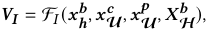

where F _𝐼_ denotes the submodule **ICRM** , detailed in Section 3.1.1. 

**Inter-platform comparison** . A hotel may be listed on multiple OTPs, with price discrepancies potentially resulting from the distinct marketing strategies of each platform. Assuming equal visibility across OTPs, users are inclined to purchase from the platform offering the most favorable deals. Based on the above analysis, we present Definition 2.2. 

_Definition 2.2._ **Inter-platform competitiveness** . Let _𝒑𝒉__𝒐_denote hotel _ℎ_ ’s historical prices collected from other OTPs. Then the Interplatform competitiveness of hotel _ℎ_ is defined as: 

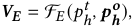

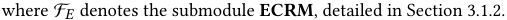

**Temporal comparison** . Hotel prices undergo periodic variations driven by shifts in market demand and regular promotional campaigns by OTPs. Users typically consider hotel prices over a period before finalizing their travel dates. To characterize the impact of the temporal price dynamics on users’ purchasing decisions, we present Definition 2.3. 

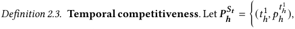

( _𝑡ℎ_1_, 𝑝_ _ℎ𝑡ℎ_1)_,_· · ·_,_(_𝑡_ _ℎ__𝑇, 𝑝_ _ℎ𝑡ℎ__𝑇_) denote the sequence consisting of _𝑇_ near� est historical prices of hotel _ℎ_ to time _𝑡_ . Then the temporal competitiveness of hotel _ℎ_ is defined as: 

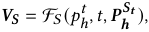

where F _𝑆_ denotes the submodule **SCRM** , detailed in Section 3.1.3. 

## **2.2 Integrated Hotel Purchase Prediction** 

Since MHPC represents a hotel’s price competitiveness within the marketplace and lacks a ground-truth label, it is incompatible with direct supervised learning. Hence, we embed MHPC in the task of predicting hotel purchase probability, and define MHPC as the the purchase probability of hotel _ℎ_ with price _𝑝ℎ__𝑡_, given price competi- tion within the hotel set H : 

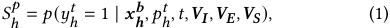

where _𝑦ℎ__𝑡_denotes whether hotel_ℎ_is purchased at time_𝑡_. Distinct from other e-commerce platforms, hotel offerings on OTPs are characterized by stringent, time-sensitive capacity constraints [23, 24]. Consequently, beyond prices, demand dynamics, _i.e._ , fluctuations in market demand, also affect purchase probability. The demand-based purchase probability is formalized as: 

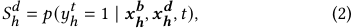

where _𝒙𝒉__𝒅_denotes the embedding vector of demand dynamics fea- tures ( _e.g._ , historical sales, historical exposure unique visitors). 

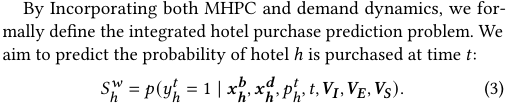

## **3 Methodology** 

This section presents the details of the **H** otel **P** rice Competitivenessaware **P** urchase **P** rediction **M** odel (HP3 M). The central idea of _𝐻𝑃_3 _𝑀_ is to establish an effective framework to incorporate MHPC and demand dynamics in predicting the hotel purchase probability. As shown in Figure 2, we construct _𝐻𝑃_3 _𝑀_ within a multi-task learning architecture, featuring three submodules to delineate the three dimensions of MHPC: the Internal, External, and Self Competitiveness Representation Modules ( _ICRM, ECRM, and SCRM_ ), yielding representations _𝑽𝑰_ , _𝑽𝑬_ , and _𝑽𝑺_ . An aggregation layer then computes their respective impact weights, culminating in the unified representation _𝑽𝑪_ . Then, a monotonicity-based sigmoid-shaped scoring function is employed to predict MHPC. Finally, to correct the prediction bias linked to the endogeneity between demand and price features, we introduce an auxiliary feature correlation loss to refine the accuracy of MHPC scoring. 

## **3.1 MHPC-based Hotel Purchase Prediction** 

As demonstrated in Section 2.1, we decompose MHPC into three dimensions, each represented by a distinct submodule. We elaborate on the three submodules in this section. 

_3.1.1 Internal Competitiveness Representation Module (ICRM)._ The goal of ICRM is to represent the intra-platform competitiveness defined in Definition 2.1. Therefore, we aim to solve two problems in this section: (1) how to identify potential competitive hotels; and (2) how to characterize the price competitiveness over competitors. 

**Potential Competitors Identification.** Identifying potential competitors relies on characterizing the hotel similarities. We conceptualize similarity across three dimensions: (1) attribute-based, clustering hotels by fundamental attributes like location, star rating, and price range; (2) click-based, clustering by user click behaviors; (3) purchase-based, clustering by user purchase behaviors. By leveraging the above similarities, we identify the top _𝑁_ hotels most similar to the target hotel _ℎ_ among candidate hotels within the same region, obtaining three distinct competitive groups: G _ℎ__𝑅,_G_𝐶_ _ℎ__,_G _ℎ__𝑃_. Firstly, hotels are clustered by basic hotel features using the K- means algorithm, with K set to the number of commercial zones. Hotels within the same cluster are deemed competitors of comparable quality, where the pricing of one influences the others. The cluster containing target hotel _ℎ_ is denoted as G _ℎ__𝑅_. 

Note that competitive dynamics among hotels often stem from shared market demand, identifying potential competitors entails utilizing historical marketplace-item interaction data to precisely delineate hotels’ demand situation. Accordingly, we employ graphbased representation and item-based collaborative filtering [11] to capture purchase-based and click-based interactions, respectively. 

Utilizing the graph-based approach, we construct a weighted bipartite graph with hotel and user nodes from the past 90 days of purchase data. Edge weights reflect the frequency of purchases. Notably: (1) hotels commonly connected by the same user indicate 

2886 

KDD ’25, August 3–7, 2025, Toronto, ON, Canada 

Ruitao Zhu, et al. 

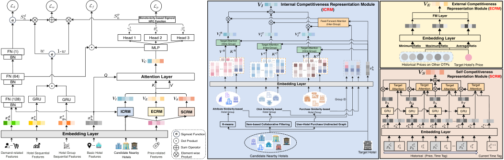

<!-- Start of picture text -->
Internal Competitiveness Representation Module External Competitiveness (ICRM) Representation Module (ECRM) Monotonicity-based Sigmoid HPC Function Feed-Forward Attention FM Layer (Inter-Group) Head 1 Head 2 Head 3 Target Attention Embedding Layer MLP (Intra-Group) Target Attention(Intra-Group) Target Attention Minimum Ratio Maximum Ratio Average Ratio FN (1) (Intra-Group) BN Historical Prices on Other OTPs Target Hotel's Price Self Competitiveness FN (64) Q Attention Layer Representation Module (SCRM) BN K V Embedding Layer FN (128) GRU GRU Group ID BN ICRM ECRM SCRM Attribute Similarity-based Hotel Group Click Similarity-based Hotel Group Purchase Similarity-based Hotel Group K-means Item-based Collaborative Filtering User-Hotel Purchase Undirected Graph Embedding Layer Sigmoid Function Dot Product ... ... Sum Operator Demand-related Hotel Sequential Hotel Group Basic Hotel Candidate Nearby Price-related Element-wise Target Hotel Features Features Sequential Features Features Hotels Features Product Candidate Nearby Hotels <!-- End of picture text -->

**Figure 2: The architecture of Hotel Price Competitiveness-aware Purchase Prediction Model (HP**3 **M).** 

strong competitive relations due to shared demand, and (2) users linked to the same hotel suggest similar purchasing preferences. Employing _metapath2vec_ [5] with metapaths hotel-user-hotel and user-hotel-user, we capture these patterns and derive the embedding of hotel. The similarity between hotels is computed via the inner product of embeddings, with the top _𝑁_ forming the competitive group G _ℎ__𝑃_for hotel_ℎ_. For item-based collaborative filtering, we leverage recent 30-day user click data, employing the vector inner product for similarity measurement. The top _𝑁_ hotels most similar to hotel _ℎ_ constitute the hotel group G_𝐶_ _ℎ_. 

**Modeling price competitiveness over competitors.** To represent the hotel’s price competitiveness over its potential competitors, we need to model two distinct types of competitive relationships: (1) _intra-group competition_ ; (2) _inter-group competition_ . 

The price comparison is expressed through the price ratio _𝑝ℎ__𝑡_/_𝑝𝑡𝑟_ between the target hotel _ℎ_ and each competitive hotel _𝑟_ . For each competitive group _𝑘_ ∈ _𝑅,𝐶, 𝑃_ , we define _𝑽__𝒌_ ∈ R_𝑁_×_𝑑_ and _𝑲__𝒌_ ∈ R_𝑁_×_𝑑_ as matrices representing the price ratio and basic hotel features, respectively. The _𝑗_ -th row in these matrices corresponds to the embedding vectors for the price ratio and basic features of the _𝑗_ - th hotel in group _𝑘_ . Additionally, _𝑮__𝒌_ ∈ R_𝑑_ denotes the embedding vector for the Group ID of the competitive group _𝑘_ . 

As shown in Figure 2, ICRM constructs a target attention layer for each group, with the embedding vector of target hotel _𝒙𝒉__𝒃_as the query vector, _𝑲__𝒌_ as the key vector, and _𝑽__𝒌_ as the value vector, to learn the intra-group competition representation _𝑽𝑰__𝒌_: 

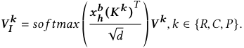

Next, we adopt the feed-forward attention network to model the inter-group competition _𝑽𝑰_ : 

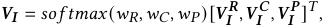

where _𝑤𝑘_ ∈ R represents the competitiveness score computed through a multilayer perceptron (MLP) with _𝒙𝒉__𝒃_and_𝑮𝒌_as input. 

_3.1.2 External Competitiveness Representation Module (ECRM)._ A hotel often concurrently lists on various platforms, with prices differing due to distinct platform marketing strategies. Price-sensitive users tend to compare rates for the same hotel across multiple OTPs. Consequently, ECRM aims to represent the inter-platform competitiveness defined in Definition 2.2. 

Hotels are more likely to receive bookings on the platform that offers a lower price. Accordingly, we employ the price ratio between the target hotel’s price _𝑝ℎ__𝑡_and prices_𝒑_ _𝒉__𝒐_from other OTPs to model this price discrepancy. Nevertheless, the availability of cross-OTP pricing data is often limited due to privacy concerns, resulting in data sparsity and challenges in establishing robust models. To mitigate these issues, we utilize DeepFM [7], adept at capturing feature interaction for sparse data. As depicted in Figure 2, the input of ECRM encompasses embeddings derived from the ratio of _𝑝ℎ__𝑡_to the minimum ( _𝒑𝒉__𝒎𝒊𝒏_ ), maximum ( _𝒑𝒉__𝒎𝒂𝒙_ ), and average ( _𝒑𝒉__𝒂𝒗𝒈_ ) price within _𝒑𝒉__𝒐_. To further minimize noises from other OTPs’ price data, a selector block is implemented above the FM layer, yielding the representation of inter-platform competitiveness: 

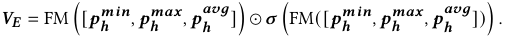

where _𝝈_ (·) denotes the fully connected layer with sigmoidal activation and “⊙” denotes the element-wise product operator. 

_3.1.3 Self Competitiveness Representation Module (SCRM)._ As discussed in Section 2.1, users’ hotel purchasing decisions are susceptible to price fluctuations driven by temporal factors like demand seasonality and platform promotions. SCRM aims to represent the competitiveness of the current price over historical prices, as defined in Definition 2.3. Specifically, SCRM focuses on two key temporal patterns: long-term global price consistency and short-term local price fluctuation. Long-term patterns indicate a hotel’s general pricing trends and market standing, while short-term trends capture immediate price variations and market reactions. 

As shown in Figure 2, we design a Gated Recurrent Units (GRU) [4] based attention mechanism to fuse the long-term global price consistency and short-term local price fluctuation. Given the historical 

2887 

Prices Do Matter: Modeling Price Competitiveness for Online Hotel Industry 

price sequence _𝑷𝒉__𝑺𝒕_= ( _𝑡ℎ_1_, 𝑝_ _ℎ𝑡ℎ_1)_,_(_𝑡_ _ℎ_1_, 𝑝_ _ℎ𝑡ℎ_1)_,_· · ·_,_(_𝑡_ _ℎ__𝑇, 𝑝_ _ℎ𝑡ℎ__𝑇_) , we trans� � form the price ratio _𝑝ℎ__𝑡_/_𝑝_ _ℎ𝑡ℎ__𝑖,𝑖_∈{1_,_2_,_· · ·_,𝑇_} and each correspond- ing time tag _𝑡ℎ__𝑖_to embedding vectors_𝒆_ _𝒉__𝒑𝒊_and_𝒆_ _𝒉__𝒕𝒊_. The embedding vector of the current time tag is denoted as _𝒆𝒉__𝑻_**+**1 . Iteratively, the _𝑖_ -th GRU cell is defined as: 

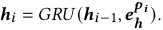

Furthermore, to capture the impact weight of each historical price on the current price, we adopt the target attention network with _𝒆𝒉__𝑻_**+**1 ∈ R_𝑑_ as the query vector, _𝑬𝒉__𝒕_=[_𝒆_ _ℎ__𝑡_1_, 𝒆_ _ℎ__𝑡_2_,_· · ·_, 𝒆_ _ℎ__𝑡𝑇_]as the key vector, and _𝑯𝒉_ = [ _𝒉_ 1 _, 𝒉_ 2 _,_ · · · _, 𝒉𝑇_ ] as the value vector. Thus, the representation of the temporal competitiveness _𝑽𝑺_ is formalized as: 

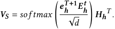

_3.1.4 MHPC Representation Aggregation Layer._ Note that the impact of _𝑽𝑰 , 𝑽𝑬 , 𝑽𝑺_ on users’ purchasing decisions varies across different hotels. For example, for budget hotels, with an abundance of similar options readily available, the intra-platform competitiveness _𝑽𝑰_ often plays a more significant role. For resort hotels, which typically exhibit notable price changes over time, the temporal competitiveness _𝑽𝑺_ tends to be more influential. 

The three dimensions of MHPC are aggregated into a unified representation by adopting the attention mechanism to account for the varying impact weights, formulated as: 

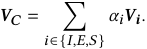

As previously indicated, the weight _𝛼𝑖_ varies contingent upon the hotel category, suggesting that the basic features of hotels provide essential information for user decision-making. Therefore, we employ the attention mechanism, with _𝒙__𝑏_ _ℎ_as the query vector: 

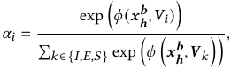

where the function _𝜙_ encapsulates the similarity between the query vector _𝒙__𝑏_ _ℎ_andthekeyvector_𝑽𝑖_,indexedby_𝑖_∈{_𝐼, 𝐸,𝑆_},andis parameterized by a MLP, which is formally defined as: 

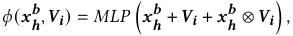

### where ⊗ denotes the element-wise product operator. 

_3.1.5 Monotonicity-based Sigmoid MHPC Scoring Function._ Intuitively, a hotel’s likelihood of purchase increases when it offers a lower price, assuming other factors remain constant. Previous research has characterized this monotonic relationship as a sigmoid curve [17, 18], and we observe a similar pattern from Fliggy’s hotel purchase data. Additionally, as MHPC is employed for evaluating hotel quality and aiding merchants in pricing, the MHPC score must maintain a strict monotonic relationship with prices, thereby reinforcing hoteliers’ confidence in the reasonableness and interpretability of OTP’s predictive model. Furthermore, the sigmoid-shaped monotonic relationship provides robust a priori insights into empirical phenomena. This domain knowledge guides 

KDD ’25, August 3–7, 2025, Toronto, ON, Canada 

and restricts the modeling process, reducing the likelihood of overfitting and enhancing generalization capabilities, in contrast to arbitrary and uninformed learning approaches. Hence, we design the monotonicity-based sigmoid MHPC scoring function. The MHPC _𝑆__𝑝_ _ℎ_∈(0_,_1]is defined as the purchase probability at price_𝑝_ _ℎ__𝑡_: 

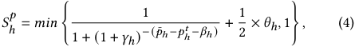

where _𝑝_ ¯ _ℎ_ denotes the historical average price of hotel _ℎ_ , and parameters _𝛾ℎ_ ∈(0 _,_ 1) _, 𝛽ℎ_ ∈(0 _,_ +∞) _,𝜃ℎ_ ∈(0 _,_ 1) control the shape of the MHPC scoring function. These parameters are derived from a shared-bottom two-layer MLP with input _𝑽𝑪_ and three output heads. Specifically, the heads for _𝛾ℎ_ and _𝜃ℎ_ use a fully connected layer with sigmoid activation, while the head for _𝛽ℎ_ uses a fully connected layer with a ReLU activation. 

## **3.2 Integrated Hotel Purchase Prediction** 

As discussed in Section 2.2, aside from pricing factors, demand dynamics significantly affect hotel purchase probability, with such effects arising from seasonal and cyclical demand patterns driven by variations in popularity. Illustratively, hot spring resorts typically see increased demand in winter relative to summer, whereas business hotels experience heightened occupancy during weekdays as compared to weekends. Therefore, we predict the demand-based hotel purchase probability by incorporating demand-related feature embedding _𝒙𝒉__𝒅_and basic hotel feature embedding_𝒙_ _𝒉__𝒃_: 

### _𝑆ℎ__𝑑_= MLP �[ _𝒙𝒉__𝒅,𝒙_ _𝒉__𝒃_] � 

Note that _𝒙𝒉__𝒅_captures numerical demand-related features such as historical orders, which may fall short in capturing demand volatility. Events causing abrupt demand spikes, like concerts, can markedly diminish the role of price in purchasing decisions. To address this, we incorporate sequential features that track timeseries variations in search and click Unique Visitors (UV), order volume, and occupancy rates. However, the constrained inventory of an individual hotel does not fully represent market demand. For instance, a hotel’s room inventory may stand at 10, whereas a concert in the area could generate a potential demand for 100 rooms, making the increase from 0 to 10 insufficient to accurately reflect the true scope of demand. 

To effectively capture regional demand shifts, we utilize features of hotels in the target hotel’s commercial area. Specifically, let _𝒙𝒉__𝒔_=(_𝑥_ _ℎ__𝑠_1_,𝑥_ _ℎ__𝑠_2_,_· · ·_,𝑥_ _ℎ__𝑠𝐷_)denotehistoricalsequenceofdemand- related features for hotel _ℎ_ spanning the last _𝐷_ days, and _𝒙𝒈__𝒔_ _𝒉_ = ( _𝑥𝑔__𝑠_ _ℎ_1_,𝑥_ _𝑔__𝑠_ _ℎ_2_,_· · ·_,𝑥_ _𝑔__𝑠_ _ℎ__𝐷_) denote the corresponding sequence for hotels within the same commercial area as _ℎ_ . These two sequences are encoded via two GRU structures to ascertain the impact weights of demand-based hotel purchase probability, defined as: 

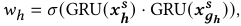

where the GRU utilizes the same architecture described in Section 3.1.3. Then the integrated hotel purchase probability corresponding to Equation (3) is formulated as: 

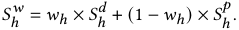

2888 

KDD ’25, August 3–7, 2025, Toronto, ON, Canada 

Ruitao Zhu, et al. 

## **3.3 Loss Function and Model Training** 

Our model is trained in the multi-task framework to minimize the combined MHPC-based and demand-based purchase prediction losses. Given _𝑀_ samples, we adopt the negative log-likelihood loss function to train all parameters of _𝐻𝑃_3 _𝑀_ : 

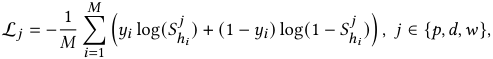

where _𝑦𝑖_ ∈{0 _,_ 1} denotes the purchase label for the _𝑖_ -th sample. 

The separate optimization of demand and price competitivenessbased purchase probabilities by two modules fails to capture the inherent correlations between price and demand features, introducing bias in the MHPC scoring task. To address this endogeneity [17], we introduce a feature correlation loss using the inner product of the intermediate representations from the two sub-networks as an auxiliary loss: 

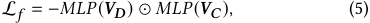

where L _𝑓_ is minimized when _𝑽𝑫_ and _𝑽𝑪_ are totally uncorrelated. The effectiveness of the proposed auxiliary loss will be illustrated in Section 4.2.1 through an ablation study. 

The total loss of the overall framework is defined as: 

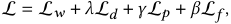

where _𝜆, 𝛽,𝛾_ are hyper-parameters2 to balance these tasks. 

## **4 Experiments** 

In this section, we conduct extensive offline experiments and online A/B tests to evaluate the effectiveness of the proposed _𝐻𝑃_3 _𝑀_ . We mainly focus on the following questions: 

• **RQ1** : How accurate is the MHPC score obtained via _𝐻𝑃_3 _𝑀_ ? 

- **RQ2** : How do different modules of _𝐻𝑃_3 _𝑀_ contribute to the 

- model performance? 

- **RQ3** : How does _𝐻𝑃_3 _𝑀_ perform on the **hotel pricing task** 

- compared to baseline methods? 

- **RQ4** : How does _𝐻𝑃_3 _𝑀_ perform on the **hotel ranking task** 

- compared to baseline methods? 

• **RQ5** : How does our proposed _𝐻𝑃_3 _𝑀_ perform on the platform’s live production environment? 

## **4.1 Experiment Setup** 

_4.1.1 Dataset._ Given the absence of publicly accessible datasets in online hotel industry for the hotel pricing and ranking tasks, we construct a real-world dataset3 based on hotel transaction data from _Fliggy_ . The dataset is split into **Regular Season** and **Peak Season** , as shown in Table 2. Specifically, the Regular Season dataset contains data from June 1 to June 14, 2023, excluding Chinese holidays. Conversely, the Peak Season dataset, spanning from June 15 to June 28, 2023, coincides with a Chinese holiday travel peak. Peak Seasons exhibit higher hotel demand and price volatility, leading to distinct data distributions compared to Regular Seasons. We use the first 7-day data for model training and the remaining 7-day data for testing. 

> 2In the offline experiments of this study, _𝜆_ = 0 _._ 1 _,𝛾_ = 0 _._ 1 _, 𝛽_ = 0 _._ 00017. 

> 3https://tianchi.aliyun.com/dataset/184364 

**Table 2: Statistics of datasets.** 

|**Datase**|**t**|**#Users**|**#Hotels**|**#Bookings**|
|---|---|---|---|---|
|Rl S|training|3.43 M|240,596|900,176|
|eguar eason|testing|2.99 M|242,470|780,152|
|Pk S|training|4.02 M|237,532|954,425|
|ea eason|testing|3.12 M|239,213|943,538|

_4.1.2 Baseline Methods._ To compare the proposed model’s performance across two distinct tasks, we introduce task-specific baselines, including state-of-the-art (SOTA) methods for both. 

**Hotel Pricing** . The hotel pricing task aims at finding the optimal price _𝑃ℎ__𝑡_∗for hotel_ℎ_at time_𝑡_to maximize expected revenue, independent of user characteristics or query features: 

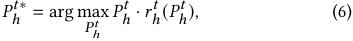

where _𝑟ℎ__𝑡_denotes the predicted purchase probability. • _Meituan pricing_ [20] adopts a DNN model to regress the suggested price for a certain room at a specific date. 

• _Airbnb pricing_ [19] employs a customized regression model to obtain the suggested price and adjust the price by incorporating hotelier goals and special events. 

• _PEM pricing_ [23] is the SOTA hotel pricing model, which introduces the elasticity of demand function into hotel pricing to determine suggested prices dynamically. 

**Hotel Ranking** . The hotel ranking task entails ordering retrieved hotels by purchase likelihood, accounting for user preferences, search intent, item attributes, and contextual features. 

• _PCNet_ [18] is the SOTA hotel purchase probability prediction model, incorporating price competitiveness assessment. 

• _PCNet-PC_ is a variant of PCNet which removes all price competitiveness modules. 

### _4.1.3 Performance Metrics._ 

• **Rank Biased Overlap (RBO) [15]** quantifies the similarity between two ranked lists with the given weight of each position: 

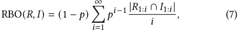

where _𝑅_ 1: _𝑖_ and _𝐼_ 1: _𝑖_ denote the top _𝑖_ items in list _𝑅_ and list _𝐼_ , respectively. The parameter _𝑝_ determines how steeply the weights fall, _i.e._ , the smaller _𝑝_ , the higher weight for top positions. RBO is utilized to evaluate the effectiveness of the derived MHPC score in modeling price competition among hotels. 

For the hotel pricing task, the absence of optimal price labels renders direct comparison of predictions to ground truth infeasible. Fortunately, the monotonic relationship between price and purchase probability allows us to ascertain the range within which the optimal price lies. For instance, given a historical hotel sample priced at _𝑃ℎ__𝑡_that failed to result in a transaction, the theoretical optimal price lies in [∞ _, 𝑃ℎ__𝑡_](lower price, higher purchase proba- bility). Based on the above analysis, we employ the following two evaluation metrics used in [19, 20, 25] to compare the performance of various hotel pricing strategies. 

Denote the actual price of hotel _ℎ_ as _𝑃ℎ_ , the suggested price as _𝑃ℎ__𝑠𝑢𝑔_ , and the number of samples in each case in Table 3 as _𝑎_ , _𝑏_ , _𝑐_ , _𝑑_ . 

2889 

Prices Do Matter: Modeling Price Competitiveness for Online Hotel Industry 

KDD ’25, August 3–7, 2025, Toronto, ON, Canada 

**Table 3: Number of samples in each case.** 

||Booking|Non-Booking|
|---|---|---|
|_𝑃__𝑠𝑢𝑔_ _ℎ_ ≥_𝑃ℎ_ _𝑃__𝑠𝑢𝑔_ _ℎ_ _< 𝑃ℎ_|_𝑎_ _𝑐_|_𝑏_ _𝑑_|

hotel rankings within the same commercial district, as manually annotated by platform business operatives4 . Furthermore, to illustrate the contributions of our proposed submodules and the auxiliary loss L _𝑓_ , we construct the following variants for comparison. 

- HP3 M **-ICRM** : a variant of _𝐻𝑃_3 _𝑀_ which deletes ICRM; 

- HP3 M **-ECRM** : a variant of _𝐻𝑃_3 _𝑀_ which deletes ECRM; 

- HP3 M **-SCRM** : a variant of _𝐻𝑃_3 _𝑀_ which deletes SCRM; 

• **Price Decrease Recall (PDR)** measures the percentage of samples where the suggested prices are lower than actual prices among all non-booking samples. 

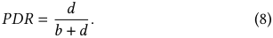

• **Price Increase Recall (PIR)** measures the percentage of samples where the suggested prices are no lower than actual prices among all booking samples. 

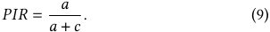

A higher value of PDR and PIR indicates that the model’s suggested price is closer to the theoretically optimal price. However, it should be noted that the singular performance of PDR or PIR does not adequately reflect a model’s pricing effectiveness. Consider a toy case where the model always suggests a price of zero, resulting in PDR=1 and PIR=0; focusing solely on PDR would yield a misleading conclusion. Therefore, to account for both metrics, we adapt the concept of F1-score from statistical learning to pricing tasks, introducing the following comprehensive evaluation metric. 

• **Price Recall F1-score (PRF1)** measures the overall performance of a pricing algorithm. 

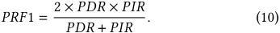

For evaluating revenue and ranking performance, we employ the following commonly used metrics: 

• **Gross Merchandise Volume (GMV)** measures the total revenue of hotels sold on the platform. 

• **AUC** , **Logloss** , **NDCG@K** measures the ranking performance. 

_4.1.4 Implementation Details._ In _𝐻𝑃_3 _𝑀_ , all feature embeddings are sized at 16, and the number of units of GRU is set to 64. The feedforward networks in ICRM, ECRM, SCRM, and the aggregation layer have two hidden layers with 64 and 32 neurons. Each of _𝛾ℎ__𝑡, 𝛽_ _ℎ__𝑡,𝜃_ _ℎ__𝑡_defined in Equation (4) is calculated by a three-layer MLP with sizes of 128, 64, and 1. _𝐻𝑃_3 _𝑀_ is trained through the Adam optimizer with a learning rate of 0.001 and a batch size of 512. To avoid overfitting, we add dropout with a probability of 0.2. 

For the baseline methods, the regression module of Meituan pricing and Airbnb pricing method is set to a three-layer MLP with sizes of 256, 64, and 1. The multi-sequence fusion model of PEM pricing contains three convolution kernels (sizes: 64, 128, 64) and a two-layer Bi-GRU module (number of units: 64, 32). Other parameters follow the original papers’ recommendations. 

## **4.2 Offline Experiments** 

_4.2.1 Accuracy of MHPC Score (RQ1) & Ablation Study (RQ2)._ Given that the MHPC score is designed to indicate a hotel’s price competitiveness and lacks a ground-truth label, we assess the predicted MHPC score’s accuracy through a comparison of the relative 

• HP3 M −Lf : a variant of _𝐻𝑃_3 _𝑀_ which is trained without the auxiliary loss L _𝑓_ defined in Equation (5). 

• HP3 M **-simple** : a simple baseline to model price competitiveness, which replaces SCRM, ECRM, and ICRM with a 3-layer MLP using price ratios of target hotels across inter-platform, intra-platform, and temporal prices as inputs. 

Each offline experiment is repeated 5 times with different random seeds and each result is presented in the form of mean _𝑝𝑚_ standard. The experimental results are shown in Table 4, from which we observe: (1) The proposed ICRM, ECRM, and SCRM notably boost model performance across the intra-platform, inter-platform, and temporal dimensions, confirming the effectiveness of the tridimensional MHPC modeling strategy; (2) Omitting L _𝑓_ diminishes RBO by 1.3% and 1.5% in peak and regular seasons, respectively, confirming the importance of addressing the feature correlation issue in hotel purchase prediction. (3) _𝐻𝑃_3 _𝑀_ outperforms _𝐻𝑃_3 _𝑀_ -simple with an 11.9% and 10.6% increase in RBO during peak and regular seasons, respectively, demonstrating the necessity and effectiveness of finely modeling price comparisons. 

**Table 4: Performance test for MHPC score & Ablation study (mean** ± **std).** 

||Peak S|eason|Regular|Season|
|---|---|---|---|---|
||RBO(_𝑝_=0_._5) ↑|RBO(_𝑝_=0_._7)↑|RBO(_𝑝_=0_._5)↑|RBO(_𝑝_=0_._7)↑|
|_𝑯𝑷_3_𝑴_|**0.7112** ±0.0086|**0.8027** ±0.0070|**0.7120** ±0_._0083|**0.8148** ±0_._0062|
|_𝐻𝑃_3_𝑀_-ICRM|0.6293 ±0_._0104|0.7194 ±0_._0077|0.6321 ±0_._0052|0.7379 ±0_._0045|
|_𝐻𝑃_3_𝑀_-ECRM|0.6901 ±0_._0066|0.7822 ±0_._0068|0.6910 ±0_._0072|0.7893 ±0_._0053|
|_𝐻𝑃_3_𝑀_-SCRM|0.6755 ±0_._0061|0.7592 ±0_._0059|0.6721 ±0_._0068|0.7687 ±0_._0047|
|_𝐻𝑃_3_𝑀_-L_𝑓_|0.7020 ±0_._0070|0.7914 ±0_._0060|0.7004 ±0_._0067|0.8022 ±0_._0053|
|3|0.6323|0.7210|0.6388|0.7422|
|_𝐻𝑃𝑀_-simple|±0_._0063|±0_._0048|±0_._0075|±0_._0052|

_4.2.2 Performance on Hotel Pricing Task (RQ3) ._ For the hotel pricing task defined in Equation (6), the comparison results are detailed in Table 5, yielding the following insights: 

(1) _𝐻𝑃_3 _𝑀_ attains optimal balance between PDR and PIR across both datasets, as evidenced by superior PRF1 performance, indicating that our model approximates the theoretical optimal price more closely than baseline methods. Specifically, _𝐻𝑃_3 _𝑀_ shows a significant improvement compared to all baselines on PDR, while approaching the performance of Meituan Pricing, which directly regresses the booking prices and thus naturally has higher PIR. Note that these metrics are merely tentative indicators of potential revenue growth. In Section 4.3, we further assess the effectiveness 

4Business operatives within each commercial district identify comparable hotels based on expertise and rank them by price. 

2890 

KDD ’25, August 3–7, 2025, Toronto, ON, Canada 

Ruitao Zhu, et al. 

of our proposed model in optimizing platform revenue through online A/B tests. 

(2) _𝐻𝑃_3 _𝑀_ exhibits demand-responsive adaptability, with higher PIR in peak season indicating price increases for revenue maximization during high demand, and higher PDR in regular season reflecting price reductions to attract users during lower demand phases. This adaptive pricing behavior underscores the model’s capacity to balance profitability and market competitiveness across varying demand conditions. 

_4.2.3 Performance on Hotel Ranking Task (RQ4). 𝐻𝑃_3 _𝑀_ is designed to predict the integrated hotel purchase probability during the hotel selection stage on OTPs before user request arrivals, thus excluding user profiles from its input features. In contrast, PCNet, the comparative baseline, is applied during the subsequent hotel ranking stage, utilizing user profiles. Therefore, to isolate the influence of user profiles and assess _𝐻𝑃_3 _𝑀_ ’s contribution to refining price competitiveness in the hotel ranking task, we introduce PCNet-PC+ _𝐻𝑃_3 _𝑀_ . This variant substitutes PCNet’s price competitiveness-aware modules with the aggregated MHPC representation _𝑽𝑪_ from _𝐻𝑃_3 _𝑀_ , thus normalizing for user profile disparities. 

As illustrated in Table 6, we obtain the following observations. (1) PCNet-PC+ _𝐻𝑃_3 _𝑀_ and PCNet show marked improvements over PCNet-PC across all metrics, highlighting the contribution of price competitiveness modeling in predicting hotel purchase probabilities. (2) PCNet-PC+ _𝐻𝑃_3 _𝑀_ significantly outperforms PCNet on all metrics, evidencing the benefits of finely-grained, tri-dimensional MHPC modeling with dynamic impact weight. 

## **4.3 Online A/B Test (RQ5)** 

To evaluate the performance of _𝐻𝑃_3 _𝑀_ in the real world, we conduct four-week online A/B tests in the Fliggy hotel pricing and search ranking system from July 1 to July 28, 2023, covering both peak days (summer holidays and weekends) and regular days. The online deployment workflow for _𝐻𝑃_3 _𝑀_ is provided in Appendix A.1. 

For the hotel pricing task, we utilize PEM, which outperforms other baselines in offline experiments, as the online baseline. Curve1 (red line) in Figure 3 shows that compared to PEM, _𝐻𝑃_3 _𝑀_ achieves an average 3.2% relative improvement in GMV, demonstrating the superiority of our method in improving revenue. Note that Curve-1 exhibits cyclical fluctuations. This is expected, as GMV is directly correlated with market demand, which is notably variable and cyclical. Furthermore, the peaks in online results coincide with weekend demand surges, which is consistent with our offline experimental findings comparing peak and regular seasons. This trend underscores the demand-responsive adaptability of our proposed _𝐻𝑃_3 _𝑀_ . 

For the hotel search ranking task, we utilize PCNet as the online baseline and evaluate _𝐻𝑃_3 _𝑀_ from the following two perspectives. 

• We rerank hotels within the same commercial area on the PCNet-generated list according to their MHPC scores calculated by _𝐻𝑃_3 _𝑀_ . As depicted by Curve-2 in Figure 3, compared to ranking solely by PCNet, we achieved an average 1.4% increase in conversion rate (CVR) through reranking based on _𝐻𝑃_3 _𝑀_ . 

• We deploy _𝐻𝑃_3 _𝑀_ within a specific Fliggy hotel search scenario, targeting price-sensitive users who utilize price range filters. Hotels of each commercial area are ranked based on the MHPC score from _𝐻𝑃_3 _𝑀_ , the purchase probability from PCNet, and the greedy 

method (ascending price order), respectively. As shown in Curve-3 and Curve-4 in Figure 3, over four weeks, our model outperformed PCNet by an average of 4.9% in CVR and surpassed the Greedy method by 13.2%, demonstrating that our proposed MHPC score accounts for both hotel quality and price, and markedly enhances the performance of hotel ranking. 

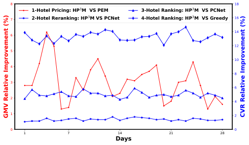

<!-- Start of picture text -->
8 18 1-Hotel Pricing: HP 3 M  VS PEM 3-Hotel Ranking: HP 3 M  VS PCNet 7 2-Hotel Reranking: HP 3 M VS PCNet 4-Hotel Ranking: HP 3 M  VS Greedy 16 14 6 12 5 10 4 8 3 6 2 4 1 2 0 0 1 7 14 21 28 Days GMV Relative Improvement (%) CVR Relative Improvement (%) <!-- End of picture text -->

**Figure 3: Four-week online A/B tests on two tasks at Fliggy.** 

## **5 Related Work** 

Price, an important factor influencing user decision-making [3, 8, 10], has been extensively studied within e-commerce platforms. Prevailing studies primarily incorporate price as a static item feature [1, 9], omitting granular price modeling. The importance of explicit price modeling are highlighted in many researches [2, 6, 12, 14, 21, 22] in order to refine predictive precision. Schafer _et al._ [12] first propose a framework elucidating price’s impact on user behavior in recommender systems. Chen _et al._ [2] employ collective matrix factorization to derive user-item, item-price, and user-price matrices, mitigating the challenge of recommending to history-lacking users. Zheng _et al._ [22] introduce a price-aware Graph Convolution Network encompassing user, item, category, and price nodes. Greenstein-Messica [6] leverage Gaussian distribution to model the Willingness To Pay (WTP) of users by introducing user’s price discount sensitivity, and combine the WTP distribution with seller reputation to calculate user-price matching score to improve prediction accuracy. Zhang _et al._ [21] design a customized heterogeneous hypergraph network to interlink prices and user preferences in session-based recommendations. Wan _et al._ [14] incorporate dynamic pricing of item and price elasticity into recommender systems via modeling users’ decision making into three stages: category purchase, product choice and purchase quantity. 

The aforementioned studies focus solely on modeling individual item pricing, disregarding the impact of inter-item price competition on users’ purchasing behavior, leading to suboptimal purchase probability prediction performance. Wu _et al._ [18] propose PCNet, which accounts for item comparison prices to model users’ price comparison behaviors, while Airbnb’s study [16] views hotels on the same search page as competitors, setting prices based on estimated user value distributions for revenue optimization. Although existing efforts have demonstrated remarkable performance, these methods integrate user preferences with the retrieved hotels within 

2891 

Prices Do Matter: Modeling Price Competitiveness for Online Hotel Industry 

KDD ’25, August 3–7, 2025, Toronto, ON, Canada 

**Table 5: Performance comparison on hotel pricing (mean** ± **std).** 

||P|eak Season||Re|gular Seas|on|
|---|---|---|---|---|---|---|
|Methods|PDR↑|PIR↑|PRF1↑|PDR↑|PIR↑|PRF1↑|
||0.3286|**0.6803**|0.4432|0.4014|**0.6598**|0.4991|
|Meituan Pricing|±0_._0054|±0_._0193|±0_._0022|±0_._0036|±0_._0103|±0_._0039|
|Aibb Pii|0.4488|0.5648|0.4996|0.5145|0.5449|0.5294|
|rn rcng|±0_._0132|±0_._0229|±0_._0028|±0_._0025|±0_._0112|±0_._0027|
|PE P|0.5581|0.5002|0.5274|0.5895|0.5418|0.5647|
|M ricing|±0_._0108|±0_._0133|±0_._0049|±0_._0032|±0_._016|±0_._0124|
|3|**0.6148**|0.6264|**0.6202**|**0.6334**|0.5707|**0.6001**|
|_𝑯𝑷𝑴_|±0_._0146|±0_._0141|±0_._0043|±0_._0134|±0_._0166|±0_._0059|

**Table 6: Performance comparison on hotel ranking (mean** ± **std).** 

|||Peak|Season|||Regular|Season||
|---|---|---|---|---|---|---|---|---|
|Methods|AUC|Logloss|NDCG@5|NDCG@10|AUC|Logloss|NDCG@5|NDCG@10|
|PCNet|0.8082±0_._0023|0.2334±0_._0026|0.6925±0_._0042|0.7410±0_._0038|0.7874±0_._0018|0.2982±0_._0024|0.6956±0_._0038|0.7105±0_._0034|
|PCNet-PC|0.7964±0_._0030|0.2811±0_._0051|0.6466±0_._0045|0.7184±0_._0041|0.7762±0_._0021|0.3353±0_._0041|0.6520±0_._0038|0.6876±0_._0033|
|PCNet-PC+_𝑯𝑷_3_𝑴_|**0.8120**±0_._0028|**0.2295**±0_._0044|**0.7102**±0_._0042|**0.7523**±0_._0036|**0.7899**±0_._0020|**0.2901**±0_._0039|**0.6988**±0_._0040|**0.7190**±0_._0030|

a query, which overlooks the broader competitive market dynamics, thus limiting their applicability to particular downstream tasks. 

## **6 CONCLUSION** 

Previous research underscores the significance of price in users’ purchasing decisions, yet overlooks the competitive pricing among hotels. To address this gap, we introduce the concept of marketplaceoriented hotel price competitiveness (MHPC), encompassing Intraplatform, Inter-platform, and Temporal Competitiveness, to provide a comprehensive assessment of a hotel’s competitive pricing within the market. This foundation enables our design of the Hotel Price Competitiveness-aware Purchase Prediction Model ( _𝐻𝑃_3 _𝑀_ ), a novel framework that integrates MHPC and demand dynamics into a multi-task learning approach, with dedicated sub-modules for each MHPC dimension. Furthermore, our approach tackles the challenge of feature correlation through an auxiliary loss and incorporates a monotonicity-based sigmoid function for robust MHPC scoring. Comprehensive offline and online evaluations establish _𝐻𝑃_3 _𝑀_ ’s superiority in pricing and ranking tasks over SOTA baselines. Specifically, a four-week online A/B test indicates a 3.2% relative GMV enhancement and a 4.9% relative CVR improvement. _𝐻𝑃_3 _𝑀_ has been fully deployed on Fliggy. Future works aim to extend MHPC to item-centric price competitiveness and its application to broader e-commerce contexts. 

## **Acknowledgments** 

This work was supported in part by China NSF grant No. U2268204, 62322206, 62132018, 62025204, 62272307, 62372296, in part by Alibaba Group through Alibaba Innovative Research Program. The opinions, findings, conclusions, and recommendations expressed in this paper are those of the authors and do not necessarily reflect the views of the funding agencies or the government. 

## **References** 

> [1] Grigor Aslanyan, Aritra Mandal, Prathyusha Senthil Kumar, Amit Jaiswal, and Manojkumar Rangasamy Kannadasan. 2020. Personalized ranking in ecommerce 

search. In _Companion Proceedings of the Web Conference 2020_ . 96–97. 

- [2] Jia Chen, Qin Jin, Shiwan Zhao, Shenghua Bao, Li Zhang, Zhong Su, and Yong Yu. 2014. Does product recommendation meet its Waterloo in unexplored categories? No, price comes to help. In _Proceedings of the 37th international ACM SIGIR conference on Research & development in information retrieval_ . 667–676. 

- [3] Shih-Fen S Chen, Kent B Monroe, and Yung-Chien Lou. 1998. The Effects of Framing Price Promotion Messages on Consumers’ Perceptions and Purchase Intentions. _Journal of retailing_ 74, 3 (1998), 353–372. 

- [4] Kyunghyun Cho, Bart van Merrienboer, Çaglar Gülçehre, Dzmitry Bahdanau, Fethi Bougares, Holger Schwenk, and Yoshua Bengio. 2014. Learning Phrase Representations using RNN Encoder-Decoder for Statistical Machine Translation. In _Proceedings of the 2014 Conference on Empirical Methods in Natural Language Processing, EMNLP 2014, October 25-29, 2014, Doha, Qatar, A meeting of SIGDAT, a Special Interest Group of the ACL_ , Alessandro Moschitti, Bo Pang, and Walter Daelemans (Eds.). ACL, 1724–1734. 

- [5] Yuxiao Dong, Nitesh V Chawla, and Ananthram Swami. 2017. metapath2vec: Scalable representation learning for heterogeneous networks. In _Proceedings of the 23rd ACM SIGKDD international conference on knowledge discovery and data mining_ . 135–144. 

- [6] Asnat Greenstein-Messica and Lior Rokach. 2018. Personal Price Aware MultiSeller Recommender System: Evidence from eBay. _Knowledge-Based Systems_ 150, C (2018), 14–26. 

- [7] Huifeng Guo, Ruiming Tang, Yunming Ye, Zhenguo Li, and Xiuqiang He. 2017. DeepFM: A Factorization-Machine based Neural Network for CTR Prediction. In _Proceedings of the Twenty-Sixth International Joint Conference on Artificial Intelligence, IJCAI 2017, Melbourne, Australia, August 19-25, 2017_ , Carles Sierra (Ed.). ijcai.org, 1725–1731. 

- [8] Sangman Han, Sunil Gupta, and Donald R Lehmann. 2001. Consumer price sensitivity and price thresholds. _Journal of retailing_ 77, 4 (2001), 435–456. 

- [9] Jinhong Huang, Yang Li, Shan Sun, Bufeng Zhang, and Jin Huang. 2020. Personalized flight itinerary ranking at fliggy. In _Proceedings of the 29th ACM International Conference on Information & Knowledge Management_ . 2541–2548. 

- [10] Lakshman Krishnamurthi, Tridib Mazumdar, and SP Raj. 1992. Asymmetric Response to Price in Consumer Brand Choice and Purchase Quantity Decisions. _Journal of consumer research_ 19, 3 (1992), 387–400. 

- [11] Badrul Sarwar, George Karypis, Joseph Konstan, and John Riedl. 2001. Item-based collaborative filtering recommendation algorithms. In _Proceedings of the 10th international conference on World Wide Web_ . 285–295. 

- [12] J Ben Schafer, Joseph Konstan, and John Riedl. 1999. Recommender systems in e-commerce. In _Proceedings of the 1st ACM conference on Electronic commerce_ . 158–166. 

- [13] Panniello Umberto. 2015. Developing a price-sensitive recommender system to improve accuracy and business performance of ecommerce applications. _International Journal of Electronic Commerce Studies_ 6, 1 (2015), 1–18. 

- [14] Mengting Wan, Di Wang, Matt Goldman, Matt Taddy, Justin Rao, Jie Liu, Dimitrios Lymberopoulos, and Julian McAuley. 2017. Modeling Consumer Preferences and Price Sensitivities from Large-Scale Grocery Shopping Transaction Logs. In _Proceedings of the 26th International Conference on World Wide Web_ (Perth, 

2892 

KDD ’25, August 3–7, 2025, Toronto, ON, Canada 

Ruitao Zhu, et al. 

   - Australia) _(WWW ’17)_ . International World Wide Web Conferences Steering Committee, Republic and Canton of Geneva, CHE, 1103–1112. 

- [15] William Webber, Alistair Moffat, and Justin Zobel. 2010. A similarity measure for indefinite rankings. _ACM Transactions on Information Systems (TOIS)_ 28, 4 (2010), 1–38. 

- [16] Jiawei Wen, Hossein Vahabi, and Mihajlo Grbovic. 2019. Revenue Maximization of Airbnb Marketplace using Search Results. _arXiv preprint arXiv:1911.05887_ (2019). 

- [17] Jeffrey M Wooldridge. 2015. _Introductory econometrics: A modern approach_ . Cengage learning. 

- [18] Han Wu, Hongzhe Zhang, Liangyue Li, Zulong Chen, Fanwei Zhu, and Xiao Fang. 2022. Cheaper Is Better: Exploring Price Competitiveness for Online Purchase Prediction. In _2022 IEEE 38th International Conference on Data Engineering (ICDE)_ . 3399–3412. 

- [19] Peng Ye, Julian Qian, Jieying Chen, Chen-hung Wu, Yitong Zhou, Spencer De Mars, Frank Yang, and Li Zhang. 2018. Customized regression model for airbnb dynamic pricing. In _Proceedings of the 24th ACM SIGKDD international conference on knowledge discovery & data mining_ . 932–940. 

- [20] Qing Zhang, Liyuan Qiu, Huaiwen Wu, Jinshan Wang, and Hengliang Luo. 2019. Deep learning based dynamic pricing model for hotel revenue management. In _2019 International Conference on Data Mining Workshops (ICDMW)_ . 370–375. 

- [21] Xiaokun Zhang, Bo Xu, Liang Yang, Chenliang Li, Fenglong Ma, Haifeng Liu, and Hongfei Lin. 2022. Price does matter! modeling price and interest preferences in session-based recommendation. In _Proceedings of the 45th international ACM SIGIR conference on research and development in information retrieval_ . 1684–1693. 

- [22] Yu Zheng, Chen Gao, Xiangnan He, Yong Li, and Depeng Jin. 2020. Price-Aware Recommendation with Graph Convolutional Networks. In _36th IEEE International Conference on Data Engineering, ICDE 2020, Dallas, TX, USA, April 20-24, 2020_ . IEEE, 133–144. 

- [23] Fanwei Zhu, Wendong Xiao, Yao Yu, Ziyi Wang, Zulong Chen, Quan Lu, Zemin Liu, Minghui Wu, and Shenghua Ni. 2022. Modeling Price Elasticity for Occupancy Prediction in Hotel Dynamic Pricing. In _Proceedings of the 31th ACM International Conference on Information & Knowledge Management (CIKM ’20)_ . 

- [24] Ruitao Zhu, Detao Lv, Yao Yu, Ruihao Zhu, Zhenzhe Zheng, Ke Bu, Quan Lu, and Fan Wu. 2023. LINet: A Location and Intention-Aware Neural Network for Hotel Group Recommendation. In _Proceedings of the ACM Web Conference 2023_ . 779–789. 

- [25] Ruitao Zhu, Wendong Xiao, Yao Yu, Yizhi Yu, Zhenzhe Zheng, Ke Bu, Dong Li, and Fan Wu. 2023. CANDY: A Causality-Driven Model for Hotel Dynamic Pricing. In _Proceedings of the 32nd ACM International Conference on Information and Knowledge Management_ . 3616–3625. 

## **A APPENDIX** 

## **A.1 Online Deployment of** HP3 M **on Fliggy** 

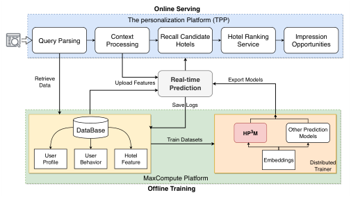

<!-- Start of picture text -->
Online Serving The personalization Platform (TPP) Query Parsing ProcessingContext Recall CandidateHotels Hotel RankingService OpportunitiesImpression RetrieveData Upload Features PredictionReal-time Export Models Save Logs DataBase Train Datasets HP 3 M Other PredictionModels ProfileUser BehaviorUser FeatureHotel Embeddings Distributed Trainer MaxCompute Platform Offline Training <!-- End of picture text -->

**Figure 4: The workflow of online deployment of** _𝐻𝑃_3 _𝑀_ **in Fliggy’s hotel search engine.** 

The proposed _𝐻𝑃_3 _𝑀_ has been fully deployed on Fliggy’s hotel search engine and serves tens of millions of users daily. The deployment workflow of _𝐻𝑃_3 _𝑀_ is shown in Figure 4. During online serving, when a user request arrives, The Personalization Platform (TPP) first parses the query and processes context information into standard-format features. Next, the corresponding user profiles, user behaviors, and hotel features are retrieved from the database and are combined with the parsed query features to obtain the input features to the real-time predictor. Such features are used to recall candidate hotels, and then conduct hotel ranking services. The final ranking list is displayed to the user in the front end. 

2893 

