# **Lethe: Plasticity-aware Active Forgetting for Resource-Efficient On-Device Continual Learning** 

|Haibo Liu|Chenxin Mao|Zhenzhen Zheng|
|---|---|---|
|Soochow University Suzhou, China lhbzjnu@gmail.com|Shanghai Jiao Tong University Shanghai, China maochenxin@sjtu.edu.cn|Shanghai Jiao Tong University Shanghai, China zhengzhenzhe@sjtu.edu.cn|
|Fan Wu|Guihai Chen|He Huang|
|Shanghai Jiao Tong University Shanghai, China|Shanghai Jiao Tong University Shanghai, China|Soochow University Suzhou, China|
|fwu@cs.sjtu.edu.cn|gchen@cs.sjtu.edu.cn|huangh@suda.edu.cn|

## **Abstract** 

On-device continual learning (CL) is becoming a critical paradigm for intelligent agents to adapt to evolving task streams in dynamic edge environments. However, existing CL methods primarily focus on optimizing learning performance, while neglecting the fundamental tension between ever-growing accumulated knowledge and limited model capacity on resource-constrained mobile devices, posing a significant challenge for model evolution on new task learning. To address this challenge, we reframe forgetting not as a problem but as a potential solution, and propose Lethe, a p **<u>L</u>** asticity-aware activ **<u>e</u>** forge **<u>t</u>** ting sc **<u>h</u>** <u>eme</u> for on-d **<u>e</u>** <u>vice</u> CL. Specifically, for fast model adaptation on new tasks, Lethe proposes forgetting-based plasticity injection to perform order-aware selective forgetting with neuro-inspired plasticity injection to accelerate model convergence. To prevent inefficient relearning of forgotten task re-encounter, Lethe introduces cost-aware forgetting recovery to facilitate lowcost knowledge recovery with deposited model parameters, and prevent frequent forgetting recovery based on task priority. Extensive evaluations demonstrate that Lethe consistently outperforms state-of-the-art solutions, improving model accuracy by up to 8.93% and reducing computation overhead by 53.63% on average. 

## **CCS Concepts** 

• **Human-centered computing** → **Mobile devices** ; • **Computing methodologies** → _Machine learning approaches_ . 

## **Keywords** 

Continual Learning, Plasticity, Active Forgetting, Mobile Devices 

### **ACM Reference Format:** 

Haibo Liu, Chenxin Mao, Zhenzhen Zheng, Fan Wu, Guihai Chen, and He Huang. 2026. Lethe: Plasticity-aware Active Forgetting for Resource-Efficient On-Device Continual Learning. In _Proceedings of the 32nd ACM SIGKDD Conference on Knowledge Discovery and Data Mining V.2 (KDD ’26), August 09–13, 2026, Jeju Island, Republic of Korea._ ACM, New York, NY, USA, 11 pages. https://doi.org/10.1145/3770855.3817621 

This work is licensed under a Creative Commons Attribution 4.0 International License. _KDD ’26, Jeju Island, Republic of Korea_ 

© 2026 Copyright held by the owner/author(s). ACM ISBN 979-8-4007-2259-2/2026/08 https://doi.org/10.1145/3770855.3817621 

## **1 Introduction** 

The emergence of Agentic AI [18, 54] in recent years has reactivated interests in deploying machine learning models on mobile devices, such as intelligent personal assistants on smartphones [13] and embodied intelligence on robotics [52]. The unseen task streams generated on ubiquitous mobile devices, such as new categories for object classification or new operational commands for user-specific intents, poses great challenge for system performance, urging the ability of model evolution with the changing environments. Therefore, on-device continual learning (CL), enabling intelligent agents to learn incrementally from evolving data distributions, has attracted significant attention [17, 20, 43]. 

On-device CL conducts frequent model retraining to adapt to new arriving data samples ( _i_ . _e_ ., plasticity [1, 11]), while not forgetting the previously learned knowledge ( _i_ . _e_ ., stability [29, 56]). A majority of CL approaches, _e_ . _g_ ., parameter regularization [2, 30, 34], sample replay [28, 32, 50] and model expansion [24, 38, 64], have been proposed to realize stability-plasticity trade-off. Despite promising, the current approaches have primarily focused on optimizing learning performance, overlooking the characteristics of mobile devices, _i_ . _e_ ., limited computation resources and model capacity. Specifically, the model accuracy of five classical CL algorithms has decreased up to 9% due to the constrained computation resource and limited model capacity1 . Moreover, ignoring the characteristics of mobile devices not only hampers the practical performance of on-device CL, but also leads to inefficient utilization of scarce on-device resources [46, 47]. Therefore, for efficient on-device CL, it is crucial to design methods that co-optimize learning performance and resource efficiency within limited model capacity. 

Although there exist some prior works tried to realize costeffective on-device CL, these approaches still struggle to prioritize resource consumption with subpar model performance [6, 27, 61, 62, 69]. These approaches regard both the new arriving tasks and the previously learned tasks as the same importance, and conduct a trade-off between plasticity (new tasks) and stability (previous tasks). This is ill-suited for on-device scenarios, where the limited model capacity impose a challenge to make a good trade-off. We argue that for on-device CL we need to necessitate a shift in priority towards the fast adaptation of new tasks over the maintenance of the previous tasks. Our reasoning is twofold. First, the new tasks 

> 1please refer to Section 2.1 for details. 

3176 

KDD ’26, August 09–13, 2026, Jeju Island, Republic of Korea 

Haibo Liu, Chenxin Mao, Zhenzhen Zheng, Fan Wu, Guihai Chen, and He Huang 

are urgently required quick responses to support time-sensitive intelligent applications [14, 45, 59]. Second, the continual accumulation of previously learned knowledge makes it progressively more difficult to adapt to new tasks within limited model capacity, a critical challenge known as plasticity loss [1, 11]. Therefore, prioritizing new task learning over previous tasks, even active forgetting certain old tasks for limited model capacity, is essential to facilitate model adaptation with more efficient usage of scarce computation resources and limited model capacity. 

To facilitate new task learning, there exist some works to selectively reinitialize a part of model parameters to inject plasticity [1, 11]. These approaches for improving model plasticity, _e_ . _g_ ., continual backpropagation [1], shrink and perturb [5], and dropout [22], focus solely on how to selectively reinitialize model parameters to maximize parameter diversity, ignoring the learned knowledge of specific tasks lost after parameter re-initialization. This prevents ondevice CL from leveraging the corresponding learned knowledge to accelerate model convergence and reduce resource consumption on new task learning ( _i_ . _e_ ., warm start [5, 55]). Moreover, these techniques failed to consider the performance of forgotten tasks, leading to model retraining from scratch when re-encountering the forgotten tasks. Therefore, it is imperative for on-device CL to perform fast model adaptation to new tasks while enhancing the efficiency of re-learning the previous tasks on the resourceconstrained mobile devices. 

There exist two technical challenges to realize efficient on-device CL with limited model capacity. The first challenge is _how to efficiently inject plasticity for fast model adaptation on new tasks while simultaneously minimizing the associated resource overhead_ . Current techniques for maintaining plasticity are brute-force solutions [1, 11] to address plasticity loss with intensive computation resource overhead, failing to accelerate model adaptation and not violating the limited on-device resources. The core technical question is not just if plasticity should be injected but also where and how to do it for on-device CL in a computationally efficient manner. This requires a lightweight mechanism to identify which specific parameters or model substructures are prime candidates for efficient on-device CL. The second challenge is _how to maintain ever-growing accumulated knowledge within the limited model capacity and prevent inefficient relearning of previously forgotten tasks_ . When parameters are selectively re-initialized to inject plasticity, the knowledge associated with prior tasks is inevitably compromised, necessitating model retraining if those forgotten tasks are re-encountered. Moreover, this problem is magnified on resourceconstraint mobile devices, leading to frequent, resource-intensive model re-adaptation from scratch. Therefore, it remains a critical challenge to optimize learning performance and resource utilization for efficient on-device CL. 

Inspired by the active forgetting mechanism of human brain2 , we propose Lethe, a plasticity-aware active forgetting framework for efficient on-device CL. To address the first challenge, we propose forgetting-based plasticity injection to facilitate new task learning with the design of two major modules: order-aware active forgetting and neuro-inspired plasticity injection. For fast model 

> 2please refer to Section 2.3 for details. 

adaptation in dynamic edge environments, order-aware active forgetting mitigates the burden of previously learned knowledge by prioritizing prior tasks to selectively forget less relevant tasks by exploring the impact of task order to capture the path-dependent dynamics of positive and negative knowledge transfer. For lightweight on-device CL, neuro-inspired plasticity injection aims to co-optimize saturated units, weight magnitude and effective rank of model parameters with the three-step optimization strategy to reduce computation resource overhead. As for the second challenge, Lethe introduces cost-aware forgetting recovery to enable low-cost, low-frequent knowledge reactivation through a dopamine-inspired transient forgetting mechanism and task-oriented forgetting recovery. Dopamine-inspired transient forgetting facilitates knowledge recovery with parameter-wise fusion by using deposited model parameters, thereby reducing the overhead of model retraining on the forgotten tasks. To prevent frequent forgetting recovery in time-varying task streams, task-oriented forgetting recovery selects previously learned tasks based on task priority to preserve critical knowledge within limited model capacity. 

We summarize our main contributions as follows: 

- In this work, we aim to realize efficient on-device CL with limited model capacity, and propose Lethe, a plasticity-aware active forgetting framework for lightweight adaptation. 

- For fast adaptation on new tasks, Lethe proposes forgettingbased plasticity injection to perform efficient model adaptation by realizing order-aware active forgetting and neuroinspired plasticity injection to accelerate model convergence. 

- To prevent inefficient relearning of forgotten tasks, Lethe introduces cost-aware forgetting recovery to facilitate low-cost knowledge recovery with deposited model parameters, and prevent frequent forgetting recovery based on task priority. 

- Extensive evaluations demonstrate that Lethe consistently outperforms state-of-the-art solutions, improving model accuracy by up to 8.93% and reducing computation overhead by 53.63% on average. 

## **2 Background and Motivation** 

In this section, we first introduce the technical background of ondevice CL and plasticity loss. We then discuss the opportunities and challenges of active forgetting to realize efficient on-device CL. 

## **2.1 On-Device Continual Learning** 

While deploying machine learning models on mobile devices with the increasing availability of unseen data streams, the performance degradation due to frequent data distribution variations, necessitates incrementally upgrading the deployed model. A majority of CL approaches, _e_ . _g_ ., parameter regularization [2, 30, 34], sample replay [28, 32, 50] and model expansion [24, 38, 64], have been proposed to realize stability-plasticity trade-off [10, 19, 21]. Since incremental model adaptation are performed on mobile devices, the efficiency of on-device CL is heavily dependent on the characteristics of mobile devices in the following three aspects. 

**Constrained Computation Resource** . Despite promising, current CL approaches necessitate substantial computation resources and massive data samples for efficient model adaptation, hindering their deployment on resource-constrained mobile devices. As 

3177 

Lethe: Plasticity-aware Active Forgetting for Resource-Efficient On-Device Continual Learning 

KDD ’26, August 09–13, 2026, Jeju Island, Republic of Korea 

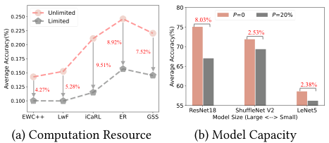

<!-- Start of picture text -->
8.03% 2.53% 8.92% 7.52% 9.51% 4.27% 5.28% 2.38% (a) Computation Resource (b) Model Capacity <!-- End of picture text -->

**Figure 1: The performance comparison of five CL algorithms with three different models on CIFAR10.** 

shown in Figure 1(a), we have evaluated five representative CL algorithms, _i_ . _e_ ., EWC++ [9], LwF[39], ER[51], iCaRL [49] and GSS [3], deployed on the Jetson Nano [58], an end device from NVIDIA, and observe that these algorithms have high learning performance with unrestricted computation resources, while their performance degrades significantly in resource-limited scenarios. Specifically, a reduction in computational resources ( _i_ . _e_ ., the number of training iterations) by 50% leads to a significant performance degradation, resulting in up to 9% decrease in model accuracy. Moreover, as stated in computationally budgeted CL [47], all existing CL approaches, including distillation [37], sampling [4, 57], FC layers correction [23] and model expansions [38], fail to have good model performance in a computation-constraint setting. 

**Limited Model Capacity** . The model size deployable on mobile devices is inherently constrained by limitations in available memory and energy resources. For instance, the grammar-checker model in Microsoft Editor must be lightweight, occupying no more than 50 MB of memory [36]. Consequently, the model’s average accuracy over an extended task stream declines as its capacity is reduced. We illustrate this phenomenon in Figure 1(b) through experiments with three classic models: LeNet5, ShuffleNet V2, and ResNet18. To create lightweight models with different capacity, we applied unstructured pruning to achieve various parameter sparsity levels. A sparsity of _𝑃_ = 20%, for example, indicates that 20% of the model’s parameters have been removed. Our results show that these capacity-constrained models suffer a significant performance degradation, with their average accuracy decreasing up to 8%. 

**Non-stationary Data Stream** . Mobile devices has an increasing availability of streaming data with frequent data distribution variations and unorder arrival. For instance, an unmanned aerial vehicles (UAV) equipped with a high-resolution camera captures images for object detection on the fly, and the categories of these images may undergo significant changes due to the non-stationarity of environment [60]. It is noteworthy that the dynamic characteristics of task arrival also has a impact on the performance of model adaptation. As illustrated in Figure 2, considering varying task arrival with 4 different task orders, we observe that the existing CL approaches exhibit a performance fluctuation of around 4%, confirming that the dynamic edge environments have the non-negligible impact on model performance. 

## **2.2 Plasticity Loss** 

The efficiency of on-device CL is critically hampered by plasticity loss, a phenomenon where the finite capacity of models learning 

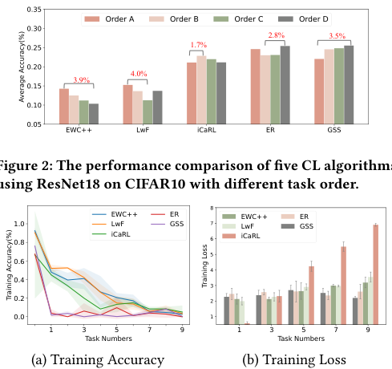

<!-- Start of picture text -->
2.8% 3.5% 1.7% 4.0% 3.9% Figure 2: The performance comparison of five CL algorithms using ResNet18 on CIFAR10 with different task order. 8 EWC++ ER EWC++ ER 1.0 LwF GSS 7 LwF GSS 0.8 iCaRL 6 iCaRL 5 0.6 4 0.4 3 0.2 2 0.0 1 1 3 5 7 9 1 3 5 7 9 Task Numbers Task Numbers (a) Training Accuracy (b) Training Loss Training Loss Training Accuracy(%) <!-- End of picture text -->

**Figure 2: The performance comparison of five CL algorithms using ResNet18 on CIFAR10 with different task order.** 

**Figure 3: The plasticity loss of five CL algorithms validated by using ResNet18 on CIFAR10.** 

from sequential task streams leads to parameter saturation and rigidity [1, 11]. As demonstrated in Figure 3(a), while there exist performance variations among the five classical CL approaches, we observe that these methods initially maintain relatively high model accuracy during several tasks at the beginning. However, as the number of tasks increases, there emerges a progressive deterioration in model accuracy due to the loss of plasticity. This degradation becomes particularly evident in the final several tasks, where the accuracy decreases up to 80%. This phenomenon is further validated on the training loss shown in Figure 3(b), which reveals a consistent performance decline with the increasing tasks. 

Recent studies have identified several indicators of plasticity loss, _e_ . _g_ ., an increase in saturated units, the growth of weight magnitudes and a reduction in effective rank of model parameters [11, 42]. To address loss of plasticity, there also exist some approaches, _e_ . _g_ ., continual backpropagation [1], shrink and perturb [5], and dropout [22], to selectively reinitialize a part of model parameters to maximize parameter diversity. While these methods can partially mitigate plasticity loss, they present two significant limitations for on-device applications. First, reinitializing or dropping parameters inevitably leads to the loss of valuable knowledge. This prevents mobile devices from leveraging a “warm-start” [5, 55] to accelerate model convergence and reduce resource consumption when learning new tasks. Second, these techniques fail to consider the priority of forgotten tasks. If the lost knowledge is critical for frequently encountered tasks, it may necessitate relearning forgotten tasks from scratch, leading to consume substantial computational resources. 

## **2.3 Opportunities: Active Forgetting** 

The phenomenon of knowledge forgetting in CL primarily stems from parameter interference during incremental model retraining, where previously acquired knowledge is detrimentally overwritten. This knowledge degradation has been universally regarded 

3178 

KDD ’26, August 09–13, 2026, Jeju Island, Republic of Korea 

Haibo Liu, Chenxin Mao, Zhenzhen Zheng, Fan Wu, Guihai Chen, and He Huang 

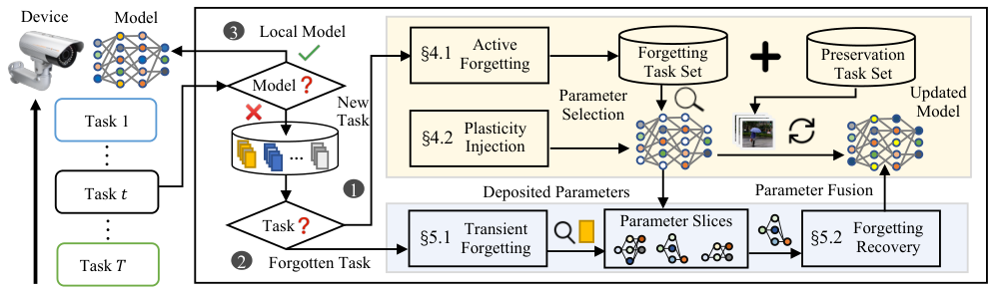

<!-- Start of picture text -->
Device Model 3 Local Model Active §4.1 Forgetting  Preservation Forgetting Task Set Task Set Model New Parameter Updated Task 1 Task Selection Model §4.2 Plasticity … Injection Task 𝑡 1 Deposited Parameters Parameter Fusion Task §5.1 Transient Parameter Slices §5.2 Forgetting Forgetting Recovery Task 𝑇 2 Forgotten Task … … <!-- End of picture text -->

**Figure 4: Overview of Lethe Framework.** 

as harmful, prompting extensive research efforts to mitigate such catastrophic forgetting at all costs [63, 66]. However, attempting to preserve all prior knowledge is highly inefficient on resourceconstrained mobile devices, as it imposes substantial computational overhead while continuously escalating the demands for data storage and model capacity, especially for methods like sample replay and model expansion. 

The most efficient CL system is the human brain [35, 67]. The brain does not attempt to retain every piece of learned information; instead, it engages in actively forgetting redundant or less relevant memories while consolidating knowledge that is crucial for survival or future reasoning. Inspired by active forgetting machansim of human brain, we reframe forgetting not as a problem but as a potential solution. This paradigm posits that selectively and strategically discarding specific learned knowledge can be advantageous. Despite promising, it remains critical challenge to leverage active forgetting to realize efficient on-device CL for model evolution on time-varying task streams, especially with the constrained computation resources and limited model capacity. First, the difficulty lies in effectively injecting plasticity to enable fast adaptation to new tasks while minimizing computation resource overhead. The second challenge is to manage the continual accumulation of prior knowledge within limited model capacity, ensuring that essential prior tasks are retained without redundant model retraining. Consequently, designing an efficient active forgetting mechanism that simultaneously enhances model adaptability and optimizes resource utilization is of critical importance for on-device CL. 

## **3 Lethe Overview** 

To address plasticity loss of on-device CL with constrained computation resource and limited model capacity, we propose Lethe, a novel plasticity-aware active forgetting framework to improve parameter diversity for lightweight model adaptation. As shown in Figure 4, implementing Lethe requires the consideration of the following three potential task scenarios: ❶ **New Task Arrival** . When an incoming task is entirely new and cannot be processed by the current on-device model, mobile devices need to perform new task learning for model evolution. ❷ **Forgotten Task Re-encounter** . The current on-device model cannot process the newly arriving task, which corresponds to a previously learned task, indicating that the current model has forgotten this specific knowledge. ❸ **Known** 

**Task Arrival** . The current on-device model can adequately process the arriving known task without requiring further adaptation. To realize efficient on-device CL for the first two task scenarios, Lethe involves with two components: the forgetting-based plasticity injection and the cost-aware forgetting recovery. 

The forgetting-based plasticity injection aims to perform lightweight model adaptation on new tasks under the constraint of model capacity and computation resource, which involves two major modules: order-aware selective forgetting and neuro-inspired plasticity injection. Order-aware selective forgetting firstly addresses plasticity loss by selectively forgetting specific learned knowledge before incremental model adaptation on new tasks. Neuro-inspired plasticity injection is performed with parameter selection and re-initialization for efficient model adaptation. The costaware forgetting recovery enables low-cost, low-frequent knowledge reactivation through a dopamine-inspired transient forgetting mechanism and task-oriented forgetting recovery. Drawing inspiration from forgetting mechanism of human brain, the dopaminebased transient forgetting mechanism temporarily suppresses memory accessibility while permitting time-dependent reactivation. Furthermore, to prevent frequent forgetting recovery, we propose a metric as task priority to strategically preserve critical knowledge within limited model capacity. 

## **4 Forgetting-based Plasticity Injection** 

In this section, we introduce the design of Lethe for the first task scenario, outlining the implementation of order-aware active forgetting and neuro-inspired plasticity injection. 

## **4.1 Order-aware Active Forgetting** 

To maintain model plasticity to learn new tasks, it is essential to reinitialize a subset of model parameters to inject plasticity [1, 11]. While model parameters encode the knowledge learned from specific tasks, an indiscriminate or random reinitialization can cause catastrophic forgetting, erasing valuable information and compromising the generalization performance. This challenge highlights the need for a more intelligent strategy to identify which knowledge is redundant or detrimental. Existing solutions for determining what to forget rely on task similarity, failing to capture the dynamic, 

3179 

Lethe: Plasticity-aware Active Forgetting for Resource-Efficient On-Device Continual Learning 

KDD ’26, August 09–13, 2026, Jeju Island, Republic of Korea 

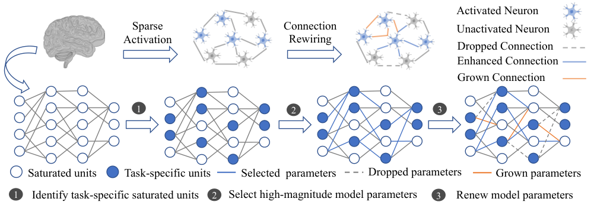

<!-- Start of picture text -->
Activated Neuron Sparse  Connection Unactivated Neuron Activation Rewiring Dropped Connection Enhanced Connection Grown Connection 1 2 3 Saturated units Task-specific units Selected  parameters Dropped parameters Grown parameters 1 Identify task-specific saturated units  2 Select high-magnitude model parameters 3 Renew model parameters <!-- End of picture text -->

**Figure 5: Overview of Neuro-inspired Plasticity Injection.** 

path-dependent nature of CL [7, 40]. Therefore, we aim to analyze the effect of dynamic task order on incremental model adaptation. 

To accurately model the complex inter-task relationships within a continuous task stream T = { _𝜏_ 1 _,𝜏_ 2 _, ...,𝜏𝑡_ }, we move beyond simple similarity metrics. The incremental model adaptation inherently involves balancing conflicting objectives, since optimizing for one task may adversely affect the performance on another. Therefore, we frame the problem of measuring inter-task relationships as a multi-objective optimization (MTO) problem. This approach allows us to find a Pareto optimal solution that represents a principled compromise among all competing tasks. First, we calculate the task gradients obtained by updating the model on the corresponding data samples, _e_ . _g_ ., ∇L( _𝜃,𝜏𝑖_ ) _,_ ∀ _𝑖_ ∈[1 _,𝑡_ ] where L is the loss function and _𝜃_ is the model. To avoid redundant gradient computation for previous tasks each time, we will store the gradients from each model update for facilitating subsequent inter-task correlation analysis. Then, we compute the weights { _𝛼𝑖_ } _𝑖__𝑡_ =1among multiple tasks by finding the pareto optimal solution of MTO problem as follows: 

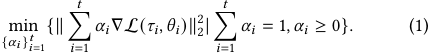

The weights { _𝛼𝑖_ } _𝑖__𝑡_ =1reflect the relative contribution of each task to their consensus direction, providing a context-aware measure of their relationship. This optimization problem is equivalent to finding a minimum-norm point in convex hull of the set of input points, which can be solved with the Frank-Wolfe Algorithm [26]. 

Based on these computed weights { _𝛼𝑖_ } _𝑖__𝑡_ =1, we define a distance metric _𝑑𝑖𝑗_ to quantify the gain between any two tasks _𝜏𝑖_ and _𝜏 𝑗_ as: 

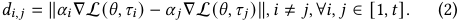

Next, we construct an undirected complete graph (UCG) where the vertices represent tasks, and the edge weights represent the gain between any two tasks. In UCG, we can find different task orders with different sum path, and the task order with higher sum path is beneficial for positive knowledge transfer [7, 40]. Therefore, we want to identify and remove only the most detrimental task to make the current task order with highest sum path. There exist three cases to find the single most disruptive task. The first case is to forget the firstly learned task, and the path sum in this case is 

_𝑠_ 1 =� _𝑖__𝑡_ =− 21_𝑑𝑖,𝑖_+1; The second case is to forget the lastly learned task, and the path sum in this case is _𝑠𝑡_ −1 =� _𝑖__𝑡_ =− 12_𝑑𝑖,𝑖_+1; The third case is that the forgotten task is the middle one, and the path sum can be described as follows: 

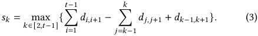

The task to be selectively forgotten _𝜏𝑓_ is identified as the one with highest sum path: 

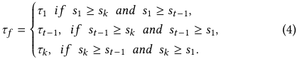

## **4.2 Neuro-inspired Plasticity Injection** 

To facilitate model adaptation on new task learning, our objective is to improve parametric diversity through parameter selection and reinitialization. The intuitive approach involves assessing parameter sensitivity via data samples to select and reinitialize the corresponding model parameters [33, 48]. However, considering the vast parameter space and the complexity of parameter sharing across different tasks, a straightforward brute-force search proves ineffective for efficient parameter selection. Drawing inspiration from the operational mechanisms of human brain, as depicted in Figure 5, we propose a three-step optimization strategy to maintain model plasticity. ❶ First, we use given data samples to pinpoint saturated activation units (the extreme values of the activation function) [16]. The increasing prevalence of such activation units serves as a primary indicator of diminished model plasticity [1, 11]. ❷ Second, we identify high-magnitude model parameters connected to these saturated activation units. Large weight magnitudes are often associated with learning instability [42], as they hinder effective gradient-based optimization. This two-step collectively emulates the brain’s principle of sparse activation. ❸ Third, we prune these identified high-magnitude model parameters and introduce an equivalent number of newly initialized model parameters. This action aims to improve the effective rank of model parameters and directly mirrors the brain’s synaptic rewiring mechanism. 

3180 

KDD ’26, August 09–13, 2026, Jeju Island, Republic of Korea 

Haibo Liu, Chenxin Mao, Zhenzhen Zheng, Fan Wu, Guihai Chen, and He Huang 

Considering the machine learning model _𝜃_ with _𝐿_ layers, each layer _𝑙_ ∈{1 _,_ 2 _, ..., 𝐿_ } has _𝑁𝑙_ units and let _𝑛𝑙__𝑖_(_𝑖_∈[1_, 𝑁𝑙_])bethe _𝑖_ -th unit in that layer. Let _𝜃𝑙__𝑖,𝑗_ denotes the _𝑗_ -th incoming connection of _𝑛𝑙__𝑖_from_𝑛_ _𝑙__𝑗_ −1. We denote the activation of unit_𝑛_ _𝑙__𝑖_as_𝐴𝑛_ _𝑙__𝑖_(_𝑥_) and the total activation of layer _𝑙_ as _𝐴𝑙_ ( _𝑥_ ), where _𝑥_ is the input that generates these activations. The model parameters of different layers exhibit significant variations in terms of their function and sensitivity. As indicated by related research works [65, 68], the parameter sensitivity tends to be higher in earlier layers of model structure, while it decreases in deeper layers. Furthermore, for any task already learned with model training, we can identify a subset of model parameters that denote the knowledge learned from corresponding data samples, which we call as task-specific parameters _𝜃𝑙__𝑠𝑝_ ∈ _𝜃𝑙,_ ∀ _𝑙_ ∈[1 _, 𝐿_ ]. In view of the complexity of the model architecture and the function of different layers, we perform parameter selection from the perspective of the model layer, and implement different proportions of parameter re-initialization based on the depth of the model layer. First, we quantify the importance of model parameters in a data-dependent manner to identify task-specific model parameters _𝜃𝑙__𝑠𝑝,_∀_𝑙_∈[1_, 𝐿_], which can be formulated as the following optimization problem: 

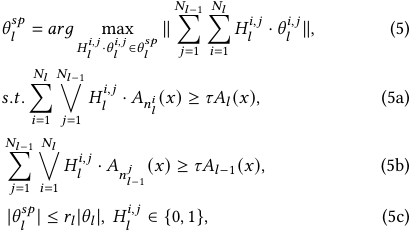

where _𝐻𝑙__𝑖,𝑗_ is a binary decision variable. The first two constraints (5a and 5b) are to make the activation value of model parameters must capture at least a fraction of _𝜏_ of total activations between two adjacent layers. The last constraint (5c) aims to control the proportion of parameter selection in the _𝑙_ -th layer with the weight _𝑟𝑙_ . This optimization problem in Eq. (5) is a classic knapsack problem, known to be NP-hard and inherently challenging with large search space. Due to the limited resources on mobile devices, we forgo computationally intensive optimal solution methods and instead propose a computationally efficient heuristic approach. First, the activation values obtained by performing calculations with the forward propagation computation, need to be sorted in ascending order with respect to the weight magnitude of model parameters. Then, we employ the greedy approach to perform parameter selection to find task-specific parameters. 

Next, to renew model parameters, we first drop the selected model parameters in each model layer, and then grow new model parameters to enable knowledge transfer for learning new tasks. We note that the loss of plasticity occurs with the drop in the effective rank of the model parameters [12]. Consider a matrix Φ ∈ _𝑅__𝑚_×_𝑛_ , the effective rank of this matrix can be described as follows: 

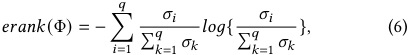

where _𝜎𝑖_ is the _𝑖_ -th singular value and _𝑞_ = min( _𝑚,𝑛_ ). Therefore, we aim to maximize the effective rank of model parameters by growing new model parameters as follows: 

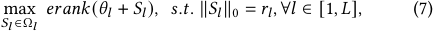

where _𝑆𝑙_ is the matrix with same size of _𝜃𝑙_ , and Ω _𝑙_ means the remaining space of _𝜃𝑙_ for adding new model parameters ( _e_ . _g_ ., the space of pruned and forgotten parameters within the sparse model). This optimization problem in Eq. (7) is an NP-hard combinatorial optimization problem. Due to the complexity of the problem, we employ a heuristic approach to utilize a greedy search strategy based on the degree of activation units. For each model layer, the activation units are sorted in ascending order based on its degree connected to model parameters. Then, we iteratively select the activation units in the current and subsequent layers with the minimum number of existing model parameters to add new, randomly initialized model parameters. If the model parameter already exists between the pair of activation units with the fewest connections, we consider the next activation unit in the subsequent layer (the one with the next smallest number of connections) and evaluate its eligibility to add new model parameter. This process proceeds until the required number of new model parameters is satisfied. 

Once the newly added model parameters are determined, we can reinitialize the selected model parameters to improve parameter diversity, which can be described as follows: 

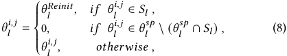

where _𝜃𝑙__𝑅𝑒𝑖𝑛𝑖𝑡_ is reinitialized with Kaiming distribution. In Eq. (8), the first case indicates that the currently selected model parameter is newly added. The second case signifies that these model parameters represent ones to be forgotten. The remaining model parameters remain unchanged. 

## **5 Cost-aware Forgetting Recovery** 

In this section, we provide the design of Lethe for the second task scenario with its two core mechanisms: dopamine-based transient forgetting and task-oriented forgetting recovery. 

## **5.1 Dopamine-based Transient Forgetting** 

Although the above proposed forgetting-based plasticity injection approach can effectively enhance the model performance on new task learning, it exhibits significant limitations in terms of forgotten tasks. Specifically, when the newly arriving task is the forgotten task, mobile devices treat it as new one and necessitates retraining the current on-device model with substantial data samples and computation resources, which is high-cost. When relearning forgotten knowledge, the human brain requires only a brief review rather than treating it as entirely new task, thereby conserving cognitive effort. Inspired by the efficient forgetting recovery mechanism of human brain, we aim to realize resource-efficient model re-adaptation on forgotten tasks. 

There are two types of forgetting mechanisms in human brain: permanent forgetting and transient forgetting [53]. Permanent forgetting involves erasing information from the brain completely. 

3181 

Lethe: Plasticity-aware Active Forgetting for Resource-Efficient On-Device Continual Learning 

KDD ’26, August 09–13, 2026, Jeju Island, Republic of Korea 

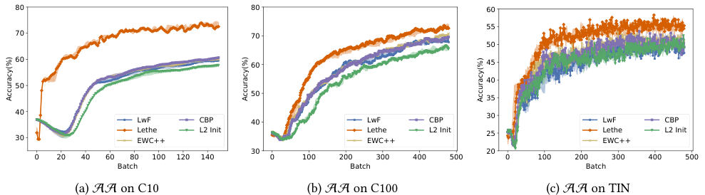

<!-- Start of picture text -->
80 80 60 55 70 70 50 60 60 45 40 50 50 35 40 LwF CBP 40 LwF CBP 30 LwF CBP Lethe L2 Init Lethe L2 Init 25 Lethe L2 Init 30 EWC++ EWC++ EWC++ 30 20 0 20 40 60 80 100 120 140 0 100 200 300 400 500 0 100 200 300 400 500 Batch Batch Batch (a) AA on C10 (b) AA on C100 (c) AA on TIN Accuracy(%) Accuracy(%) Accuracy(%) <!-- End of picture text -->

**Figure 6: The performance comparison of five CL algorithms validated on** AA **by using three different datasets.** 

The knowledge forgetting of the existing approaches [8, 41], _e_ . _g_ ., machine unlearning, is also the form of permanent forgetting in which prior knowledge is lost completely, and incurs high resource costs to refresh the model ability. Different with the high cost of forgetting recovery in permanent forgetting, the efficiency of forgetting recovery in transient forgetting is remarkably high. Transient forgetting does not erase the information but rather interferes with its retrieval [53]. This is mainly achieved through dopamine secretion signals, which create a temporary state of impaired retrieval. We refer to this temporary state as transient forgetting. When dopamine fades in response to external stimuli, the information becomes retrievable again, thereby realizing memory recovery. 

Inspired by this efficient biological forgetting mechanism, we propose a dopamine factor to implement transient forgetting for on-device CL as follows: 

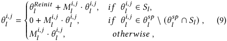

where _𝑀𝑙__𝑖,𝑗_ ∈{0 _,_ 1} is the binary decision variable. When _𝑀𝑙__𝑖,𝑗_ = 0, it means impaired retrieval with knowledge forgetting. To prevent the loss of existing parameters without interfering with the newly initialized model parameters, given the forgotten task _𝜏𝑖_ , we first duplicate the existing model parameters to be forgotten to generate and store parameter slices, _e_ . _g_ ., { _𝜃𝑙__𝑠𝑝_(_𝜏𝑖_)} _𝑙__𝐿_ =1. Then, the injection of parameter diversity is to reinitialize the newly generated parameters, _e_ . _g_ ., _𝜃𝑙__𝑖,𝑗_ ← _𝜃𝑙__𝑅𝑒𝑖𝑛𝑖𝑡_ , and all connections to the re-initialized parameters are kept. When _𝑀𝑙__𝑖,𝑗_ = 1, it indicates that the stored knowledge slices are required to recover the forgotten knowledge, which will be described in next Section 5.2. 

## **5.2 Task-oriented Forgetting Recovery** 

To prevent frequent forgetting recovery, we need to take forwardlooking consideration for future arrival tasks. We hypothesize that a task’s historical occurrence frequency is a strong proxy for its probability of future recurrence. Furthermore, we incorporate the timeliness of learned tasks, asserting that more recently learned tasks should have a higher priority to prevent the immediate loss of new knowledge, a principle that aligns with the human forgetting curve. Based on these principles, we formulate a task priority metric 

_𝑃𝜏𝑖_ , to identify the least critical task to be replaced: 

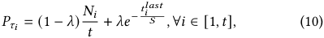

where _𝑁𝑖_ is the total historical occurrence count of task _𝜏𝑖_ , and _𝑡𝑖__𝑙𝑎𝑠𝑡_ is the time step of its most recent occurrence. The weight _𝜆_ ∈[0 _,_ 1] is a hyperparameter that balances the importance of historical frequency and arrival time, and _𝑆_ is a scaling factor that controls the rate of time decay. The task with the lowest priority score is selected for replacement. 

Let _𝜃𝑝__𝑠𝑝_and_𝜃_ _𝑟__𝑠𝑝_ be the parameter slices corresponding to the task to be replaced _𝜏𝑝_ and the recovery task _𝜏𝑟_ , respectively. We perform a parameter-wise fusion of these slices to update the model parameter _𝜃𝑙__𝑖,𝑗_ at each layer _𝑙_ as follows: 

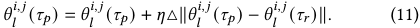

The parameter slices of the task to be replaced _𝜏𝑝_ is updated by moving it towards the corresponding model parameters in the parameter slices of the recovery task _𝜏𝑟_ , with the update magnitude scaled by a factor _𝜂_ . This method enables direct and efficient parameter fusion inspired by task arithmetic [25, 44]. In this way, we can accelerate model adaptation on forgotten tasks. 

## **6 Evaluations** 

## **6.1 Experimental Setup** 

**Datasets and Models** . To comprehensively evaluate the efficacy of our proposed method, we conduct experiments on three benchmark image datasets: CIFAR10 (C10), CIFAR100 (C100) and TinyImageNet (TIN). We employ three lightweight network architectures for our evaluations: LeNet5, ShuffleNetV2, and ResNet18. As for task streams, we consider two standard CL settings: task-incremental CL [29, 56] and class-incremental CL [15]. 

**Baselines** . The current practices about on-device CL can be categorized into two main categories: stability-aware on-device CL approaches and plasticity-aware one. The stability-aware on-device CL approaches aim to prevent catastrophic forgetting by utilizing parameter regularization or knowledge distillation, _i_ . _e_ ., EWC++ [9] and LwF[39]. For plasticity-aware one, these methods prioritize efficient adaptation to novel tasks to address plasticity loss of new task learning by selectively initializing a small fraction of model 

3182 

KDD ’26, August 09–13, 2026, Jeju Island, Republic of Korea 

Haibo Liu, Chenxin Mao, Zhenzhen Zheng, Fan Wu, Guihai Chen, and He Huang 

**Table 1: The performance comparison of different CL methods with two different CL setups.** 

|**CL Setup**|**Dataset**|**Metric**|**EWC++**|**LwF**|**L2 Init**|**CBP**|**Lethe**|△|
|---|---|---|---|---|---|---|---|---|
||**C10**|PA(%) SA(%)|77.91±0.188  70.37±0.275|74.85±0.633   70.00±0.051|76.80±0.389   65.37±0.321|77.70±0.6486  70.385±0.225|86.85±2.727 76.00±1.346|↑8.94 ↑5.63|
|**Cl**|**C100**|PA(%)|74.83±0.623|69.33±0.471|73.16±0.471|73.50±0.408|79.16±1.027|↑4.33|
|**ass** **It**||SA(%)|70.33±0.294|68.47±0.658|65.75±0.686|69.83±0.147|73.27±0.578|↑2.94|
|**ncremen**|**TIN**|PA(%)|60.00±0.816|57.33±1.885|61.00±2.160|60.66±0.471|67.00±1.632|↑6.00|
|||SA(%)|49.66±0.970|48.62±1.159|49.37±0.835|49.58±0.256|55.16±0.757|↑5.50|
||**C10**|PA(%)|91.00±0.816|91.16±0.623|79.83±0.623|90.16±0.623|92.16±0.471|↑1.00|
|||SA(%)|80.26±0.517|80.81±0.530|59.52±0.165|80.86±0.576|79.46±0.392|↓1.35|
|**Tk**|**C100**|PA(%)|91.00±0.408|91.33±0.623|80.00±0.707|90.66±0.623|92.00±0.408|↑0.67|
|**as** **Inrmnt**||SA(%)|79.50±0.334|80.12±0.183|70.21±0.427|79.79±0.077|79.41±0.117|↓0.71|
|**cee**|**TIN**|PA(%)|67.00±2.943|69.33±2.867|58.66±0.471|68.00±2.828|70.66±1.885|↑1.33|
|||SA(%)|58.79±1.678|59.75±1.446|49.16±0.213|58.91±0.513|57.88±0.797|↓1.87|

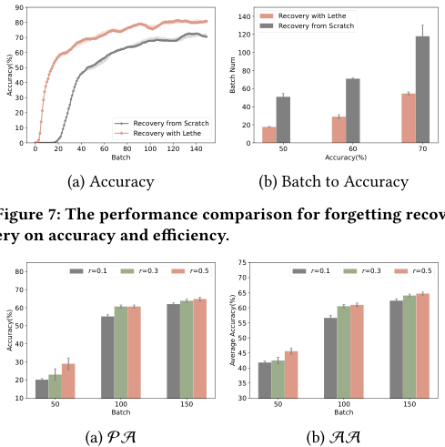

<!-- Start of picture text -->
90 80 140 Recovery with LetheRecovery from Scratch 70 120 60 100 50 80 40 60 30 40 20 10 Recovery from ScratchRecovery with Lethe 20 0 0 0 20 40 60 80 100 120 140 50 60 70 Batch Accuracy(%) (a) Accuracy (b) Batch to Accuracy Figure 7: The performance comparison for forgetting recov- ery on accuracy and efficiency. 75 80 r=0.1 r=0.3 r=0.5 r=0.1 r=0.3 r=0.5 70 70 65 60 60 50 55 50 40 45 30 40 20 35 10 30 50 100 150 50 100 150 Batch Batch (a) PA (b) AA Accuracy(%) Batch Num Accuracy(%) Average Accuracy(%) <!-- End of picture text -->

**Figure 7: The performance comparison for forgetting recovery on accuracy and efficiency.** 

**Figure 8: The performance comparison of different ratio of parameter selection and re-initialization.** 

parameters or incorporating L2 regularization with original model parameters, _i_ . _e_ ., CBP [11] and L2 Init [31]. **Evaluation Metrics** . We evaluate the performance of on-device CL based on the following four key metrics: Plasticity Accuracy (PA) assesses the model’s capacity to acquire new knowledge. Stability Accuracy (SA) measures the model’s ability to retain knowledge from previously learned tasks. Average Accuracy (AA) provides a holistic performance measure, calculated as the mean inference accuracy among new tasks and previous ones. Computation Efficiency evaluates the overhead of the learning process, encompassing the volume of data and the computational resources required for incremental model training. 

**Implementation Details** . We perform on-device model adaptation by utilizing a Jetson Nano with 4GB memory, and obtain sparse models through unstructured parameter pruning. For new task 

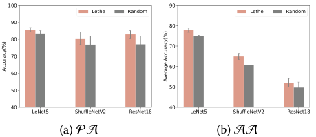

<!-- Start of picture text -->
100 90 Lethe Random Lethe Random 90 80 80 70 70 60 60 50 50 40 LeNet5 ShuffleNetV2 ResNet18 40 LeNet5 ShuffleNetV2 ResNet18 (a) PA (b) AA Accuracy(%) Average Accuracy(%) <!-- End of picture text -->

**Figure 9: The performance comparison between Lethe and Random on parameter selection.** 

learning, the dataset is partitioned by class, with the class subset used to pre-train initial model to convergence ( _e_ . _g_ ., plasticity loss). A subsequent task introduces two novel classes to evaluate new task learning. For forgotten task re-encounter, two classes are randomly sampled from the original tasks to perform model unlearning. The learning rate and batch size of model retraining are 0.001 and 64, respectively. To make the results on these three different datasets more persuasive, all experiments are performed three times with different seeds. 

## **6.2 Overall Performance** 

Figure 6 plots the performance comparison of different methods against training batches across three different datasets. Specifically, we can find that Lethe has achieved highest model accuracy on AA across all these three datasets. These superior performance is a direct result of Lethe’s novel forgetting-based plasticity injection mechanism with fast and efficient model adaptation. Figure 7 illustrates the performance comparison for forgetting recovery with two methods: Recovery from scratch and Recovery with Lethe. We can find that recovery with lethe has higher model performance with faster convergence rate than the method with recovery from scratch. This efficient knowledge recovery is enabled by the cost-aware forgetting recovery module, which stores forgotten parameters as a parameter slice and merges them back to avoid costly retraining from scratch. 

Table 1 provides a quantitative validation of Lethe’s superiority across both class-incremental and task-incremental CL. The results 

3183 

Lethe: Plasticity-aware Active Forgetting for Resource-Efficient On-Device Continual Learning 

KDD ’26, August 09–13, 2026, Jeju Island, Republic of Korea 

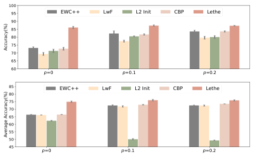

<!-- Start of picture text -->
100 95 EWC++ LwF L2 Init CBP Lethe 90 85 80 75 70 65 60 p=0 p=0.1 p=0.2 85 EWC++ LwF L2 Init CBP Lethe 80 75 70 65 60 55 50 45 p=0 p=0.1 p=0.2 Accuracy(%) Average Accuracy(%) <!-- End of picture text -->

**Figure 10: The performance comparison of different ratio of parameter pruning on** PA **and** AA **.** 

show that Lethe achieves the highest model accuracy in almost all evaluated metrics, _e_ . _g_ ., PA and SA. In the class-incremental CL setup on the C10 dataset, Lethe improves PA to 86.85%, an 8.94% absolute improvement over the best-performing baseline, and increases SA to 76.00%, a 5.63% gain. This significant margin underscores Lethe’s ability to effectively mitigate the catastrophic forgetting often observed when task boundaries are blurred, a common and difficult scenario in real-world data streams. In the task-incremental setting, the performance of Lethe is not particularly pronounced, and it even exhibits a slight decline compared to the SOTA on SA. This is because task-incremental scenarios provide task ID, which reduces the learning difficulty relative to class-incremental one and thereby leaves limited optimization space. 

## **6.3 Robustness of Lethe** 

**Parameter Selection Analysis** . Figure 8 presents a critical ablation study on the impact of ratio of parameter selection and reinitialization on model performance. As shown in Figure 8(a) on PA and Figure 8(b) on AA, selecting 30% of parameters ( _𝑟_ = 0 _._ 3) significantly outperformed 10% ( _𝑟_ = 0 _._ 1), while increasing to 50% ( _𝑟_ = 0 _._ 5) yielded little additional gain. This indicates that although a higher selection ratio improves plasticity, it is not always beneficial, and the optimal ratio should be determined on the analysis of the corresponding model and task. Figure 9 provides the performance comparison between Lethe and Random on parameter selection. No matter on PA orAA, the two-stage parameter selection approach of Lethe has higher average accuracy than the Random approach across three classical models, _e_ . _g_ ., LeNet5, ShuffleNetV2, ResNet18. 

**Model Sparsity Analysis** . Figure 10 evaluates the robustness of Lethe with respect to parameter pruning ratio. A sparsity of _𝜌_ = 0 _._ 2, for example, indicates that 20% of the model’s parameters have been removed. The experimental results show that Lethe consistently outperforms all baselines including L2 Init and CBP, which are also designed to enhance plasticity. Moreover, compared with the unpruned model, _i_ . _e_ ., _𝜌_ = 0, Lethe demonstrates superior performance in learning new tasks after model pruning, _i_ . _e_ ., _𝜌_ = 0 _._ 1 and _𝜌_ = 0 _._ 2. This finding highlights the synergy between 

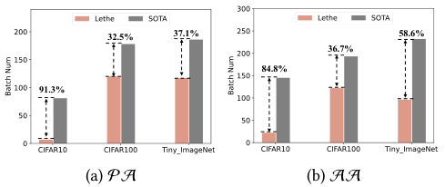

<!-- Start of picture text -->
32.5% 37.1% 58.6% 36.7% 84.8% 91.3% (a) PA (b) AA <!-- End of picture text -->

**Figure 11: The performance comparison between Lethe and SOTA on batch number for model convergence.** 

model compression and plasticity injection, making Lethe an ideal candidate for extremely memory-constrained IoT environments where sparse models are mandatory.This improvement arises because the pruned model retains more available parameter slots for reallocation, which facilitates enhancing the effective rank of model parameters and thereby improves model plasticity. 

**Resource Utilization Analysis** . Beyond its performance and robustness, a critical aspect for on-device CL is resource efficiency, which was analyzed in Figure 11. This figure measures the training batches required to reach a target accuracy ( _e_ . _g_ ., 50%), serving as a proxy for computational resource consumption. Lethe achieves convergence with a significantly lower number of batches, reducing requirements by 32.55% on LeNet5, 37.1% on ShuffleNetV2, and 58.6% on ResNet18 compared to the SOTA method. Such a dramatic reduction in training iterations directly translates to substantial energy savings and prolonged battery life for autonomous mobile agents, addressing the critical bottleneck of on-device learning. This enhanced efficiency of Lethe is attributed to neuro-inspired plasticity injection that accelerates model convergence. 

## **7 Conclusion** 

In this work, we proposed Lethe, a novel plasticity-aware active forgetting framework that fundamentally reframe forgetting from a detrimental effect to a solution with the optimization of model performance and resource efficiency for efficient on-device CL. By leveraging the “Forgetting, Learning and Recovery” paradigm, Lethe successfully decouples the plasticity-stability dilemma with the main design of forgetting-based plasticity injection and costaware forgetting recovery. Extensive evaluations demonstrate that Lethe not only achieves superior accuracy but also accelerates model adaptation and significantly reduces computational overhead compared to state-of-the-art solutions. 

## **Acknowledgments** 

This work was supported in part by National Key R&D Program of China (No. 2023YFB4502400), in part by China NSF grant No. 62322206, 62432007, 62441236, 62132018, 62025204, U2268204, 62272307, 62372296, U25A6024. The opinions, findings, conclusions, and recommendations expressed in this paper are those of the authors and do not necessarily reflect the views of the funding agencies or the government. Zhenzhe Zheng and Fan Wu are the corresponding authors. 

3184 

KDD ’26, August 09–13, 2026, Jeju Island, Republic of Korea 

Haibo Liu, Chenxin Mao, Zhenzhen Zheng, Fan Wu, Guihai Chen, and He Huang 

## **References** 

- [1] Zaheer Abbas, Rosie Zhao, Joseph Modayil, Adam White, and Marlos C. Machado. 2023. Loss of Plasticity in Continual Deep Reinforcement Learning. In _proc. of CoLLAs_ . 620–636. 

- [2] Hongjoon Ahn, Sungmin Cha, Donggyu Lee, and Taesup Moon. 2019. Uncertainty-based Continual Learning with Adaptive Regularization. In _Proc. of NeurIPS_ . 4394–4404. 

- [3] Rahaf Aljundi, Min Lin, Baptiste Goujaud, and Yoshua Bengio. 2019. Gradient based sample selection for online continual learning. In _Proc. of NeurIPS_ . 11816– 11825. 

- [4] Rahaf Aljundi, Min Lin, Baptiste Goujaud, and Yoshua Bengio. 2019. Gradient based sample selection for online continual learning. In _Proc. of NeurIPS_ . 11816– 11825. 

- [5] Jordan T. Ash and Ryan P. Adams. 2020. On Warm-Starting Neural Network Training. In _proc. of NeurIPS_ . 3884–3894. 

- [6] Ali Ayub and Alan R. Wagner. 2021. F-SIOL-310: A Robotic Dataset and Benchmark for Few-Shot Incremental Object Learning. In _Proc. of ICRA_ . 13496–13502. 

- [7] Samuel J. Bell and Neil D. Lawrence. 2022. The Effect of Task Ordering in Continual Learning. _CoRR_ abs/2205.13323 (2022). doi:10.48550/ARXIV.2205.13323 

- [8] Romit Chatterjee, Vikram S. Chundawat, Ayush K. Tarun, Ankur A. Mali, and Murari Mandal. 2024. A Unified Framework for Continual Learning and Machine Unlearning. _CoRR_ (2024). 

- [9] Arslan Chaudhry, Puneet Kumar Dokania, Thalaiyasingam Ajanthan, and Philip H. S. Torr. 2018. Riemannian Walk for Incremental Learning: Understanding Forgetting and Intransigence. In _Proc. of ECCV_ . 556–572. 

- [10] Aristotelis Chrysakis and Marie-Francine Moens. 2020. Online Continual Learning from Imbalanced Data. In _Proc. of ICML_ , Vol. 119. 1952–1961. 

- [11] Shibhansh Dohare, J. Fernando Hernandez-Garcia, Qingfeng Lan, Parash Rahman, A. Rupam Mahmood, and Richard S. Sutton. 2024. Loss of plasticity in deep continual learning. _Nature_ 632, 8026 (2024), 768–774. 

- [12] Shibhansh Dohare, J. Fernando Hernandez-Garcia, Parash Rahman, Richard S. Sutton, and A. Rupam Mahmood. 2023. Maintaining Plasticity in Deep Continual Learning. _CoRR_ abs/2306.13812 (2023). 

- [13] Xin Luna Dong, Seungwhan Moon, Yifan Ethan Xu, Kshitiz Malik, and Zhou Yu. 2023. Towards Next-Generation Intelligent Assistants Leveraging LLM Techniques. In _Proc. of SIGKDD_ . 5792–5793. 

- [14] Bipin Gaikwad and Abhijit Karmakar. 2021. Smart surveillance system for realtime multi-person multi-camera tracking at the edge. _Journal of Real-Time Image Processing._ 18, 6 (2021), 1993–2007. 

- [15] Qiang Gao, Xiaojun Shan, Yuchen Zhang, and Fan Zhou. 2023. Enhancing Knowledge Transfer for Task Incremental Learning with Data-free Subnetwork. In _in Proc. of NeurIPS_ . 68471–68484. 

- [16] Xavier Glorot and Yoshua Bengio. 2010. Understanding the difficulty of training deep feedforward neural networks. In _Proc. of AISTATS_ . 249–256. 

- [17] Chen Gong, Zhenzhe Zheng, Fan Wu, Xiaofeng Jia, and Guihai Chen. 2024. Delta: A Cloud-assisted Data Enrichment Framework for On-Device Continual Learning. In _Proc. of MobiCom_ . 1408–1423. 

- [18] Mourad Gridach, Jay Nanavati, Khaldoun Zine El Abidine, Lenon Mendes, and Christina Mack. 2025. Agentic AI for Scientific Discovery: A Survey of Progress, Challenges, and Future Directions. _CoRR_ abs/2503.08979 (2025). 

- [19] Yiduo Guo, Bing Liu, and Dongyan Zhao. 2022. Online Continual Learning through Mutual Information Maximization. In _Proc. of ICML_ . 8109–8126. 

- [20] Tyler L. Hayes and Christopher Kanan. 2022. Online Continual Learning for Embedded Devices. In _Proc. of CoLLAs_ . 744–766. 

- [21] Tyler L. Hayes and Christopher Kanan. 2022. Online Continual Learning for Embedded Devices. _CoRR_ abs/2203.10681 (2022). 

- [22] Geoffrey E. Hinton, Nitish Srivastava, Alex Krizhevsky, Ilya Sutskever, and Ruslan Salakhutdinov. 2012. Improving neural networks by preventing co-adaptation of feature detectors. _CoRR_ abs/1207.0580 (2012). 

- [23] Saihui Hou, Xinyu Pan, Chen Change Loy, Zilei Wang, and Dahua Lin. 2019. Learning a Unified Classifier Incrementally via Rebalancing. In _Proc. of CVPR_ . 831–839. 

- [24] Steven C. Y. Hung, Cheng-Hao Tu, Cheng-En Wu, Chien-Hung Chen, Yi-Ming Chan, and Chu-Song Chen. 2019. Compacting, Picking and Growing for Unforgetting Continual Learning. In _Proc. of NeurIPS_ . 13647–13657. 

- [25] Gabriel Ilharco, Marco Túlio Ribeiro, Mitchell Wortsman, Ludwig Schmidt, Hannaneh Hajishirzi, and Ali Farhadi. 2023. Editing models with task arithmetic. In _Proc. of ICLR_ . 

- [26] Martin Jaggi. 2013. Revisiting Frank-Wolfe: Projection-Free Sparse Convex Optimization. In _Proc. of ICML_ . 427–435. 

- [27] Haeyong Kang, Jaehong Yoon, Sultan Rizky Hikmawan Madjid, Sung Ju Hwang, and Chang D. Yoo. 2023. On the Soft-Subnetwork for Few-Shot Class Incremental Learning. In _Proc. of ICLR_ . 1–23. 

- [28] Chris Dongjoo Kim, Jinseo Jeong, Sangwoo Moon, and Gunhee Kim. 2021. Continual Learning on Noisy Data Streams via Self-Purified Replay. In _Proc. of ICCV_ . 517–527. 

- [29] Gyuhak Kim, Changnan Xiao, Tatsuya Konishi, Zixuan Ke, and Bing Liu. 2022. A Theoretical Study on Solving Continual Learning. In _Proc. of NeurIPS._ 5065–5079. 

- [30] James Kirkpatrick, Razvan Pascanu, Neil C. Rabinowitz, Joel Veness, Guillaume Desjardins, Andrei A. Rusu, and Kieran Milan. 2016. Overcoming catastrophic forgetting in neural networks. _CoRR_ abs/1612.00796 (2016). 

- [31] Saurabh Kumar, Henrik Marklund, and Benjamin Van Roy. 2024. Maintaining Plasticity in Continual Learning via Regenerative Regularization. In _in Proc. of CoLLAs_ . 410–430. 

- [32] Lilly Kumari, Shengjie Wang, Tianyi Zhou, and Jeff A. Bilmes. 2022. Retrospective Adversarial Replay for Continual Learning. In _Proc. of NeurIPS_ . 28530–28544. 

- [33] Namhoon Lee, Thalaiyasingam Ajanthan, and Philip H. S. Torr. 2019. Snip: single-Shot Network Pruning based on Connection sensitivity. In _proc. of ICLR_ . 1–15. 

- [34] Sang-Woo Lee, Jin-Hwa Kim, Jaehyun Jun, Jung-Woo Ha, and Byoung-Tak Zhang. 2017. Overcoming Catastrophic Forgetting by Incremental Moment Matching. In _Proc. of NeurIPS_ . 4652–4662. 

- [35] Guoqi Li, Lei Deng, Huajin Tang, Gang Pan, Yonghong Tian, Kaushik Roy, and Wolfgang Maass. 2024. Brain-Inspired Computing: A Systematic Survey and Future Trends. _Proc. IEEE_ 112, 6 (2024), 544–584. 

- [36] Xiangyu Li, Yuanchun Li, Yuanzhe Li, Ting Cao, and Yunxin Liu. 2024. FlexNN: Efficient and Adaptive DNN Inference on Memory-Constrained Edge Devices. In _Proc. of MobiCom_ . 709–723. 

- [37] Xiaorong Li, Shipeng Wang, Jian Sun, and Zongben Xu. 2023. Variational DataFree Knowledge Distillation for Continual Learning. _IEEE Transactions on Pattern Analysis and Machine Intelligence_ 45, 10 (2023), 12618–12634. 

- [38] Xilai Li, Yingbo Zhou, Tianfu Wu, Richard Socher, and Caiming Xiong. 2019. Learn to Grow: A Continual Structure Learning Framework for Overcoming Catastrophic Forgetting. In _Proc. of ICML_ . 3925–3934. 

- [39] Zhizhong Li and Derek Hoiem. 2016. Learning Without Forgetting. In _Proc. of ECCV_ . 614–629. 

- [40] Sen Lin, Peizhong Ju, Yingbin Liang, and Ness B. Shroff. 2023. Theory on Forgetting and Generalization of Continual Learning. In _Proc. of ICML_ . 21078–21100. 

- [41] Bo Liu, Qiang Liu, and Peter Stone. 2022. Continual Learning and Private Unlearning. In _proc. of CoLLAs_ . 243–254. 

- [42] Clare Lyle, Zeyu Zheng, Khimya Khetarpal, Hado van Hasselt, Razvan Pascanu, James Martens, and Will Dabney. 2024. Disentangling the Causes of Plasticity Loss in Neural Networks. In _Proc. of CoLLAs_ . PMLR, 750–783. 

- [43] Xinyue Ma, Suyeon Jeong, Minjia Zhang, Di Wang, Jonghyun Choi, and Myeongjae Jeon. 2023. Cost-effective On-device Continual Learning over Memory Hierarchy with Miro. In _Proc. of MobiCom_ . 83:1–83:15. 

- [44] Guillermo Ortiz-Jiménez, Alessandro Favero, and Pascal Frossard. 2023. Task Arithmetic in the Tangent Space: Improved Editing of Pre-Trained Models. In _Proc. of NeurIPS_ . 

- [45] Zhenchao Ouyang, Jianwei Niu, Yu Liu, and Mohsen Guizani. 2020. Deep CNNBased Real-Time Traffic Light Detector for Self-Driving Vehicles. _IEEE Transactions on Mobile Computing._ 19, 2 (2020), 300–313. 

- [46] Ameya Prabhu, Hasan Abed Al Kader Hammoud, Puneet K. Dokania, Philip H. S. Torr, Ser-Nam Lim, Bernard Ghanem, and Adel Bibi. 2023. Computationally Budgeted Continual Learning: What Does Matter?. In _Proc. of CVPR_ . 3698–3707. 

- [47] Ameya Prabhu, Hasan Abed Al Kader Hammoud, Puneet K. Dokania, Philip H. S. Torr, Ser-Nam Lim, Bernard Ghanem, and Adel Bibi. 2023. Computationally Budgeted Continual Learning: What Does Matter?. In _Proc. of CVPR_ . 3698–3707. 

- [48] Vijaya Raghavan T. Ramkumar, Elahe Arani, and Bahram Zonooz. 2023. Learn, Unlearn and Relearn: An Online Learning Paradigm for Deep Neural Networks. _Transactions on Machine Learning Research_ (2023). 

- [49] Sylvestre-Alvise Rebuffi, Alexander Kolesnikov, Georg Sperl, and Christoph H. Lampert. 2017. iCaRL: Incremental Classifier and Representation Learning. In _Proc. of CVPR_ . 5533–5542. 

- [50] Matthew Riemer, Ignacio Cases, Robert Ajemian, Miao Liu, Irina Rish, Yuhai Tu, and Gerald Tesauro. 2019. Learning to Learn without Forgetting by Maximizing Transfer and Minimizing Interference. In _Proc. of ICLR_ . 1–31. 

- [51] David Rolnick, Arun Ahuja, Jonathan Schwarz, Timothy P. Lillicrap, and Gregory Wayne. 2019. Experience Replay for Continual Learning. In _Proc. of NeurIPS_ . 348–358. 

- [52] Nicholas Roy, Ingmar Posner, Tim D. Barfoot, Philippe Beaudoin, Yoshua Bengio, Jeannette Bohg, Oliver Brock, Isabelle Depatie, Dieter Fox, Daniel E. Koditschek, Tomás Lozano-Pérez, Vikash Mansinghka, Christopher J. Pal, Blake A. Richards, Dorsa Sadigh, Stefan Schaal, Gaurav S. Sukhatme, Denis Thérien, Marc Toussaint, and Michiel van de Panne. 2021. From Machine Learning to Robotics: Challenges and Opportunities for Embodied Intelligence. _CoRR_ abs/2110.15245 (2021). https: //arxiv.org/abs/2110.15245 

- [53] John Martin Sabandal, Jacob A Berry, and Ronald L Davis. 2021. Dopamine-based mechanism for transient forgetting. _Nature_ 591, 7850 (2021), 426–430. 

- [54] Ranjan Sapkota, Konstantinos I. Roumeliotis, and Manoj Karkee. 2025. AI Agents vs. Agentic AI: A Conceptual Taxonomy, Applications and Challenges. _CoRR_ abs/2505.10468 (2025). 

3185 

KDD ’26, August 09–13, 2026, Jeju Island, Republic of Korea 

Lethe: Plasticity-aware Active Forgetting for Resource-Efficient On-Device Continual Learning 

- [55] Maying Shen, Hongxu Yin, Pavlo Molchanov, Lei Mao, and José M. Álvarez. 2024. Step Out and Seek Around: On Warm-Start Training with Incremental Data. _CoRR_ abs/2406.04484 (2024). 

- [56] Dongsub Shim, Zheda Mai, Jihwan Jeong, Scott Sanner, Hyunwoo Kim, and Jongseong Jang. 2021. Online Class-Incremental Continual Learning with Adversarial Shapley Value. In _Proc. of AAAI_ . 9630–9638. 

- [57] Dongsub Shim, Zheda Mai, Jihwan Jeong, Scott Sanner, Hyunwoo Kim, and Jongseong Jang. 2021. Online Class-Incremental Continual Learning with Adversarial Shapley Value. In _Proc. of AAAI_ . 9630–9638. 

- [58] Ahmet Ali Süzen, Burhan Duman, and Betül Şen. 2020. Benchmark analysis of jetson tx2, jetson nano and raspberry pi using deep-cnn. In _in Proc. of HORA_ . 1–5. 

- [59] Shuaijun Wang, Fan Jiang, Bin Zhang, Rui Ma, and Qi Hao. 2020. Development of UAV-Based Target Tracking and Recognition Systems. _IEEE Transactions on Intelligent Transportation Systems._ 21, 8 (2020), 3409–3422. 

- [60] Shuaijun Wang, Fan Jiang, Bin Zhang, Rui Ma, and Qi Hao. 2020. Development of UAV-Based Target Tracking and Recognition Systems. _IEEE Transactions on Intelligent Transportation Systems._ 21, 8 (2020), 3409–3422. 

- [61] Zifeng Wang, Zheng Zhan, Yifan Gong, Geng Yuan, Wei Niu, Tong Jian, Bin Ren, Stratis Ioannidis, Yanzhi Wang, and Jennifer G. Dy. 2022. SparCL: Sparse Continual Learning on the Edge. In _Proc. of NeurIPS_ . 20366–20380. 

- [62] Boyu Yang, Mingbao Lin, Yunxiao Zhang, Binghao Liu, Xiaodan Liang, Rongrong Ji, and Qixiang Ye. 2023. Dynamic Support Network for Few-Shot Class Incremental Learning. _IEEE Transactions on Pattern Analysis and Machine Intelligence._ 45, 3 (2023), 2945–2951. 

- [63] Haiyan Yin, Peng Yang, and Ping Li. 2021. Mitigating Forgetting in Online Continual Learning with Neuron Calibration. In _Proc. of NeurIPS_ . 10260–10272. 

- [64] Jaehong Yoon, Saehoon Kim, Eunho Yang, and Sung Ju Hwang. 2020. Scalable and Order-robust Continual Learning with Additive Parameter Decomposition. In _Proc. of ICLR_ . 1–15. 

- [65] Chiyuan Zhang, Samy Bengio, and Yoram Singer. 2022. Are All Layers Created Equal? _Journal of Machine Learning Research_ 23 (2022), 67:1–67:28. 

- [66] Yaqian Zhang, Bernhard Pfahringer, Eibe Frank, Albert Bifet, Nick Jin Sean Lim, and Yunzhe Jia. 2022. A simple but strong baseline for online continual learning: Repeated Augmented Rehearsal. In _Proc. of NeurIPS_ . 

- [67] Zihan Zhang, Xiao Ding, Xia Liang, Yusheng Zhou, Bing Qin, and Ting Liu. 2025. Brain and Cognitive Science Inspired Deep Learning: A Comprehensive Survey. _IEEE Transactions on Knowledge and Data Engineering_ 37, 4 (2025), 1650–1671. 

- [68] Haiyan Zhao, Tianyi Zhou, Guodong Long, Jing Jiang, and Chengqi Zhang. 2023. Does Continual Learning Equally Forget All Parameters?. In _proc. of ICML_ . 42280– 42303. 

- [69] Linglan Zhao, Jing Lu, Yunlu Xu, Zhanzhan Cheng, Dashan Guo, Yi Niu, and Xiangzhong Fang. 2023. Few-Shot Class-Incremental Learning via Class-Aware Bilateral Distillation. In _Proc. of CVPR_ . 11838–11847. 

3186 

