# **Two-Stage Auctions with Bid Refinement for Online Advertising** 

|Yidan Xing|Rui Guo|Yixin Tao|
|---|---|---|
|School of Computer Science, Shanghai Jiao Tong University Shanghai, China katexing@sjtu.edu.cn|Taobao & Tmall Group of Alibaba Beijing, China xianqiao.gr@alibaba-inc.com|Shanghai University of Finance and Economics Shanghai, China taoyixin@mail.shufe.edu.cn|
|Dagui Chen|Zhenzhe Zheng∗|Jian Xu|
|Taobao & Tmall Group of Alibaba Beijing, China dagui.cdg@alibaba-inc.com|School of Computer Science, Shanghai Jiao Tong University Shanghai, China zhengzhenzhe@sjtu.edu.cn Fan Wu School of Computer Science, Shanghai Jiao Tong University Shanghai, China fwu@cs.sjtu.edu.cn|Taobao & Tmall Group of Alibaba Beijing, China xiyu.xj@alibaba-inc.com|

## **Abstract** 

To balance prediction accuracy and system latency, large-scale online ad auctions employ two-stage architectures. These systems first retrieve a candidate ads subset using coarse quality metrics before finalizing auction outcomes with refined metrics. However, existing implementations typically elicit user-specific bids only once, overlooking the impact of real-time quality metrics on advertiser valuations and thereby limiting allocation efficiency. Motivated by recent industry practice, we investigate the design of two-stage auctions that allow advertisers to submit and update their bids, with second-stage bids serving as refinements of the initial ones. We derive the incentive-compatible (IC) conditions and analyze the revenue properties of this two-stage auction. Notably, an additional entry fee is required to prevent inflated initial bids, which compromises the standard ex-post individual rationality (IR) property. To address this, we propose a dynamic two-stage auction that adopts realization-dependent entry fees with discounts. By leveraging historical bidding information, our mechanism guarantees approximate ex-ante IC across both stages and restores ex-post IR. 

## **CCS Concepts** 

- **Information systems** → **Computational advertising** ; • **The-** 

- **ory of computation** → **Algorithmic mechanism design** . 

## **Keywords** 

Mechanism Design; Online Advertising; Two-Stage Auction 

∗Zhenzhe Zheng is the corresponding author. 

This work is licensed under a Creative Commons Attribution-NonCommercialNoDerivatives 4.0 International License. _KDD ’26, Jeju Island, Republic of Korea_ 

© 2026 Copyright held by the owner/author(s). ACM ISBN 979-8-4007-2259-2/2026/08 https://doi.org/10.1145/3770855.3817645 

#### **ACM Reference Format:** 

Yidan Xing, Rui Guo, Yixin Tao, Dagui Chen, Zhenzhe Zheng, Jian Xu, and Fan Wu. 2026. Two-Stage Auctions with Bid Refinement for Online Advertising. In _Proceedings of the 32nd ACM SIGKDD Conference on Knowledge Discovery and Data Mining V.2 (KDD ’26), August 09–13, 2026, Jeju Island, Republic of Korea._ ACM, New York, NY, USA, 12 pages. https://doi.org/10. 1145/3770855.3817645 

## **1 Introduction** 

With the advancement of real-time bidding techniques [31], the frequency and scale of ad auctions have increased dramatically. Upon each user request, advertisers submit user-specific bids to the platform, and the platform then determines the ads to display via real-time auctions that consider both bid values and ad quality metrics—such as click-through rate (CTR) and conversion rate (CVR). In addition to ad content, these metrics incorporate granular user features and historical behaviors to assess the ad’s relevance to each unique request. To balance prediction accuracy and system latency across a large number of ad candidates, modern online ad systems typically adopt a two-stage architecture [18, 36]. In this design, the platform first computes coarse predictions of ad quality for all candidates and, together with the submitted bids, uses them to select a subset of ads during a _pre-auction stage_ . Only this subset proceeds to a second, _formal auction stage_ , where the platform could then afford to compute the refined ad quality metrics with computationally intensive methods for finalizing allocation and payment. While the refinement of quality metrics is inherent to this architecture, the corresponding protocol for handling bids throughout this two-stage process remains a non-standardized design choice. 

In industrial settings, a common practice is to retrieve the candidate ad subset using average historical bids, and elicit user-specific real-time bids only in the second stage. An alternative approach, proposed in the literature [36, 40], collects bids only during the pre-auction stage and uses the same bid values throughout both stages. However, advertisers’ valuations and corresponding bids depend critically on real-time predictions of ad quality. Bids based 

5754 

KDD ’26, August 09–13, 2026, Jeju Island, Republic of Korea 

Yidan Xing et al. 

on historical or outdated metrics often fail to reflect the advertiser’s true valuation at the moment. For example, advertisers optimizing for conversions base their bids primarily on user-specific CVR predictions, which improve with real-time modeling and become more accurate when refined CVR predictions are available. Consequently, to improve allocation efficiency, platforms should ideally elicit and use real-time, up-to-date bids in both stages of the auction. 

Driven by this rationale, Taobao, one of the major online ad platforms, has upgraded its system architecture to support this dual real-time bidding approach at scale. While Taobao’s current implementation retains the auction rules of existing approaches, the system incorporates updated bids at both stages. Empirical analysis across billions of auctions reveals that the refinement of ad quality metrics leads to an average twofold change in valuations, underscoring the significance of bid refinement. However, this pioneering approach is susceptible to strategic manipulations: because final auction outcomes depend solely on the refined second-stage bids, advertisers can inflate their pre-auction bids to ensure their entry to the formal auction without incurring any cost. As a result, Taobao currently restricts this feature to trusted internal advertisers, limiting the scope of bid refinement in general ad auctions. 

Motivated by these industry practices, we aim to formally investigate the design of two-stage ad auctions that allow advertisers to submit and refine their bids from a game-theoretical perspective. Specifically, we focus on two-stage incentive-compatible (IC) auctions, where advertisers are incentivized to truthfully report their valuations at both stages. Unlike in traditional multi-dimensional auctions, an advertiser’s initial valuation does not contribute to her utility directly; instead, it implicitly influences subsequent allocation and payment. This asymmetry introduces an incentive for advertisers to inflate their initial bids to increase their chances of being selected for the second stage, especially under improperly designed mechanisms. 

To preserve the well-ordering of bidding, we provide formal definitions and analysis for two-stage IC conditions. Our result enables the platform to truthfully implement any monotone allocation rule under a newly proposed two-stage monotonicity concept. A key finding is that advertisers granted access to the second stage must pay an entry fee alongside standard single-stage payments, irrespective of their refined bids. To guide revenue optimization, we derive a closed-form expression for the expected revenue of any two-stage auction, which can be viewed as a transformation of the classical virtual value function [29]. However, due to the indispensability of entry fees, a broad class of common two-stage IC auctions fails to satisfy ex-post individual rationality (IR) conditions for general non-trivial allocation rules, _i.e._ , some advertisers may be charged without receiving an allocation. Furthermore, these entry fees result in higher expected payments for advertisers compared to incumbent auction mechanisms. 

To overcome this limitation, we propose a dynamic two-stage auction with discounts in entry fees that simultaneously achieves ex-post IR and approximate ex-ante IC. This auction incorporates realization-dependent entry fees tailored to the advertiser’s realized capacity to pay, and allows the platform to provide flexible discounts on this basis. Inspired by non-monetary mechanism design, we track advertisers’ historical bidding behavior and compare their cumulative discount usage against prior expectations. Advertisers 

exhibiting abnormally high discount consumption are subject to exclusion, ensuring that the utility gain from strategic manipulation vanishes over time. For the widely adopted rank-score allocation rules, our auction can either charge a full entry fee by setting an equivalent bid-dependent reserve price, or completely eliminate the entry fees to align with standard single-stage payments. Crucially, as the discount computation and monitoring process is simple based on entry fees, our dynamic two-stage auction remains practical for implementation. Our results offer valuable insights into designing two-stage ad auctions that effectively integrate bid refinement while preserving economic robustness in online advertising. 

The main contributions can be summarized as follows: 

- We study the auction design problem for a new two-stage model with bid refinement in online advertising. We provide industrial evidence to support this model and motivate the necessity for a rigorous game-theoretical analysis. 

- We derive the IC conditions and analyze the revenue performances of this model. We find that general two-stage IC auctions are unable to satisfy ex-post IR due to additional entry fees. 

- We propose a dynamic two-stage auction with flexible discounts to achieve ex-post IR and approximate ex-ante IC. This mechanism can convert any monotone two-stage allocation rule to a bid refinement scheme and remains simple in auction format. 

## **2 Two-Stage Auctions: Industry Practice** 

In this section, we provide the background on two-stage ad auctions and present the recent deployment by Taobao to demonstrate the feasibility and effects of bid refinement. 

## **2.1 Two-Stage Auctions in Online Ad System** 

The two-stage architecture has been widely adopted as a fundamental infrastructure to address real-time user requests in both industrial recommender system [7, 10, 20] and online ad system [12, 36, 40]. In two-stage ad auctions, the formal auction stage operates similarly to standard (single-stage) ad auctions but typically includes only a few _hundred_ ad candidates. This constraint arises from the computational cost of producing refined predictions for ad quality metrics [28, 41]. Due to these resource limits, the preauction stage must filter _tens of thousands_ of relevant ad candidates down to a manageable subset. The typical goal is to identify a candidate subset that is likely to yield high revenue in the formal auction. This filtering is usually based on a _pre-ranking score_ , computed using coarse (low-cost) prediction of quality metrics and advertiser bids. The specific method used to compute pre-ranking scores can vary across platforms [12, 36], but generally, ads with the highest pre-ranking scores are admitted to the formal auction. 

A key modification explored in this work—and recently adopted in practice by Taobao—is to _collect advertiser bids at both stages_ , rather than eliciting a single set of real-time bids. When feasible, this allows advertisers’ bids to dynamically reflect their current valuations, enhancing the platform’s ability to make more accurate and efficient allocation decisions. 

_2.1.1 Deployment Overview._ Previously, Taobao adopted a _timeweighted average of historical bids_ to simulate bid values in the pre-auction stage (see Figure 1a). This was combined with coarse quality metrics computed _in parallel_ to determine the pre-ranking 

5755 

KDD ’26, August 09–13, 2026, Jeju Island, Republic of Korea 

Two-Stage Auctions with Bid Refinement for Online Advertising 

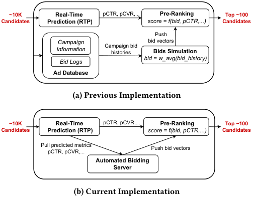

<!-- Start of picture text -->
~10K Real-Time pCTR, pCVR,... Pre-Ranking Top ~100 Candidates  Prediction (RTP) score = f(bid, pCTR,...) Candidates Push Campaign bid vectors Information Campaign bidhistories Bids Simulation bid = w_avg(bid_history) Bid Logs Ad Database (a) Previous Implementation ~10K Real-Time pCTR, pCVR,... Pre-Ranking Top ~100 Candidates  Prediction (RTP) score = f(bid, pCTR,...) Candidates Pull predicted metrics Push bid vectors pCTR, pCVR,... Automated Bidding Server (b) Current Implementation <!-- End of picture text -->

**Figure 1: Online Deployment of Pre-Auction Stage** 

score. Real-time, user-specific bids were only collected after an advertiser’s ad passed the pre-auction filter and entered the formal auction stage, where refined metrics were available. 

To enable real-time bidding in both stages, Taobao redesigned its system architecture so that, in the pre-auction stage, coarse quality metrics are computed first, followed _sequentially_ by the advertiser’s bidding decision, mirroring the flow used in the formal auction stage (see Figure 1b). Such implementation for the pre-auction stage is more complex than that of the formal auction stage due to the significantly larger scale of ad candidates, making distributed computation more demanding. Despite the increased latency, the improvement of utilizing real-time, user-specific bids for subset selection outweighs its engineering complexity. 

_2.1.2 Bid Discrepancies Between Stages._ To quantify the discrepancies between bids submitted at the pre-auction and formal auction stages, we define the _absolute logarithm of pre-bid ratio (ALPR)_ for each ad request as 

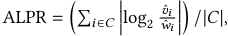

where _𝐶_ denotes the set of advertisers who enter the formal auction stage for the current request. Here, ˆ _𝑣𝑖_ and _𝑤_ ˆ _𝑖_ represent advertiser _𝑖_ ’s initial (pre-auction) and refined (formal auction) bids, respectively. We analyzed ALPR across all ad requests from date 09-29 to 10-06, covering billions of auction instances. The average ALPR during this period was _1.04_ , indicating that, on average, an advertiser’s refined bid was approximately either twice or half the value of their initial bid. These bid discrepancies largely stem from differences between coarse and refined quality metric predictions used in the two stages. This significant variation underscores the importance of bid refinement in the formal auction stage. Even though initial bids can be collected in the pre-auction stage at scale, relying solely on them without subsequent refinement could severely undermine the efficiency of ad allocation. 

Taobao has _fully deployed_ this new two-stage bidding architecture in its major display advertising services, supporting over 300,000 advertisers and processing more than 10 billion ad requests 

per day1 . Representative deployment scenarios include “Recommended for You” ad slots on the homepage and post-purchase pages of Taobao’s mobile app. The resulting P99 latency, _i.e._ , the time by which 99% of ad requests are completed, is approximately 355 milliseconds, indicating that most auctions are resolved within acceptable real-time constraints. 

## **2.2 Motivation of Auction Design** 

The feasibility of the above deployment relies on a crucial condition: all participants are internal advertisers treated as _trusted_ . That is, they either use automated bidding tools provided by Taobao or adopt a fixed, pre-determined bid for all relevant auctions. Due to the trustworthy guarantee of involved advertisers, Taobao is able to treat initial bids solely as reference signals to help select a promising candidate subset. 

When the platform possesses full knowledge of how participants evaluate an impression across two stages, it is also feasible to adopt _automatic bid refinement_ , thereby saving the efforts of explicitly eliciting refined bids. In real-time bidding, advertisers typically adopt some bidding formulas parametrized by ad quality metrics and control variables reflecting the advertiser’s anticipation of realtime market conditions [1, 19, 37]; these formulas effectively serve as their valuation function in personalized contexts. If the platform had access to these functions, it could automatically refine each bidder’s initial bid upon the update of ad quality metrics, rendering the second-stage bid elicitation unnecessary. 

However, for general advertisers, the platform typically lacks access to these specific valuation functions. Advertisers may employ some complex, proprietary strategies [6, 39] to maintain a strategic competitive advantage. Moreover, it is difficult to reach a consensus on the credibility of ad metric predictions and automatic bid refinement when fully conducted by the platform. Thus, eliciting bids at both stages is more suitable for general scenarios to leverage refined valuations. Yet, this flexibility grants strategic advertisers significant opportunities to manipulate bids and extract higher utility, which would severely distort the pre-ranking scores and degrade auction performance. Given the scalability and practical viability of collecting real-time bids at both stages, it becomes essential to develop a formal game-theoretic understanding of two-stage auctions. In particular, properly resolving the involved incentive issues is key to ensuring that the auction remains robust and effective when extended to a broader set of advertisers. 

## **3 Notations and Definitions** 

Based on the new features of two-stage ad auctions discussed above, we formulate our formal model as follows. Suppose there are _𝑛_ advertisers2 competing for display opportunities provided by an ad platform. The process of each auction can be described as follows. 

1) Pre-auction stage: Each advertiser _𝑖_ ∈[ _𝑛_ ] learns her initial valuation _𝑣𝑖_ on the current display opportunity. Due to varying relevance between advertisers and users, we assume _𝑣𝑖_ is drawn independently from a personalized distribution _𝑓𝑖_ (·). While _𝑓𝑖_ is known by the platform, _𝑣𝑖_ is privately revealed to advertiser _𝑖_ . The platform asks advertisers to submit initial bids _𝑣_ ˆ _𝑖_ , and determines 

> 1Statistics in this section are counted during the same period as the ALPR metric. 

> 2We use advertisers with bidders interchangeably in this work. 

5756 

KDD ’26, August 09–13, 2026, Jeju Island, Republic of Korea 

Yidan Xing et al. 

the bidder subset to enter the formal auction stage with subset selection rule _𝑦𝑆_ . We use _𝑦𝑆_ (vˆ) to denote the probability that a bidder subset _𝑆_ ⊆[ _𝑛_ ] is selected by the platform to enter the formal auction stage under the initial bid profile vˆ = ( _𝑣_ ˆ1 _, . . . ,_ ˆ _𝑣𝑛_ ). 

2) Formal auction stage: Each advertiser _𝑖_ entering the formal auction stage learns her refined valuation _𝑤𝑖_ on the display opportunity, independently drawn from a distribution _𝑔𝑖_ (·; _𝑣𝑖_ ). As _𝑤𝑖_ is a refined evaluation based on _𝑣𝑖_ , we assume the distribution of _𝑤𝑖_ depends on her initial valuation _𝑣𝑖_ . We adopt the concept of _first-order stochastic dominance_ [9] to describe the relation between distributions _𝑔𝑖_ (·; _𝑣𝑖_ ) of different initial values _𝑣𝑖_ as 

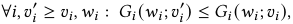

where _𝐺𝑖_ (·; _𝑣𝑖_ ) is the CDF of _𝑔𝑖_ (·; _𝑣𝑖_ ). That is, when an advertiser’s initial valuation increases, the probability of her refined valuation exceeding any fixed _𝑤𝑖_ is non-decreasing. Distributions _𝑔𝑖_ are public information, while _𝑤𝑖_ are privately known by advertiser _𝑖_ . The platform asks advertisers to submit their refined bids _𝑤_ ˆ _𝑖_ to determine the auction outcome based on the allocation rule _𝑥_ and payment rule _𝑝_ of the formal auction stage. We use _𝑥𝑖_ (vˆ _,_ wˆ ; _𝑆_ ) to denote the allocation to bidder _𝑖_ when the selected bidder subset is _𝑆_ and their refined bid profile is wˆ = ( _𝑤_ ˆ 1 _, . . . , 𝑤_ ˆ _𝑛_ ), and denote the corresponding payment charged to bidder _𝑖_ as _𝑝𝑖_ (vˆ _,_ wˆ ; _𝑆_ ), with _𝑤_ ˆ _𝑖_ = 0 and _𝑥𝑖_ (vˆ _,_ wˆ ; _𝑆_ ) = 0 for _𝑖_ ∉ _𝑆_ . We assume there is an upper bound _<u>𝑢</u>_ for _𝑣𝑖,_ ˆ _𝑣𝑖,𝑤𝑖_ and _𝑤_ ˆ _𝑖_ , _i.e._ , _𝑣𝑖,_ ˆ _𝑣𝑖,𝑤𝑖, 𝑤_ ˆ _𝑖_ ≤ _<u>𝑢</u>_ . 

The realized utility of bidder _𝑖_ with refined valuation _𝑤𝑖_ when the bids profile is (vˆ _,_ wˆ ) and the entering bidder subset is _𝑆_ could then be defined as 

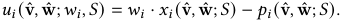

We also define the expected utility of bidder _𝑖_ in pre-auction stage when the initial bid profile is vˆ and her true initial valuation is _𝑣𝑖_ as 

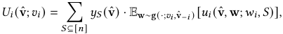

assuming all the bidders report true refined valuations in the formal auction stage with initial valuations ( _𝑣𝑖,_ ˆv− _𝑖_ ), where we use w ∼ g(·; _𝑣𝑖,_ ˆv− _𝑖_ ) to represent _𝑤𝑖_ ∼ _𝑔𝑖_ (·; _𝑣𝑖_ ) and _𝑤 𝑗_ ∼ _𝑔𝑗_ (·; ˆ _𝑣 𝑗_ ) for _𝑗_ ≠ _𝑖_ . 

In this work, we consider the design of two-stage incentive compatible (IC) direct-revelation auctions. Since reporting the initial bid and refined bid formulates a sequential decision problem for advertisers, the IC conditions for the two stages are defined in a backward manner. The allocation rule of a two-stage auction is defined by ( _𝑦𝑆,𝑥_ ), which constitutes a complete auction together with the payment rule _𝑝_ . 

Definition 3.1. _A two-stage auction mechanism_ ( _𝑦𝑆,𝑥, 𝑝_ ) _satisfies two-stage IC if the following conditions hold:_ 

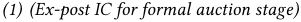

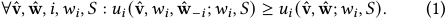

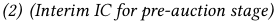

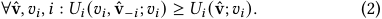

Given that an advertiser has entered the formal auction stage with the pre-auction stage context vˆ and _𝑆_ , the remaining auction process becomes similar to the classical single-stage auctions. Following this idea, conditions (1) for the formal auction stage 

are defined to elicit true refined valuations under any potential pre-auction stage context. By conditions (1), we could assume advertisers to always report true refined valuations in the formal auction, which simplifies the computation of expected utility for advertisers in the pre-auction stage. To see conditions (2) satisfy classical Bayesian-Nash incentive compatible (BNIC) conditions for initial valuations, we note that _𝑈𝑖_ (vˆ; _𝑣𝑖_ ) becomes the true expected utility for advertiser _𝑖_ when other advertisers bid truthfully. 

We also desire the auction mechanism to satisfy individual rationality (IR) conditions. 

Definition 3.2. _A two-stage auction_ ( _𝑦𝑆,𝑥, 𝑝_ ) _satisfies two-stage interim IR if_ ∀v _,𝑖_ : _𝑈𝑖_ (v; _𝑣𝑖_ ) ≥ 0; _and satisfies ex-post IR if_ ∀v _,_ w _,𝑖,𝑆_ : _𝑢𝑖_ (v _,_ w; _𝑤𝑖,𝑆_ ) ≥ 0 _._ 

As ex-post IR guarantees non-negative realized utility for any potential realization of bidder subset and refined bids, it provides a stronger guarantee than the two-stage interim IR on expected utility. For any two-stage auction considered in the work, we assume _𝑝𝑖_ (v _,_ w; _𝑆_ ) ≥ 0, with _𝑥𝑖_ (0 _,_ v− _𝑖,_ 0 _,_ w− _𝑖_ ; _𝑆_ ) = _𝑝𝑖_ (0 _,_ v− _𝑖,_ 0 _,_ w− _𝑖_ ; _𝑆_ ) = 0, ∀ _𝑖,𝑆,_ v _,_ w _,_ to guarantee a safe outside option. For convenience in notations, we define the _two-stage combined_ allocation rule _𝑧_ and payment rule _𝑞_ for two-stage auction ( _𝑦𝑆,𝑥, 𝑝_ ) as 

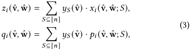

which represents expected allocation and payment for a realization of (vˆ _,_ wˆ ) over the randomness of subset selection. We may also use E _𝑆_ ∼ _𝑦𝑆_ (vˆ ) to represent such randomness, _e.g._ , _𝑧𝑖_ (vˆ _,_ wˆ ) = E _𝑆_ ∼ _𝑦𝑆_ (vˆ ) [ _𝑥𝑖_ (vˆ _,_ wˆ ; _𝑆_ )]. 

## **4 Characterization and Properties** 

In this section, we present the characterization results for two-stage IC auctions and analyze their associated revenue and IR properties. Detailed proofs of our results are provided in Appendix A. 

## **4.1 Conditions for Two-Stage IC** 

After a bidder enters the formal auction stage, the bidder subset _𝑆_ and initial bids vˆ have been fixed. Therefore, the ex-post IC conditions (1) for refined bids wˆ are analogous to the classical IC conditions in single-stage auctions [29]. By this observation, we have _𝑝𝑖_ (vˆ _,_ wˆ ; _𝑆_ ) = ∫0 _𝑤_ ˆ _𝑖 𝑤_ ˜ _𝑖_ ·_𝜕𝑥𝑖_<u>(vˆ</u>_<u>,𝑤</u>_ _𝜕_˜ _𝑤__<u>𝑖</u>_ ˜_<u>,</u>_ _𝑖_ˆw−_<u>𝑖</u>_<u>;</u>_𝑆_<u>)</u> d _𝑤_ ˜ _𝑖_ + _𝑝𝑖_ (vˆ _,_ 0 _,_ wˆ − _𝑖_ ; _𝑆_ ), and _𝑥𝑖_ (vˆ _,_ wˆ ; _𝑆_ ) non-decreasing in _𝑤_ ˆ _𝑖_ , ∀ _𝑖,𝑆,_ ˆv _,_ wˆ , to incentivize truthful report of _𝑤𝑖_ . In classical auctions, the “starting point” payment term when the valuation of a bidder is 0, analogous to _𝑝𝑖_ (vˆ _,_ 0 _,_ wˆ − _𝑖_ ; _𝑆_ ) here, is usually assigned to be 0 to ensure the IR property. However, when bidders need to first compete in a pre-auction stage in our twostage context, the design of term _𝑝𝑖_ (vˆ _,_ 0 _,_ wˆ − _𝑖_ ; _𝑆_ ) becomes the key to incentivize true initial bids, as simply setting _𝑝𝑖_ (vˆ _,_ 0 _,_ wˆ − _𝑖_ ; _𝑆_ ) = 0 represents no opportunity cost to participate in the formal auction and leads to overbidding of initial valuations. 

To design an appropriate _𝑝𝑖_ (vˆ _,_ 0 _,_ wˆ − _𝑖_ ; _𝑆_ ), the underlying insight is to view the outcome of bidder subset selection as an allocation of potential opportunities to participate in formal auctions. Since the value of those opportunities is essentially the expected utility 

5757 

KDD ’26, August 09–13, 2026, Jeju Island, Republic of Korea 

Two-Stage Auctions with Bid Refinement for Online Advertising 

a bidder may obtain in the formal auction, we could adapt the spirit of Myerson’s result and apply it iteratively on the expected utility derived from the single-stage characterization. This provides a reduction from the design of two-stage IC auctions to a two-stage allocation rule. 

Theorem 4.1. _For any two-stage allocation rule_ ( _𝑦𝑆,𝑥_ ) _satisfying_ 

• _𝑥𝑖_ (vˆ _,_ wˆ ; _𝑆_ ) _non-decreasing in 𝑤_ ˆ _𝑖 ; and_ 

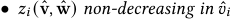

_for any 𝑖_ ∈[ _𝑛_ ] _,𝑆_ ⊆[ _𝑛_ ] _and potential bid profiles_ vˆ _,_ wˆ _, define the corresponding payment rule 𝑝 as 𝑝𝑖_ (vˆ _,_ wˆ ; _𝑆_ ) = _𝑝𝑖,_ 1 (vˆ _,_ wˆ ; _𝑆_ ) + _𝜏𝑖_ (vˆ) _, with standard single-stage payment_ 

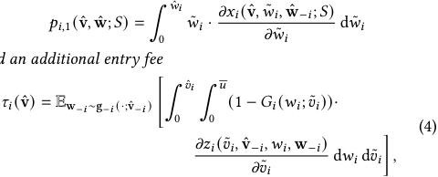

_and an additional entry fee_ 

_then the two-stage auction_ ( _𝑦𝑆,𝑥, 𝑝_ ) _is two-stage IC and interim IR._ 

We term the allocation rules ( _𝑦𝑆,𝑥_ ) satisfying the non-decreasing conditions in Theorem 4.1 to be _two-stage monotone_ . That is, fixing the realized valuations of other bidders, reporting a higher initial bid _𝑣_ ˆ _𝑖_ brings the advertiser a larger two-stage combined allocation _𝑧𝑖_ , and reporting a higher refined bid _𝑤_ ˆ _𝑖_ brings the advertiser a larger realized allocation _𝑥𝑖_ . As we will see in Section 4.2, these conditions are natural to hold for allocation rules in ad auctions. 

In Theorem 4.1, the payment charged to advertisers are split into two parts: (1) the standard single-stage payment, _i.e._ , _𝑝𝑖,_ 1 (vˆ _,_ wˆ ; _𝑆_ ) = ∫0 _𝑤_ ˆ _𝑖 𝑤_ ˜ _𝑖_ ·_𝜕𝑥𝑖,𝑆_<u>(v</u> _𝜕_ˆ_,_ _𝑤__𝑤_ ˜˜ _𝑖__𝑖,_ˆw−_𝑖_<u>)</u> d _𝑤_ ˜ _𝑖_ ; and (2) an additional _entry fee 𝜏𝑖_ (vˆ) corresponding to the opportunity cost of participating in the formal auction. In Equation (4), term ∫0 _<u>𝑢</u>_(1 −_𝐺𝑖_(_𝑤𝑖_; ˜_𝑣𝑖_))_𝑧𝑖_( ˜_𝑣𝑖,_ˆv−_𝑖,𝑤𝑖,_wˆ−_𝑖_) d_𝑤𝑖_ represents the expected utility of advertiser _𝑖_ in the formal auction when her initial valuation is _𝑣_ ˜ _𝑖_ , fixing the bids of other advertisers. 

Due to the inherent uncertainty of the future in two-stage auctions, there may exist a multitude of payment rules to constitute a two-stage IC auction for the same allocation rule, which is distinct from the single-stage characterization result. Specifically, using any entry fee rule _𝜏𝑖_ (vˆ _,_ wˆ − _𝑖_ ; _𝑆_ ) conditional on _𝑆_ and wˆ − _𝑖_ in substitute of _𝜏𝑖_ (vˆ), with E ˆw− _𝑖_ ∼g(·;ˆv− _𝑖_ ) _,𝑆_ ∼ _𝑦𝑆_ [ _𝜏𝑖_ (vˆ _,_ wˆ − _𝑖_ ; _𝑆_ )] = _𝜏𝑖_ (vˆ), also provides a two-stage IC and interim IR mechanism. We present the payment format as _𝜏𝑖_ (vˆ) in Theorem 4.1 due to its simplicity in operation: the platform only needs to charge a fixed entry fee for each bidder depending on their initial bids, which could be paid up before the formal auction begins. For ease of presentation, Theorem 4.1 is written using ordinary derivatives. When the allocation rule is monotone but discontinuous, the derivative notation is interpreted in the Lebesgue–Stieltjes sense induced by the monotone allocation rule. For continuously differentiable allocation rules, this convention coincides with the displayed formula. 

## **4.2 Example: Allocation with Rank Scores** 

In online advertising, a group of allocation rules based on _rank scores_ is widely adopted due to its simplicity in implementation and 

flexibility in design [23, 26, 33], covering both subset selection [12, 13, 36] and auction allocation [26, 33]. 

_4.2.1 Rank Scores in Online Advertising._ The working principle of the allocation rule with rank scores is formally described as follows. The ad platform determines the (personalized) rank score functions _ℎ𝑖,_ 0 _,ℎ𝑖,_ 1 : R+ → R for each advertiser _𝑖_ before the auction starts, with _ℎ𝑖,_ 0 for the pre-auction stage, and _ℎ𝑖,_ 1 for the formal auction stage. Note that _ℎ𝑖_ can depend on other contextual features or prior information irrelevant of submitted bids. 

Given bids of advertiser _𝑖_ , the platform compute the corresponding rank scores for her, denoted as _ℎ𝑖,_ 0 ( _𝑣_ ˆ _𝑖_ ) for rank score in the pre-auction stage and _ℎ𝑖,_ 1 ( _𝑤_ ˆ _𝑖_ ) for the formal auction stage. The platform greedily chooses _𝑘_ advertisers ( _𝑘 < 𝑛_ ) with the highest initial rank scores _ℎ𝑖,_ 0 ( _𝑣_ ˆ _𝑖_ ) to enter the formal auction, and finally allocates to the advertiser with the highest refined rank score _ℎ𝑖,_ 1 ( _𝑤_ ˆ _𝑖_ ). The allocation rule can be formally defined as: 

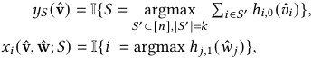

_𝑗_ ∈ _𝑆_ 

where ties are broken in an arbitrary fixed order. As the rank scores are non-decreasing in bids for both stages, fixing the bids of other advertisers, reporting a higher bid would not lead the final allocation to decrease, thus satisfying the two-stage monotone property. 

_4.2.2 Computation of Entry Fees._ As a consequence of the nondecreasing rank score functions, there exist some threshold bids for each advertiser to enter the second stage or win the auction, leading the entry fee in Equation (4) to be largely simplified. To facilitate our discussion, we use _ℎ_ −(_𝑘_ _𝑖,_) 0(vˆ−_𝑖_) to denote the_𝑘𝑡ℎ_highest initial rank score besides that of bidder _𝑖_ , and use _𝑆_(_𝑘_) (vˆ) to denote the subset of _𝑘_ advertisers entering the formal auction. Formally, we may define the _threshold initial bid_ and _threshold refined bid_ respectively as 

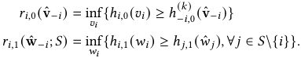

That is, an advertiser _𝑖_ enters the formal auction only if _𝑣_ ˆ _𝑖_ ≥ _𝑟𝑖,_ 0 (vˆ − _𝑖_ ), and then wins the auction only if _𝑤_ ˆ _𝑖_ ≥ _𝑟𝑖,_ 1 �wˆ − _𝑖_ ; _𝑆_ ( _𝑘_ ) (vˆ)�. 

Proposition 4.2. _In the allocation with rank scores setting, charging the following entry fee satisfies two-stage IC:_ 

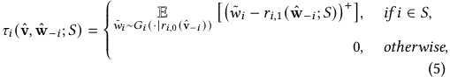

_where_ ( _𝑥_ )+ := max( _𝑥,_ 0) _._ 

Observing� _𝑤_ ˜ _𝑖_ − _𝑟𝑖,_ 1 ( ˆw− _𝑖_ ; _𝑆_ )�+ is the utility of an advertiser with valuation _𝑤_ ˜ _𝑖_ in standard single-stage auctions, the entry fee can be simply computed by simulating the expected utility of _𝑖_ under different _𝑤_ ˜ _𝑖_ , assuming her initial valuation is the threshold initial bid _𝑟𝑖,_ 0 (vˆ − _𝑖_ ) with fixed _𝑆_ and wˆ − _𝑖_ . 

## **4.3 Revenue and IR Properties** 

Next, we consider the revenue and IR properties to inspect the overall impacts brought by additional entry fees in two-stage auctions. 

5758 

KDD ’26, August 09–13, 2026, Jeju Island, Republic of Korea 

Yidan Xing et al. 

Theorem 4.3. _Suppose 𝑤𝑖_ = _𝑣𝑖_ + _𝜖𝑖 , where 𝜖𝑖 is an additive noise independent of 𝑣𝑖 , and 𝑔𝑖_ (·; _𝑣𝑖_ ) _is the induced conditional distribution supported on 𝑣𝑖_ +supp( _𝜖𝑖_ ) ⊆ R+ _. Consider a two-stage IC auction with allocation rule_ ( _𝑦𝑆,𝑥_ ) _and 𝑦𝑆_ (0 _,_ v− _𝑖_ ) = 0 _,_ ∀ _𝑆_ ∋ _𝑖. Then its expected revenue is_ 

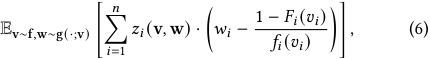

_where 𝑧𝑖_ (v _,_ w) _is the combined allocation rule of_ ( _𝑦𝑆,𝑥_ ) _._ 

Recall that the expected revenue of standard single-stage IC auction only eliciting initial valuations v (with allocation rule _𝑎_ ) is Ev∼f �� _𝑖𝑛_ =1_𝑎𝑖_(v) · � _𝑣𝑖_ −1− _𝑓𝑖__𝐹_ (_<u>𝑖</u>_ _𝑣_<u>(</u> _𝑖__𝑣_ )_<u>𝑖</u>_<u>)</u> ��, the virtual value function of twostage IC auctions replaces the initial value _𝑣𝑖_ by the refined valuation _𝑤𝑖_ , while the inverse hazard rate term remains unchanged. In other words, not only could the social welfare of the auction be improved by allocating based on the latest valuations, but the platform may also exploit the difference between _𝑣𝑖_ and _𝑤𝑖_ to enhance revenue. As our results provide a truthful reduction for eliciting bids, we can derive approximation results on social welfare and revenue based on existing monotone subset selection algorithms [13] with moderate regularity assumptions on virtual value function. Importantly, as our two-stage auction generalizes the single-stage auction, any outcomes achieved by single-stage auctions with initial valuations are trivially attainable here. 

_Failure of Ex-post IR._ While entry fees are necessary to elicit true valuations in a two-stage auction, a flip side of this design is the violation of ex-post IR properties: advertisers are liable for positive entry fees regardless of whether they receive the final allocation. Unfortunately, such situations hold for general non-trivial two-stage IC auctions. To formalize this idea, for any allocation rule ( _𝑦𝑆,𝑥_ ), define the expected combined allocation of bidder _𝑖_ under initial bid _𝑣_ ˆ _𝑖_ , fixing other initial bids vˆ − _𝑖_ , as _𝑍𝑖_ ( _𝑣_ ˆ _𝑖,_ ˆv− _𝑖_ ; v) := Ew∼g(·;v) [ _𝑧𝑖_ ( _𝑣_ ˆ _𝑖,_ ˆv− _𝑖,_ w)] _._ We call a two-stage allocation rule _trivial_ if, for any _𝑖,_ v _,_ ˆv− _𝑖_ , the function _𝑍𝑖_ ( _𝑣_ ˆ _𝑖,_ ˆv− _𝑖_ ; v) is constant in _𝑣_ ˆ _𝑖_ . Otherwise, the allocation rule is _non-trivial_ . For Proposition 4.4, we assume the refined-value distributions are regular and fully supported: for any _𝑖, 𝑣𝑖_ ∈[0 _,_ _<u>𝑢</u>_ ], _𝐺𝑖_ (·; _𝑣𝑖_ ) is atomless and admits a density _𝑔𝑖_ ( _𝑤𝑖_ ; _𝑣𝑖_ ) _>_ 0 on (0 _,_ _<u>𝑢</u>_ ). 

Proposition 4.4. _Under the regular full-support assumption above, for any non-trivial two-stage monotone allocation rule, there does not exist an ex-post IR auction to implement it and satisfy two-stage IC._ 

## **5 Ex-Post IR Two-Stage Auction with Discounts** 

Our characterization results outline a promising paradigm of twostage ad auctions: the platform could implement any desirable two-stage monotone allocation rule for general advertisers. Despite those desirable properties, the accompanying features of two-stage IC auctions, including the charge of additional entry fee and the violation of ex-post IR conditions (Proposition 4.4), diverge from the current payment rules familiar to advertisers, which may pose additional challenges for its promotion. With the above considerations, this section investigates a design for two-stage auctions that balances the necessary auction properties for online advertising. 

## **5.1 From Static to Dynamic Auctions** 

Compared with standard single-stage auctions, the distinguishing feature of two-stage IC auctions is their reliance on entry fees to incentivize truthful reporting of initial valuations. However, entry fees are an inherent feature of static two-stage IC auctions. To resolve this tension between IC and IR, we turn to the design of dynamic auctions. Distinct from classical dynamic auctions, our objective is to leverage historical bidding information to detect and discourage strategic misreporting, thereby reducing the reliance on entry fees while still ensuring approximate two-stage IC. 

_5.1.1 More Notations for Dynamic Setting._ To formalize the concepts of dynamic auctions, we focus on the setting of finite-horizon auctions with length _𝑇_ . In each period _𝑡_ ∈[ _𝑇_ ], the ad platform provides a new display opportunity to sell to the advertisers, where the values of the opportunities are _i.i.d._ across time for each bidder _𝑖_ , following _𝑓𝑖_ and _𝑔𝑖_ . To adapt the previous notations to a dynamic setting, we use the superscript _𝑡_ to denote the corresponding attribute at time period _𝑡_ . For example, _𝑣𝑖__𝑡_and_𝑤_ _𝑖__𝑡_denote the initial and refined valuation for advertiser _𝑖_ at time _𝑡_ respectively, with _𝑣𝑖__𝑡_∼_𝑓𝑖_ and _𝑤𝑖__𝑡_∼_𝑔𝑖_(·;_𝑣_ _𝑖__𝑡_), and_𝑆𝑡_denotes the bidder subset at time_𝑡_. With a little abuse of notation, we also use ( _𝑥𝑖__𝑡, 𝑝_ _𝑖__𝑡_) and (x_𝑡,_p_𝑡_) to denote the realization of allocation and payment for advertiser _𝑖_ and all the advertisers at time period _𝑡_ , respectively. In the dynamic auction setting, both the platform and advertisers may rely on the historical information to determine the auction outcomes or make bidding decisions adaptively. We use H_𝑡,_0 = {(vˆ_𝑡_′ _,𝑆__𝑡_′ _,_ wˆ_𝑡_′ _,_ x_𝑡_′ _,_ p_𝑡_′ )} _𝑡_′ _<𝑡_ and H_𝑡,_1 = {H_𝑡,_0 _,_ ˆv_𝑡_ _,𝑆__𝑡_ } to denote the public history at the pre-auction stage and formal auction stage of time period _𝑡_ , respectively. We also use T _𝑖__𝑡,_0 = {( _𝑣𝑖__𝑡_′_,𝑤_ _𝑖__𝑡_′)}_𝑡_′_<𝑡_and T _𝑖__𝑡,_1 = {T_𝑡,_0 _, 𝑣𝑖__𝑡_} to denote the private history types of advertiser _𝑖_ at the pre-auction stage and formal auction stage of time period _𝑡_ . We use ΔH and ΔT _𝑖_ to denote the space of public history and private history of advertiser _𝑖_ . 

_Utilities of Advertisers._ A bidding strategy of advertiser _𝑖_ could be represented as B _𝑖_ : ΔH×ΔT _𝑖_ ×[0 _,_ _<u>𝑢</u>_ ] →[0 _,_ _<u>𝑢</u>_ ]. That is, the advertiser relies on the public history, her private history, as well as her current valuation to make a bidding decision. We use I _𝑖_ to denote the truthful strategy that always report true (initial or refined) valuation in the current stage. Assuming all other advertisers report truthfully, the expected utility of adopting strategy B _𝑖_ for advertiser _𝑖_ under auction mechanism M is defined as 

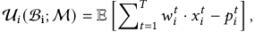

where the expectation is taken over the realization of advertisers’ initial valuations v_𝑡_ and refined valuations w_𝑡_ , the randomness of advertiser _𝑖_ ’s strategy B _𝑖_ in reporting initial bids _𝑣_ ˆ _𝑖__𝑡_and refined bids _𝑤_ ˆ _𝑖__𝑡_, and the randomness of mechanism M in selecting_𝑆𝑡_and imple- menting (x_𝑡_ _,_ p_𝑡_ ). Note that ( _𝑥𝑖__𝑡, 𝑝_ _𝑖__𝑡_) are random variables depending on the aforementioned randomness. 

_IC Properties of Dynamic Two-Stage Auction._ Due to intricate dynamics in repeated auctions, an exact non-trivial dynamic IC auction typically has complex allocation and payment rules [4], leading them inappropriate for ad auctions. Therefore, we turn to consider the _𝜖-approximate IC_ on time-averaged utility in an _ex-ante_ sense, defined asU_<u>𝑖</u>_<u>(</u>B _𝑇__<u>𝑖</u>_<u>;M)</u> −U_<u>𝑖</u>_<u>(</u>I _𝑇__<u>𝑖</u>_<u>;M)</u> ≤ _𝜖,_ ∀ _𝑖,_ B _𝑖, i.e._ , any dishonest strategy could not achieve an expected utility increase 

5759 

KDD ’26, August 09–13, 2026, Jeju Island, Republic of Korea 

Two-Stage Auctions with Bid Refinement for Online Advertising 

greater than _𝜖_ over truthful reporting in each time step. As we will see later, our auction could achieve _𝜖_ -approximate ex-ante IC, with _𝜖_ converging to 0 with the increase of time period length _𝑇_ . 

## **5.2 Realization-Dependent Entry Fee** 

To prevent chain misreporting in _𝑣𝑖_ and _𝑤𝑖_ , the platform has to charge an entry fee accounting for the overall uncertainty of potential _𝑤𝑖_ ∼ _𝐺𝑖_ (·| _𝑣𝑖_ ) and _𝑆_ ∼ _𝑦𝑆_ when only _𝑣𝑖_ is revealed, unavoidably breaking the ex-post IR condition. With the utilization of historical information across time, we will be able to relax the requirement on the entry fee to accounting only for a specific realization of _𝑤_ ˆ _𝑖_ and _𝑆_ . To distinguish with the entry fee _𝜏𝑖_ (vˆ) and _𝜏𝑖_ (vˆ _,_ wˆ − _𝑖_ ; _𝑆_ ) in static auctions, we use _𝜏_ ˆ _𝑖_ (vˆ _,_ wˆ ; _𝑆_ ) to denote such _realization-dependent_ entry fee rules in dynamic environment. Before presenting our design to realize this relaxation (Section 5.3), we first demonstrate the condition of _𝜏_ ˆ _𝑖_ to be feasible for our design, and provide two detailed ex-post IR entry fee rules as candidates for implementation. 

Formally speaking, we can design and implement any realizationdependent, non-negative entry fee rules _𝜏_ ˆ to be approximate twostage IC, as long as it satisfies the _aligning expectation_ condition 

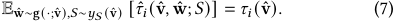

This aligning expectation condition arises as a natural relaxation of the static entry fee _𝜏𝑖_ (vˆ). Since _𝜏𝑖_ (vˆ) guarantees interim IR, once we relax it to be realization-dependent, finding such an ex-post IR entry fee rule for every realization should be flexible in principle. 

A simple yet effective way is to charge entry fee _proportional_ to the realized second-stage utility, _i.e._ , _𝑤_ ˆ _𝑖_ · _𝑥𝑖_ (vˆ _,_ wˆ ; _𝑆_ ) − _𝑝𝑖,_ 1 (vˆ _,_ wˆ ; _𝑆_ ), with a constant proportion determined by the static entry fee _𝜏𝑖_ (vˆ) and her expected utility _𝑈𝑖_ (vˆ; ˆ _𝑣𝑖_ ) in the static auction. Specifically, for the allocation with rank score setting, a convenient approach to charge entry fee is to leverage the classical concept of _quantile transformation_ in mechanism design [5, 17]. Given the c.d.f. of refined value _𝐺𝑖_ (·; _𝑣𝑖_ ), its quantile function _𝜙𝑖_ (·; _𝑣𝑖_ ) : [0 _,_ 1] →[0 _,_ _<u>𝑢</u>_ ] is defined as _𝜙𝑖_ ( _𝑞_ ; _𝑣𝑖_ ) = _𝐻_−1 ( _𝑞_ ), with _𝐻_ (·) = _𝐺𝑖_ (·; _𝑣𝑖_ ). That is, _𝜙𝑖_ maps a quantile in [0 _,_ 1] to the corresponding realization of _𝑤𝑖_ in the relative location of distribution _𝐺𝑖_ (·; _𝑣𝑖_ ). As the entry fee in Equation (13) charge the expected utility obtained by threshold initial value _𝑟𝑖,_ 0 (vˆ), we can simulate the virtual _𝑤_ ˜ _𝑖_ induced by _𝑟𝑖,_ 0 (vˆ) utilizing the quantile of realized _𝑤_ ˆ _𝑖_ induced by _𝑣_ ˆ _𝑖_ , _i.e._ , charging 

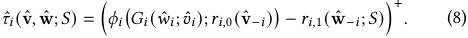

On the other hand, the standard single-stage payment here is _𝑝𝑖,_ 1 (vˆ _,_ wˆ ; _𝑆_ ) = _𝑟𝑖,_ 1 ( ˆw− _𝑖_ ; _𝑆_ ) · _𝑥𝑖_ (vˆ _,_ wˆ ; _𝑆_ ). Recall _𝑥𝑖_ (vˆ _,_ wˆ ; _𝑆_ ) = I{ _𝑤_ ˆ _𝑖_ ≥ _𝑟𝑖,_ 1 ( ˆw− _𝑖_ ; _𝑆_ )}, this gives the overall payment _𝑝_ ˆ _𝑖_ (vˆ _,_ wˆ ; _𝑆_ ) as 

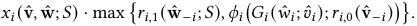

Since _𝜙𝑖_ � _𝐺𝑖_ ( _𝑤_ ˆ _𝑖_ ; ˆ _𝑣𝑖_ ); _𝑟𝑖,_ 0 (vˆ − _𝑖_ )� and _𝑤_ ˆ _𝑖_ has the same quantile in distribution _𝐺𝑖_ (·; _𝑟𝑖,_ 0 (vˆ − _𝑖_ )) and _𝐺𝑖_ (·; ˆ _𝑣𝑖_ ) respectively, we also have _𝜙𝑖_ � _𝐺𝑖_ ( _𝑤_ ˆ _𝑖_ ; ˆ _𝑣𝑖_ ); _𝑟𝑖,_ 0 (vˆ − _𝑖_ )� ≤ _𝑤_ ˆ _𝑖_ . As _𝑟𝑖,_ 1 ( ˆw− _𝑖_ ; _𝑆_ ) represents the standard single-stage winning payment, this format aligns with the established _reserve price_ scheme in ad auctions [30, 35], despite the dependence of this new “reserve price” _𝜙𝑖_ � _𝐺𝑖_ ( _𝑤_ ˆ _𝑖_ ; ˆ _𝑣𝑖_ ); _𝑟𝑖,_ 0 (vˆ − _𝑖_ )� on _𝑤_ ˆ _𝑖_ , providing a convenient approach for implementation. 

### **Algorithm 1:** Two-Stage Auction with Discounts 

||**Input:**The bids profile(ˆv_𝑡__,_ ˆw_𝑡_)_𝑡_∈[_𝑇_] **Parameter:**A two-stage monotone allocation rule(_𝑦𝑆,𝑥_), a non-negative, expectation-aligning and ex-post IR entry fee rule ˆ_𝜏_, discount proportion_𝑘𝑖_and tolerance parameter_𝜖𝑖_|
|---|---|
||**Output:**Auction outcomes (x_𝑡__,_p_𝑡_)_𝑡_∈[_𝑇_]|
|**1**|Compute _𝜏𝑖_=Ev∼F[_𝜏𝑖_(v)]_,_∀_𝑖_;|
|**2**|Initialize_𝐿𝑖_=_𝑘𝑖𝑇_· _𝜏𝑖_+_𝜖𝑖_and_𝑑𝑖_=0 for each bidder_𝑖_;|
|**3**|Initialize the active bidder set_𝐴_0 =[_𝑛_];|
|**4 **|**for**_𝑡_=1_,_2_, . . . ,𝑇_**do**|
|**5**|Set_𝐴__𝑡_=_𝐴__𝑡_−1;|
|**6**|Get the initial bids profile ˆv_𝑡_from bidders;|
|**7**|For each bidder_𝑖_∉_𝐴__𝑡_−1, sample ˆ_𝑣__𝑡_ _𝑖_∼_𝑓𝑖_to replace her original ˆ_𝑣__𝑡_ _𝑖_;|
|**8**|Determine the entering bidder subset by_𝑆__𝑡_∼_𝑦𝑆_(ˆv_𝑡_);|
|**9**|Get the refined bids profile ˆw_𝑡_from bidders;|
|**10**|For each bidder_𝑖_∉_𝐴__𝑡_−1 and_𝑖_∈_𝑆__𝑡_, sample ˆ_𝑤__𝑡_ _𝑖_∼_𝑔𝑖_(·; ˆ_𝑣𝑡_ _𝑖_) to replace her original ˆ_𝑤𝑡_ _𝑖_;|
|**11**|**for**_each bidder 𝑖_∈_𝐴__𝑡_−1 **do**|
|**12**|Update_𝑑𝑖_=_𝑑𝑖_+_𝜏𝑖_(ˆv_𝑡_) −(1−_𝑘𝑖_) · ˆ_𝜏𝑖_(ˆv_𝑡__,_ ˆw_𝑡_;_𝑆__𝑡_);|
|**13**|Compute_𝑝__𝑡_ _𝑖,_1 = ∫ˆ_𝑤𝑡_ _𝑖_ 0 ˜_𝑤𝑖_· _𝜕𝑥𝑖_(ˆv_𝑡__,_ ˜_𝑤𝑖,_ˆw_𝑡_ −_𝑖_;_𝑆𝑡_) _𝜕_˜_𝑤𝑖_ _𝑑_˜_𝑤𝑖_;|
|**14**|Assign_𝑝__𝑡_ _𝑖_= (1 −_𝑘𝑖_) · ˆ_𝜏𝑖_(ˆv_𝑡,_ ˆw_𝑡_;_𝑆𝑡_) +_𝑝𝑡_ _𝑖,_1;|
|**15**|**if**_𝑑𝑖> 𝐿𝑖_**then**|
|**16**|Update_𝐴__𝑡_=_𝐴__𝑡_\{_𝑖_};|
|**17**|Assignx_𝑡_= �_𝑥𝑖_(ˆv_𝑡__,_ ˆw_𝑡_;_𝑆__𝑡_)� _𝑖_∈[_𝑛_], and replace_𝑥𝑡_ _𝑖_by _𝑥𝑖_(0_,_ˆv_𝑡_ −_𝑖__,_ 0_,_ ˆw_𝑡_ −_𝑖_;_𝑆𝑡_) for_𝑖_∉_𝐴𝑡_−1;|
|**18**|Assign_𝑝__𝑡_ _𝑖_= 0 for_𝑖_∉_𝐴𝑡_−1;|
|**19**|Implement (x_𝑡__,_p_𝑡_) for period_𝑡_.|

Theorem 5.1. _Given any two-stage monotone allocation rule_ ( _𝑦𝑆,𝑥_ ) _, the following realization-dependent entry fee rules satisfy the aligning expectation and ex-post IR condition._ 

- _(Proportional Entry Fee) For general setting, let 𝜂_ = _𝑈𝑖_ (vˆ;ˆ _𝜏𝑣𝑖𝑖_ <u>()+vˆ )</u> _𝜏𝑖_ (vˆ )_,_ _charge entry fee 𝜏_ ˆ _𝑖_ (vˆ _,_ wˆ ; _𝑆_ ) = _𝜂_ ·� _𝑤_ ˆ _𝑖_ · _𝑥𝑖_ (vˆ _,_ wˆ ; _𝑆_ ) − _𝑝𝑖,_ 1 (vˆ _,_ wˆ ; _𝑆_ )� _, where 𝑈𝑖_ (vˆ; ˆ _𝑣𝑖_ ) _, 𝜏𝑖_ (vˆ) _are defined by_ ( _𝑦𝑆,𝑥_ ) _as in Theorem 4.1._ 

- _(Quantile-Based Entry Fee) In the allocation with rank scores setting, charge the entry fee 𝜏_ ˆ _𝑖_ (vˆ _,_ wˆ ; _𝑆_ ) _according to Equation (8)_3 _for 𝑖_ ∈ _𝑆, and charge_ 0 _for 𝑖_ ∉ _𝑆._ 

## **5.3 Auction Design with Discounts in Entry Fees** 

_5.3.1 Discounts in Entry Fees._ When promoting two-stage auctions, even if ex-post IR is guaranteed under a realization-dependent entry fee, advertisers may take issue with incurring an additional expense of entry fees, despite its necessity to elicit true values and boost social welfare in static two-stage auctions. This motivates us to provide discounts on entry fees based on the platform’s choices. Since an ad platform may prefer to strike a balance between advertiser satisfaction and platform revenue, we introduce 

> 3The formula assumes atomless conditional distributions. When atoms exist, the same argument can be recovered by using standard randomized quantile within each atom. 

5760 

KDD ’26, August 09–13, 2026, Jeju Island, Republic of Korea 

Yidan Xing et al. 

a parameter _𝑘𝑖_ to regulate the proportion of discounts offered to advertiser _𝑖_ . With _𝑘𝑖_ = 0, no discount is provided, and the auction charges the full (realization-dependent) entry fee defined by the platform; conversely, when _𝑘𝑖_ = 1, a full discount is provided to advertiser _𝑖_ , such that she does not pay any entry fee. The theoretical guarantee of our design, _i.e._ , ex-post IR and approximate two-stage IC, holds for arbitrary _𝑘𝑖_ ∈[0 _,_ 1], including (1) charging the full realization-dependent entry fee ( _𝑘𝑖_ = 0) by, for example, setting quantile-based reserve price in allocation with rank score (Theorem 5.1); and (2) eliminating entry fees ( _𝑘𝑖_ = 1) and preserving the standard single-stage payment format. 

_5.3.2 Auction Procedure and Analysis._ The design of our auction is inspired by the non-monetary artificial currency mechanism [14]. The formal process of our auction is presented in Algorithm 1. The platform still implements the two-stage allocation rule in each time period (Line 8 and 17). Besides the standard single-stage payment _𝑝𝑖,_ 1 (Line 13), we also charge the realization-dependent entry fee scaled by the discount parameter, _i.e._ , (1 − _𝑘𝑖_ ) · _𝜏_ ˆ _𝑖_ (vˆ _,_ wˆ ; _𝑆__𝑡_ ) (Line 14). As we deviate from the static entry fee _𝜏𝑖_ (vˆ), the original IC guarantee (Theorem 4.1) for each time period no longer holds. Since the entry fee now depends on reported _𝑤_ ˆ _𝑖_ , bidders can deliberately report a lower refined bid to reduce the entry fee in _𝜏_ ˆ _𝑖_ (vˆ _,_ wˆ ; _𝑆__𝑡_ ). Even if we adopt _𝜏_ ˆ _𝑖_ (vˆ _,_ wˆ ; _𝑆__𝑡_ ) = _𝜏𝑖_ (vˆ), the provided discount _𝑘𝑖_ still leaves room for bidders to report higher initial bids _𝑣_ ˆ _𝑖_ . 

To avoid advertisers exploiting these beneficial designs, we endow each advertiser with a discount upper limit _𝐿𝑖_ , such that an advertiser would be excluded from the auctions when her consumed discounts, denoted by _𝑑𝑖_ , exceed _𝐿𝑖_ (Line 15-16). We compute _𝑑𝑖_ as the difference between the static two-stage IC entry fee should have been charged, _i.e._ , _𝜏𝑖_ (vˆ), and the actual amount of charged entry fees, _i.e._ , (1− _𝑘𝑖_ )· ˆ _𝜏𝑖_ (vˆ _,_ wˆ ; _𝑆__𝑡_ ) (Line 12). Correspondingly, we set the upper limit _𝐿𝑖_ according to the expectation of consumed discounts under prior distribution (Line 1-2), where we define _<u>𝜏𝑖</u>_ = Ev∼F [ _𝜏𝑖_ (v)] according to Equation (4), and _𝜖𝑖_ is a parameter controlling the tolerance of out-of-distribution realization. As a technical detail, we replace the bids of excluded advertisers with sampled ones to preserve properties of the static auction in analysis (Line 7 and 10). 

The intuition behind setting a discount upper limit _𝐿𝑖_ is as follows. For a truthful bidder _𝑖_ , her expected allocation under Algorithm 1 remains the same as in the static two-stage auction, provided that _𝐿𝑖_ is not exhausted. As the expected total discount consumed by a truthful strategy I _𝑖_ over _𝑇_ rounds is _𝑇_ · _𝑘𝑖𝜏𝑖_ (by aligning expectation condition of _𝜏_ ˆ _𝑖_ ), the probability that this consumption exceeds _𝐿𝑖_ is upper bounded by Hoeffding inequality, thus limiting the risk of mistakenly exclude truthful bidders. Conversely, the additional discounts a dishonest advertiser can exploit are bounded by a tolerance parameter _𝜖𝑖_ . This setup introduces a tradeoff: selecting _𝜖𝑖_ involves balancing the upper bound of dishonest utility increment against the risk of false penalties for truthful bidders. A larger _𝜖𝑖_ reduces false exclusion risks but weakens approximate IC. 

Theorem 5.2. _For any auction mechanism_ M _𝑑 defined by Algorithm 1, supposing all the other advertisers report truthfully, the time-averaged utility increment of any potential strategy_ B _𝑖 compared with the truthful strategy_ I _𝑖 is upper bounded by_ 2 _<u>𝑢</u>_ <u>√ ln</u> _𝑇𝑇_+<u>2</u> _𝑇𝑢_ 

_under choice of 𝜖𝑖_ = 2 _<u>𝑢</u>_ ~~<u>√</u>~~ _𝑇_ ln _𝑇 . Moreover, the probability that a truthful strategy would lead advertiser 𝑖 to be mistakenly excluded from auctions,_ i.e. _, 𝑖_ ∉ _𝐴__𝑇_ _, is upper bounded by 𝑇_−1 _._ 

Theorem 5.2 implies our auction satisfies an _𝜖_ -approximate exante IC condition with _𝜖_ → 0 as _𝑇_ →∞. To implement Algorithm 1, the platform only needs to track each bidder’s discount consumption _𝑑𝑖_ and exclude them if _𝑑𝑖_ exceeds _𝐿𝑖_ . Since the computation of discount consumption is a simple arithmetic based on static and realization-dependent entry fees (Line 12), its implementation is straightforward. In the case of full discounting ( _𝑘𝑖_ = 1), initial bids serve solely as a reference for the platform to select the entering bidder subset, yet our design of _𝐿𝑖_ ensures incentive alignment and prevents overbidding in the pre-auction stage. 

## **6 Related Work** 

As the auction design for the formal auctions has been extensively studied, previous work on two-stage ad auctions focuses on designing the bidder subset selection rule with two major information acquisition settings. In the first setting, the information augmented in the formal auction is the refined estimation of CTR, while advertisers retain the same private valuations across two stages. Both deep learning methods [36, 40] and theory-based method [12, 13] have been proposed to select a bidder subset with higher expected social welfare, while guaranteeing the IC conditions. An online learning variant has also been studied [24]. In the second setting, advertisers learn their valuations only after entering the formal auction stage, and the platform needs to select the bidder subset based on their prior distributions [3, 15]. In contrast, we consider a scenario where advertisers have different valuations across two stages, which better outlines the change in advertiser valuations. 

While economics literature has studied similar settings where bidders could learn additional signals to refine their valuations in a two-stage auction [11, 38], our focus and characterization results are distinct. The line of work on indicative bidding [22, 32, 38] examines this setting due to the high cost incurred by learning the value of an item in high-value asset sales. They assume the second stage of the auction to be fixed as standard auctions ( _e.g._ , secondprice auction), and mainly focus on the equilibrium properties for different auction formats in the first stage. Another related line of work investigates how the auctioneer could maximize profits by disclosing additional signals to bidders and enabling them to update valuations [11, 25, 27]. Despite the structural similarities between their expected revenue results and our Theorem 4.3, they concentrate on the specific revenue-maximizing auction, while our results in Section 4 provide a general reduction to construct twostage IC auctions with a different IC concept for online ad auctions. 

Our objective of reducing entry fees induced by IC conditions aligns with the broader principles of non-monetary mechanism design [2, 8, 14, 16, 21]. The phenomenon of impossibility to achieve ex-post IR is also discovered in a cost-per-action auction setting [34]. In particular, we adapt the idea of the artificial currency mechanism [14] to provide discounts in entry fees of two-stage auctions. 

## **7 Conclusion** 

In this work, we consider an auction model in which bidder valuations change across two stages. Motivated by industry practice 

5761 

KDD ’26, August 09–13, 2026, Jeju Island, Republic of Korea 

Two-Stage Auctions with Bid Refinement for Online Advertising 

in online advertising, we study the design of two-stage incentivecompatible auctions that allow bidders to submit and refine their bids. We characterize feasible payment rules to truthfully implement any two-stage monotone allocation rule, and analyze its revenue and IR properties. As the payment in two-stage IC auctions features an additional entry fee, general two-stage IC auctions fail to satisfy ex-post IR. Towards this limitation, we propose a dynamic two-stage auction with flexible discounts in entry fees. Our mechanism allows realization-dependent entry fee, and can achieve approximate ex-ante two-stage IC and ex-post IR with the payment format of single-stage auctions when full discount is applied. 

This work presents the formal game-theoretical analysis of twostage auctions with bid refinement in online advertising. Our findings highlight the importance of entry fees in preventing strategic misreporting, and demonstrate the feasibility of using discount upper bounds as an alternative to regulate advertiser behavior in bid refinement. Moving forward, we aim to leverage these theoretical insights to bridge the gap towards the practical deployment of two-stage auctions in large-scale ad systems. 

## **Acknowledgement** 

This work was supported in part by China NSF grant No. 62322206, 62132018, 62025204, U2268204, 62272307, 62372296, in part by Alibaba Group through Alibaba Innovative Research Program. The opinions, findings, conclusions, and recommendations expressed in this paper are those of the authors and do not necessarily reflect the views of the funding agencies or the government. 

## **References** 

- [1] Gagan Aggarwal, Ashwinkumar Badanidiyuru, and Aranyak Mehta. 2019. Autobidding with constraints. In _Proceedings of the 15th International Conference on Web and Internet Economics_ . Springer, 17–30. 

- [2] Santiago R Balseiro, Huseyin Gurkan, and Peng Sun. 2019. Multiagent mechanism design without money. _Operations Research_ 67, 5 (2019), 1417–1436. 

- [3] Xiaohui Bei, Nick Gravin, Pinyan Lu, and Zhihao Gavin Tang. 2023. Bidder subset selection problem in auction design. In _Proceedings of the 2023 Annual ACM-SIAM Symposium on Discrete Algorithms_ . SIAM, 3788–3801. 

- [4] Dirk Bergemann and Juuso Välimäki. 2019. Dynamic mechanism design: An introduction. _Journal of Economic Literature_ 57, 2 (2019), 235–274. 

- [5] Jeremy Bulow and Paul Klemperer. 1996. Auctions versus Negotiations. _American Economic Review_ 86, 1 (1996), 180–194. 

- [6] Leng Cai, Junxuan He, Yikai Li, Junjie Liang, Yuanping Lin, Ziming Quan, Yawen Zeng, and Jin Xu. 2025. RTBAgent: A LLM-based agent system for real-time bidding. In _Companion Proceedings of the ACM on Web Conference 2025_ . 104–113. 

- [7] Paul Covington, Jay Adams, and Emre Sargin. 2016. Deep neural networks for Youtube Recommendations. In _Proceedings of the 10th ACM conference on recommender systems_ . 191–198. 

- [8] Yan Dai, Moïse Blanchard, and Patrick Jaillet. 2025. Non-monetary mechanism design without distributional information: Using scarce audits wisely. _arXiv preprint arXiv:2502.08412_ (2025). 

- [9] Darinka Dentcheva and Andrzej Ruszczynski. 2003. Optimization with stochastic dominance constraints. _SIAM Journal on Optimization_ 14, 2 (2003), 548–566. 

- [10] Chantat Eksombatchai, Pranav Jindal, Jerry Zitao Liu, Yuchen Liu, Rahul Sharma, Charles Sugnet, Mark Ulrich, and Jure Leskovec. 2018. Pixie: A system for recommending 3+ billion items to 200+ million users in real-time. In _Proceedings of the 2018 World Wide Web Conference_ . 1775–1784. 

- [11] Péter Eső and Balazs Szentes. 2007. Optimal information disclosure in auctions and the handicap auction. _The Review of Economic Studies_ 74, 3 (2007), 705–731. 

- [12] Zhikang Fan, Lan Hu, Ruirui Wang, Zhongrui Ma, Yue Wang, Ye Qi, and Weiran Shen. 2025. Two-stage auction design in online advertising. In _Proceedings of the ACM Web Conference 2025_ . 

- [13] Gagan Goel, Renato Paes Leme, Jon Schneider, David Thompson, and Hanrui Zhang. 2023. Eligibility mechanisms: Auctions meet information retrieval. In _Proceedings of the ACM Web Conference 2023_ . 3541–3549. 

- [14] Artur Gorokh, Siddhartha Banerjee, and Krishnamurthy Iyer. 2021. From monetary to nonmonetary mechanism design via artificial currencies. _Mathematics of Operations Research_ 46, 3 (2021), 835–855. 

- [15] Nikolai Gravin, Yixuan Even Xu, and Renfei Zhou. 2024. Bidder selection problem in position auctions: A fast and simple algorithm via poisson approximation. In _Proceedings of the ACM Web Conference 2024_ . 89–98. 

- [16] Mingyu Guo, Vincent Conitzer, and Daniel M Reeves. 2009. Competitive repeated allocation without payments. In _International Workshop on Internet and Network Economics_ . Springer, 244–255. 

- [17] Jason D Hartline. 2013. _Mechanism design and approximation_ . Chapter 3. 

- [18] Xinran He, Junfeng Pan, Ou Jin, Tianbing Xu, Bo Liu, Tao Xu, Yanxin Shi, Antoine Atallah, Ralf Herbrich, Stuart Bowers, and Joaquin Quiñonero Candela. 2014. Practical lessons from predicting clicks on ads at facebook. In _Proceedings of the 8th International Workshop on Data Mining for Online Advertising_ . 1–9. 

- [19] Yue He, Xiujun Chen, Di Wu, Junwei Pan, Qing Tan, Chuan Yu, Jian Xu, and Xiaoqiang Zhu. 2021. A unified solution to constrained bidding in online display advertising. In _Proceedings of the 27th ACM SIGKDD Conference on Knowledge Discovery and Data Mining_ . ACM, 2993–3001. 

- [20] Jiri Hron, Karl Krauth, Michael Jordan, and Niki Kilbertus. 2021. On component interactions in two-stage recommender systems. _Proceedings of the 35th International Conference on Neural Information Processing Systems_ 34 (2021), 2744–2757. 

- [21] Matthew O Jackson and Hugo F Sonnenschein. 2007. Overcoming incentive constraints by linking decisions 1. _Econometrica_ 75, 1 (2007), 241–257. 

- [22] John Kagel, Svetlana Pevnitskaya, and Lixin Ye. 2008. Indicative bidding: An experimental analysis. _Games and Economic Behavior_ 62, 2 (2008), 697–721. 

- [23] Sébastien Lahaie and David M Pennock. 2007. Revenue analysis of a family of ranking rules for keyword auctions. In _Proceedings of the 8th ACM conference on Electronic Commerce_ . 50–56. 

- [24] Haoming Li, Yumou Liu, Zhenzhe Zheng, Zhilin Zhang, Jian Xu, and Fan Wu. 2024. Truthful bandit mechanisms for repeated two-stage ad auctions. In _Proceedings of the 30th ACM SIGKDD Conference on Knowledge Discovery and Data Mining_ . 1565–1575. 

- [25] Hao Li and Xianwen Shi. 2017. Discriminatory Information Disclosure. _American Economic Review_ 107, 11 (November 2017), 3363–85. 

- [26] Xiangyu Liu, Chuan Yu, Zhilin Zhang, Zhenzhe Zheng, Yu Rong, Hongtao Lv, Da Huo, Yiqing Wang, Dagui Chen, Jian Xu, et al. 2021. Neural auction: End-toend learning of auction mechanisms for e-commerce advertising. In _Proceedings of the 27th ACM SIGKDD Conference on Knowledge Discovery & Data Mining_ . 3354–3364. 

- [27] Jingfeng Lu, Lixin Ye, and Xin Feng. 2021. Orchestrating information acquisition. _American Economic Journal: Microeconomics_ 13, 4 (2021), 420–465. 

- [28] Xiao Ma, Liqin Zhao, Guan Huang, Zhi Wang, Zelin Hu, Xiaoqiang Zhu, and Kun Gai. 2018. Entire space multi-task model: An effective approach for estimating post-click conversion rate. In _Proceedings of the 41st International ACM SIGIR Conference on Research & Development in Information Retrieval_ . 1137–1140. 

- [29] Roger B Myerson. 1981. Optimal auction design. _Mathematics of Operations Research_ 6, 1 (1981), 58–73. 

- [30] Michael Ostrovsky and Michael Schwarz. 2023. Reserve prices in internet advertising auctions: A field experiment. _Journal of Political Economy_ 131, 12 (2023), 3352–3376. 

- [31] Weitong Ou, Bo Chen, Xinyi Dai, Weinan Zhang, Weiwen Liu, Ruiming Tang, and Yong Yu. 2023. A survey on bid optimization in real-time bidding display advertising. _ACM Transactions on Knowledge Discovery from Data_ 18, 3 (2023), 1–31. 

- [32] Daniel Quint and Kenneth Hendricks. 2018. A theory of indicative bidding. _American Economic Journal: Microeconomics_ 10, 2 (2018), 118–151. 

- [33] Ben Roberts, Dinan Gunawardena, Ian A Kash, and Peter Key. 2016. Ranking and tradeoffs in sponsored search auctions. _ACM Transactions on Economics and Computation (TEAC)_ 4, 3 (2016), 1–21. 

- [34] Weiran Shen, Zihe Wang, and Song Zuo. 2018. Ex-post IR dynamic auctions with cost-per-action payments. In _Proceedings of the 27th International Joint Conference on Artificial Intelligence_ . 505–511. 

- [35] David RM Thompson and Kevin Leyton-Brown. 2013. Revenue optimization in the generalized second-price auction. In _Proceedings of the 14th ACM Conference on Electronic Commerce_ . 837–852. 

- [36] Yiqing Wang, Xiangyu Liu, Zhenzhe Zheng, Zhilin Zhang, Miao Xu, Chuan Yu, and Fan Wu. 2022. On designing a two-stage auction for online advertising. In _Proceedings of the ACM Web Conference 2022_ . 90–99. 

- [37] Xun Yang, Yasong Li, Hao Wang, Di Wu, Qing Tan, Jian Xu, and Kun Gai. 2019. Bid optimization by multivariable control in display Advertising. In _Proceedings of the 25th ACM SIGKDD International Conference on Knowledge Discovery and Data Mining_ . ACM, 1966–1974. 

- [38] Lixin Ye. 2007. Indicative bidding and a theory of two-stage auctions. _Games and Economic Behavior_ 58, 1 (2007), 181–207. 

- [39] Weinan Zhang, Shuai Yuan, and Jun Wang. 2014. Optimal real-time bidding for display advertising. In _Proceedings of the 20th ACM SIGKDD International Conference on Knowledge Discovery and Data Mining_ . ACM, 1077–1086. 

- [40] Zhishan Zhao, Jingyue Gao, Yu Zhang, Shuguang Han, Siyuan Lou, Xiang-Rong Sheng, Zhe Wang, Han Zhu, Yuning Jiang, Jian Xu, et al. 2023. COPR: Consistencyoriented pre-Ranking for online advertising. In _Proceedings of the 32nd ACM International Conference on Information and Knowledge Management_ . 4974–4980. 

5762 

KDD ’26, August 09–13, 2026, Jeju Island, Republic of Korea 

Yidan Xing et al. 

- [41] Guorui Zhou, Xiaoqiang Zhu, Chenru Song, Ying Fan, Han Zhu, Xiao Ma, Yanghui Yan, Junqi Jin, Han Li, and Kun Gai. 2018. Deep interest network for click-through rate prediction. In _Proceedings of the 24th ACM SIGKDD international conference on knowledge discovery & data mining_ . 1059–1068. 

## **A Missing Proofs** 

## **A.1 Proof of Theorem 4.1** 

_Part 1. Characterization of Payment Rule._ Fixing vˆ and _𝑆_ , the expost IC condition for the formal auction stage is equivalent to the classical IC conditions for single-item auctions. By Myerson’s seminal result [29], following conditions are necessary and sufficient to guarantee the IC conditions for the formal auction stage: ∀vˆ _,𝑆_ , (1) _𝑥𝑖_ (vˆ _,_ wˆ ; _𝑆_ ) is non-decreasing in _𝑤_ ˆ _𝑖_ ; and (2) the payment satisfies _𝑝𝑖_ (vˆ _,_ wˆ ; _𝑆_ ) = ∫0 _𝑤_ ˆ _𝑖 𝑤_ ˜ _𝑖_ ·_𝜕𝑥𝑖_<u>(vˆ</u>_<u>,𝑤</u>_ _𝜕_˜ _𝑤__<u>𝑖</u>_ ˜_<u>,</u>_ _𝑖_ˆw−_<u>𝑖</u>_<u>;</u>_𝑆_<u>)</u> d _𝑤_ ˜ _𝑖_ + _𝑝𝑖_ (vˆ _,_ 0 _,_ wˆ − _𝑖_ ; _𝑆_ ) _,_ with _𝑢𝑖_ (vˆ _,_ w; _𝑤𝑖,𝑆_ ) = ∫0 _𝑤𝑖 𝑥𝑖_ (vˆ _, 𝑤_ ˜ _𝑖,_ w− _𝑖_ ; _𝑆_ ) d ˜ _𝑤𝑖_ − _𝑝𝑖_ (vˆ _,_ 0 _,_ w− _𝑖_ ; _𝑆_ ) _._ Then, the expected utility _𝑈𝑖_ (vˆ; _𝑣𝑖_ ) equals 

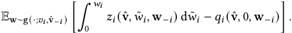

To satisfy the interim IC conditions in the pre-auction stage for advertiser _𝑖_ , considering the true initial valuation to be _𝑣𝑖_ and the strategy to misreport _𝑣_ ˆ _𝑖_ , we require 

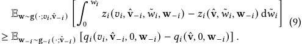

On the other hand, considering the true initial valuation to be _𝑣_ ˆ _𝑖_ and the strategy to misreport _𝑣𝑖_ , we require 

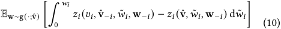

≤ Ew− _𝑖_ ∼g− _𝑖_ (·;ˆv− _𝑖_ ) [ _𝑞𝑖_ ( _𝑣𝑖,_ ˆv− _𝑖,_ 0 _,_ w− _𝑖_ ) − _𝑞𝑖_ (vˆ _,_ 0 _,_ w− _𝑖_ )] _._ Combining them and taking _𝑣_ ˆ _𝑖_ → _𝑣𝑖_+, we have 

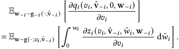

Considering that _𝑞𝑖_ (0 _,_ ˆv− _𝑖,_ 0 _,_ w− _𝑖_ ) = 0 and integrating over _𝑣𝑖_ , we then have 

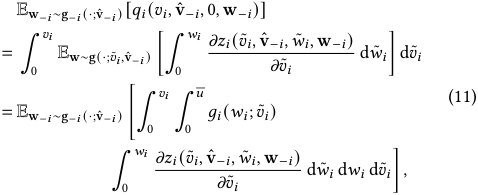

which could be further simplified to the expression in the statement of Theorem 3. Here, we utilize the transformation 

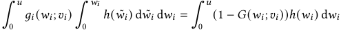

for c.d.f. _𝐺_ (·; _𝑣𝑖_ ). Since an advertiser evaluates the auction outcomes from an interim perspective in the pre-auction stage, any design 

of _𝑞𝑖_ ( _𝑣𝑖,_ ˆv− _𝑖,_ 0 _,_ w− _𝑖_ ) satisfying Equation (11) are equivalent for twostage IC conditions. Our payment rule in Theorem 4.1 assigns the payment _𝑝𝑖_ ( _𝑣𝑖,_ ˆv− _𝑖,_ 0 _,_ w− _𝑖_ ; _𝑆_ ) to be the same for any _𝑆_ and w− _𝑖_ . 

_Part 2. Investigate Feasible Allocation Rule._ Substituting the payment rule back to Inequality (9), we require 

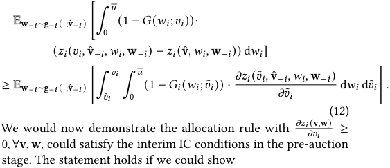

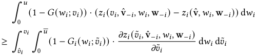

for any _𝑣𝑖_ , vˆ and w− _𝑖_ . By first-order stochastic dominance of _𝐺𝑖_ , if _𝑣_ ˆ _𝑖 < 𝑣𝑖_ , then _𝐺𝑖_ ( _𝑤𝑖_ ; ˆ _𝑣𝑖_ ) ≥ _𝐺𝑖_ ( _𝑤𝑖_ ; ˜ _𝑣𝑖_ ) ≥ _𝐺𝑖_ ( _𝑤𝑖_ ; _𝑣𝑖_ ) for _𝑣_ ˜ _𝑖_ ∈[ _𝑣_ ˆ _𝑖, 𝑣𝑖_ ] given fixed _𝑤𝑖_ . Therefore, applying 1 − _𝐺𝑖_ ( _𝑤𝑖_ ; ˜ _𝑣𝑖_ ) ≤ 1 − _𝐺𝑖_ ( _𝑤𝑖_ ; _𝑣𝑖_ ) proves the statement. The case for _𝑣_ ˆ _𝑖 > 𝑣𝑖_ holds similarly. 

_Part 3. Verification of Interim IR._ With expectation of terms _𝑞𝑖_ (vˆ _,_ 0 _,_ w− _𝑖_ ) specified in Equation (11), _𝑈𝑖_ ( _𝑣𝑖,_ ˆv− _𝑖_ ; _𝑣𝑖_ ) could be represented as 

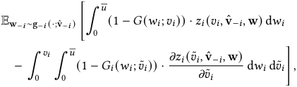

which is non-negative by the monotonicity of _𝐺_ ( _𝑤𝑖_ ; ·). 

## **A.2 Proof of Proposition 4.2** 

Proof. We apply the Lebesgue–Stieltjes version of Theorem 4.1. **Case 1:** _𝑖_ ∉ _𝑆_(_𝑘_) (vˆ), _i.e._ , advertiser _𝑖_ has _ℎ𝑖,_ 0 ( _𝑣_ ˆ _𝑖_ ) _< ℎ_ −(_𝑘_ _𝑖,_) 0(vˆ−_𝑖_) and does not enter the formal auction stage. By the non-decreasing property of _ℎ𝑖,_ 0, the advertiser has no chance to enter the formal auction with any _𝑣_ ˜ _𝑖_ ≤ _𝑣_ ˆ _𝑖_ ; therefore, _𝑧𝑖_ ( ˜ _𝑣𝑖,_ ˆv− _𝑖,𝑤𝑖,_ w− _𝑖_ ) always keep 0 for _𝑣_ ˜ _𝑖_ ≤ _𝑣_ ˆ _𝑖_ , leading Equation (4) and total payment to be 0. **Case 2:** _𝑖_ ∈ _𝑆_(_𝑘_) (vˆ), _i.e._ , advertiser _𝑖_ has _ℎ𝑖,_ 0 ( _𝑣_ ˆ _𝑖_ ) ≥ _ℎ_ −(_𝑘_ _𝑖,_) 0(vˆ−_𝑖_) and enters the formal auction stage. As the rank scores in two stages are independent, we can omit the influence of _𝑣_ ˆ _𝑖_ on _𝑥𝑖_ given _𝑆_(_𝑘_) . As _𝑧𝑖_ ( ˜ _𝑣𝑖,_ ˆv− _𝑖,𝑤𝑖,_ w− _𝑖_ ) =� _𝑆_ ⊆[ _𝑛_ ]_𝑦_ _𝑆_( ˜_𝑣_ _𝑖__,_ˆv − _𝑖_) ·_𝑥_ _𝑖_( ˜_𝑣_ _𝑖__,_ˆv − _𝑖__,_w;_𝑆_), which may jump from 0 to I{ _𝑤𝑖_ ≥ _𝑟𝑖,_ 1 (w− _𝑖_ ; _𝑆_ )} only when _𝑣_ ˜ _𝑖_ = _𝑟𝑖,_ 0 (vˆ − _𝑖_ ) for _𝑆_ = _𝑆_(_𝑘_) (vˆ), _𝜏𝑖_ (vˆ) in Equation (4) is equal to the expectation of 

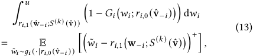

over the randomness of w− _𝑖_ ∼ g(·; ˆv− _𝑖_ ). As _𝑦𝑆_ is deterministic, our entry fee rule is equivalent to _𝜏𝑖_ (vˆ) in expectation. □ 

5763 

KDD ’26, August 09–13, 2026, Jeju Island, Republic of Korea 

Two-Stage Auctions with Bid Refinement for Online Advertising 

## **A.3 Proof of Theorem 4.3** 

|Proof. The first part of revenue on the entry fee from_𝑖_is|
|---|

|∫ v f(v) ∫ w g(w;v) ·_𝑞𝑖_(v_,_0_,_w−_𝑖_)dwdv = ∫ v f(v) ∫ w−_𝑖_ g−_𝑖_(w−_𝑖_;v−_𝑖_) ∫_𝑣𝑖_ 0 ∫+∞ 0 (1−_𝐺𝑖_(_𝑤𝑖_; ˜_𝑣𝑖_))· _𝜕𝑧𝑖_(˜_𝑣𝑖,_v−_𝑖,𝑤𝑖,_w−_𝑖_) _𝜕_˜_𝑣𝑖_ d_𝑤𝑖_d˜_𝑣𝑖_dw−_𝑖_dv (14)|
|---|
|= ∫ v−_𝑖_ f−_𝑖_(v−_𝑖_) ∫ w−_𝑖_ g−_𝑖_(w−_𝑖_;v−_𝑖_) ∫+∞ 0 ∫+∞ 0 (1−_𝐹𝑖_(_𝑣𝑖_))·|
|(1−_𝐺𝑖_(_𝑤𝑖_;_𝑣𝑖_)) · _𝜕𝑧𝑖_(_𝑣𝑖,_ v−_𝑖,𝑤𝑖,_ w−_𝑖_) _𝜕𝑣𝑖_ d_𝑤𝑖_d_𝑣𝑖_dw−_𝑖_dv−_𝑖._|

|Denote the c.d.f. of variable _𝜖𝑖_as _𝐻𝑖_. By the additive noise|
|---|
|assumption, we have _𝐺𝑖_(_𝑤𝑖_;_𝑣𝑖_) = _𝐻𝑖_(_𝑤𝑖_−_𝑣𝑖_), which indicates _𝜕𝐺𝑖_(_𝑤𝑖_;_𝑣𝑖_) _𝜕𝑣𝑖_ =−_𝑔𝑖_(_𝑤𝑖_;_𝑣𝑖_). Applying integration by parts, we have|

|∫+∞ 0 (1−_𝐹𝑖_(_𝑣𝑖_)) · (1−_𝐺𝑖_(_𝑤𝑖_;_𝑣𝑖_)) · _𝜕𝑧𝑖_(_𝑣𝑖,_ v−_𝑖,𝑤𝑖,_ w−_𝑖_) _𝜕𝑣𝑖_ d_𝑣𝑖_|
|---|
|=(1−_𝐹𝑖_(_𝑣𝑖_)) · (1−_𝐺𝑖_(_𝑤𝑖_;_𝑣𝑖_)) ·_𝑧𝑖_(_𝑣𝑖,_v−_𝑖,𝑤𝑖,_w−_𝑖_)|+∞ _𝑣𝑖_=0|
|− ∫+∞ 0 [_𝑔𝑖_(_𝑤𝑖_;_𝑣𝑖_) · (1−_𝐹𝑖_(_𝑣𝑖_)) −_𝑓𝑖_(_𝑣𝑖_) · (1−_𝐺𝑖_(_𝑤𝑖_;_𝑣𝑖_))] ·_𝑧𝑖_(_𝑣𝑖,_v−_𝑖,𝑤𝑖,_w−_𝑖_)d_𝑣𝑖_|

|By our assumption on_𝑦𝑆_and_𝑧𝑖_(0_,_v−_𝑖,𝑤𝑖,_w−_𝑖_) =0, Equation (14)|
|---|
|can thus be calculated as|

|∫ v f(v) ∫ w g(w;v) · �1−_𝐺𝑖_(_𝑤𝑖_;_𝑣𝑖_) _𝑔𝑖_(_𝑤𝑖_;_𝑣𝑖_) −1 −_𝐹𝑖_(_𝑣𝑖_) _𝑓𝑖_(_𝑣𝑖_) � ·_𝑧𝑖_(v_,_w)dwdv_._|
|---|
|The second part of revenue is ∫ v f(v) ∫ w g(w;v) ∫_𝑤𝑖_ 0 ˜_𝑤𝑖_· _𝜕𝑧𝑖_(v_,_ ˜_𝑤𝑖,_ w−_𝑖_) _𝜕_˜_𝑤𝑖_ d ˜_𝑤𝑖_dwdv|
|= ∫ v f(v) ∫ w g(w;v) · (_𝑤𝑖_·_𝑧𝑖_(v_,_w) − ∫_𝑤𝑖_ 0 _𝑧𝑖_(v_,_ ˜_𝑤𝑖,_w−_𝑖_)d ˜_𝑤𝑖_)dwdv|
|= ∫ v f(v) ∫ w g(w;v) ·_𝑧𝑖_(v_,_w) � _𝑤𝑖_−1 −_𝐺𝑖_(_𝑤𝑖_;_𝑣𝑖_) _𝑔𝑖_(_𝑤𝑖_;_𝑣𝑖_) � dwdv_._|
|Combining the two parts, the total expected revenue from advertiser _𝑖_is thus ∫ v f(v) ∫ w g(w; v) ·_𝑧𝑖_(v_,_ w) � _𝑤𝑖_−1−_𝐹𝑖_(_𝑣𝑖_) _𝑓𝑖_(_𝑣𝑖_) � dwdv_._ □|

## **A.4 Proof of Proposition 4.4** 

Proof. Suppose a two-stage auction satisfies two-stage IC and ex-post IR simultaneously. By ex-post IR and non-negativity, taking _𝑤𝑖_ = 0, we must have _𝑞𝑖_ (v _,_ 0 _,_ w− _𝑖_ ) = 0 _,_ ∀v _,_ w− _𝑖_ . Suppose we have two initial bids _𝑎 < 𝑏_ such that _𝑍𝑖_ ( _𝑏,_ ˆv− _𝑖_ ; v) _> 𝑍𝑖_ ( _𝑎,_ ˆv− _𝑖_ ; v) _._ This indicates ∫ _𝑎𝑏_ ∫0 _<u>𝑢</u>__𝑔𝑖_(_𝑤𝑖_; ˜_𝑣𝑖_) ∫0 _𝑤𝑖 𝜕𝑧𝑖_ <u>( ˜</u> _𝑣𝑖_ _<u>,</u>_ vˆ _𝜕_ − _𝑣𝑖_ ˜ _𝑖,𝑤_ ˜ _<u>𝑖 ,</u>_ w− _<u>𝑖</u>_ <u>)</u> d _𝑤_ ˜ _𝑖_ d _𝑤𝑖_ d _𝑣_ ˜ _𝑖_ , in expectation over w− _𝑖_ ∼ _𝑔_ − _𝑖_ (·; ˆv− _𝑖_ ), is strictly positive under our regular full-supported assumption, contradicting with Equation (11). Therefore, we must have _𝑍𝑖_ ( _𝑣_ ˆ _𝑖,_ ˆv− _𝑖_ ; v) constant in _𝑣_ ˆ _𝑖_ . □ 

## **A.5 Proof of Theorem 5.1** 

Proof. (Proportional Entry Fee) As our choice of _𝜂_ is based on the rule of the static two-stage auction, by its interim IR property, 

we have _𝑈𝑖_ (vˆ; ˆ _𝑣𝑖_ ) ≥ 0, indicating _𝜂_ ≤ 1. The realized utility after charging ˆ _𝜏𝑖_ is (1− _𝜂_ )· � _𝑤_ ˆ _𝑖_ · _𝑥𝑖_ (vˆ _,_ wˆ ; _𝑆_ ) − ∫0 _𝑤_ ˆ _𝑖 𝑤_ ˜ _𝑖_ ·_𝜕𝑥𝑖_<u>(vˆ</u>_<u>,𝑤</u>_ _𝜕_˜ _𝑤__<u>𝑖</u>_ ˜_<u>,</u>_ _𝑖_ˆw−_<u>𝑖</u>_<u>;</u>_𝑆_<u>)</u> d ˜ _𝑤𝑖_ �, which is always non-negative. To verify the expectation of this design aligns with the original entry fee, note that by definition, E ˆw∼g(·;ˆv) _,𝑆_ ∼ _𝑦𝑆_ (vˆ ) � _𝑤_ ˆ _𝑖_ · _𝑥𝑖_ (vˆ _,_ wˆ ; _𝑆_ ) − _𝑝𝑖,_ 1 (vˆ _,_ wˆ ; _𝑆_ )� = _𝑈𝑖_ (vˆ; ˆ _𝑣𝑖_ )+ _𝜏𝑖_ (vˆ) _,_ thus the two terms exactly align under the choice of _𝜂_ . (Quantile-Based Entry Fee) We have shown in the main text that the overall payment _𝑝_ ˆ _𝑖_ (vˆ _,_ wˆ ; _𝑆_ ) under this entry fee becomes _𝑥𝑖_ (vˆ _,_ wˆ ; _𝑆_ )·max � _𝑟𝑖,_ 1 (vˆ _,_ wˆ − _𝑖_ ; _𝑆_ ) _,𝜙𝑖_ � _𝐺𝑖_ ( _𝑤_ ˆ _𝑖_ ; ˆ _𝑣𝑖_ ); _𝑟𝑖,_ 0 (vˆ − _𝑖_ )�� _._ As we have _𝑥𝑖,𝑆_ (vˆ _,_ wˆ ) _>_ 0 indicating _𝑣_ ˆ _𝑖_ ≥ _𝑟𝑖,_ 0 (vˆ − _𝑖_ ) and _𝑤_ ˆ _𝑖_ ≥ _𝑟𝑖,_ 1 ( ˆw− _𝑖_ ; _𝑆_ ), the first-order stochastic dominance property of _𝐺_ further indicates _𝑤_ ˆ _𝑖_ ≥ _𝜙𝑖_ ( _𝐺𝑖_ ( _𝑤_ ˆ _𝑖_ ; ˆ _𝑣𝑖_ ); _𝑟𝑖,_ 0 (vˆ − _𝑖_ )), thus guarantees the ex-post IR. By the equivalent form of entry fee in (13), we only need to verify 

|E ˜_𝑤𝑖_∼_𝐺𝑖_(·|_𝑟𝑖,_0(ˆv−_𝑖_)|) ��˜_𝑤𝑖_−_𝑟𝑖,_1(ˆw−_𝑖_;_𝑆_)�+�|
|---|---|

||= E ˆ_𝑤𝑖_∼_𝐺𝑖_(·|ˆ_𝑣𝑖_) �� _𝜙𝑖_ �_𝐺𝑖_(ˆ_𝑤𝑖_; ˆ_𝑣𝑖_);_𝑟𝑖,_0(ˆv−_𝑖_)�−_𝑟𝑖,_1(ˆw−_𝑖_;_𝑆_) �+� _,_||
|---|---|---|
|wh _𝜙𝑖_|ich holds by applying a substitution in integration with  �_𝐺𝑖_(ˆ_𝑤𝑖_; ˆ_𝑣𝑖_);_𝑟𝑖,_0(ˆv−_𝑖_)�.|˜_𝑤𝑖_= □|

## **A.6 Proof of Theorem 5.2** 

Proof. Given the allocation rules ( _𝑦𝑆,𝑥_ ) and payment rules ( _𝜏, 𝑝_ ˆ _𝑖,_ 1), we use M _𝑑_ to denote our mechanism in Algorithm 1, and use M to denote the corresponding static mechanism with standard entry fee rule _𝜏_ in Theorem 4.1. We aim to bound the utility difference U _𝑖_ (B _𝑖_ ; M _𝑑_ ) −U _𝑖_ (I _𝑖_ ; M _𝑑_ ) for any potential strategy B _𝑖_ . We use P _𝑖,_ 0 (Bi; M) to denote the expectation of the sum of entry fees terms _𝜏𝑖_ or _𝜏_ ˆ _𝑖_ (depending on the specific mechanism) under the same set of randomness. We may use _𝑢_ (Bi; M) or _𝑝𝑖,_ 0 (Bi; M) to denote a realization of a bidder’s accumulative utility or entry fee over the entire _𝑇_ periods. We may use _𝜏_ or _𝜏_ ˆ only when indicating entry fee at a single time step. 

In M _𝑑_ , a bidder _𝑖_ is excluded from the auction, _i.e._ , treated as reporting ˆ _𝑣𝑖_ = _𝑤_ ˆ _𝑖_ = 0, once her _𝐿𝑖_ is broken. Therefore, for any strategy B _𝑖_ , we could equivalently construct a new distorted strategy B˜ _𝑖_ which always reports (0 _,_ 0) after her _𝐿𝑖_ is broken. By this definition, we have U _𝑖_ (B _𝑖_ ; M _𝑑_ ) = U _𝑖_ (B˜ _𝑖_ ; M _𝑑_ ) and P _𝑖,_ 0 (B _𝑖_ ; M _𝑑_ ) = P _𝑖,_ 0 (B˜ _𝑖_ ; M _𝑑_ ). Since B˜ _𝑖_ is designed to always not excluded in M _𝑑_ , the total value of allocation aligns for B˜ in M _𝑑_ and M, _i.e._ , U _𝑖_ (B˜ _𝑖_ ; M _𝑑_ )+ (1 − _𝑘𝑖_ )P _𝑖,_ 0 (B˜ _𝑖_ ; M _𝑑_ ) = U _𝑖_ (B˜ _𝑖_ ; M) + P _𝑖,_ 0 (B˜ _𝑖_ ; M) _,_ where we have canceled out the static second-stage payment terms P _𝑖,_ 1 as they are defined as the same in two mechanisms. Specifically, for the distorted truthful strategy I˜ _𝑖_ , by aligning expectation property of _𝑝_ ˜0, we have E� _𝜏_ ˆ _𝑖_ (vˆ_𝑡_ _,_ wˆ_𝑡_ ; _𝑆__𝑡_ ) | H_𝑡,_0 _,_ ˆv_𝑡_� = _𝜏𝑖_ (vˆ_𝑡_ ). Let _𝛼𝑖__𝑡_=I{_𝑖_∈ _𝐴__𝑡_−1 }, which is determined by the history before period _𝑡_ . Therefore, P _𝑖,_ 0 (I˜ _𝑖_ ; M _𝑑_ ) =�_𝑇_ _𝑡_ =1E[_𝛼_ _𝑖__𝑡𝜏_ˆ_𝑖_(vˆ_𝑡,_wˆ_𝑡_;_𝑆𝑡_)]= �_𝑇_ _𝑡_ =1E[_𝛼_ _𝑖__𝑡𝜏𝑖_(vˆ_𝑡_)]= P _𝑖,_ 0 (I˜ _𝑖_ ; M) _._ This indicates U _𝑖_ (I _𝑖_ ; M _𝑑_ ) = U _𝑖_ (I˜ _𝑖_ ; M _𝑑_ ) = U _𝑖_ (I˜ _𝑖_ ; M)+ _𝑘𝑖_ · P _𝑖,_ 0 (I˜ _𝑖_ ; M). Therefore, we have 

|U_𝑖_(B_𝑖_;M_𝑑_) −U_𝑖_(I_𝑖_;M_𝑑_)|
|---|

|=U_𝑖_( ˜B_𝑖_;M) + P_𝑖,_0( ˜B_𝑖_;M) −(1−_𝑘𝑖_)P_𝑖,_0( ˜B_𝑖_;M_𝑑_) −U_𝑖_(I_𝑖_;M_𝑑_)|
|---|

|≤|(U_𝑖_|(I_𝑖_;M) −U_𝑖_|(I_𝑖_;M_𝑑_)|) + P_𝑖,_0( ˜B_𝑖_;M) −|(1−_𝑘𝑖_)P_𝑖,_0( ˜B_𝑖_;M_𝑑_)|
|---|---|---|---|---|---|
|= |� U_𝑖_|(I_𝑖_;M) −U_𝑖_|( ˜I_𝑖_;M) �|+ P_𝑖,_0( ˜B_𝑖_;M) −(|1−_𝑘𝑖_)P_𝑖,_0( ˜B_𝑖_;M_𝑑_)|

|−_𝑘𝑖_· P_𝑖,_0( ˜I_𝑖_;M)_._|
|---|

5764 

KDD ’26, August 09–13, 2026, Jeju Island, Republic of Korea 

Yidan Xing et al. 

where the inequality is by the IC property of static mechanism M. Since bidder _𝑖_ is served in period _𝑡_ only if _𝑑𝑖__𝑡_−1 ≤ _𝐿𝐼_ , and the per-period increment _𝜏𝑖_ (vˆ) −(1 − _𝑘𝑖_ ) · ˆ _𝜏𝑖_ (vˆ _,_ wˆ ; _𝑆__𝑡_ ) is upper bounded by _<u>𝑢</u>_ <u>, we always have P</u> _𝑖,_ 0 (B˜ _𝑖_ ; M) −(1 − _𝑘𝑖_ )P _𝑖,_ 0 (B˜ _𝑖_ ; M _𝑑_ ) ≤ _𝐿𝑖_ + _<u>𝑢</u>_ <u>.</u> Recall _𝐿𝑖_ = _𝜖𝑖_ + _𝑘𝑖_ P _𝑖,_ 0 (I _𝑖_ ; M), this indicates 

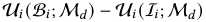

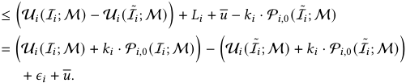

For events that _𝑖_ ∈ _𝐴_ throughout _𝑡_ = 1 _, . . . ,𝑇_ in M _𝑑_ , we have realizations _𝑢𝑖_ (I _𝑖_ ; M)+ _𝑘𝑖_ · _𝑝𝑖,_ 0 (I _𝑖_ ; M) = _𝑢𝑖_ (I˜ _𝑖_ ; M)+ _𝑘𝑖_ · _𝑝𝑖,_ 0 (I˜ _𝑖_ ; M). On the other hand, for any potential realization, we always have � _𝑢𝑖_ (I _𝑖_ ; M) + _𝑘𝑖_ · _𝑝𝑖,_ 0 (I _𝑖_ ; M)� − � _𝑢𝑖_ (I˜ _𝑖_ ; M) + _𝑘𝑖_ · _𝑝𝑖,_ 0 (I˜ _𝑖_ ; M)� ≤ _𝑇𝑢_ <u>,</u> as I˜ _𝑖_ gets outside payoff 0 after exclusion and the realization of first term in each period is upper bounded by _<u>𝑢</u>_ . Denote _𝑑𝑖__𝑡_as the value of _𝑑𝑖_ achieved by truthful strategy I _𝑖_ in Algorithm 1 at time _𝑡_ , _i.e._ , _𝑑𝑖__𝑡_(I_𝑖_; M)=� _𝑡__𝑡_′ =1−(1−_𝑘𝑖_)·_𝜏_ˆ _𝑖__𝑡_′ + _𝜏𝑖__𝑡_′,wehave U _𝑖_ (B _𝑖_ ; M _𝑑_ ) −U _𝑖_ (I _𝑖_ ; M _𝑑_ ) ≤ Pr �∃ _𝑡_ ∈[ _𝑇_ ] _,𝑑𝑖__𝑡_(I_𝑖_; M)_> 𝐿𝑖_ � · _𝑇𝑢_ + _𝜖𝑖_ + _<u>𝑢</u>_ ≤�_𝑇_ _𝑡_ =1Pr[_𝑑_ _𝑖__𝑡_(I_𝑖_; M)_>𝐿𝑖_]·_𝑇_ _<u>𝑢</u>_ + _𝜖𝑖_ + _<u>𝑢</u>_ , where the second inequality is by union bound. By Hoeffding inequality, for _𝑋_ :=� _𝑖_ ∈[ _𝑛_ ]_𝑋_ _𝑖_where_𝑋_ _𝑖__,𝑖_∈[_𝑛_]areindependentlydistributed − <u>2</u> _<u>𝜖</u>_2 in [ _𝑎𝑖,𝑏𝑖_ ], we have Pr � _𝑋 >_ E[ _𝑋_ ] + _𝜖_ � ≤ exp � <u>�</u> _<u>𝑛𝑖</u>_ =1(_𝑏𝑖_−_𝑎𝑖_)2 �. By design of aligning-expectation entry fee, we have E[ _𝑑𝑖__𝑡_(I_𝑖_; M)]= _𝑡_ · _𝑘𝑖𝜏𝑖_ , with _𝜏𝑖__𝑡_−(1 −_𝑘𝑖_) ˆ_𝜏_ _𝑖__𝑡_∈[− _<u>𝑢, 𝑢</u>_ <u>]</u> for any potential realization. Since _𝐿𝑖_ = _𝑇_ · _𝑘𝑖𝜏𝑖_ + _𝜖𝑖_ , for any _𝑡_ ≤ _𝑇_ , Pr[ _𝑑𝑖__𝑡_(I_𝑖_; M)_>𝐿𝑖_]≤ Pr � _𝑑𝑖__𝑡_(I_𝑖_; M) −E[_𝑑_ _𝑖__𝑡_(I_𝑖_; M)]_> 𝜖𝑖_ � ≤ exp − 2 _𝑡𝜖𝑢𝑖_2~~2~~ ≤ exp − 2 _𝑇𝜖𝑖𝑢_22 . <u>�</u> � � � − _𝜖𝑖_2 Applying Pr[ _𝑑𝑖__𝑡_(I_𝑖_; M)_>𝐿𝑖_]≤exp 2 _𝑇𝑢_~~2~~ and taking _𝜖𝑖_ = � � 2 _<u>𝑢</u>_ ~~√~~ _𝑇_ ln _𝑇_ , we have U _𝑖_ (B _𝑖_ ; M _𝑑_ ) −U _𝑖_ (I _𝑖_ ; M _𝑑_ ) ≤ 2 _<u>𝑢</u>_ + <u>2</u> _<u>𝑢</u>_ <u>√</u> _𝑇_ ln _𝑇,_ which indicates our utility increment statement. This also indicates the probability of wrong exclusion, _i.e._ , the term Pr �∃ _𝑡,𝑑𝑖__𝑡_(I_𝑖_; M)_> 𝐿𝑖_ �, is bounded by _𝑇_ exp − 2 _𝑇𝜖𝑖𝑢_22 = _𝑇_−1 . □ � � 

**Table 1: Average social welfare in static synthetic auctions.** 

||_𝐵_1|_𝐵_2|_𝐵_3|Ours|OPT|
|---|---|---|---|---|---|
|_𝐶_11|4.052|3.927|3.990|**4.093**|4.094|
|_𝐶_12|3.850|3.510|3.423|**3.882**|3.902|
|_𝐶_13|3.950|3.218|2.902|**3.974**|4.096|
|_𝐶_21|3.433|3.690|3.371|**3.838**|3.861|
|_𝐶_22|3.271|3.310|2.883|**3.576**|3.683|
|_𝐶_23|3.325|3.060|2.422|**3.551**|3.867|
|_𝐶_31|2.874|3.928|2.803|**3.950**|4.094|
|_𝐶_32|2.751|3.515|2.380|**3.563**|3.906|
|_𝐶_33|2.728|3.215|1.957|**3.337**|4.093|

evaluate social welfare, defined as the realized refined value of the winner; therefore, we instantiate each auction with the natural greedy selection rule for its available information. 

_Baseline Auctions._ We consider three baselines: two-stage auctions that only elicit the first- or second-stage bid, and the singlestage auction. In detail, _𝐵_ 1 selects entrants by _𝜈𝑖𝑐𝑖_ and allocates among entrants by _𝜈𝑖𝑐𝑖_′._𝐵_2 selects entrants by E[_𝜈𝑖_]_𝑐𝑖_and allocates by _𝑤𝑖_ . _𝐵_ 3 is a single-stage auction directly allocates based on _𝑣𝑖_ . We also consider anoracle OPT that allocates based on refined _𝑤𝑖_ over all bidders, which drops the second-stage entrant constraint. We implement each auction to be incentive compatible, and thus assume bidders to report truthfully. 

_Distribution Configuration._ We use uniform distribution in simulations. To inspect the performances under various informativeness of the first-stage attributes, we consider 9 noise levels for two components. Let _𝑉_ 1 _,𝑉_ 2 _,𝑉_ 3 denote the value-component settings 

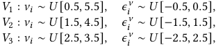

and let _𝑄_ 1 _,𝑄_ 2 _,𝑄_ 3 denote the quality-component settings 

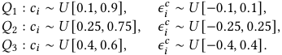

Configuration _𝐶ℓ𝑚_ combines _𝑉ℓ_ and _𝑄𝑚_ . 

## **B A Synthetic Illustration of Bid Refinement** 

In this section, we present simple synthetic experiments to illustrate the two-stage auction environment and the role of bid refinement. The experiments focus on providing intuition for the modeling motivation and the potential value of bid refinement, while the mechanism itself is analyzed theoretically in the main text. 

_Experiment Setting._ Each auction contains _𝑛_ = 30 bidders and _𝑘_ = 5 entrants. Motivated by the standard bid × CTR abstraction, we decompose bidder _𝑖_ ’s per-impression value into a value-perclick component _𝜈𝑖_ and the quality component _𝑐𝑖_ . Thus, _𝑐𝑖_ plays the role of the coarse CTR estimated in the pre-auction stage, and the initial valuation is _𝑣𝑖_ = _𝜈𝑖𝑐𝑖_ . In the formal stage, the refined information of _𝜈𝑖_ and _𝑐𝑖_ becomes available. We model this by _𝜔𝑖_ = max{0 _,𝜈𝑖_ + _𝜖𝑖__𝜈_}_,𝑐_ _𝑖_′= clip(_𝑐𝑖_+_𝜖_ _𝑖__𝑐,_0_,_1) with second-stage refinement variables _𝜖𝑖__𝜈,𝜖_ _𝑖__𝑐_and refined valuation_𝑤𝑖_=_𝜔𝑖𝑐_ _𝑖_′. The value-per-click components are privately revealed, while the quality components are publicly known. As the primary auction design objective, we 

_Experiment Results._ Our results are averaged over 105 runs. As shown in Table 1, our bid refinement scheme consistently achieves better social welfare due to its utilization of up-to-date, accurate information. Since _𝐵_ 1 refines only the quality (CTR) component, it performs better when the value component is stable, but degrades as the noise in _𝜈𝑖_ increases. Conversely, _𝐵_ 2 benefits from refined formal-stage values and becomes stronger when value refinement is important. _𝐵_ 3 uses neither refined bids nor refined CTRs, and therefore deteriorates most clearly as the discrepancy between the two stages increases. The remaining gap between bid refinement to OPT reflects the intrinsic limitation of two-stage architecture: bidders excluded in the pre-auction stage cannot be recovered later. This supports the role of our bid refinement scheme as a truthful way to exploit refined valuations within the operational constraints of two-stage ad auctions. 

5765 

