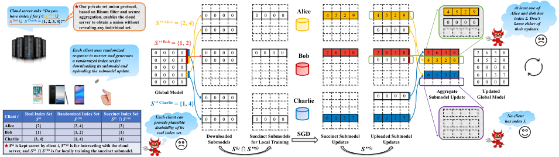
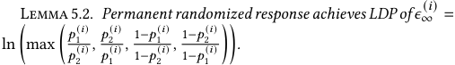
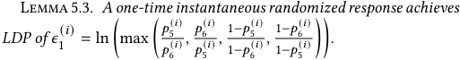
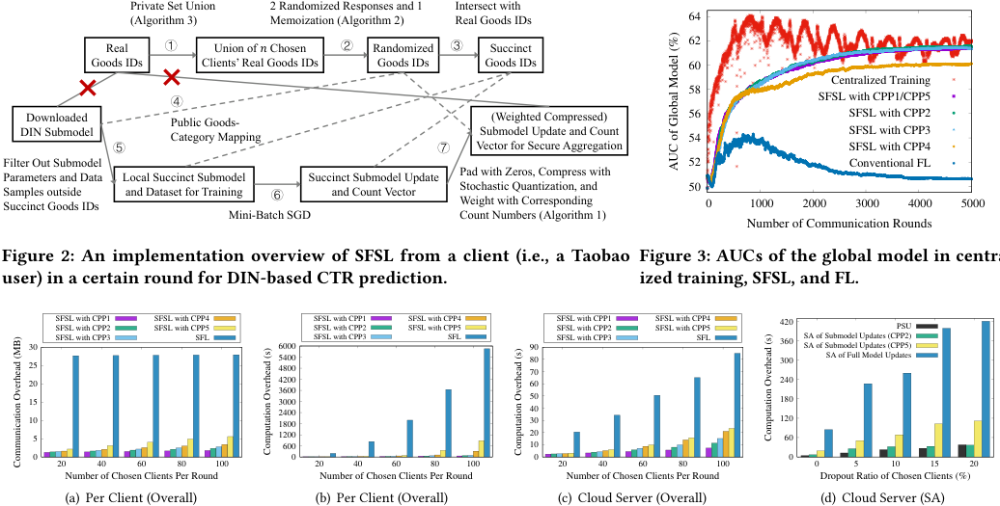

# **Billion-Scale Federated Learning on Mobile Clients: A Submodel Design with Tunable Privacy** 

Chaoyue Niu, Fan Wu 

Shanghai Jiao Tong University, China 

Lifeng Hua, Rongfei Jia, Chengfei Lv, Zhihua Wu Alibaba Group, China 

### **ABSTRACT** 

Federated learning was proposed with an intriguing vision of achieving collaborative machine learning among numerous clients without uploading their private data to a cloud server. However, the conventional framework requires each client to leverage the full model for learning, which can be prohibitively inefficient for largescale learning tasks and resource-constrained mobile devices. Thus, we proposed a submodel framework, where clients download only the needed parts of the full model, namely, submodels, and then upload the submodel updates. Nevertheless, the “position” of a client’s truly required submodel corresponds to its private data, while the disclosure of the true position to the cloud server during interactions inevitably breaks the tenet of federated learning. To integrate efficiency and privacy, we designed a secure federated submodel learning scheme coupled with a private set union protocol as a cornerstone. The secure scheme features the properties of randomized response, secure aggregation, and Bloom filter, and endows each client with customized plausible deniability (in terms of local differential privacy) against the position of its desired submodel, thereby protecting private data. We further instantiated the scheme with Alibaba’s e-commerce recommendation, implemented a prototype system, and extensively evaluated over 30-day Taobao user data. Empirical results demonstrate the feasibility and scalability of the proposed scheme as well as its remarkable advantages over the conventional federated learning framework, from model accuracy and convergency, practical communication, computation, and storage overhead. 

### **CCS CONCEPTS** 

• **Human-centered computing** → **Ubiquitous and mobile computing** ; • **Computing methodologies** → **Machine learning** ; • **Security and privacy** → **Distributed systems security** . 

### **KEYWORDS** 

federated submodel learning, recommendation systems, local differential privacy, private set union, randomized response, secure aggregation, Bloom filter 

Permission to make digital or hard copies of all or part of this work for personal or classroom use is granted without fee provided that copies are not made or distributed for profit or commercial advantage and that copies bear this notice and the full citation on the first page. Copyrights for components of this work owned by others than ACM must be honored. Abstracting with credit is permitted. To copy otherwise, or republish, to post on servers or to redistribute to lists, requires prior specific permission and/or a fee. Request permissions from permissions@acm.org. _MobiCom ’20, September 21–25, 2020, London, United Kingdom_ © 2020 Association for Computing Machinery. ACM ISBN 978-1-4503-7085-1/20/09...$15.00 https://doi.org/10.1145/3372224.3419188 

Shaojie Tang 

University of Texas at Dallas, USA 

## Guihai Chen 

Shanghai Jiao Tong University, China 

##### **ACM Reference Format:** 

Chaoyue Niu, Fan Wu, Shaojie Tang, Lifeng Hua, Rongfei Jia, Chengfei Lv, Zhihua Wu, and Guihai Chen. 2020. Billion-Scale Federated Learning on Mobile Clients: A Submodel Design with Tunable Privacy. In _MobiCom 2020 (MobiCom ’20), September 21–25, 2020, London, United Kingdom._ ACM, New York, NY, USA, 14 pages. https://doi.org/10.1145/3372224.3419188 

### **1 INTRODUCTION** 

### **1.1 Motivating Industrial Scenario** 

The industrial scenario in Alibaba that drives _federated submodel learning (FSL)_ is the desire to provide accurate, customized, and real-time e-commerce recommendations for billion-scale mobile clients while keeping user data on local devices. 

Currently, Alibaba’s recommendation systems are cloud based (e.g., two-stage models with a matching stage [32, 49] for retrieving candidates and a ranking stage [14, 55, 56] for generating final recommendations, or unified models [57, 58]) and require the server cluster to collect, store, and process massive amounts of user data. Typical data fields involved in recommendations include user profile (e.g., user ID, gender, and age), user behavior (e.g., the list of visited goods IDs and relevant information, such as category IDs and shop IDs), and context (e.g., time, page number, and display position). More or less, these data fields are sensitive, and some clients who value privacy highly may refuse to share their data. In addition, according to the General Data Protection Regulation (GDPR), which took effect on May 25, 2018, any institution or company is prohibited from uploading user data (e.g., collected by apps on local devices) without the consent of European Union users [20]. Under such circumstances, refining the recommendation models and further providing accurate recommendations become practical demands. 

_Federated learning (FL)_ , which decouples the ability to do machine learning from the need to upload and store data in the cloud, is a potential solution. However, the original framework of FL, proposed by Google in [34], requires each client to download the full model for training and then to upload the update of the full model, which is impractical for complex learning tasks and resource-constrained clients. Specifically, deep learning with a huge and sparse input space (e.g., e-commerce goods IDs, natural language texts, and locations) requires an embedding layer to transform inputs into a lower-dimensional space where similar inputs are close [11, 36]. In addition, the full embedding matrix tends to occupy a large proportion of the whole model parameters (e.g., 98 _._ 22% in our evaluated recommendation model and more than two-thirds in the language model of Google’s Android keyboard, called Gboard [24]). Furthermore, as the largest online consumer-to-consumer platform in China, Taobao (owned by Alibaba) has roughly two billion goods 

MobiCom ’20, September 21–25, 2020, London, United Kingdom 

Niu et al. 

in total [49], which is far larger than the 10,000-word vocabulary in Gboard’s natural language scenario [13, 24, 45]. This implies that the full embedding matrix of goods IDs in Taobao’s deployed recommendation models roughly has two billion rows and occupies 134GB space when the embedding dimension is 18, and each element adopts 32-bit representation. If each client directly uses the full model for learning, it inevitably incurs unacceptable and unaffordable overhead for one billion Taobao users with smart devices. To improve efficiency, we observe that the input data of a certain client normally involve a small subspace of the full feature space. Thus, the client tends to need a tailored model rather than the full model, especially in the practical applications that require personalization, such as recommendation systems and multi-task learning. For example, if a Taobao user’s historical data contain 300 goods, he/she requires only the corresponding 300 rows, rather than the entire two billion rows, of the full embedding matrix. Based on this key observation, we propose a general and scalable FSL framework. 

### **1.2 Federated Submodel Learning Framework** 

In each communication round of FSL, a cloud server first selects some eligible clients to participate. Then, each chosen client downloads part of the global model as required, namely, a submodel, from the cloud server. For example, in the e-commerce recommendation, a client’s submodel mainly contains the embedding vectors for the goods IDs in its historical data, as well as the parameters of the other network layers. Then, the client trains the submodel over its local data and uploads the submodel update. The cloud server aggregates the submodel updates from live clients and forms a consensus update to the global model. The process above is iterated continuously in practice so that the global model on the cloud server and the submodels on the clients are kept up-to-date. 

If each client leverages the full model rather than its required submodel for learning, FSL will degenerate to conventional FL. FSL further decouples the ability to accomplish FL from the need to use the prohibitively large full model, dramatically improving efficiency. For example, in our evaluation, the size of a client’s desired submodel is only 1 _._ 99% of the full model’s size. The generalization of FSL also implies that almost all existing methods to improve the efficiency and scalability of FL can still apply to FSL. For example, the model compression algorithms not only can compress the full model (update) but also can compress the submodel (update) to reduce overhead. Therefore, FSL is more practical for distributing industrial-strength learning tasks on ubiquitous mobile devices. 

### **1.3 Newly Introduced Privacy Risks** 

Just as every coin has two sides, FSL not only provides efficiency but also introduces two extra privacy risks. 

First, compared with using the public full model in FL, the download of a submodel and the upload of the submodel update would require each client to provide an index set as auxiliary information, specifying the “position” of its submodel. However, the real index set normally corresponds to the client’s private data. For example, to specify the required rows of the embedding matrix in the e-commerce scenario, a client mainly needs to provide the goods IDs in its user data as the real index set. Similarly, in the natural language scenario, a client’s real index set to locate the desired 

word embedding vectors is actually the vocabulary extracted from the client’s typed texts. Thus, the disclosure of a client’s real index set to the cloud server can still be regarded as the leakage of the client’s private data, breaking the tenet of FL. 

Second, compared with the aligned full model in FL, each client chosen in one round of FSL submits only the update of its customized submodel, which tends to be highly differentiated from the other chosen clients’ submodels. As a result, the aggregation of updates w.r.t. a certain index can come from a unique client out of the chosen ones (e.g., with probability 86 _._ 7% for 100 clients randomly chosen in our Taobao dataset). This implies that from the aggregate update, the cloud server not only can ascertain that the client has the index but also can learn its detailed update. Besides the real index revealing a client’s private data, the client’s individual update can still memorize or even allow reconstruction of its private data, namely, the model inversion attack [22, 59] on the individual client. Further, as the goods IDs of different Taobao users are more heterogeneous than the vocabularies of different Gboard users, the misalignment of desired submodels and the privacy risk in e-commerce are more severe than those in natural language. 

### **1.4 Fundamental Problems and Challenges** 

To mitigate the privacy risks above, we need to jointly solve two fundamental problems abstracted from the download and upload phases of FSL: (1) How a client can download a row of a matrix, which represents the global/full model and is maintained by an untrusted cloud server, without revealing which row or the row index to the cloud server; and (2) how a client can modify a row of the matrix, still without revealing which row was modified and the altered content. We analyze two problems in detail. 

We start with the first problem. One naïve method is that the client downloads the full matrix, as in conventional FL, and then extracts the required row locally. This method perfectly hides the fetched row index, but incurs immense communication overhead. To avoid downloading the full matrix, _private information retrieval (PIR)_ [4, 12, 44] can be applied, which exactly matches the problem settings, including the read-only mode and the concealment of the retrieved elements. Therefore, if we consider the first problem independently, PIR may be a good choice. 

We next deconstruct the second problem. For a concrete row of the full matrix, if clients modify the row one by one, the cloud server definitely knows the clients who modified this row and their detailed modifications. Thus, one feasible way is to first securely aggregate (i.e., add up) all the modifications without revealing any individual modification and then apply the aggregate modification (i.e., the sum of the modifications) to the row of the full matrix once. Such a primitive of oblivious addition can be provided by many cryptographic schemes (e.g., the protocol specific to the FL setting in [8] and additively homomorphic encryption [9, 43]). With the secure aggregation guarantee, if more than one client participates in aggregation and at least one of their modifications is nonzero, then the cloud server cannot know any individual modification and thus cannot reveal which client(s) truly intend to modify this row. Further, a larger number of involved clients imply better privacy. One extreme case is in conventional FL with secure aggregation, also called _secure federated learning (SFL)_ , which harshly lets all 

MobiCom ’20, September 21–25, 2020, London, United Kingdom 

Billion-Scale Federated Learning on Mobile Clients: A Submodel Design with Tunable Privacy 

chosen clients in one round be involved for each row of the full matrix, no matter whether they truly intend to modify this row or not. Thus, SFL offers the best privacy but the worst efficiency. Another extreme case is directly combining FSL with secure aggregation, which simply lets those clients who really intend to modify a row be involved. Thus, each chosen client needs to be involved only for those rows that it truly intends to modify, implying the best efficiency. However, different clients tend to modify highly differentiated or even mutually exclusive rows. For joint modification w.r.t. some row, chances are high that only one client is involved. Under this circumstance, the secure aggregation guarantee no longer works, while the client’s real intention and detailed modification are disclosed. In a nutshell, trivial solutions to the second problem cannot achieve a tunable balance between privacy and efficiency. 

### **1.5 Solution Overview and Contributions** 

Considering the two fundamental problems above and several practical issues together, we propose _secure federated submodel learning (SFSL)_ . We first determine the scope of joint modification in each round of FSL, thereby aligning differentiated submodels. The key obstacle is the need to conceal the position of any chosen client’s desired submodel (alternatively, its real index set or private data). The baseline SFL trivially uses the prohibitively large full index set (i.e., the position of the full model) for alignment. In contrast, our SFSL identifies a necessary and sufficient scope for alignment, namely, the union of the chosen clients’ real index sets. The union is efficiently obtained through our proposed _private set union (PSU)_ protocol without revealing any individual real index set. In addition, because the union is (far in our application scenario) smaller than the full index set, SFSL can significantly outperform SFL without sacrificing privacy. Based on the union, each chosen client generates a randomized index set to replace and protect its real index set for interactions in the download and upload phases. Specifically, the randomized index set is generated by applying randomized response twice with one memoization step between, and the parameter setting in randomized response is customized by the client. Such a design with secure aggregation allows the client to hold selfcontrollable deniability against whether it really intends or does not intend to download some row and to upload the modification of this row, even if the client participates in multiple rounds. The strength of deniability is rigorously quantified using _local differential privacy (LDP)_ . Meanwhile, the probability of the cloud server inferring the client’s real intention from the aggregate modification is also thoroughly analyzed. Furthermore, the cardinality of the randomized index set dominates the client’s overhead, and the intersection of the client’s real and randomized index sets controls its local training. Therefore, each client can fine-tune the tension among privacy, efficiency, and effectiveness when using SFSL. 

We summarize the key contributions of this work as follows: 

- To the best of our knowledge, we are the first to propose the FSL framework for industrial-strength, on-device intelligence, and further to identify and remedy privacy risks. 

- The proposed secure scheme SFSL empowers each client with finely tunable deniability against its real intention of downloading the desired submodel and uploading the submodel update, thereby protecting private data. 

- As a moat, we designed an efficient and scalable PSU protocol using Bloom filter, secure aggregation, and randomization, which can have independent and significant value in practice. 

- We instantiated SFSL with Alibaba’s e-commerce scenario, adopted the _deep interest network (DIN)_ for recommendation, and implemented a prototype system. We also conducted extensive evaluations using the data of Taobao users collected over a period of 30 days. When the number of chosen clients per round is 100, the major experimental results are presented as follows: (1) Compared with conventional FL, which diverges in the end, SFSL improves the highest _area under the curve (AUC)_ by 7 _._ 22%; (2) at the same security and privacy levels as SFL, SFSL reduces 80 _._ 05% of the communication overhead on both sides of the client and the cloud server, and reduces 85 _._ 02% (resp., 45 _._ 43%) and 72 _._ 51% (resp., 63 _._ 77%) of the computation (resp., memory) overhead on the sides of the client and the cloud server, respectively; and (3) for the proposed PSU protocol, the communication overhead per client is less than 1MB. The computation overhead of the client and the cloud server is each less than 40s, even if the dropout ratio of the chosen clients reaches 20%. 

### **2 RELATED WORK** 

In recent few years, FL has become an active topic in academic and industrial fields. In this section, we focus on the related work about security and privacy. For other focuses, we direct interested readers to comprehensive surveys [26, 31, 54]. 

Bonawitz et al. [8] designed a secure aggregation protocol in both honest-but-curious and actively adversarial settings, which will be used as a building block of our SFSL. In particular, their design was specific to the FL framework, where each resource-constrained client cannot establish direct communication channels with other clients and needs to rely on an untrusted cloud server as a relay, while part of clients may drop out during the aggregation process. To bound the leakage of each individual client’s training data from the model updates, several differentially private mechanisms were proposed. McMahan et al. [35] considered recurrent language models, let the trusted cloud server perturb the aggregate model update in a single round with a Gaussian mechanism, and relied on the celebrated moments account scheme [1] for multi-round privacy composition. Agarwal et al. [2] studied how to integrate _differential privacy (DP)_ with model compression and proposed a Binomial mechanism for each client to perturb its quantized model update. The quantization [30, 48, 53] is to encode original float-type and continuous parameters into integer-type and discrete values with a few bits. In contrast to these defense mechanisms, Bagdasaryan et al. [6] developed a model replacement attack launched by malicious clients to backdoor the global model on the cloud server. Nasr et al. [40] considered the membership inference attack in pure FL without secure aggregation and leveraged a client’s individual model update to uncover the membership of its training data. 

Parallel to existing work in FL, where each client uses the same global model for learning, we propose a novel FSL framework for scalability. Under FSL, we focus on new privacy issues due to the dependence between the position of a client’s desired submodel and its private data, as well as the misalignment of the submodel updates from heterogeneous clients in secure aggregation. 

MobiCom ’20, September 21–25, 2020, London, United Kingdom 

Niu et al. 

### **3 PRELIMINARIES** 

In this section, we define security requirements corresponding to the privacy risks introduced in Section 1.3. We also review a primitive building block, called randomized response. 

We first introduce some frequently used notations. We use a two-dimensional matrix with _𝑚_ rows and _𝑑_ columns to represent the global/full model, denoted as W. We also let S = {1 _,_ 2 _, . . . ,𝑚_ } denote the full (row) index set of W. In addition, we let C denote _𝑛_ clients who are selected by the cloud server to participate in any round of FSL. For a chosen client _𝑖_ ∈C, we let S(_𝑖_) ⊂S denote its real index set and let WS ( _𝑖_ ) denote its desired submodel, which imply that the user data of client _𝑖_ involve (intuitively, after local training may update) the rows in W with indices S(_𝑖_) . 

### **3.1 Security Requirements** 

First, for the disclosure of real index sets when clients interact with the untrusted cloud server, we consider that each client should have plausible deniability of whether a certain index is or is not in its real index set. To measure the strength of plausible deniability, we adopt LDP, which is a variant of standard DP in the local setting. Specifically, the randomization in LDP is performed by clients in a distributed manner, rather than relying on a data curator as a trusted authority to conduct centralized perturbation in DP. Thus, the privacy of an individual client’s data is protected not only from external attackers but also from the untrusted data curator (e.g., the cloud server in FSL). LDP for various population statistics has received industrial deployments (e.g., by Google [19, 21], Apple [5], and Microsoft [16]) as well as extensive academic attention [18, 27, 50, 51]. We present the formal definition of LDP as follows: 

_Definition 3.1._ A randomized mechanism _𝑀_ satisfies _𝜖_ -LDP, if for any pair of inputs from a client, denoted as _𝑥_ and _𝑦_ , and for any possible output of _𝑀_ , denoted as _𝑧_ , we havePr(_𝑀_<u>(</u>_𝑥_<u>)=</u>_𝑧_<u>)</u> Pr( _𝑀_ ( _𝑦_ )= _𝑧_ )≤exp (_𝜖_)_._ A smaller privacy budget _𝜖_ offers a better LDP guarantee. 

Intuitively, LDP says that the output distribution of the randomized mechanism does not change too much, given distinct inputs from the client. Thus, LDP formalizes a sort of plausible deniability: No matter what output is revealed, it is approximately equally as likely to have come from one input as any other input. When LDP applies to obscure the membership of a certain index in FSL, the inputs and outputs are boolean values, where possible inputs (resp., outputs) are two states: a certain index “in” or “not in” a client’s real (resp., revealed) index set. We can check that FL provides the strongest deniability, where the level of LDP is _𝜖_ = ln(1/1) = 0 for each client. The reason is that no matter whether an index is or is not in a client’s real index set (different inputs), this index will definitely be revealed (the same output “in”). In contrast, FSL provides the weakest deniability, where the level of LDP is _𝜖_ = ln(1/0) = ∞ for each client, because if an index is in (resp., not in) a client’s real index set, this index will definitely (resp., definitely not) be revealed, namely, output “in” with probability 1 (resp., 0). 

Second, for the secure aggregation of misaligned submodel updates in any round, we consider that the clients chosen in the round should be enabled to tune the privacy level, rather than trivially choosing extreme SFL or FSL with secure aggregation. We define a client-tunable privacy protection mechanism as follows: 

_Definition 3.2._ A privacy protection mechanism for aggregating submodel updates is client tunable, if participating clients can control the probabilities of the following two events from the securely aggregated submodel update. 

- _Event 1:_ The cloud server ascertains that an index belongs to some client and learns its detailed update w.r.t. this index. 

- _Event 2:_ The cloud server ascertains that an index does not belong to some client. 

If we view the disclosure of a client’s real intention w.r.t. an index (i.e., the occurrence of either Event 1 or Event 2) as a breach of deniability about the index, then Definition 3.2 complements Definition 3.1 for secure aggregation of submodel updates. If we view the disclosure of a client’s individual submodel update as the premise of the model inversion attack (resp., the membership inference attack) to reveal the content (resp., the membership) of the client’s private data, Definition 3.2 can also be interpreted from mitigating the attack on each individual client. We first examine SFL. If at least two clients participate, the probability of Event 1 is 0, and the probability of Event 2 is still 0 for those indices in the union of the chosen clients’ real index sets. For an index outside the union, the probability of Event 2 approaches 1. Although each chosen client submits a zero vector w.r.t. this index, from the aggregate zero vector, the cloud server almost ascertains that all the chosen clients do not have the index, despite of some rare cases. Regarding directly combining FSL with secure aggregation, the probability of Event 1 depends entirely on the heterogeneity of the user data on the clients, and the probability of Event 2 is the same as that in SFL. 

### **3.2 Randomized Response** 

Randomized response, due to Warner in 1965 [52], is a survey technique in the social sciences for collecting statistics about illegal, embarrassing, or sensitive topics, where the respondents want to preserve the privacy of their answers. A classic example for illustration is the “Are you a member of the Communist Party?” question. For this question, each respondent flips a fair coin in secret and tells the truth if it comes up tails; otherwise, he/she flips a second coin and responds “Yes” if heads and “No” if tails. Thus, a communist (resp., non-communist) will answer “Yes” with probability 75% (resp., 25%) and “No” with probability 25% (resp., 75%). 

Randomized response can provide plausible deniability for both “Yes” and “No” answers. A communist can contribute his/her response of “Yes” to the event that the first and second coin flips were both heads, which occurs with probability 25%. Meanwhile, a non-communist can also contribute his/her response of “No” to the event that the first coin was heads and the second coin was tails, which still occurs with probability 25%. Furthermore, the plausible deniability of a one-time randomized response can be rigorously quantified by LDP, particularly at the level _𝜖_ = ln(75%/25%) = ln 3, irrespective of any attacker’s prior knowledge [17, 19]. 

### **4 DESIGN OF SFSL** 

### **4.1 Design Rationale** 

We illustrate key design principles mainly through demonstrating how to handle the two fundamental problems raised in Section 1.4 and how to resolve several practical issues. 

MobiCom ’20, September 21–25, 2020, London, United Kingdom 

Billion-Scale Federated Learning on Mobile Clients: A Submodel Design with Tunable Privacy 

<!-- Start of picture text -->
Cloud server asks “Do you have index j for jS  Bob ⋃ S Charlie = {1, 2, 3, 4}?”  ∈ S Alice ⋃ Our private set union protocol, based on Bloom filter and secure aggregation, enables the cloud server to obtain a union without revealing any individual set. S’’ Alice = {2, 4} 00 00 00 00 0 0 0 0 Alice 4 5 2 9 40 50 20 90 04 05 02 09 Alice and Bob has know either of At least one of index 2. Don’t their updates. S’’ Bob = {1, 2} Each client uses randomized response to answer and generates a randomized index set for  00 00 00 00 00 00 00 00 0 0 0 0 Bob 2 6 3 8 20 60 30 80 24 65 32 89 24 65 32 89 downloading its submodel and  0 0 0 0 0 0 0 0 uploading the submodel update. 0 0 0 0 6 1 3 7 6 1 3 7 0 0 0 0 0 0 0 0 S’’ Global Model Charlie = {1, 4} 0 0 0 0 Charlie 0 0 0 0 Submodel UpdateAggregate  Global ModelUpdated Client Alice i Real Index Set { S 2 (i) } Randomized Index Set { S’’ 2, 4 (i) } Succinct Index Set S (i) { ⋂ 2} S’’ (i) provide plausible deniability of its Each client can  0 0 0 0 0 0 0 0 6 1 3 7 6 1 3 7 has index 5.No client BobCharlieserver S (i) is kept secret by client , and  S (i) {3{1, ⋂  4} } S’’ (i) is for locall i ,  S’’ (i) is for interacting with the cloudy{{ trainin11,, 2 4}} g the succinct submodel. {{14}} real index set. Downloaded Submodels S (i) ⋂ S’’ Succinct Submodelsfor Local Training (i) SGD Succinct SubmodelUpdates S’’ (i) Uploaded SubmodelUpdates <!-- End of picture text -->

**Figure 1: An illustration of SFSL. The gray rounded rectangle denotes secure aggregation. The randomized index sets of Alice, Bob, and Charlie are** {2 _,_ 4} **,** {1 _,_ 2} **, and** {1 _,_ 4} **, respectively. For index** 2 **, Alice submits the update** (4 _,_ 5 _,_ 2 _,_ 9) **, Bob pretends to submit a zero vector, while Charlie does not submit. Secure aggregation ensures that the adversarial cloud server obtains only the sum of Alice’s and Bob’s updates** (4 _,_ 5 _,_ 2 _,_ 9) **, but does not know either update. Thus, the cloud server can only infer that at least one of Alice and Bob has index** 2 **. Due to plausible deniability, the cloud server also cannot ascertain the state of Charlie.** 

As shown in Figure 1, we handle two fundamental problems in a unified manner rather than in separate ways. During the download and upload phases, a client consistently uses a randomized index set in place of its real index set. In contrast, during the local training phase, the client leverages the intersection of its real and randomized index sets (called the client’s succinct index set) to prepare the succinct submodel and the user data involved. With the blind of the randomized index set to interact with the outside world, the client holds plausible deniability of some index being in or not in its real index set. Specifically, the client generates its randomized index set locally with randomized response as follows. The sensitive question asked by the cloud server is “Do you have a certain index?”. Then, the client answers “Yes” with two customized probabilities, conditional on whether the index is or is not in the client’s real index set, and puts the index into the randomized index set if it receives a “Yes” answer. The two probabilities allow the client to fine-tune the balance between deniability and utility. 

We further examine the feasibility of index set randomization in handling two problems. For the first problem in the download phase, if a client intends (resp., does not intend) to download a certain row, and it actually downloads (resp., does not download), it can blame its action to randomization, i.e., the occurrence of the event that the index not in (resp., in) a client’s real index set returns a “Yes” (resp., “No”) answer. Regarding the second problem in the upload phase, the usage of the randomized index set still empowers a client to deny its real intention of modifying or not modifying some row, even if the cloud server observes its binary action of modifying or not modifying. Additionally, for a concrete row, there are two different groups of clients involved in the joint modification: (1) One group consists of those clients who intend to modify the row and contribute nonzero modifications; and (2) the other group comprises those clients who do not intend to modify the row and pretend to modify by submitting zero modifications. With the secure aggregation guarantee, even though the adversarial cloud server observes the aggregate modification, it is hard to identify any individual modification and further to infer whether some client originally intends to perform a modification or not. The hardness is controlled by the sizes of two groups, alternatively, the probabilities 

of an index in and not in the real index set returning a “Yes” answer, which are fully tunable by clients as expected in Definition 3.2. Besides two fundamental problems, there still exist two practical issues to be solved before the method of index set randomization can apply to FSL. The first issue regards whether it is practical and necessary for the cloud server to ask “Do you have a certain index?” for each index in the full index set, which is intrinsically adopted by FL. For example, the matrix, representing Taobao’s full recommendation model, has billions of rows. Thus, it is impractical for a client to answer billion-scale questions and further to download and securely upload those rows with “Yes” answers. We turn to narrowing down the scope to the union of _𝑛_ chosen clients’ real index sets, which is normally far smaller than the full index set (i.e., the union of the whole clients’ real index sets). Our optimization is inspired by an observation: If a client’s real index set is of size 300, and the full index set is of size 2 billion, using the probability parameters in the survey of party membership, the expected number of “Yes” answers is 300 × 75% + (2 × 109 − 300) × 25% ≈ 5 × 108 . Such a calculation implies that the dominant “Yes” answers are those with “No” in reality but “Yes” due to randomness. Nevertheless, most of the “No”-to-“Yes” answers are useless. Specifically, for those indices that do not belong to any chosen client’s real index set (e.g., index 5 in Figure 1), although part (25% in expectation) of the chosen clients upload zero vectors for randomization, the cloud server can still infer from the aggregate zero vectors that these clients do not actually have the indices. Therefore, it is unnecessary to cover any index outside the union of _𝑛_ chosen clients’ real index sets. By using the union, we set _𝑛_ = 100 and recalculate the expected number of “Yes” answers as 300 × 75% + (100 × 300 − 300) × 25% ≈ 8 × 103 . This implies that a prohibitively large number of unnecessary “No”-to“Yes” answers are avoided, significantly improving efficiency and without degrading privacy. Now, a basic and thorny problem that accompanies is how multiple clients can obtain the union of their real index sets under the mediation of an untrusted cloud server without revealing any client’s real index set, namely, the need of a PSU protocol. Considering existing schemes cannot satisfy the atypical setting of FSL and high scalability, we propose a novel design of PSU based on Bloom filter and secure aggregation. 

MobiCom ’20, September 21–25, 2020, London, United Kingdom 

Niu et al. 

The second issue regards the longitudinal privacy when a client is chosen to participate in multiple rounds of FSL. The initial version of randomized response provides a rigorous privacy guarantee only when an audience answers the same question once, facilitating a one-time response to “Do you have a certain index?”. Thus, we need to extend the initial version to allow repeated responses from the same client to those already answered indices. Our extension leverages key principles from _randomized aggregatable privacypreserving ordinal response (RAPPOR)_ [19, 21] and plays randomized response twice with a memoization step between. In particular, the noisy answers generated by the inner (permanent) randomized response will be memoized and permanently replace the real answers in the outer (instantaneous) randomized response. This ensures that even though a client responds to the membership of a concrete index for infinite times, the client can still hold plausible deniability of its real answer, where the level of deniability is lower bounded by the privacy level of the memoized noisy answer. 

### **4.2 Design Details** 

We introduce the design details of SFSL in a top-down manner. We first give an overview of its top-level architecture and then show two underlying modules, namely, index set randomization and PSU. 

_4.2.1 Secure Federated Submodel Learning (SFSL)._ Before getting into SFSL, we first review federated averaging [34], which is the default distributed optimization algorithm of FL. In each round, the cloud server restarts a collaborative training process and randomly chooses some eligible clients to locally train the latest global model. Then, the cloud server takes a weighted average of the full model updates, one chosen client’s weight being proportional to the size of its training set, and adds the aggregate update to the global model. 

We now present SFSL in Algorithm 1, which generalizes federated averaging to support effective and efficient FSL. SFSL also preserves desired security and privacy properties while incorporating the unstable and limited network connections of mobile devices. At the initial stage, the cloud server randomly initializes the global model (Line 1). In each communication round, the cloud server selects _𝑛_ clients to participate (Lines 2 and 3) and also maintains an up-to-date set of the chosen clients who are alive throughout the whole round, denoted by Cˆ . A chosen client determines its real index set based on its local data, which specifies the “position” of its truly required submodel (Line 10). For example, if the goods IDs of a Taobao user include {1 _,_ 2 _,_ 4}, then he/she requires the first, second, and fourth rows of the embedding matrix for goods IDs, further implying that the real index set should contain {1 _,_ 2 _,_ 4}. Then, the cloud server launches PSU to obtain the union of the chosen clients’ real index sets while keeping each individual client’s real index set in secret (Lines 4 and 11). The union is delivered to live clients for them to generate randomized index sets with customized LDP guarantees against the cloud server (Line 12). Each live client will use its randomized index set, rather than its real index set, to download the submodel and to securely upload the submodel update (Lines 13 and 19). Upon receiving the randomized index set from a client, the cloud server stores it for later usage and returns the corresponding submodel and training hyperparameters to the client (Line 6). 

Depending on the intersection of the real and randomized index sets (i.e., the succinct index set), the client extracts a succinct 

#### **Algorithm 1:** Secure Federated Submodel Learning (SFSL) 

||/* Cloud server’s process */|
|---|---|
|**1**|Initialize the global modelW;|
|**2 **|**foreach**communication round**do**|
|**3**|Randomly select_𝑛_clients, denoted as C;|
|**4**|Launch private set union (Algorithm 3), obtain the union of_𝑛_ clients’ real index sets, namely, � _𝑖_∈C S(_𝑖_), and deliver the union result to the up-to-date set of the clients who are alive, denoted as ˆC ⊂C; |
|**5**|**foreach**client_𝑖_∈ˆC**do** |
|**6**|Receive and store the randomized index set S′′(_𝑖_) from client_𝑖_, and return the submodelWS′′(_𝑖_) and training hyperparameters to_𝑖_;|
|**7**|**foreach** _𝑗_∈� _𝑖_∈C S(_𝑖_) **do**|
|**8**|Determine the live clients involving index _𝑗_, denoted as ˆC_𝑗_= {_𝑖_|_𝑖_∈ˆC ∧_𝑗_∈S′′(_𝑖_) }, let them submit materials for secure aggregation, and obtain the sum of (weighted) updates � _𝑖_∈ˆC_𝑗_Δw(_𝑖_) _𝑗_ and the total count number of relevant samples � _𝑖_∈ˆC_𝑗__𝑣_(_𝑖_) _𝑗_ ;|
|**9**|Update the _𝑗_-th row of the global modelWby adding � _𝑖_∈ˆC_𝑗_Δw(_𝑖_) _𝑗_ �� _𝑖_∈ˆC_𝑗__𝑣_(_𝑖_) _𝑗_ ;|
||/* Client _𝑖_’s process */|
|**10**|Determine its real index set S(_𝑖_) based on local data;|
|**11**|Participate in private set union (Algorithm 3);|
|**12**|Generate a randomized index set S′′(_𝑖_) (Algorithm 2);|
|**13**|Use S′′(_𝑖_) to download a submodel, denoted asWS′′(_𝑖_);|
|**14**|Depending on the succinct index set S′′(_𝑖_) �S(_𝑖_), locally extract the succinct submodelWS′′(_𝑖_) �S(_𝑖_) fromWS′′(_𝑖_) and prepare involved data as the succinct training set;|
|**15**|TrainWS′′(_𝑖_) �S(_𝑖_) using the hyperparameters and obtain the update of the succinct submodelΔWS′′(_𝑖_) �S(_𝑖_);|
|**16**|Initialize the submodel update to be uploaded with S′′(_𝑖_), denoted asΔWS′′(_𝑖_), all to 0, and addΔWS′′(_𝑖_) �S(_𝑖_);|
|**17**|Count the number of training samples involving each index _𝑗_∈S′′(_𝑖_) and store the results in the vectorvS′′(_𝑖_);|
|**18**|WeightΔWS′′(_𝑖_) in advance by multiplying each row with the corresponding count number invS′′(_𝑖_);|
|**19**|Upload materials for securely aggregatingΔWS′′(_𝑖_)_,_vS′′(_𝑖_).|

submodel and prepares involved data as the succinct training set (Line 14). For example, if a Taobao user’s real index set is {1 _,_ 2 _,_ 4}, and his/her randomized index set is {2 _,_ 4 _,_ 6 _,_ 9}, he/she receives a submodel with the row indices {2 _,_ 4 _,_ 6 _,_ 9} from the cloud server, but just needs to train the succinct submodel with the row indices {2 _,_ 4} over his/her local data involving the goods IDs {2 _,_ 4}. After training under the preset hyperparameters, the client obtains the update of the succinct submodel (Line 15). Then, it prepares the submodel update to be uploaded with the randomized index set by adding the update of the succinct submodel to the rows with the succinct indices and padding zero vectors to the other rows (Line 16). To help the cloud server average multiple submodel updates according to the size of relevant local training data, each chosen client also needs to count the number of its training samples involving every 

MobiCom ’20, September 21–25, 2020, London, United Kingdom 

Billion-Scale Federated Learning on Mobile Clients: A Submodel Design with Tunable Privacy 

index in the randomized index set (Line 17). In particular, the numbers of samples involving the indices outside the succinct index set are all zeros. Furthermore, each client weights the submodel update to be uploaded in advance by multiplying each row with the corresponding count number, namely, the weight (Line 18). 

The weighted submodel updates and the count vectors from live clients are securely aggregated side by side under the coordination of the cloud server (Lines 7–9 and 19). Specifically, the cloud server guides the secure aggregation by enumerating every index in the union of real index sets as follows. It first determines the set of live clients whose randomized index sets contain this index and then lets these clients submit the materials for securely adding up the weighted updates and the count numbers w.r.t. the index (Line 8). The cloud server finally applies an aggregate update to the global model in this row by adding the quotient between the sum of the weighted updates and the total count number, namely, the weighted average (Line 9). To reduce the interactions between the cloud server and any client, they can package all the materials supporting secure aggregation, rather than exchanging for one index each time (Lines 7–9). In particular, the cloud server executes Lines 7 and 8 for each live client _𝑖_ ∈ Cˆ in parallel and then executes Line 9 for each index in the union _𝑗_ ∈� _𝑖_ ∈CS(_𝑖_). 

_4.2.2 Index Set Randomization._ We next show how a client can generate a randomized index set in each participating round. 

We start with the basic design. The sensitive question, asked by the cloud server, is “Do you have a certain index?”. All the clients chosen in one round of FSL make up the population to be surveyed, while the union of their real index sets works as the necessary and sufficient scope of the questionnaire. Given the questionnaire, client _𝑖_ leverages randomized response to answer “Yes” or “No” and puts the indices with “Yes” answers into its randomized index set. To fine-tune the tension among effectiveness, efficiency, and privacy, client _𝑖_ basically adjusts two probability parameters _𝑝_ 1(_𝑖_)_, 𝑝_ 2(_𝑖_) in randomized response. In particular, _𝑝_ 1(_𝑖_) denotes the probability that an index in client _𝑖_ ’s real index set will return a “Yes” answer and controls the factual size of client _𝑖_ ’s data contributed to FSL. A larger _𝑝_ 1(_𝑖_) generally implies better effectiveness from convergence rate. In addition, _𝑝_ 2(_𝑖_) denotes the probability that an index outside client _𝑖_ ’s real index set will return a “Yes” answer and determines the number of redundant rows to be downloaded and the number of padded zero vectors to be uploaded through secure aggregation. Hence, given a fixed _𝑝_ 1(_𝑖_), a smaller_𝑝_ 2(_𝑖_) indicates better efficiency. Furthermore, _𝑝_ 1(_𝑖_)_, 𝑝_ 2(_𝑖_) jointly adjust the level of LDP, where a pair of closer _𝑝_ 1(_𝑖_)_, 𝑝_ 2(_𝑖_) provide better LDP. We examine three typical instances: (1) The party membership survey takes _𝑝_ 1(_𝑖_) = 75% _, 𝑝_ 2(_𝑖_) = 25% for each respondent; (2) FL essentially uses the full index set as the scope of the cloud server’s questionnaire, takes _𝑝_ 1(_𝑖_) = _𝑝_ 2(_𝑖_) = 1 for each client, and offers the best LDP and effectiveness but the worst efficiency; and (3) FSL adopts _𝑝_ 1(_𝑖_) = 1 _, 𝑝_ 2(_𝑖_) = 0 for each client and provides the best effectiveness and efficiency but the worst LDP. 

We further extend the basic design to allow multi-round participation of client _𝑖_ and its repeated responses to any index. As shown in Algorithm 2, we let client _𝑖_ maintain two index sets with “Yes” and “No” answers in the permanent randomized response, 

|**A**|**lgorithm 2:**Client_𝑖_’s Index Set Randomization|
|---|---|
|**1**|**Input:**Client_𝑖_’s real index set S(_𝑖_), Union of the chosen clients’ real index sets � _𝑖_∈C S(_𝑖_), Client_𝑖_’s memoized index set Y (_𝑖_) (resp., N(_𝑖_)) initialized to ∅at very beginning with permanent “Yes” (resp., “No”) answers to the question “Do you have a certain index?”, Client_𝑖_’s customized probability parameters 0 ≤_𝑝_(_𝑖_) 1 _, 𝑝_(_𝑖_) 2 _, 𝑝_(_𝑖_) 3 _, 𝑝_(_𝑖_) 4 ≤1. **Output:**Client_𝑖_’s doubly randomized index set S′′(_𝑖_)  S′(_𝑖_) = ∅_,_S′′(_𝑖_) = ∅; // Permanent randomized response|
|**2 ** **3** **4**|**foreach** _𝑗_∈� _𝑖_∈C S(_𝑖_) �_𝑗_∉Y (_𝑖_) �N(_𝑖_) **do** **if** _𝑗_∈S(_𝑖_) **then** Add _𝑗_to S′(_𝑖_) with probability_𝑝_(_𝑖_) 1 ;|
|**5**|**else** |
|**6**|Add _𝑗_to S′(_𝑖_) with probability_𝑝_(_𝑖_) 2 ; // Memoization of permanent answers |
|**7**|**if** _𝑗_∈S′(_𝑖_) **then** |
|**8**|Y (_𝑖_) = Y (_𝑖_) �_𝑗_;|
|**9**|**else** |
|**10**|N(_𝑖_) = N(_𝑖_) �_𝑗_;|
||// Instantaneous randomized response|
|**11 **|**foreach** _𝑗_∈� _𝑖_∈C S(_𝑖_) **do** |
|**12**|**if** _𝑗_∈Y (_𝑖_) **then** |
|**13**|Add _𝑗_to S′′(_𝑖_) with probability_𝑝_(_𝑖_) 3 ;|
|**14**|**else** |
|**15** **16 **|Add _𝑗_to S′′(_𝑖_) with probability_𝑝_(_𝑖_) 4 ;  **return** S′′(_𝑖_)|

respectively (Input). The permanent randomized response is parameterized by _𝑝_ 1(_𝑖_)_, 𝑝_ 2(_𝑖_) as illustrated above. Given that a client can be grouped with distinct clients in different rounds while the union of the chosen clients’ real index sets varies from one round to another, the client needs to handle new indices. For a certain round, as any new index comes (Line 2), client _𝑖_ first generates a permanent noisy answer for it, conditional on whether the new index is in or is not in the real index set (Lines 3–6). Then, client _𝑖_ updates two memoized index sets (Lines 7–10). Based on the memoized noisy answers to the union of real index sets, client _𝑖_ obtains its final randomized index set by performing an instantaneous randomized response over the union (Lines 11–16). The instantaneous randomized response is parameterized with another two probabilities _𝑝_ 3(_𝑖_)_, 𝑝_ 4(_𝑖_), similar to _𝑝_ 1(_𝑖_)_, 𝑝_ 2(_𝑖_) in the permanent randomized response. Now, these four probability parameters jointly support tuning the tension among privacy, effectiveness, and efficiency. In particular, _𝑝_ 5(_𝑖_) = _𝑝_ 1(_𝑖_)(_𝑝_ 3(_𝑖_) − _𝑝_ 4(_𝑖_)) +_𝑝_ 4(_𝑖_) (resp., _𝑝_ 6(_𝑖_) = _𝑝_ 2(_𝑖_)(_𝑝_ 3(_𝑖_) − _𝑝_ 4(_𝑖_)) +_𝑝_ 4(_𝑖_)), denoting the probability that an index in (resp., not in) client _𝑖_ ’s real index set finally returns a “Yes” answer, now plays the same role as _𝑝_ 1(_𝑖_) (resp., _𝑝_ 2(_𝑖_)) in the basic design. Detailed derivations of _𝑝_ 5(_𝑖_)_, 𝑝_ 6(_𝑖_) can be found in the complete manuscript [42]. 

_4.2.3 Private Set Union (PSU)._ We introduce the last PSU module. We first briefly review existing PSU protocols and illustrate their practical infeasibility in FSL. We then present our new design. 

MobiCom ’20, September 21–25, 2020, London, United Kingdom 

Niu et al. 

|**Algorithm 3:**Private Set Union (PSU)|
|---|
|**1** Cloud server partitions the full index set S;|
|**2 foreach**client_𝑖_∈C**do** |
|**3** Represent its real index set S(_𝑖_) as a Bloom filterb(_𝑖_);|
|**4** Randomizeb(_𝑖_) to an integer vectorb′(_𝑖_) by replacing each bit 1 inb(_𝑖_) with a random integer fromZ_𝑅_;|
|**5** Use a bit vectora(_𝑖_) to indicate whether there exists an element in S(_𝑖_) falling into the partitions of S;|
|**6** Randomizea(_𝑖_) to an integer vectora′(_𝑖_) by replacing each bit 1 ina(_𝑖_) with a random integer fromZ_𝑅_;|
|**7** Submit materials for securely aggregatingb′(_𝑖_)_,_a′(_𝑖_);|
|**8** Cloud server obtains � _𝑖_∈C b′(_𝑖_) and � _𝑖_∈C a′(_𝑖_) with secure|
|aggregation, reconstructs the union � _𝑖_∈C S(_𝑖_), and delivers the union to each live client_𝑖_∈ˆC.|

PSU promises a wide range of applications in practice, including union queries over several databases, and, more generally, integration or sharing of datasets from multiple private sources. According to the representation format of a set, existing PSU protocols can be generally divided into two categories: polynomialbased [23, 25, 28, 29, 46] and Bloom filter-based [15, 33, 38]. For the polynomial-based protocols, elements of a set are represented as the roots of a polynomial, and the union of two sets is converted to the multiplication of two polynomials. For the protocols based on Bloom filter, the union operation over sets is normally transformed to the element-wise OR operation over the Bloom filters, and the logic OR operation can be further converted to bit addition and bit multiplication. To obliviously perform addition and multiplication operations, the two kinds of protocols mainly turn to generic secure two-party/multi-party computation, or outsource secure computation to multiple noncolluding servers. Due to unaffordable overhead, none of the existing PSU protocols have been deployed in practice. Besides inefficiency, the basic setting of these protocols significantly differs from that of FSL, where clients cannot directly communicate or natively authenticate with each other and should mediate through an untrusted cloud server. In addition, the set elements here can come from a billion-scale domain, which has not been touched in previous work as of yet. 

Given the infeasibility of existing work and the atypical setting of FSL, we propose a new PSU scheme. As shown in Algorithm 3, each chosen client in one round of FSL first represents its real index set as a Bloom filter (Line 3). The details about how to set the parameters of the Bloom filter can be found in [7, 10, 47]. Then, each chosen client randomizes its Bloom filter by replacing each bit 1 with a random integer from Z _𝑅_ = {0 _,_ 1 _, . . . , 𝑅_ − 1}, while keeping each bit 0 unchanged (Line 4). All the chosen clients use their randomized Bloom filters rather than original ones to participate in secure aggregation (Line 7). With the secure aggregation guarantee, the untrusted cloud server obtains only the sum of the randomized Bloom filters (Line 8), but cannot know any individual randomized Bloom filter, which protects the original Bloom filter and the underlying real index set of each chosen client during the aggregation process. Further, the randomization process guarantees that the aggregate Bloom filter contains only the necessary membership information of the elements in the union and obscures unnecessary 

count numbers. In other words, the untrusted cloud server knows only whether there exists a client having a certain index or not, but cannot know how many clients have the index, which exactly reaches the goal of PSU. Suppose the original Bloom filters are securely aggregated without randomization. The aggregate Bloom filter is actually a counting Bloom filter, equivalent to constructing it from scratch by sequentially inserting each chosen client’s real index set. Besides the desired membership information, the counting Bloom filter also contains the count numbers, which are undesired leakage in PSU. Overall, our PSU is structured internally in a new way of first local randomization and then oblivious addition, which uses the counting Bloom filter as a springboard, but conceals the undesired count numbers. Thus, our PSU avoids the costly oblivious multiplications in the common practice to derive the union of sets by performing bit-wise OR operations over the Bloom filters. 

After obtaining the sum of the randomized Bloom filters, the cloud server can recover the union by doing membership tests for the full index set. It is prohibitively time-consuming if the full domain of index is huge (e.g., in the magnitude of billions in Taobao’s e-commerce scenario). Even worse, the direct enumeration method can also introduce a large number of false positives to the union (i.e., those indices that are not in the union but falsely judged to be in), further leading to unnecessary redundancy in the download and upload phases. To handle these problems, we incorporate a private partition union to narrow down the scope of index for the union reconstruction above, thereby circumventing the full index set. We let the cloud server divide the full domain of index into a certain number of partitions ahead of time (Line 1). A good partition scheme needs to well balance the pros in the union reconstruction phase and the cons of additional cost. One trivial partition strategy is interval-based, where the full index set is sequentially and evenly split into some intervals. Another partition strategy is hierarchical and is often application-oriented. According to the size of partitions, we can determine the retrieval level or granularity. For example, (1) in the e-commerce recommendation, a tree structure can be used to partition the goods IDs, where the tree is initialized with the category information and further can be optimized using learning methods [57, 58]; and (2) in the natural language processing, a word semantic hierarchy can be built with the expert knowledge from WordNet [37, 39]. Given the partitions, each client first uses a bit vector to indicate whether there exists an index in its real index set falling into the partitions (Line 5). Just like hiding the concrete count numbers for the Bloom filter, the client replaces each bit 1 in its partition indicator vector with a random integer (Line 6). Then, the cloud server obtains the sum of the randomized partition indicator vectors through secure aggregation and reveals those partitions with nonzero integers in the corresponding positions (Lines 7 and 8). By simply doing membership tests for the indices falling into these partitions, the cloud server efficiently reconstructs the union and delivers it to all live clients (Line 8). 

### **5 THEORETICAL ANALYSIS** 

In this section, we first analyze the security and privacy of SFSL. We then analyze its complexity and compare with SFL at the same security and privacy levels. Due to space limitations, detailed proofs and analyses are reserved in the complete manuscript [42]. 

MobiCom ’20, September 21–25, 2020, London, United Kingdom 

Billion-Scale Federated Learning on Mobile Clients: A Submodel Design with Tunable Privacy 

### **5.1 Security and Privacy Analyses** 

Under Definition 3.1, we analyze the LDP of our index set randomization in Algorithm 2. We first prove that the union of the chosen clients’ real index sets is necessary and sufficient to be the input. Then, as two stepping stones, we analyze the LDP guarantees of the permanent randomized response and a one-time instantaneous randomized response, which impose an upper bound and a lower bound on the LDP of the index set randomization, respectively. 

Lemma 5.1. _The union of the chosen clients’ real index sets in a certain communication round is necessary and sufficient for the index set randomization of each chosen client in the round._ 

Theorem 5.4. _When client 𝑖 participates in any number of rounds, index set randomization satisfies 𝜖_(_𝑖_) _-LDP, where 𝜖_ 1(_𝑖_) ≤ _𝜖_(_𝑖_) ≤ _𝜖_ ∞(_𝑖_)_._ = If client _𝑖_ sets _𝑝_ 1(_𝑖_) = _𝑝_ 2(_𝑖_) = _𝑝_ 3(_𝑖_) = _𝑝_ 4(_𝑖_) = 1, then _𝑝_ 5(_𝑖_) = _𝑝_ 6(_𝑖_) 1 _,𝜖_ 1(_𝑖_) = 0 _,𝜖_ ∞(_𝑖_) = 0 _,_ and _𝜖_(_𝑖_) = 0. This corresponds to the case that any index in the union will always receive a permanent “Yes” answer and an instantaneous “Yes” answer. In other words, if client _𝑖_ takes the union as its randomized index set, it can achieve the strongest 0-LDP as in conventional FL. 

We next analyze the stage of securely aggregating submodel updates in SFSL under Definition 3.2. We consider any index _𝑗_ from the union. We let _𝑛 𝑗,_ 0 and _𝑛 𝑗,_ 1 denote the numbers of live chosen clients who do not have and have _𝑗_ in reality, respectively. For feasibility and clarity in analysis, we let each chosen client use = the same probability parameters, namely, ∀ _𝑖_ ∈C _, 𝑝_ 1(_𝑖_) = _𝑝_ 1 _, 𝑝_ 2(_𝑖_) _𝑝_ 2 _, 𝑝_ 3(_𝑖_) = _𝑝_ 3 _, 𝑝_ 4(_𝑖_) = _𝑝_ 4, which result in the same _𝑝_ 5(_𝑖_) = _𝑝_ 1 ( _𝑝_ 3 − _𝑝_ 4) + _𝑝_ 4 = _𝑝_ 5 and _𝑝_ 6(_𝑖_) = _𝑝_ 2 ( _𝑝_ 3 − _𝑝_ 4) + _𝑝_ 4 = _𝑝_ 6. Then, we have Theorem 5.5 as follows: 

Theorem 5.5. _SFSL is a client-tunable privacy protection mechanism for aggregating submodel updates and guarantees that: Event 1 happens with probability 𝑝_ 7 = _𝑛 𝑗,_ 1 _𝑝_ 5 (1 − _𝑝_ 5)_𝑛𝑗,_1−1 (1 − _𝑝_ 6)_𝑛𝑗,_0 _, and Event 2 happens with probability 𝑝_ 8 = (1 − _𝑝_ 5)_𝑛𝑗,_1 (1 −(1 − _𝑝_ 6)_𝑛𝑗,_0 ) _._ 

We still examine the case that each chosen client uses the union as its randomized index set to securely upload the submodel update by setting _𝑝_ 1 = _𝑝_ 2 = _𝑝_ 3 = _𝑝_ 4 = 1, resulting in _𝑝_ 5 = _𝑝_ 6 = 1 and _𝑝_ 7 = _𝑝_ 8 = 0. This is the strongest privacy for aggregating submodel updates as in SFL. Combining with the aforementioned 0-LDP for each chosen client, we can find that SFSL with the setting _𝑝_ 1 = _𝑝_ 2 = _𝑝_ 3 = _𝑝_ 4 = 1 (essentially, _𝑝_ 5 = _𝑝_ 6 = 1) is as secure as SFL under Definition 3.1 and Definition 3.2. We further generalize this observation in Theorem 5.6, which is free of any privacy definition. 

Theorem 5.6. _If each chosen client uses the union of real index sets as its randomized index set, then SFSL is as secure as SFL._ 

We finally analyze the security of our PSU scheme in Algorithm 3. Theorem 5.7. _Only the union of the chosen clients’ real index sets is revealed in the proposed PSU protocol._ 

**Table 1: Complexities of SFSL (and PSU in it) at the same security and privacy levels as SFL.** 

|||Communication|Time|Space|
|---|---|---|---|---|
||SFSL|_𝑂_(_𝑛𝑠𝑑_)|_𝑂_(_𝑛_2_𝑠𝑑_) |_𝑂_(_𝑛𝑠𝑑_)|
|Client|PSU|_𝑂_(_𝑛𝑠_)|_𝑂_(_𝑛_2_𝑠_)|_𝑂_(_𝑛𝑠_)|
||SFL|_𝑂_(_𝑛_+_𝑚𝑑_)|_𝑂_(_𝑛_2 +_𝑛𝑚𝑑_)|_𝑂_(_𝑛_+_𝑚𝑑_)|
||SFSL|_𝑂_(_𝑛_2_𝑠𝑑_)|_𝑂_(_𝑛_3_𝑠𝑑_)|_𝑂_(_𝑛_2 +_𝑛𝑠𝑑_)|
|Server|PSU|_𝑂_(_𝑛_2_𝑠_)|_𝑂_(_𝑛_3_𝑠_)|_𝑂_(_𝑛_2 +_𝑛𝑠_)|
||SFL|_𝑂_(_𝑛_2 +_𝑛𝑚𝑑_)|_𝑂_(_𝑛_2_𝑚𝑑_)|_𝑂_(_𝑛_2 +_𝑚𝑑_)|

*|<u>�</u> _𝑖_ ∈CS(_𝑖_) |≪|S|⇒_𝑛𝑠_≪_𝑚_. 

### **5.2 Complexity Analysis and Comparison** 

We analyze the communication, time, and space complexities of the client and the cloud server in one round of SFSL. We introduce SFL as a benchmark for comparison. To be consistent with the analysis of the secure aggregation protocol [8], we adopt the honest-butcurious setting and consider the worst-case dropouts of clients. 

We first analyze SFSL. For feasibility and clarity, we let each client use the same _𝑝_ 1 _, 𝑝_ 2 _, 𝑝_ 3 _, 𝑝_ 4 and the resulting _𝑝_ 5 _, 𝑝_ 6. We assume that the expected cardinality of each client’s real index set is _𝑠_ , which indicates that the expected cardinality of the union of _𝑛_ chosen clients’ real index sets� _𝑖_ ∈CS(_𝑖_)is upper bounded by_𝑛𝑠_. We note that_𝑛𝑠_is normally much less than the cardinality of the full index set _𝑚_ (i.e., _𝑛𝑠_ ≪ _𝑚_ ). In addition, the expected cardinality of each client’s randomized index set S′′(_𝑖_) is upper bounded by _𝑠𝑝_ 5+( _𝑛_ −1) _𝑠𝑝_ 6, and the expected cardinality of each client’s succinct index set S(_𝑖_) � S′′(_𝑖_) is _𝑠𝑝_ 5. Moreover, according to [7, 10, 47], the optimal length of the Bloom filter in the proposed PSU protocol is proportional to the cardinality of the set to be filtered, namely, the cardinality of the union. In what follows, we directly show the complexity formulas containing _𝑝_ 5 _, 𝑝_ 6. First, the overall communication complexities of the client and the cloud server are _𝑂_ ( _𝑛𝑠_ + ( _𝑠𝑝_ 5 + ( _𝑛_ − 1) _𝑠𝑝_ 6)(2 _𝑑_ + 1)) and _𝑂_ ( _𝑛_2 _𝑠_ + _𝑛_ ( _𝑠𝑝_ 5 + ( _𝑛_ − 1) _𝑠𝑝_ 6)(2 _𝑑_ + 1)), respectively. Second, the overall time complexities of the client and the cloud server are _𝑂_ ( _𝑛_2 _𝑠_ + _𝑛_ ( _𝑠𝑝_ 5 + ( _𝑛_ − 1) _𝑠𝑝_ 6)( _𝑑_ + 1)) and _𝑂_ ( _𝑛_3 _𝑠_ + _𝑛_2 ( _𝑠𝑝_ 5 + ( _𝑛_ − 1) _𝑠𝑝_ 6)( _𝑑_ + 1)), respectively. Third, the overall space complexities of the client and the cloud server are _𝑂_ ( _𝑛𝑠_ + ( _𝑠𝑝_ 5 + ( _𝑛_ − 1) _𝑠𝑝_ 6)( _𝑑_ + 1)) and _𝑂_ ( _𝑛_2 + _𝑛𝑠_ + ( _𝑠𝑝_ 5 + ( _𝑛_ − 1) _𝑠𝑝_ 6)( _𝑛_ + _𝑑_ + 1)), respectively. In fact, considering secure aggregation is the most costly primitive underlying SFSL, the complexity formulas above can be roughly estimated by leveraging the complexity analysis results of the secure aggregation protocol reported in [8]. More specifically, we let the dimension of vector there take _𝑂_ ( _𝑛𝑠_ + ( _𝑠𝑝_ 5 + ( _𝑛_ − 1) _𝑠𝑝_ 6)( _𝑑_ + 1)) here, where _𝑂_ ( _𝑛𝑠_ ) corresponds to the optimal length of the Bloom filter and the preset constant size of the partition indicator vector in our PSU, and ( _𝑠𝑝_ 5 + ( _𝑛_ − 1) _𝑠𝑝_ 6)( _𝑑_ + 1) accounts for the total size of the weighted submodel update and corresponding count vector with the randomized index set. From the analysis above, we can derive that our SFSL is quite scalable because its complexity depends on the cardinality of the union of _𝑛_ chosen clients’ real index sets _𝑛𝑠_ , but is independent of the cardinality of the full index set _𝑚_ that controls the size of the full model. In other words, SFSL completely relieves the dependence on the full model. 

MobiCom ’20, September 21–25, 2020, London, United Kingdom 

Niu et al. 

**Table 2: Statistics of Taobao dataset.** 

|Type|#User(s)|#Goods|#Categories|#Samples|
|---|---|---|---|---|
|Test (Full)|24,790|138,829|4,758|1,010,284|
|Train (Full)|49,023|143,534|4,815|15,854,357|
|Train (Per Client)|1|301|117|323|

We next compare our SFSL with SFL at the same security and privacy levels by imposing _𝑝_ 5 = _𝑝_ 6 = 1 in SFSL. Table 1 shows their complexities along with the complexity of our PSU. The complexities of SFL and PSU are derived using the complexity analysis of the secure aggregation protocol, where the dimension of vector takes the size of the full model _𝑚𝑑_ and _𝑂_ ( _𝑛𝑠_ ), respectively. From Table 1, we can draw that given _𝑛𝑠_ ≪ _𝑚_ in our application scenario, the complexities of the client and the cloud server in SFSL are both far lower than those in SFL. We can also draw that only if _𝑛𝑠 < 𝑚_ , our SFSL outperforms SFL. In the worst case where _𝑛𝑠_ = _𝑚_ (i.e., the union of the chosen clients’ real index sets is the full index set), the complexity of SFSL is the same as that of SFL. An intuitive explanation is that if all the clients participate in each round of FSL, the union of the chosen clients’ real index sets is the full index set, and SFSL degenerates to SFL. However, the full participation is ideal and impractical because of the unavailability of some clients in each round. Thus, the worst case may never happen. We note that _𝑛𝑠_ cannot be larger than _𝑚_ , because the full index set is actually the union of all the clients’ real index sets. In summary, SFSL outperforms SFL in any scale of FSL applications, where ubiquitous data heterogeneity results in model differentiation for the clients. 

### **6 EVALUATION** 

**Dataset:** We use an industrial dataset1 built from 30-day impression and click logs of Taobao users from June 15, 2019 to July 15, 2019. For a certain Taobao user, we leverage his/her click behaviors in previous 14 days as historical data to predict his/her click and nonclick behaviors in the following 1 day. We leave out the behaviors within the last 1 day as the target items of the test set while putting the other samples into the training set. Specifically, the test set is located on the cloud server to judge the accuracy and convergency of the global model. For the full training set, we further cluster each Taobao user’s data as a training set located on a client. Table 2 shows some statistics about the dataset. 

**Model, Hyperparameters, and Metric:** We take the deployed DIN in Alibaba [56] as the recommendation model for FSL, where the number of columns in the embedding matrix is set to 18. Except the embedding layer for user IDs, goods IDs, and category IDs, the parameters of the other network layers in DIN, including the attention layer and the fully connected layer, are of size 64,327. Hence, the global model on the cloud server is of size 3,617,023, whereas a desired submodel on the client is of size 71,869 in average, which is only 1 _._ 99% of the global model’s size and roughly requires 0 _._ 27MB space using 32-bit representation. For each client’s local training, we choose mini-batch _stochastic gradient descent (SGD)_ as the optimization algorithm, set the batch size to 2, and set the local epoch number to 1. In addition, we initially set the learning 

1A similar Taobao dataset is online available from Tianchi [3]. 

**Table 3: Choices of probability parameters (CPPs) and resulting privacy levels. CPP1 corresponds to pure FSL with secure aggregation. CPP5 is as secure as SFL.** 

||_𝑝_1_, 𝑝_3|_𝑝_2_, 𝑝_4|_𝑝_5|_𝑝_6|_𝜖_1|_𝜖_∞|_𝑝_7|_𝑝_8|
|---|---|---|---|---|---|---|---|---|
|CPP1|1|0|1|0|∞|∞|86_._7%|0|
|CPP2|15/16|1/16|88_._3%|11_._7%|2_._02|2_._71|0|10_._3%|
|CPP3|7/8|1/8|78_._1%|21_._9%|1_._27|1_._95|0|19_._5%|
|CPP4|3/4|1/4|62_._5%|37_._5%|0_._51|1_._10|0|34_._2%|
|CPP5|1|1|1|1|0|0|0|0|

* Smaller _𝜖_ 1, _𝜖_ ∞, _𝑝_ 7, _𝑝_ 8 indicate better privacy for each chosen client _𝑖_ . 

rate to 1 and further apply exponential decay with the decay rate of 0.999 per communication round. For the cloud server’s global testing, we adopt a golden metric in the task of _click-through rate (CTR)_ prediction, called AUC, and set the batch size to 1,024. 

**Prototypes and Configurations:** We implemented the prototypes of our SFSL and the baseline SFL in Python 2.7.16, and the source code is publicly available from [41]. Figure 2 provides an overview of SFSL from the perspective of a client in a certain round. We took a synchronous architecture on top and implemented a communication module between the cloud server and each client with standard socket programming. We used TensorFlow 1.12.0 to implement DIN. We mainly used PyCryptodome 3.7.3 to implement the secure aggregation protocol in [8]. To support modular addition underlying secure aggregation, we performed float-to-integer conversion for each client’s submodel or full model update with stochastic quantization [48], where the quantization level is set to 215 . We let each client use the same _choice of probability parameters (CPP)_ in SFSL. Table 3 lists 5 CPPs in the evaluation and their resulting privacy levels of index set randomization and aggregating submodel updates when the number of chosen clients per round _𝑛_ is 100. Specifically, CPP1 corresponds to directly combining FSL with secure aggregation, which lets each client reveal its real index set and provides the worst LDP. The resulting _𝑝_ 7 = 86 _._ 7% at CPP1 further implies that 86 _._ 7% of the goods IDs in the union of 100 randomly chosen clients’ real goods IDs involve a single client. Therefore, the user data in Taobao’s e-commerce context are highly heterogeneous. In contrast, CPP5 lets each client use the union of the chosen clients’ real index sets as its randomized index set. By Theorem 5.6, SFSL with CPP5 is as secure as SFL. 

Our running environment is a Linux workstation with 64-bit Ubuntu 18.04.2 OS. The processor is Intel(R) Core(TM) i9-9900K with 8 cores, the base frequency is 3.60GHz, the memory size is 64GB, and the cache size is 16MB. The workstation is also equipped with 2 NVIDIA’s GeForce RTX 2080 Ti graphics cards. To manifest the difference between the roles of client and cloud server, (1) from hardware, we ran all the clients only on CPU, but allowed the cloud server to accelerate its operations using GPU; and (2) from parallelism and concurrency, we optimized the cloud server’s hotspot functions with Python’s multiprocessing library. For more implementation details, please refer to the complete manuscript [42]. 

### **6.1 Model Accuracy and Convergency** 

We bring in centralized training and conventional FL as two baselines. We plot the AUCs of our SFSL and two baselines in Figure 3. 

MobiCom ’20, September 21–25, 2020, London, United Kingdom 

Billion-Scale Federated Learning on Mobile Clients: A Submodel Design with Tunable Privacy 

<!-- Start of picture text -->
Private Set Union  2 Randomized Responses and 1  Intersect with (Algorithm 3) Memoization (Algorithm 2) Real Goods IDs  64 Real  ① ② Randomized  ③ Succinct   62 Goods IDs Clients’ Real Goods IDs Goods IDs Goods IDs  60 × Union of 𝑛𝑛 Chosen  Centralized Training × ④  58 SFSL with CPP1/CPP5 Downloaded  Public Goods- (Weighted Compressed)   56 SFSL with CPP2 DIN Submodel Category Mapping Submodel Update and Count   54 SFSL with CPP3 ⑤ ⑦ Vector for Secure Aggregation SFSL with CPP4 Filter Out Submodel  52 Conventional FL Parameters and Data  Local Succinct Submodel Succinct Submodel Update  Pad with Zeros, Compress with Samples outside  and Dataset for Training ⑥ and Count Vector  Stochastic Quantization, and   50 Succinct Goods IDs Weight with Corresponding   0  1000  2000  3000  4000  5000 Mini-Batch SGD Count Numbers (Algorithm 1) Number of Communication Rounds Figure 2: An implementation overview of SFSL from a client (i.e., a Taobao Figure 3: AUCs of the global model in central- user) in a certain round for DIN-based CTR prediction. ized training, SFSL, and FL. SFSL with CPP1SFSL with CPP2 SFSL with CPP4SFSL with CPP5 SFSL with CPP1SFSL with CPP2 SFSL with CPP4SFSL with CPP5 SFSL with CPP1SFSL with CPP2 SFSL with CPP4SFSL with CPP5  420 PSU  30 SFSL with CPP3 SFL  6000 SFSL with CPP3 SFL  90 SFSL with CPP3 SFL  360 SA of Submodel Updates (CPP2)SA of Submodel Updates (CPP5)  25  5400 4800  80 70  300 SA of Full Model Updates  20  4200  60  240  15  3600 3000  50  180  10  2400 1800  40 30  120  5  1200  20  60  600  10  0  0  0  0 20 40 60 80 100 20 40 60 80 100 20 40 60 80 100 0 5 10 15 20 Number of Chosen Clients Per Round Number of Chosen Clients Per Round Number of Chosen Clients Per Round Dropout Ratio of Chosen Clients (%) (a) Per Client (Overall) (b) Per Client (Overall) (c) Cloud Server (Overall) (d) Cloud Server (SA) AUC of Global Model (%) Computation Overhead (s) Computation Overhead (s) Computation Overhead (s) Communication Overhead (MB) <!-- End of picture text -->

**Figure 3: AUCs of the global model in centralized training, SFSL, and FL.** 

**Figure 4: Communication and computation overhead of the client and the cloud server per round in our SFSL and the baseline SFL. In Figure 4(d), SA denotes secure aggregation, and 100 clients are chosen per round.** 

The number of clients randomly chosen in each round _𝑛_ is set to 100. In addition, centralized training refers to the traditional case that the cloud server first collects data from all the clients, then trains the DIN model, and tests the global model once training over the samples with a size similar to the total size of _𝑛_ clients’ datasets. 

From Figure 3, we can see that compared with centralized training, which reaches the best AUC of 64 _._ 11% in 803 rounds, our SFSL with CPP2 achieves the highest AUC of 61 _._ 54% in 4,908 rounds, decreasing by 2 _._ 57% of AUC. In contrast, conventional FL performs worst, achieving the highest AUC of 54 _._ 32% in 867 rounds and diverging in the end. The major reason is that FL coarsely computes the weighted average of the chosen clients’ full model updates proportional to their training set sizes, no matter whether one client’s whole training set actually involves some model parameters (the full model excluding its desired submodel, e.g., some embedding vectors in DIN) or not, thereby inaccurately counting in the weights (i.e., the training set sizes) of those clients who contribute zero/no updates for these model parameters. With a higher heterogeneity of user data and a higher differentiation of submodels, the roughness and inaccuracy of FL will be exposed more completely, which clarifies why FL can work in the natural language context with a 10,000-word vocabulary considered by Google, but does not work well in Alibaba’s e-commerce context with billion-scale goods IDs. 

From Figure 3, we can also observe that CPP4 is the worst among all CPPs and achieves the highest AUC of 60 _._ 11%, because _𝑝_ 5, which controls the size of each client’s succinct training set as well as the length of historical goods and category IDs in each training sample, in CPP4 is the smallest among all CPPs. This still explains another observation that CPP1 and CPP5 with the same _𝑝_ 5 = 1 have identical model performance. 

### **6.2 Communication Overhead** 

We show the communication overhead of our SFSL and introduce SFL as a baseline. Figure 4(a) plots the overall communication overhead per client per round. We do not plot the communication overhead of the cloud server, since it is equal to the communication overhead per client multiplying by _𝑛_ . In more detail, the incoming data of the cloud server are exactly the total outgoing data of all _𝑛_ chosen clients, and vice verse. We also do not plot for different dropout ratios because this factor has little impact on the communication overhead. 

One key observation from Figure 4(a) is that compared with SFL, our SFSL can sharply reduce the communication overhead. In particular, when _𝑛_ = 100, the overall communication overhead per client per round is 1.76MB, 2.33MB, 2.78MB, 3.40MB, and 5.57MB in SFSL with CPP1, CPP2, CPP3, CPP4, and CPP5, respectively, reducing 93 _._ 72%, 91 _._ 65%, 90 _._ 06%, 87 _._ 81%, and 80 _._ 05% than SFL, which incurs 27.94MB. Considering SFSL with CPP5 is as secure as SFL, we can draw that our SFSL can reduce communication overhead even with not sacrificing any security or privacy. These results coincide with the complexity analysis in Section 5.2 and Table 1. 

The second key observation from Figure 4(a) is that the communication overhead per client in SFSL increases with _𝑛_ for a certain CPP and also increases with the serial number of CPP for a certain _𝑛_ . We clarify the reasons by the client’s communication complexity _𝑂_ ( _𝑛𝑠_ + ( _𝑠𝑝_ 5 + ( _𝑛_ − 1) _𝑠𝑝_ 6)(2 _𝑑_ + 1)) in Section 5.2. On the one hand, the communication complexity grows linearly with _𝑛_ . On the other hand, it is increasing with _𝑝_ 5 and _𝑝_ 6, and thus, CPP5 is the most communication expensive. Additionally, given _𝑝_ 5 + _𝑝_ 6 = 1 for CPPs from CPP1 to CPP4, we can simplify the communication complexity to _𝑂_ ( _𝑛𝑠_ + ( _𝑠_ + ( _𝑛_ − 2) _𝑠𝑝_ 6)(2 _𝑑_ + 1)), which increases with _𝑝_ 6 as _𝑛 >_ 2. 

MobiCom ’20, September 21–25, 2020, London, United Kingdom 

Niu et al. 

From Table 3, we can see that _𝑝_ 6 increases with the serial number of CPP, implying higher communication overhead as depicted in Figure 4(a). Intuitively, _𝑝_ 6 controls the size of the redundant/zero parameters to be downloaded and securely uploaded and dominates the holistic trend of the communication overhead. 

We finally present the communication overhead per client per round incurred by our PSU, which increases linearly with _𝑛_ , roughly with an increase of 0.07MB per 20 clients. In addition, our PSU is quite communication efficient and incurs 0.91MB as _𝑛_ reaches 100. 

### **6.3 Computation Overhead** 

We now report the practical computation overhead, mainly by investigating the effects of _𝑛_ , the CPP, and the ratio of dropout. To be consistent with the time complexity analysis, the computation overhead includes only the run time of the client or the cloud server in executing the protocol, but ignores synchronization delay and the time overhead of testing global model. Given mobile devices are highly parallel in practice, the total run time per communication round can be estimated by adding up the computation overhead of the client and the cloud server reported here. In addition, testing the global model per round costs the cloud server 32.12s. 

We first show the overall computation overhead of the client and the cloud server per round in our SFSL with different CPPs in Figure 4(b) and Figure 4(c). We still introduce SFL as a baseline. First, we can see that our SFSL significantly outperforms SFL on both sides of the client and the cloud server. In particular, when _𝑛_ = 100, at the same security and privacy levels, SFSL with CPP5 reduces 85 _._ 02% and 72 _._ 51% of the computation overhead than SFL on the client and the cloud server, respectively. When security and privacy become weaker, the advantages of our SFSL are more evident under CPP1 to CPP4. For example, CPP2 reduces 98 _._ 77% and 86 _._ 70% of the run time than SFL on the client and the cloud server, respectively. Second, we focus on a certain side, either the client or the cloud server, and can observe that its computation overhead grows with _𝑛_ or the serial number of CPP. The reason can be explained by the detailed time complexity in Section 5.2, while the intuition is analogous to that behind the communication overhead. 

We next investigate the effect of the dropout ratio and depict the evaluation results per round in Figure 4(d) as _𝑛_ = 100. We mainly focus on the secure aggregation-based stages while ignoring the other stages irrelevant with dropout. We consider that clients are randomly selected to go offline at random points. We report only the computation overhead of the cloud sever because dropped clients do not introduce additional operation cost for live clients. From Figure 4(d), we can see that with the growth of the dropout ratio, the computation overhead of the cloud server increases. This is because the cloud server needs to remove the mutual masks between dropped and live clients in secure aggregation. We also compare our SFSL with SFL at the stage of securely aggregating submodel or full model updates. We can find that SFSL significantly outperforms SFL at this stage for any dropout ratio. Specifically, when the dropout ratio is 20%, CPP2 and CPP5 reduce 91 _._ 33% and 73 _._ 55% of the computation overhead, respectively. We finally examine our PSU and can see that it is quite efficient, even when the dropout ratio is high. In particular, the computation overhead of the cloud server is 37.66s as the dropout ratio reaches 20%. 

### **6.4 Memory and Disk Loads** 

We present the practical storage overhead of our SFSL and the baseline SFL. First is about the memory overhead. The cloud server requires the video memory of 551MB, mainly for testing the global model at the end of each communication round, which is the same for all schemes. In addition, when _𝑛_ = 100, and there is no dropout, the memory overhead per client is 209MB and 281MB in SFSL with CPP2 and CPP5, respectively, reducing 59 _._ 40% and 45 _._ 43% than SFL. Correspondingly, the memory overhead of the cloud server is 1.58GB and 3.15GB, respectively, reducing 81 _._ 88% and 63 _._ 77% than SFL. Regarding the disk load, only the client in SFSL with CPP2, CPP3, and CPP4 needs to store its permanent noisy answers in the index set randomization, which roughly occupies the disk space of 280KB within the total 5,000 rounds. 

### **6.5 Discussion on Billion-Scale Issues** 

We finally discuss the issues as the size of the full index set (which controls the size of the full model) and the total number of clients scale further to billions in practice. First, the baseline SFL, depending on the full model, will be prohibitively inefficient to be applicable. Second, we analyze our SFSL. SFSL relives the dependence on the full model, executes in communication rounds, and involves only a constant number of (e.g., _𝑛_ = 100) clients in each round. Thus, no additional overhead will be incurred in SFSL due to the scale of billions. We further consider how to shorten the periods of building/polishing the full model and covering the whole clients without affecting any client’s efficiency and privacy. It is trivial to scale up SFSL at the level of the cloud server. In particular, a master server manages multiple child servers. For every round, each child server selects _𝑛_ clients, lets them use SFSL to download submodels, and securely aggregates their submodel updates with SFSL. The master server further aggregates the aggregated submodel updates from the child servers to update the global model. 

### **7 CONCLUSION** 

In this paper, we have proposed a submodel design SFSL for mobile clients to effectively and efficiently train large-scale models under the coordination of an untrusted cloud server while keeping user data private. We further have applied SFSL to the e-commerce recommendation scenario of Alibaba, implemented a prototype system, and validated its practical feasibility over a Taobao dataset. 

### **ACKNOWLEDGMENTS** 

We sincerely thank our anonymous shepherd and reviewers for their insightful feedback. We also thank Renjie Gu, Hongtao Lv, Hejun Xiao, and Zhenzhe Zheng, as well as many colleagues in Alibaba, for meaningful discussions and great engineering support. This work was supported in part by National Key R&D Program of China No. 2019YFB2102200, China NSF grant No. 61972252, 61972254, 61672348, and 61672353, Joint Scientific Research Foundation of the State Education Ministry No. 6141A02033702, and Alibaba Innovation Research (AIR) Program. The opinions, findings, conclusions, and recommendations expressed in this paper are those of the authors and do not necessarily reflect the views of the funding agencies or the government. Fan Wu (fwu@cs.sjtu.edu.cn) is the corresponding author of this paper. 

MobiCom ’20, September 21–25, 2020, London, United Kingdom 

Billion-Scale Federated Learning on Mobile Clients: A Submodel Design with Tunable Privacy 

### **REFERENCES** 

- [1] Martín Abadi, Andy Chu, Ian J. Goodfellow, H. Brendan McMahan, Ilya Mironov, Kunal Talwar, and Li Zhang. 2016. Deep Learning with Differential Privacy. In _Proc. of CCS_ . ACM, 308–318. 

- [2] Naman Agarwal, Ananda Theertha Suresh, Felix Yu, Sanjiv Kumar, and H. Brendan McMahan. 2018. cpSGD: Communication-efficient and differentially-private distributed SGD. In _Proc. of NeurIPS_ . 7575–7586. 

- [3] Alimama. 2017. Ad Display/Click Data on Taobao.com. https://tianchi.aliyun. com/dataset/dataDetail?dataId=56. 

- [4] Sebastian Angel, Hao Chen, Kim Laine, and Srinath Setty. 2018. PIR with Compressed Queries and Amortized Query Processing. In _Proc. of S&P_ . IEEE, 962–979. 

- [5] Apple’s Differential Privacy Team. 2017. Learning with Privacy at Scale. _Apple Machine Learning Journal_ 1, 8 (2017). 

- [6] Eugene Bagdasaryan, Andreas Veit, Yiqing Hua, Deborah Estrin, and Vitaly Shmatikov. 2020. How To Backdoor Federated Learning. In _Proc. of AISTATS_ . PMLR, 2938–2948. 

- [7] Burton H. Bloom. 1970. Space/Time Trade-offs in Hash Coding with Allowable Errors. _Communications of the ACM_ 13, 7 (1970), 422–426. 

- [8] Keith Bonawitz, Vladimir Ivanov, Ben Kreuter, Antonio Marcedone, H. Brendan McMahan, Sarvar Patel, Daniel Ramage, Aaron Segal, and Karn Seth. 2017. Practical Secure Aggregation for Privacy-Preserving Machine Learning. In _Proc. of CCS_ . ACM, 1175–1191. 

- [9] Dan Boneh, Eu-Jin Goh, and Kobbi Nissim. 2005. Evaluating 2-DNF Formulas on Ciphertexts. In _Proc. of TCC_ . Springer, 325–341. 

- [10] Andrei Broder and Michael Mitzenmacher. 2004. Network Applications of Bloom Filters: A Survey. _Internet Mathematics_ 1, 4 (2004), 485–509. 

- [11] Qingqing Cao, Noah Weber, Niranjan Balasubramanian, and Aruna Balasubramanian. 2019. DeQA: On-Device Question Answering. In _Proc. of MobiSys_ . ACM, 27–40. 

- [12] Hao Chen, Zhicong Huang, Kim Laine, and Peter Rindal. 2018. Labeled PSI from Fully Homomorphic Encryption with Malicious Security. In _Proc. of CCS_ . ACM, 1223–1237. 

- [13] Mingqing Chen, Rajiv Mathews, Tom Ouyang, and Françoise Beaufays. 2019. Federated Learning Of Out-Of-Vocabulary Words. arXiv: 1903.10635. http: //arxiv.org/abs/1903.10635. 

- [14] Qiwei Chen, Huan Zhao, Wei Li, Pipei Huang, and Wenwu Ou. 2019. Behavior Sequence Transformer for E-commerce Recommendation in Alibaba. arXiv: 1905.06874. http://arxiv.org/abs/1905.06874. 

- [15] Alex Davidson and Carlos Cid. 2017. An Efficient Toolkit for Computing Private Set Operations. In _Proc. of ACISP_ . Springer, 261–278. 

- [16] Bolin Ding, Janardhan Kulkarni, and Sergey Yekhanin. 2017. Collecting Telemetry Data Privately. In _Proc. of NeurIPS_ . 3574–3583. 

- [17] Cynthia Dwork and Aaron Roth. 2014. The Algorithmic Foundations of Differential Privacy. _Foundations and Trends in Theoretical Computer Science_ 9, 3-4 (2014), 211–407. 

- [18] Úlfar Erlingsson, Vitaly Feldman, Ilya Mironov, Ananth Raghunathan, Kunal Talwar, and Abhradeep Thakurta. 2019. Amplification by Shuffling: From Local to Central Differential Privacy via Anonymity. In _Proc. of SODA_ . ACM-SIAM, 2468–2479. 

- [19] Úlfar Erlingsson, Vasyl Pihur, and Aleksandra Korolova. 2014. RAPPOR: Randomized Aggregatable Privacy-Preserving Ordinal Response. In _Proc. of CCS_ . ACM, 1054–1067. 

- [20] European Parliament and Council of the European Union. 2016. The General Data Protection Regulation (EU) 2016/679 (GDPR). https://eur-lex.europa.eu/eli/ reg/2016/679/oj. Took effect from May 25, 2018. 

- [21] Giulia Fanti, Vasyl Pihur, and Úlfar Erlingsson. 2016. Building a RAPPOR with the Unknown: Privacy-Preserving Learning of Associations and Data Dictionaries. _Proceedings on Privacy Enhancing Technologies (PoPETs)_ 2016, 3 (2016), 41–61. 

- [22] Matthew Fredrikson, Eric Lantz, Somesh Jha, Simon Lin, David Page, and Thomas Ristenpart. 2014. Privacy in Pharmacogenetics: An End-to-End Case Study of Personalized Warfarin Dosing. In _Proc. of USENIX Security_ . 17–32. 

- [23] Keith Frikken. 2007. Privacy-Preserving Set Union. In _Proc. of ACNS_ . Springer, 237–252. 

- [24] Andrew Hard, Kanishka Rao, Rajiv Mathews, Françoise Beaufays, Sean Augenstein, Hubert Eichner, Chloé Kiddon, and Daniel Ramage. 2018. Federated Learning for Mobile Keyboard Prediction. arXiv: 1811.03604. http: //arxiv.org/abs/1811.03604. 

- [25] Jeongdae Hong, Jung Woo Kim, Jihye Kim, Kunsoo Park, and Jung Hee Cheon. 2013. Constant-round privacy preserving multiset union. _Bulletin of the Korean Mathematical Society_ 50, 6 (2013), 1799–1816. 

- [26] Peter Kairouz, H. Brendan McMahan, Brendan Avent, Aurélien Bellet, Mehdi Bennis, Arjun Nitin Bhagoji, Keith Bonawitz, Zachary Charles, Graham Cormode, Rachel Cummings, Rafael G. L. D’Oliveira, Salim El Rouayheb, David Evans, Josh Gardner, Zachary Garrett, Adrià Gascón, Badih Ghazi, Phillip B. Gibbons, Marco Gruteser, Zaid Harchaoui, Chaoyang He, Lie He, Zhouyuan Huo, Ben Hutchinson, Justin Hsu, Martin Jaggi, Tara Javidi, Gauri Joshi, Mikhail Khodak, Jakub Konecný, Aleksandra Korolova, Farinaz Koushanfar, Sanmi Koyejo, Tancrède Lepoint, Yang 

- Liu, Prateek Mittal, Mehryar Mohri, Richard Nock, Ayfer Özgür, Rasmus Pagh, Mariana Raykova, Hang Qi, Daniel Ramage, Ramesh Raskar, Dawn Song, Weikang Song, Sebastian U. Stich, Ziteng Sun, Ananda Theertha Suresh, Florian Tramèr, Praneeth Vepakomma, Jianyu Wang, Li Xiong, Zheng Xu, Qiang Yang, Felix X. Yu, Han Yu, and Sen Zhao. 2019. Advances and Open Problems in Federated Learning. arXiv: 1912.04977. http://arxiv.org/abs/1912.04977. 

- [27] Shiva Prasad Kasiviswanathan, Homin K. Lee, Kobbi Nissim, Sofya Raskhodnikova, and Adam Smith. 2008. What Can We Learn Privately?. In _Proc. of FOCS_ . IEEE, 531–540. 

- [28] Lea Kissner and Dawn Xiaodong Song. 2005. Privacy-Preserving Set Operations. In _Proc. of CRYPTO_ . Springer, 241–257. 

- [29] Vladimir Kolesnikov, Mike Rosulek, Ni Trieu, and Xiao Wang. 2019. Scalable Private Set Union from Symmetric-Key Techniques. IACR Cryptology ePrint Archive, Report 2019/776. https://eprint.iacr.org/2019/776. 

- [30] Jakub Konečný, H. Brendan McMahan, Felix X. Yu, Peter Richtárik, Ananda Theertha Suresh, and Dave Bacon. 2016. Federated Learning: Strategies for Improving Communication Efficiency. arXiv: 1610.05492. http: //arxiv.org/abs/1610.05492. 

- [31] Tian Li, Anit Kumar Sahu, Ameet Talwalkar, and Virginia Smith. 2020. Federated Learning: Challenges, Methods, and Future Directions. _IEEE Signal Processing Magazine_ 37, 3 (2020), 50–60. 

- [32] Fuyu Lv, Taiwei Jin, Changlong Yu, Fei Sun, Quan Lin, Keping Yang, and Wilfred Ng. 2019. SDM: Sequential Deep Matching Model for Online Large-scale Recommender System. In _Proc. of CIKM_ . ACM, 2635–2643. 

- [33] Dilip Many, Martin Burkhart, and Xenofontas Dimitropoulos. 2012. _Fast private set operations with sepia_ . Technical Report TIK-Report No. 345. Communication Systems Group, ETH Zürich, Switzerland. 

- [34] H. Brendan McMahan, Eider Moore, Daniel Ramage, Seth Hampson, and Blaise Agüera y Arcas. 2017. Communication-Efficient Learning of Deep Networks from Decentralized Data. In _Proc. of AISTATS_ . PMLR, 1273–1282. 

- [35] H. Brendan McMahan, Daniel Ramage, Kunal Talwar, and Li Zhang. 2018. Learning Differentially Private Recurrent Language Models. In _Proc. of ICLR_ . OpenReview.net. 

- [36] L. Melis, C. Song, E. De Cristofaro, and V. Shmatikov. 2019. Exploiting Unintended Feature Leakage in Collaborative Learning. In _Proc. of S&P_ . IEEE, 497–512. 

- [37] George A. Miller. 1995. WordNet: A Lexical Database for English. _Communications of the ACM_ 38, 11 (1995), 39–41. 

- [38] Atsuko Miyaji and Katsunari Shishido. 2018. Efficient and Quasi-accurate Multiparty Private Set Union. In _Proc. of SMARTCOMP_ . IEEE, 309–314. 

- [39] Frederic Morin and Yoshua Bengio. 2005. Hierarchical Probabilistic Neural Network Language Model. In _Proc. of AISTATS_ . Society for Artificial Intelligence and Statistics, 246–252. 

- [40] M. Nasr, R. Shokri, and A. Houmansadr. 2019. Comprehensive Privacy Analysis of Deep Learning: Passive and Active White-box Inference Attacks against Centralized and Federated Learning. In _Proc. of S&P_ . IEEE, 1021–1035. 

- [41] Chaoyue Niu, Renjie Gu, Hongtao Lv, and Hejun Xiao. 2020. Source code for secure federated submodel learning. https://github.com/NiuChaoyue/SecureFederated-Submodel-Learning. 

- [42] Chaoyue Niu, Fan Wu, Shaojie Tang, Lifeng Hua, Rongfei Jia, Chengfei Lv, Zhihua Wu, and Guihai Chen. 2019. Secure Federated Submodel Learning. arXiv: 1911.02254. http://arxiv.org/abs/1911.02254. 

- [43] Pascal Paillier. 1999. Public-Key Cryptosystems Based on Composite Degree Residuosity Classes. In _Proc. of EUROCRYPT_ . Springer, 223–238. 

- [44] Sarvar Patel, Giuseppe Persiano, and Kevin Yeo. 2018. Private Stateful Information Retrieval. In _Proc. of CCS_ . ACM, 1002–1019. 

- [45] Swaroop Ramaswamy, Rajiv Mathews, Kanishka Rao, and Françoise Beaufays. 2019. Federated Learning for Emoji Prediction in a Mobile Keyboard. arXiv: 1906.04329. http://arxiv.org/abs/1906.04329. 

- [46] Jae Hong Seo, Jung Hee Cheon, and Jonathan Katz. 2012. Constant-Round Multiparty Private Set Union Using Reversed Laurent Series. In _Proc. of PKC_ . Springer, 398–412. 

- [47] David Starobinski, Ari Trachtenberg, and Sachin Agarwal. 2003. Efficient PDA Synchronization. _IEEE Transactions on Mobile Computing_ 2, 1 (2003), 40–51. 

- [48] Ananda Theertha Suresh, Felix X. Yu, Sanjiv Kumar, and H. Brendan McMahan. 2017. Distributed Mean Estimation with Limited Communication. In _Proc. of ICML_ . PMLR, 3329–3337. 

- [49] Jizhe Wang, Pipei Huang, Huan Zhao, Zhibo Zhang, Binqiang Zhao, and Dik Lun Lee. 2018. Billion-scale Commodity Embedding for E-commerce Recommendation in Alibaba. In _Proc. of KDD_ . ACM, 839–848. 

- [50] Tianhao Wang, Bolin Ding, Jingren Zhou, Cheng Hong, Zhicong Huang, Ninghui Li, and Somesh Jha. 2019. Answering Multi-Dimensional Analytical Queries under Local Differential Privacy. In _Proc. of SIGMOD_ . ACM, 159–176. 

- [51] Tianhao Wang, Ninghui Li, and Somesh Jha. 2018. Locally Differentially Private Frequent Itemset Mining. In _Proc. of S&P_ . IEEE, 127–143. 

- [52] Stanley L. Warner. 1965. Randomized Response: A Survey Technique for Eliminating Evasive Answer Bias. _J. Amer. Statist. Assoc._ 60, 309 (1965), 63–69. 

MobiCom ’20, September 21–25, 2020, London, United Kingdom 

Niu et al. 

- [53] Xiufeng Xie and Kyu-Han Kim. 2019. Source Compression with Bounded DNN Perception Loss for IoT Edge Computer Vision. In _Proc. of MobiCom_ . ACM, 47:1– 47:16. 

- [54] Qiang Yang, Yang Liu, Tianjian Chen, and Yongxin Tong. 2019. Federated Machine Learning: Concept and Applications. _ACM Transactions on Intelligent Systems and Technology_ 10, 2 (2019), 12:1–12:19. 

- [55] Guorui Zhou, Na Mou, Ying Fan, Qi Pi, Weijie Bian, Chang Zhou, Xiaoqiang Zhu, and Kun Gai. 2019. Deep Interest Evolution Network for Click-Through Rate Prediction. In _Proc. of AAAI_ . AAAI Press, 5941–5948. 

Click-Through Rate Prediction. In _Proc. of KDD_ . ACM, 1059–1068. 

   - [57] Han Zhu, Daqing Chang, Ziru Xu, Pengye Zhang, Xiang Li, Jie He, Han Li, Jian Xu, and Kun Gai. 2019. Joint Optimization of Tree-based Index and Deep Model for Recommender Systems. In _Proc. of NeurIPS_ . 3973–3982. 

   - [58] Han Zhu, Xiang Li, Pengye Zhang, Guozheng Li, Jie He, Han Li, and Kun Gai. 2018. Learning Tree-based Deep Model for Recommender Systems. In _Proc. of KDD_ . ACM, 1079–1088. 

   - [59] Ligeng Zhu, Zhijian Liu, and Song Han. 2019. Deep Leakage from Gradients. In _Proc. of NeurIPS_ . 14774–14784. 

- [56] Guorui Zhou, Xiaoqiang Zhu, Chengru Song, Ying Fan, Han Zhu, Xiao Ma, Yanghui Yan, Junqi Jin, Han Li, and Kun Gai. 2018. Deep Interest Network for 

