# **Delta: A Cloud-assisted Data Enrichment Framework for On-Device Continual Learning** 

Chen Gong 

Zhenzhe Zheng 

Fan Wu 

Shanghai Jiao Tong University 

Shanghai Jiao Tong University 

Shanghai Jiao Tong University 

## Xiaofeng Jia 

## Guihai Chen 

Shanghai Jiao Tong University 

Beijing Big Data Centre 

### **Abstract** 

### **CCS Concepts** 

In modern mobile applications, users frequently encounter various new contexts, necessitating on-device continual learning (CL) to ensure consistent model performance. While existing research predominantly focused on developing lightweight CL frameworks, we identify that data scarcity is a critical bottleneck for on-device CL. In this work, we explore the potential of leveraging abundant cloud-side data to enrich scarce on-device data, and propose a private, efficient and effective data enrichment framework Delta. Specifically, Delta first introduces a directory dataset to decompose the data enrichment problem into device-side and cloud-side sub-problems without sharing sensitive data. Next, Delta proposes a soft data matching strategy to effectively solve the device-side sub-problem with sparse user data, and an optimal data sampling scheme for cloud server to retrieve the most suitable dataset for enrichment with low computational complexity. Further, Delta refines the data sampling scheme by jointly considering the impact of enriched data on both new and past contexts, mitigating the catastrophic forgetting issue from a new aspect. Comprehensive experiments across four typical mobile computing tasks with varied data modalities demonstrate that Delta could enhance the overall model accuracy by an average of 15 _._ 1%, 12 _._ 4%, 1 _._ 1% and 5 _._ 6% for visual, IMU, audio and textual tasks compared with few-shot CL, and consistently reduce the communication costs by over 90% compared to federated CL. 

• **Human-centered computing** → **Mobile computing** ; • **Computing methodologies** → **Machine learning** . 

### **Keywords** 

Continual Learning, On-Device Training, Data Enrichment 

##### **ACM Reference Format:** 

Chen Gong, Zhenzhe Zheng, Fan Wu, Xiaofeng Jia, and Guihai Chen. 2024. Delta: A Cloud-assisted Data Enrichment Framework for On-Device Continual Learning. In _The 30th Annual International Conference on Mobile Computing and Networking (ACM MobiCom ’24), November 18–22, 2024, Washington D.C., DC, USA._ ACM, New York, NY, USA, 16 pages. https://doi.org/10.1145/3636534.3690701 

### **1 Introduction** 

Machine learning (ML) models have become the indispensable components in modern mobile applications and services, such as image tagging in Google Smart Lens [3], speech recognition in Siri [30], text summarization and rewriting in Apple Intelligence [1] and etc. In a wide range of mobile applications, users encounter dynamic contexts in their daily lives and exhibit varying behaviors, leading to a non-stationary data distribution observed and collected by mobile devices. Consequently, on-device ML models are expected to evolve incrementally as new contextual data becomes available. This evolution, known as _continual learning (CL_ ) [66, 70], enables on-device ML models to gradually learn individual user preferences in different contexts and behaviors, and thus becoming more personalized and intelligent over time. 

∗Zhenzhe Zheng is the corresponding author. 

Unlike conventional ML built on the premise of learning static data distributions, CL involves learning from dynamic data distributions. A significant challenge in CL is balancing the model’s learning plasticity ( _i.e._ ability to assimilate new knowledge from emerging context) and memory stability ( _i.e._ ability to preserve past knowledge from historical contexts). For cloud servers with abundant hardware and data resources, many CL approaches have been proposed to address this challenge, such as regularizing model parameter updates [34, 82], replaying historical data [15, 42, 44] and designing context-adaptive model architectures [38, 48, 60]. For resource-constrained devices, previous research focused 

Permission to make digital or hard copies of all or part of this work for personal or classroom use is granted without fee provided that copies are not made or distributed for profit or commercial advantage and that copies bear this notice and the full citation on the first page. Copyrights for components of this work owned by others than the author(s) must be honored. Abstracting with credit is permitted. To copy otherwise, or republish, to post on servers or to redistribute to lists, requires prior specific permission and/or a fee. Request permissions from permissions@acm.org. _ACM MobiCom ’24, November 18–22, 2024, Washington D.C., DC, USA_ 

© 2024 Copyright held by the owner/author(s). Publication rights licensed to ACM. 

ACM ISBN 979-8-4007-0489-5/24/11 

https://doi.org/10.1145/3636534.3690701 

ACM MobiCom ’24, November 18–22, 2024, Washington D.C., DC, USA 

Chen Gong, Zhenzhe Zheng, Fan Wu, Xiaofeng Jia, and Guihai Chen 

on optimizing the usage of limited hardware resources to facilitate the efficient on-device deployment of cloud-side CL solutions [26, 36], such as saving storage through data quantization [29, 56], accelerating data loading via hierarchical memory management [39, 46], and speeding up computation by optimizing the allocation of hardware resources [35, 40]. 

**Data Bottleneck on Mobile Devices.** However, we identify that the scarce data resource on mobile devices is the key bottleneck for on-device CL. _First, data scarcity is a pervasive issue across various mobile applications._ For example, for image analysis applications, an average European citizen takes only 4 _._ 9 photos daily [10]. For virtual assistant applications, a mere 16% of iPhone users reports using Siri several times a day [84]. _Second, the utilization of data resources fundamentally determines the performance ceiling for on-device CL_ , whereas the optimization of hardware resources only influences the efficiency with which this ceiling can be reached. On one hand, limited data resources for a single context often results in the well-known issue of model overfitting [25, 79]. On the other hand, the inadequate data resources for both past and new contexts exacerbate the mutual interference between their learning processes, which impedes knowledge transfer for new context and deteriorates the model performance on past contexts, a phenomenon commonly referred to as catastrophic forgetting [20, 34, 50]. 

**Limitation of Existing Work.** To tackle the challenge of data scarcity for CL, _few-shot CL_ and _federated CL_ are two representative approaches to mitigate the issues of overfitting and catastrophic forgetting from the aspects of model initialization and training algorithms (elaborated in §2.2). _(1) Few-shot CL_ [49, 61, 69] involves pre-training ML models on common contexts with extensive data to capture general knowledge, which can be transferred to new contexts through model initialization and transfer learning techniques. However, this approach is ineffective for on-device settings due to the unpredictability and diversity of upcoming user contexts. _(2) Federated CL_ [19, 80] suggests leveraging a cloud server to periodically aggregate the local models trained on distributed devices, which mitigates the overfitting problem on a single device and enables knowledge transfer across multiple devices. However, the model performance and convergence rate of federated CL are sensitive to device participation rate and data heterogeneity across devices [23, 41, 63], leading to high communication overhead and unstable training process for real-world applications. 

**Our Motivation.** The data bottleneck of mobile devices coupled with the limitations of existing approaches motivate us to consider leveraging the abundant cloud-side data resources to enrich the sparse device-side data, fundamentally addressing the data scarcity problem. As we will elaborate in §2.2, simply increasing the training data size from 10 to 50 can yield a 10% improvement in model accuracy compared to 

the best few-shot CL approach, while incurring less than 5% communication costs compared with federated CL. The feasibility of such a cloud-assisted data enrichment framework is underpinned by two key observations: _(1) Abundant cloudside data resource._ Cloud servers typically possess extensive datasets sourced from various channels, such as public datasets released by organizations _(e.g._ ImageNet [59]), opensource data crawled from the Internet webs ( _e.g._ Common Crawl [2]), crowdsourced data contributed by authorized mobile users ( _e.g._ DonateClient service of Huawei [54] and learn from this app in Apple [6]). _(2) Similarities among user contexts and behaviors._ Previous investigations have demonstrated that the preferences and behaviors of different mobile users in various contexts share similar patterns rather than being entirely unique [7, 24, 45]. This indicates the existence of a cloud-side data-subset that exhibits a similar distribution with the device-side data, offering an opportunity to enhance on-device CL performance. 

**Challenges.** A feasible data enrichment framework for practical on-device CL needs to be _private_ , _effective_ and _efficient_ , which are challenging to be achieved simultaneously. • _Privacy vs. Efficiency._ In contemporary mobile applications, user data stored on devices is subject to stringent privacy regulations like GDPR [53]. However, to enrich device-side data with an optimal data-subset from cloud, one must either upload raw user data to the cloud for precise similarity comparison [76], or download numerous data-subsets from cloud and conduct trial-and-error processes to identify the appropriate data-subset [14]. Therefore, achieving efficient data enrichment without violating user privacy is challenging. • _Effectiveness vs. Efficiency for New Context._ Given the diverse sources of cloud-side data, a randomly selected datasubset is likely to deviate significantly from the device-side data distribution, thereby degrading the CL performance over personal contexts. However, to identify the data-subset with the highest data enrichment performance for on-device CL, the cloud server needs to evaluate an exponential number of candidate data-subsets from the vast cloud-side dataset, which introduces prohibitively high time complexity and computational burden. Consequently, simultaneously reaching high effectiveness and efficiency poses another challenge. • _Effectiveness for Both Past and New Contexts._ As the data distributions of new contexts encountered by mobile users are dynamic, independently conducting data enrichment for each emerging context would compromise the on-device model’s memory stability over past contexts, as the mutual interference among different contexts’ learning processes can be escalated. Additionally, there is a lack of theoretical analysis or insight into the correlation between the enriched data of new context and model performance over past contexts, which further complicates the data enrichment problem for 

Cloud-assisted Data Enrichment for On-Device Continual Learning 

ACM MobiCom ’24, November 18–22, 2024, Washington D.C., DC, USA 

CL. Therefore, designing a data enrichment strategy that is effective for both new and past contexts is challenging. 

**Our Design.** We propose Delta, a cloud-assisted data enrichment framework designed for on-device CL with high privacy protection, efficiency and effectiveness. First, we provide a generic formalization of the data enrichment problem for on-device CL, and analyze its practical challenges concerning user privacy and computation efficiency. Second, to mitigate privacy concerns, we propose the construction of a compact “directory” dataset for cloud-side data. This approach helps to decompose the original data enrichment problem into two sub-problems, which can be independently solved by mobile device and cloud server without necessitating the exchange of sensitive raw data. Third, to achieve both efficient and effective data enrichment for each new context, we develop a soft data matching strategy to accurately solve the device-side sub-problem with sparse on-device data, and a theoretically optimal data sampling scheme for cloud-side data selection, which can be computed with a constant time complexity. Fourth, to maintain high effectiveness across both new and past contexts, we theoretically analyze the impact of new context’s enriched data on model performance over all contexts, and re-optimize cloud-side data sampling strategy from a holistic perspective. 

**Contributions** of this work are summarized as follows: 

• We identify the data bottleneck in on-device CL for dynamic user contexts, and explore the potential of utilizing cloud-side abundant data to enrich device-side data. 

• We formalize the data enrichment problem for on-device CL and propose the first practical cloud-assisted data enrichment framework that simultaneously achieves privacy protection, effectiveness and efficiency. 

• We evaluate Delta across four typical mobile computing tasks with diverse data modalities and models, demonstrating its broad applicability and superior performance over baselines in overall accuracy and communication efficiency. 

### **2 Background and Motivation** 

### **2.1 On-Device Continual Learning** 

In mobile applications, users often encounter dynamic contexts and exhibit varying behaviors, leading to a non-stationary distribution of data collected by devices. For example, mobile users can encounter unseen objects, weather conditions and digital corruptions in image analytics applications [9, 33], experience new activities, physical conditions and device placements in human activity recognition (HAR) applications [37], or come across articles on various topics and in different languages in text analysis applications [32]. These applications necessitate timely and accurate responses from on-device ML models to ensure high service quality, driving 

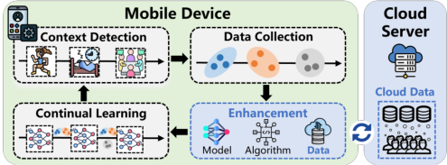

**Figure 1: On-device continual learning pipeline.** 

the need for on-device CL. Figure 1 depicts the four stages a new context undergoes in on-device CL. 

• _Context Detection:_ When a new context is experienced by the user, it can be detected by mobile device through existing human-involved or automatic approaches [9, 33, 78]. For example, in HAR application, the former approach would suggest users to confirm a new activity, whereas the latter would detect a shift in sensor data distribution [78]. 

• _Data Collection:_ For each new context, data samples following a new distribution are collected by mobile device as training data for the subsequent on-device CL process. In mobile applications, the data collected from an individual user’s daily life is sparse, personalized and private, such as photos taken by user or interactions with a virtual assistant. • _Enhancement:_ Prior to conducting on-device CL for a new context, various enhancement techniques need to be applied to mitigate the severe impact of data scarcity, such as fewshot CL based on model initialization and federated CL approaches based on training algorithms. _Our work focuses on the design of this stage from the data perspective._ 

• _Continual Learning_ : The training data of both new and past contexts are mixed to update the on-device model, which has been recognized as one of the most effective methods to assimilate knowledge from new contexts without forgetting the knowledge of past contexts1 [11, 39, 44, 46, 55]. 

### **2.2 Limitation of Existing Approaches** 

In this section, we elaborate the limitations of existing fewshot CL and federated CL approaches in mitigating deviceside data scarcity problem through preliminary experiments2 . 

**Few-shot CL** [49, 61, 83] proposes pretraining ML models on base contexts with massive public data to capture general knowledge, which is then transferred to new contexts through transfer learning techniques. Representative methods include: 1) knowledge distillation [83] (FS-KD), which distills past contexts’ knowledge to the new context’s model by keeping the model outputs of historical data samples unchanged, 2) robust optimization [61] (FS-RO), which constrains model parameters within the common flat minima of 

> 1It is noteworthy that our data enrichment framework can also benefit other classic CL approaches, such as parameter regularization [34, 82] and context-adaptive model architectures [48, 60], as illustrated in §7. 

> 2The detailed experimental settings are introduced in §6.1. 

ACM MobiCom ’24, November 18–22, 2024, Washington D.C., DC, USA 

Chen Gong, Zhenzhe Zheng, Fan Wu, Xiaofeng Jia, and Guihai Chen 

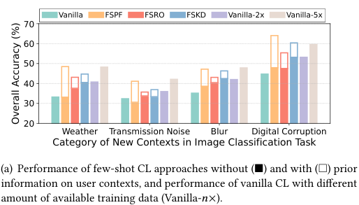

<!-- Start of picture text -->
Vanilla FSPF FSRO FSKD Vanilla-2x Vanilla-5x 70 60 50 40 30 20 Weather Transmission Noise Blur Digital Corruption Category of New Contexts in Image Classification Task (a) Performance of few-shot CL approaches without (■) and with (□) prior information on user contexts, and performance of vanilla CL with different amount of available training data (Vanilla- 𝑛 ×). Overall Accuracy (%) <!-- End of picture text -->

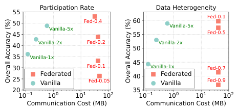

<!-- Start of picture text -->
Participation Rate Data Heterogeneity 55 Fed-0.1 5045 Vanilla-5x Fed-0.4 6055 Vanilla-5x Fed-0.5 40 Vanilla-2x Fed-0.2 50 Vanilla-2x 35 Vanilla-1x 30 Fed-0.1 45 Vanilla-1x Fed-0.7 25 FederatedVanilla Fed-0.05 40 FederatedVanilla Fed-0.9 2010 1 10 0 10 1 10 2 3510 1 10 0 10 1 10 2 Communication Cost (MB) Communication Cost (MB) Overall Accuracy (%) Overall Accuracy (%) <!-- End of picture text -->

(b) Communication cost and accuracy of federated CL with varying device participation rates and data heterogeneity degree (Fed- _𝑝_ denotes that _𝑝_ ×100% devices hold data from different contexts). 

#### **Figure 2: Preliminary experiments on image classification task to illustrate the limitations of existing solutions.** 

all contexts’ training objective functions, and 3) parameter freezing [49] (FS-PF), which freezes the important parameters with high value of the previously trained model. 

However, most of these few-shot CL approaches depend on a powerful model pre-training process, which pretrain either a large model on data from diverse contexts to fully capture the general knowledge, or a tiny model on a customized dataset to learn personalized knowledge. Unfortunately, both of them are impractical for on-device scenarios due to limited hardware resources and unpredictable contexts. On one hand, the limited memory and computational capabilities of mobile devices restrict the size and capacity of deployed models, impeding effective model pretraining over diverse data. On the other hand, the uncertainty of future user contexts prevents the pre-selection of a tailored data-subset for pretraining before model deployment. Our preliminary experiments shown in Figure 2(a) reveal that the performance of few-shot CL declines significantly without prior information on user contexts, with model accuracy reduction ranging from 8 _._ 6−15 _._ 3% for FS-PF, 1 _._ 9−7 _._ 9% for FS-RO and 3 _._ 9−7 _._ 2% for FS-KD. In contrast, simply increasing the training data size to 50 can outperform all few-shot CL approaches, underscoring the potential of data enrichment. 

**Federated CL** [19, 80] utilizes a cloud server to periodically aggregate the parameters of models trained on distributed devices, thereby mitigating the overfitting issue on individual devices and facilitating knowledge transfer across multiple devices. However, the substantial communication overheads and unstable model training process render federated CL impractical for mobile devices. First, the frequent exchange of model parameters between mobile devices and the cloud server incurs significant communication costs and prolongs the wall-clock training time for on-device models. Second, the model performance of federated CL is relatively sensitive to the device participation rate (or amount) and the data heterogeneity across devices [41, 63]. Experimental results shown in Figure 2(b) indicate that: 1) Federated CL 

achieves superior performance only when ≥ 20% devices participate in each round of model aggregation or when more than ≥ 30% mobile users experience similar contexts, which can be unrealistic in real-world settings; 2) In comparison to federated CL, transmitting data with a suitable distribution from cloud to each device could reach the same target accuracy with communication costs reduced to less than 1%. 

### **3 Problem Definition** 

In this section, we present a generic formalization of the cloud-assisted data enrichment problem for on-device CL. We consider a scenario where a mobile user sequentially encounters _𝑇_ new contexts. Each context _𝑡_ = 1 _, . . . ,𝑇_ has an underlying data distribution D _𝑑𝑒__𝑡_and the device collects an empirical dataset D� _𝑑𝑒__𝑡_for training on-device model. Due to the scarcity of user data, a similar data-subset S_𝑡_ is expected to be retrieved from the cloud-side dataset D _𝑐𝑙_ to enrich the on-device empirical dataset D� _𝑑𝑒__𝑡_and thereby enhance the CL performance. 

To assess the effectiveness of data enrichment, we first define a metric to evaluate the similarity between two datasets in terms of their impacts on the model training process. In on-device CL, model parameters are typically fine-tuned by on-device data via gradient descent methods. Therefore, the similarity between two datasets D1 and D2 with respect to the training process of model _𝜃_ can be quantified by the maximal difference between the average gradients of D1 and D2 within a nearby parameter space { _𝜃_′ | ∥ _𝜃_′ − _𝜃_ ∥≤ _𝜖_ }: 

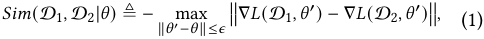

where _𝐿_ (D _,𝜃_ ) = E( _𝑥,𝑦_ )∈D � _𝑙_ ( _𝑥,𝑦,𝜃_ )� denotes the expected loss of model _𝜃_ over dataset D. A high similarity between two datasets D1 and D2 implies their comparable performance in updating model parameters for multiple steps, resulting in similar impacts on on-device model training. 

**Problem Formulation.** For each new context _𝑡_ , the cloud server aims to select the most similar data-subset S_𝑡,_∗ ⊆D _𝑐𝑙_ 

Cloud-assisted Data Enrichment for On-Device Continual Learning 

ACM MobiCom ’24, November 18–22, 2024, Washington D.C., DC, USA 

to update the current on-device model _𝜃__𝑡_−1 in a similar way with the device-side underlying data distribution D _𝑑𝑒__𝑡_, which means that S_𝑡,_∗ and D _𝑑𝑒__𝑡_should exhibit high similarity as measured by the metric in Equation (1). Consequently, the data enrichment problem can be formally expressed as: 

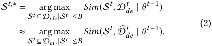

where _𝐵_ represents the maximum allowable size of the selected data-subset and is constrained by the communication cost budget of each device. This formulation enables the device to enhance model training performance by expanding the training data from the collected dataset D� _𝑑𝑒__𝑡_to the enriched larger-scale dataset S_𝑡_ , while ensuring that the enriched data follows a similar distribution. 

**Practical Challenges.** Directly solving the data enrichment problem in Equation (2) brings severe privacy concerns for mobile users and high computational burden for cloud server. First, the mobile device needs to upload both the current model _𝜃__𝑡_−1 and raw user data D� _𝑑𝑒__𝑡_to the cloud server, which poses a severe breach of user privacy. Second, the cloud server has to compute the similarity score _𝑆𝑖𝑚_ (S_𝑡_ _,_ D� _𝑑𝑒__𝑡_|_𝜃𝑡_−1)for every possible data-subset S_𝑡_⊆D_𝑐𝑙_, |S_𝑡_ | ≤ _𝐵_ , resulting in exponential computation complexity. 

### **4 Framework Design** 

Delta incorporates three key components to render data enrichment systematically practical: the construction of a directory dataset to address privacy concerns (§4.1), deviceside soft data matching strategy coupled with a cloud-side data sampling scheme to efficiently and effectively enrich data for new contexts (§4.2), and a re-optimization of the cloud-side data sampling to further enhance its effectiveness across both past and new contexts (§4.3). _Each component is inspired and supported by theoretical analysis presented in §5 and the overall design rationale is illustrated in Figure 3._ 

### **4.1 Directory Dataset Construction** 

To address privacy concerns, Delta introduces the concept of “directory” dataset, which facilitates decomposing the data enrichment problem (2) into two sub-problems, and allows the device and cloud to collaboratively solve the subproblems without the need to share raw user data. 

**Design Rationale.** Inspired by the directory structures in storage systems [16], Delta constructs a compact directory dataset consisting of a few data samples to represent the ex- _𝑐𝑙_| tensive cloud-side dataset, denoted as D _𝑐𝑙__𝑑𝑖𝑟_= �( ¯ _𝑥𝑐,_ ¯ _𝑦𝑐_ )� _𝑐_ |D=1 _𝑑𝑖𝑟_ . This directory dataset can be pre-downloaded by mobile devices along with the model deployment. As illustrated in 

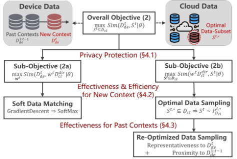

**Figure 3: Design Rationale of Delta.** 

Figure 3 and supported in Theorem 1, the objective function (2) of the data enrichment problem can be decomposed into the sum of two sub-objective functions: 

- _Sub-objective (2a)_ : similarity between the device-side dataset D _𝑑𝑒__𝑡_andtheweighteddirectorydataset_𝑤𝑡_D _𝑐𝑙__𝑑𝑖𝑟_,where each data sample ( ¯ _𝑥𝑐,_ ¯ _𝑦𝑐_ ) ∈D _𝑐𝑙__𝑑𝑖𝑟_ is assigned a weight _𝑤𝑐__𝑡_. The weight vector _𝑤__𝑡_ is a variable to be optimized. 

- _Sub-objective (2b)_ : similarity between the weighted directory dataset _𝑤__𝑡_ D _𝑐𝑙__𝑑𝑖𝑟_ and the cloud-side data-subset S_𝑡_ , where S_𝑡_ is the variable to be optimized. 

These two two sub-objective functions can be optimized sequentially and independently by the mobile device and cloud server through the exchange of non-sensitive information: _1) Mobile device_ optimizes sub-objective (2a) by computing the optimal weight _𝑤__𝑡,_∗ for the directory dataset D _𝑐𝑙__𝑑𝑖𝑟_ to represent the device-side data distribution D _𝑑𝑒__𝑡_. _2) Cloud server_ optimizes sub-objective (2b) by searching for the optimal cloud-side data-subset S_𝑡,_∗ ⊆D _𝑐𝑙_ to align with the weighted directory dataset _𝑤__𝑡,_∗ D _𝑐𝑙__𝑑𝑖𝑟_, with_𝑤𝑡,_∗being uploaded by the mobile device after device-side optimization. _3) Device-cloud communication_ involves the cloud-side directory dataset D _𝑐𝑙__𝑑𝑖𝑟_ and the device-side optimized weight _𝑤__𝑡,_∗ , which do not involve any raw user data and thus protect user privacy akin to classic federated learning [51]. Detailed discussion and comparison are presented in §8. 

**Practical Implementation.** The practical effectiveness of the above decomposition process relies on an appropriate directory dataset that accurately represents the cloud-side public dataset. While classical data clustering methods can be used to select cluster centroids as the directory dataset elements, we observe that directly clustering raw data samples may not fully capture the influence of data on model training, due to the diverse sources, wide-ranging distributions and varying dimensions of cloud-side data. To address this issue, we take advantage of the typical paradigm of on-device model training [12, 13, 17], where the feature extractor _𝜙_ is pre-trained on extensive cloud-side data for generalization 

ACM MobiCom ’24, November 18–22, 2024, Washington D.C., DC, USA 

Chen Gong, Zhenzhe Zheng, Fan Wu, Xiaofeng Jia, and Guihai Chen 

ability and the classifier _𝜓_ is trained on device-side data for personalization performance. We propose clustering data samples ( _𝑥,𝑦_ ) ∈D _𝑐𝑙_ based on the feature extractor outputs _𝜙_ ( _𝑥_ ) rather than raw input _𝑥_ , and selecting the cluster centroids as elements of the directory dataset, which offers two advantages: 1) features as model’s intermediate outputs have a consistent dimension and are more relevant to model training than raw inputs, 2) the features of most cloud-side data samples are already available from the pre-training process of feature extractor, incurring minimal additional costs. 

### **4.2 Data Enrichment for New Context** 

While the directory dataset safeguards user privacy by decomposing the data enrichment problem into device-side and cloud-side sub-problems, it is non-trivial to solve them in an effective and efficient manner due to the scarcity of on-device data and diversity of cloud-side data. 

- _Device-side ineffectiveness_ : Solving sub-problem (2a) requires determining the optimal weight _𝑤__𝑡,_∗ to align the weighted directory dataset _𝑤__𝑡_ D _𝑐𝑙__𝑑𝑖𝑟_ with the device-side data distribution D _𝑑𝑒__𝑡_. However, the underlying data distri- bution is typically approximated by the sparse empirical dataset D� _𝑑𝑒__𝑡_stored by mobile device, which can cause con- ventional gradient descent algorithms to converge to local optima. Consequently, the derived weight becomes overfitted to the limited empirical dataset and ineffective in representing the device-side data distribution. 

- _Cloud-side inefficiency_ : Exactly solving sub-problem (2b) involves evaluating the similarity score for each potential cloud-side data subset, which requires exploring a vast feasible region of candidate data-subsets S_𝑡_ ⊆D _𝑐𝑙,_ |S| ≤ _𝐵_ and results in exponential computation and time complexity for cloud server, leading to low efficiency. 

To achieve an efficient and effective data enrichment process for each coming context, we propose a soft data matching strategy for mobile device to derive a representative directory weight by fully leveraging the limited on-device data, and a data sampling scheme for cloud server to sample an optimal data-subset with constant time complexity. 

**Device-Side: Soft Data Matching.** To prevent the directory weight _𝑤__𝑡_ from overfitting to scarce on-device data, we propose to assign physical meanings to _𝑤__𝑡_ by interpreting each element _𝑤𝑐__𝑡_as the fraction of on-device data that ex- hibits high similarity with the cloud-side cluster centroid ( ¯ _𝑥𝑐,_ ¯ _𝑦𝑐_ ) ∈D _𝑐𝑙__𝑑𝑖𝑟_. Thus, for each data sample(_𝑥,𝑦_) ∈ D� _𝑑𝑒__𝑡_col- lected by mobile device, its similarities with all the cluster centroids are computed, and the weight of the most similar one is incremented by one step: 

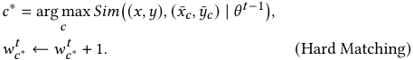

However, in our experiments, we observe that each on-device data sample can exhibit high similarity with more than one cloud-side cluster centroids, which is influenced by the granularity of cloud-side data clustering ( _i.e._ the number of data clusters) during the directory construction process. However, the “hard” matching function _𝑎𝑟𝑔𝑚𝑎𝑥_ is incapable of capturing the correlation between one device-side sample and multiple cloud-side clusters. Thus, we propose to employ a “soft” matching function _𝑠𝑜𝑓𝑡𝑚𝑎𝑥_ , allowing each data sample to contribute to the weights of more than one clusters: 

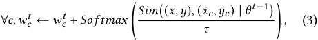

where _𝜏_ is a temperature hyperparameter to control the weight increments of clusters with different degrees of similarity. As _𝜏_ → 0, _𝑠𝑜𝑓𝑡𝑚𝑎𝑥_ gradually degrades to _𝑎𝑟𝑔𝑚𝑎𝑥_ . 

**Cloud-Side: Optimal Data Sampling.** To enhance efficiency and reduce the computational overhead on the cloud server, we propose transforming the “hard” data selection process into a “soft” data sampling process. The key difference is that the former seeks to find an exact data-subset S_𝑡,_∗ to optimize sub-problem (2b), whereas the latter aims to compute a data sampling policy _𝑃__𝑡,_ D∗ _𝑐𝑙_such that the sampled data-subset is optimal for sub-problem (2b) in expectation: 

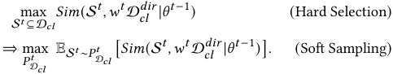

This transformation allows the cloud server to directly identify an appropriate data-subset through data sampling policy, which can be computed with constant time complexity. 

We outline the specific operations of cloud-side data sampling scheme, with theoretical foundation provided in §5.2. The scheme involves _inter-cluster size allocation_ and _intracluster data sampling_ , which determine _how many_ and _which_ data samples to select from each cloud-side data cluster: • _Inter-cluster size allocation._ Given that the size of the selected data-subset is limited by the communication cost budget, the cloud server needs to allocate distinct sampling sizes to different data clusters to maximize the overall similarity between the sampled data-subset and the weighted directory dataset, _i.e._ sub-objective (2b). As demonstrated in Lemma 1, the optimal sampling size |S _𝑐__𝑡,_∗| for each cluster D _𝑐𝑙,𝑐_de- pends on its directory weight _𝑤𝑐__𝑡_and the dispersion degree of intra-cluster feature distribution E _𝑥_ || _𝜙_ ( _𝑥_ )− _𝜙_ ( ¯ _𝑥_ )||: 

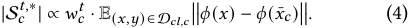

For each cluster, a higher weight suggests a higher similarity with the device-side data for on-device CL, and a wider feature distribution indicates the need for more data samples to comprehensively represent the cluster . 

ACM MobiCom ’24, November 18–22, 2024, Washington D.C., DC, USA 

Cloud-assisted Data Enrichment for On-Device Continual Learning 

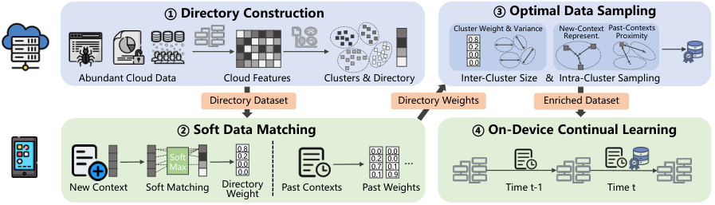

<!-- Start of picture text -->
①Directory Construction ③Optimal Data Sampling Cluster Weight & Variance New-Context Past-Contexts 0.8 Represent. Proximity 0.2 0.0 0.0 Abundant Cloud Data Cloud Features Clusters & Directory Inter-Cluster Size  &  Intra-Cluster Sampling Directory Dataset Directory Weights Enriched Dataset ②Soft Data Matching ④On-Device Continual Learning 0.8 0.0 0.0 MaxSoft 0.20.0 0.20.7 0.00.1 … 0.0 0.1 0.9 New Context Soft Matching Directory  Past Contexts Past Weights Time t-1 Time t Weight <!-- End of picture text -->

**Figure 4: Overall Workflow of Delta Framework. Delta serves as a plug-in for on-device continual learning.** 

• _Intra-Cluster Data Sampling._ Within each cloud-side data cluster D _𝑐𝑙,𝑐_ , the optimal sampling probability for each data sample ( _𝑥,𝑦_ ) is proportional to the feature distance between such data sample and the cluster centroid ( ¯ _𝑥𝑐,_ ¯ _𝑦𝑐_ ): 

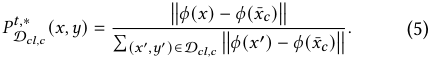

Theoretically, our analysis in Lemma 1 demonstrates that this sampling probability could maximize the expected similarity between each data cluster D _𝑐𝑙,𝑐_ and the corresponding selected data-subset S _𝑐__𝑡_,therebyoptimizingsub-objective (2b) in expectation given fixed directory weights _𝑤__𝑡_ . Intuitively, this sampling strategy favors data samples that are farther from the cluster centroid, which enhances the diversity and informativeness of the selected data-subset while ensuring unbiasedness and representativeness through data re-weighting technique like importance sampling [31]. 

### **4.3 Data Enrichment for All Contexts** 

Although the previous components ensure a private, efficient and effective data enrichment process for each new context, the notorious issue of catastrophic forgetting ( _i.e._ inferior memory stability) is also exacerbated. First, as model parameters _𝜃_ continually adapt to the enriched data {S_𝑖_ } _𝑖__𝑡_ =1, the similarity between each past context _𝑖_ ’s enriched data S_𝑖_ and the underlying distribution D _𝑑𝑒__𝑖_gradually diminishes, hindering the use of {S_𝑖_ } _𝑖__𝑡_ =1for retaining past knowledge. Second, independently enriching data solely for the new context will exacerbate the mutual interference between the model training processes of new and past contexts. 

To address these issues, we take the first step to theoretically analyze the correlation between new context’s enriched data and the model performance on both new and past contexts. Further, we re-optimize the data sampling scheme for cloud server to identify a data-subset that could contribute to the learning processes of both new and past contexts. 

**Theoretical Analysis.** Theorem 3 reveals that the overall CL performance, quantified by the average loss of model over all contexts, is primarily determined by three terms: 

_1) New-context representativeness_ , which is quantified by the feature distance between the enriched dataset S_𝑡_ and the underlying data distribution of new context D _𝑑𝑒__𝑡_. _2) Past-contexts proximity_ , which is measured by the feature distance between the enriched dataset S_𝑡_ and the underlying data distributions of all the past contexts {D _𝑑𝑒__𝑖_} _𝑖__𝑡_ =− 11. _3) Cross-Context Heterogeneity_ , which is a fixed term and determined by the heterogeneity between the new context and the past contexts encountered by the mobile user. Consequently, the original intra-cluster data sampling strategy in Equation (5) can be seen as focusing only on the first term ( _i.e._ effectiveness for new context), while overlooking the second term ( _i.e._ effectiveness for past contexts.) 

**Practical Implementation.** Guided by the theoretical results, we further derive the analytical expression for the reoptimized cloud-side data sampling policy, with the detailed mathematical derivation provided in §5.3. Specifically, for intra-cluster data sampling, the optimal sampling probability for each data sample is proportional to the weighted sum of new-context representativeness and past-contexts proximity: 

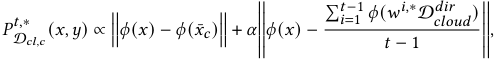

where _𝛼_ is a hyperparameter determined by the device to balance the model performance over the new context and past contexts when conducing cloud-assisted data enrichment. 

### **4.4 Overall Framework** 

We illustrate the overall workflow of Delta framework in Figure 4, which comprises four stages. ➊ **Directory Construction:** Initially, the cloud server utilizes the pre-trained feature extractor to extract features from diverse datasets and performs data clustering to construct the directory dataset. The directory dataset is then distributed to mobile devices along with the model deployment. ➋ **Soft Data Matching:** For each coming new context _𝑡_ , the mobile device solves sub-problem (2a) through the soft data matching strategy outlined in Equation (3), and uploads the optimal directory weights for both the new and past contexts to the cloud 

ACM MobiCom ’24, November 18–22, 2024, Washington D.C., DC, USA 

Chen Gong, Zhenzhe Zheng, Fan Wu, Xiaofeng Jia, and Guihai Chen 

server. ➌ **Optimal Data Sampling:** Upon receiving the directory weights, the cloud server computes the analytical expressions for the optimal data sampling scheme, which includes inter-cluster size allocation in Equation (4) and intra-cluster data sampling in Equation (5). The optimal datasubset is then sampled according to the scheme and transmitted back to the mobile device. ➍ **On-Device Continual Learning:** The mobile device conducts CL process using the enriched datasets of both new and past contexts. _Generally,_ Delta _serves as a plug-in module to enhance on-device CL performance with privacy protection, effectiveness and efficiency._ 

### **5 Theoretical Analysis** 

In this section, we provide theoretical foundations for the key components of Delta framework. Detailed proofs are provided in supplementary material [22] due to limited space. 

### **5.1 Theory for Directory Construction** 

To facilitate data enrichment as outlined in Equation (2) without disclosing raw user data, we introduce the directory dataset to decompose the original objective function into two sub-objective functions. The performance of this decomposition is theoretically guaranteed by Theorem 1, which elucidates the relation between the original objective function and two sub-objective functions. 

Theorem 1. _Given directory dataset_ D _𝑐𝑙__𝑑𝑖𝑟,themaximal_ _similarity between the device-side dataset_ D _𝑑𝑒__𝑡and the cloud-_ _side data-subset_ S_𝑡_ ⊆D _𝑐𝑙 for model 𝜃__𝑡_−1 _can be bounded by_ 

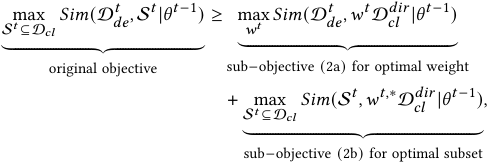

_where 𝑤__𝑡_ D _𝑐𝑙__𝑑𝑖𝑟_ _represents the weighted directory dataset._ This theorem shows that the optimal value of the original objective function (2) is bounded from below by the sum of the optimal values of the two sub-objective functions (2a) and (2b). Consequently, Delta essentially optimizes the worstcase performance of data enrichment for diverse contexts. The practical gap between the original and decomposed objective functions is determined by the representativeness of the cloud-side directory dataset. In §6.3, we empirically show that a directory dataset with around 102 elements is sufficient to represent a cloud-side dataset consisting of 106 data samples across 102 contexts. 

### **5.2 Theory for New Context’s Enrichment** 

To provide theoretical guarantees for the optimality of the cloud-side data sampling scheme outlined in Equations (4) 

and (5), we first present Theorem 2 to partition the on-device model _𝜃_ into a feature extractor _𝜙_ and a classifier _𝜓_ with a Lipstchiz continuity constant _𝐿𝜓_ . The feature extractor is typically pre-trained by cloud server and remains unchanged during the on-device model training process. 

Theorem 2. _The expected similarity between the weighted directory dataset 𝑤__𝑡_ D _𝑐𝑙__𝑑𝑖𝑟_ _and the data-subset_ S_𝑡_ _selected according to sampling scheme 𝑃__𝑡_ D _𝑐𝑙__is bounded by:_ 

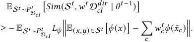

Further, in Lemma 1, we demonstrate that the expected value of sub-objective function (2b) (i.e., the lower bound of the above inequality) is determined by two terms: inter-cluster sampling size |S _𝑐__𝑡_|andintra-clustersamplingprobability _𝑃__𝑡_ D _𝑐𝑙,𝑐_(_𝑥,𝑦_) for each cloud-side data cluster_𝑐_. 

Lemma 1. _The expected similarity between the sampled data-subset_ S_𝑡_ _and the weighted directory dataset 𝑤__𝑡_ D _𝑐𝑙__𝑑𝑖𝑟_ _is determined by each cluster 𝑐’s sampling size_ |S _𝑐__𝑡_|_and intra-_ _cluster data sampling probability 𝑃__𝑡_ D _𝑐𝑙,𝑐_(_𝑥,𝑦_)_:_ 

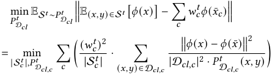

By leveraging Cauchy-Schwarz inequality, we can derive the analytical expressions of the optimal data sampling policy (i.e. |S _𝑐__𝑡,_∗| and_𝑃𝑡,_ D∗ _𝑐𝑙_), which can be computed directly using the directory weights uploaded by mobile device: 

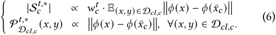

### **5.3 Theory for All Contexts’ Enrichment** 

In §4.3, we propose to refine the cloud-side data sampling scheme to ensure that the enriched data for new context can contribute to the learning processes of both new and past contexts. To achieve this, we first analyze the impact of new context’s enriched data on the model performance over all contexts in Theorem 3, which consists of three key terms: representativeness to new context, proximity to past contexts and the data heterogeneity across different contexts. 

Theorem 3. _In 𝑚-th training round for context 𝑡, when the model parameters are updated from 𝜃__𝑡,𝑚_ _to 𝜃__𝑡,𝑚_+1 _using the enriched data 𝑆__𝑡_ _sampled by policy 𝑃__𝑡_ D _𝑐𝑙__, the expected reduction_ _in model loss (or improvement in model performance) over all contexts’ data distribution_ D _𝑑𝑒_1:_𝑡can be bounded by:_ 

ACM MobiCom ’24, November 18–22, 2024, Washington D.C., DC, USA 

Cloud-assisted Data Enrichment for On-Device Continual Learning 

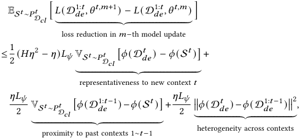

<!-- Start of picture text -->
ES 𝑡 ∼ 𝑃 D 𝑡 𝑐𝑙 � 𝐿 � �������������������������������������� (D 𝑑𝑒 1: 𝑡 ,𝜃 𝑡,𝑚 +1 �� ) − �������������������������������������� 𝐿 (D 𝑑𝑒 1: 𝑡 ,𝜃 𝑡,𝑚 � ) � loss reduction in  𝑚 −th model update ≤ 1 2 ( 𝐻𝜂 2 − 𝜂 ) 𝐿𝜓 VS 𝑡 ∼ 𝑃 D 𝑡 𝑐𝑙 � 𝜙 (D 𝑑𝑒 𝑡 ) − 𝜙 (S 𝑡 ) � + � ����������������������������������� �� ����������������������������������� � representativeness to new context  𝑡 𝜂𝐿𝜓 𝜂𝐿𝜓 2 VS 𝑡 ∼ 𝑃 D 𝑡 𝑐𝑙 � 𝜙 (D 𝑑𝑒 1: 𝑡 −1 ) − 𝜙 (S 𝑡 ) � + 2 ����� 𝜙 ��������������������������� (D 𝑑𝑒𝑡 ) − �� 𝜙 (D ��������������������������� 𝑑𝑒 1: 𝑡 −1 )�����2 , � ������������������������������������� �� ������������������������������������� � heterogeneity across contexts proximity to past contexts 1∼ 𝑡 −1 <!-- End of picture text -->

_where_ V _𝑥_ [ _𝑓_ ( _𝑥_ )] _denotes the variance of function 𝑓_ ( _𝑥_ ) _._ 

Building on this analysis, we observe that to improve the overall CL performance and reduce the model loss across all contexts, the cloud-side sampling scheme _𝑃__𝑡_ D _𝑐𝑙_should take both the representatievess to new context and the proximity to past contexts into consideration. From a theoretical perspective, we further derive the analytical expression of the re-optimized data sampling scheme _𝑃__𝑡,_ D∗ _𝑐𝑙_in Lemma 2. 

Lemma 2. _To optimize the model performance on the overall data distribution of all encountered contexts, the intra-cluster data sampling probability 𝑃__𝑡,_ D∗ _𝑐𝑙__needs to be refined as:_ 

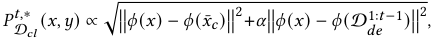

_where 𝛼_ = _𝐿𝜓 𝜂_ <u>1−1</u>_canberegardedasahyper-parameterto_ _balance the model performance over new and past contexts._ 

### **6 Evaluation** 

### **6.1 Experimental Setup** 

**Tasks, Datasets and Models.** To demonstrate Delta’s broad applicability, we evaluate Delta on four typical mobile computing tasks with diverse data modalities, model structures and categories of user contexts (summarized in Table 1). • _Image Classification (IC)._ The Cifar10-C dataset [28] contains around 750 _,_ 000 images of 10 objects across four context categories: weather, noise, blur and digital corruptions. For each context category, the dataset is processed into 5 subsets with 2 new objects and 1 new context per subset. ResNet18 [27] is trained for this 10-class image classification task. 

• _Human Activity Recognition (HAR)._ HHAR [68], UCI [58], MotionSense [47] and Shoaib [64] are four public datasets collected from 73 users performing 6 basic activities (still, walking, upstairs, downstairs, jogging, bike) with 5 device placements (pocket, belt, arm, wrist, waist). For each context category, the dataset is processed into 6 subsets with 1 new activity in a new context. A lightweight CNN-based model DCNN [77] is trained for this 6-class classification task. 

• _Audio Recognition (AR)._ Google Speech command [73] comprises 100,000 sound files of 20 commands from over 2,000 users with varied tones and environmental conditions. The dataset is processed into 5 subsets for each context category, 

each containing 4 new commands in 1 new context. A deep neural network VGG-11 [67] is deployed for this task. • _Text Classification (TC)._ The NC corpus in XGLUE benchmark [43] is a cross-lingual understanding dataset consisting of 50 _,_ 000 articles on 10 topics and in 5 languages (German, English, Spanish, French, Russian). For each context category, the dataset is processed into 5 subsets with 2 new topics and 1 new context. A transformer-based model BERT [18] is fine-tuned for this 10-class classification task. 

Note that we standardize the total number of on-device contexts to approximately 5 to ensure a consistent evaluation of Delta across various tasks, models and modalities, and thus the class number per context may vary for different datasets. 

**Configurations.** For each task, we collect data from 50% users (or randomly select 50% samples for IC and TC tasks) to form the cloud-side public dataset, with the remaining data used to simulate the on-device empirical data across different contexts. For cloud server, data samples from different users and contexts are mixed to reflect the typical scenario where the specific context of each raw data sample is unknown. For mobile device, we use 5 samples per class in each context as empirical data for model fine-tuning, consistent with the statistics that an average European citizen takes over around 4 _._ 9 photos daily [10] and uses Siri several times a day [84]. The remaining data samples are used as testing data for each context. For Delta, the temperature _𝜏_ for device-side soft matching is set to 0 _._ 1 and the number of cloud-side data clusters is 20× _𝑛𝑢𝑚_  𝑐𝑙𝑎𝑠𝑠_ (i.e. 200/120/400/200 for IC/HAR/AR/TC). The hyperparameter _𝛼_ is set to 1.0 to balance the effects of cloud-side data sampling on new and past contexts. The default communication budget is set to 25 samples/class for each new context, and an in-depth analysis of the impacts of such budget and on-device data amount is presented in §6.3. 

**Baselines.** To our best knowledge, Delta is the first data enrichment framework for on-device CL, and we compare it against the model- and algorithm-based baselines (few-shot CL and federated CL) and a random data enrichment baseline. 1) _Few-shot CL_ pre-trains model on cloud-side data in advance to capture the general knowledge, which is transferred to device-side new contexts through knowledge distillation [83] (FS-KD), robust optimization [61] (FS-RO) and parameter freezing [49] (FS-PR). 2) _Federated CL_ leverages the cloud server to periodically aggregate the models trained on multiple devices per 10 local model updates. In our experiments, the default device number is 50, except for 35 for HAR task. We use Fed- _𝑝_ to denote different settings of device participation rate _𝑝_ . For IC and TC tasks, the data samples from each user are from the same context category to simulate the common data heterogeneity across users (e.g. W/N/B/D for IC and L for TC). The CL performance is evaluated on an independent test dataset, constructed according 

ACM MobiCom ’24, November 18–22, 2024, Washington D.C., DC, USA 

Chen Gong, Zhenzhe Zheng, Fan Wu, Xiaofeng Jia, and Guihai Chen 

|**Task**|**Modality**|**Context Category**|**Dataset**|**Model(#params)**|
|---|---|---|---|---|
|IC|Image|Object(O), Weather(W), Noise(N), Blur(B), Digital Corruption(D)|Cifar10-C|ResNet18(11.2M)|
|HAR|IMU|Activity (A), Physical Condition(P), Device Placement(D)|HHAR, UCI, Motion, Shoaib|DCNN(17.3K)|
|AR|Audio|User Command(C), Tone(T), Environmental Noise(N)|Google Speech|VGG11(9.75M)|
|TC|Text|Article Topic(T), Language(L)|XGLUE|BERT(0.178B)|

**Table 1: Summary of tasks, modalities, contexts, datasets and models.** 

to the user contexts specified by the experimental setting. 3) _Random_ method selects a random cloud-side data-subset to enrich device-side empirical data. 

**Metrics.** We assess the on-device CL performance using four metrics. _Overall performance_ measures the inference accuracy of the final model across all the encountered contexts. _Learning plasticity_ is the average of each new context’s highest accuracy during its learning process. _Memory stability_ is the average ratio between each context’s final accuracy to its maximal accuracy. _System overheads_ include the computation latency, communication costs, memory footprint and energy consumption for both the device side and cloud side. 

**Deployments.** We use a cloud server with one NVIDIA 3090Ti GPU and one mobile platform NVIDIA Jetson Nano [52]. 

### **6.2 End-to-End Performance** 

We begin by comparing the end-to-end performance of Delta against the baselines across all four tasks. 

**Delta significantly improves the overall performance of on-device CL.** Table 2 summarizes the average accuracy of the final model across all contexts. Compared with the best-performing few-shot CL method, Delta achieves a notable improvement, with accuracy increases of 13−16% higher accuracy on IC, 10−14% on HAR, 0 _._ 2−2 _._ 5% on AR, and 4−7 _._ 3% on TC. Note that Delta’s improvement on AR task is minimal because its data heterogeneity across contexts is relatively low (i.e. different tones and background noises) and vanilla CL could perform well. When compared to federated CL, Delta consistently achieves the highest overall performance across all settings, and reduces total communication costs by 91 − 99%, demonstrating its superior effectiveness and efficiency in enhancing CL performance. Furthermore, we observe that for most tasks (IC, HAR and TC), all methods tend to perform better on contexts with mixed categories (last line of each task in Table 2). The potential reason is that data samples with different context categories exhibit a greater distribution divergence, making it easier for the on-device model to learn the decision boundary. 

**Delta enhances the learning plasticity of on-device CL with various new contexts.** Figure 5 reports the average value of each new context’s peak accuracy during the learning process, a metric widely adopted to assess the learning plasticity. A key observation is that Delta consistently 

outperforms the baselines across various tasks, data modalities and context categories, demonstrating high robustness and applicability to diverse new contexts. For example, Delta achieves around 90% and 100% accuracy for new context in IC and HAR tasks regardless of context categories and fluctuates less than 3% accuracy on the other two tasks. The high accuracy for new contexts can be attributed to the limited classes within each new context and the enriched data from cloud side. In contrast, the performance of baselines on new contexts is sensitive to the diversity of context categories, such as few-shot CL dropping from 95% to 90% on AR task and federated CL reducing from 93% to 87% on TC task. The rationale behind these is that few-shot CL depends on the high relevance between the on-device context and the base contexts during pre-training to facilitate effective knowledge transfer. Similarly, the performance of federated CL is largely influenced by the data heterogeneity across different users’ ongoing contexts. Conversely, Delta can consistently identify an appropriate cloud-side data-subset that contributes to the device-side CL process, making it relatively robust. 

**Delta consistently achieves a low accuracy drop on past contexts and exhibits high memory stability.** Figure 6 plots the average ratio between each context’s final accuracy and its peak accuracy, which indicates that Delta can maintain over 90% relative performance for past contexts. The superior memory stability is due to the consideration of the impact of new context’s enriched on all contexts’ overall performance during the cloud-side data sampling process. We also observe that few-shot CL methods can slightly outperform Delta in some cases. This is because they achieve significantly lower peak accuracy for new contexts compared to Delta (e.g. a 10% accuracy gap in IC task shown in Figure 5), and thus the accuracy drop might be less pronounced. 

**Delta incurs marginal system overheads for both mobile device and cloud server** , as depicted in Figure 7. • _Device-Side._ The soft matching solution for sub-problem (2a) requires computing the feature of each local data sample and its distance to each element of directory dataset. This results in additional latency of 23.8/1.05/ 4.25/109ms and energy consumption of 0 _._ 49/0 _._ 30/0 _._ 42/2 _._ 47J per sample for IC/HAR/AR/TC tasks, respectively. Moreover, Figure (7(c)) shows that soft matching process has a lower memory footprint than CL process for avoiding model backpropagation, 

ACM MobiCom ’24, November 18–22, 2024, Washington D.C., DC, USA 

Cloud-assisted Data Enrichment for On-Device Continual Learning 

|**Tasks**|**Context** |**Vanilla** |**F** |**ew-Shot C** |**L** |**F** |**ederated C** |**L** |**Data Enr** |**ichment** |Δ**Acc.**|Δ**Comm.**|
|---|---|---|---|---|---|---|---|---|---|---|---|---|
||**Category**|**CL**|FS-KD|FS-RO|FS-PF|Fed-0.1|Fed-0.2|Fed-0.4|Random|Delta|||
||O+W|32.7±1_._49|41.7±1_._78|39.2±2_._13|36.9±2_._87|31.8±0_._24|46.4±1_._65|55.1±0_._42|42.5±2_._42|57.7±0_._54|16_._0%↑|93_._7%↓|
||O+N|31.3±1_._74|36.2±2_._34|35.5±1_._65|32.3±1_._25|31.1±0_._04|40.4±0_._51|45.0±0_._12|35.8±1_._00|50.9±1_._66|14_._8%↑|93_._5%↓|
|IC|O+B|35.6±0_._94|43.7±1_._12|40.6±0_._24|39.2±0_._06|32.6±0_._16|39.6±0_._24|50.1±0_._31|39.9±1_._69|57.7±0_._98|14_._0%↑|91_._1%↓|
||O+D|45.0±2_._57|55.1±1_._17|51.5±2_._66|52.2±3_._10|36.9±0_._04|49.0±0_._51|61.7±0_._34|53.7±2_._24|72.3±2_._27|17_._1%↑|92_._2%↓|
||O+W+N+B+D|77.3±0_._49|81.2±1_._53|80.4±0_._81|75.3±0_._41|30.0±0_._05|39.8±0_._71|50.8±0_._41|47.8±6_._64|94.8±2_._74|13_._6% ↑|95_._3% ↓|
||A|52.4±3_._67|55.0±3_._93|52.9±2_._55|48.3±2_._69|54.0±0_._64|60.0±0_._21|61.3±0_._55|58.4±0_._35|69.3±1_._96|14_._3%↑|99_._6%↓|
|HAR|A+P|51.2±4_._53|53.3±3_._20|50.1±3_._52|49.4±2_._95|60.5±1_._28|61.1±1_._89|63.1±0_._85|58.5±0_._75|66.6±1_._78|13_._3%↑|99_._8%↓|
||A+P+D|81.0±4_._75|80.3±2_._35|78.7±4_._37|71.0±4_._27|62.2±3_._58|66.8±3_._97|70.1±4_._28|61.1±3_._25|90.3±5_._09|10_._0% ↑|99_._7% ↓|
||C|93.6±0_._16|93.5±0_._07|92.9±0_._65|94.2±0_._28|88.1±1_._65|88.3±0_._83|88.5±1_._78|90.4±0_._19|94.3±0_._17|0_._2%↑|99_._9%↓|
|AR|C+T|89.0±0_._41|89.4±0_._57|89.4±0_._38|90.3±0_._79|86.5±0_._24|88.5±0_._62|88.7±0_._25|90.3±0_._26|91.1±1_._17|0_._8%↑|99_._9%↓|
||C+T+N|84.7±0_._64|84.8±1_._52|86.2±0_._79|86.9±0_._40|87.5±0_._54|87.7±0_._31|88.0±0_._61|88.5±1_._45|89.2±1_._60|2_._3% ↑|99_._9% ↓|
|TC|T|73.2±2_._15|73.5±1_._35|75.7±4_._07|73.3±2_._56|79.6±0_._37|79.6±0_._19|79.8±0_._14|73.9±2_._69|83.1±2_._26|7_._3%↑|99_._8%↓|
||T+L|77.7±3_._19|82.2±0_._29|80.1±3_._02|80.0±1_._89|84.3±0_._14|84.4±0_._18|84.7±0_._09|79.7±2_._21|86.2±2.16|4_._0% ↑|99_._4% ↓|

**Table 2: Summary of overall CL performance (average accuracy of final model on all contexts). We also mark Delta’s improvement on accuracy (over few-shot CL) and reduction in communication costs (over federated CL).** 

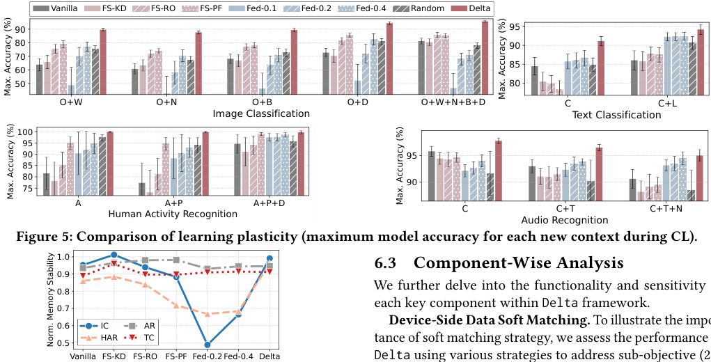

<!-- Start of picture text -->
Vanilla FS-KD FS-RO FS-PF Fed-0.1 Fed-0.2 Fed-0.4 Random Delta 90 95 80 90 70 85 60 50 80 O + W O+N O + B O+D O+W+ N +B+D C C+L Image Classification Text Classification 100 95 90 95 85 80 90 75 A A+P A+P+D C C+T C+T+N Human  Ac tivity Recognition Audio Recognition Figure 5: Comparison of learning plasticity (maximum model accuracy for each new context during CL). 1.0 6.3 Component-Wise Analysis 0.9 0.8 We further delve into the functionality and sensitivity 0.7 each key component within Delta framework. Delta framework. framework. 0.6 IC AR Device-Side Data Soft Matching.  To illustrate the impor- 0.5 HAR TC tance of soft matching strategy, we assess the performance of Vanilla FS-KD FS-RO FS-PF Fed-0.2 Fed-0.4 Delta Delta using various strategies to address sub-objective (2a), using various strategies to address sub-objective (2a), Max. Accuracy (%) Max. Accuracy (%) Max. Accuracy (%) Max. Accuracy (%) Norm. Memory Stability <!-- End of picture text -->

We further delve into the functionality and sensitivity of each key component within Delta framework. Delta framework. framework. 

**Device-Side Data Soft Matching.** To illustrate the importance of soft matching strategy, we assess the performance of Delta using various strategies to address sub-objective (2a), using various strategies to address sub-objective (2a), including gradient descent ( _𝐺𝐷_ ), hard matching ( _𝑎𝑟𝑔𝑚𝑎𝑥_ ) and soft matching ( _𝑠𝑜𝑓𝑡𝑚𝑎𝑥_ ) with varying temperatures _𝜏_ . Figure 8(a) indicates that _𝐺𝐷_ underperforms across most tasks, while _𝑠𝑜𝑓𝑡𝑚𝑎𝑥_ consistently outperforms _𝑎𝑟𝑔𝑚𝑎𝑥_ . The reasons are twofold: 1) _𝐺𝐷_ is susceptible to getting trapped in local optima and leads to the overfitted directory weight; 2) _𝑎𝑟𝑔𝑚𝑎𝑥_ fails to exploit the similarities between one deviceside sample and multiple cloud-side clusters, which is essential when the cloud-side data is finely clustered. We also note that the optimal _𝜏_ differs by task due to varying feature distributions, and we set _𝜏_ = 1 _._ 0 for stable performance. 

**Figure 6: Comparison of memory stability in the settings of mixed context categories for each task.** 

indicating that Delta does not increase peak memory usage due to the sequential execution of Delta and on-device CL. • _Cloud-Side._ The analytical solution for optimal cloud-side data sampling can be computed within 2 _._ 56−7 _._ 15 ms using a single 10-core Intel CPU with a memory footprint of 0 _._ 12−7 _._ 8 MB. This high computational efficiency allows for parallel cloud-side operations for numerous devices simultaneously. • _Device-cloud Communication._ For each context, the communication overhead includes the uploading of device-side directory weight, which consists of only several vectors (≤ 1KB), and the downloading of cloud-side enriched data, which requires a total of 30.4/2.89/23.5/6.43 KB for IC/HAR/ AR/TC tasks under default settings. 

**Device-Side Data Size.** Figure 8(b) shows the impact of user data amount on Delta and baseline performances, where we present testing loss instead of accuracy for clearer comparison. Delta demonstrates relatively high robustness, 

ACM MobiCom ’24, November 18–22, 2024, Washington D.C., DC, USA 

Chen Gong, Zhenzhe Zheng, Fan Wu, Xiaofeng Jia, and Guihai Chen 

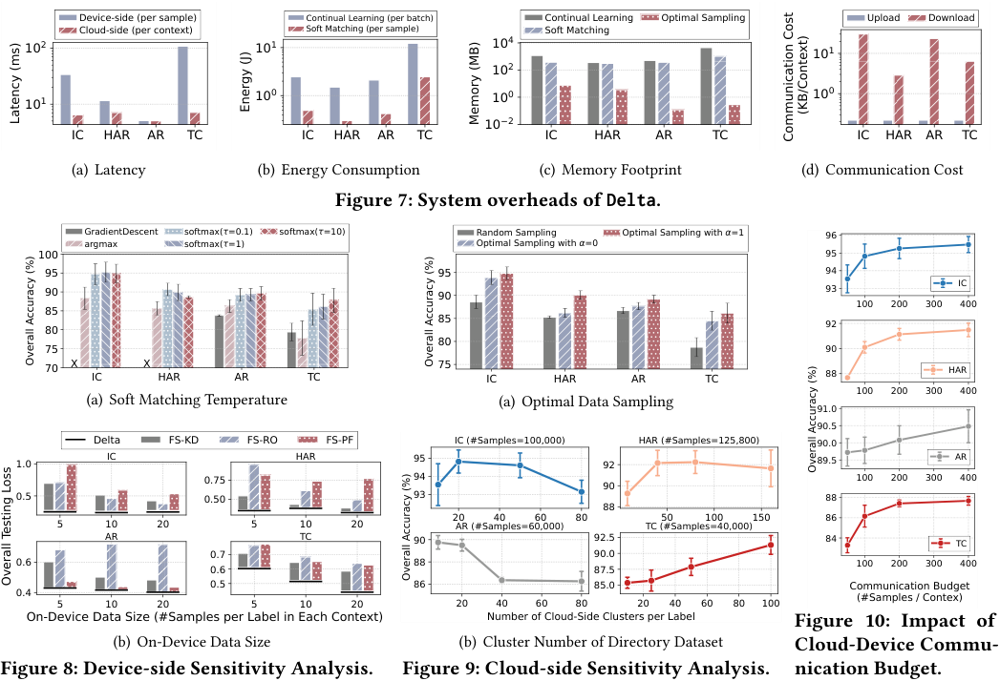

<!-- Start of picture text -->
Device-side (per sample) Continual Learning (per batch) Continual Learning Optimal Sampling Upload Download Cloud-side (per context) Soft Matching (per sample) Soft Matching 10 2 10 1 10 4 10 1 10 2 10 0 10 0 10 0 10 1 10 2 IC HAR AR TC IC HAR AR TC IC HAR AR TC IC HAR AR TC (a) Latency (b) Energy Consumption (c) Memory Footprint (d) Communication Cost Figure 7: System overheads of Delta. GradientDescent softmax( =0.1) softmax( =10) Random Sampling Optimal Sampling with =1 96 argmax softmax( =1) Optimal Sampling with =0 100 95 95 95 94 90 90 93 IC 100 200 300 400 85 80 85 92 80 75 90 70 X IC X HAR AR TC 75 IC HAR AR TC 88 HAR 100 200 300 400 (a) Soft  M atching Temperature (a) Optimal Data Sampling 91.0 90.5 Delta FS-KD FS-RO FS-PF IC (#Samples=100,000) HAR (#Samples=125,800) 90.0 1.0 IC HAR 95 92 89.5 AR 0.75 94 90 100 200 300 400 0.5 0.50 93 88 88 20 40 60 80 50 100 150 86 5 10 20 5 10 20 AR (#Samples=60,000) TC (#Samples=40,000) AR TC 90 92.5 84 TC 0.7 90.0 0.6 0.6 88 87.5 100 200 300 400 0.4 5 10 20 0.5 5 10 20 86 20 40 60 80 85.0 20 40 60 80 100 Communication Budget(#Samples / Contex) On-Device Data Size (#Samples per Label in Each Context) Number of Cloud-Side Clusters per Label Figure 10: Impact of (b) On-Device Data Size (b) Cluster Number of Directory Dataset Cloud-Device Commu- Figure 8: Device-side Sensitivity Analysis. Figure 9: Cloud-side Sensitivity Analysis. nication Budget. Energy (J) Latency (ms) Memory (MB)  (KB/Context) Communication Cost Overall Accuracy (%) ll() Overa% Accuracy Overall Accuracy (%) Overall Testing Loss Overall Accurac () % y <!-- End of picture text -->

**Figure 8: Device-side Sensitivity Analysis.** 

which is attributed to 1) the effective solution of the deviceside sub-problem with scarce on-device data through our soft matching strategy, and 2) the substantial performance improvement brought by the abundant cloud-side enriched data compared to additional device-side user data. Also, we observe that baselines show greater sensitivity to on-device data quantity, highlighting the critical role of on-device data enrichment and further motivates our work. 

Delta’s performance with different sampling schemes, including random sampling, optimal sampling for solely new context ( _𝛼_ = 0) and optimal sampling considering all contexts ( _𝛼_ = 1). Figure 9(a) indicates that optimal data sampling for only new context improves overall model accuracy by 5 _._ 3/0 _._ 9/1 _._ 0/5 _._ 7% for IC/HAR/AR/TC tasks. Considering past contexts further enhances accuracy by 0 _._ 9/3 _._ 9/1 _._ 5/1 _._ 7%. Notably, he most significant improvements are observed in IC and TC tasks, as the visual and textual data we used are more diverse, making random sampling less stable and effective. 

**Cloud-Side Directory Dataset.** Figure 9(b) plots the performance of Delta with varying numbers of cloud-side data clusters for directory dataset construction, where we replace the cloud-side data sampling scheme with random sampling to isolate the effects of directory dataset. We observe that a slight increase in cluster number can improve Delta’s performance by making directory dataset more representative and aligning the cloud-side sub-objective (2b) more closely with the overall objective (2). However, an excessively large cluster number can result in numerous similar clusters, leading to the selection of redundant data for enrichment. For stable performance, we set cluster number per label to 20. 

**Device-Cloud Communication Budget.** We further evaluate Delta’s performance with varying sizes of cloudside enriched data to simulate different communication budgets. Figure 10 shows that Delta’s performance improves significantly as the enriched data size per context increases from 50 to 100, and then stabilizes with larger data sizes. This robustness highlights Delta’s applicability for real-world devices with diverse network conditions. 

### **7 Related Work** 

**Cloud-Side Optimal Data Sampling.** To evaluate the importance of cloud-side optimal data sampling, we assess 

**Cloud-Side Continual Learning** aims to train ML models over non-stationary data streams to acquire new contextual knowledge without forgetting past contexts. This approach 

ACM MobiCom ’24, November 18–22, 2024, Washington D.C., DC, USA 

Cloud-assisted Data Enrichment for On-Device Continual Learning 

is inspired by the capability of biological neural networks to modulate synaptic memory and plasticity in response to dynamic inputs [72, 82]. Existing solutions include: 1) stabilizing previously-learned synaptic changes by penalizing parameter changes of the past optimal model [34, 82]; 2) expanding and pruning synaptic connections to form new synaptic memory via creating additional parameter space for new contexts and re-normalizing them with past contexts [48, 60]; 3) consolidating synaptic memory by storing the important data of past contexts and replaying them during learning new contexts [42, 44], where the data importance can be measured by representativeness [57, 62], diversity [81] or uncertainty [5]. Previous studies [26, 37, 39] have found that data replay methods provides the best trade-off between model performance and system efficiency, and thus our experiments are mainly conducted in this case. Delta _framework serves as a plug-in component to enrich on-device data and enhance performance for all these methods._ 

**Device-Side Continual Learning** focuses on optimizing the utilization of hardware resources to implement cloudside CL algorithms on resource-constrained devices. This includes saving storage cost through data quantization techniques [29, 56], reducing memory overhead through contextaware parameter sparsity [38, 74], accelerating data loading via hierarchical memory management [39, 46], and accelerating computation with adaptive computing resource [35, 36, 40, 71]. However, most of these works overlook the data bottleneck on mobile device (scarce, personal and unpredictable user data), and thus Delta _is complementary to existing ondevice CL works focusing on hardware bottleneck._ 

**On-Device Data Augmentation** is a powerful technique to improve model training performance by generating diverse data from existing user data, such as leveraging geometric and color space transformation and random erasing for visual images [65], using techniques grounded in physical principles for IMU signal [75], as well as employing language rule-based transformations and synonym replacement for textual data [8]. However, a significant limitation of data augmentation is that each data modality and task necessitates specifically designed augmentation techniques to accommodate unique data characteristics, making the data augmentation process cumbersome and inefficient. Delta _serves as a generally solution to complement these works by directly expanding the on-device available data._ 

### **8 Discussion** 

**Privacy Consideration.** In Delta framework, the information uploaded by devices includes the directory weights, which excludes any raw user data and protects privacy like FL [51]. Unlike FL, where the transmitted model updates inherently encode specific features of training data, Delta’s 

transmitted weights only indicate the similarity between user data and directory dataset (e.g. likelihood of weather conditions rather than pixels in IC task, probability of device placement rather than specific IMU signals in HAR task), which reveals rough context information and makes the recovery or identification of raw data more challenging. To further enhance privacy, secure aggregation techniques like secure multi-party computation [21] and homomorphic encryption [4] can be integrated into the communication and computation processes in Delta. 

**Comparison with FL.** The intuitions behind Delta framework and FL paradigm are distinct. FL aims to leverage device-side data to develop a global model that can generalize well across diverse user contexts, i.e. _global knowledge aggregation_ . In contrast, Delta utilizes cloud-side data to enhance the personalization of local models for individual user contexts, i.e. _local knowledge augmentation_ . As a result, the applicability of FL is primarily limited by device-side constraints, including the vast number of devices, high participation rates, cross-device data heterogeneity and tolerance for communication overheads. Delta, on the other hand, seeks to shift the limitations to the cloud, assuming that cloud server can collect abundant public data to match different users. This aligns with the recent success of training billionscale models over sufficiently diverse datasets for various tasks. Additionally, when confronted with extremely rare user contexts, Delta could still identify the most helpful and relevant cloud-side data-subsets to provide data foundation for existing model or algorithm-based augmentation methods. In conclusion, FL and Delta are applicable for different scenarios and could potentially be complementary. 

### **9 Conclusion** 

In this work, we explore the potential of leveraging cloudside abundant data resource to address the data bottleneck in on-device CL. We formalize the data enrichment problem and propose Delta, a private, efficient and effective cloudassisted data enrichment framework for on-device CL. On extensive experiments, Delta shows superior model performance and system efficiency across various mobile computing tasks, data modalities and model structures. 

### **Acknowledgments** 

This work was supported in part by National Key R&D Program of China (No. 2022ZD0119100), in part by China NSF grant No. 62322206, 62132018, U2268204, 62025204, 62272307, 62372296. The opinions, findings, conclusions, and recommendations expressed in this paper are those of the authors and do not necessarily reflect the views of the funding agencies or the government. The authors thank the anonymous reviewers and the shepherd for their insightful feedbacks. 

ACM MobiCom ’24, November 18–22, 2024, Washington D.C., DC, USA 

Chen Gong, Zhenzhe Zheng, Fan Wu, Xiaofeng Jia, and Guihai Chen 

### **References** 

- [1] 2024. Apple Intelligence Preview - Apple. https://www.apple.com/ apple-intelligence/. 

- [2] 2024. Common Crawl maintains a free, open repository of web crawl data that can be used by anyone. https://commoncrawl.org/. 

- [3] 2024. Google Smart Lens - Search What You See. https://lens.google/. 

- [4] Abbas Acar, Hidayet Aksu, A Selcuk Uluagac, and Mauro Conti. 2018. A survey on homomorphic encryption schemes: Theory and implementation. _ACM Computing Surveys (CSUR)_ 51, 4 (2018), 1–35. 

- [5] Rahaf Aljundi, Eugene Belilovsky, Tinne Tuytelaars, Laurent Charlin, Massimo Caccia, Min Lin, and Lucas Page-Caccia. 2019. Online continual learning with maximal interfered retrieval. _Advances in Neural Information Processing Systems (NeurIPS)_ 32 (2019). 

- [6] Apple. 2023. Legal - Siri Suggestions, Search; Privacy. https://www. apple.com/legal/privacy/data/en/siri-suggestions-search/. 

- [7] Jie Bao, Yu Zheng, and Mohamed F Mokbel. 2012. Location-based and preference-aware recommendation using sparse geo-social networking data. In _International Conference on Advances in Geographic Information Systems (SIGSPATIAL)_ . 199–208. 

- [8] Markus Bayer, Marc-André Kaufhold, and Christian Reuter. 2022. A survey on data augmentation for text classification. _ACM Computing Surveys (CSUR)_ 55, 7 (2022), 1–39. 

- [9] Romil Bhardwaj, Zhengxu Xia, Ganesh Ananthanarayanan, Junchen Jiang, Yuanchao Shu, Nikolaos Karianakis, Kevin Hsieh, Paramvir Bahl, and Ion Stoica. 2022. Ekya: Continuous learning of video analytics models on edge compute servers. In _USENIX Symposium on Networked Systems Design and Implementation (NSDI)_ . 119–135. 

- [10] Matic Broz. 2023. How many pictures are there (2024): Statistics, trends, and forecasts. https://photutorial.com/photos-statistics/. 

- [11] Pietro Buzzega, Matteo Boschini, Angelo Porrello, Davide Abati, and Simone Calderara. 2020. Dark experience for general continual learning: a strong, simple baseline. In _Advances in Neural Information Processing Systems (NeurIPS)_ . 15920–15930. 

- [12] Dongqi Cai, Yaozong Wu, Shangguang Wang, Felix Xiaozhu Lin, and Mengwei Xu. 2023. Efficient federated learning for modern nlp. In _International Conference on Mobile Computing and Networking (MobiCom)_ . 1–16. 

- [13] Han Cai, Chuang Gan, Ligeng Zhu, and Song Han. 2020. Tinytl: Reduce memory, not parameters for efficient on-device learning. In _Advances in Neural Information Processing Systems (NeurIPS)_ . 11285–11297. 

- [14] Chengliang Chai, Jiabin Liu, Nan Tang, Guoliang Li, and Yuyu Luo. 2022. Selective data acquisition in the wild for model charging. _Proceedings of the VLDB Endowment (VLDB)_ 15 (2022), 1466–1478. 

- [15] Arslan Chaudhry, Marcus Rohrbach, Mohamed Elhoseiny, Thalaiyasingam Ajanthan, Puneet K Dokania, Philip HS Torr, and Marc’Aurelio Ranzato. 2019. On tiny episodic memories in continual learning. _arXiv preprint arXiv:1902.10486_ (2019). 

- [16] Robert C. Daley and Peter G. Neumann. 1965. A general-purpose file system for secondary storage. In _Proceedings of the 1965 fall joint computer conference, part I, AFIPS 1965 (Fall, part I), Las Vegas, Nevada, USA, November 30 - December 1, 1965_ . 213–229. 

- [17] Tim Dettmers, Artidoro Pagnoni, Ari Holtzman, and Luke Zettlemoyer. 2024. Qlora: Efficient finetuning of quantized llms. In _Advances in Neural Information Processing Systems (NeurIPS)_ . 

- [18] Jacob Devlin, Ming-Wei Chang, Kenton Lee, and Kristina Toutanova. 2018. Bert: Pre-training of deep bidirectional transformers for language understanding. _arXiv preprint arXiv:1810.04805_ (2018). 

- [19] Jiahua Dong, Lixu Wang, Zhen Fang, Gan Sun, Shichao Xu, Xiao Wang, and Qi Zhu. 2022. Federated class-incremental learning. In _The IEEE_ 

   - _/ CVF Computer Vision and Pattern Recognition Conference (CVPR)_ . 10164–10173. 

- [20] Robert M French. 1999. Catastrophic forgetting in connectionist networks. _Trends in Cognitive Sciences_ 3 (1999), 128–135. 

- [21] Oded Goldreich. 1998. Secure multi-party computation. _Manuscript. Preliminary version_ 78, 110 (1998), 1–108. 

- [22] Chen Gong. [n. d.]. Supplementary Material. https://drive.google. com/drive/folders/1wZ5PHYLPocMURKUuy3x6DkZvEgOp1qc?usp=drive_link. 

- [23] Chen Gong, Zhenzhe Zheng, Yunfeng Shao, Bingshuai Li, Fan Wu, and Guihai Chen. 2024. ODE: An Online Data Selection Framework for Federated Learning With Limited Storage. _IEEE/ACM Transactions on Networking (TON)_ (2024). 

- [24] Chen Gong, Zhenzhe Zheng, Fan Wu, Yunfeng Shao, Bingshuai Li, and Guihai Chen. 2023. To store or not? online data selection for federated learning with limited storage. In _ACM Web Conference(WWW)_ . 3044– 3055. 

- [25] Douglas M Hawkins. 2004. The problem of overfitting. _Journal of Chemical Information and Computer Sciences_ 44 (2004), 1–12. 

- [26] Tyler L Hayes and Christopher Kanan. 2022. Online continual learning for embedded devices. _Conference on Lifelong Learning Agents_ (2022). 

- [27] Kaiming He, Xiangyu Zhang, Shaoqing Ren, and Jian Sun. 2016. Deep residual learning for image recognition. In _The IEEE / CVF Computer Vision and Pattern Recognition Conference (CVPR)_ . 770–778. 

- [28] Dan Hendrycks and Thomas Dietterich. 2019. Benchmarking Neural Network Robustness to Common Corruptions and Perturbations. _International Conference on Learning Representations (ICLR)_ (2019). 

- [29] Michael Hersche, Geethan Karunaratne, Giovanni Cherubini, Luca Benini, Abu Sebastian, and Abbas Rahimi. 2022. Constrained few-shot class-incremental learning. In _The IEEE / CVF Computer Vision and Pattern Recognition Conference (CVPR)_ . 9057–9067. 

- [30] Apple Intelligence. 2024. Siri - Apple. https://www.apple.com/siri/. 

- [31] Angelos Katharopoulos and François Fleuret. 2018. Not all samples are created equal: Deep learning with importance sampling. In _International Conference on Machine Learning (ICML)_ . 2525–2534. 

- [32] Zixuan Ke, Bing Liu, Nianzu Ma, Hu Xu, and Lei Shu. 2021. Achieving forgetting prevention and knowledge transfer in continual learning. In _Advances in Neural Information Processing Systems (NeurIPS)_ . 22443– 22456. 

- [33] Mehrdad Khani, Ganesh Ananthanarayanan, Kevin Hsieh, Junchen Jiang, Ravi Netravali, Yuanchao Shu, Mohammad Alizadeh, and Victor Bahl. 2023. {RECL}: Responsive {Resource-Efficient} continuous learning for video analytics. In _USENIX Symposium on Networked Systems Design and Implementation (NSDI)_ . 917–932. 

- [34] James Kirkpatrick, Razvan Pascanu, Neil Rabinowitz, Joel Veness, Guillaume Desjardins, Andrei A Rusu, Kieran Milan, John Quan, Tiago Ramalho, Agnieszka Grabska-Barwinska, et al. 2017. Overcoming catastrophic forgetting in neural networks. In _Proceedings of the National Academy of Sciences (PNAS)_ . 3521–3526. 

- [35] Dhireesha Kudithipudi, Anurag Daram, Abdullah M Zyarah, Fatima Tuz Zohora, James B Aimone, Angel Yanguas-Gil, Nicholas Soures, Emre Neftci, Matthew Mattina, Vincenzo Lomonaco, et al. 2023. Design principles for lifelong learning AI accelerators. _Nature Electronics_ 6 (2023), 807–822. 

- [36] Young D Kwon, Jagmohan Chauhan, Hong Jia, Stylianos I Venieris, and Cecilia Mascolo. 2023. LifeLearner: Hardware-Aware Meta Continual Learning System for Embedded Computing Platforms. In _ACM Conference on Embedded Networked Sensor Systems (SenSys)_ . 

- [37] Young D Kwon, Jagmohan Chauhan, Abhishek Kumar, Pan Hui HKUST, and Cecilia Mascolo. 2021. Exploring system performance of continual learning for mobile and embedded sensing applications. In _ACM/IEEE Symposium on Edge Computing (SEC)_ . 319–332. 

- [38] Young D Kwon, Rui Li, Stylianos I Venieris, Jagmohan Chauhan, Nicholas D Lane, and Cecilia Mascolo. 2023. Tinytrain: Deep neural network training at the extreme edge. _arXiv preprint arXiv:2307.09988_ 

ACM MobiCom ’24, November 18–22, 2024, Washington D.C., DC, USA 

Cloud-assisted Data Enrichment for On-Device Continual Learning 

(2023). 

- [39] Soobee Lee, Minindu Weerakoon, Jonghyun Choi, Minjia Zhang, Di Wang, and Myeongjae Jeon. 2022. CarM: Hierarchical episodic memory for continual learning. In _Proceedings of the ACM/IEEE Design Automation Conference (DAC)_ . 1147–1152. 

- [40] Clayton Frederick Souza Leite and Yu Xiao. 2022. Resource-efficient continual learning for sensor-based human activity recognition. _ACM Transactions on Embedded Computing Systems_ 21, 6 (2022), 1–25. 

- [41] Chenning Li, Xiao Zeng, Mi Zhang, and Zhichao Cao. 2022. PyramidFL: A fine-grained client selection framework for efficient federated learning. In _International Conference on Mobile Computing And Networking (MobiCom)_ . 158–171. 

- [42] Zhizhong Li and Derek Hoiem. 2017. Learning without forgetting. _IEEE Transactions on Pattern Analysis and Machine Intelligence (TPAMI)_ 40 (2017), 2935–2947. 

- [43] Yaobo Liang, Nan Duan, Yeyun Gong, Ning Wu, Fenfei Guo, Weizhen Qi, Ming Gong, Linjun Shou, Daxin Jiang, Guihong Cao, Xiaodong Fan, Ruofei Zhang, Rahul Agrawal, Edward Cui, Sining Wei, Taroon Bharti, Ying Qiao, Jiun-Hung Chen, Winnie Wu, Shuguang Liu, Fan Yang, Daniel Campos, Rangan Majumder, and Ming Zhou. 2020. XGLUE: A New Benchmark Dataset for Cross-lingual Pre-training, Understanding and Generation. _arXiv_ abs/2004.01401 (2020). 

- [44] David Lopez-Paz and Marc’Aurelio Ranzato. 2017. Gradient episodic memory for continual learning. In _Advances in Neural Information Processing Systems (NeurIPS)_ . 

- [45] Mingqi Lv, Ling Chen, and Gencai Chen. 2013. Mining user similarity based on routine activities. _Information Sciences_ 236 (2013), 17–32. 

- [46] Xinyue Ma, Suyeon Jeong, Minjia Zhang, Di Wang, Jonghyun Choi, and Myeongjae Jeon. 2023. Cost-effective On-device Continual Learning over Memory Hierarchy with Miro. In _International Conference on Mobile Computing and Networking (MobiCom)_ . 1–15. 

- [47] Mohammad Malekzadeh, Richard G Clegg, Andrea Cavallaro, and Hamed Haddadi. 2019. Mobile sensor data anonymization. In _ACM/IEEE Conference on Internet of Things Design and Implementation (IoTDI)_ . 49–58. 

- [48] Arun Mallya, Dillon Davis, and Svetlana Lazebnik. 2018. Piggyback: Adapting a single network to multiple tasks by learning to mask weights. In _European Conference on Computer Vision (ECCV)_ . 67–82. 

- [49] Pratik Mazumder, Pravendra Singh, and Piyush Rai. 2021. Few-shot lifelong learning. In _Association for the Advancement of Artificial Intelligence (AAAI)_ . 2337–2345. 

- [50] Michael McCloskey and Neal J Cohen. 1989. Catastrophic interference in connectionist networks: The sequential learning problem. In _Psychology of Learning and Motivation_ . Vol. 24. 109–165. 

- [51] Brendan McMahan, Eider Moore, Daniel Ramage, Seth Hampson, and Blaise Aguera y Arcas. 2017. Communication-efficient learning of deep networks from decentralized data. In _International Conference on Artificial Intelligence and Statistics (AISTATS)_ . 1273–1282. 

- [52] NVIDIA. 2023. Jetson Nano Developer Kit. https://developer.nvidia. com/embedded/jetson-nano-developer-kit. 

- [53] Official Journal of the European Union. 2018. General Data Protection Regulation. https://gdpr-info.eu/. 

- [54] Huawei Harmony OS. 2023. Data Donation. https: //developer.huawei.com/consumer/en/doc/hmscore-guides/eventdonate-awareness-0000001505674356. 

- [55] Ameya Prabhu, Philip HS Torr, and Puneet K Dokania. 2020. Gdumb: A simple approach that questions our progress in continual learning. In _The European Conference on Computer Vision (ECCV)_ . 524–540. 

- [56] Leonardo Ravaglia, Manuele Rusci, Davide Nadalini, Alessandro Capotondi, Francesco Conti, and Luca Benini. 2021. A tinyml platform for on-device continual learning with quantized latent replays. _IEEE_ 

   - _Journal on Emerging and Selected Topics in Circuits and Systems_ 11 (2021), 789–802. 

- [57] Sylvestre-Alvise Rebuffi, Alexander Kolesnikov, Georg Sperl, and Christoph H Lampert. 2017. icarl: Incremental classifier and representation learning. In _Proceedings of the IEEE conference on Computer Vision and Pattern Recognition (CVPR)_ . 2001–2010. 

- [58] Jorge-L Reyes-Ortiz, Luca Oneto, Albert Samà, Xavier Parra, and Davide Anguita. 2016. Transition-aware human activity recognition using smartphones. _Neurocomputing_ 171 (2016), 754–767. 

- [59] Olga Russakovsky, Jia Deng, Hao Su, Jonathan Krause, Sanjeev Satheesh, Sean Ma, Zhiheng Huang, Andrej Karpathy, Aditya Khosla, Michael Bernstein, et al. 2015. Imagenet large scale visual recognition challenge. _International Journal of Computer Vision_ 115 (2015), 211–252. 

- [60] Joan Serra, Didac Suris, Marius Miron, and Alexandros Karatzoglou. 2018. Overcoming catastrophic forgetting with hard attention to the task. In _International Conference on Machine Learning (ICML)_ . 4548– 4557. 

- [61] Guangyuan Shi, Jiaxin Chen, Wenlong Zhang, Li-Ming Zhan, and Xiao-Ming Wu. 2021. Overcoming catastrophic forgetting in incremental few-shot learning by finding flat minima. In _Advances in Neural Information Processing Systems (NeurIPS)_ . 6747–6761. 

- [62] Dongsub Shim, Zheda Mai, Jihwan Jeong, Scott Sanner, Hyunwoo Kim, and Jongseong Jang. 2021. Online class-incremental continual learning with adversarial shapley value. In _Proceedings of the AAAI Conference on Artificial Intelligence (AAAI)_ . 9630–9638. 

- [63] Jaemin Shin, Yuanchun Li, Yunxin Liu, and Sung-Ju Lee. 2022. Fedbalancer: Data and pace control for efficient federated learning on heterogeneous clients. In _l International Conference on Mobile Systems, Applications and Services (MobiSys)_ . 436–449. 

- [64] Muhammad Shoaib, Stephan Bosch, Ozlem Durmaz Incel, Hans Scholten, and Paul JM Havinga. 2014. Fusion of smartphone motion sensors for physical activity recognition. _Sensors_ 14, 6 (2014), 10146–10176. 

- [65] Connor Shorten and Taghi M Khoshgoftaar. 2019. A survey on image data augmentation for deep learning. _Journal of big data_ 6, 1 (2019), 1–48. 

- [66] Daniel L Silver, Qiang Yang, and Lianghao Li. 2013. Lifelong machine learning systems: Beyond learning algorithms. In _Association for the Advancement of Artificial Intelligence (AAAI)_ . 

- [67] Karen Simonyan and Andrew Zisserman. 2014. Very deep convolutional networks for large-scale image recognition. _arXiv preprint arXiv:1409.1556_ (2014). 

- [68] Allan Stisen, Henrik Blunck, Sourav Bhattacharya, Thor Siiger Prentow, Mikkel Baun Kjærgaard, Anind Dey, Tobias Sonne, and Mads Møller Jensen. 2015. Smart devices are different: Assessing and mitigatingmobile sensing heterogeneities for activity recognition. In _ACM Conference on Embedded Networked Sensor Systems (SenSys)_ . 127–140. 

- [69] Xiaoyu Tao, Xiaopeng Hong, Xinyuan Chang, Songlin Dong, Xing Wei, and Yihong Gong. 2020. Few-shot class-incremental learning. In _The IEEE / CVF Computer Vision and Pattern Recognition Conference (CVPR)_ . 12183–12192. 

- [70] Sebastian Thrun and Tom M Mitchell. 1995. Lifelong robot learning. _Robotics and Autonomous Systems_ 15 (1995), 25–46. 

- [71] Huangshi Tian, Minchen Yu, and Wei Wang. 2018. Continuum: A platform for cost-aware, low-latency continual learning. In _Proceedings of the ACM Symposium on Cloud Computing (SoCC)_ . 26–40. 

- [72] Liyuan Wang, Xingxing Zhang, Hang Su, and Jun Zhu. 2024. A comprehensive survey of continual learning: theory, method and application. _IEEE Transactions on Pattern Analysis and Machine Intelligence (TPAMI)_ (2024). 

ACM MobiCom ’24, November 18–22, 2024, Washington D.C., DC, USA 

Chen Gong, Zhenzhe Zheng, Fan Wu, Xiaofeng Jia, and Guihai Chen 

- [73] Pete Warden. 2018. Speech commands: A dataset for limitedvocabulary speech recognition. _arXiv preprint arXiv:1804.03209_ (2018). 

- [74] Minhui Xie, Kai Ren, Youyou Lu, Guangxu Yang, Qingxing Xu, Bihai Wu, Jiazhen Lin, Hongbo Ao, Wanhong Xu, and Jiwu Shu. 2020. Kraken: memory-efficient continual learning for large-scale real-time recommendations. In _International Conference for High Performance Computing, Networking, Storage and Analysis (SC)_ . 1–17. 

- [75] Huatao Xu, Pengfei Zhou, Rui Tan, and Mo Li. 2023. Practically Adopting Human Activity Recognition. In _International Conference on Mobile Computing and Networking (MobiCom)_ . 1–15. 

- [76] Yikai Yan, Chaoyue Niu, Renjie Gu, Fan Wu, Shaojie Tang, Lifeng Hua, Chengfei Lyu, and Guihai Chen. 2022. On-Device Learning for Model Personalization with Large-Scale Cloud-Coordinated Domain Adaption. In _Proceedings of the ACM SIGKDD Conference on Knowledge Discovery and Data Mining (KDD)_ . 2180–2190. 

- [77] Jianbo Yang, Minh Nhut Nguyen, Phyo Phyo San, Xiaoli Li, and Shonali Krishnaswamy. 2015. Deep convolutional neural networks on multichannel time series for human activity recognition.. In _International Joint Conference on Artificial Intelligence (IJCAI)_ , Vol. 15. 3995–4001. 

_and Data Engineering_ 20 (2008), 1082–1090. 

   - [79] Xue Ying. 2019. An overview of overfitting and its solutions. In _Journal of Physics: Conference Series_ , Vol. 1168. 022022. 

   - [80] Jaehong Yoon, Wonyong Jeong, Giwoong Lee, Eunho Yang, and Sung Ju Hwang. 2021. Federated continual learning with weighted interclient transfer. In _International Conference on Machine Learning (ICML)_ . 12073–12086. 

   - [81] Jaehong Yoon, Divyam Madaan, Eunho Yang, and Sung Ju Hwang. 2022. Online Coreset Selection for Rehearsal-based Continual Learning. In _International Conference on Learning Representations (ICLR)_ . 

   - [82] Friedemann Zenke, Ben Poole, and Surya Ganguli. 2017. Continual learning through synaptic intelligence. In _International Conference on Machine Learning (ICML)_ . 3987–3995. 

   - [83] Linglan Zhao, Jing Lu, Yunlu Xu, Zhanzhan Cheng, Dashan Guo, Yi Niu, and Xiangzhong Fang. 2023. Few-Shot Class-Incremental Learning via Class-Aware Bilateral Distillation. In _The IEEE / CVF Computer Vision and Pattern Recognition Conference (CVPR)_ . 11838–11847. 

   - [84] ZipDo. 2023. Essential Apple Siri Statistics In 2024. https://zipdo.co/ statistics/apple-siri/. 

- [78] Jie Yin, Qiang Yang, and Jeffrey Junfeng Pan. 2008. Sensor-based abnormal human-activity detection. _IEEE Transactions on Knowledge_ 

