# **On the Analysis of Two-Stage Stochastic Bandit** 

Yumou Liu1_,_2 , Haoming Li2 , Zhenzhe Zheng2 , Fan Wu2 , and Guihai Chen2 1The Chinese University of Hong Kong, Shenzhen, 2Shanghai Jiao Tong University yumouliu@link.cuhk.edu.cn,{wakkkka,zhengzhenzhe}@sjtu.edu.cn,{fwu,gchen}@cs.sjtu.edu.cn 

## **ABSTRACT** 

Two-stage bandit-based algorithms have found widespread application in modern online platforms, offering a balance between cost and accuracy. The initial stage involves coarse filtering of a small candidate set of promising items from a large corpus, while the subsequent stage refines the selection and presents a single item to the user. In this work, to the best of our knowledge, we for the first time undertake a theoretical analysis of the two-stage stochastic multi-armed bandit problem. Specifically, we model the two-stage bandit problem as a two-stage online optimization, and conduct a theoretical analysis. We demonstrate that while the optimization objective of the first stage may seem intuitive, it is, in fact, non-trivial. We devise a proxy optimization objective, emphasize the importance of a carefully designed exploration strategy, and establish the theoretical analysis for the application of Upper Confidence Bound (UCB)-based algorithms in the first stage. Furthermore, we provide a regret analysis of the proposed two-stage bandit algorithm, demonstrating a gap-dependent upper bound of _𝑂_ ( Δ<u>1</u> <u>¯</u>log_𝑛_Δ¯2), whereΔ¯ is the largest reward gap, and a gap-independent lower bound of Ω(~~√~~ _<u>𝑛</u>_ <u>), where</u> _𝑛_ represents the horizon. 

## **CCS CONCEPTS** 

• **Networks** → **Network algorithms** ; • **Theory of computation** → **Theory and algorithms for application domains** . 

## **KEYWORDS** 

Multi-Armed Bandit, Two-Stage Systems, Machine Learning 

### **ACM Reference Format:** 

Yumou Liu1_,_2 , Haoming Li2 , Zhenzhe Zheng2 , Fan Wu2 , and Guihai Chen2 . 2024. On the Analysis of Two-Stage Stochastic Bandit. In _Proceedings of ACM Conference (MobiHoc ’24)._ ACM, New York, NY, USA, 11 pages. https: //doi.org/10.1145/3641512.3686360 

This work was completed during Yumou Liu’s internship at Shanghai Jiao Tong University. 

This work was supported in part by National Key R&D Program of China (No. 2023YFB4502400), in part by China NSF grant No. 62322206, 62132018, U2268204, 62025204, 62272307, 62372296. The opinions, findings, conclusions, and recommendations expressed in this paper are those of the authors and do not necessarily reflect the views of the funding agencies or the government. Zhenzhe Zheng is the corresponding author. 

Permission to make digital or hard copies of all or part of this work for personal or classroom use is granted without fee provided that copies are not made or distributed for profit or commercial advantage and that copies bear this notice and the full citation on the first page. Copyrights for components of this work owned by others than the author(s) must be honored. Abstracting with credit is permitted. To copy otherwise, or republish, to post on servers or to redistribute to lists, requires prior specific permission and/or a fee. Request permissions from permissions@acm.org. MOBIHOC ’24, October 14–17, 2024, Athens, Greece 

© 2024 Copyright held by the owner/author(s). Publication rights licensed to ACM. ACM ISBN 979-8-4007-0521-2/24/10. https://doi.org/10.1145/3641512.3686360 

## **1 INTRODUCTION** 

Online platforms have gained widespread adoption in industry, such as recommendation systems and online advertising [4, 11, 20]. The primary objective of these online platforms is to select a single or several items presented to the user, aiming to maximize Key Performance Indicators (KPIs) such as Click-Through Rate (CTR), Conversion Rate (CVR), etc. Bandit algorithms [18, 19] are widely deployed to the scenarios, where the online platforms do not know user’s preference over items, and would like to explore and exploit this information to provide personalized services. 

To tackle the challenge of recommending personalized items from an extensive collection of corpus within a constrained response time, the two-stage service paradigm [4, 11, 20] has gained widespread adoption by online platforms. In this two-stage architecture, the first stage serves to coarsely filter a candidate set of items from a large corpus, while the second stage refines the selection, further selecting one item from the candidate set to the user. To mitigate computation overhead, the models in the first stage are designed to be lightweight to make a trade-off between the computational complexity and the accuracy [2, 22, 29]. To guarantee the system performance, a more sophisticated model in the second stage delivers precise KPI predictions, and the item with the highest estimated KPI in the candidate set is recommended to the user. However, these works lack theoretical analysis of the performance guarantee in this new two-stage architecture. A line of recent works on two-stage systems has primarily focused on mobile computing applications, such as on-device recommendation systems and ondevice machine learning applications [9, 32]. Aiming to address privacy concerns and reduce response latency, the first stage on the cloud only observes the partial features of the items, where the unobserved features are viewed as the user’s privacy, and the second stage on the device observes all the features, representing constraints on computation overhead and privacy concerns [26]. 

In this work, we analyze the performance of the two-stage online platform in stochastic bandit learning. Specifically, we consider a two-stage stochastic bandit problem with _𝑘_ arms. At time _𝑡_ , the firststage bandit algorithm filters a candidate set S _𝑡_ containing _ℎ_ arms. Subsequently, the second-stage bandit algorithm further selects one arm, and observes the corresponding reward. This procedure repeats for _𝑛_ rounds, and the target of the bandit algorithm is to maximize the cumulative reward. 

The first challenge of solving the two-stage stochastic bandit is the design of the first stage. Specifically, since the primary objective of the classical bandit algorithms focused on the result of the second stage, the first stage lacks consideration. In this work, we show that the optimization objective of the first stage is intuitive but nontrivial. We observe that the goal of the first stage is to include the best arm in the candidate set, formulated as an indicator function. However, this formulation cannot be directly optimized, because the online platform lacks the knowledge of which arm is the best. 

51 

MobiHoc ’24, October 14-17, 2024, Athens, Greece 

Yumou Liu, Haoming Li, Zhenzhe Zheng, Fan Wu, and Guihai Chen 

Thus, we need to design a proxy optimization objective for the first stage. The difficulty of designing the proxy objective lies in the requirement of balancing exploration and exploitation. Specifically, we illustrate the necessity of designing a proper proxy objective by constructing counterexamples, where the regret scales with _𝑂_ ( _𝑛_ ). 

The second challenge arises with the regret analysis of the twostage stochastic bandit algorithm. Specifically, the challenge lies in the analysis of the first stage, compared with the regret analysis of the classical single-stage bandit algorithms. The crux of the regret analysis is bounding the probability that the optimal arm is selected into the candidate set for the second stage. This event can be decomposed into _𝑂_ (� _ℎ__𝑘_ �) sub-events, making it difficult to formulate and bound its probability. 

We propose a new two-stage stochastic bandit algorithm to address the first challenge. Specifically, the optimization objective of the first stage is designed to maximize the probability of the event that the best arm is chosen to the second stage. Then, we propose UCB-SR (Algorithm 1) and UCB-LR (Algorithm 2) to tackle this problem. Specifically, UCB-SR is designed for a special case where the first stage has no access to the feature vectors, while UCB-LR is designed for the general case where the first stage observes some partial feature dimensions. Our algorithms select _ℎ_ arms with the largest UCBs out of the total _𝑘_ arms in the first stage, and play the arm with the largest UCB in the second stage. Then, we establish the regret analysis for the upper bound of our proposed algorithms and the lower bound of this problem. For the second challenge, we relax the probability of the combination of the sub-events by jointly considering all the events that a sub-optimal is played, so that we adopt the two-stage stochastic bandit analysis to the existing regret analysis framework [18]. We prove a sublinear bound of _𝑂_ ( _𝑘_ log ( _𝛾𝑛_ )) + _𝑅_ 2 ( _𝑛,ℎ_ ), where _𝛾_ =� ⌈_𝑘𝑘_−− 2<u>11⌉</u> � · ( _𝑘_ − _ℎ_ ), and _𝑅_ 2 ( _𝑛,ℎ_ ) is the regret of a bandit algorithm with _ℎ_ arms in horizon _𝑛_ . Regarding the lower bound, we demonstrate that the problem can achieve _𝑛_ <u>(</u> _𝑘_ −1) Ω _ℎ_ regret. �√︃ � 

To summarize, our major contributions in this work include: 

- We for the first time touch the two-stage stochastic bandit problem, and theoretically analyze the optimization objective of the first stage, demonstrating the impossibility of directly optimizing the objective. We design a proxy optimization objective that makes it possible and efficient for the online platform to optimize. 

- We propose two algorithms, UCB-SR and UCB-LR, to solve the two-stage stochastic bandit problem, and establish the regret analysis. We prove an upper bound of _𝑂_ (log _𝑛_ ) for our algorithm and a lower bound of Ω(~~√~~ _<u>𝑛</u>_ <u>)</u> for the problem. 

- We validate our proposed algorithms through experiments on both synthetic and real-world data, with results aligning well with our theoretical claims. The regret of UCB-LR is 83% less than the UCB algorithm with random selection in the first stage. 

## **2 PRELIMINARIES** 

In this section, we introduce the modeling of the two-stage online platform (Sec. 2.1), and formulate the corresponding problem of two-stage stochastic bandit (Sec. 2.2). 

## **2.1 System Modeling** 

We model the two-stage online platform in the bandit setting. Generally, an online platform would like to select one item with the largest estimated KPI (such as CTR [34] and CVR [23]) from a large item set to the user, and observes the realized KPI through the user’s feedback. If the KPIs are not known to the online platform in advance, this problem can be modeled as a linear stochastic bandit problem [19], in which every item is represented as an arm, and selecting an item is viewed as pulling the corresponding arm. The online platform interacts with the user for several rounds, and learns the KPIs using the feedback. The goal of the online platform is to maximize the cumulative reward, e.g., maximize the number of clicks within a given horizon. Specifically, at the beginning of round _𝑡_ within a finite horizon _𝑛_ , the learner is given the arm set A _𝑡_ ⊂ R_𝑑_ where _𝑑_ is the dimension of the arm’s feature, and |A _𝑡_ | = _𝑘_ , from which it chooses an arm _𝑎𝑡_ ∈A _𝑡_ , and receives the reward as 

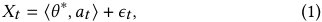

where _𝜖𝑡_ is a random noise with zero mean, and _𝜃_∗ ∈ R_𝑑_ is the linear coefficient which captures the relation between the item’s feature _𝑎𝑡_ to its corresponding reward. The _𝜃_∗ is fixed but unknown to the online platform. Without loss of generality, we denote _𝜇𝑖_ as the expected reward of the arm _𝑖_ and _𝜇_ ˆ _𝑖_ as the empirical mean. The regret is defined by 

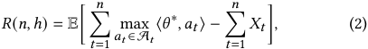

where the expectation is with respect to the selected arms _𝑎_ 1 _, . . . ,𝑎𝑛_ and the corresponding noise _𝜖_ 1 _, . . . ,𝜖𝑛_ . 

The motivation behind splitting the bandit problem in online platform into two stages stems from the computational costs associated with linear stochastic bandits. Computing the upper confidence bound, denoted as _𝜇_ ¯ _𝑖_ , involves evaluating the expression _𝜇_ ˆ _𝑖_ + _𝛼_ √︃ _𝑎__𝑇_ _𝑖_(_𝑉_ _𝑡__𝑇𝑉𝑡_+_𝐼𝑑_)−1_𝑎𝑖_, where_𝑎𝑖_is the feature vector of arm_𝑖_, _𝑉𝑡_ :=� _𝜏__𝑡_ =1_𝑎𝑇𝜏𝑎𝜏_∈R_𝑚_×_𝑑_,_𝛼_is a hyper-parameter, and_𝐼𝑑_∈R_𝑑_×_𝑑_ denotes an identity matrix. Computing _𝜇_ ¯ _𝑖_ is computationally intensive due to the matrix multiplications and inversions involved. Furthermore, in the online platform, we usually have a large corpus of items (around billion-scale [28]), Hence, a two-stage retrieval procedure is employed to alleviate the computational overhead. Specifically, the first stage with an acceptable computation overhead algorithm to coarse-grained filter a small candidate set from the whole item set. The second stage is to select one item out of the candidate set. The first stage alleviates the high computation overhead, while the second stage ensures a high selection accuracy. 

Before formulating the two-stage bandit problem, we discuss the objectives of the two stages in detail. The second stage can be viewed as a vanilla one-stage bandit that selects one item within the candidate set from the first stage to get the largest accumulated reward. Thus, the objective of the second stage can be modeled as minimizing the cumulative regret, the same as the vanilla linear stochastic bandit. In contrast, the objective for the first stage is different. In round _𝑡_ , if the first stage fails to filter the best arm into the candidate set, the whole system will incur a constant regret, irrespective of the algorithm applied to the second stage. On the contrary, if the best arm is filtered into the candidate set, whether 

52 

MobiHoc ’24, October 14-17, 2024, Athens, Greece 

On the Analysis of Two-Stage Stochastic Bandit 

the best arm can be finally chosen depends on the second stage. Thus, as long as the best arm is filtered into the candidate set, we can conclude that the first stage succeeds. 

## **2.2 Problem Formulation** 

We formulate the problem of two-stage bandits in the online platform. In the first stage, the player selects _ℎ_ candidate arms out of all the _𝑘_ candidate arms as the arm set for the subsequent stage. In the second stage, the player evaluates the _ℎ_ candidate arms, and pulls one of them. The problem can be formulated as a two-stage online optimization problem within a horizon _𝑛_ , such that: 

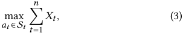

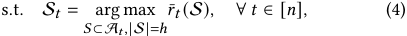

where _𝑟_ ¯ _𝑡_ (·) is the optimization objective of the first stage at time _𝑡_ . As discussed above, the goal of the first stage is to ensure that the optimal arm _𝑎𝑡_∗is contained in the selected set S_𝑡_, and thus: 

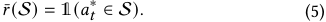

We note that the optimal solution of Equation (5) is not unique. 

We explain the above problem formulation from the perspective of the two-stage bandits in detail. First, we consider the objective of the second stage, which is to maximize the cumulative reward (the sum of the observed reward _𝑥𝑡_ ) of the pulled arms, subject to the constraint of the arm set selected by the first stage. Next, we consider the first stage, where Equation (4) shows that the objective of the first stage at time _𝑡_ is to maximize a set indicator function _𝑟_ ¯ _𝑡_ (·) under the cardinality constraints. 

## **3 TWO-STAGE BANDITS** 

In this section, we discuss the design of two-stage bandit algorithms. Specifically, in Sec. 3.1, we consider the setting where no features are available for the first stage. In Sec. 3.2, we consider the case where the first stage can see several dimensions of the feature vector. 

## **3.1 Two-Stage Bandit with Stochastic Retrieval** 

In this subsection, we examine a simplified scenario of the twostage bandit. Assuming no features are available for the first stage, we can regard the first stage as a stochastic bandit problem under tabular setting [18] and name it as stochastic retrieval. 

Before introducing the detailed method for the first stage, we emphasize the importance of exploration in the first stage. Firstly, we show that exploration in the first stage is necessary by providing a counterexample. Suppose that the first stage selects the items with the top- _ℎ_ estimated reward. When there are _ℎ_ different arms pulled, the first stage will no longer select the other arms into the candidate set, since only the selected _ℎ_ arms have means greater than 0. Thus, the lack of exploration in the first stage leads to a linear regret. Next, we show that a carefully designed exploration strategy is necessary by providing another counterexample. Suppose the first stage selects candidates by uniformly sampling the arms. The probability of the optimal arm being chosen into the candidate set is a constant in every round, denoted by _𝑃_ . Thus, the regret of this 

**Algorithm 1:** Two-Stage UCB with Stochastic Retrieval (UCB-SR) 

|**Input**: _𝑇𝑖_=0, ˆ_𝜇𝑖,_0 =0, ¯_𝜇𝑖,_0 =0,∀_𝑖_∈[_𝑘_]; **Output**: The selected arms;|
|---|
|**1 for**_𝑡_←1_, . . .𝑇_**do**|
|**2** S_𝑡_←arg top_h({¯_𝜇_1_,𝑡_−1_, . . . ,_¯_𝜇𝑛,𝑡_−1}); |
|**3** _𝑖_←arg max_𝑖_∈S_𝑡_LinUCB(_𝐴𝑖_);|
|**4** Play arm_𝑖_and observe_𝑋𝑖,𝑡_; **5** **for** _𝑗_∈S_𝑡_**do**|
|**6** _𝑇𝑗_←_𝑇𝑗_+1;|
|**7** **if** _𝑗_=_𝑖_**then**|
|**8** ˆ_𝜇𝑖,𝑡_←(_𝑇𝑖_× ˆ_𝜇𝑖,𝑡_−1+_𝑋𝑖,𝑡_)/(_𝑇𝑖_+1); |
|**9** ¯_𝜇𝑗,𝑡_←ˆ_𝜇𝑗,𝑡_+ √ 2 log(_𝑇_) _𝑇𝑗_ ;|

**10 return** _𝑖_ ; 

algorithm is at least Ω (Δmin _𝑃𝑛_ ), where Δmin is the smallest gap between the optimal and sub-optimal arm, indicating linear regret with respect to the horizon _𝑛_ . 

Next, we delve into the design of the exploration method to maximize Equation (5) of the first stage. We revise the optimization objective of the first stage. It is challenging to directly optimize Equation (5) since the bandit player only observes the feedback and cannot know exactly whether the pulled arm is optimal or not. However, the player can be sure about whether an arm is optimal after several rounds with a high probability. Thus, it is possible to introduce a proxy optimization objective whose maximizer is also a maximizer of Equation (5) with a high probability. For simplicity, we assume that all noise _𝜖𝑖_ is sampled from N (0 _,_ 1). Let _𝑟𝑖_ be the stochastic reward of arm _𝑖_ , and _𝐸_ denote the event that the best arm is in the candidate set. Let _𝐸__𝑐_ as the complementary event of _𝐸_ (formal definition will be given in Section 4.1). Maximizing P( _𝐸_ ) or minimizing P( _𝐸__𝑐_ ) can be viewed as maximizing the probability of _𝑟_ ¯(S) = 1 in Equation (5). 

However, computing P( _𝐸__𝑐_ ) or P( _𝐸_ ) requires much computational burden and it is necessary to be simplified. We note that P( _𝐸__𝑐_ ) does not equal� _𝑖_ ∈SP(_𝑟_ _𝑖_≤max _𝑗_ ∈A\ _𝑖__𝑟_ _𝑗_)due to the lack of independence among the event { _𝑟𝑖_ ≤ max _𝑗_ ∈A\ _𝑖 𝑟 𝑗_ } for all the arms. To avoid the computational burden of enumerating all event combinations, we introduce a hyper-parameter _𝑣_ and consider events _𝐻𝑖_ = { _𝑟𝑖 < 𝑣_ } for all items, ensuring the independence of these events. We then focus on the probability� _𝑖_ ∈SP(_𝑟_ _𝑖__< 𝑣_)= � _𝑖_ ∈S_𝐶𝐷𝐹_ N(0 _,_ 1) � _𝑣_ − _<u>𝜎𝑖𝜇𝑖</u>_ �, which decreases with _𝑣_ . Setting _𝑣_ to be the second-largest value among all _𝜇𝑖_ , to minimize� _𝑖_ ∈SP(_𝑟_ _𝑖__< 𝑣_) is equivalent to maximizing the RHS of Equation (5). Since the second largest of _𝜇_ is unknown to the online platform, we need more assumptions for further analysis. Specifically, we assume that _𝑟𝑖_ for all the arms have the same variance. Under this assumption, the S∗ = arg minS � _𝑖_ ∈SP(_𝑟_ _𝑖__< 𝑣_) remains constant for any value of _𝑣_ , which will be proved in Appendix B.1. So in the following analysis, we assume _𝑣_ is fixed. Then, we clarify the optimization objective of the first stage. The probability P( _𝜇𝑖 < 𝑣_ ) can be estimated by _𝐶𝐷𝐹_ N(0 _,_ 1) � _𝑣_ − _𝜎_ ˆ _𝑖𝜇_ ˆ _<u>𝑖</u>_ �. Then, 

53 

MobiHoc ’24, October 14-17, 2024, Athens, Greece 

Yumou Liu, Haoming Li, Zhenzhe Zheng, Fan Wu, and Guihai Chen 

considering _𝐶𝐷𝐹_ is non-negative and non-decreasing, minimizing � _𝑖_ ∈S_𝐶𝐷𝐹_ N(0 _,_ 1) � _𝑣_ − _<u>𝜎𝑖𝜇𝑖</u>_ � is equivalent to minimizing 

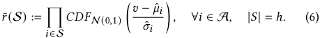

However, real applications have complex structures of the environment, and require bandit algorithms to be flexible in tuning the trade-off between exploration and exploitation [6], but Equation (6) lacks flexibility and can hardly be tuned when using it as the first stage optimization objective. Specifically, compared with the vanilla UCB algorithms which can use hyper-parameters to scale the weight of the upper bound and tune the level of exploration, the level of exploration by optimizing Equation (6) cannot be manually tuned. Thus, we need to modify Equation (6) towards the UCB-style. Let_𝑣_− _𝜎_ ˆ _𝑖__<u>𝜇</u>_ˆ_<u>𝑖</u>_ = _𝛼_ , _𝑣_ = _𝜇_ ˆ _𝑖_ + _𝛼𝜎_ ˆ _𝑖_ . Since Equation (6) indicates a smaller _𝛼_ would like to be selected to the second stage, for a fixed _𝑣_ , an arm with larger _𝜇_ ˆ _𝑖_ and _𝜎_ ˆ _𝑖_ is more likely to the selected. Thus, in practice, we set _𝛼_ to be a constant, and an arm with larger _𝜇_ ˆ _𝑖_ + _𝛼𝜎_ ˆ _𝑖_ is more likely to be selected, which is also known as the upper confidence bound _𝜇_ ¯ _𝑖_ in bandit literature. 

Based on the above discussions, we introduce another formulation that is easier to optimize to replace Equation (6), such that: 

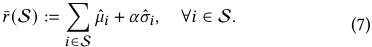

It is worth noticing that optimizing Equation (7) is equivalent to finding the top- _ℎ_ UCBs at time _𝑡_ . The optimality of Equation (7) will be discussed in the following section. 

Finally, we present Algorithm 1 to address the two-stage bandit with stochastic retrieval, which can be viewed as the combination of a stochastic bandit for the first stage and a linear bandit for the second stage. Line 2 applies top- _ℎ_ selection on the estimated UCBs to select a set of arms as the arm set for the subsequent second stage. Line 3 indicates that we employ a classical bandit algorithm, for example, LinUCB, for the second stage. Lines 5-9 describe the update procedure for the first stage. After observing the reward of the pulled arm _𝑖_ from the second stage, the first stage updates the empirical mean of arm _𝑖_ and updates the UCBs of all the arms in S _𝑡_ . Updating the UCBs of the unpulled arms in S _𝑡_ encourages exploration on the other arms outside S _𝑡_ . 

## **3.2 Two-Stage Bandit with Linear Retrieval** 

In this subsection, we examine a general case in which the first stage has access to several dimensions of the arm feature vector. Since in Section 2, we assume that the expected reward is generated by a linear model, we apply a linear model in the first stage to retrieve arms. Thus, we name the first stage in this scenario linear retrieval. 

We introduce Algorithm 2 tailored to address the linear retrieval scenario. In essence, Algorithm 2 is the fusion of two linear bandit algorithms. Specifically, in Line 2, we select the top- _ℎ_ arms based on the UCBs, which will be analyzed in Section 4.2. Line 3 denotes the application of a linear bandit algorithm for the second stage. Lines 5-9 outline the update procedure of the linear bandit for the first stage after observing the feedback from the second stage. It is noteworthy that, unlike Algorithm 1, Algorithm 2 updates the 

**Algorithm 2:** Two-Stage UCB with Linear Retrieval (UCBLR) 

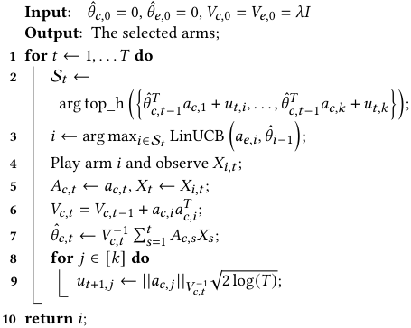

UCBs of all arms after a single round of play, and the size of the UCB is implicitly represented in Line 9. 

## **4 REGRET ANALYSIS** 

## **4.1 Upper Bound of Algorithm 1** 

In this subsection, we present the regret upper bound for Algorithm 1 of _𝑂_ ( Δ<u>1</u> <u>¯</u>log_𝑛_Δ¯2), whereΔ¯is the maximum reward gap. Prior to presenting the result, we establish the optimality of the proxy optimization objective for the first stage, as defined in Equation (7). This is achieved by demonstrating that the maximizer of Equation (7) is also a maximizer of Equation (5) with a high probability. Subsequently, leveraging this high probability, we decompose and relax the regret to derive an upper bound. In the following analysis, without additional explanation, all the mathematical notations are relevant only to the first stage. In this section, only the sketch of the theoretical analysis is provided and please refer to Section A.1 for detailed proofs. 

Firstly, we establish the optimality of Equation (7) as a proxy optimization objective for the first stage. To ease the analysis, we define several events that are crucial to the regret. 

Definition 1. _Let 𝐹𝑖 be the ’good’ event for the sub-optimal arm 𝑖 defined by 𝐹𝑖_ := � _𝜇_ ¯ _𝑖,𝑢𝑖 < 𝜇_ 1� _, where 𝜇_ ¯ _𝑖,𝑢𝑖 is the UCB of the arm 𝑖 after 𝑢𝑖 times of play, and 𝑢𝑖_ ∈[ _𝑛_ ] _is a constant to be chosen later._ If _𝐹𝑖_ were true, it would indicate that arm _𝑖_ is not over-estimated after pulled for _𝑢𝑖_ times. Following the idea of this definition, we define the good event for all the sub-optimal arms. 

Definition 2. _Let 𝐹 be the ’good’ event for all the sub-optimal arms defined by 𝐹_ := �∀T ⊆A\{1} _,_ |T | ≥ _ℎ,_ ∃ _𝑖_ ∈T _,_ ¯ _𝜇𝑖,𝑢𝑖 < 𝜇_ 1� _._ 

If _𝐹_ were true, it would be indicated that there are at most _ℎ_ − 1 arms over-estimated after pulled for _𝑢𝑖_ arms, respectively. Then, we consider the estimation condition of arm 1 and put everything together. 

Definition 3. _Let 𝐸 be the “good" event for the whole environment defined by 𝐸_ := � _𝜇_ 1 _<_ min _𝑡_ ∈[ _𝑛_ ] _𝜇_ ¯1 _,𝑡_ � ∧ _𝐹 ._ 

54 

MobiHoc ’24, October 14-17, 2024, Athens, Greece 

On the Analysis of Two-Stage Stochastic Bandit 

If _𝐸_ were true, it would be indicated that the arm 1 is not underestimated and there are at most _ℎ_ − 1 sub-optimal arms are overestimated, such that the arm 1 would be selected into the candidate set. In the following analysis, we aim to demonstrate two key points: 

1. If _𝐸_ occurs, then the event that a sub-optimal arm is pulled will happen at most _𝑇_ ( _𝑛_ ) ≤( _𝑘_ − 1) _𝑢_ ¯ times. 

2. The complement event _𝐸__𝑐_ occurs with low probability. 

In the following analysis, we denote the times that arm _𝑖_ till round _𝑛_ is pulled by _𝑇𝑖_ ( _𝑛_ ). 

Lemma 1 (Bound of the Probability of _𝐸__𝑐_ ). _Under the assumption that the reward of each arm follows an_ 1 _-sub-Gaussian distribution, the probability of the event 𝐸__𝑐_ _is upper bounded by_ 

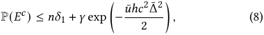

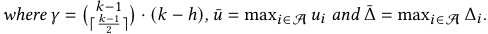

Lemma 1 indicates that P( _𝐸__𝑐_ ) decreases with _𝑢_ ¯. After choosing a proper _𝑢_ ¯, this result will indicate that the bad event _𝐸__𝑐_ happens with a low probability with respect to the horizon _𝑛_ . 

Before proving the first claim, we show that if the first and second stage model were asked to select the best one arm, it is less possible for the second stage model to give a wrong answer. We will demonstrate this by showing the variance of in-sample error of the linear regression model. 

Lemma 2 (Variance of In-Sample Error of Linear Regression). _Suppose 𝑦 is a vector of_ 1 _-sub-Gaussian variables and 𝐴 has full rank. If more labels of one feature vector are sampled in the training set, the variance of the prediction error of this vector is reduced._ 

An intuitive interpretation of Lemma 2 can be drawn from the bias-variance trade-off perspective. Duplicating a feature vector introduces additional information to the training set, yet the models trained on both pre-duplicated and post-duplicated data remain unbiased. Thus, duplicating the feature vector intuitively aids in reducing the variance. Another interpretation of Lemma 2 is that compared with unstructured stochastic bandit, arms with features will reduce the variance of estimated mean. This lemma indicates that it is easier to train the second stage model since arm features are available, and it will help us bound _𝑇_ ( _𝑛_ ) in the appendix. Then, we prove the first claim. 

Lemma 3. _If 𝐸 is true, the event that a sub-optimal arm is pulled will happen at most 𝑇_ ( _𝑛_ ) ≤ 2( _𝑘_ − 1) _𝑢_ ¯ _times._ 

Next, we decompose the regret into two terms to bound them separately. This decomposition is rooted in Lemma 1. As demonstrated in the lemma, _𝐸__𝑐_ occurs with a bounded low probability, and conversely, _𝐸_ occurs with high probability. By relaxing P( _𝐸_ ) → 1, we establish that the corresponding regret is upper-bounded by the regret of the second stage. Therefore, the subsequent analysis focuses on cases where the first stage fails to retrieve the best arm. 

Lemma 4 (Regret Decomposition). _Consider Algorithm 1 on a stochastic bandit instance with 𝑘 arms and_ 1 _-sub-Gaussian rewards. For a horizon 𝑛, with probability at least_ (1 − _𝛿_ 1 − _𝛿_ 2) _, the regret 𝑅_ ( _𝑛,𝑘_ ) _satisfies:_ 

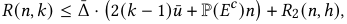

_where 𝑅𝐿_ ( _𝑛,ℎ_ ) _is upper-bounded with probability_ 1 − _𝛿_ 2 _._ 

Then, by putting Lemma 1 and Lemma 4 together, we derive the regret of both Algorithm 1. 

Theorem 1 (Regret Upper Bound of Algorithm 1). _Consider the two-stage bandit algorithm presented in Algorithm 1 applied to a 𝑘-armed_ 1 _-sub-Gaussian bandit problem. For a horizon 𝑛, with probability at least_ (1 − _𝑛_<u>12</u>−_𝛿_2)_, the regret is bounded by_ 

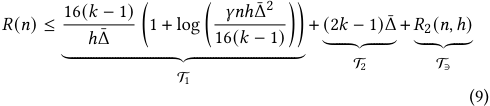

_where 𝑅_ 2 ( _𝑛,ℎ_ ) _is the regret of a ℎ_ − _armed bandit algorithm with horizon 𝑛, and 𝛾_ =� ⌈_𝑘𝑘_−− 2<u>11⌉</u> � · ( _𝑘_ − _ℎ_ ) _._ 

Then, we discuss the implication of Theorem 1. Theorem 1 demonstrates that the regret increases with both _𝑘_ and _𝑘_ − _ℎ_ . This aligns with the intuition that if more items were available, it would be hard to find the best item, and if fewer items were retrieved, there would be a higher likelihood that the most preferred item remains unexplored, contributing to a larger regret. 

Furthermore, we delve into the regret upper bound. T2 is irrelevant with _ℎ_ . T3 ≤ 8√︁ _𝑛ℎ_ log( _𝑛_ ) + 3 _ℎ_ Δ¯ according to [18]. By relaxing the log term in T1, there is T1 + T3 ≤ 8√︁ _𝑛ℎ_ log( _𝑛_ ) −( _𝛾_′ _𝑛_ Δ¯ − 3Δ¯ ) _ℎ_ , where _𝛾_′ =� ⌈_𝑘𝑘_−− 2<u>11⌉</u> �. Then, with reasonable _𝑘_ and _𝑛_ , the worst 16 _𝑛_ log( _𝑛_ <u>)</u> _ℎ_′ = ( _𝛾_′ _𝑛_ −3)2 ¯ Δ2is decreasing with_𝑘_and_𝑛_. This result indicates that when there is enough time and arms to explore, it is better to employ a larger _ℎ_ to avoid a high regret when the second stage can support more than _ℎ_′ arms. 

## **4.2 Upper Bound of Algorithm 2** 

In this subsection, we modify the analysis in Section 4.1 to the linear retrieval case in Section 3.2. Before analysis, we assume that the arm vector is bounded. 

Assumption 1. _The 𝑙_2 _-norm of the arm vector, i.e. the feature vector, is bounded._ 

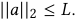

Firstly, we demonstrate that the retrieval stage with a linear regression model can be conceptualized as a stochastic unstructured bandit problem with arms having varying variances. We consider the prediction error of the offline linear regression model on a sample drawn from the training set. Suppose that _𝑥_ = _𝐴𝜃_∗ + _𝜖_ , where _𝜖_ is zero-mean Gaussian noise with unit variance, _𝜃_ ∈ R_𝑑_ , and _𝐴_ ∈ R_𝑛_×_𝑑_ is the combination of arms in a linear bandit instance. Without loss of generality, we assume that _𝐴_ is a full rank matrix. Then we derive the concentration of the prediction error. 

Lemma 5. _Under Assumption 1, the prediction error of a sample out of the training data set can be bounded by_ 

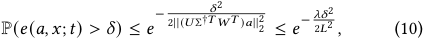

_where 𝐴𝑡_ = _𝑈𝑡_ Σ _𝑡𝑊𝑡__𝑇_ _by SVD and 𝐴𝑡 is the stack of previously pulled arm vector till 𝑡, and_ Σ _𝑡_†_is the pseudo-inverse of_Σ_𝑡, 𝑒_(_𝑎,𝑥_)= 

55 

MobiHoc ’24, October 14-17, 2024, Athens, Greece 

Yumou Liu, Haoming Li, Zhenzhe Zheng, Fan Wu, and Guihai Chen 

_𝑎, and 𝑡 is the number of training samples with 𝑡 > 𝑑, and_ � _𝜃_ ˆ − _𝜃_∗�_𝑇_ _𝜆 is the smallest eigenvalue of 𝐴__𝑇_ _𝐴 with 𝜆 >_ 0 _, and 𝐴 is the stacked matrix of all the arm vectors._ 

Lemma 5 shows that we can transform the linear bandit problem into a stochastic bandit style with varying reward variances. Specifically, each arm _𝑎𝑖_ in the bandit instance follows the Gaussian distribution N � _𝜃_∗_𝑇_ _𝑎𝑖,_ ||( _𝑈𝑡_ Σ _𝑡_†_𝑇𝑊_ _𝑡__𝑇_)_𝑎_||2 2� , and the mean is fixed but the variance is varying. We will provide the relationship between the smallest eigenvalue of _𝐴𝑡_ and _𝐴_ in Section B.1. Thus, we can consider linear retrieval as a specific type of stochastic bandit, which will be analyzed in Section 4.2. 

Theorem 2 (Regret Upper Bound of Algorithm 2). _Consider the two-stage bandit algorithm presented in Algorithm 2 applied to a 𝑘-armed_ 1 _-sub-Gaussian bandit problem. For a horizon 𝑛, with probability at least_ (1 − _𝑛_<u>12</u>−_𝛿_2)_, the regret is bounded by_ 

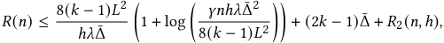

_where 𝑅_ 2 ( _𝑛,ℎ_ ) _is the regret of a ℎ_ − _armed bandit algorithm with horizon 𝑛, 𝛾_ =� ⌈_𝑘𝑘_−− 2<u>11⌉</u> � · ( _𝑘_ − _ℎ_ ) _, and 𝜆 is the smallest singular value of the matrix 𝑉_ = _𝐴__𝑇_ _𝐴._ 

## **4.3 Lower Bound** 

In this subsection, we establish the minimax lower bound for our two-stage bandit problem. The underlying principle for proving the lower bound involves constructing two bandit instances that share similarities but possess distinct optimal arms [18]. In such scenarios, distinguishing between instances from a finite-length sequence becomes challenging. This challenge arises from the nature of the problem settings rather than the characteristics of the algorithms employed. Through employing rigorous mathematical techniques, it becomes feasible to derive the lower bound for the sum of cumulative regrets in these two instances. Consequently, we obtain the lower bound for the regret of the two-stage bandit problem. In the subsequent analysis, we adhere to this fundamental approach to introduce and establish the lower bound. 

Firstly, before deriving the regret lower bound, we introduce the divergence decomposition lemma [18]. 

Lemma 6 (Divergence Decomposition [18]). _Let 𝜈_ = ( _𝑃_ 1 _, . . . , 𝑃𝑘_ ) _be the reward distributions associated with one 𝑘-armed bandit, and let 𝜈_′ = ( _𝑃_ 1′_, . . . , 𝑃_ _𝑘_′)_be the reward distributions associated with another_ _𝑘-armed bandit. Fix some policy 𝜋 and let_ P _𝜈_ = P _𝜈𝜋 and_ P _𝜈_′ = P _𝜈_′ _𝜋 be the probability measures on the canonical bandit model induced by the n-round interconnection of 𝜈 and 𝜋, (respectively 𝜈_′ _and 𝜋). Then,_ 

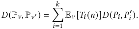

Lemma 6 suggests that the relative entropy between measures in the canonical bandit model can be decomposed as the sum of divergences between the reward probabilities of each arm. 

Next, with Lemma 6, we show that the regret of the two-stage bandit problem is at least Ω _𝑛𝑘_ / _ℎ_ . � ~~√~~ � 

Theorem 3 (Minimax Lower Bound). _Let 𝑟_ ∈[0 _,_ 1] _, then for any policy:_ 

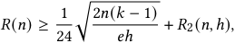

_where 𝑅_ 2 ( _𝑛,ℎ_ ) _is upper-bounded of the second stage._ 

The proof of Theorem 3 is given in Section B.2. Theorem 3 demonstrates that the regret increases with _𝑘_ and decreases with _ℎ_ . This aligns with the intuition that if fewer items are retrieved, there is a higher likelihood that the most preferred item remains unexplored, contributing to an increase in regret. 

## **5 EVALUATION** 

## **5.1 Synthesis Data** 

_5.1.1 Setup._ We establish an environment with _𝑘_ = 100 arms, where each arm’s context is a _𝑑𝑒_ = 10 dimensional vector, and rewards are generated from Gaussian distributions. Specifically, we randomly generate an arm matrix _𝐴_ ∈ R_𝑛_×_𝑑𝑒_ with full rank and create a target model _𝜃_∗ . The reward for arm _𝑖_ is sampled from a Gaussian distribution N ( _𝜃_∗_𝑇_ _𝑎𝑖,_ 0 _._ 1). For the first-stage features, we extract the first _𝑑𝑐_ = 5 dimensions of _𝐴_ , forming a matrix _𝐴𝑐_ ∈ R100×5 . The experiment is conducted with a horizon of _𝑛_ = 1000, and the results for each setting represent the average over 100 independent experiments. 

To compare the regret between one-stage and two-stage algorithms, we choose LinUCB and _𝜖_ -Greedy as the second-stage algorithms. For the first stage, we select LinUCB, _𝜖_ -Greedy, and uniformly random selection. We fix _ℎ_ = 5 for each two-stage algorithm. In this experiment, _𝜖_ = 0 _._ 1 for all _𝜖_ -Greedy implementations, and _𝜆_ = 0 _._ 01 for all LinUCB implementations. 

To assess the impact of _ℎ_ on the cumulative regret of Algorithm 2, we vary _ℎ_ from {5 _,_ 10 _,_ 15 _,_ 20 _,_ 25} while keeping other settings consistent with the previous experiment. 

To illustrate the necessity of exploration strategy, we design an experiment based on two-stage _𝜖_ -Greedy by tuning the _𝜖_ of the first stage while fixing _𝜖_ = 0 _._ 1 for the second stage. We select _𝜖_ from {0 _._ 01 _,_ 0 _._ 05 _,_ 0 _._ 1 _,_ 0 _._ 2 _,_ 0 _._ 4 _,_ 0 _._ 6 _,_ 0 _._ 8}. 

_5.1.2 Results and Discussion._ Figure 1a depicts the regret of various one-stage and two-stage bandit algorithms on the synthetic data. The legend in Figure 1a follows the format "first stage algorithm + second stage algorithm." Solid lines represent two-stage algorithms with conventional bandit algorithms on each stage, dashed lines denote results with the first stage replaced by the uniformly random selection method, and dash-dot lines depict conventional one-stage bandit algorithms serving as the baseline. Comparing solid lines with corresponding dashed lines reveals that random selection in the first stage boosts performance, highlighting the importance of exploration strategy at the first stage. Furthermore, comparing solid lines with dash-dot lines indicates that, for LinUCB methods, the two-stage algorithm has a larger cumulative regret than the vanilla one-stage algorithm. Conversely, for _𝜖_ -Greedy methods, employing LinUCB in the first stage results in a better performance for the two-stage algorithm compared to the one-stage algorithm, showcasing the superior performance of LinUCB over _𝜖_ -Greedy. 

Figure 1b illustrates the regret of Algorithm 2 with varying _ℎ_ . Red and green dashed lines represent the theoretical upper and 

56 

MobiHoc ’24, October 14-17, 2024, Athens, Greece 

On the Analysis of Two-Stage Stochastic Bandit 

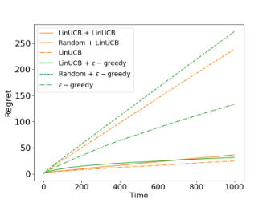

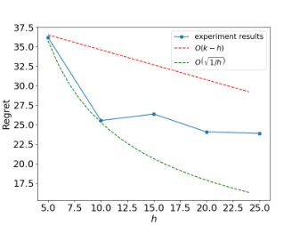

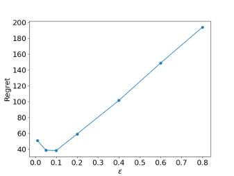

**(a) Regret comparison among two-stage ban(b) Regret of two-stage bandit with various** _ℎ_ **, (c) Regret of two-stage bandit with** _𝜖_ **-Greedy + dit, random selection in first stage and single-** **_i.e._ the size of candidate set. LinUCB with various** _𝜖_ **. stage bandit algorithms.** 

**Figure 1: Evaluation results on synthesis data.** 

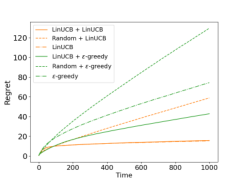

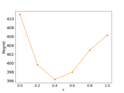

**(a) Regret comparison among al(b) Regret of two-stage bandit gorithms. with** _𝜖_ 1 **-Greedy +** _𝜖_ 2 **-Greedy.** 

**Figure 2: Evaluation results on MovieLens 1M dataset.** 

lower bounds, respectively. Generally, the regret decreases with increasing _ℎ_ , since a larger _ℎ_ makes it more likely for the best arm to be filtered into the candidate set by the first stage. 

Figure 1c emphasizes the significance of exploration strategy at the first stage using _𝜖_ -Greedy + LinUCB. When _𝜖_ is too large, excessive exploration occurs, causing the first stage to uniformly select arms and making it less likely to filter the best arm into the candidate set, resulting in a large cumulative regret. Conversely, when _𝜖_ is too small, the first stage model tends to be stuck, overfitting on noisy samples in the initial rounds and missing the best arm. The comparison between these two extreme cases underscores the importance of setting an appropriate _𝜖_ for the first stage, highlighting the significance of exploration strategy in this context. 

## **5.2 MovieLens 1M Dataset** 

_5.2.1 Setup._ We use the ratings of MovieLens 1M dataset to construct the environment for bandit. The ratings data can be reformulated as a big sparse matrix _𝑅__𝑁_1×_𝑁_2 with missing values where _𝑅𝑖𝑗_ ∈[0 _,_ 1] denotes the rating of user _𝑖_ to movie _𝑗_ . Then we apply PMF [25] to complete and factorize _𝐴_ into _𝑈𝑀__𝑇_ where _𝑈_ ∈ R_𝑁_1×_𝑑𝑒_ and _𝐴_ ∈ R_𝑁_2×_𝑑𝑒_ . Each row of _𝐴_ is viewed as the feature vector of a movie and each row of _𝑈_ is viewed as the target model of the corresponding user. 

We run the experiment on the first 10 users with the most number of ratings in the original dataset. For each user, we independently 

repeat the experiment with a horizon of _𝑛_ = 1000 for 100 times with random initialization and average the results. We set _𝑑𝑒_ = 32 for the data preparation. For the first-stage features, we extract the first _𝑑𝑐_ = 16 dimensions of _𝐴_ . 

To compare the regret between one-stage and two-stage algorithms, we choose LinUCB and _𝜖_ -Greedy as the second-stage algorithms. For the first stage, we select LinUCB, _𝜖_ -Greedy, and uniformly random selection. We fix _ℎ_ = 20 for each two-stage algorithm. In this experiment, _𝜖_ = 0 _._ 1 for all _𝜖_ -Greedy implementations, and _𝜆_ = 0 _._ 1 for all LinUCB implementations. 

To illustrate the necessity of exploration strategy, we design an experiment based on two-stage _𝜖_ -Greedy by tuning the _𝜖_ of the first stage while fixing _𝜖_ = 0 _._ 1 for the second stage. We select _𝜖_ from {0 _,_ 0 _._ 2 _,_ 0 _._ 4 _,_ 0 _._ 6 _,_ 0 _._ 8 _,_ 1}. 

_5.2.2 Results and Discussion._ Figure 2a illustrates the regret of various one-stage and two-stage bandit algorithms on the synthetic data. The comparison between solid lines and corresponding dashed lines reveals that random selection in the first stage enhances performance, underscoring the importance of exploration strategy at the first stage. Furthermore, contrasting solid lines with dash-dot lines indicates that, for LinUCB methods, the two-stage algorithm has a larger cumulative regret than the vanilla one-stage algorithm. Conversely, for _𝜖_ -Greedy methods, utilizing LinUCB in the first stage results in better performance for the two-stage algorithm compared to the one-stage algorithm, highlighting the superior capabilities of LinUCB over _𝜖_ -Greedy. 

Figure 2b accentuates the significance of exploration strategy at the first stage using two-stage _𝜖_ -Greedy. When _𝜖_ is too large, excessive exploration occurs, causing the first stage to uniformly select arms and reducing the likelihood of filtering the best arm into the candidate set, resulting in a substantial cumulative regret. Conversely, when _𝜖_ is too small, the first stage model tends to become stuck, overfitting on noisy samples in the initial rounds and missing the best arm. The comparison between these two extreme cases underscores the importance of setting an appropriate _𝜖_ for the first stage, emphasizing the significance of exploration strategy in this context. 

57 

MobiHoc ’24, October 14-17, 2024, Athens, Greece 

Yumou Liu, Haoming Li, Zhenzhe Zheng, Fan Wu, and Guihai Chen 

## **6 RELATED WORK** 

## **6.1 Two-Stage Recommender System** 

Two-stage recommender systems have found widespread application in industries such as YouTube [4] and Pinterest [20]. In this setup, the first stage filters a candidate set with high precision, generally deemed relevant to the user, while the second stage ranks the items for optimal display. Various traditional methods are employed in the first stage, including collaborative filtering and matrix factorization [5, 25], as well as content-based filtering [27]. Lightweight designed deep neural networks are also utilized for candidate set generation [33]. 

An emerging trend is the deployment of recommender systems on both cloud and edge collaboratively, aiming to reduce cloud resource consumption, latency, and preserve privacy [32]. Alibaba introduced EdgeRec [9], a real-time edge recommender system for the reranking stage. Yao and Wang et al. [31] presented DCCL, a framework for large-scale on-device recommendation model personalization. Yang et al. [30] addressed the challenge of on-device models getting stuck when user interests undergo significant changes. Gong et al. [8] deployed a compact ranking model on devices to capture real-time feedback. 

Several theoretical works have analyzed the performance of twostage recommender systems under different settings. Hron and Krauth et al. [14] considered a different two-stage bandit model where there are multiple nominators (players) in the first stage observing partially overlapped action spaces. The study demonstrated the necessity of synchronizing exploration strategies between the ranker (second stage player) and the nominators. However, they did not provide a theoretical analysis of the regret of two-stage bandits, which is the main contribution of our work. Hron et al. [13] discovered that independent nominator training could lead to performance comparable to uniformly random recommendations and found that careful design of item pools, each assigned to a different nominator, alleviates these issues. Recent work [15] established the asymptotic characteristics of the two-stage recommender system, showing the convergence rate in an offline setting, compared with the online learning setting of our work. 

as the product of user preference and display position scores [35]. Industry practices also focus on designing algorithms for delayed feedback scenarios [1, 3]. 

Bandit algorithms find application in the two-stage recommendation framework as well. Apple [21] proposed a two-layer bandit framework for recommending items on top of search results. A Lower Confidence Bound (LCB) based method is employed in the first stage to prevent distracting users from search results. 

## **7 CONCLUSION** 

In this paper, we delve into the theoretical analysis of the two-stage multi-armed bandit problem. We conduct a theoretical analysis of the optimization objective design for the first stage and propose a UCB-based two-stage bandit algorithm. Our algorithm is proven to achieve a gap-dependent regret upper bound of _𝑂_ ( Δ<u>1</u> <u>¯</u>log_𝑛_Δ¯2), while the gap-independent lower bound for this problem is established to be Ω(~~√~~ _<u>𝑛</u>_ ). 

## **A APPENDIX** 

Here we provide the missing proofs in the main text1 . 

## **A.1 Related Proofs for Theorem 1** 

To start with, we prove the second claim first. To show that _𝐸__𝑐_ happens with low probability, we employ the following lemmas to show that _𝐹__𝑐_ _𝑗_and_𝐹𝑐_happens with low probabilities first. 

Lemma 7 (Bound of the Probability of _𝐹__𝑐_ _𝑗_[18])._Under the_ _assumption that the reward of each arm follows an_ 1 _-sub-Gaussian distribution, the probability of the event 𝐹__𝑐_ _𝑗__for sub-optimal arm𝑗is_ _upper bounded by_ 

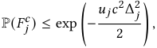

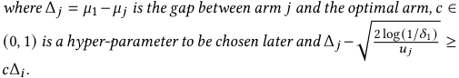

## **6.2 Bandit in Recommendation** 

The application of linear contextual bandits to online recommendation was initially introduced by Yahoo [19] for news recommendation. In this context, a news article is considered as an arm, and a ridge regression model is trained using the LinUCB algorithm to estimate the CTR for each article. Subsequent approaches in industrial systems have incorporated various learning algorithms, including _𝜖_ -greedy [24], Thompson sampling [3, 12], and others. In addition to linear models, diverse machine learning models have been explored, such as leveraging deep neural networks to capture KPIs and associated uncertainties [7], as well as employing deep Bayesian models [10]. 

Another line of research involves understanding user choice when multiple items are recommended, compared to single-item recommendation [19]. The cascade model [17] simplifies user choice, assuming evaluation of items from position 1 to _𝑘_ , clicking on the first satisfying item. Subsequent works extend this to allow multiple clicks with satisfaction probabilities [16] and captures CTR 

Lemma 8 (Bound of the Probability of � _𝜇_ 1 ≥ min _𝑡_ ∈[ _𝑛_ ] _𝜇_ ¯1 _,𝑡_ �[18]). _Under the assumption that the reward of each arm follows an_ 1 _-subGaussian distribution, the probability of the event 𝐹__𝑐_ _𝑗__for sub-optimal_ _arm 𝑗 is upper bounded by_ 

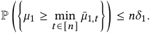

With Lemma 7 and Lemma 8, we can now derive the bound of the probability of _𝐸__𝑐_ . 

Proof of Lemma 1. First, we decompose the event _𝐹__𝑐_ . Since the _𝐹__𝑐_ indicates that there are at least _ℎ_ arms over-estimated, we enumerate all the possible cases such that there are _ℎ_ to _𝑘_ − 1 arms over-estimated. It is worth noticing that all these cases are disjoint. 

> 1More proof details are provided in https://drive.google.com/file/d/ 1t6Z7VXcZxm4jF2FPdDkIRBDbGHXYP5rT/view?usp=drive_link 

58 

MobiHoc ’24, October 14-17, 2024, Athens, Greece 

On the Analysis of Two-Stage Stochastic Bandit 

Thus, we can decompose the probability of P( _𝐸__𝑐_ ) using a sum of probabilities, such that 

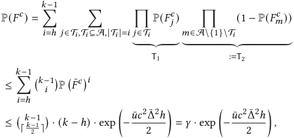

where P� _𝐹_¯_𝑐_� = max _𝑗_ ∈A\{1} P( _𝐹__𝑐_ _𝑗_). We obtain the second line by relaxing T2 to 1 since 1−P( _𝐹𝑚__𝑐_ ) _<_ 1, and take the maximum possible P( _𝐹__𝑐_ _𝑗_) to relax T1. The third line is obtained by using Lemma 7, and then taking the maximum over _𝑢 𝑗_ , Δ _𝑗_ and the number of combinations. It is worth noticing that _𝑢_ ¯ and Δ¯ may not be corresponded to the same arm. 

By putting Lemma 8 and P( _𝐹__𝑐_ ) together, we obtain Equation (8). □ 

Proof of Lemma 2. Let _𝑋_ denote the training set with distinct feature vectors, and let _𝑎_ ∈ _𝑋_ be a feature vector. The variance of the prediction error of _𝑎_ is _𝜎_ = ∥ _𝑈_ Σ†_𝑇_ _𝑊__𝑇_ _𝑎_ ∥2 , where _𝑎_ is stacked into _𝑋_ . Suppose we sample one more label of _𝑎_ in an extended training set _𝑋_ +. Then the variance of the prediction error becomes _𝜎_ + = ∥ _𝑈_ +Σ† +_𝑇𝑊_ +_𝑇𝑎_∥2. Assume, for the sake of contradiction, that _𝜎 < 𝜎_ +. This implies _𝑡𝑟𝑎𝑐𝑒_ (Σ†_𝑇_ ) ≤ _𝑡𝑟𝑎𝑐𝑒_ (Σ† +_𝑇_), leading to ∥Σ∥_𝐹>_ ∥Σ+ ∥ _𝐹_ . Since _𝑋_ + has one more vector than _𝑋_ , ∥Σ∥ _𝐹_ ≤∥Σ∥, which results in a contradiction. □ 

Proof of Lemma 3. If _𝐸_ is true, _𝐹_ and � _𝜇_ 1 _<_ min _𝑡_ ∈[ _𝑛_ ] _𝜇_ ¯1 _,𝑡_ � are true. Then there are at least _𝑘_ − 1 − _ℎ_ and at most _𝑘_ − 1 suboptimal arms, for example, arm _𝑖_ , such that _𝐹𝑖_ is true. Let _𝐺𝑖_ = � _𝜇_ 1 _<_ min _𝑡_ ∈[ _𝑛_ ] _𝜇_ ¯1 _,𝑡_ � ∧ _𝐹𝑖_ . Suppose that there is a single-bandit instance with the arms A′ ⊆A, {1 _,𝑖_ } ⊆A′ and vanilla UCB algorithm, and it has been proven by [18] that _𝑇𝑖_′(_𝑛_)≤_𝑢𝑖_if_𝐺𝑖_is true where _𝑇𝑖_′(_𝑛_) is the times that arm_𝑖_is pulled in this single-stage instance. We notice that 

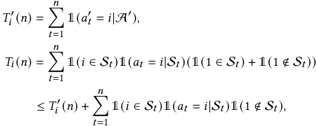

where the inequality holds because when 1( _𝑖_ ∈S _𝑡_ )1( _𝑎𝑡_ = _𝑖_ |S _𝑡_ ) = 1, the second stage can be viewed as the instance A′ . Although Lemma 5 shows that the variance of the empirical mean of an arm has a potentially large upper bound for infinitely many arms, in the bandit instance with fixed finitely many arms, the variance is still _𝑂_ (1/ _𝑢𝑖_ ) which can be deduced by Lemma 2. Thus the result in [18] that when _𝐺𝑖_ happens, the arm _𝑖_ is played for at most _𝑢𝑖_ 

times still holds. Thus, 

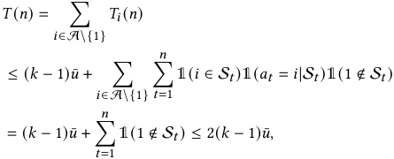

where the last inequality holds because when every time the optimal arm 1 is not in S _𝑡_ , there is a sub-optimal arm played. So the total times that 1 ∉ S _𝑡_ should not be larger than the times that suboptimal arms are played. □ 

Proof of Lemma 4. We denote _𝑇_ ( _𝑛_ ) by the times that the optimal arm is not played in horizon _𝑛_ . Because _𝑇_ ( _𝑛_ ) ≤ _𝑛_ , this will mean that 

E[ _𝑇_ ( _𝑛_ )] = E[I{ _𝐸_ } _𝑇_ ( _𝑛_ )] + E[I{ _𝐸__𝑐_ } _𝑇_ ( _𝑛_ )] ≤ 2( _𝑘_ − 1) _𝑢_ ¯ + P( _𝐸__𝑐_ ) _𝑛._ 

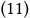

Similarly, the regret can also be regarded as the composition of the regret when _𝐸_ occurs and when it does not. 

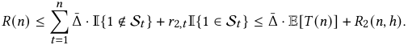

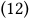

Equation (12) indicates that the regret can be decomposed into two terms. The first term represents the upper bound of regret when the first stage fails to filter the best arm into the candidate set. The second term represents the complementary case. Since the event that the best arm is in the candidate set should happen with a high probability, we relax this probability to 1 to ease the analysis. 

Substituting Equation (11) in Equation (12), then the result is obtained. □ 

Proof of Theorem 1. By substituting Equation (8) into Equation (4), we get 

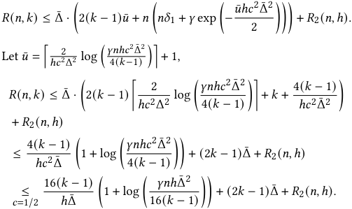

Then we discuss the probability that the upper bound holds. The right-hand side of Equation (9) can be viewed as _𝑅_ 1 + _𝑅_ 2. We denote the event that _𝑅𝑖_ holds as _𝐽_ 1 and the event that _𝑅_ 2 holds as _𝐽_ 2. The probability of each event is 1 − _𝛿_ 1 and 1 − _𝛿_ 2, respectively. Then the probability of _𝑅_ 1 + _𝑅_ 2 holds is P( _𝐽_ 2 ∧ _𝐽_ 1) = 1 − P( _𝐽_ 1_𝑐_∨_𝐽_ 2_𝑐_)≥ 1 −(P( _𝐽_ 1_𝑐_) + P(_𝐽_ 2_𝑐_))≥1 −_𝛿_1 −_𝛿_2. □ 

59 

MobiHoc ’24, October 14-17, 2024, Athens, Greece 

Yumou Liu, Haoming Li, Zhenzhe Zheng, Fan Wu, and Guihai Chen 

## **REFERENCES** 

- [1] Bendada, W., Salha, G., and Bontempelli, T. Carousel personalization in music streaming apps with contextual bandits. In _Proceedings of the 14th ACM Conference on Recommender Systems_ (2020), pp. 420–425. 

- [2] Borisyuk, F., Kenthapadi, K., Stein, D., and Zhao, B. Casmos: A framework for learning candidate selection models over structured queries and documents. In _Proceedings of the 22nd ACM SIGKDD International Conference on Knowledge Discovery and Data Mining_ (2016), pp. 441–450. 

- [3] Chapelle, O., and Li, L. An empirical evaluation of thompson sampling. _Advances in neural information processing systems 24_ (2011). 

- [4] Covington, P., Adams, J., and Sargin, E. Deep neural networks for youtube recommendations. In _Proceedings of the 10th ACM Conference on Recommender Systems_ (2016), pp. 191–198. 

- [5] Das, A. S., Datar, M., Garg, A., and Rajaram, S. Google news personalization: scalable online collaborative filtering. In _Proceedings of the 16th international conference on World Wide Web_ (2007), pp. 271–280. 

- [6] Ding, Q., Kang, Y., Liu, Y.-W., Lee, T. C. M., Hsieh, C.-J., and Sharpnack, J. Syndicated bandits: A framework for auto tuning hyper-parameters in contextual bandit algorithms. _Advances in Neural Information Processing Systems_ (2022), 1170–1181. 

- [7] Eide, S., and Zhou, N. Deep neural network marketplace recommenders in online experiments. In _Proceedings of the 12th ACM Conference on Recommender Systems_ (2018), pp. 387–391. 

- [8] Gong, X., Feng, Q., Zhang, Y., Qin, J., Ding, W., Li, B., Jiang, P., and Gai, K. Real-time short video recommendation on mobile devices. In _Proceedings of the 31st ACM International Conference on Information & Knowledge Management_ (2022), pp. 3103–3112. 

- [9] Gong, Y., Jiang, Z., Feng, Y., Hu, B., Zhao, K., Liu, Q., and Ou, W. Edgerec: recommender system on edge in mobile taobao. In _Proceedings of the 29th ACM International Conference on Information & Knowledge Management_ (2020), pp. 2477–2484. 

- [10] Guo, D., Ktena, S. I., Myana, P. K., Huszar, F., Shi, W., Tejani, A., Kneier, M., and Das, S. Deep bayesian bandits: Exploring in online personalized recommendations. In _Proceedings of the 14th ACM Conference on Recommender Systems_ (2020), pp. 456–461. 

- [11] Higley, K., Oldridge, E., Ak, R., Rabhi, S., and de Souza Pereira Moreira, G. Building and deploying a multi-stage recommender system with merlin. In _Proceedings of the 16th ACM Conference on Recommender Systems_ (2022), pp. 632– 635. 

- [12] Hill, D. N., Nassif, H., Liu, Y., Iyer, A., and Vishwanathan, S. An efficient bandit algorithm for realtime multivariate optimization. In _Proceedings of the 23rd ACM SIGKDD International Conference on Knowledge Discovery and Data Mining_ (2017), pp. 1813–1821. 

- [13] Hron, J., Krauth, K., Jordan, M., and Kilbertus, N. On component interactions in two-stage recommender systems. _Advances in neural information processing systems 34_ (2021), 2744–2757. 

- [14] Hron, J., Krauth, K., Jordan, M. I., and Kilbertus, N. Exploration in two-stage recommender systems. _arXiv preprint arXiv:2009.08956_ (2020). 

- [15] Jaiswal, A. K. Towards a theoretical understanding of two-stage recommender systems, 2024. 

- [16] Katariya, S., Kveton, B., Szepesvari, C., and Wen, Z. Dcm bandits: Learning to rank with multiple clicks. In _International Conference on Machine Learning_ (2016), pp. 1215–1224. 

- [17] Kveton, B., Szepesvari, C., Wen, Z., and Ashkan, A. Cascading bandits: Learning to rank in the cascade model. In _International Conference on Machine Learning_ (2015), pp. 767–776. 

- [18] Lattimore, T., and Szepesvári, C. _Bandit algorithms_ . Cambridge University 

Press, 2020. 

- [19] Li, L., Chu, W., Langford, J., and Schapire, R. E. A contextual-bandit approach to personalized news article recommendation. In _WWW_ (2010). 

- [20] Liu, D. C., Rogers, S., Shiau, R., Kislyuk, D., Ma, K. C., Zhong, Z., Liu, J., and Jing, Y. Related pins at pinterest: The evolution of a real-world recommender system. In _Proceedings of the 26th international conference on world wide web companion_ (2017), pp. 583–592. 

- [21] Ma, S., Das, P., Nikolakaki, S. M., Chen, Q., and Topcu Altintas, H. Twolayer bandit optimization for recommendations. In _Proceedings of the 16th ACM Conference on Recommender Systems_ (2022), pp. 509–511. 

- [22] Ma, X., Wang, P., Zhao, H., Liu, S., Zhao, C., Lin, W., Lee, K.-C., Xu, J., and Zheng, B. Towards a better tradeoff between effectiveness and efficiency in pre-ranking: A learnable feature selection based approach. In _Proceedings of the 44th International ACM SIGIR Conference on Research and Development in Information Retrieval_ (2021), pp. 2036–2040. 

- [23] Ma, X., Zhao, L., Huang, G., Wang, Z., Hu, Z., Zhu, X., and Gai, K. Entire space multi-task model: An effective approach for estimating post-click conversion rate. In _The 41st International ACM SIGIR Conference on Research & Development in Information Retrieval_ (2018), pp. 1137–1140. 

- [24] McInerney, J., Lacker, B., Hansen, S., Higley, K., Bouchard, H., Gruson, A., and Mehrotra, R. Explore, exploit, and explain: personalizing explainable recommendations with bandits. In _Proceedings of the 12th ACM Conference on Recommender Systems_ (2018), pp. 31–39. 

- [25] Mnih, A., and Salakhutdinov, R. R. Probabilistic matrix factorization. _Advances in Neural Information Processing Systems_ (2007), 1257–1264. 

- [26] Niu, C., Wu, F., Tang, S., Hua, L., Jia, R., Lv, C., Wu, Z., and Chen, G. Billion-scale federated learning on mobile clients: A submodel design with tunable privacy. In _Proceedings of the 26th Annual International Conference on Mobile Computing and Networking_ (2020), pp. 1–14. 

- [27] Pazzani, M. J., and Billsus, D. Content-based recommendation systems. In _The adaptive web: methods and strategies of web personalization_ . Springer, 2007, pp. 325–341. 

- [28] Wang, J., Huang, P., Zhao, H., Zhang, Z., Zhao, B., and Lee, D. L. Billionscale commodity embedding for e-commerce recommendation in alibaba. In _Proceedings of the 24th ACM SIGKDD International Conference on Knowledge Discovery & Data Mining_ (2018), pp. 839–848. 

- [29] Wang, Z., Zhao, L., Jiang, B., Zhou, G., Zhu, X., and Gai, K. Cold: Towards the next generation of pre-ranking system. _arXiv preprint arXiv:2007.16122_ (2020). 

- [30] Yao, J., Wang, F., Ding, X., Chen, S., Han, B., Zhou, J., and Yang, H. Devicecloud collaborative recommendation via meta controller. In _Proceedings of the 28th ACM SIGKDD Conference on Knowledge Discovery and Data Mining_ (2022), pp. 4353–4362. 

- [31] Yao, J., Wang, F., Jia, K., Han, B., Zhou, J., and Yang, H. Device-cloud collaborative learning for recommendation. In _Proceedings of the 27th ACM SIGKDD Conference on Knowledge Discovery & Data Mining_ (2021), pp. 3865–3874. 

- [32] Yin, H., Qu, L., Chen, T., Yuan, W., Zheng, R., Long, J., Xia, X., Shi, Y., and Zhang, C. On-device recommender systems: A comprehensive survey. _arXiv preprint arXiv:2401.11441_ (2024). 

- [33] Zhou, G., Fan, Y., Cui, R., Bian, W., Zhu, X., and Gai, K. Rocket launching: A universal and efficient framework for training well-performing light net. In _Proceedings of the AAAI Conference on Artificial Intelligence_ (2018), pp. 4580–4587. 

- [34] Zhou, G., Zhu, X., Song, C., Fan, Y., Zhu, H., Ma, X., Yan, Y., Jin, J., Li, H., and Gai, K. Deep interest network for click-through rate prediction. In _Proceedings of the 24th ACM SIGKDD International Conference on Knowledge Discovery & Data Mining_ (2018), pp. 1059–1068. 

- [35] Zoghi, M., Tunys, T., Ghavamzadeh, M., Kveton, B., Szepesvari, C., and Wen, Z. Online learning to rank in stochastic click models. In _International Conference on Machine Learning_ (2017), pp. 4199–4208. 

60 

