# **DRAGON: Enhancing On-Device Model Performance with Distributed Retrieval-Augmented Generation** 

Shangyu Liu, Zhenzhe Zheng∗ , Xiaoyao Huang† , Fan Wu, Guihai Chen, Jie Wu†_★_ 

Shanghai Jiao Tong University,_★_ Temple University 

†Cloud Computing Research Institute, China Telecom 

{liushangyu,zhengzhenzhe}@sjtu.edu.cn, huangxy32@chinatelecom.cn, 

{fwu, gchen}@cs.sjtu.edu.cn, jiewu@temple.edu 

## **Abstract** 

Small language models (SLMs) support efficient deployments on resource-constrained edge devices, but their limited capacity compromises inference performance. Retrieval-augmented generation (RAG) is a promising solution to enhance model performance by integrating external databases, without requiring intensive on-device model retraining. However, large-scale public databases and userspecific private contextual documents are typically located on the cloud and the device, respectively, while existing RAG implementations are primarily centralized. To bridge this gap, we propose DRAGON, a distributed RAG framework to enhance on-device SLMs through both general and personal knowledge without the risk of leaking document privacy. Specifically, DRAGON decomposes multi-document RAG into multiple parallel token generation processes performed independently and locally on the cloud and the device, and employs a newly designed Speculative Aggregation, a dual-side speculative algorithm to avoid frequent output synchronization between the cloud and device. A new scheduling algorithm is further introduced to identify the optimal aggregation side based on real-time network conditions. Evaluations on real-world hardware testbed demonstrate a significant performance improvement of DRAGON—up to 1 _._ 9× greater gains over standalone SLM compared to the centralized RAG, substantial reduction in per-token latency, and negligible Time to First Token (TTFT) overhead. 

## **CCS Concepts** 

- **Networks** → **Network services** ; • **Computing methodologies** 

- → **Distributed computing methodologies** . 

## **Keywords** 

device-cloud collaborative inference, speculative aggregation, large language model, retrieval-augmented generation 

This work was supported in part by National Key R&D Program of China (No. 2023YFB4502400), in part by China NSF grant No. 62322206, 62132018, 62025204, U2268204, 62272307, 62372296. The opinions, findings, conclusions, and recommendations expressed in this paper are those of the authors and do not necessarily reflect the views of the funding agencies or the government. 

∗Zhenzhe Zheng is the corresponding author. 

Permission to make digital or hard copies of all or part of this work for personal or classroom use is granted without fee provided that copies are not made or distributed for profit or commercial advantage and that copies bear this notice and the full citation on the first page. Copyrights for components of this work owned by others than the author(s) must be honored. Abstracting with credit is permitted. To copy otherwise, or republish, to post on servers or to redistribute to lists, requires prior specific permission and/or a fee. Request permissions from permissions@acm.org. _MobiHoc ’25, October 27–30, 2025, Houston, TX, USA_ 

© 2025 Copyright held by the owner/author(s). Publication rights licensed to ACM. ACM ISBN 979-8-4007-1353-8/25/10 

https://doi.org/10.1145/3704413.3764419 

### **ACM Reference Format:** 

Shangyu Liu, Zhenzhe Zheng∗ , Xiaoyao Huang† , Fan Wu, Guihai Chen, Jie Wu†_★_ . 2025. DRAGON: Enhancing On-Device Model Performance with Distributed Retrieval-Augmented Generation. In _International Symposium on Theory, Algorithmic Foundations, and Protocol Design for Mobile Networks and Mobile Computing (MobiHoc ’25), October 27–30, 2025, Houston, TX, USA._ ACM, New York, NY, USA, 10 pages. https://doi.org/10.1145/3704413.3764419 

## **1 Introduction** 

Although large language models (LLMs) such as GPT-4 [26] and DeepSeek-V3 [9] have demonstrated remarkable performance in real-world applications, their substantial deployment costs have led to predominant cloud-based hosting. As a result, users are required to upload private context along with their queries, raising serious privacy concerns. Recently, small language models (SLMs) such as Phi-4-mini [1] and Qwen2.5-1.5B [34], have emerged as promising alternatives, offering efficient local deployment on edge devices. However, although SLMs are notably smaller than cloudhosted LLMs—leading to reduced performance on both personal and general tasks—they still remain too large for resource-constrained devices to support on-device fine-tuning or training [16] to adapt to newly generated data and user feedback. 

Retrieval-augmented generation (RAG) [21, 29] has demonstrated effectiveness in boosting the performance of SLMs by incorporating contextually relevant documents from external databases. The performance gain increases monotonically with the scale of the database, showing an opportunity for SLMs to achieve comparable or even better performance than standalone LLMs [8]. More importantly, by expanding user-specific external database (also known as the non-parametric memory [21]), model customization and knowledge updates can be achieved efficiently without model training. Typically, large-scale public databases containing general knowledge are hosted in the cloud, whereas user-specific private databases are maintained on-device. Since the query context may involve both general and personal data, it is essential for retrieval-augmented SLMs to support distributed databases located in the cloud and device. Unfortunately, most existing RAG solutions [4, 21, 29] adopted a centralized architecture. Figure 1 presents an example of game recommendation. The cloud-only RAG returns an incorrect game genre, although private documents indicate a preference for simulation games, while the device-only RAG fails to retrieve the best-selling game lists without accessing to general knowledge in the cloud. 

An intuitive solution, similar to federated search [32], is to retrieve documents from the cloud-side database, merge them with those retrieved locally on-device, and perform model inference in 

221 

MobiHoc ’25, October 27–30, 2025, Houston, TX, USA 

Shangyu Liu, Zhenzhe Zheng, Xiaoyao Huang, Fan Wu, Guihai Chen, Jie Wu 

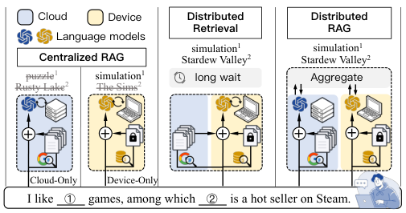

<!-- Start of picture text -->
Cloud Device Distributed Distributed Retrieval RAG Language models simulation 1 simulation 1 Centralized RAG Stardew Valley 2 Stardew Valley 2 Rusty Lakepuzzle 1 2 simulation The Sims 21 long wait Aggregate + + + + + Cloud-Only Device-Only I like  ① games, among which  ② is a hot seller on Steam. <!-- End of picture text -->

**Figure 1: Comparison between different RAG architectures.** 

a centralized manner. However, this approach may incur substantial latency overhead considering key-value (KV) caching [42], a fundamental mechanism in language model serving that stores intermediate attention states to enable efficient reuse of past computations. The KVs of documents are typically pre-computed and persistently stored in the database to facilitate retrieval, introducing a data volume several orders of magnitude larger than the original text. This leads to a dilemma: when retrieving the raw text of cloud-side documents, the device must compute their KVs from scratch, incurring significant computation latency; Conversely, direct retrieval of KVs from the cloud storage introduces substantial transmission latency, as the data volume can be even larger than the model parameters, especially as the number of document grows. 

To address these issues, we propose DRAGON, a <u>distributed retrieval-augmented generation</u> framework designed to enhance the performance of on-device language model inference. Following the law of total probability, DRAGON first decomposes the multidocument RAG process into a dual-side workflow by the device and the cloud, respectively, and then aggregates their output tokens for the final result. In this workflow, the cloud and device sides independently execute their own model instances using documents retrieved from their databases. Document KVs are stored and loaded locally without transmission or re-computation, thereby reducing first-token latency and preserving document privacy. Nonetheless, the output aggregation requires frequent exchange of data packets between the cloud and device at every token generation step, due to the auto-regressive nature of language models. This transmission pattern requires a persistent low-latency network connection, which is difficult to guarantee in real-world scenarios [24]. 

To solve this challenge, we draw inspiration from the draft-thenverify paradigm in _Speculative Decoding_ [20] and propose a new dual-side speculative algorithm, namely _Speculative Aggregation_ . In this algorithm, the decoding processes on both sides continuously generates draft tokens, and an Aggregator on either side (depending on certain scheduling criteria) asynchronously verifies and aggregates them. Decoding is interrupted and the corresponding KV states are rolled back for re-computation only when a draft is rejected. As our theoretical analysis proves the equivalence between Speculative Aggregation and the vanilla synchronized version, the end-to-end latency can be reduced by overlapping transmission and decoding processes. 

We implement a fully-functional distributed RAG workflow and construct a testbed using real-world hardware. Based on this, we 

evaluate DRAGON against various RAG architectures using representative SLMs on large-scale retrieval corpora and datasets. Experimental results on language modeling shows that DRAGON achieves up to 1 _._ 9× greater performance gains over the standalone SLM than the centralized method. Moreover, DRAGON achieves significant reduction in per-token latency compared to synchronized methods, showing strong robustness under various network conditions. Extensive simulations further verify that the proposed scheduling algorithm achieves increasing delay reduction as network latency grows. We summarize the key contributions of this work as follows: 

- We propose DRAGON, the first distributed RAG framework that supports distributed documents retrieval and collaborative output generation between cloud and device. It significantly enhances on-device model performance with the integration of both personal and general knowledge. 

- We introduce _Speculative Aggregation_ , a dual-side speculative algorithm that decouples synchronized aggregation from sequential decoding by asynchronously verifying the output alignment between cloud and device, greatly reducing end-to-end latency. 

- We further design an adaptive scheduling algorithm to dynamically identify the optimal aggregation side under varying network conditions, effectively improving decoding efficiency. 

- We implement DRAGON in a real-world hardware testbed and perform comprehensive evaluations using representative SLMs and large-scale retrieval corpora, demonstrating significant performance improvements of on-device SLMs with negligible overhead even under high-latency network conditions. 

## **2 Preliminaries** 

## **2.1 Retrieval-Augmented Generation** 

Retrieval-augmented generation [21] integrates off-the-shelf language models with documents retrieved from an external database to capture long-tail knowledge and keep up-to-date with new information. In traditional LM inference, given an input token sequence _𝑥<𝑀_ = { _𝑥_ 0 _, . . . ,𝑥𝑀_ −1} (indices of tokens in vocabulary _𝑉_ ) and the maximum context length _𝑁_ , the output generation process aims to maximize the probability� _𝑡__𝑁_ =− _𝑀_1_𝑝_(_𝑥𝑡_|_𝑥<𝑡_). In order to incorporate external documents, we process each document concatenated with the query separately, and then interpolate the output distributions (termed as _output aggregation_ [21, 31] )1 . Following the Law of Total Probability, we can derive the interpolation as 

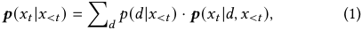

where _𝑝_ ( _𝑑_ | _𝑥<𝑡_ ) denotes the weight of the document _𝑑_ on the output distribution _𝒑_ ( _𝑥𝑡_ | _𝑑,𝑥<𝑡_ ). Since _𝑝_ ( _𝑑_ | _𝑥<𝑡_ ) cannot be directly obtained in practice, we retrieve _𝑑_ from a sufficiently large corpus D and only consider top- _𝑘_ documents with the highest relevance score R D ( _𝑑,𝑥<𝑡_ ). Equation (1) offers the opportunity to decompose the multi-document RAG workflow into parallel generation processes, enabling device-cloud distributed RAG. This decomposition also significantly alleviates the limitation of maximum context length on resource-constraint devices. 

> 1The output aggregation is different from _context aggregation_ [29]), where external documents are concatenated and prepended to the input query _𝑥<𝑡_ all at once. 

222 

MobiHoc ’25, October 27–30, 2025, Houston, TX, USA 

DRAGON: Enhancing On-Device Model Performance with Distributed Retrieval-Augmented Generation 

## **2.2 Device-Cloud Distributed RAG** 

To enhance the performance of on-device language model inference, we propose a device-cloud distributed RAG framework based on the above discussed output aggregation paradigm. Given an input _𝑥<𝑡_ , we retrieve personalized documents _𝐷_device from a device-side private database and then compute the next-token distributions _𝑷𝑡_device = � _𝒑_ ( _𝑥𝑡_ | _𝑑,𝑥<𝑡_ )� _𝑑_ ⊤∈ _𝐷_deviceusing an on-device language model Mdevice . In parallel, we employ a similar process in the cloud and obtain the cloud-side next-token distributions _𝑷𝑡_cloud . After gathering all documents _𝐷_ = _𝐷_device ∪ _𝐷_cloud and their corresponding output distributions _𝑷𝑡_ = � _𝑷𝑡_device _, 𝑷𝑡_cloud � ⊤, we sample the next token according to 

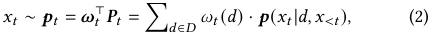

where _𝝎𝑡_ = � _𝜔𝑡_ ( _𝑑_ )� _𝑑_ ⊤∈ _𝐷_denotes the interpolation weights, which are computed based on relevance scores R as 

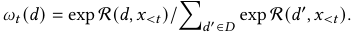

We refer to this workflow as the vanilla distributed RAG (VDRAG). 

Despite its effectiveness, frequent synchronization over network between the device and cloud can introduce a substantial latency. On one hand, the tight data coupling in distributed RAG leads to idle waiting, especially when decoding latencies significantly differ due to hardware heterogeneity. During the auto-regressive language model inference, the output _𝑥𝑡_ −1 is expected on both sides as the input for generating _𝑷𝑡_ . At each token generation step _𝑡_ , computing Equation (2) requires waiting for output distributions on both sides ( _𝑷𝑡_device and _𝑷𝑡_cloud ). On the other hand, frequent data transmission makes VDRAG highly sensitive to network latencies. Transmitted data packets at each step includes a 2-byte integer representing the token _𝑥𝑡_ and a float matrix _𝑷𝑡_ encoding the output distributions2 . Due to small data packet size, transmission time is often dominated by data-independent factors [6, 12], like the connection round-trip time (RTT). Finally, idle waiting and transmission latency at each generation step accumulate over a long output sequence, significantly amplifying the overall overhead. 

## **2.3 Problem Formulation** 

We define the language model inference as a distributed process where the device-side and cloud-side token generation processes, Fdevice and Fcloud , executes alternatively. Without loss of generality, we assume the final output token sequence is generated ondevice by sampling _𝑥_ from the next-token distribution _𝒑𝑡_ . Let _𝐴𝑡_ be an auxiliary set for transferring information between the device and the cloud at iteration _𝑡_ , which is initially empty. The workflow can be expressed as _𝐴𝑡_device _, 𝒑𝑡_ ←Fdevice ( _𝐴𝑡_cloud −1_,_Mdevice_, 𝐷_device_,𝑥<𝑡_) on the device, and then _𝐴𝑡_cloud ←Fcloud ( _𝐴𝑡_device _,_ Mcloud _, 𝐷_cloud _,𝑥<𝑡_ ) on the cloud, respectively. Finally, the optimization objective is 

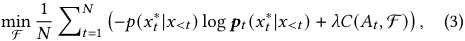

where _𝑥𝑡_∗represents the optimal token at step_𝑡_and_𝐶_denotes the end-to-end latency per token resulted from the transmission of _𝐴𝑡_ 

> 2The float matrix _𝑷𝑡_ has a size of | _𝑉_ | max(| _𝐷_ device | _,_ | _𝐷_ cloud |), where the vocabulary size | _𝑉_ | is typically less than 50,000. 

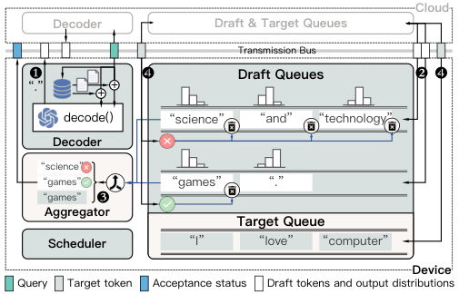

<!-- Start of picture text -->
Cloud Decoder Draft & Target Queues Transmission Bus ❶ ❹ Draft Queues ❷ ❹ “.” + + decode() “science” “and” “technology” Decoder “science” “games” “games” “.” “games” ❸ Aggregator Target Queue Scheduler “ I ” “ love ” “ computer ” Device Query Target token Acceptance status Draft tokens and output distributions <!-- End of picture text -->

**Figure 2: Overview of the DRAGON framework.** 

between the device and cloud and the execution of F . The coefficient _𝜆_ controls the trade-off between performance and efficiency. 

## **3 Overview of DRAGON** 

To enhance on-device language model inference performance while minimizing the latency overhead, we propose DRAGON, a devicecloud distributed RAG framework. In this framework, we sample tokens from distributions aggregated from the device-side and cloud-side RAG outputs, enabling an integration of personalized information and generic knowledge. To mitigate the inherent latency caused by frequent device-cloud synchronizations in VRAG, we perform distribution aggregation and next-token sampling in a speculative manner, where draft tokens are generated on both sides and then verified on either side. Accordingly, as shown in Figure 2, DRAGON consists of three modules deployed on both sides, including Decoders, Queues, and Schedulers, and an Aggregator module on either side. 

We organize Decoders, Queues and Aggregator by a producerconsumer paradigm, enabling asynchronous decoding of draft tokens. The Decoder serves as a token producer, and on each side _𝑠_ ∈{device _,_ cloud} it decodes draft tokens _𝑥𝑡__𝑠_independently based on locally-aggregated output distributions _𝒑𝑡__𝑠_=( ˜_𝝎_ _𝑡__𝑠_)⊤_𝑷_ _𝑡__𝑠_where _𝝎_ ˜ _𝑡_ = � _𝜔𝑡_ ( _𝑑_ )� _𝑑_ ⊤∈ _𝐷__𝑠_, similar to Equation (2) but using the retrieved local documents _𝐷__𝑠_ only ( 1 ). The draft tokens _𝑥𝑡__𝑠_and their corre- sponding distribution vectors _𝒑𝑡__𝑠_are broadcast to the other side. On each side, we enqueue _𝑥𝑡__𝑠_into Draft Queues ( 2 ). The Aggregator, as a consumer, continuously consumes draft tokens from the front of local queues and performs aggregation process ( 3 ). Subsequently, the aggregation results of the draft token are broadcast to Draft Queues on both sides. For each queue, the first token is dequeued if accepted, or the entire queue is cleared if rejected. The final target token output by Aggregator is enqueued into Target Queue on both sides ( 4 ). Although the dependencies between the aggregator and decoder cannot be eliminated, the data transmission latency can be overlapped with the decoding time, mitigating the idle waiting. To accommodate dynamic computing resources on both sides and network bandwidth between them, we further design Profilers3 and Schedulers to identify the optimal aggregation side. 

> 3Please refer to our technical report [22] for detailed design of the Profiler. 

223 

MobiHoc ’25, October 27–30, 2025, Houston, TX, USA 

Shangyu Liu, Zhenzhe Zheng, Xiaoyao Huang, Fan Wu, Guihai Chen, Jie Wu 

## **4 Speculative Aggregation** 

Inspired by _Speculative Decoding_ [20], we propose Speculative Aggregation to reduce the device-cloud communication latency. Speculative Decoding adopts a draft-then-verify decoding paradigm to reduce the number of calls to the resource-intensive LLM. Similarly, Speculative Aggregation utilizes two independent decoding processes, the device-side and cloud-side Decoders, to draft multiple candidate future tokens, which are then verified through an Aggregator. This is equivalent to directly sampling from the distributions aggregated from the device-side and cloud-side outputs. As the aggregation involves collecting output distributions over the network, we expect the speculative algorithm to reduce its frequency and mitigate data transmission costs. More specifically, the Aggregator stays in a blocked wait state until both local Draft Queues are non-empty. Once this condition is met, it retrieves one token _𝑥𝑡_device / _𝑥𝑡_cloud from the front of each queue and fetches corresponding locally-aggregated output distributions _𝒑𝑡_device / _𝒑𝑡_cloud from the cache. The tokens and the distributions are then provided as inputs to the aggregation. 

## **4.1 Design of Aggregation Strategy** 

Since the workflows of the device and cloud sides are designed to be symmetric, we define { _𝑙,𝑟_ } = {device _,_ cloud} to maintain generality and avoid repetition. From the perspective of the Aggregator, _𝑙_ refers to the local side that performs aggregation, while _𝑟_ denotes the remote side, which only generates draft tokens. 

**Target distribution.** The objective of speculative aggregation is to generate tokens that are equivalent to those sampled from the target distribution _𝒑𝑡_ = _𝝎𝑡_⊤_𝑷𝑡_as defined in Equation (2). We partition_𝑷𝑡_ block-wise, grouping its distribution vectors by generation side, and have _𝒑𝑡_ = ( _𝝎𝑡__𝑙_)⊤_𝑷_ _𝑡__𝑙_+(_𝝎_ _𝑡__𝑟_)⊤_𝑷_ _𝑡__𝑟_. For each_𝑠_∈{_𝑙,𝑟_}, we have _𝝎𝑡__𝑙_=_𝜂_ _𝑡__𝑠𝝎_˜ _𝑡__𝑙_where_𝜂_ _𝑡__𝑠_=_ℎ𝑠_ _𝑡_/(_ℎ𝑙_ _𝑡_+_ℎ𝑟_ _𝑡_)and_ℎ𝑠_ _𝑡_= � _𝑑_ ∈ _𝐷__𝑠_exp R(_𝑑,𝑥_ _<𝑡_). As a result, given the locally-aggregated output distributions _𝒑__𝑙_ _𝑡_and _𝒑𝑡__𝑟_, the target distribution_𝒑𝑡_can be obtained by an interpolation: 

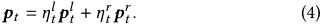

To align with this computation process, on each side _𝑠_ ∈{ _𝑙,𝑟_ }, a corrected value4 of _ℎ__𝑠_ _𝑡_is computed and retained during decoding _𝑥𝑡__𝑠_, and then broadcast and stored along with draft tokens and the locally-aggregated distributions. **Aggregation strategy.** To sample _𝑥𝑡_ ∼ _𝒑𝑡_ , we instead perform two independent speculative sampling processes as follows: 

- Keep the draft token _𝑥𝑡__𝑙_as_𝑥_˜ _𝑡__𝑙_if_𝒑𝑙_ _𝑡_(_𝑥_ _𝑡__𝑙_)≤_𝒑_ _𝑡__𝑟_(_𝑥_ _𝑡__𝑙_),andincase _𝒑__𝑙_ _𝑡_(_𝑥_ _𝑡__𝑙_)_>𝒑_ _𝑡__𝑟_(_𝑥_ _𝑡__𝑙_)we reject the sample with probability_𝜂_ _𝑡__𝑟_(1 − _𝒑𝑡__𝑟_(_𝑥_ _𝑡__𝑙_) /_𝒑𝑙_ _𝑡_(_𝑥_ _𝑡__𝑙_))and re-sample_𝑥_˜ _𝑡__𝑙_from an adjusted distribution _𝒑_ ˜_𝑙_ _𝑡_= norm(max(0_, 𝒑_ _𝑡__𝑟_−_𝒑𝑙_ _𝑡_)). 

- Keep the draft token _𝑥𝑡__𝑟_as_𝑥_˜ _𝑡__𝑟_if_𝒑_ _𝑡__𝑟_(_𝑥_ _𝑡__𝑟_)≤_𝒑𝑙_ _𝑡_(_𝑥_ _𝑡__𝑟_),andincase _𝒑𝑡__𝑟_(_𝑥_ _𝑡__𝑟_)_>𝒑𝑙_ _𝑡_(_𝑥_ _𝑡__𝑟_)we reject the sample with probability_𝜂_ _𝑡__𝑙_(1 − _𝒑__𝑙_ _𝑡_(_𝑥_ _𝑡__𝑟_) /_𝒑_ _𝑡__𝑟_(_𝑥_ _𝑡__𝑟_))and re-sample_𝑥_˜ _𝑡__𝑟_from an adjusted distribution _𝒑_ ˜ _𝑡__𝑟_= norm(max(0_, 𝒑𝑙_ _𝑡_−_𝒑_ _𝑡__𝑟_)). 

Next, we select either _𝑥_ ˜ _𝑡__𝑙_or_𝑥_˜ _𝑡__𝑟_as_𝑥𝑡_with uniform probability. Finally, each draft token _𝑥𝑡__𝑙_and_𝑥_ _𝑡__𝑟_is accepted if it matches the target token 

> 4We adopt the log-sum-exp trick to maintain numerical stability. Details are included in our technical report [22]. 

|**Algorithm 1:**SpeculativeAggregation|
|---|
|**Input:**Draft tokens_𝑥__𝑠_ _𝑡_, locally-aggregated distributions_𝒑𝑠_ _𝑡_, and aggregation weights_ℎ__𝑠_ _𝑡_, for_𝑠_∈{_𝑙,𝑟_}|
|**Output:**Target token_𝑥𝑡_, acceptance statusS_𝑙_andS_𝑟_|
|**Function**Sample(_𝑥, 𝒑__𝑎__, 𝒑__𝑏__, 𝜂_)**:** ˜_𝑥_←_𝑥_,_𝜎__𝑎_∼_𝑈_(0_,_1);|
|**if**_𝒑__𝑎_(_𝑥_) _> 𝒑__𝑏_(_𝑥_)_, 𝜎__𝑎__< 𝜂_(1−_𝒑__𝑏_(_𝑥_) /_𝒑__𝑎_(_𝑥_)) **then** ˜_𝑥_∼norm(max(0_, 𝒑__𝑏_−_𝒑__𝑎_)); **return** ˜_𝑥_;|
|_𝜂__𝑙_ _𝑡_←_ℎ𝑙_ _𝑡_/(_ℎ𝑙_ _𝑡_+_ℎ𝑟_ _𝑡_),_𝜂𝑟_ _𝑡_←1 −_𝜂𝑙_ _𝑡_;|
|˜_𝑥__𝑙_ _𝑡_←Sample(_𝑥𝑙_ _𝑡__, 𝒑𝑙_ _𝑡__, 𝒑𝑟_ _𝑡__,𝜂𝑟_ _𝑡_), ˜_𝑥𝑟_ _𝑡_←Sample(_𝑥𝑟_ _𝑡__, 𝒑𝑟_ _𝑡__, 𝒑𝑙_ _𝑡__,𝜂𝑙_ _𝑡_); |
|_𝜎_∼_𝑈_(0_,_1),_𝑥𝑡_←˜_𝑥__𝑙_ _𝑡_· 1_𝜎_≤0_._5 + ˜_𝑥𝑟_ _𝑡_· 1_𝜎>_0_._5; S_𝑙_←_𝑥__𝑙_ _𝑡_=_𝑥𝑡_, S_𝑟_←_𝑥𝑟_ _𝑡_=_𝑥𝑡_; **return**_𝑥𝑡_,S_𝑙_,S_𝑟_;|

_𝑥𝑡_ ; otherwise, it is rejected. The aggregation strategy at each step _𝑡_ is summarized in Algorithm 1. 

**Theorem 1.** _During each generation step 𝑡, the target token 𝑥𝑡 produced by the speculative aggregation strategy follows a distribution identical to that output by VDRAG._ 

_Proof_ . Since the output distribution _𝒑𝑡_ in Equation (4) is mathematically equivalent to that of VDRAG in Equation (2) through proper matrix partitioning, the theorem can be reformulated as follows: For any pair of locally-aggregated distributions _𝒑__𝑙_ _𝑡_and_𝒑_ _𝑡__𝑟_, the target token _𝑥𝑡_ is sampled from the convex combination _𝒑𝑡_ = _𝜂𝑡__𝑙𝒑𝑙_ _𝑡_+_𝜂_ _𝑡__𝑟𝒑_ _𝑡__𝑟_. Notice that for _𝑠_ ∈{ _𝑙,𝑟_ }, the mixture coefficients _𝜂𝑡__𝑠_are computed as _𝜂𝑡__𝑠_=_ℎ𝑠_ _𝑡_/(_ℎ𝑙_ _𝑡_+_ℎ𝑟_ _𝑡_) (see § 4.1 Target distribution), which naturally satisfies the condition _𝜂𝑡__𝑙_+_𝜂_ _𝑡__𝑟_= 1. 

First, we show that the intermediate outputs _𝑥_ ˜ _𝑡__𝑙_and_𝑥_˜ _𝑡__𝑟_from the two independent speculative sampling processes are indeed drawn from _𝒑𝑡_ . For side _𝑙_ , the probability to reject a draft token is 

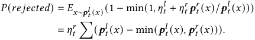

The adjusted distribution, from which we sample after the draft token is rejected, can be expressed as 

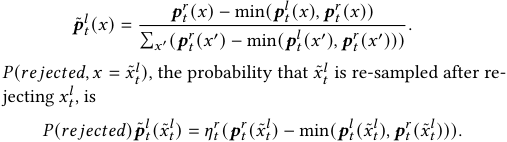

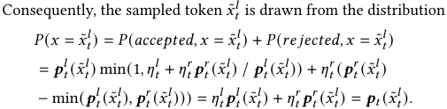

As a result, _𝑥_ ˜ _𝑡__𝑙_is distributed identically to tokens sampled from_𝒑𝑡_. Since the correctness proof for the other side _𝑟_ is symmetric, we can conclude straightforwardly that _𝑥_ ˜ _𝑡__𝑟_∼_𝒑𝑡_. Finally, the aggregation strategy randomly select either _𝑥_ ˜ _𝑡__𝑙_or_𝑥_˜ _𝑡__𝑟_as the target token_𝑥𝑡_, with a uniform probability. Obviously, _𝑥𝑡_ ∼ 0 _._ 5 _𝒑𝑡_ + 0 _._ 5 _𝒑𝑡_ = _𝒑𝑡_ . □ 

224 

MobiHoc ’25, October 27–30, 2025, Houston, TX, USA 

DRAGON: Enhancing On-Device Model Performance with Distributed Retrieval-Augmented Generation 

To conclude, Speculative Aggregation fundamentally reorders the processing pipeline of VDRAG from aggregate-then-sample to sample-then-aggregate. It first samples from local distributions _𝒑__𝑙_ _𝑡_ and _𝒑𝑡__𝑟_and then aggregates the outputs via a conditional sampling from adjusted distributions followed by the final resampling. This sampling-based aggregation is theoretically necessary to ensure the generated token _𝑥𝑡_ properly follows the target distribution _𝒑𝑡_ . In contrast, naive binary selection between _𝑥𝑡__𝑙_and_𝑥_ _𝑡__𝑟_fails to pre- serve this property. A canonical counterexample occurs in greedy sampling when arg max _𝒑𝑡_ ∉ {arg max _𝒑__𝑙_ _𝑡__,_arg max_𝒑_ _𝑡__𝑟_}. **Multi-step aggregation.** We now present a general procedure for sampling multiple consecutive tokens. At each step _𝑡_ , the following workflow is executed: 

- 1) The Aggregator waits until both Draft Queues are non-empty, then dequeues _𝑥𝑡__𝑠_fromthelocalonesandretrievesauxiliary variables _𝒑𝑡__𝑠_and_ℎ𝑠_ _𝑡_from the local cache, for each_𝑠_∈{_𝑙,𝑟_}. 

- 2) The Aggregator performs aggregation as defined in Algorithm 1. The outputs, including the target token _𝑥𝑡_ and the acceptance status of each draft token, are broadcast to notify both sides. 

- 3) Upon receiving the message, each side checks the acceptance status of both _𝑥𝑡__𝑙_and_𝑥_ _𝑡__𝑟_. If a token is accepted, it is dequeued from the corresponding Draft Queue and step 5) is executed; otherwise, step 4) is executed. 

- 4) If _𝑥𝑡__𝑠_is rejected, its corresponding Draft Queues on both sides are cleared and the side _𝑠_ rolls back its KV cache and re-computes the next draft token _𝑥𝑡__𝑠_ +1using the target token_𝑥𝑡_as input. 

- 5) Update step _𝑡_ ← _𝑡_ + 1, and go back to step 1). 

## **4.2 Analysis of Acceptance Rate** 

We now analyze the factors that influence the acceptance rate of draft tokens on both the device and the cloud sides. 

**Definition 1.** _For 𝑠_ ∈{ _𝑙,𝑟_ } _, the acceptance rate 𝛽𝑡__𝑠, is the probability_ _of accepting 𝑥𝑡__𝑠_∼_𝒑_ _𝑡__𝑠_= � _𝑑_ ∈ _𝐷__𝑠𝜔_ _𝑡_(_𝑑_)_𝒑_(_𝑥_ _𝑡_|_𝑑,𝑥_ _<𝑡_)_by the aggregation_ _strategy, given a prefix 𝑥<𝑡 ._ 

First, we consider _𝑙_ -side as an example. The acceptance of the draft token _𝑥𝑡__𝑙_, sampled from_𝒑𝑙_ _𝑡_by the Decoder, can be classified into two cases: 1) it is accepted during the speculative sampling of _𝑥_ ˜ _𝑡__𝑙_and 2) the draft token _𝑥𝑡__𝑟_=_𝑥_ _𝑡__𝑙_is accepted or_𝑥_˜ _𝑡__𝑟_=_𝑥_ _𝑡__𝑙_is sampled from_𝒑_˜ _𝑡__𝑟_ during the speculative sampling of _𝑥_ ˜ _𝑡__𝑟_. Let_𝛾𝑙_and_𝛾𝑟_= 1 −_𝛾𝑙_denote weights assigned to _𝑥_ ˜ _𝑡__𝑙_and_𝑥_˜ _𝑡__𝑟_in the random selection following these sampling processes. We adopt the definition of divergence from [20], given by _𝛿_ = _𝐷𝐿𝐾_ ( _𝒑__𝑙_ _𝑡__, 𝒑_ _𝑡__𝑟_)= 1 −� _𝑥_min(_𝒑𝑙_ _𝑡_(_𝑥_)_, 𝒑_ _𝑡__𝑟_(_𝑥_)). The expected acceptance rate _𝛼𝑡__𝑙_= E _𝑥_ ∼ _𝒑𝑡__𝑙_(_𝑥_) (_𝛽_ _𝑡__𝑙_)is computed as 

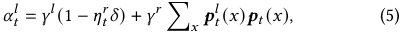

where the two terms represent the acceptance probability of the two cases above, respectively. These terms are mutually exclusive and their contributions are weighted by the mixture weights _𝛾__𝑙_ and _𝛾__𝑟_ (both empirically set to 0.5 in our implementation for simplicity5 ). 

**Theorem 2.** _The expected acceptance rate is influenced by the degree of overlap between the draft distributions on the two sides._6 

> 5Please refer to our technical report [22] for design details on random selection weight. 

> 6For a detailed analysis of how draft distribution overlap affects acceptance rates, please refer to our technical report [22]. 

|_𝑥__𝑙_ _𝑡_−1|_𝑥__𝑟_ _𝑡_−1|**Waiting Time for**_𝑥__𝑙_ _𝑡_**and**_𝑥𝑟_ _𝑡_|
|---|---|---|
|rejected accepted accepted rejected|accepted rejected accepted rejected|max(_𝑐__𝑙_ dec_,𝜑_(_𝑐𝑟_ dec +_𝑐𝑟_ trans)) max(_𝜑_(_𝑐__𝑙_ dec)_,𝑐𝑙_ trans +_𝑐𝑟_ dec +_𝑐𝑟_ trans) max(_𝜑_(_𝑐__𝑙_ dec)_,𝜑_(_𝑐𝑟_ dec +_𝑐𝑟_ trans)) max(_𝑐__𝑙_ dec_,𝑐𝑙_ trans +_𝑐𝑟_ trans +_𝑐𝑟_ dec)|
|**Table 1: Wa** _𝑥__𝑟_ _𝑡_**under dif** **tokens**_𝑥__𝑙_ _𝑡_−1|**iting time f** **fferent acce**  **and**_𝑥𝑟_ _𝑡_−1**.**|**or the next pair of draft tokens**_𝑥__𝑙_ _𝑡_**and** **f ptance scenarios of the previous draft**|

This characteristic provides insight into the principle behind _Speculative Aggregation_ : we assume that the device-side and cloud-side RAG workflows generate similar results by default, allowing them to asynchronously decode the next tokens without aggregation. Only when they disagree with each other, the acceptance is adjusted by their aggregation weights _𝜂𝑡__𝑙_and_𝜂_ _𝑡__𝑟_. 

## **5 Greedy Scheduling** 

To further minimize the latency _𝐶_ ( _𝐴𝑡 ,_ F ) in Equation (3), We adaptively schedule which side performs the next aggregation after the current one is completed. The principle behind this is to maximize the overlap between the device-side and cloud-side decoding and transmission processes, jointly considering dynamic computing resources, network bandwidth, and acceptance of draft tokens. Since predicting future acceptance is challenging due to dynamic document relevance and model outputs, we employ a greedy strategy, where at each step, we minimize the expected latency per token based on current observations. 

The latency per token, denoted as _𝑍𝑡_ , is computed as the average duration between two consecutive aggregations. It can be viewed as the waiting time for the next pair of draft tokens, _𝑥𝑡_device and _𝑥𝑡_cloud , including both decoding and transmission delays, as the aggregation duration is negligible. For each side _𝑠_ ∈{device _,_ cloud}, let _𝑐__𝑠_ decdenote the decoding delay of a draft token_𝑥_ _𝑡__𝑠_, and_𝑐𝑠_ transde- note the transmission delay of this token and its auxiliary variables from _𝑠_ to the other side. Since the decoding and transmission processes are asynchronous, they may still be ongoing when the scheduling algorithm is executed. Therefore, we define _𝜑_ ( _𝑇_ total ( _𝑢_ )) = max(0 _,𝑇_ total ( _𝑢_ ) + _𝑇_ begin ( _𝑢_ ) − _𝑇_ now) as a function that estimates the remaining time of the total duration _𝑇_ total to complete the process _𝑢_ , where _𝑇_ begin and _𝑇_ now are the beginning and current timestamps, respectively. Let _𝑙_ be the side that currently performs aggregation and _𝑟_ be the other one. The best side is then selected as 

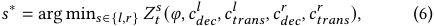

where _𝑍𝑡__𝑠_denotes the latency per token when_𝑠_continuously per- forms the aggregations in the future. 

Next, we present the calculation of _𝑍𝑡__𝑠_.Table1illustratesthe waiting time for the next pair of draft tokens after a previous aggregation. To estimate an averaged _𝑍𝑡__𝑠_over multiple future steps, rather than enumerating all possible combinations of acceptance scenarios, we assume each acceptance scenario repeats continuously7 and occurs with an expected probability given by the acceptance rate. Therefore, the waiting time in Table 1 can be simplified to eliminate the function _𝜑_ . First, assuming that draft tokens from _𝑟_ are always accepted, the decoding process for consecutive draft tokens will be 

7Please refer to our technical report [22] for pipeline illustrations of different cases. 

225 

MobiHoc ’25, October 27–30, 2025, Houston, TX, USA 

Shangyu Liu, Zhenzhe Zheng, Xiaoyao Huang, Fan Wu, Guihai Chen, Jie Wu 

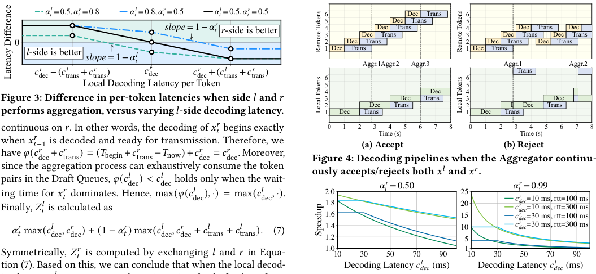

<!-- Start of picture text -->
αt l =0.5, α t r =0.8 αt l =0.8, α t r =0.5 αt l =0.5, α t r =0.5  6 Dec Trans  6  5 Dec Trans  5 slope =1− αt r r -side is better  4 3 Dec DecTransTrans  4 3 Dec DecTransTrans Dec DecTrans 0  2 Dec Trans  2 Dec Trans Dec Trans l -side is better  1 Dec Trans  1 Dec Trans slope =1− αt l Aggr.1Aggr.2 Aggr.3 Aggr.1 Aggr.2 c dec r −( c trans l + c trans r ) c dec r c dec r +( c trans l + c trans r )  6  6 Trans Local Decoding Latency per Token  5  5  4 Dec  4 Figure 3: Difference in per-token latencies when side  𝑙 and  𝑟  3 2 Dec TransDec Trans  3 2 Dec Dec TransDec performs aggregation, versus varying 𝑙 -side decoding latency.  1 Dec Trans  1 Dec Trans continuous on  𝑟 . In other words, the decoding of  𝑥𝑡𝑡 𝑟 begins exactly 0 1 2 3 4 5 6 7 8 0 1 2 3 4 5 6 7 8 Time (s) Time (s) when  𝑥𝑡𝑡 𝑟 −11 is decoded and ready for transmission. Therefore, we (a) Accept (b) Reject have  𝜑 ( 𝑐 𝑟 dec + 𝑐𝑟𝑟 trans ) = ( ( 𝑇 begin + + 𝑐𝑟𝑟 trans − 𝑇 now) +) + 𝑐𝑟𝑟 dec =  𝑐𝑟𝑟 dec . Moreover, Figure 4: Decoding pipelines when the Aggregator continu- since the aggregation process can exhaustively consume the token ously accepts/rejects both  𝑥 𝑙 and  𝑥 𝑟 . pairs in the Draft Queues,ing time for  𝑥𝑡𝑡 𝑟 dominates.  𝜑 ( Hence, 𝑐 𝑙 dec ) < 𝑐 𝑐𝑙 max(holds only when the wait- 𝑙 dec (holds only when the wait- 𝜑 ( 𝑐𝑙𝑙 dec ) ,  ·) = max(( 𝑐𝑙𝑙 dec ,  ·).. 2.01.8 αt r =0.50 2520 αctdec rr =0.99=10 ms, rtt=100 ms Finally,  𝑍𝑡𝑡 𝑙 is calculated as 1.6 15 c c decdec rr =10 ms, rtt=300 ms =30 ms, rtt=100 ms 𝛼𝑡𝑡 𝑟 max(( 𝑐𝑙𝑙 dec ,𝑐𝑟𝑟 dec ) + (1 −1 − − 𝛼 𝑡 𝑟 ) max( max(( 𝑐𝑙𝑙 dec ,𝑐𝑟𝑟 dec +  𝑐𝑙𝑙 trans +  𝑐𝑙𝑙 trans ) . (7) 1.41.2 105 c dec r =30 ms, rtt=300 ms 1.0 1 Symmetrically, 𝑍𝑡𝑡 𝑟 is computed by exchanging 𝑙 and 𝑟 in Equa- 10 30 50 70 90 10 30 50 70 90 tion (7). Based on this, we can conclude that when the local decod- (7). Based on this, we can conclude that when the local decod-. Based on this, we can conclude that when the local decod- Decoding Latency  cdec l  (ms) Decoding Latency  cdec l  (ms) Remote Tokens Remote Tokens Latency Difference Local Tokens Local Tokens Speedup <!-- End of picture text -->

**Figure 3: Difference in per-token latencies when side** _𝑙_ **and** _𝑟_ **performs aggregation, versus varying** _𝑙_ **-side decoding latency.** continuous on _𝑟_ . In other words, the decoding of _𝑥𝑡𝑡__𝑟_begins exactly when _𝑥𝑡𝑡__𝑟_ −11is decoded and ready for transmission. Therefore, we have _𝜑_ ( _𝑐__𝑟_ dec+_𝑐𝑟𝑟_ trans)= ( (_𝑇_begin + +_𝑐𝑟𝑟_ trans−_𝑇_now) +) +_𝑐𝑟𝑟_ dec=_𝑐𝑟𝑟_ dec. Moreover, since the aggregation process can exhaustively consume the token pairs in the Draft Queues,ing _𝜑_ ( _𝑐__𝑙_ dec)_< 𝑐 𝑐𝑙_ decholds only when the wait- ing time for _𝑥𝑡𝑡__𝑟_dominates.Hence,max(holds only when the wait-_𝜑_(_𝑐𝑙𝑙_ dec)_,_·)=max((_𝑐𝑙𝑙_ dec_,_·).. Finally, _𝑍𝑡𝑡__𝑙_is calculated as _𝛼𝑡𝑡__𝑟_max((_𝑐𝑙𝑙_ dec_,𝑐𝑟𝑟_ dec) + (1 −1 − −_𝛼_ _𝑡__𝑟_) max( max((_𝑐𝑙𝑙_ dec_,𝑐𝑟𝑟_ dec+_𝑐𝑙𝑙_ trans+_𝑐𝑙𝑙_ trans)_._ (7) Symmetrically, _𝑍𝑡𝑡__𝑟_iscomputedbyexchanging_𝑙_and_𝑟_inEqua- tion (7). Based on this, we can conclude that when the local decod- (7). Based on this, we can conclude that when the local decod-. Based on this, we can conclude that when the local decoding latency _𝑐__𝑙_ deccannot cover the waiting time for draft tokens from the other side, i.e., _𝑐__𝑙_ dec_< 𝑐𝑟_ dec+_𝑐𝑙_ trans+_𝑐𝑙_ trans, minimizing the overall latency _𝑍𝑡__𝑙_requires maximizing the acceptance rate_𝛼_ _𝑡__𝑟_. To decide the optimal side in Equation (6), we calculate the difference in latencies per token when side _𝑙_ and _𝑟_ performs aggregation. The result is presented as a piecewise function, 

**Figure 4: Decoding pipelines when the Aggregator continuously accepts/rejects both** _𝑥__𝑙_ **and** _𝑥__𝑟_ **.** 

**Figure 5: Theoretical speedup of DRAGON compared to the vanilla distributed RAG vs. varying** _𝑐__𝑙_ **dec****,**_𝑐𝑟_ **dec****, rtt and**_𝛼_ _𝑡__𝑟_**.** respectively, with asymmetric network delays of 1.5 s (device-tocloud) and 1.8 s (cloud-to-device). We assume the two sides start decoding at the same time. In the optimal case, when the device and cloud exchange their initial draft tokens at 2.8 s and 3.5 s, respectively, mutual acceptance occurs. This successful speculation enables uninterrupted continuous decoding of subsequent tokens, ultimately achieving a stable end-to-end per-token decoding latency of 2 s after two synchronization rounds. In the worst case, the device receives the cloud’s first draft token at 2.8 s, triggering immediate aggregation with its local draft token followed by target token sampling. Since both draft tokens are rejected, the system must abort the ongoing second-token decoding and roll back to recompute the second token using the initial target token. The cloud subsequently encounters an identical failure mode at 4.3 s. These cascading speculation failures ultimately produce a substantially degraded per-token latency of 4.3 s. 

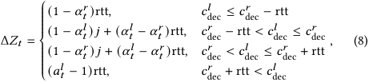

where rtt = _𝑐__𝑙_ trans+_𝑐𝑟_ trans, and_𝑗_is the difference in decoding latencies, _𝑐__𝑟_ dec−_𝑐𝑙_ dec.Accordingly,weselectside_𝑟_foraggregationwhen Δ _𝑍𝑡 >_ 0, and side _𝑙_ otherwise. Figure 3 shows the influence of varying acceptance rates on Δ _𝑍𝑡_ . As the acceptance rate of draft tokens from one side increases, the Scheduler tends to favor the opposite side. Moreover, the relationship between _𝑐__𝑙_ decand_𝑐𝑟_ decalso influences the strategy. For instance, when the decoding process on one side becomes the latency bottleneck, aggregation is always performed on that side, which is demonstrated by (1 − _𝛼𝑡__𝑟_)rtt ≥0 and ( _𝛼𝑡__𝑙_−1)rtt ≤0. Clearly, our strategy minimizes the likelihood of repeated bottleneck decoding due to rejection, while maximizing the overlap between the decoding and transmission processes. 

As established in § 4.1, VDRAG yields identical output distributions to DRAGON. It decodes the next token only when the device-side and cloud-side draft token pair becomes available, inherently matching the latency profile of DRAGON’s worst-case scenario8 , where continuous decoding with full rollback occurs. The pipeline diagrams demonstrate that in the optimal case, continuous daft decoding effectively hides transmission latency through perfect speculation and enables significantly lower end-to-end pertoken latency. This reveals DRAGON’s fundamental advantages over VDRAG in terms of potential latency reduction. 

## **6 Theoretical Analysis** 

In this section, we present a theoretical analysis to demonstrate the improvement in wall-time efficiency achieved by DRAGON over VDRAG described in § 2.2. To facilitate analysis, we assume the aggregation is always performed on the device in following discussions and _𝑙_ = device and _𝑟_ = cloud. 

Building upon these observations, we now present a formal theoretical analysis to quantify this performance improvement. 

**Definition 2.** _Let 𝑍𝑡 and 𝑍_˜ _𝑡 be the expected per-token latencies at step 𝑡 when using DRAGON and the vanilla distributed RAG, respectively. Define the speedup as 𝑆𝑡_ = _𝑍_˜ _𝑡_ / _𝑍𝑡 ._ 

First, we illustrate two boundary conditions of DRAGON using pipeline graphs: 1) the optimal case where all draft tokens from both device and cloud sides are accepted (Figure 4a), and 2) the worst case where all draft tokens are rejected (Figure 4b). For our case study, device and cloud decoding latencies are 2 s and 1 s, 

8DRAGON yields negligible transmission overhead compared to VDRAG. (See § 7.3) 

226 

MobiHoc ’25, October 27–30, 2025, Houston, TX, USA 

DRAGON: Enhancing On-Device Model Performance with Distributed Retrieval-Augmented Generation 

**Theorem 3.** _Let 𝑙_ = _device and 𝑟_ = _cloud denote the local and remote computing nodes, respectively. The speedup factor can be formally expressed as a piecewise function of the decoding latencies (𝑐__𝑙_ _dec__, 𝑐𝑟_ _dec__)_ _and the round-trip communication delay rtt, as follows:_ 

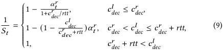

_Proof_ . _𝑍𝑡_ is computed according to Equation (7). By substituting _𝛼𝑡__𝑙_=_𝛼_ _𝑡__𝑟_=0 and we obtain_𝑍_˜_𝑡_=max(_𝑐𝑙_ dec_,𝑐𝑟_ dec+ rtt). The result then follows from a simple case-by-case analysis. □ Figure 5 illustrates the theoretical speedup characterized in Theorem 3. The speedup achieves its maximum when the device-side decoding latency is minimal and maintains saturated until it surpasses that of the cloud. Thereafter, the speedup decreases inversely with _𝑐__𝑙_ dec, gradually approaching 1 and eventually stabilizing at 1 once _𝑐__𝑙_ decexceeds_𝑐𝑟_ dec+ rtt. Finally, we have following corollaries: 

**Corollary 1.** _DRAGON is particularly effective when the decoding latency gap between the device and the cloud is small and the transmission cost becomes the primary bottleneck._ 

This characteristic extends DRAGON’s applicability to distributed computing paradigms with balanced computational capabilities across nodes, while making it particularly suitable when network communication becomes the dominant performance constraint requiring optimization. 

**Corollary 2.** _DRAGON’s improvement in wall time can be substantially amplified when the cloud-side acceptance rate is high._ 

DRAGON introduces speculative execution by sampling draft tokens directly from locally-aggregated output distributions, rather than waiting for device-cloud aggregated target tokens. This enables uninterrupted auto-regressive decoding by immediately using the sampled draft token as input for subsequent generation. The draft sampling introduces negligible computation and communication overhead, enabling DRAGON to maintain strict latency parity with VDRAG in the worst case. In typical cases where draft tokens are accepted, DRAGON achieves significantly lower end-to-end latency, which has been verified in our experiments in § 7.3. Moreover, prior work [41] shows that most attention focuses on a critical token subset whose modification substantially alters outputs. We observe draft discrepancies mainly arise from this subset, while context-independent tokens (stop words, punctuation, common terms) achieve high acceptance rates due to their shared nature. 

## **7 Experiments** 

## **7.1 Implementation** 

We implemented DRAGON for distributed RAG workflow comprising ~3,000 lines of Python code.9 The System consists of two symmetric processes, the device-side and cloud-side ones, each utilizing eight threads for core functionalities (e.g., decoding, aggregation and transmission) along with a memory-resident service process for document retrieval. We implemented information synchronization 

9Our code is available at GitHub [22]. Please refer to our technical report for more implementation details. 

between threads using multi-producer, multi-consumer queues, and between processes using socket-based communication. 

## **7.2 Experiment Setups** 

**Testbed.** We evaluated our framework and baseline methods using a high-performance computer as the cloud server and a MacBook Pro as the edge device. The server is equipped with an Intel Xeon Silver 4210R CPU, 64GB of memory, and a GeForce RTX 3090 GPU, while the MacBook Pro features an Intel Core i7 CPU, 16GB of memory, and no dedicated GPU. The cloud and the device are connected via a 2.4 GHz Wi-Fi local-area network, with latency and jitter measured by sockperf as 2ms and 6ms, respectively. To simulate network jitter, we replay a predefined random latency trace by adjusting the network interface controller (NIC) latency using the traffic control tool, _tc_ . 

**Datasets and metrics.** We evaluated the long-sequence generation performance of DRAGON on the large-scale language modeling dataset WikiText [25], which comprises over 100 million tokens extracted from verified Good and Featured articles on Wikipedia. We constructed retrieval corpora from the training sets of two differentscale versions, WikiText2 and WikiText103. During evaluation, we applied rolling windows of 1024 and 512 tokens, respectively, over their test sets, using the first 1/8 of each window as the query for retrieval and the remaining tokens for perplexity evaluation. To further assess the efficiency of our method, we measure the time to first token (TTFT) and per-token latency. In this measurement, we used the retrieval corpus and index pre-built by Facebook from a Wikipedia dump dated December 20, 2018, which contains 21 million documents. 

**Models and baselines.** We used OPT-1.3B [40] and Qwen2.51.5B [34], with vocabulary sizes of 151,936 and 50,272, respectively. For language modeling and latency measurement, we adopted Contriever [14] and DPR [17] as the retrievers, respectively. Additionally, we employed ms-marco-MiniLM-L6-v2 [30] for document reranking. We compare DRAGON with four baseline methods: 

- CRCG, centralized generation augmented with centralized retrieval from local corpus, using the context-aggregation strategy, which represents most existing RAG methods [15, 23, 29]. 

- DRCG, on-device generation augmented with documents retrieved from a distributed corpus spanning both the device and the cloud, using the context-aggregation strategy. 

- DRDG/TW, distributed RAG using the output aggregation strategy and token-wise synchronization, namely VDRAG, as discussed in § 2.2. The target tokens are collected and aggregated on the device side. 

- DRDG/SW, distributed RAG using the output aggregation strategy and sequence-wise synchronization, i.e., one-time aggregation of the independently generated output sequences from the device and the cloud. This baseline is implemented by extending the official REPLUG [31] implementation and Facebook’s RAG-Sequence model [21] with distributed support. 

To simulate insufficient but complementary corpus in the cloud and device sides, we constrain the on-cloud and on-device retrieval by selecting the first and second halves of the top-k documents from the same corpus, respectively. Moreover, to study the overhead of DRCG, we evaluate two variants: DRCG/Text retrieves raw text and 

227 

MobiHoc ’25, October 27–30, 2025, Houston, TX, USA 

Shangyu Liu, Zhenzhe Zheng, Xiaoyao Huang, Fan Wu, Guihai Chen, Jie Wu 

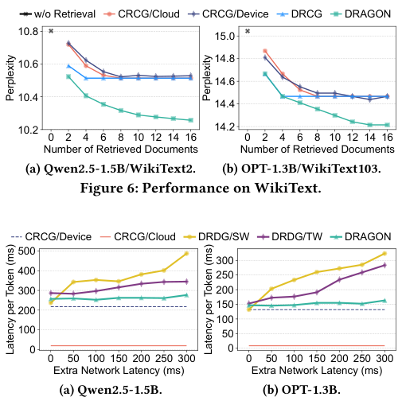

<!-- Start of picture text -->
w/o Retrieval CRCG/Cloud CRCG/Device DRCG DRAGON 10.8 15.0 14.8 10.6 14.6 10.4 14.4 10.2 14.2 0 2 4 6 8 10 12 14 16 0 2 4 6 8 10 12 14 16 Number of Retrieved Documents Number of Retrieved Documents (a) Qwen2.5-1.5B/WikiText2. (b) OPT-1.3B/WikiText103. Figure 6: Performance on WikiText. CRCG/Device CRCG/Cloud DRDG/SW DRDG/TW DRAGON 500 300 400 250 300 200 150 200 100 100 50 0 0 0 50 100 150 200 250 300 0 50 100 150 200 250 300 Extra Network Latency (ms) Extra Network Latency (ms) (a) Qwen2.5-1.5B. (b) OPT-1.3B. Perplexity Perplexity Latency per Token (ms) Latency per Token (ms) <!-- End of picture text -->

**Figure 7: Per-token latency in various network conditions.** prefill KV cache from scratch and DRCG/KV retrieves and reuses the KV cache of documents directly. 

## **7.3 Overall Performance and Efficiency** 

We first present the overall performance and efficiency of DRAGON in comparison to the baselines. In the following experiments, we set the maximum context length to 256 tokens on both the device and cloud sides, with each retrieved document limited to 64 tokens. **Performance.** We linearly increase the number of retrieved documents on both sides from 0 to 16 and report the corresponding language modeling perplexity on WikiText. As shown in Figure 6, DRAGON matches or outperforms all baseline methods across all settings. As more documents are integrated, the performance gap between DRAGON and the baseline methods widens. Finally, DRAGON achieves 1 _._ 9× and 1 _._ 4× improvements over the non-RAG method, compared to the second-best RAG baselines, for Qwen and OPT, respectively. In contrast, CRCG methods perform poorly due to an insufficient number of retrieved documents, which indicates incomplete knowledge for the given context. Additionally, the performance of DRCG quickly saturates once the amount of retrieved text reaches the context budget limit. However, we observe a gap between DRCG and our method prior to the saturation, suggesting that output aggregation may inherently outperform context aggregation. The results of DRDG methods are omitted, as they produce identical outputs to DRAGON under the language modeling setting. **Efficiency.** We inject additional latency to the server’s NIC, ranging from 0 to 300 ms, along with a jitter equal to 1/5 of the corresponding latency value. We sample prompts from _10k_prompts_ranked_ [13], a collection of synthetic and human-generated prompts with associated ranking, and report the average end-to-end decoding latency over 20 output tokens10 . Figure 7 presents the per-token latency 

> 10Despite averaging, the results still exhibits fluctuations due to varying CPU load and network jitter, but do not affect the overall conclusion. 

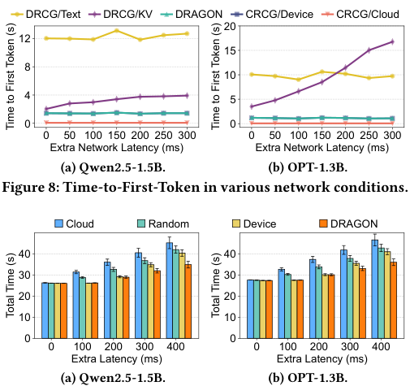

<!-- Start of picture text -->
DRCG/Text DRCG/KV DRAGON CRCG/Device CRCG/Cloud 20 12 15 8 10 4 5 0 0 0 50 100 150 200 250 300 0 50 100 150 200 250 300 Extra Network Latency (ms) Extra Network Latency (ms) (a) Qwen2.5-1.5B. (b) OPT-1.3B. Figure 8: Time-to-First-Token in various network conditions. Cloud Random Device DRAGON 40 40 30 30 20 20 10 10 0 0 0 100 200 300 400 0 100 200 300 400 Extra Latency (ms) Extra Latency (ms) (a) Qwen2.5-1.5B. (b) OPT-1.3B. Time to First Token (s) Time to First Token (s) Total Time (s) Total Time (s) <!-- End of picture text -->

**Figure 9: Comparison of different scheduling strategies.** 

when incorporating the top-2 relevant documents for the RAG process on each side. As shown in the figure, DRAGON demonstrates strong robustness under different network conditions compared to other distributed baseline methods. Specifically, DRAGON achieves latency reduction of 49.5% and 42.4% when using OPT-1.3B compared to the sequence-wise and token-wise DRDG methods, respectively. In contrast, the per-token latency of DRDG methods fluctuates significantly and tends to increase under higher network latency conditions. Sequence-wise DRDG collects output distributions of all tokens once after generation completes, resulting in a one-time large data transmission and increased sensitivity to network latency. Token-wise DRDG amortizes data transmission over the entire generation process, partially hiding latency within decoding. However, it still under-performs compared to DRAGON due to frequent output synchronizations. Additionally, DRCG methods yields the same per-token latency with corresponding CRCG methods, because they do not involve cooperation between the device and the cloud. Although DRAGON incurs an average latency overhead of 15.6%–20.3% compared to device-only methods, it effectively supports tasks that require both personal and general knowledge, where device-only or cloud-only methods may fail. 

We further compare the TTFT of DRAGON with that of the baseline methods under identical network conditions. TTFT typically includes the time for document retrieval and the latency of the prefill stage, during which the key-value (KV) activations for the concatenation of retrieved documents and the input query are either computed from scratch in parallel or loaded from cache. As shown in Figure 8, DRAGON incurs negligible TTFT overhead compared to the device-only CRCG method. In contrast, as KV cache is hosted on the same side with the corpus, DRCG/Text performs prefill from scratch, resulting in high computation latency and 8 _._ 6× TTFT on average compared to DRAGON. DRCG/KV directly fetches KV activations from the server, leading to increased transmission time under higher network latency and yielding over 15 _._ 3× TTFT compared to DRAGON, rendering it entirely impractical. Notably, 

228 

MobiHoc ’25, October 27–30, 2025, Houston, TX, USA 

DRAGON: Enhancing On-Device Model Performance with Distributed Retrieval-Augmented Generation 

DRCG/Text incurs larger prefill latency when using Qwen2.5-1.5B compared to OPT-1.3B, due to its larger number of parameters. In contrast, DRCG/KV exhibits higher TTFT on OPT-1.3B, as Qwen2.51.5B employs Grouped-Query Attention [2] to reduce the size of KV activations. The transmission data size in DRCG/KV is 114 MB/16 MB for OPT-1.3B/Qwen2.5-1.5B when retrieving 2 documents of 64 tokens each. Local document retrieval latency is measured at 52.6 ms, while latency for remote raw-text retrieval ranges from 107.2 ms to 745.2 ms as extra network latency increases from 0 to 300 ms. 

## **7.4 Effectiveness of Scheduling** 

To thoroughly evaluate the effectiveness of scheduling, we implemented a simulator to run DRAGON repeatedly using different scheduling strategies under consistent settings. We compare our scheduling strategy with three baseline methods: (1) _Cloud_ and (2) _Device_ , where aggregation is statically performed in the cloud and the device, respectively, and (3) _Random_ , which randomly selects the side for aggregation. To implement the simulation, we record and replay the acceptance decisions of the Aggregator, and use real-world measurements of decoding latency on each side. We simulate varying network conditions by adding an extra latency and a sinusoidal jitter to the measured base latency. The period of the jitter is set to 20 _𝜋_ seconds with its amplitude set to 1/5 of the corresponding latency, consistent with the settings in § 7.3. 

Figure 9 presents the total time required to generate 100 tokens under varying network conditions, each averaged over 50 different acceptance decision sequences. The results show that DRAGON’s scheduling strategy matches or outperforms all baselines across all settings, with the efficiency gains increasing as the extra latency grows. Due to the substantial gap in decoding latencies between the device and the cloud (as shown in Figure 7), performing aggregation on the device naturally hides cloud-side decoding and transmission within device-side decoding. When network latency is low, _Cloud_ and _Random_ tend to incur higher latency while DRAGON consistently selects the device side for aggregation. As network latency grows and transmission becomes the bottleneck, DRAGON dynamically selects the side with higher acceptance rate to minimize transmission resulted from draft rejection. Finally, we argue that when device-side and cloud-side decoding latencies become closer in value, the overall generation time will be more sensitive to the network latency. In that case, our scheduling strategy will achieve greater improvement compared to these baseline methods. **Case study.** To illustrate DRAGON’s detailed scheduling process, we present a 15-token snapshot of a random simulation with the extra latency set to 500 ms. Figure 10 shows, from top to bottom, the cloud-side and device-side generation pipelines, the instantaneous RTT, the estimation score Δ _𝑍_ as defined in Equation (8), and the accumulated acceptance rates. The pipeline graph comprises vertically arranged bars representing decoding and different transmission tasks (including transmission of draft tokens, target tokens and instruction signals for switching aggregation place). 

Initially, the Aggregator resides on the device by default. From the perspective of the device, _𝑐__𝑟_ dec_< 𝑐𝑙_ dec≤_𝑐𝑟_ dec+ rtt consistently holds and Δ _𝑍_ is computed as the sum of two terms, _𝐴_ = (1 − _𝛼𝑡__𝑟_)(_𝑐𝑟_ dec−_𝑐𝑙_ dec) and_𝐵_= (_𝛼_ _𝑡__𝑙_−_𝛼_ _𝑡__𝑟_)rtt. After the first aggregation at 0.5 s, the acceptance rates are updated to _𝛼_ 0_𝑙_= 1 and_𝛼_ 0_𝑟_= 0. As a result, the positive term _𝐵_ dominates and Δ _𝑍 >_ 0. The Scheduler decides 

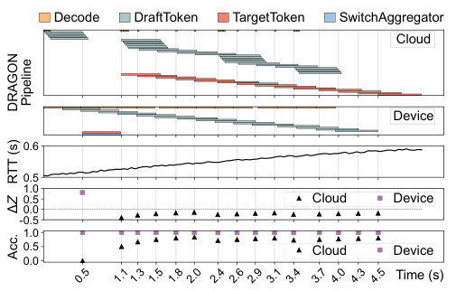

<!-- Start of picture text -->
Decode DraftToken TargetToken SwitchAggregator Cloud Device 0.6 0.5 1.0 0.5 Cloud Device 0.0 -0.5 1.0 0.5 Cloud Device 0.0 0.5 1.11.3 1.5 1.8 2.0 2.4 2.6 2.9 3.1 3.4 3.7 4.0 4.3 4.5 Time (s) DRAGON Pipeline RTT (s) Δ Z Acc. <!-- End of picture text -->

**Figure 10: A random snapshot of the generation pipeline and scheduling decisions of DRAGON.** 

to switch the Aggregator to the cloud, sending the switching signal along with the target token. It then shifts to the cloud’s perspective and reverses the sign of Δ _𝑍_ . Subsequently, since the accumulated cloud-side acceptance rate remains lower, the Scheduler continues to estimating Δ _𝑍 <_ 0, indicating that cloud-side aggregation is more efficient. This case shows that DRAGON’s scheduling strategy dynamically minimizes decoding and transmission costs on the side with a lower acceptance rate, which is consistent with our analysis in § 5 and the results shown in Figure 9. 

## **7.5 Overhead Analysis** 

DRAGON introduces an additional sampling operation at each decoding step. However, as illustrated by the _Sample_ function in Algorithm 1, the overhead is minimal, involving only two scalar-level random generations, subtractions, multiplications, and comparisons, along with one vector-level subtraction, comparison, and normalization. Taking Qwen2.5-1.5B (the model used in our evaluation with an output vocabulary size of 151,936) as an example, the extra computational cost of sampling is less than 3 × 105 multiplyaccumulate operations (MACs), which takes ∼1 us and is negligible compared to the _>_ 109 MACs required for decoding a single token. 

Regarding communication overhead, our efficient data compression strategy [22] ensures that transmitting the output distributions incurs less than 0.5 KB of extra data per token. Under a 100 Mbps local-area Wi-Fi network, this translates to _<_ 40 us of transmission latency, which is also negligible. 

## **8 Related Works** 

**RAG with Multiple Documents.** Existing approaches aggregate retrieved documents via either _output aggregation_ (effective for encoder-only and seq2seq models [11, 21] and adapted to decoderonly LLMs [31]) or _context aggregation_ (prepend the concatenation of all documents to the input for simplicity [15, 23, 29]). Our framework leverages _output aggregation_ to facilitate the decomposition of the multi-document RAG workflow across the device and the cloud, whereas existing works adopt a centralized architecture. **Device-Cloud Collaborative Inference.** While prior work [3, 19, 39] established device-cloud collaborative inference for conventional neural networks, recent extensions to LLMs [27, 28] remain limited in privacy-preserving RAG. Hybrid-RACA [36] retrieves and compresses cloud documents for on-device SLMs, while [10] 

229 

MobiHoc ’25, October 27–30, 2025, Houston, TX, USA 

Shangyu Liu, Zhenzhe Zheng, Xiaoyao Huang, Fan Wu, Guihai Chen, Jie Wu 

enhances kNN-LMs [18] using cloud interaction history. Both approaches prioritize availability over privacy by processing singlesource LLM outputs. In contrast, DRAGON leverages databases on both the device and cloud sides, enabling model collaboration without compromising document privacy. 

**Speculative Decoding.** First proposed in [35], this technique employs a SLM to draft multiple future tokens for parallel verification by the target LLM. Variants include Speculative Sampling [7, 20] for diverse sampling strategies, and approaches like Medusa [5] and Blockwise Decoding [33] that use modified Transformer decoders for parallel drafting. Other work [37, 38] implements drafting via early exiting. In contrast to speculative decoding, where a single drafter fast predicts the output of the target LLM, speculative aggregation in DRAGON verifies the consistency between outputs generated by two distinct LLMs. 

## **9 Conclusion** 

To address privacy risks of cloud LLMs and limited capabilities of ondevice SLMs, we propose DRAGON, a distributed RAG framework that enhances on-device SLMs using both personal and general knowledge without raw document transmission between the device and the cloud. DRAGON partitions the RAG workflow across device and cloud, using _Speculative Aggregation_ to minimize output synchronization overhead. Experimental results show that DRAGON notably improves generation quality while maintaining low latency. 

## **References** 

- [1] Abdelrahman Abouelenin, Atabak Ashfaq, Adam Atkinson, Hany Awadalla, Nguyen Bach, Jianmin Bao, Alon Benhaim, Martin Cai, Vishrav Chaudhary, Congcong Chen, et al. 2025. Phi-4-Mini Technical Report: Compact yet Powerful Multimodal Language Models via Mixture-of-LoRAs. arXiv:2503.01743 

- [2] Joshua Ainslie, James Lee-Thorp, Michiel de Jong, Yury Zemlyanskiy, Federico Lebrón, and Sumit Sanghai. 2023. GQA: Training Generalized Multi-Query Transformer Models from Multi-Head Checkpoints. In _EMNLP_ . 4895–4901. 

- [3] Amin Banitalebi-Dehkordi, Naveen Vedula, Jian Pei, Fei Xia, Lanjun Wang, and Yong Zhang. 2021. Auto-Split: A General Framework of Collaborative Edge-Cloud AI. In _SIGKDD_ . 2543–2553. 

- [4] Sebastian Borgeaud, Arthur Mensch, Jordan Hoffmann, Trevor Cai, Eliza Rutherford, et al. 2022. Improving Language Models by Retrieving from Trillions of Tokens. In _ICML_ . 2206–2240. 

- [5] Tianle Cai, Yuhong Li, Zhengyang Geng, Hongwu Peng, Jason D. Lee, Deming Chen, and Tri Dao. 2024. Medusa: Simple LLM Inference Acceleration Framework with Multiple Decoding Heads. In _ICML_ . 5209–5235. 

- [6] Neal Cardwell, Yuchung Cheng, C Stephen Gunn, Soheil Hassas Yeganeh, and Van Jacobson. 2016. BBR: Congestion-Based Congestion Control: Measuring bottleneck bandwidth and round-trip propagation time. _Queue_ 14 (2016), 20–53. 

- [7] Charlie Chen, Sebastian Borgeaud, Geoffrey Irving, Jean-Baptiste Lespiau, Laurent Sifre, and John Jumper. 2023. Accelerating Large Language Model Decoding with Speculative Sampling. arXiv:2302.01318 

- [8] Jiawei Chen, Hongyu Lin, Xianpei Han, and Le Sun. 2024. Benchmarking Large Language Models in Retrieval-Augmented Generation. In _AAAI_ . 17754–17762. 

- [9] DeepSeek-AI. 2024. DeepSeek-V3 Technical Report. arXiv:2412.19437 

- [10] Yucheng Ding, Chaoyue Niu, Fan Wu, Shaojie Tang, Chengfei Lyu, and Guihai Chen. 2024. Enhancing On-Device LLM Inference with Historical Cloud-Based LLM Interactions. In _SIGKDD_ . 597–608. 

- [11] Kelvin Guu, Kenton Lee, Zora Tung, Panupong Pasupat, and Mingwei Chang. 2020. Retrieval Augmented Language Model Pre-Training. In _ICML_ . 3929–3938. 

- [12] Junxian Huang, Feng Qian, Alexandre Gerber, Z Morley Mao, Subhabrata Sen, and Oliver Spatscheck. 2012. A Close Examination of Performance and Power Characteristics of 4G LTE Networks. In _MobiSys_ . 225–238. 

- [13] Data is Better-Together. 2024. 10k_prompts_ranked. https://huggingface.co/ datasets/data-is-better-together/10k_prompts_ranked. Accessed: 2025-03-31. 

- [14] Gautier Izacard, Mathilde Caron, Lucas Hosseini, Sebastian Riedel, Piotr Bojanowski, Armand Joulin, and Edouard Grave. 2021. Unsupervised Dense Information Retrieval with Contrastive Learning. https://arxiv.org/abs/2112.09118 

Augmented Generation. In _EMNLP_ . 7969–7992. 

   - [16] Peter Kairouz, H Brendan McMahan, Brendan Avent, Aurélien Bellet, Mehdi Bennis, Arjun Nitin Bhagoji, Kallista Bonawitz, Zachary Charles, Graham Cormode, Rachel Cummings, et al. 2021. Advances and Open Problems in Federated Learning. _Foundations and Trends in Machine Learning_ 14, 1–2 (2021), 1–210. 

   - [17] Vladimir Karpukhin, Barlas Oğuz, Sewon Min, Patrick Lewis, Ledell Wu, Sergey Edunov, Danqi Chen, and Wen-tau Yih. 2020. Dense Passage Retrieval for OpenDomain Question Answering. In _EMNLP_ . 6769–6781. 

   - [18] Urvashi Khandelwal, Omer Levy, Dan Jurafsky, Luke Zettlemoyer, and Mike Lewis. 2020. Generalization through Memorization: Nearest Neighbor Language Models. In _ICLR_ . 

   - [19] Stefanos Laskaridis, Stylianos I Venieris, Mario Almeida, Ilias Leontiadis, and Nicholas D Lane. 2020. SPINN: Synergistic Progressive Inference of Neural Networks over Device and Cloud. In _MobiCom_ . 1–15. 

   - [20] Yaniv Leviathan, Matan Kalman, and Yossi Matias. 2023. Fast Inference From Transformers via Speculative Decoding. In _ICML_ . 19274–19286. 

   - [21] Patrick Lewis, Ethan Perez, Aleksandra Piktus, Fabio Petroni, Vladimir Karpukhin, Naman Goyal, Heinrich Küttler, Mike Lewis, Wen-tau Yih, Tim Rocktäschel, et al. 2020. Retrieval-Augmented Generation for Knowledge-Intensive NLP Tasks. In _NIPS_ . 9459–9474. 

   - [22] Shangyu Liu. 2025. _DRAGON: A Device-Cloud Distributed RAG Framework that Enables a Simultaneous Integration of Personalized Information and Generic Knowledge_ . https://github.com/ThomasAtlantis/DRAGON 

   - [23] Hongyin Luo, Tianhua Zhang, Yung-Sung Chuang, Yuan Gong, Yoon Kim, Xixin Wu, Helen Meng, and James Glass. 2023. Search Augmented Instruction Learning. In _EMNLP_ . 3717–3729. 

   - [24] Yu Ma, Weifa Liang, Jing Li, Xiaohua Jia, and Song Guo. 2020. Mobility-Aware and Delay-Sensitive Service Provisioning in Mobile Edge-Cloud Networks. _TMC_ 21, 1 (2020), 196–210. 

   - [25] Stephen Merity, Caiming Xiong, James Bradbury, and Richard Socher. 2017. Pointer Sentinel Mixture Models. In _ICLR_ . 

   - [26] OpenAI. 2023. GPT-4 Technical Report. arXiv:2303.08774 

   - [27] Yanghe Pan, Zhou Su, Yuntao Wang, Shaolong Guo, Han Liu, Ruidong Li, and Yuan Wu. 2024. Cloud-Edge Collaborative Large Model Services: Challenges and Solutions. _IEEE Network_ 39, 4 (2024), 182–191. 

   - [28] Guanqiao Qu, Qiyuan Chen, Wei Wei, Zheng Lin, Xianhao Chen, and Kaibin Huang. 2024. Mobile Edge Intelligence for Large Language Models: A Contemporary Survey. arXiv:2407.18921 

   - [29] Ori Ram, Yoav Levine, Itay Dalmedigos, Dor Muhlgay, Amnon Shashua, Kevin Leyton-Brown, and Yoav Shoham. 2023. In-Context Retrieval-Augmented Language Models. _TACL_ 11 (2023), 1316–1331. 

   - [30] Nils Reimers and Iryna Gurevych. 2019. Sentence-BERT: Sentence Embeddings using Siamese BERT-Networks. In _EMNLP_ . 3980–3990. 

   - [31] Weijia Shi, Sewon Min, Michihiro Yasunaga, Minjoon Seo, Rich James, Mike Lewis, Luke Zettlemoyer, and Wen-tau Yih. 2024. REPLUG: Retrieval-Augmented Black-Box Language Models. In _NAACL_ . 8371–8384. 

   - [32] Milad Shokouhi, Luo Si, et al. 2011. Federated Search. _Foundations and Trends in Information Retrieval_ 1 (2011), 1–102. 

   - [33] Mitchell Stern, Noam Shazeer, and Jakob Uszkoreit. 2018. Blockwise Parallel Decoding for Deep Autoregressive Models. In _NIPS_ . 10107–10116. 

   - [34] Qwen Team. 2024. Qwen2.5 Technical Report. arXiv:2412.15115 

   - [35] Heming Xia, Tao Ge, Peiyi Wang, Si-Qing Chen, Furu Wei, and Zhifang Sui. 2023. Speculative Decoding: Exploiting Speculative Execution for Accelerating Seq2seq Generation. In _EMNLP_ . 3909–3925. 

   - [36] Menglin Xia, Xuchao Zhang, Camille Couturier, Guoqing Zheng, Saravan Rajmohan, and Victor Rühle. 2024. Hybrid-RACA: Hybrid Retrieval-Augmented Composition Assistance for Real-time Text Prediction. In _EMNLP_ . 120–131. 

   - [37] Seongjun Yang, Gibbeum Lee, Jaewoong Cho, Dimitris Papailiopoulos, and Kangwook Lee. 2024. Predictive Pipelined Decoding: A Compute-Latency Trade-off for Exact LLM Decoding. _TMLR_ (2024). 

   - [38] Jun Zhang, Jue Wang, Huan Li, Lidan Shou, Ke Chen, Gang Chen, and Sharad Mehrotra. 2024. Draft& Verify: Lossless Large Language Model Acceleration via Self-Speculative Decoding. In _ACL_ . 11263–11282. 

   - [39] Shigeng Zhang, Yinggang Li, Xuan Liu, Song Guo, Weiping Wang, Jianxin Wang, Bo Ding, and Di Wu. 2020. Towards Real-Time Cooperative Deep Inference over the Cloud and Edge End Devices. _IMWUT_ 4, 2 (2020), 69:1–69:24. 

   - [40] Susan Zhang, Stephen Roller, Naman Goyal, Mikel Artetxe, Moya Chen, Shuohui Chen, Christopher Dewan, Mona Diab, Xian Li, Xi Victoria Lin, et al. 2022. OPT: Open Pre-trained Transformer Language Models. arXiv:2205.01068 [cs.CL] 

   - [41] Zhenyu Zhang, Ying Sheng, Tianyi Zhou, Tianlong Chen, Lianmin Zheng, et al. 2023. H2O: Heavy-Hitter Oracle for Efficient Generative Inference of Large Language Models. In _NIPS_ . 34661–34710. 

   - [42] Wayne Xin Zhao, Kun Zhou, Junyi Li, Tianyi Tang, Xiaolei Wang, Yupeng Hou, Yingqian Min, Beichen Zhang, Junjie Zhang, Zican Dong, et al. 2023. A Survey of Large Language Models. arXiv:2303.18223 

- [15] Zhengbao Jiang, Frank Xu, Luyu Gao, Zhiqing Sun, Qian Liu, Jane DwivediYu, Yiming Yang, Jamie Callan, and Graham Neubig. 2023. Active Retrieval 

230 

