# **Online Contract Design for Creator Economy in the Era of GenAI** 

Yumou Liu 

Shanghai Jiao Tong University The Chinese University of Hong Kong, Shenzhen liuyumou@sjtu.edu.cn 

## Fan Wu 

Shanghai Jiao Tong University fwu@cs.sjtu.edu.cn 

### **ABSTRACT** 

In creator economy, the online platform posts contract to incentivize creators for high-quality content. The creators can use human effort or Generative Artificial Intelligence (GenAI) to assist them to create content for rewards. In this work, we identify that the existing contract suffers from GenAI-Induced Effort Degradation, where creators may not try their best to create high-quality content, but instead turn to GenAI to save effort and extract additional reward. Our results show that GenAI-induced effort degradation arises from failing to provide the same profit for the creators generating the same quality content. With this observation, we design the contract for creator economy in the era of GenAI as a classical contract for human content and a reward for the GenAI content which depends on the estimation of the human effort cost required to achieve GenAI’s content quality. To overcome the curse of dimensionality in learning the optimal contract that maximizes platform profit with a high-quality content guarantee, we design an adaptive action pruning method that gradually filters out contracts resulting in low quality. Simulation experiments on synthetic data demonstrate the effectiveness of our approach. 

### **CCS CONCEPTS** 

#### • **Networks** → **Network economics** . 

##### **ACM Reference Format:** 

Yumou Liu, Zhenzhe Zheng, Fan Wu, and Guihai Chen. 2025. Online Contract Design for Creator Economy in the Era of GenAI. In _Proceedings of ACM Conference (MobiHoc ‘25)._ ACM, New York, NY, USA, 10 pages. https://doi.org/10.1145/3704413.3764430 

This work was supported in part by China NSF grant No. U2268204, 62322206, 62132018, 62025204, 62272307, 62372296, in part by Xiaohongshu Research Program. The opinions, findings, conclusions, and recommendations expressed in this paper are those of the authors and do not necessarily reflect the views of the funding agencies or the government. Zhenzhe Zheng is the corresponding author. 

Permission to make digital or hard copies of all or part of this work for personal or classroom use is granted without fee provided that copies are not made or distributed for profit or commercial advantage and that copies bear this notice and the full citation on the first page. Copyrights for components of this work owned by others than the author(s) must be honored. Abstracting with credit is permitted. To copy otherwise, or republish, to post on servers or to redistribute to lists, requires prior specific permission and/or a fee. Request permissions from permissions@acm.org. _MobiHoc ’25, October 27–30, 2025, Houston, TX, USA_ 

© 2025 Copyright held by the owner/author(s). Publication rights licensed to ACM. ACM ISBN 979-8-4007-0521-2/24/10. 

Zhenzhe Zheng Shanghai Jiao Tong University zhengzhenzhe@sjtu.edu.cn 

## Guihai Chen 

Shanghai Jiao Tong University gchen@cs.sjtu.edu.cn 

### **1 INTRODUCTION** 

In recent years, creator economy is becoming the most popular format of online platform economy, such as TikTok [39], Facebook Short Video [13] and YouTube Shorts [48]. Content creators can earn rewards from the online platform by uploading their created content. With the significant progress of Generative Artificial Intelligence (GenAI), content creators can use GenAI to assist in their work [17, 29, 35, 38], and to collaborate with them [11, 30], thereby reducing human effort required in the creation process. However, this progress also raises concerns about the quality of AI-generated content [31, 32], risks of GenAI misuse [40], as well as its impact on the online platform’s reputation, long-term profit and engagement of creators and users [9, 41, 45]. 

In the creator economy, there are complex economic interactions among content creators, online platforms and users. The online platform posts a contract for all creators, and receives the content created by creators. The online platform recommends personalized content to users, extracts revenue, and then provides the creators with rewards as incentives according to the contract. The core of this process for the online platform is designing appropriate contracts to incentivize creators to produce high-quality content so that the online platform can earn a high long-term profit, which is the difference between the accumulated revenue and the total reward paid to the creators. The creators in this procedure are assumed to be rational, such that the creator’s effort level is chosen to maximize her profit, which is the difference between the reward and her effort. This task falls under the domain of _Contract Theory_ [5, 14, 16, 36]. 

GenAI introduces new challenges in contract theory. GenAI can be used by the human creators to refine and polish humancreated content, improving the content quality. However, due to the complicated modeling of human-AI interaction [7, 15], in this work, we turn to a simpler case where human creators can choose to create either with pure human effort as tradition or with pure GenAI as advanced AI agents [28, 33] who are capable of generating a piece of content with a simple prompt. Under such circumstances, compared with human creation, GenAI provides an approach to create the content with a certain quality but requires much less effort than humans. Without carefully designing the contract, some creators who can create better content may directly use GenAI to create low-quality content but obtain a higher profit due to the low effort cost. In this scenario, the online platform could be deluged with low-quality GenAI content. We term this phenomenon _GenAIinduced Effort Degradation_ . Low-quality content can negatively impact user satisfaction, affecting long-term profits and the online 

https://doi.org/10.1145/3704413.3764430 

311 

MobiHoc ‘25, October 27-30, 2025, Houston, USA 

Yumou Liu, Zhenzhe Zheng, Fan Wu, and Guihai Chen 

platform’s reputation [41]. Therefore, it is necessary for the online platform to design appropriate contracts to mitigate this issue. 

In this work, we investigate the underlying cause of GenAIinduced effort degradation, and conduct online contract design for creator economy in the era of GenAI. There are two challenges to achieving this goal. The first and most fundamental challenge is to design a contract structure that is inherently resilient to effort degradation. A new principle is required: the contract must ensure _the same profit for the same quality_ , regardless of the creation method. This necessitates a contract that can differentiate between human-created and GenAI-generated content and assign them different rewards. The core difficulty in implementing this lies in quantifying the reward difference. Ideally, the reward for GenAI content should be calibrated based on the human effort that would have been required to achieve the same quality. This value, which we term the _GenAI-equivalent creator effort_ , is unknown to the platform, even to the creators since they do not have the quality assessment method. Therefore, formulating a contract that prevents effort degradation is challenging because it hinges on estimating an unobservable variable. 

Given a suitable contract structure, the second major challenge is to find the optimal contract parameters that maximize the platform’s long-term profit. The platform learns the best contract through a trial-and-error paradigm, but this is difficult for two primary reasons. The first difficulty arises from the complex modeling involved in mapping the design of contracts to the profit of the platform. This mapping includes multiple components, such as the creator’s content production, the online platform’s revenue, and the rewards for the creators, making it hard to formulate the objective of the problem. The second difficulty in online learning is the curse of dimensionality. Since Lipschitz-bandit-based algorithms require discretizing the action space [23, 24], the size of the discretized action space increases exponentially with the number of action dimensions, leading to a high regret. 

Our solution includes the design of the contract format and the online-learning-based optimization to derive the contract. Specifically, for GenAI content, the contract returns a calibrated reward, which is smaller than the reward for GenAI-equivalent human content by the difference between the GenAI-equivalent human effort and the GenAI creator’s effort. With this contract format, we can realize the principle of the same profit for the same quality, and thus avoid the GenAI-induced effort degradation. Regarding online learning, we discover the unimodality property of quality with respect to the estimated GenAI-equivalent creator effort, design an adaptive action pruning method to reduce the action space. The- _<u>𝑑</u>_ oretical analysis shows that our method can achieve an _𝑂_ ( _𝑇 𝑑_ +1 ) regret, where _𝑇_ is the time horizon and _𝑑_ is the dimension of the action space. Simulation experiments are conducted on synthetic data, showing that our approach can reduce regret compared with the state-of-the-art methods. 

The contributions in this work are summarized as follows: 

- We identify the phenomenon that GenAI induces effort degradation in the creator economy, and provide a model to understand the cause of GenAI-induced effort degradation between the content online platform and creators. 

- We provide a new contract format for the content online platform in the era of GenAI, considering the GenAI-induced effort degradation. We analyze how our contract can avoid GenAI-induced effort degradation, and demonstrate the reason that the classical contracts fail to prevent this issue. 

- We develop an online-learning-based method to derive the near-optimal contract. To alleviate the curse of dimensionality, we design an adaptive action pruning method to reduce the action space during the online learning process, achiev- _<u>𝑑</u>_ 

- ing an _𝑂_ ( _𝑇 𝑑_ +1 ) regret. 

- We conduct simulation experiments on synthesis data, showing the effectiveness of our method in providing more profit for the online platform while avoiding the GenAI-induced effort degradation. 

### **2 PRELIMINARIES** 

### **2.1 Online Contract Design** 

Contract theory has been studied as a subject of microeconomics for decades [5, 14, 36]. In the literature on creator economy, contract design typically refers to the platform-designed rules of rewards aimed at motivating creators to produce high-quality content [50]. The term “ _online_ " refers to the process where the online platform gradually modifies the contract over multiple rounds of interactions to maximize its profit. In each round _𝑡_ , the online platform posts a contract to all creators. Upon seeing the contract, the creator _𝑖_ decides to use human creation or GenAI, and then decides on the level of effort to spend, and subsequently creates their content. The platform then posts the content, receives revenue, and sends the reward to the corresponding creator according to the contract. To further clarify these concepts, we formally define the relevant concepts and notations as follows. 

**Human Content Creation.** Upon receiving a contract in the round _𝑡_ , if creator _𝑖_ opts to create the content manually, they spend effort1 _𝑧𝑖,𝑡_ ∈Z, Z = [0 _,_ 1], and produce the content. The quality of the content is evaluated by a quality model which can be implemented by a Click Through Rate (CTR) or Conversion Rate (CVR) models [8] in practice. Thus, we can abbreviate the content generation and quality measurement to one function _𝑔_ (·) : Z →[0 _,_ 1] which takes the creator’s effort as input and outputs the quality of the corresponding content. We assume that the content quality of human-created content is monotonically increasing with the creator’s effort [20, 46]. 

**AI Content Creation.** GenAI can participate into the content creation process in many ways. For example, human creator can send the hand-crafted content to GenAI to modify and polish it to improve its quality. GenAI can serve as an assistant to help humans collect materials. However, in this paper, we analyze a simpler case that the creator uses GenAI alone to generate content, without any human effort. If the creator opts to use GenAI to create the content in round _𝑡_ , they spend a constant effort _𝑧_ ˆ and produce the content. The quality of GenAI-generated content is _𝑔𝑎𝑖_ := _𝑔_ ( _𝑧__ℎ_ ), where _𝑧__ℎ_ represents the GenAI-equivalent creator effort. Specifically, GenAIequivalent creator effort is the effort that a human creator needs to spend to create content of the same quality as GenAI. Without 

> 1The terms “effort" and “effort level" will be used interchangeably. 

312 

MobiHoc ‘25, October 27-30, 2025, Houston, USA 

Online Contract Design for Creator Economy in the Era of GenAI 

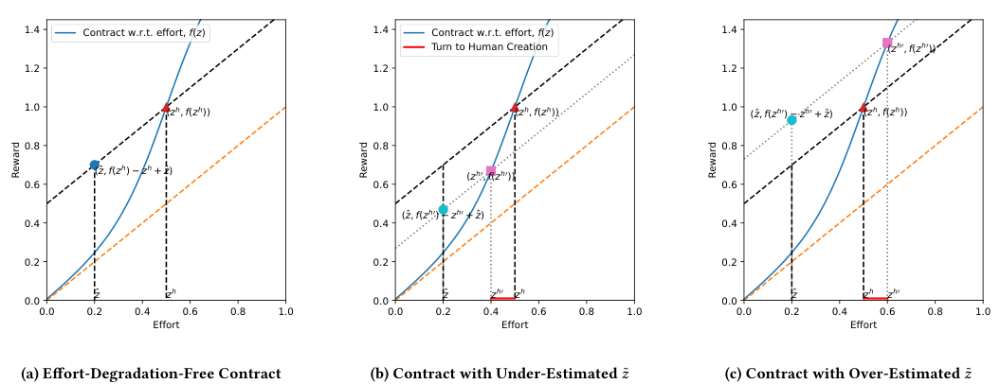

<!-- Start of picture text -->
1.4 Contract w.r.t. effort,  f ( z ) 1.4 Contract w.r.t. effort,  f ( z ) 1.4 Turn to Human Creation ( z h 0 ,  f ( z h 0 )) 1.2 1.2 1.2 1.0 ( z h ,  f ( z h )) 1.0 ( z h ,  f ( z h )) 1.0 (̂ z ,  f ( z h 0 ) − z h 0 +̂  z ) ( z h ,  f ( z h )) 0.8 0.8 0.8 (̂ z ,  f ( z h ) − z h +̂  z ) ( z h 0 ,  f ( z h 0 )) 0.6 0.6 0.6 (̂ z ,  f ( z h 0 ) − z h 0 +̂  z ) 0.4 0.4 0.4 0.2 0.2 0.2 z ̂ z h z ̂ z h 0 z h z ̂ z h z h 0 0.0 0.0 0.0 0.0 0.2 0.4 0.6 0.8 1.0 0.0 0.2 0.4 0.6 0.8 1.0 0.0 0.2 0.4 0.6 0.8 1.0 Effort Effort Effort (a) Effort-Degradation-Free Contract (b) Contract with Under-Estimated 𝑧 ˜ (c) Contract with Over-Estimated 𝑧 ˜ Reward Reward Reward <!-- End of picture text -->

**Figure 1: Demonstrations of Contracts in the GenAI era. Fig. 1a demonstrates the effort-degradation-free contract that lets the GenAI creator earn the same profit as human creators with GenAI’s quality. Fig. 1b demonstrates the contract underestimating the human’s cost to achieve GenAI’s quality level. The red line represents some low-quality creators who will choose human generation to create contents worse than GenAI’s quality for higher profit. Fig. 1c demonstrates the contract overestimating the human’s cost to achieve GenAI’s quality level. The red line represents some high-quality creators who will choose GenAI creation to create low-quality contents for higher profit.** 

the help of GenAI, humans need to make more efforts to create the same content, and thus we have _𝑧__ℎ_ _> 𝑧_ ˆ. 

**Contract.** A contract in the round _𝑡_ is a function _𝑓𝑡_ (·) ∈F that determines the reward for the creator. In creator economy, there are two major models of contracts [50]: _Return-based contract_ , which shares a constant fraction of the platform’s revenue to the creator, and _feature-based contract_ , where the reward to creators depends solely on the quality of the content without explicitly considering the platform’s corresponding revenue. We use the feature-based contract because it is deterministic and once a contract is posted, the content quality and then the corresponding reward of an individual creator _𝑖_ can be determined. 

**Creator.** Each creator has a constant effort budget in each round, denoted by _𝑧𝑖_ , representing the most potential effort she could offer. The value of _𝑧𝑖_ is derived from the distribution P( _𝑧_ ), which is i.i.d. for all _𝑛_ creators.2 In the round _𝑡_ , after deciding the effort _𝑧𝑖,𝑡_ ≤ _𝑧𝑖_ , producing the content with quality _𝑔𝑖,𝑡_ and receiving the reward _𝑓𝑖,𝑡_ = _𝑓𝑡_ ( _𝑔𝑖,𝑡_ ), creator _𝑖_ obtains a profit in this round given by: 

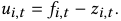

The creator in this work is assumed to be myopic, whose target is to maximize _𝑢𝑖,𝑡_ in each round _𝑡_ without considering the subsequent rounds [42, 50]. 

**Platform.** In the round _𝑡_ , the online platform displays the created content to the users and receives revenue _𝑅𝑖,𝑡_ ∈[0 _,_ 1] from each content. Note that _𝑅𝑖,𝑡_ is a stochastic variable to be learned by the platform.3 All the _𝑅𝑖,𝑡_ across creators are assumed to be derived 

> 2For each creator _𝑖_ , _𝑧𝑖_ is a constant. For the online platform, each _𝑧𝑖_ is viewed as an independent sample from P( _𝑧_ ) at the beginning. 

> 3We do not consider the detailed users’ response behaviors to the displayed content, and regard the associated revenue to the platform as a stochastic variable to learn. 

from independent but not identical distributions. We assume that the platform’s expected revenue from content is monotonically increasing with the content’s quality, i.e., E[ _𝑅𝑖,𝑡_ ] is monotonically increasing with _𝑔𝑖,𝑡_ . 

### **2.2 Problem Formulation** 

We formulate the contract design as an online optimization problem. Specifically, the contract design problem is a multi-round Stackelberg game between the online platform and the creators: The online platform chooses an action, _i.e._ , the contract, at the beginning of each round to maximize the platform’s long-term profit. 

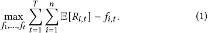

The optimization problem for the creator is as follows: 

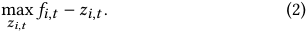

The creator’s goal is to decide whether to use GenAI or human creation and then determine the effort to maximize her profit. 

### **2.3 Design Challenges** 

Solving the above two optimization problems is non-trivial, and the following challenges should be considered. 

#### **Contract Modeling in the Era of GenAI.** 

The high-level idea is to set creators’ profit to be the same for creating the content with the same quality, no matter whether it is generated by humans or GenAI. With this principle, creators can be incentivized to create high-quality content. However, using a single contract function _𝑓𝑡_ (·) would map the content with the same quality to the same reward, which is not consistent with the above 

313 

MobiHoc ‘25, October 27-30, 2025, Houston, USA 

Yumou Liu, Zhenzhe Zheng, Fan Wu, and Guihai Chen 

principle. The GenAI creator would obtain more profit than the GenAI-equivalent human creator, due to the relatively low effort of the GenAI. 

Thus, the contract model should distinguish the GenAI content from the human-created content. In other words, the contract model should contain a function _𝑓_ (·) for the human-created content, and a specific value _𝑓𝑎𝑖_ as the reward for the GenAI content. Fig. 1a illustrates an example of the desired contract. Note that Fig. 1a represents the case in which the creator can either use pure human effort or uses GenAI alone to generate content, not including the more complicated case where GenAI and human creator can collaboratively create content. Formally, we examine the mapping from effort level _𝑧𝑖,𝑡_ to reward _𝑓𝑖,𝑡_ that the creator _𝑖_ receives in the round _𝑡_ .4 The red triangle denotes the reward of the creator _𝑖_ , who incurs an effort _𝑧__ℎ_ to create a piece of GenAI-equivalent content manually. Since GenAI content’s quality is equal to the human-created content, creators using GenAI should expect the same profit as the creator _𝑖_ with the effort _𝑧__ℎ_ , represented by the blue dot. Thus, the reward for GenAI creators should be set as _𝑓𝑎𝑖_ = _𝑓_ ( _𝑧__ℎ_ ) − _𝑧__ℎ_ + ˆ _𝑧_ . The equal distances of the red triangle and the blue dot to the orange line indicate the identical profits for these two types of creators. 

The working procedure of the contract designed above is as follows: 

- (1) When a piece of content arrives, use a GenAI detector to classify whether this content is created by GenAI. 

- (2) If the content is identified as created by the GenAI, return a reward of _𝑓_ ( _𝑧__ℎ_ ) − _𝑧__ℎ_ + _𝑧_ ˆ. 

- (3) If the content is not created by the GenAI, use the quality function _𝑔_ (·) to measure its quality _𝑔𝑖,𝑡_ and return the corresponding reward _𝑓_ ( _𝑔𝑖,𝑡_ ). 

#### **Effort is Unknown to the Platform.** 

We show that the platform cannot design a contract based on the creator’s effort. Ideally, the reward should be proportional to the creator’s effort. However, the effort is private information known only to the creator but not to the platform [5, 36]. Moreover, creators would report inflated efforts untruthfully if the platform designed the contract based on effort, as they would receive greater rewards by claiming higher effort levels. It is a notorious problem to design an incentive mechanism to induce the creators to report the truthful effort level. Therefore, it is a non-trivial problem to design the optimal contract without the information of effort level. 

Despite this, the platform needs to maintain an estimated value _𝑧__ℎ_′ as a proxy for _𝑧__ℎ_ , since the platform cannot ascertain the exact value of _𝑧__ℎ_ without knowing the creator’s true effort level. It is crucial for the platform to have an accurate estimate of _𝑧__ℎ_ to determine _𝑓𝑎𝑖_ . Therefore, the platform maintains _𝑧__ℎ_′ as the estimation of _𝑧__ℎ_ , and updates this value through an online learning procedure. **GenAI-Induced Effort Degradation.** 

We refer creator’s best efforts to the case when a creator produces the content with the best quality within her effort budget _𝑧𝑖_ . Conversely, _Effort Degradation_ refers to the case when the creator chooses to produce the content with lower quality for higher profit. We examine a type of effort degradation associated with GenAI, 

> 4In Sec. 2.3, we use _𝑓_ (·) as a mapping from effort _𝑧𝑖,𝑡_ to reward _𝑓𝑖,𝑡_ for the simplification of notations. Without additional statement, we also use _𝑓_ (·) to refer to the mapping from content quality _𝑔𝑖,𝑡_ to reward _𝑓𝑖,𝑡_ . 

termed _GenAI-induced Effort Degradation_ . Generally, there are two instances of GenAI-induced effort degradation: (1) creators who can produce higher quality content than GenAI might opt to use GenAI to reduce effort and increase profits; (2) creators who cannot outperform GenAI may choose to create content manually to secure higher rewards and profits. We argue that the GenAI-induced effort degradation arises from the inaccurate estimation of the GenAIequivalent creator effort _𝑧__ℎ_ when designing the contract. This claim is illustrated in Fig. 1b and 1c. 

First, consider the case where the platform has a lower estimation _𝑧__ℎ_′ _< 𝑧__ℎ_ , as shown in Fig. 1b. In such scenario, the reward for GenAI content is _𝑓𝑎𝑖_′=_𝑓_(_𝑧ℎ_′) −_𝑧ℎ_′ +_𝑧_ˆ. Suppose we have a good human- content contract, such that _𝑓_ ( _𝑧_ ) − _𝑧_ is non-negative and increasing with the effort _𝑧_ . Consider a creator _𝑖_ with _𝑧__ℎ_′ _< 𝑧𝑖 < 𝑧__ℎ_ . Her profit from using GenAI is _𝑓𝑎𝑖_′−_𝑧_ˆ=_𝑓_(_𝑧ℎ_′) −_𝑧ℎ_′, while the profit from using human creation is _𝑓_ ( _𝑧𝑖_ ) − _𝑧𝑖_ . Since _𝑓_ ( _𝑧_ ) − _𝑧_ is increasing, using human creation makes her earn more than using GenAI, and thus human creation is the rational choice. However, since _𝑧𝑖 < 𝑧__ℎ_ , the quality of her human creation is worse than GenAI, leading to content quality degradation. 

Next, consider the case where the platform has a higher estimation _𝑧__ℎ_′ _> 𝑧__ℎ_ , as illustrated in Fig. 1c. Under the same assumption of Fig. 1b, we consider a creator _𝑖_ with _𝑧__ℎ_ _< 𝑧𝑖 < 𝑧__ℎ_′ . Under the similar analysis, using GenAI makes her earn more than using human creation, and thus GenAI creation is the rational choice for her. However, since _𝑧𝑖 > 𝑧__ℎ_ , the quality of GenAI content is worse than her human creation, leading to quality degradation. 

### **3 CONTRACT DESIGN** 

We solve the contract design problem under the requirement that the GenAI-induced effort degradation is avoided. We propose a Lipschitz bandit solution using fixed action space discretization. We first discuss the procedure of finding an appropriate estimation of _𝑧__ℎ_ , and then introduce an online-learning-based method for contract optimization. 

#### **Solution Setup.** 

_Bandit Setting._ The optimization problem formulated in Eq. (1) can be viewed as a stochastic Lipschitz bandit problem [18, 50]. Specifically, we regard each feasible contract as an arm (action). The action space is the space of the coefficients of the human-content contract _𝑓_ and the estimation of GenAI-equivalent human effort _𝑧__ℎ_′ , denoted as F × Z. In the bandit setting, the reward of an arm is the corresponding platform profit, that is _𝑢𝑡_ :=�_𝑛_ _𝑖_ =1(_𝑅𝑖,𝑡_−_𝑓𝑖,𝑡_). _Contract Formats._ We use the sigmoid-polynomial function as an example. The sigmoid-polynomial functions sigmoid ◦ poly(·) : [0 _,_ 1] →[0 _,_ 1] with coefficients x ∈[−1 _,_ 1]_𝑑_ is used as the format of the contract function _𝑓_ (·).5 During the online learning process, the coefficients x of the function poly(·) with degree _𝑑_ − 1 and the estimation of GenAI-equivalent creator effort _𝑧__ℎ_′ are to be learned in a trial and error manner. 

_Feasible Contracts_ We discuss the necessary condition of a contract that avoids GenAI-induced Effort Degradation so that contracts that do not meet this condition can be discarded in online learning process. Considering that our contract consists of _𝑓_ (·) 

5Compared with linear function, sigmoid-polynomial is non-linear and more flexible, but still remains good properties such as Lipschitz continuous. 

314 

MobiHoc ‘25, October 27-30, 2025, Houston, USA 

Online Contract Design for Creator Economy in the Era of GenAI 

and _𝑧__ℎ_′ , we discuss the conditions and properties for _𝑓_ (·) and _𝑧__ℎ_′ , respectively. 

Regarding _𝑓_ (·), the intuition behind this condition is that such a contract must incentivize creators to produce high-quality content when using human effort. We refer to this human-content contract _𝑓_ (·) as a _high-quality contract_ . 

Definition 1 (High-Quality Contract). _𝑓 is a high-quality contract iff there exists 𝑧__ℎ_ _< 𝑧_ 1 ≤ 1 _, 𝑓_ ( _𝑧_ ) − _𝑧_ ≥ 0 _,_ ∀ _𝑧_ ∈[ _𝑧__ℎ_ _,𝑧_ 1] _._6 

Figure 2 provides an example of high-quality contracts and a counterexample. If the creators are only allowed to use human creation and the contract is as illustrated in Fig. 2a, any creator with a budget _𝑧𝑖_ ∈[ _𝑧__ℎ_ _,_ 1] will exert an effort _𝑧𝑖,𝑡_ ∈[ _𝑧__ℎ_ _,𝑧𝑖_ ] and create content better than GenAI. On the contrary, if the contract is as illustrated in Fig. 2b, the creator will exert an effort _𝑧𝑖,𝑡 < 𝑧__ℎ_ , leading to low content quality. 

Then, we consider the property of _𝑧__ℎ_′ . The mapping from _𝑧__ℎ_′ to the platform’s profit is complicated as it involves content generation, quality measurement and revenue sharing. Therefore, we analyze the impact of _𝑧__ℎ_′ using an intermediate variable, the realized content quality _𝑄𝑡_ . Specifically, _𝑄𝑡_ :=�_𝑛_ _𝑖_ =1_𝑔𝑖,𝑡_refersto the sum of content quality in round _𝑡_ , resulting from the creator’s choice of using GenAI or human effort and the decision of effort. 

Lemma 1. _Given a high-quality contract 𝑓_ (·) _, the mapping from 𝑧__ℎ_′ _to the content quality 𝑄𝑡 is a unimodal function, and the maximum is obtained when 𝑧__ℎ_′ = _𝑧__ℎ_ _._ 

The proof of Lemma 1 is given in the Appendix A.1. 

Then, we begin to introduce the online learning algorithm. 

#### **Step 0: Discretization.** 

We partition the action space into several regions and choose among the regions, effectively treating each region as a “metaarm." We use uniform discretization to partition the action space. Specifically, we view the action space as a multi-dimensional cube, which is discretized into axis-aligned small cubes with side length _𝛿_ . The entire action space is thus discretized into � _𝛿_ <u>2</u> � _𝑑_ × � _𝛿_ <u>1</u> � regions. In each region, we randomly choose one contract to represent this region and treat the samples from one region as the same contract. 

#### **Step 1: Searching in the Contracts** 

The first step is to filter out which contracts cannot be the optimal contract to reduce the cardinality of the action space. 

_Step 1.1: Searching for Feasible Contracts._ At the beginning of the online learning process, we take several steps to find highquality contracts as Definition 1. We can deliberately set _𝑓𝑎𝑖_ = _𝑧_ ˆ so that GenAI creators only earn zero profit, where all creators would choose human creation if _𝑓_ (·) can cover their effort, that is _𝑓_ ( _𝑧_ ) − _𝑧_ ≥ 0. Then, for a specific human content contract _𝑓_ (·), the platform can evaluate the content quality of all the creators, and count the number of contents better than GenAI. Following Definition 1, the feasible contracts can maximize the amount of content better than GenAI. Thus, we select these human content contracts _𝑓_ (·) as the feasible contracts and abandon the others. 

_Step 1.2: Searching for GenAI-Equivalent Human Effort._ This step is to search for the corresponding _𝑧__ℎ_′ within a limited number of 

> 6Given a human creation contract _𝑓_ (·) mapping the quality of content to reward, we slightly abuse the notation here and abbreviate the mapping through human creation effort _𝑧_ to reward as _𝑓_ ( _𝑧_ ). 

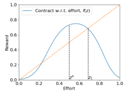

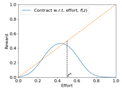

**(a) High-quality contracts w.r.t.** _𝑇_ **. (b) Low-quality contracts w.r.t.** _𝑇_ **.** 

**Figure 2: Examples of high-quality contracts as defined in Definition. 1, and the contracts to be filtered out in Step 1.1.** 

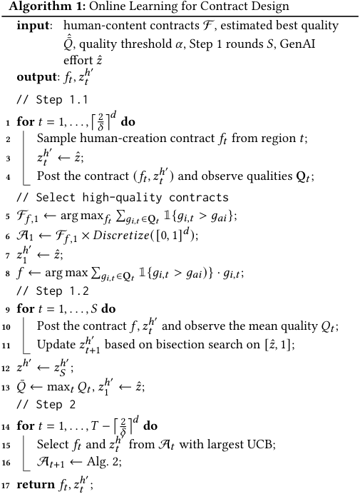

steps. The approach is based on a bisection search on the unimodal quality function _𝑄𝑡_ ( _𝑧__ℎ_′ ) to maximize the obtained content quality. Specifically, at the beginning, the platform randomly selects a feasible human-content contract from Step 1.1 and chooses a _𝑧__ℎ_′ using bisection search. It then observes the content, evaluates the quality, and updates the bisection search on _𝑧__ℎ_′ . Then, we let _𝑧__ℎ_ ← _𝑧__ℎ_′ in the subsequent steps. 

#### **Step 2: Learning the Revenue.** 

We continue to learn the stochastic revenue _𝑅𝑖,𝑡_ and to find the optimal contract to maximize the platform’s profit. 

315 

MobiHoc ‘25, October 27-30, 2025, Houston, USA 

Yumou Liu, Zhenzhe Zheng, Fan Wu, and Guihai Chen 

_Step 2.1: UCB-based Contract Selection._ We use the model of stochastic bandits and the UCB-based algorithm. Specifically, we estimate the expected reward and the corresponding upper confidence bound (UCB). The arm with the largest UCB, which represents the potentially highest reward, is chosen. For each contract _𝑓_ , we maintain the empirical mean _𝜇_ ˆ( _𝑓_ ) of the sampled reward and the number of times this contract has been selected, denoted by _𝑁_ <u>(</u> _<u>𝑓</u>_ <u>).</u> 

The UCB of the contract _𝑓_ is defined as UCB( _𝑓_ ) = _𝜇_ ˆ( _𝑓_ ) + _𝛾_log_𝑇_ √︂ _𝑁_ ( _𝑓_ )_,_ 

where _𝑇_ is the horizon of the platform and _𝛾_ is a hyper-parameter. 

_Discussion._ We argue the rationality of applying the stochastic bandit model to the platform. One might doubt that since there is a Stackelberg game between the platform and the creators, creators could choose actions adversarial to the platform, leading to a linear regret if the platform used the stochastic bandit algorithms. However, we contend that such a scenario will not occur in our model, as the creators are myopic. Note that the quality function _𝑔_ (·) and the contract _𝑓𝑡_ (·) are all deterministic and known to the creator. Therefore, once the contract is posted, the creator can find a deterministic solution _𝑧𝑖,𝑡_ to maximize her profit in the current round, leading to a deterministic content quality and a corresponding static revenue distribution for the platform. Thus, a contract selected by the platform corresponds to a static revenue distribution, justifying the choice of the stochastic model instead of the adversarial model. 

### **4 EXTENSION TO RELAXED QUALITY REQUIREMENTS** 

In this section, we further improve the platform’s profit, with a mild sacrifice of content quality, which demonstrates the trade-off between profit and content quality. We all to reduce the content quality for some profit, letting _𝑧__ℎ_′ be one of the optimization variables while restrict the extent of the loss of content quality. 

### **4.1 Extended Problem Setting** 

The platform’s optimization objective is to maximize its profit, with the constraint that the content quality is not significantly lower than the maximum possible quality. We can formulate the platform’s optimization objective as follows: 

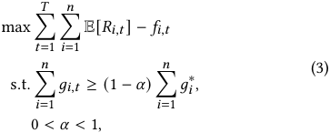

where _𝛼_ is the threshold of quality degradation extent, and _𝑔𝑖_∗is the best content quality that creator _𝑖_ can achieve, regardless of whether GenAI or human creation is used. The optimization objective for the creator remains the same as Eq. (2). 

### **4.2 Action Pruning** 

The solution to this extension is based on the approach in Sec. 3. In this subsection, we insert some additional components to the original solution for the extended problem. Combining Sec. 3 and Sec. 4, the overall picture of the solution is given in Alg. 1. 

|**A**|**lgorithm 2:**Adaptive Action Pruning|
|---|---|
||**input**: estimated_𝑧__ℎ__𝑧__ℎ_′, quality threshold_𝛼_, current quality_𝑄𝑡_, estimated best quality ˆ¯_𝑄_, Step 1 rounds _𝑆_, current feasible contractsA_𝑡_, current contract (_𝑓𝑡_(·)_,𝑧__ℎ_′ _𝑡_) **output**:A_𝑡_+1|
|**1**|A(_𝑓_) ←({_𝑓𝑡_(·)} × [0_,_1]) ∩A_𝑡_;|
|**2**  |A′ _𝑡_←A_𝑡_\A(_𝑓_); ˆ|
|**3 ** **4**|**if**_𝑄𝑡<_ (1−_𝛼_) ¯_𝑄_**then** **if**_𝑧__ℎ_′ _𝑡_ _< 𝑧__ℎ_′ **then**|
|**5**|A(_𝑓_) =A(_𝑓_)\{_𝑓𝑡_(·)} × [0_,_min(_𝑧__ℎ_′ _𝑡__,𝑧ℎ_′ −2−_𝑆_)];|
|**6**|**else**|
|**7**|A(_𝑓_) =A(_𝑓_)\{_𝑓𝑡_(·)} × [max(_𝑧__ℎ_′ _𝑡__,𝑧ℎ_′ + 2−_𝑆_)_,_ 1];|
|**8**  **9 **|A_𝑡_+1 ←A′ _𝑡_∪A(_𝑓_);  **return**A_𝑡_+1;|

**Step 1.2 Revised.** After obtaining the approximated optimal quality and the corresponding _𝑧__ℎ_′ , we iterate over the feasible human-content contracts and find the estimated optimal quality _𝑄_ˆ¯ . Then, we do not apply this _𝑧__ℎ_′ in all the subsequent rounds. Instead, we set _𝑧__ℎ_ in the contract as a variable, and use the searched optimal quality to formulate the constraints in Eq. 3. 

**Step 2.2: Adaptive Action Pruning.** We use the unimodal property of quality function _𝑄𝑡_ ( _𝑧__ℎ_′ ) to reduce the size of the action space. Since the optimization objective of the platform is a constrained online optimization problem, not all the contracts in the action space [−1 _,_ 1]_𝑑_ × [0 _,_ 1] satisfy the constraints. Including contracts that do not satisfy the constraints in the action space will result in unnecessary exploration of these infeasible options. 

Step 2.2 adaptively prunes the action space during the online learning process, filtering out some values of _𝑧__ℎ_′ that cannot satisfy the content quality constraint, as illustrated in Alg. 2. If an estimation _𝑧__ℎ_ _𝑡_′at time_𝑡_leads to lower quality, then the estimation values “outside" of _𝑧__ℎ_′ are pruned, since they cannot satisfy the content quality constraints with the current human-creation contract. This process is illustrated in Lines 5-8 of Alg. 2. Note that when deciding the boundary of pruning, we compare the current estimation _𝑧__ℎ_ _𝑡_′ with the approximate estimation _𝑧__ℎ_′ biased by 2−_𝑆_ and choose the one farther from _𝑧__ℎ_ as the pruning boundary. If we do not perform this comparison, some of the actually feasible _𝑧__ℎ_′ values could be pruned due to the estimation error. 

### **4.3 Theoretical Analysis** 

In this subsection, we provide a theoretical analysis of the effectiveness of Alg. 2 in Step 2 in the context of online learning. Specifically, we analyze its regret and compare the theoretical regret upper bound with the results from continuum-armed bandit algorithms [23]. We define the regret ℜ _𝑇_ given a horizon _𝑇_ : 

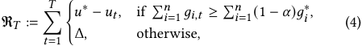

316 

MobiHoc ‘25, October 27-30, 2025, Houston, USA 

Online Contract Design for Creator Economy in the Era of GenAI 

where _𝑢_∗ is the optimal profit that satisfies the content quality constraint. Δ is a sufficiently large constant representing the punishment for failing to satisfy the content quality constraint. If the contract of the current round satisfies the content quality constraint, the regret is the difference between the current profit and the optimal profit. Otherwise, the regret is a large constant as a form of punishment. 

Then, we assume the properties of the functions. 

Assumption 1 (Lipschitz Continuous). _The function 𝑓_ (·) _is Lipschitz continuous with Lipschitz constant 𝐿 such that_ 

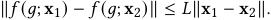

Then, we theoretically analyze how the adaptive action pruning improves the learning with respect to Eq. (4). We slightly change the notations for disambiguation. The dimension of the coefficients of the human creation contract is _𝑑_ − 1, so the dimension of the platform’s action space is _𝑑_ . 

Theorem 1 (Regret Upper Bound). _The expected regret of Alg. 2 under the metric in Eq. (4) is_ 

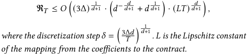

Proof Sketch. Suppose there is a fraction 0 _< 𝛽_ ≤ 1 of contracts that cannot satisfy the content quality constraints. Since there is a pruning algorithm, the regret induced by these arms is at most _𝑂_ <u>�</u> _<u>𝛽𝛿</u>__𝑑_ Δ �, where _𝛿_ is the discretization step. Since the regret of the UCB algorithm on a finite-arm stochastic bandit problem is _𝑂_ ( ~~√~~ _𝐾𝑇_ log _𝑇_ ) [25], for the contracts that can satisfy the content 1− _<u>𝛽</u>_ quality constraint, the regret on them is _𝑂 𝛿__𝑑𝑇_log_𝑇_ . Adding <u>�√ �</u> 1− _<u>𝛽</u>_ the discretization noise, the regret is _𝑂 𝛿__𝑑𝑇_log_𝑇_+_<u>𝛽</u>_ _𝛿__𝑑_Δ+_𝛿𝐿𝑇_ , �√︃ � where _𝐿_ is the Lipschitz constant. 

<u>4Δ</u>2 Let _𝛽_ = 1 − _𝛿__𝑑_ _𝑇_ log _𝑇_to maximize the regret, aligning with the upper bound case. Then the regret can be written as a function of _𝛿_ , such that 

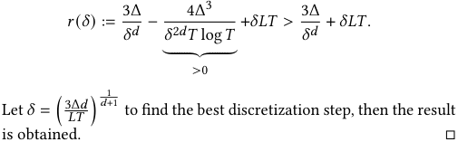

_<u>𝑑</u>_ <u>+1</u> Comparing with the _𝑂_ ( _𝑇 𝑑_ +2 ) regret in [23], our adaptive action _<u>𝑑</u>_ pruning method achieves _𝑂_ ( _𝑇 𝑑_ +1 ) regret, improving the result in our problem settings. Moreover, the optimal discretization step _𝛿_ is increasing with the penalty Δ. Such a result is the trade-off between the discretization noise and the number of arms. Larger _𝛿_ leads to smaller discretization noise but more arms. Theorem 1 shows that more arms may lead to more regret than larger noise. 

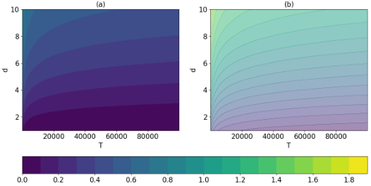

**Figure 3: Illustration of the discretization step w.r.t. horizon** _𝑇_ **and action dimension** _𝑑_ **. Fig. 3a plots our discretization step when** Δ = 1 **. Fig. 3b plots the discretization step in [23].** 

Comparing with the discretization step _𝛿_ = � lo _𝑇_ <u>g</u> _𝑇_ �1/( _𝑑_ +2) in [23], our method has a smaller discretization step under the same _𝑇_ and _𝑑_ , as illustrated in Fig. 3. Since Alg. 2 reduces the action space during the training, it is reasonable to use finer-grained discretization to provide more arms to achieve better regret. 

### **5 EVALUATION RESULTS** 

We conduct simulation experiments on synthesis data to demonstrate the efficiency of our Adaptive-Action-Pruning-based online learning method. 

### **5.1 Experimental Setup** 

**Effort, Quality, and Contract.** For creator _𝑖_ , her maximum effort _𝑧_ ¯ _𝑖_ is sampled from a truncated normal distribution with mean 0 _._ 5, variance 0 _._ 1, and support [0 _,_ 1]. 

The quality measurement function is a monotonic function with respect to the effort. We let _𝑔_ ( _𝑧_ ) = _𝑧_ , _𝑧__ℎ_ = 0 _._ 5, and _𝑧_ ˆ = 0 _._ 2. 

The contract is based on the sigmoid-polynomial function with slight modifications by setting _𝑓_ (0) = 0. The order of the polynomial part is set to 2. Thus, the total dimension of the action space is 4, including 3 dimensions from the polynomial part and 1 from _𝑧__ℎ_′ . 

**Creators and Platform.** The effort level of the creator is chosen using the SHG Algorithm [12] implemented by SciPy, after receiving the contract. 

At the beginning, the platform initializes with _𝑛_ = 100 creators independently. In subsequent rounds, there are no creators quitting or entering, and the upper bound of effort _𝑧_ ¯ _𝑖_ for each creator remains static. The platform uses Alg. 1 and Alg. 2 to update the contract at each round, aiming to minimize the regret defined in Eq. (4). The revenue of a content is sampled independently from a normal distribution with mean sigmoid ◦ poly( _𝑔𝑖,𝑡_ ) and variance 0 _._ 1, where the coefficients of this sigmoid-polynomial function are [0 _._ 5 _,_ 1], but are unknown to the platform. 

### **5.2 Quality-Profit Trade-off** 

We provide an example of the quality-profit trade-off in Fig. 4 to support the analysis in Sec. 2.3. To provide a better illustration, the coefficients of this sigmoid-polynomial function are [0 _._ 5 _,_ 1 _,_ 0 _._ 5]. 

317 

MobiHoc ‘25, October 27-30, 2025, Houston, USA 

Yumou Liu, Zhenzhe Zheng, Fan Wu, and Guihai Chen 

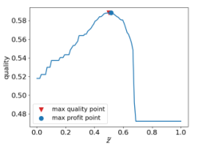

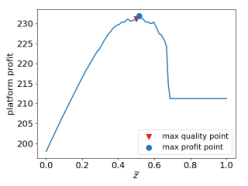

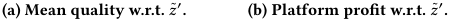

<!-- Start of picture text -->
(a) Mean quality w.r.t. 𝑧 ˜ ′ . (b) Platform profit w.r.t. 𝑧 ˜ ′ . <!-- End of picture text -->

**Figure 4: An example of the quality and expected platform profit with respect to** _𝑧_ ˜′ **given** _𝑧_ ˜ = 0 _._ 5 **and a fixed human content contract. The red triangle and blue dot represent the point of max quality and profit, respectively. Fig. 4a provides an illustration of the unimodality of the quality function.** 

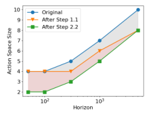

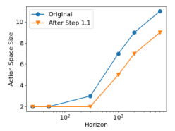

**(a) Action Space Size of our con(b) Action Space Size of vanilla tract model w.r.t.** _𝑇_ **. contract model w.r.t.** _𝑇_ **.** 

**Figure 5: Action Space Size w.r.t.** _𝑇_ **. Fig. 5a demonstrates the action space size of our contract (human-content contract** × _𝑧_ ˜′ **), illustrating the effectiveness of Step 1.1 and 2.2. Fig. 5b demonstrates the action space size of the classical contract.** 

Figure 4a illustrates the mean quality of the received contents with respect to _𝑧__ℎ_′ given a fixed human-content contract. It demonstrates that the quality is a unimodal function of _𝑧__ℎ_′ , achieving the highest quality when _𝑧__ℎ_′ = _𝑧__ℎ_ , aligning with the analysis in Sec. 3. When _𝑧__ℎ_′ is greater than 0 _._ 7, the quality turns into a constant, where most creators are using GenAI, since the over-estimation of _𝑧__ℎ_′ leads to a higher reward for GenAI contents. 

Figure 4b illustrates the expected platform profit with respect to _𝑧__ℎ_′ given a fixed human-content contract and a fixed set of creators. Compared with Fig. 4a, it can be observed that the _𝑧__ℎ_′ values maximizing the quality and the platform profit are different, represented by the red and blue dots, respectively. When _𝑧__ℎ_′ is greater than 0 _._ 7, the profit turns into a constant, since most of the creators turn to use GenAI. 

### **5.3 Effectiveness** 

We evaluate the effectiveness of Steps 1.1 and 2.2 by demonstrating the size of the discretized action space. Fig. 5a illustrates the performance of these two steps on our contract format. The shadow in Fig. 5a indicates that Step 1.1 performs better when the horizon is small, while Step 2.2 contributes more when the horizon is 

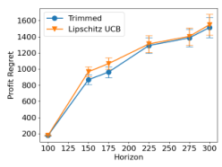

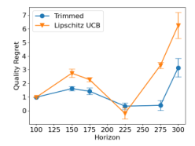

**(a) Platform Profit Regret w.r.t.** _𝑇_ **. (b) Quality Regret w.r.t.** _𝑇_ **.** 

**Figure 6: Regret of platform profit and content quality. Fig. 6a demonstrates a sub-linear regret w.r.t. the horizon. Fig. 6b indicates that Alg. 2 is not a maximizer of the content quality.** 

large. Fig. 5b illustrates the performance of Step 1.1 on the classical human-content contract. Since there is no _𝑧__ℎ_′ in the classical human-content contract, Step 2.2 cannot be applied. Thus, Fig. 5b demonstrates the effectiveness of Step 1.1, showing the effectiveness of selecting feasible contracts. 

We evaluate the cumulative regret of the platform profit and the content quality to demonstrate the effectiveness of Alg. 2. Fig. 6a demonstrates a smaller regret of using Alg. 2 than the ablation group, showing the effectiveness of Alg. 2 on reducing the profit regret. As a comparison, we plot the regret of content quality. Fig. 6b demonstrates that using Alg. 2 can achieve a lower quality regret most of the time, but the quality regret is not monotonic with respect to _𝑇_ . This is because the optimization objective is the platform profit in Eq. (4), instead of the content quality. 

### **6 RELATED WORK** 

### **6.1 Creator Economy** 

Several works have studied the general modeling and framework of creator economy. An early work by Banks et al. [3] studied the co-creation market in online games where users create content along with consuming. Bhargava [4] presented a general framework to model and analyze the economics of three-sided platforms that mediate between consumers, creators, and advertisers. He examined how the distribution of creator capabilities affects market concentration among creators and how it can be influenced by the platform. These works provide basic models for the creator economy and a comprehensive background for this work. 

Several recent works have delved into the game theoretical aspects. Hron et al. [19] modeled a game where creators compete for a finite pool of user attention by crafting content ranked highly by a given recommendation algorithm. Yao et al. [44] theoretically analyzed the welfare losses to users due to creator competition for user attention under a top-K recommendation algorithm. Acharya et al. [1] showed that if the creators compete for user engagement, the creators would focus on one topic to create and the creators would split themselves across different types of content. Yao et al. [47] performed system-side user welfare optimization in a competitive game among content creators. Yao et al. [45] modeled the game between human creators and GenAI trained on human-created content, and proved that a stable equilibrium between human and AI-generated content is possible. Xu et al. [43] proposed the Proportional Payoff 

318 

MobiHoc ‘25, October 27-30, 2025, Houston, USA 

Online Contract Design for Creator Economy in the Era of GenAI 

Allocation Game, a general model for the competition amongst the content creators for limited revenue. From the perspective of game theory, our work can also be viewed as analyzing a principal-agent game between the platform and the creators. Compared with these works, our work assumes the creators are independent instead of considering the competition between the creators. 

Another line of research has focused on the problem of incentive mechanisms for content creators. Yao et al. [46] showed that merit-based monotone reward mechanisms incur a constant fraction of welfare loss by failing to encourage content creators to produce niche content. Hu et al. [20] studied online-learning-based incentives, demonstrating that classical online learning algorithms incentivize producers to create low-quality content due to the low learning rate. Huttenlocher et al. [21] studied the problem of incentivizing the creators and users in user-content matching to avoid them departing from the platform. Compared with these works, we consider the impact of GenAI on the creator’s behavior. Specifically, GenAI provides a cheaper approach, making the quality not monotonic with respect to the creator’s effort level. 

### **7 CONCLUSION** 

In this work, we address the problem of online contract design for creator economy in the era of GenAI. We consider the case when the creators can choose either to use pure human effort, or to use GenAI. We show that if the platform uses the existing contract which provides the same reward for content with the same quality, the creators may earn more profit by using effort-efficient GenAI tools and generating content with lower quality. This phenomenon is termed GenAI-induced effort degradation. To address this, we introduce our contract which discriminates the GenAI content and human-created content, providing the same profit for the creators with the same content quality. We develop an online learning method to find the optimal contract. Theoretical analysis shows that our method outperforms existing methods. Simulation experiments demonstrate the effectiveness of our method on synthetic data. Beyond providing a new contract design and insights into the creator economy in the GenAI era, our work can serve as a starting point toward analyzing the interaction of GenAI and human in the creator economy. 

### **A PROOF** 

### **6.2 Learning for Contract Design** 

The most relevant study to our paper is the online learning for contract design. Ho et al. [18] initiated the study of learning optimal contracts for crowdsourcing platforms by formulating the contract design problem as a multi-armed bandit on continuous action spaces. They proposed an adaptive discretization method that divides the action space into regions and chooses among these regions. Cohen et al. [10] improved this result for risk-averse scenarios. Zhu et al. [49] analyzed the sample complexity for linear contracts and provided a nearly tight bound for general contracts. Zhu et al. [50] extended the online contract design to the creator economy, studying the contract-recommendation co-design. Compared with the existing works, we leverage the unique properties in our problem and propose methods to improve the regret bound _<u>𝑑</u>_ <u>+1</u> _<u>𝑑</u>_ from _𝑂_ ( _𝑇 𝑑_ +2 ) to _𝑂_ ( _𝑇 𝑑_ +1 ). 

The contract models in our work are closely related to the returnbased contract and feature-based contract in Zhu et al. [50] and related works [18, 49]. The quality-based contract is a deterministic contract, in contrast to the return-based contract, whose incentive is a stochastic value proportional to the platform’s revenue. 

### **6.3 Continuum-Armed Bandit** 

The Lipschitz stochastic bandit problem [2] is a multi-armed bandit problem with i.i.d. rewards, where the expected reward is continuous or a stronger assumption that the reward satisfies the Lipschitz continuous condition. Most existing works follow two main approaches. One approach is to uniformly discretize the action space into a mesh during the initial phase, and then allowing any bandit algorithm, such as UCB and Thompson Sampling to select the discretized actions [22, 27]. The other approach involves adaptively discretizing the action space by zooming into promising regions, and then using UCB-based methods to select the arms [6, 24, 26]. Another line of research focuses on different problem settings, such as adversarial Lipschitz bandit [34] and contextual settings [37]. 

### **A.1 Proof of Lemma 1** 

Proof of Lemma 1. Consider the case when the estimation error of _𝑧__ℎ_′ is greater than zero. For a high quality contract _𝑓_ (·), the content quality of the platform is 

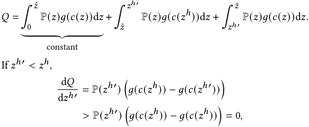

indicating the content quality is increasing with _𝑧__ℎ_′ when _𝑧__ℎ_′ _< 𝑧__ℎ_ . On the contrary, when _𝑧__ℎ_′ _> 𝑧__ℎ_ , 

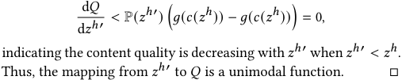

### **REFERENCES** 

> [1] Krishna Acharya, Varun Vangala, Jingyan Wang, and Juba Ziani. 2024. Producers equilibria and dynamics in engagement-driven recommender systems. _arXiv preprint arXiv:2401.16641_ (2024). 

> [2] Rajeev Agrawal. 1995. The continuum-armed bandit problem. _SIAM journal on control and optimization_ 33, 6 (1995), 1926–1951. 

> [3] John Banks and Sal Humphreys. 2008. The labour of user co-creators: Emergent social network markets? _Convergence_ 14, 4 (2008), 401–418. 

- [4] Hemant K Bhargava. 2022. The creator economy: Managing ecosystem supply, revenue sharing, and platform design. _Management Science_ 68, 7 (2022), 5233– 5251. 

- [5] Patrick Bolton and Mathias Dewatripont. 2004. _Contract theory_ . MIT press. 

> [6] Sébastien Bubeck, Gilles Stoltz, Csaba Szepesvári, and Rémi Munos. 2008. Online optimization in X-armed bandits. _Advances in Neural Information Processing Systems_ (2008). 

- [7] Dian Chen, Han Jun Yoon, Zelin Wan, Nithin Alluru, Sang Won Lee, Richard He, Terrence J Moore, Frederica F Nelson, Sunghyun Yoon, Hyuk Lim, et al. 2025. 

319 

MobiHoc ‘25, October 27-30, 2025, Houston, USA 

Yumou Liu, Zhenzhe Zheng, Fan Wu, and Guihai Chen 

   - Advancing Human-Machine Teaming: Concepts, Challenges, and Applications. _arXiv preprint arXiv:2503.16518_ (2025). 

- [8] Junxuan Chen, Baigui Sun, Hao Li, Hongtao Lu, and Xian-Sheng Hua. 2016. Deep ctr prediction in display advertising. In _Proceedings of the 24th ACM international conference on Multimedia_ . 811–820. 

- [9] Xiaoyang Chen, Ben He, Hongyu Lin, Xianpei Han, Tianshu Wang, Boxi Cao, Le Sun, and Yingfei Sun. 2024. Spiral of Silence: How is Large Language Model Killing Information Retrieval?—A Case Study on Open Domain Question Answering. In _Proceedings of the 62nd Annual Meeting of the Association for Computational Linguistics (Volume 1: Long Papers)_ . Association for Computational Linguistics, Bangkok, Thailand, 14930–14951. 

- [10] Alon Cohen, Argyrios Deligkas, and Moran Koren. 2022. Learning approximately optimal contracts. In _International Symposium on Algorithmic Game Theory_ . 331– 346. 

- [11] Fabrizio Dell’Acqua, Charles Ayoubi, Hila Lifshitz-Assaf, Raffaella Sadun, Ethan R Mollick, Lilach Mollick, Yi Han, Jeff Goldman, Hari Nair, Stew Taub, et al. 2025. The Cybernetic Teammate: A Field Experiment on Generative AI Reshaping Teamwork and Expertise. _SSRN_ (2025). 

- [12] Stefan C Endres, Carl Sandrock, and Walter W Focke. 2018. A simplicial homology algorithm for Lipschitz optimisation. _Journal of Global Optimization_ 72 (2018), 181–217. 

- [13] Facebook Short Video. 2025. https://www.facebook.com/reel/. [14] Sanford J Grossman and Oliver D Hart. 1992. An analysis of the principal-agent problem. In _Foundations of Insurance Economics: Readings in Economics and Finance_ . 302–340. 

- [15] Ziyang Guo, Yifan Wu, Jason Hartline, and Jessica Hullman. 2025. The Value of Information in Human-AI Decision-making. _arXiv preprint arXiv:2502.06152_ (2025). 

- [16] Guru Guruganesh, Jon Schneider, and Joshua R Wang. 2021. Contracts under moral hazard and adverse selection. In _Proceedings of the 22nd ACM Conference on Economics and Computation_ . 563–582. 

- [17] Lucy Handley. 2024. Part scary, part exciting: How artists are using AI in their work. https://www.cnbc.com/2024/04/01/generative-ai-in-art-how-artists-areusing-it-or-not.html 

- [18] Chien-Ju Ho, Aleksandrs Slivkins, and Jennifer Wortman Vaughan. 2014. Adaptive contract design for crowdsourcing markets: Bandit algorithms for repeated principal-agent problems. In _Proceedings of the fifteenth ACM conference on Economics and computation_ . 359–376. 

- [19] Jiri Hron, Karl Krauth, Michael Jordan, Niki Kilbertus, and Sarah Dean. 2023. Modeling content creator incentives on algorithm-curated platforms. In _International Conference on Learning Representations_ . 

- [20] Xinyan Hu, Meena Jagadeesan, Michael I Jordan, and Jacob Steinhard. 2023. Incentivizing high-quality content in online recommender systems. _arXiv preprint arXiv:2306.07479_ (2023). 

- [21] Daniel Huttenlocher, Hannah Li, Liang Lyu, Asuman Ozdaglar, and James Siderius. 2023. Matching of users and creators in two-sided markets with departures. _arXiv preprint arXiv:2401.00313_ (2023). 

- [22] Robert Kleinberg. 2004. Nearly tight bounds for the continuum-armed bandit problem. _Advances in Neural Information Processing Systems_ (2004). 

- [23] Robert Kleinberg, Aleksandrs Slivkins, and Eli Upfal. 2008. Multi-armed bandits in metric spaces. In _Proceedings of the fortieth annual ACM symposium on Theory of computing_ . 681–690. 

- [24] Robert Kleinberg, Aleksandrs Slivkins, and Eli Upfal. 2019. Bandits and experts in metric spaces. _J. ACM_ 66, 4 (2019), 1–77. 

- [25] Tor Lattimore and Csaba Szepesvári. 2020. _Bandit algorithms_ . Cambridge University Press. 

- [26] Shiyin Lu, Guanghui Wang, Yao Hu, and Lijun Zhang. 2019. Optimal algorithms for Lipschitz bandits with heavy-tailed rewards. In _International Conference on Machine Learning_ . 4154–4163. 

- [27] Stefan Magureanu, Richard Combes, and Alexandre Proutiere. 2014. Lipschitz bandits: Regret lower bound and optimal algorithms. In _Conference on Learning Theory_ . 975–999. 

- [28] Manus. 2025. https://manus.im/. 

- [29] Bernard Marr. 2024. How Generative AI Will Change The Jobs Of Journalists. https://www.forbes.com/sites/bernardmarr/2024/03/22/how-generative-aiwill-change-the-jobs-of-journalists/ 

- [30] Lukas William Mayer, Sheer Karny, Jackie Ayoub, Miao Song, Danyang Tian, Ehsan Moradi-Pari, and Mark Steyvers. 2025. Human-AI Collaboration: Trade-offs Between Performance and Preferences. _arXiv preprint arXiv:2503.00248_ (2025). 

- [31] Liz Mineo. 2023. If it wasn’t created by a human artist, is it still art? https://news.harvard.edu/gazette/story/2023/08/is-art-generated-byartificial-intelligence-real-art/ 

- [32] Sam O’brien. 2023. AiArt: Why Some Artists Are Furious About AI-Produced Art. _IEEE Computer Society_ (2023). https://www.computer.org/publications/technews/trends/artists-mad-at-ai 

- [33] OpenAI. 2025. Introducing deep research. https://openai.com/index/introducingdeep-research/ 

- [34] Chara Podimata and Alex Slivkins. 2021. Adaptive discretization for adversarial Lipschitz bandits. In _Conference on Learning Theory_ . 3788–3805. 

- [35] Reuters. 2024. Canadian Grand Prix to feature F1’s first AI-designed trophy. https://www.espn.com/f1/story/_/id/40297177/canadian-grand-prixfeature-f1-first-ai-designed-trophy 

- [36] Bernard Salanié. 2005. _The economics of contracts: a primer_ . MIT press. [37] Aleksandrs Slivkins. 2011. Contextual bandits with similarity information. In _Conference On Learning Theory_ . 679–702. 

- [38] Kuaishou Technology. 2024. Kuaishou Unveils Proprietary Video Generation Model ’Kling;’ Testing Now Available. _Kuaishou_ (2024). https://ir.kuaishou.com/news-releases/news-release-details/kuaishou-unveilsproprietary-video-generation-model-kling 

- [39] TikTok. 2025. https://www.tiktok.com/foryou?lang=en. [40] Chris Vallance. 2023. "Art is dead Dude" - the rise of the AI artists stirs debate. https://www.bbc.com/news/technology-62788725 

- [41] Yiluo Wei and Gareth Tyson. 2024. Understanding the Impact of AI-Generated Content on Social Media: The Pixiv Case. In _Proceedings of the 32nd ACM International Conference on Multimedia_ . 6813–6822. 

- [42] Jibang Wu, Siyu Chen, Mengdi Wang, Huazheng Wang, and Haifeng Xu. 2024. Contractual Reinforcement Learning: Pulling Arms with Invisible Hands. _arXiv preprint arXiv:2407.01458_ (2024). 

- [43] Renzhe Xu, Haotian Wang, Xingxuan Zhang, Bo Li, and Peng Cui. 2025. Ppa-game: Characterizing and learning competitive dynamics among online content creators. In _Proceedings of the 31st ACM SIGKDD Conference on Knowledge Discovery and Data Mining V. 2_ . ACM, 3425–3436. 

- [44] Fan Yao, Chuanhao Li, Denis Nekipelov, Hongning Wang, and Haifeng Xu. 2023. How Bad is Top- _𝐾_ Recommendation under Competing Content Creators?. In _International Conference on Machine Learning_ . 39674–39701. 

- [45] Fan Yao, Chuanhao Li, Denis Nekipelov, Hongning Wang, and Haifeng Xu. 2024. Human vs. Generative AI in Content Creation Competition: Symbiosis or Conflict? _arXiv preprint arXiv:2402.15467_ (2024). 

- [46] Fan Yao, Chuanhao Li, Karthik Abinav Sankararaman, Yiming Liao, Yan Zhu, Qifan Wang, Hongning Wang, and Haifeng Xu. 2023. Rethinking incentives in recommender systems: are monotone rewards always beneficial? _Advances in Neural Information Processing Systems_ 36 (2023), 74582–74601. 

- [47] Fan Yao, Yiming Liao, Mingzhe Wu, Chuanhao Li, Yan Zhu, James Yang, Jingzhou Liu, Qifan Wang, Haifeng Xu, and Hongning Wang. 2024. User welfare optimization in recommender systems with competing content creators. In _Proceedings of the 30th ACM SIGKDD Conference on Knowledge Discovery and Data Mining_ . 3874–3885. 

- [48] YouTube Shorts. [n. d.]. https://www.youtube.com/@YouTube/shorts. https: //www.youtube.com/@YouTube/shorts 

- [49] Banghua Zhu, Stephen Bates, Zhuoran Yang, Yixin Wang, Jiantao Jiao, and Michael I. Jordan. 2023. The Sample Complexity of Online Contract Design _(EC ’23)_ . 1188. 

- [50] Banghua Zhu, Sai Praneeth Karimireddy, Jiantao Jiao, and Michael I Jordan. 2023. Online learning in a creator economy. _arXiv preprint arXiv:2305.11381_ (2023). 

320 

