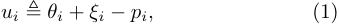
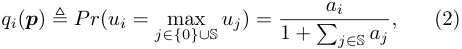
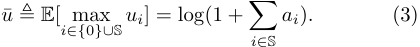
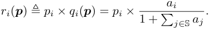
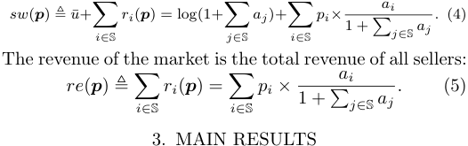
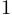
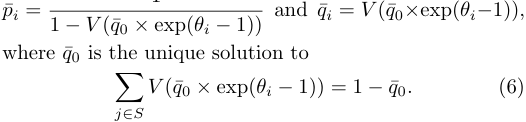
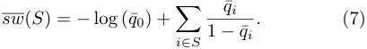
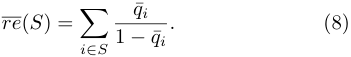

# **A Game-Theoretic Model for Product Placement in Online Platform Markets**_⋆_ 

**Zhenzhe Zheng**_∗_ **R. Srikant**_∗∗_ 

> _∗ Coordinate Science Lab, University of Illinois at Urbana-Champaign,_ 

_Urbana, IL, USA (e-mail: zhenzhe@illinois.edu)._ 

> _∗∗ Coordinate Science Lab, Department of Electrical and Computer Engineering, University of Illinois at Urbana-Champaign, Urbana, IL, USA (e-mail: rsrikant@illinois.edu)_ 

**Abstract:** Motivated by online platforms such as Amazon, Airbnb, etc., we consider the following Bertrand game model of product placement: a number of sellers (e.g., apartment owners) are interested in placing their products on a platform’s (e.g., Airbnb.com) website. We assume that the price of a product is determined by the the number of available sellers and their qualities, and the probability with which a platform user will buy a product is a function of the prices and the qualities, according to a multinomial logit model. In other words, the outcomes, i.e., the realized prices and sales, are determined by the Nash equilibrium of a Bertrand game. The platform can affect the outcome of the game by deciding on a mechanism to determine which products to display on their websites. For such a Bertrand game, we derive optimal mechanisms for the platform to maximize either social welfare or revenue. 

_Keywords:_ Online Platforms, Two-Sided Market, Display Control, Game Theory, Operations Research 

## 1. INTRODUCTION 

In recent years, we have witnessed the rise of many successful online platform markets, which have reshaped the economic landscape of the modern world. The online platforms facilitate the exchange of goods and services between buyers and sellers. For example, buyers can purchase goods from sellers on Amazon, eBay and Etsy, arrange accommodation from hosts on Airbnb and Expedia, and order transportation services from drivers on Uber and Lyft. 

Compared with ancient markets, modern online platform markets have greater controls over price determination, search and discovery, information revelation, recommendation, etc. For example, Uber and Lyft adopt the _full control model_ , in which the ride-sharing platforms use online matching algorithms to determine matches between drivers and riders as well as the fee for the route. Amazon and Airbnb use the _discriminatory control model_ , where the platforms only control the list of products to display for each buyer’s search, and the potential matches and transaction prices are determined by the preference of buyers and the competition among sellers. The rich control options for online platforms have led to an increasing discussion about the design of online marketplaces with different optimization objectives; see Banerjee et al. (2017); Arnosti et al. (2014); Kanoria and Saban (2017). 

In this paper, we investigate the optimal social welfare and revenue under the discriminatory control model, in which the platform has only control over _search segmentation mechanisms - which products to display for each buyer’s_ 

_⋆_ Research supported by NSF grants NeTS 1718203, CPS ECCS 1739189, CMMI 1562276, ECCS 16-09370. 

_search_ , and the transaction prices are endogenously determined by the competition among sellers under a Bertrand game model. Unlike traditional firms, most online platforms do not manufacture goods or provide services, and thus they also do not dictate the specific transaction prices. Instead, buyers and sellers jointly determine the prices at which the goods or services will be traded. For example, sellers set prices for their goods on Amazon, and hosts decide on the prices for their properties on Airbnb. These prices depend on the demand and supply for comparable goods and services in the market, and choosing different displayed products for buyers impacts the transaction prices and then the social welfare/revenue. Motivated by this, we study the role of search segmentation mechanisms in social welfare and revenue optimization in the discriminatory control model with endogenous prices. 

## 2. MATHEMATICAL MODEL 

We consider a two-sided market with _n_ sellers S = _{_ 1 _,_ 2 _, · · · , n}_ and one _representative_ buyer. Each seller _i ∈_ S offers a product with quality _θi_ and price _pi_ . We denote the quality and price vectors by **_θ_** = ( _θ_ 1 _, θ_ 2 _, · · · , θn_ ) and **_p_** = ( _p_ 1 _, p_ 2 _, · · · , pn_ ), respectively. The quality vector **_θ_** is fixed, while the price vector **_p_** is determined by the competition among sellers. Without loss of generality, we assume the products’ quality and prices are non-negative, _i.e._ , _θi ≥_ 0 and _pi ≥_ 0, and the sellers are sorted according to the product quality in a non-decreasing order, _i.e._ , _θ_ 1 _≥ θ_ 2 _≥· · · ≥ θn_ . Given the quality **_θ_** and prices **_p_** of all products, the buyer purchases one of the _n_ products, or adopts an outside option, _i.e._ , buys nothing from this market. We normalize the problem parameters so that 

outside option’s quality _θ_ 0 and price _p_ 0 are zero, _i.e._ , _θ_ 0 = _p_ 0 = 0. 

In the random utility model descried in McFadden (1986), the buyer derives utility _ui_ from purchasing the product _i ∈_ S or selecting the outside option _i_ = 0 as follows 

where _ξi_ is a random variable representing buyer’s (private) preference about the _i_ th alternative. Given the _n_ +1 choices ( _n_ products and the outside option), the buyer selects the alternative with the maximum utility. Under the standard assumption that the random variables _{ξi}_ are independent and identically distributed (i.i.d.) with Gumbel distribution, Anderson et al. (1992) and McFadden (1974) have shown that the buyer selects _i ∈{_ 0 _} ∪_ S with probability 

where _ai_ = exp( _θi − pi_ ) for all _i ∈_ S. We refer to _qi_ as the _demand_ or _market share_ of the alternative _i ∈{_ 0 _}∪_ S. This choice model is known as the multinomial logit model in economic literature. We use **_q_** = ( _q_ 0 _, q_ 1 _, · · · , qn_ ) to denote the market shares of all products. 

Under the above model, we can also obtain an explicit form for the utility _u_ ¯ of the representative buyer 

From the market share _qi_ ( **_p_** ) in (2), we can express seller _i_ ’s expected revenue _ri_ ( **_p_** ) in terms of prices 

The social welfare of the two-sided market is measured by the sum of buyer’s utility and the total revenue of sellers: 

In this section, we first investigate the existence and uniqueness of equilibrium in the Bertrand game with a subset _S ⊆_ S sellers. In a Bertrand competition, seller _i ∈ S_ selects price _pi_ to maximize her revenue _ri_ ( **_p_** ) = _pi × qi_ ( **_p_** ), where the corresponding market share _qi_ ( **_p_** ) is determined by the prices **_p_** of all products in (2). We can formally represent the Bertrand game as a triplet _G__b_ = ( _S,_ ( _Pi_ ) _i∈S,_ ( _ri_ ) _i∈S_ ), where _S_ is a set of players, _Pi_ is the strategy space of player _i ∈ S_ ( _i.e._ , _Pi_ ≜ _{pi|pi ≥_ 0 _}_ ), and _ri_ ( **_p_** ) is the payoff of player _i ∈ S_ . From Gallego et al. (2006), we have the following result. 

_Theorem 1._ There exists a unique (pure) Nash equilibrium in the Bertrand game _G__b_ = ( _S,_ ( _Pi_ ) _i∈S,_ ( _ri_ ) _i∈S_ ). Furthermore, a vector of prices **_p_ ¯** = (¯ _p_ 1 _,_ ¯ _p_ 2 _, · · · ,_ ¯ _pn_ ) _∈P_ satisfies _∂ri_ ( **_p_ ¯** ) _/∂pi_ = 0 for all _i ∈ S_ if and only if **_p_ ¯** is a Nash equilibrium in _P_ . 

We can calculate a closed-form expression for the Nash equilibrium prices **_p_ ¯** by solving the system of the firstorder condition equations _∂ri_ ( **_p_ ¯** ) _/∂pi_ = 0. 

_Theorem 2._ In Bertrand game _G__b_ = ( _S,_ ( _Pi_ ) _i∈S,_ ( _ri_ ) _i∈S_ ), the Nash equilibrium price _p_ ¯ _i_ and the corresponding market share _q_ ¯ _i_ for each seller _i ∈ S_ are given by1 

With this result, we can obtain the equilibrium social welfare in the Bertrand game with the sellers _S ⊆_ S 

Similarly, we can get the equilibrium revenue: 

We next show how the choice of the set of sellers _S_ can be optimized by the platform to maximize either social welfare or revenue. We have the following main results for social welfare maximization and revenue maximization. _Theorem 3._ For social welfare maximization, the optimal mechanism is to display all products S in the platform. _Theorem 4._ For revenue maximization, the optimal mechanism is to display the top _k__∗_ products, where _k__∗_ is determined by the quality of all products **_θ_** , and can be calculated in linear time. 

The idea behind the proofs of these two results is to express the equilibrium social welfare/revenue in (7) and (8) as a function with an independent variable _q_ ¯0, and show certain properties of this function. To prove Theorem 3, we show that such function is decreasing with respective to _q_ ¯0, implying that adding a new product can always improve the equilibrium social welfare. To prove Theorem 4, we show that such function is quasi-convex, guaranteeing that the maximum revenue can be obtained at one of the two endpoints. These two endpoints correspond to the options of staying at the current set of products or involving a new product with the highest quality. With this critical observation, the platform will always select the available product with the highest quality when it decides to add a new product. Thus, if the current product set does not contain all the top _k__∗_ products, we can further improve the equilibrium revenue by repeatedly replacing one currently selected product with a new product with a higher quality. The detailed proofs can be found in Zheng and Srikant (2019). 

We give a simple example to illustrate the difference between these two mechanisms. We consider two cases: a low quality case, _e.g._ , _θ_ 1 = _θ_ 2 = _· · ·_ = _θn_ = 0 _._ 5, and a high quality case, _e.g._ , _θ_ 1 = _θ_ 2 = _· · ·_ = _θn_ = 10. From Theorem 3, the optimal mechanisms for social welfare maximization in these two cases are to display all products. However, for revenue maximization, the platform still displays all products in the low quality case, but only displays the first product in the high quality case. 

> 1 For any _x ∈_ (0 _, ∞_ ), _V_ ( _x_ ) is the solution _v ∈_ (0 _,_ 1) satisfying 

> _<u>v</u>_ = _x_ . This function is similar to the Lambert function _v ×_ exp� 1 _−v_ � _W_ ( _x_ ), which we recall is the solution _w_ satisfying _w × exp_ ( _w_ ) = _x_ . 

## REFERENCES 

- Anderson, S.P., De Palma, A., and Thisse, J.F. (1992). _Discrete choice theory of product differentiation_ . MIT press. 

- Arnosti, N., Johari, R., and Kanoria, Y. (2014). Managing congestion in decentralized matching markets. In _EC_ , 451–451. 

- Banerjee, S., Gollapudi, S., Kollias, K., and Munagala, K. (2017). Segmenting two-sided markets. In _WWW_ , 63– 72. 

- Gallego, G., Huh, W.T., Kang, W., and Phillips, R. (2006). Price competition with the attraction demand model: Existence of unique equilibrium and its stability. _Manufacturing & Service Operations Management_ , 8(4), 359–375. 

- Kanoria, Y. and Saban, D. (2017). Facilitating the search for partners on matching platforms: Restricting agent actions. In _EC_ , 117–117. 

- McFadden, D. (1974). Conditional logit analysis of qualitative choice behaviour. In P. Zarembka (ed.), _Frontiers in Econometrics_ , 105–142. Academic Press New York, New York, NY, USA. 

- McFadden, D. (1986). The choice theory approach to market research. _Marketing Science_ , 5(4), 275–297. 

- Zheng, Z. and Srikant, R. (2019). Optimal search segmentation mechanisms for online platform markets. Technical report. Available at `https://drive.google.com/ open?id=18esA_BjxMvJbEkIvbdBruU1Ji5Am0KxJ` . 

