# **Guiding the Recommender: Information-Aware Auto-Bidding for Content Promotion** 

YUMOU LIU, Shanghai Jiao Tong University, China ZHENZHE ZHENG∗ , Shanghai Jiao Tong University, China JIANG RONG, Xiaohongshu, China YAO HU, Xiaohongshu, China 

FAN WU, Shanghai Jiao Tong University, China 

GUIHAI CHEN, Shanghai Jiao Tong University, China 

Modern content platforms offer paid promotion to mitigate cold start by allocating exposure via auctions. Our empirical analysis reveals a counterintuitive flaw in this paradigm: while promotion rescues low-to-medium quality content, it can harm high-quality content by forcing exposure to suboptimal audiences, polluting engagement signals and downgrading future recommendation. We recast content promotion as a dual-objective optimization that balances short-term value acquisition with long-term model improvement. To make this tractable at bid time in content promotion, we introduce a decomposable surrogate objective, gradient coverage, and establish its formal connection to Fisher Information and optimal experimental design. We design a twostage auto-bidding algorithm based on Lagrange duality that dynamically paces budget through a shadow price and optimizes impression-level bids using per-impression marginal utilities. To address missing labels at bid time, we propose a confidence-gated gradient heuristic, paired with a zeroth-order variant for black-box models that reliably estimates learning signals in real time. We provide theoretical guarantees, proving monotone submodularity of the composite objective, sublinear regret in online auction, and budget feasibility. Extensive offline experiments on synthetic and real-world datasets validate the framework: it outperforms baselines, achieves superior final AUC/LogLoss, adheres closely to budget targets, and remains effective when gradients are approximated zeroth-order. These results show that strategic, information-aware promotion can improve long-term model performance and organic outcomes beyond naive impression-maximization strategies. 

CCS Concepts: • **Applied computing** → **Operations research** ; • **Computing methodologies** → _Machine learning algorithms_ ; • **Information systems** → **Online advertising** . 

Additional Key Words and Phrases: Auto-Bidding, Game Theory, Creator Economy 

### **ACM Reference Format:** 

Yumou Liu, Zhenzhe Zheng, Jiang Rong, Yao Hu, Fan Wu, and Guihai Chen. 2026. Guiding the Recommender: Information-Aware Auto-Bidding for Content Promotion. _Proc. ACM Meas. Anal. Comput. Syst._ 10, 1, Article 12 (March 2026), 35 pages. https://doi.org/10.1145/3788094 

∗Zhenzhe Zheng is the corresponding author. 

We thank the anonymous reviewers and our shepherd for their valuable comments and suggestions. 

This work was supported in part by China NSF grant No. 62322206, 62432007, 62132018, 62025204, U2268204, 62441236, 62272307, 62372296. The opinions, findings, conclusions, and recommendations expressed in this paper are those of the authors and do not necessarily reflect the views of the funding agencies or the government. Authors’ Contact Information: Yumou Liu, Shanghai Jiao Tong University, Shanghai, China, liuyumou@sjtu.edu.cn; Zhenzhe Zheng, Shanghai Jiao Tong University, Shanghai, China, zhengzhenzhe@sjtu.edu.cn; Jiang Rong, Xiaohongshu, Beijing, China, rongjiang@xiaohongshu.com; Yao Hu, Xiaohongshu, Beijing, China, xiahou@xiaohongshu.com; Fan Wu, Shanghai Jiao Tong University, Shanghai, China, fwu@cs.sjtu.edu.cn; Guihai Chen, Shanghai Jiao Tong University, Shanghai, China, gchen@cs.sjtu.edu.cn. 

This work is licensed under a Creative Commons Attribution 4.0 International License. 

© 2026 Copyright held by the owner/author(s). ACM 2476-1249/2026/3-ART12 https://doi.org/10.1145/3788094 

Proc. ACM Meas. Anal. Comput. Syst., Vol. 10, No. 1, Article 12. Publication date: March 2026. 

Yumou Liu, Zhenzhe Zheng, Jiang Rong, Yao Hu, Fan Wu, and Guihai Chen 

12:2 

## **1 Introduction** 

Content creation platforms, such as TikTok [58] and Xiaohongshu [65], have become central to modern digital landscape, with recommendation systems serving as the primary arbiters of visibility for millions of new posts daily [7]. A fundamental challenge within this ecosystem is “cold start” problem [44, 67]: new content with limited interaction data struggles to be accurately assessed by the platform’s recommendation algorithms. Therefore, the initial exposure is often limited and stochastic, meaning that the potential high-quality content can be prematurely pruned if it fails, by chance, to resonate with its initial, algorithmically-assigned audience. This dynamic is particularly acute for content platforms, where the lifecycle of a post is ephemeral, often lasting less than 24 hours, in stark contrast to long-lived items, such as products in e-commerce platforms. 

To empower content creators and mitigate the algorithmic lottery of the cold start, platforms offer paid promotion services (such as “Shutiao” in Xiaohongshu [64] and TikTok content promotion [57]). These services allow creators to financially secure initial impressions, transforming them from passive recipients of algorithmic judgment to active agents who can influence their content’s distribution. This paid intervention mirrors the mechanics of online advertising [2], where an auction is employed to efficiently allocate the scarce resource of user attention. However, our empirical analysis reveals a critical and counterintuitive flaw in this paradigm: while paid promotion can rescue low-to-medium quality content, it often has a negative long-term impact on the high-quality content. By forcing distribution to a broader, less optimal audience, the paid campaign can “pollute” the content’s performance metrics with low-engagement signals, causing the recommendation algorithm to downgrade its initially high assessment. This finding motivates our work. We posit that a naive bidding strategy borrowed from online advertising focused solely on maximizing immediate impressions is suboptimal and potentially harmful. A truly effective strategy must instead adopt a more sophisticated, dual-objective approach: balancing the short-term goal of acquiring high-value engagement with the long-term goal of strategically reducing the recommendation model’s uncertainty. By providing the model with informative training data to reduce uncertainty, a creator can improve its ability to recognize their high-quality content organically in the future. 

However, designing and implementing such a strategy presents several non-trivial technical challenges. The first challenge arises from formulating a tractable long-term objective. The goal of reducing model uncertainty is formally quantified by information-theoretic approaches like A-/D/I-optimal design with Fisher Information Matirx (FIM)-related measures [25]. However, directly optimizing a FIM-based objective is computationally prohibitive [4] in a real-time bidding environment. The calculation involves the set of all impressions won so far, making it non-decomposable and requiring expensive matrix operations (e.g., inversion) for every potential bid.1 This is infeasible given the millisecond-scale latency requirements [22] of auctions in online platforms. 

Second, the bidding strategy must address the challenge of balancing the conflicting objectives under a budget. The short-term goal of maximizing immediate value (exploitation) often favors bidding on “safe” impressions where the model is already confident. In contrast, the long-term goal of uncertainty reduction (exploration) favors bidding on “risky” or novel impressions where the model is uncertain, which may not yield immediate clicks. This inherent conflict must be managed dynamically during the bidding process. The difficulty is compounded by the online nature of auctions, where impression opportunities arrive sequentially. The bidder must make irrevocable decisions with a finite budget and no foresight into the quality or cost of future impressions, making it exceptionally challenging to design a pacing mechanism that allocates budget intelligently over the entire campaign. 

> 1Please refer to the details in Section 2.3. 

Proc. ACM Meas. Anal. Comput. Syst., Vol. 10, No. 1, Article 12. Publication date: March 2026. 

Guiding the Recommender: Information-Aware Auto-Bidding for Content Promotion 

12:3 

Finally, a core difficulty lies in real-time gradient estimation with missing labels. Objectives aimed at reducing model uncertainty should quantify the informativeness of a potential impression, which is represented by its loss gradient. However, computing this gradient requires the ground-truth label (i.e., whether a user will click), which is unknown at the moment of bidding. This fundamental “missing label” problem makes direct calculation impossible. Simple approximations, such as taking an expectation over the predicted probability, are brittle and can be highly inaccurate, especially for the most informative samples where the model is confident but incorrect. The challenge is to devise a robust heuristic that can accurately estimate this essential gradient in real-time, without the true label, to guide the bidding decision. 

To address these challenges, we propose a principled and integrated bidding framework. To create a tractable objective, we introduce a novel surrogate called “gradient coverage,” which maximizes the similarity between the gradients of the acquired impressions and a representative set of validation data. To balance this long-term goal with short-term value acquisition under a budget, we develop a two-stage bidding algorithm based on Lagrange duality [30]. This framework uses a dual variable, acting as a dynamic shadow price for the budget, to control spending and optimally solve the composite objective. Finally, to overcome the missing label issue, we design a practical confidence-gated heuristic that uses the model’s own prediction entropy to either assign a high exploration value to uncertain impressions or, for confident ones, to approximate the true gradient by selecting the hypothetical gradient (click vs. no-click) with the smaller L2-norm. 

Our main technical contributions in this work are as follows: 

- **Modeling:** We formulate the bidding problem for content promotion as a dual-objective optimization that balances short-term predicted Click-through Rate (pCTR) maximization with long-term model improvement. We introduce a novel and computationally tractable “gradient coverage” function as a surrogate for reducing model uncertainty. 

- **Algorithm Design:** We propose a two-stage bidding framework that uses Lagrange duality for campaign-level budget pacing and impression-level bid optimization. A key component is our confidence-gated heuristic for real-time gradient estimation without labels. 

- **Theoretical Analysis:** We provide a rigorous analysis of our framework. We prove the formal relationship between our surrogate objective and the I-optimal experimental design, establish the submodularity of our composite objective function, and derive sublinear regret and budget feasibility guarantees for our online algorithm. 

- **Evaluation:** We conduct extensive experiments that first validate each component of our method individually and then demonstrate the superior performance of the end-to-end framework on both synthetic and large-scale real-world datasets, confirming its ability to improve long-term model performance more effectively than standard bidding strategies. 

## **2 Preliminaries** 

## **2.1 Content Promotion Paradigm** 

In the creator economy of online platforms, creators earn profit from user engagement with their content notes. Typically, a creator uploads content note, and the platform’s recommendation system matches it with users. Creators face a strategic decision: either rely solely on the platform’s organic recommendation, which is based on content quality and relevance, or pay to sponsor their content notes for additional impressions, a service known as _Content Promotion_ .2 This introduces a monetary dimension to a creator’s strategy, allowing them to actively purchase impressions to improve their key performance indicators (KPIs) of a specific content. 

> 2This work is based on Shutiao, which is the content promotion service in Xiaohongshu. “Shutiao” and “content promotion” will be used interchangeably. 

Proc. ACM Meas. Anal. Comput. Syst., Vol. 10, No. 1, Article 12. Publication date: March 2026. 

Yumou Liu, Zhenzhe Zheng, Jiang Rong, Yao Hu, Fan Wu, and Guihai Chen 

12:4 

The motivation for creators to participate in content promotion fundamentally differs from that of traditional advertisers. While advertisers typically seek direct, short-term returns, creators using content promotion are focused on the performance of the content throughout its full life cycle. They are less concerned with the immediate return on spending and more with the long-term effect of the promotion, specifically, how it can improve a single content’s KPIs and subsequent organic reach after the content promotion campaign has concluded. This forward-looking behavior is crucial: conventional advertisers in Online Advertising value immediate, campaign-level returns, whereas paid creators in content promotion value the total-lifecycle success of an individual piece of content note. To allocate the scarce resource of promotional impression, online platforms employ auctions, a well-established method for efficient allocation in a competitive environment [41]. This transforms promotional opportunities into a marketplace where creators bid for impressions. Our work is situated in this context, focusing on designing an optimal bidding strategy for creators, maximizing the KPIs of content throughout the life cycle. 

_System Model._ We now formalize the environment in content promotion. The environment consists of a set of creators S participating in the content promotion program. Each creator _𝑖_ ∈S produces a piece of content note, represented by a feature vector x _𝑖_ . The platform employs a pCTR ( _i.e._ , predicted Click-Through Rate) model, M, to estimate the relevance of content to a user. For content _𝑖_ , the model predicts its click probability _𝜎_ ˆ _𝑖_ = M(x _𝑖_ ). This prediction is the platform’s estimate of the true, unknown CTR, _𝜎𝑖_ , and the model’s predictive error is a primary source of uncertainty. 

When a promotional impression slot becomes available, the platform conducts an auction among the creators S. Each creator _𝑖_ submits a per-click bid _𝑏𝑖_ . The ranking is based on an eCPM-like (expected Cost Per Mille) score that combines the content’s quality with the bid: score( _𝑖_ ) = _𝜎_ ˆ _𝑖_ · _𝑏𝑖 ._ The slot is allocated to the creator _𝑖_∗ with the highest score, _𝑖_∗ = arg max _𝑖_ ∈S score( _𝑖_ ), with ties broken randomly. The platform employs a first-price, pay-per-impression payment rule, reflecting the dominant standard in modern online platforms [21]. A winning creator _𝑖_∗ pays her submitted bid, _𝑝𝑖_∗ = _𝜎_ ˆ _𝑖_∗ · _𝑏𝑖_∗ . Otherwise, the payment is zero. However, we emphasize that our core contribution, measuring the information of an impression, is mechanism-agnostic.3 

_Problem Formulation._ Each creator _𝑖_ has a private value _𝑣𝑖_ for a click, representing the benefit they can derive from that engagement. A creator’s objective is to maximize her utility. When creator _𝑖_ ∈S wins an auction and receives a click, her short-term utility from that impression is her value net of cost, _𝑢𝑖_ = _𝑣𝑖_ − _𝑏𝑖_ . 

Beyond this immediate utility, a creator has a long-term objective. The inherent uncertainty in the platform’s pCTR model leads to noisy and unreliable rewards, which can hinder a creator’s ability to systematically improve the performance of their content throughout the life cycle. Therefore, creators can use the paid promotion service not just for immediate reach, but also to provide the platform with valuable training data. By strategically winning impressions, a creator can help reduce model uncertainty. This, in turn, improves the platform’s ability to accurately assess the creator’s content, leading to better performance in the future.4 The central problem for a creator is to design a bidding strategy that optimally balances these dual objectives, short-term value acquisition and long-term model uncertainty reduction, within a given campaign budget. Our work focuses on developing such a strategy. 

> 3While we derive our bidding strategy for the more challenging first-price setting (which requires bid shading [71]), our method for estimating the “uncertainty reduction value” (Δ _𝑡_ ) can be directly applied to second-price (VCG) auction mechanisms with only minor modifications to the final bid calculation (Please refer to the details in Remark 1). 

> 4Please refer to a toy model illustrating this in Appendix A. 

Proc. ACM Meas. Anal. Comput. Syst., Vol. 10, No. 1, Article 12. Publication date: March 2026. 

12:5 

Guiding the Recommender: Information-Aware Auto-Bidding for Content Promotion 

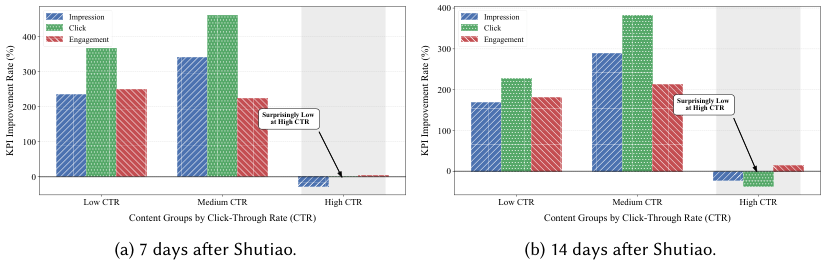

<!-- Start of picture text -->
400 Impression Impression Click Click 400 Engagement Engagement 300 300 200 200 Surprisingly Low  at High CTR Surprisingly Low  at High CTR 100 100 0 0 Low CTR Medium CTR High CTR Low CTR Medium CTR High CTR Content Groups by Click-Through Rate (CTR) Content Groups by Click-Through Rate (CTR) (a) 7 days after Shutiao. (b) 14 days after Shutiao. KPI Improvement Rate (%) KPI Improvement Rate (%) <!-- End of picture text -->

Fig. 1. KPI Improvement ratio by Shutiao stratified by content CTR, compared with organic content. 

## **2.2 The Dilemma of Content Promotion** 

To ground our work in real-world observations and motivate our approach, we first analyze the performance of a typical content promotion service, Shutiao in Xiaohongshu [64]. Our findings reveal a critical, counterintuitive flaw that forms the central problem this work addresses. 

_2.2.1 An Empirical Performance Dichotomy in Content Promotion._ We begin by measuring the performance of the existing Shutiao promotion service to understand its true impact on a content note’s KPIs throughout its lifecycle. We investigate a critical question: _Does a short-term content promotion campaign consistently lead to long-term gains in visibility and engagement?_ 

We conduct a comparative study between a large group of promoted content notes and a control group of organic content notes. For the promoted group, we select content notes that participated in a single Shutiao campaign with a budget 30 units. For the control group, we randomly sample content notes that not utilized the promotion service.5 From a one-week period (March 27, 2025, to April 2, 2025), we sampled 2,560 content notes for each group. To analyze the effect of initial content quality, we stratify all content notes based on their organic CTR measured before the promotion campaign began.6 We then track the cumulative impressions, clicks, and engagements for each group at 7 and 14 days post-campaign. We compute the KPI improvement rate defined as KPI _<u>𝑝𝑟𝑜𝑚𝑜𝑡𝑒𝑑</u>_ −KPI _𝑜𝑟𝑔𝑎𝑛𝑖𝑐_ × 100% for each KPI and each group of content notes, respectively. KPI _𝑜𝑟𝑔𝑎𝑛𝑖𝑐_ The results from Figure 1 reveal a striking dichotomy. While Shutiao provides a substantial boost for most content, it has a negative long-term impact on high-quality posts (those with a high initial CTR). Specifically, as shown in Figure 1b, while content in the low-CTR bucket sees a post-promotion engagement lift of over 200%, the high-CTR group actually suffers a decline in organic metrics, with click and impression improvement rates dropping to approximately -25% compared to the control group. We posit this phenomenon arises because different types of content have different sensitivities to the _quality_ of impression obtained from content promotion. During the initial “cold-start” phase, all content receives limited organic impressions. 

- **For Low-to-Medium Quality Content:** The performance of this content is relatively **insensitive** to the specifics of the bidding strategy; its primary bottleneck is the lack of sufficient impressions. Paid promotion serves as a brute-force solution to acquire impressions. This new data helps the model revise its initial low pCTR estimate, giving the content a chance to find an audience and thus improving its long-term organic reach. 

> 5Detailed configurations of the sampling process are provided in Appendix B. 

> 6The proportions of three groups content notes 13.47%, 56.95% and 29.57%, respectively. 

Proc. ACM Meas. Anal. Comput. Syst., Vol. 10, No. 1, Article 12. Publication date: March 2026. 

Yumou Liu, Zhenzhe Zheng, Jiang Rong, Yao Hu, Fan Wu, and Guihai Chen 

12:6 

- **For High-Quality Content:** This content is highly **sensitive** to impression quality. A naive paid promotion campaign, focused on spending a budget, often forces distribution to a broad, less-optimal audience. This poorly-targeted impression yields a lower engagement rate than the organic system would have achieved. The influx of low-engagement signals “pollutes” the realized performance, causing the pCTR model to question its initial high-quality assessment and reduce future organic distribution. Here, paid promotion interferes with an already effective organic matching process. 

This empirical result shows that naive promotion is a double-edged sword. A creator’s investment can either rescue their content or inadvertently sabotage it, underscoring the need for an intelligent bidding strategy that looks beyond simply buying impressions. 

_2.2.2 Redefining Impression Quality as Informative Data._ The empirical analysis reveals that the goal of paid promotion should not be to maximize raw impression volume, but to acquire _highquality impression_ . We propose a long-term, model-centric definition of quality. 

We define “long-term success” as maximizing _Total Lifetime Value_ (TLV) of a piece of content. In recommender systems, new content faces a “cold start” period where the platform gathers data to estimate its quality. Relying solely on organic impression to exit this high-uncertainty phase is risky due to two factors: (1) **Time-Discounted Utility:** Organic data accumulation is slow. Since future rewards are discounted, a delayed discovery of quality significantly reduces the creator’s total utility. (2) **Algorithmic Pruning:** Modern recommenders (often contextual bandits) act as “filters.” If content fails to accumulate positive signals quickly enough, its predicted Upper Confidence Bound (UCB) drops below the system’s selection threshold. Once this happens, the system stops recommending the content entirely—effectively “killing” it before it can prove its true worth. 

From this viewpoint, high-quality impression consists of impressions that are most useful for training the platform’s pCTR model to quickly reduce variance. By strategically winning impressions in uncertain regions, a creator accelerates the model’s convergence, shortening the cold-start duration. This ensures the content survives the initial “filter” and unlocks high-volume organic impression earlier in its lifecycle, thereby maximizing discounted total utility. 

## **2.3 Optimal Experimental Design** 

The proposed bidding framework is grounded in the principles of Optimal Experimental Design (OED) [47], a field of statistics concerned with selecting the most informative data points to minimize the uncertainty of model parameter estimates. Given a model parameterized by _𝜃_ and a set of candidate observations _𝑂_ = { _𝑥𝑧_ } _𝑧_ ∈S, the informativeness of these observations is typically quantified by the FIM [63]: 

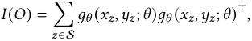

where _𝑔𝜃_ (·) denotes the gradient of the loss function. Classical OED criteria aim to optimize different scalar properties of the FIM to achieve specific variance reduction goals: 

- **D-optimality** : Maximizes det( _𝐼_ ( _𝑂_ )), which minimizes the volume of the confidence ellipsoid for the parameters _𝜃_ . 

- **A-optimality** : Minimizes tr( _𝐼_ ( _𝑂_ )−1 ), effectively minimizing the average variance of the parameter estimates. 

- **I-optimality** (or V-optimality): Minimizes the integrated prediction variance over a region of interest, defined as ∫ _𝑤_ ( _𝑥_ ) _𝑔𝜃_ ( _𝑥_ )⊤ _𝐼_ ( _𝑂_ )−1 _𝑔𝜃_ ( _𝑥_ ) _𝑑𝑥_ . 

While these criteria provide rigorous measures for uncertainty reduction, directly optimizing them in a real-time bidding environment is computationally prohibitive due to the need for frequent 

Proc. ACM Meas. Anal. Comput. Syst., Vol. 10, No. 1, Article 12. Publication date: March 2026. 

12:7 

Guiding the Recommender: Information-Aware Auto-Bidding for Content Promotion 

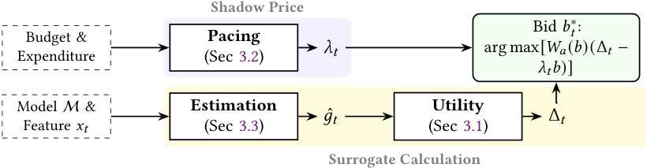

<!-- Start of picture text -->
Shadow Price Bid  𝑏𝑡 ∗: Budget & Pacing 𝜆𝑡 arg max[ 𝑊𝑎 ( 𝑏 )(Δ 𝑡 − Expenditure (Sec 3.2) 𝜆𝑡𝑏 )] Model M & Estimation Utility 𝑔 ˆ 𝑡 Δ 𝑡 Feature 𝑥𝑡 (Sec 3.3) (Sec 3.1) Surrogate Calculation <!-- End of picture text -->

Fig. 2. System Diagram of Information-Aware Auto-Bidding. 

matrix inversions and non-decomposable updates. This motivates our design of a tractable surrogate objective in Section 3. 

## **3 Methods** 

In this section, we present our proposed bidding methodology designed to optimize content promotion for creators. Our approach is structured into three main parts, as shown in Figure 2. First, we formally define our bidding objective, which innovatively combines the immediate value of an impression with a surrogate for long-term model uncertainty reduction, and establish its crucial submodularity property (Sec. 3.1). Next, we detail a two-stage bidding framework that leverages this submodular objective to efficiently solve the budget-constrained optimization problem via Lagrange duality (Sec. 3.2). Finally, we address a key practical challenge by introducing a confidence-gated heuristic for estimating the necessary loss gradients in real-time, even when the true outcome label is not yet available (Sec. 3.3). 

## **3.1 Surrogate Uncertainty** 

The core of our bidding strategy is to select a set of impressions, S, that optimally balances two competing goals: the short-term goal of maximizing immediate campaign returns and the long-term goal of improving the model by reducing its uncertainty. To this end, we formulate a composite objective function that captures this trade-off. 

The first component of our objective, _𝑉_ (S), quantifies the immediate value accrued from the campaign. We define this as the total expected value from the winning impressions, which can be modeled as the sum of their pCTRs: 

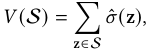

where _𝜎_ ˆ (z) is the pCTR for the impression z. This term incentivizes the bidder to acquire impressions that are likely to yield immediate positive user engagement. 

The second component, _𝑈_ (S), serves as a computationally tractable surrogate for model uncertainty reduction. It is designed to encourage the selection of a diverse and representative set of training samples. Let Dval be a fixed, representative set of validation samples. We define this uncertainty surrogate as: 

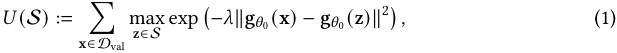

where g _𝜃_ 0 (·) is the gradient of the model’s loss function. This objective, which we term “gradient coverage,” rewards the selection of a set S whose samples’ gradients are collectively close to the 

Proc. ACM Meas. Anal. Comput. Syst., Vol. 10, No. 1, Article 12. Publication date: March 2026. 

Yumou Liu, Zhenzhe Zheng, Jiang Rong, Yao Hu, Fan Wu, and Guihai Chen 

12:8 

gradients of the validation data, intuitively covering the space of necessary learning signals. For any data point x, g _𝜃_ 0 (x) denotes the gradient of the model’s loss function with respect to the model parameters _𝜃_ 07 . It represents the “learning signal” from that sample, which indicates the direction in parameter space that could reduce the loss for that specific example. The term exp(− _𝜆_ ∥· ∥2 ) is a Gaussian kernel that measures the similarity between two gradient vectors. It yields a value close to 1 if the gradients are nearly identical and decays to 0 as they become more distant. The hyperparameter _𝜆 >_ 0 controls the sensitivity of this similarity measure. For each sample x in the validation set, the inner expression, maxz∈S exp( _. . ._ ), finds the training sample z in our selected set S whose gradient is most similar to the gradient of x. This can be interpreted as the “best coverage” that S provides for the learning signal required by x. 

We combine these two components into a single, unified objective function, _𝐹_ (S), using a hyperparameter _𝛽_ ∈[0 _,_ 1] to control the balance: 

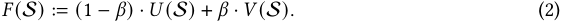

Here, _𝛽_ = 0 prioritizes purely long-term uncertainty reduction, while _𝛽_ = 1 focuses exclusively on short-term pCTR maximization. 

In essence, maximizing _𝐹_ (S) makes the bidder to acquire a portfolio of impressions whose learning signals collectively blanket the space of signals needed to improve performance on the overall data distribution. This property of “gradient coverage” serves as our intuitive and computationally friendly proxy for the more complex goal of direct uncertainty minimization. In the subsequent analysis section, we will formally establish the relationship between this surrogate and standard information-theoretic measures of model uncertainty. 

_Advantages over classical metrics._ Objectives such as conventional A-/D-optimal designs introduced in Section 2.3 require repeated matrix updates and inversions and are thus non-decomposable and impractical for millisecond-latency bidding [10, 31, 47]. In contrast, our gradient-coverage objective is a facility-location–style [43, 55] max-kernel in gradient space: it yields per-impression marginal gains by updating running maxima over a fixed validation set, avoiding any matrix inversion and enabling real-time computation. The construction induces monotone submodularity, providing diminishing returns that support efficient online selection [23, 49]. Compared to expectedgradient/model-change criteria from active learning [50, 51] and gradient-embedding methods such as BADGE [5] which are based on the techniques in Section 2.3, our formulation explicitly targets long-term variance reduction via a provable link to Fisher information (Theorem 1) while remaining decomposable at impression granularity, which is essential for auction-time bidding. Computationally, computing our surrogate requires _𝑂_ (|Dval|) kernel evaluations and max updates per impression, and can be further reduced via batching or cached partial maxima—without forming or inverting any Fisher matrices. 

## **3.2 Two-Stage Bidding** 

In this subsection, we optimize our objective as a budget-constrained bidding (BCB) problem. The goal is to select a set of impressions _𝑆_ to win via bidding that maximizes an uncertainty-reduction utility function, _𝐹_ ( _𝑆_ ), subject to a total budget _𝐵𝑖_ . 

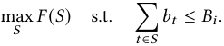

> 7A discussion is given in Appendix C on the practicality of computing the gradient in industry. 

Proc. ACM Meas. Anal. Comput. Syst., Vol. 10, No. 1, Article 12. Publication date: March 2026. 

Guiding the Recommender: Information-Aware Auto-Bidding for Content Promotion 

12:9 

As _𝐹_ ( _𝑆_ ) can be shown to be a monotone submodular function (Section 4), this problem can be effectively solved using Lagrange duality [30]. The Lagrangian is: 

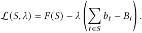

This allows us to decompose the global problem into a per-impression bidding decision. For each impression _𝑥𝑡_ , the marginal utility gain is Δ _𝑡_ = _𝐹_ ( _𝑆𝑡_ −1 ∪{ _𝑥𝑡_ })− _𝐹_ ( _𝑆𝑡_ −1). The expected budget-aware surplus from bidding _𝑏𝑡_ is _𝑊𝑎_ ( _𝑏𝑡_ ) · (Δ _𝑡_ − _𝜆𝑏𝑡_ ), where _𝑊𝑎_ ( _𝑏𝑡_ ) is the win probability for a bid _𝑏𝑡_ . The optimal bid _𝑏𝑡_∗is then: 

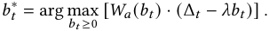

This forms a two-stage bidding process: 

- (1) **Campaign-Level Pacing:** The dual variable _𝜆_ , which represents the shadow price of the budget, is controlled at the campaign level. It can be updated dynamically using a multiplicative weights update rule: 

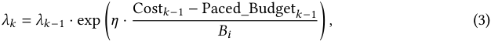

where _𝑘_ indexes pacing periods and _𝜂_ is a learning rate. The term Paced_Budget _𝑘_ −1 denotes the target cumulative expenditure up to period _𝑘_ − 1. To ensure the budget spans the entire campaign duration, we typically employ a linear pacing schedule defined as Paced_Budget _𝑘_ = _𝐵𝑖_ · _𝐾__<u>𝑘</u>_, where_𝐾_is the total number of pacing intervals. Equation (3) allows the algorithm to “learn” the appropriate value she would pay for the impressions relative to its remaining budget. 

- (2) **Impression-Level Bidding:** At each auction, the optimal bid _𝑏𝑡_∗is computed based on the current _𝜆_ and the estimated marginal utility Δ _𝑡_ . 

Remark 1. _While Eq. (3) derives the bid for First-Price Auctions [30], our framework adapts easily to Second-Price Auctions (SPA). In an SPA setting with budget constraints, the truthful bidding strategy is modified by the shadow price 𝜆. The optimal bid simplifies to a scaled truthful bid: 𝑏𝑡_∗=Δ _𝜆__<u>𝑡</u>(where_ _𝜆_ ≥ 1 _). See details in Appendix D._ 

The central challenge is to define and compute Δ _𝑡_ in real-time, which we address next. 

## **3.3 Gradient Estimation** 

A critical challenge in applying our framework is the real-time computation of the marginal utility, Δ _𝑡_ = _𝐹_ ( _𝑆𝑡_ −1 ∪{ _𝑥𝑡_ }) − _𝐹_ ( _𝑆𝑡_ −1), at bid time. The utility function _𝐹_ in Equation (2) depends on the loss gradient of a potential training sample _𝑥𝑡_ . However, at the moment of bidding, the true label (i.e., whether the user will click) is unknown. This “missing label” problem prevents the direct computation of the gradient via standard backpropagation. 

To overcome this, we propose a practical hybrid strategy, detailed in Algorithm 1, which uses the model’s own confidence as a signal to switch between two estimation modes. The model’s confidence in its prediction for an impression _𝑥𝑡_ is measured by the entropy of its pCTR, _𝜎_ ˆ _𝑡_ . A high entropy signifies high uncertainty (low confidence), while low entropy signifies high confidence. 

_Confidence-Gated Heuristic._ Our approach is governed by a dynamic confidence threshold, _𝜁𝑡_ . For each impression, we compare its prediction entropy to this threshold. **High-Confidence (Low-Entropy) Case:** If the entropy _𝐻_ ( _𝑝𝑡_ ) ≤ _𝜁𝑡_ , the model is relatively certain about its prediction. In this regime, we can devise a heuristic to approximate the true gradient. We 

Proc. ACM Meas. Anal. Comput. Syst., Vol. 10, No. 1, Article 12. Publication date: March 2026. 

Yumou Liu, Zhenzhe Zheng, Jiang Rong, Yao Hu, Fan Wu, and Guihai Chen 

12:10 

|**Al**|**gorithm 1:**Confidence-Gated Marginal UtilityEstimation|
|---|---|
|**In** **O** /|**put** **:**Current impression featuresx_𝑡_; CTR prediction model_𝑀_(·;_𝜃𝑡_) with parameters_𝜃𝑡_; Set of gradients from previously won impressionsG_𝑆_= {g_𝑧_}_𝑧_∈_𝑆𝑡_−1; Confidence (entropy) threshold_𝜁𝑡_; High-uncertainty utility value ¯_𝑢_; Loss functionL(·_,_·); Utility function hyperparameters (e.g.,_𝜆_from_𝐹_); **utput:**Estimated marginal utilityΔ_𝑡_; / 1. Assess model confidence|
|**1** _𝑝𝑡_|←_𝑀_(x_𝑡_;_𝜃𝑡_); // Get predicted CTR|
|**2** _𝐻_|(_𝑝𝑡_) ←−_𝑝𝑡_log2(_𝑝𝑡_) −(1−_𝑝𝑡_)log2(1−_𝑝𝑡_); // Compute prediction entropy|
|**3 if**|_𝐻_(_𝑝𝑡_) _> 𝜁𝑡_**then**|
||// 2a. Low-confidence case: assign high fixed utility|
|**4** **5 el**|**return** ¯_𝑢_; **se**|
||// 2b. High-confidence case: use gradient heuristic|
|**6**|g0 ←∇_𝜃_L(_𝑀_(x_𝑡_;_𝜃𝑡_)_,_0); // Gradient assuming label is 0|
|**7**|g1 ←∇_𝜃_L(_𝑀_(x_𝑡_;_𝜃𝑡_)_,_1); // Gradient assuming label is 1|
|**8**|**if** ∥g0∥2 _<_ ∥g1∥2 **then** |
|**9**|ˆg_𝑡_←g0;|
|**10**|**else**|
|**11**|ˆg_𝑡_←g1;|
||// Compute marginal utility gain using the proxy gradient|
|**12**|_𝐹_current ←ComputeUtility(G_𝑆_);|
|**13**|_𝐹_new ←ComputeUtility(G_𝑆_∪{ˆg_𝑡_});|
|**14**|Δ_𝑡_←_𝐹_new−_𝐹_current;|
|**15**|**return**Δ_𝑡_;|
|**16 F**|**unction**ComputeUtility(G_𝑠𝑒𝑡_)|
|**17**|// Helper to compute total utility for a set of gradients // Implements _𝐹_(_𝑆_) = � _𝑥_∈_𝐷𝑡𝑒𝑠𝑡_max_𝑧_∈_𝑆_exp(−_𝜆_∥_𝑔__𝑥_−_𝑔__𝑧_∥2) **return**value based on the definition of_𝐹_;|

compute two _hypothetical_ gradients: g0, assuming the label is _𝑦_ = 0, and g1, assuming the label is _𝑦_ = 1. The core assumption is that for a well-trained and confident model, the loss gradient corresponding to the _correct_ (and therefore more likely) label will be smaller in magnitude. The model state is already near a local minimum for that class, requiring a smaller update. We thus select the gradient with the smaller L2-norm as our proxy for the true gradient: 

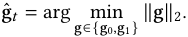

This heuristic assumes the model is well-calibrated. In “confident-but-wrong” scenarios, the heuristic might select the uninformative gradient. However, our architecture mitigates this risk via the entropy threshold _𝜁𝑡_ . High-entropy samples—where the heuristic is least reliable—are effectively filtered out and assigned a fixed high exploration utility _𝑢_ ¯, ensuring we acquire the label rather than relying on a noisy gradient estimate. 

Proc. ACM Meas. Anal. Comput. Syst., Vol. 10, No. 1, Article 12. Publication date: March 2026. 

Guiding the Recommender: Information-Aware Auto-Bidding for Content Promotion 

12:11 

**Low-Confidence (High-Entropy) Case:** If the entropy _𝐻_ ( _𝑝𝑡_ ) _> 𝜁𝑡_ , the model is highly uncertain about the outcome. From an active learning perspective, such samples are intrinsically valuable because they reside in regions of the feature space where the model is uncertain. Correctly labeling and training on these samples offers the highest potential for model improvement and future uncertainty reduction. Therefore, instead of estimating a precise gradient-based utility, we assign a high, fixed utility value, ¯ _𝑢_ , to winning this impression. This value represents the strategic importance of exploring the model’s uncertain data. 

This dual-mode approach is robust: it prioritizes exploration when the model is uncertain and relies on a reasonable heuristic for exploitation and refinement when the model is confident. The threshold _𝜁𝑡_ and the utility constant _𝑢_ ¯ are system hyperparameters. 

Label-free utilities often rely on an expected-gradient or expected model-change under the model’s predicted label distribution [50, 51], or on expected output change [18]. These estimators can fail in the confident-but-wrong regime: the posterior mass collapses on the incorrect label and the expected gradient points in an uninformative direction. Our confidence-gated heuristic is tailored to this failure mode: we explore aggressively when entropy is high, and when entropy is low we approximate the true gradient by the smaller-norm hypothetical gradient, consistent with local optimality around the more likely label. Moreover, our zeroth-order (two-point) variant enables use with black-box CTR models, leveraging established ZO/SPSA estimators [16, 35, 40, 42, 56]. This combination makes information-aware bidding feasible when analytical gradients and labels are unavailable at bid time. 

## **4 Theoretical Analysis** 

In this section, we conduct theoretical analysis to validate the soundness of our proposed bidding framework. We structure our analysis around four key pillars. First, we establish a formal connection between our tractable surrogate objective and a standard information-theoretic measure of model uncertainty, thereby justifying our problem formulation (Sec. 4.1). Second, we prove that our composite objective function is submodular, a fundamental property that makes the optimization problem computationally tractable (Sec. 4.2). Building on this, we analyze the algorithm’s performance in its natural online environment, providing a sublinear regret bound that demonstrates its competitiveness against an optimal offline solution (Sec. 4.3). Finally, we prove a budget feasibility guarantee, ensuring that the algorithm is fiscally responsible and predictable (Sec. 4.4). Together, these results formally establish our method as effective and reliable. 

## **4.1 Surrogate Relation** 

In this subsection, we prove the correctness of our proposed objective function in Section 3.1. Part of the objective function _𝑈_ (S) is designed as as a computationally efficient surrogate for reducing model uncertainty. A crucial question, however, is whether maximizing this “gradient coverage” objective truly corresponds to the fundamental goal of improving the model’s predictive certainty. To validate our approach, we establish a formal connection between our tractable surrogate _𝐹_ (S) and this information-theoretic measure of uncertainty. The following theorem proves that maximizing our surrogate _𝑈_ (S) is indeed a principled approach for minimizing the true model uncertainty. 

Theorem 1 (Regularized Fisher-Coverage Relationship). _Let_ Dval _be a fixed validation set of size 𝑘, and for each 𝑥_ ∈Dval _let 𝑔_ ( _𝑥_ ) ∈ R_𝑑_ _denote the loss gradient at a common anchor parameter 𝜃_ anchor _. For a selected training set 𝑆_ ⊆Dtrain _with gradients_ { _𝑔_ ( _𝑧_ )} _𝑧_ ∈ _𝑆 , define the regularized empirical Fisher_ 

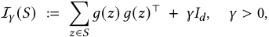

Proc. ACM Meas. Anal. Comput. Syst., Vol. 10, No. 1, Article 12. Publication date: March 2026. 

Yumou Liu, Zhenzhe Zheng, Jiang Rong, Yao Hu, Fan Wu, and Guihai Chen 

12:12 

_and the regularized total uncertainty (analogy to [37])_ 

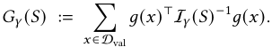

_Let the gradient-coverage surrogate be_ 

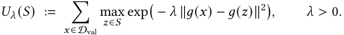

_Assume (i) bounded gradients:_ ∥ _𝑔_ ( _𝑣_ )∥≤ _𝐿 for all 𝑣_ ∈Dval ∪ _𝑆, and (ii) non-degenerate norms on 𝑆:_ ∥ _𝑔_ ( _𝑧_ )∥≥ _𝑚 >_ 0 _for all 𝑧_ ∈ _𝑆. Then for any choice of threshold 𝜏_ ∈(0 _,_ 2 _𝑚_2 ] _,_ 

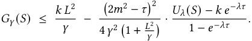

_In particular, increasing 𝑈𝜆_ ( _𝑆_ ) _(for fixed 𝜆,𝜏,𝛾) tightens the upper bound on 𝐺𝛾_ ( _𝑆_ ) _, so 𝑈𝜆_ ( _𝑆_ ) _is a monotone surrogate for reducing 𝐺𝛾_ ( _𝑆_ ) _._ 

The proof is given in Appendix E.1. Theorem 1 provides the core theoretical justification for our proposed bidding objective. As we select a set S that increases the value of _𝑈_ (S), the upper bound on _𝐺_ (S) is driven down. The uncertainty measure _𝐺_ (S) can be written as tr( _𝐼_ ( _𝑆_ )−1 _𝐽_ val) (or with a small ridge regularization if needed), where _𝐼_ ( _𝑆_ ) =� _𝑧_ ∈S_𝑔_(_𝑧_)_𝑔_(_𝑧_)⊤istheempirical Fisher and _𝐽_ val =� _𝑥_ ∈Dval_𝑔_(_𝑥_)_𝑔_(_𝑥_)⊤isthevalidationgradientsecond-moment.Thisisexactly the I-optimality criterion (integrated prediction variance) evaluated on the validation set. In the special case where the validation gradient covariance is isotropic (or after whitening), i.e., _𝐽_ val is proportional to the identity, _𝐺_ (S) reduces (up to a constant factor) to the A-optimal objective tr( _𝐼_ ( _𝑆_ )−1 ). Thus, minimizing _𝐺_ (S) recovers I-optimal design in general and A-optimal design in the isotropic (or whitened) case, which further justifies our use of _𝐺_ (S) as principled uncertainty. 

Intuitively, Theorem 1 holds because both functions, despite their different forms, capture the notion of “coverage.” A high value of _𝑈_ (S) means that the gradients of the selected samples in S are close to the gradients of the validation data Dval. Similarly, a low value of _𝐺_ (S) means that the vector space spanned by the gradients in S effectively represents the validation data gradients, minimizing projection error and thus variance. Our proof formalizes this shared intuition. 

## **4.2 Submodularity of the Uncertainty-Reduction Utility Function** 

In this subsection, we analyze the structural properties of our objective function. Proving that our objective function is submodular is the key that unlocks our bidding algorithm. 

Theorem 2 (Submorularity of the Uncertainty-Reduction Utility Function). _𝐹_ : 2S → R+ _is a submodular function._ 

The proof is given in Appendix E.2. 

Submodularity formalizes the intuition that the marginal gain of adding a new impression to our selected set S decreases as the set grows. 

- For the uncertainty component _𝑈_ (S), adding an impression with a novel gradient to a small set S yields a large increase in “gradient coverage.” However, adding that same impression to a large, diverse set offers a smaller marginal benefit, as its learning signal is likely already well-represented by other samples in the set. 

- For the value component _𝑉_ (S), the marginal gain is constant, which is a special case of submodularity. 

Proc. ACM Meas. Anal. Comput. Syst., Vol. 10, No. 1, Article 12. Publication date: March 2026. 

12:13 

Guiding the Recommender: Information-Aware Auto-Bidding for Content Promotion 

The budget-constrained maximization of a monotone submodular function can be efficiently solved with approximation guarantees. This property transforms an otherwise intractable optimization problem into one that can be realistically solved within the stringent time constraints of a real-time bidding auction, thereby improving the efficiency and reliability of the model optimization process. 

## **4.3 Regret Analysis** 

Our two-stage bidding algorithm operates in an online setting: impression opportunities arrive sequentially, and an irrevocable decision to bid (and how much) must be made for each one without knowledge of future opportunities. The difference between the expected utility of this offline optimum and our online algorithm’s utility is termed _regret_ . 

Theorem 3 (Regret Bound for First-Price CPM Dual Pacing). _Consider a sequence of 𝑇 auctions. At round 𝑡, the bidder observes a win-probability curve 𝑊𝑡_ ( _𝑏_ ) ∈[0 _,_ 1] _for bids 𝑏_ ∈[0 _,𝑏_ max] _and a marginal utility gain_ Δ _𝑡 (from acquiring the impression), with_ |Δ _𝑡_ | ≤ Δmax _. Under a first-price CPM mechanism (winner pays the eCPM), the expected spend at round 𝑡 is ℎ𝑡_ := _𝑊𝑡_ ( _𝑏𝑡_ ) _𝑏𝑡 , where 𝑏𝑡 is the bid placed at round 𝑡._ 

_Define the per-round dual objective 𝑓𝑡_ ( _𝜆_ ) := max _𝑏_ ∈[0 _,𝑏_ max ] _𝑊𝑡_ ( _𝑏_ )� Δ _𝑡_ − _𝜆𝑏_� _, and let the algorithm choose 𝑏𝑡_ ∈ arg max _𝑏 𝑊𝑡_ ( _𝑏_ ) (Δ _𝑡_ − _𝜆𝑡_ −1 _𝑏_ ) _, with the dual (shadow-price) update given by multiplicative weights (mirror descent with negative entropy):_ 

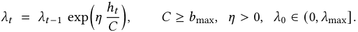

_Let the algorithm’s total expected utility be_ ALG :=�_𝑇_ _𝑡_ =1E[_𝑊𝑡_(_𝑏𝑡_) Δ_𝑡_]_. Let 𝐵>_0_be the budget and_ _define the offline optimal value_ OPT := max _𝑆_ ∗: Spend( _𝑆_ ∗ )≤ _𝐵_ � _𝑇𝑡_ =1E Δ _𝑡_(_𝑆_∗) _, where_ Spend( _𝑆_∗ ) _is the_ � � _(CPM) spend of the offline solution. Let 𝜆_∗ ∈[0 _, 𝜆_ max] _be a dual optimal solution to_ min _𝜆_ ≥0 � _𝑇𝑡_ =1_𝑓𝑡_(_𝜆_)+ log( _𝜆_ max/ _𝜆_ 0 <u>) 1</u> _𝜆𝐵. Then, choosing 𝜂_ = ~~√~~ _𝑇 𝐶__, we have the regret bound_ 

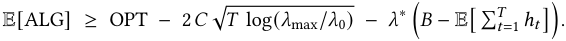

_In particular, if the_ _<u>pacing</u> ensures_ E[�_𝑇_ _𝑡_ =1_ℎ𝑡_]≈_𝐵,thelasttermisnegligibleandtheregretis_ _𝑂_� _𝐶_ ~~√~~ _𝑇_ log( _𝜆_ max/ _𝜆_ 0)� _._ 

The proof is given in Appendix E.3. 

Theorem 3 provides the theoretical foundation for our dual-variable-based pacing. The sublinear regret bound proves that this online learning process is effective, ensuring that the algorithm intelligently allocates the budget over the entire campaign horizon. This avoids common pitfalls such as prematurely exhausting the budget on mediocre impressions or being overly conservative and failing to spend the budget on high-value opportunities at the end. 

The result confirms that our method is not merely a heuristic but a principled online optimization algorithm with provable near-optimal performance. It guarantees that a creator’s budget will be utilized efficiently and effectively over time, adapting to the dynamic conditions of the auction marketplace. 

## **4.4 Budget Feasibility** 

A crucial property of our algorithm is _budget feasibility_ , a formal guarantee that its total expenditure will remain close to the allocated budget. This property is fundamental to establishing trust and making the promotion tool reliable and predictable for its users. The following theorem proves that our algorithm satisfies this critical requirement in expectation. 

Proc. ACM Meas. Anal. Comput. Syst., Vol. 10, No. 1, Article 12. Publication date: March 2026. 

Yumou Liu, Zhenzhe Zheng, Jiang Rong, Yao Hu, Fan Wu, and Guihai Chen 

12:14 

Theorem 4 (Budget Feasibility Guarantee). _The expected total expenditure of the algorithm over 𝑇 auctions is bounded. Using the same learning rate 𝜂 as in the regret analysis, the expected cost satisfies:_ 

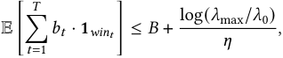

_where_ 1 _win𝑡 is an indicator that the bid 𝑏𝑡 wins the auction at time 𝑡._ 

The proof is given in Appendix E.4. Theorem 4 demonstrates that the expected expenditure is bounded by the budget _𝐵_ plus an additional term that is controlled by the algorithm’s learning parameters. This second term,log(_𝜆_max _𝜂_<u>/</u>_𝜆_0<u>)</u> , can be understood as the “cost of online learning.” Because the algorithm cannot see the future, it must dynamically adjust its spending, and this term bounds the potential overspend that arises from this adaptive process. 

This result is paramount for user trust. It assures a creator that the system will not behave erratically and deplete their funds uncontrollably. By providing a formal upper bound on expected spending, our method transforms the promotion tool from a black box into a reliable and auditable system. This financial control is essential for creators to confidently invest in content promotion, knowing their budget will be managed responsibly throughout the campaign’s lifecycle. 

## **5 Evaluation** 

We conduct experiments to evaluate our methods in Section 3. Firstly, we verify the three parts of our methods separately. Then, we combine the methods together and carry out offline experiments. In the subsequent content, we introduce the setup and results of our experiments. 

## **5.1 Experiment 1: Surrogate Relationship** 

_5.1.1 Experimental Setup._ **Dataset and Partitioning.** To ensure a controlled and reproducible environment, we generate a synthetic binary classification dataset using the scikit-learn. The dataset comprises 1,200 samples, each with 20 features. This dataset is then partitioned into three disjoint sets: An initial, small labeled training set, Dinitial, containing 200 samples used to train the base model; A large, unlabeled candidate pool, Dcandidate, containing 500 samples from which the active learning strategies will select data; A held-out test set, Dtest, containing 500 samples, used exclusively for the final performance evaluation of the retrained models. 

**Model and Protocol.** The underlying pCTR model is a standard Logistic Regression classifier, implemented without an intercept term to align with our gradient formulation. The experimental protocol follows a single-batch active learning cycle: Firstly, we train a base model, _𝜃_ 0 on Dinitial. Then, each selection strategy is used to select a batch of _𝐵_ = 50 samples from Dcandidate. For each strategy, a new, augmented training set is formed by combining Dinitial with the 50 selected samples. A new model is trained from scratch on this augmented dataset. The performance of the newly trained model is evaluated on Dtest. 

**Compared Methods.** We evaluate the performance of three distinct selection strategies: 

- **Greedy-Surrogate** : Our proposed method, which iteratively selects samples that yield the maximum marginal gain in the surrogate objective _𝑈_ ( _𝑆_ ) (see Equation 1). The kernel bandwidth hyperparameter is set to _𝜆_ = 0 _._ 1. 

- **Greedy-FIM (Oracle)** : A strong but computationally expensive baseline that greedily selects samples to maximize the reduction in the true model uncertainty _𝐺_ ( _𝑆_ ). This serves as a practical upper bound on performance. 

- **Random** : A naive baseline that selects 50 samples uniformly at random from Dcandidate. 

Proc. ACM Meas. Anal. Comput. Syst., Vol. 10, No. 1, Article 12. Publication date: March 2026. 

Guiding the Recommender: Information-Aware Auto-Bidding for Content Promotion 

12:15 

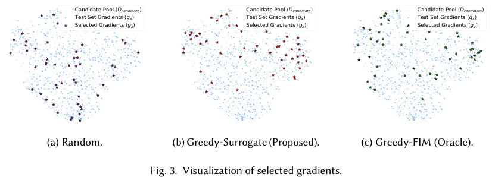

<!-- Start of picture text -->
Candidate Pool (Dcandidate) Candidate Pool (Dcandidate) Candidate Pool (Dcandidate) Test Set Gradients (gx) Test Set Gradients (gx) Test Set Gradients (gx) Selected Gradients (gz) Selected Gradients (gz) Selected Gradients (gz) (a) Random. (b) Greedy-Surrogate (Proposed). (c) Greedy-FIM (Oracle). Fig. 3. Visualization of selected gradients. <!-- End of picture text -->

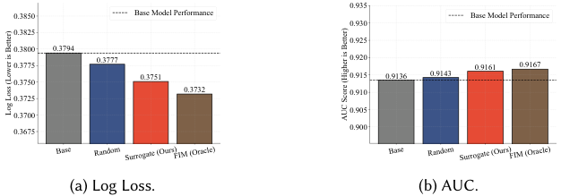

<!-- Start of picture text -->
0.935 0.3850 Base Model Performance Base Model Performance 0.930 0.3825 0.925 0.3800 0.3794 0.3775 0.3777 0.920 0.9161 0.9167 0.3750 0.3751 0.915 0.9136 0.9143 0.3732 0.910 0.3725 0.3700 0.905 0.3675 0.900 (a) Log Loss. (b) AUC. Base Random Surrogate (Ours)FIM (Oracle) Base Random Surrogate (Ours)FIM (Oracle) Log Loss (Lower is Better) AUC Score (Higher is Better) <!-- End of picture text -->

Fig. 4. Performance comparison of selected gradients on continually training. Our surrogate-based method achieves a significant reduction in Log Loss and an increase in AUC, closely approaching the performance of the FIM oracle and substantially outperforming the random baseline. 

**Evaluation Metrics.** The effectiveness of each selection strategy is quantified by the performance of the corresponding retrained model on the unseen test set Dtest. We use two standard metrics: 

- **Test Log Loss** : Measures the model’s goodness-of-fit. Lower values are better. 

- **Area Under the ROC Curve (AUC)** : Measures the model’s ability to discriminate between the positive and negative classes. Higher values are better. 

Detailed configurations are given in Appendix F. 

_5.1.2 Result Analysis._ The analysis is presented in two parts: a qualitative visualization of the selected sample gradients and a quantitative evaluation of the final model performance. 

To build an intuition for why our selection strategy is effective, we first visualize the highdimensional gradients of the selected samples in a 2D space using t-SNE [38]. Figure 3 presents the results for all three methods. The goal is to select a set of candidate gradients (stars) that best represents the distribution of the test set gradients (blue dots), which symbolize the space of model uncertainty we aim to reduce. As illustrated in Figure 3b, our Greedy-Surrogate method selects a diverse set of samples whose gradients are well-distributed across the embedding space. These selected points provide representative coverage of the different clusters formed by the test set gradients. In stark contrast, the Random selection strategy, shown in Figure 3a, results in a clustered selection that is concentrated in a dense region of the candidate pool, failing to capture the full diversity of the test set gradients. Crucially, the selections made by our surrogate method bear a strong qualitative resemblance to those made by the FIM oracle (Figure 3c). This visual evidence strongly supports our hypothesis that maximizing the surrogate objective _𝑈_ ( _𝑆_ ) is an effective 

Proc. ACM Meas. Anal. Comput. Syst., Vol. 10, No. 1, Article 12. Publication date: March 2026. 

Yumou Liu, Zhenzhe Zheng, Jiang Rong, Yao Hu, Fan Wu, and Guihai Chen 

12:16 

proxy for selecting a diverse and informative set of samples, much like directly optimizing the Fisher Information Matrix. 

Beyond qualitative assessment, we quantitatively evaluate the impact of the selected data by training new models on the augmented datasets and measuring their performance on a held-out test set. Figure 4 displays the final Test Log Loss and AUC for each strategy. The model trained with data selected by our Greedy-Surrogate strategy demonstrates a marked reduction in Log Loss and a substantial increase in AUC. This confirms that the diverse samples it identified are highly valuable for improving model generalization. Most importantly, our method’s performance is nearly on par with the Greedy-FIM oracle, which represents a practical upper bound for performance in this setting. Both strategies significantly outperform the naive random selection baseline, which, while beneficial, proves to be a suboptimal approach for acquiring the most informative labels. This quantitative result validates that our computationally efficient surrogate objective successfully guides the selection process towards a near-optimal state, leading to a measurably superior model. 

## **5.2 Experiment 2: Budget Feasibility** 

_5.2.1 Setup._ The objective of this experiment is to empirically verify the budget feasibility guarantee of our two-stage bidding framework (Theorem 4) and to analyze the effectiveness of the pacing controlled by the dual variable _𝜆_ . We specifically investigate the algorithm’s sensitivity to its key hyperparameters: the learning rate _𝜂_ and the total budget _𝐵_ . 

**Methodology.** To isolate the behavior of the pacing controller, we conduct a series of controlled simulations. We simulate a stream of _𝑇_ auctions where the per-impression marginal utility, Δ _𝑡_ , and the market-clearing price (i.e., the highest competitor bid) are drawn from random distributions at each timestep. This allows us to focus exclusively on the dynamics of the budget allocation algorithm from Section 3.2. 

The core of the experiment involves running two sets of simulations: 

- (1) **Sensitivity to Learning Rate (** _𝜂_ **):** We fix the total budget _𝐵_ and the campaign length _𝑇_ . We then run the full simulation multiple times for a range of _𝜂_ values. To ensure statistical robustness, we execute _𝑁_ = 30 independent trials for each _𝜂_ value and aggregate the results. 

- (2) **Sensitivity to Total Budget (** _𝐵_ **):** We fix the learning rate _𝜂_ to a well-performing value identified in the first experiment. We then run the simulation for a wide range of total budget values, from small to large, to assess the algorithm’s scalability and reliability. 

**Evaluation Metrics.** The performance of the pacing is evaluated using the following metrics: 

- **Mean Absolute Error (MAE) vs.** _𝜂_ **:** For each _𝜂_ , we compute the mean of the absolute relative spending error over all trials: MAE = E ���� Costf _𝐵_ inal − _𝐵_ ����. This metric quantifies the accuracy and stability of the controller as a function of its learning rate. 

- **Final Spend vs. Target Budget:** For the second experiment, we plot the final expenditure against the target budget _𝐵_ . This visualizes the algorithm’s absolute adherence to the budget constraint across different scales. 

- **Relative Spending Error vs. Target Budget:** To complement the absolute plot, we also show the final relative error,Costf _𝐵_inal−_𝐵_ , for each budget _𝐵_ . This normalizes the error and shows if the algorithm’s precision is maintained as the budget grows. 

Detailed configurations are given in Appendix F. 

## _5.2.2 Result Analysis._ 

**Impact of Learning Rate** _𝜂_ **.** Figure 5a illustrates the critical role of the learning rate _𝜂_ in balancing the controller’s responsiveness and stability. The plot of Mean Absolute Error versus _𝜂_ exhibits a distinct U-shape, which is characteristic of a well-behaved control system. For very low values 

Proc. ACM Meas. Anal. Comput. Syst., Vol. 10, No. 1, Article 12. Publication date: March 2026. 

12:17 

Guiding the Recommender: Information-Aware Auto-Bidding for Content Promotion 

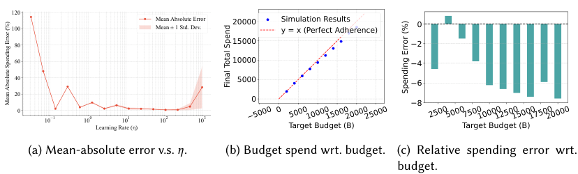

<!-- Start of picture text -->
120 100 Mean Absolute Error Mean ± 1 Std. Dev. 20000 Simulation Results y = x (Perfect Adherence) 0 80 15000 2 60 10000 4 40 5000 6 20 0 8 0 10 1 100 Learning Rate (101 ) 102 103 Target Budget (B) Target Budget (B) (a) Mean-absolute error v.s.  𝜂 . (b) Budget spend wrt. budget. (c) Relative spending error wrt. budget. 5000 0 500010000150002000025000 2500500075001000012500150001750020000 Mean Absolute Spending Error (%) Final Total Spend Spending Error (%) <!-- End of picture text -->

Fig. 5. Evaluation of Budget Feasibility and Pacing Dynamics. 

of _𝜂_ , the controller is too sluggish; it reacts too slowly to deviations from the ideal spending pace, resulting in a significant final error. As _𝜂_ increases, the controller becomes more effective at correcting its course, and the mean error converges towards a minimum, indicating an optimal operational range. However, if _𝜂_ becomes too large, the controller becomes overly aggressive and unstable. It overcorrects in response to small deviations, leading to oscillations in the shadow price _𝜆_ and a subsequent increase in the final spending error. This result confirms that _𝜂_ is a crucial, tunable hyperparameter that allows us to achieve precise budget control, with a clear optimal region that avoids both sluggishness and instability. 

**Robustness to Total Budget** _𝐵_ **.** Figure 5b provides a comprehensive validation of the algorithm’s budget feasibility guarantee (Theorem 4), which plots the final expenditure against the target budget for multiple campaigns. The data points lie almost perfectly along the _𝑦_ = _𝑥_ diagonal, demonstrating that the algorithm adheres to the specified budget with remarkable accuracy, regardless of whether the budget is small or large. Figure 5c shows the relative spending error across different budget levels. The errors are consistently contained within a very narrow band around 0%. It shows that the algorithm’s precision is not merely absolute but also relative; the percentage error does not increase as the budget grows. Together, these results provide strong empirical evidence that our two-stage bidding framework with its dynamic pacing is a fiscally responsible and predictable tool, capable of managing creator budgets reliably across a wide range of scales. 

## **5.3 Experiment 3: Gradient Estimation** 

_5.3.1 Setup._ The objective of this experiment is to evaluate the accuracy of our confidence-gated heuristic for estimating loss gradients in the absence of a true label (as detailed in Section 3.3). Furthermore, we aim to quantify its performance when analytical gradients are unavailable, necessitating the use of a Zeroth-Order (ZO) estimator, thereby simulating a black-box model environment. 

**Methodology.** We use a pre-trained pCTR model (Logistic Regression) and a held-out labeled test set. The protocol is as follows: for each sample x _𝑡_ in the test set, we first generate a proxy gradient gˆ _𝑡_ using several competing methods _without_ using the true label _𝑦𝑡_ . We then compute the true analytical gradient, gtrue, using the known label _𝑦𝑡_ . The accuracy of each proxy gradient is measured against this ground truth. 

**Compared Methods.** We compare four distinct strategies for generating the proxy gradient gˆ _𝑡_ : 

- **Our Heuristic (Analytical):** This is our primary proposed method from Section 3.3. It computes two hypothetical _analytical_ gradients, g0 (for label _𝑦_ = 0) and g1 (for label _𝑦_ = 1), and selects the one with the smaller L2-norm as the proxy: gˆ = arg ming∈{g0 _,_ g1 } ∥g∥2. 

Proc. ACM Meas. Anal. Comput. Syst., Vol. 10, No. 1, Article 12. Publication date: March 2026. 

Yumou Liu, Zhenzhe Zheng, Jiang Rong, Yao Hu, Fan Wu, and Guihai Chen 

12:18 

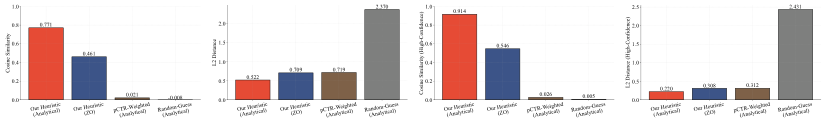

<!-- Start of picture text -->
1.0 2.370 1.0 0.914 2.5 2.431 0.8 0.771 2.0 0.8 2.0 0.6 1.5 0.6 0.546 1.5 0.461 0.4 1.0 0.4 1.0 0.709 0.719 0.20.0 Our Heuristic(Analytical) Our Heuristic(ZO) pCTR-Weighted(Analytical)0.021 Random-Guess(Analytical)-0.008 0.50.0 Our Heuristic(Analytical)0.522 Our Heuristic(ZO) pCTR-Weighted(Analytical) Random-Guess(Analytical) 0.20.0 Our Heuristic(Analytical) Our Heuristic(ZO) pCTR-Weighted(Analytical)0.026 Random-Guess(Analytical)0.005 0.50.0 Our Heuristic(Analytical)0.220 Our Heuristic0.308(ZO) pCTR-Weighted(Analytical)0.312 Random-Guess(Analytical) Cosine Similarity L2 Distance Cosine Similarity (High-Confidence) L2 Distance (High-Confidence) <!-- End of picture text -->

(a) Cosine Similarity on all (b) L-2 distance on all sam-(c) Cosine Similarity on (d) L-2 distance on highsamples. ples. high-confidence samples. confidence samples. 

Fig. 6. Performance of gradient estimation heuristics on all and high-confidence samples. Our heuristic using analytical gradients (green) performs best. The ZO-based version (red) shows a slight, expected performance degradation but still significantly outperforms the pCTR-weighted (orange) and random (gray) baselines in both cosine similarity (higher is better) and L2 distance (lower is better). 

- **Our Heuristic (ZO):** This method evaluates our heuristic in a black-box setting. It uses the same L2-norm selection rule but applies it to gradients approximated via a two-point Zeroth-Order (ZO) estimator. For each hypothetical label, the gradient is estimated as gˆ ZO ≈ 21 _𝜇_[_𝐿_(_𝜃_+_𝜇_u) −_𝐿_(_𝜃_−_𝜇_u)]u, averaged over multiple random directions u. 

- **pCTR-Weighted (Analytical):** A common baseline that computes an expected gradient based on the model’s prediction _𝑝_ ˆ _𝑡_ : gˆ est = _𝑝_ ˆ _𝑡_ · g1 + (1 − _𝑝_ ˆ _𝑡_ ) · g0. 

- **Random-Guess (Analytical):** Randomly selects either g0 or g1 as the proxy. 

**Metrics.** We quantify the accuracy of each estimated gradient gˆ _𝑡_ against the true gradient gtrue using two standard metrics: 

- **Cosine Similarity:** Measures the alignment of the vectors’ directions. A value closer to 1 indicates a more accurate estimation of the learning direction. 

- **L2 Distance:** Measures the Euclidean distance between the vectors. A smaller value indicates a more accurate estimation of both direction and magnitude. 

We report the average performance of each method over all test samples, with a specific focus on the subset of samples where the model’s prediction is highly confident (i.e., _𝑝_ ˆ _𝑡_ is close to 0 or 1), as this is the regime where our primary heuristic is designed to operate. 

Detailed configurations are given in Appendix F. 

_5.3.2 Result Analysis._ The results, presented in Figure 6, confirm the effectiveness of our proposed heuristic and its robustness in a black-box setting. 

First, the results clearly demonstrate the superiority of our L2-norm-based heuristic when analytical gradients are available. As shown by the green bars in Figures 6a and 6b, our analytical heuristic achieves the highest performance, with a cosine similarity approaching 1.0 and the lowest L2 distance, respectively. This is because its core assumption, that the gradient corresponding to the correct label will have a smaller L2-norm, is most valid in this high-confidence regime. Our heuristic successfully exploits this difference in magnitude to identify the more likely gradient. 

Second, we analyze the performance under a more challenging black-box scenario where gradients are approximated using a Zeroth-Order (ZO) estimator. As shown by the red bars, there is an expected performance gap compared to using exact analytical gradients. The cosine similarity decreases and the L2 distance increases, quantifying the inherent cost of information loss from the ZO approximation. However, what is crucial is that our heuristic, even when applied to these noisy ZO gradients, still substantially outperforms the other baselines. This demonstrates the robustness of the L2-norm selection rule itself: it remains effective at identifying the more plausible learning signal even when the input gradients are imprecise. 

Proc. ACM Meas. Anal. Comput. Syst., Vol. 10, No. 1, Article 12. Publication date: March 2026. 

Guiding the Recommender: Information-Aware Auto-Bidding for Content Promotion 

12:19 

Finally, the baselines falter significantly in this high-confidence setting, as shown in Figure 6c and Figure 6d. The pCTR-weighted baseline (orange bars) is particularly brittle. When the model is highly confident but incorrect (e.g., predicting _𝑝_ ˆ _𝑡_ = 0 _._ 99 when the true label is _𝑦_ = 0), its estimate is overwhelmingly skewed towards the wrong gradient, leading to a very poor approximation precisely when the sample is most informative. The random-guess baseline (gray bars) performs poorly by design, serving as a lower bound. 

In conclusion, this experiment validates that our L2-norm heuristic is an effective method for selecting a proxy gradient in high-confidence scenarios. Furthermore, its strong performance even with noisy ZO inputs confirms its practical utility for black-box models where direct gradient computation is impossible. 

## **5.4 Experiment 4: End-to-End Offline Case Study** 

- _5.4.1 Setup._ To evaluate the overall performance of the complete bidding framework in a simulated environment, measuring its ability to improve model performance over time under a fixed budget. **Datasets.** Our offline experiments will primarily utilize two datasets: 

   - **Synthesis Dataset:** We synthesis the feature of each ad and the corresponding binary click feedback. The synthesis data is used to train a CTR model. 

   - **Criteo Dataset [69]:** A popular public benchmark for CTR prediction, containing a large volume of anonymized display advertising data. Its high-dimensional sparse features make it a suitable testbed for evaluating the performance of the pCTR model under uncertainty. 

For all experiments, we split the data chronologically into training, validation, and testing sets to prevent temporal data leakage. 

**Model.** We employ a standard DCM model [15] as the pCTR model, a common and effective architecture for this task. The model takes the concatenated sparse and dense features as input and outputs the predicted CTR, _𝜎_ ( _𝑥_ ). 

**Methodology.** We conduct a full simulation on the Criteo dataset. An initial pCTR model is trained on a small, early portion of the data. We stream the subsequent data as a sequence of auctions. For each auction, we simulate competing bids from other advertisers. Our proposed bidder and several baselines compete to win impressions subject to the same total budget _𝐵_ . The winning impressions are collected into a set _𝑆_ won. Our method is compared with the following baselines: 

- **Value-Only (** _𝛽_ = 1 **):** Our framework configured to only maximize immediate pCTR value. 

- **Uncertainty-Only (** _𝛽_ = 0 **):** Our framework configured to only maximize gradient coverage. 

- **Uniform Bidding:** A standard baseline that bids a constant value for every impression. 

- • **pCTR-Linear Bidding:** The bid is proportional to the predicted CTR. 

After the campaign simulation is complete, for each method, we retrain a new model using the initial training data plus the set of won impressions, _𝑆_ won. 

Detailed setup is given in Appendix F. 

**Metrics and Expected Outcome.** We evaluate the final retrained models on a held-out test set, measuring performance using AUC and LogLoss. We hypothesize that our proposed method (with a tuned _𝛽_ ∈(0 _,_ 1)) will yield a final model with the best performance, outperforming both the valueonly and uncertainty-only extremes. This would demonstrate that strategically balancing short-term value acquisition and long-term uncertainty reduction leads to superior model improvement. 

_5.4.2 Result Analysis._ In this section, we analyze the results of the offline end-to-end simulation. We demonstrate that our proposed bidding strategy can improve the long-term performance of the pCTR model by strategically acquiring training samples under a fixed budget8 . Figures 7a 8a and 

> 8Due to the space limit, there are some statistics obscured in Figures 7 and 8. We provide a better view in the Appendix F.1. 

Proc. ACM Meas. Anal. Comput. Syst., Vol. 10, No. 1, Article 12. Publication date: March 2026. 

Yumou Liu, Zhenzhe Zheng, Jiang Rong, Yao Hu, Fan Wu, and Guihai Chen 

12:20 

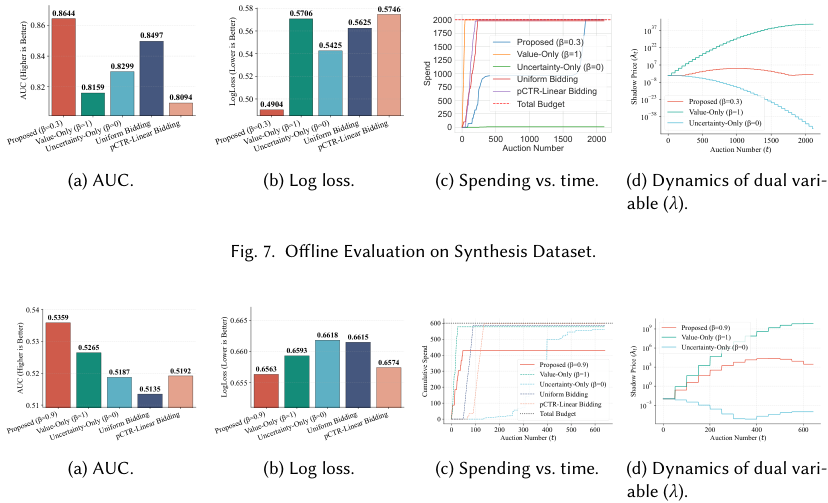

<!-- Start of picture text -->
0.8644 0.58 0.5706 0.5746 0.86 0.8497 0.56 0.5625 20001750 1037 0.840.82 0.8159 0.8299 0.8094 0.540.520.50 0.4904 0.5425 150012501000750500 Proposed (Value-OnlUncertaintUniform BiddingpCTR-Linear Bidding Total Budget yy-Onl(=0.3)=1y) ( =0) 10101010232287 Proposed ( =0.3) 2500 10 38 Value-OnlUncertainty-Only (y ( =1) =0) 0 500 1000 1500 2000 0 500 1000 1500 2000 Auction Number Auction Number (t) (a) AUC. (b) Log loss. (c) Spending vs. time. (d) Dynamics of dual vari- able ( 𝜆 ). Fig. 7. Offline Evaluation on Synthesis Dataset. 0.54 0.53 0.5359 0.5265 0.6650.660 0.6593 0.6618 0.6615 600500400 101096 Proposed ( Value-Only ( Uncertainty-Only (=0.9) =1) =0) 0.52 0.5187 0.5192 0.6563 0.6574 300 Proposed (Value-Only (=0.9)=1) 103 0.51 0.5135 0.655 200100 UncertaintyUniform Bidding pCTR-Linear Bidding -Only ( =0) 101030 0 Total Budget 0 100 200 300 400 500 600 0 200 400 600 Auction Number (t) Auction Number (t) (a) AUC. (b) Log loss. (c) Spending vs. time. (d) Dynamics of dual vari- able ( 𝜆 ). Proposed (Value-Only (Uncertainty-Only (=0.3) =1) Uniform Bidding=0)pCTR-Linear Bidding Proposed (Value-Only (Uncertainty-Only (=0.3) =1) Uniform Bidding=0)pCTR-Linear Bidding Proposed (Value-Only (=0.9)Uncertainty-Only (=1) Uniform Bidding=0)pCTR-Linear Bidding Proposed (Value-Only (=0.9)Uncertainty-Only (=1) Uniform Bidding=0)pCTR-Linear Bidding )t Spend AUC (Higher is Better) LogLoss (Lower is Better) Shadow Price ( )t AUC (Higher is Better) LogLoss (Lower is Better) Cumulative Spend Shadow Price ( <!-- End of picture text -->

Fig. 8. Offline Evaluation on Critero Dataset. 

Figures 7b 8b present the Area Under the Curve (AUC) and LogLoss of the final models, retrained on the impressions won by each bidding strategy. The results compellingly validate our central hypothesis. The proposed method achieves the highest AUC and the lowest LogLoss, significantly outperforming all other baselines. This success stems from its unified objective function _𝐹_ (S), which judiciously balances two critical goals: 

- (1) **Short-term Value Acquisition:** The _𝛽_ · _𝑉_ (S) term guides the bidder to acquire impressions with high predicted CTR, ensuring immediate campaign value. 

- (2) **Long-term Uncertainty Reduction:** The (1 − _𝛽_ ) · _𝑈_ (S) term, our gradient coverage surrogate, incentivizes the acquisition of diverse and informative samples. These samples, identified by the Zeroth-Order (ZO) gradient estimator, reside in regions of the feature space where the model is uncertain. Training on them effectively reduces model variance and improves generalization. 

Then, we show that our bidding algorithm is fiscally responsible. Figures 7c and 8c illustrate the in-campaign dynamics of budget expenditure and the adaptive control of the dual variable _𝜆_ . As shown in Figures 7c and 8c, it is possible for bidders based on our two-stage framework to exhibit smooth and controlled spending. Their cumulative expenditure curves can rise steadily and converge near the total budget limit, empirically validating the budget feasibility guarantee established in Theorem 4. Figures 7d and 8d reveal the underlying mechanism driving this control: the evolution of the dual variable _𝜆_ . This variable represents the "shadow price" of the budget. We observe that _𝜆_ dynamically adjusts throughout the campaign. When a bidder’s spending is ahead of the target pace, _𝜆_ increases, making bids more conservative (since bid _𝑏𝑡_ ∝ 1/ _𝜆𝑡_ ). Conversely, when spending is too slow, _𝜆_ decreases to encourage more aggressive bidding. This self-regulating behavior, an instance of online mirror descent, ensures that the budget is allocated intelligently 

Proc. ACM Meas. Anal. Comput. Syst., Vol. 10, No. 1, Article 12. Publication date: March 2026. 

Guiding the Recommender: Information-Aware Auto-Bidding for Content Promotion 

12:21 

across the entire campaign horizon, which is crucial for achieving the near-optimal performance guaranteed by our regret analysis (Theorem 3). 

## **6 Related Work** 

## **6.1 Fisher-information–based data selection and optimal experimental design** 

Classical optimal experimental design (OED) optimizes Fisher-information–based criteria at the set level, e.g., D-optimality (maximize det(I)) or A-optimality (minimize tr(I−1 )) [31, 47]. Bayesian OED extends these ideas with priors and information-theoretic utilities [10, 34]. In generalized linear and nonlinear models (e.g., logistic), construction of optimal designs often requires iterative matrix updates and inversions [4, 17, 46], making them computationally heavy and non-decomposable in online settings. 

Active learning offers related acquisition principles. Early model-based and information-theoretic approaches target entropy/information gain [13, 39]. Expected model change (often instantiated as expected gradient length) selects samples maximizing the anticipated parameter update [50, 51], while recent deep methods embed per-sample gradients to achieve diverse, uncertainty-aware batches (e.g., BADGE) [5]. Submodularity has been leveraged to obtain near-optimal greedy selection in information-gain and facility-location style objectives [23, 49]. 

In contrast, our work proposes a _decomposable_ max-kernel objective in gradient space (gradient coverage) that induces monotone submodularity and admits per-impression marginal utilities suitable for millisecond-latency auctions. Our total-uncertainty objective _𝐺_ (S) equals an I-optimal (integrated prediction-variance) criterion on the test distribution, and it collapses to A-optimality when the test gradient covariance is isotropic (or whitened), i.e., when _𝐽_ test is proportional to the identity, linking our formulation directly to classical OED objectives. 

## **6.2 Auto-Bidding for Non-Truthful Mechanisms** 

Auto-bidding methods translate advertiser goals into per-impression bids under auction and budget constraints. Foundational work on real-time bidding optimized value-centric objectives with predictive signals and pacing [2, 68]. In non-truthful (first-price) environments, bid shading and primal–dual/online learning approaches have been proposed to handle market uncertainty and budget feasibility [30, 71]. Recent theory studies no-regret learning in repeated first-price auctions with budgets, including independence or structured feedback assumptions and discounted objectives [3, 24, 59]. 

These approaches predominantly optimize short-term campaign KPIs (clicks/engagements/conversions) and treat labels as arriving post-click, whereas our setting explicitly values impressions for their _information_ about the recommendation model. Methodologically, we couple a submodular, decomposable information surrogate with a dual-variable pacing scheme (shadow price _𝜆_ ) and prove sublinear regret and budget-feasibility guarantees in an online auction stream (Section 4). Practically, we address the missing-label obstacle at bid time via a confidence-gated, label-free gradient estimator (and a zeroth-order variant for black-box models), which is typically outside the scope of value-only auto-bidding. This reframes robustness from market-facing uncertainty to _model-learning_ robustness: avoiding the pollution of performance signals by acquiring traffic that most reduces model uncertainty, which in turn improves long-term organic outcomes. 

## **6.3 Zeroth-Order Gradient Estimation and Optimization** 

Zeroth-Order gradient estimation computes the gradient without analytically computing the derivatives. There are two mainstream methods to of ZO gradient estimation, single-point methods and two-point methods [35]. Single-point methods [14, 19, 27, 52, 70] query the function value only 

Proc. ACM Meas. Anal. Comput. Syst., Vol. 10, No. 1, Article 12. Publication date: March 2026. 

Yumou Liu, Zhenzhe Zheng, Jiang Rong, Yao Hu, Fan Wu, and Guihai Chen 

12:22 

once at each time step, making it suitable for online optimization and control problems. Recent advances improves the single-point method by reducing variance [11, 12, 26], reusing samples [60], and estimating the Hessian [32]. Two-point methods [16, 42, 53], as the name suggests, query the function value twice in the same instantaneous time. Recent advances improve the two-point methods by extending them to non-convex non-smooth problems [33], training deep models [29, 45], distributed settings [66], etc. 

Many classical lower bounds have been derived for zeroth-order SGD in both strongly convex and convex settings [1, 16, 27, 48, 53], as well as in non-convex settings [62]. More recently, [6, 9, 61] demonstrated that if the gradient has a low-dimensional structure, the query complexity scales linearly with the intrinsic dimension and logarithmically with the number of parameters. Additional techniques, such as sampling schedules [8] and other variance reduction methods [28, 36], can be incorporated into zeroth-order SGD. Recently, an optimizer designed for LLM, named MeZO [40], adapting the classical ZO-SGD [56] method to operate inplace, thereby fine-tuning LMs with the same memory footprint as inference. Recent work [20] modifies MeZO by applying variance reduction techniques. 

## **7 Conclusion** 

Paid promotion can unintentionally harm high-quality content by polluting engagement signals. We addressed this by reframing promotion as strategic data acquisition: a dual-objective bidding framework that jointly optimizes short-term engagement value and long-term uncertainty reduction of the platform’s CTR model. Methodologically, we proposed a tractable surrogate for information gain with a provable link to optimal experimental design, enabling decomposable marginal utilities at impression granularity. We coupled this with a two-stage Lagrangian bidding scheme: campaignlevel budget pacing via a dynamically updated shadow price, and impression-level bid optimization. Practically, we solved the missing-label challenge at bid time with a confidence-gated gradient heuristic and a zeroth-order estimator for black-box models. Theoretically, we established monotone submodularity of the composite objective, a sublinear regret bound for online first-price CPM dual pacing, and an expected budget feasibility guarantee. Empirically, component-wise validations and end-to-end offline simulations on synthetic and real-world datasets demonstrated consistent improvements in final model AUC/LogLoss over standard baselines, stable budget adherence, and robustness when analytical gradients are unavailable. Overall, our framework transforms paid promotion from impression-purchasing into principled, information-aware bidding that strengthens recommendation models and enhances long-term organic outcomes. 

## **References** 

> [1] Alekh Agarwal, Martin J Wainwright, Peter Bartlett, and Pradeep Ravikumar. 2009. Information-Theoretic Lower Bounds on the Oracle Complexity of Convex Optimization. _Advances in Neural Information Processing Systems_ 22 (2009). 

> [2] Gagan Aggarwal, Ashwinkumar Badanidiyuru, Santiago R Balseiro, Kshipra Bhawalkar, Yuan Deng, Zhe Feng, Gagan Goel, Christopher Liaw, Haihao Lu, Mohammad Mahdian, et al. 2024. Auto-Bidding and Auctions in Online Advertising: A Survey. _ACM SIGecom Exchanges_ 22, 1 (2024), 159–183. 

> [3] Rui Ai, Chang Wang, Chenchen Li, Jinshan Zhang, Wenhan Huang, and Xiaotie Deng. 2022. No-Regret Learning in Repeated First-Price Auctions with Budget Constraints. _arXiv preprint arXiv:2205.14572_ (2022). 

> [4] Zeyuan Allen-Zhu, Yuanzhi Li, Aarti Singh, and Yining Wang. 2021. Near-Optimal Discrete Optimization for Experimental Design: A Regret Minimization Approach. _Mathematical Programming_ 186, 1 (2021), 439–478. 

> [5] Jordan T. Ash, Chicheng Zhang, Akshay Krishnamurthy, John Langford, and Alekh Agarwal. 2020. Deep Batch Active Learning by Diverse, Uncertain Gradient Lower Bounds. In _International Conference on Learning Representations_ . 

> [6] Krishnakumar Balasubramanian and Saeed Ghadimi. 2018. Zeroth-Order (Non)-Convex Stochastic Optimization via Conditional Gradient and Gradient Updates. _Advances in Neural Information Processing Systems_ 31 (2018). 

Proc. ACM Meas. Anal. Comput. Syst., Vol. 10, No. 1, Article 12. Publication date: March 2026. 

Guiding the Recommender: Information-Aware Auto-Bidding for Content Promotion 

12:23 

- [7] Bernard Marr & Co. 2025. How Much Data Do We Create Every Day? The Mind-Blowing Stats Everyone Should Read. https://bernardmarr.com/how-much-data-do-we-create-every-day-the-mind-blowing-stats-everyone-shouldread/ 

- [8] Raghu Bollapragada, Richard Byrd, and Jorge Nocedal. 2018. Adaptive Sampling Strategies for Stochastic Optimization. _SIAM Journal on Optimization_ 28, 4 (2018), 3312–3343. 

- [9] HanQin Cai, Daniel Mckenzie, Wotao Yin, and Zhenliang Zhang. 2022. Zeroth-Order Regularized Optimization (ZORO): Approximately Sparse Gradients and Adaptive Sampling. _SIAM Journal on Optimization_ 32, 2 (2022), 687–714. 

- [10] Kathryn Chaloner and Isabella Verdinelli. 1995. Bayesian Experimental Design: A Review. _Statist. Sci._ (1995), 273–304. [11] Xin Chen and Zhaolin Ren. 2025. Regression-Based Single-Point Zeroth-Order Optimization. _arXiv preprint arXiv:2507.04223_ (2025). 

- [12] Xin Chen, Yujie Tang, and Na Li. 2022. Improve Single-Point Zeroth-Order Optimization using High-Pass and Low-Pass Filters. In _International Conference on Machine Learning_ . 3603–3620. 

- [13] David A Cohn, Zoubin Ghahramani, and Michael I Jordan. 1996. Active Learning with Statistical Models. _Journal of Artificial Intelligence Research_ 4 (1996), 129–145. 

- [14] Varsha Dani, Sham M Kakade, and Thomas Hayes. 2007. The Price of Bandit Information for Online Optimization. _Advances in Neural Information Processing Systems_ 20 (2007). 

- [15] Diemert Eustache, Meynet Julien, Pierre Galland, and Damien Lefortier. 2017. Attribution Modeling Increases Efficiency of Bidding in Display Advertising. In _Proceedings of the AdKDD and TargetAd Workshop_ . ACM. 

- [16] John C Duchi, Michael I Jordan, Martin J Wainwright, and Andre Wibisono. 2015. Optimal Rates for Zero-Order Convex Optimization: The Power of Two Function Evaluations. _IEEE Transactions on Information Theory_ 61, 5 (2015), 2788–2806. 

- [17] Ian Ford, Bernard Torsney, and CF Jeff Wu. 1992. The Use of a Canonical Form in the Construction of Locally Optimal Designs for Non-Linear Problems. _Journal of the Royal Statistical Society Series B: Statistical Methodology_ 54, 2 (1992), 569–583. 

- [18] Alexander Freytag, Erik Rodner, and Joachim Denzler. 2014. Selecting Influential Examples: Active Learning with Expected Model Output Changes. In _European Conference on Computer Vision_ . Springer, 562–577. 

- [19] Alexander V Gasnikov, Ekaterina A Krymova, Anastasia A Lagunovskaya, Ilnura N Usmanova, and Fedor A Fedorenko. 2017. Stochastic Online Optimization. Single-Point and Multi-Point Non-Linear Multi-Armed Bandits. Convex and Strongly-Convex Case. _Automation and Remote Control_ 78, 2 (2017), 224–234. 

- [20] Tanmay Gautam, Youngsuk Park, Hao Zhou, Parameswaran Raman, and Wooseok Ha. 2024. Variance-Reduced Zeroth-Order Methods for Fine-Tuning Language Models. _arXiv preprint arXiv:2404.08080_ (2024). 

- [21] Google AdSense. 2021. Moving AdSense to a First-Price Auction. https://blog.google/products/adsense/our-move-toa-first-price-auction/ 

- [22] Mihajlo Grbovic, Jon Malkin, and Hirakendu Das. 2013. Large Scale Ad Latency Analysis. In _International Conference on Big Data_ . IEEE, 762–767. 

- [23] Carlos Guestrin, Andreas Krause, and Ajit Paul Singh. 2005. Near-Optimal Sensor Placements in Gaussian Processes. In _Proceedings of the 22nd International Conference on Machine Learning_ . 265–272. 

- [24] Yanjun Han, Tsachy Weissman, and Zhengyuan Zhou. 2025. Optimal No-Regret Learning in Repeated First-Price Auctions. _Operations Research_ 73, 1 (2025), 209–238. 

- [25] Xun Huan, Jayanth Jagalur, and Youssef Marzouk. 2024. Optimal Experimental Design: Formulations and Computations. _Acta Numerica_ 33 (2024), 715–840. 

- [26] Yuanhanqing Huang and Jianghai Hu. 2024. Zeroth-Order Learning in Continuous Games via Residual Pseudogradient Estimates. _IEEE Trans. Automat. Control_ (2024). 

- [27] Kevin G Jamieson, Robert Nowak, and Ben Recht. 2012. Query Complexity of Derivative-Free Optimization. _Advances in Neural Information Processing Systems_ 25 (2012). 

- [28] Kaiyi Ji, Zhe Wang, Yi Zhou, and Yingbin Liang. 2019. Improved Zeroth-Order Variance Reduced Algorithms and Analysis for Nonconvex Optimization. In _International Conference on Machine Learning_ . 3100–3109. 

- [29] Shuoran Jiang, Qingcai Chen, Youcheng Pan, Yang Xiang, Yukang Lin, Xiangping Wu, Chuanyi Liu, and Xiaobao Song. 2024. ZO-AdamU optimizer: Adapting Perturbation by the Momentum and Uncertainty in Zeroth-Order Optimization. In _Proceedings of the AAAI Conference on Artificial Intelligence_ , Vol. 38. 18363–18371. 

- [30] Niklas Karlsson and Qian Sang. 2021. Adaptive Bid Shading Optimization of First-Price Ad Inventory. In _American Control Conference_ . IEEE, 4983–4990. 

- [31] Jack Kiefer. 1959. Optimum Experimental Designs. _Journal of the Royal Statistical Society: Series B (Methodological)_ 21, 2 (1959), 272–304. 

- [32] Dongyoon Kim, Sungjae Lee, Wonjin Lee, and Kwang In Kim. 2025. Subspace-Based Approximate Hessian Method for Zeroth-Order Optimization. _arXiv preprint arXiv:2507.06125_ (2025). 

Proc. ACM Meas. Anal. Comput. Syst., Vol. 10, No. 1, Article 12. Publication date: March 2026. 

Yumou Liu, Zhenzhe Zheng, Jiang Rong, Yao Hu, Fan Wu, and Guihai Chen 

12:24 

- [33] Tianyi Lin, Zeyu Zheng, and Michael Jordan. 2022. Gradient-Free methods for Deterministic and Stochastic Nonsmooth Nonconvex Optimization. _Advances in Neural Information Processing Systems_ 35 (2022), 26160–26175. 

- [34] Dennis V Lindley. 1956. On a Measure of the Information Provided by an Experiment. _The Annals of Mathematical Statistics_ 27, 4 (1956), 986–1005. 

- [35] Sijia Liu, Pin-Yu Chen, Bhavya Kailkhura, Gaoyuan Zhang, Alfred O Hero III, and Pramod K Varshney. 2020. A Primer on Zeroth-Order Optimization in Signal Processing and Machine Learning: Principals, Recent Advances, and Applications. _IEEE Signal Processing Magazine_ 37, 5 (2020), 43–54. 

- [36] Sijia Liu, Bhavya Kailkhura, Pin-Yu Chen, Paishun Ting, Shiyu Chang, and Lisa Amini. 2018. Zeroth-Order Stochastic Variance Reduction for Nonconvex Optimization. _Advances in Neural Information Processing Systems_ 31 (2018). 

- [37] Charles Lu, Baihe Huang, Sai Praneeth Karimireddy, Praneeth Vepakomma, Michael Jordan, and Ramesh Raskar. 2024. DAVED: Data Acquisition via Experimental Design for Data Markets. _arXiv preprint arXiv:2403.13893_ (2024). 

- [38] Laurens van der Maaten and Geoffrey Hinton. 2008. Visualizing Data Using t-SNE. _Journal of Machine Learning Research_ 9, Nov (2008), 2579–2605. 

- [39] David JC MacKay. 1992. Information-Based Objective Functions for Active Data Selection. _Neural computation_ 4, 4 (1992), 590–604. 

- [40] Sadhika Malladi, Tianyu Gao, Eshaan Nichani, Alex Damian, Jason D Lee, Danqi Chen, and Sanjeev Arora. 2023. Fine-Tuning Language Models with Just Forward Passes. _arXiv preprint arXiv:2305.17333_ (2023). 

- [41] Roger B Myerson. 1981. Optimal Auction Design. _Mathematics of Operations Research_ 6, 1 (1981), 58–73. 

- [42] Yurii Nesterov and Vladimir Spokoiny. 2017. Random Gradient-Free Minimization of Convex Functions. _Foundations of Computational Mathematics_ 17, 2 (2017), 527–566. 

- [43] Susan Hesse Owen and Mark S Daskin. 1998. Strategic Facility Location: A Review. _European Journal of Operational Research_ 111, 3 (1998), 423–447. 

- [44] Deepak Kumar Panda and Sanjog Ray. 2022. Approaches and Algorithms to Mitigate Cold Start Problems in Recommender Systems: a Systematic Literature Review. _Journal of Intelligent Information Systems_ 59, 2 (2022), 341–366. 

- [45] Yijiang Pang and Jiayu Zhou. 2024. Stochastic Two Points Method for Deep Model Zeroth-order Optimization. _arXiv preprint arXiv:2402.01621_ (2024). 

- [46] Luc Pronzato and Andrej Pázman. 2013. Design of Experiments in Nonlinear Models. _Lecture Notes in Statistics_ 212, 1 (2013). 

- [47] Friedrich Pukelsheim. 2006. _Optimal Design of Experiments_ . SIAM. 

- [48] Maxim Raginsky and Alexander Rakhlin. 2011. Information-Based Complexity, Feedback and Dynamics in Convex Programming. _IEEE Transactions on Information Theory_ 57, 10 (2011), 7036–7056. 

- [49] Ozan Sener and Silvio Savarese. 2018. Active Learning for Convolutional Neural Networks: A Core-Set Approach. In _International Conference on Learning Representations_ . 

- [50] Burr Settles. 2009. Active Learning Literature Survey. (2009). 

- [51] Burr Settles and Mark Craven. 2008. An Analysis of Active Learning Strategies for Sequence Labeling Tasks. In _Proceedings of the 2008 Conference on Empirical Methods in Natural Language Processing_ . 1070–1079. 

- [52] Ohad Shamir. 2013. On the Complexity of Bandit and Derivative-Free Stochastic Convex Optimization. In _Conference on Learning Theory_ . PMLR, 3–24. 

- [53] Ohad Shamir. 2017. An Optimal Algorithm for Bandit and Zero-Order Convex Optimization with Two-Point Feedback. _The Journal of Machine Learning Research_ 18, 1 (2017), 1703–1713. 

- [54] Jack Sherman and Winifred J. Morrison. 1950. Adjustment of an Inverse Matrix Corresponding to a Change in One Element of a Given Matrix. _The Annals of Mathematical Statistics_ 21, 1 (1950), 124–127. 

- [55] Richard M Soland. 1974. Optimal Facility Location with Concave Costs. _Operations Research_ 22, 2 (1974), 373–382. 

- [56] James C Spall. 1992. Multivariate Stochastic Approximation Using a Simultaneous Perturbation Gradient Approximation. _IEEE Transactions on Automatic Control_ 37, 3 (1992), 332–341. 

- [57] TikTok. 2025. About Promote on TikTok. https://ads.tiktok.com/help/article/about-promote-on-tiktok?lang=en 

- [58] TikTok. 2025. TikTok. https://www.tiktok.com 

- [59] Qian Wang, Zongjun Yang, Xiaotie Deng, and Yuqing Kong. 2023. Learning to Bid in Repeated First-Price Auctions with Budgets. In _International Conference on Machine Learning_ . 36494–36513. 

- [60] Xiaoxing Wang, Xiaohan Qin, Xiaokang Yang, and Junchi Yan. 2024. Relizo: Sample Reusable Linear Interpolation-Based Zeroth-Order Optimization. _Advances in Neural Information Processing Systems_ 37 (2024), 15070–15096. 

- [61] Yining Wang, Simon Du, Sivaraman Balakrishnan, and Aarti Singh. 2018. Stochastic Zeroth-Order Optimization in High Dimensions. In _Twenty-First Annual Conference on Artificial Intelligence and Statistics_ . 1356–1365. 

- [62] Zhongruo Wang, Krishnakumar Balasubramanian, Shiqian Ma, and Meisam Razaviyayn. 2020. Zeroth-Order Algorithms for Nonconvex Minimax Problems with Improved Complexities. _arXiv preprint arXiv:2001.07819_ (2020). 

- [63] David Wittman. 2025. Fisher Matrix for Beginners. _arXiv preprint arXiv:2510.09683_ (2025). 

- [64] Xiaohongshu. 2025. What is Shutiao? https://help.reditorapp.com/yunying/liuliang/shutiao.html 

Proc. ACM Meas. Anal. Comput. Syst., Vol. 10, No. 1, Article 12. Publication date: March 2026. 

Guiding the Recommender: Information-Aware Auto-Bidding for Content Promotion 

12:25 

- [65] Xiaohongshu. 2025. Xiaohongshu. https://www.xiaohongshu.com 

- [66] Xinlei Yi, Shengjun Zhang, Tao Yang, and Karl H Johansson. 2022. Zeroth-Order Algorithms for Stochastic Distributed Nonconvex Optimization. _Automatica_ 142 (2022), 110353. 

- [67] Hongli Yuan and Alexander A Hernandez. 2023. User Cold Start Problem in Recommendation Systems: A Systematic Review. _IEEE access_ 11 (2023), 136958–136977. 

- [68] Weinan Zhang, Shuai Yuan, and Jun Wang. 2014. Optimal Real-Time Bidding for Display Advertising. In _Proceedings of the 20th ACM SIGKDD International Conference on Knowledge Discovery and Data Mining_ . 1077–1086. 

- [69] Weinan Zhang, Shuai Yuan, Jun Wang, and Xuehua Shen. 2014. Real-time Bidding Benchmarking with iPinyou Dataset. _arXiv preprint arXiv:1407.7073_ (2014). 

- [70] Yan Zhang, Yi Zhou, Kaiyi Ji, and Michael M Zavlanos. 2022. A New One-Point Residual-Feedback Oracle for Black-Box Learning and Control. _Automatica_ 136 (2022), 110006. 

- [71] Tian Zhou, Hao He, Shengjun Pan, Niklas Karlsson, Bharatbhushan Shetty, Brendan Kitts, Djordje Gligorijevic, San Gultekin, Tingyu Mao, Junwei Pan, et al. 2021. An Efficient Deep Distribution Network for Bid Shading in First-Price Auctions. In _Proceedings of the 27th ACM SIGKDD Conference on Knowledge Discovery & Data Mining_ . 3996–4004. 

## **A Insight from a Toy Model** 

We construct a theoretical model to demonstrate that high-variance (noisy) rewards prevent creators from improving their content, effectively trapping them in suboptimal local regions. We adopt the “Try-Accept” creator model from Yao et al. [60] but relax the unrealistic convexity assumption. We analyze the behavior in a general non-convex, _𝐿_ -smooth landscape. 

Definition 1 (Try-Accept Creator Strategy). _At step 𝑡, a creator with current content parameters 𝑥𝑡 generates a variation 𝑥_′ = _𝑥𝑡_ + _𝛿𝑡 , where 𝛿𝑡 is sampled uniformly from a sphere of radius 𝑟 , i.e., 𝛿𝑡_ ∼ _Unif_ ( _𝑟_ S_𝑑_−1 ) _. The creator observes a noisy reward 𝑅_˜ ( _𝑥_ ) _. The strategy updates as follows:_ 

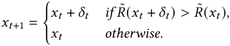

We define the assumptions for the reward landscape and the noise process. 

Assumption 1 (Non-Convex Landscape and Noise). 

- (1) **L-Smoothness:** _The expected reward function 𝑅_ ( _𝑥_ ) _is differentiable and 𝐿-smooth. For all 𝑥,𝑦_ ∈ R_𝑑_ _,_ ∥∇ _𝑅_ ( _𝑥_ ) −∇ _𝑅_ ( _𝑦_ )∥≤ _𝐿_ ∥ _𝑥_ − _𝑦_ ∥ _._ 

- (2) **Bounded Reward:** _The function 𝑅_ ( _𝑥_ ) _is bounded above by 𝑅_∗ _._ 

- (3) **Gaussian Reward Noise:** _The creator observes 𝑅_˜ ( _𝑥_ ) = _𝑅_ ( _𝑥_ ) + _𝜖, where 𝜖_ ∼N (0 _, 𝜉_2 ) _is i.i.d. noise._ 

- (4) **Small Step Size:** _The exploration radius 𝑟 is sufficiently small relative to the noise and smoothness, specifically 𝑟_ · ∥∇ _𝑅_ ( _𝑥_ )∥≪ _𝜉._ 

Theorem 5 (Non-Convex Convergence Rate with Noise). _Under Assumption 1, let_ Δ _𝑅_ = _𝑅_∗ − _𝑅_ ( _𝑥_ 0) _. The expected average squared gradient norm (convergence to a stationary point) after 𝑇 steps satisfies:_ 

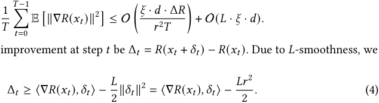

Proof. Let the true improvement at step _𝑡_ be Δ _𝑡_ = _𝑅_ ( _𝑥𝑡_ + _𝛿𝑡_ ) − _𝑅_ ( _𝑥𝑡_ ). Due to _𝐿_ -smoothness, we have the lower bound: 

The update condition is _𝑅_˜ ( _𝑥𝑡_ + _𝛿𝑡_ ) − _𝑅_˜ ( _𝑥𝑡_ ) _>_ 0. Let _𝜖𝑑𝑖𝑓𝑓_ = _𝜖_′ − _𝜖_ ∼N (0 _,_ 2 _𝜉_2 ). The step is accepted if: 

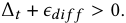

Proc. ACM Meas. Anal. Comput. Syst., Vol. 10, No. 1, Article 12. Publication date: March 2026. 

Yumou Liu, Zhenzhe Zheng, Jiang Rong, Yao Hu, Fan Wu, and Guihai Chen 

12:26 

The probability of acceptance, conditioned on the direction _𝛿𝑡_ , is: 

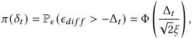

where Φ is the CDF of the standard normal distribution. The expected reward increase at iteration _𝑡_ , taking expectation over both _𝛿𝑡_ and noise, is: 

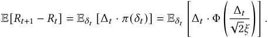

Using Assumption 1.4 (high noise regime/small step), we approximate Φ( _𝑧_ ) ≈<u>1</u> 2+ ~~√~~ _<u>𝑧</u>_ 2 _𝜋_near zero. Let _𝑔𝑡_ = ∇ _𝑅_ ( _𝑥𝑡_ ). Approximating Δ _𝑡_ ≈⟨ _𝑔𝑡,𝛿𝑡_ ⟩ (ignoring the second-order term for the linear coefficient): 

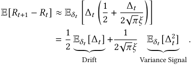

From Eq. equation (4), the first term (Drift) is bounded by −_<u>𝐿𝑟</u>_ 22(since E[⟨_𝑔,𝛿_⟩]= 0). For the second term, dominates by the first-order gradient term: E[Δ _𝑡_2]≈E[⟨_𝑔𝑡,𝛿𝑡_⟩2]. For a vector_𝛿𝑡_uniform on a sphere of radius _𝑟_ in _𝑑_ dimensions, E[⟨ _𝑔𝑡,𝛿𝑡_ ⟩2 ] =_<u>𝑟</u>_ _𝑑_2∥_𝑔𝑡_∥2. Combining these: 

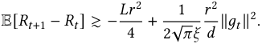

Rearranging to bound the gradient norm: 

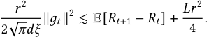

_<u>𝜋𝑑𝜉</u>_ Multiplying by2~~<u>√</u>~~ _𝑟_2 : ∥ _𝑔𝑡_ ∥2 ≲_𝐶_1_𝑑𝜉_ _𝑟_2E[_𝑅𝑡_+1 −_𝑅𝑡_] +_𝐶_2_𝐿𝑑𝜉._ 

Summing over _𝑡_ = 0 _. . .𝑇_ − 1 and dividing by _𝑇_ : 

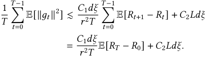

Since _𝑅𝑇_ ≤ _𝑅_∗ , the total gain is bounded by _𝑅_∗ − _𝑅_ 0. Thus, we arrive at the bound in the theorem statement. □ 

**Interpretation:** In non-convex optimization, convergence is measured by the gradient norm tending to zero (finding a local optimum). The bound contains two terms: 

- The first term decays with _𝑇_ , representing the optimization progress. Note that it scales linearly with noise _𝜉_ : higher noise slows down the learning rate. 

- The second term, O( _𝐿𝜉𝑑_ ), is a constant **Noise Floor** . As _𝑇_ →∞, the gradient norm does not vanish but hits this floor. The creator stops improving when the true gradient signal ∥∇ _𝑅_ ( _𝑥_ )∥ becomes comparable to the noise-induced variance. 

Proc. ACM Meas. Anal. Comput. Syst., Vol. 10, No. 1, Article 12. Publication date: March 2026. 

Guiding the Recommender: Information-Aware Auto-Bidding for Content Promotion 

12:27 

This proves that reducing platform uncertainty (decreasing _𝜉_ ) is strictly necessary for creators to refine content beyond a coarse approximation. 

We now establish the direct link between the uncertainty in the platform’s CTR model and the variance of the reward signal, _𝜉_2 , perceived by the creator. The creator’s reward from natural traffic is proportional to the probability of their content winning the user-level auction, which depends on its pCTR, _𝜎_ ˆ. The pCTR can be modeled as the sum of the true underlying CTR, _𝜇𝑖_ , and a zero-mean noise term representing the model’s uncertainty, whose variance is _𝜁𝑖_2. 

The creator’s expected reward is a function of the probability that their pCTR is the highest among all competing items. Assuming the pCTR estimates { ˆ _𝜎 𝑗_ } for competing items follow independent Gaussian distributions, i.e., _𝜎_ ˆ _𝑗_ ∼N ( _𝜇 𝑗,𝜁 𝑗_2), this win probability for creator_𝑖_is: 

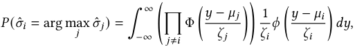

where _𝜙_ (·) and Φ(·) are the PDF and CDF of the standard normal distribution, respectively. 

This formulation reveals that the variance of the creator’s reward is directly influenced by the variances { _𝜁 𝑗_2} of the pCTR estimates. A higher_𝜁_ _𝑖_2,_i.e._, greater uncertainty in the model’s prediction for the creator’s own content—leads to a more volatile and unpredictable reward. Therefore, minimizing the CTR model’s uncertainty (reducing _𝜁_2 ) is equivalent to reducing the reward noise _𝜉_2 in Theorem 5, thereby facilitating more effective creator improvement. 

## **B Additional Details for Section 2.2.1** 

To ensure a fair and controlled comparison in our empirical study (Figure 1), we applied a rigorous set of filtering criteria to sample both the promoted and organic posts from the platform. These criteria were designed to isolate the effect of the "Shutiao" promotion service on posts with a similar initial performance profile. The detailed sampling scope for each group is outlined below. 

## **B.1 Sampling Criteria for Promoted Posts (Treatment Group)** 

A post was included in the treatment group if it met all of the following conditions: 

- **Promotion History:** The post must have been promoted **exactly once** using the "Shutiao" service. It must not have been promoted using any other competitive bidding ad products on the platform. 

- **Campaign Budget:** The expenditure for the single "Shutiao" campaign must have been greater than or equal to 30 units. 

- **Pre-Promotion Performance:** In the period from its publication until the day before the promotion began, the post must satisfy: 

- In-feed clicks > 0 (to ensure it was not completely ignored by the organic system). 

- Total impressions < 50,000. 

- Total clicks < 10,000. 

- Total engagements < 2,000. 

- **Account and Content Type:** The post must **not** be from an enterprise account, a productcentric post, or a post containing direct e-commerce affiliate links. This focuses the study on genuine creator content. 

## **B.2 Sampling Criteria for Organic Posts (Control Group)** 

A post was included in the control group to serve as a comparable baseline if it met all of the following conditions: 

Proc. ACM Meas. Anal. Comput. Syst., Vol. 10, No. 1, Article 12. Publication date: March 2026. 

Yumou Liu, Zhenzhe Zheng, Jiang Rong, Yao Hu, Fan Wu, and Guihai Chen 

12:28 

- **Promotion History:** The post must have **never** been promoted with "Shutiao" or any other competitive bidding ad products. 

- **Pre-Sampling Performance:** To ensure the control group had a similar starting point to the treatment group, the post’s performance from its publication until the day of sampling must satisfy: 

- In-feed clicks > 0. 

- Total impressions < 50,000. 

- Total clicks < 10,000. 

- Total engagements < 2,000. 

- **Account and Content Type:** Similar to the treatment group, the post must **not** be from an enterprise account, a product-centric post, or a post containing direct e-commerce affiliate links. 

## **C On Parameter Alignment for Gradient Coverage** 

In practice, mainstream content platforms continually retrain their pCTR models on a fixed cadence (for example, every few hours or once per day). Our bidding campaigns are scheduled to align with this cadence: a campaign’s horizon is the same as the continual-training period. Consequently, the gradients used by the gradient-coverage surrogate and the gradients estimated at bid time are both computed with respect to the same, current model snapshot (the “anchor” parameters at campaign start). This alignment eliminates the alleged mismatch between _𝜃_ 0 and _𝜃𝑡_ during a campaign. Even in deployments with minor mid-campaign calibrations (such as bias correction or lightweight feature re-scaling), the Gaussian-kernel similarity in gradient space is robust to small parameter drift, and the validation gradient bank can be refreshed at the next campaign boundary. Empirically, we observe negligible differences between using a fixed snapshot versus recomputing within the campaign window, confirming that, under the standard industrial retraining schedule, parameter-point mismatch is not a practical concern. 

## **D Adaptation to Second-Price Auctions** 

Our proposed framework is mechanism-agnostic regarding the valuation of impressions. The core components—the surrogate objective _𝑈_ (S), the gradient coverage calculation, and the confidencegated marginal utility estimation (Δ _𝑡_ )—quantify the intrinsic value of an impression to the model’s learning process. This value exists independently of how the impression is auctioned. 

While the main text focuses on the First-Price Auction (FPA) due to its prevalence in industry and the complexity of bid shading, our framework is easily adapted to Second-Price Auctions (SPA) (e.g., VCG mechanisms). In this section, we derive the optimal bidding strategy for SPA, showing that it results in a simplified linear bidding formula. 

## **D.1 Problem Formulation** 

In a Second-Price Auction, the winner pays the market clearing price (the highest competing bid), denoted as _𝑧𝑡_ . The bidder does not know _𝑧𝑡_ beforehand but knows its distribution or can treat it as a random variable. The goal remains to maximize the total utility (immediate value + uncertainty reduction) subject to a budget constraint _𝐵_ . 

Proc. ACM Meas. Anal. Comput. Syst., Vol. 10, No. 1, Article 12. Publication date: March 2026. 

12:29 

Guiding the Recommender: Information-Aware Auto-Bidding for Content Promotion 

Let _𝑥𝑡_ ∈{0 _,_ 1} be the allocation variable (1 if we win, 0 otherwise). We win if our bid _𝑏𝑡_ ≥ _𝑧𝑡_ . The optimization problem is: 

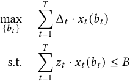

where Δ _𝑡_ is the estimated marginal utility derived in Section 3.2. 

## **D.2 Optimal Bidding Strategy** 

We construct the Lagrangian with a dual variable _𝜆_ ≥ 0 (the shadow price of the budget): 

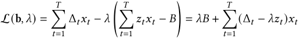

To maximize the Lagrangian at step _𝑡_ , we should win the impression ( _𝑥𝑡_ = 1) if and only if the marginal contribution to the Lagrangian is non-negative: 

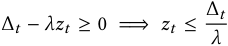

In a Second-Price Auction, truth-telling is dominant with respect to the valuation. Here, our “valuation” is adjusted by the opportunity cost of the budget _𝜆_ . To ensure we win exactly when the market price _𝑧𝑡_ is below our threshold Δ _𝑡_ / _𝜆_ , we simply submit this threshold as our bid: 

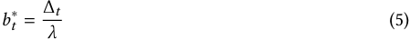

## **D.3 Algorithm Modifications** 

Adapting the proposed two-stage framework to SPA requires two simple changes: 

- (1) **Stage 1 (Pacing):** The update rule for _𝜆_ (Equation 3) remains structurally the same. The dual variable _𝜆_ still increases if the budget is consumed too fast and decreases if consumed too slowly. However, the cost term in the update logic changes from “our bid” to “the second price” (market price). 

- (2) **Stage 2 (Bidding):** The complex inverse-shading optimization used in First-Price scenarios (finding _𝑏𝑡_ to maximize surplus) is replaced by the closed-form linear scaling in Equation (5). 

_Comparison._ In the FPA setting defined in Section 3.2, the bidder must shade their bid _𝑏𝑡 <_ Δ _𝑡_ / _𝜆_ to generate surplus, requiring estimation of the win probability curve _𝑊𝑡_ ( _𝑏_ ). In the SPA setting, the strategy simplifies to bidding the marginal utility deflated by the shadow price. This confirms that our core contribution—accurately estimating Δ _𝑡_ via Gradient Coverage—is robust and transferable across different auction mechanisms. 

## **E Deferred Proof** 

## **E.1 Proof of Theorem 1** 

Proof. Fix _𝑥_ ∈Dval and let _𝑧𝑥_ ∈ _𝑆_ be any nearest neighbor in gradient space, i.e., 

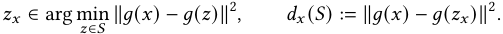

Proc. ACM Meas. Anal. Comput. Syst., Vol. 10, No. 1, Article 12. Publication date: March 2026. 

12:30 

Yumou Liu, Zhenzhe Zheng, Jiang Rong, Yao Hu, Fan Wu, and Guihai Chen 

By PSD order, I _𝛾_ ( _𝑆_ ) ⪰ _𝛾𝐼𝑑_ + _𝑔_ ( _𝑧𝑥_ ) _𝑔_ ( _𝑧𝑥_ )⊤ , hence I _𝛾_ ( _𝑆_ )−1 ⪯� _𝛾𝐼𝑑_ + _𝑔_ ( _𝑧𝑥_ ) _𝑔_ ( _𝑧𝑥_ )⊤�−1 . By Sherman– Morrison [54], 

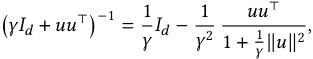

so with _𝑢_ = _𝑔_ ( _𝑧𝑥_ ) we get 

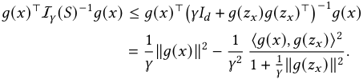

Using the identity ∥ _𝑔_ ( _𝑥_ ) − _𝑔_ ( _𝑧𝑥_ )∥2 = ∥ _𝑔_ ( _𝑥_ )∥2 + ∥ _𝑔_ ( _𝑧𝑥_ )∥2 − 2⟨ _𝑔_ ( _𝑥_ ) _,𝑔_ ( _𝑧𝑥_ )⟩ and rearranging, 

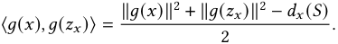

Therefore, on the subset 

_𝐴𝜏_ := � _𝑥_ ∈Dval : _𝑑𝑥_ ( _𝑆_ ) ≤ _𝜏_ � _,_ 

and using the bounds ∥ _𝑔_ ( _𝑥_ )∥≤ _𝐿_ and ∥ _𝑔_ ( _𝑧𝑥_ )∥≥ _𝑚_ , we obtain for _𝑥_ ∈ _𝐴𝜏_ , 

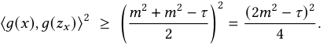

Also, 1 + _𝛾_<u>1</u>∥_𝑔_(_𝑧𝑥_)∥2≤1 +_<u>𝐿</u>_ _𝛾_2. Summing the per-_𝑥_bound over Dvalyields 

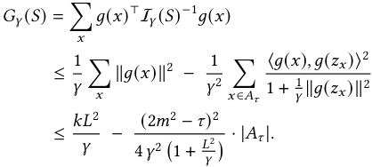

It remains to relate | _𝐴𝜏_ | to _𝑈𝜆_ ( _𝑆_ ). For any _𝑥_ ∈ _𝐴𝜏_ , we have exp(− _𝜆𝑑𝑥_ ( _𝑆_ )) ≥ exp(− _𝜆𝜏_ ), and for _𝑥_ ∉ _𝐴𝜏_ , exp(− _𝜆𝑑𝑥_ ( _𝑆_ )) ≤ exp(− _𝜆𝜏_ ). Hence 

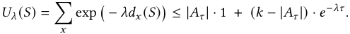

Rearranging gives 

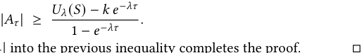

Substituting this lower bound on | _𝐴𝜏_ | into the previous inequality completes the proof. 

## **E.2 Proof of Theorem 2** 

Proof. Noticing that _𝑉_ ( _𝑆_ ) is an additive function, to prove the submodularity of _𝐹_ ( _𝑆_ ), we only need to prove that _𝑈_ ( _𝑆_ ) is submodular. 

**Step 1: Decompose** _𝑈_ ( _𝑆_ ) **:** The function is defined as: 

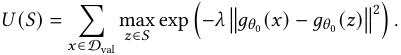

Proc. ACM Meas. Anal. Comput. Syst., Vol. 10, No. 1, Article 12. Publication date: March 2026. 

12:31 

Guiding the Recommender: Information-Aware Auto-Bidding for Content Promotion 

Define a _similarity kernel 𝑘_ ( _𝑥,𝑧_ ) = exp �− _𝜆_ �� _𝑔𝜃_ 0 ( _𝑥_ ) − _𝑔𝜃_ 0 ( _𝑧_ )��2� . Then, for each validation point _𝑥_ , define: 

_𝑓𝑥_ ( _𝑆_ ) = max _𝑧_ ∈ _𝑆__𝑘_(_𝑥,𝑧_)_._ 

Thus, _𝑈_ ( _𝑆_ ) =� _𝑥_ ∈Dval_𝑓_ _𝑥_(_𝑆_). Since a sum of submodular functions is submodular, it suffices to prove that each _𝑓𝑥_ ( _𝑆_ ) is submodular for fixed _𝑥_ . 

**Step 2: Prove** _𝑓𝑥_ ( _𝑆_ ) **is Submodular:** Fix a validation point _𝑥_ ∈Dval. We show _𝑓𝑥_ ( _𝑆_ ) is submodular. For any _𝐴_ ⊆ _𝐵_ ⊆Dtrain and _𝑣_ ∈Dtrain \ _𝐵_ : 

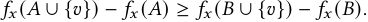

Case 1: _𝑘_ ( _𝑥, 𝑣_ ) ≤ max _𝑧_ ∈ _𝐵 𝑘_ ( _𝑥,𝑧_ ) Since _𝐴_ ⊆ _𝐵_ , we have max _𝑧_ ∈ _𝐴 𝑘_ ( _𝑥,𝑧_ ) ≤ max _𝑧_ ∈ _𝐵 𝑘_ ( _𝑥,𝑧_ ). Righthand side: 

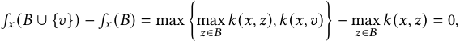

because _𝑘_ ( _𝑥, 𝑣_ ) ≤ max _𝑧_ ∈ _𝐵 𝑘_ ( _𝑥,𝑧_ ). Left-hand side: 

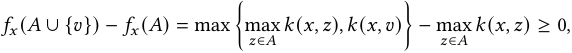

since the max can only increase or stay the same. Thus, 0 ≥ 0 holds. 

Case 2: _𝑘_ ( _𝑥, 𝑣_ ) _>_ max _𝑧_ ∈ _𝐵 𝑘_ ( _𝑥,𝑧_ ) Since _𝐴_ ⊆ _𝐵_ , max _𝑧_ ∈ _𝐴 𝑘_ ( _𝑥,𝑧_ ) ≤ max _𝑧_ ∈ _𝐵 𝑘_ ( _𝑥,𝑧_ ) _< 𝑘_ ( _𝑥, 𝑣_ ). Righthand side: 

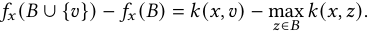

Left-hand side: 

Since max _𝑧_ ∈ _𝐴 𝑘_ ( _𝑥,𝑧_ ) ≤ max _𝑧_ ∈ _𝐵 𝑘_ ( _𝑥,𝑧_ ), we have: 

so the inequality holds. 

Case 3: _𝑘_ ( _𝑥, 𝑣_ ) _>_ max _𝑧_ ∈ _𝐴 𝑘_ ( _𝑥,𝑧_ ) but _𝑘_ ( _𝑥, 𝑣_ ) ≤ max _𝑧_ ∈ _𝐵 𝑘_ ( _𝑥,𝑧_ ) Right-hand side: 

Left-hand side: 

Thus, _>_ 0 ≥ 0 holds. 

In all cases, _𝑓𝑥_ ( _𝐴_ ∪{ _𝑣_ }) − _𝑓𝑥_ ( _𝐴_ ) ≥ _𝑓𝑥_ ( _𝐵_ ∪{ _𝑣_ }) − _𝑓𝑥_ ( _𝐵_ ). 

## **E.3 Proof of Theorem 3** 

Proof. Define the convex per-round loss _ℓ𝑡_ ( _𝜆_ ) := − _𝑓𝑡_ ( _𝜆_ ). Since _𝑓𝑡_ ( _𝜆_ ) is the supremum of affine functions in _𝜆_ , _ℓ𝑡_ is convex, and a valid subgradient at _𝜆𝑡_ −1 is 

Proc. ACM Meas. Anal. Comput. Syst., Vol. 10, No. 1, Article 12. Publication date: March 2026. 

Yumou Liu, Zhenzhe Zheng, Jiang Rong, Yao Hu, Fan Wu, and Guihai Chen 

12:32 

With the negative-entropy mirror map on _𝜆 >_ 0, the multiplicative-weights update is _𝜆𝑡_ = _𝜆𝑡_ −1 exp� _𝜂ℎ𝑡_ / _𝐶_� . Standard online mirror descent (OMD) analysis for scalar _𝜆_ with negative entropy (see, e.g., MWU regret bounds) yields 

where we used _ℎ𝑡_ ≤ _𝐶_ . Rearranging and using _ℓ𝑡_ = − _𝑓𝑡_ gives 

By the envelope theorem, _𝑏𝑡_ ∈ arg max _𝑏 𝑊𝑡_ ( _𝑏_ ) (Δ _𝑡_ − _𝜆𝑡_ −1 _𝑏_ ) implies 

_𝑓𝑡_ ( _𝜆𝑡_ −1) = _𝑊𝑡_ ( _𝑏𝑡_ )� Δ _𝑡_ − _𝜆𝑡_ −1 _𝑏𝑡_ � _._ 

Therefore, 

A standard OMD inequality with negative entropy yields 

Using equation (8), we obtain 

Combining this with equation (6) and equation (7) yields 

By weak duality for the budget-constrained offline optimum, 

Therefore, 

log( _𝜆_ max/ _𝜆_ 0 <u>) 1</u> Finally, with _𝜂_ = √︃ _𝑇 𝐶_, the error terms are_𝑂_�_𝐶_ √︁ _𝑇_ log( _𝜆_ max/ _𝜆_ 0)� , giving the stated bound after taking expectations. □ 

Proc. ACM Meas. Anal. Comput. Syst., Vol. 10, No. 1, Article 12. Publication date: March 2026. 

Guiding the Recommender: Information-Aware Auto-Bidding for Content Promotion 

12:33 

## **E.4 Proof of Theorem 4** 

Proof. First, we consider the update of the dual variable. 

Telescoping from 1 to _𝑇_ , 

Taking expectation: 

## **F Details in Experiments** 

_Experimental Setup of Section 5.1._ We randomly generate 2000 samples with 20 dimensions for binary classification using sklearn as the original dataset. Then, randomly choose 500 samples for the initial training dataset, another disjoint 500 samples as the test dataset, and another disjoint 500 samples as the valid set. The left samples are the candidate dataset to be chosen by the algorithms. Each algorithm chooses 50 sampels from the candidates. 

_Experimental Setup for Section 5.2._ We simulate a repeated auction for 5000 times. In each auction, there is assumed to be one competitor whose bid is sampled uniformly from [0 _,_ 1]. The value of the bidder is assumed to be 1 _._ 5, and the auction mechanism follows the first-price auction. 

_Experimental Setup for Section 5.3._ We randomly generate 500 samples for model training and another 1500 i.i.d. samples as the test set. For each time of ZO gradient estimation, we set _𝜇_ = 0 _._ 01 and uses 10 data samples as a batch. 

_Experimental Setup for Section 5.4._ To evaluate the end-to-end performance of our framework in a realistic, budget-constrained setting, we conduct a comprehensive offline simulation. The experiment utilizes a dataset (either the public Criteo dataset or a synthetic one) that is chronologically partitioned into four disjoint sets: an initial training set (Dinit) to establish a baseline model, a fixed validation set (Dval) used for computing the uncertainty surrogate _𝑈_ (S), a large auction stream (Dauc) for the bidding simulation, and a final held-out test set (Dtest) for evaluation. First, an initial pCTR model, a standard multi-layer perceptron (MLP), is trained on Dinit. We then simulate a sequence of first-price auctions by streaming impressions one-by-one from Dauc. In each auction, all bidding agents compete against each other and a simulated market price to win the impression, subject to an identical total budget, _𝐵_ . We evaluate five distinct strategies: (i) our full **Proposed** method with a balanced objective ( _𝛽_ = 0 _._ 5); (ii-iii) two ablative variants, **Value-Only** ( _𝛽_ = 1) and **Uncertainty-Only** ( _𝛽_ = 0), to isolate the effects of the utility components; and (iv-v) two standard industry baselines, **pCTR-Linear** and **Uniform Bidding** . Crucially, to simulate a practical black-box scenario where direct model gradients are inaccessible, all methods leveraging our framework utilize a Zeroth-Order (ZO) estimator to approximate the necessary loss gradients for the utility calculation. Upon completion of the auction stream, for each bidder, we create an 

Proc. ACM Meas. Anal. Comput. Syst., Vol. 10, No. 1, Article 12. Publication date: March 2026. 

Yumou Liu, Zhenzhe Zheng, Jiang Rong, Yao Hu, Fan Wu, and Guihai Chen 

12:34 

augmented dataset by combining its set of won impressions (Swon) with the initial training set Dinit. A new model is then retrained from scratch on this augmented data. The ultimate effectiveness of each strategy is measured by the AUC and LogLoss of its corresponding retrained model on the final, unseen test set Dtest, which represents future data. 

For reproducibility, we specify the precise hyperparameter configurations used throughout our simulation. The pCTR model is an MLP with two hidden layers of sizes 128 and 64, respectively, each followed by a ReLU activation and a dropout layer with a rate of 0.3. All models are trained using the Adam optimizer with a learning rate of 10−3 for 5 epochs and a batch size of 1024. For the synthesis dataset, the simulation runs over an auction stream of 6,00 impressions, with each bidding agent allocated an identical total budget of _𝐵_ = 6 _,_ 00, while for the Critero dataset, the number of impressions is 2000 and the budget is 2000. The pacing controller for our framework-based methods updates the dual variable _𝜆_ every 100 auctions. For our main **Proposed** method, the objective’s balancing hyperparameter is set to _𝛽_ = 0 _._ 5. The budget pacing mechanism is configured with an initial dual variable _𝜆_ 0 = 0 _._ 01 and a learning rate _𝜂_ = 0 _._ 1 for its multiplicative updates. The Gaussian kernel in the uncertainty surrogate _𝑈_ (S) uses a bandwidth parameter of _𝜆_ kernel = 0 _._ 1. The Zeroth-Order (ZO) gradient estimator, which is critical for our black-box setting, is configured with a smoothing parameter _𝜇_ = 0 _._ 01 and averages its estimate over 5 random direction vectors per computation. The baseline methods are configured as follows: the **Uniform Bidding** agent places a constant bid of 20.0, and the **pCTR-Linear** agent uses a base multiplier of 45.0 for its bids. All experiments were conducted using the PyTorch framework on a GPU-accelerated machine. 

## **F.1 Additional Experimental Results** 

In this section, we supplement the end-to-end offline case study presented in Section 5.4 by providing enlarged visualizations of the experimental results. Due to space constraints in the main text, some details in Figure 7 and Figure 8 were obscured. Figure 9 and Figure 10 present the detailed performance metrics for the Synthesis and Criteo datasets, respectively. These figures offer a clearer view of the final model performance (AUC and LogLoss), the cumulative spending curves demonstrating budget feasibility, and the dynamic evolution of the dual variable _𝜆_ (shadow price) over the course of the auction stream 

Received October 2025; revised December 2025; accepted January 2026 

Proc. ACM Meas. Anal. Comput. Syst., Vol. 10, No. 1, Article 12. Publication date: March 2026. 

Guiding the Recommender: Information-Aware Auto-Bidding for Content Promotion 

12:35 

<!-- Start of picture text -->
Offline End-to-End Evaluation Results 0.8 0.8644 0.8159 Final Model Performance 0.8299 (AUC) 0.8497 0.8094 0.6 0.5706Final Model Performance 0.5425 (LogLoss0.5625) 0.5746 0.5 0.4904 0.6 0.4 0.3 0.4 0.2 0.2 0.1 0.0 0.0 2000 Cumulative Spend Over Time 10104635 Proposed (Value-Only ( Uncertainty-Only ( =0.3)=1) =0) Lambda (Shadow Price) Evolution 1750 1024 1500 1013 12501000750 Proposed (Value-Only (UncertaintUniform BiddingpCTR-Linear BiddingTotal Budgety-Onl=0.3)=1)y ( =0) 101029 10 20 500 10 31 250 10 42 0 0 500 1000 1500 2000 0 500 1000 1500 2000 Auction Number Auction Number Fig. 9. Offline Evaluation on Synthesis Dataset. Offline End-to-End Evaluation Results Final Model Performance (AUC) Final Model Performance (LogLoss) 0.5359 0.5265 0.5187 0.5135 0.5192 0.6563 0.6593 0.6618 0.6615 0.6574 0.5 0.6 0.4 0.5 0.4 0.3 0.3 0.2 0.2 0.1 0.1 0.0 0.0 Cumulative Spend Over Time Lambda (Shadow Price) Evolution 600 1010 Proposed ( Value-Only ( =0.9) =1) 500 108 Uncertainty-Only ( =0) 106 400 104 300 102 200 100 Proposed ( =0.9) 10 2 100 Value-Only ( =1) 0 Uncertainty-Only (Uniform BiddingpCTR-Linear Bidding Total Budget =0) 10 4 0 100 200 300 400 500 600 0 100 200 300 400 500 600 Auction Number Auction Number Proposed (=0.3) Value-Only (=1) Uncertainty-Only (=0) Uniform Bidding pCTR-Linear Bidding Proposed (=0.3) Value-Only (=1) Uncertainty-Only (=0) Uniform Bidding pCTR-Linear Bidding Proposed (=0.9) Value-Only (=1) Uncertainty-Only (=0) Uniform Bidding pCTR-Linear Bidding Proposed (=0.9) Value-Only (=1) Uncertainty-Only (=0) Uniform Bidding pCTR-Linear Bidding AUC Score LogLoss Spend Lambda Value AUC Score LogLoss Spend Lambda Value <!-- End of picture text -->

Fig. 10. Offline Evaluation on Critero Dataset. 

Proc. ACM Meas. Anal. Comput. Syst., Vol. 10, No. 1, Article 12. Publication date: March 2026. 

