# **LiteMoE: Customizing On-device LLM Serving via Proxy Submodel Tuning** 

<mark>Yan Zhuang</mark> 

## <mark>Zhenzhe Zheng</mark> 

<mark>Shanghai Jiao Tong University</mark> 

<mark>Shanghai Jiao Tong University</mark> Shanghai, China zhengzhenzhe@sjtu.edu.cn 

Shanghai, China zhuang00@sjtu.edu.cn 

<mark>Guihai Chen Shanghai Jiao Tong University</mark> Shanghai, China gchen@cs.sjtu.edu.cn 

Fan Wu 

Shanghai Jiao Tong University Shanghai, China fwu@cs.sjtu.edu.cn 

### **ABSTRACT** 

#### **ACM Reference Format:** 

Yan Zhuang, Zhenzhe Zheng, Fan Wu, and Guihai Chen. 2024. LiteMoE: Customizing On-device LLM Serving via Proxy Submodel Tuning. In _ACM Conference on Embedded Networked Sensor Systems (SenSys ’24), November 4–7, 2024, Hangzhou, China._ ACM, New York, NY, USA, 14 pages. https: //doi.org/10.1145/3666025.3699355 

Considering limited on-device resources, current practices are attempting to deploy a system-level mixture-of-experts (MoE)-based foundation LLM shared by multiple mobile apps on a device to support mobile intelligence. However, mobile apps are hard to customize their services that require tuning adapters associated with the LLM using private in-app data. The difficulty arises due to both the limited on-device resources and the restricted control that apps have over the foundation LLM. To address this issue, in this work, we propose LiteMoE, a novel proxy submodel tuning framework that supports mobile apps to efficiently fine-tune customized adapters on devices using proxy submodels. The key technique behind LiteMoE is a post-training submodel extraction method, whereby without additional re-training, we can identify and reserve critical experts, match and merge moderate experts, to extract a lightweight and effective proxy submodel from the foundation LLM for a certain app. We implemented a prototype of LiteMoE and evaluated it over various MoE-based LLMs and mobile computing tasks. The results show that with LiteMoE, mobile apps are able to fine-tune customized adapters on resource-limited devices, achieving 12.7% accuracy improvement and 6.6× memory reduction compared with operating the original foundation LLM. 

### **1 INTRODUCTION** 

Large language models (LLMs) have demonstrated powerful capabilities over various tasks. Diverse applications built upon LLMs have emerged and greatly improved user experience in question answering [42], intent understanding [34], task automation [62], etc. Accordingly, there is a growing trend to deploy LLMs on mobile devices for low-latency model responses and privacy-preserving model services [36, 62, 68]. To facilitate smooth user experience on resource-constrained mobile devices, current practices propose to deploy an LLM at the system level as a foundation backbone shared by various mobile applications [1, 67], which can relieve ondevice resource pressure by avoiding developing individual LLMs for each app. To further improve resource efficiency, the LLM usually adopts sparsely activated architectures ( _i.e._ , mixture-of-experts, MoE) [28, 30, 66] which only activates a small subset of parameters for inference at a time instead of the entire LLM. 

However, a shared foundation LLM fails to provide customized services for various mobile apps. Although the foundation LLM has general capabilities, different apps require distinct specialized abilities to enhance the quality of user experience. For example, personal assistants aim to understand user intent and plan actions, while note apps focus on text summarization and generation. This customized ability can be achieved by inserting app-specific adapters [23] ( _i.e._ , small trainable modules) into the foundation LLM to enhance its abilities. However, these customized adapters require on-device inapp data including user behavioral or environmental data for finetuning and updating, which is very privacy-sensitive and can hardly be transferred to the cloud (or foundation LLM service providers) for training. On the other hand, on-device training these app-managed adapters preserves user privacy, but is hindered by the limited computation and memory resources. Additionally, under the existing LLM-inference-as-a-system-service paradigm, mobile apps have no control over the system-managed foundation LLM, and thus cannot effectively apply advanced algorithms [38, 71] that need visibility to internal model structures or intermediate execution results. 

### **CCS CONCEPTS** 

• **Human-centered computing** → **Ubiquitous and mobile computing** ; • **Computing methodologies** → **Machine learning** . 

### **KEYWORDS** 

Customized LLM Serving, On-Device LLM Fine-Tuning, Mixture of Experts 

Permission to make digital or hard copies of all or part of this work for personal or classroom use is granted without fee provided that copies are not made or distributed for profit or commercial advantage and that copies bear this notice and the full citation on the first page. Copyrights for components of this work owned by others than the author(s) must be honored. Abstracting with credit is permitted. To copy otherwise, or republish, to post on servers or to redistribute to lists, requires prior specific permission and/or a fee. Request permissions from permissions@acm.org. _<mark>SenSys ’24, November 4–7, 2024, Hangzhou, China</mark>_ 

© 2024 Copyright held by the owner/author(s). Publication rights licensed to ACM. ACM ISBN 979-8-4007-0697-4/24/11...$15.00 https://doi.org/10.1145/3666025.3699355 

521 

SenSys ’24, November 4–7, 2024, Hangzhou, China 

Yan Zhuang, Zhenzhe Zheng, Fan Wu, and Guihai Chen 

In this work, we propose a novel proxy submodel tuning framework, namely LiteMoE, to support mobile apps in efficiently training and updating adapters on devices. Specifically, for a given mobile app, LiteMoE efficiently generates a submodel specialized for the app’s targeted downstream tasks, which acts as a proxy to the system-level foundation LLM. The app has full control over this submodel to tune customized adapters with the latest user data. The resulting adapters can further be seamlessly integrated back into the foundation LLM for later customized model serving. 

The key of LiteMoE is to _efficiently generate lightweight proxy submodels on devices from the system-level foundation LLM._ Specifically, the generated submodels should satisfy: (1) efficiency: submodels should be lightweight to fit into an app’s context memory on devices. (2) effectiveness: a submodel should be able to inherit specific abilities from the foundation LLM, and thus can act as a good proxy to fine-tune customized adapters. Existing model compression techniques, including generic methods such as model pruning [20] and distillation [22], and MoE-specific methods such as expert layer distillation [65] and quantization [18], though effective to scale down LLMs, are not designed for on-device settings with limited hardware resources and massive apps, as they require resource-intensive re-training processes. 

To achieve this goal, LiteMoE focuses on compressing sparse MoE layers, as they constitute the majority of model parameters and memory footprint. The key observation is that, though multiple experts significantly enhance LLM performance, not all experts are equally important for a specific downstream task. This is because the experts are trained to handle different subspaces of the overall feature space, excelling at distinct tasks. Therefore, we can compress the sparse MoE layers by removing the non-critical experts. 

Nonetheless, refining experts raises two design challenges. First, modeling expert-task correlations and then evaluating expert importance is difficult. MoE-based LLMs typically contain tens to thousands of experts [17, 48] that collectively handle a wide range of mobile computing tasks. Within this vast expert-task space, identifying the capability of a specific expert and assessing its importance with respect to a targeted task is a non-trivial problem. Second, simultaneously meeting the requirements of compact model sizes and effective LLM proxies is difficult. Experts are trained to collaborate for achieving superior LLM performance over various tasks. Simply removing any expert could lead to performance degradation, making it challenging to create effective proxy submodels under stringent on-device resource constraints. 

To overcome the above challenges, LiteMoE features a _posttraining submodel extraction (PTSE)_ technique that efficiently extracts proxy submodels from the foundation LLM without necessitating additional model re-training. PTSE contains two main components: _important expert identification_ and _selective expert merging_ . In the first component, we identify that the routers within MoE layers can act as key indicators for modeling expert-task correlations. The statistics of router outputs ( _i.e._ , the probability of dispatching tokens from a certain task to various experts) imply informative patterns about this correlation, thereby can be leveraged to estimate the expert importance. Then, to avoid inferring the heavy foundation LLM to obtain router outputs across different MoE layers, we reveal a strong correlation between router outputs across layers, and design a lightweight predictor to directly derive the 

router outputs at deep layers from those at shallow layers. In the second component, using the predicted importance scores, we remove the unimportant experts and merge the moderate experts into the critical experts to generate lightweight but effective submodels. We first introduce an expert matching method to identify the experts with similar abilities, guaranteeing their merging to create performance-enhanced experts. Then, to merge the knowledge of the matched experts, we introduce an expert merging method that first aligns the hidden representations of the experts, and then applies importance-aware parameter aggregation, thereby reducing model sizes but still preserving performance. 

We have implemented a prototype of LiteMoE on modern edge devices with various hardware resources, including high-end devices like NVIDIA Jetson Nano (GPU) and low-end devices like Raspberry Pi 4B (CPU). We evaluate LiteMoE through extensive experiments across 3 MoE-based LLMs and 8 representative mobile computing tasks. The results show that LiteMoE is able to generate proxy submodels in around a minute, which preserves over 90% of the performance of the foundation LLM with up to 6 _._ 6× model size reduction. With these proxy submodels, mobile apps can tune or update their customized adapters, achieving 12.7% performance gains for on-device LLM services. 

For the first time, LiteMoE addresses the issue of on-device finetuning system-level LLMs, enabling on-device LLMs to provide more customized and resource-efficient services. We summarize the contributions of this work as follows: 

- We propose a novel proxy submodel tuning framework for mobile apps to access proxy submodels of the system-level foundation LLM, facilitating efficient on-device LLM fine-tuning for customized LLM services. 

- We study the intrinsic characteristics of experts and tasks, and design a post-training submodel extraction approach without additional model training by dynamically identifying, matching, and merging experts within MoE-based LLMs. Thus, we are able to obtain specialized submodels on the fly with affordable on-device resource overhead. 

- We prototype LiteMoE and comprehensively evaluate its performance on off-the-shelf devices. The results demonstrate the effectiveness of our approach and the potential in facilitating the quality of service of on-device LLMs. 

### **2 BACKGROUND AND MOTIVATION** 

### **2.1 Serving LLMs on Edge Devices** 

**On-device LLMs.** Large language models (LLMs) represented by ChatGPT [42], Llama 2 [58], GPT-4 [6], Gemini [55], etc., have largely changed the landscape of mobile intelligence applications, benefiting from their superior capabilities in taking various modalities and solving a wide range of tasks. Taking the personal assistant as a representative example [34], LLM-powered smart agents on devices significantly advance the ability of user intention understanding, tool using, and mobile task automation. Therefore, on-device LLMs serving is an important step towards democratizing mobile intelligent applications due to its advantages of privacy protection, cost efficiency, and availability. 

To improve the usability of on-device LLM, existing works have made remarkable progress in both algorithms and hardware. For 

522 

SenSys ’24, November 4–7, 2024, Hangzhou, China 

LiteMoE: Customizing On-device LLM Serving via Proxy Submodel Tuning 

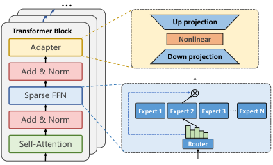

<!-- Start of picture text -->
… Up projection Transformer Block Nonlinear Adapter Down projection Add & Norm Sparse FFN Expert 1 Expert 2 Expert 3 … Expert N Add & Norm Self-Attention Router <!-- End of picture text -->

**Figure 1: Illustration of sparse Transformers and parameterefficient adapters inserted into the Transformer blocks.** 

example, various compact LLM architectures (such as Gemma [27], TinyLLaMA [57], MobileLLM [36], etc.) are proposed to fit in limited on-device memory. Edge hardware vendors also presented specific hardware and development kits to support on-device LLMs, including Qualcomm Snapdragon 8gen3 [5], NVIDIA IGX Orin platform [41], and Intel’s support on LLM inference on CPUs [49]. **On-device LLM serving.** As AI-powered mobile apps grow rapidly, maintaining each app an independent LLM is not feasible due to limited on-device resources. A promising way is to employ a unified foundation LLM on a device to serve various mobile apps [67, 68], termed a model-as-a-system-service paradigm. This paradigm has been made possible by the recent advances of LLMs that have emerged with powerful generic capabilities to support various downstream tasks with a single LLM backbone. Due to the appindependent nature, this foundation LLM can be managed by the operating system (OS), and expose service APIs for mobile apps to invoke. Apps can send texts ( _i.e._ , prompts) to query the foundation LLM via service APIs, and get responses generated by the LLM. A representative example of this paradigm is AICore [1], a system service proposed by Google that provides access for mobile apps to Gemini Nano [55] on the device. It also provides limited flexibility to fine-tune the foundation LLM for apps via the LoRA method [25]. Apple [3] also provides toolkits to help developers integrate on-device LLM inference into mobile apps. 

### **2.2 Customizing On-Device LLM Serving** 

**Large language model adapters.** To provide app-specific customized model services, apps can provide adapters to interact with the foundation LLM [23, 25]. Here we briefly introduce LLM adapters for parameter-efficient fine-tuning (PEFT) [13, 23]. Adapters are independent trainable modules inserted into the foundation LLM to enhance its ability on specific tasks. The main purpose of employing adapters is two-fold: (1) the first is to reduce tunable parameters when fine-tuning foundation LLMs to downstream tasks. (2) the second is to tackle system challenges such as limited on-device memory and computation resources. With adapters, fine-tuning LLM on devices becomes possible. 

We show a popular kind of Transformer adapters in Figure 1. An adapter typically comprises a down-projection layer followed by a non-linear layer and an up-projection layer. After forwarding through these layers, the hidden states are further added via a residual connection. As such, the function of an adapter can be expressed as: _ℎ_ ← _𝑓_ ( _ℎ𝑊𝑑𝑜𝑤𝑛_ ) _𝑊𝑢𝑝_ + _ℎ_ , where _ℎ_ is the hidden 

states, and _𝑊𝑑𝑜𝑤𝑛_ and _𝑊𝑢𝑝_ are weight matrices of the adapter. When fine-tuning LLMs with downstream data, the foundation LLM is frozen, and only parameters in the adapters are trainable. As the adapters only have less than 1% parameters compared to the foundation LLM [23, 25], the memory and computation required for fine-tuning can be dramatically reduced. The rationale behind this lightweight adapter design is that the foundation LLM is powerful enough with its world knowledge, and the adapters only need to encode task-specific representations to enhance the foundation LLM in the targeted downstream tasks. 

**Motivation of proxy submodel tuning.** To customize LLM services for the targeted tasks, apps could fine-tune adapters with inapp data collected during user-app interaction. This data is highly privacy-sensitive, making it unsuitable to send to the cloud server for tuning. Thus, on-device tuning is a potential solution. However, existing methods are still hard to achieve due to the following challenges. (i) The system-managed foundation LLM is a black box for mobile apps. That is, apps could only use inference APIs to interact with the foundation LLM, while having no visibility and control over its internal architecture or intermediate execution results. This hinders apps from applying various adaptation methods such as inserting modules into the LLM. Moreover, different downstream tasks prefer different kinds of PEFT algorithms and hyperparameters [8, 71], which is also difficult to operate under the current paradigm. (ii) Even with adapters, the resource overhead of on-device fine-tuning the foundation LLM is still prohibitively expensive. This is because storing the LLM parameters alone already takes up a large amount of memory budget, leaving little capacity for training requirements such as storing activations, gradients, and intermediate states of optimizers [32, 46]. Therefore, this fine-tuning process is highly limited by the large-scale LLM, and could face complex parameter offloading and I/O scheduling problems [30, 66], which have not been fully solved in the on-device fine-tuning scenario. 

To tackle the above issues, we propose a proxy submodel tuning paradigm to enable mobile OS to dynamically expose lightweight and specialized submodels to apps. These submodels are extracted from the system-level foundation LLM, acting as effective proxies to the foundation LLM with respect to certain downstream tasks. This paradigm brings the following benefits: (1) the submodels are lightweight and tailored for the current apps, and thus can act as the role of LLM for customized fine-tuning with much less resource overhead. (2) With this paradigm, mobile apps have full control over the submodel, and thus can flexibly employ various PEFT algorithms for fine-tuning. Once the fine-tuning process has finished, the obtained adapters within the submodel could be sent back to and seamlessly integrated into the foundation LLM. As such, this paradigm is able to offer efficient and effective on-device LLM fine-tuning for customized LLM services. 

### **2.3 MoE-based LLMs and Opportunities** 

**MoE-based LLMs.** The sparsely-activated MoE architecture is well-suited for edge devices, as it not only enjoys the model performance gains brought by the large model size [29], but also avoids correspondingly increased computation overhead. For example, 

523 

SenSys ’24, November 4–7, 2024, Hangzhou, China 

Yan Zhuang, Zhenzhe Zheng, Fan Wu, and Guihai Chen 

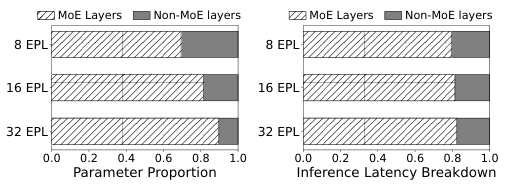

<!-- Start of picture text -->
MoE Layers Non-MoE layers MoE Layers Non-MoE layers 8 EPL 8 EPL 16 EPL 16 EPL 32 EPL 32 EPL 0.0 0.2 0.4 0.6 0.8 1.0 0.0 0.2 0.4 0.6 0.8 1.0 Parameter Proportion Inference Latency Breakdown <!-- End of picture text -->

**Figure 2: Cost breakdown of MoE-based LLMs. “EPL” indicates** **~~Exper~~ ts Per (sparse FFN) Layer.** 

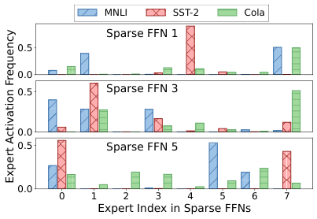

<!-- Start of picture text -->
MNLI SST-2 Co la Sparse FFN 1 0.5 0.0 0.5 Sparse FFN 3 0.0 0.5 Sparse FFN 5 0.0 0 1 2 3 4 5 6 7 Expert Index in Sparse FFNs Expert Activation Frequency <!-- End of picture text -->

**Figure 3: Expert activating frequencies in different downstream tasks in the 1st, 3rd, and 5th sparse FFN.** 

GLaM [14] augmented with MoE achieves around 7 times of parameters than GPT-3, while it only consumes 1/3 of energy for training, and requires 1/2 of computation FLOPs for inference. This comes from the MoE’s advantage of conditional computation, where for each token only a small subset of parameters are activated for inference or training. 

As shown in Figure 1, the MoE architecture is typically employed to replace dense FFN layers inside Transformer blocks of LLMs. A common MoE-based sparse FFN comprises a set of experts, each of which is also a FFN, and an independent router module. For each input token, the router decides which expert to activate out of all potential experts. Formally, the function of a sparse FFN with respect to input token _𝑥_ can be formulated as: 

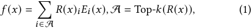

where _𝐸𝑖_ ( _𝑥_ ) is the function of the _𝑖_ th expert, and _𝑅_ ( _𝑥_ ) denotes the router function. 

**Observation 1: sparse FFNs dominate resource costs.** Despite the benefits of MoE-based sparse FFNs, they have much higher memory and time costs compared to other layers within LLMs. Taking Switch Transformers [17] as an example, we break down these costs in Figure 2. (i) There are more than half of the parameters of LLMs are within sparse FFNs, and the portion increases with the number of experts. For example, sparse FFNs each with 32 experts take up 89.7% of the parameters of the LLM. (ii) Executing sparse FFNs on devices also brings high latency regardless of conditional computation. This is because the device is hard to hold all parameters in memory, thus introducing additional I/O costs for loading expert parameters from disks [30, 66]. Therefore, it is 

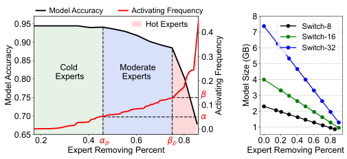

<!-- Start of picture text -->
Model Accuracy Activating Frequency 8 0.95 Hot Experts Switch-8 0.4 7 Switch-16 0.90 6 Switch-32 0.85   Cold  Moderate 0.3 5 0.80 Experts   Experts 0.2 4 0.75 β 3 0.1 2 0.70 α 0.0 1 0.65 0.2 0.4 αp 0.6 βp 0.8 0.0 0.2 0.4 0.6 0.8 Expert Removing Percent Expert Removing Percent Model Accuracy Model Size (GB) Activating Frequency <!-- End of picture text -->

**Figure 4: Model accuracy (left) and model size (right) under different expert removing percentages.** 

critical to optimize the sparse FFNs to reduce costs for on-device model execution and fine-tuning. 

**Observation 2: expert activating frequencies are unbalanced and dynamic.** As shown in Figure 3, we analyze the Switch Transformer with 8 experts per sparse FFN (denoted as Switch-8), and visualize expert activating frequencies across several downstream tasks. We have two observations. (i) First, not all experts are equally activated, reflected in highly unbalanced activating frequencies for a given downstream task. For example, for the multi-genre natural language inference (MNLI) task, there are 38.5% of experts on average are barely used, and only 19.8% of experts are “heavy-hitters” that are very frequently activated. Other sparse models exhibit similar statistics: Switch-16 and Switch-32 have 40.1%, 36.2% cold experts and 18.2%, 23.7% heavy-hitter experts, respectively. (ii) Second, expert activating frequencies are also different across tasks, following strong task-specific patterns. For example, there are only 26.3% of heavy-hitter experts overlap between the MNLI task and the CoLA task. Intuitively, although MoE-based LLMs are trained to have general abilities, the experts within sparse layers are only trained to handle different subsets of tokens, and thus specialize in different abilities. Note that the heavy-hitter experts could also change dynamically, as users could switch mobile apps in use or focus on different target downstream tasks. 

**Opportunities in generating lightweight proxy submodels.** Based on the task-specific sparse activating patterns of sparse FFNs, we have opportunities to extract lightweight submodels for downstream tasks that the current apps focus on. A naive solution is to simply remove the experts with low activating frequencies. However, our preliminary experiments reveal that this way cannot scale down the large LLM while preserving specific abilities simultaneously. The resulting submodel is not a good proxy for the large LLM, and thus could compromise the effectiveness of tuning customized adapters. Specifically, in Figure 4, we show the relation between the percentage of simply removed experts and the resulting model performance. The removal percentage could be roughly divided into 3 regions: (i) cold experts: in the left region with activating frequency less than a threshold _𝛼_ . Removing cold experts has a negligible impact on the model performance. (ii) moderate experts: in the middle region with activating frequency range from _𝛼_ to _𝛽_ . As more experts are removed, those with moderate activating frequencies but not critical ones are removed. This leads to a gradual decline in model performance as the number of removed experts increases. (iii) hot experts (heavy hitters): once the removal rate 

524 

SenSys ’24, November 4–7, 2024, Hangzhou, China 

LiteMoE: Customizing On-device LLM Serving via Proxy Submodel Tuning 

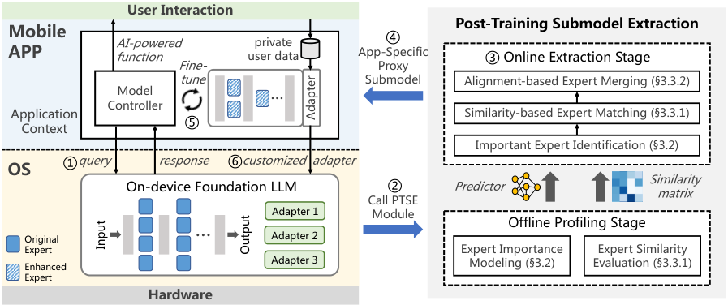

<!-- Start of picture text -->
User Interaction Post-Training Submodel Extraction Mobile ④ AI-powered private APP function Fine- user data App-SpecificProxy ③ Online Extraction Stage tune Submodel Alignment-based Expert Merging (§3.3.2) ControllerModel … Application Similarity-based Expert Matching (§3.3.1) Context ⑤ Important Expert Identification (§3.2) ①query response ⑥customized adapter OS On-device Foundation LLM ② Predictor Similarity matrix Call PTSE Adapter 1 Module Offline Profiling Stage Original … Adapter 2 Expert Expert Importance Expert Similarity Enhanced Adapter 3 Modeling (§3.2) Evaluation (§3.3.1) Expert Hardware Adapter Input Output <!-- End of picture text -->

**Figure 5: Overview of LiteMoE framework.** 

surpasses the _𝛽𝑝_ point, where some heavy hitters are removed, the model performance is significantly impaired. To conclude, the simple expert removing method either lies in the left region, achieving only limited compression rates, or moves into the middle-right region, where model performance deteriorates significantly. Either way fails to produce a lightweight and effective proxy submodel. 

To tackle this issue, our idea is to reach, even surpass the removing percentage of the _𝛽𝑝_ point while keeping model performance in the left region at the same time. This could be achieved by first judiciously identifying experts within different groups with respect to the targeted tasks, and then removing cold experts, selectively transferring the knowledge of the moderate experts to the heavyhitter experts by a newly designed expert merging method. Finally, we only retain the enhanced heavy-hitter experts, obtaining a lightweight and effective proxy submodel for mobile apps to further train customized adapters. 

### **3 DESIGN OF LITEMOE** 

### **3.1 Overview** 

LiteMoE is an on-device LLM tuning framework that enables mobile apps to continuously fine-tune customized adapters on resourcelimted devices. Figure 5 shows the general working pipeline of LiteMoE. Given a query from a mobile app ( 1 _○_ ), LiteMoE responds with a proxy submodel extracted from the system-level foundation LLM using _Post-Training Submodel Extraction (PTSE)_ ( _○_ 2 - 4 _○_ ). The proxy submodel is specifically tailored according to the targeted tasks of this app. The app can further fine-tune or update its customized adapters with this proxy submodel using the fresh data collected during user-app interaction ( 5 _○_ ). The customized adapters can be inserted back into the foundation LLM to provide better user experience ( _○_ 6 ), while the memory of the proxy submodel can be released once the fine-tuning process is complete. 

The key to the success of this pipeline is to generate a sufficiently good proxy submodel, which is achieved by our post-training submodel generation module. This module works with an offline stage and an online stage. In the offline stage, we profile expert characteristics via _Expert Importance Modeling_ and _Expert Similarity_ 

_Evaluation_ , to prepare for the online proxy submodel extraction process. This stage only corresponds to the foundation LLM, and thus can be performed on the cloud. In the online stage, when LiteMoE receives an app query, it first conducts _Important Expert Identification_ that evaluates experts’ importance scores with respect to the targeted downstream tasks of this app. Then, LiteMoE identifies the heavy-hitter experts to keep in the submodel, and removes the other experts. To recover performance drops due to the removed experts, it further carries out selective expert merging by first matching removed experts to the retained experts according to their similarities with _Similarity-based Expert Matching_ , and then performing _Alignment-based Expert Merging_ to aggregate the parameters of the removed experts into the retained experts. As such, the retained experts are further enhanced, and thus the resulting lightweight submodel can effectively preserve specific abilities from the large foundation LLM. 

### **3.2 Customized Expert Identification** 

To generate a proxy submodel, we first need to identify important experts within sparse FFN layers for the targeted task. We formally define the importance score of the expert _𝑘_ with respect to a given task _𝐷 𝑗_ as its overall activation probability under the inputs of this task, _i.e._ , _𝑃_ ( _𝐸𝑘_(_𝑙_)|_𝐷𝑗_). We can use the activation frequency deter- mined by the router outputs to estimate this probability. As such, the importance score of expert _𝑘_ can be written as: 

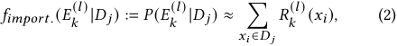

where _𝑅_ ( _𝑥𝑖_ ) is the router outputs ( _i.e._ , routing probabilities) with respect to token _𝑥𝑖_ . However, _𝑅_(_𝑙_) (·) can only be obtained by forwarding inputs to the LLM and calculating the router outputs of sparse FFNs layer by layer. A naive way is to feed all user data to the foundation LLM to get the routing probabilities, but this method incurs large extra computation overhead, and could break on-device resource limitations. Therefore, to calculate the expert importance, a lightweight and precise prediction method is needed. 

Fortunately, we observe that router outputs of different sparse FFNs exhibit strong cross-layer correlations, based on which we can 

525 

SenSys ’24, November 4–7, 2024, Hangzhou, China 

Yan Zhuang, Zhenzhe Zheng, Fan Wu, and Guihai Chen 

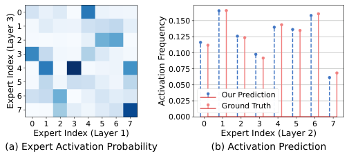

<!-- Start of picture text -->
0 0.150 1 2 0.125 3 0.100 4 0.075 5 0.050 6 Our Prediction 0.025 7 Ground Truth 0.000 0 1 2 3 4 5 6 7 0 1 2 3 4 5 6 7 Expert Index (Layer 1) Expert Index (Layer 2) (a) Expert Activation Probability (b) Activation Prediction Expert Index (Layer 3) Activation Frequency <!-- End of picture text -->

**Figure 6: Cross-layer correlation of activating experts, and the prediction results based on this property. This experiment uses a Switch Transformer with 8 experts in each sparse FFN and GLUE benchmark.** 

avoid inferring the large foundation LLM to obtain experts’ importance scores. The correlation reveals that a subset of experts located across different sparse FFNs tends to be activated simultaneously in response to the same input tokens. Figure 6 (a) exemplifies this correlation, with deeper colors representing a higher probability of activating the corresponding experts. We can observe that the experts activated in the 3rd sparse FFN are highly conditioned on those in the 1st sparse FFN. For instance, a token that activates expert 3 in the sparse FFN 1 is very likely to also activate expert 4 in the sparse FFN 3, with a probability of _𝑃_ ( _𝐸_ 4(3) | _𝐸_ 3(1) ) = 75 _._ 4%. Additionally, Figure 6 (b) demonstrates that the router output distribution of the 1st sparse FFN encodes sufficient information to predict the routing probability of deeper sparse FNNs with high precision. Therefore, we first model this correlation using a function F : _𝑅_(1) → _𝑅_(_𝑙_) . Then, for a given input _𝑥_ , the routing probability of _𝑅_(_𝑙_) can be predicted as _𝑅_ˆ(_𝑙_) ( _𝑥_ ) = F ( _𝑅_(1) ( _𝑥_ )). Thus, the overall expert importance with respect to _𝐷 𝑗_ can be calculated as: 

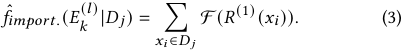

**Cross-layer expert correlation modeling.** To learn the function F , we employ a compact predictor, _i.e._ , a two-layer MLP, to predict the routing probability for each sparse FFN within the foundation LLM. The predictor adopts a multi-head model structure, where each output head predicts the routing probability of a certain sparse FFN. This design not only reduces the size of the predictor, but also can enhance prediction accuracy benefiting from the multi-task learning regime. 

To train this predictor, we further generate a synthetic dataset with routing probabilities of the first sparse FFN ( _𝑅_(1) ) as input features, and routing probabilities of the other sparse FFNs ( _𝑅_(_𝑙_) ) as labels. This routing dataset can be collected using public data on the cloud server during LLM pre-training. We adopt a distillation loss with an additional Kullback-Leibler (KL) divergence term adding to the final loss function [22]. This approach leverages the complete distribution information within the routing probabilities, rather than solely relying on the final expert activating results, which are the top-1 results of the routing probabilities. Essentially, we distill knowledge from multiple routers across different sparse FFNs, 

and integrate this information to develop a precise yet compact predictor that models cross-layer expert correlations. **Online customized expert identification.** In the online stage, we combine the trained predictor with shallow layers of the foundation LLM (up to the first sparse FFN), forming an end-to-end predictor. With this end-to-end predictor, the expert importance scores with respect to a given mobile app are obtained as follows. First, the app _𝑗_ calculates the routing probability _𝑅_(1) ( _𝑥𝑖_ ) using sampled app-specific private data _𝐷 𝑗_ collected during user interaction, and then leverages the predictor to calculate experts’ importance scores following Equation (3). Second, the predicted expert importance scores which encode the information of targeted tasks are returned to OS to assist in later proxy submodel extraction. Note that the above processes are resource-friendly, as the end-to-end predictor has less than 1% of parameters compared to the foundation LLM, and only parameters of the multi-head MLP are additional. 

### **3.3 Selective Expert Merging** 

Based on the distribution of expert importance for a specific mobile app, LiteMoE is able to customize a proxy submodel for this app as follows. First, given a aparse FFN, we denote its expert set as E = { _𝐸_ 1 _, . . . , 𝐸𝑛_ }, where _𝑛_ is the total number of experts within this layer. We divide E as two subsets T and R, where T = { _𝑓𝑖𝑚𝑝𝑜𝑟𝑡._ ( _𝐸𝑖_ ) _> 𝛼_ | _𝐸𝑖_ ∈E} represents the experts whose importance scores larger than a pre-defined threshold value _𝛼_ , and R = E/T denotes the remaining experts. We can directly remove experts in R, as these experts have negligible contributions to the model performance with respect to the targeted task (Section 2). 

Second, the importance scores of the experts within T are biased, leaving an opportunity to further improve the parameter efficiency of sparse FFNs. Specifically, only several experts (even only one in some cases) are heavy hitters which deal with most incoming tokens, and are dominant to the overall model performance. We denote the heavy-hitter experts within the sparse FFN as T _ℎ_ = { _𝑓𝑖𝑚𝑝𝑜𝑟𝑡._ ( _𝐸 𝑗_ ) _> 𝛽_ | _𝐸 𝑗_ ∈T }1 . The remaining experts within T have moderate importance, denoted as T _𝑟_ = T/T _ℎ_ , where removing them would impair model performance to some extent. Decisions of whether to keep these experts form a Pareto frontier indicating the tradeoff between model performance and resource costs. 

Our goal is to remove the experts in T _𝑟_ to further compress the proxy submodel without compromising performance. Inspired by model ensembling techniques [39, 40], we propose _selective expert merging_ to integrate the expert knowledge into fewer, enhanced experts. Specifically, we judiciously merge the parameters of the experts in T _𝑟_ with those in T _ℎ_ . The merged experts can inherit their original abilities while also being enhanced with the abilities of other experts, allowing them to serve targeted tasks independently. 

To achieve this goal, two challenges arise: (i) how to determine the expert mapping from T _𝑟_ to T _ℎ_ . The reason behind this purpose is that experts exhibit token-level or task-level specializations after model training [17, 72], and have different abilities from each other to varying degrees. Merging two or more experts with quite distinct specializations into one could harm the resulting expert’s ability, 

> 1 _𝛼_ and _𝛽_ are hyperparameters that can be tuned according to performance requirements. We perform sensitivity analysis with respect to these two hyperparameters and provide the guideline for the selection of their values in Section 4.5. 

526 

SenSys ’24, November 4–7, 2024, Hangzhou, China 

LiteMoE: Customizing On-device LLM Serving via Proxy Submodel Tuning 

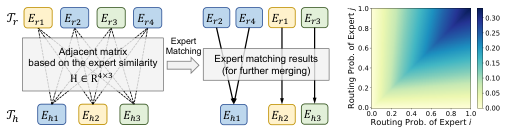

<!-- Start of picture text -->
��� 𝒯" 𝐸%" 𝐸%# 𝐸%$ 𝐸%& 𝐸%# 𝐸%& 𝐸%" 𝐸%$ ��� �������� Adjacent matrix MatchingExpert ��� ���� based on the expert similarityH ∈R !×# Expert matching results(for further merging) ��� �������� ��� ���� 𝒯! 𝐸!" 𝐸!# 𝐸!$ 𝐸!" 𝐸!# 𝐸!$ ��������������������������������� ��� ��� ��� ��� � ���� ������������������������ � <!-- End of picture text -->

**Figure 7: (Left) Illustration of similarity-based expert matching. (Right) The similarity metric based on routing probabilities (** _𝜅_ = 0 _._ 2 **).** 

leading to poor model performance. (ii) How to effectively merge expert parameters given two or more source experts to be merged. Simply averaging the parameters of the experts fails to preserve expert abilities, as the experts are initialized and trained separately, therefore their parameters do not have one-to-one correspondence for effective merging. 

To overcome the above challenges, the selective expert merging technique comprises two steps: _similarity-based expert matching_ and _alignment-based expert parameter merging_ . The former step matches experts in T _𝑟_ to experts in T _ℎ_ based on their similarity in abilities exhibited during model training and inference. The latter step merges the matched experts into one by first aligning their neurons to have aligned hidden representations, and then employing importance-aware weighted averaging to their parameters. 

_3.3.1 Similarity-based expert matching ._ The experts within a sparse FFN are trained by different subsets of the corpus, typically sharing some common knowledge while developing distinct abilities, similar to multi-task learning. Therefore, the key to merging experts into one is to merge the experts with high similarities to further enhance their ability, while mitigating the interference of noises or conflict knowledge from experts with large discrepancies. 

To this end, given expert sets T _𝑟_ and T _ℎ_ , we can formulate the similarity-based expert matching problem as a weighted bipartite matching problem as follows. Consider a weighted bipartite graph _𝐺_ = (T _𝑟 ,_ T _ℎ,_ D), where T _𝑟_ , T _ℎ_ represent the two sets of vertices to be matched, and D denotes edges with weights _𝐻_ defined by expert similarities (illustrated in Figure 7). The problem is to find a subgraph _𝑆_ ⊆ _𝐺_ representing the matching from the experts in T _𝑟_ to T _ℎ_ that maximizes the overall similarity. We denote a column vector _𝑋_ ∈ R|T_𝑟_|·|T_ℎ_| of 0-1 variables to represent expert matchings, with _𝑥𝑖𝑗_ = 1 indicating expert _𝑖_ is matched to expert _𝑗_ . The constrained matching problem can be expressed as: 

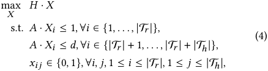

where A is the incident matrix of the bipartite graph [7]. The first constraint denotes that each noncritical expert ( _𝐸𝑖_ ∈T _𝑟_ ) can only be merged into one critical expert ( _𝐸 𝑗_ ∈T _ℎ_ ). The second constraint denotes each expert within T _ℎ_ can receive at most _𝑑_ incoming expert within T _𝑟_ to be merged. This constraint aims to prevent experts within T _ℎ_ from overloading which would compromise the effect of expert merging. 

**Offline expert similarity evaluation.** To complete the above matching problem, we now consider how to evaluate the similarity between experts. Since an expert network features essentially a feed-forward layer with two weight matrices for input and output projection, one would consider defining the similarity between two experts as the distance between their weight matrices. However, the weight matrices lie in extremely high dimensional space due to high hidden dimensions in large MoE-based LLMs. The traditional distance metrics are less effective and compute-intensive in such a high dimension. 

Fortunately, the router trained to coordinate experts encodes the information of experts’ abilities, and thus can be used for evaluating the similarity between experts. Specifically, in the offline stage, we record the routing probabilities _𝑅_ ( _𝑥𝑘_ ) for the input tokens _𝑥𝑘_ ∈ _𝐷_ . The similarity between expert _𝐸𝑖_ and _𝐸 𝑗_ with respect to an input token _𝑥𝑘_ is defined as: 

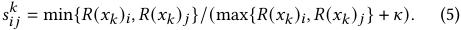

As illustrated in Figure 7 (right), the intuitive is that two experts with high routing probabilities for the same token tend to have higher similarity than those with low routing probabilities. The constant _𝜅_ is to adjust the relative weight of routing probabilities. The overall similarity between two experts is the average over all the evaluated tokens: _𝑠𝑖𝑗_ =� _𝑘__𝑠_ _𝑖𝑗__𝑘,_∀_𝑖, 𝑗_. Note that this calculation only needs to be performed once for an LLM, and can be pre-calculated in the offline stage. 

To solve this weighted bipartite matching problem, we can reduce it to a transportation problem in the form of linear programming [9]. As such, this problem can be solved efficiently with polynomial time algorithms. 

_3.3.2 Alignment-based expert merging._ Given a specific expert _𝐸𝑖_ ∈T _ℎ_ and _𝑚_ experts { _𝐸 𝑗_ }_𝑚_ ⊆T _𝑟_ matched to _𝐸𝑖_ according to the above expert matching result, we now consider merging experts { _𝐸 𝑗_ } into expert _𝐸𝑖_ to enhance expert ability without complex retraining processes and training data. The matched experts share more common knowledge, thereby properly merging them could complement the expert ability while reducing resource overhead [43, 52]. However, it is difficult to identify or quantify knowledge within experts since it is deeply encoded in their parameters. Simply averaging expert parameters, though efficient, fails to capture this information. The underlying reason is that experts adopt fully connected networks, which are permutation-invariant. That is, even two experts having exactly the same function may differ in neuron permutations and thus in weight matrices. To solve this problem, we propose an alignment-based expert merging method. **Align experts’ hidden representations.** An expert within MoE layers is a dense FFN whose function can be expressed as _𝑓𝐸_ ( _𝑥_ ) = _𝜙_ ( _𝑥𝑊_(1) ) _𝑊_(2) , where _𝑊_(1) ∈ R_𝑑𝑖𝑛_×_ℎ_ , _𝑊_(2) ∈ R_ℎ_×_𝑑𝑜𝑢𝑡_ are weight matrices for input and output projection, respectively, and _𝜙_ (·) is the activation function. 

We first analyze the permutation invariance property of FFNs. We write the weight matrices as _𝑊_(1) = ( _𝑎_⊤ _,𝑎_⊤ 2_,_· · ·_,𝑎_ _ℎ_⊤),_𝑊_(2)= ( _𝑏_ 1 _,𝑏_ 2 _,_ · · · _,𝑏ℎ_ )⊤ , where { _𝑎𝑖_ } and { _𝑏 𝑗_ } are row vectors, and _ℎ_ is the number of hidden neurons. The function of the FFN can be written as _𝑓𝐸_ ( _𝑥_ ) =�_ℎ_ _𝑘_ =1_𝜙_(_𝑥𝑎_ _𝑘_⊤)_𝑏𝑘_. For any permutation_𝜋_to the neurons 

527 

SenSys ’24, November 4–7, 2024, Hangzhou, China 

Yan Zhuang, Zhenzhe Zheng, Fan Wu, and Guihai Chen 

in this FFN, we denote the permutation matrix as _𝑃𝜋_ , and permuted weight matrices are _𝑊_�(1) = _𝑊_(1) _𝑃𝜋_ , _𝑊_�(2) = _𝑃𝜋𝑊_(2) . As the summation operation is permute-invariant, the permuted function _𝑓𝐸𝜋_ ( _𝑥_ ) =�_ℎ_ _𝑘_ =1_𝜙_(_𝑥𝑎_ _𝜋_⊤ ( _𝑘_ ))_𝑏𝜋_(_𝑘_)=�_ℎ_ _𝑘_ =1_𝜙_(_𝑥𝑎_ _𝑘_⊤)_𝑏𝑘_is equal to _𝑓𝐸_ ( _𝑥_ ). Therefore, to merge experts effectively, we need to permute their neurons to have aligned hidden representations. Specifically, given two experts _𝑝_ and _𝑞_ whose weights are _𝑊𝑝_(_𝑙_) and _𝑊𝑞_(_𝑙_) _,𝑙_ = 1 _,_ 2, we aim to find the optimal permutation _𝑃_∗ that after permuting neurons of expert _𝑝_ , the distance between the resulting weights _𝑊_ �(_𝑙_) and _𝑊_(_𝑙_) is minimized. _𝑝 𝑞_ 

To solve the permutation _𝑃_∗ , there are different types of aligning techniques, such as hard-aligning [60] and soft-aligning [51]. We employ the soft-aligning strategy for expert merging to take advantage of its flexibility in modeling soft correspondence between neurons and efficient solving algorithms. Specifically, the neuron alignment problem is formulated as an optimal transportation (OT) problem as: 

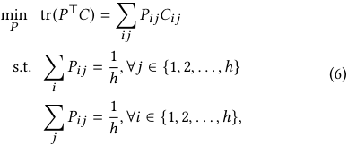

where _𝐶_ ∈ R_ℎ_×_ℎ_ is the cost matrix defined as the opposite number of similarities between neurons in the two experts. We define _𝐶𝑖𝑗_ :=<u>1</u> <u>2</u>(||_𝑎_ _𝑖__𝑝_−_𝑎𝑞_ _𝑗_||2 + ||_𝑏_ _𝑖__𝑝_−_𝑏𝑞_ _𝑗_||2), which is the average Euclidean distance between corresponding weight vectors of neurons _𝑖_ and _𝑗_ . Intuitively, this formulation aims to optimally “transport” neurons in expert _𝑝_ to expert _𝑞_ with the minimal cost, _i.e._ , the maximal total neuron similarities. Under the form of optimal transportation, there are estimated solvers, either exactly or approximately, for efficiently calculating _𝑃_∗ [11]. **Expert parameter merging.** With the aligned expert parameters, we are able to merge experts by importance-aware weighted averaging. Specifically, for a given expert _𝐸𝑖_ ∈T _ℎ_ and _𝑚_ matched experts { _𝐸 𝑗_ }_𝑚_ ⊆T _𝑟_ , we calculate the merged expert parameter matrices as: 

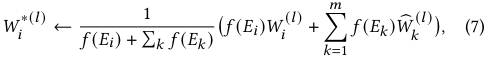

where _𝑓_ ( _𝐸𝑖_ ) denotes the importance score _𝑓𝑖𝑚𝑝𝑜𝑟𝑡._ ( _𝐸𝑖_ ) of expert _𝑖_ , _𝑙_ ∈{1 _,_ 2}. With this merging strategy, the merging weight of the critical expert _𝐸𝑖_ is dominant, as this expert accounts for most input tokens. Other expert parameters are used to update _𝐸𝑖_ ’s parameters with stepsizes as their corresponding importance scores. Our experiments show this strategy can effectively balance the original and newly merged expert abilities. 

**Update routers for updated experts.** After selective expert merging, the router should also be updated correspondingly to adapt to the new set of experts. We introduce a _masked expert routing_ mechanism to update the router. The original routing probability can be calculated as _𝑟_ = Softmax( _𝑥𝑊𝑅_ ), where _𝑊𝑅_ is the parameter matrix of the router. We apply a mask matrix _𝑀_ ∈ R_𝑛_×_𝑛_ on original 

routing probability, obtaining _𝑟_′ = _𝑟𝑀_ , where _𝑀_ is essentially a permutation matrix obtained according to expert matching results _𝑋_∗ in Section 3.3.1, wherein _𝑀𝑖𝑗_ = 1 represents expert _𝑖_ is redirected to expert _𝑗_ . 

### **4 EVALUATION** 

### **4.1 Methodology** 

**Implementation.** We have built a prototype of LiteMoE using Python with 3.4k lines of code. We use PyTorch [4] as the base DL framework, and HuggingFace Transformers [2] and PEFT libraries [38] as the NLP toolbox for LLM and adapter implementation, respectively. For the experiment testbed, we use a Linux server equipped with 4 NVIDIA 3090 GPUs to act as the cloud server for offline model profiling, including expert contribution predictor training and expert similarity evaluation. We evaluate LiteMoE’s online performance on two popular edge devices: NVIDIA Jetson Nano (GPU) and Raspberry Pi 4B (CPU). Both of them are equipped with 8GB total memory capacity and 64GB disk storage. 

**Downstream tasks, datasets and foundation LLMs.** We evaluate LiteMoE over classic NLP downstream tasks from the GLUE benchmark [59] which is a standard multi-task benchmark for natural language understanding. GLUE contains 9 classification or regression tasks and datasets from different categories such as sentiment analysis and natural language inference. For foundation LLMs, we employ three MoE-based LLMs with different numbers of experts and thus different model scales for evaluation. These models are based on Switch Transformers [17], a popular sparse Transformer following the encoder-decoder architecture. The sparse FFN layers are added at every other FFN layer within Switch Transformer. For a token, only one expert will be activated for processing (top-1 routing). We denote the LLMs as Switch- _𝑛_ , where _𝑛_ = 8/16/32 is the number of experts per sparse FFN. The pre-trained model weights are obtained from HuggingFace [2]. **Baselines.** We compare LiteMoE with the following baselines. (1) _Full-FT LLM_ : this is the ideal situation where mobile apps can use the complete foundation LLM to fine-tune personalized adapters. This acts as the performance upper bound, but is infeasible in practice due to its tremendous resource requirements. (2) _Foundation LLM_ : mobile apps use the general ability of the foundation LLM without adapters. (3) _Proxy submodel_ : the performance of proxy submodels extracted from the foundation LLM using our post-training submodel extraction technique. (4) _FT Submodel_ : the proxy submodels are fine-tuned with personalized data from the app’s targeted downstream tasks. (5) _Proxy-FT LLM_ : the customized adapters that are fine-tuned on the proxy submodels are integrated back into the foundation LLM for evaluation, which represents the outcome of the complete LiteMoE pipeline. 

**Metrics.** We report results mainly on two aspects. (1) _model performance:_ we use accuracy for classification tasks and the Pearson correlation metric for regression tasks. (2) _system resource overhead:_ we report the memory footprint of fine-tuning and inference models of LiteMoE and baselines, as well as the on-device execution latency of LiteMoE to verify its efficiency. 

**Configurations.** For the hyperparameters of LiteMoE, we set _𝛼_ = 0 _._ 05 and _𝛽_ = 0 _._ 15 by default. The maximum degree _𝑑_ for similaritybased expert matching is set to 2 for Switch-8 and 3 for Switch-16/32. 

528 

SenSys ’24, November 4–7, 2024, Hangzhou, China 

LiteMoE: Customizing On-device LLM Serving via Proxy Submodel Tuning 

|Foundation|Method|||Mob|ile Comp|utingTas|k|||Avg. Model|
|---|---|---|---|---|---|---|---|---|---|---|
|LLM||SST-2|CoLA|MRPC|STS-B|QQP|MNLI|QNLI|RTE|Size (MB)|
||Foundation LLM|83.3|71.3|83.8|80.6|81.3|79.0|82.4|63.9|2366|
||Proxy Submodel|80.8|69.2|80.6|80.1|78.8|72.2|79.6|62.1|921|
|Switch-8|FT Submodel|84.9|74.3|86.2|84.2|81.8|80.2|87.4|68.2|Reduction:|
||Full-FT LLM|94.4|83.0|88.9|87.5|91.1|86.4|91.3|74.7|2.57x|
||**Proxy-FT LLM**|94.2|81.5|88.7|86.8|89.4|84.1|90.8|72.2||
||Foundation LLM|85.2|70.7|83.0|82.3|85.9|81.6|83.1|62.6|4094|
||Proxy Submodel|82.0|69.5|81.3|80.6|83.3|77.4|78.3|60.4|1026|
|Switch-16| FT Submodel|89.5|77.4|82.6|85.1|84.2|82.6|89.2|70.4|Reduction:|
||Full-FT LLM|95.2|83.7|89.7|89.0|90.9|87.2|92.6|77.1|399x|
||**Proxy-FT LLM**|93.7|82.1|88.1|86.5|89.9|87.3|91.9|75.3|.|
||Foundation LLM|84.4|72.3|83.6|82.2|84.2|77.3|85.9|70.7|7551|
||Proxy Submodel|82.1|69.2|79.8|81.9|82.3|76.2|82.3|67.1|1147|
|Switch-32| FT Submodel|90.6|77.5|81.3|88.3|85.8|80.9|90.8|71.9|Reduction:|
||Full-FT LLM|95.8|84.8|90.0|89.4|91.2|86.9|93.3|77.6|658x|
||**Proxy-FT LLM**|93.1|80.7|89.2|88.3|89.6|85.1|92.8|76.3|.|

**Table 1: Summary of overall performance (%) of LiteMoE and baselines over various mobile computing tasks.** 

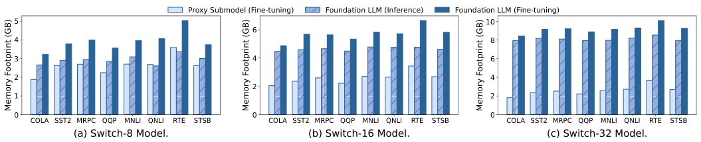

<!-- Start of picture text -->
Proxy Submodel (Fine-tuning) Foundation LLM (Inference) Foundation LLM (Fine-tuning) 5 10 6 4 8 3 4 6 2 4 2 1 2 0 0 0 COLA SST2 MRPC QQP MNLI QNLI RTE STSB COLA SST2 MRPC QQP MNLI QNLI RTE STSB COLA SST2 MRPC QQP MNLI QNLI RTE STSB (a) Switch-8 Model. (b) Switch-16 Model. (c) Switch-32 Model. Memory Footprint (GB) Memory Footprint (GB) Memory Footprint (GB) <!-- End of picture text -->

**Figure 8: Memory footprint of the foundation LLM and the proxy submodel.** 

The parameter _𝜅_ in expert similarity evaluation is set to 0.2. Given a targeted downstream task, a submodel is updated 300 steps during the (proxy) fine-tuning process. We retain the best-performing adapter for each task during fine-tuning, and insert it back into the foundation LLM for further evaluation. 

### **4.2 Overall Performance Evaluation** 

Table 1 summarizes the overall model performance and average model sizes of LiteMoE and baselines. 

For all tasks, LiteMoE supports fine-tuning adapters with lightweight proxy submodels, and improves the customized performance of the foundation LLM. First, compared to the initial foundation LLM, fine-tuning with apps’ private data can effectively enhance model performance. For example, the ideal case Full-FT achieves 8.7% model accuracy gains on average over all tasks, demonstrating the importance of customized fine-tuning. Second, with LiteMoE, we can reduce the model size from 2.57× to 6.58× while still preserving most of the performance of foundation LLM in targeted tasks (with a slight degradation of 1.4%). More importantly, after tuning with the proxy submodels, the adapters that integrate back into the foundation LLM can improve the accuracy by up to 7.4% compared to the initial LLM, which is very close to the ideal case of Full-FT. This attributes to our post-training submodel extraction technique that generates sufficiently good proxy submodels, 

thereby the adapters tuned upon these proxy submodels can effectively integrate the customized knowledge into the foundation LLM. Further detailed evaluations of PTSE are shown in Section 4.3. 

In Figure 8, we show the memory footprint of fine-tuning or inferring the foundation LLM and the generated submodels. LiteMoE’s proxy submodels reduce memory footprint by 2.42× compared to the complete foundation LLM. This is benefiting from our submodel extraction method that removes a large portion of cold and moderate experts, which not only reduces memory for storing a large number of expert parameters but also saves memory for intermediate activations of vast expert networks during inference or fine-tuning. Notably, LiteMoE saves more memory when serving larger LLMs. For example, LiteMoE reduces 1.49× memory for Switch-8, while reducing 3.58× for Switch-32. This is because larger LLMs adopt more experts to accommodate a wide range of general knowledge, however, the number of experts needed for a specific task is nearly the same. Therefore, our method is favorable for large LLMs, especially in the context of ever-increasing LLM scales. 

Note that our method is orthogonal to memory and I/O scheduling methods such as [66] and [30]. LiteMoE can be combined with these methods to further reduce memory overhead. In addition, with the reduced set of experts, LiteMoE can also enhance the effectiveness of these methods such as improving the accuracy of expert pre-loading. 

529 

SenSys ’24, November 4–7, 2024, Hangzhou, China 

Yan Zhuang, Zhenzhe Zheng, Fan Wu, and Guihai Chen 

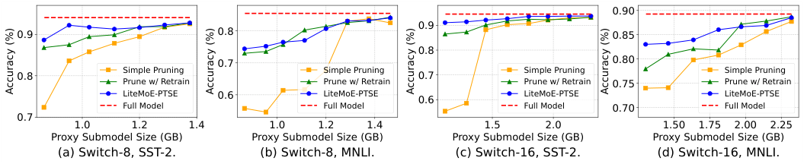

<!-- Start of picture text -->
0.90 0.9 0.9 0.8 0.85 0.8 0.7 0.80 0.8 Simple Pruning S imple Pruning 0.7 Simple Pruning Simple Pruning Prune w/ Retrain Prune w/ Retrain Prune w/ Retrain 0.75 Prune w/ Retrain LiteMoE-PTSE 0.6 LiteMoE-PTSE LiteMoE-PTSE LiteMoE-PTSE Full Model Full Model 0.6 Full Model 0.70 Full Model 0.7 1.0 1.2 1.4 1.0 1.2 1.4 1.5 2.0 1.50 1.75 2.00 2.25 Proxy Submodel Size (GB) Proxy Submodel Size (GB) Proxy Submodel Size (GB) Proxy Submodel Size (GB) (a) Switch-8, SST-2. (b) Switch-8, MNLI. (c) Switch-16, SST-2. (d) Switch-16, MNLI. Accuracy (%) Accuracy (%) Accuracy (%) Accuracy (%) <!-- End of picture text -->

**Figure 9: Proxy submodel performance under different memory budgets represented by model sizes.** 

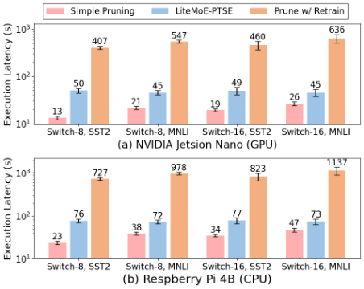

**Figure 10: On-device execution latency of extracting proxy submodels from the foundation LLM.** 

### **4.3 Proxy Submodel Evaluation** 

To verify the effectiveness and efficiency of LiteMoE-PTSE, we dive deeper to evaluate the proxy submodel accuracy and extraction overhead under different memory budgets and submodel extraction approaches. We use two representative GLUE tasks in this set of experiments: SST-2 (a relatively easy task for sentiment analysis) and MNLI (a more challenging task for natural language inference) [59, 61]. 

**Submodel accuracy under different memory budgets.** Figure 9 demonstrates that PTSE can preserve most of the foundation LLM’s performance, and significantly outperforms Simple Pruning2 and its retraining variants (Prune w/ Retrain). In SST-2, LiteMoE submodels achieve 94.3% and 97.1% of the accuracy of the foundation LLM, even only preserving 19.8% and 9.9% of experts in Switch-8 and Switch16, respectively. In the challenging MNLI task, LiteMoE submodels still preserve 88.5% and 93.8% of accuracy with 85.4% and 81.3% experts being removed. This is benefiting from the selective expert merging technique that preserves the ability of the removed experts. Otherwise, the submodel accuracy would be severely impacted as in the Simple Pruning approach whose submodel accuracy is at most 35.7% lower than LiteMoE. Surprisingly, LiteMoE achieves comparable performance, even better in some cases, compared to the Prune w/ Retrain method. For example, with Switch-16, PTSE 

> 2Simple Pruning refers to a very lightweight method that simply removes less important experts with respect to the current task without further processing. 

|Method|Switch- SST-2|8 Model MNLI|Switch-1 SST-2|6 Model MNLI|
|---|---|---|---|---|
|Simple Pruning w/ IE|80.6%|55.4%|71.3%|72.6%|
|Pruning w/o IE (Δ)|-4.4%|-2.6%|-9.7%|-34.7%|
|LiteMoE w/o SM (Δ)|+9.1%|+8.2%|+17.9%|+7.7%|
|LiteMoE w/o AM (Δ)|+9.8%|+2.2%|+18.3%|+3.5%|
|LiteMoE-PTSE (Δ)|+11.6%|+23.4%|+20.0%|+9.2%|

**Table 2: Submodel accuracy in ablation study of key components in LiteMoE. “IE”: important expert identification; “SM”: similarity-based expert matching; “AM”: alignment-based expert merging.** 

achieves 92.7% and 85.4% accuracy on SST2 and MNLI, respectively, while the Prune w/ Retrain method only obtains 90.8% and 83.7%. We assume this is because, in the latter method, the ability lost with the removed experts cannot always be well recovered by limited model re-training. 

**On-device execution latency.** LiteMoE is able to extract submodels on resource-limited devices within several tens of seconds. In Figure 10, we measure the proxy submodel extraction latency on two representative types of edge devices. We report the mean latency of 5 runs with error bars showing standard deviations. LiteMoE costs on average 47.7s and 74.9s to extract a proxy submodel on Jetson Nano and Raspberry Pi, respectively, slightly higher than Simple Pruning of 20.2s and 36.12s, but is significantly lower than Prune w/ Retrain of 513.4s and 916.8s. This is attributed to the training-free advantage of PTSE, as the retraining process is very time-consuming on resource-limited devices. The main overhead of LiteMoE is calculating expert importance scores and merging experts, which account for 84.7% of the total latency. Fortunately, given today’s increasingly powerful hardware equipped by mobile devices, this extraction latency can be further reduced by mobile GPUs or NPUs. This fast response time can support apps to query the proxy submodels and update customized adapters efficiently to maintain high-quality of model services. 

### **4.4 Performance Breakdown Analysis** 

**Ablation study.** We ablate and evaluate the key components of LiteMoE. The results are summarized in Table 2. To highlight the contribution of each component, we report the accuracy difference between our method and Simple Pruning. We observe that pruning experts without knowing their importance (Pruning w/o IE) 

530 

SenSys ’24, November 4–7, 2024, Hangzhou, China 

LiteMoE: Customizing On-device LLM Serving via Proxy Submodel Tuning 

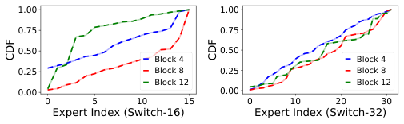

<!-- Start of picture text -->
1.00 1.00 0.75 0.75 0.50 0.50 Block 4 Block 4 0.25 Block 8 0.25 Block 8 Block 12 Block 12 0.00 0.00 0 5 10 15 0 10 20 30 Expert Index (Switch-16) Expert Index (Switch-32) CDF CDF <!-- End of picture text -->

**Figure 11: CDF of the distribution of expert importance of MoE-based LLMs. Solid lines denote actual expert importance scores, and dashed lines denote predictions of LiteMoE’s Expert Importance Predictor.** 

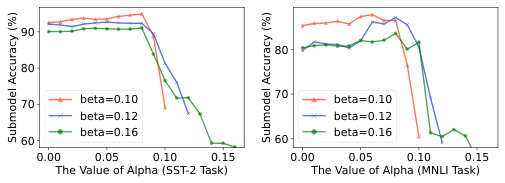

<!-- Start of picture text -->
90 80 80 70 beta=0.10 70 beta=0.10 beta=0.12 beta=0.12 beta=0.16 beta=0.16 60 60 0.00 0.05 0.10 0.15 0.00 0.05 0.10 0.15 The Value of Alpha (SST-2 Task) The Value of Alpha (MNLI Task) Submodel Accuracy (%) Submodel Accuracy (%) <!-- End of picture text -->

**Figure 13: Submodel performance under different values of the hyperparameter** _𝛼_ **and** _𝛽_ **.** 

### **4.5 Sensitivity Analysis** 

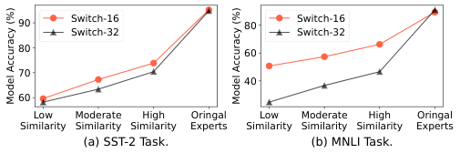

<!-- Start of picture text -->
90 Switch-16 80 Switch-16 Switch-32 Switch-32 80 60 70 40 60 Low Moderate High Oringal Low Moderate High Oringal Similarity Similarity Similarity Experts Similarity Similarity Similarity Experts (a) SST-2 Task. (b) MNLI Task. Model Accuracy (%) Model Accuracy (%) <!-- End of picture text -->

**Figure 12: Model accuracy of inference using experts with different levels of similarities to original experts.** 

severely impacts model performance, which is not surprising as it ignores experts’ specializations. Therefore, this IE module lays the foundation for compressing the LLM. Next, the other two modules, SM and AM, work complementary in enhancing expert performance, especially on challenging tasks. For example, for Switch-8 on the MNLI task, the SM and AM modules alone can only improve the accuracy by 8.2% and 2.2%, respectively, while working together, they can improve accuracy by 23.4%. 

Next, we evaluate the effectiveness of the offline expert characteristics profiling of LiteMoE. 

**Expert importance predictor.** As shown in Figure 11, we use our predictor to predict the importance of experts in shallow, middle, and deep sparse FFNs, represented by the Transformer blocks 4, 8, and 12, respectively. LiteMoE perfectly follows the actual expert importance distribution, even for experts in deep FFNs. This is attributed to the observation of the learnable expert activating patterns, and the training method which fully exploits the routers to model the activating patterns encoded in their outputs, and adopts the distillation loss to enhance the predictor training. **Expert similarity evaluation.** To verify the effectiveness of LiteMoE’s expert similarity metric, we replace the original experts with other experts that have different levels of similarity scores and test the resulting model accuracy. The results shown in Figure 12 indicate that the accuracy increases with expert similarity, demonstrating that our metric successfully captures the similarity between experts. For example, in the SST-2 task, choosing high-similarity experts yields a 13.2% higher accuracy than the low-similarity case, and is 7.2% higher than that obtained by randomly choosing experts. Additionally, we observe that the accuracy of Switch-32 is more impacted by replacing dissimilar experts. The possible reason is that the experts in Switch-32 share less knowledge, as it has more experts for fine-grained specialization. 

During LiteMoE-PTSE, the hyperparameters _𝛼_ and _𝛽_ play a critical role in selective expert merging, influencing the identification of experts as heavy-hitters (hot), moderate, or cold experts. To better understand the sensitivity of PTSE to these hyperparameters, we vary their values and report the resulting submodel accuracy in Figure 13. Overall, The results indicate that PTSE demonstrates robust performance across different choices of _𝛼_ and _𝛽_ . 

First, we observe that the average submodel accuracy is higher when _𝛽_ is smaller, which is intuitive, as a smaller _𝛽_ retains more experts in the submodel, leading to increased accuracy at the cost of a larger submodel size. However, by selecting a proper value of _𝛼_ , the accuracy gap among submodels under different _𝛽_ can be minimized. For instance, the accuracy gap between the optimal submodels between _𝛽_ = 0 _._ 1 and _𝛽_ = 0 _._ 12 (as well as _𝛽_ = 0 _._ 12 and _𝛽_ = 0 _._ 16) is only 2.59% (1.27%) in the SST-2 task, demonstrating the effectiveness of the selective expert merging technique. 

Second, an optimal value of _𝛼_ ( _e.g._ , around 0.08 in this set of experiments) can maximize submodel performance. Either too large or too small _𝛼_ negatively impacts submodel performance. We analyze the underlying reason as follows. (i) With a large _𝛼_ , more important experts are removed without merging to preserve their specific abilities, and thus results in poor submodel performance. In the extreme case where _𝛼_ = _𝛽_ , LiteMoE-PTSE degrades to Simple Pruning. (ii) With a small _𝛼_ , the submodel accuracy is also impacted, due to the merging of more cold experts, which are less relevant to the targeted task. Fortunately, the impact on performance is slight in this case, with an average accuracy gap of only 2.62% between the submodel with _𝛼_ = 0 and the optimal submodel ( _𝛼_ = 0 _._ 08). This is attributed to the constraint value _𝑑_ in expert matching, which limits the maximum number of experts that can be merged, along with the importance-aware weighted averaging design which assigns very small weights to the irrelevant experts in averaging. 

To conclude, _𝛽_ controls the submodel size, which is guided by the desired accuracy-cost tradeoff (and resource constraints) in the given application, while _𝛼_ determines which experts will be merged to enhance the resulting submodel. A relatively small _𝛼_ is safe to achieve near-optimal submodel performance at least. **Computation complexity and scalability analysis.** The execution of LiteMoE-PTSE consists of three primary steps: important expert identification (IE), similarity-based expert-matching (SM), and alignment-based expert merging (AM). Notably, the AM module accounts for the most execution latency, followed by the IE module. For example, for Switch-16, the AM and IE modules account for an average of 72.1% and 12.6% of total latency, respectively. The 

531 

SenSys ’24, November 4–7, 2024, Hangzhou, China 

Yan Zhuang, Zhenzhe Zheng, Fan Wu, and Guihai Chen 

latency of AM comes from the necessity of resolving an OT problem for each expert merging operation. 

We further analyze the complexity and scalability of the AM module from two perspectives: (i) scaling with the number of hidden dimensions ( _ℎ_ ) within experts. The complexity of solving the OT problem scales as _𝑂_ ( _𝑑_3 log _𝑑_ ) in the worst case [44], which may lead to efficiency issues when _ℎ_ becomes very large. Fortunately, approximation methods such as the entropy-regularized method [11] can solve the problem orders of magnitude faster. In modern MoEbased LLMs, the hidden dimension typically ranges from hundreds to a few thousand ( _e.g._ , _ℎ_ = 3072 in Switch Transformers), allowing solving algorithms to operate within several seconds even with exact solvers. For example, in the SST-2 task, solving the OT problem exactly takes approximately 2.1s, while the approximation solver only requires 0.3s, incurring a mere 1.2% accuracy loss compared to the exact solver. (ii) scaling with the number of experts to be merged (denoted as _𝑛𝑟_ ). The latency of the AM module linearly increases with _𝑛𝑟_ , as the OT problem will be solved _𝑛𝑟_ times independently. Considering the modern MoE-based LLMs that typically adopt several tens of MoE layers with 8-64 experts per layer, _𝑛𝑟_ can range from tens to hundreds. In our experiments, _𝑛𝑟_ varied from 9 to 42, with an average of 21.5. Even in extreme scenarios where _𝑛𝑟_ reaches a few hundred, the AM process remains manageable within several minutes on modern mobile devices. 

### **5 RELATED WORK** 

**Resource-efficient LLMs with MoE.** The sparsely activated MoE architecture is adopted as an effective approach to scale up model size without linearly increasing computation overhead. First employed as a building block in LSTMs that achieve SOTA machine translation performance [48], MoE is further widely adopted in Transformer-based LLMs for superior model performance and resource efficiency [12, 14, 17, 28, 33, 50, 72]. For example, Mixtral 8x7B [28] which comprises 8 experts with a top-2 routing mechanism achieves comparable, even better performance than Llama 2 70B and GPT-3.5. Nevertheless, MoE-based LLMs have lower parameter efficiency than dense LLMs, which hinders their deployment on resource-limited mobile devices. Noticing this phenomenon, LiteMoE is designed to help identify and refine important experts within MoE layers for better parameter efficiency, and preserve targeted model performance as well. 

Additionally, another line of work creates sparsely activated MoE architectures from established LLMs [35, 56, 69, 70] to take advantage of its conditional computation benefits during model serving. Thanks to the expert specialization of the MoE layer, LiteMoE can be applied to arbitrary MoE-based LLMs, forming compact, app-specific proxy submodels by refining MoE layers. 

**Cost optimizations to MoE-based LLMs.** Various works have attempted to reduce the resource costs of serving MoE-based LLMs using model compression strategies such as expert quantization [18, 66], parameter pruning [10], and sparse-to-dense distillation [17, 45, 65]. QMoE [18] proposed an MoE-specific quantization method coupled with corresponding GPU decoding kernels, which compresses large-scale LLMs to sub-1-bit levels. Chen et al. [10] proposed taskspecific expert pruning, which progressively prunes experts during 

model fine-tuning. Other works [17, 45, 65] leveraged the knowledge distillation technique to distill large sparse LLMs into smaller dense models. For example, Switch Transformers [17] preserved 30% quality gains of the sparse MoE design while compressing the model by 20×. These methods require model retraining processes to recover performance after compression, making them unable to quickly generate small models on devices. Instead, LiteMoE eliminates the training process for efficient on-device execution. 

**On-device model serving and adaptation.** On-device model serving is becoming increasingly important, as it not only provides better interactive user experience and enhanced data privacy, but also alleviates the high computational pressure on the cloud. To adapt large models that are originally designed for cloud platforms to resource-limited devices, existing works have developed various approaches such as lightweight model architectures [24, 27, 37, 47, 53–55], model compression methods [20–22, 64], and flexible model size adaptation strategies [16, 19, 63]. With the sparsely activated design, on-device MoE model serving is mainly bottlenecked by I/O overhead. To address this issue, [15, 26, 31, 66] proposed a series of memory and I/O optimizations. For instance, EdgeMoE [66] and Fast Inference [15] predict which experts will be activated during inference and preload their weights before they are actually used, allowing the I/O process to overlap with computation, thereby reducing overall latency. Nevertheless, these works are not designed for on-device fine-tuning, as they still retain all potential experts without considering the specific task an app focuses on. The massive redundant expert weights and intermediate states ( _e.g._ , gradients) can lead to an unaffordable memory footprint. In contrast, LiteMoE is specifically designed for on-device fine-tuning by creating proxy submodels with better parameter efficiency and lower resource overhead, making it suitable for customizing model services for mobile apps. 

### **6 CONCLUSION** 

In this work, we have proposed LiteMoE, a new proxy submodel tuning framework to support mobile apps to provide customized model services via on-device tuning adapters. The key technique of LiteMoE is post-training submodel extraction, where by dynamically identifying, matching, and merging important experts, we can obtain lightweight submodels efficiently without additional retraining processes. Extensive experiments demonstrate that LiteMoE can effectively support fine-tuning adapters on resource-limited devices, and greatly improve LLM serving quality with reduced memory overhead. 

### **ACKNOWLEDGMENTS** 

We sincerely appreciate the anonymous shepherd and reviewers for their valuable comments. <mark>This work was supported in part by National Key R&D Program of China (No. 2023YFB4502400),</mark> in part by China NSF grant No. U2268204, 62322206, 62132018, 62025204, 62272307, 62372296. The opinions, findings, conclusions, and recommendations expressed in this paper are those of the authors and do not necessarily reflect the views of the funding agencies or the government. Zhenzhe Zheng is the corresponding author. 

532 

SenSys ’24, November 4–7, 2024, Hangzhou, China 

LiteMoE: Customizing On-device LLM Serving via Proxy Submodel Tuning 

### **REFERENCES** 

- [1] 2024. AICore. https://developer.android.com/ml/aicore. 

- [2] 2024. HuggingFace models. https://huggingface.co/models. 

- [3] 2024. Introducing Apple’s On-Device and Server Foundation Models. https: //machinelearning.apple.com/research/introducing-apple-foundation-models. 

- [4] 2024. PyTorch. https://pytorch.org/. [5] 2024. Snapdragon 8 gen 3 mobile platform product brief. https: //docs.qualcomm.com/bundle/publicresource/87-71408-1_REV_C_ Snapdragon_8_gen_3_Mobile_Platform_Product_Brief.pdf. 

- [6] OpenAI: Josh Achiam, Steven Adler, Sandhini Agarwal, Lama Ahmad, Ilge Akkaya, et al. 2023. GPT-4 Technical Report. _arXiv preprint arXiv:2303.08774_ (2023). 

- [7] Faez Ahmed, John P. Dickerson, and Mark D. Fuge. 2017. Diverse Weighted Bipartite b-Matching. In _International Joint Conference on Artificial Intelligence (IJCAI)_ . 35–41. 

- [8] Dongqi Cai, Yaozong Wu, Shangguang Wang, Felix Xiaozhu Lin, and Mengwei Xu. 2023. Efficient Federated Learning for Modern NLP. In _Proceedings of the 29th Annual International Conference on Mobile Computing and Networking (MobiCom)_ . 1–16. 

- [9] Cheng Chen, Lan Zheng, Venkatesh Srinivasan, Alex Thomo, Kui Wu, and Anthony Sukow. 2016. Conflict-Aware Weighted Bipartite B-Matching and Its Application to E-Commerce. _IEEE Transactions on Knowledge and Data Engineering (TKDE)_ 28 (2016), 1475–1488. 

- [10] Tianyu Chen, Shaohan Huang, Yuan Xie, Binxing Jiao, Daxin Jiang, Haoyi Zhou, Jianxin Li, and Furu Wei. 2022. Task-Specific Expert Pruning for Sparse Mixtureof-Experts. _arXiv preprint arXiv:2206.00277_ (2022). 

- [11] Marco Cuturi. 2013. Sinkhorn Distances: Lightspeed Computation of Optimal Transport. In _Advances in Neural Information Processing Systems (NeurIPS)_ . 1–9. 

- [12] Damai Dai, Chengqi Deng, Chenggang Zhao, R.x. Xu, Huazuo Gao, Deli Chen, Jiashi Li, Wangding Zeng, Xingkai Yu, Y. Wu, Zhenda Xie, Y.k. Li, Panpan Huang, Fuli Luo, Chong Ruan, Zhifang Sui, and Wenfeng Liang. 2024. DeepSeekMoE: Towards Ultimate Expert Specialization in Mixture-of-Experts Language Models. In _Proceedings of the 62nd Annual Meeting of the Association for Computational Linguistics (ACL)_ . 1280–1297. 

- [13] Ning Ding, Yujia Qin, Guang Yang, Fuchao Wei, Zonghan Yang, Yusheng Su, Shengding Hu, Yulin Chen, Chi-Min Chan, Weize Chen, et al. 2023. Parameterefficient fine-tuning of large-scale pre-trained language models. _Nature Machine Intelligence_ 5 (2023), 220–235. 

- [14] Nan Du, Yanping Huang, Andrew M Dai, Simon Tong, Dmitry Lepikhin, Yuanzhong Xu, Maxim Krikun, Yanqi Zhou, Adams Wei Yu, Orhan Firat, et al. 2022. Glam: Efficient scaling of language models with mixture-of-experts. In _International Conference on Machine Learning (ICML)_ . 5547–5569. 

- [15] Artyom Eliseev and Denis Mazur. 2023. Fast Inference of Mixture-of-Experts Language Models with Offloading. _arXiv preprint arXiv:2312.17238_ (2023). 

- [16] Biyi Fang, Xiao Zeng, and Mi Zhang. 2018. NestDNN: Resource-Aware MultiTenant On-Device Deep Learning for Continuous Mobile Vision. In _Proceedings of the 24th Annual International Conference on Mobile Computing and Networking (MobiCom)_ . 115–127. 

- [17] William Fedus, Barret Zoph, and Noam Shazeer. 2022. Switch transformers: Scaling to trillion parameter models with simple and efficient sparsity. _The Journal of Machine Learning Research (JMLR)_ 23 (2022), 5232–5270. 

- [18] Elias Frantar and Dan Alistarh. 2023. QMoE: Practical Sub-1-Bit Compression of Trillion-Parameter Models. _arXiv preprint arXiv:2310.16795_ (2023). 

- [19] Rui Han, Qinglong Zhang, Chi Harold Liu, Guoren Wang, Jian Tang, and Lydia Y. Chen. 2021. LegoDNN: block-grained scaling of deep neural networks for mobile vision. In _Proceedings of the 27th Annual International Conference on Mobile Computing and Networking (MobiCom)_ . 406–419. 

- [20] Song Han, Huizi Mao, and William J. Dally. 2016. Deep Compression: Compressing Deep Neural Network with Pruning, Trained Quantization and Huffman Coding. In _4th International Conference on Learning Representations (ICLR)_ . 1–14. 

- [21] Song Han, Jeff Pool, John Tran, and William J. Dally. 2015. Learning both Weights and Connections for Efficient Neural Network. In _Advances in Neural Information Processing Systems (NeurIPS)_ . 1135–1143. 

- [22] Geoffrey E. Hinton, Oriol Vinyals, and Jeffrey Dean. 2015. Distilling the Knowledge in a Neural Network. _arXiv preprint arXiv:1503.02531_ (2015). 

- [23] Neil Houlsby, Andrei Giurgiu, Stanislaw Jastrzebski, Bruna Morrone, Quentin De Laroussilhe, Andrea Gesmundo, Mona Attariyan, and Sylvain Gelly. 2019. Parameter-efficient transfer learning for NLP. In _International conference on machine learning (ICML)_ . 2790–2799. 

- [24] Andrew G. Howard, Mark Sandler, Grace Chu, Liang-Chieh Chen, Bo Chen, Mingxing Tan, Weijun Wang, Yukun Zhu, Ruoming Pang, Vijay Vasudevan, Quoc V. Le, and Hartwig Adam. 2019. Searching for MobileNetV3. _IEEE/CVF International Conference on Computer Vision (ICCV)_ (2019), 1314–1324. 

- [25] Edward J Hu, yelong shen, Phillip Wallis, Zeyuan Allen-Zhu, Yuanzhi Li, Shean Wang, Lu Wang, and Weizhu Chen. 2022. LoRA: Low-Rank Adaptation of Large Language Models. In _International Conference on Learning Representations (ICLR)_ . 1–13. 

- [26] Ranggi Hwang, Jianyu Wei, Shijie Cao, Changho Hwang, Xiaohu Tang, Ting Cao, and Mao Yang. 2024. Pre-gated MoE: An Algorithm-System Co-Design for Fast and Scalable Mixture-of-Expert Inference. In _2024 ACM/IEEE 51st Annual International Symposium on Computer Architecture (ISCA)_ . 1018–1031. 

- [27] Google Inc. 2024. Gemma: Introducing new state-of-the-art open models. https: //blog.google/technology/developers/gemma-openmodels/. 

- [28] Albert Q Jiang, Alexandre Sablayrolles, Antoine Roux, Arthur Mensch, Blanche Savary, Chris Bamford, Devendra Singh Chaplot, Diego de las Casas, Emma Bou Hanna, Florian Bressand, et al. 2024. Mixtral of experts. _arXiv preprint arXiv:2401.04088_ (2024). 

- [29] Jared Kaplan, Sam McCandlish, Tom Henighan, Tom B Brown, Benjamin Chess, Rewon Child, Scott Gray, Alec Radford, Jeffrey Wu, and Dario Amodei. 2020. Scaling laws for neural language models. _arXiv preprint arXiv:2001.08361_ (2020). 

- [30] Rui Kong, Yuanchun Li, Qingtian Feng, Weijun Wang, L. Kong, and Yunxin Liu. 2023. Serving MoE Models on Resource-constrained Edge Devices via Dynamic Expert Swapping. _arXiv preprint arXiv:2308.15030_ (2023). 

- [31] Rui Kong, Yuanchun Li, Qingtian Feng, Weijun Wang, Xiaozhou Ye, Ye Ouyang, Linghe Kong, and Yunxin Liu. 2024. SwapMoE: Serving Off-the-shelf MoE-based Large Language Models with Tunable Memory Budget. In _Proceedings of the 62nd Annual Meeting of the Association for Computational Linguistics (ACL)_ . 6710–6720. 

- [32] Woosuk Kwon, Zhuohan Li, Siyuan Zhuang, Ying Sheng, Lianmin Zheng, Cody Hao Yu, Joseph Gonzalez, Hao Zhang, and Ion Stoica. 2023. Efficient Memory Management for Large Language Model Serving with PagedAttention. In _Proceedings of the 29th Symposium on Operating Systems Principles (SOSP)_ . 611–626. 

- [33] Dmitry Lepikhin, HyoukJoong Lee, Yuanzhong Xu, Dehao Chen, Orhan Firat, Yanping Huang, Maxim Krikun, Noam Shazeer, and Zhifeng Chen. 2020. Gshard: Scaling giant models with conditional computation and automatic sharding. _arXiv preprint arXiv:2006.16668_ (2020). 

- [34] Yuanchun Li, Hao Wen, Weijun Wang, Xiangyu Li, Yizhen Yuan, Guohong Liu, Jiacheng Liu, Wenxing Xu, Xiang Wang, Yi Sun, Rui Kong, Yile Wang, Hanfei Geng, Jian Luan, Xuefeng Jin, Zi-Liang Ye, Guanjing Xiong, Fan Zhang, Xiang Li, Mengwei Xu, Zhijun Li, Peng Li, Yang Liu, Yaqiong Zhang, and Yunxin Liu. 2024. Personal LLM Agents: Insights and Survey about the Capability, Efficiency and Security. _arXiv preprint arXiv:2401.05459_ (2024). 

- [35] Bin Lin, Zhenyu Tang, Yang Ye, Jiaxi Cui, Bin Zhu, Peng Jin, Jinfa Huang, Junwu Zhang, Yatian Pang, Munan Ning, and Li Yuan. 2024. MoE-LLaVA: Mixture of Experts for Large Vision-Language Models. _arXiv preprint arXiv:2401.15947_ (2024). 

- [36] Zechun Liu, Changsheng Zhao, Forrest N. Iandola, Chen Lai, Yuandong Tian, Igor Fedorov, Yunyang Xiong, Ernie Chang, Yangyang Shi, Raghuraman Krishnamoorthi, Liangzhen Lai, and Vikas Chandra. 2024. MobileLLM: Optimizing Sub-billion Parameter Language Models for On-Device Use Cases. _arXiv preprint arXiv:2402.14905_ (2024). 

- [37] Ningning Ma, Xiangyu Zhang, Haitao Zheng, and Jian Sun. 2018. ShuffleNet V2: Practical Guidelines for Efficient CNN Architecture Design. _arXiv preprint arXiv:1807.11164_ (2018). 

- [38] Sourab Mangrulkar, Sylvain Gugger, Lysandre Debut, Younes Belkada, Sayak Paul, and Benjamin Bossan. 2022. PEFT: State-of-the-art Parameter-Efficient Fine-Tuning methods. https://github.com/huggingface/peft. 

- [39] Michael Matena and Colin Raffel. 2022. Merging models with fisher-weighted averaging. In _Advances in Neural Information Processing Systems (NeurIPS)_ . 17703– 17716. 

- [40] Brendan McMahan, Eider Moore, Daniel Ramage, Seth Hampson, and Blaise Aguera y Arcas. 2017. Communication-Efficient Learning of Deep Networks from Decentralized Data. In _Proceedings of the 20th International Conference on Artificial Intelligence and Statistics (AISTATS)_ . 1273–1282. 

- [41] Sean Huver Nigel Nelson and Mostafa Toloui. 2023. Deploy Large Language Models at the Edge with NVIDIA IGX Orin Developer Kit. https://developer.nvidia.com/blog/deploy-large-language-models-at-the-edgewith-nvidia-igx-orin-developer-kit/. 

- [42] OpenAI. 2022. ChatGPT. https://openai.com/blog/chatgpt/. 

- [43] Arthi Padmanabhan, Neil Agarwal, Anand Iyer, Ganesh Ananthanarayanan, Yuanchao Shu, Nikolaos Karianakis, Guoqing Harry Xu, and Ravi Netravali. 2023. Gemel: Model Merging for Memory-Efficient, Real-Time Video Analytics at the Edge. In _20th USENIX Symposium on Networked Systems Design and Implementation (NSDI)_ . 973–994. 

- [44] Ofir Pele and Michael Werman. 2009. Fast and robust Earth Mover’s Distances. In _2009 IEEE 12th International Conference on Computer Vision (ICCV)_ . 460–467. 

- [45] Samyam Rajbhandari, Conglong Li, Zhewei Yao, Minjia Zhang, Reza Yazdani Aminabadi, Ammar Ahmad Awan, Jeff Rasley, and Yuxiong He. 2022. Deepspeed-moe: Advancing mixture-of-experts inference and training to power next-generation ai scale. In _International Conference on Machine Learning (ICML)_ . 18332–18346. 

- [46] Samyam Rajbhandari, Jeff Rasley, Olatunji Ruwase, and Yuxiong He. 2020. ZeRO: memory optimizations toward training trillion parameter models. In _Proceedings of the International Conference for High Performance Computing, Networking, Storage and Analysis (SC)_ . 1–16. 

533 

SenSys ’24, November 4–7, 2024, Hangzhou, China 

Yan Zhuang, Zhenzhe Zheng, Fan Wu, and Guihai Chen 

- [47] Mark Sandler, Andrew G. Howard, Menglong Zhu, Andrey Zhmoginov, and Liang-Chieh Chen. 2018. MobileNetV2: Inverted Residuals and Linear Bottlenecks. _IEEE/CVF Conference on Computer Vision and Pattern Recognition (CVPR)_ (2018), 4510–4520. 

   - [72] Barret Zoph, Irwan Bello, Sameer Kumar, Nan Du, Yanping Huang, Jeff Dean, Noam M. Shazeer, and William Fedus. 2022. ST-MoE: Designing Stable and Transferable Sparse Expert Models. _arXiv preprint arXiv:2202.08906_ (2022). 

- [48] Noam Shazeer, Azalia Mirhoseini, Krzysztof Maziarz, Andy Davis, Quoc Le, Geoffrey Hinton, and Jeff Dean. 2017. Outrageously large neural networks: The sparsely-gated mixture-of-experts layer. _arXiv preprint arXiv:1701.06538_ (2017). 

- [49] Haihao Shen, Hanwen Chang, Bo Dong, Yu Luo, and Hengyu Meng. 2023. Efficient LLM Inference on CPUs. _arXiv preprint arXiv:2311.00502_ (2023). 

- [50] Yikang Shen, Zhen Guo, Tianle Cai, and Zengyi Qin. 2024. JetMoE: Reaching Llama2 Performance with 0.1M Dollars. _arXiv preprint arXiv:2404.07413_ (2024). 

- [51] Sidak Pal Singh and Martin Jaggi. 2020. Model fusion via optimal transport. In _Advances in Neural Information Processing Systems (NeurIPS)_ . 22045–22055. 

- [52] Virginia Smith, Chao-Kai Chiang, Maziar Sanjabi, and Ameet Talwalkar. 2017. Federated Multi-Task Learning. In _Advances in Neural Information Processing Systems (NeurIPS)_ . 1–11. 

- [53] Mingxing Tan and Quoc Le. 2021. EfficientNetV2: Smaller Models and Faster Training. In _Proceedings of the 38th International Conference on Machine Learning (ICML)_ . 10096–10106. 

- [54] Mingxing Tan and Quoc V. Le. 2019. EfficientNet: Rethinking Model Scaling for Convolutional Neural Networks. _arXiv preprint arXiv:1905.11946_ (2019). 

- [55] Gemini Team, Rohan Anil, Sebastian Borgeaud, Yonghui Wu, Jean-Baptiste Alayrac, Jiahui Yu, et al. 2023. Gemini: A Family of Highly Capable Multimodal Models. _arXiv preprint arXiv:2312.11805_ (2023). 

- [56] LLaMA-MoE Team. 2024. LLaMA-MoE: Building Mixture-of-Experts from LLaMA with Continual Pre-training. https://github.com/pjlab-sys4nlp/llama-moe/blob/ main/docs/LLaMA_MoE.pdf. 

- [57] Inar Timiryasov and Jean-Loup Tastet. 2023. Baby Llama: knowledge distillation from an ensemble of teachers trained on a small dataset with no performance penalty. _arXiv preprint arXiv:2308.02019_ (2023). 

- [58] Hugo Touvron, Louis Martin, Kevin Stone, Peter Albert, Amjad Almahairi, Yasmine Babaei, et al. 2023. Llama 2: Open Foundation and Fine-Tuned Chat Models. _arXiv preprint arXiv:2307.09288_ (2023). 

- [59] Alex Wang, Amanpreet Singh, Julian Michael, Felix Hill, Omer Levy, and Samuel R. Bowman. 2019. GLUE: A Multi-Task Benchmark and Analysis Platform for Natural Language Understanding. In _International Conference on Learning Representations (ICLR)_ . 

- [60] Hongyi Wang, Mikhail Yurochkin, Yuekai Sun, Dimitris S. Papailiopoulos, and Yasaman Khazaeni. 2020. Federated Learning with Matched Averaging. In _International Conference on Learning Representations (ICLR)_ . 1–16. 

- [61] Yiding Wang, Kai Chen, Haisheng Tan, and Kun Guo. 2023. Tabi: An Efficient Multi-Level Inference System for Large Language Models. In _Proceedings of the 18th European Conference on Computer Systems (EuroSys)_ . 233–248. 

- [62] Hao Wen, Yuanchun Li, Guohong Liu, Shanhui Zhao, Tao Yu, Toby Jia-Jun Li, Shiqi Jiang, Yunhao Liu, Yaqin Zhang, and Yunxin Liu. 2024. AutoDroid: LLM-powered Task Automation in Android. In _Proceedings of the 30th Annual International Conference on Mobile Computing and Networking (MobiCom)_ . 543–557. 

- [63] Hao Wen, Yuanchun Li, Zunshuai Zhang, Shiqi Jiang, Xiaozhou Ye, Ye Ouyang, Yaqin Zhang, and Yunxin Liu. 2023. AdaptiveNet: Post-deployment Neural Architecture Adaptation for Diverse Edge Environments. In _Proceedings of the 29th Annual International Conference on Mobile Computing and Networking (MobiCom)_ . 1–17. 

- [64] Guangxuan Xiao, Ji Lin, Mickael Seznec, Hao Wu, Julien Demouth, and Song Han. 2023. SmoothQuant: Accurate and Efficient Post-Training Quantization for Large Language Models. In _Proceedings of the 40th International Conference on Machine Learning (ICML)_ . 38087–38099. 

- [65] Fuzhao Xue, Xiaoxin He, Xiaozhe Ren, Yuxuan Lou, and Yang You. 2022. One Student Knows All Experts Know: From Sparse to Dense. _arXiv preprint arXiv:2201.10890_ (2022). 

- [66] Rongjie Yi, Liwei Guo, Shiyun Wei, Ao Zhou, Shangguang Wang, and Mengwei Xu. 2023. EdgeMoE: Fast On-Device Inference of MoE-based Large Language Models. _arXiv preprint arXiv:2308.14352_ (2023). 

- [67] Wangsong Yin, Mengwei Xu, Yuanchun Li, and Xuanzhe Liu. 2024. LLM as a System Service on Mobile Devices. _arXiv preprint arXiv:2403.11805_ (2024). 

- [68] Jinliang Yuan, Chen Yang, Dongqi Cai, Shihe Wang, Xin Yuan, Zeling Zhang, Xiang Li, Dingge Zhang, Hanzi Mei, Xianqing Jia, Shangguang Wang, and Mengwei Xu. 2024. Mobile Foundation Model as Firmware. In _Proceedings of the 30th Annual International Conference on Mobile Computing and Networking (MobiCom)_ . 279–295. 

- [69] Zhengyan Zhang, Yankai Lin, Zhiyuan Liu, Peng Li, Maosong Sun, and Jie Zhou. 2022. MoEfication: Transformer Feed-forward Layers are Mixtures of Experts. In _Findings of the Association for Computational Linguistics (ACL)_ . 877–890. 

- [70] Haizhong Zheng, Xiaoyan Bai, Beidi Chen, Fan Lai, and Atul Prakash. 2024. Learn To be Efficient: Build Structured Sparsity in Large Language Models. _arXiv preprint arXiv:2402.06126_ (2024). 

- [71] Zhe Zhou, Xuechao Wei, Jiejing Zhang, and Guangyu Sun. 2022. PetS: A Unified Framework for Parameter-Efficient Transformers Serving. In _2022 USENIX Annual Technical Conference (ATC)_ . 489–504. 

534 

