# **Optimizing Feature Extraction for On-device Model Inference with User Behavior Sequences** 

Chen Gong Zhenzhe Zheng∗ Yiliu Chen Shanghai Jiao Tong University Shanghai Jiao Tong University ByteDance Shanghai, China Shanghai, China Hangzhou, China gongchen@sjtu.edu.cn zhengzhenzhe@sjtu.edu.cn chenyiliu@bytedance.com Sheng Wang Fan Wu Guihai Chen ByteDance Shanghai Jiao Tong University Shanghai Jiao Tong University Hangzhou, China Shanghai, China Shanghai, China wangsheng.john@bytedance.com fwu@cs.sjtu.edu.cn gchen@cs.sjtu.edu.cn 

## **Abstract** 

Machine learning models are widely integrated into modern mobile apps to analyze user behaviors and deliver personalized services. Ensuring low-latency on-device model execution is critical for maintaining high-quality user experiences. While prior research has primarily focused on accelerating model inference with given input features, we identify an overlooked bottleneck in real-world on-device model execution pipelines: extracting input features from raw application logs. In this work, we explore a new direction of feature extraction optimization by analyzing and eliminating redundant extraction operations across different model features and consecutive model inferences. We then introduce AutoFeature, an automated feature extraction engine designed to accelerate ondevice feature extraction process without compromising model inference accuracy. AutoFeature comprises three core designs: (1) graph abstraction to formulate the extraction workflows of different input features as one directed acyclic graph, (2) graph optimization to identify and fuse redundant operation nodes across different features within the graph; (3) efficient caching to minimize operations on overlapping raw data between consecutive model inferences. We implement a system prototype of AutoFeature and integrate it into five industrial mobile services spanning search, video and e-commerce domains. Online evaluations show that AutoFeature reduces end-to-end on-device model execution latency by 1.33×3.93× during daytime and 1.43×-4.53× at night. 

## **CCS Concepts** 

• **Human-centered computing** → **Mobile computing** ; • **Computing methodologies** → **Machine learning** . 

## **Keywords** 

On-Device Machine Learning; User Behavior Analysis; Model Inference Acceleration; Feature Extraction Optimization 

∗Zhenzhe Zheng is the corresponding author. 

This work is licensed under a Creative Commons Attribution-NonCommercialNoDerivatives 4.0 International License. _SenSys ’26, Saint Malo, France_ 

© 2026 Copyright held by the owner/author(s). ACM ISBN 979-8-4007-2309-4/26/05 https://doi.org/10.1145/3774906.3800493 

### **ACM Reference Format:** 

Chen Gong, Zhenzhe Zheng, Yiliu Chen, Sheng Wang, Fan Wu, and Guihai Chen. 2026. Optimizing Feature Extraction for On-device Model Inference with User Behavior Sequences. In _ACM/IEEE International Conference on Embedded Artificial Intelligence and Sensing Systems (SenSys ’26), May 11– 14, 2026, Saint Malo, France._ ACM, New York, NY, USA, 14 pages. https: //doi.org/10.1145/3774906.3800493 

## **1 Introduction** 

With the rapid advancements of mobile devices, machine learning (ML) models are increasingly integrated into modern mobile apps to deliver personalized services [4, 22, 24, 43, 61, 75]. Unlike traditional large-scale vision or language models that use _static_ input features (e.g., image pixels or tokens embeddings), real-world ML models deployed on mobile devices for industrial apps are typically smaller and rely on _dynamic_ input features extracted from evolving user behavior sequences to capture user intent (e.g., genre list of the last 5 watched videos reflect shifting interests). Typical examples include customized product advertisements on e-commerce platforms [13, 14], video recommendation and preloading in video apps [50, 67, 76] and search result ranking in search engines [35, 80, 81]. 

For on-device deployment, ensuring low-latency model execution is essential for maintaining both service quality and user experience. In real-world mobile service workflows as shown in Figure 1, the device first extracts input features from historical user behaviors recorded in application logs (app log), and then performs model inference to predict user’s current intent, with the ultimate goal of generating personalized app responses (e.g., preload suitable next-to-watch videos). High latency of on-device model execution not only blocks follow-up app responses at the system level, but also causes stuttering user experiences. Empirical studies show that even a slight 0.15% increase in stuttering rate can lead to the loss of 9 million app users [1]. Therefore, on-device ML model execution is expected to be imperceptible to users, ideally within 30 ms to match the human perception range of 30-60 FPS [16]. 

**Feature Extraction Bottleneck.** For vision and language models, significant efforts have been made to optimize the efficiency of on-device model inference stage from both algorithm and hardware aspects [23, 25, 28, 31, 33, 36, 38, 41, 51, 65, 69, 77]. However, our analysis of on-device model execution pipelines in real-world mobile apps reveals an overlooked bottleneck: _extracting user features from raw app logs accounts for 61-86% of the total model execution_ 

407 

SenSys ’26, May 11–14, 2026, Saint Malo, France 

Gong et al. 

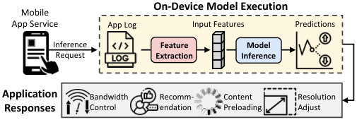

<!-- Start of picture text -->
On-Device Model Execution Mobile App Service App Log Input Features Predictions Inference  Feature  Model Request Extraction Inference Application  Bandwidth Recomm- Content Resolution Responses Control endation Preloading Adjust <!-- End of picture text -->

**Figure 1: Workflow of real-world mobile application services.** 

_latency_ . This issue stems from three key factors (elaborated in §2.2): (i) A large proportion of input features (74% on average) required by on-device models for mobile apps are user features to reflect various user behaviors; (ii) Extracting each user feature involves multiple resource-intensive operations on raw behavior data in app logs; (iii) The on-device model inference is relatively fast due to model size limits and mature optimization techniques. 

**Motivation.** In this work, we delve into a crucial but unexplored direction, _feature extraction optimization_ , to accelerate on-device model execution for mobile apps without sacrificing accuracy. Our core insight is that many input features required by on-device models are extracted from overlapping user behavior data in app logs (§2.3). This implies that redundant operations exist in extracting (i) different input features within each model execution, and (ii) identical input features across consecutive model executions. These redundancies motivate us to alleviate feature extraction bottleneck by eliminating unnecessary data processing operations. 

**Overall Design.** We introduce AutoFeature, an efficient feature extraction engine for faster on-device model execution by eliminating redundant operations across different input features and consecutive model executions. For an ML model deployed in the mobile app, AutoFeature represents its feature extraction process as a directed acyclic graph, termed _FE-graph_ , where source node denotes raw app log data, each target node denotes a feature and they are connected by a chain of operation nodes. Next, AutoFeature optimizes the FE-graph from two aspects. (i) Inter-feature: within a single model execution, AutoFeature identifies and fuses redundant operation nodes across different features in the FE-graph; (ii) Cross-execution: across consecutive inference requests, AutoFeature reuses intermediate results from previous model executions to eliminate redundant operations on overlapping data. Since AutoFeature is designed to work independently before the model inference stage, it can be seamlessly integrated with any device operating systems, back-end mobile inference engines and ML models developed by different teams within a mobile app enterprise. It also complements previous efforts on model inference acceleration. 

**Challenges and Our Solutions.** AutoFeature addresses three major challenges in formulating and optimizing the FE-graph for single and multiple model executions. 

_First, constructing a unified FE-graph for automatic redundancy identification is non-trivial._ Extracting input features from raw app logs is a complex process and existing literature lacks systematic analysis of it. Such opacity complicates the abstraction of feature extraction process into discrete, critical operation nodes that could facilitate automated redundancy detection across features. To solve this, AutoFeature characterizes feature extraction as an information 

filtering process, which leverages multiple orthogonal conditions to progressively filter necessary information from raw app log data. Each feature’s extraction process is then abstracted as a chain of operation nodes, each associated with different filtering conditions. In this way, any inter-feature redundancy can be systematically quantified by computing the intersections of filtering conditions of their operation nodes (§3.2). 

_Second, efficiently eliminating redundancy across features is challenging._ Intuitively, redundancies between any features with overlapping conditions can be eliminated by fusing their chains of operation nodes within the FE-graph. However, without careful designs on how to start and terminate the chain fusion process, the acceleration benefits can be offset by the introduced costs, including: (i) operations on irrelevant app log data, as the fused filtering range of multiple conditions can be broader than their originally intended condition scope, and (ii) extra termination costs to separate the node outputs for fused features. To address this, instead of treating each feature’s operation chain as a monolithic unit, AutoFeature decomposes it into multiple sub-chains with narrower condition per node, exposing finer-grained node fusion opportunities without condition scope expansion. Further, a hierarchical filtering algorithm is proposed to progressively separate outputs for fused features based on their condition relations, reducing termination cost from _𝑂_� _𝑙𝑒𝑛_ ( _𝑜𝑢𝑡𝑝𝑢𝑡𝑠_ )× _𝑛𝑢𝑚_ ( _𝑓𝑒𝑎𝑡𝑢𝑟𝑒𝑠_ )� to _𝑂_� _𝑙𝑒𝑛_ ( _𝑜𝑢𝑡𝑝𝑢𝑡𝑠_ )+ _𝑛𝑢𝑚_ ( _𝑓𝑒𝑎𝑡𝑢𝑟𝑒𝑠_ )� . 

_Third, minimizing redundant operations across consecutive model executions is not straightforward either._ Although caching all intermediate results for each model execution could eliminate interexecution redundancy, this approach is not always feasible and could cause potential app crashes due to the dynamic and limited memory space allocated to each ML model of each mobile app. To optimally balance redundancy elimination and memory cost, AutoFeature formulates the caching decision as a classic knapsack packing problem, where the object is to maximize computational savings within a given memory budget. A greedy policy is then proposed to prioritize intermediate results with the highest benefitto-cost ratios, which can be efficiently measured in constant time complexity through our term decomposition technique (§3.4). 

**Contributions** of this work are summarized as follows: 

• To the best of our knowledge, we are the first to unveil and analyze the feature extraction bottleneck in practical on-device ML model executions, exploring feature extraction optimization as a new research problem. 

• We propose AutoFeature system to address feature extraction bottleneck without compromising model accuracy by eliminating redundant operations across different input features and consecutive model executions. 

• We demonstrate AutoFeature’s remarkable performance through extensive online evaluations in real-world mobile services, covering domains of search, video and e-commerce. 

## **2 Background and Motivation** 

In this section, we first elaborate on-device model execution pipelines in mobile apps (§2.1). Then, we analyze feature extraction bottleneck in industrial mobile service workloads (§2.2) and explore the optimization opportunities that motivate our work (§2.3). 

408 

SenSys ’26, May 11–14, 2026, Saint Malo, France 

Optimizing Feature Extraction for On-device Model Inference with User Behavior Sequences 

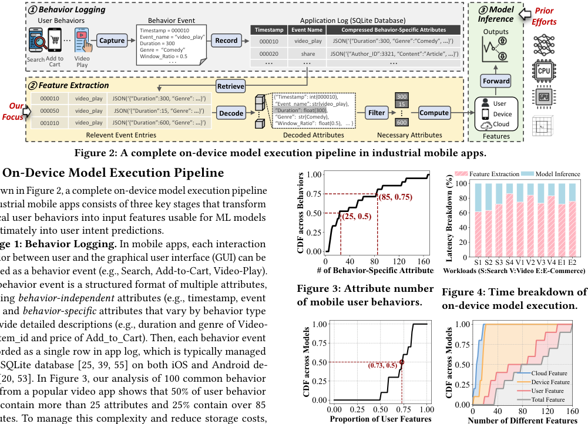

<!-- Start of picture text -->
①  Behavior Logging ③  Model  Prior User Behaviors  Behavior Event Application Log (SQLite Database) Inference Efforts Timestamp = 000010 Timestamp Event Name Compressed Behavior-Specific Attributes Outputs ... Capture Event_name = “video_plaDuration = 300 y” Record 000010 video_play JSON(‘{“Duration”:300, “Genre”:”Comedy”,  ... }’) Search Add to Cart VideoPlay Genre =  “Comedy”Window_Ratio = 0.5 . . . 000020 ... share ... JSON(‘{“Author_ID”:3321, “Content”:”Article”,  ... ... }’) Forward ②  Feature Extraction Retrieve 000010 video_play JSON(‘{“Duration”:300, “Genre”:  ... }’) {“Timestamp”: int(000010), 300 Our  “Event_name”: str(video_play), 15 User Focus 000050 video_play JSON(‘{“Duration”:15, “Genre”:  ... }’) Decode  “Duration”: float(300),  “Genre”:  str(Comedy),                  Filter Compute Device 001010 video_play JSON(‘{“Duration”:600, “Genre”:  ... }’)  “Window_Ratio”:  float(0.5),   ... } 600 Cloud Relevent Event Entries Decoded Attributes Necessary Attributes Features Figure 2: A complete on-device model execution pipeline in industrial mobile apps. On-Device Model Execution Pipeline 1.00 Feature Extraction Model Inference 100 As shown in Figure 2, a complete on-device model execution pipeline 0.75 (85, 0.75) 80 in industrial mobile apps consists of three key stages that transform physical user behaviors into input features usable for ML models 0.50 (25, 0.5) 60 40 and ultimately into user intent predictions. 0.25 Stage 1: Behavior Logging.  In mobile apps, each interaction 20 0.00 behavior between user and the graphical user interface (GUI) can be 0 40 80 120 160 0 S1 S2 S3 S4 V1 V2 V3 V4 E1 E2 captured as a behavior event (e.g., Search, Add-to-Cart, Video-Play). # of Behavior-Specific Attribute Workloads (S:Search V:Video E:E-Commerce) Each behavior event is a structured format of multiple attributes, Figure 3: Attribute number Figure 4: Time breakdown of  behavior-independent attributes (e.g., timestamp, event of mobile user behaviors. on-device model execution.  behavior-specific  attributes that vary by behavior type to provide detailed descriptions (e.g., duration and genre of Video- 1.00 1.00 Play, item_id and price of Add_to_Cart). Then, each behavior event 0.75 0.75 is recorded as a single row in app log, which is typically managed SQLite database [25,25,, 39,, 55]] on both iOS and Android de- 0.50 (0.73, 0.5) 0.50 20, 53]. In Figure 3, our analysis of 100 common behavior, 53]. In Figure 3, our analysis of 100 common behavior 53]. In Figure 3, our analysis of 100 common behavior]. In Figure 3, our analysis of 100 common behavior 0.25 0.25 Cloud FeatureDevice Feature types from a popular video app shows that 50% of user behavior User Feature 0.00 Total Feature contain more than 25 attributes and 25% contain over 85 0.00 0.25 0.50 0.75 1.00 0.000 40 80 120 160 To manage this complexity and reduce storage costs, Proportion of User Features Number of Different Features ... ... CDF across Behaviors Latency Breakdown (%) CDF across Models CDF across Models <!-- End of picture text -->

## **2.1 On-Device Model Execution Pipeline** 

As shown in Figure 2, a complete on-device model execution pipeline in industrial mobile apps consists of three key stages that transform physical user behaviors into input features usable for ML models and ultimately into user intent predictions. 

**Stage 1: Behavior Logging.** In mobile apps, each interaction behavior between user and the graphical user interface (GUI) can be captured as a behavior event (e.g., Search, Add-to-Cart, Video-Play). Each behavior event is a structured format of multiple attributes, including _behavior-independent_ attributes (e.g., timestamp, event name) and _behavior-specific_ attributes that vary by behavior type to provide detailed descriptions (e.g., duration and genre of VideoPlay, item_id and price of Add_to_Cart). Then, each behavior event is recorded as a single row in app log, which is typically managed using SQLite database [25,25,, 39,, 55]] on both iOS and Android devices [20, 53]. In Figure 3, our analysis of 100 common behavior, 53]. In Figure 3, our analysis of 100 common behavior 53]. In Figure 3, our analysis of 100 common behavior]. In Figure 3, our analysis of 100 common behavior types from a popular video app shows that 50% of user behavior types contain more than 25 attributes and 25% contain over 85 attributes. To manage this complexity and reduce storage costs, for each row of behavior event, behavior-independent attributes are stored in separate columns for data retrieval, while behaviorspecific attributes are typically compressed into a single column1 , as shown in the gray part of Figure 2. 

**Figure 5: Proportion of user features (left) and numbers of various features (right) across on-device ML models.** 

## **2.2 Feature Extraction Bottleneck** 

**Stage 2: Feature Extraction.** When an on-device model execution is invoked by a mobile service, the device extracts all input features required by the ML model to fully reflect the ongoing user context, including: _(i) user features_ to summarize various user behavior types over different time periods (e.g., average duration of videos watched over the past hour or day), _(ii) device features_ to describe the current device state (e.g., volume level, battery percent), and _(iii) cloud features_ to supplement information from service providers (e.g., embeddings of user_id and service_id). While device and cloud features are either readily accessible or pre-fetched from cloud in advance, the specific values of user features are dynamic with time and require real-time extraction from the latest app logs. 

To achieve low-latency on-device model execution, prior academic research has predominantly focused on optimizing the model inference stage (see §6), as they targeted traditional vision and language models that use static input features like image pixels and word embeddings. In Figure 4, we observe real-world on-device model execution pipelines in industrial mobile apps across domains of search, video and e-commerce (§4.1) and break down their latencies. Our empirical study unveils an overlooked performance bottleneck: _feature extraction alone accounts for_ 61 _%-_ 86 _% of the total end-to-end model execution latency_ . This significant bottleneck stems from three primary factors. 

**High Proportion of User Features.** For popular mobile apps like TikTok and Taobao, the ML models practically deployed on devices are used to analyze user intent based on private and personal user behavior data. As a result, these models rely heavily on user features extracted from various behavior types across different time windows. We analyze the proportions and numbers of user features across over 20 ML models deployed in mobile apps that collaborate with us and present the results in Figure 5. We notice that on average, user features constitute 73% of the total input features required by ML models. Specifically, 50% of on-device ML 

**Stage 3: Model Inference.** Once all required features are extracted, the on-device model performs inference to produce predictions for subsequent system responses. This process has been systematically supported by well-established mobile ML engines such as TensorFlow Lite [2], MNN [33] and ByteNN [54], which are optimized for efficient execution on mobile hardware. 

> 1Storing behavior-specific attributes in separate columns would lead to excessive null values in app log and high storage cost [25], as different behaviors have heterogeneous attributes for description. 

409 

~~<u>SenSys ’2</u>~~ 6, May 11–14, 2026, Saint Malo, France 

Gong et al. 

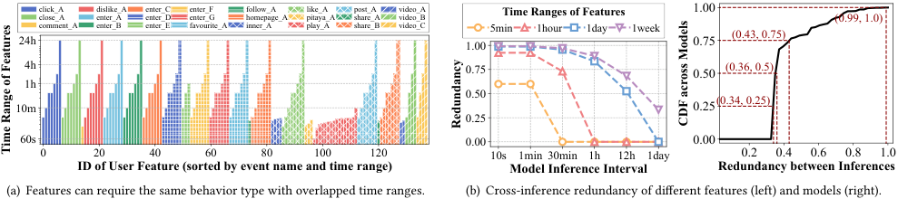

<!-- Start of picture text -->
click_Aclose_Acomment_A dislike_Aenter_Aenter_B enter_Center_Denter_E enter_Fenter_Gfavourite_A follow_Ahomepage_Ainner_A like_Apitaya_Aplay_A post_Ashare_Ashare_B video_Avideo_Bvideo_C 5minTime Ranges of Features1hour 1day 1week 1.00 (0.99, 1.0) 24h 1.00 0.75 (0.43, 0.75) 4h 0.75 0.50 (0.36, 0.5) 1h 0.50 10m 0.25 (0.34, 0.25) 0.25 60s 0.00 0.00 0 20 40 60 80 100 120 10s 1min 30min 1h 12h 1day 0.2 0.4 0.6 0.8 1.0 ID of User Feature (sorted by event name and time range) Model Inference Interval Redundancy between Inferences (a) Features can require the same behavior type with overlapped time ranges. (b) Cross-inference redundancy of different features (left) and models (right). Redundancy CDF across Models Time Range of Features <!-- End of picture text -->

**Figure 6: Analysis on real-world on-device ML models to reveal redundancy across features and inferences.** 

models require more than 60 distinct user features and 20% require as many as 110 user features. 

**Cumbersome User Feature Extraction.** Extracting user features from raw app logs is resource-intensive and time-consuming, due to the misaligned granularity between data stored in app logs and required by model features. As explained in §2.1 and visualized in Figure 2, user behaviors are recorded by mobile apps at _event level_ in app logs, where each row corresponds to a specific behavior event and behavior-specific attributes are compressed in one column for efficient storage. However, each user feature typically correlates with only a few attributes of certain behavior types (i.e., _attribute level_ ), such as average watching durations, genre list of videos watched over past hour. This is because different attributes are designed to describe the same behavior from diverse dimensions (e.g., watching duration, pause times, volume, genre, etc). As a result, extracting each user feature requires multiple resource-intensive operations, including retrieving relevant event rows, decompressing detailed attributes and filtering necessary attributes for computation (elaborated in yellow part of Figure 2 and §3.2). 

**Fast On-Device Model Inference.** Compared with the high latency of feature extraction, the practical on-device model inference is relatively fast, typically completed within millisecond-level latency, which is due to three root causes: _(i) Model size limitation:_ Mobile platforms have strict limits on app size (e.g., 2GB for iOS [17] and 4GB for Android [26]), which limits the size of each ML model deployed by mobile app on native devices. _(ii) Simple task:_ Most ML models practically offloaded to mobile devices handle lightweight but real-time prediction tasks for subsequent system responses, where compact models like decision trees [58], multi-layer perceptrons [59] and small neural networks [13] are qualified. _(iii) Advanced optimization:_ Years of research has led to highly efficient mobile inference engines [2, 33], with the help of mature optimization techniques from hardware, operator, model and algorithm aspects [25, 28, 31, 33, 36, 38, 44, 51, 65, 69]. 

## **2.3 Optimization Opportunities** 

In this work, we aim to address feature extraction bottleneck for real-world on-device model execution by eliminating redundant operations on overlapping data across both different input features and successive model inferences. 

**Inter-Feature Redundancy.** After scrutinizing ML models deployed in industrial mobile apps, we observe that many user features required by the same model can rely on overlapping behavior events, resulting in repeated operations on the same event rows 

in app log. Specifically, in Figure 6(a), we visualize the behavior types and time periods required by input features of a video recommendation model in TikTok, with feature names and behavior types anonymized for privacy. We observe that although the model requires 134 distinct user features, they are extracted from only 24 unique behavior types (indicated by colored bars and hatches). Despite variations in their target time windows and behavior-specific attributes, raw event rows processed by different features can remain largely overlapped. Such redundancy presents a substantial opportunity to optimize feature extraction process by fusing operations on overlapping events necessitated by different features. 

**Cross-Inference Redundancy.** Redundant operations also occur between consecutive model executions triggered by the same mobile service. In mobile apps, user intent and preferences are dynamic, requiring frequent model inferences to deliver real-time, accurate system responses. When the interval between model executions is shorter than the time range required for feature extraction, event rows processed in previous execution remains relevant and reusable for next execution. Figure 6(b) illustrates this pattern. For features based on the last 5 minutes of behavior, 60% of relevant event rows can be reused when model inference is triggered every minute. This overlap increases to 90% for features that rely on behavior within the last hour. We further show that this redundancy is widespread by collecting cross-inference redundancies of ML models running online in mobile apps. As shown in Figure 6(b), 75% on-device models exhibit over 34% overlapping data between online inferences and 25% exhibit overlap exceeding 43%. 

These findings highlight the inefficiencies in current feature extraction process, inspiring us to design a more efficient feature extraction engine for reducing on-device model execution latency without compromising model accuracy. 

## **3 AutoFeature Design** 

In this work, we introduce AutoFeature, a universal feature extraction engine designed to automatically identify and eliminate redundant operations across different features and consecutive model executions, accelerating end-to-end execution of on-device ML models for mobile apps. 

## **3.1 Overview** 

As depicted in Figure 7, AutoFeature serves as an independent optimization layer that integrates seamlessly with existing on-device model execution pipelines. It complements existing optimizations on model inference stage and operates in two phases: offline optimization and online execution. 

410 

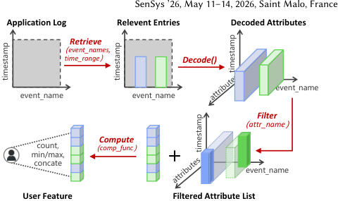

<!-- Start of picture text -->
SenSys ’26, May 11–14, 2026, Saint Malo, France Application Log Relevent Entries Decoded Attributes Retrieve （ event_names, time_range ） Decode() event_name event_name event_name Filter （ attr_name ） Compute count,  （ comp_func ） min/max, concate event_name User Feature Filtered Attribute List attributes attributes timestamp timestamp timestamp timestamp <!-- End of picture text -->

<!-- Start of picture text -->
Optimizing Feature Extraction for On-device Model Inference with User Behavior Sequences <!-- End of picture text -->

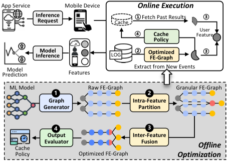

<!-- Start of picture text -->
App Service Mobile Device Online Execution Inference ① Fetch Past Results ③ Request Cache User ④ Cache Feature Policy InferenceModel  LOG ② Optimized FE-Graph ③ Model  Extract from New Events Prediction  Features ML Model Raw FE-Graph Granular FE-Graph 1 1 2 Graph  Intra-Feature Generator Partition 4 4 3 Output Inter-Feature Cache Evaluator Fusion Offline Policy Optimized FE-Graph Optimization <!-- End of picture text -->

**Figure 8: Four atomic operations of feature extraction.** 

information from an information stream using filtering conditions. Through an empirical analysis of user features required by ondevice ML models, we conclude that any user feature can be defined by a set of four orthogonal conditions: 

**Figure 7: AutoFeature overview and workflow.** 

**Offline Optimization.** When a new ML model is downloaded by mobile device via an app update, AutoFeature performs a onetime offline optimization to restructure the feature extraction workflow, which includes three main components. First, ❶ _graph generator_ formulates the feature extraction workflow as a directed acyclic graph (FE-graph), where each source node of app log and each target node of an input feature is connected by a chain of critical operation nodes (§3.2). Second, AutoFeature optimizes the FE-graph to eliminate redundant operations across features (§3.3), including ❷ _intra-feature partition_ to decompose each feature’s operation chain into smaller sub-chains to expose finer-grained fusion opportunities for redundant operation nodes, and ❸ _inter-feature fusion_ to judiciously fuse operation nodes with overlapping inputs to eliminate redundancy and carefully design termination node to minimize output separation cost for fused node. Third, ❹ _output evaluator_ valuates each node’s outputs based on the ratio of potential computation savings to memory footprint. A greedy caching policy is then applied to select high-value intermediate results for reuse during online execution (§3.4). 

_< 𝑒𝑣𝑒𝑛𝑡_  𝑛𝑎𝑚𝑒𝑠,𝑡𝑖𝑚𝑒_  𝑟𝑎𝑛𝑔𝑒,𝑎𝑡𝑡𝑟_  𝑛𝑎𝑚𝑒,𝑐𝑜𝑚𝑝_  𝑓𝑢𝑛𝑐 >,_ 

where _event_name_ specifies the behavior types required by the feature, _time_range_ defines the historical time window considered by the feature, _attr_name_ denotes the specific attributes needed from such behaviors, and _comp_func_ decides the computation function used to summarize behavior attributes. 

**Graph Formulation.** The above definition allows us to divide each feature extraction process into four atomic operations, each corresponding to a specific condition to progressively extract necessary data from raw app logs. For better understanding, we provide a concrete example in Figure 2 and a high-level illustration in Figure 8. The four atomic operations are as follows: 

• _Retrieve(event_names, time_range)_ : Relevant behavior events required by the feature are retrieved from app logs to device memory according to the specified conditions of _<event_names, time_range>_ . This operation is typically implemented as a database query2 and data I/O between storage and memory is the primary overhead. • _Decode()_ : For each retrieved row of behavior event, its detailed behavior-specific attributes are decoded from a compressed format. The decoding function is determined by the compression approach during behavior logging, typically implemented with lightweight data transformation tools like JSON parsing [56]. CPU dominates the overhead of this step. 

**Online Execution.** At run time, when an model execution request is issued, AutoFeature accelerates feature extraction through the following steps: ① fetching previously computed intermediate results from the cache, ② extracting missing intermediate results for newly logged user behavior data using the optimized FE-graph, ③ assembling cached and newly computed results to reconstruct real-time user features, and ④ updating intermediate results in cache based on the cache policy and memory constraints. 

• _Filter(attr_names)_ : Next, necessary attributes are filtered from the decoded attributes and further converted into a computable format like C array or Python list. 

• _Compute(comp_func)_ : Finally, the filtered attributes are computed into the final input feature using the specified computing function. Common functions include count, average, concatenation to summarize user behaviors over a time period in different granularity. 

## **3.2 Graph Generator: Automated Redundancy Identification** 

Given an on-device ML model, AutoFeature first needs to model the extraction process of each feature as a chain of discrete operation nodes, enabling systematic identification of redundancies across features. Such design is inspired by successful modern ML frameworks (e.g., TensorFlow, PyTorch, MNN), which compile models into computational graphs to enable operator fusion and scheduling. Similarly, as a feature extraction engine, AutoFeature aims to abstract the entire feature extraction workflow into a graph for systematic redundancy identification and elimination. To achieve this, we characterize the feature extraction process as a form of information filtering [7], which progressively removes unwanted 

**Redundancy Identification.** In this way, the extraction workflows of multiple input features can be formulated as one directed acyclic graph. The source node corresponds to raw app log, each target node represents a user feature and they are sequentially connected by four critical operation nodes with distinct conditions. Given an FE-graph, redundancy across any features can be identified by directly computing the set intersections of their conditions 

> 2“SELECT * FROM applog_file WHERE event_name IN { _event_names_ } AND timestamp > {(current_time - _time_range_ )}” 

411 

SenSys ’26, May 11–14, 2026, Saint Malo, France 

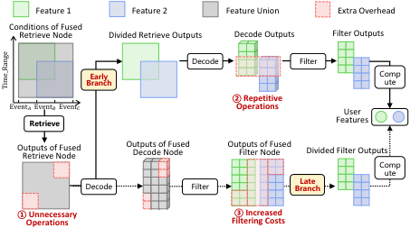

<!-- Start of picture text -->
Feature 1 Feature 2 Feature Union Extra Overhead Conditions of Fused Retrieve Node Divided Retrieve Outputs Decode Outputs Filter Outputs Decode Filter BranchEarly Compute ② Repetitive Event� Event� Event� Operations User Retrieve Features Outputs of Fused Retrieve Node Outputs of Fused Decode Node Outputs of FusedFilter Node Divided Filter Outputs Co m p u t e Decode F ilte r B ranch Late ①Operations Unnecessary  Filtering Costs③ Increased Time_Range <!-- End of picture text -->

**Figure 9: Additional cost introduced by feature fusion.** 

for each type of operation nodes. We classify inter-feature redundancy into three levels based on the condition overlapping degree. _(i) No redundancy_ : features have completely disjoint _<event_names, time_range>_ conditions, meaning no overlap in their relevant raw data (i.e., non-overlapping event rows in app log); _(ii) Partial redundancy_ : features share intersected _<event_names, time_range>_ conditions, leading to redundancy in Retrieve and Decode operations; _(iii) Full redundancy_ : features have identical _<event_names, time_range>_ conditions, implying duplicate Retrieve and Decode operation costs. It is important to note that few features share totally same _<event_names, time_range, attr_name>_ conditions as they depict identical behavior dimensions. 

## **3.3 Graph Optimizer: Inter-Feature Redundancy Elimination** 

After quantifying redundancy across operations, a natural solution to eliminate such redundancy is fusing operation nodes with overlapping inputs for different features. This involves merging their nodes of the same operation type into a single node, and setting condition of such fused node as the union of the original conditions. Despite conceptually simple, this method faces two primary challenges in how to start and terminate the chain fusion process to fully unleash the optimization potential. 

_Overgeneralized Conditions_ : Chain fusion begins with fusing _Retrieve_ nodes, which have two orthogonal conditions: _<event_names>_ and _<time_range>_ . Thus, the set union of different _Retrieve_ nodes’ conditions often results in a broader condition scope than the originally intended one. As illustrated in the left part of Figure 9, the condition union of feature 1 and 2 (gray area) is larger than the originally intended condition scope (green and blue areas), which incurs extra operations ① on irrelevant data (red area) for all subsequent operation nodes. 

_Optimal Termination Point_ : Each fused operation chain has to terminate with an extra _Branch_ node to separate outputs for different features before their _Compute_ operations, ensuring accurate feature extraction. However, determining the optimal termination point is non-trivial. Early termination could leave redundancy in later operation nodes, while late termination causes excessive branching costs. As shown in Figure 9, early termination after _Retrieve_ node leaves repetitive operations ② on overlapping data, whereas delaying termination requires each feature to filter relevant data from more intermediate results ③. 

To address these challenges, AutoFeature introduces a structured optimization strategy, which consists of two key steps: intra-feature 

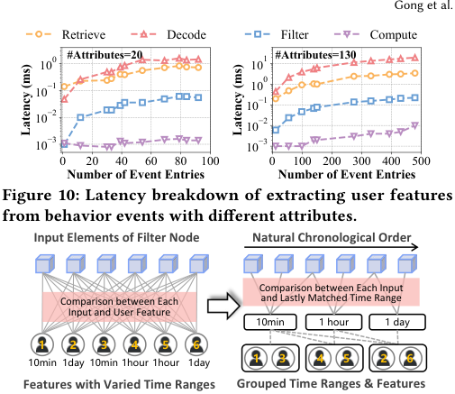

<!-- Start of picture text -->
Gong et al. Retrieve Decode Filter Compute 100 #Attributes=20 101 #Attributes=130 0 1 10 10 10 2 1010 12 10 3 10 3 0 20 40 60 80 100 0 100 200 300 400 500 Number of Event Entries Number of Event Entries Figure 10: Latency breakdown of extracting user features from behavior events with different attributes. Input Elements of Filter Node Natural Chronological Order Comparison between Each Input Comparison between Each  and Lastly Matched Time Range Input and User Feature 10min 1 hour 1 day 1 2 3 4 5 6 10min 1day 10min 1hour 1hour 1day 1 3 4 5 2 6 Features with Varied Time Ranges Grouped Time Ranges & Features Latency (ms) Latency (ms) <!-- End of picture text -->

**Figure 11: Comparison between original design and hierarchical filtering. Each line denotes a comparison.** 

chain partition and inter-feature chain fusion, to eliminate redundancy while maximizing computational efficiency. 

**Intra-Feature Chain Partition.** The root cause of unnecessary operations during chain fusion lies in the orthogonality of conditions of _Retrieve_ nodes (i.e., _event_names_ and _time_range_ ). Therefore, AutoFeature proposes to decompose each _Retrieve_ node into multiple sub-nodes, where each sub-node retains the original _time_range_ condition but is assigned a distinct _event_name_ condition. This decomposition partitions each feature extraction chain into multiple sub-chains with finer-grained conditions per node, allowing more precise chain fusion. By ensuring that only sub-chains with identical _event_name_ are fused, AutoFeature prevents irrelevant data from entering the pipeline. 

**Inter-Feature Chain Fusion.** Further, we introduce “branch postposition” concept to maximize redundancy elimination and a hierarchical filtering algorithm to minimize termination overhead. • _Branch Postposition Concept_ . A key observation from our system evaluation is that _Retrieve_ and _Decode_ nodes dominate feature extraction time. As shown in Figure 10, these nodes consume 15× more time than _Filter_ nodes and 300× more time than _Compute_ nodes. To fully eliminating the redundancy of computationally expensive nodes, AutoFeature delays the insertion of _Branch_ nodes until just before the _Compute_ node. 

• _Hierarchical Filtering Algorithm._ Instead of appending separate _Branch_ nodes for each feature, AutoFeature proposes to integrate them into the fused _Filter_ node. As a result, for each input element, the _Filter_ node checks whether it satisfies the condition of each fused feature and extracts necessary attributes for different fused features. However, such direct integration increases the _Filter_ node’s computational complexity to _𝑂_� _𝑙𝑒𝑛_ ( _𝑖𝑛𝑝𝑢𝑡_ )× _𝑛𝑢𝑚_ ( _𝑓𝑒𝑎𝑡𝑢𝑟𝑒_ )� , which is computationally expensive when facing numerous features or massive relevant behavior events as shown in Figure 11. 

To reduce this overhead, AutoFeature employs a hierarchical filtering algorithm based on two key observations: (i) Behavior events are stored in chronological order in app log, implicating that the outputs of each operation node are also time-ordered; (ii) Model features typically consider meaningful, periodic time ranges 

412 

SenSys ’26, May 11–14, 2026, Saint Malo, France 

Optimizing Feature Extraction for On-device Model Inference with User Behavior Sequences 

(e.g., the past 1 hour, 1 day, 1 week), leading to grouped _time_range_ conditions. Using these properties, AutoFeature could pre-compute a reverse mapping from each time range to the corresponding features and their required attributes, which can be pre-constructed offline. At runtime, the fused _Filter_ node hierarchically filters attributes from input elements for each feature through the following steps, as visualized in Figure 11: 

- Identify the closest matching time range for each input element based on its timestamp attribute and pre-computed time ranges (i.e., keys of reverse mapping). 

• Extract necessary attributes for each feature (i.e., values of reverse mapping) associated with the matched time range. Since input elements arrives in chronological order, AutoFeature can begin comparison from the matching time range of previous input element, reducing the overall complexity to _𝑂_� _𝑙𝑒𝑛_ ( _𝑖𝑛𝑝𝑢𝑡𝑠_ ) + _𝑙𝑒𝑛_ ( _𝑠𝑒𝑡_ ( _𝑡𝑖𝑚𝑒_  𝑟𝑎𝑛𝑔𝑒𝑠_ )� . This achieves a speedup proportional to the number of fused features even when their time ranges differ. 

## **3.4 Event Evaluator: Inter-Inference Redundancy Minimization** 

In industrial deployment, mobile services require frequent on-device model executions to keep up with the latest user intention and ensure high-quality service. Successive model executions often involve extracting user features from overlapping behavior events. To eliminate such temporal redundancy, the classic solution is to cache the valuable intermediate results during feature extraction for future reuse, (i.e., attributes decoded and extracted by each feature. However, this solution faces challenges in real-world mobile apps). Mobile devices typically support multi-app execution, and the memory allocated to one ML model of a single mobile app can be limited and dynamic, making caching all intermediate results not always feasible. 

To find the sweet spot between memory footprint and redundancy elimination, AutoFeature formulates the determination of which intermediate results to cache as a classic knapsack problem. It further incorporates a greedy cache policy to provide theoretically guaranteed performance under various memory budgets. 

**Caching Content Valuation.** We first discuss which type of intermediate results should be cached. As analyzed previously, _Decode_ and _Retrieve_ operations dominate the feature extraction cost, which suggests that caching should prioritize these operation nodes’ outputs for maximal computation savings. Therefore, AutoFeature caches at behavior level, i.e., selecting certain behavior types and caching all their events’ necessary attributes, rather than at feature level, i.e., caching attributes for certain features. This approach eliminates the need to re-execute _Decode_ and _Retrieve_ nodes on the same behavior events to extract those uncached attributes. 

Next, we define two metrics for each behavior type _𝐸𝑖_ to quantify its caching utility and cost for further problem formulation: • Utility _𝑈_ ( _𝐸𝑖_ ) is quantified by the computational savings achieved by caching all necessary attributes of the retrieved events of _𝐸𝑖_ , primarily coming from redundant operations on overlapping events between consecutive inferences: 

_𝑈_ ( _𝐸𝑖_ ) = _𝑁𝑢𝑚_  𝑂𝑣𝑒𝑟𝑙𝑎𝑝_ ( _𝐸𝑖_ ) × _𝐶𝑜𝑠𝑡_  𝑂𝑝𝑡_ ( _𝐸𝑖_ ) _,_ 

where _𝑁𝑢𝑚_  𝑂𝑣𝑒𝑟𝑙𝑎𝑝_ denotes the number of overlapped events between consecutive executions and _𝐶𝑜𝑠𝑡_  𝑂𝑝𝑡_ denotes the operation cost per event. 

• Cost _𝐶_ ( _𝐸𝑖_ ) is the memory space required to cache attributes of events that are processed in current model execution: 

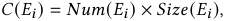

where _𝑁𝑢𝑚_ ( _𝐸𝑖_ ) denotes the number of events processed in current execution and _𝑆𝑖𝑧𝑒_ ( _𝐸𝑖_ ) denotes the size per event. 

**Problem Formulation.** Given a set of behavior types { _𝐸𝑖_ } _𝑖__𝑁_ =1 and a memory budget _𝑀_ , we aim to derive the optimal cache policy P∗ to maximize redundancy reduction while staying within memory constraints: 

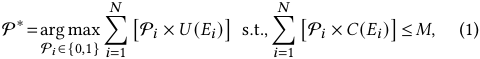

where P _𝑖_ ∈{0 _,_ 1} is a decision variable indicating whether to cache the behavior type _𝐸𝑖_ . Essentially, the optimization problem (1) is a classic knapsack problem [48, 60] that can be solved by dynamic programming algorithm with _𝑂_ ( _𝑁𝑀_ ) complexity [57]. However, both of the memory constraint _𝑀_ and the number of overlapped events between model executions are dynamic. They require solving the problem for each real-time model execution and is thus impractical for industrial deployment. 

**Greedy Policy.** AutoFeature incorporates a greedy cache policy that prioritizes behavior types based on their utility-to-cost ratio. Specifically, during each feature extraction process, AutoFeature sorts different behavior types by _𝑈_ ( _𝐸𝑖_ )/ _𝐶_ ( _𝐸𝑖_ ) in a descending order, and iteratively caches attributes for behavior events with the highest ratio until the memory budget is exhausted. The above greedy policy provides both performance and efficiency guarantees. Theoretically, previous research has proved that greedy solutions can achieve a 2-approximation ratio for the knapsack packing problems [10], which ensures a robust performance across various memory limitations imposed to each ML model. Further, the dynamic ratio _𝑈_ ( _𝐸𝑖_ )/ _𝐶_ ( _𝐸𝑖_ ) can be computed with constant complexity in practice through term decomposition: 

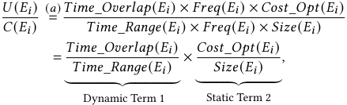

where Equation (a) represents the number of events as the multiplication of time range and the behavior occurrence frequency. As a result, term 1 is dynamically determined by on-device model inference frequency and term 2 is static and can be recorded once in an offline manner. 

**Online Execution.** To integrate this caching policy into online feature extraction, AutoFeature deploys an event evaluator that dynamically adjusts caching decisions at runtime. The feature extraction workflow follows these steps: (i) Retrieve attributes of relevant behavior events from cache and update the feature’s _time_range_ conditions based on the timestamp of cached events; (ii) Execute _Retrieve_ and _Decode_ operation nodes for missing attributes of newly logged events, (iii) Merge cached and newly extracted 

413 

SenSys ’26, May 11–14, 2026, Saint Malo, France 

Gong et al. 

attributes and execute _Filter_ and _Compute_ nodes to generate final features, (iv) Greedily cache events based on their up-to-date ratios of utility and cost, which are also leveraged to update cache when facing dynamic memory budget. 

## **4 Evaluation** 

## **4.1 Experiment Setup** 

**Implementation.** We have implemented a system prototype of AutoFeature and integrated it into the SDK of industrial mobile apps for evaluation3 . AutoFeature is designed to operate without modifying the model inference process, ensuring that model trainers, inference engine developers and mobile users do not need to make any adjustments. In compliance with enterprise data privacy requirements, our evaluation primarily uses ByteNN [54] as backend engine, which delivers comparable or superior performance to the open-source MNN [33] through app-specific optimizations. 

**Mobile Services.** Our evaluation was conducted on popular mobile apps from ByteDance, a company with billions of users, advanced on-device AI infrastructure and diverse mobile services. To demonstrate the generality of AutoFeature, we evaluate its performance across five representative mobile services, spanning three typical domains of mobile apps: search engines, video apps and e-commerce platforms. For video domain, TikTok (Douyin) is one of the world’s most popular short-form video platforms [71]. For search domain, Toutiao [72] is one of the most popular content discovery and searching platforms in China. For, e-commerce domain, Douyin is also a popular e-commerce platform. The tested services vary widely in scenarios, tasks, input user features and model execution frequencies, which are visualized in Figure 12. 

• _Content Preloading (CP)_ : Common in video apps like TikTok, this service decides which segment of video and comment to preload for ensuring seamless video watching experiences. The model relies on 86 user features derived from 27 distinct behavior types (e.g., video click, playback duration, sharing). 

• _Keyword Prediction (KP)_ : Deployed in mobile search engines like Google, this service predicts likely search query keywords based on past query behavior and currently browsing content. It uses 53 user features to track 22 types of search-related behaviors (e.g., past search terms, click-through history, time spent on search results.). • _Search Ranking (SR)_ : This service ranks the returned search results to match current user preferences and improve searching relevance. It uses 40 user features to tracks 10 user behavior types related to searches such as interactions with ranked elements and engagement with search results. 

• _Product Recommendation (PR)_ : Widely used in e-commerce platforms like Taobao, this service offers personalized product recommendations and targeted advertisements. Its model extracts 103 user features across 21 types of commercial behaviors, including product browsing duration, cart additions, purchases, and search within product categories. 

• _Video Recommendation (VR)_ : generates personalized video suggestions based on a user’s viewing history and content preferences. 

> 3Updates to the model configurations like input features and model parameters are typically handled by downloading a new mobile app SDK through standard app updates. For this case, AutoFeature simply treats the updated configuration as a new model and re-runs its offline optimization phase within millisecond-level latency. 

The relevant user features and behavior types for this model were previously illustrated in Figure 6(a). 

As (i) modern mobile operating systems aggressively prioritize the currently active foreground app and (ii) on-device model inferences are mostly triggered when the user is interacting with the app, our testing app is guaranteed to be in the foreground and receive the dominant share of available hardware resources, limiting the interference from other co-running background apps. 

**Model Architecture.** While we cannot disclose specific model architectures due to confidential requirement, we present a general structure of on-device models used by popular mobile services in Figure 13, which composes of three layers: 

• _Input Layer_ : As analyzed in §2.1, An on-device model takes three categories of features as inputs: cloud features to provide global information, device features to describe the current device state and user features to summarize various historical user behaviors. • _Processing Layer_ : These features are then processed by different model layers. Statistical features of user behaviors and device features are passed into an factorization machine layer for feature crossing, while sequential behavior features are sent to a sequence encoder to capture temporal dynamics and periodical patterns. • _Output Layer_ : Finally, the combined feature outputs are passed through several dense layers to generate final predictions for personalized system responses. 

**Testing Users.** We evaluate AutoFeature’s performance through online evaluation within real-world mobile apps. For each mobile service, we collect the end-to-end latency of on-device model execution of 10 testing users during their daily usage of the app across 2 days, containing three common time periods: noon (12:00-13:00), evening (18:00-19:00) and night (21:00-23:00). The limited test group stems from a necessary trade-off between operational cost and data representativeness. A fair and reliable comparison requires repeatedly running different feature extraction methods for every single real-time inference request. While this ensures identical user data and device state across methods, it significantly degrades service responsiveness and user experience. Limiting testing to 10 anonymous real-world users mitigates operational cost and financial loss, while still ensuring representativeness of the general population: • _Statistically Similar Usage Patterns_ : We quantitatively validate that the test group’s statistical usage patterns closely match those of massive real-world active users. Figure 14 visualizes the behavior frequencies of thousands of real-world user base (black bars) against 10 test users’ 20 traces (red stars). We used the KolmogorovSmirnov (KS) test to compare these distributions. For different time periods, the KS statistic is extremely low (0 _._ 079-0 _._ 118) and the p- values (0 _._ 785-0 _._ 998) are significantly greater than the standard 0 _._ 05 threshold, confirming that there is no statistically significant difference between the usage patterns of test users and overall user base. • _Diverse Behavior Traces_ : Beyond statistical alignment, our 10 test users were selected to cover a wide range of activity intensity, demonstrating the generality of our evaluation. Figure 15 illustrates the fine-grained behavior frequencies of test users, segmented into 10-minute intervals across different time periods.The top 10% most active users (P90 traces) generate over 45 specific behaviors every 10 minutes, while the bottom 30% of users (P30 traces) generate fewer than 5 behaviors per 10 minutes. Further details are provided in Appendix. 

414 

SenSys ’26, May 11–14, 2026, Saint Malo, France 

Optimizing Feature Extraction for On-device Model Inference with User Behavior Sequences 

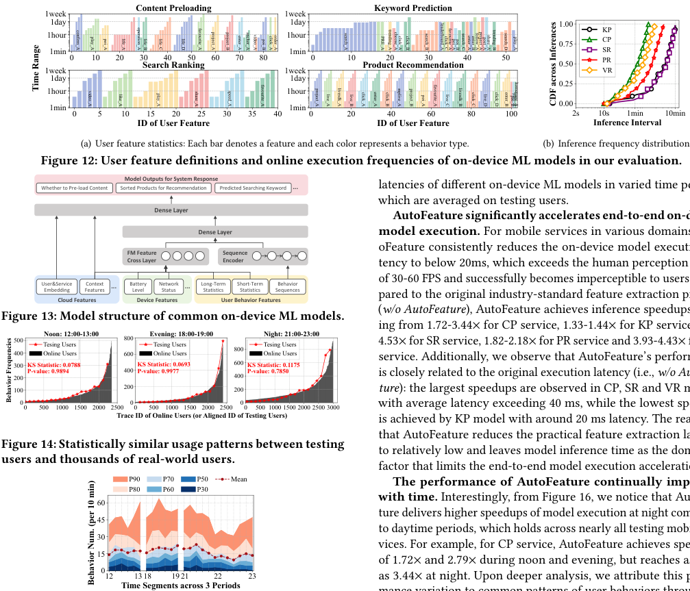

<!-- Start of picture text -->
1week Content Preloading 1week Keyword Prediction 1day 1day 1.00 KP 1hour 1hour 0.75 CP 1min 1min SR 1week 0 10 20 30Search Rankin40 50 g 60 70 80 1week 0 10 Product Recommendation20 30 40 50 0.50 PRVR 1day 1day 0.25 1hour 1hour 1min 1min 0.00 0 5 10 15 20 25 30 35 40 0 20 40 60 80 100 2s 10s 1min 10min ID of User Feature ID of User Feature Inference Interval (a) User feature statistics: Each bar denotes a feature and each color represents a behavior type. (b) Inference frequency distribution. Figure 12: User feature definitions and online execution frequencies of on-device ML models in our evaluation. Model Outputs for System Response Whether to Pre-load Content Sorted Products for Recommendation Predicted Searching Keyword ... latencies of different on-device ML models in varied time periods, which are averaged on testing users. Dense Layer AutoFeature significantly accelerates end-to-end on-device Dense Layer model execution.  For mobile services in various domains, Aut- FM Feature Sequence oFeature consistently reduces the on-device model execution la- Cross Layer Encoder tency to below 20ms, which exceeds the human perception range User&Service Embedding Cloud Features FeaturesContext ... BatteryLevel Device Features NetworkStatus ... Long-TermStatistics User Behavior Features Short-TermStatistics SequencesBehavior  of 30-60 FPS and successfully becomes imperceptible to users. Com-pared to the original industry-standard feature extraction process ( w/o AutoFeature ), AutoFeature achieves inference speedups rang- Figure 13: Model structure of common on-device ML models. 500400300 KS Statistic: 0.0788 Tesing Users Online Users Noon: 12:00-13:00 800600 KS Statistic: 0.0693EveninTesing Users Online Users g: 18:00-19:00 800600 KS Statistic: 0.1175 TesinOnline UsersNight: 21:00-23:00g Users 4.53ing from 1.72-3.44service. Additionally, we observe that AutoFeature’s performance× for SR service, 1.82-2.18× for CP service, 1.33-1.44× for PR service and 3.93-4.43× for KP service, 1.41-×× for SR service, 1.82-2.18× for CP service, 1.33-1.44× for PR service and 3.93-4.43× for KP service, 1.41-× for SR service, 1.82-2.18× for CP service, 1.33-1.44× for PR service and 3.93-4.43× for KP service, 1.41-×× for PR service and 3.93-4.43× for KP service, 1.41-× for PR service and 3.93-4.43× for KP service, 1.41-×× for VR P-value: 0.9894 400 P-value: 0.9977 P-value: 0.7850 200 400 is closely related to the original execution latency (i.e.,  w/o AutoFea- 100 200 200 ture ): the largest speedups are observed in CP, SR and VR models 0 0 0 0 500 1000 1500 2000 2500 0 500 1000 1500 2000 2500 0 500 1000 1500 2000 2500 3000 with average latency exceeding 40 ms, while the lowest speedup Trace ID of Online Users (or Aligned ID of Testing Users) is achieved by KP model with around 20 ms latency. The reason is that AutoFeature reduces the practical feature extraction latency Figure 14: Statistically similar usage patterns between testing to relatively low and leaves model inference time as the dominant users and thousands of real-world users. factor that limits the end-to-end model execution acceleration. P90P80 P70P60 P50P30 Mean The performance of AutoFeature continually 60 with time.  Interestingly, from Figure 16, we notice that AutoFea- 45 ture delivers higher speedups of model execution at night compared to daytime periods, which holds across nearly all testing mobile ser- 30 vices. For example, for CP service, AutoFeature achieves speedups 15 of 1.72× and 2.79× during noon and evening, but reaches as high× and 2.79× during noon and evening, but reaches as high and 2.79× during noon and evening, but reaches as high× during noon and evening, but reaches as high during noon and evening, but reaches as high 0 12 13  18 19  21    22 23 as 3 . 44× at night. Upon deeper analysis, we attribute this perfor-× at night. Upon deeper analysis, we attribute this perfor- at night. Upon deeper analysis, we attribute this perfor- Time Segments across 3 Periods confirm_A play_A poi_A life_A operation_A life_B life_C life_D favourite_A project_A project_B enter_A anchor_A _ v ideoA poi_B click_A order_A search_A PRE_A trending_A choose_Aclick_A click_B search_B leaderboard_Aclick_Cfavourite_Apoi_Apoi_B search_C enter_Aenter_Bfollow_Aproject_Apost_Ashare_A trending_B search_D play _ A Time Range video_A like_A play_A share_A speed_A favourite_A project_A live_A livesdk_A live_B click_A enter_A click_B mplive_A project_B poi_A favourite_A live_C livesdk_B click_C live_D click_D enter_B poi_Bplay_A homepage _ A CDF across Inferences Behavior Frequencies Behavior Num. (per 10 min) <!-- End of picture text -->

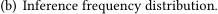

<!-- Start of picture text -->
(b) Inference frequency distribution. <!-- End of picture text -->

latencies of different on-device ML models in varied time periods, which are averaged on testing users. 

**AutoFeature significantly accelerates end-to-end on-device model execution.** For mobile services in various domains, AutoFeature consistently reduces the on-device model execution latency to below 20ms, which exceeds the human perception range of 30-60 FPS and successfully becomes imperceptible to users. Com-pared to the original industry-standard feature extraction process pared to the original industry-standard feature extraction process ( _w/o AutoFeature_ ), AutoFeature achieves inference speedups ranging from 1.72-3.44service. Additionally, we observe that AutoFeature’s performance× for SR service, 1.82-2.18× for CP service, 1.33-1.44× for PR service and 3.93-4.43× for KP service, 1.41-×× for CP service, 1.33-1.44× for PR service and 3.93-4.43× for KP service, 1.41-× for CP service, 1.33-1.44× for PR service and 3.93-4.43× for KP service, 1.41-×× for KP service, 1.41-× for KP service, 1.41-× 4.53ing from 1.72-3.44service. Additionally, we observe that AutoFeature’s performance× for SR service, 1.82-2.18× for CP service, 1.33-1.44× for PR service and 3.93-4.43× for KP service, 1.41-×× for SR service, 1.82-2.18× for CP service, 1.33-1.44× for PR service and 3.93-4.43× for KP service, 1.41-× for SR service, 1.82-2.18× for CP service, 1.33-1.44× for PR service and 3.93-4.43× for KP service, 1.41-×× for PR service and 3.93-4.43× for KP service, 1.41-× for PR service and 3.93-4.43× for KP service, 1.41-×× for VR service. Additionally, we observe that AutoFeature’s performance× for SR service, 1.82-2.18× for CP service, 1.33-1.44× for PR service and 3.93-4.43× for KP service, 1.41-× is closely related to the original execution latency (i.e., _w/o AutoFeature_ ): the largest speedups are observed in CP, SR and VR models with average latency exceeding 40 ms, while the lowest speedup is achieved by KP model with around 20 ms latency. The reason is that AutoFeature reduces the practical feature extraction latency to relatively low and leaves model inference time as the dominant factor that limits the end-to-end model execution acceleration. 

**The performance of AutoFeature continually improves with time.** Interestingly, from Figure 16, we notice that AutoFeature delivers higher speedups of model execution at night compared to daytime periods, which holds across nearly all testing mobile services. For example, for CP service, AutoFeature achieves speedups of 1.72× and 2.79× during noon and evening, but reaches as high× and 2.79× during noon and evening, but reaches as high and 2.79× during noon and evening, but reaches as high× during noon and evening, but reaches as high during noon and evening, but reaches as high as 3 _._ 44× at night. Upon deeper analysis, we attribute this perfor-× at night. Upon deeper analysis, we attribute this perfor- at night. Upon deeper analysis, we attribute this performance variation to common patterns of user behaviors throughout a day. At night, users tend to engage more actively with mobile apps over an extended and uninterrupted period. This results in a higher volume of newly logged behavior events, increasing the opportunity for AutoFeature to optimize feature extraction by eliminating redundant computations. In contrast, during midday and evening breaks, user interactions with mobile apps are typically shorter and less frequent, due to normal work schedules. 

**Figure 15: Specific behavior traces of testing users.** 

**It is important to note that all data collection and measurement processes are conducted with the consent of testing users, ensuring full compliance with privacy regulations in both research and industry** . 

**Baselines.** To the best of our knowledge, AutoFeature is the first work to optimize feature extraction for on-device model execution of real-world mobile apps. Thus, we consider the following baselines and ablated versions of AutoFeature: (i) _w/o AutoFeature_ : the industry-standard on-device feature extraction process, where each user feature is extracted independently without optimization, and (ii) _w/ Fusion_ : only the graph optimizer of AutoFeature is employed to eliminate inter-feature redundant operations, (iii) _w/ Cache_ : only the cache policy of AutoFeature is applied to minimize inter-inference redundancy. 

**The contributions of redundancy elimination across features and inferences vary across mobile services.** Figure 16 also reveals that both the graph optimizer ( _w/ Fusion_ ) and cache policy ( _w/ Cache_ ) could accelerate on-device model execution for all mobile services, except for the first model execution during each time period as app exit frees up memory. However, their effectiveness varies significantly across different services. While the _w/ Fusion_ plays a dominant role in accelerating CP, KP, and PR model executions, it is less effective for SR and VR models. This discrepancy primarily arises from the differences in their overlapping degrees of behavior events across models. Specifically, as shown in Figure 

## **4.2 Overall Performance** 

We begin by evaluating the overall performance of AutoFeature across diverse mobile services. Figure 16 plots the model execution 

415 

SenSys ’26, May 11–14, 2026, Saint Malo, France 

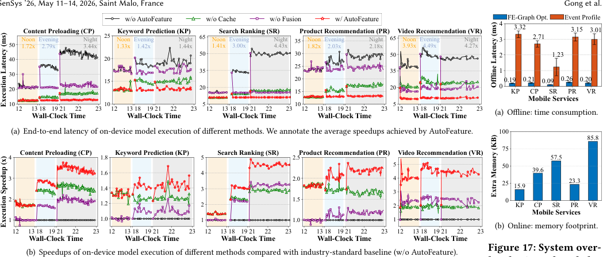

<!-- Start of picture text -->
SenSys ’26, May 11–14, 2026, Saint Malo, France Gong et al. w/o AutoFeature w/o Cache w/o Fusion w/ AutoFeature FE-Graph Opt. Event Profile NoonContent PreloadinEvening g (CPNight) 25 NoonKeyword Prediction Evening (NightKP) 65 Noon Search Rankin Evening g (SR Night ) 35Product Recommendation  Noon Evening Night (PR)65 Video Recommendation  Noon Evening Night (VR) 43 3.32 2.71 3.15 3.01 50 1.72x 2.79x 3.44x 1.33x 1.42x 1.44x 1.41x 3.00x 4.43x 1.82x 2.03x 2.18x 3.93x 4.49x 4.27x 40 20 50 30 50 2 1.23 25 30 35 35 1 15 20 0.19 0.21 0.09 0.26 0.20 20 20 15 20 0 KP CP SR PR VR Mobile Services 10 10 5 10 5 12 13    Wall-Clock Time   18 19       21 22 23 12 13    Wall-Clock Time   18 19       21 22 23 12 13    Wall-Clock Time   18 19       21 22 23 12 13    Wall-Clock Time   18 19       21 22 23 12 13    Wall-Clock Time   18 19       21 22 23 (a) Offline: time consumption. (a) End-to-end latency of on-device model execution of different methods. We annotate the average speedups achieved by AutoFeature. 100 85.8 4 Content Preloading (CP) 1.8 Keyword Prediction (KP) 5 Search Ranking (SR) 2.5Product Recommendation (PR) Video Recommendation (VR) 75 57.5 1.6 4 5 50 39.6 3 1.4 3 2.0 43 25 15.9 23.3 2 1.2 2 1.5 2 0 KP CP SR PR VR Mobile Services 1 1.0 1 1.0 1 12 13       18 19       21 22 23 12 13       18 19       21 22 23 12 13       18 19       21 22 23 12 13       18 19       21 22 23 12 13       18 19       21 22 23 (b) Online: memory footprint. Wall-Clock Time Wall-Clock Time Wall-Clock Time Wall-Clock Time Wall-Clock Time (b) Speedups of on-device model execution of different methods compared with industry-standard baseline (w/o AutoFeature). Figure 17: System over- Offline Latency (ms) Execution Latency (ms) Extra Memory (KB) Execution Speedup (x) <!-- End of picture text -->

**Figure 17: System overheads introduced by AutoFeature.** 

**Figure 16: Overall performance of different methods across varied time ranges and mobile services.** 

12(a), 80.2% of features in CP, 85% in KP, and 80.6% in PR share identical _event_name_ conditions, i.e., the same relevant behavior types, which enables AutoFeature to eliminate a substantial portion of redundant computations across features. In contrast, the SR and VR models exhibit relatively lower overlap (59% and 71%, respectively), reducing the optimization potential of inter-feature fusion. 

Figure 18(a) plots the average inference latency across various mobile services. AutoFeature significantly reduces inference latency across the five services by up to 70.9%, 30.5%, 77.4%, 54.2% and 77.7%, and reduces latency by up to 31.35 ms, 5.85 ms, 38.76 ms, 15.68 ms and 38.94 ms. Offloading only _𝐷𝑒𝑐𝑜𝑑𝑒_ (Decoded Log) yields an additional gain of at most 4 _._ 38 ms, and offloading both _𝐷𝑒𝑐𝑜𝑑𝑒_ and _𝑅𝑒𝑡𝑟𝑖𝑒𝑣𝑒_ (Feature Store) further reduces latency by at most 3 _._ 91 ms. However, the cloud baselines accelerate feature extraction with a catastrophic increase in storage requirements, making them impractical for mobile deployment. Figure 18(b) illustrates the app log size distributions across testing users for each system. For an average user, Decoded Log increases the app log size by 2 _._ 61×, and Feature Store increases it by a staggering 2 _._ 80×. This massive storage inflation is unacceptable for production mobile apps due to its direct link to user churn and financial loss: (i) Public statistics confirm that excessive app size is a primary driver of app uninstallation [3]; (ii) Our internal industrial data reveals that every additional 10 MB in app size leads to a decrease of around 30,000 to 61,000 daily active users, resulting in a daily financial loss of over $7,000. The storage efficiency provided by AutoFeature is thus a prerequisite for real-world deployment. 

**AutoFeature introduces marginal extra system costs for both offline and online phases.** During the offline optimization phase, the primary system overhead comes from (i) constructing and optimizing the FE-graph for each model, and (ii) profiling the operation cost and result size for each interaction event type. As shown in Figure 17(a), the overall time cost of offline optimization is dominated by the profiling process, which ranges from 1.23 ms to 3.32 ms across different on-device ML models. Note that the memory consumption during this phase is negligible, as AutoFeature requires only a few kilobytes space to analyze the conditions across features. During the online execution phase, the extra system overhead stems from caching intermediate results to reduce redundant operations across consecutive inferences. As depicted in Figure 17(b), the average extra memory footprint required to cache all intermediate results remains consistently below 100 KB. Such low memory cost is generally acceptable for both high-end and low-end mobile devices, attributed to (i) the compact feature sets of lightweight on-device ML models, (ii) our efficient eventlevel data caching for all features. As a result, our proposed greedy cache policy is mainly utilized when the memory budget of each ML model is strictly limited by operating system, analyzed in §4.3. 

## **4.3 Component-Wise Analysis** 

Next, we evaluate the effectiveness of each key design in AutoFeature. The experiments are mainly conducted on the video recommendation service with the most complex feature dependencies. 

**Inter-Feature Fusion.** To assess the impact of inter-feature operation fusion, we conduct a breakdown analysis of the feature extraction latency, isolating the time cost of each operation. Figure 19(a) compares the latency distributions across online executions _before_ and _after_ fusing redundant operations. Our key finding is that the primary computational savings of inter-feature fusion stem from two bottleneck operations: _Decode_ and _Retrieve_ . Specifically, the average latency of _Decode_ decreases from 12.01 ms to 2.95 ms and _Retrieve_ decreases from 9.12 ms to 2.23 ms, yielding over 4× speedups for both of them. However, the fusion process slightly 

**Comparison with Cloud-based Methods** We further benchmark AutoFeature against two cloud-side feature extraction systems. They trade real-time computation for increased storage by offloading expensive operations to an offline logging process and maintaining an additional database to store pre-computed outputs. Since _𝐷𝑒𝑐𝑜𝑑𝑒_ and _𝑅𝑒𝑡𝑟𝑖𝑒𝑣𝑒_ are the top-2 computationally expensive operations, we implemented two baselines based on which operation to offload: Decoded Log and Feature Store. Table 1 elaborates their storage structures and offloaded operations. 

416 

SenSys ’26, May 11–14, 2026, Saint Malo, France 

Optimizing Feature Extraction for On-device Model Inference with User Behavior Sequences 

**Table 1: Detailed introduction to cloud-side feature extraction baselines.** 

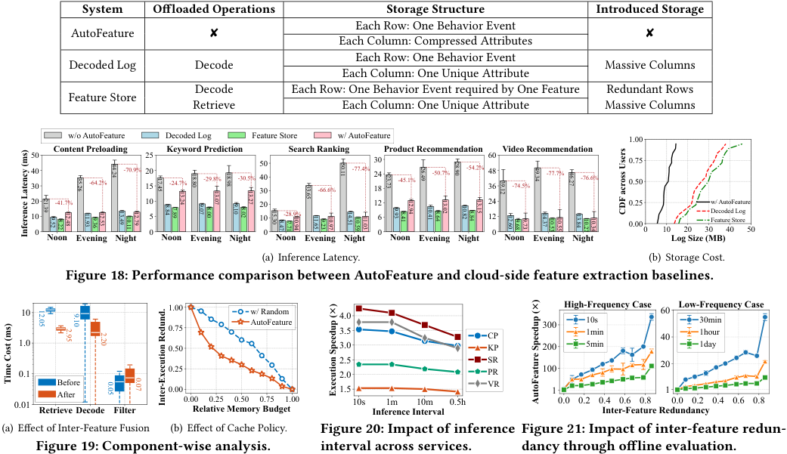

<!-- Start of picture text -->
System Offloaded Operations Storage Structure Introduced Storage Each Row: One Behavior Event AutoFeature ✘ ✘ Each Column: Compressed Attributes Each Row: One Behavior Event Decoded Log Decode Massive Columns Each Column: One Unique Attribute Decode Each Row: One Behavior Event required by One Feature Redundant Rows Feature Store Retrieve Each Column: One Unique Attribute Massive Columns w/o AutoFeature Decoded Log Feature Store w/ AutoFeature 1.00 504030 Content Preloadin-64.2% g-70.9% 252015 Ke-24.7%yword Prediction -29.8% -30.5% 504030 Search Rankin-66.6% g -77.4% 302418 Product Recommendation -45.1% -50.7% -54.2% 604836 Video Recommendation -74.5% -77.7% -76.6% 0.750.50 20 -41.7% 10 20 12 24 0.25 w/ AutoFeature 10 5 10 -28.9% 6 12 0.00 Decoded LogFeature Store 0 0 0 0 0 0 10 20 30 40 50 Noon Evening Night Noon Evening Night Noon Evening Night Noon Evening Night Noon Evening Night Log Size (MB) (a) Inference Latency. (b) Storage Cost. Figure 18: Performance comparison between AutoFeature and cloud-side feature extraction baselines. 10 1.000.75 w/ RandomAutoFeature 4.03.5 CP 300 High-Fre10s1minquency Case 6040 Low-Fre30min1houqruency Case 1.0 0.50 3.0 KP 200 5min 1day 0.1 0.25 2.52.0 SRPR 100 20 Before VR After 0.00 1.5 1 1 0.01 Retrieve Decode Filter 0.00Relative Memory Budget0.25 0.50 0.75 1.00 10s Inference Interval1m 10m 0.5h 0.0 0.2 0.4Inter-Feature Redundancy0.6 0.8 0.0 0.2 0.4 0.6 0.8 (a) Effect of Inter-Feature Fusion (b) Effect of Cache Policy. Figure 20: Impact of inference Figure 21: Impact of inter-feature redun- Figure 19: Component-wise analysis. interval across services. dancy through offline evaluation. 5.26 3 4.24 4 7.45 1 8.80 1 8.98 1 3.65 3 0.11 5 3.73 2 6.49 2 8.90 2 9.12 3 9.34 4 6.27 4 3.24 1 3.07 1 3.27 1 1.39 2 9 .52 .22 8 2.48 1 1.93 1 9 .36 2.53 1 3.49 1 0.11 1 2.79 1 .84 8 7 .89 9 .07 .00 8 9 .10 .02 8 5.30 1 .47 8 7 .71 0.94 1 1.65 1 9 .23 0.97 1 4.51 1 0.59 1 1.03 1 9 .93 .41 8 2.94 1 0.41 1 .64 8 3.02 1 0.82 1 .84 8 3.15 1 2.60 1 9 .68 9 .73 4.37 1 0.53 1 0.55 1 3.84 1 0.27 1 0.34 1 CDF across Users Inference Latency (ms) 12.05 9.10 2.95 2.20 Time Cost (ms) 0.05 0.07 Inter-Execution Redund. Execution Speedup ()× AutoFeature Speedup ()× <!-- End of picture text -->

increases the latency of _Filter_ operation. This is in expectation because the fused _Filter_ operation has to process and differentiate outputs for each fused feature, introducing extra branching cost. Benefited from our proposed hierarchical filtering algorithm, the extra latency is reduced to only 0.02 ms on average. 

**Inter-Execution Optimization.** Next, we evaluate the performance of greedy cache policy in reducing redundancy across model executions with various memory constraints. We compare AutoFeature with a modified version ( _w/ Random_ ), which caches intermediate results of different behavior types randomly rather than utility-to-cost ratio. Because (i) the redundancy between consecutive inferences varies during online evaluation and (ii) the number of intermediate results differs across mobile users, we analyze the relative changes in redundancy as a function of the proportion of intermediate results cached by the device. As shown in Figure 19(b), greedy cache policy consistently outperforms the _w/ Random_ , demonstrating its robust performance in handling various memory budgets. We also notice that the greedy policy is more effective when device memory is limited, such as reducing 50% redundant feature extraction operations by caching only 23% intermediate results. This is because the behavior types prioritized by AutoFeature exhibit higher utility-to-cost ratio, implying more redundancy reduction per memory cost unit, highlighting AutoFeature’ superior performance when handling strictly limited device memory. 

## **4.4 Sensitivity Analysis** 

Since AutoFeature operates without hyper-parameters, eliminating the need for trial-and-error tuning, we focus our sensitivity analysis on two environmental factors. 

**Impact of Model Execution Frequency.** To evaluate how execution frequency affects AutoFeature’s performance, we systematically vary the intervals between consecutive model executions. Specifically, we force on-device ML models of different mobile services to be invoked at fixed intervals during a user’s app usage at night. As shown in Figure 20, the speedups achieved by AutoFeature decrease as the interval between model executions increases. This trend is expected, as longer intervals reduce the likelihood of overlapping behavior events processed by consecutive feature extractions, thereby limiting the potential for redundancy elimination. However, even under infrequent scenarios (e.g., 1 model execution per 30 minutes), AutoFeature still achieves significant speedups ranging from 1.40× to 2.8× across real-world mobile services. This result demonstrates AutoFeature’s robustness in handling diverse inference frequencies. 

**Impact of Feature Redundancy.** To further assess AutoFeature’s performance across potential ML models with varying levels of inter-feature redundancy, we construct numerous synthetic feature sets with controlled redundancy levels. Specifically, we define feature redundancy as the proportion of overlapping time ranges among features that rely on the same user behavior types. For each redundancy level, we measure AutoFeature’s speedups on model execution under two scenarios: (i) high-frequency inferences with intervals ranging from 10 seconds to 5 minutes, and (ii) lowfrequency inferences with intervals ranging from 30 minutes to 1 day. As shown in Figure 21, AutoFeature’s performance consistently improves with increasing feature redundancy across various inference frequencies. When inference requests occur every 10s and 1h, the feature extraction speedups grow from 7.3× and 1 _._ 0× at 

417 

SenSys ’26, May 11–14, 2026, Saint Malo, France 

Gong et al. 

0% redundancy to 336× and 21.9× at nearly 90% redundancy. Even for the longest inference interval of 1 day, AutoFeature still reduces feature extraction latency by 2.1×, 4.1× and 5.6× for redundancy levels of 20%, 50% and 80%. Te observed speedups do not increase linearly with redundancy levels, as the plotted feature redundancy is estimated based on overlapping time ranges rather than specific behavior events, which are dynamic with user behaviors. It is important to note that the speedups reported in Figure 21 exceed those observed in online evaluations, as the synthetic experiments isolate and measure only the feature extraction process, whereas online evaluations include the model inference latencies. 

## **5 Discussion on Limitations** 

**Model-Engine Co-Design.** In practice, the ML development pipeline is often divided between two distinct teams: the Model Team, which focuses on maximizing model accuracy and company profit, and the Infrastructure Team, which focuses on optimizing model execution speed. While this decoupling makes our team’s feature extraction engine model-agnostic and highly generalizable, it inherently limits the opportunities for model-engine co-design. A co-designed approach could unlock greater efficiency by trading a small, acceptable amount of accuracy for significant latency gains, such as reusing stale feature values rather than recomputing the fresh ones. However, these optimizations are currently hindered by the prevailing organizational silos and technical separation typical of mobile application companies. 

**Dependency on Active Users and App Services.** The applicability of AutoFeature is naturally limited to user scenarios and application types where feature extraction constitutes a measurable performance bottleneck. For inactive users with minimal app logs, the feature extraction overhead might be minimal and lower than model inference time, as only a few behaviors are processed. However, this limitation applies only to an edge case, as nearly all major mobile services prioritize optimizing the experience of active users, who are the primary drivers of company revenue and inference requests. Also, for future intensive services where models become larger, the model inference time can dominate the execution pipeline. While this will diminish the proportional impact of our optimization on the total latency, we believe that the need for real-time responsiveness will remain paramount for the main mobile services and make AutoFeature still applicable. 

## **6 Related Work** 

**Device-Side Inference Acceleration.** Extensive research has been conducted to optimize on-device model inference, which can be classified into four categories: _operator optimization_ [33, 38, 51] to enhance backend inference engines at the operator level, _model architecture optimization_ through quantization [37, 42, 45], pruning [47, 52, 63, 70], sparsification [8, 46] and architecture redesign [12, 28, 65] to reduce computational complexity, _hardware resource exploitation_ [9, 31, 32, 36, 69, 74] to utilize multiple types of on-device computational hardware to accelerate computation, and _inference frequency reduction_ [11, 29, 41, 77] to avoid unnecessary inference requests. However, these work primarily focused on optimizing the model execution stage due to exclusively considering traditional vision or language models that use static input features. 

As a result, AutoFeature is complementary to them by optimizing the previous feature extraction stage for practical on-device ML adoption in mobile apps. 

**Cloud-Side Feature Computation.** Another related research topic is feature computation at cloud servers. To provide comprehensive features for real-time model inference processes requested by different online services, many service providers maintain an upto-date feature store at cloud servers like Amazon SageMaker [6] and Databricks Feature Store [15] , which collects all user data, pre-computes and stores necessary user features. This setups allows multiple application services to concurrently query user features [34, 73], but relies on huge storage and computational capabilities of cloud servers and introduces significant privacy concerns [49, 68]. Consequently, there is a growing trend towards offloading both feature extraction and model execution processes to device for more real-time, secure and personalized serves [25, 75]. Our work analyzes the practical issues in on-device feature extraction process and further explores potential optimization directions. 

**Feature Selection** is a mature field focused on identifying the optimal subset of features to maximize accuracy and minimize dimensionality [40, 78]. To achieve this, filter methods valuate features using a scoring function based on statistical properties like mutual information gain [18, 21, 64, 66] and representativeness to data distribution [19, 27, 30] . Wrapper methods leverage the model performance to assess the quality of selected features and refining the selection iteratively [5, 62, 79]. However, feature selection operates before deployment to determine what inputs the model should use, and our work operates in the post-deployment stage to optimize how those essential features are extracted for real-time on-device model inferences 

## **7 Conclusion** 

In this work, we identify an overlooked bottleneck of feature extraction in on-device model inference with user behavior sequences, which are prevalent in real-world industrial mobile apps. To address this bottleneck, we propose AutoFeature, the first feature extraction engine designed to accelerate on-device execution by eliminating redundant operations across both input features and consecutive model executions without compromising model accuracy. We implement a system prototype and integrate it into five real-world mobile services for evaluation, where AutoFeature achieves 1.33×-4.53× speedup in end-to-end model execution latency. 

## **Acknowledgments** 

We thank the anonymous reviewers and shepherd for their constructive comments. This work was supported in part by National Key R&D Program of China (No. 2023YFB4502400), in part by China NSF grant No. 62322206, 62432007, 62441236, 62132018, 62025204, U2268204, 62272307, 62372296, U25A6024, in part by Fundamental and Interdisciplinary Disciplines Breakthrough Plan of the Ministry of Education of China (No. JYB2025XDXM103). The opinions, findings, conclusions, and recommendations expressed in this paper are those of the authors and do not necessarily reflect the views of the funding agencies or the government. Zhenzhe Zheng is the corresponding author. 

418 

SenSys ’26, May 11–14, 2026, Saint Malo, France 

Optimizing Feature Extraction for On-device Model Inference with User Behavior Sequences 

## **References** 

- [1] [n. d.]. 2024 Q1 Mobile Application Performance Experience Report. https: //lydaas.oss-cn-beijing.aliyuncs.com/doc/2024Q1_U-APM.pdf. 

- [2] 2021. On-device training with tensorflow lite. https://www.tensorflow.org/lite/ examples/on_device_training/overview. 

- [3] 2025. App uninstall report – 2025 edition. https://www.appsflyer.com/resources/ reports/app-uninstall-benchmarks/. 

- [4] Mário Almeida, Stefanos Laskaridis, Abhinav Mehrotra, Lukasz Dudziak, Ilias Leontiadis, and Nicholas D. Lane. 2021. Smart at what cost?: characterising mobile deep neural networks in the wild. In _ACM Internet Measurement Conference (IMC)_ . 658–672. 

- [5] Hiromasa Arai, Crystal Maung, Ke Xu, and Haim Schweitzer. 2016. Unsupervised feature selection by heuristic search with provable bounds on suboptimality. In _Proceedings of the AAAI conference on artificial intelligence_ , Vol. 30. 

- [6] AWS. 2025. Amazon SageMaker Feature Store: A fully managed service for machine learning features. https://aws.amazon.com/sagemaker/ai/feature-store/. 

- [7] Nicholas J Belkin and W Bruce Croft. 1992. Information filtering and information retrieval: Two sides of the same coin? _Commun. ACM_ 35, 12 (1992), 29–38. 

- [8] Sourav Bhattacharya and Nicholas D Lane. 2016. Sparsification and separation of deep learning layers for constrained resource inference on wearables. In _ACM Conference on Embedded Networked Sensor Systems (Sensys)_ . 176–189. 

- [9] Qingqing Cao, Niranjan Balasubramanian, and Aruna Balasubramanian. 2017. MobiRNN: Efficient Recurrent Neural Network Execution on Mobile GPU. In _Proceedings of the 1st International Workshop on Embedded and Mobile Deep Learning (Deep Learning for Mobile Systems and Applications)_ . 1–6. 

- [10] Chandra Chekuri and Sanjeev Khanna. 2005. A polynomial time approximation scheme for the multiple knapsack problem. _SIAM J. Comput._ 35, 3 (2005), 713–728. 

- [11] Tiffany Yu-Han Chen, Lenin Ravindranath, Shuo Deng, Paramvir Bahl, and Hari Balakrishnan. 2015. Glimpse: Continuous, real-time object recognition on mobile devices. In _ACM Conference on Embedded Networked Sensor Systems (Sensys)_ . 155–168. 

- [12] Yanjiao Chen, Baolin Zheng, Zihan Zhang, Qian Wang, Chao Shen, and Qian Zhang. 2020. Deep learning on mobile and embedded devices: State-of-the-art, challenges, and future directions. _ACM Computing Surveys (CSUR)_ 53, 4 (2020), 1–37. 

- [13] Heng-Tze Cheng, Levent Koc, Jeremiah Harmsen, Tal Shaked, Tushar Chandra, Hrishi Aradhye, Glen Anderson, Greg Corrado, Wei Chai, Mustafa Ispir, et al. 2016. Wide & deep learning for recommender systems. In _Proceedings of the 1st workshop on deep learning for recommender systems_ . 7–10. 

- [14] Paul Covington, Jay Adams, and Emre Sargin. 2016. Deep neural networks for youtube recommendations. In _Proceedings of the 10th ACM conference on recommender systems_ . 191–198. 

- [15] databricks. 2025. Databricks Feature Store. https://docs.databricks.com/gcp/en/ machine-learning/feature-store. 

- [16] Michael F Deering. 1998. The limits of human vision. In _2nd international immersive projection technology workshop_ , Vol. 2. 

- [17] Apple Developer. 2023. Maximum build file sizes. https://developer.apple.com/ help/app-store-connect/reference/maximum-build-file-sizes/. 

- [18] Liang Du, Zhiyong Shen, Xuan Li, Peng Zhou, and Yi-Dong Shen. 2013. Local and global discriminative learning for unsupervised feature selection. In _EEE International Conference on Data Mining (ICDM)_ . 131–140. 

- [19] Ahmed K Farahat, Ali Ghodsi, and Mohamed S Kamel. 2011. An efficient greedy method for unsupervised feature selection. In _IEEE nternational Conference on Data Mining (ICDM)_ . IEEE, 161–170. 

- [20] Jesse Feiler and Jesse Feiler. 2015. Using SQLite with Core Data (iOS and OS X). _Introducing SQLite for Mobile Developers_ (2015), 61–73. 

- [21] Shuyang Gao, Greg Ver Steeg, and Aram Galstyan. 2016. Variational information maximization for feature selection. _Advances in neural information processing systems (NeurIPS)_ 29 (2016). 

- [22] Chen Gong, Zhenzhe Zheng, Yunfeng Shao, Bingshuai Li, Fan Wu, and Guihai Chen. 2024. ODE: An online data selection framework for federated learning with limited storage. _IEEE/ACM Transactions on Networking_ 32, 4 (2024), 2794–2809. 

- [23] Chen Gong, Zhenzhe Zheng, Fan Wu, Xiaofeng Jia, and Guihai Chen. 2024. Delta: A cloud-assisted data enrichment framework for on-device continual learning. In _Proceedings of the 30th Annual International Conference on Mobile Computing and Networking (MobiCom)_ . 1408–1423. 

- [24] Chen Gong, Zhenzhe Zheng, Fan Wu, Yunfeng Shao, Bingshuai Li, and Guihai Chen. 2023. To store or not? online data selection for federated learning with limited storage. In _Proceedings of the ACM Web Conference 2023 (WWW)_ . 3044– 3055. 

- [25] Chen Gong, Yan Zhuang, Zhenzhe Zheng, Yiliu Chen, Sheng Wang, Fan Wu, and Guihai Chen. 2025. Optimizing Storage Overhead of User Behavior Log for ML-embedded Mobile Apps. _Proceedings of the ACM on Measurement and Analysis of Computing Systems (SIGMETRICS)_ 9, 3 (2025), 1–28. 

- [26] Google. [n. d.]. Android Developers: APK Expansion Files. https://developer. android.com/google/play/expansion-files. 

- [27] Quanquan Gu, Zhenhui Li, and Jiawei Han. 2012. Generalized fisher score for feature selection. _arXiv preprint arXiv:1202.3725_ (2012). 

- [28] Peizhen Guo, Bo Hu, and Wenjun Hu. 2021. Mistify: Automating {DNN} Model Porting for {On-Device} Inference at the Edge. In _USENIX Symposium on Networked Systems Design and Implementation (NSDI)_ . 705–719. 

- [29] Peizhen Guo, Bo Hu, Rui Li, and Wenjun Hu. 2018. Foggycache: Cross-device approximate computation reuse. In _International Conference on Mobile Computing and Networking (MobiCom)_ . 19–34. 

- [30] Xiaofei He, Deng Cai, and Partha Niyogi. 2005. Laplacian score for feature selection. _Advances in neural information processing systems (NeurIPS)_ 18 (2005). 

- [31] Joo Seong Jeong, Jingyu Lee, Donghyun Kim, Changmin Jeon, Changjin Jeong, Youngki Lee, and Byung-Gon Chun. 2022. Band: coordinated multi-dnn inference on heterogeneous mobile processors. In _International Conference on Mobile Systems, Applications and Services (MobiSys)_ . 235–247. 

- [32] Fucheng Jia, Deyu Zhang, Ting Cao, Shiqi Jiang, Yunxin Liu, Ju Ren, and Yaoxue Zhang. 2022. CoDL: efficient CPU-GPU co-execution for deep learning inference on mobile devices.. In _International Conference on Mobile Systems, Applications, and Services (MobiSys)_ , Vol. 22. 209–221. 

- [33] Xiaotang Jiang, Huan Wang, Yiliu Chen, Ziqi Wu, Lichuan Wang, Bin Zou, Yafeng Yang, Zongyang Cui, Yu Cai, Tianhang Yu, et al. 2020. MNN: A universal and efficient inference engine. _Proceedings of Machine Learning and Systems (MLSys)_ 2 (2020), 1–13. 

- [34] Theofilos Kakantousis, Antonios Kouzoupis, Fabio Buso, Gautier Berthou, Jim Dowling, and Seif Haridi. 2019. Horizontally scalable ml pipelines with a feature store. In _Proceedings of the 2nd SysML Conference_ . 

- [35] Shubhra Kanti Karmaker Santu, Parikshit Sondhi, and ChengXiang Zhai. 2017. On application of learning to rank for e-commerce search. In _International ACM SIGIR Conference on Research and Development in Information Retrieval (SIGIR)_ . 475–484. 

- [36] Mehrdad Khani, Ganesh Ananthanarayanan, Kevin Hsieh, Junchen Jiang, Ravi Netravali, Yuanchao Shu, Mohammad Alizadeh, and Victor Bahl. 2023. {RECL}: Responsive {Resource-Efficient} continuous learning for video analytics. In _USENIX Symposium on Networked Systems Design and Implementation (NSDI)_ . 917–932. 

- [37] Youngsok Kim, Joonsung Kim, Dongju Chae, Daehyun Kim, and Jangwoo Kim. 2019. _𝜇_ layer: Low latency on-device inference using cooperative single-layer acceleration and processor-friendly quantization. In _Proceedings of the Fourteenth EuroSys Conference (EuroSys)_ . 1–15. 

- [38] Rui Kong, Yuanchun Li, Yizhen Yuan, and Linghe Kong. 2023. Convrelu++: Reference-based lossless acceleration of conv-relu operations on mobile cpu. In _International Conference on Mobile Systems, Applications and Services (MobiCom)_ . 503–515. 

- [39] Jay Kreibich. 2010. _Using SQLite_ . " O’Reilly Media, Inc.". 

- [40] Jundong Li, Kewei Cheng, Suhang Wang, Fred Morstatter, Robert P Trevino, Jiliang Tang, and Huan Liu. 2017. Feature selection: A data perspective. _ACM computing surveys (CSUR)_ 50, 6 (2017), 1–45. 

- [41] Yuanqi Li, Arthi Padmanabhan, Pengzhan Zhao, Yufei Wang, Guoqing Harry Xu, and Ravi Netravali. 2020. Reducto: On-camera filtering for resource-efficient real-time video analytics. In _Proceedings of the Annual conference of the ACM Special Interest Group on Data Communication on the applications, technologies, architectures, and protocols for computer communication (SIGCOMM)_ . 359–376. 

- [42] Ji Lin, Jiaming Tang, Haotian Tang, Shang Yang, Wei-Ming Chen, Wei-Chen Wang, Guangxuan Xiao, Xingyu Dang, Chuang Gan, and Song Han. 2024. Awq: Activation-aware weight quantization for on-device llm compression and acceleration. _Proceedings of Machine Learning and Systems (MLsys)_ 6 (2024), 87–100. 

- [43] Cihang Liu, Lan Zhang, Zongqian Liu, Kebin Liu, Xiangyang Li, and Yunhao Liu. 2016. Lasagna: Towards deep hierarchical understanding and searching over mobile sensing data. In _Annual International Conference on Mobile Computing and Networking (MobiCom)_ . 334–347. 

- [44] Haibo Liu, Chen Gong, Zhenzhe Zheng, Shengzhong Liu, and Fan Wu. 2025. Enabling real-time inference in online continual learning via device-cloud collaboration. In _Proceedings of the ACM on Web Conference 2025 (WWW)_ . 2043–2052. 

- [45] Sicong Liu, Yingyan Lin, Zimu Zhou, Kaiming Nan, Hui Liu, and Junzhao Du. 2018. On-demand deep model compression for mobile devices: A usage-driven model selection framework. In _International Conference on Mobile Systems, Applications, and Services (MobiSys)_ . 389–400. 

- [46] Sangkug Lym, Esha Choukse, Siavash Zangeneh, Wei Wen, Sujay Sanghavi, and Mattan Erez. 2019. Prunetrain: fast neural network training by dynamic sparse model reconfiguration. In _International Conference for High Performance Computing, Networking, Storage and Analysis (SC)_ . 1–13. 

- [47] Xiaolong Ma, Fu-Ming Guo, Wei Niu, Xue Lin, Jian Tang, Kaisheng Ma, Bin Ren, and Yanzhi Wang. 2020. Pconv: The missing but desirable sparsity in dnn weight pruning for real-time execution on mobile devices. In _Annual AAAI Conference on Artificial Intelligence (AAAI)_ , Vol. 34. 5117–5124. 

- [48] Silvano Martello and Paolo Toth. 1987. Algorithms for knapsack problems. _NorthHolland Mathematics Studies_ 132 (1987), 213–257. 

- [49] Itzik Mazeh and Erez Shmueli. 2020. A personal data store approach for recommender systems: enhancing privacy without sacrificing accuracy. _Expert Systems_ 

419 

SenSys ’26, May 11–14, 2026, Saint Malo, France 

Gong et al. 

_with Applications_ 139 (2020), 112858. 

- [50] Abbas Mehrabi, Matti Siekkinen, and Antti Ylä-Jääski. 2018. Edge computing assisted adaptive mobile video streaming. _IEEE Transactions on Mobile Computing (TMC)_ 18, 4 (2018), 787–800. 

- [51] Wei Niu, Jiexiong Guan, Yanzhi Wang, Gagan Agrawal, and Bin Ren. 2021. Dnnfusion: accelerating deep neural networks execution with advanced operator fusion. In _International Conference on Programming Language Design and Implementation (PDLI)_ . 883–898. 

- [52] Wei Niu, Xiaolong Ma, Sheng Lin, Shihao Wang, Xuehai Qian, Xue Lin, Yanzhi Wang, and Bin Ren. 2020. Patdnn: Achieving real-time dnn execution on mobile devices with pattern-based weight pruning. In _International Conference on Architectural Support for Programming Languages and Operating Systems (ASPLOS)_ . 907–922. 

- [53] Nikola Obradovic, Aleksandar Kelec, and Igor Dujlovic. 2019. Performance analysis on Android SQLite database. In _International Symposium INFOTEHJAHORINA (INFOTEH)_ . IEEE, 1–4. 

- [54] Client AI Group of ByteDance. 2022. Introduction to ByteDance Pitaya. https: //xie.infoq.cn/article/d9a05a40ddbc1b01218f46a0a. 

- [55] Gihwan Oh, Sangchul Kim, Sang-Won Lee, and Bongki Moon. 2015. SQLite optimization with phase change memory for mobile applications. _Proceedings of the VLDB Endowment (VLDB)_ 8, 12 (2015), 1454–1465. 

- [56] Felipe Pezoa, Juan L Reutter, Fernando Suarez, Martín Ugarte, and Domagoj Vrgoč. 2016. Foundations of JSON schema. In _International Conference on World Wide Web (WWW)_ . 263–273. 

- [57] Ulrich Pferschy. 1999. Dynamic programming revisited: Improving knapsack algorithms. _Computing_ 63, 4 (1999), 419–430. 

- [58] J. Ross Quinlan. 1996. Learning decision tree classifiers. _ACM Computing Surveys (CSUR)_ 28, 1 (1996), 71–72. 

   - [74] Daliang Xu, Mengwei Xu, Qipeng Wang, Shangguang Wang, Yun Ma, Kang Huang, Gang Huang, Xin Jin, and Xuanzhe Liu. 2022. Mandheling: mixedprecision on-device DNN training with DSP offloading. In _International Conference on Mobile Computing and Networking (MobiCom)_ . 214–227. 

   - [75] Mengwei Xu, Jiawei Liu, Yuanqiang Liu, Felix Xiaozhu Lin, Yunxin Liu, and Xuanzhe Liu. 2019. A First Look at Deep Learning Apps on Smartphones. In _The ACM Web Conference (WWW)_ . 2125–2136. 

   - [76] Hyunho Yeo, Youngmok Jung, Jaehong Kim, Jinwoo Shin, and Dongsu Han. 2018. Neural adaptive content-aware internet video delivery. In _USENIX Symposium on Operating Systems Design and Implementation (OSDI)_ . 645–661. 

   - [77] Mu Yuan, Lan Zhang, Fengxiang He, Xueting Tong, and Xiang-Yang Li. 2022. Infi: end-to-end learnable input filter for resource-efficient mobile-centric inference. In _International Conference on Mobile Computing And Networking (MobiCom)_ . 228–241. 

   - [78] Daochen Zha, Zaid Pervaiz Bhat, Kwei-Herng Lai, Fan Yang, Zhimeng Jiang, Shaochen Zhong, and Xia Hu. 2025. Data-centric artificial intelligence: A survey. _ACM Computing Surveys (CSUR)_ 57, 5 (2025), 1–42. 

   - [79] Xiao Zhang, Changlin Mei, Degang Chen, Yanyan Yang, and Jinhai Li. 2019. Active incremental feature selection using a fuzzy-rough-set-based information entropy. _IEEE Transactions on Fuzzy Systems_ 28, 5 (2019), 901–915. 

   - [80] Yongfeng Zhang, Xu Chen, Qingyao Ai, Liu Yang, and W Bruce Croft. 2018. Towards conversational search and recommendation: System ask, user respond. In _ACM International Conference on Information and Knowledge Management (CIKM)_ . 177–186. 

   - [81] Christos Ziakis, Maro Vlachopoulou, Theodosios Kyrkoudis, and Makrina Karagkiozidou. 2019. Important factors for improving Google search rank. _Future Internet_ 11, 2 (2019), 32. 

- [59] Hassan Ramchoun, Youssef Ghanou, Mohamed Ettaouil, and Mohammed Amine Janati Idrissi. 2016. Multilayer perceptron: Architecture optimization and training. (2016). 

- [60] Harvey M Salkin and Cornelis A De Kluyver. 1975. The knapsack problem: a survey. _Naval Research Logistics Quarterly_ 22, 1 (1975), 127–144. 

- [61] Iqbal H Sarker, Mohammed Moshiul Hoque, Md Kafil Uddin, and Tawfeeq Alsanoosy. 2021. Mobile data science and intelligent apps: concepts, AI-based modeling and research directions. _Mobile Networks and Applications_ (2021), 285–303. 

- [62] Shachar Schnapp and Sivan Sabato. 2021. Active feature selection for the mutual information criterion. In _Proceedings of the AAAI Conference on Artificial Intelligence_ , Vol. 35. 9497–9504. 

- [63] Leming Shen, Qiang Yang, Kaiyan Cui, Yuanqing Zheng, Xiao-Yong Wei, Jianwei Liu, and Jinsong Han. 2024. Fedconv: A learning-on-model paradigm for heterogeneous federated clients. In _International Conference on Mobile Systems, Applications, and Services (MobiSys)_ . 398–411. 

- [64] Alexander Shishkin, Anastasia Bezzubtseva, Alexey Drutsa, Ilia Shishkov, Ekaterina Gladkikh, Gleb Gusev, and Pavel Serdyukov. 2016. Efficient high-order interaction-aware feature selection based on conditional mutual information. _Advances in neural information processing systems (NeurIPS)_ 29 (2016). 

- [65] Xiaohu Tang, Yang Wang, Ting Cao, Li Lyna Zhang, Qi Chen, Deng Cai, Yunxin Liu, and Mao Yang. 2023. Lut-nn: Empower efficient neural network inference with centroid learning and table lookup. In _International Conference on Mobile Computing and Networking (MobiCom)_ . 1–15. 

- [66] Ikram Sumaiya Thaseen and Cherukuri Aswani Kumar. 2017. Intrusion detection model using fusion of chi-square feature selection and multi class SVM. _Journal of King Saud University-Computer and Information Sciences_ 29, 4 (2017), 462–472. 

- [67] Tuyen X Tran and Dario Pompili. 2018. Adaptive bitrate video caching and processing in mobile-edge computing networks. _IEEE Transactions on Mobile Computing (TMC)_ 18, 9 (2018), 1965–1978. 

- [68] Paul Voigt and Axel Von dem Bussche. 2017. The eu general data protection regulation (gdpr). _A Practical Guide, 1st Ed., Cham: Springer International Publishing_ 10, 3152676 (2017), 10–5555. 

- [69] Manni Wang, Shaohua Ding, Ting Cao, Yunxin Liu, and Fengyuan Xu. 2021. Asymo: scalable and efficient deep-learning inference on asymmetric mobile cpus. In _International Conference on Mobile Computing and Networking (MobiSys)_ . 215–228. 

- [70] Hao Wen, Yuanchun Li, Zunshuai Zhang, Shiqi Jiang, Xiaozhou Ye, Ye Ouyang, Yaqin Zhang, and Yunxin Liu. 2023. AdaptiveNet: Post-deployment Neural Architecture Adaptation for Diverse Edge Environments. In _International Conference on Mobile Computing and Networking (MobiCom)_ . 28:1–28:17. 

- [71] Wikipedia. 2025. TikTok. https://en.wikipedia.org/wiki/TikTok. 

- [72] Wikipedia. 2025. Toutiao. https://en.wikipedia.org/wiki/Toutiao. 

- [73] Sarah Wooders, Xiangxi Mo, Amit Narang, Kevin Lin, Ion Stoica, Joseph M Hellerstein, Natacha Crooks, and Joseph E Gonzalez. 2023. RALF: AccuracyAware Scheduling for Feature Store Maintenance. _Proceedings of the VLDB Endowment (VLDB)_ 17, 3 (2023), 563–576. 

420 

