IEEE TRANSACTIONS ON KNOWLEDGE AND DATA ENGINEERING, VOL. 33, NO. 3, MARCH 2021 

975 

# ERATO: Trading Noisy Aggregate Statistics over Private Correlated Data 

Chaoyue Niu , Student Member, IEEE, Zhenzhe Zheng , Student Member, IEEE, Fan Wu , Member, IEEE, Shaojie Tang, Member, IEEE, Xiaofeng Gao , Member, IEEE, and Guihai Chen, Senior Member, IEEE 

Abstract—With the commoditization of personal privacy, pricing private data has become an intriguing problem. In this paper, we study noisy aggregate statistics trading from the perspective of a data broker in data markets. We thus propose ERATO, which enables aggrEgate statistics pRicing over privATe cOrrelated data. On one hand, ERATO guarantees arbitrage freeness against cunning data consumers. On the other hand, ERATO compensates data owners for their privacy losses using both bottom-up and top-down designs. We further apply ERATO to three practical aggregate statistics, namely weighted sum, probability distribution fitting, and degree distribution, and extensively evaluate their performances on MovieLens dataset, 2009 RECS dataset, and two SNAP large social network datasets, respectively. Our analysis and evaluation results reveal that ERATO well balances utility and privacy, achieves arbitrage freeness, and compensates data owners more fairly than differential privacy based approaches. 

Index Terms—Data trading, data privacy, data correlation 

Ç 

## 1 INTRODUCTION 

Inet giants, like Google, Facebook, and Twitter, is to provideN today’s big data economy, a common practice for Interfree online services in exchange for private information [1]. Nevertheless, when data owners become more aware of the economic values of personal data and the potential consequences of privacy disclosure, they would have stronger motivations to receive monetary compensations in return [2]. In particular, a study by JPMorgan Chase found that each unique user is worth roughly $4 to Facebook and $24 to Google [3]. Furthermore, several startup companies, including Datacoup [4], CitizenMe [5], and CoverUS [6], have already paid data owners for access to their private data. In a nutshell, data privacy has become a commodity to be bought and sold in practice. 

To facilitate private data circulation, many open information platforms have emerged to bridge the gap between data owners and data consumers. For example, according to an FTC’s survey on the nine typical data markets [7], Acxiom, which is the largest data broker, collects personal data from about 700 million users worldwide, and then sells aggregate statistics to top companies, such as Microsoft, Oracle, AT&T, etc. However, as further investigated by CBS News [8], such 

- C. Niu, Z. Zheng, F. Wu, X. Gao, and G. Chen are with the Shanghai Key Laboratory of Scalable Computing and Systems, Department of Computer Science and Engineering, Shanghai Jiao Tong University, Shanghai 200240, China. E-mail: {rvince, zhengzhenzhe}@sjtu.edu.cn, {fwu, gao-xf, gchen}@cs.sjtu.edu.cn. 

- S. Tang is with the Department of Information Systems, University of Texas at Dallas, Richardson, TX 75080 USA. E-mail: tangshaojie@gmail. com. 

Manuscript received 4 June 2018; revised 1 May 2019; accepted 29 July 2019. Date of publication 14 Aug. 2019; date of current version 3 Feb. 2021. (Corresponding author: Fan Wu.) Recommended for acceptance by J. Chen. 

Digital Object Identifier no. 10.1109/TKDE.2019.2934100 

a multibillion-dollar industry has raised great attention together with serious doubt. One critical concern is that the data brokers make huge profits from private information, whereas they do not properly compensate data owners for their privacy losses. This criticism prompts the intermediate data brokers to devise a feasible privacy compensation mechanism for the data owners. In addition, the pricing strategy for the data consumers, which initially neither respects privacy nor provides economic guarantee [9], also requires new design. 

To design a pricing framework for practical data markets trading aggregate statistics over private data, there are three major challenges. The first and the thorniest challenge is to rigorously quantify privacy loss. Markets for sensitive personal data significantly differ from those for ordinary information goods in privacy compensation. To compensate each data owner properly, it is necessary to quantify her privacy loss during the usage of her data. In the context of aggregate statistics, differential privacy [10], [11] has a natural utility-theoretic interpretation, which makes it a compelling measure to quantify individual privacy loss [12]. However, if the ubiquitous data correlations are further taken into account, there are two striking differences: (1) Due to data correlations, data owners, who are not involved in an aggregate statistic, may still suffer privacy losses. For example, if Alice is not but one of her friends is involved in the counting statistic about how many people have infected a contagious disease, Alice’s status can still be leaked to an attacker who knows her social network [13], [14]. (2) Data owners with different sets of correlated data owners, or even the same set but with different correlation coefficients, can have distinct privacy losses. For example, in degree distribution, if Bob’s degree is larger than Charlie’s, which implies that Bob has more social connections, Bob thus can 

1041-4347 � 2019 IEEE. Personal use is permitted, but republication/redistribution requires IEEE permission. See ht_tps://www.ieee.org/publications/rights/index.html for more information. 

Authorized licensed use limited to: Shanghai Jiaotong University. Downloaded on February 15,2022 at 23:37:08 UTC from IEEE Xplore.  Restrictions apply. 

IEEE TRANSACTIONS ON KNOWLEDGE AND DATA ENGINEERING, VOL. 33, NO. 3, MARCH 2021 

976 

suffer a higher risk of privacy leakage [15]. If differential privacy is adopted for privacy loss quantification in two cases, the privacy loss of Alice is zero, and the privacy losses of Bob and Charlie are the same, which are both unreasonable in practice. 

Yet, another challenge comes from the rich and complex formulas of common aggregate statistics. The data consumers in data markets are normally permitted to purchase multiple statistics. As a consequence, a critical concern is that they may circumvent the advertised price of a statistic through buying a bundle of cheaper ones. This economic practice is called arbitrage, while desirable pricings should be arbitrage free. Besides, the key issue in investigating arbitrage freeness is to determine whether a certain statistic can be derived from others. Such a concept of the determinacy relation has been well studied in queries/views answering from the database community [1], [16], [17]. Nevertheless, aggregate statistics tend to take different and even more complicated forms, such as linear polynomial in weighted sum [18], quadratic polynomial in Gaussian distribution [19], [20], and nonlinear comparison in degree distribution [21]. Hence, it is highly nontrivial to design universal pricing functions for diverse aggregate statistics. 

Last but not least challenge is to avoid the arbitrage opportunities in varying degrees of perturbation. For the sake of privacy issues, e.g., the successive Facebook data scandals [22], [23], it is necessary for the data broker to sell noisy answers of aggregate statistics. Besides, to allow different prices for the same statistic but with diverse accuracies, the data consumer can specify her customized noise level, e.g., the variance of noise used in [24]. In particular, if more noise is added to the true answer, the price should be lower. However, this setting makes reasoning about arbitrage freeness even harder. For example, a hidden arbitrage attack is that a clever data consumer is interested in an aggregate statistic with low variance of noise, while she is reluctant to pay its full price. She may instead turn to buying the same statistic multiple times but with diverse high variances. She can reduce the variance by averaging the returned answers. Therefore, economically-robust data markets have to rule out such arbitrage opportunities. 

In this paper, by jointly considering above three challenges, we propose ERATO, which is an aggrEgate statistics pRicing framework over privATe cOrrelated data. ERATO consists of a service pricing mechanism (Section 3) and a privacy compensation mechanism (Section 4). For service pricing, ERATO first models common aggregate statistics as a set of dot product operations, where the dot product is between a weight vector and a data vector. ERATO then ensures arbitrage freeness with respect to both the variance of noise and the weight vector. On one hand, by combating the arbitrage attack as mentioned above, ERATO finds that arbitrage-free pricing functions cannot decrease faster than linearly with the variance of noise. On the other hand, ERATO establishes the equivalency between basic arbitrage-free pricing functions and semi-norms of the weight vector. Besides, ERATO constructs new composite pricing functions by means of subadditive and nondecreasing functions. In particular, activation functions from neural networks are introduced to allow high but finite prices for unperturbed answers. For balanced privacy compensation, 

ERATO offers both bottom-up and top-down designs. In the bottom-up design, the broker first needs to compensate each data owner for her privacy loss at bottom, and then to determine the price of a service request at top, by scaling up the total privacy compensation. Conversely, in the top-down design, the broker first determines the service price charged from the data consumer, and then spares some fraction of the payment for privacy compensation. Moreover, ERATO borrows key principles from dependent differential privacy to quantify individual privacy loss over correlated data, and further tightens its upper bound by distinguishing negative or positive weights and correlations. At last, ERATO extends the conventional fairness to a general dependent fairness, which clarifies the counterintuitive problem that a data owner, who is not involved in the service, can still receive privacy compensation, if at least one of her correlated data owners is involved. 

We summarize our key contributions as follows. 

- To the best of our knowledge, ERATO is the first pricing framework for trading aggregate statistics over private correlated data from the perspective of a data broker. 

- ERATO features the properties of norms and activation functions to avoid arbitrage in pricings. Considering pervasive data correlations, ERATO quantifies privacy losses with dependent differential privacy, and compensates data owners in either a bottom-up or top-down manner. 

- We instructively instantiate ERATO with three different kinds of aggregate statistics. Besides, we extensively evaluate their performances on four practical datasets (Section 5). Our analysis and evaluation results demonstrate that ERATO improves the utility of aggregate statistics, guarantees arbitrage freeness, and compensates data owners in a fairer way than the classical differential privacy based approaches. Specifically, when the privacy budget is 0.01 and the dimension of weight vector is 1,000, ERATO improves 10.67 and 4.20 percent of accuracies than dependent differential privacy and differential privacy based approaches, respectively. Besides, when the pricing functions decrease quadratically with the variance of noise, there exist arbitrage opportunities with probability 53.91 percent. Moreover, compared with differential privacy based approaches, the number of data owners with no privacy compensation decreases by 17.7 percent for weighted sum; the data owners receive distinct privacy compensations rather than the same compensation for Gaussian distribution fitting and degree distribution. 

## 2 PROBLEM FORMULATION 

In this section, we present system model and technical preliminaries for data markets providing aggregate statistics. For clarity, we list the frequently used notations in Table 1. 

### 2.1 System Model 

As shown in Fig. 1, we consider a general system model for data markets. The model has a data acquisition layer and a 

Authorized licensed use limited to: Shanghai Jiaotong University. Downloaded on February 15,2022 at 23:37:08 UTC from IEEE Xplore.  Restrictions apply. 

NIU ET AL.: ERATO: TRADING NOISY AGGREGATE STATISTICS OVER PRIVATE CORRELATED DATA 

977 

TABLE 1 Frequently Used Notations 

|Notation|Remark|
|---|---|
|d¼ fd1;. . .; dng|Original database contributed byndata owners|
|S ¼ ðf; vÞ|Data consumer’s service request, including a concrete statistic and a tolerable variance of noise|
|�i|Data owneri’s privacy loss due toS|
|ciðSÞ|Data owneri’s privacy compensation inS|
|pðSÞ|Price ofS|
|x|A data vector by preprocessingd|
|w|A weight vector overxto specifyf|
|M 7!|A randomized mechanism Service determinacy relation|
|L|Dependent size ofx|
|R|Probabilistic dependence relationship overx|
|�|A privacy budget|
|Ci|Index set ofxi’s correlated data items|
|rij 2 ½0;1� |Dependence coefficient ofxjonxi|
|DSf i|Dependent sensitivity off atxi|
|Dfj|Sensitivity off atxj|
|Lapð�Þ|Laplace distribution centered at 0 with scale�|
|g|A semi-norm, e.g.,‘pnorm|
|G |A non-decreasing and subadditive function|
|x;xðiÞ|A pair of dependent neighboring databases, initially differing inxi|
|bi; �bi|Infimum and supremum ofxi’s domain|
|�i|A contract function between data broker and data owneriwith respect to privacy compensation|
|B|Total privacy compensation|
|sij ¼ �1or 1|xi; xjare negatively or positively correlated|

data trading layer. There are three major kinds of entities, including data owners, a data broker, and data consumers. 

In the data acquisition layer, the data broker procures massive personal data, denoted by d ¼ ðd1; . . . ; dnÞ, from n distinct data owners. Typical examples of personal data include product ratings, electrical usages, social media data, location data, and health records. Due to social, behavioral, and genetic interactions in practice [25], there exist correlations among the collected data items. 

In the data trading layer, we consider that the data broker tends to trade aggregate statistics, e.g., histogram count, weighted sum, mean, standard deviation, and probability distribution fitting, rather than directly offering sensitive raw data to the data consumers. Besides, each data consumer can request her customized service S ¼ ðf; vÞ, where f is a concrete statistic, and v denotes a tolerable variance of noise added to the true answer. We note that the self-defined variance of noise allows the data consumer to adjust the statistic’s accuracy with a certain confidence based on Chebyshev’s inequality. Formally, we let O� denote the true answer, and let O denote the returned answer, then we have <u>1</u> P ðjO � O� j � tpfv **f** i Þ � 1 � t2~~,~~i.e.,thereturnedanswerhasat 

<u>1</u> least 1 � t2probability to be no more than t pfv **f** i away from the true answer. 

Depending on the service S ¼ ðf; vÞ, on one hand, the data broker charges the data consumer with the price pðSÞ; on the other hand, the data broker compensates the data owner i with ciðSÞ for her privacy leakage �i. Specifically, if the variance of perturbing noise v is higher, the returned answer is less accurate, the price pðSÞ should be lower, the privacy loss �i is smaller, and thus the privacy compensation ciðSÞ would be lower. Furthermore, a pricing framework is balanced if the utility of the data broker is no less than zero, i.e., the price is sufficient to cover all the privacy compensations, namely pðSÞ �Pn i¼1c iðSÞ. 

### 2.2 Technical Preliminaries 

In this section, we introduce the underlying mathematical operation of common aggregate statistics and the fundamental economic property of the pricing framework, namely dot product and arbitrage freeness, respectively. Besides, we briefly review dependent differential privacy. 

Dot Product. We first identify the elementary mathematical operation underlying common aggregate statistics. Without loss of generality, we consider the following three practical aggregate statistics in detail. 

- Example 1. A commercial company wants to capture the popularity of its product among customers. Besides, it assigns a weight wi to each customer’s rating di. The final score takes the form of a weighted sumPn i¼1widi [18]. 

- Example 2. A researcher would like to learn the Gaussian distribution over U.S. residential energy consumptions. The key parameters are mean and variance. It suffices to compute the sumPn i¼1diandthesumofsquares Pni¼1di 2 [19], [20]. 

- Example 3. A traffic analyst intends to count the drivers exceeding a certain speed limit d. She needs to compare di with d, and then do summationPn i¼11fdi�dg [26]. 

Given the above three application scenarios, we model common aggregate statistics as a set of dot product operations. In particular, the dot product operation is conducted between a weight vector w and a data vector x, namely wT x ¼Pn i¼1wixi: Here, xi represents any general function of the original data di, e.g., quadratic polynomial in Example 2 and nonlinear comparison in Example 3. Besides, the weight wi, set by the data consumer, indicates her preference/ importance over xi. Moreover, the purpose of introducing an interfaced database x by preprocessing the original database d is to simplify and unify statistic models. This concept 

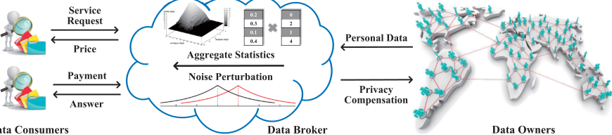

Fig. 1. A general system model for aggregate statistics based data markets. 

Authorized licensed use limited to: Shanghai Jiaotong University. Downloaded on February 15,2022 at 23:37:08 UTC from IEEE Xplore.  Restrictions apply. 

IEEE TRANSACTIONS ON KNOWLEDGE AND DATA ENGINEERING, VOL. 33, NO. 3, MARCH 2021 

978 

originates from practical aggregate statistics over encrypted data, where homomorphic encryption can be applied over a general function of the original data, mainly to reduce timeconsuming homomorphic multiplications [19], [20], [26]. Furthermore, the preprocessing from d to x can be viewed as a sort of feature mapping in learning theory [27]. In addition to manual engineering utilized by the above three examples, the feature mapping can also be realized by kernel tricks, deep learning, and so on. In the following context of a clear service type, for brevity, we use the weight vector w to specify the data consumer’s requested statistic f, i.e., S ¼ ðw; vÞ. 

Arbitrage Freeness. We next introduce a fundamental and desirable property of pricing functions, namely arbitrage freeness. Before investigating arbitrage freeness, we first establish the key concept of service determinacy. A similar concept has been studied in randomized query/view answering from the database community [1]. Under our data market model, the noisy answers can still be regarded as random variables. In particular, given a service request S ¼ ðw; vÞ over the database x, the data broker answers using a randomized mechanism M, and returns the result MðxÞ, where its expectation is wT x, and its variance is no more than v. We give the formal definition of service determinacy as follows. 

- Definition 1. The service determinacy relation is between a service S ¼ ðw; vÞ and a multiset of services Q ¼ fS1; . . . ; Smg. We say that Q determines S, denoted as Q 7! S, if the following rules are satisfied: 

   - Summation 

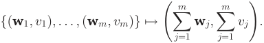

- Scalar Multiplication: 8c 2 R; ðw; vÞ 7! ðcw; c2 vÞ: 

- � Relaxation: 8v � v0 ; ðw; v0 Þ 7! ðw; vÞ: � Transitivity 

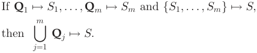

We now explain the key intuitions behind Definition 1. (1) The rules of summation and scalar multiplication inherit basic mathematical operations over random variables. For example, a data consumer requests two services S1 ¼ ðw1; v1Þ; S2 ¼ ðw2; v2Þ, and obtains noisy answers O1; O2. Here, O1 (resp., O2) can be viewed as a random variable with mean w1T x (resp., w2T x) and variance v1 (resp., v2). Besides, if the data consumer adds O1 to O2, she can obtain another random variable O3 with mean ðw1 þ w2ÞT x and variance v1 þ v2, which is in fact the answer of another service S3 ¼ ðw1 þ w2; v1 þ v2Þ. Moreover, if the data consumer multiplies O1 by 1=2, she can obtain a random variable O4 with mean w1T x=2 and variance v1=4, which is the answer of the service S4 ¼ ðw1=2; v1=4Þ. Therefore, S1; S2 can determine S3, and S1 can determine S4. Here, “determine” is kind of “derive”. (2) We clarify the relaxation rule from expected accuracy. When answering the same statistic, if less noise is added to the true answer, the returned answer will be more accurate in expectation. Here, “determine” is kind of “more 

accurate than”. (3) Transitivity is an important rule of both partial order relations and equivalence relations [28], and has been widely used in defining the determinacy relation among database queries [29], [30]. 

Based on the service determinacy relation, we define arbitrage freeness in a formal way. 

Definition 2 (Arbitrage Freeness). A pricing function pð�Þ is arbitrage free, if 8m � 1; fS1; . . . ; Smg 7! S implies 

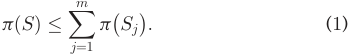

The intuition behind the above definition is that if there exists arbitrage in the pricing function pð�Þ, e.g., pðSÞ > Pmj¼1p �Sj �, then the data consumer would never pay the full price of the service S. Instead, she would turn to buying a cheaper set of services fS1; . . . ; Smg to answer S. 

Dependent Differential Privacy. We now introduce dependent differential privacy [31] from the privacy preservation perspective, i.e., we focus on the randomized mechanism M itself. Yet, some of its disciplines will be used to mathematically quantify the privacy losses of data owners. 

Dependent differential privacy is essentially a variant of the celebrated differential privacy [10]. In particular, differential privacy imposes a bound on the maximum ratio between the probabilities of returning a certain aggregate result with and without any individual’s record, and thus limits the adversary’s ability to infer private information. As an enhanced version, dependent differential privacy further considers data correlations. We introduce its technical notations as follows. 

Given the statistical database x ¼ ðx1; . . . ; xnÞ, if any data item in x is dependent on at most L � 1 other items, the dependent size of x is defined to be L. Besides, the probabilistic dependence relationship over the whole database x is denoted as R. For example, to capture social, temporal, and spatial correlations, R can be some probabilistic graphical models, such as Bayesian networks and Markov chains. In addition, the existence of R may be due to a certain data generation process, or some other social, behavioral, and genetic relationships. For example, as illustrated in [31], R in the Gowalla location dataset was introduced from its relevant social network dataset [25]. Moreover, a pair of dependent neighboring databases is defined as follows. 

- Definition 3 (Dependent Neighboring Databases). Two databases xðL; RÞ; x0 ðL; RÞ are dependent neighboring databases, if the modification of one data item in xðL; RÞ (e.g., xi changes to x0 i) causes changes in at most L �1 other data items in x0 ðL; RÞ due to the probabilistic dependence relationship R. 

For the sake of brevity, when the dependent/correlated context is clear, we omit the parameters L; R, and write x; x0 instead. Based on dependent neighboring databases, the definition of dependent differential privacy is formalized as: 

- Definition 4 (�-Dependent Differential Privacy). A randomized algorithm M provides �-dependent differential privacy, if for any pair of dependent neighboring databases x and x0 and any possible output O, we have 

Authorized licensed use limited to: Shanghai Jiaotong University. Downloaded on February 15,2022 at 23:37:08 UTC from IEEE Xplore.  Restrictions apply. 

NIU ET AL.: ERATO: TRADING NOISY AGGREGATE STATISTICS OVER PRIVATE CORRELATED DATA 

979 

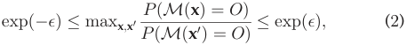

where � is the privacy budget. Smaller � provides better privacy and worse utility guarantees. 

To achieve �-dependent differential privacy, a matching dependent perturbation mechanism was proposed in [31]. The key idea is to carefully add Laplace noise by introducing fine-grained dependence coefficients between data items. In particular, rij denotes the dependence relationship between xi and xj, which quantifies the dependence of xj on the modification of xi. With the help of rij’s, the dependent sensitivity of a numeric function f over the database x caused by the modification of xi can be expressed as 

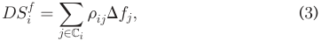

where Ci denotes the index set of the data items that are correlated with xi. Besides, Ci contains i itself, and the dependence coefficient rii ¼ 1. Moreover, Dfj denotes the sensitivity of f with respect to the modification of xj itself, i.e., Dfj ¼ maxxj1 ;xj2 k f . . . ; xj1 ; . . .Þ � fð. . . ; xj2 ; . . .Þ k1. Furthermore, when focusing on the individual data item xi, the dependent size L and the probabilistic dependence relationship R, which outline the dependent structure of the whole database x as mentioned earlier, are now reflected in two concrete parameters Ci and rij. Specifically, the cardinality of Ci is no more than L, while rij measures the dependence relationship between two data items, and can be computed from R. We finally present the dependent perturbation mechanism as follows. 

Theorem 1 (Dependent Perturbation Mechanism). The randomized mechanism 

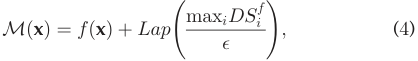

guarantees �-dependent differential privacy. 

� 0, which implies pð0; vÞ ¼ 0. For (2), first by the relaxation rule, ðw; v0 Þ 7! ðw; vÞ, and then by Definition 2, pðw; vÞ � pðw; v0 Þ. For (3), it directly follows from (2). For (4), by the scalar multiplication rule, ð1=c � w; 1Þ 7! ðw; c2 Þ, then if c is towards positive infinity, we have: pðw; þ1Þ ¼ limc!þ1 pðw; c2 Þ � limc!þ1 pð1=c � w; 1Þ ¼ pð0; 1Þ ¼ 0: Here, the first inequality follows from Definition 2, and the last equality follows from (1). tu 

We next discuss the existence of arbitrage-free pricing functions. First, we give a trivial example of zero-price function, i.e., 8pðw; vÞ ¼ 0. This function is arbitrage free. Second, we give a nontrivial example of widely used constant-price function, i.e., 8pðw; vÞ ¼ c for some c > 0. There exists arbitrage in this function. A simple counter example is pð0; vÞ ¼ 0. Third, the general construction of non-trivial arbitrage-free pricing functions has been proven to be a hard problem [1]. Therefore, we turn to exploring sufficient conditions for arbitrage-free pricing functions. 

We further divide an arbitrage-free pricing function into two parts, namely the variance of noise v and the weight vector w, and conquer each part step by step. On one hand, from the above properties (2) and (4), we know that any nontrivial, continuous, and arbitrage-free pricing function should monotonically decrease with v, but the thorniest problem is how fast it can decrease with v. We determine the boundary function 1=v by thwarting the arbitrage attack as illustrated in Section 1. On the other hand, we associate service determinacy with norms of the weight vector w, e.g., ‘p norms. Besides, we establish the equivalency between arbitrage-free pricing functions and semi-norms. Moreover, we synthesize new pricing functions by applying subadditive and nondecreasing functions. In particular, to allow a high but finite price for the unperturbed answer, we utilize activation functions from neural networks. 

### 3.2 Detailed Design 

Following the guidelines given above, we now introduce the detailed design of arbitrage-free pricing functions. 

### 3.2.1 Incorporating Variance of Noise 

## 3 SERVICE PRICING 

In this section, we consider the first component of ERATO, namely the pricing mechanism for common aggregate statistics. It should be arbitrage free not only to the statistic w itself but also to the variance of perturbing noise v. 

### 3.1 Design Rationale 

Given service determinacy and arbitrage freeness in Definitions 1 and 2, respectively, we first list some intuitive properties that any arbitrage-free pricing function pðw; vÞ should satisfy: (1) The service with zero weight vector is free: pð0; vÞ ¼ 0; (2) The service with higher variance is cheaper: 8v � v0 ; pðw; vÞ � pðw; v0 Þ; (3) The service with zero variance is the most expensive: 8v > 0; pðw; 0Þ > pðw; vÞ; (4) The service with infinite noise is free: if pð�Þ is continuous at w ¼ 0, then pðw; þ1Þ ¼ 0. 

Proof. For (1), by the summation rule of Definition 1, when m ¼ 0, ; 7! ð0; 0Þ, and further by the relaxation rule, ð0; 0Þ 7! ð0; vÞ. Thus, by Definition 2, 0 � pð0; vÞ � pð0; 0Þ 

We start with the first part of an arbitrage-free pricing function pðw; vÞ involving the variance of noise v. We formulate the arbitrage attack in a formal way to figure out how pðw; vÞ can decrease with v: 

- Example 4. A data consumer, who wants to obtain the service ðw; vÞ but with a lower price, may turn to buying m other cheaper services of the same statistic but with higher variances, denoted as fðw; vjÞjj 2 f1; . . . ; mg; vj > vg. The data consumer first applies summation and then scalar multiplication by 1=m in Definition 1, i.e., fðw; v1Þ; . . . ; ðw; vmÞg 7! ðmw;Pm j¼1vjÞ 7! ðw; m12 Pmj¼1vjÞ: In other words, the data consumer computes the average of m answers, and gets an unbiased answer but with a lower variance. If the pricing function pð�Þ is arbitrage free, then the following conditional statement must hold: 

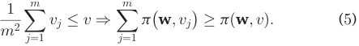

Authorized licensed use limited to: Shanghai Jiaotong University. Downloaded on February 15,2022 at 23:37:08 UTC from IEEE Xplore.  Restrictions apply. 

IEEE TRANSACTIONS ON KNOWLEDGE AND DATA ENGINEERING, VOL. 33, NO. 3, MARCH 2021 

980 

We give Theorem 2 to thwart the above attack. 

- Theorem 2. For any arbitrage-free pricing function pðw; vÞ that depends on two independent parts w and v, it cannot decrease faster than 1=v. 

- Proof. We first prove 1=v is the boundary function, i.e., pðw; vÞ ¼ gðwÞ=v is arbitrage free for some positive function gðwÞ that depends only on w. We utilize the antecedent in Equation (5) to show the correctness of its consequent 

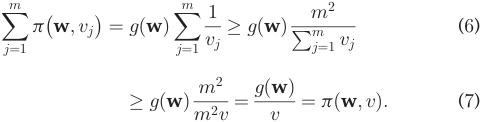

Here, the inequality in Equation (6) follows from that the harmonic mean of a list of non-negative real numbers is less than or equal to the arithmetic mean of the same list, namely 

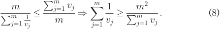

Besides, the inequality in Equation (7) follows from the antecedent in Equation (5). Furthermore, when these two inequalities simultaneously take the equal signs, we can obtain boundary variances fvj ¼ mvjj 2 f1; . . . ; mgg, which implies that requesting the service with the same variance multiple times is the most possible way to obtain an arbitrage. 

We next show that if pðw; vÞ decreases faster than 1=v, we would derive an arbitrage. We consider a sequence of variances fvjjj 2 f1; . . . ; þ1gg, such that limj!þ1 vj ¼ þ1 and limj!þ1 vjpðw; vjÞ ¼ 0. Thus, we can find j0 > 1 such that vj0 pðw; vj0 Þ < pðw; 1Þ=2. Now, we can answer the service ðw; 1Þ, through requesting dvj0 e times the same service ðw; vj0 Þ and averaging their answers. However, for these dvj0 e services, we pay 

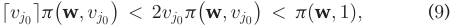

which yields an arbitrage, and completes the proof. tu 

In what follows, for simplicity, we fix the part of pðw; vÞ related to the variance v at 1=v by default, while investigate other functions, e.g., 1=pfv **f** i , in our evaluation part. 

### 3.2.2 Incorporating Weight Vector 

We continue to consider the other part of an arbitrage-free pricing function pðw; vÞ, namely the weight vector w. 

By carefully studying the rules of the service determinacy in Definition 1, we find a metric in linear algebra with analogous properties, called norm, more precisely semi-norm. In particular, a norm of a vector w can be viewed as a measure of its “length”. Formally speaking, a norm is any function g : Rn ! R that satisfies the following properties: 

- Subadditivity 

   - 8w1; w2 2 Rn ; gðw1 þ w2Þ � gðw1Þ þ gðw2Þ: 

- Homogeneity: 8c 2 R; w 2 Rn ; gðcwÞ ¼ jcjgðwÞ: 

- Non-negativity: 8w 2 Rn ; gðwÞ � 0: 

- Definiteness: w ¼ 0 , gðwÞ ¼ 0: 

If the last property relaxes to w ¼ 0 ) gðwÞ ¼ 0, we call it semi-norm. Besides, the most commonly used norms in the machine learning and data mining algorithms are a family of ‘p norms for some real number p � 1. Furthermore, considering that the trivial example of zero-price function is arbitrage free, we utilize semi-norms to devise our basic arbitrage-free pricing functions: 

- Theorem 3 (Basic Arbitrage-free Pricing Functions). Let pðw; vÞ ¼ gðwÞ2 =v be the pricing function for some positive function gðwÞ that only depends on w. Then, pðw; vÞ is arbitrage free iff gðwÞ is a semi-norm. 

Proof. Due to space limitations, we put the proof into our technical report [32]. tu 

We next consider how to construct more arbitrage-free pricing functions by combining basic/existing ones. We resort to a general class of nondecreasing and subadditive functions. We recall that a function G : Rf ! R over 8y; z 2 Rf is nondecreasing, if y � z; GðyÞ � GðzÞ. Besides, it is subadditive, if Gðy þ zÞ � GðyÞ þ GðzÞ. 

### Theorem 4 (Composite Arbitrage-free Pricing Func- 

- tions). Let G : Rf ! R be a nondecreasing and subadditive function. For any set of arbitrage-free pricing functions fp1ðSÞ; . . . ; pfðSÞg, the composite pricing function pðSÞ ¼ Gðp1ðSÞ; . . . ; pfðSÞÞ is also arbitrage free. 

Proof. We consider the general form of service determinacy, i.e., fS1; . . . ; Smg 7! S. Since p1; . . . ; pf are arbitrage free, we have: 

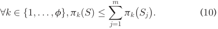

Besides, due to the nondecreasing and subadditive properties of the function G, we further have 

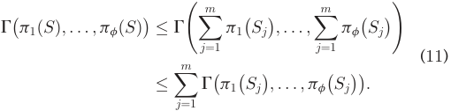

This completes the proof. tu 

We give some typical examples of composite arbitragefree pricing functions as follows. If p1ðSÞ; . . . ; pfðSÞ are arbitrage free, then 

- Linear Combination: 8c1; . . . ; cf � 0;Pf k¼1ckpkðSÞ; f **f** i f **f** i f **f** i f **f** i f **f** i f **f** i f **f** i f **f** i f **f** i f **f** i f **f** i **f** 

- � Geometric Mean: qQfk¼1pkðSÞ ; 

- Maximum: maxðp1ðSÞ; . . . ; pfðSÞÞ; 

- Power: p1ðSÞc for 0 < c � 1; 

- Logarithmic: log ðp1ðSÞ þ 1Þ; 

- Cut-off: minðp1ðSÞ; cÞ for c � 0; 

- � Sigmoid: tanhðp1ðSÞÞ; arctanðp1ðSÞÞ; ~~f~~ **f** i ~~f~~ p **f** i ~~f~~ <u>1ð</u> **f** i ~~f~~ S **f** i ~~f~~ <u>Þ</u> **f** i ~~f~~ **f** i ~~f~~ **f** ~~; p~~ p1ðSÞ2 þ1 

are arbitrage free as well. We note that the basic arbitragefree pricing functions and the first five composite arbitragefree pricing functions set an infinite price for the 

Authorized licensed use limited to: Shanghai Jiaotong University. Downloaded on February 15,2022 at 23:37:08 UTC from IEEE Xplore.  Restrictions apply. 

NIU ET AL.: ERATO: TRADING NOISY AGGREGATE STATISTICS OVER PRIVATE CORRELATED DATA 

981 

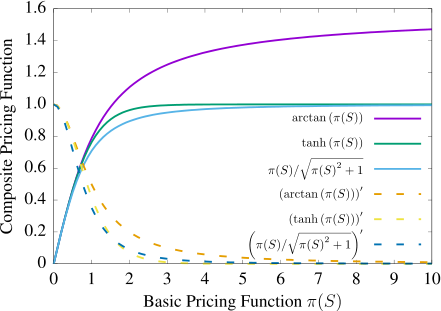

Fig. 2. Three typical sigmoid functions and their first derivatives. 

unperturbed answer, i.e., the variance of noise v ¼ 0. However, these functions may be impractical in data markets, since the data broker tends to sell unperturbed aggregate statistics for high but finite prices. Nevertheless, we can turn to applying some bounding functions for composition, e.g., cut-off and sigmoid functions. In particular, sigmoid functions are commonly used as activation functions in neural networks [27]. At last, we give a sufficient condition to check whether a function G is nondecreasing and subadditive. 

- Lemma 1. Let G : Rf ! R be a continuous and twice-differentiable function such that Gð0Þ ¼ 0. Then, if each element of G’s gradient (i.e., partial derivative) is no less than zero, G is nondecreasing; if each element of G’s Hessian matrix (i.e., second partial derivative) is no greater than zero, G is subadditive. 

To provide an intuitive view of Lemma 1, we plot three typical sigmoid functions and their first derivatives in Fig. 2. From Fig. 2, we can see that these functions are increasing and bounded above, while their first derivatives are decreasing. Therefore, according to Theorem 4, they are composite arbitrage-free pricing functions. 

## 4 PRIVACY COMPENSATION 

In this section, we consider the other component of ERATO, i.e., the privacy compensation mechanism for individual privacy loss. We propose both bottom-up and top-down designs. In the bottom-up design, the sum of privacy compensations determines the service price, while this relation is inverse in the top-down design. Besides, another major difference is that the bottom-up design allows each data owner to actively select a privacy compensation function according to her privacy strategy, which is instead not required in the topdown design. 

### 4.1 Privacy Loss for General Function 

When the data broker answers aggregate statistics with a randomized mechanism M, some private information of each data owner would be leaked. Based on the disciplines of dependent differential privacy, we formally define the individual privacy loss �i for an arbitrary real-valued function f, and further give its upper bound related to the dependent sensitivity DSifand the variance of noise v. 

We first consider a pair of dependent neighboring databases x and xðiÞ , which initially differs in the data item xi. In 

fact, x and xðiÞ can simulate the presence and absence of the data owner i. By comparing the output of the randomized mechanism M over x and xðiÞ , we define individual privacy loss as follows. 

Definition 5 (Individual Privacy Loss). The privacy loss of the data owner i in the randomized mechanism M over the database x is defined as 

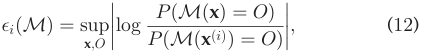

where x ranges over all possible database instances, and O ranges over all possible outputs. 

We discuss the relationship between the individual privacy loss �iðMÞ and the privacy budget � in Definition 4. (1) The privacy budget �, normally preset by the data broker over the randomized mechanism M, applies to all the data owners. In other words, each data owner is promised to suffer privacy loss no more than �, i.e., � ¼ maxi�iðMÞ. By comparison, in the context of privacy compensation, we turn this around. Now, the randomized mechanism M, given the variance of perturbing noise v from the data consumer, has already breached privacy, and Definition 5 quantifies the privacy loss for each data owner. (2) From � ¼ maxi�iðMÞ, we can see that if the randomized mechanism M is �-dependent differentially private for a tiny �, then the individual privacy loss �iðMÞ would be very small as well. 

We further give an upper bound of the individual privacy loss �iðMÞ, when the randomized mechanism M is known to be the dependent perturbation mechanism defined in Theorem 1. In particular, this upper bound depends on the variance of Laplace noise v and the dependent sensitivity of f at xi. 

- Theorem 5. Let M be dependent perturbation mechanism, f be any numeric function, DSifbe the dependent sensitivity of fat xi, and v be the variance of Laplace noise. The privacy loss of the data owner i is bounded above by 

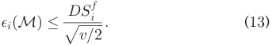

- Proof. In the dependent perturbation mechanism, the noise h is drawn from the Laplace distribution Lapð�Þ. Here, the scaling factorf **f** i f **f** i f **f** i  � **f** can be computed from the variance v, namely � ¼ pv=2. We then derive that 

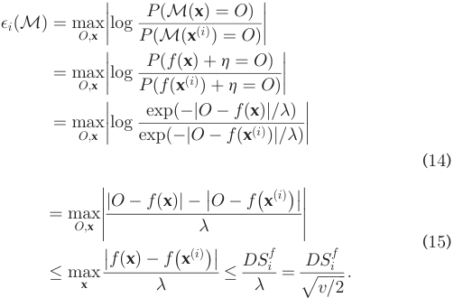

Authorized licensed use limited to: Shanghai Jiaotong University. Downloaded on February 15,2022 at 23:37:08 UTC from IEEE Xplore.  Restrictions apply. 

IEEE TRANSACTIONS ON KNOWLEDGE AND DATA ENGINEERING, VOL. 33, NO. 3, MARCH 2021 

982 

Here, Equation (14) follows from the probability density function of Lapð�Þ. Besides, in Equation (15), the first inequality follows from the triangle inequality, and the second inequality follows from the definition of the dependent sensitivity of f at xi [31]. tu 

### 4.2 Bottom-Up Design 

In this section, we consider the bottom-up design of privacy compensation. The data broker first needs to satisfy each individual privacy compensation ciðSÞ, and then determine the price pðSÞ for the data consumer. For example, to guarantee the property of balance, the relationship between the service price and the sum of individual privacy compensation can be pðSÞ ¼ cPn i¼1c iðSÞ for some c>1. 

First, the individual privacy compensation ciðSÞ should hinge on the individual privacy loss �iðMÞ. Besides, the data broker needs to evaluate/approximate �iðMÞ from the service S itself, including the weight vector w and the variance of noise v. However, the original �iðMÞ in Definition 5 not only depends on the actual randomized mechanism M, but also needs to consider all the database instances and all the possible outputs, which can be infeasible to compute in practice [1], [33]. Therefore, we turn to focusing on the specific dependent perturbation mechanism in Theorem 1, and utilize the upper bound of privacy loss in Theorem 5 to do compensation. We note that the bounded privacy loss in Theorem 5 is given as a function of the variance v and the dependent sensitivity DSif.Here,wecancomputeDS ifin the context of aggregate statistics. We let <u>b</u> ~~i~~ ; b� i 2 R denote the infimum and supremum of the data item xi’s domain, respectively. Then, according to Equation (3), we can get 

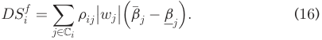

Suppose we ignore data correlations by setting rij ¼ 0 for all j 2 Cini. The dependent sensitivity in Equation (16) will degenerate to the sensitivity defined in the classical differential privacy [10] 

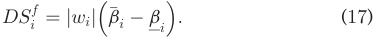

After quantifying the individual privacy loss in aggregate statistics, we now consider how to compensate each data owner in an appropriate manner. We first identify two desirable properties in the bottom-up design: 

Definition 6 (Bottom-up Privacy Compensation). Let ciðSÞ be a privacy compensation function over the service S ¼ ðw; vÞ in the bottom-up design. ciðSÞ should satisfy: 

- Dependent Fairness: 8j 2 Ci; wj ¼ 0 ) ciðSÞ ¼ 0. 

- � Micro Arbitrage Freeness: ciðSÞ is arbitrage free. 

We give some comments on these two properties as follows. (1) Dependent fairness is an extension of fairness defined in the conventional query-based pricing [33] by further incorporating data correlations. The original fairness says that the data owner whose data is not queried should not expect reward. In contrast, our dependent fairness says that only if the data owner and her correlated data owners are not involved in the service, she will receive no privacy 

compensation. Although the case, where a data owner who is not involved in the service but may still be compensated, seems counterintuitive, it makes sense from the perspective of privacy loss due to data correlations. (2) Micro arbitrage freeness is a necessity in the bottom-up design. The reason is that the service price at top hinges on the total privacy compensations at bottom. Therefore, the data consumer may have strong motivations to circumvent the due privacy compensations, and thus the payment, by asking other alternative services. Besides, the definition of micro arbitrage freeness is identical to that of arbitrage freeness, but the former needs to be verified over the whole data owners. 

In a similar way to service pricing, we design basic bottom-up privacy compensation functions directly from the privacy losses, which set infinite compensations for unperturbed answers. This kind of functions are suitable for the data owner, who values her privacy highly, and would never accept full disclosure of personal data.1 

Theorem 6. The privacy compensation functions 

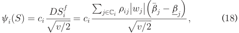

for some constant ci > 0 and for all i 2 f1; . . . ; ng, are basic bottom-up privacy compensation functions. 

Proof. First, we prove dependent fairness. We can check that 8j 2 Ci; wj ¼ 0 ) ciðSÞ ¼ 0. Second, we prove micro arbitrage freeness.f **f** i f **f** i f **f** i **f** We view ciðSÞ as a linear combination of fjwjj=pv=2jj 2 Cig, where the corresponding coefficients are fcirijðb� j � <u>bjÞjj 2 Cig. By Theorem 4 (Linear Combina-</u> tion), to prove the micro arbitrage freeness of ciðSÞ, it suffif **f** i f **f** i f **f** i **f** ces to prove that jwjj=pv=2 is arbitrage free. By Theorem 4 (Geometric Mean), it further suffices to prove the arbitrage freeness of 2wj2 =v. Now, by using the weighted ‘2 norm and setting those weights, whose indexes are not j, to be zeros, it completes the proof. tu 

Analogous to Theorem 4, we can construct new bottom-up privacy compensation functions from basic ones by applying any nondecreasing and subadditive function. In particular, to allow the data owner, who is less concerned about her privacy, to reveal her personal data at some high but finite price, we can make use of sigmoid functions. 

Theorem 7. The privacy compensation functions 

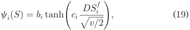

for constants bi; ci > 0 and for all i 2 f1; . . . ; ng, are bounded bottom-up privacy compensation functions. 

Proof. First, we can check that 8j 2 Ci; wj ¼ 0 ) ciðSÞ ¼ 0. Second, in Theorem 6, we have proved the arbitrage free-f **f** i f **f** i f **f** i **f** ness of ciDSif= pv=2. Then, by Theorem 4 (Sigmoid and Linear Combination), ciðSÞ is micro arbitrage free. tu 

> 1. By querying two consecutive unperturbed aggregate statistics with and without a data owner’s data item, the data consumer can have full knowledge of the data owner’s data item. 

Authorized licensed use limited to: Shanghai Jiaotong University. Downloaded on February 15,2022 at 23:37:08 UTC from IEEE Xplore.  Restrictions apply. 

NIU ET AL.: ERATO: TRADING NOISY AGGREGATE STATISTICS OVER PRIVATE CORRELATED DATA 

983 

Considering the diversity of individuals’ privacy strategies, we demonstrate how the data broker can select customized privacy compensation functions for different kinds of data owners. We introduce a nondecreasing contract function �ið�iÞ between the data broker and each data owner i, i.e., in the event of privacy loss �i, i should be compensated with at least �ið�iÞ. In fact, the contract function �ið�Þ depends on i’s valuation over private information. For example, if i values her privacy highly, and would never accept full disclosure of her personal data, then she may choose a linear contract function �ið�iÞ ¼ ci�i for some ci > 0. In contrast, another data owner j is less concerned about her privacy, and is willing to sell her private data at some high price. Then, she may select the bounded sigmoid contract function �jð�jÞ ¼ bj tanhðcj�jÞ for some bj; cj > 0. Additionally, the data broker would define the corresponding bottom-up privacy compensation functions ciðSÞ and cjðSÞ using Equations (18) and (19) for the data owners i and j, respectively. In particular, the privacy compensation functions are satisfying for both i and j, since �ið�iÞ � ciðSÞ and �jð�jÞ � cjðSÞ due to Theorem 5 and the fact that the tanh function is nondecreasing. 

At last, the data broker can determine the service price pðSÞ. Take pðSÞ ¼ cPn i¼1c iðSÞ; c>0 for example. We note that if every privacy compensation function ciðSÞ is micro arbitrage free, then the pricing function pðSÞ, which can be viewed as a linear combination of ciðSÞ’s, is factually arbitrage free. Of course, pðSÞ can be any other composite functions under Theorem 4. 

### 4.3 Top-Down Design 

In this section, we consider a different top-down privacy compensation design, where the data broker first determines the service price pðSÞ using the pricing mechanism in Section 3, and then spares some fraction of the payment for privacy compensation, i.e.,Pn i¼1c iðSÞ ¼ cpðSÞforsome 0 < c < 1. If we regard cpðSÞ as a budget B, we can convert the privacy compensation problem to a budget allocation problem, where each data owner i’s share in B should be roughly proportional to her privacy loss �iðMÞ. 

Specific to the dot product operation in common aggregate statistics, we shall tighten the upper bound of the individual privacy loss �iðMÞ, by computing the dependent sensitivity DSifmoreaccurately.Wefirstgiveourmotivat- ing examples as follows. 

- Example 5. A database x consists of two entries x1; x2, such that x2 ¼ 0:5x1 and x1 2 ½0; 1�. Here, the dependence coefficient r12 ¼ 1, since x2 is completely dependent on x1. We then consider two statistics f ¼ x1 þ x2 and g ¼ x1 � x2, which differ in the sign of x2’s weight. By Equation (16), we compute the dependent sensitivities of f and g at x1 

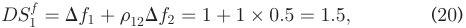

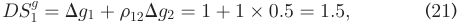

respectively. We can see that the dependent sensitivities of f and g at x1 are the same. However, g is essentially g� ¼ 0:5x1, and its dependent sensitivity at x1 should be 

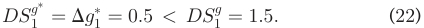

- Example 6. We continue to consider the database x, but now x1 and x2 are negatively correlated rather than positively correlated, i.e., x2 ¼ �0:5x1. According to the definition of nonnegative dependence coefficients in [31], r12 ¼ 1 remains unchanged. Thus, the dependent sensitivities of f and g at x1 are still 1.5. However, f is essentially f� ¼ 0:5x1, and thus its sensitivity at x1 is 0.5, which is less than DS1f. 

Given the two examples above, we can observe that the definition and the mechanism of the dependent differential privacy proposed in [31] aim to be applicable for general functions and general positive/negative correlations, which implies that the general dependent sensitivity can be just a loose upper bound in the context of a specific function. Such a key observation enables us to tighten the dependent sensitivity and thus the individual privacy loss by considering two extra factors: whether the weight is negative or positive, and whether the correlation is negative or positive. In our following calculation, we will maintain the original forms of weights rather than utilizing their absolute values as in the dependent differential privacy, namely Equation (16). Additionally, we introduce sij ¼ �1 and sij ¼ 1 to represent the cases that xi; xj are negatively and positively correlated, respectively. We thus get 

- Lemma 2. The tight dependent sensitivity of f ¼ wT x at xi over the database x is given as 

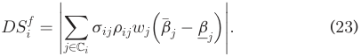

Proof. Due to the linearity of the dot product operation, the dependent sensitivity of f at xi can occur in two cases: 

Case 1 (xi : <u>b</u> ~~i~~ ! b� i): We first consider the expected dependent modification of f over xj caused by the modification of xi, denoted as DSijf.Therearetwoadditional cases: If xj is positively correlated with xi, DSijfwill occur in the direction from <u>bj</u> to b� j, otherwise it will occur in the reverse direction, i.e., 

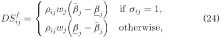

or equivalently, 

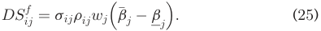

By summing all the dependent modifications and then taking absolute value, we can obtain the dependent sensitive at xi 

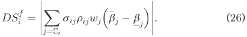

Case 2 (xi : b� i ! <u>bi): Similar to Case 1, we can derive</u> 

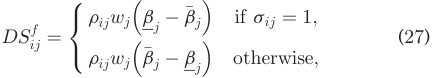

Authorized licensed use limited to: Shanghai Jiaotong University. Downloaded on February 15,2022 at 23:37:08 UTC from IEEE Xplore.  Restrictions apply. 

IEEE TRANSACTIONS ON KNOWLEDGE AND DATA ENGINEERING, VOL. 33, NO. 3, MARCH 2021 

984 

or equivalently, 

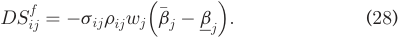

Besides, the final form of DSifis the same as that in Case 1. This completes the proof. tu 

After obtaining the tight upper bound of individual privacy loss, we can utilize it to compute each data owner’s share in the total privacy compensations B. Before this, we note that in the top-down design, the privacy compensation function ciðSÞ should still guarantee dependent fairness, but no longer needs to ensure micro arbitrage freeness. The reason is that the data consumer has paid the arbitrage-free service price pðSÞ, and she is not involved in the separate process of privacy compensation. Thus, it is infeasible for the data consumer, as an attacker, to gain arbitrage. 

Theorem 8. The privacy compensation functions 

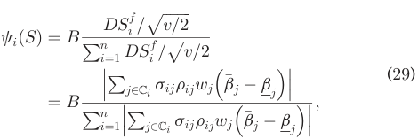

for the total privacy compensations B and for all i 2 f1; . . . ; ng are top-down privacy compensation functions. 

Proof. We prove the dependent fairness by checking that 8j 2 Ci; wj ¼ 0 ) ciðSÞ ¼ 0. tu 

In conclusion, the top-down design divides an integrated pricing framework into two independent parts: service pricing and privacy compensation. Different from the bottom-up design, on one hand, the data broker here just needs to ensure the arbitrage freeness of service pricing rather than the micro arbitrage freeness of privacy compensation; on the other hand, the top-down design is essentially the budget allocation problem according to individual privacy loss at the data broker. Hence, the top-down design can execute without the online participation of data owners, and is applicable to any general aggregate statistic. 

## 5 EVALUATION RESULTS 

In this section, we present the evaluation results in terms of privacy and utility guarantees, arbitrage-free pricing functions, and fine-grained privacy compensations. 

Datasets. We use four real-world datasets, i.e., MovieLens 1M dataset [34], 2009 Residential Energy Consumption Survey (RECS) dataset [35], and two large-scale social network datasets from Stanford Network Analysis Platform (SNAP) [36], for three aggregate statistics, namely weighted sum, probability distribution fitting, and degree distribution, respectively. First, the MovieLens dataset contains 1,000,209 ratings of approximately 3,900 movies made by 6,040 anonymous users. Besides, we extracted the displayed ratings from MovieLens, which function as target variables in supervised learning. Second, the RECS dataset, which was released by U.S. Energy Information Administration (EIA) in January 2013, provides diverse energy usages in 

12,083 U.S. homes. Third, two SNAP datasets are named ego-Twitter and ego-Gplus: ego-Twitter comprises 81,306 nodes and 1,768,149 edges from Twitter, while e-Gplus contains 107,614 nodes and 13,673,453 edges from Google+. 

Profiles. To compute the dependence coefficient rij by means of the method developed in [31], we also need to acquire each data owner’s profile as auxiliary data. The above four datasets all provide this kind of information: The MovieLens dataset comprises some attributes of users, e.g., gender, age, and occupation; The RECS dataset contains several attributes of each household, such as heating degree days, cooling degree days, total number of rooms, etc; The two SNAP datasets include node features, e.g., gender, institution, and job title. Just as [31], we set the similarity threshold between the profiles of two data owners to be 0.8, and only consider positive correlation, i.e., sij ¼ 1. In contrast, the weight wj can be either negative or positive in our evaluations, which helps to verify the effect of negative correlation, since sijwj in Lemma 2 is in the product form. 

Statistics. For weighted sum, we apply linear regression to the ratings of different movies from distinct numbers of users, and can learn different weight vectors with distinct dimensions. For Gaussian distribution fitting, we draw the univariate Gaussian distribution of a certain type of energy consumption, e.g., space heating, air conditioning, or refrigerators. For degree distribution, we count both in and out degrees of every user in Twitter and Google+ networks. 

### 5.1 Privacy and Utility Guarantees 

Before investigating economic properties, we first show how ERATO can improve the utility of aggregate statistics, by calculating the dependent sensitivity more accurately for the dependent perturbation mechanism in Theorem 1. Fig. 3a depicts the accuracies of weighted sum under the Laplace perturbation mechanism [10] in the conventional differential privacy (DP), and the dependent perturbation mechanisms in the dependent differential privacy (DDP) and our ERATO, where the privacy budget � varies from 10�6 to 103 by exponential growth. Here, we select the movie ratings from 1,000 users for training, and thus derive 1,000-dimensional weight vectors. <u>jO</u>� �Oj Besides, we define the accuracy as 1 � jO<u>�</u> þOj[31],whereO� and O are the true and perturbed results, respectively. 

One key observation from Fig. 3a is that more accuracy is achieved as the privacy budget � increases, especially when � changes from 0.01 to 0.1. We explain the reason through the formula between the variance of Laplace noise v and the privacy budget � 

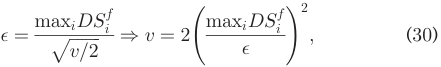

which follows from Theorem 1. Here, the function sensitivity maxiDSifin the numerator remains unchanged for a certain perturbation mechanism. When � becomes larger, less noise is added, which implies a more accurate statistic. Besides, maxiDSif’sforallthreeperturbationmechanismsarein the magnitude of 0.1. Hence, the accuracy is significantly improved at � ¼ 0:1. Furthermore, when � is too small or too large, the perturbation or the true result completely dominates, and the differences among the accuracies of three perturbation mechanisms are tiny. 

Authorized licensed use limited to: Shanghai Jiaotong University. Downloaded on February 15,2022 at 23:37:08 UTC from IEEE Xplore.  Restrictions apply. 

NIU ET AL.: ERATO: TRADING NOISY AGGREGATE STATISTICS OVER PRIVATE CORRELATED DATA 

985 

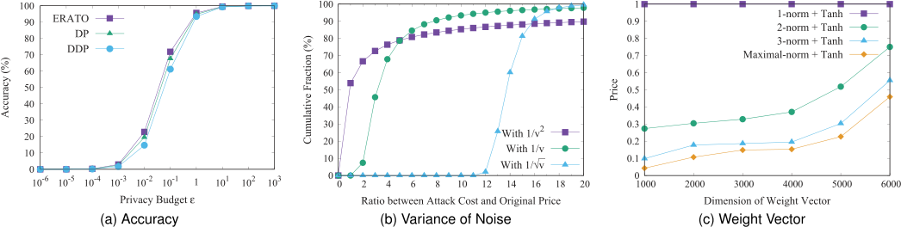

Fig. 3. Privacy versus utility and arbitrage freeness in weighted sum. 

The second key observation is derived by comparing the accuracies of three perturbation mechanisms at a fixed privacy budget �, i.e., the denominator in Equation (30) keeps the same. ERATO is more accurate than DDP or even DP. In particular, when � ¼ 0:01, ERATO improves 10.67 and 4.20 percent of accuracies than DDP and DP, respectively. On one hand, due to the triangle inequality, each individual dependent sensitivity DSifin ERATO, namely Equation (23), is no greater than that in DDP, namely Equation (16), which implies the same relation for maxiDSif. Thus, the true result in ERATO is perturbed with less noise than that in DDP. On the other hand, DP can be regarded as a special case of DDP or ERATO, where the correlated data items are ignored when evaluating DSif, namely Equation (17). Although DS if in DP is always no greater than that in DDP, there exist negative weights here. Besides, the negative part can have more effect on some DSif’s than the positive part (not including i itself). Under such circumstance, the final function sensitivity maxiDSifinERATOcanbelessthanthatinDP,which means higher accuracy. 

In conclusion, ERATO can better balance privacy and utility in the aggregate statistics than DP and DDP. 

### 5.2 Arbitrage-Free Pricing Functions 

In this section, we carry on with the weighted sum application, and further explore arbitrage freeness. 

Variance of Noise. We first evaluate the variance of noise v in an arbitrage-free pricing function by simulating the attack illustrated in Example 4. We recall that the data consumer, as an attacker, wants to obtain the service ðw; vÞ by averaging m the same statistic but with diverse higher variances, namely fðw; vjÞjj 2 f1; . . . ; mg; vj > vg. We simulate such an arbitrage attack by randomly generating vj’s with the fixed sum m2 v from the open interval v to ðm2 � m þ 1Þv. Besides, we set v to be 1 and m to be 100. After simulating 10,000 samples, we plot the cumulative fraction of the ratio between the attack costPm j¼1pðw; vjÞandtheoriginalpricepðw; vÞin Fig. 3b, where the pricing function pð�Þ decreases with the variance v from 1=v2 , to 1=v, and to 1=pfv **f** i . We note that the cumulative fraction here differs from the common cumulative distribution function in that it does not include the endpoint. For example, when the ratio takes 1, the cumulative fraction denotes the fraction of the samples, where the attack cost is strictly less than the original price, i.e.,Pm j¼1pðw; vjÞ < pðw; vÞ. More specifically, the cumulative fraction at the ratio of 1 can generally embody the success ratio of finding arbitrage. 

By observing the cumulative fractions at the ratio of 1 in Fig. 3b, we can see that there exists arbitrage in 1=v2 , while the other two pricing functions are arbitrage free, since in 1=v2 , the cumulative fraction at the ratio of 1 is greater than 0. In particular, the probability that the attacker can find arbitrage in 1=v2 is 53.91 percent. This coincides with our theoretical analysis that arbitrage-free pricing functions cannot decrease faster than 1=v, namely Theorem 2. From Fig. 3b, we can also observe that an attempt of finding arbitrage in 1=pfv **f** i is expected to be more costly than that in 1=v, which can be roughly captured by the areas above these two function curves. For instance, to launch an arbitrage attack in 1=pfv **f** i , the attacker is most likely to spend 13 to 14 times the original price with probability 34.40 percent. In contrast, the most possible case in 1=v is to pay 2 to 3 times the original price with probability 38.27 percent. Therefore, in the sense of defending against arbitrage, the pricing function, which decreases slower with the variance v, e.g., 1=pfv **f** i versus 1=v, can be more robust. Nevertheless, those legal data consumers may need to pay higher prices when their variances are greater than 1. 

Weight Vector. We continue to examine the other part of an arbitrage-free pricing function, namely weight vector. We choose the movie ratings from different numbers of users, and obtain diverse dimensions of weight vectors. Fig. 3c plots four composite pricing functions, when the dimension n increases from 1,000 to 6,000 with a step of 1,000. In particular, the composite pricing functions are derived by first applying ‘1; ‘2; ‘3; ‘1 norms and then tanh. Besides, the variance of noise v is set to be 0.1, which gives an error of 1 with 90 percent confidence by Chebyshev’s inequality. 

From Fig. 3c, we can see that the composite pricing function using ‘1 norm remains almost unchanged at 1, while the other ones increase with the dimension of weight vector n. The reason lies in the characteristics of the bounded tanh function. When n ¼ 1000, the pricing function using ‘1 norm has already approximated tanh’s upper bound 1, and is insensitive to later changes. Besides, the absolute value of each weight is less than 1 here. Thus, as depicted in Fig. 3c, when n is fixed, the price becomes lower for the pricing function using ‘p norm with a larger p. 

These evaluation results demonstrate that arbitrage freeness is a strong economic property. If not guaranteed, e.g., in the case of 1=v2 , it is effortless for the data consumer to game the data market. Besides, the data broker can develop her customized pricing strategy by carefully applying Theorems 3 and 4. 

Authorized licensed use limited to: Shanghai Jiaotong University. Downloaded on February 15,2022 at 23:37:08 UTC from IEEE Xplore.  Restrictions apply. 

986 

IEEE TRANSACTIONS ON KNOWLEDGE AND DATA ENGINEERING, VOL. 33, NO. 3, MARCH 2021 

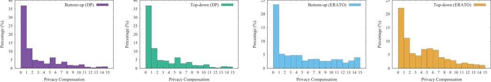

Fig. 4. Differential privacy (DP) and ERATO based privacy compensations in weighted sum. 

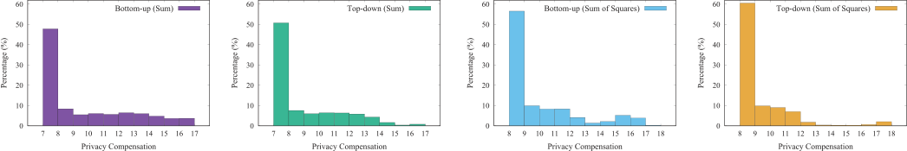

Fig. 5. ERATO based privacy compensation in Gaussian distribution fitting. 

### 5.3 Fine-Grained Privacy Compensations 

In this section, we show the privacy compensations in three different aggregate statistics, including weighted sum, Gaussian distribution fitting, and degree distribution. For clarity in presentation and comparison, we fix the total privacy compensations such that one data owner is rewarded with 10 units in average, i.e., B ¼ 10n. Besides, we choose the same bounded privacy compensation function in Theorem 7 for each data owner in the bottom-up design. 

Before introducing the concrete evaluation results, we first analyze the major differences among three aggregate statistics: (1) From mathematical formula, there exist both positive and negative weights in weighted sum, while the weights in the other two statistics are all constant 1’s. Besides, the domain of each data item keeps the same in a certain statistic; (2) From privacy compensation, suppose that we employ the DP framework, which ignores data correlations and compensates the data owner roughly proportional to the absolute value of her weight. Each data owner would be compensated with the average 10 units in Gaussian distribution fitting and degree distribution. Therefore, we only compare DP with ERATO in weighted sum, and directly show ERATO-based evaluation results in the other two statistics. 

Weighted Sum. We start with weighted sum, where the dimension of weight vector is fixed at 1,000, and the variance of noise v is set to be 0.1 as in Section 5.2. Fig. 4 plots the bottom-up and top-down privacy compensations under DP and ERATO. We note that any pair of neighboring x-axis ticks in Fig. 4 denotes a half-closed interval, e.g., the hist from “9” to “10” stands for the privacy compensations between 9 and 10 excluding 10. 

We first compare DP with ERATO in a certain design of privacy compensation. As depicted in Fig. 4, compared with DP, more privacy compensations fall into the center region under ERATO. In particular, 325 data owners receive no privacy compensation in both bottom-up and top-down designs under DP, whereas this number decreases to 148 under ERATO. Such an outcome truly reflects the difference between the properties of fairness and dependent fairness. 

We next compare the bottom-up and top-down designs under a certain framework. From Fig. 4, we can see that these two designs of privacy compensation appear identical for DP, but look a slightly different for ERATO. First, DP does not consider data correlations by setting 8j 2 Cini; rij ¼ 0. Thus, a specific data owner i’s privacy losses measured by two designs are the same. Besides, when the total privacy compensations are fixed, each data owner’s share is proportional to her privacy loss in the top-down design, while is proportional to the tanh value of her privacy loss in the bottom-up design. Moreover, most of the privacy losses �i’s under DP are within 0.1. We further note that tanh has the following property: 0 � �i � 0:1; tanhð�iÞ � �i: Hence, the privacy compensations in two designs look almost the same under DP. In contrast, under ERATO, the dependent sensitivity in the top-down design utilizes a more accurate calculation than that in the bottom-up design, by considering whether the weight is negative or positive. This implies distinct privacy losses and thus distinct privacy compensations under ERATO. 

Gaussian Distribution. We show the privacy compensations of Gaussian distribution fitting under ERATO. We recall that the Gaussian distribution can be answered by sum and sum of squares. Here, we set the number of data owners to be 10,000. Besides, in the bottom-up design, we set the variance of noise v to be 100, which gives an error of 50 with 96 percent confidence by Chebyshev’s inequality. Moreover, we scale the values inside the tanh function into the range 0 to 5 to better show the differences among privacy compensations in the bottom-up design. We plot the major privacy compensations and their corresponding percentages in Fig. 5, where the results are derived by averaging 10 kinds of energy consumptions. 

First, we can see from Fig. 5 that different data owners may obtain distinct privacy compensations rather than the uniform 10 units under DP, although their weights and data domains are the same. The reason is that each data owner has a distinct set of correlated data owners or even the same set but with different strength of correlations, which implies a distinct privacy loss. Second, by comparing privacy 

Authorized licensed use limited to: Shanghai Jiaotong University. Downloaded on February 15,2022 at 23:37:08 UTC from IEEE Xplore.  Restrictions apply. 

NIU ET AL.: ERATO: TRADING NOISY AGGREGATE STATISTICS OVER PRIVATE CORRELATED DATA 

987 

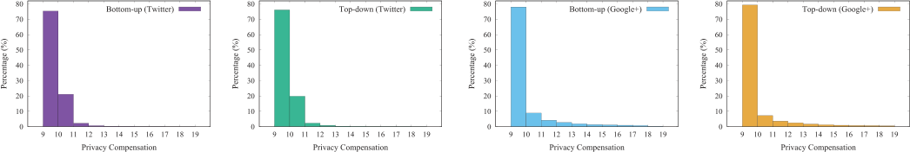

Fig. 6. ERATO based privacy compensation in Twitter and Google+ degree distributions. 

compensations in a specific design for two statistics, we can see that they are different from each other, because the dependence coefficient between the same pair of correlated data items in the sum changes in the sum of squares. Third, we compare the privacy compensations in two designs for a certain statistic, and find them consistent in general. This is because when both correlations and weights are positive, the privacy losses measured by two designs are the same. In addition, when the total privacy compensations are fixed, the difference between two designs is that the bottom-up design further applies tanh to the privacy losses. Hence, two designs of privacy compensation are consistent in general. 

Degree Distribution. We now investigate how privacy compensations are allocated in large-scale social networks. Fig. 6 depicts the evaluation results of the degree distributions in Twitter and Google+. We set the variance of noise v to be 10 in the bottom-up design. From Fig. 6, we can see that most of privacy compensations fall in the central interval between 9 units and 11 units in both Twitter and Google+. This outcome stems from the fact that the degree distribution of Twitter/Google+ social network asymptotically follows a power law. In particular, 37.17 and 45.49 percent of Twitter and Google+ users have degrees no more than 5, respectively. Besides, the number of a data owner’s degrees has a positive correlation with her privacy loss [15]. Therefore, most of the data owners are compensated around the average 10 units. 

We finally give some comments on the ERATO and DP based privacy compensations holistically. First, under DP, the data owners with zero weights receive no compensation in weighted sum. Besides, each data owner is compensated with the indiscriminate 10 units in the other two aggregate statistics. However, such a DP-based allocation scheme is unfair/unreasonable in terms of privacy loss: For weighted sum, a zero-weight data owner can still suffer privacy loss, if her correlated data owners are involved in the service; For the other two statistics, different data owners may have distinct sets of correlated data owners, or even the same set but with different correlation coefficients, which indicates that privacy losses can be different from each other. Specifically, for degree distribution, a higher degree the data owner has, the more social connections she keeps, and the richer private information can be leaked. In short, DP-based privacy compensation is actually another kind of unfairness. In contrast, our ERATO, which discriminates a data owner’s privacy compensation with regard to her dependent privacy loss, and introduces the novel property of dependent fairness, has proven to be fairer in practice. 

The above evaluation and analysis results demonstrate that two designs of privacy compensation in ERATO can indeed compensate the data owners for their privacy losses in a fairer and more fine-grained way. 

## 6 RELATED WORK 

In this section, we briefly review related work. 

### 6.1 Data Market Design 

In recent years, data market design has gained increasing attention, especially from the database community. The researchers in this field mainly focus on query-based pricing [29], [30]. Koutris et al. [37] showed that the prices of a large class of SQL queries can be computed using ILP solvers. Lin and Kifer [9] designed arbitrage-free pricing functions for arbitrary query formats. Deep and Koutris [16] characterized the structure of arbitrage-free pricing functions in both answer-dependent and instance-independent settings. Based on this work, they also implemented a scalable pricing framework for more relational queries [17]. Specific to private data, Ghosh and Roth [12] considered differential privacy as a commodity, and proposed to selling privacy at auction for single counting query. The follow-up works by Li et al. [1], [33], [38] further extend to multiple linear queries by introducing arbitrage freeness. Different from these data trading works, Wang et al. [39] focused on the data collection process, where the data broker is untrusted, and each data owner tends to report a noisy version of her private data. They thus established a game-theoretic model to measure the value of privacy. 

However, none of above works has taken data correlations into account, and further considered service pricing and privacy compensation in practical aggregate statistics. 

### 6.2 Privacy Preserving Aggregate Statistics 

An explosive demand of mining private data from a variety of sources contributes to growing interest in privacy preserving aggregate statistics, where untrusted data analysts can study patterns or statistics over a population while maintaining individual privacy. Shi et al. [19] considered the sum statistic for time-series data, e.g., electrical usage and medical telemetry data. Their design is based on distributed differential privacy and additively homomorphic encryption. Popa et al. [26] developed a practical system, called PrivStats, to support common aggregate statistics over location data. PrivStats guarantees privacy and accountability by exploiting additively homomorphic encryption and zero-knowledge proof of knowledge. In particular, to facilitate efficient oblivious evaluation, PrivStats requires the data owner to upload a general function value of her raw data di. Such a practice inspires us to introduce an interfaced database x in the data market setting, and to further model common aggregate statistics as a set of dot product operations. In contrast to the above works, Corrigan-Gibbs and Boneh [40] introduced multiple data analysts to collaboratively compute aggregate statistics in a 

Authorized licensed use limited to: Shanghai Jiaotong University. Downloaded on February 15,2022 at 23:37:08 UTC from IEEE Xplore.  Restrictions apply. 

IEEE TRANSACTIONS ON KNOWLEDGE AND DATA ENGINEERING, VOL. 33, NO. 3, MARCH 2021 

988 

private, robust, and scalable fashion. Their system mainly integrates secret-shared non-interactive proofs (SNIPs) with affine-aggregatable encodings (AFEs). 

Unfortunately, the original intention of these works is preserving privacy against untrusted data analysts rather than pricing noisy aggregate statistics for data consumers, and quantifying and compensating privacy losses for data owners, which are instead the major focuses of our work. 

### 6.3 Differential Privacy over Correlated Data 

The classical differential privacy framework, proposed by Dwork et al. [10], [11], adopts a different security assumption that the data analyst can be trusted. Under this assumption, the data analyst adds appropriate noises to aggregate results before releasing them, which can protect an individual’s private information. However, as pointed by Kifer and Machanavajjhala [13], when there exist correlations among the data items, the perturbation in differential privacy can be inadequate. They thus proposed a generalized version of differential privacy, called Pufferfish privacy [41]. Many follow-up research works have been going on around this particular issue. In addition to the dependent differential privacy [31] utilized in this work, Yang et al. [15] focused on the correlation structure modeled by Gaussian Markov random fields. Xiao et al. [42] considered how to protect a user’s consecutive locations, and employed Markov chains to model temporal correlations. Cao et al. [43] quantified the risk of differential privacy under the continuous aggregate release over multiple users’ locations. Song et al. [14] proposed a Wasserstein mechanism for any general Pufferfish instantiation, together with a computationally efficient Markov quilt mechanism for Bayesian networks. 

However, the above works still aim at privacy preservation but now against external attackers, e.g., data consumers in data markets. Yet, some of their principles can be borrowed to quantify fine-grained privacy losses for a wider range of aggregate statistics. 

## 7 CONCLUSION AND FUTURE WORK 

In this paper, we have proposed the first pricing framework ERATO for data markets, which provide common aggregate statistics over private correlated data. In ERATO, the data consumer has to faithfully request the desired service rather than gaming the system through buying a bundle of cheaper services. Besides, the data owners can be compensated for their dependent privacy losses in a more fine-grained way. Furthermore, we have instantiated ERATO with three different kinds of aggregate statistics, and extensively evaluated their performances on four practical datasets. Evaluation results have demonstrated the feasibility of ERATO from the improvement of statistic utility, the arbitrage freeness of service pricing, and the fairness of privacy compensation. 

As for future work, one interesting direction is to investigate how to trade more kinds of personal data in practice, e.g., health records, physical activities, and driving trajectories. Specific to a concrete kind of data, we should first determine an appropriate trading format, and further rule out arbitrage opportunities when pricing different trading settings. For example, in the case of trading time-series data, the data consumer may be allowed to designate a pair of starting 

and ending points together with a sampling period. In addition to the trading format, we also need to consider the underlying data characteristics, especially when quantifying privacy loss, e.g., social, temporal, and spatial correlations among the multiple data owners’ driving trajectories. Yet, another potential research direction is to balance pros and cons brought by relaxing the arbitrage freeness requirement. Here, pros are for the data broker, and cons are from cunning data consumers. In essence, arbitrage freeness implies the computational infeasibility of arbitrage attack, and requires the pricing functions to preserve strict mathematical properties. Suppose the data broker relaxes arbitrage freeness, e.g., by abandoning some rules in the determinacy relation. She can choose a wider range of pricing functions, and support more aggregate statistics. However, the arbitrage attack now becomes computationally feasible. If attack cost is no more than revenue, the data consumers are well-motivated to launch arbitrage attacks. 

## ACKNOWLEDGMENTS 

This work was supported in part by the National Key R&D Program of China 2018YFB1004703, in part by China NSF grant 61672348, 61672353, and 61872238, in part by the Open Project Program of the State Key Laboratory of Mathematical Engineering and Advanced Computing 2018A09, in part by the State Key Laboratory of Air Traffic Management System and Technology SKLATM20180X, in part by the Shanghai Science and Technology Fund 17510740200, in part by the Huawei Innovation Research Program HO2018085286, in part by Alibaba Group through Alibaba Innovation Research Program, and in part by the Tencent Social Ads Rhino-Bird Focused Research Program. The opinions, findings, conclusions, and recommendations expressed in this paper are those of the authors and do not necessarily reflect the views of the funding agencies or the government. 

## REFERENCES 

- [1] C. Li, D. Y. Li, G. Miklau, and D. Suciu, “A theory of pricing private data,” Commun. ACM, vol. 60, no. 12, pp. 79–86, 2017. 

- [2] Personal data: The emergence of a new asset class, 2011. [Online]. Available: https://www.weforum.org/reports/personal-dataemergence-new-asset-class 

- [3] J. Brustein, “Start-ups seek to help users put a price on their personal data,” The New York Times, Feb. 2012. [Online]. Available: https://www.nytimes.com/2012/02/13/technology/start-upsaim-to-help-users-put-a-price-on-their-personal-data.html 

- [4] Datacoup, 2012. [Online]. Available: https://datacoup.com/ 

- [5] CitizenMe, 2013. [Online]. Available: https://www.citizenme.com/ [6] CoverUS, 2018. [Online]. Available: https://www.coverus.io/ [7] Federal Trade Commission (FTC), “Data brokers: A call for transparency and accountability,” 2014. [Online]. Available: https:// www.ftc.gov/reports/data-brokers-call-transparencyaccountability-report-federal-trade-commission-may-2014 

- [8] The data brokers: Selling your personal information, 2014. [Online]. Available: https://www.cbsnews.com/news/data-brokers-sellingpersonal-information-60-minutes/ 

- [9] B. Lin and D. Kifer, “On arbitrage-free pricing for general data queries,” Proc. VLDB Endowment, vol. 7, no. 9, pp. 757–768, 2014. 

- [10] C. Dwork and A. Roth, “The algorithmic foundations of differential privacy,” Found. Trends Theoretical Comput. Sci., vol. 9, no. 3/4, pp. 211–407, 2014. 

- [11] C. Dwork, F. McSherry, K. Nissim, and A. D. Smith, “Calibrating noise to sensitivity in private data analysis,” in Proc. 3rd Conf. Theory Cryptography, 2006, pp. 265–284. 

- [12] A. Ghosh and A. Roth, “Selling privacy at auction,” in Proc. 12th ACM Conf. Electron. Commerce, 2011, pp. 199–208. 

Authorized licensed use limited to: Shanghai Jiaotong University. Downloaded on February 15,2022 at 23:37:08 UTC from IEEE Xplore.  Restrictions apply. 

NIU ET AL.: ERATO: TRADING NOISY AGGREGATE STATISTICS OVER PRIVATE CORRELATED DATA 

989 

- [13] D. Kifer and A. Machanavajjhala, “No free lunch in data privacy,” in Proc. ACM SIGMOD Int. Conf. Manage. Data, 2011, pp. 193–204. 

- [14] S. Song, Y. Wang, and K. Chaudhuri, “Pufferfish privacy mechanisms for correlated data,” in Proc. ACM Int. Conf. Manage. Data, 2017, pp. 1291–1306. 

- [15] B. Yang, I. Sato, and H. Nakagawa, “Bayesian differential privacy on correlated data,” in Proc. ACM SIGMOD Int. Conf. Manage. Data, 2015, pp. 747–762. 

- [16] S. Deep and P. Koutris, “The design of arbitrage-free data pricing schemes,” in Proc. 20th Int. Conf. Database Theory, 2017, pp. 12:1–12:18. 

- [17] S. Deep and P. Koutris, “QIRANA: A framework for scalable query pricing,” in Proc. ACM Int. Conf. Manage. Data, 2017, pp. 699–713. 

- [18] A. Vanderveld, A. Pandey, A. Han, and R. Parekh, “An engagement-based customer lifetime value system for E-commerce,” in Proc. 22nd ACM SIGKDD Int. Conf. Knowl. Discovery Data Mining, 2016, pp. 293–302. 

- [19] E. Shi, T. H. Chan, E. Rieffel, R. Chow, and D. Song, “Privacypreserving aggregation of time-series data,” in Proc. Netw. Distrib. Syst. Security Symp., 2011. 

- [20] C. Niu, Z. Zheng, F. Wu, X. Gao, and G. Chen, “Achieving data truthfulness and privacy preservation in data markets,” IEEE Trans. Knowl. Data Eng., vol. 31, no. 1, pp. 105–119, Jan. 2019. 

- [21] N. Eikmeier and D. F. Gleich, “Revisiting power-law distributions in spectra of real world networks,” in Proc. 23rd ACM SIGKDD Int. Conf. Knowl. Discovery Data Mining, 2017, pp. 817–826. 

- [22] The New York Times, “Facebook is not the problem. lax privacy rules are,” 2018. [Online]. Available: https://www.nytimes.com/ 2018/04/01/opinion/facebook-lax-privacy-rules.html. 

- [23] The New York Times, “Facebook hack included search history and location data of millions,” 2018. [Online]. Available: https:// www.nytimes.com/2018/10/12/technology/facebook-hackinvestigation.html. 

- [24] R. Cummings, K. Ligett, A. Roth, Z. S. Wu, and J. Ziani, “Accuracy for sale: Aggregating data with a variance constraint,” in Proc. Conf. Innovations Theoretical Comput. Sci., 2015, pp. 317–324. 

- [25] E. Cho, S. A. Myers, and J. Leskovec, “Friendship and mobility: User movement in location-based social networks,” in Proc. 17th ACM SIGKDD Int. Conf. Knowl. Discovery Data Mining, 2011, pp. 1082–1090. 

- [26] R. A. Popa, A. J. Blumberg, H. Balakrishnan, and F. H. Li, “Privacy and accountability for location-based aggregate statistics,” in Proc. 18th ACM Conf. Comput. Commun. Security, 2011, pp. 653–666. 

- [27] I. Goodfellow, Y. Bengio, and A. Courville, Deep Learning. Cambridge, MA, USA: MIT Press, 2016, [Online]. Available: http:// www.deeplearningbook.org 

- [28] K. H. Rosen, Discrete Mathematics and its Applications, 7th ed. New York, NY, USA: McGraw-Hill, 2011. 

- [29] P. Koutris, P. Upadhyaya, M. Balazinska, B. Howe, and D. Suciu, “Query-based data pricing,” in Proc. 31st ACM SIGMOD-SIGACTSIGAI Symp. Principles Database Syst., 2012, pp. 167–178. 

- [30] P. Koutris, P. Upadhyaya, M. Balazinska, B. Howe, and D. Suciu, “Query-based data pricing,” J. ACM, vol. 62, no. 5, pp. 43:1–43:44, 2015. 

- [31] C. Liu, S. Chakraborty, and P. Mittal, “Dependence makes you vulnerable: Differential privacy under dependent tuples,” in Proc. of Netw. Distrib. Syst. Security Symp., 2016. 

- [32] “Technical Report for ERATO”, Jan. 2019. [Online]. Available: https://www.dropbox.com/s/zokshkynh2e8wf8/ 

- [33] C. Li, D. Y. Li, G. Miklau, and D. Suciu, “A theory of pricing private data,” in Proc. 16th Int. Conf. Database Theory, 2013, pp. 33–44. 

- [34] MovieLens 1M Dataset, 2003. [Online]. Available: https:// grouplens.org/datasets/movielens/1m/ 

- [35] 2009 RECS Dataset, 2013. [Online]. Available: https://www. eia.gov/consumption/residential/data/2009/index.php? view=microdata 

- [36] SNAP Datasets: Stanford Large Network Dataset Collection, 2014. [Online]. Available: http://snap.stanford.edu/data 

- [37] P. Koutris, P. Upadhyaya, M. Balazinska, B. Howe, and D. Suciu, “Toward practical query pricing with QueryMarket,” in Proc. ACM SIGMOD Int. Conf. Manage. Data, 2013, pp. 613–624. 

- [38] C. Li, D. Y. Li, G. Miklau, and D. Suciu, “A theory of pricing private data,” ACM Trans. Database Syst., vol. 39, no. 4, pp. 34:1–34:28, 2014. 

- [39] W. Wang, L. Ying, and J. Zhang, “The value of privacy: Strategic data subjects, incentive mechanisms and fundamental limits,” in Proc. ACM SIGMETRICS Int. Conf. Meas. Model. Comput. Sci., 2016, pp. 249–260. 

- [40] H. Corrigan-Gibbs and D. Boneh, “Prio: Private, robust, and scalable computation of aggregate statistics,” in Proc. 14th USENIX Conf. Netw. Syst. Des. Implementation, 2017, pp. 259–282. 

- [41] D. Kifer and A. Machanavajjhala, “A rigorous and customizable framework for privacy,” in Proc. 31st ACM SIGMOD-SIGACTSIGAI Symp. Principles Database Syst., 2012, pp. 77–88. 

- [42] Y. Xiao and L. Xiong, “Protecting locations with differential privacy under temporal correlations,” in Proc. 22nd ACM SIGSAC Conf. Comput. Commun. Security, 2015, pp. 1298–1309. 

- [43] Y. Cao, M. Yoshikawa, Y. Xiao, and L. Xiong, “Quantifying differential privacy under temporal correlations,” in Proc. IEEE 33rd Int. Conf. Data Eng., 2017, pp. 821–832. 

Chaoyue Niu is working toward the PhD degree in the Department of Computer Science and Engineering, Shanghai Jiao Tong University, P. R. China. His research interests include privacy preservation and verifiable computation in data management. He is a student member of the ACM and IEEE. 

Zhenzhe Zheng received the PhD degree in computer science from Shanghai Jiao Tong University, in 2018. He is now a post doc with the University of Illinois at Urbana-Champaign (UIUC). His research interests include algorithmic game theory, resource management in wireless networking and data center. He is a student member of the ACM, IEEE, and CCF. 

Fan Wu received the BS degree in computer science from Nanjing University, in 2004, and the PhD degree in computer science and engineering from the State University of New York at Buffalo, in 2009. He is a professor with the Department of Computer Science and Engineering, Shanghai Jiao Tong University. He has visited the University of Illinois at Urbana-Champaign (UIUC) as a post doc research associate. His research interests include wireless networking and mobile computing, algorithmic game theory and its applications, and privacy preservation. He has published more than 100 peer-reviewed papers in technical journals and conference proceedings. He is a recipient of the first class prize for Natural Science Award of the China Ministry of Education, NSFC Excellent Young Scholars Program, ACM China Rising Star Award, CCF-Tencent “Rhinoceros bird” Outstanding Award, CCFIntel Young Faculty Researcher Program Award, and Pujiang Scholar. He has served as the chair of CCF YOCSEF Shanghai, on the editorial board of Elsevier Computer Communications, and as the member of technical program committees of more than 60 academic conferences. He is a member of the IEEE. For more information, please visit http://www.cs. sjtu.edu.cn/�fwu/. 

Shaojie Tang received the PhD degree in computer science from the Illinois Institute of Technology, in 2012. He is currently an assistant professor of the Naveen Jindal School of Management, University of Texas at Dallas. His research interests include social networks, mobile commerce, game theory, e-business, and optimization. He received the Best Paper Awards in ACM MobiHoc 2014 and IEEE MASS 2013. He also received the ACM SIGMobile service award, in 2014. He served in various positions (as chairs 

and TPC members) at numerous conferences, including ACM MobiHoc and IEEE ICNP. He is an editor for the International Journal of Distributed Sensor Networks. He is a member of the IEEE. 

Authorized licensed use limited to: Shanghai Jiaotong University. Downloaded on February 15,2022 at 23:37:08 UTC from IEEE Xplore.  Restrictions apply. 

IEEE TRANSACTIONS ON KNOWLEDGE AND DATA ENGINEERING, VOL. 33, NO. 3, MARCH 2021 

990 

Xiaofeng Gao received the BS degree in information and computational science from Nankai University, China, in 2004, the MS degree in operations research and control theory from Tsinghua University, China, in 2006, and the PhD degree in computer science from The University of Texas at Dallas, in 2010. She is currently a professor with the Department of Computer Science and Engineering, Shanghai Jiao Tong University, China. Her research interests include distributed system, wireless communications, data engineering, and combinatorial optimizations. She has published more than 160 peer-reviewed papers in the related area, including well-archived international journals such as the IEEE Transactions on Computers, the IEEE Transactions on Knowledge and Data Engineering, the IEEE Transactions on Mobile Computing, the IEEE Transactions on Parallel and Distributed Systems, the IEEE Journal on Selected Areas in Communications, and also in well-known conference proceedings such as WWW, SIGKDD, INFOCOM, ICDCS, etc. She has served on the editorial board of Discrete Mathematics, Algorithms and Applications, and as the PCs and peer reviewers for a number of international conferences and journals. She is a member of the IEEE. 

Guihai Chen received the BS degree from Nanjing University, in 1984, the ME degree from Southeast University, in 1987, and the PhD degree from the University of Hong Kong, in 1997. He is a distinguished professor of Shanghai Jiaotong University, China. He had been invited as a visiting professor by many universities including the Kyushu Institute of Technology, Japan, in 1998, the University of Queensland, Australia, in 2000, and Wayne State University during September 2001 to August 2003. He has a wide range of research interests with focus on sensor network, peer-to-peer computing, high-performance computer architecture, and combinatorics. He has published more than 200 peer-reviewed papers, and more than 120 of them are in well-archived international journals such as the IEEE Transactions on Parallel and Distributed Systems, the Journal of Parallel and Distributed Computing, the Wireless Network, The Computer Journal, the International Journal of Foundations of Computer Science, and Performance Evaluation, and also in well-known conference proceedings such as HPCA, MOBIHOC, INFOCOM, ICNP, ICPP, IPDPS, and ICDCS. He is a senior member of the IEEE. 

> " For more information on this or any other computing topic, please visit our Digital Library at www.computer.org/csdl. 

Authorized licensed use limited to: Shanghai Jiaotong University. Downloaded on February 15,2022 at 23:37:08 UTC from IEEE Xplore.  Restrictions apply. 

