5966 

IEEE TRANSACTIONS ON MOBILE COMPUTING, VOL. 23, NO. 5, MAY 2024 

# VAP: Online Data Valuation and Pricing for Machine Learning Models in Mobile Health 

Anran Xu , Zhenzhe Zheng _, Member, IEEE_ , Qinya Li , Fan Wu _, Member, IEEE_ , and Guihai Chen _, Fellow, IEEE_ 

**_Abstract_ —Mobile health (mHealth) applications, benefiting from mobile computing, have generated numerous mHealth data. However, they are dispersed across isolated devices, which hinders discovering insights underlying the aggregated data. Considering the online characteristics of mHealth, in this work, we present the first online data** **<u>VAluation</u> and** **<u>Pricing</u> mechanism, namely VAP, to incentive users to contribute mHealth data for machine learning (ML) tasks in mHealth systems. Under the Bayesian framework, we propose a new metric based on the concept of entropy to calculate data valuation during model training in an online manner. In proportion to the data valuation, we then determine payments as compensations for users to contribute their data. We formulate this pricing problem as a contextual multi-armed bandit with the goal of profit maximization and propose a new algorithm based on the characteristics of pricing. Furthermore, to tackle the budget constraint, we incorporate a two-stage multi-armed bandit with a knapsack method. We also extend VAP to advanced ML models by computing the entropy on the prediction space. Finally, we have evaluated VAP on two real-world mHealth data sets. Evaluation results show that VAP outperforms the state-of-the-art data valuation and pricing mechanisms in terms of computational complexity and extracted profit.** 

**_Index Terms_ —Data valuation, online pricing, mobile health.** 

## I. INTRODUCTION 

OBILE health (mHealth) technologies offer real-time **M** monitoring for health status, facilitate rapid diagnosis of potential health issues, and provide remote healthcare services [1]. The recent developments towards intelligent mHealth systems, such as Apple Health [2], Google Fit [3], and Microsoft Health [4] are pieces of evidence of these trends [5]. Various machine learning (ML) models have been developed to extract information underlying mHealth data [5], [6], [7]. However, the obstacle to the wide adoption of ML in mHealth applications comes from _model uncertainty_ [8], which would 

Manuscript received 1 February 2023; revised 19 August 2023; accepted 11 September 2023. Date of publication 18 September 2023; date of current version 4 April 2024. This work was supported in part by National Key R&D Program of China No. 2020YFB1707900, in part by China NSF under Grants 62322206, 62202297, 62132018, U2268204, 62272307, 62372296, 61972254, and 61972252, in part by Alibaba Group through Alibaba Innovative Research Program, and in part by Tencent Rhino Bird Key Research Project. Recommended for acceptance by J. Ko. _(Corresponding author: Zhenzhe Zheng.)_ The authors are with the Department of Computer Science and Engineering, Shanghai Key Laboratory of Scalable Computing and Systems, Shanghai Jiao Tong University, Shanghai 200240, China (e-mail: xuanran@sjtu. edu.cn; zhengzhenzhe@sjtu.edu.cn; qinyali@sjtu.edu.cn; fwu@cs.sjtu. edu.cn; gchen@cs.sjtu.edu.cn). 

Digital Object Identifier 10.1109/TMC.2023.3316145 

provide unreliable prediction and is unacceptable in health applications [9]. The uncertainty of the model parameters often comes from insufficient training data and can be eliminated by acquiring enough data [8]. In mHealth, reducing the model uncertainty and accurately predicting a phenotype depends upon using a large amount of data from many other individuals with similar or related diseases. One potential approach to eliminate this dilemma is to collect extensive mHealth data from users as training data, harnessing the wisdom of crowd [10]. Thus, the further development of mHealth should have the ability to incentive users of mHealth services to contribute their data into the system to support ML models’ training. 

The valuable mHealth data are dispersed across isolated devices and have not been exploited efficiently. Users are reluctant to voluntarily share their personal health data due to the potential incurred costs and privacy concerns [11]. Health information privacy is the right of individuals to control the access, use, or disclosure of their identifiable health data [12]. And people’s agreement to share their data usually revolves around the value, which refers to the benefit that is accrued to the user or society due to the use of data [10]. Therefore, it is highly necessary to design an incentive mechanism to stimulate users to contribute their mHealth data. For incentive mechanism design in mHealth, we need to take the online characteristics of the data acquisition into account. First, the sensing data collected by mHealth can be obtained remotely in a streaming manner, which is often used for real-time predictive modeling [13]. Second, within the changing mHealth contexts, traditional static mHealth models may fail to respond with a correct prediction result. For example, people may carry out the same activity in a different manner or suffer from the same disease with various clinical symptoms [14]. Furthermore, population demographics, the prevalence of disease, and clinical practice may also evolve over time. This implies that predictions based on static data and models can become outdated and hence no longer be accurate [15]. Last, the users’ participation in the data acquisition process is dynamic. For example, in disease detection, the symptoms appear at an unpredictable time. To address these dynamics, many variants of online learning and incremental learning models are proposed [14], [15], [16], [17]. With these methods, the mHealth models could update over time as new data is collected and adapt quickly to new contexts. Besides, compared to the method that works with the sample pool once and for all, an online manner will not increase the permutation complexity. 

1536-1233 © 2023 IEEE. Personal use is permitted, but republication/redistribution requires IEEE permission. See https://www.ieee.org/publications/rights/index.html for more information. 

Authorized licensed use limited to: Shanghai Jiaotong University. Downloaded on December 05,2024 at 14:06:09 UTC from IEEE Xplore.  Restrictions apply. 

5967 

XU et al.: VAP: ONLINE DATA VALUATION AND PRICING FOR MACHINE LEARNING MODELS IN MOBILE HEALTH 

There are two critical components in designing an incentive mechanism: _data valuation and data pricing_ . The data valuation scheme quantifies the contribution of data within the context of ML model training. Based on this data valuation metric, the data pricing mechanism determines the compensation to users for their contributed data. We next summarize two major challenges for data valuation and pricing arising from the online characteristics of the data acquisition process in mHealth. 

The first challenge is to evaluate the contribution of newly arrived data in ML model training. The traditional data valuation schemes [18], [19], [20], [21], [22], built upon the concept of Shapley value from cooperative game theory [23], are not suitable for such an online learning situation. In these methods, all the data are collected in advance for model training, and the data contribution is evaluated at the end of model training. In contrast, we need to measure the data valuation in an online manner, based on the currently collected data, instead of the complete training data set. However, it is difficult to infer the data valuation at the intermediate model training without the global knowledge of the whole data set. Moreover, considering the privacy concerns in mHealth, compared to submitting whole data, it is more proper that users only upload part of the data (such as the feature of the data sample but not the label of it) to evaluate the data and query the price. Therefore, the data valuation module should have the ability to estimate the data contribution based on such kind of incomplete data. 

The second challenge is on designing profit-maximizing data pricing mechanisms within an asymmetric information environment. Some auction-based mechanisms have been proposed for data pricing [18], [24], [25]. However, the bidding model in the auction is unnecessarily complicated for data pricing, as users may often be reluctant to provide the minimum willing payment for their data or even do not know the exact value of this information. To this end, we turn to the posted pricing mechanism [26], where the service provider posts a public price, and the users only need to determine whether to accept the price and contribute the data. Nevertheless, the posted pricing mechanism introduces a heavy burden on the service provider. There is an information asymmetry over the minimum payment to data between the users and the service provider. Furthermore, users’arrivalsequencesarealsounknowntotheserviceprovider. Without complete information about the payment to data, it is hard for the service provider to set an appropriate price. The optimization of profit maximization needs to take both the revenue extracted from data valuation and the expenditure for data acquisition into account. In addition, there may be budget constraints in the system, maximizing the profit within a limited budget inevitably doubles the difficulty in the design of data pricing mechanisms. 

In this work, jointly considering the above challenges, we propose the first online data valuation and pricing mechanism for ML tasks in mHealth, namely VAP. We summarize our contributions as follows. 

_•_ First, we introduce a novel metric for data valuation under the Bayesian perspective for Bayesian linear regression. This metric gauges the influence of data on the machine learning model training procedure. It is quantified by evaluating the 

entropyofthedistributionsovermodelparameters,permittingus to appraise data value in an online manner, eradicating the necessity for complete dataset collection. Furthermore, we enhance this data valuation metric from Bayesian linear regression to more intricate machine learning models by transitioning entropy computation from the parameter space to the prediction space. 

_•_ Second, we present an online data pricing mechanism that incorporates both data valuation and users’ reserve values. We formulate the determination of payments as a contextual multiarmed bandit (MAB) problem, aiming to maximize profit and propose a novel method for data pricing within this framework. Additionally, when facing the challenge of budget constraints in more complex scenarios, we model it as a two-stage multiarmed bandit problem with a knapsack and devise a solution. In both cases, a dual process of exploration and exploitation is employed to pinpoint optimal data prices, informed by user responses across diverse price points. Appreciating the inherent monotonicity of pricing, we exploit an expanded user feedback base, thereby securing a more profitable endeavor. 

_•_ Finally, we assess VAP’s performance utilizing two authentic mHealth datasets. The assessment results underline that our VAP holds supremacy over contemporaneous data valuation and pricing mechanisms for online Machine Learning tasks within mHealth frameworks, in terms of computational complexity and profit extraction. 

A preliminary version of this work [27] was published in INFOCOM 2022. In this work, we add necessary proofs and property comparisons with traditional methods for data valuation. As for online data pricing, we add the regret analysis of VAP-Pricing, substantially extend the data pricing problem to a new situation under a fixed limited budget, and propose a new algorithm, namely VAP-PricingwK. We also add some experiments to validate the newly proposed method. 

The structure of this paper unfolds as follows: In Section II, we present the system model and problem formulation. Subsequently, in Section III, we propose an online data valuation metric based on the concept of entropy and delve into some of its characteristics. Moving forward, Section IV is dedicated to the design of two distinct data pricing algorithms - one framed within the contextual Multi-Armed Bandit (MAB) schema, and the other following the Bandit with a Knapsack method, subject to a budget constraint. While in Section V we elaborate on incorporating VAP with more articulated machine learning models. The results of our performance evaluations take the stand in Section VI, followed by a review of related works in Section VII. Finally, we articulate the conclusion of our study in Section VIII. 

## II. PRELIMINARIES 

We consider the data acquisition process for a mHealth system in an adaptive way, as shown in Fig. 1. There are two types of participants involved in a mHealth system: data contributors and a service provider. The service provider trains online ML models on the collected data from data contributors to provide healthcare services. Due to the limited amount of data and the fading freshness of historical data, the ML models’ performance 

Authorized licensed use limited to: Shanghai Jiaotong University. Downloaded on December 05,2024 at 14:06:09 UTC from IEEE Xplore.  Restrictions apply. 

5968 

IEEE TRANSACTIONS ON MOBILE COMPUTING, VOL. 23, NO. 5, MAY 2024 

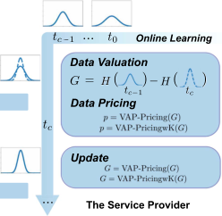

Fig. 1. Data acquisition process in a mHealth system. 

would decay over time. The service provider needs to acquire new mHealth data periodically to retrain the ML models. A specific data acquisition process is conducted as follows. 

At the time slot _t_ , first, a data contributor arrives and queries the price of her data by submitting the training data **_x_** without the label _y_ , where the feature **_x_** would help the service provider to evaluate the data valuation, and not releasing the label _y_ would preserve the content of data before the data exchange. Second, the service provider evaluates the data based on its contribution to ML model training, calculated by the performance improvement between the current model and the updated model after the data is added. Based on the _data valuation_ , the service provider posts the price determined by the _data pricing mechanism_ to the data contributor as incentives. Third, if the data contributor is satisfied with the price, she would contribute the complete training data ( **_x_** _, y_ ). Otherwise, she has no incentives to do so. Having received the data from multiple data contributors, the service provider would update the ML model, data valuation metric, anddatapricingmechanism. Finally, theserviceprovider givesthecorrespondingpaymenttothedatacontributor.Weneed to design an appropriate data valuation metric and a data pricing mechanism to quantify the performance improvement for model training and make a trade-off between the performance and data acquisition expenditure. 

We present a system model to describe the above data acquisition process. Each data contributor owns a set of private mHealth training data, each of which is a pair of a feature and the corresponding label, denoted by _d_ = ( **_x_** _, y_ ). We use _G_ **_X_** ( **_x_** ) to denote the contribution of a new data sample _d_ = ( **_x_** _, y_ ) to the model training. We consider each data contributor has a _reserve value v_ to her data set, which indicates the minimum unit willing price the data contributor would like to share her data. Similar to the previous work [24], [26], all data contributors’ reserve values follow an independent and identical distribution with probability density function _f_ ( _v_ ) over the range [0 _,_ 1]. Different from the classical Bayesian mechanism design [28], the probability density function is unknown to the service provider and needs to be learned from the interaction with data contributors. When one data contributor arrives at the online mHealth system, the service provider posts a unit price of _p_ for purchasing each piece of data. If the data contributor accepts the offered price (i.e., _p ≥ v_ ), she would upload her data and get the corresponding payment; otherwise (0 _≤ p < v_ ), she would leave without contributing 

her data. The goal of the data pricing mechanism is to determine the posted price _p_ at each time slot to maximize the total profit, which will be defined in Section IV later. 

## III. DATA VALUATION 

## _A. A Simple Case: Bayesian Linear Regression_ 

To illustrate the idea of data valuation, we first consider a basic model in ML, linear regression [29] under the Bayesian framework. In mHealth, linear regression models are widely used in heart rate monitoring [17], blood pressure monitoring [30], mental illness detection [31], etc. More specifically, we use the ridge regression model as an example in this subsection and extend the concept of data valuation to more complex models such as Gaussian process (GP) [32] and Bayesian neural networks [33] later. 

Ridge regression can be explained under a Bayesian framework as a type of Bayesian linear regression [34], in which maximizing the parameter’s posterior probability by the Bayesian formulaisthesameasminimizingthelossfunctioninthetraditional frequentist view. Without loss of generality, we assume the prior probabilityoftheparametersinridgeregressionsatisfyGaussian distribution, i.e., _P_ ( **_β_** ) _∼N_ (0 _, ℓ_2 I) with precision parameter (variance) _ℓ_2 . The training process of ridge regression is to use new data to obtain posterior parameter distribution. Thus, the Bayesian framework provides a new perspective to interpret the model training process: the change of posterior parameter distribution can represent the evolution of the model training process to some extent. To calculate this change, we first express the posterior probability of the model parameter **_β_** from the Bayesian theorem 

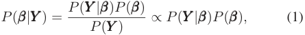

where **_Y_** is the corresponding label of the data set ( **_X_** _,_ **_Y_** ), and _P_ ( **_Y_** _|_ **_β_** ) is the generation probability of **_Y_** under the model parameter **_β_** , and follows the Gaussian distribution. As the product of two Gaussian distributions _P_ ( **_Y_** _|_ **_β_** ) _P_ ( **_β_** ) is still Gaussian, the posterior parameter distribution _P_ ( **_β_** _|_ **_Y_** ) follows a Gaussian distribution. We denote the corresponding mean as **_β_ ¯** , and the variance as Σ. In this posterior Gaussian distribution, the exponential power should be equal. So that 

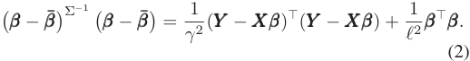

Deriving from (2), by equal coefficients of the same order, we can get 

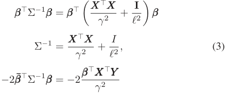

Authorized licensed use limited to: Shanghai Jiaotong University. Downloaded on December 05,2024 at 14:06:09 UTC from IEEE Xplore.  Restrictions apply. 

5969 

XU et al.: VAP: ONLINE DATA VALUATION AND PRICING FOR MACHINE LEARNING MODELS IN MOBILE HEALTH 

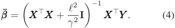

Thus, _P_ ( **_β_** _|_ **_Y_** ) follows a Gaussian distribution with the mean and the variance of **_β_****¯** = ( **_X_**_⊤_ **_X_** + _γ__<u>ℓ</u>_22**I**)_−_1**_X_**_⊤_**_Y_** and Σ = ( _γ_<u>12</u>**_X_**_⊤_**_X_**+ _ℓ_<u>12</u>**I**)_−_1, respectively. 

We regard the data’s contribution as how much information the data samples provide to the model training process. We use the metric of differential entropy [35], a concept from information theory, to measure the information contained underlying the corresponding model. When a new data sample is added to the training set, the parameter distribution shrinks, implying the reduction of the model parameters’ uncertainty. We quantify this uncertainty reduction as the differential entropy of the prior parameter distribution and the posterior parameter distribution. We further use the extent of this reduction to measure the contribution of a data sample to the model training. The differential entropy of the model parameter distribution (a Gaussian distribution) is defined as 

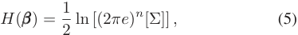

Thus, we can use _G_ **_X_** ( **_x_** ) to calculate the valuation of data **_x_** , by measuring the marginal contribution that the data **_x_** will make to the model that already has been trained by the data **_X_** . 

Considering the importance of reducing uncertainty in mHealth, we emphasize the relationship between _G_ **_X_** ( **_x_** ) and traditional predictive uncertainty. In Bayesian linear regression, in prediction space, for a new set of features **_x_** to be predicted, the predictive distribution takes the form _P_ ( _y|_ **_x_** _,_ **_β_** ) = _N_ ( **_x_** _|_ **_β_**_⊤_ **_x_** _, σN_2(**_x_**)).Aclassicconclusionisthatthepredictive uncertainty can be determined by the variance _σN_2(**_x_**)ofthe predictive distribution, which is given by 

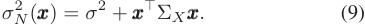

The first term represents the inherent noise in the generation of data, whereas the second term can reflect the uncertainty associated with the parameter **_β_** . We can notice that the determinants of a and b are the same, i.e., **_x_**_⊤_ Σ _X_ **_x_** . We will discuss the comparison between them in detail in Section V. This important discovery will play an important role in our later extension of VAP-Valuation to more advanced models. 

## _B. Properties of Data Valuation Metric_ 

which is only related to variance Σ of the current distribution. And for the parameters **_β_** of one model, the parameter distribution depends on the collected training data. Thus, we denote the differential entropy of parameter distribution _H_ ( **_β_** _|_ **_Y_** ) on the data set ( **_X_** _,_ **_Y_** ) as _H_ ( **_X_** ), then the differential entropy of parameter distribution with the training data set ( **_X_** _,_ **_Y_** ) can be calculated by 

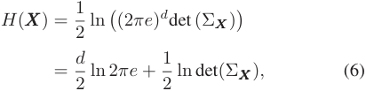

After adding new data sample ( **_x_** _, y_ ), the differential entropy of the parameter distribution is updated to 

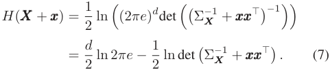

The posterior entropy reduction of the model parameter distribution is 

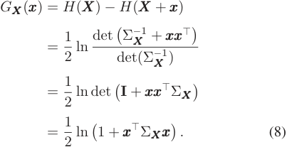

_Definition 1:_ VAP-Valuation: The data valuation of data sample ( **_x_** _, y_ ) for the model with data set ( **_X_** _,_ **_Y_** ) is measured by _G_ **_X_** ( **_x_** ) =<u>1</u> 2ln(1 +**_x_**_⊤_Σ**_Xx_**). 

Compared with traditional data valuation methods in ML such as Shapley value [18], [19], [20], VAP-Valuation has the following characteristics: 

_Submodularity:_ 

_Definition 2 ([36]):_ Let Ω be a finite ground set and _f_ : 2Ω _→_ R. Then _f_ is submodular if for all _S, T ⊆_ Ω with _S ⊆T_ and every _x ∈_ Ω _\T_ , 

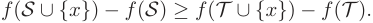

For any data sets _S, T s.t. S ⊆T_ we define the set _U_ = _T − S_ . We use **_U_** , **_T_** , **_S_** to denote the features of the data samples in the set of _U_ , _T_ and _S_ 

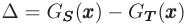

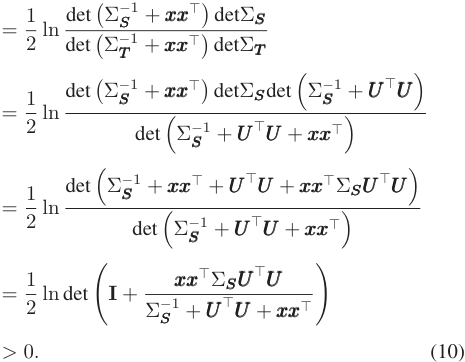

Thus, we can get _G_ **_S_** ( **_x_** ) _> G_ **_T_** ( **_x_** ), which means the data valuation metric _G_ **_X_** ( **_x_** ) we proposed is submodular. A more intuitive understanding is that the marginal contribution of the data diminishes with the size of the data training set, which means that 

Authorized licensed use limited to: Shanghai Jiaotong University. Downloaded on December 05,2024 at 14:06:09 UTC from IEEE Xplore.  Restrictions apply. 

5970 

IEEE TRANSACTIONS ON MOBILE COMPUTING, VOL. 23, NO. 5, MAY 2024 

for the same data sample, the earlier the data is submitted, the higher the contribution generated. 

_Additivity:_ For a collection of data sets submitted by a data contributor within a certain period, the total valuation of all the data (i.e., the total entropy reduction of the model parameter distribution) is the sum of the individual valuation of each data set. It is independent of the internal order of the data sets. That is, the data valuation metric is a set function: Owning ( **_X_** _,_ **_Y_** ), for any new data set _S_ , using _G_ ( _S_ ) to denote the data valuation of data set _S_ , calculated by the features **_S_** of data in _S_ , it is a fixed value 

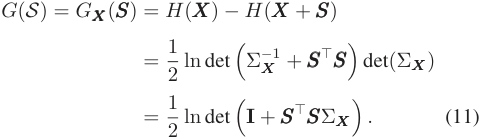

More specifically, _G_ ( _S_ ) =� _si∈S__G_�_i_ _j__−_ =11**_s_**_j_(**_s_**_i_)regardlessthe position of _si_ in _S_ , though the specific value of _G_� _ij−_ =11**_s_**_j_(**_s_**_i_) changes under different order of data sets. Moreover, the valuation of the entire dataset _I_ is completely distributed among all data contributors, i.e., _G_ ( _I_ ) =� _i∈I__G_(_i_),whichiseasily derived by the additivity. 

_Fairness:_ Two data samples that are identical in what they contribute to the model have the same valuation in an online manner. That is, for any data _s_ and _s__′_ are equivalent in the sense that _G_ ( _S ∪{s}_ ) = _G_ ( _S ∪{s__′_ _}_ ) _, ∀S ⊆I\{s, s__′_ _}_ , then _GS_ ( _si_ ) = _GS_ ( _sj_ ) _._ Meanwhile, data with zero marginal contribution to the model has zero valuation, i.e., if _G_ ( _S ∪{s}_ ) = _G_ ( _S_ ), then _GS_ ( **_S_** ) = 0. Actually, because the variance of parameter distribution is non-negative, if data has zero valuation, it means the variance is zero, and then the Gaussian function becomes a Dirac delta function, in which **_β_** only has one possible value. 

_Label Anonymity:_ According to Definition 1, in VAPValuation, each data’s valuation can be calculated only depending on the data features **_x_** , without using data label _y_ , which can preserve the content of the data before data exchange. On the other hand, VAP-Valuation can infer the contribution of **_x_** in real-time when the data is submitted, without waiting until the end of model training, which provides the possibility for subsequent online data pricing. 

_Comparison With Shapley Value Valuation (SVV):_ 1) SVV is not submodular, and due to its computation principle, whenever a new data sample is added, the SVV of all data samples will need to be recalculated. 2) SVV also has additivity. In addition to this, the sum of SVV of all data samples is equal to 1, which is not available in VAP-Valuation. 3)SVV is the only valuation method with strict fairness. While our method can satisfy online fairness according to the above discussion. 4)SVV does not have label anonymity, and can only be calculated after the whole complete data samples are obtained. 

## IV. DATA PRICING 

## _A. Profit Maximization Mechanism_ 

In this section, we present a posted pricing mechanism, VAP-Pricing, to maximize the service provider’s profit in an online manner. According to Definition 1, _G_ **_X_** ( **_x_** ) denotes the contribution that one piece of data **_x_** brings to the performance improvement of model training, from which the service provider can extract profit. As we have mentioned before, each data contributor has a reserve value of _v_ . Only if the payment is higher than the reserve value would she upload her data and get the corresponding payment; otherwise, she would leave without contributing her data. Therefore, the profit that the service provider can obtain from one data contributor with a reserve value _v_ is 

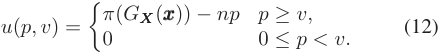

where _p_ is the unit price of each data and _π_ ( _G_ **_X_** ( **_x_** )) is the revenue extracted from the updated model after adding _n_ data samples **_x_** . We use _F_ ( _p_ ) = �0 _p__f_(_v_)_dv_to denote the probability that a data contributor accepts the data price _p_ . Thus, given the distribution of the reserve value _v_ and the price _p_ , the expected profit extracted from _n_ data samples can be written as 

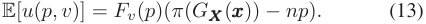

As we do not know the distribution of reserve value, we tackle the above profit optimization problem by leveraging the exploration and exploitation technique from bandit literature [37], in which a decision-maker (the service provider) takes actions to maximize his long-term rewards (profits), by balancing between exploration and exploitation. At each time slot _t ∈{_ 1 _,_ 2 _, . . . , T }_ , a new data contributor with a value _vt_ arrives. The service provider chooses a posted price from the set of candidate prices _P_ ≜ _{pi | pi_ = _Ki__, i_= 1_, . . . , K}_,wherewe regard each price _pi ∈ P_ as an arm as the traditional setting [38]. Then he observes the feedback from the data contributor and gets the corresponding profit according to (12). 

The classical method UCB1 algorithm [39] estimates the unknown expected reward (profit) of each arm by making a linear combination of previously observed rewards of the arm. However, in our problem, the reward distribution behind each candidate price (arm) is not fixed, which is also determined by the valuation of data provided by the data contributor. Thus, we cannot directly use UCB1 to solve the online pricing problem. We observe that we can regard the data valuation as a type of context associated with each arm, and thus the pricing problem can be formulated as a contextual bandit problem [40]. To solve it, we first rewrite the profit function as 

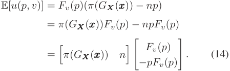

Authorized licensed use limited to: Shanghai Jiaotong University. Downloaded on December 05,2024 at 14:06:09 UTC from IEEE Xplore.  Restrictions apply. 

5971 

XU et al.: VAP: ONLINE DATA VALUATION AND PRICING FOR MACHINE LEARNING MODELS IN MOBILE HEALTH 

At time slot _t_ , we define Π _t_ = ( _π_ ( _Gt_ ) _, nt_ )_⊤_ as the features of the context, where _Gt_ denotes the total contribution of the arriving data set, and _nt_ is the number of data samples. Then the expected reward of arm _pi_ can be expressed as 

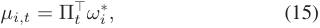

where _ωi__∗_≜(_Fv_(_pi_)_, −piFv_(_pi_))_⊤_represents the unknown co- efficient vector. To post a reasonable price, that is, to select the best arm of each round, the service provider needs to estimate the expected rewards in (15) of arms accurately. The service provider can obtain the value of Π _t_ based on the VAP-Valuation. Then we should learn _ωi_ of each arm, which can be explained as learning the reserve value distributions of data contributors implicitly.Inthisway,wecanregardthefeaturesofthecontextas independent variables, and the expected reward is the dependent variable. With this, we can treat the observed context-reward pairs as training samples and train a regression model for each arm. 

However, different from the traditional setting in the LinUCB [40] to solve the contextual MAB problem, in our problem, the feedback information from each choice of one arm (i.e., one possible posted price) can not only update the current arm but also be used as training inputs for other arms. That is when one data contributor rejects a specific price _pi_ , which means 0 _≤ pi < v_ , she would also reject the price _p_ with _p < pi_ . Similarly, when one data contributor accepts the price _pi_ , which means _pi ≥ v_ , she would also accept the price _p_ with _p > pi_ . Thus, in this work, we define _Mi_ as a design matrix of dimension _ji__∗×_2 at time slot_t_, whose rows correspond to_j_ _i__∗_=_ji_+_jl_+_js_ training inputs, where _ji_ is the amount of training data with price _pi_ , _jl_ is the number of training data with _p > pi_ and the data contributor rejects the price _p_ , _js_ is the number of data with price _p < pi_ and the data contributor accepts the price _p_ . And _ci_ is the rewards corresponding to these contexts. With this augmented training data set ( _Mi, ci_ ), we can have a better estimate of the coefficients by applying ridge regression 

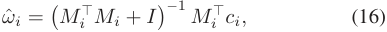

where _I_ is the 2 _×_ 2 identity matrix. 

Algorithm 1 gives a detailed description of the entire LinUCB algorithm for pricing, in which _Ai_ = _Mi__⊤Mi_+_I_and _bi_ = _Mi__⊤ci_.Fortheinputofthealgorithm,_α_isaparameter to control the exploration scale, _G_ **_X_** ( **_x_** ) is the VAP-Valuation of **_x_** , _π_ ( _·_ ) is the revenue function, _K_ is the number of arms (candidate price), and _T_ is the total time slots. At each time slot, there is a data contributor _t_ querying the price by her data **_x_** _t_ , and then we can observe the context (features of the current data) Π _t_ (Line 2). Then for all possible prices, we estimate the coefficients according to (16) (Lines 3–6). It can be shown that with probability at least 1 _− δ_ 

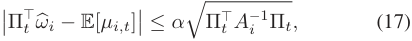

for any _δ >_ 0, where _αT_ = 1 + �2 ln<u>1</u> _δ_+ 2 ln(1 + 2_<u>t</u>_). We will show this result in Section IV-C. The inequality gives a reasonably tight upper confidence bound for the expected reward of 

## **Algorithm 1:** VAP-Pricing. 

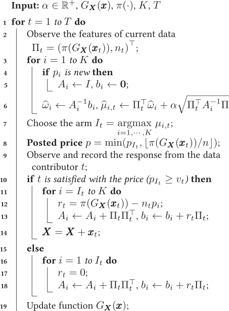

arm _pIt_ , from which a UCB-type arm-selection strategy can be derived: at each time slot _t_ , choose 

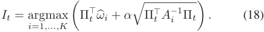

Thecriterionforarmselectioncanalsoberegardedasanadditive trade-off between the reward estimation and model uncertainty reduction (Lines 7–8). After we post a price, we record the responsefromthedatacontributor.Ifthedatacontributoraccepts the posted price, i.e., _pIt ≥ vt_ , we calculate the reward and update _Ai_ as well as _bi_ for all price _pi > pIt_ . The data contributor would upload her data, and we add it to the data set (Lines 10–14).Otherwise,i.e., 0 _≤ pIt < vt_ ,thedatacontributorwould leave without contributing her data. The reward we get is 0, and we update _Ai_ as well as _bi_ for all price _pi < pIt_ (Lines 15–18). 

Next, we introduce the design of revenue function _π_ . By the additivity property of data valuation metric in Section III-B, we can get _G_ ( _S ∪T_ ) = _G_ ( _S_ ) + _G_ ( _T_ ). To make the revenue function extend the additivity, i.e., _π_ ( _G_ ( _S ∪T_ )) = _π_ ( _G_ ( _S_ )) + _π_ ( _G_ ( _T_ )), it is easy to prove that _π_ ( _·_ ) should be the linear function by Cauchy’s functional equation [41] as 

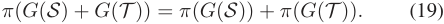

In this work, we set _π_ ( _G_ **_X_** ( **_x_** )) = _k · G_ **_X_** ( **_x_** ) _− ϵ_ , where _k_ can uniform the magnitude between the data valuation and the revenue. As we have mentioned, _k · G_ **_X_** ( **_x_** ) guaranteed the additivity when converting data valuation _G_ **_X_** ( **_x_** ) to _p_ . Besides, _ϵ_ can be seen as the fee per operation, which can also control 

Authorized licensed use limited to: Shanghai Jiaotong University. Downloaded on December 05,2024 at 14:06:09 UTC from IEEE Xplore.  Restrictions apply. 

5972 

IEEE TRANSACTIONS ON MOBILE COMPUTING, VOL. 23, NO. 5, MAY 2024 

the trade-off between total entropy reduction (data valuation) and the total budget, which we will show in the evaluation part. By setting proper _ϵ_ , the service provider can acquire data with different objectives. For example, a budget-limited service provider may have a limited budget who only wants to collect a smaller data set and can tolerate a slower data collection rate. On the other hand, a budget-sufficient service provider has more budget and wants to collect as much data as possible. A suitable _π_ ( _·_ ) can control the trade-off between the data collection scale and the total budget. 

## _B. Properties of Data Pricing Mechanism_ 

The data pricing mechanism we proposed in VAP-Pricing has the following characteristics: 

_Incentive for Data Contribution:_ VAP-Pricing motivates data contributors to submit data as early as possible because the data valuation function _G_ **_X_** ( **_x_** ) is submodular with respect to **_X_** . Specifically, in VAP-Pricing, earlier data contributors will have a higher (marginal) data contribution and are more likely to get more profit, implying that we encourage data contributors to submit data as soon as possible in the online data collection process. 

_Robust to Strategic Behaviors:_ To guarantee the property of symmetry, Shapley value leaves the possibility for selfish data contributors to carry out strategic behaviors, such as copying data for extra benefits. There are some solutions to solve this issue, such as discounting the value of the same data [18], but it will break the property of fairness in Shapley value. However, VAP-Pricing can naturally decrease the similar data’s valuation, as the later data will not impact the model too much due to the submodularity of VAP-Valuation. Meanwhile, the data with the same contribution will be given the same price at one specific time slot. Thus, VAP-Pricing guarantees fairness to some extent. 

Moreover, this data pricing mechanism is also arbitrage-free when the VAP-Pricing is stable. Due to the additivity of VAPValuation, regardless of the data order in a data set, the sum of the data valuation for a dataset is the same, resulting in the identical posted price. Specifically, we consider the case when the pricing mechanismisstable,i.e.,wehavealreadygottheaccurate _Fv_ ( _p_ ). Suppose the data contributor divides a data set **_S_** into several subsets **_S_** _i_ , _i_ = 1 _, . . . , n_ , and submits each subset at different time slots. Then by the additivity property of VAP-Valuation and the definition of revenue function _π_ , we can further get 

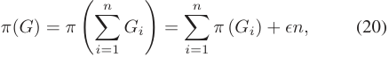

where we denote _G_ = _G_ **_X_** ( **_S_** ) for the whole data set and _Gi_ = _G_ **_X_ +****�** **_ij−_ =11****_Sj_**(**_S_**_i_) for each subset. We denote_p_1_,i_as the posted price for each separated data subset and _p_ 2 as the posted price for the whole data set. Then, 

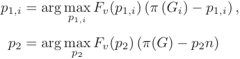

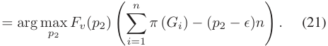

As _Fv_ ( _p_ ) is already known, it is easy to prove that _p_ 1 _,i_ = _p_ 2 _− ϵ_ = _v_ when _p ≥ v_ , which means if the full dataset can be traded, data contributors can not get more payment by splitting the data set and submitting them separately. Intuitively, if the data contributor splits the data and submits them separately due to the influence of the operation fee _ϵ_ in the mapping function, it results in a lower payment. 

_Data Privacy Preserving for mHealth._ By the Label Anonymity property of VAP-Valuation, the data contributor _i_ can query the possible payment by _xi_ without uploading _yi_ . Then the label _yi_ is not involved in the data valuation and pricing processes, reducing the risk of privacy leakage. Thus, in the data collection process, the data contributors have the right to decide whether the data is used for model training under the VAP-Pricing framework. Suppose the data contributors are not satisfied with the current payment and choose not to contribute their whole data. In this case, they do not leak the whole information about their data (preserve the label _y_ ). 

## _C. Regret Analysis_ 

For stochastic linear bandits, a classic setting is a shared parameter with possibly infinite arms. In our problem, we follow the original version, considering fixed _K_ arms and disjoint parameters, i.e., the posted price set is fixed finite, and for each arm, coefficient vector _ωi__∗_≜(_Fv_(_pi_)_, −piFv_(_pi_))_⊤_. We define the regret of VAP-Pricing as 

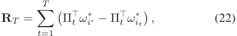

where _i__∗_ is the optimal arm (price) and _it_ is the arm taken at time slot _t_ . The proof is divided into two steps, the first is that the regret of the shared-parameter setting will be _O_ ( _√dT_ ). In this setting, there is only a fixed unknown parameter _ω__∗_ for all arms, where _ω__∗_ _∈_ R_d_ . After that, we show the regret of the disjoint-parameter setting under our problem setting will reach _O_ ( _√dKT_ ). Considering the shared-parameter setting, first, we make some assumptions, which are common in the traditional stochastic linear bandits problem. 

_Assumption 1:_ We assume that the observed noise i.e., ( _rt −_ Π_⊤_ _t__ω∗_) is independent standard Gaussian noise, where_rt_is the reward and _ω__∗_ _∈_ R_d_ is an unknown but fix parameter. 

_Assumption 2:_ We assume that the contexts Π and the parameter _ω__∗_ are bounded. _∥_ Π _∥_ 2 _≤_ 1 _, ∥ω__∗_ _∥_ 2 _≤_ 1 _._ Then the regret under the shared-parameter setting is 

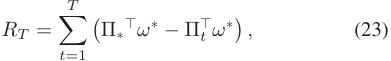

where Π _∗_ is the optimal action and Π _t_ is the action taken at time slot _t_ . To note, it is different from the previous definition of Π. Here we reuse the symbol for simplicity. The actions here contain both the original context and the information of the arm selection, which will be introduced in detail in (34) later. 

Authorized licensed use limited to: Shanghai Jiaotong University. Downloaded on December 05,2024 at 14:06:09 UTC from IEEE Xplore.  Restrictions apply. 

5973 

XU et al.: VAP: ONLINE DATA VALUATION AND PRICING FOR MACHINE LEARNING MODELS IN MOBILE HEALTH 

To complete the proof, we introduce the concept of confidence ellipsoid. The result shows that _ω__∗_ lies with high probability in an ellipsoid with center _ω_ � [42]. 

_Lemma 1 (Confidence Ellipsoid):_ Let _At_ = _λI_ + <u>�</u> _tτ_ =1Π_τ_Π_τ ⊤_, _ω_ � _t_ = _A__−_ _t_1 � _tτ_ =1_cτ_Π_τ_, _αT_ = _√λ_ + ~~�~~ 2 ln<u>1</u> _δ_+_d_ln(1 + _dtλ_),thenwithprobabilityatleast1_−δ_, for all _t ≥_ 0, _ω__∗_ lies in the set 

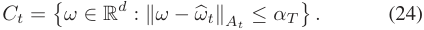

Then we can get the regret of shared-parameter LinUCB. _Theorem 1:_ With probability 1 _− δ_ , the regret _RT_ of sharedparameter LinUCB satisfies 

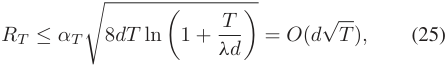

where _T_ is the total time slots, the hyperparameter _αT_ = _√λ_ + ~~�~~ 2 ln<u>1</u> _δ_+_d_ln(1 + _dtλ_),_d_isdimensiontheunknownparame- ters, and _λ_ is the coefficient of the identity matrix in the gram matrix. 

_Proof:_ By Cauchy-Schwarz and Lemma 1, we have 

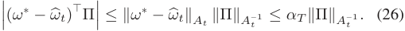

Let � _ωt ∈ Ct_ be the parameter in the confidence set to make that _ω_ � _t__⊤_Π_t_= max_ω∈C_ _t__ω⊤_Π Thus, 

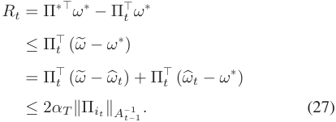

As the definition of _αT_ , we can get _αT ≥_ 1. By the Assumption 3, we have _Rt ≤_ 2 _αT_ min _{_ 1 _, ∥_ Π _it ∥A−t−_ 11_}_. Then by the Cauchy-Schwarz inequality and min _{_ 1 _, x} ≤_ 2 ln(1 + _x_ ), we can bound the regret as 

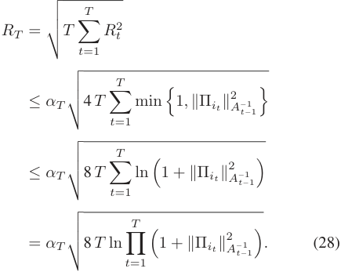

By the definition of _A_ , we have 

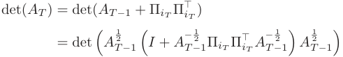

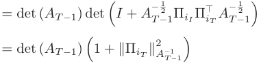

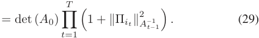

Then, by AM-GM inequality, we can get 

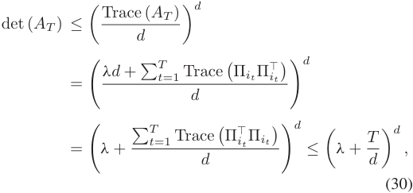

with det _A_ 0 = _λ__d_ , we can further get 

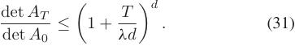

Then, we can continue bounding the regret as 

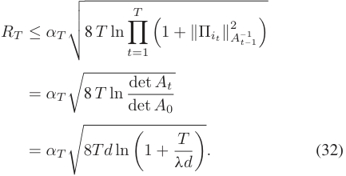

Till now, we obtain the regret of the shared-parameter setting with a single true _ω__∗_ assumed. 

_Theorem 2:_ With probability 1 _− δ_ , the regret of disjointparameter VAP-Pricing satisfies 

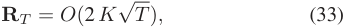

where _T_ is the total time slots, _K_ is the number of arms, and _αT_ = _√λ_ + �2 ln<u>1</u> _δ_+_d_ln(1 + _dtλ_) in VAP-Pricing. 

An intuitive understanding is that the regret of VAP-Pricing is related to the number of arms (prices) set _K_ and the total time slots _T_ . As a bigger arm size, the regret will increase due to a larger range of policies, and VAP-Pricing can get logarithmic accumulated regret. Also, as _α_ is related to _δ_ , the choice of _α_ in VAP-Pricing will affect the probability of the regret guarantee. 

_Proof:_ In our problem, the parameter is disjoint over each arm so we have _K_ separate parameters _ωi__∗_to estimate, one for each arm. Then it is obvious the regret of the disjoint-parameter situation is a factor of _K_ worse than that of the shared-parameter LinUCB. Another explanation for this is that we can generate a 

Authorized licensed use limited to: Shanghai Jiaotong University. Downloaded on December 05,2024 at 14:06:09 UTC from IEEE Xplore.  Restrictions apply. 

5974 

IEEE TRANSACTIONS ON MOBILE COMPUTING, VOL. 23, NO. 5, MAY 2024 

new parameter Ω_∗_ , to make 

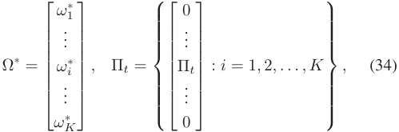

where _ωi__∗∈_R_d_.ThusbythedefinitionofΩ_∗_,wehaveΩ_∗∈_ R_D_ _, D_ = _dK_ . Then we can get under shared-parameter Ω_∗_ , the regret is bounded by _O_ ( _D√T_ ) = _O_ ( _dK√T_ ). □ 

## _D. VAP-Pricing Under a Fixed Limited Budget_ 

In Section IV-A, we considered that the service provider’s budget is not fixed, and it can be adjusted by _ϵ_ . However, in this section, we consider another common situation in real-life situations, where the budget is fixed at the beginning. In this case, we cannot simply model it as an ordinary contextual multi-armed bandit problem as before. This is because we need to consider not only the revenue brought by the current arm each time we pull but also the budget consumption at the same time to ensure that we can get the maximum revenue when the budget is depleted. Then a straightforward idea is to model it as a linear contextual bandit with backpacks problem, which is an extended version of VAP-Pricing above. Linear contextual bandits with backpacks had been widely studied by previous work [43]. However, we can not apply the previous method to our model. In previous work, it was assumed that there is a fixed but unknown distribution _D_ on the context. Whereas in our modeling, contexts Π _t_ = ( _π_ ( _Gt_ ) _, nt_ )_⊤_ , i.e., data valuation and the number of data samples do not follow a fixed distribution because the data valuation has diminishing marginal property. The good news is that the part not known to the data provider and needs to be inferred by the VAP-Pricing is the reserve value distribution _Fv_ ( _p_ ) of data providers. It is a deterministic distribution that does not vary over time. Thus, considering the budget limitation scenario, we can remodel the problem as a static multi-armed bandit with a knapsack framework, instead of considering time-varying contexts (data valuations). In the first stage, we predict the reserve value distribution of the data contributors through a static multi-armed bandit, and then we combine the expected reserve value distribution and the current data valuation to compute the accurate posted price. 

Next, we give a formal definition of this problem. The service provider is given access to _d_ -dimensional of _K_ arms (price) denoted as _a ∈_ [ _K_ ] := _{_ 1 _,_ 2 _, . . . , K}_ . Each time _t ∈_ [ _T_ ], the service provider pulls an arm _at_ and observes the reward and consumption. We denote the unknown expected reward as _rt_ , and the corresponding resource consumption as _ct_ . We assume there is a fixed total budget _B ∈_ R+ on the consumption, which is a hard constraint. The algorithm stops at the earliest time _τ_ when _B_ is exhausted. 

To solve this bandit with knapsack problem, we decomposite the budget into each slot. For submission with _n_ pieces of data samples, we regard the strategy as the repeated _n_ posted price. 

**Algorithm 2:** VAP-PricingwK. 

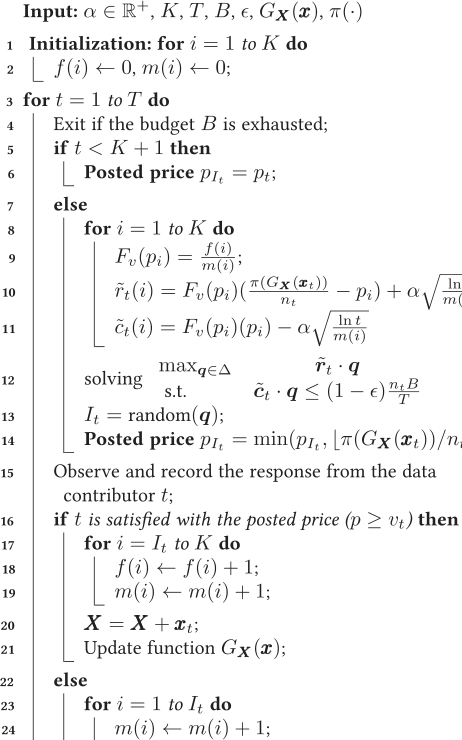

Thus, in each time slot, we only need to consider the unit reward and the unit cost of each price _pi, i ∈_ [ _K_ ]. First, we define the unit reward (profit) and cost for each arm. The reward (profit) that the service provider can obtain from one data contributor with a reserve value _v_ is 

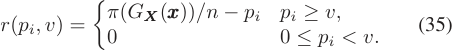

where arm _i ∈_ [ _K_ ]. And the unit cost that the service provider pays for each arm _i_ with a reserve value _v_ is 

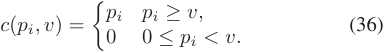

As we mentioned above, we transform them into functions related to _Fv_ ( _pi_ ), 

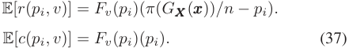

Then in first stage, we calculate the _Fv_ ( _pi_ ) 

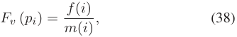

Authorized licensed use limited to: Shanghai Jiaotong University. Downloaded on December 05,2024 at 14:06:09 UTC from IEEE Xplore.  Restrictions apply. 

5975 

XU et al.: VAP: ONLINE DATA VALUATION AND PRICING FOR MACHINE LEARNING MODELS IN MOBILE HEALTH 

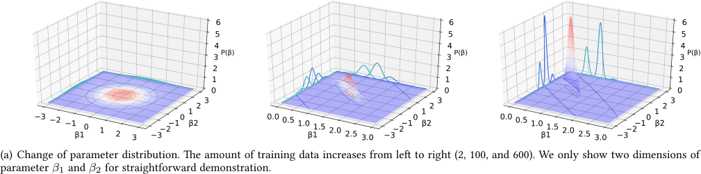

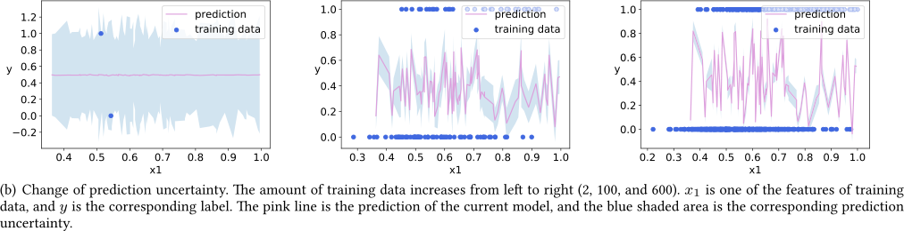

Fig. 2. Model Changes during data addition. 

where _f_ ( _i_ ) is the number of times that data contributors accept _pi_ , i.e., _pi ≥ v_ in _m_ ( _i_ ). Then based on the estimation of _Fv_ ( _pi_ ), we can calculate the expected reward and cost. We give detailed data pricing with a knapsack algorithm, called VAP-PricingwK in Algorithm 2. For the input of the algorithm, _α_ is a parameter to control the exploration scale, _K_ is the number of arms (candidate price), _T_ is the total time slots, _B_ is the total Budget of the service provider, _ϵ_ is the budget factor, _G_ **_X_** ( **_x_** ) is the VAP-Valuation of **_x_** , and _π_ ( _·_ ) is the revenue function. We initialize the parameter _f_ ( _i_ ) and _m_ ( _i_ ) for each arm _i_ (Lines 1–2), and for all possible prices, we pull each arm once (Lines 5–6). As for each time slot _t_ , there is a data contributor _t_ querying the price by her data **_x_** _t_ . First, we estimate the reserve value distribution as (38) based on the historical observation (Line 9). To estimate the reward _rt_ ( _i_ ) and cost _ct_ ( _i_ ) for each arm, inspired by the UCB-based algorithm for BwK [44], which is based on “optimism in the face of uncertainty”, we make optimistic estimates of them 

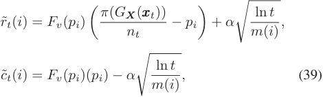

where _r_ ˜ _t_ ( _i_ ) is the upper confidence bound of _rt_ ( _i_ ) and _c_ ˜ _t_ ( _i_ ) is the lower confidence bound of _ct_ ( _i_ ) (Lines 10–11). After getting _r_ ˜ _t_ ( _i_ ) and _c_ ˜ _t_ ( _i_ ), we solve the following linear programming to get the policy: 

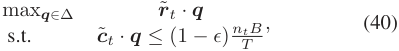

where **_q_** is the probability to pull each arm, and _ϵ_ = � _<u>γBd</u>_+ log( _T_ )_<u>γ</u>_ _B__d, γ_= log(_<u>T d</u>_ _δ_).Thenweselectarm_It_randomlyac- cording to the probability in **_q_** , and post the price (Lines 12–14). After posting a price, we record the response from the data contributor. If the data contributor accepts the posted price, i.e., _p ≥ vt_ , we update _f_ ( _i_ ) as well as _m_ ( _i_ ) for all arms _i > It_ . The data contributor would upload her data, and we add it to the data set (Lines 15-21). Otherwise, i.e., 0 _≤ p < vt_ , the data contributor would leave without contributing her data. We only update _m_ ( _i_ ) for all arms _i ≤ It_ (Lines 23–24). 

## V. EXTENSIONS TO GENERAL MODELS 

In this section, we extend VAP to advanced ML models. In Bayesian linear regression, we can easily calculate the posterior parameter distribution by a closed-form expression. However, in other advanced ML models, such as Bayesian neural network [33], parameter spaces are often high dimensional, and computing their entropy is usually intractable. Furthermore, for non-parametric processes, such as the Gaussian process [32], the parameter space is infinite-dimensional, which further increases the computational complexity. 

To solve this problem, inspired by (9) and (8), we transfer the objective from computing uncertainty in the parameter space to the prediction space, avoiding gridding parameter space (exponentiallyhardwithdimensionality).Fig. 2 showsthecomparison of parameter probability density distribution and prediction uncertainty. We can find that they have the same shrinking trend when adding more training data. The model’s grasp of the parameter is getting higher, implying the model uncertainty 

Authorized licensed use limited to: Shanghai Jiaotong University. Downloaded on December 05,2024 at 14:06:09 UTC from IEEE Xplore.  Restrictions apply. 

5976 

IEEE TRANSACTIONS ON MOBILE COMPUTING, VOL. 23, NO. 5, MAY 2024 

andpredictionuncertaintyreduction.Thus,thedatavaluationwe obtained can be regarded as a measure of uncertainty. The difference is that (9) calculates the predictive distribution variance in the prediction task, the aim of which is to get the uncertainty in the current test data to evaluate the reliability of a prediction. However, (8) calculates the entropy reduction of parameter **_β_** caused by adding new training data from the training data set. The goal is to get the model uncertainty changes caused by current training data to measure each data’s contribution. 

Thus, we can calculate entropy in low-dimensional output space using the idea of prediction uncertainty. For new data, _d_ = ( **_x_** _, y_ ), we calculate its contribution by regarding **_x_** as the features of the prediction task to calculate its prediction uncertainty. Specifically, for a representative non-parametric model, we write Gaussian process regression(GPR) as **_y_** = _f_ ( **_x_** ) + **_ε_** with the unknown function _f_ follows a _N_ ( _μ, k_ ) and **_ε_** follows a _N_ (0 _, γ_2 _I_ ) [32]. Different from parameter **_β_** in range regression, there are no specific parameters in _f_ . Thus, GPR is a non-parametric model. Consider the current purchased data set _D_ = _{di}__n_ _i_ =1containingndatawith_di_= (**_x_**_i, yi_), [ _f_ ( **_x_** 1) _, f_ ( **_x_** 2) _, . . . , f_ ( **_x_** _n_ )]_⊤_ _∼N_ ( **_μ_** _, K_ ), where **_μ_** is the mean vector and **_K_** is the _n × n_ covariance matrix, **_K_** _ij_ = _k_ ( **_x_** _i,_ **_x_** _j_ ). To make a prediction of new data sample **_x_** by the current model, the predictive distribution is 

where the predictive distribution variance is 

Then, similar to the (8), the valuation function in GPR can be set as 

Moreover, for the complex parametric model, neural network, similar to the Bayesian linear regression, we can put a prior distribution over its weights, such as a Gaussian prior distribution: **_W_** _∼N_ (0 _, γ_2 _I_ ). Such a model is referred to as a Bayesian neural network (BNN) [33]. For each new data _x_ , we can obtain the corresponding predictive distribution uncertainty using the BNN uncertainty [8]. First, we optimize the parameters of the simple distribution instead of optimizing the original neural network’s parameters in BNN, where the posterior _p_ ( **_W_** _|_ **_X_** _,_ **_Y_** ) is fitted with a simple distribution _q_ **_θ_**_∗_(**_W_**), parameterized by**_θ_**. Then by the Dropout in BNN, which can be interpreted as a variational Bayesian approximation, epistemic uncertainty can be measured. For classification, the model prediction can be approximated using Monte Carlo integration as follows: 

with _T_ sampled masked model weights **_W_**� _t ∼ q_ **_θ_**_∗_(**_W_**)_,_where _q_ **_θ_**_∗_(**_W_**) is the Dropout distribution [8]. Then the valuation func- tion can be calculated by 

where _R_ is the number of categories. For regression, the predictions are made by approximating the predictive mean 

Thepredictionuncertaintyiscapturedbythepredictivevariance, which can be approximated as 

Similarly, the valuation function can be calculated by 

Thus, we can extend the VAP for various online ML models as long as they can calculate prediction uncertainty, such as GPR and the model under the Bayesian framework. More intuitively, rather than collecting data for significantly reducing the parameter distribution’s differential entropy, we marginally seek the data for which the model is most uncertain about the predictions. If there is a higher degree of uncertainty about the prediction of arriving data, we do not have enough data whose features are similar to its features, so we have less confidence in it. So when we add this data to our training data set, it will significantly reduce the model uncertainty in this data region. Thus, such data will contribute more to the model, leading to more entropy reduction of parameter distribution, and the service provider would like to post a higher price for it. In addition to online learning models, VAP can be used in some other domains to guide the data collection process. For example, in domains such asactivelearning [45] andBayesianreinforcementlearning [46], where the model should have the ability to identify the most valuable data for model training and add it to the training set. 

## VI. EVALUATION RESULTS 

In this section, we evaluate our VAP through extensive experiments on real-world human behavior indicators data, which can be involved in mHealth. 

## _A. Evaluation Setup_ 

We present the evaluation results based on two real-world human behavior data sets: 1) Human Activity Recognition (HAR) database [47], a data set built from the recordings of 30 data contributors performing daily living activities while carrying a waist-mounted smartphone with embedded inertial sensors. The obtained data set was randomly partitioned into two sets, where 70% of the volunteers were selected to generate the training data and 30% the test data. 2) Pima Indians Diabetes (PID) [48], a data set initially from the National Institute of Diabetes and 

Authorized licensed use limited to: Shanghai Jiaotong University. Downloaded on December 05,2024 at 14:06:09 UTC from IEEE Xplore.  Restrictions apply. 

5977 

XU et al.: VAP: ONLINE DATA VALUATION AND PRICING FOR MACHINE LEARNING MODELS IN MOBILE HEALTH 

Fig. 3. VAP-Valuation on different models (Ridge classification (RC), Gaussian process classification (GPC)) and Tasks (HAR and PID Database). 

Digestive and Kidney Diseases. The data set’s objective is to diagnostically predict whether a patient has diabetes based on specific diagnostic measurements included in the data set. 

## _B. Results of Data Valuation_ 

_1) VAP on Different Models and Tasks:_ We evaluate the performance of VAP-Valuation. Fig. 3 shows that VAP-Valuation is a proper model value evaluation metric leading to smaller model uncertainty and higher model accuracy. First, as for RC, in Fig. 3(a) and (d), the general trend in total entropy reduction and prediction accuracy boost is consistent, which means the goals of data collection and model optimization are consistent under VAP. Meanwhile, in Fig. 3(b) and (e), by observing that the model accuracy increases slowly with the decrease of VAPValuation and that the turning points of them are close (for about 20 in Fig. 3(a) and 500 in Fig. 3(c), we can conclude that the VAP is able to judge the proper scale of the data collection. That is to say, after collecting such an amount of data, the valuation of the new data is relatively small, and the accuracy of the model is relatively stabilized. 

As for GPC and BNN, using the VAP-Valuation in Section V, we value the data on the outcome space. As the PID is a smaller data set, we adopt the GPC model to it. Meanwhile, HAR is a more extensive data set, which is more suitable for training with the BNN model. In Fig. 3(c) and (f), we can get a similar result with the RC model. By adding a new data sample, the model uncertainty is smaller, leading each data’s contribution to the model more negligible, and the model accuracy increases. Also, the turning points of them are close, for about 20 in Fig. 3(c) and 1000 in Fig. 3(f). Moreover, from all the results in these three models, we can notice that the contribution of each data point shows the characteristic of diminishing marginal, which is consistent with the properties we described in Section III-B. Valuation on the outcome space (Fig. 3(c) and (f)) appears 

Fig. 4. Performance of different data valuation metrics. (a) Comparison of the valuation of the first 100 PID data. (b) The effect of removing high-valuation data points under different data valuation metrics. 

to fluctuate more than the valuation on the parameter space because there is only one parameter space, and its dimension is higher and the previous decline is more. While the predictive distribution for each data is a different distribution. We can also notice some prominent high points in VAP-Valuation. Such data points may be the data points of new distributions in the system that have not been acquired before. In practice, in addition to data points that may be of higher epistemic uncertainty and thus show high value to the model, it can also be some incorrect data due to the problems arising from equipment acquisition. Furthermore, the service provider can identify and distinguish between the two types of data based on specific tasks. For example, the service provider can distinguish whether data is from a hypertensive patient (150/100 mmHg) or is derived from an abnormal collection (500/100 mmHg). 

_2) Performance of Different Data Valuation Metrics:_ We compare our method with other static data valuation metrics for machine learning, including TMC-Shapley [20], G-Shapley [20] and Random (one possible online metric) in Fig. 4. Compared with other methods, VAP-Valuation is more suitable for online learning for the following reasons. First, as Fig. 4(a) shows, the 

Authorized licensed use limited to: Shanghai Jiaotong University. Downloaded on December 05,2024 at 14:06:09 UTC from IEEE Xplore.  Restrictions apply. 

5978 

IEEE TRANSACTIONS ON MOBILE COMPUTING, VOL. 23, NO. 5, MAY 2024 

Fig. 5. Performance of different data pricing mechanisms under different reserve values’ distribution, from left to right: _f_ 1( _v_ ): An approximately normal distribution within [0 _,_ 1], where the mean is 0.5, and variance is 0.1; _f_ 2( _v_ ): An approximately normal distribution within [0 _,_ 1], where the mean is 0.5, and variance is 0.01; A constant distribution as _f_ 3( _v_ ) = 0 _._ 5. 

VAP-Valuation shows many excellent characteristics for data pricing and collection. It has a significant downward trend as the gradual increase of data over time considers the arrival order, which can incentive an earlier data submission. Besides, we can see that VAP-Valuation is always strictly positive, which provides convenience for data pricing. 

Moreover, Shapley value and its variants are common practices in data valuation for the ML field, so here we emphasize why VAP outperforms Shapley in online learning tasks. Compared to the Shapley value, VAP-Valuation can perform onlinecalculationswithoutcorrespondinglabelsandtestingdata according to the inferrability of VAP-Valuation we mentioned in Section III-B. Simultaneously, the computational complexity will increase significantly with the larger scale of the data set in static Shapely value. Although there are some approximate calculation methods such as TMC-Shapley [20], it still requires a lot of test data and high computational cost, which is impossible and inappropriate to achieve in a real-world mHealth system. G-Shapley, an approximation of TMC-Shapley, can be adapted to online learning. The marginal contribution in G-Shapley is the change of the model’s performance. However, as shown in Fig. 4(a), we can find the G-Shapley does not achieve a good approximation of TMC-Shapley, because the calculation result can be affected by various factors, the size of the test set, learning rate, haphazard, etc. Finally, We can see that VAP-Valuation consistentlyoutperformstheothertwomechanismsasillustrated in Fig. 4(b), as it shows a better decrease over time than others as removing high-valuation data points. Thus, VAP-Valuation is more suitable for online learning tasks. 

## _C. Results of Data Pricing_ 

First, we compare the performance of different data pricing mechanisms under a regular situation: VAP-Pricing, Random, Half Fix, Half Valuation, LinUCB [40] and UCB1 [39]. In Random pricing, the posted price _p_ is uniformly distributed within [0 _,_ 1]. In Half Fix pricing, we set _p_ = 0 _._ 5. And in Half Valuation pricing, we set _p_ = min(0 _._ 5 _· G_ **_X_** ( **_x_** ) _,_ 1). In all experiments, we set _α_ = 1 _._ 2, _ϵ_ = 0 _, K_ = 10, _T_ = 500, and the reserve value is an approximately normal distribution within [0 _,_ 1], where the mean is 0.5, and the variance is 0.01 unless otherwise noted. In Fig. 5, we can see that VAP-Pricing is always better than any 

other policies under different settings of reserve values of data contributors. Moreover, when the reserve value distribution is closer to the constant distribution, VAP-Pricing can get a higher profit. As for other mechanisms, we can see that Random is always the worst. The performance of Half Fix will be worse than contextual methods because it cannot capture the valuation information of the data samples. It can be considered as the optimal case of the traditional UCB1 method (also without considering the context), and Fig. 5 turns out that it is true. In addition, from the last figure in Fig. 5, it can be shown that Half Fix has a very high profit in the early stage. This is because when the reserve value is a constant _f_ ( _v_ ) = 0 _._ 5, the posted price _p_ = 0 _._ 5 in each time slot will definitely be accepted by data contributors. The profit growth of Half Fix will be slow or even negative in the later period, also because the lack of data valuation results in the purchase of low-value data at high prices. In contrast, Half Valuation can always buy the data sample with a higher valuation by posting a high price, so it can always maintain a better growth trend. However, without the estimation of the reserve value will overbid, causing its total benefit to be damaged. Besides, the naive LinUCB method does not take into account the monotonicity of pricing and also leads to unsatisfactory profits. 

Besides, we evaluate the performance of different _ϵ_ . In Fig. 6, we can see that a bigger _ϵ_ leads to a smaller budget and total entropy reduction while maintaining a high profit. Supposing that the service provider chooses a higher _ϵ_ , correspondingly, he tends to use the limited budget to collect a smaller data set, this limited data set can effectively reduce the uncertainty of model predictions. On the contrary, if the service provider chooses a smaller _ϵ_ , he wants to use more budget to collect more data. This adequate data set can further significantly reduce the uncertainty. 

Comparing the price of different pricing policies in Fig. 7, we can see that the VAP-Pricing method can maintain the downward trend of valuation compared to Half Valuation, which is also fairer than other Random or Half Fix. Compared with other advanced bandit methods, i.e., UCB1 and LinUCB, VAP-Pricing can better estimate the reserve value distribution of contributors, leading to faster convergence and a more reasonable price. It can monitor changes in data valuation and adjust the posted price promptly to maximize the profit. 

Authorized licensed use limited to: Shanghai Jiaotong University. Downloaded on December 05,2024 at 14:06:09 UTC from IEEE Xplore.  Restrictions apply. 

5979 

XU et al.: VAP: ONLINE DATA VALUATION AND PRICING FOR MACHINE LEARNING MODELS IN MOBILE HEALTH 

Fig.6. Performance of Different _ϵ_ ( _ϵ_ = 0,0.1,0.5) and differentreserve values’ distribution (From top to bottom are _f_ 1( _v_ ), _f_ 2( _v_ ), and _f_ 3( _v_ )) on budget and entropy reduction. 

Fig. 8. Performance and Price when reserve value _f_ 4( _v_ )=0. 

other methods that cease earlier due to budget exhaustion. Concurrently, the total profit of VAP-PricngwK is maximal and the UCB1 and random methods are the worst. In addition, it can be noticed that VAP-PricingwK does not grow as fast as some of the other algorithms in the early stages due to the need to control the budget and not to adopt a particularly aggressive exploration strategy, but since it retains a larger budget, it will have the opportunity to collect valuable data for higher profits in the later stages. It is also worth noting that although VAP-Pricing consumes the budget more rapidly, the performance is still acceptable. This is contributed to the incorporation of contextual information, which enhances learning speed. However, under a fixed budget, it is challenging to identify an appropriate budget control factor _ϵ_ for VAP-Pricing in advance, resulting in a loss of the final profit. In contrast, VAP-PricingwK’s control under a fixed budget is automatic. Finally, we also find that when the variance of the reserve value _v_ is smaller, the magnitude of the change is smaller, making it easier for VAP-PricingwK to estimate _Fv_ ( _pi_ ), thus obtaining larger profits. 

## VII. RELATED WORK 

Fig. 7. Price Comparison of Different Pricing Mechanisms (From top to bottom are VAP-Pricing, Half Valuation, Random, LinUCB, and UCB1). 

In order to explain the effect of VAP-Pricing more intuitively, we also designed a set of experiments in a special case, that is when the reserve value _v_ = 0. Fig. 8 shows that VAP-Pricing can converge quickly to the lowest price to extract more profit. 

As for the performance of different data pricing mechanisms under a fixed limited budget, we compare the performances of VAP-Pricing, Random, Half Fix, Half Valuation, LinUCB, UCB1, and VAP-PricingwK in Fig. 9. VAP-PricingwK demonstrates good budget control capability, consistently halting close to the predetermined timeframe ( _T_ = 500), contrasting with 

## _A. Mobile Health_ 

The researchers develop multiple models by combining principled medical approaches with ML techniques in mHealth in a variety of domains, including diabetes [49], [50], [51], activity recognition [52], [53], depression treatment [54], [55], and blood pressure monitoring [30], [56]. Recently, researchers are making recent progress in COVID-19 [7], [57], [58], [59]. The design of the mobile device not only proposes a viable mHealth solution and drives the further development of mHealth, but also generates a large amount of mHealth data in the process. Based on such massive data, various machine learning models have been developed, especially some online learning models 

Authorized licensed use limited to: Shanghai Jiaotong University. Downloaded on December 05,2024 at 14:06:09 UTC from IEEE Xplore.  Restrictions apply. 

5980 

IEEE TRANSACTIONS ON MOBILE COMPUTING, VOL. 23, NO. 5, MAY 2024 

Fig. 9. Performance of different data pricing mechanisms under a fixed limited budget _B_ = 100. Reserve values’ distributions from left to right are _f_ 1( _v_ ), _f_ 2( _v_ ), and _f_ 3( _v_ ). 

and incremental learning models are proposed [14], [15], [16], [17], in which the mHealth models would continuously update over time as more information is collected and made available. There are also many researchers who focus on the integration of Bayesian methods into mobile health [60], [61], [62]. However, these works are currently considering designs of hardware devices and ML models’ improvements. Few of them consider the data acquisition mechanism, neither data valuation, and data pricing mechanism. Barriers still exist in the journey of mHealth data from generation to use. 

## _B. Data Valuation and Pricing for ML Tasks_ 

Lately, Shapley value has been widely used in the data valuation and pricing problem for ML tasks. Agarwal et al. [18] design a market mechanism to price training data and match buyers to sellers based on Shapley value. Jia et al. introduce several additional approximation methods for efficient computation of Shapley values for training data [19]; subsequently, they provided an algorithm for the exact computation of Shapley values for the specific case of nearest-neighbour classifiers [22]. Meanwhile, Ghorbani et al. developed a truncated Monte Carlo sampling scheme (TMC-Shapley), demonstrating empirical effectiveness across various ML tasks [20]; subsequently, they proposed distributional Shapley, where the value of a point is defined in the context of an underlying data distribution [21]. However,thesedatavaluationmethodsarenotsuitableforonline ML tasks. Despite not being used for data valuation, ranking the importance of training data points has been used for understanding model behaviors, detecting data set errors, etc. Existing methods include using the influence function [63] for smooth parametric models, and a variant [64] for non-parametric ones. Ogawa et al. [65] proposed rules to identify and remove the least influential data to reduce the computation cost when training support vector machines (SVM). Kendall et al. measured the uncertaintiesinBayesiandeeplearningforcomputervision [66]. These approaches could potentially be used for valuing data. 

## _C. Uncertainty in Machine Learning_ 

The VAP-Valuation metric is closely related to the concept of epistemic uncertainty in machine Learning. In Bayesian modeling, there are two main types of uncertainty one can model. Aleatoric uncertainty comes from the noise when data 

is generated or collected, for example, sensor noise or motion noise. Aleatoric uncertainty cannot be reduced even if more data were to be collected. While epistemic uncertainty comes from the model’s ignorance of the data when the collected data is not enough. This uncertainty can be explained away given enough data and is often referred to as model uncertainty. These two uncertainties were first studied and classified by Kiureghian and Ditlevsen [67]. And these two types of uncertainty have further been more specifically studied in Bayesian deep learning for computer vision by Kendall and Gal [66]. Before that, Gal and Ghahramani proved that deep neural networks could be cast as performing approximate variational inference in a Bayesian setting [68] and extend it to arbitrary deep learning models [69]. Based on that, they model uncertainty with dropout NNs [70]. In previous work, uncertainty is the predictive distribution variance in the prediction task for the current test data to judge the credibility of a prediction. However, in VAP-Valuation, we calculate the posterior distribution entropy reduction of parameter or the predictive distribution variance of new data to measure each data’s contribution. 

## _D. Multi-Armed Bandits_ 

The multi-armed bandit (MAB) problem is a sequential decision-making model and widely studied by many works with different models and solutions, such as upper confidence bound [39], _ϵ_ -greedy [71], and Thompson sampling [72], [73]. In the traditional setting of MAB, an arm can be represented by a scalar to infer the reward that is drawn from its distribution which is unknown to the player, while in the contextual bandit [40], [42], a context vector represents each arm, and _O_˜ ( _√T_ ) regret bounds can be achieved based on UCB. Moreover, as classical modeling, the linear reward model has been widely studied in contextual bandits [72], [74]. Considering knapsack constraints on various resources in the bandit framework, the bandit with knapsack (BwK) is first studied by Badanidiyuru et al. [75], who presented two algorithms and proved that the regret achieved by both algorithms is optimal up to polylogarithmic factors. Later, based on the optimal regret, Agrawal and Devanur further proposed alternative optimal algorithms under concave rewards convex knapsacks [44], and a linear contextual setting [43]. Many real-world problems can be modeled as various versions of bandit problems [76], [77], [78], because MAB represents 

Authorized licensed use limited to: Shanghai Jiaotong University. Downloaded on December 05,2024 at 14:06:09 UTC from IEEE Xplore.  Restrictions apply. 

5981 

XU et al.: VAP: ONLINE DATA VALUATION AND PRICING FOR MACHINE LEARNING MODELS IN MOBILE HEALTH 

an online learning paradigm that naturally captures the intrinsic exploration-exploitation tradeoff in sequential decision-making process. 

## VIII. CONCLUSION 

In this work, we have introduced VAP, an innovative online data valuation and pricing mechanism designed specifically for ML tasks in the context of mobile health (mHealth). We evaluate the data valuation by measuring its contribution to ML model under a Bayesian perspective, using the entropy of the distributions over model parameters. To address the profit maximization problem, we have developed an online posted price data pricing mechanism within a contextual multi-armed bandit framework, leveraging the data valuation metric provided by VAP. Furthermore, for the limited budget situation, we have proposed VAP-PricingwK under a multi-armed bandit with a knapsack framework. Moreover, we have extended VAP from Bayesian linear regression to more complex ML models by computing the entropy from the model parameter space to the output prediction space. Through comprehensive evaluation, we have demonstrated that VAP outperforms existing online data valuation and pricing mechanisms. The results highlight the effectiveness and superiority of our approach in the mHealth domain. 

## ACKNOWLEDGMENTS 

The opinions, findings, conclusions, and recommendations expressed in this paper are those of the authors and do not necessarily reflect the views of the funding agencies or the government. 

## REFERENCES 

- [1] S. Kumar, W. Nilsen, M. Pavel, and M. B. Srivastava, “Mobile health: Revolutionizinghealthcarethroughtransdisciplinaryresearch,” _Computer_ , vol. 46, no. 1, pp. 28–35, Jan. 2013. 

- [2] Apple health, 2023. [Online]. Available: https://www.apple.com/ios/ health/ 

- [3] Google fit, 2023. [Online]. Available: https://www.google.com/fit/ 

- [4] Microsoft health, 2023. [Online]. Available: https://www.microsoft.com/ en-us/industry/health/microsoft-cloud-for-healthcare 

- [5] R.S.IstepanianandT.Al-Anzi,“m-health2.0:Newperspectivesonmobile health, machine learning and Big Data analytics,” _Methods_ , vol. 151, pp. 34–40, 2018. 

- [6] Q. Wu, X. Chen, Z. Zhou, and J. Zhang, “FedHome: Cloud-edge based personalized federated learning for in-home health monitoring,” _IEEE Trans. Mobile Comput._ , vol. 21, no. 8, pp. 2818–2832, Aug. 2022. 

- [7] C. Brown et al., “Exploring automatic diagnosis of COVID-19 from crowdsourced respiratory sound data,” in _Proc. 26th ACM SIGKDD Int. Conf. Knowl. Discov. Data Mining_ , 2020, pp. 3474–3484. 

- [8] Y. Gal, “Uncertainty in deep learning,” Ph.D. dissertation, Univ. Cambridge, 2016. 

- [9] G. Litjens et al., “A survey on deep learning in medical image analysis,” _Med. Image Anal._ , vol. 42, pp. 60–88, 2017. 

- [10] D. C. Mohr, M. Zhang, and S. M. Schueller, “Personal sensing: Understanding mental health using ubiquitous sensors and machine learning,” _Annu. Rev. Clin. Psychol._ , vol. 13, pp. 23–47, 2017. 

- [11] G. Xing, “Tackling the challenges of machine learning for mobile health systems,” in _Proc. Deep Learn. Wellbeing Appl. Leveraging Mobile Devices Edge Comput._ , 2020, Art. no. 2. 

- [12] S. Arora, J. Yttri, and W. Nilsen, “Privacy and security in mobile health (mHealth) research,” _Alcohol Res. Curr. Rev._ , vol. 36, no. 1, pp. 143–152, 2014. 

- [13] S. Kumar et al., “Mobile health technology evaluation: The mhealth evidence workshop,” _Amer. J. Prev. Med._ , vol. 45, no. 2, pp. 228–236, 2013. 

- [14] C. Hu, Y. Chen, L. Hu, and X. Peng, “A novel random forests based class incremental learning method for activity recognition,” _Pattern Recognit._ , vol. 78, pp. 277–290, 2018. 

- [15] D. A. Jenkins, M. Sperrin, G. P. Martin, and N. Peek, “Dynamic models to predict health outcomes: Current status and methodological challenges,” _Diagn. Prognostic Res._ , vol. 2, no. 1, 2018, Art. no. 23. 

- [16] K. Y. Ngiam and W. Khor, “Big data and machine learning algorithms for health-care delivery,” _Lancet Oncol._ , vol. 20, no. 5, pp. e262–e273, 2019. 

- [17] S. Srinivasan, K. R. Srivatsa, I. V. R. Kumar, R. Bhargavi, and V. Vaidehi, “A regression based adaptive incremental algorithm for health abnormality prediction,” in _Proc. IEEE Int. Conf. Recent Trends Inf. Technol._ , 2013, pp. 690–695. 

- [18] A. Agarwal, M. Dahleh, and T. Sarkar, “A marketplace for data: An algorithmic solution,” in _Proc. ACM Conf. Econ. Comput._ , 2019, pp. 701–726. 

- [19] R. Jia et al., “Towards efficient data valuation based on the shapley value,” in _Proc. 22nd Int. Conf. Artif. Intell. Statist._ , 2019, pp. 1167–1176. 

- [20] A. Ghorbani and J. Y. Zou, “Data shapley: Equitable valuation of data for machine learning,” in _Proc. 36th Int. Conf. Mach. Learn._ , 2019, pp. 2242–2251. 

- [21] A. Ghorbani, M. P. Kim, and J. Zou, “A distributional framework for data valuation,” in _Proc. 37th Int. Conf. Mach. Learn._ , 2020, pp. 3535–3544. 

- [22] R. Jia et al., “Efficient task-specific data valuation for nearest neighbor algorithms,” in _Proc. VLDB Endowment_ , vol. 12, no. 11, pp. 1610–1623, 2019. 

- [23] P. Dubey, “On the uniqueness of the shapley value,” _Int. J. Game Theory_ , vol. 4, no. 3, pp. 131–139, 1975. 

- [24] A. V. Goldberg, J. D. Hartline, and A. Wright, “Competitive auctions and digital goods,” in _Proc. 12th Annu. ACM-SIAM Symp. Discrete Algorithms_ , 2001, pp. 735–744. 

- [25] S. Alaei, A. Malekian, and A. Srinivasan, “On random sampling auctions for digital goods,” in _Proc. ACM Conf. Econ. Comput._ , 2009, pp. 187–196. 

- [26] R. Kleinberg and T. Leighton, “The value of knowing a demand curve: Bounds on regret for online posted-price auctions,” in _Proc. 44th Annu. IEEE Symp. Found. Comput. Sci._ , 2003, pp. 594–605. 

- [27] A. Xu, Z. Zheng, F. Wu, and G. Chen, “Online data valuation and pricing for machine learning tasks in mobile health,” in _Proc. IEEE Conf. Comput. Commun._ , 2022, pp. 850–859. 

- [28] J. D. Hartline and B. Lucier, “Bayesian algorithmic mechanism design,” in _Proc. 42nd ACM Symp. Theory Comput._ , 2010, pp. 301–310. 

- [29] S. A. Baldwin and M. J. Larson, “An introduction to using Bayesian linear regression with clinical data,” _Behav. Res. Ther._ , vol. 98, pp. 58–75, 2017. 

- [30] M. Kachuee, M. M. Kiani, H. Mohammadzade, and M. Shabany, “Cuffless blood pressure estimation algorithms for continuous health-care monitoring,” _IEEE. Trans. Biomed. Eng._ , vol. 64, no. 4, pp. 859–869, Apr. 2017. 

- [31] W. Wang et al., “Social sensing: Assessing social functioning of patients living with schizophrenia using mobile phone sensing,” in _Proc. CHI Conf. Hum. Factors Comput. Syst._ , 2020, pp. 1–15. 

- [32] J. Q. Candela and C. E. Rasmussen, “A unifying view of sparse approximate Gaussian process regression,” _J. Mach. Learn. Res._ , vol. 6, pp. 1939–1959, 2005. 

- [33] I. Kononenko, “Bayesian neural networks,” _Biol. Cybern._ , vol. 61, no. 5, pp. 361–370, 1989. 

- [34] G. C. McDonald, “Ridge regression,” _Wiley Interdiscip. Rev. Comput. Statist._ , vol. 1, no. 1, pp. 93–100, 2009. 

- [35] T. M. Cover and J. A. Thomas, _Elements of Information Theory_ . Hoboken, NJ, USA: Wiley, 2001. 

- [36] S. Fujishige, _Submodular Functions and Optimization_ . Amsterdam, The Netherlands: Elsevier, 2005. 

- [37] S. Bubeck and N. Cesa-Bianchi, “Regret analysis of stochastic and nonstochastic multi-armed bandit problems,” _Found. Trends Mach. Learn._ , vol. 5, no. 1, pp. 1–122, 2012. 

- [38] L. Xu, C. Jiang, Y. Qian, Y. Zhao, J. Li, and Y. Ren, “Dynamic privacy pricing: A multi-armed bandit approach with time-variant rewards,” _IEEE Trans. Inf. Forensics Secur._ , vol. 12, no. 2, pp. 271–285, Feb. 2017. 

- [39] P. Auer, N. Cesa-Bianchi, and P. Fischer, “Finite-time analysis of the multiarmed bandit problem,” _Mach. Learn._ , vol. 47, no. 2/3, pp. 235–256, 2002. 

- [40] L. Li, W. Chu, J. Langford, and R. E. Schapire, “A contextual-bandit approach to personalized news article recommendation,” in _Proc. 19th Int. Conf. World Wide Web_ , 2010, pp. 661–670. 

- [41] T. M. Rassias and T. M. Rassias, _Functional Equations, Inequalities, and Applications_ . Berlin, Germany: Springer, 2003. 

Authorized licensed use limited to: Shanghai Jiaotong University. Downloaded on December 05,2024 at 14:06:09 UTC from IEEE Xplore.  Restrictions apply. 

5982 

IEEE TRANSACTIONS ON MOBILE COMPUTING, VOL. 23, NO. 5, MAY 2024 

- [42] Y. Abbasi-Yadkori, D. Pál, and C. Szepesvári, “Improved algorithms for linear stochastic bandits,” in _Proc. 24th Int. Conf. Neural Inf. Process. Syst._ , 2011, pp. 2312–2320. 

- [43] S. Agrawal and N. Devanur, “Linear contextual bandits with knapsacks,” in _Proc. 30th Int. Conf. Neural Inf. Process. Syst._ , 2016, pp. 3458–3467. 

- [44] S. Agrawal and N. R. Devanur, “Bandits with concave rewards and convex knapsacks,” in _Proc. ACM Conf. Econ. Comput._ , 2014, pp. 989–1006. 

- [45] D. Golovin, A. Krause, and D. Ray, “Near-optimal Bayesian active learning with noisy observations,” in _Proc. 23rd Int. Conf. Neural Inf. Process. Syst._ , 2010, pp. 766–774. 

- [46] G. Chalkiadakis and C. Boutilier, “Bayesian reinforcement learning for coalition formation under uncertainty,” in _Proc. 3rd Int. Joint Conf. Auton. Agents Multiagent Syst._ , 2004, pp. 1090–1097. 

- [47] D. Anguita, A. Ghio, L. Oneto, X. Parra, and J. L. Reyes-Ortiz, “A public domain dataset for human activity recognition using smartphones,” in _Proc. Eur. Symp. Artif. Neural Netw._ , 2013, pp. 437–442. 

- [48] J. W. Smith, J. Everhart, W. Dickson, W. Knowler, and R. Johannes, “Using the ADAP learning algorithm to forecast the onset of diabetes mellitus,” in _Proc. Annu. Symp. Comput. Appl. Med. Care_ , 1988, pp. 261–265. 

- [49] D. Preuveneers and Y. Berbers, “Mobile phones assisting with health self-care: A diabetes case study,” in _Proc. 10th Int. Conf. Hum. Comput. Interaction Mobile Devices Serv._ , G. H. ter Hofte, I. Mulder, and B. E. R. de Ruyter, Eds., 2008, pp. 177–186. 

- [50] S. Kitsiou, G. Paré, M. Jaana, and B. Gerber, “Effectiveness of mhealth interventions for patients with diabetes: An overview of systematic reviews,” _PLoS One_ , vol. 12, 2017, Art. no. e0173160. 

- [51] M. J. Reading, E. M. Heitkemper, M. Lor, and L. Mamykina, “Exploring mhealth intervention designs to engage low-income, minority adults with type 2 diabetes in self-monitoring,” in _Proc. Annu. Symp. Amer. Med. Informat. Assoc._ , 2018. 

- [52] U. Fareed, “Smartphone sensor fusion based activity recognition system for elderly healthcare,” in _Proc. Workshop Pervasive Wireless Healthcare_ , 2015, pp. 29–34. 

- [53] S. Laskaridis, D. Spathis, and M. Almeida, “Federated mobile sensing for activity recognition,” in _Proc. 27th Annu. Int. Conf. Mobile Comput. Netw._ , 2021, pp. 858–859. 

   - [67] A. Der Kiureghian and O. Ditlevsen, “Aleatory or epistemic? Does it matter?,” _Struct. Saf._ , vol. 31, no. 2, pp. 105–112, 2009. 

   - [68] Y.GalandZ.Ghahramani,“DropoutasaBayesianapproximation:Insights and applications,” in _Proc. Deep Learn. Workshop_ , 2015, vol. 1, p. 2. 

   - [69] Y. Gal and Z. Ghahramani, “On modern deep learning and variational inference,” in _Proc. Adv. Approx. Bayesian Inference Workshop_ , 2015, vol. 2, pp. 1–9. 

   - [70] Y. Gal and Z. Ghahramani, “Dropout as a Bayesian approximation: Representing model uncertainty in deep learning,” in _Proc. 33rd Int. Conf. Mach. Learn._ , 2016, pp. 1050–1059. 

   - [71] J. Langford and T. Zhang, “The epoch-greedy algorithm for multi-armed bandits with side information,” in _Proc. 20th Int. Conf. Neural Inf. Process. Syst._ , 2007, pp. 817–824. 

   - [72] S. Agrawal and N. Goyal, “Thompson sampling for contextual bandits with linear payoffs,” in _Proc. 30th Int. Conf. Mach. Learn._ , 2013, pp. 127–135. 

   - [73] W. R. Thompson, “On the likelihood that one unknown probability exceeds another in view of the evidence of two samples,” _Biometrika_ , vol. 25, no. 3/4, pp. 285–294, 1933. 

   - [74] W. Chu, L. Li, L. Reyzin, and R. E. Schapire, “Contextual bandits with linear payoff functions,” in _Proc. 14th Int. Conf. Artif. Intell. Statist._ , 2011, pp. 208–214. 

   - [75] A. Badanidiyuru, R. Kleinberg, and A. Slivkins, “Bandits with knapsacks,” in _Proc. 54th Annu. IEEE Symp. Found. Comput. Sci._ , 2013, pp. 207–216. 

   - [76] H. Wang, Y. Yang, E. Wang, W. Liu, Y. Xu, and J. Wu, “Truthful user recruitment for cooperative crowdsensing task: A combinatorial multiarmed bandit approach,” _IEEE Trans. Mobile Comput._ , vol. 22, no. 7, pp. 4314–4331, Jul. 2023. 

   - [77] C. Zeng, Q. Wang, S. Mokhtari, and T. Li, “Online context-aware recommendation with time varying multi-armed bandit,” in _Proc. 22nd ACM SIGKDD Int. Conf. Knowl. Discov. Data Mining_ , 2016, pp. 2025–2034. 

   - [78] F. Vannella, A. Proutière, Y. Jedra, and J. Jeong, “Learning optimal antenna tilt control policies: A contextual linear bandit approach,” in _Proc. IEEE Conf. Comput. Commun._ , 2022, pp. 740–749. 

- [54] R. Wang et al., “Tracking depression dynamics in college students using mobile phone and wearable sensing,” in _Proc. ACM Interact. Mobile Wearable Ubiquitous Technol._ , vol. 2, no. 1, pp. 43:1–43:26, 2018. 

- [55] A. C. Myers, L. Chesebrough, R. Hu, M. R. Turchioe, J. Pathak, and R. M. Creber, “Evaluating commercially available mobile apps for depression self-management,” in _Proc. Annu. Symp. Amer. Med. Inform. Assoc._ , 2020, pp. 906–914. 

- [56] N. Bui et al., “eBP: A wearable system for frequent and comfortable blood pressure monitoring from user’s ear,” in _Proc. 25th Annu. Int. Conf. Mobile Comput. Netw._ , 2019, pp. 1–17. 

- [57] A. Asadzadeh and L. R. Kalankesh, “A scope of mobile health solutions in COVID-19 pandemics,” _Informat. Med. Unlocked_ , vol. 23, 2021, Art. no. 100558. 

- [58] A. Raposo et al., “e-CoVig: A novel mhealth system for remote monitoring of symptoms in COVID-19,” _Sensors (Basel)_ , vol. 21, no. 10, p. 3397, May 2021. 

**Anran Xu** received the BS degree in software engineering from Shandong University, China, in 2019. She is currently working toward the PhD degree with the Department of Computer Science and Engineering, Shanghai Jiao Tong University, P. R. China. Her research interests include algorithmic game theory, mobile computing, and computational advertising. For more information, please visit https://anran-xu. github.io/. 

- [59] C. P. Adans-Dester et al., “Can mHealth technology help mitigate the effects of the COVID-19 pandemic?,” _IEEE Open J. Eng. Med. Biol._ , vol. 1, pp. 243–248, 2020. 

- [60] A. N. Repaka, S. D. Ravikanti, and R. G. Franklin, “Design and implementing heart disease prediction using naives Bayesian,” in _Proc. 3rd Int. Conf. Trends Electron. Informat._ , 2019, pp. 292–297. 

- [61] A. Ragav and G. K. Gudur, “Bayesian active learning for wearable stress and affect detection,” 2020, _arXiv:2012.02702_ . 

- [62] M. D. Koslovsky, E. T. Hébert, M. S. Businelle, and M. Vannucci, “A Bayesian time-varying effect model for behavioral mhealth data,” _Ann. Appl. Statist._ , vol. 14, no. 4, pp. 1878–1902, 2020. 

- [63] P. W. Koh and P. Liang, “Understanding black-box predictions via influence functions,” in _Proc. 34th Int. Conf. Mach. Learn._ , 2017, pp. 1885– 1894. 

- [64] B. Sharchilev, Y. Ustinovskiy, P. Serdyukov, and M. Rijke, “Finding influential training samples for gradient boosted decision trees,” in _Proc. 35th Int. Conf. Mach. Learn._ , 2018, pp. 4577–4585. 

- [65] K. Ogawa, Y. Suzuki, and I. Takeuchi, “Safe screening of non-support vectors in pathwise SVM computation,” in _Proc. 30th Int. Conf. Mach. Learn._ , 2013, pp. 1382–1390. 

- [66] A. Kendall and Y. Gal, “What uncertainties do we need in Bayesian deep learning for computer vision?,” in _Proc. 31st Int. Conf. Neural Inf. Process. Syst._ , 2017, pp. 5574–5584. 

**Zhenzhe Zheng** (Member, IEEE) received the BE degree in software engineering from Xidian University, in 2012, and the MS and PhD degrees in computer science and engineering from Shanghai Jiao Tong University, in 2015 and 2018, respectively. He is an assistant professor with the Department of Computer Science and Engineering, Shanghai Jiao Tong University. He has visited the University of Illinois at Urbana-Champaign (UIUC) as a post doc research associate from 2018 to 2019. His research interests include game theory and mechanism design, networking and mobile computing, and online marketplaces. He is a recipient of the China Computer Federation (CCF) Excellent Doctoral Dissertation Award 2018, Google PhD Fellowship 2015 and Microsoft Research Asia PhD Fellowship 2015. He has served as the member of technical program committees of several academic conferences, such as MobiHoc, AAAI, MSN, IoTDI and etc. He is a member of the ACM, and CCF. For more information, please visit https://zhengzhenzhe220.github.io/. 

Authorized licensed use limited to: Shanghai Jiaotong University. Downloaded on December 05,2024 at 14:06:09 UTC from IEEE Xplore.  Restrictions apply. 

5983 

XU et al.: VAP: ONLINE DATA VALUATION AND PRICING FOR MACHINE LEARNING MODELS IN MOBILE HEALTH 

**Qinya Li** received the BS degree in computer science and engineering from Northeastern University, P.R. China, in 2015, and the PhD degree in computer science and engineering from Shanghai Jiao Tong University, in 2020. Her research interests include mobile computing, mobile crowdsourcing, and algorithmic game theory and its applications. 

**Fan Wu** (Member, IEEE) received the BS degree in computer science from Nanjing University, in 2004, and the PhD degree in computer science and engineering from the State University of New York at Buffalo, in 2009. He is a professor with the Department of Computer Science and Engineering, Shanghai Jiao Tong University. He has visited the University of Illinois at Urbana-Champaign (UIUC) as a post doc research associate. His research interests include wireless networking and mobile computing, data management, algorithmic network economics, and privacy preservation. He has published more than 200 peer-reviewed papers in technical journals and conference proceedings. He is a recipient of the first class prize for Natural Science Award of China Ministry of Education, China National Fund for Distinguished Young Scientists, ACM China Rising Star Award, CCF-Tencent “Rhinoceros bird” Outstanding Award, and CCF-Intel Young Faculty Researcher Program Award. He has served as an associate editor of _IEEE Transactions on Mobile Computing_ and _ACM Transactions on Sensor Networks_ , an area editor of _Elsevier Computer Networks_ , and as the member of technical program committees of more than 100 academic conferences. For more information, please visit http://www.cs.sjtu.edu.cn/~fwu/. 

**Guihai Chen** (Fellow, IEEE) received the BS degree from Nanjing University, in 1984, the ME degree from Southeast University, in 1987, and the PhD degree from the University of Hong Kong, in 1997. He is a distinguished professor of Shanghai Jiao Tong University, China. He had been invited as a visiting professor by many universities including Kyushu Institute of Technology, Japan, in 1998, University of Queensland, Australia, in 2000, and Wayne State University during September 2001 to August 2003. He has a wide range of research interests with focus on sensor networks, peer-to-peer computing, high-performance computer architecture and combinatorics. He has published more than 200 peer-reviewed papers, and more than 120 of them are in well-archived international journals such as _IEEE Transactions on Parallel and Distributed Systems_ , _Journal of Parallel and Distributed Computing_ , _Wireless Networks_ , _The Computer Journal_ , _International Journal of Foundations of Computer Science_ , and _Performance Evaluation_ , and also in well-known conference proceedings such as HPCA, MOBIHOC, INFOCOM, ICNP, ICPP, IPDPS and ICDCS. 

Authorized licensed use limited to: Shanghai Jiaotong University. Downloaded on December 05,2024 at 14:06:09 UTC from IEEE Xplore.  Restrictions apply. 

