10202 

IEEE TRANSACTIONS ON MOBILE COMPUTING, VOL. 23, NO. 11, NOVEMBER 2024 

## On Designing Market Model and Pricing Mechanisms for IoT Data Exchange 

Zhenzhe Zheng _, Member, IEEE_ , Weichao Mao _, Student Member, IEEE_ , Yidan Xing _, Student Member, IEEE_ , and Fan Wu _, Member, IEEE_ 

**_Abstract_ —Data is becoming an important kind of commercial good, and many online marketplaces are set up to facilitate the exchange of data. However, most existing data market models and the corresponding pricing mechanisms fail to capture the unique economic properties of data. In this paper, we first characterize the new features of IoT data as a digital commodity, and then present a market model for IoT data exchange, from an information design perspective. We further propose a family of data pricing mechanisms for maximizing revenue under different information asymmetry settings. Our** **_MSimple_ mechanism extracts full surplus for the model with one type of buyer in the market. When multiple types of buyers coexist, our** **_MGeneral_ mechanism optimally solves the problem of revenue maximization by formulating it as a convex program with polynomial size. For a more practical setting where buyers have bounded rationality, we design the** **_MPractical_ mechanism with a tight logarithmic approximation ratio. We also show that the seller can further increase revenue by offering a free data trial to the buyers. We evaluate our pricing mechanisms on a realworld ambient sound dataset. Evaluation results demonstrate that our pricing mechanisms achieve good performance and approach the optimal revenue.** 

**_Index Terms_ —Internet of Things data, data pricing, revenue maximization, information design.** 

### I. INTRODUCTION 

ATA is becoming an important commodity in the era 

# **D** 

of artificial intelligence. Data has tremendous value to both its owner and other parties who want to integrate it into their services. A number of online data exchange platforms are emerging to enable data sharing and trading over the Internet, facilitating various kinds of data-based services, such as personalized advertising and business decision making. For example, Gnip [1] aggregates and sells social media data from Twitter, Xignite [2] vends real-time financial data, and Here [3] trades tracking and positioning data for location-based services. 

Manuscript received 7 May 2023; revised 23 January 2024; accepted 27 January 2024. Date of publication 6 March 2024; date of current version 3 October 2024. This work was supported in part by National Key R&D Program of China under Grant 2022ZD0119100, in part by the China NSF under Grant 62322206, Grant 62132018, Grant U2268204, Grant 62025204, Grant 62272307, and Grant 62372296. Recommended for acceptance by D. Niyato. _(Corresponding author: Zhenzhe Zheng.)_ 

Zhenzhe Zheng, Yidan Xing, and Fan Wu are with the Department of Computer Science, Shanghai Jiao Tong University, Shanghai 200240, China (e-mail: zhengzhenzhe@sjtu.edu.cn; katexing@sjtu.edu.cn; fwu@cs.sjtu.edu.cn). 

Weichao Mao is with the Department of Electrical and Computer Engineering, UniversityofIllinoisatUrbana-Champaign,Champaign,IL61820USA(e-mail: weichao2@illinois.edu). 

Digital Object Identifier 10.1109/TMC.2024.3373811 

Among various online data exchange platforms, several companies [4], [5], [6] focus on data from Internet of Things (IoT). IoT data marketplaces allow different stakeholders to share their sensor network infrastructures through the exchange of IoT data among different organizations. For example, IOTA [4] is a blockchain-based data marketplace for aggregating and selling IoT data, and DataBroker DAO [6] is a peer to peer platform for IoT data exchange. Data from widely deployed IoT devices is accurate and fined-grained, which enables many intelligent city services, such as waste management and environment monitoring [7], traffic jam avoidance [8], smart agriculture and weather forecasting [9], and etc. The massive value of IoT data in diverse applications significantly increases its market demand. 

One major drawback of existing data marketplaces is the inefficient data pricing mechanisms: the data sellers either adopt a fixed price mechanism [4], or choose to negotiate with buyers offline [2], introducing obstacles for data exchange. Although there are some existing work dedicated to designing flexible data pricing mechanisms, most of them only considered structured and relational data [10], [11]. These work fail to capture the features of IoT data, and ignore the economic objective of the data seller. In this work, we aim to analyze the new economic properties of IoT data compared to the traditional digital goods, and design efficient pricing mechanisms to achieve the objective of revenue maximization. 

In the following, we first present four properties of IoT data as a new kind of digital commodity that could heavily influence the trading model and pricing mechanism design. 

• First, IoT data generally falls into the category of digital goods, and can be reproduced with a negligible marginal cost. Due to such a cost structure, a buyer can easily generate a new copy of the raw data, and resell it at a lower price, introducing the problem of data piracy. Traditional copyright techniques for digital goods, such as software and movie, can hardly resist such piratical behaviors over data. To resolve this issue, we argue that the data seller should share data services instead of raw data in data marketplaces. The data services could be the mean, median, maximum values and even statistical models of aggregated data, or the results of performing data mining techniques on the data. We note this trading strategy can also preserve the privacy of data owners to some extent. 

• Second, the valuation over IoT data does not necessarily depend on data volume, but should be highly related to the amount of information it provides. This property differentiates IoT data from traditional (digital) commodities. A large volume 

1536-1233 © 2024 IEEE. Personal use is permitted, but republication/redistribution requires IEEE permission. See https://www.ieee.org/publications/rights/index.html for more information. 

Authorized licensed use limited to: Shanghai Jiaotong University. Downloaded on December 05,2024 at 14:12:34 UTC from IEEE Xplore.  Restrictions apply. 

ZHENG et al.: ON DESIGNING MARKET MODEL AND PRICING MECHANISMS FOR IOT DATA EXCHANGE 

10203 

of noisy data from low standard sensors could have less valuation than a small set of precise data from a professional sensor. One fundamental question in data exchange is how to quantify the valuation of data? In the context of IoT applications, buyers make some decision to earn certain utilities based on the information extracted from sensory data. With this observation, we can measure buyer’s valuation towards a set of data by the utility increment (information gain) after purchasing this data set. For example, suppose you are going out on a sunny day and consider it is not necessary to take an umbrella. In this case, a large set of humidity sensory data confirming a long sunny day does not generate much valuation, as the provided information is consistent with your prior belief. By contrast, a set of sensory data forecasting a heavy rain one hour later generates high valuation to you, as it changes your belief and decision, guiding you to take an umbrella. 

• Third, the price of data might have a certain correlation with the information behind the data, and thus directly releasing the data price may leak the content of data. Suppose the data seller in the previous “umbrella” example sets prices $1 and $2 for the “sunny” data set and the “rainy” data set, respectively. A buyer could distinguish these two data sets through observing the corresponding prices, as the rainy data set is more valuable and deserves a higher price. Since buyers are willing to pay a highpriceforvaluableinformation,thesellerwouldloserevenue if she simply reduces the price of the rainy data set to $1. We therefore argue that, in order to avoid information leakage before data trading, the seller should decouple the data price and data content. For example, one possible qualified pricing scheme is: charge $1 foraweatherdatasetwith25%uncertainty,andcharge $2 for 5% uncertainty, where a _x_ % uncertainty indicates the contained data is disturbed or messed up by a probability of _x_ %. Such a content-independent pricing scheme do not leak information about the actual data. 

• Fourth, IoT applications require the price of data to be determined before data is actually generated. The data buyer would like IoT data streams to be fed in real-time for time-sensitive decision making [12], and thus it is impractical to calculate the price in an online manner. Most of existing work cannot handle the real-time feature of IoT data, as they always consider the static data, which is sold after it is collected, structured or modeled [10], [11]. This feature of IoT data raises a challenging problem: how do sellers persuade buyers to purchase the data with appropriate prices when they still have not collected data? 

Besides the four features mentioned above, the objective of revenue maximization introduces additional challenges. As the seller does not know the valuation of each individual buyer, she has to determine the price of data under a Bayesian valuation setting, where only the distribution of valuations is available. Moreover, with various types of buyers in the market, an optimal pricing mechanism should perform market segmentation or price discrimination among buyers, which would introduce the potential strategic behaviors of buyers. 

Jointly considering the discussed challenges, in this paper, we present a new market model for IoT data exchange from an information design perspective, which captures the aforementioned unique properties of IoT data. First, the seller in our model 

provides data services to buyers by sending signals with various amount of information, rather than feeding raw data. Second, we define the valuation of data as buyer’s utility increment due to the action change after buying data. Finally, the seller designs and publishes the pricing schemes before data collection, and incentivizes buyers to purchase the desired data sets by giving them the highest expected utility increments. The timing of the pricing schemes enables the sharing of future data, and ensures that prices would not leak information about the actual data content. 

Based on the new market model for IoT data exchange, we then design a series of pricing mechanisms to maximize revenue from data trading, inspired by the ideas from information design. As a classical result from the information design literature, the information designer is often better off by sometimes obfuscating the receiver, rather than offer completely accurate information [13]. We implement this rule by posting a spectrum of data purchasing options with different accuracy, each catering to a specific type of buyer. We set higher prices to more informative data and lower prices to less informative data. Our pricing mechanisms automatically perform market segmentation among buyers, which resonates the accuracy-based versioning mechanisms [14], to maximize revenue. 

We summarize our contributions in this paper as follows: 

- r First, we characterize four unique properties of IoT data as a commodity that differentiate IoT data from traditional goods. We present a market model from an information design perspective that fully captures these new properties. 

- r Second, we design revenue-maximizing pricing mechanisms under different market settings. We first consider a simple setting where only one type of homogeneous buyer exists in the market, and propose the _MSimple_ mechanism that extracts full surplus from the market. We then consider the general setting where different types of buyers coexist. We present the _MGeneral_ mechanism to this setting, and show there exists a polynomial time solution by formulating the problem of revenue maximization as a convex program. We further present the _MPractical_ mechanism to a more practical setting where buyers have bounded rationality. We prove _MPractical_ achieves logarithmic approximation ratio towards the optimal revenue, which is the upper bound of any mechanism of constant size. 

- r Third, we observe the seller could further increase revenue by offering free data trials to buyers before data trading. We present algorithms for the seller to design profitable free trials both in the single buyer setting and the multiple buyers setting. 

- r Finally, we implement our pricing mechanisms on a realworld ambient sound dataset. We evaluate the influence of different parameters in the market model, and show that our mechanisms achieve good performance in terms of revenue maximization. 

The rest of the paper is organized as follows. In Section II, we introduce our market model and necessary notations. In Section III, we present our revenue-maximizing pricing mechanisms under different market settings. In Section IV, we study how free trials increase the seller’s revenue. We evaluate our 

Authorized licensed use limited to: Shanghai Jiaotong University. Downloaded on December 05,2024 at 14:12:34 UTC from IEEE Xplore.  Restrictions apply. 

10204 

IEEE TRANSACTIONS ON MOBILE COMPUTING, VOL. 23, NO. 11, NOVEMBER 2024 

pricing mechanisms in Section V. In Section VI, we briefly review related work in the literature. Finally, we conclude the paper in Section VII. 

### II. PRELIMINARIES 

We consider the intersection between a data seller and multiple data buyers. The data commodity in IoT data marketplaces is the _state_ of nature, denoted by a random variable _ω_ drawn from a sample space Ω = _{ω_ 1 _, ω_ 2 _, . . . , ωn}_ . The random variable _ω_ could represent a particular numerical value of the sensing result for an environmental phenomenon. For example, _ω_ can be the mean of the readings from a set of noise sensors near the street, and correspondingly Ω is a discrete set of possible numerical values for noise levels. The random variable _ω_ could also denote the data services extracted from multimodal raw data. For example, the seller can aggregate data from various sources–street noise sensors, traffic camera videos, crowdsourced pedestrian traces–to analyze the traffic condition of a certain route. The analytical result is sold to buyers as a data service. In this case, the nature state _ω_ is chosen from a binary set Ω = _{Crowded, NotCrowded}_ .1 

The seller trades the data through publishing a _menu M_ = _{_ ( _I, tI_ ) _}_ , which contains multiple pricing schemes. Each buyer chooses a pricing scheme ( _I, tI_ ) that maximizes her expected utility, which will be defined later. Each pricing scheme contains an _experiment_2 _I_ and a corresponding _price tI_ . An experiment _I_ = _{S, P }_ contains a set _S_ of possible _signals_ ,3 and an _n × |S|_ right probability matrix _P_ = [ _pij_ ], 1 _≤ i ≤ n,_ 1 _≤ j ≤|S|_ , where 0 _≤ pij ≤_ 1 and�_|_ _j__S_ =1_|pij_= 1. The interpretation of_pij_ is the probability that the seller sends signal _sj ∈ S_ to the buyer when the true nature state is _ωi_ , i.e., _pij_ = Pr( _sj | ωi_ ). 

We consider two special types of experiment: _full-information experiment I_¯ and _no-information experiment_ _<u>I</u>_ . In the full information case, we assume that _|S|_ = _n_ and _P_ is a diagonal matrix of size _n × n_ . In such case, the seller directly tells the buyer her entire knowledge about the nature state. Once the seller observes the nature state as _ωi_ , she always sends signal _si_ to the buyer. From the perspective of buyer, upon receiving signal _si_ , she is fully confident that the true nature state is _ωi_ . In the no-information experiment _<u>I</u>_ , the seller uniformly selects a signal from _S_ and sends it to the buyer, regardless of the true naturestate,i.e., _pij_ = 1 _/|S|_ forall 1 _≤ i ≤ n,_ 1 _≤ j ≤|S|_ .The buyer gains no information from this experiment, and thus the no-information experiment can be used to fully obfuscate the nature state. 

The buyer is uncertain about the true state of nature, and seeks to buy data (or data services) from the seller to supplement her knowledge. The buyer has a prior estimation of the nature state before purchasing data. The buyer may have 

previously bought data from the same sensors, and this relatively out-of-date data can help her form a good estimation. It is also possible that the buyers do not have any prior knowledge about the nature state. For these specific scenarios that buyers do not have any prior knowledge, we assume the prior estimation to be an uniform distribution. Under this situation, there is no evidence or knowledge that can help the buyer gain an informative estimation for the distribution of nature states, and thus it is reasonable to assume the buyer to believe that each nature state has a same and uniform probability to happen. This assumption is also without loss of generality as our solutions would work for arbitrary prior distribution. We denote the prior distribution for the random variable _ω_ as _θ_ = ( _θ_ 1 _, θ_ 2 _, . . . , θn_ ) _∈_ ΔΩ,4 where 0 _≤ θi ≤_ 1 and�_n_ _i_ =1_θi_= 1. The parameter_θi_denotes the probability that the nature state is _ωi_ , i.e., _θi_ = Pr( _ωi_ ). We also call the prior distribution _θ_ as the private _type_ of buyer, and assume that the type _θ_ is drawn from a finite set Θ with an independent and identical distribution _F_ ( _θ_ ) _∈_ ΔΘ. We further assume the cumulative distribution function _F_ ( _θ_ ) is public information, which can be estimated from the historical interaction with buyers or through some survey deployed by sellers. These assumptions about type _θ_ follow from Bayesian mechanism design literature [16], which are necessary for revenue computation. This is because the same mechanism could have highly fluctuating revenue performances for buyers with differentpriorbeliefs,andweneed _F_ ( _θ_ ),thedistributionofthese prior beliefs, to estimate the expected revenue of a mechansim overallthebuyerpopulation.AswewouldobserveinSection III, an inaccurate _F_ ( _θ_ ) would only affect the revenue performances of our proposed pricing mechanisms, while the I.C. conditions are guaranteed to hold regardless of the accuracy of _F_ ( _θ_ ) by our design. Therefore, in practice, the seller could first use a _F_ ( _θ_ ) estimated from historical interaction data or pre-survey among buyers, then further collect and update the type distribution through interactions with the buyers. 

We next define the utility of a buyer in IoT data markets. In IoT applications, the buyer usually faces a decision problem, where she has to choose an action _a_ from a finite set _A_ , based on her perception over the nature state. Let _u_ ( _ω, a_ ) denote the _utility_ of the buyer when the nature state is _ω_ and an action _a_ is taken. Without loss of generality, we normalize _u_ ( _ω, a_ ) to [0,1]. We also assume for each nature state _ω_ , there exists one action to achieve the highest utility 1, i.e., max _a u_ ( _ω, a_ ) = 1 _, ∀ω ∈_ Ω. Without purchasing data from the seller, the buyer has to rely her decision only on her prior estimation _θ_ , and the corresponding expected utility is 

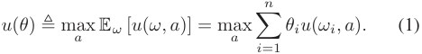

After receiving a signal _sj_ from the seller, the buyer _θ_ updates her estimation over the nature state using the Bayes’ rule: 

> 1Our results can be easily extended to a vector of random variables instead of a scalar random variable. We would keep the scalar random variable for the simplicity of discussion in this work. 

> 2An experiment is also called an information structure in the literature [15]. 

> 3We abstract different responses from the seller as different signals. For example, in the context of IoT data exchange, reporting different probabilities of precipitation to the buyer can be regarded as sending different signals. 

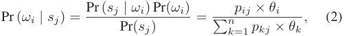

4ΔΩ denotes all the possible probability distributions over Ω. 

Authorized licensed use limited to: Shanghai Jiaotong University. Downloaded on December 05,2024 at 14:12:34 UTC from IEEE Xplore.  Restrictions apply. 

10205 

ZHENG et al.: ON DESIGNING MARKET MODEL AND PRICING MECHANISMS FOR IOT DATA EXCHANGE 

and her expected utility becomes 

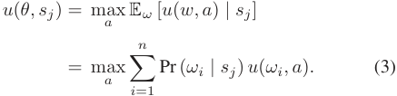

Given an experiment _I_ , from buyer _θ_ ’s point of view, the probability of receiving signal _sj_ is 

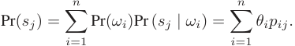

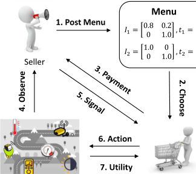

The buyer’s expected utility after buying experiment _I_ is 

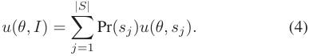

Therefore, combining the four equations above, buyer _θ_ ’s _utility increment_ for buying the experiment _I_ is 

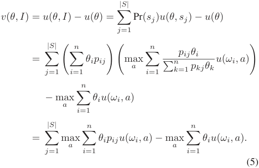

We assume buyer _θ_ is willing to buy the experiment _I_ if and only if the price _tI_ is no larger than her utility increment. More specifically, we have the following _Individual Rationality_ (I.R.) constraint: 

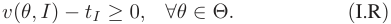

We remark on four advantages about our new market model for IoT data exchange, which overcomes the challenges we discussed in Introduction. First, the seller does not directly sell raw data to the buyer, but instead trades information (signals) extracted from raw data. This information-based trading model can resist data piracy and preserve data privacy to some extent. Second, we propose a new metric to measure the valuation of data, which depends on the buyer’s utility increment due to the action change after buying data. While previous metric for data valuation is simply related to data volume [17], our metric considers the data’s effect on decision making and reflects the information contained in the data. Third, the seller sets prices to different experiments independent of the data content, and the buyer pays the seller before the nature state is realized. In this case, the prices in the menu would not leak information about the actual data content. Finally, the seller sets the prices of data before it is actually collected, which is suitable for the exchange of real-time IoT data. 

Fig. 1. Data trading process in IoT data marketplaces. 

ThedatatradingprocessinIoTdatamarketplacesisillustrated in Fig. 1, which could be described in sequence as follows: 1) First, the seller designs a menu _M_ = _{_ ( _I, tI_ ) _}_ and posts it to the market; 2) Given the menu, the buyer with prior belief _θ_ chooses a pricing scheme ( _I, tI_ ) from the menu to maximize her total gain, i.e., the difference between utility increment and the payment _v_ ( _θ, I_ ) _− tI_ , and 3) pays the corresponding price _tI_ to the seller. 4) Then, the true nature state _ω_ is realized and revealed to the seller. 5) After observing the true nature state, the seller sends a signal _sj_ to the buyer following the rule in the selected experiment _I_ . 6) After receiving the signal _sj_ , the buyer chooses an action _a_ with the maximum expected utility according to (3). 7) Finally, The buyer’s utility _u_ ( _ω, a_ ) is realized based on the chosen the action chosen by the buyer. We note that the seller is committed to the designed pricing schemes, meaning that once the buyer selects a pricing scheme, the seller would strictly follow the rule of the experiment, and send signals to the buyer according to the predefined probability matrix. Such a seller commitment can be implemented in practice via a smart contract inside a blockchain [18]. 

We provide a simple and concrete example to demonstrate how each step in the above data trading process is proceeded. We consider a data seller to collect and analyse ambient noise data from widely deployed sensors, and sells the prediction results of traffic conditions to data buyers [5], [19]. The basic information of nature states, the buyer’s type, action set, and her utility functions are defined as follows. We simplify the nature state set in this example to be binary Ω = _{ω_ 1 = _Crowded, ω_ 2 = _NotCrowded}_ . A buyer with type _θ_ = ( _θ_ 1 = 0 _._ 3 _, θ_ 2 = 0 _._ 7) needs to make a decision selected from her action set _A_ = _{a_ 1 = _NotGoingOut, a_ 2 = _GoingOut}_ . The buyer would get unit utility if she takes the “right” action, and zero utility otherwise, i.e., _u_ ( _ω_ 1 _, a_ 1) = _u_ ( _ω_ 2 _, a_ 2) = 1 and _u_ ( _ω_ 1 _, a_ 2) = _u_ ( _ω_ 2 _, a_ 1) = 0. Before buying any data, the buyer considers _GoingOut_ would generate higher expected utility based on her prior estimation _θ_ , and by (1), her utility before buying the data could be calculated as _u_ ( _θ_ ) = 0 _._ 7. We are now prepared to go through the details for the trading of traffic condition data. Suppose the seller posts a menu with two pricing schemes as defined in Fig. 1, and the buyer chooses the first pricing scheme containing the following 

Authorized licensed use limited to: Shanghai Jiaotong University. Downloaded on December 05,2024 at 14:12:34 UTC from IEEE Xplore.  Restrictions apply. 

10206 

IEEE TRANSACTIONS ON MOBILE COMPUTING, VOL. 23, NO. 11, NOVEMBER 2024 

experiment 

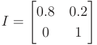

and pays a price _tI_ = 0 _._ 1. This experiment _I_ implies: when the nature state is _NotCrowded_ , i.e., _ω_ = _ω_ 2, the seller would reveal the true state by sending signal _s_ 2 with probability 1, since _p_ 22 = 1; when _ω_ = _ω_ 1, the seller would obfuscate the buyer a littlebit,bytellingherthetruth(sendingsignal _s_ 1)withprobability 0.8, but lying to her (sending signal _s_ 2) with probability 0.2. On the buyer’s side, upon receiving signal _s_ 1, she updates her estimation using Bayes’ rule in (2), and gets posterior estimation Pr( _ω_ 1 _| s_ 1) = 1 and Pr( _ω_ 2 _| s_ 1) = 0. From (3), her expected utility after receiving signal _s_ 1 is _u_ ( _θ, s_ 1) = 1. Similarly, we have _u_ ( _θ, s_ 2) = 0 _._ 92. By (4), her expected utility after buying experiment _I_ is _u_ ( _θ, I_ ) = 0 _._ 94. Since the buyer’s utility increment _v_ ( _θ, I_ ) = _u_ ( _θ, I_ ) _− u_ ( _θ_ ) = 0 _._ 24 is higher than the price _tI_ = 0 _._ 1, the buyer would like to buy such an experiment, giving the seller a revenue of 0.1. We can verify that the revenuemaximizing pricing scheme in this example is actually the other pricing scheme provided by the seller, i.e., to completely reveal the nature state to the buyer, by making _I_ a diagonal matrix with a price _tI_ = 0 _._ 3. However, as various types of buyers co-exist in more complicated market settings, we will see that deliberately obfuscating the buyer might sometimes generate higher revenue to the seller. We summarize the frequently used notations in Table I. 

TABLE I 

MAJOR NOTATIONS 

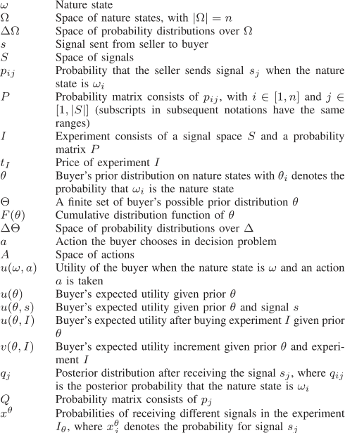

#### TABLE II 

### III. DATA PRICING MECHANISMS 

Inthissection,wepresentafamilyofdatapricingmechanisms for the problem of revenue maximization in IoT data marketplaces. We begin with a special case where there exists only one type of homogeneous buyers, and design an optimal mechanism, namely _MSimple_ , which is able to extract full surplus from the buyers. We then step into the general setting with multiple types of buyers co-existing in the market. We formulate the problem of revenue maximization in this setting as a convex program, and propose _MGeneral_ , an optimal mechanism with polynomial time complexity. Finally, we consider a more practical case with bounded rational buyers [20], which additionally requires the seller’s menu to have a constant size. For this case, we present the _MPractical_ mechanism, and bound the revenue loss with respective to the optimal revenue. The characteristics of data pricing mechanisms proposed in this work are summarized in Table II. 

### _A. A Warm-Up Case_ 

We first consider a simple case, where only one type of buyers _θ_ exists in the market, i.e., Θ = _{θ}_ and _F_ ( _θ_ ) = 1. This corresponds to the situation where all buyers have no other private source of data, and have a common prior estimation over the nature state. Since buyers are homogeneous, the only constraint in this problem is the I.R. property. In this case, the optimal menu contains only one pricing scheme ( _I, tI_ ). The 

CHARACTERISTICS FOR PROPOSED MECHANISMS 

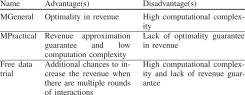

problem of revenue maximization can be formulated by 

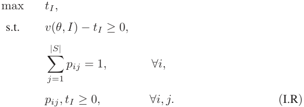

This is equivalent to finding an experiment that maximizes buyer’s utility increment _v_ ( _θ, I_ ). As we will prove in Theorem 1, the full-information experiment _I_¯ is always a utility-maximizing experiment. Therefore, the optimal pricing scheme is simply a 

Authorized licensed use limited to: Shanghai Jiaotong University. Downloaded on December 05,2024 at 14:12:34 UTC from IEEE Xplore.  Restrictions apply. 

ZHENG et al.: ON DESIGNING MARKET MODEL AND PRICING MECHANISMS FOR I _O_ T DATA EXCHANGE 

10207 

full-information experiment _I_¯ , along with a price that is equal to the utility increment of the buyer. 

_Theorem 1:_ For the single buyer type case, the optimal pricing scheme is a full-information experiment _I_¯ with price _tI_ ¯ =�_n_ _i_ =1_θi_max_a u_(_ωi, a_)_−_max_a_ � _ni_ =1_θiu_(_ωi, a_). _Proof:_ For any experiment _I_ , define _aj_ as buyer’s optimal action when she receives signal _sj_ , i.e., _aj_ = arg max _a_ E _ω_ [ _u_ ( _ω, a_ ) _| sj_ ]. We then have 

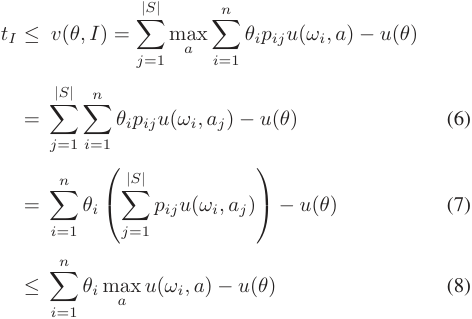

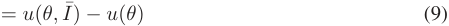

The first inequality comes from the I.R. constraint. The first equation is by the definition of utility increment. Equation (6) uses the definition of _aj_ . Equation (7) is derived from switching the order of summation. Equality (8) is obtained by setting the probability _pij_ with the largest _u_ ( _ωi, aj_ ) to be 1 and others to be 0. Equation (9) follows from the definition of _u_ ( _θ, I_¯ ), where the buyer is fully informed about the true nature state, and she can take exactly the optimal action for any nature state _ωi_ . Since we assume the highest achievable utility in every nature state is normalized to 1, (8) also suggests _u_ ( _θ, I_¯ ) = 1 _, ∀θ_ . 

From the preceding derivations, we can easily verify that the full-information experiment generates the largest utility increment among all possible experiments, and maximizes the revenue of the seller. Replacing _u_ ( _θ_ ) in (8) with its definition in (1), we get the optimal price _tI_ ¯ for the experiment _I_¯ . Since there is only one type of buyer in this simple case, the seller knows the value of every _θi_ . Therefore, the optimal price can be exactly calculated by the seller. □ 

In this simple case, there is only one kinds of buyers in the market, and the seller knows about the type of every buyer she intersects with, and thus can extract full surplus from buyers. Although this assumption of homogeneous buyers might not hold in many situations, the useful idea of formulating a mathematical program as the mechanism in this simple case could be inherited and applied to more complex cases. It is also worth to note that by this simple case with homogeneous buyers, we can clearly illustrate the intuition behind the solution of leveraging the tool of information design to design a data pricing mechanism. 

### _B. The General Case_ 

We further consider the general setting, in which different types of buyers co-exist in the market. As fine-grained menu can extract high revenue from the market, we seek to design a 

discriminatory pricing scheme ( _Iθ, tθ_ ) for each type _θ_ of buyer. To avoid the potential strategic behaviors of buyers in selecting pricing schemes, we need to guarantee that each buyer would indeed choose the pricing scheme we design for her, and has no incentive to deviate from such a scheme. This leads to the following _Incentive Compatible_ (I.C.) constraint: 

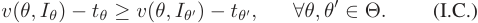

Without loss of generality, we assume whenever the buyer is indifferent between buying ( _Iθ, tθ_ ) and not buying, she always chooses to buy. The problem of revenue maximization in this general case can be formulated as follows: 

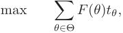

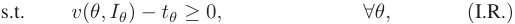

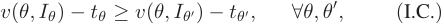

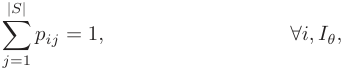

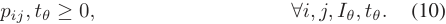

The feasible region in such a formulation is not convex, leading to high computational complexity of directly solving this problem. Specifically, the _v_ ( _θ, I_ ) in I.R. and I.C. constraints is a piecewise linear combination of the decision variables _pij_ due to the “maximum” operation in its definition (5), and this piecewise linearity causes non-convexity. In order to overcome the challenges caused by non-convexity, we need to formulate our problem from a new perspective. The main idea of our reformulation is to replace the decision variables _pij_ with some constant parameters _qij_ that can be pre-computed efficiently. By doing this, the “maximum” operations are exerted on the constant parameters, rather than the decision variables, and thus we can detour the difficulty from the non-convexity of feasible region. 

The previous formulation considers an experiment from the “row perspective”: in the experiment _Iθ_ , we aim to assign a proper row probability _pi_ over different signals in _S_ when the nature state is _ωi_ . Now we present a different perspective, namely “column perspective”, to express the experiment _Iθ_ . For easy illustration, we define two notations. We use vector _qj_ = ( _q_ 1 _j, q_ 2 _j, . . . , qnj_ )_T_ _∈_ Δ(Ω) to denote the posterior distribution Pr( _ω | sj_ ) after receiving the signal _sj_ , where _qij_ is the posterior probability that the nature state is _ωi_ , i.e., _qij_ = Pr( _ωi | sj_ ). We denote all the posterior distributions after receiving different signals to matrix _Q_ = ( _q_ 1 _, q_ 2 _, . . . , q|S|_ ). Let _x__θ_ = _{x__θ_ _j_:_sj∈S}_, where _x__θ_ _j_denotestheprobabilityofreceivingsignal_sj_inthe experiment _Iθ_ , i.e., _x__θ_ _j_= Pr(_sj_).Fromthis“columnperspec- tive”, the experiment can be expressed via the matrix _Q_ and the vector _x__θ_ . The following lemma states that we can express the experiment _Iθ_ equivalently from the “row perspective” and “column perspective” under certain conditions. 

_Lemma 1:_ It is equivalent to define an experiment _Iθ_ from the row perspective with _P_ = [ _pij_ ] and from the column perspective 

Authorized licensed use limited to: Shanghai Jiaotong University. Downloaded on December 05,2024 at 14:12:34 UTC from IEEE Xplore.  Restrictions apply. 

10208 

IEEE TRANSACTIONS ON MOBILE COMPUTING, VOL. 23, NO. 11, NOVEMBER 2024 

with _x__θ_ and _Q_ = [ _qijij_ ],, if and only if the Bayes plausibility restriction is satisfied: 

_qijij_ ],, if and only if the Bayes plausibility _Q__∗_ . Specifically, we can express _qj_ =� _k__γkqk_,where_qk_’s are the vertexes of the polytope that contains _qj_ , and _γk ≥_ 0, _|S|_ � _k__γk_= 1.Foreachsolutiontotherevenuemaximization � _x__θ_ _j__qij_=_θi,_ _∀i ∈_ [ _n_ ] _._ (E.Q.) problem expressed from the column perspective, if it assigns _j_ =1 a non-zero probability _x__θ_ _j_toanyposterior_qj∈/Q∗_,wecan convert this solution to another one with posteriors only in _Q__∗_ , The “if” side: Suppose (E.Q.) holds true, and we recall (E.Q.) holds true, and we recall holds true, and we recall by repeatedly increasing _x__θ_ _k_for each_qk_by_γkxθ_ _j_, and decreasing_ij_= Pr( Pr((_ωii| sj sjj_). Then, for any experiment. Then, for any experiment_I_1 _x__θ_ _j_to 0. As the number of partitioned polytopes is finite, we can , we can construct an identical experiment _I_ 2 from from pre-compute _Q__∗_ in advance. □ 

_Proof:_ The “if” side: Suppose (E.Q.) holds true, and we recall (E.Q.) holds true, and we recall holds true, and we recall that _x__θ_ _j_= Pr(_sj_),_qij_= Pr( Pr((_ωii| sj sjj_). Then, for any experiment. Then, for any experiment_I_1 defined by _pij_ , we can construct an identical experiment _I_ 2 from from column perspective by setting 

Since the posterior distribution _qj_ is drawn from a finite set _Q__∗_ that could be pre-computed in advance as shown in Lemma 2, in the column perspective, we can regard _qij_ as constant parameters rather than decision variables. With this result, we can rewrite the problem of revenue maximization from the column perspective as a linear programming: 

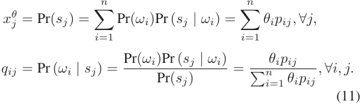

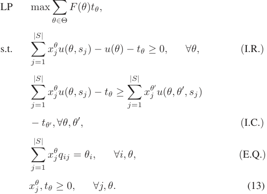

Similarly, for any column experiment, we can construct an identical experiment using only _pij_ , by setting 

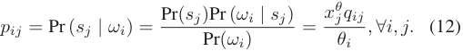

The “only if” side: Suppose the row perspective is equivalent to the column perspective in defining an experiment, we have _x__θ_ _j__qij_= Pr(_ωi, sj_) =_θipij_. Summing over_j_leads to 

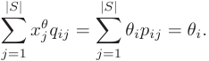

From the above two parts, we have proved this lemma. □ 

Simply defining an experiment from the column perspective does not make our problem easier, because the posterior probability _qij_ is a continuous value. In order to achieve the optimal solution, we still need to enumerate all possible posterior distribution _qj_ (representing all possible experiments) in an infinite continuous space. To overcome this difficulty, we proposethefollowinglemmatoshowthatassumingtheposterior _qj_ is chosen from a pre-computed finite subset of Δ(Ω) would generate the equivalent revenue as it is chosen from the original infinite continuous space. The idea of this lemma corresponds to the “interesting posteriors” in [21]. 

Since _qij_ ’s are constant parameters, in the above linear programming, utility _u_ ( _θ, sj_ ) can also be pre-computed and considered as constants, by _u_ ( _θ, sj_ ) = max _a_ � _ni_ =1_qiju_(_ωi, a_). Within this formulation, we only need to determine the values of variables _x__θ_ _j_and_tθ_. The (I.C.) constraints state that buyer_θ_is better off choosing the experiment _Iθ_ we design for her rather than the experiment _Iθ__′_ for another buyer _θ__′_ . In the formulation of column perspective, we need additional computations to express the (I.C.)constraints.Specifically,weneedtofigureouttheposterior distribution of the buyer _θ_ when choosing the experiment _Iθ__′_ . We recall that the experiment _Iθ__′_ maps the prior belief _θ__′_ to a distribution _x__θ′_ over the posterior beliefs _q__θ′_ . However, _Iθ__′_ does not map _θ_ to the same distribution of posterior beliefs. We would first calculate the _Iθ__′_ matrix, i.e., the matrix _{pij}_ , from _θ__′_ ’s posterior beliefs _x__θ′_ and _qj__θ′_according to (12). Then by (11) we could then calculate the distribution over posterior beliefs that _Iθ__′_ maps _θ_ to. Specifically, _Iθ__′_ maps _θ_ to a distribution _{xj}_ over posterior beliefs _{qj}_ , where 

_Lemma2:_ Giventhebuyertypespace Θ,restrictingthecandidate values of posterior distribution _qj_ to a finite set _Q__∗_ _⊂_ Δ(Ω) that can be pre-computed in advance does not reduce the optimal revenue. 

_Proof:_ According to the column representation, utility _u_ ( _θ, sj_ ) = max _a_ � _ni_ =1_qiju_(_ωi, a_)canbeconsideredasa piece-wise linear function _f_ ( _qj_ ) : Δ(Ω) _→_ R on _qj_ . For each _θ ∈_ Θ, function _u_ ( _θ, sj_ ) partitions the continuous space Δ(Ω) _⊂_ R_n_ into _|A|_ polytopes, and within each polytope _u_ ( _θ, sj_ ) is linear. We now combine the _|_ Θ _|_ sets of these partitions by letting their boundaries cut each other, and we finally get a finite set of newly partitioned polytopes. All _u_ ( _θ, sj_ )’s are linear within each such polytope. 

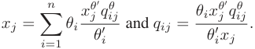

Therefore, in the (I.C.) constraints, _u_ ( _θ, θ__′_ _, sj_ ), the expected utility of buyer _θ_ when choosing the experiment _Iθ__′_ , can be calculated as _u_ ( _θ, θ__′_ _, sj_ ) =�_n_ _j_ =1_xju_(_qj_),where_u_(_qj_)isthe expected utility with the belief _qj_ , similar to that in (1). 

Let _Q__∗_ be the set of all the polytope vertex from the above new generalized polytopes. For any posterior _qj ∈_ Δ(Ω), we can rewrite _qj_ with linear combinations of posteriors from 

Authorized licensed use limited to: Shanghai Jiaotong University. Downloaded on December 05,2024 at 14:12:34 UTC from IEEE Xplore.  Restrictions apply. 

ZHENG et al.: ON DESIGNING MARKET MODEL AND PRICING MECHANISMS FOR IOT DATA EXCHANGE 

10209 

An immediate corollary of Lemma 2 is that the LP contains polynomial number of constraints but an exponential number of variables. In seeking a solution with polynomial time complexity, we take the dual of LP as follows: 

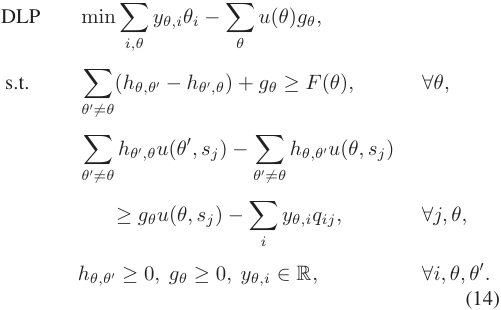

Thisduallinearprogrammingcontains _O_ ( _|_ Θ _|_2 + _|_ Θ _| · |_ Ω _|_ ) variables and finite constraints. For a polynomial time solution, we need to find a separation oracle for the family of constraints in (14). Since _u_ ( _θ, sj_ ) takes the maximum over _|A|_ linear functions, we can substitute each constraint in the second family with _|A|_ equivalent constraints. Checking if all the _|A|_ constraints are satisfied by all _qj_ is equivalent to solving the following problem: 

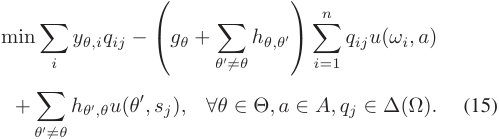

As this is a convex program that can be solved exactly in polynomial time with the standard technique from optimization theory [22], we can conclude the main result for the general case in the following theorem. 

_Theorem 2:_ The _MGeneral_ mechanism finds the revenuemaximizing menu in polynomial time in terms of _|_ Ω _|_ and _|_ Θ _|_ , by solving the dual linear programming problem DLP. 

Therefore, given the set of potential actions and priors of buyers as well as the prior distribution, the procedure of running MGeneral mechanism would be: 1) compute the finite set of posteriors that would not harm the optimality as we introduced in Lemma 2; 2) use these posteriors to formulate the dual problem according to program (14), and solve it through the provided separation oracle. As both the steps could be finished within polynomial time, the total time complexity of MGeneral mechanism would be also polynomial. Once the dual program is solved, the resulted MGeneral mechanism could be applied repeatedly as long as the prior distribution of buyers keeps the same. 

### _C. A Practical Case_ 

While MGeneral mechanism achieves the optimal revenue, its optimality would also bring some practical problems. A potential problem with the _MGeneral_ mechanism is that its menu size can be as large as the number of buyers, making 

it hard to be implemented in practical markets. For a large data marketplace with thousands of buyers, each buyer has to look through all the pricing schemes to find the one that optimizes her utility. Although automated trading agents are commonly applied in modern online marketplaces, performing Bayesian belief updates for large number of pricing schemes can still be computationally burdensome even for a computer agent. On the seller’s point of view, calculating the optimal menu requires solving a convex program that involves perhaps thousands of variables, which is also time-consuming in online marketplaces. These problems motivate us to find some mechanisms that are more practical in the online marketplace. As these problems are brought by the optimality nature of MGeneral mechanism, to reduce the computational burden and the menu size of provided experiments, we have to allow certain tradeoff from the mechanism’s revenue performances. Our aim is to design a mechanism with low computational burden for both the seller and the buyers while guaranteeing the revenue performances of the mechanisms. 

In this section, we present our design of a mechanism with low computational burden for both the seller and the buyers, while guaranteeing the revenue performances. We prefer a menu with an explicit and closed-form representation, instead of referring to solving a convex programming problem. We further require our menu to have a constant size, listing only a constant number of pricing schemes for human buyers to choose from, as in the existing data marketplaces [1], [23]. 

Our simple mechanism _MPractical_ satisfies the preceding requirements. _MPractical_ either offers a buyer the most accurate data with a fixed price, or sells nothing to the buyer. More specifically, this menu contains just two pricing schemes: a full-information experiment _I_¯ with a fixed price _t_¯ for all buyers, and a no-information experiment _<u>I</u>_ with zero price. The no-information experiment gives the buyer a chance to safely opt out when she cannot extract non-negative utility from the purchase, and thus the I.R. property is always guaranteed. Suppose there are in total _N_ buyers in the market. The price _p_ ¯ for the full-information experiment is simply the price that maximizes seller’s expected revenue: 

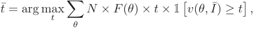

where the indicator function 1[ _v_ ( _θ, I_ ) _≥ t_¯ ] = 1[�_n_ _i_ =1_θi_ max _a u_ ( _ωi, a_ ) _− u_ ( _θ_ ) _≥ t_ ] denotes whether the buyer _θ_ can extract non-negative utility. 

A fundamental question for this simple mechanism is, how much revenue will the seller lose if she employs _MPractical_ instead of the optimal _MGeneral_ ? In the following, we show that _MPractical_ can achieve Ω( log1 _|_ Θ _|_)revenueof_MGeneral_ even in the worst case. For easier illustration, we first introduce a few notations. Let _R_ denote the revenue of _MPractical_ , and _S_ denote the sum of all buyers’ utility increment towards the full-informationexperiment,i.e., _S_ ≜� _θ__N× F_(_θ_)_× v_(_θ,_¯_I_), which is obviously the revenue upper bound of any pricing mechanisms. We assume the number of buyers for each type is upper bounded by a constant _c_ , i.e., _N ≤ c|_ Θ _|_ . We normalize 

Authorized licensed use limited to: Shanghai Jiaotong University. Downloaded on December 05,2024 at 14:12:34 UTC from IEEE Xplore.  Restrictions apply. 

10210 

IEEE TRANSACTIONS ON MOBILE COMPUTING, VOL. 23, NO. 11, NOVEMBER 2024 

buyers’ utility increment _v_ ( _θ, I_¯ ) into the range [1 _, h_ ] by properly scaling the values of the utility function _u_ ( _ω, a_ ). We then have the following theorem for the performance guarantee of _MPractical_ mechanism. 

_Theorem 3:_ Assuming _S ≥_ 2˜ _h_ , the approximation ratio of _MPractical_ is _R/S_ = Ω( log1 _|_ Θ _|_). 

_Proof:_ Divide the buyer utility increments into log _h_ bins by a power of two. For each utility increment _v_ ( _θ, I_¯ ) in bin _Bk_ (0 _≤ k <_ log _h_ ), we have 2_k_ _≤ v_ ( _θ, I_¯ ) _<_ 2_k_+1 . Since the utility increments sum up to _S_ and there are log _h_ bins, there exists a bin _Bk_ such that the sum of all utility increments in _Bk_ is no smaller than _S/_ log _h_ . If we set the price to be the lowest utility increment in _Bk_ , the generated revenue _Rk_ will be at least _S/_ (2 log _h_ ), since the lowest increment is at least half of any other increment in _Bk_ . We now have _R ≥Rk ≥S/_ (2 log _h_ ) since _R_ is the revenue generated by the optimal price _t_¯ , which clearly yields revenue no lower than _Rk_ . 

Define _v__∗_ to be the smallest utility increment such that all the utility increments below _v__∗_ sum up to at least _S/_ 2. We then have _v__∗_ _≥ h/N_ , otherwise the sum of utility increments below _v__∗_ is smaller than _Nv__∗_ _< h ≤S/_ 2, which contradicts our definition of _v__∗_ . We now ignore all the buyers with utility increment below _v__∗_ . Denote the optimal price for the remaining buyers as _t__∗_ and the corresponding revenue as _R__∗_ . According to the result from last paragraph, we now have 

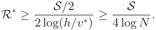

Since _Rk_ is the revenue extracted from a larger set of buyers, we have _Rk ≥R__∗_ . Combining all the results leads to 

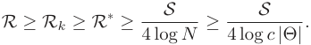

This finishes our proof of _R/S_ = Ω( log1 _|_ Θ _|_). □ 

Theorem 3 relies on a reasonable assumption of _S ≥_ 2˜ _h_ . This assumption requires the sum of all buyers’ utility increments to be at least twice of the increment from any single buyer, which easily holds in practice when the number of buyers is reasonably large. In the following theorem, we show that the approximation ratio in Theorem 3 is tight in the worst case: this logarithmic lower bound is actually also the upper bound for any menu with a constant size. 

_Theorem 4:_ There exist cases where no menu with a constant sizecanachievemorethan _O_ ( log1 _|_ Θ _|_) revenueof_MGeneral_, even when the assumption of _S ≥_ 2˜ _h_ holds true. 

_Proof:_ We explicitly construct the following example. Assume there are _N_ buyers coming from _N_ different types. We number the buyers from 1 to _N_ and set the utility increment of buyer _i_ tobe _vi_ =_<u>N</u>_ _i_(1_≤i ≤N_).Withoutlossofgenerality,we can assume the price for any experiment is chosen from a finite set _{N, N/_ 2 _, N/_ 3 _, . . . ,_ 1 _}_ . It is easy to see that when adding a pricing scheme of price _t_ = _N/i_ to the menu, at most _i_ more buyers will have the incentive to buy the data, leading to the additional revenue of no more than _N_ . Since the menu contains constant number of pricing schemes, the revenue of any constant size menu is upper bounded by _O_ ( _N_ ). 

Now we will show the optimal mechanism can indeed extract the full revenue of Ω( _N_ log _N_ ) in the previous setting. Let the size of nature state set be _|_ Ω _|_ = 2˜ _N_ . In this case, each buyer _i_ can be represented by a type vector _θi_ = ( _θi,_ 1 _, θi,_ 2 _, . . . , θi,_ 2˜ _N_ ). For buyer _i_ , we set _θi,j_ to be 0 for all _j_ , except for _θi,_ 2 _i−_ 1 = _θi,_ 2 _i_ =<u>1</u> 2.Inthissense,buyer_i_onlycaresaboutthedata concerning nature state _ω_ 2 _i−_ 1 and _ω_ 2 _i_ . In our example, all buyers share the same utility function _u_ ( _ω, a_ ) defined as: (1) _u_ ( _ωi, aj_ ) = 0 if _i̸_ = _j_ . (2) _u_ ( _ω_ 2 _i−_ 1 _, a_ 2 _i−_ 1) = _u_ ( _ω_ 2 _i, a_ 2 _i_ ) = <u>2˜</u> _iN__, ∀_1_≤i ≤N_. 

We construct the optimal menu as follows. For each buyer, the pricing scheme we design for her gives her full information on the two nature states she cares about, and no information on the other states. Formally, for buyer _i_ , we set _p_ 2 _i−_ 1 _,_ 2 _i−_ 1 = _p_ 2 _i,_ 2 _i_ = 1, and all elements in the other rows of the experiment matrix are set to 2˜1 _N_. Since the experiments designed for the others bring no information increment to the buyer but requires a positive price, each buyer is only interested in her own pricing scheme, and hence the I.C. constraint is always satisfied. The readers can verify that the buyers’ utility increments are exactly _vi_ = _N/i_ , given the utility function and experiments we designed. Finally, we charge a price of _N/i_ from buyer _i_ (1 _≤ i ≤ N_ ), and by doing so we extract the full surplus of Ω( _N_ log _N_ ) from the market. 

We conclude that in our example, no constant size menu can extract more than _O_ ( log1 _|_ Θ _|_)oftheoptimalrevenue,whichis achieved by _MGeneral_ . Therefore, _MPractical_ is indeed one of the optimal mechanisms in the bounded computation case. □ 

Compared to the optimal but relatively time-consuming MGeneral mechanism, the MPractical mechanism could significantly reduce the computation time while achieving a comparable amount of revenue with a good approximation guarantee. As a result, when applying these IoT data pricing mechanisms in practice, MPractical is more suitable for applications with relatively tight time delay requirement to preserve the freshness of IoT data. In contrast, we need to adopt MGeneral mechanism for those IoT applications with relatively loose time delay requirement, where we could spend sufficient time to compute a mechanism with optimal revenue. 

Besides pricing for IoT sensing data that directly indicates the nature state, e.g., data that records whether the road is crowded, our pricing mechanisms could also be applied to more generalized forms of data, such as text or image dataset, so long as the data could provide key information to infer the nature state faced by the buyer. The seller only needs to design one additional function to extract the valuable information about the nature states from the dataset, then the remaining pricing procedure would be the same. As an instance, for the traffic condition example in Section II, instead of selling ambient noise data, if the sellercouldaccessthereal-timephotostakenalongamainstream road from cameras, then the seller could also use these images to infer whether the road is crowded or not, and selling those data with our MGeneral or MPractical mechanism. When applying our pricing mechanisms in reality, another potential problem is how to convince the buyer that the seller would obey the 

Authorized licensed use limited to: Shanghai Jiaotong University. Downloaded on December 05,2024 at 14:12:34 UTC from IEEE Xplore.  Restrictions apply. 

ZHENG et al.: ON DESIGNING MARKET MODEL AND PRICING MECHANISMS FOR I _O_ T DATA EXCHANGE 

10211 

experiment when sending the signal. To deal with this problem, the seller could either introduce a trusted third-party to build some commitment protocols, or provide the history trading data to enable the verification from a statistical perspective. 

### IV. FREE DATA TRIALS 

In previous sections, we consider the case where the seller interacts with the buyer only once during data trading. In practice, the data seller may communicate with the data buyers, such as deploying a data demonstration, before initiating the data trading. Such kinds of additional interactions provide the seller with more chances to affect the buyer’s prior beliefs and achieve the seller’s own objectives. However, the interactions before the formal trading are more complex to design, since they would significantly change the buyer’s behaviors and the resulted revenue in the formal trading when the buyer uses Bayesian update to estimate the distribution of nature state. In this section, we study how the seller could extract higher revenue from buyers if the seller is able to conduct an extra round of interaction with the buyer. Compared with always providing the same data pricing menu, the data seller can achieve such revenue improvement by simply offering a free data trial to buyers before she reveals the menu, which is ubiquitous in practice. We also design an algorithm for the seller to find such a profitable free trial. 

To improve the revenue, the data seller should have an information advantage over the buyer _a priori_ . In this section, we consider the scenario that the seller knows exactly the nature state, and the nature state remains the same during the data trading process.5 This happens when the seller has external sources of information or when the true nature state is consistent over a short period of time and the seller learns this information from an early transaction. We also assume the buyer is myopic and only seeks to maximize her utility in each of the separate phases: the free trial phase and the transaction phase. Otherwise, the buyer’s optimal dynamic behavior in this two-phase game would rely on the generating probability distribution of the nature states, which heavily complicates the analysis for this problem. We would further relax this assumption in our future work. 

We describe the timeline of the new data trading process with an additional free trail phase as follows: 

- r The buyer enters the marketplace and requests a data service from the seller. 

- r The free trial phase: The seller offers a free data trial to the buyer, aiming to manipulate the buyer’s prior belief into an interim belief. The expected utility of the interim belief would be lower than that of the prior belief, introducing the opportunity of the seller to charge a higher price in the transaction phase. 

> 5Our solutions can be easily extended to the general case where the seller only knows a probability distribution of the nature states, which still needs to contain more information than the prior beliefs of buyers. In this work, we focus on the case where the seller knows exactly the actual nature state for an easy exposition. 

- r The transaction phase: The interaction between the seller and the buyer in this phase directly follows that in Fig. 1. The buyer chooses a pricing scheme according to her interim belief (instead of her prior belief), pays the price, obtains a posterior belief based on the signal she receives fromtheseller,takesabestactionaccordingtoherposterior belief, and finally leaves the market. 

We use a simple example to illustrate this new data trading process, and show the seller can extract higher revenue through deploying a free data trial. This example follows the same setting as the traffic condition example in Section II. Without the free data trial, the highest possible revenue that the seller can get is 0.3. We now consider how the seller designs a free trial to increase her revenue. In the free trial phase, the seller offers the following experiment to the buyer at a price of 0: 

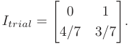

After receiving the free trial experiment, the buyer with a prior belief _θ_ = ( _θ_ 1 = 0 _._ 3 _, θ_ 2 = 0 _._ 7) would estimate the probability of receiving signal _s_ 1 as 0.4, resulting in an interim belief of _θ_ ˆ = (ˆ _θ_ 1 = 0 _, θ_ ˆ2 = 1), and the probability of receiving signal _s_ 2 as0.6,resultinginaninterimbeliefof _θ_ˆ = ( _θ_ˆ 1 = 0 _._ 5 _, θ_ˆ 2 = 0 _._ 5). Thus, we can calculate that buyer _θ_ ’s expected posterior utility after employing the free trial experiment _Itrial_ would be _u_ ( _θ, Itrial_ ) = 0 _._ 7, equal to her prior utility and obtain a zero utility increment _v_ ( _θ, Itrial_ ) = 0. Since the buyer is myopic and her utility increment is no smaller than the price 0, the buyer would take the free trial. As the actual nature state is _ω_ 1, the seller would deterministically send signal _s_ 2 to the buyer according to the designed free trial experiment _Itrial_ , resulting in an interim belief _θ_ˆ = ( _θ_ˆ 1 = 0 _._ 5 _, θ_ˆ 2 = 0 _._ 5). Based on this interim belief, the seller would offer a full-information experiment to the buyer at a price of 0.5 in the transaction phase. We can calculate the revenue after the transaction phase and extract a higher revenue 0.5 compared with the revenue without deploying the free trial experiment. Note that the interim belief of a buyer is calculated bytheBayesianupdaterulegivenherpriortypeandthesignaling schemes. Since the seller knows those required information, the calculation of buyer’s interim belief could be conducted by the seller individually without the need to explicitly acquire from the buyer. Therefore, to evaluate the effects of adopting a specific experiment as the free data trial, the buyer could use the prior distribution of buyers to estimate the corresponding interim belief distribution, then use this interim distribution of buyer types to calculate the final revenue generated in the formal trading phase. 

We would like to point out that the free trial is not always profitable for the seller. For example, for another buyer with a prior belief _θ_ = ( _θ_ 1 = 0 _._ 7 _, θ_ 2 = 0 _._ 3), there exists no free trial that could generate higher revenue to the seller. In this case, the seller’s revenue-maximizing strategy would be directly selling a full-information experiment at a price of 0.3, without using the free trial experiment. In the following discussion, we would identify the condition, under which the free data trial experiment can increase revenue. 

Authorized licensed use limited to: Shanghai Jiaotong University. Downloaded on December 05,2024 at 14:12:34 UTC from IEEE Xplore.  Restrictions apply. 

10212 

IEEE TRANSACTIONS ON MOBILE COMPUTING, VOL. 23, NO. 11, NOVEMBER 2024 

### _A. The Single Buyer Case_ 

We start with a simple case where there exists only one type of buyer in the market, i.e., Θ = _{θ}_ and _F_ ( _θ_ ) = 1, the setting considered in Section III-A. We define _aθ_ = arg max _a_ E[ _u_ ( _ω, a_ )] to be the buyer’s p optimal _prior action_ that generates the highest expected utility according to the prior belief _θ_ . Without loss of generality, we assume the actual nature state is _ω_ 1. A free data trial experiment, similar to other experiments, maps a buyer’s prior belief _θ_ to an interim belief, which can be expressed in the column perspective, i.e., a distribution _x_ = _{x_ 1 _, . . . , xm}_ over a set of posterior distributions _Q_ = _{q_ 1 _, . . . , qm} ⊂_ ΔΩ, with the Bayes plausibility restriction of _θ_ =� _j__xjqj_fromLemma1. Since _u_ ( _θ_ ) is a convex function as defined in (1), we have � _j__xju_(_qj_)_≥u_(_θ_), and the buyer always believes the free data trial gives her a higher posterior utility in expectation. However, for a broad category of buyers whose prior beliefs are not well aligned with the actual nature state (i.e., _θ_ 1 is relatively small), the seller is able to further mislead the buyer to a certain interim belief _θ__l_ . As the upper bound of price is the utility increment (i.e., the utility difference between the interim belief and the posterior belief), when the utility of the interim belief _θ__l_ is small, the seller could hence charge a potentially high price in the subsequent transaction phase, and extract large revenue. In the following, we focus on the design of free data trial experiments to extract additional revenue from these buyers. In Theorem 5, we first identify a sufficient condition that free data trials can extract increased revenue under certain assumptions.6 

_Theorem 5:_ The seller is always able to increase revenue using a free trial if the buyer _θ_ is overconfident, i.e., if there exists another belief point _θ__l_ _∈_ ΔΩ, such that: (1) _u_ ( _θ__l_ ) _< u_ ( _θ_ ). (2) _θ_ 1_l> θ_1. (3)_aθ_=_a_ _θ__l_. 

_Proof:_ The first condition guarantees that there exists one interim belief _θ__l_ that has a lower expected utility than that of the prior belief, which provides a chance for the seller to mislead the buyer to form an interim belief and to obtain a large utility increment (and then upper bound of price) in the transaction phase. The second condition means that the belief _θ_ is less aligned with the actual nature state _ω_ 1 than _θ__l_ ’s, which is a technical condition to enable high probability to. The last condition requires the prior action of _θ__l_ is the same as the action of _θ_ , which largely simplifies the searching for the optimal free trial experiments. 

Since we have assumed prior belief _θ_ is not on the boundary of ΔΩ, and is not exactly indifferent between two actions, we could easily find another belief _θ__h_ , such that 

r _aθ_ = _aθl_ = _aθh_ . 

r _∃_ 0 _≤ λ ≤_ 1, such that _θ_ = _λθl_ + (1 _− λ_ ) _θh_ . 

The first condition states _θ__h_ is on the same hyperplane as _θ_ and _θ__l_ . The second condition means _θ_ can be expressed as a convex combination of _θ__l_ and _θ__h_ . 

With the two beliefs _θ__l_ and _θ__h_ , the seller could design an experiment for _θ_ that leads to an interim belief _θ__l_ with probability _λ_ and interim belief _θ__h_ with probability 1 _− λ_ . 

> 6For an easy discussion, we assume _θ_ is not on the boundary of space ΔΩ and is exactly different between two actions. Specifically, we assume there exists _ϵ >_ 0, such that: (1) _θi ≥ ϵ, ∀i._ (2) E[ _u_ ( _ω, aθ_ )] _≥_ E[ _u_ ( _ω, a__′_ )] + _ϵ, ∀a__′̸_ = _aθ._ 

To make it consistent with the notations in Section III-B, we have _q_ 1 = _θ__l_ _, q_ 2 = _θ__h_ _, x__θ_ 1=_λ,_and_xθ_ 2= 1_−λ_.Since_θ_= _λθ__l_ + (1 _− λ_ ) _θ__h_ , the Bayesian plausibility (E.Q.) restriction is satisfied. According to Lemma 1, we could equivalently define an experiment _Itrial_ from the row perspective, where _x__θ_ _<u>j</u>__qij_ _pij_ = _θi__,∀i, j_. Buyer_θ_’s expected utility after buying exper- iment _Itrial_ would be _u_ ( _θ, Itrial_ ) = _x_ 1 _u_ ( _q_ 1) + _x_ 2 _u_ ( _q_ 2). Since _θ_ = _x_ 1 _q_ 1 + _x_ 2 _q_ 2 and the belief points _θ, θ__l_ and _θ__h_ are on the same hyperplane ( _aθ_ = _aθl_ = _aθh_ ), we have _v_ ( _θ, Itrial_ ) = _x_ 1 _u_ ( _q_ 1) + _x_ 2 _u_ ( _q_ 2) _− u_ ( _θ_ ) = 0. Thus, buyer _θ_ wouldliketobuy _Itrial_ at a price of 0. 

However, the actual nature state is _ω_ 1, so the seller only sends signal according to the first row of experiment _Itrial_ . Specifically, he sends signal _s_ 1 with probability _p_ 11 =_x_ <u>1</u>_θ_ _θ__<u>q</u>_ 111 and sends _s_ 2 with probability _p_ 12 =_x_ <u>2</u>_θ_ _θ__<u>q</u>_ 112.Therefore,buyer _θ_ ’s actual expected utility after buying _Itrial_ should be _u_ ˆ( _θ_ ) = _p_ 11 _u_ ( _q_ 1) + _p_ 12 _u_ ( _q_ 2) instead of _u_ ( _θ, Itrial_ ) discussed above. 

Since _Itrial_ is strategically designed by a seller with information advantage, buyer _θ_ ’s actual expected utility ˆ _u_ ( _θ_ ) for buying _Itrial_ is lower than she anticipated, and is hence lower than her prior expected utility _u_ ( _θ_ ): 

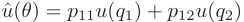

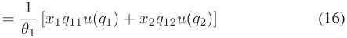

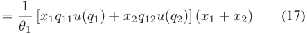

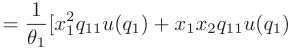

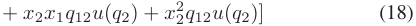

We further have 

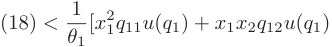

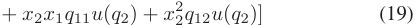

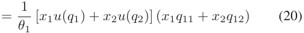

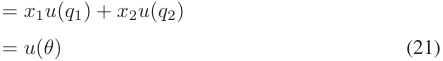

Theequality (16) isbyreplacing _pij_ with_xj_ _θ__<u>q</u>_ _i__ij_.Theequality(17) comes from _x_ 1 + _x_ 2 = 1. The (18) is simply by the expansion of brackets. The inequality (19) is a result of _q_ 21 _< θ_ 1 _< q_ 11, _u_ ( _q_ 2) _> u_ ( _θ_ ) _> u_ ( _q_ 1), and the rearrangement inequality. The (20) is by factorization. The equality (21) follows from _x_ 1 _q_ 11 + _x_ 2 _q_ 12 = _θ_ 1. 

Since the buyer’s actual expected utility is lowered after she takes the free trial, she would have a higher utility increment towards a full-information experiment _I_¯ . Therefore, in the transactionphase,thesellerisabletoincreaseherrevenuebycharging the buyer a higher price for _I_¯ . □ 

In Algorithm 1, we present the detailed steps to construct a free trial experiment _Itrial_ to improve revenue. We first check 

Authorized licensed use limited to: Shanghai Jiaotong University. Downloaded on December 05,2024 at 14:12:34 UTC from IEEE Xplore.  Restrictions apply. 

ZHENG et al.: ON DESIGNING MARKET MODEL AND PRICING MECHANISMS FOR IOT DATA EXCHANGE 

10213 

### **Algorithm 1:** GenerateFreeTrial. 

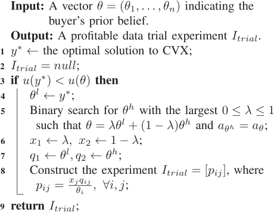

**Algorithm 2:** SimulateFreeTrials. 

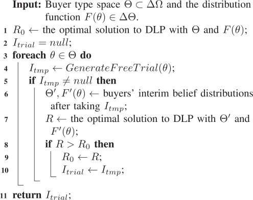

the revenue improvement condition in Theorem 5 by solving the following convex optimization problem CVX. 

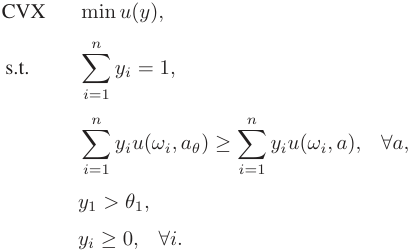

If the optimal solution _y__∗_ to CVX satisfies _u_ ( _y__∗_ ) _< u_ ( _θ_ ), then the three conditions in Theorem 5 are all satisfied. The optimal solution _y__∗_ serves as a legitimate value for _θ__l_ (Line 4). We then use the binary search to find the farthest belief point _θ__h_ such that _θ_ is a convex combination of _θ__l_ and _θ__h_ , and their prior actions are the same (Line 5). In Lines 6 to 8, we construct the free trial experiment _Itrial_ based on Lemma 1. The rationale behind such a free trial experiment is described in the proof of Theorem 5. 

### _B. The General Case_ 

We next generalize the above profitable free trials to the general case with multiple buyers. We focus on the solution that offers the same free trial experiment to all the buyers, instead of designing a separate trial experiment for each type of buyer. This is because we cannot use price discrimination to differentiate buyers in the free trial phase, and providing more free experiments only gives buyers more chances to get a utility increment for free. 

With multiple types of buyers in the market, whether it is possible to increase revenue through free trials heavily depends on the buyer type distribution _F_ ( _θ_ ). It is generally impossible to use a simple mathematical theorem to characterize the condition of revenue improvement, as we have done in Theorem 5. We propose a heuristic method that simulates buyers’ interim beliefs after taking the free trial, and compare the resultant revenue with 

the revenue benchmark to decide whether a trial experiment is indeed profitable. We present a simulation-based algorithm in Algorithm 2 for this purpose. 

Algorithm 2 first calculates the seller’s revenue without any free trials as the benchmark, by solving the linear programming DLP we proposed in Section III-B. It then enumerates each buyer type _θ_ , and runs Algorithm 1 as a subroutine to calculate the potential experiment _Itmp_ we designed for _θ_ (Line 4). If _Itmp_ is legitimate, we simulate all the buyers’ interim belief distribution after taking this free trial experiment (Line 6). We then input the interim belief distributions into DLP and solve DLP for the revenue under the interim distribution (Line 7). If the new revenue is higher than the benchmark, we can conclude the free trial _Itmp_ indeed increases revenue, and hence save the current best revenue and trial experiment. 

When applying Algorithm 2 to compute a free data trial, the seller should first ascertain that the potential buyers would have more interactions and purchase data from the seller after they have received some free data from the seller. As the algorithm adopts MGeneral as a subroutine, it is also more suitable for trading the IoT data for applications with relatively loose time delay requirement. We would like to note that Algorithm 2 only simulates the results of _|_ Θ _|_ trial experiments. Thus, it could not provide the theoretical guarantee to always obtain a profitable data free trial, even if a profitable trial does exist. Finding the optimal free data trials to increase the revenue for the general case is an interesting future work. 

### V. EVALUATION RESULTS 

Inthissection,weevaluateourpricingmechanisms _MGeneral_ and _MPractical_ on a real-world ambient sound dataset, and compare their performance with the benchmarks. We also evaluate the revenue increase when the seller offers free trials. The convex programming parts in our mechanisms are implemented using the Gurobi software [24]. 

Authorized licensed use limited to: Shanghai Jiaotong University. Downloaded on December 05,2024 at 14:12:34 UTC from IEEE Xplore.  Restrictions apply. 

10214 

IEEE TRANSACTIONS ON MOBILE COMPUTING, VOL. 23, NO. 11, NOVEMBER 2024 

### _A. Evaluation Setup_ 

We use the Ambient Sound Monitoring Network [25] dataset in our evaluation. The Dublin City Council collected this dataset with a network of sound monitors to measure the ambient sound quality at different sites of Dublin. This dataset contains sound pressure data of every 5 minutes from 15 monitoring sites in Dublin on each day from 2012 to 2015. The results of the sound level meters are given in Leq, which denotes the average sound level over each 5-minute period of measurement. We use the sensory data from the Walkinstown monitoring site on June 1st, 2015 in our evaluation, and we assume the buyer priors are based on the sensory data of the same day in the previous three years, ranging from 44 dB to 68 dB. All the evaluation results are averaged over 200 runs. 

We discretize the interval [44 _,_ 68] into _n_ intervals as the sample space of the nature state. The default value for _n_ is 4 and the number of buyer types _|_ Θ _|_ is 4. We consider three typical families of prior distributions, including the uniform distribution, Gaussian distribution and Pareto distribution. For the uniform distribution, we assume buyer types are uniformly sampled from the entire belief simplex ΔΩ using the sample algorithm given in [26]. For the other two distribution families, we assume buyers of the same distribution family differ from each other by the distribution parameters: Gaussian distributions with different mean values, and Pareto distributions with different values of _b_ for the generating formula _f_ ( _x_ ) = _x__b_ _<u>b</u>_+1. 

We compare the revenue of our mechanisms with three benchmarks, namely the Fully Revealing mechanism, Grid Search mechanism, and revenue Upper Bound. In the Fully Revealing mechanism, the seller only offers the full-information experiment in her menu, but still guarantees the I.C. and I.R. properties. This mechanism is the optimal solution to a restricted version of _MGeneral_ mechanism, by additionally requiring all experiments to be full-information. We choose the Grid Search mechanism inspired by the versioning [27] and price discrimination [28] in economics, where we consider the seller to add different extents of noises to the full-information experiment, and set the prices of each experiment to be a constant multiplying the maximum value increment among all the buyer types. The seller would sample the extent of noises added to form different experiments, use grid search to set their prices, and finally choose the mechanism with highest revenue. Since the Grid Search mechanisms are not I.C., we calculate the revenue through simulating buyer’s behaviors of choosing the highest-utility experiment. The revenue Upper Bound is the sum of all buyers’ valuations towards the full-information experiment, without guaranteeing the I.C. property. As the Upper Bound extracts full surplus from all buyers, it is obviously the revenue upper bound of any pricing mechanism. 

### _B. Performance of Pricing Mechanisms_ 

We first vary the size of nature state space _n_ from 2 to 12, and evaluate its influence on the four pricing mechanisms. In this set of evaluations, we fix the number of buyer types to be _|_ Θ _|_ = 4, 

and simplify the utility of all buyers to be 

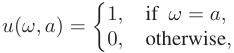

which means that there is only one “correct” action under each possible nature state, and these correct actions generate one unit utility to the buyer. Fig. 2 shows the average revenue extracted from each buyer under three different prior distributions. We can observe that for all the cases, _MGeneral_ always generates higher revenue than _MPractical_ , Fully Revealing and Grid Search, and nearly approaches the revenue Upper Bound. Due to the sampling and grid search process, the grid search method takes more computation time than all the other methods considered in the experiments. However, as we can observe, the revenue of grid search method does not exceed our simple MPractical mechanism in all the considered settings, and has a distinct revenue gap with our optimal MGeneral mechanism in most of the cases, which demonstrate the effectiveness of our proposed mechanisms in terms of both revenue and computationalefficiency. The Grid Search method achieves a similar revenue to MPractical mechanism in most of the cases since the MPractical mechanism actually belongs to the space of pricing mechanism covered by the Grid Search mechanism, and the Grid Search mechanism may not always achieve the best revenue within its feasible space due to its limited sampling iterations and grid search precision. For Gaussian distributions, as the size of sample space _n_ increases, prior distributions of buyers are more dispersed over different possible nature states, indicating they are less certain about the true nature state. In this sense, buyers’ prior expected utilities _u_ ( _θ_ ) are generally low, and data from the seller can bring high valuation, i.e., utility increase, to them. _MGeneral_ makes use of buyers’ uncertainty and can extract almost full surplus when _n_ is relatively large. When _n_ = 12, _MGeneral_ achieves 99.91% revenue of Upper Bound, and outperforms _MPractical_ and Fully Revealing by more than 9.5%, in the Gaussian distribution case. For uniform distributions, when _n_ = 12, _MGeneral_ extracts 96.25% revenue of Upper Bound. For Pareto distributions, the revenue for all mechanisms are lower compared with the other two distributions, because buyers have more confidentandaccuratepriorestimations,andtheirpriorexpected utilities _u_ ( _θ_ ) are relatively high. In this case, it is hard to extract large additional revenue by providing data to the buyer, but _MGeneral_ still generates 73.56% revenue of the very optimistic Upper Bound when _n_ = 12. Under all three distributions, the revenue of our mechanisms increase with _n_ . Since the parameter _n_ denotes the discretization level of data, we can conclude that the seller can extract higher revenue by selling more fine-grained data. 

We then evaluate the impacts of the number of buyer types _|_ Θ _|_ on the four mechanisms. We report the evaluation results in Fig. 3, when the number of types _|_ Θ _|_ varies from 2 to 12 and the number of possible nature states _n_ is fixed at 4. As _|_ Θ _|_ increases, more types of buyers with heterogeneous prior distributions appear in the market, and their strategic behaviors raise more challenges to our pricing mechanisms to guarantee the properties of I.C. and I.R.. For Gaussian and uniform distributions, the 

Authorized licensed use limited to: Shanghai Jiaotong University. Downloaded on December 05,2024 at 14:12:34 UTC from IEEE Xplore.  Restrictions apply. 

10215 

ZHENG et al.: ON DESIGNING MARKET MODEL AND PRICING MECHANISMS FOR IOT DATA EXCHANGE 

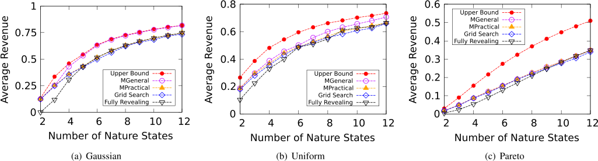

Fig. 2. Average revenue under different number of nature states. 

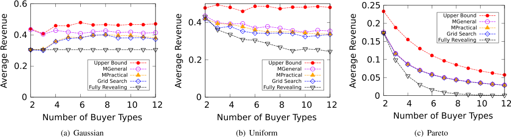

Fig. 3. Average revenue under different number of buyer types. 

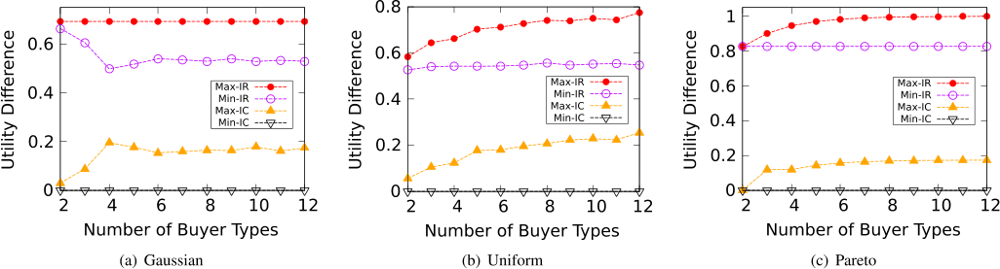

Fig. 4. Utility difference for I.R. and I.C. conditions under different number of buyer types. 

average revenue of our mechanisms do not decrease much as _|_ Θ _|_ grows. This indicates that our mechanisms are robust against multiple types of strategic buyers under these two distributions. For Pareto distributions, however, the average revenue of our mechanisms decrease with _|_ Θ _|_ significantly. This is because buyers under Pareto distributions are confident about their prior estimations and thus have higher prior expected utilities before buying data from the seller. As more confident buyers join the market, seller’s average revenue from each buyer certainly decreases. 

We also validate the I.R. and I.C. properties of the complex MGeneral Mechanism empirically in the same settings of Fig. 3. 

Given a computed MGeneral mechanism, to verify the I.R. conditions, we compute the utility of each type choosing the corresponding mechanism, and for the I.C. conditions, we compute the utility differences for a specific type of buyer choosing different experiments other than the experiment corresponding to her true type. We record the maximum and minimum values among those I.R. utilities (could be regarded as utility difference between current utility and zero utility) and I.C. utility differences and present them in Fig. 4. As all the values are larger or equal to zero, our proposed mechanisms empirically satisfy the I.R. and I.C. conditions, which aligns with our theoretical results. 

Authorized licensed use limited to: Shanghai Jiaotong University. Downloaded on December 05,2024 at 14:12:34 UTC from IEEE Xplore.  Restrictions apply. 

10216 

IEEE TRANSACTIONS ON MOBILE COMPUTING, VOL. 23, NO. 11, NOVEMBER 2024 

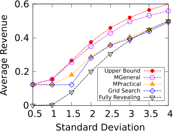

Fig. 5. Revenue under different values of standard deviation for Gaussian distributions. 

We finally evaluate the influence of the standard deviation _σ_ in Gaussian distributions. We are interested in this parameter because it denotes how confident the buyers are about their prior estimations. We vary _σ_ from 0.5 to 4.0, while fixing both _n_ and _|_ Θ _|_ to be 4. As we can observe in Fig. 5, _MGeneral_ still outperforms other mechanisms, and achieves 93.40% revenue of Upper Bound when _σ_ = 4 _._ 0. The average revenue of all mechanisms increase with _σ_ , because when buyers are uncertain about the nature state, the data from the seller can bring high utility increments to them. Therefore, we can conclude that when buyers are not confident about their prior knowledge, the seller can take advantage of buyers’ uncertainty and extract higher revenue. 

From the above three sets of experiments, we could observe that the performance of Mpractical mechanism is always quite close to that of MGeneral mechanism. This result demonstrates that MPractical mechanism can still obtain good revenue in practical deployment, even we restrict the size of menu to be a constant. 

### _C. Free Data Trials_ 

We now evaluate the revenue increase when the seller has the option to offer free trials. In Fig. 6, we present the results where buyer types are uniformly sampled from the belief simplex, and the results of using other distributions are similar. 

We start with the single overconfident buyer case. We vary the size of nature state space _n_ from 2 to 12, and evaluate the average revenue with and without free trials. As we can see from Fig. 6(a), free trials are more effective when the nature state space is relatively small. When _n_ = 2, free trials achieve a revenue increase of 57.44%, and when _n_ = 12, the seller increases revenue by only 0.67% with free trials. On average, free trials give a 8.71% revenue increase to the seller. 

We then evaluate the performance of Algorithm 2 in the general setting. We vary the number of nature states _n_ from 2 to 12 in Fig. 6(b) and vary the number of buyer types _|_ Θ _|_ in Fig. 6(c). As we can see, free trials always achieve a stable revenue increase in all parameter settings. On average, free trials increase revenue by 2.86% and 8.20% in Fig. 6(b) and (c), respectively. We can conclude that free trials indeed can guarantee a revenue increase in certain scenarios. 

### VI. RELATED WORK 

In recent years, designing data pricing frameworks has attracted increasing interests. Balazinska et al. [29] first envisioned the emergence of cloud-based data markets, and outlined potential challenges and research opportunities. Following this work, many query-based frameworks have been proposed to price ad-hoc query data. These frameworks allow the seller to manually assign prices to a few views, and automatically extrapolate the prices to other ad-hoc queries from the buyer. In [30], Koutris et al. first identified two key properties that a pricing function must satisfy, namely arbitrage-freeness and discount-freeness, and proposed a polynomial time algorithm that derives the price for common types of queries. Similar work in this direction include arbitrage-free pricing functions for arbitrary queries [11], and a scalable framework for pricing relational queries [31]. A set of accountable protocols named AccountTrade was proposed in [32] for Big Data trading among dishonest customers. These work assume data has been collected and structured before being priced, and their objective is not to maximize the revenue of the seller. 

Data trading and exchange has also been an active research topic in the community of Internet of Things. Perera et al. [7] surveyed smart city applications that can benefit from data markets. An IoT data transfer framework for cloud-based applications was proposed in [33]. The authors in [34] designed a decentralized infrastructure for IoT data trading based on blockchain technologies, but did not elaborate on the pricing mechanisms. A two-sided market for crowdsensed data was proposed in [35], and secondary market models for mobile data were studied in [36]. In a recent paper, Zheng et al. [14] took advantage of the geographical locality of sensory data, and employed a versioning technique based on the accuracy of data. Our work differs from previous work by further revealing and utilizing the unique features of IoT data as a commodity, and propose a new market model for IoT data trading. 

Recently, data markets have also drawn increasing attention in the machine learning community. In [37], the authors studied how a machine learning system fairly distributes revenue to its training data contributors. They proposed a family of efficient algorithms to determine the data valuation based on Shapley value. Ghorbani et al. [38] also proposed a data valuation framework for supervised machine learning based on Shapley value. Agarwal et al. revised Shapley value to be robust to freely replicable goods in the context of data marketplaces [39]. The authors in [40] considered a transfer learning setting, and implemented a blockchain-based data marketplace that guarantees privacy and consumer’s benefit. In a recent paper [41], the authors envisioned the challenges and opportunities in the valuation, pricing, and governance of AI data. 

Information design is a rapidly growing research area in both computer science and economics literature. Different from providing incentives to participators in mechanism design problems, information design studies how to influence the belief of participators by providing payoff-relevant information to them through strategic interactions. A special yet influential case called Bayesian persuasion, concerning one information sender 

Authorized licensed use limited to: Shanghai Jiaotong University. Downloaded on December 05,2024 at 14:12:34 UTC from IEEE Xplore.  Restrictions apply. 

ZHENG et al.: ON DESIGNING MARKET MODEL AND PRICING MECHANISMS FOR IOT DATA EXCHANGE 

10217 

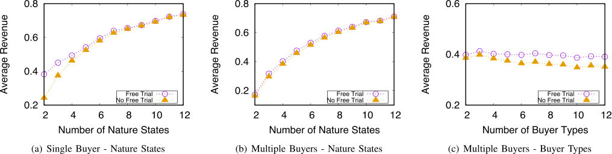

Fig. 6. Average revenue with and without free trials. 

and one receiver, was studied in [42]. In a model similar to ours [13], Bergemann et al. investigated the problem where a buyerseekssupplementalinformationfromthesellertofacilitate her decision making. As they sought optimal solutions in the continuous space, they had to put strict restrictions on the model to maintain tractability. In another related work [21], Babaioff et al. considered the optimal mechanism for selling information sequentially. Smolin [43] studied revenue-maximizing menus for pricing objects with several attributes. Papers [44] and [45] provide excellent surveys of the information design literature. 

The preliminary version of this paper was published as a regular conference paper in [46]. In this full version, we give the complete proofs of Lemmas 1 and 2. We further extend the data exchange to a two-phase process, and show that the seller can increase revenue through deploying free data trials. We add two examples to illustrate the data trading process and how the seller extracts higher revenue through free data trials. We also update the references regarding the recent work on machine learning data markets. 

### VII. CONCLUSION 

In this paper, we have studied the problem of revenue maximization in IoT data marketplaces. We have characterized the unique economic properties of IoT data, and proposed a new market model accordingly from an information design perspective. We have presented our pricing mechanisms that achieve optimal revenue in different market settings, and designed free data trials that further increase revenue. Evaluation results have shown that our mechanisms achieve good performance and approach the revenue upper bound. 

### ACKNOWLEDGMENT 

The opinions, findings, conclusions, and recommendations expressed in this paper are those of the authors and do not necessarily reflect the views of the funding agencies or the government. 

### REFERENCES 

   - [4] IOTA, 2024. [Online]. Available: https://www.iota.org/ 

   - [5] Ambient maps, 2024. [Online]. Available: https://ambientmaps.com.au/ 

   - [6] DataBroker dao, 2024. [Online]. Available: https://www.databroker. global/ 

   - [7] C. Perera, A. Zaslavsky, P. Christen, and D. Georgakopoulos, “Sensing as a service model for smart cities supported by Internet of Things,” _Trans. Emerg. Telecommun. Technol._ , vol. 25, no. 1, pp. 81–93, 2014. 

   - [8] J. Gubbi, R. Buyya, S. Marusic, and M. Palaniswami, “Internet of Things (IoT): A vision, architectural elements, and future directions,” _Future Gener. Comput. Syst._ , vol. 29, no. 7, pp. 1645–1660, 2013. 

   - [9] Z. Liqiang, Y. Shouyi, L. Leibo, Z. Zhen, and W. Shaojun, “A crop monitoring system based on wireless sensor network,” _Procedia Environ. Sci._ , vol. 11, pp. 558–565, 2011. 

   - [10] P. Koutris, P. Upadhyaya, M. Balazinska, B. Howe, and D. Suciu, “Toward practical query pricing with QueryMarket,” in _Proc. ACM SIGMOD Int. Conf. Manag. Data_ , 2013, pp. 613–624. 

   - [11] B.-R.Lin and D.Kifer,“On arbitrage-free pricing for general dataqueries,” in _Proc. VLDB Endowment_ , vol. 7, pp. 757–768, 2014. 

   - [12] L. Toka, B. Lajtha, É. Hosszu, B. Formanek, D. Géhberger, and J. Tapolcai, “A resource-aware and time-critical IoT framework,” in _Proc. IEEE Conf. Comput. Commun._ , 2017, pp. 1–9. 

   - [13] D. Bergemann, A. Bonatti, and A. Smolin, “The design and price of information,” _Amer. Econ. Rev._ , vol. 108, no. 1, pp. 1–48, 2018. 

   - [14] Z. Zheng, Y. Peng, F. Wu, S. Tang, and G. Chen, “An online pricing mechanism for mobile crowdsensing data markets,” in _Proc. 18th ACM Int. Symp. Mobile Ad Hoc Netw. Comput._ , 2017, Art. no. 26. 

   - [15] D. Bergemann and S. Morris, “Bayes correlated equilibrium and the comparison of information structures in games,” _Theor. Econ._ , vol. 11, no. 2, pp. 487–522, 2016. 

   - [16] J. D. Hartline and B. Lucier, “Bayesian algorithmic mechanism design,” in _Proc. 42nd ACM Symp. Theory Comput._ , New York, NY, USA, 2010, pp. 301–310. [Online]. Available: https://doi.org/10.1145/1806689. 1806732 

   - [17] D. Niyato, D. T. Hoang, N. C. Luong, P. Wang, D. I. Kim, and Z. Han, “Smart data pricing models for the Internet of Things: A bundling strategy approach,” _IEEE Netw._ , vol. 30, no. 2, pp. 18–25, Mar./Apr. 2016. 

   - [18] A. Kosba, A. Miller, E. Shi, Z. Wen, and C. Papamanthou, “Hawk: The blockchain model of cryptography and privacy-preserving smart contracts,” in _Proc. IEEE Symp. Secur. Privacy_ , 2016, pp. 839–858. 

   - [19] J. Treboux, A. J. Jara, L. Dufour, and D. Genoud, “A predictive datadriven model for traffic-jams forecasting in Smart Santader City-scale testbed,” in _Proc. IEEE Wireless Commun. Netw. Conf. Workshops_ , 2015, pp. 64–68. 

   - [20] H. A. Simon, _Models of Bounded Rationality: Empirically Grounded Economic Reason_ , vol. 3. Cambridge, MA, USA: MIT Press, 1997. 

   - [21] M. Babaioff, R. Kleinberg, and R. Paes Leme, “Optimal mechanisms for selling information,” in _Proc. 13th ACM Conf. Electron. Commerce_ , 2012, pp. 92–109. 

   - [22] S. Boyd and L. Vandenberghe, _Convex Optimization_ . Cambridge, U.K.: Cambridge Univ. Press, 2004. 

   - [23] Dialogfeed, 2024. [Online]. Available: https://www.dialogfeed.com/ pricing/ 

   - [24] Gurobi, 2024. [Online]. Available: http://www.gurobi.com/ 

- [1] Gnip APIs, 2024. [Online]. Available: https://developer.twitter.com/en/ docs/twitter-api/enterprise 

- [2] Xignite, 2024. [Online]. Available: https://www.xignite.com/ 

- [3] Here, 2024. [Online]. Available: https://www.here.com/en 

- [25] Ambient sound monitoring network, 2024. [Online]. Available: https:// data.smartdublin.ie/dataset/ambient-sound-monitoring-network 

- [26] D. B. Rubin, “The Bayesian bootstrap,” _Ann. Statist._ , vol. 9, pp. 130–134, 1981. 

Authorized licensed use limited to: Shanghai Jiaotong University. Downloaded on December 05,2024 at 14:12:34 UTC from IEEE Xplore.  Restrictions apply. 

10218 

IEEE TRANSACTIONS ON MOBILE COMPUTING, VOL. 23, NO. 11, NOVEMBER 2024 

- [27] S. Bhattacherjee, A. Chavan, S. Huang, A. Deshpande, and A. G. Parameswaran, “Principles of dataset versioning: Exploring the recreation/storage tradeoff,” in _Proc. VLDB Endowment_ , vol. 8, no. 12, pp. 1346–1357, 2015. 

- [28] L. Phlips, _The Economics of Price Discrimination_ . Cambridge, U.K.: Cambridge Univ. Press, 1983. 

- [29] M. Balazinska, B. Howe, and D. Suciu, “Data markets in the cloud: An opportunity for the database community,” in _Proc. VLDB Endowment_ , vol. 4, pp. 1482–1485, 2011. 

- [30] P. Koutris, P. Upadhyaya, M. Balazinska, B. Howe, and D. Suciu, “Querybased data pricing,” in _Proc. 31st ACM SIGMOD-SIGACT-SIGAI Symp. Princ. Database Syst._ , 2012, pp. 167–178. 

**Weichao Mao** (Student Member, IEEE) received the BS degree in computer science from Shanghai Jiao Tong University, in 2019, and the MS degree in electrical and computer engineering from the University of Illinois Urbana—Champaign (UIUC), in 2021. He is currently working toward the PhD degree with the Department of Electrical and Computer Engineering, University of Illinois Urbana—Champaign (UIUC). His research interests include reinforcement learning, game theory, control theory, and multi-agent systems. 

- [31] S. Deep and P. Koutris, “QIRANA: A framework for scalable query pricing,” in _Proc. ACM SIGMOD Int. Conf. Manag. Data_ , 2017, pp. 699–713. 

- [32] T. Jung et al., “AccountTrade: Accountable protocols for Big Data trading against dishonest consumers,” in _Proc. IEEE Conf. Comput. Commun._ , 2017, pp. 1–9. 

- [33] R. Montella, M. Ruggieri, and S. Kosta, “A fast, secure, reliable, and resilient data transfer framework for pervasive IoT applications,” in _Proc. IEEE Conf. Comput. Commun._ , 2018, pp. 710–715. 

- [34] P.Missier,S.Bajoudah,A.Capossele,A.Gaglione,andM.Nati,“Mindmy value: A decentralized infrastructure for fair and trusted IoT data trading,” in _Proc. 7th Int. Conf. Internet Things_ , 2017, Art. no. 15. 

- [35] Z. Zheng, Y. Peng, F. Wu, S. Tang, and G. Chen, “Trading data in the crowd: Profit-driven data acquisition for mobile crowdsensing,” _IEEE J. Sel. Areas Commun._ , vol. 35, no. 2, pp. 486–501, Feb. 2017. 

- [36] L. Zheng, C. Joe-Wong, C. W. Tan, S. Ha, and M. Chiang, “Secondary markets for mobile data: Feasibility and benefits of traded data plans,” in _Proc. IEEE Conf. Comput. Commun._ , 2015, pp. 1580–1588. 

- [37] R. Jia et al., “Towards efficient data valuation based on the shapley value,” in _Proc. 22nd Int. Conf. Artif. Intell. Statist._ , 2019, pp. 1167–1176. 

- [38] A. Ghorbani and J. Zou, “Data shapley: Equitable valuation of data for machine learning,” in _Proc. 36th Int. Conf. Mach. Learn._ , 2019, pp. 2242–2251. 

**Yidan Xing** (Student Member, IEEE) received the BS degree in electrical and computer engineering from Shanghai Jiao Tong University, in 2022. She is currently working toward the PhD degree with the Department of Computer Science and Engineering, Shanghai Jiao Tong University. Her research interests include algorithmic game theory and its applications, and multi-agent systems. 

- [39] A. Agarwal, M. Dahleh, and T. Sarkar, “A marketplace for data: An algorithmic solution,” in _Proc. ACM Conf. Econ. Computation_ , 2019, pp. 701–726. 

- [40] K. Sarpatwar, V. S. Ganapavarapu, K. Shanmugam, A. Rahman, and R. Vaculin, “Blockchain enabled AI marketplace: The price you pay for trust,” in _Proc.IEEE/CVFConf.Comput.Vis.PatternRecognit.Workshops_ ,2019, pp. 2857–2866. 

- [41] R. Raskar, P. Vepakomma, T. Swedish, and A. Sharan, “Data markets to support AI for all: Pricing, valuation and governance,” 2019, _arXiv: 1905.06462_ . 

- [42] E. Kamenica and M. Gentzkow, “Bayesian persuasion,” _Amer. Econ. Rev._ , vol. 101, no. 6, pp. 2590–2615, 2011. 

- [43] A. Smolin, “Disclosure and pricing of attributes,” _RAND J. Econ._ , vol. 54, pp. 570–597, 2023. [Online]. Available: https://doi.org/10.1111/17562171.12451 

- [44] D. Bergemann and S. Morris, “Information design: A unified perspective,” _J. Econ. Literature_ , vol. 57, no. 1, pp. 44–95, 2019. 

- [45] S. Dughmi, “Algorithmic information structure design: A survey,” _SIGecom Exchanges_ , vol. 15, no. 2, pp. 2–24, 2017. 

- [46] W. Mao, Z. Zheng, and F. Wu, “Pricing for revenue maximization in IoT data markets: An information design perspective,” in _Proc. IEEE Conf. Comput. Commun._ , 2019, pp. 1837–1845. 

**Zhenzhe Zheng** (Member, IEEE) received the BE degree in software engineering from Xidian University, in 2012, and the MS and PhD degrees in computer science and engineering from Shanghai Jiao Tong University, in 2015 and 2018, respectively. He is an associate professor with the Department of Computer Science and Engineering, Shanghai Jiao Tong University. He has visited the University of Illinois at Urbana-Champaign (UIUC) as a visiting scholar and then a post doc research associate from 2016 to 2019. His research interests include intelligent mobile computing and large-scale decision-making. He is a recipient of NSFC Excellent Young Scholars Program, CCF-Intel Young Faculty Researcher Program Award, the China Computer Federation (CCF) Excellent Doctoral Dissertation Award. He has served as the member of technical program committees of several academic conferences, such as INFOCOM, MobiHoc, KDD, WWW, AAAI, IoTDI and etc. He is a member of the ACM, and CCF. 

**Fan Wu** (Member, IEEE) received the BS degree in computer science from Nanjing University, in 2004, and the PhD degree in computer science and engineering from the State University of New York at Buffalo, in 2009. He is a professor with the Department of Computer Science and Engineering, Shanghai Jiao Tong University. He has visited the University of Illinois at Urbana-Champaign (UIUC) as a post doc research associate. His research interests include wireless networking and mobile computing, data management, algorithmic network economics, 

and privacy preservation. He has published more than 200 peer-reviewed papers in technical journals and conference proceedings. He is a recipient of the first class prize for Natural Science Award of China Ministry of Education, China National Fund for Distinguished Young Scientists, ACM China Rising Star Award, CCFTencent “Rhinoceros bird” Outstanding Award, and CCF-Intel Young Faculty Researcher Program Award. He has served as an associate editor of _IEEE Transactions on Mobile Computing_ and _ACM Transactions on Sensor Networks_ , an area editor of the _Elsevier Computer Networks_ , and as the member of technical program committees of more than 100 academic conferences. 

Authorized licensed use limited to: Shanghai Jiaotong University. Downloaded on December 05,2024 at 14:12:34 UTC from IEEE Xplore.  Restrictions apply. 

