IEEE TRANSACTIONS ON MOBILE COMPUTING, VOL. 24, NO. 6, JUNE 2025 

4589 

# MIDDLE: A Mobility-Driven Device-Edge-Cloud Federated Learning Framework 

Songli Zhang , Zhenzhe Zheng _, Member, IEEE_ , Fan Wu _, Member, IEEE_ , Bingshuai Li , Yunfeng Shao , and Guihai Chen _, Fellow, IEEE_ 

**_Abstract_ —Federated learning (FL) can be implemented in largescale wireless networks in a hierarchical way, introducing edge servers as relays between the cloud server and devices. These devices are dispersed within multiple clusters coordinated by edges. However, the devices are typically mobile users with unpredictable trajectories, and the impact of their mobility on the model training process is not well-studied. In this work, we propose a new** **<u>MobIlity-Driven</u> feDerated** **<u>LEarning</u> framework, namely MIDDLE. MIDDLE addresses unbalanced model updates by capitalizing on model aggregation opportunities on mobile devices due to theirmobilityacrossedges.Itconsistsoftwocomponents:on-device model aggregation, which aggregates models from different edges carried by mobile devices as they move across edges, and in-edge device selection, adjusting the current edge optimization direction through careful device selection. Theoretical analysis emphasizes that on-device model aggregation can reduce bias in model updating on edges and the cloud, thereby accelerating the FL model convergence. Building on this analysis, we introduce on-device global control averaging, modifying the training process on mobile devices and extending MIDDLE into MIDDLE****+** **. Extensive experimental results validate that MIDDLE and MIDDLE****+** **can reduce the time steps to reach the target accuracy by 19.44% and 20.37% at least, respectively.** 

**_Index Terms_ —Federated learning, device-edge-cloud cooperation, device mobility.** 

I. INTRODUCTION 

EDERATED learning (FL) is an emerging privacy- **F** preserving distributed machine learning paradigm [1]. Classical FL algorithms, e.g. FedAvg [2], require devices to perform multiple local training rounds before uploading local models, but the non-independent identical (Non-IID) data across devices can cause gradient drift [3], [4], resulting in the slow convergence of model training. To overcome this drawback, 

Received 31 January 2024; revised 28 September 2024; accepted 14 November 2024. Date of publication 19 February 2025; date of current version 7 May 2025. This work was supported in part by the National Key R&D Program of China under Grant 2023YFB4502400, in part by China NSF under Grant U2268204, Grant 62322206, Grant 62132018, Grant 62025204, Grant 62272307, and Grant 62372296, and in part by Alibaba Group through Alibaba Innovative Research Program. Recommended for acceptance by X. Liu. _(Corresponding author: Zhenzhe Zheng.)_ 

Songli Zhang, Zhenzhe Zheng, Fan Wu, and Guihai Chen are with the Department of Computer Science and Engineering, Shanghai Key Laboratory of Scalable Computing and Systems, Shanghai Jiao Tong University, Shanghai 200240, China (e-mail: zhang_sl@sjtu.edu.cn; zhengzhenzhe@sjtu.edu.cn; fwu@cs.sjtu.edu.cn; gchen@cs.sjtu.edu.cn). 

Bingshuai Li and Yunfeng Shao are with Huawei Noah’s Ark Lab, Huawei Technologies, Shenzhen 518129, China (e-mail: libingshuai@huawei.com; shaoyunfeng@huawei.com). 

Digital Object Identifier 10.1109/TMC.2025.3543723 

hierarchical federated learning (HFL) [5], [6] is introduced in large-scale wireless networks, which leverages edge servers (e.g., base stations, routers, and switches) as relays between the cloud and devices, and divides the devices into multiple clusters. Multiple edges can frequently aggregate the local models from devices within the associated cluster in a parallel way, and then to relieve gradient drift and also promote communication efficiency [7], [8]. 

However, HFL still cannot fully escape the curse of NonIID data distribution within the classical FL. Specifically, the edge model1 is subject to the data distributions within the edge, which could still be biased from the global distribution, and guide mobile devices to update their local models in a gradient descent direction deviating from the global one [9], [10]. We emphasize that devices in FL are geographically distributed and can move across edges [11], [12], which can be leveraged as a new opportunity to solve the notorious problem of Non-IID data distribution. The natural idea is that edge servers can filter the beneficial data samples from incoming mobile devices to assist in training their edge models. The more profound discovery is that each edge can also use mobile devices as relays to learn complementary information from the other edge models, which is different from the traditional model aggregation in the cloud server. However, it is challenging for the edge to screen valuable data samples and complementary information from the mobile devices with unpredictable mobility patterns, which leads to the dynamic devices accessing the edges, instead of the static device sets as in classical FL [13], [14]. 

In this work, we attempt to exploit device mobility on FL model training to resolve Non-IID data distributions across devices and edges, and then enhance model convergence speed in device-edge-cloud FL. Achieving this goal needs to overcome the following two major challenges. The first and basic challenge comes from dynamic candidate devices within edges, directly brought by the unpredictable devices’ mobility patterns. Appropriate device selection strategies in FL have been proven effective in dealing with the problems of Non-IID data distribution and stragglers [15], [16], and classical device selection approaches usually depend on the historical training performance of devices, such as training loss and testing accuracy [13], [14]. However, uncertain mobility patterns can lead to a dynamic 

> 1The term edge model, local model, and global model refer to the model on edge, device, and cloud, respectively. Edges distribute edge models to the coordinated devices for their local model training, and submit edge models to the cloud for model aggregation, forming the global model. 

1536-1233 © 2025 IEEE. All rights reserved, including rights for text and data mining, and training of artificial intelligence and similar technologies. Personal use is permitted, but republication/redistribution requires IEEE permission. See https://www.ieee.org/publications/rights/index.html for more information. 

Authorized licensed use limited to: Shanghai Jiaotong University. Downloaded on August 25,2025 at 17:24:13 UTC from IEEE Xplore.  Restrictions apply. 

4590 

IEEE TRANSACTIONS ON MOBILE COMPUTING, VOL. 24, NO. 6, JUNE 2025 

and unpredictable candidate device set for each edge to select, and the edge lacks historical information about the training performance of the newly entered devices. Furthermore, mobile devices experience various model training processes within different edges, and thus the historical training performance fails to be directly used for the current edge to select devices. 

The other thorny challenge is that the edge should reduce the impact of the low-quality models introduced by the newly entered devices when leveraging the mobile devices as a new opportunity for model aggregation. Although the edge can learn the complementary information from local models brought by newly entered devices, which is inherited within the previous edgemodels,theselocalmodelsarenotalwaysbeneficial.Onthe one hand, each device participates in training intermittently due tothedeviceselectioninFL,resultinginthestalelocalmodelson some devices. On the other hand, the Non-IID data distribution across edges leads to some edge models being updated in a more biased way from the global [17], [18]. Introducing these local models with low quality into the edge can result in large gradient drift, which makes the edge model and then the global model hard to converge [19]. 

In this work, jointly considering the above two challenges, we propose <u>MobIlity-Driven</u> feDerated <u>LEarning</u> framework, namely MIDDLE, to improve the training efficiency of the global model in FL. The key idea behind MIDDLE is to exploit the devices’ mobility to mitigate the bias updates of edge models with respect to the direction of the global model. First, we analyze the limitations of the current FL approaches through some simple experiments, and motivate the potential opportunities for exploiting the mobility of devices. MIDDLE contains two components, including on-device model aggregation and in-edge device selection. Then, we define a similarity utility metric to quantify the divergence of the gradient descent directions between two models. For on-device model aggregation, the mobile device weighted aggregates its carried local model from the previous edge and the newly downloaded model from the current edge with the weights, which are the similarity utility between these two models. In this way, the mobile device can provide complementary information and promote information exchange across edges by adjusting its local model aggregation. The aggregated local model is then considered as a new starting point for local training on the device. For in-edge device selection, each edge calculates the similarity utility of the local models from mobile devices within the edge to the global model, which is then used as an effective metric for device selection to fully exploit the dynamic data samples within edges for optimizing the global model training. Through the theoretical analysis of FL convergence bound, we demonstrate that device mobility can correct the bias of the local model training process through on-device model aggregation. Based on insights from FL convergence bound, we further propose MIDDLE+ , introducing a component: on-device global controlled averaging, which modifies the device’s training process to accelerate information exchange across edges and FL convergence. 

We summarize our key contributions in this work as follows: 

- r We explore the impact of devices’ mobility on the performance of model training in HFL, and propose MIDDLE to 

leverage the devices’ mobility to overcome the notorious problem of Non-IID data distribution, and then accelerate the model convergence. 

- r We define a new similarity utility metric to describe the differencesbetweenvariousmodels,andpromoteinformation exchanging across edges by on-device model aggregation and in-edge device selection in MIDDLE. 

- r For on-device model aggregation, we provide the theoretical analysis of model convergence bound to show that the mobility of devices can correct the bias of the local model training process, which can accelerate the model convergence. 

- r Based on theoretical analysis, we further propose MIDDLE+ by introducing on-device global control averaging, which modifies the local training process on mobile devices. MIDDLE+ can reduce the bias between the local updating directions and the global optimization direction and then accelerate the convergence of FL model training. 

- r The extensive data-driven simulations with various learning tasks show that MIDDLE and MIDDLE+ can effectively reduce the time steps to a target accuracy. Compared with the best baseline of each set of experiments, MIDDLE reduces the time steps to reach the target accuracy by 19.44%atleast,andMIDDLE+ reducesby20.37%atleast. 

## II. MOTIVATION 

In this section, we conduct some simple experiments to demonstrate our goal of leveraging the devices’ mobility to accelerate HFL convergence. We further explain the necessity of aggregating different models on mobile devices by illustrating the edge model updating process. 

The experimental results are presented to answer the the following two questions: 

_Question 1:_ In HFL, how does Non-IID data distribution across edges hinder the convergence of global model? 

_Question 2:_ When devices move across edges, what is the impact of on-device model aggregation on the convergence of global model? 

To answer Question 1, we simulate a three-layer HFL with two edges: edge 1 and edge 2, and 50 devices, to train a CNN on MNIST data set with a learning rate of 0.001. The training data is divided skew across devices and edges in an unbalanced manner. There are 70% of training data labeled as _{_ 0 _,_ 1 _,_ 2 _,_ 3 _,_ 4 _}_ (major classes) and 30% of data labeled as _{_ 5 _,_ 6 _,_ 7 _,_ 8 _,_ 9 _}_ (minor classes) in edge 1, while the data distribution is opposite in edge 2. The devices perform 10 local SGD in each time step, and update local models to aggregate on the corresponding edge to form the edge model. Then all edge models are aggregated on the cloud to obtain the global model every 10 time steps. 

_Response to Question 1:_ As shown in Fig. 1(a), although the average accuracy of the global model is steadily improving during the training process, the accuracy of edge model 1 could decrease. In Fig. 1(b), we further analyze the accuracy of edge model 1 on the major classes and minor classes. For the major classes, the edge 1 contains more training samples, and the accuracy on the major classes gradually improves. However, since 

Authorized licensed use limited to: Shanghai Jiaotong University. Downloaded on August 25,2025 at 17:24:13 UTC from IEEE Xplore.  Restrictions apply. 

4591 

ZHANG et al.: MIDDLE: A MOBILITY-DRIVEN DEVICE-EDGE-CLOUD FEDERATED LEARNING FRAMEWORK 

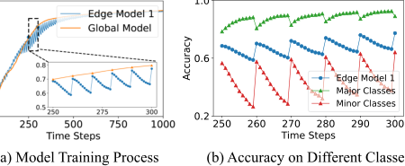

Fig. 1. The Non-IID data across edges makes the edge models insufficiently learn the minor classes, hindering the convergence of the global model. 

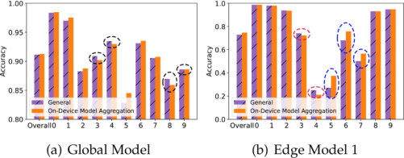

Fig. 2. Model accuracy comparison between whether to perform on-device model aggregation. 

there are fewer data on minor classes in edge 1, the accuracy on minor classes decreases. The Non-IID data across edges leads to edge models updated towards different directions, eventually hindering the convergence of the global model. Furthermore, when the device moves across edges, each edge model will be updated towards different directions according to the associated dynamic data distribution. 

To answer Question 2, we conduct a set of similar experiments as Question 1, but each device is assigned the samples of only one class. The training data of two edges are associated with the deviceswithlabels _{_ 0 _,_ 1 _,_ 2 _,_ 3 _,_ 4 _}_ and _{_ 5 _,_ 6 _,_ 7 _,_ 8 _,_ 9 _}_ ,respectively. Then, the mobile devices with labels _{_ 3 _,_ 4 _}_ move from edge 1 to edge 2, and the devices with labels _{_ 8 _,_ 9 _}_ move from edge 2 to edge 1, i.e., the training data within two edges are changed to _{_ 0 _,_ 1 _,_ 2 _,_ 8 _,_ 9 _}_ and _{_ 5 _,_ 6 _,_ 7 _,_ 3 _,_ 4 _}_ , respectively. Two methods are conducted to compare: 1) “General”: the device downloads the edge model from the associated edge, and directly uses the newly downloaded edge model as the starting point of local training; 2) “On-Device Model Aggregation (A Case)”: each moved device simply averages the newly downloaded edge model and its own local model for local training. These two methods then continue training for several steps, and aggregate all local models as the cloud model. Finally, the test accuracy of the cloud model and the edge model 1 is presented for the overall classes and also for each class, in Fig. 2. 

_Response to Question 2:_ When evaluating the overall model accuracy across all classes, the “On-Device Model Aggregation” shows slight improvements in both the cloud model and edge model 1. However, when examining the accuracy of each individual class of the global model in Fig. 2(a), “On-Device Model Aggregation” performs lower than “General” on several classes (marked with black circles), which is consistent with the exchanged classes _{_ 3 _,_ 4 _,_ 8 _,_ 9 _}_ . For the edge model 1 in 

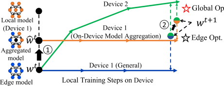

Fig. 3. Illustration of the edge model parameter space, the device 1 performs on-device model aggregation, resulting in the change of the local training starting point and further the aggregated edge model. 

Fig. 2(b), “On-Device Model Aggregation” achieves higher accuracy on classes _{_ 5 _,_ 6 _,_ 7 _}_ (marked with blue circles), while experiencing lower accuracy on classes _{_ 3 _,_ 4 _}_ (marked with red circles), compared with the “General”. It is worth noting that in “On-Device Model Aggregation”, the moved device does not directly adopt the directly downloaded edge model when initializingitsstartingpointoflocalupdate,butretainspartofthe local model inherited from edge 2. Edge 2 is initialized with data samples of class _{_ 5 _,_ 6 _,_ 7 _,_ 8 _,_ 9 _}_ , and the inherited local models on moved devices can bring the feature of classes _{_ 5 _,_ 6 _,_ 7 _}_ , which is the complementary information for edge 1. Thus, “On-Device Model Aggregation” has a significant improvement on classes _{_ 5 _,_ 6 _,_ 7 _}_ . However, there is a slight drop in classes 3 _,_ 4 as shown in Fig. 2(b). Because “On-Device Model Aggregation” uses the average of edge models 1 and 2 as the starting point for local updating, whose performance on classes 3 _,_ 4 was initially inferior to that of edge model 1 and influences the final trained edge model 1. 

We further analyze the impact of “General” and “On-Device Model Aggregation” on the FL training by showing the parameter space of edge models in Fig. 3. Supposing devices 1 and 2 participate in model training at the current edge, where device 1 is newly entering. The solid line indicates the device’s local gradient update direction. 

_General:_ Under the classical HFL setting [5], [6], devices directly download the edge model _w__t_ from the currently associated edge, and then perform multiple local SGD starting from the downloaded edge model, which is optimized towards their local optima. The new edge model is the average of the updated local models from device 1 and 2, which is still approximately optimized towards the edge optimum but may also deviate from the global optimum. 

_On-Device Model Aggregation:_ “On-Device Model Aggregation” can change the starting point of local updating on mobile devices and further adjust the trained edge model. Specifically, device 1 aggregates the local model and the edge model, and uses this aggregated model _w_ ˆ_t_ as the starting point for local model updating. The change of the starting point directly affects its local updating, which further leads to the change of the aggregated edge models and the cloud model. Due to the Non-IID data distributions across edges, the local model of the newly entering device 1, which is inherited from the previous edge, may contain the complementary information for the current edge. Although the aggregated edge model deviates from the edge optimum, 

Authorized licensed use limited to: Shanghai Jiaotong University. Downloaded on August 25,2025 at 17:24:13 UTC from IEEE Xplore.  Restrictions apply. 

4592 

IEEE TRANSACTIONS ON MOBILE COMPUTING, VOL. 24, NO. 6, JUNE 2025 

TABLE I 

NOTATION TABLE 

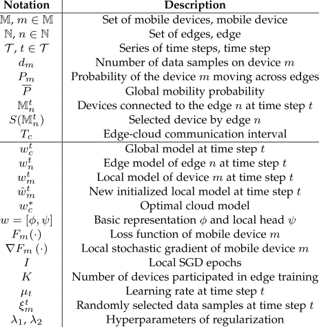

it may be closer to the global optimum when introducing the complementary information from other edges, accelerating the convergence of global model. In Section V, we further confirm the effectiveness of “On-Device Model Aggregation” through Theorem 1. 

## III. PRELIMINARIES 

In this section, we first discuss the background of general FL. Then, we introduce the device-edge-cloud HFL, emphasizing the devices’ mobility in wireless networks. Some important symbols are summarized in Table I. 

## _A. Federated Learning_ 

In general FL, one cloud server and multiple devices coordinately train a global cloud model for some learning task, such as image classification and speech recognition in IoT applications [17], [20]. The model training process of FL is performed by a set of _M_ mobile devices M over a series of time steps, denoted by _T_ = _{_ 1 _, .., t, . . ., T }_ . Each device _m ∈_ M trains the local model based on its local data samples by running _I_ local updates: 

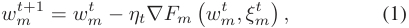

where _wm__t_isthelocalmodelofthedevice_m_attimestep_t_, _Fm_ ( _·_ ) is the loss function, _ξm__t_istherandomlyselecteddata samples at time step _t_ , and _ηt_ is the learning rate. Let _dm_ be the number of data samples on device _m_ . Considering that full device participation is impossible in practice, the cloud server often selects a subset of devices _S_ (M) _∈_ M with the size _K_ at each time step for local training. The goal of the cloud server is 

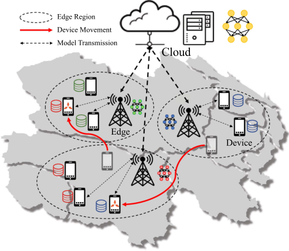

Fig. 4. Device-edge-cloud Hierarchical Federated Learning. 

to solve the following optimization problem: 

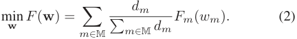

## _B. Device Mobility in Federated Learning_ 

In contrast with the vanilla cloud-based FL, device-edgecloud HFL introduces multiple edges between the cloud server and devices, forming a three-layer FL framework, as illustrated in Fig. 4. First, for the bottom device layer, mobile devices are dispersed over different edge regions, and can move across edges. For the middle edge layer, each edge is connected to a wide variety of devices via wireless networks, and to the remote cloud server via wide area networks. Each edge dynamically selects a subset of devices within the edge region to participate in each round of FL model training. The data samples of devices are Non-IID across edges, resulting in different edge models. For the top cloud layer, the cloud server periodically aggregates all edge models to get the global model. In the following discussion, we mainly illustrate the differences between HFL with mobile devices and the vanilla FL. 

_Mobile Devices:_ Let N be the set of all edges, and the devices connected to the edge _n ∈_ N in the time step _t_ form a set M_t_ _n_. Each device _m ∈_ M updates the local model _wm__t_to_w_ _m__t_+1 based on local data samples according to (1). 

The mobile device can move geographically between two sequential time steps _t −_ 1 and _t_ , and the edges only focus on the newly coming devices from the other edges. Let _Pm_ be the probability of the device _m_ to move across edges, and global mobility probability _P_ is defined as the average of _Pm_ . 

All devices follow the two basic principles during the training process: 1) each device _m ∈_ M always connects to the nearest edge due to the consideration of communication quality: 

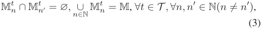

Authorized licensed use limited to: Shanghai Jiaotong University. Downloaded on August 25,2025 at 17:24:13 UTC from IEEE Xplore.  Restrictions apply. 

4593 

ZHANG et al.: MIDDLE: A MOBILITY-DRIVEN DEVICE-EDGE-CLOUD FEDERATED LEARNING FRAMEWORK 

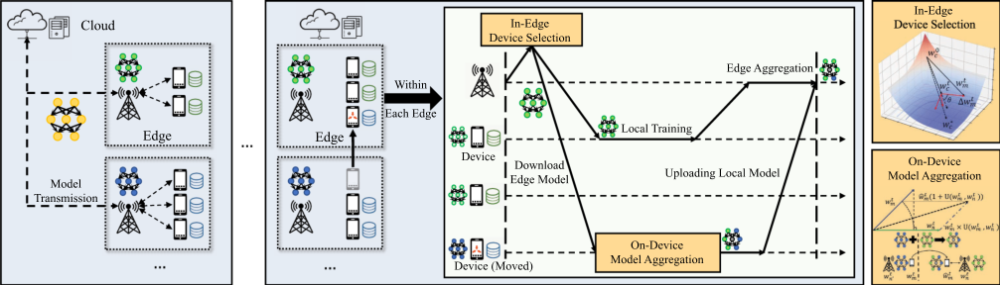

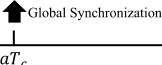

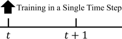

Fig. 5. MIDDLE framework. 

2) any device _m ∈_ M_t_ _n_can complete the entire one-round model training process in time step _t_ , which involves downloading the current edge model, performing local model training and uploading the local model. 

We note that our solution is orthogonal to the classic mobility models [21], [22] or mobile trajectory prediction algorithms [23], [24], because we do not need a whole mobile trajectory. 

_The Edges:_ At each time step _t_ , each edge _n ∈_ N selects a subset of devices _S_ (M_t_ _n_)ofthesize_K_basedonthecurrent available device set M_t_ _n_toparticipateinthemodeltraining. The edge _n_ distributes the edge model _wn__t_to each device_m ∈_ _S_ (M_t_ _n_),receivestheupdatedlocalmodel_w_ _m__t_+1 from all the selected devices, and aggregate the edge model _wn__t_+1 for the next time step. After every _Tc_ time steps, the edge communicates with the cloud server. 

_The Cloud Server:_ After all edges uploading the edge models, the cloud server aggregates these edge models to obtain the cloud model _wc__t_+1 . Similar to the vanilla FL, the cloud server aims to obtain the optimal cloud model _wc__∗_bysolvingthefollowing optimization problem: 

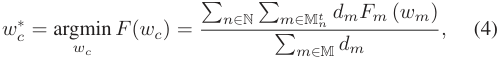

which is the extension of (2) based on the hierarchical architecture. In this work, we expect to accelerate the convergence of the FL training process with the help of the devices’ mobility. 

## IV. DESIGN OF MIDDLE 

In this section, we introduce the design of MIDDLE in a top-down manner. We first provide a description of its top-level architecture, and then show the two underlying components: on-device model aggregation and in-edge device selection in details. In on-device model aggregation, we also define the similarity utility metric. 

## _A. Overview of MIDDLE_ 

The key idea of mobile-driven FL is to leverage the devices’ mobility to accelerate the convergence of FL model training, where edges and devices alternately update edge models and localmodelsondevicesineachtimestep _t_ .Fig. 5 summarizesthe MIDDLE framework over the entire training process. The cloud communicates with edges to perform global synchronization every _Tc_ time steps. Mobile devices can move across edges between two consecutive time steps. Within each time step, the edge first performs “in-edge device selection” to generate a device subset that is most beneficial for the current edge model training to reduce the divergence between the edge model and the global model, and distributes its edge model to the selected devices. Subsequently, the moved devices execute “on-device model aggregation” to generate new local update starting points, adjusting their local optimization direction to share the complementary knowledge across edges. The process of “on-device modelaggeration”and“in-edgedeviceselection”arealsoshown on the right. 

We describe the detailed procedure of the training process within a single time step in Algorithm 1. At the beginning of each time step _t_ , each edge _n ∈_ N selects a subset of devices _S_ (M_t_ _n_) of size_K_to participate in its edge model training (Line 2). Each edge should select the devices which can promote the edge model updating closer to the global optimum rather than its edge optimum. We describe the detailed procedure of in-edge device selection in Section IV-B. Each device _m ∈_ M_t_ _n_ downloads the edge model _wn__t_, and updates this model to a new initial local model _w_ ˆ _m__t_byjointlyconsideringthecurrentedge model and the previous ones (Line 5). We leverage the on-device model aggregation by the incoming devices to learning the “knowledge” from the previous edges, which will be discussed in Section IV-C in details. With this new initialized local model _w_ ˆ _m__t_,eachparticipatingdevice_m ∈S_(M_t_ _n_)performs_I_local updates based on its local data samples to obtain the new local model _wm__t_+1, and uploads the new local model to edge_n_(Line 8): 

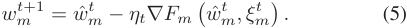

Authorized licensed use limited to: Shanghai Jiaotong University. Downloaded on August 25,2025 at 17:24:13 UTC from IEEE Xplore.  Restrictions apply. 

4594 

IEEE TRANSACTIONS ON MOBILE COMPUTING, VOL. 24, NO. 6, JUNE 2025 

## **Algorithm 1:** A Single Training Round in MIDDLE. 

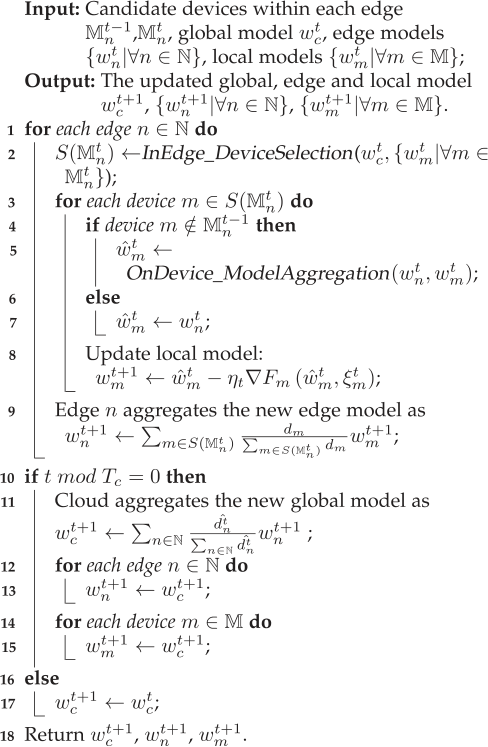

## _B. On-Device Model Aggregation_ 

To efficiently utilize the various “knowledge” in different edge models, we propose on-device model aggregation to relieve the unbalanced updates to accelerate the convergence of the global model in FL. In traditional device-edge-cloud FL, “knowledge” sharing across edges relies on model aggregation on the cloud. However, the incoming devices bring their own local models inherited from the previous edges, which may contain the “knowledge” missing from the current edge model due to the biased update of the model caused by the Non-IID data distribution across edges. The current edge desires this complementary “knowledge” to reduce the biased updating of the edge model for accelerating the convergence of global model training. For a mobile device _m_ , by aggregating the edge model _wn__t_fromthecurrentedgeandthelocalmodel_w_ _m__t_inherited from the previous edges, we expect to introduce complementary knowledge to the current edge model training process. However, the local model _wm__t_could be stale due to the device participating in model training aperiodically in FL. Furthermore, the inherited local model _wm__t_couldvarygreatlyinthegradientdescent direction due to the Non-IID data distribution across edges. Thus, simply aggregating the models, which are stale or have large differences, will introduce additional noise into the current edge model training, causing gradient drift in FL model training and making it hard to converge [19]. 

With the above consideration, we adopt the cosine similarity between the local model _wm__t_and the current edge model_w_ _n__t_to measure the utility of gradient updates from different parameter models [25], [26]. Then, we define the similarity utility _U_ ( _·_ ), and _U_ ( _wm__t, w_ _n__t_)isthesimilarityutilitybetweentheprevious local model _wm__t_and the edge model_w_ _n__t_: 

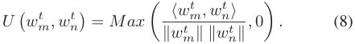

After receiving local models from all the selected devices _m ∈ S_ (M_t_ _n_),theedge_n_aggregatestheselocalmodelsusing the weight of the size of data samples per device as in FedAvg: 

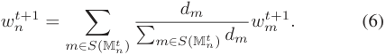

After every _Tc_ time steps, i.e., _t mod Tc_ = 0, all edges upload the new edge models to the cloud server (Line 11). The cloud server aggregates these edge models to a new global model _wc__t_+1 : 

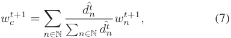

where the weight of each edge model _d_ˆ_t_ _n_ is the number of data samples on devices participating in the training process of edge _n_ ,and _d_ˆ_t_ _n_ =� _t__t′′_= =_t_ _t−Tc_ � _m∈S_ (M_t_ _n__′_)_dm_.Then,theclouddis- tributes _wc__t_+1 to edges and devices to update the edge models and local models. Finally, the cloud, edges, and devices repeat the above procedure until the preset number of time steps is reached. 

The similarity utility is set to zero when the cosine similarity score is lower than 0 to avoid blind aggregation introducing noise. The zero threshold ensures that models whose update directions are orthogonal or opposed to the current edge model are excluded from the “on-device model aggregation”. This effectively prevents gradient drift caused by excessive gradient discrepancies. Stale local models do not participate in edge model training over several consecutive time steps, and miss the opportunity to correct their local update bias using the latest edge model. As a result, they tend to have lower similarity utility. Then, when device _m_ moves across the edges and participates in the current edge training process, device _m_ calculates the similarity utility _U_ ( _wm__t, w_ _n__t_) between the previous local model _wm__t_and the downloaded edge model_w_ _n__t_, uses it as the weight of the model aggregation on device, and gets a new initial local model _w_ ˆ _m__t_: 

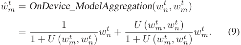

The cosine similarity utility ensures that the value of _U_ ( _wm__t, w_ _n__t_) is always less than 1. In this way, the new initial local model _w_ ˆ _m__t_ 

Authorized licensed use limited to: Shanghai Jiaotong University. Downloaded on August 25,2025 at 17:24:13 UTC from IEEE Xplore.  Restrictions apply. 

4595 

ZHANG et al.: MIDDLE: A MOBILITY-DRIVEN DEVICE-EDGE-CLOUD FEDERATED LEARNING FRAMEWORK 

is still dominated by the current edge model, but also introducing the complementary knowledge of other edge models. 

## _C. In-Edge Device Selection_ 

The devices’ mobility makes each edge cover different devices under various time steps, and each edge needs to select devices under an uncertain device set at each time step. The historical training experiences of the newly entered devices are based on the previous edge models, and thus cannot be directly used as the criteria for the device selection in the current edge. We need to design a new model quality metric, jointly considering local data privacy and global optimization objective. 

Considering the global optimization objective, the edge should select the devices that can regulate the edge model’s update direction closer to the global optimum _wc__∗_. Data privacy requirement in FL makes it fail to directly use the device’s data distribution to select devices. Thus, we turn to the available local model parameters for device selection. Let the accumulative updating of local model _wm__t_withrespectivetotheglobal_w_ _c__t_ be Δ _wm__t_: 

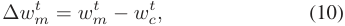

which is optimized towards the local optimum of the device _m_ . We can calculate the similarity utility _U_ ( _wc__∗,_Δ_w_ _m__t_) between_w_ _c__∗_ and Δ _wm__t_as the criterion for device selection within the edge. However, the optimal cloud model parameters _wc__∗_cannotbe obtained during the training process. Since the update direction of _wc__t_in each iteration attempts to approach the optimal global model _wc__∗_due to (4), We can approximate_U_(_w_ _c__∗,_Δ_w_ _m__t_) by: 

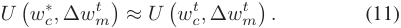

Finally, to avoid getting stuck in the local optimum, the edge should select the devices with data samples which are not sufficiently learned by the global cloud model [27], [28], meaning the local model with less similarity to the cloud model should be assigned with a high probability to select. With the above consideration, the _k_ devices are selected from the candidate devices M_t_ _n_to participate in the edge model training: 

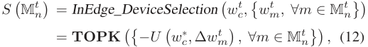

where **TOPK** ( _·_ ) is the function to output a set of items with the _K_ highest values. In this way, in-edge device selection can also help to filter out some stale and low-quality local models. 

## V. THEORETICAL ANALYSIS 

In this section, we provide an analysis of the convergence bound on the FL under devices’ mobility to demonstrate that on-device model aggregation can relieve unbalanced updates across edges. 

We stick to the following assumptions, which are widely used in the literature. 

_Assumption 1: Fm_ ( _wm_ ) is _β−_ Lipschitz smoothness for each device _m ∈_ M, i.e., _Fm_ ( _wm_ ) _≤ Fm_ ( _wm__′_) + (_wm−_ 

_wm__′_)_∇Fm_(_w_ _m__′_) +_<u>β</u>_ 2_∥wm −w_ _m__′∥_2 for any two parameter model _wm_ and _wm__′_. 

_Assumption 2: Fm_ ( _wm_ ) is _μ−_ strongly convex for each device _m ∈_ M, i.e., _Fm_ ( _wm_ ) _≥ Fm_ ( _wm__′_) + (_wm−_ _wm__′_)_∇Fm_(_w_ _m__′_) +_<u>μ</u>_ 2_∥wm −w_ _m__′∥_2 for any two parameter model _wm_ and _wm__′_. 

_Assumption 3:_ Let _ξm__t_be a randomly selecteddata samples from the device _m_ at time step _t_ , the variance of stochastic gradients in each device _m ∈_ M is bounded, i.e., E _∥∇Fm_ ( _wm__t, ξ_ _m__t_)_−_ _∇Fm_ ( _wm__t_)_∥≤σ_ _m_2. 

_Assumption 4:_ The expected squared norm of stochastic gradients is uniformly bounded, i.e., E _∥∇Fm_ ( _wm__t, ξ_ _m__t_)_∥_2_≤G_2 for _∀m ∈_ M and _∀t ∈T_ . 

Assumptions 1 and 2 are standard, which are satisfied in the linear regression, logistic regression, and softmax classifier. Assumptions 3 and 4 are typical in the general theoretical analysis of FL algorithms. Furthermore, to simplify the analysis, all devices are assumed to participate in the training. An additional virtual variable _<u>w</u>__~~t~~_+1 is introduced to represent the aggregation of local models after time step _t_ + 1: 

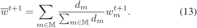

_<u>w</u>__~~t~~_+1 is equal to _wc__t_+1 at the time step when the edge communicates with the cloud server. From the _β−_ Lipschitz smoothness of loss function _F_ , we have: 

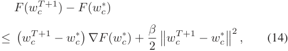

_wc__T_+1 is the final cloud model on the cloud server. By taking expectation at both sides: 

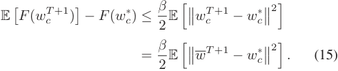

_Lemma 1:_ Under Assumptions 1 and 2, if _ηt ≤_ 41 _β_, it has: 

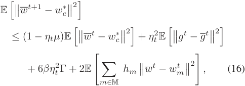

where _g__t_ =� _m∈_ M_hm∇Fm_( ˆ_w_ _m__t, ξ_ _m__t_), _<u>g</u>__~~t~~_ = � _m∈_ M_hm∇Fm_( ˆ_w_ _m__t_), _hm_ = ~~�~~ _md∈m_ M_dm_, and Γ = _F__∗_ _−_ � _m∈_ M_hmF ∗_ _m_._F ∗_and_F ∗_ _m_aretheminimumvalueof_F_ and _Fm_ , respectively. 

_Proof:_ Please see the Lemma 1 in [29], [30] for the proof. We omit the similar proof due to space limitation. ■ 

To facilitate the analysis, we set a fixed on-device model aggregation coefficient _α_ , instead of the dynamic value in the on-device model aggregation, i.e., _w_ ˆ _m__t_= (1_−α_)_w_ _m__t_+_αw_ _n__t_. 

Authorized licensed use limited to: Shanghai Jiaotong University. Downloaded on August 25,2025 at 17:24:13 UTC from IEEE Xplore.  Restrictions apply. 

4596 

IEEE TRANSACTIONS ON MOBILE COMPUTING, VOL. 24, NO. 6, JUNE 2025 

_Theorem 1:_ Under Assumptions 1 to 4 and assuming _α ∈_ (0 _,_ 1), by selecting _Pm_ = _P_ ( _∀m ∈_ M), _P ∈_ (0 _,_ 1], _γ_ = max _{_8 _μ__<u>β</u>, I}_, and the learning rate_ηt_= _μ_ ( _γ_ <u>2+</u> _t_ ), the convergence bound of MIDDLE at time step _t_ with full device participation satisfies: 

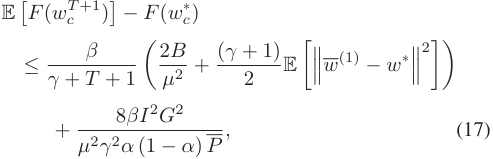

where 

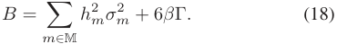

_Proof Sketch:_ We now give an outline of the proof for Theorem 1. According to Lemma 1 and (15), we can prove Theorem 1 by proving the upper bound of E[ _~~∥~~_ _<u>w</u>__t_+1 _− wc__∗∥_2]. Specifically, we first determine upper bounds for E[� _m∈_ M_hm__~~∥~~_ _<u>w</u>__~~t~~_ _− wm__t∥_2] and _ηt_2E[_∥gt −_ _<u>g</u>__~~t~~_ _∥_2 ]. For E[� _m∈_ M_hm__~~∥~~_ _<u>w</u>__~~t~~_ _− wm__t∥_2], it can be expanded into: 

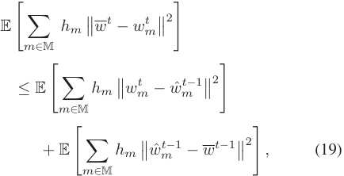

which can be proofed from E[ _∥X −_ E[ _X_ ] _∥_2 ] _≤_ E _∥X∥_2 and E[ ˆ _wm__t_] = _<u>w</u>__~~t~~_ . E[� _m∈_ M_hm∥w_ _m__t−w_ˆ _m__t−_1_∥_2] is general in typical federated learning convergence analysis, which indicates the _−_ local updating of device _m_ . Moreover, E[� _m∈_ M_hm∥w_ˆ _m__t−_1 _<u>w</u>__~~t~~−_1 _∥_2 ] is unique, which indicates the divergence between the changedlocalupdatingstartingpointandtheglobalaverageafter the on-device model aggregation and can be bounded with fixed value _α_ and global mobility _P_ . The proof of _ηt_2E[_∥gt −_ _<u>g</u>__~~t~~_ _∥_2 ] is also typical [29], [30]. Finally, Theorem 1 can be proofed by mathematical induction. Please see Appendix 1, available online for the detailed proof. ■ _Remark 1:_ We next investigate how the devices’ mobility affects the convergence bound of FL. By taking the first-order derivative of (E[ _F_ ( _wc__T_+1 )] _− F_ ( _wc__∗_)) over the global mobility _P_ , we have 

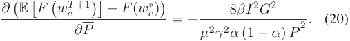

_<u>c</u>_ <u>)]</u> _−F_ <u>(</u> _wc__∗_<u>))</u> Thus, it can be observed that_∂_<u>(E[</u>_F_<u>(</u>_wT_+1 _<_ 0 over _P ∈ ∂P_ (0 _,_ 1] and _α ∈_ (0 _,_ 1). These results show that the error between the final cloud model _wc__T_+1 and the optimal cloud model _wc__∗_can be always reduced under any global mobility _P_ . Moreover, according to the first-order derivative of (E[ _F_ ( _wc__T_+1 )] _− F_ ( _wc__∗_)), 

this model error can gradually decrease with the increase of the global mobility _P_ . 

_Remark 2:_ Note that the impact of device mobility on the FL convergence bound is particularly reflected in the final term 8 _<u>βI</u>_2 _G_2 8 _<u>βI</u>_2 _G_2 _μ_2 _γ_2 _α_ (1 _−α_ ) _P_. According to Lemma 1 and (19), _μ_2 _γ_2 _α_ (1 _−α_ ) _P_is _−_ derived from the final term in (19), i.e., E[� _m∈_ M_hm∥w_ˆ _m__t−_1 _<u>w</u>__~~t~~−_1 _∥_2 ]. Therefore, device mobility effectively impacts the divergence between the new initial local updating starting point and the global average. Frequent device mobility leads to a local update starting point that is closer to the global average, thus facilitating the FL convergence. 

## VI. ON-DEVICE GLOBAL CONTROLLED AVERAGING 

In this section, we extend the proposed MIDDLE, denoted as MIDDLE+ . On-device model aggregation of MIDDLE is coarse-grained, lacking the finer control necessary for selective learning of complementary features, and may miss opportunities to fully utilize the unique knowledge distributed across devices and edges. To overcome this shortcoming, MIDDLE+ incorporates a new customized component: on-device global controlled averaging, which modifies the device’s training process to control the optimization direction of devices and can further exploit the potential of leveraging device mobility to accelerate information exchange across edges. 

The on-device global controlled averaging redefines the starting point of local training and constrains the current gradient update by continuously utilizing the gradient update of the local model inherited from the previous edge, which makes the local update direction on the device closer to the global direction. In the MIDDLE, mobile devices can benefit from traversing different edges, continuously learning complementary knowledge from other models inherited from previous edges. We have customized a basic on-device model aggregation to realize knowledge transfer between edges in Section IV-B, and theoretical analysis confirms its effectiveness in reducing the divergence of all local models (see Remark 2). To further exploit the potential of leveraging device mobility for accelerating information exchange across edges, a natural idea is to store historical models of other edges and adjust the device’s local updates through transfer learning. However, storing all historical models brings high storage resource requirements and the models might become obsolete. Therefore, the challenge is to maximize the utilization of device mobility for cross-edge knowledge transfer while minimizing the resource cost on mobile devices. 

To address the above challenges and further exploit the potential of leveraging device mobility for accelerating information exchange across edges, on-device global controlled averaging needs to identify the model parameters that are more valuable for accelerating global convergence, extracting valuable global knowledge from the local models inherited from the previous edge. Drawing on extensive research in federated representation learning and classic personalized FL [31], [32], [33], [34], such as FedRep [31] and FedPer [32], where the first few layers of the neural network are commonly regarded as the basic representation of model parameters, we decompose the model _w_ into two parts: a basic representation _φ_ and a local head 

Authorized licensed use limited to: Shanghai Jiaotong University. Downloaded on August 25,2025 at 17:24:13 UTC from IEEE Xplore.  Restrictions apply. 

4597 

ZHANG et al.: MIDDLE: A MOBILITY-DRIVEN DEVICE-EDGE-CLOUD FEDERATED LEARNING FRAMEWORK 

**Algorithm 2:** A Single Training Round in MIDDLE+ . 

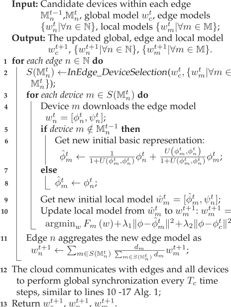

_ψ_ , represented as _w_ = [ _φ, ψ_ ], where _φ_ and _ψ_ are concatenated sequentially. In this way, MIDDLE+ intends to focus the sharing of complementary knowledge by the basic representation _φ_ , which handles feature extraction, while the more locally influenced local head _ψ_ remains specific to each device’s data. The segmentation between the basic representation _φ_ and local head _ψ_ is task-specific, depending on the neural network architecture used in the current training task. Decomposing the local model _wm__t_ofdevice_m ∈_Minto_w_ _m__t_= [_φt_ _m__, ψ_ _m__t_],on-device global controlled averaging can efficiently leverage the most relevant parameters from the previous model, which are more conducive to global model updates, adapting the local update strategy of mobile devices. Additionally, the edge model _wn__t_ and cloud model _wc__t_canberepresentedas_w_ _n__t_= [_φt_ _n__, ψ_ _n__t_]and _wc__t_= [_φt_ _c__, ψ_ _c__t_], respectively. Here,_φt_ _c_constitutes the global basic representation. We aim to control the complementary knowledge sharing on devices through the model’s basic representation to align more closely with the global average. Algorithm 2 summarizes the process of MIDDLE+ . 

When device _m_ moves across edges and is associated by edge _n_ at time step _t_ , device _m_ downloads the edge model _wn__t_to initialize its new local model _w_ ˆ _m__t_for local training (Lines 4-10). On-device global controlled averaging performs basic representation aggregation to calculate the similarity utility between the basic representations _φ__t_ _m_and_φt_ _n_ofmodels_w_ _m__t_= [_φt_ _m__, ψ_ _m__t_] and _wn__t_= [_φt_ _n__, ψ_ _n__t_], and uses the similarity utility_U_(_φt_ _m__, φt_ _n_) to 

obtain the new basic representation _φ_ˆ_t_ _n_(Line 6): 

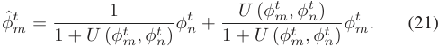

And the new initial local model _w_ ˆ _m__t_= [ˆ_φt_ _m__, ψ_ _n__t_].Further,we modify the local solver of the mobile device _m ∈_ M using the global basic representation _φ__t_ _c_and its new initial basic represen- tation _φ_ˆ_t_ _m_,inheritingfromthepreviousedgemodel.Updated local model _wm__t_+1 of mobile device _m_ can be obtained by the regularized local updating, which uses _w_ ˆ _m__t_as the starting point for local training and is optimized for the following objective (Line 10): 

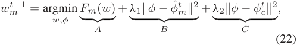

where _φ_ˆ_t_ _m_isthenewbasicrepresentationoflocalmodel_w_ _m__t_, _φ__t_ _c_is the basic representation of global model_w_ _c__t_,_λ_1and_λ_2are hyperparameters controlling the effect of the two regularizers. The first term _A_ represents the general local gradient descent process. The last term _C_ acts as a regularization term for basic representations, which can penalize the basic representation of the local model that deviates too much from the global basic representation, aiming to reduce the divergence between the local updating of device _m_ and the last global updating, ensuring that the updated basic representation _φ_ˆ_t_ _m_ofeachdevice_m_is closer to the global representation. The second term _B_ leverages themostrecentmodelsfromotheredgestorestrictlocalupdating and facilitate learning complementary information from other edges. It is essential in the device-edge-cloud FL, where global updating often occurs after more local training than the simple server-client FL approach. All devices can reset their local models with the global cloud model _wc__t_only when edges com- municate with the cloud, i.e., _t mod Tc_ = 0. Relying solely on thelast regularizationtermtorestrict local updatingmayresult in the stale cloud model _wc__t_hindering local updates. Therefore, the second term _B_ utilizes the newly inherited basic representation from other edges to adjust the local updates of devices within the current edge, mitigating gradient drift caused by the Non-IID data distributions across edges. Finally, the cloud communicates with edges and all devices to perform global synchronization every _Tc_ time steps (Line 12). However, compared to MIDDLE, MIDDLE+ relies on certain prior knowledge for dividing the basic representation and increases the computational overhead on mobile devices. When the entire model _w_ is used as the local head, MIDDLE+ effectively degenerates into a specialized implementation of MIDDLE with regularization. 

Finally, Fig. 6 summarizes the basic workflow of MIDDLE+ . Similar to MIDDLE, the current edge selects a device subset to participate in edge training. Each newly entered device _m_ performs on-device global controlled averaging, which consists of two main steps. First, on-device global controlled averaging decouples model _wm__t_into_w_ _m__t_= [_φt_ _m__, ψ_ _m__t_], performs the basic representation aggregation according to Eq.(21), and get a new basic representation _φ_ˆ_t_ _m_and a new initial local model_w_ˆ _m__t_. Then, device _m_ performs a regularized local updating according to (22) to get _wm__t_+1, which is then uploaded to the current edge. 

Authorized licensed use limited to: Shanghai Jiaotong University. Downloaded on August 25,2025 at 17:24:13 UTC from IEEE Xplore.  Restrictions apply. 

4598 

IEEE TRANSACTIONS ON MOBILE COMPUTING, VOL. 24, NO. 6, JUNE 2025 

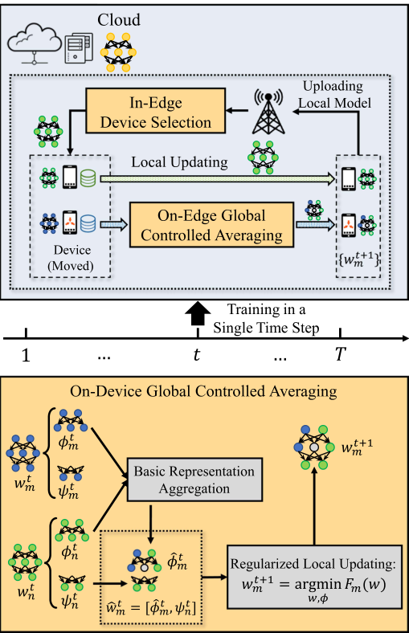

Fig. 6. MIDDLE+ framework. 

## VII. EVALUATION RESULTS 

In this section, we evaluate MIDDLE through extensive numerical experiments. We first introduce the experiment settings, and then provide the experimental results with corresponding analysis. 

## _A. Experiment Settings_ 

_1) Dataset. Training Tasks:_ We verify our approach on three typical applications in mobile computing, i.e., image classification, speech recognition, and real-world data. For image classification tasks, we adopt three open source datasets, including MNIST [35], EMNIST [36] and CIFAR10 [37]. In MNIST and CIFAR10, there are 10 classes of grayscale and color images, respectively. In EMNIST, the “Letters” track containing 26 classes of grayscale images from letters ‘A’ to ‘Z’ is used as the learning task. For speech recognition, we use the open source dataset SpeechCommands [38] to detect the voice ‘zero’ to ‘nine’. Additionally, we validate the proposed algorithm using two classification tasks from two real-world data, i.e., SVHN [39] and HARUCI [40]. The SVHN dataset contains images of house numbers captured from Google Street 

View. The HARUCI dataset is collected from 30 participants performing 6 distinct activities, which consists of inertial sensor data and is collected using a smartphone carried by the subjects. All training tasks are divided into training and test sets. 

_Mobile Trajectories:_ We take synthetic and real-world traces to verify the performance of MIDDLE and MIDDLE+ . All devices move between edges with different probabilities, and the expectation meets the value of global mobility _P_ . 1) _Synthetic Trace:_ we use the ONE simulator [41] to generate the synthetic traces of mobile devices, which is a common simulator to generate user movement traces using different mobility models [42], [43]. 2) _Real-World Trace:_ we also use the Shanghai Telecom dataset to get real-world traces of mobile users moving between base stations [44], [45], [46]. The dataset contains 9,481 mobile devices with over 7.2 million records of dynamic access to 3,233 base stations over 6 consecutive months [47]. Each record in the dataset contains detailed timestamps of when each mobile user started and ended their access to a specific base station. 

_2) Parameter Settings:_ In MIDDLE, we simulate 10 edges and 100 mobile devices. We assume 50% of the devices participating in training at each time step, and the number of selected devices _K_ within each edge is set as 5. The local data samples in each device are supposed to have large Non-IID distribution: there exists a major class for the device’ data samples (more than 80% of all samples). The local training epochs _I_ and the time step interval _Tc_ of communication between cloud and edge are both set as 10. The expected mobility probability _P_ is set as 0.5. The MNIST and EMNIST are trained on the convolutional neural network (CNN) with 2 convolutional layers and 2 fully connected layers. The CIFAR10, SpeechCommands, SVHN, and HARUCI are trained on the convolutional neural network with 3 convolutional layers and 2 fully connected layers. For three image classification tasks and two real-world data tasks, the optimizer is SGD, and the stochastic gradient descent with momentum is used for training, which has an initial learning rate of 0.01 and a momentum term of 0.9. For the speech recognition task, the optimizer is Adam, and the learning rate is 0.001. The convergence speed of different algorithms is reflected in the time steps of reaching the target accuracy, which are set as 0.95, 0.80, 0.55, 0.85, 0.75, and 0.60 for MNIST, EMNIST, CIFAR10, SpeechCommands, SVHN, and HARUCI, respectively. 

_3) Baselines:_ We compare MIDDLE and MIDDLE+ with four existing baselines, which do not specifically deal with the devices’ mobility. Some adaptive adjustments are made to these baselines to be applied to our problem, and the details are as follows: 

_OORT:_ The OORT is the latest device selection strategy in [27], [28]. The system utilities of devices are set as the same, and each edge selects the devices with the top _K_ highest statistical utilities for model training. It is without on-device model aggregation. 

_FedMes:_ The FedMes utilizes the devices located in the overlap of two edges to accelerate the model convergence of FL, where each two edge models are aggregated on the devices in an averaged way [30]. In the experiments, devices moving across edges are regarded as the overlapped devices. FedMes adopts the random device selection for edges. 

Authorized licensed use limited to: Shanghai Jiaotong University. Downloaded on August 25,2025 at 17:24:13 UTC from IEEE Xplore.  Restrictions apply. 

4599 

ZHANG et al.: MIDDLE: A MOBILITY-DRIVEN DEVICE-EDGE-CLOUD FEDERATED LEARNING FRAMEWORK 

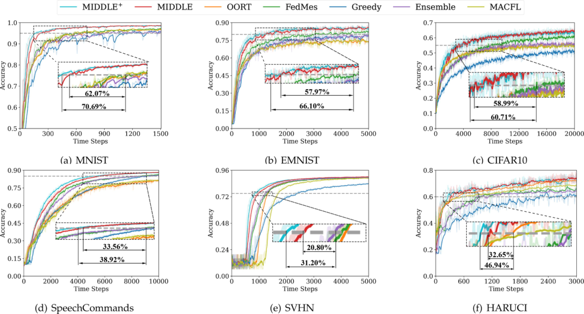

Fig. 7. Time-to-accuracy performance over all learning tasks (Synthetic Trace). 

_Greedy:_ When a device moves across edges, it greedily keeps the previous local model as the initial local model for local updates . As in OORT, Greedy selects the devices with the _K_ highest statistical utility to participate in the training. 

_Ensemble:_ An ensemble approach combines the OORT and FedMes, which aggregates on-device in an averaged way and selects the devices with the _K_ highest statistical utility. 

_MACFL:_ A mobility-aware cluster FL approach. Each edge dynamically adjusts the edge aggregation coefficient based on the utility of the local models within the current edge. 

To show the experiment results more clearly, all results are smoothed and presented by their averages, and the shades are the actual experimental results. 

## _B. Experimental Results and Analysis_ 

_1) Overall Performance:_ First, a set of experiments is conducted to verify the performance of MIDDLE and MIDDLE+ over six training tasks and two mobile trajectories. In both Figs. 7 and 8, the MIDDLE outperforms all the baselines over both the model accuracy and the convergence speed in all learning tasks. It shows that MIDDLE can effectively improve model accuracy and speed up model convergence through dynamic device selection within edge and model sharing between edges. However, in the early stage of training, OORT has a faster convergence speed than the other approaches. Because each edge in the OORT does not introduce the parameter models of other edges, OORT avoids introducing the noise brought by model aggregation on devices. By observing the results of FedMes, Ensemble, and Greedy, they all have higher final model accuracy than OORT in Fig. 7(d). This is because SpeechCommands is a more complex learning task, which contains more 

complex input data, and the aggregation of different models on devices can make the best of the advantages of introducing complementary knowledge, and improve the final model accuracy. It is shown that introducing other edge models can assist each edge in learning the global data distribution, which can effectively avoid the local optimum of edge models due to the Non-IID data distribution across edges. Except for Figs. 7(d) and 8(d), among the five sets of experimental results of MNIST, EMNIST, CIFAR10, SVHN, and HARUCI, Greedy often has the worst experimental results, since Greedy could introduce too much noise from low-quality local models, leading to gradient drift.MACFLemergesasthebestbaselineontheMNISTdataset in Figs. 7(a) and 8(a), but its performance on the more complex SpeechCommands dataset ranks nearly among the lowest in Figs. 7(d) and 8(d). It suggests that MACFL struggles to mitigate the impact of Non-IID data distribution across edges effectively. Since SVHN is derived from Google’s street view photo dataset, it is heavily affected by real-world noise, leading to fluctuations during the early stages of training in Figs. 7(e) and 8(e), which further results in MIDDLE and MIDDLE+ showing the weakest improvements on SVHN. This illustrates the on-device model aggregation needs to correctly consider utilizing the effective complementary information between models and avoiding noise interference in the device model. The extended algorithm MIDDLE+ also confirms it. The difference between MIDDLE+ and MIDDLE is that MIDDLE+ replaces on-device model aggregation with on-device global controlled averaging, which modifies the device’s training process to further accelerate complementary information exchange across edges. 

Compared with MIDDLE, MIDDLE+ reaches the target accuracy faster in both Figs. 7 and 8, i.e., it converges faster than MIDDLE. The results show that MIDDLE and MIDDLE+ can 

Authorized licensed use limited to: Shanghai Jiaotong University. Downloaded on August 25,2025 at 17:24:13 UTC from IEEE Xplore.  Restrictions apply. 

IEEE TRANSACTIONS ON MOBILE COMPUTING, VOL. 24, NO. 6, JUNE 2025 

4600 

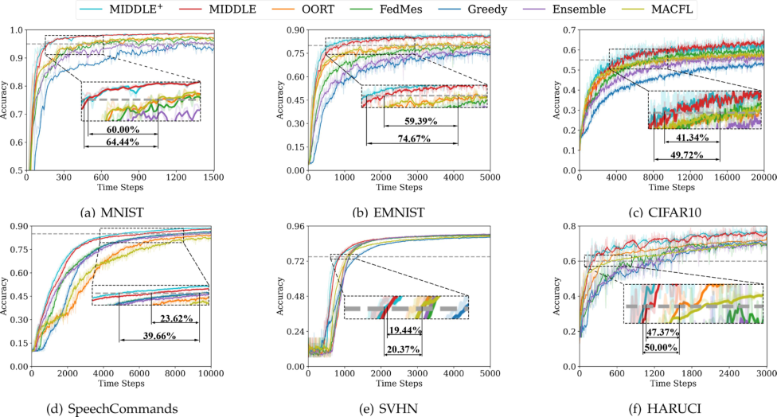

Fig. 8. Time-to-accuracy performance over all learning tasks (Real-World Trace). 

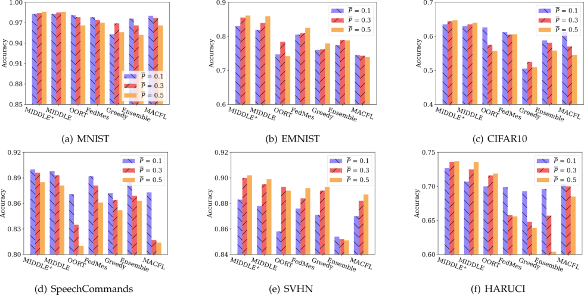

Fig. 9. Final accuracy of global models on various global mobility _P_ . 

effectively learn from abundant data samples and the complementary knowledge from the other edge models by the devices’ mobility, which can reduce the time steps to the target accuracy and outperform all competitive baselines in terms of model convergence speed while improving the model accuracy. Compared with the best baseline of each set of experiments, MIDDLE reduces the time steps to reach the target accuracy by 19.44% at least, and MIDDLE+ reduces by 20.37% at least. 

_2) Performance of the Various Global Mobility P :_ Since the experimental results on synthetic trace and real-world trace were similar in Section VII-B1, we will only present the experimental results on synthetic trace later on. We compare the results of MIDDLE on different global mobility _P_ on the synthetic trace, in Fig. 9. First, MIDDLE outperforms the other baselines for various global mobility. From our theoretical analysis in Remark 1, the final global model would be closer to the optimal 

Authorized licensed use limited to: Shanghai Jiaotong University. Downloaded on August 25,2025 at 17:24:13 UTC from IEEE Xplore.  Restrictions apply. 

4601 

ZHANG et al.: MIDDLE: A MOBILITY-DRIVEN DEVICE-EDGE-CLOUD FEDERATED LEARNING FRAMEWORK 

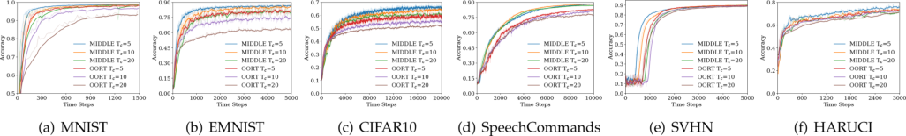

Fig. 10. Effects of the different time step interval _Tc_ of communication between cloud and edges. 

one with the increase of _P_ . However, except for Fig. 9(d), the final model accuracy of MIDDLE increases with the increase of global mobility _P_ . For most baselines, the experimental results do not follow our theoretical analysis. This is because the device mobility will cause the dynamic edge optima, resulting in certain oscillations in the edge update direction. Moreover, our theoretical analysis focuses on proving the on-device model aggregation leading to the starting point of the device’s local updating closer to the global model, assuming all device participation. In FL training, all device participation is unrealistic, so an in-edge device selection strategy is necessary for MIDDLE, which creates a bit of deviation between the theoretical analysis and experiment results. The input of the SpeechCommands is long sparse vectors, which presents challenges in training and leads to larger discrepancies between experimental results and expectations. In Fig. 9, we can observe an approximate conclusion that the final model accuracy of all methods presents a trend of rising first and then falling. When the peak comes too early or too late, the final model accuracy shows continuously falling or rising. Moreover, in Fig. 9(a) – (f), with the global mobility _P_ increasing, the improvement of MIDDLE in model accuracy is more obvious, which shows that MIDDLE has good robustness and can reduce noise interference. MIDDLE and MACFL have similar results when global mobility _P_ = 1, but as global mobility _P_ increased, the performance gap widened. This indicates that MIDDLE’s ability to leverage device mobility for cross-edge complementary knowledge sharing can more effectively address the challenges posed by Non-IID data distribution across edges. The performance of MIDDLE+ is slightly better than MIDDLE in all experiments, since on-device global controlled averaging in MIDDLE+ can better utilize the complementary information between different models to adjust the device’s local optimization direction. 

_3) Performance Under the Different Edge-Cloud Communication Interval Tc:_ As shown in Fig. 10, we expect to illustrate further the importance of model sharing between edges by comparing the performance on different time step intervals _Tc_ of the communication interval between the cloud and edges. Specifically, we compare MIDDLE with OORT, which is a baseline introducing no knowledge from the other edges. We can observe that OORT has a larger reduction on the final model accuracy with the increase of _Tc_ , especially on complex training tasks in Fig. 10(b) – (e). Although OORT can strategically select devices within each edge, the Non-IID data distribution across edges causes the edge models to update in different directions, which makes the cloud model hard to converge to a stable final global model. After the cloud model has converged, the 

time-to-accuracy curves of the MIDDLE have smaller oscillations, indicating that its edge models have lower differences. At the same time, in Fig. 10(b), the model accuracy on EMNIST drops more obviously, with the increase of _Tc_ . This is because the EMNIST has more training sample classes, resulting in larger differences between edge models. We note that OORT in HARUCI is less sensitive to changes in _Tc_ because HARUCI only contains image data from 6 categories. The limited number of classes in HARUCI makes the data distribution between edges less diverse, which reduces the necessity for cross-edge learning to capture complementary knowledge. With the above results, we can conclude that MIDDLE can make edge models effectively benefit from local models on mobile devices by exchanging complementary information. 

We note that OORT in HARUCI is less sensitive to changes in _Tc_ because HARUCI only contains image data from six categories. The limited number of classes in HARUCI makes the data distribution between edges less diverse, which reduces the necessity for cross-edge learning to capture complementary knowledge. 

_4) Performance Under the Different Local SGD Epochs I:_ As shown in Fig. 11, we evaluate the final global model training accuracy over various local SGD epochs _I_ on the synthetic trace. To evaluate the final training performance of MIDDLE and MIDDLE+ , we adopted an in-edge device selection approach and an on-device model aggregation approach, i.e., OORT and FedMes. As illustrated in Fig. 11, the final accuracy of MIDDLE and MIDDLE+ surpasses FedMes and OORT across various local SGD epochs _I_ . However, the final accuracy of MIDDLE+ is not consistently better than that of MIDDLE. Because MIDDLE+ is primarily designed to improve global convergence speed. Further, given that the local data distributions exhibit a Non-IID nature across all devices, each local model is always optimized with respect to its own local data distribution. Since the local data of all devices is set to a stronger Non-IID distribution, when the final model has fully converged, a long local SGD epochs _I_ can lead to a higher divergence between two cloud-edge communications. Consequently, this divergence further results in a decrease in the training accuracy of the final global model. Therefore, in Fig. 11(a)–(c), for the three simple data sets (MNIST, EMNIST, and CIFAR10), the final model accuracy generally decreases as local SGD epochs _I_ increase. In Fig. 11(d)–(f), for SpeechCommands, SVHN, HARUCI, the final model accuracy initially rises and then falls with the local SGD epochs _I_ increases. It may be that the global model has not yet fully converged. The faster convergence of MIDDLE+ supports our hypothesis, as MIDDLE+ reaches the 

Authorized licensed use limited to: Shanghai Jiaotong University. Downloaded on August 25,2025 at 17:24:13 UTC from IEEE Xplore.  Restrictions apply. 

IEEE TRANSACTIONS ON MOBILE COMPUTING, VOL. 24, NO. 6, JUNE 2025 

4602 

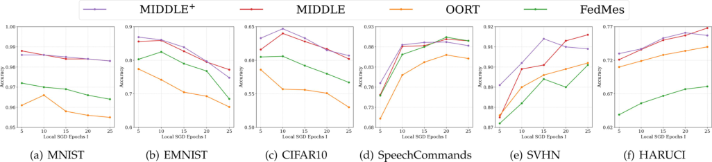

Fig. 11. Effects of the different local SGD epochs _I_ . 

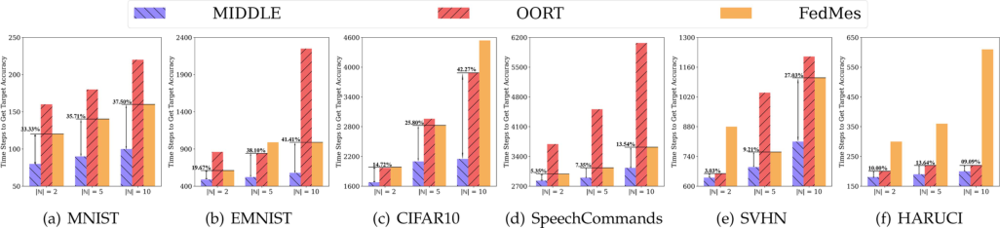

Fig. 12. Time to achieve 90% target accuracy under different number of edges. 

inflection point more quickly compared to MIDDLE. Additionally, it is worth noting that OORT, which lacks an on-device model aggregation approach, sees a significant decrease in final model accuracy as local SGD _I_ increases in Fig. 11(a)–(c). In contrast, FedMes, averaging models on model devices, does not fully leverage the feature knowledge present in current edge models from other edge models, leading to its results also being slightly inferior to our proposed MIDDLE. 

_5) Performance Under Different Edge Numbers:_ We compare the training speed of MIDDLE across all learning tasks with different numbers of edges to validate the strength of cross-edge learning from MIDDLE. Specifically, we measure the training time cost of achieving the 90% target accuracy as a performance metric for training speed. In Fig. 12, we present the experimental results for edge numbers of 2, 5, and 10, while adjusting the number of selected devices _K_ to ensure approximately 50% device participation in each experiment (e.g., _K_ = 10 when _|_ N _|_ = 5). Similar to Section VII-B4, we consider OORT and FedMes as the main baselines, compared with MIDDLE. As the number of edges decreases, the training speed for most approaches appears to accelerate. With fewer edges, device-edgecloud FL tends to shift toward a simpler server-client two-layer structure, reducing the impact of the Non-IID data distribution across edges on global model convergence. Notably, in each experiment, we highlight the percentage of time steps saved by MIDDLE compared to the best-performing baseline. In most training tasks, the improvements of MIDDLE monotonically decline as the number of edges decreases, e.g., from 37.50% to 33.33% in Fig. 12(a). With fewer edges, the capacity of learning complementary features from other edges also diminishes. Additionally, in Fig. 12(f), we observe that for the HARUCI 

dataset, the percentage of time saved does not strictly follow a decreasing trend. This is likely because HARUCI is a relatively simple dataset, where the target accuracy is reached quickly, making the experimental random error more pronounced. 

_6) Performance Under Different Device Participation Proportions:_ We compare the training performance under different device participation proportions, which was achieved by adjusting the _K_ value. As shown in Fig. 13, as the proportion of participating devices increases, most approaches can reduce the required time steps to get the 90% target accuracy. More mobile device participation indirectly raises the amount of training data involvedintheglobal model trainingat eachtimestep. InFig. 13, we also highlight the performance gap between MIDDLE and the best baseline in each set of experimental results. As the proportion of participating devices increases, the performance improvement of MIDDLE seems to gradually diminish. There are two main reasons for this. First, as the participation proportions increase, each edge cannot gain more complementary knowledge from other edges. Because the increase in device participation does not affect global mobility _P_ , the proportion of devices from other edges remains unchanged during each round of training for each edge. Second, the higher participation proportions reduce the optimization space for in-edge device selection. In summary, as the proportion of participating devices increases, the relative performance improvement of MIDDLE compared to the best baseline gradually weakens. 

_7) Local Model Divergence:_ We also compare the divergence between local models and the global model to validate the advantages of on-device model aggregation and further explain why MIDDLE+ outperforms MIDDLE. To facilitate the comparison of the divergence across different models, we 

Authorized licensed use limited to: Shanghai Jiaotong University. Downloaded on August 25,2025 at 17:24:13 UTC from IEEE Xplore.  Restrictions apply. 

4603 

ZHANG et al.: MIDDLE: A MOBILITY-DRIVEN DEVICE-EDGE-CLOUD FEDERATED LEARNING FRAMEWORK 

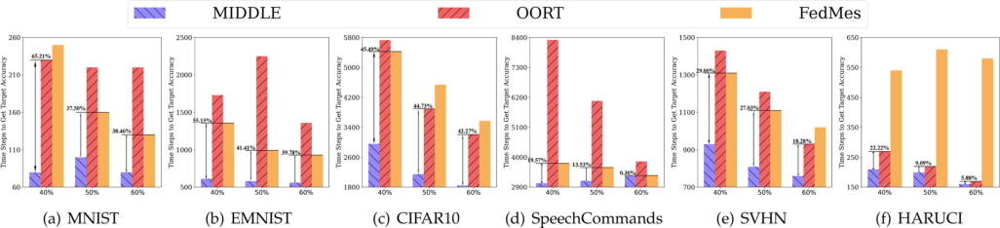

Fig. 13. Time to achieve 90% target accuracy under different device participation proportions. 

TABLE II DIVERGENCE BETWEEN LOCAL MODELS AND THE GLOBAL MODEL 

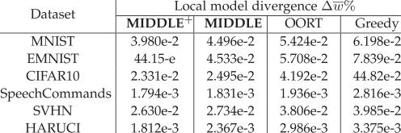

define local model divergence ~~Δ~~ _<u>w</u>_ ~~%~~ : 

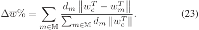

where _wm__T_and_w_ _c__T_are the local model of device_m_and the global model after training. The smaller local model divergence ~~Δ~~ _<u>w</u>_ % is,thecloserlocalmodelsaretotheglobalmodel,andthesmaller the difference between the models is. In Table II, we contrast MIDDLE+ and MILLDE with two extreme approaches, OORT and Greedy, one that does not consider cross-edge knowledge transfer and the other that blindly adopts a cross-edge knowledge transfer strategy. In most experiments, Greedy deserves to have the highest local model divergence ~~Δ~~ _<u>w</u>_ %. In Section II, we have found that cross-edge knowledge transfer may introduce noise. A blind cross-edge knowledge transfer strategy leads to the introduction of noise and hinders convergence. MIDDLE+ and MIDDLE obtain the lowest and second lowest local model divergence ~~Δ~~ _<u>w</u>_ %, respectively. It shows that MIDDLE can effectively reduce the divergence between models and promote convergence, which is consistent with Remark 2. MIDDLE+ further reduces the divergence between local models through on-device global controlled averaging, thereby accelerating the global convergence. 

## VIII. RELATED WORK 

_Device Mobility in wireless networks:_ Device mobility has been extensively studied in various scenarios within wireless networks. Some classic studies focus on modeling and predicting user movement trajectories through theoretical modeling or methods based on deep neural networks [21], [22], [23], [24]. Recently, more research has integrated user mobility with 

practical applications in wireless networks [48], [49], [50], [51], [52], [53], improving the quality of service under user mobility. Ghoreishi et al. [48] and Li et al. [49] focused on content caching under the participation of mobile users, optimizing the hit rates of content cached at the edge servers through customized caching strategies. Duan et al. [50] and Maleki et al. [51] exploredtheonlinedecision-makingofrequestschedulingunder user mobility, aiming to maximize the quality of experience. Wang et al. [52] and Rezazadeh et al. [53] investigated the effective management and allocation of edge resources in order to minimize deployment costs under the high dynamics brought by user mobility. 

_Hierarchical Federated Learning:_ As a typical HFL framework, device-edge-cloud FL is implemented to improve communication efficiency in wireless networks [7], [54], in which the master aggregator dynamically schedules multiple aggregators to scale with the number of devices and update size in training [5]. Castiglia et al. [6] first proposed multi-level SGD and analyzed the convergence of multi-level SGD. They demonstrated that in a multi-level network, compared to algorithms that do not utilize network hierarchies, multi-level SGD exhibits a significant improvement in convergence speed. Wang et al. [7] analyzed the impact of the number of edges on the communication resource and convergence speed of FL training. Zhong et al. [54] and Liu et al. [55] proposed parallelizing federated learning to speed up learning efficiency. They directly utilized edge servers as relay nodes to enhance the parallel training and communication efficiency of FL. However, edges dividing all devices into subsets bring more complex heterogeneity on both system overhead and data distribution. Lin et al. [56] and Xu et al. [57] solved the delay-aware HFL by optimizing the bandwidth allocation of HFL under wireless networks. Yang et al. [58] and Feng et al. [59] focused on the resource allocation in HFL, which formulated the optimization problem and solved it. They ignore the imbalance updating of edge models caused by Non-IID data distribution across devices and edges, which hinders the convergence of the global model and requires longer training iterations to reach the target accuracy. 

_Efforts of improving the HFL performance:_ Each edge coordinates the training of devices within the edge independently, and existing literature has made efforts to study how the interaction between devices and edges affects the convergence of the global model. Wang et al. [60] defined the concepts of upward divergence and downward divergence, which represent the model 

Authorized licensed use limited to: Shanghai Jiaotong University. Downloaded on August 25,2025 at 17:24:13 UTC from IEEE Xplore.  Restrictions apply. 

IEEE TRANSACTIONS ON MOBILE COMPUTING, VOL. 24, NO. 6, JUNE 2025 

4604 

updating deviation between cloud and edges, edges and devices, respectively, and pointed out that reducing the heterogeneity between edges is more conducive to convergence. Qu et al. [61] and Han et al. [30] proposed to leverage the devices in the overlapping edge areas acting as bridges connecting different edges, and the devices in the overlapping areas download models from multiple edges and aggregate these models on the devices. However, the same device participates in the training process of different edges simultaneously, which causes these devices’ local models to be repeatedly calculated by multiple edges and actually results in the biased updating of the global model. Hu et al. [62] and Li et al. [8] divided devices into multiple clusters in advance to meet the requirements of system scalability and various heterogeneity. Deng et al. [63], Liu et al. [64], and Zhou et al. [65] analyzed the data distribution and the inference task requirements of all devices, shaping device clusters associated with each edge to improve the training efficiency of HFL. Ng et al. [66], [67] designed incentive mechanisms for HFL to encourage devices to participate in the training of edges, which were more conducive to cloud model convergence. However, these pre-divide and subjective incentive methods guide devices to participate in the training process of different edges, demanding high requirements for prior knowledge of data distribution and overlooking the objective geographic distribution of devices. 

Recently, some studies have also explored how device mobility affects HFL training performance [68], [69], [70], [71], [72]. Feng et al. [68], [69] studied the impact of wireless connection losses in HFL training due to the uncertain mobility of devices. Farcas et al. [70] investigated the negative impact of increased device energy consumption for communication in HFL when realdevicesmove,andproposedadynamiccommunityselection algorithm to enhance communication energy efficiency. They did not consider how to leverage mobile devices to accelerate the convergence of the global model. Chen et al. [71] improved the learning performance of HFL by simply leveraging mobility to promote the mixing of heterogeneous data. Peng et al. [72] concurrently considered the positive impact of device mobility on data diversity and the negative impact of wireless connection losses in HFL, and theoretically investigated how HFL performance varies with device mobility. They all ignored that model aggregation on mobile devices can further provide information exchange across edges. 

## IX. CONCLUSION 

In this work, to deal with the Non-IID data distribution across devices and edges in device-edge-cloud FL, we propose a mobility-driven FL, namely MIDDLE, which utilizes the characteristic of unpredictable mobility of devices and the differences between models to accelerate convergence. Specifically, MIDDLE contains two components: on-device model aggregation and in-edge device selection. We define a similarity utility metric to measure the differences in gradient descent directionsbetweendifferentmodelsasthebasiccomponentforondevice model aggregation and in-edge device selection, which are used to learn complementary information across edges and process dynamic training samples within edges, respectively. 

Theoretical analysis demonstrates that MIDDLE can effectively correct the bias of the local training process through on-device model aggregation to accelerate global training. Based on the insight from theoretical analysis, we further introduce a novel component: on-device global controlled averaging, which modifies the local training process on mobile devices and extends MIDDLE to MIDDLE+ . Finally, extensive evaluation results confirm that MIDDLE and MIDDLE+ can effectively improve the convergence speed while improving the model accuracy. Compared with the best baseline of each set of experiments, MIDDLE reduces the time steps to reach the target accuracy by 19.44% at least, and MIDDLE+ reduces by 20.37% at least. 

## ACKNOWLEDGMENT 

The opinions, findings, conclusions, and recommendations expressed in this paper are those of the authors and do not necessarily reflect the views of the funding agencies or the government. 

## REFERENCES 

- [1] P. Kairouz et al., “Advances and open problems in federated learning,” _Found. Trend Mach. Learn._ , vol. 14, no. 1–2, pp. 1–210, 2021. 

- [2] B. McMahan, E. Moore, D. Ramage, S. Hampson, and B. A. y Arcas, “Communication-efficient learning of deep networks from decentralized data,” in _Proc. Int. Conf. Artif. Intell. Statist._ , 2017, pp. 1273–1282. 

- [3] B. Luo, X. Li, S. Wang, J. Huang, and L. Tassiulas, “Cost-effective federated learning design,” in _Proc. Conf. Comput. Commun._ , 2021, pp. 1–10. 

- [4] H. Yu, S. Yang, and S. Zhu, “Parallel restarted SGD with faster convergence and less communication: Demystifying why model averaging works for deep learning,” in _Proc. Conf. Assoc. Advance. Artif. Intell._ , 2019, pp. 5693–5700. 

- [5] K. Bonawitz et al., “Towards federated learning at scale: System design,” _Proc. Mach. Learn. Syst._ , vol. 1, pp. 374–388, 2019. 

- [6] T. Castiglia, A. Das, and S. Patterson, “Multi-level local SGD: Distributed SGD for heterogeneous hierarchical networks,” in _Proc. Int. Conf. Learn. Representations_ , 2021, pp. 1–11. 

- [7] Z. Wang, H. Xu, J. Liu, H. Huang, C. Qiao, and Y. Zhao, “Resourceefficient federated learning with hierarchical aggregation in edge computing,” in _Proc. Conf. Comput. Commun._ , 2021, pp. 1–10. 

- [8] G. Li et al., “FedHiSyn: A hierarchical synchronous federated learning frameworkforresourceanddataheterogeneity,”in _Proc.Int.Conf.Parallel Process._ , 2022, pp. 1–11. 

- [9] X. Lyu, C. Ren, W. Ni, H. Tian, R. P. Liu, and E. Dutkiewicz, “Optimal online data partitioning for geo-distributed machine learning in edge of wireless networks,” _IEEE J. Sel. Areas Commun._ , vol. 37, no. 10, pp. 2393–2406, Oct. 2019. 

- [10] H. Hu, D. Wang, and C. Wu, “Distributed machine learning through heterogeneous edge systems,” in _Proc. Conf. Assoc. Advance. Artif. Intell._ , 2020, pp. 7179–7186. 

- [11] Y. Wang, Z. Tari, X. Huang, and A. Y. Zomaya, “A network-aware and partition-based resource management scheme for data stream processing,” in _Proc. Int. Conf. Parallel Process._ , 2019, pp. 1–10. 

- [12] F. Li, J. Zhao, D. Yu, X. Cheng, and W. Lv, “Harnessing context for budgetlimited crowdsensing with massive uncertain workers,” _IEEE/ACM Trans. Netw._ , vol. 30, no. 5, pp. 2231–2245, Oct. 2022. 

- [13] Y. Deng et al., “FAIR: Quality-aware federated learning with precise user incentive and model aggregation,” in _Proc. Conf. Comput. Commun._ , 2021, pp. 1–10. 

- [14] H. Wang, Z. Kaplan, D. Niu, and B. Li, “Optimizing federated learning on non-IID data with reinforcement learning,” in _Proc. Conf. Comput. Commun._ , 2020, pp. 1698–1707. 

- [15] L. Su, R. Zhou, N. Wang, G. Fang, and Z. Li, “An online learning approach for client selection in federated edge learning under budget constraint,” in _Proc. Int. Conf. Parallel Process._ , 2022, pp. 1–11. 

- [16] S.Zhang,Z.Li,Q.Chen,W.Zheng,J.Leng,andM.Guo,“Dubhe:Towards data unbiasedness with homomorphic encryption in federated learning client selection,” in _Proc. Int. Conf. Parallel Process._ , 2021, pp. 1–10. 

Authorized licensed use limited to: Shanghai Jiaotong University. Downloaded on August 25,2025 at 17:24:13 UTC from IEEE Xplore.  Restrictions apply. 

4605 

ZHANG et al.: MIDDLE: A MOBILITY-DRIVEN DEVICE-EDGE-CLOUD FEDERATED LEARNING FRAMEWORK 

- [17] A. Li, J. Sun, P. Li, Y. Pu, H. Li, and Y. Chen, “Hermes: An efficient federated learning framework for heterogeneous mobile clients,” in _Proc. Annu. Int. Conf. Mobile Comput. Netw._ , 2021, pp. 420–437. 

- [18] X. Wu, X. Yao, and C.-L. Wang, “FedSCR: Structure-based communication reduction for federated learning,” _IEEE Trans. Parallel Distrib. Syst._ , vol. 32, no. 7, pp. 1565–1577, Jul. 2021. 

- [19] K. Niwa, G. Zhang, W. B. Kleijn, N. Harada, H. Sawada, and A. Fujino, “Asynchronous decentralized optimization with implicit stochastic variance reduction,” in _Proc. Int. Conf. Mach. Learn._ , 2021, pp. 8195–8204. 

- [20] J. Zhang and D. Tao, “Empowering things with intelligence: A survey of the progress, challenges, and opportunities in Artificial Intelligence of Things,” _IEEE Internet Things J._ , vol. 8, no. 10, pp. 7789–7817, May 2021. 

- [21] W. Bao, Y. Li, and B. Vucetic, “User mobility analysis in disjoint-clustered cooperative wireless networks,” in _Proc. ACM Int. Symp. Mobile Ad Hoc Netw. Comput._ , 2018, pp. 211–220. 

- [22] J.-K. Lee and J. C. Hou, “Modeling steady-state and transient behaviors of user mobility: Formulation, analysis, and application,” in _Proc. ACM Int. Symp. Mobile Ad Hoc Netw. Comput._ , 2006, pp. 85–96. 

- [23] B. Shen, X. Liang, Y. Ouyang, M. Liu, W. Zheng, and K. M. Carley, “StepDeep: A novel spatial-temporal mobility event prediction framework based on deep neural network,” in _Proc. ACM SIGKDD Int. Conf. Knowl. Discov. Data Mining_ , 2018, pp. 724–733. 

- [24] P. N. Pathirana, A. V. Savkin, and S. Jha, “Mobility modelling and trajectory prediction for cellular networks with mobile base stations,” in _Proc. ACM Int. Symp. Mobile Ad Hoc Netw. Comput._ , 2003, pp. 213–221. 

- [25] X. Xu, L. Lyu, X. Ma, C. Miao, C. S. Foo, and B. K. H. Low, “Gradient driven rewards to guarantee fairness in collaborative machine learning,” in _Proc. Int. Conf. Neural Inf. Process. Syst._ , 2021, pp. 16 104–16 117. 

- [26] W. Jeong and S. J. Hwang, “Factorized-FL: Personalized federated learning with parameter factorization & similarity matching,” in _Proc. Int. Conf. Neural Inf. Process. Syst._ , 2022, pp. 35684–35695. 

- [27] F. Lai, X. Zhu, H. V. Madhyastha, and M. Chowdhury, “Oort: Efficient federated learning via guided participant selection,” in _Proc. Symp. Operating Syst. Des. Implementation_ , 2021, pp. 19–35. 

- [28] C. Li, X. Zeng, M. Zhang, and Z. Cao, “PyramidFL: A fine-grained client selection framework for efficient federated learning,” in _Proc. Annu. Int. Conf. Mobile Comput. Netw._ , 2022, pp. 158–171. 

- [29] X. Li, K. Huang, W. Yang, S. Wang, and Z. Zhang, “On the convergence of FedAvg on non-IID data,” in _Proc. Int. Conf. Learn. Representations_ , 2020, pp. 1–12. 

- [30] D.-J. Han, M. Choi, J. Park, and J. Moon, “FedMes: Speeding up federated learning with multiple edge servers,” _IEEE J. Sel. Areas Commun._ , vol. 39, no. 12, pp. 3870–3885, Dec. 2021. 

- [31] L. Collins, H. Hassani, A. Mokhtari, and S. Shakkottai, “Exploiting shared representations for personalized federated learning,” in _Proc. Int. Conf. Mach. Learn._ , 2021, pp. 2089–2099. 

- [32] M. G. Arivazhagan, V. Aggarwal, A. K. Singh, and S. Choudhary, “Federated learning with personalization layers,” 2019, _arXiv: 1912.00818_ . 

- [33] D.-J. Han, D.-Y. Kim, M. Choi, C. G. Brinton, and J. Moon, “SplitGP: Achieving both generalization and personalization in federated learning,” in _Proc. Conf. Comput. Commun._ , 2023, pp. 1–10. 

- [34] G. Zhu, X. Liu, S. Tang, and J. Niu, “Aligning before aggregating: Enabling communication efficient cross-domain federated learning via consistent feature extraction,” _IEEE Trans. Mobile Comput._ , vol. 23, no. 5, pp. 5880–5896, May 2024. 

- [35] Y. LeCun, L. Bottou, Y. Bengio, and P. Haffner, “Gradient-based learning applied to document recognition,” _Proc. IEEE_ , vol. 86, no. 11, pp. 2278–2324, Nov. 1998. 

- [36] G. Cohen, S. Afshar, J. Tapson, and A. Van Schaik, “EMNIST: Extending MNIST to handwritten letters,” in _Proc. Int. Joint Conf. Neural Netw._ , 2017, pp. 2921–2926. 

- [37] A. Krizhevsky, “Learning multiple layers of features from tiny images,” Master’s thesis, Dept. Comput. Sci., Univ. Tront, 2009. 

- [38] P. Warden, “Speech commands: A dataset for limited-vocabulary speech recognition,” 2018, _arXiv: 1804.03209_ . 

- [39] Y. Netzer et al., “Reading digits in natural images with unsupervised feature learning,” in _Proc. Int. Conf. Neural Inf. Process. Syst. Workshop_ , 2011, Art. no. 4. 

- [40] D. Anguita et al., “A public domain dataset for human activity recognition using smartphones,” in _Proc. Eur. Symp. Artif. Neural Netw. Comput. Intell. Mach. Learn._ , 2013, pp. 437–442. 

- [41] A. Keränen, J. Ott, and T. Kärkkäinen, “The one simulator for DTN protocol evaluation,” in _Proc. Int. Conf. Simul. Tools Techn._ , 2009, pp. 1–10. 

- [42] B. Gao, Z. Zhou, F. Liu, F. Xu, and B. Li, “An online framework for joint network selection and service placement in mobile edge computing,” _IEEE Trans. Mobile Comput._ , vol. 21, no. 11, pp. 3836–3851, Nov. 2022. 

- [43] C. Yu, Z. Tu, D. Yao, F. Lu, and H. Jin, “Probabilistic routing algorithm based on contact duration and message redundancy in delay tolerant network,” _Int. J. Commun. Syst._ , vol. 29, no. 16, pp. 2416–2426, 2016. 

- [44] S. Wang, Y. Guo, N. Zhang, P. Yang, A. Zhou, and X. Shen, “Delayaware microservice coordination in mobile edge computing: A reinforcement learning approach,” _IEEE Trans. Mobile Comput._ , vol. 20, no. 3, pp. 939–951, Mar. 2021. 

- [45] Y. Li, A. Zhou, X. Ma, and S. Wang, “Profit-aware edge server placement,” _IEEE Internet Things J._ , vol. 9, no. 1, pp. 55–67, Jan. 2022. 

- [46] Y. Guo, S. Wang, A. Zhou, J. Xu, J. Yuan, and C.-H. Hsu, “User allocationaware edge cloud placement in mobile edge computing,” _Softw., Pract. Experience_ , vol. 50, no. 5, pp. 489–502, 2020. 

- [47] ShanghaiTelecom, Shanghai telecom’s base station dataset. Accessed: Jul. 31, 2023. [Online]. Available: http://sguangwang.com/TelecomDataset. html 

- [48] S. E. Ghoreishi, D. Karamshuk, V. Friderikos, N. Sastry, M. Dohler, and A. H. Aghvami, “A cost-driven approach to caching-as-a-service in cloudbased 5G mobile networks,” _IEEE Trans. Mobile Comput._ , vol. 19, no. 5, pp. 997–1009, May 2020. 

- [49] Y. Li, H. Ma, L. Wang, S. Mao, and G. Wang, “Optimized content caching and user association for edge computing in densely deployed heterogeneous networks,” _IEEE Trans. Mobile Comput._ , vol. 21, no. 6, pp. 2130–2142, Jun. 2022. 

- [50] S. Duan et al., “MOTO: Mobility-aware online task offloading with adaptive load balancing in small-cell MEC,” _IEEE Trans. Mobile Comput._ , vol. 23, no. 1, pp. 645–659, Jan. 2024. 

- [51] E. F. Maleki, L. Mashayekhy, and S. M. Nabavinejad, “Mobility-aware computation offloading in edge computing using machine learning,” _IEEE Trans. Mobile Comput._ , vol. 22, no. 1, pp. 328–340, Jan. 2023. 

- [52] L. Wang, L. Jiao, J. Li, J. Gedeon, and M. Mühlhäuser, “MOERA: Mobility-agnostic online resource allocation for edge computing,” _IEEE Trans. Mobile Comput._ , vol. 18, no. 8, pp. 1843–1856, Aug. 2019. 

- [53] F. Rezazadeh et al., “A multi-agent deep reinforcement learning approach for RAN resource allocation in O-RAN,” in _Proc. Conf. Comput. Commun. Workshops_ , 2023, pp. 1–2. 

- [54] Z. Zhong et al., “P-FedAvg: Parallelizing federated learning with theoretical guarantees,” in _Proc. Conf. Comput. Commun._ , 2021, pp. 1–10. 

- [55] X. Liu et al., “Accelerating federated learning via parallel servers: A theoretically guaranteed approach,” _IEEE/ACM Trans. Netw._ , vol. 30, no. 5, pp. 2201–2215, Oct. 2022. 

- [56] F. P.-C. Lin, S. Hosseinalipour, N. Michelusi, and C. G. Brinton, “Delayaware hierarchical federated learning,” _IEEE Trans. Cogn. Commun. Netw._ , vol. 10, no. 2, pp. 674–688, Apr. 2024. 

- [57] B. Xu, W. Xia, W. Wen, P. Liu, H. Zhao, and H. Zhu, “Adaptive hierarchical federated learning over wireless networks,” _IEEE Trans. Veh. Technol_ , vol. 71, no. 2, pp. 2070–2083, Feb. 2022. 

- [58] L. Yang, Y. Gan, J. Cao, and Z. Wang, “Optimizing aggregation frequency for hierarchical model training in heterogeneous edge computing,” _IEEE Trans. Mobile Comput._ , vol. 22, no. 7, pp. 4181–4194, Jul. 2023, doi: 10.1109/TMC.2022.3149584. 

- [59] J. Feng, L. Liu, Q. Pei, and K. Li, “Min-max cost optimization for efficient hierarchical federated learning in wireless edge networks,” _IEEE Trans. Parallel Distrib. Syst._ , vol. 33, no. 11, pp. 2687–2700, Nov. 2022. 

- [60] J. Wang, S. Wang, R.-R. Chen, and M. Ji, “Demystifying why local aggregation helps: Convergence analysis of hierarchical SGD,” in _Proc. Conf. Assoc. Advance. Artif. Intell._ , 2022, pp. 8548–8556. 

- [61] Z. Qu, X. Li, J. Xu, B. Tang, Z. Lu, and Y. Liu, “On the convergence of multi-server federated learning with overlapping area,” _IEEE Trans. Mobile Comput._ , vol. 22, no. 11, pp. 6647–6662, Nov. 2023. 

- [62] C. Hu, H. H. Liang, X. M. Han, B. A. Liu, D. Z. Cheng, and D. Wang, “Spread: Decentralized model aggregation for scalable federated learning,” in _Proc. Int. Conf. Parallel Process._ , 2022, pp. 1–12. 

- [63] Y. Deng et al., “Share: Shaping data distribution at edge for communication-efficient hierarchical federated learning,” in _Proc. Int. Conf. Distrib. Comput. Syst._ , 2021, pp. 24–34. 

- [64] J. Liu, X. Wei, X. Liu, H. Gao, and Y. Wang, “Group-based hierarchical federated learning: Convergence, group formation, and sampling,” in _Proc. Int. Conf. Parallel Process._ , 2023, pp. 264–273. 

- [65] X. Zhou et al., “Hierarchical federated learning with social context clustering-based participant selection for Internet of Medical Things applications,” _IEEE Trans. Computat. Social Syst._ , vol. 10, no. 4, pp. 1742–1751, Aug. 2023. 

Authorized licensed use limited to: Shanghai Jiaotong University. Downloaded on August 25,2025 at 17:24:13 UTC from IEEE Xplore.  Restrictions apply. 

IEEE TRANSACTIONS ON MOBILE COMPUTING, VOL. 24, NO. 6, JUNE 2025 

4606 

- [66] J. S. Ng et al., “Reputation-aware hedonic coalition formation for efficient serverless hierarchical federated learning,” _IEEE Trans. Parallel Distrib. Syst._ , vol. 33, no. 11, pp. 2675–2686, Nov. 2022. 

- [67] J. S. Ng et al., “A hierarchical incentive design toward motivating participation in coded federated learning,” _IEEE J. Sel. Areas Commun._ , vol. 40, no. 1, pp. 359–375, Jan. 2022. 

- [68] C. Feng, H. H. Yang, D. Hu, T. Q. Quek, Z. Zhao, and G. Min, “Federated learning with user mobility in hierarchical wireless networks,” in _Proc. Glob. Commun. Conf._ , 2021, pp. 1–6. 

- [69] C. Feng, H. H. Yang, D. Hu, Z. Zhao, T. Q. S. Quek, and G. Min, “Mobilityaware cluster federated learning in hierarchical wireless networks,” _IEEE Trans. Wireless Commun._ , vol. 21, no. 10, pp. 8441–8458, Oct. 2022. 

**Bingshuai Li** received the BS and MS degrees from Jilin University, China, in 2014 and 2017, respectively. He is currently an senior engineer with Huawei Noah’s Ark Lab. His current research interests includes retrieval-based language models, machine learning, federated learning, transfer learning, and their applications in telecommunication network. 

- [70] A.-J. Farcas, M. Lee, R. R. Kompella, H. Latapie, G. De Veciana, and R. Marculescu, “MOHAWK: Mobility and heterogeneity-aware dynamic community selection for hierarchical federated learning,” in _Proc. ACM/IEEE Conf. Internet Things Des. Implementation_ , 2023, pp. 249– 261. 

- [71] T. Chen, J. Yan, Y. Sun, S. Zhou, D. Gunduz, and Z. Niu, “Data-heterogeneous hierarchical federated learning with mobility,” 2023, _arXiv:2306.10692_ . 

- [72] Y. Peng et al., “How to tame mobility in federated learning over mobile networks,” _IEEE Trans. Wireless Commun._ , vol. 22, no. 12, pp. 9640–9657, Dec. 2023, doi: 10.1109/TWC.2023.3272920. 

**Songli Zhang** received the BS degree from the Department of Electrical Engineering, Shandong University, China, in 2019 and is currently working toward the PhD degree with the Department of Computer Science and Engineering, Shanghai Jiao Tong University, China. His current research interests include mobile edge computing and federated learning. 

**Zhenzhe Zheng** (Member, IEEE) received the BE degree in software engineering from Xidian University, in 2012, and the MS and PhD degrees in computer science and engineering from Shanghai Jiao Tong University, in 2015 and 2018, respectively. He is a professor with the Department of Computer ScienceandEngineering,ShanghaiJiaoTongUniversity. He has visited the University of Illinois at UrbanaChampaign (UIUC) as a postdoc research associate from 2018 to 2019. His research interests include game theory and mechanism design, networking and mobile computing, and online marketplaces. He is a recipient of the China Computer Federation (CCF) Excellent Doctoral Dissertation Award 2018, Intel Faculty Award 2022. He has served as the member of technical program committees of several academic conferences, such as MobiHoc, AAAI, MSN, IoTDI and etc. He is a member of the ACM and CCF. 

**Fan Wu** (Member, IEEE) received the BS degree in computer science from Nanjing University, in 2004, and the PhD degree in computer science and engineering from the State University of New York at Buffalo, in 2009. He is a professor with the Department of Computer Science and Engineering, Shanghai Jiao Tong University. He has visited the University of Illinois at Urbana-Champaign (UIUC) as a postdoc research associate. His research interests include wireless networking and mobile computing, data management, algorithmic network economics, 

and privacy preservation. He has published more than 200 peer-reviewed papers in technical journals and conference proceedings. He is a recipient of the first class prize for Natural Science Award of China Ministry of Education, China National Fund for Distinguished Young Scientists, ACM China Rising Star Award, CCF-Tencent “Rhinoceros bird” Outstanding Award, and CCF-Intel Young Faculty Researcher Program Award. He has served as an associate editor of _IEEE Transactions on Mobile Computing_ and _ACM Transactions on Sensor Networks_ , an area editor of _Elsevier Computer Networks_ , and as the member of technical program committees of more than 100 academic conferences. 

**Yunfeng Shao** received the BS and PhD degrees in electronic engineering from Shanghai Jiao Tong University and University of Chinese Academy of Sciences China, in 2009 and 2014, respectively. He is currently an expert in Huawei Noah’s Ark Lab. His research interests include retrieval-based language models, machine learning with privacy protection, federated learning and their applications. He has published multiple papers at top-tier conferences, including NeurIPS, ICML, KDD, PMLR, etc. 

**Guihai Chen** (Fellow, IEEE) received the BS degree from Nanjing University in 1984, the ME degree from Southeast University in 1987, and the PhD degree from the University of Hong Kong in 1997. He is a distinguished professor of Shanghai Jiao Tong University, China. He had been invited as a visiting professor by many universities including Kyushu Institute of Technology, Japan, in 1998, University of Queensland, Australia, in 2000, and Wayne State University, USA during 2001 to 2003. He has a wide range of research interests with focus on sensor net- 

works, peer-to-peer computing, high-performance computer architecture and combinatorics. He has published more than 200 peer-reviewed papers, and more than 120 of them are in well-archived international journals, such as _IEEE Transactions on Parallel and Distributed Systems_ , _Journal of Parallel and Distributed Computing_ , _Wireless Networks_ , _The Computer Journal_ , _International Journal of Foundations of Computer Science_ , and _Performance Evaluation_ , and also in well-known conference proceedings, such as HPCA, MOBIHOC, INFOCOM, ICNP, ICPP, IPDPS, and ICDCS. 

Authorized licensed use limited to: Shanghai Jiaotong University. Downloaded on August 25,2025 at 17:24:13 UTC from IEEE Xplore.  Restrictions apply. 

