IEEE TRANSACTIONS ON MOBILE COMPUTING, VOL. 24, NO. 12, DECEMBER 2025 

13678 

# User Context Generation for Large Language Models From Mobile Sensing Data 

Rui Xing , Zhenzhe Zheng _, Member, IEEE_ , Fan Wu _, Member, IEEE_ , and Guihai Chen _, Fellow, IEEE_ 

**_Abstract_ —Large language models (LLMs) exhibit remarkable capabilities in natural language understanding and generation. However, the accuracy of the inference depends deeply on the contexts of queries, especially for personal services. Abundant mobile sensing data collected by sensors embedded in smart devices can proactively capture real-time user contexts. However, raw sensing data are low-quality (e.g., existing missing data and data redundancy) and are incapable of providing accurate contexts. In this work, we present ConGen, a user context generation framework for LLMs, aiming at prompting users’ contexts through their implicit mobile sensing information. ConGen integrates two components: refined data completion and multi-granularity context compression. Specifically, the refined data completion couples data-centric feature selection by leveraging the eXplainable AI (XAI) method into the data imputation model to generate fewer but more informative features for efficient and effective context generation. Additionally, we implement multi-granularity context compression, reducing timestep- and context-level data redundancy while further elevating context quality. Experiment results show that ConGen can generate more accurate context, surpassing competitive baselines by 1.3%-8.3% in context inference on all four datasets. Moreover,contextcompressionsignificantlyreducesredundancyto 1** **_/_ 70** **_∼_ 1** **_/_ 40 of the original data amount, and further improves the context accuracy. Finally, the enhanced performance of LLMs, as demonstrated by both quantitative and qualitative evaluations of prompting ConGen-generated user contexts, underscores the effectiveness of ConGen.** 

**_Index Terms_ —Mobile sensing, explainable AI, large language models, missing data, data redundancy.** 

## I. INTRODUCTION 

ECENTLY, LLMs [1], [2], [3], [4] have attracted **R** widespread attention due to their abundant knowledge and remarkable abilities in content generation. Beyond text comprehension, such powerful capability is beginning to invade users’ daily lives to fulfill their advanced intelligence demands. Based on this observation, some attempts in mobile computing have been made, for example, applying LLMs to robotic control [5] and designing LLM-powered smart home assistant [6]. In practice, to provide a better user experience and to avoid the 

Received 10 October 2024; revised 18 June 2025; accepted 16 July 2025. Date of publication 28 July 2025; date of current version 5 November 2025. This work was supported in part by National Key R&D Program of China under Grant 2023YFB4502400, in part by the China NSF under Grant 62322206, Grant 62132018, Grant 62025204, Grant 62272307, Grant 62372296, and Grant U2268204. Recommended for acceptance by Z. Li. _(Corresponding author: Zhenzhe Zheng.)_ 

The authors are with the School of Computer Science, Shanghai Jiao Tong University, Shanghai 200240, China (e-mail: cocojess@sjtu.edu.cn; zhengzhenzhe@sjtu.edu.cn; fwu@cs.sjtu.edu.cn; gchen@cs.sjtu.edu.cn). Digital Object Identifier 10.1109/TMC.2025.3591561 

hallucinations of LLMs [7], LLMs should take real-time user intents and surrounding environment contexts into account. However, they usually require users to manually offer such accurate and specific context descriptions as prompts. While the reality is that user requests often contain only goals (e.g., “Please recommend a song for me.”) without much additional context information (e.g., “I am running, and recommend a suitable song for me.”), the users desire to get real-time responses consistent with their current status and intents (environmental status, psychological status, etc.). 

The prerequisite for LLMs to provide satisfactory personal services is to prompt them with sufficient personal context information. Wehavenoticedthat theproliferationof smart mobile devices allows sensors to be widely embedded around humans and collect enormous sensing data [8] to proactively capture user contexts in real-time. If LLMs can leverage these mobile sensing data, context-aware responses can be proactively provided without interactively gathering personal contexts through multipleroundsofconversationswithusers,whichistheexisting methods to obtain user intent [9], [10]. 

Although the amount of on-device sensing data is enormous, it cannot be directly used as context for LLMs due to its lowquality problems. _First, mobile sensing data struggles with the severe missing data problem_ [11], [12], which would generate inaccurate even misleading context for LLM. This missing data issue comes from two reasons: (1) different sampling rates of sensors cause missing data across the time dimension; (2) the types and numbers of available sensors embedded in smart devices are quite different and thus cause the data missing in the feature dimension [13]. Missing data in various dimensions seriously affects the generation of accurate user context. To tackle this problem, some work directly deletes incomplete samples when dealing with missing data [14], which is extremely undesirable in the case of high missing proportions and aggravates the problems of over-fitting due to not enough data samples [15], [16], [17]. A reasonable approach is to impute missing data. However, although simple mean imputation or other heuristic imputation [18] have shown good performance in some applications, they lose their advantages under highly heterogeneous sensing data, which arises from different sensor devices, inconsistent sampling rates, and environmental noise. _Second, mobile sensing data contains massive redundancy in various dimensions_ [19], [20], which would incur high latency for the overall inference pipeline of LLMs. This is because imputing all samples and feeding them to LLMs as contexts will bring excessive computational overhead. The redundancy 

1536-1233 © 2025 IEEE. All rights reserved, including rights for text and data mining, and training of artificial intelligence and similar technologies. Personal use is permitted, but republication/redistribution requires IEEE permission. See https://www.ieee.org/publications/rights/index.html for more information. 

Authorized licensed use limited to: Shanghai Jiaotong University. Downloaded on December 29,2025 at 14:21:10 UTC from IEEE Xplore.  Restrictions apply. 

13679 

XING et al.: USER CONTEXT GENERATION FOR LARGE LANGUAGE MODELS FROM MOBILE SENSING DATA 

is mainly in three aspects: (1) feature redundancy: features in a multi-sensor environment are high-dimensional, and not all features are informative for generating certain contexts, and even some confusing features can lead to incorrect contexts; (2) timestep redundancy: the high sampling rate of sensors leads to minor differences of data in adjacent timesteps, and thus the timesteps within a small range will generate the same contexts, causing redundancy to some extent; (3) context redundancy: not all contexts are critical with respective to the inference of LLMs. Some transient transitional contexts, such as shifting one’sweightwhilesitting,seemlessimportantthanthesustained activity of “sitting” itself. These transitional contexts act as noise relative to sustained contexts. Thus, our work focuses on sustained contexts, which constitute stable, consistent, and representative indicators for user behavior, and are thereby more indicative of the users’ long-term habits, preferences and needs. 

To address these limitations, in this work, we present ConGen, a new user Context Generation framework for LLMs, realizing accurate and compact user context generation by integrating refined data completion and multi-granularity context compression. With ConGen, we can prompt LLMs with users’ contexts by implicitly perceiving users’ sensing information instead of explicitly asking users to provide it. Such an automatic process plays an important role in prompt engineering [21], which ensures LLMs generate relevant, accurate, and context-aware responses. ThefirstcomponentofConGenfocusesontherefined data completion. In contrast to the trend of existing work that strives to complete the data (i.e., impute missing values) [18], we insist that data completion should generate fewer but more informative data rather than complete but less informative data. Therefore, we integrate data-centric feature selection into the data imputation, and design a refined data completion model based on XAI methods [22], [23], which jointly handles the problems of missing data and feature redundancy. The informative sensing data plays a significant role in generating more accurate user context for LLMs. The second component is the multi-granularity context compression, which aims to solve the timestep- and context-level redundancy issues and is achieved by sparsely merging user contexts and pruning non-critical user contexts. The compression method reduces the inference latency of LLMs while further improving the context accuracy and compactness. 

The contributions of this work are summarized as follows: 

- r To the best of our knowledge, we are the first to process low-quality mobile sensing data into accurate and compact user contexts and prompt them into LLMs, automatically augmented LLMs with user contexts. 

- r We propose ConGen, a novel framework for generating accurate and compact user contexts for LLMs through refineddatacompletionandmulti-granularitycontextcompression. Specifically, ConGen leverages XAI method for data-centric feature selection during data imputation, producing fewer but more informative data, and applies multigranularity context compression for further redundancy reduction to improve the efficiency of context generation. 

- r We demonstrate the advantages of ConGen with four public mobile sensing motion datasets, which shows that ConGen outperforms state-of-the-art baselines by 

generating accurate and compact user contexts. Specifically, the accuracy of contexts generated by more informative features surpasses baselines by 1.3%-8.3% in all datasets. ConGen further improves the context sequence accuracy when reducing redundancy to 1 _/_ 70 _∼_ 1 _/_ 40 of the original data. 

- r We finally demonstrate that ConGen-generated contexts can improve the performance of LLMs quantitatively and qualitatively, further verifying the effectiveness of ConGen and showing the potential of mobile sensing data as user contexts for LLMs. 

The rest of this work is organized as follows. We first give the overview, conduct a motivation study, and define the problem statement in Section II. In Sections III and IV, we give the specific design of refined data completion and multi-granularity context compression, respectively. We summarize the system workflow in Section V. Then in Section VI, we thoroughly evaluate ConGen. We give the related literature in Section VII. In Section VIII, we discuss the limitations and future directions of ConGen. Eventually, we give a summary of our work in Section IX. 

## II. PRELIMINARIES 

## _A. Overview_ 

As shown in Fig. 1, the whole process of perceiving user contexts from mobile sensing data for LLMs includes data collection, context generation, and context-aware query to LLMs. Among them, ConGen focuses on the process of user context generation and the ultimate goal is to bridge raw sensing data and user queries in LLMs by generating accurate and compact contexts. These contexts act as implicit prompts (e.g., “rope jumping for 10 seconds”) that guide LLMs to produce responses tailored to the user’s real-time state (e.g., recommending upbeat music). Specifically, ConGen includes two steps: data completion and context compression, where the data completion generates informative sensing data, which is critical for improving the accuracy of user context generation and then further enhancing the LLMs inference with the augment of detailed contexts information, and the context compression further improves the accuracy and compactness of user context and thus reduce the inference delay of LLMs. Specifically, for data completion, we aim to train a generator that inputs the missing and redundant sensing raw data and outputs informative sensing data. Then the informative sensing data are used to generate a user context sequence. However, the directly generated user contexts contain various levels of redundancy, and thus we further perform context compression to reduce redundancy before sending it to LLMs. Finally, the compact and accurate user context together with the user instruction will be sent to LLMs as the context-aware query. 

## _B. Motivation_ 

In this sub-section, we analyze the problem of missing data and feature redundancy in mobile sensing data to motivate the design of ConGen. 

_Missing data:_ To illustrate the severity of missing data in mobilesensing,weevaluateitsimpactonmodelpredictionusing 

Authorized licensed use limited to: Shanghai Jiaotong University. Downloaded on December 29,2025 at 14:21:10 UTC from IEEE Xplore.  Restrictions apply. 

IEEE TRANSACTIONS ON MOBILE COMPUTING, VOL. 24, NO. 12, DECEMBER 2025 

13680 

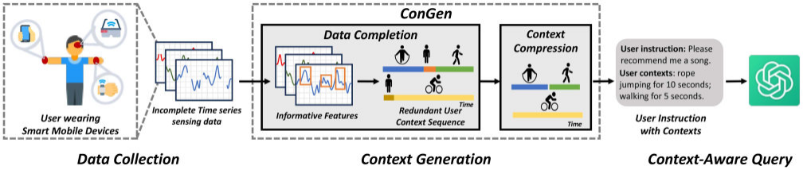

Fig. 1. The process of querying LLMs with users’ sensing contexts. 

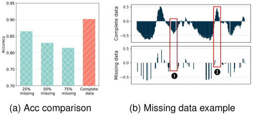

Fig. 2. The negative effect of missing data on model predictions and its potential causes. 

the motion dataset PAMAP2 [24]. Specifically, we introduce three missing proportions—25%, 50%, and 75%1 —and train GRU models on these datasets.2 As shown in Fig. 2(a), data with different missing proportions degrade model performance to varying degrees compared to the complete dataset, reducing the user context accuracy. This highlights the necessity for data imputation to guarantee the accuracy of the generated user context. 

To understand the reasons for missing data leading to degraded model performance, we visualize a sample whose prediction confidence drops significantly from the dataset with a 75% missing proportion in Fig. 2(b). We can observe that the sample exhibits an incomplete signal waveform, particularly with missing crucial patterns such as local valley in ❶ and local peak in ❷. The absence of such key patterns prevents the model from effectively distinguishing different contexts. This also explains why simple heuristic imputation methods, such as mean imputation or adjacent timestep imputation, fail: filling missing values with a single value cannot restore or approximate key waveform fluctuations. Therefore, an adaptive imputation strategy is required to better capture the underlying data distribution and recover critical features. 

_Feature redundancy:_ As mentioned earlier, multi-sensor environments often exhibit significant feature redundancy. To illustrate this, we conducted Principal Component Analysis (PCA) on PAMAP2 dataset. We set the sample as 200 _×_ 10, where 200 represents timesteps and 10 is the sensor features3 . To 

> 1Please refer to Section VI-A for more details about the missing dataset construction method. 

> 2The missing values are filled with zeros 

> 3Specific dataset descriptions are in Section VI-A 

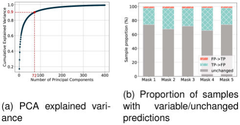

Fig. 3. The PCA validation of feature redundancy and the effect of uniform feature selection on different samples. 

capture redundancy across both time and feature dimensions, we reshape it into a 2000-dimensional feature space and apply PCA across the dataset. The results in Fig. 3(a) show that just 72 principal components can explain 90% of the variance, indicating that the intrinsic dimensionality of the data is much lower than the original feature space (72 _≪_ 2000). This suggests a strong correlation across both timesteps and feature channels, further confirming the presence of redundancy. These findings highlight the importance of effective feature selection strategies in processing mobile sensing data, as they can help eliminate redundancy and improve model efficiency. 

We further designed a random masking experiment to validate the influence of the feature selection on different samples to motivate our design of data-centric feature selection in ConGen. Specifically, we randomly generate five different mask patterns and apply them uniformly across all samples in five trials to simulate feature selection. We then evaluate masked and unmasked test datasets using a model trained on unmasked data. We analyze prediction consistency by computing the proportions of samples predicted correctly when unmasked but incorrectly after masking (TP _→_ FP), predicted incorrectly when unmasked and correctly after masking (FP _→_ TP), or remained unchanged (unchanged). As shown in Fig. 3(b), some samples were unaffected, while others experienced positive or negative impacts. The consistent conclusion is obtained for all five masks. This suggests that important features vary across samples, making a globally fixed feature selection strategy suboptimal and highlighting the need for data-centric methods to handle data heterogeneity. 

Authorized licensed use limited to: Shanghai Jiaotong University. Downloaded on December 29,2025 at 14:21:10 UTC from IEEE Xplore.  Restrictions apply. 

13681 

XING et al.: USER CONTEXT GENERATION FOR LARGE LANGUAGE MODELS FROM MOBILE SENSING DATA 

## _C. Problem Formulation_ 

We define the time-series sensing data as random variable _X ∈_ R_T ×D_ , where _T_ is the number of timesteps and _D_ is the feature dimension. Also, the context variable is _C ∈ {con_ 1 _, . . . , conM }__T_ , where _coni_ is the potential user context (e.g., activity labels like “walking” or “running” in motion dataset). We use _D_ = _{x__i_ _, c__i_ _}__n_ _i_ =1todenotethedatasetwith _n_ i.i.d. samples of the sensing data _X_ and the corresponding context label _C_ . Considering the potential data missing issue, we divide the random variable _X_ into the observed part _X__o_ and the unobserved part _X__u_ represented by a missing indicator _I ∈{_ 0 _,_ 1 _}__T ×D_ , that is _X__o_ = _{Xt,d|It,d_ = 1 _}_ and _X__u_ = _{Xt,d|It,d_ = 0 _}_ . 

The process of data completion can be formulated as learning the data distribution _pθ_ ( _X_ ), where we call _pθ_ the data imputation model and use it to approximate the true distribution _p_ ( _X_ ) with parameters _θ_ . However, rather than simply completing the data (i.e., imputing missing values), we would like to focus on the data with fewer but more informative features, which is critical to enhancing LLMs inference by improving context generation accuracy. Therefore, we aim to refine the data completion by integrating the data-centric feature selection technique, i.e., the eXplainable AI (XAI) method to identify and retain the most informative features during data imputation. Specifically, we define _S ∈{_ 0 _,_ 1 _}__T ×D_ as the selected feature indicator to signify whether the feature is selected or not: _St,d_ = 1 indicates that the feature _Xt,d_ is selected at the timestep _t_ ; otherwise _St,d_ = 0. Accordingly, we introduce _XS_ = _{Xt,d|St,d_ = 1 _}_ to indicate the selected feature subset. Therefore, we can formulate the refined data completion of the time series sensing data as learning a joint distribution of the sensing data _X_ and the selected feature indicator _S_ : 

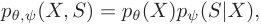

where we regard _pψ_ as the feature selector to approximate the true conditional distribution _p_ ( _S|X__o_ _, X__u_ ) with parameters _ψ_ . The data imputation model _pθ_ and feature selector _pψ_ jointly form the generator. Marginalizing out the uncertainty about _X__u_ by integrating over _X__u_ to optimize parameters solely on _X__o_ , the above equation becomes 

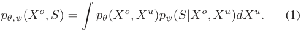

In this section, we introduce how to conduct refined data completion, which includes data imputation and data-centric feature selection as discussed above. We will discuss them in detail in Section III-A and Section III-B, respectively. The overall architecture is shown in Fig. 4. 

## _A. Data Imputation_ 

In this sub-section, we design a latent variable generative model for data imputation for the consideration of latent variables to better capture potential sensor-related characteristics. 

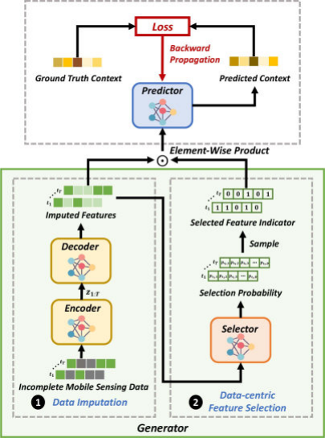

Fig. 4. Overview of refined data completion. Refined data completion incorporates the data-centric feature selection into the data imputation for obtaining the informative sensing data to generate accurate user context. 

For the intractable integral over the latent variable and unobserved data due to the complexity of sensing data, we use importance sampling to approximate it by focusing on representative samples, and thus filtering out noise. 

We provide a detailed explanation of the data imputation model _pθ_ . We begin by introducing a latent variable _Z ∈Z_ , which is widely used in generative models [25], [26]. Compared with original variables, latent variables can better capture the potential characteristics of the data, which is critical for sensing datacompletionsincesensingdataisinseparablefromtheunderlyingphysicalstateofthesensors [27].Therefore,byintroducing _Z_ , (1) converts to 

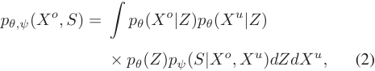

which is under the assumption that _X__o_ and _X__u_ are independent given _Z_4 . 

However, the direct calculation of integrals over the latent variable and the unobserved data is impractical. This difficulty arises primarily from the high dimensionality and the intricate dependencies characteristic of sensing data, such as non-linear temporal dependencies, interactions between different sensor readings, and so on. To address this, we refer to the Importance Weighted Autoencoder (IWAE) [28], which leverages importance sampling [29] to approximate the intractable integral by generating samples from a distribution and assigning higher 

4This assumption simplifies the joint distribution and reduces computational complexity, as commonly done in models like VAE [25]. 

Authorized licensed use limited to: Shanghai Jiaotong University. Downloaded on December 29,2025 at 14:21:10 UTC from IEEE Xplore.  Restrictions apply. 

IEEE TRANSACTIONS ON MOBILE COMPUTING, VOL. 24, NO. 12, DECEMBER 2025 

13682 

weights to the most representative ones. This is crucial in sensing data, as it helps focus on relevant patterns while filtering out noisy or irrelevant signals that are often present due to environmental factors or sensor imperfections, resulting in more accurate data completion and better capture of the underlying sensor states. Specifically, we sample _Z_ from a parameterized conditional distribution _q_ ( _Z|X__o_ ), the approximation of the intractable _p_ ( _Z|X__o_ ), which is parametrized by an encoder _qγ_ with the parameter _γ_ . Therefore, the data imputation model _pθ_ is converted to _pθ,γ_ . Additionally, for the integral over _X__u_ , we utilize the conditional distribution _pθ_ ( _X__u_ _|Z_ ) to sample _X__u_ given _Z_ . Thus, (2) is converted to 

manage the exponential number of possible feature subsets, we implement subset sampling to reduce the high computational complexity. Next, we will give detailed introductions to these designs. 

Our core insight is that the optimal feature selection should maximize the predictive information about user context (the target variable _C_ , e.g., activity categories in the motion dataset) while minimizing redundant features. Formally, given input _X_ and target context _C_ (observed during training as annotated labels), we aim to find the subset _XS_ that satisfies 

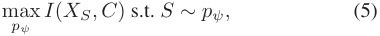

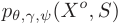

where _I_ ( _·_ ) quantifies the contextual relevance through mutual information maximization. This formulation directly addresses the feature redundancy problem by eliminating the features with low context correlation and adapting selection criteria per_u_ sample through learnable _pψ_ . Continue to derive Equation (5) in the form of conditional distributions: 

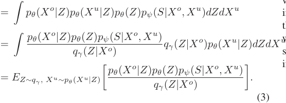

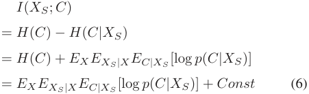

Then, by using the importance sampling to sample _K_ i.i.d. samples from _qγ_ ( _Z|X__o_ ) _pθ_ ( _X__u_ _|Z_ ), (3) can be written as 

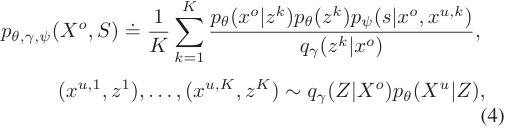

where _H_ ( _·_ ) is the entropy. 

However, it is intractable to compute the expectations under the posterior distribution _p_ ( _C|XS_ ). Thus, we introduce a variational family _Q_ = _{q_ = _{qS_ ( _C|XS_ ) _|S ∈{_ 0 _,_ 1 _}__T ×D_ _}}_ , where each _q_ is a collection of _qS_ ( _C|XS_ ) conditioned on a specific feature subset _S_ to approximate the true posterior _p_ ( _·|xs_ ). Specifically, for any _qS_ , we use it to derive the variational lower bound of _p_ ( _·|xs_ ): 

where _qγ_ is the encoder and _pθ_ ( _X__o_ _|Z_ ) and _pθ_ ( _X__u_ _|Z_ ) are decoders (shown in ❶ of Fig. 4). Therefore, we convert the intractable integrals into the tractable sampling for the unobserved data _X__u_ and the latent variable _Z_ . The imputed data ˜ _x_ generated from _pθ,γ_ , is mixed with the observed part _x__o_ and the unobserved part _x__u_ generated from the decoder _pθ_ ( _X__u_ _|Z_ ). 

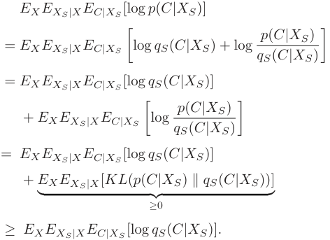

## _B. Data-Centric Feature Selection_ 

Tofurtherimprovethequalityofsensingdatacompletionsoas to generate more accurate user contexts, we incorporate the feature selection into the process to reduce the feature redundancy. As shown in Fig. 3(b), the importance of features varies across samples, which challenges conventional global fixed feature selection strategies and necessitates a data-centric approach that dynamically adapts to each sample’s characteristics. Therefore, we summarize the following principles to guide the data-centric feature selection method: (i) Context-aware selection, i.e., prioritizing the features with strong correlation to user context; (ii) Instance-wise adaptation, i.e., dynamically adjusting selection criteria per data instance. Building on these principles, we leverage the classical concept of mutual information [30] from information theory to guide its learning by introducing the user context relevance. To address the challenge of the intractable posterior distribution in mutual information, we derive a variational lower bound for approximation. Additionally, to 

Thus, we do not need to compute the posterior _p_ ( _C|XS_ ) explicitly by introducing the variational lower bound, and the optimization objective is relaxed from (5) to the following 

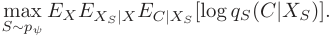

Authorized licensed use limited to: Shanghai Jiaotong University. Downloaded on December 29,2025 at 14:21:10 UTC from IEEE Xplore.  Restrictions apply. 

13683 

XING et al.: USER CONTEXT GENERATION FOR LARGE LANGUAGE MODELS FROM MOBILE SENSING DATA 

According to the optimization goal above, we can define the following loss for the feature selector _pψ_ , 

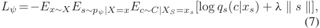

where _λ_ is the hyper-parameter of the regularization to penalize the non-zero entries of _s_ for sparsity. Further, we introduce a predictor network _qφ_ withparameter _φ_ toparametrize _qS_ ( _C|XS_ ) as shown in Fig. 4. _qφ_ takes the data _x_ and the selected feature mask _s_ as inputs5 and outputs the predicted context probability distribution ˆ _c_ = _qφ_ (˜ _x, s_ ) _∈_ [0 _,_ 1]_T ×M_ . We design the following loss to train the predictor model _qφ_ 

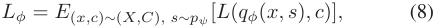

where _L_ is the cross entropy loss between the generated context _c_ ˆ and the ground truth context _c_ . Substitute the predictor model loss into (7), and we can get 

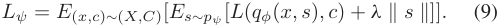

Incorporating the data imputation model _pθ,γ_ into the above equation, replacing _x_ with the imputed data ˜ _x_ and expanding it, we can obtain the loss for the generator 

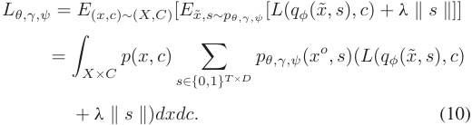

We observed that there are 2_T ×D_ possible solutions of _s_ , so we present to sample the feature subset instead of calculating all subsets as shown in ❷ of Fig. 4. 

## _C. Model Architecture_ 

The refined data completion module incorporates data-centric feature selection into the data imputation for obtaining the informative sensing data to generate accurate user context. As shown in Fig. 4, the module includes the generator and predictor. The generator _pθ,γ,ψ_ is constituted of the data imputation model _pθ,γ_ (encoder _qγ_ ( _Z|X__o_ ),decoders _pθ_ ( _X__o_ _|Z_ ) and _pθ_ ( _X__u_ _|Z_ ))andthe feature selector _pψ_ . The incomplete mobile sensing data are fed into the data imputation model which outputs the imputed data. Then the feature selector receives the imputed data and generates the selection probability. The selected feature indicator is then sampled from the probability. The selected features are finally inputted into the predictor for the context generation. 

Next, we demonstrate the specific learning networks for each component used in the refined data completion. 

_Encoder_ **_qγ_ (** **_Z|X_****_o_** **)** _:_ The encoder _qγ_ : R_T ×D_ _→_ ( _Z, Z_ ) takes the observed data _X__o_ with unobserved data _X__u_ initiated as zero as inputs and outputs the generated distribution of the latent variable, which is 

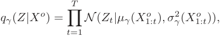

> 5We implement the selected feature subset by _xs_ = _x ⊙ s_ . 

where _μγ_ and _σγ_ are the learned mean and standard deviation of the latent distribution realized on a transformer, respectively [31]. 

_Decoders_ **_pθ_ (** **_X_****_o_** **_|Z_ )** _,_ **_pθ_ (** **_X_****_u_** **_|Z_ )** _:_ The two decoders are defined similarly, and we take _pθ_ ( _X__o_ _|Z_ ) as an example. The decoder _pθ_ : _Z →_ (R_T ×D_ _,_ R_T ×D_ ) takes the latent variable as input and outputs the generated distribution of the observed data, which is defined as 

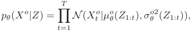

where _μ__o_ _θ_and_σ_ _θ__o_are the mean and standard deviation networks of the observed decoder realized on a transformer, respectively. _Prior model_ **_pθ_ (** **_Z_ )** _:_ We assume the Gaussian process as the prior of _Z_ as in [32]. The definition is as follows 

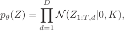

where _Kij_ = _k_ ( _ti, tj_ ) _, i, j ∈{_ 1 _, . . . , T }_ is the kernel matrix and _k_ is the kernel function. 

_Selector_ **_pψ_ (** **_S|X_****_o_** **_, X_****_u_** **)** _:_ For the selected feature indicator _S ∈{_ 0 _,_ 1 _}__T ×D_ , we define _pψ_ ( _S|X__o_ _, X__u_ ) as the Bernoulli distribution as follows 

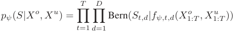

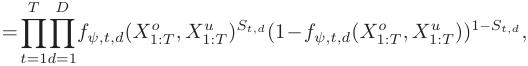

where _fψ_ : R_T ×D_ _→_ [0 _,_ 1]_T ×D_ is the selection function to learn the probability of _pψ_ ( _S|X__o_ _, X__u_ ). _fψ_ takes the imputed data as input and outputs the selection probability of each feature, which means that _fψ,t,d_ ( _X__o_ _, X__u_ ) represents the probability that we select _Xt,d_ . 

_Predictor_ **_qφ_ (** **_C|XS_ )** _: qφ_ : R_T ×D_ _× {_ 0 _,_ 1 _}__T ×D_ _→_ [0 _,_ 1]_M_ is set to parameterize _q_ ( _C|XS_ ). The predictor model takes the imputed data and the selected feature mask as the input and outputs the predicted context probability. 

## _D. Model Training_ 

In this sub-section, we introduce how to conduct model training on the refined data completion module, which consists of the generator and predictor. 

We notice that the sampling of feature subset _s_ in the generator mentioned in Section III-B introduces discreteness to the network, which will block the backward propagation from the predictor to the generator. To address this, we leverage the actor-critic framework [33]. Here, the generator acts as the actor, responsible for sampling _s_ , while the predictor serves as the critic, evaluating the selected features. Instead of relying on direct gradients through discrete sampling, the actor updates its parameters using feedback from the critic in the form of rewards (i.e., the negative loss term _−L_ ( _qφ_ (˜ _x, s_ ) _, c_ ) from the predictor), effectively bypassing the issue of discrete sampling and allowing iterative optimization of both models. 

Authorized licensed use limited to: Shanghai Jiaotong University. Downloaded on December 29,2025 at 14:21:10 UTC from IEEE Xplore.  Restrictions apply. 

IEEE TRANSACTIONS ON MOBILE COMPUTING, VOL. 24, NO. 12, DECEMBER 2025 

13684 

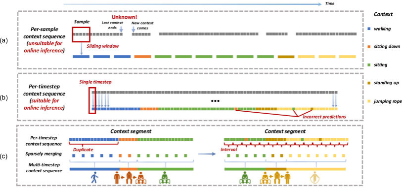

Fig. 5. The visualization of per-sample context generation, per-timestep context generation and the context sparsely merging. 

Now, we derive the gradient for the loss of the generator model _Lθ,γ,ψ_ in (10), 

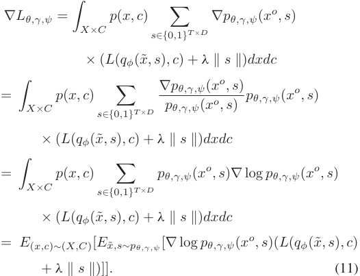

The predictor and generator perform gradient descent to update parameters _φ_ and ( _θ, γ, ψ_ ) iteratively according to the gradient of the loss in (8) and the gradient in (11), respectively. 

ConGen uses missing time series data to jointly train the generator and predictor models to generate refined data. We can observe that ConGen does not perform data imputation and feature selection separately but connects them together in an end-to-end manner. Additionally, the selector and predictor will guide the imputation model to lean toward more informative features so that it can conduct meaningful imputation. 

## IV. MULTI-GRANULARITY CONTEXT COMPRESSION 

Althoughtherefineddatacompletionhandles themissingdata and feature redundancy problems in the sensing data and plays a significant role in generating accurate user context, there are still various levels of redundancy, hindering a compact expression of user context. Also, the high redundancy will bring huge computational costs to LLMs, which mainly results from (i) 

data sampled at a higher rate will cause a high frequency of context generation, resulting in high-frequency queries; (ii) the directly generated context sequence may contain non-critical contents, introducing an additional computational burden of LLMs inference. Therefore, we design to compress contexts at multiple granularities to further improve the compactness and accuracy of context generation, thereby improving the LLMs’ performance while reducing their inference latency. 

## _A. Context Merging_ 

Before introducing our method, it is worth emphasizing that our approach focuses on per-timestep context generation, producing contexts for mobile sensing data at each individual timestep (as illustrated in Fig. 5(b)). In contrast, previous works typicallyhandletime-seriesdatapersample,employingasliding window to group multiple consecutive timesteps of sensing data as a single sample and predict a single context label for the entire sample (as shown in Fig. 5(a)). This approach requires manual data segmentation, as the context must remain consistent throughout the window, demanding precise knowledge of each context’s start and end times. This approach is suitable for offline training but is not optimal for online inference. 

Returning to our method, after generating contexts, we query LLMs at the granularity of context segments (depicted in Fig. 5(c)) rather than individual contexts. Specifically, we define the context segment **con** as a sequence of contexts **con** = [ _con_ 1 _, con_ 2 _, . . . , conn_ ] over a duration of _l_ seconds, where _n_ = _l × fs_ and _fs_ represents the sampling rate6 (i.e., how often data is collected per second). This allows us to aggregate multiple contexts into a single segment, reducing the number of queries to the LLMs by sending the entire segment at once, rather than querying for each individual context. 

However, the context segment **con** comprises numerous per-timestep contexts, many of which are duplicates (e.g., duplicate colored contexts in Fig. 5(c) “per-timestep context 

> 6For sensors with different sampling rate, we set _fs_ as the highest sampling rate among them. 

Authorized licensed use limited to: Shanghai Jiaotong University. Downloaded on December 29,2025 at 14:21:10 UTC from IEEE Xplore.  Restrictions apply. 

13685 

XING et al.: USER CONTEXT GENERATION FOR LARGE LANGUAGE MODELS FROM MOBILE SENSING DATA 

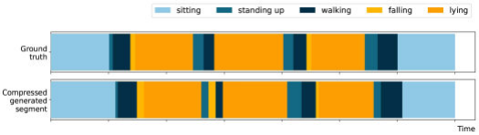

Fig. 6. The visualization of the ground truth context segment and the generated context segment from PersonActivity dataset, where different color blocks represent different contexts. 

sequence”). To address this, we need to merge adjacent, identical per-timestep contexts into multi-timestep cumulative contexts where the adjacent contexts differ (illustrated in Fig. 5(c) “multi-timestep context sequence”). Direct merging, however, can result in inaccurate context segments due to incorrect predictions in per-timestep context generation (as depicted in Fig. 5(b)). Thus, it is crucial to eliminate incorrectly predicted contexts. We propose a sparse merging approach, where the segment is divided into several intervals, and the context for each interval is determined by the most frequently predicted context within that interval. 

As demonstrated in Fig. 5(c), context sparsely merging eliminates a substantial number of contexts, thus reducing the timestep redundancy. Additionally, it provides opportunities to remove incorrectly predicted contexts, further improving the context accuracy. 

## _B. Context Pruning_ 

Although sparse merging reduces timestep redundancy, there still exists context redundancy in the segment. Because not all contexts in the context segment are crucial for LLM inference. To illustrate this, we draw a motion context segment, as shown in Fig. 6. From top to bottom are the ground truth context segment and the generated context segment by sparse merging. We can find that both the two segments are scattered with numerous non-critical contexts, which mainly come from (i) the incorrect prediction of the predictor which is obviously inconsistent with the current state, such as “falling” between “standing up” and “walking”; (ii) transient transitional contexts bridging sustained keycontexts,suchasbrief“standingup”fromsustained“sitting” to next sustained “walking”. These non-critical contexts are meaningless within context segments and their existence will increase the length of the segment and diminish the LLM’s perception of sustained key contexts, which are more representative of the user’s state. Therefore, we set a duration Δ _t_ . If the duration of the context is less than Δ _t_ , it is determined to be a candidate non-critical context. Furthermore, we perform an additional evaluation instead of directly discarding these short-duration contexts to avoid pruning the transient but critical contexts with short durations. The specific criteria are: (i) the average prediction confidence of the predicted context across all timesteps within the duration, ensuring that the context is consistently predictedwithhighconfidence;and(ii)thedatafluctuations(i.e., the variance) in a surrounding temporal window before and after the context, determining whether the context occurs within a 

## **<u>Procedure 1:</u>** <u>ConGen.</u> 

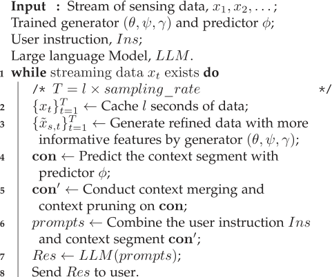

high-variation region where rapid state transitions are likely, and thus the context needs to be a critical one. If these two conditions are met, it indicates a consistently high-confidence prediction occurring in a dynamic transition region, and the context should be retained. Conversely, if either criterion is not satisfied, the context is pruned as originally intended. Such a way provides an adaptive pruning strategy, ensuring that the critical but transient contexts remain while preventing the inclusion of the noncritical ones, thereby refining the overall quality of the context segment. 

## V. OVERALL SYSTEM WORKFLOW 

For inference, ConGen’s workflow begins by receiving and caching mobile sensing data over a defined period (as outlined in Procedure 1, Line 3). The cached data is then input into the generator (depicted in Fig. 4) for refined completion (Line 4). The process starts with the imputation model (constituted of the encoder and decoders) imputing the missing data from the incomplete mobile sensing input (❶ in Fig. 7). After that, the imputed data enters the selector, which selects only the most informative features (❷), improving the context accuracy over simply using the complete data. For example, retaining accelerometer peaks during “running” ensures the generated context accurately reflects high-intensity activities, which is critical for LLMs to answer queries like “Recommend a song”. These selected, more informative features are then passed to the predictor to generate per-timestep contexts, forming a complete context segment (❸, Line 5). 

Next, ConGen tackles redundancy by sparsely merging the context segment (❹) and pruning non-critical and redundant contexts (❺). This compression step (Line 6) reduces both timestep- and context-level redundancy, ensuring a streamlined and efficient data pipeline. For example, by pruning incorrectly predicted contexts (e.g., transient “standing up” during sustained “sitting”), the context segment retains only semantically critical information (e.g., “sitting for 10 seconds”), which directly aligns 

Authorized licensed use limited to: Shanghai Jiaotong University. Downloaded on December 29,2025 at 14:21:10 UTC from IEEE Xplore.  Restrictions apply. 

IEEE TRANSACTIONS ON MOBILE COMPUTING, VOL. 24, NO. 12, DECEMBER 2025 

13686 

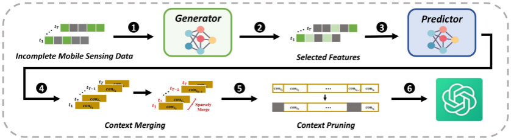

Fig. 7. The workflow of ConGen. 

TABLE I 

STATISTICAL SUMMARIES OF DATASETS 

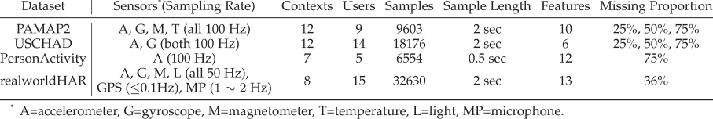

with user queries (e.g., “Suggest a meditation exercise”). In the final step, the condensed context segment is combined with the user instruction and passed to the LLM for context-aware inference (❻, Lines 7-9), optimizing response accuracy and relevance. For instance, if the user asks “Recommend a song” with the context “Running for 10 seconds”, the LLM generate the responses like “Energetic pop music to match your running pace.” This seamless integration ensures that the generated contexts directly influence LLM outputs, rather than being isolated from the query process. 

This overall process enhances data quality and reduces redundancy, ensuring more accurate and condensed contexts for LLMs and effective and responsive outputs from LLMs. 

## VI. EVALUATIONS 

In this section, we first explain the evaluation settings, including datasets and baselines. Then we evaluate the performance of ConGen in detail. 

(sitting and sitting down), standing up (standing up from lying, standing up from sitting and standing up from sitting on the ground), on all fours and sitting on the ground. The dataset has 75% missing values. (4) **realworldHAR** [37] uses 6 types of sensors, including accelerometer, gyroscope, magnetometer, GPS, light sensor, and microphone to detect 8 contexts (e.g., climbing stairs down and up) from 15 users. The dataset has 36% missing values. 

Since PAMAP2 and USCHAD datasets are complete, we randomly delete 25%, 50%, and 75% of the observed data to construct the missing values. The specific method is generating a random mask, the same shape as the dataset, to indicate whether the value is missing (a value of 0 for a mask element implies missing, while 1 is not). Different proportions of 0 mean different missing proportions and we use uniform sampling to specify the positions of all 0. All datasets are partitioned into training (80%), validation (10%), and test (10%) sets. We conduct the per-timestep prediction to suit the requirement of the online prediction. 

## _A. Datasets_ 

We perform evaluations on four publicly available multivariate time series datasets as shown in Table I, which feature diverse sensors and contexts: (1) **PAMAP2** [24] collects data from 9 users via the temperature sensor, accelerometer, gyroscope, and magnetometer for 12 contexts (e.g., vacuum cleaning, rope jumping). (2) **USCHAD** [34] uses the accelerometer and gyroscope to detect 12 contexts (e.g., sitting, walking) from 14 users. (3) **PersonActivity** [35] contains readings collected by 4 devices with a total of 11 contexts. We refer to the partial preprocessing of [36] to preprocess the dataset to 6554 data points, where each data point includes 50 timesteps and 12 features. Because some classes are similar, we merged the 11 contexts into 7 contexts, namely walking, falling, lying (lying and lying down), sitting 

## _B. Baselines_ 

We compare the performance of ConGen with the following competitive time series data imputation baselines. 

- r _GRUZero:_ a Gated Recurrent Unit (GRU) [38] classifier imputed with zero padding. 

- r _GRUMean:_ a GRU classifier imputed with the mean of the observed value. 

- r _GRUForward [18]:_ a GRU classifier imputed with the latest observed value for each feature. 

- r _GRUSimple [18]:_ a GRU classifier utilizing the concatenation of the imputed value (imputed by the mean or the latest observed value), mask, and time interval as the input, where the time interval of each feature is how long since its last observation. 

Authorized licensed use limited to: Shanghai Jiaotong University. Downloaded on December 29,2025 at 14:21:10 UTC from IEEE Xplore.  Restrictions apply. 

13687 

XING et al.: USER CONTEXT GENERATION FOR LARGE LANGUAGE MODELS FROM MOBILE SENSING DATA 

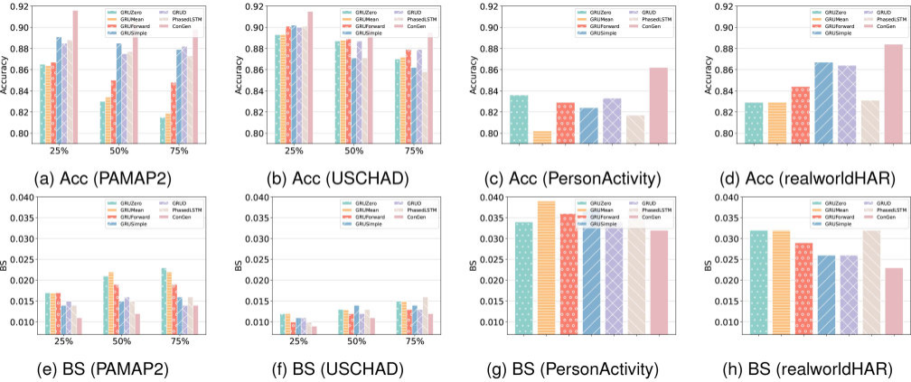

Fig. 8. Overall performance (Accuracy ( _↑_ ) and BS ( _↓_ )) comparison on four public datasets with different missing proportions. 

   - r _GRUD [18]:_ a GRU classifier imputed with the mixture of the latest observed value and the mean, which are weighted by a coefficient called the learnable decay value. 

   - r _PhasedLSTM [39]:_ an LSTM variant by adding a new time gate in its cells, so that it can integrate input from sensors with arbitrary sampling rates. 

- We also compare ConGen with two classic model-agnostic 

- XAI methods. 

   - r **LIME** [22] explains individual predictions by generating perturbed samples around an input instance, querying the model for predictions, and fitting a local interpretable model to approximate feature importance. 

   - r **SHAP** [23] explains individual predictions by computing feature importance using Shapley values, which fairly distribute contribution among features based on cooperative game theory. 

Both LIME and SHAP are extensively used in the XAI community and have been validated in diverse domains, such as medical diagnosis [40], [41], finance [42], [43], vision [22] and NLP [44]. Their well-established theoretical foundations and broad applicability make them strong baselines for assessing explainability. In principle, these two XAI methods are general and adaptable to any closed-box model. However, in per-timestep time series prediction, they treat each timestep as a sample and perform feature selection on it, which does not consider the temporal dependency between samples. Therefore, to preserve the temporal dependence, we perform per-sample prediction here. We consider timesteps as features as well, so the feature dimension changes from _D_ to _T × D_ . 

_C. Performance of Data Completion_ 

_1) Overall Performance With Different Missing Proportions:_ We first evaluate the accuracy performance of different methods on the four datasets. Results in Fig. 8(a)–(d) show that ConGen outperforms all the baselines with arbitrary missing proportions, 

especially with the highest missing proportion 75%. The weaker performance of baseline methods is due to their inability to handle complex time series dependencies. Fixed-value imputation strategies like zero-padding or mean imputation obscure critical transitions in activity recognition tasks and fail to adapt to sensor data variations. Methods relying on previous observations struggle with non-linear dependencies and cross-sensor correlations, particularly in multi-sensor scenarios where missing values in one sensor may depend on both historical and concurrent readings from others. Another important observation is that the accuracy of ConGen does not decrease significantly with a large increase in the missing proportion, which illustrates that ConGen can achieve robust high-quality data completion even when there is extremely rare observed data. Moreover, baseline methods degrade rapidly under high missing proportions: zero or mean imputation introduces bias, while methods based on the adjacent timesteps fail when large continuous segments of data are missing. Moreover, we also calculate Brier Score (BS) [45], an evaluation function used to measure probability calibration to quantify the uncertainty of prediction. As can be seen from Fig. 8(e)–(h), regardless of the dataset and the missing proportion,ConGenmaintainsthelowestBSamongallmethods,which means that our prediction results are the most realistic. 

_2) Performance of XAI Method:_ To illustrate the effectiveness of XAI method, we first use the complete raw data, the imputed data without feature selection by XAI, and the imputed data with feature selection by XAI to train GRU models on USCHAD and PAMAP2 datasets, respectively. Results in Fig. 9 show that the imputed data with feature selection guided by XAI method can be used to generate more accurate contexts. In particular, the performance on the USCHAD dataset even exceeds that of complete raw data, confirming that the XAI method removes features harmful to the contexts. 

We also compute the root mean squared error (RMSE) between the complete raw value and the imputed value without featureselectionbyXAIontheUSCHADandPAMAP2datasets 

Authorized licensed use limited to: Shanghai Jiaotong University. Downloaded on December 29,2025 at 14:21:10 UTC from IEEE Xplore.  Restrictions apply. 

IEEE TRANSACTIONS ON MOBILE COMPUTING, VOL. 24, NO. 12, DECEMBER 2025 

13688 

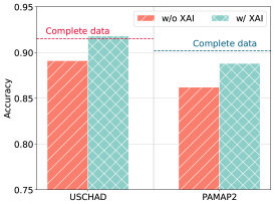

Fig. 9. Performance comparison between the imputed data without XAI method and with XAI method on USCHAD and PAMAP2 with 75% missing proportions. 

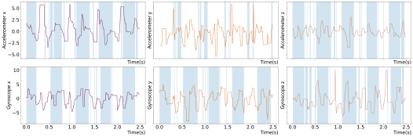

Fig. 11. Imputed data with selected features highlighted by blue area. The time series data is a random 2.5-second sequence of “Running Forward” from USCHAD with 75% missing proportion. The rows represent the sensors and the columns represent the axes of the data. 

and compare them with mean and forward imputation methods. Results show that our imputation method (average 0.291 on PAMAP2 dataset and 0.506 on USCHAD dataset under all missing proportions) outperforms the mean imputation method (0.657 and 0.701, respectively), and presents similarly to the forward imputation method (0.292 and 0.508, respectively). However, the overall performance in Fig. 8 is significantly better than GRUForward, which further proves the necessity and superiority of leveraging XAI. 

We further visualize the imputed time series data of 2.5 seconds in Fig. 11 and use the blue area to highlight the selected features, which clearly shows that XAI method can capture the periodic characteristics of the signal, which is crucial for context prediction. This also explains why XAI method can further improve the prediction performance in Fig. 9. Because there are uninformative or even harmful features that will interfere with context generation, further efficient feature selection must be carried out to achieve the ideal results. In addition, we can also see that the features selected at different timesteps are different, illustrating that the XAI method is data-centric and selects variable features based on data at different timesteps. 

We also compare ConGen with two classic model-agnostic XAImethods. Here, wefocus ontheoverheadof theonlineinference. Because when the accuracy of different methods is similar, the bottleneck of online inference depends on the computational overhead. Thus, we calculate the computational time of feature selection using different methods in Fig. 10. We find that the time of ConGen is 2 _∼_ 3 orders of magnitude less than the other two methods, which illustrates the efficiency of our XAI method. It is worth noting that the computational speed of LIME and SHAP is too slow and seriously does not meet the requirements of the 

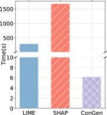

Fig. 10. Computational time comparison among different XAI methods on the test dataset of PersonActivity. 

online scenario. In addition, LIME and SHAP are both post-hoc, which means they deeply rely on the trained model and cannot provide timely guidance to the generation during training. In comparison, ConGen is inherently interpretable, which couples data completion and feature selection and feature selection can guide refined data completion in the end-to-end training. 

## _D. Performance of Context Compression_ 

We generate and compress the context segment according to the method in Section IV, utilizing different sparse rates (i.e., the number of timesteps within one interval) to merge the contexts. We introduce two metrics to compare the similarity between the generated context segment and the ground truth context segment, namely Damerau–Levenshtein distance (DL distance) [46] and Jaro–Winkler similarity (JW similarity) [47]. DL distance compares the similarity of two sequences by counting the minimum number of operations (including substitutions, insertions, deletions, and transpositions) required to transform one sequence into another. JW similarity is based on the Jaro distance algorithm [48] and calculates the similarity of two sequences by giving prefixes a higher rating. We conduct two sets of experiments _Sparse_ and _Sparse+Prune_ to evaluate the effectiveness of context sparsely merging and non-critical context pruning. _Sparse_ calculates the similarity between the generated context segments by sparsely merging and the ground truth segments. And _Sparse+Prune_ calculates the similarity between the two kinds of segments with context pruning. The results are shown in Fig. 12. We can find that as the sparse rate becomeslargerandlarger,thesimilaritybetweengeneratedcontext segments and ground truth shows a trend of rising first and then slightly falling. The intrinsic intuition of rising is that the generated segments may contain incorrectly predicted contexts. However,sinceincorrectcontextsareonlygeneratedbysporadic timesteps,theycanbewellfilteredoutbysparsemerging.Falling is due to too sparse merging leading to too few contexts and even the loss of key contexts. Comprehensively comparing the two metrics, we conclude that the generated context segment is most similar to the ground truth within the sparse rate of 40 _× −_ 70 _×_ , in which the sparse merging removes redundant timesteps and even avoids mispredictions due to the reduction of required predicted timesteps. The similarity is 17 _._ 14 _× −_ 24 _._ 14 _×_ (DL distance) and 1 _._ 46 _× −_ 1 _._ 49 _×_ (JW similarity) higher than that between context segments without being sparse. Next, we further prune non-critical contexts within 40 _× −_ 70 _×_ . 

Authorized licensed use limited to: Shanghai Jiaotong University. Downloaded on December 29,2025 at 14:21:10 UTC from IEEE Xplore.  Restrictions apply. 

13689 

XING et al.: USER CONTEXT GENERATION FOR LARGE LANGUAGE MODELS FROM MOBILE SENSING DATA 

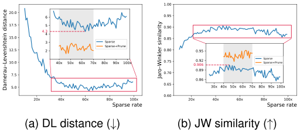

Fig. 12. Mean context segment similarity (measured by DL distance ( _↓_ ) and JW similarity ( _↑_ )) comparison between the generated context segments and the ground truth at different sparse rates for a total of 25 segments on PersonActivity dataset. _Sparse_ (blue curve) is the similarities between the generated context segments by sparsely merging at different spare rates and the ground truth segments without sparsely merging. And _Sparse+Prune_ (orange curve) is the similarity between the two kinds of segments with contexts pruning besides _Sparse_ . 

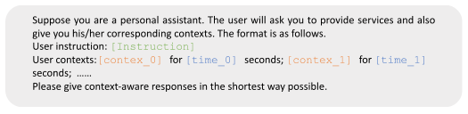

Fig. 13. Prompt template for LLMs. [INSTRUCTION] is the user instruction, e.g., please recommend a song for me. [CONTEXT_I] and [TIME_I] are the _i_ -th user context and its corresponding duration in _l_ seconds, e.g., walking for 5 seconds. 

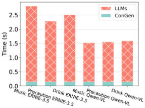

Fig. 14. Mean inference time of each component over 10-second sensing data segment (total 154 segments divided from 25 long consecutive sensing data segments) on PersonActivity dataset. 

entertainment, precaution focuses on real-time safety, and drink is related to practical wellness advice. 

- r _Context Sensitivity:_ These instructions are context-sensitive, which means LLMs can generate diverse responses according to different contexts. For example, music can vary based on activity, safety precautions change according to current posture, and drink suggestions may shift based on the intensity of movement. 

- r _Diverse Scenarios:_ These instructions cover multiple application scenarios: entertainment (music), safety (precaution), and wellness (drink), offering a broad evaluation of the LLM’s performance across distinct, real-world scenarios. 

These instructions are selected carefully based on the domain knowledge and logically correspond to human activity contexts. 

We set Δ _t_ = 2 seconds. The results show that the similarities significantly improve to 35 _._ 72 _× −_ 86 _._ 92 _×_ (DL distance) and 1 _._ 51 _× −_ 1 _._ 57 _×_ (JW similarity), respectively. We also evaluated the effectiveness of context pruning in preserving critical contexts with short durations. Specifically, we focused on the critical short-duration “falling” context in PersonActivity dataset. Our findings show that after applying the adaptive pruning strategy, the retention rate of this context increased by 78% compared to pruning solely based on the duration threshold (which is nearly zero). The above experiments have confirmed that sparse sampling and context pruning reduce redundancy without losing important information. 

## _E. Performance of LLMs With Contexts_ 

In this sub-section, we provide a detailed evaluation of how ConGen enhances the performance of LLMs. We designed a prompt template for LLMs, illustrated in Fig. 13. First, we conduct quantitative evaluations in Section VI-E1 using three user instructions: music recommendation (“Please recommend me a song.”), important precaution (“What is the most important precaution for the current motion state?”), and drink recommendation (“Any drink recommendations for the current event?”). We choose these representative instructions for the following reasons: 

- r _Real-Life Relevance:_ They are practical and commonly asked in daily life, addressing immediate, real-world needs in specific contexts. For example, music offers instant 

We use PersonActivity and PAMAP2 (75% missing proportion) to conduct the quantitative evaluations. Because they record many consecutive segments of user activities, where multiple different activities occur in sequence within the same segment, naturally reflecting real-world context transitions and avoiding synthetic concatenation of isolated activities. Specifically, the PersonActivity dataset consists of 25 long consecutive sensing data segments, which we divide into a total of 154 10-second segments, and the PAMAP2 dataset contains 9 long consecutive sensing data segments, resulting in 1917 10-second segments. 

We also provide qualitative illustrations for additional potential user instructions in Section VI-E2. 

For one request to LLMs, we set the context segment length _l_ = 10 seconds as mentioned above. Choosing a smaller _l_ is not imperative since rapid context fluctuations over very short periods are exceedingly rare. Conversely, setting a larger _l_ would hinder the ability to provide real-time feedback. Therefore, 10 seconds is sufficient to capture the dynamic changes in context promptly. We also calculate the mean inference time of each component over 10-second sensing data segments with the LLMs being ERNIE-3.5 [49] and Qwen-VL [50]. We take PersonActivity dataset as an example. Results in Fig. 14 indicate that a 10-second segment is sufficient to encompass the entire inference process under simple daily instructions, ensuring that the subsequent 10-second sensing data arrives only after the preceding one has been processed. Furthermore, the total inference time does not exceed 3 seconds, enabling 

Authorized licensed use limited to: Shanghai Jiaotong University. Downloaded on December 29,2025 at 14:21:10 UTC from IEEE Xplore.  Restrictions apply. 

IEEE TRANSACTIONS ON MOBILE COMPUTING, VOL. 24, NO. 12, DECEMBER 2025 

13690 

TABLE II 

PERFORMANCE COMPARISON OF LLMS’ RESPONSES WITH 10-SECOND SENSING CONTEXTS GENERATED BY DIFFERENT METHODS ON PERSONACTIVITY AND PAMAP2 DATASETS, RESPECTIVELY 

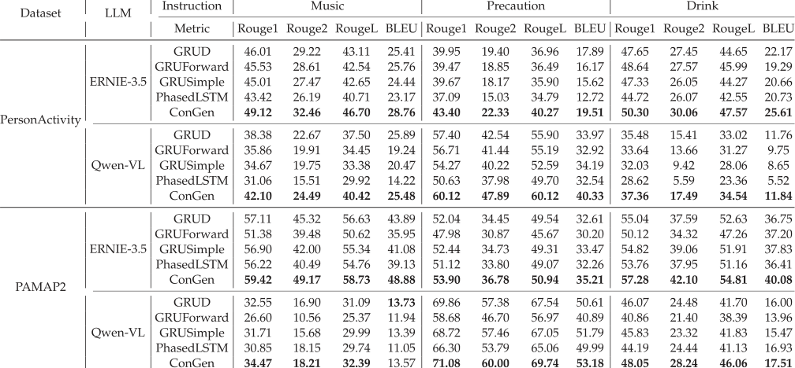

users to receive responses on time. With continuous sensor monitoring and 10-second context updates, any instantaneous context changes after an instruction can be quickly captured, keeping the context for LLMs accurate and timely. 

_1) Performance With Different Data Completion Methods:_ To illustrate how ConGen enhances the performance of LLMs, we compare the performance of the LLMs’ responses when fed with context segments generated by different data completion methods on PersonActivity and PAMAP2 (75% missing proportion) datasets. We use ROUGE [51] and BLEU [52] as evaluation metrics to measure the similarity of responses generated by LLMs when fed with generated context segments and ground truth context segments. For fairness, we also apply the context compression methods in Section IV to each baseline. In context sparsely merging, we randomly select a sparse rate for each of 25 and 9 consecutive segments from 40 _× −_ 70 _×_ on PersonActivity and PAMAP2 datasets, respectively. The results are presented in Table II. Regardless of the dataset, the LLM and the instruction, ConGen outperforms the baselines. This superior performance is primarily due to ConGen’s ability to generate more accurate context segments. Firstly, ConGen demonstrates better performance in per-timestep context prediction compared to the baselines. Secondly, the mispredicted per-timestep contexts by baselines are relatively concentrated because their imputation strategies are relatively single or based on the value of the adjacent timesteps, which will cause the higher retention of incorrect contexts even after sparsely merging. 

By enhancing the accuracy of context segments, ConGen significantly improves the quality of responses generated by LLMs, thereby demonstrating its superiority over competitive baseline methods. 

_2) Qualitative Illustrations for More User Instructions:_ In this sub-section, we demonstrate how LLMs (taking ERNIE-3.5 as an example) respond to more user instructions with/without contexts. By comparing the differences between the two responses, we further illustrate that contexts can improve the quality of LLMs’ responses. First, we define the following two criteria to evaluate the two responses. 

   - r _Question alignment (basic criteria):_ whether the response directly answers the user’s question. A response that explicitly answers the question is preferred, ensuring clarity and relevance. 

   - r _Context relevance (advanced criteria):_ whether the response aligns with the user’s current state or context. A response that takes into account the specific user’s context is considered more useful and appropriate. 

- According to the above criteria, we give the detailed analysis 

- as follows. 

   - r **Without contexts, LLMs’ responses can not even satisfy the basic criteria, i.e., question alignment.** 

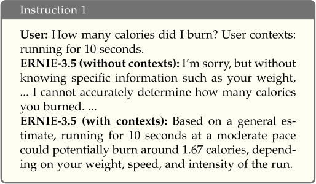

Authorized licensed use limited to: Shanghai Jiaotong University. Downloaded on December 29,2025 at 14:21:10 UTC from IEEE Xplore.  Restrictions apply. 

13691 

XING et al.: USER CONTEXT GENERATION FOR LARGE LANGUAGE MODELS FROM MOBILE SENSING DATA 

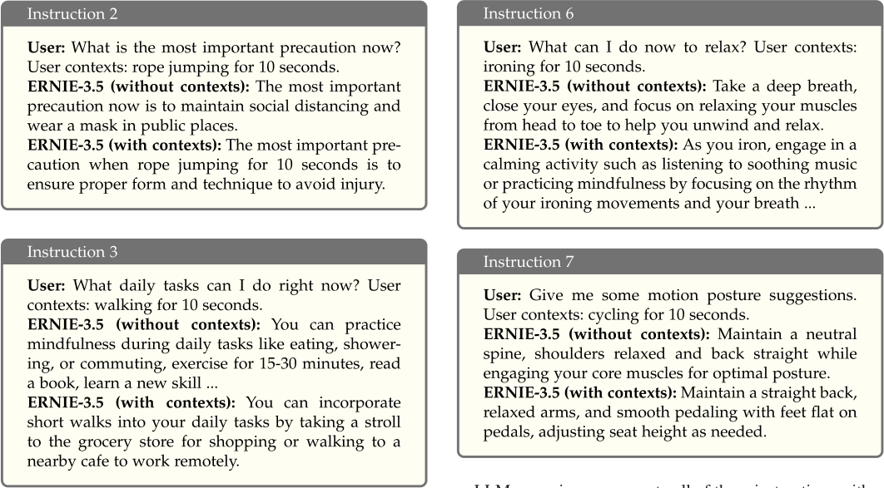

LLMs can give responses to all of these instructions without contexts, but the responses are general. Especially for Instructions 4 and 5, the responses without contexts point out the need to possess the user’s contexts to give specific answers. 

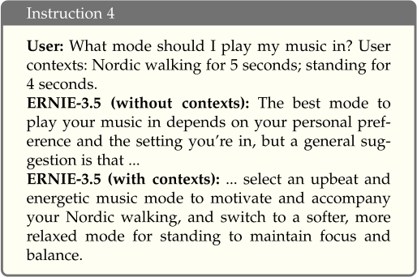

To further compare which response is better, we provide user instructions and their two responses (with and without contexts) to GPT-4 and obtain its preference (i.e., which one is better)7 . We organize the two criteria as prompts for GPT-4 and the results are as shown in Table III. From the table, we can see that GPT-4 consistently prefers responses generated with contexts, which proves that contexts can improve the performance of LLMs. 

## VII. RELATED WORKS 

## _A. LLMs in Mobile Computing_ 

The remarkable language processing capabilities of LLMs have attracted widespread attention, and researchers have also used LLMs to solve problems in mobile computing. MAPLE [54] claimed that LLMs were more adept at processing unfamiliar contexts than traditional machine learning models, so it used LLMs to generate embeddings of contextual data, such as time, location and user history for mobile app prediction. They also considered user cold start problem and utilized the installed app similarity to solve it. King et al. [6] focused on smart home, where they conducted an empirical study to illustrate the potential of LLMs in supporting goal-oriented interactions. The authors presented Sasha, a smart home assistant that leveraged the power of LLMs to control mobile devices and createautomationroutines.Mental-LLM [55] focusedonmobile health and applied LLMs to mental health, where they conducted 

> 7GPT-4 is the more powerful LLM and [53] also treats ChatGPT as an evaluator. 

Authorized licensed use limited to: Shanghai Jiaotong University. Downloaded on December 29,2025 at 14:21:10 UTC from IEEE Xplore.  Restrictions apply. 

IEEE TRANSACTIONS ON MOBILE COMPUTING, VOL. 24, NO. 12, DECEMBER 2025 

13692 

TABLE III 

THE PREFERENCE OF GPT-4 FOR INSTRUCTIONS 1-7 BY CONSIDERING TWO CRITERIA 

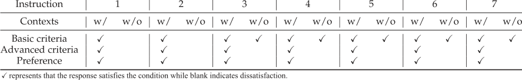

extensive experiments on various mental health via online text data tasks. AutoDroid [56] leveraged LLMs to achieve mobile task automation by combining domain-specific knowledge of apps with the commonsense knowledge of LLMs. Xu et al. [57] put forward the concept of “Penetrative AI”, which explores how LLMs can use IoT sensors for physical world reasoning. However, its effectiveness heavily depends on well-designed expert knowledge to guide the reasoning of LLMs. Without such guidance, directly inputting raw IoT data into LLMs may yield suboptimal or unreliable results. All of these works have shown the potential of applying LLMs in mobile computing. However, these works all focus on “what LLMs do for them”, i.e., treating LLMs as text-processing tools to improve the performance of their respective tasks. Our work, on the other hand, focuses on “what we do for LLMs”. Specifically, we capture the potential of mobile sensing data as user contexts to prompt LLMs and are devoted to improving their quality to make LLMs capable of delivering more accurate, relevant responses. 

## _B. Data Imputation_ 

Missing data is a significant challenge in data analysis, and various strategies have been proposed to handle it. Common approaches involve imputing missing values with zero or the mean [58], but these methods fail to account for feature relationships. More sophisticated strategies, such as imputing timeseries data based on temporal relations [18], show competitive results but lack theoretical support. Machine learning methods, includingKNN [59] andKalmansmoothing [60],providesimple and interpretable imputation techniques. However, they struggle with complex, high-dimensional data distributions. Recent advancements in deep learning have introduced new approaches to data imputation [61], [62]. For instance, Gupta et al. [61] applied neural networks to reconstruct missing data. There are also some worksleveragingdeepgenerativemodels.Lietal. [62] usedVAE and GAN for irregularly sampled time series. These models efficiently handle data imputation and improve the understanding of generative processes. Also, a series of works [63], [64], [65] have built on VAE, including sup-MIWAE [65], which incorporates supervised learning to enhance imputation. However, many of these methods prioritize restoring raw data over generating informative features. 

Model-specific methods are confined to specific models because they are based on the internal information of models, such as weights or structures [66]. Several methods use gradient information to interpret model inputs. Saliency maps [67] calculate feature importance by taking the absolute gradient, offering a simple approach. To improve upon this, Gradient _×_ Input [68] multiplies the feature’s gradient by its value for sharper results. Other methods rely on back-propagation. For instance, Layer-wise Relevance Propagation [69] assigns feature importance layer by layer. Similarly, DeepLIFT [70] computes importance by comparing neuron outputs to a baseline but differs by using relative changes instead of zeroing out baseline outputs. Model-specific methods like these are tightly linked to the underlying model, limiting their generalizability across architectures. 

Model-agnostic methods can be applied to any model (closedbox or white-box). These methods rely on the analysis of inputs and outputs and do not need to have access to the internal structure of models. A typical series of methods is based on feature permutation [71]. The main idea is to evaluate the feature importance through the deviation of model accuracy when the features are removed in a permutation manner. The classic SHAP [23] is grounded in this idea. There are also methods that explain prediction results near specific inputs by introducing local interpretable models, such as LIME [22] and Anchors [72]. However, these methods are computationally expensive, which is inappropriate in online scenarios requiring real-time model inference. Another model-agnosticXAI methodis instance-wise feature selection [73], [74] (i.e., data-centric feature selection), which aims to select the subset of the most informative features for the model prediction on a per-instance basis, thus offering transparency into the model’s decision-making process and achieving model interpretability. Unlike global feature selection methods [75], [76] that assume feature importance remains consistent across all instances, instance-wise selection dynamically adapts to input variations, making it particularly suited for heterogeneous data distributions. This adaptability is crucial in sensor-based applications, where the most informative features may differ based on real-time user conditions. Additionally, it only requires one model inference, guaranteeing the computational efficiency. Given these advantages, we adopt instance-wise feature selection in this work as our preferred XAI method. 

## _C. Explainable AI_ 

XAI is widely used to explain and understand the model inference process and the final model output, which can be divided into model-specific methods and model-agnostic methods. 

## VIII. DISCUSSION 

In this section, we discuss the limitations and future research directions of ConGen. 

Authorized licensed use limited to: Shanghai Jiaotong University. Downloaded on December 29,2025 at 14:21:10 UTC from IEEE Xplore.  Restrictions apply. 

13693 

XING et al.: USER CONTEXT GENERATION FOR LARGE LANGUAGE MODELS FROM MOBILE SENSING DATA 

- r _Extension to richer sensing contexts:_ In this work, ConGen focuses on sensing context generation and we evaluate it utilizing representative motion sensor data in sensing as an example.However,mobiledeviceshaveabundantcontexts, so ConGen can also be extended to a wide range of other areas, such as car tracking based on GPS measurements and health monitoring based on measurements such as heart rate and electrocardiogram (ECG). ConGen has a highly competitive time series data completion module that can handle these types of data well. Further, we can also consider multi-modal data, such as audio and video data, to obtain richer contexts. 

- r _Real-time adaptation to immediate context changes:_ ConGen focuses on real-time context inference based on sensing data, assuming a relatively stable context before and immediately after a user instruction. However, to better handle some special cases in practice, where the context changes immediately after an instruction, future work can explore predictive modeling to estimate short-term context transitions, enabling LLMs to anticipate potential temporal shifts and adapt their responses accordingly. Additionally, we can also develop a real-time feedback and interrupt mechanism that incorporates the users’ assistance to adjust the current response results promptly. These enhancements will further improve ConGen’s ability to support dynamic user interactions with minimal latency. 

- r _Practical deployment:_ ConGen provides efficient context generation, which can achieve refined data completion and multi-granularity context compression, providing compact and accurate user contexts for LLMs. However, we do not deploy it to the practical device because memory overhead is a tricky problem. Therefore, we plan to utilize model lightweight methods such as pruning and quantization to achieve practical deployment. 

- r _Ethics in personal contexts for LLMs:_ While leveraging sensing data from smart devices as personal contexts for LLMs can enhance personalization and accuracy, there is still significant progress needed before bringing it to life. Because it poses several ethical challenges. Although the datasets in our work are public, privacy is still a foremost concern, as such data can be highly sensitive and personal. Thus, ensuring robust data security and obtaining clear, informed consent from users is crucial to protect their information. Additionally, these data sources can introduce or amplify existing biases in LLMs which results from the data used to train LLMs being biased, leading to discriminatory outcomes, such as application in healthcare [77]. Therefore, Addressing the transparency in data collection and use and making active efforts to mitigate bias is essential for the safe and responsible deployment of LLMs in real-world applications. 

## IX. CONCLUSION 

In this work, we have presented ConGen, a new sensing context generation framework that integrates refined data completion and context compression. It leverages sensing data collected by smart devices to proactively perceive user contexts 

and understand user intentions without explicitly being provided by users. In the refined data completion, ConGen couples data imputation and data-centric feature selection to generate fewer but more informative features, which significantly improves the accuracy of user context generation. In context compression, ConGen designs multi-granularity compression methods to achieve compact and accurate context expression. We thoroughly evaluate ConGen on four public datasets. Experimental results show that ConGen outperforms state-of-the-art baseline methods which are dedicated to perfectly restoring complete data by generating more accurate user contexts, and context compression further improves the accuracy of context while effectively reducing timestep- and context-level redundancy. Finally, prompting ConGen-generated user contexts to LLMs improves their inference performance, further demonstrating the effectiveness of ConGen. 

## ACKNOWLEDGMENT 

The opinions, findings, conclusions, and recommendations expressed in this paper are those of the authors and do not necessarily reflect the views of the funding agencies or the government. 

## REFERENCES 

- [1] OpenAI, “Introducing chatGPT,” 2022. [Online]. Available: https:// openai.com/blog/chatgpt 

- [2] OpenAI, “GPT-4 technical report,” 2023, _arXiv:2303.08774_ . 

- [3] H. Touvron et al., “LLaMA: Open and efficient foundation language models,” 2023, _arXiv:2302.13971_ . 

- [4] H. Touvron et al., “LLaMA 2: Open foundation and fine-tuned chat models,” 2023, _arXiv:2307.09288_ . 

- [5] J. Wu et al., “TidyBot: Personalized robot assistance with large language models,” _Auton. Robots_ , vol. 47, no. 8, pp. 1087–1102, 2023. 

- [6] E. King, H. Yu, S. Lee, and C. Julien, “Sasha: Creative goal-oriented reasoning in smart homes with large language models,” in _Proc. ACM Interact. Mobile Wearable Ubiquitous Technol._ , vol. 8, no. 1, pp. 1–38, 2024. 

- [7] L. Huang et al., “A survey on hallucination in large language models: Principles, taxonomy, challenges, and open questions,” 2023, _arXiv:2311.05232_ . 

- [8] K. Chen, D. Zhang, L. Yao, B. Guo, Z. Yu, and Y. Liu, “Deep learning for sensor-based human activity recognition: Overview, challenges, and opportunities,” _ACM Comput. Surv._ , vol. 54, no. 4, pp. 1–40, 2021. 

- [9] C. Gao, W. Lei, X. He, M. de Rijke, and T. Chua, “Advances and challenges in conversational recommender systems: A survey,” _AI Open_ , vol. 2, pp. 100–126, 2021. 

- [10] D. Jannach, A. Manzoor, W. Cai, and L. Chen, “A survey on conversational recommender systems,” _ACM Comput. Surv._ , vol. 54, no. 5, pp. 105:1–105:36, 2022. 

- [11] D. Adhikari, W. Jiang, and J. Zhan, “Imputation using information fusion technique for sensor generated incomplete data with high missing gap,” _Microprocess Microsy._ , vol. 82, 2021, Art. no. 103636. 

- [12] H. Turabieh, M. Mafarja, and S. Mirjalili, “Dynamic adaptive networkbased fuzzy inference system (D-ANFIS) for the imputation of missing data for Internet of Medical Things applications,” _IEEE Internet Things J._ , vol. 6, no. 6, pp. 9316–9325, Dec. 2019. 

- [13] J. Chen and A. Zhang, “FedMSplit: Correlation-adaptive federated multitask learning across multimodal split networks,” in _Proc. 28th ACM SIGKDD Conf. Knowl. Discov. Data Mining_ , 2022, pp. 87–96. 

- [14] J. Ni, L. Muhlstein, and J. McAuley, “Modeling heart rate and activity data for personalized fitness recommendation,” in _Proc. World Wide Web Conf._ , 2019, pp. 1343–1353. 

- [15] C. Gong, Z. Zheng, F. Wu, Y. Shao, B. Li, and G. Chen, “To store or not? Online data selection for federated learning with limited storage,” in _Proc. World Wide Web Conf._ , 2023, pp. 3044–3055. 

- [16] C. Gong, Z. Zheng, F. Wu, X. Jia, and G. Chen, “Delta: A cloud-assisted data enrichment framework for on-device continual learning,” in _Proc. 30th Annu. Int. Conf. Mobile Comput. Netw._ , 2024, pp. 1408–1423. 

Authorized licensed use limited to: Shanghai Jiaotong University. Downloaded on December 29,2025 at 14:21:10 UTC from IEEE Xplore.  Restrictions apply. 

IEEE TRANSACTIONS ON MOBILE COMPUTING, VOL. 24, NO. 12, DECEMBER 2025 

13694 

- [17] C. Gong, R. Xing, Z. Zheng, and F. Wu, “A two-stage data selection framework for data-efficient model training on edge devices,” 2025, _arXiv:2505.16563_ . 

- [18] Z. Che, S. Purushotham, K. Cho, D. Sontag, and Y. Liu, “Recurrent neural networks for multivariate time series with missing values,” _Sci. Rep._ , vol. 8, no. 1, 2018, Art. no. 6085. 

- [19] L. Palmerini, L. Rocchi, S. Mellone, F. Valzania, and L. Chiari, “Feature selection for accelerometer-based posture analysis in Parkinson’s disease,” _IEEE Trans. Inf. Technol. Biomed._ , vol. 15, no. 3, pp. 481–490, May 2011. 

- [20] H. Ghasemzadeh, N. Amini, R. Saeedi, and M. Sarrafzadeh, “Power-aware computing in wearable sensor networks: An optimal feature selection,” _IEEE Trans. Mob. Comput._ , vol. 14, no. 4, pp. 800–812, Apr. 2015. 

- [21] P. Liu, W. Yuan, J. Fu, Z. Jiang, H. Hayashi, and G. Neubig, “Pre-train, prompt, and predict: A systematic survey of prompting methods in natural language processing,” _ACM Comput. Surv._ , vol. 55, no. 9, pp. 1–35, 2023. 

- [22] M. T. Ribeiro, S. Singh, and C. Guestrin, ““Why should i trust you?” Explaining the predictions of any classifier,” in _Proc. 22nd ACM SIGKDD Int. Conf. Knowl. Discov. Data Mining_ , 2016, pp. 1135–1144. 

- [23] S. M. Lundberg and S.-I. Lee, “A unified approach to interpreting model predictions,” in _Proc. Int. Conf. Neural Inf. Process. Syst._ , 2017, pp. 4765–4774. 

- [24] A. Reiss and D. Stricker, “Introducing a new benchmarked dataset for activity monitoring,” in _Proc. Int. Semantic Web Conf._ , 2012, pp. 108–109. 

- [25] D. P. Kingma and M. Welling, “Auto-encoding variational bayes,” in _Proc. Int. Conf. Learn. Representations_ , pp. 1–14, 2014. 

- [26] I. Goodfellow et al., “Generative adversarial nets,” in _Proc. Int. Conf. Neural Inf. Process. Syst._ , 2014, pp. 2672–2680. 

- [27] H. Xu, P. Zhou, R. Tan, and M. Li, “Practically adopting human activity recognition,” in _Proc. 30th Annu. Int. Conf. Mobile Comput. Netw._ , 2023, pp. 1–15. 

- [28] Y. Burda, R. Grosse, and R. Salakhutdinov, “Importance weighted autoencoders,” in _Proc. Int. Conf. Learn. Representations_ , pp. 1–14, 2016. 

- [29] A. Gelman, J. B. Carlin, H. S. Stern, and D. B. Rubin, _Bayesian Data Analysis_ . Boca Raton, FL, USA: Chapman and Hall/CRC, 1995. 

- [30] T. M. Cover, _Elements of Information Theory_ . Hoboken, NJ, USA: Wiley, 1999. 

- [31] A. Vaswani et al., “Attention is all you need,” in _Proc. Int. Conf. Neural Inf. Process. Syst._ , 2017, pp. 5998–6008. 

- [32] V. Fortuin, D. Baranchuk, G. Rätsch, and S. Mandt, “GP-vae: Deep probabilistic time series imputation,” in _Proc. Int. Conf. Artif. Intell. Statist._ , 2020, pp. 1651–1661. 

- [33] J. Peters and S. Schaal, “Natural actor-critic,” _Neurocomputing_ , vol. 71, no. 7–9, pp. 1180–1190, 2008. 

- [34] M. Zhang and A. A. Sawchuk, “USC-HAD: A daily activity dataset for ubiquitous activity recognition using wearable sensors,” in _Proc. ACM Conf. Ubiquitous Comput._ , 2012, pp. 1036–1043. 

- [35] V. Vidulin, M. Lustrek, B. Kaluza, R. Piltaver, and J. Krivec, “Localization data for person activity,” _UCI Mach. Learn. Repository_ , 2010. [Online]. Available: https://archive.ics.uci.edu/dataset/196/localization+data+for+ person+activity 

- [36] Y. Rubanova, R. T. Chen, and D. K. Duvenaud, “Latent ordinary differential equations for irregularly-sampled time series,” in _Proc. Int. Conf. Neural Inf. Process. Syst._ , 2019, pp. 5321–5331. 

- [37] T. Sztyler and H. Stuckenschmidt, “On-body localization of wearable devices: An investigation of position-aware activity recognition,” in _Proc. IEEE Int. Conf. Pervasive Comput. Commun._ , 2016, pp. 1–9. 

- [38] K. Cho, B. Van Merriënboer, D. Bahdanau, and Y. Bengio, “On the properties of neural machine translation: Encoder-decoder approaches,” in _Proc. 8th Workshop Syntax Semantics Struct. Statist. Transl._ , 2014, pp. 103–111. 

- [39] D. Neil, M. Pfeiffer, and S.-C. Liu, “Phased LSTM: Accelerating recurrent network training for long or event-based sequences,” in _Proc. Int. Conf. Neural Inf. Process. Syst._ , 2016, pp. 3889–3897. 

- [40] P. R. Magesh, R. D. Myloth, and R. J. Tom, “An explainable machine learning model for early detection of Parkinson’s disease using lime on datscan imagery,” _Comput. Biol. Med._ , vol. 126, 2020, Art. no. 104041. 

- [41] B. H. van der Velden, M. H. Janse, M. A. Ragusi, C. E. Loo, and K. G. Gilhuijs, “Volumetric breast density estimation on MRI using explainable deep learning regression,” _Sci. Rep._ , vol. 10, no. 1, 2020, Art. no. 18095. 

- [42] S. Gite, H. Khatavkar, K. Kotecha, S. Srivastava, P. Maheshwari, and N. Pandey, “Explainable stock prices prediction from financial news articles using sentiment analysis,” _PeerJ Comput. Sci._ , vol. 7, 2021, Art. no. e340. 

- [43] K. Lin and Y. Gao, “Model interpretability of financial fraud detection by group shap,” _Expert. Syst. Appl._ , vol. 210, 2022, Art. no. 118354. 

- [44] E. Mosca, F. Szigeti, S. Tragianni, D. Gallagher, and G. Groh, “Shap-based explanation methods: A review for nlp interpretability,” in _Proc. Int. Conf. Comput. Linguistics_ , 2022, pp. 4593–4603. 

- [45] G. W. Brier, “Verification of forecasts expressed in terms of probability,” _Mon. Weather Rev._ , vol. 78, no. 1, pp. 1–3, 1950. 

- [46] F. J. Damerau, “A technique for computer detection and correction of spelling errors,” _Commun. ACM_ , vol. 7, no. 3, pp. 171–176, 1964. 

- [47] W. E. Winkler, “String comparator metrics and enhanced decision rules in the Fellegi-Sunter model of record linkage,” in _Proc. Sect. Survey Res._ , 1990, pp. 354–359. 

- [48] M. A. Jaro, “Advances in record-linkage methodology as applied to matching the 1985 census of Tampa, Florida,” _J. Am Statist. Assoc._ , vol. 84, no. 406, pp. 414–420, 1989. 

- [49] Y. Sun et al., “Ernie 3.0: Large-scale knowledge enhanced pre-training for language understanding and generation,” 2021, _arXiv:2107.02137_ . 

- [50] J. Bai et al., “Qwen-VL: A frontier large vision-language model with versatile abilities,” 2023, _arXiv:2308.12966_ . 

- [51] C.-Y. Lin, “ROUGE: A package for automatic evaluation of summaries,” in _Text Summarization Branches Out_ . Barcelona, Spain: Association for Computational Linguistics, 2004, pp. 74–81. 

- [52] K. Papineni, S. Roukos, T. Ward, and W.-J. Zhu, “BLEU: A method for automatic evaluation of machine translation,” in _Proc. Annu. Meeting Assoc. Comput. Linguistics_ , 2002, pp. 311–318. 

- [53] Y. Qin et al., “ToolLLM: Facilitating large language models to master 16000 real-world APIs,” in _Proc. Int. Conf. Learn. Representations_ , pp. 1– 23, 2024. 

- [54] Y. Khaokaew, H. Xue, and F. D. Salim, “Maple: Mobile app prediction leveraging large language model embeddings,” in _Proc. ACM Interact. Mobile Wearable Ubiquitous Technol._ , vol. 8, no. 1, pp. 1–25, 2024. 

- [55] X. Xu et al., “Mental-LLM: Leveraging large language models for mental health prediction via online text data,” in _Proc. ACM Interact. Mobile Wearable Ubiquitous Technol._ , vol. 8, no. 1, pp. 1–32, 2024. 

- [56] H. Wen et al., “Autodroid: LLM-powered task automation in android,” in _Proc. 30th Annu. Int. Conf. Mobile Comput. Netw._ , 2024, pp. 543–557. 

- [57] H. Xu, L. Han, Q. Yang, M. Li, and M.B. Srivastava, “Penetrative AI: Making LLMS comprehend the physical world,” in _Proc. Proc. Annu. Meeting Assoc. Comput. Linguistics_ , 2024, pp. 7324–7341. 

- [58] Z. Wang, Y. Chen, H. Zheng, M. Liu, and P. Huang, “Body RFID skeleton-based human activity recognition using graph convolution neural network,” _IEEE Trans. Mob. Comput._ , vol. 23, no. 6, pp. 7301–7317, Jun. 2024. 

- [59] O. Troyanskaya et al., “Missing value estimation methods for DNA microarrays,” _Bioinformatics_ , vol. 17, no. 6, pp. 520–525, 2001. 

- [60] M. Fida, M. Roald, E. Acar, and A. Elmokashfi, “Modeling variation in mobile download speed in presence of missing samples,” _IEEE Trans. Mob. Comput._ , vol. 23, no. 2, pp. 1200–1214, Feb. 2024. 

- [61] A. Gupta and M. S. Lam, “Estimating missing values using neural networks,” _J. Oper. Res. Soc._ , vol. 47, pp. 229–238, 1996. 

- [62] S. C.-X. Li and B. Marlin, “Learning from irregularly-sampled time series: A missing data perspective,” in _Proc. Int. Conf. Mach. Learn._ , 2020, pp. 5937–5946. 

- [63] P.-A. Mattei and J. Frellsen, “Miwae: Deep generative modelling and imputation of incomplete data sets,” in _Proc. Int. Conf. Mach. Learn._ , 2019, pp. 4413–4423. 

- [64] N. B. Ipsen, P.-A. Mattei, and J. Frellsen, “not-miwae: Deep generative modelling with missing not at random data,” in _Proc. Int. Conf. Learn. Representations_ , pp. 1–18, 2021. 

- [65] N. B. Ipsen, P.-A. Mattei, and J. Frellsen, “How to deal with missing data in supervised deep learning?,” in _Proc. Int. Conf. Learn. Representations_ , pp. 1–30, 2022. 

- [66] C. Molnar, “Interpretable machine learning,” _Lulu.Com_ , 2020. 

- [67] K. Simonyan, A. Vedaldi, and A. Zisserman, “Deep inside convolutional networks: Visualising image classification models and saliency maps,” in _Proc. Int. Conf. Learn. Representations_ , pp. 1–8, 2014. 

- [68] A. Shrikumar, P. Greenside, A. Shcherbina, and A. Kundaje, “Not just a black box: Learning important features through propagating activation differences,” 2016, _arXiv:1605.01713_ . 

- [69] S. Bach, A. Binder, G. Montavon, F. Klauschen, K.-R. Müller, and W. Samek, “On pixel-wise explanations for non-linear classifier decisions by layer-wise relevance propagation,” _PLoS One_ , vol. 10, 2015, Art. no. e0130140. 

- [70] A. Shrikumar, P. Greenside, and A. Kundaje, “Learning important features through propagating activation differences,” in _Proc. Int. Conf. Mach. Learn._ , 2017, pp. 3145–3153. 

Authorized licensed use limited to: Shanghai Jiaotong University. Downloaded on December 29,2025 at 14:21:10 UTC from IEEE Xplore.  Restrictions apply. 

13695 

XING et al.: USER CONTEXT GENERATION FOR LARGE LANGUAGE MODELS FROM MOBILE SENSING DATA 

- [71] A. Altmann, L. Tolo¸si, O. Sander, and T. Lengauer, “Permutation importance: A corrected feature importance measure,” _Bioinformatics_ , vol. 26, no. 10, pp. 1340–1347, 2010. 

- [72] M. T. Ribeiro, S. Singh, and C. Guestrin, “Anchors: High-precision model-agnostic explanations,” in _Proc. AAAI Conf. Artif. Intell._ , 2018, pp. 1527–1535. 

- [73] J. Chen, L. Song, M. Wainwright, and M. Jordan, “Learning to explain: An information-theoretic perspective on model interpretation,” in _Proc. Int. Conf. Mach. Learn._ , 2018, pp. 883–892. 

- [74] P. Linardatos, V. Papastefanopoulos, and S. Kotsiantis, “Explainable ai: A review of machine learning interpretability methods,” _Entropy_ , vol. 23, no. 1, 2020, Art. no. 18. 

- [75] I. Guyon and A. Elisseeff, “An introduction to variable and feature selection,” _J. Mach. Learn. Res._ , vol. 3, no. Mar, pp. 1157–1182, 2003. 

- [76] K. Kira and L. A. Rendell, “A practical approach to feature selection,” in _ProceedingsofMachineLearning_ .Amsterdam,TheNetherlands:Elsevier, 1992, pp. 249–256. 

- [77] I. Y. Chen, E. Pierson, S. Rose, S. Joshi, K. Ferryman, and M. Ghassemi, “Ethical machine learning in healthcare,” _Annu. Rev. Biomed. Data Sci._ , vol. 4, no. 1, pp. 123–144, 2021. 

**Rui Xing** received the BS degree in computer science and technology from Jilin University, China, in 2020. She is currently working toward the PhD degree with the School of Computer Science, Shanghai Jiao TongUniversity,China.Herresearchinterestsinclude model interpretation, mobile sensing, and client AI. 

**Zhenzhe Zheng** (Member, IEEE) received the BE in software engineering from Xidian University, in 2012, and the MS and PhD degrees in computer science and engineering from Shanghai Jiao Tong University, in 2015 and 2018, respectively. He is a professor with the School of Computer Science, Shanghai Jiao Tong University. He has visited the University of Illinois at Urbana-Champaign (UIUC) as a postdoc research associate from 2018 to 2019. His research interests include game theory and mechanism design, networking and mobile computing, and online marketplaces. He is a recipient of the China Computer Federation (CCF) Excellent Doctoral Dissertation Award 2018, Google Ph.D. Fellowship 2015 and Microsoft Research Asia Ph.D. Fellowship 2015. He has served as the member of technical program committees of several academic conferences, such as MobiHoc, AAAI, MSN, IoTDI, etc. He is a member of the ACM, and CCF. For more information, please visit https://zhengzhenzhe220.github.io/. 

**Fan Wu** (Member, IEEE) received the BS degree in computer science from Nanjing University, in 2004, and PhD degree in computer science and engineering from the State University of New York at Buffalo, in 2009. He is a professor with the School of Computer Science, Shanghai Jiao Tong University. He has visited the University of Illinois at Urbana-Champaign (UIUC) as a postdoc research associate. His research interests include wireless networking and mobile computing, data management, algorithmic network economics, and privacy preservation. He has published more than 200 peer-reviewed papers in technical journals and conference proceedings. He is a recipient of the first class prize for the Natural Science Award of China Ministry of Education, China National Fund for Distinguished Young Scientists, ACM China Rising Star Award, CCF-Tencent “Rhinoceros Bird” Outstanding Award, and CCF-Intel Young Faculty Researcher Program Award. He has served as an associate editor of _IEEE Transactions on Mobile Computing_ and _ACMTransactionsonSensorNetworks_ ,anareaeditorofElsevier Computer Networks, and as the member of technical program committees of more than 100 academic conferences. For more information, please visit http://www.cs.sjtu.edu.cn/_∼_ fwu/. 

**Guihai Chen** (Fellow, IEEE) received the BS degree from Nanjing University, in 1984, the ME degree from Southeast University, in 1987, and the PhD degree from the University of Hong Kong, in 1997. He is a distinguished professor with Shanghai Jiao Tong University, China. He was invited as a visiting professor by many universities including Kyushu Institute of Technology, Japan in 1998, University of Queensland, Australia in 2000, and Wayne State University, USA from September 2001 to August 2003. He has a wide range of research interests with a 

focus on sensor networks, peer-to-peer computing, high-performance computer architecture, and combinatorics. He has published more than 200 peer-reviewed papers, and more than 120 of them are in well-archived international journals, such as _IEEE Transactions on Parallel and Distributed Systems_ , _Journal of Parallel and Distributed Computing_ , _Wireless Networks_ , _The Computer Journal_ , _International Journal of Foundations of Computer Science_ , and _Performance Evaluation_ , and also in well-known conference proceedings, such as HPCA, MOBIHOC, INFOCOM, ICNP, ICPP, IPDPS, and ICDCS. 

Authorized licensed use limited to: Shanghai Jiaotong University. Downloaded on December 29,2025 at 14:21:10 UTC from IEEE Xplore.  Restrictions apply. 

