IEEE TRANSACTIONS ON MOBILE COMPUTING, VOL. 24, NO. 11, NOVEMBER 2025 

11717 

# From Non-IID to IID: Mobility-Aware Hierarchical Federated Learning With Client-Edge Association Control 

Haibo Liu _, Graduate Student Member, IEEE_ , Zhenzhe Zheng _, Member, IEEE_ , Fan Wu _, Member, IEEE_ , and Guihai Chen _, Fellow, IEEE_ 

**_Abstract_ —Deploying federated learning (FL) in wireless network with hierarchical client-edge-cloud architecture enables large-scale distribution collaboration without long-distance communication latency. However, the ongoing edge dynamics with uncertain client mobility and imbalanced data distributions, poses great challenge for collaboration efficiency of FL. In this work, we first model the client mobility with a Markov chain, and formulate the minimization of performance degradation as a client-edge association control problem. With the analysis of client mobility patterns, we propose ALPHA, a new client-edge association control framework for mobility-aware FL, to reshape the edge-level data distributions close to i.i.d in both offline and online mobility scenarios. In the offline scenario with deterministic client mobility trajectories, we leverage alternating optimization theory to transform the client-edge association control problem into a weighted bipartite b-matching problem, and derive an efficient solution with linear relaxation and dependent rounding techniques. As for the online scenario, where each client arrives at different edge access points (APs) in an online manner, we design a fast and simple online subgradient projection algorithm with a bounded regret to make an online decision on client-edge association. Extensive experiment results on three public datasets and a real-world mobility trajectory dataset show that ALPHA has a superior learning performance with 1.40** **_×_ – 2.89** **_×_ convergence speedup compared to state-ofthe-art solutions.** 

**_Index Terms_ —Hierarchical federated learning, mobility, noni.i.d data, client-edge association.** 

## I. INTRODUCTION 

OWDAYS, FL is becoming a popular distributed machine **N** learning paradigm for enabling massive devices to jointly train a model without exposing raw data [1], [2], [3], [4], [5]. However, when deploying FL in wireless networks [6], [7], the communication between clients and the cloud server is unreliable for a long distance transmission, which degrades learning 

Received 16 October 2024; revised 26 April 2025; accepted 17 June 2025. Date of publication 18 July 2025; date of current version 3 October 2025. This work was supported in part by National Key R&D Program of China under Grant 2023YFB4502400 and in part by China NSF under Grant 62322206, Grant 62132018, Grant 62025204, Grant U2268204, Grant 62272307, and Grant 62372296. Recommended for acceptance by W. Liao. _(Corresponding author: Zhenzhe Zheng.)_ 

The authors are with the Shanghai Key Laboratory of Scalable Computing and Systems, School of Computer Science, Shanghai Jiao Tong University, Shanghai 200240, China (e-mail: liuhaibo@sjtu.edu.cn; zhengzhenzhe@sjtu.edu.cn; fwu@cs.sjtu.edu.cn; gchen@cs.sjtu.edu.cn). 

This article has supplementary downloadable material available at https://doi.org/10.1109/TMC.2025.3585538, provided by the authors. Digital Object Identifier 10.1109/TMC.2025.3585538 

efficiency as well as final model accuracy [8]. Hierarchical FL (HFL) has been proposed as an effective solution to resolve this paradigm by enabling multiple clients to perform model aggregation at nearby edge APs [9], [10], [11]. Although HFL has advantage on communication efficiency, how to make effective collaboration among clients, edge APs and the cloud within a hierarchical architecture is a challenging problem, especially within uncertain edge environments, such as client mobility. 

Mobility is a key feature of many real-world mobile computing applications such as path planning for autonomous vehicles [12] and target search with impossible aerial vehicles [13]. Although few works have focused on client mobility [14], [15], [16], these approaches attempt to tame mobility through device sampling with a restricted number of clients or by introducing extra operations to redesign the access mechanism, leading to inefficient collaboration in HFL. The significance of client mobility in HFL extends beyond its impact on communication efficiency in dynamic network topologies to critically influencing the balance of data distributions and model convergence performance. To enhance the collaboration efficiency of HFL, it is crucial to understand the uncertainty of client mobility and its impactoncollaborationperformance.AsshowninFig. 1,mobile clients in HFL may roam across different edge APs, and the uncertainty of client mobility where the client-edge association will take place and for how long, leading to dynamic clients sets associated with edge APs. In this way, the data distributions within the edge APs can evolve with time, which may intensify the performance degradation due to dynamic non-i.i.d data distributions in hierarchical aggregation manner. Despite that the uncertainty of client mobility may degrade the model training performance without a careful coordination, we identify that it also creates new model aggregation opportunities at different edge APs, which is capable of reshaping the data distributions of edge APs to be i.i.d. To validate the feasibility of this motivation, we conduct pilot experiments with two distinct federated collaboration strategies: edge-dynamic model collaboration and edge-controlled model collaboration. The edge-dynamic model collaboration strategy disregards client mobility patterns, performing model aggregation with completely random client selection at edge APs. In contrast, the edge-controlled model collaboration strategy systematically selects mobile clients for model aggregation based on their mobility trajectories and data distribution. As shown in Fig. 2, it is verified that the data 

1536-1233 © 2025 IEEE. All rights reserved, including rights for text and data mining, and training of artificial intelligence and similar technologies. Personal use is permitted, but republication/redistribution requires IEEE permission. See https://www.ieee.org/publications/rights/index.html for more information. 

Authorized licensed use limited to: Shanghai Jiaotong University. Downloaded on December 29,2025 at 14:30:34 UTC from IEEE Xplore.  Restrictions apply. 

IEEE TRANSACTIONS ON MOBILE COMPUTING, VOL. 24, NO. 11, NOVEMBER 2025 

11718 

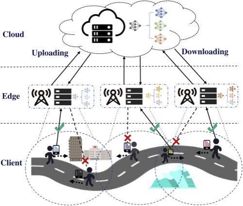

Fig. 1. Client-edge association control in mobility-aware HFL. 

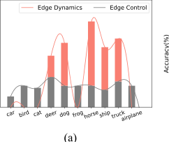

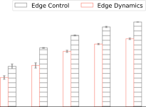

Fig. 2. The performance comparison between edge dynamics and client-edge control validated on the dataset CIFAR10: (a) the class distribution of edge APs; (b) average accuracy after a certain communication rounds. 

distributions of edge APs can be reshaped close to i.i.d through efficient client-edge association control, thereby enhancing the learning performance. 

How to alleviate the impact of uncertain client mobility to improve collaboration efficiency in HFL is a quiet challenging problem. In particular, to realize the mobility-aware HFL in wireless networks mainly faces the following three challenges: (1) Unknown mobility patterns: mobile clients with different data distributions usually download the latest global model from the nearest edge AP, and then roam across different edge APs with their own mobility behaviors. Thus, it is hard to know which edge AP the clients will encounter in the next time slot, and whether to upload the model parameters for model aggregation at the current edge APs. This uncertain mobility trajectory of clients will significantly impact the data distributions at the edge APs. (2) Dynamic client-edge association: a large number of previous works in HFL only focus on the static network topology without considering the edge dynamics with uncertain client mobility and imbalanced data distributions [17], [18]. Although mobile clients may have new opportunities to exchange model information with multiple edge APs in HFL, such new features may lead to a time-varying network topology, which introduces 

high computational complexity to identify the optimal clientedge association among large candidates. Moreover, If mobile clients upload their local models at different edge APs with frequent client-edge association, it would result in redundant model parameters across edge APs, and consequently impair the collaborative efficiency of FL [19]. (3) High client heterogeneity: the heterogeneous clients with various computation capacity could differ in the time slot of completing and uploading the updated model parameters, which may not be consistent with the time slot associated with the optimal edge AP due to the client mobility. Furthermore, the mobility patterns could lead to a unbalance clustering phenomenon, where mobile clients are concentrated into one edge AP with dense association and few clients at other edge APs with sparse connectivity [20]. Without a careful control for client-edge association, such phenomenon gives rise to inefficient collaboration, intensifying the non-i.i.d data distribution problem. 

In this paper, by jointly considering the above challenges, we propose a new mobility-aware wireless federated learning framework called ALPHA, which conducts effective and efficient client-edge association control in both the offline and online mobility scenarios. First, we use markov chain to model the mobility of clients, and analyze the impact of non-i.i.d data distributions of clients, edge APs and the cloud, on the model convergence. We next formulate the data distribution divergence minimization as the client-edge association control problem. Considering the various client mobility scenarios, we analyze the periodic and random mobility patterns, and propose two specific client-edge association control strategies, respectively. In the offline scenario, we use alternating optimization theory to transform the formulated non-linear binary programming into a bipartite b-matching problem [21], [22], and an efficient solution can be derived with the LP relaxation and dependent rounding technique. As for the online one, we leverage the subgradient projection to design a fast and simple online LP algorithm with a bounded regret to make an online decision on which edge APs to upload the local model parameters. 

The main contributions can be summarized as follows: 

- r In this work, we consider mobility-aware wireless FL with client-edge association control. We investigate the performance degradation of HFL due to the hierarchical divergence of data distributions with uncertain client mobility, and control client-edge association to reshape data distributions at edge APs to minimize the data distribution divergence. 

- r For mobility-aware FL, we model client’s mobility with Markov chain for periodic and random mobility patterns. Moreover, we quantify the performance degradation of model training in HFL, and formulate the minimization of data distribution divergence as a client-edge association control problem. 

- r In offline mobility scenario, we leverage alternate optimization theory to transform the non-linear binary programming into a bipartite b-matching problem, and address it with linear relaxation and dependent rounding technique. As for the online scenario without knowing the future mobility trajectories, a fast and simple online algorithm 

Authorized licensed use limited to: Shanghai Jiaotong University. Downloaded on December 29,2025 at 14:30:34 UTC from IEEE Xplore.  Restrictions apply. 

LIU et al.: FROM NON-IID TO IID: MOBILITY-AWARE HIERARCHICAL FEDERATED LEARNING WITH CLIENT-EDGE ASSOCIATION CONTROL 

11719 

TABLE I 

SUMMARY OF MAIN NOTATIONS IN THIS PAPER 

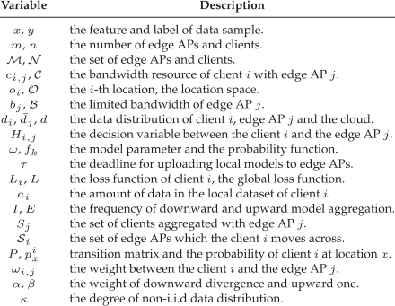

- based on subgradient projection is proposed to make an irrevocable decision on client-edge association. 

- r Extensive evaluations on three public image datasets and a real-worldmobilitytrajectorydatasethavebeenconducted, and the results demonstrate that ALPHA has a superior learning performance with 1.40 _×_ – 2.89 _×_ convergence speedup compared to the state-of-the-art FL approaches. 

The rest of the paper is organized as follows. In Section II, we formally present preliminaries with FL setting, mobility model and problem formulation. The analysis of two classical mobility patterns will be given in Section III. The Section IV provides the specific design of ALPHA. The experimental results and related works are shown in Sections V and VI. The conclusions are made in Section VII. 

## II. PRELIMINARIES 

In this section, we describe FL setting, client mobility model and problem formulation. The notations used in this work are summarized in Table I. 

## _A. Federated Learning_ 

In wireless networks, we consider a set of mobile clients indexed by _N_ = _{_ 1 _,_ 2 _, . . . , n}_ , a set of edge APs indexed by _M_ = _{_ 1 _,_ 2 _, . . . , m}_ and one cloud server. Each mobile client _i ∈N_ consumes bandwidth resource _ci,j ∈C_ to communicate with the nearest edge AP _j ∈M_ , which has a limited bandwidth resource _bj ∈B_ . For the learning task, we focus on a _C_ - categories classification problem with data sample _{x, y}_ over a feature space _X_ and a label space _Y_ . The client _i ∈N_ holds a local dataset _Di_ = _{xk, yk}__a_ _k__i_ =1following the distribution_di_, and _ai_ is the amount of data in local dataset. The data distribution of the edge AP _j ∈M_ depends on the data distribution of mobile clients and its amount of data for model training. Therefore, we denote the virtual data distribution for edge APs as: 

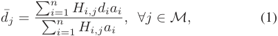

where _Hi,j_ is the decision variable with _Hi,j_ = 1 indicating that mobile client _i_ uploads model parameters to the edge AP _j_ , otherwise _Hi,j_ = 0. Similarly, the variable _d_ˆ = <u>�</u> _ni_ <u>=1</u> _n__di_ represents the virtual data distribution for the cloud server. 

Next, we define the loss function of mobile client _i ∈N_ with cross-entropy loss as: 

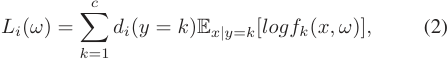

where _di_ ( _y_ = _k_ ) denotes the proportion of the data with class _k_ in the local dataset of client _i_ , and the function _fk_ denotes the probability of the class _k_ for the input feature _x_ . The variable _ω_ are the model parameters, and the objective of HFL is: 

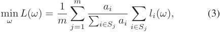

where _Sj_ is the set of mobile clients uploading model parameters to the edge AP _j_ . For the training process in HFL, it involves three steps in a bottom-up manner, i.e., the local model training on mobile clients, downward model aggregation on the edge APs and upward model aggregation on the cloud server. Specifically, in the _l_ -th local iteration, each mobile client _i ∈N_ updates its model by using SGD: 

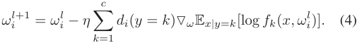

After every _I_ local iterations, the downward model aggregation will be performed at each edge AP _j ∈M_ . Specifically, at local iterations _l ∈{I,_ 2 _I,_ 3 _I, · · · }_ , we update the edge model _wj__l_by aggregating the local models from the associated client set _Sj_ , i.e., 

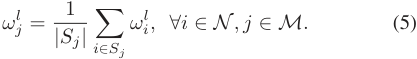

Furthermore, after _E_ rounds of downward model aggregation, models from _m_ edge APs are averaged to obtain the global cloud model _w__l_ and complete the upward model aggregation, i.e., 

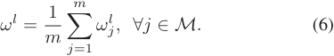

## _B. Client Mobility Model_ 

In wireless networks, mobile clients could roam across edge APs at a certain mobility pattern. Within a time slot, mobile client could stay at the same location or move to another edge APs with a certain probability. In order to model the client’s mobility, we adopt a stochastic process _{X__t_ _, t ≥_ 0 _}_ for each mobile client, which is a markov chain with finite location space _O_ and transition matrix _P_ . Thus, we can obtain the following expression: 

_P_ ( _X__t_+1 = _oi|X__t_ = _oj_ ) = _P_ ( _oi, oj_ ) _,_ (7) which is the conditional probability of moving from location _oi_ at time slot _t_ to location _oj_ at time slot _t_ + 1. 

Authorized licensed use limited to: Shanghai Jiaotong University. Downloaded on December 29,2025 at 14:30:34 UTC from IEEE Xplore.  Restrictions apply. 

IEEE TRANSACTIONS ON MOBILE COMPUTING, VOL. 24, NO. 11, NOVEMBER 2025 

11720 

Mobile clients are heterogeneous in terms of their own mobility patterns, and the transition probability of each client could be quite different. We assume that mobile clients are randomly distributed over all edge APs at the beginning, and the initial location of all clients can be denoted as _{πi_0_}n_ _i_ =1, where_π_ _i_0_∈Rm_ is a probability vector with each element _πi_0(_j_) representing the probability of client _i_ within the edge AP _j_ at time slot 0. We represent the transition probability of clients with the variables _{Pi__t}n_ _i_ =1atthetimeslot_t_.Inthisway,wecangetthenext location as: 

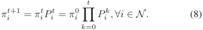

Moreover, mobile clients could also be heterogeneous in terms of their computation capabilities, and the time required for local training is also different. To address the heterogeneity in computational capabilities across mobile clients, we implement a synchronized aggregation signal, i.e., the model aggregation deadline _τ_ . This deadline is intentionally set slightly longer than the time required by the lowest straggler client to complete its _I_ rounds of local model updates, ensuring universal the participation of all mobile clients in model aggregation. As mobile clients may roam across several edge APs before deadline, we can characterize the set of visited edge APs for mobile client _i_ before the deadline _τ_ as: 

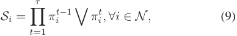

where for two vectors _πi__t_and_π_ _i__t−_1 , the operator _πi__t_ � _πit−_ 1 = (max _{πi__t_(1)_, π_ _i__t−_1 (1) _}, . . . ,_ max _{πi__t_(_m_)_, π_ _i__t−_1 ( _m_ ) _}_ )_T_ denotes the element-wise maximum operator, and _Si__t_=_π_ _i__t_isthestate information of mobile client _i_ at time slot _t_ . The parameter _∥Si∥_ 1 denotes the number of edge APs, and is related to the transition probability _P_ and the deadline _τ_ , which we discuss in next. 

## _C. Problem Formulation_ 

Before formulating the client-edge association control problem, we first analyse the mobility-aware FL with some assumptions and notations: 

- 1) The loss functions _Ex|y_ = _k_ [log _fk_ ( _x, ω_ )] are differentiable and _β_ -smooth; 

- 2) The model gradients ▽ _ωEx|y_ = _k_ [log _fk_ ( _x, ω_ )] are bound, i.e., _||_ ▽ _ωEx|y_ = _k_ [log _fk_ ( _x, ω_ )] _|| ≤ δ_ ; 

- 3) The gradient ▽ _ωEx|y_ = _k_ [log _fk_ ( _x, ω_ )] is _λk_ -Lipschitz for each class _k ∈{c}_ , i.e., _||_ ▽ _ωEx|y_ = _k_ [log _fk_ ( _x, ωi_ )] _−_ ▽ _ωEx|y_ = _k_ [log _fk_ ( _x, ωj_ )] _|| ≤ λk||ωi − ωj||_ . 

Let _ω_ ¯_t_ denotes the model weight after the _t_ -th update in the centralized setting. With these notations, we present the following theorem for the model convergence analysis of client mobility in HFL. 

_Theorem 1:_ After the _g__th_ global model aggregation in HFL, we have the following inequality for model weight divergence: 

- _∥ω__g_ _− ω_ ¯_g_ _∥≤ ζ__EI_ _∥ω__g−_1 _− ω_ ¯_g−_1 _∥_ 

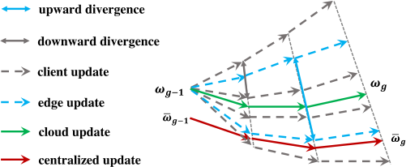

Fig. 3. The model weight divergence in HFL. 

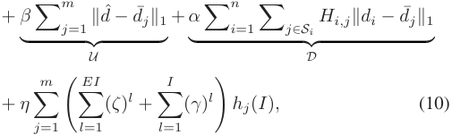

where _γ_ = 1 + _η_�_c_ _k_ =1_di_(_y_=_k_)_λk_ and _ζ_ = 1 + _η_�_c_ _k_ =1 _d_ ˆ( _y_ = _l_ ) _λk_ . The symbol _U_ denotes the upward data distribution divergence between edge APs and cloud server, and _D_ is the downward one between edge APs and clients. _Proof:_ See Appendix A, available online. □ 

As shown in Fig. 3, the gray color lines associated with client update denote the local model training performed by mobile clients, and the light blue ones (edge update) represents the aggregation of these local models at edge APs. As for the green ones and red ones, these two denote the further aggregation at the cloud server and the centralized update where all client data are pooled together for model training. The model weight divergence of the _g__th_ global aggregation mainly comes from two parts: the model weight divergence of the ( _g −_ 1)_th_ global aggregation, and the data distributions divergence, i.e., the upward data distribution divergence _U_ and the downward one _D_ . According to the above convergence analysis, the goal of this work is to leverage client mobility to reshape the data distributions of edge APs, aiming to minimize both upward and downward data distribution divergence in HFL. Therefore, we formulate the following _P_ 1 problem: 

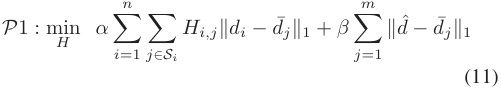

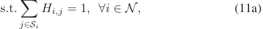

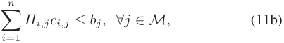

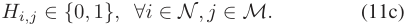

The first constraint (11a) ensures that each client can only be associated to one edge AP during her mobility trajectory. The second one (11b) is to make the connection of each edge AP not so dense due to limited bandwidth resources, and the last constraint (11c) indicates that _Hi,j_ is a binary decision variable. We 

Authorized licensed use limited to: Shanghai Jiaotong University. Downloaded on December 29,2025 at 14:30:34 UTC from IEEE Xplore.  Restrictions apply. 

LIU et al.: FROM NON-IID TO IID: MOBILITY-AWARE HIERARCHICAL FEDERATED LEARNING WITH CLIENT-EDGE ASSOCIATION CONTROL 

11721 

recall that the data distributions of edge APs _{d_¯ _j}__m_ _j_ =1depends on these of clients _{di}__n_ _i_ =1in a non-linear way, because the decision variables _H_ appearing in the numerator and denominator of _{d_¯ _j}__m_ _j_ =1. Therefore, the above_P_1 problem is a non-linear 0-1 programming problem [23], [24], which is known to be NP-hard problem. 

## III. MOBILITY-AWARE FL FRAMEWORK 

In this section, we first analyse key parameters in client mobility model, and discuss two mobility patterns with different settings. According to two mobility patterns, we present the mobility-aware FL framework. 

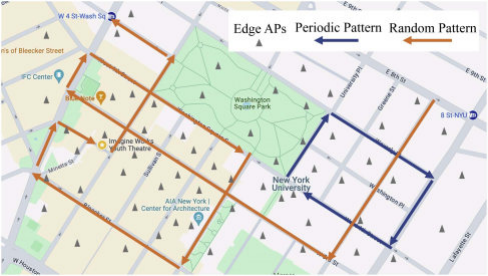

Fig. 4. Illustrations for two classical mobility patterns. 

## _A. Mobility Trajectory Analysis_ 

As discussed in _P_ 1 problem, to minimize the data distribution divergence is related to the mobility trajectories of clients, which depends on the transition probability _P_ and the deadline _τ_ . According to the different mobility patterns of clients [25], we can classify their mobility trajectories into two categories: deterministic mobility trajectory and the non-deterministic mobility trajectories. Next, we first discuss the characterize of these two mobility trajectory by exploring the transition probability _P_ and the deadline _τ_ . 

A deterministic mobility trajectory is characterized by high regularity and predictability, where the future positions of clients can be predicted with a high degree of certainty based on past behaviors and known factors [26]. Periodic mobility trajectory is the classical deterministic mobility trajectory, which represents thatclientscommuteamongasmallsetoffixedlocations,suchas home, school and restaurant. For simplicity, we denote _Ci ⊆M_ as the regularly visited locations of client _i ∈N_ . The transition probability over the location set _Ci_ of the client _i_ is simply the sequence of successive locations as follows: 

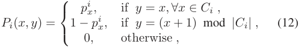

where _p__i_ _x_isthestayprobabilityofclient_i_atlocation_x ∈Ci_, and 1 _− p__i_ _x_isthetransitionprobabilitytonextlocation.A lower _p__i_ _x_impliesthattheclientismorelikelytoroamacross more edge APs, leading to more client-edge association with more optimization space. As shown in Fig. 4, the trajectory of mobile client with periodic mobility pattern is a cycle movement trajectory. 

A non-deterministic mobility trajectory (also referred to as a stochastic mobility trajectory) is characterized by uncertainty and randomness [27]. As for random mobility pattern, we assume that mobile clients are uniformly and randomly distributed over all edge APs at the beginning, and the probability of moving to different edge APs is stochastic and uncertain. Therefore, the element of transition probability matrix can be written as: 

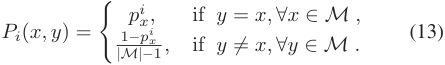

The mobility trajectory of random mobility pattern could be quiet mussy in the Fig. 4, and the next location of each client is hard to predict in advance. As for these two mobility patterns, the deadline _τ_ determines the content of the visited edge APs set _Si_ of clients. According to the equation in (9), each client _i ∈N_ will move across more different edge APs with bigger _τ_ . 

## _B. FL Framework Design_ 

According to the mobility patterns we discussed above, the targeted _P_ 1 problem can be considered as either an offline optimization problem or the online one. In the offline setting, the mobility trajectory of clients with periodic mobility pattern (that is the set of edge APs _Si_ ) are already known, we aim to solve the above _P_ 1 problem by finding the optimal client-edge association to minimize both the upward and downward data distribution divergence, simultaneously. If the number of edge APs in the set _Si_ is large, each mobile client _i ∈N_ would have more optimization space to realize more efficient client-edge association in HFL. In the online setting, the mobility trajectory of clients with random mobility pattern (that is the set of edge APs _Si_ ) is hard to predict, and we need to determine whether to upload the local model at each time slot. 

To this end, we develop a novel mobility-aware FL framework named ALPHA which is defined as follows: ALPHA is a mobility-aware FL framework which contains the offline binary programming and the online binary programming respectively. 

- 1) In the offline setting, the mobility trajectory of clients with periodic mobility pattern (that is the set of edge APs _Si_ ) are already known, ALPHA is to solve the above _P_ 1 problem by finding the optimal client-edge association to minimize upward and downward data distribution divergence, simultaneously. 

- 2) In the online setting, the mobility trajectory of clients with random mobility pattern (that is the set of edge APs _Si_ ) is hard to predict, and ALPHA is to tackle the online problem for the decision about whether to upload model parameters at the current time slot _t_ . 

The problem in these two settings are quiet different which mainly rest with mobility patterns. Thus, we need to work out the problem in these settings seperately. 

Authorized licensed use limited to: Shanghai Jiaotong University. Downloaded on December 29,2025 at 14:30:34 UTC from IEEE Xplore.  Restrictions apply. 

IEEE TRANSACTIONS ON MOBILE COMPUTING, VOL. 24, NO. 11, NOVEMBER 2025 

11722 

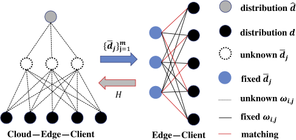

Fig. 5. Illustrations for alternating optimization methods. 

## IV. DESIGN OF ALPHA 

In this section, we first provide the design of offline mobility scenario, and then consider the online one. 

## _A. Offline Scenario_ 

For the offline scenario, we need to solve the optimization problem _P_ 1 with a fixed set of edge APs _Si_ . We denote the objective function in problem _P_ 1 as the variable _F_ . As shown in Fig. 5, we leverage the alternating optimization theory [28] to solve the challenging problem _P_ 1 by the following three steps: (1) we first fix the data distributions of edge APs with a certain probabilities **d**¯ , which denotes the set of _{d_¯ _j}__m_ _j_ =1. In this way, the objective function in _P_ 1 will be transformed as: 

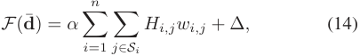

where _wi,j_ = _∥di − d_¯ _j∥_ 1, and Δ = _β_�_m_ _j_ =1_∥d_¯_j−d_ˆ_∥_1isthe upward data distribution divergence, which is a constant when **d** ¯ is fixed. (2) Then, we can solve the _P_ 1 problem with the new objective function _F_ by developing a LP-based bipartite b- matching algorithm to determine the decision variable; (3) After that, we evaluate whether the initialized probabilities **d**¯ are the solution with the satisfied performance. If not, we further search for the initialized probabilities **d**¯ for an efficient solution _H_ with a smaller value of the objective _F_ . As for Step (1), there exist many possible probabilities for data distributions of edge APs **d** ¯. We first need to narrow the space of **d** ¯ to avoid invalid initial values and reduce the search cost. According to the definition of data distributions of edge APs, i.e., _d_¯ _j_ = <u>�</u> ~~�~~ _ni_ <u>=1</u> _~~n~~ i_ =1_HHi,ji,jaaidii_, we can further obtain that: the data distribution of edge AP _d_¯ _j_ is always less than the maximum data distribution of clients in edge APs set _Sj_ , and greater than the minimum data distribution of clients in set _Sj_ . In particular, we can have _d_¯_l_ _j__≤d_¯_j≤d_¯_u_ _j_where_d_¯_l_ _j_= min _{di, ∀i ∈ Sj}_ and _d_¯_u_ _j_= max_{di, ∀i ∈Sj}_.Therefore,we can first fix the values of **d**¯ with its lower boundary **d**¯_l_ , and then conduct step search without beyond its upper boundary **d**¯_u_ . 

The optimization problem in Step (2) can be considered as a weighted bipartite b-matching problem, which is also a NP-hard problem. A bipartite b-matching in graph _G_ = ( _{M, N}, W_ ) is to find a set of weight edges in _W_ where one vertex in _M_ has at most b edges (i.e., a degree constraint) while the other in _N_ 

are unique. This implies that the edge AP can handle multiple clients, and each client can only be collected to one edge AP. The bipartite b-matching problem is an extension of classical bipartite matching problem with more complex constraints, and we solve this problem by using the LP relaxation with dependent rounding technique. We first relax the integer decision variable _Hi,j, i.e.,_ 0 _≤ Hi,j ≤_ 1 toobtaintheoptimalfractionalsolution. Second, we introduce a dependent rounding method to get the integer one. Specifically, let _W_ be the set of edges with fractional values. Repeat the following steps if the set _W_ is non-empty: a) find a simple cycle or maximal path _P_ in the subgraph ( _{M, N}, W_ ) where the simple cycle or maximal path is to ensure that the set of _P_ can be divided into two matchings _M_ 1 and _M_ 2 for two rounding directions (0 or 1) [29]; b) In these two matchings, we have four options for fractional _H_ ¯ _i,j_ to get the integer one _Hi,j_ with different probabilities as follows: 

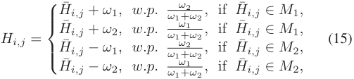

where _ω_ 1 is the minimizer of two kinds of distances: the minimum distance between the nodes in _M_ 1 to 1 and the minimum distance between the nodes in _M_ 2 to 0, and the _ω_ 2 is similar to _ω_ 1 which can be described as: 

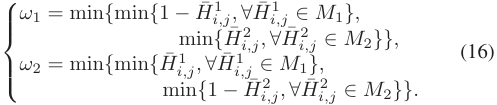

We next conduct Step (3) to search for the optimal values of **d** ¯. There exist many possible **d** ¯ with large search space due to the coupling of edge APs. Suppose there are _k_ possible values for _d_¯ _j_ for each edge AP, then we need to evaluate _m__k_ possible probability profile if there are _m_ edge APs. To solve this intractable problem, we design a minimum overlapped search method with mobility pattern information to reduce the search space. The key idea of this method is to identify an loose couplingsearchorderamongedgeAPs,reducingtheexponential complexity of enumerating all the possible probability profile. From the above discussion, the number of clients connected with corresponding edge APs under periodic mobility pattern is limited ( _|Sj| << |N|, ∀j ∈M_ ), and with low coupling among edge APs. Therefore, we can regard the number of shared clients between edge AP _j_ and the other edge APs, i.e., _oj_ = � _Ni_ =1_|Si ∩{j}|_as its overlapped degree. Furthermore, we can obtain the search order among edge APs based on its overlapped degree to find the efficient values of **d**¯ through only one loop. 

From the above discussion, we can combine these three steps to form an efficient solution to solve the problem _P_ 1. As shown in Algorithm 1, we first narrow the space of _{d_¯ _j}__m_ _j_ =1by finding the lower and upper boundary, and compute the overlapped degree to find the search order (line 1 to line 3). After that, we initialize the data distributions of edge APs **d**¯ and reorder 

Authorized licensed use limited to: Shanghai Jiaotong University. Downloaded on December 29,2025 at 14:30:34 UTC from IEEE Xplore.  Restrictions apply. 

LIU et al.: FROM NON-IID TO IID: MOBILITY-AWARE HIERARCHICAL FEDERATED LEARNING WITH CLIENT-EDGE ASSOCIATION CONTROL 

11723 

## **Algorithm 1:** Offline Control. 

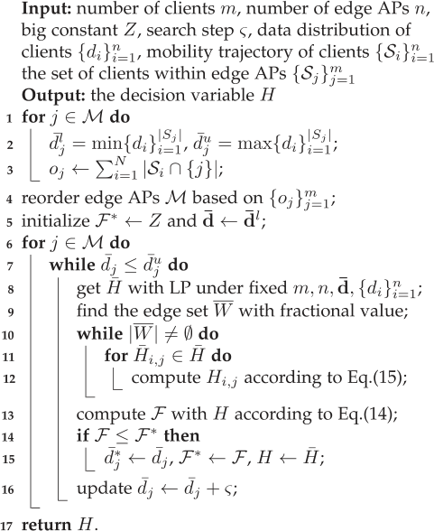

edge APs based on the overlapped degree (line 4 to line 5). In order to determine the decision variable _H_ , we leverage the LP with dependent rounding technique to solve bipartite b-matchingwithfixed **d**¯ (line8toline12).Afterthat,weevaluate whether the initialized probabilities **d**¯ are the solution with the satisfied performance. If not, we further search for the initialized probabilities **d**¯ for a good solution _H_ with a smaller value _F_ (line 13 to line 16). 

This linear relaxation with dependent rounding approach ensures that the degree of each node closely approximates its initial fractional degree, effectively balancing multiple constraints.Moreover,thisapproachguaranteesnegativecorrelation between edges in bipartite graph, which helps maintain better fairness and stability during the allocation process. Using _ζ_ to denote the computation complexity of LP with dependent rounding technique, and _ς_ as the step of search, the computational complexity of Algorithm 1 is _O_ ( _mζ_ max _{d_¯_u_ _<u>j</u>__}m_ _<u>j</u>_ =1 _ς__−_min_{d_¯_l_ _<u>j</u>__}m_ _<u>j</u>_ =1 ), which mainly depends on the number of edge APs, the cost of search for _{d_¯ _j}__m_ _j_ =1and the complexity of LP with dependent rounding. 

_Theorem 2:_ We denote _F_ ( _{d_¯_∗_ _j__}m_ _j_ =1_, H∗_) as the optimal value of problem _P_ 1, and there exist constant _χ_ and _ξ_ satisfying: 

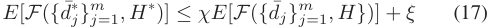

where _χ_ =_<u>c</u>_ _c_<u>max</u> min_·_ _·__<u>d</u>_ _d_<u>max</u> minand_ξ_= (_n · α__<u>c</u>_ _c_<u>max</u> min+_m · β_)(_<u>d</u>_ _d_<u>max</u> min_−_1). _Proof:_ See Appendix B, available online. □ 

## **Algorithm 2:** Online Control. 

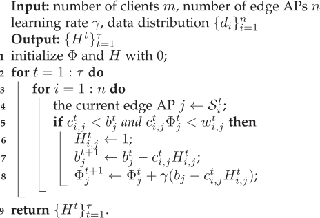

## _B. Online Scenario_ 

For the online scenario, clients only know the current location in each time slot _t_ without the future information, and should make an irrevocable immediate decision on whether to upload model parameters for aggregation at the current edge AP. Specifically, at each time slot _t_ , we should make an online decision _Hi,j__t_ on each client _i_ with the the bandwidth needed to connect to the current edge AP _j_ , i.e., _c__t_ _i,j_, the remaining bandwidth resource on the current edge AP _b__t_ _j_and the divergence of data distribution between associated client-edge, i.e., _wi,j__t_=_∥d_ _i__t−d_¯_t_ _j__∥_1, where the data distribution of edge AP _j_ is accumulated over time slots, i.e., 

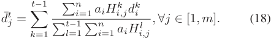

However, it is hard to establish the relation among these three variables in the original problem. Inspired by the dual theory [30], we determine the relation among these three variables in the dual problem. Similar to the offline setting, we first relax 0-1 decision variables _{H__t_ _}__τ_ _t_ =1into continuous variables 0 _≤ Hi,j__t≤_1, and the dual problem of online LP problem is: 

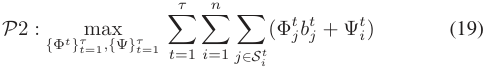

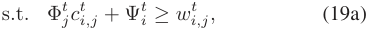

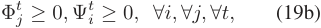

where Φ and Ψ are the dual decision variables. To determine the decision variable _H_ , we need to build the relation between the optimal solution of the prime problem and the dual problem, which are denoted as _H__∗_ , Φ_∗_ and Ψ_∗_ . From the complementary slackness condition, we can derive _H__∗_ without a rounding procedure: 

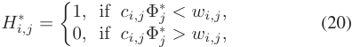

where _Hi,j_ may be the non-integer value when _ci,j_ Φ_∗_ _j_=_wi,j_. In order to identify the relation among the three variables, we need to rewrite an equivalent form of the problem _P_ 2, which 

Authorized licensed use limited to: Shanghai Jiaotong University. Downloaded on December 29,2025 at 14:30:34 UTC from IEEE Xplore.  Restrictions apply. 

IEEE TRANSACTIONS ON MOBILE COMPUTING, VOL. 24, NO. 11, NOVEMBER 2025 

11724 

only includes decision variables Φ by removing the dual decision variables Ψ with plugging the constraints Ψ_t_ _i__≥w_ _i,j__t−_Φ_t_ _j__ct_ _i,j_ and Ψ_t_ _i__≥_0 into the objective function: 

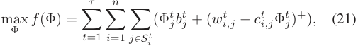

where ( _·_ )+ denotes the positive part function. In this way, we can establish the relation among these three variables by solving _f_ (Φ). To address this problem, we first compute the subgradient evaluated with variable Φ_t_ _j_at time slot_t_as: 

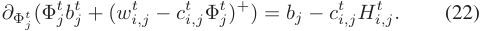

Now, we can state our proposed approach in Algorithm 2: sub-gradient based online LP algorithm, which makes an online decision of the variable _H__t_ immediately after observing the valueof ( _wi,j__t_;_ct_ _i,j_).Inparticular,theupdatefromΦ_t_ _j_toΦ_t_ _j_+1 can be viewed as a projected stochastic subgradient ascent method in line 8. At the beginning of the algorithm, the edge APs prefer to admit the clients when the dual variable Φ _j_ is small, and sufficient bandwidth resource _bj_ is sufficient. After several iterations, the value of Φ _j_ becomes large, and the bandwidth resource _bj_ is small. Thus, few clients will be selected in the latter time slots according to the complementary slack condition. 

Next, we will analyze the performance of Algorithm 2. Before giving the related result, we first introduce some assumptions on the input of LP [31]. We assume: 

- 1) The coefficient pair ( _wi,j, ci,j_ ), are i.i.d. sampled from an unknown distribution; 

- 2) There exist constant _<u>w</u>_ and _<u>c</u>_ such that _wi,j ≤_ _<u>w</u>_ and _ci,j ≤_ _<u>c, ∀i ∈</u>_ [1 _, n_ ] _, ∀j ∈_ [1 _, m_ ]; 

- 3) There exist _<u>b</u>_ and _b_ such that _<u>b</u> ≤ bj ≤ b, ∀j ∈_ [1 _, m_ ]. 

We formally define the regret as the difference between the optimal objective values of the original problem _Rτ__∗_,andthe objective value derived by the Algorithm 2 as _Rτ_ . 

_Theorem 3:_ Under the above assumptions with the deadline _τ_ , the regret of Algorithm 2 satisfies: 

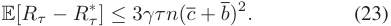

where _γ_ is the learning rate and _n_ denotes the client number. _Proof:_ See Appendix C, available online. □ 

- r _GTSRB_ ,whichisthegermantrafficsignrecognitiondataset including 43 categories images with varying light conditions, rich backgrounds and unbalanced category distribution [33]. 

- r _CIFAR10_ , which is labeled subsets of the 80 million tiny colorful images dataset, has 10 mutually exclusive classes, and is a classical dataset for image classification [34]. 

- r _TELECOM_ , which is provided by Shanghai Telecom, includes more than 7.2 million records of mobility trajectory by accessing the interent through 3233 base stations from 9481 mobile phones for six months [35]. 

_Parameter Setting:_ We use CNN with three convolutional layers and three fully connected layers for SVHN, GTSRB and CIFAR10. The learning rate and batch size of model training is 0.02 and 32. As for TELECOM, we utilize MLP with three fully connected layers. The learning rate and batch size of model trainingis0.01and32.Forallmodels,wesetthedecayfactorand momentum to their default values of 0. To realize the non-IID data distribution, we employ Dirichlet distribution to characterize the identicalness among clients as shown in previous studies [36], [37]. Specifically, we sample a Dirichlet distribution _Dir_ ( _κb_ ) for different non-IID data distributions, where _b_ characterizes the prior class distribution and _κ_ is a concentration parameter. With _κ →∞_ , all clients have identical distribution to the prior, and _κ →_ 0 is the other extreme. The communication cost of clients and the bandwidth resource of edge APs are subject to a random distribution, i.e., _ci,j ∈_ [0 _,_ 1] _, bj ∈_ [5 _,_ 10] _, ∀i ∈N , j ∈M_ . As for the number of mobile clients and edge APs, we take _m ∈{_ 5 _,_ 10 _}_ and _n ∈{_ 20 _,_ 50 _,_ 100 _}_ into consideration. The LP method is written in python with PuLP. 

_Baselines:_ we mainly make a comparison among the following mobility optimization frameworks: 

- r _ORACLE_ , which makes a precise decision for all clients on where and when to upload model parameters for edge aggregation with brute-force search [38]. 

- r _MACFL_ , which aims to realize mobility-aware cluster federated learning by utilizing clustering algorithm to calculate the similarity of mobile clients for model aggregation [14]. 

- r _FedMobile_ , which focuses on the mobility of clients without considering the edge APs and cloud server, and aggregates local models of mobile clients in random manner with the D2D communication [39]. 

## V. PERFORMANCE EVALUATION 

In this section, we first describe the experiment setting, and then evaluate the performance of our proposed ALPHA. 

## _A. Experiment Setting_ 

_Datasets:_ we perform extensive experiments on three public image datasets and a real-world trajectory dataset, which are described as follows: 

r _SVHN_ , which is captured from Google Street View images for a significant real-world problem, and widely used in field of object detection and pattern recognition [32]. 

## _B. Overall Performance_ 

To make the results on these two real-world datasets more persuasive, all experiments in Figs. 6, 7 and 8 are performed three times with _m_ = 10 _, n_ = 100, and the solid line means the averaged value of three experiments, while the size of the shaded area represents the magnitude of fluctuations. Fig. 6 plots the average accuracy of the four mobility optimization methods on three public image datasets, i.e., GTSRB, SVHN and CIFAR10. As the number of communication rounds increases, the average accuracy increases rapidly at first, then slows down until convergence. In Fig. 6(a) and (c), it is obvious that the central 

Authorized licensed use limited to: Shanghai Jiaotong University. Downloaded on December 29,2025 at 14:30:34 UTC from IEEE Xplore.  Restrictions apply. 

11725 

LIU et al.: FROM NON-IID TO IID: MOBILITY-AWARE HIERARCHICAL FEDERATED LEARNING WITH CLIENT-EDGE ASSOCIATION CONTROL 

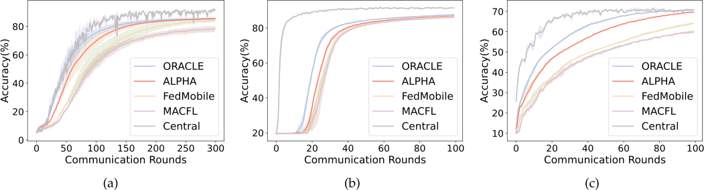

Fig. 6. The performance comparison of average accuracy among four mobility frameworks with central training in HFL validated on three public image datasets: (a) GTSRB; (b) SVHN; (c) CIFAR10. 

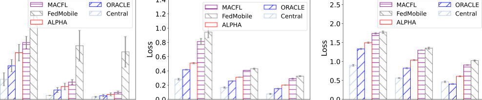

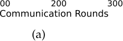

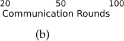

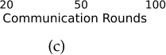

Fig. 7. The performance comparison of training loss among four mobility frameworks with central traning in HFL validated on three public image datasets: (a) GTSRB; (b) SVHN; (c) CIFAR10. 

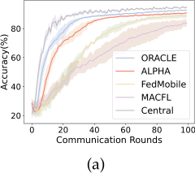

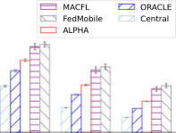

Fig. 8. The performance comparison of four mobility frameworks in HFL validated with the real-world dataset TELECOM on : (a) Average Accuracy; (b) Training Loss. 

training has the highest average accuracy without data shift, and ORACLE and ALPHA are close to the central training while having faster convergence speed and better model performance than both MACFL and FedMobile. In Fig. 6(b), the advantage of ALPHA comparing with FedMobile and MACFL is not obvious due to the dataset SVHN which is relatively simpler compared to the other two datasets, resulting in less distinction between these four mobility frameworks. Fig. 7 plots the training loss of the four mobility optimization frameworks with the central training on three public image datasets, i.e., GTSRB, SVHN 

and CIFAR10. As shown in Fig. 7(a), the training loss of these four methods decreases with the communication rounds, and it is obvious that the training loss of the central training is the minimum one. Moreover, we can find that ORACLE has the minimization of training loss and ALPHA is close to ORACLE while better than MACFL and FedMobile. In Fig. 7(b) and (c), we further validate the efficiency of ALPHA on SVHN and CIFAR10. 

Fig. 8 presents the performance comparison of four mobility frameworks with the central training on the real-world mobility trajectory dataset TELECOM. In Fig. 8(a), ORACLE and ALPHAareclosetothecentraltraining,andhaveasuperiorlearning performance compared to the other two approaches, i.e., FedMobile and MACFL. The main reason behind this phenomenon is that ORACLE and ALPHA pay much attention to minimize the impact of uncertain client mobility, and aim to reshape data distributions of edge APs to be i.i.d, which is much related with the learning performance in HFL. FedMobile and MACFL only focus on model aggregation by given data distribution, and are incapable of addressing uncertain client mobility. In Fig. 8(b), we can find that ORACLE has the minimization of training loss and ALPHA is close to ORACLE while better than MACFL and FedMobile, which further validate the efficiency of our proposed ALPHA. 

Authorized licensed use limited to: Shanghai Jiaotong University. Downloaded on December 29,2025 at 14:30:34 UTC from IEEE Xplore.  Restrictions apply. 

IEEE TRANSACTIONS ON MOBILE COMPUTING, VOL. 24, NO. 11, NOVEMBER 2025 

11726 

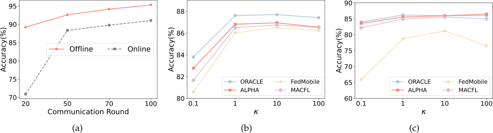

Fig. 9. The performance comparison in HFL with: (a) Accuracy of two mobility scenarios; (b) Impact of _κ_ on the public dataset SVHN; (c) Impact of _κ_ on the real-world dataset TELECOM. 

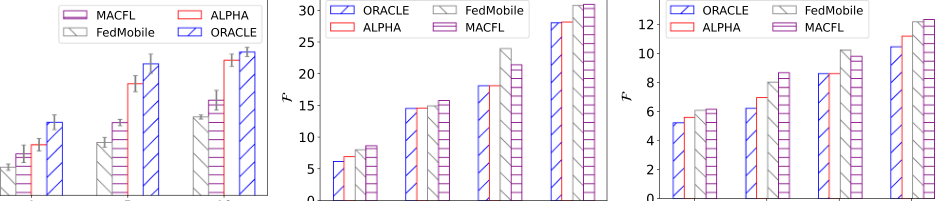

Fig. 10. The performance comparison in HFL with: (a) Impact of _τ_ ; (b) the number of edge APs and clients, i.e., (m, n); (c) the weight of downward data distribution divergence and upward one, i.e., ( _α_ , _β_ ). 

## _C. Key Parameter Analysis_ 

In Fig. 9, we perform the performance comparison in HFL on the impact of _κ_ and two mobility scenarios. Fig. 9(a) presents the prediction accuracy of ALPHA in the offline mobility scenario and the online one. As can be seen from Fig. 9(a), the prediction accuracy of ALPHA both in offline scenario and online one increases with communication rounds. Comparing with the prediction accuracy in offline scenario, the model performance of ALPHA in online scenario is less satisfying due to the uncertainty of mobility trajectory. As stated in the part of parameter setting, we utilize _κ_ to character the non-i.i.d degree. In Fig. 9(b) and (c), we explore the impact of _κ_ on the public image dataset SVHN and the real-world mobility trajectory dataset TELECOM. When _κ_ = 0 _._ 1 with large non-i.i.d degree, the average accuracy of all four mobility frameworks are comparative low, and the performance gap between these four mobility optimization frameworks is large. With the value of _κ_ growing with little non-i.i.d degree, the average accuracy of all four mobility frameworks are increasing, but the performance gap decreases. 

In Fig. 10, we perform the performance comparison in HFL on the impact of _τ_ , the number of edge APs and clients, i.e., ( _m, n_ ), and the weight of downward and upward divergence, i.e., ( _α, β_ ). In Fig. 10(a), we further study the impact of _τ_ on performance of mobility optimization, and use the variable _τ_ to character the time deadline of mobility. Each client _i ∈N_ will have more time to move across different edge APs with bigger _τ_ . As shown in 

Fig. 10(a), the mobility trajectory with _τ_ = 10 has the highest averaged accuracy comparing with the mobility scenario with _τ_ = 5 or _τ_ = 1, where the gray error bar is the variance of three experiments. The reason of this phenomenon is that clients have more edge APs to choose for model aggregation with bigger _τ_ , which is useful for data distribution divergence minimization. Further, we make a performance comparison among ALPHA with the other three methods by considering different parameter settings. The parameter _F_ in vertical coordinate is the total divergence of data distributions which is the optimization objective. As can be seen from Fig. 10(b), the total divergence of data distributions increases with the number of edge APs and clients ( _m, n_ ), and ALPHA is better than FedMobile and MACFL. Moreover in Fig. 10(c), we also use the weight parameters ( _α, β_ ) to perform evaluation, and find similar results that the total divergence of data distributions among these four mobility optimization scheme increases with the value of ( _α, β_ ). 

Fig. 11 presents the performance comparisons with four different mobility frameworks on all datasets CIFAR10, SVHN, GSTRB and TELECOM by taking different mobility frequency into account. We use the variable p to character the mobility frequency of mobile clients, and each client _i ∈N_ will prefer moving another locations to staying at same one with little p, which means that _p_ = 0 _._ 1 is the high mobility scenario. As shown in Fig. 11, we consider three different mobility frequency scenarios including high mobility scenario with _p_ = 0 _._ 1, normal mobility scenario with _p_ = 0 _._ 5 and nearly static scenario with 

Authorized licensed use limited to: Shanghai Jiaotong University. Downloaded on December 29,2025 at 14:30:34 UTC from IEEE Xplore.  Restrictions apply. 

LIU et al.: FROM NON-IID TO IID: MOBILITY-AWARE HIERARCHICAL FEDERATED LEARNING WITH CLIENT-EDGE ASSOCIATION CONTROL 

11727 

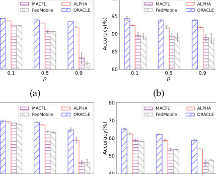

Fig. 11. The performance of ALPHA with different mobility frequency, i.e., _p_ on datasets: (a) Accuracy on SVHN; (b) Accuracy on TELECOM; (c) Accuracy on GTSRB; (d) Accuracy on CIFAR10. 

_p_ = 0 _._ 9. Moreover, the experiment of each mobility scenario withdifferentphasbeenperformedwithseveraltimestovalidate the reliability and stability of the experimental results. As shown in Fig. 11, it is obvious that ORACLE and ALPHA has better model performance than both MACFL and FedMobile on all datasets. In high mobility scenario with _p_ = 0 _._ 1, ALPHA has the highest average accuracy with frequent client mobility. This is because frequent client mobility creates new model aggregation opportunities at different edge APs, which is capable of reshaping the data distributions of edge APs to be i.i.d. As for the nearly static scenario with _p_ = 0 _._ 9, the average accuracy declines a lot comparing to the one in high mobility scenario. In Fig. 11(a), the difference among high mobility scenario and nearly static scenario is not obvious due to the dataset SVHN which is relatively simpler compared to the other three datasets, resulting in less distinction between these two mobility scenarios. The model performance on these four datasets fluctuates a lot no matter in the high mobility scenarios or slow mobility scenario. This is because the performance of aggregated model not only depends on mobility frequency but also the other factors, i.e., task complexity and network topology, which will be explored furtherly in the future work. 

In this work, we focus exclusively on the selection of edge APs for model uploading and aggregation for mobility-aware hierarchical FL, without considering the local model training methods of mobile clients or the model aggregation strategies at edge APs. To validate the robustness of our approach across various classical FL algorithms, we conducted additional experiments incorporating two classical FL algorithms: FedAvg and FedProx. As shown in Fig. 12(a), our proposed ALPHA demonstrates superior performance improvements over both FedMobile and MACFL, regardless of which FL algorithm is employed. However, comparing these two algorithms reveals that FedAvg achieves better performance than FedProx in hierarchical FL. This discrepancy stems from FedProx’s introduction of a global 

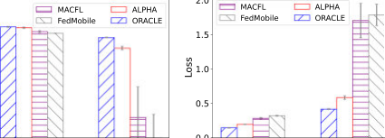

Fig. 12. The performance comparison of four mobility frameworks in HFL withdifferentmodelaggregationmethods(FedAvgandFedProx)on:(a)average accuracy; (b) training loss. 

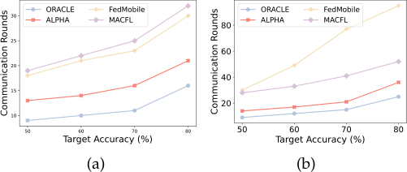

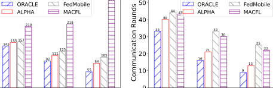

Fig. 13. The performance comparison of four mobility frameworks in HFL on : (a) Round-to-Accuracy on SVHN; (b) Round-to-Accuracy on TELECOM; (c) Accuracy-to-Round on GTSRB; (d) Accuracy-to-Round on TELECOM. 

correction term during model training to address data shifts, whereas in hierarchical FL, mobile clients can only access the model of the corresponding edge APs as correction references. The inherent discrepancy between models of edge APs and the global model creates a performance degradation effect: greater discrepancies lead to poorer local model training. Thus, we conclude that in mobility-aware hierarchical FL collaborative control optimization between mobile clients and edge APs holds greater significance than local model training optimization. This conclusion is further corroborated by the training loss presented in Fig. 12(b). 

In Fig. 13, we focus on the accuracy-to-round of different mobility optimization frameworks, which emphasizes its superiority by reaching the target accuracy with fewer communication rounds. The results on the dataset SVHN in Fig. 13(a) and the dataset TELECOM in Fig. 13(b), show that comparing with MACFL and FedMobile, ORACLE and ALPHA need fewer communication rounds to reach the corresponding target accuracy, and when the requirement of target accuracy is more strict, the performance gap between four mobility frameworks increases. In Fig. 13(c) and (d), we also find that in long-term mobility scenario, it needs fewer communication rounds to reach 

Authorized licensed use limited to: Shanghai Jiaotong University. Downloaded on December 29,2025 at 14:30:34 UTC from IEEE Xplore.  Restrictions apply. 

IEEE TRANSACTIONS ON MOBILE COMPUTING, VOL. 24, NO. 11, NOVEMBER 2025 

11728 

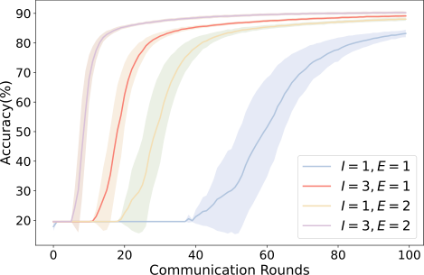

Fig. 14. The performance comparison on the frequency of downward model aggregation and upward model aggregation, i.e., ( _I, E_ ). 

the corresponding target accuracy (80% on TELECOM and 60% on GTRSB) comparing with short-time mobility scenario. In Fig. 14, we explore the model performance on the frequency of downward model aggregation and upward model aggregation, i.e., ( _I, E_ ). It is easy to find that the model performance of ALPHA will converge faster with the increase of the value of ( _I, E_ ). Taking the difference between _I_ and _E_ into consideration, we find that the model performance with the setting of ( _I_ = 3 _, E_ = 1) is better than the one with the setting of ( _I_ = 1 _, E_ = 2), which means that the downward data distribution divergence in mobility optimization is much vital than the upward one. 

## VI. RELATED WORKS AND DISCUSSION 

Hierarchical FL in wireless networks have drawn much research attention for the advantage in reducing both communication cost and the number of local iterations [40], [41], [42], [43]. There is an increasing number of HFL-related studies in many areas, e.g., wireless communication networks [44], [45], fault diagnosis [46], industrial IoT [47], intelligent transportation systems [48], human activity recognition [49] and so on. Liu et al. [50] designed a HierFAVG algorithm with partial model aggregation to achieve better communication-computation tradeoff. Similarly, a clustered hierarchical distributed federated learning has been proposed to solve the problem of high consumption of communication resources [51]. Abad et al. [52] proposed a kind of hierarchical FL scheme to reduce the communication latency without sacrificing the accuracy. Although hierarchical FL has been popular with much related research works, the prediction accuracy of hierarchical aggregated model degrades a lot if the data distributions of local clients diverge. 

Non-i.i.d data problem have been one of fundamental challenges for model training in HFL where the impact of noni.i.d data could be exacerbated in HFL [43], [53], [54], [55], [56], [57]. Although a variety of works have been proposed to lessen the problem of non-i.i.d data distribution [58], [59], [60], these methods just deal with a given static data distribution in the single aggregation manner, and is not suitable for mobility scenarios with dynamic non-i.i.d data distributions in hierarchical aggregation manner. Wang et al. [61] provided theoretical results why local aggregation can be beneficial in improving 

the convergence of Hierarchical SGD. Briggs et al. [62] proposed a hierarchical clustering step to cluster similar clients for specialised models. Similarly, Wu et al. [17] focused on federated user modeling tasks and proposed a novel hierarchical FL framework to work out the problem of inconsistent clients and non-i.i.d data. To cope with imbalanced data distribution in HFL, Liu et al. [18] proposed joint user association and resource allocation algorithm to minimize the learning latency.However, current research works on non-i.i.d data in hierarchical FL are primarily dedicated to the static scenario where clients always stay at the same location and the topology between edge APs and clients are static, which is less practice in real-world applications. 

Mobility has been well studied in wireless mobile communication networks for being capable of improving network performance, including but not limited to handover efficiency, resource allocation optimization, and quality-of-service assurance [63], [64], [65], [66]. Some research works have also been focused on the impact of client mobility on collaborative training in hierarchical FL. Yu et al. [15] utilized the mobility patterns and preferences of vehicles to collaboratively learn a global model for high popularity contents prediction. The main limitation of this work is that it ignores the high mobile clients with a decrease number of participants. The mobility attribute of clients have also been utilized with client-to-client communication to design a new asynchronous FL algorithm named FedMobile to improve the learning performance [39]. In D2D communication manner, the model aggregation of FL largely depends on the random of client mobility without performance guarantee. Feng et al. [14] proposed a mobility-aware cluster federated learning (MACFL) algorithm with personalization technique to enhance learning performance by redesigning the access mechanism and model aggregation shceme. Despite considering different non-i.i.d data distribution in mobility-aware HFL, the cluster method has just worked out downward divergence without considering the upward divergence. 

Although the most recent work MACFL also focuses on client mobility, it is limited by extra operations to redesign access mechanism and lack of solution for uncertain client mobility. Superior to MACFL, ALPHA controls uncertain client mobility to reshape the data distribution of edge APs from the global perspective, which works out the non-i.i.d data problem in root and also scalable in all FL aggregation algorithm without any operations. Moreover, for the application of ALPHA, we consider that ALPHA in offline scenario is suitable for path planning in fixed trajectory for autonomous vehicles, and ALPHA in online one is advantageous for target search with impossible aerial vehicles. 

## VII. CONCLUSION 

In this work, we have studied the client mobility in wireless networks, and have proposed a new mobility-aware hierarchical FL framework, namely ALPHA, which considered both the offline and online mobility scenarios. Specifically, we make the convergence analysis of performance degradation induced by the divergence of data distributions, and formulate the mobility-aware client-edge association problem to minimize 

Authorized licensed use limited to: Shanghai Jiaotong University. Downloaded on December 29,2025 at 14:30:34 UTC from IEEE Xplore.  Restrictions apply. 

LIU et al.: FROM NON-IID TO IID: MOBILITY-AWARE HIERARCHICAL FEDERATED LEARNING WITH CLIENT-EDGE ASSOCIATION CONTROL 

11729 

the divergence of data distributions. In particular, we first focus on the offline scenarios where all client mobility trajectory are already known, and the efficient solution can be derived with the LP and dependent rounding technique. As for the online one, a fast and simple online algorithm based on the subgradient is proposed to make a quick decision with a bounded regret. Experimental results on three public image datasets and a real-world mobility trajectory dataset show that our proposed ALPHA provides an efficient mobility optimization scheme with superior learning performance with 1.40 _×_ – 2.89 _×_ convergence speedup comparing to the-state-of-art approaches. 

## ACKNOWLEDGMENT 

The opinions, findings, conclusions, and recommendations expressed in this paper are those of the authors and do not necessarily reflect the views of the funding agencies or the government. 

## REFERENCES 

- [1] S. Hu, Q. Li, and B. He, “Communication-efficient generalized neuron matching for federated learning,” in _Proc. Int. Conf. Parallel Process._ , 2023, pp. 254–263. 

- [2] T. Li, A. K. Sahu, A. Talwalkar, and V. Smith, “Federated learning: Challenges, methods, and future directions,” _IEEE Signal Process. Mag._ , vol. 37, no. 3, pp. 50–60, May 2020. 

- [3] D. C. Nguyen, M. Ding, P. N. Pathirana, A. Seneviratne, J. Li, and H. V. Poor, “Federated learning for Internet of Things: A comprehensive survey,” _IEEE Commun. Surveys Tuts._ , vol. 23, no. 3, pp. 1622–1658, Third Quarter, 2021. 

- [4] W. Y. B. Lim et al., “Federated learning in mobile edge networks: A comprehensive survey,” _IEEE Commun. Surveys Tuts._ , vol. 22, no. 3, pp. 2031–2063, Third Quarter 2020. 

- [5] P. Kairouz et al., “Advances and open problems in federated learning,” _Found. Trends Mach. Learn._ , vol. 14, no. 1/2, pp. 1–210, 2021. 

- [6] S. Niknam, H. S. Dhillon, and J. H. Reed, “Federated learning for wireless communications: Motivation, opportunities, and challenges,” _IEEE Commun. Mag._ , vol. 58, no. 6, pp. 46–51, Jun. 2020. 

- [7] Z. Wang, Y. Zhou, Y. Shi, and W. Zhuang, “Interference management for over-the-air federated learning in multi-cell wireless networks,” _IEEE J. Sel. Areas Commun._ , vol. 40, no. 8, pp. 2361–2377, Aug. 2022. 

- [8] J. Koneˇcný, H. B. McMahan, F. X. Yu, P. Richtárik, A. T. Suresh, and D. Bacon, “Federated learning: Strategies for improving communication efficiency,” 2016, _arXiv:1610.05492_ . 

- [9] W. Y. B. Lim et al., “Decentralized edge intelligence: A dynamic resource allocation framework for hierarchical federated learning,” _IEEE Trans. Parallel Distrib. Syst._ , vol. 33, no. 3, pp. 536–550, Mar. 2022. 

- [10] S. Luo, X. Chen, Q. Wu, Z. Zhou, and S. Yu, “HFEL: Joint edge association and resource allocation for cost-efficient hierarchical federated edge learning,” _IEEE Trans. Wireless Commun._ , vol. 19, no. 10, pp. 6535–6548, Oct. 2020. 

- [11] J. Liu, X. Wei, X. Liu, H. Gao, and Y. Wang, “Group-based hierarchical federated learning: Convergence, group formation, and sampling,” in _Proc. Int. Conf. Parallel Process._ , 2023, pp. 264–273. 

- [12] L. Claussmann, M. Revilloud, D. Gruyer, and S. Glaser, “A review of motion planning for highway autonomous driving,” _IEEE Trans. Intell. Transp. Syst._ , vol. 21, no. 5, pp. 1826–1848, May 2020. 

- [13] Y. Zheng, Y. Du, H. Ling, W. Sheng, and S. Chen, “Evolutionary collaborative human-UAV search for escaped criminals,” _IEEE Trans. Evol. Comput._ , vol. 24, no. 2, pp. 217–231, Apr. 2020. 

- [14] C. Feng, H. H. Yang, D. Hu, Z. Zhao, T. Q. S. Quek, and G. Min, “Mobility-aware cluster federated learning in hierarchical wireless networks,” _IEEE Trans. Wireless Commun._ , vol. 21, no. 10, pp. 8441–8458, Oct. 2022. 

- [15] Z. Yu, J. Hu, G. Min, Z. Zhao, W. Miao, and M. S. Hossain, “Mobilityaware proactive edge caching for connected vehicles using federated learning,” _IEEE Trans. Intell. Transp. Syst._ , vol. 22, no. 8, pp. 5341–5351, Aug. 2021. 

- [16] S. Zhang, Z. Zheng, Q. Li, F. Wu, and G. Chen, “Mobility-aware device sampling for statistical heterogeneity in hierarchical federated learning,” in _Proc. IEEE Int. Conf. Distrib. Comput. Syst._ , 2024, pp. 656–667. 

- [17] J. Wu et al., “Hierarchical personalized federated learning for user modeling,” in _Proc. Web Conf._ , 2021, pp. 957–968. 

- [18] S. Liu, G. Yu, X. Chen, and M. Bennis, “Joint user association and resource allocationforwirelesshierarchicalfederatedlearningwithIIDandnon-IID data,” _IEEE Trans. Wireless Commun._ , vol. 21, no. 10, pp. 7852–7866, Oct. 2022. 

- [19] Q. Wu et al., “HiFlash: Communication-efficient hierarchical federated learning with adaptive staleness control and heterogeneity-aware clientedge association,” _IEEE Trans. Parallel Distrib. Syst._ , vol. 34, no. 5, pp. 1560–1579, May 2023. 

- [20] M. Piórkowski, N. Sarafijanovic-Djukic, and M. Grossglauser, “On clustering phenomenon in mobile partitioned networks,” in _Proc. SIGMOBILE Workshop Mobility Models_ , 2008, pp. 1–8. 

- [21] F. Ahmed, J. P. Dickerson, and M. D. Fuge, “Diverse weighted bipartite b-matching,” in _Proc. Int. Joint Conf. Artif. Intell._ , 2017, pp. 35–41. 

- [22] J. Könemann, J. Toth, and F. Zhou, “On the complexity of nucleolus computation for bipartite b-matching games,” _Theor. Comput. Sci._ , vol. 998, 2024, Art. no. 114476. 

- [23] R. Luus, “Optimization of system reliability by a new nonlinear integer programming procedure,” _IEEE Trans. Rel._ , vol. R-24, no. 1, pp. 14–16, Apr. 1975. 

- [24] M. Balletti, V. Piccialli, and A. M. Sudoso, “Mixed-integer nonlinear programming for state-based non-intrusive load monitoring,” _IEEE Trans. Smart Grid_ , vol. 13, no. 4, pp. 3301–3314, Jul. 2022. 

- [25] J. Lee and J. C. Hou, “Modeling steady-state and transient behaviors of user mobility: Formulation, analysis, and application,” in _Proc. ACM Int. Symp. Mobile Ad Hoc Netw. Comput._ , 2006, pp. 85–96. 

- [26] M. C. Gonzalez, C. A. Hidalgo, and A.-L. Barabasi, “Understanding individual human mobility patterns,” _Nature_ , vol. 453, no. 7196, pp. 779–782, 2008. 

- [27] C. Song, Z. Qu, N. Blumm, and A.-L. Barabási, “Limits of predictability in human mobility,” _Science_ , vol. 327, no. 5968, pp. 1018–1021, 2010. 

- [28] J. C. Bezdek and R. J. Hathaway, “Convergence of alternating optimization,” _Neural Parallel Sci. Computations_ , vol. 11, no. 4, pp. 351–368, 2003. 

- [29] R. Gandhi, S. Khuller, S. Parthasarathy, and A. Srinivasan, “Dependent rounding in bipartite graphs,” in _Proc. 43rd Annu. IEEE Symp. Found. Comput. Sci._ , 2002, pp. 323–332. 

- [30] A. Bachem, W. Kern, A. Bachem, and W. Kern, _Linear Programming Duality_ . Berlin, Germany: Springer, 1992. 

- [31] X. Li, C. Sun, and Y. Ye, “Simple and fast algorithm for binary integer and online linear programming,” in _Proc. Int. Conf. Neural Inf. Process. Syst._ , 2020, pp. 9412–9421. 

- [32] Y. Netzer, T. Wang, and A. Coates, “Reading digits in natural images with unsupervised feature learning,” in _Proc. NIPS Workshop Deep Learn. Unsupervised Feature Learn._ , 2011, Art. no. 7. 

- [33] S. Houben, J. Stallkamp, J. Salmen, M. Schlipsing, and C. Igel, “Detection of traffic signs in real-world images: The German traffic sign detection benchmark,” in _Proc. Int. Joint Conf. Neural Netw._ , 2013, pp. 1–8. 

- [34] A. Krizhevsky, “Learning multiple layers of features from tiny images,” Univ. Toronto, Tech. Rep., 2009. [Online]. Available: https://www.cs. toronto.edu/_∼_ kriz/learning-features-2009-TR.pdf 

- [35] S. Wang, Y. Guo, N. Zhang, P. Yang, A. Zhou, and X. Shen, “Delay-aware microservice coordination in mobile edge computing: A reinforcement learning approach,” _IEEE Trans. Mobile Comput._ , vol. 20, no. 3, pp. 939– 951, Mar. 2021. 

- [36] M. Luo, F. Chen, D. Hu, Y. Zhang, J. Liang, and J. Feng, “No fear of heterogeneity: Classifier calibration for federated learning with non-IID data,” in _Proc. Int. Conf. Neural Inf. Process. Syst._ , 2021, pp. 5972–5984. 

- [37] T. H. Hsu, H. Qi, and M. Brown, “Measuring the effects of nonidentical data distribution for federated visual classification,” 2019, _arXiv: 1909.06335_ . 

- [38] Z. Qu, R. Duan, L. Chen, J. Xu, Z. Lu, and Y. Liu, “Context-aware online client selection for hierarchical federated learning,” _IEEE Trans. Parallel Distrib. Syst._ , vol. 33, no. 12, pp. 4353–4367, Dec. 2022. 

- [39] J. Bian and J. Xu, “Mobility improves the convergence of asynchronous federated learning,” 2022, _arXiv.2206.04742_ . 

- [40] B. Gong, T. Xing, Z. Liu, W. Xi, and X. Chen, “Towards hierarchical clustered federated learning with model stability on mobile devices,” _IEEE Trans. Mobile Comput._ , vol. 23, no. 6, pp. 7148–7164, Jun. 2024. 

- [41] T.Qi,Y.Zhan,P.Li,andY.Xia,“Tomtit: Hierarchicalfederatedfine-tuning of giant models based on autonomous synchronization,” in _Proc. IEEE Conf. Comput. Commun._ , 2024, pp. 1910–1919. 

Authorized licensed use limited to: Shanghai Jiaotong University. Downloaded on December 29,2025 at 14:30:34 UTC from IEEE Xplore.  Restrictions apply. 

IEEE TRANSACTIONS ON MOBILE COMPUTING, VOL. 24, NO. 11, NOVEMBER 2025 

11730 

- [42] Y. Guo, F. Liu, T. Zhou, Z. Cai, and N. Xiao, “Privacy vs. efficiency: Achieving both through adaptive hierarchical federated learning,” _IEEE Trans. Parallel Distrib. Syst._ , vol. 34, no. 4, pp. 1331–1342, Apr. 2023. 

- [43] H. Liu, J. Lu, X. Wang, C. Wang, R. Jia, and M. Li, “FedUP: Bridging fairness and efficiency in cross-silo federated learning,” _IEEE Trans. Serv. Comput._ , vol. 17, no. 6, pp. 3672–3684, Nov./Dec. 2024. 

- [44] J. Feng, L. Liu, Q. Pei, and K. Li, “Min-max cost optimization for efficient hierarchical federated learning in wireless edge networks,” _IEEE Trans. Parallel Distrib. Syst._ , vol. 33, no. 11, pp. 2687–2700, Nov. 2022. 

- [45] Y. Zhuang, Z. Zheng, F. Wu, and G. Chen, “LiteMoE: Customizing ondevice LLM serving via proxy submodel tuning,” in _Proc. 22nd ACM Conf. Embedded Netw. Sensor Syst._ , 2024, pp. 521–534. 

- [46] J. Lin, J. Ma, and J. Zhu, “Hierarchical federated learning for power transformer fault diagnosis,” _IEEE Trans. Instrum. Meas._ , vol. 71, 2022, Art. no. 3520611. 

- [47] T. Zhao, F. Li, and L. He, “DRL-based joint resource allocation and device orchestration for hierarchical federated learning in NOMA-enabled industrial IoT,” _IEEE Trans. Ind. Informat._ , vol. 19, no. 6, pp. 7468–7479, Jun. 2023. 

- [48] X. Wang, W. Liu, H. Lin, J. Hu, K. Kaur, and M. S. Hossain, “AIempowered trajectory anomaly detection for intelligent transportation systems: A hierarchical federated learning approach,” _IEEE Trans. Intell. Transp. Syst._ , vol. 24, no. 4, pp. 4631–4640, Apr. 2023. 

- [49] H. Yu et al., “FedHAR: Semi-supervised online learning for personalized federated human activity recognition,” _IEEE Trans. Mobile Comput._ , vol. 22, no. 6, pp. 3318–3332, Jun. 2023. 

- [50] L. Liu, J. Zhang, S. Song, and K. B. Letaief, “Client-edge-cloud hierarchical federated learning,” in _Proc. IEEE Int. Conf. Commun._ , 2020, pp. 1–6. 

- [51] Y. Gou, R. Wang, Z. Li, M. A. Imran, and L. Zhang, “Clustered hierarchical distributed federated learning,” in _Proc. IEEE Int. Conf. Commun._ , 2022, pp. 177–182. 

- [52] M. S. H. Abad, E. Ozfatura, D. Gündüz, and Ö. Erçetin, “Hierarchical federated learning ACROSS heterogeneous cellular networks,” in _Proc. Int. Conf. Acoust. Speech Signal Process._ , 2020, pp. 8866–8870. 

- [53] J. Kwon and H. Park, “Efficient low-rank federated learning based on singular value decomposition,” in _Proc. ACM Int. Symp. Mobile Ad Hoc Netw. Comput._ , 2022, pp. 285–286. 

- [54] S. Yue, J. Ren, J. Xin, S. Lin, and J. Zhang, “Inexact-ADMM based federated meta-learning for fast and continual edge learning,” in _Proc. ACM Int. Symp. Mobile Ad Hoc Netw. Comput._ , 2021, pp. 91–100. 

- [55] X. Zhang, M. Fang, Z. Liu, H. Yang, J. Liu, and Z. Zhu, “NET-FLEET: Achieving linear convergence speedup for fully decentralized federated learning with heterogeneous data,” in _Proc. ACM Int. Symp. Mobile Ad Hoc Netw. Comput._ , 2022, pp. 71–80. 

- [56] C. Gong, Z. Zheng, F. Wu, Y. Shao, B. Li, and G. Chen, “To store or not? Online data selection for federated learning with limited storage,” in _Proc. ACM Web Conf._ , 2023, pp. 3044–3055. 

- [57] C. Gong, Z. Zheng, F. Wu, X. Jia, and G. Chen, “Delta: A cloud-assisted data enrichment framework for on-device continual learning,” in _Proc. Annu. Int. Conf. Mobile Comput. Netw._ , 2024, pp. 1408–1423. 

- [58] S. P. Karimireddy, S. Kale, M. Mohri, S. J. Reddi, S. U. Stich, and A. T. Suresh, “SCAFFOLD: Stochastic controlled averaging for federated learning,” in _Proc. Int. Conf. Mach. Learn._ , 2020, pp. 5132–5143. 

- [59] J. Kim, G. Kim, and B. Han, “Multi-level branched regularization for federated learning,” in _Proc. Int. Conf. Mach. Learn._ , 2022, pp. 11058– 11073. 

- [60] X. Li, M. Jiang, X. Zhang, M. Kamp, and Q. Dou, “FedBN: Federated learning on non-IID features via local batch normalization,” in _Proc. Int. Conf. Learn. Representations_ , 2021, pp. 1–27. 

- [61] J. Wang, S. Wang, R. Chen, and M. Ji, “Demystifying why local aggregation helps: Convergence analysis of hierarchical SGD,” in _Proc. AAAI Conf. Artif. Intell._ , 2022, pp. 8548–8556. 

- [62] C. Briggs, Z. Fan, and P. Andras, “Federated learning with hierarchical clustering of local updates to improve training on non-IID data,” in _Proc. Int. Joint Conf. Neural Netw._ , 2020, pp. 1–9. 

- [63] M. Grossglauser and D. N. C. Tse, “Mobility increases the capacity of ad hoc wireless networks,” _IEEE/ACM Trans. Netw._ , vol. 10, no. 4, pp. 477– 486, Aug. 2002. 

- [64] Y. Yuan et al., “: Mobility-driven integration of heterogeneous urban cyberphysical systems under disruptive events,” _IEEE Trans. Mobile Comput._ , vol. 22, no. 2, pp. 906–922, Feb. 2023. 

- [65] R. Karmakar, G. Kaddoum, and S. Chattopadhyay, “Mobility management in 5G and beyond: A novel smart handover with adaptive time-to-trigger and hysteresis margin,” _IEEE Trans. Mobile Comput._ , vol. 22, no. 10, pp. 5995–6010, Oct. 2023. 

- [66] F. Zhang, J. Xiong, Z. Chang, J. Ma, and D. Zhang, “Mobi2 Sense: Empowering wireless sensing with mobility,” in _Proc. 28th Annu. Int. Conf. Mobile Comput. Netw._ , 2022, pp. 268–281. 

**Haibo Liu** (Graduate Student Member, IEEE) received the BE degree in computer science and technology from Zhejiang Normal University, Jinhua, China. He iscurrently working toward thePhDdegree with the School of Computer Science, Shanghai Jiao Tong University, Shanghai, China. His research interests include federated learning, continual learning, and game theory. 

**Zhenzhe Zheng** (Member, IEEE) received the BE degree in software engineering from Xidian University, in 2012, and the MS and PhD degrees in computer science and engineering from Shanghai Jiao Tong University, in 2015 and 2018, respectively. He is a professor with the Department of Computer Science and Engineering, Shanghai Jiao Tong University. He has visited the University of Illinois at Urbana-Champaign (UIUC) as a post doc research associate from 2018 to 2019. His research interests includegametheoryandmechanismdesign,network- 

ing and mobile computing, and online marketplaces. He is a recipient of the China Computer Federation (CCF) Excellent Doctoral Dissertation Award 2018, Google PhD Fellowship 2015 and Microsoft Research Asia PhD Fellowship 2015. He has served as the member of technical program committees of several academic conferences, such as MobiHoc, AAAI, MSN, IoTDI and etc. He is a member of the ACM, and CCF. For more information, please visit https://zhengzhenzhe220.github.io/. 

**Fan Wu** (Member, IEEE) received the BS degree in computer science from Nanjing University, in 2004, and the PhD degree in computer science and engineering from the State University of New York at Buffalo, in 2009. He is a professor with the Department of Computer Science and Engineering, Shanghai Jiao Tong University. He has visited the University of Illinois at Urbana-Champaign (UIUC) as a post doc research associate. His research interests include wireless networking and mobile computing, data management, algorithmic network economics, and privacy preservation. He has published more than 200 peer-reviewed papers in technical journals and conference proceedings. He is a recipient of the first class prize for Natural Science Award of China Ministry of Education, China National Fund for Distinguished Young Scientists, ACM China Rising Star Award, CCFTencent “Rhinoceros bird” Outstanding Award, and CCF-Intel Young Faculty Researcher Program Award. He has served as an associate editor of _IEEE Transactions on Mobile Computing_ and _ACM Transactions on Sensor Networks_ , an area editor of _Elsevier Computer Networks_ , and as the member of technical program committees of more than 100 academic conferences. For more information, please visit http://www.cs.sjtu.edu.cn/ _\_ ;fwu/. 

**Guihai Chen** (Fellow, IEEE) received the BS degree fromNanjingUniversity,in1984,theMEdegreefrom Southeast University, in 1987, and the PhD degree from the University of Hong Kong, in 1997. He is a distinguished professor with Shanghai Jiao Tong University, China. He had been invited as a visiting professor by many universities including the Kyushu Institute of Technology, Japan in 1998, the University of Queensland, Australia in 2000, and Wayne State University, USA during September 2001 to August 2003. He has a wide range of research interests with 

focus on sensor networks, peer-topeer computing, high-performance computer architecture, and combinatorics. He has published more than 200 peer-reviewed papers, and more than 120 of them are in well-archived international journals such as _IEEE Transactions on Parallel and Distributed Systems_ , _Journal of Parallel and Distributed Computing_ , _Wireless Networks_ , _Computer Journal_ , _International Journal of Foundations of Computer Science_ , and _Performance Evaluation_ , and also in well-known conference proceedings such as HPCA, MOBIHOC, INFOCOM, ICNP, ICPP, IPDPS, and ICDCS. 

Authorized licensed use limited to: Shanghai Jiaotong University. Downloaded on December 29,2025 at 14:30:34 UTC from IEEE Xplore.  Restrictions apply. 

