2794 

IEEE/ACM TRANSACTIONS ON NETWORKING, VOL. 32, NO. 4, AUGUST 2024 

# ODE: An Online Data Selection Framework for Federated Learning With Limited Storage 

Chen Gong , _Student Member, IEEE_ , Zhenzhe Zheng , _Member, IEEE, ACM_ , Yunfeng Shao , Bingshuai Li, Fan Wu , _Member, IEEE_ , and Guihai Chen , _Fellow, IEEE_ 

**_Abstract_ — Machine learning (ML) models have been deployed in mobile networks to deal with massive data from different layers to enable automated network management. To overcome high communication cost and severe privacy concerns of centralized ML, federated learning (FL) has been proposed to achieve distributed ML among numerous networked devices. While the computation and communication limitation has been widely studied, the impact of limited storage of mobile devices on the performance of FL is still not explored. Without an effective data selection policy to filter the massive streaming networked data on devices, classical FL can suffer from much longer model training time (4** **_×_ ) and dramatic inference accuracy reduction (7%), observed in our experiments. In this work, we take the first step to consider the online data selection for FL with limited on-device storage. We first define a new data valuation metric for data selection in FL with theoretical guarantee for simultaneously accelerating model convergence and enhancing final accuracy. We further design ODE, an** **<u>Online Data</u> sElection framework for FL, to coordinate networked devices to store valuable data samples collaboratively. Experimental results on one industrial dataset and three public datasets show the remarkable advantages of ODE over the state-of-the-art approaches. Particularly, on the industrial dataset, ODE achieves as high as 2** **_._ 5** **_×_ speedup of training time and 6% increase in final accuracy, and is robust to various factors in practical environments.** 

**_Index Terms_ — Federated learning, limited on-device storage, online data selection.** 

## I. INTRODUCTION 

**T** HEeffectivenext-generationand efficientmobilemanagementcomputingof mobilesystemsnetworksrequire and devices in various aspects, including resource provisioning [1], security and intrusion detection [2], quality of service guarantee [3], and etc. Analyzing and controlling such an 

Manuscript received 11 May 2023; revised 18 November 2023; accepted 15 January 2024; approved by IEEE/ACM TRANSACTIONS ON NETWORKING Editor R. Pedarsani. Date of publication 26 March 2024; date of current version 20 August 2024. This work was supported in part by the National Key Research and Development Program of China under Grant 2022ZD0119100; and in part by China NSF under Grant 62322206, Grant 62132018, Grant U2268204, Grant 62025204, Grant 62272307, and Grant 62372296. _(Corresponding author: Zhenzhe Zheng.)_ 

Chen Gong, Zhenzhe Zheng, Fan Wu, and Guihai Chen are with Shanghai Key Laboratory of Scalable Computing and Systems, Department of Computer Science and Engineering, Shanghai Jiao Tong University, Shanghai 200240, China (e-mail: gongchen@sjtu.edu.cn; zhengzhenzhe@sjtu.edu.cn; fwu@cs.sjtu.edu.cn; gchen@cs.sjtu.edu.cn). 

Yunfeng Shao and Bingshuai Li are with the Huawei Noah’s Ark Laboratory, Beijing 100085, China (e-mail: shaoyunfeng@huawei.com; libingshuai@ huawei.com). 

This article has supplementary downloadable material available at https://doi.org/10.1109/TNET.2024.3365534, provided by the authors. Digital Object Identifier 10.1109/TNET.2024.3365534 

increasingly complex mobile network with traditional humanin-the-loop approaches will not be possible any more, due to low-latency requirement, massive real-time data and complicated correlation among data [4], [5]. For example, in network traffic analysis, a fundamental task in mobile networks, devices such as routers and ONTs (Optical Network Terminal) can receive as many as 5 _,_ 000 packets per second. It is impractical to manually analyze massive high-dimensional data within milliseconds. Thus, machine learning (ML) models have been widely applied to discover pattern behind high-dimensional networked data, enable data-driven network control, and fully automate the mobile network operation [6]. 

Despite that ML model overcomes the limitation of humanin-the-loop approaches, its good performance highly relies on the abundant high quality data for model training [7], which is hard to obtain in mobile networks as the data is resided on heterogeneous devices in a distributed manner. On one hand, a ML model trained locally with limited data and computational resources is unlikely to achieve desirable inference accuracy and generalization ability [8]. On the other hand, directly transmitting data from distributed networked devices to a cloud server for centralized learning (CL) will bring prohibitively high communication cost and severe privacy concerns. Recently, federated learning (FL) [9] emerges as a distributed privacy-preserving ML paradigm to resolve the above concerns, which allows networked devices to upload local model updates instead of raw data, and a central server to aggregate these local models into a global model, solving the on-device data limitation, communication bottlenecks and potential privacy leakage. 

**Motivation and New Problem.** For applying FL to mobile networks, we identify two unique properties of networked devices: limited on-device storage and streaming networked data, which have not been fully considered in previous FL literature. (i) Limited on-device storage: due to hardware resource constraints, mobile devices have restricted storage space for each mobile application, and can reserve only a small space to store data samples for model training without compromising the quality of other services. For example, most smart home routers have only 9-32MB storage to support various kinds of services [10], and thus only tens of training data samples can be stored in this scenario. (ii) Streaming networked data: data samples are continuously collected by mobile devices in a streaming manner, which need to make online decisions on whether to store each arrived data sample. 

1558-2566 © 2024 IEEE. Personal use is permitted, but republication/redistribution requires IEEE permission. See https://www.ieee.org/publications/rights/index.html for more information. 

Authorized licensed use limited to: Shanghai Jiaotong University. Downloaded on December 05,2024 at 13:35:08 UTC from IEEE Xplore.  Restrictions apply. 

2795 

GONG et al.: ODE: AN ONLINE DATA SELECTION FRAMEWORK FOR FL WITH LIMITED STORAGE 

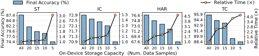

Fig. 1. Motivating experiments on 4 classic tasks to demonstrate the severe impact of limited on-device storage on final accuracy and training time of FL. (ST: synthetic task, IC: image classification, HAR: human activity recognition, TC: network traffic classification.) 

Without a carefully designed data selection policy to maintain the data samples in storage, the empirical distribution of stored data could deviate from the true data distribution, which further complicates the notorious problem of not independent and identically distributed (non-iid) data distribution in FL [11], [12]. Our experiments on a wide range of FL tasks reveal that the traditional random selection policy significantly degrades the performance of classic FL process in both model training time and final inference accuracy, with 4 _×_ longer training time and 7% accuracy reduction on network traffic classification task, 3 _._ 05 _×_ and 13 _._ 1% on synthetic task, 1 _._ 49 _×_ and 2 _._ 1% on image classification task, and 4 _._ 65 _×_ and 9 _._ 1% on human activity recognition task (Figure 1). This is unacceptable in modern mobile networks, because the longer training time diminishes the timeliness of ML models in dynamic environments, and accuracy reduction results in failure to guarantee the quality of service [3]. Therefore, a fundamental problem when applying FL to mobile networks is how to select valuable data samples from on-device streaming networked data to simultaneously accelerate model training convergence and enhance final inference accuracy? 

**Design Challenges.** The design of such an online data selection framework for FL involves three key challenges: 

First, there is still no theoretical understanding about the impact of local on-device data on the training speedup and accuracy enhancement of global model in FL. Lacking information about raw data and local models of the other devices, it is challenging for one device to individually figure out the impact of its local data sample on the performance of the global model. Furthermore, the data sample-level correlation between convergence rate and model accuracy is still not explored in FL, and it is non-trivial to simultaneously improve these two aspects through one unified data valuation metric. 

Second, the lack of temporal and spatial information complicates the online data selection in FL. For streaming networked data, we could not access the data samples coming from the future or discarded in the past. Lacking such temporal information, one device is not able to leverage complete statistical information (e.g. unbiased local data distribution) for accurate data valuation like outliers and noise detection [13], [14]. Further, due to the distributed paradigm of FL, one device cannot conduct effective data selection without the knowledge of other devices’ stored data and local models, denoted as spatial information. This is because the valuable data samples selected by each device may overlap with the data selected by other devices. As a result, the locally valuable data may not be globally valuable. 

Third, data selection on mobile devices needs to be low computation-and-memory cost due to the conflict between 

limited hardware resources and requirement on quality of user experience. As the additional time delay and memory costs introduced by online data selection process would degrade the performance of mobile network and user experience, the real-time data samples must be evaluated efficiently. However, the increasingly complex ML models lead to high computational complexity as well as large memory footprint for storing intermediate model outputs during data selection. 

**Limitations of Related Works.** The prior works on data evaluation and selection failed to solve the above challenges. (i) Data selection methods in CL, such as leave-one-out [15], data shapley [16] and importance sampling [17], are not appropriate for FL due to the first challenge: they could only measure the value of each data sample corresponding to the local model training process, rather than the global model in FL. (ii) Data selection methods in FL did not consider the two new properties of FL devices. Mercury [8], FedBalancer [13] and the work from Li et al. [14] adopted importance sampling [17] to select the data samples with high loss or large gradient norm for training time speedup, but failed to solve the second challenge: these methods need to leverage the whole dataset or complete data distribution to normalize the sampling weight and remove the outliers and noise. 

**Our Solutions.** To solve the above challenges, we design ODE, an online data selection framework that coordinates networked devices to select and store valuable data samples locally and collaboratively in FL, with theoretical guarantees for simultaneously accelerating model convergence and enhancing inference accuracy. 

In ODE, we first theoretically analyze the impact of an individual local data sample on the convergence rate and final accuracy of the global model in FL. We discover a common dominant term in these two analytical expressions, _i.e._ , _⟨∇wl_ ( _w, x, y_ ) _, ∇wF_ ( _w_ ) _⟩_ , which implies that the projection of the gradient of a local data sample to the global gradient is a reasonable metric for data selection in FL. As this metric is a deterministic value, each device can simply maintain a priority queue to store the valuable data samples. Second, considering the lack of temporal and spatial information, we propose an efficient method for clients to approximate this data selection metric by maintaining a local gradient estimator on each device and a global one on the server. Third, to overcome the potential overlap of the stored data caused by data selection in a distributed manner, we further propose a strategy for the server to coordinate each device to store valuable data from different data distribution regions. Fourth, to achieve computation and memory efficiency, we propose a simplified version of ODE, which replaces the full model gradient with partial model gradient to concurrently reduce the computational cost of model backpropagation and save the memory for buffering intermediate outputs of ML models. 

**Implementation and Evaluation.** We evaluated ODE on three public tasks: synthetic task (ST) [18], Image Classification (IC) [19] and Human Activity Recognition (HAR) [20], as well as one industrial traffic classification dataset (TC) collected from our 30-days deployment on 30 ONTs in practice, consisting of 560 _,_ 000+ packets from 250 mobile applications. We compare ODE against three categories of 

Authorized licensed use limited to: Shanghai Jiaotong University. Downloaded on December 05,2024 at 13:35:08 UTC from IEEE Xplore.  Restrictions apply. 

2796 

IEEE/ACM TRANSACTIONS ON NETWORKING, VOL. 32, NO. 4, AUGUST 2024 

data selection methods: random sampling [21], classic data sampling approaches in CL [8], [13], [14] and data selection methods for FL [13], [14]. The experimental results show that ODE outperforms all these baselines, achieving as high as 9 _._ 52 _×_ speedup of model training and 7 _._ 56% increase in final model accuracy on ST, 1 _._ 35 _×_ and 1 _._ 4% on IC, 2 _._ 22 _×_ and 6 _._ 38% on HAR, 2 _._ 5 _×_ and 6% on TC, with marginal extra time delay and memory footprint. Moreover, ODE is robust to different environmental factors, including local training epoch number, client participation rate, on-device storage capacity, mini-batch size and data heterogeneity across devices. We also conduct ablation experiments to demonstrate the effectiveness of each key component in ODE. 

**Summary of Contributions.** Our contributions in this work can be summarized as follows: (i) To the best of our knowledge, we are the first to identify two new properties of mobile devices when applying FL to mobile networks, limited on-device storage and streaming networked data, and demonstrate their enormity on FL process. (ii) We provide analytical formulas on the impact of an individual local data sample on the convergence rate and the final inference accuracy of the global model, based on which we propose a new data valuation metric for data selection in FL with theoretical guarantee for simultaneously accelerating model convergence and improving inference accuracy. Furthermore, we propose ODE, an online data selection framework for FL, to realize on-device data selection and cross-device collaborative data storage. (iii) We conduct extensive experiments on three public datasets and one industrial traffic classification dataset to demonstrate the remarkable advantages of ODE against existing methods in FL. 

## II. PRELIMINARIES 

In this section, we present the training process of FL on mobile device. We consider the synchronous FL framework [9], where a server coordinates a set of mobile devices/clients1 _C_ to conduct distributed model training. Each client _c ∈ C_ generates data samples in a streaming manner with a velocity _vc_ . We use _Pc_ to denote the client _c_ ’s underlying distribution of local data, and _P_˜ _c_ to represent the empirical distribution of the stored data, denoted as _Bc_ . The goal of FL is to train a global model _w_ from the locally stored data _P_ ˜ =� _c∈C__P_˜_c_withgoodperformancewithrespecttothe underlying distribution of overall data _P_ =� _c∈C__Pc_: 

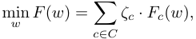

where _ζc_ = _<u>vc</u>_ <u>�</u> _c__′_ _∈C__v_ _c__′_denotesthenormalizedweightofeach client, _Fc_ ( _w_ ) = E( _x,y_ ) _∼Pc_ � _l_ ( _w, x, y_ )� is the expected loss of the model _w_ over the underlying data distribution of client _c_ . We also use _F_˜ _c_ ( _w_ ) = _|B_ <u>1</u> _c|_ � _x,y∈Bc__l_(_w, x, y_)todenotethe empirical loss over the stored data of client _c_ . In this work, we investigate the impacts of each client’s limited storage on FL, and consider the widely adopted algorithm Fed-Avg [9] for easy illustration. Under the synchronous FL framework, the global model is trained by repeating the following two steps for each communication round _t_ : 

> 1We will use mobile devices and clients interchangeably in this work. 

**(i) Local Training:** In round _t_ , the server selects a client subset _Ct ⊆ C_ to participate in model training process. Each participating client _c ∈ Ct_ downloads the current global model _w_ fed_t−_1(the ending global model of the last round), and performs _m_ epochs of model updates with the locally stored data: 

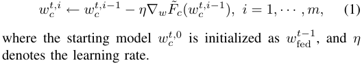

**(ii) Model Aggregation:** Each participating client _c ∈ Ct_ uploads the updated local model _wc__t,m_ , and the server aggregates them to derive a new global model _w_ fed_t_: 

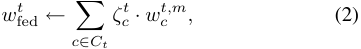

where _ζc__t_= <u>�</u> _c__′_ _∈vCtc__v_ _c__′_ is the normalized weight of the participating client _c_ in current round _t_ . In the scenario of FL with limited on-device storage and streaming networked data, we have an additional data selection step for each client: 

**(iii) Data Selection:** In each round _t_ , once receiving a new data sample, the client has to make an online decision on whether to store the new sample (in place of an old one if the storage area is fully occupied) or discard it. The goal of this process is to select valuable data samples from on-device streaming data for model training in the upcoming rounds. 

## III. ODE DESIGN 

In this section, we first quantify the impact of a local data sample on the performance of global FL model in terms of convergence rate and inference accuracy. Based on the common dominant term in these two analytical expressions, we propose a new data valuation metric for data evaluation and selection in FL (Section III-A), and develop a practical method to estimate this metric with low computation and communication overhead (Section III-B). We further design a strategy for the server to coordinate cross-client data selection process, avoiding the potential overlapped data selected and stored by different clients (Section III-C). Finally, we summarize the procedure of ODE (Section III-D). 

## _A. Data Valuation Metric_ 

We evaluate the impact of a local data sample on FL model from the perspectives of convergence rate and inference accuracy, which are two critical aspects for FL. The convergence rate quantifies the reduction of loss function in each training round, and determines the communication cost of FL. The inference accuracy reflects the performance of a model on guaranteeing the quality of application service and user experience. For theoretical analysis, we follow one typical assumption, which is widely adopted in previous literature. 

_Assumption 1 (Lipschitz Gradient): For each client c ∈ C, the loss function Fc_ ( _w_ ) _is Lc-Lipschitz gradient,_ i.e. _, ∥ ∇wFc_ ( _w_ 1) _−∇wFc_ ( _w_ 2) _∥_ 2⩽ _Lc ∥ w_ 1 _− w_ 2 _∥_ 2 _, which implies that the global loss function F_ ( _w_ ) _is L-Lipschitz gradient with L_ =� _c∈C__ζcLc._ 

Authorized licensed use limited to: Shanghai Jiaotong University. Downloaded on December 05,2024 at 13:35:08 UTC from IEEE Xplore.  Restrictions apply. 

GONG et al.: ODE: AN ONLINE DATA SELECTION FRAMEWORK FOR FL WITH LIMITED STORAGE 

2797 

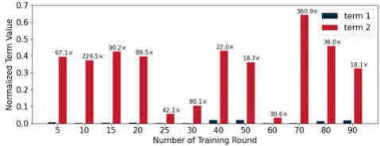

Fig. 2. Normalized mean values of term 1 and term 2 across 35 _,_ 000+ data samples in HAR task across different training rounds. 

**Convergence Rate.** We provide a lower bound on the reduction of loss function of global model after model aggregation in each communication round of FL. 

_Theorem 1 (Global Loss Reduction): With Assumption 1, for an arbitrary set of clients Ct ⊆ C selected by the server in round t, the reduction of global loss F_ ( _w_ ) _is bounded by_ : 

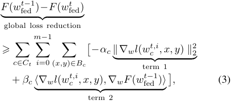

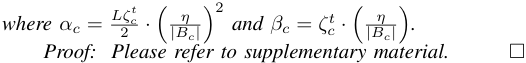

Theorem 1 demonstrates that the loss reduction of the global FL model _w_ fed_t_ineachroundiscloselyrelatedtotwoterms: gradient magnitude of the local data sample (term 1) and the projection of the local gradient of a data sample onto the global gradient over global data distribution (term 2). We demonstrate that term 2 has a significantly greater influence than term 1 from two perspectives. First, the coefficient ratio between term 2 and term 1 is approximately _α__<u>βc</u>_ _c__≈_404in typical FL sce- narios with learning rate 0 _._ 001 and on-device storage capacity larger than 10 samples. Additionally, our experimental results (Figure 2) on a real-world human activity recognition task of over 35 _,_ 000 data samples illustrate that: on average, the value of term 2 surpasses the value of term 1 by a factor of 90 _×_ across various global models in different training rounds. Consequently, we can focus on term 2 ( _i.e._ , projection of the local gradient of a data sample onto the global gradient) when evaluating the impact of a local data sample on the convergence rate of global model. 

We next briefly describe how to evaluate data samples based on term 2. The local model parameter _wc__t,i_ in term 2 is computed from Eq. (1), where the gradient _∇wF_˜ _c_ ( _wc__t,i−_1 ) depends on all the locally stored data samples. In other words, the value of term 2 depends on the “cooperation” of all the locally stored data samples. Thus, we can formulate the computation of term 2 via cooperative game theory, where each data sample represents a player and the utility of each sample set is the value of term 2. Within this cooperative game, the individual contribution of each data sample to term 2 can be regarded as its value, quantified through leave-one-out [15] 

or Shapley Value [22]. However, these methods necessitate multiple times of model retraining to compute the marginal contribution of each data sample, and thus we propose a onestep look-ahead policy to estimate each sample’s value by only focusing on the first local training epoch ( _m_ =1). 

**Inference Accuracy.** We can assume that the optimal model is obtained by gathering all clients’ generated data and conducting CL. Moreover, as the testing dataset and the corresponding testing accuracy are hard to obtain in FL, we propose to leverage the weight divergence between the models trained through FL and CL, _i.e._ , _∥ w_ fed_t−w_ cen_mt∥_,toquantifythe accuracy of the FL model in each round _t_ . With _t →∞_ , we can evaluate the final accuracy of FL model. 

_Theorem 2 (Model Weight Divergence): With Assumption 1, for an arbitrary participating client set Ct, we have the following inequality for the weight divergence between the models trained through FL and CL after the t__th_ _training round._ 

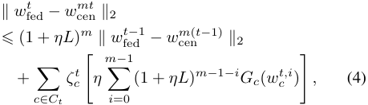

_where Gc_ ( _w_ ) = _∥∇wF_˜ _c_ ( _w_ ) _−∇wF_ ( _w_ ) _∥_ 2 _._ 

_Proof: Please refer to supplementary material._ □ The following lemma further shows the impact of a local data sample on weight divergence _∥ w_ fed_t−w_ cen_mt∥_2through_Gc_(_w_ _c__t,i_). _Lemma 1 (Gradient Divergence): For an arbitrary client c ∈ C, Gc_ ( _w_ ) = _∥∇F_˜ _c_ ( _w_ ) _−∇F_ ( _w_ ) _∥_ 2 _is bounded by_ : 

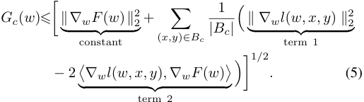

_Proof: Please refer to supplementary material._ □ Due to distinct coefficients, the twofold gradient projection (term 2) naturally exhibits a larger mean and variance compared with the gradient L2-norm (term 1) across various data samples. Also, as mentioned before, our experimental results shown in Figure 2 demonstrate the contrasting magnitude orders of term 1 and term 2 ( _e.g._ , value of term 2 surpasses value of term 1 by a factor of 90 _×_ on the real-world HAR task). As a result, we can quantify the impact of a local data sample on _Gc_ ( _w_ ) and the inference accuracy mainly through term 2, which happens to be the same as the term 2 in (3). **Data Valuation** . Based on the above analysis, we define a new data valuation metric for FL, and provide theoretical understanding as well as intuitive interpretation. 

_Definition 1 (Data Valuation Metric): In the t__th_ _round, for a client c ∈ C, the value of a data sample_ ( _x, y_ ) _is defined as the projection of its local gradient ∇l_ ( _w, x, y_ ) _onto the gradient of current global model over the global data distribution_ : 

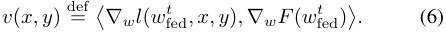

Authorized licensed use limited to: Shanghai Jiaotong University. Downloaded on December 05,2024 at 13:35:08 UTC from IEEE Xplore.  Restrictions apply. 

2798 

IEEE/ACM TRANSACTIONS ON NETWORKING, VOL. 32, NO. 4, AUGUST 2024 

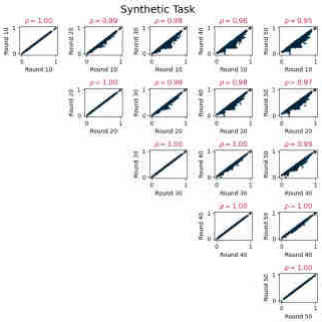

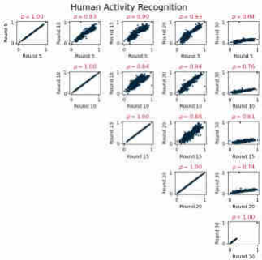

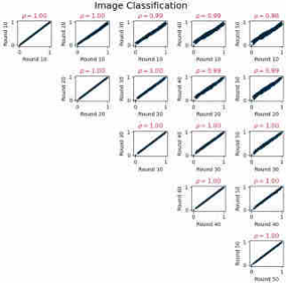

Fig. 3. Experimental results on three FL tasks to support that the data values remain stable across a few training rounds. 

Based on this new data valuation metric, once a client receives a new data sample, she can make an online decision on whether to store this sample by comparing its data value with values of old samples in storage, which can be easily implemented as a priority queue on each client. 

_Theoretical Understanding._ On one hand, maximizing the above data valuation metric of the selected data samples is a one-step greedy strategy for minimizing the loss of the updated global model in each training round, because it optimizes the dominant term 2 in the lower bound of global loss reduction in Eq. (3). The one-step-look-ahead policy means that we only consider the first epoch of the local model training in Eq. (3), _i.e._ , _⟨∇wl_ ( _wc__t,i, x, y_)_, ∇wF_(_w_ fed_t−_1)_⟩_withindex_i_set as 0. On the other hand, this metric also improves the inference accuracy of the final global model by narrowing the gap between the models trained through FL and CL, as it reduces the high-weight term of the dominant part in Eq. (4), _i.e._ , (1 + _ηL_ )_m−_1 _Gc_ ( _wk__t,_0). 

_Intuitive Interpretation._ Large value of a data sample indicates that its impact on the global FL model is similar to that of the underlying global data distribution, guiding the clients to select the data samples which not only follow their own local data distribution but also have similar effects with the global data distribution. In this way, part of the personalized information of each client’s local data is preserved while the data heterogeneity across clients is also reduced, which have been demonstrated to improve FL performance [23], [24], [25]. 

## _B. On-Client Data Selection_ 

In practice, it is non-trivial for one client to directly utilize the above data valuation metric for online data selection due to the following two challenges: (i) Lack of the latest global model: due to the partial participation of clients in FL, each client _c ∈ C_ cannot derive the global FL model _w_ fed_t−_1inthe rounds that she is not selected for model training, and only has the outdated global FL model from the previous participating round, _i.e._ , _w_ fed_tc,_last_−_1 . (ii) Lack of unbiased global gradient: the accurate global gradient over the unbiased global data distribution can only be obtained by aggregating all the clients’ local gradients over their unbiased local data distributions. This is hard to achieve because only partial clients partic- 

ipate in each communication round, and the locally stored data could become biased during the on-client data selection process. 

We can consider that challenge (i) does not affect the online data selection process too much and clients can simply leverage the outdated global model for data valuation. This relies on our experimental observation in Figure 3 that the value of each data sample remains stable across a few training rounds. For example, the Pearson correlation coefficients between data values computed with FL models in rounds _t_ and _t_ + 10 consistently surpass 0.85 for all the three typical FL tasks. 

To overcome challenge (ii), we propose a gradient estimation method. First, to solve the issue of skew local gradient, each client _c ∈ C_ is allowed to maintain a local gradient estimator _g_ ˆ _c_ , which is continuously updated whenever the _n__th_ streaming data sample ( _x, y_ ) is generated by the client: 

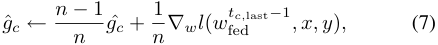

where _tc,last_ denotes the last participating round of client _c_ , and thus _w_ fed_tc,last−_1 denotes the latest global model that client _c_ received. Essentially, the local gradient estimator works as a running sum estimation of the gradient of the underlying local data distribution, which approximates the average gradient of all data samples generated by client _c_ since last participating round. When the client _c_ is selected to participate in FL in a certain round _t_ , the client uploads the current local gradient estimator _g_ ˆ _c_ to server, and resets the local gradient estimator as a new global FL model _w_ fed_t−_1is received, _i.e., g_ ˆ _c ←_ 0 _, n ←_ 0. Second, to solve the problem of skew global gradient caused by partial client participation, the server is requested to maintain a global gradient estimator _g_ ˆ_t_ , which is an aggregation of the local gradient estimators, i.e. _g_ ˆ_t_ =� _c∈C__ζcg_ˆ_c_.Asitincurshighcommunicationcost to collect _g_ ˆ _c_ from all clients, the server only uses _g_ ˆ _c_ of the participating clients to update global gradient estimator _g_ ˆ_t_ in each round _t_ : _g_ ˆ_t_ _← g_ ˆ_t−_1 +� _c∈Ct__ζc_(ˆ_gc−g_ˆ _c__t_last ). The rationale behind the global gradient estimator lies in the high similarity between the gradients of each client’s local data distribution over global models in two consecutive participating rounds, as demonstrated empirically in Figure 3. Thus, in each round 

Authorized licensed use limited to: Shanghai Jiaotong University. Downloaded on December 05,2024 at 13:35:08 UTC from IEEE Xplore.  Restrictions apply. 

GONG et al.: ODE: AN ONLINE DATA SELECTION FRAMEWORK FOR FL WITH LIMITED STORAGE 

2799 

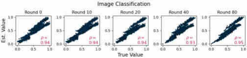

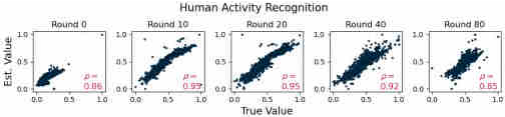

Fig. 4. Experiments results to demonstrate the high similarity between data values computed from partial model and full model. 

_t_ , the server needs to distribute both the current global model _w_ fed_t−_1 and the latest global gradient estimator _g_ ˆ_t−_1 to each selected client _c ∈ Ct_ , who will conduct local model training and upload both locally updated model _wc__t,m_ and local gradient estimator _g_ ˆ _c_ back to the server. 

**Simplified Version.** In both of the local gradient estimation in Eq. (7) and data valuation in Eq. (6), for a new data sample, we need to backpropagate the entire ML model to compute the gradient, which introduces high computation cost and memory footprint for buffering the intermediate outputs of model. Consequently, we propose to use the gradients of the last few network layers of ML models instead of the whole model for data selection. The success of such simplification relies on our experimental observation in Figure 4 that partial model gradient is able to reflect the trend of the full model gradient. Specifically, the Pearson correlation coefficient between data values computed from only last model layer and full model layers consistently exceeds 0 _._ 93 for image classification task and 0 _._ 85 for human activity recognition task. 

**Privacy Concern.** Uploading local gradient estimators may disclose the private information of each client, which can be mitigated through differential privacy [26]. Specifically, differential privacy empowers clients to add a controlled amount of Gaussian noise to local gradient estimator for obfuscating the true information, while ensuring that the aggregated global gradient estimator remains unbiased and meaningful. 

data distribution among clients, the cross-client coordination policy need to satisfy the following four desirable properties: _(i) Efficient Data Selection:_ To improve the efficiency of data selection, the label _y ∈ Y_ should be assigned to the clients who generate more data samples with this label, following the intuition that there is a higher probability to select more valuable data samples from a larger candidate dataset. 

_(ii) Redundant Label Assignment:_ To ensure that all the labels are likely to be covered in each round even with partial client participation, each label _y ∈ Y_ is required to be assigned to more than _n_label _y_ clients, which is a hyperparameter decided by the server. 

_(iii) Limited Storage:_ Due to limited on-device storage, each client _c_ should be assigned to less than _n_client _c_ labels to ensure a sufficient number of valuable data samples stored for each label, and _n_client _c_ is a hyperparameter decided by the server; _(iv) Unbiased Global Distribution:_ The weighted average of all clients’ stored data distribution is expected to be equal to the unbiased global data distribution, _i.e._ , _P_˜ ( _y_ )= _P_ ( _y_ ) _, y ∈ Y_ . 

**Problem Formulation.** We represent the cross-client data storage strategy as a coordination matrix _D ∈_ N_|C|×|Y |_ , where _Dc,y_ denotes the number of data samples with label _y_ that client _c_ is allowed to store. We use matrix _V ∈_ R_|C|×|Y |_ to denote the statistical information of each client’s generated data, where _Vc,y_ = _vcPc_ ( _y_ ) denotes the average speed of the data samples with label _y_ generated by client _c_ . The crossclient coordination algorithm can be obtained by solving an optimization problem, where the four properties are mathematically expressed as the objective and three constraints. Specifically, the objective is to maximize the dot projection between coordination matrix _D_ and information matrix _V_ to optimize the data selection efficiency of property (i). Remaining properties (ii)-(iv) can be formulated as constraints on each column and row of the coordination matrix _D_ : 

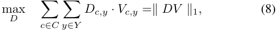

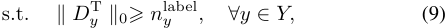

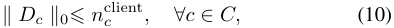

## _C. Cross-Client Data Storage_ 

Since the local data distributions of different clients may overlap with each other, independently conducting data selection process for each client may lead to the distorted distribution of data stored by all clients. 

One potential solution is to divide the global data distribution into several regions, and coordinate each client to store valuable data samples for one specific distribution region, while the union of all stored data still follow the unbiased global data distribution. In this work, we consider the label of data samples as the dividing criterion.2 Thus, before the training process, the server needs to instruct each client the labels and the corresponding quantity of data samples to store. Considering the partial client participation and heterogeneous 

> 2There are some other methods to divide the data distribution, such as K-means and hierarchical clustering, and our results are independent on them. 

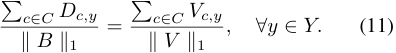

**Complexity Analysis.** We can verify that the above optimization problem with l0 norm is a convex-cardinality problem, which is NP-hard [27]. The globally optimal solution can be obtained through the following two steps: (i) Decide the feasible region: determine the non-zero elements within the coordination matrix _D_ , _i.e. S_ = _{_ ( _c, y_ ) _|Dc,y̸_ = 0 _}_ , to satisfy constraints (9) and (10); (ii) Solve the simplified problem: determine the specific values of the non-zero elements in _S_ by solving a simplified optimization problem: 

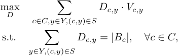

Authorized licensed use limited to: Shanghai Jiaotong University. Downloaded on December 05,2024 at 13:35:08 UTC from IEEE Xplore.  Restrictions apply. 

2800 

IEEE/ACM TRANSACTIONS ON NETWORKING, VOL. 32, NO. 4, AUGUST 2024 

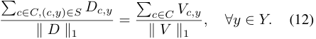

Compared with the original optimization problem, the objective (8) remains unchanged and the constraints (9) and (10) are eliminated. Consequently, the solution to the simplified problem (12) can be regarded as part of the solution to the original optimization problem (8)-(11). As the number of possible _S_ can be exponential to _|C|_ and _|Y |_ , it is impractical to solve the simplified problem for exponential times to derive the globally optimal solution _D_ . The classic approach is to replace all the non-convex discontinuous _l_ 0 norm constraints with the convex and continuous _l_ 1 norm [27], which fails to work in our scenario because simultaneously minimizing as many as _|C|_ + _|Y | l_ 1 norms in the objective function will lead to high computation and memory costs as well as unstable solutions [28]. As a result, we propose an intuitive and greedy algorithm that enables the direct identification of the non-zero elements _S_ in the coordination matrix _D_ . The key insight of our greedy algorithm lies in identifying _S_ with the highest potential value of objective function (8). 

**Algorithm 1** Greedy Cross-Client Coordination **Input:** Label vector _Y_ , client vector _C_ , data velocity matrix _V_ , storage size matrix _B_ , redundant label assignment _n_label , limited storage _n_client **Output:** Coordination matrix _D_ // Sort labels by number of owners **1** _Y ←_ Sort _Y_ in an increasing order of the number of non-zero elements in _V_ [: _, y_ ]; **2 for** _y in Y_ **do** // Sort clients by data velocity **3** _C_  tmp ←_ Sort _c ∈ C_ in an decreasing order of the data velocity _V_ [ _c, y_ ]; **4 for** _c in C_tmp_ **do** // Limited storage requirement **5 if** Sum( _D_ [ _c,_ :]) _< nc_client **then 6** _D_ [ _c, y_ ] _←_ 1; **7 end** // Redundant label requirement **8 if** Sum( _D_ [: _, y_ ]) _≥ n_label _y_ **then 9 Break** ; **10 end 11 end 12 end** // Divide each device storage evenly **13 for** _c in C_ **do 14** _cnt ←_ Sum( _D_ [ _c,_ :]); **15 for** _y in Y_ **do 16** _D_ [ _c, y_ ] _← B_ [ _c, y_ ] _∗ D_ [ _c, y_ ] _/cnt_ ; **17 end 18 end 19 return** _D_ ; 

**Greedy Cross-Client Coordination.** We summarize the greedy algorithm in Algorithm 1 and provide an illustrative example in Figure 5, which consists of three steps: 

_(i) Information Collection:_ Each client _c ∈ C_ sends the rough information about its local data to the server, including the storage capacity _|Bc|_ and data velocity _Vc,y_ for each label _y_ , which can be obtained from the statistics of previous time periods. Based on this information, the server constructs the storage size vector _B ∈_ N_|C|_ and the data velocity matrix 

_V ∈_ R_|C|×|Y |_ for all clients. For example, in Figure 5, clients _c_ 1 _, c_ 2 _, c_ 3 upload server the storage space of _|B_ 1 _|_ = 20 _, |B_ 2 _|_ = 15 _, |B_ 3 _|_ = 15 and data velocity vectors of _V_ 1 = [400 _,_ 200 _,_ 300] _, V_ 2 =[200 _,_ 300 _,_ 200] _, V_ 3 =[300 _,_ 0 _,_ 400]. _(ii) Label Assignment:_ Aligned with the objective (8), our goal is to assign each label to clients with higher generation velocities for that label. This can be achieved by ranking clients based on their corresponding velocities for each label and allocating each label to the top few clients within the constraint (9). However, constraint (10) limits the number of data labels each client can store, which may contradict with the allocation results computed previously. We note that fulfilling constraint (9) is more challenging than constraint (10) due to the existence of scarce labels with few owners, and thus ODE prioritizes the allocation of such scarce labels. For implementation, the server first sorts labels _Y_ according to the number of owners (line 1-2). Then, for each considered label _y ∈ Y_ in the order, the server sorts all clients based on their generation velocities (line 3-5), and then the label _y_ is allocated to the top clients within constraint (10), which can be achieved by removing a client _c_ from the sorting order once the number of its assigned labels exceeds _n_client _c_ (line 6-10). In Figure 5, central server first sorts the clients for each label based on the clients’ generation velocities to obtain the sorting order ( _c_ 1 _, c_ 3 _, c_ 2) for label _y_ 1, ( _c_ 2 _, c_ 1) for label _y_ 2, ( _c_ 3 _, c_ 1 _, c_ 2) for label _y_ 3. Next, the server sorts the data labels in a non-decreasing order based on the number of owners and obtains the label order ( _y_ 2 _, y_ 1 _, y_ 3). Based on the above sorting orders and constraints (9) and (10), server assigns label _y_ 2 to clients ( _c_ 1 _, c_ 2), label _y_ 1 to clients ( _c_ 1 _, c_ 3), and label _y_ 3 to clients ( _c_ 3 _, c_ 2) for data selection and storage. 

_(iii) Quantity Assignment:_ With the two steps mentioned above, we have determined the non-zero elements of the client-label coordination matrix _D_ . To further reduce computational complexity and avoid imbalanced on-device data storage for each label, we do not directly solve the simplified optimization problem (12), and require each client to evenly divide the storage capacity among the assigned labels. To ensure that the weighted distribution of the stored data approximates the unbiased global data distribution, we compute a weight _γy_ for each label _y ∈ Y_ to satisfy _γyP_˜ ( _y_ ) = _P_ ( _y_ ) (line 18-23): 

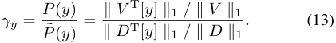

As a result, each client only needs to maintain one priority _<u>|Bc|</u>_ queue with a size of _∥Dc∥_ 0foreachassignedlabel.During local model training, each participating client _c ∈ Ct_ updates its local model using the weighted stored data samples: 

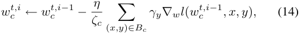

where _ζc_ =� ( _x,y_ ) _∈Bc__γy_denotesthenewweightofeach client, and the normalized weight of client _c ∈ Ct_ for model aggregation in round _t_ becomes _ζc__t_= � _c∈Ct_ <u>�</u> _c__′_ _∈ζCtc__ζ_ _c__′_.Take client _c_ 1 in Figure 5 for example, for label _y_ 1, its fraction in the whole storage space is 20+40+2010+0+10= 4<u>1</u>,whileitsfractionin all the clients’ generated data samples is<u>400+200+300</u> 900+700+700= 239. Therefore, the weight of label _y_ 1 on client _c_ 1 is9 1_<u>/</u>_ _/_23 4= 23<u>36</u>. 

Authorized licensed use limited to: Shanghai Jiaotong University. Downloaded on December 05,2024 at 13:35:08 UTC from IEEE Xplore.  Restrictions apply. 

GONG et al.: ODE: AN ONLINE DATA SELECTION FRAMEWORK FOR FL WITH LIMITED STORAGE 

2801 

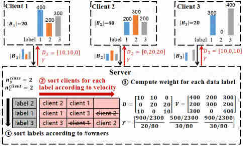

Fig. 5. A simple example to illustrate the greedy algorithm. 

**Approximation Ratio.** Given that it is difficult to theoretically analyze the approximation ratio of the greedy Algorithm 1, we empirically demonstrate its effectiveness in estimating the globally optimal solution to the original optimization problem (8)-(11) under various FL settings. For simplicity, we set the class number to 10 and the hyper-parameters to _n__client_ _c_ =2 and _n__label_ _y_ =2. In each experiment, we sample each client’s data velocity matrix _Vc_ from a uniform distribution, and compare the objective function values of solutions obtained by four methods: Optimal (traversing the entire feasible region to find the globally optimal solution), Greedy (Algorithm 1), Random (average result of 20 solutions sampled randomly from the feasible region), and Worst (worst result of 20 random solutions). Empirical results shown in Figure 6 illustrate that our greedy algorithm consistently achieves an approximation ratio exceeding 0.8 across various FL settings. 

**Privacy Concern.** The potential leakage of such rough information is generally acceptable to clients, since it does not expose the specific raw data samples. To further address the privacy concern, fully homomorphic encryption sorting can be employed to sort _k_ encrypted elements with computational complexity _O_ (log2 _k_ ) [29]. Consequently, the central server can leverage the encrypted information of each client to obtain cross-client coordination strategy by (i) sorting _|Y |_ data classes with complexity _O_ (log2 _|Y |_ ), and (ii) sorting the clients for each class with total complexity _O_ ( _|Y |_ log2 _|C|_ ). 

## _D. Overall Procedure of ODE_ 

As illustrated in Figure 7, ODE incorporates cross-client data storage and on-client data evaluation to coordinate clients to collaboratively store valuable samples for FL, simultaneously speeding up model training process and improving inference accuracy of the final global model. 

**Key Idea.** The cross-client data storage component coordinates clients to store the valuable data samples with different labels to avoid highly overlapped data stored by all clients. The on-client data evaluation component instructs each client to select the data having similar local gradient with the global gradient, which reduces data heterogeneity among clients while also preserves part of the personal information as the data samples are selected from the true local data distribution. 

**Cross-Client Data Storage.** Before the FL model training process, the central server collects data distribution information and storage capacity from all clients (①), and greedily solves the optimization problem in Eq. (8)-(11) (②). 

**On-Client Data Evaluation.** During the FL process, each client trains the local model in participating rounds, and leverages idle computation and memory resources to perform on-device data selection in non-participating rounds, which introduces little extra time overhead to each FL training round. In the _t__th_ training round, non-selected clients, selected clients and server execute different processes: 

_•_ **Non-Selected Clients.** Data evaluation (③): each non-selected client _c ∈ C \ Ct_ steadily evaluates and selects the streaming data samples according to the data valuation metric in Eq. (6), where the clients leverage the global gradient estimator received in last participating round instead of the accurate one for data evaluation. Local gradient estimator update (④): the client also dynamically updates the local gradient estimator _g_ ˆ _c_ with real-time data through Eq. (7). 

_•_ **Selected Clients.** Local model update (⑤): after receiving the new global model _w_ fed_t−_1and new global gradient estimator _g_ ˆ_t−_1 from the server, each selected client _c ∈ Ct_ performs local model updates using the stored data samples by Eq. (14). Local model and estimator transmission (⑥): each selected client uploads the updated model _wc__t,m_ and local gradient estimator _g_ ˆ _c_ to server. Then, the local estimator is reset to approximate the local gradient of the newly received global model. 

_•_ **Server.** Global model and estimator transmission (⑦): at the beginning of each round _t_ , the server distributes the global model _w_ fed_t−_1andtheglobalgradientestimator_g_ˆ_t−_1to the selected clients _Ct_ . Local model and estimator aggregation (⑧): at the end of each round, the server collects the updated local models _wc__t,m_ and local gradient estimators _g_ ˆ _c_ from participating clients _c ∈ Ct_ to derive the new global model and update the global gradient estimator _g_ ˆ_t_ . 

## IV. EVALUATION 

In this section, we first introduce experiment setting, baselines and evaluation metrics (Section IV-A). Second, we show the individual and integrated impacts of the limited on-device storage and streaming networked data on FL to demonstrate the motivation of our work (Section IV-B). Third, we present the overall performance of ODE and baselines, including model training speedup, final inference accuracy, memory footprint and data evaluation delay (Section IV-C). Next, we test the robustness of ODE against various environmental factors (Section IV-D), such as the number of local training epochs _<u>|Ct|</u> m_ , client participation rate _|C|_,on-devicestoragecapacity _Bc_ , mini-batch size, data heterogeneity across clients and varied levels of statistical error in clients’ velocities. Finally, we analyze the component-wise effect of ODE (Section IV-E). 

## _A. Experiment Setting_ 

**Learning Tasks, Datasets and ML Models.** To demonstrate the ODE’s superior performance and generalization across various learning tasks, datasets and ML models. We evaluate ODE on one synthetic dataset, two real-world 

Authorized licensed use limited to: Shanghai Jiaotong University. Downloaded on December 05,2024 at 13:35:08 UTC from IEEE Xplore.  Restrictions apply. 

2802 

IEEE/ACM TRANSACTIONS ON NETWORKING, VOL. 32, NO. 4, AUGUST 2024 

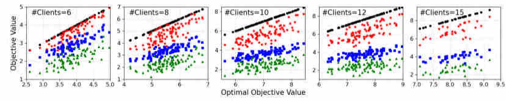

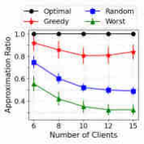

Fig. 6. Comparison of the objective function values obtained by four different methods: Optimal, Greedy, Random and Worst Case. 

TABLE I 

STATISTICS OF DIFFERENT TASKS, DATASETS, MODELS AND DEFAULT EXPERIMENT SETTINGS 

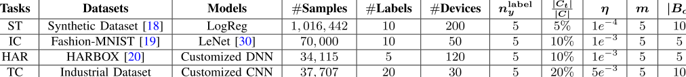

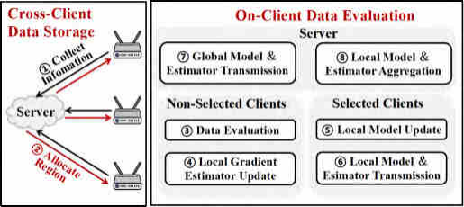

Fig. 7. Overview of ODE framework. 

datasets and one industrial dataset, all of which vary in data quantities, distributions and model outputs, and cover the tasks of synthetic task (ST), image classification (IC), human activity recognition (HAR) and network traffic classification (TC). The statistics of these tasks are summarized in Table I: _(i) Synthetic Task._ The synthetic dataset we used is proposed in LEAF benchmark [18], which contains 200 clients and 1 million data samples, and a logistic regression model is trained for this 10-class classification task. 

_(ii) Image Classification._ Fashion-MNIST [19] contains 60 _,_ 000 training images and 10 _,_ 000 testing images, which are divided into 50 clients according to labels [9]. We train LeNet [30] for this 10-class image classification task. 

_(iii) Human Activity Recognition._ HARBOX [20] is a 9-axis IMU dataset collected from 121 users’ smartphones in a crowdsourcing manner, including 34,115 data samples with 900 dimension. Considering the simplicity of the dataset, a lightweight customized DNN with two dense layers followed by a _SoftMax_ layer is deployed for this 5-class human activity recognition task. 

_(iv) Network Traffic Classification._ The industrial dataset of mobile application classification is collected from 30 ONT devices in a simulated network environment from May 2019 to June 2019. Generally, the dataset contains more than 560 _,_ 000 data samples and 250 mobile applications as labels, which cover the categories of video, game, file downloading and communication. We manually label the application of 

each data sample. The model we leverage is a typical CNN consisting of 4 convolutional layers with kernel size 1 _×_ 3 to extract features and 2 fully-connected layers for classification. To reduce the training time caused by the large scale of dataset, we uniformly select 20 out of 250 applications with a total number of 37 _,_ 707 data samples as training data. 

**Parameters Configurations.** For all the experiments, we use SGD as the optimizer and decay the learning rate per 100 rounds by _η_ new = 0 _._ 95 _×η_ old. To simulate the setting of streaming networked data, we set the on-device data velocity to be _vc_ =<u>#trainin</u> 500<u>g</u>samples , which means that each device _c ∈ C_ will receive _vc_ data samples one by one in each communication round, and the samples would be shuffled and appear again per 500 rounds. Other default configurations are shown in Table I. Note that the participating clients in each round are randomly selected, and for each experiment, we repeat 5 times and present the average results. 

**Baselines.** In our experiments, we compare two versions of ODE, _ODE-Exact_ (using exact global gradient) and _ODE-Est_ (using estimated global gradient), with four categories of data selection baselines, including random sampling methods ( _RS_ ), importance-based methods for CL ( _HL_ and _GN_ ), existing data selection methods for FL ( _FB_ and _SLD_ ) and the ideal case with unlimited on-device storage ( _FD_ ): 

(i) _Random sampling (RS)_ includes Reservoir Sampling [21] and First-In-First-Out (storing the latest _|Bc|_ data samples). As their experimental results are comparable, we show the results of First-In-First-Out for _RS_ only. 

(ii) Importance sampling-based methods include _HighLoss (HL)_ , which uses the loss of each data sample as value for selection [31], [32], and _GradientNorm (GN)_ , which quantifies the data value through gradient norm [17], [33]. 

(iii) Existing data selection methods for FL includes _FedBalancer (FB)_ [13] and _SLD_ (Sample-Level Data selection) [14], which are slightly revised for adapting to streaming data. Specifically, we store the loss/gradient norm of the latest 50 samples for noise removal. For _FB_ , we ignore the data samples with top 10% loss values, and for _SLD_ , we remove 

Authorized licensed use limited to: Shanghai Jiaotong University. Downloaded on December 05,2024 at 13:35:08 UTC from IEEE Xplore.  Restrictions apply. 

GONG et al.: ODE: AN ONLINE DATA SELECTION FRAMEWORK FOR FL WITH LIMITED STORAGE 

2803 

TABLE II 

IMPACT OF LIMITED ON-DEVICE STORAGE ON TRAFFIC CLASSIFICATION TASK WITH DIFFERENT SETTINGS, WHERE THE CONVERGENCE TIME IS NORMALIZED BY THE TIME OF _FD_ 

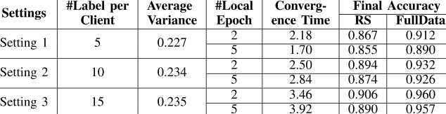

the samples with gradient norm larger than the median norm value. 

(iv) Ideal method with unlimited on-device storage, denoted as _FullData (FD)_ , using the entire dataset of each client for training to simulate the unlimited storage scenario. 

**Metrics for Training Performance.** We use two metrics to evaluate the performance of each data selection method: (i) _Time-to-Accuracy Ratio_ : we measure the model training speedup by the ratio of training time of _RS_ and the considered method to reach the same target accuracy, which is set to be the final inference accuracy of _RS_ . As the time of one communication round is usually fixed in practical FL scenario, we can quantify the training time with the number of communicating rounds. (ii) _Final Inference Accuracy_ : we evaluate the inference accuracy of the final global model on each device’s testing data, and report the average accuracy for evaluation. 

## _B. Experiment Results for Motivation_ 

In this subsection, we provide the comprehensive experimental results for the motivation of our work. First, we demonstrate the severe impact of limited on-device storage and streaming networked data on classic FL process in various settings, such as different numbers of local training epochs and various clients’ data. Then, we analyze the separate impacts of theses two properties. 

**Overall Impact.** To investigate the impact of limited on-device storage and steaming networked data on FL with different data settings, such as the range and variance of local data distribution, we conduct experiments over three settings with different numbers of labels owned by each client, which is constructed from the industrial TC dataset. The experimental results shown in Table II demonstrate that: (i) With local data variance increasing, the model training speed and final accuracy drops significantly, as the stored data is more likely to be biased when the underlying data distibution has a wide range; (ii) When the number of local training epochs increases, the negative impact of two properties becomes more serious due to large model updates toward the biased direction. 

**Individual Impact.** To show the individual impact of streaming networked data, we ignore limited storage by assuming that each device can utilize all the generated data instead of only stored data for online data evaluation and selection. To show the individual impact of limited storage, we ignore streaming networked data by supposing that in each epoch, all the new data samples are generated concurrently and can be accessed arbitrarily. The experimental results shown 

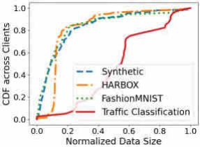

Fig. 8. Unbalanced data sizes of clients. 

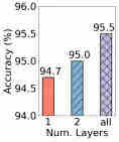

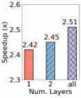

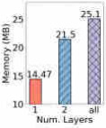

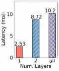

Fig. 9. Performance of ODE with different numbers of model layers for data evaluation and selection on industrial TC task. 

TABLE III 

IMPACTS OF LIMITED STORAGE AND STREAMING DATA ON FL WITH ST DATASET. SYMBOL ’ _−_ ’ MEANS FAILING TO REACH TARGET ACCURACY 

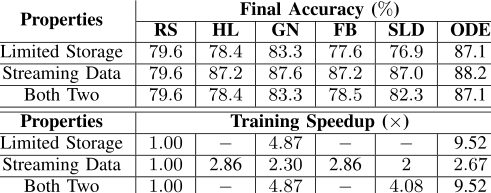

in Table III demonstrates that limited storage is the root cause of the performance degeneration of FL process, because (i) streaming data mainly prevents previous methods from making accurate online decisions on data selection, as they select each sample according to a normalized probability depending on both discarded and upcoming samples, which are not available in streaming setting but can be estimated; (ii) the limited storage prevents previous methods from deriving complete information of local and global data and guides clients to select suboptimal data from an insufficient candidate dataset. 

## _C. Overall Performance_ 

We compare the performance of ODE with six baselines, and show the main results in Table IV. 

Authorized licensed use limited to: Shanghai Jiaotong University. Downloaded on December 05,2024 at 13:35:08 UTC from IEEE Xplore.  Restrictions apply. 

2804 

IEEE/ACM TRANSACTIONS ON NETWORKING, VOL. 32, NO. 4, AUGUST 2024 

TABLE IV 

OVERALL PERFORMANCE OF DIFFERENT DATA SELECTION METHODS. SYMBOL ’ _−_ ’ MEANS FAILING TO REACH THE TARGET ACCURACY 

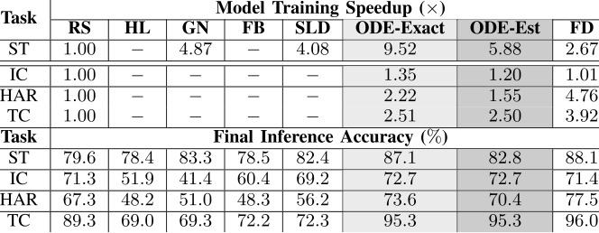

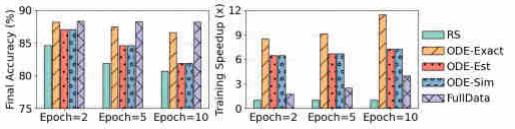

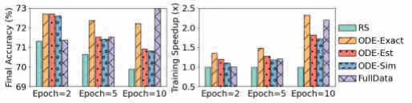

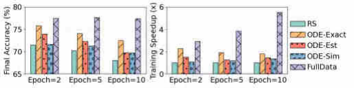

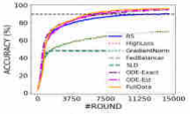

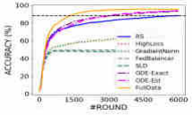

Fig. 10. Robustness to number of local training epochs. 

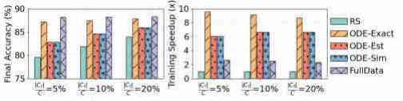

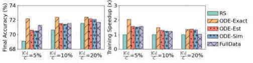

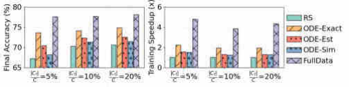

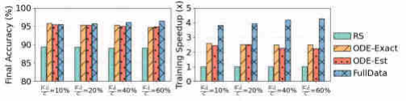

Fig. 11. Robustness of ODE to client participation rate. 

_ODE significantly speeds up the model training process on all datasets._ Compared with baselines, ODE achieves the target accuracy 5 _._ 88 _−_ 9 _._ 52 _×_ faster on ST; 1 _._ 20 _−_ 1 _._ 35 _×_ faster on IC; 1 _._ 55 _−_ 2 _._ 22 _×_ faster on HAR; 2 _._ 5 _−_ 2 _._ 51 _×_ faster on TC. Also, we observe that the highest speedup is achieved on ST, because the high non-i.i.d degree across clients and large data divergence within each client leave a great potential for ODE to reduce data heterogeneity and improve training process. 

_ODE improves the inference accuracy of the final model._ Table IV shows that compared with baselines, ODE enhances final accuracy on all the datasets, achieving 3 _._ 24 _−_ 7 _._ 56% higher on ST, 3 _._ 13 _−_ 6 _._ 38% on HAR, and around 6% on TC. We also notice that ODE has a marginal accuracy improvement 

( _≈_ 1 _._ 4%) on IC, because the FashionMNIST dataset has less data variance within each label, and a randomly selected subset is sufficient to represent the entire data distribution. 

_Importance-based data selection methods perform poorly._ Table IV also reveals that these methods cannot reach the target final accuracy on tasks of IC, HAR and TC, as these real-world datasets contain noise, making such importance-based methods fail to work [13], [14]. 

_Previous data selection methods for FL outperform importance-based methods but worse than ODE_ . As shown in Table IV, _FedBalancer_ and _SLD_ perform better than _HL_ and _GN_ , but worse than _RS_ in a large degree, which is different from the phenomenon in traditional settings [13], [14], [34]. 

Authorized licensed use limited to: Shanghai Jiaotong University. Downloaded on December 05,2024 at 13:35:08 UTC from IEEE Xplore.  Restrictions apply. 

2805 

GONG et al.: ODE: AN ONLINE DATA SELECTION FRAMEWORK FOR FL WITH LIMITED STORAGE 

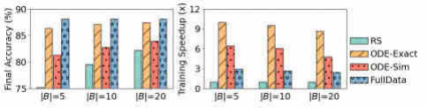

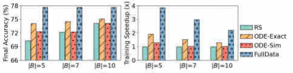

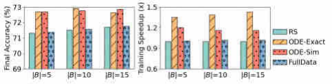

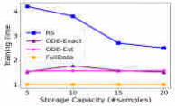

Fig. 12. Robustness of ODE to on-device storage capacities. 

TABLE V 

MEMORY FOOTPRINT AND EVALUATION DELAY PER SAMPLE OF DIFFERENT DATA SELECTION METHODS ON THREE REAL-WORLD DATASETS 

Fig. 13. Robustness of ODE-Sim to various mini-batch sizes. 

This is because (i) their noise cleaning steps, such as removing samples with top loss or gradient norm, highly rely on the complete statistical information of full dataset, and (ii) their on-client data valuation metrics fail to work for the global model training in FL, as discussed in Section I. 

_Simplified ODE reduces computation and memory costs significantly with marginal performance degradation._ We conduct another two experiments which utilize only the last 1 and 2 layers for data valuation on the industrial TC dataset. Empirical results shown in Figure 9 demonstrate that the simplified version reduces as high as 44% memory and 83% time delay, with only 0 _._ 1 _×_ and 1% degradation on training speedup and accuracy improvement. Unbalanced data sizes of clients. 

_ODE introduces small extra memory footprint and data evaluation delay_ . Empirical results in Table V demonstrate that 

Fig. 14. Robustness of ODE-Sim to data heterogeneity. 

simplified ODE ( _ODE-Sim_ ) brings only tiny evaluation delay and memory burden to devices (e.g., 1 _._ 23ms and 14 _._ 47MB for industrial TC task), and thus is applicable to practical network. 

## _D. Robustness of ODE_ 

In this section, we compare the robustness of ODE with baselines to various environmental factors, including the number of local training epoch, client participation rate, storage capacity, mini-batch size, data heterogeneity across clients, and the statistical error of clients’ data velocities. For the three public datasets, we test the robustness of ODE-Exact, ODE-Est and ODE-Sim (using only last model layer), while for the industrial TC dataset, we only report the performance of ODE-Exact and ODE-Est, as ODE-Sim has quite similar performance with ODE-Est. 

**Number of Local Training Epoch.** Empirical results shown in Figures 10 demonstrate that (i) ODE can work with various local training epoch numbers _m_ . With _m_ increasing from 2 to 10, all versions of ODE achieve higher training speedup and final inference accuracy than existing methods; (ii) ODE-Est has similar performance with ODE-Exact; (iii) ODE-Sim has slightly inferior performance compared with ODE-Est, but consistently outperforms _RS_ , which inspires us to trade-off the efficiency and effectiveness of ODE in practical deployment by adjusting the number of model layers for data selection. The first phenomenon coincides with the previous analysis in Section III-A: (i) for convergence rate, the one-step-look-ahead strategy of ODE only optimizes the loss reduction of the first local training epoch in Eq. (3), and thus the influence on model convergence will be weakened when the number of local epoch increases; (ii) for inference accuracy, ODE narrows the gap between the models trained through FL and CL by optimizing the dominant term with the maximum weight of the gap bound in (5), leading to better final inference accuracy with a larger _m_ . 

**Participation Rate.** The results in Figure 11 demonstrate that all versions of ODE can improve the FL process 

Authorized licensed use limited to: Shanghai Jiaotong University. Downloaded on December 05,2024 at 13:35:08 UTC from IEEE Xplore.  Restrictions apply. 

2806 

IEEE/ACM TRANSACTIONS ON NETWORKING, VOL. 32, NO. 4, AUGUST 2024 

Fig. 15. We visualize the relative observation error in data generation velocities of random 20 clients. 

Fig. 16. Impact of clients’ statistical errors in data generation velocities. 

significantly even with small client participation rate. Specifically, ODE-Exact accelerates the model training by 2 _._ 57 _×_ and increases the inference accuracy by 6 _._ 6% in TC task, 9 _×_ and 8% in ST, 2 _×_ and 3% in IC, and 2 _×_ and 6% in HAR. ODE-Est achieves 2 _._ 4 _×_ training speedup and 6 _._ 1% accuracy increase in TC, 6 _×_ and 4% in ST, 1 _._ 5 _×_ and 2% in IC, 1 _._ 3 _×_ and 4% in HAR. Furthermore, we observe that ODE-Sim performs slightly worse than ODE-Est, due to the inconsistent data values computed from all model layers and only final layer. This demonstrates the practicality of ODE in the real-world environments, where only a small proportion of devices are available to participate in each FL round. We also notice that in some tasks, the training speedup of ODE degenerates with high client participation rate, which weakens the impact of data heterogeneity across clients and the effectiveness of ODE 

**Storage Capacity.** We conduct experiments on various storage capacities of devices, and plot the training time speedup and final accuracy of each data selection method in Figure 12, which demonstrate that (i) the performance of _RS_ degrades rapidly with the decrease of storage capacity in most tasks; (ii) ODE has stable performance across different storage capacities, and thus is more robust to potentially diverse storage capabilities of heterogeneous devices; (iii) Compared with ODE, _RS_ needs more than twice storage space to achieve the same model training performance. 

**Mini-batch Size.** As mini-batch SGD is widely used in FL to accelerating model training, we evaluate ODE-Sim on various mini-batch sizes, where we adjust the learning rate from _η_ to 0 _._ 2 _η_ to reduce the instability of local model training process. Experimental results in Figure 13 demonstrate that (i) ODE-Sim consistently improves the performance of FL across various mini-batch sizes and real-world FL tasks; (ii) The smaller batch size is, the more training speedup and accuracy improvement can be achieved by ODE-Sim, which coincides the results of different numbers of local training epochs. 

**Data Heterogeneity** . Similar with previous work, we manually adjust the number of data labels assigned to each client to simulate different heterogeneity levels. In ST and HAR task, the data has been already distributed to clients during the data collection process, and thus we focus on IC and TC datasets. Empirical results in Figure 14 illustrate that ODE achieves 3 _._ 6 _−_ 5 _._ 6% increase in inference accuracy and 1 _._ 56 _−_ 2 _._ 07 _×_ speedup in training time in different heterogeneous settings of TC task, 0 _._ 25 _−_ 1 _._ 02% and 1 _._ 11 _−_ 1 _._ 34 _×_ in IC task. Despite that the performance of ODE seems to degrade in the extremely heterogeneous case (#Label=1), such degradation is caused by the limited number of data labels owned by each client, which diminishes the effectiveness of the cross-device data selection component of ODE. This situation typically does not appear in practice as real-world devices usually possess multiple data labels ( _e.g._ , mobile applications). 

**Statistical Error in Data Generation Velocities.** In real world, the statistical information collected by clients from previous time periods may not be accurate, which potentially deteriorates the effectiveness of cross-client coordination strategy and the overall performance of ODE. To test the impact of such issue, we introduce an statistical error _σc ∈_ R_|Y |_ to the data velocity matrix _Vc_ of each client _c_ , where the error _σc_ is assumed to follow a Gaussian distribution with zero mean. We conduct experiments on two real-world FL tasks (IC and HAR) with three distinct levels of statistical error: _σc ∼N_ (0 _,_ 0 _._ 3 _Vc_ ) _, N_ (0 _,_ 0 _._ 5 _Vc_ ) _, N_ (0 _,_ 1 _._ 0 _Vc_ ). The relative error rates of clients and data labels are visualized in Figure 15, and experimental results in Figure 16 shed light on two key observations: (i) As the error level rises, both the final inference accuracy and model training speedup achieved by ODE declines. (ii) ODE fails to be effective with the highest error level _σc ∼N_ (0 _, Vc_ ). Such outcome is acceptable, as this level introduces deviations as high as 330% from the true data generation velocity of each client and label, which is relatively rare for practical devices with the help of historical data. 

## _E. Component-Wise Analysis_ 

In this section, we evaluate the effectiveness of each key component in ODE: on-device data selection, global gradient estimator and cross-client coordination algorithm. 

**On-Client Data Selection.** To show the effect of on-client data selection, we compare ODE with _Valuation-_ , which replaces our on-device data selection method with _RS_ , but still allows the server to coordinate the clients for collaborative 

Authorized licensed use limited to: Shanghai Jiaotong University. Downloaded on December 05,2024 at 13:35:08 UTC from IEEE Xplore.  Restrictions apply. 

GONG et al.: ODE: AN ONLINE DATA SELECTION FRAMEWORK FOR FL WITH LIMITED STORAGE 

2807 

Fig. 17. Component-wise analysis of ODE. Left: Image Classification. Middle: Human Activity Recognition. Right: Traffic Classification. 

data storage. Figure 17 shows that _Valuation-_ performs slightly better than _RS_ but much worse than _ODE-Est_ , which implies the significant role of our proposed data valuation metric and data selection policy. 

**Global Gradient Estimator.** To show the effectiveness of the global gradient estimator, we compare _ODE-Est_ with a naive estimation method, namely _Estimator-_ , where server only aggregates the local gradient estimators of participating clients to obtain a global gradient estimator, and each participant only leverages the locally stored data instead of all generated data to compute the local gradient. Figure 17 shows that the naive estimation method has the poorest performance, as the partial clients and biased local gradient lead to inaccurate estimation for global gradient, misleading clients to select data samples using a wrong data valuation metric. 

**Cross-Client Coordination.** We conduct another experiment where clients select and store data samples only based on their local information without the coordination of the server, namely _Coor-_ . Figure 17 shows that the performance of ODE is largely weakened in nearly all datasets, as the clients tend to store similar and overlapped valuable data samples, and thus other data will be under-represented. However, textitCoorhas similar performance with ODE in IC task, because the number of data labels owned by each client is the same as the number of labels assigned to each client, diminishing the effectiveness of cross-client collaborate data storage. 

## V. RELATED WORKS 

**Federated Learning** is a distributed learning framework aiming to learn a global model over multiple devices’ data without data sharing [9], [12]. Existing works mostly focus on how to improve FL from the perspectives of saving communication and computation costs. Previous works on communication cost reduction mainly leverage model quantization [35], sparsification [36] and pruning [37] to reduce the size of parameters transmitted between clients and server, or consider hierarchical FL structure to improve communication efficiency [38], [39]. Other literature enhances computation efficiency of FL [40] from different perspectives, such as improving the algorithms of local model update [41] and global model aggregation [23], [24], optimizing the client selection policy to mitigate the heterogeneity across clients [42], [43], [44], and etc. However, most of them assume a static training dataset on each device and overlook the practical properties of limited on-device storage and streaming networked data, which hinder the successul application of FL to mobile networks. 

**Data Selection.** In FL, selecting data from streaming data can be seen as selecting batches of data from the underlying 

data distribution. To improve the model training process, existing methods select the most important data to participate in model update through different metrics. Leave-one-out test [15] and Data Shapley [16] quantify the value of each data sample as its marginal contribution to the model performance, such as the testing accuracy reduction or testing loss increase when removing the data sample from the training dataset. However, these approaches require multiple times of model retraining to obtain the accurate performance of models when removing certain data. Importance sampling [34] evaluates data sample through training loss or gradient norm over current model, which have been demonstrated to be theoretically optimal for mini-batch SGD. Other heuristic data selection metrics include data representativeness [45], model uncertainty [46], and etc. However, previous work [13], [14] on data selection in FL simply execute the above data selection process on each client for local training speedup without considering the impacts on global model training. Further, all of them require either access to complete dataset or multiple inspections over the streaming data, which is not practical in mobile networks. 

**Traffic Classification** is a significant task in mobile networks, which associates traffic packets with specific applications for the downstream network management task, such as capacity planning and resource provisioning [47]. ML makes it possible to directly input the raw features of packet data into models for application identification or traffic classification, eliminating the need for manual feature extraction. Typical raw features can be categorized into three types. (i) Ports: the ports in the TCP/UDP header of some packets are associated with the well-known port numbers assigned by IANA,3 which can server as the key features in determining the source application of packet. (ii) Raw Bytes: The actual flow bytes from packet headers and payloads can be leveraged for traffic classification, as they contain the raw content transmitted by the packet and thus can provide valuable information for identifying the packet’s purpose [48]. However, this approach introduces high computational overhead and is not suitable for encrypted packet data [49]. (iii) Statistics: Statistical information includes mean, standard, deviation, minimum, maximum, of packet lengths, inter-arrival times, flow durations, number of packets, number of bytes, etc. These statistics form a feature vector for each flow and are widely employed to overcome the challenges posed by encrypted payload and users’ privacy concern. 

## VI. CONCLUSION AND FUTURE WORK 

In this work, we identify two key properties of networked FL in mobile networks: limited on-device storage and 

> 3https://www.iana.org/assignments/service-names-port-numbers/servicenames-port-numbers.xhtml 

Authorized licensed use limited to: Shanghai Jiaotong University. Downloaded on December 05,2024 at 13:35:08 UTC from IEEE Xplore.  Restrictions apply. 

2808 

IEEE/ACM TRANSACTIONS ON NETWORKING, VOL. 32, NO. 4, AUGUST 2024 

streaming networked data, which have not been explored in previous literature. Then, we present the design, implementation and evaluation of ODE, which is an online data selection framework for FL with limited on-device storage and consists of two components: on-device data evaluation and cross-device collaborative data storage. Extensive experiments on three public and one industrial dataset demonstrate that ODE significantly outperforms state-of-the-art data selection methods in terms of training time, final accuracy and robustness to various environmental factors. 

In our research, we primarily focus on FL tasks involving automatic data labeling and stable data distribution of each client, which represent a wide range of mobile applications. For example, in keyboard prediction, a mobile user typically types 2 _,_ 000 characters per day, which can naturally serve as labels for preceding words. In mobile traffic classification, smart home routers can receive over 5 _,_ 000 nonencrypted packets per hour, which can be directly analyzed and labeled [47]. In image classification, the photo tags uploaded or corrected by users can be regarded as the image labels. In these applications, the interests and behavior of mobile users tend to remain stable over a certain period, indicating that the data distribution of each client typically does not undergo significant changes. Also, the utilizing unlabeled and dynamic streaming data is an important but under-explored area, which will be investigated in our future work. 

## ACKNOWLEDGMENT 

The opinions, findings, conclusions, and recommendations expressed in this article are those of the authors and do not necessarily reflect the views of the funding agencies or the government. 

## REFERENCES 

- [1] D. Bega, M. Gramaglia, M. Fiore, A. Banchs, and X. Costa-Pérez, “DeepCog: Optimizing resource provisioning in network slicing with AI-based capacity forecasting,” _IEEE J. Sel. Areas Commun._ , vol. 38, no. 2, pp. 361–376, Feb. 2020. 

- [2] M. H. Bhuyan, D. K. Bhattacharyya, and J. K. Kalita, “Network anomaly detection: Methods, systems and tools,” _IEEE Commun. Surveys Tuts._ , vol. 16, no. 1, pp. 303–336, 1st Quart., 2014. 

- [3] R. L. Cruz, “Quality of service guarantees in virtual circuit switched networks,” _IEEE J. Sel. Areas Commun._ , vol. 13, no. 6, pp. 1048–1056, Aug. 1995. 

- [4] M. Siddiqi, H. Yu, and J. Joung, “5G ultra-reliable low-latency communication implementation challenges and operational issues with IoT devices,” _Electronics_ , vol. 8, no. 9, p. 981, Sep. 2019. 

- [5] P. K. Aggarwal, P. Jain, J. Mehta, R. Garg, K. Makar, and P. Chaudhary, “Machine learning, data mining, and big data analytics for 5G-enabled IoT,” in _Blockchain for 5G-Enabled IoT_ . New York, NY, USA: Springer, 2021, pp. 351–375. 

- [6] D. Rafique and L. Velasco, “Machine learning for network automation: Overview, architecture, and applications,” _J. Opt. Commun. Netw._ , vol. 10, no. 10, pp. D126–D143, 2018. 

- [7] Y. Deng, “Deep learning on mobile devices: A review,” in _Mobile Multimedia/Image Processing, Security, and Applications_ . Bellingham, WA, USA: SPIE, 2019. 

- [8] X. Zeng, M. Yan, and M. Zhang, “Mercury: Efficient on-device distributed DNN training via stochastic importance sampling,” in _Proc. 19th ACM Conf. Embedded Networked Sensor Syst._ , Nov. 2021, pp. 29–41. 

- [9] B. McMahan, E. Moore, D. Ramage, S. Hampson, and B. A. Y. Arcas, “Communication-efficient learning of deep networks from decentralized data,” in _Proc. Int. Conf. Artif. Intell. Statist. (AISTATS)_ , 2017, pp. 1273–1282. 

- [10] UCSC. (2020). _Packet Buffers_ . [Online]. Available: https://people.ucsc. edu/~warner/buffer.html 

- [11] S. P. Karimireddy, S. Kale, M. Mohri, S. Reddi, S. Stich, and A. T. Suresh, “SCAFFOLD: Stochastic controlled averaging for federated learning,” in _Proc. Int. Conf. Mach. Learn. (ICML)_ , 2020, pp. 5132–5143. 

- [12] T. Li, A. K. Sahu, A. Talwalkar, and V. Smith, “Federated learning: Challenges, methods, and future directions,” _IEEE Signal Process. Mag._ , vol. 37, no. 3, pp. 50–60, May 2020. 

- [13] J. Shin, Y. Li, Y. Liu, and S. Lee, “Fedbalancer: Data and pace control for efficient federated learning on heterogeneous clients,” in _Proc. ACM Int. Conf. Mobile Syst., Appl., Services (MobiSys)_ , 2022, pp. 436–449. 

- [14] A. Li, L. Zhang, J. Tan, Y. Qin, J. Wang, and X.-Y. Li, “Sample-level data selection for federated learning,” in _Proc. IEEE INFOCOM IEEE Conf. Comput. Commun._ , May 2021, pp. 1–10. 

- [15] R. D. Cook, “Detection of influential observation in linear regression,” _Technometrics_ , vol. 19, no. 1, p. 15, Feb. 1977. 

- [16] A. Ghorbani and J. Zou, “Data Shapley: Equitable valuation of data for machine learning,” in _Proc. Int. Conf. Mach. Learn. (ICML)_ , 2019, pp. 2242–2251. 

- [17] P. Zhao and T. Zhang, “Stochastic optimization with importance sampling for regularized loss minimization,” in _Proc. Int. Conf. Mach. Learn. (ICML)_ , 2015, pp. 1–9. 

- [18] S. Caldas et al., “LEAF: A benchmark for federated settings,” 2018, _arXiv:1812.01097_ . 

- [19] H. Xiao, K. Rasul, and R. Vollgraf, “Fashion-MNIST: A novel image dataset for benchmarking machine learning algorithms,” 2017, _arXiv:1708.07747_ . 

- [20] X. Ouyang, Z. Xie, J. Zhou, J. Huang, and G. Xing, “ClusterFL: A similarity-aware federated learning system for human activity recognition,” in _Proc. 19th Annu. Int. Conf. Mobile Syst., Appl., Services_ , Jun. 2021, pp. 54–66. 

- [21] J. S. Vitter, “Random sampling with a reservoir,” _ACM Trans. Math. Softw._ , vol. 11, no. 1, pp. 37–57, 1985. 

- [22] L. Shapley, _Quota Solutions Op N-person Games1_ , E. Artin and M. Morse, Eds. Princeton, NJ, USA: Princeton Univ. Press, 1953, p. 343. 

- [23] S. Zawad et al., “Curse or redemption? How data heterogeneity affects the robustness of federated learning,” in _Proc. AAAI Conf. Artif. Intell. (AAAI)_ , 2021, pp. 10807–10814. 

- [24] Z. Chai et al., “Towards taming the resource and data heterogeneity in federated learning,” in _Proc. USENIX Conf. Oper. Mach. Learn. (OpML)_ , 2019, pp. 19–21. 

- [25] J. Wang, Q. Liu, H. Liang, G. Joshi, and H. V. Poor, “Tackling the objective inconsistency problem in heterogeneous federated optimization,” in _Proc. Adv. Neural Inf. Process. Syst._ , 2020, pp. 7611–7623. 

- [26] C. Dwork, “Differential privacy: A survey of results,” in _Proc. Int. Conf. Theory Appl. Models Comput. (ICTAMC)_ , 2008, pp. 1–19. 

- [27] D. Ge, X. Jiang, and Y. Ye, “A note on the complexity of L _P_ minimization,” _Math. Program._ , vol. 129, no. 2, pp. 285–299, Oct. 2011. 

- [28] M. Schmidt, G. Fung, and R. Rosales, “Fast optimization methods for L1 regularization: A comparative study and two new approaches,” in _Proc. Eur. Conf. Mach. Learn. (ECML)_ , 2007, pp. 286–297. 

- [29] S. Hong, S. Kim, J. Choi, Y. Lee, and J. H. Cheon, “Efficient sorting of homomorphic encrypted data with K-way sorting network,” _IEEE Trans. Inf. Forensics Security_ , vol. 16, pp. 4389–4404, 2021. 

- [30] Y. LeCun et al., “Handwritten digit recognition with a back-propagation network,” in _Proc. Conf. Neural Inf. Process. Syst. (NeurIPS)_ , 1989, pp. 396–404. 

- [31] I. Loshchilov and F. Hutter, “Online batch selection for faster training of neural networks,” 2015, _arXiv:1511.06343_ . 

- [32] T. Schaul, J. Quan, I. Antonoglou, and D. Silver, “Prioritized experience replay,” in _Proc. Int. Conf. Learn. Represent. (ICLR)_ , 2015, pp. 1–21. 

- [33] T. B. Johnson and C. Guestrin, “Training deep models faster with robust, approximate importance sampling,” in _Proc. Conf. Neural Inf. Process. Syst. (NeurIPS)_ , 2018, pp. 7276–7286. 

- [34] A. Katharopoulos and F. Fleuret, “Not all samples are created equal: Deep learning with importance sampling,” in _Proc. Int. Conf. Mach. Learn. (ICML)_ , 2018, pp. 2525–2534. 

- [35] F. Haddadpour, M. M. Kamani, A. Mokhtari, and M. Mahdavi, “Federated learning with compression: Unified analysis and sharp guarantees,” in _Proc. Int. Conf. Artif. Intell. Stat._ , 2021, pp. 2350–2358. 

- [36] P. Han, S. Wang, and K. K. Leung, “Adaptive gradient sparsification for efficient federated learning: An online learning approach,” in _Proc. IEEE 40th Int. Conf. Distrib. Comput. Syst. (ICDCS)_ , Nov. 2020, pp. 300–310. 

- [37] A. Li, J. Sun, P. Li, Y. Pu, H. Li, and Y. Chen, “Hermes: An efficient federated learning framework for heterogeneous mobile clients,” in _Proc. Int. Conf. Mobile Comput. Netw. (MobiCom)_ , 2021, pp. 420–437. 

Authorized licensed use limited to: Shanghai Jiaotong University. Downloaded on December 05,2024 at 13:35:08 UTC from IEEE Xplore.  Restrictions apply. 

GONG et al.: ODE: AN ONLINE DATA SELECTION FRAMEWORK FOR FL WITH LIMITED STORAGE 

2809 

- [38] S. Hosseinalipour et al., “Multi-stage hybrid federated learning over large-scale D2D-enabled fog networks,” _IEEE/ACM Trans. Netw._ , vol. 30, no. 4, pp. 1569–1584, Aug. 2022. 

- [39] X. Liu et al., “Accelerating federated learning via parallel servers: A theoretically guaranteed approach,” _IEEE/ACM Trans. Netw._ , vol. 30, no. 5, pp. 2201–2215, Oct. 2022. 

- [40] Y. Zhang, X. Lan, J. Ren, and L. Cai, “Efficient computing resource sharing for mobile edge-cloud computing networks,” _IEEE/ACM Trans. Netw._ , vol. 28, no. 3, pp. 1227–1240, Jun. 2020. 

- [41] C. T. Dinh et al., “Federated learning over wireless networks: Convergence analysis and resource allocation,” _IEEE/ACM Trans. Netw._ , vol. 29, no. 1, pp. 398–409, Feb. 2021. 

**Yunfeng Shao** received the B.S. degree in electronic engineering from Shanghai Jiao Tong University in 2009 and the M.S. degree from the University of Chinese Academy of Sciences China, in 2014. He is currently an Expert with the Huawei Noah’s Ark Laboratory. He has published multiple papers at top-tier conferences, including NeurIPS, ICML, KDD, and PMLR. His research interests include retrieval-based language models, machine learning with privacy protection, and federated learning and their applications. 

- [42] Y. J. Cho, J. Wang, and G. Joshi, “Towards understanding biased client selection in federated learning,” in _Proc. Int. Conf. Artif. Intell. Statist. (AISTATS)_ , 2022, pp. 10351–10375. 

- [43] T. Nishio and R. Yonetani, “Client selection for federated learning with heterogeneous resources in mobile edge,” in _Proc. ICC IEEE Int. Conf. Commun. (ICC)_ , May 2019, pp. 1–7. 

- [44] F. Li, J. Liu, and B. Ji, “Federated learning with fair worker selection: A multi-round submodular maximization approach,” in _Proc. IEEE Int. Conf. Mobile Ad-Hoc Smart Syst. (MASS)_ , 2021, pp. 180–188. 

- [45] B. Mirzasoleiman, J. Bilmes, and J. Leskovec, “Coresets for dataefficient training of machine learning models,” in _Proc. Int. Conf. Mach. Learn. (ICML)_ , 2020, pp. 6950–6960. 

- [46] H.-S. Chang, E. Learned-Miller, and A. McCallum, “Active bias: Training more accurate neural networks by emphasizing high variance samples,” in _Proc. Conf. Neural Inf. Process. Syst. (NeurIPS)_ , 2017, pp. 1002–1012. 

- [47] I. Akbari et al., “A look behind the curtain: Traffic classification in an increasingly encrypted web,” in _Proc. ACM Meas. Anal. Comput. Syst._ , vol. 5, no. 1, pp. 1–26, Feb. 2021. 

- [48] Y. Wang, Y. Xiang, and S.-Z. Yu, “Automatic application signature construction from unknown traffic,” in _Proc. 24th IEEE Int. Conf. Adv. Inf. Netw. Appl._ , Apr. 2010, pp. 1115–1120. 

- [49] M. Finsterbusch, C. Richter, E. Rocha, J.-A. M´ ’uller, and K. Hanssgen, “A survey of payload-based traffic classification approaches,” _IEEE Commun. Surveys Tuts._ , vol. 16, no. 2, pp. 1135–1156, 2nd Quart., 2013. 

**Chen Gong** (Student Member, IEEE) received the B.E. degree in computer science from Shanghai Jiao Tong University in 2022, where he is currently pursuing the Ph.D. degree in computer science and technology. His research interests include mobile computing and on-device machine learning. 

**Zhenzhe Zheng** (Member, IEEE) received the B.E. degree in software engineering from Xidian University in 2012 and the M.S. and Ph.D. degrees in computer science and engineering from Shanghai Jiao Tong University in 2015 and 2018, respectively. He is currently an Associate Professor with the Department of Computer Science and Engineering, Shanghai Jiao Tong University. He has visited the University of Illinois at Urbana–Champaign (UIUC) as a Visiting Scholar and then a Post-Doctoral Research Associate from 2016 to 2019. His research 

interests include intelligent mobile computing and large-scale decisionmaking. He was a recipient of NSFC Excellent Young Scholars Program, CCF-Intel Young Faculty Researcher Program Award, and China Computer Federation (CCF) Excellent Doctoral Dissertation Award. He has served as a member of Technical Program Committee for several academic conferences, such as INFOCOM, MobiHoc, KDD, WWW, AAAI, and IoTDI. He is a member of the ACM and CCF. For more information visit the link (https://zhengzhenzhe220.github.io/). 

**Bingshuai Li** received the B.S. and M.S. degrees from Jilin University, China, in 2014 and 2017, respectively. He is currently a Senior Engineer with the Huawei Noah’s Ark Laboratory. His current research interests include retrieval-based language models, machine learning, federated learning, transfer learning, and their applications in telecommunication networks. 

**Fan Wu** (Member, IEEE) received the B.S. degree in computer science from Nanjing University in 2004 and the Ph.D. degree in computer science and engineering from the State University of New York at Buffalo in 2009. He is currently a Professor with the Department of Computer Science and Engineering, Shanghai Jiao Tong University. He has visited the University of Illinois at Urbana–Champaign (UIUC) as a Post-Doctoral Research Associate. His research interests include wireless networking and mobile computing, data management, algorithmic network economics, and privacy preservation. He has published more than 200 peer-reviewed papers in technical journals and conference proceedings. He was a recipient of the First Class Prize for Natural Science Award of China Ministry of Education, China National Fund for Distinguished Young Scientists, ACM China Rising Star Award, CCFTencent “Rhinoceros Bird” Outstanding Award, and CCF-Intel Young Faculty Researcher Program Award. He has served as an Associate Editor for IEEE TRANSACTIONS ON MOBILE COMPUTING and _ACM Transactions on Sensor Networks_ , an Area Editor for _Computer Networks_ (Elsevier), and a member of technical program committees for more than 100 academic conferences. For more information visit the link (http://www.cs.sjtu.edu.cn/ fwu/). 

**Guihai Chen** (Fellow, IEEE) received the B.S. degree from Nanjing University in 1984, the M.E. degree from Southeast University in 1987, and the Ph.D. degree from The University of Hong Kong in 1997. He is currently a Distinguished Professor with Shanghai Jiao Tong University, China. He had been invited as a Visiting Professor by many universities, including Kyushu Institute of Technology, Japan, in 1998, The University of Queensland, Australia, in 2000, and Wayne State University, USA, from September 2001 to August 2003. He has a wide range of research interests, with a focus on sensor networks, peer-to peer computing, high-performance computer architecture, and combinatorics. He has published more than 200 peer-reviewed articles and more than 120 of them are in well-archived international journals, such as IEEE TRANSACTIONS ON PARALLEL AND DISTRIBUTED SYSTEMS, _Journal of Parallel and Distributed Computing_ , _Wireless Networks_ , _The Computer Journal_ , _International Journal of Foundations of Computer Science_ , and _Performance Evaluation_ ; and also in well-known conference proceedings, such as HPCA, MOBIHOC, INFOCOM, ICNP, ICPP, IPDPS, and ICDCS. 

Authorized licensed use limited to: Shanghai Jiaotong University. Downloaded on December 05,2024 at 13:35:08 UTC from IEEE Xplore.  Restrictions apply. 

