1 

PREPRINT 

# A Device-Cloud Collaborative Data Enrichment Framework for Continual Learning on Devices 

Chen Gong, _Student Member, IEEE,_ Zhenzhe Zheng, _Member, IEEE_ , Fan Wu, _Member, IEEE_ , Guihai Chen, _Fellow, IEEE_ 

**_Abstract_ —In modern mobile and edge applications, users and devices frequently encounter dynamic contexts, necessitating ondevice continual learning (CL) to ensure consistent performance of machine learning models. While existing research predominantly focused on developing lightweight CL frameworks, we identify that data scarcity is a more severe bottleneck for ondevice CL. In this work, we explore the potential of leveraging abundant cloud-side data to enrich scarce on-device data, and propose Delta, a private, efficient and effective data enrichment framework. Specifically, Delta introduces a directory dataset to decompose the data enrichment problem into device-side and cloud-side sub-problems without sharing raw sensitive data, mitigating privacy concerns and reducing communication overhead. Next, Delta designs a soft data matching strategy to effectively solve device-side sub-problem with sparse user data and an optimal data sampling scheme for cloud server to efficiently retrieve the most suitable dataset for enrichment. Further, Delta refines the data sampling scheme by jointly considering the impact of enriched data on both new and past contexts, mitigating the catastrophic forgetting issue from a new aspect. Finally, we enhance Delta’s applicability to more private and rare user contexts by integrating differential privacy and domain adaptation techniques. Comprehensive experiments across four typical edge computing tasks with varied data modalities demonstrate that Delta significantly enhances overall model accuracy by an average of** 15 _._ 1% **,** 12 _._ 4% **,** 1 _._ 1% **and** 5 _._ 6% **for visual, IMU, audio and textual tasks compared with few-shot CL. Additionally, Delta reduces communication costs by over** 90% **compared to federated CL, making it suitable for resource-constrained edge networks.** 

**_Index Terms_ —On-Device Continual Learning, On-Device Model Training, Device-Cloud Collaborative Data Enrichment** 

## I. INTRODUCTION 

Machine learning (ML) models have become the indispensable components in modern mobile computing applications and services, such as image tagging in Google Smart Lens [1], speech recognition in Siri [2], text summarization and rewriting in Apple Intelligence [3] and etc. In a wide range of mobile apps, users encounter dynamic contexts in their daily 

This work was supported in part by National Key R&D Program of China (No. 2023YFB4502400), in part by China NSF grant No. U2268204, 62322206, 62432007, 62132018, 62025204, 62272307, 62372296. in part by Fundamental and Interdisciplinary Disciplines Breakthrough Plan of the Ministry of Education of China (No. JYB2025XDXM103). The opinions, findings, conclusions, and recommendations expressed in this paper are those of the authors and do not necessarily reflect the views of the funding agencies or the government. 

Zhenzhe Zheng is the corresponding author. 

Chen Gong, Zhenzhe Zheng, Fan Wu, Guihai Chen are with Shanghai Key Laboratory of Scalable Computing and Systems, Department of Computer Science and Engineering, Shanghai Jiao Tong University, China. E-mail: _{_ gongchen, zhengzhenzhe _}_ @sjtu.edu.cn, _{_ fwu, gchen _}_ @cs.sjtu.edu.cn 

lives and exhibit varying behaviors, leading to a non-stationary data distribution observed and collected by mobile devices. Consequently, on-device ML models are expected to evolve incrementally as new contextual data becomes available. This evolution, known as _continual learning (CL_ ) [4], [5], enables on-device ML models to gradually learn individual user preferences in different contexts and behaviors, and thus becoming more personalized and intelligent over time. 

Unlike conventional ML built on the premise of learning static data distributions, CL learns from dynamic data distributions. A significant challenge in CL is balancing the model’s learning plasticity ( _i.e._ ability to assimilate new knowledge from new context) and memory stability ( _i.e._ ability to preserve past knowledge from past contexts). For cloud servers with abundant hardware and data resources, many CL approaches have been proposed to address this challenge, such as regularizing parameter updates [6], [7], replaying historical data [8], [9], [10] and designing adaptive model architectures [11], [12], [13]. For resource-constrained devices, previous research has primarily focused on deploying cloud-side CL solutions on devices in a system-efficient manner [14], [15]. Existing methods include device-side hardware optimization (e.g., storage cost [16], [17], I/O speed [18], [19], computation [20], [21]) and cloud-assisted CL workload offloading (e.g., entire offloading [22], [23] and selective offloading [24], [25], [26], [27]), which are further elaborated in §VII. 

**Data Bottleneck.** However, we identify that the scarce data resource on mobile devices is a more severe bottleneck for on-device CL. _First, data scarcity is a pervasive issue across various mobile applications._ For example, for image analysis applications, an average person takes around 4.9-20.2 photos daily [28]. For virtual assistants, only 16% of iPhone users reports using Siri several times a day [29]. _Second, the utilization of data resources fundamentally determines the performance ceiling for on-device CL_ , whereas the optimization of hardware resources only influences the efficiency with which this ceiling can be reached. Limited data resources for a single context often results in the well-known issue of model overfitting [30], [31]. Further, inadequate data resources for both past and new contexts exacerbate the mutual interference between their learning processes, which deteriorates the model performance on past contexts, a phenomenon commonly referred to as catastrophic forgetting [32], [33], [6]. 

**Limitation of Existing Work.** Few-shot CL directly addresses the data scarcity challenge by leveraging a better model initialization, while federated CL helps mitigate it from the aspect of aggregating parameter updates from multiple devices. 

2 

PREPRINT 

_(1) Few-shot CL_ [34], [35], [36] involves pre-training ML models on common contexts with extensive data to capture general knowledge, which can be transferred to new contexts through model initialization and transfer learning techniques. However, this approach is ineffective for on-device settings due to the unpredictability and diversity of upcoming user contexts. _(2) Federated CL_ [37], [38] suggests leveraging a cloud server to periodically aggregate the local models trained on distributed devices, which mitigates the overfitting problem on a single device and enables knowledge transfer across multiple devices. However, the model performance and convergence rate of federated CL are sensitive to device participation rate and data heterogeneity across devices [39], [40], [41], leading to high communication overhead and unstable model training process for real-world applications. Further, these solutions either complicate the parameter update formula or slow down the convergence rate, imposing extra hardware burden to the cumbersome on-device continual learning process. 

**Our Motivation.** The data bottleneck of devices coupled with the limitations of existing methods motivate us to consider leveraging the abundant cloud-side data to enrich the scarce device-side data. This approach not only fundamentally addresses the data scarcity problem, but also adds no extra burden to the peak memory footprint or CPU/GPU utilization of on-device CL process. As we will elaborate in §II-B, simply increasing the training data size from 10 to 50 can yield a 10% improvement in model accuracy compared to the best few-shot CL approach, while incurring less than 5% communication costs compared with federated CL. The feasibility of such a cloud-assisted data enrichment framework is supported by two key observations: _(1) Abundant cloudside data resource._ Cloud servers typically possess extensive datasets sourced from various channels, such as public datasets released by organizations _(e.g._ ImageNet [42]), opensource data crawled from the Internet webs ( _e.g._ Common Crawl [43]), crowdsourced data contributed by authorized mobile users ( _e.g._ DonateClient service of Huawei [44] and learn from this app in Apple [45]). _(2) Similarities among user contexts and behaviors._ Previous investigations have demonstrated that the preferences and behaviors of different mobile users in various contexts share similar patterns rather than being entirely unique [46], [47], [48]. This indicates the existence of a cloud-side data-subset that exhibits a similar distribution with the device-side data, offering an opportunity to enhance on-device CL performance. 

**Challenges.** A feasible data enrichment framework for practical on-device CL needs to be _private_ , _effective_ and _efficient_ , which are challenging to be achieved simultaneously. 

_• Privacy vs. Efficiency._ In contemporary mobile applications, user data stored on devices is subject to stringent privacy regulations like GDPR [49]. However, to enrich device-side data with an optimal data-subset from cloud, one must either upload raw user data to the cloud for precise similarity comparison [50], or download numerous data-subsets from cloud and conduct trial-and-error processes to identify the appropriate data-subset [51]. Therefore, achieving efficient data enrichment without violating user privacy is challenging. 

_• Effectiveness vs. Efficiency for New Context._ Given the 

diverse sources of cloud-side data, a randomly selected datasubset is likely to deviate significantly from the device-side data distribution, thereby degrading the CL performance over personal contexts. However, to identify the data-subset with the highest data enrichment performance for on-device CL, the cloud server needs to evaluate an exponential number of candidate data-subsets from the vast cloud-side dataset, which introduces prohibitively high time complexity and computational burden. Consequently, simultaneously reaching high effectiveness and efficiency poses another challenge. 

_• Effectiveness for both Past and New Contexts._ As the data distributions of new contexts encountered by mobile users are dynamic, independently conducting data enrichment for each emerging context would compromise the on-device model’s memory stability over past contexts, as the mutual interference among different contexts’ learning processes can be escalated. Additionally, there is a lack of theoretical analysis or insight into the correlation between the enriched data of new context and model performance over past contexts, which further complicates the data enrichment problem for CL. Therefore, designing a data enrichment strategy that is effective for both new and past contexts is challenging. 

**Our Design.** We propose Delta, a device-cloud collaborative data enrichment framework designed for on-device CL with high privacy protection, efficiency and effectiveness. First, we provide a generic formalization of the data enrichment problem for on-device CL, and analyze its practical challenges concerning user privacy and computation efficiency. Second, to mitigate privacy concerns, we propose the construction of a compact “directory” dataset for cloud-side data. This approach helps to decompose the original data enrichment problem into two sub-problems, which can be independently solved by mobile device and cloud server without necessitating the disclosure of sensitive raw data. Third, to achieve both efficient and effective data enrichment for each new context, we develop a soft data matching strategy to accurately solve the device-side sub-problem with sparse on-device data, and a theoretically optimal data sampling scheme for cloud-side data selection, which can be computed with low time complexity. Fourth, to maintain high effectiveness across both new and past contexts, we theoretically analyze the impact of new context’s enriched data on model performance over all contexts, and reoptimize cloud-side data sampling strategy from a holistic perspective. Finally, to handle extremely rare device-side contexts or irrelevant cloud-side data, we integrate Delta with domain adaptation method by appending a lightweight model layer to the feature extractor. This module learns a transformation function to align the feature distributions of cloud enriched data with on-device data, guaranteeing Delta’s effectiveness even when they are not perfectly matched. 

**Contributions** of this work are summarized as follows: 

_•_ We identify the data bottleneck in on-device CL for dynamic user contexts, and explore the potential of utilizing cloudside abundant data to enrich device-side data and then the performance of CL. 

_•_ We formalize the data enrichment problem for on-device CL and propose the first practical device-cloud collaborative data enrichment framework that simultaneously achieves privacy 

3 

PREPRINT 

protection, effectiveness and efficiency. 

_•_ We evaluate Delta on real device Jetson Nano across four representative mobile computing tasks with various data modalities and models, demonstrating its broad applicability and superior performance over baselines in overall accuracy and communication efficiency. 

## II. BACKGROUND AND MOTIVATION 

## _A. On-Device Continual Learning_ 

In mobile computing applications, users often encounter dynamic contexts and exhibit varying behaviors, leading to a non-stationary distribution of data collected by devices. For example, mobile users can encounter unseen objects, weather conditions and digital corruptions in image analytics applications [52], [53], experience new activities, physical conditions and device placements in human activity recognition (HAR) applications [54], or come across articles on various topics and in different languages in text analysis applications [55]. These applications necessitate timely and accurate responses from on-device ML models to ensure high service quality, driving the need for on-device CL. Figure 1 depicts the four stages a new context undergoes in on-device CL. 

_• Context Detection:_ When a new context is experienced by the user, it can be detected by mobile device through existing human-involved or automatic approaches [56], [52], [53]. For example, in HAR application, the former approach would suggest users to confirm a new activity, whereas the latter would detect a shift in sensor data distribution [56]. 

_• Data Collection:_ For each new context, data samples following a new distribution are collected by mobile device as training data for the subsequent on-device CL process. In mobile applications, the data collected from an individual user’s daily life is sparse, personalized and private, such as photos taken by user or interactions with a virtual assistant. 

_• Enhancement:_ Prior to conducting on-device CL for a new context, various enhancement techniques need to be applied to mitigate the severe impact of data scarcity, such as fewshot CL based on model initialization and federated CL approaches based on training algorithms. _Our work focuses on the design of this stage from the data perspective._ 

_• Continual Learning_ : The training data of both new and past contexts are mixed to update the on-device model, which has been recognized as one of the most effective methods to assimilate knowledge from new contexts without forgetting the knowledge of past contexts1 [19], [57], [10], [58], [18]. 

It is important to note that we do not strictly limit what a context means or its granularity. This makes our framework inherently capable of handling highly dynamic data distributions by treating each individual data sample as a new context. While our primary experiments focus on more common scenarios where a context persists for a period of time and multiple samples are collected, our extended experiments in Section VI-D demonstrates our framework’s scalability and robustness in such dynamic environments. 

> 1It is noteworthy that our data enrichment framework can also benefit the classic CL approaches, such as parameter regularization [6], [7] and contextadaptive model architectures [12], [11], as illustrated in §VII. 

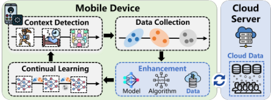

Fig. 1: On-device continual learning pipeline. 

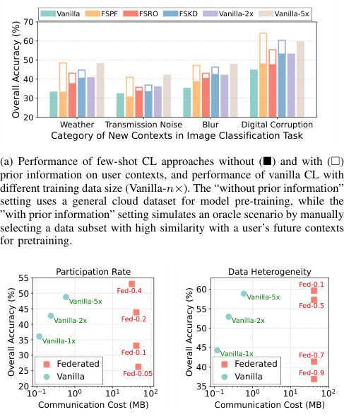

<!-- Start of picture text -->
Vanilla FSPF FSRO FSKD Vanilla-2x Vanilla-5x 70 60 50 40 30 20 Weather Transmission Noise Blur Digital Corruption Category of New Contexts in Image Classification Task (a) Performance of few-shot CL approaches without (■)■)) and with (□)□)) prior information on user contexts, and performance of vanilla CL with different training data size (Vanilla- n×× ). The “without prior information” setting uses a general cloud dataset for model pre-training, while the ”with prior information” setting simulates an oracle scenario by manually selecting a data subset with high similarity with a user’s future contexts for pretraining. Participation Rate Data Heterogeneity 55 Fed-0.1 5045 Vanilla-5x Fed-0.4 6055 Vanilla-5x Fed-0.5 40 Vanilla-2x Fed-0.2 50 Vanilla-2x 35 Vanilla-1x 30 Fed-0.1 45 Vanilla-1x Fed-0.7 25 FederatedVanilla Fed-0.05 40 FederatedVanilla Fed-0.9 2010 1 10 0 10 1 10 2 3510 1 10 0 10 1 10 2 Communication Cost (MB) Communication Cost (MB) Overall Accuracy (%) Overall Accuracy (%) Overall Accuracy (%) <!-- End of picture text -->

(a) Performance of few-shot CL approaches without (■)■)) and with (□)□)) prior information on user contexts, and performance of vanilla CL with different training data size (Vanilla- _n××_ ). The “without prior information” setting uses a general cloud dataset for model pre-training, while the ”with prior information” setting simulates an oracle scenario by manually selecting a data subset with high similarity with a user’s future contexts for pretraining. 

(b) Communication cost and accuracy of federated CL with varying device participation rates and data heterogeneity degree. For the left sub-figure, Fed- _p_ indicates that a _p_ portion of devices participate in each round, while for the right figure, Fed-p denotes that a _p_ portion of devices hold data from different contexts. 

Fig. 2: Preliminary experiments on image classification task to illustrate the limitations of existing solutions. 

## _B. Limitation of Existing Approaches_ 

In this section, we elaborate the limitations of existing fewshot CL and federated CL approaches in mitigating device-side data scarcity problem through preliminary experiments2 . 

**Few-shot CL** [35], [36], [59] proposes pretraining ML models on base contexts with massive public data to capture general knowledge, which is then transferred to new contexts through transfer learning techniques. Representative methods include: 1) knowledge distillation [59] (FS-KD), which distills past contexts’ knowledge to the new context’s model by keeping the model outputs of historical data samples unchanged, 2) robust optimization [36] (FS-RO), which constrains model parameters within the common flat minima of all contexts’ training objective functions, and 3) parameter freezing [35] 

> 2The detailed experimental settings are introduced in §VI-A. 

4 

PREPRINT 

(FS-PF), which freezes the important parameters with high value of the previously trained model. 

However, most of these few-shot CL approaches depend on a powerful model pre-training process, which pretrain either a large model on data from diverse contexts to fully capture the general knowledge, or a tiny model on a customized dataset to learn personalized knowledge. Unfortunately, both of them are impractical for on-device scenarios due to limited hardware resources and unpredictable contexts. On one hand, the limited memory and computational capabilities of mobile devices restrict the size and capacity of deployed models, impeding effective model pretraining over diverse data. On the other hand, the uncertainty of future user contexts prevents the preselection of a tailored data-subset for pretraining before model deployment. Our preliminary experiments shown in Figure 2(a) reveal that the performance of few-shot CL declines significantly without prior information on user contexts, with model accuracy reduction ranging from 8 _._ 6 _−_ 15 _._ 3% for FSPF, 1 _._ 9 _−_ 7 _._ 9% for FS-RO and 3 _._ 9 _−_ 7 _._ 2% for FS-KD. In contrast, simply increasing the training data size from 10 to 50 can outperform all few-shot CL approaches, underscoring the potential of data enrichment. 

**Federated CL** [37], [38] utilizes a cloud server to periodically aggregate the parameters of models trained on distributed devices, thereby mitigating the overfitting issue on individual devices and facilitating knowledge transfer across multiple devices. However, the substantial communication overheads and unstable model training process render federated CL impractical for mobile devices. First, the frequent exchange of model parameters between mobile devices and the cloud server incurs significant communication costs and prolongs the wall-clock training time for on-device models. Second, the model performance of federated CL is relatively sensitive to the device participation rate (or amount) and the data heterogeneity across devices [39], [40]. Experimental results shown in Figure 2(b) indicate that: 1) Federated CL achieves superior performance only when _≥_ 20% devices participate in each round of model aggregation or when more than _≥_ 30% mobile users experience similar contexts, which can be unrealistic in real-world settings; 2) In comparison to federated CL, transmitting data with a suitable distribution from cloud to each device could reach the same target accuracy with communication costs reduced to less than 1%. 

## III. PROBLEM DEFINITION 

In this section, we present a generic formalization of the cloud-assisted data enrichment problem for on-device CL. We consider a scenario where a mobile user or edge device sequentially encounters _T_ new contexts. Each context _t_ = 1 _, . . . , T_ has an underlying data distribution _Dde__t_andthe device collects an empirical dataset _D_� _de__t_for training on-device model. Due to the scarcity of user data, a similar data-subset _S__t_ is expected to be retrieved from the cloud-side dataset _Dcl_ to enrich the on-device empirical dataset _D_� _de__t_andthereby enhance the CL performance. 

To assess the effectiveness of data enrichment, we first define a metric to evaluate the similarity between two datasets 

in terms of their impacts on the model training process. In on-device CL, model parameters are typically fine-tuned by on-device data via gradient descent methods. Therefore, the similarity between two datasets _D_ 1 and _D_ 2 with respect to the training process of model _θ_ can be quantified by the maximal difference between the average gradients of _D_ 1 and _D_ 2 within a nearby parameter space _{θ__′_ _|∥ θ__′_ _−θ ∥≤ ϵ}_ : 

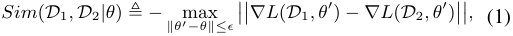

where _L_ ( _D, θ_ ) = E( _x,y_ ) _∈D_ � _l_ ( _x, y, θ_ )� denotes the expected loss of model _θ_ over dataset _D_ . A high similarity between two datasets _D_ 1 and _D_ 2 implies their comparable performance in updating model parameters for multiple steps, resulting in similar impacts on on-device model training. 

**Problem Formulation.** For each new context _t_ , the cloud server aims to select the most similar data-subset _S__t,∗_ _⊆Dcl_ to update the current on-device model _θ__t−_1 in a similar way with the device-side underlying data distribution _Dde__t_,which means that _S__t,∗_ and _Dde__t_shouldexhibithighsimilarityas measured by the metric in Equation (1). Consequently, the data enrichment problem can be formally expressed as: 

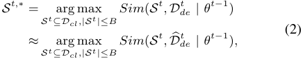

where _B_ represents the maximum allowable size of the selected data-subset and is constrained by the communication cost budget of each device. This formulation enables the device to enhance model training performance by expanding the training data from the collected dataset _D_� _de__t_to the enriched larger-scale dataset _S__t_ , while ensuring that the enriched data follows a similar distribution. 

**Practical Challenges.** Directly solving the data enrichment problem in Equation (2) brings severe privacy concerns for mobile users and high computational burden for cloud server. First, the mobile device needs to upload both the current model _θ__t−_1 and raw user data _D_� _de__t_tothecloudserver,whichposes a severe breach of user privacy. Second, the cloud server has to compute the similarity score _Sim_ ( _S__t_ _, D_� _de__t|θt−_1)for every possible data-subset _S__t_ _⊆Dcl_ , _|S__t_ _| ≤ B_ , resulting in exponential computation complexity. 

## IV. FRAMEWORK DESIGN 

Delta incorporates three key components to render data enrichment systematically practical: the construction of a directory dataset to address privacy concerns (§IV-A), deviceside soft data matching strategy coupled with a cloud-side data sampling scheme to efficiently and effectively enrich data for new contexts (§IV-B), and a re-optimization of the cloud-side data sampling to further enhance its effectiveness across both past and new contexts (§IV-C). _Each component is inspired and supported by theoretical analysis presented in §V and the overall design rationale is illustrated in Figure 3._ 

## _A. Directory Dataset Construction_ 

To mitigate privacy concerns, Delta introduces the concept of “directory” dataset, which facilitates decomposing the data 

5 

PREPRINT 

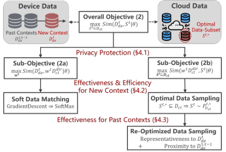

Fig. 3: Design Rationale of Delta. 

enrichment problem (2) into two sub-problems, and allows the device and cloud to collaboratively solve the sub-problems without the need to share raw user data. 

**Design Rationale.** Inspired by the directory structures in storage systems [60], Delta constructs a compact directory dataset consisting of a few data samples to represent the ex- _cl__|_ tensive cloud-side dataset, denoted as _Dcl__dir_= �(¯ _xc,_ ¯ _yc_ )� _|Dc_ =1_dir_ . This directory dataset can be pre-downloaded by mobile devices along with the model deployment. As illustrated in Figure 3 and supported in Theorem 1, the objective function (2) of the data enrichment problem can be decomposed into the sum of two sub-objective functions: 

_• Sub-objective (2a)_ : similarity between the device-side dataset _Dde__t_andtheweighteddirectorydataset_wtD_ _cl__dir_,whereeach data sample (¯ _xc,_ ¯ _yc_ ) _∈Dcl__dir_ is assigned a weight _wc__t_.The weight vector _w__t_ is a variable to be optimized. _• Sub-objective (2b)_ : similarity between the weighted directory dataset _w__t_ _Dcl__dir_ and the cloud-side data-subset _S__t_ , where _S__t_ is the variable to be optimized. 

These two sub-objective functions can be optimized sequentially and independently by the mobile device and cloud server through the exchange of non-sensitive information: 

_• Mobile device_ optimizes sub-objective (2a) by computing the optimal weight _w__t,∗_ for the directory dataset _Dcl__dir_ to represent the device-side data distribution _Dde__t_. 

_• Cloud server_ optimizes sub-objective (2b) by searching for the optimal cloud-side data-subset _S__t,∗_ _⊆Dcl_ to align with the weighted directory dataset _w__t,∗_ _Dcl__dir_, with_wt,∗_being uploaded by the mobile device after device-side optimization. _• Device-cloud communication_ involves the cloud-side directory dataset _Dcl__dir_ and the device-side optimized weight _w__t,∗_ , which do not involve any raw user data and thus protect user privacy akin to classic federated learning [61]. Detailed discussion and comparison are presented in §VIII. 

**Practical Implementation.** The practical effectiveness of the above decomposition process relies on an appropriate directory dataset that accurately represents the cloud-side public dataset. While classical data clustering methods can be used to select cluster centroids as the directory dataset elements, we observe that directly clustering raw data samples may not fully capture the influence of data on model training, due to the diverse sources, wide-ranging distributions and varying 

dimensions of cloud-side data. To address this issue, we take advantage of the typical paradigm of on-device model training [62], [63], [ **?** ], where the feature extractor _ϕ_ is pre-trained on extensive cloud-side data for generalization ability and the classifier _ψ_ is trained on device-side data for personalization performance. We propose clustering data samples ( _x, y_ ) _∈Dcl_ based on the feature extractor outputs _ϕ_ ( _x_ ) rather than raw input _x_ , and selecting the cluster centroids as elements of the directory dataset, which offers two advantages: 1) features as model’s intermediate outputs have a consistent dimension and are more relevant to model training than raw inputs, 2) the features of most cloud-side data samples are already available from the pre-training process of feature extractor, incurring minimal additional costs. 

**Privacy Consideration.** In Delta framework, the information uploaded from devices to cloud include directory weights, which mitigates the privacy concerns from disclosing finegrained raw user data to coarse-grained context likelihood distribution, inherently protecting privacy similar to federated learning (FL) [61]. For instance, in image analysis, the weights reveal the likelihood of weather conditions rather than specific pixel values, and in human activity recognition, the weights reflect the probability of device placement rather than IMU signals. Such design discloses only rough context information, making the recovery or identification of raw data significantly more challenging. To further mitigate privacy concerns, differential privacy [64] can be seamlessly integrated into Delta’s communication and computation processes. Specifically, we inject Gaussian noise into the directory weights shared between devices and cloud, which obscures the identification of specific user context and controls the privacy protection degree through the noise distribution variance. In §VI-E, we analyze how Delta performance is impacted by inserting different degrees of noise into weight vectors. This provides insights into the privacy-performance trade-offs and helps identify the optimal configurations for different application scenarios. We acknowledge that our current design does not fully address privacy concerns. Achieving complete privacy requires dedicated integration with more advanced secure techniques, such as secure multi-party computation [65] or homomorphic encryption [66], which we plan to explore in future work. 

## _B. Data Enrichment for New Context_ 

While the directory dataset safeguards user privacy by decomposing the data enrichment problem into device-side and cloud-side sub-problems, it is non-trivial to solve them in an effective and efficient manner due to the scarcity of on-device data and diversity of cloud-side data. 

_• Device-side ineffectiveness_ : Solving sub-problem (2a) requires determining the optimal weight _w__t,∗_ to align the weighted directory dataset _w__t_ _Dcl__dir_ with the device-side data distribution _Dde__t_.However,theunderlyingdatadistribution is typically approximated by the sparse empirical dataset _D_ � _de__t_storedbymobiledevice,whichcancauseconventional gradient descent algorithms to converge to local optima. Consequently, the derived weight becomes overfitted to the limited empirical dataset and ineffective in representing the deviceside data distribution. 

6 

PREPRINT 

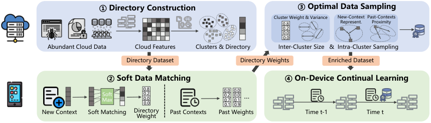

<!-- Start of picture text -->
①Directory Construction ③Optimal Data Sampling Cluster Weight & Variance New-Context Past-Contexts 0.8 Represent. Proximity 0.2 0.0 0.0 Abundant Cloud Data Cloud Features Clusters & Directory Inter-Cluster Size  &  Intra-Cluster Sampling Directory Dataset Directory Weights Enriched Dataset ②Soft Data Matching ④On-Device Continual Learning 0.8 0.0 0.0 MaxSoft 0.20.00.0 0.20.70.1 0.00.10.9 … New Context Soft Matching Directory  Past Contexts Past Weights Time t-1 Time t Weight <!-- End of picture text -->

Fig. 4: Overall Workflow of Delta Framework. Delta serves as a plug-in for on-device continual learning. 

_• Cloud-side inefficiency_ : Exactly solving sub-problem (2b) involves evaluating the similarity score for each potential cloud-side data subset, which requires exploring a vast feasible region of candidate data-subsets _S__t_ _⊆Dcl, |S|≤ B_ and results in exponential computation and time complexity for cloud server, leading to low efficiency. 

To achieve an efficient and effective data enrichment process for each coming context, we propose a soft data matching strategy for mobile device to derive a representative directory weight by fully leveraging the limited on-device data, and a data sampling scheme for cloud server to sample an optimal data-subset with constant time complexity. 

**Device-Side: Soft Data Matching.** To prevent the directory weight _w__t_ from overfitting to scarce on-device data, we propose to assign physical meanings to _w__t_ by interpreting each element _wc__t_as the fraction of on-device data that exhibits high similarity with the cloud-side cluster centroid (¯ _xc,_ ¯ _yc_ ) _∈Dcl__dir_. Thus, for each data sample ( _x, y_ ) _∈ D_� _de__t_collectedbymobile device, its similarities with all the cluster centroids are computed, and the weight of the most similar one is incremented by one step: 

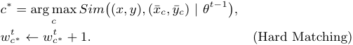

However, in our experiments, we observe that each ondevice data sample can exhibit high similarity with more than one cloud-side cluster centroids, which is influenced by the granularity of cloud-side data clustering ( _i.e._ the number of data clusters) during the directory construction process. However, the “hard” matching function _argmax_ is incapable of capturing the correlation between one device-side sample and multiple cloud-side clusters. Thus, we propose to employ a “soft” matching function _softmax_ , allowing each data sample to contribute to the weights of more than one clusters: 

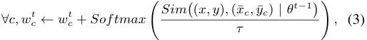

where _τ_ is a temperature hyperparameter to control the weight increments of clusters with different degrees of similarity. As _τ →_ 0, _softmax_ gradually degrades to _argmax_ . 

**Cloud-Side: Optimal Data Sampling.** To enhance efficiency and reduce the computational overhead on the cloud server, we propose transforming the “hard” data selection process into a “soft” data sampling process. The key difference 

is that the former seeks to find an exact data-subset _S__t,∗_ to optimize sub-problem (2b), whereas the latter aims to compute a data sampling policy _PD__t,_ _cl__∗_such that the sampled data-subset is optimal for sub-problem (2b) in expectation: 

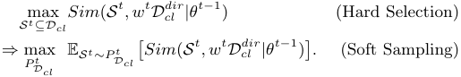

This transformation allows the cloud server to directly identify an appropriate data-subset through data sampling policy, which can be computed with low time complexity. 

We outline the specific operations of cloud-side data sampling scheme, with theoretical foundation provided in §V-B. The scheme involves _inter-cluster size allocation_ and _intracluster data sampling_ , which determine _how many_ and _which_ data samples to select from each cloud-side data cluster: 

_• Inter-cluster size allocation._ Given that the size of the selected data-subset is limited by the communication cost budget, the cloud server needs to allocate distinct sampling sizes to different data clusters to maximize the overall similarity between the sampled data-subset and the weighted directory dataset, _i.e._ sub-objective (2b). As demonstrated in Lemma 1, the optimal sampling size _|Sc__t,∗|_for each cluster_Dcl,c_depends on its directory weight _wc__t_andthedispersiondegreeofintra- cluster feature distribution E _x||ϕ_ ( _x_ ) _−ϕ_ (¯ _x_ ) _||_ : 

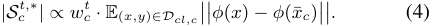

For each cluster, a higher weight suggests a higher similarity with the device-side data for on-device CL, and a wider feature distribution indicates the need for more data samples to comprehensively represent the cluster . 

_• Intra-Cluster Data Sampling._ Within each cloud-side data cluster _Dcl,c_ , the optimal sampling probability for each data sample ( _x, y_ ) is proportional to the feature distance between such data sample and the cluster centroid (¯ _xc,_ ¯ _yc_ ): 

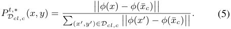

Theoretically, our analysis in Lemma 1 demonstrates that this sampling probability could maximize the expected similarity between each data cluster _Dcl,c_ and the corresponding selected data-subset _Sc__t_,therebyoptimizingsub-objective(2b) in expectation given fixed directory weights _w__t_ . Intuitively, this sampling strategy favors data samples that are farther 

PREPRINT 

7 

from the cluster centroid, which enhances the diversity and informativeness of the selected data-subset while ensuring unbiasedness and representativeness through data re-weighting technique like importance sampling [67]. 

Our framework can also handle dynamically updated cloudside dataset. When the cloud-side data is updated, the predownloaded directory dataset becomes less representative and covers only part of the cloud-side data distribution. However, this does not break the theoretical guarantee of Theorem 1 and only impacts the similarity of the selected cloud-side data subset. Such problem can be further addressed by a simple extension: periodically updating the directory dataset and sending it to device. This process does not compromise privacy, as the information shared by device remains consistent, i.e., the lightweight directory weight. 

## _C. Data Enrichment for all Contexts_ 

Although the previous components ensure a private, efficient and effective data enrichment process for each new context, the notorious issue of catastrophic forgetting ( _i.e._ inferior memory stability) is also exacerbated. First, as model parameters _θ_ continually adapt to the enriched data _{S__i_ _}__t_ _i_ =1,thesimilarity between each past context _i_ ’s enriched data _S__i_ and the underlying distribution _Dde__i_graduallydiminishes,hindering the use of _{S__i_ _}__t_ _i_ =1forretainingpastknowledge.Second, independently enriching data solely for the new context will exacerbate the mutual interference between the model training processes of new and past contexts. 

To address these issues, we take the first step to theoretically analyze the correlation between new context’s enriched data and the model performance on both new and past contexts. Further, we re-optimize the data sampling scheme for cloud server to identify a data-subset that could contribute to the learning processes of both new and past contexts. 

**Theoretical Analysis.** Theorem 3 reveals that the overall CL performance, quantified by the average loss of model over all contexts, is primarily determined by three terms: 

_1) New-context representativeness_ , which is quantified by the feature distance between the enriched dataset _S__t_ and the underlying data distribution of new context _Dde__t_. _2) Past-contexts proximity_ , which is measured by the feature distance between the enriched dataset _S__t_ and the underlying data distributions of all the past contexts _{Dde__i}_ _i__t_ =1_−_1. _3) Cross-Context Heterogeneity_ , which is a fixed term and determined by the heterogeneity between the new context and the past contexts encountered by the mobile user. 

Consequently, the original intra-cluster data sampling strategy in Equation (5) can be seen as focusing only on the first term ( _i.e._ effectiveness for new context), while overlooking the second term ( _i.e._ effectiveness for past contexts.) 

**Practical Implementation.** Guided by the theoretical results, we further derive the analytical expression for the reoptimized cloud-side data sampling policy, with the detailed mathematical derivation provided in §V-C. Specifically, for intra-cluster data sampling, the optimal sampling probability 

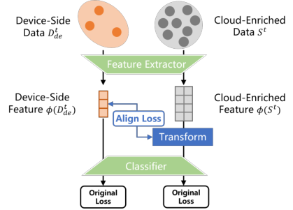

Fig. 5: Extend data enrichment to unique user contexts by aligning the feature distributions of device and cloud data. 

for each data sample is proportional to the weighted sum of new-context representativeness and past-contexts proximity: 

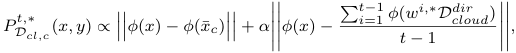

where _α_ is a hyperparameter determined by the device to balance the model performance over the new context and past contexts when conducing data enrichment. 

## _D. Rare User Context Extension_ 

The proposed design enables the cloud server to efficient and effectively select a data subset that exhibits the highest similarity with the device-side data distribution. However, in real-world networking scenarios, the majority of edge devices and mobile users operate in common scenarios, while a small subset may encounter rare of unique contexts. This can lead to a significant divergence between the cloud-side selected data subset and the actual device-side data distribution, thereby diminishing the effectiveness of data enrichment. 

To address this challenge, we propose integrating domain adaptation techniques [68] into the design of Delta. By treating the massive cloud-enriched data _S__t_ as the source domain and the scarce device-side data _Dde__t_asthetargetdomain, we can “transform” the enriched dataset to better align with the device-side data distribution. Since the feature extractor of ML models on devices is typically pre-trained and fixed, we focus on transforming the feature representations of the source domain to match those of the target domain. This approach minimizes the feature distribution discrepancy between these two domains, and ensures that the training data from both domains contributes to the continual learning performance over the true device-side data distributions (i.e. rare context). 

**Practical Implementation.** A widely adopted method for feature-level alignment is to learn a non-linear transformation function that maps source features to the target feature space. This method can be seamlessly integrated into Delta by introducing a new loss function term to learn the transformation function, as shown in Figure 5. For practical implementation, we introduce a lightweight, fully connected layer with minimal parameters between the feature extractor and classifier of the on-device model. This layer is designed to learn the mapping 

8 

PREPRINT 

between cloud-enriched data and device-side data, and it is continuously updated during the model training process for each new context. During the inference phase on edge devices, this small module can be omitted without compromising the model’s performance for rare context, ensuring computational efficiency and scalability. When learning new contexts, the transformation modules associated with past contexts are dynamically loaded to facilitate model re-training on historical data. Despite this, the relatively small size of the transformation module ensures that the additional computation and memory overheads imposed on edge devices remain marginal. 

## _E. Overall Framework_ 

We illustrate the overall workflow of Delta framework in Figure 4, which comprises four stages. 

➊ **Directory Construction:** Initially, the cloud server utilizes the pre-trained feature extractor to extract features from diverse datasets and performs data clustering to construct the directory dataset. The directory dataset is then distributed to mobile devices along with the model deployment. 

➋ **Soft Data Matching:** For each coming new context _t_ , the mobile device solves sub-problem (2a) through the soft data matching strategy outlined in Equation (3), and uploads the optimal directory weights for both the new and past contexts to the cloud server. 

➌ **Optimal Data Sampling:** Upon receiving the directory weights, the cloud server computes the analytical expressions for the optimal data sampling scheme, which includes intercluster size allocation in Equation (4) and intra-cluster data sampling in Equation (5). The optimal data-subset is then sampled according to the scheme and transmitted back to the mobile device. 

➍ **On-Device Continual Learning:** The mobile device conducts CL process using the enriched datasets of both new and past contexts. _Generally, Delta serves as a plug-in module to enhance on-device CL performance with privacy protection, effectiveness and efficiency._ 

## V. THEORETICAL ANALYSIS 

In this section, we provide theoretical foundations for the three key components of Delta framework. 

## _A. Theoretical Results for Directory Construction_ 

To facilitate data enrichment as outlined in Equation (2) without disclosing raw user data, we introduce the directory dataset _Dcl__dir_ to decompose the original objective function into the sum of two sub-objective functions. The performance of this decomposition is theoretically guaranteed by Theorem 1, which establishes the correlation between the original objective function and two sub-objective functions. 

**Theorem 1.** _Given the directory dataset Dcl__dir,themaximal_ _similarity between the device-side dataset Dde__tandthecloud-_ _side data-subset S__t_ _⊆Dcl for model θ__t−_1 _can be bounded:_ 

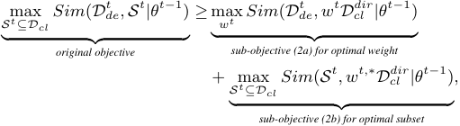

_where w__t_ _Dcl__dir_ _represents the weighted directory dataset._ 

_Proof._ According to the definition of similarity function _Sim_ (), we can decompose the original objective function by introducing an intermediary term involving a weighted directory dataset _w__t_ _Dcl__dir_: 

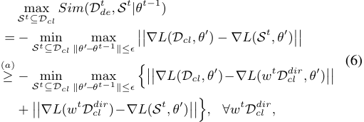

where inequality ( _a_ ) follows from the Triangle inequality of the norm function [69]. Next, we apply the max-sum inequality, which states that max _x_ � _f_ ( _x_ )+ _g_ ( _x_ )� _≤_ max _x f_ ( _x_ )+ max _g_ ( _x_ ), to further simplify the expression: _x_ 

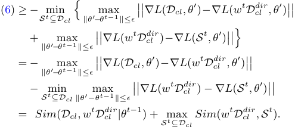

Since the above deduction holds for any weighted directory dataset _w__t_ _Dcl__dir_ as an intermediary term, we can minimize the divergence between the final objective function and original objective function by optimizing the weight _w__t_ . This leads to the conclusion presented in Theorem 1. 

Theorem 1 establishes that the optimal value of the original objective function (2) is bounded from below by the sum of the optimal values of the two sub-objective functions (2a) and (2b). Consequently, Delta essentially optimizes the worstcase performance of data enrichment across diverse contexts, ensuring robustness even in dynamic and unpredictable user contexts. The practical gap between the original and decomposed objective functions is primarily determined by the representativeness of the cloud-side directory dataset. When the directory dataset is constructed through a fine-grained data clustering process and thoroughly represents the cloud-side dataset, sub-objective (2a) gradually converges to the original objective function (2). In §VI-C, we empirically demonstrate that a directory dataset compromising approximately 102 ele- 

9 

PREPRINT 

ments is sufficient to represent a cloud-side dataset consisting of 106 data samples across 102 contexts. 

## _B. Theoretical Results for New Context’s Enrichment_ 

To establish the theoretical guarantees for the optimality of the cloud-side data sampling scheme described in Eq (4) and (5), we introduce Theorem 2 to partition the on-device model _θ_ into a feature extractor _ϕ_ and a classifier _ψ_ with a Lipstchiz continuity constant _Lψ_ . The feature extractor is typically pretrained by cloud server and remains fixed during on-device model training process. 

**Theorem 2.** _The expected similarity between the weighted directory dataset w__t_ _Dcl__dir_ _and the data-subset S__t_ _selected according to the sampling scheme PD__t_ _cl__isboundedby:_ 

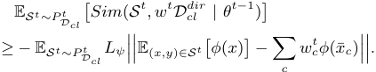

_where ϕ represents the feature extractor and ψ denotes the classifier with Lψ-Lipschitz continuous gradient._ 

_Proof._ According to the definition of similarity, we have: 

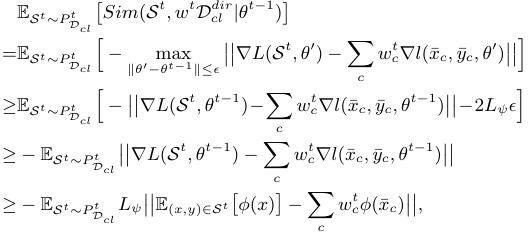

where (¯ _xc,_ ¯ _yc_ ) denotes elements of directory dataset and the inequality is due to _Lψ_ -Lipschitz continuous gradient. 

In Lemma 1, we further show that the expected value of sub-objective function (2b) (i.e., lower bound of the above inequality) is determined by two factors: inter-cluster sampling size _|Sc__t|_and intra-cluster sampling probability_P_ _D__t_ _cl,c_(_x, y_) for each cloud-side data cluster _c_ . 

**Lemma 1.** _The expected similarity between the sampled data-subset S__t_ _and the weighted directory dataset w__t_ _Dcl__dir_ _is determined by each cluster c’s sampling size |Sc__t|andintra-_ _cluster data sampling probability PD__t_ _cl,c_(_x, y_)_:_ 

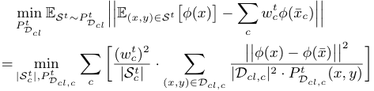

_Proof._ According to the definition of data variance V[ _x_ ] = 

E _∥ x ∥_2 _−∥_ E[ _x_ ] _∥_2 , we have: 

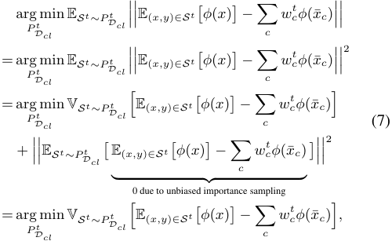

where the unbiasedness property of importance sampling has been proved in previous research on importance sampling strategies [67], [70]. 

Building on this foundation, we decompose the overall sampling variance into the sum of weighted variances of different clusters. In this process, the variables transition from the overall sampling function _PD__t_ _cl_totheintra-cluster sampling function _PD__t_ _cl,c_foreachcluster_c_. 

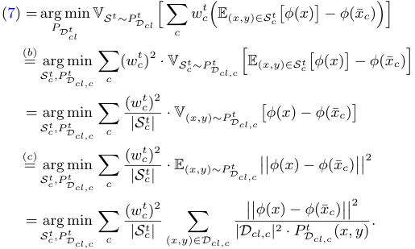

Equality (b) holds because we decompose the overall variance of the sampled data into variances for different clusters, and equality (c) is also due to the unbiasedness property of importance sampling. 

Finally, by leveraging Cauchy-Schwarz inequality, we derive the analytical expressions for the optimal data sampling policy (i.e. _|Sc__t,∗|_and_P_ _D__t,_ _cl__∗_),whichcanbecomputeddirectly using the directory weights uploaded by mobile device: 

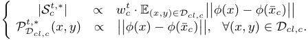

## _C. Theoretical Results for All Contexts’ Enrichment_ 

In §IV-C, we propose to refine the cloud-side data sampling scheme to ensure that the enriched data for the new context contributes effectively to the learning processes of both new and past contexts. To achieve this, we first analyze the impact of the new context’s enriched data on the model performance across all contexts in Theorem 3. This theorem identifies three key factors influencing the model’s performance improvement: representativeness to the new context, proximity to past contexts and the data heterogeneity across different contexts. 

10 

PREPRINT 

**Theorem 3.** _In m-th training round for context t, when the model parameters are updated from θ__t,m_ _to θ__t,m_+1 _using the enriched data S__t_ _sampled by policy PD__t_ _cl__,theexpectedreduc-_ _tion in model loss (i.e., improvement in model performance) over all contexts’ data distribution Dde_1:_tcanbeboundedby:_ 

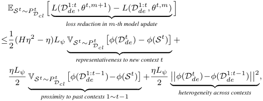

_where_ V _x_ [ _f_ ( _x_ )] _denotes the variance of function f_ ( _x_ ) _and we assume that the commonly used loss functions are__<u>H</u>_ 2_-smooth_ _similar with previous works on model convergence analysis. Proof._ First, we decompose the overall performance improvement of on-device model in the _m_ -th round into the improvements over past and new contexts by using the _<u>H</u>_ 2-smooth property of the commonly seen loss functions: 

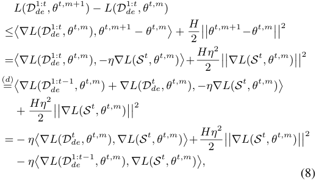

where equality (d) is derived by decomposing the overall training loss function into the loss functions of past contexts 1 _∼ t_ and new context _t_ . 

To better analyze the impact of the data sampling policy on model training performance, we transform the relationship between the enriched training data _S__t_ and the on-device empirical data _Dde__t_fromamultiplicativeformtoadifference form. This transformation is achieved by leveraging the classic equality: _−ab_ = 2<u>1</u>[(_a−b_)2_−a_2_−b_2]: 

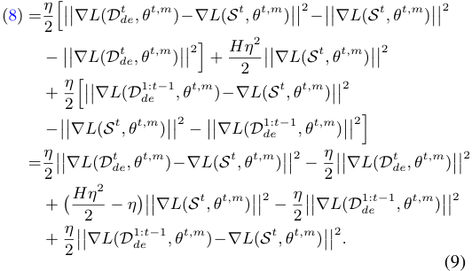

Next, we aim to analyze the impact of new context’s enriched data _S__t_ on the overall model training performance 

across all contexts _Dde_1:_t_. Since the enriched data_St_is sampled from the cloud-side dataset _Dcl_ with uncertainty, we focus on the expected training loss reduction, i.e. E _S t∼P tDcl_[(9)]. By decomposing the term ���� _∇L_ ( _S t, θt,m_ )���� using the equality _b_2 =( _a−b_ )2 _−a_2 +2 _ab_ , we can obtain: 

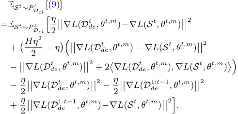

Due to the unibasedness property of cloud-side sampling policy, as established in importance sampling works [67], [70], we have the following approximation: 

E _St∼P t_ � _∇L_ ( _S__t_ _, θ__t,m_ )� = _∇L_ ( _w__t_ _Dcl__dir, θt,m_)_≈∇L_(_D_ _de__t, θt,m_)_,_ _Dcl_ 

which further simplifies the expectation of Eq. (9): 

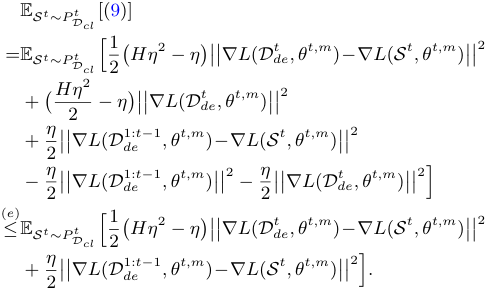

The inequality (e) holds due to the typically small learning rate _η_ and non-negative property of the norm function. 

Finally, by leveraging the Lipschitz property of feature extractor _ψ_ and the definition of variance , we have: 

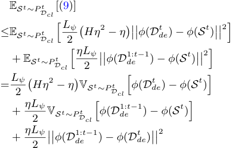

Building on this analysis, we observe that to improve the overall CL performance and reduce the model loss across all contexts, the cloud-side sampling scheme _PD__t_ _cl_shouldtake both the representativess to new context and the proximity to past contexts into consideration. From a theoretical perspective, we further derive the analytical expression of the re-optimized data sampling scheme _PD__t,_ _cl__∗_inLemma2. 

11 

PREPRINT 

**Lemma 2.** _To optimize the model performance on the overall data distribution of all encountered contexts, the intra-cluster data sampling probability PD__t,_ _cl__∗needstoberefinedas:_ 

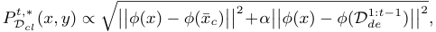

_where α_ = _Lψ_ <u>1</u> _η−_ 1_canberegardedasahyper-parameterto_ _balance the model performance over new and past contexts._ 

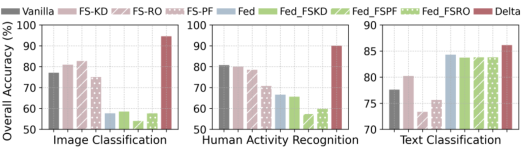

Fig. 6: Extended comparison with hybrid approaches that combine baselines of few-shot learning and federated learning. 

## VI. EVALUATION RESULTS 

## _A. Experimental Setup_ 

**Tasks, Datasets and Models.** To demonstrate Delta’s broad applicability, we evaluate Delta on four typical mobile computing tasks with diverse data modalities, model structures and categories of user contexts (summarized in Table I). 

_• Image Classification (IC)._ The Cifar10-C dataset [71] contains around 750 _,_ 000 images of 10 objects across four context categories: weather, noise, blur and digital corruptions. For each context category, the dataset is processed into 5 subsets with 2 new objects and 1 new context per subset. ResNet18 [72] is trained for this 10-class image classification task. 

_• Human Activity Recognition (HAR)._ HHAR [73], UCI [74], MotionSense [75] and Shoaib [76] are four public datasets collected from 73 users performing 6 basic activities (still, walking, upstairs, downstairs, jogging, bike) with 5 device placements (pocket, belt, arm, wrist, waist). For each context category, the dataset is processed into 6 subsets with 1 new activity in a new context. A lightweight CNN-based model DCNN [77] is trained for this 6-class classification task. 

_• Audio Recognition (AR)._ Google Speech command [78] comprises 100,000 sound files of 20 commands from over 2,000 users with varied tones and environmental conditions. The dataset is processed into 5 subsets for each context category, each containing 4 new commands in 1 new context. A deep neural network VGG-11 [79] is deployed for this task. _• Text Classification (TC)._ The NC corpus in XGLUE benchmark [80] is a cross-lingual understanding dataset consisting of 50 _,_ 000 articles on 10 topics and in 5 languages (German, English, Spanish, French, Russian). For each context category, the dataset is processed into 5 subsets with 2 new topics and 1 new context. A transformer-based model BERT [81] is finetuned for this 10-class classification task. 

Note that we standardize the total number of on-device contexts to approximately 5 to ensure a consistent evaluation of Delta across various tasks, models and modalities, and thus the class number per context may vary for different datasets. 

**Configurations.** For each task, we collect data from 50% users (or randomly select 50% samples for IC and TC tasks) to form the cloud-side public dataset, with the remaining data used to simulate the on-device empirical data across different contexts. For cloud server, data samples from different users and contexts are mixed to reflect the typical scenario where the specific context of each raw data sample is unknown. For mobile device, we use 5 samples per class in each context as empirical data for model fine-tuning, consistent with the statistics that an average European citizen takes over around 4 _._ 9 photos daily [28] and uses Siri several times a day [29]. The remaining data samples are used as testing data 

for each context. For Delta, the temperature _τ_ for deviceside soft matching is set to 0 _._ 1 and the number of cloudside data clusters is 20 _×num class_ (i.e. 200 _/_ 120 _/_ 400 _/_ 200 for IC/HAR/AR/TC). The hyperparameter _α_ is set to 1.0 to balance the effects of cloud-side data sampling on new and past contexts. The default communication budget is set to 25 samples/class for each new context, and an in-depth analysis of the impacts of such budget and on-device data amount is presented in §VI-C. 

**Baselines.** To our best knowledge, Delta is the first data enrichment framework for on-device CL, and we compare it against the model- and algorithm-based baselines (few-shot CL and federated CL) and a random data enrichment baseline. 1) _Few-shot CL_ pre-trains model on cloud-side data in advance to capture the general knowledge, which is transferred to device-side new contexts through knowledge distillation [59] (FS-KD), robust optimization [36] (FS-RO) and parameter freezing [35] (FS-PR). 2) _Federated CL_ leverages the cloud server to periodically aggregate the models trained on multiple devices per 10 local model updates. In our experiments, the default device number is 50, except for 35 for HAR task. We use Fed- _p_ to denote different settings of device participation rate _p_ . For IC and TC tasks, the data samples from each user are from the same context category to simulate the common data heterogeneity across users (e.g. W/N/B/D for IC and L for TC). The CL performance is evaluated on an independent test dataset, constructed according to the user contexts specified by the experimental setting. 3) _Random_ method selects a random cloud-side data-subset to enrich device-side empirical data. 

**Metrics.** We assess the on-device CL performance using four metrics. _Overall performance_ measures the inference accuracy of the final model across all the encountered contexts. _Learning plasticity_ is the average of each new context’s highest accuracy during its learning process. _Memory stability_ is the average ratio between each context’s final accuracy to its maximal accuracy. _System overheads_ include the computation latency, communication costs, memory footprint and energy consumption for both the device side and cloud side. 

**Deployments.** We employ a cloud server equipped with one NVIDIA 3090Ti GPU and a mobile platform featuring an NVIDIA Jetson Nano [82]. This setup aligns with the hardware configurations commonly used in prior works on edge computing. 

## _B. End-to-End Performance_ 

We begin by comparing the end-to-end performance of Delta against the baselines across all four tasks. 

12 

PREPRINT 

TABLE I: Summary of tasks, modalities, contexts, datasets and models. 

|**Modality**|**Category of Dynamic Context**|**Dataset**|**Model(#params)**|
|---|---|---|---|
|Image|Object (O), Weather (W), Noise (N), Blur (B), Digital Corruption (D)|Cifar10-C|ResNet18(11.2M)|
|IMU|Activity (A), Physical Condition (P), Device Placement (D)|HHAR, UCI, Motion, Shoaib|DCNN(17.3K)|
|Audio|User Command (C), Tone (T), Environmental Noise (N)|Google Speech|VGG11(9.75M)|
|Text|Article Topic (T), Language (L)|XGLUE|BERT(0.178B)|

TABLE II: Summary of overall CL performance (average accuracy of final model on all contexts). We also mark Delta’s improvement on accuracy (over few-shot CL) and reduction in communication costs (over federated CL). 

|**Tasks**|**Context** |**Vanilla** |**Fe** |**w-Shot C** |**L** |**Fe** |**derated C** |**L** |**Data En** |**richment** |∆**Acc.**|∆**Comm.**|
|---|---|---|---|---|---|---|---|---|---|---|---|---|
||**Category**|**CL**|FSKD|FSRO|FSPF|Fed0.1|Fed0.2|Fed0.4|Random|Delta|||
||O+W O+N|32.7_±_1.49 31.3_±_1.74|41.7_±_1.78 36.2_±_2.34|39.2_±_2.13 35.5_±_1.65|36.9_±_2.87 32.3_±_1.25|31.8_±_0.24 31.1_±_0.04|46.4_±_1.65 40.4_±_0.51|55.1_±_0.42 45.0_±_0.12|42.5_±_2.42 35.8_±_1.00|57.7_±_0.54 50.9_±_1.66|16.0%_↑_ 14.8%_↑_|93.7%_↓_ 93.5%_↓_|
|IC|O+B|35.6_±_0.94|43.7_±_1.12|40.6_±_0.24|39.2_±_0.06|32.6_±_0.16|39.6_±_0.24|50.1_±_0.31|39.9_±_1.69|57.7_±_0.98|14.0%_↑_|91.1%_↓_|
||O+D|45.0_±_2.57|55.1_±_1.17|51.5_±_2.66|52.2_±_3.10|36.9_±_0.04|49.0_±_0.51|61.7_±_0.34|53.7_±_2.24|72.3_±_2.27|17.1%_↑_|92.2%_↓_|
||O+W+N+B+D|77.3_±_0.49|81.2_±_1.53|80.4_±_0.81|75.3_±_0.41|30.0_±_0.05|39.8_±_0.71|50.8_±_0.41|47.8_±_6.64|94.8_±_2.74|13.6%_↑_|95.3%_↓_|
||A|52.4_±_3.67|55.0_±_3.93|52.9_±_2.55|48.3_±_2.69|54.0_±_0.64|60.0_±_0.21|61.3_±_0.55|58.4_±_0.35|69.3_±_1.96|14.3%_↑_|99.6%_↓_|
|HAR|A+P|51.2_±_4.53|53.3_±_3.20|50.1_±_3.52|49.4_±_2.95|60.5_±_1.28|61.1_±_1.89|63.1_±_0.85|58.5_±_0.75|66.6_±_1.78|13.3%_↑_|99.8%_↓_|
||A+P+D|81.0_±_4.75|80.3_±_2.35|78.7_±_4.37|71.0_±_4.27|62.2_±_3.58|66.8_±_3.97|70.1_±_4.28|61.1_±_3.25|90.3_±_5.09|10.0%_↑_|99.7%_↓_|
||C|93.6_±_0.16|93.5_±_0.07|92.9_±_0.65|94.2_±_0.28|88.1_±_1.65|88.3_±_0.83|88.5_±_1.78|90.4_±_0.19|94.3_±_0.17|0.2%_↑_|99.9%_↓_|
|AR|C+T|89.0_±_0.41|89.4_±_0.57|89.4_±_0.38|90.3_±_0.79|86.5_±_0.24|88.5_±_0.62|88.7_±_0.25|90.3_±_0.26|91.1_±_1.17|0.8%_↑_|99.9%_↓_|
||C+T+N|84.7_±_0.64|84.8_±_1.52|86.2_±_0.79|86.9_±_0.40|87.5_±_0.54|87.7_±_0.31|88.0_±_0.61|88.5_±_1.45|89.2_±_1.60|2.3%_↑_|99.9%_↓_|
|TC|T|73.2_±_2.15|73.5_±_1.35|75.7_±_4.07|73.3_±_2.56|79.6_±_0.37|79.6_±_0.19|79.8_±_0.14|73.9_±_2.69|83.1_±_2.26|7.3%_↑_|99.8%_↓_|
||T+L|77.7_±_3.19|82.2_±_0.29|80.1_±_3.02|80.0_±_1.89|84.3_±_0.14|84.4_±_0.18|84.7_±_0.09|79.7_±_2.21|86.22.16|4.0%_↑_|99.4%_↓_|

**Delta significantly improves the overall performance of on-device CL.** Table II summarizes the average accuracy of the final model across all contexts. Compared with the bestperforming few-shot CL method, Delta achieves a notable improvement, with accuracy increases of 13 _−_ 16% higher accuracy on IC, 10 _−_ 14% on HAR, 0 _._ 2 _−_ 2 _._ 5% on AR, and 4 _−_ 7 _._ 3% on TC. Note that Delta’s improvement on AR task is minimal because its data heterogeneity across contexts is relatively low (i.e. different tones and background noises) and vanilla CL could perform well. When compared to federated CL, Delta consistently achieves the highest overall performance across all settings, and reduces total communication costs by 91 _−_ 99%, demonstrating its superior effectiveness and efficiency in enhancing CL performance. Furthermore, we observe that for most tasks (IC, HAR and TC), all methods tend to perform better on contexts with mixed categories (last line of each task in Table II). The potential reason is that data samples with different context categories exhibit a greater distribution divergence, making it easier for the on-device model to learn the decision boundary. To provide a more comprehensive comparison, we perform an additional evaluation on hybrid approaches that combine few-shot learning and federated learning approaches. As shown in Figure 6, these hybrid baselines (e.g., Fed <u>FSKD, Fed FSRO and Fed</u> FSPF) consistently show only marginal or even negative performance gains compared to non-hybrid approaches, and are mainly determined by the performance of the pure federated learning method. The primary reason is that while few-shot CL provides a better model initialization for local model updates, the negative impact of cross-device data heterogeneity on model aggregation is also amplified significantly. This instability makes these hybrid methods unreliable as strong baselines in our target scenario which deserve dedicated designs. 

**Delta enhances the learning plasticity of on-device CL with various new contexts.** Figure 7 reports the average value of each new context’s peak accuracy during the learning process, a metric widely adopted to assess the learning plasticity. A key observation is that Delta consistently outperforms the baselines across various tasks, data modalities and context categories, demonstrating high robustness and applicability to diverse new contexts. For example, Delta achieves around 90% and 100% accuracy for new context in IC and HAR tasks regardless of context categories and fluctuates less than 3% accuracy on the other two tasks. The high accuracy for new contexts can be attributed to the limited classes within each new context and the enriched data from cloud side. In contrast, the performance of baselines on new contexts is sensitive to the diversity of context categories, such as few-shot CL dropping from 95% to 90% on AR task and federated CL reducing from 93% to 87% on TC task. The rationale behind these is that fewshot CL depends on the high relevance between the on-device context and the base contexts during pre-training to facilitate effective knowledge transfer. Similarly, the performance of federated CL is largely influenced by the data heterogeneity across different users’ ongoing contexts. Conversely, Delta can consistently identify an appropriate cloud-side data-subset that contributes to the device-side CL process, making it relatively robust. 

**Delta achieves high memory stability and low forgetting.** Figure 8(a) plots the average ratio between each context’s final accuracy and its peak accuracy, which indicates that Delta can maintain over 90% of its relative performance on past contexts. To further analyze this, Figure 8(b) shows how the average accuracy drop (i.e., forgetting performance) of past contexts evolves as new contexts are continuously learned. We observe that while all methods tend to forget more over time, Delta 

13 

PREPRINT 

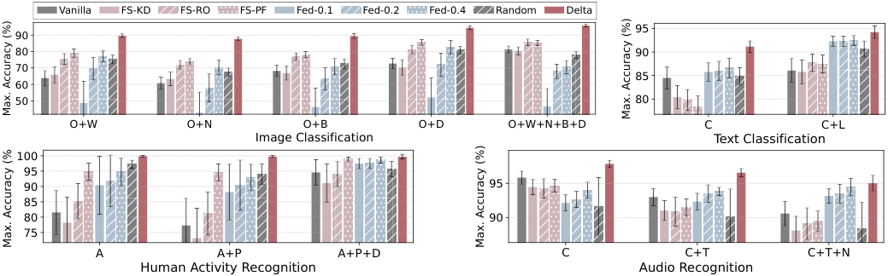

<!-- Start of picture text -->
Vanilla FS-KD FS-RO FS-PF Fed-0.1 Fed-0.2 Fed-0.4 Random Delta 95 90 80 90 70 85 60 50 80 O + W O+N O + B O+D O+W+ N +B+D C C+L Image Classification Text Classification 100 95 90 95 85 80 90 75 A A+P A+P+D C C+T C+T+N Human  Ac tivity Recognition Audio Recognition Max. Accuracy (%) Max. Accuracy (%) Max. Accuracy (% Max. Accuracy (%) <!-- End of picture text -->

Fig. 7: Comparison of learning plasticity (maximum model accuracy for each new context during CL). 

consistently achieves a low absolute drop, ranking 1st on the HAR task, 2nd on the IC and TC tasks, and 4th on the AR task. While some baselines may show a slightly lower drop, this is often because their initial peak accuracy on each new context is significantly lower than Delta’s (e.g. a 10% accuracy gap in IC task shown in Figure 7). This highlights that Delta’s strength lies in its ability to achieve high learning plasticity (high peak accuracy) while simultaneously maintaining high memory stability and low forgetting. 

**Delta incurs marginal system overheads for both mobile device and cloud server** , as depicted in Figure 9. 

_• Device-Side._ The soft matching solution for sub-problem (2a) requires computing the feature of each local data sample and its distance to each element of directory dataset. This results in additional latency of 23.8/1.05/ 4.25/109ms and energy consumption of 0 _._ 49 _/_ 0 _._ 30 _/_ 0 _._ 42 _/_ 2 _._ 47J per sample for IC/HAR/AR/TC tasks, respectively. Moreover, Figure (9(c)) shows that soft matching process has a lower memory footprint than CL process for avoiding model backpropagation, indicating that Delta does not increase peak memory usage due to the sequential execution of Delta and on-device CL. 

_• Cloud-Side._ The analytical solution for optimal cloud-side data sampling can be computed within 2 _._ 56 _−_ 7 _._ 15 ms using a single 10-core Intel CPU with a memory footprint of 0 _._ 12 _−_ 7 _._ 8 MB. This high computational efficiency allows for parallel cloud-side operations for numerous devices simultaneously. _Device-cloud Communication._ For each context, the communication overhead includes the uploading of device-side directory weight, which consists of only several vectors ( _≤_ 1KB), and the downloading of cloud-side enriched data, which requires a total of 30.4/2.89/23.5/6.43 KB for IC/HAR/ AR/TC tasks under default settings. 

## _C. Component-wise Analysis_ 

We delve into the functionality of each key component. 

**Device-Side Data Soft Matching.** To illustrate the importance of soft matching strategy, we assess the performance of Delta using various strategies to address sub-objective (2a), including gradient descent ( _GD_ ), hard matching ( _argmax_ ) and soft matching ( _softmax_ ) with varying temperatures _τ_ . Figure 10 indicates that _GD_ underperforms across most tasks, 

while _softmax_ consistently outperforms _argmax_ . The reasons are twofold: 1) _GD_ is susceptible to getting trapped in local optima and leads to the overfitted directory weight; 2) _argmax_ fails to exploit the similarities between one deviceside sample and multiple cloud-side clusters, which is essential when the cloud-side data is finely clustered. We also note that the optimal _τ_ differs by task due to varying feature distributions, and we set _τ_ =1 _._ 0 for stable performance. 

**Cloud-Side Optimal Data Sampling.** To evaluate the importance of cloud-side optimal data sampling, we assess Delta’s performance with different sampling schemes, including random sampling, optimal sampling for solely new context ( _α_ = 0) and optimal sampling considering both new and past contexts but with different weights ( _α >_ 0). Figure 11 indicates that optimal data sampling for only new context ( _α_ =0) improves overall model accuracy of random sampling by 5 _._ 3 _/_ 0 _._ 9 _/_ 1 _._ 0 _/_ 5 _._ 7% for IC/HAR/AR/TC tasks. When we gradually consider the impact of enriched data on past contexts more as _α_ increases from 0 to 1, the performance of Delta is further improved by 0 _._ 9 _/_ 3 _._ 9 _/_ 1 _._ 5 _/_ 1 _._ 7%. However, performance degrades when _α_ increases from 1 to 10, indicating that an excessive focus on past knowledge can hinder the model’s ability to learn the new context. 

## _D. Sensitivity Analysis_ 

In this section, we analyze how Delta’s performance is affected by different factors. 

**Device-Side Data Size.** Figure 12 shows the impact of ondevice data size on Delta and baseline performances, where we present testing loss instead of accuracy for clearer comparison. Delta demonstrates relatively high robustness, which is attributed to 1) the effective solution of the device-side subproblem with scarce on-device data through our soft matching strategy, and 2) the substantial performance improvement brought by the abundant cloud-side enriched data compared to additional device-side user data. Also, we observe that baselines show greater sensitivity to on-device data quantity, highlighting the critical role of on-device data enrichment and further motivates our work. 

We further extend our evaluations to extreme data scarcity scenarios where the number of samples per label is less 

14 

PREPRINT 

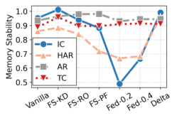

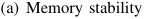

<!-- Start of picture text -->
(a) Memory stability <!-- End of picture text -->

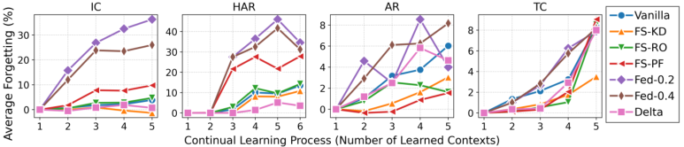

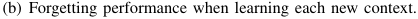

<!-- Start of picture text -->
(b) Forgetting performance when learning each new context. <!-- End of picture text -->

Fig. 8: Comparison of memory stability and forgetting performance of different methods. 

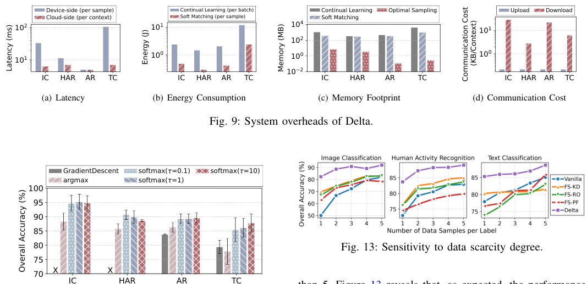

<!-- Start of picture text -->
Device-side (per sample) Continual Learning (per batch) Continual Learning Optimal Sampling Upload Download Cloud-side (per context) Soft Matching (per sample) Soft Matching 10 2 10 1 10 4 10 1 10 2 10 0 10 0 10 0 10 1 10 2 IC HAR AR TC IC HAR AR TC IC HAR AR TC IC HAR AR TC (a) Latency (b) Energy Consumption (c) Memory Footprint (d) Communication Cost Fig. 9: System overheads of Delta. GradientDescent softmax( =0.1) softmax( =10) argmax softmax( =1) 100 95 90 85 80 Fig. 13: Sensitivity to data scarcity degree. 75 X X 70 IC HAR AR TC Energy (J) Latency (ms) Memory (MB)  (KB/Context) Communication Cost Overall Accuracy (%) <!-- End of picture text -->

than 5. Figure 13 reveals that, as expected, the performance of nearly all methods degrades as data scarcity becomes more severe. For three representative tasks IC, , HAR and TC, the overall accuracy of vanilla CL method drops by as high as 31.9%, 9.95% and 7.14%, and the accuracy of few-shot CL approaches drops by 12.9-16.1%, 5.31-8.68% and 1.21-9.18%. In contrast, our proposed Delta framework’s performance degrades by a much smaller margin of 9.57%, 5.32% and 3.33% on the three tasks, implying more substantial performance gains compared to baselines. This demonstrates Delta’s remarkable robustness and capability in handling such challenging scenarios, owing to its unique ability to fundamentally address the data scarcity problem via data enrichment. 

Fig. 10: Sensitivit ~~y~~ to soft matching temperature. 

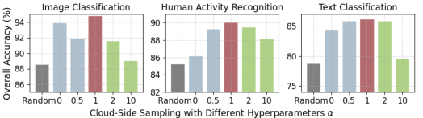

Fig. 11: Analysis of cloud-side optimal data sampling. 

**Cloud-Side Directory Dataset.** Figure 14 plots the performance of Delta with varying numbers of cloud-side data clusters for directory dataset construction, where we replace the cloud-side data sampling scheme with random sampling to isolate the effects of directory dataset. We observe that a slight increase in cluster number can improve Delta’s performance by making directory dataset more representative and aligning the cloud-side sub-objective (2b) more closely with the overall objective (2). However, an excessively large cluster number can result in numerous similar clusters, leading to the selection of redundant data for enrichment. For stable performance, we set cluster number per label to 20. 

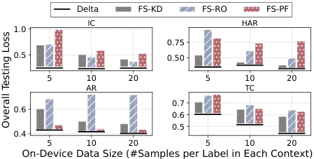

<!-- Start of picture text -->
Delta FS-KD FS-RO FS-PF IC HAR 1.0 0.75 0.5 0.50 5 10 20 5 10 20 AR TC 0.7 0.6 0.6 0.5 0.4 5 10 20 5 10 20 On-Device Data Size (#Samples per Label in Each Context) Overall Testing Loss <!-- End of picture text -->

Fig. 12: Sensitivity to on-device dataset size. 

**Device-Cloud Communication Budget.** We further eval- 

15 

PREPRINT 

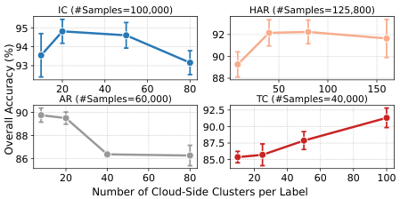

<!-- Start of picture text -->
IC (#Samples=100,000) HAR (#Samples=125,800) 95 92 94 90 93 88 20 40 60 80 50 100 150 AR (#Samples=60,000) TC (#Samples=40,000) 90 92.5 90.0 88 87.5 86 85.0 20 40 60 80 20 40 60 80 100 Number of Cloud-Side Clusters per Label Overall Accuracy (%) <!-- End of picture text -->

Fig. 14: Sensitivity to cluster number of directory dataset. 

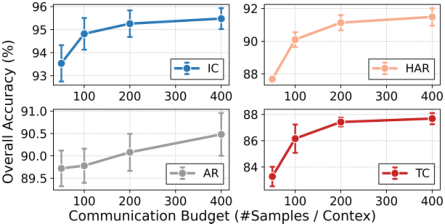

Fig. 15: Impact of Cloud-Device Communication Budget. 

uate Delta’s performance with varying sizes of cloud-side enriched data to simulate different communication budgets. We find that as the size of enriched dataset increases, the performance improvement provided by Delta consistently increases for all the tasks. This demonstrates that enriching with more data by Delta is always beneficial, and inspires us to utilize the full communication budget to maximize Delta’s performance. We also notice that the marginal contribution of more enriched data stabilizes after a certain point. For instance, Delta’s performance improves significantly as the enriched data size per context increases from 50 to 200, but the gains are more marginal thereafter. This robustness highlights Delta’s applicability for real-world devices with diverse network conditions. 

**Size of Trainable Model Parameters.** Figure 16 plots the CL performance of different methods as a function of the number of trainable parameters of the feature extractor. We observe that when more parameters of on-device models are trainable, the absolute overall accuracy of nearly all methods drops, as the limited on-device data lead to increased model overfitting. However, compared to baselines, the relative performance gains of Delta become larger, because the enriched on-device data helps to better exploit the larger model capacity for learning new contexts. 

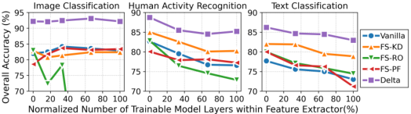

Fig. 16: Impact of trainable parameters of on-device models. 

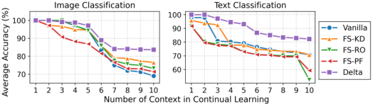

<!-- Start of picture text -->
Fig. 17: Sensitivity to the number of contexts. <!-- End of picture text -->

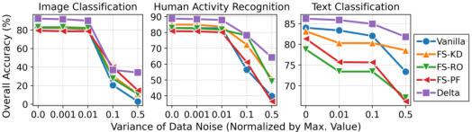

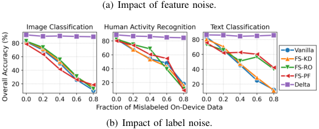

<!-- Start of picture text -->
(a) Impact of feature noise. (b) Impact of label noise. <!-- End of picture text -->

Fig. 18: Robustness to data noise. 

**Number of Contexts.** We also evaluated the scalability of our framework by investigating the impact of a growing number of contexts over long-term deployment. As shown in Figure 17, while the performance of all CL methods degrades as more contexts are learned, Delta demonstrates superior long-term stability. For text classification task, most baselines show a significant performance drop after just 2 contexts, while Delta remains stable throughout the entire process. This stability allows Delta to maintain its performance much more effectively than other baselines. As a result, the performance gap between Delta and the best baseline widens significantly with each new context. For instance, after learning 3, 6, 10 contexts, the accuracy gap between Delta and the best method is 0%, 3.11%, 10% on image classification task and 4.61%, 11.4%, 12.1% on the text classification task. These results confirm Delta’s remarkable robustness and scalability in practical, long-term on-device CL scenarios. 

**Noisy On-Device Data.** We further evaluate the robustness of Delta framework to two common types of data noise in practical on-device scenarios: feature noise and label noise. 

_•_ Feature noise denotes the corruptions introduced to input features _x_ of on-device data during data collection process, where we add Gaussian noise _n ∼N_ (0 _, σ ·_ max( _values_ )) to _x_ and the noise degree is controlled by parameter _σ_ . As shown in Figure 18(a), we observe that all CL approaches are sensitive to feature noise, and their performance drops dramatically when the noise degree is high ( _σ ≥_ 0 _._ 1). However, Delta still outperforms baselines across all noise levels and tasks. 

_•_ Label noise represents corruptions introduced to label _y_ of on-device data during data labeling process, where we randomly select a fraction of data samples and change their 

16 

PREPRINT 

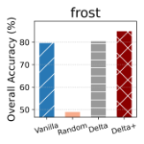

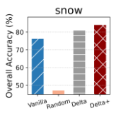

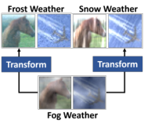

Fig. 19: Delta performance on rare and unique contexts. 

labels to wrong ones. As shown in Figure 18(b), we notice that Delta demonstrates exceptional robustness to label noise, which significantly degrades the performance of all other baselines. This unique resilience stems from our directorybased data enrichment mechanism, which relies on input features _x_ rather than labels _y_ to compute directory weight _w_ for data enrichment. 

However, the introduction of noise into the weights can also degrade the enrichment performance of Delta, creating a tradeoff between privacy and utility. To systematically analyze the impact of noise on Delta’s performance, we simulate various user scenarios with differing security demands by injecting Gaussian noise with controlled variances, measured relative to the magnitude of weights. Specifically, each This implies that each directory weight _w__t_ uploaded by a device is perturbed with noise _ϵ_ drawn from a Gaussian distribution _N_ (0 _, r·||w__t_ _||_ ), where _r_ denotes the relative variance and controls the noise intensity. Empirical results on the mixed context category setting of each task are shown in Figure 20, which reveal three key findings: (i) injecting less than 5% noise into the weights has negligible impact on Delta performance, (ii) higher levels of noise injection lead to progressively inferior data enrichment performance, and (iii) even with 100% noise injected into weights, Delta still significantly outperforms a random data enrichment baseline. 

## _E. Extension to Rare and Private User Contexts_ 

**Rare User Contexts.** In real-world networking scenarios, while the majority of edge devices and mobile users operate under common scenarios, a small subset may encounter rare of unique contexts. To simulate such scenarios, we pre-define several specific contexts as the unique contexts and manually remove all corresponding data samples from the cloud-side public dataset. For instance, in an image classification task, we designate snowy and frosty weather conditions as rare contexts, and remove all related images from the cloud-side data, and force the device to conduct CL exclusively on these rare contexts to mimic real cases. 

Experimental results, as shown in Figure 19, compare the performance of four approaches: no data enrichment (Vanilla), random data enrichment (Random), the original Delta system and Delta with feature alignment module. We observe that random data enrichment consistently leads to significantly inferior CL performance, while the original Delta system provides only marginal improvements over vanilla case in such rare contexts. However, the introduction of the feature alignment module significantly enhances CL performance. The right image in Figure 19illustrates the module’s functionality:while the original Delta can only retrieve data samples in similar contexts (e.g., foggy weather images) to enrich device-side data (e.g., frost and snow weather), the feature alignment module helps to transforms the feature distribution to align with the true device-side data. This ensures that the model updates over enriched dataset are consistent and effective model updates for device-side rare contexts. 

**Private User Context.** Although the information transmitted from edge devices to the cloud server only reflects the similarity between device-side data and cloud-side directory dataset – providing coarse context information rather than specific user data samples – there are scenarios where even such context information necessitates protection. To address this, we propose leveraging differential privacy by injecting Gaussian noise into the directory weights shared between devices and the cloud, which increases the difficulty of identifying context likelihood, thereby enhancing user privacy. 

## VII. RELATED WORK 

**Cloud-Side Continual Learning** aims to train ML models over non-stationary data streams to acquire new contextual knowledge without forgetting past contexts. This approach is inspired by the capability of biological neural networks to modulate synaptic memory and plasticity in response to dynamic inputs [7], [83]. Existing solutions include: 1) stabilizing previously-learned synaptic changes by penalizing parameter changes of the past optimal model [6], [7]; 2) expanding and pruning synaptic connections to form new synaptic memory via creating additional parameter space for new contexts and re-normalizing them with past contexts [11], [12]; 3) consolidating synaptic memory by storing the important data of past contexts and replaying them during learning new contexts [9], [10], where the data importance can be measured by representativeness [84], [85], diversity [86] or uncertainty [87]. Previous studies [54], [18], [14] have found that data replay methods provides the best trade-off between model performance and system efficiency, and thus our experiments are mainly conducted in this case. _Delta framework serves as a plug-in component to enrich on-device data and enhance performance for all these methods._ 

**Device-Side Continual Learning** focuses on optimizing the utilization of hardware resources to implement cloud-side CL algorithms on resource-constrained devices. This includes saving storage cost through data quantization techniques [16], [17], reducing memory overhead through context-aware parameter sparsity [88], [13], accelerating data loading via hierarchical memory management [18], [19], and accelerating computation with adaptive computing resource [20], [15], [89], [21]. However, most of these works overlook the data bottleneck on mobile device (scarce, personal and unpredictable user data), and thus _Delta is complementary to existing on-device CL works focusing on hardware bottleneck._ 

**Cloud-Device Collaborative Continual Learning** fully exploits the cloud-side abundant hardware resources by balancing the CL workloads between devices and cloud. Initial works [22], [23] entirely offload CL workloads to cloud 

17 

PREPRINT 

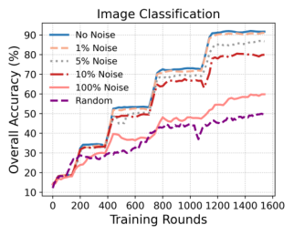

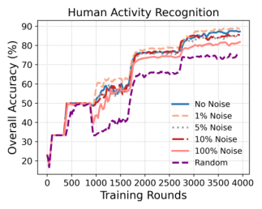

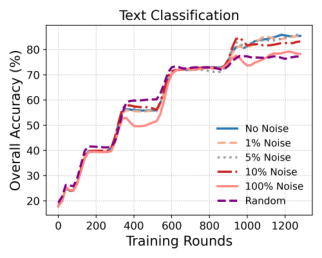

Fig. 20: Impact of varying degrees of Gaussian noise injected into transmitted weights on Delta’s model training performance. 

by allowing each device to upload local data for cloudside CL and receive the updated model for inference. They maximize service throughput by carefully allocating network bandwidth and cloud-side computation resources to different devices. Later works like AdaEvo [24] and U-VPA [25] further reduce communication and computation costs by selectively transmitting only unlearned local data to cloud server for necessary CL, based on inference uncertainty or estimated accuracy drop. More recent systems like MOCHA [26] and ELITE [27] optimize the trade-off between accuracy and costs by offloading only a portion of cumbersome and important CL workloads to cloud server. 

**Federated Continual Learning** aims to train global models across decentralized clients with evolving tasks, tackling the dual challenges of catastrophic forgetting and data heterogeneity [90]. Early parameter decomposition methods like FedWeIT [37] mitigated interference via sparse task-specific weights, but recent work prioritizes communication-efficient, exemplar-free strategies. These include knowledge distillation frameworks [91] that leverage synthetic data to preserve history, and gradient-correction mechanisms like FedINC [92] for data-scarce sensor networks. To further address heterogeneity, researchers have employed federated meta-learning for fast adaptation [93] and generative replay for class-incremental learning [38], [94]. Unlike these model-centric approaches that focus on refining aggregation logic or gradients, Delta adopts a distinct data-centric strategy, establishing a new efficient and privacy-preserving device-cloud loop to directly enrich sparse on-device data. 

**On-Device Data Augmentation** is a powerful technique to improve model training performance by generating diverse data from existing user data, such as leveraging geometric and color space transformation and random erasing for visual images [95], using techniques grounded in physical principles for IMU signal [96], as well as employing language rulebased transformations and synonym replacement for textual data [97]. However, a significant limitation of data augmentation is that each data modality and task necessitates specifically designed augmentation techniques to accommodate unique data characteristics, making the data augmentation process cumbersome and inefficient. _Delta serves as a generally solution to complement these works by directly expanding the on-device available data._ 

VIII. DISCUSSION 

**Limitation of Delta.** While Delta effectively addresses data scarcity in on-device continual learning, we acknowledge certain limitations that warrant further investigation in realworld deployments. First, regarding storage overhead, Delta currently necessitates the retention of both local and enriched data from new and past contexts. While this is manageable for typical task sequences, it presents a potential storage risk for scenarios involving super long contexts, where the cumulative storage requirement may eventually exceed the constraints of edge devices. Future iterations could explore exemplar-free continual learning techniques [98], [99], [100] to mitigate this growth. Second, the effectiveness of Delta relies on the assumption that the cloud-side directory dataset remains reasonably representative of the on-device data distributions. Over extended periods, as user behaviors and contexts evolve, a static cloud dataset may become obsolete. To maintain performance, the cloud-side dataset requires a mechanism for periodic updates to capture the latest data trends and align with new user contexts. Designing an efficient mechanism for such cloud-side evolution remains an open challenge that we plan to explore in future work. 

**Comparison with FL.** The intuitions behind Delta framework and FL paradigm are distinct. FL aims to leverage device-side data to develop a global model that can generalize well across diverse user contexts, i.e. _global knowledge aggregation_ . In contrast, Delta utilizes cloud-side data to enhance the personalization of local models for individual user contexts, i.e. _local knowledge augmentation_ . As a result, the applicability of FL is primarily limited by device-side constraints, including the vast number of devices, high participation rates, cross-device data heterogeneity and tolerance for communication overheads. Delta, on the other hand, seeks to shift the limitations to the cloud, assuming that cloud server can collect abundant public data to match different users. This aligns with the recent success of training billion-scale models over sufficiently diverse datasets for various tasks. Additionally, when confronted with extremely rare user contexts, Delta could still identify the most helpful and relevant cloud-side data-subsets to provide data foundation for existing model or algorithm-based augmentation methods. In conclusion, FL and Delta are applicable for different scenarios and could potentially be complementary. 

18 

PREPRINT 

## IX. CONCLUSION 

In this work, we explore the potential of leveraging cloudside abundant data resource to address the data bottleneck in on-device CL. We formalize the data enrichment problem and propose Delta, a device-cloud collaborative data enrichment framework for on-device CL with high privacy protection, efficiency and effectiveness. On extensive experiments, Delta shows superior model performance and system efficiency across various mobile computing tasks, data modalities and model structures. 

## REFERENCES 

- [1] “Google smart lens - search what you see,” https://lens.google/, 2024. 

- [2] A. Intelligence, “Siri - apple,” https://www.apple.com/siri/, 2024. - 

- [3] “Apple intelligence preview apple,” https://www.apple.com/ apple-intelligence/, 2024. 

- [4] S. Thrun and T. M. Mitchell, “Lifelong robot learning,” _Robotics and Autonomous Systems_ , vol. 15, pp. 25–46, 1995. 

- [5] D. L. Silver, Q. Yang, and L. Li, “Lifelong machine learning systems: Beyond learning algorithms.” in _AAAI Spring Symposium: Lifelong Machine Learning_ , vol. 13, no. 05, 2013. 

- [6] J. Kirkpatrick, R. Pascanu, N. Rabinowitz, J. Veness, G. Desjardins, A. A. Rusu, K. Milan, J. Quan, T. Ramalho, A. Grabska-Barwinska _et al._ , “Overcoming catastrophic forgetting in neural networks,” in _Proceedings of the National Academy of Sciences (PNAS)_ , 2017, pp. 3521–3526. 

- [7] F. Zenke, B. Poole, and S. Ganguli, “Continual learning through synaptic intelligence,” in _International Conference on Machine Learning (ICML)_ , 2017, pp. 3987–3995. 

- [8] A. Chaudhry, M. Rohrbach, M. Elhoseiny, T. Ajanthan, P. K. Dokania, P. H. Torr, and M. Ranzato, “On tiny episodic memories in continual learning,” _arXiv preprint arXiv:1902.10486_ , 2019. 

- [9] Z. Li and D. Hoiem, “Learning without forgetting,” _IEEE Transactions on Pattern Analysis and Machine Intelligence (TPAMI)_ , vol. 40, pp. 2935–2947, 2017. 

- [10] D. Lopez-Paz and M. Ranzato, “Gradient episodic memory for continual learning,” _Advances in neural information processing systems_ , pp. 6467–6476, 2017. 

- [11] A. Mallya, D. Davis, and S. Lazebnik, “Piggyback: Adapting a single network to multiple tasks by learning to mask weights,” in _European Conference on Computer Vision (ECCV)_ , 2018, pp. 67–82. 

- [12] J. Serra, D. Suris, M. Miron, and A. Karatzoglou, “Overcoming catastrophic forgetting with hard attention to the task,” in _International Conference on Machine Learning (ICML)_ , 2018, pp. 4548–4557. 

- [13] Y. D. Kwon, R. Li, S. I. Venieris, J. Chauhan, N. D. Lane, and C. Mascolo, “Tinytrain: Deep neural network training at the extreme edge,” _arXiv preprint arXiv:2307.09988_ , 2023. 

- [14] T. L. Hayes and C. Kanan, “Online continual learning for embedded devices,” in _Conference on Lifelong Learning Agents_ . PMLR, 2022, pp. 744–766. 

- [15] Y. D. Kwon, J. Chauhan, H. Jia, S. I. Venieris, and C. Mascolo, “Lifelearner: Hardware-aware meta continual learning system for embedded computing platforms,” in _Proceedings of the 21st ACM Conference on Embedded Networked Sensor Systems_ , 2023, pp. 138–151. 

- [16] L. Ravaglia, M. Rusci, D. Nadalini, A. Capotondi, F. Conti, and L. Benini, “A tinyml platform for on-device continual learning with quantized latent replays,” _IEEE Journal on Emerging and Selected Topics in Circuits and Systems_ , vol. 11, pp. 789–802, 2021. 

- [17] M. Hersche, G. Karunaratne, G. Cherubini, L. Benini, A. Sebastian, and A. Rahimi, “Constrained few-shot class-incremental learning,” in _The IEEE / CVF Computer Vision and Pattern Recognition Conference (CVPR)_ , 2022, pp. 9057–9067. 

- [18] S. Lee, M. Weerakoon, J. Choi, M. Zhang, D. Wang, and M. Jeon, “Carm: Hierarchical episodic memory for continual learning,” in _Proceedings of the ACM/IEEE Design Automation Conference (DAC)_ , 2022, pp. 1147–1152. 

- [19] X. Ma, S. Jeong, M. Zhang, D. Wang, J. Choi, and M. Jeon, “Costeffective on-device continual learning over memory hierarchy with miro,” in _International Conference on Mobile Computing and Networking (MobiCom)_ , 2023, pp. 1–15. 

- [20] C. F. S. Leite and Y. Xiao, “Resource-efficient continual learning for sensor-based human activity recognition,” _ACM Transactions on Embedded Computing Systems_ , vol. 21, no. 6, pp. 1–25, 2022. 

- [21] D. Kudithipudi, A. Daram, A. M. Zyarah, F. T. Zohora, J. B. Aimone, A. Yanguas-Gil, N. Soures, E. Neftci, M. Mattina, V. Lomonaco _et al._ , “Design principles for lifelong learning ai accelerators,” _Nature Electronics_ , vol. 6, pp. 807–822, 2023. 

- [22] Y. Nan, S. Jiang, and M. Li, “Large-scale video analytics with cloudedge collaborative continuous learning,” _ACM Transactions on Sensor Networks_ , vol. 20, no. 1, pp. 14:1–14:23, 2024. 

- [23] L. Jia, Z. Zhou, F. Xu, and H. Jin, “Cost-efficient continuous edge learning for artificial intelligence of things,” _IEEE Internet Things Journal_ , vol. 9, no. 10, pp. 7325–7337, 2022. 

- [24] L. Wang, Z. Yu, H. Yu, S. Liu, Y. Xie, B. Guo, and Y. Liu, “Adaevo: Edge-assisted continuous and timely DNN model evolution for mobile devices,” _IEEETransactions on Mobile Computing_ , vol. 24, no. 4, pp. 2485–2503, 2025. 

- [25] Y. Gan, M. Pan, R. Zhang, Z. Ling, L. Zhao, J. Liu, and S. Zhang, “Cloud-device collaborative adaptation to continual changing environments in the real-world,” in _IEEE/CVF Conference on Computer Vision and Pattern Recognition (CVPR)_ , 2023, pp. 12 157–12 166. 

- [26] M. Zhao, S. Liu, F. Wu, and G. Chen, “Responsive DNN adaptation for video analytics against environment shift via hierarchical mobilecloud collaborations,” in _Proceedings of the 23rd ACM Conference on Embedded Networked Sensor Systems (SenSys)_ , 2025, pp. 317–331. 

- [27] H. Liu, C. Gong, Z. Zheng, S. Liu, and F. Wu, “Enabling real-time inference in online continual learning via device-cloud collaboration,” in _Proceedings of the ACM on Web Conference (WWW)_ , G. Long, M. Blumestein, Y. Chang, L. Lewin-Eytan, Z. H. Huang, and E. YomTov, Eds., 2025, pp. 2043–2052. 

- [28] M. Broz, “How many pictures are there (2024): Statistics, trends, and forecasts,” https://photutorial.com/photos-statistics/, 2023. 

- [29] Yaguara, “62 voice search statistics 2025 (number of users and trends),” https://www.yaguara.co/voice-search-statistics/, 2025. 

- [30] D. M. Hawkins, “The problem of overfitting,” _Journal of Chemical Information and Computer Sciences_ , vol. 44, pp. 1–12, 2004. 

- [31] X. Ying, “An overview of overfitting and its solutions,” in _Journal of Physics: Conference Series_ , vol. 1168, 2019, p. 022022. 

- [32] R. M. French, “Catastrophic forgetting in connectionist networks,” _Trends in Cognitive Sciences_ , vol. 3, pp. 128–135, 1999. 

- [33] M. McCloskey and N. J. Cohen, “Catastrophic interference in connectionist networks: The sequential learning problem,” in _Psychology of Learning and Motivation_ , vol. 24, 1989, pp. 109–165. 

- [34] X. Tao, X. Hong, X. Chang, S. Dong, X. Wei, and Y. Gong, “Few-shot class-incremental learning,” in _The IEEE / CVF Computer Vision and Pattern Recognition Conference (CVPR)_ , 2020, pp. 12 183–12 192. 

- [35] P. Mazumder, P. Singh, and P. Rai, “Few-shot lifelong learning,” in _Association for the Advancement of Artificial Intelligence (AAAI)_ , 2021, pp. 2337–2345. 

- [36] G. Shi, J. Chen, W. Zhang, L.-M. Zhan, and X.-M. Wu, “Overcoming catastrophic forgetting in incremental few-shot learning by finding flat minima,” in _Advances in Neural Information Processing Systems (NeurIPS)_ , 2021, pp. 6747–6761. 

- [37] J. Yoon, W. Jeong, G. Lee, E. Yang, and S. J. Hwang, “Federated continual learning with weighted inter-client transfer,” in _International Conference on Machine Learning (ICML)_ , 2021, pp. 12 073–12 086. 

- [38] J. Dong, L. Wang, Z. Fang, G. Sun, S. Xu, X. Wang, and Q. Zhu, “Federated class-incremental learning,” in _The IEEE / CVF Computer Vision and Pattern Recognition Conference (CVPR)_ , 2022, pp. 10 164– 10 173. 

- [39] C. Li, X. Zeng, M. Zhang, and Z. Cao, “Pyramidfl: A fine-grained client selection framework for efficient federated learning,” in _International Conference on Mobile Computing And Networking (MobiCom)_ , 2022, pp. 158–171. 

- [40] J. Shin, Y. Li, Y. Liu, and S.-J. Lee, “Fedbalancer: Data and pace control for efficient federated learning on heterogeneous clients,” in _l International Conference on Mobile Systems, Applications and Services (MobiSys)_ , 2022, pp. 436–449. 

- [41] C. Gong, Z. Zheng, Y. Shao, B. Li, F. Wu, and G. Chen, “Ode: An online data selection framework for federated learning with limited storage,” _IEEE/ACM Transactions on Networking (TON)_ , vol. 32, no. 4, pp. 2794–2809, 2024. 

- [42] O. Russakovsky, J. Deng, H. Su, J. Krause, S. Satheesh, S. Ma, Z. Huang, A. Karpathy, A. Khosla, M. Bernstein _et al._ , “Imagenet large scale visual recognition challenge,” _International Journal of Computer Vision_ , vol. 115, pp. 211–252, 2015. 

19 

PREPRINT 

- [43] “Common crawl maintains a free, open repository of web crawl data that can be used by anyone.” https://commoncrawl.org/, 2024. 

- [44] H. H. OS, “Data donation,” https://developer.huawei.com/consumer/ en/doc/hmscore-guides/event-donate-awareness-0000001505674356, 2023. 

- [45] Apple, “Legal - siri suggestions, search; privacy,” https://www.apple. com/legal/privacy/data/en/siri-suggestions-search/, 2023. 

- [46] J. Bao, Y. Zheng, and M. F. Mokbel, “Location-based and preferenceaware recommendation using sparse geo-social networking data,” in _International Conference on Advances in Geographic Information Systems (SIGSPATIAL)_ , 2012, pp. 199–208. 

- [47] M. Lv, L. Chen, and G. Chen, “Mining user similarity based on routine activities,” _Information Sciences_ , vol. 236, pp. 17–32, 2013. 

- [48] C. Gong, Z. Zheng, F. Wu, Y. Shao, B. Li, and G. Chen, “To store or not? online data selection for federated learning with limited storage,” in _ACM Web Conference(WWW)_ , 2023, pp. 3044–3055. 

- [49] O. J. of the European Union, “General data protection regulation,” https://gdpr-info.eu/, 2018. 

- [50] Y. Yan, C. Niu, R. Gu, F. Wu, S. Tang, L. Hua, C. Lyu, and G. Chen, “On-device learning for model personalization with large-scale cloudcoordinated domain adaption,” in _Proceedings of the ACM SIGKDD Conference on Knowledge Discovery and Data Mining (KDD)_ , 2022, pp. 2180–2190. 

- [51] C. Chai, J. Liu, N. Tang, G. Li, and Y. Luo, “Selective data acquisition in the wild for model charging,” _Proceedings of the VLDB Endowment (VLDB)_ , vol. 15, pp. 1466–1478, 2022. 

- [52] R. Bhardwaj, Z. Xia, G. Ananthanarayanan, J. Jiang, Y. Shu, N. Karianakis, K. Hsieh, P. Bahl, and I. Stoica, “Ekya: Continuous learning of video analytics models on edge compute servers,” in _USENIX Symposium on Networked Systems Design and Implementation (NSDI)_ , 2022, pp. 119–135. 

- [53] M. Khani, G. Ananthanarayanan, K. Hsieh, J. Jiang, R. Netravali, Y. Shu, M. Alizadeh, and V. Bahl, “ _{_ RECL _}_ : Responsive _{_ ResourceEfficient _}_ continuous learning for video analytics,” in _USENIX Symposium on Networked Systems Design and Implementation (NSDI)_ , 2023, pp. 917–932. 

- [54] Y. D. Kwon, J. Chauhan, A. Kumar, P. H. HKUST, and C. Mascolo, “Exploring system performance of continual learning for mobile and embedded sensing applications,” in _ACM/IEEE Symposium on Edge Computing (SEC)_ , 2021, pp. 319–332. 

- [55] Z. Ke, B. Liu, N. Ma, H. Xu, and L. Shu, “Achieving forgetting prevention and knowledge transfer in continual learning,” in _Advances in Neural Information Processing Systems (NeurIPS)_ , 2021, pp. 22 443– 22 456. 

- [56] J. Yin, Q. Yang, and J. J. Pan, “Sensor-based abnormal human-activity detection,” _IEEE Transactions on Knowledge and Data Engineering_ , vol. 20, pp. 1082–1090, 2008. 

- [57] P. Buzzega, M. Boschini, A. Porrello, D. Abati, and S. Calderara, “Dark experience for general continual learning: a strong, simple baseline,” in _Advances in Neural Information Processing Systems (NeurIPS)_ , 2020, pp. 15 920–15 930. 

- [58] A. Prabhu, P. H. Torr, and P. K. Dokania, “Gdumb: A simple approach that questions our progress in continual learning,” in _The European Conference on Computer Vision (ECCV)_ , 2020, pp. 524–540. 

- [59] L. Zhao, J. Lu, Y. Xu, Z. Cheng, D. Guo, Y. Niu, and X. Fang, “Fewshot class-incremental learning via class-aware bilateral distillation,” in _The IEEE / CVF Computer Vision and Pattern Recognition Conference (CVPR)_ , 2023, pp. 11 838–11 847. 

- [60] R. C. Daley and P. G. Neumann, “A general-purpose file system for secondary storage,” in _Proceedings of the 1965 fall joint computer conference, part I, AFIPS 1965 (Fall, part I), Las Vegas, Nevada, USA, November 30 - December 1, 1965_ , 1965, pp. 213–229. 

- [61] B. McMahan, E. Moore, D. Ramage, S. Hampson, and B. A. y Arcas, “Communication-efficient learning of deep networks from decentralized data,” in _International Conference on Artificial Intelligence and Statistics (AISTATS)_ , 2017, pp. 1273–1282. 

- [62] D. Cai, Y. Wu, S. Wang, F. X. Lin, and M. Xu, “Efficient federated learning for modern nlp,” in _International Conference on Mobile Computing and Networking (MobiCom)_ , 2023, pp. 1–16. 

- [63] H. Cai, C. Gan, L. Zhu, and S. Han, “Tinytl: Reduce memory, not parameters for efficient on-device learning,” in _Advances in Neural Information Processing Systems (NeurIPS)_ , 2020, pp. 11 285–11 297. 

- [64] C. Dwork, “Differential privacy,” in _International colloquium on automata, languages, and programming_ . Springer, 2006, pp. 1–12. 

- [65] O. Goldreich, “Secure multi-party computation,” _Manuscript. Preliminary version_ , vol. 78, no. 110, pp. 1–108, 1998. 

- [66] A. Acar, H. Aksu, A. S. Uluagac, and M. Conti, “A survey on homomorphic encryption schemes: Theory and implementation,” _ACM Computing Surveys (CSUR)_ , vol. 51, no. 4, pp. 1–35, 2018. 

- [67] A. Katharopoulos and F. Fleuret, “Not all samples are created equal: Deep learning with importance sampling,” in _International Conference on Machine Learning (ICML)_ , 2018, pp. 2525–2534. 

- [68] A. Farahani, S. Voghoei, K. Rasheed, and H. R. Arabnia, “A brief review of domain adaptation,” _Advances in data science and information engineering: proceedings from ICDATA 2020 and IKE 2020_ , pp. 877–894, 2021. 

- [69] E. P. Klement, R. Mesiar, and E. Pap, _Triangular norms_ . Springer Science & Business Media, 2013, vol. 8. 

- [70] P. Zhao and T. Zhang, “Stochastic optimization with importance sampling for regularized loss minimization,” in _International Conference on Machine Learning (ICML)_ , 2015, pp. 1–9. 

- [71] D. Hendrycks and T. Dietterich, “Benchmarking neural network robustness to common corruptions and perturbations,” _International Conference on Learning Representations (ICLR)_ , 2019. 

- [72] K. He, X. Zhang, S. Ren, and J. Sun, “Deep residual learning for image recognition,” in _The IEEE / CVF Computer Vision and Pattern Recognition Conference (CVPR)_ , 2016, pp. 770–778. 

- [73] A. Stisen, H. Blunck, S. Bhattacharya, T. S. Prentow, M. B. Kjærgaard, A. Dey, T. Sonne, and M. M. Jensen, “Smart devices are different: Assessing and mitigatingmobile sensing heterogeneities for activity recognition,” in _ACM Conference on Embedded Networked Sensor Systems (SenSys)_ , 2015, pp. 127–140. 

- [74] J.-L. Reyes-Ortiz, L. Oneto, A. Sam`a, X. Parra, and D. Anguita, “Transition-aware human activity recognition using smartphones,” _Neurocomputing_ , vol. 171, pp. 754–767, 2016. 

- [75] M. Malekzadeh, R. G. Clegg, A. Cavallaro, and H. Haddadi, “Mobile sensor data anonymization,” in _ACM/IEEE Conference on Internet of Things Design and Implementation (IoTDI)_ , 2019, pp. 49–58. 

- [76] M. Shoaib, S. Bosch, O. D. Incel, H. Scholten, and P. J. Havinga, “Fusion of smartphone motion sensors for physical activity recognition,” _Sensors_ , vol. 14, no. 6, pp. 10 146–10 176, 2014. 

- [77] J. Yang, M. N. Nguyen, P. P. San, X. Li, and S. Krishnaswamy, “Deep convolutional neural networks on multichannel time series for human activity recognition.” in _International Joint Conference on Artificial Intelligence (IJCAI)_ , vol. 15, 2015, pp. 3995–4001. 

- [78] P. Warden, “Speech commands: A dataset for limited-vocabulary speech recognition,” _arXiv preprint arXiv:1804.03209_ , 2018. 

- [79] K. Simonyan and A. Zisserman, “Very deep convolutional networks for large-scale image recognition,” _arXiv preprint arXiv:1409.1556_ , 2014. 

- [80] Y. Liang, N. Duan, Y. Gong, N. Wu, F. Guo, W. Qi, M. Gong, L. Shou, D. Jiang, G. Cao, X. Fan, R. Zhang, R. Agrawal, E. Cui, S. Wei, T. Bharti, Y. Qiao, J.-H. Chen, W. Wu, S. Liu, F. Yang, D. Campos, R. Majumder, and M. Zhou, “Xglue: A new benchmark dataset for cross-lingual pre-training, understanding and generation,” _arXiv_ , vol. abs/2004.01401, 2020. 

- [81] J. Devlin, M.-W. Chang, K. Lee, and K. Toutanova, “Bert: Pre-training of deep bidirectional transformers for language understanding,” _arXiv preprint arXiv:1810.04805_ , 2018. 

- [82] NVIDIA, “Jetson nano developer kit,” https://developer.nvidia.com/ embedded/jetson-nano-developer-kit, 2023. 

- [83] L. Wang, X. Zhang, H. Su, and J. Zhu, “A comprehensive survey of continual learning: Theory, method and application,” _IEEE transactions on pattern analysis and machine intelligence_ , vol. 46, no. 8, pp. 5362– 5383, 2024. 

- [84] S.-A. Rebuffi, A. Kolesnikov, G. Sperl, and C. H. Lampert, “icarl: Incremental classifier and representation learning,” in _Proceedings of the IEEE conference on Computer Vision and Pattern Recognition (CVPR)_ , 2017, pp. 2001–2010. 

- [85] D. Shim, Z. Mai, J. Jeong, S. Sanner, H. Kim, and J. Jang, “Online class-incremental continual learning with adversarial shapley value,” in _Proceedings of the AAAI Conference on Artificial Intelligence (AAAI)_ , 2021, pp. 9630–9638. 

- [86] J. Yoon, D. Madaan, E. Yang, and S. J. Hwang, “Online coreset selection for rehearsal-based continual learning,” in _International Conference on Learning Representations (ICLR)_ , 2022. 

- [87] R. Aljundi, E. Belilovsky, T. Tuytelaars, L. Charlin, M. Caccia, M. Lin, and L. Page-Caccia, “Online continual learning with maximal interfered retrieval,” _Advances in Neural Information Processing Systems (NeurIPS)_ , vol. 32, 2019. 

- [88] M. Xie, K. Ren, Y. Lu, G. Yang, Q. Xu, B. Wu, J. Lin, H. Ao, W. Xu, and J. Shu, “Kraken: memory-efficient continual learning for large-scale real-time recommendations,” in _International Conference_ 

20 

PREPRINT 

   - _for High Performance Computing, Networking, Storage and Analysis (SC)_ , 2020, pp. 1–17. 

- [89] H. Tian, M. Yu, and W. Wang, “Continuum: A platform for cost-aware, low-latency continual learning,” in _Proceedings of the ACM Symposium on Cloud Computing (SoCC)_ , 2018, pp. 26–40. 

- [90] X. Yang, H. Yu, X. Gao, H. Wang, J. Zhang, and T. Li, “Federated continual learning via knowledge fusion: A survey,” _IEEE Transactions on Knowledge and Data Engineering_ , vol. 36, no. 8, pp. 3832–3850, 2024. 

- [91] Y. Ma, Z. Xie, J. Wang, K. Chen, and L. Shou, “Continual federated learning based on knowledge distillation.” in _Proceedings of the ThirtyFirst International Joint Conference on Artificial Intelligence (IJCAI)_ , 2022, pp. 2182–2188. 

- [92] Y. Deng, S. Yue, T. Wang, G. Wang, J. Ren, and Y. Zhang, “Fedinc: An exemplar-free continual federated learning framework with small labeled data,” in _Proceedings of the 21st ACM Conference on Embedded Networked Sensor Systems (SenSys)_ , 2023, pp. 56–69. 

- [93] S. Lin, G. Yang, and J. Zhang, “A collaborative learning framework via federated meta-learning,” in _IEEE 40th International Conference on Distributed Computing Systems (ICDCS)_ . IEEE, 2020, pp. 289–299. 

- [94] D. Qi, H. Zhao, and S. Li, “Better generative replay for continual federated learning,” _International Conference on Learning Representations (ICLR)_ , 2023. 

- [95] C. Shorten and T. M. Khoshgoftaar, “A survey on image data augmentation for deep learning,” _Journal of big data_ , vol. 6, no. 1, pp. 1–48, 2019. 

- [96] H. Xu, P. Zhou, R. Tan, and M. Li, “Practically adopting human activity recognition,” in _International Conference on Mobile Computing and Networking (MobiCom)_ , 2023, pp. 1–15. 

- [97] M. Bayer, M.-A. Kaufhold, and C. Reuter, “A survey on data augmentation for text classification,” _ACM Computing Surveys (CSUR)_ , vol. 55, no. 7, pp. 1–39, 2022. 

- [98] H. Zhuang, Y. Chen, D. Fang, R. He, K. Tong, H. Wei, Z. Zeng, and C. Chen, “Gacl: Exemplar-free generalized analytic continual learning,” _Advances in Neural Information Processing Systems (NeurIPS)_ , pp. 83 024–83 047, 2024. 

- [99] D. Goswami, Y. Liu, B. Twardowski, and J. Van De Weijer, “Fecam: Exploiting the heterogeneity of class distributions in exemplar-free continual learning,” _Advances in Neural Information Processing Systems (NeurIPS)_ , pp. 6582–6595, 2023. 

- [100] D. Goswami, A. Soutif-Cormerais, Y. Liu, S. Kamath, B. Twardowski, J. Van De Weijer _et al._ , “Resurrecting old classes with new data for exemplar-free continual learning,” in _Proceedings of the IEEE/CVF Conference on Computer Vision and Pattern Recognition (CVPR)_ , 2024, pp. 28 525–28 534. 

**Chen Gong** (Student Member, IEEE) received the B.E. degree in computer science from Shanghai Jiao Tong University in 2022. He is currently pursuing the Ph.D. degree in Shanghai Jiao Tong University. His research interests include data-centric on-device machine learning. He has published several papers in well-known conferences and journals, such as MobiCom and TON. For more information, please visit https://gongchenooo.github.io/. 

**Zhenzhe Zheng** (Member, IEEE) is a professor in the Department of Computer Science and Engineering, Shanghai Jiao Tong University. He received the B.E. in Software Engineering from Xidian University, in 2012, and the M.S. degree and the Ph.D. degree in Computer Science and Engineering from Shanghai Jiao Tong University, in 2015 and 2018, respectively. He has visited the University of Illinois at Urbana-Champaign (UIUC) as a Post Doc Research Associate from 2018 to 2019. His research interests include game theory and mechanism design, networking and mobile computing, and online marketplaces. He is a recipient of the China Computer Federation (CCF) Excellent Doctoral Dissertation Award 2018, Google Ph.D. Fellowship 2015 and Microsoft Research Asia Ph.D. Fellowship 2015. He has served as the member of technical program committees of several academic conferences, such as MobiHoc, AAAI, MSN, IoTDI and etc. He is a member of the ACM, IEEE, and CCF. For more information, please visit https://zhengzhenzhe220.github.io/. 

**Fan Wu** (Member, IEEE) is a professor in the Department of Computer Science and Engineering, Shanghai Jiao Tong University. He received his B.S. in Computer Science from Nanjing University in 2004, and Ph.D. in Computer Science and Engineering from the State University of New York at Buffalo in 2009. He has visited the University of Illinois at Urbana-Champaign (UIUC) as a Post Doc Research Associate. His research interests include wireless networking and mobile computing, data management, algorithmic network economics, and privacy preservation. He has published more than 200 peer-reviewed papers in technical journals and conference proceedings. He is a recipient of the first class prize for Natural Science Award of China Ministry of Education, China National Fund for Distinguished Young Scientists, ACM China Rising Star Award, CCFTencent “Rhinoceros bird” Outstanding Award, and CCF-Intel Young Faculty Researcher Program Award. He has served as an associate editor of IEEE Transactions on Mobile Computing and ACM Transactions on Sensor Networks, an area editor of Elsevier Computer Networks, and as the member of technical program committees of more than 100 academic conferences. For more information, please visit http://www.cs.sjtu.edu.cn/ fwu/. 

**Guihai Chen** (Fellow, IEEE) earned his B.S. degree from Nanjing University in 1984, M.E. degree from Southeast University in 1987, and Ph.D. degree from the University of Hong Kong in 1997. He is a distinguished professor of Shanghai Jiao Tong University, China. He had been invited as a visiting professor by many universities including Kyushu Institute of Technology, Japan in 1998, University of Queensland, Australia in 2000, and Wayne State University, USA during September 2001 to August 2003. He has a wide range of research interests with 

focus on sensor networks, peer-topeer computing, high-performance computer architecture and combinatorics. He has published more than 200 peer-reviewed papers, and more than 120 of them are in well-archived international journals such as IEEE Transactions on Parallel and Distributed Systems, Journal of Parallel and Distributed Computing, Wireless Networks, The Computer Journal, International Journal of Foundations of Computer Science, and Performance Evaluation, and also in well-known conference proceedings such as HPCA, MOBIHOC, INFOCOM, ICNP, ICPP, IPDPS and ICDCS. 

