1 

# Resource-Efficient LLM Customization on Mobile Devices through Proxy Submodel Tuning 

Yan Zhuang, _Student Member, IEEE,_ Chen Gong, _Student Member, IEEE,_ Zhenzhe Zheng, _Member, IEEE,_ Fan Wu, _Member, IEEE,_ Guihai Chen, _Fellow, IEEE_ 

**_Abstract_ —Considering limited on-device resources, current practices are attempting to deploy a system-level mixture-ofexperts (MoE)-based foundation LLM on a mobile device to serve multiple apps and support mobile intelligence. However, mobile apps are hard to customize their services that require fine-tuning adapters associated with the LLM using private in-app data. The difficulty arises due to both the limited on-device resources and the restricted control that apps have over the foundation LLM. To address this issue, in this work, we propose LiteMoE, a novel proxy submodel tuning framework that supports mobile apps to efficiently fine-tune customized adapters on devices using proxy submodels. The key technique behind LiteMoE is a post-training submodel extraction method, whereby without additional retraining, we can identify and reserve critical experts, match and merge moderate experts, to extract a lightweight and effective proxy submodel from the foundation LLM for a specific app. To further enhance scalability and adaptability, LiteMoE incorporates adapter reuse and continuous tuning mechanisms to handle multi-task requirements and evolving user preferences. We implemented a prototype of LiteMoE and evaluated it over various MoE-based LLMs and mobile computing tasks. The results show that with LiteMoE, mobile apps are able to fine-tune customized adapters on resource-limited devices, achieving 12.7% accuracy improvement and 6.6** _×_ **memory reduction compared with operating the original foundation LLM.** 

**_Index Terms_ —Customized LLM Serving, On-Device LLM Fine-Tuning, Mixture-of-Experts.** 

## I. INTRODUCTION 

Large language models (LLMs) have demonstrated powerful capabilities over various tasks such as question answering [1], intent understanding [2], and task automation [3]. Diverse applications built upon LLMs have emerged and greatly improved user experience. Accordingly, there is a growing trend to deploy LLMs on mobile devices, such as Google’s Gemeni Nano [4] and Apple Intelligence [5], for low-latency model responses and privacy-preserving model services [3], [6], [7]. To facilitate smooth user experience on resource-constrained mobile devices, current practices propose to deploy an LLM at the system level as a foundation backbone shared by various mobile applications [8], [9], which can relieve on-device resource pressure by avoiding developing individual LLMs for 

This work was supported in part by National Key R&D Program of China (No. 2023YFB4502400), in part by China NSF grant No. 62322206, 62432007, 62441236, 62132018, 62025204, U2268204, 62272307, 62372296. The opinions, findings, conclusions, and recommendations expressed in this paper are those of the authors and do not necessarily reflect the views of the funding agencies or the government. _(Corresponding author: Zhenzhe Zheng)_ 

Yan Zhuang, Chen Gong, Zhenzhe Zheng, Fan Wu, Guihai Chen are with Shanghai Key Laboratory of Scalable Computing and Systems, Department of Computer Science and Engineering, Shanghai Jiao Tong University, China. E-mail: _{_ zhuang00, gongchen, zhengzhenzhe _}_ @sjtu.edu.cn, _{_ fwu, gchen _}_ @cs.sjtu.edu.cn 

each app. To further improve resource efficiency, the LLM usually adopts sparsely activated architectures ( _i.e._ , mixtureof-experts, MoE) [10]–[12] which only activates a small subset of parameters for inference instead of the entire LLM. 

However, a shared foundation LLM fails to provide customized services for various mobile apps. Although the foundation LLM has general capabilities, different apps require distinct specialized abilities to enhance the quality of user experience. For example, personal assistants aim to understand user intent and plan actions, while note apps focus on text summarization and generation. This customized ability can be achieved by inserting app-specific adapters [13] ( _i.e._ , small trainable modules) into the foundation LLM to enhance its abilities. However, these customized adapters require ondevice in-app data including user behavioral or environmental data for fine-tuning and updating, which is very privacysensitive and can hardly be transferred to the cloud (or foundation LLM service providers) for training. On the other hand, on-device training these app-managed adapters preserves user privacy, but is hindered by the limited computation and memory resources. Additionally, under the existing LLM-inferenceas-a-system-service paradigm, mobile apps have no control over the system-managed foundation LLM, and thus cannot effectively apply the current advanced algorithms [14], [15] that need visibility to internal model structures or intermediate execution results. 

In this work, we propose a novel proxy submodel tuning framework, namely LiteMoE, to support mobile apps in efficiently training and updating adapters on devices. Specifically, for a given mobile app, LiteMoE efficiently generates a submodel specialized for the app’s targeted downstream tasks, which acts as a proxy to the system-level foundation LLM. The app has full control over this submodel to tune customized adapters with the latest user data. The resulting adapters can further be seamlessly integrated back into the foundation LLM for later customized model serving. 

The key of LiteMoE is to _efficiently generate lightweight proxy submodels on devices from the system-level foundation LLM._ Specifically, the generated submodels should satisfy: (1) efficiency: submodels should be lightweight to fit into an app’s context memory on devices. (2) effectiveness: a submodel should be able to inherit specific abilities from the foundation LLM, and thus can act as a good proxy to fine-tune customized adapters. Existing model compression techniques, including generic methods such as model pruning [16] and distillation [17], and MoE-specific methods such as expert layer distillation [18] and quantization [19], though effective to scale down LLMs, are not designed for on-device settings 

2 

with limited hardware resources and massive apps, because they require resource-intensive re-training processes. 

To achieve this goal, LiteMoE focuses on compressing sparse MoE layers, as they constitute the majority of model parameters and memory footprint. The key observation is that, though multiple experts significantly enhance LLM performance, not all experts are equally important for a specific downstream task. This is because the experts are trained to handle different subspaces of the overall feature space, excelling at distinct tasks. Therefore, we can compress the sparse MoE layers by removing the non-critical experts. 

Nonetheless, refining experts raises two design challenges. First, modeling expert-task correlations and then evaluating expert importance is difficult. MoE-based LLMs typically contain tens to thousands of experts [20], [21] that collectively handle a wide range of mobile computing tasks. Within this vast expert-task space, identifying the capability of a specific expert and assessing its importance with respect to a targeted task is a non-trivial problem. Second, simultaneously meeting the requirements of compact model sizes and effective LLM proxies is difficult. Experts are trained to collaborate for achieving superior LLM performance over various tasks. Simply removing any expert could lead to performance degradation, making it challenging to create effective proxy submodels under stringent on-device resource constraints. 

To overcome the above challenges, LiteMoE features a _posttraining submodel extraction (PTSE)_ technique that efficiently extracts proxy submodels from the foundation LLM without necessitating additional model re-training. PTSE contains two main components: _important expert identification_ and _selective expert merging_ . In the first component, we identify that the routers within MoE layers can act as key indicators for modeling expert-task correlations. The statistics of router outputs ( _i.e._ , the probability of dispatching tokens from a certain task to various experts) imply informative patterns about this correlation, thereby can be leveraged to estimate the expert importance. Then, to avoid inferring the heavy foundation LLM to obtain router outputs across different MoE layers, we reveal a strong correlation between router outputs across layers, and design a lightweight predictor to directly derive the router outputs at deep layers from those at shallow layers. In the second component, using the predicted importance scores, we remove the unimportant experts and merge the moderate experts into the critical experts to generate a lightweight but effective submodel. We first introduce an expert matching method to identify the experts with similar abilities, guaranteeing their merging to create performance-enhanced experts. Then, to merge the knowledge of the matched experts, we introduce an expert merging method that first aligns the hidden representations of the experts, and then applies importanceaware parameter aggregation, thereby reducing model sizes but still preserving performance. 

We have implemented a prototype of LiteMoE on modern edge devices with various hardware resources, including highend devices like NVIDIA Jetson Nano (GPU) and low-end devices like Raspberry Pi 4B (CPU). We evaluate LiteMoE through extensive experiments across 3 MoE-based LLMs and 8 representative mobile computing tasks. The results show that 

LiteMoE is able to generate proxy submodels in around a minute, which preserves over 90% of the performance of the foundation LLM with up to 6 _._ 6 _×_ model size reduction. With these proxy submodels, mobile apps can tune or update their customized adapters, achieving 12.7% performance gains for on-device LLM services. 

For the first time, LiteMoE addresses the issue of on-device fine-tuning system-level LLMs, enabling on-device LLMs to provide more customized and resource-efficient services. We summarize the contributions of this work as follows: 

- We propose a novel proxy submodel tuning framework for mobile apps to access proxy submodels of the system-level foundation LLM, facilitating efficient on-device LLM finetuning for customized LLM services. 

- We study the intrinsic characteristics of experts and tasks, and design a post-training submodel extraction approach without additional model training by dynamically identifying, matching, and merging experts within MoE-based LLMs. Thus, we are able to obtain specialized submodels on the fly with affordable on-device resource overhead. 

- We further address scalability and robustness challenges by enhancing LiteMoE with effective adapter reuse and continuous update mechanisms, thereby enabling efficient multi-app tuning and agile adaption to dynamic user behaviors and preferences. 

- We prototype LiteMoE and comprehensively evaluate its performance on off-the-shelf devices. The results demonstrate the effectiveness of our approach and the potential in facilitating the quality of service of on-device LLMs. 

## II. BACKGROUND AND MOTIVATION 

## _A. Serving LLMs on Mobile Devices_ 

**On-device LLMs.** Large language models (LLMs) represented by ChatGPT [1], Llama 2 [22], GPT-4 [23], Gemini [24], etc., have largely changed the landscape of mobile intelligence, benefiting from their superior capabilities in taking various modalities and solving a wide range of tasks. Taking the personal assistant as a representative example [2], LLMpowered smart agents significantly advance the ability of user intent understanding, tool using, and mobile task automation. Therefore, on-device LLMs serving is an important step towards democratizing mobile intelligence due to its advantages of privacy protection, cost efficiency, and availability. 

To improve the usability of on-device LLM, existing works have made remarkable progress in both algorithms and hardware. For example, various compact LLM architectures (such as Gemma [25], TinyLLaMA [26], MobileLLM [7], etc.) are proposed to fit in limited on-device memory. Edge hardware vendors also presented specific hardware and development kits to support on-device LLMs, including Qualcomm Snapdragon 8gen3 [27], NVIDIA IGX Orin platform [28], and Intel’s support on LLM inference on CPUs [29]. 

**On-device LLM serving.** As AI-powered mobile apps grow rapidly, maintaining each app an independent LLM is not feasible due to limited on-device resources. A promising way is to employ a unified foundation LLM on a device to serve 

3 

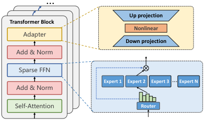

<!-- Start of picture text -->
… Up projection Transformer Block Nonlinear Adapter Down projection Add & Norm Sparse FFN Expert 1 Expert 2 Expert 3 … Expert N Add & Norm Self-Attention Router <!-- End of picture text -->

Fig. 1. Illustration of sparse Transformers and parameter-efficient adapters inserted into the Transformer blocks. 

various mobile apps [6], [8], termed a model-as-a-systemservice paradigm. This paradigm has been made possible by the recent advances of LLMs that have emerged with powerful generic capabilities to support various downstream tasks with a single LLM backbone. Due to the app-independent nature, this foundation LLM can be managed by the operating system (OS), and expose service APIs for mobile apps to invoke. Apps can send texts ( _i.e._ , prompts) to query the foundation LLM via service APIs, and get responses generated by the LLM. A representative example of this paradigm is AICore [9], a system service proposed by Google that provides access for mobile apps to Gemini Nano [24] on the device. It also provides limited flexibility to fine-tune the foundation LLM for apps via the LoRA method [30]. Apple [5] also provides toolkits to help developers integrate on-device LLM inference into mobile apps. 

## _B. Customizing On-Device LLM Serving_ 

**Large language model adapters.** To provide app-specific customized model services, apps can provide adapters to interact with the foundation LLM [13], [30]. Here we briefly introduce LLM adapters for parameter-efficient fine-tuning (PEFT) [13], [31]. Adapters are independent trainable modules inserted into the foundation LLM to enhance its ability on specific tasks. The main purpose of employing adapters is twofold: (1) the first is to reduce tunable parameters when finetuning foundation LLMs to downstream tasks. (2) the second is to tackle system challenges such as limited on-device memory and computation resources. With adapters, fine-tuning LLM on devices becomes possible. 

We show a popular kind of Transformer adapters in Figure 1. An adapter typically comprises a down-projection layer followed by a non-linear layer and an up-projection layer. After forwarding through these layers, the hidden states are further added via a residual connection. As such, the function of an adapter can be expressed as: _h ← f_ ( _hWdown_ ) _Wup_ + _h_ , where _h_ is the hidden states, and _Wdown_ and _Wup_ are weight matrices of the adapter. When fine-tuning LLMs with downstream data, the foundation LLM is frozen, and only parameters in the adapters are trainable. As the adapters only have less than 1% parameters compared to the foundation LLM [13], [30], the memory and computation required for fine-tuning can be dramatically reduced. The rationale behind this lightweight adapter design is that the foundation LLM is 

powerful enough with its world knowledge, and the adapters only need to encode task-specific representations to enhance the foundation LLM in the targeted downstream tasks. 

**Motivation of proxy submodel tuning.** To customize LLM services for the targeted tasks, apps could fine-tune adapters with in-app data collected during user-app interaction. This data is highly privacy-sensitive, making it unsuitable to send to the cloud server for tuning. Thus, on-device tuning is a potential solution. However, existing methods are still hard to achieve due to the following challenges. (i) The systemmanaged foundation LLM is a black box for mobile apps. That is, apps could only use inference APIs to interact with the foundation LLM, while having no visibility and control over its internal architecture or intermediate execution results. This hinders apps from applying various adaptation methods such as inserting modules into the LLM. Moreover, different downstream tasks prefer different kinds of PEFT algorithms and hyperparameters [14], [32], which is also hard to operate under the current paradigm. (ii) Even with adapters, the resource overhead of on-device fine-tuning the foundation LLM is still prohibitively expensive. This is because storing the LLM parameters alone already takes up a large amount of memory budget, leaving little capacity for training requirements such as storing activations, gradients, and intermediate states of optimizers [33], [34]. For instance, the LLM parameters could occupy 90.1% of total memory for fine-tuning, estimated by our memory model (detailed in Appendix). Therefore, this fine-tuning process is highly limited by the large-scale LLM, and could face complex parameter offloading and I/O scheduling problems [11], [12], which have not been fully solved in the on-device fine-tuning scenario. 

To tackle the above issues, we propose a proxy submodel tuning paradigm to enable mobile OS to dynamically expose lightweight and specialized submodels to apps. These submodels are extracted from the system-level foundation LLM, acting as effective proxies to the foundation LLM with respect to certain downstream tasks. This paradigm brings the following benefits: (1) the submodels are lightweight, tailored for the apps, and thus can act as the role of LLM for customized fine-tuning with much less resource overhead. (2) With this paradigm, mobile apps have full control over the submodel, and thus can flexibly employ various PEFT algorithms for fine-tuning. Once the fine-tuning process finished, the obtained adapters within the submodel could be seamlessly integrated into the foundation LLM. As such, this paradigm is able to offer efficient and effective on-device LLM fine-tuning for customized LLM services. 

## _C. MoE-based LLMs and Opportunities_ 

**MoE-based LLMs.** The sparsely-activated MoE architecture is well-suited for edge devices, as it not only enjoys the model performance gains brought by the large model size [35], but also avoids correspondingly increased computation overhead. For example, GLaM [36] augmented with MoE achieves around 7 times of parameters than GPT-3, while it only consumes 1/3 of energy for training, and requires 1/2 of computation FLOPs for inference. This comes from the MoE’s 

4 

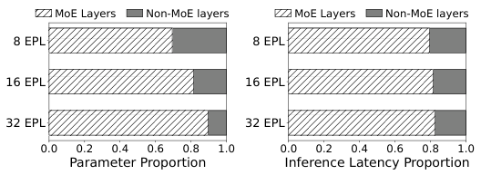

<!-- Start of picture text -->
MoE Layers Non-MoE layers MoE Layers Non-MoE layers 8 EPL 8 EPL 16 EPL 16 EPL 32 EPL 32 EPL 0.0 0.2 0.4 0.6 0.8 1.0 0.0 0.2 0.4 0.6 0.8 1.0 Parameter Proportion Inference Latency Proportion <!-- End of picture text -->

Fig. 2. <u>Cost breakdown</u> of MoE-based LLMs. “EPL” indicates Experts Per (sparse ~~FFN) L~~ ayer. 

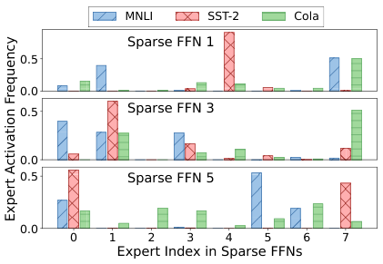

<!-- Start of picture text -->
MNLI SST-2 Co la Sparse FFN 1 0.5 0.0 0.5 Sparse FFN 3 0.0 0.5 Sparse FFN 5 0.0 0 1 2 3 4 5 6 7 Expert Index in Sparse FFNs Expert Activation Frequency <!-- End of picture text -->

Fig. 3. Expert activating frequencies in different downstream tasks in the 1st, 3rd, and 5th sparse FFN layer. 

advantage of conditional computation, where for each token only a small subset of parameters are activated for inference or training. 

As shown in Figure 1, the MoE architecture is typically employed to replace dense FFN layers inside Transformer blocks of LLMs. A common MoE-based sparse FFN comprises a set of experts, each of which is also a FFN, and an independent router module. For each input token, the router decides which expert to activate out of all potential experts. Formally, the function of a sparse FFN with respect to input token _x_ can be formulated as: 

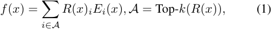

where _Ei_ ( _x_ ) is the function of the _i_ th expert, and _R_ ( _x_ ) denotes the router function. 

**Observation 1: sparse FFNs dominate resource costs.** Despite the benefits of MoE-based sparse FFNs, they have much higher memory and time costs compared to other layers within LLMs. Taking Switch Transformers [21] as an example, we break down these costs in Figure 2. (i) There are more than half of the parameters of LLMs are within sparse FFNs, and the portion increases with the number of experts. For example, sparse FFNs each with 32 experts take up 89.7% of the parameters of the LLM. (ii) Executing sparse FFNs on devices also brings high latency even under this conditional computation method. This is because the device is hard to hold all parameters in memory, thus introducing additional I/O costs for loading expert parameters from disks [11], [12]. Therefore, it is critical to optimize the sparse FFNs to reduce costs for on-device model execution and fine-tuning. 

**Observation 2: expert activating frequencies are unbalanced and dynamic.** As shown in Figure 3, we analyze the 

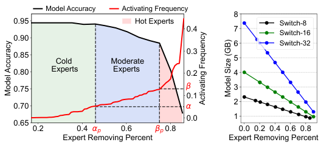

<!-- Start of picture text -->
Model Accuracy Activating Frequency 8 0.95 Hot Experts Switch-8 0.4 7 Switch-16 0.90 6 Switch-32 0.85   Cold  Moderate 0.3 5 0.80 Experts   Experts 0.2 4 0.75 3 0.1 2 0.70 0.0 1 0.65 0.2 0.4 p 0.6 p 0.8 0.0 0.2 0.4 0.6 0.8 Expert Removing Percent Expert Removing Percent Model Accuracy Model Size (GB) Activating Frequency <!-- End of picture text -->

Fig. 4. Model accuracy (left) and model size (right) under different expert removing percentages. 

Switch Transformer with 8 experts per sparse FFN (denoted as Switch-8), and visualize expert activating frequencies across several downstream tasks. We have two observations. (i) First, not all experts are equally activated, reflected in highly unbalanced activating frequencies for a given downstream task. For example, for the multi-genre natural language inference (MNLI) task, there are 38.5% of experts on average are barely used, and only 19.8% of experts are “heavy-hitters” that are very frequently activated. Other sparse models exhibit similar statistics: Switch-16 and Switch-32 have 40.1%, 36.2% cold experts and 18.2%, 23.7% heavy-hitter experts, respectively. (ii) Second, expert activating frequencies are also different across tasks, following strong task-specific patterns. For example, there are only 26.3% of heavy-hitter experts overlap between the MNLI task and the CoLA task. Intuitively, although MoE-based LLMs are trained to have general abilities, the experts within sparse layers are only trained to handle different subsets of tokens, and thus specialize in different abilities. Note that the heavy-hitter experts could also change dynamically, as users could switch mobile apps in use or focus on different downstream tasks. 

**Opportunities in generating lightweight proxy submodels.** Based on the task-specific sparse activating patterns of sparse FFNs, we have opportunities to extract lightweight submodels for downstream tasks that the current apps focus on. A naive solution is to simply remove the experts with low activating frequencies. However, our preliminary experiments reveal that this way cannot scale down the large LLM while preserving specific abilities simultaneously. The resulting submodel is not a good proxy for the large LLM, and thus could compromise the effectiveness of tuning customized adapters. Specifically, in Figure 4, we show the relation between the percentage of simply removed experts and the resulting model performance. The removal percentage could be roughly divided into 3 regions: (i) cold experts: in the left region with activating frequency less than a threshold _α_ . Removing cold experts has a negligible impact on the model performance. (ii) moderate experts: in the middle region with activating frequency range from _α_ to _β_ . As more experts are removed, those with moderate activating frequencies but not critical ones are removed. This leads to a gradual decline in model performance as the number of removed experts increases. (iii) hot experts (heavy hitters): once the removal rate surpasses the _βp_ point, where some heavy hitters are removed, the model performance is significantly impaired. To conclude, the simple 

5 

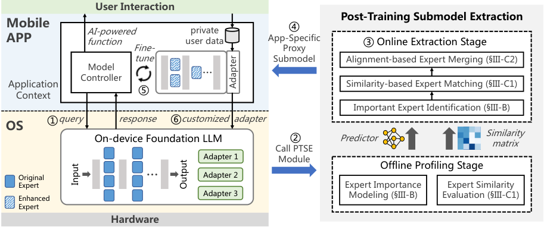

<!-- Start of picture text -->
User Interaction Post-Training Submodel Extraction Mobile ④ AI-powered private APP function Fine- user data App-SpecificProxy ③ Online Extraction Stage tune Submodel Alignment-based Expert Merging (§III-C2) ControllerModel … Application Similarity-based Expert Matching (§III-C1) Context ⑤ Important Expert Identification (§III-B) ①query response ⑥customized adapter OS On-device Foundation LLM ② Predictor Similarity matrix Call PTSE Adapter 1 Module Offline Profiling Stage Original … Adapter 2 Expert Expert Importance Expert Similarity Enhanced Adapter 3 Modeling (§III-B) Evaluation (§III-C1) Expert Hardware Adapter Input Output <!-- End of picture text -->

Fig. 5. Overview of LiteMoE framework. 

expert removing method either lies in the left region, achieving only limited compression rates, or moves into the middle-right region, where model performance deteriorates significantly. Either way fails to produce a lightweight and effective proxy submodel. 

To tackle this issue, our idea is to reach, even surpass the removing percentage of the _βp_ point while keeping model performance in the left region at the same time. This could be achieved by first judiciously identifying experts within different groups with respect to the targeted tasks, and then removing cold experts, selectively transferring the knowledge of the moderate experts to the heavy-hitter experts by a newly designed expert merging method. Finally, we only retain the enhanced heavy-hitter experts, obtaining a lightweight and effective proxy submodel for mobile apps to further train customized adapters. 

_Expert Similarity Evaluation_ , to prepare for the online proxy submodel extraction process. This stage only corresponds to the foundation LLM, and thus can be performed on the cloud. In the online stage, when LiteMoE receives an app query, it first conducts _Important Expert Identification_ that evaluates experts’ importance scores with respect to the targeted downstream tasks of this app. Then, LiteMoE identifies the heavyhitter experts to keep in the submodel, and removes the other experts. To recover performance drops due to the removed experts, it further carries out selective expert merging by first matching removed experts to the retained experts according to their similarities with _Similarity-based Expert Matching_ , and then performing _Alignment-based Expert Merging_ to aggregate the parameters of the removed experts into the retained experts. As such, the retained experts are further enhanced, and thus the resulting lightweight submodel can effectively preserve specific abilities from the foundation LLM. 

## III. DESIGN OF LITEMOE 

## _A. Overview_ 

LiteMoE is an on-device LLM tuning framework that enables mobile apps to continuously fine-tune customized adapters on resource-limited devices. Figure 5 shows the general working pipeline of LiteMoE. Given a query from a mobile app ( 1 _⃝_ ), LiteMoE responds with a proxy submodel extracted from the system-level foundation LLM using _PostTraining Submodel Extraction (PTSE)_ ( 2 _⃝_ - 4 _⃝_ ). The proxy submodel is specifically tailored according to the targeted tasks of this app. The app can further fine-tune or update its customized adapters with this proxy submodel using the fresh data collected during user-app interaction ( 5 _⃝_ ). The customized adapters can be inserted back into the foundation LLM to provide better user experience ( 6 _⃝_ ), while the memory of the proxy submodel can be released once the fine-tuning process is complete. 

The key to the success of this pipeline is to generate a sufficiently good proxy submodel, which is achieved by our post-training submodel generation module, as shown in the right part of Figure 5. This module works with an offline stage and an online stage. In the offline stage, we profile expert characteristics via _Expert Importance Modeling_ and 

## _B. Customized Expert Identification_ 

To generate a proxy submodel, we first need to identify important experts within sparse FFN layers for the targeted task. We formally define the importance score of the expert _k_ with respect to a given task _Dj_ as its overall activation probability under the inputs of this task, _i.e._ , _P_ ( _Ek_(_l_)_|Dj_). We can use the activation frequency determined by the router outputs to estimate this probability. As such, the importance score of expert _k_ can be written as: 

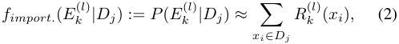

where _R_ ( _xi_ ) is the router outputs ( _i.e._ , routing probabilities) with respect to token _xi_ . However, _R_(_l_) ( _·_ ) can only be obtained by forwarding inputs to the LLM and calculating the router outputs of sparse FFNs layer by layer. A naive way is to feed all user data to the foundation LLM to get the routing probabilities, but this method incurs large additional computation overhead, and could break on-device resource limitations. Therefore, to calculate the expert importance, a lightweight and precise prediction method is needed. 

6 

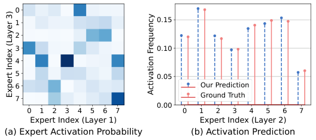

<!-- Start of picture text -->
0 1 0.15 2 3 0.10 4 5 0.05 6 Our Prediction Ground Truth 7 0.00 0 1 2 3 4 5 6 7 0 1 2 3 4 5 6 7 Expert Index (Layer 1) Expert Index (Layer 2) (a) Expert Activation Probability (b) Activation Prediction Expert Index (Layer 3) Activation Frequency <!-- End of picture text -->

Fig. 6. Cross-layer correlation of activating experts, and the prediction results based on this property. This experiment uses a Switch Transformer with 8 experts in each sparse FFN and GLUE benchmark. 

Fortunately, we observe that router outputs of different sparse FFNs exhibit strong cross-layer correlations, based on which we can avoid inferring the large foundation LLM to obtain experts’ importance scores. The correlation reveals that a subset of experts located across different sparse FFNs tends to be activated simultaneously in response to the same input tokens. Figure 6 (a) exemplifies this correlation, with deeper colors representing a higher probability of activating the corresponding experts. We can observe that the experts activated in the 3rd sparse FFN are highly conditioned on those in the 1st sparse FFN. For instance, a token that activates expert 3 in the sparse FFN 1 is very likely to also activate expert 4 in the sparse FFN 3, with a probability of _P_ ( _E_ 4(3)_|E_ 3(1))=75_._4%.Additionally,ourexperiments (detailed in Section V-D) demonstrate that the router output distribution of the 1st sparse FFN encodes sufficient information to predict the routing probabilities of deeper sparse FNNs with high precision, with Figure 6 (b) showing an example for the prediction performance. Therefore, we first model this correlation using a function _F_ : _R_(1) _→ R_(_l_) . Then, for a given input _x_ , the routing probability of _R_(_l_) can be predicted as _R_ˆ(_l_) ( _x_ ) = _F_ ( _R_(1) ( _x_ )). Thus, the overall expert importance with respect to _Dj_ can be calculated as: 

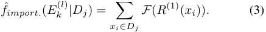

**Cross-layer expert correlation modeling.** To learn the function _F_ , we employ a compact predictor, _i.e._ , a two-layer MLP, to predict the routing probability for each sparse FFN within the foundation LLM. The predictor adopts a multihead model structure, where each output head predicts the routing probability of a certain sparse FFN. This design not only reduces the predictor size, but also can enhance prediction accuracy benefiting from the multitask learning regime. 

To train this predictor, we further generate a synthetic dataset with routing probabilities of the first sparse FFN ( _R_(1) ) as input features, and routing probabilities of the other sparse FFNs ( _R_(_l_) ) as labels. This routing dataset can be collected using public data on the cloud server during LLM pre-training. We adopt a distillation loss with an additional Kullback-Leibler (KL) divergence term adding to the final loss function [17]. This approach leverages the complete distribution information within the routing probabilities, rather than solely relying on the final expert activating results, which 

are the top-1 results of the routing probabilities. Essentially, we distill knowledge from multiple routers across different sparse FFNs, and integrate this information to develop a precise yet compact predictor that models cross-layer expert correlations. 

**Online customized expert identification.** In the online stage, we combine the trained predictor with shallow layers of the foundation LLM (up to the first sparse FFN), forming an end-to-end predictor. With this end-to-end predictor, the expert importance scores with respect to a given mobile app are obtained as follows. First, the app _j_ calculates the routing probability _R_(1) ( _xi_ ) using sampled app-specific private data _Dj_ collected during user interaction, and then leverages the predictor to calculate experts’ importance scores following Equation (3). Second, the predicted expert importance scores which encode the information of targeted tasks are returned to OS to assist in later proxy submodel extraction. Note that the above processes are resource-friendly, as the end-to-end predictor has less than 1% of parameters compared to the foundation LLM, and only parameters of the multi-head MLP are additional. 

## _C. Selective Expert Merging_ 

Based on the distribution of expert importance for a specific mobile app, LiteMoE is able to customize a proxy submodel for this app as follows. First, given a sparse FFN, we denote its expert set as _E_ = _{E_ 1 _, . . . , En}_ , where _n_ is the total number of experts within this layer. We divide _E_ as two subsets _T_ and _R_ , where _T_ = _{fimport._ ( _Ei_ ) _> α|Ei ∈E}_ represents the experts whose importance scores larger than a pre-defined threshold value _α_ , and _R_ = _E \ T_ denotes the remaining experts. We can directly remove experts in _R_ , as these experts have negligible contributions to the model performance with respect to the targeted task (Section II). 

Second, the importance scores of the experts within _T_ are biased, leaving an opportunity to further improve the parameter efficiency of sparse FFNs. Specifically, only several experts (even only one in some cases) are heavy hitters which deal with most incoming tokens, and are dominant to the overall model performance. We denote the heavy-hitter experts within the sparse FFN as _Th_ = _{fimport._ ( _Ej_ ) _> β|Ej ∈T }_1 . The remaining experts within _T_ have moderate importance, denoted as _Tr_ = _T \ Th_ , where removing them would impair model performance to some extent. Decisions of whether to keep these experts form a Pareto frontier indicating the tradeoff between model performance and resource costs. 

Our goal is to remove the experts in _Tr_ to further compress the proxy submodel without compromising performance. Inspired by model ensemble techniques [37], [38], we propose _selective expert merging_ to integrate the expert knowledge into fewer, enhanced experts. Specifically, we judiciously merge the parameters of the experts in _Tr_ with those in _Th_ . The merged experts can inherit their original abilities while also being enhanced with the abilities of other experts, allowing them to serve targeted tasks independently. 

> 1 _α_ and _β_ are hyperparameters that can be tuned according to performance requirements. We perform sensitivity analysis with respect to these two hyperparameters and provide the guideline for the selection of their values in Section V-E. 

7 

To achieve this goal, two challenges arise: (i) how to determine the expert mapping from _Tr_ to _Th_ . The reason behind this purpose is that experts exhibit token-level or task-level specializations after model training [21], [39], and have different abilities from each other to varying degrees. Merging two or more experts with quite distinct specializations into one could harm the resulting expert’s ability, leading to poor model performance. (ii) How to effectively merge expert parameters given two or more source experts to be merged. Simply averaging the parameters of the experts fails to preserve expert abilities, as the experts are initialized and trained separately, therefore their parameters do not have oneto-one correspondence for effective merging. 

To overcome the above challenges, the selective expert merging technique comprises two steps: _similarity-based expert matching_ and _alignment-based expert parameter merging_ . The former step matches experts in _Tr_ to experts in _Th_ based on their similarity in abilities exhibited during model training and inference. The latter step merges the matched experts into one by first aligning their neurons to have aligned hidden representations, and then employing importance-aware weighted averaging to their parameters. 

_1) Similarity-based expert matching:_ The experts within a sparse FFN are trained by different subsets of the corpus, typically sharing some common knowledge while developing distinct abilities, similar to multitask learning. Therefore, the key to merging experts into one is to merge the experts with high similarities to further enhance their ability, while mitigating the interference of noises or conflict knowledge from experts with large discrepancies. 

To this end, given expert sets _Tr_ and _Th_ , we can formulate the similarity-based expert matching problem as a weighted bipartite matching problem as follows. Consider a weighted bipartite graph _G_ = ( _Tr, Th, D_ ), where _Tr_ , _Th_ represent the two sets of vertices to be matched, and _D_ denotes edges with weights _H_ defined by expert similarities (illustrated in Figure 7). The problem is to find a sub-graph _S ⊆ G_ representing the matching from the experts in _Tr_ to _Th_ that maximizes the overall similarity. We denote a column vector _X ∈_ R_|Tr|·|Th|_ of 0-1 variables to represent expert matchings, with _xij_ = 1 indicating expert _i_ is matched to expert _j_ . The constrained matching problem can be expressed as: 

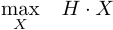

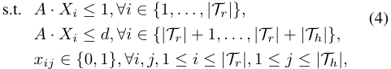

where A is the incident matrix of the bipartite graph [40]. The first constraint denotes that each noncritical expert ( _Ei ∈Tr_ ) can only be merged into one critical expert ( _Ej ∈Th_ ). The second constraint denotes each expert within _Th_ can receive at most _d_ incoming expert within _Tr_ to be merged. This constraint aims to prevent experts within _Th_ from overloading which would compromise the effect of expert merging. 

**Offline expert similarity evaluation.** To complete the above matching problem, we now consider how to evaluate the similarity between experts. Since an expert network features 

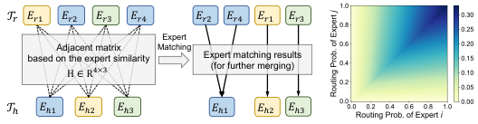

<!-- Start of picture text -->
𝒯" 𝐸%" 𝐸%# 𝐸%$ 𝐸%& 𝐸%# 𝐸%& 𝐸%" 𝐸%$ Expert Adjacent matrix Matching based on the expert similarity Expert matching results (for further merging) H ∈R !×# 𝒯! 𝐸!" 𝐸!# 𝐸!$ 𝐸!" 𝐸!# 𝐸!$ <!-- End of picture text -->

Fig. 7. (Left) Illustration of similarity-based expert matching. (Right) The similarity metric based on routing probabilities ( _κ_ = 0 _._ 2). 

essentially a feed-forward layer with two weight matrices for input and output projection, one would consider defining the similarity between two experts as the distance between their weight matrices. However, the weight matrices lie in extremely high dimensional space due to high hidden dimensions in large MoE-based LLMs. The traditional distance metrics are less effective and compute-intensive in such a high dimension. 

Fortunately, the router trained for coordinating experts encodes the information of experts’ abilities, and thus can be used for evaluating the similarity between experts. Specifically, in the offline stage, we record the routing probabilities _R_ ( _xk_ ) for the input tokens _xk ∈ D_ . The similarity between expert _Ei_ and _Ej_ with respect to an input token _xk_ is defined as: 

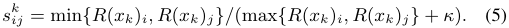

As illustrated in Figure 7 (right), the intuitive is that two experts with high routing probabilities for the same token tend to have higher similarity than those with low routing probabilities. The constant _κ_ is to adjust the relative weight of routing probabilities. The overall similarity between two experts is the average over all the evaluated tokens: _sij_ =� _k__sk_ _ij__, ∀i, j_. Note that this calculation only needs to be performed once for an LLM, and can be pre-calculated in the offline stage. 

To solve this weighted bipartite matching problem, we can reduce it to a transportation problem in the form of linear programming [41]. As such, this problem can be solved efficiently with polynomial time algorithms. 

_2) Alignment-based expert merging:_ Given a specific expert _Ei ∈Th_ and _m_ experts _{Ej}__m_ _⊆Tr_ matched to _Ei_ according to the above expert matching result, we now consider merging experts _{Ej}_ into expert _Ei_ to enhance expert ability without complex retraining processes and training data. The matched experts share more common knowledge, thereby properly merging them could complement the expert ability while reducing resource overhead [42], [43]. However, it is difficult to identify or quantify knowledge within experts since it is deeply encoded in their parameters. Simply averaging expert parameters, though efficient, fails to capture this information. The underlying reason is that experts adopt fully connected networks, which are permutation-invariant. That is, even two experts having exactly the same function may differ in neuron permutations and thus in weight matrices. To solve this problem, we propose an alignment-based expert merging method. 

**Align experts’ hidden representations.** An expert within MoE layers is a dense FFN whose function can be expressed as _fE_ ( _x_ ) = _ϕ_ ( _xW_(1) ) _W_(2) , where _W_(1) _∈_ R_din×h_ , _W_(2) _∈_ R_h×dout_ are weight matrices for input and output projection, respectively, and _ϕ_ ( _·_ ) is the activation function. 

We first analyze the permutation invariance property 

8 

= of FFNs. We write the weight matrices as _W_(1) ( _a__⊤_ _, a_ 2_⊤, · · ·, a⊤_ _h_),_W_(2)=(_b_1_, b_2_, · · ·, bh_)_⊤_,where_{ai}_ and _{bj}_ are row vectors, and _h_ is the number of hidden neurons. The function of the FFN can be written as _fE_ ( _x_ ) = � _hk_ =1_ϕ_(_xa_ _k__⊤_)_bk_. For any permutation_π_to the neurons in this FFN, we denote the permutation matrix as _Pπ_ , and permuted weight matrices are _W_�(1) = _W_(1) _Pπ_ , _W_�(2) = _PπW_(2) . As the summation operation is permute-invariant, the permuted function _fEπ_ ( _x_ ) =�_h_ _k_ =1_ϕ_(_xa⊤_ _π_ ( _k_ ))_bπ_(_k_)=� _k__h_ =1_ϕ_(_xa_ _k__⊤_)_bk_ is equal to _fE_ ( _x_ ). Therefore, to merge experts effectively, we need to permute their neurons to have aligned hidden representations. Specifically, given two experts _p_ and _q_ whose weights are _Wp_(_l_) and _Wq_(_l_)_, l_=1_,_2,weaimtofindthe optimal permutation _P__∗_ that after permuting neurons of expert _p_ , the distance between the resulting weights _W_� _p_(_l_) and _Wq_(_l_) is minimized. 

To solve the permutation _P__∗_ , there are different types of aligning techniques, such as hard-aligning [44] and softaligning [45]. We employ the soft-aligning strategy for expert merging to take advantage of its flexibility in modeling soft correspondence between neurons and efficient solving algorithms. Specifically, the neuron alignment problem is formulated as an optimal transportation (OT) problem as: 

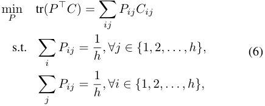

where _C ∈_ R_h×h_ is the cost matrix defined as the opposite number of similarities between neurons in the two experts. We define _Cij_ := 2<u>1</u>(_||a_ _i__p−aq_ _j__||_2+_||b_ _i__p−bq_ _j__||_2), which is the average Euclidean distance between corresponding weight vectors of neurons _i_ and _j_ . Intuitively, this formulation aims to optimally “transport” neurons in expert _p_ to expert _q_ with the minimal cost, _i.e._ , the maximal total neuron similarities. Under the form of optimal transportation, there are estimated solvers, either exactly or approximately, for efficiently calculating _P__∗_ [46]. **Expert parameter merging.** With the aligned expert parameters, we are able to merge experts by importance-aware weighted averaging. Specifically, for a given expert _Ei ∈Th_ and _m_ matched experts _{Ej}__m_ _⊆Tr_ , we calculate the merged expert parameter matrices as: 

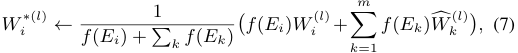

where _f_ ( _Ei_ ) denotes the importance score _fimport._ ( _Ei_ ) of expert _i_ , _l ∈{_ 1 _,_ 2 _}_ . With this merging strategy, the merging weight of the critical expert _Ei_ is dominant, as this expert accounts for most input tokens. Other expert parameters are used to update _Ei_ ’s parameters with stepsizes as their corresponding importance scores. Our experiments show this strategy can effectively balance the original and newly merged expert abilities. 

**Update routers for updated experts.** After selective expert 

merging, the router should also be updated correspondingly to adapt to the new set of experts. We introduce a _masked expert routing_ mechanism to update the router. The original routing probability can be calculated as _r_ = Softmax( _xWR_ ), where _WR_ is the parameter matrix of the router. We apply a mask matrix _M ∈_ R_n×n_ on original routing probability, obtaining _r__′_ = _rM_ , where _M_ is essentially a permutation matrix obtained according to the expert matching result _X__∗_ in Equation 4, wherein _Mij_ = 1 represents expert _i_ is redirected to expert _j_ . 

After the above procedures, we obtain lightweight yet effective proxy submodels for subsequent fine-tuning. Furthermore, to provide insights into the optimization space and upper bound of LiteMoE’s design, we conduct a theoretical analysis of memory consumption during on-device fine-tuning using a memory model, and perform a case study using Switch Transformers. Detailed discussions are provided in the Appendix. 

## IV. SCALABILITY AND ADAPTABILITY EXTENSION 

The above design focuses on tuning a customized adapter for a single mobile app, however, most devices host multiple apps, requiring multiple distinct adapters. Even for a single app, its adapter needs to be continuously updated to align with evolving user preferences for high-quality LLM services. In this section, we extend LiteMoE to accommodate multi-app and continuous tuning scenarios. 

## _A. Multi-App Extension_ 

Fine-tuning customized adapters for apps one by one with LiteMoE introduces both scalability and performance issues. First, the tuning time increases linearly with the number of apps. Such inefficiency makes it difficult to meet uses’ expectations for prompt customization, thus compromising user experience. Second, this approach may lead to suboptimal outcomes for data-scarce apps, which are prone to overfitting. These issues mainly stem from neglecting of cross-task correlations. While different apps require distinct adapters, they often share some commonalities in task characteristics ( _e.g._ , summarization and user intent understanding) and user personal information ( _e.g._ , preferences and language style). Exploiting such multitask relation can effectively reduce tuning time and resource overhead [30], [47], [48]. 

To leverage the cross-task relation for efficient multi-app tuning, we equip an on-device adapter zoo for LiteMoE. Rather than tuning each adapter from scratch, we reuse the previously tuned and related adapters as the foundation for tuning a new adapter. Additionally, newly tuned adapters are incorporated into the zoo for future use. We represent the adapter zoo as _Z_ = _{I_ 1 _, I_ 2 _, · · · , In}_ . Each entry _Ii_ is a pair of ( _key, value_ ), where _key_ is a feature vector _Vi_ associated with a specific downstream task, and _value_ is the corresponding adapter parameters2 _WAi_ . We describe the zooaugmented fine-tuning workflow as follows. 

> 2In practice, the “adapter” for a downstream task is actually a set of adapters residing across different LLM layers. Here we only use a weight matrix _WA_ to represent these weights for clarity and simplicity. 

9 

**Workflow of fine-tuning with the adapter zoo.** (1) _Retrieve related adapters._ Before tuning a new adapter, LiteMoE queries the adapter zoo to retrieve the top- _p_ related adapters for the current task _q_ , using its feature vector _Vq_ as the query. The task relatedness is defined as: 

_Relatedness_ ( _taskq, taskk_ ) _∝ Vq__⊤· Vk,Vk∈Z._ (8) 

(2) _Initialize a new adapter._ The parameters of the retrieved related adapters are averaged and used to initialize the new adapter. This informed initialization facilitates a warm start for model training [47]. Specifically, starting from a favorable region of the loss curve can accelerate the fine-tuning process. (3) _Fine-tune the adapter_ . The new adapter is tuned using proxy submodel tuning. (4) _Update the adapter zoo._ After tuning, the adapter is added to the adapter zoo as _Iq_ = ( _Vq, WAq_ ), enabling its reuse to expedite subsequent adapter tuning tasks. 

**Defining feature vectors for relatedness measurement.** To complete the above design, we define the feature vector _Vq_ for a given task _q_ . Encoding a task’s information into a feature vector is a non-trivial problem, while fortunately, every task has its unique expert importance distribution, which can serve as its feature vector for relatedness measurement. As such, we define _Vq_ as _Vq_ := [ _vnl_ ] _∈_ R_NL_ _,_ where _vnl_ = _fimport._ ( _En_(_l_)_|D_ _q_).Since_f_ _import._(_E_ _n_(_l_)_|D_ _q_)isalreadyob- tained in identifying customized experts (Section III-B), this process does not incur additional computation. 

## _B. Continuous Adapter Tuning_ 

Static adapters may not consistently deliver optimal performance over time, as users are subject to dynamic environments, and exhibit changing behaviors and preferences. The resulting shifts in data distribution require adapters to keep learning and evolving over time [49], [50]. To achieve agile updating while mitigating the potential overfitting problems during periodic tuning, LiteMoE employs tuning-time alternative optimization and serving-time ensemble inference. 

**Tuning-time alternative optimization.** We first analyze the learning objective and show the sources of performance loss. Fine-tuning an adapter involves minimizing the empirical loss over the target dataset: _Lemp_ ( _Wa_ ; _W_ 0 _, D_ ), where _Wa_ and _W_ 0 denote the adapter and LLM parameters, respectively. For proxy submodel tuning, we first compress _W_ 0 into a proxy submodel _W_ 0_′_(withacompressionloss_Lcomp_(_W ′_ 0;_W_0_, D_)), then minimize the empirical loss over _W_ 0_′_:_L′_ _emp_(_Wa_;_W_ 0_′, D_). The final loss is a combination of these two terms: _Lemp_ = _H_ ( _Lcomp, L__′_ _emp_). Astimeprogressesfrom_t_to(_t_+1), model performance degradation arises from two sources: (i) _L_( _comp__t_+1), where the proxy submodel _W_ 0_′_(_t_) no longer serves as a good proxy at time step ( _t_ + 1), and (ii) _L__′_ _emp_(_t_+1),wheretheadapter parameters _Wa_(_t_) is outdated with respect to the new data distribution _D_(_t_+1) . 

While directly analyzing or optimizing _L_( _emp__t_+1)is intractable due to the complex interdependencies of the influencing factors, we adopt an alternative optimization strategy for continuous adapter fine-tuning. (1) Optimize _L_( _comp__t_+1)whilefixing _Wa_(_t_).DuringLLMservingwithadapter_W_( _a__t_),werecord the activation frequency of each expert, _fimport._ ( _E|D_(_t_+1) ), 

which will serve as an updated importance estimation for the next time step. Based on the updated importance, LiteMoE minimizes the _Lcomp_ by employing PTSE to extract a new proxy submodel _W_ 0_′_(_t_+1) . (2) Optimize _L__′_ _emp_(_t_+1) while fixing _W_ 0_′_(_t_+1) . Using the new proxy submodel, LiteMoE updates the adapter through standard fine-tuning processes with gradient back-propagation, yielding a new adapter, _Wa_(_t_+1) . 

**Serving-time ensemble inference.** To alleviate overfitting due to limited fine-tuning data, LiteMoE aggregates the outputs of adapters from multiple time steps during inference. Specifically, at time step _t_ , rather than forwarding inputs solely to the adapter _Wa_(_t_),LiteMoEforwardstheinputsto _w_ adapters from time step ( _t − w_ + 1) to _t_ , and averages their individual outputs to produce the final output, where _w_ is the window size. This ensemble strategy has been shown to be effective in enhancing model performance and robustness [51], [52], while incurring negligible additional computation costs due to the lightweight nature of the adapters. 

## V. PERFORMANCE EVALUATION 

## _A. Methodology_ 

**Implementation.** We have built a prototype of LiteMoE using Python. We use PyTorch [53] as the base DL framework, and HuggingFace Transformers [54] and PEFT libraries [15] as the NLP toolbox for LLM and adapter implementation, respectively. For the experiment testbed, we use a Linux server equipped with 4 NVIDIA 3090 GPUs to act as the cloud server for offline model profiling, including expert contribution predictor training and expert similarity evaluation. We evaluate LiteMoE’s online performance on two popular edge devices: NVIDIA Jetson Nano (GPU) and Raspberry Pi 4B (CPU). Both of them are equipped with 8GB total memory capacity and 64GB disk storage. 

**Downstream tasks, datasets and foundation LLMs.** We evaluate LiteMoE over classic NLP downstream tasks from the GLUE benchmark [55] which is a standard multi-task benchmark for natural language understanding. GLUE contains 9 classification or regression tasks and datasets from different categories such as sentiment analysis and natural language inference. For foundation LLMs, we employ three MoE-based LLMs with different numbers of experts and thus different model scales for evaluation. These models are based on Switch Transformers [21], a popular sparse Transformer following the encoder-decoder architecture. The sparse FFN layers are added at every other FFN layer within Switch Transformer. For a token, only one expert will be activated for processing (top1 routing). We denote the LLMs as Switch- _n_ , where _n_ = 8 _/_ 16 _/_ 32 is the number of experts per sparse FFN. The pretrained model weights are obtained from HuggingFace [54]. 

**Baselines.** We compare LiteMoE with the following baselines. (1) _Full-FT LLM_ : this is the ideal situation where mobile apps can use the complete foundation LLM to finetune personalized adapters. This acts as the performance upper bound, but is infeasible in practice due to its tremendous resource requirements. (2) _Foundation LLM_ : mobile apps use the general ability of the foundation LLM without adapters. (3) _Proxy submodel_ : the performance of proxy submodels 

10 

TABLE I 

SUMMARY OF OVERALL PERFORMANCE (%) OF LITEMOE AND BASELINES OVER VARIOUS MOBILE COMPUTING TASKS. 

|Foundation|Method||||Mob|ile Comp|uting Ta|sk|||Avg. Model|
|---|---|---|---|---|---|---|---|---|---|---|---|
|LLM||SST-|2|CoLA|MRPC|STS-B|QQP|MNLI|QNLI|RTE|Size (MB)|
|Switch-8|Foundation LLM Proxy Submodel FT Submodel Full-FT LLM **Proxy-FT LLM**|83.3 80.8 84.9 94.4 94.2||71.3 69.2 74.3 83.0 81.5|83.8 80.6 86.2 88.9 88.7|80.6 80.1 84.2 87.5 86.8|81.3 78.8 81.8 91.1 89.4|79.0 72.2 80.2 86.4 84.1|82.4 79.6 87.4 91.3 90.8|63.9 62.1 68.2 74.7 72.2|2366 921 Reduction: 2.57x|
|Switch-16|Foundation LLM Proxy Submodel FT Submodel Full-FT LLM **Proxy-FT LLM**|85.2 82.0 89.5 95.2 93.7||70.7 69.5 77.4 83.7 82.1|83.0 81.3 82.6 89.7 88.1|82.3 80.6 85.1 89.0 86.5|85.9 83.3 84.2 90.9 89.9|81.6 77.4 82.6 87.2 87.3|83.1 78.3 89.2 92.6 91.9|62.6 60.4 70.4 77.1 75.3|4094 1026 Reduction: 3.99x|
|Switch-32|Foundation LLM Proxy Submodel FT Submodel Full-FT LLM **Proxy-FT LLM**|84.4 82.1 90.6 95.8 93.1||72.3 69.2 77.5 84.8 80.7|83.6 79.8 81.3 90.0 89.2|82.2 81.9 88.3 89.4 88.3|84.2 82.3 85.8 91.2 89.6|77.3 76.2 80.9 86.9 85.1|85.9 82.3 90.8 93.3 92.8|70.7 67.1 71.9 77.6 76.3|7551 1147 Reduction: 6.58x|
|COLA SST2 MR 0 1 2 3 4 5 Memory Footprint (GB) (a)|PC QQP MNLI QNLI RTE S Switch-8 Model. Pr|TSB oxy Submod|0 2 4 6 Memory Footprint (GB) el (Fin|COLA SST e-tuning)|2 MRPC QQP (b) Switch- Foundatio|MNLI QNLI R 16 Model. n LLM (Inferenc|TE STSB e) F|0 2 4 6 8 10 Memory Footprint (GB) oundation LL|COLA SST2 MRP (c) S M (Fine-tuning)|C QQP MN witch-32|LI QNLI RTE STSB Model.|

Fig. 8. Memory footprint of the foundation LLM and the proxy submodel. 

extracted from the foundation LLM using our post-training submodel extraction technique. (4) _FT Submodel_ : the proxy submodels are fine-tuned with personalized data from the app’s targeted downstream tasks. (5) _Proxy-FT LLM_ : the customized adapters that are fine-tuned on the proxy submodels are integrated back into the foundation LLM for evaluation, which represents the outcome of the complete LiteMoE pipeline. 

**Metrics.** We report results mainly on two aspects. (1) _model performance:_ we use accuracy for classification tasks and the Pearson correlation metric for regression tasks. (2) _system resource overhead:_ we report the memory footprint of finetuning and inference models of LiteMoE and baselines, as well as the on-device execution latency of LiteMoE to verify its efficiency. 

**Configurations.** For the hyperparameters of LiteMoE, we set _α_ = 0 _._ 05 and _β_ = 0 _._ 15 by default. The maximum degree _d_ for similarity-based expert matching is set to 2 for Switch-8 and 3 for Switch-16/32. The parameter _κ_ in expert similarity evaluation is set to 0.2. Given a targeted downstream task, a submodel is updated 300 steps during the (proxy) fine-tuning process. We retain the best-performing adapter for each task during fine-tuning, and insert it back into the foundation LLM for further evaluation. 

## _B. Overall Performance Evaluation_ 

Table I summarizes the overall model performance and average model sizes of LiteMoE and baselines. 

For all tasks, LiteMoE supports fine-tuning adapters with lightweight proxy submodels, and improves the customized performance of the foundation LLM. First, compared to the initial foundation LLM, fine-tuning with apps’ private data can effectively enhance model performance. For example, the ideal case Full-FT achieves 8.7% model accuracy gains on average over all tasks, demonstrating the importance of customized fine-tuning. Second, with LiteMoE, we can reduce the model size from 2.57 _×_ to 6.58 _×_ while still preserving most of the performance of foundation LLM in targeted tasks (with a slight degradation of 1.4%). More importantly, after tuning with the proxy submodels, the adapters that integrate back into the foundation LLM can improve the accuracy by up to 7.4% compared to the initial LLM, which is very close to the ideal case of Full-FT. This attributes to our post-training submodel extraction technique that generates sufficiently good proxy submodels, thereby the adapters tuned upon these proxy submodels can effectively integrate the customized knowledge into the foundation LLM. Detailed evaluations of PTSE are shown in Section V-C. 

In Figure 8, we show the memory footprint of fine-tuning or inferring the foundation LLM and the generated submodels. LiteMoE’s proxy submodels reduce memory footprint by 2.42 _×_ compared to the complete foundation LLM. This is benefiting from our submodel extraction method that removes a large portion of cold and moderate experts, which not only reduces memory for storing a large number of expert param- 

11 

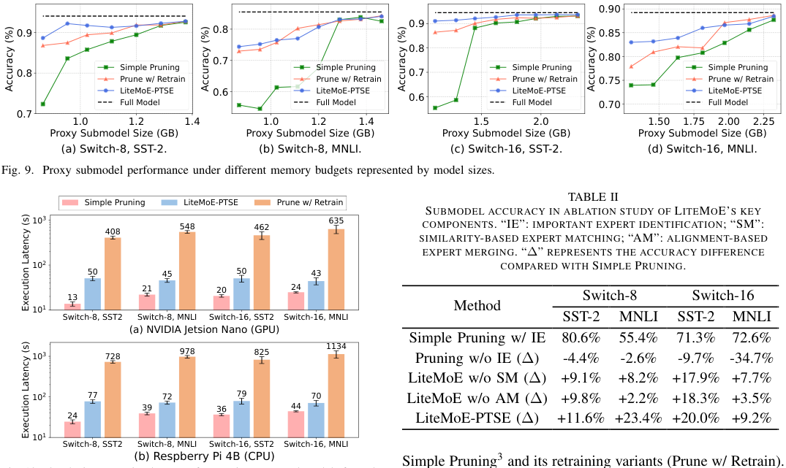

<!-- Start of picture text -->
0.90 0.9 0.9 0.8 0.85 0.8 0.7 0.80 0.8 Simple Pruning S imple Pruning 0.7 Simple Pruning Simple Pruning Prune w/ Retrain Prune w/ Retrain Prune w/ Retrain 0.75 Prune w/ Retrain LiteMoE-PTSE 0.6 LiteMoE-PTSE LiteMoE-PTSE LiteMoE-PTSE Full Model Full Model 0.6 Full Model 0.70 Full Model 0.7 1.0 1.2 1.4 1.0 1.2 1.4 1.5 2.0 1.50 1.75 2.00 2.25 Proxy Submodel Size (GB) Proxy Submodel Size (GB) Proxy Submodel Size (GB) Proxy Submodel Size (GB) (a) Switch-8, SST-2. (b) Switch-8, MNLI. (c) Switch-16, SST-2. (d) Switch-16, MNLI. Fig. 9. Proxy submodel performance under different memory budgets represented by model sizes. TABLE II Simple Pruning LiteMoE-PTSE Prune w/ Retrain SUBMODEL ACCURACY IN ABLATION STUDY OF LITEMOE’S KEY 10 3 635 408 548 462 COMPONENTS. “IE”: IMPORTANT EXPERT IDENTIFICATION; “SM”: SIMILARITY-BASED EXPERT MATCHING; “AM”: ALIGNMENT-BASED EXPERT MERGING. “∆” REPRESENTS THE ACCURACY DIFFERENCE 10 2 50 45 50 43 COMPARED WITH SIMPLE PRUNING. 21 20 24 13 Switch-8 Switch-16 10 1 Method Switch-8, SST2 Switch-8, MNLI Switch-16, SST2 Switch-16, MNLI SST-2 MNLI SST-2 MNLI (a) NVIDIA Jetsion Nano (GPU) 1134 Simple Pruning w/ IE 80.6% 55.4% 71.3% 72.6% 10 3 728 978 825 Pruning w/o IE (∆) -4.4% -2.6% -9.7% -34.7% LiteMoE w/o SM (∆) +9.1% +8.2% +17.9% +7.7% 10 2 77 39 72 36 79 44 70 LiteMoE w/o AM (∆) +9.8% +2.2% +18.3% +3.5% 24 LiteMoE-PTSE (∆) +11.6% +23.4% +20.0% +9.2% 10 1 Switch-8, SST2 Switch-8, MNLI Switch-16, SST2 Switch-16, MNLI (b) Respberry Pi 4B (CPU) Simple Pruning 3 and its retraining variants (Prune w/ Retrain). Accuracy (%) Accuracy (%) Accuracy (%) Accuracy (%) Execution Latency (s) Execution Latency (s) <!-- End of picture text -->

Simple Pruning3 and its retraining variants (Prune w/ Retrain). In SST-2, LiteMoE submodels achieve 94.3% and 97.1% of the accuracy of the foundation LLM, even only preserving 19.8% and 9.9% of experts in Switch-8 and Switch-16, respectively. In the challenging MNLI task, LiteMoE submodels still preserve 88.5% and 93.8% of accuracy with 85.4% and 81.3% experts being removed. This is benefiting from the selective expert merging technique that preserves the ability of the removed experts. Otherwise, the submodel accuracy would be severely impacted as in the Simple Pruning approach whose submodel accuracy is at most 35.7% lower than LiteMoE. Surprisingly, LiteMoE achieves comparable performance, even better in some cases, compared to the Prune w/ Retrain method. For example, with Switch-16, PTSE achieves 92.7% and 85.4% accuracy on SST2 and MNLI, respectively, while the Prune w/ Retrain method only obtains 90.8% and 83.7%. We assume this is because, in the latter method, the ability lost with the removed experts cannot always be well recovered by limited model re-training. 

Fig. 10. On-device execution latency of extracting proxy submodels from the foundation LLM. 

eters but also saves memory for intermediate activations of vast expert networks during inference or fine-tuning. Notably, LiteMoE saves more memory when serving larger LLMs. For example, LiteMoE reduces 1.49 _×_ memory for Switch8, while reducing 3.58 _×_ for Switch-32. This is because larger LLMs adopt more experts to accommodate a wide range of general knowledge, however, the number of experts needed for a specific task is nearly the same. Therefore, our method is favorable for large LLMs, especially in the context of everincreasing LLM scales. 

Note that our method is orthogonal to memory and I/O scheduling methods such as [11] and [12]. LiteMoE can be combined with these methods to further reduce memory overhead. In addition, with the reduced set of experts, LiteMoE can also enhance the effectiveness of these methods such as improving the accuracy of expert preloading. 

**On-device execution latency.** LiteMoE is able to extract submodels on resource-limited devices within several tens of seconds. In Figure 10, we measure the proxy submodel extraction latency on two representative types of edge devices. We report the mean latency of 5 runs with error bars showing standard deviations. LiteMoE costs on average 47.7s and 74.9s to extract a proxy submodel on Jetson Nano and Raspberry Pi, respectively, slightly higher than Simple Pruning of 20.2s and 36.12s, but is significantly lower than Prune w/ Retrain of 513.4s and 916.8s. This is attributed to the training-free advantage of PTSE, as the retraining process is very time-consuming 

## _C. Proxy Submodel Evaluation_ 

To verify the effectiveness and efficiency of LiteMoE-PTSE, we dive deeper to evaluate the proxy submodel accuracy and extraction overhead under different memory budgets and submodel extraction approaches. We use two representative GLUE tasks in this set of experiments: SST-2 (a relatively easy task for sentiment analysis) and MNLI (a more challenging task for natural language inference) [55], [56]. 

**Submodel accuracy under different memory budgets.** Figure 9 demonstrates that PTSE can preserve most of the foundation LLM’s performance, and significantly outperforms 

> 3Simple Pruning refers to a very lightweight method that simply removes less important experts with respect to the current task without further processing. 

12 

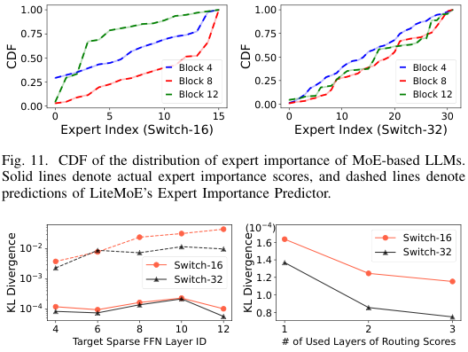

<!-- Start of picture text -->
1.00 1.00 0.75 0.75 0.50 0.50 Block 4 Block 4 0.25 Block 8 0.25 Block 8 Block 12 Block 12 0.00 0.00 0 5 10 15 0 10 20 30 Expert Index (Switch-16) Expert Index (Switch-32) Fig. 11. CDF of the distribution of expert importance of MoE-based LLMs. Solid lines denote actual expert importance scores, and dashed lines denote predictions of LiteMoE’s Expert Importance Predictor. (10 −4 ) 10 −2 1.6 Switch-16Switch-32 Switch-16 1.4 10 −3 Switch-32 1.2 1.0 10 −4 0.8 4 6 8 10 12 1 2 3 Target Sparse FFN Layer ID # of Used Layers of Routing Scores CDF CDF KL Divergence KL Divergence <!-- End of picture text -->

Fig. 12. Hyperparameter evaluation on the expert importance predictor. (left) impact of target sparse FFN layer depth. Dashed lines indicate divergence between ground truth and uniform distributions. (right) impact of the number of input routing score layers. 

on resource-limited devices. The main overhead of LiteMoE is calculating expert importance scores and merging experts, which account for 84.7% of the total latency. Fortunately, given today’s increasingly powerful hardware equipped by mobile devices, this extraction latency can be further reduced by mobile GPUs or NPUs. This fast response time can support apps to query the proxy submodels and update customized adapters efficiently to maintain high-quality of model services. 

## _D. Performance Breakdown Analysis_ 

**Ablation study.** We ablate and evaluate the key components of LiteMoE. The results are summarized in Table II. To highlight the contribution of each component, we report the accuracy difference between our method and Simple Pruning. We observe that pruning experts without knowing their importance (Pruning w/o IE) severely impacts model performance, which is not surprising as it ignores experts’ specializations. Therefore, this IE module lays the foundation for compressing the LLM. Next, the other two modules, SM and AM, work complementary in enhancing expert performance, especially on challenging tasks. For example, for Switch-8 on the MNLI task, the SM and AM modules alone can only improve the accuracy by 8.2% and 2.2%, respectively, while working together, they can improve accuracy by 23.4%. 

Next, we evaluate the effectiveness of the offline expert characteristics profiling of LiteMoE. 

**Expert importance predictor.** As shown in Figure 11, we use our predictor to predict the importance of experts in shallow, middle, and deep sparse FFNs, represented by the Transformer blocks 4, 8, and 12, respectively. LiteMoE perfectly follows the actual expert importance distribution, even for experts in deep FFNs. This is attributed to the observation of the learnable expert activating patterns, and the training method which fully exploits the routers to model the activating patterns encoded in their outputs, and adopts the distillation loss to enhance the predictor training. 

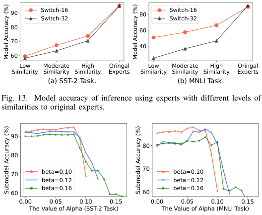

<!-- Start of picture text -->
90 Switch-16 80 Switch-16 Switch-32 Switch-32 80 60 70 40 60 Low Moderate High Oringal Low Moderate High Oringal Similarity Similarity Similarity Experts Similarity Similarity Similarity Experts (a) SST-2 Task. (b) MNLI Task. Fig. 13. Model accuracy of inference using experts with different levels of similarities to original experts. 90 80 80 70 beta=0.10 70 beta=0.10 beta=0.12 beta=0.12 beta=0.16 beta=0.16 60 60 0.00 0.05 0.10 0.15 0.00 0.05 0.10 0.15 The Value of Alpha (SST-2 Task) The Value of Alpha (MNLI Task) Model Accuracy (%) Model Accuracy (%) Submodel Accuracy (%) Submodel Accuracy (%) <!-- End of picture text -->

Fig. 14. Submodel performance under different values of _α_ and _β_ . 

To validate the predictor’s design choices, we vary the depth of the sparse FFN being predicted and the number of shallow layers used for prediction. The results are presented in Figure 12. We use KL divergence to quantify the distance between the predicted importance distribution and the ground truth. The results indicate that the divergence remains low (with dashed lines providing an intuitive comparison), and does not necessarily increase with layer depth. Additionally, while incorporating more routing scores as input features enhances prediction performance, it also increases computation overhead. This supports the choice of using only the routing scores from the first layer for prediction, enabling lightweight prediction with satisfactory accuracy. 

**Expert similarity evaluation.** To verify the effectiveness of LiteMoE’s expert similarity metric, we replace the original experts with other experts that have different levels of similarity scores and test the resulting model accuracy. The results shown in Figure 13 indicate that the accuracy increases with expert similarity, demonstrating that our metric successfully captures the similarity between experts. For example, in the SST-2 task, choosing high-similarity experts yields a 13.2% higher accuracy than the low-similarity case, and is 7.2% higher than that obtained by randomly choosing experts. Additionally, we observe that the accuracy of Switch-32 is more impacted by replacing dissimilar experts. The possible reason is that the experts in Switch-32 share less knowledge, as it has more experts for fine-grained specialization. 

## _E. Sensitivity Analysis_ 

During LiteMoE-PTSE, the hyperparameters _α_ and _β_ play a critical role in selective expert merging, influencing the identification of experts as heavy-hitters (hot), moderate, or cold experts. To better understand the sensitivity of PTSE to these hyperparameters, we vary their values and report the resulting submodel accuracy in Figure 14. Overall, The results indicate that PTSE demonstrates robust performance across different choices of _α_ and _β_ . 

13 

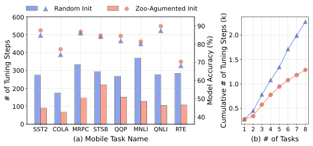

<!-- Start of picture text -->
Random Init Zoo-Agumented Init 600 90 500 2.0 80 400 70 1.5 300 60 1.0 200 50 100 0.5 40 0 SST2 COLA MRPC STSB QQP MNLI QNLI RTE 1 2 3 4 5 6 7 8 (a) Mobile Task Name (b) # of Tasks # of Tuning Steps Model Accuracy (%) Cumulative # of Tuning Steps (k) <!-- End of picture text -->

Fig. 15. (a) Time consumption (bars) of tuning adapters for multiple apps to reach the target accuracy and their final accuracies (dots and triangles). When tuning an adapter for a given task, the zoo-augmented-init strategy assumes the zoo already have the tuned adapters of other tasks for reusing. The accuracies are measured on proxy submodels. (b) Total time consumption for tuning multiple adapters while building the adapter zoo from scratch. 

First, we observe that the average submodel accuracy is higher when _β_ is smaller, which is intuitive, as a smaller _β_ retains more experts in the submodel, leading to increased accuracy at the cost of a larger submodel size. However, by selecting a proper value of _α_ , the accuracy gap among submodels under different _β_ can be minimized. For instance, the accuracy gap between the optimal submodels between _β_ = 0 _._ 1 and _β_ = 0 _._ 12 (as well as _β_ = 0 _._ 12 and _β_ = 0 _._ 16) is only 2.59% (1.27%) in the SST-2 task, demonstrating the effectiveness of the selective expert merging technique. 

Second, an optimal value of _α_ ( _e.g._ , around 0.08 in this set of experiments) can maximize submodel performance. Either too large or too small _α_ negatively impacts submodel performance. We analyze the underlying reason as follows. (i) With a large _α_ , more important experts are removed without merging to preserve their specific abilities, and thus results in poor submodel performance. In the extreme case where _α_ = _β_ , LiteMoE-PTSE degrades to Simple Pruning. (ii) With a small _α_ , the submodel accuracy is also impacted, due to the merging of more cold experts, which are less relevant to the targeted task. Fortunately, the impact on performance is slight in this case, with an average accuracy gap of only 2.62% between the submodel with _α_ = 0 and the optimal submodel ( _α_ = 0 _._ 08). This is attributed to the constraint value _d_ in expert matching, which limits the maximum number of experts that can be merged, along with the importance-aware weighted averaging design which assigns very small weights to the irrelevant experts in averaging. 

To conclude, _β_ controls the submodel size, which is guided by the desired accuracy-cost trade-off (and resource constraints) in the given application, while _α_ determines which experts will be merged to enhance the resulting submodel. A relatively small _α_ is safe to achieve near-optimal submodel performance. 

## _F. Multi-App Tuning Evaluation_ 

To evaluate the effectiveness of the zoo-augmented finetuning, we retrain the adapters for downstream tasks, and compare the time consumption and model accuracy between fine-tuning with and without the augmentation of the adapter 

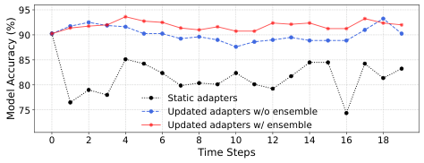

<!-- Start of picture text -->
95 90 85 80 Static adapters 75 Updated adapters w/o ensemble Updated adapters w/ ensemble 0 2 4 6 8 10 12 14 16 18 Time Steps Model Accuracy (%) <!-- End of picture text -->

Fig. 16. Model accuracies under shifting data distributions over time. 

zoo. In this set of experiments, we set the maximum number _p_ of reusing tuned adapters to 2. 

As shown in Figure 15, LiteMoE-Zoo effectively reduces tuning time while improving accuracy. Specifically, it reduces tuning time by an average factor of 2.24 _×_ compared to the original fine-tuning, while improving accuracy by 1.93%. This improvement is attributed to the reuse of adapter parameters to warm-start the fine-tuning process, which not only shortens the tuning time required to reach the optimal point, but also converges model to a better local optimum. Besides, we observe that the task-specific feature vectors defined by expert importance is able to select similar adapters in the zoo. For example, the MNLI task selects adapters from QNLI and RTE, as all are related to natural language inference. We also tuned the adapters while constructing the adapter zoo from scratch, and recorded the cumulative time consumption in Figure 15 (b). Initially, there are no adapters available for reuse, so LiteMoE-Zoo takes the same amount of time as the original tuning. As the number of tuned adapters increases, LiteMoE-Zoo demonstrates progressively greater time and computational savings. Overall, LiteMoE-Zoo reduces 1.76 _×_ of time to customize adapters for 8 apps. 

## _G. Continuous Tuning Evaluation_ 

Figure 16 presents the results of evaluating LiteMoE’s continuous tuning performance. In this setup, we follow prior works [32], [57] to partition the SST-2 dataset into nonIID distributed subsets, and simulate data distribution shifts over time by switching on-device data to different subsets at each time step. We compare three tuning methods: (1) _static adapters_ : which use the initially tuned adapters without further updates; (2) _updated adapters w/o ensemble_ : where adapters are tuned at each time step, and a single tuned adapter is used for inference; and (3) _updated adapters w/ ensemble_ : which adopts ensemble inference using multiple adapters. 

As shown in Figure 16, our proposed tuning strategy significantly enhances LiteMoE’s online adaptability. The static adapters perform poorly under data distribution shifts, and seriously degrade model accuracy over time. This strategy only obtains 81.6% accuracy on average. Periodically adopting our alternative optimization-based tuning alleviates this problem, improving accuracy to 90.1%, but still suffers from suboptimal performance due to the skewed and limited tuning data in each step. The ensemble strategy further addresses this problem by combining the outputs of multiple adapters, resulting in more robust inference. Consequently, our continuous tuning strategy achieves an average accuracy of 91.8%, outperforming the static method by 10.3%. 

14 

TABLE III 

COMPARISON BETWEEN LITEMOE AND QLORA. 

|Me|thod||SS |T-2 ||M |NLI ||
|---|---|---|---|---|---|---|---|---|
||||Accuracy|Mem|ory |Accuracy|Mem|ory|
|Full-FT (|BFloat1|6)|95.4%|4530|MB|84.5%|4553|MB|
|LiteMoE|(BFloat1|6)|93.8%|1170|MB|83.7%|1243|MB|
|QLoRA (N|ormalFlo|at4)|93.5%|1805|MB|82.1%|1814|MB|
|LiteMoE|+QLoR|A|91.6%|892|MB|79.8%|902|MB|
|MODEL|PERFO|RMANC|TABL E(%) ON|E IV GLUE|TASKS|USINGP|HI-MOE|.|
||SST-2|CoLA|MRPC|STS-B|QQP|MNLI|QNLI|RTE|
|Zero-Shot|80.8|68.3|66.5|37.9|53.8|59.6|44.0|48.0|
|Full-FT|94.6|73.8|88.5|91.9|85.0|82.9|88.1|80.1|
|Proxy-FT|93.3|73.4|83.8|87.6|78.8|76.8|85.8|75.5|

_H. Computation complexity and scalability analysis_ 

The execution of LiteMoE-PTSE consists of three primary steps: important expert identification (IE), similarity-based expert-matching (SM), and alignment-based expert merging (AM). Notably, the AM module accounts for the most execution latency, followed by the IE module. For example, for Switch-16, the AM and IE modules account for an average of 72.1% and 12.6% of total latency, respectively. The latency of AM comes from the necessity of resolving an OT problem for each expert merging operation. 

We further analyze the complexity and scalability of the AM module from two perspectives: (i) scaling with the number of hidden dimensions ( _h_ ) within experts. The complexity of solving the OT problem scales as _O_ ( _d_3 log _d_ ) in the worst case [58], which may lead to efficiency issues when _h_ becomes very large. Fortunately, approximation methods such as the entropy-regularized method [46] can solve the problem orders of magnitude faster. In modern MoE-based LLMs, the hidden dimension typically ranges from hundreds to a few thousand ( _e.g._ , _h_ = 3072 in Switch Transformers), allowing solving algorithms to operate within several seconds even with exact solvers. For example, in the SST-2 task, solving the OT problem exactly takes approximately 2.1s, while the approximation solver only requires 0.3s, incurring a mere 1.2% accuracy loss compared to the exact solver. (ii) scaling with the number of experts to be merged (denoted as _nr_ ). The latency of the AM module linearly increases with _nr_ , as the OT problem will be solved _nr_ times independently. Considering the modern MoE-based LLMs that typically adopt several tens of MoE layers with 8-64 experts per layer, _nr_ can range from tens to hundreds. In our experiments, _nr_ varied from 9 to 42, with an average of 21.5. Even in extreme scenarios where _nr_ reaches a few hundred, the AM process remains manageable within several minutes on modern mobile devices. 

## _I. Extended Experiments_ 

In this subsection, we evaluate the generality of LiteMoE by extending it to a broader range of deployment scenarios, including different foundation LLMs and downstream tasks. 

**Integration with quantization-based fine-tuning.** Quantization approaches compress LLM weights to low-bit formats to reduce memory consumption. We adopt QLoRA [59] as a representative approach and compare its performance with 

TABLE V 

|SWITCH|-32 PERFORMANCE(%) ON T|EXT SUMMAR|IZATION|TASKS.|
|---|---|---|---|---|
||Found. LLM Proxy Submodel|FT Submodel|Full-FT|**Proxy-FT**|
|XSum|13.27 11.83|14.42|15.22|**14.93**|
|SAMSum|23.19 22.47|23.38|29.03|**26.36**|

LiteMoE. As shown in Table III, both methods substantially reduce memory overhead compared to full fine-tuning. However, LiteMoE achieves a higher average memory reduction (3.77 _×_ ) than QLoRA (2.51 _×_ ), owing to the high sparsity typically present in MoE-based LLMs. Moreover, since LiteMoE and QLoRA optimize orthogonal aspects (parameter count and bit width, respectively), they can be combined to achieve further memory savings, reaching up to 5.06 _×_ . 

**Extension to Phi-MoE with top-2 routing.** To evaluate LiteMoE’s generalizability on other LLM architectures, we apply it to Phi-MoE [60], a lightweight MoE model with 1.1B activated and 3.8B total parameters, utilizing top-2 routing, and evaluate proxy tuning performance on GLUE tasks. Experimental results in Table IV show that LiteMoE achieves an average performance improvement of 24 _._ 52% over the Zero-Shot baseline, closely matching the 28 _._ 27% improvement achieved by Full-FT. Additionally, with PTSE, the LLM size is reduced by 1 _._ 94 _×_ on average. Note that this compression rate is lower than that observed in Switch Transformers, mainly due to PhiMoE’s more sophisticated load-balancing mechanism, which distributes tokens more evenly across experts. This results in more experts becoming “hot experts”, thereby reducing the achievable compression ratio. 

**Extension to long-form generation tasks.** We evaluate the generation performance of LiteMoE on two representative text summarization datasets: XSum [61] and SAMSum [62] using Switch-32. As shown in Table V, we report the Rouge-2 scores to assess the quality of summaries produced by the LLM. The proxy submodels generated by LiteMoE retain over 89% of the full LLM’s performance, outperforming the Simple Pruning method by 1.54 _×_ . Furthermore, LiteMoE improves average model performance by 2.42%, approaching the performance gain of full-FT (3.90%), thus demonstrating its effectiveness on tasks with relatively long generation lengths. 

In conclusion, LiteMoE demonstrates strong adaptability across various LLMs and tasks. However, optimal performance may require task-specific hyperparameter configurations corresponding to different submodel sizes. For example, _β_ = 0 _._ 15 yields the best results on SST-2 and Switch-32, while _β_ = 0 _._ 1 is optimal for SAMSum, reflecting differences in task complexity and routing behavior. Developing an effective method for automated hyperparameter selection remains an open direction for future work. 

## VI. RELATED WORK 

**Resource-efficient LLMs with MoE.** The sparsely activated MoE architecture is adopted as an effective approach to scale up model size without linearly increasing computation overhead. First employed as a building block in LSTMs that achieve SOTA machine translation performance [20], MoE is further widely adopted in Transformer-based LLMs for superior model performance and resource efficiency [10], 

15 

[21], [36], [39], [63]–[65]. For example, Mixtral 8x7B [10] which comprises 8 experts with a top-2 routing mechanism achieves comparable, even better performance than Llama 2 70B and GPT-3.5. Nevertheless, MoE-based LLMs have lower parameter efficiency than dense LLMs, which hinders their deployment on resource-limited mobile devices. Noticing this phenomenon, LiteMoE is designed to help identify and refine important experts within MoE layers for better parameter efficiency, and preserve targeted model performance as well. 

Additionally, another line of work creates sparsely activated MoE architectures from established LLMs [66]–[69] to take advantage of its conditional computation benefits during model serving. Thanks to the expert specialization of the MoE layer, LiteMoE can be applied to arbitrary MoE-based LLMs, forming compact, app-specific proxy submodels by refining MoE layers. 

**Cost optimizations to MoE-based LLMs.** Various works have attempted to reduce the resource costs of serving MoEbased LLMs using model compression strategies such as expert quantization [11], [19], parameter pruning [70], [71], and sparse-to-dense distillation [18], [21], [72]. QMoE [19] proposed an MoE-specific quantization method coupled with corresponding GPU decoding kernels, which compresses largescale LLMs to sub-1-bit levels. Chen et al. [70] proposed task-specific expert pruning, which progressively prunes experts during model fine-tuning. Other works [18], [21], [72] leveraged the knowledge distillation technique to distill large sparse LLMs into smaller dense models. For example, Switch Transformers [21] preserved 30% quality gains of the sparse MoE design while compressing the model by 20 _×_ . These methods require model retraining processes to recover performance after compression, making them unable to quickly generate small models on devices. Instead, LiteMoE eliminates the training process for efficient on-device execution. 

**Runtime optimization for MoE-based LLMs.** To address the resource bottlenecks in serving MoE-based LLMs, prior works have proposed various of memory and computation optimizations [11], [73]–[78]. For example, EdgeMoE [11] and Fast Inference [73] predict expert activation patterns at inference time and preload the corresponding weights in advance, enabling I/O operations to overlap with computation and thus reducing overall latency. ExpertChoice [76] and Not All Experts Are Equal [77] introduce adaptive computation to enhance resource efficiency during inference. However, these approaches are designed for inference rather than ondevice fine-tuning, as they retain all experts regardless of task specificity. The massive redundant expert weights and intermediate states ( _e.g._ , gradients) lead to excessive memory usage. In contrast, LiteMoE is tailored for on-device finetuning by constructing proxy submodels that improve parameter efficiency and reduce resource overhead, making it wellsuited for task-specific customization on mobile platforms. 

**Resource-efficient LLM fine-tuning.** As LLMs continue to scale, various works have explored resource-efficient finetuning methods to enable model customization on resourceconstrained devices [13], [30], [79]–[84]. For instance, LoRA [30] updates model weights via low-rank matrices, while Side-Tuning [80] and LST [81] leverage lightweight 

TABLE VI 

NOTATIONS IN THE MEMORY MODEL AND THEIR DEFAULT VALUES. 

|Notation|Description |Default |Notatio|n Description |Default|
|---|---|---|---|---|---|
|Φ|LLM parameters|/|_h_|Hidden dimension|768|
|_s_|Sequence length|128|_a_|Attention heads|12|
|_b_|Batch size|4|_ne_|Experts per SparseFFN|/|
|_r_|Adapter param. ratio|/|_ha_|Adapter’s hidden sizes|16|

side networks to steer model outputs. MeZO [82] avoids backpropagation by using forward passes for weight updates. These approaches reduce memory consumption by reducing the number of trainable parameters and intermediate states such as activations and gradients, yet the storage of excessive model weights remains a major challenge. Quantization-based fine-tuning [59], [85]–[90], such as QLoRA [59], addresses this by converting the foundation LLM weights to low-bit formats and enabling model training with the quantized weights, significantly lowering memory requirements. Notably, these methods target generic LLMs, and are orthogonal to LiteMoE which is tailored for MoE-based LLMs. As a result, they can be jointly deployed with LiteMoE for further memory savings. 

**On-device model serving and adaptation.** On-device model serving is becoming increasingly important, as it not only provides better interactive user experience and enhanced data privacy, but also alleviates the high computational pressure on the cloud. To adapt large models that are originally designed for cloud environments to resource-limited devices, existing works have developed various approaches such as lightweight model architectures [24], [25], [91]–[95], model compression methods [16], [17], [96], [97], and flexible model size adaptation strategies [98]–[100]. While these approaches enable the deployment of large models on resource-limited devices, they fall short in performing on-device fine-tuning of LLMs for customized model services. 

## VII. CONCLUSION 

In this work, we have proposed LiteMoE, a new proxy submodel tuning framework to support mobile apps to provide customized model services through on-device tuning adapters. The key technique of LiteMoE is post-training submodel extraction, which efficiently identifies, matches, and merges important experts without requiring additional retraining. This approach enables the construction of lightweight submodels tailored for resource-constrained devices. Extensive experiments demonstrate that LiteMoE can effectively support finetuning adapters on resource-limited devices, and greatly improve LLM serving quality with reduced memory overhead. 

## APPENDIX 

## MEMORY ANALYSIS OF LITEMOE 

In this section, we theoretically break down and analyze the memory consumption for on-device fine-tuning with a memory model, for the purpose of providing deeper insights into the optimization space and upper bound of LiteMoE’s design. 

**Understanding memory usage for on-device fine-tuning.** The majority of memory for fine-tuning is occupied by model states ( _e.g._ , parameters, gradients, and optimizer states) and residual states ( _e.g._ , activations) [34]. In our memory model, 

16 

TABLE VII 

|MEMORYFOO AND_Mact._ R|TPRINT(MB) BR ESPECTIVELY IN|EAKDOWN.  DICATE THE|_Mparam._  MEMORY|,_Mgrad._,  REQUIRE|_Moptim._, MENT OF|
|---|---|---|---|---|---|
|PARAMETER|S, GRADIENTS, O|PTIMIZER|STATES, AN|D ACTIV|ATIONS.|
|Model|_Mparam._|_Mgrad._|_Moptim._|_Mact._|_rmax_|
|Switch-8|2645 (75.5%)|3.54|7.08|849.47|0.46|
|Switch-16|4373 (83.6%)|3.54|7.08|849.66|0.64|
|Switch-32|7829 (90.1%)|3.54|7.08|850.03|0.78|

78% of memory footprint at most. LiteMoE exhibits stronger effect as the increase of the number of experts in sparse FFNs (shown in Table VII). Furthermore, LiteMoE can be combined with other memory optimization methods, such as efficient attention layers and low-precision training, to achieve even greater memory efficiency for on-device fine-tuning. 

## REFERENCES 

we exclude temporary buffers and memory fragmentation due to their limited contribution to total memory usage and the difficulty in modeling them precisely. The notations and their default values used in the memory model are listed in Table VI. We first compute the memory required for model states, assuming a data type is _float_ 32: 

- Model parameters: 4(1 + _r_ )Φ Bytes. 

- Gradients: 4 _r_ Φ Bytes. 

- Optimizer states (using Adam): 8 _r_ Φ Bytes. 

Next, we calculate the memory used by activations, which are the intermediate outputs generated during the forward pass and stored for the backward pass in gradient computation. Following [101], the activation memory for a standard Transformer block is estimated as: 

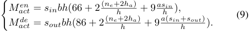

The total memory footprint is then given by: 

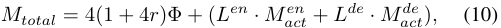

where _L__en_ and _L__de_ denote the number of encoder and decoder blocks, respectively, and _Mact__en_and_M de_ _act_representthe activation memory per block. 

**Case study.** Using the above memory model, we analyze the memory usage involved in fine-tuning Switch Transformers, as illustrated in Table VII. The findings are summarized as follows: (i) Parameter memory becomes the bottleneck under PEFT. This is because PEFT techniques significantly reduce the number of trainable parameters, and consequently the memory for gradients and optimizer states. In contrast, under full fine-tuning, the memory required for gradients and optimizer states often exceeds that of the model parameters. (ii) Activations contribute notably but remain secondary. While activations do consume a considerable amount of memory, their footprint is smaller than that of parameters in typical mobile computing configurations. Such memory composition highlights the importance of optimizing the parameter size to enable practical on-device fine-tuning. This underscores the advantage of LiteMoE in generating lightweight submodels that are well-suited for resource-constrained devices. 

**Maximum memory saving rate with LiteMoE.** Assuming at least one expert is retained in each sparse FFN, the maximum potential memory saving rate can be expressed as: _rmax_ = _rparam · rffn ·_ (1 _−_ 1 _/ne_ ), where _rparam_ and _rffn_ denote the ratios of memory footprint of parameters to the total and FFNs to parameters, respectively. The sparse FFNs targeted by LiteMoE constitute a large portion of LLM parameters, thereby offering significant potential for memory savings. For instance, for Switch-32, LiteMoE is able to reduce 

- [1] OpenAI, “Chatgpt,” https://openai.com/blog/chatgpt/, 2022. 

- [2] Y. Li, H. Wen, W. Wang, X. Li, Y. Yuan, G. Liu, J. Liu, W. Xu, X. Wang, Y. Sun, R. Kong, Y. Wang, H. Geng, J. Luan, X. Jin, Z.-L. Ye, G. Xiong, F. Zhang, X. Li, M. Xu, Z. Li, P. Li, Y. Liu, Y. Zhang, and Y. Liu, “Personal llm agents: Insights and survey about the capability, efficiency and security,” _arXiv preprint arXiv:2401.05459_ , 2024. 

- [3] H. Wen, Y. Li, G. Liu, S. Zhao, T. Yu, T. J.-J. Li, S. Jiang, Y. Liu, Y. Zhang, and Y. Liu, “Autodroid: Llm-powered task automation in android,” in _Proceedings of the 30th Annual International Conference on Mobile Computing and Networking (MobiCom)_ , 2024, p. 543–557. 

- [4] “Google: Get started with gemini nano on android (on device),” https: //ai.google.dev/gemini-api/docs/getstarted/android aicore, 2024. 

- [5] “Introducing apple’s on-device and server foundation models,” https://machinelearning.apple.com/research/ introducing-apple-foundation-models, 2024. 

- [6] J. Yuan, C. Yang, D. Cai, S. Wang, X. Yuan, Z. Zhang, X. Li, D. Zhang, H. Mei, X. Jia, S. Wang, and M. Xu, “Mobile foundation model as firmware,” in _Proceedings of the 30th Annual International Conference on Mobile Computing and Networking (MobiCom)_ , 2024, p. 279–295. 

- [7] Z. Liu, C. Zhao, F. Iandola, C. Lai, Y. Tian, I. Fedorov, Y. Xiong, E. Chang, Y. Shi, R. Krishnamoorthi, L. Lai, and V. Chandra, “Mobilellm: optimizing sub-billion parameter language models for ondevice use cases,” in _Proceedings of the 41st International Conference on Machine Learning (ICML)_ , 2024. 

- [8] W. Yin, M. Xu, Y. Li, and X. Liu, “Llm as a system service on mobile devices,” _arXiv preprint arXiv:2403.11805_ , 2024. 

- [9] “Aicore,” https://developer.android.com/ml/aicore, 2024. 

- [10] A. Q. Jiang, A. Sablayrolles, A. Roux, A. Mensch, B. Savary, C. Bamford, D. S. Chaplot, D. d. l. Casas, E. B. Hanna, F. Bressand _et al._ , “Mixtral of experts,” _arXiv preprint arXiv:2401.04088_ , 2024. 

- [11] R. Yi, L. Guo, S. Wei, A. Zhou, S. Wang, and M. Xu, “Edgemoe: Empowering sparse large language models on mobile devices,” _IEEE Transactions on Mobile Computing (TMC)_ , pp. 1–16, 2025. 

- [12] R. Kong, Y. Li, Q. Feng, W. Wang, L. Kong, and Y. Liu, “Serving moe models on resource-constrained edge devices via dynamic expert swapping,” _arXiv preprint arXiv:2308.15030_ , 2023. 

- [13] N. Houlsby, A. Giurgiu, S. Jastrzebski, B. Morrone, Q. De Laroussilhe, A. Gesmundo, M. Attariyan, and S. Gelly, “Parameter-efficient transfer learning for nlp,” in _International conference on machine learning (ICML)_ , 2019, pp. 2790–2799. 

- [14] Z. Zhou, X. Wei, J. Zhang, and G. Sun, “PetS: A unified framework for Parameter-Efficient transformers serving,” in _2022 USENIX Annual Technical Conference (ATC)_ , 2022, pp. 489–504. 

- [15] S. Mangrulkar, S. Gugger, L. Debut, Y. Belkada, S. Paul, and B. Bossan, “Peft: State-of-the-art parameter-efficient fine-tuning methods,” https://github.com/huggingface/peft, 2022. 

- [16] S. Han, H. Mao, and W. J. Dally, “Deep compression: Compressing deep neural network with pruning, trained quantization and huffman coding,” in _4th International Conference on Learning Representations (ICLR)_ , 2016, pp. 1–14. 

- [17] G. E. Hinton, O. Vinyals, and J. Dean, “Distilling the knowledge in a neural network,” _arXiv preprint arXiv:1503.02531_ , 2015. 

- [18] F. Xue, X. He, X. Ren, Y. Lou, and Y. You, “One student knows all experts know: From sparse to dense,” _arXiv preprint arXiv:2201.10890_ , 2022. 

- [19] E. Frantar and D. Alistarh, “Qmoe: Practical sub-1-bit compression of trillion-parameter models,” _arXiv preprint arXiv:2310.16795_ , 2023. 

- [20] N. Shazeer, A. Mirhoseini, K. Maziarz, A. Davis, Q. Le, G. Hinton, and J. Dean, “Outrageously large neural networks: The sparsely-gated mixture-of-experts layer,” _arXiv preprint arXiv:1701.06538_ , 2017. 

- [21] W. Fedus, B. Zoph, and N. Shazeer, “Switch transformers: Scaling to trillion parameter models with simple and efficient sparsity,” _The Journal of Machine Learning Research (JMLR)_ , vol. 23, pp. 5232– 5270, 2022. 

17 

- [22] H. Touvron, L. Martin, K. Stone, P. Albert, A. Almahairi, Y. Babaei _et al._ , “Llama 2: Open foundation and fine-tuned chat models,” _arXiv preprint arXiv:2307.09288_ , 2023. 

- [23] O. J. Achiam, S. Adler, S. Agarwal, L. Ahmad, I. Akkaya _et al._ , “Gpt-4 technical report,” _arXiv preprint arXiv:2303.08774_ , 2023. 

- [24] G. Team, R. Anil, S. Borgeaud, Y. Wu, J.-B. Alayrac, J. Yu _et al._ , “Gemini: A family of highly capable multimodal models,” _arXiv preprint arXiv:2312.11805_ , 2023. 

   - [44] H. Wang, M. Yurochkin, Y. Sun, D. S. Papailiopoulos, and Y. Khazaeni, “Federated learning with matched averaging,” in _International Conference on Learning Representations (ICLR)_ , 2020, pp. 1–16. 

   - [45] S. P. Singh and M. Jaggi, “Model fusion via optimal transport,” in _Advances in Neural Information Processing Systems (NeurIPS)_ , 2020, pp. 22 045–22 055. 

   - [46] M. Cuturi, “Sinkhorn distances: Lightspeed computation of optimal transport,” in _Advances in Neural Information Processing Systems (NeurIPS)_ , 2013, pp. 1–9. 

- [25] G. Inc., “Gemma: Introducing new state-of-the-art open models.” https: //blog.google/technology/developers/gemma-openmodels/, 2024. 

   - [47] F. Lai, Y. Dai, H. V. Madhyastha, and M. Chowdhury, “ModelKeeper: Accelerating DNN training via automated training warmup,” in _20th USENIX Symposium on Networked Systems Design and Implementation (NSDI)_ , 2023, pp. 769–785. 

- [26] I. Timiryasov and J.-L. Tastet, “Baby llama: knowledge distillation from an ensemble of teachers trained on a small dataset with no performance penalty,” _arXiv preprint arXiv:2308.02019_ , 2023. 

- [27] “Snapdragon 8 gen 3 mobile platform product brief.” [48] https://docs.qualcomm.com/bundle/publicresource/87-71408-1 REV <u>C Snapdragon 8 gen 3 Mobile Platform Product Brief.pdf,</u> 2024. 

- [28] S. H. Nigel Nelson and M. Toloui, “Deploy large language models at the edge with nvidia igx [49] orin developer kit,” https://developer.nvidia.com/blog/ deploy-large-language-models-at-the-edge-with-nvidia-igx-orin-developer-kit/, 2023. 

   - [48] J. Ma, Z. Zhao, X. Yi, J. Chen, L. Hong, and E. H. Chi, “Modeling task relationships in multi-task learning with multi-gate mixture-of-experts,” in _Proceedings of the 24th ACM SIGKDD International Conference on Knowledge Discovery & Data Mining (SIGKDD)_ , 2018, p. 1930–1939. 

   - [49] C. Gong, Z. Zheng, F. Wu, X. Jia, and G. Chen, “Delta: A cloudassisted data enrichment framework for on-device continual learning,” in _Proceedings of the 30th Annual International Conference on Mobile Computing and Networking (MobiCom)_ , 2024, pp. 1408–1423. 

   - [50] X. Ma, S. Jeong, M. Zhang, D. Wang, J. Choi, and M. Jeon, “Costeffective on-device continual learning over memory hierarchy with miro,” in _Proceedings of the 29th Annual International Conference on Mobile Computing and Networking (MobiCom)_ , 2023, pp. 1–15. 

- [29] H. Shen, H. Chang, B. Dong, Y. Luo, and H. Meng, “Efficient llm inference on cpus,” _arXiv preprint arXiv:2311.00502_ , 2023. 

- [30] E. J. Hu, yelong shen, P. Wallis, Z. Allen-Zhu, Y. Li, S. Wang, L. Wang, and W. Chen, “LoRA: Low-rank adaptation of large language models,” in _International Conference on Learning Representations (ICLR)_ , 2022, pp. 1–13. 

   - [51] Y. Wang, S. Agarwal, S. Mukherjee, X. Liu, J. Gao, A. H. Awadallah, and J. Gao, “AdaMix: Mixture-of-adaptations for parameter-efficient model tuning,” in _Proceedings of the 2022 Conference on Empirical Methods in Natural Language Processing (EMNLP)_ , 2022, pp. 5744– 5760. 

- [31] N. Ding, Y. Qin, G. Yang, F. Wei, Z. Yang, Y. Su, S. Hu, Y. Chen, C.-M. Chan, W. Chen, J. Yi, W. Zhao, X. Wang, Z. Liu, H.-T. Zheng, J. Chen, Y. Liu, J. Tang, J. Li, and M. Sun, “Parameter-efficient finetuning of large-scale pre-trained language models,” _Nature Machine Intelligence_ , vol. 5, pp. 220–235, 2023. 

- [32] D. Cai, Y. Wu, S. Wang, F. X. Lin, and M. Xu, “Efficient federated learning for modern nlp,” in _Proceedings of the 29th Annual International Conference on Mobile Computing and Networking (MobiCom)_ , 2023, pp. 1–16. 

   - [52] J. Pfeiffer, A. Kamath, A. R¨uckl´e, K. Cho, and I. Gurevych, “AdapterFusion: Non-destructive task composition for transfer learning,” in _Proceedings of the 16th Conference of the European Chapter of the Association for Computational Linguistics (EACL)_ , 2021, pp. 487–503. 

   - [53] “Pytorch,” https://pytorch.org/, 2024. 

   - [54] “Huggingface models,” https://huggingface.co/models, 2024. [55] A. Wang, A. Singh, J. Michael, F. Hill, O. Levy, and S. R. Bowman, “GLUE: A multi-task benchmark and analysis platform for natural language understanding,” in _International Conference on Learning Representations (ICLR)_ , 2019, pp. 1–20. 

- [33] W. Kwon, Z. Li, S. Zhuang, Y. Sheng, L. Zheng, C. H. Yu, J. Gonzalez, H. Zhang, and I. Stoica, “Efficient memory management for large language model serving with pagedattention,” in _Proceedings of the 29th Symposium on Operating Systems Principles (SOSP)_ , 2023, pp. 611–626. 

   - [56] Y. Wang, K. Chen, H. Tan, and K. Guo, “Tabi: An efficient multi-level inference system for large language models,” in _Proceedings of the 18th European Conference on Computer Systems (EuroSys)_ , 2023, pp. 233–248. 

- [34] S. Rajbhandari, J. Rasley, O. Ruwase, and Y. He, “Zero: memory optimizations toward training trillion parameter models,” in _Proceedings of the International Conference for High Performance Computing, Networking, Storage and Analysis_ , 2020, pp. 1–16. 

   - [57] B. Y. Lin, C. He, Z. Ze, H. Wang, Y. Hua, C. Dupuy, R. Gupta, M. Soltanolkotabi, X. Ren, and S. Avestimehr, “FedNLP: Benchmarking federated learning methods for natural language processing tasks,” in _Findings of the Association for Computational Linguistics (NAACL)_ , 2022, pp. 157–175. 

- [35] J. Kaplan, S. McCandlish, T. Henighan, T. B. Brown, B. Chess, R. Child, S. Gray, A. Radford, J. Wu, and D. Amodei, “Scaling laws for neural language models,” _arXiv preprint arXiv:2001.08361_ , 2020. 

- [36] N. Du, Y. Huang, A. M. Dai, S. Tong, D. Lepikhin, Y. Xu, M. Krikun, Y. Zhou, A. W. Yu, O. Firat _et al._ , “Glam: Efficient scaling of language models with mixture-of-experts,” in _International Conference on Machine Learning (ICML)_ , 2022, pp. 5547–5569. 

   - [58] O. Pele and M. Werman, “Fast and robust earth mover’s distances,” in _2009 IEEE 12th International Conference on Computer Vision (ICCV)_ , 2009, pp. 460–467. 

   - [59] T. Dettmers, A. Pagnoni, A. Holtzman, and L. Zettlemoyer, “Qlora: efficient finetuning of quantized llms,” in _Proceedings of the 37th International Conference on Neural Information Processing Systems (NeurIPS)_ , 2023. 

- [37] M. Matena and C. Raffel, “Merging models with fisher-weighted averaging,” in _Advances in Neural Information Processing Systems (NeurIPS)_ , 2022, pp. 17 703–17 716. 

- [38] B. McMahan, E. Moore, D. Ramage, S. Hampson, and B. A. y. Arcas, “Communication-Efficient Learning of Deep Networks from Decentralized Data,” in _Proceedings of the 20th International Conference on Artificial Intelligence and Statistics (AISTATS)_ , 2017, pp. 1273–1282. 

- [39] B. Zoph, I. Bello, S. Kumar, N. Du, Y. Huang, J. Dean, N. M. Shazeer, and W. Fedus, “St-moe: Designing stable and transferable sparse expert models,” _arXiv preprint arXiv:2202.08906_ , 2022. 

   - [60] Z. Li, C. Liang, Z. Zhang, I. Hong, Y. J. Kim, W. Chen, and T. Zhao, “Slimmoe: Structured compression of large moe models via expert slimming and distillation,” _arXiv preprint arXiv:2506.18349_ , 2025. 

   - [61] S. Narayan, S. B. Cohen, and M. Lapata, “Don’t give me the details, just the summary! topic-aware convolutional neural networks for extreme summarization,” in _Proceedings of the 2018 Conference on Empirical Methods in Natural Language Processing (EMNLP)_ , 2018, pp. 1797–1807. 

- [40] F. Ahmed, J. P. Dickerson, and M. D. Fuge, “Diverse weighted bipartite b-matching,” in _International Joint Conference on Artificial Intelligence (IJCAI)_ , 2017, pp. 35–41. 

   - [62] B. Gliwa, I. Mochol, M. Biesek, and A. Wawer, “SAMSum corpus: A human-annotated dialogue dataset for abstractive summarization,” in _Proceedings of the 2nd Workshop on New Frontiers in Summarization (WS)_ , 2019, pp. 70–79. 

- [41] C. Chen, L. Zheng, V. Srinivasan, A. Thomo, K. Wu, and A. Sukow, “Conflict-aware weighted bipartite b-matching and its application to e- commerce,” _IEEE Transactions on Knowledge and Data Engineering (TKDE)_ , vol. 28, pp. 1475–1488, 2016. 

   - [63] Y. Shen, Z. Guo, T. Cai, and Z. Qin, “Jetmoe: Reaching llama2 performance with 0.1m dollars,” _arXiv preprint arXiv:2404.07413_ , 2024. 

- [42] V. Smith, C.-K. Chiang, M. Sanjabi, and A. Talwalkar, “Federated multi-task learning,” in _Advances in Neural Information Processing Systems (NeurIPS)_ , 2017, pp. 1–11. 

   - [64] D. Lepikhin, H. Lee, Y. Xu, D. Chen, O. Firat, Y. Huang, M. Krikun, N. Shazeer, and Z. Chen, “Gshard: Scaling giant models with conditional computation and automatic sharding,” in _International Conference on Learning Representations (ICLR)_ , 2021, pp. 1–23. 

- [43] A. Padmanabhan, N. Agarwal, A. Iyer, G. Ananthanarayanan, Y. Shu, N. Karianakis, G. H. Xu, and R. Netravali, “Gemel: Model merging for Memory-Efficient, Real-Time video analytics at the edge,” in _20th USENIX Symposium on Networked Systems Design and Implementation (NSDI)_ , 2023, pp. 973–994. 

- [65] D. Dai, C. Deng, C. Zhao, R. Xu, H. Gao, D. Chen, J. Li, W. Zeng, X. Yu, Y. Wu, Z. Xie, Y. Li, P. Huang, F. Luo, C. Ruan, Z. Sui, 

18 

and W. Liang, “DeepSeekMoE: Towards ultimate expert specialization in mixture-of-experts language models,” in _Proceedings of the 62nd Annual Meeting of the Association for Computational Linguistics (ACL)_ , 2024, pp. 1280–1297. 

- [66] L.-M. Team, “Llama-moe: Building mixture-of-experts from llama with continual pre-training,” https://github.com/pjlab-sys4nlp/llama-moe/ blob/main/docs/LLaMA <u>MoE.pdf,</u> 2024. 

- [67] Z. Zhang, Y. Lin, Z. Liu, P. Li, M. Sun, and J. Zhou, “MoEfication: Transformer feed-forward layers are mixtures of experts,” in _Findings of the Association for Computational Linguistics (ACL)_ , 2022, pp. 877– 890. 

- [68] B. Lin, Z. Tang, Y. Ye, J. Cui, B. Zhu, P. Jin, J. Huang, J. Zhang, Y. Pang, M. Ning, and L. Yuan, “Moe-llava: Mixture of experts for large vision-language models,” _arXiv preprint arXiv:2401.15947_ , 2024. 

- [69] H. Zheng, X. Bai, B. Chen, F. Lai, and A. Prakash, “Learn to be efficient: Build structured sparsity in large language models,” _arXiv preprint arXiv:2402.06126_ , 2024. 

- [70] T. Chen, S. Huang, Y. Xie, B. Jiao, D. Jiang, H. Zhou, J. Li, and F. Wei, “Task-specific expert pruning for sparse mixture-of-experts,” _arXiv preprint arXiv:2206.00277_ , 2022. 

- [71] S. Kudugunta, Y. Huang, A. Bapna, M. Krikun, D. Lepikhin, M.T. Luong, and O. Firat, “Beyond distillation: Task-level mixture-ofexperts for efficient inference,” in _Findings of the Association for Computational Linguistics (EMNLP Findings)_ , 2021, pp. 3577–3599. 

- [72] S. Rajbhandari, C. Li, Z. Yao, M. Zhang, R. Y. Aminabadi, A. A. Awan, J. Rasley, and Y. He, “Deepspeed-moe: Advancing mixtureof-experts inference and training to power next-generation ai scale,” in _International Conference on Machine Learning (ICML)_ , 2022, pp. 18 332–18 346. 

- [73] A. Eliseev and D. Mazur, “Fast inference of mixture-of-experts language models with offloading,” _arXiv preprint arXiv:2312.17238_ , 2023. 

- [74] R. Hwang, J. Wei, S. Cao, C. Hwang, X. Tang, T. Cao, and M. Yang, “Pre-gated moe: An algorithm-system co-design for fast and scalable mixture-of-expert inference,” in _2024 ACM/IEEE 51st Annual International Symposium on Computer Architecture (ISCA)_ , 2024, pp. 1018– 1031. 

- [75] R. Kong, Y. Li, Q. Feng, W. Wang, X. Ye, Y. Ouyang, L. Kong, and Y. Liu, “SwapMoE: Serving off-the-shelf MoE-based large language models with tunable memory budget,” in _Proceedings of the 62nd Annual Meeting of the Association for Computational Linguistics (ACL)_ , 2024, pp. 6710–6720. 

- [76] Y. Zhou, T. Lei, H. Liu, N. Du, Y. Huang, V. Zhao, A. M. Dai, Q. V. Le, J. Laudon _et al._ , “Mixture-of-experts with expert choice routing,” in _Advances in Neural Information Processing Systems (NeurIPS)_ , 2022, pp. 7103–7114. 

- [77] X. Lu, Q. Liu, Y. Xu, A. Zhou, S. Huang, B. Zhang, J. Yan, and H. Li, “Not all experts are equal: Efficient expert pruning and skipping for mixture-of-experts large language models,” in _Proceedings of the 62nd Annual Meeting of the Association for Computational Linguistics (ACL)_ , 2024, pp. 6159–6172. 

- [78] Z. Zeng, Y. Miao, H. Gao, H. Zhang, and Z. Deng, “AdaMoE: Tokenadaptive routing with null experts for mixture-of-experts language models,” in _Findings of the Association for Computational Linguistics (EMNLP Findings)_ , 2024, pp. 6223–6235. 

- [79] N. Ding, Y. Qin, G. Yang, F. Wei, Z. Yang, Y. Su, S. Hu, Y. Chen, C.-M. Chan, W. Chen, J. Yi, W. Zhao, X. Wang, Z. Liu, H. Zheng, J. Chen, Y. Liu, J. Tang, J. Li, and M. Sun, “Delta tuning: A comprehensive study of parameter efficient methods for pre-trained language models,” _arXiv preprint arXiv:2203.06904_ , 2022. 

- [80] J. O. Zhang, A. Sax, A. Zamir, L. Guibas, and J. Malik, “Side-tuning: A baseline for network adaptation via additive side networks,” in _European Conference on Computer Vision (ECCV)_ , 2020, p. 698–714. 

- [81] Y.-L. Sung, J. Cho, and M. Bansal, “Lst: Ladder side-tuning for parameter and memory efficient transfer learning,” in _Advances in Neural Information Processing Systems (NeurIPS)_ , 2022, pp. 12 991– 13 005. 

- [82] S. Malladi, T. Gao, E. Nichani, A. Damian, J. D. Lee, D. Chen, and S. Arora, “Fine-tuning language models with just forward passes,” in _Advances in Neural Information Processing Systems (NeurIPS)_ , 2023, pp. 53 038–53 075. 

      - fine-tuning with contextual sparsity,” in _International Conference on Machine Learning (ICML)_ , 2025. 

   - [85] Y. Xu, L. Xie, X. Gu, X. Chen, H. Chang, H. Zhang, Z. Chen, X. ZHANG, and Q. Tian, “QA-loRA: Quantization-aware low-rank adaptation of large language models,” in _The Twelfth International Conference on Learning Representations (ICLR)_ , 2024, pp. 1–18. 

   - [86] Z. Zhang, D. Zhao, X. Miao, G. Oliaro, Z. Zhang, Q. Li, Y. Jiang, and Z. Jia, “Quantized side tuning: Fast and memory-efficient tuning of quantized large language models,” in _Proceedings of the 62nd Annual Meeting of the Association for Computational Linguistics (ACL)_ , 2024, pp. 1–17. 

   - [87] Y. Li, Y. Yu, C. Liang, N. Karampatziakis, P. He, W. Chen, and T. Zhao, “Loftq: LoRA-fine-tuning-aware quantization for large language models,” in _The Twelfth International Conference on Learning Representations (ICLR)_ , 2024. 

   - [88] J. Kim, J. H. Lee, S. Kim, J. Park, K. M. Yoo, S. J. Kwon, and D. Lee, “Memory-efficient fine-tuning of compressed large language models via sub-4-bit integer quantization,” in _Proceedings of the 37th International Conference on Neural Information Processing Systems (NeurIPS)_ , 2023. 

   - [89] B. Liao, C. Herold, S. Khadivi, and C. Monz, “ApiQ: Finetuning of 2-bit quantized large language model,” in _Proceedings of the 2024 Conference on Empirical Methods in Natural Language Processing (EMNLP)_ , 2024, pp. 20 996–21 020. 

   - [90] Z. Yu, Z. Wang, Y. Li, R. Gao, X. Zhou, S. R. Bommu, Y. K. Zhao, and Y. C. Lin, “Edge-llm: Enabling efficient large language model adaptation on edge devices via unified compression and adaptive layer voting,” in _Proceedings of the 61st ACM/IEEE Design Automation Conference (DAC)_ , 2024. 

   - [91] M. Tan and Q. V. Le, “Efficientnet: Rethinking model scaling for convolutional neural networks,” _arXiv preprint arXiv:1905.11946_ , 2019. 

   - [92] N. Ma, X. Zhang, H. Zheng, and J. Sun, “Shufflenet v2: Practical guidelines for efficient cnn architecture design,” _arXiv preprint arXiv:1807.11164_ , 2018. 

   - [93] M. Sandler, A. G. Howard, M. Zhu, A. Zhmoginov, and L.-C. Chen, “Mobilenetv2: Inverted residuals and linear bottlenecks,” _IEEE/CVF Conference on Computer Vision and Pattern Recognition (CVPR)_ , pp. 4510–4520, 2018. 

   - [94] M. Tan and Q. Le, “Efficientnetv2: Smaller models and faster training,” in _Proceedings of the 38th International Conference on Machine Learning (ICML)_ , 2021, pp. 10 096–10 106. 

   - [95] A. G. Howard, M. Sandler, G. Chu, L.-C. Chen, B. Chen, M. Tan, W. Wang, Y. Zhu, R. Pang, V. Vasudevan, Q. V. Le, and H. Adam, “Searching for mobilenetv3,” _IEEE/CVF International Conference on Computer Vision (ICCV)_ , pp. 1314–1324, 2019. 

   - [96] G. Xiao, J. Lin, M. Seznec, H. Wu, J. Demouth, and S. Han, “SmoothQuant: Accurate and efficient post-training quantization for large language models,” in _Proceedings of the 40th International Conference on Machine Learning (ICML)_ , 2023, pp. 38 087–38 099. 

   - [97] S. Han, J. Pool, J. Tran, and W. J. Dally, “Learning both weights and connections for efficient neural network,” in _Advances in Neural Information Processing Systems (NeurIPS)_ , 2015, pp. 1135–1143. 

   - [98] H. Wen, Y. Li, Z. Zhang, S. Jiang, X. Ye, Y. Ouyang, Y. Zhang, and Y. Liu, “Adaptivenet: Post-deployment neural architecture adaptation for diverse edge environments,” in _Proceedings of the 29th Annual International Conference on Mobile Computing and Networking (MobiCom)_ , 2023, pp. 1–17. 

   - [99] R. Han, Q. Zhang, C. H. Liu, G. Wang, J. Tang, and L. Y. Chen, “Legodnn: block-grained scaling of deep neural networks for mobile vision,” in _Proceedings of the 27th Annual International Conference on Mobile Computing and Networking (MobiCom)_ , 2021, pp. 406–419. 

   - [100] B. Fang, X. Zeng, and M. Zhang, “Nestdnn: Resource-aware multitenant on-device deep learning for continuous mobile vision,” in _Proceedings of the 24th Annual International Conference on Mobile Computing and Networking (MobiCom)_ , 2018, pp. 115–127. 

   - [101] V. A. Korthikanti, J. Casper, S. Lym, L. McAfee, M. Andersch, M. Shoeybi, and B. Catanzaro, “Reducing activation recomputation in large transformer models,” in _Proceedings of Machine Learning and Systems (MLSys)_ , 2023, pp. 341–353. 

- [83] J. Zhao, Z. Zhang, B. Chen, Z. Wang, A. Anandkumar, and Y. Tian, “Galore: memory-efficient llm training by gradient low-rank projection,” in _Proceedings of the 41st International Conference on Machine Learning (ICML)_ , 2024. 

- [84] S. Khaki, X. Li, J. Guo, L. Zhu, K. N. Plataniotis, A. Yazdanbakhsh, K. Keutzer, S. Han, and Z. Liu, “SparseloRA: Accelerating LLM 

19 

**Yan Zhuang** (Student Member, IEEE) received the B.E. degree in automation from University of Science and Technology of China in 2019. He is currently pursuing the Ph.D. degree in computer science and technology in Shanghai Jiao Tong University. His research interests include mobile computing and resource-efficient on-device learning. He has published several papers in well-known conferences and journals, such as ICPP and SenSys. 

**Chen Gong** (Student Member, IEEE) received the B.E. degree in computer science from Shanghai Jiao Tong University in 2022. He is currently pursuing the Ph.D. degree in computer science and technology in Shanghai Jiao Tong University. His research interests include mobile computing and on-device data processing and utilization pipelines. He has published several papers in wellknown conferences and journals, such as MobiCom, WWW and TON. For more information, please visit https://gongchenooo.github.io/. 

**Zhenzhe Zheng** (Member, IEEE) received the B.E. degree in software engineering from Xidian University in 2012 and the M.S. and Ph.D. degrees in computer science and engineering from Shanghai Jiao Tong University in 2015 and 2018, respectively. He is currently a professor with the Department of Computer Science and Engineering, Shanghai Jiao Tong University. He has visited the University of Illinois at Urbana-Champaign (UIUC) as a Visiting Scholar and then a Post-Doctoral Research Associate from 2016 to 2019. His research interests include 

**Guihai Chen** (Fellow, IEEE) earned his B.S. degree from Nanjing University in 1984, M.E. degree from Southeast University in 1987, and Ph.D. degree from the University of Hong Kong in 1997. He is a distinguished professor of Shanghai Jiao Tong University, China. He had been invited as a visiting professor by many universities including Kyushu Institute of Technology, Japan in 1998, University of Queensland, Australia in 2000, and Wayne State University, USA during September 2001 to August 2003. He has a wide range of research interests with focus on sensor networks, peer-topeer computing, high-performance computer architecture and combinatorics. He has published more than 200 peer-reviewed papers, and more than 120 of them are in well-archived international journals such as IEEE Transactions on Parallel and Distributed Systems, Journal of Parallel and Distributed Computing, Wireless Networks, The Computer Journal, International Journal of Foundations of Computer Science, and Performance Evaluation, and also in well-known conference proceedings such as HPCA, MOBIHOC, INFOCOM, ICNP, ICPP, IPDPS and ICDCS. 

intelligent mobile computing and large-scale decision-making. He was a recipient of NSFC Excellent Young Scholars Program, CCF-Intel Young Faculty Researcher Program Award, and China Computer Federation (CCF) Excellent Doctoral Dissertation Award. He has served as a member of Technical Program Committee for several academic conferences, such as INFOCOM, MobiHoc, KDD, WWW, AAAI, and IoTDI. He is a member of the ACM and CCF. For more information visit the link (https://zhengzhenzhe220.github.io/). 

**Fan Wu** (Member, IEEE) is a professor in the Department of Computer Science and Engineering, Shanghai Jiao Tong University. He received his B.S. in Computer Science from Nanjing University in 2004, and Ph.D. in Computer Science and Engineering from the State University of New York at Buffalo in 2009. He has visited the University of Illinois at Urbana-Champaign (UIUC) as a Post Doc Research Associate. His research interests include wireless networking and mobile computing, data management, algorithmic network economics, and privacy preservation. He has published more than 200 peer-reviewed papers in technical journals and conference proceedings. He is a recipient of the first class prize for Natural Science Award of China Ministry of Education, China National Fund for Distinguished Young Scientists, ACM China Rising Star Award, CCFTencent “Rhinoceros bird” Outstanding Award, and CCF-Intel Young Faculty Researcher Program Award. He has served as an associate editor of IEEE Transactions on Mobile Computing and ACM Transactions on Sensor Networks, an area editor of Elsevier Computer Networks, and as the member of technical program committees of more than 100 academic conferences. For more information, please visit http://www.cs.sjtu.edu.cn/ fwu/. 

