# **Boosting Advertising Space: Designing Ad Auctions for Augment Advertising** 

Yangsu Liu Dagui Chen Zhenzhe Zheng∗ liu_yangsu@sjtu.edu.cn dagui.cdg@alibaba-inc.com zhengzhenzhe@sjtu.edu.cn Shanghai Jiao Tong University Alibaba Group Shanghai Jiao Tong University Shanghai, China Beijing, China Shanghai, China Zhilin Zhang Chuan Yu Fan Wu zhangzhilin.pt@alibaba-inc.com yuchuan@alibaba-inc.com fwu@cs.sjtu.edu.cn Alibaba Group Alibaba Group Shanghai Jiao Tong University Beijing, China Beijing, China Shanghai, China Guihai Chen gchen@cs.sjtu.edu.cn Shanghai Jiao Tong University Shanghai, China 

## **ABSTRACT** 

In online e-commerce platforms, sponsored ads are always mixed with non-sponsored organic content (recommended items). To guarantee user experience, online platforms always impose strict limitations on the number of ads to be displayed, becoming the bottleneck for advertising revenue. To boost advertising space, we introduce a novel advertising business paradigm called _Augment Advertising_ , where once a user clicks on a _leading ad_ on the main page, instead of being shown the corresponding products, a collection of _mini-detail ads_ relevant to the clicked ad is displayed. The key component for augment advertising is to design ad auctions to jointly select leading ads on the main page and mini-detail ads on the augment ad page. In this work, we decouple the ad auction into a two-stage auction with a leading ad auction and a mini-detail ad auction. We design the Potential Generalized Second Price (PGSP) auction with Symmetric Nash Equilibrium (SNE) for leading ads, and adopt the GSP auction for mini-detail ads. We have deployed augment advertising on Taobao advertising platform, and conducted extensive offline evaluations and online A/B tests. The evaluation results show that augment advertising could guarantee user experience while improving the ad revenue and the PGSP auction outperforms baselines in terms of revenue and user experience in augment advertising. 

## **CCS CONCEPTS** 

### • **Information systems** → Computational advertising; • **Theory of computation** → Algorithmic mechanism design. 

> ∗ Z.Zheng is the corresponding author. 

Permission to make digital or hard copies of all or part of this work for personal or classroom use is granted without fee provided that copies are not made or distributed for profit or commercial advantage and that copies bear this notice and the full citation on the first page. Copyrights for components of this work owned by others than ACM must be honored. Abstracting with credit is permitted. To copy otherwise, or republish, to post on servers or to redistribute to lists, requires prior specific permission and/or a fee. Request permissions from permissions@acm.org. _WSDM ’23, February 27-March 3, 2023, Singapore, Singapore_ 

© 2023 Association for Computing Machinery. ACM ISBN 978-1-4503-9407-9/23/02...$15.00 https://doi.org/10.1145/3539597.3570381 

## **KEYWORDS** 

E-commerce Advertising, Ad Auction, Mechanism Design 

#### **ACM Reference Format:** 

Yangsu Liu, Dagui Chen, Zhenzhe Zheng∗ , Zhilin Zhang, Chuan Yu, Fan Wu, and Guihai Chen. 2023. Boosting Advertising Space: Designing Ad Auctions for Augment Advertising. In _Proceedings of the Sixteenth ACM International Conference on Web Search and Data Mining (WSDM ’23), February 27-March 3, 2023, Singapore, Singapore._ ACM, New York, NY, USA, 9 pages. https: //doi.org/10.1145/3539597.3570381 

## **1 INTRODUCTION** 

With the rapid development of the Internet, e-commerce platforms, such as Amazon [1], Taobao [3] and Rakuten [2], have become the primary venue for daily shopping. According to a report from UNCTAD [21], the gross merchandise value of e-commerce achieved 26.7 trillion dollars worldwide in 2020. The prosperity of e-commerce intensifies the increasing competition among sellers, which drives them to spend tens of millions of dollars every year on digital advertising for product marketing [27]. Digital advertising has become a significant source of revenue for online e-commerce platforms. 

However, on online e-commerce platforms, ad items only occupy a small amount of display space due to the consideration of user experience, especially when ads are blended with organic content ( _e.g._ , recommended items and search results). Organic content increases user stickiness and long-term engagement on the online e-commerce platform but generates less immediate revenue for the platform. Conversely, ads, that are not so relevant to the users’ interests, may hurt user experience to some extent, but generate significant advertising revenue for the e-commerce platform. With the prevalence of mobile e-commerce applications, the small screens of mobile devices have further exacerbated the conflict between displaying organic content and ads, resulting in a further limitation on advertising space. As a result, scarce advertising space cannot meet advertisers’ increasing demand for ad exposure, which has led to a bottleneck in revenue growth for online e-commerce platforms. 

Yangsu Liu, Dagui Chen, Zhenzhe Zheng∗ , Zhilin Zhang, Chuan Yu, Fan Wu, and Guihai Chen 

WSDM ’23, February 27-March 3, 2023, Singapore, Singapore 

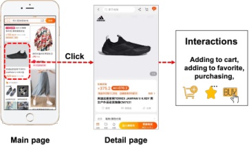

(a) Conventional advertising. 

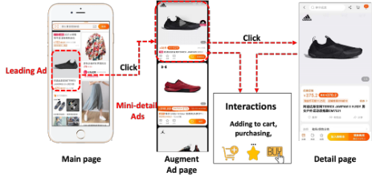

(b) Augment advertising. 

**Figure 1: Examples of two types of advertising. (a) In conventional advertising, once a user clicks on a leading ad, she will be directed to the product detail page. (b) In augment advertising, when a user clicks on a leading ad, she will be guided to an augment ad page, which displays additional mini-detail ads relevant to the leading ad in a feed manner.** 

In addition, the limited advertising space further intensifies competitions among advertisers, thereby raising winning prices for ad auctions and reducing their willingness to increase ad expenditures. 

To overcome issues from limited advertising space, we propose a novel advertising business, called _augment advertising_ , to expand advertising space for e-commerce, and have deployed this new advertising format on Taobao advertising platform. We show the difference in users’ interactions between conventional advertising and augment advertising in Figure 1. The augment advertising consists of three components: the main page, the _augment ad page_ and the detail page. The main page displays both organic content and ads as usual, where these ads are called _leading ads_ . When a user clicks a leading ad on the main page, she will be displayed with an augment ad page, containing a series of ads related to the clicked leading ad. We refer to these ads on the augment ad pages as _mini-detail ads_ , as they exhibit brief product information such as prices, ratings, sale volumes, _etc._ In order to respect users’ online browsing behaviors, the leading ad on the main page is placed at the top of the augment ad page. 

Although augment advertising boosts advertising space, it also introduces new challenges to the problem of ad allocation and pricing. Since users behave differently on different augment ad pages generated by various leading ads, the potential social welfare of a leading ad is not only determined by its expected Cost Per Mille (eCPM) but also by the potential value of its augment ad page. Accordingly, the widely-used generalized second price (GSP) auction, which selects the top-K ads sorted by their eCPM and charges advertisers with the minimum bid required to retain their same position, is not effective in the augment advertising. We summarize three major challenges in designing ad auctions for augment advertising based on observations of our industrial deployment. 

The first challenge comes from the asynchronous ad retrieval processes on the main page and the augment ad page. Due to the large volume of candidate ads and the limited response time in industrial ad systems, it is impractical for the online platform to retrieve leading ads and corresponding mini-detail ads together. For the sake of efficiency, the augment ad page with mini-detail ads are generated only when a user clicks on a leading ad. Therefore, the potential performance of the corresponding augment ad pages is unknown when we make ad allocation decisions on the main 

page, resulting in difficulties in optimizing the overall performance of augment advertising. 

The second challenge comes from the potential “free-rider” problem in the pricing scheme of online advertising. The widely adopted Pay-Per-Click (PPC) scheme [7] is unfair to leading advertisers, which requires them to pay for both clicks on the main page and the augment ad page. Because users may be distracted from clicking on the leading ad again on the augment ad page, and pay more attention to other relevant mini-detail ads that usually come from the leading advertiser’s competitors. In this situation, the leading advertiser pays for an invalid click on the main page, while other mini-detail advertisers benefit from the referral ad exposure opportunity paid by the leading advertiser. As we will show in Section 4, this situation is quite prevalent (accounts for 22 _._ 42% over 2 million instances) in our deployed augment advertising prototype. Therefore, we need to design a new ad pricing scheme to avoid this “free-rider” problem. 

The last but not the least challenge is the unclear relation between auctions on the main page and the augment ad page. For overall efficiency, the decision for leading ads allocation is influenced by the potential value of their associated unknown mini-detail ads. However, traditional payment rules within GSP and VCG auctions, do not consider the relation between ads on these two pages. Inconsistency between the allocation scheme and the payment rule cannot guarantee the well-defined game-theoretical properties of auctions, resulting in advertisers’ potential strategic behaviors and undermining the long-term prosperity of online advertising. 

By jointly considering the above challenges, we make an indepth study on the augment advertising, and design a new augment ad auction. To solve the first challenge, we decouple augment ad auction into two closely correlated auctions: a _leading ad auction_ and a _mini-detail ad auction_ , which select the optimal leading ads and mini-detail ads at different stages. To address the “free-rider” issue, we place the leading ad at the top of the augment ad page, and let the leading advertisers only pay for the click on the augment ad page. Then, we resort to a data-driven model to estimate the _virtual bid_ of each leading advertiser, which represents the total potential social welfare of the leading ads together with mini-detail ads on the corresponding augment ad page. Finally, we propose the PGSP auction based on virtual bids to determine allocations and 

WSDM ’23, February 27-March 3, 2023, Singapore, Singapore 

Designing Ad Auctions for Augment Advertising 

payments of leading ads. We demonstrate that the PGSP auction has a Symmetric Nash Equilibrium [23] for the utility-maximizing bidders, and is incentive-compatible [17] if all advertisers are valuemaximizing bidders [28]. We still insist on using GSP auctions to determine the mini-detail ads for easy deployment. The main contributions of this work can be summarized as follows: 

• We boost advertising spaces by introducing a novel ad business model called augment advertising, and have deployed the prototype on Taobao advertising platform. By considering challenges within this new advertising format, we formulate the problem of augment ad auction design with the goal of maximizing the overall social welfare across the main page and potential augment ad pages. 

• For the augment ad auction design, we propose a new auction called PGSP auction based on a new concept of virtual bid, which estimates the potential social welfare of the leading ad associated with corresponding mini-detail ads by a data-driven model. Our theoretical results show that the Symmetric Nash equilibrium exists for the PGSP auction with utility-maximizing bidders, and the PGSP auction with reserve prices is incentive-compatible when advertisers are value-maximizing bidders. 

• We conducted extensive offline evaluations on the dataset collected from the deployed augment advertising on Taobao display advertising platform. The evaluation results show that both the augment advertising business and the proposed PGSP auction with the virtual bid estimation model could improve both ad revenue and user experience, compared with baseline methods. Furthermore, we conducted online A/B tests on the deployed prototype, which demonstrates the same advantage of augment advertising in the industrial advertising environment. 

## **2 PRELIMINARIES** 

In this section, we first illustrate the currently deployed augment advertising prototype on Taobao display advertising platform and then introduce the basic notation and concepts used in this paper. Finally, we formulate the augment ad auction problem as a twostage auction design problem. 

## **2.1 System Overview** 

To create abundant advertising spaces, Taobao display advertising platform has deployed a new business model: Augment Advertising. We illustrate the details of systems in this novel business model in Figure 2. Once a user visits the main page (Step _○_ 1 ), the platform retrieves candidate leading ads from the corpus. Then the platform sends an ad request to _Auction Module_ to select leading ads displayed on the main page, by evoking an ad auction (leading ad auction) over the candidate leading ads. When the user clicks on a leading ad (Step _○_ 2 ), the platform will first retrieve candidate mini-detail ads, which are restricted to be relevant to the clicked leading ad. _i.e._ , their products have similar categories or similar brands to the leading ad. Then, the platform sends a request to the auction module to evoke a mini-detail ad auction to determine mini-detail ads displayed on the augment ad page. Thus, the user is displayed an augment ad page with mini-detail ads associated with more detailed product information. Moreover, the clicked leading ad will appear in the mini-detail format at the top of the augment ad page, without competing with other mini-detail ads in the mini-detail 

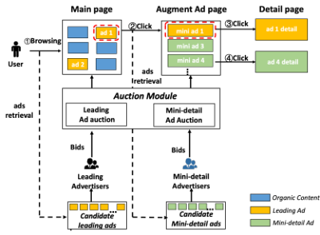

**Figure 2: The overview of augment advertising system.** 

auction. If the user continues to click on the mini detail ad (Step _○_ 3 or _○_ 4 ), she will be displayed the detail page of the product. 

## **2.2 Notations and Models** 

There are a set of candidate leading advertisers _𝑁_ = {1 _, . . . ,𝑛_ } competing for _𝐾_ ≤ _𝑛_ leading ad slots on the main page. We slightly abuse notation and use _𝑖_ ∈ _𝑁_ referring to both the leading advertiser and her ad. A leading advertiser _𝑖_ has a private valuation _𝑣𝑖_ for her ad being clicked. She submits a bid _𝑏𝑖_ to the auction module, which is the maximum payment she is willing to pay for the click. Let vector _𝒃_ = ( _𝑏𝑖, 𝒃_ − _𝑖_ ) denote all bids of _𝑛_ advertisers, where _𝒃_ − _𝑖_ = ( _𝑏_ 1 _, . . . ,𝑏𝑖_ −1 _,𝑏𝑖_ +1 _, . . . ,𝑏𝑛_ ). Without loss of generality, we let the ad _𝑖_ win the _𝑖_ -th leading ad slot if _𝑖_ ≤ _𝐾_ , and lose the auction if _𝑖 > 𝐾_ . The probability of a user clicking on the leading ad _𝑖_ is _𝛾𝑖_ , and can be decomposed into _𝛾𝑖_ = _𝛽 𝑗_ × _𝑐𝑖_ , where _𝛽 𝑗_ , known as the slot effect, denotes the probability that an ad is noticed at the _𝑗_ -th slot. And _𝑐𝑖_ is the probability of the ad _𝑖_ being clicked once noticed, which is also known as the click-through rate (CTR). Let _𝛼𝑖_ denote the probability that a user clicks again on the leading ad _𝑖_ on the augment ad page. _𝑐𝑖_ and _𝛼𝑖_ could be estimated by CTR prediction models [33, 37]. We assume that _𝛽 𝑗_ is non-increasing with the position, _i.e._ , _𝛽_ 1 ≥ _𝛽_ 2 ≥· · · ≥ _𝛽𝐾_ . For a leading ad _𝑖_ , there exists a corresponding augment ad page, in which a set of relevant ads _𝑁𝑖_ competing for _𝐾𝑖_ ad slots. Similarly, a mini-detail ad _𝑙_ ∈ _𝑁𝑖_ has a private value _𝑣𝑖𝑙_ , a bid _𝑏𝑖𝑙_ , and a probability _𝛾𝑖𝑙_ of being clicked, respectively. 

Allocations and prices of ads on the main page and the augment ad page are determined by an auction mechanism M = (X _,_ P). Specifically, the allocation scheme X is a function which takes all bids as input and outputs ad sequences _𝑊_ ⊆ _𝑁_ and _𝑊𝑖_ ⊆ _𝑁𝑖_ , where _𝑊_ is the winning leading ad sequence to be displayed on the main page and _𝑊𝑖_ is the winning mini-detail ad sequence on _𝑖_ ’s augment ad page. The payment rule P calculates the payment _𝑝𝑖_ for the leading ad _𝑖_ as well as _𝑝𝑖𝑙_ for the mini-detail ad _𝑙_ . Thus, the utility of the winning leading advertiser _𝑖_ is denoted by _𝑢𝑖_ = _𝛾𝑖𝛼𝑖_ ( _𝑣𝑖_ − _𝑝𝑖_ ). 

## **2.3 Problem Formulation** 

The objective of the platform is to design an augment ad auction mechanism M to maximize overall expected social welfare over the main page and augment ad pages with the game-theoretical equilibrium. Thus, the augment auction is to solve the following 

WSDM ’23, February 27-March 3, 2023, Singapore, Singapore 

Yangsu Liu, Dagui Chen, Zhenzhe Zheng∗ , Zhilin Zhang, Chuan Yu, Fan Wu, and Guihai Chen 

**Table 1: A toy example for the failure of GSP auction.** 

|Ads|_𝑣𝑖_|_𝑐𝑖_|_𝑆𝑊𝑖_|Position|_𝑝__𝐺𝑆𝑃_ _𝑖_|_𝑝__𝑃𝐺𝑆𝑃_ _𝑖_|
|---|---|---|---|---|---|---|
|A|3|0.5|4.1|1|4.8|1.5|
|B|6|0.4|1|2|4|4|
|C|4|0.4|1|-|-|-|

optimization problem: 

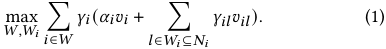

The objective in (1), _i.e._ , the overall expected social welfare, is the expected value of all winning leading advertisers and minidetail advertisers. To keep the stability of the auction environment, we further require the augment ad auction to have a certain game-theoretical equilibrium, such as Symmetric Nash Equilibrium, which is widely used in industry. 

_Definition 2.1._ [23] A bid profile _𝒃_ is a Symmetric Nash equilibrium (SNE) if for any _𝑖, 𝑗_ ≤ _𝑁_ , we have _𝛽𝑖_ ( _𝑣𝑖_ − _𝑝𝑖_ ) ≥ _𝛽 𝑗_ ( _𝑣𝑖_ − _𝑝 𝑗_ ). 

Suppose that we simply adopt the widely-used GSP auction for leading ads. It selects the top-K ads according to their eCPM, _i.e._ , _𝑐𝑖_ × _𝑏𝑖_ , and charges the advertiser with the minimum bid to retain her current position, _i.e._ , _𝑝𝑖__𝐺𝑆𝑃_ =_<u>𝑏𝑖</u>_<u>+1</u> _<u>𝑐</u>_× _𝑖__<u>𝑐𝑖</u>_<u>+1</u> . However, the allocation of leading ads cannot maximize the expected social welfare in (1) by ignoring the potential value of the augment ad page. Furthermore, if we only change the allocation scheme but not the payment rule, even the basic game-theoretical property is not guaranteed. For example, suppose there are two ad slots competed by three leading ads _𝐴, 𝐵_ and _𝐶_ with their values _𝑣𝑖_ , CTRs _𝑐𝑖_ and expected social welfare _𝑆𝑊𝑖_ of mini-detail ads on their augment ad pages, as shown in Table 1. Setting _𝛼𝑖_ = 1, ads _𝐴_ and _𝐵_ will be displayed in the first two positions to optimize (1) by truthfully bidding ( _i.e._ , _𝑏𝑖_ = _𝑣𝑖_ ). However, the _𝐴_ ’s payment in GSP auction is _𝑝𝐴__𝐺𝑆𝑃_ =_𝑣𝐵_ _<u>𝑐</u>_× _𝐴__<u>𝑐𝐵</u>_ = 4 _._ 8, resulting in a negative utility. Even if _𝑏𝐴_ = 0, _𝐴_ occupies the second slot with _𝑝𝐴__𝐺𝑆𝑃_ = 3 _._ 2 and still gets a negative utility, which is unacceptable for advertisers. Therefore, the GSP auction fails to guarantee game-theoretical properties for the augment ad auction. 

## **3 AUGMENT AD AUCTION DESIGN** 

We decouple the augment ad auction design into two closely correlated auctions: the _leading ad auction_ M_𝐿_ and the _mini-detail ad auction_ M_𝑀_ . The goal of these two auctions is to jointly maximize the overall social welfare in (1) while ensuring the existence of SNE. We depict the auction processes in augment advertising in Figure 3. The online platform resorts to a data-driven model to estimate the virtual bids of candidate leading ads, which represents the expected social welfare of the leading ad together with mini-detail ads on the corresponding augment ad page. For the leading ad auction, we propose the Potential Generalized Second Price auction based on estimated virtual bids, and adopt a conventional GSP auction for the mini-detail ad auction. 

In the following discussion, we first introduce the definition of the virtual bid, with which we design a PGSP auction for the leading ad auction on the main page. Then we prove the game-theoretical properties of the PGSP auction. Finally, to address the challenges in the practical system, we utilize a data-driven model to estimate the virtual bid. 

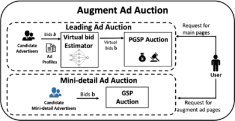

**Figure 3: The auction processes for augment advertising. Leading ads are determined by the PGSP auction and minidetail ads are determined by the GSP auction.** 

## **3.1 Leading Ad Auction** 

In the leading ad auction, we first assume that the augment ad page of each leading ad have been generated in advance, _i.e._ , _𝑊𝑖_ has been generated. We denote the overall social welfare of mini-detail ads of the leading ad _𝑖_ as _𝑔𝑖_ , _i.e._ , _𝑔𝑖_ =� _𝑙_ ∈ _𝑊𝑖__𝛾_ _𝑖𝑙__𝑣_ _𝑖𝑙__._Thus, the objective of the leading ad auction is to select a set of leading ads _𝑊_ maximizing overall social welfare: 

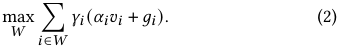

We define the virtual bid _𝑏_ˆ _𝑖_ of a leading advertiser _𝑖_ ∈ _𝑁_ as the overall expected social welfare of the leading ad and its mini-detail ads on the augment ad page, _i.e._ , 

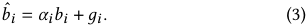

By leveraging the virtual bid, we follow the design rationale behind GSP auction, _i.e._ , to select the top _𝐾_ ads by their expected social welfare in descending order and charge each winning advertiser with the minimum bid required to maintain the allocated position. Thus, the PGSP auction M_𝐿_ = (X_𝐿_ _,_ P_𝐿_ ) is designed as: 

• **Allocation Scheme** X_𝐿_ : Leading ads are sorted in a non-increasing order by _𝑐𝑖_ × _𝑏_ˆ _𝑖_ . We select the first _𝐾_ leading ads as the winning ad sequence _𝑊_ , breaking the ties arbitrarily. 

• **Payment Rule** P_𝐿_ : When the user clicks the leading ad _𝑖_ again on the augment ad page, we charge the leading advertiser _𝑖_ ∈ _𝑊_ with the minimum bid required to keep her allocated position, _i.e._ , 

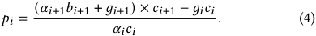

For the example in Table 1, where ads _𝐴_ and _𝐵_ still occupy the = first two slots in the PGSP auction. The payment of _𝐴_ is _𝑝𝐴__𝑃𝐺𝑆𝑃_ <u>(</u> _𝑣𝐵_ + _𝑆𝑊𝐵_ <u>)</u> _𝑐𝐵_ _<u>𝑐𝐴</u>_ − _𝑆𝑊𝐴_ = 1 _._ 5, resulting in a positive utility. We claim that any leading advertiser has a non-negative utility in PGSP auction, which can be proved easily and is omitted. We next formally discuss the game-theoretical properties of PGSP auction. 

Theorem 3.1. _There exists a non-empty set of SNE states in the PGSP auction._ 

Proof. In the Symmetric Nash Equilibrium, the leading advertiser in the slot _𝑖_ would not prefer any other slot _𝑗_ , _i.e._ , 

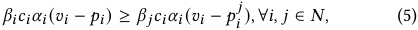

where _𝑝𝑖__𝑗_denotes the payment of ad_𝑖_in the_𝑗_-th slot under PGSP. Let _𝑈𝑖_ = _𝑐𝑖_ ( _𝛼𝑖𝑣𝑖_ + _𝑔𝑖_ ) and _𝑃𝑖_ = _𝑐𝑖_ +1 ( _𝛼𝑖_ +1 _𝑏𝑖_ +1 + _𝑔𝑖_ +1) = _𝑐𝑖_ +1 _𝑏_ˆ _𝑖_ +1. 

WSDM ’23, February 27-March 3, 2023, Singapore, Singapore 

Designing Ad Auctions for Augment Advertising 

Substituting (4) into (5), the condition of SNE is rewritten as: 

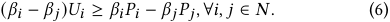

If we set _𝑗_ = _𝑖_ + 1 and _𝑗_ = _𝑖_ − 1 respectively, we could obtain 

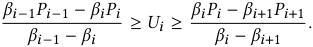

Thus, we can deduce recursively that 

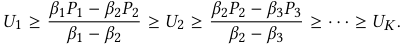

When _𝑗_ = _𝑖_ + 1, the condition (6) is rewritten as: 

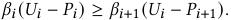

Similarly, the leading ad in slot _𝑖_ + 1 never prefer the slot _𝑖_ : 

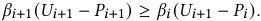

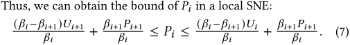

According to the Fact 5 in [23], when all advertisers are in local SNE, _i.e._ , when they never prefer their adjacent slots, they are all in the global SNE. Thus, if all bids satisfy the inequality (7), all advertisers are in the SNE state. Thus, we have a lower bound _𝑏_ˆ _𝑖__𝐿_of the virtual bid of the advertiser _𝑖_ in the SNE state: 

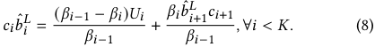

Since there are only _𝐾_ slots, we have _𝛽𝐾_ +1 = 0. The lower bound for the virtual bid of the ad _𝐾_ + 1 is 

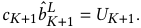

The lower bound of the virtual bid of the advertiser _𝐾_ is: 

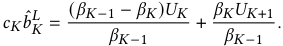

Thus, we have 

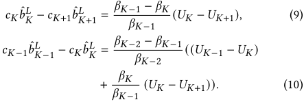

Referring to (7), we have _𝑈𝑖_ −1 ≥ _𝑈𝑖_ for any ad in slot _𝑖_ in the SNE state. Thus, _𝑐𝐾_ −1 _𝑏_ˆ _𝐾__𝐿_ −1≥_𝑐𝐾𝑏_ˆ _𝐾__𝐿_≥_𝑐𝐾_+1 ˆ_𝑏_ _𝐾__𝐿_ +1andwecould recursively deduce that _𝑐𝑖𝑏_ˆ _𝑖__𝐿_≥_𝑐𝑖_+1 ˆ_𝑏_ _𝑖__𝐿_ +1_,_∀_𝑖_≤_𝐾_, which is consistent with the allocation scheme of the PGSP auction. It indicates that there exists a set of bids { _𝑏_ 1_𝐿, . . . ,𝑏𝐿_ _𝑁_} in the SNE state in the PGSP auction, where _𝑏𝑖__𝐿_= _<u>𝛼</u>_<u>1</u>(_𝑏_ˆ _𝑖__𝐿_−_𝑔𝑖_). □ 

When _𝑔𝑖𝑐𝑖 >_ ( _𝛼𝑖_ +1 _𝑏𝑖_ +1 + _𝑔𝑖_ +1)× _𝑐𝑖_ +1, the payment _𝑝𝑖_ would be negative. For the example in Table 1, if _𝑆𝑊𝐴 >_ 5 _._ 6, then _𝑝𝐴__𝑃𝐺𝑆𝑃_ _<_ 0. To address this issue, we add a sufficiently low reserve price _𝜖_ ≥ 0 for all leading advertisers. Thus, the payment of _𝑖_ is corrected to _𝑝_ ˆ _𝑖_ = _𝑚𝑎𝑥_ ( _𝑝𝑖,𝜖_ ) under the PGSP auction with reserve prices. We figure out that the PGSP auction with reserve prices is incentivecompatible when all advertisers are _value-maximizing bidders_ [8, 28]. We let _𝑢𝑖_ ( _𝑏𝑖, 𝒃_ − _𝑖_ ) denote the utility of _𝑖_ with bids _𝒃_ = ( _𝑏𝑖, 𝒃_ − _𝑖_ ). 

_Definition 3.2._ An advertiser _𝑎𝑖_ is a value-maximizing bidder if she aims to maximize her value _𝑣𝑖_ under the budget _i.e._ , _𝑢𝑖_ ( _𝑏𝑖, 𝒃_ − _𝑖_ ) = _𝑣𝑖_ if _𝑝𝑖_ ≤ _𝑣𝑖_ , otherwise, _𝑢𝑖_ ( _𝑏𝑖, 𝒃_ − _𝑖_ ) = 0. 

_Definition 3.3._ [17] A mechanism is incentive-compatible if truthfully bidding is the dominant strategy for any advertiser _𝑖_ , _i.e._ , _𝑢𝑖_ ( _𝑣𝑖, 𝒃_ − _𝑖_ ) ≥ _𝑢𝑖_ ( _𝑏𝑖, 𝒃_ − _𝑖_ ), ∀ _𝑖_ ∈ _𝑁_ . 

Theorem 3.4. _The PGSP auction with reserve prices is incentivecompatible when all advertisers are value-maximizing bidders._ 

Proof. Suppose that all advertisers truthfully report their values, _i.e._ , _𝑏𝑖_ = _𝑣𝑖_ . In the PGSP auction with a reserve price _𝜖_ , the payment of the advertiser is 

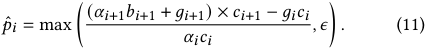

First, we prove that the advertiser _𝑖_ never gets a higher utility by bidding _𝑏𝑖_′_> 𝑣𝑖_while others keep their bids_𝒃_−_𝑖_. According to the greedy allocation scheme of PGSP, there are two possible results for the advertiser _𝑖_ by bidding _𝑏𝑖_′. The first is that she maintains the same position, and she obtains the same utility since her payment keeps the same. The second is that she gets a higher position _𝑗_ and the ad _𝑗_ gets the position _𝑗_ + 1. In this case, the payment of _𝑖_ is 

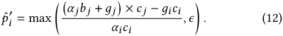

Since the ad _𝑖_ is blow ad _𝑗_ by bidding truthfully, we have 

( _𝛼 𝑗𝑏 𝑗_ + _𝑔𝑗_ ) × _𝑐 𝑗 >_ ( _𝛼𝑖𝑣𝑖_ + _𝑔𝑖_ ) × _𝑐𝑖 ._ 

Thus, we can obtain 

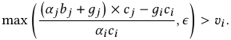

Thus, _𝑝_ ˆ _𝑖_′_>𝑣𝑖_andtheutility_𝑢𝑖_(_𝑏_ _𝑖_′_, 𝒃_−_𝑖_)=0.Therefore,avalue- maximizing advertiser cannot boost her utility by increasing her bid while others’ bids _𝒃_ − _𝑖_ keep the same. 

As for _𝑖_ reporting a bid _𝑏𝑖_′_<𝑣𝑖_,therearealsotwopossible situations: The first is that she maintains the position getting the same utility. The second is that she gets a lower position or loses the auction, in which the value-maximizing advertiser gets a lower utility since the _𝛾𝑖_ decreases. Therefore, a truth-telling advertiser cannot get a higher utility by decreasing her bid while others’ bids _𝒃_ − _𝑖_ keep the same. 

Therefore, if all advertisers are value-maximizing bidders, the PGSP auction with reserve prices is incentive-compatible. □ 

## **3.2 Virtual Bid Estimation** 

In industrial systems, it is not possible to obtain accurate virtual bids of all leading ads in advance due to the large volume of candidate ads and the limited response time. Thus, we leverage a data-driven approach to estimate the virtual bids. 

To estimate the virtual bid _𝑏_ˆ _𝑖_ , we need to estimate the expected overall social welfare _𝑔𝑖_ of mini-detail ads viewed by the user. Note that mini-detail ads on the augment ad page are closely related to the corresponding leading ad and the user entering the augment ad page always has a clear preference for the products related to the leading ad she clicks on. Therefore, it is reasonable to assume that _𝑔𝑖_ is strongly related to the characteristics of the user and the 

WSDM ’23, February 27-March 3, 2023, Singapore, Singapore 

Yangsu Liu, Dagui Chen, Zhenzhe Zheng∗ , Zhilin Zhang, Chuan Yu, Fan Wu, and Guihai Chen 

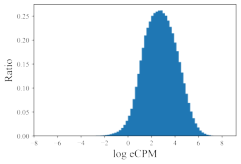

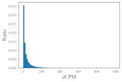

(a) eCPM of exposed mini-detail ads. (b) log eCPM of exposed mini-detail ads. 

**Figure 4: Histograms of eCPM and log eCPM of exposed minidetail ads.** 

leading ad. Furthermore, we illustrate histograms of overall eCPM of exposed mini-detail ads from the deployed augment advertising prototype in Figure 4. This figure shows that the expected social welfare _𝑔𝑖_ obeys a long-tail distribution while the log expected social welfare obeys nearly a Gaussian distribution. 

With above observations, we adopt a deep learning model with embedding layers and a Multiple Layer Perception (MLP) paradigm to estimate log( _𝑔𝑖_ ). The model consists of three components: 

**Features and Labels** : We use log data of clicked leading ads from Taobao platform as the training set S of size _𝑀_ . We adopt three groups of features: ad profiles _𝒙__𝑎_ ( _e.g._ , brands, sales, prices of products, _etc._ ), user profiles _𝒙__𝑢_ ( _e.g._ , user ids), and the prediction information _𝒙__𝑝_ ( _e.g._ , pCTR and pCVR) of leading ads from the offthe-shelf prediction models. Prediction information is considered to reflect the preference of the user for similar products. We emphasize that bids of leading advertisers are excluded from the ad profiles. Therefore, the prediction of _𝑔𝑖_ is independent of the advertiser’s bid _𝑏𝑖_ to protect the game-theoretical properties of the PGSP auction discussed before. Furthermore, we record the overall social welfare of exposed mini-detail ads on the augment ad page of the leading ad _𝑖_ as _𝑔𝑖_ , which is the label of clicked leading ad _𝑖_ . 

**Multiple Layer Perception (MLP)** : Sparse features are embedded into low dimensional dense representations, and are fed into a three-layer MLP with the ReLU activation function and 256 units in each layer. The output of the network is log( _𝑔_ ˆ _𝑖_ ( _𝒙_ ) + 1), which is the estimated log social welfare of the mini-detail ads on the augment ad page with _𝒙_ = ( _𝒙__𝑎_ _, 𝒙__𝑢_ _, 𝒙__𝑝_ ) as the input features. 

**Loss function** : Since the distribution of _𝑔𝑖_ is approximated by a logarithmic normal distribution, we update parameters of the network through a mean squared logarithmic loss function: 

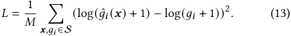

## **4 EVALUATION RESULTS** 

In this section, we conduct offline evaluations to evaluate the performance of augment advertising and PGSP auction. We also deploy the augment advertising on Taobao advertising platform, and present results of online evaluations with online A/B tests. 

## **4.1 Offline Evaluations** 

To evaluate the performance of augment advertising under PGSP auction, we conduct offline evaluations to answer three questions: • **RQ1** : Under GSP auction, could we increase the revenue by switching from conventional advertising to augment advertising? 

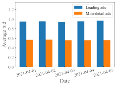

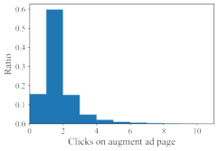

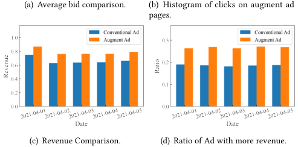

<!-- Start of picture text -->
(a) Average bid comparison. (b) Histogram of clicks on augment ad pages. (c) Revenue Comparison. (d) Ratio of Ad with more revenue. <!-- End of picture text -->

**Figure 5: Evaluations on augment advertising.** 

- **RQ2** : Adopting augment advertising, could we further improve 

- the revenue of the platform as well as user experience by replacing GSP auction with PGSP auction? 

• **RQ3** : How does the performance of the virtual bid estimation model affect users’ satisfaction and ad revenue under PGSP auction? 

_4.1.1_ **Experimental Setup** _._ We conduct offline evaluations on the dataset collected from the deployed augment advertising prototype on Taobao advertising platform. We refer to a complete browsing journey of a user on the main page and augment ad pages as a _session_ , and an ad exposed to a user as an _impression_ . The dataset records around 23 million impressions of users in almost 2 million sessions from April 1 to April 19, 2021, in the context of augment advertising. Payments of leading ads were determined by GSP auction and leading advertisers only paid for users’ clicks on their ads on the augment ad page. The dataset consists of advertisers’ bids, ad profiles, user profiles, prediction information and users’ feedback. We randomly select 80% data of clicked leading ads as training data to train virtual bid estimation models, and the other data as testing data to validate the performance of the model. Due to the sensitivity of business data, all metrics in this section are scaled to the range [0 _,_ 1], without loss of generality. 

_4.1.2_ **Evaluations on Augment Advertising (RQ1)** _._ In conventional advertising (Figure 1(a)), clicks on leading ads on the main page are charged, which are free in augment advertising (Figure 1(b)). Due to the difference in charges for clicks on leading ads, even if the number of ad impressions increases, ad revenue does not necessarily grow by adopting augment advertising. Because users may not click on any ad or only click on mini-detail ads with relative lower bids on augment ad pages. As Figure 5(a) shows, the average bid of mini-detail advertisers is almost half that of leading advertisers based on our observations from April 1 to April 5, 2021. We illustrate the histogram of users’ clicks on the augment ad pages in Figure 5(b). While the majority of users (84.47%) clicked at least one ad, 16.23% users did not click on leading ads again on augment 

WSDM ’23, February 27-March 3, 2023, Singapore, Singapore 

Designing Ad Auctions for Augment Advertising 

ad pages, and 15.53% users exited the page without any click, which may cause a loss of ad revenue. 

In order to simulate the revenue generated by adopting conventional advertising, we charged only for the first click on leading ads on the main page. Because there is no difference in ad display formats on the main page between conventional advertising and augment advertising, users will have the same reactions ( _i.e._ , click or not). Positions and payments for leading ads in conventional advertising are also determined by GSP auctions. Figure 5(c) illustrates that the ad revenue of the platform could be boosted by almost 14% on average by deploying augment advertising. Specifically, as shown in Figure 5(d), around 18.52% sessions get more revenue by adopting conventional advertising, while 26.22% sessions generate more revenue adopting augment advertising. The remaining 55.26% sessions generate the same revenue with two ad formats, because only leading ads are clicked on the augment ad page in these sessions. 

_4.1.3_ **Evaluations on PGSP Auction (RQ2)** _._ Given ad revenue is boosted by adopting augment advertising under GSP auction, we conduct evaluations to validate whether PGSP auction further improves ad revenue as well as user experience. The widely used GSP [10] and VCG auction [22] are selected as baselines. 

• **Generalized Second Price auction (GSP).** In the GSP auction, ads are sorted by their eCPM. The payment for a bidder is the minimum bid required to retain the same position. 

• **Vickrey–Clarke–Groves auction (VCG)** . In the VCG auction, ads are also sorted by their eCPM. The payment for a bidder is the difference between the total social welfare of other bidders with and without her participation in the auction. 

The VCG auction satisfies incentive compatibility, while the GSP auction and PGSP auction satisfy incentive compatibility when all advertisers are value-maximizing bidders [28]. Without loss of generality, we assume that advertisers’ bids reflect their true value and keep the same bids in these three mechanisms. For comparing performances in different auctions, we use following metrics: 

<u>�</u> _<u>𝑚</u>__𝑐𝑙𝑖𝑐𝑘_+� _<u>𝑎</u>__𝑐𝑙𝑖𝑐𝑘_ • **Click Per Session (CPS)** : CPS = <u>�</u> _𝑠𝑒𝑠𝑠𝑖𝑜𝑛_ , where � _𝑚__𝑐𝑙𝑖𝑐𝑘_and � _𝑎__𝑐𝑙𝑖𝑐𝑘_are total clicks on main pages and augment ad pages, respectively. CPS reflects users’ satisfaction with ads. 

<u>�</u> _𝑖𝑚𝑝𝑟𝑒𝑠𝑠𝑖𝑜𝑛_ • **Impression Per Session (IPS)** : IPS = <u>�</u> _𝑠𝑒𝑠𝑠𝑖𝑜𝑛_ . IPS records the number of ads viewed by users on main pages and augment ad pages, and reflects the users’ interest in the augment ad page. 

• **Average Cost-per-click (Avg.CPC)** : The average Cost-perclick is the average price of ads at each position on the main page, and reflects the competitive intensity of the auction. 

<u>�</u> _<u>𝑎</u>__𝑐𝑙𝑖𝑐𝑘_×_𝐶𝑃𝐶_ • **Revenue Per Session (RPS)** : RPS = <u>�</u> _𝑠𝑒𝑠𝑠𝑖𝑜𝑛_ . 

First, we compare user experience under these auctions. As proxies of user experience, the cumulative CPS and IPS of the top _𝐾_ slots, _𝐾_ ∈[1 _,_ 5], under three auctions are illustrated in Figure 6(a) and 6(b), respectively. It shows that leading ads selected by the PGSP auction could attract users to browse and click more ads on the augment ad page, implying that PGSP auction provides higher user experience. This is because PGSP auction prioritizes the leading ads with augment ad pages of higher quality. In addition, the CPS and IPS are the same under GSP and VCG auctions because their ad allocation schemes are the same. 

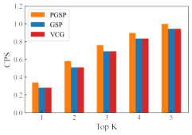

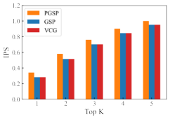

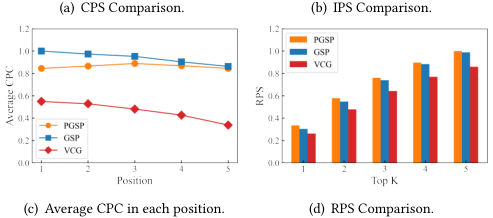

<!-- Start of picture text -->
(a) CPS Comparison. (b) IPS Comparison. (c) Average CPC in each position. (d) RPS Comparison. <!-- End of picture text -->

**Figure 6: Performance on the PGSP auction.** 

**Table 2: Performance of Virtual Bid Estimation Models.** 

|**Metric**|**MEAN**|**LR**|**GBDT**|**MLP**|
|---|---|---|---|---|
|NRMSE|0.881|0.879|0.850|**0.840**|
|CPS@5|–|+1.244%|+1.390%|**+1.730%**|
|IPS@5|–|+1.473%|+1.472%|**+2.012%**|
|RPS@5|–|+1.151%|+1.313%|**+1.681%**|

**Table 3: Online performance improvement of augment advertising compared with conventional advertising.** 

|**Metric**|**Week 1**|**Week 2**|**Week 3**|
|---|---|---|---|
|PV|+3.077%|+3.128%|+3.591%|
|Clicks|+12.939%|+13.408%|+14.904%|
|GMV|+2.781%|+2.088%|+3.278%|
|REV|+0.876%|+0.540%|+0.690%|
|Avg.CPC|-9.639%|-9.091%|-9.412%|

Second, we compare the average CPC in each ad position under three auctions in Figure 6(c). The average CPC of each position in GSP auction is higher than that in PGSP auction, which reflects that PGSP auction can mitigate the competition of leading advertisers. Moreover, the average CPC monotonically decreases with the position in VCG and GSP auctions, while it remains relatively stable in PGSP auction. Then, we plot the cumulative RPS of the top _𝐾_ slots in Figure 6(d). Although the average CPC in GSP auction is higher, PGSP auction actually generates more ad revenue than GSP auction, which comes from more clicks on the mini-detail ads on the augment ad pages. 

Based on the discussion above, we conclude that the PGSP auction outperforms the GSP and VCG auctions in terms of user satisfaction and ad revenue in augment advertising. 

_4.1.4_ **Evaluations on Estimation Models (RQ3)** _._ In this part, we evaluate the impact of virtual bid estimation model performance on user satisfaction and ad revenue. Since there is no other specific learning model for estimating potential social welfare in auctions, we compare the performance of our estimation model (MLP) with 

Yangsu Liu, Dagui Chen, Zhenzhe Zheng∗ , Zhilin Zhang, Chuan Yu, Fan Wu, and Guihai Chen 

WSDM ’23, February 27-March 3, 2023, Singapore, Singapore 

the Linear Regression model (LR) and the Gradient Boosting Decision Tree model (GBDT) [12]. The Mean model, which estimates overall social welfare _𝑔_ ˆ by averaging historical data, serves as a benchmark for social welfare estimation. We use Normalized Root Mean Square Error (NRMSE) to evaluate the predictive performance of virtual bid estimation models. _i.e._ , 

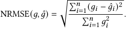

Furthermore, we compare the relative improvements in business performance under different estimation models with those under the MEAN model. We present, respectively, the cumulative CPS, IPS and RPS of the top 5 slots ( _i.e._ , CPS@5, IPS@5 and RPS@5) under PGSP auction with different estimation models in Table 2. The MLP model shows a lower NRMSE and higher improvements in CPS@5, IPS@5 and RPS@5, indicating better predictive performance as well as higher business performance. Therefore, we conclude that the performance of the estimation model has a positive relationship with the business performance, _i.e._ , a model with better predictive performance might result in higher business performance. 

## **4.2 Online Evaluations** 

We have deployed augment advertising on a feed product, named _Guess What You Like_ , on the homepage of Taobao. We evaluate the online performance of augment advertising and compare it with conventional advertising, through online A/B tests from February 4 to February 25, 2021. We launched two online buckets serving 1% of production traffic. In the control bucket, advertisers can only participate in the conventional ad auction. In the treatment bucket, advertisers have the option to participate in either the conventional ad auction or the augment ad auction including both the leading ad auction and the mini-detail ad auction. 

We consider five online metrics: Page Views (PV), Clicks, Gross Merchandise Volume (GMV), Ad Revenue (REV), and Avg.CPC of all ads. We present the improvements of the treatment bucket against the control bucket on these metrics for February 4-10 (Week 1), February 11-17 (Week 2), and February 18-25 (Week 3) in Table 3. We find that deploying augment advertising significantly improves user experience metrics (PV, Clicks, GMV), which mainly comes from users’ interactions on augment ad pages. Besides, the AVG.CPC of advertisers is indeed decreasing as they have more advertising space available, which significantly reduces the competitive pressure of advertisers and may increase their ongoing investment in advertising. Even if the average CPC decreases, the ad revenue of the platform has slightly increased, which is consistent with our results in offline evaluations. 

## **5 RELATED WORK** 

The ad auction design, one of the most concerning problems in e-commerce advertising, has been studied for a long time. The GSP auction [10] and VCG auction [22] has been extensively studied and adequately applied in industry. Many methods have been proposed to boost the revenue of these auctions, such as reserve price [14, 20], squashing [15] and boosted second price auction [13]. To optimize multiple objectives of multiple stakeholders, Bachrach _et al._ [4] and Roberts _et al._ [18] proposed modified GSP auctions with a 

linear combination of social welfare, revenue and clicks. Chen _et al._ [5] proposed a two-stage framework, which consists of an ad auction module and a re-rank module, to optimize trade-offs among the platform, advertisers, and users. Wang _et al._ [26] proposed a two-stage auction to reduce the gap of the selected ad quality between the coarse ad retrieval and refined ad ranking module. In recent years, the machine learning based auction has received considerable attention. Some researchers [9, 16, 19, 31, 32] leveraged the deep network to design the automated mechanism. Dütting _et al._ [9] proposed a deep learning model based on a regret network to design a revenue-maximizing auction with the incentive-compatible constraint. Shen _et al._ [19] designed a deep learning framework consisting of a mechanism network and a buyer network, which guarantees the incentive compatibility of the output mechanism. However, these auction mechanisms can only be applied to isolated ad auctions, ignoring effects from potential value of ads. 

Another related topic is the blending ranking of ads and organic items [6, 11, 24, 25, 29, 30, 34–36]. Wang _et al._ [24] proposed a learning model to predict the optimal number of displayed ads. Zhang _et al._ [30] investigated the whole-page optimization by solving a dynamic linear programming optimization problem. Feng _et al._ [11] proposed a multi-agent reinforcement learning model to collaboratively rank both organic content and ads over multi-scenarios. Yan _et al._ [29] and Chen [6] proposed rule-based re-ranking methods to generate blend sequences, considering the trade-off between revenue and user experience. Zhao _et al._ [35, 36] has developed an ad agent based on reinforcement learning models to determine ad positions. However, these works only focused on determining the ad allocation in the context of blending, but none of them could break the limits of the advertising space as augment advertising. 

## **6 CONCLUSION** 

In this paper, we have introduced a novel business model called augment advertising on online e-commerce platforms to boost advertising space. We have designed the augment ad auction by leveraging a two-stage auction, _i.e._ , the leading ad auction and the mini-detail ad auction. We have proposed a new auction called PGSP auction for the leading ad auction based on the virtual bid, which is estimated by a data-driven model. We have theoretically proved the game-theoretical properties of the PGSP auction. We have deployed augment advertising on Taobao advertising platform, and conducted extensive offline evaluations and online A/B tests. The evaluation results demonstrated the effectiveness of augment advertising and the proposed auction mechanisms. 

## **ACKNOWLEDGMENTS** 

This work was supported in part by National Key R&D Program of China No. 2020YFB1707900, in part by China NSF grant No. 62132018, 61902248, 61972254, 61972252, 62025204, 62072303, in part by Shanghai Science and Technology fund 20PJ1407900, in part by Alibaba Group through Alibaba Innovative Research Program, and in part by Tencent Rhino Bird Key Research Project. The opinions, findings, conclusions, and recommendations expressed in this paper are those of the authors and do not necessarily reflect the views of the funding agencies or the government. 

WSDM ’23, February 27-March 3, 2023, Singapore, Singapore 

Designing Ad Auctions for Augment Advertising 

## **REFERENCES** 

- [1] Amazon. https://www.amazon.com. 

- [2] Rakuten. https://www.rakuten.com. 

- [3] Taobao. https://www.taobao.com. 

- [4] Yoram Bachrach, Sofia Ceppi, Ian A. Kash, Peter B. Key, and David Kurokawa. Optimising trade-offs among stakeholders in ad auctions. In _Proceedings of EC_ , pages 75–92, 2014. 

- [5] Xiang Chen, Bowei Chen, and Mohan Kankanhalli. Optimizing trade-offs among stakeholders in real-time bidding by incorporating multimedia metrics. In _Proceedings of SIGIR_ , page 205–214, 2017. 

- [6] Dagui Chen, Qi Yan, Chunjie Chen, Zhenzhe Zheng, Yangsu Liu, Zhenjia Ma, Chuan Yu, Jian Xu, and Bo Zheng. Hierarchically constrained adaptive ad exposure in feeds. In _Proceedings of CIKM_ , pages 3003–3012. ACM, 2022. 

- [7] Nikhil R. Devanur and Sham M. Kakade. The price of truthfulness for pay-per-click auctions. In _Proceedings of EC_ , pages 99–106, New York, NY, USA, 2009. 

- [8] Paul Dütting, Felix A. Fischer, and David C. Parkes. Truthful outcomes from non-truthful position auctions. In _Proceedings of EC_ , page 813, 2016. 

- [9] Paul Dütting, Zhe Feng, Harikrishna Narasimhan, David C. Parkes, and Sai Srivatsa Ravindranath. Optimal auctions through deep learning. In Kamalika Chaudhuri and Ruslan Salakhutdinov, editors, _Proceedings of ICML_ , volume 97, pages 1706–1715. PMLR, 2019. 

- [10] Benjamin Edelman, Michael Ostrovsky, and Michael Schwarz. Internet Advertising and the Generalized Second-Price Auction. _American Economic Review_ , 97(1):242–259, March 2007. 

- [11] Jun Feng, Heng Li, Minlie Huang, Shichen Liu, Wenwu Ou, Zhirong Wang, and Xiaoyan Zhu. Learning to collaborate: Multi-scenario ranking via multi-agent reinforcement learning. In _Proceedings of WWW_ , pages 1939–1948, 2018. 

- [12] Jerome H Friedman. Greedy function approximation: a gradient boosting machine. _Annals of statistics_ , pages 1189–1232, 2001. 

- [13] Negin Golrezaei, Max Lin, Vahab Mirrokni, and Hamid Nazerzadeh. Boosted second price auctions: Revenue optimization for heterogeneous bidders. In _Proceedings of SIGKDD_ , page 447–457, New York, NY, USA, 2021. 

- [14] Jason D Hartline and Tim Roughgarden. Simple versus optimal mechanisms. In _Proceedings of EC_ , pages 225–234, 2009. 

- [15] Sébastien Lahaie and R. Preston McAfee. Efficient ranking in sponsored search. In _Workshop on Internet and Network Economics (WINE)_ , pages 254–265, Berlin, Heidelberg, 2011. 

- [16] Xiangyu Liu, Chuan Yu, Zhilin Zhang, Zhenzhe Zheng, Yu Rong, Hongtao Lv, Da Huo, Yiqing Wang, Dagui Chen, Jian Xu, Fan Wu, Guihai Chen, and Xiaoqiang Zhu. Neural Auction: End-to-End Learning of Auction Mechanisms for E-Commerce Advertising. In _Proceedings of KDD_ , pages 3354–3364, 2021. 

- [17] Noam Nisan, Tim Roughgarden, Eva Tardos, and Vijay V. Vazirani. _Algorithmic Game Theory_ . Cambridge University Press, Cambridge, 2007. 

- [18] Ben Roberts, Dinan Gunawardena, Ian A. Kash, and Peter B. Key. Ranking and tradeoffs in sponsored search auctions. In _Proceedings of EC_ , pages 751–766, 2013. 

- [19] Weiran Shen, Pingzhong Tang, and Song Zuo. Automated Mechanism Design via Neural Networks. In _Proceedings of the AAMAS_ , pages 215–223, May 2019. 

- [20] David R.M. Thompson and Kevin Leyton-Brown. Revenue optimization in the generalized second-price auction. In _Proceedings of EC_ , pages 837–852, New York, NY, USA, June 2013. 

- [21] UNCTAD. Global e-commerce jumps to $26.7 trillion. https://unctad.org/news/gl obal-e-commerce-jumps-267-trillion-covid-19-boosts-online-sales, 2021. Accessed: 

##### 2021-09-01. 

- [22] Hal R. Varian and Christopher Harris. The vcg auction in theory and practice. _American Economic Review_ , 104(5):442–45, May 2014. 

- [23] Hal R Varian. Position auctions. _international Journal of industrial Organization_ , 25(6):1163–1178, 2007. 

- [24] Bo Wang, Zhaonan Li, Jie Tang, Kuo Zhang, Songcan Chen, and Liyun Ru. Learning to advertise: How many ads are enough? In Joshua Zhexue Huang, Longbing Cao, and Jaideep Srivastava, editors, _Advances in Knowledge Discovery and Data Mining - 15th Pacific-Asia Conference, PAKDD 2011, Shenzhen, China, May 24-27, 2011, Proceedings, Part II_ , volume 6635 of _Lecture Notes in Computer Science_ , pages 506–518. Springer, 2011. 

- [25] Weixun Wang, Junqi Jin, Jianye Hao, Chunjie Chen, Chuan Yu, Weinan Zhang, Jun Wang, Xiaotian Hao, Yixi Wang, Han Li, Jian Xu, and Kun Gai. Learning adaptive display exposure for real-time advertising. In _Proceedings of CIKM_ , pages 2595–2603. ACM, 2019. 

- [26] Yiqing Wang, Xiangyu Liu, Zhenzhe Zheng, Zhilin Zhang, Miao Xu, Chuan Yu, and Fan Wu. On designing a two-stage auction for online advertising. In _Proceedings of the ACM Web Conference 2022_ , WWW ’22, page 90–99, New York, NY, USA, 2022. 

- [27] WARC. Brands to spend $59bn on e-commerce ads this year. https://www. warc.cn/newsandopinion/news/brands-to-spend-59bn-on-e-commerce-ads-thisyear/44139, 2020. Accessed: 2021-09-01. 

- [28] Christopher A. Wilkens, Ruggiero Cavallo, and Rad Niazadeh. GSP: The Cinderella of Mechanism Design. In _Proceedings of WWW_ , pages 25–32, Republic and Canton of Geneva, CHE, 2017. 

- [29] Jinyun Yan, Zhiyuan Xu, Birjodh Tiwana, and Shaunak Chatterjee. Ads allocation in feed via constrained optimization. In _Proceedings of KDD_ , pages 3386–3394, 2020. 

- [30] Weiru Zhang, Chao Wei, Xiaonan Meng, Yi Hu, and Hao Wang. The whole-page optimization via dynamic ad allocation. In _Proceeding of WWW_ , page 1407–1411, 2018. 

- [31] Yusi Zhang, Zhi Yang, Liang Wang, and Li He. Autor3: Automated Real-time Ranking with Reinforcement learning in e-commerce sponsored search advertising. In _Proceedings of CIKM_ , pages 2499–2507. ACM, 2019. 

- [32] Zhilin Zhang, Xiangyu Liu, Zhenzhe Zheng, Chenrui Zhang, Miao Xu, Junwei Pan, Chuan Yu, Fan Wu, Jian Xu, and Kun Gai. Optimizing multiple performance metrics with deep GSP auctions for e-commerce advertising. In _Proceedings of WSDM_ , pages 993–1001, 2021. 

- [33] Jun Zhao, Guang Qiu, Ziyu Guan, Wei Zhao, and Xiaofei He. Deep reinforcement learning for sponsored search real-time bidding. In _Proceedings of ACM SIGKDD_ , pages 1021–1030, 2018. 

- [34] Xiangyu Zhao, Long Xia, Lixin Zou, Hui Liu, Dawei Yin, and Jiliang Tang. WholeChain Recommendations. In _Proceedings of CIKM_ , CIKM ’20, pages 1883–1891, New York, NY, USA, 2020. Association for Computing Machinery. 

- [35] Xiangyu Zhao, Xudong Zheng, Xiwang Yang, Xiaobing Liu, and Jiliang Tang. Jointly learning to recommend and advertise. In _Proceedings of SIGKDD_ , pages 3319–3327, 2020. 

- [36] Xiangyu Zhao, Changsheng Gu, Haoshenglun Zhang, Xiwang Yang, Xiaobing Liu, Jiliang Tang, and Hui Liu. DEAR: Deep reinforcement learning for online advertising impression in recommender systems. In _Proc. of AAAI 2021_ , pages 750–758, 2021. 

- [37] Guorui Zhou, Na Mou, Ying Fan, Qi Pi, Weijie Bian, Chang Zhou, Xiaoqiang Zhu, and Kun Gai. Deep interest evolution network for click-through rate prediction. In _Proceedings of AAAI_ , pages 5941–5948, 2019. 

