# **From Second to First: Mixed Censored Multi-Task Learning for Winning Price Prediction** 

Zhenzhe Zheng† 

Jiani Huang∗ 

zhengzhenzhe@sjtu.edu.cn Shanghai Jiao Tong University 

jianihuang0526@gmail.com Shanghai Jiao Tong University 

Zixiao Wang∗ 

## Yanrong Kang 

yanrongkang@tencent.com Advertising & Marketing Service, Tencent 

zixiaowang830@gmail.com Shanghai Jiao Tong University 

### **ABSTRACT** 

##### **ACM Reference Format:** 

Jiani Huang, Zhenzhe Zheng, Yanrong Kang, and Zixiao Wang[1]. 2024. From Second to First: Mixed Censored Multi-Task Learning for Winning Price Prediction. In _Proceedings of the 17th ACM International Conference on Web Search and Data Mining (WSDM ’24), March 4–8, 2024, Merida, Mexico._ ACM, New York, NY, USA, 9 pages. https://doi.org/10.1145/3616855.3635838 

A transformation from second-price auctions (SPA) to first-price auctions (FPA) has been observed in online advertising. The consequential coexistence of mixed FPA and SPA auction types has further led to the problem of mixed censorship, making bid landscape forecasting, the prerequisite for bid shading, more difficult. Our key insight is that the winning price under SPA can be effectively transferred to FPA scenarios if they share similar user groups, advertisers, and bidding environments. The full utilization of winning price under mixed censorship can effectively alleviate the FPA censorship problem and improve the performance of winning price prediction (also called as bid landscape forecasting). In this work, we propose a **M** ulti-task **M** ixed **C** ensorship **P** redictor ( **MMCP** ) that utilizes multi-task learning to leverage the winning price under SPA as supervised information for FPA. A Double-gate Mixture-ofExperts architecture has been proposed to alleviate the negative transfer problem of multi-task learning in our context. Furthermore, several auxiliary modules including the first-second mapping module and adaptive censorship loss function have been introduced to integrate multi-task learning and winning price prediction. Extensive experiments on two real-world datasets demonstrate the superior performance of the proposed MMCP compared with other state-of-the-art FPA models under various performance metrics. The implementation of the code is available on github1 . 

### **1 INTRODUCTION** 

Auto-bidding algorithms are the most important mechanisms in online advertising [22]. Bid landscape forecasting, which provides prediction models to facilitate make bidding decisions, serves as a critical component in auto-bidding algorithms. From 2019, due to various concerns [1, 5, 9, 16, 28, 29, 32], more and more ad exchanges/SSPs are transitioning from second-price auctions (SPA) to first-price auctions (FPA) [31] following Google’s action [2]. As a result, bidding with mixed auction types has become a wide-spread and common practice in online advertising. We observe from a real-world industrial online advertising system that FPA and SPA almost account for half of the share, which has caused the phenomenon of mixed censorship of the winning price prediction, since different auction types bring about different corresponding censorship types. In particular, under SPA scenarios, if the bidder loses, she only knows that the bidding price is lower than the winning price, which refers to right censorship; Conversely, if the bidder wins, her paying price will exactly be the winning price that she always knows, which refers to non-censorship. However, under FPA scenarios, if the bidder lose, she only knows her bidding price is lower than the winning price, which refers to right censorship; and similarly, if the bidder wins, she only knows her bidding price is higher than the winning price, which refers to left censorship. To sum up, SPA causes right censorship and FPA causes both left and right censorship. Mixed censorship refers to the coexistence of different censorship types, including left censorship, right censorship and non-censorship. 

### **CCS CONCEPTS** 

#### • **Information systems** → **Computational advertising** . 

### **KEYWORDS** 

Real-time bidding; Bid landscape forecasting; Bid shading; Mixed censorship; Multi-task learning 

∗Work done while Jiani Huang and Zixiao Wang were interns at Tencent. 

†Zhenzhe Zheng is the corresponding author. 

1https://github.com/Currycurrycurry/MMCP/ 

Mixed censorship will bring about both opportunities and challenges for bid landscape forecasting. However, all the previous methods [8, 18, 26, 27, 30, 36, 38, 43, 44] ignore the possible opportunities and treat the FPA and SPA auctions as independent scenarios without consideration of the above mixed censorship phenomenon and the possibility of transferring winning price information from SPA to FPA. For FPA scenarios, without the knowledge of the exact winning price, many related works made strong assumptions [26, 43] on the distribution form of winning price which weakens generalization and cannot adapt to the dynamic auction 

Permission to make digital or hard copies of all or part of this work for personal or classroom use is granted without fee provided that copies are not made or distributed for profit or commercial advantage and that copies bear this notice and the full citation on the first page. Copyrights for components of this work owned by others than the author(s) must be honored. Abstracting with credit is permitted. To copy otherwise, or republish, to post on servers or to redistribute to lists, requires prior specific permission and/or a fee. Request permissions from permissions@acm.org. _WSDM ’24, March 4–8, 2024, Merida, Mexico_ 

© 2024 Copyright held by the owner/author(s). Publication rights licensed to ACM. ACM ISBN 979-8-4007-0371-3/24/03...$15.00 

https://doi.org/10.1145/3616855.3635838 

295 

WSDM ’24, March 4–8, 2024, Merida, Mexico 

Jiani Huang, Zhenzhe Zheng, Yanrong Kang and Zixiao Wang 

environment. To address this limitation, our key insight is that for a particular advertising alliance, both FPA and SPA share similar user groups, similar advertiser groups, and similar auction environments. And mixed censorship actually helps solve the winning price prediction problem under FPA scenarios with the knowledge of winning prices held by SPA. Since SPA has richer winning price information than FPA, a natural idea will be aimed at fully utilizing the winning price and transferring effective information from the unilateral censored winning price of SPA to the bilateral censored winning price of FPA. Motivated by the above observations, we proceed to design a new winning price transfer paradigm for FPA scenarios to fully utilize the SPA information. A straightforward idea is to apply multi-task learning [42], the common practice in transfer learning. However, it is non-trivial due to the following three critical challenges: 

- Challenge1: How to design an effective multi-task paradigm for winning price transfer from SPA to FPA in the bid shading scenario? Most multi-task learning models aiming to improve the performance of several tasks simultaneously [42] will face negative transfer problem, which is even more serious in our setting. 

- Challenge2: How to map from SPA to FPA under the similar but still different bidding environments? The competition intensity of different SPA and FPA environments may result in the deviation of winning prices, and thus direct transfer may empirically cause significant performance drop. 

- Challenge3: How to optimize the multi-task model with a suitable censorship loss function containing the transferred winning price information? Since most FPA models totally ignore the winning price information [26] or are under the ideal assumption of non-censorship [43], we need to design a new censorship loss function to effectively transfer the non-censored winning price information to FPA. 

In this work, we propose a novel framework named as Multi-task Mixed Censorship Predictor (MMCP) for FPA scenarios. Different from prior models where only FPA information is used to train, MMCP also integrates positive information from SPA by the introduction of a newly designed multi-task learning framework. To solve the aforementioned challenges: First, in our novel multi-task framework MMCP which jointly optimizes FPA and SPA models, we introduce an effective **D** ouble-gate **M** ixture- **o** f- **E** xperts (DMoE) architecture. Second, we propose a first-second mapping module to align the bidding environments between FPA and SPA. Third, we introduce an adaptive censorship loss function for optimizing the FPA model with the assistance of extra winning price from SPA. 

The contributions of this work can be summarized as follows: 

- To the best of our knowledge, we are the first to reveal the possibility of transferring winning prices from second-price auction to first-price auction via multi-task learning. 

- To solve negative transfer, we introduce a simple yet efficient **D** ouble-gate **M** ixture- **o** f- **E** xperts (DMoE) structure to fully leverage SPA features in FPA bid shading. 

- To better transfer winning price information, we propose a novel winning price mapping module from SPA to FPA for explicitly adaptation and a more dynamic loss function for FPA scenarios, named as Adaptive Censorship Loss (ACL), 

to find the best probability interval to optimize based on the SPA winning price range. 

- To evaluate the effectiveness of MMCP, we conduct comprehensive experiments on a large-scale public dataset and a real-world production dataset that is collected from the real-world advertising platform. The results demonstrate that MMCP achieves the state-of-the-art performance, and the effectiveness of each module in MMCP. 

### **2 RELATED WORK** 

### **2.1 Bid Landscape Forecasting** 

Here we mainly focus on FPA, where bid shading [7, 14, 45] serves as an important and common strategy for optimizing their bids and improving their chances of winning an ad impression while minimizing the amount they pay for it. According to whether the winning price is provided or censored, there are generally two approaches for bid shading [43]. The former approaches apply a machine learning algorithm to predict the optimal shading factor with the assumption that the winning price is provided for all the bid logs [11]. The latter approaches estimate the winning price distribution without the winning price information by preassuming a well-formed winning price distribution like Guassian [15] or Sigmoid [26]. The relatively new EDDN [43] method also seperately models the distribution with or without the winning price via commonly-used probability distribution like truncated-normal, exponential, gamma and log-normal. However, all these methods do not make full use of the possible winning price from SPA auctions and strongly depend on preassumed distribution. 

### **2.2 Learning over Censored Data** 

Data censorship is a tough challenge for winning price prediction problem [27]. The censorship has become even more difficult to solve under the mixed auction scenarios where different types of censorship (non-censorship, left censorship and right censorship) coexist. Most previous literatures tried to solve censorship under a particular auction type based on survival analysis, like censored regression model [38, 39], Kaplan-Meier estimator [21] for SPA auctions, and Turnbull estimator [10] for FPA auctions, which all belongs to traditional statistical and machine learning methods and cannot apply to the current deep learning paradigm. Till now, there have also been other literatures about how to construct censorship loss functions [18, 27], but only work for SPA scenarios. The recent CDM [30] seems to solve the problem of mixed censorship, however, the use of turnbull estimator unveils its drawbacks of coarse-grained prediction. None of these literatures consider the censorship under FPA scenarios and the possibility of transferring censorship from SPA to FPA scenarios. 

Considering all the limitations above, we need a solution which can effectively solve and utilize censorship for winning price prediction from SPA to FPA auctions. 

### **2.3 Multi-task Learning** 

Multi-task learning (MTL) has demonstrated remarkable accomplishments in different kinds of machine learning fields like computer vision [3], natural language processing [6], recommender systems [17, 20, 25, 35] and others [12, 34]. Although multi-task 

296 

WSDM ’24, March 4–8, 2024, Merida, Mexico 

From Second to First: Mixed Censored Multi-Task Learning for Winning Price Prediction 

learning has been widely used in recommender systems and online advertising [13, 20, 23, 37, 40, 41], it is seldom used for bid landscape in RTB. The only work that simultaneously optimize the CTR prediction and market price prediction by multi-task learning just considered the SPA auctions, and aims to solve the SSB and bias problem rather than transferring winning price between different auction formats [40]. 

Nevertheless, all these above efforts are not specially designed for winning price prediction tasks for FPA and SPA scenarios. As far as we know, there is no related work about knowledge transfer of multi-task bidding. Different from previous studies, to fully utilize the mixed censorship, we propose to define the FPA prediction task and SPA prediction as two sub models of the multi-task framework. In particular, the FPA model serves as the main task model and the SPA model serves as the auxiliary task model. 

### **3 PRELIMINARIES** 

In this section, we first present our motivation in Section 3.1. Then, we introduce the definitions of mixed censorship, discrete price model and the problem formulation in Section 3.2. 

### **3.1 Motivation** 

We first demonstrate the ubiquitous similarity of SPA and FPA bidding from three aspects in DSPs and then analyze why the winning price can be transferred from SPA to FPA. 

Our observations from the real-world online advertising system is that FPA shares similar user groups, advertisers, and bidding environments with SPA, which is the prerequisite for the effectiveness of winning price transfer from SPA to FPA. From the aspect of user groups, according to our real data analysis based on Jaccard [24] similarity coefficient, the overlap of these users is about 20% to 30%, providing a good foundation for transferring. From the aspect of advertisers, according to our analysis of real online data, the overlap of these advertisers is over 80%, which results in a shared set of similar ads between the FPA and SPA environments. From the aspect of bidding environments, for a particular advertising alliance or DSP, its bidding environments including its bidding opponents and bidding preference for both SPA and FPA auctions are similar. On one hand, the bidders under FPA scenarios we meet with are almost the same with the ones under SPA scenarios. On the other hand, the fluctuation of the bidding environment like the preference of other bidders is also similar since the winning price reflects the potential value of bidding requests which is also similar cross different environments. And since different auction environments in the same advertising alliance also share an enormous intersection of the users who visit the applications (the media/publisher in RTB) and advertisers, we have enough reason that the phenomenon is wide-spread for a large number of DSPs or advertising alliances. 

Furthermore, the winning price itself, whether it belongs to first-price or second-price auctions, reflects two dimensions of information. Internally speaking, the winning price represents the potential value of the bidding request, i.e. eCPM. Externally speaking, the winning price reflects the intensity of competition in the bidding environment which depends on the bidding rivals and the bidding strategy it uses. Whether the price information can be migrated depends on whether similar requests meets both above 

dimensions. Generally speaking, the more similar the request, the closer the value of the traffic. Therefore, from the perspective of data sharing, if we introduce additional SPA winning price as noncensored information to the double censored scenario, it is probable to improve the prediction performance for similar users and similar ad positions under a certain price. 

### **3.2 Problem Formulation** 

In this section, we first discuss about the formulation of mixed censorship, and then give the problem formulation based on the discrete price model. 

**Mixed Censorship** Mixed censorship of winning price is a wide-spread phenomenon for a certain DSP or advertising alliance caused by the mixed SPA and FPA auction types. For the sake of consistency, we define the winning price (aka. market price) as the biggest bid other than ours in both FPA and SPA scenarios. In second-price auctions, the winning price _𝑧_ can only be observed if the advertiser wins the auction. In first-price auctions, the winning price _𝑧_ is unknown whether the advertiser wins or not. To sum up, only when the advertiser under SPA wins the auction can the winning price _𝑧_ be observed. Otherwise, they are not observable. For a certain bid request log, it contains the input feature vector _𝑥_ which includes user features, advertiser features, publisher features and context features, the bid _𝑏_ , the winning price _𝑧_ and the winning indicator _𝑤_ . Therefore, each bid request can be represented as a tuple ( _𝑥,𝑧,𝑏,𝑤_ ) in the winning set of SPA , and as a tuple ( _𝑥,𝑏,𝑤_ ) in other situations. In particular, We use _𝑠_ to represent SPA scenarios and _𝑓_ to represent FPA scenarios. Therefore, a SPA uncensored log would be ( _𝑥𝑠,𝑧𝑠,𝑏𝑠,𝑡𝑟𝑢𝑒_ ) and a SPA right censored log would be ( _𝑥𝑠,𝑏𝑠, 𝑓𝑎𝑙𝑠𝑒_ ). Correspondingly, the FPA left and right censored logs would be ( _𝑥 𝑓 ,𝑏 𝑓 ,𝑤 𝑓_ ). 

According to the types of auction and censorship, we divide the total dataset into the following four types: second non-censored dataset D _𝑠𝑛𝑐_ , first left censored dataset D _𝑓𝑙𝑐_ , first right censored dataset D _𝑓𝑟𝑐_ and second right censored dataset D _𝑠𝑟𝑐_ . Therefore, the total SPA dataset would be D _𝑠_ = D _𝑠𝑟𝑐_ ∪ D _𝑠𝑛𝑐_ and the total FPA dataset would be D _𝑓_ = D _𝑓𝑙𝑐_ ∪ D _𝑓𝑟𝑐_ . Here we limit our study to DSPs or advertiser alliances where mixed censorship caused by mixed auction types is common and similarity between FPA and SPA can be observed. 

**Discrete Price Model** We also need to introduce the discrete price model as the foundation of our multi-task solution. We have the probability density function (PDF) _𝑝𝑧_ ( _𝑏_ ) � _𝑃_ ( _𝑧_ = _𝑏_ | _𝑥_ ) of the winning price _𝑧_ being b, and the cumulative density function (CDF) _𝑊_ ( _𝑏_ ) � _𝑃_ ( _𝑧_ ≤ _𝑏_ | _𝑥_ ) = ∫0 _𝑏__𝑝_(_𝑧_)_𝑑𝑧_at the bid_𝑏_which represents the winning rate of the certain bid. Following the previous works [27], we first transform the modeling from continuous space to discrete space, where a set of _𝐿_ prices 0 _< 𝑏_ 1 _< 𝑏_ 2 _< ... < 𝑏𝐿_ to cover the finite precision of price determinations. Then, we have the above win rate function over discrete price space: 

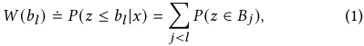

where _𝑙_ = 1 _,_ 2 _, ...𝐿_ and _𝐵 𝑗_ = ( _𝑏 𝑗 ,𝑏_ ( _𝑗_ +1) ] is a uniformly divided disjoint interval. 

297 

WSDM ’24, March 4–8, 2024, Merida, Mexico 

Jiani Huang, Zhenzhe Zheng, Yanrong Kang and Zixiao Wang 

Based on the above definition of mixed censored dataset and discrete price model, we formulate our problem as a multi-classification problem over the above discrete price space. Our multi-task framework needs to predict the end-to-end winning price distribution _𝑝𝑧_ ( _𝑏_ ) of each bidding request log based on the input features _𝑥_ . In particular, we focus on the prediction task of FPA’s probability density function. Therefore, we set the FPA model as the main task model and the SPA model as the auxiliary task model. 

### **4 MULTI-TASK MIXED CENSORSHIP PREDICTOR (MMCP)** 

To take advantage of the transferability of winning price from SPA to FPA, we propose a novel end-to-end framework: Multi-task Mixed Censorship Predictor (MMCP), to transfer winning price effectively. It consists of four key modules, and we first describe the role of each module: (1) The Feature Embedding And Mixtureof-Expert Module tries to embed all the sparse categorical features and dense numerical features into dense representation vectors and build individual feature representations to capture different feature patterns for SPA and FPA via the DMoE structure. (2) The Second Price Prediction Module (SPPM) which follows the DMoE structure tries to predict the probability density function of the winning price under SPA scenarios, and serves as the auxiliary task of SPA winning price prediction. (3) In order to address the mapping gap between FPA and SPA, the First-Second Mapping Module (FSMM) is proposed to transform the winning price distribution under SPA to FPA, and a new loss function: **A** daptive **C** ensorship **L** oss Function (ACL) for adjustment of optimization interval is introduced to better optimize FPA, whose inputs are FPA and SPA predictions and output is an adaptive parameter _𝛿_ for optimization. (4) The First Price Prediction Module (FPPM) which also follows the DMoE structure tries to predict the probability density function of the winning price under FPA scenarios with the above ACL loss function and performs the main task of FPA winning price prediction. 

### **4.1 Feature Embedding and Mixture-of-Expert Module** 

This module serves as the shared module of both SPA and FPA models. As shown in Figure 1, the input features can be divided into three categories: user features, publisher features and ad features. Given the _𝑖__𝑡ℎ_ input bidding request log _𝑥𝑖_ = { _𝑥𝑖𝑗 ,_ ∀ _𝑗_ ∈ Ω _𝑥_ } where Ω _𝑥_ is the index set of all sparse feature fields, we embed it to a low dimension dense vector representation _ℎ𝑖𝑗_ = _𝑒𝑚𝑏𝑒𝑑_ ( _𝑥𝑖𝑗_ ) ∈ R_𝑑_ , where _𝑑_ is the dimension of embedding vectors. 

The output of the FPA & SPA Shared Embedding module is the concatenation of all embedding vectors, denoted as _𝑣𝑖_ = _𝑐𝑜𝑛𝑐𝑎𝑡_ ({ _ℎ𝑖𝑗 ,_ ∀ _𝑗_ ∈ Ω _𝑥 ,𝑥𝑖__𝑑_}).Andtheconcatedembeddingvectorswillwalk through a shared bottom layer and output as _𝑟𝑖_ = _𝑓𝑠ℎ𝑎𝑟𝑒𝑑_  𝑏𝑜𝑡𝑡𝑜𝑚_ ( _𝑣𝑖_ ). After that, we propose the DMoE structure which is composed of two expert groups which represent FPA expert group and SPA expert group separately since the embeddings of users and ads are not totally from the same environment, and the independent expert groups of the two tasks can further alleviate the negative transfer of the two different environments, which is different from MMoE [19]. Each expert group is composed of multiple sub-experts which are constructed by neural networks with certain layers. Both expert 

groups will be combined through a gating network for selective fusion for its own task. The gating network is based on a singlelayer feed-forward network with Softmax as the activation function, which calculate the weighted sum of the selected vectors, i.e., the output of experts. We formulate the output of the gating network of the FPA task and SPA task as: 

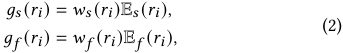

where _𝑤𝑠_ ( _𝑟𝑖_ ) and _𝑤𝑠_ ( _𝑟𝑖_ ) are functions to calculate the weight vector of SPA and FPA through linear layers and a Softmax layer: 

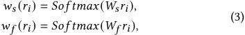

where _𝑊𝑠_ ∈ R_𝑛𝑠_ × _𝑑_ and _𝑊𝑓_ ∈ R_𝑛𝑓_ × _𝑑_ is parameter matrix, _𝑛𝑠_ and _𝑛𝑓_ is the number of SPA and FPA experts, and _𝑑_ is the dimension of input representation. E _𝑠_ and E _𝑓_ is a selected matrix composed of all selected vectors of the SPA and FPA expert group: 

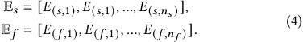

### **4.2 Second Price Prediction Module (SPPM)** 

This module serves as the auxiliary task model which is fed with SPA data for training, and not targeted for inference. The secondprice prediction module is constructed with a dense neural network with Softmax activation function, denoted as _𝑝𝑠_ = _𝑓𝑠𝑝𝑝𝑚_ ( _𝑔𝑠_ ). And the loss function can be divided into two parts: the ANLP loss for winning price and the right-censored cross-entropy loss function [18]. For a winning bid log, since no censorship occurs, the loss function can be updated directly based on the negative log-likelihood loss as follows: 

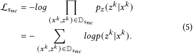

For a losing bid log, since the right censorship occurs, we need to apply the right-censored loss function so as to maximize the cumulative density distribution of the right half of the bid. 

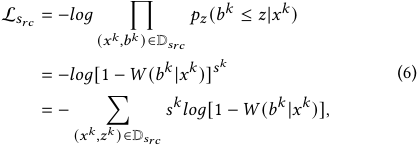

where _𝑊_ ( _𝑏__𝑘_ | _𝑥__𝑘_ ) is the winning probability of bidding on _𝑏__𝑘_ for the _𝑥__𝑘_ request, and _𝑠__𝑘_ is an indicator of losing the _𝑥__𝑘_ request event. 

Therefore, the SPPM loss function can be calculated as follows: 

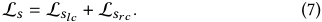

### **4.3 First-Second Mapping Module (FSMM)** 

This module serves as the mapping module from SPA distributions to FPA distributions. Despite the assumed similarities in the bidding environments (e.g., bidding opponents and their bidding strategies), 

298 

WSDM ’24, March 4–8, 2024, Merida, Mexico 

From Second to First: Mixed Censored Multi-Task Learning for Winning Price Prediction 

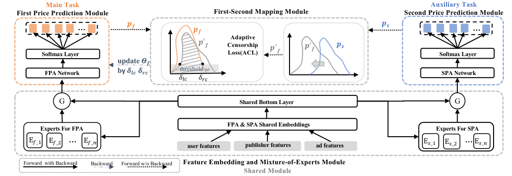

<!-- Start of picture text -->
Main Task Auxiliary Task First Price Prediction Module First-Second Mapping Module Second Price Prediction Module … &! &! &, … Adaptive Softmax Layer & - ! Censorship Loss(ACL) & - ! & - ! &, Softmax Layer update  "! FPA Network by  %+* %)* threshold ! SPA Network !0/ !./ G Shared Bottom Layer G FPA & SPA Shared Embeddings Experts For FPA Experts For SPA E#_( E#_% … E#_& user features publisher features ad features E'_( E'_% … E'_& Forward  with Backward Backward Forward w/o Backward Feature Embedding and Mixture-of-Experts Module Shared Module <!-- End of picture text -->

**Figure 1: Illustration of the MMCP framework with 4 key modules.** 

there is still a gap between FPA and SPA environments directly reflected in the significantly different range of bidding price in the FPA and SPA scenarios. For example, in our advertising alliance scenario, we can find that the bidding and winning price range of SPA will be much larger than that of FPA, and if we simply take the winning price of SPA as a direct supervised signal for the FPA model to learn, the model will be most likely to learn the bias of winning price rather than useful information. Therefore, we propose a first and second mapping module, which tries to map the SPA winning price to FPA winning price. 

Specifically, we shift the probability density distribution of SPA denoted as _𝑝𝑠_ to the probability density distribution _𝑝_ ′ _𝑓_at the target location of FPA. Based on Wasserstein distance of the two distributions, we try to find the most suitable position for SPA distribution to shift, and thus minimizing the distance between the two distributions. Here, the Wasserstein distance (also known as Earth Mover’s Distance) between two probability density distributions _𝑝 𝑓_ and _𝑝𝑠_ on a metric space ( _𝑋,𝑑_ ) is defined as _𝑊𝐷_ ( _𝑝 𝑓 , 𝑝𝑠_ ) = �inf _𝛾_ ∈Γ ( _𝑝 𝑓 ,𝑝𝑠_ ) ∫ _𝑋_ × _𝑋__𝑑_(_𝑥,𝑦_)_𝑑𝛾_(_𝑥,𝑦_) � where Γ( _𝑝 𝑓 , 𝑝𝑠_ ) is the set of all joint distributions _𝛾_ ( _𝑥,𝑦_ ) on _𝑋_ × _𝑋_ with marginals _𝑝 𝑓_ and _𝑝𝑠_ , respectively. 

Since we model the problem as a multi-category classification problem based on discrete price intervals, the loss function optimization method based on maximum likelihood estimation (MLE) will have no choice but to update all intervals to the left and to the right of the bidding price brought by the double censorship problem of FPA scenarios. Specifically, when right and left censorship occur separately, the probability density distribution will be updated as Figure 2(a) and Figure 2(a) show. However, this approach greatly depends on the accuracy of the bids made, i.e., how high or low the model’s winning rate of a certain bid from the online model in the production environment. If the winning rate of the model is very low, i.e., severe over- and under-estimation occurs, it exacerbates the uncertainty of the model at each update, thus leading to the effectiveness of the model being greatly dependent on the bid win rate. The ability of the model to find the optimal winning price distribution, and thus maximize profits, would be enhanced if it 

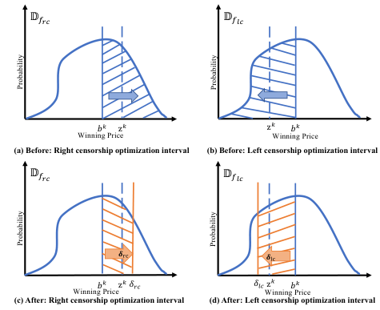

<!-- Start of picture text -->
!!!" !!#" # $ z $ z $ # $ Winning Price Winning Price (a) Before: Right censorship optimization interval (b) Before: Left censorship optimization interval !!!" !!#" "#$ "%$ # $ z $ %%& %'& z $ # $ Winning Price Winning Price (c) After: Right censorship optimization interval (d) After: Left censorship optimization interval Probability Probability Probability Probability <!-- End of picture text -->

**Figure 2: Right and left censorship optimization interval before and after ACL.** 

could be guided to find more precise updating intervals with the assistance of winning price under SPA scenarios. 

Therefore, to address the problem of updating the left and right censored optimal intervals, we propose the heuristic-based adaptation of the censored interval-adjusted loss function, as Figure 1 shows. Specifically, based on the distribution mapped from SPA in the FSMM, we intersect the current FPPM true distribution with the simulated FPA distribution and obtain the left _𝛿𝑙𝑐_ and right _𝛿𝑟𝑐_ of the intersection of the two distributions above the threshold _𝜔_ , so as to determine a more accurate optimization interval when left and right censorship occur. In this way, we ensure that when left censorship occurs, the winning price is between _𝛿𝑙𝑐_ and the bid _𝑏_ , and when right censorship occurs, the winning price is between the bid _𝑏_ and _𝛿𝑟𝑐_ . 

Specifically, we adjust the optimization interval when right and left censorship occur by introducing ACL in Figure 2. When right censorship occurs, the optimization interval of winning price will 

299 

WSDM ’24, March 4–8, 2024, Merida, Mexico 

Jiani Huang, Zhenzhe Zheng, Yanrong Kang and Zixiao Wang 

be further narrowed from Figure 2(a) to Figure 2(c); When left censorship occurs, the optimization interval of winning price will be further narrowed from Figure 2(b) to Figure 2(d). 

### **4.4 First Price Prediction Module (FPPM)** 

The FPPM serves as the main task model which is fed with FPA data for training and inference on the FPA test set. Most previous literatures make strong assumptions of the distribution of the winning price or the win rate curve, which harms the ability of generalization and adaption to dynamic environment. Therefore, we cast the winning price modeling as a multi-category classification problem. Since the bid price must be a discrete integer value within a given bidding range in RTB, we employ a Softmax layer to predict the probability density of each winning price as the output of winning price distribution. FPPM is constructed with the model structure of dense neural network with Softmax activation function, the similar model structure with the FPPM, denoted as _𝑝 𝑓_ = _𝑓𝑓𝑝𝑝𝑚_ ( _𝑔𝑓_ ). And the loss function can be divided into two parts: left and right censored cross-entropy loss function. Specifically, for a winning bid log, since left censorship occurs, we try to maximize the cumulative density distribution on the left half of the bid: 

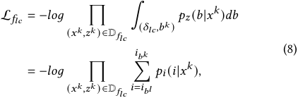

where _𝑝𝑖_ is the P.D.F. of the bidding price in the _𝑖__𝑡_ _ℎ_ interval, _𝑖𝑏𝑙_ is the interval index of the bidding price _𝛿𝑙𝑐_ , _𝑖𝑏𝑘_ is the interval index of the bidding price _𝑏__𝑘_ . 

Conversely, for a losing bid log, since right censorship occurs, we try to maximize the cumulative density distribution of the right half of the bid: 

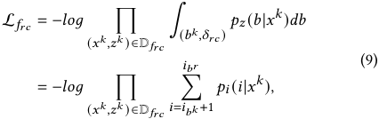

where _𝑖𝑏𝑟_ is the interval index of the bidding price _𝛿𝑟𝑐_ , _𝑖𝑏𝑘_ is the interval index of the bidding price _𝑏__𝑘_ . 

Therefore, the FPPM loss function can be calculated as follows: 

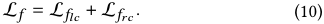

The _𝛿𝑙𝑐_ and _𝛿𝑟𝑐_ in L _𝑓_ is calculated in the above ACL module. 

### **4.5 Overall Training Objective** 

Combining all the losses, the overall objective to be minimized is: 

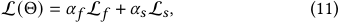

where Θ denotes all the network parameters in MMCP. _𝛼 𝑓_ and _𝛼𝑠_ are hyper-parameters that control task importance. In this paper, we tune the weight hyper-parameters to ensure that the order of magnitude of the gradients for these tasks are at the same level 

**Algorithm 1** Training Algorithm for MMCP 

- **Require:** the total training dataset D _𝑠_ and D _𝑓_ , initial parameters Θ, learning rate _𝛾_ 1 and _𝛾_ 2 , loss weights _𝛼 𝑓 , 𝛼𝑠_ . 

- 1: **while** Not converged **do** 2: sample batch _𝐵_ from D 3: **if** _𝐵_ ∈ D _𝑠_ **then** 4: **SPPM Model parameter** Θ _𝑠_ **optimization:** 5: Calculate L _𝑠_ ( _𝐵𝑠,_ Θ _𝑠_ ) 6: Θ _𝑠_ ← Θ _𝑠_ − _𝛾_ 1L∇Θ _𝑠_ 7: **end if** 8: **if** _𝐵_ ∈ D _𝑓_ **then** 9: **Total Model parameter** Θ **optimization:** 

- 10: Calculate L _𝑓_ ( _𝐵𝑓 ,_ Θ _𝑓_ ) and L( _𝐵𝑓 ,_ Θ) 11: Θ ← Θ − _𝛾_ 2L∇Θ 12: **end if** 13: **end while** 

in order to stabilize model training. To jointly optimize prediction parameters and calibration parameters, we propose a novel training procedure where all the parameters are optimized in turn for each iteration as shown in the Algorithm 1. 

### **5 EXPERIMENTS** 

The datasets are described in the appendix2 . 

### **5.1 Evaluation Metrics** 

To illustrate the validity of the proposed model more adequately, We evaluate all the models under three metrics in our experiments: BCE, surplus and surplus rate. 

**BCE.** We use the binary cross-entropy (BCE or log-loss) as our classification metric, which has been widely used in binary classification and focuses on the win probability at the actual bid price of the predicted winning probability. Since winning price is unused during calculation, it serves as a general metric to show the convergence of our model. 

**Surplus and Surplus Rate.** In addition to the metrics of the algorithm, the performance of the business is crucial in determining whether the algorithm is suitable for release in production. This is because business performance provides an indication of the algorithm’s effectiveness. Considering the goal of bid shading, we use the surplus which can be calculated as ( _𝑉_ − _𝑏_ ) _𝐼_ ( _𝑏 > 𝑏_ˆ ) and surplus rate as an important business metric. And it is even more significant than the previous BCE since it can directly reflects the influence of revenues. We calculate surplus performance as a percentage of the total optimal surplus: 

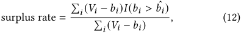

i.e., the surplus achieved by a particular algorithm out of total available surplus by bidding optimally. 

### **5.2 Baselines** 

We compare the performance of MMCP with several baseline stateof-the-art methods, include the three state-of-the-art methods in 

2https://drive.google.com/file/d/16Jcjq3g6u_IIHrpalrmYoofd6W6tjkH8/view?usp=drive_link 

300 

WSDM ’24, March 4–8, 2024, Merida, Mexico 

From Second to First: Mixed Censored Multi-Task Learning for Winning Price Prediction 

FPA scenarios to prove MMCP’s superiority compared with other traditional FPA methods and the three multi-task learning variants to prove MMCP’s superiority compared with other multi-task learning methods. 

The state-of-the-art baselines in FPA scenarios are as follow: 

- **TB [10]** : Turnbull estimator is a statistic-based non-parametric survival analysis method which can handle both left and right censored data. 

- **EDDN [43]** : a deep model based on deepFM, where the bids are assumed to fit the gamma distribution and several forms of distribution are assumed to predict the winning probability distribution. Here we use the log-normal-based EDDN which was claimed to be the best. 

- **WinRate [26]** : a deep model which assumes the winning rate curve is in the Sigmoid functional form. 

- The state-of-the-art baselines in multi-task learning are as follow: 

- **STL** : a single-task learning model, in which we learn a taskspecific model with the same model structure as MMCP for FPA. 

- **Shared-bottom [4]** : a basic multi-task learning model which applied hard parameter sharing method. 

- **MMoE [19]** : a widely-used multi-task learning model which applied soft parameter sharing method with MoEs. 

- **PLE [33]** : a SOTA multi-task learning model with novel shared learning structure. 

### **5.3 Performance Comparison** 

We now compare the performance of MMCP with other state-ofthe-art baselines including FPA and multi-task learning baselines, whose results are reported in Table 1 and Table 2, respectively. 

**Comparison with FPA baselines.** From Table 1, we can make several conclusions that (i) MMCP achieves significant improvement over the other baselines of FPA bid landscape forecasting in terms of surplus and BCE for almost all the campaigns. Specifically, MMCP outperforms the best of baselines in terms of the surplus rate by 3.0389% on average on the iPinYou dataset, and by significantly 38.1983% on the private dataset. The improvement of surplus is even more well-noticed by about 6 _._ 44× 104 on the iPinYou dataset and by about 9 _._ 94 × 107 on the private dataset. It is worth mentioning that the improvement of surplus value will directly lead to the increase in the practical revenue for online advertising in practice. (ii) The traditional statistical method TB perform poorly in terms of BCE. And it is not compatible with the current bid shading paradigm due to its point estimation characteristic. (iii) The two approaches based on assumptions about specific forms of market price distributions all perform poorly in terms of all three metrics. 

**Comparison with multi-task learning baselines.** From Table 2, we can observe that (i) MMCP significantly outperforms all multitask learning baselines in both the iPinYou and private datasets. (ii) For the private dataset, the phenomenon of negative transfer is prominent (surplus rate from 89.6129% in STL to 86.7141% in SB) since the bidding environment of SPA and FPA in our system has a relatively huge gap and cannot be directly transferred. (iii) For the iPinYou dataset, the phenomenon of negative transfer is relatively insignificant since the simulated FPA and SPA parts of iPinYou are from the same environment actually. (iv) In general, 

models based on MoE can achieve better performance than SB and STL, which evaluates the effectiveness of MoE to solve the negative transfer problem. (v) Compared with models based on MoE, MMCP still achieves better performance with DMoE and FSMM to better transfer winning price. 

To sum up, the experimental results indicate that MMCP outperforms other state-of-the-art methods of both FPA and multi-task learning. 

### **5.4 Ablation Studies** 

To verify the effectiveness of each module of this multi-task learning model, a series of ablation experiments have been conducted to compare the performance of the different modules. 

- (1) **F** is the **F** PPM module of the MMCP framework which optimizes the FPA task independently. 

- (2) **F+S** is a multi-task model with the combination of **F** PPM and **S** PPM module and has the same shared bottom for feature representation without DMoE. 

- (3) **F+S+D** is a multi-task model with DMoE structure based on F+S. 

- (4) **F+S+D+A** is the complete version of the proposed approach in which **A** CL is added based on F+S+D. 

**Dataset-level performance.** From the Table 3 and Table 4, we find that: (i) On the private dataset, F+S performs better than F, which indicates that the FPA task can take advantage of the SPA information to achieve better feature representation through multitask learning. However, on the iPinYou dataset, it does not hold true, which indicates the negative transfer phenomenon of multi-task learning. (ii) F+S+D consistently outperforms F+S in all campaigns, which demonstrates that DMoE module can effectively solve the problem of negative transfer caused by multi-task learning. (iii) with the assistance of ACL module, F+S+D+A achieves the best surplus performance. 

**Campaign-level performance.** We further draw campaignlevel performance results in Figure 3. Here we select a few representative campaigns to discuss. We found that the improvement depends on the initial winning rate of the dataset. For different campaigns in the iPinYou dataset, with the increase of initial winning rate, the increase of surplus is also more significant. For example, for Campaign 2261 and 2997 with the initial winning rate of 13.59% and 23.15%, their improvement of surplus is more remarkable than those of Campaign 1458 and 3386 with the initial winning rate of 8.44% and 7.39%. This is reasonable because the higher initial winning rate implies the more winning price information we can transfer to improve the performance of bid landscape forecasting. 

### **6 CONCLUSION** 

In this work, we have analyzed and revealed the strong relationship between first-price auctions and second-price auctions in RTB for online advertising, and show that the winning price under secondprice auctions can be effectively transferred to first-price auctions to improve the performance under FPA. To better transfer the winning price information, we propose an end-to-end joint optimization framework MMCP to model both FPA and SPA estimation tasks simultaneously. We show that FPA estimation task can take advantage of knowledge transfer to obtain better feature representation 

301 

WSDM ’24, March 4–8, 2024, Merida, Mexico 

Jiani Huang, Zhenzhe Zheng, Yanrong Kang and Zixiao Wang 

**Table 1: Comparison of the BCE, Surplus and Surplus Rate (SR) values with state-of-the-art FPA models. Imp. indicates the relative improvement over the best performing baseline. For surplus and surplus rate values: the bigger, the better. For BCE values: the smaller, the better. (Bid shading does not work on TB which is a point estimator.)** 

|**C**|**WR**||**TB**|||**EDDN**|||**WinRate**|||**MMCP**|||**Total Imp.**||
|---|---|---|---|---|---|---|---|---|---|---|---|---|---|---|---|---|
|**am.**|||||||||||||||||
|||**Surplus**|**SR(%)**|**BCE**|**Surplus**|**SR(%)**|**BCE**|**Surplus**|**SR(%)**|**BCE**|**Surplus**|**SR(%)**|**BCE**|**Surplus Imp.**|**SR Imp.(%)**|**BCE Imp.**|
|**1458**|8.4491%|-|-|1.6364|126789|49.6140%|0.3492|126058|49.3279%|0.3502|126280|49.4148%|0.1195|-509|-0.1992%|-0.2297|
|**2259**|9.0850%|-|-|1.8185|115433|56.4248%|0.3452|116994|57.1880%|0.3456|122188|59.7270%|0.1609|**+5194**|**+2.5390%**|-0.1843|
|**2261**|13.5916%|-|-|3.0890|195476|56.0949%|0.3277|206934|59.3827%|0.3286|233043|66.8752%|0.3470|**+26109**|**+7.4925%**|-0.0193|
|**2821**|8.4417%|-|-|1.8427|198349|53.3990%|0.3431|203092|54.6758%|0.3441|214511|57.7500%|0.1710|**+11419**|**+3.0742%**|-0.1721|
|**2997**|23.1501%|-|-|6.6093|196768|67.3545%|0.2829|215371|73.7221%|0.2878|231371|79.1990%|0.7387|**+16000**|**+5.4769%**|-0.4558|
|**3358**|4.5104%|-|-|0.2842|5933|48.2655%|0.3590|6181|50.2884%|0.3591|6796|55.2918%|0.0305|**+615**|**+5.0034%**|-0.3285|
|**3386**|7.3867%|-|-|1.2593|103626|52.2437%|0.3494|108374|54.6375%|0.3212|109942|55.4280%|0.1300|**+1568**|**+0.7905%**|-0.2194|
|**3427**|5.9207%|-|-|1.0177|70115|62.9219%|0.3510|70719|63.4635%|0.3410|73558|66.0118%|0.1090|**+2840**|**+2.5483%**|-0.2420|
|**3476**|7.2309%|-|-|1.1478|70872|56.4026%|0.3514|69840|55.5817%|0.3528|70265|55.9202%|0.0998|-606|-0.4824%|-0.2516|
|**Overall**|9.7518%|-|-|2.0783|1083361|**55.8579%**|0.3399|1123562|**57.5853%**|0.3367|1187955|**60.6242%**|0.2118|**+64393**|**+3.0389%**|-0.1280|
|**Private**|7.9156%|-|-|10.1329|150220230|**57.7305%**|6.7276|151695345|**58.2974%**|1.1792|251090764|**96.4957%**|0.2921|**+99395419**|**+38.1983%**|-0.8871|

**Table 2: Comparison of the BCE, Surplus and Surplus Rate (SR) values with state-of-the-art multi-task learning models. Imp. indicates the relative improvement over the best performing baseline. For surplus and surplus rate values: the bigger, the better. For BCE values: the smaller, the better.** 

|**C**||**STL**|||**SB**|||**MMoE**|||**PLE**|||**MMCP**|||**Total Imp.**||
|---|---|---|---|---|---|---|---|---|---|---|---|---|---|---|---|---|---|---|
|**.**|||||||||||||||||||
||**Surplus**|**SR(%)**|**BCE**|**Surplus**|**SR(%)**|**BCE**|**Surplus**|**SR(%)**|**BCE**|**Surplus**|**SR(%)**|**BCE**|**Surplus**|**SR(%)**|**BCE**|**Surplus Imp.**|**SR Imp.(%)**|**BCE Imp.**|
|**1458**|125991|49.3017%|0.1220|126599|49.5396%|0.1222|126280|49.4148%|0.1195|125064|48.9390%|0.1195|126280|49.4148%|0.1195|-|-|-|
|**2259**|120192|58.7513%|0.1699|122240|59.7522%|0.1640|122149|59.7078%|0.1670|122494|59.8764%|0.1641|122188|59.7270%|0.1609|-306|-0.1494%|+0.0032|
|**2261**|215107|61.7281%|0.3491|218828|62.7959%|0.3556|226676|65.0482%|0.3470|216744|62.1980%|0.3460|233043|66.8752%|0.3470|**+16299**|**+4.6772%**|-0.0010|
|**2821**|211264|56.8760%|0.1774|212668|57.2537%|0.1777|211392|56.9102%|0.1795|212568|57.2268%|0.1609|214511|57.7500%|0.1710|**+1944**|**+0.5232%**|-0.0101|
|**2997**|187199|64.0788%|0.7576|221202|75.7180%|0.7449|225595|77.2218%|0.7654|231371|79.1990%|0.7445|231371|79.1990%|0.7387|-|**-**|+0.0058|
|**3358**|6415|52.1873%|0.0310|6798|55.3024%|0.0311|6748|54.8997%|0.0313|6726|54.7231%|0.0330|6796|55.2918%|0.0305|**+70**|**+0.5687%**|-0.0025|
|**3386**|107893|54.3950%|0.1197|107541|54.2175%|0.1151|107720|54.3078%|0.1158|106334|53.6090%|0.1112|109942|55.4280%|0.1300|**+3608**|**+1.8190%**|-0.0188|
|**3427**|73078|65.5808%|0.1016|67221|60.3245%|0.1016|72662|65.2353%|0.0999|73108|65.6082%|0.1042|73558|66.0118%|0.1090|**+450**|**+0.4036%**|-0.0048|
|**3476**|70380|56.0115%|0.1027|69198|55.0709%|0.0944|70265|55.9202%|0.0998|69722|55.4878%|0.0986|70265|55.9202%|0.0998|**+543**|**+0.4324%**|-0.0012|
|**Overall**|1117519|**57.6567%**|0.2145|1152293|**58.8861%**|0.2119|1169486|**59.8518%**|0.2139|1164131|**59.6519%**|0.2091|1187955|**60.6242%**|0.2118|**+23824**|**+0.9723%**|-0.0027|
|**Private**|233181167|**89.6129%**|0.4932|225638071|**86.7141%**|0.3974|231541674|**88.9828%**|0.6983|233106474|**89.5842%**|0.3014|251090764|**96.4957%**|0.2921|**+17984290**|**+6.9115%**|-0.0093|

**Table 3: Ablation analysis on the private dataset.** 

|Variants|Surplus|Surplus Rate(%)|BCE|
|---|---|---|---|
|F|233181167(-17909597)|89.6129%(-6.8828%)|0.4932(+0.3561)|
|F+S|225638071(-25452693)|86.7141%(-9.7816%)|0.3974(+0.2603)|
|F+S+D|235957808(-15132956)|90.6800%(-5.8157%)|0.3638(+0.2267)|
|F+S+D+A|**251090764**|**96.4957%**|**0.1371**|

**Table 4: Ablation analysis on iPinYou dataset.** 

|Variants|Surplus|Surplus Rate(%)|BCE|
|---|---|---|---|
|F|1117519(-70436)|57.6567%(-2.9675%)|0.2145(+0.0069)|
|F+S|1152293(-35662)|58.8861%(-1.7381%)|0.2119(+0.0042)|
|F+S+D|1177861(-10094)|60.1557%(-0.4685%)|0.2114(+0.0038)|
|F+S+D+A|**1187955**|**60.6242%**|**0.2076**|

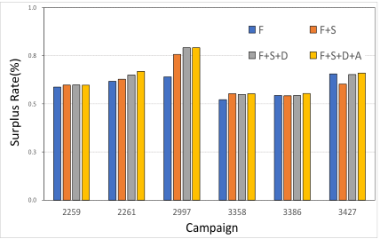

<!-- Start of picture text -->
1.0 F F+S 0.8 F+S+D F+S+D+A 0.5 0.3 0.0 2259 2261 2997 3358 3386 3427 Campaign Surplus Rate(%) <!-- End of picture text -->

**Figure 3: Surplus Rate performance in the ablation studies.** 

and generalization ability. Moreover, an effective MoE module and an adaptive censored loss function module have been proposed to further improve the performance of the model. Comprehensive experiments on large-scale real-world datasets demonstrate that MMCP has achieved significant improvements over other state-ofthe-art methods under various settings. 

### **ACKNOWLEDGMENTS** 

This work was supported in part by Science and Technology Innovation 2030 –“New Generation Artificial Intelligence” Major Project No. 2022ZD0119100, in part by China NSF grant No.U2268204, 62132018, 62322206, 62272307, 61972254, 61972252, in part by Alibaba Group through Alibaba Innovative Research Program, and 

in part by Tencent Rhino Bird Key Research Project. The opinions, findings, conclusions, and recommendations expressed in this paper are those of the authors and do not necessarily reflect the views of the funding agencies or the government. 

### **REFERENCES** 

- [1] AppNexus. 2017. Demystifying Auction Dynamics for Digital Buyers and Sellers. https://www.appnexus.com/sites/default/files/whitepapers/49344-CMAuction-Type-Whitepaper-V9.pdf 

- [2] Jason Bigler. 2019. Rolling out first price auctions to Google Ad Manager partners. _Consulted at https://www. blog. google/products/admanager/ rolling-out-first-priceauctions-google-ad-manager-partners_ (2019). 

- [3] Hakan Bilen and Andrea Vedaldi. 2016. Integrated perception with recurrent multi-task neural networks. _Advances in neural information processing systems_ 29 (2016). 

- [4] R Caruana. 1993. Multitask learning: A knowledge-based source of inductive bias. In _Proceedings of the Tenth International Conference on Machine Learning_ . 

302 

WSDM ’24, March 4–8, 2024, Merida, Mexico 

From Second to First: Mixed Censored Multi-Task Learning for Winning Price Prediction 

Citeseer, 41–48. 

- [5] V Chari and Robert Weber. 1992. How the US Treasury should auction its debt. _Federal Reserve Bank of Minneapolis Quarterly Review_ 16, 4 (1992). 

- [6] Kevin Clark, Minh-Thang Luong, Urvashi Khandelwal, Christopher D Manning, and Quoc V Le. 2019. Bam! born-again multi-task networks for natural language understanding. _arXiv preprint arXiv:1907.04829_ (2019). 

- [7] John M Crespi and Richard J Sexton. 2005. A Multinomial logit framework to estimate bid shading in procurement auctions: Application to cattle sales in the Texas Panhandle. _Review of industrial organization_ 27 (2005), 253–278. 

- [8] Ying Cui, Ruofei Zhang, Wei Li, and Jianchang Mao. 2011. Bid landscape forecasting in online ad exchange marketplace. In _Proceedings of the 17th ACM SIGKDD international conference on Knowledge discovery and data mining_ . 265–273. 

- [9] Getintent. 2017. RTB Auctions: Fair Play? https://blog.getintent.com/rtbauctions-fair-play-3b372d505089 

- [10] Suely Ruiz Giolo. 2004. Turnbull’s nonparametric estimator for interval-censored data. _Department of Statistics, Federal University of Paraná_ (2004), 1–10. 

- [11] Djordje Gligorijevic, Tian Zhou, Bharatbhushan Shetty, Brendan Kitts, Shengjun Pan, Junwei Pan, and Aaron Flores. 2020. Bid shading in the brave new world of first-price auctions. In _Proceedings of the 29th ACM International Conference on Information & Knowledge Management_ . 2453–2460. 

- [12] Xiaochuan Gou and Xiangliang Zhang. 2023. Telecommunication Traffic Forecasting via Multi-task Learning. In _Proceedings of the Sixteenth ACM International Conference on Web Search and Data Mining_ . 859–867. 

- [13] Guy Hadash, Oren Sar Shalom, and Rita Osadchy. 2018. Rank and rate: multi-task learning for recommender systems. In _Proceedings of the 12th ACM Conference on Recommender Systems_ . 451–454. 

- [14] Ali Hortaçsu, Jakub Kastl, and Allen Zhang. 2018. Bid shading and bidder surplus in the us treasury auction system. _American Economic Review_ 108, 1 (2018), 147–169. 

- [15] Niklas Karlsson and Qian Sang. 2021. Adaptive bid shading optimization of firstprice ad inventory. In _2021 American Control Conference (ACC)_ . IEEE, 4983–4990. 

- [16] Brendan Kitts. 2019. Bidder Behavior after Shifting from Second to First Price Auctions in Online Advertising. http://www.appliedaisystems.com/papers/FPA_ Effects33.pdf 

- [17] Iasonas Kokkinos. 2017. Ubernet: Training a universal convolutional neural network for low-, mid-, and high-level vision using diverse datasets and limited memory. In _Proceedings of the IEEE conference on computer vision and pattern recognition_ . 6129–6138. 

- [18] Xu Li, Michelle Ma Zhang, Zhenya Wang, and Youjun Tong. 2022. Arbitrary Distribution Modeling with Censorship in Real-Time Bidding Advertising. In _Proceedings of the 28th ACM SIGKDD Conference on Knowledge Discovery and Data Mining_ . 3250–3258. 

- [19] Jiaqi Ma, Zhe Zhao, Xinyang Yi, Jilin Chen, Lichan Hong, and Ed H Chi. 2018. Modeling task relationships in multi-task learning with multi-gate mixture-ofexperts. In _Proceedings of the 24th ACM SIGKDD international conference on knowledge discovery & data mining_ . 1930–1939. 

- [20] Xiao Ma, Liqin Zhao, Guan Huang, Zhi Wang, Zelin Hu, Xiaoqiang Zhu, and Kun Gai. 2018. Entire space multi-task model: An effective approach for estimating post-click conversion rate. In _The 41st International ACM SIGIR Conference on Research & Development in Information Retrieval_ . 1137–1140. 

- [21] Paul Meier. 1958. Nonparametric estimation from incomplete observations. _Journal of the American statistical association_ 53, 282 (1958), 457–481. 

- [22] S. Muthukrishnan. 2009. Ad Exchanges: Research Issues. In _Internet and Network Economics_ , Stefano Leonardi (Ed.). Springer Berlin Heidelberg, Berlin, Heidelberg, 1–12. 

- [23] Yabo Ni, Dan Ou, Shichen Liu, Xiang Li, Wenwu Ou, Anxiang Zeng, and Luo Si. 2018. Perceive your users in depth: Learning universal user representations from multiple e-commerce tasks. In _Proceedings of the 24th ACM SIGKDD International Conference on Knowledge Discovery & Data Mining_ . 596–605. 

- [24] Suphakit Niwattanakul, Jatsada Singthongchai, Ekkachai Naenudorn, and Supachanun Wanapu. 2013. Using of Jaccard coefficient for keywords similarity. In _Proceedings of the international multiconference of engineers and computer scientists_ , Vol. 1. 380–384. 

- [25] Junwei Pan, Yizhi Mao, Alfonso Lobos Ruiz, Yu Sun, and Aaron Flores. 2019. Predicting different types of conversions with multi-task learning in online advertising. In _Proceedings of the 25th ACM SIGKDD International Conference on Knowledge Discovery & Data Mining_ . 2689–2697. 

- [26] Shengjun Pan, Brendan Kitts, Tian Zhou, Hao He, Bharatbhushan Shetty, Aaron Flores, Djordje Gligorijevic, Junwei Pan, Tingyu Mao, San Gultekin, et al. 2020. Bid shading by win-rate estimation and surplus maximization. _arXiv preprint_ 

- _arXiv:2009.09259_ (2020). 

- [27] Kan Ren, Jiarui Qin, Lei Zheng, Zhengyu Yang, Weinan Zhang, and Yong Yu. 2019. Deep landscape forecasting for real-time bidding advertising. In _Proceedings of the 25th ACM SIGKDD international conference on knowledge discovery & data mining_ . 363–372. 

- [28] Rubicon. 2018. Bridging the Gap to First-Price Auctions. http: //go.rubiconproject.com/rs/958-XBX-033/images/Buyers_Guide_to_First_ Price_Rubicon_Project.pdf 

- [29] Rubicon. 2018. Principles for a better Programmatic Marketplace. https: //www.tagtoday.net/news/principles-better-programmatic-marketplace 

- [30] Seonguk Seo, Jihye Ha, Jieun Shin, Sunah Kim, and Taeho Hwang. 2022. A Unified Model for Bid Landscape Forecasting in the Mixed Auction Types of Real-Time Bidding. In _2022 IEEE International Conference on Big Data (Big Data)_ . IEEE, 1124–1133. 

- [31] Sarah Sluis. 2017. Big changes coming to auctions, as exchanges roll the dice on first-price. _URL: https://adexchanger.com/platforms/ big-changescomingauctionsexchanges-roll-dice-first-price_ (2017). 

- [32] Sarah Sluis. 2017. Explainer: More On The Widespread Fee Practice Behind The Guardian’s Lawsuit Vs. Rubicon Project. https://www.adexchanger.com/adexchange-news/explainer-widespread-fee-practice-behind-guardians-lawsuitvs-rubicon-project/ 

- [33] Hongyan Tang, Junning Liu, Ming Zhao, and Xudong Gong. 2020. Progressive layered extraction (ple): A novel multi-task learning (mtl) model for personalized recommendations. In _Proceedings of the 14th ACM Conference on Recommender Systems_ . 269–278. 

- [34] Dong Wang, Jianxin Li, Tianchen Zhu, Haoyi Zhou, Qishan Zhu, Yuxin Wen, and Hongming Piao. 2022. MtCut: A Multi-Task Framework for Ranked List Truncation. In _Proceedings of the Fifteenth ACM International Conference on Web Search and Data Mining_ . 1054–1062. 

- [35] Nan Wang, Hongning Wang, Yiling Jia, and Yue Yin. 2018. Explainable recommendation via multi-task learning in opinionated text data. In _The 41st International ACM SIGIR Conference on Research & Development in Information Retrieval_ . 165– 174. 

- [36] Yuchen Wang, Kan Ren, Weinan Zhang, Jun Wang, and Yong Yu. 2016. Functional bid landscape forecasting for display advertising. In _Machine Learning and Knowledge Discovery in Databases: European Conference, ECML PKDD 2016, Riva del Garda, Italy, September 19-23, 2016, Proceedings, Part I 16_ . Springer, 115–131. 

- [37] Hong Wen, Jing Zhang, Yuan Wang, Fuyu Lv, Wentian Bao, Quan Lin, and Keping Yang. 2020. Entire space multi-task modeling via post-click behavior decomposition for conversion rate prediction. In _Proceedings of the 43rd International ACM SIGIR conference on research and development in Information Retrieval_ . 2377–2386. 

- [38] Wush Wu, Mi-Yen Yeh, and Ming-Syan Chen. 2018. Deep censored learning of the winning price in the real time bidding. In _Proceedings of the 24th ACM SIGKDD International Conference on Knowledge Discovery & Data Mining_ . 2526–2535. 

- [39] Wush Chi-Hsuan Wu, Mi-Yen Yeh, and Ming-Syan Chen. 2015. Predicting winning price in real time bidding with censored data. In _Proceedings of the 21th ACM SIGKDD International Conference on Knowledge Discovery and Data Mining_ . 1305–1314. 

- [40] Haizhi Yang, Tengyun Wang, Xiaoli Tang, Qianyu Li, Yueyue Shi, Siyu Jiang, Han Yu, and Hengjie Song. 2021. Multi-task Learning for Bias-Free Joint CTR Prediction and Market Price Modeling in Online Advertising. In _Proceedings of the 30th ACM International Conference on Information & Knowledge Management_ . 2291–2300. 

- [41] Qianqian Zhang, Xinru Liao, Quan Liu, Jian Xu, and Bo Zheng. 2022. Leaving no one behind: A multi-scenario multi-task meta learning approach for advertiser modeling. In _Proceedings of the Fifteenth ACM International Conference on Web Search and Data Mining_ . 1368–1376. 

- [42] Yu Zhang and Qiang Yang. 2018. An overview of multi-task learning. _National Science Review_ 5, 1 (2018), 30–43. 

- [43] Tian Zhou, Hao He, Shengjun Pan, Niklas Karlsson, Bharatbhushan Shetty, Brendan Kitts, Djordje Gligorijevic, San Gultekin, Tingyu Mao, Junwei Pan, et al. 2021. An efficient deep distribution network for bid shading in first-price auctions. In _Proceedings of the 27th ACM SIGKDD Conference on Knowledge Discovery & Data Mining_ . 3996–4004. 

- [44] Wen-Yuan Zhu, Wen-Yueh Shih, Ying-Hsuan Lee, Wen-Chih Peng, and Jiun-Long Huang. 2017. A gamma-based regression for winning price estimation in realtime bidding advertising. In _2017 IEEE International Conference on Big Data (Big Data)_ . IEEE, 1610–1619. 

- [45] Christine Zulehner. 2009. Bidding behavior in sequential cattle auctions. _International Journal of Industrial Organization_ 27, 1 (2009), 33–42. 

303 

