# **Cost-Effective Active Learning for Bid Exploration in Online Advertising** 

Zhenzhe Zheng† 

Zixiao Wang∗ 

zhengzhenzhe@sjtu.edu.cn Shanghai Jiao Tong University 

zixiaowang830@gmail.com Shanghai Jiao Tong University 

## Yanrong Kang 

## Jiani Huang∗ 

yanrongkang@tencent.com Advertising & Marketing Service, Tencent 

jianihuang0526@gmail.com Shanghai Jiao Tong University 

### **ABSTRACT** 

##### **ACM Reference Format:** 

Zixiao Wang, Zhenzhe Zheng, Yanrong Kang, and Jiani Huang[1]. 2024. Cost-Effective Active Learning for Bid Exploration in Online Advertising. In _Proceedings of the 17th ACM International Conference on Web Search and Data Mining (WSDM ’24), March 4–8, 2024, Merida, Mexico._ ACM, New York, NY, USA, 9 pages. https://doi.org/10.1145/3616855.3635839 

As a bid optimization algorithm in the first-price auction (FPA), bid shading is used in online advertising to avoid overpaying for advertisers. However, we find the bid shading approach would incur serious local optima. This effect prevents the advertisers from maximizing long-term surplus. In this work, we identify the reasons behind this local optima - it comes from the lack of winning price information, which results in the conflict between short-term surplus and the winning rate prediction model training, and is further propagated through the over-exploitation of the model. To rectify this problem, we propose a cost-effective active learning strategy, namely CeBE, for bid exploration. Specifically, we comprehensively consider the uncertainty and density of samples to calculate exploration utility, and use a 2 + _𝜖_ -approximation greedy algorithm to control exploration costs. Instead of selecting bid prices that maximize the expected surplus for all bid requests, we employ the bid exploration strategy to determine the bid prices. By trading off a portion of surplus, we can train the model using higher-quality data to enhance its performance, enabling the system to achieve a long-term surplus. Our method is straightforward and applicable to real-world industrial environment: it is effective across various categories of winning rate prediction models. We conducted empirical studies to validate the efficacy of our approach. In comparison to the traditional bid shading system, CeBE can yield an average surplus improvement of 8 _._ 16% across various models and datasets. 

### **1 INTRODUCTION** 

Online display advertising has become one of the most influential strategies to promote products, wherein auto-bidding achieves great success in optimizing the ad performance. To achieve higher utility, advertisers usually design bid optimization algorithms [37] to help them provide appropriate bids for each ad request. However, since 2019, led by Google, many ad exchanges have transmitted from second-price auctions (SPAs) to first-price auctions (FPAs) [2]. Bid optimization algorithms designed for SPAs are not suitable for FPAs due to the problem of overpaying. To address this dilemma, _bid shading_ [5, 13, 40] has been proposed, with the purpose of avoiding overpayment and further increasing advertisers’ surplus. Bid shading first trains a winning rate prediction model usually within two categories: predefined distribution model (PDM) and non-predefined distribution model (NPDM). Based on the winning rate prediction, the bid prices are determined to maximize expected surplus. With the auction outcomes, advertisers acquire win/loss labels for this round of bid requests and then use them to update the winning rate prediction model for the subsequent round. 

### **CCS CONCEPTS** 

Despite the satisfactory performance, we argue that traditional bid shading paradigm can lead the winning rate prediction model to become trapped in local optima. In the context of FPA, the collected data lacks information about winning prices. Therefore, we can only update the prediction model using win/loss labels at specific bid prices, which results in the model’s performance being significantly influenced by the distribution of bid prices. Through our experiments, we demonstrated that models trained with uniformly distributed bid prices outperform those trained with biasedly distributed bid prices by 13 _._ 3%. In general, to achieve a well-performing model, it is imperative that the bid prices in the training data should be representative, enabling them to reflect the real distribution of winning prices. However, the bid prices in the training data of bid shading aim to maximize the expected surplus and are thus biased and not representative, easily leading the prediction model into local optima. We conduct an empirical study of deploying bid shading on iPinYou [22] and our private dataset. We conducted experiments using PDM and NPDM, which will be described in detail in Section 

#### • **Information systems** → **Computational advertising** . 

### **KEYWORDS** 

Auto-bidding; Bid Landscape Forecasting; Bid Shading; First-price Auction; Active Learning 

∗Work done when Zixiao Wang and Jiani Huang were interns at Tencent. 

†Zhenzhe Zheng is the corresponding author. 

Permission to make digital or hard copies of all or part of this work for personal or classroom use is granted without fee provided that copies are not made or distributed for profit or commercial advantage and that copies bear this notice and the full citation on the first page. Copyrights for components of this work owned by others than the author(s) must be honored. Abstracting with credit is permitted. To copy otherwise, or republish, to post on servers or to redistribute to lists, requires prior specific permission and/or a fee. Request permissions from permissions@acm.org. _WSDM ’24, March 4–8, 2024, Merida, Mexico_ 

© 2024 Copyright held by the owner/author(s). Publication rights licensed to ACM. ACM ISBN 979-8-4007-0371-3/24/03...$15.00 https://doi.org/10.1145/3616855.3635839 

788 

WSDM ’24, March 4–8, 2024, Merida, Mexico 

Zixiao wang, Zhenzhe Zheng, Yanrong Kang and Jiani Huang 

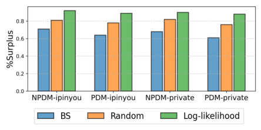

**Figure 1: Surplus ratio of models trained with different bid prices. Bid shading (BS) means that the bid prices in the training data are generated by a well-maintained bid shading system. Random means that the bid prices are uniformly distributed within a certain range. Log-likelihood means that the prediction model is able to access winning prices and update using maximum log-likelihood.** 

5. The results are presented in Figure 1. The surplus ratio is the ratio between the actual obtained surplus and the optimal surplus. It is evident that the models trained with bid shading-generated data perform worse than those trained with randomly generated bidding data. In other words, the training data generated by bid shading is less informative than the randomly generated bidding data, while the winning prices obtained within the Log-likelihood setting can be considered as the attainable bidding data with the highest informativeness. This significant result reveals the ubiquitous local optima in the current bid shading, and will hinder the prediction model from gaining a comprehensive understanding of the winning price distribution. Moreover, it will impact advertisers’ bidding algorithms, substantially reducing their utilities. In view of this phenomenon, we first identify the cause of the local optima - _the over-exploitation of the winning rate prediction model_ . Selecting bid prices that maximize the expected short-term surplus relying on the winning rate prediction model can be considered as a certain kind of exploitation. And over-exploitation lead to an inadequate grasp of the distribution of winning prices due to the absence of unbiased winning price information, subsequently affecting long-term surplus. This discrepancy is indeed the root cause of the local optima. 

Aware of the cause of the local optima, we introduce bid exploration into the bid shading system as a solution. We employ a strategy to select a subset of bid requests along with their bid prices that are beneficial for the prediction model training. However, bid exploration faces two major challenges. First, the bid exploration must be “cost-effective”. In online advertising, the advertisers would incur actual payment for each bid exploration. This implies that we must select the most valuable exploration samples while adhering to a constrained budget. However, due to the absence of winning price information, we lack the knowledge of the benefits and costs associated with each potential bid request. Designing a suitable approach to estimate the exploration utility of each bid request while also curtailing exploration costs poses a challenging problem. Second, in contrast to exploration algorithms in other domains (such as bandit [17] and reinforcement learning [31]), bid exploration 

demands not only the selection of which bid request to explore but also the determination of the exploration bid price to win this bid request. This dual decision-making process significantly amplifies the complexity of identifying the optimal choice for bid exploration. 

In this paper, we propose solutions for the challenges above. First, we design a cost-effective active learning strategy for bid exploration, allowing the bid optimization algorithm to autonomously select bid requests to explore, and thus improving the performance of the winning rate prediction model. Our approach take into account the uncertainty and density with respective to the winning price distribution, which can reflect the exploration utility of each sample. Also, we provide a method for estimating the cost of each exploration, and formulate the problem as a _stochastic knapsack problem_ . Therefore, we can attain the highest exploration utility within the budget constrains. Second, concerning an exploitation bid request, we bid to maximize the expected surplus. Conversely, If we explore this bid request, we offer an alternative bid price. Through a comparative analysis of these two approaches, we determine the exploration utility for each bid price on that request. The same idea applies to exploration costs. We can thus solve the challenge of selecting exploration bid prices through this approach. The main contributions of this paper are as follows: 

- To the best of our knowledge, we are the first to identify and address the local optima commonly encountered in the current bid shading system. 

- We propose a cost-effective active learning for bid exploration, namely CeBE. By trading off a portion of short-term surplus, we enable the bid optimization algorithms to achieve a large long-term surplus. 

- We conduct extensive experiments by various models on both public and private datasets to demonstrate the superior performance of CeBE. 

### **2 RELATED WORKS** 

In this section, we will review the most related works from the following three perspectives. 

**Bid Landscape Forecasting.** Bid landscape forecasting refers to modeling the winning price or market price distribution for ad auctions, which is the most critical problem in bidding optimization. The cumulative distribution function of the winning price distribution is the winning rate given each specific bid price. Most prior bid landscape forecasting methods focused on SPA scenario. Some researchers presented predefined winning price distribution functions [7, 20, 37] and subsequently fitted the parameters of the functions. Common probability distributions such as Log-normal [7], Gauss [33], and Gamma [39] are used to model the distribution of winning prices. Furthermore, alternative non-predefined distribution methods based on deep learning, such as ADM [21], DLF [24] and Link Structures [32], have been explored. In these works, researchers have access to either complete or partially censored winning price information. Nevertheless, FPAs are becoming increasingly popular. The FPA framework poses greater challenges for bid landscape forecasting due to the complete information censorship about winning prices. In this paper, we introduce modifications to the winning rate prediction models to tailor them to the complete information censorship about winning prices. 

789 

Cost-Effective Active Learning for Bid Exploration in Online Advertising 

WSDM ’24, March 4–8, 2024, Merida, Mexico 

**Bid Shading.** In the context of FPAs, _bid shading_ is a common trick in auction theory. Zulehner and Christine [41] found robust evidences of shading in Austrian livestock auctions, Crespi et al. [6] reported shading in a Texas cattle market, and Hortaçsu et al. [13] found the practice in auctions for US Treasury notes. In online advertising, bid shading is a bid optimization algorithm helping the advertisers from overpaying. There are two general approaches for bid shading, depending on whether the winning price is provided or censored. The former build a machine learning algorithm to predict the optimal bid shading factor [10]. The latter approach tries to estimate the distribution of winning price, and then find the optimal bid price with maximum surplus. The distributon of winning price is predefined like Gauss [15] and Sigmoid [23]. And Zhou et al. [38] considered modeling under both scenarios: with and without winning price information. 

**Active Learning.** Active learning is a subfield of machine learning. The key hypothesis is that, if the learning algorithm is allowed to choose the data from which it learns to be “curious”, it will perform better with less training cost [26]. The most commonly used active learning strategy involves selecting the samples with the highest uncertainty, including uncertainty sampling [18, 19, 27], query-by-committee [27, 29], expected model change [28] and variance reduction [36]. In addition to uncertainty sampling, some active learning approaches considered the density and diversity of samples due to the redundancy of instances and susceptibility to outliers [16, 25, 27]. The cost of active learning is also important, some cost-sensitive approaches have been proposed, such as VOI [14], ROI [12] and so on. With the advancement of deep learning techniques, there have emerged methods that use deep neural networks in data sample selection [1, 11, 34]. These approaches still revolve around measuring the uncertainty and representatives of samples as their core principles. Some researchers have also connected graph theory with active learning [8, 35], utilizing graph algorithms to model the relationships between unlabeled samples. Caramalau et al. has proposed an active learning method based on Graph Convolutional Network (GCN) [3]. 

Traditional active learning method is to query annotations for unlabeled samples. However, in the context of this work, whether we query annotations or not, ideally, all bid requests will receive win/loss labels after the auction. What we aim to do is provide more valuable annotations for these bid requests. Furthermore, the active learning strategy should be lightweight enough to deploy on the industrial online advertising system. 

### **3 PRELIMINARIES** 

In this section, we first provide the details of the online advertising system with bid shading, and then introduce the basic notations and formulate the bid shading task. 

Suppose we have a online advertising system to handle with bid requests under FPA scenario. When a user visits a web page with an ad opportunity, the developer initiates an ad request and sends it to the supply side platform (SSP). The SSP then send available user and page information to multiple demand-side platforms (DSPs) for auction. Then the DSP selects a candidate ad with the highest ad value for this ad opportunity. And the winning rate prediction model will predict the winning rate of this bid request at different 

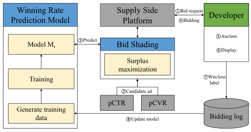

<!-- Start of picture text -->
Winning Rate  Supply Side  ①Bid request Developer Prediction Model Platform ④Bidding ⑤Auction ③Predict Model Mt Bid Shading ⑥Display Surplus maximization Training ⑦Win/loss label ②Candidate ad pCTR pCVR Generate training data ⑧Update model Bidding log <!-- End of picture text -->

**Figure 2: The structure of bid shading system** 

bid prices. Based on the winning rate prediction, the DSP calculates the expected surplus of this bid request at different bid prices and find the optimal bid price. The ad together with the bid is sent to the developer, where the bid is compared with the bids from the other DSPs to determine the winning ad and the final payment. After the auction, the winner’s ad is displayed and the win/loss labels are also returned to DSPs. After processing all the bid requests for this round, the bid shading system updates the winning rate prediction model using the newly collected samples. 

We use _𝑋_ = { _𝑥_ 1 _,𝑥_ 2 _, ...,𝑥𝑁_ } to denote the bid requests we will handle in round _𝑡_ . And _𝑥𝑖_ represents the features of the bid request, including user features, context features, and so on. The dimension of _𝑥𝑖_ is _𝑞_ . We also have the bid prices before shading _𝑉_ = { _𝑣_ 1 _, 𝑣_ 2 _, ..., 𝑣𝑁_ } based on click-through rate (CTR) or conversion rate (CVR), which represents how much the advertiser expect to capture from the ad requested _𝑥𝑖_ and can be considered as the bid price before shading. Then at each bid request _𝑥𝑖_ , we can place a new bid price _𝑏𝑖_ after shading. For illustration, we assume that the bid price _𝑏𝑖_ is discrete, and we have _𝑏𝑖_ ∈{ _𝑏_1 _,𝑏_2 _, ...,𝑏__𝐾_ }. In the bid shading system, we have a winning rate prediction model _𝑀𝑡_ for the bid requests in round _𝑡_ . The model is used to predict the winning rate of the bid requests at different bid prices, and the output of the winning rate prediction model is a vector _𝑀𝑡_ ( _𝑥𝑖_ ) = ( _𝑝𝑖_1_, 𝑝_ _𝑖_2_, ..., 𝑝_ _𝑖__𝐾_)repre- sents the winning rate at different bid prices, where _𝑀𝑡__𝑘_(_𝑥𝑖_)=_𝑝_ _𝑖__𝑘_ is the winning rate of _𝑥𝑖_ at bid price _𝑏__𝑘_ . Then the expected surplus [23] of the bid request _𝑥𝑖_ at the bid price _𝑏__𝑘_ is defined as: 

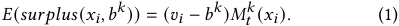

For the bid shading system, the bid prices _𝑏𝑖_∗of_𝑥𝑖_maximize the expected surplus [23]: 

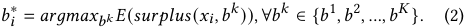

In this paper, bidding by maximizing the expected surplus is considered as an exploitation of the winning rate prediction model. The ad together with the bid price is sent to the developers, where it is compared with bids from other advertisers. After the auction, we will get the win/loss label _𝑦𝑖_∗for each ad request_𝑥𝑖_at the bid price _𝑏𝑖_∗. Suppose_𝑧𝑖_is the winning price and we have 

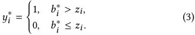

790 

WSDM ’24, March 4–8, 2024, Merida, Mexico 

Zixiao wang, Zhenzhe Zheng, Yanrong Kang and Jiani Huang 

**Table 1: Notations and Description** 

|**Notation**|**Description**|
|---|---|
|_𝑀𝑡_|the winningrateprediction model for_𝑡_-th round|
|_𝑋_|ad requests received in one round|
|_𝑉_|bidprices before shading|
|_𝑁_|the size of_𝑋_|
|_𝑞_ |the dimension of_𝑥𝑖_∈_𝑋_|
|_𝑏__𝑘_|the discrete bidprice|
|_𝑏𝑖_|the bidprice for bid request_𝑥𝑖_|
|_𝑧𝑖_|the winning price of bid request_𝑥𝑖_|
|_𝑦𝑖_ |the win/loss label for bid request_𝑥𝑖_at_𝑏𝑖_ |
|_𝑀__𝑘_ _𝑡_(_𝑥𝑖_)|theprediction winningrates of_𝑥𝑖_at_𝑏__𝑘_by_𝑀𝑡_|

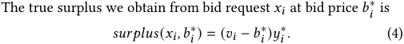

A training dataset consisting of many ( _𝑥𝑖,𝑏𝑖_∗_,𝑦_ _𝑖_∗) samples is used to update the winning rate prediction model _𝑀𝑡_ and obtain the next round’s model _𝑀𝑡_ +1. 

### **4 DESIGN** 

In this section, we introduce our proposed **CeBE** ( **C** ost- **e** ffective active learning for **B** id **E** xploration). Firstly, we introduce the formulation of the problem we need to address and the challenges faced during the design process. Secondly, we provide a detailed description of our proposed approach. 

### **4.1 Formulation** 

In CeBE, we introduce an exploration module based on cost-effective active learning to help the bid shading system escape from local optima. The exploration module is a biased sampler that selects bid requests from _𝑋_ to construct the exploration set _𝑋_ˆ = { _𝑥_ ˆ1 _, 𝑥_ ˆ2 _, ..., 𝑥_ ˆ _𝐿_ } and the remaining is the exploitation set _𝑋_∗ . The exploitation bid prices _𝐵_∗ for the exploitation set _𝑋_∗ maximize the expected surplus. The exploration module then generate the exploration bid prices _𝐵_ ˆ = { _𝑏_ ˆ1 _, 𝑏_ ˆ2 _, ..., 𝑏_ ˆ _𝐿_ } for each exploration bid request _𝑥_ ˆ _𝑙_ in exploration set _𝑋_ˆ . The bid prices of bid requests in exploration set _𝑋_ˆ can take on any arbitrary value which can improve the training effectiveness of the model at most within proper cost limits. After obtaining the win/loss labels, we will update our winning rate prediction model by both sets. By introducing an exploration module, we can utilize exploration data that is more effective in enhancing the model’s performance for training. Although exploration may lead to a shortterm reduction in gains, after multiple rounds of exploration, the model’s win-rate predictions distribution will be closer to the true distribution, resulting in long-term benefits. 

Assume _𝑥_ ˆ _𝑙_ ∈ _𝑋_ˆ , and _𝑏_ˆ _𝑙_ ∈ _𝐵_ˆ is the bid price of it. We define two functions named _𝑢_ and _𝑐_ to illustrate the optimization objective and constraints of Cost-Effective Active Learning. The utility of request _𝑥_ ˆ _𝑙_ is _𝑢_ ( ˆ _𝑥𝑙 , 𝑏_ˆ _𝑙_ ), which means the benefits _𝑥_ ˆ _𝑙_ will bring to the bid shading system in the long term. And we assume _𝑢_ ( _𝑋,_ˆ _𝐵_ˆ ) =� _𝑙__𝐿𝑢_( ˆ_𝑥𝑙,𝑏_ˆ_𝑙_). The exploration cost of request _𝑥_ ˆ _𝑙_ is _𝑐_ ( ˆ _𝑥𝑙 , 𝑏_ˆ _𝑙_ ), which means the loss incurred by the bidding system when placing the bid price _𝑏_ˆ _𝑙_ on the request _𝑥_ ˆ _𝑙_ . And we also assume _𝑐_ ( _𝑋,_ˆ _𝐵_ˆ ) =� _𝑙__𝐿𝑐_( ˆ_𝑥𝑙,𝑏_ˆ_𝑙_) So, finding 

the optimal exploration set _𝑋_ˆ in round _𝑡_ can be formulated as an optimization problem: 

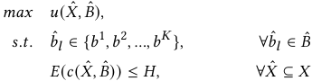

where _𝐻_ is the cost budget for round _𝑡_ . 

We encountered several challenges during the design process. Firstly, to ensure cost-effectiveness in our exploration strategy, it’s essential to accurately estimate the exploratory utility of each bidding request for every bid price. As the exploration samples eventually become part of the model’s training data, exploration can influence the model’s predictive outcomes on other bid requests. This increases the complexity of predicting the exploration utility of each sample. To address this challenge, we consider not only the model’s uncertainty at different bid prices for each bid request but also the similarities between different bid requests. If a bid request exhibits a high level of similarity with other bid requests, we consider such bid requests to have a high density. Exploring on bid requests that occur frequently naturally holds higher utility. Secondly, controlling exploration costs is also an important aspect of maintaining cost-effectiveness. In bid exploration, there is a significant disparity in the costs associated with choosing different exploration bid prices for various bid requests. If we do not control the exploration cost, the utility of the bid shading system may decrease due to over-exploration. However, without winning price information, we can not know the realized exploration cost. To address this challenge, we propose a method for calculating the expected exploration cost and demonstrate how to control cost consumption based on stochastic knapsack problem. 

### **4.2 Bid Exploration Utility Estimation** 

In Section 2, we described the method for finding the optimal exploration set _𝑋_ˆ . The key idea of this method lies in the estimation of utility and cost corresponding to each sample. Ideally, to calculate the utility of exploring a bid request, we would need to retrain the model based on the exploration sample and then compute the surplus improvement on the incoming bid requests using the new model. However, this method requires constant model retraining, which incurs high time and computational costs. What’s more, without knowing the winning price, it is difficult to estimate the surplus improvement we have gained through exploration. So, we use other frameworks for measuring exploration utility of every requests. In the remaining part of this Section, we describe query strategy formulation of _𝜙_ (·) that is used for active learning. 

**Entropy Utility.** Firstly, according to _uncertainty sampling_ [18, 19, 27] in active learning, the higher the uncertainty of a model’s prediction for a particular bid in a request, the greater the information we can obtain by exploring that request. _entropy_ [30] is a common uncertainty-based measure for informativeness in active learning. Suppose we are estimating the entropy utility of request _𝑥𝑖_ . _𝑀𝑡_ ( _𝑥𝑖_ ) will predict the winning rates at different bid prices. For _𝑥𝑖_ , the prediction of winning rate _𝑝𝑖__𝑘_atthebidprice_𝑏𝑘_canbe considered as a binary classification problem. So the query strategy 

791 

WSDM ’24, March 4–8, 2024, Merida, Mexico 

Cost-Effective Active Learning for Bid Exploration in Online Advertising 

formulation based on entropy of _𝑥𝑖_ at _𝑏__𝑘_ is: 

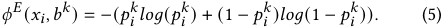

However, in traditional active learning, we request annotations for unlabeled data. While in this paper, the bid requests in the exploitation set _𝑋_∗ will have annotations (the win/loss label _𝑦𝑖_∗) after the auction. We aim to request more valuable annotations for exploration on bid requests at different bid prices. So the difference between the annotations obtained through exploitation and the ones acquired through exploration is the utility brought by exploration. So we have: 

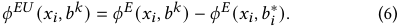

For every bid request _𝑥𝑖_ , we will calculate a vector of length _𝐾_ which represents its _entropy utility_ at different bid prices. At _𝑡_ -th round, we receive the bid request set _𝑋_ . Based on the above method, we can calculate the entropy utility of the current model _𝑀𝑡_ for each bid price on each bid request. It can be represented in the form of an _𝑁_ × _𝐾_ matrix named _𝐸_ . 

|_𝐸_|_𝑏_1|· · ·|_𝑏__𝑘_|· · ·|_𝑏__𝐾_|
|---|---|---|---|---|---|
|_𝑥_1|_𝐸_11|· · ·|_𝐸_1_𝑗_|· · ·|_𝐸_1_𝐽_|
|_..._|_..._|_..._|||_..._|
|_𝑥𝑖_|_𝐸𝑖_1||_𝐸𝑖𝑘_||_𝐸𝑖𝐾_|
|_..._|_..._|||_..._|_..._|
|_𝑥𝑁_|_𝐸𝑁_1|· · ·|_𝐸𝑁𝑘_|· · ·|_𝐸𝑁𝐾_|

where _𝐸𝑖𝑘_ = _𝜙__𝐸𝑈_ ( _𝑥𝑖,𝑏__𝑘_ ). 

**Exploration Utility.** In the above section, we proposed the method for calculating the entropy utility, which represents the the uncertainty gain brought by exploration on each bid price for each bid request. However, it has been suggested that common uncertainty sampling are prone to querying outliers [25], which have a low occurrence frequency within the bid requests. In this study, we take into account density together with uncertainty. In CeBE, density measure can be understood as follows: If we explore on a certain sample that frequently appears in bid requests, the exploration utility of this sample will be higher than the outliers. Knowing the winning price distribution of a bid request that frequently appears is naturally more valuable than the one that rarely occurs. To address this challenge, we introduce a density measure based on the similarity between samples to the above-mentioned entropy utility. 

We calculate the similarities between each pair bid requests and use them to model the exploration utility of each request at each bid price. The bid requests _𝑋_ ∈ R(_𝑁_×_𝑞_) encode user and ad features and are initialised with the features extracted from the winning rate prediction model. After we apply _𝑙_ 2 normalization to the features, we can calculate the similarities between each pair of _𝑋_ by cosine similarity i.e. ( _𝑥𝑖𝑥__𝑇_ _𝑗__,_{_𝑖, 𝑗_∈_𝑁_}). And we assume that if the cosine similarity is greater than the threshold _𝜆_ , these two bid requests are almost the same. If a sample does not have any other sample with cosine similarity greater than _𝜆_ , then this sample is considered as an outlier. So we build a matrix _𝑆__𝑐𝑜𝑠_ ∈ R(_𝑁_×_𝑁_) to represent the 

correlation between each pair of ad requests. 

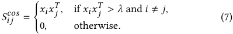

Furthermore, we normalize the matrix by multiplying with its degree _𝐷_ (the number of related samples). Then, we add the identity matrix _𝐼_ to the matrix so that the most similar is with the bid request itself. At last, we get the matrix _𝑆_ ∈ R_𝑁_×_𝑁_ to represent the correlation between each pair of bid requests, including the bid request and itself. This can be formulated under: 

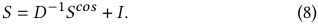

We can consider the matrix _𝑆_ as a graph, where each bid request represents a node in the graph, and each edge represents the correlation between the two connected nodes. Indeed, this is a special graph, where there is an edge between a node and itself. The initial entropy utility of the node _𝑥𝑖_ at bid price _𝑏__𝑘_ is _𝜙__𝐸𝑈_ ( _𝑥𝑖,𝑏__𝑘_ ) and the weight of each edge is _𝑆𝑖𝑗 ,_ { _𝑖, 𝑗_ ∈ _𝑁_ }. We update the entropy utility of _𝑥𝑖_ at bid price _𝑏__𝑘_ based on its connected neighbors. The update method for the entropy utility of _𝑥𝑖_ in each iteration is as follows: 

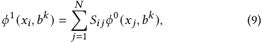

where _𝜙_0 ( _𝑥 𝑗 ,𝑏__𝑘_ ) = _𝜙__𝐸𝑈_ ( _𝑥 𝑗 ,𝑏__𝑘_ ). After _𝛽_ iterations, we get _𝜙__𝛽_ ( _𝑥𝑖,𝑏__𝑘_ ) to represent the exploration utility of each bid price in ad request _𝑥𝑖_ . The parameter _𝛽_ controls the density importance in exploration utility estimation for ad requests. _𝜙_0 ( _𝑥𝑖,𝑏__𝑘_ ) measures the "base" informativeness by _𝑒𝑛𝑡𝑟𝑜𝑝𝑦𝑢𝑡𝑖𝑙𝑖𝑡𝑦_ strategy above. Also, we can use an _𝑁_ × _𝐾_ matrix _𝑈_ to represent the exploration value of every ad requests at every bid prices. We can easily get _𝑈_ through several matrix multiplications: 

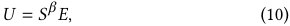

where _𝑈𝑖𝑘_ = _𝜙__𝛽_ ( _𝑥𝑖,𝑏__𝑘_ ). 

We proposed an active learning strategy that takes into account the uncertainty and density of each ad request on each bid price . The final result is represented by matrix _𝑈_ , where _𝑈𝑖𝑘_ indicate the exploration utility of the ad request _𝑥𝑖_ on the bid price _𝑏__𝑘_ . Now, we have finished the definition of _𝑢_ function in Section 3 _._ 1, where _𝑢_ ( ˆ _𝑥𝑙 , 𝑏_ˆ _𝑙_ ) = _𝜙__𝛽_ ( ˆ _𝑥𝑙 , 𝑏_ˆ _𝑙_ ). Based on _𝑈_ and our exploration objectives, we can construct the exploration set _𝑋_ˆ . It’s worth noting that in RTB scenarios, under each ad request, we can only choose one bid for exploration. Indeed, we won’t have the opportunity to bid multiple times on a single ad request. 

### **4.3 Bid Exploration Costs Control** 

In CeBE, different exploration bid prices will result in varying cost consumption. Let’s consider an example where the exploration value on bid request _𝑥_ ˆ _𝑙_ with bid price _𝑏_ˆ _𝑙_ is the highest. However, at this moment, the exploration cost might be unacceptable. In this section, we propose a method to estimate the exploration cost and use a 2 + _𝜖_ -approximation greedy algorithm to solve this stochastic knapsack problem. 

**Cost Estimation.** Suppose we have an exploration bid request _𝑥_ ˆ _𝑙_ with true value _𝑣𝑙_ , and our exploration bid price is _𝑏_ˆ _𝑙_ . If we do not explore this bid request, we will place bid price _𝑏𝑙_∗at the bid 

792 

WSDM ’24, March 4–8, 2024, Merida, Mexico 

Zixiao wang, Zhenzhe Zheng, Yanrong Kang and Jiani Huang 

request _𝑥_ ˆ _𝑙_ . However, if we explore this bid request _𝑥_ ˆ _𝑙_ and generate an exploration bid price _𝑏_ˆ _𝑙_ , the surplus we can obtain changes. And the difference between the two represents the true cost brought by exploration. So we have: 

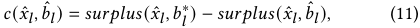

However, because we do not know the true winning price of bid request _𝑥_ ˆ _𝑙_ and the win/loss label _𝑦_ ˆ _𝑙_ before auction, we are not able to calculate the true cost. Instead, we use the expected cost 

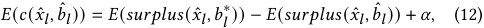

where _𝛼_ is the initial cost corresponding to the exploitation case because we hope that the expected cost is a non-zero positive value in any scenario. It is worth noting that the expected cost is a distribution, and its true values vary depending on the win/loss labels after the auction. And we only know the expectation of cost before the auction. We then calculate the cost-effectiveness of each bid request _𝑥𝑖_ at each bid price _𝑏__𝑘_ and find the bid price _𝑏_ˆ _𝑖_ that maximizes the cost-effectiveness 

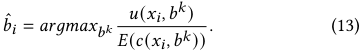

If we explore the ad request _𝑥𝑖_ , the exploration bid price will be _𝑏_ˆ _𝑖_ and we use _𝑟𝑖_ to denote the cost-effectiveness of this exploration. _𝑐𝑖_ = _𝐸_ ( _𝑐_ ( _𝑥𝑖, 𝑏_ˆ _𝑖_ )) is used to denote the expectation cost of exploring _𝑥𝑖_ and _𝑢𝑖_ = _𝑢_ ( _𝑥𝑖, 𝑏_ˆ _𝑖_ ) is used to denote the exploration utility we will obtain by exploring _𝑥𝑖_ . 

**Stochastic Knapsack Problem.** The optimization problem in Section 3 _._ 1 can be formulated as a _Stochastic Knapsack Problem_ [4]. Suppose the budget for round _𝑡_ is _𝐻_ . We try to fill the "knapsack" of "volume" _𝐻_ with bid requests valued _𝑢𝑖_ with "size" _𝑐𝑖_ . Unlike 0 − 1 knapsack problem, in this scenario, the "size" of each "item" is a distribution, and its actual "size" is determined only when it is placed into the "knapsack". Generally, we should use an adaptive policies to address the stochastic knapsack problem. This means adjusting the strategy in real-time based on current profits, remaining knapsack capacity, and other relevant information. However, this method is complex and computationally intensive. So, we use a greedy algorithm to solve this problem. 

Because the bidding system will receive a large amount of ad requests at each round, the requests’ exploration costs have a notable characteristic, that is the exploration costs are much smaller than the budget _𝐻_ . Suppose we have 

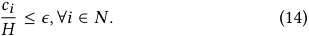

In this situation, the difference between the results obtained from the greedy algorithm and the optimal adaptive strategy is small. 

Firstly, we use _𝑟𝑖_ to denote the cost-effectiveness of the exploration on _𝑥𝑖_ . We sort the ad requests based on their cost-effectiveness _𝑟𝑖_ and then select ad requests from largest to smallest. Then we add the selected ad request to the exploration set _𝑋_ˆ and its bid price which maximize the cost-effectiveness to the exploration bid prices _𝐵_ ˆ. Through this exploration, we expanded the corresponding cost and update the budget _𝐻_ . We will continue sequentially selecting samples to add to the exploration set until the budget is exhausted. It has been prove that this greedy algorithm is a 2+ _𝜖_ -approximation algorithm [9]. 

**Algorithm 1** Find the optimal exploration set 

**Input:** bid requests _𝑋_ , bid prices befor shading _𝑉_ , budget _𝐻_ ; 

**Output:** the exploration set _𝑋_ˆ and exploration bid prices _𝐵_ˆ ; 

- 1: _𝑠𝑢𝑟𝑝𝑙𝑢𝑠𝑖𝑘_ = ( _𝑉𝑖_ − _𝑏__𝑘_ ) _𝑀𝑡__𝑘_(_𝑥𝑖_); 

- 2: the largest value of each row is _𝑠𝑢𝑟𝑝𝑙𝑢𝑠𝑖_∗; 

- 3: _𝐶𝑖𝑘_ = _𝑠𝑢𝑟𝑝𝑙𝑢𝑠𝑖_∗−_𝑠𝑢𝑟𝑝𝑙𝑢𝑠𝑖𝑘_; 

- 4: _𝐸𝑖𝑘_ = _𝜙__𝐸𝑈_ ( _𝑥𝑖,𝑏__𝑘_ ); 

- 5: _𝑋_ = _𝐿_ 2 𝑁𝑜𝑟𝑚𝑎𝑙𝑖𝑧𝑒_ ( _𝑋_ ); 

- 6: _𝑆__𝑐𝑜𝑠_ = _𝑋𝑋__𝑇_ − _𝐼_ , values lower than _𝜆_ replaced by 0; 

- 7: _𝑆_ = _𝐷_−1 ( _𝑆__𝑐𝑜𝑠_ ) + _𝐼_ ; 

- 8: _𝑈_ = _𝑆__𝛽_ _𝐸_ ; 

- 9: **while** _𝐻_ > 0 **do** 

- 10: select unchosen _𝑥_ ˆ at _𝑏_ˆ with largest value in_<u>𝑈</u>_ _𝐶_; 

- 11: _𝑋_ ˆ ∪{ _𝑥_ ˆ} and _𝐵_ ˆ = _𝐵_ ˆ ∪{ _𝑏_ ˆ}; 

- 12: update budget _𝐻_ ; 

- 13: **end while** 

- 14: **return** _𝑋_ˆ and _𝐵_ˆ . 

**Table 2: Statistics of datasets** 

|dataset|Total#|Opt win rate(%)|Opt surplus|
|---|---|---|---|
|iPinYou(pretrain)|6913657|98.52|1332426293|
|iPinYou(Evaluate)|5323430|98.33|997500830|
|Private(pretrain)|4057166|\|\|
|Private(Evaluate)|5409519|\|\|

### **5 EVALUATION** 

In this section, we conduct experiments to evaluate the performance of our proposed CeBE. 

### **5.1 Experiment Setup** 

The datasets, models and implementation details are described in the appendix1 . 

**Baselines.** As we are the first to introduce an exploration module in the bid shading system, we lack relevant baselines for comparison. Therefore, we contrast our approach with traditional active learning methods. We compare our methods with the following baselines: 

- **BS** : The bid shading system without any exploration module. Any exploration strategy should achieve better results than this baseline; otherwise, the exploration strategy would not be acceptable. 

- **Random** : We randomly select a portion of bid requests for exploration and place random bid prices on these bid requests. 

- **Entropy** [18, 19, 27, 30]: We select the bid prices for which the model predicts the highest entropy for exploration. That is to say that the predicted winning rate of exploration bid prices is 0 _._ 5. 

- **E/C** [12]: We calculate the entropy and cost for each bid request at each bid price, then sort them in descending order and explore them in the order. 

1https://drive.google.com/file/d/1VY8_1PbNj8nIOk30CnffUJdwN4CeR26i/view?usp= drive_link 

793 

Cost-Effective Active Learning for Bid Exploration in Online Advertising 

WSDM ’24, March 4–8, 2024, Merida, Mexico 

**Table 3: Overall performance comparison between our method and baselines, where the best performance is bold and the second best is underlined.** 

||Datasets||iP|inYou|||Pr|ivate||
|---|---|---|---|---|---|---|---|---|---|
|Model|Metrics|%surplus|%imps|%V|%exploration|%surplus|%imps|%V|%exploration|
||BS|73.68|**82.65**|**84.40**|\|64.21|23.53|90.23|\|
||Random|73.35|77.81|79.60|7.21|76.08|27.47|88.02|7.00|
|NPDM|Entropy|73.71|78.32|80.16|5.97|75.24|20.48|79.69|3.84|
||E/C|74.93|78.17|80.02|22.93|69.96|**28.77**|**91.69**|31.04|
||LL|74.24|78.25|81.32|6.34|75.48|22.28|80.12|5.32|
||CeBE|**76.11**|78.15|81.35|25.47|**76.25**|26.11|91.28|24.46|
||BS|37.00|30.66|41.23|\|39.12|11.08|40.15|\|
||Random|45.47|**45.34**|**47.07**|10.53|46.88|**13.24**|47.63|11.24|
||Entropy|39.06|38.79|40.31|8.05|47.61|10.87|39.43|9.51|
|PDM|E/C|45.19|41.77|43.36|29.31|44.98|13.10|**47.85**|31.60|
||LL|40.21|39.72|41.25|10.60|47.72|11.23|40.48|10.12|
||CeBE|**46.24**|43.20|44.90|29.89|**48.03**|12.66|46.21|30.40|

- **LL** [34]: We use a model to predict the loss value of each bid request at each bid price. And we select the sample with high loss value for exploration. 

CeBE is our proposed active learning strategy. We use different exploration strategies mentioned above on NPDM and PDM to select different samples for exploration, and compare them with the CeBE. It is important to note that for fairness, we allocate the same amount of budget and bidding range for each exploration method. 

**Evaluation Metrics.** We calculate the %surplus (the ratio between the actual obtained surplus and the optimal surplus) to evaluate the surplus gained by exploration. And %imps (the ratio between the actual number of impressions and the optimal number of impressions) and %V (the ratio between the actual obtained _𝑉_ and optimal obtained _𝑉_ ) are also important metrics that bid shading system focuses on. At last, %exploration means the proportion of exploration samples to the total number of samples. 

### **5.2 Experiment Results** 

**Overall performance comparison.** Table 3 shows the overall performance of our method compared with other active learning methods. We observe our method consistently outperforms other active learning method on both two datasets and models. Our method achieves 8 _._ 16% on average improvement over the baseline BS in % _𝑠𝑢𝑟𝑝𝑙𝑢𝑠_ . Obviously, this result validates that addressing local optima in bid shading system is essential and indeed boosts surplus gains. Other active learning method also achieve improvements over the baseline BS, but they do not exhibit as significant advancements as our approach. Our approach demonstrates average performance on metrics like % _𝑖𝑚𝑝𝑠_ and % _𝑠𝑝𝑒𝑛𝑑_ , but the gap between our results and the optimal results is not substantial. We also calculate the proportion of exploration samples in the overall dataset. Due to the lack of consideration for exploration costs in the Random, Entropy and LL methods, the proportion of samples explored by these two approaches is relatively low within a certain budget constraint. Conversely, in the E/C and CeBE methods, the proportion of exploration samples is more substantial. 

**Training data analysis.** To investigate the reasons why the aforementioned exploration methods are beneficial for model training, we conducted an analysis of the predicted winning rate distribution of training data under different methods. Figure 3 shows the results. It is evident that the BS method without exploration exhibits a winning rate distribution in its training data that is mostly concentrated at the two extremes. These training data have low uncertainty and limited informativeness. On the other hand, other exploration methods, particularly our proposed CeBE method, show a training data distribution that is more focused on bid prices with higher uncertainty compared to the BS method. 

**Cost-effectiveness analysis.** We conducted an analysis of the realized exploration costs and the increase in surplus for different methods. Figure 4 shows the result. Firstly, looking at the disparity between expected costs budget and realized costs, we observe that in most cases, the realized costs are lower than the expected costs, particularly with our proposed method. Moving on to the surplus increase, our proposed method might not exhibit as substantial surplus gains as other exploration methods. However, when factoring in the costs associated with surplus improvement, our method significantly outperforms others in terms of cost-effectiveness. 

**Density analysis.** In contrast to E/C, our proposed method takes into account the additional factor of inter-sample correlation. Through this method, we aim to prevent the exploration of outliers. If a sample has cosine similarity with all other samples below a certain threshold _𝜆_ , we consider that sample to be an outlier. We calculated the number of outliers in the training datasets of the E/C and CeBE methods, and the results are illustrated in Figure 5. It can be observed that our proposed method avoids exploration on a portion of outliers, thus saving exploration costs on samples that do not yield high returns. 

**Budget analysis.** The size of the budget in each round constrains the extenr of exploration. We conducted experiments using NPDM on Private dataset under various budget constraints. The results are illustrated in Table 4. When the budget for each round is too limited, the number of samples we can explore becomes minimal, resulting in a small incremental increase in surplus, which is even less than the exploration cost. When our budget is substantial, we have the 

794 

WSDM ’24, March 4–8, 2024, Merida, Mexico 

Zixiao wang, Zhenzhe Zheng, Yanrong Kang and Jiani Huang 

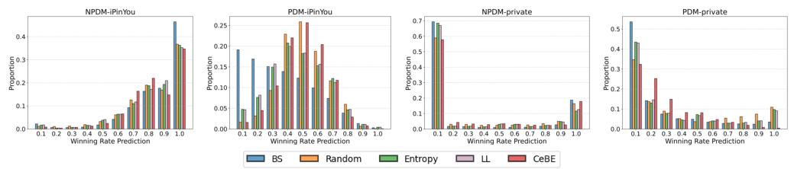

**Figure 3: The predicted winning rate of training data for different methods.** 

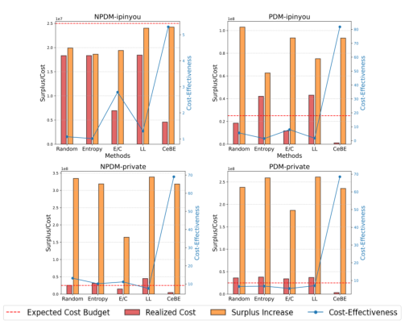

**Figure 4: The surplus increases and realized costs of different methods. Comparing their cost-effectiveness.** 

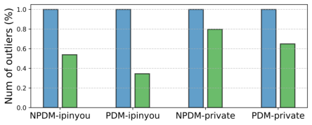

**Figure 5: Number of outliers in training data of E/C and CeBE.** 

capability to explore a large number of samples, even potentially reaching 100% exploration. Such over-exploration leads to high costs, thereby diminishing the cost-effectiveness of exploration. Making a reasonable choice for the size of the budget in each round is of an essential consideration. 

**Table 4: Overall performance comparison between different budget constrains, where the best performance is bold. The experiments were conducted on Private dataset using NPDM.** 

|Budget|%surplus|%imps|%V|%exploration|
|---|---|---|---|---|
|104|67.38|**28.90**|89.23|3.40|
|105|**76.25**|26.11|**91.28**|24.46|
|5×105|73.07|27.38|86.85|75.56|
|106|74.43|28.70|88.26|98.42|

local optima — it roots in the absence of winning price information, which result in the conflict between short-term surplus and model training, and is further propagated through the over-exploitation of the winning rate prediction model. To rectify this, we proposes a cost-effective active learning strategy for bid exploration that selects a subset of bid requests along with their bid prices. By trading off a portion of surplus, we train the model using higherquality data to enhance its performance, enabling the system to achieve long-term benefits. Our experiments on public dataset and private dataset validate that our proposed CeBE outperforms other active learning-based exploration strategy by a large margin. 

Our work only explores local optima in bid shading from active learning perspective. One interesting direction for future work is to investigate more exploration strategies (e.g., contextual bandit). Also, designing an adaptive strategy to adjust the extent of exploration can lead to higher cost-effectiveness. All of these would contribute to enhancing the revenue of the online advertising. 

### **ACKNOWLEDGMENTS** 

This work was supported in part by Science and Technology Innovation 2030 –“New Generation Artificial Intelligence” Major Project No. 2022ZD0119100, in part by China NSF grant No. U2268204, 62322206, 62132018, 62272307, 61972254, 61972252, in part by Alibaba Group through Alibaba Innovative Research Program, and in part by Tencent Rhino Bird Key Research Project. The opinions, findings, conclusions, and recommendations expressed in this paper are those of the authors and do not necessarily reflect the views of the funding agencies or the government. 

### **6 CONCLUSION** 

In this work, we study on an important but unexplored problem — local optima in bid shading system. We first identify the origin of the 

### **REFERENCES** 

> [1] Philip Bachman, Alessandro Sordoni, and Adam Trischler. 2017. Learning algorithms for active learning. In _international conference on machine learning_ . PMLR, 301–310. 

795 

Cost-Effective Active Learning for Bid Exploration in Online Advertising 

WSDM ’24, March 4–8, 2024, Merida, Mexico 

- [2] Jason Bigler. 2019. Rolling out first price auctions to Google Ad Manager partners. _Consulted at https://www. blog. google/products/admanager/rolling-out-first-priceauctions-google-ad-manager-partners_ (2019). 

- [3] Razvan Caramalau, Binod Bhattarai, and Tae-Kyun Kim. 2021. Sequential graph convolutional network for active learning. In _Proceedings of the IEEE/CVF conference on computer vision and pattern recognition_ . 9583–9592. 

- [4] Robert L Carraway, Robert L Schmidt, and Lawrence R Weatherford. 1993. An algorithm for maximizing target achievement in the stochastic knapsack problem with normal returns. _Naval Research Logistics (NRL)_ 40, 2 (1993), 161–173. 

- [5] John M Crespi and Richard J Sexton. 2005. A Multinomial logit framework to estimate bid shading in procurement auctions: Application to cattle sales in the Texas Panhandle. _Review of industrial organization_ 27 (2005), 253–278. 

- [6] John M Crespi and Richard J Sexton. 2005. A Multinomial logit framework to estimate bid shading in procurement auctions: Application to cattle sales in the Texas Panhandle. _Review of industrial organization_ 27 (2005), 253–278. 

- [7] Ying Cui, Ruofei Zhang, Wei Li, and Jianchang Mao. 2011. Bid landscape forecasting in online ad exchange marketplace. In _Proceedings of the 17th ACM SIGKDD international conference on Knowledge discovery and data mining_ . 265–273. 

- [8] Gautam Dasarathy, Robert Nowak, and Xiaojin Zhu. 2015. S2: An efficient graph based active learning algorithm with application to nonparametric classification. In _Conference on Learning Theory_ . PMLR, 503–522. 

- [9] Brian C Dean, Michel X Goemans, and Jan Vondrák. 2008. Approximating the stochastic knapsack problem: The benefit of adaptivity. _Mathematics of Operations Research_ 33, 4 (2008), 945–964. 

- [10] Djordje Gligorijevic, Tian Zhou, Bharatbhushan Shetty, Brendan Kitts, Shengjun Pan, Junwei Pan, and Aaron Flores. 2020. Bid shading in the brave new world of first-price auctions. In _Proceedings of the 29th ACM International Conference on Information & Knowledge Management_ . 2453–2460. 

- [11] Denis Gudovskiy, Alec Hodgkinson, Takuya Yamaguchi, and Sotaro Tsukizawa. 2020. Deep active learning for biased datasets via fisher kernel self-supervision. In _Proceedings of the IEEE/CVF conference on computer vision and pattern recognition_ . 9041–9049. 

- [12] Robbie A Haertel, Kevin D Seppi, Eric K Ringger, and James L Carroll. 2008. Return on investment for active learning. In _Proceedings of the NIPS workshop on cost-sensitive learning_ , Vol. 72. Citeseer. 

- [13] Ali Hortaçsu, Jakub Kastl, and Allen Zhang. 2018. Bid shading and bidder surplus in the us treasury auction system. _American Economic Review_ 108, 1 (2018), 147–169. 

- [14] Ashish Kapoor, Eric Horvitz, and Sumit Basu. 2007. Selective supervision: Guiding supervised learning with decision-theoretic active learning. In _IJCAI’07 Proceedings of the 20th international joint conference on Artifical intelligence_ . 877–882. 

- [15] Niklas Karlsson and Qian Sang. 2021. Adaptive bid shading optimization of firstprice ad inventory. In _2021 American Control Conference (ACC)_ . IEEE, 4983–4990. 

- [16] Seho Kee, Enrique Del Castillo, and George Runger. 2018. Query-by-committee improvement with diversity and density in batch active learning. _Information Sciences_ 454 (2018), 401–418. 

- [17] Tor Lattimore and Csaba Szepesvári. 2020. _Bandit algorithms_ . Cambridge University Press. 

- [18] David D Lewis. 1995. A sequential algorithm for training text classifiers: Corrigendum and additional data. In _Acm Sigir Forum_ , Vol. 29. ACM New York, NY, USA, 13–19. 

- [19] David D Lewis and Jason Catlett. 1994. Heterogeneous uncertainty sampling for supervised learning. In _Machine learning proceedings 1994_ . Elsevier, 148–156. 

- [20] Xiang Li and Devin Guan. 2014. Programmatic buying bidding strategies with win rate and winning price estimation in real time mobile advertising. In _Advances in Knowledge Discovery and Data Mining: 18th Pacific-Asia Conference, PAKDD 2014, Tainan, Taiwan, May 13-16, 2014. Proceedings, Part I 18_ . Springer, 447–460. 

- [21] Xu Li, Michelle Ma Zhang, Zhenya Wang, and Youjun Tong. 2022. Arbitrary distribution modeling with censorship in real-time bidding advertising. In _Proceedings of the 28th ACM SIGKDD Conference on Knowledge Discovery and Data_ 

_Mining_ . 3250–3258. 

- [22] Hairen Liao, Lingxiao Peng, Zhenchuan Liu, and Xuehua Shen. 2014. iPinYou global rtb bidding algorithm competition dataset. In _Proceedings of the Eighth International Workshop on Data Mining for Online Advertising_ . 1–6. 

- [23] Shengjun Pan, Brendan Kitts, Tian Zhou, Hao He, Bharatbhushan Shetty, Aaron Flores, Djordje Gligorijevic, Junwei Pan, Tingyu Mao, San Gultekin, et al. 2020. Bid shading by win-rate estimation and surplus maximization. _arXiv preprint arXiv:2009.09259_ (2020). 

- [24] Kan Ren, Jiarui Qin, Lei Zheng, Zhengyu Yang, Weinan Zhang, and Yong Yu. 2019. Deep landscape forecasting for real-time bidding advertising. In _Proceedings of the 25th ACM SIGKDD international conference on knowledge discovery & data mining_ . 363–372. 

- [25] Nicholas Roy and Andrew McCallum. 2001. Toward optimal active learning through sampling estimation of error reduction. Int. Conf. on Machine Learning. (2001). 

- [26] Burr Settles. 2009. Active learning literature survey. (2009). 

- [27] Burr Settles and Mark Craven. 2008. An analysis of active learning strategies for sequence labeling tasks. In _proceedings of the 2008 conference on empirical methods in natural language processing_ . 1070–1079. 

- [28] Burr Settles, Mark Craven, and Soumya Ray. 2007. Multiple-instance active learning. _Advances in neural information processing systems_ 20 (2007). 

- [29] H Sebastian Seung, Manfred Opper, and Haim Sompolinsky. 1992. Query by committee. In _Proceedings of the fifth annual workshop on Computational learning theory_ . 287–294. 

- [30] Claude Elwood Shannon. 1948. A mathematical theory of communication. _The Bell system technical journal_ 27, 3 (1948), 379–423. 

- [31] Marco A Wiering and Martijn Van Otterlo. 2012. Reinforcement learning. _Adaptation, learning, and optimization_ 12, 3 (2012), 729. 

- [32] Wush Wu, Mi-Yen Yeh, and Ming-Syan Chen. 2018. Deep censored learning of the winning price in the real time bidding. In _Proceedings of the 24th ACM SIGKDD International Conference on Knowledge Discovery & Data Mining_ . 2526–2535. 

- [33] Wush Chi-Hsuan Wu, Mi-Yen Yeh, and Ming-Syan Chen. 2015. Predicting winning price in real time bidding with censored data. In _Proceedings of the 21th ACM SIGKDD International Conference on Knowledge Discovery and Data Mining_ . 1305–1314. 

- [34] Donggeun Yoo and In So Kweon. 2019. Learning loss for active learning. In _Proceedings of the IEEE/CVF conference on computer vision and pattern recognition_ . 93–102. 

- [35] Jifan Zhang, Julian Katz-Samuels, and Robert Nowak. 2022. Galaxy: Graph-based active learning at the extreme. In _International Conference on Machine Learning_ . PMLR, 26223–26238. 

- [36] T Zhang and FJ Oles. 2000. A probability analysis on the value of unlabeled data for classification problems. 17th ICML (pp. 1191–1198). 

- [37] Weinan Zhang, Shuai Yuan, and Jun Wang. 2014. Optimal real-time bidding for display advertising. In _Proceedings of the 20th ACM SIGKDD international conference on Knowledge discovery and data mining_ . 1077–1086. 

- [38] Tian Zhou, Hao He, Shengjun Pan, Niklas Karlsson, Bharatbhushan Shetty, Brendan Kitts, Djordje Gligorijevic, San Gultekin, Tingyu Mao, Junwei Pan, et al. 2021. An efficient deep distribution network for bid shading in first-price auctions. In _Proceedings of the 27th ACM SIGKDD Conference on Knowledge Discovery & Data Mining_ . 3996–4004. 

- [39] Wen-Yuan Zhu, Wen-Yueh Shih, Ying-Hsuan Lee, Wen-Chih Peng, and Jiun-Long Huang. 2017. A gamma-based regression for winning price estimation in realtime bidding advertising. In _2017 IEEE International Conference on Big Data (Big Data)_ . IEEE, 1610–1619. 

- [40] Christine Zulehner. 2009. Bidding behavior in sequential cattle auctions. _International Journal of Industrial Organization_ 27, 1 (2009), 33–42. 

- [41] Christine Zulehner. 2009. Bidding behavior in sequential cattle auctions. _International Journal of Industrial Organization_ 27, 1 (2009), 33–42. 

796 

